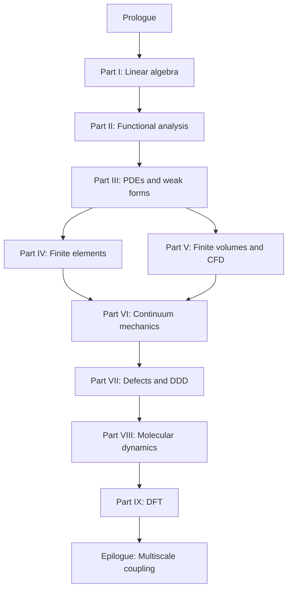

# Computational Mechanics

A continuous narrative from linear algebra through functional analysis, finite elements and volumes, continuum mechanics, dislocation dynamics, molecular dynamics, and density functional theory — told as one story about a copper wire at every scale.

**~122,700 words** · **35 numbered chapters** · **9 parts** · built with [mdBook](https://github.com/rust-lang/mdBook)

## Read the book

| | |
|---|---|
| **Start here** | [Preface](src/preface.md) → [Prologue: The Same Material, Many Scales](src/prologue/00-many-scales.md) |
| **Full table of contents** | [src/SUMMARY.md](src/SUMMARY.md) |
| **Chapter roadmap** | [Appendix: Sources and Further Reading](src/appendix/sources.md) |
| **Cross-scale glossary** | [Appendix: Glossary and Cross-Scale Index](src/appendix/glossary.md) |
| **Final memory sheet** | [Appendix: Final Memory Sheet](src/appendix/memory-sheet.md) |

Read straight through for the full arc. Parts IV (FEM) and V (FVM) may be swapped on first reading; both converge at Part VI (continuum mechanics) before descending to defects, atoms, and electrons.

## Narrative structure

The book follows the **Functional Analysis Notes** (ME 412) layout: numbered chapters, **concept maps** (object → structure → theorem → failure mode) at every part opening, **representative schematics** indexed to source notes at every part opening (I–IX), **Scene** sections that return to the copper wire, **Lab act** sections tying chapters to the six-act lab session, and **Bridge** sections at every chapter end explaining why the next chapter exists.



The same specimen — a cold-drawn copper wire under tension, heated by current, cooled by air — reappears in every part. What changes is the **state variable**, not the material.

## Source material

Canonical chapter markdown lives under [`writings/`](writings/) in the Functional Analysis Notes layout (one mdBook subtree per part). Course notes and teaching materials from [hanfengzhai.github.io](https://hanfengzhai.github.io) are synthesized into the prose.

## Build locally

```bash
# Install mdBook and mdbook-mermaid
./scripts/install-mdbook.sh

# Sync writings/ → src/ (if you edited canonical sources)
./scripts/sync-writings.sh

# Build the unified book
export PATH="$HOME/.local/bin:$PATH"
mdbook build

# Preview at http://localhost:3000
mdbook serve
```

Output appears in `book/`. Build standalone part notes with `./scripts/build-all-writings.sh`.

## Repository layout

```
writings/          # Canonical markdown (Functional Analysis Notes layout)
src/               # Unified book (synced from writings/)
scripts/           # sync-writings.sh, install-mdbook.sh, word-count.sh
book.toml          # mdBook configuration
theme/             # Custom CSS
```

## Contributing

1. Edit chapters under `writings/<topic>/chapters/`.
2. Run `./scripts/sync-writings.sh` to copy into `src/`.
3. Run `mdbook build` to verify.
4. Open a pull request.

When the external [Writings](https://github.com/hanfengzhai/Writings) repository is linked as a submodule, prefer upstream content and re-run the sync script.

## License and disclaimer

These notes represent the author's understanding of the material and are intended for study and reference. Feedback is welcome at [hzhai@stanford.edu](mailto:hzhai@stanford.edu).
