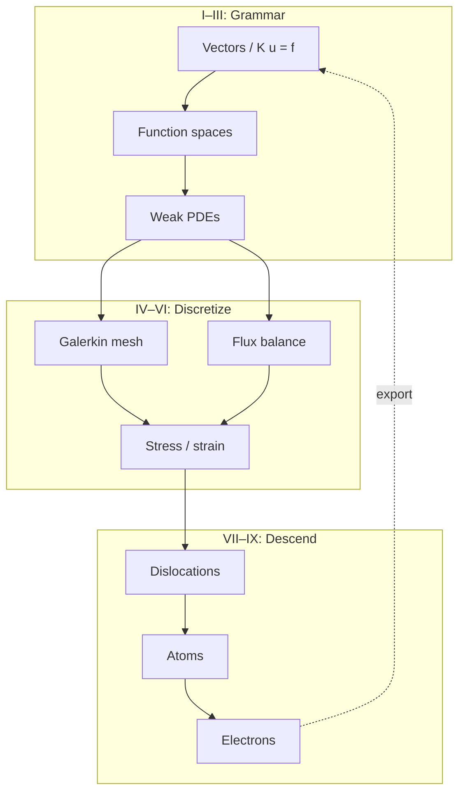

# Final Memory Sheet

This page extends Section C of the [Functional Analysis Notes](https://hanfengzhai.github.io/file/teaching/notes/ME412_CourseSummary.pdf) (ME 412) across the **full book**. It is not a proof document — it is a **concept map** for the copper-wire story from linear algebra through DFT. Use it after the [epilogue](../epilogue/multiscale.md) as a one-sitting recap, or mid-read when abstraction rises and you need the ladder in one glance.

At every scale, ask the four questions the notes formalize: **object**, **structure**, **theorem**, **failure mode**. The [glossary](glossary.md) collects those answers in tables; this page collects the **habits** that make the story continuous.

## Scene: the wire after the last chapter

The grips are still mounted. The load cell still reads force. The thermocouple still warms. Nothing in the laboratory changed while you read — only your vocabulary did. This memory sheet is the **closing lens** on that same afternoon: what to carry forward when the next project is not copper, when the code is not the one in the worked examples, when the scale you need is somewhere between two parts.

## The most important ideas (whole book)

**Grammar (Parts I–II)**

1. A **state vector** \(\mathbf{u}\) is the finite-dimensional habit every code shares before it knows stress tensors or orbitals.
2. A **matrix** is a linear map in a chosen basis; assembly is change of coordinates, not magic bookkeeping.
3. **Eigenmodes** decouple complexity; the spectral theorem is the infinite-dimensional upgrade of diagonalization.
4. As \(N \to \infty\), vectors become **fields**; matrices become **operators** on function spaces.
5. A **norm** is the ruler; equivalent norms give the same convergence story.
6. **Completeness** means Cauchy sequences stay inside — mesh refinement must have a target.
7. A **Hilbert space** adds angles; **orthogonal projection** is Galerkin's best-approximation instinct.
8. **Loads** are functionals; **Riesz representation** turns them into vectors in dual space.
9. **Compactness** in infinite dimensions is subtle; compact operators behave like finite matrices for spectra.

**Fields and weak forms (Part III)**

10. The **strong form** demands pointwise smoothness; corners and kinks break it honestly.
11. The **weak form** moves derivatives onto test functions — integration by parts is the hinge.
12. **Sobolev spaces** \(H^1\), \(L^2\) are the correct rooms for weak PDEs and FEM.
13. **Energy methods** turn equilibrium into minimization; **Lax–Milgram** gives existence with stability.
14. **Coercivity** (continuity + lower bound on the bilinear form) is the continuum version of SPD \(\mathbf{K}\).

**Discretization (Parts IV–V)**

15. **Galerkin FEM** is projection in \(H^1\), not ad hoc sparse algebra — \(\mathbf{K}\) is the discrete shadow of a bilinear form.
16. **Weighted residuals** unify trial-function methods; assembly is local-to-global book-keeping.
17. **Shape functions** and **quadrature** approximate integrals; patch tests catch broken elements.
18. **Céa's lemma** makes FEM quasi-optimal: error is controlled by best approximation in \(V_h\).
19. **FVM** balances **fluxes** on control volumes — the right philosophy for conservation laws and shocks.
20. **Riemann solvers** and **upwinding** stabilize hyperbolic discretizations; CFL limits time steps.
21. **Conjugate heat transfer** couples FEM solid conduction to FVM fluid convection at the wall — a fixed-point handshake previewing multiscale workflows.

**Continuum physics (Part VI)**

22. **Kinematics** names \(\mathbf{F}\), strain measures, and objectivity — what Part IV's mesh already approximates.
23. **Cauchy stress** and **balance laws** are the PDEs Part III wrote in tensor language.
24. **Virtual work** is the weak form of solids; hyperelastic energy is the Dirichlet principle in finite strain.
25. **Yield and plasticity** signal where continuum fields need **history variables** from finer scales.

**Mesoscale and below (Parts VII–IX)**

26. **Defects** break smooth displacement fields; **dislocations** are line singularities with Burgers vector \(\mathbf{b}\).
27. **Peach–Köhler** forces drive dislocation motion; **mobility laws** close the dynamics.
28. **Taylor hardening** \(\Delta\tau \propto \sqrt{\rho}\) exports mesoscale physics to crystal plasticity FEM.
29. **Molecular dynamics** tracks \(\{\mathbf{r}_i\}\) with Newton's equations; **potentials** \(V\) encode electronic bonding at coarse grain.
30. **Ensembles** (NVE, NVT, NPT) define which averages MD estimates; **symplectic integrators** preserve energy on short horizons.
31. **Born–Oppenheimer** separates fast electrons from slow nuclei — the scale-separation assumption behind ab initio MD.
32. **Hohenberg–Kohn** proves ground-state energy is a functional of density \(\rho(\mathbf{r})\).
33. **Kohn–Sham DFT** replaces the many-body problem with a self-consistent single-particle loop — eigenvalues again.
34. **SCF convergence** is the DFT analogue of mesh refinement: orbitals and density must settle before forces are trusted.

**Multiscale (Epilogue)**

35. **Homogenize upward**: DFT → potential → MD → mobility → DDD → hardening → FEM.
36. **Derive downward**: ask where continuum moduli and yield stress originated.
37. **Handshake interfaces** need consistent units, frames, and averaging — not just file formats.
38. The same four questions at every scale: **state**, **equations**, **discretization**, **upward export**.

## The most important traps (whole book)

**Linear algebra and analysis**

1. **Ill-conditioning** is not non-uniqueness — check constraints and scaling before blaming physics.
2. **Rigid-body modes** are null-space physics, not solver bugs — boundary conditions remove them.
3. **Cauchy** does not imply convergence unless the space is **complete**.
4. **Weak convergence** is not strong convergence — FEM error in energy norm does not guarantee pointwise accuracy.
5. **FEM is not just matrix algebra** — it is projection; wrong \(V_h\) breaks the story before \(\mathbf{K}\) is assembled.

**PDEs and discretization**

6. **Corners and point loads** break classical smoothness — weak forms exist because strong forms fail.
7. **Equal-order \((P_1, P_1)\)** velocity–pressure pairs violate **inf–sup** — use Taylor–Hood or stabilization.
8. **Locking** in elasticity is a modeling/discretization mismatch — reduced integration or mixed formulations help.
9. **CFL violation** in explicit FVM blows up quietly until it blows up loudly — stability is not optional.
10. **Wall flux mismatch** in conjugate heat transfer is a **category error** at the interface, not a mesh issue.

**Continuum and mesoscale**

11. **Isotropic \(\mathbb{C}\) from bulk DFT** does not carry **cold-work history** — hardening lives in dislocation density.
12. **J₂ plasticity with one \(H\)** fits a curve; it does not explain **why** the curve bends — DDD supplies that.
13. **Cauchy stress from MD** requires careful **volume definition** and thermostat interpretation.
14. **Polycrystal texture** is not captured by single-crystal DDD alone — RVE and statistics matter.

**Atomistic and electronic**

15. **Cutoff artifacts** in MD potentials fake long-range physics — check convergence with box size and cutoff.
16. **Energy drift** in MD means the integrator or thermostat is wrong for the question asked.
17. **Wrong XC functional** in DFT shifts lattice constants — elastic constants and cohesive energies inherit the error.
18. **k-mesh too coarse** makes metals look like insulators in band structure — convergence is part of the physics.
19. **Born–Oppenheimer** fails when electrons stay correlated — the ladder has a bottom rung limit.

**Multiscale coupling**

20. **Unit mismatches** (eV vs. J, Å vs. m) propagate catastrophically upward — check at every arrow.
21. **Sequential homogenization** loses **path dependence** unless internal variables carry history.
22. **Surrogates** trained on one loading path fail on another — frame indifference and thermodynamic consistency are not optional.
23. **Skipping manufacturing history** (draw, anneal, service) predicts the wrong wire even with perfect DFT moduli.

## One-page copper wire recap

| Act | Lab beat | Part | State on the wire | Upward export |
|-----|----------|------|-------------------|---------------|
| I | Mounting | I | Spring displacements | \(\mathbf{K}\), modes |
| II | Warming | III–V | \(T(\mathbf{x})\), air flow | Wall flux, CHT loop |
| III | Pulling | II–IV, VI | \(u(x)\), \(\boldsymbol{\sigma}\) | Weak form → assembly |
| IV | Hardening | VII | Dislocation density \(\rho\) | \(\tau(\gamma)\) for FEM |
| V | Notch | VI, VIII | Stress concentrator | MD traction handoff |
| VI | Foundation | IX → VIII → VII → IV | \(\rho(\mathbf{r})\), then potentials | \(E_{\text{coh}}\), \(C_{ij}\), pedigree |

Read the [prologue](../prologue/00-many-scales.md#the-experiment-as-plot) for the six-act table in narrative form; read the [epilogue](../epilogue/multiscale.md) for how to wire the acts into one afternoon workflow.

## Bridge

The memory sheet closes the book the way ME 412 closes the Functional Analysis Notes — habits and traps, not proofs. Return to the [glossary](glossary.md) when a symbol reappears under new vocabulary; return to [sources](sources.md) when you need the PDF behind a part; return to the [prologue](../prologue/00-many-scales.md) when a new project needs scale discipline from day one.

| When you need | Where to turn |
|---------------|---------------|
| The six-act plot in narrative form | [Prologue: The experiment as plot](../prologue/00-many-scales.md#the-experiment-as-plot) |
| Workflow order vs. reading order | [Epilogue: Lab act reunion](../epilogue/multiscale.md#lab-act-reunion-six-acts-one-afternoon) |
| Concept-map questions (object / structure / theorem / breaks) | Any part opening from I through IX |
| Export pedigree before trusting an input deck | [Part IX workflows](../part09-dft/03-dft-workflows.md) and the one-page recap table above |

The copper wire does not care which chapter you finished last. It responds to physics. Your craft is to make that physics computable, connected, and credible — one continuous story from \(\mathbb{R}^N\) to \(\rho(\mathbf{r})\) and back upward through homogenization.

Turn the page to the [glossary](glossary.md) when a symbol changed meaning between parts; turn back to the [prologue](../prologue/00-many-scales.md) when a new specimen needs the same four questions from day one.
