# Final Memory Sheet

This page extends Section C of the [Functional Analysis Notes](https://hanfengzhai.github.io/file/teaching/notes/ME412_CourseSummary.pdf) (ME 412) across the **full book**. It is not a proof document — it is a **concept map** for the copper-wire story from linear algebra through DFT. Use it after the [epilogue](../epilogue/multiscale.md) as a one-sitting recap, or mid-read when abstraction rises and you need the ladder in one glance.

At every scale, ask the four questions the notes formalize: **object**, **structure**, **theorem**, **failure mode**. The [glossary](glossary.md) collects those answers in tables; this page collects the **habits** that make the story continuous.

## Scene: the wire after the last chapter

The grips are still mounted. The load cell still reads force. The thermocouple still warms. Nothing in the laboratory changed while you read — only your vocabulary did. This memory sheet is the **closing lens** on that same afternoon: what to carry forward when the next project is not copper, when the code is not the one in the worked examples, when the scale you need is somewhere between two parts.

## The most important ideas (whole book)

**Grammar (Parts I–II)**

1. A **state vector** \(\mathbf{u}\) is the finite-dimensional habit every code shares before it knows stress tensors or orbitals.
2. A **matrix** is a linear map in a chosen basis; assembly is change of coordinates, not magic bookkeeping.
3. **Eigenmodes** decouple complexity; the spectral theorem is the infinite-dimensional upgrade of diagonalization.
4. As \(N \to \infty\), vectors become **fields**; matrices become **operators** on function spaces.
5. A **norm** is the ruler; equivalent norms give the same convergence story.
6. **Completeness** means Cauchy sequences stay inside — mesh refinement must have a target.
7. A **Hilbert space** adds angles; **orthogonal projection** is Galerkin's best-approximation instinct.
8. **Loads** are functionals; **Riesz representation** turns them into vectors in dual space.
9. **Compactness** in infinite dimensions is subtle; compact operators behave like finite matrices for spectra.

**Fields and weak forms (Part III)**

10. The **strong form** demands pointwise smoothness; corners and kinks break it honestly.
11. The **weak form** moves derivatives onto test functions — integration by parts is the hinge.
12. **Sobolev spaces** \(H^1\), \(L^2\) are the correct rooms for weak PDEs and FEM.
13. **Energy methods** turn equilibrium into minimization; **Lax–Milgram** gives existence with stability.
14. **Coercivity** (continuity + lower bound on the bilinear form) is the continuum version of SPD \(\mathbf{K}\).

**Discretization (Parts IV–V)**

15. **Galerkin FEM** is projection in \(H^1\), not ad hoc sparse algebra — \(\mathbf{K}\) is the discrete shadow of a bilinear form.
16. **Weighted residuals** unify trial-function methods; assembly is local-to-global book-keeping.
17. **Shape functions** and **quadrature** approximate integrals; patch tests catch broken elements.
18. **Céa's lemma** makes FEM quasi-optimal: error is controlled by best approximation in \(V_h\).
19. **FVM** balances **fluxes** on control volumes — the right philosophy for conservation laws and shocks.
20. **Riemann solvers** and **upwinding** stabilize hyperbolic discretizations; CFL limits time steps.
21. **Conjugate heat transfer** couples FEM solid conduction to FVM fluid convection at the wall — a fixed-point handshake previewing multiscale workflows.

**Continuum physics (Part VI)**

22. **Kinematics** names \(\mathbf{F}\), strain measures, and objectivity — what Part IV's mesh already approximates.
23. **Cauchy stress** and **balance laws** are the PDEs Part III wrote in tensor language.
24. **Virtual work** is the weak form of solids; hyperelastic energy is the Dirichlet principle in finite strain.
25. **Yield and plasticity** signal where continuum fields need **history variables** from finer scales.

**Mesoscale and below (Parts VII–IX)**

26. **Defects** break smooth displacement fields; **dislocations** are line singularities with Burgers vector \(\mathbf{b}\).
27. **Peach–Köhler** forces drive dislocation motion; **mobility laws** close the dynamics.
28. **Taylor hardening** \(\Delta\tau \propto \sqrt{\rho}\) exports mesoscale physics to crystal plasticity FEM.
29. **Molecular dynamics** tracks \(\{\mathbf{r}_i\}\) with Newton's equations; **potentials** \(V\) encode electronic bonding at coarse grain.
30. **Ensembles** (NVE, NVT, NPT) define which averages MD estimates; **symplectic integrators** preserve energy on short horizons.
31. **Born–Oppenheimer** separates fast electrons from slow nuclei — the scale-separation assumption behind ab initio MD.
32. **Hohenberg–Kohn** proves ground-state energy is a functional of density \(\rho(\mathbf{r})\).
33. **Kohn–Sham DFT** replaces the many-body problem with a self-consistent single-particle loop — eigenvalues again.
34. **SCF convergence** is the DFT analogue of mesh refinement: orbitals and density must settle before forces are trusted.

**Multiscale (Epilogue)**

35. **Homogenize upward**: DFT → potential → MD → mobility → DDD → hardening → FEM.
36. **Derive downward**: ask where continuum moduli and yield stress originated.
37. **Handshake interfaces** need consistent units, frames, and averaging — not just file formats.
38. The same four questions at every scale: **state**, **equations**, **discretization**, **upward export**.

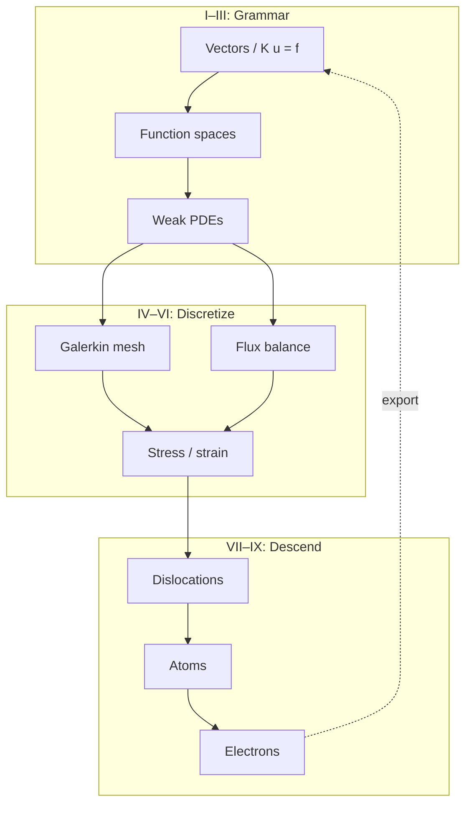

## The most important traps (whole book)

**Linear algebra and analysis**

1. **Ill-conditioning** is not non-uniqueness — check constraints and scaling before blaming physics.
2. **Rigid-body modes** are null-space physics, not solver bugs — boundary conditions remove them.
3. **Cauchy** does not imply convergence unless the space is **complete**.
4. **Weak convergence** is not strong convergence — FEM error in energy norm does not guarantee pointwise accuracy.
5. **FEM is not just matrix algebra** — it is projection; wrong \(V_h\) breaks the story before \(\mathbf{K}\) is assembled.

**PDEs and discretization**

6. **Corners and point loads** break classical smoothness — weak forms exist because strong forms fail.
7. **Equal-order \((P_1, P_1)\)** velocity–pressure pairs violate **inf–sup** — use Taylor–Hood or stabilization.
8. **Locking** in elasticity is a modeling/discretization mismatch — reduced integration or mixed formulations help.
9. **CFL violation** in explicit FVM blows up quietly until it blows up loudly — stability is not optional.
10. **Wall flux mismatch** in conjugate heat transfer is a **category error** at the interface, not a mesh issue.

**Continuum and mesoscale**

11. **Isotropic \(\mathbb{C}\) from bulk DFT** does not carry **cold-work history** — hardening lives in dislocation density.
12. **J₂ plasticity with one \(H\)** fits a curve; it does not explain **why** the curve bends — DDD supplies that.
13. **Cauchy stress from MD** requires careful **volume definition** and thermostat interpretation.
14. **Polycrystal texture** is not captured by single-crystal DDD alone — RVE and statistics matter.

**Atomistic and electronic**

15. **Cutoff artifacts** in MD potentials fake long-range physics — check convergence with box size and cutoff.
16. **Energy drift** in MD means the integrator or thermostat is wrong for the question asked.
17. **Wrong XC functional** in DFT shifts lattice constants — elastic constants and cohesive energies inherit the error.
18. **k-mesh too coarse** makes metals look like insulators in band structure — convergence is part of the physics.
19. **Born–Oppenheimer** fails when electrons stay correlated — the ladder has a bottom rung limit.

**Multiscale coupling**

20. **Unit mismatches** (eV vs. J, Å vs. m) propagate catastrophically upward — check at every arrow.
21. **Sequential homogenization** loses **path dependence** unless internal variables carry history.
22. **Surrogates** trained on one loading path fail on another — frame indifference and thermodynamic consistency are not optional.
23. **Skipping manufacturing history** (draw, anneal, service) predicts the wrong wire even with perfect DFT moduli.

## Continuity hinges master map {#continuity-hinges-master-map}

When a chapter feels disconnected from the last, pause at the hinge for your reading position — same copper wire, richer vocabulary at each turn. The [preface](../preface.md) splits these into opening, ascent, midpoint, descent, and epilogue tables; this page collects all **seventeen narrative hinges** (rows 0–16) plus **rows 17–22** (continuous read-through, plot spine indices, lab-act cross-reference, and representative schematics) in reading order.

| # | Phase | Hinge | When to pause |
|---|-------|-------|---------------|
| 0 | Opening | [Prologue → I](../prologue/00-many-scales.md#bridge-to-part-i) · [preface row 0 skill checkpoint](../preface.md#skill-navigation-row-0) · [prologue row 0 preview](../prologue/00-many-scales.md#prologue-preview-row-0) · [prologue row 0 closing stitch](../prologue/00-many-scales.md#row-0-closing-stitch) · [epilogue row 0 closing loop](../epilogue/multiscale.md#row-0-closing-loop) · [row 0 baby picture](#row-0-baby-picture-act-i-mounting) | Scale ladder feels like a menu before the first matrix; panorama becomes \(\mathbf{K}\mathbf{u}=\mathbf{f}\) with fixed DOFs |
| 1 | Ascent | [I.4 → II](../part01-linear-algebra/04-toward-infinity.md#bridge-to-part-ii) · [preface row 1 skill checkpoint](../preface.md#skill-navigation-row-1) · [prologue row 1 preview](../prologue/00-many-scales.md#prologue-preview-row-1) · [prologue row 1 closing stitch](../prologue/00-many-scales.md#row-1-closing-stitch) · [epilogue row 1 closing loop](../epilogue/multiscale.md#row-1-closing-loop) · [row 1 baby picture](#row-1-baby-picture-finite-to-infinite) | \(\mathbf{K}\mathbf{u}=\mathbf{f}\) feels unrelated to PDEs; mesh refinement sends \(\mathbf{K}_N\) toward an operator |
| 2 | Ascent | [II.5 → III](../part02-functional-analysis/05-spectral-theorem.md#bridge-to-part-iii) · [variational ladder](../part03-pdes/00-opening.md#the-variational-ladder-me-412-schematic-14) · [preface row 2 skill checkpoint](../preface.md#skill-navigation-row-2) · [prologue row 2 preview](../prologue/00-many-scales.md#prologue-preview-row-2) · [prologue row 2 closing stitch](../prologue/00-many-scales.md#row-2-closing-stitch) · [epilogue row 2 closing loop](../epilogue/multiscale.md#row-2-closing-loop) · [row 2 baby picture](#row-2-baby-picture-analysis-to-pdes) | Sobolev norms feel abstract; completeness hands off to weak Poisson and heat; Schematic 14 begins |
| 3 | Ascent | [III.4 → IV](../part03-pdes/04-energy-methods.md#bridge-to-part-iv) · [variational ladder](../part03-pdes/00-opening.md#the-variational-ladder-me-412-schematic-14) · [Galerkin ladder](../part04-fem/00-opening.md#the-galerkin-ladder-me-412-schematic-14-continued) · [preface row 3 skill checkpoint](../preface.md#skill-navigation-row-3) · [prologue row 3 preview](../prologue/00-many-scales.md#prologue-preview-row-3) · [prologue row 3 closing stitch](../prologue/00-many-scales.md#row-3-closing-stitch) · [epilogue row 3 closing loop](../epilogue/multiscale.md#row-3-closing-loop) · [row 3 baby picture](#row-3-baby-picture-lax-milgram-to-assembly) | Energy minimization and matrix assembly seem like separate tricks; Rayleigh–Ritz on \(V_h\) is \(\mathbf{K}\mathbf{U}=\mathbf{F}\) |
| 4 | Ascent | [IV.5 two doors](../part04-fem/05-convergence.md#bridge-two-doors-from-here) · [V.4 Bridge](../part05-fvm/04-navier-stokes-cfd.md#bridge-to-part-vi) · [Galerkin ladder](../part04-fem/00-opening.md#the-galerkin-ladder-me-412-schematic-14-continued) · [conservation ladder](../part05-fvm/00-opening.md#the-conservation-ladder-fvm-parallel-to-schematic-14) · [preface row 4 skill checkpoint](../preface.md#skill-navigation-row-4) · [prologue row 4 preview](../prologue/00-many-scales.md#prologue-preview-row-4) · [prologue row 4 closing stitch](../prologue/00-many-scales.md#row-4-closing-stitch) · [epilogue row 4 closing loop](../epilogue/multiscale.md#row-4-closing-loop) · [row 4 baby picture](#row-4-baby-picture-twin-ladders-split) | FEM and FVM feel like unrelated courses; Schematic 14 forked but both doors must reach Part VI |
| 5 | Midpoint | [Part VI opening](../part06-continuum/00-opening.md#midpoint-ascent-complete-descent-ahead) · [twin ladders reunite](../part06-continuum/00-opening.md#the-twin-ladders-reunite-galerkin-and-conservation) · [prologue row 5 preview](../prologue/00-many-scales.md#prologue-preview-row-5) · [prologue row 5 closing stitch](../prologue/00-many-scales.md#row-5-closing-stitch) · [epilogue row 5 closing loop](../epilogue/multiscale.md#row-5-closing-loop) · [row 5 baby picture](#row-5-baby-picture-twin-ladders-reunion) | Parts I–V feel like separate subjects; Galerkin and FVM must reunite on Cauchy stress |
| 6 | Midpoint | [VI.4 intermission](../part06-continuum/04-nonlinear-plasticity-preview.md#intermission-ascent-ends-descent-begins) · [preface row 6 skill checkpoint](../preface.md#skill-navigation-row-6) · [prologue row 6 preview](../prologue/00-many-scales.md#prologue-preview-row-6) · [prologue row 6 closing stitch](../prologue/00-many-scales.md#row-6-closing-stitch) · [epilogue row 6 closing loop](../epilogue/multiscale.md#row-6-closing-loop) · [row 6 baby picture](#row-6-baby-picture-j2-intermission) | \(J_2\) fits the curve but not its cause; `hardening.yaml` cites no forest density |
| 7 | Descent | [VII.3 → VIII](../part07-defects/03-polycrystal-and-fem-handoff.md#bridge-to-part-viii) · [VIII.1 opening hinge](../part08-md/01-potentials-phase-space.md#opening-hinge-vii3-to-viii1) · [VIII.0 descent hinge](../part08-md/00-opening.md#descent-hinge-cores-mobility-and-tw-pedigree) · [preface row 7 skill checkpoint](../preface.md#skill-navigation-row-7) · [prologue row 7 preview](../prologue/00-many-scales.md#prologue-preview-row-7) · [prologue row 7 closing stitch](../prologue/00-many-scales.md#row-7-closing-stitch) · [epilogue row 7 closing loop](../epilogue/multiscale.md#row-7-closing-loop) | Mobility or \(\gamma_{\text{sf}}\) feel like fitted constants; `mobility.yaml` cites Part VIII without an atomic box — [row 7 baby picture](#row-7-baby-picture-mesoscale-to-atomistic) |
| 7b | Descent | [VIII.1 Bridge](../part08-md/01-potentials-phase-space.md#bridge) · [VIII.2 opening hinge](../part08-md/02-ensembles-integrators.md#opening-hinge-viii1-to-viii2) | EAM archive exists but trajectories not run; 0 K \(a_0\) exported without NPT equilibration at \(T_w\) |
| 7c | Descent | [VIII.2 Bridge](../part08-md/02-ensembles-integrators.md#bridge) · [VIII.3 opening hinge](../part08-md/03-ab-initio-and-coarse-graining.md#opening-hinge-viii2-to-viii3) | NPT moduli and mobility exist but no handoff bundle; trajectories without DFT pedigree gates |
| 8 | Descent | [VIII.3 WHAM → VII mobility](../part08-md/03-ab-initio-and-coarse-graining.md#wham-part-vii-mobility-hinge-act-ii-temperature-pedigree) · [VIII.0 descent hinge](../part08-md/00-opening.md#descent-hinge-cores-mobility-and-tw-pedigree) · [preface row 8 skill checkpoint](../preface.md#skill-navigation-row-8) · [prologue row 8 preview](../prologue/00-many-scales.md#prologue-preview-row-8) · [prologue row 8 closing stitch](../prologue/00-many-scales.md#row-8-closing-stitch) · [epilogue row 8 closing loop](../epilogue/multiscale.md#row-8-closing-loop) | Recovery or drag tables at 300 K while [V.4 CHT](../part05-fvm/04-navier-stokes-cfd.md#lab-act-extension-two-domain-picard-loop-with-a-1d-fem-solid) converged at \(T_w \approx 380\,\text{K}\); [rows 8–9 baby picture](#rows-8-9-baby-picture-tw-temperature-pedigree) |
| 9 | Descent | [VIII.3 → IX](../part08-md/03-ab-initio-and-coarse-graining.md#bridge-to-part-ix) · [IX.0 electronic audit hinge](../part09-dft/00-opening.md#electronic-audit-hinge-descent-pedigree-and-tw-phonon) · [IX.0 thermal phonon audit at \(T_w\)](../part09-dft/00-opening.md#thermal-phonon-audit-at-tw) · [preface row 9 skill checkpoint](../preface.md#skill-navigation-row-9) · [prologue row 9 preview](../prologue/00-many-scales.md#prologue-preview-row-9) · [prologue row 9 closing stitch](../prologue/00-many-scales.md#row-9-closing-stitch) · [epilogue row 9 closing loop](../epilogue/multiscale.md#row-9-closing-loop) | EAM matches bulk moduli but no DFT deck is cited; \(\alpha\) and \(\tau_{\text{ph}}\) at \(T_w\), not 300 K default; [rows 8–9 baby picture](#rows-8-9-baby-picture-tw-temperature-pedigree); [epilogue opening hinge from Part IX](../epilogue/multiscale.md#opening-hinge-ix3-to-epilogue) |
| 10 | Descent | [IX.3 → epilogue](../part09-dft/03-dft-workflows.md#bridge-to-the-epilogue) · [epilogue opening hinge from Part IX](../epilogue/multiscale.md#opening-hinge-ix3-to-epilogue) · [preface row 10 skill checkpoint](../preface.md#skill-navigation-row-10) · [prologue row 10 preview](../prologue/00-many-scales.md#prologue-preview-row-10) · [prologue row 10 closing stitch](../prologue/00-many-scales.md#row-10-closing-stitch) · [epilogue row 10 closing loop](../epilogue/multiscale.md#row-10-closing-loop) | Exports exist in separate folders with no workflow; Handshakes 4a/4b split not documented — [IX.3 epilogue pedigree table](../part09-dft/03-dft-workflows.md#ix3-epilogue-pedigree-table) maps artifacts to Handshakes 1–4b |
| 11 | Closing | [Epilogue: six-act reunion](../epilogue/multiscale.md#lab-act-reunion-six-acts-one-afternoon) · [preface row 11 skill checkpoint](../preface.md#skill-navigation-row-11) · [prologue row 11 preview](../prologue/00-many-scales.md#prologue-preview-row-11) · [prologue row 11 closing stitch](../prologue/00-many-scales.md#row-11-closing-stitch) · [epilogue row 11 closing loop](../epilogue/multiscale.md#row-11-closing-loop) | Each part makes sense alone but workflow order is unclear — [one-page copper wire recap](#one-page-copper-wire-recap) maps Acts I–VI to Parts; Act VI runs **in parallel** with Acts I–V, not after Part IX in lab time |
| 12 | Closing | [Epilogue → prologue](../epilogue/multiscale.md#row-12-closing-loop) · [prologue reopening anchor](../prologue/00-many-scales.md#prologue-reopening-anchor) · [preface row 12 skill checkpoint](../preface.md#skill-navigation-row-12) · [prologue row 12 preview](../prologue/00-many-scales.md#prologue-preview-row-12) | Next project needs scale discipline from day one — four questions restart; ladder reusable; [row 12 baby picture](#row-12-baby-picture-next-project) |
| 13 | Closing | [Handshake 2 → 3](../epilogue/multiscale.md#handshake-2--joule-heating--conjugate-heat-transfer-part-iv--v) → [IX.3 \(\alpha\) Lab act](../part09-dft/03-dft-workflows.md#lab-act-quasiharmonic-alpha-handshake-3-pedigree) → [Handshake 3](../epilogue/multiscale.md#handshake-3--thermal-strain--mechanical-stiffness-part-vi--iv) | CHT converged but load cell still uses handbook \(\alpha\); [preface row 13 skill checkpoint](../preface.md#skill-navigation-row-13); [row 13 baby picture](#row-13-baby-picture-handshake-2-3); [epilogue row 13 closing loop](../epilogue/multiscale.md#row-13-closing-loop); [sensitivity table](../epilogue/multiscale.md#sensitivity-which-handshake-matters-most) ranks Handshake 3 **first for fixed-grip stress**; [sensitivity derivation worksheet](../epilogue/multiscale.md#worked-example-sensitivity-ranks) proves the ranking |
| 14 | Closing | [VII.3 rate handshake](../part07-defects/03-polycrystal-and-fem-handoff.md#scale-boundary-handshake-ddd-strain-rate-to-quasi-static-fem) → [Handshake 4a](../epilogue/multiscale.md#handshake-4--rate-dependent-hardening-and-notch-localization-part-vii--vi--viii) | DDD exports feed plasticity deck but hardening knee arrives early; [preface row 14 skill checkpoint](../preface.md#skill-navigation-row-14); [row 14 baby picture](#row-14-baby-picture-handshake-4a); [epilogue row 14 closing loop](../epilogue/multiscale.md#row-14-closing-loop); [`parse_rate.sh`](../../scripts/parse_rate.sh) on `ddd_tau_vs_rate.dat`; [sensitivity derivation worksheet](../epilogue/multiscale.md#worked-example-sensitivity-ranks) (Handshake 4a column) — direct import without extrapolation overpredicts flow stress by 5–35% |
| 15 | Closing | [VII.3 Step 4 FE²](../part07-defects/03-polycrystal-and-fem-handoff.md#step-4--when-offline-calibration-fails-fe-at-the-notch) → [Handshake 4b](../epilogue/multiscale.md#4b--when-continuum-fails-at-the-notch-md-subdomain-act-v--notch) | Bulk hardening from 4a looks right but notch root under-predicts peak stress; [preface row 15 skill checkpoint](../preface.md#skill-navigation-row-15); [row 15 baby picture](#row-15-baby-picture-handshake-4b); [epilogue row 15 closing loop](../epilogue/multiscale.md#row-15-closing-loop); [`parse_fe2.sh`](../../scripts/parse_fe2.sh) on `fe2_notch_comparison.dat`; [sensitivity derivation worksheet](../epilogue/multiscale.md#worked-example-sensitivity-ranks) (Handshake 4b column) — scalar \(H\) under-predicts root stress by 10–15%; upstream rate from [row 14](../preface.md#skill-navigation-row-14) |
| 16 | Closing | [IX.3 → epilogue orchestration](../part09-dft/03-dft-workflows.md#bridge-to-the-epilogue) → [`parse_multiscale_workflow.sh`](../../scripts/parse_multiscale_workflow.sh) | Exports exist in separate folders but no orchestrated pedigree; [preface row 16 skill checkpoint](../preface.md#skill-navigation-row-16); [preface row 16 three-way audit](../preface.md#skill-navigation-row-16); [epilogue row 16 closing loop](../epilogue/multiscale.md#row-16-closing-loop); [memory sheet Act VI baby picture](#act-vi-baby-picture-me-412-coupling-ladder); [epilogue script audit trail](../epilogue/multiscale.md#script-audit-trail-parse-scripts-handshakes) for per-handshake parsers; upstream [rows 8–9](../preface.md#skill-navigation-row-8) (\(T_w\) pedigree) and [rows 13–15](../preface.md#skill-navigation-row-13) understood first; [`parse_multiscale_workflow.sh`](../../scripts/parse_multiscale_workflow.sh) on `cu.foundation/` + `cht_wire.conf` → `multiscale_export.yaml` linking Handshakes 1–4b with \(\Delta T\) from Handshake 2 feeding Handshake 3 and phonon lifetime at converged \(T_w\) feeding Handshake 4a |
| 17 | Meta | [Continuous read-through guide](sources.md#continuous-read-through-guide) · [preface row 17 skill checkpoint](../preface.md#skill-navigation-row-17) · [prologue row 17 closing stitch](../prologue/00-many-scales.md#row-17-closing-stitch) · [epilogue row 17 closing loop](../epilogue/multiscale.md#row-17-closing-loop) | Straight read feels choppy despite individual Bridges — trust Scene/Bridge rhythm; pause only at I.4, VI.4, IX.3 gates; [row 17 baby picture](#row-17-baby-picture-continuous-read-through) |
| 18 | Meta | [Part-opening plot spine index](sources.md#part-opening-plot-spine-index-row-18) · [preface row 18 skill checkpoint](../preface.md#skill-navigation-row-18) · [epilogue row 18 closing loop](../epilogue/multiscale.md#row-18-closing-loop) | A part opening feels like a new syllabus — read its [plot spine one line](../part01-linear-algebra/00-opening.md#plot-spine-one-line) aloud; [row 18 baby picture](#row-18-baby-picture-part-opening-plot-spine) |
| 19 | Meta | [Numbered-chapter plot spine index](sources.md#numbered-chapter-plot-spine-index-row-19) · [preface row 19 skill checkpoint](../preface.md#skill-navigation-row-19) · [epilogue row 19 closing loop](../epilogue/multiscale.md#row-19-closing-loop) | Mid-chapter reading stalls despite a Bridge — read this chapter's [plot spine one line](../part01-linear-algebra/01-vectors-matrices.md#plot-spine-one-line) aloud; [row 19 baby picture](#row-19-baby-picture-numbered-chapter-plot-spine) |
| 20 | Meta | [Gate-chapter plot spine index](sources.md#gate-chapter-plot-spine-index-row-20) · [preface row 20 skill checkpoint](../preface.md#skill-navigation-row-20) · [epilogue row 20 closing loop](../epilogue/multiscale.md#row-20-closing-loop) | A mandatory gate (I.4, VI.4, IX.3) stalls the straight read — recite its [plot spine one line](../part01-linear-algebra/04-toward-infinity.md#plot-spine-one-line) aloud before the Bridge; [row 20 baby picture](#row-20-baby-picture-gate-chapter-plot-spine) |
| 21 | Meta | [Lab-act cross-reference index](sources.md#lab-act-cross-reference-index-row-21) · [glossary lab-act table](glossary.md#lab-act-cross-reference-by-act) | Mathematics reads smoothly but the wire's afternoon feels episodic — follow laboratory time through worked Lab acts |
| 22 | Meta | [Schematics cross-reference index](sources.md#representative-schematics-cross-reference-index-row-22) · [glossary schematics table](glossary.md#representative-schematics-by-part) | Proofs feel abstract despite Scene and Bridge — open the baby picture for this part; **Schematic 14** reunites Parts II–IV; [row 22 baby picture](#row-22-baby-picture-representative-schematics) |

**Baby picture:** read straight through for the plot; when the symbols change faster than the specimen, jump to the hinge row — it is the narrative stitch the Functional Analysis Notes layout assumes between numbered chapters. Row 0 is the **Act I mounting stitch**: **prologue panorama → Part I grammar** — sketch \(\mathbf{K}\mathbf{u}=\mathbf{f}\) with fixed DOFs before Act II warming or Handshake 1 moduli; the [prologue row 0 closing stitch](../prologue/00-many-scales.md#row-0-closing-stitch) and [epilogue row 0 closing loop](../epilogue/multiscale.md#row-0-closing-loop) reunite preview, skill checkpoint, and workflow exam; [row 12](#row-12-baby-picture-next-project) closes the book loop that row 0 opened. Row 1 is the **finite → infinite stitch**: **I.4 refinement → Part II function spaces** — nodal \(\mathbf{u}_N\) converges to \(u(x)\in H^1\), not to a longer vector; the [I.4 Bridge](../part01-linear-algebra/04-toward-infinity.md#bridge-to-part-ii) and [row 1 baby picture](#row-1-baby-picture-finite-to-infinite) draw the chain. Row 2 is the **analysis → PDEs stitch**: **II.5 spectral toolkit → Part III weak forms** — completeness and compactness hand off to Poisson and heat before Lax–Milgram in row 3; the [II.5 Bridge](../part02-functional-analysis/05-spectral-theorem.md#bridge-to-part-iii) and [variational ladder](../part03-pdes/00-opening.md#the-variational-ladder-me-412-schematic-14) are the upstream halves. When even the hinges feel like a syllabus, switch to [row 17](#row-17-baby-picture-continuous-read-through) — read like a novel (Scene → Bridge) and open skill checkpoints only after the first pass stalls at a gate. When a **part opening** feels like a new course, switch to [row 18](#row-18-baby-picture-part-opening-plot-spine) — read the one-line plot spine aloud before opening rows 0–16. When a **numbered chapter** feels abstract mid-read, switch to [row 19](#row-19-baby-picture-numbered-chapter-plot-spine) — read that chapter's plot spine one line aloud before the skill table. When a **mandatory gate** (I.4, VI.4, IX.3) stalls row 17's straight read, switch to [row 20](#row-20-baby-picture-gate-chapter-plot-spine) — recite the gate's plot spine one line aloud before opening rows 0–16. Row 8 is the **Act II temperature stitch**: **V.4 CHT sets \(T_w\); MD and DDD inherit \(M(\tau, T_w)\), not 300 K** — conflating converged wall temperature with handbook defaults shifts phonon drag and rate sensitivity before Part IX audits the phonon curve; the [VIII.0 descent hinge](../part08-md/00-opening.md#descent-hinge-cores-mobility-and-tw-pedigree) and [rows 8–9 baby picture](#rows-8-9-baby-picture-tw-temperature-pedigree) below draw the chain. Row 9 is the **electronic audit stitch**: **VIII.3 requests DFT pedigree; IX.0 confirms \(\alpha(T_w)\) and \(\tau_{\text{ph}}(T_w)\) beside SCF logs** — bulk moduli without phonon temperature audit leave Handshakes 3 and 4a partially audited; the [IX.0 electronic audit hinge](../part09-dft/00-opening.md#electronic-audit-hinge-descent-pedigree-and-tw-phonon) and [thermal phonon audit at \(T_w\)](../part09-dft/00-opening.md#thermal-phonon-audit-at-tw) are the upstream halves the [epilogue opening hinge from Part IX](../epilogue/multiscale.md#opening-hinge-ix3-to-epilogue) reunites with Handshakes 2–4a. Row 10 is the **coupling hinge stitch**: **IX.3 archives foundation exports; the epilogue composes Handshakes 1–4b with 4a (Act IV bulk hardening) and 4b (Act V notch) on the same `hardening.yaml`** — separate DFT/MD/FEM folders without a pedigree table leave every upward arrow folklore; the [IX.3 epilogue pedigree table](../part09-dft/03-dft-workflows.md#ix3-epilogue-pedigree-table) and [preface row 10 skill checkpoint](../preface.md#skill-navigation-row-10) close the competence loop when Part IX ends but Handshakes 4a/4b feel undifferentiated; the [prologue row 10 preview](../prologue/00-many-scales.md#prologue-preview-row-10) names the 4a/4b split before the epilogue reunites Acts IV and V. Row 11 is the **six-act reunion stitch**: **mathematical order (I→IX) and laboratory time (Acts I–VI) reunite in the epilogue** — each Part makes sense alone but workflow order stays unclear until the [six-act reunion table](../epilogue/multiscale.md#lab-act-reunion-six-acts-one-afternoon) maps Parts to Acts; Act VI (foundation) runs **in parallel** with Acts I–V in real projects, not sequentially after Part IX; the [one-page copper wire recap](#one-page-copper-wire-recap) compresses the same mapping for index-card review; the [preface row 11 skill checkpoint](../preface.md#skill-navigation-row-11) closes the competence loop when the two clocks diverge; the [prologue row 11 preview](../prologue/00-many-scales.md#prologue-preview-row-11) names the two-clock discipline before Part I; the [prologue row 11 closing stitch](../prologue/00-many-scales.md#row-11-closing-stitch) and [epilogue row 11 closing loop](../epilogue/multiscale.md#row-11-closing-loop) reunite prologue preview, skill checkpoint, and workflow exam when Acts I–VI map onto Parts I–IX. Row 12 is the **next-project restart stitch**: **epilogue Bridge reunites with prologue reopening anchor** — the copper wire taught the habit; a new specimen tests whether four questions and the ladder transferred; the [prologue reopening anchor](../prologue/00-many-scales.md#prologue-reopening-anchor) and [epilogue row 12 closing loop](../epilogue/multiscale.md#row-12-closing-loop) close the book loop that row 0 opened; the [preface row 12 skill checkpoint](../preface.md#skill-navigation-row-12) closes the competence loop when the next material feels like a scale menu; the [prologue row 12 preview](../prologue/00-many-scales.md#prologue-preview-row-12) names the restart before Part I — see [row 12 baby picture](#row-12-baby-picture-next-project). Row 13 is the epilogue-only stitch: **Handshake 2 sets \(\Delta T\); Handshake 3 sets \(\alpha\Delta T\)** — conflating them is the most common multiscale pedigree error on the heated wire; the [epilogue Act III reunion paragraph](../epilogue/multiscale.md#lab-act-reunion-six-acts-one-afternoon) names the same thermal pre-stress stitch in workflow time; the [preface row 13 three-way audit](../preface.md#skill-navigation-row-13) and [epilogue row 13 closing loop](../epilogue/multiscale.md#row-13-closing-loop) close the competence loop across prologue preview, skill checkpoint, and workflow exam; see [row 13 baby picture](#row-13-baby-picture-handshake-2-3); the [sensitivity derivation worksheet closing](../epilogue/multiscale.md#worked-example-sensitivity-ranks) links back to the [prologue row 13 preview](../prologue/00-many-scales.md#prologue-preview-row-13) when the competence loop closes. Row 14 is the companion stitch for Act IV: **VII.3 sets \(\tau_{\text{flow}}(\dot\varepsilon_{\text{DDD}})\); Handshake 4a sets \(\tau_{\text{lab}}\)** — conflating DDD timestep strain rate with lab grip speed overpredicts yield by the same order as a handbook \(\alpha\) error shifts thermal stress; the [epilogue Act IV reunion paragraph](../epilogue/multiscale.md#lab-act-reunion-six-acts-one-afternoon) names the same hardening stitch in workflow time; the [preface row 14 three-way audit](../preface.md#skill-navigation-row-14) and [epilogue row 14 closing loop](../epilogue/multiscale.md#row-14-closing-loop) close the competence loop across prologue preview, skill checkpoint, and workflow exam; see [row 14 baby picture](#row-14-baby-picture-handshake-4a); the [sensitivity derivation worksheet closing](../epilogue/multiscale.md#worked-example-sensitivity-ranks) links back to the [prologue row 14 preview](../prologue/00-many-scales.md#prologue-preview-row-14) when the competence loop closes. Row 15 is the Act V stitch: **4a sets bulk \(\tau_{\text{lab}}\); 4b asks whether scalar \(H\) suffices at the notch root** — sequential homogenization can match bulk flow stress while under-predicting localization by 10–15%; run [`parse_fe2.sh`](../../scripts/parse_fe2.sh) before trusting the notch-root answer; the [epilogue Act V reunion paragraph](../epilogue/multiscale.md#lab-act-reunion-six-acts-one-afternoon) names the same localization stitch in workflow time; the [preface row 15 three-way audit](../preface.md#skill-navigation-row-15) and [epilogue row 15 closing loop](../epilogue/multiscale.md#row-15-closing-loop) close the competence loop across prologue preview, skill checkpoint, and workflow exam; see [row 15 baby picture](#row-15-baby-picture-handshake-4b); the [sensitivity derivation worksheet closing](../epilogue/multiscale.md#worked-example-sensitivity-ranks) links back to the [prologue Handshake 4b preview](../prologue/00-many-scales.md#prologue-preview-act-v) when the competence loop closes. Row 16 is the **ME 412 coupling ladder** stitch for Act VI: **rows 8–9 set the \(T_w\) pedigree; rows 13–15 are individual handshakes; row 16 orchestrates them in dependency order** — [`parse_multiscale_workflow.sh`](../../scripts/parse_multiscale_workflow.sh) runs Handshakes 1–4b with Handshake 2's converged \(\Delta T\) feeding Handshake 3 and phonon lifetime at \(T_w\) feeding Handshake 4a drag; archive `multiscale_export.yaml` beside the Act VI folder before opening the epilogue; the [epilogue Act VI reunion paragraph](../epilogue/multiscale.md#lab-act-reunion-six-acts-one-afternoon) names the same orchestration stitch in workflow time; the [preface row 16 three-way audit](../preface.md#skill-navigation-row-16) and [epilogue row 16 closing loop](../epilogue/multiscale.md#row-16-closing-loop) close the competence loop across prologue preview, skill checkpoint, and workflow exam; see [Act VI baby picture](#act-vi-baby-picture-me-412-coupling-ladder).

### Row 0 baby picture (Act I mounting — prologue → Part I) {#row-0-baby-picture-act-i-mounting}

Row 0 is the **panorama → grammar contract** — the nine-scale ladder becomes explicit \(\mathbf{K}\mathbf{u}=\mathbf{f}\) with boundary tags and rigid-body removal before current, ramp, or DFT moduli enter the story.

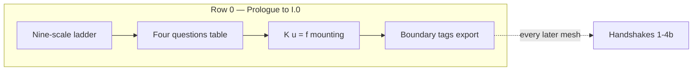

| Link | Role |
|------|------|
| [Prologue Bridge](../prologue/00-many-scales.md#bridge-to-part-i) | Narrative hinge: panorama → grammar |
| [Preface row 0 skill checkpoint](../preface.md#skill-navigation-row-0) | Competence-time mirror |
| [Prologue row 0 closing stitch](../prologue/00-many-scales.md#row-0-closing-stitch) | Upstream narrative half |
| [Epilogue row 0 closing loop](../epilogue/multiscale.md#row-0-closing-loop) | Downstream workflow half |

**Baby picture:** when the scale menu feels overwhelming before Part I.1, complete [row 0](#row-0-baby-picture-act-i-mounting) before opening [row 1](#row-1-baby-picture-finite-to-infinite) — mounting exports boundary discipline every handshake inherits. The [prologue row 0 closing stitch](../prologue/00-many-scales.md#row-0-closing-stitch) and [epilogue row 0 closing loop](../epilogue/multiscale.md#row-0-closing-loop) reunite preview, skill checkpoint, and workflow exam. Proceed to [row 1](#row-1-baby-picture-finite-to-infinite) when \(\mathbf{K}\mathbf{u}=\mathbf{f}\) with fixed DOFs names the same wire the prologue promised.

### Row 1 baby picture (finite → infinite — I.4 → Part II) {#row-1-baby-picture-finite-to-infinite}

Row 1 is the **\(N\to\infty\) contract** — mesh refinement sends \(\mathbf{K}_N\mathbf{u}_N=\mathbf{f}_N\) toward an operator and nodal values toward \(u(x)\in H^1\), not toward a longer vector in \(\mathbb{R}^N\).

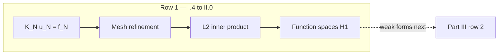

| Link | Role |
|------|------|
| [I.4 Bridge](../part01-linear-algebra/04-toward-infinity.md#bridge-to-part-ii) | Narrative hinge: vectors → fields |
| [Preface row 1 skill checkpoint](../preface.md#skill-navigation-row-1) | Competence-time mirror |
| [Prologue row 1 closing stitch](../prologue/00-many-scales.md#row-1-closing-stitch) | Upstream narrative half |
| [Epilogue row 1 closing loop](../epilogue/multiscale.md#row-1-closing-loop) | Downstream workflow half |

**Baby picture:** when \(\mathbf{K}\mathbf{u}=\mathbf{f}\) feels unrelated to PDEs, complete [row 1](#row-1-baby-picture-finite-to-infinite) after [row 0](#row-0-baby-picture-act-i-mounting) — refinement already pointed at a function space. The [prologue row 1 closing stitch](../prologue/00-many-scales.md#row-1-closing-stitch) and [epilogue row 1 closing loop](../epilogue/multiscale.md#row-1-closing-loop) reunite preview, skill checkpoint, and workflow exam. Proceed to [row 2](#row-2-baby-picture-analysis-to-pdes) when nodal profiles and \(L^2\) inner products name the same copper-wire elongation.

### Row 2 baby picture (analysis → PDEs — II.5 → Part III) {#row-2-baby-picture-analysis-to-pdes}

Row 2 is the **weak-form handoff contract** — completeness, compactness, and spectral theory in Part II become weak Poisson and heat formulations in Part III; Schematic 14 begins as the plot spine before Lax–Milgram in row 3.

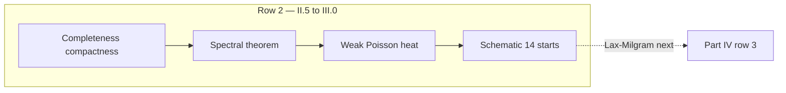

| Link | Role |
|------|------|
| [II.5 Bridge](../part02-functional-analysis/05-spectral-theorem.md#bridge-to-part-iii) | Narrative hinge: analysis → PDEs |
| [Variational ladder](../part03-pdes/00-opening.md#the-variational-ladder-me-412-schematic-14) | Schematic 14 begins at Part III |
| [Preface row 2 skill checkpoint](../preface.md#skill-navigation-row-2) | Competence-time mirror |
| [Prologue row 2 closing stitch](../prologue/00-many-scales.md#row-2-closing-stitch) | Upstream narrative half |
| [Epilogue row 2 closing loop](../epilogue/multiscale.md#row-2-closing-loop) | Downstream workflow half |

**Baby picture:** when Sobolev norms feel abstract, complete [row 2](#row-2-baby-picture-analysis-to-pdes) after [row 1](#row-1-baby-picture-finite-to-infinite) — the weak form is the next line of dialogue for the same wire, not a new subject. The [prologue row 2 closing stitch](../prologue/00-many-scales.md#row-2-closing-stitch) and [epilogue row 2 closing loop](../epilogue/multiscale.md#row-2-closing-loop) reunite preview, skill checkpoint, and workflow exam. Proceed to [row 3](#row-3-baby-picture-lax-milgram-to-assembly) when Schematic 14 is ready for Lax–Milgram → Galerkin assembly.

### Row 3 baby picture (Lax–Milgram → assembly — Schematic 14 continues) {#row-3-baby-picture-lax-milgram-to-assembly}

Row 3 is the **well-posedness → assembly contract** — Dirichlet principle and Lax–Milgram in \(H^1\) become Rayleigh–Ritz on \(V_h\) and the assembled system \(\mathbf{K}\mathbf{U}=\mathbf{F}\); Schematic 14 continues from the [variational ladder](../part03-pdes/00-opening.md#the-variational-ladder-me-412-schematic-14) in Part III to the [Galerkin ladder](../part04-fem/00-opening.md#the-galerkin-ladder-me-412-schematic-14-continued) in Part IV before [row 4](#row-4-baby-picture-twin-ladders-split) forks into twin discretization dialects.

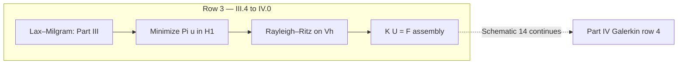

| Link | Role |
|------|------|
| [III.4 Bridge](../part03-pdes/04-energy-methods.md#bridge-to-part-iv) | Narrative hinge: energy → weak form → assembly |
| [Preface row 3 skill checkpoint](../preface.md#skill-navigation-row-3) | Competence-time mirror |
| [Prologue row 3 closing stitch](../prologue/00-many-scales.md#row-3-closing-stitch) | Upstream narrative half |
| [Epilogue row 3 closing loop](../epilogue/multiscale.md#row-3-closing-loop) | Downstream workflow half |

**Baby picture:** when minimizing \(\Pi[u]\) and assembling \(\mathbf{K}\) feel like separate courses, complete [row 3](#row-3-baby-picture-lax-milgram-to-assembly) before opening [row 4](#row-4-baby-picture-twin-ladders-split) — Galerkin assembly inherits every existence proof Part III wrote. The [prologue row 3 closing stitch](../prologue/00-many-scales.md#row-3-closing-stitch) and [epilogue row 3 closing loop](../epilogue/multiscale.md#row-3-closing-loop) reunite preview, skill checkpoint, and workflow exam. Proceed to [row 4](#row-4-baby-picture-twin-ladders-split) when Rayleigh–Ritz and the scatter loop name the same copper-wire equilibrium.

### Row 4 baby picture (twin ladders split — discretization fork) {#row-4-baby-picture-twin-ladders-split}

Row 4 is the **discretization fork contract** — the same weak form from Part III splits into Galerkin assembly (Part IV) and conservation flux balance (Part V); Schematic 14 becomes twin dialects on one copper wire after [row 3](#row-3-baby-picture-lax-milgram-to-assembly) unifies energy and assembly, before [row 5](#row-5-baby-picture-twin-ladders-reunion) reunites them on Cauchy stress in Part VI.

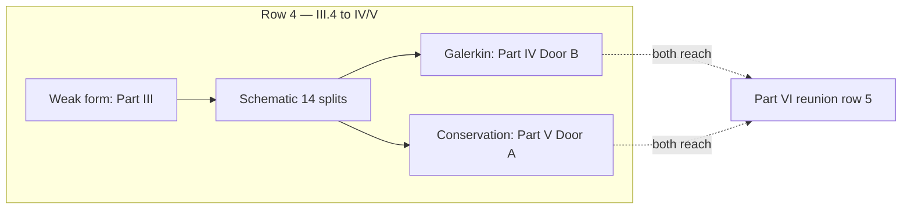

| Shared foundation (III) | Galerkin dialect (IV) | Conservation dialect (V) | Failure mode |
|-------------------------|----------------------|--------------------------|--------------|
| Lax–Milgram / energy minimization | \(\mathbf{K}\mathbf{U}=\mathbf{F}\) assembly | Face flux balance on cells | Energy and flux feel like separate subjects |
| [III.4 Bridge](../part03-pdes/04-energy-methods.md#bridge-to-part-iv) | [Galerkin ladder](../part04-fem/00-opening.md#the-galerkin-ladder-me-412-schematic-14-continued) | [Conservation ladder](../part05-fvm/00-opening.md#the-conservation-ladder-fvm-parallel-to-schematic-14) | Ladder read only through one door |
| Céa's lemma: mesh convergence | [IV.5 two doors](../part04-fem/05-convergence.md#bridge-two-doors-from-here) | [V.4 Bridge](../part05-fvm/04-navier-stokes-cfd.md#bridge-to-part-vi) | Door chosen; reunion skipped |
| Act II CHT preview: solid + fluid | FEM solid conduction | FVM fluid convection | Conjugate coupling without shared stress vocabulary |

**Baby picture:** when Galerkin assembly and Riemann solvers feel like unrelated courses, pause at [IV.5's two doors](../part04-fem/05-convergence.md#bridge-two-doors-from-here) or [V.4's Bridge](../part05-fvm/04-navier-stokes-cfd.md#bridge-to-part-vi) — not at another element type — because both dialects approximate the same continuum tensors Part VI names. Complete [row 3](../preface.md#skill-navigation-row-3) first when energy minimization and matrix assembly still feel like separate tricks. The [prologue row 4 closing stitch](../prologue/00-many-scales.md#row-4-closing-stitch) and [epilogue row 4 closing loop](../epilogue/multiscale.md#row-4-closing-loop) reunite preview, fork, and workflow exam. Proceed to [row 5](#row-5-baby-picture-twin-ladders-reunion) when both doors are mapped onto the same wire and Part VI is the mandatory reunion — not an optional appendix.

### Row 5 baby picture (twin ladders reunion — ascent complete) {#row-5-baby-picture-twin-ladders-reunion}

Row 5 is the **ascent reunion contract** — Galerkin energy (Part IV) and conservation flux (Part V) split Schematic 14 into twin discretization dialects on the same copper wire ([row 4](#row-4-baby-picture-twin-ladders-split) names the fork); Part VI reunites them on Cauchy stress and virtual work before descent begins at [VI.4](../part06-continuum/04-nonlinear-plasticity-preview.md#intermission-ascent-ends-descent-begins).

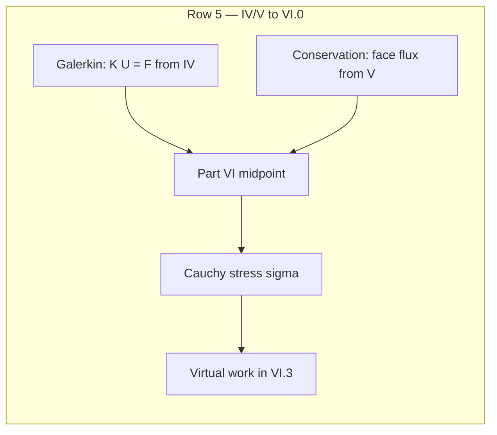

| Discretization dialect (IV–V) | Continuum reunion (VI) | Failure mode |
|-------------------------------|------------------------|--------------|
| Galerkin assembly \(\mathbf{K}\mathbf{U}=\mathbf{F}\) | Virtual work \(\int \boldsymbol{\sigma}:\delta\boldsymbol{\varepsilon}\) | Stiffness feels like bookkeeping, not force balance |
| FVM face flux balance | Cauchy stress and energy equation | Fluids feel disconnected from solid mesh |
| Céa lemma: discrete tracks continuous | Part VI names the continuous tensors | Mesh converged but physics unnamed |
| [IV.5 two doors](../part04-fem/05-convergence.md#bridge-two-doors-from-here) or [V.4 Bridge](../part05-fvm/04-navier-stokes-cfd.md#bridge-to-part-vi) | [Twin ladders reunion](../part06-continuum/00-opening.md#the-twin-ladders-reunite-galerkin-and-conservation) | Door chosen but reunion skipped |

**Baby picture:** when Galerkin assembly and Riemann solvers feel like unrelated courses, complete [row 4](#row-4-baby-picture-twin-ladders-split) first — both doors must reach Part VI — then pause at the [Part VI midpoint](../part06-continuum/00-opening.md#midpoint-ascent-complete-descent-ahead) because every later continuum and mesoscale export inherits the tensor vocabulary Part VI establishes. The [prologue row 5 closing stitch](../prologue/00-many-scales.md#row-5-closing-stitch) and [epilogue row 5 closing loop](../epilogue/multiscale.md#row-5-closing-loop) reunite preview, midpoint, and workflow exam. Proceed to [row 6](#row-6-baby-picture-j2-intermission) when ascent vocabulary reunites on \(\boldsymbol{\sigma}\) and the \(J_2\) intermission names where smooth fields fail.

### Row 6 baby picture (\(J_2\) intermission — ascent ends, descent begins) {#row-6-baby-picture-j2-intermission}

Row 6 is the **midpoint phenomenology contract** — isotropic \(J_2\) hardening fits the load cell knee on trust; Part VII supplies forest density \(\rho\) and Taylor hardening as cause. Row 7 adds atomic pedigree beneath mobility tables.

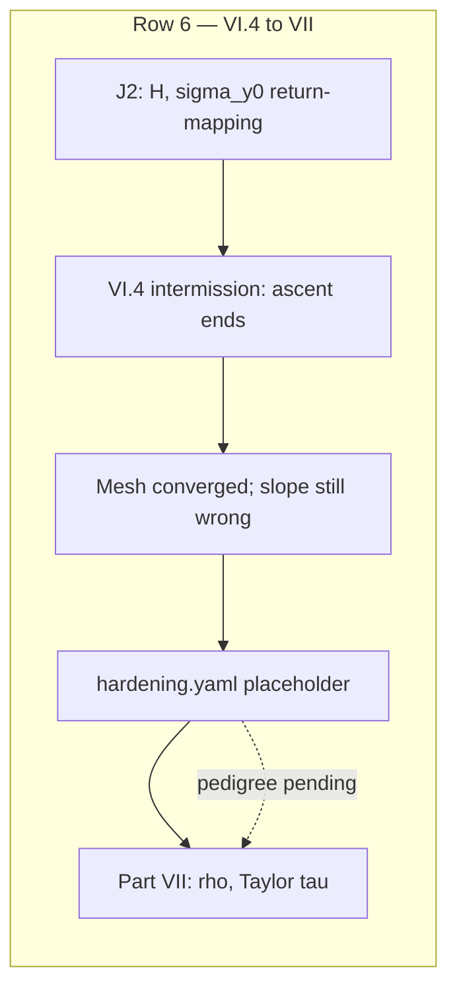

| Continuum placeholder (VI.4) | Mesoscale cause (VII) | Failure mode |
|------------------------------|----------------------|--------------|
| Isotropic \(H\), \(\sigma_{y0}\) from one tensile test | Forest density \(\rho\); Taylor \(\tau \propto \sqrt{\rho}\) | Mesh refined; hardening slope still a fit |
| Scalar internal variable \(\alpha\) | Dislocation link statistics | Return-mapping converges; physics does not |
| Perzyna \((N, \eta)\), rate sensitivity \(m\) | DDD mobility \(M(\tau, T)\) | Rate knee matches at one \(\dot\varepsilon\) only |
| `hardening.yaml` phenomenological fit | OpenDiS forest export | Literature \(H\) without cold-work history |

**Baby picture:** when the return-mapping loop fits \(H\) and \(\sigma_{y0}\) but cold drawing still feels unexplained, pause at the [VI.4 intermission](../part06-continuum/04-nonlinear-plasticity-preview.md#intermission-ascent-ends-descent-begins) — not at another Gauss point — because every later mesoscale export inherits the placeholder/archive discipline VI.4 establishes. Complete [row 5](#row-5-baby-picture-twin-ladders-reunion) first when ascent vocabulary still feels fragmented — Cauchy stress must reunite before phenomenology is diagnosed. The [preface row 6 skill checkpoint](../preface.md#skill-navigation-row-6) closes the competence loop; the [prologue row 6 closing stitch](../prologue/00-many-scales.md#row-6-closing-stitch) and [epilogue row 6 closing loop](../epilogue/multiscale.md#row-6-closing-loop) reunite preview, checkpoint, and workflow exam. Proceed to [row 7](#row-7-baby-picture-mesoscale-to-atomistic) when `hardening.yaml` is archived as a placeholder and the forest is named explicitly in Part VII.

### Row 7 baby picture (mesoscale → atomistic) {#row-7-baby-picture-mesoscale-to-atomistic}

Row 7 is the **descent atomic pedigree contract** — OpenDiS segment laws cite mobility on trust; Part VIII supplies coordinates and forces. Row 8 adds temperature; row 7 adds **structure**.

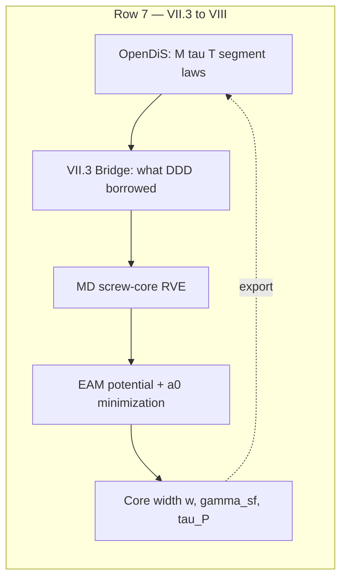

| Mesoscale quantity (VII) | Atomistic source (VIII) | Failure mode |
|--------------------------|-------------------------|--------------|
| Mobility \(M(\tau, T)\) | NVT shear on screw-core RVE | Literature drag without MD folder |
| Peierls threshold \(\tau_P\) | Core width \(w\) from relaxed atoms | Linear elasticity at \(r < 1\) nm |
| Stacking-fault energy \(\gamma_{\text{sf}}\) | GSF slab configuration | Handbook value without atomic basis |
| Burgers vector \(b\) | EAM-minimized lattice parameter \(a_0\) | Mismatch between DDD yaml and MD box |

**Baby picture:** when Peierls stress or mobility tables feel like magic numbers, pause at [VII.3's Bridge](../part07-defects/03-polycrystal-and-fem-handoff.md#bridge-to-part-viii) — not at the integrator in VIII.2 — because every later atomistic export inherits the potential and core structure VIII.1 establishes. The [preface row 7 skill checkpoint](../preface.md#skill-navigation-row-7) closes the competence loop; the [prologue row 7 closing stitch](../prologue/00-many-scales.md#row-7-closing-stitch) and [epilogue row 7 closing loop](../epilogue/multiscale.md#row-7-closing-loop) reunite preview, checkpoint, and workflow exam. Proceed to [row 8](#rows-8-9-baby-picture-tw-temperature-pedigree) when atomic pedigree exists but drag folders still cite 300 K defaults.

### Rows 8–9 baby picture (\(T_w\) temperature pedigree) {#rows-8-9-baby-picture-tw-temperature-pedigree}

Rows 8 and 9 are the **descent temperature contract** — Act II's Joule heating sets wall temperature once; every finer rung must inherit that \(T_w\) before exporting upward. Row 8 names the MD/DDD layer; row 9 names the DFT audit beneath it.

**Row 8 baby picture:** conjugate heat transfer converges once at \(T_w\); archive `cht_export.yaml` before any NVT shear test, WHAM ladder, or OpenDiS mobility calibration — the [VIII.0 descent hinge](../part08-md/00-opening.md#descent-hinge-cores-mobility-and-tw-pedigree) states the contract; the [preface row 8 skill checkpoint](../preface.md#skill-navigation-row-8) closes the competence loop when Act II and Part VIII diverge.

**Row 9 baby picture:** EAM fits bulk moduli on trust until Part IX supplies SCF logs **and** evaluates quasiharmonic \(\alpha(T_w)\) and phonon lifetimes at the same \(T_w\) from row 8 — not at 300 K alone. The [IX.0 thermal phonon audit table](../part09-dft/00-opening.md#thermal-phonon-audit-at-tw) lists the three quantities at risk; the [preface row 9 skill checkpoint](../preface.md#skill-navigation-row-9) closes the competence loop; the [epilogue opening hinge from Part IX](../epilogue/multiscale.md#opening-hinge-ix3-to-epilogue) is where those audits compose with Handshakes 2–4a in workflow time.

When rows 8–9 feel disconnected from row 13 (Handshake 2 → 3), read them as **upstream pedigree**: row 8 sets \(T_w\); row 9 sets \(\alpha(T_w)\) and \(\tau_{\text{ph}}(T_w)\); row 13 sets \(\alpha(T_w)\Delta T\) on fixed grips — skip row 9 and row 13 inherits handbook \(\alpha\) beside a converged CHT loop.

### Row 12 baby picture (next-project restart) {#row-12-baby-picture-next-project}

Row 12 closes the book loop that row 0 opened — same four questions, new specimen, ladder portable.

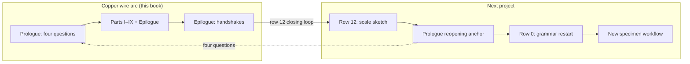

**Row 12 baby picture:** finish the epilogue workflow exam, then **do not copy copper input decks blindly** — run the four-step audit at the [prologue reopening anchor](../prologue/00-many-scales.md#prologue-reopening-anchor): name required rungs, fill four questions for two scales, mark which Acts I–VI apply, restart grammar at [row 0](../preface.md#skill-navigation-row-0) before mid-book handshakes. The [epilogue Bridge row 12 closing loop](../epilogue/multiscale.md#row-12-closing-loop) and [preface row 12 skill checkpoint](../preface.md#skill-navigation-row-12) close the competence loop; the [prologue row 12 preview](../prologue/00-many-scales.md#prologue-preview-row-12) named this restart before Part I.

### Row 13 baby picture (Handshake 2 → 3 thermal pre-stress) {#row-13-baby-picture-handshake-2-3}

Row 13 is the **thermal pre-stress contract** — Act II's conjugate heat transfer sets \(\Delta T = T_w - T_\infty\) once; IX.3 quasiharmonic \(\alpha\) sets thermal strain before the fixed-grip load cell reads stress in Act III. Do not conflate the two handshakes: \(\Delta T\) does not depend on \(\alpha\), and \(\alpha\) does not substitute for a converged CHT loop.

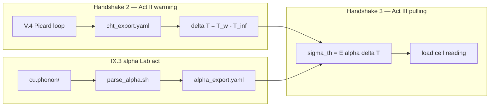

**Row 13 baby picture:** run [V.4's Picard loop](../part05-fvm/04-navier-stokes-cfd.md#lab-act-extension-two-domain-picard-loop-with-a-1d-fem-solid) and archive `cht_export.yaml` before exporting quasiharmonic \(\alpha\) — the [preface row 13 three-way audit](../preface.md#skill-navigation-row-13) maps each step across prologue preview, skill checkpoint, and workflow exam; the [epilogue row 13 closing loop](../epilogue/multiscale.md#row-13-closing-loop) reunites Handshakes 2 and 3 in workflow time; the [prologue row 13 preview](../prologue/00-many-scales.md#prologue-preview-row-13) named "\(\Delta T\) from CHT; \(\alpha\Delta T\) from IX.3" before Part I. When rows 8–9 (\(T_w\) pedigree) feel disconnected from row 13, read them as **upstream temperature context**: row 8 sets \(T_w\); row 9 sets \(\alpha(T_w)\) when evaluating phonons at service temperature; row 13 sets \(\alpha\Delta T\) on fixed grips using \(\Delta T\) from Handshake 2 — skip IX.3 and row 13 inherits handbook \(\alpha\) beside a converged CHT loop.

### Row 14 baby picture (Handshake 4a rate extrapolation) {#row-14-baby-picture-handshake-4a}

Row 14 is the **rate-extrapolation contract** — OpenDiS runs at accessible strain rates (\(\sim 10^3\,\text{s}^{-1}\)); the lab grip runs at \(\sim 10^{-3}\,\text{s}^{-1}\). Do not conflate the two: \(\tau_{\text{flow}}\) from DDD does not depend on lab grip speed, and power-law \(m\) does not substitute for a documented forest export.

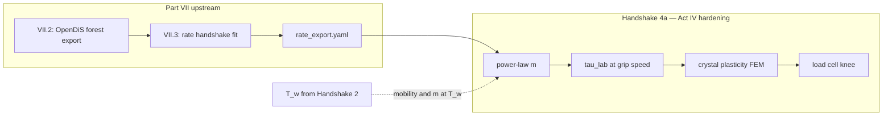

**Row 14 baby picture:** run [VII.2's forest Lab act](../part07-defects/02-dislocation-dynamics.md#lab-act-read-the-hardening-bend-from-forest-density-act-iv) and [VII.3's rate handshake](../part07-defects/03-polycrystal-and-fem-handoff.md#scale-boundary-handshake-ddd-strain-rate-to-quasi-static-fem) before importing \(\tau(\gamma)\) into the crystal-plasticity deck — the [preface row 14 three-way audit](../preface.md#skill-navigation-row-14) maps each step across prologue preview, skill checkpoint, and workflow exam; the [epilogue row 14 closing loop](../epilogue/multiscale.md#row-14-closing-loop) reunites Handshake 4a in workflow time; the [prologue row 14 preview](../prologue/00-many-scales.md#prologue-preview-row-14) named "\(\tau_{\text{flow}}\) from DDD; \(\tau_{\text{lab}}\) from power-law \(m\)" before Part I. When rows 8–9 (\(T_w\) pedigree) feel disconnected from row 14, read them as **upstream temperature context**: row 8 sets \(T_w\); row 9 sets \(\tau_{\text{ph}}(T_w)\) for drag on \(m\); row 14 evaluates \(m\) and mobility at converged \(T_w\), not at 300 K — skip row 8 and row 14 inherits room-temperature rate sensitivity beside a Joule-heated wire.

### Row 15 baby picture (Handshake 4b notch localization) {#row-15-baby-picture-handshake-4b}

Row 15 is the **notch-localization contract** — bulk hardening from Handshake 4a may match the load-cell knee while scalar \(H\) under-predicts peak von Mises stress at the notch root by 10–15%. Do not conflate bulk adequacy with root localization: FE² with DDD-active Gauss points resolves pile-up physics that spatially uniform Taylor hardening smears.

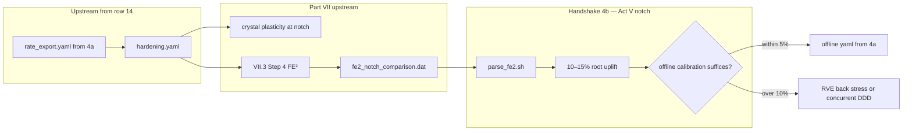

**Row 15 baby picture:** complete [preface row 14](../preface.md#skill-navigation-row-14) before opening the notch comparison — FE² inherits the same `hardening.yaml` that 4a calibrated. Run [VII.3 Step 4](../part07-defects/03-polycrystal-and-fem-handoff.md#step-4--when-offline-calibration-fails-fe-at-the-notch) and [`parse_fe2.sh`](../../scripts/parse_fe2.sh) on `fe2_notch_comparison.dat` before trusting the notch-root answer — the [preface row 15 three-way audit](../preface.md#skill-navigation-row-15) maps each step across prologue preview, skill checkpoint, and workflow exam; the [epilogue row 15 closing loop](../epilogue/multiscale.md#row-15-closing-loop) reunites Handshake 4b in workflow time; the [prologue Handshake 4b preview](../prologue/00-many-scales.md#prologue-preview-act-v) named "FE² vs crystal plasticity at the notch root" before Part I. When row 14 (bulk rate) feels disconnected from row 15 (notch localization), read them as **sequential contracts on the same `hardening.yaml`**: row 14 sets \(\tau_{\text{lab}}\) at lab grip speed; row 15 asks whether that calibration suffices at \(K_t \approx 3\) — skip row 14 and FE² RVEs inherit wrong CRSS at active Gauss points.

### Row 17 baby picture (continuous read-through) {#row-17-baby-picture-continuous-read-through}

Row 17 is the **meta-navigation stitch** — when rows 0–16 feel like a syllabus but the copper wire story should read as one novel, trust the chapter rhythm instead of opening every skill checkpoint mid-climb.

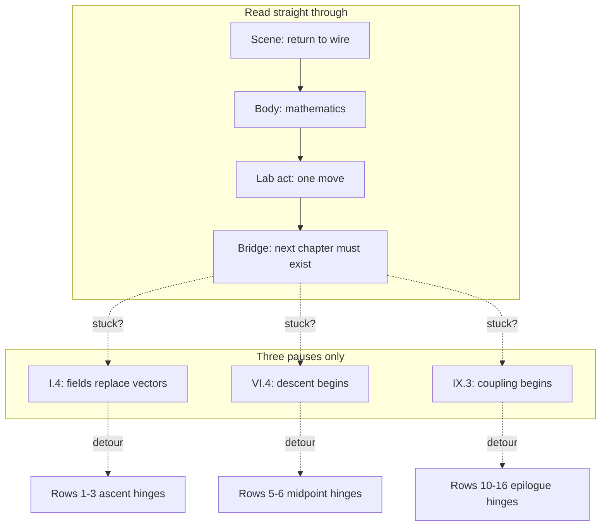

**Row 17 baby picture:** finish the [preface story in one page](../preface.md#the-story-in-one-page) and [prologue ladder](../prologue/00-many-scales.md#a-ladder-not-a-menu) once, then read Parts I–IX in order — **Scene → Bridge** at every chapter boundary, skill checkpoints only when a gate stalls. The three mandatory pauses are [I.4 Bridge](../part01-linear-algebra/04-toward-infinity.md#bridge-to-part-ii), [VI.4 intermission](../part06-continuum/04-nonlinear-plasticity-preview.md#intermission-ascent-ends-descent-begins), and [IX.3 Bridge](../part09-dft/03-dft-workflows.md#bridge-to-the-epilogue); the [continuous read-through guide](sources.md#continuous-read-through-guide) draws the five-act straight path; the [preface row 17 skill checkpoint](../preface.md#skill-navigation-row-17) closes the competence loop when the first pass ends but the plot still feels episodic; the [epilogue row 17 closing loop](../epilogue/multiscale.md#row-17-closing-loop) reunites narrative and workflow time after [row 16](#act-vi-baby-picture-me-412-coupling-ladder) orchestration is understood.

When row 17 feels disconnected from row 12 (next project), read them as **bookend meta-stitches**: row 17 is how to read **this** copper arc continuously; row 12 is how to restart the ladder on the **next** specimen — complete row 17 before row 12 when the epilogue workflow exam feels like separate courses stitched together.

### Row 18 baby picture (part-opening plot spine) {#row-18-baby-picture-part-opening-plot-spine}

**Row 18 baby picture:** when a part opening feels like a new syllabus, read its [plot spine one line](../part01-linear-algebra/00-opening.md#plot-spine-one-line) aloud — one sentence per part, nine rungs from grammar through descent. The [part-opening plot spine index](sources.md#part-opening-plot-spine-index-row-18) lists all nine; the [preface plot spine](../preface.md#plot-spine-how-the-story-is-told) names four acts. Row 17 is how to read continuously; row 18 is what each part opening should **sound like** when the plot is smooth. When row 18 feels disconnected from row 17, read them as **layered meta-stitches**: row 17 names straight-through rhythm; row 18 names the one-line role at each part boundary — use row 18 when you land on a new part and the symbols changed faster than the specimen.

When a chapter feels abstract, pick the row that matches your reading position and read it aloud — it is the plot spine in one breath. At part openings, use [row 18](sources.md#part-opening-plot-spine-index-row-18); mid-chapter, use [row 19](sources.md#numbered-chapter-plot-spine-index-row-19) or the [chapter roadmap](sources.md#chapter-roadmap-one-continuous-arc) row for that chapter.

### Row 19 baby picture (numbered-chapter plot spine) {#row-19-baby-picture-numbered-chapter-plot-spine}

**Row 19 baby picture:** when a numbered chapter feels abstract despite reading the prior Bridge, read its [plot spine one line](../part01-linear-algebra/01-vectors-matrices.md#plot-spine-one-line) aloud — one sentence per chapter, 35 rungs from \(\mathbf{K}\mathbf{u}=\mathbf{f}\) through DFT workflows. The [numbered-chapter plot spine index](sources.md#numbered-chapter-plot-spine-index-row-19) groups them by part; the [chapter roadmap](sources.md#chapter-roadmap-one-continuous-arc) is the audit table. Row 17 is how to read continuously; row 18 is what part openings should sound like; row 19 is what **each chapter opening** should sound like when symbols rise faster than the specimen mid-part. When row 19 feels disconnected from row 18, read them as **layered meta-stitches**: row 18 at part boundaries; row 19 at chapter interiors — use row 19 when Scene and Bridge both felt fine but the body lost the wire.

When a chapter feels abstract, pick the row that matches your reading position and read it aloud — it is the plot spine in one breath. At part openings, use [row 18](sources.md#part-opening-plot-spine-index-row-18); mid-chapter, use [row 19](sources.md#numbered-chapter-plot-spine-index-row-19) or the [chapter roadmap](sources.md#chapter-roadmap-one-continuous-arc) row for that chapter; at mandatory gates, use [row 20](sources.md#gate-chapter-plot-spine-index-row-20).

### Row 20 baby picture (gate-chapter plot spine) {#row-20-baby-picture-gate-chapter-plot-spine}

**Row 20 baby picture:** when row 17's straight-through read stalls at a mandatory gate, recite the [plot spine one line](../part01-linear-algebra/04-toward-infinity.md#plot-spine-one-line) for that gate aloud — three sentences for three plot turns: [I.4](../part01-linear-algebra/04-toward-infinity.md#plot-spine-one-line) (grammar becomes analysis), [VI.4](../part06-continuum/04-nonlinear-plasticity-preview.md#plot-spine-one-line) (ascent ends at the knee), [IX.3](../part09-dft/03-dft-workflows.md#plot-spine-one-line) (pedigree exports upward). The [gate-chapter plot spine index](sources.md#gate-chapter-plot-spine-index-row-20) lists all three; the [continuous read-through guide](sources.md#continuous-read-through-guide) names when to pause. Row 17 is how to read continuously; row 18 is what part openings sound like; row 19 is what chapter interiors sound like; row 20 is what **plot turns** sound like at the three gates row 17 assumes you will pause. When row 20 feels disconnected from row 19, read them as **layered meta-stitches**: row 19 at chapter interiors; row 20 at plot turns — use row 20 when Scene, Bridge, and chapter one-liners all felt fine but the **act** still changed (ascent → analysis, ascent → descent, descent → coupling).

When a chapter feels abstract, pick the row that matches your reading position and read it aloud — it is the plot spine in one breath. At part openings, use [row 18](sources.md#part-opening-plot-spine-index-row-18); mid-chapter, use [row 19](sources.md#numbered-chapter-plot-spine-index-row-19); at mandatory gates, use [row 20](sources.md#gate-chapter-plot-spine-index-row-20); when proofs feel abstract despite Scene and Bridge, use [row 22](sources.md#representative-schematics-cross-reference-index-row-22).

### Row 22 baby picture (representative schematics) {#row-22-baby-picture-representative-schematics}

**Row 22 baby picture:** when Scene and Bridge both felt fine but the proof lost the wire, open the [schematic row for your part](sources.md#representative-schematics-cross-reference-index-row-22) — nine source notes, one habit: object → structure → theorem → failure mode. **Schematic 14** in Part II is the spine that makes Parts III–IV read as one ascent; the [conservation ladder](../part05-fvm/00-opening.md#the-conservation-ladder-fvm-parallel-to-schematic-14) in Part V is its transport twin for Act II warming. Row 17 is how to read continuously; row 19 is what chapter interiors sound like; row 21 is what the afternoon feels like; row 22 is **what the baby picture looks like** when symbols rise faster than the specimen. When row 22 feels disconnected from row 19, read them as **layered meta-stitches**: row 19 gives the one-line plot; row 22 gives the visual diagram that makes the plot stick.

When a chapter feels abstract, pick the row that matches your reading position — plot spine one-liners at [row 18–20](sources.md#part-opening-plot-spine-index-row-18), Lab acts at [row 21](sources.md#lab-act-cross-reference-index-row-21), baby pictures at [row 22](sources.md#representative-schematics-cross-reference-index-row-22).

### Act VI baby picture (ME 412 coupling ladder) {#act-vi-baby-picture-me-412-coupling-ladder}

The [Part IX opening](../part09-dft/00-opening.md#the-coupling-ladder-me-412-reunion) draws the full coupling ladder; this diagram is the **Act VI slice** — foundation pedigree in workflow order, then handshake orchestration:

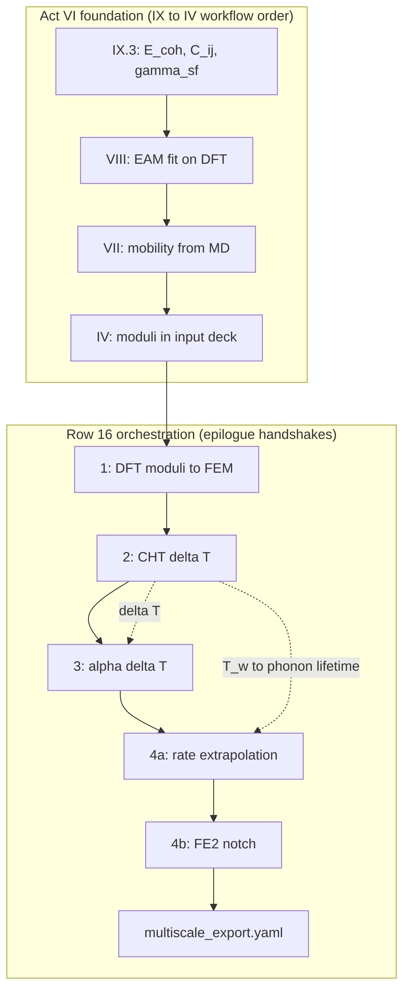

**Per-node anchors (inline index).** Mermaid nodes are not clickable in mdBook; each label above maps to an anchor below for reverse audit with the [epilogue Act VI minimal artifact column](../epilogue/multiscale.md#act-vi-foundation-minimal-artifacts) and [preface row 16 three-way audit](../preface.md#skill-navigation-row-16):

| Diagram node | Anchor | Row 16 step |
|--------------|--------|-------------|
| **DFT** | [#act-vi-node-dft](#act-vi-node-dft) | Step 2 — `foundation_export.yaml` |
| **MD** | [#act-vi-node-md](#act-vi-node-md) | Step 2 — EAM / VACF archive |
| **DDD** | [#act-vi-node-ddd](#act-vi-node-ddd) | Step 2 — mobility / GSF archive |
| **FEM** | [#act-vi-node-fem](#act-vi-node-fem) | Step 2 — `cu.elastic/` in input deck |
| **H1** | [#act-vi-node-h1](#act-vi-node-h1) | Step 3 — Handshake 1 in orchestrator |
| **H2** | [#act-vi-node-h2](#act-vi-node-h2) | Step 1 — upstream [row 13](../preface.md#skill-navigation-row-13); Step 3 — `cht_export.yaml` |
| **H3** | [#act-vi-node-h3](#act-vi-node-h3) | Step 1 — upstream rows 8–9, 13; Step 4 — `delta_T_from_handshake_2` |
| **H4a** | [#act-vi-node-h4a](#act-vi-node-h4a) | Step 1 — upstream [row 14](../preface.md#skill-navigation-row-14); Step 4 — `target_T_K` |
| **H4b** | [#act-vi-node-h4b](#act-vi-node-h4b) | Step 1 — upstream [row 15](../preface.md#skill-navigation-row-15) |
| **OUT** | [#act-vi-node-out](#act-vi-node-out) | Step 3–4 — `multiscale_export.yaml` + `./scripts/test-fixtures.sh` |

**DFT** — IX.3 exports: \(E_{\text{coh}}\), \(C_{ij}\), \(\gamma_{\text{sf}}\), phonon tables; [`parse_dft_workflow.sh`](../../scripts/parse_dft_workflow.sh).

**MD** — EAM fit on DFT; [`parse_vacf.sh`](../../scripts/parse_vacf.sh) cross-check.

**DDD** — mobility from MD; GSF for partial dislocations; [`parse_rate.sh`](../../scripts/parse_rate.sh), [`parse_gsf.sh`](../../scripts/parse_gsf.sh).

**FEM** — Voigt \(E\), \(\nu\) in Part IV elastic step; `cu.elastic/`.

**H1** — Handshake 1: DFT moduli → continuum; [`parse_elastic.sh`](../../scripts/parse_elastic.sh).

**H2** — Handshake 2: Joule → CHT; [`parse_cht.sh`](../../scripts/parse_cht.sh) → `cht_export.yaml`.

**H3** — Handshake 3: thermal → mechanical; [`parse_alpha.sh`](../../scripts/parse_alpha.sh) → `alpha_export.yaml`.

**H4a** — Handshake 4a: rate hardening; [`parse_rate.sh`](../../scripts/parse_rate.sh); [`parse_lifetime.sh`](../../scripts/parse_lifetime.sh) at \(T_w\).

**H4b** — Handshake 4b: notch localization; [`parse_fe2.sh`](../../scripts/parse_fe2.sh).

**OUT** — orchestrated chain; [`parse_multiscale_workflow.sh`](../../scripts/parse_multiscale_workflow.sh) → `multiscale_export.yaml`.

#### Subgraph node audit (bidirectional ↔ IX.3 pedigree table) {#act-vi-subgraph-node-audit}

Each node in the diagram above maps to a row in [IX.3's epilogue pedigree table](../part09-dft/03-dft-workflows.md#ix3-epilogue-pedigree-table). Use this table when the baby picture feels like a diagram without archive artifacts, or when the pedigree table feels like rows without workflow order. The **Node anchor** column links to the inline anchors above; the **Row 16 step** column links to the [epilogue Act VI minimal artifact table](../epilogue/multiscale.md#act-vi-foundation-minimal-artifacts) for reverse audit.

| Subgraph | Node | Node anchor | Row 16 step | IX.3 pedigree row | Parser / export |
|----------|------|-------------|-------------|-------------------|-----------------|
| `act6` | **DFT** | [#act-vi-node-dft](#act-vi-node-dft) | Step 2 | Handshake 1 (moduli); Handshake 3 (phonon) | [`parse_dft_workflow.sh`](../../scripts/parse_dft_workflow.sh); [`parse_elastic.sh`](../../scripts/parse_elastic.sh); [`parse_alpha.sh`](../../scripts/parse_alpha.sh) |
| `act6` | **MD** | [#act-vi-node-md](#act-vi-node-md) | Step 2 | Handshake 4a (VACF cross-check) | [`parse_vacf.sh`](../../scripts/parse_vacf.sh); EAM fit archive |
| `act6` | **DDD** | [#act-vi-node-ddd](#act-vi-node-ddd) | Step 2 | Handshake 4a (mobility); Handshake 4b (GSF) | [`parse_rate.sh`](../../scripts/parse_rate.sh); [`parse_gsf.sh`](../../scripts/parse_gsf.sh) |
| `act6` | **FEM** | [#act-vi-node-fem](#act-vi-node-fem) | Step 2 | Handshake 1 (moduli in input deck) | Part IV elastic step; `cu.elastic/` |
| `orch` | **H1** | [#act-vi-node-h1](#act-vi-node-h1) | Step 3 | Handshake 1 — DFT → continuum | [`parse_elastic.sh`](../../scripts/parse_elastic.sh) |
| `orch` | **H2** | [#act-vi-node-h2](#act-vi-node-h2) | Step 1, 3 | Handshake 2 — Joule → CHT | [`parse_cht.sh`](../../scripts/parse_cht.sh) → `cht_export.yaml` |
| `orch` | **H3** | [#act-vi-node-h3](#act-vi-node-h3) | Step 1, 4 | Handshake 3 — thermal → mechanical | [`parse_alpha.sh`](../../scripts/parse_alpha.sh) → `alpha_export.yaml` |
| `orch` | **H4a** | [#act-vi-node-h4a](#act-vi-node-h4a) | Step 1, 4 | Handshake 4a — rate hardening | [`parse_rate.sh`](../../scripts/parse_rate.sh); [`parse_lifetime.sh`](../../scripts/parse_lifetime.sh) |
| `orch` | **H4b** | [#act-vi-node-h4b](#act-vi-node-h4b) | Step 1 | Handshake 4b — notch localization | [`parse_fe2.sh`](../../scripts/parse_fe2.sh) |
| `orch` | **OUT** | [#act-vi-node-out](#act-vi-node-out) | Step 3–4 | All — orchestrated chain | [`parse_multiscale_workflow.sh`](../../scripts/parse_multiscale_workflow.sh) → `multiscale_export.yaml` |

When ascent grammar (Parts I–III) and descent pedigree (Parts VII–IX) feel like separate books, return here — row 16 is where the ME 412 coupling ladder reunites them in one afternoon. {#act-vi-baby-picture-closing} The `act6` subgraph (DFT → MD → DDD → FEM) is the workflow-time mirror of [IX.3's foundation checklist](../part09-dft/03-dft-workflows.md#ix3-foundation-checklist) — the scale-boundary handshake table names the audit gate on each DFT archive before [`parse_dft_workflow.sh`](../../scripts/parse_dft_workflow.sh) emits `foundation_export.yaml`; return to that anchor when this closing paragraph feels abstract without the six-row audit table; the [IX.3 epilogue pedigree table](../part09-dft/03-dft-workflows.md#ix3-epilogue-pedigree-table) maps each handshake row to archive artifacts; the `orch` subgraph (Handshakes 1–4b → `multiscale_export.yaml`) is the downstream half archived by [`parse_multiscale_workflow.sh`](../../scripts/parse_multiscale_workflow.sh). The [epilogue script audit trail](../epilogue/multiscale.md#script-audit-trail-parse-scripts-handshakes) **All — orchestrated chain** row names the parser that runs this subgraph in dependency order; its closing paragraph cites `./scripts/test-fixtures.sh` when auditing `delta_T_from_handshake_2` and `target_T_K`. Return to the [preface epilogue continuity hinges](../preface.md#epilogue-continuity-hinges) (Act VI orchestration row), the [preface row 16 When-to-pause opening sentence](../preface.md#skill-navigation-row-16), the [prologue row 16 closing stitch](../prologue/00-many-scales.md#row-16-closing-stitch), the [prologue row 16 preview](../prologue/00-many-scales.md#what-you-should-be-able-to-do-after-the-prologue), the [epilogue row 16 closing loop](../epilogue/multiscale.md#row-16-closing-loop), and [prologue reading compass row 16](../prologue/00-many-scales.md#reading-compass-two-clocks-on-one-wire) when the competence loop closes — this baby picture closing paragraph is the narrative stitch; the epilogue hinges table, closing loop, and those rows are the competence-time mirrors named in the script audit trail opening sentence. The [epilogue Act VI foundation table row](../epilogue/multiscale.md#lab-act-reunion-six-acts-one-afternoon) and [workflow exam Act VI row](../epilogue/multiscale.md#what-you-should-be-able-to-do-after-the-book) are the workflow-time mirrors — return to this closing paragraph when the workflow exam Act VI row feels like a checklist without the foundation → orchestration diagram; the [one-page copper wire recap](#one-page-copper-wire-recap) Act VI column compresses the same chain for index-card review; the [epilogue sensitivity worksheet closing](../epilogue/multiscale.md#worked-example-sensitivity-ranks) (row 16 orchestration stitch) proves Handshakes 1–4b ran in dependency order after the partial-derivative audit.

## One-line course summaries (ME 412 style)

The [Functional Analysis Notes](https://hanfengzhai.github.io/file/teaching/notes/ME412_CourseSummary.pdf) close with compressed sentences that fit on an index card. This book extends that habit across scales:

| Scope | One-line summary |
|-------|------------------|
| **Parts I–III** | Linear algebra → operator equations → well-posedness → weak PDE. |
| **Parts I–IV** | Choose the right space → prove the weak solution exists → approximate it by Galerkin projection. |
| **Parts I–VI** | Norm = ruler, Banach = no holes, Hilbert = geometry, Sobolev = PDE-ready; continuum stress names what FEM already meshed. |
| **Parts I–IX** | Same ladder from \(\mathbb{R}^N\) to \(\rho(\mathbf{r})\); homogenize upward with documented handshakes. |
| **Whole book** | One copper wire, four questions at every scale: state, equations, discretization, upward export. |

When a chapter feels abstract, pick the row that matches your reading position and read it aloud — it is the plot spine in one breath. At part openings, use [row 18](sources.md#part-opening-plot-spine-index-row-18); mid-chapter, use [row 19](sources.md#numbered-chapter-plot-spine-index-row-19).

## One-page copper wire recap {#one-page-copper-wire-recap}

| Act | Lab beat | Part | State on the wire | Upward export |
|-----|----------|------|-------------------|---------------|
| I | Mounting | I | Spring displacements | \(\mathbf{K}\), modes |
| II | Warming | III–V | \(T(\mathbf{x})\), air flow | Wall flux, CHT loop |
| III | Pulling | II–IV, VI | \(u(x)\), \(\boldsymbol{\sigma}\) | Weak form → assembly |
| IV | Hardening | VII | Dislocation density \(\rho\) | \(\tau(\gamma)\) for FEM |
| V | Notch | VI, VIII | Stress concentrator | MD traction handoff |
| VI | Foundation | IX → VIII → VII → IV | \(\rho(\mathbf{r})\), then potentials | \(E_{\text{coh}}\), \(C_{ij}\), [`multiscale_export.yaml`](../../scripts/parse_multiscale_workflow.sh) pedigree |

Read the [prologue](../prologue/00-many-scales.md#the-experiment-as-plot) for the six-act table in narrative form; read the [epilogue Act VI foundation table row](../epilogue/multiscale.md#lab-act-reunion-six-acts-one-afternoon) for the foundation → handshake workflow and the [workflow exam Act VI row](../epilogue/multiscale.md#what-you-should-be-able-to-do-after-the-book) for the competence-time checklist — the same minimal-artifact column the [prologue row 16 preview](../prologue/00-many-scales.md#what-you-should-be-able-to-do-after-the-prologue) named before Part I. Act VI's upward export is not a single modulus — it is the orchestrated pedigree file linking Handshakes 1–4b; the [Act VI baby picture](#act-vi-baby-picture-me-412-coupling-ladder) draws that chain; the [IX.3 foundation checklist](../part09-dft/03-dft-workflows.md#ix3-foundation-checklist) (scale-boundary handshake table) and [IX.3 epilogue pedigree table](../part09-dft/03-dft-workflows.md#ix3-epilogue-pedigree-table) map each handshake to DFT archive artifacts; [preface row 16](../preface.md#skill-navigation-row-16) and the [preface epilogue hinges Act VI row](../preface.md#epilogue-continuity-hinges) close the competence loop when individual exports exist but no `multiscale_export.yaml` links them; the [epilogue sensitivity worksheet closing](../epilogue/multiscale.md#worked-example-sensitivity-ranks) (row 16 orchestration stitch) proves Handshakes 1–4b ran in dependency order after the partial-derivative audit — return there when this Act VI column feels abstract without the quantitative audit trail; return here when that closing stitch completes and you need the index-card compression.

## Handshake interface checklist

Multiscale workflows fail at **interfaces**, not inside solvers. Before merging outputs from two codes, verify each row — the epilogue's four-handshake example on the heated wire is the template.

| Interface | Quantity crossing | Unit check | Frame check | Convergence artifact |
|-----------|-------------------|------------|-------------|----------------------|
| DFT → MD | \(E_{\text{coh}}\), \(a_0\), \(C_{ij}\), \(\gamma_{\text{sf}}\) | eV → eV/atom; Å → Å; GPa from Voigt average | Same crystal orientation as MD box | SCF log; k-mesh table; cutoff test |
| MD → DDD | \(M(\tau, T)\), core structure, \(\gamma_{\text{sf}}\) | Pa, m/s; mJ/m² | Slip system labels match OpenDiS input | Autocorrelation \(\tau\); equilibration length |
| DDD → FEM | \(\tau(\gamma)\), \(\rho(\gamma)\), hardening modulus | Pa; m⁻² | Same strain rate as lab frame | Forest density vs strain curve |
| FEM solid → FVM fluid | Wall \(T\), heat flux \(q''\), \(h\) | K; W/m²; W/(m²·K) | Outward normal consistent on both meshes | CHT fixed-point iteration log |
| FEM mechanical → FEM thermal | \(\varepsilon_{\text{th}}(T)\), temperature-dependent \(E\) | K⁻¹; GPa vs temperature table | Same mesh or consistent interpolation | Staggered coupling iteration count |

**Archive rule:** every arrow in a workflow folder gets a README line with (1) source commit or run ID, (2) convergence parameter that was tested, (3) known sensitivity from the epilogue table. Future-you should not inherit a number without inheriting its pedigree.

## Reading rhythm reminder (ME 412 layout)

Each numbered chapter follows the same five-beat rhythm the Functional Analysis Notes use, extended with narrative Scene and Lab act sections:

1. **Scene** — return to the copper wire in the lab
2. **Concept map checkpoint** (mid- or end-chapter) — object, structure, theorem, failure mode — present in all **35 numbered chapters** (I.1–IX.3), plus **prologue** and **epilogue** bookends
3. **Lab act** — one computational move you can run
4. **Bridge** — why the next chapter must exist

When abstraction rises mid-chapter, pause at the next **Scene** or **Lab act** before continuing — the plot resumes there even if the theorem does not.

## Bridge

The memory sheet closes the book the way ME 412 closes the Functional Analysis Notes — habits and traps, not proofs. Return to the [glossary](glossary.md) when a symbol reappears under new vocabulary; return to [sources](sources.md) when you need the PDF behind a part or the [continuity hinges index](sources.md#continuity-hinges-index-when-the-plot-stutters); return to the [prologue](../prologue/00-many-scales.md) when a new project needs scale discipline from day one. The [continuity hinges master map](#continuity-hinges-master-map) above is the one-page navigation aid when the plot stutters mid-read.

The copper wire does not care which chapter you finished last. It responds to physics. Your craft is to make that physics computable, connected, and credible — one continuous story from \(\mathbb{R}^N\) to \(\rho(\mathbf{r})\) and back upward through homogenization.
