# Final Memory Sheet

This page extends Section C of the [Functional Analysis Notes](https://hanfengzhai.github.io/file/teaching/notes/ME412_CourseSummary.pdf) (ME 412) across the **full book**. It is not a proof document — it is a **concept map** for the copper-wire story from linear algebra through DFT. Use it after the [epilogue](../epilogue/multiscale.md) as a one-sitting recap, or mid-read when abstraction rises and you need the ladder in one glance.

At every scale, ask the four questions the notes formalize: **object**, **structure**, **theorem**, **failure mode**. The [glossary](glossary.md) collects those answers in tables; this page collects the **habits** that make the story continuous.

## Scene: the wire after the last chapter

The grips are still mounted. The load cell still reads force. The thermocouple still warms. Nothing in the laboratory changed while you read — only your vocabulary did. This memory sheet is the **closing lens** on that same afternoon: what to carry forward when the next project is not copper, when the code is not the one in the worked examples, when the scale you need is somewhere between two parts.

## The most important ideas (whole book)

**Grammar (Parts I–II)**

1. A **state vector** \(\mathbf{u}\) is the finite-dimensional habit every code shares before it knows stress tensors or orbitals.
2. A **matrix** is a linear map in a chosen basis; assembly is change of coordinates, not magic bookkeeping.
3. **Eigenmodes** decouple complexity; the spectral theorem is the infinite-dimensional upgrade of diagonalization.
4. As \(N \to \infty\), vectors become **fields**; matrices become **operators** on function spaces.
5. A **norm** is the ruler; equivalent norms give the same convergence story.
6. **Completeness** means Cauchy sequences stay inside — mesh refinement must have a target.
7. A **Hilbert space** adds angles; **orthogonal projection** is Galerkin's best-approximation instinct.
8. **Loads** are functionals; **Riesz representation** turns them into vectors in dual space.
9. **Compactness** in infinite dimensions is subtle; compact operators behave like finite matrices for spectra.

**Fields and weak forms (Part III)**

10. The **strong form** demands pointwise smoothness; corners and kinks break it honestly.
11. The **weak form** moves derivatives onto test functions — integration by parts is the hinge.
12. **Sobolev spaces** \(H^1\), \(L^2\) are the correct rooms for weak PDEs and FEM.
13. **Energy methods** turn equilibrium into minimization; **Lax–Milgram** gives existence with stability.
14. **Coercivity** (continuity + lower bound on the bilinear form) is the continuum version of SPD \(\mathbf{K}\).

**Discretization (Parts IV–V)**

15. **Galerkin FEM** is projection in \(H^1\), not ad hoc sparse algebra — \(\mathbf{K}\) is the discrete shadow of a bilinear form.
16. **Weighted residuals** unify trial-function methods; assembly is local-to-global book-keeping.
17. **Shape functions** and **quadrature** approximate integrals; patch tests catch broken elements.
18. **Céa's lemma** makes FEM quasi-optimal: error is controlled by best approximation in \(V_h\).
19. **FVM** balances **fluxes** on control volumes — the right philosophy for conservation laws and shocks.
20. **Riemann solvers** and **upwinding** stabilize hyperbolic discretizations; CFL limits time steps.
21. **Conjugate heat transfer** couples FEM solid conduction to FVM fluid convection at the wall — a fixed-point handshake previewing multiscale workflows.

**Continuum physics (Part VI)**

22. **Kinematics** names \(\mathbf{F}\), strain measures, and objectivity — what Part IV's mesh already approximates.
23. **Cauchy stress** and **balance laws** are the PDEs Part III wrote in tensor language.
24. **Virtual work** is the weak form of solids; hyperelastic energy is the Dirichlet principle in finite strain.
25. **Yield and plasticity** signal where continuum fields need **history variables** from finer scales.

**Mesoscale and below (Parts VII–IX)**

26. **Defects** break smooth displacement fields; **dislocations** are line singularities with Burgers vector \(\mathbf{b}\).
27. **Peach–Köhler** forces drive dislocation motion; **mobility laws** close the dynamics.
28. **Taylor hardening** \(\Delta\tau \propto \sqrt{\rho}\) exports mesoscale physics to crystal plasticity FEM.
29. **Molecular dynamics** tracks \(\{\mathbf{r}_i\}\) with Newton's equations; **potentials** \(V\) encode electronic bonding at coarse grain.
30. **Ensembles** (NVE, NVT, NPT) define which averages MD estimates; **symplectic integrators** preserve energy on short horizons.
31. **Born–Oppenheimer** separates fast electrons from slow nuclei — the scale-separation assumption behind ab initio MD.
32. **Hohenberg–Kohn** proves ground-state energy is a functional of density \(\rho(\mathbf{r})\).
33. **Kohn–Sham DFT** replaces the many-body problem with a self-consistent single-particle loop — eigenvalues again.
34. **SCF convergence** is the DFT analogue of mesh refinement: orbitals and density must settle before forces are trusted.

**Multiscale (Epilogue)**

35. **Homogenize upward**: DFT → potential → MD → mobility → DDD → hardening → FEM.
36. **Derive downward**: ask where continuum moduli and yield stress originated.
37. **Handshake interfaces** need consistent units, frames, and averaging — not just file formats.
38. The same four questions at every scale: **state**, **equations**, **discretization**, **upward export**.

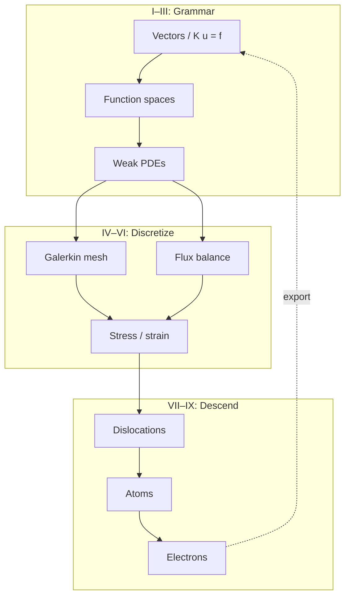

## The most important traps (whole book)

**Linear algebra and analysis**

1. **Ill-conditioning** is not non-uniqueness — check constraints and scaling before blaming physics.
2. **Rigid-body modes** are null-space physics, not solver bugs — boundary conditions remove them.
3. **Cauchy** does not imply convergence unless the space is **complete**.
4. **Weak convergence** is not strong convergence — FEM error in energy norm does not guarantee pointwise accuracy.
5. **FEM is not just matrix algebra** — it is projection; wrong \(V_h\) breaks the story before \(\mathbf{K}\) is assembled.

**PDEs and discretization**

6. **Corners and point loads** break classical smoothness — weak forms exist because strong forms fail.
7. **Equal-order \((P_1, P_1)\)** velocity–pressure pairs violate **inf–sup** — use Taylor–Hood or stabilization.
8. **Locking** in elasticity is a modeling/discretization mismatch — reduced integration or mixed formulations help.
9. **CFL violation** in explicit FVM blows up quietly until it blows up loudly — stability is not optional.
10. **Wall flux mismatch** in conjugate heat transfer is a **category error** at the interface, not a mesh issue.

**Continuum and mesoscale**

11. **Isotropic \(\mathbb{C}\) from bulk DFT** does not carry **cold-work history** — hardening lives in dislocation density.
12. **J₂ plasticity with one \(H\)** fits a curve; it does not explain **why** the curve bends — DDD supplies that.
13. **Cauchy stress from MD** requires careful **volume definition** and thermostat interpretation.
14. **Polycrystal texture** is not captured by single-crystal DDD alone — RVE and statistics matter.

**Atomistic and electronic**

15. **Cutoff artifacts** in MD potentials fake long-range physics — check convergence with box size and cutoff.
16. **Energy drift** in MD means the integrator or thermostat is wrong for the question asked.
17. **Wrong XC functional** in DFT shifts lattice constants — elastic constants and cohesive energies inherit the error.
18. **k-mesh too coarse** makes metals look like insulators in band structure — convergence is part of the physics.
19. **Born–Oppenheimer** fails when electrons stay correlated — the ladder has a bottom rung limit.

**Multiscale coupling**

20. **Unit mismatches** (eV vs. J, Å vs. m) propagate catastrophically upward — check at every arrow.
21. **Sequential homogenization** loses **path dependence** unless internal variables carry history.
22. **Surrogates** trained on one loading path fail on another — frame indifference and thermodynamic consistency are not optional.
23. **Skipping manufacturing history** (draw, anneal, service) predicts the wrong wire even with perfect DFT moduli.

## Continuity hinges master map {#continuity-hinges-master-map}

When a chapter feels disconnected from the last, pause at the hinge for your reading position — same copper wire, richer vocabulary at each turn. The [preface](../preface.md) splits these into opening, ascent, midpoint, descent, and epilogue tables; this page collects all **seventeen narrative hinges** (rows 0–16) plus **rows 17–27** (continuous read-through, plot-spine audits, lab act reunion, narrative recap, and symbol bridges) in reading order.

| # | Phase | Hinge | When to pause |
|---|-------|-------|---------------|
| 0 | Opening | [Prologue → I](../prologue/00-many-scales.md#bridge-to-part-i) · [preface row 0 skill checkpoint](../preface.md#skill-navigation-row-0) | Scale ladder feels like a menu before the first matrix |
| 1 | Ascent | [I.4 → II](../part01-linear-algebra/04-toward-infinity.md#bridge-to-part-ii) | \(\mathbf{K}\mathbf{u}=\mathbf{f}\) feels unrelated to PDEs |
| 2 | Ascent | [II.5 → III](../part02-functional-analysis/05-spectral-theorem.md#bridge-to-part-iii) | Sobolev norms feel abstract; weak form is the next dialogue |
| 3 | Ascent | [III.4 → IV](../part03-pdes/04-energy-methods.md#bridge-to-part-iv) | Energy minimization and matrix assembly seem like separate tricks |
| 4 | Ascent | [IV.5 / V.4 → VI](../part04-fem/05-convergence.md#bridge-two-doors-from-here) | FEM and FVM feel like unrelated courses |
| 5 | Midpoint | [Part VI opening](../part06-continuum/00-opening.md#midpoint-ascent-complete-descent-ahead) | Parts I–V feel like separate subjects |
| 6 | Midpoint | [VI.4 intermission](../part06-continuum/04-nonlinear-plasticity-preview.md#intermission-ascent-ends-descent-begins) | \(J_2\) fits the curve but not its cause |
| 7 | Descent | [VII.3 → VIII](../part07-defects/03-polycrystal-and-fem-handoff.md#bridge-to-part-viii) · [VIII.1 opening hinge](../part08-md/01-potentials-phase-space.md#opening-hinge-vii3-to-viii1) · [VIII.0 descent hinge](../part08-md/00-opening.md#descent-hinge-cores-mobility-and-tw-pedigree) | Mobility or \(\gamma_{\text{sf}}\) feel like fitted constants; `mobility.yaml` cites Part VIII without an atomic box |
| 7b | Descent | [VIII.1 Bridge](../part08-md/01-potentials-phase-space.md#bridge) · [VIII.2 opening hinge](../part08-md/02-ensembles-integrators.md#opening-hinge-viii1-to-viii2) | EAM archive exists but trajectories not run; 0 K \(a_0\) exported without NPT equilibration at \(T_w\) |
| 7c | Descent | [VIII.2 Bridge](../part08-md/02-ensembles-integrators.md#bridge) · [VIII.3 opening hinge](../part08-md/03-ab-initio-and-coarse-graining.md#opening-hinge-viii2-to-viii3) | NPT moduli and mobility exist but no handoff bundle; trajectories without DFT pedigree gates |
| 8 | Descent | [VIII.3 WHAM → VII mobility](../part08-md/03-ab-initio-and-coarse-graining.md#wham-part-vii-mobility-hinge-act-ii-temperature-pedigree) · [VIII.0 descent hinge](../part08-md/00-opening.md#descent-hinge-cores-mobility-and-tw-pedigree) · [preface row 8 skill checkpoint](../preface.md#skill-navigation-row-8) | Recovery or drag tables at 300 K while [`cht_export.yaml`](../../fixtures/cht_export.yaml) archives \(T_w = 311.48\,\text{K}\); [rows 8–9 baby picture](#rows-8-9-baby-picture-tw-temperature-pedigree) |
| 9 | Descent | [VIII.3 → IX](../part08-md/03-ab-initio-and-coarse-graining.md#bridge-to-part-ix) · [IX.0 electronic audit hinge](../part09-dft/00-opening.md#electronic-audit-hinge-descent-pedigree-and-tw-phonon) · [IX.0 thermal phonon audit at \(T_w\)](../part09-dft/00-opening.md#thermal-phonon-audit-at-tw) · [preface row 9 skill checkpoint](../preface.md#skill-navigation-row-9) | EAM matches bulk moduli but no DFT deck is cited; \(\alpha\) and \(\tau_{\text{ph}}\) at \(T_w\), not 300 K default; [rows 8–9 baby picture](#rows-8-9-baby-picture-tw-temperature-pedigree); [epilogue opening hinge from Part IX](../epilogue/multiscale.md#opening-hinge-ix3-to-epilogue) |
| 10 | Descent | [IX.3 → epilogue](../part09-dft/03-dft-workflows.md#bridge-to-the-epilogue) · [epilogue opening hinge from Part IX](../epilogue/multiscale.md#opening-hinge-ix3-to-epilogue) · [preface row 10 skill checkpoint](../preface.md#skill-navigation-row-10) · [prologue row 10 preview](../prologue/00-many-scales.md#prologue-preview-row-10) | Exports exist in separate folders with no workflow; Handshakes 4a/4b split not documented — [IX.3 epilogue pedigree table](../part09-dft/03-dft-workflows.md#ix3-epilogue-pedigree-table) maps artifacts to Handshakes 1–4b |
| 11 | Closing | [Epilogue: six-act reunion](../epilogue/multiscale.md#lab-act-reunion-six-acts-one-afternoon) · [preface row 11 skill checkpoint](../preface.md#skill-navigation-row-11) · [prologue row 11 preview](../prologue/00-many-scales.md#prologue-preview-row-11) · [prologue row 11 closing stitch](../prologue/00-many-scales.md#row-11-closing-stitch) · [epilogue row 11 closing loop](../epilogue/multiscale.md#row-11-closing-loop) | Each part makes sense alone but workflow order is unclear — [one-page copper wire recap](#one-page-copper-wire-recap) maps Acts I–VI to Parts; Act VI runs **in parallel** with Acts I–V, not after Part IX in lab time |
| 12 | Closing | [Epilogue → prologue](../epilogue/multiscale.md#row-12-closing-loop) · [prologue reopening anchor](../prologue/00-many-scales.md#prologue-reopening-anchor) · [preface row 12 skill checkpoint](../preface.md#skill-navigation-row-12) · [prologue row 12 preview](../prologue/00-many-scales.md#prologue-preview-row-12) · [prologue row 12 closing stitch](../prologue/00-many-scales.md#row-12-closing-stitch) | Next project needs scale discipline from day one — four questions restart; ladder reusable; [row 12 baby picture](#row-12-baby-picture-next-project) |
| 13 | Closing | [Handshake 2 → 3](../epilogue/multiscale.md#handshake-2--joule-heating--conjugate-heat-transfer-part-iv--v) → [IX.3 \(\alpha\) Lab act](../part09-dft/03-dft-workflows.md#lab-act-quasiharmonic-alpha-handshake-3-pedigree) → [Handshake 3](../epilogue/multiscale.md#handshake-3--thermal-strain--mechanical-stiffness-part-vi--iv) · [preface row 13 skill checkpoint](../preface.md#skill-navigation-row-13) · [prologue row 13 preview](../prologue/00-many-scales.md#prologue-preview-row-13) · [prologue row 13 closing stitch](../prologue/00-many-scales.md#row-13-closing-stitch) · [epilogue row 13 closing loop](../epilogue/multiscale.md#row-13-closing-loop) | CHT converged but load cell still uses handbook \(\alpha\); [row 13 baby picture](#row-13-baby-picture-handshake-2-3); [sensitivity table](../epilogue/multiscale.md#sensitivity-which-handshake-matters-most) ranks Handshake 3 **first for fixed-grip stress**; [sensitivity derivation worksheet](../epilogue/multiscale.md#worked-example-sensitivity-ranks) proves the ranking |
| 14 | Closing | [VII.3 rate handshake](../part07-defects/03-polycrystal-and-fem-handoff.md#scale-boundary-handshake-ddd-strain-rate-to-quasi-static-fem) → [Handshake 4a](../epilogue/multiscale.md#handshake-4--rate-dependent-hardening-and-notch-localization-part-vii--vi--viii) · [preface row 14 skill checkpoint](../preface.md#skill-navigation-row-14) · [prologue row 14 preview](../prologue/00-many-scales.md#prologue-preview-row-14) · [prologue row 14 closing stitch](../prologue/00-many-scales.md#row-14-closing-stitch) · [epilogue row 14 closing loop](../epilogue/multiscale.md#row-14-closing-loop) | DDD exports feed plasticity deck but hardening knee arrives early; [row 14 baby picture](#row-14-baby-picture-handshake-4a); [`parse_rate.sh`](../../scripts/parse_rate.sh) on `ddd_tau_vs_rate.dat`; [sensitivity derivation worksheet](../epilogue/multiscale.md#worked-example-sensitivity-ranks) (Handshake 4a column) — direct import without extrapolation overpredicts flow stress by 5–35% |
| 15 | Closing | [VII.3 Step 4 FE²](../part07-defects/03-polycrystal-and-fem-handoff.md#step-4--when-offline-calibration-fails-fe-at-the-notch) → [Handshake 4b](../epilogue/multiscale.md#4b--when-continuum-fails-at-the-notch-md-subdomain-act-v--notch) · [preface row 15 skill checkpoint](../preface.md#skill-navigation-row-15) · [prologue Handshake 4b preview](../prologue/00-many-scales.md#prologue-preview-act-v) · [prologue row 15 closing stitch](../prologue/00-many-scales.md#row-15-closing-stitch) · [epilogue row 15 closing loop](../epilogue/multiscale.md#row-15-closing-loop) | Bulk hardening from 4a looks right but notch root under-predicts peak stress; [row 15 baby picture](#row-15-baby-picture-handshake-4b); [`parse_fe2.sh`](../../scripts/parse_fe2.sh) on `fe2_notch_comparison.dat`; [sensitivity derivation worksheet](../epilogue/multiscale.md#worked-example-sensitivity-ranks) (Handshake 4b column) — scalar \(H\) under-predicts root stress by 10–15%; upstream rate from [row 14](../preface.md#skill-navigation-row-14) |
| 16 | Closing | [IX.3 → epilogue orchestration](../part09-dft/03-dft-workflows.md#bridge-to-the-epilogue) → [`parse_multiscale_workflow.sh`](../../scripts/parse_multiscale_workflow.sh) · [preface row 16 skill checkpoint](../preface.md#skill-navigation-row-16) · [prologue row 16 preview](../prologue/00-many-scales.md#prologue-preview-row-16) · [prologue row 16 closing stitch](../prologue/00-many-scales.md#row-16-closing-stitch) · [epilogue row 16 closing loop](../epilogue/multiscale.md#row-16-closing-loop) | Exports exist in separate folders but no orchestrated pedigree; [preface row 16 three-way audit](../preface.md#skill-navigation-row-16); [memory sheet Act VI baby picture](#act-vi-baby-picture-me-412-coupling-ladder); [epilogue script audit trail](../epilogue/multiscale.md#script-audit-trail-parse-scripts-handshakes) for per-handshake parsers; upstream [rows 8–9](../preface.md#skill-navigation-row-8) (\(T_w\) pedigree) and [rows 13–15](../preface.md#skill-navigation-row-13) understood first; [`parse_multiscale_workflow.sh`](../../scripts/parse_multiscale_workflow.sh) on `cu.foundation/` + `cht_wire.conf` → `multiscale_export.yaml` linking Handshakes 1–4b with \(\Delta T\) from Handshake 2 feeding Handshake 3 and phonon lifetime at converged \(T_w\) feeding Handshake 4a |
| 17 | Meta | [Continuous read-through guide](sources.md#continuous-read-through-guide) · [preface row 17 skill checkpoint](../preface.md#skill-navigation-row-17) · [prologue row 17 preview](../prologue/00-many-scales.md#prologue-preview-row-17) · [prologue row 17 closing stitch](../prologue/00-many-scales.md#row-17-closing-stitch) · [epilogue row 17 closing loop](../epilogue/multiscale.md#row-17-closing-loop) | Straight read feels choppy despite individual Bridges — trust Scene/Bridge rhythm; pause only at I.4, VI.4, IX.3 gates; [row 17 baby picture](#row-17-baby-picture-continuous-read-through) |
| 18 | Meta | [Part-opening plot spine index](sources.md#part-opening-plot-spine-index-row-18) · [preface row 18 skill checkpoint](../preface.md#skill-navigation-row-18) · [prologue row 18 preview](../prologue/00-many-scales.md#prologue-preview-row-18) · [prologue row 18 closing stitch](../prologue/00-many-scales.md#row-18-closing-stitch) · [epilogue row 18 closing loop](../epilogue/multiscale.md#row-18-closing-loop) | A part opening feels like a new syllabus — read its [plot spine one line](../part01-linear-algebra/00-opening.md#plot-spine-one-line) aloud; [row 18 baby picture](#row-18-baby-picture-part-opening-plot-spine) |
| 19 | Meta | [Numbered-chapter plot spine index](sources.md#numbered-chapter-plot-spine-index-row-19) · [preface row 19 skill checkpoint](../preface.md#skill-navigation-row-19) · [prologue row 19 preview](../prologue/00-many-scales.md#prologue-preview-row-19) · [prologue row 19 closing stitch](../prologue/00-many-scales.md#row-19-closing-stitch) · [epilogue row 19 closing loop](../epilogue/multiscale.md#row-19-closing-loop) | Mid-chapter reading stalls despite a Bridge — read this chapter's [plot spine one line](../part01-linear-algebra/01-vectors-matrices.md#plot-spine-one-line) aloud; [row 19 baby picture](#row-19-baby-picture-numbered-chapter-plot-spine) |
| 20 | Meta | [Gate-chapter plot spine index](sources.md#gate-chapter-plot-spine-index-row-20) · [preface row 20 skill checkpoint](../preface.md#skill-navigation-row-20) · [prologue row 20 preview](../prologue/00-many-scales.md#prologue-preview-row-20) · [prologue row 20 closing stitch](../prologue/00-many-scales.md#row-20-closing-stitch) · [epilogue row 20 closing loop](../epilogue/multiscale.md#row-20-closing-loop) | A mandatory gate (I.4, VI.4, IX.3) stalls the straight read — recite its [plot spine one line](../part01-linear-algebra/04-toward-infinity.md#plot-spine-one-line) aloud before the Bridge; [row 20 baby picture](#row-20-baby-picture-gate-chapter-plot-spine) |
| 21 | Meta | [Lab act reunion index](sources.md#lab-act-reunion-index-row-21) · [preface row 21 skill checkpoint](../preface.md#skill-navigation-row-21) · [prologue row 21 preview](../prologue/00-many-scales.md#prologue-preview-row-21) · [prologue row 21 closing stitch](../prologue/00-many-scales.md#row-21-closing-stitch) · [epilogue row 21 closing loop](../epilogue/multiscale.md#row-21-closing-loop) | A Lab act feels like standalone homework — read its one-line move aloud and name the lab act; [row 21 baby picture](#row-21-baby-picture-lab-act-reunion) |
| 22 | Meta | [Scene reunion index](sources.md#scene-reunion-index-row-22) · [preface row 22 skill checkpoint](../preface.md#skill-navigation-row-22) · [prologue row 22 preview](../prologue/00-many-scales.md#prologue-preview-row-22) · [prologue row 22 closing stitch](../prologue/00-many-scales.md#row-22-closing-stitch) · [epilogue row 22 closing loop](../epilogue/multiscale.md#row-22-closing-loop) | Plot spines and Lab acts read correctly but symbols hide the wire — read the Scene one-line visual aloud and picture the operator; [row 22 baby picture](#row-22-baby-picture-scene-reunion) |
| 23 | Meta | [Bridge reunion index](sources.md#bridge-reunion-index-row-23) · [preface row 23 skill checkpoint](../preface.md#skill-navigation-row-23) · [prologue row 23 preview](../prologue/00-many-scales.md#prologue-preview-row-23) · [prologue row 23 closing stitch](../prologue/00-many-scales.md#row-23-closing-stitch) · [epilogue row 23 closing loop](../epilogue/multiscale.md#row-23-closing-loop) | Scene, plot spines, and Lab acts all read correctly but chapter transitions feel mechanical — read the prior chapter's Bridge one-line hinge aloud; [row 23 baby picture](#row-23-baby-picture-bridge-reunion) |
| 24 | Meta | [Concept map reunion index](sources.md#concept-map-reunion-index-row-24) · [preface row 24 skill checkpoint](../preface.md#skill-navigation-row-24) · [prologue row 24 preview](../prologue/00-many-scales.md#prologue-preview-row-24) · [prologue row 24 closing stitch](../prologue/00-many-scales.md#row-24-closing-stitch) · [epilogue row 24 closing loop](../epilogue/multiscale.md#row-24-closing-loop) | Narrative, sensory, and transition vocabulary all read correctly but proofs feel like disconnected theorems — answer object / structure / theorem / breaks at the part-opening concept map; [row 24 baby picture](#row-24-baby-picture-concept-map-reunion) |
| 25 | Meta | [Schematic reunion index](sources.md#schematic-reunion-index-row-25) · [preface row 25 skill checkpoint](../preface.md#skill-navigation-row-25) · [prologue row 25 preview](../prologue/00-many-scales.md#prologue-preview-row-25) · [prologue row 25 closing stitch](../prologue/00-many-scales.md#row-25-closing-stitch) · [epilogue row 25 closing loop](../epilogue/multiscale.md#row-25-closing-loop) | Scene, plot spines, Lab acts, visuals, Bridges, and concept maps all read correctly but proofs feel abstract without a visual anchor — locate the matching baby picture from the part-opening representative schematics table; [row 25 baby picture](#row-25-baby-picture-schematic-reunion) |
| 26 | Meta | [Story so far reunion index](sources.md#story-so-far-reunion-index-row-26) · [preface row 26 skill checkpoint](../preface.md#skill-navigation-row-26) · [prologue row 26 preview](../prologue/00-many-scales.md#prologue-preview-row-26) · [prologue row 26 closing stitch](../prologue/00-many-scales.md#row-26-closing-stitch) · [epilogue row 26 closing loop](../epilogue/multiscale.md#row-26-closing-loop) | Rows 17–25 all read correctly in isolation but you cannot place where the copper wire is in the narrative arc — read the part-opening **Story so far** recap aloud and name what the wire became at the prior scale; [row 26 baby picture](#row-26-baby-picture-story-so-far-reunion) |
| 27 | Meta | [Closing the arc reunion index](sources.md#closing-the-arc-reunion-index-row-27) · [preface row 27 skill checkpoint](../preface.md#skill-navigation-row-27) · [prologue row 27 preview](../prologue/00-many-scales.md#prologue-preview-row-27) · [prologue row 27 closing stitch](../prologue/00-many-scales.md#row-27-closing-stitch) · [epilogue row 27 closing loop](../epilogue/multiscale.md#row-27-closing-loop) | Rows 17–26 all read correctly but prior-part symbols do not map to current-part vocabulary — read the part-opening **Closing the arc** table aloud and name one symbol translation per row; [row 27 baby picture](#row-27-baby-picture-closing-the-arc-reunion) |
| 28 | Meta | [Scale-boundary reunion index](sources.md#scale-boundary-reunion-index-row-28) · [preface row 28 skill checkpoint](../preface.md#skill-navigation-row-28) · [prologue row 28 preview](../prologue/00-many-scales.md#prologue-preview-row-28) · [prologue row 28 closing stitch](../prologue/00-many-scales.md#row-28-closing-stitch) · [epilogue row 28 closing loop](../epilogue/multiscale.md#row-28-closing-loop) | Rows 17–27 all read correctly but parameters crossing a scale boundary feel arbitrary — read the chapter **Scale-boundary handshake** table and name export → consumer → failure mode; [row 28 baby picture](#row-28-baby-picture-scale-boundary-reunion) |
| 29 | Meta | [Thermoelastic assembly reunion index](sources.md#thermoelastic-assembly-reunion-index-row-29) · [preface row 29 skill checkpoint](../preface.md#skill-navigation-row-29) · [prologue row 29 preview](../prologue/00-many-scales.md#prologue-preview-row-29) · [prologue row 29 closing stitch](../prologue/00-many-scales.md#row-29-closing-stitch) · [epilogue row 29 closing loop](../epilogue/multiscale.md#row-29-closing-loop) | Rows 17–28 all read correctly but Act II heating and Act III pulling feel like separate FEM homework — read the Part IV thermoelastic assembly thread and name heat pass → \(\mathbf{F}_{\text{th}}\) → mechanics pass on same connectivity; [row 29 baby picture](#row-29-baby-picture-thermoelastic-assembly-reunion) |
| 30 | Meta | [CHT outer-loop reunion index](sources.md#cht-outer-loop-reunion-index-row-30) · [preface row 30 skill checkpoint](../preface.md#skill-navigation-row-30) · [prologue row 30 preview](../prologue/00-many-scales.md#prologue-preview-row-30) · [prologue row 30 closing stitch](../prologue/00-many-scales.md#row-30-closing-stitch) · [epilogue row 30 closing loop](../epilogue/multiscale.md#row-30-closing-loop) | Rows 17–29 all read correctly but solid FEM and fluid FVM still feel like separate solvers — read IV.5 → V.4 Picard → `cht_export.yaml` and name one converged \(T_w\) for both twins; [row 30 baby picture](#row-30-baby-picture-cht-outer-loop-reunion) |
| 31 | Meta | [Twin-ladder virtual work reunion index](sources.md#twin-ladder-virtual-work-reunion-index-row-31) · [preface row 31 skill checkpoint](../preface.md#skill-navigation-row-31) · [prologue row 31 preview](../prologue/00-many-scales.md#prologue-preview-row-31) · [prologue row 31 closing stitch](../prologue/00-many-scales.md#row-31-closing-stitch) · [epilogue row 31 closing loop](../epilogue/multiscale.md#row-31-closing-loop) | Rows 17–30 all read correctly but Galerkin assembly and virtual work still feel like separate subjects — read VI.0 twin-ladder → VI.1 kinematics → VI.3 virtual work and name why \(\mathbf{K}\mathbf{U}=\mathbf{F}\) is force balance; [row 31 baby picture](#row-31-baby-picture-twin-ladder-virtual-work-reunion) |
| 32 | Meta | [Virtual work → plasticity preview reunion index](sources.md#virtual-work-plasticity-preview-reunion-index-row-32) · [preface row 32 skill checkpoint](../preface.md#skill-navigation-row-32) · [prologue row 32 preview](../prologue/00-many-scales.md#prologue-preview-row-32) · [prologue row 32 closing stitch](../prologue/00-many-scales.md#row-32-closing-stitch) · [epilogue row 32 closing loop](../epilogue/multiscale.md#row-32-closing-loop) | Rows 17–31 all read correctly but \(\delta\Pi = 0\) and return-mapping still feel like separate subjects — read VI.3 virtual work → VI.4 return-mapping → Part VII descent hinge; [row 32 baby picture](#row-32-baby-picture-virtual-work-plasticity-preview-reunion) |
| 33 | Meta | [Part VII → VIII descent hinge reunion index](sources.md#part-vii-viii-descent-hinge-reunion-index-row-33) · [preface row 33 skill checkpoint](../preface.md#skill-navigation-row-33) · [prologue row 33 preview](../prologue/00-many-scales.md#prologue-preview-row-33) · [prologue row 33 closing stitch](../prologue/00-many-scales.md#row-33-closing-stitch) · [epilogue row 33 closing loop](../epilogue/multiscale.md#row-33-closing-loop) | Rows 17–32 all read correctly but mesoscale DDD and atomistic MD still feel like separate courses — read Part VII descent hinge → VII.2 mobility at \(T_w\) → Part VIII descent hinge; [row 33 baby picture](#row-33-baby-picture-part-vii-viii-descent-hinge-reunion) |
| 34 | Meta | [Potentials → ensembles reunion index](sources.md#potentials-ensembles-reunion-index-row-34) · [preface row 34 skill checkpoint](../preface.md#skill-navigation-row-34) · [prologue row 34 preview](../prologue/00-many-scales.md#prologue-preview-row-34) · [prologue row 34 closing stitch](../prologue/00-many-scales.md#row-34-closing-stitch) · [epilogue row 34 closing loop](../epilogue/multiscale.md#row-34-closing-loop) | Rows 17–33 all read correctly but 0 K EAM minimization and NVT/NPT trajectories still feel like separate subjects — read VIII.1 Bridge → VIII.2 opening hinge; [row 34 baby picture](#row-34-baby-picture-potentials-ensembles-reunion) |
| 35 | Meta | [Ensembles → coarse-graining reunion index](sources.md#ensembles-coarse-graining-reunion-index-row-35) · [preface row 35 skill checkpoint](../preface.md#skill-navigation-row-35) · [prologue row 35 preview](../prologue/00-many-scales.md#prologue-preview-row-35) · [prologue row 35 closing stitch](../prologue/00-many-scales.md#row-35-closing-stitch) · [epilogue row 35 closing loop](../epilogue/multiscale.md#row-35-closing-loop) | Rows 17–34 all read correctly but audited trajectories and coarse-grained handoff tables still feel like separate subjects — read VIII.2 Bridge → VIII.3 opening hinge; [row 35 baby picture](#row-35-baby-picture-ensembles-coarse-graining-reunion) |
| 36 | Meta | [Coarse-graining → electronic audit reunion index](sources.md#coarse-graining-electronic-audit-reunion-index-row-36) · [preface row 36 skill checkpoint](../preface.md#skill-navigation-row-36) · [prologue row 36 preview](../prologue/00-many-scales.md#prologue-preview-row-36) · [prologue row 36 closing stitch](../prologue/00-many-scales.md#row-36-closing-stitch) · [epilogue row 36 closing loop](../epilogue/multiscale.md#row-36-closing-loop) | Rows 17–35 all read correctly but pedigree checklist rows exist without QE SCF logs or \(\alpha(T_w)\) — read VIII.3 Bridge → IX.0 opening hinge; [row 36 baby picture](#row-36-baby-picture-coarse-graining-electronic-audit-reunion) |
| 37 | Meta | [Electronic audit → Born–Oppenheimer reunion index](sources.md#electronic-audit-born-oppenheimer-reunion-index-row-37) · [preface row 37 skill checkpoint](../preface.md#skill-navigation-row-37) · [prologue row 37 preview](../prologue/00-many-scales.md#prologue-preview-row-37) · [prologue row 37 closing stitch](../prologue/00-many-scales.md#row-37-closing-stitch) · [epilogue row 37 closing loop](../epilogue/multiscale.md#row-37-closing-loop) | Rows 17–36 all read correctly but SCF logs exist without BO/HK theorems connecting to Part VIII's EAM surface — read IX.0 Bridge → IX.1 opening hinge; [row 37 baby picture](#row-37-baby-picture-electronic-audit-born-oppenheimer-reunion) |
| 38 | Meta | [Born–Oppenheimer → Kohn–Sham reunion index](sources.md#born-oppenheimer-kohn-sham-reunion-index-row-38) · [preface row 38 skill checkpoint](../preface.md#skill-navigation-row-38) · [prologue row 38 preview](../prologue/00-many-scales.md#prologue-preview-row-38) · [prologue row 38 closing stitch](../prologue/00-many-scales.md#row-38-closing-stitch) · [epilogue row 38 closing loop](../epilogue/multiscale.md#row-38-closing-loop) | Rows 17–37 all read correctly but BO/HK theorems exist without SCF fixed-point loop connecting to Part I eigenvalues — read IX.1 Bridge → IX.2 opening hinge; [row 38 baby picture](#row-38-baby-picture-born-oppenheimer-kohn-sham-reunion) |
| 39 | Meta | [Kohn–Sham → DFT workflows reunion index](sources.md#kohn-sham-dft-workflows-reunion-index-row-39) · [preface row 39 skill checkpoint](../preface.md#skill-navigation-row-39) · [prologue row 39 preview](../prologue/00-many-scales.md#prologue-preview-row-39) · [prologue row 39 closing stitch](../prologue/00-many-scales.md#row-39-closing-stitch) · [epilogue row 39 closing loop](../epilogue/multiscale.md#row-39-closing-loop) | Rows 17–38 all read correctly but SCF is understood without calculation ladder and `cu.foundation/` archive — read IX.2 Bridge → IX.3 opening hinge; [row 39 baby picture](#row-39-baby-picture-kohn-sham-dft-workflows-reunion) |
| 40 | Meta | [IX.3 → Handshake 3 reunion index](sources.md#ix3-handshake3-reunion-index-row-40) · [preface row 40 skill checkpoint](../preface.md#skill-navigation-row-40) · [prologue row 40 preview](../prologue/00-many-scales.md#prologue-preview-row-40) · [prologue row 40 closing stitch](../prologue/00-many-scales.md#row-40-closing-stitch) · [epilogue row 40 closing loop](../epilogue/multiscale.md#row-40-closing-loop) | Rows 17–39 all read correctly but `cu.foundation/` is complete yet handbook \(\alpha(300\,\text{K})\) persists at load cell — read IX.3 Bridge → epilogue Handshake 3 opening hinge; [row 40 baby picture](#row-40-baby-picture-ix3-handshake3-reunion) |
| 41 | Meta | [VII.3 → Handshake 4a reunion index](sources.md#vii3-handshake4a-reunion-index-row-41) · [preface row 41 skill checkpoint](../preface.md#skill-navigation-row-41) · [prologue row 41 preview](../prologue/00-many-scales.md#prologue-preview-row-41) · [prologue row 41 closing stitch](../prologue/00-many-scales.md#row-41-closing-stitch) · [epilogue row 41 closing loop](../epilogue/multiscale.md#row-41-closing-loop) | Rows 17–40 all read correctly but OpenDiS exports feed plasticity deck without rate extrapolation — read VII.3 rate handshake → epilogue Handshake 4a opening hinge; [row 41 baby picture](#row-41-baby-picture-vii3-handshake4a-reunion) |
| 42 | Meta | [VII.3 → Handshake 4b reunion index](sources.md#vii3-handshake4b-reunion-index-row-42) · [preface row 42 skill checkpoint](../preface.md#skill-navigation-row-42) · [prologue row 42 preview](../prologue/00-many-scales.md#prologue-preview-row-42) · [prologue row 42 closing stitch](../prologue/00-many-scales.md#row-42-closing-stitch) · [epilogue row 42 closing loop](../epilogue/multiscale.md#row-42-closing-loop) | Rows 17–41 all read correctly but bulk hardening from 4a matches flow stress while notch root under-predicts without FE² audit — read VII.3 Step 4 → epilogue Handshake 4b opening hinge; [row 42 baby picture](#row-42-baby-picture-vii3-handshake4b-reunion) |
| 43 | Meta | [Rows 17–42 → Row 16 orchestration reunion index](sources.md#rows17-42-row16-orchestration-reunion-index-row-43) · [preface row 43 skill checkpoint](../preface.md#skill-navigation-row-43) · [prologue row 43 preview](../prologue/00-many-scales.md#prologue-preview-row-43) · [prologue row 43 closing stitch](../prologue/00-many-scales.md#row-43-closing-stitch) · [epilogue row 43 closing loop](../epilogue/multiscale.md#row-43-closing-loop) | Rows 17–42 all read correctly but Handshakes 1–4b exist in separate folders without orchestrated `multiscale_export.yaml` — read IX.3 pedigree table → epilogue row 16 opening hinge; [row 43 baby picture](#row-43-baby-picture-rows17-42-row16-orchestration-reunion) |
| 44 | Meta | [Rows 17–43 → Row 12 book loop closure index](sources.md#rows17-43-row12-book-loop-closure-index-row-44) · [preface row 44 skill checkpoint](../preface.md#skill-navigation-row-44) · [prologue row 44 preview](../prologue/00-many-scales.md#prologue-preview-row-44) · [prologue row 44 closing stitch](../prologue/00-many-scales.md#row-44-closing-stitch) · [epilogue row 44 closing loop](../epilogue/multiscale.md#row-44-closing-loop) | Rows 17–43 all read correctly but `multiscale_export.yaml` exists yet the next terminal opens with copper decks copied blindly — read epilogue ME 412 summary → prologue reopening anchor; [row 44 baby picture](#row-44-baby-picture-rows17-43-row12-book-loop-closure) |
| 45 | Meta | [Rows 17–44 → Row 17 second-pass reunion index](sources.md#rows17-44-row17-second-pass-reunion-index-row-45) · [preface row 45 skill checkpoint](../preface.md#skill-navigation-row-45) · [prologue row 45 preview](../prologue/00-many-scales.md#prologue-preview-row-45) · [prologue row 45 closing stitch](../prologue/00-many-scales.md#row-45-closing-stitch) · [epilogue row 45 closing loop](../epilogue/multiscale.md#row-45-closing-loop) | Rows 17–44 all read correctly but Preface → Epilogue still feels like a syllabus — second Scene → Bridge pass; [row 45 baby picture](#row-45-baby-picture-rows17-44-row17-second-pass-reunion) |
| 46 | Meta | [Rows 17–45 → Writings reunion index](sources.md#rows17-45-writings-canonical-reunion-index-row-46) · [preface row 46 skill checkpoint](../preface.md#skill-navigation-row-46) · [prologue row 46 preview](../prologue/00-many-scales.md#prologue-preview-row-46) · [prologue row 46 closing stitch](../prologue/00-many-scales.md#row-46-closing-stitch) · [epilogue row 46 closing loop](../epilogue/multiscale.md#row-46-closing-loop) · [writings source index](../writings/SUMMARY.md) | Rows 17–45 all read correctly but edits land in `src/` not `writings/` — sync before build; [row 46 baby picture](#row-46-baby-picture-rows17-45-writings-canonical-reunion) |
| 47 | Meta | [V.4 → VI.0 Writings reunion index](sources.md#v4-vi0-writings-canonical-reunion-index-row-47) · [preface row 47 skill checkpoint](../preface.md#skill-navigation-row-47) · [prologue row 47 preview](../prologue/00-many-scales.md#prologue-preview-row-47) · [prologue row 47 closing stitch](../prologue/00-many-scales.md#row-47-closing-stitch) · [epilogue row 47 closing loop](../epilogue/multiscale.md#row-47-closing-loop) | Row 46 closed but V.4 → VI.0 feels like two courses — read Bridge → VI.0 twin-ladder landing; [row 47 baby picture](#row-47-baby-picture-v4-vi0-writings-canonical-reunion) |
| 48 | Meta | [VI.4 → VII.0 Writings reunion index](sources.md#vi4-vii0-writings-canonical-reunion-index-row-48) · [preface row 48 skill checkpoint](../preface.md#skill-navigation-row-48) · [prologue row 48 preview](../prologue/00-many-scales.md#prologue-preview-row-48) · [prologue row 48 closing stitch](../prologue/00-many-scales.md#row-48-closing-stitch) · [epilogue row 48 closing loop](../epilogue/multiscale.md#row-48-closing-loop) | Row 47 closed but VI.4 → VII.0 feels like two courses — read intermission → Bridge → VII.0 landing; [row 48 baby picture](#row-48-baby-picture-vi4-vii0-writings-canonical-reunion) |
| 49 | Meta | [VII.3 → VIII.0 Writings reunion index](sources.md#vii3-viii0-writings-canonical-reunion-index-row-49) · [preface row 49 skill checkpoint](../preface.md#skill-navigation-row-49) · [prologue row 49 preview](../prologue/00-many-scales.md#prologue-preview-row-49) · [prologue row 49 closing stitch](../prologue/00-many-scales.md#row-49-closing-stitch) · [epilogue row 49 closing loop](../epilogue/multiscale.md#row-49-closing-loop) | Row 48 closed but VII.3 → VIII.0 feels like two courses — read Bridge → VIII.0 landing → VIII.1 hinge; [row 49 baby picture](#row-49-baby-picture-vii3-viii0-writings-canonical-reunion) |
| 50 | Meta | [VIII.3 → IX.0 Writings reunion index](sources.md#viii3-ix0-writings-canonical-reunion-index-row-50) · [preface row 50 skill checkpoint](../preface.md#skill-navigation-row-50) · [prologue row 50 preview](../prologue/00-many-scales.md#prologue-preview-row-50) · [prologue row 50 closing stitch](../prologue/00-many-scales.md#row-50-closing-stitch) · [epilogue row 50 closing loop](../epilogue/multiscale.md#row-50-closing-loop) | Row 49 closed but VIII.3 → IX.0 feels like two courses — read Bridge → IX.0 landing → IX.1 hinge; [row 50 baby picture](#row-50-baby-picture-viii3-ix0-writings-canonical-reunion) |
| 51 | Meta | [IX.3 → Epilogue Writings reunion index](sources.md#ix3-epilogue-writings-canonical-reunion-index-row-51) · [preface row 51 skill checkpoint](../preface.md#skill-navigation-row-51) · [prologue row 51 preview](../prologue/00-many-scales.md#prologue-preview-row-51) · [prologue row 51 closing stitch](../prologue/00-many-scales.md#row-51-closing-stitch) · [epilogue row 51 closing loop](../epilogue/multiscale.md#row-51-closing-loop) | Row 50 closed but IX.3 → Epilogue feels like two courses — read Bridge → epilogue landing → opening hinge; [row 51 baby picture](#row-51-baby-picture-ix3-epilogue-writings-canonical-reunion) |
| 52 | Meta | [Epilogue → Prologue Writings reunion index](sources.md#epilogue-prologue-writings-canonical-reunion-index-row-52) · [preface row 52 skill checkpoint](../preface.md#skill-navigation-row-52) · [prologue row 52 preview](../prologue/00-many-scales.md#prologue-preview-row-52) · [prologue row 52 closing stitch](../prologue/00-many-scales.md#row-52-closing-stitch) · [epilogue row 52 closing loop](../epilogue/multiscale.md#row-52-closing-loop) | Row 51 closed but Epilogue → Prologue feels like two courses — read ME 412 summary → prologue landing → reopening anchor; [row 52 baby picture](#row-52-baby-picture-epilogue-prologue-writings-canonical-reunion) |
| 53 | Meta | [Row 52 → Row 12 intra-epilogue bridge reunion index](sources.md#row52-row12-intra-epilogue-handshake-bridge-reunion-index-row-53) · [preface row 53 skill checkpoint](../preface.md#skill-navigation-row-53) · [prologue row 53 preview](../prologue/00-many-scales.md#prologue-preview-row-53) · [prologue row 53 closing stitch](../prologue/00-many-scales.md#row-53-closing-stitch) · [epilogue row 53 closing loop](../epilogue/multiscale.md#row-53-closing-loop) | Row 52 closed but Handshakes 3–4b feel like separate ME sections — read intra-epilogue bridge chain → row 12 ME 412 summary; [row 53 baby picture](#row-53-baby-picture-row52-row12-intra-epilogue-bridge-reunion) |
| 54 | Meta | [Rows 52–53 → workflow exam reunion index](sources.md#rows52-53-workflow-exam-three-way-audit-reunion-index-row-54) · [preface row 54 skill checkpoint](../preface.md#skill-navigation-row-54) · [prologue row 54 preview](../prologue/00-many-scales.md#prologue-preview-row-54) · [prologue row 54 closing stitch](../prologue/00-many-scales.md#row-54-closing-stitch) · [epilogue row 54 closing loop](../epilogue/multiscale.md#row-54-closing-loop) · [glossary book-loop rows](glossary.md#book-loop-reunion-rows-52-53) | Rows 52–53 closed but workflow exam columns blur 12 / 52 / 53 — align three-way audits; [row 54 baby picture](#row-54-baby-picture-rows52-53-workflow-exam-three-way-audit-reunion) |
| 55 | Meta | [Row 54 → Row 12 copper-arc reunion index](sources.md#row54-row12-copper-arc-three-way-audit-reunion-index-row-55) · [preface row 55 skill checkpoint](../preface.md#skill-navigation-row-55) · [prologue row 55 preview](../prologue/00-many-scales.md#prologue-preview-row-55) · [prologue row 55 closing stitch](../prologue/00-many-scales.md#row-55-closing-stitch) · [epilogue row 55 closing loop](../epilogue/multiscale.md#row-55-closing-loop) · [preface row 12 three-way audit](../preface.md#skill-navigation-row-12) | Row 54 closed but row 12 preface ↔ epilogue disagree or reopening opens before row 52 landing — copper arc 53 → 12 → 52; [row 55 baby picture](#row-55-baby-picture-row54-row12-copper-arc-three-way-audit-reunion) |
| 56 | Meta | [Row 55 → Opening continuity reunion index](sources.md#row55-opening-continuity-reunion-index-row-56) · [preface row 56 skill checkpoint](../preface.md#skill-navigation-row-56) · [prologue row 56 preview](../prologue/00-many-scales.md#prologue-preview-row-56) · [prologue row 56 closing stitch](../prologue/00-many-scales.md#row-56-closing-stitch) · [epilogue row 56 closing loop](../epilogue/multiscale.md#row-56-closing-loop) · [opening continuity hinge](../preface.md#opening-continuity-hinge) | Row 55 closed but Part I opens without prologue → I.0 chain — row 55 → row 0 → I.1 mounting; [row 56 baby picture](#row-56-baby-picture-row55-opening-continuity-reunion) |
| 57 | Meta | [Row 56 → I.0 → I.1 reunion index](sources.md#row56-i0-i1-mounting-reunion-index-row-57) · [preface row 57 skill checkpoint](../preface.md#skill-navigation-row-57) · [prologue row 57 preview](../prologue/00-many-scales.md#prologue-preview-row-57) · [prologue row 57 closing stitch](../prologue/00-many-scales.md#row-57-closing-stitch) · [epilogue row 57 closing loop](../epilogue/multiscale.md#row-57-closing-loop) · [I.0 → I.1 Writings hinge](../part01-linear-algebra/00-opening.md#writings-canonical-hinge-i0-to-i1) | Row 56 closed but I.0 → I.1 feels like two courses — I.0 Bridge → three-node Lab act; [row 57 baby picture](#row-57-baby-picture-row56-i0-i1-mounting-reunion) |
| 58 | Meta | [Row 57 → I.1 → I.2 reunion index](sources.md#row57-i1-i2-assembly-reunion-index-row-58) · [preface row 58 skill checkpoint](../preface.md#skill-navigation-row-58) · [prologue row 58 preview](../prologue/00-many-scales.md#prologue-preview-row-58) · [prologue row 58 closing stitch](../prologue/00-many-scales.md#row-58-closing-stitch) · [epilogue row 58 closing loop](../epilogue/multiscale.md#row-58-closing-loop) · [I.1 → I.2 Writings hinge](../part01-linear-algebra/01-vectors-matrices.md#writings-canonical-hinge-i1-to-i2) | Row 57 closed but I.1 → I.2 feels like two courses — I.1 Bridge → two-element scatter; [row 58 baby picture](#row-58-baby-picture-row57-i1-i2-assembly-reunion) |
| 59 | Meta | [Row 58 → I.2 → I.3 reunion index](sources.md#row58-i2-i3-eigenvalue-reunion-index-row-59) · [preface row 59 skill checkpoint](../preface.md#skill-navigation-row-59) · [prologue row 59 preview](../prologue/00-many-scales.md#prologue-preview-row-59) · [prologue row 59 closing stitch](../prologue/00-many-scales.md#row-59-closing-stitch) · [epilogue row 59 closing loop](../epilogue/multiscale.md#row-59-closing-loop) · [I.2 → I.3 Writings hinge](../part01-linear-algebra/02-linear-maps.md#writings-canonical-hinge-i2-to-i3) | Row 58 closed but I.2 → I.3 feels like two courses — I.2 Bridge → tap-the-wire Lab act; [row 59 baby picture](#row-59-baby-picture-row58-i2-i3-eigenvalue-reunion) |
| 60 | Meta | [Row 59 → I.3 → I.4 reunion index](sources.md#row59-i3-i4-mesh-limit-reunion-index-row-60) · [preface row 60 skill checkpoint](../preface.md#skill-navigation-row-60) · [prologue row 60 preview](../prologue/00-many-scales.md#prologue-preview-row-60) · [prologue row 60 closing stitch](../prologue/00-many-scales.md#row-60-closing-stitch) · [epilogue row 60 closing loop](../epilogue/multiscale.md#row-60-closing-loop) · [I.3 → I.4 Writings hinge](../part01-linear-algebra/03-eigenvalues.md#writings-canonical-hinge-i3-to-i4) | Row 59 closed but I.3 → I.4 feels like two courses — I.3 Bridge → thermocouple Lab act; [row 60 baby picture](#row-60-baby-picture-row59-i3-i4-mesh-limit-reunion) |
| 61 | Meta | [I.4 → II.0 reunion index](sources.md#i4-ii0-writings-canonical-reunion-index-row-61) · [preface row 61 skill checkpoint](../preface.md#skill-navigation-row-61) · [prologue row 61 preview](../prologue/00-many-scales.md#prologue-preview-row-61) · [prologue row 61 closing stitch](../prologue/00-many-scales.md#row-61-closing-stitch) · [epilogue row 61 closing loop](../epilogue/multiscale.md#row-61-closing-loop) · [I.4 → II.0 Writings hinge](../part01-linear-algebra/04-toward-infinity.md#writings-canonical-hinge-i4-to-ii0) | Row 60 closed but I.4 → II.0 feels like two courses — I.4 Bridge → II.0 landing → Closing the arc; [row 61 baby picture](#row-61-baby-picture-i4-ii0-writings-canonical-reunion) |
| 62 | Meta | [Row 61 → II.0 → II.1 reunion index](sources.md#row61-ii0-ii1-motivation-reunion-index-row-62) · [preface row 62 skill checkpoint](../preface.md#skill-navigation-row-62) · [prologue row 62 preview](../prologue/00-many-scales.md#prologue-preview-row-62) · [prologue row 62 closing stitch](../prologue/00-many-scales.md#row-62-closing-stitch) · [epilogue row 62 closing loop](../epilogue/multiscale.md#row-62-closing-loop) · [II.0 → II.1 Writings hinge](../part02-functional-analysis/00-opening.md#writings-canonical-hinge-ii0-to-ii1) | Row 61 closed but II.0 → II.1 feels like two courses — II.0 Bridge → bar-refinement Lab act; [row 62 baby picture](#row-62-baby-picture-row61-ii0-ii1-motivation-reunion) |
| 63 | Meta | [Row 62 → II.1 → II.2 reunion index](sources.md#row62-ii1-ii2-normed-spaces-reunion-index-row-63) · [preface row 63 skill checkpoint](../preface.md#skill-navigation-row-63) · [prologue row 63 preview](../prologue/00-many-scales.md#prologue-preview-row-63) · [prologue row 63 closing stitch](../prologue/00-many-scales.md#row-63-closing-stitch) · [epilogue row 63 closing loop](../epilogue/multiscale.md#row-63-closing-loop) · [II.1 → II.2 Writings hinge](../part02-functional-analysis/01-motivation.md#writings-canonical-hinge-ii1-to-ii2) | Row 62 closed but II.1 → II.2 feels like two courses — II.1 Bridge → hat-function Lab act; [row 63 baby picture](#row-63-baby-picture-row62-ii1-ii2-normed-spaces-reunion) |
| 64 | Meta | [Row 63 → II.2 → II.3 reunion index](sources.md#row63-ii2-ii3-hilbert-reunion-index-row-64) · [preface row 64 skill checkpoint](../preface.md#skill-navigation-row-64) · [prologue row 64 preview](../prologue/00-many-scales.md#prologue-preview-row-64) · [prologue row 64 closing stitch](../prologue/00-many-scales.md#row-64-closing-stitch) · [epilogue row 64 closing loop](../epilogue/multiscale.md#row-64-closing-loop) · [II.2 → II.3 Writings hinge](../part02-functional-analysis/02-normed-spaces.md#writings-canonical-hinge-ii2-to-ii3) | Row 63 closed but II.2 → II.3 feels like two courses — II.2 Bridge → grip-load Lab act; [row 64 baby picture](#row-64-baby-picture-row63-ii2-ii3-hilbert-reunion) |
| 65 | Meta | [Row 64 → II.3 → II.4 reunion index](sources.md#row64-ii3-ii4-operators-reunion-index-row-65) · [preface row 65 skill checkpoint](../preface.md#skill-navigation-row-65) · [prologue row 65 preview](../prologue/00-many-scales.md#prologue-preview-row-65) · [prologue row 65 closing stitch](../prologue/00-many-scales.md#row-65-closing-stitch) · [epilogue row 65 closing loop](../epilogue/multiscale.md#row-65-closing-loop) · [II.3 → II.4 Writings hinge](../part02-functional-analysis/03-hilbert-spaces.md#writings-canonical-hinge-ii3-to-ii4) | Row 64 closed but II.3 → II.4 feels like two courses — II.3 Bridge → distributed-load Lab act; [row 65 baby picture](#row-65-baby-picture-row64-ii3-ii4-operators-reunion) |
| 66 | Meta | [Row 65 → II.4 → II.5 reunion index](sources.md#row65-ii4-ii5-spectral-reunion-index-row-66) · [preface row 66 skill checkpoint](../preface.md#skill-navigation-row-66) · [prologue row 66 preview](../prologue/00-many-scales.md#prologue-preview-row-66) · [prologue row 66 closing stitch](../prologue/00-many-scales.md#row-66-closing-stitch) · [epilogue row 66 closing loop](../epilogue/multiscale.md#row-66-closing-loop) · [II.4 → II.5 Writings hinge](../part02-functional-analysis/04-operators-duality.md#writings-canonical-hinge-ii4-to-ii5) | Row 65 closed but II.4 → II.5 feels like two courses — II.4 Bridge → tap-test Lab act; [row 66 baby picture](#row-66-baby-picture-row65-ii4-ii5-spectral-reunion) |
| 67 | Meta | [II.5 → III.0 reunion index](sources.md#ii5-iii0-writings-canonical-reunion-index-row-67) · [preface row 67 skill checkpoint](../preface.md#skill-navigation-row-67) · [prologue row 67 preview](../prologue/00-many-scales.md#prologue-preview-row-67) · [prologue row 67 closing stitch](../prologue/00-many-scales.md#row-67-closing-stitch) · [epilogue row 67 closing loop](../epilogue/multiscale.md#row-67-closing-loop) · [II.5 → III.0 Writings hinge](../part02-functional-analysis/05-spectral-theorem.md#writings-canonical-hinge-ii5-to-iii0) | Row 66 closed but II.5 → III.0 feels like two courses — II.5 Bridge → III.0 landing → Closing the arc → Schematic 14; [row 67 baby picture](#row-67-baby-picture-ii5-iii0-writings-canonical-reunion) |
| 68 | Meta | [Row 67 → III.0 → III.1 reunion index](sources.md#row67-iii0-iii1-strong-form-reunion-index-row-68) · [preface row 68 skill checkpoint](../preface.md#skill-navigation-row-68) · [prologue row 68 preview](../prologue/00-many-scales.md#prologue-preview-row-68) · [prologue row 68 closing stitch](../prologue/00-many-scales.md#row-68-closing-stitch) · [epilogue row 68 closing loop](../epilogue/multiscale.md#row-68-closing-loop) · [III.0 → III.1 Writings hinge](../part03-pdes/00-opening.md#writings-canonical-hinge-iii0-to-iii1) | Row 67 closed but III.0 → III.1 feels like two courses — Part III Bridge → thermoelastic thread → III.1 landing → three-point Lab act; [row 68 baby picture](#row-68-baby-picture-row67-iii0-iii1-strong-form-reunion) |
| 69 | Meta | [Row 68 → III.1 → III.2 reunion index](sources.md#row68-iii1-iii2-weak-form-reunion-index-row-69) · [preface row 69 skill checkpoint](../preface.md#skill-navigation-row-69) · [prologue row 69 preview](../prologue/00-many-scales.md#prologue-preview-row-69) · [prologue row 69 closing stitch](../prologue/00-many-scales.md#row-69-closing-stitch) · [epilogue row 69 closing loop](../epilogue/multiscale.md#row-69-closing-loop) · [III.1 → III.2 Writings hinge](../part03-pdes/01-strong-form.md#writings-canonical-hinge-iii1-to-iii2) | Row 68 closed but III.1 → III.2 feels like two courses — III.1 Bridge → handshake → III.2 landing → spring-to-FEM loop → heated-wire Lab act; [row 69 baby picture](#row-69-baby-picture-row68-iii1-iii2-weak-form-reunion) |

**Baby picture:** read straight through for the plot; when the symbols change faster than the specimen, jump to the hinge row — it is the narrative stitch the Functional Analysis Notes layout assumes between numbered chapters. When even the hinges feel like a syllabus, switch to [row 17](#row-17-baby-picture-continuous-read-through) — read like a novel (Scene → Bridge) and open skill checkpoints only after the first pass stalls at a gate. When rows 17–44 all verify but the arc still reads choppy, switch to [row 45](#row-45-baby-picture-rows17-44-row17-second-pass-reunion) — second straight pass with meta rows as rear-view mirrors. When rows 17–45 verify but maintainers fork the manuscript, switch to [row 46](#row-46-baby-picture-rows17-45-writings-canonical-reunion) — edit `writings/` only, then sync. When row 46 closed but Part V → Part VI still feels like CFD then mechanics homework, switch to [row 47](#row-47-baby-picture-v4-vi0-writings-canonical-reunion) — V.4 Bridge → VI.0 landing. When row 47 closed but Part VI → Part VII still feels like elasticity then defects homework, switch to [row 48](#row-48-baby-picture-vi4-vii0-writings-canonical-reunion) — VI.4 intermission → VII.0 landing before VI.1. When row 48 closed but Part VII → Part VIII still feels like DDD then LAMMPS homework, switch to [row 49](#row-49-baby-picture-vii3-viii0-writings-canonical-reunion) — VII.3 Bridge → VIII.0 landing before VIII.1. When row 49 closed but Part VIII → Part IX still feels like MD then DFT homework, switch to [row 50](#row-50-baby-picture-viii3-ix0-writings-canonical-reunion) — VIII.3 Bridge → IX.0 landing before IX.1. When row 50 closed but Part IX → Epilogue still feels like DFT then ME 412 homework, switch to [row 51](#row-51-baby-picture-ix3-epilogue-writings-canonical-reunion) — IX.3 Bridge → epilogue landing before Handshake 3. When row 51 closed but Epilogue → Prologue still feels like ME 412 then scale-menu homework, switch to [row 52](#row-52-baby-picture-epilogue-prologue-writings-canonical-reunion) — epilogue ME 412 summary → prologue landing before Part I. When row 52 closed but Handshakes 3–4b still feel like separate ME homework inside the epilogue, switch to [row 53](#row-53-baby-picture-row52-row12-intra-epilogue-bridge-reunion) — intra-epilogue opening hinges → row 12 summary before prologue landing. When a **part opening** feels like a new course, switch to [row 18](#row-18-baby-picture-part-opening-plot-spine) — read the one-line plot spine aloud before opening rows 0–16. When a **numbered chapter** feels abstract mid-read, switch to [row 19](#row-19-baby-picture-numbered-chapter-plot-spine) — read that chapter's plot spine one line aloud before the skill table. When a **mandatory gate** (I.4, VI.4, IX.3) stalls row 17's straight read, switch to [row 20](#row-20-baby-picture-gate-chapter-plot-spine) — recite the gate's plot spine one line aloud before opening rows 0–16. Row 8 is the **Act II temperature stitch**: **V.4 CHT sets \(T_w\); MD and DDD inherit \(M(\tau, T_w)\), not 300 K** — conflating converged wall temperature with handbook defaults shifts phonon drag and rate sensitivity before Part IX audits the phonon curve; the [VIII.0 descent hinge](../part08-md/00-opening.md#descent-hinge-cores-mobility-and-tw-pedigree) and [rows 8–9 baby picture](#rows-8-9-baby-picture-tw-temperature-pedigree) below draw the chain. Row 9 is the **electronic audit stitch**: **VIII.3 requests DFT pedigree; IX.0 confirms \(\alpha(T_w)\) and \(\tau_{\text{ph}}(T_w)\) beside SCF logs** — bulk moduli without phonon temperature audit leave Handshakes 3 and 4a partially audited; the [IX.0 electronic audit hinge](../part09-dft/00-opening.md#electronic-audit-hinge-descent-pedigree-and-tw-phonon) and [thermal phonon audit at \(T_w\)](../part09-dft/00-opening.md#thermal-phonon-audit-at-tw) are the upstream halves the [epilogue opening hinge from Part IX](../epilogue/multiscale.md#opening-hinge-ix3-to-epilogue) reunites with Handshakes 2–4a. Row 10 is the **coupling hinge stitch**: **IX.3 archives foundation exports; the epilogue composes Handshakes 1–4b with 4a (Act IV bulk hardening) and 4b (Act V notch) on the same `hardening.yaml`** — separate DFT/MD/FEM folders without a pedigree table leave every upward arrow folklore; the [IX.3 epilogue pedigree table](../part09-dft/03-dft-workflows.md#ix3-epilogue-pedigree-table) and [preface row 10 skill checkpoint](../preface.md#skill-navigation-row-10) close the competence loop when Part IX ends but Handshakes 4a/4b feel undifferentiated; the [prologue row 10 preview](../prologue/00-many-scales.md#prologue-preview-row-10) names the 4a/4b split before the epilogue reunites Acts IV and V. Row 11 is the **six-act reunion stitch**: **mathematical order (I→IX) and laboratory time (Acts I–VI) reunite in the epilogue** — each Part makes sense alone but workflow order stays unclear until the [six-act reunion table](../epilogue/multiscale.md#lab-act-reunion-six-acts-one-afternoon) maps Parts to Acts; Act VI (foundation) runs **in parallel** with Acts I–V in real projects, not sequentially after Part IX; the [one-page copper wire recap](#one-page-copper-wire-recap) compresses the same mapping for index-card review; the [preface row 11 skill checkpoint](../preface.md#skill-navigation-row-11) closes the competence loop when the two clocks diverge; the [prologue row 11 preview](../prologue/00-many-scales.md#prologue-preview-row-11) names the two-clock discipline before Part I; the [prologue row 11 closing stitch](../prologue/00-many-scales.md#row-11-closing-stitch) and [epilogue row 11 closing loop](../epilogue/multiscale.md#row-11-closing-loop) reunite prologue preview, skill checkpoint, and workflow exam when Acts I–VI map onto Parts I–IX. Row 12 is the **next-project restart stitch**: **epilogue Bridge reunites with prologue reopening anchor** — the copper wire taught the habit; a new specimen tests whether four questions and the ladder transferred; the [prologue reopening anchor](../prologue/00-many-scales.md#prologue-reopening-anchor) and [epilogue row 12 closing loop](../epilogue/multiscale.md#row-12-closing-loop) close the book loop that row 0 opened; the [preface row 12 skill checkpoint](../preface.md#skill-navigation-row-12) closes the competence loop when the next material feels like a scale menu; the [prologue row 12 preview](../prologue/00-many-scales.md#prologue-preview-row-12) names the restart before Part I — see [row 12 baby picture](#row-12-baby-picture-next-project). Row 13 is the epilogue-only stitch: **Handshake 2 sets \(\Delta T\); Handshake 3 sets \(\alpha\Delta T\)** — conflating them is the most common multiscale pedigree error on the heated wire; the [epilogue Act III reunion paragraph](../epilogue/multiscale.md#lab-act-reunion-six-acts-one-afternoon) names the same thermal pre-stress stitch in workflow time; the [preface row 13 three-way audit](../preface.md#skill-navigation-row-13) and [epilogue row 13 closing loop](../epilogue/multiscale.md#row-13-closing-loop) close the competence loop across prologue preview, skill checkpoint, and workflow exam; see [row 13 baby picture](#row-13-baby-picture-handshake-2-3); the [sensitivity derivation worksheet closing](../epilogue/multiscale.md#worked-example-sensitivity-ranks) links back to the [prologue row 13 preview](../prologue/00-many-scales.md#prologue-preview-row-13) when the competence loop closes. Row 14 is the companion stitch for Act IV: **VII.3 sets \(\tau_{\text{flow}}(\dot\varepsilon_{\text{DDD}})\); Handshake 4a sets \(\tau_{\text{lab}}\)** — conflating DDD timestep strain rate with lab grip speed overpredicts yield by the same order as a handbook \(\alpha\) error shifts thermal stress; the [epilogue Act IV reunion paragraph](../epilogue/multiscale.md#lab-act-reunion-six-acts-one-afternoon) names the same hardening stitch in workflow time; the [preface row 14 three-way audit](../preface.md#skill-navigation-row-14) and [epilogue row 14 closing loop](../epilogue/multiscale.md#row-14-closing-loop) close the competence loop across prologue preview, skill checkpoint, and workflow exam; see [row 14 baby picture](#row-14-baby-picture-handshake-4a); the [sensitivity derivation worksheet closing](../epilogue/multiscale.md#worked-example-sensitivity-ranks) links back to the [prologue row 14 preview](../prologue/00-many-scales.md#prologue-preview-row-14) when the competence loop closes. Row 15 is the Act V stitch: **4a sets bulk \(\tau_{\text{lab}}\); 4b asks whether scalar \(H\) suffices at the notch root** — sequential homogenization can match bulk flow stress while under-predicting localization by 10–15%; run [`parse_fe2.sh`](../../scripts/parse_fe2.sh) before trusting the notch-root answer; the [epilogue Act V reunion paragraph](../epilogue/multiscale.md#lab-act-reunion-six-acts-one-afternoon) names the same localization stitch in workflow time; the [preface row 15 three-way audit](../preface.md#skill-navigation-row-15) and [epilogue row 15 closing loop](../epilogue/multiscale.md#row-15-closing-loop) close the competence loop across prologue preview, skill checkpoint, and workflow exam; see [row 15 baby picture](#row-15-baby-picture-handshake-4b); the [sensitivity derivation worksheet closing](../epilogue/multiscale.md#worked-example-sensitivity-ranks) links back to the [prologue Handshake 4b preview](../prologue/00-many-scales.md#prologue-preview-act-v) when the competence loop closes. Row 16 is the **ME 412 coupling ladder** stitch for Act VI: **rows 8–9 set the \(T_w\) pedigree; rows 13–15 are individual handshakes; row 16 orchestrates them in dependency order** — [`parse_multiscale_workflow.sh`](../../scripts/parse_multiscale_workflow.sh) runs Handshakes 1–4b with Handshake 2's converged \(\Delta T\) feeding Handshake 3 and phonon lifetime at \(T_w\) feeding Handshake 4a drag; archive `multiscale_export.yaml` beside the Act VI folder before opening the epilogue; the [epilogue Act VI reunion paragraph](../epilogue/multiscale.md#lab-act-reunion-six-acts-one-afternoon) names the same orchestration stitch in workflow time; the [preface row 16 three-way audit](../preface.md#skill-navigation-row-16) maps each step across prologue preview, skill checkpoint, and workflow exam; the [prologue row 16 closing stitch](../prologue/00-many-scales.md#row-16-closing-stitch) and [epilogue row 16 closing loop](../epilogue/multiscale.md#row-16-closing-loop) reunite Act VI orchestration in narrative and workflow time; the [prologue row 16 preview](../prologue/00-many-scales.md#prologue-preview-row-16) named the foundation → orchestration chain before Part I; see [Act VI baby picture](#act-vi-baby-picture-me-412-coupling-ladder). Row 17 is the **continuous read-through** stitch: **Scene → Bridge rhythm; pause only at I.4, VI.4, IX.3** — individual chapters and skill rows feel correct in isolation but the arc still reads like separate courses until the [continuous read-through guide](sources.md#continuous-read-through-guide) and [chapter roadmap](sources.md#chapter-roadmap-one-continuous-arc) anchor a straight pass; the [preface row 17 three-way audit](../preface.md#skill-navigation-row-17) maps each step across prologue preview, skill checkpoint, and workflow exam; the [prologue row 17 closing stitch](../prologue/00-many-scales.md#row-17-closing-stitch) and [epilogue row 17 closing loop](../epilogue/multiscale.md#row-17-closing-loop) reunite narrative smoothness in reading and workflow time; the [prologue row 17 preview](../prologue/00-many-scales.md#prologue-preview-row-17) named the straight-read habit before Part I; see [row 17 baby picture](#row-17-baby-picture-continuous-read-through). Row 18 is the **part-opening plot spine** stitch: **read one sentence aloud at every part opening — grammar (3), discretize (3), descend (3)** — row 17's straight-through read stalls at a part boundary (III→IV, VI→VII) until the [part-opening plot spine index](sources.md#part-opening-plot-spine-index-row-18) names what each part should sound like; the [preface row 18 three-way audit](../preface.md#skill-navigation-row-18) maps each step across prologue preview, skill checkpoint, and workflow exam; the [prologue row 18 closing stitch](../prologue/00-many-scales.md#row-18-closing-stitch) and [epilogue row 18 closing loop](../epilogue/multiscale.md#row-18-closing-loop) reunite part-boundary smoothness in reading and workflow time; the [prologue row 18 preview](../prologue/00-many-scales.md#prologue-preview-row-18) named the part-recitation habit before Part I; see [row 18 baby picture](#row-18-baby-picture-part-opening-plot-spine). Row 19 is the **numbered-chapter plot spine** stitch: **read one sentence aloud at any numbered chapter when the body loses the wire — 35 rungs from I.1 through IX.3** — row 18's part one-liners did not restore continuity until the [numbered-chapter plot spine index](sources.md#numbered-chapter-plot-spine-index-row-19) names what each chapter should sound like; the [preface row 19 three-way audit](../preface.md#skill-navigation-row-19) maps each step across prologue preview, skill checkpoint, and workflow exam; the [prologue row 19 closing stitch](../prologue/00-many-scales.md#row-19-closing-stitch) and [epilogue row 19 closing loop](../epilogue/multiscale.md#row-19-closing-loop) reunite mid-chapter smoothness in reading and workflow time; the [prologue row 19 preview](../prologue/00-many-scales.md#prologue-preview-row-19) named the chapter-recitation habit before Part I; see [row 19 baby picture](#row-19-baby-picture-numbered-chapter-plot-spine). Row 20 is the **gate-chapter plot spine** stitch: **recite one sentence aloud at I.4, VI.4, and IX.3 — grammar becomes analysis, ascent ends at the knee, pedigree exports upward** — row 17's straight-through read stalls at a mandatory gate until the [gate-chapter plot spine index](sources.md#gate-chapter-plot-spine-index-row-20) names what each plot turn should sound like; the [preface row 20 three-way audit](../preface.md#skill-navigation-row-20) maps each step across prologue preview, skill checkpoint, and workflow exam; the [prologue row 20 closing stitch](../prologue/00-many-scales.md#row-20-closing-stitch) and [epilogue row 20 closing loop](../epilogue/multiscale.md#row-20-closing-loop) reunite gate smoothness in reading and workflow time; the [prologue row 20 preview](../prologue/00-many-scales.md#prologue-preview-row-20) named the gate-recitation habit before Part I; see [row 20 baby picture](#row-20-baby-picture-gate-chapter-plot-spine).

### Rows 8–9 baby picture (\(T_w\) temperature pedigree) {#rows-8-9-baby-picture-tw-temperature-pedigree}

Rows 8 and 9 are the **descent temperature contract** — Act II's Joule heating sets wall temperature once; every finer rung must inherit that \(T_w\) before exporting upward. Row 8 names the MD/DDD layer; row 9 names the DFT audit beneath it.

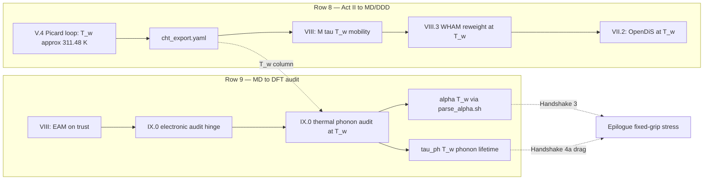

**Row 8 baby picture:** conjugate heat transfer converges once at \(T_w\); archive `cht_export.yaml` before any NVT shear test, WHAM ladder, or OpenDiS mobility calibration — the [VIII.0 descent hinge](../part08-md/00-opening.md#descent-hinge-cores-mobility-and-tw-pedigree) states the contract; the [preface row 8 skill checkpoint](../preface.md#skill-navigation-row-8) closes the competence loop when Act II and Part VIII diverge.

**Row 9 baby picture:** EAM fits bulk moduli on trust until Part IX supplies SCF logs **and** evaluates quasiharmonic \(\alpha(T_w)\) and phonon lifetimes at the same \(T_w\) from row 8 — not at 300 K alone. The [IX.0 thermal phonon audit table](../part09-dft/00-opening.md#thermal-phonon-audit-at-tw) lists the three quantities at risk; the [preface row 9 skill checkpoint](../preface.md#skill-navigation-row-9) closes the competence loop; the [epilogue opening hinge from Part IX](../epilogue/multiscale.md#opening-hinge-ix3-to-epilogue) is where those audits compose with Handshakes 2–4a in workflow time.

When rows 8–9 feel disconnected from row 13 (Handshake 2 → 3), read them as **upstream pedigree**: row 8 sets \(T_w\); row 9 sets \(\alpha(T_w)\) and \(\tau_{\text{ph}}(T_w)\); row 13 sets \(\alpha(T_w)\Delta T\) on fixed grips — skip row 9 and row 13 inherits handbook \(\alpha\) beside a converged CHT loop.

### Row 12 baby picture (next-project restart) {#row-12-baby-picture-next-project}

Row 12 closes the book loop that row 0 opened — same four questions, new specimen, ladder portable.

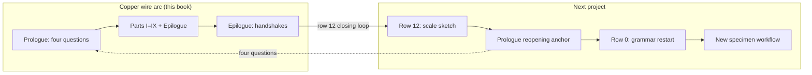

**Row 12 baby picture:** finish the epilogue workflow exam, then **do not copy copper input decks blindly** — run the four-step audit at the [prologue reopening anchor](../prologue/00-many-scales.md#prologue-reopening-anchor): name required rungs, fill four questions for two scales, mark which Acts I–VI apply, restart grammar at [row 0](../preface.md#skill-navigation-row-0) before mid-book handshakes. The [epilogue Bridge row 12 closing loop](../epilogue/multiscale.md#row-12-closing-loop) and [preface row 12 skill checkpoint](../preface.md#skill-navigation-row-12) close the competence loop; the [prologue row 12 preview](../prologue/00-many-scales.md#prologue-preview-row-12) named this restart before Part I.

### Row 13 baby picture (Handshake 2 → 3 thermal pre-stress) {#row-13-baby-picture-handshake-2-3}

Row 13 is the **thermal pre-stress contract** — Act II's conjugate heat transfer sets \(\Delta T = T_w - T_\infty\) once; IX.3 quasiharmonic \(\alpha\) sets thermal strain before the fixed-grip load cell reads stress in Act III. Do not conflate the two handshakes: \(\Delta T\) does not depend on \(\alpha\), and \(\alpha\) does not substitute for a converged CHT loop.

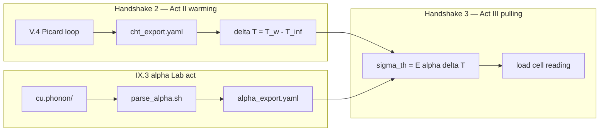

**Row 13 baby picture:** run [V.4's Picard loop](../part05-fvm/04-navier-stokes-cfd.md#lab-act-extension-two-domain-picard-loop-with-a-1d-fem-solid) and archive `cht_export.yaml` before exporting quasiharmonic \(\alpha\) — the [preface row 13 three-way audit](../preface.md#skill-navigation-row-13) maps each step across prologue preview, skill checkpoint, and workflow exam; the [epilogue row 13 closing loop](../epilogue/multiscale.md#row-13-closing-loop) reunites Handshakes 2 and 3 in workflow time; the [prologue row 13 preview](../prologue/00-many-scales.md#prologue-preview-row-13) named "\(\Delta T\) from CHT; \(\alpha\Delta T\) from IX.3" before Part I. When rows 8–9 (\(T_w\) pedigree) feel disconnected from row 13, read them as **upstream temperature context**: row 8 sets \(T_w\); row 9 sets \(\alpha(T_w)\) when evaluating phonons at service temperature; row 13 sets \(\alpha\Delta T\) on fixed grips using \(\Delta T\) from Handshake 2 — skip IX.3 and row 13 inherits handbook \(\alpha\) beside a converged CHT loop.

### Row 14 baby picture (Handshake 4a rate extrapolation) {#row-14-baby-picture-handshake-4a}

Row 14 is the **rate-extrapolation contract** — OpenDiS runs at accessible strain rates (\(\sim 10^3\,\text{s}^{-1}\)); the lab grip runs at \(\sim 10^{-3}\,\text{s}^{-1}\). Do not conflate the two: \(\tau_{\text{flow}}\) from DDD does not depend on lab grip speed, and power-law \(m\) does not substitute for a documented forest export.

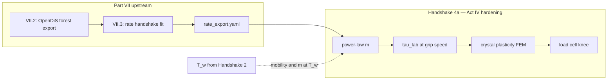

**Row 14 baby picture:** run [VII.2's forest Lab act](../part07-defects/02-dislocation-dynamics.md#lab-act-read-the-hardening-bend-from-forest-density-act-iv) and [VII.3's rate handshake](../part07-defects/03-polycrystal-and-fem-handoff.md#scale-boundary-handshake-ddd-strain-rate-to-quasi-static-fem) before importing \(\tau(\gamma)\) into the crystal-plasticity deck — the [preface row 14 three-way audit](../preface.md#skill-navigation-row-14) maps each step across prologue preview, skill checkpoint, and workflow exam; the [epilogue row 14 closing loop](../epilogue/multiscale.md#row-14-closing-loop) reunites Handshake 4a in workflow time; the [prologue row 14 preview](../prologue/00-many-scales.md#prologue-preview-row-14) named "\(\tau_{\text{flow}}\) from DDD; \(\tau_{\text{lab}}\) from power-law \(m\)" before Part I. When rows 8–9 (\(T_w\) pedigree) feel disconnected from row 14, read them as **upstream temperature context**: row 8 sets \(T_w\); row 9 sets \(\tau_{\text{ph}}(T_w)\) for drag on \(m\); row 14 evaluates \(m\) and mobility at converged \(T_w\), not at 300 K — skip row 8 and row 14 inherits room-temperature rate sensitivity beside a Joule-heated wire.

### Row 15 baby picture (Handshake 4b notch localization) {#row-15-baby-picture-handshake-4b}

Row 15 is the **notch-localization contract** — bulk hardening from Handshake 4a may match the load-cell knee while scalar \(H\) under-predicts peak von Mises stress at the notch root by 10–15%. Do not conflate bulk adequacy with root localization: FE² with DDD-active Gauss points resolves pile-up physics that spatially uniform Taylor hardening smears.

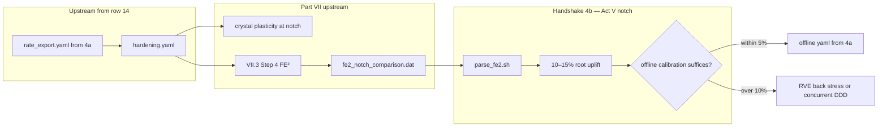

**Row 15 baby picture:** complete [preface row 14](../preface.md#skill-navigation-row-14) before opening the notch comparison — FE² inherits the same `hardening.yaml` that 4a calibrated. Run [VII.3 Step 4](../part07-defects/03-polycrystal-and-fem-handoff.md#step-4--when-offline-calibration-fails-fe-at-the-notch) and [`parse_fe2.sh`](../../scripts/parse_fe2.sh) on `fe2_notch_comparison.dat` before trusting the notch-root answer — the [preface row 15 three-way audit](../preface.md#skill-navigation-row-15) maps each step across prologue preview, skill checkpoint, and workflow exam; the [prologue row 15 closing stitch](../prologue/00-many-scales.md#row-15-closing-stitch) and [epilogue row 15 closing loop](../epilogue/multiscale.md#row-15-closing-loop) reunite Handshake 4b in narrative and workflow time; the [prologue Handshake 4b preview](../prologue/00-many-scales.md#prologue-preview-act-v) named "FE² vs crystal plasticity at the notch root" before Part I. When row 14 (bulk rate) feels disconnected from row 15 (notch localization), read them as **sequential contracts on the same `hardening.yaml`**: row 14 sets \(\tau_{\text{lab}}\) at lab grip speed; row 15 asks whether that calibration suffices at \(K_t \approx 3\) — skip row 14 and FE² RVEs inherit wrong CRSS at active Gauss points.

### Row 17 baby picture (continuous read-through) {#row-17-baby-picture-continuous-read-through}

Row 17 is the **meta-navigation stitch** — when rows 0–16 feel like a syllabus but the copper wire story should read as one novel, trust the chapter rhythm instead of opening every skill checkpoint mid-climb.

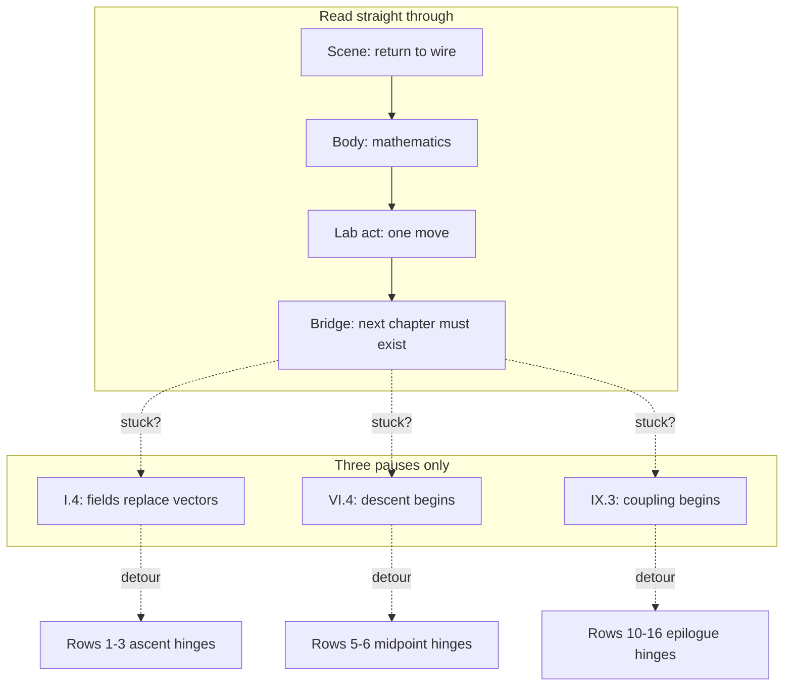

**Row 17 baby picture:** finish the [preface story in one page](../preface.md#the-story-in-one-page) and [prologue ladder](../prologue/00-many-scales.md#a-ladder-not-a-menu) once, then read Parts I–IX in order — **Scene → Bridge** at every chapter boundary, skill checkpoints only when a gate stalls. The three mandatory pauses are [I.4 Bridge](../part01-linear-algebra/04-toward-infinity.md#bridge-to-part-ii), [VI.4 intermission](../part06-continuum/04-nonlinear-plasticity-preview.md#intermission-ascent-ends-descent-begins), and [IX.3 Bridge](../part09-dft/03-dft-workflows.md#bridge-to-the-epilogue); the [continuous read-through guide](sources.md#continuous-read-through-guide) draws the five-act straight path; the [preface row 17 skill checkpoint](../preface.md#skill-navigation-row-17) closes the competence loop when the first pass ends but the plot still feels episodic; the [prologue row 17 closing stitch](../prologue/00-many-scales.md#row-17-closing-stitch) and [prologue row 17 preview](../prologue/00-many-scales.md#prologue-preview-row-17) reunite the three-way audit when the epilogue [workflow exam full arc row](../epilogue/multiscale.md#what-you-should-be-able-to-do-after-the-book) feels like separate courses stitched together; the [epilogue row 17 closing loop](../epilogue/multiscale.md#row-17-closing-loop) reunites narrative and workflow time after [row 16](#act-vi-baby-picture-me-412-coupling-ladder) orchestration is understood.

When row 17 feels disconnected from row 12 (next project), read them as **bookend meta-stitches**: row 17 is how to read **this** copper arc continuously; row 12 is how to restart the ladder on the **next** specimen — complete row 17 before row 12 when the epilogue workflow exam feels like separate courses stitched together.

### Row 18 baby picture (part-opening plot spine) {#row-18-baby-picture-part-opening-plot-spine}

**Row 18 baby picture:** when a part opening feels like a new syllabus, read its [plot spine one line](../part01-linear-algebra/00-opening.md#plot-spine-one-line) aloud — one sentence per part, nine rungs from grammar through descent. The [part-opening plot spine index](sources.md#part-opening-plot-spine-index-row-18) lists all nine; the [preface plot spine](../preface.md#plot-spine-how-the-story-is-told) names four acts. Row 17 is how to read continuously; row 18 is what each part opening should **sound like** when the plot is smooth. The [preface row 18 skill checkpoint](../preface.md#skill-navigation-row-18) closes the competence loop when row 17's straight read stalls at a part boundary; the [prologue row 18 closing stitch](../prologue/00-many-scales.md#row-18-closing-stitch) and [prologue row 18 preview](../prologue/00-many-scales.md#prologue-preview-row-18) reunite the three-way audit when the epilogue [workflow exam row 18 row](../epilogue/multiscale.md#what-you-should-be-able-to-do-after-the-book) feels like separate textbooks at III→IV or VI→VII; the [epilogue row 18 closing loop](../epilogue/multiscale.md#row-18-closing-loop) reunites narrative and workflow time after [row 17](#row-17-baby-picture-continuous-read-through) straight-read rhythm is understood. When row 18 feels disconnected from row 17, read them as **layered meta-stitches**: row 17 names straight-through rhythm; row 18 names the one-line role at each part boundary — use row 18 when you land on a new part and the symbols changed faster than the specimen.

When a chapter feels abstract, pick the row that matches your reading position and read it aloud — it is the plot spine in one breath. At part openings, use [row 18](sources.md#part-opening-plot-spine-index-row-18); mid-chapter, use [row 19](sources.md#numbered-chapter-plot-spine-index-row-19) or the [chapter roadmap](sources.md#chapter-roadmap-one-continuous-arc) row for that chapter.

### Row 19 baby picture (numbered-chapter plot spine) {#row-19-baby-picture-numbered-chapter-plot-spine}

**Row 19 baby picture:** when a numbered chapter feels abstract despite reading the prior Bridge, read its [plot spine one line](../part01-linear-algebra/01-vectors-matrices.md#plot-spine-one-line) aloud — one sentence per chapter, 35 rungs from \(\mathbf{K}\mathbf{u}=\mathbf{f}\) through DFT workflows. The [numbered-chapter plot spine index](sources.md#numbered-chapter-plot-spine-index-row-19) groups them by part; the [chapter roadmap](sources.md#chapter-roadmap-one-continuous-arc) is the audit table. Row 17 is how to read continuously; row 18 is what part openings should sound like; row 19 is what **each chapter opening** should sound like when symbols rise faster than the specimen mid-part. The [preface row 19 skill checkpoint](../preface.md#skill-navigation-row-19) closes the competence loop when row 18's part one-liners did not restore continuity; the [prologue row 19 closing stitch](../prologue/00-many-scales.md#row-19-closing-stitch) and [prologue row 19 preview](../prologue/00-many-scales.md#prologue-preview-row-19) reunite the three-way audit when the epilogue [workflow exam row 19 row](../epilogue/multiscale.md#what-you-should-be-able-to-do-after-the-book) feels like separate chapters mid-part; the [epilogue row 19 closing loop](../epilogue/multiscale.md#row-19-closing-loop) reunites narrative and workflow time after [row 18](#row-18-baby-picture-part-opening-plot-spine) part-boundary rhythm is understood. When row 19 feels disconnected from row 18, read them as **layered meta-stitches**: row 18 at part boundaries; row 19 at chapter interiors — use row 19 when Scene and Bridge both felt fine but the body lost the wire.

When a chapter feels abstract, pick the row that matches your reading position and read it aloud — it is the plot spine in one breath. At part openings, use [row 18](sources.md#part-opening-plot-spine-index-row-18); mid-chapter, use [row 19](sources.md#numbered-chapter-plot-spine-index-row-19) or the [chapter roadmap](sources.md#chapter-roadmap-one-continuous-arc) row for that chapter; at mandatory gates, use [row 20](sources.md#gate-chapter-plot-spine-index-row-20).

### Row 20 baby picture (gate-chapter plot spine) {#row-20-baby-picture-gate-chapter-plot-spine}

**Row 20 baby picture:** when row 17's straight-through read stalls at a mandatory gate, recite the [plot spine one line](../part01-linear-algebra/04-toward-infinity.md#plot-spine-one-line) for that gate aloud — three sentences for three plot turns: [I.4](../part01-linear-algebra/04-toward-infinity.md#plot-spine-one-line) (grammar becomes analysis), [VI.4](../part06-continuum/04-nonlinear-plasticity-preview.md#plot-spine-one-line) (ascent ends at the knee), [IX.3](../part09-dft/03-dft-workflows.md#plot-spine-one-line) (pedigree exports upward). The [gate-chapter plot spine index](sources.md#gate-chapter-plot-spine-index-row-20) lists all three; the [continuous read-through guide](sources.md#continuous-read-through-guide) names when to pause. Row 17 is how to read continuously; row 18 is what part openings sound like; row 19 is what chapter interiors sound like; row 20 is what **plot turns** sound like at the three gates row 17 assumes you will pause. The [preface row 20 skill checkpoint](../preface.md#skill-navigation-row-20) closes the competence loop when row 19's chapter one-liners did not restore continuity at a plot turn; the [prologue row 20 closing stitch](../prologue/00-many-scales.md#row-20-closing-stitch) and [prologue row 20 preview](../prologue/00-many-scales.md#prologue-preview-row-20) reunite the three-way audit when the epilogue [workflow exam row 20 row](../epilogue/multiscale.md#what-you-should-be-able-to-do-after-the-book) feels like separate acts at a mandatory gate; the [epilogue row 20 closing loop](../epilogue/multiscale.md#row-20-closing-loop) reunites narrative and workflow time after [row 19](#row-19-baby-picture-numbered-chapter-plot-spine) mid-chapter rhythm is understood. When row 20 feels disconnected from row 19, read them as **layered meta-stitches**: row 19 at chapter interiors; row 20 at plot turns — use row 20 when Scene, Bridge, and chapter one-liners all felt fine but the **act** still changed (ascent → analysis, ascent → descent, descent → coupling).

When a chapter feels abstract, pick the row that matches your reading position and read it aloud — it is the plot spine in one breath. At part openings, use [row 18](sources.md#part-opening-plot-spine-index-row-18); mid-chapter, use [row 19](sources.md#numbered-chapter-plot-spine-index-row-19); at mandatory gates, use [row 20](sources.md#gate-chapter-plot-spine-index-row-20); when a Lab act feels disconnected, use [row 21](sources.md#lab-act-reunion-index-row-21); when symbols hide the specimen, use [row 22](sources.md#scene-reunion-index-row-22); when transitions feel mechanical, use [row 23](sources.md#bridge-reunion-index-row-23).

### Row 21 baby picture (lab act reunion) {#row-21-baby-picture-lab-act-reunion}

**Row 21 baby picture:** when Scene, Bridge, and plot spine one-liners all read correctly but a **Lab act** still feels like a course assignment, open the [lab act reunion index](sources.md#lab-act-reunion-index-row-21) — read the one-line move for that act aloud, then name which of Acts I–VI the operator is running. Row 17 is chapter rhythm; rows 18–20 are plot vocabulary; row 21 is **competence vocabulary** — what the hands do on the same copper wire. The [preface row 21 skill checkpoint](../preface.md#skill-navigation-row-21) closes the competence loop when algebra and laboratory time diverge; the [prologue row 21 closing stitch](../prologue/00-many-scales.md#row-21-closing-stitch) and [prologue row 21 preview](../prologue/00-many-scales.md#prologue-preview-row-21) reunite the three-way audit when the epilogue [workflow exam row 21 row](../epilogue/multiscale.md#what-you-should-be-able-to-do-after-the-book) feels like code without a specimen. When row 21 feels disconnected from row 20, read them as **layered meta-stitches**: row 20 at plot turns; row 21 when the plot is clear but the **computation** lost the wire.

When a Lab act feels like homework, pick the row that matches your reading position — read the one-line move aloud, then open the Lab act body. At workflow handoffs, use [rows 8–16](#continuity-hinges-master-map); at narrative smoothness, use [rows 17–20](#continuity-hinges-master-map); at computational smoothness, use [row 21](sources.md#lab-act-reunion-index-row-21); at sensory smoothness, use [row 22](sources.md#scene-reunion-index-row-22); at transition smoothness, use [row 23](sources.md#bridge-reunion-index-row-23).

### Row 22 baby picture (Scene reunion) {#row-22-baby-picture-scene-reunion}

**Row 22 baby picture:** when plot spine one-liners and Lab act moves both read correctly but **symbols hide the copper wire**, open the [Scene reunion index](sources.md#scene-reunion-index-row-22) — read the one-line visual for the part you are in aloud, then open the chapter **Scene** paragraph and picture the grips, thermocouple, or load cell. Row 17 is chapter rhythm; rows 18–20 are plot vocabulary; row 21 is competence vocabulary; row 22 is **sensory vocabulary** — what the operator's eyes see on the same afternoon. The [preface row 22 skill checkpoint](../preface.md#skill-navigation-row-22) closes the competence loop when abstraction rises faster than the specimen; the [prologue row 22 closing stitch](../prologue/00-many-scales.md#row-22-closing-stitch) and [prologue row 22 preview](../prologue/00-many-scales.md#prologue-preview-row-22) reunite the three-way audit when the epilogue [workflow exam row 22 row](../epilogue/multiscale.md#what-you-should-be-able-to-do-after-the-book) feels like notation without a lab. When row 22 feels disconnected from row 21, read them as **layered meta-stitches**: row 21 when the plot and code diverge; row 22 when the plot and code align but the **specimen** is invisible.

When symbols hide the wire, pick the row that matches your reading position — read the Scene one-line visual aloud, then continue the chapter body. At workflow handoffs, use [rows 8–16](#continuity-hinges-master-map); at narrative smoothness, use [rows 17–20](#continuity-hinges-master-map); at computational smoothness, use [row 21](sources.md#lab-act-reunion-index-row-21); at sensory smoothness, use [row 22](sources.md#scene-reunion-index-row-22); at transition smoothness, use [row 23](sources.md#bridge-reunion-index-row-23).

### Row 23 baby picture (Bridge reunion) {#row-23-baby-picture-bridge-reunion}

**Row 23 baby picture:** when Scene, plot spine one-liners, Lab act moves, and Scene visuals all read correctly but **chapter transitions feel mechanical**, open the [Bridge reunion index](sources.md#bridge-reunion-index-row-23) — read the one-line hinge for the part boundary you are crossing aloud, then open the prior chapter's **Bridge** section. Row 17 is chapter rhythm; rows 18–20 are plot vocabulary; row 21 is competence vocabulary; row 22 is sensory vocabulary; row 23 is **transition vocabulary** — why the next chapter must exist on the same copper wire. The [preface row 23 skill checkpoint](../preface.md#skill-navigation-row-23) closes the competence loop when vocabulary is restored but the seam is visible; the [prologue row 23 closing stitch](../prologue/00-many-scales.md#row-23-closing-stitch) and [prologue row 23 preview](../prologue/00-many-scales.md#prologue-preview-row-23) reunite the three-way audit when the epilogue [workflow exam row 23 row](../epilogue/multiscale.md#what-you-should-be-able-to-do-after-the-book) feels like separate courses at part boundaries. When row 23 feels disconnected from row 22, read them as **layered meta-stitches**: row 22 when the specimen is invisible; row 23 when the specimen is visible but the **turn** still reads like a syllabus bullet.

When transitions feel mechanical, pick the row that matches your reading position — read the Bridge one-line hinge aloud, then turn the page. At workflow handoffs, use [rows 8–16](#continuity-hinges-master-map); at narrative smoothness, use [rows 17–20](#continuity-hinges-master-map); at computational smoothness, use [row 21](sources.md#lab-act-reunion-index-row-21); at sensory smoothness, use [row 22](sources.md#scene-reunion-index-row-22); at transition smoothness, use [row 23](sources.md#bridge-reunion-index-row-23); at structural smoothness, use [row 24](sources.md#concept-map-reunion-index-row-24).

### Row 24 baby picture (Concept map reunion) {#row-24-baby-picture-concept-map-reunion}

**Row 24 baby picture:** when Scene, plot spine one-liners, Lab act moves, Scene visuals, and Bridge hinges all read correctly but **proofs feel like disconnected theorems**, open the [Concept map reunion index](sources.md#concept-map-reunion-index-row-24) — answer object / structure / theorem / breaks for the part you are in, then return to the chapter body. Row 17 is chapter rhythm; rows 18–20 are plot vocabulary; row 21 is competence vocabulary; row 22 is sensory vocabulary; row 23 is transition vocabulary; row 24 is **structural vocabulary** — what ME 412 structure makes the theorem possible on the same copper wire. The [preface row 24 skill checkpoint](../preface.md#skill-navigation-row-24) closes the competence loop when narrative is smooth but the proof stack feels like a syllabus; the [prologue row 24 closing stitch](../prologue/00-many-scales.md#row-24-closing-stitch) and [prologue row 24 preview](../prologue/00-many-scales.md#prologue-preview-row-24) reunite the three-way audit when the epilogue [workflow exam row 24 row](../epilogue/multiscale.md#what-you-should-be-able-to-do-after-the-book) feels like theorems without a concept map. When row 24 feels disconnected from row 23, read them as **layered meta-stitches**: row 23 when the turn feels mechanical; row 24 when the turn is smooth but the **proof** lost its structural spine.

When proofs feel unmotivated, pick the row that matches your reading position — answer the four ME 412 questions at the part opening, then continue the derivation. At workflow handoffs, use [rows 8–16](#continuity-hinges-master-map); at narrative smoothness, use [rows 17–20](#continuity-hinges-master-map); at computational smoothness, use [row 21](sources.md#lab-act-reunion-index-row-21); at sensory smoothness, use [row 22](sources.md#scene-reunion-index-row-22); at transition smoothness, use [row 23](sources.md#bridge-reunion-index-row-23); at structural smoothness, use [row 24](sources.md#concept-map-reunion-index-row-24); at visual smoothness, use [row 25](sources.md#schematic-reunion-index-row-25).

### Row 25 baby picture (Schematic reunion) {#row-25-baby-picture-schematic-reunion}

**Row 25 baby picture:** when Scene, plot spine one-liners, Lab act moves, Scene visuals, Bridge hinges, and concept map audits all read correctly but **proofs feel abstract without a visual anchor**, open the [Schematic reunion index](sources.md#schematic-reunion-index-row-25) — locate the matching baby picture from the part-opening representative schematics table, then return to the chapter body. Row 17 is chapter rhythm; rows 18–20 are plot vocabulary; row 21 is competence vocabulary; row 22 is sensory vocabulary; row 23 is transition vocabulary; row 24 is structural vocabulary; row 25 is **visual vocabulary** — which course-note diagram makes the proof concrete on the same copper wire. The [preface row 25 skill checkpoint](../preface.md#skill-navigation-row-25) closes the competence loop when structure is restored but no diagram anchors the chapter; the [prologue row 25 closing stitch](../prologue/00-many-scales.md#row-25-closing-stitch) and [prologue row 25 preview](../prologue/00-many-scales.md#prologue-preview-row-25) reunite the three-way audit when the epilogue [workflow exam row 25 row](../epilogue/multiscale.md#what-you-should-be-able-to-do-after-the-book) feels like proofs without source-note diagrams. When row 25 feels disconnected from row 24, read them as **layered meta-stitches**: row 24 when the proof lost its structural spine; row 25 when structure is restored but the **baby picture** from ME 300A, ME 412, ME 300B, FEA, FVM, or the descent notes is still missing. **Schematic 14** in Part II is the spine through [III.0's variational ladder](../part03-pdes/00-opening.md#the-variational-ladder-me-412-schematic-14), [IV.0's Galerkin ladder](../part04-fem/00-opening.md#the-galerkin-ladder-me-412-schematic-14-continued), and [V.0's conservation ladder](../part05-fvm/00-opening.md#the-conservation-ladder-fvm-parallel-to-schematic-14) — read it once when ascent and discretization feel like separate subjects.

When proofs feel abstract, pick the row that matches your reading position — locate the matching schematic row at the part opening, then continue the derivation. At workflow handoffs, use [rows 8–16](#continuity-hinges-master-map); at narrative smoothness, use [rows 17–20](#continuity-hinges-master-map); at computational smoothness, use [row 21](sources.md#lab-act-reunion-index-row-21); at sensory smoothness, use [row 22](sources.md#scene-reunion-index-row-22); at transition smoothness, use [row 23](sources.md#bridge-reunion-index-row-23); at structural smoothness, use [row 24](sources.md#concept-map-reunion-index-row-24); at visual smoothness, use [row 25](sources.md#schematic-reunion-index-row-25); at temporal smoothness, use [row 26](sources.md#story-so-far-reunion-index-row-26); at symbolic smoothness, use [row 27](sources.md#closing-the-arc-reunion-index-row-27).

### Row 26 baby picture (Story so far reunion) {#row-26-baby-picture-story-so-far-reunion}

**Row 26 baby picture:** when Scene, plot spine one-liners, Lab act moves, Scene visuals, Bridge hinges, concept map audits, and schematic anchors all read correctly but **you cannot place where the copper wire is in the narrative arc**, open the [Story so far reunion index](sources.md#story-so-far-reunion-index-row-26) — read the one-line temporal summary for the part you are in aloud, then open the part-opening **Story so far** table. Row 17 is chapter rhythm; rows 18–20 are plot vocabulary; row 21 is competence vocabulary; row 22 is sensory vocabulary; row 23 is transition vocabulary; row 24 is structural vocabulary; row 25 is visual vocabulary; row 26 is **temporal vocabulary** — where the same specimen is in the story when every layer works but the arc feels disoriented. The [preface row 26 skill checkpoint](../preface.md#skill-navigation-row-26) closes the competence loop when all meta-stitches read correctly but the chapter feels like a flashback; the [prologue row 26 closing stitch](../prologue/00-many-scales.md#row-26-closing-stitch) and [prologue row 26 preview](../prologue/00-many-scales.md#prologue-preview-row-26) reunite the three-way audit when the epilogue [workflow exam row 26 row](../epilogue/multiscale.md#what-you-should-be-able-to-do-after-the-book) feels like mid-novel confusion without a recap. When row 26 feels disconnected from row 25, read them as **layered meta-stitches**: row 25 when the proof lost its baby picture; row 26 when every vocabulary layer is restored but the **timeline** of the copper wire story is still invisible. The [VI.4 intermission](../part06-continuum/04-nonlinear-plasticity-preview.md#intermission-ascent-ends-descent-begins) is the book's midpoint **Story so far** — read it once when ascent (Parts I–VI) and descent (Parts VII–IX) feel like separate novels.

When the narrative timeline blurs, pick the row that matches your reading position — read the **Story so far** one-line summary aloud, then continue the chapter body. At workflow handoffs, use [rows 8–16](#continuity-hinges-master-map); at narrative smoothness, use [rows 17–20](#continuity-hinges-master-map); at computational smoothness, use [row 21](sources.md#lab-act-reunion-index-row-21); at sensory smoothness, use [row 22](sources.md#scene-reunion-index-row-22); at transition smoothness, use [row 23](sources.md#bridge-reunion-index-row-23); at structural smoothness, use [row 24](sources.md#concept-map-reunion-index-row-24); at visual smoothness, use [row 25](sources.md#schematic-reunion-index-row-25); at temporal smoothness, use [row 26](sources.md#story-so-far-reunion-index-row-26); at symbolic smoothness, use [row 27](sources.md#closing-the-arc-reunion-index-row-27).

### Row 27 baby picture (Closing the arc reunion) {#row-27-baby-picture-closing-the-arc-reunion}

**Row 27 baby picture:** when Scene, plot spine one-liners, Lab act moves, Scene visuals, Bridge hinges, concept map audits, schematic anchors, and Story so far recaps all read correctly but **prior-part symbols do not translate to current-part vocabulary**, open the [Closing the arc reunion index](sources.md#closing-the-arc-reunion-index-row-27) — read the one-line symbol bridge for the part you are in aloud, then open the part-opening **Closing the arc** table. Row 17 is chapter rhythm; rows 18–20 are plot vocabulary; row 21 is competence vocabulary; row 22 is sensory vocabulary; row 23 is transition vocabulary; row 24 is structural vocabulary; row 25 is visual vocabulary; row 26 is temporal vocabulary; row 27 is **symbolic vocabulary** — how \(\mathbf{K}\mathbf{u}=\mathbf{f}\) becomes \(a(u,v)=\ell(v)\), then Galerkin assembly, then Cauchy stress, then dislocation density, then electron density on the same copper wire. The [preface row 27 skill checkpoint](../preface.md#skill-navigation-row-27) closes the competence loop when every meta-stitch layer works but notation feels like a subject change; the [prologue row 27 closing stitch](../prologue/00-many-scales.md#row-27-closing-stitch) and [epilogue row 27 closing loop](../epilogue/multiscale.md#row-27-closing-loop) reunite the three-way audit.

When prior-part symbols do not map, pick the row that matches your reading position — read one row of the **Closing the arc** translation table aloud, then continue the chapter body. At workflow handoffs, use [rows 8–16](#continuity-hinges-master-map); at narrative smoothness, use [rows 17–20](#continuity-hinges-master-map); at computational smoothness, use [row 21](sources.md#lab-act-reunion-index-row-21); at sensory smoothness, use [row 22](sources.md#scene-reunion-index-row-22); at transition smoothness, use [row 23](sources.md#bridge-reunion-index-row-23); at structural smoothness, use [row 24](sources.md#concept-map-reunion-index-row-24); at visual smoothness, use [row 25](sources.md#schematic-reunion-index-row-25); at temporal smoothness, use [row 26](sources.md#story-so-far-reunion-index-row-26); at symbolic smoothness, use [row 27](sources.md#closing-the-arc-reunion-index-row-27); at export pedigree smoothness, use [row 28](sources.md#scale-boundary-reunion-index-row-28).

### Row 28 baby picture (Scale-boundary reunion) {#row-28-baby-picture-scale-boundary-reunion}

**Row 28 baby picture:** when Scene, plot spine one-liners, Lab act moves, Scene visuals, Bridge hinges, concept map audits, schematic anchors, Story so far recaps, and Closing the arc symbol bridges all read correctly but **parameters crossing a scale boundary feel arbitrary** — handbook \(\alpha\), 300 K mobility defaults, DDD rates fed directly to a quasi-static load cell, single-crystal moduli on a polycrystal wire — open the [Scale-boundary reunion index](sources.md#scale-boundary-reunion-index-row-28) and read the export → consumer → failure mode chain for the handshake you are at. Row 17 is chapter rhythm; rows 18–20 are plot vocabulary; row 21 is competence vocabulary; row 22 is sensory vocabulary; row 23 is transition vocabulary; row 24 is structural vocabulary; row 25 is visual vocabulary; row 26 is temporal vocabulary; row 27 is symbolic vocabulary; row 28 is **export pedigree vocabulary** — what must transfer across scale boundaries with documented units, averaging, and temperature column. The [preface row 28 skill checkpoint](../preface.md#skill-navigation-row-28) closes the competence loop when every meta-stitch layer works but input-deck numbers feel like folklore; the [prologue row 28 closing stitch](../prologue/00-many-scales.md#row-28-closing-stitch) and [epilogue row 28 closing loop](../epilogue/multiscale.md#row-28-closing-loop) reunite the three-way audit. When row 28 feels disconnected from row 27, read them as **layered meta-stitches**: row 27 when notation feels like a subject change; row 28 when notation is clear but **exports** at the boundary have no pedigree. Rows 8–16 are the workflow-time mirrors of the same handshakes row 28 indexes in reading time.

When exports feel arbitrary, pick the row that matches your reading position — read one **Scale-boundary handshake** table aloud, then continue the chapter body. At workflow handoffs, use [rows 8–16](#continuity-hinges-master-map); at narrative smoothness, use [rows 17–20](#continuity-hinges-master-map); at computational smoothness, use [row 21](sources.md#lab-act-reunion-index-row-21); at sensory smoothness, use [row 22](sources.md#scene-reunion-index-row-22); at transition smoothness, use [row 23](sources.md#bridge-reunion-index-row-23); at structural smoothness, use [row 24](sources.md#concept-map-reunion-index-row-24); at visual smoothness, use [row 25](sources.md#schematic-reunion-index-row-25); at temporal smoothness, use [row 26](sources.md#story-so-far-reunion-index-row-26); at symbolic smoothness, use [row 27](sources.md#closing-the-arc-reunion-index-row-27); at export pedigree smoothness, use [row 28](sources.md#scale-boundary-reunion-index-row-28); at thermoelastic assembly smoothness, use [row 29](sources.md#thermoelastic-assembly-reunion-index-row-29); at CHT outer-loop smoothness, use [row 30](sources.md#cht-outer-loop-reunion-index-row-30).

### Row 29 baby picture (Thermoelastic assembly reunion) {#row-29-baby-picture-thermoelastic-assembly-reunion}

**Row 29 baby picture:** when Scene, plot spine one-liners, Lab act moves, Scene visuals, Bridge hinges, concept map audits, schematic anchors, Story so far recaps, Closing the arc symbol bridges, and Scale-boundary handshakes all read correctly but **Act II (thermocouple) and Act III (load cell) still feel like separate FEM courses**, open the [Thermoelastic assembly reunion index](sources.md#thermoelastic-assembly-reunion-index-row-29) — read the staggered pass chain aloud: \(\mathbf{K}_{TT}\mathbf{T}=\mathbf{F}_T\) → \(\varepsilon_{\text{th}}=\alpha\Delta T\) → \(\mathbf{K}_{uu}\mathbf{U}=\mathbf{F}_u+\mathbf{F}_{\text{th}}\) → [IV.5 \(h\)-certificate](../part04-fem/05-convergence.md#lab-act-extension-thermoelastic-h-refinement-on-one-mesh-acts-iiiii) before [V.0 CHT](../part05-fvm/00-opening.md#conjugate-heat-transfer-the-wire-meets-the-wind). Row 17 is chapter rhythm; rows 18–20 are plot vocabulary; row 21 is competence vocabulary; row 22 is sensory vocabulary; row 23 is transition vocabulary; row 24 is structural vocabulary; row 25 is visual vocabulary; row 26 is temporal vocabulary; row 27 is symbolic vocabulary; row 28 is export pedigree vocabulary; row 29 is **thermoelastic assembly vocabulary** — one mesh, two weighted residuals, one thermal handshake between lab acts. The [preface row 29 skill checkpoint](../preface.md#skill-navigation-row-29) closes the competence loop; the [prologue row 29 closing stitch](../prologue/00-many-scales.md#row-29-closing-stitch) and [epilogue row 29 closing loop](../epilogue/multiscale.md#row-29-closing-loop) reunite the three-way audit.

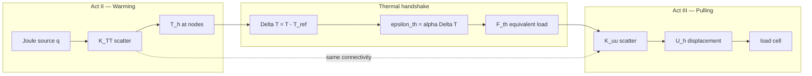

When row 29 feels disconnected from row 28, read them as **layered meta-stitches**: row 28 when export numbers lack pedigree; row 29 when pedigree is clear but **heat and mechanics never ran on the same mesh in order** — skip the heat pass and row 28's \(\alpha(T_w)\) audit cannot fix the load cell lie.

When Act II and Act III feel like separate homework, pick the row that matches your reading position — read the [Part IV thermoelastic assembly thread](../part04-fem/00-opening.md#acts-ii-and-iii-together-thermoelastic-assembly-thread) aloud, then open the chapter Lab act for your position (IV.1 heat, IV.2 scatter, IV.4 coupled). At workflow handoffs, use [rows 8–16](#continuity-hinges-master-map); at narrative smoothness, use [rows 17–20](#continuity-hinges-master-map); at thermoelastic assembly smoothness, use [row 29](sources.md#thermoelastic-assembly-reunion-index-row-29); at CHT outer-loop smoothness, use [row 30](sources.md#cht-outer-loop-reunion-index-row-30); at twin-ladder → virtual work smoothness, use [row 31](sources.md#twin-ladder-virtual-work-reunion-index-row-31); at virtual work → plasticity preview smoothness, use [row 32](sources.md#virtual-work-plasticity-preview-reunion-index-row-32).

### Row 30 baby picture (CHT outer-loop reunion) {#row-30-baby-picture-cht-outer-loop-reunion}

**Row 30 baby picture:** when Scene, plot spine one-liners, Lab act moves, Scene visuals, Bridge hinges, concept map audits, schematic anchors, Story so far recaps, Closing the arc symbol bridges, Scale-boundary handshakes, and thermoelastic assembly all read correctly but **solid FEM and fluid FVM still feel like separate solvers**, open the [CHT outer-loop reunion index](sources.md#cht-outer-loop-reunion-index-row-30) — read the chain aloud: [IV.5 \(h\)-certificate](../part04-fem/05-convergence.md#lab-act-extension-thermoelastic-h-refinement-on-one-mesh-acts-iiiii) → [V.4 Picard](../part05-fvm/04-navier-stokes-cfd.md#lab-act-extension-two-domain-picard-loop-with-a-1d-fem-solid) → [`parse_cht.sh`](../../scripts/parse_cht.sh) → `cht_export.yaml` → [VI.0 twin-ladder reunion](../part06-continuum/00-opening.md#the-twin-ladders-reunite-galerkin-and-conservation). Row 29 is one mesh, two fields on the solid; row 30 is **two dialects, one wall temperature** at the interface. The [preface row 30 skill checkpoint](../preface.md#skill-navigation-row-30) closes the competence loop; the [prologue row 30 closing stitch](../prologue/00-many-scales.md#row-30-closing-stitch) and [epilogue row 30 closing loop](../epilogue/multiscale.md#row-30-closing-loop) reunite the three-way audit.

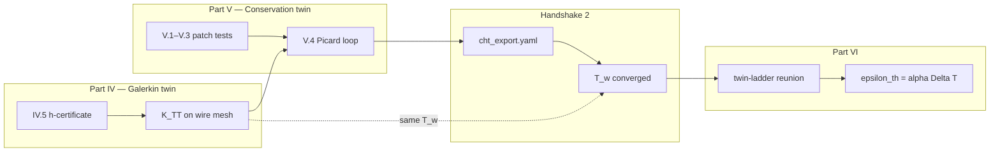

When row 30 feels disconnected from row 29, read them as **layered meta-stitches**: row 29 when heat and mechanics never shared a solid mesh; row 30 when the solid mesh and fluid fluxes never archived **one converged \(T_w\)** — skip `cht_export.yaml` and Handshake 3 inherits a hand-wavy wall temperature.

### Row 31 baby picture (twin-ladder → virtual work reunion) {#row-31-baby-picture-twin-ladder-virtual-work-reunion}

**Row 31 baby picture:** when Scene, plot spine one-liners, Lab act moves, Scene visuals, Bridge hinges, concept map audits, schematic anchors, Story so far recaps, Closing the arc symbol bridges, Scale-boundary handshakes, thermoelastic assembly, and CHT outer-loop reunion all read correctly but **\(\mathbf{K}\mathbf{U}=\mathbf{F}\) and virtual work still feel like separate subjects**, open the [twin-ladder → virtual work reunion index](sources.md#twin-ladder-virtual-work-reunion-index-row-31) — read the chain aloud: [VI.0 twin-ladder reunion](../part06-continuum/00-opening.md#the-twin-ladders-reunite-galerkin-and-conservation) → [VI.1 kinematics + Act II overlay](../part06-continuum/01-kinematics.md#lab-act-act-ii-overlay-thermal-eigenstrain-from-cht-export) → [VI.3 virtual work Lab act](../part06-continuum/03-variational-elasticity.md#lab-act-virtual-work-equals-load-cell-reading-act-iii--pulling). Row 30 is two dialects, one \(T_w\); row 31 is **one energy functional, one load cell**. The [preface row 31 skill checkpoint](../preface.md#skill-navigation-row-31) closes the competence loop; the [prologue row 31 closing stitch](../prologue/00-many-scales.md#row-31-closing-stitch) and [epilogue row 31 closing loop](../epilogue/multiscale.md#row-31-closing-loop) reunite the three-way audit.

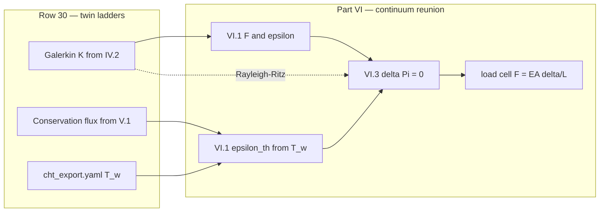

When row 31 feels disconnected from row 30, read them as **layered meta-stitches**: row 30 when FEM and FVM never shared one \(T_w\); row 31 when one \(T_w\) is archived but **assembly still reads like sparse linear algebra without \(\Pi[\mathbf{u}]\)** — skip [VI.3's virtual work Lab act](../part06-continuum/03-variational-elasticity.md#lab-act-virtual-work-equals-load-cell-reading-act-iii--pulling) and the load cell cannot defend why \(\mathbf{K}\) existed.

### Row 32 baby picture (virtual work → plasticity preview reunion) {#row-32-baby-picture-virtual-work-plasticity-preview-reunion}

**Row 32 baby picture:** when Scene, plot spine one-liners, Lab act moves, Scene visuals, Bridge hinges, concept map audits, schematic anchors, Story so far recaps, Closing the arc symbol bridges, Scale-boundary handshakes, thermoelastic assembly, CHT outer-loop reunion, and twin-ladder → virtual work reunion all read correctly but **\(\delta\Pi = 0\) and return-mapping still feel like separate subjects**, open the [virtual work → plasticity preview reunion index](sources.md#virtual-work-plasticity-preview-reunion-index-row-32) — read the chain aloud: [VI.3 virtual work Lab act](../part06-continuum/03-variational-elasticity.md#lab-act-virtual-work-equals-load-cell-reading-act-iii--pulling) → [VI.4 return-mapping Lab act](../part06-continuum/04-nonlinear-plasticity-preview.md#lab-act-return-mapping-on-the-load-cell-knee-act-iv-hardening) → [VI.4 intermission](../part06-continuum/04-nonlinear-plasticity-preview.md#intermission-ascent-ends-descent-begins) → [Part VII descent hinge from VI.4](../part07-defects/00-opening.md#descent-hinge-from-vi4-energy-break-forest-begins). Row 31 is elastic energy equals load cell; row 32 is **history breaks path independence at the knee**. The [preface row 32 skill checkpoint](../preface.md#skill-navigation-row-32) closes the competence loop; the [prologue row 32 closing stitch](../prologue/00-many-scales.md#row-32-closing-stitch) and [epilogue row 32 closing loop](../epilogue/multiscale.md#row-32-closing-loop) reunite the three-way audit.

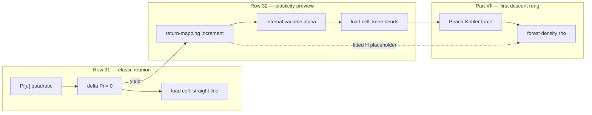

When row 32 feels disconnected from row 31, read them as **layered meta-stitches**: row 31 when virtual work never closed the elastic climb; row 32 when \(\delta\Pi = 0\) is clear but **return-mapping still reads like an IF statement without the energy break story** — skip [VI.4's intermission](../part06-continuum/04-nonlinear-plasticity-preview.md#intermission-ascent-ends-descent-begins) and Part VII feels like a new course on dislocations.

### Row 33 baby picture (Part VII → VIII descent hinge reunion) {#row-33-baby-picture-part-vii-viii-descent-hinge-reunion}

**Row 33 baby picture:** when Scene, plot spine one-liners, Lab act moves, Scene visuals, Bridge hinges, concept map audits, schematic anchors, Story so far recaps, Closing the arc symbol bridges, Scale-boundary handshakes, thermoelastic assembly, CHT outer-loop reunion, twin-ladder → virtual work reunion, and virtual work → plasticity preview reunion all read correctly but **mesoscale DDD and atomistic MD still feel like separate courses**, open the [Part VII → VIII descent hinge reunion index](sources.md#part-vii-viii-descent-hinge-reunion-index-row-33) — read the chain aloud: [Part VII descent hinge from VI.4](../part07-defects/00-opening.md#descent-hinge-from-vi4-energy-break-forest-begins) → [VII.2 mobility Lab act at \(T_w\)](../part07-defects/02-dislocation-dynamics.md#lab-act-calibrate-screw-mobility-from-md-shear-act-iv--mobility-prelude) → [VII.3 Bridge to Part VIII](../part07-defects/03-polycrystal-and-fem-handoff.md#bridge-to-part-viii) → [Part VIII descent hinge](../part08-md/00-opening.md#descent-hinge-cores-mobility-and-tw-pedigree). Row 32 is plastic history at the knee; row 33 is **MD is where DDD's mobility was measured**. The [preface row 33 skill checkpoint](../preface.md#skill-navigation-row-33) closes the competence loop; the [prologue row 33 closing stitch](../prologue/00-many-scales.md#row-33-closing-stitch) and [epilogue row 33 closing loop](../epilogue/multiscale.md#row-33-closing-loop) reunite the three-way audit.

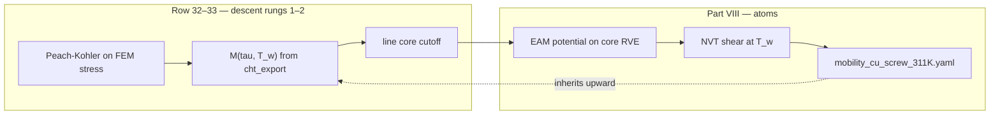

When row 33 feels disconnected from row 32, read them as **layered meta-stitches**: row 32 when the forest story never closed the knee; row 33 when DDD is clear but **mobility tables cite Part VIII without an archived NVT shear folder at \(T_w\)** — skip [VII.2's mobility Lab act Step 0](../part07-defects/02-dislocation-dynamics.md#lab-act-calibrate-screw-mobility-from-md-shear-act-iv--mobility-prelude) and Part VIII feels like standalone statistical mechanics.

### Row 34 baby picture (potentials → ensembles reunion) {#row-34-baby-picture-potentials-ensembles-reunion}

**Row 34 baby picture:** when Scene, plot spine one-liners, Lab act moves, Scene visuals, Bridge hinges, concept map audits, schematic anchors, Story so far recaps, Closing the arc symbol bridges, Scale-boundary handshakes, thermoelastic assembly, CHT outer-loop reunion, twin-ladder → virtual work reunion, virtual work → plasticity preview reunion, and Part VII → VIII descent hinge reunion all read correctly but **0 K EAM minimization and NVT/NPT dynamics still feel like separate subjects**, open the [potentials → ensembles reunion index](sources.md#potentials-ensembles-reunion-index-row-34) — read the chain aloud: [VIII.1 EAM Lab act](../part08-md/01-potentials-phase-space.md#lab-act-eam-lattice-constant-from-energy-minimization-act-v--notch-prelude) → [VIII.1 Bridge](../part08-md/01-potentials-phase-space.md#bridge) → [VIII.2 opening hinge](../part08-md/02-ensembles-integrators.md#opening-hinge-viii1-to-viii2) → [VIII.2 NPT Lab act](../part08-md/02-ensembles-integrators.md#lab-act-npt-tension-on-a-copper-nanowire-segment) → `MD_NVT_shear_PartVIII` at \(T_w\) from [`fixtures/cht_export.yaml`](../../fixtures/cht_export.yaml).

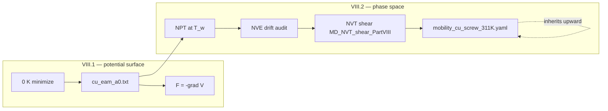

When row 34 feels disconnected from row 33, read them as **layered meta-stitches**: row 33 when DDD and MD still feel like separate courses; row 34 when **the EAM foundation archive exists but no trajectory has integrated a single timestep at \(T_w\)** — skip [VIII.1's Bridge](../part08-md/01-potentials-phase-space.md#bridge) and ensembles feel like standalone statistical mechanics.

### Row 35 baby picture (ensembles → coarse-graining reunion) {#row-35-baby-picture-ensembles-coarse-graining-reunion}

**Row 35 baby picture:** when Scene, plot spine one-liners, Lab act moves, Scene visuals, Bridge hinges, concept map audits, schematic anchors, Story so far recaps, Closing the arc symbol bridges, Scale-boundary handshakes, thermoelastic assembly, CHT outer-loop reunion, twin-ladder → virtual work reunion, virtual work → plasticity preview reunion, Part VII → VIII descent hinge reunion, and potentials → ensembles reunion all read correctly but **audited NVT/NPT trajectories and yaml handoff tables still feel like separate subjects**, open the [ensembles → coarse-graining reunion index](sources.md#ensembles-coarse-graining-reunion-index-row-35) — read the chain aloud: [VIII.2 NPT Lab act](../part08-md/02-ensembles-integrators.md#lab-act-npt-tension-on-a-copper-nanowire-segment) → [VIII.2 Bridge](../part08-md/02-ensembles-integrators.md#bridge) → [VIII.3 opening hinge](../part08-md/03-ab-initio-and-coarse-graining.md#opening-hinge-viii2-to-viii3) → [VIII.3 EAM-fit audit Lab act](../part08-md/03-ab-initio-and-coarse-graining.md#lab-act-eam-fit-audit-before-the-notch-md-run-act-v--notch) → [pedigree checklist](../part08-md/03-ab-initio-and-coarse-graining.md#pedigree-checklist-before-the-epilogue).

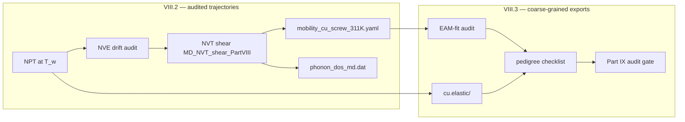

When row 35 feels disconnected from row 34, read them as **layered meta-stitches**: row 34 when **trajectories have not run at \(T_w\)**; row 35 when **mobility and moduli exist but no handoff bundle names DFT audit gates** — skip [VIII.2's Bridge](../part08-md/02-ensembles-integrators.md#bridge) and coarse-graining feels like standalone potential fitting.

### Row 36 baby picture (coarse-graining → electronic audit reunion) {#row-36-baby-picture-coarse-graining-electronic-audit-reunion}

**Row 36 baby picture:** when Scene, plot spine one-liners, Lab act moves, Scene visuals, Bridge hinges, concept map audits, schematic anchors, Story so far recaps, Closing the arc symbol bridges, Scale-boundary handshakes, thermoelastic assembly, CHT outer-loop reunion, twin-ladder → virtual work reunion, virtual work → plasticity preview reunion, Part VII → VIII descent hinge reunion, potentials → ensembles reunion, and ensembles → coarse-graining reunion all read correctly but **the pedigree checklist has consumer rows filled but Part IX still feels like standalone DFT coursework**, open the [coarse-graining → electronic audit reunion index](sources.md#coarse-graining-electronic-audit-reunion-index-row-36) — read the chain aloud: [VIII.3 pedigree checklist](../part08-md/03-ab-initio-and-coarse-graining.md#pedigree-checklist-before-the-epilogue) → [VIII.3 Bridge to Part IX](../part08-md/03-ab-initio-and-coarse-graining.md#bridge-to-part-ix) → [IX.0 opening hinge from VIII.3](../part09-dft/00-opening.md#opening-hinge-viii3-to-ix) → [IX.0 thermal phonon audit at \(T_w\)](../part09-dft/00-opening.md#thermal-phonon-audit-at-tw) → [IX.1 Born–Oppenheimer](../part09-dft/01-born-oppenheimer.md).

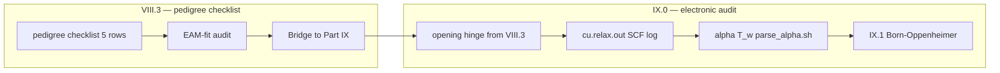

When row 36 feels disconnected from row 35, read them as **layered meta-stitches**: row 35 when **handoff tables lack DFT audit gate columns**; row 36 when **checklist rows exist but `cu.relax.out` and \(\alpha(T_w)\) beside `cht_export.yaml` do not** — skip [VIII.3's Bridge to Part IX](../part08-md/03-ab-initio-and-coarse-graining.md#bridge-to-part-ix) and Born–Oppenheimer feels like standalone quantum chemistry.

### Row 37 baby picture (electronic audit → Born–Oppenheimer reunion) {#row-37-baby-picture-electronic-audit-born-oppenheimer-reunion}

**Row 37 baby picture:** when Scene, plot spine one-liners, Lab act moves, Scene visuals, Bridge hinges, concept map audits, schematic anchors, Story so far recaps, Closing the arc symbol bridges, Scale-boundary handshakes, thermoelastic assembly, CHT outer-loop reunion, twin-ladder → virtual work reunion, virtual work → plasticity preview reunion, Part VII → VIII descent hinge reunion, potentials → ensembles reunion, ensembles → coarse-graining reunion, and coarse-graining → electronic audit reunion all read correctly but **`cu.relax.out` and \(\alpha(T_w)\) exist but Born–Oppenheimer and Hohenberg–Kohn still feel like standalone quantum chemistry**, open the [electronic audit → Born–Oppenheimer reunion index](sources.md#electronic-audit-born-oppenheimer-reunion-index-row-37) — read the chain aloud: [IX.0 electronic audit hinge](../part09-dft/00-opening.md#electronic-audit-hinge-descent-pedigree-and-tw-phonon) → [IX.0 Bridge](../part09-dft/00-opening.md#bridge) → [IX.1 opening hinge from IX.0](../part09-dft/01-born-oppenheimer.md#opening-hinge-ix0-to-ix1) → [IX.1 Born–Oppenheimer](../part09-dft/01-born-oppenheimer.md) → [IX.1 Murnaghan Lab act](../part09-dft/01-born-oppenheimer.md#lab-act-murnaghan-fit-on-fcc-cu-act-vi--foundation) → [IX.2 Kohn–Sham](../part09-dft/02-kohn-sham.md).


When row 37 feels disconnected from row 36, read them as **layered meta-stitches**: row 36 when **SCF logs and phonon audits are missing**; row 37 when **audit gates exist but BO surface and \(E[\rho]\) are unnamed** — skip [IX.0's Bridge](../part09-dft/00-opening.md#bridge) and Kohn–Sham feels like standalone implementation details.

### Row 38 baby picture (Born–Oppenheimer → Kohn–Sham reunion) {#row-38-baby-picture-born-oppenheimer-kohn-sham-reunion}

**Row 38 baby picture:** when Scene, plot spine one-liners, Lab act moves, Scene visuals, Bridge hinges, concept map audits, schematic anchors, Story so far recaps, Closing the arc symbol bridges, Scale-boundary handshakes, thermoelastic assembly, CHT outer-loop reunion, twin-ladder → virtual work reunion, virtual work → plasticity preview reunion, Part VII → VIII descent hinge reunion, potentials → ensembles reunion, ensembles → coarse-graining reunion, coarse-graining → electronic audit reunion, and electronic audit → Born–Oppenheimer reunion all read correctly but **Born–Oppenheimer and Hohenberg–Kohn are understood but Kohn–Sham SCF still feels like standalone quantum chemistry**, open the [Born–Oppenheimer → Kohn–Sham reunion index](sources.md#born-oppenheimer-kohn-sham-reunion-index-row-38) — read the chain aloud: [IX.1 Bridge](../part09-dft/01-born-oppenheimer.md#bridge) → [IX.2 opening hinge from IX.1](../part09-dft/02-kohn-sham.md#opening-hinge-ix1-to-ix2) → [IX.2 cutoff-sweep Lab act](../part09-dft/02-kohn-sham.md#lab-act-cutoff-sweep-on-fcc-cu-act-vi--convergence-certificate) → [IX.3 workflows](../part09-dft/03-dft-workflows.md).

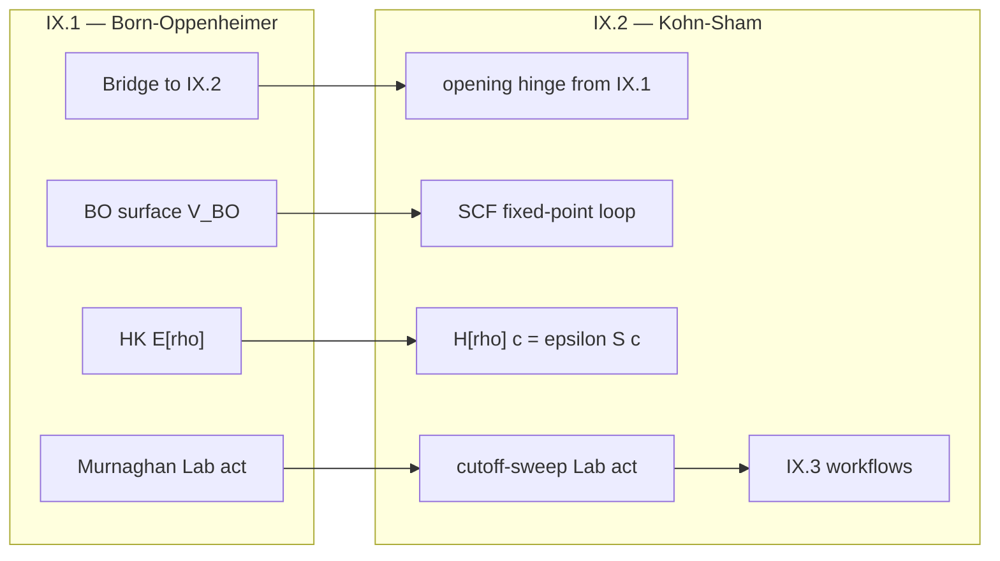

When row 38 feels disconnected from row 37, read them as **layered meta-stitches**: row 37 when **BO/HK theorems are unnamed**; row 38 when **theorems are understood but the SCF fixed-point loop feels disconnected from Part I eigenvalues** — skip [IX.1's Bridge](../part09-dft/01-born-oppenheimer.md#bridge) and IX.3 workflows feel like standalone DFT coursework.

### Row 39 baby picture (Kohn–Sham → DFT workflows reunion) {#row-39-baby-picture-kohn-sham-dft-workflows-reunion}

**Row 39 baby picture:** when Scene, plot spine one-liners, Lab act moves, Scene visuals, Bridge hinges, concept map audits, schematic anchors, Story so far recaps, Closing the arc symbol bridges, Scale-boundary handshakes, thermoelastic assembly, CHT outer-loop reunion, twin-ladder → virtual work reunion, virtual work → plasticity preview reunion, Part VII → VIII descent hinge reunion, potentials → ensembles reunion, ensembles → coarse-graining reunion, coarse-graining → electronic audit reunion, electronic audit → Born–Oppenheimer reunion, and Born–Oppenheimer → Kohn–Sham reunion all read correctly but **Kohn–Sham SCF is understood but DFT workflows still feel like standalone coursework**, open the [Kohn–Sham → DFT workflows reunion index](sources.md#kohn-sham-dft-workflows-reunion-index-row-39) — read the chain aloud: [IX.2 Bridge](../part09-dft/02-kohn-sham.md#bridge) → [IX.3 opening hinge from IX.2](../part09-dft/03-dft-workflows.md#opening-hinge-ix2-to-ix3) → [IX.3 foundation archive Lab act](../part09-dft/03-dft-workflows.md#lab-act-archive-the-foundation-run-before-the-wire-scale-solve-act-vi--foundation) → [IX.3 Bridge to epilogue](../part09-dft/03-dft-workflows.md#bridge-to-the-epilogue).

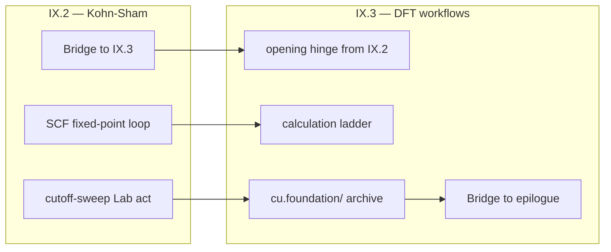

When row 39 feels disconnected from row 38, read them as **layered meta-stitches**: row 38 when **the SCF fixed-point loop feels disconnected from Part I eigenvalues**; row 39 when **SCF is understood but `cu.foundation/` and the calculation ladder feel like a new course** — skip [IX.2's Bridge](../part09-dft/02-kohn-sham.md#bridge) and the epilogue's Handshakes feel like folklore without pedigree.

### Row 40 baby picture (IX.3 → Handshake 3 reunion) {#row-40-baby-picture-ix3-handshake3-reunion}

**Row 40 baby picture:** when Scene, plot spine one-liners, Lab act moves, Scene visuals, Bridge hinges, concept map audits, schematic anchors, Story so far recaps, Closing the arc symbol bridges, Scale-boundary handshakes, thermoelastic assembly, CHT outer-loop reunion, twin-ladder → virtual work reunion, virtual work → plasticity preview reunion, Part VII → VIII descent hinge reunion, potentials → ensembles reunion, ensembles → coarse-graining reunion, coarse-graining → electronic audit reunion, electronic audit → Born–Oppenheimer reunion, Born–Oppenheimer → Kohn–Sham reunion, and Kohn–Sham → DFT workflows reunion all read correctly but **`cu.foundation/` is complete yet fixed-grip stress still cites handbook \(\alpha(300\,\text{K})\) beside an orphan `pw.x` log**, open the [IX.3 → Handshake 3 reunion index](sources.md#ix3-handshake3-reunion-index-row-40) — read the chain aloud: [IX.3 Bridge](../part09-dft/03-dft-workflows.md#bridge-to-the-epilogue) → [IX.3 opening hinge to Handshake 3](../part09-dft/03-dft-workflows.md#opening-hinge-ix3-to-handshake3) → [epilogue opening hinge from IX.3](../epilogue/multiscale.md#opening-hinge-ix3-handshake3) → [Handshake 3 worked load-cell example](../epilogue/multiscale.md#handshake-3--thermal-strain--mechanical-stiffness-part-vi--iv) — then run [`parse_alpha.sh`](../scripts/parse_alpha.sh) with `--target-t` from `cht_export.yaml`.

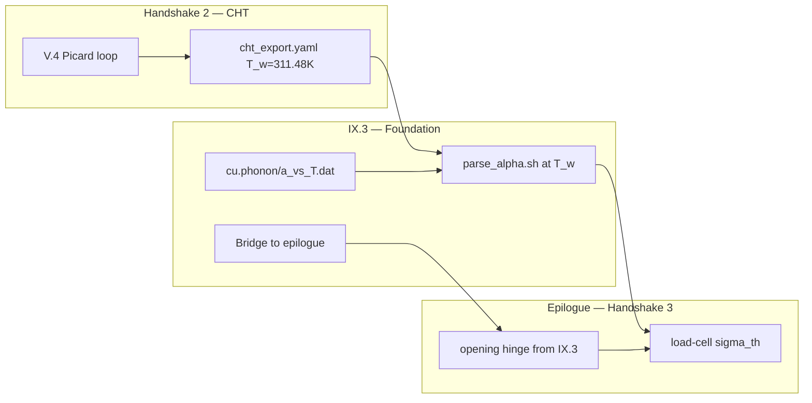

When row 40 feels disconnected from row 39, read them as **layered meta-stitches**: row 39 when **`cu.foundation/` and the calculation ladder feel like a new course**; row 40 when **the foundation folder is complete but \(\alpha(T_w)\) at the load cell still cites handbook values** — skip [IX.3's opening hinge to Handshake 3](../part09-dft/03-dft-workflows.md#opening-hinge-ix3-to-handshake3) and Handshake 3 feels like standalone epilogue homework. [Row 13](#row-13-baby-picture-handshake-2-3) names the Handshake 2 → 3 chain in competence time; row 40 names **temperature pedigree at the phonon → load-cell boundary**.

### Row 41 baby picture (VII.3 → Handshake 4a reunion) {#row-41-baby-picture-vii3-handshake4a-reunion}

**Row 41 baby picture:** when Scene, plot spine one-liners, Lab act moves, Scene visuals, Bridge hinges, concept map audits, schematic anchors, Story so far recaps, Closing the arc symbol bridges, Scale-boundary handshakes, thermoelastic assembly, CHT outer-loop reunion, twin-ladder → virtual work reunion, virtual work → plasticity preview reunion, Part VII → VIII descent hinge reunion, potentials → ensembles reunion, ensembles → coarse-graining reunion, coarse-graining → electronic audit reunion, electronic audit → Born–Oppenheimer reunion, Born–Oppenheimer → Kohn–Sham reunion, Kohn–Sham → DFT workflows reunion, and IX.3 → Handshake 3 reunion all read correctly but **OpenDiS exports feed the crystal-plasticity deck at DDD timestep strain rate without power-law extrapolation**, open the [VII.3 → Handshake 4a reunion index](sources.md#vii3-handshake4a-reunion-index-row-41) — read the chain aloud: [VII.3 rate handshake](../part07-defects/03-polycrystal-and-fem-handoff.md#scale-boundary-handshake-ddd-strain-rate-to-quasi-static-fem) → [VII.3 opening hinge to Handshake 4a](../part07-defects/03-polycrystal-and-fem-handoff.md#opening-hinge-vii3-to-handshake4a) → [epilogue opening hinge from VII.3](../epilogue/multiscale.md#opening-hinge-vii3-handshake4a) → [Handshake 4a worked example](../epilogue/multiscale.md#4a--ddd-strain-rate-to-quasi-static-load-cell-act-iv--hardening) — then run [`parse_rate.sh`](../scripts/parse_rate.sh) with `--lab-rate 1.0e-3` on `ddd_tau_vs_rate.dat`.

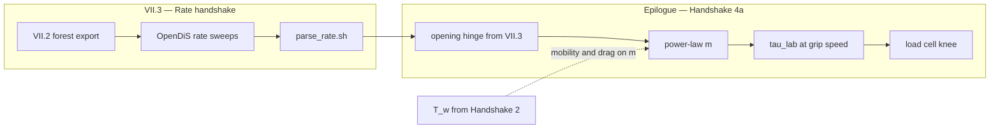

When row 41 feels disconnected from row 40, read them as **layered meta-stitches**: row 40 when **Handshake 3 thermal pre-stress still cites handbook \(\alpha\)**; row 41 when **Handshake 3 is verified but the hardening knee arrives early because DDD rate was conflated with lab grip speed** — skip [VII.3's opening hinge to Handshake 4a](../part07-defects/03-polycrystal-and-fem-handoff.md#opening-hinge-vii3-to-handshake4a) and Handshake 4a feels like standalone epilogue homework. [Row 14](#row-14-baby-picture-handshake-4a) names the Handshake 4a chain in competence time; row 41 names **rate extrapolation at the forest → load-cell boundary**.

### Row 42 baby picture (VII.3 Step 4 → Handshake 4b reunion) {#row-42-baby-picture-vii3-handshake4b-reunion}

**Row 42 baby picture:** when Scene, plot spine one-liners, Lab act moves, Scene visuals, Bridge hinges, concept map audits, schematic anchors, Story so far recaps, Closing the arc symbol bridges, Scale-boundary handshakes, thermoelastic assembly, CHT outer-loop reunion, twin-ladder → virtual work reunion, virtual work → plasticity preview reunion, Part VII → VIII descent hinge reunion, potentials → ensembles reunion, ensembles → coarse-graining reunion, coarse-graining → electronic audit reunion, electronic audit → Born–Oppenheimer reunion, Born–Oppenheimer → Kohn–Sham reunion, Kohn–Sham → DFT workflows reunion, IX.3 → Handshake 3 reunion, and VII.3 → Handshake 4a reunion all read correctly but **crystal plasticity with scalar hardening from 4a matches bulk flow stress while under-predicting peak von Mises stress at the notch root by 10–15%**, open the [VII.3 → Handshake 4b reunion index](sources.md#vii3-handshake4b-reunion-index-row-42) — read the chain aloud: [VII.3 Step 4 FE²](../part07-defects/03-polycrystal-and-fem-handoff.md#step-4--when-offline-calibration-fails-fe-at-the-notch) → [VII.3 opening hinge to Handshake 4b](../part07-defects/03-polycrystal-and-fem-handoff.md#opening-hinge-vii3-to-handshake4b) → [epilogue opening hinge from VII.3 Step 4](../epilogue/multiscale.md#opening-hinge-vii3-handshake4b) → [Handshake 4b worked example](../epilogue/multiscale.md#worked-example-fe-at-the-wire-notch-act-v--notch) — then run [`parse_fe2.sh`](../scripts/parse_fe2.sh) on `fe2_notch_comparison.dat` and verify `fe2_export.yaml` appears in `multiscale_export.yaml` via [`parse_multiscale_workflow.sh`](../scripts/parse_multiscale_workflow.sh).

```mermaid
flowchart LR
  subgraph vii3["VII.3 — Step 4 FE²"]
    BULK["Handshake 4a bulk gate"]
    COMP["fe2_notch_comparison.dat"]
    PARSE["parse_fe2.sh"]
  end
  subgraph h4b["Epilogue — Handshake 4b"]
    HINGE["opening hinge from Step 4"]
    UPLIFT["10-15% root uplift"]
    ROOT["notch root stress"]
    ORCH["multiscale_export.yaml 4b slot"]
  end
  BULK --> COMP --> PARSE
  PARSE --> HINGE --> UPLIFT --> ROOT
  PARSE --> ORCH
  GSF["gamma_sf from IX.3"] -.->|partial dislocations| UPLIFT
```

When row 42 feels disconnected from row 41, read them as **layered meta-stitches**: row 41 when **bulk \(\tau_{\text{lab}}\) still cites DDD timestep rate**; row 42 when **bulk knee matches the load cell but notch root under-predicts because scalar \(H\) smeared pile-up** — skip [VII.3's opening hinge to Handshake 4b](../part07-defects/03-polycrystal-and-fem-handoff.md#opening-hinge-vii3-to-handshake4b) and Handshake 4b feels like standalone epilogue homework. [Row 15](#row-15-baby-picture-handshake-4b) names the Handshake 4b chain in competence time; row 42 names **FE² notch localization at the bulk → root boundary**.

### Row 43 baby picture (Rows 17–42 → Row 16 orchestration reunion) {#row-43-baby-picture-rows17-42-row16-orchestration-reunion}

**Row 43 baby picture:** when Scene, plot spine one-liners, Lab act moves, Scene visuals, Bridge hinges, concept map audits, schematic anchors, Story so far recaps, Closing the arc symbol bridges, Scale-boundary handshakes, thermoelastic assembly, CHT outer-loop reunion, twin-ladder → virtual work reunion, virtual work → plasticity preview reunion, Part VII → VIII descent hinge reunion, potentials → ensembles reunion, ensembles → coarse-graining reunion, coarse-graining → electronic audit reunion, electronic audit → Born–Oppenheimer reunion, Born–Oppenheimer → Kohn–Sham reunion, Kohn–Sham → DFT workflows reunion, IX.3 → Handshake 3 reunion, VII.3 → Handshake 4a reunion, and VII.3 → Handshake 4b reunion all read correctly but **Handshakes 1–4b exist in separate folders without orchestrated `multiscale_export.yaml`**, open the [Rows 17–42 → Row 16 orchestration reunion index](sources.md#rows17-42-row16-orchestration-reunion-index-row-43) — read the chain aloud: [IX.3 epilogue pedigree table](../part09-dft/03-dft-workflows.md#ix3-epilogue-pedigree-table) → [epilogue opening hinge from rows 17–42 → row 16](../epilogue/multiscale.md#opening-hinge-rows17-42-row16) → [row 16 closing loop](../epilogue/multiscale.md#row-16-closing-loop) → [`parse_multiscale_workflow.sh`](../scripts/parse_multiscale_workflow.sh) — then run `./scripts/test-fixtures.sh` and verify `delta_T_from_handshake_2` and `target_T_K` match converged CHT.

```mermaid
flowchart TB
  subgraph meta["Rows 17-42 meta-stitches"]
    R17["Row 17: Scene to Bridge"]
    R40["Row 40: Handshake 3"]
    R41["Row 41: Handshake 4a"]
    R42["Row 42: Handshake 4b"]
  end
  subgraph orch["Row 16 orchestration"]
    H1["H1: DFT moduli"]
    H2["H2: CHT delta T"]
    H3["H3: alpha delta T"]
    H4a["H4a: rate extrapolation"]
    H4b["H4b: FE2 notch"]
    OUT["multiscale_export.yaml"]
  end
  R17 --> R40 --> R41 --> R42
  R42 --> H1 --> H2 --> H3 --> H4a --> H4b --> OUT
```

When row 43 feels disconnected from row 42, read them as **layered meta-stitches**: row 42 when **individual Handshake 4b export exists but is not in the orchestrated chain**; row 43 when **every meta-stitch layer reads correctly but the afternoon still feels like separate terminal windows** — skip the [epilogue opening hinge from rows 17–42 → row 16](../epilogue/multiscale.md#opening-hinge-rows17-42-row16) and row 16 feels like a script name without the full-book context. [Row 16](#act-vi-baby-picture-me-412-coupling-ladder) names the ME 412 coupling ladder in competence time; row 43 names **full-book closing arc reunion with orchestrated export**.

### Row 44 baby picture (Rows 17–43 → Row 12 book loop closure) {#row-44-baby-picture-rows17-43-row12-book-loop-closure}

**Row 44 baby picture:** when Scene, plot spine one-liners, Lab act moves, Scene visuals, Bridge hinges, concept map audits, schematic anchors, Story so far recaps, Closing the arc symbol bridges, Scale-boundary handshakes, thermoelastic assembly, CHT outer-loop reunion, twin-ladder → virtual work reunion, virtual work → plasticity preview reunion, Part VII → VIII descent hinge reunion, potentials → ensembles reunion, ensembles → coarse-graining reunion, coarse-graining → electronic audit reunion, electronic audit → Born–Oppenheimer reunion, Born–Oppenheimer → Kohn–Sham reunion, Kohn–Sham → DFT workflows reunion, IX.3 → Handshake 3 reunion, VII.3 → Handshake 4a reunion, VII.3 → Handshake 4b reunion, and Rows 17–42 → Row 16 orchestration reunion all read correctly but **`multiscale_export.yaml` archives beside the Act VI folder yet the next terminal opens with copper input decks copied blindly**, open the [Rows 17–43 → Row 12 book loop closure index](sources.md#rows17-43-row12-book-loop-closure-index-row-44) — read the chain aloud: [epilogue ME 412 one-line summary](../epilogue/multiscale.md#row-12-closing-loop) → [epilogue opening hinge from rows 17–43 → row 12](../epilogue/multiscale.md#opening-hinge-rows17-43-row12) → [prologue reopening anchor](../prologue/00-many-scales.md#prologue-reopening-anchor) → [row 0 skill checkpoint](../preface.md#skill-navigation-row-0) — then complete the row 12 four-step audit on the new specimen before opening any terminal.

```mermaid
flowchart TB
  subgraph meta["Rows 17-43 meta-stitches"]
    R17["Row 17: Scene to Bridge"]
    R43["Row 43: orchestration"]
  end
  subgraph loop["Row 12 book loop"]
    ME412["ME 412 one-line summary"]
    R12["Row 12: four-step audit"]
    REOPEN["Prologue reopening anchor"]
    R0["Row 0: grammar restart"]
  end
  R17 --> R43
  R43 --> ME412 --> R12 --> REOPEN --> R0
```

When row 44 feels disconnected from row 43, read them as **layered meta-stitches**: row 43 when **orchestration is missing or unverified**; row 44 when **orchestration is verified but the epilogue → prologue book loop still feels open** — skip the [epilogue opening hinge from rows 17–43 → row 12](../epilogue/multiscale.md#opening-hinge-rows17-43-row12) and row 12 feels like a scale menu without the full meta-stitch context. [Row 12](#row-12-baby-picture-next-project) names the next-project restart in competence time; row 44 names **full meta-stitch chain reunion with epilogue → prologue book loop closure**.

### Row 45 baby picture (Rows 17–44 → Row 17 second-pass reunion) {#row-45-baby-picture-rows17-44-row17-second-pass-reunion}

**Row 45 baby picture:** when Scene, plot spine one-liners, Lab act moves, Scene visuals, Bridge hinges, concept map audits, schematic anchors, Story so far recaps, Closing the arc symbol bridges, Scale-boundary handshakes, thermoelastic assembly, CHT outer-loop reunion, twin-ladder → virtual work reunion, virtual work → plasticity preview reunion, Part VII → VIII descent hinge reunion, potentials → ensembles reunion, ensembles → coarse-graining reunion, coarse-graining → electronic audit reunion, electronic audit → Born–Oppenheimer reunion, Born–Oppenheimer → Kohn–Sham reunion, Kohn–Sham → DFT workflows reunion, IX.3 → Handshake 3 reunion, VII.3 → Handshake 4a reunion, VII.3 → Handshake 4b reunion, Rows 17–42 → Row 16 orchestration reunion, and Rows 17–43 → Row 12 book loop closure all read correctly but **every chapter turn still opens a skill checkpoint instead of trusting the Bridge**, open the [Rows 17–44 → Row 17 second-pass reunion index](sources.md#rows17-44-row17-second-pass-reunion-index-row-45) — read Preface → Epilogue once more with Scene → Bridge only, pausing at I.4, VI.4, and IX.3; treat rows 18–44 as confirmation layers, not mandatory front matter.

```mermaid
flowchart LR
  subgraph first["First pass (row 17)"]
    S1[Scene]
    B1[Bridge]
    G1[Gates I.4 VI.4 IX.3]
  end
  subgraph meta["Rows 18-44 meta-stitches"]
    M[Competence + workflow reunions]
  end
  subgraph second["Second pass (row 45)"]
    S2[Scene to Bridge novel rhythm]
    R[Rear-view: meta rows only if gate stalls twice]
  end
  S1 --> B1 --> G1 --> M --> S2 --> R
```

When row 45 feels disconnected from row 44, read them as **layered closures**: row 44 when **the book loop must land at the prologue reopening anchor**; row 45 when **the copper arc is workflow-complete but narrative smoothness still lags** — skip the [epilogue opening hinge from rows 17–44 → row 17](../epilogue/multiscale.md#opening-hinge-rows17-44-row17) and row 17 feels like a first-pass-only instruction. [Row 17](#row-17-baby-picture-continuous-read-through) names continuous read-through in competence time; row 45 names **full meta-stitch chain reunion with the novel second pass**.

### Row 46 baby picture (Rows 17–45 → Writings canonical reunion) {#row-46-baby-picture-rows17-45-writings-canonical-reunion}

**Row 46 baby picture:** when rows 17–45 all read correctly — second Scene → Bridge pass complete, `./scripts/test-fixtures.sh` green, Preface → Epilogue trusted as one novel — but **the next prose commit touches `src/part*` without a matching `writings/` diff**, or `./scripts/sync-writings.sh --check` fails, open the [Rows 17–45 → Writings reunion index](sources.md#rows17-45-writings-canonical-reunion-index-row-46) — edit only under [`writings/`](../writings/SUMMARY.md), run sync, then `mdbook build`.

```mermaid
flowchart LR
  W[writings/ subtrees]
  S[sync-writings.sh]
  SRC[src/ mdBook tree]
  B[mdbook build book/]
  W --> S --> SRC --> B
```

When row 46 feels disconnected from row 45, read them as **layered capstones**: row 45 when **narrative meta-stitches close in reading time**; row 46 when **canonical markdown must stay one tree in source time** — skip sync and the continuous novel forks in git even when HTML looks fine. [Row 45](#row-45-baby-picture-rows17-44-row17-second-pass-reunion) names the second-pass reader habit; row 46 names **writings → sync → src discipline for authors**.

### Row 47 baby picture (V.4 → VI.0 Writings canonical reunion) {#row-47-baby-picture-v4-vi0-writings-canonical-reunion}

**Row 47 baby picture:** when row 46 closed sync discipline and [row 30](#row-30-baby-picture-cht-outer-loop-reunion) archived `cht_export.yaml`, but **Part VI.0 still opens like a new course after Part V's Navier–Stokes chapter**, open the [V.4 → VI.0 Writings reunion index](sources.md#v4-vi0-writings-canonical-reunion-index-row-47) — read [V.4 Bridge](../part05-fvm/04-navier-stokes-cfd.md#bridge-to-part-vi) → [VI.0 Writings canonical landing](../part06-continuum/00-opening.md#writings-canonical-landing-v4-to-vi0) → [twin ladders reunite](../part06-continuum/00-opening.md#the-twin-ladders-reunite-galerkin-and-conservation) aloud before VI.1.

```mermaid
flowchart LR
  FVM[writings/fvm V.4 Bridge]
  CHT[cht_export.yaml T_w]
  CONT[writings/continuum VI.0]
  TW[twin ladders sigma]
  FVM --> CHT --> CONT --> TW
```

When row 47 feels disconnected from row 46, read them as **reader vs author capstones**: row 46 when **sources must not fork**; row 47 when **subtree boundaries must not feel like course breaks** — same Functional Analysis Notes layout, different upstream PDFs. [Row 30](#row-30-baby-picture-cht-outer-loop-reunion) names one \(T_w\); row 47 names **why tensors reunite the twins**.

### Row 48 baby picture (VI.4 → VII.0 Writings canonical reunion) {#row-48-baby-picture-vi4-vii0-writings-canonical-reunion}

**Row 48 baby picture:** when row 47 closed the ascent discretization arc and [row 32](#row-32-baby-picture-virtual-work-plasticity-preview-reunion) archived return-mapping at the knee, but **Part VII.0 still opens like a new course after VI.4's plasticity preview**, open the [VI.4 → VII.0 Writings reunion index](sources.md#vi4-vii0-writings-canonical-reunion-index-row-48) — read [VI.4 plot spine](../part06-continuum/04-nonlinear-plasticity-preview.md#plot-spine-one-line) → [intermission](../part06-continuum/04-nonlinear-plasticity-preview.md#intermission-ascent-ends-descent-begins) → [Writings canonical hinge](../part06-continuum/04-nonlinear-plasticity-preview.md#writings-canonical-hinge-vi4-to-vii0) → [VII.0 landing](../part07-defects/00-opening.md#writings-canonical-landing-vi4-to-vii0) → [VII.0 plot spine](../part07-defects/00-opening.md#plot-spine-one-line) aloud before VII.1.

```mermaid
flowchart LR
  CONT[writings/continuum VI.4 Bridge]
  HARD[hardening.yaml placeholders]
  DEF[writings/defects VII.0]
  RHO[forest density rho]
  CONT --> HARD --> DEF --> RHO
```

When row 48 feels disconnected from row 47, read them as **ascent vs midpoint capstones**: row 47 when **Galerkin and conservation reunite on \(\boldsymbol{\sigma}\)**; row 48 when **placeholder hardening yields to line motion** — same Functional Analysis Notes layout, state variable shrinks from tensor fields to forest density.

### Row 49 baby picture (VII.3 → VIII.0 Writings canonical reunion) {#row-49-baby-picture-vii3-viii0-writings-canonical-reunion}

**Row 49 baby picture:** when row 48 closed the midpoint and [row 33](#row-33-baby-picture-part-vii-viii-descent-hinge-reunion) restored mesoscale → atomistic descent, but **Part VIII.0 still opens like a new course after VII.3's polycrystal handoff**, open the [VII.3 → VIII.0 Writings reunion index](sources.md#vii3-viii0-writings-canonical-reunion-index-row-49) — read [VII.3 plot spine](../part07-defects/03-polycrystal-and-fem-handoff.md#plot-spine-one-line) → [Bridge](../part07-defects/03-polycrystal-and-fem-handoff.md#bridge-to-part-viii) → [Writings canonical hinge](../part07-defects/03-polycrystal-and-fem-handoff.md#writings-canonical-hinge-vii3-to-viii0) → [VIII.0 landing](../part08-md/00-opening.md#writings-canonical-landing-vii3-to-viii0) → [VIII.1 opening hinge](../part08-md/01-potentials-phase-space.md#opening-hinge-vii3-to-viii1) aloud before integrators.

```mermaid
flowchart LR
  DEF[writings/defects VII.3 Bridge]
  MOB[mobility.yaml at Tw]
  MD[writings/md VIII.0]
  RVE[screw-core RVE]
  DEF --> MOB --> MD --> RVE
```

When row 49 feels disconnected from row 48, read them as **midpoint vs atomistic capstones**: row 48 when **forest density replaces fitted \(H\)**; row 49 when **atomic coordinates replace line cutoffs** — same Functional Analysis Notes layout, state variable shrinks from segments to \(\{\mathbf{r}_i\}\).

### Row 50 baby picture (VIII.3 → IX.0 Writings canonical reunion) {#row-50-baby-picture-viii3-ix0-writings-canonical-reunion}

**Row 50 baby picture:** when row 49 closed atomistic descent and [row 36](#row-36-baby-picture-coarse-graining-electronic-audit-reunion) restored pedigree checklist narrative, but **Part IX.0 still opens like a new course after VIII.3's coarse-graining chapter**, open the [VIII.3 → IX.0 Writings reunion index](sources.md#viii3-ix0-writings-canonical-reunion-index-row-50) — read [VIII.3 plot spine](../part08-md/03-ab-initio-and-coarse-graining.md#plot-spine-one-line) → [Bridge](../part08-md/03-ab-initio-and-coarse-graining.md#bridge-to-part-ix) → [Writings canonical hinge](../part08-md/03-ab-initio-and-coarse-graining.md#writings-canonical-hinge-viii3-to-ix0) → [IX.0 landing](../part09-dft/00-opening.md#writings-canonical-landing-viii3-to-ix0) → [IX.1 opening hinge from IX.0](../part09-dft/01-born-oppenheimer.md#opening-hinge-ix0-to-ix1) aloud before Kohn–Sham proofs.

```mermaid
flowchart LR
  MD[writings/md VIII.3 Bridge]
  PED[pedigree checklist]
  DFT[writings/dft IX.0]
  SCF[cu.relax.out SCF]
  MD --> PED --> DFT --> SCF
```

When row 50 feels disconnected from row 49, read them as **atomistic vs electronic capstones**: row 49 when **atomic coordinates replace line cutoffs**; row 50 when **electron density replaces atomic trajectories** — same Functional Analysis Notes layout, state variable shrinks from \(\{\mathbf{r}_i\}\) to \(\rho(\mathbf{r})\).

### Row 51 baby picture (IX.3 → Epilogue Writings canonical reunion) {#row-51-baby-picture-ix3-epilogue-writings-canonical-reunion}

**Row 51 baby picture:** when row 50 closed electronic descent and [row 10](#continuity-hinges-master-map) restored coupling narrative, but **the epilogue still opens like a new course after IX.3's foundation archive**, open the [IX.3 → Epilogue Writings reunion index](sources.md#ix3-epilogue-writings-canonical-reunion-index-row-51) — read [IX.3 plot spine](../part09-dft/03-dft-workflows.md#plot-spine-one-line) → [Bridge](../part09-dft/03-dft-workflows.md#bridge-to-the-epilogue) → [Writings canonical hinge](../part09-dft/03-dft-workflows.md#writings-canonical-hinge-ix3-to-epilogue) → [Epilogue landing](../epilogue/multiscale.md#writings-canonical-landing-ix3-to-epilogue) → [opening hinge from Part IX](../epilogue/multiscale.md#opening-hinge-ix3-to-epilogue) aloud before Handshake 4a rate extrapolation.

```mermaid
flowchart LR
  DFT[writings/dft IX.3 Bridge]
  PED[IX.3 pedigree table]
  EPI[writings/epilogue landing]
  ORCH[parse_multiscale_workflow.sh]
  DFT --> PED --> EPI --> ORCH
```

When row 51 feels disconnected from row 50, read them as **electronic vs coupling capstones**: row 50 when **electron density replaces atomic trajectories**; row 51 when **orchestrated handshakes replace isolated SCF folders** — same Functional Analysis Notes layout, state variable shifts from \(\rho(\mathbf{r})\) to workflow composition on the bench wire.

### Row 52 baby picture (Epilogue → Prologue Writings canonical reunion) {#row-52-baby-picture-epilogue-prologue-writings-canonical-reunion}

**Row 52 baby picture:** when row 51 closed coupling descent and [row 12](#continuity-hinges-master-map) restored next-project narrative, but **the prologue still opens like a new course after the epilogue workflow exam**, open the [Epilogue → Prologue Writings reunion index](sources.md#epilogue-prologue-writings-canonical-reunion-index-row-52) — read [epilogue row 12 ME 412 summary](../epilogue/multiscale.md#row-12-closing-loop) → [Epilogue Writings canonical hinge](../epilogue/multiscale.md#writings-canonical-hinge-epilogue-to-prologue) → [Prologue landing](../prologue/00-many-scales.md#writings-canonical-landing-epilogue-to-prologue) → [reopening anchor](../prologue/00-many-scales.md#prologue-reopening-anchor) aloud before copying input decks to a new material.

```mermaid
flowchart LR
  EPI[writings/epilogue row 12]
  LOOP[multiscale_export.yaml habit]
  PRO[writings/prologue landing]
  ANC[reopening anchor]
  EPI --> LOOP --> PRO --> ANC
```

When row 52 feels disconnected from row 51, read them as **coupling vs restart capstones**: row 51 when **orchestrated handshakes replace isolated SCF folders**; row 52 when **portable scale discipline replaces copper-specific workflow folders** — same Functional Analysis Notes layout, state variable shifts from workflow composition to rung audit on a new specimen.

### Row 53 baby picture (Row 52 → Row 12 intra-epilogue bridge reunion) {#row-53-baby-picture-row52-row12-intra-epilogue-bridge-reunion}

**Row 53 baby picture:** when row 52 closed the Writings subtree reunion and [row 12](#continuity-hinges-master-map) restored next-project narrative, but **Handshake 3, 4a, and 4b still read as separate ME sections before the epilogue workflow exam closes**, open the [Row 52 → Row 12 intra-epilogue reunion index](sources.md#row52-row12-intra-epilogue-handshake-bridge-reunion-index-row-53) — read [opening hinge from Part IX](../epilogue/multiscale.md#opening-hinge-ix3-to-epilogue) → [Handshake 3 opening hinge](../epilogue/multiscale.md#opening-hinge-ix3-handshake3) → [Handshake 4a opening hinge](../epilogue/multiscale.md#opening-hinge-vii3-handshake4a) → [Handshake 4b opening hinge](../epilogue/multiscale.md#opening-hinge-vii3-handshake4b) → [row 12 ME 412 summary](../epilogue/multiscale.md#row-12-closing-loop) aloud before [row 52 prologue landing](../prologue/00-many-scales.md#writings-canonical-landing-epilogue-to-prologue).

```mermaid
flowchart LR
  IX3[IX.3 export table]
  H3[Handshake 3 thermal]
  H4a[Handshake 4a rate]
  H4b[Handshake 4b notch]
  R12[row 12 ME 412 summary]
  R52[row 52 prologue landing]
  IX3 --> H3 --> H4a --> H4b --> R12 --> R52
```

When row 53 feels disconnected from row 52, read them as **afternoon vs book-loop capstones**: row 53 when **intra-epilogue sections need opening-hinge bridges**; row 52 when **Writings subtree boundaries need landing prose** — same copper wire, same afternoon, state variable shifts from orchestrated handshakes to portable rung audit.

### Row 54 baby picture (Rows 52–53 → workflow exam three-way audit reunion) {#row-54-baby-picture-rows52-53-workflow-exam-three-way-audit-reunion}

**Row 54 baby picture:** when rows 52–53 closed narrative reunions but **preface three-way audits and epilogue workflow rows 52–53 still disagree on step labels**, open the [Rows 52–53 → workflow exam reunion index](sources.md#rows52-53-workflow-exam-three-way-audit-reunion-index-row-54) and [glossary book-loop rows](glossary.md#book-loop-reunion-rows-52-53) — align [row 53 row](../epilogue/multiscale.md#what-you-should-be-able-to-do-after-the-book) → [row 12 row](../epilogue/multiscale.md#what-you-should-be-able-to-do-after-the-book) (Step 4 inside row 53) → [row 52 row](../epilogue/multiscale.md#what-you-should-be-able-to-do-after-the-book) on the copper arc before opening the prologue on a new specimen.

```mermaid
flowchart LR
  W53[row 53 workflow row]
  W12[row 12 workflow row]
  W52[row 52 workflow row]
  GLO[glossary 12/52/53]
  W53 --> W12 --> W52
  GLO -.-> W53
```

When row 54 feels disconnected from row 53, read them as **narrative vs competence capstones**: row 53 when **Handshakes need opening-hinge bridges**; row 54 when **workflow exam columns must match preface step numbers** — same book loop, state variable shifts from afternoon continuity to audit-table alignment.

### Row 55 baby picture (Row 54 → Row 12 copper-arc three-way audit reunion) {#row-55-baby-picture-row54-row12-copper-arc-three-way-audit-reunion}

**Row 55 baby picture:** when row 54 closed column alignment but **Part I on a new specimen opened before row 52 ME 412 summary**, or [preface row 12 three-way audit](../preface.md#skill-navigation-row-12) and [row 12 closing loop](../epilogue/multiscale.md#row-12-closing-loop) disagree on Step 5, open the [Row 54 → Row 12 copper-arc reunion index](sources.md#row54-row12-copper-arc-three-way-audit-reunion-index-row-55) — walk **row 53 → row 12 four-step audit → row 52 prologue landing** before [prologue reopening anchor](../prologue/00-many-scales.md#prologue-reopening-anchor).

```mermaid
flowchart LR
  R54[row 54 columns aligned]
  R53[row 53 bridges]
  R12[row 12 restart audit]
  R52[row 52 landing]
  R54 --> R53 --> R12 --> R52
```

When row 55 feels disconnected from row 54, read them as **alignment vs closure capstones**: row 54 when **workflow columns blur**; row 55 when **restart must defer to landing** on the copper arc — same book loop, state variable shifts from audit tables to specimen handoff.

### Row 56 baby picture (Row 55 → Opening continuity hinge reunion) {#row-56-baby-picture-row55-opening-continuity-reunion}

**Row 56 baby picture:** when row 55 closed the copper arc but **I.1 opened with copied copper decks on a new specimen**, or [`writings/prologue`](../../writings/prologue/chapters/SUMMARY.md) → [`writings/linear-algebra`](../../writings/linear-algebra/chapters/SUMMARY.md) feels like two mdBooks, open the [Row 55 → Opening continuity reunion index](sources.md#row55-opening-continuity-reunion-index-row-56) — walk **[opening continuity hinge](../preface.md#opening-continuity-hinge) → prologue Bridge → Part I landing → I.1 mounting** before mid-book handshakes.

```mermaid
flowchart LR
  R55[row 55 copper arc closed]
  R0[row 0 opening hinge]
  I0[Part I.0 landing]
  I1[I.1 mounting Lab act]
  R55 --> R0 --> I0 --> I1
```

When row 56 feels disconnected from row 55, read them as **closure vs grammar capstones**: row 55 when **book-loop audits must align**; row 56 when **panorama must become \(\mathbf{K}\mathbf{u}=\mathbf{f}\)** on a new specimen — same ladder, state variable shifts from workflow tables to Act I assembly.

### Row 57 baby picture (Row 56 → I.0 → I.1 mounting reunion) {#row-57-baby-picture-row56-i0-i1-mounting-reunion}

**Row 57 baby picture:** when row 56 closed prologue → I.0 but **I.1 opened on inner products before the three-node Lab act**, or [`writings/linear-algebra`](../../writings/linear-algebra/chapters/SUMMARY.md) `00-opening.md` → `01-vectors-matrices.md` feels like two mdBooks, open the [Row 56 → I.0 → I.1 reunion index](sources.md#row56-i0-i1-mounting-reunion-index-row-57) — walk **[I.0 Bridge](../part01-linear-algebra/00-opening.md#bridge) → concept map → I.1 landing → mounting Lab act** before I.2 assembly.

```mermaid
flowchart LR
  R56[row 56 Part I landing]
  I0B[I.0 Bridge table]
  CM[I.0 concept map]
  I1L[I.1 landing]
  LAB[I.1 three-node Lab act]
  R56 --> I0B --> CM --> I1L --> LAB
```

When row 57 feels disconnected from row 56, read them as **boundary vs chapter capstones**: row 56 when **prologue → Part I** must reunite; row 57 when **I.0 → I.1** must reunite inside Part I — same wire, state variable shifts from grammar overview to explicit stiffness numbers.

### Row 58 baby picture (Row 57 → I.1 → I.2 assembly reunion) {#row-58-baby-picture-row57-i1-i2-assembly-reunion}

**Row 58 baby picture:** when row 57 closed I.0 → I.1 but **I.2 opened on change-of-basis axioms before the three-node \(\mathbf{K}\) became scatter/gather**, or [`writings/linear-algebra`](../../writings/linear-algebra/chapters/SUMMARY.md) `01-vectors-matrices.md` → `02-linear-maps.md` feels like two mdBooks, open the [Row 57 → I.1 → I.2 reunion index](sources.md#row57-i1-i2-assembly-reunion-index-row-58) — walk **[I.1 Bridge](../part01-linear-algebra/01-vectors-matrices.md#bridge) → concept map → I.2 landing → two-element scatter** before I.3 eigenmodes.

```mermaid
flowchart LR
  R57[row 57 three-node Lab act]
  I1B[I.1 Bridge table]
  CM[I.1 concept map]
  I2L[I.2 landing]
  SCAT[I.2 two-element scatter]
  R57 --> I1B --> CM --> I2L --> SCAT
```

When row 58 feels disconnected from row 57, read them as **numbers vs geometry capstones**: row 57 when **I.0 → I.1** must reunite; row 58 when **I.1 → I.2** must reunite inside Part I — same wire, state variable shifts from explicit matrix entries to assembly maps \(\mathbf{L}_e\).

### Row 59 baby picture (Row 58 → I.2 → I.3 eigenvalue reunion) {#row-59-baby-picture-row58-i2-i3-eigenvalue-reunion}

**Row 59 baby picture:** when row 58 closed I.1 → I.2 but **I.3 opened on characteristic polynomials before the assembled \(\mathbf{K}\) rang at discrete pitches**, or [`writings/linear-algebra`](../../writings/linear-algebra/chapters/SUMMARY.md) `02-linear-maps.md` → `03-eigenvalues.md` feels like two mdBooks, open the [Row 58 → I.2 → I.3 reunion index](sources.md#row58-i2-i3-eigenvalue-reunion-index-row-59) — walk **[I.2 Bridge](../part01-linear-algebra/02-linear-maps.md#bridge) → handshake → I.3 landing → tap-the-wire Lab act** before I.4 sends \(N\to\infty\).

```mermaid
flowchart LR
  R58[row 58 two-element scatter]
  I2B[I.2 Bridge table]
  HS[handshake I.1-I.2-I.3]
  I3L[I.3 landing]
  TAP[I.3 eigh K M]
  R58 --> I2B --> HS --> I3L --> TAP
```

When row 59 feels disconnected from row 58, read them as **geometry vs spectrum capstones**: row 58 when **I.1 → I.2** must reunite; row 59 when **I.2 → I.3** must reunite inside Part I — same wire, state variable shifts from assembly maps to modal coordinates.

### Row 60 baby picture (Row 59 → I.3 → I.4 mesh-limit reunion) {#row-60-baby-picture-row59-i3-i4-mesh-limit-reunion}

**Row 60 baby picture:** when row 59 closed I.2 → I.3 but **I.4 opened on \(L^2\) inner products before the eigenvalue mesh table and thermocouple profile imply \(N\to\infty\)**, or [`writings/linear-algebra`](../../writings/linear-algebra/chapters/SUMMARY.md) `03-eigenvalues.md` → `04-toward-infinity.md` feels like two mdBooks, open the [Row 59 → I.3 → I.4 reunion index](sources.md#row59-i3-i4-mesh-limit-reunion-index-row-60) — walk **[I.3 Bridge](../part01-linear-algebra/03-eigenvalues.md#bridge) → handshake → I.4 landing → thermocouple Lab act** before Part II opens.

```mermaid
flowchart LR
  R59[row 59 tap-the-wire eigh]
  I3B[I.3 Bridge table]
  HS[handshake I.2-I.3-I.4]
  I4L[I.4 landing]
  TC[I.4 thermocouple profile]
  R59 --> I3B --> HS --> I4L --> TC
```

When row 60 feels disconnected from row 59, read them as **spectrum vs field capstones**: row 59 when **I.2 → I.3** must reunite; row 60 when **I.3 → I.4** must reunite inside Part I — same wire, state variable shifts from modal coordinates to fields \(u(x)\), \(T(x)\). When row 61 feels disconnected from row 60, read them as **intra-part vs part-boundary capstones**: row 60 closes mesh limits inside Part I; row 61 closes **ME 300A → ME 412** when subtrees feel like separate mdBooks.

### Row 61 baby picture (I.4 → II.0 Writings canonical reunion) {#row-61-baby-picture-i4-ii0-writings-canonical-reunion}

**Row 61 baby picture:** when row 60 closed I.3 → I.4 but **Part II opened on Banach axioms before [I.4 Bridge](../part01-linear-algebra/04-toward-infinity.md#bridge-to-part-ii) and the bar energy table name the limit operator**, or [`writings/linear-algebra`](../../writings/linear-algebra/chapters/SUMMARY.md) → [`writings/functional-analysis`](../../writings/functional-analysis/chapters/SUMMARY.md) feels like two mdBooks, open the [I.4 → II.0 reunion index](sources.md#i4-ii0-writings-canonical-reunion-index-row-61) — walk **[I.4 Bridge](../part01-linear-algebra/04-toward-infinity.md#bridge-to-part-ii) → hinge → II.0 landing → Closing the arc** before II.1 opens.

```mermaid
flowchart LR
  R60[row 60 thermocouple profile]
  I4B[I.4 Bridge table]
  HS[Writings hinge I.4-II.0]
  II0L[II.0 landing]
  ARC[Closing the arc from Part I]
  R60 --> I4B --> HS --> II0L --> ARC
```

When row 61 feels disconnected from row 20, read them as **gate vs reunion**: row 20 is the straight-read pause at I.4; row 61 is the **subtree reunion** when ME 412 still reads like a new course after row 60 verified mesh limits — same wire, vocabulary shifts from \(\mathbf{K}_N\) to \(H^1\).

### Row 62 baby picture (Row 61 → II.0 → II.1 motivation reunion) {#row-62-baby-picture-row61-ii0-ii1-motivation-reunion}

**Row 62 baby picture:** when row 61 closed I.4 → II.0 but **II.1 opened on Lax–Milgram before [II.0 Bridge](../part02-functional-analysis/00-opening.md#bridge) and the bar-refinement Lab act**, or [`writings/functional-analysis`](../../writings/functional-analysis/chapters/SUMMARY.md) `00-opening.md` → `01-motivation.md` feels like two mdBooks, open the [Row 61 → II.0 → II.1 reunion index](sources.md#row61-ii0-ii1-motivation-reunion-index-row-62) — walk **II.0 Bridge → concept map → II.1 landing → mesh-refinement Lab act** before II.2 normed axioms.

When row 62 feels disconnected from row 61, read them as **part boundary vs first chapter**: row 61 closes **ME 300A → ME 412** subtree handoff; row 62 closes **II.0 syllabus → II.1 limit object** inside Part II — same wire, state variable shifts from Schematic 14 overview to explicit \(u(x)\) and well-posedness questions.

### Row 63 baby picture (Row 62 → II.1 → II.2 normed-spaces reunion) {#row-63-baby-picture-row62-ii1-ii2-normed-spaces-reunion}

**Row 63 baby picture:** when row 62 closed II.0 → II.1 but **II.2 opened on metric axioms before [II.1 Bridge](../part02-functional-analysis/01-motivation.md#bridge) and the hat-function Lab act**, or [`writings/functional-analysis`](../../writings/functional-analysis/chapters/SUMMARY.md) `01-motivation.md` → `02-normed-spaces.md` feels like two mdBooks, open the [Row 62 → II.1 → II.2 reunion index](sources.md#row62-ii1-ii2-normed-spaces-reunion-index-row-63) — walk **II.1 Bridge → handshake → II.2 landing → hat-function Lab act** before II.3 Hilbert geometry.

When row 63 feels disconnected from row 62, read them as **first vs second chapter inside Part II**: row 62 closes **limit object and bar refinement**; row 63 closes **energy norms and completeness at kinks** — same wire, the question shifts from "where does \(u_h\) settle?" to "which norm makes that settlement a theorem?".

### Row 64 baby picture (Row 63 → II.2 → II.3 Hilbert reunion) {#row-64-baby-picture-row63-ii2-ii3-hilbert-reunion}

**Row 64 baby picture:** when row 63 closed II.1 → II.2 but **II.3 opened on inner-product axioms before [II.2 Bridge](../part02-functional-analysis/02-normed-spaces.md#bridge) and the grip-load projection Lab act**, or [`writings/functional-analysis`](../../writings/functional-analysis/chapters/SUMMARY.md) `02-normed-spaces.md` → `03-hilbert-spaces.md` feels like two mdBooks, open the [Row 63 → II.2 → II.3 reunion index](sources.md#row63-ii2-ii3-hilbert-reunion-index-row-64) — walk **II.2 Bridge → handshake → II.3 landing → grip-load Lab act** before II.4 operators.

When row 64 feels disconnected from row 63, read them as **second vs third chapter inside Part II**: row 63 closes **energy norms at kinks**; row 64 closes **Hilbert geometry and Galerkin projection** — same wire, the question shifts from "which norm is honest?" to "why is the discrete solution the best approximation?".

### Row 65 baby picture (Row 64 → II.3 → II.4 operators reunion) {#row-65-baby-picture-row64-ii3-ii4-operators-reunion}

**Row 65 baby picture:** when row 64 closed II.2 → II.3 but **II.4 opened on bounded-operator definitions before [II.3 Bridge](../part02-functional-analysis/03-hilbert-spaces.md#bridge) and the distributed-load weak\* Lab act**, or [`writings/functional-analysis`](../../writings/functional-analysis/chapters/SUMMARY.md) `03-hilbert-spaces.md` → `04-operators-duality.md` feels like two mdBooks, open the [Row 64 → II.3 → II.4 reunion index](sources.md#row64-ii3-ii4-operators-reunion-index-row-65) — walk **II.3 Bridge → handshake → II.4 landing → distributed-load Lab act** before II.5 spectral theory.

When row 65 feels disconnected from row 64, read them as **third vs fourth chapter inside Part II**: row 64 closes **Galerkin as projection**; row 65 closes **loads as functionals and mesh refinement as weak\* convergence** — same wire, the question shifts from "why is \(u_h\) optimal in energy?" to "why does \(\mathbf{f}\) converge when we refine?".

### Row 66 baby picture (Row 65 → II.4 → II.5 spectral reunion) {#row-66-baby-picture-row65-ii4-ii5-spectral-reunion}

**Row 66 baby picture:** when row 65 closed II.3 → II.4 but **II.5 opened on self-adjoint operator definitions before [II.4 Bridge](../part02-functional-analysis/04-operators-duality.md#bridge) and the tap-test eigenvalue Lab act**, or [`writings/functional-analysis`](../../writings/functional-analysis/chapters/SUMMARY.md) `04-operators-duality.md` → `05-spectral-theorem.md` feels like two mdBooks, open the [Row 65 → II.4 → II.5 reunion index](sources.md#row65-ii4-ii5-spectral-reunion-index-row-66) — walk **II.4 Bridge → handshake → II.5 landing → tap-test Lab act** before Part III weak forms.

When row 66 feels disconnected from row 65, read them as **fourth vs fifth chapter inside Part II**: row 65 closes **dual loads and weak\* convergence**; row 66 closes **compact spectra and Rayleigh–Ritz modal bounds** — same wire, the question shifts from "why does \(\mathbf{f}_N\) stabilize?" to "why does the mesh spectrum track the wire's pitch?".

### Row 67 baby picture (II.5 → III.0 Writings canonical reunion) {#row-67-baby-picture-ii5-iii0-writings-canonical-reunion}

**Row 67 baby picture:** when row 66 closed Part II but **Part III opened on strong Laplacians before [II.5 Bridge to Part III](../part02-functional-analysis/05-spectral-theorem.md#bridge-to-part-iii) and [Closing the arc from Part II](../part03-pdes/00-opening.md#closing-the-arc-from-part-ii) name the weak-form character**, or [`writings/functional-analysis`](../../writings/functional-analysis/chapters/SUMMARY.md) → [`writings/pde`](../../writings/pde/chapters/SUMMARY.md) feels like two mdBooks, open the [II.5 → III.0 reunion index](sources.md#ii5-iii0-writings-canonical-reunion-index-row-67) — walk **[II.5 Bridge](../part02-functional-analysis/05-spectral-theorem.md#bridge-to-part-iii) → hinge → III.0 landing → Closing the arc → Schematic 14** before III.1 strong forms.

When row 67 feels disconnected from row 66, read them as **end of Part II vs start of Part III**: row 66 closes **spectral convergence and modal bounds**; row 67 closes **function spaces acquiring PDEs on \(\Omega\)** — same wire, the question shifts from "why do mesh eigenvalues track the wire's pitch?" to "what equations does \(u \in H^1\) actually satisfy?".

### Row 68 baby picture (Row 67 → III.0 → III.1 strong-form reunion) {#row-68-baby-picture-row67-iii0-iii1-strong-form-reunion}

**Row 68 baby picture:** when row 67 closed Schematic 14 but **III.1 opened on Poisson's equation before [Part III Bridge](../part03-pdes/00-opening.md#bridge) and the Act II thermal camera Scene**, or [`writings/pde`](../../writings/pde/chapters/SUMMARY.md) `00-opening.md` → `01-strong-form.md` feels like two mdBooks, open the [Row 67 → III.0 → III.1 reunion index](sources.md#row67-iii0-iii1-strong-form-reunion-index-row-68) — walk **Part III Bridge → concept map → thermoelastic thread → III.1 landing → three-point Lab act** before weak forms.

When row 68 feels disconnected from row 67, read them as **part boundary vs first chapter inside Part III**: row 67 closes **ME 412 → ME 300B subtree handoff**; row 68 closes **Schematic 14 prose acquiring Act II pointwise physics** — same wire, the question shifts from "where is the variational ladder?" to "where does \(-k\Delta T = q\) hold pointwise on the Joule-heated bar?".

### Row 69 baby picture (Row 68 → III.1 → III.2 weak-form reunion) {#row-69-baby-picture-row68-iii1-iii2-weak-form-reunion}

**Row 69 baby picture:** when row 68 closed the three-point table but **III.2 opened on Poisson's weak form before [III.1 Bridge](../part03-pdes/01-strong-form.md#bridge) and the grip-corner Scene**, or [`writings/pde`](../../writings/pde/chapters/SUMMARY.md) `01-strong-form.md` → `02-weak-form.md` feels like two mdBooks, open the [Row 68 → III.1 → III.2 reunion index](sources.md#row68-iii1-iii2-weak-form-reunion-index-row-69) — walk **III.1 Bridge handshake → III.2 landing → spring-to-FEM loop → heated-wire Lab act** before Sobolev spaces.

When row 69 feels disconnected from row 68, read them as **first vs second chapter inside Part III**: row 68 closes **where pointwise PDEs hold on the Joule-heated bar**; row 69 closes **where virtual work replaces pointwise Laplacians** — same wire, the question shifts from "does the strong form apply at the weld?" to "does \(a(u,v)=\ell(v)\) balance for all admissible test functions?".

### Act VI baby picture (ME 412 coupling ladder) {#act-vi-baby-picture-me-412-coupling-ladder}

The [Part IX opening](../part09-dft/00-opening.md#the-coupling-ladder-me-412-reunion) draws the full coupling ladder; this diagram is the **Act VI slice** — foundation pedigree in workflow order, then handshake orchestration:

```mermaid
flowchart TB
  subgraph act6["Act VI foundation (IX to IV workflow order)"]
    DFT[IX.3: E_coh, C_ij, gamma_sf]
    MD[VIII: EAM fit on DFT]
    DDD[VII: mobility from MD]
    FEM[IV: moduli in input deck]
  end
  subgraph orch["Row 16 orchestration (epilogue handshakes)"]
    H1[1: DFT moduli to FEM]
    H2[2: CHT delta T]
    H3[3: alpha delta T]
    H4a[4a: rate extrapolation]
    H4b[4b: FE2 notch]
    OUT[multiscale_export.yaml]
  end
  DFT --> MD --> DDD --> FEM --> H1
  H1 --> H2 --> H3 --> H4a --> H4b --> OUT
  H2 -.->|delta T| H3
  H2 -.->|T_w to phonon lifetime| H4a
```

**Per-node anchors (inline index).** Mermaid nodes are not clickable in mdBook; each label above maps to an anchor below for reverse audit with the [epilogue Act VI minimal artifact column](../epilogue/multiscale.md#act-vi-foundation-minimal-artifacts) and [preface row 16 three-way audit](../preface.md#skill-navigation-row-16):

| Diagram node | Anchor | Row 16 step |
|--------------|--------|-------------|
| **DFT** | [#act-vi-node-dft](#act-vi-node-dft) | Step 2 — `foundation_export.yaml` |
| **MD** | [#act-vi-node-md](#act-vi-node-md) | Step 2 — EAM / VACF archive |
| **DDD** | [#act-vi-node-ddd](#act-vi-node-ddd) | Step 2 — mobility / GSF archive |
| **FEM** | [#act-vi-node-fem](#act-vi-node-fem) | Step 2 — `cu.elastic/` in input deck |
| **H1** | [#act-vi-node-h1](#act-vi-node-h1) | Step 3 — Handshake 1 in orchestrator |
| **H2** | [#act-vi-node-h2](#act-vi-node-h2) | Step 1 — upstream [row 13](../preface.md#skill-navigation-row-13); Step 3 — `cht_export.yaml` |
| **H3** | [#act-vi-node-h3](#act-vi-node-h3) | Step 1 — upstream rows 8–9, 13; Step 4 — `delta_T_from_handshake_2` |
| **H4a** | [#act-vi-node-h4a](#act-vi-node-h4a) | Step 1 — upstream [row 14](../preface.md#skill-navigation-row-14); Step 4 — `target_T_K` |
| **H4b** | [#act-vi-node-h4b](#act-vi-node-h4b) | Step 1 — upstream [row 15](../preface.md#skill-navigation-row-15) |
| **OUT** | [#act-vi-node-out](#act-vi-node-out) | Step 3–4 — `multiscale_export.yaml` + `./scripts/test-fixtures.sh` |

<span id="act-vi-node-dft"></span>**DFT** — IX.3 exports: \(E_{\text{coh}}\), \(C_{ij}\), \(\gamma_{\text{sf}}\), phonon tables; [`parse_dft_workflow.sh`](../../scripts/parse_dft_workflow.sh).

<span id="act-vi-node-md"></span>**MD** — EAM fit on DFT; [`parse_vacf.sh`](../../scripts/parse_vacf.sh) cross-check.

<span id="act-vi-node-ddd"></span>**DDD** — mobility from MD; GSF for partial dislocations; [`parse_rate.sh`](../../scripts/parse_rate.sh), [`parse_gsf.sh`](../../scripts/parse_gsf.sh).

<span id="act-vi-node-fem"></span>**FEM** — Voigt \(E\), \(\nu\) in Part IV elastic step; `cu.elastic/`.

<span id="act-vi-node-h1"></span>**H1** — Handshake 1: DFT moduli → continuum; [`parse_elastic.sh`](../../scripts/parse_elastic.sh).

<span id="act-vi-node-h2"></span>**H2** — Handshake 2: Joule → CHT; [`parse_cht.sh`](../../scripts/parse_cht.sh) → `cht_export.yaml`.

<span id="act-vi-node-h3"></span>**H3** — Handshake 3: thermal → mechanical; [`parse_alpha.sh`](../../scripts/parse_alpha.sh) → `alpha_export.yaml`.

<span id="act-vi-node-h4a"></span>**H4a** — Handshake 4a: rate hardening; [`parse_rate.sh`](../../scripts/parse_rate.sh); [`parse_lifetime.sh`](../../scripts/parse_lifetime.sh) at \(T_w\).

<span id="act-vi-node-h4b"></span>**H4b** — Handshake 4b: notch localization; [`parse_fe2.sh`](../../scripts/parse_fe2.sh).

<span id="act-vi-node-out"></span>**OUT** — orchestrated chain; [`parse_multiscale_workflow.sh`](../../scripts/parse_multiscale_workflow.sh) → `multiscale_export.yaml`.

#### Subgraph node audit (bidirectional ↔ IX.3 pedigree table) {#act-vi-subgraph-node-audit}

Each node in the diagram above maps to a row in [IX.3's epilogue pedigree table](../part09-dft/03-dft-workflows.md#ix3-epilogue-pedigree-table). Use this table when the baby picture feels like a diagram without archive artifacts, or when the pedigree table feels like rows without workflow order. The **Node anchor** column links to the inline anchors above; the **Row 16 step** column links to the [epilogue Act VI minimal artifact table](../epilogue/multiscale.md#act-vi-foundation-minimal-artifacts) for reverse audit.

| Subgraph | Node | Node anchor | Row 16 step | IX.3 pedigree row | Parser / export |
|----------|------|-------------|-------------|-------------------|-----------------|
| `act6` | **DFT** | [#act-vi-node-dft](#act-vi-node-dft) | Step 2 | Handshake 1 (moduli); Handshake 3 (phonon) | [`parse_dft_workflow.sh`](../../scripts/parse_dft_workflow.sh); [`parse_elastic.sh`](../../scripts/parse_elastic.sh); [`parse_alpha.sh`](../../scripts/parse_alpha.sh) |
| `act6` | **MD** | [#act-vi-node-md](#act-vi-node-md) | Step 2 | Handshake 4a (VACF cross-check) | [`parse_vacf.sh`](../../scripts/parse_vacf.sh); EAM fit archive |
| `act6` | **DDD** | [#act-vi-node-ddd](#act-vi-node-ddd) | Step 2 | Handshake 4a (mobility); Handshake 4b (GSF) | [`parse_rate.sh`](../../scripts/parse_rate.sh); [`parse_gsf.sh`](../../scripts/parse_gsf.sh) |
| `act6` | **FEM** | [#act-vi-node-fem](#act-vi-node-fem) | Step 2 | Handshake 1 (moduli in input deck) | Part IV elastic step; `cu.elastic/` |
| `orch` | **H1** | [#act-vi-node-h1](#act-vi-node-h1) | Step 3 | Handshake 1 — DFT → continuum | [`parse_elastic.sh`](../../scripts/parse_elastic.sh) |
| `orch` | **H2** | [#act-vi-node-h2](#act-vi-node-h2) | Step 1, 3 | Handshake 2 — Joule → CHT | [`parse_cht.sh`](../../scripts/parse_cht.sh) → `cht_export.yaml` |
| `orch` | **H3** | [#act-vi-node-h3](#act-vi-node-h3) | Step 1, 4 | Handshake 3 — thermal → mechanical | [`parse_alpha.sh`](../../scripts/parse_alpha.sh) → `alpha_export.yaml` |
| `orch` | **H4a** | [#act-vi-node-h4a](#act-vi-node-h4a) | Step 1, 4 | Handshake 4a — rate hardening | [`parse_rate.sh`](../../scripts/parse_rate.sh); [`parse_lifetime.sh`](../../scripts/parse_lifetime.sh) |
| `orch` | **H4b** | [#act-vi-node-h4b](#act-vi-node-h4b) | Step 1 | Handshake 4b — notch localization | [`parse_fe2.sh`](../../scripts/parse_fe2.sh) |
| `orch` | **OUT** | [#act-vi-node-out](#act-vi-node-out) | Step 3–4 | All — orchestrated chain | [`parse_multiscale_workflow.sh`](../../scripts/parse_multiscale_workflow.sh) → `multiscale_export.yaml` |

When ascent grammar (Parts I–III) and descent pedigree (Parts VII–IX) feel like separate books, return here — row 16 is where the ME 412 coupling ladder reunites them in one afternoon. {#act-vi-baby-picture-closing} The `act6` subgraph (DFT → MD → DDD → FEM) is the workflow-time mirror of [IX.3's foundation checklist](../part09-dft/03-dft-workflows.md#ix3-foundation-checklist) — the scale-boundary handshake table names the audit gate on each DFT archive before [`parse_dft_workflow.sh`](../../scripts/parse_dft_workflow.sh) emits `foundation_export.yaml`; return to that anchor when this closing paragraph feels abstract without the six-row audit table; the [IX.3 epilogue pedigree table](../part09-dft/03-dft-workflows.md#ix3-epilogue-pedigree-table) maps each handshake row to archive artifacts; the `orch` subgraph (Handshakes 1–4b → `multiscale_export.yaml`) is the downstream half archived by [`parse_multiscale_workflow.sh`](../../scripts/parse_multiscale_workflow.sh). The [epilogue script audit trail](../epilogue/multiscale.md#script-audit-trail-parse-scripts-handshakes) **All — orchestrated chain** row names the parser that runs this subgraph in dependency order; its closing paragraph cites `./scripts/test-fixtures.sh` when auditing `delta_T_from_handshake_2` and `target_T_K`. Return to the [preface epilogue continuity hinges](../preface.md#epilogue-continuity-hinges) (Act VI orchestration row), the [preface row 16 When-to-pause opening sentence](../preface.md#skill-navigation-row-16), the [prologue row 16 closing stitch](../prologue/00-many-scales.md#row-16-closing-stitch), the [prologue row 16 preview](../prologue/00-many-scales.md#what-you-should-be-able-to-do-after-the-prologue), the [epilogue row 16 closing loop](../epilogue/multiscale.md#row-16-closing-loop), and [prologue reading compass row 16](../prologue/00-many-scales.md#reading-compass-two-clocks-on-one-wire) when the competence loop closes — this baby picture closing paragraph is the narrative stitch; the epilogue hinges table, closing loop, and those rows are the competence-time mirrors named in the script audit trail opening sentence. The [epilogue Act VI foundation table row](../epilogue/multiscale.md#lab-act-reunion-six-acts-one-afternoon) and [workflow exam Act VI row](../epilogue/multiscale.md#what-you-should-be-able-to-do-after-the-book) are the workflow-time mirrors — return to this closing paragraph when the workflow exam Act VI row feels like a checklist without the foundation → orchestration diagram; the [one-page copper wire recap](#one-page-copper-wire-recap) Act VI column compresses the same chain for index-card review; the [epilogue sensitivity worksheet closing](../epilogue/multiscale.md#worked-example-sensitivity-ranks) (row 16 orchestration stitch) proves Handshakes 1–4b ran in dependency order after the partial-derivative audit.

## One-line course summaries (ME 412 style)

The [Functional Analysis Notes](https://hanfengzhai.github.io/file/teaching/notes/ME412_CourseSummary.pdf) close with compressed sentences that fit on an index card. This book extends that habit across scales:

| Scope | One-line summary |
|-------|------------------|
| **Parts I–III** | Linear algebra → operator equations → well-posedness → weak PDE. |
| **Parts I–IV** | Choose the right space → prove the weak solution exists → approximate it by Galerkin projection. |
| **Parts I–VI** | Norm = ruler, Banach = no holes, Hilbert = geometry, Sobolev = PDE-ready; continuum stress names what FEM already meshed. |
| **Parts I–IX** | Same ladder from \(\mathbb{R}^N\) to \(\rho(\mathbf{r})\); homogenize upward with documented handshakes. |
| **Whole book** | One copper wire, four questions at every scale: state, equations, discretization, upward export. |

When a chapter feels abstract, pick the row that matches your reading position and read it aloud — it is the plot spine in one breath. At part openings, use [row 18](sources.md#part-opening-plot-spine-index-row-18); mid-chapter, use [row 19](sources.md#numbered-chapter-plot-spine-index-row-19).

## One-page copper wire recap {#one-page-copper-wire-recap}

| Act | Lab beat | Part | State on the wire | Upward export |
|-----|----------|------|-------------------|---------------|
| I | Mounting | I | Spring displacements | \(\mathbf{K}\), modes |
| II | Warming | III–V | \(T(\mathbf{x})\), air flow | Wall flux, CHT loop |
| III | Pulling | II–IV, VI | \(u(x)\), \(\boldsymbol{\sigma}\) | Weak form → assembly |
| IV | Hardening | VII | Dislocation density \(\rho\) | \(\tau(\gamma)\) for FEM |
| V | Notch | VI, VIII | Stress concentrator | MD traction handoff |
| VI | Foundation | IX → VIII → VII → IV | \(\rho(\mathbf{r})\), then potentials | \(E_{\text{coh}}\), \(C_{ij}\), [`multiscale_export.yaml`](../../scripts/parse_multiscale_workflow.sh) pedigree |

Read the [prologue](../prologue/00-many-scales.md#the-experiment-as-plot) for the six-act table in narrative form; read the [epilogue Act VI foundation table row](../epilogue/multiscale.md#lab-act-reunion-six-acts-one-afternoon) for the foundation → handshake workflow and the [workflow exam Act VI row](../epilogue/multiscale.md#what-you-should-be-able-to-do-after-the-book) for the competence-time checklist — the same minimal-artifact column the [prologue row 16 preview](../prologue/00-many-scales.md#what-you-should-be-able-to-do-after-the-prologue) named before Part I. Act VI's upward export is not a single modulus — it is the orchestrated pedigree file linking Handshakes 1–4b; the [Act VI baby picture](#act-vi-baby-picture-me-412-coupling-ladder) draws that chain; the [IX.3 foundation checklist](../part09-dft/03-dft-workflows.md#ix3-foundation-checklist) (scale-boundary handshake table) and [IX.3 epilogue pedigree table](../part09-dft/03-dft-workflows.md#ix3-epilogue-pedigree-table) map each handshake to DFT archive artifacts; [preface row 16](../preface.md#skill-navigation-row-16) and the [preface epilogue hinges Act VI row](../preface.md#epilogue-continuity-hinges) close the competence loop when individual exports exist but no `multiscale_export.yaml` links them; the [epilogue sensitivity worksheet closing](../epilogue/multiscale.md#worked-example-sensitivity-ranks) (row 16 orchestration stitch) proves Handshakes 1–4b ran in dependency order after the partial-derivative audit — return there when this Act VI column feels abstract without the quantitative audit trail; return here when that closing stitch completes and you need the index-card compression.

## Handshake interface checklist

Multiscale workflows fail at **interfaces**, not inside solvers. Before merging outputs from two codes, verify each row — the epilogue's four-handshake example on the heated wire is the template.

| Interface | Quantity crossing | Unit check | Frame check | Convergence artifact |
|-----------|-------------------|------------|-------------|----------------------|
| DFT → MD | \(E_{\text{coh}}\), \(a_0\), \(C_{ij}\), \(\gamma_{\text{sf}}\) | eV → eV/atom; Å → Å; GPa from Voigt average | Same crystal orientation as MD box | SCF log; k-mesh table; cutoff test |
| MD → DDD | \(M(\tau, T)\), core structure, \(\gamma_{\text{sf}}\) | Pa, m/s; mJ/m² | Slip system labels match OpenDiS input | Autocorrelation \(\tau\); equilibration length |
| DDD → FEM | \(\tau(\gamma)\), \(\rho(\gamma)\), hardening modulus | Pa; m⁻² | Same strain rate as lab frame | Forest density vs strain curve |
| FEM solid → FVM fluid | Wall \(T\), heat flux \(q''\), \(h\) | K; W/m²; W/(m²·K) | Outward normal consistent on both meshes | CHT fixed-point iteration log |
| FEM mechanical → FEM thermal | \(\varepsilon_{\text{th}}(T)\), temperature-dependent \(E\) | K⁻¹; GPa vs temperature table | Same mesh or consistent interpolation | Staggered coupling iteration count |

**Archive rule:** every arrow in a workflow folder gets a README line with (1) source commit or run ID, (2) convergence parameter that was tested, (3) known sensitivity from the epilogue table. Future-you should not inherit a number without inheriting its pedigree.

## Reading rhythm reminder (ME 412 layout)

Each numbered chapter follows the same five-beat rhythm the Functional Analysis Notes use, extended with narrative Scene and Lab act sections:

1. **Scene** — return to the copper wire in the lab
2. **Concept map checkpoint** (mid- or end-chapter) — object, structure, theorem, failure mode — present in all **35 numbered chapters** (I.1–IX.3), plus **prologue** and **epilogue** bookends
3. **Lab act** — one computational move you can run
4. **Bridge** — why the next chapter must exist

When abstraction rises mid-chapter, pause at the next **Scene** or **Lab act** before continuing — the plot resumes there even if the theorem does not.

## Bridge

The memory sheet closes the book the way ME 412 closes the Functional Analysis Notes — habits and traps, not proofs. Return to the [glossary](glossary.md) when a symbol reappears under new vocabulary; return to [sources](sources.md) when you need the PDF behind a part or the [continuity hinges index](sources.md#continuity-hinges-index-when-the-plot-stutters); return to the [prologue](../prologue/00-many-scales.md) when a new project needs scale discipline from day one. The [continuity hinges master map](#continuity-hinges-master-map) above is the one-page navigation aid when the plot stutters mid-read.

The copper wire does not care which chapter you finished last. It responds to physics. Your craft is to make that physics computable, connected, and credible — one continuous story from \(\mathbb{R}^N\) to \(\rho(\mathbf{r})\) and back upward through homogenization.
