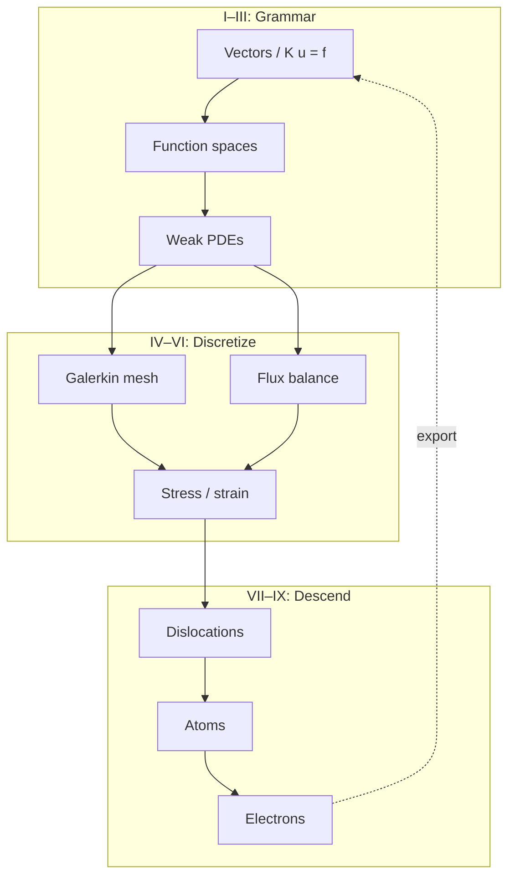

# Final Memory Sheet

This page extends Section C of the [Functional Analysis Notes](https://hanfengzhai.github.io/file/teaching/notes/ME412_CourseSummary.pdf) (ME 412) across the **full book**. It is not a proof document — it is a **concept map** for the copper-wire story from linear algebra through DFT. Use it after the [epilogue](../epilogue/multiscale.md) as a one-sitting recap, or mid-read when abstraction rises and you need the ladder in one glance.

At every scale, ask the four questions the notes formalize: **object**, **structure**, **theorem**, **failure mode**. The [glossary](glossary.md) collects those answers in tables; this page collects the **habits** that make the story continuous.

## Scene: the wire after the last chapter

The grips are still mounted. The load cell still reads force. The thermocouple still warms. Nothing in the laboratory changed while you read — only your vocabulary did. This memory sheet is the **closing lens** on that same afternoon: what to carry forward when the next project is not copper, when the code is not the one in the worked examples, when the scale you need is somewhere between two parts.

## The most important ideas (whole book)

**Grammar (Parts I–II)**

1. A **state vector** \(\mathbf{u}\) is the finite-dimensional habit every code shares before it knows stress tensors or orbitals.
2. A **matrix** is a linear map in a chosen basis; assembly is change of coordinates, not magic bookkeeping.
3. **Eigenmodes** decouple complexity; the spectral theorem is the infinite-dimensional upgrade of diagonalization.
4. As \(N \to \infty\), vectors become **fields**; matrices become **operators** on function spaces.
5. A **norm** is the ruler; equivalent norms give the same convergence story.
6. **Completeness** means Cauchy sequences stay inside — mesh refinement must have a target.
7. A **Hilbert space** adds angles; **orthogonal projection** is Galerkin's best-approximation instinct.
8. **Loads** are functionals; **Riesz representation** turns them into vectors in dual space.
9. **Compactness** in infinite dimensions is subtle; compact operators behave like finite matrices for spectra.

**Fields and weak forms (Part III)**

10. The **strong form** demands pointwise smoothness; corners and kinks break it honestly.
11. The **weak form** moves derivatives onto test functions — integration by parts is the hinge.
12. **Sobolev spaces** \(H^1\), \(L^2\) are the correct rooms for weak PDEs and FEM.
13. **Energy methods** turn equilibrium into minimization; **Lax–Milgram** gives existence with stability.
14. **Coercivity** (continuity + lower bound on the bilinear form) is the continuum version of SPD \(\mathbf{K}\).

**Discretization (Parts IV–V)**

15. **Galerkin FEM** is projection in \(H^1\), not ad hoc sparse algebra — \(\mathbf{K}\) is the discrete shadow of a bilinear form.
16. **Weighted residuals** unify trial-function methods; assembly is local-to-global book-keeping.
17. **Shape functions** and **quadrature** approximate integrals; patch tests catch broken elements.
18. **Céa's lemma** makes FEM quasi-optimal: error is controlled by best approximation in \(V_h\).
19. **FVM** balances **fluxes** on control volumes — the right philosophy for conservation laws and shocks.
20. **Riemann solvers** and **upwinding** stabilize hyperbolic discretizations; CFL limits time steps.
21. **Conjugate heat transfer** couples FEM solid conduction to FVM fluid convection at the wall — a fixed-point handshake previewing multiscale workflows.

**Continuum physics (Part VI)**

22. **Kinematics** names \(\mathbf{F}\), strain measures, and objectivity — what Part IV's mesh already approximates.
23. **Cauchy stress** and **balance laws** are the PDEs Part III wrote in tensor language.
24. **Virtual work** is the weak form of solids; hyperelastic energy is the Dirichlet principle in finite strain.
25. **Yield and plasticity** signal where continuum fields need **history variables** from finer scales.

**Mesoscale and below (Parts VII–IX)**

26. **Defects** break smooth displacement fields; **dislocations** are line singularities with Burgers vector \(\mathbf{b}\).
27. **Peach–Köhler** forces drive dislocation motion; **mobility laws** close the dynamics.
28. **Taylor hardening** \(\Delta\tau \propto \sqrt{\rho}\) exports mesoscale physics to crystal plasticity FEM.
29. **Molecular dynamics** tracks \(\{\mathbf{r}_i\}\) with Newton's equations; **potentials** \(V\) encode electronic bonding at coarse grain.
30. **Ensembles** (NVE, NVT, NPT) define which averages MD estimates; **symplectic integrators** preserve energy on short horizons.
31. **Born–Oppenheimer** separates fast electrons from slow nuclei — the scale-separation assumption behind ab initio MD.
32. **Hohenberg–Kohn** proves ground-state energy is a functional of density \(\rho(\mathbf{r})\).
33. **Kohn–Sham DFT** replaces the many-body problem with a self-consistent single-particle loop — eigenvalues again.
34. **SCF convergence** is the DFT analogue of mesh refinement: orbitals and density must settle before forces are trusted.

**Multiscale (Epilogue)**

35. **Homogenize upward**: DFT → potential → MD → mobility → DDD → hardening → FEM.
36. **Derive downward**: ask where continuum moduli and yield stress originated.
37. **Handshake interfaces** need consistent units, frames, and averaging — not just file formats.
38. The same four questions at every scale: **state**, **equations**, **discretization**, **upward export**.

## The most important traps (whole book)

**Linear algebra and analysis**

1. **Ill-conditioning** is not non-uniqueness — check constraints and scaling before blaming physics.
2. **Rigid-body modes** are null-space physics, not solver bugs — boundary conditions remove them.
3. **Cauchy** does not imply convergence unless the space is **complete**.
4. **Weak convergence** is not strong convergence — FEM error in energy norm does not guarantee pointwise accuracy.
5. **FEM is not just matrix algebra** — it is projection; wrong \(V_h\) breaks the story before \(\mathbf{K}\) is assembled.

**PDEs and discretization**

6. **Corners and point loads** break classical smoothness — weak forms exist because strong forms fail.
7. **Equal-order \((P_1, P_1)\)** velocity–pressure pairs violate **inf–sup** — use Taylor–Hood or stabilization.
8. **Locking** in elasticity is a modeling/discretization mismatch — reduced integration or mixed formulations help.
9. **CFL violation** in explicit FVM blows up quietly until it blows up loudly — stability is not optional.
10. **Wall flux mismatch** in conjugate heat transfer is a **category error** at the interface, not a mesh issue.

**Continuum and mesoscale**

11. **Isotropic \(\mathbb{C}\) from bulk DFT** does not carry **cold-work history** — hardening lives in dislocation density.
12. **J₂ plasticity with one \(H\)** fits a curve; it does not explain **why** the curve bends — DDD supplies that.
13. **Cauchy stress from MD** requires careful **volume definition** and thermostat interpretation.
14. **Polycrystal texture** is not captured by single-crystal DDD alone — RVE and statistics matter.

**Atomistic and electronic**

15. **Cutoff artifacts** in MD potentials fake long-range physics — check convergence with box size and cutoff.
16. **Energy drift** in MD means the integrator or thermostat is wrong for the question asked.
17. **Wrong XC functional** in DFT shifts lattice constants — elastic constants and cohesive energies inherit the error.
18. **k-mesh too coarse** makes metals look like insulators in band structure — convergence is part of the physics.
19. **Born–Oppenheimer** fails when electrons stay correlated — the ladder has a bottom rung limit.

**Multiscale coupling**

20. **Unit mismatches** (eV vs. J, Å vs. m) propagate catastrophically upward — check at every arrow.
21. **Sequential homogenization** loses **path dependence** unless internal variables carry history.
22. **Surrogates** trained on one loading path fail on another — frame indifference and thermodynamic consistency are not optional.
23. **Skipping manufacturing history** (draw, anneal, service) predicts the wrong wire even with perfect DFT moduli.

## Continuity hinges master map {#continuity-hinges-master-map}

When a chapter feels disconnected from the last, pause at the hinge for your reading position — same copper wire, richer vocabulary at each turn. The [preface](../preface.md) splits these into opening, ascent, midpoint, descent, and epilogue tables; this page collects all **fifteen narrative hinges** in reading order.

| # | Phase | Hinge | When to pause |
|---|-------|-------|---------------|
| 0 | Opening | [Prologue → I](../prologue/00-many-scales.md#bridge-to-part-i) | Scale ladder feels like a menu before the first matrix |
| 1 | Ascent | [I.4 → II](../part01-linear-algebra/04-toward-infinity.md#bridge-to-part-ii) | \(\mathbf{K}\mathbf{u}=\mathbf{f}\) feels unrelated to PDEs |
| 2 | Ascent | [II.5 → III](../part02-functional-analysis/05-spectral-theorem.md#bridge-to-part-iii) | Sobolev norms feel abstract; weak form is the next dialogue |
| 3 | Ascent | [III.4 → IV](../part03-pdes/04-energy-methods.md#bridge-to-part-iv) | Energy minimization and matrix assembly seem like separate tricks |
| 4 | Ascent | [IV.5 / V.4 → VI](../part04-fem/05-convergence.md#bridge-two-doors-from-here) | FEM and FVM feel like unrelated courses |
| 5 | Midpoint | [Part VI opening](../part06-continuum/00-opening.md#midpoint-ascent-complete-descent-ahead) | Parts I–V feel like separate subjects |
| 6 | Midpoint | [VI.4 intermission](../part06-continuum/04-nonlinear-plasticity-preview.md#intermission-ascent-ends-descent-begins) | \(J_2\) fits the curve but not its cause |
| 7 | Descent | [VII.3 → VIII](../part07-defects/03-polycrystal-and-fem-handoff.md#bridge-to-part-viii) | Mobility or \(\gamma_{\text{sf}}\) feel like fitted constants |
| 8 | Descent | [VIII.3 WHAM → VII mobility](../part08-md/03-ab-initio-and-coarse-graining.md#wham--part-vii-mobility-hinge-act-ii-temperature-pedigree) | Recovery or drag tables at 300 K while [V.4 CHT](../part05-fvm/04-navier-stokes-cfd.md#lab-act-extension-two-domain-picard-loop-with-a-1d-fem-solid) converged at \(T_w \approx 380\,\text{K}\) |
| 9 | Descent | [VIII.3 → IX](../part08-md/03-ab-initio-and-coarse-graining.md#bridge-to-part-ix) | EAM matches bulk moduli but no DFT deck is cited |
| 10 | Descent | [IX.3 → epilogue](../part09-dft/03-dft-workflows.md#bridge-to-the-epilogue) | Exports exist in separate folders with no workflow |
| 11 | Closing | [Epilogue: six-act reunion](../epilogue/multiscale.md#lab-act-reunion-six-acts-one-afternoon) | Each part makes sense alone but workflow order is unclear |
| 12 | Closing | [Epilogue → prologue](../epilogue/multiscale.md#bridge) | Next project needs scale discipline from day one |
| 13 | Closing | [Handshake 2 → 3](../epilogue/multiscale.md#handshake-2--joule-heating--conjugate-heat-transfer-part-iv--v) → [IX.3 \(\alpha\) Lab act](../part09-dft/03-dft-workflows.md#lab-act-quasiharmonic-alpha-handshake-3-pedigree) → [Handshake 3](../epilogue/multiscale.md#handshake-3--thermal-strain--mechanical-stiffness-part-vi--iv) | CHT converged but load cell still uses handbook \(\alpha\); [preface row 13 skill checkpoint](../preface.md#skill-navigation-row-13); [sensitivity table](../epilogue/multiscale.md#sensitivity-which-handshake-matters-most) ranks Handshake 3 **first for fixed-grip stress**; [sensitivity derivation worksheet](../epilogue/multiscale.md#worked-example-sensitivity-ranks) proves the ranking |
| 14 | Closing | [VII.3 rate handshake](../part07-defects/03-polycrystal-and-fem-handoff.md#scale-boundary-handshake-ddd-strain-rate-to-quasi-static-fem) → [Handshake 4a](../epilogue/multiscale.md#handshake-4--rate-dependent-hardening-and-notch-localization-part-vii--vi--viii) | DDD exports feed plasticity deck but hardening knee arrives early; [preface row 14 skill checkpoint](../preface.md#skill-navigation-row-14); [`parse_rate.sh`](../scripts/parse_rate.sh) on `ddd_tau_vs_rate.dat`; [sensitivity derivation worksheet](../epilogue/multiscale.md#worked-example-sensitivity-ranks) (Handshake 4a column) — direct import without extrapolation overpredicts flow stress by 5–35% |
| 15 | Closing | [VII.3 Step 4 FE²](../part07-defects/03-polycrystal-and-fem-handoff.md#step-4--when-offline-calibration-fails-fe-at-the-notch) → [Handshake 4b](../epilogue/multiscale.md#4b--when-continuum-fails-at-the-notch-md-subdomain-act-v--notch) | Bulk hardening from 4a looks right but notch root under-predicts peak stress; [preface row 15 skill checkpoint](../preface.md#skill-navigation-row-15); [`parse_fe2.sh`](../scripts/parse_fe2.sh) on `fe2_notch_comparison.dat`; [sensitivity derivation worksheet](../epilogue/multiscale.md#worked-example-sensitivity-ranks) (Handshake 4b column) — scalar \(H\) under-predicts root stress by 10–15%; upstream rate from [row 14](../preface.md#skill-navigation-row-14) |

**Baby picture:** read straight through for the plot; when the symbols change faster than the specimen, jump to the hinge row — it is the narrative stitch the Functional Analysis Notes layout assumes between numbered chapters. Row 13 is the epilogue-only stitch: **Handshake 2 sets \(\Delta T\); Handshake 3 sets \(\alpha\Delta T\)** — conflating them is the most common multiscale pedigree error on the heated wire; the [epilogue Act III reunion paragraph](../epilogue/multiscale.md#lab-act-reunion-six-acts-one-afternoon) names the same thermal pre-stress stitch in workflow time, and the [sensitivity derivation worksheet closing](../epilogue/multiscale.md#worked-example-sensitivity-ranks) links back to the [prologue row 13 preview](../prologue/00-many-scales.md#what-you-should-be-able-to-do-after-the-prologue) when the competence loop closes. Row 14 is the companion stitch for Act IV: **VII.3 sets \(\tau_{\text{flow}}(\dot\varepsilon_{\text{DDD}})\); Handshake 4a sets \(\tau_{\text{lab}}\)** — conflating DDD timestep strain rate with lab grip speed overpredicts yield by the same order as a handbook \(\alpha\) error shifts thermal stress; the [epilogue Act IV reunion paragraph](../epilogue/multiscale.md#lab-act-reunion-six-acts-one-afternoon) names the same hardening stitch in workflow time. Row 15 is the Act V stitch: **4a sets bulk \(\tau_{\text{lab}}\); 4b asks whether scalar \(H\) suffices at the notch root** — sequential homogenization can match bulk flow stress while under-predicting localization by 10–15%; run [`parse_fe2.sh`](../scripts/parse_fe2.sh) before trusting the notch-root answer; the [epilogue Act V reunion paragraph](../epilogue/multiscale.md#lab-act-reunion-six-acts-one-afternoon) and [sensitivity derivation worksheet closing](../epilogue/multiscale.md#worked-example-sensitivity-ranks) link back to the [prologue Handshake 4b preview](../prologue/00-many-scales.md#what-you-should-be-able-to-do-after-the-prologue) when the competence loop closes.

## One-line course summaries (ME 412 style)

The [Functional Analysis Notes](https://hanfengzhai.github.io/file/teaching/notes/ME412_CourseSummary.pdf) close with compressed sentences that fit on an index card. This book extends that habit across scales:

| Scope | One-line summary |
|-------|------------------|
| **Parts I–III** | Linear algebra → operator equations → well-posedness → weak PDE. |
| **Parts I–IV** | Choose the right space → prove the weak solution exists → approximate it by Galerkin projection. |
| **Parts I–VI** | Norm = ruler, Banach = no holes, Hilbert = geometry, Sobolev = PDE-ready; continuum stress names what FEM already meshed. |
| **Parts I–IX** | Same ladder from \(\mathbb{R}^N\) to \(\rho(\mathbf{r})\); homogenize upward with documented handshakes. |
| **Whole book** | One copper wire, four questions at every scale: state, equations, discretization, upward export. |

When a chapter feels abstract, pick the row that matches your reading position and read it aloud — it is the plot spine in one breath.

## One-page copper wire recap

| Act | Lab beat | Part | State on the wire | Upward export |
|-----|----------|------|-------------------|---------------|
| I | Mounting | I | Spring displacements | \(\mathbf{K}\), modes |
| II | Warming | III–V | \(T(\mathbf{x})\), air flow | Wall flux, CHT loop |
| III | Pulling | II–IV, VI | \(u(x)\), \(\boldsymbol{\sigma}\) | Weak form → assembly |
| IV | Hardening | VII | Dislocation density \(\rho\) | \(\tau(\gamma)\) for FEM |
| V | Notch | VI, VIII | Stress concentrator | MD traction handoff |
| VI | Foundation | IX → VIII → VII → IV | \(\rho(\mathbf{r})\), then potentials | \(E_{\text{coh}}\), \(C_{ij}\), pedigree |

Read the [prologue](../prologue/00-many-scales.md#the-experiment-as-plot) for the six-act table in narrative form; read the [epilogue](../epilogue/multiscale.md) for how to wire the acts into one afternoon workflow.

## Handshake interface checklist

Multiscale workflows fail at **interfaces**, not inside solvers. Before merging outputs from two codes, verify each row — the epilogue's four-handshake example on the heated wire is the template.

| Interface | Quantity crossing | Unit check | Frame check | Convergence artifact |
|-----------|-------------------|------------|-------------|----------------------|
| DFT → MD | \(E_{\text{coh}}\), \(a_0\), \(C_{ij}\), \(\gamma_{\text{sf}}\) | eV → eV/atom; Å → Å; GPa from Voigt average | Same crystal orientation as MD box | SCF log; k-mesh table; cutoff test |
| MD → DDD | \(M(\tau, T)\), core structure, \(\gamma_{\text{sf}}\) | Pa, m/s; mJ/m² | Slip system labels match OpenDiS input | Autocorrelation \(\tau\); equilibration length |
| DDD → FEM | \(\tau(\gamma)\), \(\rho(\gamma)\), hardening modulus | Pa; m⁻² | Same strain rate as lab frame | Forest density vs strain curve |
| FEM solid → FVM fluid | Wall \(T\), heat flux \(q''\), \(h\) | K; W/m²; W/(m²·K) | Outward normal consistent on both meshes | CHT fixed-point iteration log |
| FEM mechanical → FEM thermal | \(\varepsilon_{\text{th}}(T)\), temperature-dependent \(E\) | K⁻¹; GPa vs temperature table | Same mesh or consistent interpolation | Staggered coupling iteration count |

**Archive rule:** every arrow in a workflow folder gets a README line with (1) source commit or run ID, (2) convergence parameter that was tested, (3) known sensitivity from the epilogue table. Future-you should not inherit a number without inheriting its pedigree.

## Reading rhythm reminder (ME 412 layout)

Each numbered chapter follows the same five-beat rhythm the Functional Analysis Notes use, extended with narrative Scene and Lab act sections:

1. **Scene** — return to the copper wire in the lab
2. **Concept map checkpoint** (mid- or end-chapter) — object, structure, theorem, failure mode — present in all **35 numbered chapters** (I.1–IX.3), plus **prologue** and **epilogue** bookends
3. **Lab act** — one computational move you can run
4. **Bridge** — why the next chapter must exist

When abstraction rises mid-chapter, pause at the next **Scene** or **Lab act** before continuing — the plot resumes there even if the theorem does not.

## Bridge

The memory sheet closes the book the way ME 412 closes the Functional Analysis Notes — habits and traps, not proofs. Return to the [glossary](glossary.md) when a symbol reappears under new vocabulary; return to [sources](sources.md) when you need the PDF behind a part or the [continuity hinges index](sources.md#continuity-hinges-index-when-the-plot-stutters); return to the [prologue](../prologue/00-many-scales.md) when a new project needs scale discipline from day one. The [continuity hinges master map](#continuity-hinges-master-map) above is the one-page navigation aid when the plot stutters mid-read.

The copper wire does not care which chapter you finished last. It responds to physics. Your craft is to make that physics computable, connected, and credible — one continuous story from \(\mathbb{R}^N\) to \(\rho(\mathbf{r})\) and back upward through homogenization.
