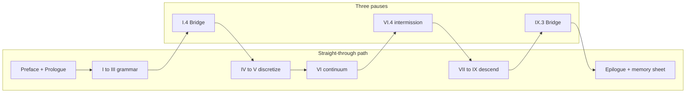

# Sources and Further Reading

This book synthesizes material from the author's notes, coursework, and teaching. Canonical chapter sources live under [`writings/`](../../writings/) (Functional Analysis Notes layout). Run `./scripts/sync-writings.sh` to copy them into `src/`. When the external `Writings` git submodule is linked, prefer upstream content and re-run the sync script.

## Scene: two clocks on the same afternoon

The book reads in **mathematical order** (Part I before Part IX), but the copper wire lives in **laboratory time** (mounting before hardening). The chapter roadmap below follows mathematical order — the order the Functional Analysis Notes layout assumes. When you need to know *which act of the experiment* a chapter belongs to, use the six-act table in the next section or the full narrative in the [prologue](../prologue/00-many-scales.md#the-experiment-as-plot).

## Six acts → parts (laboratory time) {#six-acts-parts-laboratory-time}

| Act | Lab beat | Primary parts | Opening links |
|-----|----------|---------------|---------------|
| I — Mounting | Grips close; first \(\mathbf{K}\mathbf{u}=\mathbf{f}\) | Prologue, I | [Prologue](../prologue/00-many-scales.md), [I.0](../part01-linear-algebra/00-opening.md) |
| II — Warming | Current on; thermocouple rises | III, IV, V | [III.0](../part03-pdes/00-opening.md), [IV.0](../part04-fem/00-opening.md), [V.0](../part05-fvm/00-opening.md) |
| III — Pulling | Force–displacement ramp | II, III, IV, VI | [II.0](../part02-functional-analysis/00-opening.md), [III.0](../part03-pdes/00-opening.md), [IV.0](../part04-fem/00-opening.md), [VI.0](../part06-continuum/00-opening.md) |
| IV — Hardening | Curve bends upward | VII | [VII.0](../part07-defects/00-opening.md) |
| V — Notch | Stress concentrator | VI, VIII | [VI.0](../part06-continuum/00-opening.md), [VIII.0](../part08-md/00-opening.md) |
| VI — Foundation | Parameters before the run | IX → VIII → VII → IV | [IX.0](../part09-dft/00-opening.md) → [VIII.0](../part08-md/00-opening.md) → [VII.0](../part07-defects/00-opening.md) → [IV.0](../part04-fem/00-opening.md) |

Act VI runs **in parallel** with Acts I–V in real projects: no FEM deck starts without moduli whose pedigree traces to finer models or calibration. The [epilogue](../epilogue/multiscale.md) reunites all six acts in one multiscale afternoon.

## Parameter pedigree path (Act VI reading order) {#parameter-pedigree-path-act-vi-reading-order}

The book reads **mathematically** from Part I to Part IX — grammar before descent. Real projects often read **downward** when building an input deck: start at electrons, export numbers, climb until FEM has honest moduli. Act VI is that reverse ladder on the same copper wire. The [Part IX coupling ladder](../part09-dft/00-opening.md#the-coupling-ladder-me-412-reunion) draws the full ME 412 reunion diagram; the pedigree path below is its **foundation slice** (IX → IV), before the epilogue wires Handshakes 1–4b in workflow order ([row 16](memory-sheet.md#continuity-hinges-master-map); [Act VI reunion paragraph](../epilogue/multiscale.md#lab-act-reunion-six-acts-one-afternoon)).

```mermaid
flowchart TB
  subgraph pedigree["Act VI foundation (workflow order IX to IV)"]
    DFT[IX.3: C_ij, gamma_sf, E_coh]
    MD[VIII.2-3: EAM fit, mobility M(tau,T)]
    DDD[VII.2: tau(rho), hardening laws]
    FEM[IV.4: Voigt E, nu in assembly]
  end
  subgraph orchestration["Row 16 orchestration (epilogue handshakes)"]
    H1[1: DFT moduli to FEM]
    H2[2: CHT delta T]
    H3[3: alpha delta T]
    H4a[4a: rate extrapolation]
    H4b[4b: FE2 notch]
    OUT[multiscale_export.yaml]
  end
  DFT --> MD --> DDD --> FEM --> H1
  H1 --> H2 --> H3 --> H4a --> H4b --> OUT
  H2 -.->|delta T feeds| H3
  H2 -.->|T_w to phonon lifetime| H4a
```

| Step | Read | Export | Wire-scale consumer |
|------|------|--------|---------------------|
| 1 | [IX.3](../part09-dft/03-dft-workflows.md#plot-spine-one-line) | \(C_{ij}\), \(\gamma_{\text{sf}}\), cohesive energy | Elastic constants, partial separation in DDD |
| 2 | [VIII.3](../part08-md/03-ab-initio-and-coarse-graining.md#plot-spine-one-line) | EAM table, phonon check | Production MD and mobility fitting |
| 3 | [VIII.2](../part08-md/02-ensembles-integrators.md#plot-spine-one-line) | \(M(\tau, T)\) from constrained shear | OpenDiS mobility law |
| 4 | [VII.2](../part07-defects/02-dislocation-dynamics.md#plot-spine-one-line) | \(\tau(\gamma)\), \(\rho(\gamma)\), Taylor \(\alpha\) | Crystal plasticity / Voce hardening |
| 5 | [IV.4](../part04-fem/04-poisson-to-elasticity.md#plot-spine-one-line) | \(\mathbf{K}\) with documented \(E\), \(\nu\) | Load-cell linear regime in Act III |
| 6 | [Epilogue](../epilogue/multiscale.md#lab-act-reunion-six-acts-one-afternoon) + [`parse_multiscale_workflow.sh`](../../scripts/parse_multiscale_workflow.sh) | `multiscale_export.yaml` linking Handshakes 1–4b | Orchestrated pedigree beside Act VI folder |

Each arrow needs a convergence log and a unit check — the epilogue's [four-handshake sensitivity table](../epilogue/multiscale.md#sensitivity-which-handshake-matters-most) ranks which exports dominate for a given question. **Mathematical order** teaches why the ladder exists; **pedigree order** fills the input deck before the grips close; **orchestration** (row 16) links individual exports in dependency order so Handshake 2's \(\Delta T\) feeds Handshake 3 and phonon lifetime at converged \(T_w\) feeds Handshake 4a drag.

## Narrative beat map (mathematical order × lab act)

The book reads in mathematical order (Part I before Part IX), but the copper wire lives in laboratory time. Use this table when you want **both** clocks at once — the story beat that should feel familiar when the symbols change.

| Chapter | Lab act | Narrative beat (one sentence) |
|---------|---------|--------------------------------|
| Prologue | Preview | One wire, eight scales, four questions |
| I.1–I.3 | I — Mounting | Springs, assembly, the wire rings |
| I.4 | I → II | Thermocouples multiply; vectors become fields |
| II.1–II.5 | III (preview) | The room where weak forms live |
| III.1–III.4 | II–III | Strong form fails; energy chooses the solution |
| IV.1–IV.5 | I, III | Mesh the solid; choose FEM or FVM door |
| V.1–V.4 | II | Cool the wire; balance fluxes in air |
| VI.1–VI.3 | II–III | Name stress; virtual work behind \(\mathbf{K}\) |
| VI.4 | II–IV → descent | [Intermission](../part06-continuum/04-nonlinear-plasticity-preview.md#intermission-ascent-ends-descent-begins): ascent ends; \(J_2\) placeholders await a forest |
| VII.0–VII.3 | IV | Forest hardens; export \(\tau(\gamma)\) |
| VIII.1–VIII.3 | V–VI | Atoms at the notch; fit potential |
| IX.1–IX.3 | VI | Electrons; archive pedigree |
| Epilogue | All six | Wire the rungs; sensitivity ranks |

When a chapter's **Bridge** names the next part, cross-check this table — the laboratory beat may lag or lead the mathematics by one part (Act II warming appears in Part III–V prose while Act III pulling is Part IV–VI). That offset is intentional: the wire heats before it yields.

## Continuity hinges index (when the plot stutters)

The [preface](../preface.md) documents opening, ascent, midpoint, descent, and epilogue hinge tables separately. The [memory sheet](memory-sheet.md#continuity-hinges-master-map) collects all **sixteen** narrative hinges (rows 0–16) in one navigation page. Use this index when you know **which chapter** you are in but cannot feel the handoff to the next:

| Row | Chapter region | Hinge anchor | What should click |
|-----|----------------|--------------|-------------------|
| 0 | Prologue → I.0 | [Opening hinge](../preface.md#opening-continuity-hinge) · [preface row 0 skill checkpoint](../preface.md#skill-navigation-row-0) · [Prologue Bridge](../prologue/00-many-scales.md#bridge-to-part-i) · [I.0 hinge](../part01-linear-algebra/00-opening.md#opening-hinge-prologue-to-part-i) | Panorama ladder becomes explicit \(\mathbf{K}\mathbf{u}=\mathbf{f}\) grammar |
| 1 | I.4 → II.0 | [I.4 Bridge](../part01-linear-algebra/04-toward-infinity.md#bridge-to-part-ii) | Nodal vectors become fields; \(\mathbf{K}_N\) becomes an operator |
| 2 | II.5 → III.0 | [II.5 Bridge](../part02-functional-analysis/05-spectral-theorem.md#bridge-to-part-iii) · [Part III variational ladder](../part03-pdes/00-opening.md#the-variational-ladder-me-412-schematic-14) | Completeness hands off to weak Poisson and heat; Schematic 14 becomes plot spine |
| 3 | III.4 → IV.0 | [III.4 Bridge](../part03-pdes/04-energy-methods.md#bridge-to-part-iv) · [Part III variational ladder](../part03-pdes/00-opening.md#the-variational-ladder-me-412-schematic-14) · [Part IV Galerkin ladder](../part04-fem/00-opening.md#the-galerkin-ladder-me-412-schematic-14-continued) | Lax–Milgram becomes Galerkin assembly; Schematic 14 splits at III.4 / IV.0 |
| 4 | IV.5 / V.4 → VI.0 | [Two doors](../part04-fem/05-convergence.md#bridge-two-doors-from-here) · [Part IV Galerkin ladder](../part04-fem/00-opening.md#the-galerkin-ladder-me-412-schematic-14-continued) · [Part V conservation ladder](../part05-fvm/00-opening.md#the-conservation-ladder-fvm-parallel-to-schematic-14) · [Part VI twin ladders reunite](../part06-continuum/00-opening.md#the-twin-ladders-reunite-galerkin-and-conservation) · [Part III weak forms](../part03-pdes/02-weak-form.md#plot-spine-one-line) | FEM and FVM converge on Cauchy stress; Schematic 14 splits into Galerkin (IV) and conservation (V) twins, reunites at VI.0 |
| 5–6 | VI.0 / VI.4 → VII.0 | [Midpoint](../part06-continuum/00-opening.md#midpoint-ascent-complete-descent-ahead) · [Twin ladders reunite](../part06-continuum/00-opening.md#the-twin-ladders-reunite-galerkin-and-conservation) · [VII.0 ascent hinge](../part07-defects/00-opening.md#ascent-hinge-midpoint-and-twin-ladders) · [intermission](../part06-continuum/04-nonlinear-plasticity-preview.md#intermission-ascent-ends-descent-begins) | Ascent complete; thermal strain from CHT enters virtual work; \(J_2\) placeholders yield to forest |
| 7 | VII.3 → VIII.0 | [VII.3 Bridge](../part07-defects/03-polycrystal-and-fem-handoff.md#bridge-to-part-viii) · [VIII.1 opening hinge](../part08-md/01-potentials-phase-space.md#opening-hinge-vii3-to-viii1) · [VIII.0 descent hinge](../part08-md/00-opening.md#descent-hinge-cores-mobility-and-tw-pedigree) | Line cores need atomic bonding; mobility at \(T_w\) from CHT, not 300 K default |
| 7b | VIII.1 → VIII.2 | [VIII.1 Bridge](../part08-md/01-potentials-phase-space.md#bridge) · [VIII.2 opening hinge](../part08-md/02-ensembles-integrators.md#opening-hinge-viii1-to-viii2) | EAM minimization done but NVT/NPT not run; `MD_NVT_shear_PartVIII` still missing at \(T_w\) |
| 7c | VIII.2 → VIII.3 | [VIII.2 Bridge](../part08-md/02-ensembles-integrators.md#bridge) · [VIII.3 opening hinge](../part08-md/03-ab-initio-and-coarse-graining.md#opening-hinge-viii2-to-viii3) | Trajectories audited but no coarse-graining handoff; EAM on trust without pedigree checklist |
| 8 | VIII.0–VIII.3 | [Preface: row 8 skill checkpoint](../preface.md#skill-navigation-row-8) · [VIII.0 descent hinge](../part08-md/00-opening.md#descent-hinge-cores-mobility-and-tw-pedigree) · [VIII.3 WHAM at \(T_w\)](../part08-md/03-ab-initio-and-coarse-graining.md#wham-part-vii-mobility-hinge-act-ii-temperature-pedigree) · [memory sheet rows 8–9 baby picture](memory-sheet.md#rows-8-9-baby-picture-tw-temperature-pedigree) | [V.4 CHT](../part05-fvm/04-navier-stokes-cfd.md#lab-act-extension-two-domain-picard-loop-with-a-1d-fem-solid) converged at \(T_w\); MD mobility, WHAM, and OpenDiS drag must not default to 300 K |
| 9 | VIII.3 → IX.0 | [Preface: row 9 skill checkpoint](../preface.md#skill-navigation-row-9) · [VIII.3 Bridge](../part08-md/03-ab-initio-and-coarse-graining.md#bridge-to-part-ix) · [IX.0 electronic audit hinge](../part09-dft/00-opening.md#electronic-audit-hinge-descent-pedigree-and-tw-phonon) · [IX.0 thermal phonon audit at \(T_w\)](../part09-dft/00-opening.md#thermal-phonon-audit-at-tw) · [memory sheet rows 8–9 baby picture](memory-sheet.md#rows-8-9-baby-picture-tw-temperature-pedigree) | EAM on trust needs SCF audit; \(\alpha(T_w)\) and \(\tau_{\text{ph}}(T_w)\) beside `cht_export.yaml`, not room-temperature folklore |
| 10 | IX.3 → Epilogue | [IX.3 Bridge](../part09-dft/03-dft-workflows.md#bridge-to-the-epilogue) | Finest rung; upward homogenization begins |
| 11 | Epilogue (workflow) | [Six-act reunion](../epilogue/multiscale.md#lab-act-reunion-six-acts-one-afternoon) | Reading order reunites with laboratory time |
| 12 | Epilogue → Prologue | [Epilogue Bridge row 12](../epilogue/multiscale.md#row-12-closing-loop) · [prologue reopening anchor](../prologue/00-many-scales.md#prologue-reopening-anchor) · [preface row 12](../preface.md#skill-navigation-row-12) · [memory sheet row 12 baby picture](memory-sheet.md#row-12-baby-picture-next-project) | Four questions restart on the next project; ladder reusable — row 12 reunites with row 0 on grammar restart |
| 13 | Epilogue (Handshake 2 → 3) | [Handshake 2 → 3](../epilogue/multiscale.md#handshake-2--joule-heating--conjugate-heat-transfer-part-iv--v), [preface row 13 three-way audit](../preface.md#skill-navigation-row-13), [row 13 closing loop](../epilogue/multiscale.md#row-13-closing-loop), [row 13 baby picture](../appendix/memory-sheet.md#row-13-baby-picture-handshake-2-3) | CHT converged but load cell still uses handbook \(\alpha\); Handshake 2 sets \(\Delta T\), Handshake 3 sets \(\alpha\Delta T\) |
| 14 | Epilogue (Handshake 4a) | [VII.3 rate handshake](../part07-defects/03-polycrystal-and-fem-handoff.md#scale-boundary-handshake-ddd-strain-rate-to-quasi-static-fem), [Handshake 4a upstream](../epilogue/multiscale.md#4a--ddd-strain-rate-to-quasi-static-load-cell-act-iv--hardening), [preface row 14 three-way audit](../preface.md#skill-navigation-row-14), [row 14 closing loop](../epilogue/multiscale.md#row-14-closing-loop), [row 14 baby picture](memory-sheet.md#row-14-baby-picture-handshake-4a) | DDD exports feed plasticity without strain-rate extrapolation; hardening knee arrives early; DDD sets \(\tau_{\text{flow}}\), Handshake 4a sets \(\tau_{\text{lab}}\) |
| 15 | Epilogue (Handshake 4b) | [VII.3 Step 4 FE²](../part07-defects/03-polycrystal-and-fem-handoff.md#step-4--when-offline-calibration-fails-fe-at-the-notch), [FE² worked example](../epilogue/multiscale.md#worked-example-fe-at-the-wire-notch-act-v--notch), [preface row 15 three-way audit](../preface.md#skill-navigation-row-15), [row 15 closing loop](../epilogue/multiscale.md#row-15-closing-loop), [row 15 baby picture](memory-sheet.md#row-15-baby-picture-handshake-4b) | Bulk hardening from 4a looks right but notch root under-predicts peak stress; 4a sets bulk \(\tau_{\text{lab}}\), Handshake 4b asks whether scalar \(H\) suffices at \(K_t \approx 3\) |
| 16 | Epilogue (Act VI orchestration) | [Parameter pedigree path](#parameter-pedigree-path-act-vi-reading-order), [preface row 16](../preface.md#skill-navigation-row-16) | Individual exports exist but no orchestrated `multiscale_export.yaml`; IX → IV pedigree before grips close |
| 17 | Whole book (continuous read-through) | [Continuous read-through guide](#continuous-read-through-guide) · [preface row 17](../preface.md#skill-navigation-row-17) · [memory sheet row 17 baby picture](memory-sheet.md#row-17-baby-picture-continuous-read-through) | Chapters feel choppy despite Bridges — trust Scene/Bridge rhythm; pause only at three ascent/descent gates |
| 18 | Part openings I.0–IX.0 | [Part-opening plot spine index](#part-opening-plot-spine-index-row-18) · [preface row 18](../preface.md#skill-navigation-row-18) · [memory sheet row 18 baby picture](memory-sheet.md#row-18-baby-picture-part-opening-plot-spine) | A part opening feels like a new syllabus — read its [plot spine one line](../part01-linear-algebra/00-opening.md#plot-spine-one-line) aloud |
| 19 | Numbered chapters I.1–IX.3 | [Numbered-chapter plot spine index](#numbered-chapter-plot-spine-index-row-19) · [preface row 19](../preface.md#skill-navigation-row-19) · [memory sheet row 19 baby picture](memory-sheet.md#row-19-baby-picture-numbered-chapter-plot-spine) | Mid-chapter reading stalls despite a Bridge — read this chapter's [plot spine one line](../part01-linear-algebra/01-vectors-matrices.md#plot-spine-one-line) aloud |
| 20 | Gate chapters I.4, VI.4, IX.3 | [Gate-chapter plot spine index](#gate-chapter-plot-spine-index-row-20) · [preface row 20](../preface.md#skill-navigation-row-20) · [memory sheet row 20 baby picture](memory-sheet.md#row-20-baby-picture-gate-chapter-plot-spine) | A mandatory gate stalls the straight read — recite its [plot spine one line](../part01-linear-algebra/04-toward-infinity.md#plot-spine-one-line) aloud before the Bridge |

## Part-opening plot spine index (row 18) {#part-opening-plot-spine-index-row-18}

Each part opening carries a **plot spine (one line)** section — a single sentence naming that part's role in Acts I–III (grammar, discretization, descent). Read aloud when symbols change faster than the specimen; the [chapter roadmap](#chapter-roadmap-one-continuous-arc) expands every row below into chapter-level beats.

| Part | Act | [Plot spine one line](../part01-linear-algebra/00-opening.md#plot-spine-one-line) | Sentence (read aloud) |
|------|-----|------------------|----------------------|
| [I.0](../part01-linear-algebra/00-opening.md#plot-spine-one-line) | Act I — Grammar, rung 1 | Spring chain; \(\mathbf{K}\mathbf{u}=\mathbf{f}\) before fields |
| [II.0](../part02-functional-analysis/00-opening.md#plot-spine-one-line) | Act I — Grammar, rung 2 | Fields in \(H^1\), \(L^2\); Schematic 14 middle rungs |
| [III.0](../part03-pdes/00-opening.md#plot-spine-one-line) | Act I — Grammar, rung 3 | Weak PDEs on a domain; existence climbs Schematic 14 |
| [IV.0](../part04-fem/00-opening.md#plot-spine-one-line) | Act II — Discretization, rung 1 | Galerkin assembly; Schematic 14 convergence half |
| [V.0](../part05-fvm/00-opening.md#plot-spine-one-line) | Act II — Discretization, rung 2 | Flux balance in air; conservation ladder twin |
| [VI.0](../part06-continuum/00-opening.md#plot-spine-one-line) | Act II — Continuum reunion | Cauchy stress reunites FEM and FVM; ascent ends |
| [VII.0](../part07-defects/00-opening.md#plot-spine-one-line) | Act III — Descent, rung 1 | Dislocation forest; hardening from line motion |
| [VIII.0](../part08-md/00-opening.md#plot-spine-one-line) | Act III — Descent, rung 2 | Atoms at cores; potentials on trust until IX |
| [IX.0](../part09-dft/00-opening.md#plot-spine-one-line) | Act III — Descent, rung 3 | Electron density; SCF pedigree; finest rung |

**Baby picture:** the [preface plot spine](../preface.md#plot-spine-how-the-story-is-told) names four acts; this table names **nine rungs** — one sentence per part opening. Row 17 tells you to read straight through; row 18 tells you what each part opening should **sound like** when the plot is continuous. When a part feels disconnected, open only its plot-spine line before diving into skill rows 0–16.

## Numbered-chapter plot spine index (row 19) {#numbered-chapter-plot-spine-index-row-19}

Each numbered chapter (I.1–IX.3) carries a **plot spine (one line)** section — a single sentence naming that chapter's role in the continuous arc. Read aloud when mid-chapter abstraction rises faster than the specimen; the [chapter roadmap](#chapter-roadmap-one-continuous-arc) lists the same roles in table form. Row 18 names part boundaries; row 19 names **chapter interiors** when row 17's Scene/Bridge rhythm stalls mid-chapter.

| Part | Chapters | Read aloud when… |
|------|----------|-------------------|
| I | [I.1](../part01-linear-algebra/01-vectors-matrices.md#plot-spine-one-line) · [I.2](../part01-linear-algebra/02-linear-maps.md#plot-spine-one-line) · [I.3](../part01-linear-algebra/03-eigenvalues.md#plot-spine-one-line) · [I.4](../part01-linear-algebra/04-toward-infinity.md#plot-spine-one-line) | Assembly feels like bookkeeping before fields appear |
| II | [II.1](../part02-functional-analysis/01-motivation.md#plot-spine-one-line) · [II.2](../part02-functional-analysis/02-normed-spaces.md#plot-spine-one-line) · [II.3](../part02-functional-analysis/03-hilbert-spaces.md#plot-spine-one-line) · [II.4](../part02-functional-analysis/04-operators-duality.md#plot-spine-one-line) · [II.5](../part02-functional-analysis/05-spectral-theorem.md#plot-spine-one-line) | Sobolev norms feel abstract mid-ascent |
| III | [III.1](../part03-pdes/01-strong-form.md#plot-spine-one-line) · [III.2](../part03-pdes/02-weak-form.md#plot-spine-one-line) · [III.3](../part03-pdes/03-sobolev-spaces.md#plot-spine-one-line) · [III.4](../part03-pdes/04-energy-methods.md#plot-spine-one-line) | Strong and weak forms feel like separate subjects |
| IV | [IV.1](../part04-fem/01-weighted-residuals.md#plot-spine-one-line) · [IV.2](../part04-fem/02-galerkin-assembly.md#plot-spine-one-line) · [IV.3](../part04-fem/03-elements-quadrature.md#plot-spine-one-line) · [IV.4](../part04-fem/04-poisson-to-elasticity.md#plot-spine-one-line) · [IV.5](../part04-fem/05-convergence.md#plot-spine-one-line) | FEM chapters feel like a software manual |
| V | [V.1](../part05-fvm/01-conservation-integral.md#plot-spine-one-line) · [V.2](../part05-fvm/02-fvm-1d.md#plot-spine-one-line) · [V.3](../part05-fvm/03-fluxes-riemann.md#plot-spine-one-line) · [V.4](../part05-fvm/04-navier-stokes-cfd.md#plot-spine-one-line) | Fluids feel disconnected from the wire's solid mesh |
| VI | [VI.1](../part06-continuum/01-kinematics.md#plot-spine-one-line) · [VI.2](../part06-continuum/02-stress-balance.md#plot-spine-one-line) · [VI.3](../part06-continuum/03-variational-elasticity.md#plot-spine-one-line) · [VI.4](../part06-continuum/04-nonlinear-plasticity-preview.md#plot-spine-one-line) | Tensor notation obscures the reunion of FEM and FVM |
| VII | [VII.1](../part07-defects/01-defect-taxonomy.md#plot-spine-one-line) · [VII.2](../part07-defects/02-dislocation-dynamics.md#plot-spine-one-line) · [VII.3](../part07-defects/03-polycrystal-and-fem-handoff.md#plot-spine-one-line) | Defects feel like a new course after continuum |
| VIII | [VIII.1](../part08-md/01-potentials-phase-space.md#plot-spine-one-line) · [VIII.2](../part08-md/02-ensembles-integrators.md#plot-spine-one-line) · [VIII.3](../part08-md/03-ab-initio-and-coarse-graining.md#plot-spine-one-line) | MD feels like standalone statistical mechanics |
| IX | [IX.1](../part09-dft/01-born-oppenheimer.md#plot-spine-one-line) · [IX.2](../part09-dft/02-kohn-sham.md#plot-spine-one-line) · [IX.3](../part09-dft/03-dft-workflows.md#plot-spine-one-line) | DFT feels like standalone quantum chemistry |

**Baby picture:** row 17 names chapter rhythm (Scene → Bridge); row 18 names part boundaries (nine one-liners); row 19 names **mid-chapter orientation** (35 one-liners). When a chapter feels abstract, read its plot spine aloud before opening a skill checkpoint — the sentence is the narrative stitch the Functional Analysis Notes layout assumes at every numbered chapter opening.

## Gate-chapter plot spine index (row 20) {#gate-chapter-plot-spine-index-row-20}

Row 17 names three **mandatory pauses** during a straight-through read; row 20 names the **plot spine one-liner** to recite aloud at each gate before opening the Bridge or intermission. These are not arbitrary checkpoints — they are the three plot turns where the copper wire's story changes act: grammar becomes analysis, ascent ends at the knee, pedigree exports upward to coupling.

| Gate | Chapter | Plot turn | [Plot spine one line](../part01-linear-algebra/04-toward-infinity.md#plot-spine-one-line) | Sentence (read aloud) | Then read |
|------|---------|-----------|------------------|----------------------|-----------|
| **Ascent** | [I.4](../part01-linear-algebra/04-toward-infinity.md#plot-spine-one-line) | Grammar → analysis | I.4 — Act I — Grammar | Refine the mesh until nodal values become a field — \(N\to\infty\) is the gate where grammar becomes analysis. | [I.4 Bridge](../part01-linear-algebra/04-toward-infinity.md#bridge-to-part-ii) |
| **Midpoint** | [VI.4](../part06-continuum/04-nonlinear-plasticity-preview.md#plot-spine-one-line) | Ascent → descent | VI.4 — Act II — Continuum reunion | Plasticity preview names where continuum fields fail — ascent ends, descent begins at the knee. | [VI.4 intermission](../part06-continuum/04-nonlinear-plasticity-preview.md#intermission-ascent-ends-descent-begins) |
| **Coupling** | [IX.3](../part09-dft/03-dft-workflows.md#plot-spine-one-line) | Descent → coupling | IX.3 — Act III — Descent | Quantum ESPRESSO workflows export pedigree numbers upward — the epilogue's Handshake 1 anchor. | [IX.3 Bridge](../part09-dft/03-dft-workflows.md#bridge-to-the-epilogue) |

**Baby picture:** row 17 tells you **when** to pause (I.4, VI.4, IX.3); row 20 tells you **what each gate should sound like** when the plot turns. Recite the sentence, then read the Bridge — not the skill table. When all three gates feel disconnected, recite them in one breath: grammar becomes analysis → ascent ends at the knee → pedigree exports upward. The [preface row 20 skill checkpoint](../preface.md#skill-navigation-row-20) closes the competence loop; the [memory sheet row 20 baby picture](memory-sheet.md#row-20-baby-picture-gate-chapter-plot-spine) compresses the three sentences for index-card review.

## Continuous read-through guide {#continuous-read-through-guide}

Rows 0–16 in the [continuity hinges index](#continuity-hinges-index-when-the-plot-stutters) are **detour maps** — use them when abstraction rises faster than the specimen. Row 17 is the **straight-through map** — how to read Preface → Epilogue as one continuous story without opening every skill checkpoint mid-climb.

The Functional Analysis Notes layout assumes you can read numbered chapters in order: **Scene** returns to the copper wire, the body develops the mathematics, **Lab act** grounds one computational move, **Bridge** states why the next chapter must exist. When the plot feels choppy during a first pass, the break is usually not a missing proof — it is a skipped **Bridge** or a **Scene** read too quickly.

### Three mandatory pauses (ascent, midpoint, coupling)

| Gate | Location | Read straight through until… | Then pause at |
|------|----------|------------------------------|---------------|
| **Ascent gate** | I.4 → II.0 | Part I feels like linear algebra homework | [I.4 Bridge](../part01-linear-algebra/04-toward-infinity.md#bridge-to-part-ii) — nodal values become fields |
| **Midpoint gate** | VI.4 → VII.0 | Part VI feels like tensor vocabulary only | [VI.4 intermission](../part06-continuum/04-nonlinear-plasticity-preview.md#intermission-ascent-ends-descent-begins) — \(J_2\) fits the knee; pedigree begins |
| **Coupling gate** | IX.3 → Epilogue | Part IX feels like standalone DFT coursework | [IX.3 Bridge](../part09-dft/03-dft-workflows.md#bridge-to-the-epilogue) — upward homogenization reunites every export |

Between these gates, **keep reading** — the [chapter roadmap](#chapter-roadmap-one-continuous-arc) is the plot spine; each row's one-line role is the sentence that should click when symbols change. At each gate, recite the [gate-chapter plot spine (row 20)](#gate-chapter-plot-spine-index-row-20) one-liner aloud before opening the Bridge — [preface row 20 skill checkpoint](../preface.md#skill-navigation-row-20).

### Five acts of straight-through reading

| Act | Chapters | Smoothness discipline | Optional detour (only if stuck) |
|-----|----------|----------------------|----------------------------------|
| **A — Grammar** | Preface, Prologue, I–III | Do not skip part openings; read every Bridge | [Ascent hinges](../preface.md#ascent-continuity-hinges) rows 1–3 |
| **B — Discretization** | IV–V | Read IV complete before V; at [IV.5](../part04-fem/05-convergence.md#bridge-two-doors-from-here) note both doors, finish V before VI | [Twin ladders](../part06-continuum/00-opening.md#the-twin-ladders-reunite-galerkin-and-conservation) at VI.0 |
| **C — Continuum** | VI.1–VI.4 | VI.4 is mandatory before VII — ascent ends, descent begins | [Midpoint](../part06-continuum/00-opening.md#midpoint-ascent-complete-descent-ahead) if FEM/FVM feel unrelated |
| **D — Descent** | VII–IX | Read VII→VIII→IX in order; temperature pedigree surfaces in VIII — defer to [row 8](../preface.md#skill-navigation-row-8) only when \(T_w\) appears | [Descent hinges](../preface.md#descent-continuity-hinges) rows 7–10 |
| **E — Coupling** | Epilogue, Memory sheet | Read epilogue workflow exam after IX.3 Bridge; finish with [memory sheet](memory-sheet.md) one-sitting recap | [Epilogue hinges](../preface.md#epilogue-continuity-hinges) rows 11–16 when running codes |



**Baby picture:** read like a novel — Scene, body, Lab act, Bridge — and treat rows 0–16 as footnotes you open only when the wire disappears behind symbols. Row 17 closes the competence loop when a straight read feels choppy: return to the prior chapter's **Bridge**, not to a random skill checkpoint.

The [preface row 17 skill checkpoint](../preface.md#skill-navigation-row-17) lists four audit steps for a full read-through; the [memory sheet row 17 baby picture](memory-sheet.md#row-17-baby-picture-continuous-read-through) compresses the same path for index-card review; the [epilogue row 17 closing loop](../epilogue/multiscale.md#row-17-closing-loop) reunites narrative, competence, and workflow time when the book ends but the plot still feels episodic.

## Chapter roadmap (one continuous arc)

Read in order for the full narrative. Each row is one chapter; **Bridge** sections at chapter ends explain the handoff to the next row.

| # | Chapter | One-line role in the story |
|---|---------|----------------------------|
| — | [Preface](../preface.md) | Why one book; copper-wire reading map |
| — | [Prologue](../prologue/00-many-scales.md) | Same copper wire at every scale; the ladder |
| I.0 | [Linear algebra opening](../part01-linear-algebra/00-opening.md#plot-spine-one-line) | Finite-dimensional grammar shared by all codes |
| I.1 | [Vectors and matrices](../part01-linear-algebra/01-vectors-matrices.md#plot-spine-one-line) | \(\mathbf{K}\mathbf{u}=\mathbf{f}\) on the wire as springs |
| I.2 | [Linear maps](../part01-linear-algebra/02-linear-maps.md#plot-spine-one-line) | Bases, change of coordinates, stiffness assembly |
| I.3 | [Eigenvalues](../part01-linear-algebra/03-eigenvalues.md#plot-spine-one-line) | Vibration modes that decouple complexity |
| I.4 | [Toward infinity](../part01-linear-algebra/04-toward-infinity.md#plot-spine-one-line) | \(N\to\infty\); functions, operators, \(L^2\) |
| II.0 | [Functional analysis opening](../part02-functional-analysis/00-opening.md#plot-spine-one-line) | Concept map (ME 412 template) |
| II.1 | [Motivation](../part02-functional-analysis/01-motivation.md#plot-spine-one-line) | Why weak forms; corners and kinks |
| II.2 | [Normed spaces](../part02-functional-analysis/02-normed-spaces.md#plot-spine-one-line) | Completeness; energy norms |
| II.3 | [Hilbert spaces](../part02-functional-analysis/03-hilbert-spaces.md#plot-spine-one-line) | Inner products; orthogonality of modes |
| II.4 | [Operators and duality](../part02-functional-analysis/04-operators-duality.md#plot-spine-one-line) | Loads as functionals; adjoints |
| II.5 | [Spectral theorem](../part02-functional-analysis/05-spectral-theorem.md#plot-spine-one-line) | Compactness; Galerkin convergence |
| III.0 | [PDE opening](../part03-pdes/00-opening.md#plot-spine-one-line) | Fields on domains |
| III.1 | [Strong form](../part03-pdes/01-strong-form.md#plot-spine-one-line) | Classical PDEs and their limits |
| III.2 | [Weak form](../part03-pdes/02-weak-form.md#plot-spine-one-line) | Test functions; integration by parts |
| III.3 | [Sobolev spaces](../part03-pdes/03-sobolev-spaces.md#plot-spine-one-line) | Regularity for FEM |
| III.4 | [Energy methods](../part03-pdes/04-energy-methods.md#plot-spine-one-line) | Minimum principles; Lax–Milgram |
| IV.0 | [FEM opening](../part04-fem/00-opening.md#plot-spine-one-line) | Galerkin as projection |
| IV.1 | [Weighted residuals](../part04-fem/01-weighted-residuals.md#plot-spine-one-line) | From PDE to discrete system |
| IV.2 | [Galerkin assembly](../part04-fem/02-galerkin-assembly.md#plot-spine-one-line) | Local-to-global \(\mathbf{K}\) |
| IV.3 | [Elements and quadrature](../part04-fem/03-elements-quadrature.md#plot-spine-one-line) | Shape functions; patch tests |
| IV.4 | [Poisson to elasticity](../part04-fem/04-poisson-to-elasticity.md#plot-spine-one-line) | Vector problems on the wire |
| IV.5 | [Convergence](../part04-fem/05-convergence.md#plot-spine-one-line) | Error norms; **two doors** to Parts V or VI |
| V.0 | [FVM opening](../part05-fvm/00-opening.md#plot-spine-one-line) | Flux balance philosophy |
| V.1 | [Conservation integral](../part05-fvm/01-conservation-integral.md#plot-spine-one-line) | Control volumes |
| V.2 | [FVM in 1D](../part05-fvm/02-fvm-1d.md#plot-spine-one-line) | Upwind advection (worked Python) |
| V.3 | [Fluxes and Riemann](../part05-fvm/03-fluxes-riemann.md#plot-spine-one-line) | Shock capturing |
| V.4 | [Navier–Stokes and CFD](../part05-fvm/04-navier-stokes-cfd.md#plot-spine-one-line) | SIMPLE; conjugate heat transfer |
| VI.0 | [Continuum opening](../part06-continuum/00-opening.md#plot-spine-one-line) | Shared stress–strain vocabulary |
| VI.1 | [Kinematics](../part06-continuum/01-kinematics.md#plot-spine-one-line) | \(\mathbf{F}\), strain measures |
| VI.2 | [Stress and balance](../part06-continuum/02-stress-balance.md#plot-spine-one-line) | Cauchy stress; conservation laws |
| VI.3 | [Variational elasticity](../part06-continuum/03-variational-elasticity.md#plot-spine-one-line) | Virtual work; hyperelasticity |
| VI.4 | [Nonlinear plasticity preview](../part06-continuum/04-nonlinear-plasticity-preview.md#plot-spine-one-line) | When continuum fields fail |
| VII.0 | [Defects opening](../part07-defects/00-opening.md#plot-spine-one-line) | Singularities and mesoscale |
| VII.1 | [Defect taxonomy](../part07-defects/01-defect-taxonomy.md#plot-spine-one-line) | Point, line, surface defects |
| VII.2 | [Dislocation dynamics](../part07-defects/02-dislocation-dynamics.md#plot-spine-one-line) | DDD; Taylor hardening |
| VII.3 | [Polycrystal handoff](../part07-defects/03-polycrystal-and-fem-handoff.md#plot-spine-one-line) | OpenDiS→DAMASK→FEM |
| VIII.0 | [MD opening](../part08-md/00-opening.md#plot-spine-one-line) | Atoms when fields break down |
| VIII.1 | [Potentials](../part08-md/01-potentials-phase-space.md#plot-spine-one-line) | EAM; phase space |
| VIII.2 | [Ensembles and integrators](../part08-md/02-ensembles-integrators.md#plot-spine-one-line) | LAMMPS workflows |
| VIII.3 | [Ab initio MD](../part08-md/03-ab-initio-and-coarse-graining.md#plot-spine-one-line) | DeepMD; coarse-graining |
| IX.0 | [DFT opening](../part09-dft/00-opening.md#plot-spine-one-line) | Electrons at the finest rung |
| IX.1 | [Born–Oppenheimer](../part09-dft/01-born-oppenheimer.md#plot-spine-one-line) | Separating electrons and nuclei |
| IX.2 | [Kohn–Sham](../part09-dft/02-kohn-sham.md#plot-spine-one-line) | SCF cycle; convergence |
| IX.3 | [DFT workflows](../part09-dft/03-dft-workflows.md#plot-spine-one-line) | Quantum ESPRESSO on Cu |
| — | [Epilogue](../epilogue/multiscale.md) | Coupling DFT→MD→DDD→FEM |
| — | [Final Memory Sheet](../appendix/memory-sheet.md) | Book-wide habits and traps (ME 412 style) |

## Primary notes (hanfengzhai.github.io)

| Topic | Link |
|-------|------|
| Linear Algebra (ME 300A) | [ME300A_LinAlg.pdf](https://hanfengzhai.github.io/file/ME300A_LinAlg.pdf) |
| Functional Analysis (ME 412) | [ME412_CourseSummary.pdf](https://hanfengzhai.github.io/file/teaching/notes/ME412_CourseSummary.pdf) |
| Partial Differential Equations (ME 300B) | [ME300B_PDE.pdf](https://hanfengzhai.github.io/file/ME300B_PDE.pdf) |
| Finite Element Analysis | [FEA_notes.pdf](https://hanfengzhai.github.io/file/FEA_notes.pdf) |
| FEA Problem Sessions & Tutorials | [note.html](https://hanfengzhai.github.io/note.html) |
| Elasticity & Inelasticity | [elasticity_notes.pdf](https://hanfengzhai.github.io/file/elasticity_notes.pdf) |
| Nonlinear FEA | [NonlinFEA_note.pdf](https://hanfengzhai.github.io/file/NonlinFEA_note.pdf) |
| Computational Fluid Dynamics | [CFD_note.pdf](https://hanfengzhai.github.io/file/CFD_note.pdf) |
| Finite Volume Method | [FVM.pdf](https://hanfengzhai.github.io/note/FVM.pdf) |
| Defects & Disorders | [defects_notes.pdf](https://hanfengzhai.github.io/file/defects_notes.pdf) |
| Atomistic Modeling | [AtomModel_note.pdf](https://hanfengzhai.github.io/file/AtomModel_note.pdf) |
| Statistical Mechanics | [StatMechNotes.pdf](https://hanfengzhai.github.io/file/StatMechNotes.pdf) |
| Computational Methods (applied mechanics) | [CompMethMechProb.pdf](https://hanfengzhai.github.io/file/CompMethMechProb.pdf) |

## Code and coursework repositories

| Topic | Repository |
|-------|------------|
| DFT (MSE 5720) | [MSE5720-HW](https://github.com/hanfengzhai/MSE5720-HW) |
| Dislocation dynamics | [OpenDiS](https://github.com/OpenDiS/OpenDiS) |
| Multiscale graphene fracture | [multiscale-graphene-fracture](https://github.com/hanfengzhai/multiscale-graphene-fracture) |

## Related topics (beyond this book's arc)

The narrative stops at DFT for equilibrium electronic structure, but the author's notes cover adjacent rungs worth climbing after the epilogue:

| Topic | Notes | Connection to the ladder |
|-------|-------|--------------------------|
| Nonlinear FEA | [NonlinFEA_note.pdf](https://hanfengzhai.github.io/file/NonlinFEA_note.pdf) | Extends Part IV–VI for finite strain and path-dependent solids |
| Smoothed particle hydrodynamics | [SPH.pdf](https://hanfengzhai.github.io/file/SPH.pdf) | Lagrangian alternative to Part V FVM for free-surface flows |
| Inverse problems & design optimization | [InverseProb.pdf](https://hanfengzhai.github.io/file/InverseProb.pdf), [DesignOpt.pdf](https://hanfengzhai.github.io/file/DesignOpt.pdf) | Uses FEM/MD outputs as forward models for material design |
| Statistical mechanics | [StatMechNotes.pdf](https://hanfengzhai.github.io/file/StatMechNotes.pdf) | Bridges Part VIII ensembles to thermodynamic averages |
| Machine learning for multiscale modeling | [MLMultiscale.pdf](https://hanfengzhai.github.io/file/MLMultiscale.pdf) | Surrogate acceleration discussed in the epilogue |

Dislocation **link statistics** during strain hardening — active vs. inactive slip systems, exponential vs. double-exponential link-length distributions — are developed in [Akhondzadeh, Zhai et al., *J. Mech. Phys. Solids* (2026)](https://doi.org/10.1016/j.jmps.2026.106533) and summarized in Part VII.

## Standard references (external)

**Functional analysis & PDEs**

- Brezis, *Functional Analysis, Sobolev Spaces and Partial Differential Equations*
- Evans, *Partial Differential Equations*

**Finite elements**

- Brenner & Scott, *The Mathematical Theory of Finite Element Methods*
- Zienkiewicz & Taylor, *The Finite Element Method*

**Finite volumes & CFD**

- LeVeque, *Finite Volume Methods for Hyperbolic Problems*
- Ferziger, Perić, & Street, *Computational Methods for Fluid Dynamics*

**Continuum mechanics**

- Gurtin, *An Introduction to Continuum Mechanics*
- Holzapfel, *Nonlinear Solid Mechanics*

**Atomistic & electronic structure**

- Tuckerman, *Statistical Mechanics: Theory and Molecular Simulation*
- Martin, *Electronic Structure: Basic Theory and Practical Methods*

## Building this book

```bash
# Install mdBook: https://github.com/rust-lang/mdBook/releases
mdbook build
mdbook serve   # local preview at http://localhost:3000
```

Output appears in `book/`. CI can publish to GitHub Pages on merge to `main`.

## Contributing

When integrating `Writings.git`:

1. Add as a git submodule at `writings/`
2. Map existing note paths to `src/` chapters via symlinks or include macros
3. Preserve the Functional Analysis Notes chapter numbering in Part II
4. Run `mdbook build` to verify cross-links

Pull requests that improve narrative flow, fix errors, or add worked examples are welcome at [CompMechBook](https://github.com/hanfengzhai/CompMechBook).

## Bridge

The chapter roadmap is the book in one table — read it when you need orientation, not when you need proofs. For symbol reuse across parts, open the [Glossary and Cross-Scale Index](glossary.md). For habits, traps, and a one-sitting recap in ME 412 style, open the [Final Memory Sheet](memory-sheet.md).

When you edit canonical prose, change files under [`writings/`](../../writings/) first, run `./scripts/sync-writings.sh`, then `mdbook build`. The Functional Analysis Notes layout — numbered chapters, concept maps at openings, bridges at closings — is the contract every subtree shares.
