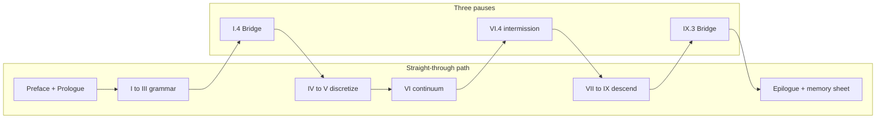

# Sources and Further Reading

This book synthesizes material from the author's notes, coursework, and teaching. Canonical chapter sources live under [`writings/`](../../writings/) (Functional Analysis Notes layout). Run `./scripts/sync-writings.sh` to copy them into `src/`. When the external `Writings` git submodule is linked, prefer upstream content and re-run the sync script.

## Scene: two clocks on the same afternoon

The book reads in **mathematical order** (Part I before Part IX), but the copper wire lives in **laboratory time** (mounting before hardening). The chapter roadmap below follows mathematical order — the order the Functional Analysis Notes layout assumes. When you need to know *which act of the experiment* a chapter belongs to, use the six-act table in the next section or the full narrative in the [prologue](../prologue/00-many-scales.md#the-experiment-as-plot).

## Six acts → parts (laboratory time) {#six-acts-parts-laboratory-time}

| Act | Lab beat | Primary parts | Opening links |
|-----|----------|---------------|---------------|
| I — Mounting | Grips close; first \(\mathbf{K}\mathbf{u}=\mathbf{f}\) | Prologue, I | [Prologue](../prologue/00-many-scales.md), [I.0](../part01-linear-algebra/00-opening.md) |
| II — Warming | Current on; thermocouple rises | III, IV, V | [III.0](../part03-pdes/00-opening.md), [IV.0](../part04-fem/00-opening.md), [V.0](../part05-fvm/00-opening.md) |
| III — Pulling | Force–displacement ramp | II, III, IV, VI | [II.0](../part02-functional-analysis/00-opening.md), [III.0](../part03-pdes/00-opening.md), [IV.0](../part04-fem/00-opening.md), [VI.0](../part06-continuum/00-opening.md) |
| IV — Hardening | Curve bends upward | VII | [VII.0](../part07-defects/00-opening.md) |
| V — Notch | Stress concentrator | VI, VIII | [VI.0](../part06-continuum/00-opening.md), [VIII.0](../part08-md/00-opening.md) |
| VI — Foundation | Parameters before the run | IX → VIII → VII → IV | [IX.0](../part09-dft/00-opening.md) → [VIII.0](../part08-md/00-opening.md) → [VII.0](../part07-defects/00-opening.md) → [IV.0](../part04-fem/00-opening.md) |

Act VI runs **in parallel** with Acts I–V in real projects: no FEM deck starts without moduli whose pedigree traces to finer models or calibration. The [epilogue](../epilogue/multiscale.md) reunites all six acts in one multiscale afternoon.

## Parameter pedigree path (Act VI reading order) {#parameter-pedigree-path-act-vi-reading-order}

The book reads **mathematically** from Part I to Part IX — grammar before descent. Real projects often read **downward** when building an input deck: start at electrons, export numbers, climb until FEM has honest moduli. Act VI is that reverse ladder on the same copper wire. The [Part IX coupling ladder](../part09-dft/00-opening.md#the-coupling-ladder-me-412-reunion) draws the full ME 412 reunion diagram; the pedigree path below is its **foundation slice** (IX → IV), before the epilogue wires Handshakes 1–4b in workflow order ([row 16](memory-sheet.md#continuity-hinges-master-map); [Act VI reunion paragraph](../epilogue/multiscale.md#lab-act-reunion-six-acts-one-afternoon)).

```mermaid
flowchart TB
  subgraph pedigree["Act VI foundation (workflow order IX to IV)"]
    DFT[IX.3: C_ij, gamma_sf, E_coh]
    MD[VIII.2-3: EAM fit, mobility M(tau,T)]
    DDD[VII.2: tau(rho), hardening laws]
    FEM[IV.4: Voigt E, nu in assembly]
  end
  subgraph orchestration["Row 16 orchestration (epilogue handshakes)"]
    H1[1: DFT moduli to FEM]
    H2[2: CHT delta T]
    H3[3: alpha delta T]
    H4a[4a: rate extrapolation]
    H4b[4b: FE2 notch]
    OUT[multiscale_export.yaml]
  end
  DFT --> MD --> DDD --> FEM --> H1
  H1 --> H2 --> H3 --> H4a --> H4b --> OUT
  H2 -.->|delta T feeds| H3
  H2 -.->|T_w to phonon lifetime| H4a
```

| Step | Read | Export | Wire-scale consumer |
|------|------|--------|---------------------|
| 1 | [IX.3](../part09-dft/03-dft-workflows.md#plot-spine-one-line) | \(C_{ij}\), \(\gamma_{\text{sf}}\), cohesive energy | Elastic constants, partial separation in DDD |
| 2 | [VIII.3](../part08-md/03-ab-initio-and-coarse-graining.md#plot-spine-one-line) | EAM table, phonon check | Production MD and mobility fitting |
| 3 | [VIII.2](../part08-md/02-ensembles-integrators.md#plot-spine-one-line) | \(M(\tau, T)\) from constrained shear | OpenDiS mobility law |
| 4 | [VII.2](../part07-defects/02-dislocation-dynamics.md#plot-spine-one-line) | \(\tau(\gamma)\), \(\rho(\gamma)\), Taylor \(\alpha\) | Crystal plasticity / Voce hardening |
| 5 | [IV.4](../part04-fem/04-poisson-to-elasticity.md#plot-spine-one-line) | \(\mathbf{K}\) with documented \(E\), \(\nu\) | Load-cell linear regime in Act III |
| 6 | [Epilogue](../epilogue/multiscale.md#lab-act-reunion-six-acts-one-afternoon) + [`parse_multiscale_workflow.sh`](../../scripts/parse_multiscale_workflow.sh) | `multiscale_export.yaml` linking Handshakes 1–4b | Orchestrated pedigree beside Act VI folder |

Each arrow needs a convergence log and a unit check — the epilogue's [four-handshake sensitivity table](../epilogue/multiscale.md#sensitivity-which-handshake-matters-most) ranks which exports dominate for a given question. **Mathematical order** teaches why the ladder exists; **pedigree order** fills the input deck before the grips close; **orchestration** (row 16) links individual exports in dependency order so Handshake 2's \(\Delta T\) feeds Handshake 3 and phonon lifetime at converged \(T_w\) feeds Handshake 4a drag.

## Narrative beat map (mathematical order × lab act)

The book reads in mathematical order (Part I before Part IX), but the copper wire lives in laboratory time. Use this table when you want **both** clocks at once — the story beat that should feel familiar when the symbols change.

| Chapter | Lab act | Narrative beat (one sentence) |
|---------|---------|--------------------------------|
| Prologue | Preview | One wire, eight scales, four questions |
| I.1–I.3 | I — Mounting | Springs, assembly, the wire rings |
| I.4 | I → II | Thermocouples multiply; vectors become fields |
| II.1–II.5 | III (preview) | The room where weak forms live |
| III.1–III.4 | II–III | Strong form fails; energy chooses the solution |
| IV.1–IV.5 | I, III | Mesh the solid; choose FEM or FVM door |
| V.1–V.4 | II | Cool the wire; balance fluxes in air |
| VI.1–VI.3 | II–III | Name stress; virtual work behind \(\mathbf{K}\) |
| VI.4 | II–IV → descent | [Intermission](../part06-continuum/04-nonlinear-plasticity-preview.md#intermission-ascent-ends-descent-begins): ascent ends; \(J_2\) placeholders await a forest |
| VII.0–VII.3 | IV | Forest hardens; export \(\tau(\gamma)\) |
| VIII.1–VIII.3 | V–VI | Atoms at the notch; fit potential |
| IX.1–IX.3 | VI | Electrons; archive pedigree |
| Epilogue | All six | Wire the rungs; sensitivity ranks |

When a chapter's **Bridge** names the next part, cross-check this table — the laboratory beat may lag or lead the mathematics by one part (Act II warming appears in Part III–V prose while Act III pulling is Part IV–VI). That offset is intentional: the wire heats before it yields.

## Continuity hinges index (when the plot stutters)

The [preface](../preface.md) documents opening, ascent, midpoint, descent, and epilogue hinge tables separately. The [memory sheet](memory-sheet.md#continuity-hinges-master-map) collects all **sixteen** narrative hinges (rows 0–16) in one navigation page. Use this index when you know **which chapter** you are in but cannot feel the handoff to the next:

| Row | Chapter region | Hinge anchor | What should click |
|-----|----------------|--------------|-------------------|
| 0 | Prologue → I.0 | [Opening hinge](../preface.md#opening-continuity-hinge) · [preface row 0 skill checkpoint](../preface.md#skill-navigation-row-0) · [Prologue Bridge](../prologue/00-many-scales.md#bridge-to-part-i) · [I.0 hinge](../part01-linear-algebra/00-opening.md#opening-hinge-prologue-to-part-i) | Panorama ladder becomes explicit \(\mathbf{K}\mathbf{u}=\mathbf{f}\) grammar |
| 1 | I.4 → II.0 | [I.4 Bridge](../part01-linear-algebra/04-toward-infinity.md#bridge-to-part-ii) | Nodal vectors become fields; \(\mathbf{K}_N\) becomes an operator |
| 2 | II.5 → III.0 | [II.5 Bridge](../part02-functional-analysis/05-spectral-theorem.md#bridge-to-part-iii) · [Part III variational ladder](../part03-pdes/00-opening.md#the-variational-ladder-me-412-schematic-14) | Completeness hands off to weak Poisson and heat; Schematic 14 becomes plot spine |
| 3 | III.4 → IV.0 | [III.4 Bridge](../part03-pdes/04-energy-methods.md#bridge-to-part-iv) · [Part III variational ladder](../part03-pdes/00-opening.md#the-variational-ladder-me-412-schematic-14) · [Part IV Galerkin ladder](../part04-fem/00-opening.md#the-galerkin-ladder-me-412-schematic-14-continued) | Lax–Milgram becomes Galerkin assembly; Schematic 14 splits at III.4 / IV.0 |
| 4 | IV.5 / V.4 → VI.0 | [Two doors](../part04-fem/05-convergence.md#bridge-two-doors-from-here) · [Part IV Galerkin ladder](../part04-fem/00-opening.md#the-galerkin-ladder-me-412-schematic-14-continued) · [Part V conservation ladder](../part05-fvm/00-opening.md#the-conservation-ladder-fvm-parallel-to-schematic-14) · [Part VI twin ladders reunite](../part06-continuum/00-opening.md#the-twin-ladders-reunite-galerkin-and-conservation) · [Part III weak forms](../part03-pdes/02-weak-form.md#plot-spine-one-line) | FEM and FVM converge on Cauchy stress; Schematic 14 splits into Galerkin (IV) and conservation (V) twins, reunites at VI.0 |
| 5–6 | VI.0 / VI.4 → VII.0 | [Midpoint](../part06-continuum/00-opening.md#midpoint-ascent-complete-descent-ahead) · [Twin ladders reunite](../part06-continuum/00-opening.md#the-twin-ladders-reunite-galerkin-and-conservation) · [VII.0 ascent hinge](../part07-defects/00-opening.md#ascent-hinge-midpoint-and-twin-ladders) · [intermission](../part06-continuum/04-nonlinear-plasticity-preview.md#intermission-ascent-ends-descent-begins) | Ascent complete; thermal strain from CHT enters virtual work; \(J_2\) placeholders yield to forest |
| 7 | VII.3 → VIII.0 | [VII.3 Bridge](../part07-defects/03-polycrystal-and-fem-handoff.md#bridge-to-part-viii) · [VIII.1 opening hinge](../part08-md/01-potentials-phase-space.md#opening-hinge-vii3-to-viii1) · [VIII.0 descent hinge](../part08-md/00-opening.md#descent-hinge-cores-mobility-and-tw-pedigree) | Line cores need atomic bonding; mobility at \(T_w\) from CHT, not 300 K default |
| 7b | VIII.1 → VIII.2 | [VIII.1 Bridge](../part08-md/01-potentials-phase-space.md#bridge) · [VIII.2 opening hinge](../part08-md/02-ensembles-integrators.md#opening-hinge-viii1-to-viii2) | EAM minimization done but NVT/NPT not run; `MD_NVT_shear_PartVIII` still missing at \(T_w\) |
| 7c | VIII.2 → VIII.3 | [VIII.2 Bridge](../part08-md/02-ensembles-integrators.md#bridge) · [VIII.3 opening hinge](../part08-md/03-ab-initio-and-coarse-graining.md#opening-hinge-viii2-to-viii3) | Trajectories audited but no coarse-graining handoff; EAM on trust without pedigree checklist |
| 8 | VIII.0–VIII.3 | [Preface: row 8 skill checkpoint](../preface.md#skill-navigation-row-8) · [VIII.0 descent hinge](../part08-md/00-opening.md#descent-hinge-cores-mobility-and-tw-pedigree) · [VIII.3 WHAM at \(T_w\)](../part08-md/03-ab-initio-and-coarse-graining.md#wham-part-vii-mobility-hinge-act-ii-temperature-pedigree) · [memory sheet rows 8–9 baby picture](memory-sheet.md#rows-8-9-baby-picture-tw-temperature-pedigree) | [V.4 CHT](../part05-fvm/04-navier-stokes-cfd.md#lab-act-extension-two-domain-picard-loop-with-a-1d-fem-solid) converged at \(T_w\); MD mobility, WHAM, and OpenDiS drag must not default to 300 K |
| 9 | VIII.3 → IX.0 | [Preface: row 9 skill checkpoint](../preface.md#skill-navigation-row-9) · [VIII.3 Bridge](../part08-md/03-ab-initio-and-coarse-graining.md#bridge-to-part-ix) · [IX.0 electronic audit hinge](../part09-dft/00-opening.md#electronic-audit-hinge-descent-pedigree-and-tw-phonon) · [IX.0 thermal phonon audit at \(T_w\)](../part09-dft/00-opening.md#thermal-phonon-audit-at-tw) · [memory sheet rows 8–9 baby picture](memory-sheet.md#rows-8-9-baby-picture-tw-temperature-pedigree) | EAM on trust needs SCF audit; \(\alpha(T_w)\) and \(\tau_{\text{ph}}(T_w)\) beside `cht_export.yaml`, not room-temperature folklore |
| 10 | IX.3 → Epilogue | [IX.3 Bridge](../part09-dft/03-dft-workflows.md#bridge-to-the-epilogue) | Finest rung; upward homogenization begins |
| 11 | Epilogue (workflow) | [Six-act reunion](../epilogue/multiscale.md#lab-act-reunion-six-acts-one-afternoon) | Reading order reunites with laboratory time |
| 12 | Epilogue → Prologue | [Epilogue Bridge row 12](../epilogue/multiscale.md#row-12-closing-loop) · [prologue reopening anchor](../prologue/00-many-scales.md#prologue-reopening-anchor) · [preface row 12](../preface.md#skill-navigation-row-12) · [memory sheet row 12 baby picture](memory-sheet.md#row-12-baby-picture-next-project) | Four questions restart on the next project; ladder reusable — row 12 reunites with row 0 on grammar restart |
| 13 | Epilogue (Handshake 2 → 3) | [Handshake 2 → 3](../epilogue/multiscale.md#handshake-2--joule-heating--conjugate-heat-transfer-part-iv--v), [preface row 13 three-way audit](../preface.md#skill-navigation-row-13), [row 13 closing loop](../epilogue/multiscale.md#row-13-closing-loop), [row 13 baby picture](../appendix/memory-sheet.md#row-13-baby-picture-handshake-2-3) | CHT converged but load cell still uses handbook \(\alpha\); Handshake 2 sets \(\Delta T\), Handshake 3 sets \(\alpha\Delta T\) |
| 14 | Epilogue (Handshake 4a) | [VII.3 rate handshake](../part07-defects/03-polycrystal-and-fem-handoff.md#scale-boundary-handshake-ddd-strain-rate-to-quasi-static-fem), [Handshake 4a upstream](../epilogue/multiscale.md#4a--ddd-strain-rate-to-quasi-static-load-cell-act-iv--hardening), [preface row 14 three-way audit](../preface.md#skill-navigation-row-14), [row 14 closing loop](../epilogue/multiscale.md#row-14-closing-loop), [row 14 baby picture](memory-sheet.md#row-14-baby-picture-handshake-4a) | DDD exports feed plasticity without strain-rate extrapolation; hardening knee arrives early; DDD sets \(\tau_{\text{flow}}\), Handshake 4a sets \(\tau_{\text{lab}}\) |
| 15 | Epilogue (Handshake 4b) | [VII.3 Step 4 FE²](../part07-defects/03-polycrystal-and-fem-handoff.md#step-4--when-offline-calibration-fails-fe-at-the-notch), [FE² worked example](../epilogue/multiscale.md#worked-example-fe-at-the-wire-notch-act-v--notch), [preface row 15 three-way audit](../preface.md#skill-navigation-row-15), [row 15 closing loop](../epilogue/multiscale.md#row-15-closing-loop), [row 15 baby picture](memory-sheet.md#row-15-baby-picture-handshake-4b) | Bulk hardening from 4a looks right but notch root under-predicts peak stress; 4a sets bulk \(\tau_{\text{lab}}\), Handshake 4b asks whether scalar \(H\) suffices at \(K_t \approx 3\) |
| 16 | Epilogue (Act VI orchestration) | [Parameter pedigree path](#parameter-pedigree-path-act-vi-reading-order), [preface row 16](../preface.md#skill-navigation-row-16) | Individual exports exist but no orchestrated `multiscale_export.yaml`; IX → IV pedigree before grips close |
| 17 | Whole book (continuous read-through) | [Continuous read-through guide](#continuous-read-through-guide) · [preface row 17](../preface.md#skill-navigation-row-17) · [prologue row 17 preview](../prologue/00-many-scales.md#prologue-preview-row-17) · [prologue row 17 closing stitch](../prologue/00-many-scales.md#row-17-closing-stitch) · [epilogue row 17 closing loop](../epilogue/multiscale.md#row-17-closing-loop) · [memory sheet row 17 baby picture](memory-sheet.md#row-17-baby-picture-continuous-read-through) | Chapters feel choppy despite Bridges — trust Scene/Bridge rhythm; pause only at three ascent/descent gates |
| 18 | Part openings I.0–IX.0 | [Part-opening plot spine index](#part-opening-plot-spine-index-row-18) · [preface row 18](../preface.md#skill-navigation-row-18) · [prologue row 18 preview](../prologue/00-many-scales.md#prologue-preview-row-18) · [prologue row 18 closing stitch](../prologue/00-many-scales.md#row-18-closing-stitch) · [epilogue row 18 closing loop](../epilogue/multiscale.md#row-18-closing-loop) · [memory sheet row 18 baby picture](memory-sheet.md#row-18-baby-picture-part-opening-plot-spine) | A part opening feels like a new syllabus — read its [plot spine one line](../part01-linear-algebra/00-opening.md#plot-spine-one-line) aloud |
| 19 | Numbered chapters I.1–IX.3 | [Numbered-chapter plot spine index](#numbered-chapter-plot-spine-index-row-19) · [preface row 19](../preface.md#skill-navigation-row-19) · [prologue row 19 preview](../prologue/00-many-scales.md#prologue-preview-row-19) · [prologue row 19 closing stitch](../prologue/00-many-scales.md#row-19-closing-stitch) · [epilogue row 19 closing loop](../epilogue/multiscale.md#row-19-closing-loop) · [memory sheet row 19 baby picture](memory-sheet.md#row-19-baby-picture-numbered-chapter-plot-spine) | Mid-chapter reading stalls despite a Bridge — read this chapter's [plot spine one line](../part01-linear-algebra/01-vectors-matrices.md#plot-spine-one-line) aloud |
| 20 | Gate chapters I.4, VI.4, IX.3 | [Gate-chapter plot spine index](#gate-chapter-plot-spine-index-row-20) · [preface row 20](../preface.md#skill-navigation-row-20) · [prologue row 20 preview](../prologue/00-many-scales.md#prologue-preview-row-20) · [prologue row 20 closing stitch](../prologue/00-many-scales.md#row-20-closing-stitch) · [epilogue row 20 closing loop](../epilogue/multiscale.md#row-20-closing-loop) · [memory sheet row 20 baby picture](memory-sheet.md#row-20-baby-picture-gate-chapter-plot-spine) | A mandatory gate stalls the straight read — recite its [plot spine one line](../part01-linear-algebra/04-toward-infinity.md#plot-spine-one-line) aloud before the Bridge |
| 21 | Lab act reunion (Acts I–VI) | [Lab act reunion index](#lab-act-reunion-index-row-21) · [preface row 21](../preface.md#skill-navigation-row-21) · [prologue row 21 preview](../prologue/00-many-scales.md#prologue-preview-row-21) · [prologue row 21 closing stitch](../prologue/00-many-scales.md#row-21-closing-stitch) · [epilogue row 21 closing loop](../epilogue/multiscale.md#row-21-closing-loop) · [memory sheet row 21 baby picture](memory-sheet.md#row-21-baby-picture-lab-act-reunion) | A Lab act feels like standalone homework — read its one-line move aloud and name the lab act |
| 22 | Scene reunion (Acts I–VI) | [Scene reunion index](#scene-reunion-index-row-22) · [preface row 22](../preface.md#skill-navigation-row-22) · [prologue row 22 preview](../prologue/00-many-scales.md#prologue-preview-row-22) · [prologue row 22 closing stitch](../prologue/00-many-scales.md#row-22-closing-stitch) · [epilogue row 22 closing loop](../epilogue/multiscale.md#row-22-closing-loop) · [memory sheet row 22 baby picture](memory-sheet.md#row-22-baby-picture-scene-reunion) | Plot spines and Lab acts read correctly but symbols hide the wire — read the Scene one-line visual aloud and picture the operator watching |
| 23 | Bridge reunion (part boundaries) | [Bridge reunion index](#bridge-reunion-index-row-23) · [preface row 23](../preface.md#skill-navigation-row-23) · [prologue row 23 preview](../prologue/00-many-scales.md#prologue-preview-row-23) · [prologue row 23 closing stitch](../prologue/00-many-scales.md#row-23-closing-stitch) · [epilogue row 23 closing loop](../epilogue/multiscale.md#row-23-closing-loop) · [memory sheet row 23 baby picture](memory-sheet.md#row-23-baby-picture-bridge-reunion) | Scene, plot spines, and Lab acts all read correctly but chapter transitions feel mechanical — read the prior chapter's Bridge one-line hinge aloud before turning the page |
| 24 | Concept map reunion (ME 412 four questions) | [Concept map reunion index](#concept-map-reunion-index-row-24) · [preface row 24](../preface.md#skill-navigation-row-24) · [prologue row 24 preview](../prologue/00-many-scales.md#prologue-preview-row-24) · [prologue row 24 closing stitch](../prologue/00-many-scales.md#row-24-closing-stitch) · [epilogue row 24 closing loop](../epilogue/multiscale.md#row-24-closing-loop) · [memory sheet row 24 baby picture](memory-sheet.md#row-24-baby-picture-concept-map-reunion) | Scene, plot spines, Lab acts, visuals, and Bridges all read correctly but proofs feel like disconnected theorems — answer object / structure / theorem / breaks at the part-opening concept map |
| 25 | Schematic reunion (representative baby pictures) | [Schematic reunion index](#schematic-reunion-index-row-25) · [preface row 25](../preface.md#skill-navigation-row-25) · [prologue row 25 preview](../prologue/00-many-scales.md#prologue-preview-row-25) · [prologue row 25 closing stitch](../prologue/00-many-scales.md#row-25-closing-stitch) · [epilogue row 25 closing loop](../epilogue/multiscale.md#row-25-closing-loop) · [memory sheet row 25 baby picture](memory-sheet.md#row-25-baby-picture-schematic-reunion) | Scene, plot spines, Lab acts, visuals, Bridges, and concept maps all read correctly but proofs feel abstract without a visual anchor — locate the matching baby picture from the part-opening representative schematics table |
| 26 | Story so far reunion (narrative recap) | [Story so far reunion index](#story-so-far-reunion-index-row-26) · [preface row 26](../preface.md#skill-navigation-row-26) · [prologue row 26 preview](../prologue/00-many-scales.md#prologue-preview-row-26) · [prologue row 26 closing stitch](../prologue/00-many-scales.md#row-26-closing-stitch) · [epilogue row 26 closing loop](../epilogue/multiscale.md#row-26-closing-loop) · [memory sheet row 26 baby picture](memory-sheet.md#row-26-baby-picture-story-so-far-reunion) | Rows 17–25 all read correctly in isolation but you cannot place where the copper wire is in the narrative arc — read the part-opening **Story so far** recap aloud and name what the wire became at the prior scale |
| 27 | Closing the arc reunion (symbol bridge) | [Closing the arc reunion index](#closing-the-arc-reunion-index-row-27) · [preface row 27](../preface.md#skill-navigation-row-27) · [prologue row 27 preview](../prologue/00-many-scales.md#prologue-preview-row-27) · [prologue row 27 closing stitch](../prologue/00-many-scales.md#row-27-closing-stitch) · [epilogue row 27 closing loop](../epilogue/multiscale.md#row-27-closing-loop) · [memory sheet row 27 baby picture](memory-sheet.md#row-27-baby-picture-closing-the-arc-reunion) | Rows 17–26 all read correctly but prior-part symbols do not map to current-part vocabulary — read the part-opening **Closing the arc** table aloud and name one symbol translation per row |
| 28 | Scale-boundary reunion (export pedigree) | [Scale-boundary reunion index](#scale-boundary-reunion-index-row-28) · [preface row 28](../preface.md#skill-navigation-row-28) · [prologue row 28 preview](../prologue/00-many-scales.md#prologue-preview-row-28) · [prologue row 28 closing stitch](../prologue/00-many-scales.md#row-28-closing-stitch) · [epilogue row 28 closing loop](../epilogue/multiscale.md#row-28-closing-loop) · [memory sheet row 28 baby picture](memory-sheet.md#row-28-baby-picture-scale-boundary-reunion) | Rows 17–27 all read correctly but **parameters crossing a scale boundary feel arbitrary** — read the chapter **Scale-boundary handshake** table and name export → consumer → failure mode |
| 29 | Thermoelastic assembly reunion (Acts II–III on one mesh) | [Thermoelastic assembly reunion index](#thermoelastic-assembly-reunion-index-row-29) · [preface row 29](../preface.md#skill-navigation-row-29) · [prologue row 29 preview](../prologue/00-many-scales.md#prologue-preview-row-29) · [prologue row 29 closing stitch](../prologue/00-many-scales.md#row-29-closing-stitch) · [epilogue row 29 closing loop](../epilogue/multiscale.md#row-29-closing-loop) · [memory sheet row 29 baby picture](memory-sheet.md#row-29-baby-picture-thermoelastic-assembly-reunion) | Rows 17–28 all read correctly but **Act II heating and Act III pulling feel like separate FEM homework** — read the Part IV thermoelastic assembly thread and name heat pass → thermal load → mechanics pass on the same connectivity |
| 30 | CHT outer-loop reunion (FEM solid ↔ FVM fluid) | [CHT outer-loop reunion index](#cht-outer-loop-reunion-index-row-30) · [preface row 30](../preface.md#skill-navigation-row-30) · [prologue row 30 preview](../prologue/00-many-scales.md#prologue-preview-row-30) · [prologue row 30 closing stitch](../prologue/00-many-scales.md#row-30-closing-stitch) · [epilogue row 30 closing loop](../epilogue/multiscale.md#row-30-closing-loop) · [memory sheet row 30 baby picture](memory-sheet.md#row-30-baby-picture-cht-outer-loop-reunion) | Rows 17–29 all read correctly but **solid FEM and fluid FVM still feel like separate solvers** — read the IV.5 → V.4 Picard → `cht_export.yaml` chain and name one converged \(T_w\) for both twins before Part VI |
| 31 | Twin-ladder → virtual work reunion (Part VI) | [Twin-ladder virtual work reunion index](#twin-ladder-virtual-work-reunion-index-row-31) · [preface row 31](../preface.md#skill-navigation-row-31) · [prologue row 31 preview](../prologue/00-many-scales.md#prologue-preview-row-31) · [prologue row 31 closing stitch](../prologue/00-many-scales.md#row-31-closing-stitch) · [epilogue row 31 closing loop](../epilogue/multiscale.md#row-31-closing-loop) · [memory sheet row 31 baby picture](memory-sheet.md#row-31-baby-picture-twin-ladder-virtual-work-reunion) | Rows 17–30 all read correctly but **Galerkin assembly and virtual work still feel like separate subjects** — read VI.0 twin-ladder → VI.1 kinematics → VI.3 virtual work and name why \(\mathbf{K}\mathbf{U}=\mathbf{F}\) is force balance |
| 32 | Virtual work → plasticity preview reunion (VI.3 → VI.4) | [Virtual work → plasticity preview reunion index](#virtual-work-plasticity-preview-reunion-index-row-32) · [preface row 32](../preface.md#skill-navigation-row-32) · [prologue row 32 preview](../prologue/00-many-scales.md#prologue-preview-row-32) · [prologue row 32 closing stitch](../prologue/00-many-scales.md#row-32-closing-stitch) · [epilogue row 32 closing loop](../epilogue/multiscale.md#row-32-closing-loop) · [memory sheet row 32 baby picture](memory-sheet.md#row-32-baby-picture-virtual-work-plasticity-preview-reunion) | Rows 17–31 all read correctly but **\(\delta\Pi = 0\) and return-mapping still feel like separate subjects** — read VI.3 virtual work → VI.4 return-mapping and name why the yield knee breaks energy minimization |
| 33 | Part VII opening → VIII descent hinge reunion (VII.0 → VIII.0) | [Part VII → VIII descent hinge reunion index](#part-vii-viii-descent-hinge-reunion-index-row-33) · [preface row 33](../preface.md#skill-navigation-row-33) · [prologue row 33 preview](../prologue/00-many-scales.md#prologue-preview-row-33) · [prologue row 33 closing stitch](../prologue/00-many-scales.md#row-33-closing-stitch) · [epilogue row 33 closing loop](../epilogue/multiscale.md#row-33-closing-loop) · [memory sheet row 33 baby picture](memory-sheet.md#row-33-baby-picture-part-vii-viii-descent-hinge-reunion) | Rows 17–32 all read correctly but **mesoscale DDD and atomistic MD still feel like separate courses** — read Part VII descent hinge → VII.2 mobility at \(T_w\) → Part VIII descent hinge and name why line cores need atoms |
| 34 | Potentials → ensembles opening hinge reunion (VIII.1 → VIII.2) | [Potentials → ensembles reunion index](#potentials-ensembles-reunion-index-row-34) · [preface row 34](../preface.md#skill-navigation-row-34) · [prologue row 34 preview](../prologue/00-many-scales.md#prologue-preview-row-34) · [prologue row 34 closing stitch](../prologue/00-many-scales.md#row-34-closing-stitch) · [epilogue row 34 closing loop](../epilogue/multiscale.md#row-34-closing-loop) · [memory sheet row 34 baby picture](memory-sheet.md#row-34-baby-picture-potentials-ensembles-reunion) | Rows 17–33 all read correctly but **0 K EAM minimization and NVT/NPT trajectories still feel like separate subjects** — read VIII.1 Bridge → VIII.2 opening hinge and name why energy minimum is not the wire at \(T_w\) |
| 35 | Ensembles → coarse-graining opening hinge reunion (VIII.2 → VIII.3) | [Ensembles → coarse-graining reunion index](#ensembles-coarse-graining-reunion-index-row-35) · [preface row 35](../preface.md#skill-navigation-row-35) · [prologue row 35 preview](../prologue/00-many-scales.md#prologue-preview-row-35) · [prologue row 35 closing stitch](../prologue/00-many-scales.md#row-35-closing-stitch) · [epilogue row 35 closing loop](../epilogue/multiscale.md#row-35-closing-loop) · [memory sheet row 35 baby picture](memory-sheet.md#row-35-baby-picture-ensembles-coarse-graining-reunion) | Rows 17–34 all read correctly but **audited trajectories and coarse-grained handoff tables still feel like separate subjects** — read VIII.2 Bridge → VIII.3 opening hinge and name why raw dumps without pedigree are multiscale folklore |
| 36 | Coarse-graining → electronic audit opening hinge reunion (VIII.3 → IX.0) | [Coarse-graining → electronic audit reunion index](#coarse-graining-electronic-audit-reunion-index-row-36) · [preface row 36](../preface.md#skill-navigation-row-36) · [prologue row 36 preview](../prologue/00-many-scales.md#prologue-preview-row-36) · [prologue row 36 closing stitch](../prologue/00-many-scales.md#row-36-closing-stitch) · [epilogue row 36 closing loop](../epilogue/multiscale.md#row-36-closing-loop) · [memory sheet row 36 baby picture](memory-sheet.md#row-36-baby-picture-coarse-graining-electronic-audit-reunion) | Rows 17–35 all read correctly but **pedigree checklist rows exist without QE SCF logs or \(\alpha(T_w)\) beside them** — read VIII.3 Bridge → IX.0 opening hinge and name why EAM on trust without `cu.relax.out` is multiscale folklore |
| 37 | Electronic audit → Born–Oppenheimer opening hinge reunion (IX.0 → IX.1) | [Electronic audit → Born–Oppenheimer reunion index](#electronic-audit-born-oppenheimer-reunion-index-row-37) · [preface row 37](../preface.md#skill-navigation-row-37) · [prologue row 37 preview](../prologue/00-many-scales.md#prologue-preview-row-37) · [prologue row 37 closing stitch](../prologue/00-many-scales.md#row-37-closing-stitch) · [epilogue row 37 closing loop](../epilogue/multiscale.md#row-37-closing-loop) · [memory sheet row 37 baby picture](memory-sheet.md#row-37-baby-picture-electronic-audit-born-oppenheimer-reunion) | Rows 17–36 all read correctly but **SCF logs exist without BO/HK theorems connecting to Part VIII's EAM surface** — read IX.0 Bridge → IX.1 opening hinge and name why \(V_{\text{BO}}\) is the surface EAM approximates |
| 38 | Born–Oppenheimer → Kohn–Sham opening hinge reunion (IX.1 → IX.2) | [Born–Oppenheimer → Kohn–Sham reunion index](#born-oppenheimer-kohn-sham-reunion-index-row-38) · [preface row 38](../preface.md#skill-navigation-row-38) · [prologue row 38 preview](../prologue/00-many-scales.md#prologue-preview-row-38) · [prologue row 38 closing stitch](../prologue/00-many-scales.md#row-38-closing-stitch) · [epilogue row 38 closing loop](../epilogue/multiscale.md#row-38-closing-loop) · [memory sheet row 38 baby picture](memory-sheet.md#row-38-baby-picture-born-oppenheimer-kohn-sham-reunion) | Rows 17–37 all read correctly but **BO/HK theorems exist without SCF fixed-point loop connecting to Part I eigenvalues** — read IX.1 Bridge → IX.2 opening hinge and name why \(\mathbf{H}[\rho]\mathbf{c}=\epsilon\mathbf{S}\mathbf{c}\) is the Murnaghan inner loop |
| 39 | Kohn–Sham → DFT workflows opening hinge reunion (IX.2 → IX.3) | [Kohn–Sham → DFT workflows reunion index](#kohn-sham-dft-workflows-reunion-index-row-39) · [preface row 39](../preface.md#skill-navigation-row-39) · [prologue row 39 preview](../prologue/00-many-scales.md#prologue-preview-row-39) · [prologue row 39 closing stitch](../prologue/00-many-scales.md#row-39-closing-stitch) · [epilogue row 39 closing loop](../epilogue/multiscale.md#row-39-closing-loop) · [memory sheet row 39 baby picture](memory-sheet.md#row-39-baby-picture-kohn-sham-dft-workflows-reunion) | Rows 17–38 all read correctly but **SCF is understood without calculation ladder and `cu.foundation/` archive connecting to Parts VI–VIII** — read IX.2 Bridge → IX.3 opening hinge and name why foundation README is Part IV mesh refinement at the electronic scale |
| 40 | IX.3 → Handshake 3 opening hinge reunion (α(\(T_w\)) cross-links) | [IX.3 → Handshake 3 reunion index](#ix3-handshake3-reunion-index-row-40) · [preface row 40](../preface.md#skill-navigation-row-40) · [prologue row 40 preview](../prologue/00-many-scales.md#prologue-preview-row-40) · [prologue row 40 closing stitch](../prologue/00-many-scales.md#row-40-closing-stitch) · [epilogue row 40 closing loop](../epilogue/multiscale.md#row-40-closing-loop) · [memory sheet row 40 baby picture](memory-sheet.md#row-40-baby-picture-ix3-handshake3-reunion) | Rows 17–39 all read correctly but **`cu.foundation/` is complete yet handbook \(\alpha(300\,\text{K})\) persists at the load cell** — read IX.3 Bridge → epilogue Handshake 3 opening hinge and name why \(\alpha(T_w)\) must match `cht_export.yaml` |
| 41 | VII.3 → Handshake 4a opening hinge reunion (rate extrapolation cross-links) | [VII.3 → Handshake 4a reunion index](#vii3-handshake4a-reunion-index-row-41) · [preface row 41](../preface.md#skill-navigation-row-41) · [prologue row 41 preview](../prologue/00-many-scales.md#prologue-preview-row-41) · [prologue row 41 closing stitch](../prologue/00-many-scales.md#row-41-closing-stitch) · [epilogue row 41 closing loop](../epilogue/multiscale.md#row-41-closing-loop) · [memory sheet row 41 baby picture](memory-sheet.md#row-41-baby-picture-vii3-handshake4a-reunion) | Rows 17–40 all read correctly but **OpenDiS exports feed the plasticity deck without rate extrapolation** — read VII.3 rate handshake → epilogue Handshake 4a opening hinge and name why \(\tau_{\text{lab}}\) must match lab grip speed |
| 42 | VII.3 Step 4 → Handshake 4b opening hinge reunion (FE² notch-localization cross-links) | [VII.3 → Handshake 4b reunion index](#vii3-handshake4b-reunion-index-row-42) · [preface row 42](../preface.md#skill-navigation-row-42) · [prologue row 42 preview](../prologue/00-many-scales.md#prologue-preview-row-42) · [prologue row 42 closing stitch](../prologue/00-many-scales.md#row-42-closing-stitch) · [epilogue row 42 closing loop](../epilogue/multiscale.md#row-42-closing-loop) · [memory sheet row 42 baby picture](memory-sheet.md#row-42-baby-picture-vii3-handshake4b-reunion) | Rows 17–41 all read correctly but **bulk hardening from 4a matches flow stress while the notch root under-predicts peak stress without FE² audit** — read VII.3 Step 4 → epilogue Handshake 4b opening hinge and verify `fe2_export.yaml` in `multiscale_export.yaml` |
| 43 | Rows 17–42 → Row 16 orchestration reunion (multiscale export cross-links) | [Rows 17–42 → Row 16 orchestration reunion index](#rows17-42-row16-orchestration-reunion-index-row-43) · [preface row 43](../preface.md#skill-navigation-row-43) · [prologue row 43 preview](../prologue/00-many-scales.md#prologue-preview-row-43) · [prologue row 43 closing stitch](../prologue/00-many-scales.md#row-43-closing-stitch) · [epilogue row 43 closing loop](../epilogue/multiscale.md#row-43-closing-loop) · [memory sheet row 43 baby picture](memory-sheet.md#row-43-baby-picture-rows17-42-row16-orchestration-reunion) | Rows 17–42 all read correctly but **Handshakes 1–4b exist in separate folders without orchestrated `multiscale_export.yaml`** — read IX.3 epilogue pedigree table → epilogue row 16 opening hinge and verify dependency order with `./scripts/test-fixtures.sh` |
| 44 | Rows 17–43 → Row 12 book loop closure (epilogue → prologue restart cross-links) | [Rows 17–43 → Row 12 book loop closure index](#rows17-43-row12-book-loop-closure-index-row-44) · [preface row 44](../preface.md#skill-navigation-row-44) · [prologue row 44 preview](../prologue/00-many-scales.md#prologue-preview-row-44) · [prologue row 44 closing stitch](../prologue/00-many-scales.md#row-44-closing-stitch) · [epilogue row 44 closing loop](../epilogue/multiscale.md#row-44-closing-loop) · [memory sheet row 44 baby picture](memory-sheet.md#row-44-baby-picture-rows17-43-row12-book-loop-closure) | Rows 17–43 all read correctly but **`multiscale_export.yaml` exists yet the next terminal opens with copper decks copied blindly** — read epilogue ME 412 summary → prologue reopening anchor and complete row 12 four-step audit on new specimen |
| 45 | Rows 17–44 → Row 17 continuous read-through second-pass reunion (novel rhythm cross-links) | [Rows 17–44 → Row 17 second-pass reunion index](#rows17-44-row17-second-pass-reunion-index-row-45) · [preface row 45](../preface.md#skill-navigation-row-45) · [prologue row 45 preview](../prologue/00-many-scales.md#prologue-preview-row-45) · [prologue row 45 closing stitch](../prologue/00-many-scales.md#row-45-closing-stitch) · [epilogue row 45 closing loop](../epilogue/multiscale.md#row-45-closing-loop) · [memory sheet row 45 baby picture](memory-sheet.md#row-45-baby-picture-rows17-44-row17-second-pass-reunion) | Rows 17–44 all read correctly but **Preface → Epilogue still feels like a syllabus of checkpoints rather than one continuous story** — read [continuous read-through guide](#continuous-read-through-guide) aloud; Scene → Bridge only; pause at I.4, VI.4, IX.3 |
| 46 | Rows 17–45 → Writings canonical source reunion (Functional Analysis Notes layout maintenance) | [Rows 17–45 → Writings reunion index](#rows17-45-writings-canonical-reunion-index-row-46) · [preface row 46](../preface.md#skill-navigation-row-46) · [prologue row 46 preview](../prologue/00-many-scales.md#prologue-preview-row-46) · [prologue row 46 closing stitch](../prologue/00-many-scales.md#row-46-closing-stitch) · [epilogue row 46 closing loop](../epilogue/multiscale.md#row-46-closing-loop) · [memory sheet row 46 baby picture](memory-sheet.md#row-46-baby-picture-rows17-45-writings-canonical-reunion) · [writings source index](../writings/SUMMARY.md) | Rows 17–45 all read correctly but **chapter edits land in `src/` instead of `writings/` or sync check fails** — edit canonical subtrees only; [`scripts/sync-writings.sh`](../../scripts/sync-writings.sh); then `mdbook build` |
| 47 | V.4 → VI.0 Writings canonical discretization reunion (twin-ladder part boundary) | [V.4 → VI.0 Writings canonical reunion index](#v4-vi0-writings-canonical-reunion-index-row-47) · [preface row 47](../preface.md#skill-navigation-row-47) · [prologue row 47 preview](../prologue/00-many-scales.md#prologue-preview-row-47) · [prologue row 47 closing stitch](../prologue/00-many-scales.md#row-47-closing-stitch) · [epilogue row 47 closing loop](../epilogue/multiscale.md#row-47-closing-loop) · [memory sheet row 47 baby picture](memory-sheet.md#row-47-baby-picture-v4-vi0-writings-canonical-reunion) | Row 46 closed and row 30 restored CHT, but **`writings/fvm` closes and `writings/continuum` opens like separate courses** — read V.4 Bridge → VI.0 twin-ladder landing aloud; same wire, state variable is \(\boldsymbol{\sigma}\) |
| 48 | VI.4 → VII.0 Writings canonical midpoint reunion (ascent ends, descent begins) | [VI.4 → VII.0 Writings canonical reunion index](#vi4-vii0-writings-canonical-reunion-index-row-48) · [preface row 48](../preface.md#skill-navigation-row-48) · [prologue row 48 preview](../prologue/00-many-scales.md#prologue-preview-row-48) · [prologue row 48 closing stitch](../prologue/00-many-scales.md#row-48-closing-stitch) · [epilogue row 48 closing loop](../epilogue/multiscale.md#row-48-closing-loop) · [memory sheet row 48 baby picture](memory-sheet.md#row-48-baby-picture-vi4-vii0-writings-canonical-reunion) | Row 47 closed and row 32 restored return-mapping, but **`writings/continuum` closes and `writings/defects` opens like a new mdBook** — read VI.4 intermission → Bridge → VII.0 landing aloud; same wire, state variable is \(\rho\) |
| 49 | VII.3 → VIII.0 Writings canonical descent reunion (mesoscale → atomistic part boundary) | [VII.3 → VIII.0 Writings canonical reunion index](#vii3-viii0-writings-canonical-reunion-index-row-49) · [preface row 49](../preface.md#skill-navigation-row-49) · [prologue row 49 preview](../prologue/00-many-scales.md#prologue-preview-row-49) · [prologue row 49 closing stitch](../prologue/00-many-scales.md#row-49-closing-stitch) · [epilogue row 49 closing loop](../epilogue/multiscale.md#row-49-closing-loop) · [memory sheet row 49 baby picture](memory-sheet.md#row-49-baby-picture-vii3-viii0-writings-canonical-reunion) | Row 48 closed midpoint and row 33 restored descent hinge, but **`writings/defects` closes and `writings/md` opens like a new mdBook** — read VII.3 Bridge → VIII.0 landing → VIII.1 opening hinge aloud; same wire, state variable is \(\{\mathbf{r}_i\}\) |
| 50 | VIII.3 → IX.0 Writings canonical electronic reunion (atomistic → DFT part boundary) | [VIII.3 → IX.0 Writings canonical reunion index](#viii3-ix0-writings-canonical-reunion-index-row-50) · [preface row 50](../preface.md#skill-navigation-row-50) · [prologue row 50 preview](../prologue/00-many-scales.md#prologue-preview-row-50) · [prologue row 50 closing stitch](../prologue/00-many-scales.md#row-50-closing-stitch) · [epilogue row 50 closing loop](../epilogue/multiscale.md#row-50-closing-loop) · [memory sheet row 50 baby picture](memory-sheet.md#row-50-baby-picture-viii3-ix0-writings-canonical-reunion) | Row 49 closed atomistic descent and row 36 restored pedigree narrative, but **`writings/md` closes and `writings/dft` opens like a new mdBook** — read VIII.3 Bridge → IX.0 landing → IX.1 opening hinge aloud; same wire, state variable is \(\rho(\mathbf{r})\) |

## Part-opening plot spine index (row 18) {#part-opening-plot-spine-index-row-18}

Each part opening carries a **plot spine (one line)** section — a single sentence naming that part's role in Acts I–III (grammar, discretization, descent). Read aloud when symbols change faster than the specimen; the [chapter roadmap](#chapter-roadmap-one-continuous-arc) expands every row below into chapter-level beats.

| Part | Act | [Plot spine one line](../part01-linear-algebra/00-opening.md#plot-spine-one-line) | Sentence (read aloud) |
|------|-----|------------------|----------------------|
| [I.0](../part01-linear-algebra/00-opening.md#plot-spine-one-line) | Act I — Grammar, rung 1 | Spring chain; \(\mathbf{K}\mathbf{u}=\mathbf{f}\) before fields |
| [II.0](../part02-functional-analysis/00-opening.md#plot-spine-one-line) | Act I — Grammar, rung 2 | Fields in \(H^1\), \(L^2\); Schematic 14 middle rungs |
| [III.0](../part03-pdes/00-opening.md#plot-spine-one-line) | Act I — Grammar, rung 3 | Weak PDEs on a domain; existence climbs Schematic 14 |
| [IV.0](../part04-fem/00-opening.md#plot-spine-one-line) | Act II — Discretization, rung 1 | Galerkin assembly; Schematic 14 convergence half |
| [V.0](../part05-fvm/00-opening.md#plot-spine-one-line) | Act II — Discretization, rung 2 | Flux balance in air; conservation ladder twin |
| [VI.0](../part06-continuum/00-opening.md#plot-spine-one-line) | Act II — Continuum reunion | Cauchy stress reunites FEM and FVM; ascent ends |
| [VII.0](../part07-defects/00-opening.md#plot-spine-one-line) | Act III — Descent, rung 1 | Dislocation forest; hardening from line motion |
| [VIII.0](../part08-md/00-opening.md#plot-spine-one-line) | Act III — Descent, rung 2 | Atoms at cores; potentials on trust until IX |
| [IX.0](../part09-dft/00-opening.md#plot-spine-one-line) | Act III — Descent, rung 3 | Electron density; SCF pedigree; finest rung |

**Baby picture:** the [preface plot spine](../preface.md#plot-spine-how-the-story-is-told) names four acts; this table names **nine rungs** — one sentence per part opening. Row 17 tells you to read straight through; row 18 tells you what each part opening should **sound like** when the plot is continuous. When a part feels disconnected, open only its plot-spine line before diving into skill rows 0–16.

## Numbered-chapter plot spine index (row 19) {#numbered-chapter-plot-spine-index-row-19}

Each numbered chapter (I.1–IX.3) carries a **plot spine (one line)** section — a single sentence naming that chapter's role in the continuous arc. Read aloud when mid-chapter abstraction rises faster than the specimen; the [chapter roadmap](#chapter-roadmap-one-continuous-arc) lists the same roles in table form. Row 18 names part boundaries; row 19 names **chapter interiors** when row 17's Scene/Bridge rhythm stalls mid-chapter.

| Part | Chapters | Read aloud when… |
|------|----------|-------------------|
| I | [I.1](../part01-linear-algebra/01-vectors-matrices.md#plot-spine-one-line) · [I.2](../part01-linear-algebra/02-linear-maps.md#plot-spine-one-line) · [I.3](../part01-linear-algebra/03-eigenvalues.md#plot-spine-one-line) · [I.4](../part01-linear-algebra/04-toward-infinity.md#plot-spine-one-line) | Assembly feels like bookkeeping before fields appear |
| II | [II.1](../part02-functional-analysis/01-motivation.md#plot-spine-one-line) · [II.2](../part02-functional-analysis/02-normed-spaces.md#plot-spine-one-line) · [II.3](../part02-functional-analysis/03-hilbert-spaces.md#plot-spine-one-line) · [II.4](../part02-functional-analysis/04-operators-duality.md#plot-spine-one-line) · [II.5](../part02-functional-analysis/05-spectral-theorem.md#plot-spine-one-line) | Sobolev norms feel abstract mid-ascent |
| III | [III.1](../part03-pdes/01-strong-form.md#plot-spine-one-line) · [III.2](../part03-pdes/02-weak-form.md#plot-spine-one-line) · [III.3](../part03-pdes/03-sobolev-spaces.md#plot-spine-one-line) · [III.4](../part03-pdes/04-energy-methods.md#plot-spine-one-line) | Strong and weak forms feel like separate subjects |
| IV | [IV.1](../part04-fem/01-weighted-residuals.md#plot-spine-one-line) · [IV.2](../part04-fem/02-galerkin-assembly.md#plot-spine-one-line) · [IV.3](../part04-fem/03-elements-quadrature.md#plot-spine-one-line) · [IV.4](../part04-fem/04-poisson-to-elasticity.md#plot-spine-one-line) · [IV.5](../part04-fem/05-convergence.md#plot-spine-one-line) | FEM chapters feel like a software manual |
| V | [V.1](../part05-fvm/01-conservation-integral.md#plot-spine-one-line) · [V.2](../part05-fvm/02-fvm-1d.md#plot-spine-one-line) · [V.3](../part05-fvm/03-fluxes-riemann.md#plot-spine-one-line) · [V.4](../part05-fvm/04-navier-stokes-cfd.md#plot-spine-one-line) | Fluids feel disconnected from the wire's solid mesh |
| VI | [VI.1](../part06-continuum/01-kinematics.md#plot-spine-one-line) · [VI.2](../part06-continuum/02-stress-balance.md#plot-spine-one-line) · [VI.3](../part06-continuum/03-variational-elasticity.md#plot-spine-one-line) · [VI.4](../part06-continuum/04-nonlinear-plasticity-preview.md#plot-spine-one-line) | Tensor notation obscures the reunion of FEM and FVM |
| VII | [VII.1](../part07-defects/01-defect-taxonomy.md#plot-spine-one-line) · [VII.2](../part07-defects/02-dislocation-dynamics.md#plot-spine-one-line) · [VII.3](../part07-defects/03-polycrystal-and-fem-handoff.md#plot-spine-one-line) | Defects feel like a new course after continuum |
| VIII | [VIII.1](../part08-md/01-potentials-phase-space.md#plot-spine-one-line) · [VIII.2](../part08-md/02-ensembles-integrators.md#plot-spine-one-line) · [VIII.3](../part08-md/03-ab-initio-and-coarse-graining.md#plot-spine-one-line) | MD feels like standalone statistical mechanics |
| IX | [IX.1](../part09-dft/01-born-oppenheimer.md#plot-spine-one-line) · [IX.2](../part09-dft/02-kohn-sham.md#plot-spine-one-line) · [IX.3](../part09-dft/03-dft-workflows.md#plot-spine-one-line) | DFT feels like standalone quantum chemistry |

**Baby picture:** row 17 names chapter rhythm (Scene → Bridge); row 18 names part boundaries (nine one-liners); row 19 names **mid-chapter orientation** (35 one-liners). When a chapter feels abstract, read its plot spine aloud before opening a skill checkpoint — the sentence is the narrative stitch the Functional Analysis Notes layout assumes at every numbered chapter opening.

## Gate-chapter plot spine index (row 20) {#gate-chapter-plot-spine-index-row-20}

Row 17 names three **mandatory pauses** during a straight-through read; row 20 names the **plot spine one-liner** to recite aloud at each gate before opening the Bridge or intermission. These are not arbitrary checkpoints — they are the three plot turns where the copper wire's story changes act: grammar becomes analysis, ascent ends at the knee, pedigree exports upward to coupling.

| Gate | Chapter | Plot turn | [Plot spine one line](../part01-linear-algebra/04-toward-infinity.md#plot-spine-one-line) | Sentence (read aloud) | Then read |
|------|---------|-----------|------------------|----------------------|-----------|
| **Ascent** | [I.4](../part01-linear-algebra/04-toward-infinity.md#plot-spine-one-line) | Grammar → analysis | I.4 — Act I — Grammar | Refine the mesh until nodal values become a field — \(N\to\infty\) is the gate where grammar becomes analysis. | [I.4 Bridge](../part01-linear-algebra/04-toward-infinity.md#bridge-to-part-ii) |
| **Midpoint** | [VI.4](../part06-continuum/04-nonlinear-plasticity-preview.md#plot-spine-one-line) | Ascent → descent | VI.4 — Act II — Continuum reunion | Plasticity preview names where continuum fields fail — ascent ends, descent begins at the knee. | [VI.4 intermission](../part06-continuum/04-nonlinear-plasticity-preview.md#intermission-ascent-ends-descent-begins) |
| **Coupling** | [IX.3](../part09-dft/03-dft-workflows.md#plot-spine-one-line) | Descent → coupling | IX.3 — Act III — Descent | Quantum ESPRESSO workflows export pedigree numbers upward — the epilogue's Handshake 1 anchor. | [IX.3 Bridge](../part09-dft/03-dft-workflows.md#bridge-to-the-epilogue) |

**Baby picture:** row 17 tells you **when** to pause (I.4, VI.4, IX.3); row 20 tells you **what each gate should sound like** when the plot turns. Recite the sentence, then read the Bridge — not the skill table. When all three gates feel disconnected, recite them in one breath: grammar becomes analysis → ascent ends at the knee → pedigree exports upward. The [preface row 20 skill checkpoint](../preface.md#skill-navigation-row-20) closes the competence loop; the [memory sheet row 20 baby picture](memory-sheet.md#row-20-baby-picture-gate-chapter-plot-spine) compresses the three sentences for index-card review.

## Lab act reunion index (row 21) {#lab-act-reunion-index-row-21}

Row 17 names **Scene → Bridge** chapter rhythm; rows 18–20 name **plot spine** one-liners at part, chapter, and gate boundaries. Row 21 names the **Lab act reunion** — when the mathematics reads smoothly but a worked computation feels like standalone homework disconnected from the copper wire, locate the act and read the one-line move aloud before opening code.

Each row below is a **workflow anchor** Lab act (not every pedagogical Lab act in the book). Read aloud when the operator's afternoon and the chapter's algebra diverge.

| Act | Lab act anchor | One-line move on the wire (read aloud) | Export / parser |
|-----|----------------|----------------------------------------|-----------------|
| **I — Mounting** | [I.1 three-node assembly](../part01-linear-algebra/01-vectors-matrices.md#lab-act-three-nodes-one-load-cell-reading-act-i--mounting) | Zero the load cell; assemble \(\mathbf{K}\mathbf{u}=\mathbf{f}\) with fixed grips before current or ramp. | Boundary tags → every later mesh |
| **II — Warming** | [V.4 Picard CHT loop](../part05-fvm/04-navier-stokes-cfd.md#lab-act-extension-two-domain-picard-loop-with-a-1d-fem-solid) | Joule heat in the solid meets enthalpy flux in air until \(T_w\) converges — archive before MD or DDD. | [`parse_cht.sh`](../../scripts/parse_cht.sh) → `cht_export.yaml` |
| **III — Pulling** | [VI.3 virtual work](../part06-continuum/03-variational-elasticity.md#lab-act-virtual-work-equals-load-cell-reading-act-iii--pulling) | Virtual work on the meshed wire equals the load-cell reading in the linear regime. | \(\mathbf{K}\mathbf{u}=\mathbf{f}\) with documented \(E\), \(\nu\) |
| **III — Pulling** | [IX.3 quasiharmonic \(\alpha\)](../part09-dft/03-dft-workflows.md#lab-act-quasiharmonic-alpha-handshake-3-pedigree) | Phonon tables at \(T_w\) set thermal strain before fixed-grip stress — not handbook \(\alpha\) at 300 K. | [`parse_alpha.sh`](../../scripts/parse_alpha.sh) → `alpha_export.yaml` |
| **IV — Hardening** | [VII.2 forest Lab act](../part07-defects/02-dislocation-dynamics.md#lab-act-read-the-hardening-bend-from-forest-density-act-iv) | OpenDiS forest density explains the load-curve knee without a magic hardening constant. | \(\tau(\gamma)\), \(\rho(\gamma)\) export |
| **IV — Hardening** | [VII.3 rate handshake](../part07-defects/03-polycrystal-and-fem-handoff.md#scale-boundary-handshake-ddd-strain-rate-to-quasi-static-fem) | Power-law \(m\) bridges DDD timestep strain rate and lab grip speed. | [`parse_rate.sh`](../../scripts/parse_rate.sh) → `rate_export.yaml` |
| **V — Notch** | [VII.3 Step 4 FE²](../part07-defects/03-polycrystal-and-fem-handoff.md#step-4--when-offline-calibration-fails-fe-at-the-notch) | Scalar \(H\) from bulk calibration may under-predict notch-root stress — FE² asks whether offline yaml suffices. | [`parse_fe2.sh`](../../scripts/parse_fe2.sh) → `fe2_export.yaml` |
| **VI — Foundation** | [IX.1 Murnaghan fit](../part09-dft/01-born-oppenheimer.md#lab-act-murnaghan-fit-on-fcc-cu-act-vi--foundation) | SCF on a small fcc cell supplies \(C_{ij}\) before any wire-scale solve trusts \(E\) and \(\nu\). | [`parse_elastic.sh`](../../scripts/parse_elastic.sh) |
| **VI — Foundation** | [IX.3 foundation archive](../part09-dft/03-dft-workflows.md#lab-act-archive-the-foundation-run-before-the-wire-scale-solve-act-vi--foundation) | Archive DFT, MD, and DDD exports beside one README before the epilogue composes handshakes. | `foundation_export.yaml` |
| **VI — Foundation** | [Epilogue orchestration](../epilogue/multiscale.md#script-audit-trail-parse-scripts-handshakes) | Individual parsers exist; orchestration links Handshakes 1–4b in dependency order. | [`parse_multiscale_workflow.sh`](../../scripts/parse_multiscale_workflow.sh) → `multiscale_export.yaml` |

**Baby picture:** row 17 is **how** to read (Scene → Bridge); rows 18–20 are **what the plot should sound like**; row 21 is **what the operator's hands should do** on the same afternoon. When a Lab act feels like a course assignment, read its one-line move aloud, then name which act of the [six-act table](../prologue/00-many-scales.md#the-experiment-as-plot) you are simulating. The [preface row 21 skill checkpoint](../preface.md#skill-navigation-row-21) closes the competence loop; the [memory sheet row 21 baby picture](memory-sheet.md#row-21-baby-picture-lab-act-reunion) compresses the ten anchors for index-card review.

## Scene reunion index (row 22) {#scene-reunion-index-row-22}

Row 17 names **Scene → Bridge** chapter rhythm; rows 18–20 name **plot spine** one-liners; row 21 names **Lab act** one-line moves. Row 22 names the **Scene reunion** — when plot vocabulary and computational moves both read correctly but symbols hide the copper wire, return to the chapter **Scene** and read the one-line visual aloud before continuing the body.

Each row below is a **part-opening Scene anchor** (the opening paragraph of every part and bookend). Read aloud when abstraction rises faster than the specimen and the operator disappears behind notation.

| Part | Scene anchor | One-line visual on the wire (read aloud) | Then read |
|------|--------------|------------------------------------------|-----------|
| [Preface](../preface.md#scene-before-the-first-chapter) | Before Part I | One cylinder of copper in wedge grips — load cell at zero, thermocouple at room temperature, mesh script open on the next bench. | [Opening continuity hinge](../preface.md#opening-continuity-hinge) |
| [Prologue](../prologue/00-many-scales.md#scene) | Panorama | Single crystal copper in uniaxial tension — centimeters, Newtons, one ladder of scales on the same specimen. | [Bridge to Part I](../prologue/00-many-scales.md#bridge-to-part-i) |
| [I.0](../part01-linear-algebra/00-opening.md#scene) | Act I — Grammar | Cold-drawn wire as a spring chain — grips, nodes, \(\mathbf{K}\mathbf{u}=\mathbf{f}\) before fields or orbitals. | [I.0 concept map](../part01-linear-algebra/00-opening.md#the-concept-map) |
| [II.0](../part02-functional-analysis/00-opening.md#scene) | Act I — Grammar | Displacement and temperature are **fields** now — the stiffness matrix was only a finite shadow. | [II.0 concept map](../part02-functional-analysis/00-opening.md#the-concept-map-me-412) |
| [III.0](../part03-pdes/00-opening.md#scene) | Act I — Grammar | The wire is a **domain** — fixed grips, Joule heat, boundary conditions on a bar. | [III.0 concept map](../part03-pdes/00-opening.md#the-concept-map) |
| [IV.0](../part04-fem/00-opening.md#scene) | Act II — Discretize | The solid is **meshed** — tetrahedra on the wire, Galerkin as projection in \(H^1\). | [IV.0 concept map](../part04-fem/00-opening.md#the-concept-map) |
| [V.0](../part05-fvm/00-opening.md#scene) | Act II — Warming | **Air outside the wire** — heat leaves the surface; the question is what happens outside the mesh. | [V.0 concept map](../part05-fvm/00-opening.md#the-concept-map) |
| [VI.0](../part06-continuum/00-opening.md#scene) | Act II–III | Same specimen, **tensor vocabulary** — Cauchy stress reunites the FEM solid and FVM fluid doors. | [VI.0 concept map](../part06-continuum/00-opening.md#the-concept-map) |
| [VII.0](../part07-defects/00-opening.md#scene) | Act IV — Hardening | **Dislocation lines** in a polycrystal — the forest behind the load-curve knee. | [VII.0 concept map](../part07-defects/00-opening.md#the-concept-map) |
| [VIII.0](../part08-md/00-opening.md#scene) | Act V — Notch | **Atoms in a nanobox** at the notch — cores need bonding; thermostats must read \(T_w\), not 300 K. | [VIII.0 concept map](../part08-md/00-opening.md#the-concept-map) |
| [IX.0](../part09-dft/00-opening.md#scene) | Act VI — Foundation | **Valence electrons** in a small fcc cell — SCF cycles supply every modulus the wire-scale deck trusts. | [IX.0 concept map](../part09-dft/00-opening.md#the-concept-map) |
| [Epilogue](../epilogue/multiscale.md#scene-a-multiscale-afternoon) | All six acts | Same grips, same load cell — one afternoon where every export meets on the pedigree diagram. | [Six-act reunion](../epilogue/multiscale.md#lab-act-reunion-six-acts-one-afternoon) |

**Six-act Scene anchors (laboratory time).** When part labels feel abstract, name what the **operator watches** on the bench:

| Act | One-line visual (read aloud) | Representative Scene |
|-----|------------------------------|----------------------|
| **I — Mounting** | Grips close on cold-drawn copper; load cell reads zero. | [I.1 Scene: the grips tighten](../part01-linear-algebra/01-vectors-matrices.md#scene-the-grips-tighten) |
| **II — Warming** | Current switches on; thermocouple climbs; air begins to move. | [III.1 Scene: heat at every point](../part03-pdes/01-strong-form.md#scene-heat-at-every-point) |
| **III — Pulling** | Force–displacement ramp; curve almost linear, then stiffens. | [VI.3 Scene: energy stored in the stretch](../part06-continuum/03-variational-elasticity.md#scene-energy-stored-in-the-stretch) |
| **IV — Hardening** | Load curve bends upward; forest density rises in OpenDiS. | [VII.2 Scene: the forest grows](../part07-defects/02-dislocation-dynamics.md#scene-the-forest-grows) |
| **V — Notch** | Stress peaks at a concentrator; zoom to atoms at the tip. | [VIII.1 Scene: the notch under the microscope](../part08-md/01-potentials-phase-space.md#scene-the-notch-under-the-microscope) |
| **VI — Foundation** | Small fcc cell runs overnight; README archives pedigree beside exports. | [IX.3 Scene: bulk copper in a workstation](../part09-dft/03-dft-workflows.md#scene-bulk-copper-in-a-workstation) |

**Baby picture:** row 17 is **how** to read (Scene → Bridge); rows 18–20 are **what the plot should sound like**; row 21 is **what the operator's hands should do**; row 22 is **what the operator's eyes should see** on the same copper wire. When symbols hide the specimen, read the Scene one-line visual aloud, then name which act of the [six-act table](../prologue/00-many-scales.md#the-experiment-as-plot) you are picturing. The [preface row 22 skill checkpoint](../preface.md#skill-navigation-row-22) closes the competence loop; the [memory sheet row 22 baby picture](memory-sheet.md#row-22-baby-picture-scene-reunion) compresses the twelve part anchors and six act visuals for index-card review.

## Bridge reunion index (row 23) {#bridge-reunion-index-row-23}

Row 17 names **Scene → Bridge** chapter rhythm; rows 18–20 name **plot spine** one-liners; row 21 names **Lab act** one-line moves; row 22 names **Scene** one-line visuals. Row 23 names the **Bridge reunion** — when plot vocabulary, computational moves, and sensory anchors all read correctly but **chapter transitions feel mechanical**, return to the prior chapter's **Bridge** and read its one-line hinge aloud before opening the next chapter.

Each row below is a **part-boundary Bridge anchor** (the hinge where one scale of vocabulary hands off to the next). Read aloud when the mathematics is correct but the turn feels like a syllabus bullet rather than narrative continuity.

| Transition | Bridge anchor | One-line hinge on the wire (read aloud) | Then read |
|------------|---------------|----------------------------------------|-----------|
| [Preface → Prologue](../preface.md#bridge) | Table of contents in prose | One copper wire, many scales — the plot before the grammar. | [Prologue Scene](../prologue/00-many-scales.md#scene) |
| [Prologue → I](../prologue/00-many-scales.md#bridge-to-part-i) | Panorama → grammar | Nine rungs become \(\mathbf{K}\mathbf{u}=\mathbf{f}\) on the same specimen. | [I.0 opening hinge](../part01-linear-algebra/00-opening.md#opening-hinge-prologue-to-part-i) |
| [I.4 → II](../part01-linear-algebra/04-toward-infinity.md#bridge-to-part-ii) | Ascent gate | Refinement sends \(\mathbf{K}_N\) toward fields in \(H^1\) — nodal values become functions. | [II.0 closing the arc](../part02-functional-analysis/00-opening.md#closing-the-arc-from-part-i) |
| [II.5 → III](../part02-functional-analysis/05-spectral-theorem.md#bridge-to-part-iii) | Analysis → PDEs | Function spaces hand off to weak forms the FEM will assemble. | [III.0 closing the arc](../part03-pdes/00-opening.md#closing-the-arc-from-part-ii) |
| [III.4 → IV](../part03-pdes/04-energy-methods.md#bridge-to-part-iv) | Well-posedness → discretization | Lax–Milgram becomes Galerkin assembly on \(V_h\). | [IV.0 concept map](../part04-fem/00-opening.md#the-concept-map) |
| [IV.5 fork](../part04-fem/05-convergence.md#bridge-two-doors-from-here) | Two doors | Solids mesh and fluid flux both converge on Cauchy stress in Part VI. | [V.0](../part05-fvm/00-opening.md#scene) or [VI.0](../part06-continuum/00-opening.md#midpoint-ascent-complete-descent-ahead) |
| [V.4 → VI](../part05-fvm/04-navier-stokes-cfd.md#bridge-to-part-vi) | Thermal door | \(T_w\) from CHT reunites the warming act with tensor vocabulary. | [VI.0 twin ladders](../part06-continuum/00-opening.md#the-twin-ladders-reunite-galerkin-and-conservation) |
| [VI.4 → VII](../part06-continuum/04-nonlinear-plasticity-preview.md#bridge-to-part-vii) | Midpoint gate | \(J_2\) fits the knee; the dislocation forest explains why. | [VII.0 Scene](../part07-defects/00-opening.md#scene) |
| [VII.3 → VIII](../part07-defects/03-polycrystal-and-fem-handoff.md#bridge-to-part-viii) | Mesoscale → atomistic | Line cores and mobility tables need atomic bonding in a nanobox. | [VIII.1 opening hinge](../part08-md/01-potentials-phase-space.md#opening-hinge-vii3-to-viii1) |
| [VIII.3 → IX](../part08-md/03-ab-initio-and-coarse-graining.md#bridge-to-part-ix) | Atoms → electrons | EAM on trust; SCF audits moduli and phonons at \(T_w\). | [IX.0 electronic audit hinge](../part09-dft/00-opening.md#electronic-audit-hinge-descent-pedigree-and-tw-phonon) |
| [IX.3 → Epilogue](../part09-dft/03-dft-workflows.md#bridge-to-the-epilogue) | Coupling gate | SCF exports compose into Handshakes 1–4b on the pedigree diagram. | [Epilogue opening hinge](../epilogue/multiscale.md#opening-hinge-ix3-to-epilogue) |
| [Epilogue → restart](../epilogue/multiscale.md#row-12-closing-loop) | Book loop | Four questions restart on the next specimen — copper was the tutorial. | [Prologue reopening anchor](../prologue/00-many-scales.md#prologue-reopening-anchor) |

**Spot audit (any chapter boundary).** When a transition feels abrupt mid-part, read only the **opening sentence** of the prior chapter's **Bridge** section aloud — it states why the next chapter must exist. Every numbered chapter ends with a Bridge; the [chapter roadmap](#chapter-roadmap-one-continuous-arc) names each chapter's role if the Bridge table feels too coarse.

**Baby picture:** row 17 is **how** to read (Scene → Bridge); rows 18–20 are **what the plot should sound like**; row 21 is **what the operator's hands should do**; row 22 is **what the operator's eyes should see**; row 23 is **why the next chapter must exist** on the same afternoon. When transitions feel mechanical, read the Bridge one-line hinge aloud, then turn the page. The [preface row 23 skill checkpoint](../preface.md#skill-navigation-row-23) closes the competence loop; the [memory sheet row 23 baby picture](memory-sheet.md#row-23-baby-picture-bridge-reunion) compresses the twelve part-boundary hinges for index-card review.

## Concept map reunion index (row 24) {#concept-map-reunion-index-row-24}

Row 17 names **Scene → Bridge** chapter rhythm; rows 18–20 name **plot spine** one-liners; row 21 names **Lab act** one-line moves; row 22 names **Scene** one-line visuals; row 23 names **Bridge** one-line hinges. Row 24 names the **Concept map reunion** — when narrative, sensory, and transition vocabulary all read correctly but **proofs feel like disconnected theorems**, return to the part-opening **concept map** and answer the ME 412 four questions aloud: object, structure, theorem, failure mode.

Each row below is a **part-opening concept map anchor** (the four-question table at every part and bookend). Read aloud when the mathematics is correct but the structural spine is invisible — the proof stack feels like a syllabus rather than a concept map.

| Part | Concept map anchor | One-line audit on the wire (read aloud: object → structure → theorem → breaks) | Then read |
|------|-------------------|--------------------------------------------------------------------------------|-----------|
| [Prologue](../prologue/00-many-scales.md#the-concept-map-whole-book) | Whole book | Multiscale copper wire → ladder + weak forms → well-posedness at each rung → wrong moduli, missing history, unit errors | [Four questions table](../prologue/00-many-scales.md#the-same-questions-at-every-scale) |
| [I.0](../part01-linear-algebra/00-opening.md#the-concept-map) | Act I — Grammar, rung 1 | State vector \(\mathbf{u}\) → symmetry, sparsity, inner product → unique equilibrium, spectral modes → ill-conditioning, spurious modes | [I.0 chapter guide](../part01-linear-algebra/00-opening.md#chapter-guide) |
| [II.0](../part02-functional-analysis/00-opening.md#the-concept-map-me-412) | Act I — Grammar, rung 2 | Displacement field \(u(x)\) → norm, inner product, completeness → Lax–Milgram, Galerkin convergence → Cauchy sequences leave the space | [II.0 representative schematics](../part02-functional-analysis/00-opening.md#representative-schematics-me-412) |
| [III.0](../part03-pdes/00-opening.md#the-concept-map) | Act I — Grammar, rung 3 | Fields on \(\Omega\) → strong/weak/energy forms → well-posedness in \(H^1\) → reentrant corners, delta loads | [III.0 variational ladder](../part03-pdes/00-opening.md#the-variational-ladder-me-412-schematic-14) |
| [IV.0](../part04-fem/00-opening.md#the-concept-map) | Act II — Discretize, rung 1 | Trial space \(V_h\), \(\mathbf{K}\) → Galerkin orthogonality, \(h\)-refinement → Céa lemma, convergence rates → locking, hourglass modes | [IV.0 Galerkin ladder](../part04-fem/00-opening.md#the-galerkin-ladder-me-412-schematic-14-continued) |
| [V.0](../part05-fvm/00-opening.md#the-concept-map) | Act II — Discretize, rung 2 | Cell averages, face fluxes → integral balance, upwind bias → discrete conservation, TVD → mass loss, spurious oscillations | [V.0 conservation ladder](../part05-fvm/00-opening.md#the-conservation-ladder-fvm-parallel-to-schematic-14) |
| [VI.0](../part06-continuum/00-opening.md#the-concept-map) | Act II — Continuum reunion | \(\mathbf{F}\), \(\boldsymbol{\sigma}\), strain energy → objectivity, balance laws → virtual work, hyperelasticity → non-objective models, yield without mesoscale physics | [VI.0 twin ladders](../part06-continuum/00-opening.md#the-twin-ladders-reunite-galerkin-and-conservation) |
| [VII.0](../part07-defects/00-opening.md#the-concept-map) | Act III — Descent, rung 1 | Dislocation lines, \(\mathbf{b}\), \(\rho\) → Peach–Köhler, mobility → Taylor hardening, DDD integration → core singularity, wrong hardening law | [VII.0 hardening Lab act](../part07-defects/02-dislocation-dynamics.md#lab-act-read-the-hardening-bend-from-forest-density-act-iv) |
| [VIII.0](../part08-md/00-opening.md#the-concept-map) | Act III — Descent, rung 2 | Positions, momenta, potential \(V\) → Hamiltonian, thermostats → energy conservation, ergodic sampling → energy drift, wrong ensemble, cutoff artifacts | [VIII.0 descent hinge](../part08-md/00-opening.md#descent-hinge-cores-mobility-and-tw-pedigree) |
| [IX.0](../part09-dft/00-opening.md#the-concept-map) | Act III — Descent, rung 3 | Electron density \(\rho(\mathbf{r})\) → Hohenberg–Kohn, SCF, k-points → variational ground state, force theorem → wrong functional, SCF oscillation | [IX.0 coupling ladder](../part09-dft/00-opening.md#the-coupling-ladder-me-412-reunion) |
| [Epilogue](../epilogue/multiscale.md#the-concept-map-closing-lens) | All six acts | Coupled interface states → handshake loops, units, averaging → scale separation, V&V → wrong history, unit errors, category errors at notches | [Six-act reunion](../epilogue/multiscale.md#lab-act-reunion-six-acts-one-afternoon) |

**Spot audit (any chapter mid-body).** When a proof feels unmotivated, open only the **object** and **structure** rows of the current part's concept map — name what the wire's state variable is at this scale, then name what structure makes the theorem possible. The [preface reading rhythm](../preface.md#reading-rhythm) recommends Lab act → Scene → **Concept map** → schematics → skill checkpoint → Bridge.

**Baby picture:** row 17 is **how** to read (Scene → Bridge); rows 18–20 are **what the plot should sound like**; row 21 is **what the operator's hands should do**; row 22 is **what the operator's eyes should see**; row 23 is **why the next chapter must exist**; row 24 is **what structure makes the theorem possible** on the same copper wire. When proofs feel like a disconnected stack, answer the four ME 412 questions at the part opening, then return to the chapter body. The [preface row 24 skill checkpoint](../preface.md#skill-navigation-row-24) closes the competence loop; the [memory sheet row 24 baby picture](memory-sheet.md#row-24-baby-picture-concept-map-reunion) compresses the eleven concept map anchors for index-card review.

## Schematic reunion index (row 25) {#schematic-reunion-index-row-25}

Row 17 names **Scene → Bridge** chapter rhythm; rows 18–20 name **plot spine** one-liners; row 21 names **Lab act** one-line moves; row 22 names **Scene** one-line visuals; row 23 names **Bridge** one-line hinges; row 24 names **Concept map** four-question audits. Row 25 names the **Schematic reunion** — when narrative, sensory, transition, and structural vocabulary all read correctly but **proofs feel abstract without a visual anchor**, return to the part-opening **representative schematics** table and locate the baby picture indexed to the source notes (ME 300A, ME 412, ME 300B, FEA, FVM, …).

Each row below is a **part-opening schematic anchor** (the baby-picture table at every part opening). Read aloud when the concept map restores structure but the proof body still floats without a diagram from the course notes.

| Part | Schematic anchor | Source notes | One-line visual on the wire (read aloud) | Key schematic to open | Then read |
|------|------------------|--------------|------------------------------------------|----------------------|-----------|
| [I.0](../part01-linear-algebra/00-opening.md#representative-schematics-me-300a) | Act I — Grammar, rung 1 | [ME 300A](https://hanfengzhai.github.io/file/ME300A_LinAlg.pdf) | Spring chain energy \(\mathbf{u}^T\mathbf{K}\mathbf{u}\) — four schematics from vectors to \(N\to\infty\) | Schematic 1 (vectors, norms, energy) or Schematic 4 (\(N\to\infty\) gate) | [I.0 concept map](../part01-linear-algebra/00-opening.md#the-concept-map) |
| [II.0](../part02-functional-analysis/00-opening.md#representative-schematics-me-412) | Act I — Grammar, rung 2 | [ME 412](https://hanfengzhai.github.io/file/teaching/notes/ME412_CourseSummary.pdf) | Master roadmap from linear algebra through weak PDE/FEM — fourteen baby pictures | Schematic 1a–1b (master roadmap) or **Schematic 14** (variational + FEM ladder) | [II.0 concept map](../part02-functional-analysis/00-opening.md#the-concept-map-me-412) |
| [III.0](../part03-pdes/00-opening.md#representative-schematics-me-300b) | Act I — Grammar, rung 3 | [ME 300B](https://hanfengzhai.github.io/file/ME300B_PDE.pdf) | Strong → weak → Sobolev → energy — four schematics on the same domain \(\Omega\) | Schematic 2 (weak form) or Schematic 4 (Lax–Milgram / energy minimum) | [III.0 variational ladder](../part03-pdes/00-opening.md#the-variational-ladder-me-412-schematic-14) |
| [IV.0](../part04-fem/00-opening.md#representative-schematics-fea-notes) | Act II — Discretize, rung 1 | [FEA Notes](https://hanfengzhai.github.io/file/FEA_notes.pdf) | Weighted residuals → Galerkin assembly → Céa convergence on the meshed wire | Schematic 2 (global assembly) or Schematic 5 (Céa / two doors) | [IV.0 Galerkin ladder](../part04-fem/00-opening.md#the-galerkin-ladder-me-412-schematic-14-continued) |
| [V.0](../part05-fvm/00-opening.md#representative-schematics-fvm--cfd-notes) | Act II — Discretize, rung 2 | [FVM](https://hanfengzhai.github.io/note/FVM.pdf) / [CFD](https://hanfengzhai.github.io/file/CFD_note.pdf) | Cell averages and face fluxes balance Joule heat leaving the wire surface | Schematic 1 (integral conservation) or Schematic 4 (Navier–Stokes / CHT) | [V.0 conservation ladder](../part05-fvm/00-opening.md#the-conservation-ladder-fvm-parallel-to-schematic-14) |
| [VI.0](../part06-continuum/00-opening.md#representative-schematics-elasticity-notes) | Act II — Continuum reunion | [Elasticity Notes](https://hanfengzhai.github.io/file/elasticity_notes.pdf) | \(\mathbf{F}\), \(\boldsymbol{\sigma}\), virtual work — FEM and FVM reunite on Cauchy stress | Schematic 3 (virtual work / \(\mathbf{K}\)) or Schematic 4 (nonlinearity preview at the knee) | [VI.0 twin ladders](../part06-continuum/00-opening.md#the-twin-ladders-reunite-galerkin-and-conservation) |
| [VII.0](../part07-defects/00-opening.md#representative-schematics-defects-notes) | Act III — Descent, rung 1 | [Defects Notes](https://hanfengzhai.github.io/file/defects_notes.pdf) | Burgers lines, Peach–Köhler forces, Taylor forest — hardening from line motion | Schematic 2 (DDD integration) or Schematic 3 (Taylor hardening handoff) | [VII.0 concept map](../part07-defects/00-opening.md#the-concept-map) |
| [VIII.0](../part08-md/00-opening.md#representative-schematics-atomistic-modeling-notes) | Act III — Descent, rung 2 | [Atomistic Notes](https://hanfengzhai.github.io/file/AtomModel_note.pdf) | Phase space on a Cu RVE — potentials, thermostats at \(T_w\), not 300 K | Schematic 1 (potentials / periodic box) or Schematic 2 (NVT / NPT ensembles) | [VIII.0 descent hinge](../part08-md/00-opening.md#descent-hinge-cores-mobility-and-tw-pedigree) |
| [IX.0](../part09-dft/00-opening.md#representative-schematics-dft-coursework) | Act III — Descent, rung 3 | [MSE 5720](https://github.com/hanfengzhai/MSE5720-HW) | Born–Oppenheimer → Kohn–Sham SCF → QE export pedigree on fcc Cu | Schematic 2 (SCF cycle) or Schematic 3 (foundation archive / upward export) | [IX.0 coupling ladder](../part09-dft/00-opening.md#the-coupling-ladder-me-412-reunion) |
| [Epilogue](../epilogue/multiscale.md#the-concept-map-closing-lens) | All six acts | [Memory sheet Act VI](../appendix/memory-sheet.md#act-vi-baby-picture-me-412-coupling-ladder) | Foundation IX→IV pedigree arrow beside Handshakes 1–4b orchestration | [Act VI baby picture](memory-sheet.md#act-vi-baby-picture-me-412-coupling-ladder) or [parameter pedigree path](#parameter-pedigree-path-act-vi-reading-order) | [Six-act reunion](../epilogue/multiscale.md#lab-act-reunion-six-acts-one-afternoon) |

**Spot audit (any chapter mid-body).** When a proof feels abstract despite a restored concept map, open only the **representative schematics** row matching the current chapter in the part-opening table — name which baby picture from the source notes the derivation instantiates on the copper wire. Schematic **14** in Part II is the spine that continues through [III.0's variational ladder](../part03-pdes/00-opening.md#the-variational-ladder-me-412-schematic-14), [IV.0's Galerkin ladder](../part04-fem/00-opening.md#the-galerkin-ladder-me-412-schematic-14-continued), and [V.0's conservation ladder](../part05-fvm/00-opening.md#the-conservation-ladder-fvm-parallel-to-schematic-14) — read it once when ascent and discretization feel like separate subjects.

**Baby picture:** row 17 is **how** to read (Scene → Bridge); rows 18–20 are **what the plot should sound like**; row 21 is **what the operator's hands should do**; row 22 is **what the operator's eyes should see**; row 23 is **why the next chapter must exist**; row 24 is **what structure makes the theorem possible**; row 25 is **which baby picture from the course notes makes the proof concrete** on the same copper wire. When proofs float without a diagram, locate the matching schematic row at the part opening, then return to the chapter body. The [preface row 25 skill checkpoint](../preface.md#skill-navigation-row-25) closes the competence loop; the [memory sheet row 25 baby picture](memory-sheet.md#row-25-baby-picture-schematic-reunion) compresses the ten part-opening schematic anchors for index-card review.

## Story so far reunion index (row 26) {#story-so-far-reunion-index-row-26}

Row 17 names **Scene → Bridge** chapter rhythm; rows 18–20 name **plot spine** one-liners; row 21 names **Lab act** one-line moves; row 22 names **Scene** one-line visuals; row 23 names **Bridge** one-line hinges; row 24 names **Concept map** four-question audits; row 25 names **Schematic reunion** baby pictures from the source notes. Row 26 names the **Story so far reunion** — when every meta-stitch layer reads correctly in isolation but you **cannot place where the copper wire is in the narrative arc**, return to the part-opening **Story so far** recap and read the one-line temporal summary aloud.

Each row below is a **part-opening Story so far anchor** (the narrative recap table at every part opening). Read aloud when plot vocabulary, structural vocabulary, and visual vocabulary are all restored but the chapter body feels like a mid-novel flashback without context.

| Part | Story so far anchor | Covers | One-line temporal summary on the wire (read aloud) | Key table to open | Then read |
|------|---------------------|--------|---------------------------------------------------|-------------------|-----------|
| [I.0](../part01-linear-algebra/00-opening.md#story-so-far-prologue) | Act I — Grammar, rung 1 | Prologue | Panorama ladder becomes explicit \(\mathbf{K}\mathbf{u}=\mathbf{f}\) on a spring chain | Prologue → Part I table | [I.0 opening hinge](../part01-linear-algebra/00-opening.md#opening-hinge-prologue-to-part-i) |
| [II.0](../part02-functional-analysis/00-opening.md#story-so-far-prologue--part-i) | Act I — Grammar, rung 2 | Prologue & I | Springs become fields \(u(x)\), \(T(x)\) in \(H^1\); \(\mathbf{K}_N\) becomes an operator | Prologue & Part I table | [I.4 Bridge](../part01-linear-algebra/04-toward-infinity.md#bridge-to-part-ii) |
| [III.0](../part03-pdes/00-opening.md#story-so-far-parts-i-ii) | Act I — Grammar, rung 3 | Parts I–II | Fields receive PDEs; strong form fails; weak form and energy methods ready for mesh | Parts I–II table | [II.5 Bridge](../part02-functional-analysis/05-spectral-theorem.md#bridge-to-part-iii) |
| [IV.0](../part04-fem/00-opening.md#story-so-far-parts-i-iii) | Act II — Discretize, rung 1 | Parts I–III | Weak forms become Galerkin assembly; wire is a meshed solid | Parts I–III table | [III.4 Bridge](../part03-pdes/04-energy-methods.md#bridge-to-part-iv) |
| [V.0](../part05-fvm/00-opening.md#story-so-far-parts-i-iv) | Act II — Discretize, rung 2 | Parts I–IV | Solid meshed; air around wire becomes explicit flux balance | Parts I–IV table | [IV.5 two doors](../part04-fem/05-convergence.md#bridge-two-doors-from-here) |
| [VI.0](../part06-continuum/00-opening.md#story-so-far-parts-i-v) | Act II — Continuum reunion | Parts I–V | FEM and FVM reunite on Cauchy stress; cold-drawn history still hidden | Parts I–V table | [VI.0 twin ladders](../part06-continuum/00-opening.md#the-twin-ladders-reunite-galerkin-and-conservation) |
| [VII.0](../part07-defects/00-opening.md#story-so-far-parts-i-vi) | Act III — Descent, rung 1 | Parts I–VI | Ascent complete; dislocation forest explains hardening the continuum could not | Parts I–VI table | [VI.4 intermission](../part06-continuum/04-nonlinear-plasticity-preview.md#intermission-ascent-ends-descent-begins) |
| [VIII.0](../part08-md/00-opening.md#story-so-far-parts-i-vii) | Act III — Descent, rung 2 | Parts I–VII | Line cores become vibrating nuclei; mobility at \(T_w\), not 300 K | Parts I–VII table | [VII.3 Bridge](../part07-defects/03-polycrystal-and-fem-handoff.md#bridge-to-part-viii) |
| [IX.0](../part09-dft/00-opening.md#story-so-far-parts-i-viii) | Act III — Descent, rung 3 | Parts I–VIII | Atoms on trust; electrons audit every upward export | Parts I–VIII table | [VIII.3 Bridge](../part08-md/03-ab-initio-and-coarse-graining.md#bridge-to-part-ix) |
| [Epilogue](../epilogue/multiscale.md#story-so-far-parts-i-ix) | All four acts | Parts I–IX | Nine languages, one wire; composition at code boundaries begins | Parts I–IX table | [IX.3 Bridge](../part09-dft/03-dft-workflows.md#bridge-to-the-epilogue) |

**Spot audit (any chapter mid-body).** When rows 17–25 all feel correct but the chapter reads like a flashback, open only the **Story so far** section at the current part opening — name what the wire was at the prior scale, then name what it becomes in this part. The [VI.4 intermission](../part06-continuum/04-nonlinear-plasticity-preview.md#intermission-ascent-ends-descent-begins) is the book's midpoint recap — read it once when ascent (Parts I–VI) and descent (Parts VII–IX) feel like separate novels.

**Baby picture:** row 17 is **how** to read (Scene → Bridge); rows 18–20 are **what the plot should sound like**; row 21 is **what the operator's hands should do**; row 22 is **what the operator's eyes should see**; row 23 is **why the next chapter must exist**; row 24 is **what structure makes the theorem possible**; row 25 is **which baby picture makes the proof concrete**; row 26 is **where the copper wire is in the story** when every layer works but the arc feels disoriented. When the narrative timeline blurs, read the **Story so far** table at the part opening, then return to the chapter body. The [preface row 26 skill checkpoint](../preface.md#skill-navigation-row-26) closes the competence loop; the [memory sheet row 26 baby picture](memory-sheet.md#row-26-baby-picture-story-so-far-reunion) compresses the ten part-opening Story so far anchors for index-card review.

## Closing the arc reunion index (row 27) {#closing-the-arc-reunion-index-row-27}

Row 17 names **Scene → Bridge** chapter rhythm; rows 18–20 name **plot spine** one-liners; row 21 names **Lab act** one-line moves; row 22 names **Scene** one-line visuals; row 23 names **Bridge** one-line hinges; row 24 names **Concept map** four-question audits; row 25 names **Schematic reunion** baby pictures from the source notes; row 26 names **Story so far** temporal recaps. Row 27 names the **Closing the arc reunion** — when every meta-stitch layer reads correctly but **prior-part symbols do not translate to current-part vocabulary** and the new chapter feels like a subject change rather than a generalization, return to the part-opening **Closing the arc** table and read one symbol bridge aloud per row.

Each row below is a **part-opening Closing the arc anchor** (the prior-part → current-part translation table at every part boundary). Read aloud when the narrative arc is clear but \(\mathbf{K}\), \(u(x)\), \(\boldsymbol{\sigma}\), and \(\rho(\mathbf{r})\) feel like unrelated objects rather than the same wire in richer language.

| Part | Closing the arc anchor | Prior part mapped | One-line symbol bridge on the wire (read aloud) | Key table to open | Then read |
|------|------------------------|-------------------|-------------------------------------------------|-------------------|-----------|
| [I.0](../part01-linear-algebra/00-opening.md#closing-the-arc-from-the-prologue) | Act I — Grammar, rung 1 | Prologue | Panorama ladder → \(\mathbf{K}\mathbf{u}=\mathbf{f}\) on a spring chain | Prologue → Part I table | [I.0 opening hinge](../part01-linear-algebra/00-opening.md#opening-hinge-prologue-to-part-i) |
| [II.0](../part02-functional-analysis/00-opening.md#closing-the-arc-from-part-i) | Act I — Grammar, rung 2 | Part I | \(\mathbf{u}\) → \(u(x)\in H^1\); \(\mathbf{K}\) → operator \(a(u,v)\) | Part I → Part II table | [I.4 Bridge](../part01-linear-algebra/04-toward-infinity.md#bridge-to-part-ii) |
| [III.0](../part03-pdes/00-opening.md#closing-the-arc-from-part-ii) | Act I — Grammar, rung 3 | Part II | Operator on \(H^1\) → weak PDE \(a(u,v)=\ell(v)\) on \(\Omega\) | Part II → Part III table | [II.5 Bridge](../part02-functional-analysis/05-spectral-theorem.md#bridge-to-part-iii) |
| [IV.0](../part04-fem/00-opening.md#closing-the-arc-from-part-iii) | Act II — Discretize, rung 1 | Part III | Weak form → Galerkin assembly; energy minimum → \(\mathbf{K}\mathbf{U}=\mathbf{F}\) | Part III → Part IV table | [III.4 Bridge](../part03-pdes/04-energy-methods.md#bridge-to-part-iv) |
| [V.0](../part05-fvm/00-opening.md#closing-the-arc-from-part-iv) | Act II — Discretize, rung 2 | Part IV | Meshed solid → flux balance in air; Robin BC → resolved convection | Part IV → Part V table | [IV.5 two doors](../part04-fem/05-convergence.md#bridge-two-doors-from-here) |
| [VI.0](../part06-continuum/00-opening.md#closing-the-arc-from-parts-iv-and-v) | Act II — Continuum reunion | Parts IV & V | \(\mathbf{K}\mathbf{U}=\mathbf{F}\) and face fluxes → Cauchy \(\boldsymbol{\sigma}\), \(\mathbf{F}\) | Parts IV & V → Part VI table | [VI.0 twin ladders](../part06-continuum/00-opening.md#the-twin-ladders-reunite-galerkin-and-conservation) |
| [VII.0](../part07-defects/00-opening.md#closing-the-arc-from-part-vi) | Act III — Descent, rung 1 | Part VI | \(J_2\) phenomenology → dislocation forest \(\rho\), \(\tau(\gamma)\) | Part VI → Part VII table | [VI.4 intermission](../part06-continuum/04-nonlinear-plasticity-preview.md#intermission-ascent-ends-descent-begins) |
| [VIII.0](../part08-md/00-opening.md#closing-the-arc-from-part-vii) | Act III — Descent, rung 2 | Part VII | Line cores and mobility tables → atomic positions, \(V(\mathbf{r})\), \(T_w\) | Part VII → Part VIII table | [VII.3 Bridge](../part07-defects/03-polycrystal-and-fem-handoff.md#bridge-to-part-viii) |
| [IX.0](../part09-dft/00-opening.md#closing-the-arc-from-part-viii) | Act III — Descent, rung 3 | Part VIII | EAM on trust → electron density \(\rho(\mathbf{r})\), SCF audit | Part VIII → Part IX table | [VIII.3 Bridge](../part08-md/03-ab-initio-and-coarse-graining.md#bridge-to-part-ix) |
| [Epilogue](../epilogue/multiscale.md#closing-the-arc-from-part-ix) | All four acts | Part IX | Foundation exports → Handshakes 1–4b on pedigree diagram | Part IX → Epilogue table | [IX.3 Bridge](../part09-dft/03-dft-workflows.md#bridge-to-the-epilogue) |

**Intra-part chapter bridges (descent).** When Part VIII chapters feel like separate courses mid-part, use the chapter-level Closing the arc tables:

| Transition | Closing the arc anchor | One-line symbol bridge (read aloud) |
|------------|------------------------|-------------------------------------|
| [VIII.1 → VIII.2](../part08-md/02-ensembles-integrators.md#opening-hinge-viii1-to-viii2) | 0 K EAM minimum → NVT/NPT trajectories at \(T_w\) | Energy minimum → canonical sample; `a_0` → \(\langle a(T_w)\rangle\) |
| [VIII.2 → VIII.3](../part08-md/03-ab-initio-and-coarse-graining.md#opening-hinge-viii2-to-viii3) | Trajectories → coarse-grained exports | Raw MD movie → mobility yaml, EAM-fit audit, pedigree checklist |
| [VII.3 → VIII.1](../part08-md/01-potentials-phase-space.md#opening-hinge-vii3-to-viii1) | DDD mobility yaml → atomic phase space | `mobility.yaml` row → \(\mathbf{F}_i = -\nabla V\) on screw-core RVE |

**Spot audit (any chapter mid-body).** When a symbol from two parts ago reappears under new notation, open only the **Closing the arc** section at the current part opening — name one row of the translation table aloud before continuing the body. The [preface reading rhythm](../preface.md#reading-rhythm) recommends Story so far → **Closing the arc** → concept map when a part boundary feels like a syllabus change.

**Baby picture:** row 17 is **how** to read (Scene → Bridge); rows 18–20 are **what the plot should sound like**; row 21 is **what the operator's hands should do**; row 22 is **what the operator's eyes should see**; row 23 is **why the next chapter must exist**; row 24 is **what structure makes the theorem possible**; row 25 is **which baby picture makes the proof concrete**; row 26 is **where the copper wire is in the story**; row 27 is **how prior-part symbols become current-part vocabulary** when every layer works but notation feels like a subject change. When symbols do not translate, read the **Closing the arc** table at the part opening, then return to the chapter body. The [preface row 27 skill checkpoint](../preface.md#skill-navigation-row-27) closes the competence loop; the [memory sheet row 27 baby picture](memory-sheet.md#row-27-baby-picture-closing-the-arc-reunion) compresses the ten part-boundary symbol bridges for index-card review.

## Scale-boundary reunion index (row 28) {#scale-boundary-reunion-index-row-28}

Row 17 names **Scene → Bridge** chapter rhythm; rows 18–20 name **plot spine** one-liners; row 21 names **Lab act** one-line moves; row 22 names **Scene** one-line visuals; row 23 names **Bridge** one-line hinges; row 24 names **Concept map** four-question audits; row 25 names **Schematic reunion** baby pictures from the source notes; row 26 names **Story so far** temporal recaps; row 27 names **Closing the arc** symbol bridges. Row 28 names the **Scale-boundary reunion** — when every meta-stitch layer reads correctly but **parameters crossing a scale or chapter boundary feel arbitrary** (handbook moduli, 300 K defaults, DDD rates without extrapolation, single-crystal MD on a polycrystal wire), return to the chapter's **Scale-boundary handshake** table and read the export → consumer → failure mode chain aloud.

Each row below is a **representative scale-boundary anchor** — not every handshake in the book, but the audit gates where upward exports and downward consumers must agree on units, averaging, and temperature pedigree. Read aloud when notation and narrative are restored but a number in an input deck has no documented origin.

| Phase | Scale-boundary anchor | Export (upstream) | Consumer (downstream) | One-line audit on the wire (read aloud) | Failure mode |
|-------|----------------------|-------------------|---------------------|----------------------------------------|--------------|
| Grammar | [III.0 opening](../part03-pdes/00-opening.md#bridge) | Part II: \(H^1\), Lax–Milgram | Part III: weak PDE; Part IV/V discretization | "Completeness → weak form → energy minimum before mesh" | Strong Laplacian at reentrant corner |
| Grammar | [III.3 Bridge](../part03-pdes/03-sobolev-spaces.md#bridge) | \(T, u \in H^1\); discrete Poincaré | [III.4](04-energy-methods.md) energy; Part IV assembly | "Sobolev membership → Dirichlet principle → \(\mathbf{K}\) blocks" | Temperature jump → \(T_h \notin H^1\) |
| Grammar | [III.4 Bridge](../part03-pdes/04-energy-methods.md#bridge-to-part-iv) | Coupled \(\Pi[u,T]\); Rayleigh–Ritz | Part IV thermoelastic \(\mathbf{K}_{uu}, \mathbf{K}_{TT}\) | "Thermal eigenstrain in energy → coupled load vector in Act III" | Thermal stress omitted in pure mechanical run |
| Discretize | [IV.0 opening](../part04-fem/00-opening.md#bridge) | Part III weak form | Part IV Galerkin \(\mathbf{K}\mathbf{U}=\mathbf{F}\) | "Energy minimum on \(V_h\) → assembly loop" | Different connectivity for heat vs mechanics |
| Discretize | [IV.5 thermoelastic convergence](../part04-fem/05-convergence.md#lab-act-extension-thermoelastic-h-refinement-on-one-mesh-acts-iiiii) | Converged \(T_w\), \(\mathbf{F}_{\text{th}}\) on same \(\mathcal{G}\) | [V.0 CHT](../part05-fvm/00-opening.md#conjugate-heat-transfer-the-wire-meets-the-wind); [V.4 Picard](../part05-fvm/04-navier-stokes-cfd.md#lab-act-extension-two-domain-picard-loop-with-a-1d-fem-solid) | "Solid Céa certificate before fluid Picard chases \(T_w\)" | Fluid run converged while solid \(T_h\) still moves with \(h\) |
| Discretize | [V.4 CHT](../part05-fvm/04-navier-stokes-cfd.md#bridge-to-part-vi) | FEM wall temperature; FVM flux | Part VI thermal strain; Part VIII \(T_w\) | "Picard loop sets \(T_w\); every descent rung inherits it" | 300 K default after converged CHT |
| Continuum | [VI.2 \(\alpha\) handshake](../part06-continuum/02-stress-balance.md#scale-boundary-handshake-thermal-expansion-alpha) | DFT phonons → MD NPT → FEM | Handshake 3 fixed-grip stress | "\(\alpha(T_w)\) from IX.3, not handbook room temperature" | Handbook \(\alpha\) beside orphan `pw.x` log |
| Continuum | [VI.2 \(\mathbb{C}\) handshake](../part06-continuum/02-stress-balance.md#scale-boundary-handshake-dft-elastic-tensor-to-fem-material-card) | DFT elastic tensor | FEM material card | "Voigt/Reuss bracket on polycrystal wire" | Single-crystal MD moduli on drawn wire |
| Descent | [VII.3 rate handshake](../part07-defects/03-polycrystal-and-fem-handoff.md#scale-boundary-handshake-ddd-strain-rate-to-quasi-static-fem) | OpenDiS \(\tau(\gamma)\) at DDD rate | Handshake 4a lab load cell | "Power-law \(m\) bridges \(10^3\,\text{s}^{-1}\) to \(10^{-3}\,\text{s}^{-1}\)" | Direct DDD import without extrapolation |
| Descent | [VIII.0 descent hinge](../part08-md/00-opening.md#descent-hinge-cores-mobility-and-tw-pedigree) | `cht_export.yaml` \(T_w\) | MD NVT, WHAM, OpenDiS mobility | "Mobility at \(T_w = 311.48\,\text{K}\) from `cht_export.yaml`, not 300 K" | NVT shear at room temperature after Act II |
| Descent | [IX.3 foundation checklist](../part09-dft/03-dft-workflows.md#ix3-foundation-checklist) | SCF, phonon, \(\alpha(T_w)\) archives | Epilogue Handshakes 1–4b | "Six-row audit before `foundation_export.yaml`" | Separate folders, no README at arrows |
| Coupling | [Epilogue Handshake 2→3](../epilogue/multiscale.md#handshake-3--thermal-strain--mechanical-stiffness-part-vi--iv) | CHT \(\Delta T\); IX.3 \(\alpha\) | Load cell thermal pre-stress | "\(\Delta T\) from Handshake 2; \(\alpha\Delta T\) from Handshake 3" | Conflating heating with thermal strain |

**Intra-part chapter handshakes (spot audit).** When a single part feels like separate homework sets, use the chapter-level tables:

| Transition | Scale-boundary anchor | One-line export audit (read aloud) |
|------------|----------------------|-------------------------------------|
| [I.4 → II.1](../part02-functional-analysis/01-motivation.md) | Nodal \(\mathbf{K}_N\) → operator on \(H^1\) | "Refinement limit is a function, not a bigger matrix" |
| [II.5 → III.1](../part03-pdes/01-strong-form.md) | Spectral modes → semidiscrete heat | "Modal decay previews transient Act II" |
| [IV.2 → IV.3](../part04-fem/03-elements-quadrature.md) | Global \(\mathbf{K}\) → element \(\mathbf{K}^e\) | "Quadrature order matches nonlinearity" |
| [VII.2 → VII.3](../part07-defects/03-polycrystal-and-fem-handoff.md) | Forest \(\rho\) → Taylor \(\tau(\gamma)\) | "Hardening curve carries strain-rate column" |
| [VIII.2 → VIII.3](../part08-md/03-ab-initio-and-coarse-graining.md) | NPT moduli → mobility yaml | "Trajectory temperature matches \(T_w\) pedigree" |

**Spot audit (any chapter mid-body).** When a parameter in an input deck feels arbitrary despite restored vocabulary, open only the **Scale-boundary handshake** section in the current or prior chapter — name one export, one consumer, and one failure mode aloud before continuing. Rows 8–16 in the [continuity hinges index](#continuity-hinges-index-when-the-plot-stutters) are the **workflow-time** mirrors of these **reading-time** handshakes; row 28 reunites them when mathematical reading and laboratory pedigree diverge.

**Baby picture:** row 17 is **how** to read (Scene → Bridge); rows 18–20 are **what the plot should sound like**; row 21 is **what the operator's hands should do**; row 22 is **what the operator's eyes should see**; row 23 is **why the next chapter must exist**; row 24 is **what structure makes the theorem possible**; row 25 is **which baby picture makes the proof concrete**; row 26 is **where the copper wire is in the story**; row 27 is **how prior-part symbols become current-part vocabulary**; row 28 is **what must export across scale boundaries with documented pedigree** when every layer works but numbers feel like folklore; row 29 is **how Act II and Act III share one mesh** when every meta-stitch layer works but heating and pulling still read as separate courses. When exports feel arbitrary, read the **Scale-boundary handshake** table at the chapter boundary, then return to the chapter body. The [preface row 28 skill checkpoint](../preface.md#skill-navigation-row-28) closes the competence loop; the [memory sheet row 28 baby picture](memory-sheet.md#row-28-baby-picture-scale-boundary-reunion) compresses the eleven representative handshakes for index-card review.

## Thermoelastic assembly reunion index (row 29) {#thermoelastic-assembly-reunion-index-row-29}

Row 17 names **Scene → Bridge** chapter rhythm; rows 18–20 name **plot spine** one-liners; row 21 names **Lab act** one-line moves; row 22 names **Scene** one-line visuals; row 23 names **Bridge** one-line hinges; row 24 names **Concept map** four-question audits; row 25 names **Schematic reunion** baby pictures; row 26 names **Story so far** temporal recaps; row 27 names **Closing the arc** symbol bridges; row 28 names **Scale-boundary reunion** export pedigree. Row 29 names the **Thermoelastic assembly reunion** — when every meta-stitch layer reads correctly but **Act II (Joule heating) and Act III (grip ramp) feel like separate FEM homework** despite sharing the same copper wire and mesh connectivity, return to Part IV's thermoelastic assembly thread and read the heat pass → thermal load → mechanics pass chain aloud.

Each row below is a **representative thermoelastic anchor** in Part IV — the discretization path where scalar and vector fields reunite on one mesh. Read aloud when narrative, symbolic, and export vocabulary are restored but the thermocouple and load cell still feel like different courses.

| Chapter | Thermoelastic move | One-line audit on the wire (read aloud) | Failure mode |
|---------|-------------------|----------------------------------------|--------------|
| [IV.0 opening](../part04-fem/00-opening.md#acts-ii-and-iii-together-thermoelastic-assembly-thread) | Part IV chapter guide for Acts II–III | "Same mesh: \(\mathbf{K}_{TT}\) then \(\mathbf{K}_{uu}\); thermal eigenstrain loads mechanics" | Heat and mechanics on different connectivity |
| [III.4 energy](../part03-pdes/04-energy-methods.md#monolithic-vs-staggered-thermoelastic-energy) | Coupled \(\Pi[u,T]\); staggered vs monolithic | "Energy minimum names both blocks before assembly" | Pure mechanical run after Joule heating |
| [IV.1 heat residuals](../part04-fem/01-weighted-residuals.md#weighted-residuals-for-heat-act-ii--warming) | Scalar Galerkin for \(-(kT')'=q\) | "Act II: heat residual orthogonal to same hats as Act III" | Skipping heat weighted residual |
| [IV.1 Lab act extension](../part04-fem/01-weighted-residuals.md#lab-act-extension-joule-heating-on-two-elements-act-ii--warming) | Two-element \(\mathbf{K}_{TT}\) solve | "Pass 1: thermocouple at mid-node before grip ramp" | Mechanical pass without \(\Delta T\) |
| [IV.2 block preview](../part04-fem/02-galerkin-assembly.md#thermoelastic-block-assembly-preview-acts-iiiii-on-one-mesh) | Staggered \(\mathbf{K}_{TT}\) → \(\mathbf{F}_{\text{th}}\) → \(\mathbf{K}_{uu}\) | "Scatter loop runs twice; same \(\mathbf{L}_e\) graph" | Different DOF maps for \(T\) and \(\mathbf{u}\) |
| [IV.2 Lab act extension](../part04-fem/02-galerkin-assembly.md#lab-act-extension-scatter-mathbfk_tt-on-the-same-mesh-act-ii--warming) | Thermal scatter before mechanical scatter | "Store \(\Delta T\) at Step 4 before Act III solve" | Load cell omits thermal pre-stress |
| [IV.3 shared P1 library](../part04-fem/03-elements-quadrature.md#shared-p1-library-for-heat-and-mechanics-acts-iiiii-on-one-mesh) | Same \(N_a\), \(\mathbf{J}\), quadrature at \(\xi_q\) | "One element loop; only the integrand changes between passes" | Separate thermal and structural mesh files |
| [IV.3 Lab act extension](../part04-fem/03-elements-quadrature.md#lab-act-extension-same-element-loop-heat-quadrature-before-mechanics-act-ii--warming) | Heat quadrature before mechanics on two bar elements | "Verify \(\mathbf{K}_{TT}\) and \(\mathbf{K}_{uu}\) share sparsity pattern" | Different connectivity in Pass 1 vs Pass 2 |
| [IV.4 thermoelastic thread](../part04-fem/04-poisson-to-elasticity.md#coupled-thermoelasticity) | IV.1→IV.4 staggered pass table | "Trace heat → \(\mathbf{F}_{\text{th}}\) → mechanics before blaming plasticity" | Skipped heat pass in multiphysics deck |
| [IV.4 coupled](../part04-fem/04-poisson-to-elasticity.md#coupled-thermoelasticity) | \(\mathbf{B}^T\mathbb{C}\mathbf{B}\) + \(\mathbf{F}_{\text{th}}\) | "One mesh, two fields; staggered or monolithic" | Handbook \(\alpha\) at 300 K when `cht_export.yaml` documents \(T_w = 311.48\,\text{K}\) |
| [IV.4 Lab act](../part04-fem/04-poisson-to-elasticity.md#lab-act-one-mesh-two-fields-act-iiiii-on-the-copper-wire) | Full coupled 1D bar workflow | "Thermocouple + load cell from same connectivity" | Thermal pass omitted in input deck |
| [IV.5 thermoelastic convergence](../part04-fem/05-convergence.md#lab-act-extension-thermoelastic-h-refinement-on-one-mesh-acts-iiiii) | Three-mesh \(h\)-study on both blocks | "\(T_{\text{mid}}\) and \(F_{\text{cell}}\) plateau on same \(\mathcal{G}\); then export \(T_w\) to Part V" | CHT Picard loop while solid temperature still moves with \(h\) |
| [IV.5 Door A gate](../part04-fem/05-convergence.md#bridge-two-doors-from-here) | Converged solid → [V.0 CHT](../part05-fvm/00-opening.md#conjugate-heat-transfer-the-wire-meets-the-wind) | "Row 29 assembly + row 28 export before Robin becomes resolved convection" | Opening Door A without thermoelastic \(h\)-certificate |

**Spot audit (Part IV mid-read).** When Act II and Act III feel disconnected despite reading Part III's coupled energy, open the [Part IV opening thermoelastic thread](../part04-fem/00-opening.md#acts-ii-and-iii-together-thermoelastic-assembly-thread) — read the five-chapter table aloud, then run the audit for the chapter you are in. Row 29 does not replace row 28 (export pedigree) — it reunites **laboratory time** (Acts II–III on one afternoon) with **mathematical order** (IV.1–IV.5 sequential chapters) when both clocks feel like separate homework sets.

**Baby picture:** row 28 asks where a number came from; row 29 asks whether **heat and mechanics ran on the same mesh in the right order** and whether **IV.5 certified both blocks before Door A opened Part V CHT**. The [preface row 29 skill checkpoint](../preface.md#skill-navigation-row-29) closes the competence loop; the [memory sheet row 29 baby picture](memory-sheet.md#row-29-baby-picture-thermoelastic-assembly-reunion) draws the staggered pass chain for index-card review.

## CHT outer-loop reunion index (row 30) {#cht-outer-loop-reunion-index-row-30}

Row 17 names **Scene → Bridge** chapter rhythm; rows 18–20 name **plot spine** one-liners; row 21 names **Lab act** one-line moves; rows 22–27 name sensory through symbolic reunion; row 28 names **Scale-boundary reunion** export pedigree; row 29 names **Thermoelastic assembly reunion** on one solid mesh. Row 30 names the **CHT outer-loop reunion** — when every meta-stitch layer reads correctly but **solid FEM (Part IV) and fluid FVM (Part V) still feel like separate solvers** despite Act II warming the same wire, return to the partitioned Picard chain and archive `cht_export.yaml` before Part VI reunites the twin ladders.

Each row below is a **representative CHT anchor** on the IV.5 → V.4 → VI.0 path — the outer fixed-point loop where Galerkin conduction meets conservation flux at the wall. Read aloud when row 29 restored thermoelastic assembly but the air around the wire still feels like a different course.

| Chapter | CHT move | One-line audit on the wire (read aloud) | Failure mode |
|---------|----------|----------------------------------------|--------------|
| [IV.5 thermoelastic convergence](../part04-fem/05-convergence.md#lab-act-extension-thermoelastic-h-refinement-on-one-mesh-acts-iiiii) | Solid \(h\)-certificate before Door A | "Converged \(T_w\) from Galerkin before fluid Picard chases it" | Fluid run while solid \(T_h\) still moves with \(h\) |
| [IV.5 Door A](../part04-fem/05-convergence.md#bridge-two-doors-from-here) | Export solid-side \(T_w\), \(\mathbf{F}_{\text{th}}\) | "Robin \(h\) was placeholder; Part V resolves convection" | Opening Part V without IV.5 certificate |
| [V.0 CHT scene](../part05-fvm/00-opening.md#conjugate-heat-transfer-the-wire-meets-the-wind) | Two meshes, one interface | "Solid FEM ↔ fluid FVM speak at \(\Gamma_w\)" | Two solvers never coupled |
| [V.1 global balance](../part05-fvm/01-conservation-integral.md#lab-act-global-heat-balance-on-a-1d-wire-segment-act-ii-side-channel) | Discrete conservation sanity | "Joule in = flux out before Navier–Stokes" | Global energy drift in fluid deck |
| [V.2 boundary-layer patch](../part05-fvm/02-fvm-1d.md#lab-act-1d-diffusion-on-the-wires-boundary-layer-act-ii-warmup) | Diffusive flux kernel | "Linear \(T\) exact before coupling" | Coupling on untested FVM kernel |
| [V.3 Sod patch](../part05-fvm/03-fluxes-riemann.md#lab-act-sod-shock-tube-sanity-check-act-ii--warming-side-channel) | Riemann kernel isolated | "Mass conserved before CHT exchanges \(T_w\)" | Hyperbolic kernel untested at interface |
| [V.4 Nu Lab act](../part05-fvm/04-navier-stokes-cfd.md#lab-act-natural-convection-nusselt-number-on-the-heated-wire-act-ii--warming) | Natural convection estimate | "Is cooling fast enough before Act III grip?" | Forced-flow correlation on natural convection |
| [V.4 Picard extension](../part05-fvm/04-navier-stokes-cfd.md#lab-act-extension-two-domain-picard-loop-with-a-1d-fem-solid) | Solid ↔ fluid fixed point | "Archive `cht_export.yaml`; \(T_w = 311.48\,\text{K}\), energy \(< 1\%\)" | Picard without under-relaxation |
| [V.4 parser checkpoint](../part05-fvm/04-navier-stokes-cfd.md#parser-checkpoint-archive-cht-export-yaml) | [`parse_cht.sh`](../../scripts/parse_cht.sh) → `cht_export.yaml` | "Archive converged \(T_w\) beside both decks" | Hand calculation never exported |
| [V.4 Bridge](../part05-fvm/04-navier-stokes-cfd.md#bridge-to-part-vi) | CHT hinge to continuum | "One \(T_w\) feeds thermal strain and mobility" | 300 K default after converged CHT |
| [VI.0 twin-ladder reunion](../part06-continuum/00-opening.md#the-twin-ladders-reunite-galerkin-and-conservation) | Galerkin + conservation → Cauchy stress | "Both twins approximate the same \(T(\mathbf{x})\) at the wall" | FEM and FVM reunite in notation only |

**Spot audit (Part V mid-read).** When Part IV's mesh and Part V's fluxes feel disconnected despite reading the CHT scene in [V.0](../part05-fvm/00-opening.md#conjugate-heat-transfer-the-wire-meets-the-wind), open the [V.4 outer-loop checklist](../part05-fvm/04-navier-stokes-cfd.md#parser-checkpoint-archive-cht-export-yaml) — run the five-step table, then diff [`fixtures/cht_export.yaml`](../../fixtures/cht_export.yaml). Row 30 does not replace row 29 (solid thermoelastic assembly) — it reunites **two discretization dialects** at the wall when both ran but never archived a single \(T_w\).

**Baby picture:** row 29 asks whether heat and mechanics shared one solid mesh; row 30 asks whether **solid and fluid outer iterations converged and exported one wall temperature** before Part VI names \(\varepsilon_{\text{th}} = \alpha\Delta T\). The [preface row 30 skill checkpoint](../preface.md#skill-navigation-row-30) closes the competence loop; the [memory sheet row 30 baby picture](memory-sheet.md#row-30-baby-picture-cht-outer-loop-reunion) draws the Picard → yaml → twin-ladder chain for index-card review.

## Twin-ladder → virtual work reunion index (row 31) {#twin-ladder-virtual-work-reunion-index-row-31}

Row 17 names **Scene → Bridge** chapter rhythm; rows 18–20 name **plot spine** one-liners; row 21 names **Lab act** one-line moves; rows 22–27 name sensory through symbolic reunion; row 28 names **Scale-boundary reunion** export pedigree; row 29 names **Thermoelastic assembly reunion** on one solid mesh; row 30 names **CHT outer-loop reunion** at the wall. Row 31 names the **twin-ladder → virtual work reunion** — when every meta-stitch layer reads correctly but **Part IV's \(\mathbf{K}\mathbf{U}=\mathbf{F}\) and Part VI's virtual work still feel like separate subjects** despite [VI.0's twin-ladder section](../part06-continuum/00-opening.md#the-twin-ladders-reunite-galerkin-and-conservation), return to the Galerkin → energy → virtual work chain before Part VII descent.

Each row below is a **representative anchor** on the VI.0 → VI.3 path — the continuum reunion where Schematic 14's twins (Galerkin and conservation) name the same tensors virtual work integrates. Read aloud when row 30 restored one \(T_w\) but the load cell still reads like sparse linear algebra.

| Chapter | Virtual-work move | One-line audit on the wire (read aloud) | Failure mode |
|---------|---------------------|----------------------------------------|--------------|
| [VI.0 twin-ladder reunion](../part06-continuum/00-opening.md#the-twin-ladders-reunite-galerkin-and-conservation) | Galerkin + conservation → Cauchy stress | "Both twins approximate the same \(T(\mathbf{x})\) and \(\boldsymbol{\sigma}\)" | FEM and FVM reunite in notation only |
| [VI.0 CHT row 30](../part06-continuum/00-opening.md#the-twin-ladders-reunite-galerkin-and-conservation) | `cht_export.yaml` → \(\varepsilon_{\text{th}}\) | "One \(T_w\) feeds thermal strain before virtual work" | 300 K default after converged CHT |
| [VI.1 kinematics](../part06-continuum/01-kinematics.md#lab-act-read-lateral-contraction-from-grip-displacement-act-iii) | \(\mathbf{F}\), \(\boldsymbol{\varepsilon}\), Poisson check | "Micrometer confirms \(\varepsilon_{22}/\varepsilon_{11} \approx -\nu\)" | 1D bar ignores lateral contraction |
| [VI.1 Act II overlay](../part06-continuum/01-kinematics.md#lab-act-act-ii-overlay-thermal-eigenstrain-from-cht-export) | \(\varepsilon = \varepsilon_{\text{mech}} + \varepsilon_{\text{th}}\mathbf{I}\) | "Superpose thermal strain from `cht_export.yaml` before stress" | Poisson-only interpretation of lateral caliper |
| [VI.2 stress balance](../part06-continuum/02-stress-balance.md#scale-boundary-handshake-thermal-expansion-alpha) | \(\sigma_{\text{th}} \approx E\alpha\Delta T\) on fixed grips | "Thermal stress closes fixed-grip kinematics" | Free expansion assumed on constrained grips |
| [VI.3 thermal coupling](../part06-continuum/03-variational-elasticity.md#thermal-coupling-act-ii) | \(\Pi[\mathbf{u}]\) with \(\boldsymbol{\varepsilon}_{\text{mech}} + \alpha\Delta T\,\mathbf{I}\) | "Energy functional carries the same \(\alpha\Delta T\) as VI.1" | Handbook \(\alpha\) beside archived \(T_w\) |
| [VI.3 virtual work Lab act](../part06-continuum/03-variational-elasticity.md#lab-act-virtual-work-equals-load-cell-reading-act-iii--pulling) | \(\delta\Pi = 0 \Leftrightarrow \mathbf{K}\mathbf{U}=\mathbf{F}\) | "Load cell slope equals Rayleigh–Ritz on the bar" | Matrix assembly without energy pedigree |
| [VI.3 worked example](../part06-continuum/03-variational-elasticity.md#worked-example-the-copper-wire-as-rayleigh-ritz) | Three-element bar exact energy | "Discrete \(\Pi_h = \Pi_{\text{exact}}\) when solution is linear" | Céa's lemma cited without energy bowl |
| [IV.2 Galerkin](../part04-fem/02-galerkin-assembly.md) | Upstream: scatter into \(\mathbf{K}\) | "Assembly is Rayleigh–Ritz on \(V_h\)" | Weighted residuals without energy link |
| [III.4 energy methods](../part03-pdes/04-energy-methods.md#bridge-to-part-iv) | Upstream: Dirichlet principle | "Weak form = first variation of \(\Pi\)" | Virtual work as numerical trick |

**Spot audit (Part VI mid-read).** When [VI.0](../part06-continuum/00-opening.md#the-twin-ladders-reunite-galerkin-and-conservation) named the twins but [VI.1](../part06-continuum/01-kinematics.md) feels like tensor vocabulary, open the [VI.1 Act II overlay Lab act](../part06-continuum/01-kinematics.md#lab-act-act-ii-overlay-thermal-eigenstrain-from-cht-export) — superpose \(\varepsilon_{\text{th}}\) from `cht_export.yaml`, then read [VI.3's virtual work Lab act](../part06-continuum/03-variational-elasticity.md#lab-act-virtual-work-equals-load-cell-reading-act-iii--pulling) and verify \(F = EA\delta/L\) is \(\delta\Pi = 0\), not merely \(\mathbf{K}\mathbf{U}=\mathbf{F}\). Row 31 does not replace row 30 (one \(T_w\) at the wall) — it reunites **Galerkin assembly with variational physics** when both twins converged but energy still feels like a Part IV software manual.

**Baby picture:** row 30 asks whether solid and fluid exported one wall temperature; row 31 asks whether **\(\mathbf{K}\mathbf{U}=\mathbf{F}\) is the discrete first variation of the same \(\Pi[\mathbf{u}]\) that carries \(\alpha\Delta T\) from Act II**. The [preface row 31 skill checkpoint](../preface.md#skill-navigation-row-31) closes the competence loop; the [memory sheet row 31 baby picture](memory-sheet.md#row-31-baby-picture-twin-ladder-virtual-work-reunion) draws the twin-ladder → kinematics → virtual work chain for index-card review.

## Virtual work → plasticity preview reunion index (row 32) {#virtual-work-plasticity-preview-reunion-index-row-32}

Row 17 names **Scene → Bridge** chapter rhythm; rows 18–20 name **plot spine** one-liners; row 21 names **Lab act** one-line moves; rows 22–27 name sensory through symbolic reunion; row 28 names **Scale-boundary reunion** export pedigree; row 29 names **Thermoelastic assembly reunion** on one solid mesh; row 30 names **CHT outer-loop reunion** at the wall; row 31 names **twin-ladder → virtual work reunion**. Row 32 names the **virtual work → plasticity preview reunion** — when every meta-stitch layer reads correctly but **VI.3's \(\delta\Pi = 0\) and VI.4's return-mapping still feel like separate subjects** despite the load cell knee on the same specimen, return to the energy break at yield before Part VII descent.

Each row below is a **representative anchor** on the VI.3 → VI.4 → VII.0 path — the continuum gate where elastic energy minimization yields to history-dependent plasticity, then mesoscale defects. Read aloud when row 31 restored force balance but the upward bend still feels like curve-fitting.

| Chapter | Plasticity-preview move | One-line audit on the wire (read aloud) | Failure mode |
|---------|-------------------------|----------------------------------------|--------------|
| [VI.3 virtual work Lab act](../part06-continuum/03-variational-elasticity.md#lab-act-virtual-work-equals-load-cell-reading-act-iii--pulling) | \(\delta\Pi = 0 \Leftrightarrow F = EA\delta/L\) | "Load cell slope is energy minimization before yield" | Matrix assembly without energy pedigree |
| [VI.3 thermal coupling](../part06-continuum/03-variational-elasticity.md#thermal-coupling-act-ii) | \(\Pi[\mathbf{u}]\) with \(\alpha\Delta T\) from `cht_export.yaml` | "Thermal pre-stress enters the same functional as virtual work" | Handbook \(\alpha\) beside archived \(\Delta T\) |
| [VI.3 finite-strain Lab act](../part06-continuum/03-variational-elasticity.md#lab-act-finite-strain-versus-small-strain-on-the-same-grip-act-iii--pulling-finite-strain-preview) | \(\Pi_{\text{small}} \approx \Pi_{\text{GL}}\) at \(\delta/L = 10^{-3}\) | "Geometric nonlinearity is still negligible at Act III" | Confusing material knee with geometric softening |
| [VI.3 opening hinge → VI.4](../part06-continuum/03-variational-elasticity.md#opening-hinge-vi3-to-vi4) | Energy break at yield | "Quadratic \(\Pi\) stops when history enters" | Skipping Bridge from VI.3 to VI.4 |
| [VI.4 opening hinge from VI.3](../part06-continuum/04-nonlinear-plasticity-preview.md#opening-hinge-vi3-to-vi4) | Return-mapping replaces \(\delta\Pi = 0\) | "Plastic corrector projects trial stress to yield surface" | Return-mapping as ad hoc IF statement |
| [VI.4 return-mapping Lab act](../part06-continuum/04-nonlinear-plasticity-preview.md#lab-act-return-mapping-on-the-load-cell-knee-act-iv-hardening) | One increment near \(\sigma_y\) | "Secant stiffness drops after first yield crossing" | Fitted \(H\) without forest statistics |
| [VI.4 intermission](../part06-continuum/04-nonlinear-plasticity-preview.md#intermission-ascent-ends-descent-begins) | Ascent ends, descent begins | "Phenomenology did its job; pedigree awaits in Part VII" | Opening Part VII without reading intermission |
| [VII.0 descent hinge from VI.4](../part07-defects/00-opening.md#descent-hinge-from-vi4-energy-break-forest-begins) | Forest replaces fitted \(H\) | "Lines move under the same Cauchy stress FEM exported" | Peach–Köhler disconnected from virtual work |

**Spot audit (VI.4 gate).** When [VI.3](../part06-continuum/03-variational-elasticity.md) proved virtual work but [VI.4](../part06-continuum/04-nonlinear-plasticity-preview.md) feels like a new course, open the [return-mapping Lab act](../part06-continuum/04-nonlinear-plasticity-preview.md#lab-act-return-mapping-on-the-load-cell-knee-act-iv-hardening) — plot ten increments from \(\sigma_n \approx \sigma_y\) and watch secant stiffness drop while \(E\) is unchanged. Then read the [three descent signals](../part06-continuum/04-nonlinear-plasticity-preview.md#three-signals-to-descend-from-part-vi-to-part-vii) and the [Part VII descent hinge](../part07-defects/00-opening.md#descent-hinge-from-vi4-energy-break-forest-begins). Row 32 does not replace row 31 (assembly ↔ energy) — it reunites **elastic energy with plastic history** when virtual work closed the climb but the knee still feels arbitrary.

**Baby picture:** row 31 asks whether \(\mathbf{K}\mathbf{U}=\mathbf{F}\) is force balance; row 32 asks whether **return-mapping is what happens when \(\delta\Pi = 0\) is no longer sufficient** — history breaks path independence, and Part VII supplies the mesoscale narrator. The [preface row 32 skill checkpoint](../preface.md#skill-navigation-row-32) closes the competence loop; the [memory sheet row 32 baby picture](memory-sheet.md#row-32-baby-picture-virtual-work-plasticity-preview-reunion) draws the virtual work → return-mapping → descent hinge chain for index-card review.

## Part VII → VIII descent hinge reunion index (row 33) {#part-vii-viii-descent-hinge-reunion-index-row-33}

Row 17 names **Scene → Bridge** chapter rhythm; rows 18–20 name **plot spine** one-liners; row 21 names **Lab act** one-line moves; rows 22–27 name sensory through symbolic reunion; row 28 names **Scale-boundary reunion** export pedigree; row 29 names **Thermoelastic assembly reunion** on one solid mesh; row 30 names **CHT outer-loop reunion** at the wall; row 31 names **twin-ladder → virtual work reunion**; row 32 names **virtual work → plasticity preview reunion**. Row 33 names the **Part VII opening → VIII descent hinge reunion** — when every meta-stitch layer reads correctly but **mesoscale line defects and atomistic cores still feel like separate courses** despite the same copper wire and the same \(T_w\) pedigree, return to the descent hinge chain before opening LAMMPS input decks.

Each row below is a **representative anchor** on the VII.0 → VII.2 → VII.3 → VIII.0 path — the first two rungs of Act III descent where forest statistics demand atomic pedigree at the core. Read aloud when row 32 restored plastic history but mobility tables still feel like literature paste.

| Chapter | Descent-hinge move | One-line audit on the wire (read aloud) | Failure mode |
|---------|-------------------|----------------------------------------|--------------|
| [VII.0 descent hinge from VI.4](../part07-defects/00-opening.md#descent-hinge-from-vi4-energy-break-forest-begins) | Forest replaces fitted \(H\) | "Lines move under the Cauchy stress FEM exported — not a new subject" | Opening Part VII without reading VI.4 intermission |
| [VII.1 defect taxonomy Scene](../part07-defects/01-defect-taxonomy.md#scene-the-wire-yields) | Burgers geometry names what broke smooth fields | "Slip lines on the surface are line defects, not mesh noise" | \(\rho\) as label without Burgers vector |
| [VII.2 mobility Lab act at \(T_w\)](../part07-defects/02-dislocation-dynamics.md#lab-act-calibrate-screw-mobility-from-md-shear-act-iv--mobility-prelude) | \(M(\tau, T_w)\) from NVT shear, not 300 K | "`cht_export.yaml` sets \(T_w \approx 311.48\,\text{K}\) before OpenDiS inherits drag" | Handbook mobility at room temperature |
| [VII.2 Peach–Köhler section](../part07-defects/02-dislocation-dynamics.md#peach-kohler-forces-and-mobility) | Same \(\boldsymbol{\sigma}\), finer resolution | "Peach–Köhler is virtual work on a line segment" | FEM stress disconnected from segment forces |
| [VII.3 Bridge to Part VIII](../part07-defects/03-polycrystal-and-fem-handoff.md#bridge-to-part-viii) | Core cutoff needs atomic box | "Mobility yaml rows become coordinates in a screw-core RVE" | OpenDiS core radius without MD pedigree |
| [VIII.0 descent hinge](../part08-md/00-opening.md#descent-hinge-cores-mobility-and-tw-pedigree) | Atoms replace line singularities | "NVT shear at \(T_w\) measures drag the mesoscale borrowed on trust" | EAM minimization at 0 K for a Joule-heated wire |
| [VIII.1 opening hinge from VII.3](../part08-md/01-potentials-phase-space.md#opening-hinge-vii3-to-viii1) | Phase space inherits mobility contract | "Same `mobility_cu_screw_{T_w}K.yaml`, now with \(\mathbf{F}_i = -\nabla V\)" | MD feels like standalone statistical mechanics |

**Spot audit (VII → VIII gate).** When [Part VII](../part07-defects/00-opening.md) explained forest hardening but [Part VIII](../part08-md/00-opening.md) feels like a new course, open the [VII.2 mobility Lab act](../part07-defects/02-dislocation-dynamics.md#lab-act-calibrate-screw-mobility-from-md-shear-act-iv--mobility-prelude) — verify `mobility_cu_screw_311K.yaml` sits beside [`fixtures/cht_export.yaml`](../../fixtures/cht_export.yaml) with matching \(T_w\). Then read the [Part VIII descent hinge](../part08-md/00-opening.md#descent-hinge-cores-mobility-and-tw-pedigree) and the [VIII.1 opening hinge](../part08-md/01-potentials-phase-space.md#opening-hinge-vii3-to-viii1). Row 33 does not replace row 32 (energy break at knee) — it reunites **mesoscale motion with atomistic pedigree** when the forest is clear but core cutoffs still feel arbitrary.

**Baby picture:** row 32 asks whether return-mapping explains the knee; row 33 asks whether **MD is where DDD's mobility tables were measured** — the same afternoon, finer state variables, same \(T_w\) from Act II. The [preface row 33 skill checkpoint](../preface.md#skill-navigation-row-33) closes the competence loop; the [memory sheet row 33 baby picture](memory-sheet.md#row-33-baby-picture-part-vii-viii-descent-hinge-reunion) draws the VII.0 → VIII.0 descent hinge chain for index-card review.

## Potentials → ensembles reunion index (row 34) {#potentials-ensembles-reunion-index-row-34}

Row 17 names **Scene → Bridge** chapter rhythm; rows 18–20 name **plot spine** one-liners; row 21 names **Lab act** one-line moves; rows 22–27 name sensory through symbolic reunion; row 28 names **Scale-boundary reunion** export pedigree; row 29 names **Thermoelastic assembly reunion** on one solid mesh; row 30 names **CHT outer-loop reunion** at the wall; row 31 names **twin-ladder → virtual work reunion**; row 32 names **virtual work → plasticity preview reunion**; row 33 names **Part VII → VIII descent hinge reunion**. Row 34 names the **potentials → ensembles opening hinge reunion** — when every meta-stitch layer reads correctly but **0 K EAM minimization and NVT/NPT dynamics still feel like separate subjects** despite the same foundation archive and the same \(T_w\) from `cht_export.yaml`, return to the VIII.1 Bridge → VIII.2 opening hinge chain before exporting mobility or moduli upward.

Each row below is a **representative anchor** on the VIII.1 → VIII.2 path — the second descent stitch within Part VIII where energy minima become canonical samples of phase space. Read aloud when row 33 restored core-cutoff pedigree but `MD_NVT_shear_PartVIII` still has not run at \(T_w\).

| Chapter | Potentials → ensembles move | One-line audit on the wire (read aloud) | Failure mode |
|---------|----------------------------|----------------------------------------|--------------|
| [VIII.1 EAM Lab act](../part08-md/01-potentials-phase-space.md#lab-act-eam-lattice-constant-from-energy-minimization-act-v--notch-prelude) | 0 K `minimize` on fcc Cu | "`cu_eam_a0.txt` exists before any timestep" | Opening LAMMPS without foundation archive |
| [VIII.1 Bridge](../part08-md/01-potentials-phase-space.md#bridge) | Dynamics audit named | "Potentials define forces; ensembles define what experiment you simulate" | Skipping Bridge to VIII.2 |
| [VIII.1 Scale-boundary handshake](../part08-md/01-potentials-phase-space.md#bridge) | \(a_0\) at 0 K → \(\langle a(T_w)\rangle\) in NPT | "Energy minimum is not the Joule-heated wire" | Exporting 0 K lattice to DDD at \(T_w\) |
| [VIII.2 opening hinge from VIII.1](../part08-md/02-ensembles-integrators.md#opening-hinge-viii1-to-viii2) | Phase space replaces static configuration | "`MD_NVT_shear_PartVIII` runs at \(T_w\) from `cht_export.yaml`" | NVT at 300 K after Act II warmed the wire |
| [VIII.2 NVE drift audit](../part08-md/02-ensembles-integrators.md#lab-act-npt-tension-on-a-copper-nanowire-segment) | Verlet stability before production | "NVE drift flat over 500 ps before averaging moduli" | Timestep too large; energy blows up |
| [VIII.2 NPT equilibration](../part08-md/02-ensembles-integrators.md#lab-act-npt-tension-on-a-copper-nanowire-segment) | \(\langle a(T_w)\rangle\) replaces \(a_0\) | "Lattice parameter thermalizes at \(T_w = 311.48\,\text{K}\)" | Bulk modulus from unconverged NPT |
| [VIII.2 constrained NVT shear](../part08-md/02-ensembles-integrators.md#opening-hinge-viii1-to-viii2) | \(M(\tau, T_w)\) export to OpenDiS | "`mobility_cu_screw_311K.yaml` beside thermostat log" | Mobility from 0 K barrier at finite \(T\) |
| [VIII.3 opening hinge](../part08-md/03-ab-initio-and-coarse-graining.md#opening-hinge-viii2-to-viii3) | Trajectories → handoff tables | "NPT moduli and mobility exist before DFT pedigree gates" | Raw dump files without yaml export |

**Spot audit (VIII.1 → VIII.2 gate).** When [VIII.1](../part08-md/01-potentials-phase-space.md) minimized the lattice but [VIII.2](../part08-md/02-ensembles-integrators.md) feels like standalone statistical mechanics, open the [EAM Lab act](../part08-md/01-potentials-phase-space.md#lab-act-eam-lattice-constant-from-energy-minimization-act-v--notch-prelude) — verify `cu_eam_a0.txt` sits in the foundation folder. Then read [VIII.1's Bridge](../part08-md/01-potentials-phase-space.md#bridge) and the [VIII.2 opening hinge](../part08-md/02-ensembles-integrators.md#opening-hinge-viii1-to-viii2) — confirm [`fixtures/cht_export.yaml`](../../fixtures/cht_export.yaml) gives \(T_w = 311.48\,\text{K}\) before NPT equilibration. Row 34 does not replace row 33 (mesoscale ↔ atomistic pedigree) — it reunites **static potential surface with dynamic sampling** when cores are clear but trajectories still feel disconnected from the EAM archive.

**Baby picture:** row 33 asks whether MD measures DDD mobility; row 34 asks whether **NVT/NPT is what happens after 0 K minimization** — same potential, same \(T_w\), but phase space instead of energy minimum. The [preface row 34 skill checkpoint](../preface.md#skill-navigation-row-34) closes the competence loop; the [memory sheet row 34 baby picture](memory-sheet.md#row-34-baby-picture-potentials-ensembles-reunion) draws the VIII.1 → VIII.2 opening hinge chain for index-card review.

## Ensembles → coarse-graining reunion index (row 35) {#ensembles-coarse-graining-reunion-index-row-35}

Row 17 names **Scene → Bridge** chapter rhythm; rows 18–20 name **plot spine** one-liners; row 21 names **Lab act** one-line moves; rows 22–27 name sensory through symbolic reunion; row 28 names **Scale-boundary reunion** export pedigree; row 29 names **Thermoelastic assembly reunion** on one solid mesh; row 30 names **CHT outer-loop reunion** at the wall; row 31 names **twin-ladder → virtual work reunion**; row 32 names **virtual work → plasticity preview reunion**; row 33 names **Part VII → VIII descent hinge reunion**; row 34 names **potentials → ensembles opening hinge reunion**. Row 35 names the **ensembles → coarse-graining opening hinge reunion** — when every meta-stitch layer reads correctly but **audited NVT/NPT trajectories and yaml handoff tables still feel like separate subjects** despite converged shear runs and mobility archives at \(T_w\), return to the VIII.2 Bridge → VIII.3 opening hinge chain before opening Part IX.

Each row below is a **representative anchor** on the VIII.2 → VIII.3 path — the third descent stitch within Part VIII where trajectories compress into exports the mesoscale accepts. Read aloud when row 34 restored phase-space pedigree but `mobility_cu_screw_{T_w}K.yaml` sits beside raw dump files without a pedigree checklist.

| Chapter | Ensembles → coarse-graining move | One-line audit on the wire (read aloud) | Failure mode |
|---------|----------------------------------|----------------------------------------|--------------|
| [VIII.2 NVE drift audit](../part08-md/02-ensembles-integrators.md#lab-act-npt-tension-on-a-copper-nanowire-segment) | Integrator certificate before export | "NVE drift flat over 500 ps before averaging moduli" | Timestep too large; energy blows up |
| [VIII.2 NPT equilibration](../part08-md/02-ensembles-integrators.md#lab-act-npt-tension-on-a-copper-nanowire-segment) | \(E\), \(\nu\) at \(T_w\) | "`cu.elastic/` archived from converged NPT at \(T_w = 311.48\,\text{K}\)" | Bulk modulus from unconverged equilibration |
| [VIII.2 constrained NVT shear](../part08-md/02-ensembles-integrators.md#opening-hinge-viii1-to-viii2) | \(M(\tau, T_w)\) export | "`mobility_cu_screw_311K.yaml` beside thermostat log" | Mobility from 0 K barrier at finite \(T\) |
| [VIII.2 VACF phonon audit](../part08-md/02-ensembles-integrators.md#phonon-density-of-states-from-velocity-autocorrelation) | Phonon peaks before upward export | "`phonon_dos_md.dat` archived beside `cu.phonon/`" | Bulk-fit EAM wrong at dislocation core |
| [VIII.2 Bridge](../part08-md/02-ensembles-integrators.md#bridge) | Export chapter named | "Trajectories must compress into handoff tables with DFT pedigree gates" | Skipping Bridge to VIII.3 |
| [VIII.3 opening hinge from VIII.2](../part08-md/03-ab-initio-and-coarse-graining.md#opening-hinge-viii2-to-viii3) | Dynamics audit → pedigree checklist | "NPT moduli and mobility exist before DFT audit gates" | Raw dump files without yaml export |
| [VIII.3 EAM-fit audit Lab act](../part08-md/03-ab-initio-and-coarse-graining.md#lab-act-eam-fit-audit-before-the-notch-md-run-act-v--notch) | EAM validated against DFT GSF | "EAM \(\gamma_{\text{sf}}\) within 15% of DFT before notch MD" | Million-atom run on untrusted potential |
| [VIII.3 pedigree checklist](../part08-md/03-ab-initio-and-coarse-graining.md#pedigree-checklist-before-the-epilogue) | Handoff table with consumers | "Each export row names DFT evidence before Part IX" | Multiscale folklore without SCF logs |
| [VIII.3 Bridge to Part IX](../part08-md/03-ab-initio-and-coarse-graining.md#bridge-to-part-ix) | Downward audit request | "EAM on trust needs Born–Oppenheimer re-derivation" | Bulk moduli without cited input deck |

**Spot audit (VIII.2 → VIII.3 gate).** When [VIII.2](../part08-md/02-ensembles-integrators.md) integrated trajectories at \(T_w\) but [VIII.3](../part08-md/03-ab-initio-and-coarse-graining.md) feels like standalone potential fitting, open the [NPT Lab act](../part08-md/02-ensembles-integrators.md#lab-act-npt-tension-on-a-copper-nanowire-segment) — verify `cu.elastic/` and `mobility_cu_screw_311K.yaml` sit in the foundation folder beside [`fixtures/cht_export.yaml`](../../fixtures/cht_export.yaml). Then read [VIII.2's Bridge](../part08-md/02-ensembles-integrators.md#bridge) and the [VIII.3 opening hinge](../part08-md/03-ab-initio-and-coarse-graining.md#opening-hinge-viii2-to-viii3) — confirm the [pedigree checklist](../part08-md/03-ab-initio-and-coarse-graining.md#pedigree-checklist-before-the-epilogue) names every export consumer before opening Part IX. Row 35 does not replace row 34 (static surface ↔ dynamic sampling) — it reunites **audited trajectories with coarse-grained exports** when dynamics are clear but handoff tables still feel disconnected.

**Baby picture:** row 34 asks whether NVT/NPT follows 0 K minimization; row 35 asks whether **yaml handoff tables are what happens after converged trajectories** — same \(T_w\), same potential, but exports with filenames, consumers, and DFT audit gates instead of raw dump files. The [preface row 35 skill checkpoint](../preface.md#skill-navigation-row-35) closes the competence loop; the [memory sheet row 35 baby picture](memory-sheet.md#row-35-baby-picture-ensembles-coarse-graining-reunion) draws the VIII.2 → VIII.3 opening hinge chain for index-card review.

## Coarse-graining → electronic audit reunion index (row 36) {#coarse-graining-electronic-audit-reunion-index-row-36}

Row 17 names **Scene → Bridge** chapter rhythm; rows 18–20 name **plot spine** one-liners; row 21 names **Lab act** one-line moves; rows 22–27 name sensory through symbolic reunion; row 28 names **Scale-boundary reunion** export pedigree; row 29 names **Thermoelastic assembly reunion** on one solid mesh; row 30 names **CHT outer-loop reunion** at the wall; row 31 names **twin-ladder → virtual work reunion**; row 32 names **virtual work → plasticity preview reunion**; row 33 names **Part VII → VIII descent hinge reunion**; row 34 names **potentials → ensembles opening hinge reunion**; row 35 names **ensembles → coarse-graining opening hinge reunion**. Row 36 names the **coarse-graining → electronic audit opening hinge reunion** — when every meta-stitch layer reads correctly but **the pedigree checklist has consumer rows filled but no QE `pw.x` logs, no SCF convergence certificate, and \(\alpha(T_w)\) still defaults to 300 K folklore**, return to the VIII.3 Bridge → IX.0 opening hinge chain before opening IX.1.

Each row below is a **representative anchor** on the VIII.3 → IX.0 path — the fourth descent stitch where atomistic handoff tables receive electronic-structure audit gates. Read aloud when row 35 restored yaml exports but Part IX still feels like standalone DFT coursework.

| Chapter | Coarse-graining → electronic audit move | One-line audit on the wire (read aloud) | Failure mode |
|---------|----------------------------------------|----------------------------------------|--------------|
| [VIII.3 pedigree checklist](../part08-md/03-ab-initio-and-coarse-graining.md#pedigree-checklist-before-the-epilogue) | Five-row export contract | "Each export upward names a DFT evidence column before Part IX" | EAM fit to experiment only |
| [VIII.3 EAM-fit audit Lab act](../part08-md/03-ab-initio-and-coarse-graining.md#lab-act-eam-fit-audit-before-the-notch-md-run-act-v--notch) | EAM validated against DFT GSF | "EAM \(\gamma_{\text{sf}}\) within 15% of DFT before notch MD" | Million-atom run on untrusted potential |
| [VIII.3 Bridge to Part IX](../part08-md/03-ab-initio-and-coarse-graining.md#bridge-to-part-ix) | Downward audit request | "EAM on trust needs Born–Oppenheimer re-derivation" | Bulk moduli without cited input deck |
| [IX.0 opening hinge from VIII.3](../part09-dft/00-opening.md#opening-hinge-viii3-to-ix) | Handoff table → SCF audit | "Pedigree checklist rows map to QE logs in foundation folder" | Part IX feels like new coursework |
| [IX.0 electronic audit hinge](../part09-dft/00-opening.md#electronic-audit-hinge-descent-pedigree-and-tw-phonon) | Temperature pedigree at electronic layer | "\(\alpha(T_w)\) and \(\tau_{\text{ph}}(T_w)\) at same \(T_w\) as `cht_export.yaml`" | Phonons at 300 K only |
| [IX.0 thermal phonon audit](../part09-dft/00-opening.md#thermal-phonon-audit-at-tw) | Three quantities at \(T_w\) | "Run `parse_alpha.sh` with `--target-t` from `cht_export.yaml`" | Handshakes 3 and 4a partially audited |
| [IX.1 Born–Oppenheimer](../part09-dft/01-born-oppenheimer.md) | Fast electrons, slow nuclei | "Separate timescales before Kohn–Sham" | Confusing nuclear and electronic DOFs |
| [IX.3 quasiharmonic Lab act](../part09-dft/03-dft-workflows.md#lab-act-quasiharmonic-alpha-handshake-3-pedigree) | \(\alpha(T_w)\) export | "`alpha_export.yaml` beside `cu.elastic/` with \(T_w\) column" | Handbook \(\alpha\) at 300 K |

**Spot audit (VIII.3 → IX.0 gate).** When [VIII.3](../part08-md/03-ab-initio-and-coarse-graining.md) filled the pedigree checklist but [Part IX](../part09-dft/00-opening.md) feels like standalone quantum chemistry, open the foundation folder — verify `cu.relax.out` or `pw.x` SCF log sits beside `cu.elastic/` and [`fixtures/cht_export.yaml`](../../fixtures/cht_export.yaml). Then read [VIII.3's Bridge to Part IX](../part08-md/03-ab-initio-and-coarse-graining.md#bridge-to-part-ix) and the [IX.0 opening hinge from VIII.3](../part09-dft/00-opening.md#opening-hinge-viii3-to-ix) — confirm the [thermal phonon audit at \(T_w\)](../part09-dft/00-opening.md#thermal-phonon-audit-at-tw) names \(\alpha(T_w)\) before opening IX.1. Row 36 does not replace row 35 — it reunites **handoff tables with electronic audit gates** when coarse-grained exports closed but SCF pedigree is missing. Row 9 is the **workflow-time mirror** when the epilogue composes Handshakes 2–4a.

**Baby picture:** row 35 asks whether yaml handoff tables follow converged trajectories; row 36 asks whether **SCF logs and phonon audits at \(T_w\) are what happens after the pedigree checklist** — same copper cell, same exports, but \(\rho(\mathbf{r})\) and `convergence has been achieved` instead of EAM on trust. The [preface row 36 skill checkpoint](../preface.md#skill-navigation-row-36) closes the competence loop; the [memory sheet row 36 baby picture](memory-sheet.md#row-36-baby-picture-coarse-graining-electronic-audit-reunion) draws the VIII.3 → IX.0 opening hinge chain for index-card review.

## Electronic audit → Born–Oppenheimer reunion index (row 37) {#electronic-audit-born-oppenheimer-reunion-index-row-37}

Row 17 names **Scene → Bridge** chapter rhythm; rows 18–20 name **plot spine** one-liners; row 21 names **Lab act** one-line moves; rows 22–27 name sensory through symbolic reunion; row 28 names **Scale-boundary reunion** export pedigree; row 29 names **Thermoelastic assembly reunion** on one solid mesh; row 30 names **CHT outer-loop reunion** at the wall; row 31 names **twin-ladder → virtual work reunion**; row 32 names **virtual work → plasticity preview reunion**; row 33 names **Part VII → VIII descent hinge reunion**; row 34 names **potentials → ensembles opening hinge reunion**; row 35 names **ensembles → coarse-graining opening hinge reunion**; row 36 names **coarse-graining → electronic audit opening hinge reunion**. Row 37 names the **electronic audit → Born–Oppenheimer opening hinge reunion** — when every meta-stitch layer reads correctly but **`cu.relax.out` and \(\alpha(T_w)\) exist but Born–Oppenheimer and Hohenberg–Kohn still feel like standalone quantum chemistry**, return to the IX.0 Bridge → IX.1 opening hinge chain before opening IX.2.

Each row below is a **representative anchor** on the IX.0 → IX.1 path — the fifth descent stitch where SCF audit gates receive Born–Oppenheimer and Hohenberg–Kohn theorems. Read aloud when row 36 restored SCF pedigree but Schrödinger's equation still feels disconnected from Part VIII's EAM potential.

| Chapter | Electronic audit → Born–Oppenheimer move | One-line audit on the wire (read aloud) | Failure mode |
|---------|----------------------------------------|----------------------------------------|--------------|
| [IX.0 electronic audit hinge](../part09-dft/00-opening.md#electronic-audit-hinge-descent-pedigree-and-tw-phonon) | SCF pedigree and phonon audit at \(T_w\) | "`cu.relax.out` beside `cu.elastic/`; \(\alpha(T_w)\) not 300 K folklore" | Audit without theorems |
| [IX.0 thermal phonon audit](../part09-dft/00-opening.md#thermal-phonon-audit-at-tw) | Three quantities at \(T_w\) | "`parse_alpha.sh --target-t` from `cht_export.yaml`" | Handshakes 3 and 4a partially audited |
| [IX.0 Bridge](../part09-dft/00-opening.md#bridge) | Theorem request | "Separate electrons from nuclei; density alone determines energy" | Opening IX.1 without Bridge read |
| [IX.1 opening hinge from IX.0](../part09-dft/01-born-oppenheimer.md#opening-hinge-ix0-to-ix1) | Audit gates → BO/HK vocabulary | "SCF log is fixed-nuclei electronic ground state on BO surface" | Part IX feels like new coursework |
| [IX.1 Born–Oppenheimer](../part09-dft/01-born-oppenheimer.md) | Fast electrons, slow nuclei | "\(m_e \ll m_{\text{Cu}}\); nuclei on \(V_{\text{BO}}(\{\mathbf{R}_I\})\)" | Confusing nuclear and electronic DOFs |
| [IX.1 Hohenberg–Kohn](../part09-dft/01-born-oppenheimer.md#hohenberg-kohn-theorems-1964) | Compression theorem | "\(\rho(\mathbf{r})\) replaces \(3N_e\)-dim wavefunction" | Using excited-state \(\rho\) for ground-state fit |
| [IX.1 Murnaghan Lab act](../part09-dft/01-born-oppenheimer.md#lab-act-murnaghan-fit-on-fcc-cu-act-vi--foundation) | BO in practice | "Each volume point: nuclei fixed, SCF finds ground state" | Under-converged SCF between volume points |
| [IX.2 Kohn–Sham](../part09-dft/02-kohn-sham.md) | SCF implementation | "Auxiliary orbitals with same density as HK variational principle" | "DFT gave a number" without convergence ritual |

**Spot audit (IX.0 → IX.1 gate).** When [IX.0](../part09-dft/00-opening.md) archived SCF logs and phonon audits at \(T_w\) but [IX.1](../part09-dft/01-born-oppenheimer.md) feels like standalone quantum chemistry, open the foundation folder — verify `cu.relax.out` contains `convergence has been achieved`. Then read [IX.0's Bridge](../part09-dft/00-opening.md#bridge) and the [IX.1 opening hinge from IX.0](../part09-dft/01-born-oppenheimer.md#opening-hinge-ix0-to-ix1) — confirm you can name \(V_{\text{BO}}(\{\mathbf{R}_I\})\) as the surface Part VIII's EAM approximates before opening IX.2. Row 37 does not replace row 36 — it reunites **SCF audit gates with Born–Oppenheimer grammar** when electronic pedigree closed but the intellectual floor beneath EAM is still missing. Row 9 is the **workflow-time mirror** when the epilogue composes Handshakes 1–3.

**Baby picture:** row 36 asks whether SCF logs follow the pedigree checklist; row 37 asks whether **Born–Oppenheimer and Hohenberg–Kohn are what happens after SCF audit** — same copper cell, same `cu.relax.out`, but \(V_{\text{BO}}\) and \(E[\rho]\) instead of audit gates alone. The [preface row 37 skill checkpoint](../preface.md#skill-navigation-row-37) closes the competence loop; the [memory sheet row 37 baby picture](memory-sheet.md#row-37-baby-picture-electronic-audit-born-oppenheimer-reunion) draws the IX.0 → IX.1 opening hinge chain for index-card review.

## Born–Oppenheimer → Kohn–Sham reunion index (row 38) {#born-oppenheimer-kohn-sham-reunion-index-row-38}

Row 17 names **Scene → Bridge** chapter rhythm; rows 18–20 name **plot spine** one-liners; row 21 names **Lab act** one-line moves; rows 22–27 name sensory through symbolic reunion; row 28 names **Scale-boundary reunion** export pedigree; row 29 names **Thermoelastic assembly reunion** on one solid mesh; row 30 names **CHT outer-loop reunion** at the wall; row 31 names **twin-ladder → virtual work reunion**; row 32 names **virtual work → plasticity preview reunion**; row 33 names **Part VII → VIII descent hinge reunion**; row 34 names **potentials → ensembles opening hinge reunion**; row 35 names **ensembles → coarse-graining opening hinge reunion**; row 36 names **coarse-graining → electronic audit opening hinge reunion**; row 37 names **electronic audit → Born–Oppenheimer opening hinge reunion**. Row 38 names the **Born–Oppenheimer → Kohn–Sham opening hinge reunion** — when every meta-stitch layer reads correctly but **Born–Oppenheimer and Hohenberg–Kohn are understood but Kohn–Sham SCF still feels like standalone quantum chemistry**, return to the IX.1 Bridge → IX.2 opening hinge chain before opening IX.3 workflow archives.

Each row below is a **representative anchor** on the IX.1 → IX.2 path — the sixth descent stitch where BO/HK theorems receive SCF fixed-point implementation. Read aloud when row 37 restored theorem vocabulary but the practitioner's chapter still feels disconnected from Part I eigenvalues.

| Chapter | Born–Oppenheimer → Kohn–Sham move | One-line audit on the wire (read aloud) | Failure mode |
|---------|-----------------------------------|----------------------------------------|--------------|
| [IX.1 Born–Oppenheimer](../part09-dft/01-born-oppenheimer.md) | BO surface named | "\(V_{\text{BO}}(\{\mathbf{R}_I\})\) is the surface Part VIII's EAM approximates" | Theorems without implementation |
| [IX.1 Hohenberg–Kohn](../part09-dft/01-born-oppenheimer.md#hohenberg-kohn-theorems-1964) | HK compression | "\(E[\rho]\) depends only on ground-state \(\rho(\mathbf{r})\)" | Using excited-state \(\rho\) for ground-state fit |
| [IX.1 Murnaghan Lab act](../part09-dft/01-born-oppenheimer.md#lab-act-murnaghan-fit-on-fcc-cu-act-vi--foundation) | BO in practice | "Each volume point: nuclei fixed, SCF finds ground state" | Under-converged SCF between volume points |
| [IX.1 Bridge](../part09-dft/01-born-oppenheimer.md#bridge) | Implementation request | "DFT gave a number but cutoff and k-sampling undocumented" | Opening IX.2 without Bridge read |
| [IX.2 opening hinge from IX.1](../part09-dft/02-kohn-sham.md#opening-hinge-ix1-to-ix2) | Theorems → SCF vocabulary | "HK variational principle becomes fixed-point loop on \(\rho\)" | Part IX feels like new coursework |
| [IX.2 SCF as eigenvalue feedback](../part09-dft/02-kohn-sham.md#scf-as-fixed-point-iteration--the-part-i-eigenvalue-loop-with-feedback) | Part I reunion | "\(\mathbf{H}[\rho]\mathbf{c}_n = \epsilon_n \mathbf{S}\mathbf{c}_n\) with density-dependent \(\mathbf{H}\)" | SCF feels like new linear algebra |
| [IX.2 cutoff-sweep Lab act](../part09-dft/02-kohn-sham.md#lab-act-cutoff-sweep-on-fcc-cu-act-vi--convergence-certificate) | Convergence certificate | "Smallest \(E_{\text{cut}}\) where \(\Delta E < 1\) meV/atom" | "DFT gave a number" without convergence ritual |
| [IX.3 DFT workflows](../part09-dft/03-dft-workflows.md) | Reproducible archive | "Input decks, pseudopotentials, k-mesh logs beside every export" | Workflow folklore without SCF certificate |

**Spot audit (IX.1 → IX.2 gate).** When [IX.1](../part09-dft/01-born-oppenheimer.md) derived BO/HK theorems and ran the Murnaghan Lab act but [IX.2](../part09-dft/02-kohn-sham.md) feels like standalone quantum chemistry, open the Murnaghan volume scan — verify each `scf_*.out` contains `convergence has been achieved`. Then read [IX.1's Bridge](../part09-dft/01-born-oppenheimer.md#bridge) and the [IX.2 opening hinge from IX.1](../part09-dft/02-kohn-sham.md#opening-hinge-ix1-to-ix2) — confirm you can name the SCF fixed-point \(\rho^\star = \mathcal{G}(\rho^\star)\) as the inner loop of each Murnaghan volume point before opening IX.3. Row 38 does not replace row 37 — it reunites **BO/HK theorems with SCF implementation** when theorem vocabulary closed but the fixed-point loop still feels like a new course. Row 10 is the **workflow-time mirror** when IX.3 exports need epilogue orchestration.

**Baby picture:** row 37 asks whether BO/HK theorems follow SCF audit; row 38 asks whether **the SCF fixed-point loop is what happens after BO/HK theorems** — same copper cell, same Murnaghan scan, but \(\mathbf{H}[\rho]\mathbf{c}=\epsilon\mathbf{S}\mathbf{c}\) with feedback instead of theorem statements alone. The [preface row 38 skill checkpoint](../preface.md#skill-navigation-row-38) closes the competence loop; the [memory sheet row 38 baby picture](memory-sheet.md#row-38-baby-picture-born-oppenheimer-kohn-sham-reunion) draws the IX.1 → IX.2 opening hinge chain for index-card review.

## Kohn–Sham → DFT workflows reunion index (row 39) {#kohn-sham-dft-workflows-reunion-index-row-39}

Row 17 names **Scene → Bridge** chapter rhythm; rows 18–20 name **plot spine** one-liners; row 21 names **Lab act** one-line moves; rows 22–27 name sensory through symbolic reunion; row 28 names **Scale-boundary reunion** export pedigree; row 29 names **Thermoelastic assembly reunion** on one solid mesh; row 30 names **CHT outer-loop reunion** at the wall; row 31 names **twin-ladder → virtual work reunion**; row 32 names **virtual work → plasticity preview reunion**; row 33 names **Part VII → VIII descent hinge reunion**; row 34 names **potentials → ensembles opening hinge reunion**; row 35 names **ensembles → coarse-graining opening hinge reunion**; row 36 names **coarse-graining → electronic audit opening hinge reunion**; row 37 names **electronic audit → Born–Oppenheimer opening hinge reunion**; row 38 names **Born–Oppenheimer → Kohn–Sham opening hinge reunion**. Row 39 names the **Kohn–Sham → DFT workflows opening hinge reunion** — when every meta-stitch layer reads correctly but **Kohn–Sham SCF is understood but DFT workflows still feel like standalone coursework**, return to the IX.2 Bridge → IX.3 opening hinge chain before opening the epilogue's multiscale handshakes.

Each row below is a **representative anchor** on the IX.2 → IX.3 path — the seventh descent stitch where SCF implementation receives reproducible workflow archives. Read aloud when row 38 restored the fixed-point loop but the practitioner's chapter still feels disconnected from Parts VI–VIII.

| Chapter | Kohn–Sham → DFT workflows move | One-line audit on the wire (read aloud) | Failure mode |
|---------|----------------------------------|----------------------------------------|--------------|
| [IX.2 Kohn–Sham](../part09-dft/02-kohn-sham.md) | SCF fixed-point named | "\(\rho^\star = \mathcal{G}(\rho^\star)\) is the inner loop of every `pw.x` run" | Theory without archived logs |
| [IX.2 SCF as eigenvalue feedback](../part09-dft/02-kohn-sham.md#scf-as-fixed-point-iteration--the-part-i-eigenvalue-loop-with-feedback) | Part I reunion | "\(\mathbf{H}[\rho]\mathbf{c}_n = \epsilon_n \mathbf{S}\mathbf{c}_n\) with density-dependent \(\mathbf{H}\)" | SCF feels like new linear algebra |
| [IX.2 cutoff-sweep Lab act](../part09-dft/02-kohn-sham.md#lab-act-cutoff-sweep-on-fcc-cu-act-vi--convergence-certificate) | Convergence certificate | "Smallest \(E_{\text{cut}}\) where \(\Delta E < 1\) meV/atom" | "DFT gave a number" without convergence ritual |
| [IX.2 Bridge](../part09-dft/02-kohn-sham.md#bridge) | Archive request | "SCF converges in principle but no input file exists yet" | Opening IX.3 without Bridge read |
| [IX.3 opening hinge from IX.2](../part09-dft/03-dft-workflows.md#opening-hinge-ix2-to-ix3) | SCF → workflow vocabulary | "Calculation ladder stages SCF inside reproducible archives" | Part IX feels like new coursework |
| [IX.3 calculation ladder](../part09-dft/03-dft-workflows.md#the-calculation-ladder-inside-dft) | Five rungs | "Pseudo → cutoff/k-mesh → relax → SCF → property — skip a rung, get folklore" | Pretty numbers without contract |
| [IX.3 foundation Lab act](../part09-dft/03-dft-workflows.md#lab-act-archive-the-foundation-run-before-the-wire-scale-solve-act-vi--foundation) | Foundation folder | "`cu.scf.in`, `cu.relax.out`, `cu.elastic/`, `README.md` before wire-scale solve" | EAM fit without `pw.x` log |
| [IX.3 Bridge to epilogue](../part09-dft/03-dft-workflows.md#bridge-to-the-epilogue) | Upward export | "Every macro input traces to a foundation run someone can reproduce" | Separate DFT/MD/FEM folders |

**Spot audit (IX.2 → IX.3 gate).** When [IX.2](../part09-dft/02-kohn-sham.md) derived the SCF cycle and ran the cutoff-sweep Lab act but [IX.3](../part09-dft/03-dft-workflows.md) feels like standalone DFT coursework, open `cu.foundation/` — verify `cu.scf.in`, `cu.relax.out`, and convergence curves exist in `README.md`. Then read [IX.2's Bridge](../part09-dft/02-kohn-sham.md#bridge) and the [IX.3 opening hinge from IX.2](../part09-dft/03-dft-workflows.md#opening-hinge-ix2-to-ix3) — confirm you can name the calculation ladder rungs before opening the epilogue. Row 39 does not replace row 38 — it reunites **SCF implementation with workflow archives** when the fixed-point loop closed but foundation folder structure still feels like a new course. Row 10 is the **workflow-time mirror** when IX.3 exports need epilogue orchestration.

**Baby picture:** row 38 asks whether the SCF fixed-point loop follows BO/HK theorems; row 39 asks whether **`cu.foundation/` is what happens after SCF converges** — same copper cell, same cutoff certificate, but input decks, README, and `foundation_export.yaml` instead of theory statements alone. The [preface row 39 skill checkpoint](../preface.md#skill-navigation-row-39) closes the competence loop; the [memory sheet row 39 baby picture](memory-sheet.md#row-39-baby-picture-kohn-sham-dft-workflows-reunion) draws the IX.2 → IX.3 opening hinge chain for index-card review.

## IX.3 → Handshake 3 reunion index (row 40) {#ix3-handshake3-reunion-index-row-40}

Row 17 names **Scene → Bridge** chapter rhythm; rows 18–20 name **plot spine** one-liners; row 21 names **Lab act** one-line moves; rows 22–27 name sensory through symbolic reunion; row 28 names **Scale-boundary reunion** export pedigree; row 29 names **Thermoelastic assembly reunion** on one solid mesh; row 30 names **CHT outer-loop reunion** at the wall; row 31 names **twin-ladder → virtual work reunion**; row 32 names **virtual work → plasticity preview reunion**; row 33 names **Part VII → VIII descent hinge reunion**; row 34 names **potentials → ensembles opening hinge reunion**; row 35 names **ensembles → coarse-graining opening hinge reunion**; row 36 names **coarse-graining → electronic audit opening hinge reunion**; row 37 names **electronic audit → Born–Oppenheimer opening hinge reunion**; row 38 names **Born–Oppenheimer → Kohn–Sham opening hinge reunion**; row 39 names **Kohn–Sham → DFT workflows opening hinge reunion**. Row 40 names the **IX.3 → Handshake 3 opening hinge reunion** — when every meta-stitch layer reads correctly but **`cu.foundation/` is complete yet fixed-grip stress still cites handbook \(\alpha(300\,\text{K})\) beside an orphan `pw.x` log**.

Each row below is a **representative anchor** on the IX.3 → epilogue Handshake 3 path — the eighth descent stitch where quasiharmonic \(\alpha(T_w)\) at converged wall temperature receives explicit cross-links across Parts III–VI. Read aloud when row 39 restored the foundation folder but the load-cell reading still feels disconnected from the phonon archive.

| Chapter / section | IX.3 → Handshake 3 move | One-line audit on the wire (read aloud) | Failure mode |
|-------------------|---------------------------|----------------------------------------|--------------|
| [V.4 Picard loop](../part05-fvm/04-navier-stokes-cfd.md#lab-act-extension-two-domain-picard-loop-with-a-1d-fem-solid) | Handshake 2 gate | "\(T_w = 311.48\,\text{K}\) in `cht_export.yaml` before any \(\alpha\) evaluation" | Handbook \(\Delta T\) without CHT convergence |
| [IX.3 quasiharmonic Lab act](../part09-dft/03-dft-workflows.md#lab-act-quasiharmonic-alpha-handshake-3-pedigree) | Upstream half | "`cu.phonon/a_vs_T.dat` + `alpha_cu_*K.dat` beside SCF logs" | Phonons archived but never parsed |
| [`parse_alpha.sh`](../scripts/parse_alpha.sh) | Temperature pedigree | "`--target-t` from CHT export, not 300 K default" | `alpha_export.yaml` mismatches `cht_export.yaml` |
| [IX.3 opening hinge to Handshake 3](../part09-dft/03-dft-workflows.md#opening-hinge-ix3-to-handshake3) | Bridge read | "Foundation archive is upstream; load cell is downstream" | Opening epilogue without IX.3 Bridge |
| [III.4 export contract](../part03-pdes/04-energy-methods.md#bridge-to-part-iv) | Reading-time mirror | "\(\varepsilon_{\text{th}} = \alpha(T_h - T_{\text{ref}})\) from thermal block" | Separate handbook card in FEM deck |
| [IV.4 thermoelastic assembly](../part04-fem/00-opening.md#acts-ii-and-iii-together-thermoelastic-assembly-thread) | One-mesh contract | "\(\mathbf{F}_{\text{th}} = \alpha\Delta T\) on same mesh as \(\mathbf{K}_{uu}\)" | Heat and mechanics on separate meshes |
| [VI.2 \(\alpha\) handshake](../part06-continuum/02-stress-balance.md#scale-boundary-handshake-thermal-expansion-alpha) | Continuum contract | "\(\sigma_{\text{th}} \approx E\alpha\Delta T\) on fixed grips" | Free-expansion intuition at load cell |
| [Epilogue Handshake 3](../epilogue/multiscale.md#handshake-3--thermal-strain--mechanical-stiffness-part-vi--iv) | Downstream half | "50 N mechanical load is perturbation on thermal background" | Handbook \(\alpha\) beside orphan `pw.x` log |
| [Epilogue α(\(T_w\)) cross-links](../epilogue/multiscale.md#opening-hinge-ix3-handshake3) | Full chain audit | "Each row names same thermal eigenstrain at different scale" | Handshake 3 feels like new coursework |

**Spot audit (IX.3 → Handshake 3 gate).** When [IX.3](../part09-dft/03-dft-workflows.md) archived `cu.foundation/` and ran the quasiharmonic Lab act but [Handshake 3](../epilogue/multiscale.md#handshake-3--thermal-strain--mechanical-stiffness-part-vi--iv) feels like standalone epilogue homework, open `alpha_export.yaml` — verify `target_temperature_K` matches `cht_export.yaml`. Run [`parse_cht.sh`](../scripts/parse_cht.sh) then [`parse_alpha.sh`](../scripts/parse_alpha.sh) with `--target-t` from the CHT export. Read [IX.3's Bridge](../part09-dft/03-dft-workflows.md#bridge-to-the-epilogue) and the [epilogue opening hinge from IX.3](../epilogue/multiscale.md#opening-hinge-ix3-handshake3) — walk the cross-links table aloud before opening Handshake 4a. Row 40 does not replace row 13 — it reunites **foundation archive with \(\alpha(T_w)\) at the load cell** when row 13's Handshake 2 → 3 chain closed in competence time but temperature pedigree is still broken in artifacts. Row 9 is the **workflow-time mirror** when phonon audits need \(T_w\) closure at the DFT layer.

**Baby picture:** row 39 asks whether `cu.foundation/` follows SCF convergence; row 40 asks whether **\(\alpha(T_w)\) at the load cell is what happens after the foundation folder is complete** — same copper wire, same Joule-heated afternoon, but quasiharmonic phonons evaluated at converged \(T_w\) instead of handbook \(\alpha(300\,\text{K})\) alone. The [preface row 40 skill checkpoint](../preface.md#skill-navigation-row-40) closes the competence loop; the [memory sheet row 40 baby picture](memory-sheet.md#row-40-baby-picture-ix3-handshake3-reunion) draws the IX.3 → Handshake 3 opening hinge chain for index-card review.

## VII.3 → Handshake 4a reunion index (row 41) {#vii3-handshake4a-reunion-index-row-41}

Row 17 names **Scene → Bridge** chapter rhythm; rows 18–20 name **plot spine** one-liners; row 21 names **Lab act** one-line moves; rows 22–27 name sensory through symbolic reunion; row 28 names **Scale-boundary reunion** export pedigree; row 29 names **Thermoelastic assembly reunion** on one solid mesh; row 30 names **CHT outer-loop reunion** at the wall; row 31 names **twin-ladder → virtual work reunion**; row 32 names **virtual work → plasticity preview reunion**; row 33 names **Part VII → VIII descent hinge reunion**; row 34 names **potentials → ensembles opening hinge reunion**; row 35 names **ensembles → coarse-graining opening hinge reunion**; row 36 names **coarse-graining → electronic audit opening hinge reunion**; row 37 names **electronic audit → Born–Oppenheimer opening hinge reunion**; row 38 names **Born–Oppenheimer → Kohn–Sham opening hinge reunion**; row 39 names **Kohn–Sham → DFT workflows opening hinge reunion**; row 40 names **IX.3 → Handshake 3 opening hinge reunion**. Row 41 names the **VII.3 → Handshake 4a opening hinge reunion** — when every meta-stitch layer reads correctly but **OpenDiS exports feed the crystal-plasticity deck at DDD timestep strain rate without power-law extrapolation**.

Each row below is a **representative anchor** on the VII.3 → epilogue Handshake 4a path — the ninth descent stitch where rate extrapolation receives explicit cross-links across Parts VI–VIII. Read aloud when row 40 restored Handshake 3 but the hardening knee still arrives early because DDD rate was conflated with lab grip speed.

| Chapter / section | VII.3 → Handshake 4a move | One-line audit on the wire (read aloud) | Failure mode |
|-------------------|-----------------------------|----------------------------------------|--------------|
| [VI.4 plasticity preview](../part06-continuum/04-nonlinear-plasticity-preview.md#intermission-ascent-ends-descent-begins) | Reading-time gate | "Yield knee breaks energy minimization — rate enters before the forest" | Curve-fitting without rate pedigree |
| [VII.2 forest Lab act](../part07-defects/02-dislocation-dynamics.md#lab-act-read-the-hardening-bend-from-forest-density-act-iv) | Upstream half | "\(\tau(\gamma)\), \(\rho(\gamma)\) from OpenDiS before rate fit" | Rate fit without forest export |
| [VII.3 rate handshake](../part07-defects/03-polycrystal-and-fem-handoff.md#scale-boundary-handshake-ddd-strain-rate-to-quasi-static-fem) | Foundation-time | "Power-law \(m\) from DDD sweeps — extrapolate, do not import raw curve" | Direct DDD import at \(10^3\,\text{s}^{-1}\) |
| [VII.3 opening hinge to Handshake 4a](../part07-defects/03-polycrystal-and-fem-handoff.md#opening-hinge-vii3-to-handshake4a) | Bridge read | "Rate handshake is upstream; load-cell knee is downstream" | Opening epilogue 4a without VII.3 rate handshake |
| [Part VIII descent hinge](../part08-md/00-opening.md#descent-hinge-cores-mobility-and-tw-pedigree) | Reading-time mirror | "Mobility yaml inherits \(T_w\) from CHT before shear export" | 300 K mobility when Act II is active |
| [VIII.3 WHAM hinge](../part08-md/03-ab-initio-and-coarse-graining.md#wham-part-vii-mobility-hinge-act-ii-temperature-pedigree) | Workflow-time | "Cross-slip recovery at \(T_w\) feeds drag on \(m\)" | Arrhenius guess from one cold replica |
| [IX.0 \(\tau_{\text{ph}}(T_w)\)](../part09-dft/00-opening.md#thermal-phonon-audit-at-tw) | Foundation-time | "Phonon lifetime at \(T_w\) bounds rate sensitivity" | Drag at 300 K when \(T_w = 311.48\,\text{K}\) |
| [`parse_rate.sh`](../scripts/parse_rate.sh) | Rate pedigree | "`--lab-rate 1.0e-3` from prologue grip, not DDD timestep" | `rate_export.yaml` mismatches lab frame |
| [Epilogue Handshake 4a](../epilogue/multiscale.md#4a--ddd-strain-rate-to-quasi-static-load-cell-act-iv--hardening) | Downstream half | "Hardening knee reads \(\tau_{\text{lab}}\), not \(\tau_{\text{flow}}(\dot\varepsilon_{\text{DDD}})\)" | Early yield from direct import |
| [Epilogue rate cross-links](../epilogue/multiscale.md#opening-hinge-vii3-handshake4a) | Full chain audit | "Each row names same rate contract at different scale" | Handshake 4a feels like new coursework |

**Spot audit (VII.3 → Handshake 4a gate).** When [VII.3](../part07-defects/03-polycrystal-and-fem-handoff.md) documented the rate handshake and ran OpenDiS sweeps but [Handshake 4a](../epilogue/multiscale.md#4a--ddd-strain-rate-to-quasi-static-load-cell-act-iv--hardening) feels like standalone epilogue homework, open `rate_export.yaml` — verify `lab_target_strain_rate_s-1` matches the prologue grip at \(10^{-3}\,\text{s}^{-1}\). Run [`parse_rate.sh`](../scripts/parse_rate.sh) on `ddd_tau_vs_rate.dat` with `--lab-rate 1.0e-3`. Read [VII.3's rate handshake](../part07-defects/03-polycrystal-and-fem-handoff.md#scale-boundary-handshake-ddd-strain-rate-to-quasi-static-fem) and the [epilogue opening hinge from VII.3](../epilogue/multiscale.md#opening-hinge-vii3-handshake4a) — walk the cross-links table aloud before opening Handshake 4b. Row 41 does not replace row 14 — it reunites **Part VII rate handshake with \(\tau_{\text{lab}}\) at the load cell** when row 14's competence loop closed but artifacts still import DDD curves without extrapolation. Row 40 is the **workflow-time mirror** when Handshake 3 thermal pre-stress must close before rate extrapolation.

**Baby picture:** row 40 asks whether \(\alpha(T_w)\) at the load cell follows quasiharmonic phonons; row 41 asks whether **\(\tau_{\text{lab}}\) at the hardening knee is what happens after the rate handshake is documented** — same copper wire, same Act IV afternoon, but power-law extrapolation from DDD sweeps instead of direct import at \(10^3\,\text{s}^{-1}\). The [preface row 41 skill checkpoint](../preface.md#skill-navigation-row-41) closes the competence loop; the [memory sheet row 41 baby picture](memory-sheet.md#row-41-baby-picture-vii3-handshake4a-reunion) draws the VII.3 → Handshake 4a opening hinge chain for index-card review.

## VII.3 Step 4 → Handshake 4b reunion index (row 42) {#vii3-handshake4b-reunion-index-row-42}

Row 17 names **Scene → Bridge** chapter rhythm; rows 18–20 name **plot spine** one-liners; row 21 names **Lab act** one-line moves; rows 22–27 name sensory through symbolic reunion; row 28 names **Scale-boundary reunion** export pedigree; row 29 names **Thermoelastic assembly reunion** on one solid mesh; row 30 names **CHT outer-loop reunion** at the wall; row 31 names **twin-ladder → virtual work reunion**; row 32 names **virtual work → plasticity preview reunion**; row 33 names **Part VII → VIII descent hinge reunion**; row 34 names **potentials → ensembles opening hinge reunion**; row 35 names **ensembles → coarse-graining opening hinge reunion**; row 36 names **coarse-graining → electronic audit opening hinge reunion**; row 37 names **electronic audit → Born–Oppenheimer opening hinge reunion**; row 38 names **Born–Oppenheimer → Kohn–Sham opening hinge reunion**; row 39 names **Kohn–Sham → DFT workflows opening hinge reunion**; row 40 names **IX.3 → Handshake 3 opening hinge reunion**; row 41 names **VII.3 → Handshake 4a opening hinge reunion**. Row 42 names **VII.3 Step 4 → Handshake 4b opening hinge reunion** — the tenth descent stitch where FE² notch localization receives explicit cross-links across Parts IV–IX and orchestrated export in `multiscale_export.yaml`.

Each row below is a **representative anchor** on the VII.3 Step 4 → epilogue Handshake 4b path. Read aloud when row 41 restored bulk \(\tau_{\text{lab}}\) but crystal plasticity is still trusted at the notch root without a 10–15% uplift audit.

| Chapter / section | VII.3 Step 4 → Handshake 4b move | One-line audit on the wire (read aloud) | Failure mode |
|-------------------|----------------------------------|----------------------------------------|--------------|
| [IV.4 Poisson → elasticity](../part04-fem/04-poisson-to-elasticity.md#bridge-to-part-v) | Reading-time gate | "Stress concentrators need resolution beyond bulk mesh — pile-up is not mesh refinement alone" | Finer mesh without FE² physics |
| [VI.4 plasticity preview](../part06-continuum/04-nonlinear-plasticity-preview.md#intermission-ascent-ends-descent-begins) | Reading-time mirror | "Scalar \(J_2\) breaks at notches — gradient plasticity foreshadows FE²" | Bulk calibration at \(K_t \approx 3\) |
| [VII.3 Step 4 FE²](../part07-defects/03-polycrystal-and-fem-handoff.md#step-4--when-offline-calibration-fails-fe-at-the-notch) | Foundation-time | "Archive three-row comparison — CP vs FE² at notch root" | Comparison data without parser |
| [VII.3 opening hinge to Handshake 4b](../part07-defects/03-polycrystal-and-fem-handoff.md#opening-hinge-vii3-to-handshake4b) | Bridge read | "Step 4 FE² is upstream; Act V root stress is downstream" | Opening epilogue 4b without Step 4 |
| [IX.3 GSF workflow](../part09-dft/03-dft-workflows.md#worked-example-generalized-stacking-fault-energy-handoff-to-part-vii) | Foundation-time | "\(\gamma_{\text{sf}}\) feeds partial-dislocation mobility at notch root" | Scalar \(H\) without GSF pedigree |
| [Handshake 4a](../epilogue/multiscale.md#4a--ddd-strain-rate-to-quasi-static-load-cell-act-iv--hardening) | Upstream bulk gate | "Bulk \(\tau_{\text{lab}}\) verified before notch audit" | Notch audit before 4a closes |
| [`parse_fe2.sh`](../scripts/parse_fe2.sh) | Notch pedigree | "`fe2_enrichment_required = yes` when uplift > 10%" | Missing `fe2_export.yaml` |
| [Epilogue Handshake 4b](../epilogue/multiscale.md#4b--when-continuum-fails-at-the-notch-md-subdomain-act-v--notch) | Downstream half | "Root stress reads FE² uplift — 215 → 238 MPa on fixture" | Bulk knee mistaken for notch answer |
| [`parse_multiscale_workflow.sh`](../scripts/parse_multiscale_workflow.sh) | Orchestration-time | "`multiscale_export.yaml` links `fe2_export.yaml` in Handshake 4b slot" | Individual exports without orchestrated chain |
| [Epilogue FE² cross-links](../epilogue/multiscale.md#opening-hinge-vii3-handshake4b) | Full chain audit | "Each row names same localization contract at different scale" | Handshake 4b feels like new coursework |

**Spot audit (VII.3 Step 4 → Handshake 4b gate).** When [VII.3 Step 4](../part07-defects/03-polycrystal-and-fem-handoff.md#step-4--when-offline-calibration-fails-fe-at-the-notch) documented FE² but [Handshake 4b](../epilogue/multiscale.md#4b--when-continuum-fails-at-the-notch-md-subdomain-act-v--notch) feels like standalone epilogue homework, run [`parse_fe2.sh`](../scripts/parse_fe2.sh) on `fe2_notch_comparison.dat` — verify 10.7% uplift (215 → 238 MPa) on fixture data. Then run [`parse_multiscale_workflow.sh`](../scripts/parse_multiscale_workflow.sh) and confirm `multiscale_export.yaml` includes the Handshake 4b slot beside `rate_export.yaml`. Read [VII.3's opening hinge to Handshake 4b](../part07-defects/03-polycrystal-and-fem-handoff.md#opening-hinge-vii3-to-handshake4b) and the [epilogue opening hinge from VII.3 Step 4](../epilogue/multiscale.md#opening-hinge-vii3-handshake4b) — walk the cross-links table aloud before opening [row 16](../preface.md#skill-navigation-row-16) orchestration. Row 42 does not replace row 15 — it reunites **Part VII Step 4 FE² with Act V root-stress audit** when row 15's competence loop closed but the meta-stitch from Part VII to epilogue still feels disconnected.

**Baby picture:** row 41 asks whether \(\tau_{\text{lab}}\) at the hardening knee follows power-law extrapolation; row 42 asks whether **peak von Mises stress at the notch root is what happens after Step 4 FE² is documented** — same copper wire, same Act V afternoon, but pile-up physics at \(K_t \approx 3\) instead of scalar \(H\) from bulk calibration. The [preface row 42 skill checkpoint](../preface.md#skill-navigation-row-42) closes the competence loop; the [memory sheet row 42 baby picture](memory-sheet.md#row-42-baby-picture-vii3-handshake4b-reunion) draws the VII.3 Step 4 → Handshake 4b opening hinge chain for index-card review.

## Rows 17–42 → Row 16 orchestration reunion index (row 43) {#rows17-42-row16-orchestration-reunion-index-row-43}

Row 17 names **Scene → Bridge** chapter rhythm; rows 18–20 name **plot spine** one-liners; rows 21–27 name sensory through symbolic reunion; rows 28–32 name export pedigree through plasticity preview; rows 33–39 name the descent hinge chain; rows 40–42 name the epilogue handshake opening hinges (3, 4a, 4b). Row 43 names **Rows 17–42 → Row 16 orchestration reunion** — the closing meta-stitch where every narrative and workflow layer reads correctly but **individual handshake exports still lack orchestrated pedigree** in `multiscale_export.yaml`.

Each row below is a **representative anchor** on the IX.3 pedigree table → orchestrated export path. Read aloud when rows 17–42 restored every layer but Handshakes 1–4b feel like separate terminal windows without one dependency-ordered archive.

| Chapter / section | Row 16 orchestration move | One-line audit on the wire (read aloud) | Failure mode |
|-------------------|----------------------------|----------------------------------------|--------------|
| [IX.3 epilogue pedigree table](../part09-dft/03-dft-workflows.md#ix3-epilogue-pedigree-table) | Foundation-time map | "Every handshake row traces to a file in `cu.foundation/` or `cht_export.yaml`" | Pedigree table without archived artifacts |
| [IX.3 Bridge to epilogue](../part09-dft/03-dft-workflows.md#bridge-to-the-epilogue) | Reading-time gate | "Foundation exports compose upward — not separate homework folders" | Bridge read but no orchestrator run |
| [Preface row 16](../preface.md#skill-navigation-row-16) | Competence-time | "Rows 8–9, 13–15 close first; row 16 runs dependency order" | Orchestration before individual handshakes verified |
| [Epilogue row 16 closing loop](../epilogue/multiscale.md#row-16-closing-loop) | Workflow-time downstream | "`parse_multiscale_workflow.sh` links Handshakes 1–4b" | Individual parsers without orchestrated chain |
| [Handshake 1](../epilogue/multiscale.md#handshake-1--dft-moduli-to-continuum-fem-part-ix--iv) | Orchestration slot H1 | "Voigt \(E\), \(\nu\) from `cu.elastic/` feed FEM deck" | Moduli without SCF log |
| [Handshake 2](../epilogue/multiscale.md#handshake-2--joule-heating--conjugate-heat-transfer-part-iv--v) | Orchestration slot H2 | "`cht_export.yaml` archives converged \(T_w\) and \(\Delta T\)" | Handbook \(\Delta T\) without Picard loop |
| [Handshake 3](../epilogue/multiscale.md#handshake-3--thermal-strain--mechanical-stiffness-part-vi--iv) | Orchestration slot H3 | "`alpha_export.yaml` uses \(\Delta T\) from Handshake 2, not handbook default" | `target_temperature_K: 300` with \(T_w = 311.48\,\text{K}\) |
| [Handshake 4a](../epilogue/multiscale.md#4a--ddd-strain-rate-to-quasi-static-load-cell-act-iv--hardening) | Orchestration slot H4a | "`rate_export.yaml` lists lab grip rate after phonon drag at \(T_w\)" | DDD timestep rate in plasticity deck |
| [Handshake 4b](../epilogue/multiscale.md#4b--when-continuum-fails-at-the-notch-md-subdomain-act-v--notch) | Orchestration slot H4b | "`fe2_export.yaml` linked beside `rate_export.yaml` when notch active" | Bulk hardening mistaken for root stress |
| [`parse_multiscale_workflow.sh`](../scripts/parse_multiscale_workflow.sh) | Orchestration-time | "`multiscale_export.yaml` emits H1→H2→H3→H4a→H4b→OUT in order" | Separate yaml files without dependency fields |
| [Epilogue orchestration cross-links](../epilogue/multiscale.md#opening-hinge-rows17-42-row16) | Full chain audit | "Each row names same orchestration contract at different scale" | Row 16 feels like a script name without context |
| [Memory sheet Act VI baby picture](memory-sheet.md#act-vi-baby-picture-me-412-coupling-ladder) | Index-card | "Foundation slice feeds orchestration slice in one diagram" | Foundation and orchestration read separately |

**Spot audit (Rows 17–42 → Row 16 gate).** When rows 17–42 restored Scene, Bridge, plot spines, Lab acts, concept maps, schematics, Story so far, Closing the arc, scale boundaries, thermoelastic assembly, CHT, twin-ladder, plasticity preview, descent hinges, and Handshakes 3/4a/4b but **`alpha_export.yaml`, `rate_export.yaml`, and `fe2_export.yaml` sit in separate folders without `multiscale_export.yaml`**, run [`parse_multiscale_workflow.sh`](../scripts/parse_multiscale_workflow.sh) on `fixtures/cu.foundation/` + `fixtures/cht_wire.conf`, then `./scripts/test-fixtures.sh` — verify `delta_T_from_handshake_2` and `target_T_K` match converged CHT. Read the [epilogue opening hinge from rows 17–42 → row 16](../epilogue/multiscale.md#opening-hinge-rows17-42-row16) and walk the orchestration cross-links table aloud before opening [row 44](../preface.md#skill-navigation-row-44). Row 43 does not replace row 16 — it reunites **every meta-stitch layer with the ME 412 coupling ladder** when row 16's competence loop closed but the full-book closing arc still feels disconnected.

**Baby picture:** row 42 asks whether FE² notch localization is in the orchestrated chain; row 43 asks whether **the entire afternoon's exports compose in one `multiscale_export.yaml` after every meta-stitch reads correctly** — same copper wire, same Act VI foundation, but dependency order instead of separate terminal windows. The [preface row 43 skill checkpoint](../preface.md#skill-navigation-row-43) closes the competence loop; the [memory sheet row 43 baby picture](memory-sheet.md#row-43-baby-picture-rows17-42-row16-orchestration-reunion) draws the rows 17–42 → row 16 closing arc for index-card review.

## Rows 17–43 → Row 12 book loop closure index (row 44) {#rows17-43-row12-book-loop-closure-index-row-44}

Row 17 names **Scene → Bridge** chapter rhythm; rows 18–20 name **plot spine** one-liners; rows 21–27 name sensory through symbolic reunion; rows 28–32 name export pedigree through plasticity preview; rows 33–39 name the descent hinge chain; rows 40–42 name the epilogue handshake opening hinges (3, 4a, 4b); row 43 names **Rows 17–42 → Row 16 orchestration reunion**. Row 44 names **Rows 17–43 → Row 12 book loop closure** — the final meta-stitch where every narrative and workflow layer reads correctly and orchestration is verified, but **the epilogue → prologue restart still feels like copying copper decks** instead of landing at the [prologue reopening anchor](../prologue/00-many-scales.md#prologue-reopening-anchor).

Each row below is a **representative anchor** on the epilogue → prologue → row 0 path. Read aloud when rows 17–43 restored every layer but the next specimen still feels like a scale menu before a single matrix is assembled.

| Chapter / section | Row 12 book loop move | One-line audit on the wire (read aloud) | Failure mode |
|-------------------|----------------------|----------------------------------------|--------------|
| [Epilogue ME 412 one-line summary](../epilogue/multiscale.md#row-12-closing-loop) | Book closure | "Grammar → descent → homogenize upward with documented handshakes" | Arc complete but no summary recited |
| [Preface row 12](../preface.md#skill-navigation-row-12) | Competence-time | "Rung audit → four questions → act template → row 0 before handshakes" | Scale menu before rung sketch |
| [Prologue reopening anchor](../prologue/00-many-scales.md#prologue-reopening-anchor) | Narrative-time landing | "Land here after epilogue — not at Part I.1 with copied copper decks" | New project starts at wrong chapter |
| [Preface row 0](../preface.md#skill-navigation-row-0) | Grammar restart | "Same four questions; new specimen; ladder reusable" | Mid-book handshakes before mounting discipline |
| [Prologue concept map (whole book)](../prologue/00-many-scales.md#the-concept-map-whole-book) | Template | "Substitute specimen; mark which acts activate" | Material change conflated with method change |
| [Memory sheet row 12 baby picture](memory-sheet.md#row-12-baby-picture-next-project) | Index-card | "Copper was tutorial; four questions restart on new wire" | Copper decks copied blindly |
| [Preface row 44](../preface.md#skill-navigation-row-44) | Meta-stitch closure | "Rows 17–43 reunite with row 12 book loop" | Orchestration verified but loop still open |
| [Epilogue row 44 closing loop](../epilogue/multiscale.md#row-44-closing-loop) | Workflow-time downstream | "ME 412 summary → four-step audit → prologue anchor" | Workflow exam closes without landing |
| [Epilogue book loop cross-links](../epilogue/multiscale.md#opening-hinge-rows17-43-row12) | Full chain audit | "Each row names same restart contract at different scale" | Row 12 feels disconnected from meta-stitch |
| [Memory sheet master map](memory-sheet.md#continuity-hinges-master-map) | Navigation | "Row 0 opens loop; row 12 closes; row 44 reunites chain" | Hinges feel like separate syllabus |

**Spot audit (Rows 17–43 → Row 12 gate).** When rows 17–43 restored Scene, Bridge, plot spines, Lab acts, concept maps, schematics, Story so far, Closing the arc, scale boundaries, thermoelastic assembly, CHT, twin-ladder, plasticity preview, descent hinges, Handshakes 3/4a/4b, and orchestration but **the next terminal opens with copper input decks copied to a new material without rung audit or four-question table**, run `./scripts/test-fixtures.sh` to confirm row 43 closed, recite the [ME 412 one-line summary](../epilogue/multiscale.md#row-12-closing-loop), complete the [prologue reopening anchor four-step audit](../prologue/00-many-scales.md#prologue-reopening-anchor), then restart at [row 0](../preface.md#skill-navigation-row-0). Read the [epilogue opening hinge from rows 17–43 → row 12](../epilogue/multiscale.md#opening-hinge-rows17-43-row12) and walk the book loop cross-links table aloud before opening Part I on the new project. Row 44 does not replace row 12 — it reunites **every meta-stitch layer with the epilogue → prologue book loop** when row 12's competence loop closed but the full meta-stitch chain still feels disconnected from the restart.

**Baby picture:** row 43 asks whether orchestration composes in one file; row 44 asks whether **the full meta-stitch chain closes the book loop at the prologue reopening anchor after orchestration verifies** — same ladder, same four questions, new specimen instead of copied copper decks. The [preface row 44 skill checkpoint](../preface.md#skill-navigation-row-44) closes the competence loop; the [memory sheet row 44 baby picture](memory-sheet.md#row-44-baby-picture-rows17-43-row12-book-loop-closure) draws the rows 17–43 → row 12 closing arc for index-card review.

## Rows 17–44 → Row 17 continuous read-through second-pass reunion index (row 45) {#rows17-44-row17-second-pass-reunion-index-row-45}

Row 17 names **Scene → Bridge** chapter rhythm; rows 18–44 name every meta-stitch layer from part plot spines through book loop closure. Row 45 names **Rows 17–44 → Row 17 continuous read-through second-pass reunion** — the capstone meta-stitch where every competence and workflow layer reads correctly and the book loop closes, but **Preface → Epilogue still feels like a syllabus of skill checkpoints rather than one continuous novel** until you trust Scene → Bridge on a straight second pass with rows 18–44 as rear-view mirrors, not front-page detours.

Each row below is a **representative anchor** on the second continuous read-through path. Read aloud when rows 17–44 restored every layer but the hinge index still feels overwhelming mid-read.

| Chapter / section | Row 17 second-pass move | One-line audit on the wire (read aloud) | Failure mode |
|-------------------|-------------------------|----------------------------------------|--------------|
| [Continuous read-through guide](#continuous-read-through-guide) | Straight-through map | "Scene → Bridge; pause only at I.4, VI.4, IX.3" | Meta rows opened before first stall |
| [Chapter roadmap](#chapter-roadmap-one-continuous-arc) | Plot spine | "One sentence per chapter when mid-chapter abstraction rises" | Roadmap replaces reading order |
| [Preface reading rhythm](../preface.md#reading-rhythm) | Preface → prologue entry | "Turn to prologue for plot before Part I grammar" | Part I opened without the wire |
| [Prologue experiment-as-plot](../prologue/00-many-scales.md#the-experiment-as-plot) | Six-act clock | "Same afternoon; mathematical order differs" | Acts conflated with part numbers |
| [Preface row 17](../preface.md#skill-navigation-row-17) | First-pass competence | "Four audit steps when straight read stalls" | Skill table opened every chapter |
| [Epilogue row 17 closing loop](../epilogue/multiscale.md#row-17-closing-loop) | Workflow-time reunion | "Narrative, competence, workflow clocks align" | Epilogue feels episodic after IX.3 |
| [Memory sheet row 17 baby picture](memory-sheet.md#row-17-baby-picture-continuous-read-through) | Index-card | "Read like a novel; checkpoints after gates" | Hinge index read cover-to-cover |
| [Preface row 45](../preface.md#skill-navigation-row-45) | Meta-stitch closure | "Rows 17–44 reunite with row 17 second pass" | Book loop closed but plot still choppy |
| [Epilogue row 45 closing loop](../epilogue/multiscale.md#row-45-closing-loop) | Workflow-time downstream | "Second pass Preface → Epilogue without meta detours" | Workflow exam closes without novel rhythm |
| [Memory sheet master map](memory-sheet.md#continuity-hinges-master-map) | Navigation | "Row 17 opens smooth read; row 45 reunites full chain" | Rows 18–44 feel mandatory on first pass |

**Spot audit (Rows 17–44 → Row 17 second-pass gate).** When rows 17–44 restored Scene, Bridge, plot spines, Lab acts, concept maps, schematics, Story so far, Closing the arc, scale boundaries, thermoelastic assembly, CHT, twin-ladder, plasticity preview, descent hinges, Handshakes 3/4a/4b, orchestration, and book loop closure but **every chapter boundary still triggers a skill checkpoint instead of a Bridge**, start at the [continuous read-through guide](#continuous-read-through-guide) — read Preface → Epilogue once with Scene → Bridge only, pausing at I.4, VI.4, and IX.3. Open rows 18–44 only when the **same gate stalls twice** on the second pass. Read the [epilogue opening hinge from rows 17–44 → row 17](../epilogue/multiscale.md#opening-hinge-rows17-44-row17) and walk the [second-pass cross-links audit](#rows17-44-row17-second-pass-reunion-index-row-45) table aloud before declaring the copper arc narratively complete. Row 45 does not replace row 17 — it reunites **every meta-stitch layer with the original continuous-read promise** when row 17's first pass closed in competence time but narrative smoothness still lags.

**Baby picture:** row 44 asks whether the book loop closes at the prologue reopening anchor; row 45 asks whether **the full manuscript reads as one continuous story after every meta-stitch verifies** — same copper wire, same Scene → Bridge rhythm, but a second straight pass where rows 18–44 confirm rather than interrupt. The [preface row 45 skill checkpoint](../preface.md#skill-navigation-row-45) closes the competence loop; the [memory sheet row 45 baby picture](memory-sheet.md#row-45-baby-picture-rows17-44-row17-second-pass-reunion) draws the rows 17–44 → row 17 closing arc for index-card review.

## Rows 17–45 → Writings canonical source reunion index (row 46) {#rows17-45-writings-canonical-reunion-index-row-46}

Row 45 names **narrative-time closure** — second Scene → Bridge pass after every competence and workflow meta-stitch verifies. Row 46 names **Rows 17–45 → Writings canonical source reunion** — the maintainer capstone when reading and multiscale workflow both close, but **the markdown tree that carries the continuous novel drifts** because edits bypass `writings/` or skip sync before build.

Each row below is a **representative anchor** on the canonical-source path. Read aloud when rows 17–45 restored narrative and workflow layers but git diffs show `src/part*` prose without matching `writings/` changes.

| Location | Row 46 source move | One-line audit (read aloud) | Failure mode |
|----------|-------------------|----------------------------|--------------|
| [Writings source index](../writings/SUMMARY.md) | Eleven subtrees | "Preface, prologue, I–IX, epilogue, appendix — each an mdBook" | Editing only the monolithic src tree |
| [Preface Source material](../preface.md#source-material) | Course note pedigree | "ME 412 layout model; sync from writings/" | Treating src/ as authoritative |
| [`sync-writings.sh`](../../scripts/sync-writings.sh) | Sync contract | "writings/ → src/ before mdbook build" | `--check` fails in CI |
| [Functional Analysis subtree](../writings/functional-analysis/chapters/SUMMARY.md) | Reference layout | "00-opening, 01–05, Bridge every chapter" | Missing Bridge breaks continuous read |
| [Preface row 46](../preface.md#skill-navigation-row-46) | Maintainer competence | "Five steps: narrative gate → sync" | Row 45 skipped; sources edited mid-syllabus |
| [Epilogue row 46 closing loop](../epilogue/multiscale.md#row-46-closing-loop) | Workflow-time downstream | "Fixtures green after sync; build green" | Multiscale yaml edits without writings mirror |
| [Memory sheet master map](memory-sheet.md#continuity-hinges-master-map) | Navigation | "Row 45 closes narrative meta chain; row 46 closes source chain" | Two forks of the same chapter |

**Spot audit (Rows 17–45 → Writings gate).** When rows 17–45 restored Scene, Bridge, plot spines, Lab acts, orchestration, book loop, second-pass novel rhythm, and `./scripts/test-fixtures.sh` passes but **`./scripts/sync-writings.sh --check` fails or prose edits exist only under `src/part*`**, start at the [writings source index](../writings/SUMMARY.md) — move edits into the matching `writings/<part>/chapters/` file, run sync, rebuild. Read the [epilogue opening hinge from rows 17–45 → writings](../epilogue/multiscale.md#opening-hinge-rows17-45-writings) before declaring the manuscript ready for upstream **Writings** git merge. Row 46 does not replace row 45 — it reunites **canonical markdown with the continuous-book promise** when narrative smoothness is verified but source discipline lags.

**Baby picture:** row 45 asks whether the arc reads as one novel; row 46 asks whether **there is exactly one canonical prose tree** — `writings/` subtrees in Functional Analysis Notes layout, synced to `src/` for mdBook. The [preface row 46 skill checkpoint](../preface.md#skill-navigation-row-46) closes the maintainer competence loop; the [memory sheet row 46 baby picture](memory-sheet.md#row-46-baby-picture-rows17-45-writings-canonical-reunion) draws the writings → sync → src closing arc for index-card review.

## V.4 → VI.0 Writings canonical reunion index (row 47) {#v4-vi0-writings-canonical-reunion-index-row-47}

Row 30 names **CHT outer-loop reunion** when Galerkin solids and conservation fluids share one \(T_w\); row 31 names **twin-ladder → virtual work reunion** inside Part VI; row 46 names **maintainer sync discipline** across all subtrees. Row 47 names the **Writings canonical part-boundary reunion** — when row 46 closed source discipline and row 30 archived `cht_export.yaml`, but **`writings/fvm` closes and `writings/continuum` opens like separate mdBooks** (new `book.toml`, new Elasticity Notes upstream link), return to the [preface ascent hinge row 4](#continuity-hinges-index-when-the-plot-stutters) before VI.1 kinematics.

Each row below is a **representative anchor** on the IV.5 → V.4 → VI.0 path — the only part boundary where **Galerkin and conservation twins reunite in continuum tensor language** on the same copper wire. Read aloud when row 30 restored CHT but Part VI.0 still feels like a CFD detour ended and a mechanics course began.

| Writings subtree / chapter | Canonical move | One-line audit on the wire (read aloud) | Failure mode |
|----------------------------|----------------|----------------------------------------|--------------|
| [`writings/fvm`](../../writings/fvm/chapters/SUMMARY.md) last page | V.4 Bridge + CHT export | "Face fluxes and Picard loop archive \(T_w\) before tensors" | Opening VI without `cht_export.yaml` |
| [V.4 plot spine](../part05-fvm/04-navier-stokes-cfd.md#plot-spine-one-line) | Act II — Warming complete | "Air cooling completes the Joule heating act in conservation language" | Skipping Part V after Door A |
| [V.4 Bridge](../part05-fvm/04-navier-stokes-cfd.md#bridge-to-part-vi) | CHT + scale handshake | "Wall temperature enters thermal strain in virtual work" | Two \(T_w\) values across FEM/FVM |
| [V.4 Writings canonical hinge](../part05-fvm/04-navier-stokes-cfd.md#writings-canonical-hinge-v4-to-vi0) | Subtree handoff contract | "Same Functional Analysis Notes layout; FVM Notes → Elasticity Notes upstream" | Confusing layout change with physics change |
| [`writings/continuum`](../../writings/continuum/chapters/SUMMARY.md) opening | VI.0 landing | "Same specimen; state variable is \(\boldsymbol{\sigma}\), not \(\bar{u}_i\)" | New course title hides the wire |
| [VI.0 Writings canonical landing](../part06-continuum/00-opening.md#writings-canonical-landing-v4-to-vi0) | Inherits CHT export | "Twin ladders reunite; virtual work names what \(\mathbf{K}\) assembled" | Tensor chapter without twin-ladder table |
| [VI.0 twin ladders reunite](../part06-continuum/00-opening.md#the-twin-ladders-reunite-galerkin-and-conservation) | Schematic 14 reunion | "Galerkin energy and conservation flux approximate the same \(\boldsymbol{\sigma}\)" | Door B reader never read Part V |
| [Part VI concept map](../part06-continuum/00-opening.md#the-concept-map) | ME 412 four questions | "Object = \(\mathbf{F}\), \(\boldsymbol{\sigma}\); breaks = smooth fields at defects" | Elasticity Notes read as standalone homework |

**Spot audit (Writings V → VI gate).** When [row 30](#cht-outer-loop-reunion-index-row-30) closed CHT but Part VI.0 still feels like a **new mdBook**, read the [V.4 Bridge](../part05-fvm/04-navier-stokes-cfd.md#bridge-to-part-vi) one-line hinge aloud, then open only [VI.0's Writings canonical landing](../part06-continuum/00-opening.md#writings-canonical-landing-v4-to-vi0) — not VI.1 proofs. Recite the [V.4 plot spine](../part05-fvm/04-navier-stokes-cfd.md#plot-spine-one-line) from [row 19](#numbered-chapter-plot-spine-index-row-19) before the [Part VI plot spine](../part06-continuum/00-opening.md#plot-spine-one-line) from [row 18](#part-opening-plot-spine-index-row-18). Row 47 does not replace row 30 (CHT) or row 31 (virtual work) — it reunites **subtree boundaries** when the Functional Analysis Notes layout makes the discretization reunion feel like a course catalog break.

**Baby picture:** row 30 tells you **one wall temperature for both solvers**; row 31 tells you **virtual work names \(\mathbf{K}\mathbf{U}=\mathbf{F}\)**; row 47 tells you **why the next `writings/` subtree is still one novel** — same copper wire, tensor vocabulary reunites Galerkin and conservation, same Scene → Bridge contract. The [preface row 47 skill checkpoint](../preface.md#skill-navigation-row-47) closes the competence loop; the [memory sheet row 47 baby picture](memory-sheet.md#row-47-baby-picture-v4-vi0-writings-canonical-reunion) compresses the V.4 → VI.0 Writings handoff for index-card review.

## VI.4 → VII.0 Writings canonical reunion index (row 48) {#vi4-vii0-writings-canonical-reunion-index-row-48}

Row 20 names **VI.4 as the midpoint gate** in a straight-through read; row 32 names **virtual work → plasticity preview reunion** when return-mapping fits the knee but energy and history feel disconnected; row 47 names **V.4 → VI.0 subtree reunion** when discretization twins reunite on Cauchy stress. Row 48 names the **Writings canonical midpoint reunion** — when row 47 closed the ascent discretization boundary and row 32 archived `hardening.yaml` / `viscoplastic.yaml`, but **`writings/continuum` closes and `writings/defects` opens like separate mdBooks** (new `book.toml`, new Defects Notes upstream link), return to the [preface descent hinge row 5](#continuity-hinges-index-when-the-plot-stutters) before VII.1 taxonomy.

Each row below is a **representative anchor** on the VI.3 → VI.4 → VII.0 path — the only part boundary where **ascent ends and mesoscale descent begins** on the same copper wire. Read aloud when row 32 restored return-mapping but Part VII.0 still feels like defect homework after continuum plasticity.

| Writings subtree / chapter | Canonical move | One-line audit on the wire (read aloud) | Failure mode |
|----------------------------|----------------|----------------------------------------|--------------|
| [`writings/continuum`](../../writings/continuum/chapters/SUMMARY.md) last page | VI.4 intermission + Bridge | "Return-mapping fit the knee; placeholders need a forest" | Opening VII without `hardening.yaml` |
| [VI.4 plot spine](../part06-continuum/04-nonlinear-plasticity-preview.md#plot-spine-one-line) | Midpoint gate (row 20) | "Ascent ends at the load cell knee" | Skipping intermission before Part VII |
| [VI.4 intermission](../part06-continuum/04-nonlinear-plasticity-preview.md#intermission-ascent-ends-descent-begins) | Narrative gate | "Smooth fields exhaust; defects carry plasticity" | Treating J₂ as fundamental physics |
| [VI.4 Bridge](../part06-continuum/04-nonlinear-plasticity-preview.md#bridge-to-part-vii) | Scale handshake table | "Fitted \(H\) → forest density \(\rho\)" | Mesh refinement without mesoscale mechanism |
| [VI.4 Writings canonical hinge](../part06-continuum/04-nonlinear-plasticity-preview.md#writings-canonical-hinge-vi4-to-vii0) | Subtree handoff contract | "Same Functional Analysis Notes layout; Elasticity Notes → Defects Notes upstream" | Confusing layout change with topic change |
| [`writings/defects`](../../writings/defects/chapters/SUMMARY.md) opening | VII.0 landing | "Same specimen; state variable is \(\rho\), not \(\alpha\)" | New course title hides the wire |
| [VII.0 Writings canonical landing](../part07-defects/00-opening.md#writings-canonical-landing-vi4-to-vii0) | Inherits VI.4 exports | "Peach–Köhler uses Cauchy stress FEM already exported" | DDD deck without Part IV stress field |
| [VII.0 descent hinge from VI.4](../part07-defects/00-opening.md#descent-hinge-from-vi4-energy-break-forest-begins) | Energy break → forest | "Placeholder hardening yields to line motion" | VII.1 opened before VII.0 landing |
| [Part VII plot spine](../part07-defects/00-opening.md#plot-spine-one-line) | Act III rung 1 | "Hardening becomes line motion, not fitted \(H\)" | Defects Notes read as standalone homework |

**Spot audit (Writings VI → VII gate).** When [row 32](#virtual-work-plasticity-preview-reunion-index-row-32) closed energy at the knee but Part VII.0 still feels like a **new mdBook**, read the [VI.4 Bridge](../part06-continuum/04-nonlinear-plasticity-preview.md#bridge-to-part-vii) one-line hinge aloud, then open only [VII.0's Writings canonical landing](../part07-defects/00-opening.md#writings-canonical-landing-vi4-to-vii0) — not VII.1 proofs. Recite the [VI.4 plot spine](../part06-continuum/04-nonlinear-plasticity-preview.md#plot-spine-one-line) from [row 20](#gate-chapter-plot-spine-index-row-20) before the [Part VII plot spine](../part07-defects/00-opening.md#plot-spine-one-line) from [row 18](#part-opening-plot-spine-index-row-18). Row 48 does not replace row 32 (energy break) or row 33 (VII → VIII) — it reunites **subtree boundaries** when the Functional Analysis Notes layout makes the midpoint feel like a course catalog break.

**Baby picture:** row 20 tells you **what the midpoint gate should sound like**; row 32 tells you **why return-mapping replaced \(\delta\Pi = 0\)**; row 48 tells you **why the next `writings/` subtree is still one novel** — same copper wire, smaller state variable, same Scene → Bridge contract. The [preface row 48 skill checkpoint](../preface.md#skill-navigation-row-48) closes the competence loop; the [memory sheet row 48 baby picture](memory-sheet.md#row-48-baby-picture-vi4-vii0-writings-canonical-reunion) compresses the VI.4 → VII.0 Writings handoff for index-card review.

## VII.3 → VIII.0 Writings canonical reunion index (row 49) {#vii3-viii0-writings-canonical-reunion-index-row-49}

Row 33 names **Part VII → VIII descent hinge reunion** when DDD and MD feel like separate courses in reading time; row 48 names **VI.4 → VII.0 subtree reunion** at the midpoint. Row 49 names the **Writings canonical mesoscale → atomistic reunion** — when row 48 closed the defects landing and row 33 restored Peach–Köhler → NVT shear narrative, but **`writings/defects` closes and `writings/md` opens like separate mdBooks** (new `book.toml`, new Atomistic Modeling Notes upstream link), return to the [preface descent hinge row 5](../preface.md#descent-continuity-hinges) before VIII.1 potentials.

Each row below is a **representative anchor** on the VII.2 → VII.3 → VIII.0 → VIII.1 path — the first atomistic rung where **mobility yaml rows demand atomic coordinates**. Read aloud when row 33 restored descent but Part VIII.0 still feels like statistical-mechanics homework after polycrystal handoff.

| Writings subtree / chapter | Canonical move | One-line audit on the wire (read aloud) | Failure mode |
|----------------------------|----------------|----------------------------------------|--------------|
| [`writings/defects`](../../writings/defects/chapters/SUMMARY.md) last page | VII.3 Bridge + hinge | "`mobility.yaml` is export discipline, not folklore" | Opening VIII without handoff folder |
| [VII.3 plot spine](../part07-defects/03-polycrystal-and-fem-handoff.md#plot-spine-one-line) | Polycrystal + FEM export | "Drawing dies need texture, not one orientation" | Skipping Bridge before MD |
| [VII.3 Bridge](../part07-defects/03-polycrystal-and-fem-handoff.md#bridge-to-part-viii) | Scale handshake table | "Peierls rows → \(\gamma_{\text{sf}}\) slab MD" | Literature mobility at 300 K when Act II ran |
| [VII.3 Writings canonical hinge](../part07-defects/03-polycrystal-and-fem-handoff.md#writings-canonical-hinge-vii3-to-viii0) | Subtree handoff contract | "Defects Notes → MD Notes upstream; same layout" | Confusing layout change with topic change |
| [`writings/md`](../../writings/md/chapters/SUMMARY.md) opening | VIII.0 landing | "Same specimen; state variable is \(\{\mathbf{r}_i\}\)" | New course title hides the wire |
| [VIII.0 Writings canonical landing](../part08-md/00-opening.md#writings-canonical-landing-vii3-to-viii0) | Inherits VII.3 exports | "`units.txt` beside LAMMPS logs" | Burgers \(b\) inconsistent with EAM \(a_0\) |
| [VIII.0 descent hinge](../part08-md/00-opening.md#descent-hinge-cores-mobility-and-tw-pedigree) | \(T_w\) pedigree | "NVT shear at wall temperature from CHT" | MD mobility at 300 K default |
| [VIII.1 opening hinge](../part08-md/01-potentials-phase-space.md#opening-hinge-vii3-to-viii1) | Phase space grammar | "Mobility row → \(\mathbf{F}_i = -\nabla V\)" | VIII.2 opened before core RVE planned |
| [Part VIII plot spine](../part08-md/00-opening.md#plot-spine-one-line) | Act III rung 2 | "Cores become atoms; potentials on trust until IX" | MD Notes read as standalone homework |

**Spot audit (Writings VII → VIII gate).** When [row 33](#part-vii-viii-descent-hinge-reunion-index-row-33) closed descent narrative but Part VIII.0 still feels like a **new mdBook**, read the [VII.3 Bridge](../part07-defects/03-polycrystal-and-fem-handoff.md#bridge-to-part-viii) one-line hinge aloud, then open only [VIII.0's Writings canonical landing](../part08-md/00-opening.md#writings-canonical-landing-vii3-to-viii0) — not VIII.1 proofs. Recite the [VII.3 plot spine](../part07-defects/03-polycrystal-and-fem-handoff.md#plot-spine-one-line) from [row 19](#numbered-chapter-plot-spine-index-row-19) before the [Part VIII plot spine](../part08-md/00-opening.md#plot-spine-one-line) from [row 18](#part-opening-plot-spine-index-row-18). Row 49 does not replace row 33 (descent hinge) or row 41 (rate handshake) — it reunites **subtree boundaries** when the Functional Analysis Notes layout makes mesoscale → atomistic feel like a course catalog break.

**Baby picture:** row 33 tells you **why cores need atoms**; row 41 tells you **why DDD strain rate needs lab extrapolation**; row 49 tells you **why the next `writings/` subtree is still one novel** — same copper wire, atomic coordinates replace line cutoffs, same Scene → Bridge contract. The [preface row 49 skill checkpoint](../preface.md#skill-navigation-row-49) closes the competence loop; the [memory sheet row 49 baby picture](memory-sheet.md#row-49-baby-picture-vii3-viii0-writings-canonical-reunion) compresses the VII.3 → VIII.0 Writings handoff for index-card review.

## VIII.3 → IX.0 Writings canonical reunion index (row 50) {#viii3-ix0-writings-canonical-reunion-index-row-50}

Row 36 names **coarse-graining → electronic audit reunion** when handoff tables exist without SCF logs in reading time; row 49 names **VII.3 → VIII.0 subtree reunion** at mesoscale → atomistic. Row 50 names the **Writings canonical atomistic → electronic reunion** — when row 49 closed the md landing and row 36 restored pedigree checklist narrative, but **`writings/md` closes and `writings/dft` opens like separate mdBooks** (new `book.toml`, new DFT Notes upstream link), return to the [preface descent hinge row 9](../preface.md#skill-navigation-row-9) before IX.1 Born–Oppenheimer proofs.

Each row below is a **representative anchor** on the VIII.2 → VIII.3 → IX.0 → IX.1 path — the finest rung where **pedigree checklist rows demand electron density**. Read aloud when row 36 restored SCF audit narrative but Part IX.0 still feels like quantum-chemistry homework after coarse-graining.

| Writings subtree / chapter | Canonical move | One-line audit on the wire (read aloud) | Failure mode |
|----------------------------|----------------|----------------------------------------|--------------|
| [`writings/md`](../../writings/md/chapters/SUMMARY.md) last page | VIII.3 Bridge + hinge | "Pedigree checklist is export discipline, not EAM folklore" | Opening IX without foundation folder |
| [VIII.3 plot spine](../part08-md/03-ab-initio-and-coarse-graining.md#plot-spine-one-line) | Coarse-graining + audit | "Trajectories compress into yaml with DFT gates" | Skipping Bridge before DFT |
| [VIII.3 Bridge](../part08-md/03-ab-initio-and-coarse-graining.md#bridge-to-part-ix) | Scale handshake table | "EAM on trust → \(\rho(\mathbf{r})\) audit" | Literature moduli without `cu.relax.out` |
| [VIII.3 Writings canonical hinge](../part08-md/03-ab-initio-and-coarse-graining.md#writings-canonical-hinge-viii3-to-ix0) | Subtree handoff contract | "MD Notes → DFT Notes upstream; same layout" | Confusing layout change with topic change |
| [`writings/dft`](../../writings/dft/chapters/SUMMARY.md) opening | IX.0 landing | "Same specimen; state variable is \(\rho(\mathbf{r})\)" | New course title hides the wire |
| [IX.0 Writings canonical landing](../part09-dft/00-opening.md#writings-canonical-landing-viii3-to-ix0) | Inherits VIII.3 exports | "`cu.foundation/` beside pedigree checklist" | IX.1 opened before phonon audit at \(T_w\) |
| [IX.0 electronic audit hinge](../part09-dft/00-opening.md#electronic-audit-hinge-descent-pedigree-and-tw-phonon) | \(T_w\) pedigree | "\(\alpha(T_w)\) from `parse_alpha.sh`, not 300 K" | Handshakes 3 and 4a partially audited |
| [IX.0 opening hinge from VIII.3](../part09-dft/00-opening.md#opening-hinge-viii3-to-ix) | Checklist → QE logs | "Five rows map to SCF evidence columns" | DFT Notes read as standalone homework |
| [IX.1 opening hinge from IX.0](../part09-dft/01-born-oppenheimer.md#opening-hinge-ix0-to-ix1) | BO/HK theorems | "SCF logs need \(V_{\text{BO}}\) meaning" | Born–Oppenheimer opened before landing |
| [Part IX plot spine](../part09-dft/00-opening.md#plot-spine-one-line) | Act III rung 3 | "EAM parameters hide electrons; Part IX audits" | MSE 5720 homework without copper wire |

**Spot audit (Writings VIII → IX gate).** When [row 36](#coarse-graining-electronic-audit-reunion-index-row-36) closed pedigree narrative but Part IX.0 still feels like a **new mdBook**, read the [VIII.3 Bridge](../part08-md/03-ab-initio-and-coarse-graining.md#bridge-to-part-ix) one-line hinge aloud, then open only [IX.0's Writings canonical landing](../part09-dft/00-opening.md#writings-canonical-landing-viii3-to-ix0) — not IX.1 proofs. Recite the [VIII.3 plot spine](../part08-md/03-ab-initio-and-coarse-graining.md#plot-spine-one-line) from [row 19](#numbered-chapter-plot-spine-index-row-19) before the [Part IX plot spine](../part09-dft/00-opening.md#plot-spine-one-line) from [row 18](#part-opening-plot-spine-index-row-18). Row 50 does not replace row 36 (handoff ↔ SCF audit) or row 9 (workflow-time phonon pedigree) — it reunites **subtree boundaries** when the Functional Analysis Notes layout makes atomistic → electronic feel like a course catalog break.

**Baby picture:** row 36 tells you **why EAM on trust needs SCF logs**; row 9 tells you **why phonons need \(T_w\)**; row 50 tells you **why the next `writings/` subtree is still one novel** — same copper wire, electron density replaces atomic coordinates, same Scene → Bridge contract. The [preface row 50 skill checkpoint](../preface.md#skill-navigation-row-50) closes the competence loop; the [memory sheet row 50 baby picture](memory-sheet.md#row-50-baby-picture-viii3-ix0-writings-canonical-reunion) compresses the VIII.3 → IX.0 Writings handoff for index-card review.

## Continuous read-through guide {#continuous-read-through-guide}

Rows 0–16 in the [continuity hinges index](#continuity-hinges-index-when-the-plot-stutters) are **detour maps** — use them when abstraction rises faster than the specimen. Row 17 is the **straight-through map** — how to read Preface → Epilogue as one continuous story without opening every skill checkpoint mid-climb. Rows 18–44 are **meta-stitch reunions** — use them when a first straight pass stalls or when competence and workflow layers feel disconnected; [row 45](#rows17-44-row17-second-pass-reunion-index-row-45) reunites the full meta-stitch chain with a **second** Scene → Bridge pass when every row reads correctly but the arc still feels like a syllabus; [row 46](#rows17-45-writings-canonical-reunion-index-row-46) reunites **canonical sources** when rows 17–45 close in reading and workflow time but maintainers edit `src/` without syncing from `writings/`; [row 47](#v4-vi0-writings-canonical-reunion-index-row-47) reunites **V.4 → VI.0 part boundaries** when sync discipline is verified but `writings/fvm` → `writings/continuum` still reads like two courses; [row 48](#vi4-vii0-writings-canonical-reunion-index-row-48) reunites **VI.4 → VII.0 part boundaries** when row 47 closed the ascent discretization arc but `writings/continuum` → `writings/defects` still reads like two courses; [row 49](#vii3-viii0-writings-canonical-reunion-index-row-49) reunites **VII.3 → VIII.0 part boundaries** when row 48 closed the midpoint but `writings/defects` → `writings/md` still reads like two courses; [row 50](#viii3-ix0-writings-canonical-reunion-index-row-50) reunites **VIII.3 → IX.0 part boundaries** when row 49 closed atomistic descent but `writings/md` → `writings/dft` still reads like two courses.

The Functional Analysis Notes layout assumes you can read numbered chapters in order: **Scene** returns to the copper wire, the body develops the mathematics, **Lab act** grounds one computational move, **Bridge** states why the next chapter must exist. When the plot feels choppy during a first pass, the break is usually not a missing proof — it is a skipped **Bridge** or a **Scene** read too quickly.

### Three mandatory pauses (ascent, midpoint, coupling)

| Gate | Location | Read straight through until… | Then pause at |
|------|----------|------------------------------|---------------|
| **Ascent gate** | I.4 → II.0 | Part I feels like linear algebra homework | [I.4 Bridge](../part01-linear-algebra/04-toward-infinity.md#bridge-to-part-ii) — nodal values become fields |
| **Midpoint gate** | VI.4 → VII.0 | Part VI feels like tensor vocabulary only | [VI.4 intermission](../part06-continuum/04-nonlinear-plasticity-preview.md#intermission-ascent-ends-descent-begins) — \(J_2\) fits the knee; pedigree begins |
| **Coupling gate** | IX.3 → Epilogue | Part IX feels like standalone DFT coursework | [IX.3 Bridge](../part09-dft/03-dft-workflows.md#bridge-to-the-epilogue) — upward homogenization reunites every export |

Between these gates, **keep reading** — the [chapter roadmap](#chapter-roadmap-one-continuous-arc) is the plot spine; each row's one-line role is the sentence that should click when symbols change. At each gate, recite the [gate-chapter plot spine (row 20)](#gate-chapter-plot-spine-index-row-20) one-liner aloud before opening the Bridge — [preface row 20 skill checkpoint](../preface.md#skill-navigation-row-20).

### Five acts of straight-through reading

| Act | Chapters | Smoothness discipline | Optional detour (only if stuck) |
|-----|----------|----------------------|----------------------------------|
| **A — Grammar** | Preface, Prologue, I–III | Do not skip part openings; read every Bridge | [Ascent hinges](../preface.md#ascent-continuity-hinges) rows 1–3 |
| **B — Discretization** | IV–V | Read IV complete before V; at [IV.5](../part04-fem/05-convergence.md#bridge-two-doors-from-here) note both doors, finish V before VI | [Twin ladders](../part06-continuum/00-opening.md#the-twin-ladders-reunite-galerkin-and-conservation) at VI.0 |
| **C — Continuum** | VI.1–VI.4 | VI.4 is mandatory before VII — ascent ends, descent begins | [Midpoint](../part06-continuum/00-opening.md#midpoint-ascent-complete-descent-ahead) if FEM/FVM feel unrelated |
| **D — Descent** | VII–IX | Read VII→VIII→IX in order; temperature pedigree surfaces in VIII — defer to [row 8](../preface.md#skill-navigation-row-8) only when \(T_w\) appears | [Descent hinges](../preface.md#descent-continuity-hinges) rows 7–10 |
| **E — Coupling** | Epilogue, Memory sheet | Read epilogue workflow exam after IX.3 Bridge; finish with [memory sheet](memory-sheet.md) one-sitting recap | [Epilogue hinges](../preface.md#epilogue-continuity-hinges) rows 11–16 when running codes |



**Baby picture:** read like a novel — Scene, body, Lab act, Bridge — and treat rows 0–16 as footnotes you open only when the wire disappears behind symbols. Row 17 closes the competence loop when a straight read feels choppy: return to the prior chapter's **Bridge**, not to a random skill checkpoint.

The [preface row 17 skill checkpoint](../preface.md#skill-navigation-row-17) lists four audit steps for a full read-through; the [prologue row 17 closing stitch](../prologue/00-many-scales.md#row-17-closing-stitch) is the narrative-time mirror when the hinge index feels overwhelming mid-read; the [memory sheet row 17 baby picture](memory-sheet.md#row-17-baby-picture-continuous-read-through) compresses the same path for index-card review; the [epilogue row 17 closing loop](../epilogue/multiscale.md#row-17-closing-loop) reunites narrative, competence, and workflow time when the book ends but the plot still feels episodic.

## Chapter roadmap (one continuous arc)

Read in order for the full narrative. Each row is one chapter; **Bridge** sections at chapter ends explain the handoff to the next row.

| # | Chapter | One-line role in the story |
|---|---------|----------------------------|
| — | [Preface](../preface.md) | Why one book; copper-wire reading map |
| — | [Prologue](../prologue/00-many-scales.md) | Same copper wire at every scale; the ladder |
| I.0 | [Linear algebra opening](../part01-linear-algebra/00-opening.md#plot-spine-one-line) | Finite-dimensional grammar shared by all codes |
| I.1 | [Vectors and matrices](../part01-linear-algebra/01-vectors-matrices.md#plot-spine-one-line) | \(\mathbf{K}\mathbf{u}=\mathbf{f}\) on the wire as springs |
| I.2 | [Linear maps](../part01-linear-algebra/02-linear-maps.md#plot-spine-one-line) | Bases, change of coordinates, stiffness assembly |
| I.3 | [Eigenvalues](../part01-linear-algebra/03-eigenvalues.md#plot-spine-one-line) | Vibration modes that decouple complexity |
| I.4 | [Toward infinity](../part01-linear-algebra/04-toward-infinity.md#plot-spine-one-line) | \(N\to\infty\); functions, operators, \(L^2\) |
| II.0 | [Functional analysis opening](../part02-functional-analysis/00-opening.md#plot-spine-one-line) | Concept map (ME 412 template) |
| II.1 | [Motivation](../part02-functional-analysis/01-motivation.md#plot-spine-one-line) | Why weak forms; corners and kinks |
| II.2 | [Normed spaces](../part02-functional-analysis/02-normed-spaces.md#plot-spine-one-line) | Completeness; energy norms |
| II.3 | [Hilbert spaces](../part02-functional-analysis/03-hilbert-spaces.md#plot-spine-one-line) | Inner products; orthogonality of modes |
| II.4 | [Operators and duality](../part02-functional-analysis/04-operators-duality.md#plot-spine-one-line) | Loads as functionals; adjoints |
| II.5 | [Spectral theorem](../part02-functional-analysis/05-spectral-theorem.md#plot-spine-one-line) | Compactness; Galerkin convergence |
| III.0 | [PDE opening](../part03-pdes/00-opening.md#plot-spine-one-line) | Fields on domains |
| III.1 | [Strong form](../part03-pdes/01-strong-form.md#plot-spine-one-line) | Classical PDEs and their limits |
| III.2 | [Weak form](../part03-pdes/02-weak-form.md#plot-spine-one-line) | Test functions; integration by parts |
| III.3 | [Sobolev spaces](../part03-pdes/03-sobolev-spaces.md#plot-spine-one-line) | Regularity for FEM |
| III.4 | [Energy methods](../part03-pdes/04-energy-methods.md#plot-spine-one-line) | Minimum principles; Lax–Milgram |
| IV.0 | [FEM opening](../part04-fem/00-opening.md#plot-spine-one-line) | Galerkin as projection |
| IV.1 | [Weighted residuals](../part04-fem/01-weighted-residuals.md#plot-spine-one-line) | From PDE to discrete system |
| IV.2 | [Galerkin assembly](../part04-fem/02-galerkin-assembly.md#plot-spine-one-line) | Local-to-global \(\mathbf{K}\) |
| IV.3 | [Elements and quadrature](../part04-fem/03-elements-quadrature.md#plot-spine-one-line) | Shape functions; patch tests |
| IV.4 | [Poisson to elasticity](../part04-fem/04-poisson-to-elasticity.md#plot-spine-one-line) | Vector problems on the wire |
| IV.5 | [Convergence](../part04-fem/05-convergence.md#plot-spine-one-line) | Error norms; **two doors** to Parts V or VI |
| V.0 | [FVM opening](../part05-fvm/00-opening.md#plot-spine-one-line) | Flux balance philosophy |
| V.1 | [Conservation integral](../part05-fvm/01-conservation-integral.md#plot-spine-one-line) | Control volumes |
| V.2 | [FVM in 1D](../part05-fvm/02-fvm-1d.md#plot-spine-one-line) | Upwind advection (worked Python) |
| V.3 | [Fluxes and Riemann](../part05-fvm/03-fluxes-riemann.md#plot-spine-one-line) | Shock capturing |
| V.4 | [Navier–Stokes and CFD](../part05-fvm/04-navier-stokes-cfd.md#plot-spine-one-line) | SIMPLE; conjugate heat transfer |
| VI.0 | [Continuum opening](../part06-continuum/00-opening.md#plot-spine-one-line) | Shared stress–strain vocabulary |
| VI.1 | [Kinematics](../part06-continuum/01-kinematics.md#plot-spine-one-line) | \(\mathbf{F}\), strain measures |
| VI.2 | [Stress and balance](../part06-continuum/02-stress-balance.md#plot-spine-one-line) | Cauchy stress; conservation laws |
| VI.3 | [Variational elasticity](../part06-continuum/03-variational-elasticity.md#plot-spine-one-line) | Virtual work; hyperelasticity |
| VI.4 | [Nonlinear plasticity preview](../part06-continuum/04-nonlinear-plasticity-preview.md#plot-spine-one-line) | When continuum fields fail |
| VII.0 | [Defects opening](../part07-defects/00-opening.md#plot-spine-one-line) | Singularities and mesoscale |
| VII.1 | [Defect taxonomy](../part07-defects/01-defect-taxonomy.md#plot-spine-one-line) | Point, line, surface defects |
| VII.2 | [Dislocation dynamics](../part07-defects/02-dislocation-dynamics.md#plot-spine-one-line) | DDD; Taylor hardening |
| VII.3 | [Polycrystal handoff](../part07-defects/03-polycrystal-and-fem-handoff.md#plot-spine-one-line) | OpenDiS→DAMASK→FEM |
| VIII.0 | [MD opening](../part08-md/00-opening.md#plot-spine-one-line) | Atoms when fields break down |
| VIII.1 | [Potentials](../part08-md/01-potentials-phase-space.md#plot-spine-one-line) | EAM; phase space |
| VIII.2 | [Ensembles and integrators](../part08-md/02-ensembles-integrators.md#plot-spine-one-line) | LAMMPS workflows |
| VIII.3 | [Ab initio MD](../part08-md/03-ab-initio-and-coarse-graining.md#plot-spine-one-line) | DeepMD; coarse-graining |
| IX.0 | [DFT opening](../part09-dft/00-opening.md#plot-spine-one-line) | Electrons at the finest rung |
| IX.1 | [Born–Oppenheimer](../part09-dft/01-born-oppenheimer.md#plot-spine-one-line) | Separating electrons and nuclei |
| IX.2 | [Kohn–Sham](../part09-dft/02-kohn-sham.md#plot-spine-one-line) | SCF cycle; convergence |
| IX.3 | [DFT workflows](../part09-dft/03-dft-workflows.md#plot-spine-one-line) | Quantum ESPRESSO on Cu |
| — | [Epilogue](../epilogue/multiscale.md) | Coupling DFT→MD→DDD→FEM |
| — | [Final Memory Sheet](../appendix/memory-sheet.md) | Book-wide habits and traps (ME 412 style) |

## Primary notes (hanfengzhai.github.io)

| Topic | Link |
|-------|------|
| Linear Algebra (ME 300A) | [ME300A_LinAlg.pdf](https://hanfengzhai.github.io/file/ME300A_LinAlg.pdf) |
| Functional Analysis (ME 412) | [ME412_CourseSummary.pdf](https://hanfengzhai.github.io/file/teaching/notes/ME412_CourseSummary.pdf) |
| Partial Differential Equations (ME 300B) | [ME300B_PDE.pdf](https://hanfengzhai.github.io/file/ME300B_PDE.pdf) |
| Finite Element Analysis | [FEA_notes.pdf](https://hanfengzhai.github.io/file/FEA_notes.pdf) |
| FEA Problem Sessions & Tutorials | [note.html](https://hanfengzhai.github.io/note.html) |
| Elasticity & Inelasticity | [elasticity_notes.pdf](https://hanfengzhai.github.io/file/elasticity_notes.pdf) |
| Nonlinear FEA | [NonlinFEA_note.pdf](https://hanfengzhai.github.io/file/NonlinFEA_note.pdf) |
| Computational Fluid Dynamics | [CFD_note.pdf](https://hanfengzhai.github.io/file/CFD_note.pdf) |
| Finite Volume Method | [FVM.pdf](https://hanfengzhai.github.io/note/FVM.pdf) |
| Defects & Disorders | [defects_notes.pdf](https://hanfengzhai.github.io/file/defects_notes.pdf) |
| Atomistic Modeling | [AtomModel_note.pdf](https://hanfengzhai.github.io/file/AtomModel_note.pdf) |
| Statistical Mechanics | [StatMechNotes.pdf](https://hanfengzhai.github.io/file/StatMechNotes.pdf) |
| Computational Methods (applied mechanics) | [CompMethMechProb.pdf](https://hanfengzhai.github.io/file/CompMethMechProb.pdf) |

## Code and coursework repositories

| Topic | Repository |
|-------|------------|
| DFT (MSE 5720) | [MSE5720-HW](https://github.com/hanfengzhai/MSE5720-HW) |
| Dislocation dynamics | [OpenDiS](https://github.com/OpenDiS/OpenDiS) |
| Multiscale graphene fracture | [multiscale-graphene-fracture](https://github.com/hanfengzhai/multiscale-graphene-fracture) |

## Related topics (beyond this book's arc)

The narrative stops at DFT for equilibrium electronic structure, but the author's notes cover adjacent rungs worth climbing after the epilogue:

| Topic | Notes | Connection to the ladder |
|-------|-------|--------------------------|
| Nonlinear FEA | [NonlinFEA_note.pdf](https://hanfengzhai.github.io/file/NonlinFEA_note.pdf) | Extends Part IV–VI for finite strain and path-dependent solids |
| Smoothed particle hydrodynamics | [SPH.pdf](https://hanfengzhai.github.io/file/SPH.pdf) | Lagrangian alternative to Part V FVM for free-surface flows |
| Inverse problems & design optimization | [InverseProb.pdf](https://hanfengzhai.github.io/file/InverseProb.pdf), [DesignOpt.pdf](https://hanfengzhai.github.io/file/DesignOpt.pdf) | Uses FEM/MD outputs as forward models for material design |
| Statistical mechanics | [StatMechNotes.pdf](https://hanfengzhai.github.io/file/StatMechNotes.pdf) | Bridges Part VIII ensembles to thermodynamic averages |
| Machine learning for multiscale modeling | [MLMultiscale.pdf](https://hanfengzhai.github.io/file/MLMultiscale.pdf) | Surrogate acceleration discussed in the epilogue |

Dislocation **link statistics** during strain hardening — active vs. inactive slip systems, exponential vs. double-exponential link-length distributions — are developed in [Akhondzadeh, Zhai et al., *J. Mech. Phys. Solids* (2026)](https://doi.org/10.1016/j.jmps.2026.106533) and summarized in Part VII.

## Standard references (external)

**Functional analysis & PDEs**

- Brezis, *Functional Analysis, Sobolev Spaces and Partial Differential Equations*
- Evans, *Partial Differential Equations*

**Finite elements**

- Brenner & Scott, *The Mathematical Theory of Finite Element Methods*
- Zienkiewicz & Taylor, *The Finite Element Method*

**Finite volumes & CFD**

- LeVeque, *Finite Volume Methods for Hyperbolic Problems*
- Ferziger, Perić, & Street, *Computational Methods for Fluid Dynamics*

**Continuum mechanics**

- Gurtin, *An Introduction to Continuum Mechanics*
- Holzapfel, *Nonlinear Solid Mechanics*

**Atomistic & electronic structure**

- Tuckerman, *Statistical Mechanics: Theory and Molecular Simulation*
- Martin, *Electronic Structure: Basic Theory and Practical Methods*

## Building this book

```bash
# Install mdBook: https://github.com/rust-lang/mdBook/releases
mdbook build
mdbook serve   # local preview at http://localhost:3000
```

Output appears in `book/`. CI can publish to GitHub Pages on merge to `main`.

## Contributing

When integrating `Writings.git`:

1. Add as a git submodule at `writings/`
2. Map existing note paths to `src/` chapters via symlinks or include macros
3. Preserve the Functional Analysis Notes chapter numbering in Part II
4. Run `mdbook build` to verify cross-links

Pull requests that improve narrative flow, fix errors, or add worked examples are welcome at [CompMechBook](https://github.com/hanfengzhai/CompMechBook).

## Bridge

The chapter roadmap is the book in one table — read it when you need orientation, not when you need proofs. For symbol reuse across parts, open the [Glossary and Cross-Scale Index](glossary.md). For habits, traps, and a one-sitting recap in ME 412 style, open the [Final Memory Sheet](memory-sheet.md).

When you edit canonical prose, change files under [`writings/`](../../writings/) first, run `./scripts/sync-writings.sh`, then `mdbook build`. The Functional Analysis Notes layout — numbered chapters, concept maps at openings, bridges at closings — is the contract every subtree shares.
