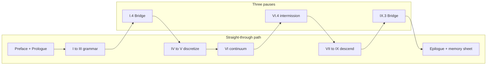

# Sources and Further Reading

This book synthesizes material from the author's notes, coursework, and teaching. Canonical chapter sources live under [`writings/`](../../writings/) (Functional Analysis Notes layout). Run `./scripts/sync-writings.sh` to copy them into `src/`. When the external `Writings` git submodule is linked, prefer upstream content and re-run the sync script.

## Scene: two clocks on the same afternoon

The book reads in **mathematical order** (Part I before Part IX), but the copper wire lives in **laboratory time** (mounting before hardening). The chapter roadmap below follows mathematical order — the order the Functional Analysis Notes layout assumes. When you need to know *which act of the experiment* a chapter belongs to, use the six-act table in the next section or the full narrative in the [prologue](../prologue/00-many-scales.md#the-experiment-as-plot).

## Six acts → parts (laboratory time) {#six-acts-parts-laboratory-time}

| Act | Lab beat | Primary parts | Opening links |
|-----|----------|---------------|---------------|
| I — Mounting | Grips close; first \(\mathbf{K}\mathbf{u}=\mathbf{f}\) | Prologue, I | [Prologue](../prologue/00-many-scales.md), [I.0](../part01-linear-algebra/00-opening.md) |
| II — Warming | Current on; thermocouple rises | III, IV, V | [III.0](../part03-pdes/00-opening.md), [IV.0](../part04-fem/00-opening.md), [V.0](../part05-fvm/00-opening.md) |
| III — Pulling | Force–displacement ramp | II, III, IV, VI | [II.0](../part02-functional-analysis/00-opening.md), [III.0](../part03-pdes/00-opening.md), [IV.0](../part04-fem/00-opening.md), [VI.0](../part06-continuum/00-opening.md) |
| IV — Hardening | Curve bends upward | VII | [VII.0](../part07-defects/00-opening.md) |
| V — Notch | Stress concentrator | VI, VIII | [VI.0](../part06-continuum/00-opening.md), [VIII.0](../part08-md/00-opening.md) |
| VI — Foundation | Parameters before the run | IX → VIII → VII → IV | [IX.0](../part09-dft/00-opening.md) → [VIII.0](../part08-md/00-opening.md) → [VII.0](../part07-defects/00-opening.md) → [IV.0](../part04-fem/00-opening.md) |

Act VI runs **in parallel** with Acts I–V in real projects: no FEM deck starts without moduli whose pedigree traces to finer models or calibration. The [epilogue](../epilogue/multiscale.md) reunites all six acts in one multiscale afternoon.

## Parameter pedigree path (Act VI reading order) {#parameter-pedigree-path-act-vi-reading-order}

The book reads **mathematically** from Part I to Part IX — grammar before descent. Real projects often read **downward** when building an input deck: start at electrons, export numbers, climb until FEM has honest moduli. Act VI is that reverse ladder on the same copper wire. The [Part IX coupling ladder](../part09-dft/00-opening.md#the-coupling-ladder-me-412-reunion) draws the full ME 412 reunion diagram; the pedigree path below is its **foundation slice** (IX → IV), before the epilogue wires Handshakes 1–4b in workflow order ([row 16](memory-sheet.md#continuity-hinges-master-map); [Act VI reunion paragraph](../epilogue/multiscale.md#lab-act-reunion-six-acts-one-afternoon)).

```mermaid
flowchart TB
  subgraph pedigree["Act VI foundation (workflow order IX to IV)"]
    DFT[IX.3: C_ij, gamma_sf, E_coh]
    MD[VIII.2-3: EAM fit, mobility M(tau,T)]
    DDD[VII.2: tau(rho), hardening laws]
    FEM[IV.4: Voigt E, nu in assembly]
  end
  subgraph orchestration["Row 16 orchestration (epilogue handshakes)"]
    H1[1: DFT moduli to FEM]
    H2[2: CHT delta T]
    H3[3: alpha delta T]
    H4a[4a: rate extrapolation]
    H4b[4b: FE2 notch]
    OUT[multiscale_export.yaml]
  end
  DFT --> MD --> DDD --> FEM --> H1
  H1 --> H2 --> H3 --> H4a --> H4b --> OUT
  H2 -.->|delta T feeds| H3
  H2 -.->|T_w to phonon lifetime| H4a
```

| Step | Read | Export | Wire-scale consumer |
|------|------|--------|---------------------|
| 1 | [IX.3](../part09-dft/03-dft-workflows.md#plot-spine-one-line) | \(C_{ij}\), \(\gamma_{\text{sf}}\), cohesive energy | Elastic constants, partial separation in DDD |
| 2 | [VIII.3](../part08-md/03-ab-initio-and-coarse-graining.md#plot-spine-one-line) | EAM table, phonon check | Production MD and mobility fitting |
| 3 | [VIII.2](../part08-md/02-ensembles-integrators.md#plot-spine-one-line) | \(M(\tau, T)\) from constrained shear | OpenDiS mobility law |
| 4 | [VII.2](../part07-defects/02-dislocation-dynamics.md#plot-spine-one-line) | \(\tau(\gamma)\), \(\rho(\gamma)\), Taylor \(\alpha\) | Crystal plasticity / Voce hardening |
| 5 | [IV.4](../part04-fem/04-poisson-to-elasticity.md#plot-spine-one-line) | \(\mathbf{K}\) with documented \(E\), \(\nu\) | Load-cell linear regime in Act III |
| 6 | [Epilogue](../epilogue/multiscale.md#lab-act-reunion-six-acts-one-afternoon) + [`parse_multiscale_workflow.sh`](../../scripts/parse_multiscale_workflow.sh) | `multiscale_export.yaml` linking Handshakes 1–4b | Orchestrated pedigree beside Act VI folder |

Each arrow needs a convergence log and a unit check — the epilogue's [four-handshake sensitivity table](../epilogue/multiscale.md#sensitivity-which-handshake-matters-most) ranks which exports dominate for a given question. **Mathematical order** teaches why the ladder exists; **pedigree order** fills the input deck before the grips close; **orchestration** (row 16) links individual exports in dependency order so Handshake 2's \(\Delta T\) feeds Handshake 3 and phonon lifetime at converged \(T_w\) feeds Handshake 4a drag.

## Narrative beat map (mathematical order × lab act)

The book reads in mathematical order (Part I before Part IX), but the copper wire lives in laboratory time. Use this table when you want **both** clocks at once — the story beat that should feel familiar when the symbols change.

| Chapter | Lab act | Narrative beat (one sentence) |
|---------|---------|--------------------------------|
| Prologue | Preview | One wire, eight scales, four questions |
| I.1–I.3 | I — Mounting | Springs, assembly, the wire rings |
| I.4 | I → II | Thermocouples multiply; vectors become fields |
| II.1–II.5 | III (preview) | The room where weak forms live |
| III.1–III.4 | II–III | Strong form fails; energy chooses the solution |
| IV.1–IV.5 | I, III | Mesh the solid; choose FEM or FVM door |
| V.1–V.4 | II | Cool the wire; balance fluxes in air |
| VI.1–VI.3 | II–III | Name stress; virtual work behind \(\mathbf{K}\) |
| VI.4 | II–IV → descent | [Intermission](../part06-continuum/04-nonlinear-plasticity-preview.md#intermission-ascent-ends-descent-begins): ascent ends; \(J_2\) placeholders await a forest |
| VII.0–VII.3 | IV | Forest hardens; export \(\tau(\gamma)\) |
| VIII.1–VIII.3 | V–VI | Atoms at the notch; fit potential |
| IX.1–IX.3 | VI | Electrons; archive pedigree |
| Epilogue | All six | Wire the rungs; sensitivity ranks |

When a chapter's **Bridge** names the next part, cross-check this table — the laboratory beat may lag or lead the mathematics by one part (Act II warming appears in Part III–V prose while Act III pulling is Part IV–VI). That offset is intentional: the wire heats before it yields.

## Continuity hinges index (when the plot stutters)

The [preface](../preface.md) documents opening, ascent, midpoint, descent, and epilogue hinge tables separately. The [memory sheet](memory-sheet.md#continuity-hinges-master-map) collects all **sixteen** narrative hinges (rows 0–16) in one navigation page. Use this index when you know **which chapter** you are in but cannot feel the handoff to the next:

| Row | Chapter region | Hinge anchor | What should click |
|-----|----------------|--------------|-------------------|
| 0 | Prologue → I.0 | [Opening hinge](../preface.md#opening-continuity-hinge) · [preface row 0 skill checkpoint](../preface.md#skill-navigation-row-0) · [Prologue Bridge](../prologue/00-many-scales.md#bridge-to-part-i) · [I.0 hinge](../part01-linear-algebra/00-opening.md#opening-hinge-prologue-to-part-i) | Panorama ladder becomes explicit \(\mathbf{K}\mathbf{u}=\mathbf{f}\) grammar |
| 1 | I.4 → II.0 | [I.4 Bridge](../part01-linear-algebra/04-toward-infinity.md#bridge-to-part-ii) | Nodal vectors become fields; \(\mathbf{K}_N\) becomes an operator |
| 2 | II.5 → III.0 | [II.5 Bridge](../part02-functional-analysis/05-spectral-theorem.md#bridge-to-part-iii) · [Part III variational ladder](../part03-pdes/00-opening.md#the-variational-ladder-me-412-schematic-14) | Completeness hands off to weak Poisson and heat; Schematic 14 becomes plot spine |
| 3 | III.4 → IV.0 | [III.4 Bridge](../part03-pdes/04-energy-methods.md#bridge-to-part-iv) · [Part III variational ladder](../part03-pdes/00-opening.md#the-variational-ladder-me-412-schematic-14) · [Part IV Galerkin ladder](../part04-fem/00-opening.md#the-galerkin-ladder-me-412-schematic-14-continued) | Lax–Milgram becomes Galerkin assembly; Schematic 14 splits at III.4 / IV.0 |
| 4 | IV.5 / V.4 → VI.0 | [Two doors](../part04-fem/05-convergence.md#bridge-two-doors-from-here) · [Part IV Galerkin ladder](../part04-fem/00-opening.md#the-galerkin-ladder-me-412-schematic-14-continued) · [Part V conservation ladder](../part05-fvm/00-opening.md#the-conservation-ladder-fvm-parallel-to-schematic-14) · [Part VI twin ladders reunite](../part06-continuum/00-opening.md#the-twin-ladders-reunite-galerkin-and-conservation) · [Part III weak forms](../part03-pdes/02-weak-form.md#plot-spine-one-line) | FEM and FVM converge on Cauchy stress; Schematic 14 splits into Galerkin (IV) and conservation (V) twins, reunites at VI.0 |
| 5–6 | VI.0 / VI.4 → VII.0 | [Midpoint](../part06-continuum/00-opening.md#midpoint-ascent-complete-descent-ahead) · [Twin ladders reunite](../part06-continuum/00-opening.md#the-twin-ladders-reunite-galerkin-and-conservation) · [VII.0 ascent hinge](../part07-defects/00-opening.md#ascent-hinge-midpoint-and-twin-ladders) · [intermission](../part06-continuum/04-nonlinear-plasticity-preview.md#intermission-ascent-ends-descent-begins) | Ascent complete; thermal strain from CHT enters virtual work; \(J_2\) placeholders yield to forest |
| 7 | VII.3 → VIII.0 | [VII.3 Bridge](../part07-defects/03-polycrystal-and-fem-handoff.md#bridge-to-part-viii) · [VIII.1 opening hinge](../part08-md/01-potentials-phase-space.md#opening-hinge-vii3-to-viii1) · [VIII.0 descent hinge](../part08-md/00-opening.md#descent-hinge-cores-mobility-and-tw-pedigree) | Line cores need atomic bonding; mobility at \(T_w\) from CHT, not 300 K default |
| 7b | VIII.1 → VIII.2 | [VIII.1 Bridge](../part08-md/01-potentials-phase-space.md#bridge) · [VIII.2 opening hinge](../part08-md/02-ensembles-integrators.md#opening-hinge-viii1-to-viii2) | EAM minimization done but NVT/NPT not run; `MD_NVT_shear_PartVIII` still missing at \(T_w\) |
| 7c | VIII.2 → VIII.3 | [VIII.2 Bridge](../part08-md/02-ensembles-integrators.md#bridge) · [VIII.3 opening hinge](../part08-md/03-ab-initio-and-coarse-graining.md#opening-hinge-viii2-to-viii3) | Trajectories audited but no coarse-graining handoff; EAM on trust without pedigree checklist |
| 8 | VIII.0–VIII.3 | [Preface: row 8 skill checkpoint](../preface.md#skill-navigation-row-8) · [VIII.0 descent hinge](../part08-md/00-opening.md#descent-hinge-cores-mobility-and-tw-pedigree) · [VIII.3 WHAM at \(T_w\)](../part08-md/03-ab-initio-and-coarse-graining.md#wham-part-vii-mobility-hinge-act-ii-temperature-pedigree) · [memory sheet rows 8–9 baby picture](memory-sheet.md#rows-8-9-baby-picture-tw-temperature-pedigree) | [V.4 CHT](../part05-fvm/04-navier-stokes-cfd.md#lab-act-extension-two-domain-picard-loop-with-a-1d-fem-solid) converged at \(T_w\); MD mobility, WHAM, and OpenDiS drag must not default to 300 K |
| 9 | VIII.3 → IX.0 | [Preface: row 9 skill checkpoint](../preface.md#skill-navigation-row-9) · [VIII.3 Bridge](../part08-md/03-ab-initio-and-coarse-graining.md#bridge-to-part-ix) · [IX.0 electronic audit hinge](../part09-dft/00-opening.md#electronic-audit-hinge-descent-pedigree-and-tw-phonon) · [IX.0 thermal phonon audit at \(T_w\)](../part09-dft/00-opening.md#thermal-phonon-audit-at-tw) · [memory sheet rows 8–9 baby picture](memory-sheet.md#rows-8-9-baby-picture-tw-temperature-pedigree) | EAM on trust needs SCF audit; \(\alpha(T_w)\) and \(\tau_{\text{ph}}(T_w)\) beside `cht_export.yaml`, not room-temperature folklore |
| 10 | IX.3 → Epilogue | [IX.3 Bridge](../part09-dft/03-dft-workflows.md#bridge-to-the-epilogue) | Finest rung; upward homogenization begins |
| 11 | Epilogue (workflow) | [Six-act reunion](../epilogue/multiscale.md#lab-act-reunion-six-acts-one-afternoon) | Reading order reunites with laboratory time |
| 12 | Epilogue → Prologue | [Epilogue Bridge row 12](../epilogue/multiscale.md#row-12-closing-loop) · [prologue reopening anchor](../prologue/00-many-scales.md#prologue-reopening-anchor) · [preface row 12](../preface.md#skill-navigation-row-12) · [memory sheet row 12 baby picture](memory-sheet.md#row-12-baby-picture-next-project) | Four questions restart on the next project; ladder reusable — row 12 reunites with row 0 on grammar restart |
| 13 | Epilogue (Handshake 2 → 3) | [Handshake 2 → 3](../epilogue/multiscale.md#handshake-2--joule-heating--conjugate-heat-transfer-part-iv--v), [preface row 13 three-way audit](../preface.md#skill-navigation-row-13), [row 13 closing loop](../epilogue/multiscale.md#row-13-closing-loop), [row 13 baby picture](../appendix/memory-sheet.md#row-13-baby-picture-handshake-2-3) | CHT converged but load cell still uses handbook \(\alpha\); Handshake 2 sets \(\Delta T\), Handshake 3 sets \(\alpha\Delta T\) |
| 14 | Epilogue (Handshake 4a) | [VII.3 rate handshake](../part07-defects/03-polycrystal-and-fem-handoff.md#scale-boundary-handshake-ddd-strain-rate-to-quasi-static-fem), [Handshake 4a upstream](../epilogue/multiscale.md#4a--ddd-strain-rate-to-quasi-static-load-cell-act-iv--hardening), [preface row 14 three-way audit](../preface.md#skill-navigation-row-14), [row 14 closing loop](../epilogue/multiscale.md#row-14-closing-loop), [row 14 baby picture](memory-sheet.md#row-14-baby-picture-handshake-4a) | DDD exports feed plasticity without strain-rate extrapolation; hardening knee arrives early; DDD sets \(\tau_{\text{flow}}\), Handshake 4a sets \(\tau_{\text{lab}}\) |
| 15 | Epilogue (Handshake 4b) | [VII.3 Step 4 FE²](../part07-defects/03-polycrystal-and-fem-handoff.md#step-4--when-offline-calibration-fails-fe-at-the-notch), [FE² worked example](../epilogue/multiscale.md#worked-example-fe-at-the-wire-notch-act-v--notch), [preface row 15 three-way audit](../preface.md#skill-navigation-row-15), [row 15 closing loop](../epilogue/multiscale.md#row-15-closing-loop), [row 15 baby picture](memory-sheet.md#row-15-baby-picture-handshake-4b) | Bulk hardening from 4a looks right but notch root under-predicts peak stress; 4a sets bulk \(\tau_{\text{lab}}\), Handshake 4b asks whether scalar \(H\) suffices at \(K_t \approx 3\) |
| 16 | Epilogue (Act VI orchestration) | [Parameter pedigree path](#parameter-pedigree-path-act-vi-reading-order), [preface row 16](../preface.md#skill-navigation-row-16) | Individual exports exist but no orchestrated `multiscale_export.yaml`; IX → IV pedigree before grips close |
| 17 | Whole book (continuous read-through) | [Continuous read-through guide](#continuous-read-through-guide) · [preface row 17](../preface.md#skill-navigation-row-17) · [prologue row 17 preview](../prologue/00-many-scales.md#prologue-preview-row-17) · [prologue row 17 closing stitch](../prologue/00-many-scales.md#row-17-closing-stitch) · [epilogue row 17 closing loop](../epilogue/multiscale.md#row-17-closing-loop) · [memory sheet row 17 baby picture](memory-sheet.md#row-17-baby-picture-continuous-read-through) | Chapters feel choppy despite Bridges — trust Scene/Bridge rhythm; pause only at three ascent/descent gates |
| 18 | Part openings I.0–IX.0 | [Part-opening plot spine index](#part-opening-plot-spine-index-row-18) · [preface row 18](../preface.md#skill-navigation-row-18) · [prologue row 18 preview](../prologue/00-many-scales.md#prologue-preview-row-18) · [prologue row 18 closing stitch](../prologue/00-many-scales.md#row-18-closing-stitch) · [epilogue row 18 closing loop](../epilogue/multiscale.md#row-18-closing-loop) · [memory sheet row 18 baby picture](memory-sheet.md#row-18-baby-picture-part-opening-plot-spine) | A part opening feels like a new syllabus — read its [plot spine one line](../part01-linear-algebra/00-opening.md#plot-spine-one-line) aloud |
| 19 | Numbered chapters I.1–IX.3 | [Numbered-chapter plot spine index](#numbered-chapter-plot-spine-index-row-19) · [preface row 19](../preface.md#skill-navigation-row-19) · [prologue row 19 preview](../prologue/00-many-scales.md#prologue-preview-row-19) · [prologue row 19 closing stitch](../prologue/00-many-scales.md#row-19-closing-stitch) · [epilogue row 19 closing loop](../epilogue/multiscale.md#row-19-closing-loop) · [memory sheet row 19 baby picture](memory-sheet.md#row-19-baby-picture-numbered-chapter-plot-spine) | Mid-chapter reading stalls despite a Bridge — read this chapter's [plot spine one line](../part01-linear-algebra/01-vectors-matrices.md#plot-spine-one-line) aloud |
| 20 | Gate chapters I.4, VI.4, IX.3 | [Gate-chapter plot spine index](#gate-chapter-plot-spine-index-row-20) · [preface row 20](../preface.md#skill-navigation-row-20) · [prologue row 20 preview](../prologue/00-many-scales.md#prologue-preview-row-20) · [prologue row 20 closing stitch](../prologue/00-many-scales.md#row-20-closing-stitch) · [epilogue row 20 closing loop](../epilogue/multiscale.md#row-20-closing-loop) · [memory sheet row 20 baby picture](memory-sheet.md#row-20-baby-picture-gate-chapter-plot-spine) | A mandatory gate stalls the straight read — recite its [plot spine one line](../part01-linear-algebra/04-toward-infinity.md#plot-spine-one-line) aloud before the Bridge |
| 21 | Lab act reunion (Acts I–VI) | [Lab act reunion index](#lab-act-reunion-index-row-21) · [preface row 21](../preface.md#skill-navigation-row-21) · [prologue row 21 preview](../prologue/00-many-scales.md#prologue-preview-row-21) · [prologue row 21 closing stitch](../prologue/00-many-scales.md#row-21-closing-stitch) · [epilogue row 21 closing loop](../epilogue/multiscale.md#row-21-closing-loop) · [memory sheet row 21 baby picture](memory-sheet.md#row-21-baby-picture-lab-act-reunion) | A Lab act feels like standalone homework — read its one-line move aloud and name the lab act |
| 22 | Scene reunion (Acts I–VI) | [Scene reunion index](#scene-reunion-index-row-22) · [preface row 22](../preface.md#skill-navigation-row-22) · [prologue row 22 preview](../prologue/00-many-scales.md#prologue-preview-row-22) · [prologue row 22 closing stitch](../prologue/00-many-scales.md#row-22-closing-stitch) · [epilogue row 22 closing loop](../epilogue/multiscale.md#row-22-closing-loop) · [memory sheet row 22 baby picture](memory-sheet.md#row-22-baby-picture-scene-reunion) | Plot spines and Lab acts read correctly but symbols hide the wire — read the Scene one-line visual aloud and picture the operator watching |
| 23 | Bridge reunion (part boundaries) | [Bridge reunion index](#bridge-reunion-index-row-23) · [preface row 23](../preface.md#skill-navigation-row-23) · [prologue row 23 preview](../prologue/00-many-scales.md#prologue-preview-row-23) · [prologue row 23 closing stitch](../prologue/00-many-scales.md#row-23-closing-stitch) · [epilogue row 23 closing loop](../epilogue/multiscale.md#row-23-closing-loop) · [memory sheet row 23 baby picture](memory-sheet.md#row-23-baby-picture-bridge-reunion) | Scene, plot spines, and Lab acts all read correctly but chapter transitions feel mechanical — read the prior chapter's Bridge one-line hinge aloud before turning the page |
| 24 | Concept map reunion (ME 412 four questions) | [Concept map reunion index](#concept-map-reunion-index-row-24) · [preface row 24](../preface.md#skill-navigation-row-24) · [prologue row 24 preview](../prologue/00-many-scales.md#prologue-preview-row-24) · [prologue row 24 closing stitch](../prologue/00-many-scales.md#row-24-closing-stitch) · [epilogue row 24 closing loop](../epilogue/multiscale.md#row-24-closing-loop) · [memory sheet row 24 baby picture](memory-sheet.md#row-24-baby-picture-concept-map-reunion) | Scene, plot spines, Lab acts, visuals, and Bridges all read correctly but proofs feel like disconnected theorems — answer object / structure / theorem / breaks at the part-opening concept map |
| 25 | Schematic reunion (representative baby pictures) | [Schematic reunion index](#schematic-reunion-index-row-25) · [preface row 25](../preface.md#skill-navigation-row-25) · [prologue row 25 preview](../prologue/00-many-scales.md#prologue-preview-row-25) · [prologue row 25 closing stitch](../prologue/00-many-scales.md#row-25-closing-stitch) · [epilogue row 25 closing loop](../epilogue/multiscale.md#row-25-closing-loop) · [memory sheet row 25 baby picture](memory-sheet.md#row-25-baby-picture-schematic-reunion) | Scene, plot spines, Lab acts, visuals, Bridges, and concept maps all read correctly but proofs feel abstract without a visual anchor — locate the matching baby picture from the part-opening representative schematics table |
| 26 | Story so far reunion (narrative recap) | [Story so far reunion index](#story-so-far-reunion-index-row-26) · [preface row 26](../preface.md#skill-navigation-row-26) · [prologue row 26 preview](../prologue/00-many-scales.md#prologue-preview-row-26) · [prologue row 26 closing stitch](../prologue/00-many-scales.md#row-26-closing-stitch) · [epilogue row 26 closing loop](../epilogue/multiscale.md#row-26-closing-loop) · [memory sheet row 26 baby picture](memory-sheet.md#row-26-baby-picture-story-so-far-reunion) | Rows 17–25 all read correctly in isolation but you cannot place where the copper wire is in the narrative arc — read the part-opening **Story so far** recap aloud and name what the wire became at the prior scale |
| 27 | Closing the arc reunion (symbol bridge) | [Closing the arc reunion index](#closing-the-arc-reunion-index-row-27) · [preface row 27](../preface.md#skill-navigation-row-27) · [prologue row 27 preview](../prologue/00-many-scales.md#prologue-preview-row-27) · [prologue row 27 closing stitch](../prologue/00-many-scales.md#row-27-closing-stitch) · [epilogue row 27 closing loop](../epilogue/multiscale.md#row-27-closing-loop) · [memory sheet row 27 baby picture](memory-sheet.md#row-27-baby-picture-closing-the-arc-reunion) | Rows 17–26 all read correctly but prior-part symbols do not map to current-part vocabulary — read the part-opening **Closing the arc** table aloud and name one symbol translation per row |
| 28 | Scale-boundary reunion (export pedigree) | [Scale-boundary reunion index](#scale-boundary-reunion-index-row-28) · [preface row 28](../preface.md#skill-navigation-row-28) · [prologue row 28 preview](../prologue/00-many-scales.md#prologue-preview-row-28) · [prologue row 28 closing stitch](../prologue/00-many-scales.md#row-28-closing-stitch) · [epilogue row 28 closing loop](../epilogue/multiscale.md#row-28-closing-loop) · [memory sheet row 28 baby picture](memory-sheet.md#row-28-baby-picture-scale-boundary-reunion) | Rows 17–27 all read correctly but **parameters crossing a scale boundary feel arbitrary** — read the chapter **Scale-boundary handshake** table and name export → consumer → failure mode |
| 29 | Thermoelastic assembly reunion (Acts II–III on one mesh) | [Thermoelastic assembly reunion index](#thermoelastic-assembly-reunion-index-row-29) · [preface row 29](../preface.md#skill-navigation-row-29) · [prologue row 29 preview](../prologue/00-many-scales.md#prologue-preview-row-29) · [prologue row 29 closing stitch](../prologue/00-many-scales.md#row-29-closing-stitch) · [epilogue row 29 closing loop](../epilogue/multiscale.md#row-29-closing-loop) · [memory sheet row 29 baby picture](memory-sheet.md#row-29-baby-picture-thermoelastic-assembly-reunion) | Rows 17–28 all read correctly but **Act II heating and Act III pulling feel like separate FEM homework** — read the Part IV thermoelastic assembly thread and name heat pass → thermal load → mechanics pass on the same connectivity |
| 30 | CHT outer-loop reunion (FEM solid ↔ FVM fluid) | [CHT outer-loop reunion index](#cht-outer-loop-reunion-index-row-30) · [preface row 30](../preface.md#skill-navigation-row-30) · [prologue row 30 preview](../prologue/00-many-scales.md#prologue-preview-row-30) · [prologue row 30 closing stitch](../prologue/00-many-scales.md#row-30-closing-stitch) · [epilogue row 30 closing loop](../epilogue/multiscale.md#row-30-closing-loop) · [memory sheet row 30 baby picture](memory-sheet.md#row-30-baby-picture-cht-outer-loop-reunion) | Rows 17–29 all read correctly but **solid FEM and fluid FVM still feel like separate solvers** — read the IV.5 → V.4 Picard → `cht_export.yaml` chain and name one converged \(T_w\) for both twins before Part VI |

## Part-opening plot spine index (row 18) {#part-opening-plot-spine-index-row-18}

Each part opening carries a **plot spine (one line)** section — a single sentence naming that part's role in Acts I–III (grammar, discretization, descent). Read aloud when symbols change faster than the specimen; the [chapter roadmap](#chapter-roadmap-one-continuous-arc) expands every row below into chapter-level beats.

| Part | Act | [Plot spine one line](../part01-linear-algebra/00-opening.md#plot-spine-one-line) | Sentence (read aloud) |
|------|-----|------------------|----------------------|
| [I.0](../part01-linear-algebra/00-opening.md#plot-spine-one-line) | Act I — Grammar, rung 1 | Spring chain; \(\mathbf{K}\mathbf{u}=\mathbf{f}\) before fields |
| [II.0](../part02-functional-analysis/00-opening.md#plot-spine-one-line) | Act I — Grammar, rung 2 | Fields in \(H^1\), \(L^2\); Schematic 14 middle rungs |
| [III.0](../part03-pdes/00-opening.md#plot-spine-one-line) | Act I — Grammar, rung 3 | Weak PDEs on a domain; existence climbs Schematic 14 |
| [IV.0](../part04-fem/00-opening.md#plot-spine-one-line) | Act II — Discretization, rung 1 | Galerkin assembly; Schematic 14 convergence half |
| [V.0](../part05-fvm/00-opening.md#plot-spine-one-line) | Act II — Discretization, rung 2 | Flux balance in air; conservation ladder twin |
| [VI.0](../part06-continuum/00-opening.md#plot-spine-one-line) | Act II — Continuum reunion | Cauchy stress reunites FEM and FVM; ascent ends |
| [VII.0](../part07-defects/00-opening.md#plot-spine-one-line) | Act III — Descent, rung 1 | Dislocation forest; hardening from line motion |
| [VIII.0](../part08-md/00-opening.md#plot-spine-one-line) | Act III — Descent, rung 2 | Atoms at cores; potentials on trust until IX |
| [IX.0](../part09-dft/00-opening.md#plot-spine-one-line) | Act III — Descent, rung 3 | Electron density; SCF pedigree; finest rung |

**Baby picture:** the [preface plot spine](../preface.md#plot-spine-how-the-story-is-told) names four acts; this table names **nine rungs** — one sentence per part opening. Row 17 tells you to read straight through; row 18 tells you what each part opening should **sound like** when the plot is continuous. When a part feels disconnected, open only its plot-spine line before diving into skill rows 0–16.

## Numbered-chapter plot spine index (row 19) {#numbered-chapter-plot-spine-index-row-19}

Each numbered chapter (I.1–IX.3) carries a **plot spine (one line)** section — a single sentence naming that chapter's role in the continuous arc. Read aloud when mid-chapter abstraction rises faster than the specimen; the [chapter roadmap](#chapter-roadmap-one-continuous-arc) lists the same roles in table form. Row 18 names part boundaries; row 19 names **chapter interiors** when row 17's Scene/Bridge rhythm stalls mid-chapter.

| Part | Chapters | Read aloud when… |
|------|----------|-------------------|
| I | [I.1](../part01-linear-algebra/01-vectors-matrices.md#plot-spine-one-line) · [I.2](../part01-linear-algebra/02-linear-maps.md#plot-spine-one-line) · [I.3](../part01-linear-algebra/03-eigenvalues.md#plot-spine-one-line) · [I.4](../part01-linear-algebra/04-toward-infinity.md#plot-spine-one-line) | Assembly feels like bookkeeping before fields appear |
| II | [II.1](../part02-functional-analysis/01-motivation.md#plot-spine-one-line) · [II.2](../part02-functional-analysis/02-normed-spaces.md#plot-spine-one-line) · [II.3](../part02-functional-analysis/03-hilbert-spaces.md#plot-spine-one-line) · [II.4](../part02-functional-analysis/04-operators-duality.md#plot-spine-one-line) · [II.5](../part02-functional-analysis/05-spectral-theorem.md#plot-spine-one-line) | Sobolev norms feel abstract mid-ascent |
| III | [III.1](../part03-pdes/01-strong-form.md#plot-spine-one-line) · [III.2](../part03-pdes/02-weak-form.md#plot-spine-one-line) · [III.3](../part03-pdes/03-sobolev-spaces.md#plot-spine-one-line) · [III.4](../part03-pdes/04-energy-methods.md#plot-spine-one-line) | Strong and weak forms feel like separate subjects |
| IV | [IV.1](../part04-fem/01-weighted-residuals.md#plot-spine-one-line) · [IV.2](../part04-fem/02-galerkin-assembly.md#plot-spine-one-line) · [IV.3](../part04-fem/03-elements-quadrature.md#plot-spine-one-line) · [IV.4](../part04-fem/04-poisson-to-elasticity.md#plot-spine-one-line) · [IV.5](../part04-fem/05-convergence.md#plot-spine-one-line) | FEM chapters feel like a software manual |
| V | [V.1](../part05-fvm/01-conservation-integral.md#plot-spine-one-line) · [V.2](../part05-fvm/02-fvm-1d.md#plot-spine-one-line) · [V.3](../part05-fvm/03-fluxes-riemann.md#plot-spine-one-line) · [V.4](../part05-fvm/04-navier-stokes-cfd.md#plot-spine-one-line) | Fluids feel disconnected from the wire's solid mesh |
| VI | [VI.1](../part06-continuum/01-kinematics.md#plot-spine-one-line) · [VI.2](../part06-continuum/02-stress-balance.md#plot-spine-one-line) · [VI.3](../part06-continuum/03-variational-elasticity.md#plot-spine-one-line) · [VI.4](../part06-continuum/04-nonlinear-plasticity-preview.md#plot-spine-one-line) | Tensor notation obscures the reunion of FEM and FVM |
| VII | [VII.1](../part07-defects/01-defect-taxonomy.md#plot-spine-one-line) · [VII.2](../part07-defects/02-dislocation-dynamics.md#plot-spine-one-line) · [VII.3](../part07-defects/03-polycrystal-and-fem-handoff.md#plot-spine-one-line) | Defects feel like a new course after continuum |
| VIII | [VIII.1](../part08-md/01-potentials-phase-space.md#plot-spine-one-line) · [VIII.2](../part08-md/02-ensembles-integrators.md#plot-spine-one-line) · [VIII.3](../part08-md/03-ab-initio-and-coarse-graining.md#plot-spine-one-line) | MD feels like standalone statistical mechanics |
| IX | [IX.1](../part09-dft/01-born-oppenheimer.md#plot-spine-one-line) · [IX.2](../part09-dft/02-kohn-sham.md#plot-spine-one-line) · [IX.3](../part09-dft/03-dft-workflows.md#plot-spine-one-line) | DFT feels like standalone quantum chemistry |

**Baby picture:** row 17 names chapter rhythm (Scene → Bridge); row 18 names part boundaries (nine one-liners); row 19 names **mid-chapter orientation** (35 one-liners). When a chapter feels abstract, read its plot spine aloud before opening a skill checkpoint — the sentence is the narrative stitch the Functional Analysis Notes layout assumes at every numbered chapter opening.

## Gate-chapter plot spine index (row 20) {#gate-chapter-plot-spine-index-row-20}

Row 17 names three **mandatory pauses** during a straight-through read; row 20 names the **plot spine one-liner** to recite aloud at each gate before opening the Bridge or intermission. These are not arbitrary checkpoints — they are the three plot turns where the copper wire's story changes act: grammar becomes analysis, ascent ends at the knee, pedigree exports upward to coupling.

| Gate | Chapter | Plot turn | [Plot spine one line](../part01-linear-algebra/04-toward-infinity.md#plot-spine-one-line) | Sentence (read aloud) | Then read |
|------|---------|-----------|------------------|----------------------|-----------|
| **Ascent** | [I.4](../part01-linear-algebra/04-toward-infinity.md#plot-spine-one-line) | Grammar → analysis | I.4 — Act I — Grammar | Refine the mesh until nodal values become a field — \(N\to\infty\) is the gate where grammar becomes analysis. | [I.4 Bridge](../part01-linear-algebra/04-toward-infinity.md#bridge-to-part-ii) |
| **Midpoint** | [VI.4](../part06-continuum/04-nonlinear-plasticity-preview.md#plot-spine-one-line) | Ascent → descent | VI.4 — Act II — Continuum reunion | Plasticity preview names where continuum fields fail — ascent ends, descent begins at the knee. | [VI.4 intermission](../part06-continuum/04-nonlinear-plasticity-preview.md#intermission-ascent-ends-descent-begins) |
| **Coupling** | [IX.3](../part09-dft/03-dft-workflows.md#plot-spine-one-line) | Descent → coupling | IX.3 — Act III — Descent | Quantum ESPRESSO workflows export pedigree numbers upward — the epilogue's Handshake 1 anchor. | [IX.3 Bridge](../part09-dft/03-dft-workflows.md#bridge-to-the-epilogue) |

**Baby picture:** row 17 tells you **when** to pause (I.4, VI.4, IX.3); row 20 tells you **what each gate should sound like** when the plot turns. Recite the sentence, then read the Bridge — not the skill table. When all three gates feel disconnected, recite them in one breath: grammar becomes analysis → ascent ends at the knee → pedigree exports upward. The [preface row 20 skill checkpoint](../preface.md#skill-navigation-row-20) closes the competence loop; the [memory sheet row 20 baby picture](memory-sheet.md#row-20-baby-picture-gate-chapter-plot-spine) compresses the three sentences for index-card review.

## Lab act reunion index (row 21) {#lab-act-reunion-index-row-21}

Row 17 names **Scene → Bridge** chapter rhythm; rows 18–20 name **plot spine** one-liners at part, chapter, and gate boundaries. Row 21 names the **Lab act reunion** — when the mathematics reads smoothly but a worked computation feels like standalone homework disconnected from the copper wire, locate the act and read the one-line move aloud before opening code.

Each row below is a **workflow anchor** Lab act (not every pedagogical Lab act in the book). Read aloud when the operator's afternoon and the chapter's algebra diverge.

| Act | Lab act anchor | One-line move on the wire (read aloud) | Export / parser |
|-----|----------------|----------------------------------------|-----------------|
| **I — Mounting** | [I.1 three-node assembly](../part01-linear-algebra/01-vectors-matrices.md#lab-act-three-nodes-one-load-cell-reading-act-i--mounting) | Zero the load cell; assemble \(\mathbf{K}\mathbf{u}=\mathbf{f}\) with fixed grips before current or ramp. | Boundary tags → every later mesh |
| **II — Warming** | [V.4 Picard CHT loop](../part05-fvm/04-navier-stokes-cfd.md#lab-act-extension-two-domain-picard-loop-with-a-1d-fem-solid) | Joule heat in the solid meets enthalpy flux in air until \(T_w\) converges — archive before MD or DDD. | [`parse_cht.sh`](../../scripts/parse_cht.sh) → `cht_export.yaml` |
| **III — Pulling** | [VI.3 virtual work](../part06-continuum/03-variational-elasticity.md#lab-act-virtual-work-equals-load-cell-reading-act-iii--pulling) | Virtual work on the meshed wire equals the load-cell reading in the linear regime. | \(\mathbf{K}\mathbf{u}=\mathbf{f}\) with documented \(E\), \(\nu\) |
| **III — Pulling** | [IX.3 quasiharmonic \(\alpha\)](../part09-dft/03-dft-workflows.md#lab-act-quasiharmonic-alpha-handshake-3-pedigree) | Phonon tables at \(T_w\) set thermal strain before fixed-grip stress — not handbook \(\alpha\) at 300 K. | [`parse_alpha.sh`](../../scripts/parse_alpha.sh) → `alpha_export.yaml` |
| **IV — Hardening** | [VII.2 forest Lab act](../part07-defects/02-dislocation-dynamics.md#lab-act-read-the-hardening-bend-from-forest-density-act-iv) | OpenDiS forest density explains the load-curve knee without a magic hardening constant. | \(\tau(\gamma)\), \(\rho(\gamma)\) export |
| **IV — Hardening** | [VII.3 rate handshake](../part07-defects/03-polycrystal-and-fem-handoff.md#scale-boundary-handshake-ddd-strain-rate-to-quasi-static-fem) | Power-law \(m\) bridges DDD timestep strain rate and lab grip speed. | [`parse_rate.sh`](../../scripts/parse_rate.sh) → `rate_export.yaml` |
| **V — Notch** | [VII.3 Step 4 FE²](../part07-defects/03-polycrystal-and-fem-handoff.md#step-4--when-offline-calibration-fails-fe-at-the-notch) | Scalar \(H\) from bulk calibration may under-predict notch-root stress — FE² asks whether offline yaml suffices. | [`parse_fe2.sh`](../../scripts/parse_fe2.sh) → `fe2_export.yaml` |
| **VI — Foundation** | [IX.1 Murnaghan fit](../part09-dft/01-born-oppenheimer.md#lab-act-murnaghan-fit-on-fcc-cu-act-vi--foundation) | SCF on a small fcc cell supplies \(C_{ij}\) before any wire-scale solve trusts \(E\) and \(\nu\). | [`parse_elastic.sh`](../../scripts/parse_elastic.sh) |
| **VI — Foundation** | [IX.3 foundation archive](../part09-dft/03-dft-workflows.md#lab-act-archive-the-foundation-run-before-the-wire-scale-solve-act-vi--foundation) | Archive DFT, MD, and DDD exports beside one README before the epilogue composes handshakes. | `foundation_export.yaml` |
| **VI — Foundation** | [Epilogue orchestration](../epilogue/multiscale.md#script-audit-trail-parse-scripts-handshakes) | Individual parsers exist; orchestration links Handshakes 1–4b in dependency order. | [`parse_multiscale_workflow.sh`](../../scripts/parse_multiscale_workflow.sh) → `multiscale_export.yaml` |

**Baby picture:** row 17 is **how** to read (Scene → Bridge); rows 18–20 are **what the plot should sound like**; row 21 is **what the operator's hands should do** on the same afternoon. When a Lab act feels like a course assignment, read its one-line move aloud, then name which act of the [six-act table](../prologue/00-many-scales.md#the-experiment-as-plot) you are simulating. The [preface row 21 skill checkpoint](../preface.md#skill-navigation-row-21) closes the competence loop; the [memory sheet row 21 baby picture](memory-sheet.md#row-21-baby-picture-lab-act-reunion) compresses the ten anchors for index-card review.

## Scene reunion index (row 22) {#scene-reunion-index-row-22}

Row 17 names **Scene → Bridge** chapter rhythm; rows 18–20 name **plot spine** one-liners; row 21 names **Lab act** one-line moves. Row 22 names the **Scene reunion** — when plot vocabulary and computational moves both read correctly but symbols hide the copper wire, return to the chapter **Scene** and read the one-line visual aloud before continuing the body.

Each row below is a **part-opening Scene anchor** (the opening paragraph of every part and bookend). Read aloud when abstraction rises faster than the specimen and the operator disappears behind notation.

| Part | Scene anchor | One-line visual on the wire (read aloud) | Then read |
|------|--------------|------------------------------------------|-----------|
| [Preface](../preface.md#scene-before-the-first-chapter) | Before Part I | One cylinder of copper in wedge grips — load cell at zero, thermocouple at room temperature, mesh script open on the next bench. | [Opening continuity hinge](../preface.md#opening-continuity-hinge) |
| [Prologue](../prologue/00-many-scales.md#scene) | Panorama | Single crystal copper in uniaxial tension — centimeters, Newtons, one ladder of scales on the same specimen. | [Bridge to Part I](../prologue/00-many-scales.md#bridge-to-part-i) |
| [I.0](../part01-linear-algebra/00-opening.md#scene) | Act I — Grammar | Cold-drawn wire as a spring chain — grips, nodes, \(\mathbf{K}\mathbf{u}=\mathbf{f}\) before fields or orbitals. | [I.0 concept map](../part01-linear-algebra/00-opening.md#the-concept-map) |
| [II.0](../part02-functional-analysis/00-opening.md#scene) | Act I — Grammar | Displacement and temperature are **fields** now — the stiffness matrix was only a finite shadow. | [II.0 concept map](../part02-functional-analysis/00-opening.md#the-concept-map-me-412) |
| [III.0](../part03-pdes/00-opening.md#scene) | Act I — Grammar | The wire is a **domain** — fixed grips, Joule heat, boundary conditions on a bar. | [III.0 concept map](../part03-pdes/00-opening.md#the-concept-map) |
| [IV.0](../part04-fem/00-opening.md#scene) | Act II — Discretize | The solid is **meshed** — tetrahedra on the wire, Galerkin as projection in \(H^1\). | [IV.0 concept map](../part04-fem/00-opening.md#the-concept-map) |
| [V.0](../part05-fvm/00-opening.md#scene) | Act II — Warming | **Air outside the wire** — heat leaves the surface; the question is what happens outside the mesh. | [V.0 concept map](../part05-fvm/00-opening.md#the-concept-map) |
| [VI.0](../part06-continuum/00-opening.md#scene) | Act II–III | Same specimen, **tensor vocabulary** — Cauchy stress reunites the FEM solid and FVM fluid doors. | [VI.0 concept map](../part06-continuum/00-opening.md#the-concept-map) |
| [VII.0](../part07-defects/00-opening.md#scene) | Act IV — Hardening | **Dislocation lines** in a polycrystal — the forest behind the load-curve knee. | [VII.0 concept map](../part07-defects/00-opening.md#the-concept-map) |
| [VIII.0](../part08-md/00-opening.md#scene) | Act V — Notch | **Atoms in a nanobox** at the notch — cores need bonding; thermostats must read \(T_w\), not 300 K. | [VIII.0 concept map](../part08-md/00-opening.md#the-concept-map) |
| [IX.0](../part09-dft/00-opening.md#scene) | Act VI — Foundation | **Valence electrons** in a small fcc cell — SCF cycles supply every modulus the wire-scale deck trusts. | [IX.0 concept map](../part09-dft/00-opening.md#the-concept-map) |
| [Epilogue](../epilogue/multiscale.md#scene-a-multiscale-afternoon) | All six acts | Same grips, same load cell — one afternoon where every export meets on the pedigree diagram. | [Six-act reunion](../epilogue/multiscale.md#lab-act-reunion-six-acts-one-afternoon) |

**Six-act Scene anchors (laboratory time).** When part labels feel abstract, name what the **operator watches** on the bench:

| Act | One-line visual (read aloud) | Representative Scene |
|-----|------------------------------|----------------------|
| **I — Mounting** | Grips close on cold-drawn copper; load cell reads zero. | [I.1 Scene: the grips tighten](../part01-linear-algebra/01-vectors-matrices.md#scene-the-grips-tighten) |
| **II — Warming** | Current switches on; thermocouple climbs; air begins to move. | [III.1 Scene: heat at every point](../part03-pdes/01-strong-form.md#scene-heat-at-every-point) |
| **III — Pulling** | Force–displacement ramp; curve almost linear, then stiffens. | [VI.3 Scene: energy stored in the stretch](../part06-continuum/03-variational-elasticity.md#scene-energy-stored-in-the-stretch) |
| **IV — Hardening** | Load curve bends upward; forest density rises in OpenDiS. | [VII.2 Scene: the forest grows](../part07-defects/02-dislocation-dynamics.md#scene-the-forest-grows) |
| **V — Notch** | Stress peaks at a concentrator; zoom to atoms at the tip. | [VIII.1 Scene: the notch under the microscope](../part08-md/01-potentials-phase-space.md#scene-the-notch-under-the-microscope) |
| **VI — Foundation** | Small fcc cell runs overnight; README archives pedigree beside exports. | [IX.3 Scene: bulk copper in a workstation](../part09-dft/03-dft-workflows.md#scene-bulk-copper-in-a-workstation) |

**Baby picture:** row 17 is **how** to read (Scene → Bridge); rows 18–20 are **what the plot should sound like**; row 21 is **what the operator's hands should do**; row 22 is **what the operator's eyes should see** on the same copper wire. When symbols hide the specimen, read the Scene one-line visual aloud, then name which act of the [six-act table](../prologue/00-many-scales.md#the-experiment-as-plot) you are picturing. The [preface row 22 skill checkpoint](../preface.md#skill-navigation-row-22) closes the competence loop; the [memory sheet row 22 baby picture](memory-sheet.md#row-22-baby-picture-scene-reunion) compresses the twelve part anchors and six act visuals for index-card review.

## Bridge reunion index (row 23) {#bridge-reunion-index-row-23}

Row 17 names **Scene → Bridge** chapter rhythm; rows 18–20 name **plot spine** one-liners; row 21 names **Lab act** one-line moves; row 22 names **Scene** one-line visuals. Row 23 names the **Bridge reunion** — when plot vocabulary, computational moves, and sensory anchors all read correctly but **chapter transitions feel mechanical**, return to the prior chapter's **Bridge** and read its one-line hinge aloud before opening the next chapter.

Each row below is a **part-boundary Bridge anchor** (the hinge where one scale of vocabulary hands off to the next). Read aloud when the mathematics is correct but the turn feels like a syllabus bullet rather than narrative continuity.

| Transition | Bridge anchor | One-line hinge on the wire (read aloud) | Then read |
|------------|---------------|----------------------------------------|-----------|
| [Preface → Prologue](../preface.md#bridge) | Table of contents in prose | One copper wire, many scales — the plot before the grammar. | [Prologue Scene](../prologue/00-many-scales.md#scene) |
| [Prologue → I](../prologue/00-many-scales.md#bridge-to-part-i) | Panorama → grammar | Nine rungs become \(\mathbf{K}\mathbf{u}=\mathbf{f}\) on the same specimen. | [I.0 opening hinge](../part01-linear-algebra/00-opening.md#opening-hinge-prologue-to-part-i) |
| [I.4 → II](../part01-linear-algebra/04-toward-infinity.md#bridge-to-part-ii) | Ascent gate | Refinement sends \(\mathbf{K}_N\) toward fields in \(H^1\) — nodal values become functions. | [II.0 closing the arc](../part02-functional-analysis/00-opening.md#closing-the-arc-from-part-i) |
| [II.5 → III](../part02-functional-analysis/05-spectral-theorem.md#bridge-to-part-iii) | Analysis → PDEs | Function spaces hand off to weak forms the FEM will assemble. | [III.0 closing the arc](../part03-pdes/00-opening.md#closing-the-arc-from-part-ii) |
| [III.4 → IV](../part03-pdes/04-energy-methods.md#bridge-to-part-iv) | Well-posedness → discretization | Lax–Milgram becomes Galerkin assembly on \(V_h\). | [IV.0 concept map](../part04-fem/00-opening.md#the-concept-map) |
| [IV.5 fork](../part04-fem/05-convergence.md#bridge-two-doors-from-here) | Two doors | Solids mesh and fluid flux both converge on Cauchy stress in Part VI. | [V.0](../part05-fvm/00-opening.md#scene) or [VI.0](../part06-continuum/00-opening.md#midpoint-ascent-complete-descent-ahead) |
| [V.4 → VI](../part05-fvm/04-navier-stokes-cfd.md#bridge-to-part-vi) | Thermal door | \(T_w\) from CHT reunites the warming act with tensor vocabulary. | [VI.0 twin ladders](../part06-continuum/00-opening.md#the-twin-ladders-reunite-galerkin-and-conservation) |
| [VI.4 → VII](../part06-continuum/04-nonlinear-plasticity-preview.md#bridge-to-part-vii) | Midpoint gate | \(J_2\) fits the knee; the dislocation forest explains why. | [VII.0 Scene](../part07-defects/00-opening.md#scene) |
| [VII.3 → VIII](../part07-defects/03-polycrystal-and-fem-handoff.md#bridge-to-part-viii) | Mesoscale → atomistic | Line cores and mobility tables need atomic bonding in a nanobox. | [VIII.1 opening hinge](../part08-md/01-potentials-phase-space.md#opening-hinge-vii3-to-viii1) |
| [VIII.3 → IX](../part08-md/03-ab-initio-and-coarse-graining.md#bridge-to-part-ix) | Atoms → electrons | EAM on trust; SCF audits moduli and phonons at \(T_w\). | [IX.0 electronic audit hinge](../part09-dft/00-opening.md#electronic-audit-hinge-descent-pedigree-and-tw-phonon) |
| [IX.3 → Epilogue](../part09-dft/03-dft-workflows.md#bridge-to-the-epilogue) | Coupling gate | SCF exports compose into Handshakes 1–4b on the pedigree diagram. | [Epilogue opening hinge](../epilogue/multiscale.md#opening-hinge-ix3-to-epilogue) |
| [Epilogue → restart](../epilogue/multiscale.md#row-12-closing-loop) | Book loop | Four questions restart on the next specimen — copper was the tutorial. | [Prologue reopening anchor](../prologue/00-many-scales.md#prologue-reopening-anchor) |

**Spot audit (any chapter boundary).** When a transition feels abrupt mid-part, read only the **opening sentence** of the prior chapter's **Bridge** section aloud — it states why the next chapter must exist. Every numbered chapter ends with a Bridge; the [chapter roadmap](#chapter-roadmap-one-continuous-arc) names each chapter's role if the Bridge table feels too coarse.

**Baby picture:** row 17 is **how** to read (Scene → Bridge); rows 18–20 are **what the plot should sound like**; row 21 is **what the operator's hands should do**; row 22 is **what the operator's eyes should see**; row 23 is **why the next chapter must exist** on the same afternoon. When transitions feel mechanical, read the Bridge one-line hinge aloud, then turn the page. The [preface row 23 skill checkpoint](../preface.md#skill-navigation-row-23) closes the competence loop; the [memory sheet row 23 baby picture](memory-sheet.md#row-23-baby-picture-bridge-reunion) compresses the twelve part-boundary hinges for index-card review.

## Concept map reunion index (row 24) {#concept-map-reunion-index-row-24}

Row 17 names **Scene → Bridge** chapter rhythm; rows 18–20 name **plot spine** one-liners; row 21 names **Lab act** one-line moves; row 22 names **Scene** one-line visuals; row 23 names **Bridge** one-line hinges. Row 24 names the **Concept map reunion** — when narrative, sensory, and transition vocabulary all read correctly but **proofs feel like disconnected theorems**, return to the part-opening **concept map** and answer the ME 412 four questions aloud: object, structure, theorem, failure mode.

Each row below is a **part-opening concept map anchor** (the four-question table at every part and bookend). Read aloud when the mathematics is correct but the structural spine is invisible — the proof stack feels like a syllabus rather than a concept map.

| Part | Concept map anchor | One-line audit on the wire (read aloud: object → structure → theorem → breaks) | Then read |
|------|-------------------|--------------------------------------------------------------------------------|-----------|
| [Prologue](../prologue/00-many-scales.md#the-concept-map-whole-book) | Whole book | Multiscale copper wire → ladder + weak forms → well-posedness at each rung → wrong moduli, missing history, unit errors | [Four questions table](../prologue/00-many-scales.md#the-same-questions-at-every-scale) |
| [I.0](../part01-linear-algebra/00-opening.md#the-concept-map) | Act I — Grammar, rung 1 | State vector \(\mathbf{u}\) → symmetry, sparsity, inner product → unique equilibrium, spectral modes → ill-conditioning, spurious modes | [I.0 chapter guide](../part01-linear-algebra/00-opening.md#chapter-guide) |
| [II.0](../part02-functional-analysis/00-opening.md#the-concept-map-me-412) | Act I — Grammar, rung 2 | Displacement field \(u(x)\) → norm, inner product, completeness → Lax–Milgram, Galerkin convergence → Cauchy sequences leave the space | [II.0 representative schematics](../part02-functional-analysis/00-opening.md#representative-schematics-me-412) |
| [III.0](../part03-pdes/00-opening.md#the-concept-map) | Act I — Grammar, rung 3 | Fields on \(\Omega\) → strong/weak/energy forms → well-posedness in \(H^1\) → reentrant corners, delta loads | [III.0 variational ladder](../part03-pdes/00-opening.md#the-variational-ladder-me-412-schematic-14) |
| [IV.0](../part04-fem/00-opening.md#the-concept-map) | Act II — Discretize, rung 1 | Trial space \(V_h\), \(\mathbf{K}\) → Galerkin orthogonality, \(h\)-refinement → Céa lemma, convergence rates → locking, hourglass modes | [IV.0 Galerkin ladder](../part04-fem/00-opening.md#the-galerkin-ladder-me-412-schematic-14-continued) |
| [V.0](../part05-fvm/00-opening.md#the-concept-map) | Act II — Discretize, rung 2 | Cell averages, face fluxes → integral balance, upwind bias → discrete conservation, TVD → mass loss, spurious oscillations | [V.0 conservation ladder](../part05-fvm/00-opening.md#the-conservation-ladder-fvm-parallel-to-schematic-14) |
| [VI.0](../part06-continuum/00-opening.md#the-concept-map) | Act II — Continuum reunion | \(\mathbf{F}\), \(\boldsymbol{\sigma}\), strain energy → objectivity, balance laws → virtual work, hyperelasticity → non-objective models, yield without mesoscale physics | [VI.0 twin ladders](../part06-continuum/00-opening.md#the-twin-ladders-reunite-galerkin-and-conservation) |
| [VII.0](../part07-defects/00-opening.md#the-concept-map) | Act III — Descent, rung 1 | Dislocation lines, \(\mathbf{b}\), \(\rho\) → Peach–Köhler, mobility → Taylor hardening, DDD integration → core singularity, wrong hardening law | [VII.0 hardening Lab act](../part07-defects/02-dislocation-dynamics.md#lab-act-read-the-hardening-bend-from-forest-density-act-iv) |
| [VIII.0](../part08-md/00-opening.md#the-concept-map) | Act III — Descent, rung 2 | Positions, momenta, potential \(V\) → Hamiltonian, thermostats → energy conservation, ergodic sampling → energy drift, wrong ensemble, cutoff artifacts | [VIII.0 descent hinge](../part08-md/00-opening.md#descent-hinge-cores-mobility-and-tw-pedigree) |
| [IX.0](../part09-dft/00-opening.md#the-concept-map) | Act III — Descent, rung 3 | Electron density \(\rho(\mathbf{r})\) → Hohenberg–Kohn, SCF, k-points → variational ground state, force theorem → wrong functional, SCF oscillation | [IX.0 coupling ladder](../part09-dft/00-opening.md#the-coupling-ladder-me-412-reunion) |
| [Epilogue](../epilogue/multiscale.md#the-concept-map-closing-lens) | All six acts | Coupled interface states → handshake loops, units, averaging → scale separation, V&V → wrong history, unit errors, category errors at notches | [Six-act reunion](../epilogue/multiscale.md#lab-act-reunion-six-acts-one-afternoon) |

**Spot audit (any chapter mid-body).** When a proof feels unmotivated, open only the **object** and **structure** rows of the current part's concept map — name what the wire's state variable is at this scale, then name what structure makes the theorem possible. The [preface reading rhythm](../preface.md#reading-rhythm) recommends Lab act → Scene → **Concept map** → schematics → skill checkpoint → Bridge.

**Baby picture:** row 17 is **how** to read (Scene → Bridge); rows 18–20 are **what the plot should sound like**; row 21 is **what the operator's hands should do**; row 22 is **what the operator's eyes should see**; row 23 is **why the next chapter must exist**; row 24 is **what structure makes the theorem possible** on the same copper wire. When proofs feel like a disconnected stack, answer the four ME 412 questions at the part opening, then return to the chapter body. The [preface row 24 skill checkpoint](../preface.md#skill-navigation-row-24) closes the competence loop; the [memory sheet row 24 baby picture](memory-sheet.md#row-24-baby-picture-concept-map-reunion) compresses the eleven concept map anchors for index-card review.

## Schematic reunion index (row 25) {#schematic-reunion-index-row-25}

Row 17 names **Scene → Bridge** chapter rhythm; rows 18–20 name **plot spine** one-liners; row 21 names **Lab act** one-line moves; row 22 names **Scene** one-line visuals; row 23 names **Bridge** one-line hinges; row 24 names **Concept map** four-question audits. Row 25 names the **Schematic reunion** — when narrative, sensory, transition, and structural vocabulary all read correctly but **proofs feel abstract without a visual anchor**, return to the part-opening **representative schematics** table and locate the baby picture indexed to the source notes (ME 300A, ME 412, ME 300B, FEA, FVM, …).

Each row below is a **part-opening schematic anchor** (the baby-picture table at every part opening). Read aloud when the concept map restores structure but the proof body still floats without a diagram from the course notes.

| Part | Schematic anchor | Source notes | One-line visual on the wire (read aloud) | Key schematic to open | Then read |
|------|------------------|--------------|------------------------------------------|----------------------|-----------|
| [I.0](../part01-linear-algebra/00-opening.md#representative-schematics-me-300a) | Act I — Grammar, rung 1 | [ME 300A](https://hanfengzhai.github.io/file/ME300A_LinAlg.pdf) | Spring chain energy \(\mathbf{u}^T\mathbf{K}\mathbf{u}\) — four schematics from vectors to \(N\to\infty\) | Schematic 1 (vectors, norms, energy) or Schematic 4 (\(N\to\infty\) gate) | [I.0 concept map](../part01-linear-algebra/00-opening.md#the-concept-map) |
| [II.0](../part02-functional-analysis/00-opening.md#representative-schematics-me-412) | Act I — Grammar, rung 2 | [ME 412](https://hanfengzhai.github.io/file/teaching/notes/ME412_CourseSummary.pdf) | Master roadmap from linear algebra through weak PDE/FEM — fourteen baby pictures | Schematic 1a–1b (master roadmap) or **Schematic 14** (variational + FEM ladder) | [II.0 concept map](../part02-functional-analysis/00-opening.md#the-concept-map-me-412) |
| [III.0](../part03-pdes/00-opening.md#representative-schematics-me-300b) | Act I — Grammar, rung 3 | [ME 300B](https://hanfengzhai.github.io/file/ME300B_PDE.pdf) | Strong → weak → Sobolev → energy — four schematics on the same domain \(\Omega\) | Schematic 2 (weak form) or Schematic 4 (Lax–Milgram / energy minimum) | [III.0 variational ladder](../part03-pdes/00-opening.md#the-variational-ladder-me-412-schematic-14) |
| [IV.0](../part04-fem/00-opening.md#representative-schematics-fea-notes) | Act II — Discretize, rung 1 | [FEA Notes](https://hanfengzhai.github.io/file/FEA_notes.pdf) | Weighted residuals → Galerkin assembly → Céa convergence on the meshed wire | Schematic 2 (global assembly) or Schematic 5 (Céa / two doors) | [IV.0 Galerkin ladder](../part04-fem/00-opening.md#the-galerkin-ladder-me-412-schematic-14-continued) |
| [V.0](../part05-fvm/00-opening.md#representative-schematics-fvm--cfd-notes) | Act II — Discretize, rung 2 | [FVM](https://hanfengzhai.github.io/note/FVM.pdf) / [CFD](https://hanfengzhai.github.io/file/CFD_note.pdf) | Cell averages and face fluxes balance Joule heat leaving the wire surface | Schematic 1 (integral conservation) or Schematic 4 (Navier–Stokes / CHT) | [V.0 conservation ladder](../part05-fvm/00-opening.md#the-conservation-ladder-fvm-parallel-to-schematic-14) |
| [VI.0](../part06-continuum/00-opening.md#representative-schematics-elasticity-notes) | Act II — Continuum reunion | [Elasticity Notes](https://hanfengzhai.github.io/file/elasticity_notes.pdf) | \(\mathbf{F}\), \(\boldsymbol{\sigma}\), virtual work — FEM and FVM reunite on Cauchy stress | Schematic 3 (virtual work / \(\mathbf{K}\)) or Schematic 4 (nonlinearity preview at the knee) | [VI.0 twin ladders](../part06-continuum/00-opening.md#the-twin-ladders-reunite-galerkin-and-conservation) |
| [VII.0](../part07-defects/00-opening.md#representative-schematics-defects-notes) | Act III — Descent, rung 1 | [Defects Notes](https://hanfengzhai.github.io/file/defects_notes.pdf) | Burgers lines, Peach–Köhler forces, Taylor forest — hardening from line motion | Schematic 2 (DDD integration) or Schematic 3 (Taylor hardening handoff) | [VII.0 concept map](../part07-defects/00-opening.md#the-concept-map) |
| [VIII.0](../part08-md/00-opening.md#representative-schematics-atomistic-modeling-notes) | Act III — Descent, rung 2 | [Atomistic Notes](https://hanfengzhai.github.io/file/AtomModel_note.pdf) | Phase space on a Cu RVE — potentials, thermostats at \(T_w\), not 300 K | Schematic 1 (potentials / periodic box) or Schematic 2 (NVT / NPT ensembles) | [VIII.0 descent hinge](../part08-md/00-opening.md#descent-hinge-cores-mobility-and-tw-pedigree) |
| [IX.0](../part09-dft/00-opening.md#representative-schematics-dft-coursework) | Act III — Descent, rung 3 | [MSE 5720](https://github.com/hanfengzhai/MSE5720-HW) | Born–Oppenheimer → Kohn–Sham SCF → QE export pedigree on fcc Cu | Schematic 2 (SCF cycle) or Schematic 3 (foundation archive / upward export) | [IX.0 coupling ladder](../part09-dft/00-opening.md#the-coupling-ladder-me-412-reunion) |
| [Epilogue](../epilogue/multiscale.md#the-concept-map-closing-lens) | All six acts | [Memory sheet Act VI](../appendix/memory-sheet.md#act-vi-baby-picture-me-412-coupling-ladder) | Foundation IX→IV pedigree arrow beside Handshakes 1–4b orchestration | [Act VI baby picture](memory-sheet.md#act-vi-baby-picture-me-412-coupling-ladder) or [parameter pedigree path](#parameter-pedigree-path-act-vi-reading-order) | [Six-act reunion](../epilogue/multiscale.md#lab-act-reunion-six-acts-one-afternoon) |

**Spot audit (any chapter mid-body).** When a proof feels abstract despite a restored concept map, open only the **representative schematics** row matching the current chapter in the part-opening table — name which baby picture from the source notes the derivation instantiates on the copper wire. Schematic **14** in Part II is the spine that continues through [III.0's variational ladder](../part03-pdes/00-opening.md#the-variational-ladder-me-412-schematic-14), [IV.0's Galerkin ladder](../part04-fem/00-opening.md#the-galerkin-ladder-me-412-schematic-14-continued), and [V.0's conservation ladder](../part05-fvm/00-opening.md#the-conservation-ladder-fvm-parallel-to-schematic-14) — read it once when ascent and discretization feel like separate subjects.

**Baby picture:** row 17 is **how** to read (Scene → Bridge); rows 18–20 are **what the plot should sound like**; row 21 is **what the operator's hands should do**; row 22 is **what the operator's eyes should see**; row 23 is **why the next chapter must exist**; row 24 is **what structure makes the theorem possible**; row 25 is **which baby picture from the course notes makes the proof concrete** on the same copper wire. When proofs float without a diagram, locate the matching schematic row at the part opening, then return to the chapter body. The [preface row 25 skill checkpoint](../preface.md#skill-navigation-row-25) closes the competence loop; the [memory sheet row 25 baby picture](memory-sheet.md#row-25-baby-picture-schematic-reunion) compresses the ten part-opening schematic anchors for index-card review.

## Story so far reunion index (row 26) {#story-so-far-reunion-index-row-26}

Row 17 names **Scene → Bridge** chapter rhythm; rows 18–20 name **plot spine** one-liners; row 21 names **Lab act** one-line moves; row 22 names **Scene** one-line visuals; row 23 names **Bridge** one-line hinges; row 24 names **Concept map** four-question audits; row 25 names **Schematic reunion** baby pictures from the source notes. Row 26 names the **Story so far reunion** — when every meta-stitch layer reads correctly in isolation but you **cannot place where the copper wire is in the narrative arc**, return to the part-opening **Story so far** recap and read the one-line temporal summary aloud.

Each row below is a **part-opening Story so far anchor** (the narrative recap table at every part opening). Read aloud when plot vocabulary, structural vocabulary, and visual vocabulary are all restored but the chapter body feels like a mid-novel flashback without context.

| Part | Story so far anchor | Covers | One-line temporal summary on the wire (read aloud) | Key table to open | Then read |
|------|---------------------|--------|---------------------------------------------------|-------------------|-----------|
| [I.0](../part01-linear-algebra/00-opening.md#story-so-far-prologue) | Act I — Grammar, rung 1 | Prologue | Panorama ladder becomes explicit \(\mathbf{K}\mathbf{u}=\mathbf{f}\) on a spring chain | Prologue → Part I table | [I.0 opening hinge](../part01-linear-algebra/00-opening.md#opening-hinge-prologue-to-part-i) |
| [II.0](../part02-functional-analysis/00-opening.md#story-so-far-prologue--part-i) | Act I — Grammar, rung 2 | Prologue & I | Springs become fields \(u(x)\), \(T(x)\) in \(H^1\); \(\mathbf{K}_N\) becomes an operator | Prologue & Part I table | [I.4 Bridge](../part01-linear-algebra/04-toward-infinity.md#bridge-to-part-ii) |
| [III.0](../part03-pdes/00-opening.md#story-so-far-parts-i-ii) | Act I — Grammar, rung 3 | Parts I–II | Fields receive PDEs; strong form fails; weak form and energy methods ready for mesh | Parts I–II table | [II.5 Bridge](../part02-functional-analysis/05-spectral-theorem.md#bridge-to-part-iii) |
| [IV.0](../part04-fem/00-opening.md#story-so-far-parts-i-iii) | Act II — Discretize, rung 1 | Parts I–III | Weak forms become Galerkin assembly; wire is a meshed solid | Parts I–III table | [III.4 Bridge](../part03-pdes/04-energy-methods.md#bridge-to-part-iv) |
| [V.0](../part05-fvm/00-opening.md#story-so-far-parts-i-iv) | Act II — Discretize, rung 2 | Parts I–IV | Solid meshed; air around wire becomes explicit flux balance | Parts I–IV table | [IV.5 two doors](../part04-fem/05-convergence.md#bridge-two-doors-from-here) |
| [VI.0](../part06-continuum/00-opening.md#story-so-far-parts-i-v) | Act II — Continuum reunion | Parts I–V | FEM and FVM reunite on Cauchy stress; cold-drawn history still hidden | Parts I–V table | [VI.0 twin ladders](../part06-continuum/00-opening.md#the-twin-ladders-reunite-galerkin-and-conservation) |
| [VII.0](../part07-defects/00-opening.md#story-so-far-parts-i-vi) | Act III — Descent, rung 1 | Parts I–VI | Ascent complete; dislocation forest explains hardening the continuum could not | Parts I–VI table | [VI.4 intermission](../part06-continuum/04-nonlinear-plasticity-preview.md#intermission-ascent-ends-descent-begins) |
| [VIII.0](../part08-md/00-opening.md#story-so-far-parts-i-vii) | Act III — Descent, rung 2 | Parts I–VII | Line cores become vibrating nuclei; mobility at \(T_w\), not 300 K | Parts I–VII table | [VII.3 Bridge](../part07-defects/03-polycrystal-and-fem-handoff.md#bridge-to-part-viii) |
| [IX.0](../part09-dft/00-opening.md#story-so-far-parts-i-viii) | Act III — Descent, rung 3 | Parts I–VIII | Atoms on trust; electrons audit every upward export | Parts I–VIII table | [VIII.3 Bridge](../part08-md/03-ab-initio-and-coarse-graining.md#bridge-to-part-ix) |
| [Epilogue](../epilogue/multiscale.md#story-so-far-parts-i-ix) | All four acts | Parts I–IX | Nine languages, one wire; composition at code boundaries begins | Parts I–IX table | [IX.3 Bridge](../part09-dft/03-dft-workflows.md#bridge-to-the-epilogue) |

**Spot audit (any chapter mid-body).** When rows 17–25 all feel correct but the chapter reads like a flashback, open only the **Story so far** section at the current part opening — name what the wire was at the prior scale, then name what it becomes in this part. The [VI.4 intermission](../part06-continuum/04-nonlinear-plasticity-preview.md#intermission-ascent-ends-descent-begins) is the book's midpoint recap — read it once when ascent (Parts I–VI) and descent (Parts VII–IX) feel like separate novels.

**Baby picture:** row 17 is **how** to read (Scene → Bridge); rows 18–20 are **what the plot should sound like**; row 21 is **what the operator's hands should do**; row 22 is **what the operator's eyes should see**; row 23 is **why the next chapter must exist**; row 24 is **what structure makes the theorem possible**; row 25 is **which baby picture makes the proof concrete**; row 26 is **where the copper wire is in the story** when every layer works but the arc feels disoriented. When the narrative timeline blurs, read the **Story so far** table at the part opening, then return to the chapter body. The [preface row 26 skill checkpoint](../preface.md#skill-navigation-row-26) closes the competence loop; the [memory sheet row 26 baby picture](memory-sheet.md#row-26-baby-picture-story-so-far-reunion) compresses the ten part-opening Story so far anchors for index-card review.

## Closing the arc reunion index (row 27) {#closing-the-arc-reunion-index-row-27}

Row 17 names **Scene → Bridge** chapter rhythm; rows 18–20 name **plot spine** one-liners; row 21 names **Lab act** one-line moves; row 22 names **Scene** one-line visuals; row 23 names **Bridge** one-line hinges; row 24 names **Concept map** four-question audits; row 25 names **Schematic reunion** baby pictures from the source notes; row 26 names **Story so far** temporal recaps. Row 27 names the **Closing the arc reunion** — when every meta-stitch layer reads correctly but **prior-part symbols do not translate to current-part vocabulary** and the new chapter feels like a subject change rather than a generalization, return to the part-opening **Closing the arc** table and read one symbol bridge aloud per row.

Each row below is a **part-opening Closing the arc anchor** (the prior-part → current-part translation table at every part boundary). Read aloud when the narrative arc is clear but \(\mathbf{K}\), \(u(x)\), \(\boldsymbol{\sigma}\), and \(\rho(\mathbf{r})\) feel like unrelated objects rather than the same wire in richer language.

| Part | Closing the arc anchor | Prior part mapped | One-line symbol bridge on the wire (read aloud) | Key table to open | Then read |
|------|------------------------|-------------------|-------------------------------------------------|-------------------|-----------|
| [I.0](../part01-linear-algebra/00-opening.md#closing-the-arc-from-the-prologue) | Act I — Grammar, rung 1 | Prologue | Panorama ladder → \(\mathbf{K}\mathbf{u}=\mathbf{f}\) on a spring chain | Prologue → Part I table | [I.0 opening hinge](../part01-linear-algebra/00-opening.md#opening-hinge-prologue-to-part-i) |
| [II.0](../part02-functional-analysis/00-opening.md#closing-the-arc-from-part-i) | Act I — Grammar, rung 2 | Part I | \(\mathbf{u}\) → \(u(x)\in H^1\); \(\mathbf{K}\) → operator \(a(u,v)\) | Part I → Part II table | [I.4 Bridge](../part01-linear-algebra/04-toward-infinity.md#bridge-to-part-ii) |
| [III.0](../part03-pdes/00-opening.md#closing-the-arc-from-part-ii) | Act I — Grammar, rung 3 | Part II | Operator on \(H^1\) → weak PDE \(a(u,v)=\ell(v)\) on \(\Omega\) | Part II → Part III table | [II.5 Bridge](../part02-functional-analysis/05-spectral-theorem.md#bridge-to-part-iii) |
| [IV.0](../part04-fem/00-opening.md#closing-the-arc-from-part-iii) | Act II — Discretize, rung 1 | Part III | Weak form → Galerkin assembly; energy minimum → \(\mathbf{K}\mathbf{U}=\mathbf{F}\) | Part III → Part IV table | [III.4 Bridge](../part03-pdes/04-energy-methods.md#bridge-to-part-iv) |
| [V.0](../part05-fvm/00-opening.md#closing-the-arc-from-part-iv) | Act II — Discretize, rung 2 | Part IV | Meshed solid → flux balance in air; Robin BC → resolved convection | Part IV → Part V table | [IV.5 two doors](../part04-fem/05-convergence.md#bridge-two-doors-from-here) |
| [VI.0](../part06-continuum/00-opening.md#closing-the-arc-from-parts-iv-and-v) | Act II — Continuum reunion | Parts IV & V | \(\mathbf{K}\mathbf{U}=\mathbf{F}\) and face fluxes → Cauchy \(\boldsymbol{\sigma}\), \(\mathbf{F}\) | Parts IV & V → Part VI table | [VI.0 twin ladders](../part06-continuum/00-opening.md#the-twin-ladders-reunite-galerkin-and-conservation) |
| [VII.0](../part07-defects/00-opening.md#closing-the-arc-from-part-vi) | Act III — Descent, rung 1 | Part VI | \(J_2\) phenomenology → dislocation forest \(\rho\), \(\tau(\gamma)\) | Part VI → Part VII table | [VI.4 intermission](../part06-continuum/04-nonlinear-plasticity-preview.md#intermission-ascent-ends-descent-begins) |
| [VIII.0](../part08-md/00-opening.md#closing-the-arc-from-part-vii) | Act III — Descent, rung 2 | Part VII | Line cores and mobility tables → atomic positions, \(V(\mathbf{r})\), \(T_w\) | Part VII → Part VIII table | [VII.3 Bridge](../part07-defects/03-polycrystal-and-fem-handoff.md#bridge-to-part-viii) |
| [IX.0](../part09-dft/00-opening.md#closing-the-arc-from-part-viii) | Act III — Descent, rung 3 | Part VIII | EAM on trust → electron density \(\rho(\mathbf{r})\), SCF audit | Part VIII → Part IX table | [VIII.3 Bridge](../part08-md/03-ab-initio-and-coarse-graining.md#bridge-to-part-ix) |
| [Epilogue](../epilogue/multiscale.md#closing-the-arc-from-part-ix) | All four acts | Part IX | Foundation exports → Handshakes 1–4b on pedigree diagram | Part IX → Epilogue table | [IX.3 Bridge](../part09-dft/03-dft-workflows.md#bridge-to-the-epilogue) |

**Intra-part chapter bridges (descent).** When Part VIII chapters feel like separate courses mid-part, use the chapter-level Closing the arc tables:

| Transition | Closing the arc anchor | One-line symbol bridge (read aloud) |
|------------|------------------------|-------------------------------------|
| [VIII.1 → VIII.2](../part08-md/02-ensembles-integrators.md#opening-hinge-viii1-to-viii2) | 0 K EAM minimum → NVT/NPT trajectories at \(T_w\) | Energy minimum → canonical sample; `a_0` → \(\langle a(T_w)\rangle\) |
| [VIII.2 → VIII.3](../part08-md/03-ab-initio-and-coarse-graining.md#opening-hinge-viii2-to-viii3) | Trajectories → coarse-grained exports | Raw MD movie → mobility yaml, EAM-fit audit, pedigree checklist |
| [VII.3 → VIII.1](../part08-md/01-potentials-phase-space.md#opening-hinge-vii3-to-viii1) | DDD mobility yaml → atomic phase space | `mobility.yaml` row → \(\mathbf{F}_i = -\nabla V\) on screw-core RVE |

**Spot audit (any chapter mid-body).** When a symbol from two parts ago reappears under new notation, open only the **Closing the arc** section at the current part opening — name one row of the translation table aloud before continuing the body. The [preface reading rhythm](../preface.md#reading-rhythm) recommends Story so far → **Closing the arc** → concept map when a part boundary feels like a syllabus change.

**Baby picture:** row 17 is **how** to read (Scene → Bridge); rows 18–20 are **what the plot should sound like**; row 21 is **what the operator's hands should do**; row 22 is **what the operator's eyes should see**; row 23 is **why the next chapter must exist**; row 24 is **what structure makes the theorem possible**; row 25 is **which baby picture makes the proof concrete**; row 26 is **where the copper wire is in the story**; row 27 is **how prior-part symbols become current-part vocabulary** when every layer works but notation feels like a subject change. When symbols do not translate, read the **Closing the arc** table at the part opening, then return to the chapter body. The [preface row 27 skill checkpoint](../preface.md#skill-navigation-row-27) closes the competence loop; the [memory sheet row 27 baby picture](memory-sheet.md#row-27-baby-picture-closing-the-arc-reunion) compresses the ten part-boundary symbol bridges for index-card review.

## Scale-boundary reunion index (row 28) {#scale-boundary-reunion-index-row-28}

Row 17 names **Scene → Bridge** chapter rhythm; rows 18–20 name **plot spine** one-liners; row 21 names **Lab act** one-line moves; row 22 names **Scene** one-line visuals; row 23 names **Bridge** one-line hinges; row 24 names **Concept map** four-question audits; row 25 names **Schematic reunion** baby pictures from the source notes; row 26 names **Story so far** temporal recaps; row 27 names **Closing the arc** symbol bridges. Row 28 names the **Scale-boundary reunion** — when every meta-stitch layer reads correctly but **parameters crossing a scale or chapter boundary feel arbitrary** (handbook moduli, 300 K defaults, DDD rates without extrapolation, single-crystal MD on a polycrystal wire), return to the chapter's **Scale-boundary handshake** table and read the export → consumer → failure mode chain aloud.

Each row below is a **representative scale-boundary anchor** — not every handshake in the book, but the audit gates where upward exports and downward consumers must agree on units, averaging, and temperature pedigree. Read aloud when notation and narrative are restored but a number in an input deck has no documented origin.

| Phase | Scale-boundary anchor | Export (upstream) | Consumer (downstream) | One-line audit on the wire (read aloud) | Failure mode |
|-------|----------------------|-------------------|---------------------|----------------------------------------|--------------|
| Grammar | [III.0 opening](../part03-pdes/00-opening.md#bridge) | Part II: \(H^1\), Lax–Milgram | Part III: weak PDE; Part IV/V discretization | "Completeness → weak form → energy minimum before mesh" | Strong Laplacian at reentrant corner |
| Grammar | [III.3 Bridge](../part03-pdes/03-sobolev-spaces.md#bridge) | \(T, u \in H^1\); discrete Poincaré | [III.4](04-energy-methods.md) energy; Part IV assembly | "Sobolev membership → Dirichlet principle → \(\mathbf{K}\) blocks" | Temperature jump → \(T_h \notin H^1\) |
| Grammar | [III.4 Bridge](../part03-pdes/04-energy-methods.md#bridge-to-part-iv) | Coupled \(\Pi[u,T]\); Rayleigh–Ritz | Part IV thermoelastic \(\mathbf{K}_{uu}, \mathbf{K}_{TT}\) | "Thermal eigenstrain in energy → coupled load vector in Act III" | Thermal stress omitted in pure mechanical run |
| Discretize | [IV.0 opening](../part04-fem/00-opening.md#bridge) | Part III weak form | Part IV Galerkin \(\mathbf{K}\mathbf{U}=\mathbf{F}\) | "Energy minimum on \(V_h\) → assembly loop" | Different connectivity for heat vs mechanics |
| Discretize | [IV.5 thermoelastic convergence](../part04-fem/05-convergence.md#lab-act-extension-thermoelastic-h-refinement-on-one-mesh-acts-iiiii) | Converged \(T_w\), \(\mathbf{F}_{\text{th}}\) on same \(\mathcal{G}\) | [V.0 CHT](../part05-fvm/00-opening.md#conjugate-heat-transfer-the-wire-meets-the-wind); [V.4 Picard](../part05-fvm/04-navier-stokes-cfd.md#lab-act-extension-two-domain-picard-loop-with-a-1d-fem-solid) | "Solid Céa certificate before fluid Picard chases \(T_w\)" | Fluid run converged while solid \(T_h\) still moves with \(h\) |
| Discretize | [V.4 CHT](../part05-fvm/04-navier-stokes-cfd.md#bridge-to-part-vi) | FEM wall temperature; FVM flux | Part VI thermal strain; Part VIII \(T_w\) | "Picard loop sets \(T_w\); every descent rung inherits it" | 300 K default after converged CHT |
| Continuum | [VI.2 \(\alpha\) handshake](../part06-continuum/02-stress-balance.md#scale-boundary-handshake-thermal-expansion-alpha) | DFT phonons → MD NPT → FEM | Handshake 3 fixed-grip stress | "\(\alpha(T_w)\) from IX.3, not handbook room temperature" | Handbook \(\alpha\) beside orphan `pw.x` log |
| Continuum | [VI.2 \(\mathbb{C}\) handshake](../part06-continuum/02-stress-balance.md#scale-boundary-handshake-dft-elastic-tensor-to-fem-material-card) | DFT elastic tensor | FEM material card | "Voigt/Reuss bracket on polycrystal wire" | Single-crystal MD moduli on drawn wire |
| Descent | [VII.3 rate handshake](../part07-defects/03-polycrystal-and-fem-handoff.md#scale-boundary-handshake-ddd-strain-rate-to-quasi-static-fem) | OpenDiS \(\tau(\gamma)\) at DDD rate | Handshake 4a lab load cell | "Power-law \(m\) bridges \(10^3\,\text{s}^{-1}\) to \(10^{-3}\,\text{s}^{-1}\)" | Direct DDD import without extrapolation |
| Descent | [VIII.0 descent hinge](../part08-md/00-opening.md#descent-hinge-cores-mobility-and-tw-pedigree) | `cht_export.yaml` \(T_w\) | MD NVT, WHAM, OpenDiS mobility | "Mobility at \(T_w \approx 379\,\text{K}\), not 300 K" | NVT shear at room temperature after Act II |
| Descent | [IX.3 foundation checklist](../part09-dft/03-dft-workflows.md#ix3-foundation-checklist) | SCF, phonon, \(\alpha(T_w)\) archives | Epilogue Handshakes 1–4b | "Six-row audit before `foundation_export.yaml`" | Separate folders, no README at arrows |
| Coupling | [Epilogue Handshake 2→3](../epilogue/multiscale.md#handshake-3--thermal-strain--mechanical-stiffness-part-vi--iv) | CHT \(\Delta T\); IX.3 \(\alpha\) | Load cell thermal pre-stress | "\(\Delta T\) from Handshake 2; \(\alpha\Delta T\) from Handshake 3" | Conflating heating with thermal strain |

**Intra-part chapter handshakes (spot audit).** When a single part feels like separate homework sets, use the chapter-level tables:

| Transition | Scale-boundary anchor | One-line export audit (read aloud) |
|------------|----------------------|-------------------------------------|
| [I.4 → II.1](../part02-functional-analysis/01-motivation.md) | Nodal \(\mathbf{K}_N\) → operator on \(H^1\) | "Refinement limit is a function, not a bigger matrix" |
| [II.5 → III.1](../part03-pdes/01-strong-form.md) | Spectral modes → semidiscrete heat | "Modal decay previews transient Act II" |
| [IV.2 → IV.3](../part04-fem/03-elements-quadrature.md) | Global \(\mathbf{K}\) → element \(\mathbf{K}^e\) | "Quadrature order matches nonlinearity" |
| [VII.2 → VII.3](../part07-defects/03-polycrystal-and-fem-handoff.md) | Forest \(\rho\) → Taylor \(\tau(\gamma)\) | "Hardening curve carries strain-rate column" |
| [VIII.2 → VIII.3](../part08-md/03-ab-initio-and-coarse-graining.md) | NPT moduli → mobility yaml | "Trajectory temperature matches \(T_w\) pedigree" |

**Spot audit (any chapter mid-body).** When a parameter in an input deck feels arbitrary despite restored vocabulary, open only the **Scale-boundary handshake** section in the current or prior chapter — name one export, one consumer, and one failure mode aloud before continuing. Rows 8–16 in the [continuity hinges index](#continuity-hinges-index-when-the-plot-stutters) are the **workflow-time** mirrors of these **reading-time** handshakes; row 28 reunites them when mathematical reading and laboratory pedigree diverge.

**Baby picture:** row 17 is **how** to read (Scene → Bridge); rows 18–20 are **what the plot should sound like**; row 21 is **what the operator's hands should do**; row 22 is **what the operator's eyes should see**; row 23 is **why the next chapter must exist**; row 24 is **what structure makes the theorem possible**; row 25 is **which baby picture makes the proof concrete**; row 26 is **where the copper wire is in the story**; row 27 is **how prior-part symbols become current-part vocabulary**; row 28 is **what must export across scale boundaries with documented pedigree** when every layer works but numbers feel like folklore; row 29 is **how Act II and Act III share one mesh** when every meta-stitch layer works but heating and pulling still read as separate courses. When exports feel arbitrary, read the **Scale-boundary handshake** table at the chapter boundary, then return to the chapter body. The [preface row 28 skill checkpoint](../preface.md#skill-navigation-row-28) closes the competence loop; the [memory sheet row 28 baby picture](memory-sheet.md#row-28-baby-picture-scale-boundary-reunion) compresses the eleven representative handshakes for index-card review.

## Thermoelastic assembly reunion index (row 29) {#thermoelastic-assembly-reunion-index-row-29}

Row 17 names **Scene → Bridge** chapter rhythm; rows 18–20 name **plot spine** one-liners; row 21 names **Lab act** one-line moves; row 22 names **Scene** one-line visuals; row 23 names **Bridge** one-line hinges; row 24 names **Concept map** four-question audits; row 25 names **Schematic reunion** baby pictures; row 26 names **Story so far** temporal recaps; row 27 names **Closing the arc** symbol bridges; row 28 names **Scale-boundary reunion** export pedigree. Row 29 names the **Thermoelastic assembly reunion** — when every meta-stitch layer reads correctly but **Act II (Joule heating) and Act III (grip ramp) feel like separate FEM homework** despite sharing the same copper wire and mesh connectivity, return to Part IV's thermoelastic assembly thread and read the heat pass → thermal load → mechanics pass chain aloud.

Each row below is a **representative thermoelastic anchor** in Part IV — the discretization path where scalar and vector fields reunite on one mesh. Read aloud when narrative, symbolic, and export vocabulary are restored but the thermocouple and load cell still feel like different courses.

| Chapter | Thermoelastic move | One-line audit on the wire (read aloud) | Failure mode |
|---------|-------------------|----------------------------------------|--------------|
| [IV.0 opening](../part04-fem/00-opening.md#acts-ii-and-iii-together-thermoelastic-assembly-thread) | Part IV chapter guide for Acts II–III | "Same mesh: \(\mathbf{K}_{TT}\) then \(\mathbf{K}_{uu}\); thermal eigenstrain loads mechanics" | Heat and mechanics on different connectivity |
| [III.4 energy](../part03-pdes/04-energy-methods.md#monolithic-vs-staggered-thermoelastic-energy) | Coupled \(\Pi[u,T]\); staggered vs monolithic | "Energy minimum names both blocks before assembly" | Pure mechanical run after Joule heating |
| [IV.1 heat residuals](../part04-fem/01-weighted-residuals.md#weighted-residuals-for-heat-act-ii--warming) | Scalar Galerkin for \(-(kT')'=q\) | "Act II: heat residual orthogonal to same hats as Act III" | Skipping heat weighted residual |
| [IV.1 Lab act extension](../part04-fem/01-weighted-residuals.md#lab-act-extension-joule-heating-on-two-elements-act-ii--warming) | Two-element \(\mathbf{K}_{TT}\) solve | "Pass 1: thermocouple at mid-node before grip ramp" | Mechanical pass without \(\Delta T\) |
| [IV.2 block preview](../part04-fem/02-galerkin-assembly.md#thermoelastic-block-assembly-preview-acts-iiiii-on-one-mesh) | Staggered \(\mathbf{K}_{TT}\) → \(\mathbf{F}_{\text{th}}\) → \(\mathbf{K}_{uu}\) | "Scatter loop runs twice; same \(\mathbf{L}_e\) graph" | Different DOF maps for \(T\) and \(\mathbf{u}\) |
| [IV.2 Lab act extension](../part04-fem/02-galerkin-assembly.md#lab-act-extension-scatter-mathbfk_tt-on-the-same-mesh-act-ii--warming) | Thermal scatter before mechanical scatter | "Store \(\Delta T\) at Step 4 before Act III solve" | Load cell omits thermal pre-stress |
| [IV.3 shared P1 library](../part04-fem/03-elements-quadrature.md#shared-p1-library-for-heat-and-mechanics-acts-iiiii-on-one-mesh) | Same \(N_a\), \(\mathbf{J}\), quadrature at \(\xi_q\) | "One element loop; only the integrand changes between passes" | Separate thermal and structural mesh files |
| [IV.3 Lab act extension](../part04-fem/03-elements-quadrature.md#lab-act-extension-same-element-loop-heat-quadrature-before-mechanics-act-ii--warming) | Heat quadrature before mechanics on two bar elements | "Verify \(\mathbf{K}_{TT}\) and \(\mathbf{K}_{uu}\) share sparsity pattern" | Different connectivity in Pass 1 vs Pass 2 |
| [IV.4 thermoelastic thread](../part04-fem/04-poisson-to-elasticity.md#coupled-thermoelasticity) | IV.1→IV.4 staggered pass table | "Trace heat → \(\mathbf{F}_{\text{th}}\) → mechanics before blaming plasticity" | Skipped heat pass in multiphysics deck |
| [IV.4 coupled](../part04-fem/04-poisson-to-elasticity.md#coupled-thermoelasticity) | \(\mathbf{B}^T\mathbb{C}\mathbf{B}\) + \(\mathbf{F}_{\text{th}}\) | "One mesh, two fields; staggered or monolithic" | Handbook \(\alpha\) at 300 K when \(T_w \approx 379\,\text{K}\) |
| [IV.4 Lab act](../part04-fem/04-poisson-to-elasticity.md#lab-act-one-mesh-two-fields-act-iiiii-on-the-copper-wire) | Full coupled 1D bar workflow | "Thermocouple + load cell from same connectivity" | Thermal pass omitted in input deck |
| [IV.5 thermoelastic convergence](../part04-fem/05-convergence.md#lab-act-extension-thermoelastic-h-refinement-on-one-mesh-acts-iiiii) | Three-mesh \(h\)-study on both blocks | "\(T_{\text{mid}}\) and \(F_{\text{cell}}\) plateau on same \(\mathcal{G}\); then export \(T_w\) to Part V" | CHT Picard loop while solid temperature still moves with \(h\) |
| [IV.5 Door A gate](../part04-fem/05-convergence.md#bridge-two-doors-from-here) | Converged solid → [V.0 CHT](../part05-fvm/00-opening.md#conjugate-heat-transfer-the-wire-meets-the-wind) | "Row 29 assembly + row 28 export before Robin becomes resolved convection" | Opening Door A without thermoelastic \(h\)-certificate |

**Spot audit (Part IV mid-read).** When Act II and Act III feel disconnected despite reading Part III's coupled energy, open the [Part IV opening thermoelastic thread](../part04-fem/00-opening.md#acts-ii-and-iii-together-thermoelastic-assembly-thread) — read the five-chapter table aloud, then run the audit for the chapter you are in. Row 29 does not replace row 28 (export pedigree) — it reunites **laboratory time** (Acts II–III on one afternoon) with **mathematical order** (IV.1–IV.5 sequential chapters) when both clocks feel like separate homework sets.

**Baby picture:** row 28 asks where a number came from; row 29 asks whether **heat and mechanics ran on the same mesh in the right order** and whether **IV.5 certified both blocks before Door A opened Part V CHT**. The [preface row 29 skill checkpoint](../preface.md#skill-navigation-row-29) closes the competence loop; the [memory sheet row 29 baby picture](memory-sheet.md#row-29-baby-picture-thermoelastic-assembly-reunion) draws the staggered pass chain for index-card review.

## CHT outer-loop reunion index (row 30) {#cht-outer-loop-reunion-index-row-30}

Row 17 names **Scene → Bridge** chapter rhythm; rows 18–20 name **plot spine** one-liners; row 21 names **Lab act** one-line moves; rows 22–27 name sensory through symbolic reunion; row 28 names **Scale-boundary reunion** export pedigree; row 29 names **Thermoelastic assembly reunion** on one solid mesh. Row 30 names the **CHT outer-loop reunion** — when every meta-stitch layer reads correctly but **solid FEM (Part IV) and fluid FVM (Part V) still feel like separate solvers** despite Act II warming the same wire, return to the partitioned Picard chain and archive `cht_export.yaml` before Part VI reunites the twin ladders.

Each row below is a **representative CHT anchor** on the IV.5 → V.4 → VI.0 path — the outer fixed-point loop where Galerkin conduction meets conservation flux at the wall. Read aloud when row 29 restored thermoelastic assembly but the air around the wire still feels like a different course.

| Chapter | CHT move | One-line audit on the wire (read aloud) | Failure mode |
|---------|----------|----------------------------------------|--------------|
| [IV.5 thermoelastic convergence](../part04-fem/05-convergence.md#lab-act-extension-thermoelastic-h-refinement-on-one-mesh-acts-iiiii) | Solid \(h\)-certificate before Door A | "Converged \(T_w\) from Galerkin before fluid Picard chases it" | Fluid run while solid \(T_h\) still moves with \(h\) |
| [IV.5 Door A](../part04-fem/05-convergence.md#bridge-two-doors-from-here) | Export solid-side \(T_w\), \(\mathbf{F}_{\text{th}}\) | "Robin \(h\) was placeholder; Part V resolves convection" | Opening Part V without IV.5 certificate |
| [V.0 CHT scene](../part05-fvm/00-opening.md#conjugate-heat-transfer-the-wire-meets-the-wind) | Two meshes, one interface | "Solid FEM ↔ fluid FVM speak at \(\Gamma_w\)" | Two solvers never coupled |
| [V.1 global balance](../part05-fvm/01-conservation-integral.md#lab-act-global-heat-balance-on-a-1d-wire-segment-act-ii-side-channel) | Discrete conservation sanity | "Joule in = flux out before Navier–Stokes" | Global energy drift in fluid deck |
| [V.2 boundary-layer patch](../part05-fvm/02-fvm-1d.md#lab-act-1d-diffusion-on-the-wires-boundary-layer-act-ii-warmup) | Diffusive flux kernel | "Linear \(T\) exact before coupling" | Coupling on untested FVM kernel |
| [V.3 Sod patch](../part05-fvm/03-fluxes-riemann.md#lab-act-sod-shock-tube-sanity-check-act-ii--warming-side-channel) | Riemann kernel isolated | "Mass conserved before CHT exchanges \(T_w\)" | Hyperbolic kernel untested at interface |
| [V.4 Nu Lab act](../part05-fvm/04-navier-stokes-cfd.md#lab-act-natural-convection-nusselt-number-on-the-heated-wire-act-ii--warming) | Natural convection estimate | "Is cooling fast enough before Act III grip?" | Forced-flow correlation on natural convection |
| [V.4 Picard extension](../part05-fvm/04-navier-stokes-cfd.md#lab-act-extension-two-domain-picard-loop-with-a-1d-fem-solid) | Solid ↔ fluid fixed point | "Four iterations, \(T_w \approx 379\,\text{K}\), energy \(< 1\%\)" | Picard without under-relaxation |
| [V.4 parser checkpoint](../part05-fvm/04-navier-stokes-cfd.md#parser-checkpoint-archive-cht-export-yaml) | [`parse_cht.sh`](../../scripts/parse_cht.sh) → `cht_export.yaml` | "Archive converged \(T_w\) beside both decks" | Hand calculation never exported |
| [V.4 Bridge](../part05-fvm/04-navier-stokes-cfd.md#bridge-to-part-vi) | CHT hinge to continuum | "One \(T_w\) feeds thermal strain and mobility" | 300 K default after converged CHT |
| [VI.0 twin-ladder reunion](../part06-continuum/00-opening.md#the-twin-ladders-reunite-galerkin-and-conservation) | Galerkin + conservation → Cauchy stress | "Both twins approximate the same \(T(\mathbf{x})\) at the wall" | FEM and FVM reunite in notation only |

**Spot audit (Part V mid-read).** When Part IV's mesh and Part V's fluxes feel disconnected despite reading the CHT scene in [V.0](../part05-fvm/00-opening.md#conjugate-heat-transfer-the-wire-meets-the-wind), open the [V.4 outer-loop checklist](../part05-fvm/04-navier-stokes-cfd.md#parser-checkpoint-archive-cht-export-yaml) — run the five-step table, then diff [`fixtures/cht_export.yaml`](../../fixtures/cht_export.yaml). Row 30 does not replace row 29 (solid thermoelastic assembly) — it reunites **two discretization dialects** at the wall when both ran but never archived a single \(T_w\).

**Baby picture:** row 29 asks whether heat and mechanics shared one solid mesh; row 30 asks whether **solid and fluid outer iterations converged and exported one wall temperature** before Part VI names \(\varepsilon_{\text{th}} = \alpha\Delta T\). The [preface row 30 skill checkpoint](../preface.md#skill-navigation-row-30) closes the competence loop; the [memory sheet row 30 baby picture](memory-sheet.md#row-30-baby-picture-cht-outer-loop-reunion) draws the Picard → yaml → twin-ladder chain for index-card review.

## Continuous read-through guide {#continuous-read-through-guide}

Rows 0–16 in the [continuity hinges index](#continuity-hinges-index-when-the-plot-stutters) are **detour maps** — use them when abstraction rises faster than the specimen. Row 17 is the **straight-through map** — how to read Preface → Epilogue as one continuous story without opening every skill checkpoint mid-climb.

The Functional Analysis Notes layout assumes you can read numbered chapters in order: **Scene** returns to the copper wire, the body develops the mathematics, **Lab act** grounds one computational move, **Bridge** states why the next chapter must exist. When the plot feels choppy during a first pass, the break is usually not a missing proof — it is a skipped **Bridge** or a **Scene** read too quickly.

### Three mandatory pauses (ascent, midpoint, coupling)

| Gate | Location | Read straight through until… | Then pause at |
|------|----------|------------------------------|---------------|
| **Ascent gate** | I.4 → II.0 | Part I feels like linear algebra homework | [I.4 Bridge](../part01-linear-algebra/04-toward-infinity.md#bridge-to-part-ii) — nodal values become fields |
| **Midpoint gate** | VI.4 → VII.0 | Part VI feels like tensor vocabulary only | [VI.4 intermission](../part06-continuum/04-nonlinear-plasticity-preview.md#intermission-ascent-ends-descent-begins) — \(J_2\) fits the knee; pedigree begins |
| **Coupling gate** | IX.3 → Epilogue | Part IX feels like standalone DFT coursework | [IX.3 Bridge](../part09-dft/03-dft-workflows.md#bridge-to-the-epilogue) — upward homogenization reunites every export |

Between these gates, **keep reading** — the [chapter roadmap](#chapter-roadmap-one-continuous-arc) is the plot spine; each row's one-line role is the sentence that should click when symbols change. At each gate, recite the [gate-chapter plot spine (row 20)](#gate-chapter-plot-spine-index-row-20) one-liner aloud before opening the Bridge — [preface row 20 skill checkpoint](../preface.md#skill-navigation-row-20).

### Five acts of straight-through reading

| Act | Chapters | Smoothness discipline | Optional detour (only if stuck) |
|-----|----------|----------------------|----------------------------------|
| **A — Grammar** | Preface, Prologue, I–III | Do not skip part openings; read every Bridge | [Ascent hinges](../preface.md#ascent-continuity-hinges) rows 1–3 |
| **B — Discretization** | IV–V | Read IV complete before V; at [IV.5](../part04-fem/05-convergence.md#bridge-two-doors-from-here) note both doors, finish V before VI | [Twin ladders](../part06-continuum/00-opening.md#the-twin-ladders-reunite-galerkin-and-conservation) at VI.0 |
| **C — Continuum** | VI.1–VI.4 | VI.4 is mandatory before VII — ascent ends, descent begins | [Midpoint](../part06-continuum/00-opening.md#midpoint-ascent-complete-descent-ahead) if FEM/FVM feel unrelated |
| **D — Descent** | VII–IX | Read VII→VIII→IX in order; temperature pedigree surfaces in VIII — defer to [row 8](../preface.md#skill-navigation-row-8) only when \(T_w\) appears | [Descent hinges](../preface.md#descent-continuity-hinges) rows 7–10 |
| **E — Coupling** | Epilogue, Memory sheet | Read epilogue workflow exam after IX.3 Bridge; finish with [memory sheet](memory-sheet.md) one-sitting recap | [Epilogue hinges](../preface.md#epilogue-continuity-hinges) rows 11–16 when running codes |



**Baby picture:** read like a novel — Scene, body, Lab act, Bridge — and treat rows 0–16 as footnotes you open only when the wire disappears behind symbols. Row 17 closes the competence loop when a straight read feels choppy: return to the prior chapter's **Bridge**, not to a random skill checkpoint.

The [preface row 17 skill checkpoint](../preface.md#skill-navigation-row-17) lists four audit steps for a full read-through; the [prologue row 17 closing stitch](../prologue/00-many-scales.md#row-17-closing-stitch) is the narrative-time mirror when the hinge index feels overwhelming mid-read; the [memory sheet row 17 baby picture](memory-sheet.md#row-17-baby-picture-continuous-read-through) compresses the same path for index-card review; the [epilogue row 17 closing loop](../epilogue/multiscale.md#row-17-closing-loop) reunites narrative, competence, and workflow time when the book ends but the plot still feels episodic.

## Chapter roadmap (one continuous arc)

Read in order for the full narrative. Each row is one chapter; **Bridge** sections at chapter ends explain the handoff to the next row.

| # | Chapter | One-line role in the story |
|---|---------|----------------------------|
| — | [Preface](../preface.md) | Why one book; copper-wire reading map |
| — | [Prologue](../prologue/00-many-scales.md) | Same copper wire at every scale; the ladder |
| I.0 | [Linear algebra opening](../part01-linear-algebra/00-opening.md#plot-spine-one-line) | Finite-dimensional grammar shared by all codes |
| I.1 | [Vectors and matrices](../part01-linear-algebra/01-vectors-matrices.md#plot-spine-one-line) | \(\mathbf{K}\mathbf{u}=\mathbf{f}\) on the wire as springs |
| I.2 | [Linear maps](../part01-linear-algebra/02-linear-maps.md#plot-spine-one-line) | Bases, change of coordinates, stiffness assembly |
| I.3 | [Eigenvalues](../part01-linear-algebra/03-eigenvalues.md#plot-spine-one-line) | Vibration modes that decouple complexity |
| I.4 | [Toward infinity](../part01-linear-algebra/04-toward-infinity.md#plot-spine-one-line) | \(N\to\infty\); functions, operators, \(L^2\) |
| II.0 | [Functional analysis opening](../part02-functional-analysis/00-opening.md#plot-spine-one-line) | Concept map (ME 412 template) |
| II.1 | [Motivation](../part02-functional-analysis/01-motivation.md#plot-spine-one-line) | Why weak forms; corners and kinks |
| II.2 | [Normed spaces](../part02-functional-analysis/02-normed-spaces.md#plot-spine-one-line) | Completeness; energy norms |
| II.3 | [Hilbert spaces](../part02-functional-analysis/03-hilbert-spaces.md#plot-spine-one-line) | Inner products; orthogonality of modes |
| II.4 | [Operators and duality](../part02-functional-analysis/04-operators-duality.md#plot-spine-one-line) | Loads as functionals; adjoints |
| II.5 | [Spectral theorem](../part02-functional-analysis/05-spectral-theorem.md#plot-spine-one-line) | Compactness; Galerkin convergence |
| III.0 | [PDE opening](../part03-pdes/00-opening.md#plot-spine-one-line) | Fields on domains |
| III.1 | [Strong form](../part03-pdes/01-strong-form.md#plot-spine-one-line) | Classical PDEs and their limits |
| III.2 | [Weak form](../part03-pdes/02-weak-form.md#plot-spine-one-line) | Test functions; integration by parts |
| III.3 | [Sobolev spaces](../part03-pdes/03-sobolev-spaces.md#plot-spine-one-line) | Regularity for FEM |
| III.4 | [Energy methods](../part03-pdes/04-energy-methods.md#plot-spine-one-line) | Minimum principles; Lax–Milgram |
| IV.0 | [FEM opening](../part04-fem/00-opening.md#plot-spine-one-line) | Galerkin as projection |
| IV.1 | [Weighted residuals](../part04-fem/01-weighted-residuals.md#plot-spine-one-line) | From PDE to discrete system |
| IV.2 | [Galerkin assembly](../part04-fem/02-galerkin-assembly.md#plot-spine-one-line) | Local-to-global \(\mathbf{K}\) |
| IV.3 | [Elements and quadrature](../part04-fem/03-elements-quadrature.md#plot-spine-one-line) | Shape functions; patch tests |
| IV.4 | [Poisson to elasticity](../part04-fem/04-poisson-to-elasticity.md#plot-spine-one-line) | Vector problems on the wire |
| IV.5 | [Convergence](../part04-fem/05-convergence.md#plot-spine-one-line) | Error norms; **two doors** to Parts V or VI |
| V.0 | [FVM opening](../part05-fvm/00-opening.md#plot-spine-one-line) | Flux balance philosophy |
| V.1 | [Conservation integral](../part05-fvm/01-conservation-integral.md#plot-spine-one-line) | Control volumes |
| V.2 | [FVM in 1D](../part05-fvm/02-fvm-1d.md#plot-spine-one-line) | Upwind advection (worked Python) |
| V.3 | [Fluxes and Riemann](../part05-fvm/03-fluxes-riemann.md#plot-spine-one-line) | Shock capturing |
| V.4 | [Navier–Stokes and CFD](../part05-fvm/04-navier-stokes-cfd.md#plot-spine-one-line) | SIMPLE; conjugate heat transfer |
| VI.0 | [Continuum opening](../part06-continuum/00-opening.md#plot-spine-one-line) | Shared stress–strain vocabulary |
| VI.1 | [Kinematics](../part06-continuum/01-kinematics.md#plot-spine-one-line) | \(\mathbf{F}\), strain measures |
| VI.2 | [Stress and balance](../part06-continuum/02-stress-balance.md#plot-spine-one-line) | Cauchy stress; conservation laws |
| VI.3 | [Variational elasticity](../part06-continuum/03-variational-elasticity.md#plot-spine-one-line) | Virtual work; hyperelasticity |
| VI.4 | [Nonlinear plasticity preview](../part06-continuum/04-nonlinear-plasticity-preview.md#plot-spine-one-line) | When continuum fields fail |
| VII.0 | [Defects opening](../part07-defects/00-opening.md#plot-spine-one-line) | Singularities and mesoscale |
| VII.1 | [Defect taxonomy](../part07-defects/01-defect-taxonomy.md#plot-spine-one-line) | Point, line, surface defects |
| VII.2 | [Dislocation dynamics](../part07-defects/02-dislocation-dynamics.md#plot-spine-one-line) | DDD; Taylor hardening |
| VII.3 | [Polycrystal handoff](../part07-defects/03-polycrystal-and-fem-handoff.md#plot-spine-one-line) | OpenDiS→DAMASK→FEM |
| VIII.0 | [MD opening](../part08-md/00-opening.md#plot-spine-one-line) | Atoms when fields break down |
| VIII.1 | [Potentials](../part08-md/01-potentials-phase-space.md#plot-spine-one-line) | EAM; phase space |
| VIII.2 | [Ensembles and integrators](../part08-md/02-ensembles-integrators.md#plot-spine-one-line) | LAMMPS workflows |
| VIII.3 | [Ab initio MD](../part08-md/03-ab-initio-and-coarse-graining.md#plot-spine-one-line) | DeepMD; coarse-graining |
| IX.0 | [DFT opening](../part09-dft/00-opening.md#plot-spine-one-line) | Electrons at the finest rung |
| IX.1 | [Born–Oppenheimer](../part09-dft/01-born-oppenheimer.md#plot-spine-one-line) | Separating electrons and nuclei |
| IX.2 | [Kohn–Sham](../part09-dft/02-kohn-sham.md#plot-spine-one-line) | SCF cycle; convergence |
| IX.3 | [DFT workflows](../part09-dft/03-dft-workflows.md#plot-spine-one-line) | Quantum ESPRESSO on Cu |
| — | [Epilogue](../epilogue/multiscale.md) | Coupling DFT→MD→DDD→FEM |
| — | [Final Memory Sheet](../appendix/memory-sheet.md) | Book-wide habits and traps (ME 412 style) |

## Primary notes (hanfengzhai.github.io)

| Topic | Link |
|-------|------|
| Linear Algebra (ME 300A) | [ME300A_LinAlg.pdf](https://hanfengzhai.github.io/file/ME300A_LinAlg.pdf) |
| Functional Analysis (ME 412) | [ME412_CourseSummary.pdf](https://hanfengzhai.github.io/file/teaching/notes/ME412_CourseSummary.pdf) |
| Partial Differential Equations (ME 300B) | [ME300B_PDE.pdf](https://hanfengzhai.github.io/file/ME300B_PDE.pdf) |
| Finite Element Analysis | [FEA_notes.pdf](https://hanfengzhai.github.io/file/FEA_notes.pdf) |
| FEA Problem Sessions & Tutorials | [note.html](https://hanfengzhai.github.io/note.html) |
| Elasticity & Inelasticity | [elasticity_notes.pdf](https://hanfengzhai.github.io/file/elasticity_notes.pdf) |
| Nonlinear FEA | [NonlinFEA_note.pdf](https://hanfengzhai.github.io/file/NonlinFEA_note.pdf) |
| Computational Fluid Dynamics | [CFD_note.pdf](https://hanfengzhai.github.io/file/CFD_note.pdf) |
| Finite Volume Method | [FVM.pdf](https://hanfengzhai.github.io/note/FVM.pdf) |
| Defects & Disorders | [defects_notes.pdf](https://hanfengzhai.github.io/file/defects_notes.pdf) |
| Atomistic Modeling | [AtomModel_note.pdf](https://hanfengzhai.github.io/file/AtomModel_note.pdf) |
| Statistical Mechanics | [StatMechNotes.pdf](https://hanfengzhai.github.io/file/StatMechNotes.pdf) |
| Computational Methods (applied mechanics) | [CompMethMechProb.pdf](https://hanfengzhai.github.io/file/CompMethMechProb.pdf) |

## Code and coursework repositories

| Topic | Repository |
|-------|------------|
| DFT (MSE 5720) | [MSE5720-HW](https://github.com/hanfengzhai/MSE5720-HW) |
| Dislocation dynamics | [OpenDiS](https://github.com/OpenDiS/OpenDiS) |
| Multiscale graphene fracture | [multiscale-graphene-fracture](https://github.com/hanfengzhai/multiscale-graphene-fracture) |

## Related topics (beyond this book's arc)

The narrative stops at DFT for equilibrium electronic structure, but the author's notes cover adjacent rungs worth climbing after the epilogue:

| Topic | Notes | Connection to the ladder |
|-------|-------|--------------------------|
| Nonlinear FEA | [NonlinFEA_note.pdf](https://hanfengzhai.github.io/file/NonlinFEA_note.pdf) | Extends Part IV–VI for finite strain and path-dependent solids |
| Smoothed particle hydrodynamics | [SPH.pdf](https://hanfengzhai.github.io/file/SPH.pdf) | Lagrangian alternative to Part V FVM for free-surface flows |
| Inverse problems & design optimization | [InverseProb.pdf](https://hanfengzhai.github.io/file/InverseProb.pdf), [DesignOpt.pdf](https://hanfengzhai.github.io/file/DesignOpt.pdf) | Uses FEM/MD outputs as forward models for material design |
| Statistical mechanics | [StatMechNotes.pdf](https://hanfengzhai.github.io/file/StatMechNotes.pdf) | Bridges Part VIII ensembles to thermodynamic averages |
| Machine learning for multiscale modeling | [MLMultiscale.pdf](https://hanfengzhai.github.io/file/MLMultiscale.pdf) | Surrogate acceleration discussed in the epilogue |

Dislocation **link statistics** during strain hardening — active vs. inactive slip systems, exponential vs. double-exponential link-length distributions — are developed in [Akhondzadeh, Zhai et al., *J. Mech. Phys. Solids* (2026)](https://doi.org/10.1016/j.jmps.2026.106533) and summarized in Part VII.

## Standard references (external)

**Functional analysis & PDEs**

- Brezis, *Functional Analysis, Sobolev Spaces and Partial Differential Equations*
- Evans, *Partial Differential Equations*

**Finite elements**

- Brenner & Scott, *The Mathematical Theory of Finite Element Methods*
- Zienkiewicz & Taylor, *The Finite Element Method*

**Finite volumes & CFD**

- LeVeque, *Finite Volume Methods for Hyperbolic Problems*
- Ferziger, Perić, & Street, *Computational Methods for Fluid Dynamics*

**Continuum mechanics**

- Gurtin, *An Introduction to Continuum Mechanics*
- Holzapfel, *Nonlinear Solid Mechanics*

**Atomistic & electronic structure**

- Tuckerman, *Statistical Mechanics: Theory and Molecular Simulation*
- Martin, *Electronic Structure: Basic Theory and Practical Methods*

## Building this book

```bash
# Install mdBook: https://github.com/rust-lang/mdBook/releases
mdbook build
mdbook serve   # local preview at http://localhost:3000
```

Output appears in `book/`. CI can publish to GitHub Pages on merge to `main`.

## Contributing

When integrating `Writings.git`:

1. Add as a git submodule at `writings/`
2. Map existing note paths to `src/` chapters via symlinks or include macros
3. Preserve the Functional Analysis Notes chapter numbering in Part II
4. Run `mdbook build` to verify cross-links

Pull requests that improve narrative flow, fix errors, or add worked examples are welcome at [CompMechBook](https://github.com/hanfengzhai/CompMechBook).

## Bridge

The chapter roadmap is the book in one table — read it when you need orientation, not when you need proofs. For symbol reuse across parts, open the [Glossary and Cross-Scale Index](glossary.md). For habits, traps, and a one-sitting recap in ME 412 style, open the [Final Memory Sheet](memory-sheet.md).

When you edit canonical prose, change files under [`writings/`](../../writings/) first, run `./scripts/sync-writings.sh`, then `mdbook build`. The Functional Analysis Notes layout — numbered chapters, concept maps at openings, bridges at closings — is the contract every subtree shares.
