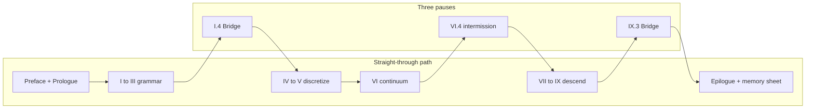

# Sources and Further Reading

This book synthesizes material from the author's notes, coursework, and teaching. Canonical chapter sources live under [`writings/`](../../writings/) (Functional Analysis Notes layout). Run `./scripts/sync-writings.sh` to copy them into `src/`. When the external `Writings` git submodule is linked, prefer upstream content and re-run the sync script.

## Scene: two clocks on the same afternoon

The book reads in **mathematical order** (Part I before Part IX), but the copper wire lives in **laboratory time** (mounting before hardening). The chapter roadmap below follows mathematical order — the order the Functional Analysis Notes layout assumes. When you need to know *which act of the experiment* a chapter belongs to, use the six-act table in the next section or the full narrative in the [prologue](../prologue/00-many-scales.md#the-experiment-as-plot).

## Six acts → parts (laboratory time) {#six-acts-parts-laboratory-time}

| Act | Lab beat | Primary parts | Opening links |
|-----|----------|---------------|---------------|
| I — Mounting | Grips close; first \(\mathbf{K}\mathbf{u}=\mathbf{f}\) | Prologue, I | [Prologue](../prologue/00-many-scales.md), [I.0](../part01-linear-algebra/00-opening.md) |
| II — Warming | Current on; thermocouple rises | III, IV, V | [III.0](../part03-pdes/00-opening.md), [IV.0](../part04-fem/00-opening.md), [V.0](../part05-fvm/00-opening.md) |
| III — Pulling | Force–displacement ramp | II, III, IV, VI | [II.0](../part02-functional-analysis/00-opening.md), [III.0](../part03-pdes/00-opening.md), [IV.0](../part04-fem/00-opening.md), [VI.0](../part06-continuum/00-opening.md) |
| IV — Hardening | Curve bends upward | VII | [VII.0](../part07-defects/00-opening.md) |
| V — Notch | Stress concentrator | VI, VIII | [VI.0](../part06-continuum/00-opening.md), [VIII.0](../part08-md/00-opening.md) |
| VI — Foundation | Parameters before the run | IX → VIII → VII → IV | [IX.0](../part09-dft/00-opening.md) → [VIII.0](../part08-md/00-opening.md) → [VII.0](../part07-defects/00-opening.md) → [IV.0](../part04-fem/00-opening.md) |

Act VI runs **in parallel** with Acts I–V in real projects: no FEM deck starts without moduli whose pedigree traces to finer models or calibration. The [epilogue](../epilogue/multiscale.md) reunites all six acts in one multiscale afternoon.

## Parameter pedigree path (Act VI reading order) {#parameter-pedigree-path-act-vi-reading-order}

The book reads **mathematically** from Part I to Part IX — grammar before descent. Real projects often read **downward** when building an input deck: start at electrons, export numbers, climb until FEM has honest moduli. Act VI is that reverse ladder on the same copper wire. The [Part IX coupling ladder](../part09-dft/00-opening.md#the-coupling-ladder-me-412-reunion) draws the full ME 412 reunion diagram; the pedigree path below is its **foundation slice** (IX → IV), before the epilogue wires Handshakes 1–4b in workflow order ([row 16](memory-sheet.md#continuity-hinges-master-map); [Act VI reunion paragraph](../epilogue/multiscale.md#lab-act-reunion-six-acts-one-afternoon)).

```mermaid
flowchart TB
  subgraph pedigree["Act VI foundation (workflow order IX to IV)"]
    DFT[IX.3: C_ij, gamma_sf, E_coh]
    MD[VIII.2-3: EAM fit, mobility M(tau,T)]
    DDD[VII.2: tau(rho), hardening laws]
    FEM[IV.4: Voigt E, nu in assembly]
  end
  subgraph orchestration["Row 16 orchestration (epilogue handshakes)"]
    H1[1: DFT moduli to FEM]
    H2[2: CHT delta T]
    H3[3: alpha delta T]
    H4a[4a: rate extrapolation]
    H4b[4b: FE2 notch]
    OUT[multiscale_export.yaml]
  end
  DFT --> MD --> DDD --> FEM --> H1
  H1 --> H2 --> H3 --> H4a --> H4b --> OUT
  H2 -.->|delta T feeds| H3
  H2 -.->|T_w to phonon lifetime| H4a
```

| Step | Read | Export | Wire-scale consumer |
|------|------|--------|---------------------|
| 1 | [IX.3](../part09-dft/03-dft-workflows.md#plot-spine-one-line) | \(C_{ij}\), \(\gamma_{\text{sf}}\), cohesive energy | Elastic constants, partial separation in DDD |
| 2 | [VIII.3](../part08-md/03-ab-initio-and-coarse-graining.md#plot-spine-one-line) | EAM table, phonon check | Production MD and mobility fitting |
| 3 | [VIII.2](../part08-md/02-ensembles-integrators.md#plot-spine-one-line) | \(M(\tau, T)\) from constrained shear | OpenDiS mobility law |
| 4 | [VII.2](../part07-defects/02-dislocation-dynamics.md#plot-spine-one-line) | \(\tau(\gamma)\), \(\rho(\gamma)\), Taylor \(\alpha\) | Crystal plasticity / Voce hardening |
| 5 | [IV.4](../part04-fem/04-poisson-to-elasticity.md#plot-spine-one-line) | \(\mathbf{K}\) with documented \(E\), \(\nu\) | Load-cell linear regime in Act III |
| 6 | [Epilogue](../epilogue/multiscale.md#lab-act-reunion-six-acts-one-afternoon) + [`parse_multiscale_workflow.sh`](../../scripts/parse_multiscale_workflow.sh) | `multiscale_export.yaml` linking Handshakes 1–4b | Orchestrated pedigree beside Act VI folder |

Each arrow needs a convergence log and a unit check — the epilogue's [four-handshake sensitivity table](../epilogue/multiscale.md#sensitivity-which-handshake-matters-most) ranks which exports dominate for a given question. **Mathematical order** teaches why the ladder exists; **pedigree order** fills the input deck before the grips close; **orchestration** (row 16) links individual exports in dependency order so Handshake 2's \(\Delta T\) feeds Handshake 3 and phonon lifetime at converged \(T_w\) feeds Handshake 4a drag.

## Narrative beat map (mathematical order × lab act)

The book reads in mathematical order (Part I before Part IX), but the copper wire lives in laboratory time. Use this table when you want **both** clocks at once — the story beat that should feel familiar when the symbols change.

| Chapter | Lab act | Narrative beat (one sentence) |
|---------|---------|--------------------------------|
| Prologue | Preview | One wire, eight scales, four questions |
| I.1–I.3 | I — Mounting | Springs, assembly, the wire rings |
| I.4 | I → II | Thermocouples multiply; vectors become fields |
| II.1–II.5 | III (preview) | The room where weak forms live |
| III.1–III.4 | II–III | Strong form fails; energy chooses the solution |
| IV.1–IV.5 | I, III | Mesh the solid; choose FEM or FVM door |
| V.1–V.4 | II | Cool the wire; balance fluxes in air |
| VI.1–VI.3 | II–III | Name stress; virtual work behind \(\mathbf{K}\) |
| VI.4 | II–IV → descent | [Intermission](../part06-continuum/04-nonlinear-plasticity-preview.md#intermission-ascent-ends-descent-begins): ascent ends; \(J_2\) placeholders await a forest |
| VII.0–VII.3 | IV | Forest hardens; export \(\tau(\gamma)\) |
| VIII.1–VIII.3 | V–VI | Atoms at the notch; fit potential |
| IX.1–IX.3 | VI | Electrons; archive pedigree |
| Epilogue | All six | Wire the rungs; sensitivity ranks |

When a chapter's **Bridge** names the next part, cross-check this table — the laboratory beat may lag or lead the mathematics by one part (Act II warming appears in Part III–V prose while Act III pulling is Part IV–VI). That offset is intentional: the wire heats before it yields.

## Continuity hinges index (when the plot stutters)

The [preface](../preface.md) documents opening, ascent, midpoint, descent, and epilogue hinge tables separately. The [memory sheet](memory-sheet.md#continuity-hinges-master-map) collects all **sixteen** narrative hinges (rows 0–16) in one navigation page. Use this index when you know **which chapter** you are in but cannot feel the handoff to the next:

| Row | Chapter region | Hinge anchor | What should click |
|-----|----------------|--------------|-------------------|
| 0 | Prologue → I.0 | [Opening hinge](../preface.md#opening-continuity-hinge) · [preface row 0 skill checkpoint](../preface.md#skill-navigation-row-0) · [Prologue Bridge](../prologue/00-many-scales.md#bridge-to-part-i) · [I.0 hinge](../part01-linear-algebra/00-opening.md#opening-hinge-prologue-to-part-i) | Panorama ladder becomes explicit \(\mathbf{K}\mathbf{u}=\mathbf{f}\) grammar |
| 1 | I.4 → II.0 | [I.4 Bridge](../part01-linear-algebra/04-toward-infinity.md#bridge-to-part-ii) | Nodal vectors become fields; \(\mathbf{K}_N\) becomes an operator |
| 2 | II.5 → III.0 | [II.5 Bridge](../part02-functional-analysis/05-spectral-theorem.md#bridge-to-part-iii) · [Part III variational ladder](../part03-pdes/00-opening.md#the-variational-ladder-me-412-schematic-14) | Completeness hands off to weak Poisson and heat; Schematic 14 becomes plot spine |
| 3 | III.4 → IV.0 | [III.4 Bridge](../part03-pdes/04-energy-methods.md#bridge-to-part-iv) · [Part III variational ladder](../part03-pdes/00-opening.md#the-variational-ladder-me-412-schematic-14) · [Part IV Galerkin ladder](../part04-fem/00-opening.md#the-galerkin-ladder-me-412-schematic-14-continued) | Lax–Milgram becomes Galerkin assembly; Schematic 14 splits at III.4 / IV.0 |
| 4 | IV.5 / V.4 → VI.0 | [Two doors](../part04-fem/05-convergence.md#bridge-two-doors-from-here) · [Part IV Galerkin ladder](../part04-fem/00-opening.md#the-galerkin-ladder-me-412-schematic-14-continued) · [Part V conservation ladder](../part05-fvm/00-opening.md#the-conservation-ladder-fvm-parallel-to-schematic-14) · [Part VI twin ladders reunite](../part06-continuum/00-opening.md#the-twin-ladders-reunite-galerkin-and-conservation) · [Part III weak forms](../part03-pdes/02-weak-form.md#plot-spine-one-line) | FEM and FVM converge on Cauchy stress; Schematic 14 splits into Galerkin (IV) and conservation (V) twins, reunites at VI.0 |
| 5–6 | VI.0 / VI.4 → VII.0 | [Midpoint](../part06-continuum/00-opening.md#midpoint-ascent-complete-descent-ahead) · [Twin ladders reunite](../part06-continuum/00-opening.md#the-twin-ladders-reunite-galerkin-and-conservation) · [VII.0 ascent hinge](../part07-defects/00-opening.md#ascent-hinge-midpoint-and-twin-ladders) · [intermission](../part06-continuum/04-nonlinear-plasticity-preview.md#intermission-ascent-ends-descent-begins) | Ascent complete; thermal strain from CHT enters virtual work; \(J_2\) placeholders yield to forest |
| 7 | VII.3 → VIII.0 | [VII.3 Bridge](../part07-defects/03-polycrystal-and-fem-handoff.md#bridge-to-part-viii) · [VIII.1 opening hinge](../part08-md/01-potentials-phase-space.md#opening-hinge-vii3-to-viii1) · [VIII.0 descent hinge](../part08-md/00-opening.md#descent-hinge-cores-mobility-and-tw-pedigree) | Line cores need atomic bonding; mobility at \(T_w\) from CHT, not 300 K default |
| 7b | VIII.1 → VIII.2 | [VIII.1 Bridge](../part08-md/01-potentials-phase-space.md#bridge) · [VIII.2 opening hinge](../part08-md/02-ensembles-integrators.md#opening-hinge-viii1-to-viii2) | EAM minimization done but NVT/NPT not run; `MD_NVT_shear_PartVIII` still missing at \(T_w\) |
| 7c | VIII.2 → VIII.3 | [VIII.2 Bridge](../part08-md/02-ensembles-integrators.md#bridge) · [VIII.3 opening hinge](../part08-md/03-ab-initio-and-coarse-graining.md#opening-hinge-viii2-to-viii3) | Trajectories audited but no coarse-graining handoff; EAM on trust without pedigree checklist |
| 8 | VIII.0–VIII.3 | [Preface: row 8 skill checkpoint](../preface.md#skill-navigation-row-8) · [VIII.0 descent hinge](../part08-md/00-opening.md#descent-hinge-cores-mobility-and-tw-pedigree) · [VIII.3 WHAM at \(T_w\)](../part08-md/03-ab-initio-and-coarse-graining.md#wham-part-vii-mobility-hinge-act-ii-temperature-pedigree) · [memory sheet rows 8–9 baby picture](memory-sheet.md#rows-8-9-baby-picture-tw-temperature-pedigree) | [V.4 CHT](../part05-fvm/04-navier-stokes-cfd.md#lab-act-extension-two-domain-picard-loop-with-a-1d-fem-solid) converged at \(T_w\); MD mobility, WHAM, and OpenDiS drag must not default to 300 K |
| 9 | VIII.3 → IX.0 | [Preface: row 9 skill checkpoint](../preface.md#skill-navigation-row-9) · [VIII.3 Bridge](../part08-md/03-ab-initio-and-coarse-graining.md#bridge-to-part-ix) · [IX.0 electronic audit hinge](../part09-dft/00-opening.md#electronic-audit-hinge-descent-pedigree-and-tw-phonon) · [IX.0 thermal phonon audit at \(T_w\)](../part09-dft/00-opening.md#thermal-phonon-audit-at-tw) · [memory sheet rows 8–9 baby picture](memory-sheet.md#rows-8-9-baby-picture-tw-temperature-pedigree) | EAM on trust needs SCF audit; \(\alpha(T_w)\) and \(\tau_{\text{ph}}(T_w)\) beside `cht_export.yaml`, not room-temperature folklore |
| 10 | IX.3 → Epilogue | [IX.3 Bridge](../part09-dft/03-dft-workflows.md#bridge-to-the-epilogue) | Finest rung; upward homogenization begins |
| 11 | Epilogue (workflow) | [Six-act reunion](../epilogue/multiscale.md#lab-act-reunion-six-acts-one-afternoon) | Reading order reunites with laboratory time |
| 12 | Epilogue → Prologue | [Epilogue Bridge row 12](../epilogue/multiscale.md#row-12-closing-loop) · [prologue reopening anchor](../prologue/00-many-scales.md#prologue-reopening-anchor) · [preface row 12](../preface.md#skill-navigation-row-12) · [memory sheet row 12 baby picture](memory-sheet.md#row-12-baby-picture-next-project) | Four questions restart on the next project; ladder reusable — row 12 reunites with row 0 on grammar restart |
| 13 | Epilogue (Handshake 2 → 3) | [Handshake 2 → 3](../epilogue/multiscale.md#handshake-2--joule-heating--conjugate-heat-transfer-part-iv--v), [preface row 13 three-way audit](../preface.md#skill-navigation-row-13), [row 13 closing loop](../epilogue/multiscale.md#row-13-closing-loop), [row 13 baby picture](../appendix/memory-sheet.md#row-13-baby-picture-handshake-2-3) | CHT converged but load cell still uses handbook \(\alpha\); Handshake 2 sets \(\Delta T\), Handshake 3 sets \(\alpha\Delta T\) |
| 14 | Epilogue (Handshake 4a) | [VII.3 rate handshake](../part07-defects/03-polycrystal-and-fem-handoff.md#scale-boundary-handshake-ddd-strain-rate-to-quasi-static-fem), [Handshake 4a upstream](../epilogue/multiscale.md#4a--ddd-strain-rate-to-quasi-static-load-cell-act-iv--hardening), [preface row 14 three-way audit](../preface.md#skill-navigation-row-14), [row 14 closing loop](../epilogue/multiscale.md#row-14-closing-loop), [row 14 baby picture](memory-sheet.md#row-14-baby-picture-handshake-4a) | DDD exports feed plasticity without strain-rate extrapolation; hardening knee arrives early; DDD sets \(\tau_{\text{flow}}\), Handshake 4a sets \(\tau_{\text{lab}}\) |
| 15 | Epilogue (Handshake 4b) | [VII.3 Step 4 FE²](../part07-defects/03-polycrystal-and-fem-handoff.md#step-4--when-offline-calibration-fails-fe-at-the-notch), [FE² worked example](../epilogue/multiscale.md#worked-example-fe-at-the-wire-notch-act-v--notch), [preface row 15 three-way audit](../preface.md#skill-navigation-row-15), [row 15 closing loop](../epilogue/multiscale.md#row-15-closing-loop), [row 15 baby picture](memory-sheet.md#row-15-baby-picture-handshake-4b) | Bulk hardening from 4a looks right but notch root under-predicts peak stress; 4a sets bulk \(\tau_{\text{lab}}\), Handshake 4b asks whether scalar \(H\) suffices at \(K_t \approx 3\) |
| 16 | Epilogue (Act VI orchestration) | [Parameter pedigree path](#parameter-pedigree-path-act-vi-reading-order), [preface row 16](../preface.md#skill-navigation-row-16) | Individual exports exist but no orchestrated `multiscale_export.yaml`; IX → IV pedigree before grips close |
| 17 | Whole book (continuous read-through) | [Continuous read-through guide](#continuous-read-through-guide) · [preface row 17](../preface.md#skill-navigation-row-17) · [prologue row 17 preview](../prologue/00-many-scales.md#prologue-preview-row-17) · [prologue row 17 closing stitch](../prologue/00-many-scales.md#row-17-closing-stitch) · [epilogue row 17 closing loop](../epilogue/multiscale.md#row-17-closing-loop) · [memory sheet row 17 baby picture](memory-sheet.md#row-17-baby-picture-continuous-read-through) | Chapters feel choppy despite Bridges — trust Scene/Bridge rhythm; pause only at three ascent/descent gates |
| 18 | Part openings I.0–IX.0 | [Part-opening plot spine index](#part-opening-plot-spine-index-row-18) · [preface row 18](../preface.md#skill-navigation-row-18) · [prologue row 18 preview](../prologue/00-many-scales.md#prologue-preview-row-18) · [prologue row 18 closing stitch](../prologue/00-many-scales.md#row-18-closing-stitch) · [epilogue row 18 closing loop](../epilogue/multiscale.md#row-18-closing-loop) · [memory sheet row 18 baby picture](memory-sheet.md#row-18-baby-picture-part-opening-plot-spine) | A part opening feels like a new syllabus — read its [plot spine one line](../part01-linear-algebra/00-opening.md#plot-spine-one-line) aloud |
| 19 | Numbered chapters I.1–IX.3 | [Numbered-chapter plot spine index](#numbered-chapter-plot-spine-index-row-19) · [preface row 19](../preface.md#skill-navigation-row-19) · [prologue row 19 preview](../prologue/00-many-scales.md#prologue-preview-row-19) · [prologue row 19 closing stitch](../prologue/00-many-scales.md#row-19-closing-stitch) · [epilogue row 19 closing loop](../epilogue/multiscale.md#row-19-closing-loop) · [memory sheet row 19 baby picture](memory-sheet.md#row-19-baby-picture-numbered-chapter-plot-spine) | Mid-chapter reading stalls despite a Bridge — read this chapter's [plot spine one line](../part01-linear-algebra/01-vectors-matrices.md#plot-spine-one-line) aloud |
| 20 | Gate chapters I.4, VI.4, IX.3 | [Gate-chapter plot spine index](#gate-chapter-plot-spine-index-row-20) · [preface row 20](../preface.md#skill-navigation-row-20) · [prologue row 20 preview](../prologue/00-many-scales.md#prologue-preview-row-20) · [prologue row 20 closing stitch](../prologue/00-many-scales.md#row-20-closing-stitch) · [epilogue row 20 closing loop](../epilogue/multiscale.md#row-20-closing-loop) · [memory sheet row 20 baby picture](memory-sheet.md#row-20-baby-picture-gate-chapter-plot-spine) | A mandatory gate stalls the straight read — recite its [plot spine one line](../part01-linear-algebra/04-toward-infinity.md#plot-spine-one-line) aloud before the Bridge |
| 21 | Lab act reunion (Acts I–VI) | [Lab act reunion index](#lab-act-reunion-index-row-21) · [preface row 21](../preface.md#skill-navigation-row-21) · [prologue row 21 preview](../prologue/00-many-scales.md#prologue-preview-row-21) · [prologue row 21 closing stitch](../prologue/00-many-scales.md#row-21-closing-stitch) · [epilogue row 21 closing loop](../epilogue/multiscale.md#row-21-closing-loop) · [memory sheet row 21 baby picture](memory-sheet.md#row-21-baby-picture-lab-act-reunion) | A Lab act feels like standalone homework — read its one-line move aloud and name the lab act |
| 22 | Scene reunion (Acts I–VI) | [Scene reunion index](#scene-reunion-index-row-22) · [preface row 22](../preface.md#skill-navigation-row-22) · [prologue row 22 preview](../prologue/00-many-scales.md#prologue-preview-row-22) · [prologue row 22 closing stitch](../prologue/00-many-scales.md#row-22-closing-stitch) · [epilogue row 22 closing loop](../epilogue/multiscale.md#row-22-closing-loop) · [memory sheet row 22 baby picture](memory-sheet.md#row-22-baby-picture-scene-reunion) | Plot spines and Lab acts read correctly but symbols hide the wire — read the Scene one-line visual aloud and picture the operator watching |
| 23 | Bridge reunion (part boundaries) | [Bridge reunion index](#bridge-reunion-index-row-23) · [preface row 23](../preface.md#skill-navigation-row-23) · [prologue row 23 preview](../prologue/00-many-scales.md#prologue-preview-row-23) · [prologue row 23 closing stitch](../prologue/00-many-scales.md#row-23-closing-stitch) · [epilogue row 23 closing loop](../epilogue/multiscale.md#row-23-closing-loop) · [memory sheet row 23 baby picture](memory-sheet.md#row-23-baby-picture-bridge-reunion) | Scene, plot spines, and Lab acts all read correctly but chapter transitions feel mechanical — read the prior chapter's Bridge one-line hinge aloud before turning the page |
| 24 | Concept map reunion (ME 412 four questions) | [Concept map reunion index](#concept-map-reunion-index-row-24) · [preface row 24](../preface.md#skill-navigation-row-24) · [prologue row 24 preview](../prologue/00-many-scales.md#prologue-preview-row-24) · [prologue row 24 closing stitch](../prologue/00-many-scales.md#row-24-closing-stitch) · [epilogue row 24 closing loop](../epilogue/multiscale.md#row-24-closing-loop) · [memory sheet row 24 baby picture](memory-sheet.md#row-24-baby-picture-concept-map-reunion) | Scene, plot spines, Lab acts, visuals, and Bridges all read correctly but proofs feel like disconnected theorems — answer object / structure / theorem / breaks at the part-opening concept map |
| 25 | Schematic reunion (representative baby pictures) | [Schematic reunion index](#schematic-reunion-index-row-25) · [preface row 25](../preface.md#skill-navigation-row-25) · [prologue row 25 preview](../prologue/00-many-scales.md#prologue-preview-row-25) · [prologue row 25 closing stitch](../prologue/00-many-scales.md#row-25-closing-stitch) · [epilogue row 25 closing loop](../epilogue/multiscale.md#row-25-closing-loop) · [memory sheet row 25 baby picture](memory-sheet.md#row-25-baby-picture-schematic-reunion) | Scene, plot spines, Lab acts, visuals, Bridges, and concept maps all read correctly but proofs feel abstract without a visual anchor — locate the matching baby picture from the part-opening representative schematics table |
| 26 | Story so far reunion (narrative recap) | [Story so far reunion index](#story-so-far-reunion-index-row-26) · [preface row 26](../preface.md#skill-navigation-row-26) · [prologue row 26 preview](../prologue/00-many-scales.md#prologue-preview-row-26) · [prologue row 26 closing stitch](../prologue/00-many-scales.md#row-26-closing-stitch) · [epilogue row 26 closing loop](../epilogue/multiscale.md#row-26-closing-loop) · [memory sheet row 26 baby picture](memory-sheet.md#row-26-baby-picture-story-so-far-reunion) | Rows 17–25 all read correctly in isolation but you cannot place where the copper wire is in the narrative arc — read the part-opening **Story so far** recap aloud and name what the wire became at the prior scale |
| 27 | Closing the arc reunion (symbol bridge) | [Closing the arc reunion index](#closing-the-arc-reunion-index-row-27) · [preface row 27](../preface.md#skill-navigation-row-27) · [prologue row 27 preview](../prologue/00-many-scales.md#prologue-preview-row-27) · [prologue row 27 closing stitch](../prologue/00-many-scales.md#row-27-closing-stitch) · [epilogue row 27 closing loop](../epilogue/multiscale.md#row-27-closing-loop) · [memory sheet row 27 baby picture](memory-sheet.md#row-27-baby-picture-closing-the-arc-reunion) | Rows 17–26 all read correctly but prior-part symbols do not map to current-part vocabulary — read the part-opening **Closing the arc** table aloud and name one symbol translation per row |
| 28 | Scale-boundary reunion (export pedigree) | [Scale-boundary reunion index](#scale-boundary-reunion-index-row-28) · [preface row 28](../preface.md#skill-navigation-row-28) · [prologue row 28 preview](../prologue/00-many-scales.md#prologue-preview-row-28) · [prologue row 28 closing stitch](../prologue/00-many-scales.md#row-28-closing-stitch) · [epilogue row 28 closing loop](../epilogue/multiscale.md#row-28-closing-loop) · [memory sheet row 28 baby picture](memory-sheet.md#row-28-baby-picture-scale-boundary-reunion) | Rows 17–27 all read correctly but **parameters crossing a scale boundary feel arbitrary** — read the chapter **Scale-boundary handshake** table and name export → consumer → failure mode |
| 29 | Thermoelastic assembly reunion (Acts II–III on one mesh) | [Thermoelastic assembly reunion index](#thermoelastic-assembly-reunion-index-row-29) · [preface row 29](../preface.md#skill-navigation-row-29) · [prologue row 29 preview](../prologue/00-many-scales.md#prologue-preview-row-29) · [prologue row 29 closing stitch](../prologue/00-many-scales.md#row-29-closing-stitch) · [epilogue row 29 closing loop](../epilogue/multiscale.md#row-29-closing-loop) · [memory sheet row 29 baby picture](memory-sheet.md#row-29-baby-picture-thermoelastic-assembly-reunion) | Rows 17–28 all read correctly but **Act II heating and Act III pulling feel like separate FEM homework** — read the Part IV thermoelastic assembly thread and name heat pass → thermal load → mechanics pass on the same connectivity |
| 30 | CHT outer-loop reunion (FEM solid ↔ FVM fluid) | [CHT outer-loop reunion index](#cht-outer-loop-reunion-index-row-30) · [preface row 30](../preface.md#skill-navigation-row-30) · [prologue row 30 preview](../prologue/00-many-scales.md#prologue-preview-row-30) · [prologue row 30 closing stitch](../prologue/00-many-scales.md#row-30-closing-stitch) · [epilogue row 30 closing loop](../epilogue/multiscale.md#row-30-closing-loop) · [memory sheet row 30 baby picture](memory-sheet.md#row-30-baby-picture-cht-outer-loop-reunion) | Rows 17–29 all read correctly but **solid FEM and fluid FVM still feel like separate solvers** — read the IV.5 → V.4 Picard → `cht_export.yaml` chain and name one converged \(T_w\) for both twins before Part VI |
| 31 | Twin-ladder → virtual work reunion (Part VI) | [Twin-ladder virtual work reunion index](#twin-ladder-virtual-work-reunion-index-row-31) · [preface row 31](../preface.md#skill-navigation-row-31) · [prologue row 31 preview](../prologue/00-many-scales.md#prologue-preview-row-31) · [prologue row 31 closing stitch](../prologue/00-many-scales.md#row-31-closing-stitch) · [epilogue row 31 closing loop](../epilogue/multiscale.md#row-31-closing-loop) · [memory sheet row 31 baby picture](memory-sheet.md#row-31-baby-picture-twin-ladder-virtual-work-reunion) | Rows 17–30 all read correctly but **Galerkin assembly and virtual work still feel like separate subjects** — read VI.0 twin-ladder → VI.1 kinematics → VI.3 virtual work and name why \(\mathbf{K}\mathbf{U}=\mathbf{F}\) is force balance |
| 32 | Virtual work → plasticity preview reunion (VI.3 → VI.4) | [Virtual work → plasticity preview reunion index](#virtual-work-plasticity-preview-reunion-index-row-32) · [preface row 32](../preface.md#skill-navigation-row-32) · [prologue row 32 preview](../prologue/00-many-scales.md#prologue-preview-row-32) · [prologue row 32 closing stitch](../prologue/00-many-scales.md#row-32-closing-stitch) · [epilogue row 32 closing loop](../epilogue/multiscale.md#row-32-closing-loop) · [memory sheet row 32 baby picture](memory-sheet.md#row-32-baby-picture-virtual-work-plasticity-preview-reunion) | Rows 17–31 all read correctly but **\(\delta\Pi = 0\) and return-mapping still feel like separate subjects** — read VI.3 virtual work → VI.4 return-mapping and name why the yield knee breaks energy minimization |
| 33 | Part VII opening → VIII descent hinge reunion (VII.0 → VIII.0) | [Part VII → VIII descent hinge reunion index](#part-vii-viii-descent-hinge-reunion-index-row-33) · [preface row 33](../preface.md#skill-navigation-row-33) · [prologue row 33 preview](../prologue/00-many-scales.md#prologue-preview-row-33) · [prologue row 33 closing stitch](../prologue/00-many-scales.md#row-33-closing-stitch) · [epilogue row 33 closing loop](../epilogue/multiscale.md#row-33-closing-loop) · [memory sheet row 33 baby picture](memory-sheet.md#row-33-baby-picture-part-vii-viii-descent-hinge-reunion) | Rows 17–32 all read correctly but **mesoscale DDD and atomistic MD still feel like separate courses** — read Part VII descent hinge → VII.2 mobility at \(T_w\) → Part VIII descent hinge and name why line cores need atoms |
| 34 | Potentials → ensembles opening hinge reunion (VIII.1 → VIII.2) | [Potentials → ensembles reunion index](#potentials-ensembles-reunion-index-row-34) · [preface row 34](../preface.md#skill-navigation-row-34) · [prologue row 34 preview](../prologue/00-many-scales.md#prologue-preview-row-34) · [prologue row 34 closing stitch](../prologue/00-many-scales.md#row-34-closing-stitch) · [epilogue row 34 closing loop](../epilogue/multiscale.md#row-34-closing-loop) · [memory sheet row 34 baby picture](memory-sheet.md#row-34-baby-picture-potentials-ensembles-reunion) | Rows 17–33 all read correctly but **0 K EAM minimization and NVT/NPT trajectories still feel like separate subjects** — read VIII.1 Bridge → VIII.2 opening hinge and name why energy minimum is not the wire at \(T_w\) |
| 35 | Ensembles → coarse-graining opening hinge reunion (VIII.2 → VIII.3) | [Ensembles → coarse-graining reunion index](#ensembles-coarse-graining-reunion-index-row-35) · [preface row 35](../preface.md#skill-navigation-row-35) · [prologue row 35 preview](../prologue/00-many-scales.md#prologue-preview-row-35) · [prologue row 35 closing stitch](../prologue/00-many-scales.md#row-35-closing-stitch) · [epilogue row 35 closing loop](../epilogue/multiscale.md#row-35-closing-loop) · [memory sheet row 35 baby picture](memory-sheet.md#row-35-baby-picture-ensembles-coarse-graining-reunion) | Rows 17–34 all read correctly but **audited trajectories and coarse-grained handoff tables still feel like separate subjects** — read VIII.2 Bridge → VIII.3 opening hinge and name why raw dumps without pedigree are multiscale folklore |
| 36 | Coarse-graining → electronic audit opening hinge reunion (VIII.3 → IX.0) | [Coarse-graining → electronic audit reunion index](#coarse-graining-electronic-audit-reunion-index-row-36) · [preface row 36](../preface.md#skill-navigation-row-36) · [prologue row 36 preview](../prologue/00-many-scales.md#prologue-preview-row-36) · [prologue row 36 closing stitch](../prologue/00-many-scales.md#row-36-closing-stitch) · [epilogue row 36 closing loop](../epilogue/multiscale.md#row-36-closing-loop) · [memory sheet row 36 baby picture](memory-sheet.md#row-36-baby-picture-coarse-graining-electronic-audit-reunion) | Rows 17–35 all read correctly but **pedigree checklist rows exist without QE SCF logs or \(\alpha(T_w)\) beside them** — read VIII.3 Bridge → IX.0 opening hinge and name why EAM on trust without `cu.relax.out` is multiscale folklore |
| 37 | Electronic audit → Born–Oppenheimer opening hinge reunion (IX.0 → IX.1) | [Electronic audit → Born–Oppenheimer reunion index](#electronic-audit-born-oppenheimer-reunion-index-row-37) · [preface row 37](../preface.md#skill-navigation-row-37) · [prologue row 37 preview](../prologue/00-many-scales.md#prologue-preview-row-37) · [prologue row 37 closing stitch](../prologue/00-many-scales.md#row-37-closing-stitch) · [epilogue row 37 closing loop](../epilogue/multiscale.md#row-37-closing-loop) · [memory sheet row 37 baby picture](memory-sheet.md#row-37-baby-picture-electronic-audit-born-oppenheimer-reunion) | Rows 17–36 all read correctly but **SCF logs exist without BO/HK theorems connecting to Part VIII's EAM surface** — read IX.0 Bridge → IX.1 opening hinge and name why \(V_{\text{BO}}\) is the surface EAM approximates |
| 38 | Born–Oppenheimer → Kohn–Sham opening hinge reunion (IX.1 → IX.2) | [Born–Oppenheimer → Kohn–Sham reunion index](#born-oppenheimer-kohn-sham-reunion-index-row-38) · [preface row 38](../preface.md#skill-navigation-row-38) · [prologue row 38 preview](../prologue/00-many-scales.md#prologue-preview-row-38) · [prologue row 38 closing stitch](../prologue/00-many-scales.md#row-38-closing-stitch) · [epilogue row 38 closing loop](../epilogue/multiscale.md#row-38-closing-loop) · [memory sheet row 38 baby picture](memory-sheet.md#row-38-baby-picture-born-oppenheimer-kohn-sham-reunion) | Rows 17–37 all read correctly but **BO/HK theorems exist without SCF fixed-point loop connecting to Part I eigenvalues** — read IX.1 Bridge → IX.2 opening hinge and name why \(\mathbf{H}[\rho]\mathbf{c}=\epsilon\mathbf{S}\mathbf{c}\) is the Murnaghan inner loop |
| 39 | Kohn–Sham → DFT workflows opening hinge reunion (IX.2 → IX.3) | [Kohn–Sham → DFT workflows reunion index](#kohn-sham-dft-workflows-reunion-index-row-39) · [preface row 39](../preface.md#skill-navigation-row-39) · [prologue row 39 preview](../prologue/00-many-scales.md#prologue-preview-row-39) · [prologue row 39 closing stitch](../prologue/00-many-scales.md#row-39-closing-stitch) · [epilogue row 39 closing loop](../epilogue/multiscale.md#row-39-closing-loop) · [memory sheet row 39 baby picture](memory-sheet.md#row-39-baby-picture-kohn-sham-dft-workflows-reunion) | Rows 17–38 all read correctly but **SCF is understood without calculation ladder and `cu.foundation/` archive connecting to Parts VI–VIII** — read IX.2 Bridge → IX.3 opening hinge and name why foundation README is Part IV mesh refinement at the electronic scale |
| 40 | IX.3 → Handshake 3 opening hinge reunion (α(\(T_w\)) cross-links) | [IX.3 → Handshake 3 reunion index](#ix3-handshake3-reunion-index-row-40) · [preface row 40](../preface.md#skill-navigation-row-40) · [prologue row 40 preview](../prologue/00-many-scales.md#prologue-preview-row-40) · [prologue row 40 closing stitch](../prologue/00-many-scales.md#row-40-closing-stitch) · [epilogue row 40 closing loop](../epilogue/multiscale.md#row-40-closing-loop) · [memory sheet row 40 baby picture](memory-sheet.md#row-40-baby-picture-ix3-handshake3-reunion) | Rows 17–39 all read correctly but **`cu.foundation/` is complete yet handbook \(\alpha(300\,\text{K})\) persists at the load cell** — read IX.3 Bridge → epilogue Handshake 3 opening hinge and name why \(\alpha(T_w)\) must match `cht_export.yaml` |
| 41 | VII.3 → Handshake 4a opening hinge reunion (rate extrapolation cross-links) | [VII.3 → Handshake 4a reunion index](#vii3-handshake4a-reunion-index-row-41) · [preface row 41](../preface.md#skill-navigation-row-41) · [prologue row 41 preview](../prologue/00-many-scales.md#prologue-preview-row-41) · [prologue row 41 closing stitch](../prologue/00-many-scales.md#row-41-closing-stitch) · [epilogue row 41 closing loop](../epilogue/multiscale.md#row-41-closing-loop) · [memory sheet row 41 baby picture](memory-sheet.md#row-41-baby-picture-vii3-handshake4a-reunion) | Rows 17–40 all read correctly but **OpenDiS exports feed the plasticity deck without rate extrapolation** — read VII.3 rate handshake → epilogue Handshake 4a opening hinge and name why \(\tau_{\text{lab}}\) must match lab grip speed |
| 42 | VII.3 Step 4 → Handshake 4b opening hinge reunion (FE² notch-localization cross-links) | [VII.3 → Handshake 4b reunion index](#vii3-handshake4b-reunion-index-row-42) · [preface row 42](../preface.md#skill-navigation-row-42) · [prologue row 42 preview](../prologue/00-many-scales.md#prologue-preview-row-42) · [prologue row 42 closing stitch](../prologue/00-many-scales.md#row-42-closing-stitch) · [epilogue row 42 closing loop](../epilogue/multiscale.md#row-42-closing-loop) · [memory sheet row 42 baby picture](memory-sheet.md#row-42-baby-picture-vii3-handshake4b-reunion) | Rows 17–41 all read correctly but **bulk hardening from 4a matches flow stress while the notch root under-predicts peak stress without FE² audit** — read VII.3 Step 4 → epilogue Handshake 4b opening hinge and verify `fe2_export.yaml` in `multiscale_export.yaml` |
| 43 | Rows 17–42 → Row 16 orchestration reunion (multiscale export cross-links) | [Rows 17–42 → Row 16 orchestration reunion index](#rows17-42-row16-orchestration-reunion-index-row-43) · [preface row 43](../preface.md#skill-navigation-row-43) · [prologue row 43 preview](../prologue/00-many-scales.md#prologue-preview-row-43) · [prologue row 43 closing stitch](../prologue/00-many-scales.md#row-43-closing-stitch) · [epilogue row 43 closing loop](../epilogue/multiscale.md#row-43-closing-loop) · [memory sheet row 43 baby picture](memory-sheet.md#row-43-baby-picture-rows17-42-row16-orchestration-reunion) | Rows 17–42 all read correctly but **Handshakes 1–4b exist in separate folders without orchestrated `multiscale_export.yaml`** — read IX.3 epilogue pedigree table → epilogue row 16 opening hinge and verify dependency order with `./scripts/test-fixtures.sh` |
| 44 | Rows 17–43 → Row 12 book loop closure (epilogue → prologue restart cross-links) | [Rows 17–43 → Row 12 book loop closure index](#rows17-43-row12-book-loop-closure-index-row-44) · [preface row 44](../preface.md#skill-navigation-row-44) · [prologue row 44 preview](../prologue/00-many-scales.md#prologue-preview-row-44) · [prologue row 44 closing stitch](../prologue/00-many-scales.md#row-44-closing-stitch) · [epilogue row 44 closing loop](../epilogue/multiscale.md#row-44-closing-loop) · [memory sheet row 44 baby picture](memory-sheet.md#row-44-baby-picture-rows17-43-row12-book-loop-closure) | Rows 17–43 all read correctly but **`multiscale_export.yaml` exists yet the next terminal opens with copper decks copied blindly** — read epilogue ME 412 summary → prologue reopening anchor and complete row 12 four-step audit on new specimen |
| 45 | Rows 17–44 → Row 17 continuous read-through second-pass reunion (novel rhythm cross-links) | [Rows 17–44 → Row 17 second-pass reunion index](#rows17-44-row17-second-pass-reunion-index-row-45) · [preface row 45](../preface.md#skill-navigation-row-45) · [prologue row 45 preview](../prologue/00-many-scales.md#prologue-preview-row-45) · [prologue row 45 closing stitch](../prologue/00-many-scales.md#row-45-closing-stitch) · [epilogue row 45 closing loop](../epilogue/multiscale.md#row-45-closing-loop) · [memory sheet row 45 baby picture](memory-sheet.md#row-45-baby-picture-rows17-44-row17-second-pass-reunion) | Rows 17–44 all read correctly but **Preface → Epilogue still feels like a syllabus of checkpoints rather than one continuous story** — read [continuous read-through guide](#continuous-read-through-guide) aloud; Scene → Bridge only; pause at I.4, VI.4, IX.3 |
| 46 | Rows 17–45 → Writings canonical source reunion (Functional Analysis Notes layout maintenance) | [Rows 17–45 → Writings reunion index](#rows17-45-writings-canonical-reunion-index-row-46) · [preface row 46](../preface.md#skill-navigation-row-46) · [prologue row 46 preview](../prologue/00-many-scales.md#prologue-preview-row-46) · [prologue row 46 closing stitch](../prologue/00-many-scales.md#row-46-closing-stitch) · [epilogue row 46 closing loop](../epilogue/multiscale.md#row-46-closing-loop) · [memory sheet row 46 baby picture](memory-sheet.md#row-46-baby-picture-rows17-45-writings-canonical-reunion) · [writings source index](../writings/SUMMARY.md) | Rows 17–45 all read correctly but **chapter edits land in `src/` instead of `writings/` or sync check fails** — edit canonical subtrees only; [`scripts/sync-writings.sh`](../../scripts/sync-writings.sh); then `mdbook build` |
| 47 | V.4 → VI.0 Writings canonical discretization reunion (twin-ladder part boundary) | [V.4 → VI.0 Writings canonical reunion index](#v4-vi0-writings-canonical-reunion-index-row-47) · [preface row 47](../preface.md#skill-navigation-row-47) · [prologue row 47 preview](../prologue/00-many-scales.md#prologue-preview-row-47) · [prologue row 47 closing stitch](../prologue/00-many-scales.md#row-47-closing-stitch) · [epilogue row 47 closing loop](../epilogue/multiscale.md#row-47-closing-loop) · [memory sheet row 47 baby picture](memory-sheet.md#row-47-baby-picture-v4-vi0-writings-canonical-reunion) | Row 46 closed and row 30 restored CHT, but **`writings/fvm` closes and `writings/continuum` opens like separate courses** — read V.4 Bridge → VI.0 twin-ladder landing aloud; same wire, state variable is \(\boldsymbol{\sigma}\) |
| 48 | VI.4 → VII.0 Writings canonical midpoint reunion (ascent ends, descent begins) | [VI.4 → VII.0 Writings canonical reunion index](#vi4-vii0-writings-canonical-reunion-index-row-48) · [preface row 48](../preface.md#skill-navigation-row-48) · [prologue row 48 preview](../prologue/00-many-scales.md#prologue-preview-row-48) · [prologue row 48 closing stitch](../prologue/00-many-scales.md#row-48-closing-stitch) · [epilogue row 48 closing loop](../epilogue/multiscale.md#row-48-closing-loop) · [memory sheet row 48 baby picture](memory-sheet.md#row-48-baby-picture-vi4-vii0-writings-canonical-reunion) | Row 47 closed and row 32 restored return-mapping, but **`writings/continuum` closes and `writings/defects` opens like a new mdBook** — read VI.4 intermission → Bridge → VII.0 landing aloud; same wire, state variable is \(\rho\) |
| 49 | VII.0 → VII.1 opening hinge reunion (forest Scene → Burgers taxonomy) | [VII.0 → VII.1 reunion index](#vii0-vii1-opening-hinge-reunion-index-row-49) · [preface row 49](../preface.md#skill-navigation-row-49) · [prologue row 49 preview](../prologue/00-many-scales.md#prologue-preview-row-49) · [prologue row 49 closing stitch](../prologue/00-many-scales.md#row-49-closing-stitch) · [epilogue row 49 closing loop](../epilogue/multiscale.md#row-49-closing-loop) · [memory sheet row 49 baby picture](memory-sheet.md#row-49-baby-picture-vii0-vii1-opening-hinge-reunion) | Row 48 closed but **VII.1 opens like Defects Notes homework after VII.0 Scene and Bridge** — read VII.0 Bridge → opening hinge → VII.1 taxonomy; \(\mathbf{b}\) replaces fitted \(H\) |
| 50 | VII.1 → VII.2 opening hinge reunion (Burgers taxonomy → Peach–Köhler DDD) | [VII.1 → VII.2 reunion index](#vii1-vii2-opening-hinge-reunion-index-row-50) · [preface row 50](../preface.md#skill-navigation-row-50) · [prologue row 50 preview](../prologue/00-many-scales.md#prologue-preview-row-50) · [prologue row 50 closing stitch](../prologue/00-many-scales.md#row-50-closing-stitch) · [epilogue row 50 closing loop](../epilogue/multiscale.md#row-50-closing-loop) · [memory sheet row 50 baby picture](memory-sheet.md#row-50-baby-picture-vii1-vii2-opening-hinge-reunion) | Row 49 closed but **VII.2 opens like OpenDiS homework after VII.1 taxonomy and Bridge** — read VII.1 Bridge → opening hinge → VII.2 Peach–Köhler; \(\mathbf{f}_{\text{PK}}\) uses \(\mathbf{b}\), \(\boldsymbol{\xi}\) |
| 51 | VII.2 → VII.3 opening hinge reunion (single-crystal DDD → polycrystal handoff) | [VII.2 → VII.3 reunion index](#vii2-vii3-opening-hinge-reunion-index-row-51) · [preface row 51](../preface.md#skill-navigation-row-51) · [prologue row 51 preview](../prologue/00-many-scales.md#prologue-preview-row-51) · [prologue row 51 closing stitch](../prologue/00-many-scales.md#row-51-closing-stitch) · [epilogue row 51 closing loop](../epilogue/multiscale.md#row-51-closing-loop) · [memory sheet row 51 baby picture](memory-sheet.md#row-51-baby-picture-vii2-vii3-opening-hinge-reunion) | Row 50 closed but **VII.3 opens like DAMASK homework after VII.2 forest Lab act and Bridge** — read VII.2 Bridge → opening hinge → VII.3 homogenization; \(\tau(\gamma)\) → `hardening.yaml` |
| 52 | VII.3 → VIII.1 opening hinge reunion (polycrystal handoff → atomistic cores) | [VII.3 → VIII.1 reunion index](#vii3-viii1-opening-hinge-reunion-index-row-52) · [preface row 52](../preface.md#skill-navigation-row-52) · [prologue row 52 preview](../prologue/00-many-scales.md#prologue-preview-row-52) · [prologue row 52 closing stitch](../prologue/00-many-scales.md#row-52-closing-stitch) · [epilogue row 52 closing loop](../epilogue/multiscale.md#row-52-closing-loop) · [memory sheet row 52 baby picture](memory-sheet.md#row-52-baby-picture-vii3-viii1-opening-hinge-reunion) | Row 51 closed but **VIII.1 opens like LAMMPS homework after VII.3 handoff Lab act and Bridge** — read VII.3 Bridge → opening hinge → VIII.1 phase space; `mobility.yaml` → screw-core RVE at \(T_w\) |
| 53 | VIII.1 → VIII.2 opening hinge reunion (EAM foundation → NVT/NPT dynamics) | [VIII.1 → VIII.2 reunion index](#viii1-viii2-opening-hinge-reunion-index-row-53) · [preface row 53](../preface.md#skill-navigation-row-53) · [prologue row 53 preview](../prologue/00-many-scales.md#prologue-preview-row-53) · [prologue row 53 closing stitch](../prologue/00-many-scales.md#row-53-closing-stitch) · [epilogue row 53 closing loop](../epilogue/multiscale.md#row-53-closing-loop) · [memory sheet row 53 baby picture](memory-sheet.md#row-53-baby-picture-viii1-viii2-opening-hinge-reunion) | Row 52 closed but **VIII.2 opens like thermostat homework after EAM Lab act and foundation manifest** — read VIII.1 Bridge → opening hinge → VIII.2 ensembles; `cu_eam_a0.txt` → NPT at \(T_w\) |
| 54 | VIII.2 → VIII.3 opening hinge reunion (NVT/NPT dynamics → coarse-grained exports) | [VIII.2 → VIII.3 reunion index](#viii2-viii3-opening-hinge-reunion-index-row-54) · [preface row 54](../preface.md#skill-navigation-row-54) · [prologue row 54 preview](../prologue/00-many-scales.md#prologue-preview-row-54) · [prologue row 54 closing stitch](../prologue/00-many-scales.md#row-54-closing-stitch) · [epilogue row 54 closing loop](../epilogue/multiscale.md#row-54-closing-loop) · [memory sheet row 54 baby picture](memory-sheet.md#row-54-baby-picture-viii2-viii3-opening-hinge-reunion) | Row 53 closed but **VIII.3 opens like coarse-graining homework after NPT Lab act and dynamics manifest** — read VIII.2 Bridge → opening hinge → VIII.3 pedigree; trajectories → yaml at \(T_w\) |
| 55 | VIII.3 → IX.0 opening hinge reunion (pedigree checklist → SCF audit gates) | [VIII.3 → IX.0 reunion index](#viii3-ix0-opening-hinge-reunion-index-row-55) · [preface row 55](../preface.md#skill-navigation-row-55) · [prologue row 55 preview](../prologue/00-many-scales.md#prologue-preview-row-55) · [prologue row 55 closing stitch](../prologue/00-many-scales.md#row-55-closing-stitch) · [epilogue row 55 closing loop](../epilogue/multiscale.md#row-55-closing-loop) · [memory sheet row 55 baby picture](memory-sheet.md#row-55-baby-picture-viii3-ix0-opening-hinge-reunion) | Row 54 closed but **Part IX opens like DFT homework after EAM-fit Lab act and coarse-graining manifest** — read VIII.3 Bridge → IX.0 opening hinge; yaml → `cu.relax.out` at \(T_w\) |
| 56 | IX.0 → IX.1 opening hinge reunion (SCF audit → Born–Oppenheimer theorems) | [IX.0 → IX.1 reunion index](#ix0-ix1-opening-hinge-reunion-index-row-56) · [preface row 56](../preface.md#skill-navigation-row-56) · [prologue row 56 preview](../prologue/00-many-scales.md#prologue-preview-row-56) · [prologue row 56 closing stitch](../prologue/00-many-scales.md#row-56-closing-stitch) · [epilogue row 56 closing loop](../epilogue/multiscale.md#row-56-closing-loop) · [memory sheet row 56 baby picture](memory-sheet.md#row-56-baby-picture-ix0-ix1-opening-hinge-reunion) | Row 55 closed but **IX.1 opens like quantum chemistry homework after foundation SCF audit Lab act** — read IX.0 Bridge → IX.1 opening hinge; `cu.relax.out` → \(V_{\text{BO}}\) |
| 57 | IX.1 → IX.2 opening hinge reunion (Murnaghan BO surface → Kohn–Sham SCF loop) | [IX.1 → IX.2 reunion index](#ix1-ix2-opening-hinge-reunion-index-row-57) · [preface row 57](../preface.md#skill-navigation-row-57) · [prologue row 57 preview](../prologue/00-many-scales.md#prologue-preview-row-57) · [prologue row 57 closing stitch](../prologue/00-many-scales.md#row-57-closing-stitch) · [epilogue row 57 closing loop](../epilogue/multiscale.md#row-57-closing-loop) · [memory sheet row 57 baby picture](memory-sheet.md#row-57-baby-picture-ix1-ix2-opening-hinge-reunion) | Row 56 closed but **IX.2 opens like QE homework after Murnaghan Lab act and IX.1 Bridge** — read IX.1 Bridge → IX.2 opening hinge; Murnaghan scan → \(\mathbf{H}[\rho]\mathbf{c}=\epsilon\mathbf{S}\mathbf{c}\) |
| 58 | IX.2 → IX.3 opening hinge reunion (cutoff certificate → DFT workflow archive) | [IX.2 → IX.3 reunion index](#ix2-ix3-opening-hinge-reunion-index-row-58) · [preface row 58](../preface.md#skill-navigation-row-58) · [prologue row 58 preview](../prologue/00-many-scales.md#prologue-preview-row-58) · [prologue row 58 closing stitch](../prologue/00-many-scales.md#row-58-closing-stitch) · [epilogue row 58 closing loop](../epilogue/multiscale.md#row-58-closing-loop) · [memory sheet row 58 baby picture](memory-sheet.md#row-58-baby-picture-ix2-ix3-opening-hinge-reunion) | Row 57 closed but **IX.3 opens like MSE5720 homework after cutoff-sweep Lab act and IX.2 Bridge** — read IX.2 Bridge → IX.3 opening hinge; certificate → `cu.foundation/` |
| 59 | IX.3 → Handshake 3 opening hinge reunion (foundation archive → \(\alpha(T_w)\) load cell) | [IX.3 → Handshake 3 reunion index (row 59)](#ix3-handshake3-opening-hinge-reunion-index-row-59) · [preface row 59](../preface.md#skill-navigation-row-59) · [prologue row 59 preview](../prologue/00-many-scales.md#prologue-preview-row-59) · [prologue row 59 closing stitch](../prologue/00-many-scales.md#row-59-closing-stitch) · [epilogue row 59 closing loop](../epilogue/multiscale.md#row-59-closing-loop) · [memory sheet row 59 baby picture](memory-sheet.md#row-59-baby-picture-ix3-handshake3-opening-hinge-reunion) | Row 58 closed but **Handshake 3 opens like epilogue homework after foundation archive Lab act and IX.3 Bridge** — read IX.3 Bridge → opening hinge to Handshake 3; `foundation_export.yaml` → \(\alpha(T_w)\) |
| 60 | Row 59 → Row 40 Handshake 3 meta reunion (chapter hinge ↔ full \(\alpha(T_w)\) cross-links chain) | [Row 59 → Row 40 Handshake 3 reunion index](#row59-row40-handshake3-meta-reunion-index-row-60) · [preface row 60](../preface.md#skill-navigation-row-60) · [prologue row 60 preview](../prologue/00-many-scales.md#prologue-preview-row-60) · [prologue row 60 closing stitch](../prologue/00-many-scales.md#row-60-closing-stitch) · [epilogue row 60 closing loop](../epilogue/multiscale.md#row-60-closing-loop) · [memory sheet row 60 baby picture](memory-sheet.md#row-60-baby-picture-row59-row40-handshake3-meta-reunion) | Row 59 closed but **Handshake 3 still feels disconnected from III.4 → IV.4 → V.4 → VI.2 ascent chain** — read row 59 + row 40 together; [α(\(T_w\)) cross-links audit](../epilogue/multiscale.md#opening-hinge-ix3-handshake3) |
| 61 | Row 60 → Row 41 Handshake 4a opening prelude reunion (Handshake 3 gate ↔ rate cross-links ↔ VII.3 meta) | [Row 60 → Row 41 Handshake 4a reunion index](#row60-row41-handshake4a-prelude-reunion-index-row-61) · [preface row 61](../preface.md#skill-navigation-row-61) · [prologue row 61 preview](../prologue/00-many-scales.md#prologue-preview-row-61) · [prologue row 61 closing stitch](../prologue/00-many-scales.md#row-61-closing-stitch) · [epilogue row 61 closing loop](../epilogue/multiscale.md#row-61-closing-loop) · [memory sheet row 61 baby picture](memory-sheet.md#row-61-baby-picture-row60-row41-handshake4a-prelude-reunion) | Row 60 closed but **Handshake 4a still feels disconnected from Part VII rate handshake and descent chain** — read row 60 + rate cross-links + row 41; [preface row 14](../preface.md#skill-navigation-row-14) |
| 62 | Row 61 → Row 42 Handshake 4b opening prelude reunion (Handshake 4a gate ↔ FE² cross-links ↔ VII.3 Step 4 meta) | [Row 61 → Row 42 Handshake 4b reunion index](#row61-row42-handshake4b-prelude-reunion-index-row-62) · [preface row 62](../preface.md#skill-navigation-row-62) · [prologue row 62 preview](../prologue/00-many-scales.md#prologue-preview-row-62) · [prologue row 62 closing stitch](../prologue/00-many-scales.md#row-62-closing-stitch) · [epilogue row 62 closing loop](../epilogue/multiscale.md#row-62-closing-loop) · [memory sheet row 62 baby picture](memory-sheet.md#row-62-baby-picture-row61-row42-handshake4b-prelude-reunion) | Row 61 closed but **Handshake 4b still feels disconnected from Part VII Step 4 and GSF pedigree** — read row 61 + FE² cross-links + row 42; [preface row 15](../preface.md#skill-navigation-row-15) |
| 63 | Row 62 → Row 43 orchestration opening prelude reunion (Handshake 4b gate ↔ orchestration cross-links ↔ row 16 meta) | [Row 62 → Row 43 orchestration reunion index](#row62-row43-orchestration-prelude-reunion-index-row-63) · [preface row 63](../preface.md#skill-navigation-row-63) · [prologue row 63 preview](../prologue/00-many-scales.md#prologue-preview-row-63) · [prologue row 63 closing stitch](../prologue/00-many-scales.md#row-63-closing-stitch) · [epilogue row 63 closing loop](../epilogue/multiscale.md#row-63-closing-loop) · [memory sheet row 63 baby picture](memory-sheet.md#row-63-baby-picture-row62-row43-orchestration-prelude-reunion) | Row 62 closed but **row 16 orchestration still feels disconnected from verified Handshakes 3–4b** — read row 62 + orchestration cross-links + row 43; [preface row 16](../preface.md#skill-navigation-row-16) |
| 64 | Row 63 → Row 44 book loop closure opening prelude reunion (orchestration prelude gate ↔ book-loop cross-links ↔ row 12 meta) | [Row 63 → Row 44 book loop reunion index](#row63-row44-book-loop-prelude-reunion-index-row-64) · [preface row 64](../preface.md#skill-navigation-row-64) · [prologue row 64 preview](../prologue/00-many-scales.md#prologue-preview-row-64) · [prologue row 64 closing stitch](../prologue/00-many-scales.md#row-64-closing-stitch) · [epilogue row 64 closing loop](../epilogue/multiscale.md#row-64-closing-loop) · [memory sheet row 64 baby picture](memory-sheet.md#row-64-baby-picture-row63-row44-book-loop-prelude-reunion) | Row 63 closed but **row 44 book loop still feels disconnected from verified `multiscale_export.yaml`** — read row 63 + book-loop cross-links + row 44; [preface row 12](../preface.md#skill-navigation-row-12) |
| 65 | Row 64 → Row 45 second-pass reunion opening prelude (book-loop prelude gate ↔ second-pass cross-links ↔ row 17 meta) | [Row 64 → Row 45 second-pass reunion index](#row64-row45-second-pass-prelude-reunion-index-row-65) · [preface row 65](../preface.md#skill-navigation-row-65) · [prologue row 65 preview](../prologue/00-many-scales.md#prologue-preview-row-65) · [prologue row 65 closing stitch](../prologue/00-many-scales.md#row-65-closing-stitch) · [epilogue row 65 closing loop](../epilogue/multiscale.md#row-65-closing-loop) · [memory sheet row 65 baby picture](memory-sheet.md#row-65-baby-picture-row64-row45-second-pass-prelude-reunion) | Row 64 closed but **row 45 second pass still feels disconnected from verified book-loop closure** — read row 64 + second-pass cross-links + row 45; [preface row 17](../preface.md#skill-navigation-row-17) |
| 66 | Row 65 → Row 46 Writings canonical reunion opening prelude (second-pass prelude gate ↔ writings cross-links ↔ row 46 meta) | [Row 65 → Row 46 Writings reunion index](#row65-row46-writings-prelude-reunion-index-row-66) · [preface row 66](../preface.md#skill-navigation-row-66) · [prologue row 66 preview](../prologue/00-many-scales.md#prologue-preview-row-66) · [prologue row 66 closing stitch](../prologue/00-many-scales.md#row-66-closing-stitch) · [epilogue row 66 closing loop](../epilogue/multiscale.md#row-66-closing-loop) · [memory sheet row 66 baby picture](memory-sheet.md#row-66-baby-picture-row65-row46-writings-prelude-reunion) | Row 65 closed but **row 46 Writings reunion still feels disconnected from verified second pass** — read row 65 + writings cross-links + row 46; [preface row 46](../preface.md#skill-navigation-row-46) |
| 67 | Row 66 → Row 47 Writings canonical part-boundary opening prelude (Writings sync gate ↔ V.4→VI.0 cross-links ↔ row 47 meta) | [Row 66 → Row 47 part-boundary reunion index](#row66-row47-part-boundary-prelude-reunion-index-row-67) · [preface row 67](../preface.md#skill-navigation-row-67) · [prologue row 67 preview](../prologue/00-many-scales.md#prologue-preview-row-67) · [prologue row 67 closing stitch](../prologue/00-many-scales.md#row-67-closing-stitch) · [epilogue row 67 closing loop](../epilogue/multiscale.md#row-67-closing-loop) · [memory sheet row 67 baby picture](memory-sheet.md#row-67-baby-picture-row66-row47-part-boundary-prelude-reunion) | Row 66 closed but **row 47 V.4 → VI.0 reunion still feels disconnected from verified sync discipline** — read row 66 + twin-ladder chain + row 47; [preface row 47](../preface.md#skill-navigation-row-47) |
| 68 | Row 67 → Row 48 Writings canonical midpoint opening prelude (part-boundary gate ↔ VI.4→VII.0 cross-links ↔ row 48 meta) | [Row 67 → Row 48 midpoint reunion index](#row67-row48-midpoint-prelude-reunion-index-row-68) · [preface row 68](../preface.md#skill-navigation-row-68) · [prologue row 68 preview](../prologue/00-many-scales.md#prologue-preview-row-68) · [prologue row 68 closing stitch](../prologue/00-many-scales.md#row-68-closing-stitch) · [epilogue row 68 closing loop](../epilogue/multiscale.md#row-68-closing-loop) · [memory sheet row 68 baby picture](memory-sheet.md#row-68-baby-picture-row67-row48-midpoint-prelude-reunion) | Row 67 closed but **row 48 VI.4 → VII.0 reunion still feels disconnected from verified part-boundary prelude** — read row 67 + intermission → Bridge → VII.0 landing + row 48; [preface row 48](../preface.md#skill-navigation-row-48) |
| 69 | Row 68 → Row 49 VII.0 → VII.1 opening hinge prelude (midpoint prelude gate ↔ VII.0→VII.1 cross-links ↔ row 49 meta) | [Row 68 → Row 49 taxonomy prelude reunion index](#row68-row49-taxonomy-prelude-reunion-index-row-69) · [preface row 69](../preface.md#skill-navigation-row-69) · [prologue row 69 preview](../prologue/00-many-scales.md#prologue-preview-row-69) · [prologue row 69 closing stitch](../prologue/00-many-scales.md#row-69-closing-stitch) · [epilogue row 69 closing loop](../epilogue/multiscale.md#row-69-closing-loop) · [memory sheet row 69 baby picture](memory-sheet.md#row-69-baby-picture-row68-row49-taxonomy-prelude-reunion) | Row 68 closed but **row 49 VII.0 → VII.1 reunion still feels disconnected from verified midpoint prelude** — read row 68 + VII.0 Bridge → opening hinge → VII.1 taxonomy + row 49; [preface row 49](../preface.md#skill-navigation-row-49) |
| 70 | Row 68 → Row 50 VII.1 → VII.2 opening hinge prelude (midpoint prelude gate ↔ VII.1→VII.2 cross-links ↔ row 50 meta) | [Row 68 → Row 50 DDD prelude reunion index](#row68-row50-ddd-prelude-reunion-index-row-70) · [preface row 70](../preface.md#skill-navigation-row-70) · [prologue row 70 preview](../prologue/00-many-scales.md#prologue-preview-row-70) · [prologue row 70 closing stitch](../prologue/00-many-scales.md#row-70-closing-stitch) · [epilogue row 70 closing loop](../epilogue/multiscale.md#row-70-closing-loop) · [memory sheet row 70 baby picture](memory-sheet.md#row-70-baby-picture-row68-row50-ddd-prelude-reunion) | Row 68 closed but **row 50 VII.1 → VII.2 reunion still feels disconnected from verified midpoint prelude** — read row 68 + VII.1 Bridge → opening hinge → VII.2 Peach–Köhler + row 50; [preface row 50](../preface.md#skill-navigation-row-50) |
| 71 | Row 68 → Row 51 VII.2 → VII.3 opening hinge prelude (midpoint prelude gate ↔ VII.2→VII.3 cross-links ↔ row 51 meta) | [Row 68 → Row 51 homogenization prelude reunion index](#row68-row51-homogenization-prelude-reunion-index-row-71) · [preface row 71](../preface.md#skill-navigation-row-71) · [prologue row 71 preview](../prologue/00-many-scales.md#prologue-preview-row-71) · [prologue row 71 closing stitch](../prologue/00-many-scales.md#row-71-closing-stitch) · [epilogue row 71 closing loop](../epilogue/multiscale.md#row-71-closing-loop) · [memory sheet row 71 baby picture](memory-sheet.md#row-71-baby-picture-row68-row51-homogenization-prelude-reunion) | Row 68 closed but **row 51 VII.2 → VII.3 reunion still feels disconnected from verified midpoint prelude** — read row 68 + VII.2 Bridge → opening hinge → VII.3 homogenization + row 51; [preface row 51](../preface.md#skill-navigation-row-51) |
| 72 | Row 68 → Row 52 VII.3 → VIII.1 opening hinge prelude (midpoint prelude gate ↔ VII.3→VIII.1 cross-links ↔ row 52 meta) | [Row 68 → Row 52 atomistic prelude reunion index](#row68-row52-atomistic-prelude-reunion-index-row-72) · [preface row 72](../preface.md#skill-navigation-row-72) · [prologue row 72 preview](../prologue/00-many-scales.md#prologue-preview-row-72) · [prologue row 72 closing stitch](../prologue/00-many-scales.md#row-72-closing-stitch) · [epilogue row 72 closing loop](../epilogue/multiscale.md#row-72-closing-loop) · [memory sheet row 72 baby picture](memory-sheet.md#row-72-baby-picture-row68-row52-atomistic-prelude-reunion) | Row 68 closed but **row 52 VII.3 → VIII.1 reunion still feels disconnected from verified midpoint prelude** — read row 68 + VII.3 Bridge → opening hinge → VIII.1 phase space + row 52; [preface row 52](../preface.md#skill-navigation-row-52) |
| 73 | Row 68 → Row 53 VIII.1 → VIII.2 opening hinge prelude (midpoint prelude gate ↔ VIII.1→VIII.2 cross-links ↔ row 53 meta) | [Row 68 → Row 53 dynamics prelude reunion index](#row68-row53-dynamics-prelude-reunion-index-row-73) · [preface row 73](../preface.md#skill-navigation-row-73) · [prologue row 73 preview](../prologue/00-many-scales.md#prologue-preview-row-73) · [prologue row 73 closing stitch](../prologue/00-many-scales.md#row-73-closing-stitch) · [epilogue row 73 closing loop](../epilogue/multiscale.md#row-73-closing-loop) · [memory sheet row 73 baby picture](memory-sheet.md#row-73-baby-picture-row68-row53-dynamics-prelude-reunion) | Row 68 closed but **row 53 VIII.1 → VIII.2 reunion still feels disconnected from verified midpoint prelude** — read row 68 + VIII.1 Bridge → opening hinge → VIII.2 ensembles + row 53; [preface row 53](../preface.md#skill-navigation-row-53) |
| 74 | Row 68 → Row 54 VIII.2 → VIII.3 opening hinge prelude (midpoint prelude gate ↔ VIII.2→VIII.3 cross-links ↔ row 54 meta) | [Row 68 → Row 54 export prelude reunion index](#row68-row54-export-prelude-reunion-index-row-74) · [preface row 74](../preface.md#skill-navigation-row-74) · [prologue row 74 preview](../prologue/00-many-scales.md#prologue-preview-row-74) · [prologue row 74 closing stitch](../prologue/00-many-scales.md#row-74-closing-stitch) · [epilogue row 74 closing loop](../epilogue/multiscale.md#row-74-closing-loop) · [memory sheet row 74 baby picture](memory-sheet.md#row-74-baby-picture-row68-row54-export-prelude-reunion) | Row 68 closed but **row 54 VIII.2 → VIII.3 reunion still feels disconnected from verified midpoint prelude** — read row 68 + VIII.2 Bridge → opening hinge → VIII.3 pedigree + row 54; [preface row 54](../preface.md#skill-navigation-row-54) |
| 75 | Row 68 → Row 55 VIII.3 → IX.0 opening hinge prelude (midpoint prelude gate ↔ VIII.3→IX.0 cross-links ↔ row 55 meta) | [Row 68 → Row 55 electronic audit prelude reunion index](#row68-row55-electronic-audit-prelude-reunion-index-row-75) · [preface row 75](../preface.md#skill-navigation-row-75) · [prologue row 75 preview](../prologue/00-many-scales.md#prologue-preview-row-75) · [prologue row 75 closing stitch](../prologue/00-many-scales.md#row-75-closing-stitch) · [epilogue row 75 closing loop](../epilogue/multiscale.md#row-75-closing-loop) · [memory sheet row 75 baby picture](memory-sheet.md#row-75-baby-picture-row68-row55-electronic-audit-prelude-reunion) | Row 68 closed but **row 55 VIII.3 → IX.0 reunion still feels disconnected from verified midpoint prelude** — read row 68 + VIII.3 Bridge → opening hinge → IX.0 SCF audit + row 55; [preface row 55](../preface.md#skill-navigation-row-55) |
| 76 | Row 68 → Row 56 IX.0 → IX.1 opening hinge prelude (midpoint prelude gate ↔ IX.0→IX.1 cross-links ↔ row 56 meta) | [Row 68 → Row 56 Born–Oppenheimer prelude reunion index](#row68-row56-born-oppenheimer-prelude-reunion-index-row-76) · [preface row 76](../preface.md#skill-navigation-row-76) · [prologue row 76 preview](../prologue/00-many-scales.md#prologue-preview-row-76) · [prologue row 76 closing stitch](../prologue/00-many-scales.md#row-76-closing-stitch) · [epilogue row 76 closing loop](../epilogue/multiscale.md#row-76-closing-loop) · [memory sheet row 76 baby picture](memory-sheet.md#row-76-baby-picture-row68-row56-born-oppenheimer-prelude-reunion) | Row 68 closed but **row 56 IX.0 → IX.1 reunion still feels disconnected from verified midpoint prelude** — read row 68 + IX.0 Bridge → opening hinge → IX.1 BO/HK + row 56; [preface row 56](../preface.md#skill-navigation-row-56) |
| 80 | Row 68 → Row 60 Row 59 → Row 40 Handshake 3 meta prelude (midpoint prelude gate ↔ Handshake 3 meta cross-links ↔ row 60 meta) | [Row 68 → Row 60 Handshake 3 meta prelude reunion index](#row68-row60-handshake3-meta-prelude-reunion-index-row-80) · [preface row 80](../preface.md#skill-navigation-row-80) · [prologue row 80 preview](../prologue/00-many-scales.md#prologue-preview-row-80) · [prologue row 80 closing stitch](../prologue/00-many-scales.md#row-80-closing-stitch) · [epilogue row 80 closing loop](../epilogue/multiscale.md#row-80-closing-loop) · [memory sheet row 80 baby picture](memory-sheet.md#row-80-baby-picture-row68-row60-handshake3-meta-prelude-reunion) | Row 68 closed but **row 60 Handshake 3 meta reunion still feels disconnected from verified midpoint prelude** — read row 68 + row 79 or row 59 chapter hinge + epilogue α cross-links + row 60; [preface row 60](../preface.md#skill-navigation-row-60) |
| 81 | Row 68 → Row 61 Row 60 → Row 41 Handshake 4a opening prelude (midpoint prelude gate ↔ Handshake 4a meta cross-links ↔ row 61 meta) | [Row 68 → Row 61 Handshake 4a meta prelude reunion index](#row68-row61-handshake4a-meta-prelude-reunion-index-row-81) · [preface row 81](../preface.md#skill-navigation-row-81) · [prologue row 81 preview](../prologue/00-many-scales.md#prologue-preview-row-81) · [prologue row 81 closing stitch](../prologue/00-many-scales.md#row-81-closing-stitch) · [epilogue row 81 closing loop](../epilogue/multiscale.md#row-81-closing-loop) · [memory sheet row 81 baby picture](memory-sheet.md#row-81-baby-picture-row68-row61-handshake4a-meta-prelude-reunion) | Row 68 closed but **row 61 Handshake 4a opening prelude still feels disconnected from verified midpoint prelude** — read row 68 + row 80 or row 60 Handshake 3 meta gate + epilogue rate cross-links + row 61; [preface row 61](../preface.md#skill-navigation-row-61) |
| 82 | Row 68 → Row 62 Row 61 → Row 42 Handshake 4b opening prelude (midpoint prelude gate ↔ Handshake 4b meta cross-links ↔ row 62 meta) | [Row 68 → Row 62 Handshake 4b meta prelude reunion index](#row68-row62-handshake4b-meta-prelude-reunion-index-row-82) · [preface row 82](../preface.md#skill-navigation-row-82) · [prologue row 82 preview](../prologue/00-many-scales.md#prologue-preview-row-82) · [prologue row 82 closing stitch](../prologue/00-many-scales.md#row-82-closing-stitch) · [epilogue row 82 closing loop](../epilogue/multiscale.md#row-82-closing-loop) · [memory sheet row 82 baby picture](memory-sheet.md#row-82-baby-picture-row68-row62-handshake4b-meta-prelude-reunion) | Row 68 closed but **row 62 Handshake 4b opening prelude still feels disconnected from verified midpoint prelude** — read row 68 + row 81 or row 61 Handshake 4a meta gate + epilogue FE² cross-links + row 62; [preface row 62](../preface.md#skill-navigation-row-62) |
| 83 | Row 68 → Row 63 Row 62 → Row 43 orchestration opening prelude (midpoint prelude gate ↔ orchestration meta cross-links ↔ row 63 meta) | [Row 68 → Row 63 orchestration meta prelude reunion index](#row68-row63-orchestration-meta-prelude-reunion-index-row-83) · [preface row 83](../preface.md#skill-navigation-row-83) · [prologue row 83 preview](../prologue/00-many-scales.md#prologue-preview-row-83) · [prologue row 83 closing stitch](../prologue/00-many-scales.md#row-83-closing-stitch) · [epilogue row 83 closing loop](../epilogue/multiscale.md#row-83-closing-loop) · [memory sheet row 83 baby picture](memory-sheet.md#row-83-baby-picture-row68-row63-orchestration-meta-prelude-reunion) | Row 68 closed but **row 63 orchestration opening prelude still feels disconnected from verified midpoint prelude** — read row 68 + row 82 or row 62 Handshake 4b meta gate + epilogue orchestration cross-links + row 63; [preface row 63](../preface.md#skill-navigation-row-63) |
| 84 | Row 68 → Row 64 Row 63 → Row 44 book-loop opening prelude (midpoint prelude gate ↔ book-loop meta cross-links ↔ row 64 meta) | [Row 68 → Row 64 book-loop meta prelude reunion index](#row68-row64-book-loop-meta-prelude-reunion-index-row-84) · [preface row 84](../preface.md#skill-navigation-row-84) · [prologue row 84 preview](../prologue/00-many-scales.md#prologue-preview-row-84) · [prologue row 84 closing stitch](../prologue/00-many-scales.md#row-84-closing-stitch) · [epilogue row 84 closing loop](../epilogue/multiscale.md#row-84-closing-loop) · [memory sheet row 84 baby picture](memory-sheet.md#row-84-baby-picture-row68-row64-book-loop-meta-prelude-reunion) | Row 68 closed but **row 64 book-loop opening prelude still feels disconnected from verified midpoint prelude** — read row 68 + row 83 or row 63 orchestration meta gate + epilogue book-loop cross-links + row 64; [preface row 64](../preface.md#skill-navigation-row-64) |
| 85 | Row 68 → Row 65 Row 64 → Row 45 second-pass opening prelude (midpoint prelude gate ↔ second-pass meta cross-links ↔ row 65 meta) | [Row 68 → Row 65 second-pass meta prelude reunion index](#row68-row65-second-pass-meta-prelude-reunion-index-row-85) · [preface row 85](../preface.md#skill-navigation-row-85) · [prologue row 85 preview](../prologue/00-many-scales.md#prologue-preview-row-85) · [prologue row 85 closing stitch](../prologue/00-many-scales.md#row-85-closing-stitch) · [epilogue row 85 closing loop](../epilogue/multiscale.md#row-85-closing-loop) · [memory sheet row 85 baby picture](memory-sheet.md#row-85-baby-picture-row68-row65-second-pass-meta-prelude-reunion) | Row 68 closed but **row 65 second-pass opening prelude still feels disconnected from verified midpoint prelude** — read row 68 + row 84 or row 64 book-loop meta gate + epilogue second-pass cross-links + row 65; [preface row 65](../preface.md#skill-navigation-row-65) |
| 86 | Row 68 → Row 66 Row 65 → Row 46 Writings canonical meta prelude (midpoint prelude gate ↔ writings cross-links ↔ row 66 meta) | [Row 68 → Row 66 Writings meta prelude reunion index](#row68-row66-writings-meta-prelude-reunion-index-row-86) · [preface row 86](../preface.md#skill-navigation-row-86) · [prologue row 86 preview](../prologue/00-many-scales.md#prologue-preview-row-86) · [prologue row 86 closing stitch](../prologue/00-many-scales.md#row-86-closing-stitch) · [epilogue row 86 closing loop](../epilogue/multiscale.md#row-86-closing-loop) · [memory sheet row 86 baby picture](memory-sheet.md#row-86-baby-picture-row68-row66-writings-meta-prelude-reunion) | Row 68 closed but **row 66 Writings canonical opening prelude still feels disconnected from verified midpoint prelude** — read row 68 + row 85 or row 65 second-pass meta gate + epilogue writings cross-links + row 66; [preface row 66](../preface.md#skill-navigation-row-66) |
| 87 | Row 68 → Row 67 Row 66 → Row 47 part-boundary meta prelude (midpoint prelude gate ↔ twin-ladder Bridge ↔ row 67 meta) | [Row 68 → Row 67 part-boundary meta prelude reunion index](#row68-row67-part-boundary-meta-prelude-reunion-index-row-87) · [preface row 87](../preface.md#skill-navigation-row-87) · [prologue row 87 preview](../prologue/00-many-scales.md#prologue-preview-row-87) · [prologue row 87 closing stitch](../prologue/00-many-scales.md#row-87-closing-stitch) · [epilogue row 87 closing loop](../epilogue/multiscale.md#row-87-closing-loop) · [memory sheet row 87 baby picture](memory-sheet.md#row-87-baby-picture-row68-row67-part-boundary-meta-prelude-reunion) | Row 68 closed but **row 67 part-boundary opening prelude still feels disconnected from verified midpoint prelude** — read row 68 + row 86 or row 66 Writings meta gate + V.4 Bridge → VI.0 twin-ladder + row 67; [preface row 67](../preface.md#skill-navigation-row-67) |
| 88 | Row 68 → Row 68 Row 67 → Row 48 midpoint meta prelude (midpoint prelude gate ↔ intermission Bridge ↔ row 48 meta) | [Row 68 → Row 68 midpoint meta prelude reunion index](#row68-row68-midpoint-meta-prelude-reunion-index-row-88) · [preface row 88](../preface.md#skill-navigation-row-88) · [prologue row 88 preview](../prologue/00-many-scales.md#prologue-preview-row-88) · [prologue row 88 closing stitch](../prologue/00-many-scales.md#row-88-closing-stitch) · [epilogue row 88 closing loop](../epilogue/multiscale.md#row-88-closing-loop) · [memory sheet row 88 baby picture](memory-sheet.md#row-88-baby-picture-row68-row68-midpoint-meta-prelude-reunion) | Row 68 closed but **row 48 midpoint opening prelude still feels disconnected from verified part-boundary meta** — read row 68 + row 87 or row 67 part-boundary meta gate + VI.4 intermission → VII.0 landing + row 48; [preface row 48](../preface.md#skill-navigation-row-48) |
| 89 | Row 68 → Row 69 Row 68 → Row 49 taxonomy meta prelude (midpoint prelude gate ↔ VII.0 Bridge ↔ row 49 meta) | [Row 68 → Row 69 taxonomy meta prelude reunion index](#row68-row69-taxonomy-meta-prelude-reunion-index-row-89) · [preface row 89](../preface.md#skill-navigation-row-89) · [prologue row 89 preview](../prologue/00-many-scales.md#prologue-preview-row-89) · [prologue row 89 closing stitch](../prologue/00-many-scales.md#row-89-closing-stitch) · [epilogue row 89 closing loop](../epilogue/multiscale.md#row-89-closing-loop) · [memory sheet row 89 baby picture](memory-sheet.md#row-89-baby-picture-row68-row69-taxonomy-meta-prelude-reunion) | Row 68 closed but **row 49 VII.0 → VII.1 opening hinge still feels disconnected from verified midpoint meta** — read row 68 + row 88 or row 48 midpoint meta gate + VII.0 Bridge → opening hinge → VII.1 taxonomy + row 49; [preface row 49](../preface.md#skill-navigation-row-49) |
| 90 | Row 68 → Row 70 Row 68 → Row 50 DDD meta prelude (midpoint prelude gate ↔ VII.1 Bridge ↔ row 50 meta) | [Row 68 → Row 70 DDD meta prelude reunion index](#row68-row70-ddd-meta-prelude-reunion-index-row-90) · [preface row 90](../preface.md#skill-navigation-row-90) · [prologue row 90 preview](../prologue/00-many-scales.md#prologue-preview-row-90) · [prologue row 90 closing stitch](../prologue/00-many-scales.md#row-90-closing-stitch) · [epilogue row 90 closing loop](../epilogue/multiscale.md#row-90-closing-loop) · [memory sheet row 90 baby picture](memory-sheet.md#row-90-baby-picture-row68-row70-ddd-meta-prelude-reunion) | Row 68 closed but **row 50 VII.1 → VII.2 opening hinge still feels disconnected from verified taxonomy meta** — read row 68 + row 89 or row 49 taxonomy meta gate + VII.1 Bridge → opening hinge → VII.2 Peach–Köhler + row 50; [preface row 50](../preface.md#skill-navigation-row-50) |
| 94 | Row 68 → Row 74 Row 68 → Row 54 export meta prelude (midpoint prelude gate ↔ VIII.2 Bridge ↔ row 54 meta) | [Row 68 → Row 74 export meta prelude reunion index](#row68-row74-export-meta-prelude-reunion-index-row-94) · [preface row 94](../preface.md#skill-navigation-row-94) · [prologue row 94 preview](../prologue/00-many-scales.md#prologue-preview-row-94) · [prologue row 94 closing stitch](../prologue/00-many-scales.md#row-94-closing-stitch) · [epilogue row 94 closing loop](../epilogue/multiscale.md#row-94-closing-loop) · [memory sheet row 94 baby picture](memory-sheet.md#row-94-baby-picture-row68-row74-export-meta-prelude-reunion) | Row 68 closed but **row 54 VIII.2 → VIII.3 opening hinge still feels disconnected from verified dynamics meta** — read row 68 + row 93 or row 53 dynamics meta gate + VIII.2 Bridge → opening hinge → VIII.3 pedigree + row 54; [preface row 54](../preface.md#skill-navigation-row-54) |
| 95 | Row 68 → Row 75 Row 68 → Row 55 electronic audit meta prelude (midpoint prelude gate ↔ VIII.3 Bridge ↔ row 55 meta) | [Row 68 → Row 75 electronic audit meta prelude reunion index](#row68-row75-electronic-audit-meta-prelude-reunion-index-row-95) · [preface row 95](../preface.md#skill-navigation-row-95) · [prologue row 95 preview](../prologue/00-many-scales.md#prologue-preview-row-95) · [prologue row 95 closing stitch](../prologue/00-many-scales.md#row-95-closing-stitch) · [epilogue row 95 closing loop](../epilogue/multiscale.md#row-95-closing-loop) · [memory sheet row 95 baby picture](memory-sheet.md#row-95-baby-picture-row68-row75-electronic-audit-meta-prelude-reunion) | Row 68 closed but **row 55 VIII.3 → IX.0 opening hinge still feels disconnected from verified export meta** — read row 68 + row 94 or row 54 export meta gate + VIII.3 Bridge → opening hinge → IX.0 SCF audit + row 55; [preface row 55](../preface.md#skill-navigation-row-55) |
| 96 | Row 68 → Row 76 Row 68 → Row 56 Born–Oppenheimer meta prelude (midpoint prelude gate ↔ IX.0 Bridge ↔ row 56 meta) | [Row 68 → Row 76 Born–Oppenheimer meta prelude reunion index](#row68-row76-born-oppenheimer-meta-prelude-reunion-index-row-96) · [preface row 96](../preface.md#skill-navigation-row-96) · [prologue row 96 preview](../prologue/00-many-scales.md#prologue-preview-row-96) · [prologue row 96 closing stitch](../prologue/00-many-scales.md#row-96-closing-stitch) · [epilogue row 96 closing loop](../epilogue/multiscale.md#row-96-closing-loop) · [memory sheet row 96 baby picture](memory-sheet.md#row-96-baby-picture-row68-row76-born-oppenheimer-meta-prelude-reunion) | Row 68 closed but **row 56 IX.0 → IX.1 opening hinge still feels disconnected from verified electronic audit meta** — read row 68 + row 95 or row 55 electronic audit meta gate + IX.0 Bridge → opening hinge → IX.1 BO/HK + row 56; [preface row 56](../preface.md#skill-navigation-row-56) |
| 97 | Row 68 → Row 77 Row 68 → Row 57 Kohn–Sham meta prelude (midpoint prelude gate ↔ IX.1 Bridge ↔ row 57 meta) |
| 98 | Row 68 → Row 78 Row 68 → Row 58 DFT workflows meta prelude (midpoint prelude gate ↔ IX.2 Bridge ↔ row 58 meta) | [Row 68 → Row 78 DFT workflows meta prelude reunion index](#row68-row78-dft-workflows-meta-prelude-reunion-index-row-98) · [preface row 98](../preface.md#skill-navigation-row-98) · [prologue row 98 preview](../prologue/00-many-scales.md#prologue-preview-row-98) · [prologue row 98 closing stitch](../prologue/00-many-scales.md#row-98-closing-stitch) · [epilogue row 98 closing loop](../epilogue/multiscale.md#row-98-closing-loop) · [memory sheet row 98 baby picture](memory-sheet.md#row-98-baby-picture-row68-row78-dft-workflows-meta-prelude-reunion) | Row 68 closed but **row 58 IX.2 → IX.3 opening hinge still feels disconnected from verified Kohn–Sham meta** — read row 68 + row 97 or row 57 Kohn–Sham meta gate + IX.2 Bridge → opening hinge → IX.3 calculation ladder + row 58; [preface row 58](../preface.md#skill-navigation-row-58) |
| 99 | Row 68 → Row 79 Row 68 → Row 59 Handshake 3 meta prelude (midpoint prelude gate ↔ IX.3 Bridge ↔ row 59 meta) | [Row 68 → Row 79 Handshake 3 meta prelude reunion index](#row68-row79-handshake3-meta-prelude-reunion-index-row-99) · [preface row 99](../preface.md#skill-navigation-row-99) · [prologue row 99 preview](../prologue/00-many-scales.md#prologue-preview-row-99) · [prologue row 99 closing stitch](../prologue/00-many-scales.md#row-99-closing-stitch) · [epilogue row 99 closing loop](../epilogue/multiscale.md#row-99-closing-loop) · [memory sheet row 99 baby picture](memory-sheet.md#row-99-baby-picture-row68-row79-handshake3-meta-prelude-reunion) | Row 68 closed but **row 59 IX.3 → Handshake 3 opening hinge still feels disconnected from verified DFT workflows meta** — read row 68 + row 98 or row 58 DFT workflows meta gate + IX.3 Bridge → opening hinge to Handshake 3 + row 59; [preface row 59](../preface.md#skill-navigation-row-59) |
| 100 | Row 68 → Row 80 Row 68 → Row 60 Handshake 3 meta prelude (midpoint prelude gate ↔ Handshake 3 meta cross-links ↔ row 60 meta) | [Row 68 → Row 80 Handshake 3 meta prelude reunion index](#row68-row80-handshake3-meta-prelude-reunion-index-row-100) · [preface row 100](../preface.md#skill-navigation-row-100) · [prologue row 100 preview](../prologue/00-many-scales.md#prologue-preview-row-100) · [prologue row 100 closing stitch](../prologue/00-many-scales.md#row-100-closing-stitch) · [epilogue row 100 closing loop](../epilogue/multiscale.md#row-100-closing-loop) · [memory sheet row 100 baby picture](memory-sheet.md#row-100-baby-picture-row68-row80-handshake3-meta-prelude-reunion) | Row 68 closed but **row 60 Handshake 3 meta reunion still feels disconnected from verified Handshake 3 opening hinge meta** — read row 68 + row 99 or row 59 chapter hinge + epilogue α cross-links + row 60; [preface row 60](../preface.md#skill-navigation-row-60) |
| 101 | Row 68 → Row 81 Row 68 → Row 61 Handshake 4a meta prelude (midpoint prelude gate ↔ Handshake 4a meta cross-links ↔ row 61 meta) | [Row 68 → Row 81 Handshake 4a meta prelude reunion index](#row68-row81-handshake4a-meta-prelude-reunion-index-row-101) · [preface row 101](../preface.md#skill-navigation-row-101) · [prologue row 101 preview](../prologue/00-many-scales.md#prologue-preview-row-101) · [prologue row 101 closing stitch](../prologue/00-many-scales.md#row-101-closing-stitch) · [epilogue row 101 closing loop](../epilogue/multiscale.md#row-101-closing-loop) · [memory sheet row 101 baby picture](memory-sheet.md#row-101-baby-picture-row68-row81-handshake4a-meta-prelude-reunion) | Row 68 closed but **row 61 Handshake 4a meta reunion still feels disconnected from verified Handshake 3 meta capstone** — read row 68 + row 100 or row 81 opening gate + epilogue rate cross-links + row 61; [preface row 61](../preface.md#skill-navigation-row-61) |
| 102 | Row 68 → Row 82 Row 68 → Row 62 Handshake 4b meta prelude (midpoint prelude gate ↔ Handshake 4b meta cross-links ↔ row 62 meta) | [Row 68 → Row 82 Handshake 4b meta prelude reunion index](#row68-row82-handshake4b-meta-prelude-reunion-index-row-102) · [preface row 102](../preface.md#skill-navigation-row-102) · [prologue row 102 preview](../prologue/00-many-scales.md#prologue-preview-row-102) · [prologue row 102 closing stitch](../prologue/00-many-scales.md#row-102-closing-stitch) · [epilogue row 102 closing loop](../epilogue/multiscale.md#row-102-closing-loop) · [memory sheet row 102 baby picture](memory-sheet.md#row-102-baby-picture-row68-row82-handshake4b-meta-prelude-reunion) | Row 68 closed but **row 62 Handshake 4b meta reunion still feels disconnected from verified Handshake 4a meta capstone** — read row 68 + row 101 or row 82 opening gate + epilogue FE² cross-links + row 62; [preface row 62](../preface.md#skill-navigation-row-62) |
| 103 | Row 68 → Row 83 Row 68 → Row 63 orchestration meta prelude (midpoint prelude gate ↔ orchestration meta cross-links ↔ row 63 meta) | [Row 68 → Row 83 orchestration meta prelude reunion index](#row68-row83-orchestration-meta-prelude-reunion-index-row-103) · [preface row 103](../preface.md#skill-navigation-row-103) · [prologue row 103 preview](../prologue/00-many-scales.md#prologue-preview-row-103) · [prologue row 103 closing stitch](../prologue/00-many-scales.md#row-103-closing-stitch) · [epilogue row 103 closing loop](../epilogue/multiscale.md#row-103-closing-loop) · [memory sheet row 103 baby picture](memory-sheet.md#row-103-baby-picture-row68-row83-orchestration-meta-prelude-reunion) | Row 68 closed but **row 63 orchestration meta reunion still feels disconnected from verified Handshake 4b meta capstone** — read row 68 + row 102 or row 83 opening gate + epilogue orchestration cross-links + row 63; [preface row 63](../preface.md#skill-navigation-row-63) |
| 104 | Row 68 → Row 84 Row 68 → Row 64 book-loop meta prelude (midpoint prelude gate ↔ book-loop meta cross-links ↔ row 64 meta) | [Row 68 → Row 84 book-loop meta prelude reunion index](#row68-row84-book-loop-meta-prelude-reunion-index-row-104) · [preface row 104](../preface.md#skill-navigation-row-104) · [prologue row 104 preview](../prologue/00-many-scales.md#prologue-preview-row-104) · [prologue row 104 closing stitch](../prologue/00-many-scales.md#row-104-closing-stitch) · [epilogue row 104 closing loop](../epilogue/multiscale.md#row-104-closing-loop) · [memory sheet row 104 baby picture](memory-sheet.md#row-104-baby-picture-row68-row84-book-loop-meta-prelude-reunion) | Row 68 closed but **row 64 book-loop meta reunion still feels disconnected from verified orchestration meta capstone** — read row 68 + row 103 or row 84 opening gate + epilogue book-loop cross-links + row 64; [preface row 64](../preface.md#skill-navigation-row-64) |
| 105 | Row 68 → Row 85 Row 68 → Row 65 second-pass meta prelude (midpoint prelude gate ↔ second-pass meta cross-links ↔ row 65 meta) | [Row 68 → Row 85 second-pass meta prelude reunion index](#row68-row85-second-pass-meta-prelude-reunion-index-row-105) · [preface row 105](../preface.md#skill-navigation-row-105) · [prologue row 105 preview](../prologue/00-many-scales.md#prologue-preview-row-105) · [prologue row 105 closing stitch](../prologue/00-many-scales.md#row-105-closing-stitch) · [epilogue row 105 closing loop](../epilogue/multiscale.md#row-105-closing-loop) · [memory sheet row 105 baby picture](memory-sheet.md#row-105-baby-picture-row68-row85-second-pass-meta-prelude-reunion) | Row 68 closed but **row 65 second-pass meta reunion still feels disconnected from verified book-loop meta capstone** — read row 68 + row 104 or row 85 opening gate + epilogue second-pass cross-links + row 65; [preface row 65](../preface.md#skill-navigation-row-65) |
| 106 | Row 68 → Row 86 Row 68 → Row 66 Writings canonical meta prelude (midpoint prelude gate ↔ writings cross-links ↔ row 66 meta) | [Row 68 → Row 86 Writings canonical meta prelude reunion index](#row68-row86-writings-meta-prelude-reunion-index-row-106) · [preface row 106](../preface.md#skill-navigation-row-106) · [prologue row 106 preview](../prologue/00-many-scales.md#prologue-preview-row-106) · [prologue row 106 closing stitch](../prologue/00-many-scales.md#row-106-closing-stitch) · [epilogue row 106 closing loop](../epilogue/multiscale.md#row-106-closing-loop) · [memory sheet row 106 baby picture](memory-sheet.md#row-106-baby-picture-row68-row86-writings-meta-prelude-reunion) | Row 68 closed but **row 66 Writings canonical meta reunion still feels disconnected from verified second-pass meta capstone** — read row 68 + row 105 or row 86 opening gate + epilogue writings cross-links + row 66; [preface row 66](../preface.md#skill-navigation-row-66) |
| 107 | Row 68 → Row 87 Row 68 → Row 67 part-boundary meta prelude (midpoint prelude gate ↔ twin-ladder Bridge ↔ row 67 meta) | [Row 68 → Row 87 part-boundary meta prelude reunion index](#row68-row87-part-boundary-meta-prelude-reunion-index-row-107) · [preface row 107](../preface.md#skill-navigation-row-107) · [prologue row 107 preview](../prologue/00-many-scales.md#prologue-preview-row-107) · [prologue row 107 closing stitch](../prologue/00-many-scales.md#row-107-closing-stitch) · [epilogue row 107 closing loop](../epilogue/multiscale.md#row-107-closing-loop) · [memory sheet row 107 baby picture](memory-sheet.md#row-107-baby-picture-row68-row87-part-boundary-meta-prelude-reunion) | Row 68 closed but **row 67 part-boundary meta reunion still feels disconnected from verified Writings canonical meta capstone** — read row 68 + row 106 or row 87 opening gate + V.4 Bridge → VI.0 twin-ladder + row 67; [preface row 67](../preface.md#skill-navigation-row-67) |
| 108 | Row 68 → Row 88 Row 68 → Row 48 midpoint meta prelude (midpoint prelude gate ↔ intermission Bridge ↔ row 48 meta) | [Row 68 → Row 88 midpoint meta prelude reunion index](#row68-row88-midpoint-meta-prelude-reunion-index-row-108) · [preface row 108](../preface.md#skill-navigation-row-108) · [prologue row 108 preview](../prologue/00-many-scales.md#prologue-preview-row-108) · [prologue row 108 closing stitch](../prologue/00-many-scales.md#row-108-closing-stitch) · [epilogue row 108 closing loop](../epilogue/multiscale.md#row-108-closing-loop) · [memory sheet row 108 baby picture](memory-sheet.md#row-108-baby-picture-row68-row88-midpoint-meta-prelude-reunion) | Row 68 closed but **row 48 midpoint meta reunion still feels disconnected from verified part-boundary meta capstone** — read row 68 + row 107 or row 88 opening gate + VI.4 intermission → VII.0 landing + row 48; [preface row 48](../preface.md#skill-navigation-row-48) |
| 109 | Row 68 → Row 89 Row 68 → Row 49 taxonomy meta prelude (midpoint prelude gate ↔ VII.0 Bridge ↔ row 49 meta) | [Row 68 → Row 89 taxonomy meta prelude reunion index](#row68-row89-taxonomy-meta-prelude-reunion-index-row-109) · [preface row 109](../preface.md#skill-navigation-row-109) · [prologue row 109 preview](../prologue/00-many-scales.md#prologue-preview-row-109) · [prologue row 109 closing stitch](../prologue/00-many-scales.md#row-109-closing-stitch) · [epilogue row 109 closing loop](../epilogue/multiscale.md#row-109-closing-loop) · [memory sheet row 109 baby picture](memory-sheet.md#row-109-baby-picture-row68-row89-taxonomy-meta-prelude-reunion) | Row 68 closed but **row 49 VII.0 → VII.1 opening hinge still feels disconnected from verified midpoint meta capstone** — read row 68 + row 108 or row 89 opening gate + VII.0 Bridge → opening hinge → VII.1 taxonomy + row 49; [preface row 49](../preface.md#skill-navigation-row-49) |
| 110 | Row 68 → Row 90 Row 68 → Row 50 DDD meta prelude (midpoint prelude gate ↔ VII.1 Bridge ↔ row 50 meta) | [Row 68 → Row 90 DDD meta prelude reunion index](#row68-row90-ddd-meta-prelude-reunion-index-row-110) · [preface row 110](../preface.md#skill-navigation-row-110) · [prologue row 110 preview](../prologue/00-many-scales.md#prologue-preview-row-110) · [prologue row 110 closing stitch](../prologue/00-many-scales.md#row-110-closing-stitch) · [epilogue row 110 closing loop](../epilogue/multiscale.md#row-110-closing-loop) · [memory sheet row 110 baby picture](memory-sheet.md#row-110-baby-picture-row68-row90-ddd-meta-prelude-reunion) | Row 68 closed but **row 50 VII.1 → VII.2 opening hinge still feels disconnected from verified taxonomy meta capstone** — read row 68 + row 109 or row 90 opening gate + VII.1 Bridge → opening hinge → VII.2 Peach–Köhler + row 50; [preface row 50](../preface.md#skill-navigation-row-50) |
| 111 | Row 68 → Row 91 Row 68 → Row 51 homogenization meta prelude (midpoint prelude gate ↔ VII.2 Bridge ↔ row 51 meta) | [Row 68 → Row 91 homogenization meta prelude reunion index](#row68-row91-homogenization-meta-prelude-reunion-index-row-111) · [preface row 111](../preface.md#skill-navigation-row-111) · [prologue row 111 preview](../prologue/00-many-scales.md#prologue-preview-row-111) · [prologue row 111 closing stitch](../prologue/00-many-scales.md#row-111-closing-stitch) · [epilogue row 111 closing loop](../epilogue/multiscale.md#row-111-closing-loop) · [memory sheet row 111 baby picture](memory-sheet.md#row-111-baby-picture-row68-row91-homogenization-meta-prelude-reunion) | Row 68 closed but **row 51 VII.2 → VII.3 opening hinge still feels disconnected from verified DDD meta capstone** — read row 68 + row 110 or row 91 opening gate + VII.2 Bridge → opening hinge → VII.3 homogenization + row 51; [preface row 51](../preface.md#skill-navigation-row-51) |
| 112 | Row 68 → Row 92 Row 68 → Row 52 atomistic meta prelude (midpoint prelude gate ↔ VII.3 Bridge ↔ row 52 meta) | [Row 68 → Row 92 atomistic meta prelude reunion index](#row68-row92-atomistic-meta-prelude-reunion-index-row-112) · [preface row 112](../preface.md#skill-navigation-row-112) · [prologue row 112 preview](../prologue/00-many-scales.md#prologue-preview-row-112) · [prologue row 112 closing stitch](../prologue/00-many-scales.md#row-112-closing-stitch) · [epilogue row 112 closing loop](../epilogue/multiscale.md#row-112-closing-loop) · [memory sheet row 112 baby picture](memory-sheet.md#row-112-baby-picture-row68-row92-atomistic-meta-prelude-reunion) | Row 68 closed but **row 52 VII.3 → VIII.1 opening hinge still feels disconnected from verified homogenization meta capstone** — read row 68 + row 111 or row 92 opening gate + VII.3 Bridge → opening hinge → VIII.1 phase space + row 52; [preface row 52](../preface.md#skill-navigation-row-52) |
| 113 | Row 68 → Row 93 Row 68 → Row 53 dynamics meta prelude (midpoint prelude gate ↔ VIII.1 Bridge ↔ row 53 meta) | [Row 68 → Row 93 dynamics meta prelude reunion index](#row68-row93-dynamics-meta-prelude-reunion-index-row-113) · [preface row 113](../preface.md#skill-navigation-row-113) · [prologue row 113 preview](../prologue/00-many-scales.md#prologue-preview-row-113) · [prologue row 113 closing stitch](../prologue/00-many-scales.md#row-113-closing-stitch) · [epilogue row 113 closing loop](../epilogue/multiscale.md#row-113-closing-loop) · [memory sheet row 113 baby picture](memory-sheet.md#row-113-baby-picture-row68-row93-dynamics-meta-prelude-reunion) | Row 68 closed but **row 53 VIII.1 → VIII.2 opening hinge still feels disconnected from verified atomistic meta capstone** — read row 68 + row 112 or row 93 opening gate + VIII.1 Bridge → opening hinge → VIII.2 ensembles + row 53; [preface row 53](../preface.md#skill-navigation-row-53) |
| 114 | Row 68 → Row 94 Row 68 → Row 54 export meta prelude (midpoint prelude gate ↔ VIII.2 Bridge ↔ row 54 meta) | [Row 68 → Row 94 export meta prelude reunion index](#row68-row94-export-meta-prelude-reunion-index-row-114) · [preface row 114](../preface.md#skill-navigation-row-114) · [prologue row 114 preview](../prologue/00-many-scales.md#prologue-preview-row-114) · [prologue row 114 closing stitch](../prologue/00-many-scales.md#row-114-closing-stitch) · [epilogue row 114 closing loop](../epilogue/multiscale.md#row-114-closing-loop) · [memory sheet row 114 baby picture](memory-sheet.md#row-114-baby-picture-row68-row94-export-meta-prelude-reunion) | Row 68 closed but **row 54 VIII.2 → VIII.3 opening hinge still feels disconnected from verified dynamics meta capstone** — read row 68 + row 113 or row 94 opening gate + VIII.2 Bridge → opening hinge → VIII.3 pedigree + row 54; [preface row 54](../preface.md#skill-navigation-row-54) |
| 115 | Row 68 → Row 95 Row 68 → Row 55 electronic audit meta prelude (midpoint prelude gate ↔ VIII.3 Bridge ↔ row 55 meta) | [Row 68 → Row 95 electronic audit meta prelude reunion index](#row68-row95-electronic-audit-meta-prelude-reunion-index-row-115) · [preface row 115](../preface.md#skill-navigation-row-115) · [prologue row 115 preview](../prologue/00-many-scales.md#prologue-preview-row-115) · [prologue row 115 closing stitch](../prologue/00-many-scales.md#row-115-closing-stitch) · [epilogue row 115 closing loop](../epilogue/multiscale.md#row-115-closing-loop) · [memory sheet row 115 baby picture](memory-sheet.md#row-115-baby-picture-row68-row95-electronic-audit-meta-prelude-reunion) | Row 68 closed but **row 55 VIII.3 → IX.0 opening hinge still feels disconnected from verified export meta capstone** — read row 68 + row 114 or row 95 opening gate + VIII.3 Bridge → opening hinge → IX.0 SCF audit + row 55; [preface row 55](../preface.md#skill-navigation-row-55) |
| 116 | Row 68 → Row 96 Row 68 → Row 56 Born–Oppenheimer meta capstone (midpoint prelude gate ↔ IX.0 Bridge ↔ row 56 meta) | [Row 68 → Row 96 Born–Oppenheimer meta capstone reunion index](#row68-row96-born-oppenheimer-meta-capstone-reunion-index-row-116) · [preface row 116](../preface.md#skill-navigation-row-116) · [prologue row 116 preview](../prologue/00-many-scales.md#prologue-preview-row-116) · [prologue row 116 closing stitch](../prologue/00-many-scales.md#row-116-closing-stitch) · [epilogue row 116 closing loop](../epilogue/multiscale.md#row-116-closing-loop) · [memory sheet row 116 baby picture](memory-sheet.md#row-116-baby-picture-row68-row96-born-oppenheimer-meta-capstone-reunion) | Row 68 closed but **row 56 IX.0 → IX.1 opening hinge still feels disconnected from verified electronic audit meta capstone** — read row 68 + row 115 or row 96 opening gate + IX.0 Bridge → opening hinge → IX.1 BO/HK + row 56; [preface row 56](../preface.md#skill-navigation-row-56) |
| 117 | Row 68 → Row 97 Row 68 → Row 57 Kohn–Sham meta capstone (midpoint prelude gate ↔ IX.1 Bridge ↔ row 57 meta) | [Row 68 → Row 97 Kohn–Sham meta capstone reunion index](#row68-row97-kohn-sham-meta-capstone-reunion-index-row-117) · [preface row 117](../preface.md#skill-navigation-row-117) · [prologue row 117 preview](../prologue/00-many-scales.md#prologue-preview-row-117) · [prologue row 117 closing stitch](../prologue/00-many-scales.md#row-117-closing-stitch) · [epilogue row 117 closing loop](../epilogue/multiscale.md#row-117-closing-loop) · [memory sheet row 117 baby picture](memory-sheet.md#row-117-baby-picture-row68-row97-kohn-sham-meta-capstone-reunion) | Row 68 closed but **row 57 IX.1 → IX.2 opening hinge still feels disconnected from verified Born–Oppenheimer meta capstone** — read row 68 + row 116 or row 97 opening gate + IX.1 Bridge → opening hinge → IX.2 Kohn–Sham SCF + row 57; [preface row 57](../preface.md#skill-navigation-row-57) |
| 118 | Row 68 → Row 98 Row 68 → Row 58 DFT workflows meta capstone (midpoint prelude gate ↔ IX.2 Bridge ↔ row 58 meta) | [Row 68 → Row 98 DFT workflows meta capstone reunion index](#row68-row98-dft-workflows-meta-capstone-reunion-index-row-118) · [preface row 118](../preface.md#skill-navigation-row-118) · [prologue row 118 preview](../prologue/00-many-scales.md#prologue-preview-row-118) · [prologue row 118 closing stitch](../prologue/00-many-scales.md#row-118-closing-stitch) · [epilogue row 118 closing loop](../epilogue/multiscale.md#row-118-closing-loop) · [memory sheet row 118 baby picture](memory-sheet.md#row-118-baby-picture-row68-row98-dft-workflows-meta-capstone-reunion) | Row 68 closed but **row 58 IX.2 → IX.3 opening hinge still feels disconnected from verified Kohn–Sham meta capstone** — read row 68 + row 117 or row 98 opening gate + IX.2 Bridge → opening hinge → IX.3 calculation ladder + row 58; [preface row 58](../preface.md#skill-navigation-row-58) |
| 119 | Row 68 → Row 99 Row 68 → Row 59 Handshake 3 meta capstone (midpoint prelude gate ↔ IX.3 Bridge ↔ row 59 meta) | [Row 68 → Row 99 Handshake 3 meta capstone reunion index](#row68-row99-handshake3-meta-capstone-reunion-index-row-119) · [preface row 119](../preface.md#skill-navigation-row-119) · [prologue row 119 preview](../prologue/00-many-scales.md#prologue-preview-row-119) · [prologue row 119 closing stitch](../prologue/00-many-scales.md#row-119-closing-stitch) · [epilogue row 119 closing loop](../epilogue/multiscale.md#row-119-closing-loop) · [memory sheet row 119 baby picture](memory-sheet.md#row-119-baby-picture-row68-row99-handshake3-meta-capstone-reunion) | Row 68 closed but **row 59 IX.3 → Handshake 3 opening hinge still feels disconnected from verified DFT workflows meta capstone** — read row 68 + row 118 or row 99 opening gate + IX.3 Bridge → opening hinge to Handshake 3 + row 59; [preface row 59](../preface.md#skill-navigation-row-59) |
| 120 | Row 68 → Row 100 Row 68 → Row 60 Handshake 3 meta prelude capstone (midpoint prelude gate ↔ Handshake 3 meta capstone ↔ row 60 meta) | [Row 68 → Row 100 Handshake 3 meta prelude capstone reunion index](#row68-row100-handshake3-meta-prelude-capstone-reunion-index-row-120) · [preface row 120](../preface.md#skill-navigation-row-120) · [prologue row 120 preview](../prologue/00-many-scales.md#prologue-preview-row-120) · [prologue row 120 closing stitch](../prologue/00-many-scales.md#row-120-closing-stitch) · [epilogue row 120 closing loop](../epilogue/multiscale.md#row-120-closing-loop) · [memory sheet row 120 baby picture](memory-sheet.md#row-120-baby-picture-row68-row100-handshake3-meta-prelude-capstone-reunion) | Row 68 closed but **row 60 Handshake 3 meta reunion still feels disconnected from verified Handshake 3 meta capstone** — read row 68 + row 119 or row 100 gate + epilogue α cross-links + row 60; [preface row 60](../preface.md#skill-navigation-row-60) |
| 121 | Row 68 → Row 101 Row 68 → Row 61 Handshake 4a meta prelude capstone (midpoint prelude gate ↔ Handshake 3 meta prelude capstone ↔ row 61 meta) | [Row 68 → Row 101 Handshake 4a meta prelude capstone reunion index](#row68-row101-handshake4a-meta-prelude-capstone-reunion-index-row-121) · [preface row 121](../preface.md#skill-navigation-row-121) · [prologue row 121 preview](../prologue/00-many-scales.md#prologue-preview-row-121) · [prologue row 121 closing stitch](../prologue/00-many-scales.md#row-121-closing-stitch) · [epilogue row 121 closing loop](../epilogue/multiscale.md#row-121-closing-loop) · [memory sheet row 121 baby picture](memory-sheet.md#row-121-baby-picture-row68-row101-handshake4a-meta-prelude-capstone-reunion) | Row 68 closed but **row 61 Handshake 4a meta reunion still feels disconnected from verified Handshake 3 meta prelude capstone** — read row 68 + row 120 or row 101 gate + epilogue rate cross-links + row 61; [preface row 61](../preface.md#skill-navigation-row-61) |
| 122 | Row 68 → Row 102 Row 68 → Row 62 Handshake 4b meta prelude capstone (midpoint prelude gate ↔ Handshake 4a meta prelude capstone ↔ row 62 meta) | [Row 68 → Row 102 Handshake 4b meta prelude capstone reunion index](#row68-row102-handshake4b-meta-prelude-capstone-reunion-index-row-122) · [preface row 122](../preface.md#skill-navigation-row-122) · [prologue row 122 preview](../prologue/00-many-scales.md#prologue-preview-row-122) · [prologue row 122 closing stitch](../prologue/00-many-scales.md#row-122-closing-stitch) · [epilogue row 122 closing loop](../epilogue/multiscale.md#row-122-closing-loop) · [memory sheet row 122 baby picture](memory-sheet.md#row-122-baby-picture-row68-row102-handshake4b-meta-prelude-capstone-reunion) | Row 68 closed but **row 62 Handshake 4b meta reunion still feels disconnected from verified Handshake 4a meta prelude capstone** — read row 68 + row 121 or row 102 gate + epilogue FE² cross-links + row 62; [preface row 62](../preface.md#skill-navigation-row-62) |
| 123 | Row 68 → Row 103 Row 68 → Row 63 orchestration meta prelude capstone (midpoint prelude gate ↔ Handshake 4b meta prelude capstone ↔ row 63 meta) | [Row 68 → Row 103 orchestration meta prelude capstone reunion index](#row68-row103-orchestration-meta-prelude-capstone-reunion-index-row-123) · [preface row 123](../preface.md#skill-navigation-row-123) · [prologue row 123 preview](../prologue/00-many-scales.md#prologue-preview-row-123) · [prologue row 123 closing stitch](../prologue/00-many-scales.md#row-123-closing-stitch) · [epilogue row 123 closing loop](../epilogue/multiscale.md#row-123-closing-loop) · [memory sheet row 123 baby picture](memory-sheet.md#row-123-baby-picture-row68-row103-orchestration-meta-prelude-capstone-reunion) | Row 68 closed but **row 63 orchestration meta reunion still feels disconnected from verified Handshake 4b meta prelude capstone** — read row 68 + row 122 or row 103 gate + epilogue orchestration cross-links + row 63; [preface row 63](../preface.md#skill-navigation-row-63) |
| 124 | Row 68 → Row 104 Row 68 → Row 64 book-loop meta prelude capstone (midpoint prelude gate ↔ orchestration meta prelude capstone ↔ row 64 meta) | [Row 68 → Row 104 book-loop meta prelude capstone reunion index](#row68-row104-book-loop-meta-prelude-capstone-reunion-index-row-124) · [preface row 124](../preface.md#skill-navigation-row-124) · [prologue row 124 preview](../prologue/00-many-scales.md#prologue-preview-row-124) · [prologue row 124 closing stitch](../prologue/00-many-scales.md#row-124-closing-stitch) · [epilogue row 124 closing loop](../epilogue/multiscale.md#row-124-closing-loop) · [memory sheet row 124 baby picture](memory-sheet.md#row-124-baby-picture-row68-row104-book-loop-meta-prelude-capstone-reunion) | Row 68 closed but **row 64 book-loop meta reunion still feels disconnected from verified orchestration meta prelude capstone** — read row 68 + row 123 or row 104 gate + epilogue book-loop cross-links + row 64; [preface row 64](../preface.md#skill-navigation-row-64) |
| 125 | Row 68 → Row 105 Row 68 → Row 65 second-pass meta prelude capstone (midpoint prelude gate ↔ book-loop meta prelude capstone ↔ row 65 meta) | [Row 68 → Row 105 second-pass meta prelude capstone reunion index](#row68-row105-second-pass-meta-prelude-capstone-reunion-index-row-125) · [preface row 125](../preface.md#skill-navigation-row-125) · [prologue row 125 preview](../prologue/00-many-scales.md#prologue-preview-row-125) · [prologue row 125 closing stitch](../prologue/00-many-scales.md#row-125-closing-stitch) · [epilogue row 125 closing loop](../epilogue/multiscale.md#row-125-closing-loop) · [memory sheet row 125 baby picture](memory-sheet.md#row-125-baby-picture-row68-row105-second-pass-meta-prelude-capstone-reunion) | Row 68 closed but **row 65 second-pass meta reunion still feels disconnected from verified book-loop meta prelude capstone** — read row 68 + row 124 or row 105 gate + epilogue second-pass cross-links + row 65; [preface row 65](../preface.md#skill-navigation-row-65) |
| 126 | Row 68 → Row 106 Row 68 → Row 66 Writings canonical meta prelude capstone (midpoint prelude gate ↔ second-pass meta prelude capstone ↔ row 66 meta) | [Row 68 → Row 106 Writings canonical meta prelude capstone reunion index](#row68-row106-writings-meta-prelude-capstone-reunion-index-row-126) · [preface row 126](../preface.md#skill-navigation-row-126) · [prologue row 126 preview](../prologue/00-many-scales.md#prologue-preview-row-126) · [prologue row 126 closing stitch](../prologue/00-many-scales.md#row-126-closing-stitch) · [epilogue row 126 closing loop](../epilogue/multiscale.md#row-126-closing-loop) · [memory sheet row 126 baby picture](memory-sheet.md#row-126-baby-picture-row68-row106-writings-meta-prelude-capstone-reunion) | Row 68 closed but **row 66 Writings canonical meta reunion still feels disconnected from verified second-pass meta prelude capstone on the capstone path** — read row 68 + row 125 or row 106 gate + epilogue writings cross-links + row 66; [preface row 66](../preface.md#skill-navigation-row-66) |
| 127 | Row 68 → Row 107 Row 68 → Row 67 part-boundary meta prelude capstone (midpoint prelude gate ↔ Writings meta prelude capstone ↔ row 67 meta) | [Row 68 → Row 107 part-boundary meta prelude capstone reunion index](#row68-row107-part-boundary-meta-prelude-capstone-reunion-index-row-127) · [preface row 127](../preface.md#skill-navigation-row-127) · [prologue row 127 preview](../prologue/00-many-scales.md#prologue-preview-row-127) · [prologue row 127 closing stitch](../prologue/00-many-scales.md#row-127-closing-stitch) · [epilogue row 127 closing loop](../epilogue/multiscale.md#row-127-closing-loop) · [memory sheet row 127 baby picture](memory-sheet.md#row-127-baby-picture-row68-row107-part-boundary-meta-prelude-capstone-reunion) | Row 68 closed but **row 67 part-boundary meta reunion still feels disconnected from verified Writings canonical meta prelude capstone on the capstone path** — read row 68 + row 126 or row 107 gate + V.4 Bridge → VI.0 twin-ladder + row 67; [preface row 67](../preface.md#skill-navigation-row-67) |
| 128 | Row 68 → Row 108 Row 68 → Row 48 midpoint meta prelude capstone (midpoint prelude gate ↔ part-boundary meta prelude capstone ↔ row 48 meta) | [Row 68 → Row 108 midpoint meta prelude capstone reunion index](#row68-row108-midpoint-meta-prelude-capstone-reunion-index-row-128) · [preface row 128](../preface.md#skill-navigation-row-128) · [prologue row 128 preview](../prologue/00-many-scales.md#prologue-preview-row-128) · [prologue row 128 closing stitch](../prologue/00-many-scales.md#row-128-closing-stitch) · [epilogue row 128 closing loop](../epilogue/multiscale.md#row-128-closing-loop) · [memory sheet row 128 baby picture](memory-sheet.md#row-128-baby-picture-row68-row108-midpoint-meta-prelude-capstone-reunion) | Row 68 closed but **row 48 midpoint meta reunion still feels disconnected from verified part-boundary meta prelude capstone on the capstone path** — read row 68 + row 127 or row 108 gate + VI.4 intermission → VII.0 landing + row 48; [preface row 48](../preface.md#skill-navigation-row-48) |
| 129 | Row 68 → Row 109 Row 68 → Row 49 taxonomy meta prelude capstone (midpoint prelude gate ↔ midpoint meta prelude capstone ↔ row 49 meta) | [Row 68 → Row 109 taxonomy meta prelude capstone reunion index](#row68-row109-taxonomy-meta-prelude-capstone-reunion-index-row-129) · [preface row 129](../preface.md#skill-navigation-row-129) · [prologue row 129 preview](../prologue/00-many-scales.md#prologue-preview-row-129) · [prologue row 129 closing stitch](../prologue/00-many-scales.md#row-129-closing-stitch) · [epilogue row 129 closing loop](../epilogue/multiscale.md#row-129-closing-loop) · [memory sheet row 129 baby picture](memory-sheet.md#row-129-baby-picture-row68-row109-taxonomy-meta-prelude-capstone-reunion) | Row 68 closed but **row 49 VII.0 → VII.1 opening hinge still feels disconnected from verified midpoint meta prelude capstone on the capstone path** — read row 68 + row 128 or row 109 gate + VII.0 Bridge → opening hinge → VII.1 taxonomy + row 49; [preface row 49](../preface.md#skill-navigation-row-49) |
| 130 | Row 68 → Row 110 Row 68 → Row 50 DDD meta prelude capstone (midpoint prelude gate ↔ taxonomy meta prelude capstone ↔ row 50 meta) | [Row 68 → Row 110 DDD meta prelude capstone reunion index](#row68-row110-ddd-meta-prelude-capstone-reunion-index-row-130) · [preface row 130](../preface.md#skill-navigation-row-130) · [prologue row 130 preview](../prologue/00-many-scales.md#prologue-preview-row-130) · [prologue row 130 closing stitch](../prologue/00-many-scales.md#row-130-closing-stitch) · [epilogue row 130 closing loop](../epilogue/multiscale.md#row-130-closing-loop) · [memory sheet row 130 baby picture](memory-sheet.md#row-130-baby-picture-row68-row110-ddd-meta-prelude-capstone-reunion) | Row 68 closed but **row 50 VII.1 → VII.2 opening hinge still feels disconnected from verified taxonomy meta prelude capstone on the capstone path** — read row 68 + row 129 or row 110 gate + VII.1 Bridge → opening hinge → VII.2 Peach–Köhler + row 50; [preface row 50](../preface.md#skill-navigation-row-50) |
| 131 | Row 68 → Row 111 Row 68 → Row 51 homogenization meta prelude capstone (midpoint prelude gate ↔ DDD meta prelude capstone ↔ row 51 meta) | [Row 68 → Row 111 homogenization meta prelude capstone reunion index](#row68-row111-homogenization-meta-prelude-capstone-reunion-index-row-131) · [preface row 131](../preface.md#skill-navigation-row-131) · [prologue row 131 preview](../prologue/00-many-scales.md#prologue-preview-row-131) · [prologue row 131 closing stitch](../prologue/00-many-scales.md#row-131-closing-stitch) · [epilogue row 131 closing loop](../epilogue/multiscale.md#row-131-closing-loop) · [memory sheet row 131 baby picture](memory-sheet.md#row-131-baby-picture-row68-row111-homogenization-meta-prelude-capstone-reunion) | Row 68 closed but **row 51 VII.2 → VII.3 opening hinge still feels disconnected from verified DDD meta prelude capstone on the capstone path** — read row 68 + row 130 or row 111 gate + VII.2 Bridge → opening hinge → VII.3 homogenization + row 51; [preface row 51](../preface.md#skill-navigation-row-51) |
| 132 | Row 68 → Row 112 Row 68 → Row 52 atomistic meta prelude capstone (midpoint prelude gate ↔ homogenization meta prelude capstone ↔ row 52 meta) | [Row 68 → Row 112 atomistic meta prelude capstone reunion index](#row68-row112-atomistic-meta-prelude-capstone-reunion-index-row-132) · [preface row 132](../preface.md#skill-navigation-row-132) · [prologue row 132 preview](../prologue/00-many-scales.md#prologue-preview-row-132) · [prologue row 132 closing stitch](../prologue/00-many-scales.md#row-132-closing-stitch) · [epilogue row 132 closing loop](../epilogue/multiscale.md#row-132-closing-loop) · [memory sheet row 132 baby picture](memory-sheet.md#row-132-baby-picture-row68-row112-atomistic-meta-prelude-capstone-reunion) | Row 68 closed but **row 52 VII.3 → VIII.1 opening hinge still feels disconnected from verified homogenization meta prelude capstone on the capstone path** — read row 68 + row 131 or row 112 gate + VII.3 Bridge → opening hinge → VIII.1 phase space + row 52; [preface row 52](../preface.md#skill-navigation-row-52) |
| 133 | Row 68 → Row 113 Row 68 → Row 53 dynamics meta prelude capstone (midpoint prelude gate ↔ atomistic meta prelude capstone ↔ row 53 meta) | [Row 68 → Row 113 dynamics meta prelude capstone reunion index](#row68-row113-dynamics-meta-prelude-capstone-reunion-index-row-133) · [preface row 133](../preface.md#skill-navigation-row-133) · [prologue row 133 preview](../prologue/00-many-scales.md#prologue-preview-row-133) · [prologue row 133 closing stitch](../prologue/00-many-scales.md#row-133-closing-stitch) · [epilogue row 133 closing loop](../epilogue/multiscale.md#row-133-closing-loop) · [memory sheet row 133 baby picture](memory-sheet.md#row-133-baby-picture-row68-row113-dynamics-meta-prelude-capstone-reunion) | Row 68 closed but **row 53 VIII.1 → VIII.2 opening hinge still feels disconnected from verified atomistic meta prelude capstone on the capstone path** — read row 68 + row 132 or row 113 gate + VIII.1 Bridge → opening hinge → VIII.2 ensembles + row 53; [preface row 53](../preface.md#skill-navigation-row-53) |
| 134 | Row 68 → Row 114 Row 68 → Row 54 export meta prelude capstone (midpoint prelude gate ↔ dynamics meta prelude capstone ↔ row 54 meta) | [Row 68 → Row 114 export meta prelude capstone reunion index](#row68-row114-export-meta-prelude-capstone-reunion-index-row-134) · [preface row 134](../preface.md#skill-navigation-row-134) · [prologue row 134 preview](../prologue/00-many-scales.md#prologue-preview-row-134) · [prologue row 134 closing stitch](../prologue/00-many-scales.md#row-134-closing-stitch) · [epilogue row 134 closing loop](../epilogue/multiscale.md#row-134-closing-loop) · [memory sheet row 134 baby picture](memory-sheet.md#row-134-baby-picture-row68-row114-export-meta-prelude-capstone-reunion) | Row 68 closed but **row 54 VIII.2 → VIII.3 opening hinge still feels disconnected from verified dynamics meta prelude capstone on the capstone path** — read row 68 + row 133 or row 114 gate + VIII.2 Bridge → opening hinge → VIII.3 pedigree + row 54; [preface row 54](../preface.md#skill-navigation-row-54) |
| 135 | Row 68 → Row 115 Row 68 → Row 55 electronic audit meta prelude capstone (midpoint prelude gate ↔ export meta prelude capstone ↔ row 55 meta) | [Row 68 → Row 115 electronic audit meta prelude capstone reunion index](#row68-row115-electronic-audit-meta-prelude-capstone-reunion-index-row-135) · [preface row 135](../preface.md#skill-navigation-row-135) · [prologue row 135 preview](../prologue/00-many-scales.md#prologue-preview-row-135) · [prologue row 135 closing stitch](../prologue/00-many-scales.md#row-135-closing-stitch) · [epilogue row 135 closing loop](../epilogue/multiscale.md#row-135-closing-loop) · [memory sheet row 135 baby picture](memory-sheet.md#row-135-baby-picture-row68-row115-electronic-audit-meta-prelude-capstone-reunion) | Row 68 closed but **row 55 VIII.3 → IX.0 opening hinge still feels disconnected from verified export meta prelude capstone on the capstone path** — read row 68 + row 134 or row 115 gate + VIII.3 Bridge → opening hinge → IX.0 SCF audit + row 55; [preface row 55](../preface.md#skill-navigation-row-55) |
| 137 | Row 68 → Row 117 Row 68 → Row 57 Kohn–Sham meta prelude capstone (midpoint prelude gate ↔ Born–Oppenheimer meta prelude capstone ↔ row 57 meta) | [Row 68 → Row 117 Kohn–Sham meta prelude capstone reunion index](#row68-row117-kohn-sham-meta-prelude-capstone-reunion-index-row-137) · [preface row 137](../preface.md#skill-navigation-row-137) · [prologue row 137 preview](../prologue/00-many-scales.md#prologue-preview-row-137) · [prologue row 137 closing stitch](../prologue/00-many-scales.md#row-137-closing-stitch) · [epilogue row 137 closing loop](../epilogue/multiscale.md#row-137-closing-loop) · [memory sheet row 137 baby picture](memory-sheet.md#row-137-baby-picture-row68-row117-kohn-sham-meta-prelude-capstone-reunion) | Row 68 closed but **row 57 IX.1 → IX.2 opening hinge still feels disconnected from verified Born–Oppenheimer meta prelude capstone on the capstone path** — read row 68 + row 136 or row 117 gate + IX.1 Bridge → opening hinge → IX.2 Kohn–Sham SCF + row 57; [preface row 57](../preface.md#skill-navigation-row-57) |
| 141 | Row 68 → Row 121 Row 68 → Row 61 Handshake 4a meta prelude capstone (midpoint prelude gate ↔ Handshake 4a meta prelude capstone ↔ row 61 meta) | [Row 68 → Row 121 Handshake 4a meta prelude capstone reunion index](#row68-row121-handshake4a-meta-prelude-capstone-reunion-index-row-141) · [preface row 141](../preface.md#skill-navigation-row-141) · [prologue row 141 preview](../prologue/00-many-scales.md#prologue-preview-row-141) · [prologue row 141 closing stitch](../prologue/00-many-scales.md#row-141-closing-stitch) · [epilogue row 141 closing loop](../epilogue/multiscale.md#row-141-closing-loop) · [memory sheet row 141 baby picture](memory-sheet.md#row-141-baby-picture-row68-row121-handshake4a-meta-prelude-capstone-reunion) | Row 68 closed but **row 61 Handshake 4a meta reunion still feels disconnected from verified Handshake 4a meta prelude capstone on the capstone path** — read row 68 + row 140 or row 121 gate + epilogue rate cross-links + row 61; [preface row 61](../preface.md#skill-navigation-row-61) |
| 226 | Row 68 → Row 206 Row 68 → Row 66 Writings canonical meta prelude capstone (midpoint prelude gate ↔ second-pass meta prelude capstone on full capstone path ↔ row 66 meta) | [Row 68 → Row 206 Writings canonical meta prelude capstone reunion index](#row68-row206-writings-meta-prelude-capstone-reunion-index-row-226) · [preface row 226](../preface.md#skill-navigation-row-226) · [prologue row 226 preview](../prologue/00-many-scales.md#prologue-preview-row-226) · [prologue row 226 closing stitch](../prologue/00-many-scales.md#row-226-closing-stitch) · [epilogue row 226 closing loop](../epilogue/multiscale.md#row-226-closing-loop) · [memory sheet row 226 baby picture](memory-sheet.md#row-226-baby-picture-row68-row206-writings-meta-prelude-capstone-reunion) | Row 68 closed but **row 66 Writings canonical meta reunion still feels disconnected from verified second-pass meta prelude capstone on the full capstone path** — read row 68 + row 225 or row 206 gate + epilogue writings cross-links + row 66; [preface row 66](../preface.md#skill-navigation-row-66) |
| 206 | Row 68 → Row 186 Row 68 → Row 66 Writings canonical meta prelude capstone (midpoint prelude gate ↔ second-pass meta prelude capstone on full capstone path ↔ row 66 meta) | [Row 68 → Row 186 Writings canonical meta prelude capstone reunion index](#row68-row186-writings-meta-prelude-capstone-reunion-index-row-206) · [preface row 206](../preface.md#skill-navigation-row-206) · [prologue row 206 preview](../prologue/00-many-scales.md#prologue-preview-row-206) · [prologue row 206 closing stitch](../prologue/00-many-scales.md#row-206-closing-stitch) · [epilogue row 206 closing loop](../epilogue/multiscale.md#row-206-closing-loop) · [memory sheet row 206 baby picture](memory-sheet.md#row-206-baby-picture-row68-row186-writings-meta-prelude-capstone-reunion) | Row 68 closed but **row 66 Writings canonical meta reunion still feels disconnected from verified second-pass meta prelude capstone on the full capstone path** — read row 68 + row 205 or row 186 gate + epilogue writings cross-links + row 66; [preface row 66](../preface.md#skill-navigation-row-66) |
| 186 | Row 68 → Row 166 Row 68 → Row 66 Writings canonical meta prelude capstone (midpoint prelude gate ↔ second-pass meta prelude capstone on full capstone path ↔ row 66 meta) | [Row 68 → Row 166 Writings canonical meta prelude capstone reunion index](#row68-row166-writings-meta-prelude-capstone-reunion-index-row-186) · [preface row 186](../preface.md#skill-navigation-row-186) · [prologue row 186 preview](../prologue/00-many-scales.md#prologue-preview-row-186) · [prologue row 186 closing stitch](../prologue/00-many-scales.md#row-186-closing-stitch) · [epilogue row 186 closing loop](../epilogue/multiscale.md#row-186-closing-loop) · [memory sheet row 186 baby picture](memory-sheet.md#row-186-baby-picture-row68-row166-writings-meta-prelude-capstone-reunion) | Row 68 closed but **row 66 Writings canonical meta reunion still feels disconnected from verified second-pass meta prelude capstone on the full capstone path** — read row 68 + row 185 or row 166 gate + epilogue writings cross-links + row 66; [preface row 66](../preface.md#skill-navigation-row-66) |
| 166 | Row 68 → Row 146 Row 68 → Row 66 Writings canonical meta prelude capstone (midpoint prelude gate ↔ second-pass meta prelude capstone on full capstone path ↔ row 66 meta) | [Row 68 → Row 146 Writings canonical meta prelude capstone reunion index](#row68-row146-writings-meta-prelude-capstone-reunion-index-row-166) · [preface row 166](../preface.md#skill-navigation-row-166) · [prologue row 166 preview](../prologue/00-many-scales.md#prologue-preview-row-166) · [prologue row 166 closing stitch](../prologue/00-many-scales.md#row-166-closing-stitch) · [epilogue row 166 closing loop](../epilogue/multiscale.md#row-166-closing-loop) · [memory sheet row 166 baby picture](memory-sheet.md#row-166-baby-picture-row68-row146-writings-meta-prelude-capstone-reunion) | Row 68 closed but **row 66 Writings canonical meta reunion still feels disconnected from verified second-pass meta prelude capstone on the full capstone path** — read row 68 + row 165 or row 146 gate + epilogue writings cross-links + row 66; [preface row 66](../preface.md#skill-navigation-row-66) |
| 146 | Row 68 → Row 126 Row 68 → Row 66 Writings canonical meta prelude capstone (midpoint prelude gate ↔ second-pass meta prelude capstone on full capstone path ↔ row 66 meta) | [Row 68 → Row 126 Writings canonical meta prelude capstone reunion index](#row68-row126-writings-meta-prelude-capstone-reunion-index-row-146) · [preface row 146](../preface.md#skill-navigation-row-146) · [prologue row 146 preview](../prologue/00-many-scales.md#prologue-preview-row-146) · [prologue row 146 closing stitch](../prologue/00-many-scales.md#row-146-closing-stitch) · [epilogue row 146 closing loop](../epilogue/multiscale.md#row-146-closing-loop) · [memory sheet row 146 baby picture](memory-sheet.md#row-146-baby-picture-row68-row126-writings-meta-prelude-capstone-reunion) | Row 68 closed but **row 66 Writings canonical meta reunion still feels disconnected from verified second-pass meta prelude capstone on the full capstone path** — read row 68 + row 145 or row 126 gate + epilogue writings cross-links + row 66; [preface row 66](../preface.md#skill-navigation-row-66) |
| 209 | Row 68 → Row 209 Row 68 → Row 49 taxonomy meta prelude capstone (midpoint prelude gate ↔ midpoint meta prelude capstone on full capstone path ↔ row 49 meta) | [Row 68 → Row 209 taxonomy meta prelude capstone reunion index](#row68-row209-taxonomy-meta-prelude-capstone-reunion-index-row-229) · [preface row 209](../preface.md#skill-navigation-row-229) · [prologue row 209 preview](../prologue/00-many-scales.md#prologue-preview-row-229) · [prologue row 209 closing stitch](../prologue/00-many-scales.md#row-229-closing-stitch) · [epilogue row 209 closing loop](../epilogue/multiscale.md#row-229-closing-loop) · [memory sheet row 209 baby picture](memory-sheet.md#row-229-baby-picture-row68-row209-taxonomy-meta-prelude-capstone-reunion) | Row 68 closed but **row 49 VII.0 → VII.1 opening hinge still feels disconnected from verified midpoint meta prelude capstone on the full capstone path** — read row 68 + row 208 or row 189 gate + VII.0 Bridge → opening hinge → VII.1 taxonomy + row 49; [preface row 49](../preface.md#skill-navigation-row-49) |
| 209 | Row 68 → Row 189 Row 68 → Row 49 taxonomy meta prelude capstone (midpoint prelude gate ↔ midpoint meta prelude capstone on full capstone path ↔ row 49 meta) | [Row 68 → Row 189 taxonomy meta prelude capstone reunion index](#row68-row189-taxonomy-meta-prelude-capstone-reunion-index-row-209) · [preface row 189](../preface.md#skill-navigation-row-209) · [prologue row 209 preview](../prologue/00-many-scales.md#prologue-preview-row-209) · [prologue row 209 closing stitch](../prologue/00-many-scales.md#row-209-closing-stitch) · [epilogue row 209 closing loop](../epilogue/multiscale.md#row-209-closing-loop) · [memory sheet row 209 baby picture](memory-sheet.md#row-209-baby-picture-row68-row189-taxonomy-meta-prelude-capstone-reunion) | Row 68 closed but **row 49 VII.0 → VII.1 opening hinge still feels disconnected from verified midpoint meta prelude capstone on the full capstone path** — read row 68 + row 208 or row 189 gate + VII.0 Bridge → opening hinge → VII.1 taxonomy + row 49; [preface row 49](../preface.md#skill-navigation-row-49) |
| 189 | Row 68 → Row 169 Row 68 → Row 49 taxonomy meta prelude capstone (midpoint prelude gate ↔ midpoint meta prelude capstone on full capstone path ↔ row 49 meta) | [Row 68 → Row 169 taxonomy meta prelude capstone reunion index](#row68-row169-taxonomy-meta-prelude-capstone-reunion-index-row-189) · [preface row 189](../preface.md#skill-navigation-row-189) · [prologue row 189 preview](../prologue/00-many-scales.md#prologue-preview-row-189) · [prologue row 189 closing stitch](../prologue/00-many-scales.md#row-189-closing-stitch) · [epilogue row 189 closing loop](../epilogue/multiscale.md#row-189-closing-loop) · [memory sheet row 189 baby picture](memory-sheet.md#row-189-baby-picture-row68-row169-taxonomy-meta-prelude-capstone-reunion) | Row 68 closed but **row 49 VII.0 → VII.1 opening hinge still feels disconnected from verified midpoint meta prelude capstone on the full capstone path** — read row 68 + row 188 or row 169 gate + VII.0 Bridge → opening hinge → VII.1 taxonomy + row 49; [preface row 49](../preface.md#skill-navigation-row-49) |
| 169 | Row 68 → Row 149 Row 68 → Row 49 taxonomy meta prelude capstone (midpoint prelude gate ↔ midpoint meta prelude capstone on full capstone path ↔ row 49 meta) | [Row 68 → Row 149 taxonomy meta prelude capstone reunion index](#row68-row149-taxonomy-meta-prelude-capstone-reunion-index-row-169) · [preface row 169](../preface.md#skill-navigation-row-169) · [prologue row 169 preview](../prologue/00-many-scales.md#prologue-preview-row-169) · [prologue row 169 closing stitch](../prologue/00-many-scales.md#row-169-closing-stitch) · [epilogue row 169 closing loop](../epilogue/multiscale.md#row-169-closing-loop) · [memory sheet row 169 baby picture](memory-sheet.md#row-169-baby-picture-row68-row149-taxonomy-meta-prelude-capstone-reunion) | Row 68 closed but **row 49 VII.0 → VII.1 opening hinge still feels disconnected from verified midpoint meta prelude capstone on the full capstone path** — read row 68 + row 168 or row 149 gate + VII.0 Bridge → opening hinge → VII.1 taxonomy + row 49; [preface row 49](../preface.md#skill-navigation-row-49) |
| 149 | Row 68 → Row 129 Row 68 → Row 49 taxonomy meta prelude capstone (midpoint prelude gate ↔ midpoint meta prelude capstone on full capstone path ↔ row 49 meta) | [Row 68 → Row 129 taxonomy meta prelude capstone reunion index](#row68-row129-taxonomy-meta-prelude-capstone-reunion-index-row-149) · [preface row 149](../preface.md#skill-navigation-row-149) · [prologue row 149 preview](../prologue/00-many-scales.md#prologue-preview-row-149) · [prologue row 149 closing stitch](../prologue/00-many-scales.md#row-149-closing-stitch) · [epilogue row 149 closing loop](../epilogue/multiscale.md#row-149-closing-loop) · [memory sheet row 149 baby picture](memory-sheet.md#row-149-baby-picture-row68-row129-taxonomy-meta-prelude-capstone-reunion) | Row 68 closed but **row 49 VII.0 → VII.1 opening hinge still feels disconnected from verified midpoint meta prelude capstone on the full capstone path** — read row 68 + row 148 or row 129 gate + VII.0 Bridge → opening hinge → VII.1 taxonomy + row 49; [preface row 49](../preface.md#skill-navigation-row-49) |
| 210 | Row 68 → Row 210 Row 68 → Row 50 DDD meta prelude capstone (midpoint prelude gate ↔ taxonomy meta prelude capstone on full capstone path ↔ row 50 meta) | [Row 68 → Row 210 DDD meta prelude capstone reunion index](#row68-row210-ddd-meta-prelude-capstone-reunion-index-row-230) · [preface row 230](../preface.md#skill-navigation-row-230) · [prologue row 230 preview](../prologue/00-many-scales.md#prologue-preview-row-230) · [prologue row 230 closing stitch](../prologue/00-many-scales.md#row-230-closing-stitch) · [epilogue row 230 closing loop](../epilogue/multiscale.md#row-230-closing-loop) · [memory sheet row 230 baby picture](memory-sheet.md#row-230-baby-picture-row68-row210-ddd-meta-prelude-capstone-reunion) | Row 68 closed but **row 50 VII.1 → VII.2 opening hinge still feels disconnected from verified taxonomy meta prelude capstone on the full capstone path** — read row 68 + row 209 or row 210 gate + VII.1 Bridge → opening hinge → VII.2 Peach–Köhler + row 50; [preface row 50](../preface.md#skill-navigation-row-50) |
| 210 | Row 68 → Row 190 Row 68 → Row 50 DDD meta prelude capstone (midpoint prelude gate ↔ taxonomy meta prelude capstone on full capstone path ↔ row 50 meta) | [Row 68 → Row 190 DDD meta prelude capstone reunion index](#row68-row190-ddd-meta-prelude-capstone-reunion-index-row-210) · [preface row 210](../preface.md#skill-navigation-row-210) · [prologue row 210 preview](../prologue/00-many-scales.md#prologue-preview-row-210) · [prologue row 210 closing stitch](../prologue/00-many-scales.md#row-210-closing-stitch) · [epilogue row 210 closing loop](../epilogue/multiscale.md#row-210-closing-loop) · [memory sheet row 210 baby picture](memory-sheet.md#row-210-baby-picture-row68-row190-ddd-meta-prelude-capstone-reunion) | Row 68 closed but **row 50 VII.1 → VII.2 opening hinge still feels disconnected from verified taxonomy meta prelude capstone on the full capstone path** — read row 68 + row 189 or row 190 gate + VII.1 Bridge → opening hinge → VII.2 Peach–Köhler + row 50; [preface row 50](../preface.md#skill-navigation-row-50) |
| 190 | Row 68 → Row 170 Row 68 → Row 50 DDD meta prelude capstone (midpoint prelude gate ↔ taxonomy meta prelude capstone on full capstone path ↔ row 50 meta) | [Row 68 → Row 170 DDD meta prelude capstone reunion index](#row68-row170-ddd-meta-prelude-capstone-reunion-index-row-190) · [preface row 190](../preface.md#skill-navigation-row-190) · [prologue row 190 preview](../prologue/00-many-scales.md#prologue-preview-row-190) · [prologue row 190 closing stitch](../prologue/00-many-scales.md#row-190-closing-stitch) · [epilogue row 190 closing loop](../epilogue/multiscale.md#row-190-closing-loop) · [memory sheet row 190 baby picture](memory-sheet.md#row-190-baby-picture-row68-row170-ddd-meta-prelude-capstone-reunion) | Row 68 closed but **row 50 VII.1 → VII.2 opening hinge still feels disconnected from verified taxonomy meta prelude capstone on the full capstone path** — read row 68 + row 189 or row 170 gate + VII.1 Bridge → opening hinge → VII.2 Peach–Köhler + row 50; [preface row 50](../preface.md#skill-navigation-row-50) |
| 170 | Row 68 → Row 150 Row 68 → Row 50 DDD meta prelude capstone (midpoint prelude gate ↔ taxonomy meta prelude capstone on full capstone path ↔ row 50 meta) | [Row 68 → Row 150 DDD meta prelude capstone reunion index](#row68-row150-ddd-meta-prelude-capstone-reunion-index-row-170) · [preface row 170](../preface.md#skill-navigation-row-170) · [prologue row 170 preview](../prologue/00-many-scales.md#prologue-preview-row-170) · [prologue row 170 closing stitch](../prologue/00-many-scales.md#row-170-closing-stitch) · [epilogue row 170 closing loop](../epilogue/multiscale.md#row-170-closing-loop) · [memory sheet row 170 baby picture](memory-sheet.md#row-170-baby-picture-row68-row150-ddd-meta-prelude-capstone-reunion) | Row 68 closed but **row 50 VII.1 → VII.2 opening hinge still feels disconnected from verified taxonomy meta prelude capstone on the full capstone path** — read row 68 + row 169 or row 150 gate + VII.1 Bridge → opening hinge → VII.2 Peach–Köhler + row 50; [preface row 50](../preface.md#skill-navigation-row-50) |
| 150 | Row 68 → Row 130 Row 68 → Row 50 DDD meta prelude capstone (midpoint prelude gate ↔ taxonomy meta prelude capstone on full capstone path ↔ row 50 meta) | [Row 68 → Row 130 DDD meta prelude capstone reunion index](#row68-row130-ddd-meta-prelude-capstone-reunion-index-row-150) · [preface row 150](../preface.md#skill-navigation-row-150) · [prologue row 150 preview](../prologue/00-many-scales.md#prologue-preview-row-150) · [prologue row 150 closing stitch](../prologue/00-many-scales.md#row-150-closing-stitch) · [epilogue row 150 closing loop](../epilogue/multiscale.md#row-150-closing-loop) · [memory sheet row 150 baby picture](memory-sheet.md#row-150-baby-picture-row68-row130-ddd-meta-prelude-capstone-reunion) | Row 68 closed but **row 50 VII.1 → VII.2 opening hinge still feels disconnected from verified taxonomy meta prelude capstone on the full capstone path** — read row 68 + row 149 or row 130 gate + VII.1 Bridge → opening hinge → VII.2 Peach–Köhler + row 50; [preface row 50](../preface.md#skill-navigation-row-50) |
| 213 | Row 68 → Row 193 Row 68 → Row 53 dynamics meta prelude capstone (midpoint prelude gate ↔ atomistic meta prelude capstone on full capstone path ↔ row 53 meta) | [Row 68 → Row 193 dynamics meta prelude capstone reunion index](#row68-row193-dynamics-meta-prelude-capstone-reunion-index-row-213) · [preface row 213](../preface.md#skill-navigation-row-213) · [prologue row 213 preview](../prologue/00-many-scales.md#prologue-preview-row-213) · [prologue row 213 closing stitch](../prologue/00-many-scales.md#row-213-closing-stitch) · [epilogue row 213 closing loop](../epilogue/multiscale.md#row-213-closing-loop) · [memory sheet row 213 baby picture](memory-sheet.md#row-213-baby-picture-row68-row193-dynamics-meta-prelude-capstone-reunion) | Row 68 closed but **row 53 VIII.1 → VIII.2 opening hinge still feels disconnected from verified atomistic meta prelude capstone on the full capstone path** — read row 68 + row 212 or row 193 gate + VIII.1 Bridge → opening hinge → VIII.2 ensembles + row 53; [preface row 53](../preface.md#skill-navigation-row-53) |
| 213 | Row 68 → Row 213 Row 68 → Row 53 dynamics meta prelude capstone (midpoint prelude gate ↔ atomistic meta prelude capstone on full capstone path ↔ row 53 meta) | [Row 68 → Row 213 dynamics meta prelude capstone reunion index](#row68-row213-dynamics-meta-prelude-capstone-reunion-index-row-233) · [preface row 233](../preface.md#skill-navigation-row-233) · [prologue row 233 preview](../prologue/00-many-scales.md#prologue-preview-row-233) · [prologue row 233 closing stitch](../prologue/00-many-scales.md#row-233-closing-stitch) · [epilogue row 233 closing loop](../epilogue/multiscale.md#row-233-closing-loop) · [memory sheet row 233 baby picture](memory-sheet.md#row-233-baby-picture-row68-row213-dynamics-meta-prelude-capstone-reunion) | Row 68 closed but **row 53 VIII.1 → VIII.2 opening hinge still feels disconnected from verified atomistic meta prelude capstone on the full capstone path** — read row 68 + row 232 or row 213 gate + VIII.1 Bridge → opening hinge → VIII.2 ensembles + row 53; [preface row 53](../preface.md#skill-navigation-row-53) |
| 193 | Row 68 → Row 173 Row 68 → Row 53 dynamics meta prelude capstone (midpoint prelude gate ↔ atomistic meta prelude capstone on full capstone path ↔ row 53 meta) | [Row 68 → Row 173 dynamics meta prelude capstone reunion index](#row68-row173-dynamics-meta-prelude-capstone-reunion-index-row-193) · [preface row 193](../preface.md#skill-navigation-row-193) · [prologue row 193 preview](../prologue/00-many-scales.md#prologue-preview-row-193) · [prologue row 193 closing stitch](../prologue/00-many-scales.md#row-193-closing-stitch) · [epilogue row 193 closing loop](../epilogue/multiscale.md#row-193-closing-loop) · [memory sheet row 193 baby picture](memory-sheet.md#row-193-baby-picture-row68-row173-dynamics-meta-prelude-capstone-reunion) | Row 68 closed but **row 53 VIII.1 → VIII.2 opening hinge still feels disconnected from verified atomistic meta prelude capstone on the full capstone path** — read row 68 + row 192 or row 173 gate + VIII.1 Bridge → opening hinge → VIII.2 ensembles + row 53; [preface row 53](../preface.md#skill-navigation-row-53) |
| 173 | Row 68 → Row 153 Row 68 → Row 53 dynamics meta prelude capstone (midpoint prelude gate ↔ atomistic meta prelude capstone on full capstone path ↔ row 53 meta) | [Row 68 → Row 153 dynamics meta prelude capstone reunion index](#row68-row153-dynamics-meta-prelude-capstone-reunion-index-row-173) · [preface row 173](../preface.md#skill-navigation-row-173) · [prologue row 173 preview](../prologue/00-many-scales.md#prologue-preview-row-173) · [prologue row 173 closing stitch](../prologue/00-many-scales.md#row-173-closing-stitch) · [epilogue row 173 closing loop](../epilogue/multiscale.md#row-173-closing-loop) · [memory sheet row 173 baby picture](memory-sheet.md#row-173-baby-picture-row68-row153-dynamics-meta-prelude-capstone-reunion) | Row 68 closed but **row 53 VIII.1 → VIII.2 opening hinge still feels disconnected from verified atomistic meta prelude capstone on the full capstone path** — read row 68 + row 172 or row 153 gate + VIII.1 Bridge → opening hinge → VIII.2 ensembles + row 53; [preface row 53](../preface.md#skill-navigation-row-53) |
| 153 | Row 68 → Row 133 Row 68 → Row 53 dynamics meta prelude capstone (midpoint prelude gate ↔ atomistic meta prelude capstone on full capstone path ↔ row 53 meta) | [Row 68 → Row 133 dynamics meta prelude capstone reunion index](#row68-row133-dynamics-meta-prelude-capstone-reunion-index-row-153) · [preface row 153](../preface.md#skill-navigation-row-153) · [prologue row 153 preview](../prologue/00-many-scales.md#prologue-preview-row-153) · [prologue row 153 closing stitch](../prologue/00-many-scales.md#row-153-closing-stitch) · [epilogue row 153 closing loop](../epilogue/multiscale.md#row-153-closing-loop) · [memory sheet row 153 baby picture](memory-sheet.md#row-153-baby-picture-row68-row133-dynamics-meta-prelude-capstone-reunion) | Row 68 closed but **row 53 VIII.1 → VIII.2 opening hinge still feels disconnected from verified atomistic meta prelude capstone on the full capstone path** — read row 68 + row 152 or row 133 gate + VIII.1 Bridge → opening hinge → VIII.2 ensembles + row 53; [preface row 53](../preface.md#skill-navigation-row-53) |
| 214 | Row 68 → Row 194 Row 68 → Row 54 export meta prelude capstone (midpoint prelude gate ↔ dynamics meta prelude capstone on full capstone path ↔ row 54 meta) | [Row 68 → Row 194 export meta prelude capstone reunion index](#row68-row194-export-meta-prelude-capstone-reunion-index-row-214) · [preface row 214](../preface.md#skill-navigation-row-214) · [prologue row 214 preview](../prologue/00-many-scales.md#prologue-preview-row-214) · [prologue row 214 closing stitch](../prologue/00-many-scales.md#row-214-closing-stitch) · [epilogue row 214 closing loop](../epilogue/multiscale.md#row-214-closing-loop) · [memory sheet row 214 baby picture](memory-sheet.md#row-214-baby-picture-row68-row194-export-meta-prelude-capstone-reunion) | Row 68 closed but **row 54 VIII.2 → VIII.3 opening hinge still feels disconnected from verified dynamics meta prelude capstone on the full capstone path** — read row 68 + row 213 or row 194 gate + VIII.2 Bridge → opening hinge → VIII.3 pedigree + row 54; [preface row 54](../preface.md#skill-navigation-row-54) |
| 214 | Row 68 → Row 214 Row 68 → Row 54 export meta prelude capstone (midpoint prelude gate ↔ dynamics meta prelude capstone on full capstone path ↔ row 54 meta) | [Row 68 → Row 214 export meta prelude capstone reunion index](#row68-row214-export-meta-prelude-capstone-reunion-index-row-234) · [preface row 234](../preface.md#skill-navigation-row-234) · [prologue row 234 preview](../prologue/00-many-scales.md#prologue-preview-row-234) · [prologue row 234 closing stitch](../prologue/00-many-scales.md#row-234-closing-stitch) · [epilogue row 234 closing loop](../epilogue/multiscale.md#row-234-closing-loop) · [memory sheet row 234 baby picture](memory-sheet.md#row-234-baby-picture-row68-row214-export-meta-prelude-capstone-reunion) | Row 68 closed but **row 54 VIII.2 → VIII.3 opening hinge still feels disconnected from verified dynamics meta prelude capstone on the full capstone path** — read row 68 + row 233 or row 214 gate + VIII.2 Bridge → opening hinge → VIII.3 pedigree + row 54; [preface row 54](../preface.md#skill-navigation-row-54) |
| 194 | Row 68 → Row 174 Row 68 → Row 54 export meta prelude capstone (midpoint prelude gate ↔ dynamics meta prelude capstone on full capstone path ↔ row 54 meta) | [Row 68 → Row 174 export meta prelude capstone reunion index](#row68-row174-export-meta-prelude-capstone-reunion-index-row-194) · [preface row 194](../preface.md#skill-navigation-row-194) · [prologue row 194 preview](../prologue/00-many-scales.md#prologue-preview-row-194) · [prologue row 194 closing stitch](../prologue/00-many-scales.md#row-194-closing-stitch) · [epilogue row 194 closing loop](../epilogue/multiscale.md#row-194-closing-loop) · [memory sheet row 194 baby picture](memory-sheet.md#row-194-baby-picture-row68-row174-export-meta-prelude-capstone-reunion) | Row 68 closed but **row 54 VIII.2 → VIII.3 opening hinge still feels disconnected from verified dynamics meta prelude capstone on the full capstone path** — read row 68 + row 193 or row 174 gate + VIII.2 Bridge → opening hinge → VIII.3 pedigree + row 54; [preface row 54](../preface.md#skill-navigation-row-54) |
| 174 | Row 68 → Row 154 Row 68 → Row 54 export meta prelude capstone (midpoint prelude gate ↔ dynamics meta prelude capstone on full capstone path ↔ row 54 meta) | [Row 68 → Row 154 export meta prelude capstone reunion index](#row68-row154-export-meta-prelude-capstone-reunion-index-row-174) · [preface row 174](../preface.md#skill-navigation-row-174) · [prologue row 174 preview](../prologue/00-many-scales.md#prologue-preview-row-174) · [prologue row 174 closing stitch](../prologue/00-many-scales.md#row-174-closing-stitch) · [epilogue row 174 closing loop](../epilogue/multiscale.md#row-174-closing-loop) · [memory sheet row 174 baby picture](memory-sheet.md#row-174-baby-picture-row68-row154-export-meta-prelude-capstone-reunion) | Row 68 closed but **row 54 VIII.2 → VIII.3 opening hinge still feels disconnected from verified dynamics meta prelude capstone on the full capstone path** — read row 68 + row 173 or row 154 gate + VIII.2 Bridge → opening hinge → VIII.3 pedigree + row 54; [preface row 54](../preface.md#skill-navigation-row-54) |
| 154 | Row 68 → Row 134 Row 68 → Row 54 export meta prelude capstone (midpoint prelude gate ↔ dynamics meta prelude capstone on full capstone path ↔ row 54 meta) | [Row 68 → Row 134 export meta prelude capstone reunion index](#row68-row134-export-meta-prelude-capstone-reunion-index-row-154) · [preface row 154](../preface.md#skill-navigation-row-154) · [prologue row 154 preview](../prologue/00-many-scales.md#prologue-preview-row-154) · [prologue row 154 closing stitch](../prologue/00-many-scales.md#row-154-closing-stitch) · [epilogue row 154 closing loop](../epilogue/multiscale.md#row-154-closing-loop) · [memory sheet row 154 baby picture](memory-sheet.md#row-154-baby-picture-row68-row134-export-meta-prelude-capstone-reunion) | Row 68 closed but **row 54 VIII.2 → VIII.3 opening hinge still feels disconnected from verified dynamics meta prelude capstone on the full capstone path** — read row 68 + row 153 or row 134 gate + VIII.2 Bridge → opening hinge → VIII.3 pedigree + row 54; [preface row 54](../preface.md#skill-navigation-row-54) |
| 236 | Row 68 → Row 216 Row 68 → Row 56 Born–Oppenheimer meta prelude capstone (midpoint prelude gate ↔ electronic audit meta prelude capstone on full capstone path ↔ row 56 meta) | [Row 68 → Row 216 Born–Oppenheimer meta prelude capstone reunion index](#row68-row216-born-oppenheimer-meta-prelude-capstone-reunion-index-row-236) · [preface row 236](../preface.md#skill-navigation-row-236) · [prologue row 236 preview](../prologue/00-many-scales.md#prologue-preview-row-236) · [prologue row 236 closing stitch](../prologue/00-many-scales.md#row-236-closing-stitch) · [epilogue row 236 closing loop](../epilogue/multiscale.md#row-236-closing-loop) · [memory sheet row 236 baby picture](memory-sheet.md#row-236-baby-picture-row68-row216-born-oppenheimer-meta-prelude-capstone-reunion) | Row 68 closed but **row 56 IX.0 → IX.1 opening hinge still feels disconnected from verified electronic audit meta prelude capstone on the full capstone path** — read row 68 + row 215 or row 216 gate + IX.0 Bridge → opening hinge → IX.1 BO/HK + row 56; [preface row 56](../preface.md#skill-navigation-row-56) |
| 216 | Row 68 → Row 196 Row 68 → Row 56 Born–Oppenheimer meta prelude capstone (midpoint prelude gate ↔ electronic audit meta prelude capstone on full capstone path ↔ row 56 meta) | [Row 68 → Row 196 Born–Oppenheimer meta prelude capstone reunion index](#row68-row196-born-oppenheimer-meta-prelude-capstone-reunion-index-row-216) · [preface row 216](../preface.md#skill-navigation-row-216) · [prologue row 216 preview](../prologue/00-many-scales.md#prologue-preview-row-216) · [prologue row 216 closing stitch](../prologue/00-many-scales.md#row-216-closing-stitch) · [epilogue row 216 closing loop](../epilogue/multiscale.md#row-216-closing-loop) · [memory sheet row 216 baby picture](memory-sheet.md#row-216-baby-picture-row68-row196-born-oppenheimer-meta-prelude-capstone-reunion) | Row 68 closed but **row 56 IX.0 → IX.1 opening hinge still feels disconnected from verified electronic audit meta prelude capstone on the full capstone path** — read row 68 + row 195 or row 196 gate + IX.0 Bridge → opening hinge → IX.1 BO/HK + row 56; [preface row 56](../preface.md#skill-navigation-row-56) |
| 196 | Row 68 → Row 176 Row 68 → Row 56 Born–Oppenheimer meta prelude capstone (midpoint prelude gate ↔ electronic audit meta prelude capstone on full capstone path ↔ row 56 meta) | [Row 68 → Row 176 Born–Oppenheimer meta prelude capstone reunion index](#row68-row176-born-oppenheimer-meta-prelude-capstone-reunion-index-row-196) · [preface row 196](../preface.md#skill-navigation-row-196) · [prologue row 196 preview](../prologue/00-many-scales.md#prologue-preview-row-196) · [prologue row 196 closing stitch](../prologue/00-many-scales.md#row-196-closing-stitch) · [epilogue row 196 closing loop](../epilogue/multiscale.md#row-196-closing-loop) · [memory sheet row 196 baby picture](memory-sheet.md#row-196-baby-picture-row68-row176-born-oppenheimer-meta-prelude-capstone-reunion) | Row 68 closed but **row 56 IX.0 → IX.1 opening hinge still feels disconnected from verified electronic audit meta prelude capstone on the full capstone path** — read row 68 + row 195 or row 176 gate + IX.0 Bridge → opening hinge → IX.1 BO/HK + row 56; [preface row 56](../preface.md#skill-navigation-row-56) |
| 176 | Row 68 → Row 156 Row 68 → Row 56 Born–Oppenheimer meta prelude capstone (midpoint prelude gate ↔ electronic audit meta prelude capstone on full capstone path ↔ row 56 meta) | [Row 68 → Row 156 Born–Oppenheimer meta prelude capstone reunion index](#row68-row156-born-oppenheimer-meta-prelude-capstone-reunion-index-row-176) · [preface row 176](../preface.md#skill-navigation-row-176) · [prologue row 176 preview](../prologue/00-many-scales.md#prologue-preview-row-176) · [prologue row 176 closing stitch](../prologue/00-many-scales.md#row-176-closing-stitch) · [epilogue row 176 closing loop](../epilogue/multiscale.md#row-176-closing-loop) · [memory sheet row 176 baby picture](memory-sheet.md#row-176-baby-picture-row68-row156-born-oppenheimer-meta-prelude-capstone-reunion) | Row 68 closed but **row 56 IX.0 → IX.1 opening hinge still feels disconnected from verified electronic audit meta prelude capstone on the full capstone path** — read row 68 + row 175 or row 156 gate + IX.0 Bridge → opening hinge → IX.1 BO/HK + row 56; [preface row 56](../preface.md#skill-navigation-row-56) |
| 156 | Row 68 → Row 136 Row 68 → Row 56 Born–Oppenheimer meta prelude capstone (midpoint prelude gate ↔ electronic audit meta prelude capstone on full capstone path ↔ row 56 meta) | [Row 68 → Row 136 Born–Oppenheimer meta prelude capstone reunion index](#row68-row136-born-oppenheimer-meta-prelude-capstone-reunion-index-row-156) · [preface row 156](../preface.md#skill-navigation-row-156) · [prologue row 156 preview](../prologue/00-many-scales.md#prologue-preview-row-156) · [prologue row 156 closing stitch](../prologue/00-many-scales.md#row-156-closing-stitch) · [epilogue row 156 closing loop](../epilogue/multiscale.md#row-156-closing-loop) · [memory sheet row 156 baby picture](memory-sheet.md#row-156-baby-picture-row68-row136-born-oppenheimer-meta-prelude-capstone-reunion) | Row 68 closed but **row 56 IX.0 → IX.1 opening hinge still feels disconnected from verified electronic audit meta prelude capstone on the full capstone path** — read row 68 + row 155 or row 136 gate + IX.0 Bridge → opening hinge → IX.1 BO/HK + row 56; [preface row 56](../preface.md#skill-navigation-row-56) |
| 204 | Row 68 → Row 204 Row 68 → Row 64 book-loop meta prelude capstone (midpoint prelude gate ↔ book-loop meta prelude capstone on full capstone path ↔ row 64 meta) | [Row 68 → Row 184 book-loop meta prelude capstone reunion index](#row68-row204-book-loop-meta-prelude-capstone-reunion-index-row-224) · [preface row 224](../preface.md#skill-navigation-row-224) · [prologue row 224 preview](../prologue/00-many-scales.md#prologue-preview-row-224) · [prologue row 224 closing stitch](../prologue/00-many-scales.md#row-224-closing-stitch) · [epilogue row 224 closing loop](../epilogue/multiscale.md#row-224-closing-loop) · [memory sheet row 224 baby picture](memory-sheet.md#row-224-baby-picture-row68-row204-book-loop-meta-prelude-capstone-reunion) | Row 68 closed but **row 64 book-loop meta reunion still feels disconnected from verified orchestration meta prelude capstone on the full capstone path** — read row 68 + row 203 or row 184 gate + epilogue book-loop cross-links + row 64; [preface row 64](../preface.md#skill-navigation-row-64) |
| 204 | Row 68 → Row 184 Row 68 → Row 64 book-loop meta prelude capstone (midpoint prelude gate ↔ book-loop meta prelude capstone on full capstone path ↔ row 64 meta) | [Row 68 → Row 164 book-loop meta prelude capstone reunion index](#row68-row184-book-loop-meta-prelude-capstone-reunion-index-row-204) · [preface row 204](../preface.md#skill-navigation-row-204) · [prologue row 204 preview](../prologue/00-many-scales.md#prologue-preview-row-204) · [prologue row 204 closing stitch](../prologue/00-many-scales.md#row-204-closing-stitch) · [epilogue row 204 closing loop](../epilogue/multiscale.md#row-204-closing-loop) · [memory sheet row 204 baby picture](memory-sheet.md#row-204-baby-picture-row68-row184-book-loop-meta-prelude-capstone-reunion) | Row 68 closed but **row 64 book-loop meta reunion still feels disconnected from verified orchestration meta prelude capstone on the full capstone path** — read row 68 + row 183 or row 164 gate + epilogue book-loop cross-links + row 64; [preface row 64](../preface.md#skill-navigation-row-64) |
| 184 | Row 68 → Row 164 Row 68 → Row 64 book-loop meta prelude capstone (midpoint prelude gate ↔ book-loop meta prelude capstone on full capstone path ↔ row 64 meta) | [Row 68 → Row 144 book-loop meta prelude capstone reunion index](#row68-row144-book-loop-meta-prelude-capstone-reunion-index-row-164) · [preface row 184](../preface.md#skill-navigation-row-184) · [prologue row 184 preview](../prologue/00-many-scales.md#prologue-preview-row-164) · [prologue row 184 closing stitch](../prologue/00-many-scales.md#row-164-closing-stitch) · [epilogue row 184 closing loop](../epilogue/multiscale.md#row-184-closing-loop) · [memory sheet row 184 baby picture](memory-sheet.md#row-164-baby-picture-row68-row144-book-loop-meta-prelude-capstone-reunion) | Row 68 closed but **row 64 book-loop meta reunion still feels disconnected from verified orchestration meta prelude capstone on the full capstone path** — read row 68 + row 163 or row 144 gate + epilogue book-loop cross-links + row 64; [preface row 64](../preface.md#skill-navigation-row-64) |
| 164 | Row 68 → Row 144 Row 68 → Row 64 book-loop meta prelude capstone (midpoint prelude gate ↔ book-loop meta prelude capstone on full capstone path ↔ row 64 meta) | [Row 68 → Row 144 book-loop meta prelude capstone reunion index](#row68-row144-book-loop-meta-prelude-capstone-reunion-index-row-164) · [preface row 164](../preface.md#skill-navigation-row-164) · [prologue row 164 preview](../prologue/00-many-scales.md#prologue-preview-row-164) · [prologue row 164 closing stitch](../prologue/00-many-scales.md#row-164-closing-stitch) · [epilogue row 164 closing loop](../epilogue/multiscale.md#row-164-closing-loop) · [memory sheet row 164 baby picture](memory-sheet.md#row-164-baby-picture-row68-row144-book-loop-meta-prelude-capstone-reunion) | Row 68 closed but **row 64 book-loop meta reunion still feels disconnected from verified orchestration meta prelude capstone on the full capstone path** — read row 68 + row 163 or row 144 gate + epilogue book-loop cross-links + row 64; [preface row 64](../preface.md#skill-navigation-row-64) |
| 183 | Row 68 → Row 163 Row 68 → Row 63 orchestration meta prelude capstone (midpoint prelude gate ↔ orchestration meta prelude capstone on full capstone path ↔ row 63 meta) | [Row 68 → Row 163 orchestration meta prelude capstone reunion index](#row68-row163-orchestration-meta-prelude-capstone-reunion-index-row-183) · [preface row 183](../preface.md#skill-navigation-row-183) · [prologue row 183 preview](../prologue/00-many-scales.md#prologue-preview-row-183) · [prologue row 183 closing stitch](../prologue/00-many-scales.md#row-183-closing-stitch) · [epilogue row 183 closing loop](../epilogue/multiscale.md#row-183-closing-loop) · [memory sheet row 183 baby picture](memory-sheet.md#row-183-baby-picture-row68-row163-orchestration-meta-prelude-capstone-reunion) | Row 68 closed but **row 63 orchestration meta reunion still feels disconnected from verified Handshake 4b meta prelude capstone on the full capstone path** — read row 68 + row 182 or row 163 gate + epilogue orchestration cross-links + row 63; [preface row 63](../preface.md#skill-navigation-row-63) |
| 163 | Row 68 → Row 143 Row 68 → Row 63 orchestration meta prelude capstone (midpoint prelude gate ↔ orchestration meta prelude capstone on full capstone path ↔ row 63 meta) | [Row 68 → Row 143 orchestration meta prelude capstone reunion index](#row68-row143-orchestration-meta-prelude-capstone-reunion-index-row-163) · [preface row 163](../preface.md#skill-navigation-row-163) · [prologue row 163 preview](../prologue/00-many-scales.md#prologue-preview-row-163) · [prologue row 163 closing stitch](../prologue/00-many-scales.md#row-163-closing-stitch) · [epilogue row 163 closing loop](../epilogue/multiscale.md#row-163-closing-loop) · [memory sheet row 163 baby picture](memory-sheet.md#row-163-baby-picture-row68-row143-orchestration-meta-prelude-capstone-reunion) | Row 68 closed but **row 63 orchestration meta reunion still feels disconnected from verified Handshake 4b meta prelude capstone on the full capstone path** — read row 68 + row 162 or row 143 gate + epilogue orchestration cross-links + row 63; [preface row 63](../preface.md#skill-navigation-row-63) |
| 162 | Row 68 → Row 162 Row 68 → Row 62 Handshake 4b meta prelude capstone (midpoint prelude gate ↔ Handshake 4b meta prelude capstone on full capstone path ↔ row 62 meta) | [Row 68 → Row 162 Handshake 4b meta prelude capstone reunion index](#row68-row162-handshake4b-meta-prelude-capstone-reunion-index-row-182) · [preface row 182](../preface.md#skill-navigation-row-182) · [prologue row 182 preview](../prologue/00-many-scales.md#prologue-preview-row-182) · [prologue row 182 closing stitch](../prologue/00-many-scales.md#row-182-closing-stitch) · [epilogue row 182 closing loop](../epilogue/multiscale.md#row-182-closing-loop) · [memory sheet row 182 baby picture](memory-sheet.md#row-182-baby-picture-row68-row162-handshake4b-meta-prelude-capstone-reunion) | Row 68 closed but **row 62 Handshake 4b meta reunion still feels disconnected from verified Handshake 4a meta prelude capstone on the full capstone path** — read row 68 + row 181 or row 162 gate + epilogue FE² cross-links + row 62; [preface row 62](../preface.md#skill-navigation-row-62) |
| 162 | Row 68 → Row 142 Row 68 → Row 62 Handshake 4b meta prelude capstone (midpoint prelude gate ↔ Handshake 4b meta prelude capstone on full capstone path ↔ row 62 meta) | [Row 68 → Row 142 Handshake 4b meta prelude capstone reunion index](#row68-row142-handshake4b-meta-prelude-capstone-reunion-index-row-162) · [preface row 162](../preface.md#skill-navigation-row-162) · [prologue row 162 preview](../prologue/00-many-scales.md#prologue-preview-row-162) · [prologue row 162 closing stitch](../prologue/00-many-scales.md#row-162-closing-stitch) · [epilogue row 162 closing loop](../epilogue/multiscale.md#row-162-closing-loop) · [memory sheet row 162 baby picture](memory-sheet.md#row-162-baby-picture-row68-row142-handshake4b-meta-prelude-capstone-reunion) | Row 68 closed but **row 62 Handshake 4b meta reunion still feels disconnected from verified Handshake 4a meta prelude capstone on the full capstone path** — read row 68 + row 161 or row 142 gate + epilogue FE² cross-links + row 62; [preface row 62](../preface.md#skill-navigation-row-62) |
| 161 | Row 68 → Row 161 Row 68 → Row 61 Handshake 4a meta prelude capstone (midpoint prelude gate ↔ Handshake 4a meta prelude capstone on full capstone path ↔ row 61 meta) | [Row 68 → Row 161 Handshake 4a meta prelude capstone reunion index](#row68-row161-handshake4a-meta-prelude-capstone-reunion-index-row-181) · [preface row 181](../preface.md#skill-navigation-row-181) · [prologue row 181 preview](../prologue/00-many-scales.md#prologue-preview-row-181) · [prologue row 181 closing stitch](../prologue/00-many-scales.md#row-181-closing-stitch) · [epilogue row 181 closing loop](../epilogue/multiscale.md#row-181-closing-loop) · [memory sheet row 181 baby picture](memory-sheet.md#row-181-baby-picture-row68-row161-handshake4a-meta-prelude-capstone-reunion) | Row 68 closed but **row 61 Handshake 4a meta reunion still feels disconnected from verified Handshake 4a meta prelude capstone on the full capstone path** — read row 68 + row 180 or row 161 gate + epilogue rate cross-links + row 61; [preface row 61](../preface.md#skill-navigation-row-61) |
| 161 | Row 68 → Row 141 Row 68 → Row 61 Handshake 4a meta prelude capstone (midpoint prelude gate ↔ Handshake 4a meta prelude capstone on full capstone path ↔ row 61 meta) | [Row 68 → Row 141 Handshake 4a meta prelude capstone reunion index](#row68-row141-handshake4a-meta-prelude-capstone-reunion-index-row-161) · [preface row 161](../preface.md#skill-navigation-row-161) · [prologue row 161 preview](../prologue/00-many-scales.md#prologue-preview-row-161) · [prologue row 161 closing stitch](../prologue/00-many-scales.md#row-161-closing-stitch) · [epilogue row 161 closing loop](../epilogue/multiscale.md#row-161-closing-loop) · [memory sheet row 161 baby picture](memory-sheet.md#row-161-baby-picture-row68-row141-handshake4a-meta-prelude-capstone-reunion) | Row 68 closed but **row 61 Handshake 4a meta reunion still feels disconnected from verified Handshake 4a meta prelude capstone on the full capstone path** — read row 68 + row 160 or row 141 gate + epilogue rate cross-links + row 61; [preface row 61](../preface.md#skill-navigation-row-61) |
| 161 | Row 68 → Row 181 Row 68 → Row 61 Handshake 4a meta prelude capstone (midpoint prelude gate ↔ Handshake 4a meta prelude capstone on full capstone path ↔ row 61 meta) | [Row 68 → Row 181 Handshake 4a meta prelude capstone reunion index](#row68-row181-handshake4a-meta-prelude-capstone-reunion-index-row-201) · [preface row 201](../preface.md#skill-navigation-row-201) · [prologue row 201 preview](../prologue/00-many-scales.md#prologue-preview-row-201) · [prologue row 201 closing stitch](../prologue/00-many-scales.md#row-201-closing-stitch) · [epilogue row 201 closing loop](../epilogue/multiscale.md#row-201-closing-loop) · [memory sheet row 201 baby picture](memory-sheet.md#row-201-baby-picture-row68-row181-handshake4a-meta-prelude-capstone-reunion) | Row 68 closed but **row 61 Handshake 4a meta reunion still feels disconnected from verified Handshake 4a meta prelude capstone on the full capstone path** — read row 68 + row 200 or row 181 gate + epilogue rate cross-links + row 61; [preface row 61](../preface.md#skill-navigation-row-61) |
| 200 | Row 68 → Row 200 Row 68 → Row 60 Handshake 3 meta prelude capstone (midpoint prelude gate ↔ Handshake 3 meta prelude capstone on full capstone path ↔ row 60 meta) | [Row 68 → Row 200 Handshake 3 meta prelude capstone reunion index](#row68-row200-handshake3-meta-prelude-capstone-reunion-index-row-220) · [preface row 220](../preface.md#skill-navigation-row-200) · [prologue row 220 preview](../prologue/00-many-scales.md#prologue-preview-row-200) · [prologue row 220 closing stitch](../prologue/00-many-scales.md#row-200-closing-stitch) · [epilogue row 220 closing loop](../epilogue/multiscale.md#row-200-closing-loop) · [memory sheet row 220 baby picture](memory-sheet.md#row-200-baby-picture-row68-row180-handshake3-meta-prelude-capstone-reunion) | Row 68 closed but **row 60 Handshake 3 meta reunion still feels disconnected from verified Handshake 3 meta prelude capstone on the full capstone path** — read row 68 + row 199 or row 200 gate + epilogue α cross-links + row 60; [preface row 60](../preface.md#skill-navigation-row-60) |
| 200 | Row 68 → Row 180 Row 68 → Row 60 Handshake 3 meta prelude capstone (midpoint prelude gate ↔ Handshake 3 meta prelude capstone on full capstone path ↔ row 60 meta) | [Row 68 → Row 180 Handshake 3 meta prelude capstone reunion index](#row68-row180-handshake3-meta-prelude-capstone-reunion-index-row-200) · [preface row 200](../preface.md#skill-navigation-row-200) · [prologue row 200 preview](../prologue/00-many-scales.md#prologue-preview-row-200) · [prologue row 200 closing stitch](../prologue/00-many-scales.md#row-200-closing-stitch) · [epilogue row 200 closing loop](../epilogue/multiscale.md#row-200-closing-loop) · [memory sheet row 200 baby picture](memory-sheet.md#row-200-baby-picture-row68-row180-handshake3-meta-prelude-capstone-reunion) | Row 68 closed but **row 60 Handshake 3 meta reunion still feels disconnected from verified Handshake 3 meta prelude capstone on the full capstone path** — read row 68 + row 199 or row 180 gate + epilogue α cross-links + row 60; [preface row 60](../preface.md#skill-navigation-row-60) |
| 180 | Row 68 → Row 160 Row 68 → Row 60 Handshake 3 meta prelude capstone (midpoint prelude gate ↔ Handshake 3 meta prelude capstone on full capstone path ↔ row 60 meta) | [Row 68 → Row 160 Handshake 3 meta prelude capstone reunion index](#row68-row160-handshake3-meta-prelude-capstone-reunion-index-row-180) · [preface row 180](../preface.md#skill-navigation-row-180) · [prologue row 180 preview](../prologue/00-many-scales.md#prologue-preview-row-180) · [prologue row 180 closing stitch](../prologue/00-many-scales.md#row-180-closing-stitch) · [epilogue row 180 closing loop](../epilogue/multiscale.md#row-180-closing-loop) · [memory sheet row 180 baby picture](memory-sheet.md#row-180-baby-picture-row68-row160-handshake3-meta-prelude-capstone-reunion) | Row 68 closed but **row 60 Handshake 3 meta reunion still feels disconnected from verified Handshake 3 meta prelude capstone on the full capstone path** — read row 68 + row 179 or row 160 gate + epilogue α cross-links + row 60; [preface row 60](../preface.md#skill-navigation-row-60) |
| 160 | Row 68 → Row 140 Row 68 → Row 60 Handshake 3 meta prelude capstone (midpoint prelude gate ↔ Handshake 3 meta prelude capstone on full capstone path ↔ row 60 meta) | [Row 68 → Row 140 Handshake 3 meta prelude capstone reunion index](#row68-row140-handshake3-meta-prelude-capstone-reunion-index-row-160) · [preface row 160](../preface.md#skill-navigation-row-160) · [prologue row 160 preview](../prologue/00-many-scales.md#prologue-preview-row-160) · [prologue row 160 closing stitch](../prologue/00-many-scales.md#row-160-closing-stitch) · [epilogue row 160 closing loop](../epilogue/multiscale.md#row-160-closing-loop) · [memory sheet row 160 baby picture](memory-sheet.md#row-160-baby-picture-row68-row140-handshake3-meta-prelude-capstone-reunion) | Row 68 closed but **row 60 Handshake 3 meta reunion still feels disconnected from verified Handshake 3 meta prelude capstone on the full capstone path** — read row 68 + row 159 or row 140 gate + epilogue α cross-links + row 60; [preface row 60](../preface.md#skill-navigation-row-60) |
| 159 | Row 68 → Row 139 Row 68 → Row 59 Handshake 3 meta prelude capstone (midpoint prelude gate ↔ DFT workflows meta prelude capstone on full capstone path ↔ row 59 meta) | [Row 68 → Row 139 Handshake 3 meta prelude capstone reunion index](#row68-row139-handshake3-meta-prelude-capstone-reunion-index-row-159) · [preface row 159](../preface.md#skill-navigation-row-159) · [prologue row 159 preview](../prologue/00-many-scales.md#prologue-preview-row-159) · [prologue row 159 closing stitch](../prologue/00-many-scales.md#row-159-closing-stitch) · [epilogue row 159 closing loop](../epilogue/multiscale.md#row-159-closing-loop) · [memory sheet row 159 baby picture](memory-sheet.md#row-159-baby-picture-row68-row139-handshake3-meta-prelude-capstone-reunion) | Row 68 closed but **row 59 IX.3 → Handshake 3 opening hinge still feels disconnected from verified DFT workflows meta prelude capstone on the full capstone path** — read row 68 + row 158 or row 139 gate + IX.3 Bridge → opening hinge to Handshake 3 + row 59; [preface row 59](../preface.md#skill-navigation-row-59) |
| 199 | Row 68 → Row 219 Row 68 → Row 59 Handshake 3 meta prelude capstone (midpoint prelude gate ↔ DFT workflows meta prelude capstone on full capstone path ↔ row 59 meta) | [Row 68 → Row 219 Handshake 3 meta prelude capstone reunion index](#row68-row219-handshake3-meta-prelude-capstone-reunion-index-row-239) · [preface row 239](../preface.md#skill-navigation-row-239) · [prologue row 239 preview](../prologue/00-many-scales.md#prologue-preview-row-239) · [prologue row 239 closing stitch](../prologue/00-many-scales.md#row-239-closing-stitch) · [epilogue row 239 closing loop](../epilogue/multiscale.md#row-239-closing-loop) · [memory sheet row 239 baby picture](memory-sheet.md#row-239-baby-picture-row68-row219-handshake3-meta-prelude-capstone-reunion) | Row 68 closed but **row 59 IX.3 → Handshake 3 opening hinge still feels disconnected from verified DFT workflows meta prelude capstone on the full capstone path** — read row 68 + row 218 or row 219 gate + IX.3 Bridge → opening hinge to Handshake 3 + row 59; [preface row 59](../preface.md#skill-navigation-row-59) |
| 219 | Row 68 → Row 199 Row 68 → Row 59 Handshake 3 meta prelude capstone (midpoint prelude gate ↔ DFT workflows meta prelude capstone on full capstone path ↔ row 59 meta) | [Row 68 → Row 199 Handshake 3 meta prelude capstone reunion index](#row68-row199-handshake3-meta-prelude-capstone-reunion-index-row-219) · [preface row 219](../preface.md#skill-navigation-row-219) · [prologue row 219 preview](../prologue/00-many-scales.md#prologue-preview-row-219) · [prologue row 219 closing stitch](../prologue/00-many-scales.md#row-219-closing-stitch) · [epilogue row 219 closing loop](../epilogue/multiscale.md#row-219-closing-loop) · [memory sheet row 219 baby picture](memory-sheet.md#row-219-baby-picture-row68-row199-handshake3-meta-prelude-capstone-reunion) | Row 68 closed but **row 59 IX.3 → Handshake 3 opening hinge still feels disconnected from verified DFT workflows meta prelude capstone on the full capstone path** — read row 68 + row 218 or row 199 gate + IX.3 Bridge → opening hinge to Handshake 3 + row 59; [preface row 59](../preface.md#skill-navigation-row-59) |
| 199 | Row 68 → Row 179 Row 68 → Row 59 Handshake 3 meta prelude capstone (midpoint prelude gate ↔ DFT workflows meta prelude capstone on full capstone path ↔ row 59 meta) | [Row 68 → Row 179 Handshake 3 meta prelude capstone reunion index](#row68-row179-handshake3-meta-prelude-capstone-reunion-index-row-199) · [preface row 199](../preface.md#skill-navigation-row-199) · [prologue row 199 preview](../prologue/00-many-scales.md#prologue-preview-row-199) · [prologue row 199 closing stitch](../prologue/00-many-scales.md#row-199-closing-stitch) · [epilogue row 199 closing loop](../epilogue/multiscale.md#row-199-closing-loop) · [memory sheet row 199 baby picture](memory-sheet.md#row-199-baby-picture-row68-row179-handshake3-meta-prelude-capstone-reunion) | Row 68 closed but **row 59 IX.3 → Handshake 3 opening hinge still feels disconnected from verified DFT workflows meta prelude capstone on the full capstone path** — read row 68 + row 198 or row 179 gate + IX.3 Bridge → opening hinge to Handshake 3 + row 59; [preface row 59](../preface.md#skill-navigation-row-59) |
| 179 | Row 68 → Row 159 Row 68 → Row 59 Handshake 3 meta prelude capstone (midpoint prelude gate ↔ DFT workflows meta prelude capstone on full capstone path ↔ row 59 meta) | [Row 68 → Row 159 Handshake 3 meta prelude capstone reunion index](#row68-row159-handshake3-meta-prelude-capstone-reunion-index-row-179) · [preface row 179](../preface.md#skill-navigation-row-179) · [prologue row 179 preview](../prologue/00-many-scales.md#prologue-preview-row-179) · [prologue row 179 closing stitch](../prologue/00-many-scales.md#row-179-closing-stitch) · [epilogue row 179 closing loop](../epilogue/multiscale.md#row-179-closing-loop) · [memory sheet row 179 baby picture](memory-sheet.md#row-179-baby-picture-row68-row159-handshake3-meta-prelude-capstone-reunion) | Row 68 closed but **row 59 IX.3 → Handshake 3 opening hinge still feels disconnected from verified DFT workflows meta prelude capstone on the full capstone path** — read row 68 + row 178 or row 159 gate + IX.3 Bridge → opening hinge to Handshake 3 + row 59; [preface row 59](../preface.md#skill-navigation-row-59) |
| 198 | Row 68 → Row 198 Row 68 → Row 58 DFT workflows meta prelude capstone (midpoint prelude gate ↔ Kohn–Sham meta prelude capstone on full capstone path ↔ row 58 meta) | [Row 68 → Row 198 DFT workflows meta prelude capstone reunion index](#row68-row198-dft-workflows-meta-prelude-capstone-reunion-index-row-218) · [preface row 218](../preface.md#skill-navigation-row-218) · [prologue row 218 preview](../prologue/00-many-scales.md#prologue-preview-row-218) · [prologue row 218 closing stitch](../prologue/00-many-scales.md#row-218-closing-stitch) · [epilogue row 218 closing loop](../epilogue/multiscale.md#row-218-closing-loop) · [memory sheet row 218 baby picture](memory-sheet.md#row-218-baby-picture-row68-row198-dft-workflows-meta-prelude-capstone-reunion) | Row 68 closed but **row 58 IX.2 → IX.3 opening hinge still feels disconnected from verified Kohn–Sham meta prelude capstone on the full capstone path** — read row 68 + row 197 or row 198 gate + IX.2 Bridge → opening hinge → IX.3 calculation ladder + row 58; [preface row 58](../preface.md#skill-navigation-row-58) |
| 198 | Row 68 → Row 178 Row 68 → Row 58 DFT workflows meta prelude capstone (midpoint prelude gate ↔ Kohn–Sham meta prelude capstone on full capstone path ↔ row 58 meta) | [Row 68 → Row 178 DFT workflows meta prelude capstone reunion index](#row68-row178-dft-workflows-meta-prelude-capstone-reunion-index-row-198) · [preface row 198](../preface.md#skill-navigation-row-198) · [prologue row 198 preview](../prologue/00-many-scales.md#prologue-preview-row-198) · [prologue row 198 closing stitch](../prologue/00-many-scales.md#row-198-closing-stitch) · [epilogue row 198 closing loop](../epilogue/multiscale.md#row-198-closing-loop) · [memory sheet row 198 baby picture](memory-sheet.md#row-198-baby-picture-row68-row178-dft-workflows-meta-prelude-capstone-reunion) | Row 68 closed but **row 58 IX.2 → IX.3 opening hinge still feels disconnected from verified Kohn–Sham meta prelude capstone on the full capstone path** — read row 68 + row 197 or row 178 gate + IX.2 Bridge → opening hinge → IX.3 calculation ladder + row 58; [preface row 58](../preface.md#skill-navigation-row-58) |
| 178 | Row 68 → Row 158 Row 68 → Row 58 DFT workflows meta prelude capstone (midpoint prelude gate ↔ Kohn–Sham meta prelude capstone on full capstone path ↔ row 58 meta) | [Row 68 → Row 158 DFT workflows meta prelude capstone reunion index](#row68-row158-dft-workflows-meta-prelude-capstone-reunion-index-row-178) · [preface row 178](../preface.md#skill-navigation-row-178) · [prologue row 178 preview](../prologue/00-many-scales.md#prologue-preview-row-178) · [prologue row 178 closing stitch](../prologue/00-many-scales.md#row-178-closing-stitch) · [epilogue row 178 closing loop](../epilogue/multiscale.md#row-178-closing-loop) · [memory sheet row 178 baby picture](memory-sheet.md#row-178-baby-picture-row68-row158-dft-workflows-meta-prelude-capstone-reunion) | Row 68 closed but **row 58 IX.2 → IX.3 opening hinge still feels disconnected from verified Kohn–Sham meta prelude capstone on the full capstone path** — read row 68 + row 177 or row 158 gate + IX.2 Bridge → opening hinge → IX.3 calculation ladder + row 58; [preface row 58](../preface.md#skill-navigation-row-58) |
| 158 | Row 68 → Row 138 Row 68 → Row 58 DFT workflows meta prelude capstone (midpoint prelude gate ↔ Kohn–Sham meta prelude capstone on full capstone path ↔ row 58 meta) | [Row 68 → Row 138 DFT workflows meta prelude capstone reunion index](#row68-row138-dft-workflows-meta-prelude-capstone-reunion-index-row-158) · [preface row 158](../preface.md#skill-navigation-row-158) · [prologue row 158 preview](../prologue/00-many-scales.md#prologue-preview-row-158) · [prologue row 158 closing stitch](../prologue/00-many-scales.md#row-158-closing-stitch) · [epilogue row 158 closing loop](../epilogue/multiscale.md#row-158-closing-loop) · [memory sheet row 158 baby picture](memory-sheet.md#row-158-baby-picture-row68-row138-dft-workflows-meta-prelude-capstone-reunion) | Row 68 closed but **row 58 IX.2 → IX.3 opening hinge still feels disconnected from verified Kohn–Sham meta prelude capstone on the full capstone path** — read row 68 + row 157 or row 138 gate + IX.2 Bridge → opening hinge → IX.3 calculation ladder + row 58; [preface row 58](../preface.md#skill-navigation-row-58) |
| 237 | Row 68 → Row 217 Row 68 → Row 57 Kohn–Sham meta prelude capstone (midpoint prelude gate ↔ Born–Oppenheimer meta prelude capstone on full capstone path ↔ row 57 meta) | [Row 68 → Row 217 Kohn–Sham meta prelude capstone reunion index](#row68-row217-kohn-sham-meta-prelude-capstone-reunion-index-row-237) · [preface row 237](../preface.md#skill-navigation-row-237) · [prologue row 237 preview](../prologue/00-many-scales.md#prologue-preview-row-237) · [prologue row 237 closing stitch](../prologue/00-many-scales.md#row-237-closing-stitch) · [epilogue row 237 closing loop](../epilogue/multiscale.md#row-237-closing-loop) · [memory sheet row 237 baby picture](memory-sheet.md#row-237-baby-picture-row68-row217-kohn-sham-meta-prelude-capstone-reunion) | Row 68 closed but **row 57 IX.1 → IX.2 opening hinge still feels disconnected from verified Born–Oppenheimer meta prelude capstone on the full capstone path** — read row 68 + row 236 or row 217 gate + IX.1 Bridge → opening hinge → IX.2 Kohn–Sham SCF + row 57; [preface row 57](../preface.md#skill-navigation-row-57) |
| 217 | Row 68 → Row 197 Row 68 → Row 57 Kohn–Sham meta prelude capstone (midpoint prelude gate ↔ Born–Oppenheimer meta prelude capstone on full capstone path ↔ row 57 meta) | [Row 68 → Row 197 Kohn–Sham meta prelude capstone reunion index](#row68-row197-kohn-sham-meta-prelude-capstone-reunion-index-row-217) · [preface row 217](../preface.md#skill-navigation-row-217) · [prologue row 217 preview](../prologue/00-many-scales.md#prologue-preview-row-217) · [prologue row 217 closing stitch](../prologue/00-many-scales.md#row-217-closing-stitch) · [epilogue row 217 closing loop](../epilogue/multiscale.md#row-217-closing-loop) · [memory sheet row 217 baby picture](memory-sheet.md#row-217-baby-picture-row68-row197-kohn-sham-meta-prelude-capstone-reunion) | Row 68 closed but **row 57 IX.1 → IX.2 opening hinge still feels disconnected from verified Born–Oppenheimer meta prelude capstone on the full capstone path** — read row 68 + row 216 or row 197 gate + IX.1 Bridge → opening hinge → IX.2 Kohn–Sham SCF + row 57; [preface row 57](../preface.md#skill-navigation-row-57) |
| 197 | Row 68 → Row 177 Row 68 → Row 57 Kohn–Sham meta prelude capstone (midpoint prelude gate ↔ Born–Oppenheimer meta prelude capstone on full capstone path ↔ row 57 meta) | [Row 68 → Row 177 Kohn–Sham meta prelude capstone reunion index](#row68-row177-kohn-sham-meta-prelude-capstone-reunion-index-row-197) · [preface row 197](../preface.md#skill-navigation-row-197) · [prologue row 197 preview](../prologue/00-many-scales.md#prologue-preview-row-197) · [prologue row 197 closing stitch](../prologue/00-many-scales.md#row-197-closing-stitch) · [epilogue row 197 closing loop](../epilogue/multiscale.md#row-197-closing-loop) · [memory sheet row 197 baby picture](memory-sheet.md#row-197-baby-picture-row68-row177-kohn-sham-meta-prelude-capstone-reunion) | Row 68 closed but **row 57 IX.1 → IX.2 opening hinge still feels disconnected from verified Born–Oppenheimer meta prelude capstone on the full capstone path** — read row 68 + row 196 or row 177 gate + IX.1 Bridge → opening hinge → IX.2 Kohn–Sham SCF + row 57; [preface row 57](../preface.md#skill-navigation-row-57) |
| 177 | Row 68 → Row 157 Row 68 → Row 57 Kohn–Sham meta prelude capstone (midpoint prelude gate ↔ Born–Oppenheimer meta prelude capstone on full capstone path ↔ row 57 meta) | [Row 68 → Row 157 Kohn–Sham meta prelude capstone reunion index](#row68-row157-kohn-sham-meta-prelude-capstone-reunion-index-row-177) · [preface row 177](../preface.md#skill-navigation-row-177) · [prologue row 177 preview](../prologue/00-many-scales.md#prologue-preview-row-177) · [prologue row 177 closing stitch](../prologue/00-many-scales.md#row-177-closing-stitch) · [epilogue row 177 closing loop](../epilogue/multiscale.md#row-177-closing-loop) · [memory sheet row 177 baby picture](memory-sheet.md#row-177-baby-picture-row68-row157-kohn-sham-meta-prelude-capstone-reunion) | Row 68 closed but **row 57 IX.1 → IX.2 opening hinge still feels disconnected from verified Born–Oppenheimer meta prelude capstone on the full capstone path** — read row 68 + row 176 or row 157 gate + IX.1 Bridge → opening hinge → IX.2 Kohn–Sham SCF + row 57; [preface row 57](../preface.md#skill-navigation-row-57) |
| 157 | Row 68 → Row 137 Row 68 → Row 57 Kohn–Sham meta prelude capstone (midpoint prelude gate ↔ Born–Oppenheimer meta prelude capstone on full capstone path ↔ row 57 meta) | [Row 68 → Row 137 Kohn–Sham meta prelude capstone reunion index](#row68-row137-kohn-sham-meta-prelude-capstone-reunion-index-row-157) · [preface row 157](../preface.md#skill-navigation-row-157) · [prologue row 157 preview](../prologue/00-many-scales.md#prologue-preview-row-157) · [prologue row 157 closing stitch](../prologue/00-many-scales.md#row-157-closing-stitch) · [epilogue row 157 closing loop](../epilogue/multiscale.md#row-157-closing-loop) · [memory sheet row 157 baby picture](memory-sheet.md#row-157-baby-picture-row68-row137-kohn-sham-meta-prelude-capstone-reunion) | Row 68 closed but **row 57 IX.1 → IX.2 opening hinge still feels disconnected from verified Born–Oppenheimer meta prelude capstone on the full capstone path** — read row 68 + row 156 or row 137 gate + IX.1 Bridge → opening hinge → IX.2 Kohn–Sham SCF + row 57; [preface row 57](../preface.md#skill-navigation-row-57) |
| 235 | Row 68 → Row 215 Row 68 → Row 55 electronic audit meta prelude capstone (midpoint prelude gate ↔ export meta prelude capstone on full capstone path ↔ row 55 meta) | [Row 68 → Row 215 electronic audit meta prelude capstone reunion index](#row68-row215-electronic-audit-meta-prelude-capstone-reunion-index-row-235) · [preface row 235](../preface.md#skill-navigation-row-235) · [prologue row 235 preview](../prologue/00-many-scales.md#prologue-preview-row-235) · [prologue row 235 closing stitch](../prologue/00-many-scales.md#row-235-closing-stitch) · [epilogue row 235 closing loop](../epilogue/multiscale.md#row-235-closing-loop) · [memory sheet row 235 baby picture](memory-sheet.md#row-235-baby-picture-row68-row215-electronic-audit-meta-prelude-capstone-reunion) | Row 68 closed but **row 55 VIII.3 → IX.0 opening hinge still feels disconnected from verified export meta prelude capstone on the full capstone path** — read row 68 + row 214 or row 215 gate + VIII.3 Bridge → opening hinge → IX.0 SCF audit + row 55; [preface row 55](../preface.md#skill-navigation-row-55) |
| 215 | Row 68 → Row 195 Row 68 → Row 55 electronic audit meta prelude capstone (midpoint prelude gate ↔ export meta prelude capstone on full capstone path ↔ row 55 meta) | [Row 68 → Row 195 electronic audit meta prelude capstone reunion index](#row68-row195-electronic-audit-meta-prelude-capstone-reunion-index-row-215) · [preface row 215](../preface.md#skill-navigation-row-215) · [prologue row 215 preview](../prologue/00-many-scales.md#prologue-preview-row-215) · [prologue row 215 closing stitch](../prologue/00-many-scales.md#row-215-closing-stitch) · [epilogue row 215 closing loop](../epilogue/multiscale.md#row-215-closing-loop) · [memory sheet row 215 baby picture](memory-sheet.md#row-215-baby-picture-row68-row195-electronic-audit-meta-prelude-capstone-reunion) | Row 68 closed but **row 55 VIII.3 → IX.0 opening hinge still feels disconnected from verified export meta prelude capstone on the full capstone path** — read row 68 + row 194 or row 195 gate + VIII.3 Bridge → opening hinge → IX.0 SCF audit + row 55; [preface row 55](../preface.md#skill-navigation-row-55) |
| 195 | Row 68 → Row 175 Row 68 → Row 55 electronic audit meta prelude capstone (midpoint prelude gate ↔ export meta prelude capstone on full capstone path ↔ row 55 meta) | [Row 68 → Row 175 electronic audit meta prelude capstone reunion index](#row68-row175-electronic-audit-meta-prelude-capstone-reunion-index-row-195) · [preface row 195](../preface.md#skill-navigation-row-195) · [prologue row 195 preview](../prologue/00-many-scales.md#prologue-preview-row-195) · [prologue row 195 closing stitch](../prologue/00-many-scales.md#row-195-closing-stitch) · [epilogue row 195 closing loop](../epilogue/multiscale.md#row-195-closing-loop) · [memory sheet row 195 baby picture](memory-sheet.md#row-195-baby-picture-row68-row175-electronic-audit-meta-prelude-capstone-reunion) | Row 68 closed but **row 55 VIII.3 → IX.0 opening hinge still feels disconnected from verified export meta prelude capstone on the full capstone path** — read row 68 + row 194 or row 175 gate + VIII.3 Bridge → opening hinge → IX.0 SCF audit + row 55; [preface row 55](../preface.md#skill-navigation-row-55) |
| 175 | Row 68 → Row 155 Row 68 → Row 55 electronic audit meta prelude capstone (midpoint prelude gate ↔ export meta prelude capstone on full capstone path ↔ row 55 meta) | [Row 68 → Row 155 electronic audit meta prelude capstone reunion index](#row68-row155-electronic-audit-meta-prelude-capstone-reunion-index-row-175) · [preface row 175](../preface.md#skill-navigation-row-175) · [prologue row 175 preview](../prologue/00-many-scales.md#prologue-preview-row-175) · [prologue row 175 closing stitch](../prologue/00-many-scales.md#row-175-closing-stitch) · [epilogue row 175 closing loop](../epilogue/multiscale.md#row-175-closing-loop) · [memory sheet row 175 baby picture](memory-sheet.md#row-175-baby-picture-row68-row155-electronic-audit-meta-prelude-capstone-reunion) | Row 68 closed but **row 55 VIII.3 → IX.0 opening hinge still feels disconnected from verified export meta prelude capstone on the full capstone path** — read row 68 + row 174 or row 155 gate + VIII.3 Bridge → opening hinge → IX.0 SCF audit + row 55; [preface row 55](../preface.md#skill-navigation-row-55) || 155 | Row 68 → Row 135 Row 68 → Row 55 electronic audit meta prelude capstone (midpoint prelude gate ↔ export meta prelude capstone on full capstone path ↔ row 55 meta) | [Row 68 → Row 135 electronic audit meta prelude capstone reunion index](#row68-row135-electronic-audit-meta-prelude-capstone-reunion-index-row-155) · [preface row 155](../preface.md#skill-navigation-row-155) · [prologue row 155 preview](../prologue/00-many-scales.md#prologue-preview-row-155) · [prologue row 155 closing stitch](../prologue/00-many-scales.md#row-155-closing-stitch) · [epilogue row 155 closing loop](../epilogue/multiscale.md#row-155-closing-loop) · [memory sheet row 155 baby picture](memory-sheet.md#row-155-baby-picture-row68-row135-electronic-audit-meta-prelude-capstone-reunion) | Row 68 closed but **row 55 VIII.3 → IX.0 opening hinge still feels disconnected from verified export meta prelude capstone on the full capstone path** — read row 68 + row 154 or row 135 gate + VIII.3 Bridge → opening hinge → IX.0 SCF audit + row 55; [preface row 55](../preface.md#skill-navigation-row-55) |
| 192 | Row 68 → Row 212 Row 68 → Row 52 atomistic meta prelude capstone (midpoint prelude gate ↔ homogenization meta prelude capstone on full capstone path ↔ row 52 meta) | [Row 68 → Row 212 atomistic meta prelude capstone reunion index](#row68-row212-atomistic-meta-prelude-capstone-reunion-index-row-232) · [preface row 232](../preface.md#skill-navigation-row-232) · [prologue row 232 preview](../prologue/00-many-scales.md#prologue-preview-row-232) · [prologue row 232 closing stitch](../prologue/00-many-scales.md#row-232-closing-stitch) · [epilogue row 232 closing loop](../epilogue/multiscale.md#row-232-closing-loop) · [memory sheet row 232 baby picture](memory-sheet.md#row-232-baby-picture-row68-row212-atomistic-meta-prelude-capstone-reunion) | Row 68 closed but **row 52 VII.3 → VIII.1 opening hinge still feels disconnected from verified homogenization meta prelude capstone on the full capstone path** — read row 68 + row 231 or row 212 gate + VII.3 Bridge → opening hinge → VIII.1 phase space + row 52; [preface row 52](../preface.md#skill-navigation-row-52) |
| 192 | Row 68 → Row 192 Row 68 → Row 52 atomistic meta prelude capstone (midpoint prelude gate ↔ homogenization meta prelude capstone on full capstone path ↔ row 52 meta) | [Row 68 → Row 192 atomistic meta prelude capstone reunion index](#row68-row192-atomistic-meta-prelude-capstone-reunion-index-row-212) · [preface row 212](../preface.md#skill-navigation-row-212) · [prologue row 212 preview](../prologue/00-many-scales.md#prologue-preview-row-212) · [prologue row 212 closing stitch](../prologue/00-many-scales.md#row-212-closing-stitch) · [epilogue row 212 closing loop](../epilogue/multiscale.md#row-212-closing-loop) · [memory sheet row 212 baby picture](memory-sheet.md#row-212-baby-picture-row68-row192-atomistic-meta-prelude-capstone-reunion) | Row 68 closed but **row 52 VII.3 → VIII.1 opening hinge still feels disconnected from verified homogenization meta prelude capstone on the full capstone path** — read row 68 + row 211 or row 192 gate + VII.3 Bridge → opening hinge → VIII.1 phase space + row 52; [preface row 52](../preface.md#skill-navigation-row-52) |
| 192 | Row 68 → Row 172 Row 68 → Row 52 atomistic meta prelude capstone (midpoint prelude gate ↔ homogenization meta prelude capstone on full capstone path ↔ row 52 meta) | [Row 68 → Row 172 atomistic meta prelude capstone reunion index](#row68-row172-atomistic-meta-prelude-capstone-reunion-index-row-192) · [preface row 192](../preface.md#skill-navigation-row-192) · [prologue row 192 preview](../prologue/00-many-scales.md#prologue-preview-row-192) · [prologue row 192 closing stitch](../prologue/00-many-scales.md#row-192-closing-stitch) · [epilogue row 192 closing loop](../epilogue/multiscale.md#row-192-closing-loop) · [memory sheet row 192 baby picture](memory-sheet.md#row-192-baby-picture-row68-row172-atomistic-meta-prelude-capstone-reunion) | Row 68 closed but **row 52 VII.3 → VIII.1 opening hinge still feels disconnected from verified homogenization meta prelude capstone on the full capstone path** — read row 68 + row 191 or row 172 gate + VII.3 Bridge → opening hinge → VIII.1 phase space + row 52; [preface row 52](../preface.md#skill-navigation-row-52) |
| 172 | Row 68 → Row 152 Row 68 → Row 52 atomistic meta prelude capstone (midpoint prelude gate ↔ homogenization meta prelude capstone on full capstone path ↔ row 52 meta) | [Row 68 → Row 152 atomistic meta prelude capstone reunion index](#row68-row152-atomistic-meta-prelude-capstone-reunion-index-row-172) · [preface row 172](../preface.md#skill-navigation-row-172) · [prologue row 172 preview](../prologue/00-many-scales.md#prologue-preview-row-172) · [prologue row 172 closing stitch](../prologue/00-many-scales.md#row-172-closing-stitch) · [epilogue row 172 closing loop](../epilogue/multiscale.md#row-172-closing-loop) · [memory sheet row 172 baby picture](memory-sheet.md#row-172-baby-picture-row68-row152-atomistic-meta-prelude-capstone-reunion) | Row 68 closed but **row 52 VII.3 → VIII.1 opening hinge still feels disconnected from verified homogenization meta prelude capstone on the full capstone path** — read row 68 + row 171 or row 152 gate + VII.3 Bridge → opening hinge → VIII.1 phase space + row 52; [preface row 52](../preface.md#skill-navigation-row-52) |
| 152 | Row 68 → Row 132 Row 68 → Row 52 atomistic meta prelude capstone (midpoint prelude gate ↔ homogenization meta prelude capstone on full capstone path ↔ row 52 meta) | [Row 68 → Row 132 atomistic meta prelude capstone reunion index](#row68-row132-atomistic-meta-prelude-capstone-reunion-index-row-152) · [preface row 152](../preface.md#skill-navigation-row-152) · [prologue row 152 preview](../prologue/00-many-scales.md#prologue-preview-row-152) · [prologue row 152 closing stitch](../prologue/00-many-scales.md#row-152-closing-stitch) · [epilogue row 152 closing loop](../epilogue/multiscale.md#row-152-closing-loop) · [memory sheet row 152 baby picture](memory-sheet.md#row-152-baby-picture-row68-row132-atomistic-meta-prelude-capstone-reunion) | Row 68 closed but **row 52 VII.3 → VIII.1 opening hinge still feels disconnected from verified homogenization meta prelude capstone on the full capstone path** — read row 68 + row 151 or row 132 gate + VII.3 Bridge → opening hinge → VIII.1 phase space + row 52; [preface row 52](../preface.md#skill-navigation-row-52) |
| 211 | Row 68 → Row 211 Row 68 → Row 51 homogenization meta prelude capstone (midpoint prelude gate ↔ DDD meta prelude capstone on full capstone path ↔ row 51 meta) | [Row 68 → Row 211 homogenization meta prelude capstone reunion index](#row68-row211-homogenization-meta-prelude-capstone-reunion-index-row-231) · [preface row 231](../preface.md#skill-navigation-row-231) · [prologue row 231 preview](../prologue/00-many-scales.md#prologue-preview-row-231) · [prologue row 231 closing stitch](../prologue/00-many-scales.md#row-231-closing-stitch) · [epilogue row 231 closing loop](../epilogue/multiscale.md#row-231-closing-loop) · [memory sheet row 231 baby picture](memory-sheet.md#row-231-baby-picture-row68-row211-homogenization-meta-prelude-capstone-reunion) | Row 68 closed but **row 51 VII.2 → VII.3 opening hinge still feels disconnected from verified DDD meta prelude capstone on the full capstone path** — read row 68 + row 230 or row 211 gate + VII.2 Bridge → opening hinge → VII.3 homogenization + row 51; [preface row 51](../preface.md#skill-navigation-row-51) |
| 211 | Row 68 → Row 191 Row 68 → Row 51 homogenization meta prelude capstone (midpoint prelude gate ↔ DDD meta prelude capstone on full capstone path ↔ row 51 meta) | [Row 68 → Row 191 homogenization meta prelude capstone reunion index](#row68-row191-homogenization-meta-prelude-capstone-reunion-index-row-211) · [preface row 211](../preface.md#skill-navigation-row-211) · [prologue row 211 preview](../prologue/00-many-scales.md#prologue-preview-row-211) · [prologue row 211 closing stitch](../prologue/00-many-scales.md#row-211-closing-stitch) · [epilogue row 211 closing loop](../epilogue/multiscale.md#row-211-closing-loop) · [memory sheet row 211 baby picture](memory-sheet.md#row-211-baby-picture-row68-row191-homogenization-meta-prelude-capstone-reunion) | Row 68 closed but **row 51 VII.2 → VII.3 opening hinge still feels disconnected from verified DDD meta prelude capstone on the full capstone path** — read row 68 + row 210 or row 191 gate + VII.2 Bridge → opening hinge → VII.3 homogenization + row 51; [preface row 51](../preface.md#skill-navigation-row-51) |
| 191 | Row 68 → Row 171 Row 68 → Row 51 homogenization meta prelude capstone (midpoint prelude gate ↔ DDD meta prelude capstone on full capstone path ↔ row 51 meta) | [Row 68 → Row 171 homogenization meta prelude capstone reunion index](#row68-row171-homogenization-meta-prelude-capstone-reunion-index-row-191) · [preface row 191](../preface.md#skill-navigation-row-191) · [prologue row 191 preview](../prologue/00-many-scales.md#prologue-preview-row-191) · [prologue row 191 closing stitch](../prologue/00-many-scales.md#row-191-closing-stitch) · [epilogue row 191 closing loop](../epilogue/multiscale.md#row-191-closing-loop) · [memory sheet row 191 baby picture](memory-sheet.md#row-191-baby-picture-row68-row171-homogenization-meta-prelude-capstone-reunion) | Row 68 closed but **row 51 VII.2 → VII.3 opening hinge still feels disconnected from verified DDD meta prelude capstone on the full capstone path** — read row 68 + row 190 or row 171 gate + VII.2 Bridge → opening hinge → VII.3 homogenization + row 51; [preface row 51](../preface.md#skill-navigation-row-51) |
| 171 | Row 68 → Row 151 Row 68 → Row 51 homogenization meta prelude capstone (midpoint prelude gate ↔ DDD meta prelude capstone on full capstone path ↔ row 51 meta) | [Row 68 → Row 151 homogenization meta prelude capstone reunion index](#row68-row151-homogenization-meta-prelude-capstone-reunion-index-row-171) · [preface row 171](../preface.md#skill-navigation-row-171) · [prologue row 171 preview](../prologue/00-many-scales.md#prologue-preview-row-171) · [prologue row 171 closing stitch](../prologue/00-many-scales.md#row-171-closing-stitch) · [epilogue row 171 closing loop](../epilogue/multiscale.md#row-171-closing-loop) · [memory sheet row 171 baby picture](memory-sheet.md#row-171-baby-picture-row68-row151-homogenization-meta-prelude-capstone-reunion) | Row 68 closed but **row 51 VII.2 → VII.3 opening hinge still feels disconnected from verified DDD meta prelude capstone on the full capstone path** — read row 68 + row 170 or row 151 gate + VII.2 Bridge → opening hinge → VII.3 homogenization + row 51; [preface row 51](../preface.md#skill-navigation-row-51) |
| 151 | Row 68 → Row 131 Row 68 → Row 51 homogenization meta prelude capstone (midpoint prelude gate ↔ DDD meta prelude capstone on full capstone path ↔ row 51 meta) | [Row 68 → Row 131 homogenization meta prelude capstone reunion index](#row68-row131-homogenization-meta-prelude-capstone-reunion-index-row-151) · [preface row 151](../preface.md#skill-navigation-row-151) · [prologue row 151 preview](../prologue/00-many-scales.md#prologue-preview-row-151) · [prologue row 151 closing stitch](../prologue/00-many-scales.md#row-151-closing-stitch) · [epilogue row 151 closing loop](../epilogue/multiscale.md#row-151-closing-loop) · [memory sheet row 151 baby picture](memory-sheet.md#row-151-baby-picture-row68-row131-homogenization-meta-prelude-capstone-reunion) | Row 68 closed but **row 51 VII.2 → VII.3 opening hinge still feels disconnected from verified DDD meta prelude capstone on the full capstone path** — read row 68 + row 150 or row 131 gate + VII.2 Bridge → opening hinge → VII.3 homogenization + row 51; [preface row 51](../preface.md#skill-navigation-row-51) |
| 208 | Row 68 → Row 208 Row 68 → Row 48 midpoint meta prelude capstone (midpoint prelude gate ↔ part-boundary meta prelude capstone on full capstone path ↔ row 48 meta) | [Row 68 → Row 208 midpoint meta prelude capstone reunion index](#row68-row208-midpoint-meta-prelude-capstone-reunion-index-row-228) · [preface row 188](../preface.md#skill-navigation-row-228) · [prologue row 188 preview](../prologue/00-many-scales.md#prologue-preview-row-228) · [prologue row 188 closing stitch](../prologue/00-many-scales.md#row-228-closing-stitch) · [epilogue row 188 closing loop](../epilogue/multiscale.md#row-228-closing-loop) · [memory sheet row 188 baby picture](memory-sheet.md#row-228-baby-picture-row68-row208-midpoint-meta-prelude-capstone-reunion) | Row 68 closed but **row 48 midpoint meta reunion still feels disconnected from verified part-boundary meta prelude capstone on the full capstone path** — read row 68 + row 207 or row 188 gate + VI.4 intermission → VII.0 landing + row 48; [preface row 48](../preface.md#skill-navigation-row-48) |
| 208 | Row 68 → Row 188 Row 68 → Row 48 midpoint meta prelude capstone (midpoint prelude gate ↔ part-boundary meta prelude capstone on full capstone path ↔ row 48 meta) | [Row 68 → Row 188 midpoint meta prelude capstone reunion index](#row68-row188-midpoint-meta-prelude-capstone-reunion-index-row-208) · [preface row 208](../preface.md#skill-navigation-row-208) · [prologue row 208 preview](../prologue/00-many-scales.md#prologue-preview-row-208) · [prologue row 208 closing stitch](../prologue/00-many-scales.md#row-208-closing-stitch) · [epilogue row 208 closing loop](../epilogue/multiscale.md#row-208-closing-loop) · [memory sheet row 208 baby picture](memory-sheet.md#row-208-baby-picture-row68-row188-midpoint-meta-prelude-capstone-reunion) | Row 68 closed but **row 48 midpoint meta reunion still feels disconnected from verified part-boundary meta prelude capstone on the full capstone path** — read row 68 + row 207 or row 188 gate + VI.4 intermission → VII.0 landing + row 48; [preface row 48](../preface.md#skill-navigation-row-48) |
| 188 | Row 68 → Row 168 Row 68 → Row 48 midpoint meta prelude capstone (midpoint prelude gate ↔ part-boundary meta prelude capstone on full capstone path ↔ row 48 meta) | [Row 68 → Row 168 midpoint meta prelude capstone reunion index](#row68-row168-midpoint-meta-prelude-capstone-reunion-index-row-188) · [preface row 188](../preface.md#skill-navigation-row-188) · [prologue row 188 preview](../prologue/00-many-scales.md#prologue-preview-row-188) · [prologue row 188 closing stitch](../prologue/00-many-scales.md#row-188-closing-stitch) · [epilogue row 188 closing loop](../epilogue/multiscale.md#row-188-closing-loop) · [memory sheet row 188 baby picture](memory-sheet.md#row-188-baby-picture-row68-row168-midpoint-meta-prelude-capstone-reunion) | Row 68 closed but **row 48 midpoint meta reunion still feels disconnected from verified part-boundary meta prelude capstone on the full capstone path** — read row 68 + row 187 or row 168 gate + VI.4 intermission → VII.0 landing + row 48; [preface row 48](../preface.md#skill-navigation-row-48) |
| 168 | Row 68 → Row 148 Row 68 → Row 48 midpoint meta prelude capstone (midpoint prelude gate ↔ part-boundary meta prelude capstone on full capstone path ↔ row 48 meta) | [Row 68 → Row 148 midpoint meta prelude capstone reunion index](#row68-row148-midpoint-meta-prelude-capstone-reunion-index-row-168) · [preface row 168](../preface.md#skill-navigation-row-168) · [prologue row 168 preview](../prologue/00-many-scales.md#prologue-preview-row-168) · [prologue row 168 closing stitch](../prologue/00-many-scales.md#row-168-closing-stitch) · [epilogue row 168 closing loop](../epilogue/multiscale.md#row-168-closing-loop) · [memory sheet row 168 baby picture](memory-sheet.md#row-168-baby-picture-row68-row148-midpoint-meta-prelude-capstone-reunion) | Row 68 closed but **row 48 midpoint meta reunion still feels disconnected from verified part-boundary meta prelude capstone on the full capstone path** — read row 68 + row 167 or row 148 gate + VI.4 intermission → VII.0 landing + row 48; [preface row 48](../preface.md#skill-navigation-row-48) |
| 148 | Row 68 → Row 128 Row 68 → Row 48 midpoint meta prelude capstone (midpoint prelude gate ↔ part-boundary meta prelude capstone on full capstone path ↔ row 48 meta) | [Row 68 → Row 128 midpoint meta prelude capstone reunion index](#row68-row128-midpoint-meta-prelude-capstone-reunion-index-row-148) · [preface row 148](../preface.md#skill-navigation-row-148) · [prologue row 148 preview](../prologue/00-many-scales.md#prologue-preview-row-148) · [prologue row 148 closing stitch](../prologue/00-many-scales.md#row-148-closing-stitch) · [epilogue row 148 closing loop](../epilogue/multiscale.md#row-148-closing-loop) · [memory sheet row 148 baby picture](memory-sheet.md#row-148-baby-picture-row68-row128-midpoint-meta-prelude-capstone-reunion) | Row 68 closed but **row 48 midpoint meta reunion still feels disconnected from verified part-boundary meta prelude capstone on the full capstone path** — read row 68 + row 147 or row 128 gate + VI.4 intermission → VII.0 landing + row 48; [preface row 48](../preface.md#skill-navigation-row-48) |
| 227 | Row 68 → Row 207 Row 68 → Row 67 part-boundary meta prelude capstone (midpoint prelude gate ↔ Writings canonical meta prelude capstone on full capstone path ↔ row 67 meta) | [Row 68 → Row 207 part-boundary meta prelude capstone reunion index](#row68-row187-part-boundary-meta-prelude-capstone-reunion-index-row-207) · [preface row 227](../preface.md#skill-navigation-row-207) · [prologue row 227 preview](../prologue/00-many-scales.md#prologue-preview-row-207) · [prologue row 227 closing stitch](../prologue/00-many-scales.md#row-207-closing-stitch) · [epilogue row 227 closing loop](../epilogue/multiscale.md#row-207-closing-loop) · [memory sheet row 227 baby picture](memory-sheet.md#row-207-baby-picture-row68-row187-part-boundary-meta-prelude-capstone-reunion) | Row 68 closed but **row 67 part-boundary meta reunion still feels disconnected from verified Writings canonical meta prelude capstone on the full capstone path** — read row 68 + row 226 or row 207 gate + V.4 Bridge → VI.0 twin-ladder + row 67; [preface row 67](../preface.md#skill-navigation-row-67) |
| 207 | Row 68 → Row 187 Row 68 → Row 67 part-boundary meta prelude capstone (midpoint prelude gate ↔ Writings canonical meta prelude capstone on full capstone path ↔ row 67 meta) | [Row 68 → Row 187 part-boundary meta prelude capstone reunion index](#row68-row187-part-boundary-meta-prelude-capstone-reunion-index-row-207) · [preface row 207](../preface.md#skill-navigation-row-207) · [prologue row 207 preview](../prologue/00-many-scales.md#prologue-preview-row-207) · [prologue row 207 closing stitch](../prologue/00-many-scales.md#row-207-closing-stitch) · [epilogue row 207 closing loop](../epilogue/multiscale.md#row-207-closing-loop) · [memory sheet row 207 baby picture](memory-sheet.md#row-207-baby-picture-row68-row187-part-boundary-meta-prelude-capstone-reunion) | Row 68 closed but **row 67 part-boundary meta reunion still feels disconnected from verified Writings canonical meta prelude capstone on the full capstone path** — read row 68 + row 206 or row 187 gate + V.4 Bridge → VI.0 twin-ladder + row 67; [preface row 67](../preface.md#skill-navigation-row-67) |
| 187 | Row 68 → Row 167 Row 68 → Row 67 part-boundary meta prelude capstone (midpoint prelude gate ↔ Writings canonical meta prelude capstone on full capstone path ↔ row 67 meta) | [Row 68 → Row 167 part-boundary meta prelude capstone reunion index](#row68-row167-part-boundary-meta-prelude-capstone-reunion-index-row-187) · [preface row 187](../preface.md#skill-navigation-row-187) · [prologue row 187 preview](../prologue/00-many-scales.md#prologue-preview-row-187) · [prologue row 187 closing stitch](../prologue/00-many-scales.md#row-187-closing-stitch) · [epilogue row 187 closing loop](../epilogue/multiscale.md#row-187-closing-loop) · [memory sheet row 187 baby picture](memory-sheet.md#row-187-baby-picture-row68-row167-part-boundary-meta-prelude-capstone-reunion) | Row 68 closed but **row 67 part-boundary meta reunion still feels disconnected from verified Writings canonical meta prelude capstone on the full capstone path** — read row 68 + row 186 or row 167 gate + V.4 Bridge → VI.0 twin-ladder + row 67; [preface row 67](../preface.md#skill-navigation-row-67) |
| 167 | Row 68 → Row 147 Row 68 → Row 67 part-boundary meta prelude capstone (midpoint prelude gate ↔ Writings canonical meta prelude capstone on full capstone path ↔ row 67 meta) | [Row 68 → Row 147 part-boundary meta prelude capstone reunion index](#row68-row147-part-boundary-meta-prelude-capstone-reunion-index-row-167) · [preface row 167](../preface.md#skill-navigation-row-167) · [prologue row 167 preview](../prologue/00-many-scales.md#prologue-preview-row-167) · [prologue row 167 closing stitch](../prologue/00-many-scales.md#row-167-closing-stitch) · [epilogue row 167 closing loop](../epilogue/multiscale.md#row-167-closing-loop) · [memory sheet row 167 baby picture](memory-sheet.md#row-167-baby-picture-row68-row147-part-boundary-meta-prelude-capstone-reunion) | Row 68 closed but **row 67 part-boundary meta reunion still feels disconnected from verified Writings canonical meta prelude capstone on the full capstone path** — read row 68 + row 166 or row 147 gate + V.4 Bridge → VI.0 twin-ladder + row 67; [preface row 67](../preface.md#skill-navigation-row-67) |
| 147 | Row 68 → Row 127 Row 68 → Row 67 part-boundary meta prelude capstone (midpoint prelude gate ↔ Writings canonical meta prelude capstone on full capstone path ↔ row 67 meta) | [Row 68 → Row 127 part-boundary meta prelude capstone reunion index](#row68-row127-part-boundary-meta-prelude-capstone-reunion-index-row-147) · [preface row 147](../preface.md#skill-navigation-row-147) · [prologue row 147 preview](../prologue/00-many-scales.md#prologue-preview-row-147) · [prologue row 147 closing stitch](../prologue/00-many-scales.md#row-147-closing-stitch) · [epilogue row 147 closing loop](../epilogue/multiscale.md#row-147-closing-loop) · [memory sheet row 147 baby picture](memory-sheet.md#row-147-baby-picture-row68-row127-part-boundary-meta-prelude-capstone-reunion) | Row 68 closed but **row 67 part-boundary meta reunion still feels disconnected from verified Writings canonical meta prelude capstone on the full capstone path** — read row 68 + row 146 or row 127 gate + V.4 Bridge → VI.0 twin-ladder + row 67; [preface row 67](../preface.md#skill-navigation-row-67) |
| 225 | Row 68 → Row 205 Row 68 → Row 65 second-pass meta prelude capstone (midpoint prelude gate ↔ book-loop meta prelude capstone on full capstone path ↔ row 65 meta) | [Row 68 → Row 205 second-pass meta prelude capstone reunion index](#row68-row205-second-pass-meta-prelude-capstone-reunion-index-row-225) · [preface row 225](../preface.md#skill-navigation-row-225) · [prologue row 225 preview](../prologue/00-many-scales.md#prologue-preview-row-225) · [prologue row 225 closing stitch](../prologue/00-many-scales.md#row-225-closing-stitch) · [epilogue row 225 closing loop](../epilogue/multiscale.md#row-225-closing-loop) · [memory sheet row 225 baby picture](memory-sheet.md#row-225-baby-picture-row68-row205-second-pass-meta-prelude-capstone-reunion) | Row 68 closed but **row 65 second-pass meta reunion still feels disconnected from verified book-loop meta prelude capstone on the full capstone path** — read row 68 + row 224 or row 205 gate + epilogue second-pass cross-links + row 65; [preface row 65](../preface.md#skill-navigation-row-65) |
| 205 | Row 68 → Row 185 Row 68 → Row 65 second-pass meta prelude capstone (midpoint prelude gate ↔ book-loop meta prelude capstone on full capstone path ↔ row 65 meta) | [Row 68 → Row 185 second-pass meta prelude capstone reunion index](#row68-row185-second-pass-meta-prelude-capstone-reunion-index-row-205) · [preface row 205](../preface.md#skill-navigation-row-205) · [prologue row 205 preview](../prologue/00-many-scales.md#prologue-preview-row-205) · [prologue row 205 closing stitch](../prologue/00-many-scales.md#row-205-closing-stitch) · [epilogue row 205 closing loop](../epilogue/multiscale.md#row-205-closing-loop) · [memory sheet row 205 baby picture](memory-sheet.md#row-205-baby-picture-row68-row185-second-pass-meta-prelude-capstone-reunion) | Row 68 closed but **row 65 second-pass meta reunion still feels disconnected from verified book-loop meta prelude capstone on the full capstone path** — read row 68 + row 204 or row 185 gate + epilogue second-pass cross-links + row 65; [preface row 65](../preface.md#skill-navigation-row-65) |
| 185 | Row 68 → Row 165 Row 68 → Row 65 second-pass meta prelude capstone (midpoint prelude gate ↔ book-loop meta prelude capstone on full capstone path ↔ row 65 meta) | [Row 68 → Row 165 second-pass meta prelude capstone reunion index](#row68-row145-second-pass-meta-prelude-capstone-reunion-index-row-165) · [preface row 185](../preface.md#skill-navigation-row-185) · [prologue row 185 preview](../prologue/00-many-scales.md#prologue-preview-row-165) · [prologue row 185 closing stitch](../prologue/00-many-scales.md#row-165-closing-stitch) · [epilogue row 185 closing loop](../epilogue/multiscale.md#row-185-closing-loop) · [memory sheet row 185 baby picture](memory-sheet.md#row-165-baby-picture-row68-row145-second-pass-meta-prelude-capstone-reunion) | Row 68 closed but **row 65 second-pass meta reunion still feels disconnected from verified book-loop meta prelude capstone on the full capstone path** — read row 68 + row 184 or row 165 gate + epilogue second-pass cross-links + row 65; [preface row 65](../preface.md#skill-navigation-row-65) |
| 165 | Row 68 → Row 145 Row 68 → Row 65 second-pass meta prelude capstone (midpoint prelude gate ↔ book-loop meta prelude capstone on full capstone path ↔ row 65 meta) | [Row 68 → Row 145 second-pass meta prelude capstone reunion index](#row68-row145-second-pass-meta-prelude-capstone-reunion-index-row-165) · [preface row 165](../preface.md#skill-navigation-row-165) · [prologue row 165 preview](../prologue/00-many-scales.md#prologue-preview-row-165) · [prologue row 165 closing stitch](../prologue/00-many-scales.md#row-165-closing-stitch) · [epilogue row 165 closing loop](../epilogue/multiscale.md#row-165-closing-loop) · [memory sheet row 165 baby picture](memory-sheet.md#row-165-baby-picture-row68-row145-second-pass-meta-prelude-capstone-reunion) | Row 68 closed but **row 65 second-pass meta reunion still feels disconnected from verified book-loop meta prelude capstone on the full capstone path** — read row 68 + row 164 or row 145 gate + epilogue second-pass cross-links + row 65; [preface row 65](../preface.md#skill-navigation-row-65) |
| 145 | Row 68 → Row 125 Row 68 → Row 65 second-pass meta prelude capstone (midpoint prelude gate ↔ book-loop meta prelude capstone ↔ row 65 meta) | [Row 68 → Row 125 second-pass meta prelude capstone reunion index](#row68-row125-second-pass-meta-prelude-capstone-reunion-index-row-145) · [preface row 145](../preface.md#skill-navigation-row-145) · [prologue row 145 preview](../prologue/00-many-scales.md#prologue-preview-row-145) · [prologue row 145 closing stitch](../prologue/00-many-scales.md#row-145-closing-stitch) · [epilogue row 145 closing loop](../epilogue/multiscale.md#row-145-closing-loop) · [memory sheet row 145 baby picture](memory-sheet.md#row-145-baby-picture-row68-row125-second-pass-meta-prelude-capstone-reunion) | Row 68 closed but **row 65 second-pass meta reunion still feels disconnected from verified book-loop meta prelude capstone on the capstone path** — read row 68 + row 144 or row 125 gate + epilogue second-pass cross-links + row 65; [preface row 65](../preface.md#skill-navigation-row-65) |
| 144 | Row 68 → Row 124 Row 68 → Row 64 book-loop meta prelude capstone (midpoint prelude gate ↔ orchestration meta prelude capstone ↔ row 64 meta) | [Row 68 → Row 124 book-loop meta prelude capstone reunion index](#row68-row124-book-loop-meta-prelude-capstone-reunion-index-row-144) · [preface row 144](../preface.md#skill-navigation-row-144) · [prologue row 144 preview](../prologue/00-many-scales.md#prologue-preview-row-144) · [prologue row 144 closing stitch](../prologue/00-many-scales.md#row-144-closing-stitch) · [epilogue row 144 closing loop](../epilogue/multiscale.md#row-144-closing-loop) · [memory sheet row 144 baby picture](memory-sheet.md#row-144-baby-picture-row68-row124-book-loop-meta-prelude-capstone-reunion) | Row 68 closed but **row 64 book-loop meta reunion still feels disconnected from verified orchestration meta prelude capstone on the capstone path** — read row 68 + row 143 or row 124 gate + epilogue book-loop cross-links + row 64; [preface row 64](../preface.md#skill-navigation-row-64) |
| 143 | Row 68 → Row 123 Row 68 → Row 63 orchestration meta prelude capstone (midpoint prelude gate ↔ Handshake 4b meta prelude capstone ↔ row 63 meta) | [Row 68 → Row 123 orchestration meta prelude capstone reunion index](#row68-row123-orchestration-meta-prelude-capstone-reunion-index-row-143) · [preface row 143](../preface.md#skill-navigation-row-143) · [prologue row 143 preview](../prologue/00-many-scales.md#prologue-preview-row-143) · [prologue row 143 closing stitch](../prologue/00-many-scales.md#row-143-closing-stitch) · [epilogue row 143 closing loop](../epilogue/multiscale.md#row-143-closing-loop) · [memory sheet row 143 baby picture](memory-sheet.md#row-143-baby-picture-row68-row123-orchestration-meta-prelude-capstone-reunion) | Row 68 closed but **row 63 orchestration meta reunion still feels disconnected from verified Handshake 4b meta prelude capstone on the capstone path** — read row 68 + row 142 or row 123 gate + epilogue orchestration cross-links + row 63; [preface row 63](../preface.md#skill-navigation-row-63) |
| 142 | Row 68 → Row 122 Row 68 → Row 62 Handshake 4b meta prelude capstone (midpoint prelude gate ↔ Handshake 4b meta prelude capstone ↔ row 62 meta) | [Row 68 → Row 122 Handshake 4b meta prelude capstone reunion index](#row68-row122-handshake4b-meta-prelude-capstone-reunion-index-row-142) · [preface row 142](../preface.md#skill-navigation-row-142) · [prologue row 142 preview](../prologue/00-many-scales.md#prologue-preview-row-142) · [prologue row 142 closing stitch](../prologue/00-many-scales.md#row-142-closing-stitch) · [epilogue row 142 closing loop](../epilogue/multiscale.md#row-142-closing-loop) · [memory sheet row 142 baby picture](memory-sheet.md#row-142-baby-picture-row68-row122-handshake4b-meta-prelude-capstone-reunion) | Row 68 closed but **row 62 Handshake 4b meta reunion still feels disconnected from verified Handshake 4a meta prelude capstone on the capstone path** — read row 68 + row 141 or row 122 gate + epilogue FE² cross-links + row 62; [preface row 62](../preface.md#skill-navigation-row-62) |
| 140 | Row 68 → Row 120 Row 68 → Row 60 Handshake 3 meta prelude capstone (midpoint prelude gate ↔ Handshake 3 meta prelude capstone ↔ row 60 meta) | [Row 68 → Row 120 Handshake 3 meta prelude capstone reunion index](#row68-row120-handshake3-meta-prelude-capstone-reunion-index-row-140) · [preface row 140](../preface.md#skill-navigation-row-140) · [prologue row 140 preview](../prologue/00-many-scales.md#prologue-preview-row-140) · [prologue row 140 closing stitch](../prologue/00-many-scales.md#row-140-closing-stitch) · [epilogue row 140 closing loop](../epilogue/multiscale.md#row-140-closing-loop) · [memory sheet row 140 baby picture](memory-sheet.md#row-140-baby-picture-row68-row120-handshake3-meta-prelude-capstone-reunion) | Row 68 closed but **row 60 Handshake 3 meta reunion still feels disconnected from verified Handshake 3 meta prelude capstone on the capstone path** — read row 68 + row 139 or row 120 gate + epilogue α cross-links + row 60; [preface row 60](../preface.md#skill-navigation-row-60) |
| 139 | Row 68 → Row 119 Row 68 → Row 59 Handshake 3 meta prelude capstone (midpoint prelude gate ↔ DFT workflows meta prelude capstone ↔ row 59 meta) | [Row 68 → Row 119 Handshake 3 meta prelude capstone reunion index](#row68-row119-handshake3-meta-prelude-capstone-reunion-index-row-139) · [preface row 139](../preface.md#skill-navigation-row-139) · [prologue row 139 preview](../prologue/00-many-scales.md#prologue-preview-row-139) · [prologue row 139 closing stitch](../prologue/00-many-scales.md#row-139-closing-stitch) · [epilogue row 139 closing loop](../epilogue/multiscale.md#row-139-closing-loop) · [memory sheet row 139 baby picture](memory-sheet.md#row-139-baby-picture-row68-row119-handshake3-meta-prelude-capstone-reunion) | Row 68 closed but **row 59 IX.3 → Handshake 3 opening hinge still feels disconnected from verified DFT workflows meta prelude capstone on the capstone path** — read row 68 + row 138 or row 119 gate + IX.3 Bridge → opening hinge to Handshake 3 + row 59; [preface row 59](../preface.md#skill-navigation-row-59) |
| 138 | Row 68 → Row 118 Row 68 → Row 58 DFT workflows meta prelude capstone (midpoint prelude gate ↔ Kohn–Sham meta prelude capstone ↔ row 58 meta) | [Row 68 → Row 118 DFT workflows meta prelude capstone reunion index](#row68-row118-dft-workflows-meta-prelude-capstone-reunion-index-row-138) · [preface row 138](../preface.md#skill-navigation-row-138) · [prologue row 138 preview](../prologue/00-many-scales.md#prologue-preview-row-138) · [prologue row 138 closing stitch](../prologue/00-many-scales.md#row-138-closing-stitch) · [epilogue row 138 closing loop](../epilogue/multiscale.md#row-138-closing-loop) · [memory sheet row 138 baby picture](memory-sheet.md#row-138-baby-picture-row68-row118-dft-workflows-meta-prelude-capstone-reunion) | Row 68 closed but **row 58 IX.2 → IX.3 opening hinge still feels disconnected from verified Kohn–Sham meta prelude capstone on the capstone path** — read row 68 + row 137 or row 118 gate + IX.2 Bridge → opening hinge → IX.3 calculation ladder + row 58; [preface row 58](../preface.md#skill-navigation-row-58) |
| 136 | Row 68 → Row 116 Row 68 → Row 56 Born–Oppenheimer meta prelude capstone (midpoint prelude gate ↔ electronic audit meta prelude capstone ↔ row 56 meta) | [Row 68 → Row 116 Born–Oppenheimer meta prelude capstone reunion index](#row68-row116-born-oppenheimer-meta-prelude-capstone-reunion-index-row-136) · [preface row 136](../preface.md#skill-navigation-row-136) · [prologue row 136 preview](../prologue/00-many-scales.md#prologue-preview-row-136) · [prologue row 136 closing stitch](../prologue/00-many-scales.md#row-136-closing-stitch) · [epilogue row 136 closing loop](../epilogue/multiscale.md#row-136-closing-loop) · [memory sheet row 136 baby picture](memory-sheet.md#row-136-baby-picture-row68-row116-born-oppenheimer-meta-prelude-capstone-reunion) | Row 68 closed but **row 56 IX.0 → IX.1 opening hinge still feels disconnected from verified electronic audit meta prelude capstone on the capstone path** — read row 68 + row 135 or row 116 gate + IX.0 Bridge → opening hinge → IX.1 BO/HK + row 56; [preface row 56](../preface.md#skill-navigation-row-56) |
| 97 | Row 68 → Row 77 Row 68 → Row 57 Kohn–Sham meta prelude (midpoint prelude gate ↔ IX.1 Bridge ↔ row 57 meta) | [Row 68 → Row 77 Kohn–Sham meta prelude reunion index](#row68-row77-kohn-sham-meta-prelude-reunion-index-row-97) · [preface row 97](../preface.md#skill-navigation-row-97) · [prologue row 97 preview](../prologue/00-many-scales.md#prologue-preview-row-97) · [prologue row 97 closing stitch](../prologue/00-many-scales.md#row-97-closing-stitch) · [epilogue row 97 closing loop](../epilogue/multiscale.md#row-97-closing-loop) · [memory sheet row 97 baby picture](memory-sheet.md#row-97-baby-picture-row68-row77-kohn-sham-meta-prelude-reunion) | Row 68 closed but **row 57 IX.1 → IX.2 opening hinge still feels disconnected from verified Born–Oppenheimer meta** — read row 68 + row 116 or row 97 Born–Oppenheimer meta capstone / Kohn–Sham opening gate + IX.1 Bridge → opening hinge → IX.2 Kohn–Sham SCF + row 57; [preface row 57](../preface.md#skill-navigation-row-57) |
| 93 | Row 68 → Row 73 Row 68 → Row 53 dynamics meta prelude (midpoint prelude gate ↔ VIII.1 Bridge ↔ row 53 meta) | [Row 68 → Row 73 dynamics meta prelude reunion index](#row68-row73-dynamics-meta-prelude-reunion-index-row-93) · [preface row 93](../preface.md#skill-navigation-row-93) · [prologue row 93 preview](../prologue/00-many-scales.md#prologue-preview-row-93) · [prologue row 93 closing stitch](../prologue/00-many-scales.md#row-93-closing-stitch) · [epilogue row 93 closing loop](../epilogue/multiscale.md#row-93-closing-loop) · [memory sheet row 93 baby picture](memory-sheet.md#row-93-baby-picture-row68-row73-dynamics-meta-prelude-reunion) | Row 68 closed but **row 53 VIII.1 → VIII.2 opening hinge still feels disconnected from verified atomistic meta** — read row 68 + row 92 or row 52 atomistic meta gate + VIII.1 Bridge → opening hinge → VIII.2 ensembles + row 53; [preface row 53](../preface.md#skill-navigation-row-53) |
| 92 | Row 68 → Row 72 Row 68 → Row 52 atomistic meta prelude (midpoint prelude gate ↔ VII.3 Bridge ↔ row 52 meta) | [Row 68 → Row 72 atomistic meta prelude reunion index](#row68-row72-atomistic-meta-prelude-reunion-index-row-92) · [preface row 92](../preface.md#skill-navigation-row-92) · [prologue row 92 preview](../prologue/00-many-scales.md#prologue-preview-row-92) · [prologue row 92 closing stitch](../prologue/00-many-scales.md#row-92-closing-stitch) · [epilogue row 92 closing loop](../epilogue/multiscale.md#row-92-closing-loop) · [memory sheet row 92 baby picture](memory-sheet.md#row-92-baby-picture-row68-row72-atomistic-meta-prelude-reunion) | Row 68 closed but **row 52 VII.3 → VIII.1 opening hinge still feels disconnected from verified homogenization meta** — read row 68 + row 91 or row 51 homogenization meta gate + VII.3 Bridge → opening hinge → VIII.1 phase space + row 52; [preface row 52](../preface.md#skill-navigation-row-52) |
| 91 | Row 68 → Row 71 Row 68 → Row 51 homogenization meta prelude (midpoint prelude gate ↔ VII.2 Bridge ↔ row 51 meta) | [Row 68 → Row 71 homogenization meta prelude reunion index](#row68-row71-homogenization-meta-prelude-reunion-index-row-91) · [preface row 91](../preface.md#skill-navigation-row-91) · [prologue row 91 preview](../prologue/00-many-scales.md#prologue-preview-row-91) · [prologue row 91 closing stitch](../prologue/00-many-scales.md#row-91-closing-stitch) · [epilogue row 91 closing loop](../epilogue/multiscale.md#row-91-closing-loop) · [memory sheet row 91 baby picture](memory-sheet.md#row-91-baby-picture-row68-row71-homogenization-meta-prelude-reunion) | Row 68 closed but **row 51 VII.2 → VII.3 opening hinge still feels disconnected from verified DDD meta** — read row 68 + row 90 or row 50 DDD meta gate + VII.2 Bridge → opening hinge → VII.3 homogenization + row 51; [preface row 51](../preface.md#skill-navigation-row-51) |
| 79 | Row 68 → Row 59 IX.3 → Handshake 3 opening hinge prelude (midpoint prelude gate ↔ IX.3→Handshake 3 cross-links ↔ row 59 meta) | [Row 68 → Row 59 Handshake 3 prelude reunion index](#row68-row59-handshake3-prelude-reunion-index-row-79) · [preface row 79](../preface.md#skill-navigation-row-79) · [prologue row 79 preview](../prologue/00-many-scales.md#prologue-preview-row-79) · [prologue row 79 closing stitch](../prologue/00-many-scales.md#row-79-closing-stitch) · [epilogue row 79 closing loop](../epilogue/multiscale.md#row-79-closing-loop) · [memory sheet row 79 baby picture](memory-sheet.md#row-79-baby-picture-row68-row59-handshake3-prelude-reunion) | Row 68 closed but **row 59 IX.3 → Handshake 3 reunion still feels disconnected from verified midpoint prelude** — read row 68 + IX.3 Bridge → opening hinge to Handshake 3 + row 59; [preface row 59](../preface.md#skill-navigation-row-59) |
| 78 | Row 68 → Row 58 IX.2 → IX.3 opening hinge prelude (midpoint prelude gate ↔ IX.2→IX.3 cross-links ↔ row 58 meta) | [Row 68 → Row 58 DFT workflows prelude reunion index](#row68-row58-dft-workflows-prelude-reunion-index-row-78) · [preface row 78](../preface.md#skill-navigation-row-78) · [prologue row 78 preview](../prologue/00-many-scales.md#prologue-preview-row-78) · [prologue row 78 closing stitch](../prologue/00-many-scales.md#row-78-closing-stitch) · [epilogue row 78 closing loop](../epilogue/multiscale.md#row-78-closing-loop) · [memory sheet row 78 baby picture](memory-sheet.md#row-78-baby-picture-row68-row58-dft-workflows-prelude-reunion) | Row 68 closed but **row 58 IX.2 → IX.3 reunion still feels disconnected from verified midpoint prelude** — read row 68 + IX.2 Bridge → opening hinge → IX.3 calculation ladder + row 58; [preface row 58](../preface.md#skill-navigation-row-58) |
| 77 | Row 68 → Row 57 IX.1 → IX.2 opening hinge prelude (midpoint prelude gate ↔ IX.1→IX.2 cross-links ↔ row 57 meta) | [Row 68 → Row 57 Kohn–Sham prelude reunion index](#row68-row57-kohn-sham-prelude-reunion-index-row-77) · [preface row 77](../preface.md#skill-navigation-row-77) · [prologue row 77 preview](../prologue/00-many-scales.md#prologue-preview-row-77) · [prologue row 77 closing stitch](../prologue/00-many-scales.md#row-77-closing-stitch) · [epilogue row 77 closing loop](../epilogue/multiscale.md#row-77-closing-loop) · [memory sheet row 77 baby picture](memory-sheet.md#row-77-baby-picture-row68-row57-kohn-sham-prelude-reunion) | Row 68 closed but **row 57 IX.1 → IX.2 reunion still feels disconnected from verified midpoint prelude** — read row 68 + IX.1 Bridge → opening hinge → IX.2 Kohn–Sham SCF + row 57; [preface row 57](../preface.md#skill-navigation-row-57) |

## Part-opening plot spine index (row 18) {#part-opening-plot-spine-index-row-18}

Each part opening carries a **plot spine (one line)** section — a single sentence naming that part's role in Acts I–III (grammar, discretization, descent). Read aloud when symbols change faster than the specimen; the [chapter roadmap](#chapter-roadmap-one-continuous-arc) expands every row below into chapter-level beats.

| Part | Act | [Plot spine one line](../part01-linear-algebra/00-opening.md#plot-spine-one-line) | Sentence (read aloud) |
|------|-----|------------------|----------------------|
| [I.0](../part01-linear-algebra/00-opening.md#plot-spine-one-line) | Act I — Grammar, rung 1 | Spring chain; \(\mathbf{K}\mathbf{u}=\mathbf{f}\) before fields |
| [II.0](../part02-functional-analysis/00-opening.md#plot-spine-one-line) | Act I — Grammar, rung 2 | Fields in \(H^1\), \(L^2\); Schematic 14 middle rungs |
| [III.0](../part03-pdes/00-opening.md#plot-spine-one-line) | Act I — Grammar, rung 3 | Weak PDEs on a domain; existence climbs Schematic 14 |
| [IV.0](../part04-fem/00-opening.md#plot-spine-one-line) | Act II — Discretization, rung 1 | Galerkin assembly; Schematic 14 convergence half |
| [V.0](../part05-fvm/00-opening.md#plot-spine-one-line) | Act II — Discretization, rung 2 | Flux balance in air; conservation ladder twin |
| [VI.0](../part06-continuum/00-opening.md#plot-spine-one-line) | Act II — Continuum reunion | Cauchy stress reunites FEM and FVM; ascent ends |
| [VII.0](../part07-defects/00-opening.md#plot-spine-one-line) | Act III — Descent, rung 1 | Dislocation forest; hardening from line motion |
| [VIII.0](../part08-md/00-opening.md#plot-spine-one-line) | Act III — Descent, rung 2 | Atoms at cores; potentials on trust until IX |
| [IX.0](../part09-dft/00-opening.md#plot-spine-one-line) | Act III — Descent, rung 3 | Electron density; SCF pedigree; finest rung |

**Baby picture:** the [preface plot spine](../preface.md#plot-spine-how-the-story-is-told) names four acts; this table names **nine rungs** — one sentence per part opening. Row 17 tells you to read straight through; row 18 tells you what each part opening should **sound like** when the plot is continuous. When a part feels disconnected, open only its plot-spine line before diving into skill rows 0–16.

## Numbered-chapter plot spine index (row 19) {#numbered-chapter-plot-spine-index-row-19}

Each numbered chapter (I.1–IX.3) carries a **plot spine (one line)** section — a single sentence naming that chapter's role in the continuous arc. Read aloud when mid-chapter abstraction rises faster than the specimen; the [chapter roadmap](#chapter-roadmap-one-continuous-arc) lists the same roles in table form. Row 18 names part boundaries; row 19 names **chapter interiors** when row 17's Scene/Bridge rhythm stalls mid-chapter.

| Part | Chapters | Read aloud when… |
|------|----------|-------------------|
| I | [I.1](../part01-linear-algebra/01-vectors-matrices.md#plot-spine-one-line) · [I.2](../part01-linear-algebra/02-linear-maps.md#plot-spine-one-line) · [I.3](../part01-linear-algebra/03-eigenvalues.md#plot-spine-one-line) · [I.4](../part01-linear-algebra/04-toward-infinity.md#plot-spine-one-line) | Assembly feels like bookkeeping before fields appear |
| II | [II.1](../part02-functional-analysis/01-motivation.md#plot-spine-one-line) · [II.2](../part02-functional-analysis/02-normed-spaces.md#plot-spine-one-line) · [II.3](../part02-functional-analysis/03-hilbert-spaces.md#plot-spine-one-line) · [II.4](../part02-functional-analysis/04-operators-duality.md#plot-spine-one-line) · [II.5](../part02-functional-analysis/05-spectral-theorem.md#plot-spine-one-line) | Sobolev norms feel abstract mid-ascent |
| III | [III.1](../part03-pdes/01-strong-form.md#plot-spine-one-line) · [III.2](../part03-pdes/02-weak-form.md#plot-spine-one-line) · [III.3](../part03-pdes/03-sobolev-spaces.md#plot-spine-one-line) · [III.4](../part03-pdes/04-energy-methods.md#plot-spine-one-line) | Strong and weak forms feel like separate subjects |
| IV | [IV.1](../part04-fem/01-weighted-residuals.md#plot-spine-one-line) · [IV.2](../part04-fem/02-galerkin-assembly.md#plot-spine-one-line) · [IV.3](../part04-fem/03-elements-quadrature.md#plot-spine-one-line) · [IV.4](../part04-fem/04-poisson-to-elasticity.md#plot-spine-one-line) · [IV.5](../part04-fem/05-convergence.md#plot-spine-one-line) | FEM chapters feel like a software manual |
| V | [V.1](../part05-fvm/01-conservation-integral.md#plot-spine-one-line) · [V.2](../part05-fvm/02-fvm-1d.md#plot-spine-one-line) · [V.3](../part05-fvm/03-fluxes-riemann.md#plot-spine-one-line) · [V.4](../part05-fvm/04-navier-stokes-cfd.md#plot-spine-one-line) | Fluids feel disconnected from the wire's solid mesh |
| VI | [VI.1](../part06-continuum/01-kinematics.md#plot-spine-one-line) · [VI.2](../part06-continuum/02-stress-balance.md#plot-spine-one-line) · [VI.3](../part06-continuum/03-variational-elasticity.md#plot-spine-one-line) · [VI.4](../part06-continuum/04-nonlinear-plasticity-preview.md#plot-spine-one-line) | Tensor notation obscures the reunion of FEM and FVM |
| VII | [VII.1](../part07-defects/01-defect-taxonomy.md#plot-spine-one-line) · [VII.2](../part07-defects/02-dislocation-dynamics.md#plot-spine-one-line) · [VII.3](../part07-defects/03-polycrystal-and-fem-handoff.md#plot-spine-one-line) | Defects feel like a new course after continuum |
| VIII | [VIII.1](../part08-md/01-potentials-phase-space.md#plot-spine-one-line) · [VIII.2](../part08-md/02-ensembles-integrators.md#plot-spine-one-line) · [VIII.3](../part08-md/03-ab-initio-and-coarse-graining.md#plot-spine-one-line) | MD feels like standalone statistical mechanics |
| IX | [IX.1](../part09-dft/01-born-oppenheimer.md#plot-spine-one-line) · [IX.2](../part09-dft/02-kohn-sham.md#plot-spine-one-line) · [IX.3](../part09-dft/03-dft-workflows.md#plot-spine-one-line) | DFT feels like standalone quantum chemistry |

**Baby picture:** row 17 names chapter rhythm (Scene → Bridge); row 18 names part boundaries (nine one-liners); row 19 names **mid-chapter orientation** (35 one-liners). When a chapter feels abstract, read its plot spine aloud before opening a skill checkpoint — the sentence is the narrative stitch the Functional Analysis Notes layout assumes at every numbered chapter opening.

## Gate-chapter plot spine index (row 20) {#gate-chapter-plot-spine-index-row-20}

Row 17 names three **mandatory pauses** during a straight-through read; row 20 names the **plot spine one-liner** to recite aloud at each gate before opening the Bridge or intermission. These are not arbitrary checkpoints — they are the three plot turns where the copper wire's story changes act: grammar becomes analysis, ascent ends at the knee, pedigree exports upward to coupling.

| Gate | Chapter | Plot turn | [Plot spine one line](../part01-linear-algebra/04-toward-infinity.md#plot-spine-one-line) | Sentence (read aloud) | Then read |
|------|---------|-----------|------------------|----------------------|-----------|
| **Ascent** | [I.4](../part01-linear-algebra/04-toward-infinity.md#plot-spine-one-line) | Grammar → analysis | I.4 — Act I — Grammar | Refine the mesh until nodal values become a field — \(N\to\infty\) is the gate where grammar becomes analysis. | [I.4 Bridge](../part01-linear-algebra/04-toward-infinity.md#bridge-to-part-ii) |
| **Midpoint** | [VI.4](../part06-continuum/04-nonlinear-plasticity-preview.md#plot-spine-one-line) | Ascent → descent | VI.4 — Act II — Continuum reunion | Plasticity preview names where continuum fields fail — ascent ends, descent begins at the knee. | [VI.4 intermission](../part06-continuum/04-nonlinear-plasticity-preview.md#intermission-ascent-ends-descent-begins) |
| **Coupling** | [IX.3](../part09-dft/03-dft-workflows.md#plot-spine-one-line) | Descent → coupling | IX.3 — Act III — Descent | Quantum ESPRESSO workflows export pedigree numbers upward — the epilogue's Handshake 1 anchor. | [IX.3 Bridge](../part09-dft/03-dft-workflows.md#bridge-to-the-epilogue) |

**Baby picture:** row 17 tells you **when** to pause (I.4, VI.4, IX.3); row 20 tells you **what each gate should sound like** when the plot turns. Recite the sentence, then read the Bridge — not the skill table. When all three gates feel disconnected, recite them in one breath: grammar becomes analysis → ascent ends at the knee → pedigree exports upward. The [preface row 20 skill checkpoint](../preface.md#skill-navigation-row-20) closes the competence loop; the [memory sheet row 20 baby picture](memory-sheet.md#row-20-baby-picture-gate-chapter-plot-spine) compresses the three sentences for index-card review.

## Lab act reunion index (row 21) {#lab-act-reunion-index-row-21}

Row 17 names **Scene → Bridge** chapter rhythm; rows 18–20 name **plot spine** one-liners at part, chapter, and gate boundaries. Row 21 names the **Lab act reunion** — when the mathematics reads smoothly but a worked computation feels like standalone homework disconnected from the copper wire, locate the act and read the one-line move aloud before opening code.

Each row below is a **workflow anchor** Lab act (not every pedagogical Lab act in the book). Read aloud when the operator's afternoon and the chapter's algebra diverge.

| Act | Lab act anchor | One-line move on the wire (read aloud) | Export / parser |
|-----|----------------|----------------------------------------|-----------------|
| **I — Mounting** | [I.1 three-node assembly](../part01-linear-algebra/01-vectors-matrices.md#lab-act-three-nodes-one-load-cell-reading-act-i--mounting) | Zero the load cell; assemble \(\mathbf{K}\mathbf{u}=\mathbf{f}\) with fixed grips before current or ramp. | Boundary tags → every later mesh |
| **II — Warming** | [V.4 Picard CHT loop](../part05-fvm/04-navier-stokes-cfd.md#lab-act-extension-two-domain-picard-loop-with-a-1d-fem-solid) | Joule heat in the solid meets enthalpy flux in air until \(T_w\) converges — archive before MD or DDD. | [`parse_cht.sh`](../../scripts/parse_cht.sh) → `cht_export.yaml` |
| **III — Pulling** | [VI.3 virtual work](../part06-continuum/03-variational-elasticity.md#lab-act-virtual-work-equals-load-cell-reading-act-iii--pulling) | Virtual work on the meshed wire equals the load-cell reading in the linear regime. | \(\mathbf{K}\mathbf{u}=\mathbf{f}\) with documented \(E\), \(\nu\) |
| **III — Pulling** | [IX.3 quasiharmonic \(\alpha\)](../part09-dft/03-dft-workflows.md#lab-act-quasiharmonic-alpha-handshake-3-pedigree) | Phonon tables at \(T_w\) set thermal strain before fixed-grip stress — not handbook \(\alpha\) at 300 K. | [`parse_alpha.sh`](../../scripts/parse_alpha.sh) → `alpha_export.yaml` |
| **IV — Hardening** | [VII.2 forest Lab act](../part07-defects/02-dislocation-dynamics.md#lab-act-read-the-hardening-bend-from-forest-density-act-iv) | OpenDiS forest density explains the load-curve knee without a magic hardening constant. | \(\tau(\gamma)\), \(\rho(\gamma)\) export |
| **IV — Hardening** | [VII.3 rate handshake](../part07-defects/03-polycrystal-and-fem-handoff.md#scale-boundary-handshake-ddd-strain-rate-to-quasi-static-fem) | Power-law \(m\) bridges DDD timestep strain rate and lab grip speed. | [`parse_rate.sh`](../../scripts/parse_rate.sh) → `rate_export.yaml` |
| **V — Notch** | [VII.3 Step 4 FE²](../part07-defects/03-polycrystal-and-fem-handoff.md#step-4--when-offline-calibration-fails-fe-at-the-notch) | Scalar \(H\) from bulk calibration may under-predict notch-root stress — FE² asks whether offline yaml suffices. | [`parse_fe2.sh`](../../scripts/parse_fe2.sh) → `fe2_export.yaml` |
| **VI — Foundation** | [IX.1 Murnaghan fit](../part09-dft/01-born-oppenheimer.md#lab-act-murnaghan-fit-on-fcc-cu-act-vi--foundation) | SCF on a small fcc cell supplies \(C_{ij}\) before any wire-scale solve trusts \(E\) and \(\nu\). | [`parse_elastic.sh`](../../scripts/parse_elastic.sh) |
| **VI — Foundation** | [IX.3 foundation archive](../part09-dft/03-dft-workflows.md#lab-act-archive-the-foundation-run-before-the-wire-scale-solve-act-vi--foundation) | Archive DFT, MD, and DDD exports beside one README before the epilogue composes handshakes. | `foundation_export.yaml` |
| **VI — Foundation** | [Epilogue orchestration](../epilogue/multiscale.md#script-audit-trail-parse-scripts-handshakes) | Individual parsers exist; orchestration links Handshakes 1–4b in dependency order. | [`parse_multiscale_workflow.sh`](../../scripts/parse_multiscale_workflow.sh) → `multiscale_export.yaml` |

**Baby picture:** row 17 is **how** to read (Scene → Bridge); rows 18–20 are **what the plot should sound like**; row 21 is **what the operator's hands should do** on the same afternoon. When a Lab act feels like a course assignment, read its one-line move aloud, then name which act of the [six-act table](../prologue/00-many-scales.md#the-experiment-as-plot) you are simulating. The [preface row 21 skill checkpoint](../preface.md#skill-navigation-row-21) closes the competence loop; the [memory sheet row 21 baby picture](memory-sheet.md#row-21-baby-picture-lab-act-reunion) compresses the ten anchors for index-card review.

## Scene reunion index (row 22) {#scene-reunion-index-row-22}

Row 17 names **Scene → Bridge** chapter rhythm; rows 18–20 name **plot spine** one-liners; row 21 names **Lab act** one-line moves. Row 22 names the **Scene reunion** — when plot vocabulary and computational moves both read correctly but symbols hide the copper wire, return to the chapter **Scene** and read the one-line visual aloud before continuing the body.

Each row below is a **part-opening Scene anchor** (the opening paragraph of every part and bookend). Read aloud when abstraction rises faster than the specimen and the operator disappears behind notation.

| Part | Scene anchor | One-line visual on the wire (read aloud) | Then read |
|------|--------------|------------------------------------------|-----------|
| [Preface](../preface.md#scene-before-the-first-chapter) | Before Part I | One cylinder of copper in wedge grips — load cell at zero, thermocouple at room temperature, mesh script open on the next bench. | [Opening continuity hinge](../preface.md#opening-continuity-hinge) |
| [Prologue](../prologue/00-many-scales.md#scene) | Panorama | Single crystal copper in uniaxial tension — centimeters, Newtons, one ladder of scales on the same specimen. | [Bridge to Part I](../prologue/00-many-scales.md#bridge-to-part-i) |
| [I.0](../part01-linear-algebra/00-opening.md#scene) | Act I — Grammar | Cold-drawn wire as a spring chain — grips, nodes, \(\mathbf{K}\mathbf{u}=\mathbf{f}\) before fields or orbitals. | [I.0 concept map](../part01-linear-algebra/00-opening.md#the-concept-map) |
| [II.0](../part02-functional-analysis/00-opening.md#scene) | Act I — Grammar | Displacement and temperature are **fields** now — the stiffness matrix was only a finite shadow. | [II.0 concept map](../part02-functional-analysis/00-opening.md#the-concept-map-me-412) |
| [III.0](../part03-pdes/00-opening.md#scene) | Act I — Grammar | The wire is a **domain** — fixed grips, Joule heat, boundary conditions on a bar. | [III.0 concept map](../part03-pdes/00-opening.md#the-concept-map) |
| [IV.0](../part04-fem/00-opening.md#scene) | Act II — Discretize | The solid is **meshed** — tetrahedra on the wire, Galerkin as projection in \(H^1\). | [IV.0 concept map](../part04-fem/00-opening.md#the-concept-map) |
| [V.0](../part05-fvm/00-opening.md#scene) | Act II — Warming | **Air outside the wire** — heat leaves the surface; the question is what happens outside the mesh. | [V.0 concept map](../part05-fvm/00-opening.md#the-concept-map) |
| [VI.0](../part06-continuum/00-opening.md#scene) | Act II–III | Same specimen, **tensor vocabulary** — Cauchy stress reunites the FEM solid and FVM fluid doors. | [VI.0 concept map](../part06-continuum/00-opening.md#the-concept-map) |
| [VII.0](../part07-defects/00-opening.md#scene) | Act IV — Hardening | **Dislocation lines** in a polycrystal — the forest behind the load-curve knee. | [VII.0 concept map](../part07-defects/00-opening.md#the-concept-map) |
| [VIII.0](../part08-md/00-opening.md#scene) | Act V — Notch | **Atoms in a nanobox** at the notch — cores need bonding; thermostats must read \(T_w\), not 300 K. | [VIII.0 concept map](../part08-md/00-opening.md#the-concept-map) |
| [IX.0](../part09-dft/00-opening.md#scene) | Act VI — Foundation | **Valence electrons** in a small fcc cell — SCF cycles supply every modulus the wire-scale deck trusts. | [IX.0 concept map](../part09-dft/00-opening.md#the-concept-map) |
| [Epilogue](../epilogue/multiscale.md#scene-a-multiscale-afternoon) | All six acts | Same grips, same load cell — one afternoon where every export meets on the pedigree diagram. | [Six-act reunion](../epilogue/multiscale.md#lab-act-reunion-six-acts-one-afternoon) |

**Six-act Scene anchors (laboratory time).** When part labels feel abstract, name what the **operator watches** on the bench:

| Act | One-line visual (read aloud) | Representative Scene |
|-----|------------------------------|----------------------|
| **I — Mounting** | Grips close on cold-drawn copper; load cell reads zero. | [I.1 Scene: the grips tighten](../part01-linear-algebra/01-vectors-matrices.md#scene-the-grips-tighten) |
| **II — Warming** | Current switches on; thermocouple climbs; air begins to move. | [III.1 Scene: heat at every point](../part03-pdes/01-strong-form.md#scene-heat-at-every-point) |
| **III — Pulling** | Force–displacement ramp; curve almost linear, then stiffens. | [VI.3 Scene: energy stored in the stretch](../part06-continuum/03-variational-elasticity.md#scene-energy-stored-in-the-stretch) |
| **IV — Hardening** | Load curve bends upward; forest density rises in OpenDiS. | [VII.2 Scene: the forest grows](../part07-defects/02-dislocation-dynamics.md#scene-the-forest-grows) |
| **V — Notch** | Stress peaks at a concentrator; zoom to atoms at the tip. | [VIII.1 Scene: the notch under the microscope](../part08-md/01-potentials-phase-space.md#scene-the-notch-under-the-microscope) |
| **VI — Foundation** | Small fcc cell runs overnight; README archives pedigree beside exports. | [IX.3 Scene: bulk copper in a workstation](../part09-dft/03-dft-workflows.md#scene-bulk-copper-in-a-workstation) |

**Baby picture:** row 17 is **how** to read (Scene → Bridge); rows 18–20 are **what the plot should sound like**; row 21 is **what the operator's hands should do**; row 22 is **what the operator's eyes should see** on the same copper wire. When symbols hide the specimen, read the Scene one-line visual aloud, then name which act of the [six-act table](../prologue/00-many-scales.md#the-experiment-as-plot) you are picturing. The [preface row 22 skill checkpoint](../preface.md#skill-navigation-row-22) closes the competence loop; the [memory sheet row 22 baby picture](memory-sheet.md#row-22-baby-picture-scene-reunion) compresses the twelve part anchors and six act visuals for index-card review.

## Bridge reunion index (row 23) {#bridge-reunion-index-row-23}

Row 17 names **Scene → Bridge** chapter rhythm; rows 18–20 name **plot spine** one-liners; row 21 names **Lab act** one-line moves; row 22 names **Scene** one-line visuals. Row 23 names the **Bridge reunion** — when plot vocabulary, computational moves, and sensory anchors all read correctly but **chapter transitions feel mechanical**, return to the prior chapter's **Bridge** and read its one-line hinge aloud before opening the next chapter.

Each row below is a **part-boundary Bridge anchor** (the hinge where one scale of vocabulary hands off to the next). Read aloud when the mathematics is correct but the turn feels like a syllabus bullet rather than narrative continuity.

| Transition | Bridge anchor | One-line hinge on the wire (read aloud) | Then read |
|------------|---------------|----------------------------------------|-----------|
| [Preface → Prologue](../preface.md#bridge) | Table of contents in prose | One copper wire, many scales — the plot before the grammar. | [Prologue Scene](../prologue/00-many-scales.md#scene) |
| [Prologue → I](../prologue/00-many-scales.md#bridge-to-part-i) | Panorama → grammar | Nine rungs become \(\mathbf{K}\mathbf{u}=\mathbf{f}\) on the same specimen. | [I.0 opening hinge](../part01-linear-algebra/00-opening.md#opening-hinge-prologue-to-part-i) |
| [I.4 → II](../part01-linear-algebra/04-toward-infinity.md#bridge-to-part-ii) | Ascent gate | Refinement sends \(\mathbf{K}_N\) toward fields in \(H^1\) — nodal values become functions. | [II.0 closing the arc](../part02-functional-analysis/00-opening.md#closing-the-arc-from-part-i) |
| [II.5 → III](../part02-functional-analysis/05-spectral-theorem.md#bridge-to-part-iii) | Analysis → PDEs | Function spaces hand off to weak forms the FEM will assemble. | [III.0 closing the arc](../part03-pdes/00-opening.md#closing-the-arc-from-part-ii) |
| [III.4 → IV](../part03-pdes/04-energy-methods.md#bridge-to-part-iv) | Well-posedness → discretization | Lax–Milgram becomes Galerkin assembly on \(V_h\). | [IV.0 concept map](../part04-fem/00-opening.md#the-concept-map) |
| [IV.5 fork](../part04-fem/05-convergence.md#bridge-two-doors-from-here) | Two doors | Solids mesh and fluid flux both converge on Cauchy stress in Part VI. | [V.0](../part05-fvm/00-opening.md#scene) or [VI.0](../part06-continuum/00-opening.md#midpoint-ascent-complete-descent-ahead) |
| [V.4 → VI](../part05-fvm/04-navier-stokes-cfd.md#bridge-to-part-vi) | Thermal door | \(T_w\) from CHT reunites the warming act with tensor vocabulary. | [VI.0 twin ladders](../part06-continuum/00-opening.md#the-twin-ladders-reunite-galerkin-and-conservation) |
| [VI.4 → VII](../part06-continuum/04-nonlinear-plasticity-preview.md#bridge-to-part-vii) | Midpoint gate | \(J_2\) fits the knee; the dislocation forest explains why. | [VII.0 Scene](../part07-defects/00-opening.md#scene) |
| [VII.3 → VIII](../part07-defects/03-polycrystal-and-fem-handoff.md#bridge-to-part-viii) | Mesoscale → atomistic | Line cores and mobility tables need atomic bonding in a nanobox. | [VIII.1 opening hinge](../part08-md/01-potentials-phase-space.md#opening-hinge-vii3-to-viii1) |
| [VIII.3 → IX](../part08-md/03-ab-initio-and-coarse-graining.md#bridge-to-part-ix) | Atoms → electrons | EAM on trust; SCF audits moduli and phonons at \(T_w\). | [IX.0 electronic audit hinge](../part09-dft/00-opening.md#electronic-audit-hinge-descent-pedigree-and-tw-phonon) |
| [IX.3 → Epilogue](../part09-dft/03-dft-workflows.md#bridge-to-the-epilogue) | Coupling gate | SCF exports compose into Handshakes 1–4b on the pedigree diagram. | [Epilogue opening hinge](../epilogue/multiscale.md#opening-hinge-ix3-to-epilogue) |
| [Epilogue → restart](../epilogue/multiscale.md#row-12-closing-loop) | Book loop | Four questions restart on the next specimen — copper was the tutorial. | [Prologue reopening anchor](../prologue/00-many-scales.md#prologue-reopening-anchor) |

**Spot audit (any chapter boundary).** When a transition feels abrupt mid-part, read only the **opening sentence** of the prior chapter's **Bridge** section aloud — it states why the next chapter must exist. Every numbered chapter ends with a Bridge; the [chapter roadmap](#chapter-roadmap-one-continuous-arc) names each chapter's role if the Bridge table feels too coarse.

**Baby picture:** row 17 is **how** to read (Scene → Bridge); rows 18–20 are **what the plot should sound like**; row 21 is **what the operator's hands should do**; row 22 is **what the operator's eyes should see**; row 23 is **why the next chapter must exist** on the same afternoon. When transitions feel mechanical, read the Bridge one-line hinge aloud, then turn the page. The [preface row 23 skill checkpoint](../preface.md#skill-navigation-row-23) closes the competence loop; the [memory sheet row 23 baby picture](memory-sheet.md#row-23-baby-picture-bridge-reunion) compresses the twelve part-boundary hinges for index-card review.

## Concept map reunion index (row 24) {#concept-map-reunion-index-row-24}

Row 17 names **Scene → Bridge** chapter rhythm; rows 18–20 name **plot spine** one-liners; row 21 names **Lab act** one-line moves; row 22 names **Scene** one-line visuals; row 23 names **Bridge** one-line hinges. Row 24 names the **Concept map reunion** — when narrative, sensory, and transition vocabulary all read correctly but **proofs feel like disconnected theorems**, return to the part-opening **concept map** and answer the ME 412 four questions aloud: object, structure, theorem, failure mode.

Each row below is a **part-opening concept map anchor** (the four-question table at every part and bookend). Read aloud when the mathematics is correct but the structural spine is invisible — the proof stack feels like a syllabus rather than a concept map.

| Part | Concept map anchor | One-line audit on the wire (read aloud: object → structure → theorem → breaks) | Then read |
|------|-------------------|--------------------------------------------------------------------------------|-----------|
| [Prologue](../prologue/00-many-scales.md#the-concept-map-whole-book) | Whole book | Multiscale copper wire → ladder + weak forms → well-posedness at each rung → wrong moduli, missing history, unit errors | [Four questions table](../prologue/00-many-scales.md#the-same-questions-at-every-scale) |
| [I.0](../part01-linear-algebra/00-opening.md#the-concept-map) | Act I — Grammar, rung 1 | State vector \(\mathbf{u}\) → symmetry, sparsity, inner product → unique equilibrium, spectral modes → ill-conditioning, spurious modes | [I.0 chapter guide](../part01-linear-algebra/00-opening.md#chapter-guide) |
| [II.0](../part02-functional-analysis/00-opening.md#the-concept-map-me-412) | Act I — Grammar, rung 2 | Displacement field \(u(x)\) → norm, inner product, completeness → Lax–Milgram, Galerkin convergence → Cauchy sequences leave the space | [II.0 representative schematics](../part02-functional-analysis/00-opening.md#representative-schematics-me-412) |
| [III.0](../part03-pdes/00-opening.md#the-concept-map) | Act I — Grammar, rung 3 | Fields on \(\Omega\) → strong/weak/energy forms → well-posedness in \(H^1\) → reentrant corners, delta loads | [III.0 variational ladder](../part03-pdes/00-opening.md#the-variational-ladder-me-412-schematic-14) |
| [IV.0](../part04-fem/00-opening.md#the-concept-map) | Act II — Discretize, rung 1 | Trial space \(V_h\), \(\mathbf{K}\) → Galerkin orthogonality, \(h\)-refinement → Céa lemma, convergence rates → locking, hourglass modes | [IV.0 Galerkin ladder](../part04-fem/00-opening.md#the-galerkin-ladder-me-412-schematic-14-continued) |
| [V.0](../part05-fvm/00-opening.md#the-concept-map) | Act II — Discretize, rung 2 | Cell averages, face fluxes → integral balance, upwind bias → discrete conservation, TVD → mass loss, spurious oscillations | [V.0 conservation ladder](../part05-fvm/00-opening.md#the-conservation-ladder-fvm-parallel-to-schematic-14) |
| [VI.0](../part06-continuum/00-opening.md#the-concept-map) | Act II — Continuum reunion | \(\mathbf{F}\), \(\boldsymbol{\sigma}\), strain energy → objectivity, balance laws → virtual work, hyperelasticity → non-objective models, yield without mesoscale physics | [VI.0 twin ladders](../part06-continuum/00-opening.md#the-twin-ladders-reunite-galerkin-and-conservation) |
| [VII.0](../part07-defects/00-opening.md#the-concept-map) | Act III — Descent, rung 1 | Dislocation lines, \(\mathbf{b}\), \(\rho\) → Peach–Köhler, mobility → Taylor hardening, DDD integration → core singularity, wrong hardening law | [VII.0 hardening Lab act](../part07-defects/02-dislocation-dynamics.md#lab-act-read-the-hardening-bend-from-forest-density-act-iv) |
| [VIII.0](../part08-md/00-opening.md#the-concept-map) | Act III — Descent, rung 2 | Positions, momenta, potential \(V\) → Hamiltonian, thermostats → energy conservation, ergodic sampling → energy drift, wrong ensemble, cutoff artifacts | [VIII.0 descent hinge](../part08-md/00-opening.md#descent-hinge-cores-mobility-and-tw-pedigree) |
| [IX.0](../part09-dft/00-opening.md#the-concept-map) | Act III — Descent, rung 3 | Electron density \(\rho(\mathbf{r})\) → Hohenberg–Kohn, SCF, k-points → variational ground state, force theorem → wrong functional, SCF oscillation | [IX.0 coupling ladder](../part09-dft/00-opening.md#the-coupling-ladder-me-412-reunion) |
| [Epilogue](../epilogue/multiscale.md#the-concept-map-closing-lens) | All six acts | Coupled interface states → handshake loops, units, averaging → scale separation, V&V → wrong history, unit errors, category errors at notches | [Six-act reunion](../epilogue/multiscale.md#lab-act-reunion-six-acts-one-afternoon) |

**Spot audit (any chapter mid-body).** When a proof feels unmotivated, open only the **object** and **structure** rows of the current part's concept map — name what the wire's state variable is at this scale, then name what structure makes the theorem possible. The [preface reading rhythm](../preface.md#reading-rhythm) recommends Lab act → Scene → **Concept map** → schematics → skill checkpoint → Bridge.

**Baby picture:** row 17 is **how** to read (Scene → Bridge); rows 18–20 are **what the plot should sound like**; row 21 is **what the operator's hands should do**; row 22 is **what the operator's eyes should see**; row 23 is **why the next chapter must exist**; row 24 is **what structure makes the theorem possible** on the same copper wire. When proofs feel like a disconnected stack, answer the four ME 412 questions at the part opening, then return to the chapter body. The [preface row 24 skill checkpoint](../preface.md#skill-navigation-row-24) closes the competence loop; the [memory sheet row 24 baby picture](memory-sheet.md#row-24-baby-picture-concept-map-reunion) compresses the eleven concept map anchors for index-card review.

## Schematic reunion index (row 25) {#schematic-reunion-index-row-25}

Row 17 names **Scene → Bridge** chapter rhythm; rows 18–20 name **plot spine** one-liners; row 21 names **Lab act** one-line moves; row 22 names **Scene** one-line visuals; row 23 names **Bridge** one-line hinges; row 24 names **Concept map** four-question audits. Row 25 names the **Schematic reunion** — when narrative, sensory, transition, and structural vocabulary all read correctly but **proofs feel abstract without a visual anchor**, return to the part-opening **representative schematics** table and locate the baby picture indexed to the source notes (ME 300A, ME 412, ME 300B, FEA, FVM, …).

Each row below is a **part-opening schematic anchor** (the baby-picture table at every part opening). Read aloud when the concept map restores structure but the proof body still floats without a diagram from the course notes.

| Part | Schematic anchor | Source notes | One-line visual on the wire (read aloud) | Key schematic to open | Then read |
|------|------------------|--------------|------------------------------------------|----------------------|-----------|
| [I.0](../part01-linear-algebra/00-opening.md#representative-schematics-me-300a) | Act I — Grammar, rung 1 | [ME 300A](https://hanfengzhai.github.io/file/ME300A_LinAlg.pdf) | Spring chain energy \(\mathbf{u}^T\mathbf{K}\mathbf{u}\) — four schematics from vectors to \(N\to\infty\) | Schematic 1 (vectors, norms, energy) or Schematic 4 (\(N\to\infty\) gate) | [I.0 concept map](../part01-linear-algebra/00-opening.md#the-concept-map) |
| [II.0](../part02-functional-analysis/00-opening.md#representative-schematics-me-412) | Act I — Grammar, rung 2 | [ME 412](https://hanfengzhai.github.io/file/teaching/notes/ME412_CourseSummary.pdf) | Master roadmap from linear algebra through weak PDE/FEM — fourteen baby pictures | Schematic 1a–1b (master roadmap) or **Schematic 14** (variational + FEM ladder) | [II.0 concept map](../part02-functional-analysis/00-opening.md#the-concept-map-me-412) |
| [III.0](../part03-pdes/00-opening.md#representative-schematics-me-300b) | Act I — Grammar, rung 3 | [ME 300B](https://hanfengzhai.github.io/file/ME300B_PDE.pdf) | Strong → weak → Sobolev → energy — four schematics on the same domain \(\Omega\) | Schematic 2 (weak form) or Schematic 4 (Lax–Milgram / energy minimum) | [III.0 variational ladder](../part03-pdes/00-opening.md#the-variational-ladder-me-412-schematic-14) |
| [IV.0](../part04-fem/00-opening.md#representative-schematics-fea-notes) | Act II — Discretize, rung 1 | [FEA Notes](https://hanfengzhai.github.io/file/FEA_notes.pdf) | Weighted residuals → Galerkin assembly → Céa convergence on the meshed wire | Schematic 2 (global assembly) or Schematic 5 (Céa / two doors) | [IV.0 Galerkin ladder](../part04-fem/00-opening.md#the-galerkin-ladder-me-412-schematic-14-continued) |
| [V.0](../part05-fvm/00-opening.md#representative-schematics-fvm--cfd-notes) | Act II — Discretize, rung 2 | [FVM](https://hanfengzhai.github.io/note/FVM.pdf) / [CFD](https://hanfengzhai.github.io/file/CFD_note.pdf) | Cell averages and face fluxes balance Joule heat leaving the wire surface | Schematic 1 (integral conservation) or Schematic 4 (Navier–Stokes / CHT) | [V.0 conservation ladder](../part05-fvm/00-opening.md#the-conservation-ladder-fvm-parallel-to-schematic-14) |
| [VI.0](../part06-continuum/00-opening.md#representative-schematics-elasticity-notes) | Act II — Continuum reunion | [Elasticity Notes](https://hanfengzhai.github.io/file/elasticity_notes.pdf) | \(\mathbf{F}\), \(\boldsymbol{\sigma}\), virtual work — FEM and FVM reunite on Cauchy stress | Schematic 3 (virtual work / \(\mathbf{K}\)) or Schematic 4 (nonlinearity preview at the knee) | [VI.0 twin ladders](../part06-continuum/00-opening.md#the-twin-ladders-reunite-galerkin-and-conservation) |
| [VII.0](../part07-defects/00-opening.md#representative-schematics-defects-notes) | Act III — Descent, rung 1 | [Defects Notes](https://hanfengzhai.github.io/file/defects_notes.pdf) | Burgers lines, Peach–Köhler forces, Taylor forest — hardening from line motion | Schematic 2 (DDD integration) or Schematic 3 (Taylor hardening handoff) | [VII.0 concept map](../part07-defects/00-opening.md#the-concept-map) |
| [VIII.0](../part08-md/00-opening.md#representative-schematics-atomistic-modeling-notes) | Act III — Descent, rung 2 | [Atomistic Notes](https://hanfengzhai.github.io/file/AtomModel_note.pdf) | Phase space on a Cu RVE — potentials, thermostats at \(T_w\), not 300 K | Schematic 1 (potentials / periodic box) or Schematic 2 (NVT / NPT ensembles) | [VIII.0 descent hinge](../part08-md/00-opening.md#descent-hinge-cores-mobility-and-tw-pedigree) |
| [IX.0](../part09-dft/00-opening.md#representative-schematics-dft-coursework) | Act III — Descent, rung 3 | [MSE 5720](https://github.com/hanfengzhai/MSE5720-HW) | Born–Oppenheimer → Kohn–Sham SCF → QE export pedigree on fcc Cu | Schematic 2 (SCF cycle) or Schematic 3 (foundation archive / upward export) | [IX.0 coupling ladder](../part09-dft/00-opening.md#the-coupling-ladder-me-412-reunion) |
| [Epilogue](../epilogue/multiscale.md#the-concept-map-closing-lens) | All six acts | [Memory sheet Act VI](../appendix/memory-sheet.md#act-vi-baby-picture-me-412-coupling-ladder) | Foundation IX→IV pedigree arrow beside Handshakes 1–4b orchestration | [Act VI baby picture](memory-sheet.md#act-vi-baby-picture-me-412-coupling-ladder) or [parameter pedigree path](#parameter-pedigree-path-act-vi-reading-order) | [Six-act reunion](../epilogue/multiscale.md#lab-act-reunion-six-acts-one-afternoon) |

**Spot audit (any chapter mid-body).** When a proof feels abstract despite a restored concept map, open only the **representative schematics** row matching the current chapter in the part-opening table — name which baby picture from the source notes the derivation instantiates on the copper wire. Schematic **14** in Part II is the spine that continues through [III.0's variational ladder](../part03-pdes/00-opening.md#the-variational-ladder-me-412-schematic-14), [IV.0's Galerkin ladder](../part04-fem/00-opening.md#the-galerkin-ladder-me-412-schematic-14-continued), and [V.0's conservation ladder](../part05-fvm/00-opening.md#the-conservation-ladder-fvm-parallel-to-schematic-14) — read it once when ascent and discretization feel like separate subjects.

**Baby picture:** row 17 is **how** to read (Scene → Bridge); rows 18–20 are **what the plot should sound like**; row 21 is **what the operator's hands should do**; row 22 is **what the operator's eyes should see**; row 23 is **why the next chapter must exist**; row 24 is **what structure makes the theorem possible**; row 25 is **which baby picture from the course notes makes the proof concrete** on the same copper wire. When proofs float without a diagram, locate the matching schematic row at the part opening, then return to the chapter body. The [preface row 25 skill checkpoint](../preface.md#skill-navigation-row-25) closes the competence loop; the [memory sheet row 25 baby picture](memory-sheet.md#row-25-baby-picture-schematic-reunion) compresses the ten part-opening schematic anchors for index-card review.

## Story so far reunion index (row 26) {#story-so-far-reunion-index-row-26}

Row 17 names **Scene → Bridge** chapter rhythm; rows 18–20 name **plot spine** one-liners; row 21 names **Lab act** one-line moves; row 22 names **Scene** one-line visuals; row 23 names **Bridge** one-line hinges; row 24 names **Concept map** four-question audits; row 25 names **Schematic reunion** baby pictures from the source notes. Row 26 names the **Story so far reunion** — when every meta-stitch layer reads correctly in isolation but you **cannot place where the copper wire is in the narrative arc**, return to the part-opening **Story so far** recap and read the one-line temporal summary aloud.

Each row below is a **part-opening Story so far anchor** (the narrative recap table at every part opening). Read aloud when plot vocabulary, structural vocabulary, and visual vocabulary are all restored but the chapter body feels like a mid-novel flashback without context.

| Part | Story so far anchor | Covers | One-line temporal summary on the wire (read aloud) | Key table to open | Then read |
|------|---------------------|--------|---------------------------------------------------|-------------------|-----------|
| [I.0](../part01-linear-algebra/00-opening.md#story-so-far-prologue) | Act I — Grammar, rung 1 | Prologue | Panorama ladder becomes explicit \(\mathbf{K}\mathbf{u}=\mathbf{f}\) on a spring chain | Prologue → Part I table | [I.0 opening hinge](../part01-linear-algebra/00-opening.md#opening-hinge-prologue-to-part-i) |
| [II.0](../part02-functional-analysis/00-opening.md#story-so-far-prologue--part-i) | Act I — Grammar, rung 2 | Prologue & I | Springs become fields \(u(x)\), \(T(x)\) in \(H^1\); \(\mathbf{K}_N\) becomes an operator | Prologue & Part I table | [I.4 Bridge](../part01-linear-algebra/04-toward-infinity.md#bridge-to-part-ii) |
| [III.0](../part03-pdes/00-opening.md#story-so-far-parts-i-ii) | Act I — Grammar, rung 3 | Parts I–II | Fields receive PDEs; strong form fails; weak form and energy methods ready for mesh | Parts I–II table | [II.5 Bridge](../part02-functional-analysis/05-spectral-theorem.md#bridge-to-part-iii) |
| [IV.0](../part04-fem/00-opening.md#story-so-far-parts-i-iii) | Act II — Discretize, rung 1 | Parts I–III | Weak forms become Galerkin assembly; wire is a meshed solid | Parts I–III table | [III.4 Bridge](../part03-pdes/04-energy-methods.md#bridge-to-part-iv) |
| [V.0](../part05-fvm/00-opening.md#story-so-far-parts-i-iv) | Act II — Discretize, rung 2 | Parts I–IV | Solid meshed; air around wire becomes explicit flux balance | Parts I–IV table | [IV.5 two doors](../part04-fem/05-convergence.md#bridge-two-doors-from-here) |
| [VI.0](../part06-continuum/00-opening.md#story-so-far-parts-i-v) | Act II — Continuum reunion | Parts I–V | FEM and FVM reunite on Cauchy stress; cold-drawn history still hidden | Parts I–V table | [VI.0 twin ladders](../part06-continuum/00-opening.md#the-twin-ladders-reunite-galerkin-and-conservation) |
| [VII.0](../part07-defects/00-opening.md#story-so-far-parts-i-vi) | Act III — Descent, rung 1 | Parts I–VI | Ascent complete; dislocation forest explains hardening the continuum could not | Parts I–VI table | [VI.4 intermission](../part06-continuum/04-nonlinear-plasticity-preview.md#intermission-ascent-ends-descent-begins) |
| [VIII.0](../part08-md/00-opening.md#story-so-far-parts-i-vii) | Act III — Descent, rung 2 | Parts I–VII | Line cores become vibrating nuclei; mobility at \(T_w\), not 300 K | Parts I–VII table | [VII.3 Bridge](../part07-defects/03-polycrystal-and-fem-handoff.md#bridge-to-part-viii) |
| [IX.0](../part09-dft/00-opening.md#story-so-far-parts-i-viii) | Act III — Descent, rung 3 | Parts I–VIII | Atoms on trust; electrons audit every upward export | Parts I–VIII table | [VIII.3 Bridge](../part08-md/03-ab-initio-and-coarse-graining.md#bridge-to-part-ix) |
| [Epilogue](../epilogue/multiscale.md#story-so-far-parts-i-ix) | All four acts | Parts I–IX | Nine languages, one wire; composition at code boundaries begins | Parts I–IX table | [IX.3 Bridge](../part09-dft/03-dft-workflows.md#bridge-to-the-epilogue) |

**Spot audit (any chapter mid-body).** When rows 17–25 all feel correct but the chapter reads like a flashback, open only the **Story so far** section at the current part opening — name what the wire was at the prior scale, then name what it becomes in this part. The [VI.4 intermission](../part06-continuum/04-nonlinear-plasticity-preview.md#intermission-ascent-ends-descent-begins) is the book's midpoint recap — read it once when ascent (Parts I–VI) and descent (Parts VII–IX) feel like separate novels.

**Baby picture:** row 17 is **how** to read (Scene → Bridge); rows 18–20 are **what the plot should sound like**; row 21 is **what the operator's hands should do**; row 22 is **what the operator's eyes should see**; row 23 is **why the next chapter must exist**; row 24 is **what structure makes the theorem possible**; row 25 is **which baby picture makes the proof concrete**; row 26 is **where the copper wire is in the story** when every layer works but the arc feels disoriented. When the narrative timeline blurs, read the **Story so far** table at the part opening, then return to the chapter body. The [preface row 26 skill checkpoint](../preface.md#skill-navigation-row-26) closes the competence loop; the [memory sheet row 26 baby picture](memory-sheet.md#row-26-baby-picture-story-so-far-reunion) compresses the ten part-opening Story so far anchors for index-card review.

## Closing the arc reunion index (row 27) {#closing-the-arc-reunion-index-row-27}

Row 17 names **Scene → Bridge** chapter rhythm; rows 18–20 name **plot spine** one-liners; row 21 names **Lab act** one-line moves; row 22 names **Scene** one-line visuals; row 23 names **Bridge** one-line hinges; row 24 names **Concept map** four-question audits; row 25 names **Schematic reunion** baby pictures from the source notes; row 26 names **Story so far** temporal recaps. Row 27 names the **Closing the arc reunion** — when every meta-stitch layer reads correctly but **prior-part symbols do not translate to current-part vocabulary** and the new chapter feels like a subject change rather than a generalization, return to the part-opening **Closing the arc** table and read one symbol bridge aloud per row.

Each row below is a **part-opening Closing the arc anchor** (the prior-part → current-part translation table at every part boundary). Read aloud when the narrative arc is clear but \(\mathbf{K}\), \(u(x)\), \(\boldsymbol{\sigma}\), and \(\rho(\mathbf{r})\) feel like unrelated objects rather than the same wire in richer language.

| Part | Closing the arc anchor | Prior part mapped | One-line symbol bridge on the wire (read aloud) | Key table to open | Then read |
|------|------------------------|-------------------|-------------------------------------------------|-------------------|-----------|
| [I.0](../part01-linear-algebra/00-opening.md#closing-the-arc-from-the-prologue) | Act I — Grammar, rung 1 | Prologue | Panorama ladder → \(\mathbf{K}\mathbf{u}=\mathbf{f}\) on a spring chain | Prologue → Part I table | [I.0 opening hinge](../part01-linear-algebra/00-opening.md#opening-hinge-prologue-to-part-i) |
| [II.0](../part02-functional-analysis/00-opening.md#closing-the-arc-from-part-i) | Act I — Grammar, rung 2 | Part I | \(\mathbf{u}\) → \(u(x)\in H^1\); \(\mathbf{K}\) → operator \(a(u,v)\) | Part I → Part II table | [I.4 Bridge](../part01-linear-algebra/04-toward-infinity.md#bridge-to-part-ii) |
| [III.0](../part03-pdes/00-opening.md#closing-the-arc-from-part-ii) | Act I — Grammar, rung 3 | Part II | Operator on \(H^1\) → weak PDE \(a(u,v)=\ell(v)\) on \(\Omega\) | Part II → Part III table | [II.5 Bridge](../part02-functional-analysis/05-spectral-theorem.md#bridge-to-part-iii) |
| [IV.0](../part04-fem/00-opening.md#closing-the-arc-from-part-iii) | Act II — Discretize, rung 1 | Part III | Weak form → Galerkin assembly; energy minimum → \(\mathbf{K}\mathbf{U}=\mathbf{F}\) | Part III → Part IV table | [III.4 Bridge](../part03-pdes/04-energy-methods.md#bridge-to-part-iv) |
| [V.0](../part05-fvm/00-opening.md#closing-the-arc-from-part-iv) | Act II — Discretize, rung 2 | Part IV | Meshed solid → flux balance in air; Robin BC → resolved convection | Part IV → Part V table | [IV.5 two doors](../part04-fem/05-convergence.md#bridge-two-doors-from-here) |
| [VI.0](../part06-continuum/00-opening.md#closing-the-arc-from-parts-iv-and-v) | Act II — Continuum reunion | Parts IV & V | \(\mathbf{K}\mathbf{U}=\mathbf{F}\) and face fluxes → Cauchy \(\boldsymbol{\sigma}\), \(\mathbf{F}\) | Parts IV & V → Part VI table | [VI.0 twin ladders](../part06-continuum/00-opening.md#the-twin-ladders-reunite-galerkin-and-conservation) |
| [VII.0](../part07-defects/00-opening.md#closing-the-arc-from-part-vi) | Act III — Descent, rung 1 | Part VI | \(J_2\) phenomenology → dislocation forest \(\rho\), \(\tau(\gamma)\) | Part VI → Part VII table | [VI.4 intermission](../part06-continuum/04-nonlinear-plasticity-preview.md#intermission-ascent-ends-descent-begins) |
| [VIII.0](../part08-md/00-opening.md#closing-the-arc-from-part-vii) | Act III — Descent, rung 2 | Part VII | Line cores and mobility tables → atomic positions, \(V(\mathbf{r})\), \(T_w\) | Part VII → Part VIII table | [VII.3 Bridge](../part07-defects/03-polycrystal-and-fem-handoff.md#bridge-to-part-viii) |
| [IX.0](../part09-dft/00-opening.md#closing-the-arc-from-part-viii) | Act III — Descent, rung 3 | Part VIII | EAM on trust → electron density \(\rho(\mathbf{r})\), SCF audit | Part VIII → Part IX table | [VIII.3 Bridge](../part08-md/03-ab-initio-and-coarse-graining.md#bridge-to-part-ix) |
| [Epilogue](../epilogue/multiscale.md#closing-the-arc-from-part-ix) | All four acts | Part IX | Foundation exports → Handshakes 1–4b on pedigree diagram | Part IX → Epilogue table | [IX.3 Bridge](../part09-dft/03-dft-workflows.md#bridge-to-the-epilogue) |

**Intra-part chapter bridges (descent).** When Part VIII chapters feel like separate courses mid-part, use the chapter-level Closing the arc tables:

| Transition | Closing the arc anchor | One-line symbol bridge (read aloud) |
|------------|------------------------|-------------------------------------|
| [VIII.1 → VIII.2](../part08-md/02-ensembles-integrators.md#opening-hinge-viii1-to-viii2) | 0 K EAM minimum → NVT/NPT trajectories at \(T_w\) | Energy minimum → canonical sample; `a_0` → \(\langle a(T_w)\rangle\) |
| [VIII.2 → VIII.3](../part08-md/03-ab-initio-and-coarse-graining.md#opening-hinge-viii2-to-viii3) | Trajectories → coarse-grained exports | Raw MD movie → mobility yaml, EAM-fit audit, pedigree checklist |
| [VII.3 → VIII.1](../part08-md/01-potentials-phase-space.md#opening-hinge-vii3-to-viii1) | DDD mobility yaml → atomic phase space | `mobility.yaml` row → \(\mathbf{F}_i = -\nabla V\) on screw-core RVE |

**Spot audit (any chapter mid-body).** When a symbol from two parts ago reappears under new notation, open only the **Closing the arc** section at the current part opening — name one row of the translation table aloud before continuing the body. The [preface reading rhythm](../preface.md#reading-rhythm) recommends Story so far → **Closing the arc** → concept map when a part boundary feels like a syllabus change.

**Baby picture:** row 17 is **how** to read (Scene → Bridge); rows 18–20 are **what the plot should sound like**; row 21 is **what the operator's hands should do**; row 22 is **what the operator's eyes should see**; row 23 is **why the next chapter must exist**; row 24 is **what structure makes the theorem possible**; row 25 is **which baby picture makes the proof concrete**; row 26 is **where the copper wire is in the story**; row 27 is **how prior-part symbols become current-part vocabulary** when every layer works but notation feels like a subject change. When symbols do not translate, read the **Closing the arc** table at the part opening, then return to the chapter body. The [preface row 27 skill checkpoint](../preface.md#skill-navigation-row-27) closes the competence loop; the [memory sheet row 27 baby picture](memory-sheet.md#row-27-baby-picture-closing-the-arc-reunion) compresses the ten part-boundary symbol bridges for index-card review.

## Scale-boundary reunion index (row 28) {#scale-boundary-reunion-index-row-28}

Row 17 names **Scene → Bridge** chapter rhythm; rows 18–20 name **plot spine** one-liners; row 21 names **Lab act** one-line moves; row 22 names **Scene** one-line visuals; row 23 names **Bridge** one-line hinges; row 24 names **Concept map** four-question audits; row 25 names **Schematic reunion** baby pictures from the source notes; row 26 names **Story so far** temporal recaps; row 27 names **Closing the arc** symbol bridges. Row 28 names the **Scale-boundary reunion** — when every meta-stitch layer reads correctly but **parameters crossing a scale or chapter boundary feel arbitrary** (handbook moduli, 300 K defaults, DDD rates without extrapolation, single-crystal MD on a polycrystal wire), return to the chapter's **Scale-boundary handshake** table and read the export → consumer → failure mode chain aloud.

Each row below is a **representative scale-boundary anchor** — not every handshake in the book, but the audit gates where upward exports and downward consumers must agree on units, averaging, and temperature pedigree. Read aloud when notation and narrative are restored but a number in an input deck has no documented origin.

| Phase | Scale-boundary anchor | Export (upstream) | Consumer (downstream) | One-line audit on the wire (read aloud) | Failure mode |
|-------|----------------------|-------------------|---------------------|----------------------------------------|--------------|
| Grammar | [III.0 opening](../part03-pdes/00-opening.md#bridge) | Part II: \(H^1\), Lax–Milgram | Part III: weak PDE; Part IV/V discretization | "Completeness → weak form → energy minimum before mesh" | Strong Laplacian at reentrant corner |
| Grammar | [III.3 Bridge](../part03-pdes/03-sobolev-spaces.md#bridge) | \(T, u \in H^1\); discrete Poincaré | [III.4](04-energy-methods.md) energy; Part IV assembly | "Sobolev membership → Dirichlet principle → \(\mathbf{K}\) blocks" | Temperature jump → \(T_h \notin H^1\) |
| Grammar | [III.4 Bridge](../part03-pdes/04-energy-methods.md#bridge-to-part-iv) | Coupled \(\Pi[u,T]\); Rayleigh–Ritz | Part IV thermoelastic \(\mathbf{K}_{uu}, \mathbf{K}_{TT}\) | "Thermal eigenstrain in energy → coupled load vector in Act III" | Thermal stress omitted in pure mechanical run |
| Discretize | [IV.0 opening](../part04-fem/00-opening.md#bridge) | Part III weak form | Part IV Galerkin \(\mathbf{K}\mathbf{U}=\mathbf{F}\) | "Energy minimum on \(V_h\) → assembly loop" | Different connectivity for heat vs mechanics |
| Discretize | [IV.5 thermoelastic convergence](../part04-fem/05-convergence.md#lab-act-extension-thermoelastic-h-refinement-on-one-mesh-acts-iiiii) | Converged \(T_w\), \(\mathbf{F}_{\text{th}}\) on same \(\mathcal{G}\) | [V.0 CHT](../part05-fvm/00-opening.md#conjugate-heat-transfer-the-wire-meets-the-wind); [V.4 Picard](../part05-fvm/04-navier-stokes-cfd.md#lab-act-extension-two-domain-picard-loop-with-a-1d-fem-solid) | "Solid Céa certificate before fluid Picard chases \(T_w\)" | Fluid run converged while solid \(T_h\) still moves with \(h\) |
| Discretize | [V.4 CHT](../part05-fvm/04-navier-stokes-cfd.md#bridge-to-part-vi) | FEM wall temperature; FVM flux | Part VI thermal strain; Part VIII \(T_w\) | "Picard loop sets \(T_w\); every descent rung inherits it" | 300 K default after converged CHT |
| Continuum | [VI.2 \(\alpha\) handshake](../part06-continuum/02-stress-balance.md#scale-boundary-handshake-thermal-expansion-alpha) | DFT phonons → MD NPT → FEM | Handshake 3 fixed-grip stress | "\(\alpha(T_w)\) from IX.3, not handbook room temperature" | Handbook \(\alpha\) beside orphan `pw.x` log |
| Continuum | [VI.2 \(\mathbb{C}\) handshake](../part06-continuum/02-stress-balance.md#scale-boundary-handshake-dft-elastic-tensor-to-fem-material-card) | DFT elastic tensor | FEM material card | "Voigt/Reuss bracket on polycrystal wire" | Single-crystal MD moduli on drawn wire |
| Descent | [VII.3 rate handshake](../part07-defects/03-polycrystal-and-fem-handoff.md#scale-boundary-handshake-ddd-strain-rate-to-quasi-static-fem) | OpenDiS \(\tau(\gamma)\) at DDD rate | Handshake 4a lab load cell | "Power-law \(m\) bridges \(10^3\,\text{s}^{-1}\) to \(10^{-3}\,\text{s}^{-1}\)" | Direct DDD import without extrapolation |
| Descent | [VIII.0 descent hinge](../part08-md/00-opening.md#descent-hinge-cores-mobility-and-tw-pedigree) | `cht_export.yaml` \(T_w\) | MD NVT, WHAM, OpenDiS mobility | "Mobility at \(T_w = 311.48\,\text{K}\) from `cht_export.yaml`, not 300 K" | NVT shear at room temperature after Act II |
| Descent | [IX.3 foundation checklist](../part09-dft/03-dft-workflows.md#ix3-foundation-checklist) | SCF, phonon, \(\alpha(T_w)\) archives | Epilogue Handshakes 1–4b | "Six-row audit before `foundation_export.yaml`" | Separate folders, no README at arrows |
| Coupling | [Epilogue Handshake 2→3](../epilogue/multiscale.md#handshake-3--thermal-strain--mechanical-stiffness-part-vi--iv) | CHT \(\Delta T\); IX.3 \(\alpha\) | Load cell thermal pre-stress | "\(\Delta T\) from Handshake 2; \(\alpha\Delta T\) from Handshake 3" | Conflating heating with thermal strain |

**Intra-part chapter handshakes (spot audit).** When a single part feels like separate homework sets, use the chapter-level tables:

| Transition | Scale-boundary anchor | One-line export audit (read aloud) |
|------------|----------------------|-------------------------------------|
| [I.4 → II.1](../part02-functional-analysis/01-motivation.md) | Nodal \(\mathbf{K}_N\) → operator on \(H^1\) | "Refinement limit is a function, not a bigger matrix" |
| [II.5 → III.1](../part03-pdes/01-strong-form.md) | Spectral modes → semidiscrete heat | "Modal decay previews transient Act II" |
| [IV.2 → IV.3](../part04-fem/03-elements-quadrature.md) | Global \(\mathbf{K}\) → element \(\mathbf{K}^e\) | "Quadrature order matches nonlinearity" |
| [VII.2 → VII.3](../part07-defects/03-polycrystal-and-fem-handoff.md) | Forest \(\rho\) → Taylor \(\tau(\gamma)\) | "Hardening curve carries strain-rate column" |
| [VIII.2 → VIII.3](../part08-md/03-ab-initio-and-coarse-graining.md) | NPT moduli → mobility yaml | "Trajectory temperature matches \(T_w\) pedigree" |

**Spot audit (any chapter mid-body).** When a parameter in an input deck feels arbitrary despite restored vocabulary, open only the **Scale-boundary handshake** section in the current or prior chapter — name one export, one consumer, and one failure mode aloud before continuing. Rows 8–16 in the [continuity hinges index](#continuity-hinges-index-when-the-plot-stutters) are the **workflow-time** mirrors of these **reading-time** handshakes; row 28 reunites them when mathematical reading and laboratory pedigree diverge.

**Baby picture:** row 17 is **how** to read (Scene → Bridge); rows 18–20 are **what the plot should sound like**; row 21 is **what the operator's hands should do**; row 22 is **what the operator's eyes should see**; row 23 is **why the next chapter must exist**; row 24 is **what structure makes the theorem possible**; row 25 is **which baby picture makes the proof concrete**; row 26 is **where the copper wire is in the story**; row 27 is **how prior-part symbols become current-part vocabulary**; row 28 is **what must export across scale boundaries with documented pedigree** when every layer works but numbers feel like folklore; row 29 is **how Act II and Act III share one mesh** when every meta-stitch layer works but heating and pulling still read as separate courses. When exports feel arbitrary, read the **Scale-boundary handshake** table at the chapter boundary, then return to the chapter body. The [preface row 28 skill checkpoint](../preface.md#skill-navigation-row-28) closes the competence loop; the [memory sheet row 28 baby picture](memory-sheet.md#row-28-baby-picture-scale-boundary-reunion) compresses the eleven representative handshakes for index-card review.

## Thermoelastic assembly reunion index (row 29) {#thermoelastic-assembly-reunion-index-row-29}

Row 17 names **Scene → Bridge** chapter rhythm; rows 18–20 name **plot spine** one-liners; row 21 names **Lab act** one-line moves; row 22 names **Scene** one-line visuals; row 23 names **Bridge** one-line hinges; row 24 names **Concept map** four-question audits; row 25 names **Schematic reunion** baby pictures; row 26 names **Story so far** temporal recaps; row 27 names **Closing the arc** symbol bridges; row 28 names **Scale-boundary reunion** export pedigree. Row 29 names the **Thermoelastic assembly reunion** — when every meta-stitch layer reads correctly but **Act II (Joule heating) and Act III (grip ramp) feel like separate FEM homework** despite sharing the same copper wire and mesh connectivity, return to Part IV's thermoelastic assembly thread and read the heat pass → thermal load → mechanics pass chain aloud.

Each row below is a **representative thermoelastic anchor** in Part IV — the discretization path where scalar and vector fields reunite on one mesh. Read aloud when narrative, symbolic, and export vocabulary are restored but the thermocouple and load cell still feel like different courses.

| Chapter | Thermoelastic move | One-line audit on the wire (read aloud) | Failure mode |
|---------|-------------------|----------------------------------------|--------------|
| [IV.0 opening](../part04-fem/00-opening.md#acts-ii-and-iii-together-thermoelastic-assembly-thread) | Part IV chapter guide for Acts II–III | "Same mesh: \(\mathbf{K}_{TT}\) then \(\mathbf{K}_{uu}\); thermal eigenstrain loads mechanics" | Heat and mechanics on different connectivity |
| [III.4 energy](../part03-pdes/04-energy-methods.md#monolithic-vs-staggered-thermoelastic-energy) | Coupled \(\Pi[u,T]\); staggered vs monolithic | "Energy minimum names both blocks before assembly" | Pure mechanical run after Joule heating |
| [IV.1 heat residuals](../part04-fem/01-weighted-residuals.md#weighted-residuals-for-heat-act-ii--warming) | Scalar Galerkin for \(-(kT')'=q\) | "Act II: heat residual orthogonal to same hats as Act III" | Skipping heat weighted residual |
| [IV.1 Lab act extension](../part04-fem/01-weighted-residuals.md#lab-act-extension-joule-heating-on-two-elements-act-ii--warming) | Two-element \(\mathbf{K}_{TT}\) solve | "Pass 1: thermocouple at mid-node before grip ramp" | Mechanical pass without \(\Delta T\) |
| [IV.2 block preview](../part04-fem/02-galerkin-assembly.md#thermoelastic-block-assembly-preview-acts-iiiii-on-one-mesh) | Staggered \(\mathbf{K}_{TT}\) → \(\mathbf{F}_{\text{th}}\) → \(\mathbf{K}_{uu}\) | "Scatter loop runs twice; same \(\mathbf{L}_e\) graph" | Different DOF maps for \(T\) and \(\mathbf{u}\) |
| [IV.2 Lab act extension](../part04-fem/02-galerkin-assembly.md#lab-act-extension-scatter-mathbfk_tt-on-the-same-mesh-act-ii--warming) | Thermal scatter before mechanical scatter | "Store \(\Delta T\) at Step 4 before Act III solve" | Load cell omits thermal pre-stress |
| [IV.3 shared P1 library](../part04-fem/03-elements-quadrature.md#shared-p1-library-for-heat-and-mechanics-acts-iiiii-on-one-mesh) | Same \(N_a\), \(\mathbf{J}\), quadrature at \(\xi_q\) | "One element loop; only the integrand changes between passes" | Separate thermal and structural mesh files |
| [IV.3 Lab act extension](../part04-fem/03-elements-quadrature.md#lab-act-extension-same-element-loop-heat-quadrature-before-mechanics-act-ii--warming) | Heat quadrature before mechanics on two bar elements | "Verify \(\mathbf{K}_{TT}\) and \(\mathbf{K}_{uu}\) share sparsity pattern" | Different connectivity in Pass 1 vs Pass 2 |
| [IV.4 thermoelastic thread](../part04-fem/04-poisson-to-elasticity.md#coupled-thermoelasticity) | IV.1→IV.4 staggered pass table | "Trace heat → \(\mathbf{F}_{\text{th}}\) → mechanics before blaming plasticity" | Skipped heat pass in multiphysics deck |
| [IV.4 coupled](../part04-fem/04-poisson-to-elasticity.md#coupled-thermoelasticity) | \(\mathbf{B}^T\mathbb{C}\mathbf{B}\) + \(\mathbf{F}_{\text{th}}\) | "One mesh, two fields; staggered or monolithic" | Handbook \(\alpha\) at 300 K when `cht_export.yaml` documents \(T_w = 311.48\,\text{K}\) |
| [IV.4 Lab act](../part04-fem/04-poisson-to-elasticity.md#lab-act-one-mesh-two-fields-act-iiiii-on-the-copper-wire) | Full coupled 1D bar workflow | "Thermocouple + load cell from same connectivity" | Thermal pass omitted in input deck |
| [IV.5 thermoelastic convergence](../part04-fem/05-convergence.md#lab-act-extension-thermoelastic-h-refinement-on-one-mesh-acts-iiiii) | Three-mesh \(h\)-study on both blocks | "\(T_{\text{mid}}\) and \(F_{\text{cell}}\) plateau on same \(\mathcal{G}\); then export \(T_w\) to Part V" | CHT Picard loop while solid temperature still moves with \(h\) |
| [IV.5 Door A gate](../part04-fem/05-convergence.md#bridge-two-doors-from-here) | Converged solid → [V.0 CHT](../part05-fvm/00-opening.md#conjugate-heat-transfer-the-wire-meets-the-wind) | "Row 29 assembly + row 28 export before Robin becomes resolved convection" | Opening Door A without thermoelastic \(h\)-certificate |

**Spot audit (Part IV mid-read).** When Act II and Act III feel disconnected despite reading Part III's coupled energy, open the [Part IV opening thermoelastic thread](../part04-fem/00-opening.md#acts-ii-and-iii-together-thermoelastic-assembly-thread) — read the five-chapter table aloud, then run the audit for the chapter you are in. Row 29 does not replace row 28 (export pedigree) — it reunites **laboratory time** (Acts II–III on one afternoon) with **mathematical order** (IV.1–IV.5 sequential chapters) when both clocks feel like separate homework sets.

**Baby picture:** row 28 asks where a number came from; row 29 asks whether **heat and mechanics ran on the same mesh in the right order** and whether **IV.5 certified both blocks before Door A opened Part V CHT**. The [preface row 29 skill checkpoint](../preface.md#skill-navigation-row-29) closes the competence loop; the [memory sheet row 29 baby picture](memory-sheet.md#row-29-baby-picture-thermoelastic-assembly-reunion) draws the staggered pass chain for index-card review.

## CHT outer-loop reunion index (row 30) {#cht-outer-loop-reunion-index-row-30}

Row 17 names **Scene → Bridge** chapter rhythm; rows 18–20 name **plot spine** one-liners; row 21 names **Lab act** one-line moves; rows 22–27 name sensory through symbolic reunion; row 28 names **Scale-boundary reunion** export pedigree; row 29 names **Thermoelastic assembly reunion** on one solid mesh. Row 30 names the **CHT outer-loop reunion** — when every meta-stitch layer reads correctly but **solid FEM (Part IV) and fluid FVM (Part V) still feel like separate solvers** despite Act II warming the same wire, return to the partitioned Picard chain and archive `cht_export.yaml` before Part VI reunites the twin ladders.

Each row below is a **representative CHT anchor** on the IV.5 → V.4 → VI.0 path — the outer fixed-point loop where Galerkin conduction meets conservation flux at the wall. Read aloud when row 29 restored thermoelastic assembly but the air around the wire still feels like a different course.

| Chapter | CHT move | One-line audit on the wire (read aloud) | Failure mode |
|---------|----------|----------------------------------------|--------------|
| [IV.5 thermoelastic convergence](../part04-fem/05-convergence.md#lab-act-extension-thermoelastic-h-refinement-on-one-mesh-acts-iiiii) | Solid \(h\)-certificate before Door A | "Converged \(T_w\) from Galerkin before fluid Picard chases it" | Fluid run while solid \(T_h\) still moves with \(h\) |
| [IV.5 Door A](../part04-fem/05-convergence.md#bridge-two-doors-from-here) | Export solid-side \(T_w\), \(\mathbf{F}_{\text{th}}\) | "Robin \(h\) was placeholder; Part V resolves convection" | Opening Part V without IV.5 certificate |
| [V.0 CHT scene](../part05-fvm/00-opening.md#conjugate-heat-transfer-the-wire-meets-the-wind) | Two meshes, one interface | "Solid FEM ↔ fluid FVM speak at \(\Gamma_w\)" | Two solvers never coupled |
| [V.1 global balance](../part05-fvm/01-conservation-integral.md#lab-act-global-heat-balance-on-a-1d-wire-segment-act-ii-side-channel) | Discrete conservation sanity | "Joule in = flux out before Navier–Stokes" | Global energy drift in fluid deck |
| [V.2 boundary-layer patch](../part05-fvm/02-fvm-1d.md#lab-act-1d-diffusion-on-the-wires-boundary-layer-act-ii-warmup) | Diffusive flux kernel | "Linear \(T\) exact before coupling" | Coupling on untested FVM kernel |
| [V.3 Sod patch](../part05-fvm/03-fluxes-riemann.md#lab-act-sod-shock-tube-sanity-check-act-ii--warming-side-channel) | Riemann kernel isolated | "Mass conserved before CHT exchanges \(T_w\)" | Hyperbolic kernel untested at interface |
| [V.4 Nu Lab act](../part05-fvm/04-navier-stokes-cfd.md#lab-act-natural-convection-nusselt-number-on-the-heated-wire-act-ii--warming) | Natural convection estimate | "Is cooling fast enough before Act III grip?" | Forced-flow correlation on natural convection |
| [V.4 Picard extension](../part05-fvm/04-navier-stokes-cfd.md#lab-act-extension-two-domain-picard-loop-with-a-1d-fem-solid) | Solid ↔ fluid fixed point | "Archive `cht_export.yaml`; \(T_w = 311.48\,\text{K}\), energy \(< 1\%\)" | Picard without under-relaxation |
| [V.4 parser checkpoint](../part05-fvm/04-navier-stokes-cfd.md#parser-checkpoint-archive-cht-export-yaml) | [`parse_cht.sh`](../../scripts/parse_cht.sh) → `cht_export.yaml` | "Archive converged \(T_w\) beside both decks" | Hand calculation never exported |
| [V.4 Bridge](../part05-fvm/04-navier-stokes-cfd.md#bridge-to-part-vi) | CHT hinge to continuum | "One \(T_w\) feeds thermal strain and mobility" | 300 K default after converged CHT |
| [VI.0 twin-ladder reunion](../part06-continuum/00-opening.md#the-twin-ladders-reunite-galerkin-and-conservation) | Galerkin + conservation → Cauchy stress | "Both twins approximate the same \(T(\mathbf{x})\) at the wall" | FEM and FVM reunite in notation only |

**Spot audit (Part V mid-read).** When Part IV's mesh and Part V's fluxes feel disconnected despite reading the CHT scene in [V.0](../part05-fvm/00-opening.md#conjugate-heat-transfer-the-wire-meets-the-wind), open the [V.4 outer-loop checklist](../part05-fvm/04-navier-stokes-cfd.md#parser-checkpoint-archive-cht-export-yaml) — run the five-step table, then diff [`fixtures/cht_export.yaml`](../../fixtures/cht_export.yaml). Row 30 does not replace row 29 (solid thermoelastic assembly) — it reunites **two discretization dialects** at the wall when both ran but never archived a single \(T_w\).

**Baby picture:** row 29 asks whether heat and mechanics shared one solid mesh; row 30 asks whether **solid and fluid outer iterations converged and exported one wall temperature** before Part VI names \(\varepsilon_{\text{th}} = \alpha\Delta T\). The [preface row 30 skill checkpoint](../preface.md#skill-navigation-row-30) closes the competence loop; the [memory sheet row 30 baby picture](memory-sheet.md#row-30-baby-picture-cht-outer-loop-reunion) draws the Picard → yaml → twin-ladder chain for index-card review.

## Twin-ladder → virtual work reunion index (row 31) {#twin-ladder-virtual-work-reunion-index-row-31}

Row 17 names **Scene → Bridge** chapter rhythm; rows 18–20 name **plot spine** one-liners; row 21 names **Lab act** one-line moves; rows 22–27 name sensory through symbolic reunion; row 28 names **Scale-boundary reunion** export pedigree; row 29 names **Thermoelastic assembly reunion** on one solid mesh; row 30 names **CHT outer-loop reunion** at the wall. Row 31 names the **twin-ladder → virtual work reunion** — when every meta-stitch layer reads correctly but **Part IV's \(\mathbf{K}\mathbf{U}=\mathbf{F}\) and Part VI's virtual work still feel like separate subjects** despite [VI.0's twin-ladder section](../part06-continuum/00-opening.md#the-twin-ladders-reunite-galerkin-and-conservation), return to the Galerkin → energy → virtual work chain before Part VII descent.

Each row below is a **representative anchor** on the VI.0 → VI.3 path — the continuum reunion where Schematic 14's twins (Galerkin and conservation) name the same tensors virtual work integrates. Read aloud when row 30 restored one \(T_w\) but the load cell still reads like sparse linear algebra.

| Chapter | Virtual-work move | One-line audit on the wire (read aloud) | Failure mode |
|---------|---------------------|----------------------------------------|--------------|
| [VI.0 twin-ladder reunion](../part06-continuum/00-opening.md#the-twin-ladders-reunite-galerkin-and-conservation) | Galerkin + conservation → Cauchy stress | "Both twins approximate the same \(T(\mathbf{x})\) and \(\boldsymbol{\sigma}\)" | FEM and FVM reunite in notation only |
| [VI.0 CHT row 30](../part06-continuum/00-opening.md#the-twin-ladders-reunite-galerkin-and-conservation) | `cht_export.yaml` → \(\varepsilon_{\text{th}}\) | "One \(T_w\) feeds thermal strain before virtual work" | 300 K default after converged CHT |
| [VI.1 kinematics](../part06-continuum/01-kinematics.md#lab-act-read-lateral-contraction-from-grip-displacement-act-iii) | \(\mathbf{F}\), \(\boldsymbol{\varepsilon}\), Poisson check | "Micrometer confirms \(\varepsilon_{22}/\varepsilon_{11} \approx -\nu\)" | 1D bar ignores lateral contraction |
| [VI.1 Act II overlay](../part06-continuum/01-kinematics.md#lab-act-act-ii-overlay-thermal-eigenstrain-from-cht-export) | \(\varepsilon = \varepsilon_{\text{mech}} + \varepsilon_{\text{th}}\mathbf{I}\) | "Superpose thermal strain from `cht_export.yaml` before stress" | Poisson-only interpretation of lateral caliper |
| [VI.2 stress balance](../part06-continuum/02-stress-balance.md#scale-boundary-handshake-thermal-expansion-alpha) | \(\sigma_{\text{th}} \approx E\alpha\Delta T\) on fixed grips | "Thermal stress closes fixed-grip kinematics" | Free expansion assumed on constrained grips |
| [VI.3 thermal coupling](../part06-continuum/03-variational-elasticity.md#thermal-coupling-act-ii) | \(\Pi[\mathbf{u}]\) with \(\boldsymbol{\varepsilon}_{\text{mech}} + \alpha\Delta T\,\mathbf{I}\) | "Energy functional carries the same \(\alpha\Delta T\) as VI.1" | Handbook \(\alpha\) beside archived \(T_w\) |
| [VI.3 virtual work Lab act](../part06-continuum/03-variational-elasticity.md#lab-act-virtual-work-equals-load-cell-reading-act-iii--pulling) | \(\delta\Pi = 0 \Leftrightarrow \mathbf{K}\mathbf{U}=\mathbf{F}\) | "Load cell slope equals Rayleigh–Ritz on the bar" | Matrix assembly without energy pedigree |
| [VI.3 worked example](../part06-continuum/03-variational-elasticity.md#worked-example-the-copper-wire-as-rayleigh-ritz) | Three-element bar exact energy | "Discrete \(\Pi_h = \Pi_{\text{exact}}\) when solution is linear" | Céa's lemma cited without energy bowl |
| [IV.2 Galerkin](../part04-fem/02-galerkin-assembly.md) | Upstream: scatter into \(\mathbf{K}\) | "Assembly is Rayleigh–Ritz on \(V_h\)" | Weighted residuals without energy link |
| [III.4 energy methods](../part03-pdes/04-energy-methods.md#bridge-to-part-iv) | Upstream: Dirichlet principle | "Weak form = first variation of \(\Pi\)" | Virtual work as numerical trick |

**Spot audit (Part VI mid-read).** When [VI.0](../part06-continuum/00-opening.md#the-twin-ladders-reunite-galerkin-and-conservation) named the twins but [VI.1](../part06-continuum/01-kinematics.md) feels like tensor vocabulary, open the [VI.1 Act II overlay Lab act](../part06-continuum/01-kinematics.md#lab-act-act-ii-overlay-thermal-eigenstrain-from-cht-export) — superpose \(\varepsilon_{\text{th}}\) from `cht_export.yaml`, then read [VI.3's virtual work Lab act](../part06-continuum/03-variational-elasticity.md#lab-act-virtual-work-equals-load-cell-reading-act-iii--pulling) and verify \(F = EA\delta/L\) is \(\delta\Pi = 0\), not merely \(\mathbf{K}\mathbf{U}=\mathbf{F}\). Row 31 does not replace row 30 (one \(T_w\) at the wall) — it reunites **Galerkin assembly with variational physics** when both twins converged but energy still feels like a Part IV software manual.

**Baby picture:** row 30 asks whether solid and fluid exported one wall temperature; row 31 asks whether **\(\mathbf{K}\mathbf{U}=\mathbf{F}\) is the discrete first variation of the same \(\Pi[\mathbf{u}]\) that carries \(\alpha\Delta T\) from Act II**. The [preface row 31 skill checkpoint](../preface.md#skill-navigation-row-31) closes the competence loop; the [memory sheet row 31 baby picture](memory-sheet.md#row-31-baby-picture-twin-ladder-virtual-work-reunion) draws the twin-ladder → kinematics → virtual work chain for index-card review.

## Virtual work → plasticity preview reunion index (row 32) {#virtual-work-plasticity-preview-reunion-index-row-32}

Row 17 names **Scene → Bridge** chapter rhythm; rows 18–20 name **plot spine** one-liners; row 21 names **Lab act** one-line moves; rows 22–27 name sensory through symbolic reunion; row 28 names **Scale-boundary reunion** export pedigree; row 29 names **Thermoelastic assembly reunion** on one solid mesh; row 30 names **CHT outer-loop reunion** at the wall; row 31 names **twin-ladder → virtual work reunion**. Row 32 names the **virtual work → plasticity preview reunion** — when every meta-stitch layer reads correctly but **VI.3's \(\delta\Pi = 0\) and VI.4's return-mapping still feel like separate subjects** despite the load cell knee on the same specimen, return to the energy break at yield before Part VII descent.

Each row below is a **representative anchor** on the VI.3 → VI.4 → VII.0 path — the continuum gate where elastic energy minimization yields to history-dependent plasticity, then mesoscale defects. Read aloud when row 31 restored force balance but the upward bend still feels like curve-fitting.

| Chapter | Plasticity-preview move | One-line audit on the wire (read aloud) | Failure mode |
|---------|-------------------------|----------------------------------------|--------------|
| [VI.3 virtual work Lab act](../part06-continuum/03-variational-elasticity.md#lab-act-virtual-work-equals-load-cell-reading-act-iii--pulling) | \(\delta\Pi = 0 \Leftrightarrow F = EA\delta/L\) | "Load cell slope is energy minimization before yield" | Matrix assembly without energy pedigree |
| [VI.3 thermal coupling](../part06-continuum/03-variational-elasticity.md#thermal-coupling-act-ii) | \(\Pi[\mathbf{u}]\) with \(\alpha\Delta T\) from `cht_export.yaml` | "Thermal pre-stress enters the same functional as virtual work" | Handbook \(\alpha\) beside archived \(\Delta T\) |
| [VI.3 finite-strain Lab act](../part06-continuum/03-variational-elasticity.md#lab-act-finite-strain-versus-small-strain-on-the-same-grip-act-iii--pulling-finite-strain-preview) | \(\Pi_{\text{small}} \approx \Pi_{\text{GL}}\) at \(\delta/L = 10^{-3}\) | "Geometric nonlinearity is still negligible at Act III" | Confusing material knee with geometric softening |
| [VI.3 opening hinge → VI.4](../part06-continuum/03-variational-elasticity.md#opening-hinge-vi3-to-vi4) | Energy break at yield | "Quadratic \(\Pi\) stops when history enters" | Skipping Bridge from VI.3 to VI.4 |
| [VI.4 opening hinge from VI.3](../part06-continuum/04-nonlinear-plasticity-preview.md#opening-hinge-vi3-to-vi4) | Return-mapping replaces \(\delta\Pi = 0\) | "Plastic corrector projects trial stress to yield surface" | Return-mapping as ad hoc IF statement |
| [VI.4 return-mapping Lab act](../part06-continuum/04-nonlinear-plasticity-preview.md#lab-act-return-mapping-on-the-load-cell-knee-act-iv-hardening) | One increment near \(\sigma_y\) | "Secant stiffness drops after first yield crossing" | Fitted \(H\) without forest statistics |
| [VI.4 intermission](../part06-continuum/04-nonlinear-plasticity-preview.md#intermission-ascent-ends-descent-begins) | Ascent ends, descent begins | "Phenomenology did its job; pedigree awaits in Part VII" | Opening Part VII without reading intermission |
| [VII.0 descent hinge from VI.4](../part07-defects/00-opening.md#descent-hinge-from-vi4-energy-break-forest-begins) | Forest replaces fitted \(H\) | "Lines move under the same Cauchy stress FEM exported" | Peach–Köhler disconnected from virtual work |

**Spot audit (VI.4 gate).** When [VI.3](../part06-continuum/03-variational-elasticity.md) proved virtual work but [VI.4](../part06-continuum/04-nonlinear-plasticity-preview.md) feels like a new course, open the [return-mapping Lab act](../part06-continuum/04-nonlinear-plasticity-preview.md#lab-act-return-mapping-on-the-load-cell-knee-act-iv-hardening) — plot ten increments from \(\sigma_n \approx \sigma_y\) and watch secant stiffness drop while \(E\) is unchanged. Then read the [three descent signals](../part06-continuum/04-nonlinear-plasticity-preview.md#three-signals-to-descend-from-part-vi-to-part-vii) and the [Part VII descent hinge](../part07-defects/00-opening.md#descent-hinge-from-vi4-energy-break-forest-begins). Row 32 does not replace row 31 (assembly ↔ energy) — it reunites **elastic energy with plastic history** when virtual work closed the climb but the knee still feels arbitrary.

**Baby picture:** row 31 asks whether \(\mathbf{K}\mathbf{U}=\mathbf{F}\) is force balance; row 32 asks whether **return-mapping is what happens when \(\delta\Pi = 0\) is no longer sufficient** — history breaks path independence, and Part VII supplies the mesoscale narrator. The [preface row 32 skill checkpoint](../preface.md#skill-navigation-row-32) closes the competence loop; the [memory sheet row 32 baby picture](memory-sheet.md#row-32-baby-picture-virtual-work-plasticity-preview-reunion) draws the virtual work → return-mapping → descent hinge chain for index-card review.

## Part VII → VIII descent hinge reunion index (row 33) {#part-vii-viii-descent-hinge-reunion-index-row-33}

Row 17 names **Scene → Bridge** chapter rhythm; rows 18–20 name **plot spine** one-liners; row 21 names **Lab act** one-line moves; rows 22–27 name sensory through symbolic reunion; row 28 names **Scale-boundary reunion** export pedigree; row 29 names **Thermoelastic assembly reunion** on one solid mesh; row 30 names **CHT outer-loop reunion** at the wall; row 31 names **twin-ladder → virtual work reunion**; row 32 names **virtual work → plasticity preview reunion**. Row 33 names the **Part VII opening → VIII descent hinge reunion** — when every meta-stitch layer reads correctly but **mesoscale line defects and atomistic cores still feel like separate courses** despite the same copper wire and the same \(T_w\) pedigree, return to the descent hinge chain before opening LAMMPS input decks.

Each row below is a **representative anchor** on the VII.0 → VII.2 → VII.3 → VIII.0 path — the first two rungs of Act III descent where forest statistics demand atomic pedigree at the core. Read aloud when row 32 restored plastic history but mobility tables still feel like literature paste.

| Chapter | Descent-hinge move | One-line audit on the wire (read aloud) | Failure mode |
|---------|-------------------|----------------------------------------|--------------|
| [VII.0 descent hinge from VI.4](../part07-defects/00-opening.md#descent-hinge-from-vi4-energy-break-forest-begins) | Forest replaces fitted \(H\) | "Lines move under the Cauchy stress FEM exported — not a new subject" | Opening Part VII without reading VI.4 intermission |
| [VII.1 defect taxonomy Scene](../part07-defects/01-defect-taxonomy.md#scene-the-wire-yields) | Burgers geometry names what broke smooth fields | "Slip lines on the surface are line defects, not mesh noise" | \(\rho\) as label without Burgers vector |
| [VII.2 mobility Lab act at \(T_w\)](../part07-defects/02-dislocation-dynamics.md#lab-act-calibrate-screw-mobility-from-md-shear-act-iv--mobility-prelude) | \(M(\tau, T_w)\) from NVT shear, not 300 K | "`cht_export.yaml` sets \(T_w \approx 311.48\,\text{K}\) before OpenDiS inherits drag" | Handbook mobility at room temperature |
| [VII.2 Peach–Köhler section](../part07-defects/02-dislocation-dynamics.md#peach-kohler-forces-and-mobility) | Same \(\boldsymbol{\sigma}\), finer resolution | "Peach–Köhler is virtual work on a line segment" | FEM stress disconnected from segment forces |
| [VII.3 Bridge to Part VIII](../part07-defects/03-polycrystal-and-fem-handoff.md#bridge-to-part-viii) | Core cutoff needs atomic box | "Mobility yaml rows become coordinates in a screw-core RVE" | OpenDiS core radius without MD pedigree |
| [VIII.0 descent hinge](../part08-md/00-opening.md#descent-hinge-cores-mobility-and-tw-pedigree) | Atoms replace line singularities | "NVT shear at \(T_w\) measures drag the mesoscale borrowed on trust" | EAM minimization at 0 K for a Joule-heated wire |
| [VIII.1 opening hinge from VII.3](../part08-md/01-potentials-phase-space.md#opening-hinge-vii3-to-viii1) | Phase space inherits mobility contract | "Same `mobility_cu_screw_{T_w}K.yaml`, now with \(\mathbf{F}_i = -\nabla V\)" | MD feels like standalone statistical mechanics |

**Spot audit (VII → VIII gate).** When [Part VII](../part07-defects/00-opening.md) explained forest hardening but [Part VIII](../part08-md/00-opening.md) feels like a new course, open the [VII.2 mobility Lab act](../part07-defects/02-dislocation-dynamics.md#lab-act-calibrate-screw-mobility-from-md-shear-act-iv--mobility-prelude) — verify `mobility_cu_screw_311K.yaml` sits beside [`fixtures/cht_export.yaml`](../../fixtures/cht_export.yaml) with matching \(T_w\). Then read the [Part VIII descent hinge](../part08-md/00-opening.md#descent-hinge-cores-mobility-and-tw-pedigree) and the [VIII.1 opening hinge](../part08-md/01-potentials-phase-space.md#opening-hinge-vii3-to-viii1). Row 33 does not replace row 32 (energy break at knee) — it reunites **mesoscale motion with atomistic pedigree** when the forest is clear but core cutoffs still feel arbitrary.

**Baby picture:** row 32 asks whether return-mapping explains the knee; row 33 asks whether **MD is where DDD's mobility tables were measured** — the same afternoon, finer state variables, same \(T_w\) from Act II. The [preface row 33 skill checkpoint](../preface.md#skill-navigation-row-33) closes the competence loop; the [memory sheet row 33 baby picture](memory-sheet.md#row-33-baby-picture-part-vii-viii-descent-hinge-reunion) draws the VII.0 → VIII.0 descent hinge chain for index-card review.

## Potentials → ensembles reunion index (row 34) {#potentials-ensembles-reunion-index-row-34}

Row 17 names **Scene → Bridge** chapter rhythm; rows 18–20 name **plot spine** one-liners; row 21 names **Lab act** one-line moves; rows 22–27 name sensory through symbolic reunion; row 28 names **Scale-boundary reunion** export pedigree; row 29 names **Thermoelastic assembly reunion** on one solid mesh; row 30 names **CHT outer-loop reunion** at the wall; row 31 names **twin-ladder → virtual work reunion**; row 32 names **virtual work → plasticity preview reunion**; row 33 names **Part VII → VIII descent hinge reunion**. Row 34 names the **potentials → ensembles opening hinge reunion** — when every meta-stitch layer reads correctly but **0 K EAM minimization and NVT/NPT dynamics still feel like separate subjects** despite the same foundation archive and the same \(T_w\) from `cht_export.yaml`, return to the VIII.1 Bridge → VIII.2 opening hinge chain before exporting mobility or moduli upward.

Each row below is a **representative anchor** on the VIII.1 → VIII.2 path — the second descent stitch within Part VIII where energy minima become canonical samples of phase space. Read aloud when row 33 restored core-cutoff pedigree but `MD_NVT_shear_PartVIII` still has not run at \(T_w\).

| Chapter | Potentials → ensembles move | One-line audit on the wire (read aloud) | Failure mode |
|---------|----------------------------|----------------------------------------|--------------|
| [VIII.1 EAM Lab act](../part08-md/01-potentials-phase-space.md#lab-act-eam-lattice-constant-from-energy-minimization-act-v--notch-prelude) | 0 K `minimize` on fcc Cu | "`cu_eam_a0.txt` exists before any timestep" | Opening LAMMPS without foundation archive |
| [VIII.1 Bridge](../part08-md/01-potentials-phase-space.md#bridge) | Dynamics audit named | "Potentials define forces; ensembles define what experiment you simulate" | Skipping Bridge to VIII.2 |
| [VIII.1 Scale-boundary handshake](../part08-md/01-potentials-phase-space.md#bridge) | \(a_0\) at 0 K → \(\langle a(T_w)\rangle\) in NPT | "Energy minimum is not the Joule-heated wire" | Exporting 0 K lattice to DDD at \(T_w\) |
| [VIII.2 opening hinge from VIII.1](../part08-md/02-ensembles-integrators.md#opening-hinge-viii1-to-viii2) | Phase space replaces static configuration | "`MD_NVT_shear_PartVIII` runs at \(T_w\) from `cht_export.yaml`" | NVT at 300 K after Act II warmed the wire |
| [VIII.2 NVE drift audit](../part08-md/02-ensembles-integrators.md#lab-act-npt-tension-on-a-copper-nanowire-segment) | Verlet stability before production | "NVE drift flat over 500 ps before averaging moduli" | Timestep too large; energy blows up |
| [VIII.2 NPT equilibration](../part08-md/02-ensembles-integrators.md#lab-act-npt-tension-on-a-copper-nanowire-segment) | \(\langle a(T_w)\rangle\) replaces \(a_0\) | "Lattice parameter thermalizes at \(T_w = 311.48\,\text{K}\)" | Bulk modulus from unconverged NPT |
| [VIII.2 constrained NVT shear](../part08-md/02-ensembles-integrators.md#opening-hinge-viii1-to-viii2) | \(M(\tau, T_w)\) export to OpenDiS | "`mobility_cu_screw_311K.yaml` beside thermostat log" | Mobility from 0 K barrier at finite \(T\) |
| [VIII.3 opening hinge](../part08-md/03-ab-initio-and-coarse-graining.md#opening-hinge-viii2-to-viii3) | Trajectories → handoff tables | "NPT moduli and mobility exist before DFT pedigree gates" | Raw dump files without yaml export |

**Spot audit (VIII.1 → VIII.2 gate).** When [VIII.1](../part08-md/01-potentials-phase-space.md) minimized the lattice but [VIII.2](../part08-md/02-ensembles-integrators.md) feels like standalone statistical mechanics, open the [EAM Lab act](../part08-md/01-potentials-phase-space.md#lab-act-eam-lattice-constant-from-energy-minimization-act-v--notch-prelude) — verify `cu_eam_a0.txt` sits in the foundation folder. Then read [VIII.1's Bridge](../part08-md/01-potentials-phase-space.md#bridge) and the [VIII.2 opening hinge](../part08-md/02-ensembles-integrators.md#opening-hinge-viii1-to-viii2) — confirm [`fixtures/cht_export.yaml`](../../fixtures/cht_export.yaml) gives \(T_w = 311.48\,\text{K}\) before NPT equilibration. Row 34 does not replace row 33 (mesoscale ↔ atomistic pedigree) — it reunites **static potential surface with dynamic sampling** when cores are clear but trajectories still feel disconnected from the EAM archive.

**Baby picture:** row 33 asks whether MD measures DDD mobility; row 34 asks whether **NVT/NPT is what happens after 0 K minimization** — same potential, same \(T_w\), but phase space instead of energy minimum. The [preface row 34 skill checkpoint](../preface.md#skill-navigation-row-34) closes the competence loop; the [memory sheet row 34 baby picture](memory-sheet.md#row-34-baby-picture-potentials-ensembles-reunion) draws the VIII.1 → VIII.2 opening hinge chain for index-card review.

## Ensembles → coarse-graining reunion index (row 35) {#ensembles-coarse-graining-reunion-index-row-35}

Row 17 names **Scene → Bridge** chapter rhythm; rows 18–20 name **plot spine** one-liners; row 21 names **Lab act** one-line moves; rows 22–27 name sensory through symbolic reunion; row 28 names **Scale-boundary reunion** export pedigree; row 29 names **Thermoelastic assembly reunion** on one solid mesh; row 30 names **CHT outer-loop reunion** at the wall; row 31 names **twin-ladder → virtual work reunion**; row 32 names **virtual work → plasticity preview reunion**; row 33 names **Part VII → VIII descent hinge reunion**; row 34 names **potentials → ensembles opening hinge reunion**. Row 35 names the **ensembles → coarse-graining opening hinge reunion** — when every meta-stitch layer reads correctly but **audited NVT/NPT trajectories and yaml handoff tables still feel like separate subjects** despite converged shear runs and mobility archives at \(T_w\), return to the VIII.2 Bridge → VIII.3 opening hinge chain before opening Part IX.

Each row below is a **representative anchor** on the VIII.2 → VIII.3 path — the third descent stitch within Part VIII where trajectories compress into exports the mesoscale accepts. Read aloud when row 34 restored phase-space pedigree but `mobility_cu_screw_{T_w}K.yaml` sits beside raw dump files without a pedigree checklist.

| Chapter | Ensembles → coarse-graining move | One-line audit on the wire (read aloud) | Failure mode |
|---------|----------------------------------|----------------------------------------|--------------|
| [VIII.2 NVE drift audit](../part08-md/02-ensembles-integrators.md#lab-act-npt-tension-on-a-copper-nanowire-segment) | Integrator certificate before export | "NVE drift flat over 500 ps before averaging moduli" | Timestep too large; energy blows up |
| [VIII.2 NPT equilibration](../part08-md/02-ensembles-integrators.md#lab-act-npt-tension-on-a-copper-nanowire-segment) | \(E\), \(\nu\) at \(T_w\) | "`cu.elastic/` archived from converged NPT at \(T_w = 311.48\,\text{K}\)" | Bulk modulus from unconverged equilibration |
| [VIII.2 constrained NVT shear](../part08-md/02-ensembles-integrators.md#opening-hinge-viii1-to-viii2) | \(M(\tau, T_w)\) export | "`mobility_cu_screw_311K.yaml` beside thermostat log" | Mobility from 0 K barrier at finite \(T\) |
| [VIII.2 VACF phonon audit](../part08-md/02-ensembles-integrators.md#phonon-density-of-states-from-velocity-autocorrelation) | Phonon peaks before upward export | "`phonon_dos_md.dat` archived beside `cu.phonon/`" | Bulk-fit EAM wrong at dislocation core |
| [VIII.2 Bridge](../part08-md/02-ensembles-integrators.md#bridge) | Export chapter named | "Trajectories must compress into handoff tables with DFT pedigree gates" | Skipping Bridge to VIII.3 |
| [VIII.3 opening hinge from VIII.2](../part08-md/03-ab-initio-and-coarse-graining.md#opening-hinge-viii2-to-viii3) | Dynamics audit → pedigree checklist | "NPT moduli and mobility exist before DFT audit gates" | Raw dump files without yaml export |
| [VIII.3 EAM-fit audit Lab act](../part08-md/03-ab-initio-and-coarse-graining.md#lab-act-eam-fit-audit-before-the-notch-md-run-act-v--notch) | EAM validated against DFT GSF | "EAM \(\gamma_{\text{sf}}\) within 15% of DFT before notch MD" | Million-atom run on untrusted potential |
| [VIII.3 pedigree checklist](../part08-md/03-ab-initio-and-coarse-graining.md#pedigree-checklist-before-the-epilogue) | Handoff table with consumers | "Each export row names DFT evidence before Part IX" | Multiscale folklore without SCF logs |
| [VIII.3 Bridge to Part IX](../part08-md/03-ab-initio-and-coarse-graining.md#bridge-to-part-ix) | Downward audit request | "EAM on trust needs Born–Oppenheimer re-derivation" | Bulk moduli without cited input deck |

**Spot audit (VIII.2 → VIII.3 gate).** When [VIII.2](../part08-md/02-ensembles-integrators.md) integrated trajectories at \(T_w\) but [VIII.3](../part08-md/03-ab-initio-and-coarse-graining.md) feels like standalone potential fitting, open the [NPT Lab act](../part08-md/02-ensembles-integrators.md#lab-act-npt-tension-on-a-copper-nanowire-segment) — verify `cu.elastic/` and `mobility_cu_screw_311K.yaml` sit in the foundation folder beside [`fixtures/cht_export.yaml`](../../fixtures/cht_export.yaml). Then read [VIII.2's Bridge](../part08-md/02-ensembles-integrators.md#bridge) and the [VIII.3 opening hinge](../part08-md/03-ab-initio-and-coarse-graining.md#opening-hinge-viii2-to-viii3) — confirm the [pedigree checklist](../part08-md/03-ab-initio-and-coarse-graining.md#pedigree-checklist-before-the-epilogue) names every export consumer before opening Part IX. Row 35 does not replace row 34 (static surface ↔ dynamic sampling) — it reunites **audited trajectories with coarse-grained exports** when dynamics are clear but handoff tables still feel disconnected.

**Baby picture:** row 34 asks whether NVT/NPT follows 0 K minimization; row 35 asks whether **yaml handoff tables are what happens after converged trajectories** — same \(T_w\), same potential, but exports with filenames, consumers, and DFT audit gates instead of raw dump files. The [preface row 35 skill checkpoint](../preface.md#skill-navigation-row-35) closes the competence loop; the [memory sheet row 35 baby picture](memory-sheet.md#row-35-baby-picture-ensembles-coarse-graining-reunion) draws the VIII.2 → VIII.3 opening hinge chain for index-card review.

## Coarse-graining → electronic audit reunion index (row 36) {#coarse-graining-electronic-audit-reunion-index-row-36}

Row 17 names **Scene → Bridge** chapter rhythm; rows 18–20 name **plot spine** one-liners; row 21 names **Lab act** one-line moves; rows 22–27 name sensory through symbolic reunion; row 28 names **Scale-boundary reunion** export pedigree; row 29 names **Thermoelastic assembly reunion** on one solid mesh; row 30 names **CHT outer-loop reunion** at the wall; row 31 names **twin-ladder → virtual work reunion**; row 32 names **virtual work → plasticity preview reunion**; row 33 names **Part VII → VIII descent hinge reunion**; row 34 names **potentials → ensembles opening hinge reunion**; row 35 names **ensembles → coarse-graining opening hinge reunion**. Row 36 names the **coarse-graining → electronic audit opening hinge reunion** — when every meta-stitch layer reads correctly but **the pedigree checklist has consumer rows filled but no QE `pw.x` logs, no SCF convergence certificate, and \(\alpha(T_w)\) still defaults to 300 K folklore**, return to the VIII.3 Bridge → IX.0 opening hinge chain before opening IX.1.

Each row below is a **representative anchor** on the VIII.3 → IX.0 path — the fourth descent stitch where atomistic handoff tables receive electronic-structure audit gates. Read aloud when row 35 restored yaml exports but Part IX still feels like standalone DFT coursework.

| Chapter | Coarse-graining → electronic audit move | One-line audit on the wire (read aloud) | Failure mode |
|---------|----------------------------------------|----------------------------------------|--------------|
| [VIII.3 pedigree checklist](../part08-md/03-ab-initio-and-coarse-graining.md#pedigree-checklist-before-the-epilogue) | Five-row export contract | "Each export upward names a DFT evidence column before Part IX" | EAM fit to experiment only |
| [VIII.3 EAM-fit audit Lab act](../part08-md/03-ab-initio-and-coarse-graining.md#lab-act-eam-fit-audit-before-the-notch-md-run-act-v--notch) | EAM validated against DFT GSF | "EAM \(\gamma_{\text{sf}}\) within 15% of DFT before notch MD" | Million-atom run on untrusted potential |
| [VIII.3 Bridge to Part IX](../part08-md/03-ab-initio-and-coarse-graining.md#bridge-to-part-ix) | Downward audit request | "EAM on trust needs Born–Oppenheimer re-derivation" | Bulk moduli without cited input deck |
| [IX.0 opening hinge from VIII.3](../part09-dft/00-opening.md#opening-hinge-viii3-to-ix) | Handoff table → SCF audit | "Pedigree checklist rows map to QE logs in foundation folder" | Part IX feels like new coursework |
| [IX.0 electronic audit hinge](../part09-dft/00-opening.md#electronic-audit-hinge-descent-pedigree-and-tw-phonon) | Temperature pedigree at electronic layer | "\(\alpha(T_w)\) and \(\tau_{\text{ph}}(T_w)\) at same \(T_w\) as `cht_export.yaml`" | Phonons at 300 K only |
| [IX.0 thermal phonon audit](../part09-dft/00-opening.md#thermal-phonon-audit-at-tw) | Three quantities at \(T_w\) | "Run `parse_alpha.sh` with `--target-t` from `cht_export.yaml`" | Handshakes 3 and 4a partially audited |
| [IX.1 Born–Oppenheimer](../part09-dft/01-born-oppenheimer.md) | Fast electrons, slow nuclei | "Separate timescales before Kohn–Sham" | Confusing nuclear and electronic DOFs |
| [IX.3 quasiharmonic Lab act](../part09-dft/03-dft-workflows.md#lab-act-quasiharmonic-alpha-handshake-3-pedigree) | \(\alpha(T_w)\) export | "`alpha_export.yaml` beside `cu.elastic/` with \(T_w\) column" | Handbook \(\alpha\) at 300 K |

**Spot audit (VIII.3 → IX.0 gate).** When [VIII.3](../part08-md/03-ab-initio-and-coarse-graining.md) filled the pedigree checklist but [Part IX](../part09-dft/00-opening.md) feels like standalone quantum chemistry, open the foundation folder — verify `cu.relax.out` or `pw.x` SCF log sits beside `cu.elastic/` and [`fixtures/cht_export.yaml`](../../fixtures/cht_export.yaml). Then read [VIII.3's Bridge to Part IX](../part08-md/03-ab-initio-and-coarse-graining.md#bridge-to-part-ix) and the [IX.0 opening hinge from VIII.3](../part09-dft/00-opening.md#opening-hinge-viii3-to-ix) — confirm the [thermal phonon audit at \(T_w\)](../part09-dft/00-opening.md#thermal-phonon-audit-at-tw) names \(\alpha(T_w)\) before opening IX.1. Row 36 does not replace row 35 — it reunites **handoff tables with electronic audit gates** when coarse-grained exports closed but SCF pedigree is missing. Row 9 is the **workflow-time mirror** when the epilogue composes Handshakes 2–4a.

**Baby picture:** row 35 asks whether yaml handoff tables follow converged trajectories; row 36 asks whether **SCF logs and phonon audits at \(T_w\) are what happens after the pedigree checklist** — same copper cell, same exports, but \(\rho(\mathbf{r})\) and `convergence has been achieved` instead of EAM on trust. The [preface row 36 skill checkpoint](../preface.md#skill-navigation-row-36) closes the competence loop; the [memory sheet row 36 baby picture](memory-sheet.md#row-36-baby-picture-coarse-graining-electronic-audit-reunion) draws the VIII.3 → IX.0 opening hinge chain for index-card review.

## Electronic audit → Born–Oppenheimer reunion index (row 37) {#electronic-audit-born-oppenheimer-reunion-index-row-37}

Row 17 names **Scene → Bridge** chapter rhythm; rows 18–20 name **plot spine** one-liners; row 21 names **Lab act** one-line moves; rows 22–27 name sensory through symbolic reunion; row 28 names **Scale-boundary reunion** export pedigree; row 29 names **Thermoelastic assembly reunion** on one solid mesh; row 30 names **CHT outer-loop reunion** at the wall; row 31 names **twin-ladder → virtual work reunion**; row 32 names **virtual work → plasticity preview reunion**; row 33 names **Part VII → VIII descent hinge reunion**; row 34 names **potentials → ensembles opening hinge reunion**; row 35 names **ensembles → coarse-graining opening hinge reunion**; row 36 names **coarse-graining → electronic audit opening hinge reunion**. Row 37 names the **electronic audit → Born–Oppenheimer opening hinge reunion** — when every meta-stitch layer reads correctly but **`cu.relax.out` and \(\alpha(T_w)\) exist but Born–Oppenheimer and Hohenberg–Kohn still feel like standalone quantum chemistry**, return to the IX.0 Bridge → IX.1 opening hinge chain before opening IX.2.

Each row below is a **representative anchor** on the IX.0 → IX.1 path — the fifth descent stitch where SCF audit gates receive Born–Oppenheimer and Hohenberg–Kohn theorems. Read aloud when row 36 restored SCF pedigree but Schrödinger's equation still feels disconnected from Part VIII's EAM potential.

| Chapter | Electronic audit → Born–Oppenheimer move | One-line audit on the wire (read aloud) | Failure mode |
|---------|----------------------------------------|----------------------------------------|--------------|
| [IX.0 electronic audit hinge](../part09-dft/00-opening.md#electronic-audit-hinge-descent-pedigree-and-tw-phonon) | SCF pedigree and phonon audit at \(T_w\) | "`cu.relax.out` beside `cu.elastic/`; \(\alpha(T_w)\) not 300 K folklore" | Audit without theorems |
| [IX.0 thermal phonon audit](../part09-dft/00-opening.md#thermal-phonon-audit-at-tw) | Three quantities at \(T_w\) | "`parse_alpha.sh --target-t` from `cht_export.yaml`" | Handshakes 3 and 4a partially audited |
| [IX.0 Bridge](../part09-dft/00-opening.md#bridge) | Theorem request | "Separate electrons from nuclei; density alone determines energy" | Opening IX.1 without Bridge read |
| [IX.1 opening hinge from IX.0](../part09-dft/01-born-oppenheimer.md#opening-hinge-ix0-to-ix1) | Audit gates → BO/HK vocabulary | "SCF log is fixed-nuclei electronic ground state on BO surface" | Part IX feels like new coursework |
| [IX.1 Born–Oppenheimer](../part09-dft/01-born-oppenheimer.md) | Fast electrons, slow nuclei | "\(m_e \ll m_{\text{Cu}}\); nuclei on \(V_{\text{BO}}(\{\mathbf{R}_I\})\)" | Confusing nuclear and electronic DOFs |
| [IX.1 Hohenberg–Kohn](../part09-dft/01-born-oppenheimer.md#hohenberg-kohn-theorems-1964) | Compression theorem | "\(\rho(\mathbf{r})\) replaces \(3N_e\)-dim wavefunction" | Using excited-state \(\rho\) for ground-state fit |
| [IX.1 Murnaghan Lab act](../part09-dft/01-born-oppenheimer.md#lab-act-murnaghan-fit-on-fcc-cu-act-vi--foundation) | BO in practice | "Each volume point: nuclei fixed, SCF finds ground state" | Under-converged SCF between volume points |
| [IX.2 Kohn–Sham](../part09-dft/02-kohn-sham.md) | SCF implementation | "Auxiliary orbitals with same density as HK variational principle" | "DFT gave a number" without convergence ritual |

**Spot audit (IX.0 → IX.1 gate).** When [IX.0](../part09-dft/00-opening.md) archived SCF logs and phonon audits at \(T_w\) but [IX.1](../part09-dft/01-born-oppenheimer.md) feels like standalone quantum chemistry, open the foundation folder — verify `cu.relax.out` contains `convergence has been achieved`. Then read [IX.0's Bridge](../part09-dft/00-opening.md#bridge) and the [IX.1 opening hinge from IX.0](../part09-dft/01-born-oppenheimer.md#opening-hinge-ix0-to-ix1) — confirm you can name \(V_{\text{BO}}(\{\mathbf{R}_I\})\) as the surface Part VIII's EAM approximates before opening IX.2. Row 37 does not replace row 36 — it reunites **SCF audit gates with Born–Oppenheimer grammar** when electronic pedigree closed but the intellectual floor beneath EAM is still missing. Row 9 is the **workflow-time mirror** when the epilogue composes Handshakes 1–3.

**Baby picture:** row 36 asks whether SCF logs follow the pedigree checklist; row 37 asks whether **Born–Oppenheimer and Hohenberg–Kohn are what happens after SCF audit** — same copper cell, same `cu.relax.out`, but \(V_{\text{BO}}\) and \(E[\rho]\) instead of audit gates alone. The [preface row 37 skill checkpoint](../preface.md#skill-navigation-row-37) closes the competence loop; the [memory sheet row 37 baby picture](memory-sheet.md#row-37-baby-picture-electronic-audit-born-oppenheimer-reunion) draws the IX.0 → IX.1 opening hinge chain for index-card review.

## Born–Oppenheimer → Kohn–Sham reunion index (row 38) {#born-oppenheimer-kohn-sham-reunion-index-row-38}

Row 17 names **Scene → Bridge** chapter rhythm; rows 18–20 name **plot spine** one-liners; row 21 names **Lab act** one-line moves; rows 22–27 name sensory through symbolic reunion; row 28 names **Scale-boundary reunion** export pedigree; row 29 names **Thermoelastic assembly reunion** on one solid mesh; row 30 names **CHT outer-loop reunion** at the wall; row 31 names **twin-ladder → virtual work reunion**; row 32 names **virtual work → plasticity preview reunion**; row 33 names **Part VII → VIII descent hinge reunion**; row 34 names **potentials → ensembles opening hinge reunion**; row 35 names **ensembles → coarse-graining opening hinge reunion**; row 36 names **coarse-graining → electronic audit opening hinge reunion**; row 37 names **electronic audit → Born–Oppenheimer opening hinge reunion**. Row 38 names the **Born–Oppenheimer → Kohn–Sham opening hinge reunion** — when every meta-stitch layer reads correctly but **Born–Oppenheimer and Hohenberg–Kohn are understood but Kohn–Sham SCF still feels like standalone quantum chemistry**, return to the IX.1 Bridge → IX.2 opening hinge chain before opening IX.3 workflow archives.

Each row below is a **representative anchor** on the IX.1 → IX.2 path — the sixth descent stitch where BO/HK theorems receive SCF fixed-point implementation. Read aloud when row 37 restored theorem vocabulary but the practitioner's chapter still feels disconnected from Part I eigenvalues.

| Chapter | Born–Oppenheimer → Kohn–Sham move | One-line audit on the wire (read aloud) | Failure mode |
|---------|-----------------------------------|----------------------------------------|--------------|
| [IX.1 Born–Oppenheimer](../part09-dft/01-born-oppenheimer.md) | BO surface named | "\(V_{\text{BO}}(\{\mathbf{R}_I\})\) is the surface Part VIII's EAM approximates" | Theorems without implementation |
| [IX.1 Hohenberg–Kohn](../part09-dft/01-born-oppenheimer.md#hohenberg-kohn-theorems-1964) | HK compression | "\(E[\rho]\) depends only on ground-state \(\rho(\mathbf{r})\)" | Using excited-state \(\rho\) for ground-state fit |
| [IX.1 Murnaghan Lab act](../part09-dft/01-born-oppenheimer.md#lab-act-murnaghan-fit-on-fcc-cu-act-vi--foundation) | BO in practice | "Each volume point: nuclei fixed, SCF finds ground state" | Under-converged SCF between volume points |
| [IX.1 Bridge](../part09-dft/01-born-oppenheimer.md#bridge) | Implementation request | "DFT gave a number but cutoff and k-sampling undocumented" | Opening IX.2 without Bridge read |
| [IX.2 opening hinge from IX.1](../part09-dft/02-kohn-sham.md#opening-hinge-ix1-to-ix2) | Theorems → SCF vocabulary | "HK variational principle becomes fixed-point loop on \(\rho\)" | Part IX feels like new coursework |
| [IX.2 SCF as eigenvalue feedback](../part09-dft/02-kohn-sham.md#scf-as-fixed-point-iteration--the-part-i-eigenvalue-loop-with-feedback) | Part I reunion | "\(\mathbf{H}[\rho]\mathbf{c}_n = \epsilon_n \mathbf{S}\mathbf{c}_n\) with density-dependent \(\mathbf{H}\)" | SCF feels like new linear algebra |
| [IX.2 cutoff-sweep Lab act](../part09-dft/02-kohn-sham.md#lab-act-cutoff-sweep-on-fcc-cu-act-vi--convergence-certificate) | Convergence certificate | "Smallest \(E_{\text{cut}}\) where \(\Delta E < 1\) meV/atom" | "DFT gave a number" without convergence ritual |
| [IX.3 DFT workflows](../part09-dft/03-dft-workflows.md) | Reproducible archive | "Input decks, pseudopotentials, k-mesh logs beside every export" | Workflow folklore without SCF certificate |

**Spot audit (IX.1 → IX.2 gate).** When [IX.1](../part09-dft/01-born-oppenheimer.md) derived BO/HK theorems and ran the Murnaghan Lab act but [IX.2](../part09-dft/02-kohn-sham.md) feels like standalone quantum chemistry, open the Murnaghan volume scan — verify each `scf_*.out` contains `convergence has been achieved`. Then read [IX.1's Bridge](../part09-dft/01-born-oppenheimer.md#bridge) and the [IX.2 opening hinge from IX.1](../part09-dft/02-kohn-sham.md#opening-hinge-ix1-to-ix2) — confirm you can name the SCF fixed-point \(\rho^\star = \mathcal{G}(\rho^\star)\) as the inner loop of each Murnaghan volume point before opening IX.3. Row 38 does not replace row 37 — it reunites **BO/HK theorems with SCF implementation** when theorem vocabulary closed but the fixed-point loop still feels like a new course. Row 10 is the **workflow-time mirror** when IX.3 exports need epilogue orchestration.

**Baby picture:** row 37 asks whether BO/HK theorems follow SCF audit; row 38 asks whether **the SCF fixed-point loop is what happens after BO/HK theorems** — same copper cell, same Murnaghan scan, but \(\mathbf{H}[\rho]\mathbf{c}=\epsilon\mathbf{S}\mathbf{c}\) with feedback instead of theorem statements alone. The [preface row 38 skill checkpoint](../preface.md#skill-navigation-row-38) closes the competence loop; the [memory sheet row 38 baby picture](memory-sheet.md#row-38-baby-picture-born-oppenheimer-kohn-sham-reunion) draws the IX.1 → IX.2 opening hinge chain for index-card review.

## Kohn–Sham → DFT workflows reunion index (row 39) {#kohn-sham-dft-workflows-reunion-index-row-39}

Row 17 names **Scene → Bridge** chapter rhythm; rows 18–20 name **plot spine** one-liners; row 21 names **Lab act** one-line moves; rows 22–27 name sensory through symbolic reunion; row 28 names **Scale-boundary reunion** export pedigree; row 29 names **Thermoelastic assembly reunion** on one solid mesh; row 30 names **CHT outer-loop reunion** at the wall; row 31 names **twin-ladder → virtual work reunion**; row 32 names **virtual work → plasticity preview reunion**; row 33 names **Part VII → VIII descent hinge reunion**; row 34 names **potentials → ensembles opening hinge reunion**; row 35 names **ensembles → coarse-graining opening hinge reunion**; row 36 names **coarse-graining → electronic audit opening hinge reunion**; row 37 names **electronic audit → Born–Oppenheimer opening hinge reunion**; row 38 names **Born–Oppenheimer → Kohn–Sham opening hinge reunion**. Row 39 names the **Kohn–Sham → DFT workflows opening hinge reunion** — when every meta-stitch layer reads correctly but **Kohn–Sham SCF is understood but DFT workflows still feel like standalone coursework**, return to the IX.2 Bridge → IX.3 opening hinge chain before opening the epilogue's multiscale handshakes.

Each row below is a **representative anchor** on the IX.2 → IX.3 path — the seventh descent stitch where SCF implementation receives reproducible workflow archives. Read aloud when row 38 restored the fixed-point loop but the practitioner's chapter still feels disconnected from Parts VI–VIII.

| Chapter | Kohn–Sham → DFT workflows move | One-line audit on the wire (read aloud) | Failure mode |
|---------|----------------------------------|----------------------------------------|--------------|
| [IX.2 Kohn–Sham](../part09-dft/02-kohn-sham.md) | SCF fixed-point named | "\(\rho^\star = \mathcal{G}(\rho^\star)\) is the inner loop of every `pw.x` run" | Theory without archived logs |
| [IX.2 SCF as eigenvalue feedback](../part09-dft/02-kohn-sham.md#scf-as-fixed-point-iteration--the-part-i-eigenvalue-loop-with-feedback) | Part I reunion | "\(\mathbf{H}[\rho]\mathbf{c}_n = \epsilon_n \mathbf{S}\mathbf{c}_n\) with density-dependent \(\mathbf{H}\)" | SCF feels like new linear algebra |
| [IX.2 cutoff-sweep Lab act](../part09-dft/02-kohn-sham.md#lab-act-cutoff-sweep-on-fcc-cu-act-vi--convergence-certificate) | Convergence certificate | "Smallest \(E_{\text{cut}}\) where \(\Delta E < 1\) meV/atom" | "DFT gave a number" without convergence ritual |
| [IX.2 Bridge](../part09-dft/02-kohn-sham.md#bridge) | Archive request | "SCF converges in principle but no input file exists yet" | Opening IX.3 without Bridge read |
| [IX.3 opening hinge from IX.2](../part09-dft/03-dft-workflows.md#opening-hinge-ix2-to-ix3) | SCF → workflow vocabulary | "Calculation ladder stages SCF inside reproducible archives" | Part IX feels like new coursework |
| [IX.3 calculation ladder](../part09-dft/03-dft-workflows.md#the-calculation-ladder-inside-dft) | Five rungs | "Pseudo → cutoff/k-mesh → relax → SCF → property — skip a rung, get folklore" | Pretty numbers without contract |
| [IX.3 foundation Lab act](../part09-dft/03-dft-workflows.md#lab-act-archive-the-foundation-run-before-the-wire-scale-solve-act-vi--foundation) | Foundation folder | "`cu.scf.in`, `cu.relax.out`, `cu.elastic/`, `README.md` before wire-scale solve" | EAM fit without `pw.x` log |
| [IX.3 Bridge to epilogue](../part09-dft/03-dft-workflows.md#bridge-to-the-epilogue) | Upward export | "Every macro input traces to a foundation run someone can reproduce" | Separate DFT/MD/FEM folders |

**Spot audit (IX.2 → IX.3 gate).** When [IX.2](../part09-dft/02-kohn-sham.md) derived the SCF cycle and ran the cutoff-sweep Lab act but [IX.3](../part09-dft/03-dft-workflows.md) feels like standalone DFT coursework, open `cu.foundation/` — verify `cu.scf.in`, `cu.relax.out`, and convergence curves exist in `README.md`. Then read [IX.2's Bridge](../part09-dft/02-kohn-sham.md#bridge) and the [IX.3 opening hinge from IX.2](../part09-dft/03-dft-workflows.md#opening-hinge-ix2-to-ix3) — confirm you can name the calculation ladder rungs before opening the epilogue. Row 39 does not replace row 38 — it reunites **SCF implementation with workflow archives** when the fixed-point loop closed but foundation folder structure still feels like a new course. Row 10 is the **workflow-time mirror** when IX.3 exports need epilogue orchestration.

**Baby picture:** row 38 asks whether the SCF fixed-point loop follows BO/HK theorems; row 39 asks whether **`cu.foundation/` is what happens after SCF converges** — same copper cell, same cutoff certificate, but input decks, README, and `foundation_export.yaml` instead of theory statements alone. The [preface row 39 skill checkpoint](../preface.md#skill-navigation-row-39) closes the competence loop; the [memory sheet row 39 baby picture](memory-sheet.md#row-39-baby-picture-kohn-sham-dft-workflows-reunion) draws the IX.2 → IX.3 opening hinge chain for index-card review.

## IX.3 → Handshake 3 reunion index (row 40) {#ix3-handshake3-reunion-index-row-40}

Row 17 names **Scene → Bridge** chapter rhythm; rows 18–20 name **plot spine** one-liners; row 21 names **Lab act** one-line moves; rows 22–27 name sensory through symbolic reunion; row 28 names **Scale-boundary reunion** export pedigree; row 29 names **Thermoelastic assembly reunion** on one solid mesh; row 30 names **CHT outer-loop reunion** at the wall; row 31 names **twin-ladder → virtual work reunion**; row 32 names **virtual work → plasticity preview reunion**; row 33 names **Part VII → VIII descent hinge reunion**; row 34 names **potentials → ensembles opening hinge reunion**; row 35 names **ensembles → coarse-graining opening hinge reunion**; row 36 names **coarse-graining → electronic audit opening hinge reunion**; row 37 names **electronic audit → Born–Oppenheimer opening hinge reunion**; row 38 names **Born–Oppenheimer → Kohn–Sham opening hinge reunion**; row 39 names **Kohn–Sham → DFT workflows opening hinge reunion**. Row 40 names the **IX.3 → Handshake 3 opening hinge reunion** — when every meta-stitch layer reads correctly but **`cu.foundation/` is complete yet fixed-grip stress still cites handbook \(\alpha(300\,\text{K})\) beside an orphan `pw.x` log**.

Each row below is a **representative anchor** on the IX.3 → epilogue Handshake 3 path — the eighth descent stitch where quasiharmonic \(\alpha(T_w)\) at converged wall temperature receives explicit cross-links across Parts III–VI. Read aloud when row 39 restored the foundation folder but the load-cell reading still feels disconnected from the phonon archive.

| Chapter / section | IX.3 → Handshake 3 move | One-line audit on the wire (read aloud) | Failure mode |
|-------------------|---------------------------|----------------------------------------|--------------|
| [V.4 Picard loop](../part05-fvm/04-navier-stokes-cfd.md#lab-act-extension-two-domain-picard-loop-with-a-1d-fem-solid) | Handshake 2 gate | "\(T_w = 311.48\,\text{K}\) in `cht_export.yaml` before any \(\alpha\) evaluation" | Handbook \(\Delta T\) without CHT convergence |
| [IX.3 quasiharmonic Lab act](../part09-dft/03-dft-workflows.md#lab-act-quasiharmonic-alpha-handshake-3-pedigree) | Upstream half | "`cu.phonon/a_vs_T.dat` + `alpha_cu_*K.dat` beside SCF logs" | Phonons archived but never parsed |
| [`parse_alpha.sh`](../scripts/parse_alpha.sh) | Temperature pedigree | "`--target-t` from CHT export, not 300 K default" | `alpha_export.yaml` mismatches `cht_export.yaml` |
| [IX.3 opening hinge to Handshake 3](../part09-dft/03-dft-workflows.md#opening-hinge-ix3-to-handshake3) | Bridge read | "Foundation archive is upstream; load cell is downstream" | Opening epilogue without IX.3 Bridge |
| [III.4 export contract](../part03-pdes/04-energy-methods.md#bridge-to-part-iv) | Reading-time mirror | "\(\varepsilon_{\text{th}} = \alpha(T_h - T_{\text{ref}})\) from thermal block" | Separate handbook card in FEM deck |
| [IV.4 thermoelastic assembly](../part04-fem/00-opening.md#acts-ii-and-iii-together-thermoelastic-assembly-thread) | One-mesh contract | "\(\mathbf{F}_{\text{th}} = \alpha\Delta T\) on same mesh as \(\mathbf{K}_{uu}\)" | Heat and mechanics on separate meshes |
| [VI.2 \(\alpha\) handshake](../part06-continuum/02-stress-balance.md#scale-boundary-handshake-thermal-expansion-alpha) | Continuum contract | "\(\sigma_{\text{th}} \approx E\alpha\Delta T\) on fixed grips" | Free-expansion intuition at load cell |
| [Epilogue Handshake 3](../epilogue/multiscale.md#handshake-3--thermal-strain--mechanical-stiffness-part-vi--iv) | Downstream half | "50 N mechanical load is perturbation on thermal background" | Handbook \(\alpha\) beside orphan `pw.x` log |
| [Epilogue α(\(T_w\)) cross-links](../epilogue/multiscale.md#opening-hinge-ix3-handshake3) | Full chain audit | "Each row names same thermal eigenstrain at different scale" | Handshake 3 feels like new coursework |

**Spot audit (IX.3 → Handshake 3 gate).** When [IX.3](../part09-dft/03-dft-workflows.md) archived `cu.foundation/` and ran the quasiharmonic Lab act but [Handshake 3](../epilogue/multiscale.md#handshake-3--thermal-strain--mechanical-stiffness-part-vi--iv) feels like standalone epilogue homework, open `alpha_export.yaml` — verify `target_temperature_K` matches `cht_export.yaml`. Run [`parse_cht.sh`](../scripts/parse_cht.sh) then [`parse_alpha.sh`](../scripts/parse_alpha.sh) with `--target-t` from the CHT export. Read [IX.3's Bridge](../part09-dft/03-dft-workflows.md#bridge-to-the-epilogue) and the [epilogue opening hinge from IX.3](../epilogue/multiscale.md#opening-hinge-ix3-handshake3) — walk the cross-links table aloud before opening Handshake 4a. Row 40 does not replace row 13 — it reunites **foundation archive with \(\alpha(T_w)\) at the load cell** when row 13's Handshake 2 → 3 chain closed in competence time but temperature pedigree is still broken in artifacts. Row 9 is the **workflow-time mirror** when phonon audits need \(T_w\) closure at the DFT layer.

**Baby picture:** row 39 asks whether `cu.foundation/` follows SCF convergence; row 40 asks whether **\(\alpha(T_w)\) at the load cell is what happens after the foundation folder is complete** — same copper wire, same Joule-heated afternoon, but quasiharmonic phonons evaluated at converged \(T_w\) instead of handbook \(\alpha(300\,\text{K})\) alone. The [preface row 40 skill checkpoint](../preface.md#skill-navigation-row-40) closes the competence loop; the [memory sheet row 40 baby picture](memory-sheet.md#row-40-baby-picture-ix3-handshake3-reunion) draws the IX.3 → Handshake 3 opening hinge chain for index-card review.

## VII.3 → Handshake 4a reunion index (row 41) {#vii3-handshake4a-reunion-index-row-41}

Row 17 names **Scene → Bridge** chapter rhythm; rows 18–20 name **plot spine** one-liners; row 21 names **Lab act** one-line moves; rows 22–27 name sensory through symbolic reunion; row 28 names **Scale-boundary reunion** export pedigree; row 29 names **Thermoelastic assembly reunion** on one solid mesh; row 30 names **CHT outer-loop reunion** at the wall; row 31 names **twin-ladder → virtual work reunion**; row 32 names **virtual work → plasticity preview reunion**; row 33 names **Part VII → VIII descent hinge reunion**; row 34 names **potentials → ensembles opening hinge reunion**; row 35 names **ensembles → coarse-graining opening hinge reunion**; row 36 names **coarse-graining → electronic audit opening hinge reunion**; row 37 names **electronic audit → Born–Oppenheimer opening hinge reunion**; row 38 names **Born–Oppenheimer → Kohn–Sham opening hinge reunion**; row 39 names **Kohn–Sham → DFT workflows opening hinge reunion**; row 40 names **IX.3 → Handshake 3 opening hinge reunion**. Row 41 names the **VII.3 → Handshake 4a opening hinge reunion** — when every meta-stitch layer reads correctly but **OpenDiS exports feed the crystal-plasticity deck at DDD timestep strain rate without power-law extrapolation**.

Each row below is a **representative anchor** on the VII.3 → epilogue Handshake 4a path — the ninth descent stitch where rate extrapolation receives explicit cross-links across Parts VI–VIII. Read aloud when row 40 restored Handshake 3 but the hardening knee still arrives early because DDD rate was conflated with lab grip speed.

| Chapter / section | VII.3 → Handshake 4a move | One-line audit on the wire (read aloud) | Failure mode |
|-------------------|-----------------------------|----------------------------------------|--------------|
| [VI.4 plasticity preview](../part06-continuum/04-nonlinear-plasticity-preview.md#intermission-ascent-ends-descent-begins) | Reading-time gate | "Yield knee breaks energy minimization — rate enters before the forest" | Curve-fitting without rate pedigree |
| [VII.2 forest Lab act](../part07-defects/02-dislocation-dynamics.md#lab-act-read-the-hardening-bend-from-forest-density-act-iv) | Upstream half | "\(\tau(\gamma)\), \(\rho(\gamma)\) from OpenDiS before rate fit" | Rate fit without forest export |
| [VII.3 rate handshake](../part07-defects/03-polycrystal-and-fem-handoff.md#scale-boundary-handshake-ddd-strain-rate-to-quasi-static-fem) | Foundation-time | "Power-law \(m\) from DDD sweeps — extrapolate, do not import raw curve" | Direct DDD import at \(10^3\,\text{s}^{-1}\) |
| [VII.3 opening hinge to Handshake 4a](../part07-defects/03-polycrystal-and-fem-handoff.md#opening-hinge-vii3-to-handshake4a) | Bridge read | "Rate handshake is upstream; load-cell knee is downstream" | Opening epilogue 4a without VII.3 rate handshake |
| [Part VIII descent hinge](../part08-md/00-opening.md#descent-hinge-cores-mobility-and-tw-pedigree) | Reading-time mirror | "Mobility yaml inherits \(T_w\) from CHT before shear export" | 300 K mobility when Act II is active |
| [VIII.3 WHAM hinge](../part08-md/03-ab-initio-and-coarse-graining.md#wham-part-vii-mobility-hinge-act-ii-temperature-pedigree) | Workflow-time | "Cross-slip recovery at \(T_w\) feeds drag on \(m\)" | Arrhenius guess from one cold replica |
| [IX.0 \(\tau_{\text{ph}}(T_w)\)](../part09-dft/00-opening.md#thermal-phonon-audit-at-tw) | Foundation-time | "Phonon lifetime at \(T_w\) bounds rate sensitivity" | Drag at 300 K when \(T_w = 311.48\,\text{K}\) |
| [`parse_rate.sh`](../scripts/parse_rate.sh) | Rate pedigree | "`--lab-rate 1.0e-3` from prologue grip, not DDD timestep" | `rate_export.yaml` mismatches lab frame |
| [Epilogue Handshake 4a](../epilogue/multiscale.md#4a--ddd-strain-rate-to-quasi-static-load-cell-act-iv--hardening) | Downstream half | "Hardening knee reads \(\tau_{\text{lab}}\), not \(\tau_{\text{flow}}(\dot\varepsilon_{\text{DDD}})\)" | Early yield from direct import |
| [Epilogue rate cross-links](../epilogue/multiscale.md#opening-hinge-vii3-handshake4a) | Full chain audit | "Each row names same rate contract at different scale" | Handshake 4a feels like new coursework |

**Spot audit (VII.3 → Handshake 4a gate).** When [VII.3](../part07-defects/03-polycrystal-and-fem-handoff.md) documented the rate handshake and ran OpenDiS sweeps but [Handshake 4a](../epilogue/multiscale.md#4a--ddd-strain-rate-to-quasi-static-load-cell-act-iv--hardening) feels like standalone epilogue homework, open `rate_export.yaml` — verify `lab_target_strain_rate_s-1` matches the prologue grip at \(10^{-3}\,\text{s}^{-1}\). Run [`parse_rate.sh`](../scripts/parse_rate.sh) on `ddd_tau_vs_rate.dat` with `--lab-rate 1.0e-3`. Read [VII.3's rate handshake](../part07-defects/03-polycrystal-and-fem-handoff.md#scale-boundary-handshake-ddd-strain-rate-to-quasi-static-fem) and the [epilogue opening hinge from VII.3](../epilogue/multiscale.md#opening-hinge-vii3-handshake4a) — walk the cross-links table aloud before opening Handshake 4b. Row 41 does not replace row 14 — it reunites **Part VII rate handshake with \(\tau_{\text{lab}}\) at the load cell** when row 14's competence loop closed but artifacts still import DDD curves without extrapolation. Row 40 is the **workflow-time mirror** when Handshake 3 thermal pre-stress must close before rate extrapolation.

**Baby picture:** row 40 asks whether \(\alpha(T_w)\) at the load cell follows quasiharmonic phonons; row 41 asks whether **\(\tau_{\text{lab}}\) at the hardening knee is what happens after the rate handshake is documented** — same copper wire, same Act IV afternoon, but power-law extrapolation from DDD sweeps instead of direct import at \(10^3\,\text{s}^{-1}\). The [preface row 41 skill checkpoint](../preface.md#skill-navigation-row-41) closes the competence loop; the [memory sheet row 41 baby picture](memory-sheet.md#row-41-baby-picture-vii3-handshake4a-reunion) draws the VII.3 → Handshake 4a opening hinge chain for index-card review.

## VII.3 Step 4 → Handshake 4b reunion index (row 42) {#vii3-handshake4b-reunion-index-row-42}

Row 17 names **Scene → Bridge** chapter rhythm; rows 18–20 name **plot spine** one-liners; row 21 names **Lab act** one-line moves; rows 22–27 name sensory through symbolic reunion; row 28 names **Scale-boundary reunion** export pedigree; row 29 names **Thermoelastic assembly reunion** on one solid mesh; row 30 names **CHT outer-loop reunion** at the wall; row 31 names **twin-ladder → virtual work reunion**; row 32 names **virtual work → plasticity preview reunion**; row 33 names **Part VII → VIII descent hinge reunion**; row 34 names **potentials → ensembles opening hinge reunion**; row 35 names **ensembles → coarse-graining opening hinge reunion**; row 36 names **coarse-graining → electronic audit opening hinge reunion**; row 37 names **electronic audit → Born–Oppenheimer opening hinge reunion**; row 38 names **Born–Oppenheimer → Kohn–Sham opening hinge reunion**; row 39 names **Kohn–Sham → DFT workflows opening hinge reunion**; row 40 names **IX.3 → Handshake 3 opening hinge reunion**; row 41 names **VII.3 → Handshake 4a opening hinge reunion**. Row 42 names **VII.3 Step 4 → Handshake 4b opening hinge reunion** — the tenth descent stitch where FE² notch localization receives explicit cross-links across Parts IV–IX and orchestrated export in `multiscale_export.yaml`.

Each row below is a **representative anchor** on the VII.3 Step 4 → epilogue Handshake 4b path. Read aloud when row 41 restored bulk \(\tau_{\text{lab}}\) but crystal plasticity is still trusted at the notch root without a 10–15% uplift audit.

| Chapter / section | VII.3 Step 4 → Handshake 4b move | One-line audit on the wire (read aloud) | Failure mode |
|-------------------|----------------------------------|----------------------------------------|--------------|
| [IV.4 Poisson → elasticity](../part04-fem/04-poisson-to-elasticity.md#bridge-to-part-v) | Reading-time gate | "Stress concentrators need resolution beyond bulk mesh — pile-up is not mesh refinement alone" | Finer mesh without FE² physics |
| [VI.4 plasticity preview](../part06-continuum/04-nonlinear-plasticity-preview.md#intermission-ascent-ends-descent-begins) | Reading-time mirror | "Scalar \(J_2\) breaks at notches — gradient plasticity foreshadows FE²" | Bulk calibration at \(K_t \approx 3\) |
| [VII.3 Step 4 FE²](../part07-defects/03-polycrystal-and-fem-handoff.md#step-4--when-offline-calibration-fails-fe-at-the-notch) | Foundation-time | "Archive three-row comparison — CP vs FE² at notch root" | Comparison data without parser |
| [VII.3 opening hinge to Handshake 4b](../part07-defects/03-polycrystal-and-fem-handoff.md#opening-hinge-vii3-to-handshake4b) | Bridge read | "Step 4 FE² is upstream; Act V root stress is downstream" | Opening epilogue 4b without Step 4 |
| [IX.3 GSF workflow](../part09-dft/03-dft-workflows.md#worked-example-generalized-stacking-fault-energy-handoff-to-part-vii) | Foundation-time | "\(\gamma_{\text{sf}}\) feeds partial-dislocation mobility at notch root" | Scalar \(H\) without GSF pedigree |
| [Handshake 4a](../epilogue/multiscale.md#4a--ddd-strain-rate-to-quasi-static-load-cell-act-iv--hardening) | Upstream bulk gate | "Bulk \(\tau_{\text{lab}}\) verified before notch audit" | Notch audit before 4a closes |
| [`parse_fe2.sh`](../scripts/parse_fe2.sh) | Notch pedigree | "`fe2_enrichment_required = yes` when uplift > 10%" | Missing `fe2_export.yaml` |
| [Epilogue Handshake 4b](../epilogue/multiscale.md#4b--when-continuum-fails-at-the-notch-md-subdomain-act-v--notch) | Downstream half | "Root stress reads FE² uplift — 215 → 238 MPa on fixture" | Bulk knee mistaken for notch answer |
| [`parse_multiscale_workflow.sh`](../scripts/parse_multiscale_workflow.sh) | Orchestration-time | "`multiscale_export.yaml` links `fe2_export.yaml` in Handshake 4b slot" | Individual exports without orchestrated chain |
| [Epilogue FE² cross-links](../epilogue/multiscale.md#opening-hinge-vii3-handshake4b) | Full chain audit | "Each row names same localization contract at different scale" | Handshake 4b feels like new coursework |

**Spot audit (VII.3 Step 4 → Handshake 4b gate).** When [VII.3 Step 4](../part07-defects/03-polycrystal-and-fem-handoff.md#step-4--when-offline-calibration-fails-fe-at-the-notch) documented FE² but [Handshake 4b](../epilogue/multiscale.md#4b--when-continuum-fails-at-the-notch-md-subdomain-act-v--notch) feels like standalone epilogue homework, run [`parse_fe2.sh`](../scripts/parse_fe2.sh) on `fe2_notch_comparison.dat` — verify 10.7% uplift (215 → 238 MPa) on fixture data. Then run [`parse_multiscale_workflow.sh`](../scripts/parse_multiscale_workflow.sh) and confirm `multiscale_export.yaml` includes the Handshake 4b slot beside `rate_export.yaml`. Read [VII.3's opening hinge to Handshake 4b](../part07-defects/03-polycrystal-and-fem-handoff.md#opening-hinge-vii3-to-handshake4b) and the [epilogue opening hinge from VII.3 Step 4](../epilogue/multiscale.md#opening-hinge-vii3-handshake4b) — walk the cross-links table aloud before opening [row 16](../preface.md#skill-navigation-row-16) orchestration. Row 42 does not replace row 15 — it reunites **Part VII Step 4 FE² with Act V root-stress audit** when row 15's competence loop closed but the meta-stitch from Part VII to epilogue still feels disconnected.

**Baby picture:** row 41 asks whether \(\tau_{\text{lab}}\) at the hardening knee follows power-law extrapolation; row 42 asks whether **peak von Mises stress at the notch root is what happens after Step 4 FE² is documented** — same copper wire, same Act V afternoon, but pile-up physics at \(K_t \approx 3\) instead of scalar \(H\) from bulk calibration. The [preface row 42 skill checkpoint](../preface.md#skill-navigation-row-42) closes the competence loop; the [memory sheet row 42 baby picture](memory-sheet.md#row-42-baby-picture-vii3-handshake4b-reunion) draws the VII.3 Step 4 → Handshake 4b opening hinge chain for index-card review.

## Rows 17–42 → Row 16 orchestration reunion index (row 43) {#rows17-42-row16-orchestration-reunion-index-row-43}

Row 17 names **Scene → Bridge** chapter rhythm; rows 18–20 name **plot spine** one-liners; rows 21–27 name sensory through symbolic reunion; rows 28–32 name export pedigree through plasticity preview; rows 33–39 name the descent hinge chain; rows 40–42 name the epilogue handshake opening hinges (3, 4a, 4b). Row 43 names **Rows 17–42 → Row 16 orchestration reunion** — the closing meta-stitch where every narrative and workflow layer reads correctly but **individual handshake exports still lack orchestrated pedigree** in `multiscale_export.yaml`.

Each row below is a **representative anchor** on the IX.3 pedigree table → orchestrated export path. Read aloud when rows 17–42 restored every layer but Handshakes 1–4b feel like separate terminal windows without one dependency-ordered archive.

| Chapter / section | Row 16 orchestration move | One-line audit on the wire (read aloud) | Failure mode |
|-------------------|----------------------------|----------------------------------------|--------------|
| [IX.3 epilogue pedigree table](../part09-dft/03-dft-workflows.md#ix3-epilogue-pedigree-table) | Foundation-time map | "Every handshake row traces to a file in `cu.foundation/` or `cht_export.yaml`" | Pedigree table without archived artifacts |
| [IX.3 Bridge to epilogue](../part09-dft/03-dft-workflows.md#bridge-to-the-epilogue) | Reading-time gate | "Foundation exports compose upward — not separate homework folders" | Bridge read but no orchestrator run |
| [Preface row 16](../preface.md#skill-navigation-row-16) | Competence-time | "Rows 8–9, 13–15 close first; row 16 runs dependency order" | Orchestration before individual handshakes verified |
| [Epilogue row 16 closing loop](../epilogue/multiscale.md#row-16-closing-loop) | Workflow-time downstream | "`parse_multiscale_workflow.sh` links Handshakes 1–4b" | Individual parsers without orchestrated chain |
| [Handshake 1](../epilogue/multiscale.md#handshake-1--dft-moduli-to-continuum-fem-part-ix--iv) | Orchestration slot H1 | "Voigt \(E\), \(\nu\) from `cu.elastic/` feed FEM deck" | Moduli without SCF log |
| [Handshake 2](../epilogue/multiscale.md#handshake-2--joule-heating--conjugate-heat-transfer-part-iv--v) | Orchestration slot H2 | "`cht_export.yaml` archives converged \(T_w\) and \(\Delta T\)" | Handbook \(\Delta T\) without Picard loop |
| [Handshake 3](../epilogue/multiscale.md#handshake-3--thermal-strain--mechanical-stiffness-part-vi--iv) | Orchestration slot H3 | "`alpha_export.yaml` uses \(\Delta T\) from Handshake 2, not handbook default" | `target_temperature_K: 300` with \(T_w = 311.48\,\text{K}\) |
| [Handshake 4a](../epilogue/multiscale.md#4a--ddd-strain-rate-to-quasi-static-load-cell-act-iv--hardening) | Orchestration slot H4a | "`rate_export.yaml` lists lab grip rate after phonon drag at \(T_w\)" | DDD timestep rate in plasticity deck |
| [Handshake 4b](../epilogue/multiscale.md#4b--when-continuum-fails-at-the-notch-md-subdomain-act-v--notch) | Orchestration slot H4b | "`fe2_export.yaml` linked beside `rate_export.yaml` when notch active" | Bulk hardening mistaken for root stress |
| [`parse_multiscale_workflow.sh`](../scripts/parse_multiscale_workflow.sh) | Orchestration-time | "`multiscale_export.yaml` emits H1→H2→H3→H4a→H4b→OUT in order" | Separate yaml files without dependency fields |
| [Epilogue orchestration cross-links](../epilogue/multiscale.md#opening-hinge-rows17-42-row16) | Full chain audit | "Each row names same orchestration contract at different scale" | Row 16 feels like a script name without context |
| [Memory sheet Act VI baby picture](memory-sheet.md#act-vi-baby-picture-me-412-coupling-ladder) | Index-card | "Foundation slice feeds orchestration slice in one diagram" | Foundation and orchestration read separately |

**Spot audit (Rows 17–42 → Row 16 gate).** When rows 17–42 restored Scene, Bridge, plot spines, Lab acts, concept maps, schematics, Story so far, Closing the arc, scale boundaries, thermoelastic assembly, CHT, twin-ladder, plasticity preview, descent hinges, and Handshakes 3/4a/4b but **`alpha_export.yaml`, `rate_export.yaml`, and `fe2_export.yaml` sit in separate folders without `multiscale_export.yaml`**, run [`parse_multiscale_workflow.sh`](../scripts/parse_multiscale_workflow.sh) on `fixtures/cu.foundation/` + `fixtures/cht_wire.conf`, then `./scripts/test-fixtures.sh` — verify `delta_T_from_handshake_2` and `target_T_K` match converged CHT. Read the [epilogue opening hinge from rows 17–42 → row 16](../epilogue/multiscale.md#opening-hinge-rows17-42-row16) and walk the orchestration cross-links table aloud before opening [row 44](../preface.md#skill-navigation-row-44). Row 43 does not replace row 16 — it reunites **every meta-stitch layer with the ME 412 coupling ladder** when row 16's competence loop closed but the full-book closing arc still feels disconnected.

**Baby picture:** row 42 asks whether FE² notch localization is in the orchestrated chain; row 43 asks whether **the entire afternoon's exports compose in one `multiscale_export.yaml` after every meta-stitch reads correctly** — same copper wire, same Act VI foundation, but dependency order instead of separate terminal windows. The [preface row 43 skill checkpoint](../preface.md#skill-navigation-row-43) closes the competence loop; the [memory sheet row 43 baby picture](memory-sheet.md#row-43-baby-picture-rows17-42-row16-orchestration-reunion) draws the rows 17–42 → row 16 closing arc for index-card review.

## Rows 17–43 → Row 12 book loop closure index (row 44) {#rows17-43-row12-book-loop-closure-index-row-44}

Row 17 names **Scene → Bridge** chapter rhythm; rows 18–20 name **plot spine** one-liners; rows 21–27 name sensory through symbolic reunion; rows 28–32 name export pedigree through plasticity preview; rows 33–39 name the descent hinge chain; rows 40–42 name the epilogue handshake opening hinges (3, 4a, 4b); row 43 names **Rows 17–42 → Row 16 orchestration reunion**. Row 44 names **Rows 17–43 → Row 12 book loop closure** — the final meta-stitch where every narrative and workflow layer reads correctly and orchestration is verified, but **the epilogue → prologue restart still feels like copying copper decks** instead of landing at the [prologue reopening anchor](../prologue/00-many-scales.md#prologue-reopening-anchor).

Each row below is a **representative anchor** on the epilogue → prologue → row 0 path. Read aloud when rows 17–43 restored every layer but the next specimen still feels like a scale menu before a single matrix is assembled.

| Chapter / section | Row 12 book loop move | One-line audit on the wire (read aloud) | Failure mode |
|-------------------|----------------------|----------------------------------------|--------------|
| [Epilogue ME 412 one-line summary](../epilogue/multiscale.md#row-12-closing-loop) | Book closure | "Grammar → descent → homogenize upward with documented handshakes" | Arc complete but no summary recited |
| [Preface row 12](../preface.md#skill-navigation-row-12) | Competence-time | "Rung audit → four questions → act template → row 0 before handshakes" | Scale menu before rung sketch |
| [Prologue reopening anchor](../prologue/00-many-scales.md#prologue-reopening-anchor) | Narrative-time landing | "Land here after epilogue — not at Part I.1 with copied copper decks" | New project starts at wrong chapter |
| [Preface row 0](../preface.md#skill-navigation-row-0) | Grammar restart | "Same four questions; new specimen; ladder reusable" | Mid-book handshakes before mounting discipline |
| [Prologue concept map (whole book)](../prologue/00-many-scales.md#the-concept-map-whole-book) | Template | "Substitute specimen; mark which acts activate" | Material change conflated with method change |
| [Memory sheet row 12 baby picture](memory-sheet.md#row-12-baby-picture-next-project) | Index-card | "Copper was tutorial; four questions restart on new wire" | Copper decks copied blindly |
| [Preface row 44](../preface.md#skill-navigation-row-44) | Meta-stitch closure | "Rows 17–43 reunite with row 12 book loop" | Orchestration verified but loop still open |
| [Epilogue row 44 closing loop](../epilogue/multiscale.md#row-44-closing-loop) | Workflow-time downstream | "ME 412 summary → four-step audit → prologue anchor" | Workflow exam closes without landing |
| [Epilogue book loop cross-links](../epilogue/multiscale.md#opening-hinge-rows17-43-row12) | Full chain audit | "Each row names same restart contract at different scale" | Row 12 feels disconnected from meta-stitch |
| [Memory sheet master map](memory-sheet.md#continuity-hinges-master-map) | Navigation | "Row 0 opens loop; row 12 closes; row 44 reunites chain" | Hinges feel like separate syllabus |

**Spot audit (Rows 17–43 → Row 12 gate).** When rows 17–43 restored Scene, Bridge, plot spines, Lab acts, concept maps, schematics, Story so far, Closing the arc, scale boundaries, thermoelastic assembly, CHT, twin-ladder, plasticity preview, descent hinges, Handshakes 3/4a/4b, and orchestration but **the next terminal opens with copper input decks copied to a new material without rung audit or four-question table**, run `./scripts/test-fixtures.sh` to confirm row 43 closed, recite the [ME 412 one-line summary](../epilogue/multiscale.md#row-12-closing-loop), complete the [prologue reopening anchor four-step audit](../prologue/00-many-scales.md#prologue-reopening-anchor), then restart at [row 0](../preface.md#skill-navigation-row-0). Read the [epilogue opening hinge from rows 17–43 → row 12](../epilogue/multiscale.md#opening-hinge-rows17-43-row12) and walk the book loop cross-links table aloud before opening Part I on the new project. Row 44 does not replace row 12 — it reunites **every meta-stitch layer with the epilogue → prologue book loop** when row 12's competence loop closed but the full meta-stitch chain still feels disconnected from the restart.

**Baby picture:** row 43 asks whether orchestration composes in one file; row 44 asks whether **the full meta-stitch chain closes the book loop at the prologue reopening anchor after orchestration verifies** — same ladder, same four questions, new specimen instead of copied copper decks. The [preface row 44 skill checkpoint](../preface.md#skill-navigation-row-44) closes the competence loop; the [memory sheet row 44 baby picture](memory-sheet.md#row-44-baby-picture-rows17-43-row12-book-loop-closure) draws the rows 17–43 → row 12 closing arc for index-card review.

## Rows 17–44 → Row 17 continuous read-through second-pass reunion index (row 45) {#rows17-44-row17-second-pass-reunion-index-row-45}

Row 17 names **Scene → Bridge** chapter rhythm; rows 18–44 name every meta-stitch layer from part plot spines through book loop closure. Row 45 names **Rows 17–44 → Row 17 continuous read-through second-pass reunion** — the capstone meta-stitch where every competence and workflow layer reads correctly and the book loop closes, but **Preface → Epilogue still feels like a syllabus of skill checkpoints rather than one continuous novel** until you trust Scene → Bridge on a straight second pass with rows 18–44 as rear-view mirrors, not front-page detours.

Each row below is a **representative anchor** on the second continuous read-through path. Read aloud when rows 17–44 restored every layer but the hinge index still feels overwhelming mid-read.

| Chapter / section | Row 17 second-pass move | One-line audit on the wire (read aloud) | Failure mode |
|-------------------|-------------------------|----------------------------------------|--------------|
| [Continuous read-through guide](#continuous-read-through-guide) | Straight-through map | "Scene → Bridge; pause only at I.4, VI.4, IX.3" | Meta rows opened before first stall |
| [Chapter roadmap](#chapter-roadmap-one-continuous-arc) | Plot spine | "One sentence per chapter when mid-chapter abstraction rises" | Roadmap replaces reading order |
| [Preface reading rhythm](../preface.md#reading-rhythm) | Preface → prologue entry | "Turn to prologue for plot before Part I grammar" | Part I opened without the wire |
| [Prologue experiment-as-plot](../prologue/00-many-scales.md#the-experiment-as-plot) | Six-act clock | "Same afternoon; mathematical order differs" | Acts conflated with part numbers |
| [Preface row 17](../preface.md#skill-navigation-row-17) | First-pass competence | "Four audit steps when straight read stalls" | Skill table opened every chapter |
| [Epilogue row 17 closing loop](../epilogue/multiscale.md#row-17-closing-loop) | Workflow-time reunion | "Narrative, competence, workflow clocks align" | Epilogue feels episodic after IX.3 |
| [Memory sheet row 17 baby picture](memory-sheet.md#row-17-baby-picture-continuous-read-through) | Index-card | "Read like a novel; checkpoints after gates" | Hinge index read cover-to-cover |
| [Preface row 45](../preface.md#skill-navigation-row-45) | Meta-stitch closure | "Rows 17–44 reunite with row 17 second pass" | Book loop closed but plot still choppy |
| [Epilogue row 45 closing loop](../epilogue/multiscale.md#row-45-closing-loop) | Workflow-time downstream | "Second pass Preface → Epilogue without meta detours" | Workflow exam closes without novel rhythm |
| [Memory sheet master map](memory-sheet.md#continuity-hinges-master-map) | Navigation | "Row 17 opens smooth read; row 45 reunites full chain" | Rows 18–44 feel mandatory on first pass |

**Spot audit (Rows 17–44 → Row 17 second-pass gate).** When rows 17–44 restored Scene, Bridge, plot spines, Lab acts, concept maps, schematics, Story so far, Closing the arc, scale boundaries, thermoelastic assembly, CHT, twin-ladder, plasticity preview, descent hinges, Handshakes 3/4a/4b, orchestration, and book loop closure but **every chapter boundary still triggers a skill checkpoint instead of a Bridge**, start at the [continuous read-through guide](#continuous-read-through-guide) — read Preface → Epilogue once with Scene → Bridge only, pausing at I.4, VI.4, and IX.3. Open rows 18–44 only when the **same gate stalls twice** on the second pass. Read the [epilogue opening hinge from rows 17–44 → row 17](../epilogue/multiscale.md#opening-hinge-rows17-44-row17) and walk the [second-pass cross-links audit](#rows17-44-row17-second-pass-reunion-index-row-45) table aloud before declaring the copper arc narratively complete. Row 45 does not replace row 17 — it reunites **every meta-stitch layer with the original continuous-read promise** when row 17's first pass closed in competence time but narrative smoothness still lags.

**Baby picture:** row 44 asks whether the book loop closes at the prologue reopening anchor; row 45 asks whether **the full manuscript reads as one continuous story after every meta-stitch verifies** — same copper wire, same Scene → Bridge rhythm, but a second straight pass where rows 18–44 confirm rather than interrupt. The [preface row 45 skill checkpoint](../preface.md#skill-navigation-row-45) closes the competence loop; the [memory sheet row 45 baby picture](memory-sheet.md#row-45-baby-picture-rows17-44-row17-second-pass-reunion) draws the rows 17–44 → row 17 closing arc for index-card review.

## Rows 17–45 → Writings canonical source reunion index (row 46) {#rows17-45-writings-canonical-reunion-index-row-46}

Row 45 names **narrative-time closure** — second Scene → Bridge pass after every competence and workflow meta-stitch verifies. Row 46 names **Rows 17–45 → Writings canonical source reunion** — the maintainer capstone when reading and multiscale workflow both close, but **the markdown tree that carries the continuous novel drifts** because edits bypass `writings/` or skip sync before build.

Each row below is a **representative anchor** on the canonical-source path. Read aloud when rows 17–45 restored narrative and workflow layers but git diffs show `src/part*` prose without matching `writings/` changes.

| Location | Row 46 source move | One-line audit (read aloud) | Failure mode |
|----------|-------------------|----------------------------|--------------|
| [Writings source index](../writings/SUMMARY.md) | Eleven subtrees | "Preface, prologue, I–IX, epilogue, appendix — each an mdBook" | Editing only the monolithic src tree |
| [Preface Source material](../preface.md#source-material) | Course note pedigree | "ME 412 layout model; sync from writings/" | Treating src/ as authoritative |
| [`sync-writings.sh`](../../scripts/sync-writings.sh) | Sync contract | "writings/ → src/ before mdbook build" | `--check` fails in CI |
| [Functional Analysis subtree](../writings/functional-analysis/chapters/SUMMARY.md) | Reference layout | "00-opening, 01–05, Bridge every chapter" | Missing Bridge breaks continuous read |
| [Preface row 46](../preface.md#skill-navigation-row-46) | Maintainer competence | "Five steps: narrative gate → sync" | Row 45 skipped; sources edited mid-syllabus |
| [Epilogue row 46 closing loop](../epilogue/multiscale.md#row-46-closing-loop) | Workflow-time downstream | "Fixtures green after sync; build green" | Multiscale yaml edits without writings mirror |
| [Memory sheet master map](memory-sheet.md#continuity-hinges-master-map) | Navigation | "Row 45 closes narrative meta chain; row 46 closes source chain" | Two forks of the same chapter |

**Spot audit (Rows 17–45 → Writings gate).** When rows 17–45 restored Scene, Bridge, plot spines, Lab acts, orchestration, book loop, second-pass novel rhythm, and `./scripts/test-fixtures.sh` passes but **`./scripts/sync-writings.sh --check` fails or prose edits exist only under `src/part*`**, start at the [writings source index](../writings/SUMMARY.md) — move edits into the matching `writings/<part>/chapters/` file, run sync, rebuild. Read the [epilogue opening hinge from rows 17–45 → writings](../epilogue/multiscale.md#opening-hinge-rows17-45-writings) before declaring the manuscript ready for upstream **Writings** git merge. Row 46 does not replace row 45 — it reunites **canonical markdown with the continuous-book promise** when narrative smoothness is verified but source discipline lags.

**Baby picture:** row 45 asks whether the arc reads as one novel; row 46 asks whether **there is exactly one canonical prose tree** — `writings/` subtrees in Functional Analysis Notes layout, synced to `src/` for mdBook. The [preface row 46 skill checkpoint](../preface.md#skill-navigation-row-46) closes the maintainer competence loop; the [memory sheet row 46 baby picture](memory-sheet.md#row-46-baby-picture-rows17-45-writings-canonical-reunion) draws the writings → sync → src closing arc for index-card review.

## V.4 → VI.0 Writings canonical reunion index (row 47) {#v4-vi0-writings-canonical-reunion-index-row-47}

Row 30 names **CHT outer-loop reunion** when Galerkin solids and conservation fluids share one \(T_w\); row 31 names **twin-ladder → virtual work reunion** inside Part VI; row 46 names **maintainer sync discipline** across all subtrees. Row 47 names the **Writings canonical part-boundary reunion** — when row 46 closed source discipline and row 30 archived `cht_export.yaml`, but **`writings/fvm` closes and `writings/continuum` opens like separate mdBooks** (new `book.toml`, new Elasticity Notes upstream link), return to the [preface ascent hinge row 4](#continuity-hinges-index-when-the-plot-stutters) before VI.1 kinematics.

Each row below is a **representative anchor** on the IV.5 → V.4 → VI.0 path — the only part boundary where **Galerkin and conservation twins reunite in continuum tensor language** on the same copper wire. Read aloud when row 30 restored CHT but Part VI.0 still feels like a CFD detour ended and a mechanics course began.

| Writings subtree / chapter | Canonical move | One-line audit on the wire (read aloud) | Failure mode |
|----------------------------|----------------|----------------------------------------|--------------|
| [`writings/fvm`](../../writings/fvm/chapters/SUMMARY.md) last page | V.4 Bridge + CHT export | "Face fluxes and Picard loop archive \(T_w\) before tensors" | Opening VI without `cht_export.yaml` |
| [V.4 plot spine](../part05-fvm/04-navier-stokes-cfd.md#plot-spine-one-line) | Act II — Warming complete | "Air cooling completes the Joule heating act in conservation language" | Skipping Part V after Door A |
| [V.4 Bridge](../part05-fvm/04-navier-stokes-cfd.md#bridge-to-part-vi) | CHT + scale handshake | "Wall temperature enters thermal strain in virtual work" | Two \(T_w\) values across FEM/FVM |
| [V.4 Writings canonical hinge](../part05-fvm/04-navier-stokes-cfd.md#writings-canonical-hinge-v4-to-vi0) | Subtree handoff contract | "Same Functional Analysis Notes layout; FVM Notes → Elasticity Notes upstream" | Confusing layout change with physics change |
| [`writings/continuum`](../../writings/continuum/chapters/SUMMARY.md) opening | VI.0 landing | "Same specimen; state variable is \(\boldsymbol{\sigma}\), not \(\bar{u}_i\)" | New course title hides the wire |
| [VI.0 Writings canonical landing](../part06-continuum/00-opening.md#writings-canonical-landing-v4-to-vi0) | Inherits CHT export | "Twin ladders reunite; virtual work names what \(\mathbf{K}\) assembled" | Tensor chapter without twin-ladder table |
| [VI.0 twin ladders reunite](../part06-continuum/00-opening.md#the-twin-ladders-reunite-galerkin-and-conservation) | Schematic 14 reunion | "Galerkin energy and conservation flux approximate the same \(\boldsymbol{\sigma}\)" | Door B reader never read Part V |
| [Part VI concept map](../part06-continuum/00-opening.md#the-concept-map) | ME 412 four questions | "Object = \(\mathbf{F}\), \(\boldsymbol{\sigma}\); breaks = smooth fields at defects" | Elasticity Notes read as standalone homework |

**Spot audit (Writings V → VI gate).** When [row 30](#cht-outer-loop-reunion-index-row-30) closed CHT but Part VI.0 still feels like a **new mdBook**, read the [V.4 Bridge](../part05-fvm/04-navier-stokes-cfd.md#bridge-to-part-vi) one-line hinge aloud, then open only [VI.0's Writings canonical landing](../part06-continuum/00-opening.md#writings-canonical-landing-v4-to-vi0) — not VI.1 proofs. Recite the [V.4 plot spine](../part05-fvm/04-navier-stokes-cfd.md#plot-spine-one-line) from [row 19](#numbered-chapter-plot-spine-index-row-19) before the [Part VI plot spine](../part06-continuum/00-opening.md#plot-spine-one-line) from [row 18](#part-opening-plot-spine-index-row-18). Row 47 does not replace row 30 (CHT) or row 31 (virtual work) — it reunites **subtree boundaries** when the Functional Analysis Notes layout makes the discretization reunion feel like a course catalog break.

**Baby picture:** row 30 tells you **one wall temperature for both solvers**; row 31 tells you **virtual work names \(\mathbf{K}\mathbf{U}=\mathbf{F}\)**; row 47 tells you **why the next `writings/` subtree is still one novel** — same copper wire, tensor vocabulary reunites Galerkin and conservation, same Scene → Bridge contract. The [preface row 47 skill checkpoint](../preface.md#skill-navigation-row-47) closes the competence loop; the [memory sheet row 47 baby picture](memory-sheet.md#row-47-baby-picture-v4-vi0-writings-canonical-reunion) compresses the V.4 → VI.0 Writings handoff for index-card review.

## VI.4 → VII.0 Writings canonical reunion index (row 48) {#vi4-vii0-writings-canonical-reunion-index-row-48}

Row 20 names **VI.4 as the midpoint gate** in a straight-through read; row 32 names **virtual work → plasticity preview reunion** when return-mapping fits the knee but energy and history feel disconnected; row 47 names **V.4 → VI.0 subtree reunion** when discretization twins reunite on Cauchy stress. Row 48 names the **Writings canonical midpoint reunion** — when row 47 closed the ascent discretization boundary and row 32 archived `hardening.yaml` / `viscoplastic.yaml`, but **`writings/continuum` closes and `writings/defects` opens like separate mdBooks** (new `book.toml`, new Defects Notes upstream link), return to the [preface descent hinge row 5](#continuity-hinges-index-when-the-plot-stutters) before VII.1 taxonomy.

Each row below is a **representative anchor** on the VI.3 → VI.4 → VII.0 path — the only part boundary where **ascent ends and mesoscale descent begins** on the same copper wire. Read aloud when row 32 restored return-mapping but Part VII.0 still feels like defect homework after continuum plasticity.

| Writings subtree / chapter | Canonical move | One-line audit on the wire (read aloud) | Failure mode |
|----------------------------|----------------|----------------------------------------|--------------|
| [`writings/continuum`](../../writings/continuum/chapters/SUMMARY.md) last page | VI.4 intermission + Bridge | "Return-mapping fit the knee; placeholders need a forest" | Opening VII without `hardening.yaml` |
| [VI.4 plot spine](../part06-continuum/04-nonlinear-plasticity-preview.md#plot-spine-one-line) | Midpoint gate (row 20) | "Ascent ends at the load cell knee" | Skipping intermission before Part VII |
| [VI.4 intermission](../part06-continuum/04-nonlinear-plasticity-preview.md#intermission-ascent-ends-descent-begins) | Narrative gate | "Smooth fields exhaust; defects carry plasticity" | Treating J₂ as fundamental physics |
| [VI.4 Bridge](../part06-continuum/04-nonlinear-plasticity-preview.md#bridge-to-part-vii) | Scale handshake table | "Fitted \(H\) → forest density \(\rho\)" | Mesh refinement without mesoscale mechanism |
| [VI.4 Writings canonical hinge](../part06-continuum/04-nonlinear-plasticity-preview.md#writings-canonical-hinge-vi4-to-vii0) | Subtree handoff contract | "Same Functional Analysis Notes layout; Elasticity Notes → Defects Notes upstream" | Confusing layout change with topic change |
| [`writings/defects`](../../writings/defects/chapters/SUMMARY.md) opening | VII.0 landing | "Same specimen; state variable is \(\rho\), not \(\alpha\)" | New course title hides the wire |
| [VII.0 Writings canonical landing](../part07-defects/00-opening.md#writings-canonical-landing-vi4-to-vii0) | Inherits VI.4 exports | "Peach–Köhler uses Cauchy stress FEM already exported" | DDD deck without Part IV stress field |
| [VII.0 descent hinge from VI.4](../part07-defects/00-opening.md#descent-hinge-from-vi4-energy-break-forest-begins) | Energy break → forest | "Placeholder hardening yields to line motion" | VII.1 opened before VII.0 landing |
| [Part VII plot spine](../part07-defects/00-opening.md#plot-spine-one-line) | Act III rung 1 | "Hardening becomes line motion, not fitted \(H\)" | Defects Notes read as standalone homework |

**Spot audit (Writings VI → VII gate).** When [row 32](#virtual-work-plasticity-preview-reunion-index-row-32) closed energy at the knee but Part VII.0 still feels like a **new mdBook**, read the [VI.4 Bridge](../part06-continuum/04-nonlinear-plasticity-preview.md#bridge-to-part-vii) one-line hinge aloud, then open only [VII.0's Writings canonical landing](../part07-defects/00-opening.md#writings-canonical-landing-vi4-to-vii0) — not VII.1 proofs. Recite the [VI.4 plot spine](../part06-continuum/04-nonlinear-plasticity-preview.md#plot-spine-one-line) from [row 20](#gate-chapter-plot-spine-index-row-20) before the [Part VII plot spine](../part07-defects/00-opening.md#plot-spine-one-line) from [row 18](#part-opening-plot-spine-index-row-18). Row 48 does not replace row 32 (energy break) or row 33 (VII → VIII) — it reunites **subtree boundaries** when the Functional Analysis Notes layout makes the midpoint feel like a course catalog break.

**Baby picture:** row 20 tells you **what the midpoint gate should sound like**; row 32 tells you **why return-mapping replaced \(\delta\Pi = 0\)**; row 48 tells you **why the next `writings/` subtree is still one novel** — same copper wire, smaller state variable, same Scene → Bridge contract. The [preface row 48 skill checkpoint](../preface.md#skill-navigation-row-48) closes the competence loop; the [memory sheet row 48 baby picture](memory-sheet.md#row-48-baby-picture-vi4-vii0-writings-canonical-reunion) compresses the VI.4 → VII.0 Writings handoff for index-card review.

## VII.0 → VII.1 opening hinge reunion index (row 49) {#vii0-vii1-opening-hinge-reunion-index-row-49}

Row 48 names **VI.4 → VII.0 Writings canonical midpoint reunion** when `writings/continuum` closes and `writings/defects` opens like separate mdBooks; row 19 names **numbered-chapter plot spine** one-liners when mid-chapter reading stalls. Row 49 names the **VII.0 → VII.1 opening hinge reunion** — when row 48 closed landing and forest plot spine but **VII.1 still opens like standalone Defects Notes homework** — Burgers circuits and dimension tables feel disconnected from the load cell Scene, the VII.0 concept map, or the Bridge that named geometry behind fitted \(H\).

Each row below is a **representative anchor** on the VII.0 → VII.1 path — the first **numbered chapter inside Part VII** on the same copper wire. Read aloud when row 48 restored the midpoint part boundary but taxonomy feels like a course catalog break inside the defects subtree.

| Chapter | VII.0 → VII.1 move | One-line audit on the wire (read aloud) | Failure mode |
|---------|-------------------|----------------------------------------|--------------|
| [VII.0 Scene](../part07-defects/00-opening.md#scene) | Load cell + forest under mesh | "Same yield knee return-mapping fit; lines carry plasticity" | Opening VII.1 without Scene |
| [VII.0 concept map](../part07-defects/00-opening.md#the-concept-map) | ME 412 four questions | "Object = \(\mathbf{b}\), \(\rho\); breaks = core singularity" | Taxonomy without object column |
| [VII.0 Bridge](../part07-defects/00-opening.md#bridge) | Chapter exit contract | "Strength acquires a geometry — turn to taxonomy" | Skipping Bridge before VII.1 |
| [VII.0 opening hinge to VII.1](../part07-defects/00-opening.md#opening-hinge-vii0-to-vii1) | Upstream half | "Fitted \(H\) → Burgers \(\mathbf{b}\) on same wire" | Row 48 only, no chapter hinge |
| [VII.1 opening hinge from VII.0](../part07-defects/01-defect-taxonomy.md#opening-hinge-vii0-to-vii1) | Downstream half | "Continuum smooth fields → circuits fail to close" | Defects PDF read standalone |
| [VII.1 plot spine](../part07-defects/01-defect-taxonomy.md#plot-spine-one-line) | Chapter one-liner | "Singularities continuum models smooth away" | Abstract taxonomy mid-read |
| [VI.4 `hardening.yaml`](../part06-continuum/04-nonlinear-plasticity-preview.md#lab-act-return-mapping-on-the-load-cell-knee-act-iv-hardening) | Placeholder pedigree | "Placeholders archived — forest explains bend" | Treating \(H\) as fundamental |
| [Preface row 49](../preface.md#skill-navigation-row-49) | Competence-time | "Five steps: midpoint → Bridge → Burgers" | Row 48 skipped; VII.2 opened early |

**Spot audit (VII.0 → VII.1 gate).** When [row 48](#vi4-vii0-writings-canonical-reunion-index-row-48) closed the Writings landing but VII.1 still feels like **Defects Notes homework**, read [VII.0's Bridge](../part07-defects/00-opening.md#bridge) closing sentence aloud, then open only [VII.1's opening hinge from VII.0](../part07-defects/01-defect-taxonomy.md#opening-hinge-vii0-to-vii1) — not VII.2 Peach–Köhler proofs. Recite [VII.0 plot spine](../part07-defects/00-opening.md#plot-spine-one-line) before [VII.1 plot spine](../part07-defects/01-defect-taxonomy.md#plot-spine-one-line). Row 49 does not replace row 48 (part boundary) or row 33 (VII → VIII descent) — it reunites **part opening with first numbered chapter** when the Functional Analysis Notes layout makes VII.1 feel like a notes PDF reset.

**Baby picture:** row 48 tells you **why the defects subtree is still one novel**; row 49 tells you **why the first taxonomy chapter is still the same load cell** — fitted \(H\) yields to Burgers geometry on the cold-drawn wire. The [preface row 49 skill checkpoint](../preface.md#skill-navigation-row-49) closes the competence loop; the [memory sheet row 49 baby picture](memory-sheet.md#row-49-baby-picture-vii0-vii1-opening-hinge-reunion) compresses the VII.0 → VII.1 handoff for index-card review.

## VII.1 → VII.2 opening hinge reunion index (row 50) {#vii1-vii2-opening-hinge-reunion-index-row-50}

Row 49 names **VII.0 → VII.1 opening hinge reunion** when Burgers circuits feel disconnected from the forest Scene; row 33 names **Part VII → VIII descent** when DDD and MD feel like separate courses. Row 50 names the **VII.1 → VII.2 opening hinge reunion** — when row 49 closed taxonomy and slip-line Lab act but **VII.2 still opens like standalone OpenDiS homework** — Peach–Köhler derivations and mobility tables feel disconnected from the dimension table, the VII.1 Bridge, and the yield knee Scene.

Each row below is a **representative anchor** on the VII.1 → VII.2 path — the second **numbered chapter inside Part VII** on the same copper wire. Read aloud when row 49 restored Burgers geometry but DDD feels like a simulation manual break inside the defects subtree.

| Chapter | VII.1 → VII.2 move | One-line audit on the wire (read aloud) | Failure mode |
|---------|-------------------|----------------------------------------|--------------|
| [VII.1 Scene](../part07-defects/01-defect-taxonomy.md#scene-the-wire-yields) | Yield knee + slip lines | "Same wire at yield; Burgers circuits fail to close" | Opening VII.2 without VII.1 Scene |
| [VII.1 Lab act](../part07-defects/01-defect-taxonomy.md#lab-act-read-the-slip-lines-before-the-load-cell-bends-act-iv-hardening) | Classify before simulate | "Line defects carry cold-draw history" | OpenDiS before slip-line audit |
| [VII.1 Bridge](../part07-defects/01-defect-taxonomy.md#bridge) | Chapter exit contract | "\(\rho\) label → computable forest" | Skipping Bridge before VII.2 |
| [VII.1 opening hinge to VII.2](../part07-defects/01-defect-taxonomy.md#opening-hinge-vii1-to-vii2) | Upstream half | "Taxonomy \(\mathbf{b}\) → Peach–Köhler segment" | Row 49 only, no DDD hinge |
| [VII.2 opening hinge from VII.1](../part07-defects/02-dislocation-dynamics.md#opening-hinge-vii1-to-vii2) | Downstream half | "Static lines → moving forest under load" | DDD notes read standalone |
| [VII.2 plot spine](../part07-defects/02-dislocation-dynamics.md#plot-spine-one-line) | Chapter one-liner | "Lines move, multiply, harden the wire" | Abstract PK force mid-read |
| [VII.2 Scene](../part07-defects/02-dislocation-dynamics.md#scene-the-forest-grows) | Post-yield hardening | "Load cell bends upward — forest thickens" | PK force without load cell |
| [Preface row 50](../preface.md#skill-navigation-row-50) | Competence-time | "Five steps: taxonomy → Bridge → PK" | Row 49 skipped; VII.3 opened early |

**Spot audit (VII.1 → VII.2 gate).** When [row 49](#vii0-vii1-opening-hinge-reunion-index-row-49) closed Burgers taxonomy but VII.2 still feels like **OpenDiS homework**, read [VII.1's Bridge](../part07-defects/01-defect-taxonomy.md#bridge) closing sentence aloud, then open only [VII.2's opening hinge from VII.1](../part07-defects/02-dislocation-dynamics.md#opening-hinge-vii1-to-vii2) — not [row 33](#part-vii-viii-descent-hinge-reunion-index-row-33) mobility folders until Peach–Köhler geometry is named. Recite [VII.1 plot spine](../part07-defects/01-defect-taxonomy.md#plot-spine-one-line) before [VII.2 plot spine](../part07-defects/02-dislocation-dynamics.md#plot-spine-one-line). Row 50 does not replace row 49 (taxonomy hinge) or row 33 (VII → VIII descent) — it reunites **taxonomy chapter with DDD chapter** when the Functional Analysis Notes layout makes VII.2 feel like a simulation manual reset.

**Baby picture:** row 49 tells you **why Burgers geometry replaces fitted \(H\)**; row 50 tells you **why Peach–Köhler motion replaces dimension tables** — same tensile test, segment network instead of catalog rows. The [preface row 50 skill checkpoint](../preface.md#skill-navigation-row-50) closes the competence loop; the [memory sheet row 50 baby picture](memory-sheet.md#row-50-baby-picture-vii1-vii2-opening-hinge-reunion) compresses the VII.1 → VII.2 handoff for index-card review.

## VII.2 → VII.3 opening hinge reunion index (row 51) {#vii2-vii3-opening-hinge-reunion-index-row-51}

Row 50 names **VII.1 → VII.2 opening hinge reunion** when Peach–Köhler forces feel disconnected from Burgers taxonomy; row 33 names **Part VII → VIII descent** when DDD and MD feel like separate courses. Row 51 names the **VII.2 → VII.3 opening hinge reunion** — when row 50 closed segment motion and forest Lab act but **VII.3 still opens like standalone crystal plasticity homework** — DAMASK texture, rate handshakes, and FE² steps feel disconnected from \(\tau(\gamma)\), \(\rho(\gamma)\), and the Bridge that named single crystal vs spool.

Each row below is a **representative anchor** on the VII.2 → VII.3 path — the third **numbered chapter inside Part VII** on the same copper wire. Read aloud when row 50 restored OpenDiS convergence but polycrystal handoff feels like a constitutive-model manual break inside the defects subtree.

| Chapter | VII.2 → VII.3 move | One-line audit on the wire (read aloud) | Failure mode |
|---------|-------------------|----------------------------------------|--------------|
| [VII.2 Scene](../part07-defects/02-dislocation-dynamics.md#scene-the-forest-grows) | Post-yield forest on one crystal | "Forest thickens under load on one orientation" | Opening VII.3 without VII.2 Scene |
| [VII.2 Lab act](../part07-defects/02-dislocation-dynamics.md#lab-act-read-the-hardening-bend-from-forest-density-act-iv) | Taylor + OpenDiS checklist | "\(\tau(\rho)\) replaces fitted \(H\)" | DAMASK before forest export |
| [VII.2 Bridge](../part07-defects/02-dislocation-dynamics.md#bridge-to-vii3) | Chapter exit contract | "One crystal vs cold-drawn spool" | Skipping Bridge before VII.3 |
| [VII.2 opening hinge to VII.3](../part07-defects/02-dislocation-dynamics.md#opening-hinge-vii2-to-vii3) | Upstream half | "RVE statistics → homogenization" | Row 50 only, no CP hinge |
| [VII.3 opening hinge from VII.2](../part07-defects/03-polycrystal-and-fem-handoff.md#opening-hinge-vii2-to-vii3) | Downstream half | "OpenDiS → DAMASK → polycrystal FEM" | CP notes read standalone |
| [VII.3 plot spine](../part07-defects/03-polycrystal-and-fem-handoff.md#plot-spine-one-line) | Chapter one-liner | "Texture and hardening handoff" | Abstract Voce law mid-read |
| [VII.3 Scene](../part07-defects/03-polycrystal-and-fem-handoff.md#scene-from-one-crystal-to-a-spool-of-wire) | Organizational scale | "Thousands of grains twisted by drawing dies" | Rate handshake without \(\tau(\gamma)\) |
| [Preface row 51](../preface.md#skill-navigation-row-51) | Competence-time | "Five steps: DDD → Bridge → yaml" | Row 50 skipped; Part VIII opened early |

**Spot audit (VII.2 → VII.3 gate).** When [row 50](#vii1-vii2-opening-hinge-reunion-index-row-50) closed Peach–Köhler DDD but VII.3 still feels like **DAMASK homework**, read [VII.2's Bridge to VII.3](../part07-defects/02-dislocation-dynamics.md#bridge-to-vii3) closing sentence aloud, then open only [VII.3's opening hinge from VII.2](../part07-defects/03-polycrystal-and-fem-handoff.md#opening-hinge-vii2-to-vii3) — not [row 33](#part-vii-viii-descent-hinge-reunion-index-row-33) mobility folders until `hardening.yaml` cites OpenDiS exports. Recite [VII.2 plot spine](../part07-defects/02-dislocation-dynamics.md#plot-spine-one-line) before [VII.3 plot spine](../part07-defects/03-polycrystal-and-fem-handoff.md#plot-spine-one-line). Row 51 does not replace row 50 (DDD hinge) or row 33 (VII → VIII descent) — it reunites **DDD chapter with polycrystal handoff chapter** when the Functional Analysis Notes layout makes VII.3 feel like a constitutive manual reset.

**Baby picture:** row 50 tells you **why segment motion replaces dimension tables**; row 51 tells you **why polycrystal homogenization replaces single-crystal RVE pride** — same Act IV knee, texture average instead of one {111} loop. The [preface row 51 skill checkpoint](../preface.md#skill-navigation-row-51) closes the competence loop; the [memory sheet row 51 baby picture](memory-sheet.md#row-51-baby-picture-vii2-vii3-opening-hinge-reunion) compresses the VII.2 → VII.3 handoff for index-card review.

## VII.3 → VIII.1 opening hinge reunion index (row 52) {#vii3-viii1-opening-hinge-reunion-index-row-52}

Row 33 names **Part VII → VIII descent** at the part-opening level; row 51 names **VII.2 → VII.3 polycrystal handoff**. Row 52 names the **VII.3 → VIII.1 opening hinge reunion** — when row 51 closed OpenDiS → DAMASK export but **VIII.1 still opens like standalone LAMMPS coursework** — phase space, EAM tables, and Hamiltonian notation feel disconnected from `mobility.yaml`, Peierls thresholds, and the Bridge that named atomic **ink** for line defects.

Each row below is a **representative anchor** on the VII.3 → VIII.1 path — the **last numbered chapter of Part VII** meeting the **first atomistic chapter** on the same copper wire. Read aloud when row 51 restored `hardening.yaml` but MD feels like a course break at the defects → md subtree boundary.

| Chapter | VII.3 → VIII.1 move | One-line audit on the wire (read aloud) | Failure mode |
|---------|---------------------|----------------------------------------|--------------|
| [VII.3 handoff Lab act](../part07-defects/03-polycrystal-and-fem-handoff.md#lab-act-archive-the-opendis--damask--fem-handoff-act-ivv) | Mesoscale folder discipline | "`mobility.yaml` cites Part VIII at \(T_w\)" | LAMMPS before handoff bundle |
| [VII.3 Bridge](../part07-defects/03-polycrystal-and-fem-handoff.md#bridge-to-part-viii) | Part VII exit contract | "Ink is atomic bonding" | Skipping Bridge before VIII.1 |
| [VII.3 opening hinge to VIII.1](../part07-defects/03-polycrystal-and-fem-handoff.md#opening-hinge-vii3-to-viii1) | Upstream half | "Mobility row → screw-core RVE" | Row 33 only, no chapter hinge |
| [VIII.0 descent hinge](../part08-md/00-opening.md#descent-hinge-cores-mobility-and-tw-pedigree) | Part VIII landing | "\(T_w\) from CHT, not 300 K default" | Handbook temperature in MD |
| [VIII.1 opening hinge from VII.3](../part08-md/01-potentials-phase-space.md#opening-hinge-vii3-to-viii1) | Downstream half | "Coordinates replace line singularities" | AtomModel notes read standalone |
| [VIII.1 plot spine](../part08-md/01-potentials-phase-space.md#plot-spine-one-line) | Chapter one-liner | "Potentials and phase space at cores" | Abstract Hamiltonian mid-read |
| [VIII.1 Scene](../part08-md/01-potentials-phase-space.md#scene-the-notch-under-the-microscope) | Notch under microscope | "Same concentrator; atoms not segments" | EAM before VII.3 contract |
| [Preface row 52](../preface.md#skill-navigation-row-52) | Competence-time | "Five steps: handoff → Bridge → RVE" | Row 51 skipped; VIII.2 opened early |

**Spot audit (VII.3 → VIII.1 gate).** When [row 51](#vii2-vii3-opening-hinge-reunion-index-row-51) closed polycrystal homogenization but VIII.1 still feels like **LAMMPS homework**, read [VII.3's Bridge to Part VIII](../part07-defects/03-polycrystal-and-fem-handoff.md#bridge-to-part-viii) closing sentence aloud, then open [VIII.0 descent hinge](../part08-md/00-opening.md#descent-hinge-cores-mobility-and-tw-pedigree) and [VIII.1's opening hinge from VII.3](../part08-md/01-potentials-phase-space.md#opening-hinge-vii3-to-viii1) — not [row 34](#potentials-ensembles-reunion-index-row-34) until EAM minimization names \(a_0\) and \(V(\{\mathbf{r}_i\})\). Recite [VII.3 plot spine](../part07-defects/03-polycrystal-and-fem-handoff.md#plot-spine-one-line) before [VIII.1 plot spine](../part08-md/01-potentials-phase-space.md#plot-spine-one-line). Row 52 does not replace row 33 (part descent) or row 51 (polycrystal hinge) — it reunites **Part VII closing chapter with Part VIII opening chapter** when the Functional Analysis Notes layout makes atomistics feel like a manual reset.

**Baby picture:** row 51 tells you **why polycrystal yaml replaces single-crystal pride**; row 52 tells you **why screw-core RVE replaces mobility rows on trust** — same \(T_w\) from Act II, coordinates replace cutoffs. The [preface row 52 skill checkpoint](../preface.md#skill-navigation-row-52) closes the competence loop; the [memory sheet row 52 baby picture](memory-sheet.md#row-52-baby-picture-vii3-viii1-opening-hinge-reunion) compresses the VII.3 → VIII.1 handoff for index-card review.

## VIII.1 → VIII.2 opening hinge reunion index (row 53) {#viii1-viii2-opening-hinge-reunion-index-row-53}

Row 34 names **potentials → ensembles** at meta depth across all prior reunions; row 52 names **VII.3 → VIII.1** at chapter order. Row 53 names the **VIII.1 → VIII.2 opening hinge reunion** — when row 52 closed phase space and the [EAM Lab act](../part08-md/01-potentials-phase-space.md#lab-act-eam-lattice-constant-from-energy-minimization-act-v--notch-prelude) archived the foundation manifest, but **VIII.2 still opens like standalone thermostat coursework** — Verlet, NVT, and NPT feel disconnected from 0 K `minimize`, `cu_burgers_fcc.txt`, and the Bridge that named `MD_NVT_shear_PartVIII`.

Each row below is a **representative anchor** on the VIII.1 → VIII.2 path — the **first atomistic chapter** meeting the **dynamics chapter** on the same copper wire. Read aloud when row 52 restored Hamiltonian pedigree but no trajectory has equilibrated at \(T_w\).

| Chapter | VIII.1 → VIII.2 move | One-line audit on the wire (read aloud) | Failure mode |
|---------|------------------------|----------------------------------------|--------------|
| [VIII.1 EAM Lab act](../part08-md/01-potentials-phase-space.md#lab-act-eam-lattice-constant-from-energy-minimization-act-v--notch-prelude) | Foundation manifest | "`cu_eam_a0.txt` and `cu_burgers_fcc.txt` on disk" | NPT before minimization |
| [VIII.1 Bridge](../part08-md/01-potentials-phase-space.md#bridge) | Chapter exit contract | "Ensembles define what experiment you simulate" | Skipping Bridge to VIII.2 |
| [VIII.2 opening hinge from VIII.1](../part08-md/02-ensembles-integrators.md#opening-hinge-viii1-to-viii2) | Downstream half | "Trajectories replace energy minima at \(T_w\)" | Row 34 only, no chapter hinge |
| [VIII.1 Scene](../part08-md/01-potentials-phase-space.md#scene-the-notch-under-the-microscope) | Static core | "Forces from \(\nabla V\); no \(\langle T\rangle\) yet" | Confusing 0 K with lab wire |
| [VIII.2 Scene](../part08-md/02-ensembles-integrators.md#scene-thermometers-in-a-nanoscale-lab) | Dynamic sample | "Thermostat enforces \(T_w\) from CHT" | 300 K default in NPT |
| [VIII.2 NPT Lab act step 1](../part08-md/02-ensembles-integrators.md#lab-act-npt-tension-on-a-copper-nanowire-segment) | Integrator gate | "NVE drift flat before production" | Unstable \(\Delta t\) |
| [Preface row 53](../preface.md#skill-navigation-row-53) | Competence-time | "Five steps: manifest → Bridge → NPT" | Row 52 skipped; shear before equilibration |

**Spot audit (VIII.1 → VIII.2 gate).** When [row 52](#vii3-viii1-opening-hinge-reunion-index-row-52) closed screw-core RVE but VIII.2 still feels like **thermostat homework**, read [VIII.1's Bridge](../part08-md/01-potentials-phase-space.md#bridge) closing sentence aloud, then open [VIII.2's opening hinge from VIII.1](../part08-md/02-ensembles-integrators.md#opening-hinge-viii1-to-viii2) — not [row 35](#ensembles-coarse-graining-reunion-index-row-35) until NPT equilibration at \(T_w\) from [`fixtures/cht_export.yaml`](../../fixtures/cht_export.yaml) converges. Recite [VIII.1 plot spine](../part08-md/01-potentials-phase-space.md#plot-spine-one-line) before [VIII.2 plot spine](../part08-md/02-ensembles-integrators.md#plot-spine-one-line). Row 53 does not replace row 34 (meta stitch) or row 52 (VII.3 → VIII.1) — it reunites **EAM foundation with ensemble sampling** when the Functional Analysis Notes layout makes integrators feel like a manual reset.

**Baby picture:** row 52 tells you **why coordinates replace mobility rows on trust**; row 53 tells you **why NVT/NPT replaces 0 K minimization** — same potential, same \(T_w\), phase space instead of energy minimum. The [preface row 53 skill checkpoint](../preface.md#skill-navigation-row-53) closes the competence loop; the [memory sheet row 53 baby picture](memory-sheet.md#row-53-baby-picture-viii1-viii2-opening-hinge-reunion) compresses the VIII.1 → VIII.2 handoff for index-card review.

## VIII.2 → VIII.3 opening hinge reunion index (row 54) {#viii2-viii3-opening-hinge-reunion-index-row-54}

Row 35 names **ensembles → coarse-graining** at meta depth across all prior reunions; row 53 names **VIII.1 → VIII.2** at chapter order. Row 54 names the **VIII.2 → VIII.3 opening hinge reunion** — when row 53 closed NPT equilibration and the [NPT Lab act](../part08-md/02-ensembles-integrators.md#lab-act-npt-tension-on-a-copper-nanowire-segment) archived the [dynamics export manifest](../part08-md/02-ensembles-integrators.md#dynamics-export-manifest-handoff-to-viii3), but **VIII.3 still opens like standalone coarse-graining coursework** — EAM-fit workflows, BOMD, and pedigree tables feel disconnected from `cu.elastic/`, `mobility_cu_screw_{T_w}K.yaml`, and the Bridge that named **export chapter with DFT audit gates**.

Each row below is a **representative anchor** on the VIII.2 → VIII.3 path — the **dynamics chapter** meeting the **export chapter** on the same copper wire. Read aloud when row 53 restored trajectory pedigree but handoff yaml lacks consumer columns.

| Chapter | VIII.2 → VIII.3 move | One-line audit on the wire (read aloud) | Failure mode |
|---------|------------------------|----------------------------------------|--------------|
| [VIII.2 NPT Lab act](../part08-md/02-ensembles-integrators.md#lab-act-npt-tension-on-a-copper-nanowire-segment) | Dynamics archive | "`cu.elastic/` and mobility yaml at \(T_w\)" | Raw dump only; no yaml export |
| [VIII.2 dynamics manifest](../part08-md/02-ensembles-integrators.md#dynamics-export-manifest-handoff-to-viii3) | Folder discipline | "`dynamics_README.md` lists ensemble + drift audit" | VIII.3 opened before Step 7 |
| [VIII.2 Bridge](../part08-md/02-ensembles-integrators.md#bridge) | Chapter exit contract | "Trajectories compress into handoff tables with DFT pedigree" | Skipping Bridge to VIII.3 |
| [VIII.3 opening hinge from VIII.2](../part08-md/03-ab-initio-and-coarse-graining.md#opening-hinge-viii2-to-viii3) | Downstream half | "Coarse-grained numbers replace raw trajectories" | Row 35 only, no chapter hinge |
| [VIII.2 VACF phonon audit](../part08-md/02-ensembles-integrators.md#phonon-density-of-states-from-velocity-autocorrelation) | Thermal audit | "`phonon_dos_md.dat` beside `cu.phonon/`" | Bulk EAM wrong at core |
| [VIII.3 pedigree checklist](../part08-md/03-ab-initio-and-coarse-graining.md#pedigree-checklist-before-the-epilogue) | Consumer contract | "Each export row names DFT evidence column" | Multiscale folklore |
| [VIII.3 EAM-fit audit Lab act](../part08-md/03-ab-initio-and-coarse-graining.md#lab-act-eam-fit-audit-before-the-notch-md-run-act-v--notch) | Notch gate | "GSF within 15% of DFT before Act V MD" | Million-atom run on trust |
| [Preface row 54](../preface.md#skill-navigation-row-54) | Competence-time | "Five steps: NPT → Bridge → pedigree" | Row 53 skipped; VIII.3 opened early |

**Spot audit (VIII.2 → VIII.3 gate).** When [row 53](#viii1-viii2-opening-hinge-reunion-index-row-53) closed NPT at \(T_w\) but VIII.3 still feels like **potential-fitting homework**, read [VIII.2's Bridge](../part08-md/02-ensembles-integrators.md#bridge) closing sentence aloud, then open [VIII.3's opening hinge from VIII.2](../part08-md/03-ab-initio-and-coarse-graining.md#opening-hinge-viii2-to-viii3) — not [row 36](#coarse-graining-electronic-audit-reunion-index-row-36) until the [pedigree checklist](../part08-md/03-ab-initio-and-coarse-graining.md#pedigree-checklist-before-the-epilogue) names every export consumer. Recite [VIII.2 plot spine](../part08-md/02-ensembles-integrators.md#plot-spine-one-line) before [VIII.3 plot spine](../part08-md/03-ab-initio-and-coarse-graining.md#plot-spine-one-line). Row 54 does not replace row 35 (meta stitch) or row 53 (VIII.1 → VIII.2) — it reunites **audited trajectories with coarse-grained exports** when the Functional Analysis Notes layout makes VIII.3 feel like a manual reset.

**Baby picture:** row 53 tells you **why energy minima become trajectories at \(T_w\)**; row 54 tells you **why trajectories become yaml handoff tables** — same `cht_export.yaml`, dynamics folder instead of dump files alone. The [preface row 54 skill checkpoint](../preface.md#skill-navigation-row-54) closes the competence loop; the [memory sheet row 54 baby picture](memory-sheet.md#row-54-baby-picture-viii2-viii3-opening-hinge-reunion) compresses the VIII.2 → VIII.3 handoff for index-card review.

## VIII.3 → IX.0 opening hinge reunion index (row 55) {#viii3-ix0-opening-hinge-reunion-index-row-55}

Row 36 names **coarse-graining → electronic audit** at meta depth across all prior reunions; row 54 names **VIII.2 → VIII.3** at chapter order. Row 55 names the **VIII.3 → IX.0 opening hinge reunion** — when row 54 closed the [pedigree checklist](../part08-md/03-ab-initio-and-coarse-graining.md#pedigree-checklist-before-the-epilogue) and the [EAM-fit audit Lab act](../part08-md/03-ab-initio-and-coarse-graining.md#lab-act-eam-fit-audit-before-the-notch-md-run-act-v--notch) archived the [coarse-graining export manifest](../part08-md/03-ab-initio-and-coarse-graining.md#coarse-graining-export-manifest-handoff-to-ix), but **Part IX still opens like standalone DFT coursework** — plane waves, k-mesh, and XC functionals feel disconnected from `pedigree_checklist.yaml`, `eam_fit_audit.log`, and the Bridge that named **downward audit from EAM trust**.

Each row below is a **representative anchor** on the VIII.3 → IX.0 path — the **export chapter** meeting the **electronic audit opening** on the same copper wire. Read aloud when row 54 restored yaml consumers but `cu.relax.out` is missing.

| Chapter | VIII.3 → IX.0 move | One-line audit on the wire (read aloud) | Failure mode |
|---------|---------------------|----------------------------------------|--------------|
| [VIII.3 EAM-fit Lab act](../part08-md/03-ab-initio-and-coarse-graining.md#lab-act-eam-fit-audit-before-the-notch-md-run-act-v--notch) | Coarse-graining archive | "`eam_fit_audit.log` at \(T_w\)" | Notch MD before GSF audit |
| [VIII.3 coarse-graining manifest](../part08-md/03-ab-initio-and-coarse-graining.md#coarse-graining-export-manifest-handoff-to-ix) | Folder discipline | "`pedigree_checklist.yaml` lists DFT evidence column" | Part IX opened before Step 6 |
| [VIII.3 Bridge to Part IX](../part08-md/03-ab-initio-and-coarse-graining.md#bridge-to-part-ix) | Chapter exit contract | "EAM on trust needs \(\rho(\mathbf{r})\) re-derivation" | Skipping Bridge to IX.0 |
| [IX.0 opening hinge from VIII.3](../part09-dft/00-opening.md#opening-hinge-viii3-to-ix) | Downstream half | "Each checklist row receives QE audit gate" | Row 36 only, no chapter hinge |
| [IX.0 thermal phonon audit](../part09-dft/00-opening.md#thermal-phonon-audit-at-tw) | Temperature pedigree | "`alpha_export.yaml` at \(T_w\) not 300 K" | Handshake 3 folklore |
| [VIII.3 pedigree checklist](../part08-md/03-ab-initio-and-coarse-graining.md#pedigree-checklist-before-the-epilogue) | Upstream contract | "Five rows before Schrödinger opens" | Empty consumer column |
| [Preface row 55](../preface.md#skill-navigation-row-55) | Competence-time | "Five steps: yaml → Bridge → SCF gate" | Row 54 skipped; IX opened early |

**Spot audit (VIII.3 → IX.0 gate).** When [row 54](#viii2-viii3-opening-hinge-reunion-index-row-54) closed the dynamics manifest but Part IX still feels like **standalone quantum chemistry**, read [VIII.3's Bridge to Part IX](../part08-md/03-ab-initio-and-coarse-graining.md#bridge-to-part-ix) closing sentence aloud, then open [IX.0's opening hinge from VIII.3](../part09-dft/00-opening.md#opening-hinge-viii3-to-ix) — not [row 37](#electronic-audit-born-oppenheimer-reunion-index-row-37) until `cu.relax.out` or an explicit pending placeholder sits beside the checklist. Recite [VIII.3 plot spine](../part08-md/03-ab-initio-and-coarse-graining.md#plot-spine-one-line) before [IX.0 plot spine](../part09-dft/00-opening.md#plot-spine-one-line). Row 55 does not replace row 36 (meta stitch) or row 54 (VIII.2 → VIII.3) — it reunites **pedigree yaml with electronic-structure audit gates** when the Functional Analysis Notes layout makes Part IX feel like a DFT appendix.

**Baby picture:** row 54 tells you **why trajectories become yaml handoff tables**; row 55 tells you **why yaml handoff tables demand SCF logs** — same `cht_export.yaml`, `cu.relax.out` instead of EAM on trust alone. The [preface row 55 skill checkpoint](../preface.md#skill-navigation-row-55) closes the competence loop; the [memory sheet row 55 baby picture](memory-sheet.md#row-55-baby-picture-viii3-ix0-opening-hinge-reunion) compresses the VIII.3 → IX.0 handoff for index-card review.

## IX.0 → IX.1 opening hinge reunion index (row 56) {#ix0-ix1-opening-hinge-reunion-index-row-56}

Row 37 names **electronic audit → Born–Oppenheimer** at meta depth across all prior reunions; row 55 names **VIII.3 → IX.0** at chapter order. Row 56 names the **IX.0 → IX.1 opening hinge reunion** — when row 55 closed the [electronic audit export manifest](../part09-dft/00-opening.md#electronic-audit-export-manifest-handoff-to-ix1) and the [foundation SCF audit Lab act](../part09-dft/00-opening.md#lab-act-foundation-scf-audit-before-born-oppenheimer-act-vi--foundation) archived `cu.relax.out` and `alpha_export.yaml` at \(T_w\), but **IX.1 still opens like standalone quantum chemistry** — Born–Oppenheimer separation, Hohenberg–Kohn theorems, and \(V_{\text{BO}}(\{\mathbf{R}_I\})\) feel disconnected from the Bridge that named **theorems after SCF audit**.

Each row below is a **representative anchor** on the IX.0 → IX.1 path — the **audit opening** meeting the **theorem chapter** on the same copper wire. Read aloud when row 55 restored SCF logs but Schrödinger's equation still feels like a new course.

| Chapter | IX.0 → IX.1 move | One-line audit on the wire (read aloud) | Failure mode |
|---------|------------------|----------------------------------------|--------------|
| [IX.0 foundation SCF Lab act](../part09-dft/00-opening.md#lab-act-foundation-scf-audit-before-born-oppenheimer-act-vi--foundation) | Electronic audit archive | "`cu.relax.out` + `alpha_export.yaml` at \(T_w\)" | Theorems before SCF pedigree |
| [IX.0 electronic audit manifest](../part09-dft/00-opening.md#electronic-audit-export-manifest-handoff-to-ix1) | Folder discipline | "`dft_audit_README.md` links coarse-graining archive" | Orphan SCF log without manifest |
| [IX.0 Bridge](../part09-dft/00-opening.md#bridge) | Theorem request | "Separate electrons from nuclei; density alone determines energy" | Opening IX.1 without Bridge read |
| [IX.1 opening hinge from IX.0](../part09-dft/01-born-oppenheimer.md#opening-hinge-ix0-to-ix1) | Audit gates → BO/HK vocabulary | "SCF log is fixed-nuclei ground state on BO surface" | Part IX feels like new coursework |
| [IX.1 Murnaghan Lab act](../part09-dft/01-born-oppenheimer.md#lab-act-murnaghan-fit-on-fcc-cu-act-vi--foundation) | BO surface in practice | "Each volume point: nuclei fixed, SCF finds \(E_e\)" | Murnaghan without BO named |
| [Preface row 56](../preface.md#skill-navigation-row-56) | Competence-time | "Five steps: SCF log → Bridge → BO gate" | Row 55 skipped; IX.1 opened early |

**Spot audit (IX.0 → IX.1 gate).** When [row 55](#viii3-ix0-opening-hinge-reunion-index-row-55) closed SCF pedigree but IX.1 still feels like **standalone quantum chemistry**, read [IX.0's Bridge](../part09-dft/00-opening.md#bridge) closing sentence aloud, then open [IX.1's opening hinge from IX.0](../part09-dft/01-born-oppenheimer.md#opening-hinge-ix0-to-ix1) — not [row 37](#electronic-audit-born-oppenheimer-reunion-index-row-37) until you can name \(V_{\text{BO}}(\{\mathbf{R}_I\})\) as the surface Part VIII's EAM approximates. Recite [IX.0 plot spine](../part09-dft/00-opening.md#plot-spine-one-line) before [IX.1 plot spine](../part09-dft/01-born-oppenheimer.md#plot-spine-one-line). Row 56 does not replace row 37 (meta stitch) or row 55 (VIII.3 → IX.0) — it reunites **SCF logs with Born–Oppenheimer grammar** when the Functional Analysis Notes layout makes IX.1 feel like a quantum chemistry appendix.

**Baby picture:** row 55 tells you **why yaml handoff tables demand SCF logs**; row 56 tells you **why SCF logs demand Born–Oppenheimer vocabulary** — same `cu.relax.out`, \(V_{\text{BO}}\) instead of audit gates alone. The [preface row 56 skill checkpoint](../preface.md#skill-navigation-row-56) closes the competence loop; the [memory sheet row 56 baby picture](memory-sheet.md#row-56-baby-picture-ix0-ix1-opening-hinge-reunion) compresses the IX.0 → IX.1 handoff for index-card review.

## IX.1 → IX.2 opening hinge reunion index (row 57) {#ix1-ix2-opening-hinge-reunion-index-row-57}

Row 38 names **Born–Oppenheimer → Kohn–Sham** at meta depth across all prior reunions; row 56 names **IX.0 → IX.1** at chapter order. Row 57 names the **IX.1 → IX.2 opening hinge reunion** — when row 56 closed the [Murnaghan export manifest](../part09-dft/01-born-oppenheimer.md#murnaghan-export-manifest-handoff-to-ix2) and the [Murnaghan Lab act](../part09-dft/01-born-oppenheimer.md#lab-act-murnaghan-fit-on-fcc-cu-act-vi--foundation) archived converged `scf_*.out` files and \(a_0\), \(B_0\), but **IX.2 still opens like standalone quantum chemistry** — Kohn–Sham equations, cutoff sweeps, and the SCF fixed-point loop feel disconnected from the Bridge that named **implementation after theorems**.

Each row below is a **representative anchor** on the IX.1 → IX.2 path — the **theorem chapter** meeting the **SCF implementation chapter** on the same copper wire. Read aloud when row 56 restored BO/HK vocabulary but plane-wave SCF still feels like a new course.

| Chapter | IX.1 → IX.2 move | One-line audit on the wire (read aloud) | Failure mode |
|---------|------------------|----------------------------------------|--------------|
| [IX.1 Murnaghan Lab act](../part09-dft/01-born-oppenheimer.md#lab-act-murnaghan-fit-on-fcc-cu-act-vi--foundation) | BO surface in practice | "Each volume point: nuclei fixed, inner SCF converges" | Murnaghan without converged `scf_*.out` |
| [IX.1 Murnaghan manifest](../part09-dft/01-born-oppenheimer.md#murnaghan-export-manifest-handoff-to-ix2) | EOS archive | "`murnaghan_eos.yaml` links volume scan to Handshake 1" | \(a_0\) quoted without volume-point logs |
| [IX.1 Bridge](../part09-dft/01-born-oppenheimer.md#bridge) | Implementation request | "DFT gave a number but cutoff and k-sampling undocumented" | Opening IX.2 without Bridge read |
| [IX.2 opening hinge from IX.1](../part09-dft/02-kohn-sham.md#opening-hinge-ix1-to-ix2) | Theorems → SCF vocabulary | "HK variational principle becomes fixed-point loop on \(\rho\)" | Part IX feels like new coursework |
| [IX.2 SCF as eigenvalue feedback](../part09-dft/02-kohn-sham.md#scf-as-fixed-point-iteration--the-part-i-eigenvalue-loop-with-feedback) | Part I reunion | "\(\mathbf{H}[\rho]\mathbf{c}_n = \epsilon_n \mathbf{S}\mathbf{c}_n\) with density-dependent \(\mathbf{H}\)" | SCF feels like new linear algebra |
| [IX.2 cutoff-sweep Lab act](../part09-dft/02-kohn-sham.md#lab-act-cutoff-sweep-on-fcc-cu-act-vi--convergence-certificate) | Convergence certificate | "Smallest \(E_{\text{cut}}\) where \(\Delta E < 1\) meV/atom" | "DFT gave a number" without convergence ritual |
| [Preface row 57](../preface.md#skill-navigation-row-57) | Competence-time | "Five steps: Murnaghan → Bridge → SCF gate" | Row 56 skipped; IX.2 opened early |

**Spot audit (IX.1 → IX.2 gate).** When [row 56](#ix0-ix1-opening-hinge-reunion-index-row-56) closed BO/HK vocabulary but IX.2 still feels like **standalone quantum chemistry**, open the Murnaghan volume scan — verify each `scf_*.out` contains `convergence has been achieved`. Then read [IX.1's Bridge](../part09-dft/01-born-oppenheimer.md#bridge) closing sentence aloud, then open [IX.2's opening hinge from IX.1](../part09-dft/02-kohn-sham.md#opening-hinge-ix1-to-ix2) — confirm you can name the SCF fixed-point \(\rho^\star = \mathcal{G}(\rho^\star)\) as the inner loop of each Murnaghan volume point before opening IX.3. Recite [IX.1 plot spine](../part09-dft/01-born-oppenheimer.md#plot-spine-one-line) before [IX.2 plot spine](../part09-dft/02-kohn-sham.md#plot-spine-one-line). Row 57 does not replace row 38 (meta stitch) or row 56 (IX.0 → IX.1) — it reunites **Murnaghan BO surface with Kohn–Sham SCF** when the Functional Analysis Notes layout makes IX.2 feel like a quantum chemistry appendix.

**Baby picture:** row 56 tells you **why SCF logs demand Born–Oppenheimer vocabulary**; row 57 tells you **why BO/HK theorems demand the SCF fixed-point loop** — same Murnaghan scan, \(\mathbf{H}[\rho]\mathbf{c}=\epsilon\mathbf{S}\mathbf{c}\) instead of theorem statements alone. The [preface row 57 skill checkpoint](../preface.md#skill-navigation-row-57) closes the competence loop; the [memory sheet row 57 baby picture](memory-sheet.md#row-57-baby-picture-ix1-ix2-opening-hinge-reunion) compresses the IX.1 → IX.2 handoff for index-card review.

## IX.2 → IX.3 opening hinge reunion index (row 58) {#ix2-ix3-opening-hinge-reunion-index-row-58}

Row 39 names **Kohn–Sham → DFT workflows** at meta depth across all prior reunions; row 57 names **IX.1 → IX.2** at chapter order. Row 58 names the **IX.2 → IX.3 opening hinge reunion** — when row 57 closed the [cutoff export manifest](../part09-dft/02-kohn-sham.md#cutoff-export-manifest-handoff-to-ix3) and the [cutoff-sweep Lab act](../part09-dft/02-kohn-sham.md#lab-act-cutoff-sweep-on-fcc-cu-act-vi--convergence-certificate) archived `cutoff_convergence.yaml` and converged `scf_ecut*.out` files, but **IX.3 still opens like standalone DFT coursework** — Quantum ESPRESSO workflows, the calculation ladder, and `cu.foundation/` feel disconnected from the Bridge that named **missing input decks**.

Each row below is a **representative anchor** on the IX.2 → IX.3 path — the **SCF implementation chapter** meeting the **workflow archive chapter** on the same copper wire. Read aloud when row 57 restored the fixed-point loop but MSE5720 sections still feel like a new course.

| Chapter | IX.2 → IX.3 move | One-line audit on the wire (read aloud) | Failure mode |
|---------|------------------|----------------------------------------|--------------|
| [IX.2 cutoff-sweep Lab act](../part09-dft/02-kohn-sham.md#lab-act-cutoff-sweep-on-fcc-cu-act-vi--convergence-certificate) | Convergence certificate | "Smallest \(E_{\text{cut}}\) where \(\Delta E < 1\) meV/atom" | "DFT gave a number" without sweep logs |
| [IX.2 cutoff manifest](../part09-dft/02-kohn-sham.md#cutoff-export-manifest-handoff-to-ix3) | Certificate archive | "`cutoff_convergence.yaml` links sweep to Handshake 1" | Moduli quoted without `README_DFT.md` |
| [IX.2 Bridge](../part09-dft/02-kohn-sham.md#bridge) | Archive request | "SCF converges in principle but no input file exists yet" | Opening IX.3 without Bridge read |
| [IX.3 opening hinge from IX.2](../part09-dft/03-dft-workflows.md#opening-hinge-ix2-to-ix3) | SCF → workflow vocabulary | "Calculation ladder stages SCF inside reproducible archives" | Part IX feels like new coursework |
| [IX.3 calculation ladder](../part09-dft/03-dft-workflows.md#the-calculation-ladder-inside-dft) | Five rungs | "Pseudo → cutoff/k-mesh → relax → SCF → property — skip a rung, get folklore" | Pretty numbers without contract |
| [IX.3 foundation Lab act](../part09-dft/03-dft-workflows.md#lab-act-archive-the-foundation-run-before-the-wire-scale-solve-act-vi--foundation) | Foundation folder | "`cu.scf.in`, `cu.relax.out`, `cu.elastic/`, `README.md` before wire-scale solve" | EAM fit without `pw.x` log |
| [Preface row 58](../preface.md#skill-navigation-row-58) | Competence-time | "Five steps: cutoff → Bridge → workflows gate" | Row 57 skipped; IX.3 opened early |

**Spot audit (IX.2 → IX.3 gate).** When [row 57](#ix1-ix2-opening-hinge-reunion-index-row-57) closed the SCF fixed-point loop but IX.3 still feels like **standalone DFT coursework**, open `cutoff_convergence.yaml` — verify the chosen `ecutwfc` and k-mesh are documented. Then read [IX.2's Bridge](../part09-dft/02-kohn-sham.md#bridge) closing sentence aloud, then open [IX.3's opening hinge from IX.2](../part09-dft/03-dft-workflows.md#opening-hinge-ix2-to-ix3) — confirm you can name the calculation ladder rungs before opening the epilogue. Recite [IX.2 plot spine](../part09-dft/02-kohn-sham.md#plot-spine-one-line) before [IX.3 plot spine](../part09-dft/03-dft-workflows.md#plot-spine-one-line). Row 58 does not replace row 39 (meta stitch) or row 57 (IX.1 → IX.2) — it reunites **cutoff certificate with foundation folder grammar** when the Functional Analysis Notes layout makes IX.3 feel like a homework appendix.

**Baby picture:** row 57 tells you **why BO/HK theorems demand the SCF fixed-point loop**; row 58 tells you **why converged SCF demands reproducible workflow archives** — same cutoff certificate, `cu.foundation/` instead of theory statements alone. The [preface row 58 skill checkpoint](../preface.md#skill-navigation-row-58) closes the competence loop; the [memory sheet row 58 baby picture](memory-sheet.md#row-58-baby-picture-ix2-ix3-opening-hinge-reunion) compresses the IX.2 → IX.3 handoff for index-card review.

## IX.3 → Handshake 3 opening hinge reunion index (row 59) {#ix3-handshake3-opening-hinge-reunion-index-row-59}

Row 40 names **IX.3 → Handshake 3** at meta depth across all prior reunions; row 58 names **IX.2 → IX.3** at chapter order. Row 59 names the **IX.3 → Handshake 3 opening hinge reunion** — when row 58 closed the [foundation export manifest](../part09-dft/03-dft-workflows.md#foundation-export-manifest-handoff-to-epilogue) and the [foundation archive Lab act](../part09-dft/03-dft-workflows.md#lab-act-archive-the-foundation-run-before-the-wire-scale-solve-act-vi--foundation) archived `foundation_export.yaml` and converged bulk logs, but **Handshake 3 still opens like standalone epilogue coursework** — fixed-grip thermal stress, sensitivity tables, and \(\alpha(T_w)\) cross-links feel disconnected from the Bridge that named **load-cell inheritance from SCF logs**.

Each row below is a **representative anchor** on the IX.3 → Handshake 3 path — the **workflow archive chapter** meeting the **load-cell coupling chapter** on the same copper wire. Read aloud when row 58 restored `cu.foundation/` but the epilogue still cites handbook \(\alpha(300\,\text{K})\).

| Chapter / section | IX.3 → Handshake 3 move | One-line audit on the wire (read aloud) | Failure mode |
|-------------------|-------------------------|----------------------------------------|--------------|
| [IX.3 foundation Lab act](../part09-dft/03-dft-workflows.md#lab-act-archive-the-foundation-run-before-the-wire-scale-solve-act-vi--foundation) | Foundation folder | "`cu.scf.in`, `cu.elastic/`, parser export before epilogue" | Wire-scale FEM without Act VI |
| [IX.3 foundation manifest](../part09-dft/03-dft-workflows.md#foundation-export-manifest-handoff-to-epilogue) | Parser archive | "`foundation_export.yaml` links bulk exports to Handshakes 1–4b" | Separate folders without yaml |
| [IX.3 quasiharmonic Lab act](../part09-dft/03-dft-workflows.md#lab-act-quasiharmonic-alpha-handshake-3-pedigree) | Upstream \(\alpha\) | "`cu.phonon/a_vs_T.dat` beside SCF logs" | Phonons never parsed |
| [IX.3 Bridge to epilogue](../part09-dft/03-dft-workflows.md#bridge-to-the-epilogue) | Coupling request | "Every macro input traces to foundation run" | Opening Handshake 3 without Bridge |
| [IX.3 opening hinge to Handshake 3](../part09-dft/03-dft-workflows.md#opening-hinge-ix3-to-handshake3) | Archive → load cell | "Quasiharmonic Lab act is upstream half of Handshake 3" | Epilogue feels like new course |
| [`parse_alpha.sh`](../scripts/parse_alpha.sh) | Temperature pedigree | "`--target-t` from `cht_export.yaml`, not 300 K default" | Mismatched `alpha_export.yaml` |
| [Preface row 59](../preface.md#skill-navigation-row-59) | Competence-time | "Five steps: foundation → Bridge → Handshake 3 gate" | Row 58 skipped; epilogue opened early |

**Spot audit (IX.3 → Handshake 3 gate).** When [row 58](#ix2-ix3-opening-hinge-reunion-index-row-58) closed the foundation folder but Handshake 3 still feels like **standalone epilogue homework**, open `foundation_export.yaml` — verify elastic and phonon rows link to files in `cu.foundation/`. Then read [IX.3's Bridge to the epilogue](../part09-dft/03-dft-workflows.md#bridge-to-the-epilogue) closing sentence aloud, then open [IX.3's opening hinge to Handshake 3](../part09-dft/03-dft-workflows.md#opening-hinge-ix3-to-handshake3) — confirm `alpha_export.yaml` matches `cht_export.yaml` before opening Handshake 4a. Recite [IX.3 plot spine](../part09-dft/03-dft-workflows.md#plot-spine-one-line) before the [epilogue Handshake 3](../epilogue/multiscale.md#handshake-3--thermal-strain--mechanical-stiffness-part-vi--iv) worked example. Row 59 does not replace row 40 (meta stitch) or row 58 (IX.2 → IX.3) — it reunites **foundation archive with \(\alpha(T_w)\) at the load cell** when the Functional Analysis Notes layout makes Handshake 3 feel like an appendix after Part IX.

**Baby picture:** row 58 tells you **why converged SCF demands `cu.foundation/`**; row 59 tells you **why a complete foundation folder demands \(\alpha(T_w)\) at the load cell** — same copper wire, quasiharmonic phonons evaluated at converged \(T_w\) instead of handbook \(\alpha(300\,\text{K})\) alone. The [preface row 59 skill checkpoint](../preface.md#skill-navigation-row-59) closes the competence loop; the [memory sheet row 59 baby picture](memory-sheet.md#row-59-baby-picture-ix3-handshake3-opening-hinge-reunion) compresses the IX.3 → Handshake 3 handoff for index-card review.

## Row 59 → Row 40 Handshake 3 meta reunion index (row 60) {#row59-row40-handshake3-meta-reunion-index-row-60}

Row 40 names **IX.3 → Handshake 3** at meta depth across rows 17–39 (full ascent and descent reunions); row 59 names the **same boundary at chapter order** after the foundation archive Lab act. Row 60 names **Row 59 → Row 40 Handshake 3 meta reunion** — when row 59 closed `foundation_export.yaml`, [`parse_alpha.sh`](../scripts/parse_alpha.sh) at \(T_w\), and the IX.3 → epilogue opening hinge, but **Handshake 3 still feels disconnected from the thermoelastic and CHT chain** — III.4 export contract, IV.4 thermoelastic assembly, V.4 Picard, and VI.2 \(\alpha\) handshake read like separate homework while the epilogue load-cell section stands alone.

Each row below is a **representative anchor** on the chapter-order ↔ meta-order reunion path for Handshake 3. Read aloud when row 59 verified \(\alpha(T_w)\) parsing but the **α(\(T_w\)) cross-links audit** still feels like an epilogue appendix.

| Layer | Row 59 → Row 40 move | One-line audit on the wire (read aloud) | Failure mode |
|-------|----------------------|----------------------------------------|--------------|
| [Row 59 reunion (chapter)](#ix3-handshake3-opening-hinge-reunion-index-row-59) | Foundation → load cell | "`foundation_export.yaml` before Handshake 3" | Skipping IX.3 Bridge |
| [Row 40 reunion (meta)](#ix3-handshake3-reunion-index-row-40) | Full-book pedigree | "Rows 17–39 before \(\alpha(T_w)\) audit" | Opening row 40 without row 59 |
| [Epilogue α cross-links](../epilogue/multiscale.md#opening-hinge-ix3-handshake3) | Reading ↔ workflow mirrors | "III.4 → IV.4 → V.4 → VI.2 → IX.3 → Handshake 3" | Load cell without ascent chain |
| [Handshake 3 worked example](../epilogue/multiscale.md#handshake-3--thermal-strain--mechanical-stiffness-part-vi--iv) | Workflow-time | "\(\sigma_{\text{th}} = E\alpha(T_w)\Delta T\) on fixed grips" | Handbook \(\alpha\) in FEM deck |
| [Preface row 13](../preface.md#skill-navigation-row-13) | Handshake 2 ↔ 3 split | "\(\Delta T\) from CHT; \(\alpha\Delta T\) from IX.3" | Conflating Handshakes 2 and 3 |
| [Preface row 60](../preface.md#skill-navigation-row-60) | Competence-time | "Recite row 59 gate, then row 40 cross-links" | Row 59 only; meta chain skipped |

**Spot audit (Row 59 → Row 40 gate).** When [row 59](#ix3-handshake3-opening-hinge-reunion-index-row-59) closed foundation archive and `alpha_export.yaml` matches `cht_export.yaml`, but Handshake 3 still feels like **standalone epilogue homework**, open the [epilogue α(\(T_w\)) cross-links audit](../epilogue/multiscale.md#opening-hinge-ix3-handshake3) — read each row aloud and name the same thermal eigenstrain contract. Then open [row 40](#ix3-handshake3-reunion-index-row-40) and confirm rows 17–39 reunions are satisfied before Handshake 4a. Row 60 does not replace row 59 (chapter hinge) or row 40 (meta stitch) — it reunites **chapter-order Handshake 3 with the full-book \(\alpha(T_w)\) chain** when both read correctly in isolation but not as one continuous Act II → Act III afternoon.

**Baby picture:** row 59 tells you **why foundation archive demands \(\alpha(T_w)\) at the load cell**; row 40 tells you **why \(\alpha(T_w)\) demands the full ascent chain behind it** — same fixed-grip reading, CHT and thermoelastic assembly in the rear-view mirror. The [preface row 60 skill checkpoint](../preface.md#skill-navigation-row-60) closes the competence loop; the [memory sheet row 60 baby picture](memory-sheet.md#row-60-baby-picture-row59-row40-handshake3-meta-reunion) compresses the dual Handshake 3 reunion for index-card review.

## Row 60 → Row 41 Handshake 4a opening prelude reunion index (row 61) {#row60-row41-handshake4a-prelude-reunion-index-row-61}

Row 41 names **VII.3 → Handshake 4a** at meta depth across rows 17–40 (full ascent and descent reunions); row 14 names the **same boundary at workflow time** (\(\tau_{\text{flow}}\) vs \(\tau_{\text{lab}}\)). Row 60 names **Handshake 3 closure before Act IV**. Row 61 names **Row 60 → Row 41 Handshake 4a opening prelude reunion** — when row 60 closed the dual Handshake 3 reunion but **Handshake 4a still feels disconnected from Part VII and the descent chain** — OpenDiS exports feed crystal plasticity at DDD timestep rate while the epilogue [4a worked example](../epilogue/multiscale.md#4a--ddd-strain-rate-to-quasi-static-load-cell-act-iv--hardening) stands alone after verified thermal pre-stress.

Each row below is a **representative anchor** on the Handshake 3 gate ↔ rate-hardening reunion path. Read aloud when row 60 verified Handshake 3 but the **rate extrapolation cross-links audit** still feels like an epilogue appendix.

| Layer | Row 60 → Row 41 move | One-line audit on the wire (read aloud) | Failure mode |
|-------|----------------------|----------------------------------------|--------------|
| [Row 60 reunion (Handshake 3)](#row59-row40-handshake3-meta-reunion-index-row-60) | Thermal pre-stress gate | "Handshake 3 closes before Act IV knee" | Opening 4a on handbook \(\alpha\) |
| [Row 41 reunion (meta)](#vii3-handshake4a-reunion-index-row-41) | VII.3 → epilogue rate | "Rows 17–40 before \(\tau_{\text{lab}}\) audit" | Opening row 41 without row 60 |
| [Epilogue rate cross-links](../epilogue/multiscale.md#opening-hinge-vii3-handshake4a) | Reading ↔ workflow mirrors | "VI.4 → VII.2 → VII.3 → VIII → IX.0 → Handshake 4a" | Load cell knee without forest pedigree |
| [Handshake 4a worked example](../epilogue/multiscale.md#4a--ddd-strain-rate-to-quasi-static-load-cell-act-iv--hardening) | Workflow-time | "\(\tau_{\text{lab}}\) at \(10^{-3}\,\text{s}^{-1}\) — not raw DDD curve" | `ddd_strain_rate_s-1: 1000` in yaml |
| [Preface row 14](../preface.md#skill-navigation-row-14) | Handshake 3 ↔ 4a split | "Thermal stress background; rate knee is next" | Conflating Handshakes 3 and 4a |
| [Preface row 61](../preface.md#skill-navigation-row-61) | Competence-time | "Recite row 60 gate, then rate cross-links, then row 41" | Row 60 only; VII.3 skipped |

**Spot audit (Row 60 → Row 41 gate).** When [row 60](#row59-row40-handshake3-meta-reunion-index-row-60) closed Handshake 3 and `alpha_export.yaml` matches `cht_export.yaml`, but Handshake 4a still feels like **standalone epilogue homework**, open the [epilogue rate extrapolation cross-links audit](../epilogue/multiscale.md#opening-hinge-vii3-handshake4a) — read each row aloud and name the same rate contract at \(T_w\). Then open [row 41](#vii3-handshake4a-reunion-index-row-41) and run [`parse_rate.sh`](../scripts/parse_rate.sh) with `--lab-rate 1.0e-3`. Row 61 does not replace row 60 (Handshake 3 gate), row 41 (meta stitch), or row 14 (workflow stitch) — it reunites **Act III thermal background with Act IV rate-correct hardening** when both read correctly in isolation but not as one continuous afternoon.

**Baby picture:** row 60 tells you **why Handshake 3 must close before the hardening knee**; row 41 tells you **why that knee demands VII.3 power-law extrapolation, not direct OpenDiS import** — same load cell, forest and phonon drag in the rear-view mirror. The [preface row 61 skill checkpoint](../preface.md#skill-navigation-row-61) closes the competence loop; the [memory sheet row 61 baby picture](memory-sheet.md#row-61-baby-picture-row60-row41-handshake4a-prelude-reunion) compresses the dual Handshake 4a prelude for index-card review.

## Row 61 → Row 42 Handshake 4b opening prelude reunion index (row 62) {#row61-row42-handshake4b-prelude-reunion-index-row-62}

Row 42 names **VII.3 Step 4 → Handshake 4b** at meta depth across rows 17–41 (full ascent and descent reunions); row 15 names the **same boundary at workflow time** (bulk \(\tau_{\text{lab}}\) vs notch FE² uplift). Row 61 names **Handshake 4a closure before Act V**. Row 62 names **Row 61 → Row 42 Handshake 4b opening prelude reunion** — when row 61 closed the dual Handshake 4a reunion but **Handshake 4b still feels disconnected from Part VII Step 4 and the ascent/discretization chain** — crystal plasticity matches bulk flow stress while the epilogue [4b worked example](../epilogue/multiscale.md#worked-example-fe-at-the-wire-notch-act-v--notch) stands alone after verified rate-correct hardening.

Each row below is a **representative anchor** on the Handshake 4a gate ↔ notch-localization reunion path. Read aloud when row 61 verified bulk \(\tau_{\text{lab}}\) but the **FE² notch-localization cross-links audit** still feels like an epilogue appendix.

| Layer | Row 61 → Row 42 move | One-line audit on the wire (read aloud) | Failure mode |
|-------|----------------------|----------------------------------------|--------------|
| [Row 61 reunion (Handshake 4a)](#row60-row41-handshake4a-prelude-reunion-index-row-61) | Bulk hardening gate | "Handshake 4a closes before notch audit" | Opening 4b on raw DDD hardening |
| [Row 42 reunion (meta)](#vii3-handshake4b-reunion-index-row-42) | VII.3 Step 4 → epilogue notch | "Rows 17–41 before root-stress audit" | Opening row 42 without row 61 |
| [Epilogue FE² cross-links](../epilogue/multiscale.md#opening-hinge-vii3-handshake4b) | Reading ↔ workflow mirrors | "IV.4 → VI.4 → VII.3 Step 4 → IX.3 GSF → Handshake 4b" | Notch root trusted on scalar \(H\) alone |
| [Handshake 4b worked example](../epilogue/multiscale.md#worked-example-fe-at-the-wire-notch-act-v--notch) | Workflow-time | "215 → 238 MPa uplift — not bulk knee alone" | `fe2_enrichment_required: no` when uplift > 10% |
| [Preface row 15](../preface.md#skill-navigation-row-15) | Handshake 4a ↔ 4b split | "Bulk flow stress background; notch localization is next" | Conflating Handshakes 4a and 4b |
| [Preface row 62](../preface.md#skill-navigation-row-62) | Competence-time | "Recite row 61 gate, then FE² cross-links, then row 42" | Row 61 only; VII.3 Step 4 skipped |

**Spot audit (Row 61 → Row 42 gate).** When [row 61](#row60-row41-handshake4a-prelude-reunion-index-row-61) closed Handshake 4a and `rate_export.yaml` lists `lab_target_strain_rate_s-1: 1.0e-3`, but Handshake 4b still feels like **standalone epilogue homework**, open the [epilogue FE² notch-localization cross-links audit](../epilogue/multiscale.md#opening-hinge-vii3-handshake4b) — read each row aloud and name the same localization contract at \(K_t \approx 3\). Then open [row 42](#vii3-handshake4b-reunion-index-row-42) and run [`parse_fe2.sh`](../scripts/parse_fe2.sh) on `fixtures/fe2_notch_comparison.dat`. Row 62 does not replace row 61 (Handshake 4a gate), row 42 (meta stitch), or row 15 (workflow stitch) — it reunites **Act IV bulk hardening with Act V notch-root localization** when both read correctly in isolation but not as one continuous afternoon.

**Baby picture:** row 61 tells you **why Handshake 4a must close before the notch audit**; row 42 tells you **why that audit demands VII.3 Step 4 FE², not homogenized crystal plasticity alone** — same wire, optional micro-notch, pile-up physics in the rear-view mirror. The [preface row 62 skill checkpoint](../preface.md#skill-navigation-row-62) closes the competence loop; the [memory sheet row 62 baby picture](memory-sheet.md#row-62-baby-picture-row61-row42-handshake4b-prelude-reunion) compresses the dual Handshake 4b prelude for index-card review.

## Row 62 → Row 43 orchestration opening prelude reunion index (row 63) {#row62-row43-orchestration-prelude-reunion-index-row-63}

Row 43 names **Rows 17–42 → Row 16 orchestration reunion** at meta depth across the full narrative arc; row 16 names the **same boundary at workflow time** (H1→OUT dependency order). Row 62 names **Handshake 4b closure before Act VI foundation**. Row 63 names **Row 62 → Row 43 orchestration opening prelude reunion** — when row 62 closed the dual Handshake 4b reunion but **row 16 orchestration still feels disconnected from verified notch exports** — individual handshake yamls sit in separate folders while the epilogue [orchestration opening hinge](../epilogue/multiscale.md#opening-hinge-rows17-42-row16) stands alone after verified `fe2_export.yaml`.

Each row below is a **representative anchor** on the Handshake 4b gate ↔ orchestrated export reunion path. Read aloud when row 62 verified notch-root stress but the **orchestration cross-links audit** still feels like an epilogue appendix.

| Layer | Row 62 → Row 43 move | One-line audit on the wire (read aloud) | Failure mode |
|-------|----------------------|----------------------------------------|--------------|
| [Row 62 reunion (Handshake 4b)](#row61-row42-handshake4b-prelude-reunion-index-row-62) | Notch audit gate | "Handshake 4b closes before orchestrator" | Opening row 16 on bulk hardening alone |
| [Row 43 reunion (meta)](#rows17-42-row16-orchestration-reunion-index-row-43) | Rows 17–42 → epilogue orchestration | "Every meta-stitch before H1→OUT chain" | Opening row 43 without row 62 |
| [Epilogue orchestration cross-links](../epilogue/multiscale.md#opening-hinge-rows17-42-row16) | Reading ↔ workflow mirrors | "IX.3 pedigree → row 16 → multiscale_export.yaml" | Separate folders without dependency fields |
| [IX.3 epilogue pedigree table](../part09-dft/03-dft-workflows.md#ix3-epilogue-pedigree-table) | Foundation-time | "Every handshake row traces to archive artifact" | Pedigree table without orchestrator run |
| [Handshake 4b slot](../epilogue/multiscale.md#4b--when-continuum-fails-at-the-notch-md-subdomain-act-v--notch) | Upstream notch gate | "`fe2_export.yaml` linked in Handshake 4b slot" | Orchestrator omits H4b when notch active |
| [`parse_multiscale_workflow.sh`](../scripts/parse_multiscale_workflow.sh) | Orchestration-time | "H1→H2→H3→H4a→H4b→OUT in one yaml" | Individual parsers without chain |
| [Preface row 16](../preface.md#skill-navigation-row-16) | Handshake 4b ↔ orchestration split | "Notch audit background; H1→OUT is next" | Conflating Handshake 4b with row 16 |
| [Preface row 63](../preface.md#skill-navigation-row-63) | Competence-time | "Recite row 62 gate, then orchestration cross-links, then row 43" | Row 62 only; row 43 meta skipped |

**Spot audit (Row 62 → Row 43 gate).** When [row 62](#row61-row42-handshake4b-prelude-reunion-index-row-62) closed Handshake 4b and `fe2_export.yaml` lists `fe2_enrichment_required: yes` on fixture uplift, but row 16 still feels like **standalone epilogue homework**, open the [epilogue orchestration cross-links audit](../epilogue/multiscale.md#opening-hinge-rows17-42-row16) — read each row aloud and name the same dependency contract at \(T_w\). Then open [row 43](#rows17-42-row16-orchestration-reunion-index-row-43) and run [`parse_multiscale_workflow.sh`](../scripts/parse_multiscale_workflow.sh) with `./scripts/test-fixtures.sh`. Row 63 does not replace row 62 (Handshake 4b gate), row 43 (meta stitch), or row 16 (workflow stitch) — it reunites **Act V notch closure with Act VI orchestrated foundation** when both read correctly in isolation but not as one continuous afternoon.

**Baby picture:** row 62 tells you **why Handshake 4b must close before the orchestrator**; row 43 tells you **why that orchestrator demands every meta-stitch from row 17 onward, not verified exports in separate folders** — same copper wire, same multiscale afternoon, dependency order instead of terminal windows. The [preface row 63 skill checkpoint](../preface.md#skill-navigation-row-63) closes the competence loop; the [memory sheet row 63 baby picture](memory-sheet.md#row-63-baby-picture-row62-row43-orchestration-prelude-reunion) compresses the dual orchestration prelude for index-card review.

## Row 63 → Row 44 book loop closure opening prelude reunion index (row 64) {#row63-row44-book-loop-prelude-reunion-index-row-64}

Row 44 names **Rows 17–43 → Row 12 book loop closure** at meta depth across the full narrative arc; row 12 names the **same boundary at workflow time** (epilogue → prologue restart on a new specimen). Row 63 names **orchestration prelude closure before project restart**. Row 64 names **Row 63 → Row 44 book loop closure opening prelude reunion** — when row 63 closed the dual orchestration prelude but **row 44 book loop still feels disconnected from verified `multiscale_export.yaml`** — the epilogue workflow exam closes in competence time while the [prologue reopening anchor](../prologue/00-many-scales.md#prologue-reopening-anchor) stands alone after green fixtures.

Each row below is a **representative anchor** on the orchestration prelude ↔ book-loop reunion path. Read aloud when row 63 verified H1→OUT dependency order but the **book loop cross-links audit** still feels like an epilogue appendix.

| Layer | Row 63 → Row 44 move | One-line audit on the wire (read aloud) | Failure mode |
|-------|----------------------|----------------------------------------|--------------|
| [Row 63 reunion (orchestration prelude)](#row62-row43-orchestration-prelude-reunion-index-row-63) | Orchestration gate | "Row 63 closes before book-loop cross-links" | Opening row 44 without row 63 |
| [Row 44 reunion (meta)](#rows17-43-row12-book-loop-closure-index-row-44) | Rows 17–43 → epilogue → prologue | "Every meta-stitch before reopening anchor" | Opening row 44 without row 63 |
| [Epilogue book loop cross-links](../epilogue/multiscale.md#opening-hinge-rows17-43-row12) | Reading ↔ workflow mirrors | "ME 412 summary → row 12 audit → prologue anchor" | Green fixtures without restart contract |
| [Prologue reopening anchor](../prologue/00-many-scales.md#prologue-reopening-anchor) | Next-project landing | "Four questions restart; ladder reusable" | Copying copper decks blindly |
| [Epilogue row 12 closing loop](../epilogue/multiscale.md#row-12-closing-loop) | Workflow-time downstream | "Rung audit before mid-book handshakes" | Workflow exam closes without landing |
| [Preface row 12](../preface.md#skill-navigation-row-12) | Orchestration ↔ restart split | "Row 16 = H1→OUT; row 12 = new specimen" | Conflating row 44 with row 12 |
| [Preface row 64](../preface.md#skill-navigation-row-64) | Competence-time | "Recite row 63 gate, then book-loop cross-links, then row 44" | Row 63 only; row 44 meta skipped |

**Spot audit (Row 63 → Row 44 gate).** When [row 63](#row62-row43-orchestration-prelude-reunion-index-row-63) closed orchestration prelude and `./scripts/test-fixtures.sh` passes with `multiscale_export.yaml` listing H1→H2→H3→H4a→H4b→OUT, but the next terminal still **copies copper input decks to a new material without rung audit**, open the [epilogue book loop cross-links audit](../epilogue/multiscale.md#opening-hinge-rows17-43-row12) — read each row aloud and name the same restart contract at a different scale. Then open [row 44](#rows17-43-row12-book-loop-closure-index-row-44) and complete the [prologue reopening anchor four-step audit](../prologue/00-many-scales.md#prologue-reopening-anchor). Row 64 does not replace row 63 (orchestration prelude gate), row 44 (meta stitch), or row 12 (workflow stitch) — it reunites **Act VI orchestrated foundation with epilogue → prologue book loop closure** when both read correctly in isolation but not as one continuous afternoon after `multiscale_export.yaml` verifies.

**Baby picture:** row 63 tells you **why orchestration must close before project restart**; row 44 tells you **why that restart demands the full meta-stitch chain landing at the prologue reopening anchor, not copied copper decks** — same ladder, same four questions, new specimen instead of blind deck copy. The [preface row 64 skill checkpoint](../preface.md#skill-navigation-row-64) closes the competence loop; the [memory sheet row 64 baby picture](memory-sheet.md#row-64-baby-picture-row63-row44-book-loop-prelude-reunion) compresses the dual book-loop prelude for index-card review.

## Row 64 → Row 45 second-pass reunion opening prelude reunion index (row 65) {#row64-row45-second-pass-prelude-reunion-index-row-65}

Row 45 names **Rows 17–44 → Row 17 continuous read-through second-pass reunion** at meta depth across the full narrative arc; row 17 names the **same boundary at reading time** (Scene → Bridge straight pass with three gates). Row 64 names **book-loop prelude closure before narrative second pass**. Row 65 names **Row 64 → Row 45 second-pass reunion opening prelude reunion** — when row 64 closed the dual book-loop prelude but **row 45 second pass still opens like standalone appendix coursework** — the prologue reopening anchor received the reader and `./scripts/test-fixtures.sh` passes yet the [epilogue second-pass cross-links table](../epilogue/multiscale.md#opening-hinge-rows17-44-row17) lists continuous read-through → row 17 audit → Scene → Bridge rhythm while row 45's full-book meta audit feels like a duplicate checklist rather than the rear-view mirror of row 64's next-project → novel-rhythm turn.

Each row below is a **representative anchor** on the book-loop prelude ↔ second-pass reunion path. Read aloud when row 64 verified epilogue → prologue landing but the **second-pass cross-links audit** still feels like an appendix beside the continuous read-through guide.

| Layer | Row 64 → Row 45 move | One-line audit on the wire (read aloud) | Failure mode |
|-------|----------------------|----------------------------------------|--------------|
| [Row 64 reunion (book-loop prelude)](#row63-row44-book-loop-prelude-reunion-index-row-64) | Book-loop gate | "Row 64 closes before second-pass cross-links" | Opening row 45 without row 64 |
| [Row 45 reunion (meta)](#rows17-44-row17-second-pass-reunion-index-row-45) | Rows 17–44 → row 17 second pass | "Every meta-stitch before Scene → Bridge second pass" | Opening row 45 without row 64 |
| [Epilogue second-pass cross-links](../epilogue/multiscale.md#opening-hinge-rows17-44-row17) | Reading ↔ workflow mirrors | "Continuous guide → row 17 → Preface → Epilogue novel pass" | Hinge index read cover-to-cover mid-climb |
| [Continuous read-through guide](#continuous-read-through-guide) | Straight-through contract | "Scene → Bridge; pause only at I.4, VI.4, IX.3" | Skill checkpoints every chapter boundary |
| [Preface row 17](../preface.md#skill-navigation-row-17) | First-pass ↔ second-pass split | "Row 17 = first novel pass; row 45 = meta closure" | Conflating row 45 with row 17 |
| [Epilogue row 17 closing loop](../epilogue/multiscale.md#row-17-closing-loop) | Workflow-time downstream | "Three clocks align on second pass" | Epilogue feels episodic after book loop |
| [Preface row 65](../preface.md#skill-navigation-row-65) | Competence-time | "Recite row 64 gate, then second-pass cross-links, then row 45" | Row 64 only; row 45 meta skipped |

**Spot audit (Row 64 → Row 45 gate).** When [row 64](#row63-row44-book-loop-prelude-reunion-index-row-64) closed book-loop prelude and the [prologue reopening anchor](../prologue/00-many-scales.md#prologue-reopening-anchor) four-step audit completed on a new specimen (or row 44 verified in place), but **Preface → Epilogue still opens every skill checkpoint instead of trusting Bridges**, open the [epilogue second-pass cross-links audit](../epilogue/multiscale.md#opening-hinge-rows17-44-row17) — read each row aloud and name the same novel-rhythm contract at a different scale. Then open [row 45](#rows17-44-row17-second-pass-reunion-index-row-45) and recite the [continuous read-through guide](#continuous-read-through-guide) one-line contract before a straight second pass. Row 65 does not replace row 64 (book-loop prelude gate), row 45 (meta stitch), or row 17 (first-pass stitch) — it reunites **verified epilogue → prologue closure with narrative second-pass reunion** when both read correctly in isolation but not as one continuous afternoon after the copper arc closes.

**Baby picture:** row 64 tells you **why book-loop closure must finish before the novel second pass**; row 45 tells you **why that second pass demands Scene → Bridge rhythm with rows 18–44 as rear-view mirrors, not front-page detours** — same copper wire, same Bridges, one continuous story instead of a syllabus of checkpoints. The [preface row 65 skill checkpoint](../preface.md#skill-navigation-row-65) closes the competence loop; the [memory sheet row 65 baby picture](memory-sheet.md#row-65-baby-picture-row64-row45-second-pass-prelude-reunion) compresses the dual second-pass prelude for index-card review.

## Row 65 → Row 46 Writings canonical reunion opening prelude reunion index (row 66) {#row65-row46-writings-prelude-reunion-index-row-66}

Row 46 names **Rows 17–45 → Writings canonical source reunion** at meta depth (edit `writings/`, sync to `src/`); row 45 names **Rows 17–44 → row 17 continuous read-through second pass**. Row 65 names **second-pass prelude closure before source-time reunion**. Row 66 names **Row 65 → Row 46 Writings canonical reunion opening prelude reunion** — when row 65 closed the dual second-pass prelude but **row 46 still opens like standalone maintainer coursework** — `./scripts/sync-writings.sh --check` fails or the next prose edit opens `src/part*` while Preface → Epilogue reads smoothly in the browser.

Each row below is a **representative anchor** on the second-pass prelude ↔ Writings canonical reunion path. Read aloud when row 65 verified Scene → Bridge second pass but the **Writings canonical cross-links audit** still feels like a build-script appendix.

| Layer | Row 65 → Row 46 move | One-line audit on the wire (read aloud) | Failure mode |
|-------|----------------------|----------------------------------------|--------------|
| [Row 65 reunion (second-pass prelude)](#row64-row45-second-pass-prelude-reunion-index-row-65) | Second-pass gate | "Row 65 closes before writings cross-links" | Opening row 46 without row 65 |
| [Row 46 reunion (meta)](#rows17-45-writings-canonical-reunion-index-row-46) | Rows 17–45 → canonical tree | "Narrative closed before source discipline" | Editing `src/` without `writings/` mirror |
| [Epilogue Writings cross-links](../epilogue/multiscale.md#opening-hinge-rows17-45-writings) | Reading ↔ source mirrors | "writings → sync → src → book" | HTML correct; git diff only in `src/` |
| [Writings source index](../writings/SUMMARY.md) | Subtree layout | "ME 412 book.toml + Bridge per part" | Orphan chapter without SUMMARY |
| [`sync-writings.sh`](../scripts/sync-writings.sh) | Sync contract | "`--check` green before commit" | Forked manuscript on next build |
| [Preface row 46](../preface.md#skill-navigation-row-46) | Maintainer competence | "Edit writings/ only; sync before build" | Conflating row 66 with row 46 alone |
| [Preface row 66](../preface.md#skill-navigation-row-66) | Competence-time | "Recite row 65 gate, then writings cross-links, then row 46" | Row 65 only; sync discipline skipped |

**Spot audit (Row 65 → Row 46 gate).** When [row 65](#row64-row45-second-pass-prelude-reunion-index-row-65) closed second-pass prelude and Preface → Epilogue reads as one novel, but **the next maintainer commit touches only `src/part*`**, open the [epilogue opening hinge from rows 17–45 → writings](../epilogue/multiscale.md#opening-hinge-rows17-45-writings) — read each row aloud and name the same canonical-tree contract. Then open [row 46](#rows17-45-writings-canonical-reunion-index-row-46) and run `./scripts/sync-writings.sh --check`. Row 66 does not replace row 65 (second-pass prelude gate), row 46 (meta stitch), or row 45 (narrative stitch) — it reunites **verified novel rhythm with Writings source discipline** when both read correctly in isolation but not as one continuous afternoon before extending the manuscript.

**Baby picture:** row 65 tells you **why narrative second pass must finish before source edits**; row 46 tells you **why those edits must live under `writings/` and sync into `src/`** — same Bridges in HTML and in the Functional Analysis Notes subtrees. The [preface row 66 skill checkpoint](../preface.md#skill-navigation-row-66) closes the competence loop; the [memory sheet row 66 baby picture](memory-sheet.md#row-66-baby-picture-row65-row46-writings-prelude-reunion) compresses the dual Writings prelude for index-card review.

## Row 66 → Row 47 Writings canonical part-boundary opening prelude reunion index (row 67) {#row66-row47-part-boundary-prelude-reunion-index-row-67}

Row 47 names **V.4 → VI.0 Writings canonical discretization reunion** at meta depth (twin-ladder part boundary on Cauchy stress); row 30 names **CHT outer-loop reunion** (one \(T_w\)); row 66 names **Writings sync discipline after verified second pass**. Row 67 names **Row 66 → Row 47 Writings canonical part-boundary opening prelude reunion** — when row 66 closed the dual Writings prelude but **row 47 still opens like standalone elasticity coursework after CFD** — `./scripts/sync-writings.sh --check` passes yet `writings/fvm` → `writings/continuum` each build as separate mdBooks, or Galerkin assembly and face fluxes still feel unrelated to \(\boldsymbol{\sigma}\) while the unified HTML reads smoothly.

Each row below is a **representative anchor** on the Writings sync gate ↔ discretization part-boundary path. Read aloud when row 66 verified canonical-tree discipline but the **V.4 → VI.0 reunion index** still feels like a course-catalog break.

| Layer | Row 66 → Row 47 move | One-line audit on the wire (read aloud) | Failure mode |
|-------|----------------------|----------------------------------------|--------------|
| [Row 66 reunion (Writings prelude)](#row65-row46-writings-prelude-reunion-index-row-66) | Sync gate | "Row 66 closes before part-boundary read" | Opening row 47 with `--check` red |
| [Row 47 reunion (meta)](#v4-vi0-writings-canonical-reunion-index-row-47) | V.4 → VI.0 subtree | "CHT + twin ladders before VI.1 kinematics" | New Elasticity Notes PDF feels like syllabus reset |
| [V.4 Bridge](../part05-fvm/04-navier-stokes-cfd.md#bridge-to-part-vi) | fvm subtree exit | "Picard archives \(T_w\); continuum names stress" | Two wall temperatures across decks |
| [V.4 Writings canonical hinge](../part05-fvm/04-navier-stokes-cfd.md#writings-canonical-hinge-v4-to-vi0) | Subtree handoff | "FVM Notes layout → Elasticity Notes layout; same wire" | Confusing upstream PDF with physics change |
| [VI.0 twin ladders reunite](../part06-continuum/00-opening.md#the-twin-ladders-reunite-galerkin-and-conservation) | Schematic 14 reunion | "Galerkin energy and conservation flux approximate \(\boldsymbol{\sigma}\)" | Door B reader never opened Part V |
| [VI.0 Writings canonical landing](../part06-continuum/00-opening.md#writings-canonical-landing-v4-to-vi0) | continuum subtree entry | "Land on VI.0 landing, not VI.1 proofs cold" | Tensor chapter without CHT handshake |
| [Preface row 47](../preface.md#skill-navigation-row-47) | Reader competence | "Recite V.4 Bridge → VI.0 landing" | Conflating row 67 with row 47 alone |
| [Preface row 67](../preface.md#skill-navigation-row-67) | Competence-time | "Recite row 66 gate, then twin-ladder chain, then row 47" | Row 66 only; part boundary skipped |

**Spot audit (Row 66 → Row 47 gate).** When [row 66](#row65-row46-writings-prelude-reunion-index-row-66) closed Writings sync and `./scripts/sync-writings.sh --check` is green, but **Part VI.0 still opens like elasticity homework after Navier–Stokes**, read [V.4 Bridge](../part05-fvm/04-navier-stokes-cfd.md#bridge-to-part-vi) through [Writings canonical hinge](../part05-fvm/04-navier-stokes-cfd.md#writings-canonical-hinge-v4-to-vi0) aloud, then open [VI.0 Writings canonical landing](../part06-continuum/00-opening.md#writings-canonical-landing-v4-to-vi0) and recite [twin ladders reunite](../part06-continuum/00-opening.md#the-twin-ladders-reunite-galerkin-and-conservation). Confirm `cht_export.yaml` beside FEM and FVM decks per [row 30](#cht-outer-loop-reunion-index-row-30). Row 67 does not replace row 66 (Writings prelude gate), row 47 (meta stitch), or row 30 (CHT) — it reunites **verified canonical sources with the first Writings part boundary** when sync and narrative both read correctly in isolation but not as one continuous afternoon before VI.1.

**Baby picture:** row 66 tells you **why sync discipline must close before subtree handoffs**; row 47 tells you **why fvm → continuum is still one novel on Cauchy stress** — same copper wire, Galerkin and conservation reunite in tensor language. The [preface row 67 skill checkpoint](../preface.md#skill-navigation-row-67) closes the competence loop; the [memory sheet row 67 baby picture](memory-sheet.md#row-67-baby-picture-row66-row47-part-boundary-prelude-reunion) compresses the dual part-boundary prelude for index-card review.

## Row 67 → Row 48 Writings canonical midpoint opening prelude reunion index (row 68) {#row67-row48-midpoint-prelude-reunion-index-row-68}

Row 48 names **VI.4 → VII.0 Writings canonical midpoint reunion** at meta depth (ascent ends at the knee; forest descent begins); row 32 names **virtual work → plasticity preview reunion** (`hardening.yaml` placeholders); row 20 names **VI.4 as the mandatory midpoint gate** in a straight-through read. Row 67 names **Row 66 → Row 47 Writings canonical part-boundary opening prelude reunion** when sync discipline and V.4 → VI.0 twin ladders must read as one afternoon. Row 68 names **Row 67 → Row 48 Writings canonical midpoint opening prelude reunion** — when row 67 closed the first Writings part boundary but **row 48 still opens like standalone defect coursework after return-mapping** — `./scripts/sync-writings.sh --check` passes and twin ladders recited yet `writings/continuum` → `writings/defects` each build as separate mdBooks, or fitted \(H\) still feels like fundamental physics while the unified HTML reads smoothly.

Each row below is a **representative anchor** on the part-boundary prelude ↔ midpoint part-boundary path. Read aloud when row 67 verified fvm → continuum but the **VI.4 → VII.0 reunion index** still feels like a course-catalog break at the knee.

| Layer | Row 67 → Row 48 move | One-line audit on the wire (read aloud) | Failure mode |
|-------|----------------------|----------------------------------------|--------------|
| [Row 67 reunion (part-boundary prelude)](#row66-row47-part-boundary-prelude-reunion-index-row-67) | Part-boundary gate | "Row 67 closes before midpoint read" | Opening row 48 with twin-ladder chain skipped |
| [Row 48 reunion (meta)](#vi4-vii0-writings-canonical-reunion-index-row-48) | VI.4 → VII.0 subtree | "Intermission + Bridge before VII.1 taxonomy" | New Defects Notes PDF feels like syllabus reset |
| [Row 32 reunion (plasticity)](#virtual-work-plasticity-preview-reunion-index-row-32) | Return-mapping gate | "`hardening.yaml` is placeholder, not forest physics" | Trusting fitted \(H\) at Handshake 4a |
| [VI.4 intermission](../part06-continuum/04-nonlinear-plasticity-preview.md#intermission-ascent-ends-descent-begins) | Midpoint narrative gate (row 20) | "Ascent ends at the load cell knee" | Skipping intermission before Part VII |
| [VI.4 Bridge](../part06-continuum/04-nonlinear-plasticity-preview.md#bridge-to-part-vii) | continuum subtree exit | "Fitted \(H\) → forest density \(\rho\)" | Mesh refinement without mesoscale mechanism |
| [VI.4 Writings canonical hinge](../part06-continuum/04-nonlinear-plasticity-preview.md#writings-canonical-hinge-vi4-to-vii0) | Subtree handoff | "Elasticity Notes layout → Defects Notes layout; same wire" | Confusing upstream PDF with physics change |
| [VII.0 Writings canonical landing](../part07-defects/00-opening.md#writings-canonical-landing-vi4-to-vii0) | defects subtree entry | "Land on VII.0 landing, not VII.1 proofs cold" | Burgers circuits without load cell Scene |
| [VII.0 descent hinge from VI.4](../part07-defects/00-opening.md#descent-hinge-from-vi4-energy-break-forest-begins) | Energy break → forest | "Placeholder hardening yields to line motion" | VII.1 opened before VII.0 landing |
| [Preface row 48](../preface.md#skill-navigation-row-48) | Reader competence | "Recite VI.4 intermission → VII.0 landing" | Conflating row 68 with row 48 alone |
| [Preface row 68](../preface.md#skill-navigation-row-68) | Competence-time | "Recite row 67 gate, then midpoint Bridge chain, then row 48" | Row 67 only; midpoint boundary skipped |

**Spot audit (Row 67 → Row 48 gate).** When [row 67](#row66-row47-part-boundary-prelude-reunion-index-row-67) closed the fvm → continuum prelude and `./scripts/sync-writings.sh --check` is green, but **Part VII.0 still opens like defect homework after VI.4's return-mapping loop**, read [VI.4 intermission](../part06-continuum/04-nonlinear-plasticity-preview.md#intermission-ascent-ends-descent-begins) through [Writings canonical hinge](../part06-continuum/04-nonlinear-plasticity-preview.md#writings-canonical-hinge-vi4-to-vii0) aloud, then open [VII.0 Writings canonical landing](../part07-defects/00-opening.md#writings-canonical-landing-vi4-to-vii0) and recite [VII.0 plot spine](../part07-defects/00-opening.md#plot-spine-one-line). Confirm `hardening.yaml` beside Act IV per [row 32](#virtual-work-plasticity-preview-reunion-index-row-32). Row 68 does not replace row 67 (part-boundary prelude gate), row 48 (meta stitch), row 32 (plasticity), or row 20 (midpoint gate) — it reunites **verified discretization closure with the continuum → defects midpoint boundary** when part-boundary and narrative both read correctly in isolation but not as one continuous afternoon before VII.1.

**Baby picture:** row 67 tells you **why fvm → continuum must close before VI.4**; row 48 tells you **why continuum → defects is still one novel at the knee** — same copper wire, fitted \(H\) yields to \(\rho\), same Scene → Bridge contract. The [preface row 68 skill checkpoint](../preface.md#skill-navigation-row-68) closes the competence loop; the [memory sheet row 68 baby picture](memory-sheet.md#row-68-baby-picture-row67-row48-midpoint-prelude-reunion) compresses the dual midpoint prelude for index-card review.

## Row 68 → Row 49 VII.0 → VII.1 opening hinge prelude reunion index (row 69) {#row68-row49-taxonomy-prelude-reunion-index-row-69}

Row 49 names **VII.0 → VII.1 opening hinge reunion** at meta depth (forest Scene → Burgers taxonomy on the same load cell); row 48 names **VI.4 → VII.0 Writings canonical midpoint reunion** when subtree boundaries stall; row 68 names **Row 67 → Row 48 Writings canonical midpoint opening prelude reunion** when part-boundary closure and midpoint meta must read as one afternoon. Row 69 names **Row 68 → Row 49 VII.0 → VII.1 opening hinge prelude reunion** — when row 68 closed the dual midpoint prelude but **row 49 still opens like standalone Defects Notes homework after VII.0's forest Scene** — VII.0 landing and `./scripts/sync-writings.sh --check` both verify yet Burgers circuits and dimension tables feel disconnected from the Bridge line that strength acquires a geometry, or row 49's five-step audit feels like a duplicate checklist rather than the rear-view mirror of row 68's midpoint → first-chapter turn inside Part VII.

Each row below is a **representative anchor** on the midpoint prelude ↔ VII.0 → VII.1 chapter-boundary path. Read aloud when row 68 verified continuum → defects at the knee but the **VII.0 → VII.1 reunion index** still feels like a course-catalog break inside the defects subtree.

| Layer | Row 68 → Row 49 move | One-line audit on the wire (read aloud) | Failure mode |
|-------|----------------------|----------------------------------------|--------------|
| [Row 68 reunion (midpoint prelude)](#row67-row48-midpoint-prelude-reunion-index-row-68) | Midpoint gate | "Row 68 closes before VII.1 taxonomy" | Opening row 49 with VII.0 landing skipped |
| [Row 49 reunion (meta)](#vii0-vii1-opening-hinge-reunion-index-row-49) | VII.0 → VII.1 chapter | "Bridge → opening hinge before Peach–Köhler" | New Defects Notes PDF feels like syllabus reset |
| [Row 48 reunion (landing)](#vi4-vii0-writings-canonical-reunion-index-row-48) | Writings midpoint | "Forest plot spine recited before taxonomy" | VII.1 opened before VII.0 Scene |
| [VII.0 Bridge](../part07-defects/00-opening.md#bridge) | Part opening exit | "Strength acquires a geometry" | Skipping Bridge before Burgers proofs |
| [VII.0 opening hinge to VII.1](../part07-defects/00-opening.md#opening-hinge-vii0-to-vii1) | Upstream chapter hinge | "Fitted \(H\) → Burgers \(\mathbf{b}\) on same wire" | Row 48 only, no chapter hinge |
| [VII.1 opening hinge from VII.0](../part07-defects/01-defect-taxonomy.md#opening-hinge-vii0-to-vii1) | Downstream chapter hinge | "Continuum smooth fields → circuits fail to close" | Taxonomy read as standalone notes |
| [VII.0 Scene](../part07-defects/00-opening.md#scene) | Load cell continuity | "Same yield knee; forest under mesh" | Dimension table without load cell |
| [VII.1 Scene](../part07-defects/01-defect-taxonomy.md#scene-the-wire-yields) | Mesoscale view | "Slip lines name line defects before tables" | Burgers algebra without specimen |
| [Preface row 49](../preface.md#skill-navigation-row-49) | Reader competence | "Recite VII.0 Bridge → VII.1 taxonomy" | Conflating row 69 with row 49 alone |
| [Preface row 69](../preface.md#skill-navigation-row-69) | Competence-time | "Recite row 68 gate, then Bridge chain, then row 49" | Row 68 only; chapter boundary skipped |

**Spot audit (Row 68 → Row 49 gate).** When [row 68](#row67-row48-midpoint-prelude-reunion-index-row-68) closed the midpoint prelude and [VII.0 Writings canonical landing](../part07-defects/00-opening.md#writings-canonical-landing-vi4-to-vii0) recited, but **VII.1 still opens like Defects Notes homework after the forest Scene and Bridge**, read [VII.0 Bridge](../part07-defects/00-opening.md#bridge) through [VII.0 opening hinge to VII.1](../part07-defects/00-opening.md#opening-hinge-vii0-to-vii1) aloud, then open [VII.1 opening hinge from VII.0](../part07-defects/01-defect-taxonomy.md#opening-hinge-vii0-to-vii1) and recite [VII.1 plot spine](../part07-defects/01-defect-taxonomy.md#plot-spine-one-line). Confirm `hardening.yaml` beside Act IV per [row 32](#virtual-work-plasticity-preview-reunion-index-row-32). Row 69 does not replace row 68 (midpoint prelude gate), row 49 (meta stitch), row 48 (Writings landing), or row 32 (plasticity) — it reunites **verified midpoint closure with the first numbered chapter inside Part VII** when midpoint and taxonomy both read correctly in isolation but not as one continuous afternoon before VII.2 Peach–Köhler.

**Baby picture:** row 68 tells you **why continuum → defects must close at the knee before Burgers proofs**; row 49 tells you **why the first taxonomy chapter is still the same load cell** — same copper wire, fitted \(H\) yields to \(\mathbf{b}\), same Scene → Bridge contract. The [preface row 69 skill checkpoint](../preface.md#skill-navigation-row-69) closes the competence loop; the [memory sheet row 69 baby picture](memory-sheet.md#row-69-baby-picture-row68-row49-taxonomy-prelude-reunion) compresses the dual taxonomy prelude for index-card review.

## Row 68 → Row 50 VII.1 → VII.2 opening hinge prelude reunion index (row 70) {#row68-row50-ddd-prelude-reunion-index-row-70}

Row 50 names **VII.1 → VII.2 opening hinge reunion** at meta depth (Burgers taxonomy → Peach–Köhler DDD on the same load cell); row 49 names **VII.0 → VII.1 opening hinge reunion** when dimension tables stall; row 68 names **Row 67 → Row 48 Writings canonical midpoint opening prelude reunion** when part-boundary closure and midpoint meta must read as one afternoon. Row 70 names **Row 68 → Row 50 VII.1 → VII.2 opening hinge prelude reunion** — when row 68 closed the dual midpoint prelude but **row 50 still opens like standalone OpenDiS homework after VII.1's slip-line Lab act** — Burgers circuits and `./scripts/sync-writings.sh --check` both verify yet Peach–Köhler force derivations and mobility tables feel disconnected from the Bridge line that forest becomes computable geometry, or row 50's five-step audit feels like a duplicate checklist rather than the rear-view mirror of row 68's midpoint → second-chapter turn inside Part VII.

Each row below is a **representative anchor** on the midpoint prelude ↔ VII.1 → VII.2 chapter-boundary path. Read aloud when row 68 verified continuum → defects at the knee but the **VII.1 → VII.2 reunion index** still feels like a simulation-manual break inside the defects subtree.

| Layer | Row 68 → Row 50 move | One-line audit on the wire (read aloud) | Failure mode |
|-------|----------------------|----------------------------------------|--------------|
| [Row 68 reunion (midpoint prelude)](#row67-row48-midpoint-prelude-reunion-index-row-68) | Midpoint gate | "Row 68 closes before VII.2 Peach–Köhler" | Opening row 50 with taxonomy skipped |
| [Row 50 reunion (meta)](#vii1-vii2-opening-hinge-reunion-index-row-50) | VII.1 → VII.2 chapter | "Bridge → opening hinge before mobility at \(T_w\)" | New OpenDiS manual feels like syllabus reset |
| [Row 49 reunion (taxonomy)](#vii0-vii1-opening-hinge-reunion-index-row-49) | Prior chapter hinge | "Burgers \(\mathbf{b}\) recited before segment network" | VII.2 opened before VII.1 Lab act |
| [VII.1 Bridge](../part07-defects/01-defect-taxonomy.md#bridge) | Chapter exit | "Forest becomes computable geometry" | Skipping Bridge before PK proofs |
| [VII.1 opening hinge to VII.2](../part07-defects/01-defect-taxonomy.md#opening-hinge-vii1-to-vii2) | Upstream chapter hinge | "Taxonomy \(\mathbf{b}\) → Peach–Köhler segment" | Row 49 only, no DDD hinge |
| [VII.2 opening hinge from VII.1](../part07-defects/02-dislocation-dynamics.md#opening-hinge-vii1-to-vii2) | Downstream chapter hinge | "Static lines → moving forest under load" | DDD read as standalone notes |
| [VII.1 Scene](../part07-defects/01-defect-taxonomy.md#scene-the-wire-yields) | Load cell continuity | "Same yield knee; slip lines named" | PK force without load cell |
| [VII.2 Scene](../part07-defects/02-dislocation-dynamics.md#scene-the-forest-grows) | Post-yield hardening | "Load cell bends upward — forest thickens" | Mobility table without specimen |
| [Preface row 50](../preface.md#skill-navigation-row-50) | Reader competence | "Recite VII.1 Bridge → VII.2 Peach–Köhler" | Conflating row 70 with row 50 alone |
| [Preface row 70](../preface.md#skill-navigation-row-70) | Competence-time | "Recite row 68 gate, then Bridge chain, then row 50" | Row 68 only; DDD boundary skipped |

**Spot audit (Row 68 → Row 50 gate).** When [row 68](#row67-row48-midpoint-prelude-reunion-index-row-68) closed the midpoint prelude and [VII.1 slip-line Lab act](../part07-defects/01-defect-taxonomy.md#lab-act-read-the-slip-lines-before-the-load-cell-bends-act-iv-hardening) classified line defects, but **VII.2 still opens like OpenDiS homework after the taxonomy Bridge**, read [VII.1 Bridge](../part07-defects/01-defect-taxonomy.md#bridge) through [VII.1 opening hinge to VII.2](../part07-defects/01-defect-taxonomy.md#opening-hinge-vii1-to-vii2) aloud, then open [VII.2 opening hinge from VII.1](../part07-defects/02-dislocation-dynamics.md#opening-hinge-vii1-to-vii2) and recite [VII.2 plot spine](../part07-defects/02-dislocation-dynamics.md#plot-spine-one-line). Confirm `hardening.yaml` beside Act IV per [row 32](#virtual-work-plasticity-preview-reunion-index-row-32). Row 70 does not replace row 68 (midpoint prelude gate), row 50 (meta stitch), row 69 (taxonomy prelude), row 49 (VII.0 → VII.1), or row 32 (plasticity) — it reunites **verified midpoint closure with the second numbered chapter inside Part VII** when taxonomy and DDD both read correctly in isolation but not as one continuous afternoon before VII.3 homogenization.

**Baby picture:** row 68 tells you **why continuum → defects must close at the knee before any DDD deck**; row 50 tells you **why Peach–Köhler motion replaces dimension tables** — same copper wire, \(\mathbf{b}\) yields to segment networks, same Scene → Bridge contract. The [preface row 70 skill checkpoint](../preface.md#skill-navigation-row-70) closes the competence loop; the [memory sheet row 70 baby picture](memory-sheet.md#row-70-baby-picture-row68-row50-ddd-prelude-reunion) compresses the dual DDD prelude for index-card review.

## Row 68 → Row 51 VII.2 → VII.3 opening hinge prelude reunion index (row 71) {#row68-row51-homogenization-prelude-reunion-index-row-71}

Row 51 names **VII.2 → VII.3 opening hinge reunion** at meta depth (single-crystal DDD → polycrystal handoff on the same load cell); row 50 names **VII.1 → VII.2 opening hinge reunion** when Peach–Köhler forces stall; row 68 names **Row 67 → Row 48 Writings canonical midpoint opening prelude reunion** when part-boundary closure and midpoint meta must read as one afternoon. Row 71 names **Row 68 → Row 51 VII.2 → VII.3 opening hinge prelude reunion** — when row 68 closed the dual midpoint prelude but **row 51 still opens like standalone DAMASK homework after VII.2's forest-density Lab act** — OpenDiS \(\tau(\gamma)\) exports and `./scripts/sync-writings.sh --check` both verify yet texture tables, Voce calibration, and rate handshakes feel disconnected from the Bridge line that one orientation yields to a cold-drawn spool, or row 51's five-step audit feels like a duplicate checklist rather than the rear-view mirror of row 68's midpoint → third-chapter turn inside Part VII.

Each row below is a **representative anchor** on the midpoint prelude ↔ VII.2 → VII.3 chapter-boundary path. Read aloud when row 68 verified continuum → defects at the knee but the **VII.2 → VII.3 reunion index** still feels like a crystal-plasticity manual break inside the defects subtree.

| Layer | Row 68 → Row 51 move | One-line audit on the wire (read aloud) | Failure mode |
|-------|----------------------|----------------------------------------|--------------|
| [Row 68 reunion (midpoint prelude)](#row67-row48-midpoint-prelude-reunion-index-row-68) | Midpoint gate | "Row 68 closes before VII.3 homogenization" | Opening row 51 with DDD forest skipped |
| [Row 51 reunion (meta)](#vii2-vii3-opening-hinge-reunion-index-row-51) | VII.2 → VII.3 chapter | "Bridge → opening hinge before `hardening.yaml`" | New DAMASK manual feels like syllabus reset |
| [Row 50 reunion (DDD)](#vii1-vii2-opening-hinge-reunion-index-row-50) | Prior chapter hinge | "Peach–Köhler \(\tau(\gamma)\) recited before texture" | VII.3 opened before forest Lab act |
| [VII.2 Bridge to VII.3](../part07-defects/02-dislocation-dynamics.md#bridge-to-vii3) | Chapter exit | "One orientation vs cold-drawn spool" | Skipping Bridge before DAMASK decks |
| [VII.2 opening hinge to VII.3](../part07-defects/02-dislocation-dynamics.md#opening-hinge-vii2-to-vii3) | Upstream chapter hinge | "RVE \(\tau(\rho)\) → homogenization" | Row 50 only, no CP hinge |
| [VII.3 opening hinge from VII.2](../part07-defects/03-polycrystal-and-fem-handoff.md#opening-hinge-vii2-to-vii3) | Downstream chapter hinge | "OpenDiS export → polycrystal FEM" | CP read as standalone notes |
| [VII.2 Scene](../part07-defects/02-dislocation-dynamics.md#scene-the-forest-grows) | Post-yield forest | "Forest thickens on one crystal" | Texture table without load cell |
| [VII.3 Scene](../part07-defects/03-polycrystal-and-fem-handoff.md#scene-from-one-crystal-to-a-spool-of-wire) | Drawing-die scale | "Thousands of grains twist the wire" | Rate handshake without \(\tau(\gamma)\) |
| [Preface row 51](../preface.md#skill-navigation-row-51) | Reader competence | "Recite VII.2 Bridge → VII.3 homogenization" | Conflating row 71 with row 51 alone |
| [Preface row 71](../preface.md#skill-navigation-row-71) | Competence-time | "Recite row 68 gate, then Bridge chain, then row 51" | Row 68 only; homogenization boundary skipped |

**Spot audit (Row 68 → Row 51 gate).** When [row 68](#row67-row48-midpoint-prelude-reunion-index-row-68) closed the midpoint prelude and [VII.2 forest-density Lab act](../part07-defects/02-dislocation-dynamics.md#lab-act-read-the-hardening-bend-from-forest-density-act-iv) linked \(\tau\) to \(\sqrt{\rho}\), but **VII.3 still opens like DAMASK homework after the DDD Bridge**, read [VII.2 Bridge to VII.3](../part07-defects/02-dislocation-dynamics.md#bridge-to-vii3) through [VII.2 opening hinge to VII.3](../part07-defects/02-dislocation-dynamics.md#opening-hinge-vii2-to-vii3) aloud, then open [VII.3 opening hinge from VII.2](../part07-defects/03-polycrystal-and-fem-handoff.md#opening-hinge-vii2-to-vii3) and recite [VII.3 plot spine](../part07-defects/03-polycrystal-and-fem-handoff.md#plot-spine-one-line). Confirm `hardening.yaml` beside Act IV per [row 32](#virtual-work-plasticity-preview-reunion-index-row-32). Row 71 does not replace row 68 (midpoint prelude gate), row 51 (meta stitch), row 70 (DDD prelude), row 50 (VII.1 → VII.2), or row 32 (plasticity) — it reunites **verified midpoint closure with the third numbered chapter inside Part VII** when DDD and polycrystal handoff both read correctly in isolation but not as one continuous afternoon before Part VIII descent.

**Baby picture:** row 68 tells you **why continuum → defects must close at the knee before any CP deck**; row 51 tells you **why texture homogenization replaces single-crystal RVE pride** — same copper wire, segment forests yield to drawing-die statistics, same Scene → Bridge contract. The [preface row 71 skill checkpoint](../preface.md#skill-navigation-row-71) closes the competence loop; the [memory sheet row 71 baby picture](memory-sheet.md#row-71-baby-picture-row68-row51-homogenization-prelude-reunion) compresses the dual homogenization prelude for index-card review.

## Row 68 → Row 52 VII.3 → VIII.1 opening hinge prelude reunion index (row 72) {#row68-row52-atomistic-prelude-reunion-index-row-72}

Row 52 names **VII.3 → VIII.1 opening hinge reunion** at meta depth (polycrystal handoff → screw-core phase space on the same notch); row 51 names **VII.2 → VII.3 opening hinge reunion** when texture homogenization stalls; row 68 names **Row 67 → Row 48 Writings canonical midpoint opening prelude reunion** when part-boundary closure and midpoint meta must read as one afternoon. Row 72 names **Row 68 → Row 52 VII.3 → VIII.1 opening hinge prelude reunion** — when row 68 closed the dual midpoint prelude but **row 52 still opens like standalone LAMMPS homework after VII.3's handoff Lab act** — `hardening.yaml` and `./scripts/sync-writings.sh --check` both verify yet Hamiltonian notation, EAM tables, and phase-space coordinates feel disconnected from the Bridge line that ink is atomic bonding, or row 52's five-step audit feels like a duplicate checklist rather than the rear-view mirror of row 68's midpoint → Part VII exit → Part VIII descent turn.

Each row below is a **representative anchor** on the midpoint prelude ↔ VII.3 → VIII.1 chapter-boundary path. Read aloud when row 68 verified continuum → defects at the knee but the **VII.3 → VIII.1 reunion index** still feels like an AtomModel manual break at the defects → md subtree boundary.

| Layer | Row 68 → Row 52 move | One-line audit on the wire (read aloud) | Failure mode |
|-------|----------------------|----------------------------------------|--------------|
| [Row 68 reunion (midpoint prelude)](#row67-row48-midpoint-prelude-reunion-index-row-68) | Midpoint gate | "Row 68 closes before Part VIII descent" | Opening row 52 with homogenization skipped |
| [Row 52 reunion (meta)](#vii3-viii1-opening-hinge-reunion-index-row-52) | VII.3 → VIII.1 chapter | "Bridge → opening hinge before EAM at \(T_w\)" | New LAMMPS manual feels like syllabus reset |
| [Row 51 reunion (homogenization)](#vii2-vii3-opening-hinge-reunion-index-row-51) | Prior chapter hinge | "`mobility.yaml` recited before screw-core RVE" | VIII.1 opened before handoff Lab act step 5 |
| [VII.3 Bridge to Part VIII](../part07-defects/03-polycrystal-and-fem-handoff.md#bridge-to-part-viii) | Part VII exit | "Ink is atomic bonding" | Skipping Bridge before Hamiltonian |
| [VII.3 opening hinge to VIII.1](../part07-defects/03-polycrystal-and-fem-handoff.md#opening-hinge-vii3-to-viii1) | Upstream chapter hinge | "Mobility row → coordinates at core" | Row 33 only, no chapter hinge |
| [VIII.1 opening hinge from VII.3](../part08-md/01-potentials-phase-space.md#opening-hinge-vii3-to-viii1) | Downstream chapter hinge | "Segments → atoms under microscope" | MD read as standalone notes |
| [VII.3 Scene](../part07-defects/03-polycrystal-and-fem-handoff.md#scene-from-one-crystal-to-a-spool-of-wire) | Drawing-die scale | "Thousands of grains; mobility export" | EAM before mesoscale folder |
| [VIII.1 Scene](../part08-md/01-potentials-phase-space.md#scene-the-notch-under-the-microscope) | Core resolution | "Same notch; line singularities → atoms" | Phase space without handoff contract |
| [Preface row 52](../preface.md#skill-navigation-row-52) | Reader competence | "Recite VII.3 Bridge → VIII.1 phase space" | Conflating row 72 with row 52 alone |
| [Preface row 72](../preface.md#skill-navigation-row-72) | Competence-time | "Recite row 68 gate, then Bridge chain, then row 52" | Row 68 only; atomistic boundary skipped |

**Spot audit (Row 68 → Row 52 gate).** When [row 68](#row67-row48-midpoint-prelude-reunion-index-row-68) closed the midpoint prelude and [VII.3 handoff Lab act](../part07-defects/03-polycrystal-and-fem-handoff.md#lab-act-archive-the-opendis--damask--fem-handoff-act-ivv) archived `mobility.yaml`, but **VIII.1 still opens like LAMMPS homework after the VII.3 Bridge**, read [VII.3 Bridge to Part VIII](../part07-defects/03-polycrystal-and-fem-handoff.md#bridge-to-part-viii) through [VII.3 opening hinge to VIII.1](../part07-defects/03-polycrystal-and-fem-handoff.md#opening-hinge-vii3-to-viii1) aloud, then open [VIII.1 opening hinge from VII.3](../part08-md/01-potentials-phase-space.md#opening-hinge-vii3-to-viii1) and recite [VIII.1 plot spine](../part08-md/01-potentials-phase-space.md#plot-spine-one-line). Confirm `mobility.yaml` cites Part VIII at \(T_w\) per [row 33](#part-vii-viii-descent-hinge-reunion-index-row-33). Row 72 does not replace row 68 (midpoint prelude gate), row 52 (meta stitch), row 71 (homogenization prelude), row 51 (VII.2 → VII.3), or row 33 (part descent) — it reunites **verified midpoint closure with the defects → md subtree boundary** when homogenization handoff and atomistic descent both read correctly in isolation but not as one continuous afternoon before EAM minimization.

**Baby picture:** row 68 tells you **why continuum → defects must close at the knee before any MD deck**; row 52 tells you **why screw-core coordinates replace mobility rows on trust** — same copper wire, yaml exports yield to atomic ink at the notch, same Scene → Bridge contract. The [preface row 72 skill checkpoint](../preface.md#skill-navigation-row-72) closes the competence loop; the [memory sheet row 72 baby picture](memory-sheet.md#row-72-baby-picture-row68-row52-atomistic-prelude-reunion) compresses the dual atomistic descent prelude for index-card review.

## Row 68 → Row 53 VIII.1 → VIII.2 opening hinge prelude reunion index (row 73) {#row68-row53-dynamics-prelude-reunion-index-row-73}

Row 53 names **VIII.1 → VIII.2 opening hinge reunion** at meta depth (EAM foundation manifest → NVT/NPT dynamics on the same wire); row 52 names **VII.3 → VIII.1 opening hinge reunion** when screw-core phase space stalls; row 68 names **Row 67 → Row 48 Writings canonical midpoint opening prelude reunion** when part-boundary closure and midpoint meta must read as one afternoon. Row 73 names **Row 68 → Row 53 VIII.1 → VIII.2 opening hinge prelude reunion** — when row 68 closed the dual midpoint prelude but **row 53 still opens like standalone thermostat homework after VIII.1's EAM Lab act** — `cu_eam_a0.txt` and `./scripts/sync-writings.sh --check` both verify yet Nosé–Hoover chains, Verlet stability, and ensemble names feel disconnected from the Bridge line that dynamics audit replaces energy minima at \(T_w\), or row 53's five-step audit feels like a duplicate checklist rather than the rear-view mirror of row 68's midpoint → static potential → finite-\(T\) turn inside Part VIII.

Each row below is a **representative anchor** on the midpoint prelude ↔ VIII.1 → VIII.2 chapter-boundary path. Read aloud when row 68 verified continuum → defects at the knee but the **VIII.1 → VIII.2 reunion index** still feels like an AtomModel thermostat break inside the md subtree.

| Layer | Row 68 → Row 53 move | One-line audit on the wire (read aloud) | Failure mode |
|-------|----------------------|----------------------------------------|--------------|
| [Row 68 reunion (midpoint prelude)](#row67-row48-midpoint-prelude-reunion-index-row-68) | Midpoint gate | "Row 68 closes before NPT at \(T_w\)" | Opening row 53 with EAM foundation skipped |
| [Row 53 reunion (meta)](#viii1-viii2-opening-hinge-reunion-index-row-53) | VIII.1 → VIII.2 chapter | "Bridge → opening hinge before mobility shear" | New thermostat manual feels like syllabus reset |
| [Row 52 reunion (phase space)](#vii3-viii1-opening-hinge-reunion-index-row-52) | Prior chapter hinge | "Foundation manifest recited before NVT" | VIII.2 opened before EAM Lab act step 7 |
| [VIII.1 Bridge](../part08-md/01-potentials-phase-space.md#bridge) | Chapter exit | "Ensembles define what experiment you simulate" | Skipping Bridge before Nosé–Hoover |
| [VIII.1 EAM Lab act](../part08-md/01-potentials-phase-space.md#lab-act-eam-lattice-constant-from-energy-minimization-act-v--notch-prelude) | Foundation archive | "`cu_eam_a0.txt` + `cht_export.yaml` on disk" | NPT before minimization |
| [VIII.2 opening hinge from VIII.1](../part08-md/02-ensembles-integrators.md#opening-hinge-viii1-to-viii2) | Downstream chapter hinge | "Trajectories replace energy minima at \(T_w\)" | Row 34 only, no chapter hinge |
| [VIII.1 Scene](../part08-md/01-potentials-phase-space.md#scene-the-notch-under-the-microscope) | Static core | "Forces from \(\nabla V\); no \(\langle T\rangle\) yet" | Confusing 0 K with lab wire |
| [VIII.2 Scene](../part08-md/02-ensembles-integrators.md#scene-thermometers-in-a-nanoscale-lab) | Dynamic sample | "Thermostat enforces \(T_w\) from CHT" | 300 K default in NPT |
| [Preface row 53](../preface.md#skill-navigation-row-53) | Reader competence | "Recite VIII.1 Bridge → VIII.2 ensembles" | Conflating row 73 with row 53 alone |
| [Preface row 73](../preface.md#skill-navigation-row-73) | Competence-time | "Recite row 68 gate, then Bridge chain, then row 53" | Row 68 only; dynamics boundary skipped |

**Spot audit (Row 68 → Row 53 gate).** When [row 68](#row67-row48-midpoint-prelude-reunion-index-row-68) closed the midpoint prelude and [VIII.1 EAM Lab act](../part08-md/01-potentials-phase-space.md#lab-act-eam-lattice-constant-from-energy-minimization-act-v--notch-prelude) archived the foundation manifest, but **VIII.2 still opens like thermostat homework after the VIII.1 Bridge**, read [VIII.1 Bridge](../part08-md/01-potentials-phase-space.md#bridge) through [VIII.2 opening hinge from VIII.1](../part08-md/02-ensembles-integrators.md#opening-hinge-viii1-to-viii2) aloud, then open [VIII.2 NPT Lab act step 1](../part08-md/02-ensembles-integrators.md#lab-act-npt-tension-on-a-copper-nanowire-segment) and recite [VIII.2 plot spine](../part08-md/02-ensembles-integrators.md#plot-spine-one-line). Confirm \(T_w\) from [`fixtures/cht_export.yaml`](../../fixtures/cht_export.yaml) per [row 8](../preface.md#skill-navigation-row-8). Row 73 does not replace row 68 (midpoint prelude gate), row 53 (meta stitch), row 72 (atomistic prelude), row 52 (VII.3 → VIII.1), or row 34 (potentials → ensembles meta) — it reunites **verified midpoint closure with the potentials → ensembles chapter boundary** when EAM foundation and NVT/NPT dynamics both read correctly in isolation but not as one continuous afternoon before `MD_NVT_shear_PartVIII`.

**Baby picture:** row 68 tells you **why continuum → defects must close at the knee before any thermostat deck**; row 53 tells you **why NVT/NPT replaces 0 K minimization at \(T_w\)** — same copper wire, same EAM potential, energy minimum yields to trajectories, same Scene → Bridge contract. The [preface row 73 skill checkpoint](../preface.md#skill-navigation-row-73) closes the competence loop; the [memory sheet row 73 baby picture](memory-sheet.md#row-73-baby-picture-row68-row53-dynamics-prelude-reunion) compresses the dual dynamics prelude for index-card review.

## Row 68 → Row 54 VIII.2 → VIII.3 opening hinge prelude reunion index (row 74) {#row68-row54-export-prelude-reunion-index-row-74}

Row 54 names **VIII.2 → VIII.3 opening hinge reunion** at meta depth (NPT dynamics manifest → coarse-grained yaml exports on the same wire); row 53 names **VIII.1 → VIII.2 opening hinge reunion** when thermostat sections stall; row 68 names **Row 67 → Row 48 Writings canonical midpoint opening prelude reunion** when part-boundary closure and midpoint meta must read as one afternoon. Row 74 names **Row 68 → Row 54 VIII.2 → VIII.3 opening hinge prelude reunion** — when row 68 closed the dual midpoint prelude but **row 54 still opens like standalone coarse-graining homework after VIII.2's NPT Lab act** — `cu.elastic/`, `mobility_cu_screw_{T_w}K.yaml`, and the [VIII.2 plot spine](../part08-md/02-ensembles-integrators.md#plot-spine-one-line) recite correctly in isolation from [VIII.3 pedigree checklist](../part08-md/03-ab-initio-and-coarse-graining.md#opening-hinge-viii2-to-viii3), EAM-fit workflows feel disconnected from the [dynamics export manifest](../part08-md/02-ensembles-integrators.md#dynamics-export-manifest-handoff-to-viii3), or row 54's five-step audit feels like a duplicate checklist rather than the rear-view mirror of row 68's midpoint → audited trajectories → yaml export turn inside Part VIII.

Each row below is a **representative anchor** on the midpoint prelude ↔ VIII.2 → VIII.3 chapter-boundary path. Read aloud when row 68 verified continuum → defects at the knee but the **VIII.2 → VIII.3 reunion index** still feels like an AtomModel export break inside the md subtree.

| Layer | Row 68 → Row 54 move | One-line audit on the wire (read aloud) | Failure mode |
|-------|----------------------|----------------------------------------|--------------|
| [Row 68 reunion (midpoint prelude)](#row67-row48-midpoint-prelude-reunion-index-row-68) | Midpoint gate | "Row 68 closes before Part IX pedigree" | Opening row 54 with NPT archive skipped |
| [Row 54 reunion (meta)](#viii2-viii3-opening-hinge-reunion-index-row-54) | VIII.2 → VIII.3 chapter | "Bridge → opening hinge before SCF audit" | New coarse-graining manual feels like syllabus reset |
| [Row 53 reunion (dynamics)](#viii1-viii2-opening-hinge-reunion-index-row-53) | Prior chapter hinge | "Dynamics manifest recited before yaml exports" | VIII.3 opened before NPT Lab act step 7 |
| [VIII.2 Bridge](../part08-md/02-ensembles-integrators.md#bridge) | Chapter exit | "Trajectories compress into handoff tables with DFT pedigree" | Skipping Bridge before pedigree checklist |
| [VIII.2 NPT Lab act](../part08-md/02-ensembles-integrators.md#lab-act-npt-tension-on-a-copper-nanowire-segment) | Dynamics archive | "`cu.elastic/` + mobility yaml at \(T_w\)" | Raw dump only; no consumer column |
| [VIII.3 opening hinge from VIII.2](../part08-md/03-ab-initio-and-coarse-graining.md#opening-hinge-viii2-to-viii3) | Downstream chapter hinge | "Coarse-grained numbers replace raw trajectories" | Row 35 only, no chapter hinge |
| [VIII.2 Scene](../part08-md/02-ensembles-integrators.md#scene-thermometers-in-a-nanoscale-lab) | Bulk dynamics | "NPT at \(T_w\); moduli from \(\langle a(T_w)\rangle\)" | Confusing dumps with handoff tables |
| [VIII.3 Scene](../part08-md/03-ab-initio-and-coarse-graining.md#scene-when-eam-is-not-enough) | Export gate | "Same wire; bulk EAM trusted → notch may fail" | Act V MD before GSF audit |
| [Preface row 54](../preface.md#skill-navigation-row-54) | Reader competence | "Recite VIII.2 Bridge → VIII.3 pedigree" | Conflating row 74 with row 54 alone |
| [Preface row 74](../preface.md#skill-navigation-row-74) | Competence-time | "Recite row 68 gate, then Bridge chain, then row 54" | Row 68 only; export boundary skipped |

**Spot audit (Row 68 → Row 54 gate).** When [row 68](#row67-row48-midpoint-prelude-reunion-index-row-68) closed the midpoint prelude and [VIII.2 NPT Lab act](../part08-md/02-ensembles-integrators.md#lab-act-npt-tension-on-a-copper-nanowire-segment) archived the [dynamics export manifest](../part08-md/02-ensembles-integrators.md#dynamics-export-manifest-handoff-to-viii3), but **VIII.3 still opens like coarse-graining homework after the VIII.2 Bridge**, read [VIII.2 Bridge](../part08-md/02-ensembles-integrators.md#bridge) through [VIII.3 opening hinge from VIII.2](../part08-md/03-ab-initio-and-coarse-graining.md#opening-hinge-viii2-to-viii3) aloud, then open the [pedigree checklist](../part08-md/03-ab-initio-and-coarse-graining.md#pedigree-checklist-before-the-epilogue) and recite [VIII.3 plot spine](../part08-md/03-ab-initio-and-coarse-graining.md#plot-spine-one-line). Confirm mobility yaml cites `MD_NVT_shear_PartVIII` at \(T_w\) from [`fixtures/cht_export.yaml`](../../fixtures/cht_export.yaml) per [row 8](../preface.md#skill-navigation-row-8). Row 74 does not replace row 68 (midpoint prelude gate), row 54 (meta stitch), row 73 (dynamics prelude), row 53 (VIII.1 → VIII.2), or row 35 (ensembles → coarse-graining meta) — it reunites **verified midpoint closure with the ensembles → export chapter boundary** when NPT dynamics and yaml handoff tables both read correctly in isolation but not as one continuous afternoon before Part IX opens.

**Baby picture:** row 68 tells you **why continuum → defects must close at the knee before any pedigree checklist**; row 54 tells you **why trajectories become yaml handoff tables with DFT audit gates** — same copper wire, same `cht_export.yaml`, dynamics folder instead of dump files alone, same Scene → Bridge contract. The [preface row 74 skill checkpoint](../preface.md#skill-navigation-row-74) closes the competence loop; the [memory sheet row 74 baby picture](memory-sheet.md#row-74-baby-picture-row68-row54-export-prelude-reunion) compresses the dual export prelude for index-card review.

## Row 68 → Row 55 VIII.3 → IX.0 opening hinge prelude reunion index (row 75) {#row68-row55-electronic-audit-prelude-reunion-index-row-75}

Row 55 names **VIII.3 → IX.0 opening hinge reunion** at meta depth (pedigree checklist → SCF audit gates on the same wire); row 54 names **VIII.2 → VIII.3 opening hinge reunion** when yaml export sections stall; row 68 names **Row 67 → Row 48 Writings canonical midpoint opening prelude reunion** when part-boundary closure and midpoint meta must read as one afternoon. Row 75 names **Row 68 → Row 55 VIII.3 → IX.0 opening hinge prelude reunion** — when row 68 closed the dual midpoint prelude but **row 55 still opens like standalone DFT coursework after VIII.3's EAM-fit audit Lab act** — `pedigree_checklist.yaml`, `eam_fit_audit.log`, and the [VIII.3 plot spine](../part08-md/03-ab-initio-and-coarse-graining.md#plot-spine-one-line) recite correctly in isolation from [IX.0 opening hinge from VIII.3](../part09-dft/00-opening.md#opening-hinge-viii3-to-ix), plane-wave and k-mesh tables feel disconnected from the DFT evidence column and [coarse-graining export manifest](../part08-md/03-ab-initio-and-coarse-graining.md#coarse-graining-export-manifest-handoff-to-ix), or row 55's five-step audit feels like a duplicate checklist rather than the rear-view mirror of row 68's midpoint → yaml pedigree → electronic audit turn at the finest rung.

Each row below is a **representative anchor** on the midpoint prelude ↔ VIII.3 → IX.0 part-boundary path. Read aloud when row 68 verified continuum → defects at the knee but the **VIII.3 → IX.0 reunion index** still feels like an MSE5720 DFT break inside the dft subtree.

| Layer | Row 68 → Row 55 move | One-line audit on the wire (read aloud) | Failure mode |
|-------|----------------------|----------------------------------------|--------------|
| [Row 68 reunion (midpoint prelude)](#row67-row48-midpoint-prelude-reunion-index-row-68) | Midpoint gate | "Row 68 closes before Schrödinger opens" | Opening row 55 with pedigree yaml skipped |
| [Row 55 reunion (meta)](#viii3-ix0-opening-hinge-reunion-index-row-55) | VIII.3 → IX.0 part | "Bridge → opening hinge before Hohenberg–Kohn" | New DFT manual feels like syllabus reset |
| [Row 54 reunion (export)](#viii2-viii3-opening-hinge-reunion-index-row-54) | Prior chapter hinge | "Coarse-graining manifest recited before SCF" | IX.0 opened before EAM-fit Lab act step 6 |
| [VIII.3 Bridge to Part IX](../part08-md/03-ab-initio-and-coarse-graining.md#bridge-to-part-ix) | Chapter exit | "EAM on trust needs \(\rho(\mathbf{r})\) re-derivation" | Skipping Bridge before IX.0 Scene |
| [VIII.3 EAM-fit Lab act](../part08-md/03-ab-initio-and-coarse-graining.md#lab-act-eam-fit-audit-before-the-notch-md-run-act-v--notch) | Coarse-graining archive | "`pedigree_checklist.yaml` + `eam_fit_audit.log` at \(T_w\)" | Notch MD before GSF audit |
| [IX.0 opening hinge from VIII.3](../part09-dft/00-opening.md#opening-hinge-viii3-to-ix) | Downstream part hinge | "Each checklist row receives QE audit gate" | Row 36 only, no part hinge |
| [VIII.3 Scene](../part08-md/03-ab-initio-and-coarse-graining.md#scene-when-eam-is-not-enough) | Export gate | "Bulk EAM trusted → notch may fail" | Confusing yaml with SCF input deck |
| [IX.0 Scene](../part09-dft/00-opening.md#scene) | Electronic audit | "Same wire; electrons become the state variable" | 300 K handbook \(\alpha\) without \(T_w\) |
| [Preface row 55](../preface.md#skill-navigation-row-55) | Reader competence | "Recite VIII.3 Bridge → IX.0 SCF gate" | Conflating row 75 with row 55 alone |
| [Preface row 75](../preface.md#skill-navigation-row-75) | Competence-time | "Recite row 68 gate, then Bridge chain, then row 55" | Row 68 only; electronic boundary skipped |

**Spot audit (Row 68 → Row 55 gate).** When [row 68](#row67-row48-midpoint-prelude-reunion-index-row-68) closed the midpoint prelude and the [VIII.3 EAM-fit audit Lab act](../part08-md/03-ab-initio-and-coarse-graining.md#lab-act-eam-fit-audit-before-the-notch-md-run-act-v--notch) archived the [coarse-graining export manifest](../part08-md/03-ab-initio-and-coarse-graining.md#coarse-graining-export-manifest-handoff-to-ix), but **Part IX still opens like DFT homework after the VIII.3 Bridge to Part IX**, read [VIII.3 Bridge to Part IX](../part08-md/03-ab-initio-and-coarse-graining.md#bridge-to-part-ix) through [IX.0 opening hinge from VIII.3](../part09-dft/00-opening.md#opening-hinge-viii3-to-ix) aloud, then open the [foundation SCF audit Lab act](../part09-dft/00-opening.md#lab-act-foundation-scf-audit-before-born-oppenheimer-act-vi--foundation) step 1 and recite [IX.0 plot spine](../part09-dft/00-opening.md#plot-spine-one-line). Confirm `alpha_export.yaml` targets \(T_w\) from [`fixtures/cht_export.yaml`](../../fixtures/cht_export.yaml) per [row 8](../preface.md#skill-navigation-row-8). Row 75 does not replace row 68 (midpoint prelude gate), row 55 (meta stitch), row 74 (export prelude), row 54 (VIII.2 → VIII.3), or row 36 (coarse-graining → electronic audit meta) — it reunites **verified midpoint closure with the export → electronic audit part boundary** when pedigree yaml and SCF audit gates both read correctly in isolation but not as one continuous afternoon before IX.1 opens.

**Baby picture:** row 68 tells you **why continuum → defects must close at the knee before any SCF deck**; row 55 tells you **why yaml handoff tables demand `cu.relax.out` and phonon audit at \(T_w\)** — same copper wire, same `pedigree_checklist.yaml`, `cu.relax.out` instead of EAM on trust alone, same Scene → Bridge contract. The [preface row 75 skill checkpoint](../preface.md#skill-navigation-row-75) closes the competence loop; the [memory sheet row 75 baby picture](memory-sheet.md#row-75-baby-picture-row68-row55-electronic-audit-prelude-reunion) compresses the dual electronic audit prelude for index-card review.

## Row 68 → Row 56 IX.0 → IX.1 opening hinge prelude reunion index (row 76) {#row68-row56-born-oppenheimer-prelude-reunion-index-row-76}

Row 56 names **IX.0 → IX.1 opening hinge reunion** at meta depth (SCF audit manifest → Born–Oppenheimer theorems on the same wire); row 55 names **VIII.3 → IX.0 opening hinge reunion** when pedigree yaml stalls; row 68 names **Row 67 → Row 48 Writings canonical midpoint opening prelude reunion** when part-boundary closure and midpoint meta must read as one afternoon. Row 76 names **Row 68 → Row 56 IX.0 → IX.1 opening hinge prelude reunion** — when row 68 closed the dual midpoint prelude but **row 56 still opens like standalone quantum chemistry after IX.0's foundation SCF audit Lab act** — `cu.relax.out`, `alpha_export.yaml`, and the [IX.0 plot spine](../part09-dft/00-opening.md#plot-spine-one-line) recite correctly in isolation from [IX.1 opening hinge from IX.0](../part09-dft/01-born-oppenheimer.md#opening-hinge-ix0-to-ix1), Hohenberg–Kohn theorems feel disconnected from the [electronic audit export manifest](../part09-dft/00-opening.md#electronic-audit-export-manifest-handoff-to-ix1) and [IX.0 Bridge](../part09-dft/00-opening.md#bridge) line that named theorems after SCF audit, or row 56's five-step audit feels like a duplicate checklist rather than the rear-view mirror of row 68's midpoint → SCF log → BO vocabulary turn inside Part IX.

Each row below is a **representative anchor** on the midpoint prelude ↔ IX.0 → IX.1 chapter-boundary path. Read aloud when row 68 verified continuum → defects at the knee but the **IX.0 → IX.1 reunion index** still feels like an MSE5720 quantum chemistry break inside the dft subtree.

| Layer | Row 68 → Row 56 move | One-line audit on the wire (read aloud) | Failure mode |
|-------|----------------------|----------------------------------------|--------------|
| [Row 68 reunion (midpoint prelude)](#row67-row48-midpoint-prelude-reunion-index-row-68) | Midpoint gate | "Row 68 closes before Murnaghan opens" | Opening row 56 with SCF log skipped |
| [Row 56 reunion (meta)](#ix0-ix1-opening-hinge-reunion-index-row-56) | IX.0 → IX.1 chapter | "Bridge → opening hinge before Hohenberg–Kohn" | New quantum chemistry manual feels like syllabus reset |
| [Row 55 reunion (electronic audit)](#viii3-ix0-opening-hinge-reunion-index-row-55) | Prior part hinge | "Electronic audit manifest recited before BO" | IX.1 opened before foundation Lab act step 6 |
| [IX.0 foundation SCF Lab act](../part09-dft/00-opening.md#lab-act-foundation-scf-audit-before-born-oppenheimer-act-vi--foundation) | Electronic audit archive | "`cu.relax.out` + `alpha_export.yaml` at \(T_w\)" | Theorems before SCF pedigree |
| [IX.0 Bridge](../part09-dft/00-opening.md#bridge) | Chapter exit | "Separate electrons from nuclei; density alone determines energy" | Skipping Bridge before IX.1 Scene |
| [IX.1 opening hinge from IX.0](../part09-dft/01-born-oppenheimer.md#opening-hinge-ix0-to-ix1) | Downstream chapter hinge | "SCF log is fixed-nuclei ground state on BO surface" | Row 37 only, no chapter hinge |
| [IX.0 Scene](../part09-dft/00-opening.md#scene) | Audit gate | "Same wire; electrons become the state variable" | Confusing SCF log with theorem stack |
| [IX.1 Scene](../part09-dft/01-born-oppenheimer.md#scene-electrons-adjust-in-a-blink) | Timescale split | "Femtosecond electrons; picosecond nuclei on BO surface" | HK theorems without \(V_{\text{BO}}\) named |
| [Preface row 56](../preface.md#skill-navigation-row-56) | Reader competence | "Recite IX.0 Bridge → IX.1 BO gate" | Conflating row 76 with row 56 alone |
| [Preface row 76](../preface.md#skill-navigation-row-76) | Competence-time | "Recite row 68 gate, then Bridge chain, then row 56" | Row 68 only; theorem boundary skipped |

**Spot audit (Row 68 → Row 56 gate).** When [row 68](#row67-row48-midpoint-prelude-reunion-index-row-68) closed the midpoint prelude and the [IX.0 foundation SCF audit Lab act](../part09-dft/00-opening.md#lab-act-foundation-scf-audit-before-born-oppenheimer-act-vi--foundation) archived the [electronic audit export manifest](../part09-dft/00-opening.md#electronic-audit-export-manifest-handoff-to-ix1), but **IX.1 still opens like quantum chemistry homework after IX.0's Bridge**, read [IX.0 Bridge](../part09-dft/00-opening.md#bridge) through [IX.1 opening hinge from IX.0](../part09-dft/01-born-oppenheimer.md#opening-hinge-ix0-to-ix1) aloud, then open the [Murnaghan Lab act](../part09-dft/01-born-oppenheimer.md#lab-act-murnaghan-fit-on-fcc-cu-act-vi--foundation) step 0 and recite [IX.1 plot spine](../part09-dft/01-born-oppenheimer.md#plot-spine-one-line). Confirm `cu.relax.out` contains `convergence has been achieved` beside `alpha_export.yaml` at \(T_w\) from [`fixtures/cht_export.yaml`](../../fixtures/cht_export.yaml) per [row 8](../preface.md#skill-navigation-row-8). Row 76 does not replace row 68 (midpoint prelude gate), row 56 (meta stitch), row 75 (VIII.3 → IX.0 prelude), row 55 (IX.0 part opening), or row 37 (electronic audit → Born–Oppenheimer meta) — it reunites **verified midpoint closure with the SCF log → Born–Oppenheimer chapter boundary** when foundation SCF audit and BO/HK theorems both read correctly in isolation but not as one continuous afternoon before IX.2 opens.

**Baby picture:** row 68 tells you **why continuum → defects must close at the knee before any BO surface fit**; row 56 tells you **why `cu.relax.out` demands \(V_{\text{BO}}(\{\mathbf{R}_I\})\) vocabulary beside EAM trust** — same copper wire, same foundation folder, Born–Oppenheimer surface instead of audit gates alone, same Scene → Bridge contract. The [preface row 76 skill checkpoint](../preface.md#skill-navigation-row-76) closes the competence loop; the [memory sheet row 76 baby picture](memory-sheet.md#row-76-baby-picture-row68-row56-born-oppenheimer-prelude-reunion) compresses the dual Born–Oppenheimer prelude for index-card review.

## Row 68 → Row 57 IX.1 → IX.2 opening hinge prelude reunion index (row 77) {#row68-row57-kohn-sham-prelude-reunion-index-row-77}

Row 57 names **IX.1 → IX.2 opening hinge reunion** at meta depth (Murnaghan BO surface → Kohn–Sham SCF loop on the same wire); row 56 names **IX.0 → IX.1 opening hinge reunion** when SCF audit logs stall; row 68 names **Row 67 → Row 48 Writings canonical midpoint opening prelude reunion** when part-boundary closure and midpoint meta must read as one afternoon. Row 77 names **Row 68 → Row 57 IX.1 → IX.2 opening hinge prelude reunion** — when row 68 closed the dual midpoint prelude but **row 57 still opens like standalone quantum chemistry after IX.1's Murnaghan Lab act** — `murnaghan_eos.yaml`, converged `scf_*.out`, and the [IX.1 plot spine](../part09-dft/01-born-oppenheimer.md#plot-spine-one-line) recite correctly in isolation from [IX.2 opening hinge from IX.1](../part09-dft/02-kohn-sham.md#opening-hinge-ix1-to-ix2), Kohn–Sham SCF and plane-wave cutoffs feel disconnected from the [Murnaghan export manifest](../part09-dft/01-born-oppenheimer.md#murnaghan-export-manifest-handoff-to-ix2) and [IX.1 Bridge](../part09-dft/01-born-oppenheimer.md#bridge) line that named undocumented cutoffs, or row 57's five-step audit feels like a duplicate checklist rather than the rear-view mirror of row 68's midpoint → BO/HK → SCF implementation turn inside Part IX.

Each row below is a **representative anchor** on the midpoint prelude ↔ IX.1 → IX.2 chapter-boundary path. Read aloud when row 68 verified continuum → defects at the knee but the **IX.1 → IX.2 reunion index** still feels like an MSE5720 quantum chemistry break inside the dft subtree.

| Layer | Row 68 → Row 57 move | One-line audit on the wire (read aloud) | Failure mode |
|-------|----------------------|----------------------------------------|--------------|
| [Row 68 reunion (midpoint prelude)](#row67-row48-midpoint-prelude-reunion-index-row-68) | Midpoint gate | "Row 68 closes before cutoff sweep opens" | Opening row 57 with Murnaghan manifest skipped |
| [Row 57 reunion (meta)](#ix1-ix2-opening-hinge-reunion-index-row-57) | IX.1 → IX.2 chapter | "Bridge → opening hinge before Kohn–Sham SCF" | New quantum chemistry manual feels like syllabus reset |
| [Row 56 reunion (BO/HK)](#ix0-ix1-opening-hinge-reunion-index-row-56) | Prior chapter hinge | "BO/HK theorems recited before SCF loop" | IX.2 opened before Murnaghan Lab act step 5 |
| [IX.1 Murnaghan Lab act](../part09-dft/01-born-oppenheimer.md#lab-act-murnaghan-fit-on-fcc-cu-act-vi--foundation) | EOS archive | "`murnaghan_eos.yaml` + converged `scf_*.out` at each volume" | SCF implementation before BO surface pedigree |
| [IX.1 Bridge](../part09-dft/01-born-oppenheimer.md#bridge) | Chapter exit | "DFT gave a number but cutoff and k-sampling undocumented" | Skipping Bridge before IX.2 Scene |
| [IX.2 opening hinge from IX.1](../part09-dft/02-kohn-sham.md#opening-hinge-ix1-to-ix2) | Downstream chapter hinge | "Each volume point runs inner SCF fixed-point loop" | Row 38 only, no chapter hinge |
| [IX.1 Scene](../part09-dft/01-born-oppenheimer.md#scene-electrons-adjust-in-a-blink) | Timescale split | "Femtosecond electrons; picosecond nuclei on BO surface" | Murnaghan fit without inner SCF named |
| [IX.2 Scene](../part09-dft/02-kohn-sham.md#scene-the-self-consistent-loop) | Implementation gate | "Same wire; orbitals become the state variable" | Plane waves without \(\rho^\star = \mathcal{G}(\rho^\star)\) |
| [Preface row 57](../preface.md#skill-navigation-row-57) | Reader competence | "Recite IX.1 Bridge → IX.2 Kohn–Sham gate" | Conflating row 77 with row 57 alone |
| [Preface row 77](../preface.md#skill-navigation-row-77) | Competence-time | "Recite row 68 gate, then Bridge chain, then row 57" | Row 68 only; SCF boundary skipped |

**Spot audit (Row 68 → Row 57 gate, capstone path).** When [row 68](#row67-row48-midpoint-prelude-reunion-index-row-68) closed the midpoint prelude and the [IX.1 Murnaghan Lab act](../part09-dft/01-born-oppenheimer.md#lab-act-murnaghan-fit-on-fcc-cu-act-vi--foundation) archived the [Murnaghan export manifest](../part09-dft/01-born-oppenheimer.md#murnaghan-export-manifest-handoff-to-ix2), but **IX.2 still opens like quantum chemistry homework after IX.1's Bridge**, read [IX.1 Bridge](../part09-dft/01-born-oppenheimer.md#bridge) through [IX.2 opening hinge from IX.1](../part09-dft/02-kohn-sham.md#opening-hinge-ix1-to-ix2) aloud, then open the [cutoff-sweep Lab act](../part09-dft/02-kohn-sham.md#lab-act-cutoff-sweep-on-fcc-cu-act-vi--convergence-certificate) step 0 and recite [IX.2 plot spine](../part09-dft/02-kohn-sham.md#plot-spine-one-line). Confirm each linked `scf_*.out` contains `convergence has been achieved` beside `murnaghan_eos.yaml` Handshake 1 rows. Row 77 does not replace row 68 (midpoint prelude gate), row 57 (meta stitch), row 76 (IX.0 → IX.1 prelude), row 56 (IX.1 theorem opening), or row 38 (Born–Oppenheimer → Kohn–Sham meta) — it reunites **verified midpoint closure with the BO/HK → Kohn–Sham SCF chapter boundary** when Murnaghan manifest and SCF fixed-point loop both read correctly in isolation but not as one continuous afternoon before IX.3 opens.

**Baby picture:** row 68 tells you **why continuum → defects must close at the knee before any cutoff sweep**; row 57 tells you **why Murnaghan \(a_0\) demands \(\mathbf{H}[\rho]\mathbf{c}=\epsilon\mathbf{S}\mathbf{c}\) vocabulary beside BO/HK theorems** — same copper wire, same volume scan, Kohn–Sham fixed-point loop instead of theorem statements alone, same Scene → Bridge contract. The [preface row 77 skill checkpoint](../preface.md#skill-navigation-row-77) closes the competence loop; the [memory sheet row 77 baby picture](memory-sheet.md#row-77-baby-picture-row68-row57-kohn-sham-prelude-reunion) compresses the dual Kohn–Sham prelude for index-card review.

## Row 68 → Row 58 IX.2 → IX.3 opening hinge prelude reunion index (row 78) {#row68-row58-dft-workflows-prelude-reunion-index-row-78}

Row 58 names **IX.2 → IX.3 opening hinge reunion** at meta depth (SCF fixed-point loop → reproducible workflow archive on the same wire); row 57 names **IX.1 → IX.2 opening hinge reunion** when Murnaghan volume scans stall; row 68 names **Row 67 → Row 48 Writings canonical midpoint opening prelude reunion** when part-boundary closure and midpoint meta must read as one afternoon. Row 78 names **Row 68 → Row 58 IX.2 → IX.3 opening hinge prelude reunion** — when row 68 closed the dual midpoint prelude but **row 58 still opens like standalone DFT coursework after IX.2's cutoff-sweep Lab act** — `cutoff_convergence.yaml`, converged `scf_ecut*.out`, and the [IX.2 plot spine](../part09-dft/02-kohn-sham.md#plot-spine-one-line) recite correctly in isolation from [IX.3 opening hinge from IX.2](../part09-dft/03-dft-workflows.md#opening-hinge-ix2-to-ix3), Quantum ESPRESSO workflows and `cu.foundation/` feel disconnected from the [IX.2 Bridge](../part09-dft/02-kohn-sham.md#bridge) line that named missing input decks, or row 58's five-step audit feels like a duplicate checklist rather than the rear-view mirror of row 68's midpoint → cutoff certificate → calculation ladder turn inside Part IX.

Each row below is a **representative anchor** on the midpoint prelude ↔ IX.2 → IX.3 chapter-boundary path. Read aloud when row 68 verified continuum → defects at the knee but the **IX.2 → IX.3 reunion index** still feels like an MSE5720 homework break inside the dft subtree.

| Layer | Row 68 → Row 58 move | One-line audit on the wire (read aloud) | Failure mode |
|-------|----------------------|----------------------------------------|--------------|
| [Row 68 reunion (midpoint prelude)](#row67-row48-midpoint-prelude-reunion-index-row-68) | Midpoint gate | "Row 68 closes before foundation archive opens" | Opening row 58 with cutoff manifest skipped |
| [Row 58 reunion (meta)](#ix2-ix3-opening-hinge-reunion-index-row-58) | IX.2 → IX.3 chapter | "Bridge → opening hinge before calculation ladder" | New DFT manual feels like syllabus reset |
| [Row 57 reunion (SCF loop)](#ix1-ix2-opening-hinge-reunion-index-row-57) | Prior chapter hinge | "Fixed-point loop recited before workflow archive" | IX.3 opened before cutoff-sweep Lab act step 5 |
| [IX.2 cutoff-sweep Lab act](../part09-dft/02-kohn-sham.md#lab-act-cutoff-sweep-on-fcc-cu-act-vi--convergence-certificate) | Convergence certificate | "`cutoff_convergence.yaml` + converged `scf_ecut*.out`" | Workflow archive before cutoff pedigree |
| [IX.2 Bridge](../part09-dft/02-kohn-sham.md#bridge) | Chapter exit | "SCF converges in principle but no input file exists yet" | Skipping Bridge before IX.3 Scene |
| [IX.3 opening hinge from IX.2](../part09-dft/03-dft-workflows.md#opening-hinge-ix2-to-ix3) | Downstream chapter hinge | "Calculation ladder stages SCF inside reproducible archives" | Row 39 only, no chapter hinge |
| [IX.2 Scene](../part09-dft/02-kohn-sham.md#scene-the-self-consistent-loop) | SCF gate | "Same wire; orbitals → converged density" | Cutoff sweep without SCF loop named |
| [IX.3 Scene](../part09-dft/03-dft-workflows.md#scene-bulk-copper-in-a-workstation) | Archive gate | "Same wire; workstation foundation folder" | MSE5720 sections without `cu.scf.in` |
| [Preface row 58](../preface.md#skill-navigation-row-58) | Reader competence | "Recite IX.2 Bridge → IX.3 workflow gate" | Conflating row 78 with row 58 alone |
| [Preface row 78](../preface.md#skill-navigation-row-78) | Competence-time | "Recite row 68 gate, then Bridge chain, then row 58" | Row 68 only; workflow boundary skipped |

**Spot audit (Row 68 → Row 58 gate).** When [row 68](#row67-row48-midpoint-prelude-reunion-index-row-68) closed the midpoint prelude and the [IX.2 cutoff-sweep Lab act](../part09-dft/02-kohn-sham.md#lab-act-cutoff-sweep-on-fcc-cu-act-vi--convergence-certificate) archived the [cutoff export manifest](../part09-dft/02-kohn-sham.md#cutoff-export-manifest-handoff-to-ix3), but **IX.3 still opens like DFT coursework after IX.2's Bridge**, read [IX.2 Bridge](../part09-dft/02-kohn-sham.md#bridge) through [IX.3 opening hinge from IX.2](../part09-dft/03-dft-workflows.md#opening-hinge-ix2-to-ix3) aloud, then open the [foundation archive Lab act](../part09-dft/03-dft-workflows.md#lab-act-archive-the-foundation-run-before-the-wire-scale-solve-act-vi--foundation) step 0 and recite [IX.3 plot spine](../part09-dft/03-dft-workflows.md#plot-spine-one-line). Confirm `cutoff_convergence.yaml` lists chosen `ecutwfc` beside `cu.scf.in` Handshake 1 rows. Row 78 does not replace row 68 (midpoint prelude gate), row 58 (meta stitch), row 77 (IX.1 → IX.2 prelude), row 57 (IX.2 SCF opening), or row 39 (Kohn–Sham → DFT workflows meta) — it reunites **verified midpoint closure with the SCF implementation → workflow archive chapter boundary** when cutoff manifest and calculation ladder both read correctly in isolation but not as one continuous afternoon before the epilogue opens.

**Baby picture:** row 68 tells you **why continuum → defects must close at the knee before any foundation folder**; row 58 tells you **why converged SCF demands reproducible `cu.foundation/` vocabulary beside cutoff certificates** — same copper wire, same cutoff sweep, calculation ladder instead of fixed-point statements alone, same Scene → Bridge contract. The [preface row 78 skill checkpoint](../preface.md#skill-navigation-row-78) closes the competence loop; the [memory sheet row 78 baby picture](memory-sheet.md#row-78-baby-picture-row68-row58-dft-workflows-prelude-reunion) compresses the dual DFT workflow prelude for index-card review.

## Row 68 → Row 59 IX.3 → Handshake 3 opening hinge prelude reunion index (row 79) {#row68-row59-handshake3-prelude-reunion-index-row-79}

Row 59 names **IX.3 → Handshake 3 opening hinge reunion** at meta depth (foundation archive → \(\alpha(T_w)\) at the load cell on the same wire); row 58 names **IX.2 → IX.3 opening hinge reunion** when cutoff certificates stall; row 68 names **Row 67 → Row 48 Writings canonical midpoint opening prelude reunion** when part-boundary closure and midpoint meta must read as one afternoon. Row 79 names **Row 68 → Row 59 IX.3 → Handshake 3 opening hinge prelude reunion** — when row 68 closed the dual midpoint prelude but **row 59 still opens like standalone epilogue coursework after IX.3's foundation archive Lab act** — `foundation_export.yaml`, the [IX.3 plot spine](../part09-dft/03-dft-workflows.md#plot-spine-one-line), and [foundation export manifest](../part09-dft/03-dft-workflows.md#foundation-export-manifest-handoff-to-epilogue) recite correctly in isolation from [opening hinge to Handshake 3](../part09-dft/03-dft-workflows.md#opening-hinge-ix3-to-handshake3), fixed-grip thermal stress cites handbook \(\alpha(300\,\text{K}\) beside [`fixtures/cht_export.yaml`](../../fixtures/cht_export.yaml) at \(T_w = 311.48\,\text{K}\), or row 59's five-step audit feels like a duplicate checklist rather than the rear-view mirror of row 68's midpoint → foundation archive → quasiharmonic \(\alpha(T_w)\) turn at the IX.3 → epilogue boundary.

Each row below is a **representative anchor** on the midpoint prelude ↔ IX.3 → Handshake 3 chapter-boundary path. Read aloud when row 68 verified continuum → defects at the knee but the **IX.3 → Handshake 3 reunion index** still feels like an epilogue homework break after Part IX.

| Layer | Row 68 → Row 59 move | One-line audit on the wire (read aloud) | Failure mode |
|-------|----------------------|----------------------------------------|--------------|
| [Row 68 reunion (midpoint prelude)](#row67-row48-midpoint-prelude-reunion-index-row-68) | Midpoint gate | "Row 68 closes before Handshake 3 opens" | Opening row 59 with foundation manifest skipped |
| [Row 59 reunion (meta)](#ix3-handshake3-opening-hinge-reunion-index-row-59) | IX.3 → Handshake 3 chapter | "Bridge → opening hinge before load-cell example" | New epilogue syllabus feels like reset |
| [Row 58 reunion (workflows)](#ix2-ix3-opening-hinge-reunion-index-row-58) | Prior chapter hinge | "Foundation folder recited before \(\alpha\) parsing" | Handshake 3 opened before foundation Lab act step 5 |
| [IX.3 foundation archive Lab act](../part09-dft/03-dft-workflows.md#lab-act-archive-the-foundation-run-before-the-wire-scale-solve-act-vi--foundation) | Parser export | "`foundation_export.yaml` + `cu.elastic/` beside SCF logs" | Load cell before Handshake 1 pedigree |
| [IX.3 quasiharmonic Lab act](../part09-dft/03-dft-workflows.md#lab-act-quasiharmonic-alpha-handshake-3-pedigree) | Upstream \(\alpha\) | "`cu.phonon/a_vs_T.dat` parsed at \(T_w\)" | Handbook \(\alpha\) in FEM deck |
| [IX.3 Bridge to epilogue](../part09-dft/03-dft-workflows.md#bridge-to-the-epilogue) | Chapter exit | "Load cell curve inherits from an SCF log" | Skipping Bridge before Handshake 3 Scene |
| [IX.3 opening hinge to Handshake 3](../part09-dft/03-dft-workflows.md#opening-hinge-ix3-to-handshake3) | Downstream chapter hinge | "Quasiharmonic Lab act is upstream half of Handshake 3" | Row 40 only, no chapter hinge |
| [IX.3 Scene](../part09-dft/03-dft-workflows.md#scene-bulk-copper-in-a-workstation) | Archive gate | "Same wire; workstation foundation folder" | Epilogue sensitivity without `cu.foundation/` |
| [Epilogue α(\(T_w\)) cross-links](../epilogue/multiscale.md#opening-hinge-ix3-handshake3) | Load-cell gate | "Handshake 2 sets \(\Delta T\); Handshake 3 sets \(\alpha\Delta T\)" | Conflating Handshakes 2 and 3 |
| [Preface row 59](../preface.md#skill-navigation-row-59) | Reader competence | "Recite IX.3 Bridge → Handshake 3 gate" | Conflating row 79 with row 59 alone |
| [Preface row 79](../preface.md#skill-navigation-row-79) | Competence-time | "Recite row 68 gate, then Bridge chain, then row 59" | Row 68 only; load-cell boundary skipped |

**Spot audit (Row 68 → Row 59 gate).** When [row 68](#row67-row48-midpoint-prelude-reunion-index-row-68) closed the midpoint prelude and the [IX.3 foundation archive Lab act](../part09-dft/03-dft-workflows.md#lab-act-archive-the-foundation-run-before-the-wire-scale-solve-act-vi--foundation) archived the [foundation export manifest](../part09-dft/03-dft-workflows.md#foundation-export-manifest-handoff-to-epilogue), but **Handshake 3 still opens like epilogue homework after IX.3's Bridge**, read [IX.3 Bridge to the epilogue](../part09-dft/03-dft-workflows.md#bridge-to-the-epilogue) through [opening hinge to Handshake 3](../part09-dft/03-dft-workflows.md#opening-hinge-ix3-to-handshake3) aloud, then open the [quasiharmonic \(\alpha\) Lab act](../part09-dft/03-dft-workflows.md#lab-act-quasiharmonic-alpha-handshake-3-pedigree) step 0 and recite [IX.3 plot spine](../part09-dft/03-dft-workflows.md#plot-spine-one-line). Confirm `alpha_export.yaml` matches `cht_export.yaml` at \(T_w\) before opening Handshake 4a. Row 79 does not replace row 68 (midpoint prelude gate), row 59 (meta stitch), row 78 (IX.2 → IX.3 prelude), row 58 (IX.3 workflow opening), or row 40 (full-book \(\alpha(T_w)\) meta) — it reunites **verified midpoint closure with the foundation archive → load-cell chapter boundary** when foundation manifest and quasiharmonic phonons both read correctly in isolation but not as one continuous afternoon before Handshake 4a opens.

**Baby picture:** row 68 tells you **why continuum → defects must close at the knee before any load-cell thermal stress**; row 59 tells you **why a complete foundation folder demands \(\alpha(T_w)\) beside `cht_export.yaml`** — same copper wire, same Joule-heated afternoon, quasiharmonic phonons at converged \(T_w\) instead of handbook \(\alpha(300\,\text{K})\) alone, same Scene → Bridge contract. The [preface row 79 skill checkpoint](../preface.md#skill-navigation-row-79) closes the competence loop; the [memory sheet row 79 baby picture](memory-sheet.md#row-79-baby-picture-row68-row59-handshake3-prelude-reunion) compresses the dual Handshake 3 prelude for index-card review.

## Row 68 → Row 60 Row 59 → Row 40 Handshake 3 meta prelude reunion index (row 80) {#row68-row60-handshake3-meta-prelude-reunion-index-row-80}

Row 60 names **Row 59 → Row 40 Handshake 3 meta reunion** at meta depth (ascent chain + epilogue α cross-links + full-book \(\alpha(T_w)\) audit); row 59 names **IX.3 → Handshake 3 opening hinge reunion** when foundation archive stalls; row 68 names **Row 67 → Row 48 Writings canonical midpoint opening prelude reunion** when part-boundary closure and midpoint meta must read as one afternoon. Row 80 names **Row 68 → Row 60 Handshake 3 meta prelude reunion** — when row 68 closed the dual midpoint prelude and row 79 or row 59 closed `alpha_export.yaml` at \(T_w\), but **row 60 still opens like standalone epilogue coursework** — the [epilogue α(\(T_w\)) cross-links audit](../epilogue/multiscale.md#opening-hinge-ix3-handshake3) lists III.4 → IV.4 → V.4 → VI.2 → IX.3 → Handshake 3 yet Parts III–VI read in isolation, Act II warming and Act III fixed-grip pulling feel like separate afternoons, or row 60's five-step audit feels like a duplicate checklist rather than the rear-view mirror of row 68's knee → CHT → thermoelastic assembly turn.

Each row below is a **representative anchor** on the midpoint prelude ↔ Handshake 3 meta reunion path. Read aloud when row 68 verified continuum → defects at the knee but the **Row 59 → Row 40 reunion index** still feels like an epilogue homework break after Part IX.

| Layer | Row 68 → Row 60 move | One-line audit on the wire (read aloud) | Failure mode |
|-------|----------------------|----------------------------------------|--------------|
| [Row 68 reunion (midpoint prelude)](#row67-row48-midpoint-prelude-reunion-index-row-68) | Midpoint gate | "Row 68 closes before Handshake 3 meta" | Opening row 60 with chapter hinge skipped |
| [Row 79 reunion (chapter prelude)](#row68-row59-handshake3-prelude-reunion-index-row-79) | IX.3 → Handshake 3 chapter | "Bridge → opening hinge before cross-links table" | Handbook \(\alpha\) at load cell |
| [Row 60 reunion (meta)](#row59-row40-handshake3-meta-reunion-index-row-60) | Handshake 3 meta | "Row 59 gate + row 40 cross-links before 4a" | Row 59 only; ascent chain skipped |
| [Row 59 reunion (chapter)](#ix3-handshake3-opening-hinge-reunion-index-row-59) | Foundation → load cell | "`alpha_export.yaml` matches `cht_export.yaml`" | Skipping IX.3 Bridge |
| [Epilogue α cross-links](../epilogue/multiscale.md#opening-hinge-ix3-handshake3) | Ascent chain gate | "III.4 → IV.4 → V.4 → VI.2 → IX.3 → Handshake 3" | Load cell without CHT pedigree |
| [III.4 export contract](../part03-pdes/04-energy-methods.md#bridge-to-part-iv) | PDE → FEM | "Weak form exports to assembly" | Thermoelastic without III.4 |
| [V.4 Picard Lab act](../part05-fvm/04-navier-stokes-cfd.md#lab-act-extension-two-domain-picard-loop-with-a-1d-fem-solid) | CHT gate | "`cht_export.yaml` sets \(\Delta T\)" | Handbook 300 K wall temperature |
| [Handshake 3 worked example](../epilogue/multiscale.md#handshake-3--thermal-strain--mechanical-stiffness-part-vi--iv) | Workflow-time | "\(\sigma_{\text{th}} = E\alpha(T_w)\Delta T\) on fixed grips" | Acts II–III feel separate |
| [Preface row 13](../preface.md#skill-navigation-row-13) | Handshake 2 ↔ 3 split | "\(\Delta T\) from CHT; \(\alpha\Delta T\) from IX.3" | Conflating Handshakes 2 and 3 |
| [Preface row 60](../preface.md#skill-navigation-row-60) | Reader competence | "Recite row 59 gate, then row 40 cross-links" | Conflating row 80 with row 60 alone |
| [Preface row 80](../preface.md#skill-navigation-row-80) | Competence-time | "Recite row 68 gate, then chapter hinge, then row 60" | Row 68 only; meta chain skipped |

**Spot audit (Row 68 → Row 60 gate).** When [row 68](#row67-row48-midpoint-prelude-reunion-index-row-68) closed the midpoint prelude and [row 79](#row68-row59-handshake3-prelude-reunion-index-row-79) or [row 59](#ix3-handshake3-opening-hinge-reunion-index-row-59) archived `alpha_export.yaml` at \(T_w\), but **Handshake 3 still feels disconnected from Parts III–VI**, open the [epilogue α(\(T_w\)) cross-links audit](../epilogue/multiscale.md#opening-hinge-ix3-handshake3) — read each row aloud and name the same thermal eigenstrain contract. Then open [row 60](#row59-row40-handshake3-meta-reunion-index-row-60) and confirm [row 40](#ix3-handshake3-reunion-index-row-40) five-step meta audit matches the ascent chain. Row 80 does not replace row 68 (midpoint prelude gate), row 60 (meta stitch), row 79 (IX.3 → Handshake 3 prelude), row 59 (chapter hinge), or row 40 (full-book \(\alpha(T_w)\) meta) — it reunites **verified midpoint closure with the Handshake 3 meta reunion** when chapter hinge and cross-links table both read correctly in isolation but not as one continuous Act II → Act III afternoon before Handshake 4a opens.

**Baby picture:** row 68 tells you **why continuum → defects must close at the knee before any Handshake 3 meta audit**; row 60 tells you **why \(\alpha(T_w)\) at the load cell demands the III.4 → IV.4 → V.4 → VI.2 ascent chain behind it** — same copper wire, same Joule-heated afternoon, CHT and thermoelastic assembly in the rear-view mirror instead of epilogue homework alone, same Scene → Bridge contract. The [preface row 80 skill checkpoint](../preface.md#skill-navigation-row-80) closes the competence loop; the [memory sheet row 80 baby picture](memory-sheet.md#row-80-baby-picture-row68-row60-handshake3-meta-prelude-reunion) compresses the dual Handshake 3 meta prelude for index-card review.

## Row 68 → Row 61 Row 60 → Row 41 Handshake 4a opening prelude reunion index (row 81) {#row68-row61-handshake4a-meta-prelude-reunion-index-row-81}

Row 61 names **Row 60 → Row 41 Handshake 4a opening prelude reunion** at meta depth (Handshake 3 gate + epilogue rate cross-links + VII.3 → Handshake 4a audit); row 60 names **Row 59 → Row 40 Handshake 3 meta reunion** when thermal pre-stress stalls; row 68 names **Row 67 → Row 48 Writings canonical midpoint opening prelude reunion** when part-boundary closure and midpoint meta must read as one afternoon. Row 81 names **Row 68 → Row 61 Handshake 4a meta prelude reunion** — when row 68 closed the dual midpoint prelude and row 80 or row 60 closed Handshake 3 at \(T_w\), but **row 61 still opens like standalone epilogue coursework** — the [epilogue rate extrapolation cross-links audit](../epilogue/multiscale.md#opening-hinge-vii3-handshake4a) lists VI.4 → VII.2 → VII.3 → VIII → IX.0 → Handshake 4a yet Part VII's [rate handshake](../part07-defects/03-polycrystal-and-fem-handoff.md#scale-boundary-handshake-ddd-strain-rate-to-quasi-static-fem) reads in isolation, Act III fixed-grip pulling and Act IV hardening knee feel like separate afternoons, or row 61's five-step audit feels like a duplicate checklist rather than the rear-view mirror of row 68's knee → forest → power-law \(m\) → \(\tau_{\text{lab}}\) turn.

Each row below is a **representative anchor** on the midpoint prelude ↔ Handshake 4a meta reunion path. Read aloud when row 68 verified continuum → defects at the knee but the **Row 60 → Row 41 reunion index** still feels like an epilogue homework break after verified Handshake 3.

| Layer | Row 68 → Row 61 move | One-line audit on the wire (read aloud) | Failure mode |
|-------|----------------------|----------------------------------------|--------------|
| [Row 68 reunion (midpoint prelude)](#row67-row48-midpoint-prelude-reunion-index-row-68) | Midpoint gate | "Row 68 closes before Handshake 4a meta" | Opening row 61 with Handshake 3 meta skipped |
| [Row 80 reunion (Handshake 3 meta prelude)](#row68-row60-handshake3-meta-prelude-reunion-index-row-80) | Handshake 3 meta | "Row 80 or row 60 gate before rate cross-links" | Handbook \(\alpha\) at load cell |
| [Row 61 reunion (meta)](#row60-row41-handshake4a-prelude-reunion-index-row-61) | Handshake 4a meta | "Row 60 gate + row 41 cross-links before 4b" | Row 60 only; descent chain skipped |
| [Row 60 reunion (Handshake 3)](#row59-row40-handshake3-meta-reunion-index-row-60) | Thermal pre-stress | "`alpha_export.yaml` matches `cht_export.yaml`" | Skipping Handshake 3 before 4a |
| [Epilogue rate cross-links](../epilogue/multiscale.md#opening-hinge-vii3-handshake4a) | Descent chain gate | "VI.4 → VII.2 → VII.3 → VIII → IX.0 → Handshake 4a" | Load cell knee without forest pedigree |
| [VII.3 rate handshake](../part07-defects/03-polycrystal-and-fem-handoff.md#scale-boundary-handshake-ddd-strain-rate-to-quasi-static-fem) | Part VII gate | "`parse_rate.sh` at lab grip rate" | DDD timestep rate in plasticity deck |
| [Handshake 4a worked example](../epilogue/multiscale.md#4a--ddd-strain-rate-to-quasi-static-load-cell-act-iv--hardening) | Workflow-time | "\(\tau_{\text{lab}}\) at \(10^{-3}\,\text{s}^{-1}\) — not raw DDD curve" | Acts III–IV feel separate |
| [Preface row 14](../preface.md#skill-navigation-row-14) | Handshake 3 ↔ 4a split | "Thermal background; rate knee is next" | Conflating Handshakes 3 and 4a |
| [Preface row 61](../preface.md#skill-navigation-row-61) | Reader competence | "Recite row 60 gate, then rate cross-links, then row 41" | Conflating row 81 with row 61 alone |
| [Preface row 81](../preface.md#skill-navigation-row-81) | Competence-time | "Recite row 68 gate, then Handshake 3 meta, then row 61" | Row 68 only; rate meta chain skipped |

**Spot audit (Row 68 → Row 61 gate).** When [row 68](#row67-row48-midpoint-prelude-reunion-index-row-68) closed the midpoint prelude and [row 80](#row68-row60-handshake3-meta-prelude-reunion-index-row-80) or [row 60](#row59-row40-handshake3-meta-reunion-index-row-60) archived Handshake 3 at \(T_w\), but **Handshake 4a still feels disconnected from Part VII**, open the [epilogue rate extrapolation cross-links audit](../epilogue/multiscale.md#opening-hinge-vii3-handshake4a) — read each row aloud and name the same rate contract at \(T_w\). Then open [row 61](#row60-row41-handshake4a-prelude-reunion-index-row-61) and run [`parse_rate.sh`](../scripts/parse_rate.sh) with `--lab-rate 1.0e-3`. Row 81 does not replace row 68 (midpoint prelude gate), row 61 (meta stitch), row 80 (Handshake 3 meta prelude), row 60 (Handshake 3 gate), row 41 (VII.3 → Handshake 4a meta), or row 14 (workflow stitch) — it reunites **verified midpoint closure with the Handshake 4a opening prelude reunion** when Handshake 3 meta and VII.3 rate sweeps both read correctly in isolation but not as one continuous Act III → Act IV afternoon before Handshake 4b opens.

**Baby picture:** row 68 tells you **why continuum → defects must close at the knee before any Handshake 4a meta audit**; row 61 tells you **why \(\tau_{\text{lab}}\) at the load cell demands VII.3 power-law extrapolation and the VI.4 → IX.0 descent chain behind it** — same copper wire, same Joule-heated afternoon, forest and phonon drag in the rear-view mirror instead of epilogue homework alone, same Scene → Bridge contract. The [preface row 81 skill checkpoint](../preface.md#skill-navigation-row-81) closes the competence loop; the [memory sheet row 81 baby picture](memory-sheet.md#row-81-baby-picture-row68-row61-handshake4a-meta-prelude-reunion) compresses the dual Handshake 4a meta prelude for index-card review.

## Row 68 → Row 62 Row 61 → Row 42 Handshake 4b opening prelude reunion index (row 82) {#row68-row62-handshake4b-meta-prelude-reunion-index-row-82}

Row 62 names **Row 61 → Row 42 Handshake 4b opening prelude reunion** at meta depth (Handshake 4a gate + epilogue FE² cross-links + VII.3 Step 4 → Handshake 4b audit); row 61 names **Row 60 → Row 41 Handshake 4a opening prelude reunion** when bulk hardening stalls; row 68 names **Row 67 → Row 48 Writings canonical midpoint opening prelude reunion** when part-boundary closure and midpoint meta must read as one afternoon. Row 82 names **Row 68 → Row 62 Handshake 4b meta prelude reunion** — when row 68 closed the dual midpoint prelude and row 81 or row 61 closed Handshake 4a at lab grip rate, but **row 62 still opens like standalone epilogue coursework** — the [epilogue FE² notch-localization cross-links audit](../epilogue/multiscale.md#opening-hinge-vii3-handshake4b) lists IV.4 → VI.4 → VII.3 Step 4 → IX.3 GSF → Handshake 4b yet Part VII's [Step 4 FE² procedure](../part07-defects/03-polycrystal-and-fem-handoff.md#step-4--when-offline-calibration-fails-fe-at-the-notch) reads in isolation, Act IV bulk hardening and Act V notch-root localization feel like separate afternoons, or row 62's five-step audit feels like a duplicate checklist rather than the rear-view mirror of row 68's knee → scalar \(H\) → FE² uplift → \(K_t \approx 3\) turn.

Each row below is a **representative anchor** on the midpoint prelude ↔ Handshake 4b meta reunion path. Read aloud when row 68 verified continuum → defects at the knee but the **Row 61 → Row 42 reunion index** still feels like an epilogue homework break after verified Handshake 4a.

| Layer | Row 68 → Row 62 move | One-line audit on the wire (read aloud) | Failure mode |
|-------|----------------------|----------------------------------------|--------------|
| [Row 68 reunion (midpoint prelude)](#row67-row48-midpoint-prelude-reunion-index-row-68) | Midpoint gate | "Row 68 closes before Handshake 4b meta" | Opening row 62 with Handshake 4a meta skipped |
| [Row 81 reunion (Handshake 4a meta prelude)](#row68-row61-handshake4a-meta-prelude-reunion-index-row-81) | Handshake 4a meta | "Row 81 or row 61 gate before FE² cross-links" | Raw DDD hardening at notch root |
| [Row 62 reunion (meta)](#row61-row42-handshake4b-prelude-reunion-index-row-62) | Handshake 4b meta | "Row 61 gate + row 42 cross-links before orchestration" | Row 61 only; VII.3 Step 4 skipped |
| [Row 61 reunion (Handshake 4a)](#row60-row41-handshake4a-prelude-reunion-index-row-61) | Bulk hardening | "`rate_export.yaml` at \(10^{-3}\,\text{s}^{-1}\)" | Skipping Handshake 4a before 4b |
| [Epilogue FE² cross-links](../epilogue/multiscale.md#opening-hinge-vii3-handshake4b) | Discretization chain gate | "IV.4 → VI.4 → VII.3 Step 4 → IX.3 GSF → Handshake 4b" | Notch root on scalar \(H\) alone |
| [VII.3 Step 4 FE²](../part07-defects/03-polycrystal-and-fem-handoff.md#step-4--when-offline-calibration-fails-fe-at-the-notch) | Part VII gate | "`parse_fe2.sh` on fixture comparison" | CP trusted without 10–15% uplift audit |
| [Handshake 4b worked example](../epilogue/multiscale.md#worked-example-fe-at-the-wire-notch-act-v--notch) | Workflow-time | "215 → 238 MPa uplift — not bulk knee alone" | `fe2_enrichment_required: no` when uplift > 10% |
| [Preface row 15](../preface.md#skill-navigation-row-15) | Handshake 4a ↔ 4b split | "Bulk \(\tau_{\text{lab}}\) background; notch localization is next" | Conflating Handshakes 4a and 4b |
| [Preface row 62](../preface.md#skill-navigation-row-62) | Reader competence | "Recite row 61 gate, then FE² cross-links, then row 42" | Conflating row 82 with row 62 alone |
| [Preface row 82](../preface.md#skill-navigation-row-82) | Competence-time | "Recite row 68 gate, then Handshake 4a meta, then row 62" | Row 68 only; FE² meta chain skipped |

**Spot audit (Row 68 → Row 62 gate).** When [row 68](#row67-row48-midpoint-prelude-reunion-index-row-68) closed the midpoint prelude and [row 81](#row68-row61-handshake4a-meta-prelude-reunion-index-row-81) or [row 61](#row60-row41-handshake4a-prelude-reunion-index-row-61) archived Handshake 4a at lab grip rate, but **Handshake 4b still feels disconnected from Part VII Step 4**, open the [epilogue FE² notch-localization cross-links audit](../epilogue/multiscale.md#opening-hinge-vii3-handshake4b) — read each row aloud and name the same localization contract at \(K_t \approx 3\). Then open [row 62](#row61-row42-handshake4b-prelude-reunion-index-row-62) and run [`parse_fe2.sh`](../scripts/parse_fe2.sh) on `fixtures/fe2_notch_comparison.dat`. Row 82 does not replace row 68 (midpoint prelude gate), row 62 (meta stitch), row 81 (Handshake 4a meta prelude), row 61 (Handshake 4a gate), row 42 (VII.3 → Handshake 4b meta), or row 15 (workflow stitch) — it reunites **verified midpoint closure with the Handshake 4b opening prelude reunion** when Handshake 4a meta and VII.3 Step 4 both read correctly in isolation but not as one continuous Act IV → Act V afternoon before row 16 orchestration opens.

**Baby picture:** row 68 tells you **why continuum → defects must close at the knee before any Handshake 4b meta audit**; row 62 tells you **why notch-root stress at \(K_t \approx 3\) demands VII.3 Step 4 FE² and the IV.4 → IX.3 GSF discretization chain behind it** — same copper wire, same optional micro-notch, pile-up physics in the rear-view mirror instead of epilogue homework alone, same Scene → Bridge contract. The [preface row 82 skill checkpoint](../preface.md#skill-navigation-row-82) closes the competence loop; the [memory sheet row 82 baby picture](memory-sheet.md#row-82-baby-picture-row68-row62-handshake4b-meta-prelude-reunion) compresses the dual Handshake 4b meta prelude for index-card review.

## Row 68 → Row 63 Row 62 → Row 43 orchestration opening prelude reunion index (row 83) {#row68-row63-orchestration-meta-prelude-reunion-index-row-83}

Row 63 names **Row 62 → Row 43 orchestration opening prelude reunion** at meta depth (Handshake 4b gate + epilogue orchestration cross-links + Rows 17–42 → row 16 audit); row 62 names **Row 61 → Row 42 Handshake 4b opening prelude reunion** when notch localization stalls; row 68 names **Row 67 → Row 48 Writings canonical midpoint opening prelude reunion** when part-boundary closure and midpoint meta must read as one afternoon. Row 83 names **Row 68 → Row 63 orchestration meta prelude reunion** — when row 68 closed the dual midpoint prelude and row 82 or row 62 closed Handshake 4b with verified `fe2_export.yaml`, but **row 63 still opens like standalone epilogue coursework** — the [epilogue orchestration cross-links audit](../epilogue/multiscale.md#opening-hinge-rows17-42-row16) lists IX.3 pedigree → H1→H2→H3→H4a→H4b→OUT yet `alpha_export.yaml`, `rate_export.yaml`, and `fe2_export.yaml` sit in separate folders, Act V notch closure and Act VI orchestrated foundation feel like separate afternoons, or row 63's five-step audit feels like a duplicate checklist rather than the rear-view mirror of row 68's knee → Handshake 4b → H1→OUT → foundation turn.

Each row below is a **representative anchor** on the midpoint prelude ↔ orchestration meta reunion path. Read aloud when row 68 verified continuum → defects at the knee but the **Row 62 → Row 43 reunion index** still feels like an epilogue homework break after verified Handshake 4b.

| Layer | Row 68 → Row 63 move | One-line audit on the wire (read aloud) | Failure mode |
|-------|----------------------|----------------------------------------|--------------|
| [Row 68 reunion (midpoint prelude)](#row67-row48-midpoint-prelude-reunion-index-row-68) | Midpoint gate | "Row 68 closes before orchestration meta" | Opening row 63 with Handshake 4b meta skipped |
| [Row 82 reunion (Handshake 4b meta prelude)](#row68-row62-handshake4b-meta-prelude-reunion-index-row-82) | Handshake 4b meta | "Row 82 or row 62 gate before orchestration cross-links" | Separate export folders without H4b slot |
| [Row 63 reunion (meta)](#row62-row43-orchestration-prelude-reunion-index-row-63) | Orchestration meta | "Row 62 gate + row 43 cross-links before book loop" | Row 62 only; row 43 meta skipped |
| [Row 62 reunion (Handshake 4b)](#row61-row42-handshake4b-prelude-reunion-index-row-62) | Notch audit | "`fe2_export.yaml` before orchestrator" | H1→OUT chain without Handshake 4b slot |
| [Epilogue orchestration cross-links](../epilogue/multiscale.md#opening-hinge-rows17-42-row16) | Meta-stitch gate | "IX.3 pedigree → row 16 → multiscale_export.yaml" | Terminal windows without dependency fields |
| [IX.3 epilogue pedigree table](../part09-dft/03-dft-workflows.md#ix3-epilogue-pedigree-table) | Foundation-time | "Every handshake row traces to archive artifact" | Pedigree table without orchestrator run |
| [`parse_multiscale_workflow.sh`](../scripts/parse_multiscale_workflow.sh) | Orchestration-time | "H1→H2→H3→H4a→H4b→OUT in one yaml" | Individual parsers without chain |
| [Preface row 16](../preface.md#skill-navigation-row-16) | Handshake 4b ↔ orchestration split | "Notch audit background; H1→OUT is next" | Conflating Handshake 4b with row 16 |
| [Preface row 63](../preface.md#skill-navigation-row-63) | Reader competence | "Recite row 62 gate, then orchestration cross-links, then row 43" | Conflating row 83 with row 63 alone |
| [Preface row 83](../preface.md#skill-navigation-row-83) | Competence-time | "Recite row 68 gate, then Handshake 4b meta, then row 63" | Row 68 only; orchestration meta chain skipped |

**Spot audit (Row 68 → Row 63 gate).** When [row 68](#row67-row48-midpoint-prelude-reunion-index-row-68) closed the midpoint prelude and [row 82](#row68-row62-handshake4b-meta-prelude-reunion-index-row-82) or [row 62](#row61-row42-handshake4b-prelude-reunion-index-row-62) archived Handshake 4b with verified notch exports, but **row 16 orchestration still feels disconnected from Act VI foundation**, open the [epilogue orchestration cross-links audit](../epilogue/multiscale.md#opening-hinge-rows17-42-row16) — read each row aloud and name the same H1→H2→H3→H4a→H4b dependency contract. Then open [row 63](#row62-row43-orchestration-prelude-reunion-index-row-63) and run [`parse_multiscale_workflow.sh`](../scripts/parse_multiscale_workflow.sh) with `./scripts/test-fixtures.sh`. Row 83 does not replace row 68 (midpoint prelude gate), row 63 (meta stitch), row 82 (Handshake 4b meta prelude), row 62 (Handshake 4b gate), row 43 (Rows 17–42 → row 16 meta), or row 16 (workflow stitch) — it reunites **verified midpoint closure with the orchestration opening prelude reunion** when Handshake 4b meta and row 43 meta both read correctly in isolation but not as one continuous Act V → Act VI afternoon before row 44 book-loop closure opens.

**Baby picture:** row 68 tells you **why continuum → defects must close at the knee before any orchestration meta audit**; row 63 tells you **why H1→H2→H3→H4a→H4b→OUT demands every meta-stitch from row 17 onward, not verified exports in separate folders** — same copper wire, same multiscale afternoon, dependency order instead of terminal windows, same Scene → Bridge contract. The [preface row 83 skill checkpoint](../preface.md#skill-navigation-row-83) closes the competence loop; the [memory sheet row 83 baby picture](memory-sheet.md#row-83-baby-picture-row68-row63-orchestration-meta-prelude-reunion) compresses the dual orchestration meta prelude for index-card review.

## Row 68 → Row 64 Row 63 → Row 44 book-loop opening prelude reunion index (row 84) {#row68-row64-book-loop-meta-prelude-reunion-index-row-84}

Row 64 names **Row 63 → Row 44 book loop closure opening prelude reunion** at meta depth (orchestration prelude gate + epilogue book-loop cross-links + Rows 17–43 → row 12 audit); row 63 names **Row 62 → Row 43 orchestration opening prelude reunion** when H1→OUT dependency order stalls; row 68 names **Row 67 → Row 48 Writings canonical midpoint opening prelude reunion** when part-boundary closure and midpoint meta must read as one afternoon. Row 84 names **Row 68 → Row 64 book-loop meta prelude reunion** — when row 68 closed the dual midpoint prelude and row 83 or row 63 closed orchestration with verified `multiscale_export.yaml`, but **row 64 book-loop opening prelude still opens like standalone epilogue coursework** — `./scripts/test-fixtures.sh` passes and the H1→H2→H3→H4a→H4b chain archives beside the Act VI folder yet the [epilogue book-loop cross-links audit](../epilogue/multiscale.md#opening-hinge-rows17-43-row12) lists ME 412 summary → row 12 audit → prologue anchor while the next terminal still opens with copper input decks copied blindly, Act VI orchestrated foundation and next-project restart feel like separate afternoons, or row 64's five-step audit feels like a duplicate checklist rather than the rear-view mirror of row 68's knee → H1→OUT → reopening anchor → book-loop turn.

Each row below is a **representative anchor** on the midpoint prelude ↔ book-loop meta reunion path. Read aloud when row 68 verified continuum → defects at the knee but the **Row 63 → Row 44 reunion index** still feels like an epilogue homework break after verified orchestration.

| Layer | Row 68 → Row 64 move | One-line audit on the wire (read aloud) | Failure mode |
|-------|----------------------|----------------------------------------|--------------|
| [Row 68 reunion (midpoint prelude)](#row67-row48-midpoint-prelude-reunion-index-row-68) | Midpoint gate | "Row 68 closes before book-loop meta" | Opening row 64 with orchestration meta skipped |
| [Row 83 reunion (orchestration meta prelude)](#row68-row63-orchestration-meta-prelude-reunion-index-row-83) | Orchestration meta | "Row 83 or row 63 gate before book-loop cross-links" | Green fixtures without restart contract |
| [Row 64 reunion (meta)](#row63-row44-book-loop-prelude-reunion-index-row-64) | Book-loop meta | "Row 63 gate + row 44 cross-links before second pass" | Row 63 only; row 44 meta skipped |
| [Row 63 reunion (orchestration prelude)](#row62-row43-orchestration-prelude-reunion-index-row-63) | Orchestration gate | "`multiscale_export.yaml` before book loop" | Book loop without H1→OUT chain |
| [Epilogue book-loop cross-links](../epilogue/multiscale.md#opening-hinge-rows17-43-row12) | Meta-stitch gate | "ME 412 summary → row 12 → prologue anchor" | Terminal windows without rung audit |
| [Prologue reopening anchor](../prologue/00-many-scales.md#prologue-reopening-anchor) | Next-project landing | "Four questions restart; ladder reusable" | Copying copper decks blindly |
| [Epilogue row 12 closing loop](../epilogue/multiscale.md#row-12-closing-loop) | Workflow-time downstream | "Rung audit before mid-book handshakes" | Workflow exam closes without landing |
| [Preface row 12](../preface.md#skill-navigation-row-12) | Orchestration ↔ restart split | "Row 16 = H1→OUT; row 12 = new specimen" | Conflating row 44 with row 12 |
| [Preface row 64](../preface.md#skill-navigation-row-64) | Reader competence | "Recite row 63 gate, then book-loop cross-links, then row 44" | Conflating row 84 with row 64 alone |
| [Preface row 84](../preface.md#skill-navigation-row-84) | Competence-time | "Recite row 68 gate, then orchestration meta, then row 64" | Row 68 only; book-loop meta chain skipped |

**Spot audit (Row 68 → Row 64 gate).** When [row 68](#row67-row48-midpoint-prelude-reunion-index-row-68) closed the midpoint prelude and [row 83](#row68-row63-orchestration-meta-prelude-reunion-index-row-83) or [row 63](#row62-row43-orchestration-prelude-reunion-index-row-63) archived orchestration with verified `multiscale_export.yaml`, but **row 44 book loop still feels disconnected from Act VI foundation**, open the [epilogue book-loop cross-links audit](../epilogue/multiscale.md#opening-hinge-rows17-43-row12) — read each row aloud and name the same restart contract at a different scale. Then open [row 64](#row63-row44-book-loop-prelude-reunion-index-row-64) and complete the [prologue reopening anchor four-step audit](../prologue/00-many-scales.md#prologue-reopening-anchor). Row 84 does not replace row 68 (midpoint prelude gate), row 64 (meta stitch), row 83 (orchestration meta prelude), row 63 (orchestration gate), row 44 (Rows 17–43 → row 12 meta), or row 12 (workflow stitch) — it reunites **verified midpoint closure with the book-loop opening prelude reunion** when orchestration meta and row 44 meta both read correctly in isolation but not as one continuous Act VI → next-project afternoon before row 45 second-pass reunion opens.

**Baby picture:** row 68 tells you **why continuum → defects must close at the knee before any book-loop meta audit**; row 64 tells you **why epilogue → prologue restart demands the full meta-stitch chain landing at the reopening anchor, not blind deck copy** — same copper wire, same ladder, new specimen instead of terminal windows, same Scene → Bridge contract. The [preface row 84 skill checkpoint](../preface.md#skill-navigation-row-84) closes the competence loop; the [memory sheet row 84 baby picture](memory-sheet.md#row-84-baby-picture-row68-row64-book-loop-meta-prelude-reunion) compresses the dual book-loop meta prelude for index-card review.

## Row 68 → Row 65 Row 64 → Row 45 second-pass opening prelude reunion index (row 85) {#row68-row65-second-pass-meta-prelude-reunion-index-row-85}

Row 65 names **Row 64 → Row 45 second-pass reunion opening prelude reunion** at meta depth (book-loop prelude gate + epilogue second-pass cross-links + Rows 17–44 → row 17 audit); row 64 names **Row 63 → Row 44 book loop closure opening prelude reunion** when epilogue → prologue restart stalls; row 68 names **Row 67 → Row 48 Writings canonical midpoint opening prelude reunion** when part-boundary closure and midpoint meta must read as one afternoon. Row 85 names **Row 68 → Row 65 second-pass meta prelude reunion** — when row 68 closed the dual midpoint prelude and row 84 or row 64 closed book-loop meta with the [prologue reopening anchor](../prologue/00-many-scales.md#prologue-reopening-anchor) visited, but **row 65 second-pass opening prelude still opens like standalone appendix coursework** — `./scripts/test-fixtures.sh` passes and the book loop closed yet the [epilogue second-pass cross-links audit](../epilogue/multiscale.md#opening-hinge-rows17-44-row17) lists continuous read-through → row 17 audit → Scene → Bridge rhythm while every chapter boundary still triggers a skill checkpoint, next-project restart and novel second pass feel like separate afternoons, or row 65's five-step audit feels like a duplicate checklist rather than the rear-view mirror of row 68's knee → reopening anchor → novel-rhythm turn.

Each row below is a **representative anchor** on the midpoint prelude ↔ second-pass meta reunion path. Read aloud when row 68 verified continuum → defects at the knee but the **Row 64 → Row 45 reunion index** still feels like an appendix homework break after verified book-loop closure.

| Layer | Row 68 → Row 65 move | One-line audit on the wire (read aloud) | Failure mode |
|-------|----------------------|----------------------------------------|--------------|
| [Row 68 reunion (midpoint prelude)](#row67-row48-midpoint-prelude-reunion-index-row-68) | Midpoint gate | "Row 68 closes before second-pass meta" | Opening row 65 with book-loop meta skipped |
| [Row 84 reunion (book-loop meta prelude)](#row68-row64-book-loop-meta-prelude-reunion-index-row-84) | Book-loop meta | "Row 84 or row 64 gate before second-pass cross-links" | Reopening anchor skipped; hinge index mid-climb |
| [Row 65 reunion (meta)](#row64-row45-second-pass-prelude-reunion-index-row-65) | Second-pass meta | "Row 64 gate + row 45 cross-links before Writings reunion" | Row 64 only; row 45 meta skipped |
| [Row 64 reunion (book-loop prelude)](#row63-row44-book-loop-prelude-reunion-index-row-64) | Book-loop gate | "Reopening anchor before Scene → Bridge pass" | Second pass before rung audit |
| [Epilogue second-pass cross-links](../epilogue/multiscale.md#opening-hinge-rows17-44-row17) | Meta-stitch gate | "Continuous guide → row 17 → novel rhythm" | Skill checkpoints at every chapter boundary |
| [Continuous read-through guide](#continuous-read-through-guide) | Straight-read contract | "Pause only at I.4, VI.4, IX.3" | Rows 18–44 opened mid-first-climb |
| [Preface row 17](../preface.md#skill-navigation-row-17) | First-pass ↔ second-pass split | "Row 17 = first pass; row 45 = second pass" | Conflating row 65 with row 17 alone |
| [Preface row 65](../preface.md#skill-navigation-row-65) | Reader competence | "Recite row 64 gate, then second-pass cross-links, then row 45" | Conflating row 85 with row 65 alone |
| [Preface row 85](../preface.md#skill-navigation-row-85) | Competence-time | "Recite row 68 gate, then book-loop meta, then row 65" | Row 68 only; second-pass meta chain skipped |

**Spot audit (Row 68 → Row 65 gate).** When [row 68](#row67-row48-midpoint-prelude-reunion-index-row-68) closed the midpoint prelude and [row 84](#row68-row64-book-loop-meta-prelude-reunion-index-row-84) or [row 64](#row63-row44-book-loop-prelude-reunion-index-row-64) archived book-loop closure with the reopening anchor visited, but **row 45 second pass still feels disconnected from verified project restart**, open the [epilogue second-pass cross-links audit](../epilogue/multiscale.md#opening-hinge-rows17-44-row17) — read each row aloud and name the same novel-rhythm contract at a different scale. Then open [row 65](#row64-row45-second-pass-prelude-reunion-index-row-65) and recite the [continuous read-through guide](#continuous-read-through-guide) one-line contract before a straight second pass. Row 85 does not replace row 68 (midpoint prelude gate), row 65 (meta stitch), row 84 (book-loop meta prelude), row 64 (book-loop gate), row 45 (Rows 17–44 → row 17 meta), or row 17 (first-pass stitch) — it reunites **verified midpoint closure with the second-pass opening prelude reunion** when book-loop meta and row 45 meta both read correctly in isolation but not as one continuous next-project → novel-rhythm afternoon before row 46 Writings canonical reunion opens.

**Baby picture:** row 68 tells you **why continuum → defects must close at the knee before any second-pass meta audit**; row 65 tells you **why the novel second pass demands Scene → Bridge rhythm with rows 18–44 as rear-view mirrors, not front-page detours** — same copper wire, same Bridges, one continuous story instead of a syllabus of checkpoints. The [preface row 85 skill checkpoint](../preface.md#skill-navigation-row-85) closes the competence loop; the [memory sheet row 85 baby picture](memory-sheet.md#row-85-baby-picture-row68-row65-second-pass-meta-prelude-reunion) compresses the dual second-pass meta prelude for index-card review.

## Row 68 → Row 66 Row 65 → Row 46 Writings canonical meta prelude reunion index (row 86) {#row68-row66-writings-meta-prelude-reunion-index-row-86}

Row 66 names **Row 65 → Row 46 Writings canonical reunion opening prelude reunion** at meta depth (second-pass prelude gate + epilogue writings cross-links + Rows 17–45 → canonical tree audit); row 65 names **Row 64 → Row 45 second-pass reunion opening prelude reunion** when novel rhythm stalls after book-loop closure; row 68 names **Row 67 → Row 48 Writings canonical midpoint opening prelude reunion** when part-boundary closure and midpoint meta must read as one afternoon. Row 86 names **Row 68 → Row 66 Writings canonical meta prelude reunion** — when row 68 closed the dual midpoint prelude and row 85 or row 65 closed second-pass meta with Scene → Bridge rhythm trusted, but **row 66 Writings canonical opening prelude still opens like standalone maintainer coursework** — Preface → Epilogue reads smoothly in the browser yet `./scripts/sync-writings.sh --check` fails, the next prose edit opens `src/part*` instead of `writings/<part>/chapters/`, or the [Writings canonical cross-links audit](../epilogue/multiscale.md#opening-hinge-rows17-45-writings) lists `writings/` → sync → `src/` → book while row 46's full-tree meta audit feels like a duplicate checklist rather than the rear-view mirror of row 68's knee → novel second pass → canonical tree turn.

Each row below is a **representative anchor** on the midpoint prelude ↔ Writings canonical meta reunion path. Read aloud when row 68 verified continuum → defects at the knee but the **Row 65 → Row 46 reunion index** still feels like an appendix homework break after verified narrative second pass.

| Layer | Row 68 → Row 66 move | One-line audit on the wire (read aloud) | Failure mode |
|-------|----------------------|----------------------------------------|--------------|
| [Row 68 reunion (midpoint prelude)](#row67-row48-midpoint-prelude-reunion-index-row-68) | Midpoint gate | "Row 68 closes before Writings meta" | Opening row 66 with second-pass meta skipped |
| [Row 85 reunion (second-pass meta prelude)](#row68-row65-second-pass-meta-prelude-reunion-index-row-85) | Second-pass meta | "Row 85 or row 65 gate before writings cross-links" | Scene → Bridge rhythm skipped; hinge index mid-climb |
| [Row 66 reunion (meta)](#row65-row46-writings-prelude-reunion-index-row-66) | Writings prelude meta | "Row 65 gate + writings cross-links before row 46" | Row 65 only; row 46 meta skipped |
| [Row 65 reunion (second-pass prelude)](#row64-row45-second-pass-prelude-reunion-index-row-65) | Second-pass gate | "Novel rhythm before source edits" | Editing `src/` before second pass closes |
| [Epilogue Writings cross-links](../epilogue/multiscale.md#opening-hinge-rows17-45-writings) | Meta-stitch gate | "writings → sync → src → book" | HTML correct; git diff only in `src/` |
| [Writings source index](../writings/SUMMARY.md) | Subtree layout | "ME 412 book.toml + Bridge per part" | Orphan chapter without SUMMARY |
| [`sync-writings.sh`](../scripts/sync-writings.sh) | Sync contract | "`--check` green before commit" | Forked manuscript on next build |
| [Preface row 46](../preface.md#skill-navigation-row-46) | Maintainer competence | "Edit writings/ only; sync before build" | Conflating row 86 with row 46 alone |
| [Preface row 86](../preface.md#skill-navigation-row-86) | Competence-time | "Recite row 68 gate, then second-pass meta, then row 66" | Row 68 only; Writings meta chain skipped |

**Spot audit (Row 68 → Row 66 gate).** When [row 68](#row67-row48-midpoint-prelude-reunion-index-row-68) closed the midpoint prelude and [row 85](#row68-row65-second-pass-meta-prelude-reunion-index-row-85) or [row 65](#row64-row45-second-pass-prelude-reunion-index-row-65) archived second-pass closure with Scene → Bridge rhythm trusted, but **row 46 Writings reunion still feels disconnected from verified novel rhythm**, open the [epilogue Writings canonical cross-links audit](../epilogue/multiscale.md#opening-hinge-rows17-45-writings) — read each row aloud and name the same canonical-tree contract at a different scale. Then open [row 66](#row65-row46-writings-prelude-reunion-index-row-66) and run `./scripts/sync-writings.sh --check`. Row 86 does not replace row 68 (midpoint prelude gate), row 66 (meta stitch), row 85 (second-pass meta prelude), row 65 (second-pass gate), row 46 (Rows 17–45 → canonical tree meta), or row 45 (narrative stitch) — it reunites **verified midpoint closure with Writings canonical meta prelude reunion** when second-pass meta and row 46 meta both read correctly in isolation but not as one continuous novel-rhythm → single-manuscript-tree afternoon before row 67 part-boundary prelude opens.

**Baby picture:** row 68 tells you **why continuum → defects must close at the knee before any Writings meta audit**; row 66 tells you **why canonical prose must live under `writings/` and sync into `src/` after the novel second pass closes** — same Bridges in HTML and in the Functional Analysis Notes subtrees. The [preface row 86 skill checkpoint](../preface.md#skill-navigation-row-86) closes the competence loop; the [memory sheet row 86 baby picture](memory-sheet.md#row-86-baby-picture-row68-row66-writings-meta-prelude-reunion) compresses the dual Writings meta prelude for index-card review.

## Row 68 → Row 67 Row 66 → Row 47 part-boundary meta prelude reunion index (row 87) {#row68-row67-part-boundary-meta-prelude-reunion-index-row-87}

Row 67 names **Row 66 → Row 47 Writings canonical part-boundary opening prelude reunion** at meta depth (Writings sync gate + V.4 → VI.0 twin-ladder chain + row 47 meta); row 66 names **Row 65 → Row 46 Writings canonical reunion opening prelude reunion** when canonical tree discipline stalls after second pass; row 68 names **Row 67 → Row 48 Writings canonical midpoint opening prelude reunion** when part-boundary closure and midpoint meta must read as one afternoon. Row 87 names **Row 68 → Row 67 part-boundary meta prelude reunion** — when row 68 closed the dual midpoint prelude and row 86 or row 66 closed Writings canonical meta with `./scripts/sync-writings.sh --check` green and one manuscript tree trusted, but **row 67 part-boundary opening prelude still opens like standalone elasticity coursework after Navier–Stokes** — `writings/fvm` and `writings/continuum` each build as separate mdBooks, Galerkin assembly and face fluxes feel unrelated to \(\boldsymbol{\sigma}\), or row 47's five-step audit feels like a duplicate checklist rather than the rear-view mirror of row 68's knee → canonical tree → twin-ladder turn at the first Writings discretization boundary.

Each row below is a **representative anchor** on the midpoint prelude ↔ part-boundary meta reunion path. Read aloud when row 68 verified continuum → defects at the knee but the **Row 66 → Row 47 reunion index** still feels like an appendix homework break after verified Writings canonical meta.

| Layer | Row 68 → Row 67 move | One-line audit on the wire (read aloud) | Failure mode |
|-------|----------------------|----------------------------------------|--------------|
| [Row 68 reunion (midpoint prelude)](#row67-row48-midpoint-prelude-reunion-index-row-68) | Midpoint gate | "Row 68 closes before part-boundary meta" | Opening row 67 with Writings meta skipped |
| [Row 86 reunion (Writings meta prelude)](#row68-row66-writings-meta-prelude-reunion-index-row-86) | Writings meta | "Row 86 or row 66 gate before twin-ladder Bridge" | Sync green but fvm/continuum still separate mdBooks |
| [Row 67 reunion (meta)](#row66-row47-part-boundary-prelude-reunion-index-row-67) | Part-boundary meta | "Row 66 gate + V.4 → VI.0 chain before VI.1" | Row 66 only; row 47 meta skipped |
| [Row 66 reunion (Writings prelude)](#row65-row46-writings-prelude-reunion-index-row-66) | Sync gate | "One tree under writings/ before part boundary" | `--check` red at V.4 Bridge |
| [V.4 Bridge](../part05-fvm/04-navier-stokes-cfd.md#bridge-to-part-vi) | fvm subtree exit | "Picard archives \(T_w\); continuum names stress" | Two wall temperatures across decks |
| [VI.0 twin ladders reunite](../part06-continuum/00-opening.md#the-twin-ladders-reunite-galerkin-and-conservation) | Schematic 14 reunion | "Galerkin and conservation on same wire" | Door B reader never opened Part V |
| [Row 30 reunion (CHT)](#cht-outer-loop-reunion-index-row-30) | Temperature gate | "One \(T_w\) in `cht_export.yaml`" | Handbook default beside Picard log |
| [Preface row 47](../preface.md#skill-navigation-row-47) | Reader competence | "Recite V.4 Bridge → VI.0 landing" | Conflating row 87 with row 47 alone |
| [Preface row 87](../preface.md#skill-navigation-row-87) | Competence-time | "Recite row 68 gate, then Writings meta, then row 67" | Row 68 only; part-boundary meta chain skipped |

**Spot audit (Row 68 → Row 67 gate).** When [row 68](#row67-row48-midpoint-prelude-reunion-index-row-68) closed the midpoint prelude and [row 86](#row68-row66-writings-meta-prelude-reunion-index-row-86) or [row 66](#row65-row46-writings-prelude-reunion-index-row-66) archived Writings canonical closure with sync green, but **Part VI.0 still opens like elasticity homework after Navier–Stokes**, read [V.4 Bridge](../part05-fvm/04-navier-stokes-cfd.md#bridge-to-part-vi) through [Writings canonical hinge](../part05-fvm/04-navier-stokes-cfd.md#writings-canonical-hinge-v4-to-vi0) aloud, then open [VI.0 Writings canonical landing](../part06-continuum/00-opening.md#writings-canonical-landing-v4-to-vi0) and recite [twin ladders reunite](../part06-continuum/00-opening.md#the-twin-ladders-reunite-galerkin-and-conservation). Confirm `cht_export.yaml` beside FEM and FVM decks per [row 30](#cht-outer-loop-reunion-index-row-30). Then open [row 67](#row66-row47-part-boundary-prelude-reunion-index-row-67). Row 87 does not replace row 68 (midpoint prelude gate), row 67 (meta stitch), row 86 (Writings meta prelude), row 66 (Writings prelude gate), row 47 (V.4 → VI.0 meta), or row 30 (CHT) — it reunites **verified midpoint closure with part-boundary meta prelude reunion** when Writings meta and row 47 meta both read correctly in isolation but not as one continuous canonical-tree → twin-ladder afternoon before VI.1 kinematics opens.

**Baby picture:** row 68 tells you **why continuum → defects must close at the knee before any part-boundary meta audit**; row 67 tells you **why fvm → continuum is still one novel on Cauchy stress after canonical sync closes** — same copper wire, Galerkin and conservation reunite in tensor language. The [preface row 87 skill checkpoint](../preface.md#skill-navigation-row-87) closes the competence loop; the [memory sheet row 87 baby picture](memory-sheet.md#row-87-baby-picture-row68-row67-part-boundary-meta-prelude-reunion) compresses the dual part-boundary meta prelude for index-card review.

## Row 68 → Row 68 Row 67 → Row 48 midpoint meta prelude reunion index (row 88) {#row68-row68-midpoint-meta-prelude-reunion-index-row-88}

Row 68 names **Row 67 → Row 48 Writings canonical midpoint opening prelude reunion** at meta depth (part-boundary gate row 67 + VI.4 → VII.0 intermission → Bridge chain + row 48 meta); row 67 names **Row 66 → Row 47 Writings canonical part-boundary opening prelude reunion** when sync discipline and twin-ladder reunion stall after Writings meta; row 87 names **Row 68 → Row 67 part-boundary meta prelude reunion** when midpoint closure and fvm → continuum meta must read as one afternoon. Row 88 names **Row 68 → Row 68 Row 67 → Row 48 midpoint meta prelude reunion** — when row 68 closed the dual midpoint prelude and row 87 or row 67 closed part-boundary meta with twin-ladder Bridge recited and `cht_export.yaml` beside both decks, but **row 48 midpoint opening prelude still opens like standalone defect coursework after VI.4's return-mapping chapter** — `writings/continuum` and `writings/defects` each build as separate mdBooks, fitted \(H\) from the load cell knee still feels like fundamental physics, or row 48's five-step audit feels like a duplicate checklist rather than the rear-view mirror of row 87's twin-ladder → knee → forest turn at the mandatory midpoint.

Each row below is a **representative anchor** on the midpoint prelude ↔ midpoint meta reunion path. Read aloud when row 87 verified fvm → continuum on Cauchy stress but the **Row 67 → Row 48 reunion index** still feels like an appendix homework break after verified part-boundary meta.

| Layer | Row 68 → Row 48 move | One-line audit on the wire (read aloud) | Failure mode |
|-------|----------------------|----------------------------------------|--------------|
| [Row 68 reunion (midpoint prelude)](#row67-row48-midpoint-prelude-reunion-index-row-68) | Midpoint gate | "Row 68 closes before midpoint meta" | Opening row 48 with part-boundary meta skipped |
| [Row 87 reunion (part-boundary meta prelude)](#row68-row67-part-boundary-meta-prelude-reunion-index-row-87) | Part-boundary meta | "Row 87 or row 67 gate before intermission Bridge" | Twin-ladder clean but continuum/defects still separate mdBooks |
| [Row 67 reunion (meta)](#row66-row47-part-boundary-prelude-reunion-index-row-67) | Part-boundary stitch | "Row 66 gate + V.4 → VI.0 chain before VI.4" | Row 67 only; row 48 meta skipped |
| [VI.4 intermission](../part06-continuum/04-nonlinear-plasticity-preview.md#intermission-ascent-ends-descent-begins) | Continuum subtree exit | "Ascent ends; fitted H is placeholder" | Knee curve-fit without forest story |
| [VII.0 Writings canonical landing](../part07-defects/00-opening.md#writings-canonical-landing-vi4-to-vii0) | Defects subtree entry | "\(\rho\) replaces fitted \(H\) on same wire" | VII.1 opens before VII.0 landing |
| [Row 32 reunion (plasticity preview)](#virtual-work-plasticity-preview-reunion-index-row-32) | Plasticity gate | "`hardening.yaml` beside Act IV folder" | Return-mapping trusted as forest physics |
| [Preface row 48](../preface.md#skill-navigation-row-48) | Reader competence | "Recite VI.4 intermission → VII.0 landing" | Conflating row 88 with row 48 alone |
| [Preface row 88](../preface.md#skill-navigation-row-88) | Competence-time | "Recite row 68 gate, then part-boundary meta, then row 48" | Row 68 only; midpoint meta chain skipped |

**Spot audit (Row 68 → Row 48 gate).** When [row 68](#row67-row48-midpoint-prelude-reunion-index-row-68) closed the midpoint prelude and [row 87](#row68-row67-part-boundary-meta-prelude-reunion-index-row-87) or [row 67](#row66-row47-part-boundary-prelude-reunion-index-row-67) archived part-boundary closure with twin-ladder Bridge recited, but **Part VII.0 still opens like defect homework after VI.4**, read [VI.4 intermission](../part06-continuum/04-nonlinear-plasticity-preview.md#intermission-ascent-ends-descent-begins) through [Writings canonical hinge](../part06-continuum/04-nonlinear-plasticity-preview.md#writings-canonical-hinge-vi4-to-vii0) aloud, then open [VII.0 Writings canonical landing](../part07-defects/00-opening.md#writings-canonical-landing-vi4-to-vii0) and recite [descent hinge from VI.4](../part07-defects/00-opening.md#descent-hinge-from-vi4-energy-break-forest-begins). Confirm `hardening.yaml` beside Act IV per [row 32](#virtual-work-plasticity-preview-reunion-index-row-32). Then open [row 48](#vi4-vii0-writings-canonical-reunion-index-row-48). Row 88 does not replace row 68 (midpoint prelude gate), row 48 (meta stitch), row 87 (part-boundary meta prelude), row 67 (part-boundary gate), row 32 (plasticity preview), or row 20 (gate chapter) — it reunites **verified part-boundary closure with midpoint meta prelude reunion** when twin-ladder meta and row 48 meta both read correctly in isolation but not as one continuous discretization → descent afternoon before VII.1 taxonomy opens.

**Baby picture:** row 68 tells you **why fvm → continuum must close on Cauchy stress before any continuum → defects meta audit**; row 48 tells you **why VI.4's intermission and VII.0 landing are still one novel on the same load cell knee after part-boundary meta closes** — same copper wire, fitted \(H\) yields to dislocation density. The [preface row 88 skill checkpoint](../preface.md#skill-navigation-row-88) closes the competence loop; the [memory sheet row 88 baby picture](memory-sheet.md#row-88-baby-picture-row68-row68-midpoint-meta-prelude-reunion) compresses the dual midpoint meta prelude for index-card review.

## Row 68 → Row 69 Row 68 → Row 49 taxonomy meta prelude reunion index (row 89) {#row68-row69-taxonomy-meta-prelude-reunion-index-row-89}

Row 69 names **Row 68 → Row 49 VII.0 → VII.1 opening hinge prelude reunion** at meta depth (midpoint prelude gate + Bridge → Burgers taxonomy chain + row 49 meta); row 88 names **Row 68 → Row 68 Row 67 → Row 48 midpoint meta prelude reunion** when part-boundary closure and VI.4 → VII.0 meta must read as one afternoon; row 68 names **Row 67 → Row 48 Writings canonical midpoint opening prelude reunion** when discretization and midpoint meta must read as one afternoon. Row 89 names **Row 68 → Row 69 Row 68 → Row 49 taxonomy meta prelude reunion** — when row 68 closed the dual midpoint prelude and row 88 or row 48 closed midpoint meta with intermission → VII.0 landing recited and `hardening.yaml` beside Act IV, but **row 49 still opens like standalone Defects Notes homework after VII.0's forest Scene** — `writings/defects` chapters 00 and 01 build as separate reading acts, Burgers dimension tables feel disconnected from fitted \(H\) at the load cell knee, or row 49's five-step audit feels like a duplicate checklist rather than the rear-view mirror of row 88's knee → forest → Burgers turn at the first numbered chapter inside Part VII.

Each row below is a **representative anchor** on the midpoint prelude ↔ taxonomy meta reunion path. Read aloud when row 88 verified continuum → defects at the knee but the **Row 68 → Row 49 reunion index** still feels like a course-catalog break after verified midpoint meta.

| Layer | Row 68 → Row 49 move | One-line audit on the wire (read aloud) | Failure mode |
|-------|----------------------|----------------------------------------|--------------|
| [Row 68 reunion (midpoint prelude)](#row67-row48-midpoint-prelude-reunion-index-row-68) | Midpoint gate | "Row 68 closes before taxonomy meta" | Opening row 49 with midpoint meta skipped |
| [Row 88 reunion (midpoint meta prelude)](#row68-row68-midpoint-meta-prelude-reunion-index-row-88) | Midpoint meta | "Row 88 or row 48 gate before VII.0 Bridge" | Forest landing skipped; VII.1 opens early |
| [Row 69 reunion (meta)](#row68-row49-taxonomy-prelude-reunion-index-row-69) | Taxonomy prelude meta | "Row 68 gate + Bridge chain before row 49" | Row 68 only; row 49 meta skipped |
| [VII.0 Bridge](../part07-defects/00-opening.md#bridge) | Part opening exit | "Strength acquires a geometry" | Skipping Bridge before Burgers proofs |
| [VII.0 opening hinge to VII.1](../part07-defects/00-opening.md#opening-hinge-vii0-to-vii1) | Upstream chapter hinge | "Fitted \(H\) → Burgers \(\mathbf{b}\) on same wire" | Row 48 only, no chapter hinge |
| [VII.1 opening hinge from VII.0](../part07-defects/01-defect-taxonomy.md#opening-hinge-vii0-to-vii1) | Downstream chapter hinge | "Forest Scene → slip lines before tables" | Taxonomy read as standalone notes |
| [Row 32 reunion (plasticity preview)](#virtual-work-plasticity-preview-reunion-index-row-32) | Plasticity gate | "`hardening.yaml` beside Act IV folder" | Return-mapping trusted as forest physics |
| [Preface row 49](../preface.md#skill-navigation-row-49) | Reader competence | "Recite VII.0 Bridge → VII.1 taxonomy" | Conflating row 89 with row 49 alone |
| [Preface row 89](../preface.md#skill-navigation-row-89) | Competence-time | "Recite row 68 gate, then midpoint meta, then row 49" | Row 68 only; taxonomy meta chain skipped |

**Spot audit (Row 68 → Row 49 gate).** When [row 68](#row67-row48-midpoint-prelude-reunion-index-row-68) closed the midpoint prelude and [row 88](#row68-row68-midpoint-meta-prelude-reunion-index-row-88) or [row 48](#vi4-vii0-writings-canonical-reunion-index-row-48) archived midpoint meta closure with `hardening.yaml` beside Act IV, but **VII.1 still opens like Defects Notes homework after the forest Scene**, read [VII.0 Bridge](../part07-defects/00-opening.md#bridge) through [VII.0 opening hinge to VII.1](../part07-defects/00-opening.md#opening-hinge-vii0-to-vii1) aloud, then open [VII.1 opening hinge from VII.0](../part07-defects/01-defect-taxonomy.md#opening-hinge-vii0-to-vii1) and recite [VII.1 plot spine](../part07-defects/01-defect-taxonomy.md#plot-spine-one-line). Then open [row 49](#vii0-vii1-opening-hinge-reunion-index-row-49). Row 89 does not replace row 68 (midpoint prelude gate), row 49 (meta stitch), row 88 (midpoint meta prelude), row 69 (taxonomy prelude gate), row 48 (Writings landing), or row 32 (plasticity) — it reunites **verified midpoint meta closure with the first numbered chapter inside Part VII** when forest landing and row 49 meta both read correctly in isolation but not as one continuous knee → Burgers afternoon before VII.2 Peach–Köhler.

**Baby picture:** row 68 tells you **why continuum → defects must close at the knee before any Burgers proof**; row 49 tells you **why VII.0 → VII.1 is still one novel on the same load cell after midpoint meta closes** — same copper wire, fitted \(H\) yields to \(\mathbf{b}\), same Scene → Bridge contract. The [preface row 89 skill checkpoint](../preface.md#skill-navigation-row-89) closes the competence loop; the [memory sheet row 89 baby picture](memory-sheet.md#row-89-baby-picture-row68-row69-taxonomy-meta-prelude-reunion) compresses the dual taxonomy meta prelude for index-card review.

## Row 68 → Row 70 Row 68 → Row 50 DDD meta prelude reunion index (row 90) {#row68-row70-ddd-meta-prelude-reunion-index-row-90}

Row 70 names **Row 68 → Row 50 VII.1 → VII.2 opening hinge prelude reunion** at meta depth (midpoint prelude gate + Bridge → Peach–Köhler chain + row 50 meta); row 50 names **VII.1 → VII.2 opening hinge reunion** when mobility tables stall; row 89 names **Row 68 → Row 69 Row 68 → Row 49 taxonomy meta prelude reunion** when midpoint meta and VII.0 → VII.1 meta must read as one afternoon. Row 90 names **Row 68 → Row 70 Row 68 → Row 50 DDD meta prelude reunion** — when row 68 closed the dual midpoint prelude and row 89 or row 49 closed taxonomy meta with VII.0 Bridge → VII.1 taxonomy recited and slip-line Lab act classified line defects, but **row 50 still opens like standalone OpenDiS homework after VII.1's yield knee Scene** — `writings/defects` chapters 01 and 02 build as separate reading acts, Peach–Köhler force derivations feel disconnected from Burgers \(\mathbf{b}\) on {111}, or row 50's five-step audit feels like a duplicate checklist rather than the rear-view mirror of row 89's Burgers → segment-network turn at the second numbered chapter inside Part VII.

Each row below is a **representative anchor** on the midpoint prelude ↔ DDD meta reunion path. Read aloud when row 89 verified VII.0 → VII.1 on the load cell but the **Row 68 → Row 50 reunion index** still feels like an OpenDiS manual break after verified taxonomy meta.

| Layer | Row 68 → Row 50 move | One-line audit on the wire (read aloud) | Failure mode |
|-------|----------------------|----------------------------------------|--------------|
| [Row 68 reunion (midpoint prelude)](#row67-row48-midpoint-prelude-reunion-index-row-68) | Midpoint gate | "Row 68 closes before DDD meta" | Opening row 50 with taxonomy meta skipped |
| [Row 89 reunion (taxonomy meta prelude)](#row68-row69-taxonomy-meta-prelude-reunion-index-row-89) | Taxonomy meta | "Row 89 or row 49 gate before VII.1 Bridge" | Burgers tables skipped; VII.2 opens early |
| [Row 70 reunion (meta)](#row68-row50-ddd-prelude-reunion-index-row-70) | DDD prelude meta | "Row 68 gate + Bridge chain before row 50" | Row 68 only; row 50 meta skipped |
| [VII.1 Bridge](../part07-defects/01-defect-taxonomy.md#bridge) | Chapter exit | "Forest becomes computable geometry" | Skipping Bridge before PK proofs |
| [VII.1 opening hinge to VII.2](../part07-defects/01-defect-taxonomy.md#opening-hinge-vii1-to-vii2) | Upstream chapter hinge | "Taxonomy \(\mathbf{b}\) → Peach–Köhler segment" | Row 49 only, no DDD hinge |
| [VII.2 opening hinge from VII.1](../part07-defects/02-dislocation-dynamics.md#opening-hinge-vii1-to-vii2) | Downstream chapter hinge | "Static lines → moving forest under load" | DDD read as standalone notes |
| [VII.1 slip-line Lab act](../part07-defects/01-defect-taxonomy.md#lab-act-read-the-slip-lines-before-the-load-cell-bends-act-iv-hardening) | Line-defect gate | "\(\mathbf{b}\) on {111} before OpenDiS deck" | Mobility table without slip lines |
| [Preface row 50](../preface.md#skill-navigation-row-50) | Reader competence | "Recite VII.1 Bridge → VII.2 Peach–Köhler" | Conflating row 90 with row 50 alone |
| [Preface row 90](../preface.md#skill-navigation-row-90) | Competence-time | "Recite row 68 gate, then taxonomy meta, then row 50" | Row 68 only; DDD meta chain skipped |

**Spot audit (Row 68 → Row 50 gate).** When [row 68](#row67-row48-midpoint-prelude-reunion-index-row-68) closed the midpoint prelude and [row 89](#row68-row69-taxonomy-meta-prelude-reunion-index-row-89) or [row 49](#vii0-vii1-opening-hinge-reunion-index-row-49) archived taxonomy meta closure with slip-line Lab act classified line defects, but **VII.2 still opens like OpenDiS homework after the taxonomy Bridge**, read [VII.1 Bridge](../part07-defects/01-defect-taxonomy.md#bridge) through [VII.1 opening hinge to VII.2](../part07-defects/01-defect-taxonomy.md#opening-hinge-vii1-to-vii2) aloud, then open [VII.2 opening hinge from VII.1](../part07-defects/02-dislocation-dynamics.md#opening-hinge-vii1-to-vii2) and recite [VII.2 plot spine](../part07-defects/02-dislocation-dynamics.md#plot-spine-one-line). Confirm `hardening.yaml` beside Act IV per [row 32](#virtual-work-plasticity-preview-reunion-index-row-32). Then open [row 50](#vii1-vii2-opening-hinge-reunion-index-row-50). Row 90 does not replace row 68 (midpoint prelude gate), row 50 (meta stitch), row 89 (taxonomy meta prelude), row 70 (DDD prelude gate), row 49 (VII.0 → VII.1), or row 32 (plasticity) — it reunites **verified taxonomy meta closure with the second numbered chapter inside Part VII** when Burgers taxonomy and row 50 meta both read correctly in isolation but not as one continuous slip-line → Peach–Köhler afternoon before VII.3 homogenization.

**Baby picture:** row 68 tells you **why continuum → defects must close at the knee before any OpenDiS deck**; row 50 tells you **why VII.1 → VII.2 is still one novel on the same load cell after taxonomy meta closes** — same copper wire, \(\mathbf{b}\) yields to segment networks, same Scene → Bridge contract. The [preface row 90 skill checkpoint](../preface.md#skill-navigation-row-90) closes the competence loop; the [memory sheet row 90 baby picture](memory-sheet.md#row-90-baby-picture-row68-row70-ddd-meta-prelude-reunion) compresses the dual DDD meta prelude for index-card review.

## Row 68 → Row 71 Row 68 → Row 51 homogenization meta prelude reunion index (row 91) {#row68-row71-homogenization-meta-prelude-reunion-index-row-91}

Row 71 names **Row 68 → Row 51 VII.2 → VII.3 opening hinge prelude reunion** at meta depth (midpoint prelude gate + Bridge → homogenization chain + row 51 meta); row 51 names **VII.2 → VII.3 opening hinge reunion** when texture tables stall; row 90 names **Row 68 → Row 70 Row 68 → Row 50 DDD meta prelude reunion** when taxonomy meta and VII.1 → VII.2 meta must read as one afternoon. Row 91 names **Row 68 → Row 71 Row 68 → Row 51 homogenization meta prelude reunion** — when row 68 closed the dual midpoint prelude and row 90 or row 50 closed DDD meta with VII.1 Bridge → VII.2 Peach–Köhler recited and the forest-density Lab act linked \(\tau(\gamma)\) to Taylor hardening, but **row 51 still opens like standalone DAMASK homework after VII.2's post-yield forest Scene** — `writings/defects` chapters 02 and 03 build as separate reading acts, Voce calibration and texture tables feel disconnected from \(\tau(\rho)\) on the single-crystal RVE, or row 51's five-step audit feels like a duplicate checklist rather than the rear-view mirror of row 90's segment-network → spool turn at the third numbered chapter inside Part VII.

Each row below is a **representative anchor** on the midpoint prelude ↔ homogenization meta reunion path. Read aloud when row 90 verified VII.1 → VII.2 on Peach–Köhler forces but the **Row 68 → Row 51 reunion index** still feels like a DAMASK manual break after verified DDD meta.

| Layer | Row 68 → Row 51 move | One-line audit on the wire (read aloud) | Failure mode |
|-------|----------------------|----------------------------------------|--------------|
| [Row 68 reunion (midpoint prelude)](#row67-row48-midpoint-prelude-reunion-index-row-68) | Midpoint gate | "Row 68 closes before homogenization meta" | Opening row 51 with DDD meta skipped |
| [Row 90 reunion (DDD meta prelude)](#row68-row70-ddd-meta-prelude-reunion-index-row-90) | DDD meta | "Row 90 or row 50 gate before VII.2 Bridge" | Peach–Köhler clean but polycrystal opens early |
| [Row 71 reunion (meta)](#row68-row51-homogenization-prelude-reunion-index-row-71) | Homogenization prelude meta | "Row 68 gate + Bridge chain before row 51" | Row 68 only; row 51 meta skipped |
| [VII.2 Bridge to VII.3](../part07-defects/02-dislocation-dynamics.md#bridge-to-vii3) | Chapter exit | "One orientation vs cold-drawn spool" | Skipping Bridge before texture proofs |
| [VII.2 opening hinge to VII.3](../part07-defects/02-dislocation-dynamics.md#opening-hinge-vii2-to-vii3) | Upstream chapter hinge | "\(\tau(\rho)\) → polycrystal RVE on same wire" | Row 50 only, no homogenization hinge |
| [VII.3 opening hinge from VII.2](../part07-defects/03-polycrystal-and-fem-handoff.md#opening-hinge-vii2-to-vii3) | Downstream chapter hinge | "Forest export → texture and rate handshakes" | CP read as standalone notes |
| [VII.2 forest-density Lab act](../part07-defects/02-dislocation-dynamics.md#lab-act-read-the-hardening-bend-from-forest-density-act-iv) | Forest export gate | "\(\tau(\gamma)\), \(\rho(\gamma)\) before DAMASK yaml" | Voce fit without OpenDiS pedigree |
| [Preface row 51](../preface.md#skill-navigation-row-51) | Reader competence | "Recite VII.2 Bridge → VII.3 homogenization" | Conflating row 91 with row 51 alone |
| [Preface row 91](../preface.md#skill-navigation-row-91) | Competence-time | "Recite row 68 gate, then DDD meta, then row 51" | Row 68 only; homogenization meta chain skipped |

**Spot audit (Row 68 → Row 51 gate).** When [row 68](#row67-row48-midpoint-prelude-reunion-index-row-68) closed the midpoint prelude and [row 90](#row68-row70-ddd-meta-prelude-reunion-index-row-90) or [row 50](#vii1-vii2-opening-hinge-reunion-index-row-50) archived DDD meta closure with the forest-density Lab act linked \(\tau\) to \(\sqrt{\rho}\), but **VII.3 still opens like DAMASK homework after the DDD Bridge**, read [VII.2 Bridge to VII.3](../part07-defects/02-dislocation-dynamics.md#bridge-to-vii3) through [VII.2 opening hinge to VII.3](../part07-defects/02-dislocation-dynamics.md#opening-hinge-vii2-to-vii3) aloud, then open [VII.3 opening hinge from VII.2](../part07-defects/03-polycrystal-and-fem-handoff.md#opening-hinge-vii2-to-vii3) and recite [VII.3 plot spine](../part07-defects/03-polycrystal-and-fem-handoff.md#plot-spine-one-line). Confirm `hardening.yaml` beside Act IV per [row 32](#virtual-work-plasticity-preview-reunion-index-row-32). Then open [row 51](#vii2-vii3-opening-hinge-reunion-index-row-51). Row 91 does not replace row 68 (midpoint prelude gate), row 51 (meta stitch), row 90 (DDD meta prelude), row 71 (homogenization prelude gate), row 50 (VII.1 → VII.2), or row 32 (plasticity) — it reunites **verified DDD meta closure with the third numbered chapter inside Part VII** when forest exports and row 51 meta both read correctly in isolation but not as one continuous OpenDiS → polycrystal afternoon before Part VIII descent.

**Baby picture:** row 68 tells you **why continuum → defects must close at the knee before any DAMASK deck**; row 51 tells you **why VII.2 → VII.3 is still one novel on the same load cell after DDD meta closes** — same copper wire, segment networks yield to texture statistics, same Scene → Bridge contract. The [preface row 91 skill checkpoint](../preface.md#skill-navigation-row-91) closes the competence loop; the [memory sheet row 91 baby picture](memory-sheet.md#row-91-baby-picture-row68-row71-homogenization-meta-prelude-reunion) compresses the dual homogenization meta prelude for index-card review.

## Row 68 → Row 72 Row 68 → Row 52 atomistic meta prelude reunion index (row 92) {#row68-row72-atomistic-meta-prelude-reunion-index-row-92}

Row 72 names **Row 68 → Row 52 VII.3 → VIII.1 opening hinge prelude reunion** at meta depth (midpoint prelude gate + Bridge → phase-space chain + row 52 meta); row 52 names **VII.3 → VIII.1 opening hinge reunion** when EAM tables stall; row 91 names **Row 68 → Row 71 Row 68 → Row 51 homogenization meta prelude reunion** when DDD meta and VII.2 → VII.3 meta must read as one afternoon. Row 92 names **Row 68 → Row 72 Row 68 → Row 52 atomistic meta prelude reunion** — when row 68 closed the dual midpoint prelude and row 91 or row 51 closed homogenization meta with VII.2 Bridge → VII.3 polycrystal recited and handoff Lab act archived `mobility.yaml`, but **row 52 still opens like standalone LAMMPS homework after VII.3's mesoscale export Scene** — `writings/defects` chapter 03 and `writings/md` chapter 01 build as separate reading acts, EAM parameter tables feel disconnected from Peierls thresholds at \(T_w\), or row 52's five-step audit feels like a duplicate checklist rather than the rear-view mirror of row 91's polycrystal → atomic ink turn at the defects → md subtree boundary.

Each row below is a **representative anchor** on the midpoint prelude ↔ atomistic meta reunion path. Read aloud when row 91 verified VII.2 → VII.3 on texture exports but the **Row 68 → Row 52 reunion index** still feels like an AtomModel manual break after verified homogenization meta.

| Layer | Row 68 → Row 52 move | One-line audit on the wire (read aloud) | Failure mode |
|-------|----------------------|----------------------------------------|--------------|
| [Row 68 reunion (midpoint prelude)](#row67-row48-midpoint-prelude-reunion-index-row-68) | Midpoint gate | "Row 68 closes before atomistic meta" | Opening row 52 with homogenization meta skipped |
| [Row 91 reunion (homogenization meta prelude)](#row68-row71-homogenization-meta-prelude-reunion-index-row-91) | Homogenization meta | "Row 91 or row 51 gate before VII.3 Bridge" | Polycrystal clean but LAMMPS opens early |
| [Row 72 reunion (meta)](#row68-row52-atomistic-prelude-reunion-index-row-72) | Atomistic prelude meta | "Row 68 gate + Bridge chain before row 52" | Row 68 only; row 52 meta skipped |
| [VII.3 Bridge to Part VIII](../part07-defects/03-polycrystal-and-fem-handoff.md#bridge-to-part-viii) | Part exit | "Ink is atomic bonding" | Skipping Bridge before EAM tables |
| [VII.3 opening hinge to VIII.1](../part07-defects/03-polycrystal-and-fem-handoff.md#opening-hinge-vii3-to-viii1) | Upstream chapter hinge | "Mobility yaml → screw-core RVE" | Row 51 only, no phase-space hinge |
| [VIII.1 opening hinge from VII.3](../part08-md/01-potentials-phase-space.md#opening-hinge-vii3-to-viii1) | Downstream chapter hinge | "Segments → atoms at the notch" | MD read as standalone notes |
| [Handoff Lab act step 5](../part07-defects/03-polycrystal-and-fem-handoff.md#lab-act-archive-the-opendis--damask--fem-handoff-act-ivv) | Mobility contract gate | "`mobility.yaml` before Hamiltonian" | EAM minimize without OpenDiS pedigree |
| [Preface row 52](../preface.md#skill-navigation-row-52) | Reader competence | "Recite VII.3 Bridge → VIII.1 phase space" | Conflating row 92 with row 52 alone |
| [Preface row 92](../preface.md#skill-navigation-row-92) | Competence-time | "Recite row 68 gate, then homogenization meta, then row 52" | Row 68 only; atomistic meta chain skipped |

**Spot audit (Row 68 → Row 52 gate).** When [row 68](#row67-row48-midpoint-prelude-reunion-index-row-68) closed the midpoint prelude and [row 91](#row68-row71-homogenization-meta-prelude-reunion-index-row-91) or [row 51](#vii2-vii3-opening-hinge-reunion-index-row-51) archived homogenization meta closure with handoff Lab act step 5 linked `mobility.yaml` at \(T_w\), but **VIII.1 still opens like LAMMPS homework after the VII.3 Bridge**, read [VII.3 Bridge to Part VIII](../part07-defects/03-polycrystal-and-fem-handoff.md#bridge-to-part-viii) through [VII.3 opening hinge to VIII.1](../part07-defects/03-polycrystal-and-fem-handoff.md#opening-hinge-vii3-to-viii1) aloud, then open [VIII.1 opening hinge from VII.3](../part08-md/01-potentials-phase-space.md#opening-hinge-vii3-to-viii1) and recite [VIII.1 plot spine](../part08-md/01-potentials-phase-space.md#plot-spine-one-line). Confirm `mobility.yaml` cites `MD_NVT_shear_PartVIII` per [row 33](#part-vii-viii-descent-hinge-reunion-index-row-33). Then open [row 52](#vii3-viii1-opening-hinge-reunion-index-row-52). Row 92 does not replace row 68 (midpoint prelude gate), row 52 (meta stitch), row 91 (homogenization meta prelude), row 72 (atomistic prelude gate), row 51 (VII.2 → VII.3), or row 33 (descent hinge) — it reunites **verified homogenization meta closure with the first numbered chapter inside Part VIII** when handoff exports and row 52 meta both read correctly in isolation but not as one continuous spool → screw-core afternoon before 0 K minimization.

**Baby picture:** row 68 tells you **why continuum → defects must close at the knee before any EAM deck**; row 52 tells you **why VII.3 → VIII.1 is still one novel on the same load cell after homogenization meta closes** — same copper wire, texture statistics yield to atomic bonding, same Scene → Bridge contract. The [preface row 92 skill checkpoint](../preface.md#skill-navigation-row-92) closes the competence loop; the [memory sheet row 92 baby picture](memory-sheet.md#row-92-baby-picture-row68-row72-atomistic-meta-prelude-reunion) compresses the dual atomistic meta prelude for index-card review.

## Row 68 → Row 73 Row 68 → Row 53 dynamics meta prelude reunion index (row 93) {#row68-row73-dynamics-meta-prelude-reunion-index-row-93}

Row 73 names **Row 68 → Row 53 VIII.1 → VIII.2 opening hinge prelude reunion** at meta depth (midpoint prelude gate + Bridge → NPT chain + row 53 meta); row 53 names **VIII.1 → VIII.2 opening hinge reunion** when thermostat sections stall; row 92 names **Row 68 → Row 72 Row 68 → Row 52 atomistic meta prelude reunion** when homogenization meta and VII.3 → VIII.1 meta must read as one afternoon. Row 93 names **Row 68 → Row 73 Row 68 → Row 53 dynamics meta prelude reunion** — when row 68 closed the dual midpoint prelude and row 92 or row 52 closed atomistic meta with VII.3 Bridge → VIII.1 phase space recited and [EAM Lab act](../part08-md/01-potentials-phase-space.md#lab-act-eam-lattice-constant-from-energy-minimization-act-v--notch-prelude) archived `cu_eam_a0.txt`, but **row 53 still opens like standalone thermostat homework after VIII.1's screw-core Scene** — `writings/md` chapters 01 and 02 build as separate reading acts, Nosé–Hoover chains feel disconnected from 0 K `minimize` and `cht_export.yaml` at \(T_w\), or row 53's five-step audit feels like a duplicate checklist rather than the rear-view mirror of row 92's static potential → finite-\(T\) dynamics turn at the first → second chapter boundary inside Part VIII.

Each row below is a **representative anchor** on the midpoint prelude ↔ dynamics meta reunion path. Read aloud when row 92 verified VII.3 → VIII.1 on screw-core RVE but the **Row 68 → Row 53 reunion index** still feels like an AtomModel manual break after verified atomistic meta.

| Layer | Row 68 → Row 53 move | One-line audit on the wire (read aloud) | Failure mode |
|-------|----------------------|----------------------------------------|--------------|
| [Row 68 reunion (midpoint prelude)](#row67-row48-midpoint-prelude-reunion-index-row-68) | Midpoint gate | "Row 68 closes before dynamics meta" | Opening row 53 with atomistic meta skipped |
| [Row 92 reunion (atomistic meta prelude)](#row68-row72-atomistic-meta-prelude-reunion-index-row-92) | Atomistic meta | "Row 92 or row 52 gate before VIII.1 Bridge" | EAM foundation clean but NPT opens early |
| [Row 73 reunion (meta)](#row68-row53-dynamics-prelude-reunion-index-row-73) | Dynamics prelude meta | "Row 68 gate + Bridge chain before row 53" | Row 68 only; row 53 meta skipped |
| [VIII.1 Bridge](../part08-md/01-potentials-phase-space.md#bridge) | Chapter exit | "Ensembles define what experiment you simulate" | Skipping Bridge before Nosé–Hoover |
| [VIII.2 opening hinge from VIII.1](../part08-md/02-ensembles-integrators.md#opening-hinge-viii1-to-viii2) | Downstream chapter hinge | "0 K lattice → \(T_w\) thermostat" | Row 52 only, no dynamics hinge |
| [EAM Lab act steps 6–7](../part08-md/01-potentials-phase-space.md#lab-act-eam-lattice-constant-from-energy-minimization-act-v--notch-prelude) | Foundation archive gate | "`cu_eam_a0.txt` + `cht_export.yaml` before NPT" | Verlet homework without manifest |
| [Preface row 53](../preface.md#skill-navigation-row-53) | Reader competence | "Recite VIII.1 Bridge → VIII.2 ensembles" | Conflating row 93 with row 53 alone |
| [Preface row 93](../preface.md#skill-navigation-row-93) | Competence-time | "Recite row 68 gate, then atomistic meta, then row 53" | Row 68 only; dynamics meta chain skipped |

**Spot audit (Row 68 → Row 53 gate).** When [row 68](#row67-row48-midpoint-prelude-reunion-index-row-68) closed the midpoint prelude and [row 92](#row68-row72-atomistic-meta-prelude-reunion-index-row-92) or [row 52](#vii3-viii1-opening-hinge-reunion-index-row-52) archived atomistic meta closure with EAM Lab act steps 6–7 and `cu.foundation/` manifest, but **VIII.2 still opens like thermostat homework after the VIII.1 Bridge**, read [VIII.1 Bridge](../part08-md/01-potentials-phase-space.md#bridge) through [VIII.2 opening hinge from VIII.1](../part08-md/02-ensembles-integrators.md#opening-hinge-viii1-to-viii2) aloud, then open [VIII.2 plot spine](../part08-md/02-ensembles-integrators.md#plot-spine-one-line) and confirm \(T_w\) from [`fixtures/cht_export.yaml`](../../fixtures/cht_export.yaml) per [row 8](../preface.md#skill-navigation-row-8). Then open [row 53](#viii1-viii2-opening-hinge-reunion-index-row-53). Row 93 does not replace row 68 (midpoint prelude gate), row 53 (meta stitch), row 92 (atomistic meta prelude), row 73 (dynamics prelude gate), row 52 (VII.3 → VIII.1), or row 34 (potentials → ensembles) — it reunites **verified atomistic meta closure with the second numbered chapter inside Part VIII** when foundation manifest and row 53 meta both read correctly in isolation but not as one continuous minimize → NPT afternoon before mobility shear at \(T_w\).

**Baby picture:** row 68 tells you **why continuum → defects must close at the knee before any NVT deck**; row 53 tells you **why VIII.1 → VIII.2 is still one novel on the same load cell after atomistic meta closes** — same copper wire, static EAM yields to canonical sampling, same Scene → Bridge contract. The [preface row 93 skill checkpoint](../preface.md#skill-navigation-row-93) closes the competence loop; the [memory sheet row 93 baby picture](memory-sheet.md#row-93-baby-picture-row68-row73-dynamics-meta-prelude-reunion) compresses the dual dynamics meta prelude for index-card review.

## Row 68 → Row 74 Row 68 → Row 54 export meta prelude reunion index (row 94) {#row68-row74-export-meta-prelude-reunion-index-row-94}

Row 74 names **Row 68 → Row 54 VIII.2 → VIII.3 opening hinge prelude reunion** at meta depth (midpoint prelude gate + Bridge → pedigree chain + row 54 meta); row 54 names **VIII.2 → VIII.3 opening hinge reunion** when yaml export sections stall; row 93 names **Row 68 → Row 73 Row 68 → Row 53 dynamics meta prelude reunion** when atomistic meta and VIII.1 → VIII.2 meta must read as one afternoon. Row 94 names **Row 68 → Row 74 Row 68 → Row 54 export meta prelude reunion** — when row 68 closed the dual midpoint prelude and row 93 or row 53 closed dynamics meta with VIII.1 Bridge → VIII.2 ensembles recited and [NPT Lab act](../part08-md/02-ensembles-integrators.md#lab-act-npt-tension-on-a-copper-nanowire-segment) archived `cu.elastic/` and `mobility_cu_screw_{T_w}K.yaml`, but **row 54 still opens like standalone coarse-graining homework after VIII.2's thermostat Scene** — `writings/md` chapters 02 and 03 build as separate reading acts, pedigree checklist consumer columns feel disconnected from [dynamics export manifest](../part08-md/02-ensembles-integrators.md#dynamics-export-manifest-handoff-to-viii3) and constrained shear at \(T_w\), or row 54's five-step audit feels like a duplicate checklist rather than the rear-view mirror of row 93's NPT dynamics → yaml export turn at the second → third chapter boundary inside Part VIII.

Each row below is a **representative anchor** on the midpoint prelude ↔ export meta reunion path. Read aloud when row 93 verified VIII.1 → VIII.2 on NPT at \(T_w\) but the **Row 68 → Row 54 reunion index** still feels like a LAMMPS post-processing manual break after verified dynamics meta.

| Layer | Row 68 → Row 54 move | One-line audit on the wire (read aloud) | Failure mode |
|-------|----------------------|----------------------------------------|--------------|
| [Row 68 reunion (midpoint prelude)](#row67-row48-midpoint-prelude-reunion-index-row-68) | Midpoint gate | "Row 68 closes before export meta" | Opening row 54 with dynamics meta skipped |
| [Row 93 reunion (dynamics meta prelude)](#row68-row73-dynamics-meta-prelude-reunion-index-row-93) | Dynamics meta | "Row 93 or row 53 gate before VIII.2 Bridge" | NPT clean but pedigree opens early |
| [Row 74 reunion (meta)](#row68-row54-export-prelude-reunion-index-row-74) | Export prelude meta | "Row 68 gate + Bridge chain before row 54" | Row 68 only; row 54 meta skipped |
| [VIII.2 Bridge](../part08-md/02-ensembles-integrators.md#bridge) | Chapter exit | "Trajectories compress into handoff tables with DFT pedigree gates" | Skipping Bridge before pedigree checklist |
| [VIII.3 opening hinge from VIII.2](../part08-md/03-ab-initio-and-coarse-graining.md#opening-hinge-viii2-to-viii3) | Downstream chapter hinge | "Bulk NPT → notch EAM trust" | Row 53 only, no export hinge |
| [NPT Lab act steps 1–7](../part08-md/02-ensembles-integrators.md#lab-act-npt-tension-on-a-copper-nanowire-segment) | Dynamics archive gate | "`cu.elastic/` + mobility yaml before pedigree" | Export homework without manifest |
| [Preface row 54](../preface.md#skill-navigation-row-54) | Reader competence | "Recite VIII.2 Bridge → VIII.3 pedigree" | Conflating row 94 with row 54 alone |
| [Preface row 94](../preface.md#skill-navigation-row-94) | Competence-time | "Recite row 68 gate, then dynamics meta, then row 54" | Row 68 only; export meta chain skipped |

**Spot audit (Row 68 → Row 54 gate).** When [row 68](#row67-row48-midpoint-prelude-reunion-index-row-68) closed the midpoint prelude and [row 93](#row68-row73-dynamics-meta-prelude-reunion-index-row-93) or [row 53](#viii1-viii2-opening-hinge-reunion-index-row-53) archived dynamics meta closure with NPT Lab act steps 1–7 and [dynamics export manifest](../part08-md/02-ensembles-integrators.md#dynamics-export-manifest-handoff-to-viii3) on disk, but **VIII.3 still opens like export homework after the VIII.2 Bridge**, read [VIII.2 Bridge](../part08-md/02-ensembles-integrators.md#bridge) through [VIII.3 opening hinge from VIII.2](../part08-md/03-ab-initio-and-coarse-graining.md#opening-hinge-viii2-to-viii3) aloud, then open [VIII.3 plot spine](../part08-md/03-ab-initio-and-coarse-graining.md#plot-spine-one-line) and confirm mobility yaml cites `MD_NVT_shear_PartVIII` at \(T_w\) from [`fixtures/cht_export.yaml`](../../fixtures/cht_export.yaml) per [row 8](../preface.md#skill-navigation-row-8). Then open [row 54](#viii2-viii3-opening-hinge-reunion-index-row-54). Row 94 does not replace row 68 (midpoint prelude gate), row 54 (meta stitch), row 93 (dynamics meta prelude), row 74 (export prelude gate), row 53 (VIII.1 → VIII.2), or row 35 (ensembles → coarse-graining) — it reunites **verified dynamics meta closure with the third numbered chapter inside Part VIII** when NPT archives and row 54 meta both read correctly in isolation but not as one continuous NPT → pedigree afternoon before Part IX opens.

**Baby picture:** row 68 tells you **why continuum → defects must close at the knee before any pedigree checklist**; row 54 tells you **why VIII.2 → VIII.3 is still one novel on the same load cell after dynamics meta closes** — same copper wire, audited trajectories yield to yaml handoff tables, same Scene → Bridge contract. The [preface row 94 skill checkpoint](../preface.md#skill-navigation-row-94) closes the competence loop; the [memory sheet row 94 baby picture](memory-sheet.md#row-94-baby-picture-row68-row74-export-meta-prelude-reunion) compresses the dual export meta prelude for index-card review.

## Row 68 → Row 75 Row 68 → Row 55 electronic audit meta prelude reunion index (row 95) {#row68-row75-electronic-audit-meta-prelude-reunion-index-row-95}

Row 75 names **Row 68 → Row 55 VIII.3 → IX.0 opening hinge prelude reunion** at meta depth (midpoint prelude gate + Bridge → SCF audit chain + row 55 meta); row 55 names **VIII.3 → IX.0 opening hinge reunion** when plane-wave sections stall; row 94 names **Row 68 → Row 74 Row 68 → Row 54 export meta prelude reunion** when dynamics meta and VIII.2 → VIII.3 meta must read as one afternoon. Row 95 names **Row 68 → Row 75 Row 68 → Row 55 electronic audit meta prelude reunion** — when row 68 closed the dual midpoint prelude and row 94 or row 54 closed export meta with VIII.2 Bridge → VIII.3 pedigree recited and [EAM-fit audit Lab act](../part08-md/03-ab-initio-and-coarse-graining.md#lab-act-eam-fit-audit-before-the-notch-md-run-act-v--notch) archived `pedigree_checklist.yaml` and `eam_fit_audit.log`, but **row 55 still opens like standalone DFT coursework after VIII.3's export Scene** — `writings/md` chapter 03 and `writings/dft` chapter 00 build as separate reading acts, plane-wave tables feel disconnected from [coarse-graining export manifest](../part08-md/03-ab-initio-and-coarse-graining.md#coarse-graining-export-manifest-handoff-to-ix) and the DFT evidence column at \(T_w\), or row 55's five-step audit feels like a duplicate checklist rather than the rear-view mirror of row 94's yaml pedigree → foundation SCF turn at the md → dft subtree boundary.

Each row below is a **representative anchor** on the midpoint prelude ↔ electronic audit meta reunion path. Read aloud when row 94 verified VIII.2 → VIII.3 on pedigree yaml at \(T_w\) but the **Row 68 → Row 55 reunion index** still feels like a QE documentation manual break after verified export meta.

| Layer | Row 68 → Row 55 move | One-line audit on the wire (read aloud) | Failure mode |
|-------|----------------------|----------------------------------------|--------------|
| [Row 68 reunion (midpoint prelude)](#row67-row48-midpoint-prelude-reunion-index-row-68) | Midpoint gate | "Row 68 closes before electronic audit meta" | Opening row 55 with export meta skipped |
| [Row 94 reunion (export meta prelude)](#row68-row74-export-meta-prelude-reunion-index-row-94) | Export meta | "Row 94 or row 54 gate before VIII.3 Bridge" | Pedigree clean but Part IX opens early |
| [Row 75 reunion (meta)](#row68-row55-electronic-audit-prelude-reunion-index-row-75) | Electronic prelude meta | "Row 68 gate + Bridge chain before row 55" | Row 68 only; row 55 meta skipped |
| [VIII.3 Bridge to Part IX](../part08-md/03-ab-initio-and-coarse-graining.md#bridge-to-part-ix) | Part exit | "EAM on trust needs Born–Oppenheimer re-derivation" | Skipping Bridge before IX.0 Scene |
| [IX.0 opening hinge from VIII.3](../part09-dft/00-opening.md#opening-hinge-viii3-to-ix) | Downstream part hinge | "Each checklist row receives QE audit gate" | Row 54 only, no electronic hinge |
| [EAM-fit audit Lab act steps 1–6](../part08-md/03-ab-initio-and-coarse-graining.md#lab-act-eam-fit-audit-before-the-notch-md-run-act-v--notch) | Coarse-graining archive gate | "`pedigree_checklist.yaml` + `eam_fit_audit.log` before SCF" | DFT homework without manifest |
| [Preface row 55](../preface.md#skill-navigation-row-55) | Reader competence | "Recite VIII.3 Bridge → IX.0 SCF gate" | Conflating row 95 with row 55 alone |
| [Preface row 95](../preface.md#skill-navigation-row-95) | Competence-time | "Recite row 68 gate, then export meta, then row 55" | Row 68 only; electronic audit meta chain skipped |

**Spot audit (Row 68 → Row 55 gate).** When [row 68](#row67-row48-midpoint-prelude-reunion-index-row-68) closed the midpoint prelude and [row 94](#row68-row74-export-meta-prelude-reunion-index-row-94) or [row 54](#viii2-viii3-opening-hinge-reunion-index-row-54) archived export meta closure with EAM-fit Lab act steps 1–6 and [coarse-graining export manifest](../part08-md/03-ab-initio-and-coarse-graining.md#coarse-graining-export-manifest-handoff-to-ix) on disk, but **Part IX still opens like DFT homework after the VIII.3 Bridge to Part IX**, read [VIII.3 Bridge to Part IX](../part08-md/03-ab-initio-and-coarse-graining.md#bridge-to-part-ix) through [IX.0 opening hinge from VIII.3](../part09-dft/00-opening.md#opening-hinge-viii3-to-ix) aloud, then open [IX.0 plot spine](../part09-dft/00-opening.md#plot-spine-one-line) and confirm `alpha_export.yaml` targets \(T_w\) from [`fixtures/cht_export.yaml`](../../fixtures/cht_export.yaml) per [row 8](../preface.md#skill-navigation-row-8). Then open [row 55](#viii3-ix0-opening-hinge-reunion-index-row-55). Row 95 does not replace row 68 (midpoint prelude gate), row 55 (meta stitch), row 94 (export meta prelude), row 75 (electronic prelude gate), row 54 (VIII.2 → VIII.3), or row 36 (coarse-graining → electronic audit) — it reunites **verified export meta closure with the md → dft subtree boundary** when pedigree yaml and row 55 meta both read correctly in isolation but not as one continuous pedigree → SCF afternoon before IX.1 opens.

**Baby picture:** row 68 tells you **why continuum → defects must close at the knee before any SCF deck**; row 55 tells you **why VIII.3 → IX.0 is still one novel on the same load cell after export meta closes** — same copper wire, yaml pedigree yields to `cu.relax.out`, same Scene → Bridge contract. The [preface row 95 skill checkpoint](../preface.md#skill-navigation-row-95) closes the competence loop; the [memory sheet row 95 baby picture](memory-sheet.md#row-95-baby-picture-row68-row75-electronic-audit-meta-prelude-reunion) compresses the dual electronic audit meta prelude for index-card review.

## Row 68 → Row 76 Row 68 → Row 56 Born–Oppenheimer meta prelude reunion index (row 96) {#row68-row76-born-oppenheimer-meta-prelude-reunion-index-row-96}

Row 76 names **Row 68 → Row 56 IX.0 → IX.1 opening hinge prelude reunion** at meta depth (midpoint prelude gate + Bridge → BO/HK chain + row 56 meta); row 56 names **IX.0 → IX.1 opening hinge reunion** when HK theorems stall; row 95 names **Row 68 → Row 75 Row 68 → Row 55 electronic audit meta prelude reunion** when export meta and VIII.3 → IX.0 meta must read as one afternoon. Row 96 names **Row 68 → Row 76 Row 68 → Row 56 Born–Oppenheimer meta prelude reunion** — when row 68 closed the dual midpoint prelude and row 95 or row 55 closed electronic audit meta with VIII.3 Bridge → IX.0 SCF recited and [foundation SCF audit Lab act](../part09-dft/00-opening.md#lab-act-foundation-scf-audit-before-born-oppenheimer-act-vi--foundation) archived `cu.relax.out` and `alpha_export.yaml`, but **row 56 still opens like standalone quantum chemistry after IX.0's foundation SCF Scene** — `writings/dft` chapters 00 and 01 build as separate reading acts, Hohenberg–Kohn theorems feel disconnected from [electronic audit export manifest](../part09-dft/00-opening.md#electronic-audit-export-manifest-handoff-to-ix1) and the [IX.0 Bridge](../part09-dft/00-opening.md#bridge) line that named theorems after SCF audit, or row 56's five-step audit feels like a duplicate checklist rather than the rear-view mirror of row 95's foundation SCF → BO vocabulary turn at the IX.0 → IX.1 chapter boundary.

Each row below is a **representative anchor** on the midpoint prelude ↔ Born–Oppenheimer meta reunion path. Read aloud when row 95 verified IX.0 foundation SCF on `cu.relax.out` at \(T_w\) but the **Row 68 → Row 56 reunion index** still feels like an MSE5720 quantum chemistry break inside the dft subtree.

| Layer | Row 68 → Row 56 move | One-line audit on the wire (read aloud) | Failure mode |
|-------|----------------------|----------------------------------------|--------------|
| [Row 68 reunion (midpoint prelude)](#row67-row48-midpoint-prelude-reunion-index-row-68) | Midpoint gate | "Row 68 closes before Born–Oppenheimer meta" | Opening row 56 with electronic audit meta skipped |
| [Row 95 reunion (electronic audit meta prelude)](#row68-row75-electronic-audit-meta-prelude-reunion-index-row-95) | Electronic audit meta | "Row 95 or row 55 gate before IX.0 Bridge" | SCF log clean but IX.1 opens early |
| [Row 76 reunion (meta)](#row68-row56-born-oppenheimer-prelude-reunion-index-row-76) | Born–Oppenheimer prelude meta | "Row 68 gate + Bridge chain before row 56" | Row 68 only; row 56 meta skipped |
| [IX.0 Bridge](../part09-dft/00-opening.md#bridge) | Chapter exit | "Separate electrons from nuclei; density alone determines energy" | Skipping Bridge before IX.1 Scene |
| [IX.1 opening hinge from IX.0](../part09-dft/01-born-oppenheimer.md#opening-hinge-ix0-to-ix1) | Downstream chapter hinge | "SCF log is fixed-nuclei ground state on BO surface" | Row 37 only, no chapter hinge |
| [Foundation SCF audit Lab act steps 1–6](../part09-dft/00-opening.md#lab-act-foundation-scf-audit-before-born-oppenheimer-act-vi--foundation) | Electronic audit archive gate | "`cu.relax.out` + `alpha_export.yaml` before BO theorems" | HK homework without manifest |
| [Preface row 56](../preface.md#skill-navigation-row-56) | Reader competence | "Recite IX.0 Bridge → IX.1 BO gate" | Conflating row 96 with row 56 alone |
| [Preface row 96](../preface.md#skill-navigation-row-96) | Competence-time | "Recite row 68 gate, then electronic audit meta, then row 56" | Row 68 only; Born–Oppenheimer meta chain skipped |

**Spot audit (Row 68 → Row 56 gate).** When [row 68](#row67-row48-midpoint-prelude-reunion-index-row-68) closed the midpoint prelude and [row 95](#row68-row75-electronic-audit-meta-prelude-reunion-index-row-95) or [row 55](#viii3-ix0-opening-hinge-reunion-index-row-55) archived electronic audit meta closure with foundation SCF Lab act steps 1–6 and [electronic audit export manifest](../part09-dft/00-opening.md#electronic-audit-export-manifest-handoff-to-ix1) on disk, but **IX.1 still opens like quantum chemistry homework after IX.0's Bridge**, read [IX.0 Bridge](../part09-dft/00-opening.md#bridge) through [IX.1 opening hinge from IX.0](../part09-dft/01-born-oppenheimer.md#opening-hinge-ix0-to-ix1) aloud, then open [IX.1 plot spine](../part09-dft/01-born-oppenheimer.md#plot-spine-one-line) and confirm `cu.relax.out` contains `convergence has been achieved` beside `alpha_export.yaml` at \(T_w\) from [`fixtures/cht_export.yaml`](../../fixtures/cht_export.yaml) per [row 8](../preface.md#skill-navigation-row-8). Then open [row 56](#ix0-ix1-opening-hinge-reunion-index-row-56). Row 96 does not replace row 68 (midpoint prelude gate), row 56 (meta stitch), row 95 (electronic audit meta prelude), row 76 (Born–Oppenheimer prelude gate), row 55 (VIII.3 → IX.0), or row 37 (electronic audit → Born–Oppenheimer meta) — it reunites **verified electronic audit meta closure with the IX.0 → IX.1 chapter boundary** when foundation SCF logs and row 56 meta both read correctly in isolation but not as one continuous SCF log → \(V_{\text{BO}}\) afternoon before IX.2 opens.

**Baby picture:** row 68 tells you **why continuum → defects must close at the knee before any BO surface fit**; row 56 tells you **why `cu.relax.out` demands \(V_{\text{BO}}(\{\mathbf{R}_I\})\) vocabulary after electronic audit meta closes** — same copper wire, same foundation folder, Born–Oppenheimer theorems instead of SCF audit gates alone, same Scene → Bridge contract. The [preface row 96 skill checkpoint](../preface.md#skill-navigation-row-96) closes the competence loop; the [memory sheet row 96 baby picture](memory-sheet.md#row-96-baby-picture-row68-row76-born-oppenheimer-meta-prelude-reunion) compresses the dual Born–Oppenheimer meta prelude for index-card review.

## Row 68 → Row 77 Row 68 → Row 57 Kohn–Sham meta prelude reunion index (row 97) {#row68-row77-kohn-sham-meta-prelude-reunion-index-row-97}

Row 77 names **Row 68 → Row 57 IX.1 → IX.2 opening hinge prelude reunion** at meta depth (midpoint prelude gate + Bridge → Kohn–Sham SCF chain + row 57 meta); row 57 names **IX.1 → IX.2 opening hinge reunion** when plane-wave SCF stalls; row 96 names **Row 68 → Row 76 Row 68 → Row 56 Born–Oppenheimer meta prelude reunion** when electronic audit meta and IX.0 → IX.1 meta must read as one afternoon. Row 97 names **Row 68 → Row 77 Row 68 → Row 57 Kohn–Sham meta prelude reunion** — when row 68 closed the dual midpoint prelude and row 96 or row 56 closed Born–Oppenheimer meta with IX.0 Bridge → IX.1 BO/HK recited and [Murnaghan Lab act](../part09-dft/01-born-oppenheimer.md#lab-act-murnaghan-fit-on-fcc-cu-act-vi--foundation) archived `murnaghan_eos.yaml` and converged `scf_*.out`, but **row 57 still opens like standalone quantum chemistry after IX.1's Murnaghan Scene** — `writings/dft` chapters 01 and 02 build as separate reading acts, Kohn–Sham SCF and plane-wave cutoffs feel disconnected from [Murnaghan export manifest](../part09-dft/01-born-oppenheimer.md#murnaghan-export-manifest-handoff-to-ix2) and the [IX.1 Bridge](../part09-dft/01-born-oppenheimer.md#bridge) line that named implementation after theorems, or row 57's five-step audit feels like a duplicate checklist rather than the rear-view mirror of row 96's BO/HK → SCF fixed-point turn at the IX.1 → IX.2 chapter boundary.

Each row below is a **representative anchor** on the midpoint prelude ↔ Kohn–Sham meta reunion path. Read aloud when row 96 verified IX.1 Murnaghan on `murnaghan_eos.yaml` at \(T_w\) but the **Row 68 → Row 57 reunion index** still feels like QE documentation homework inside the dft subtree.

| Layer | Row 68 → Row 57 move | One-line audit on the wire (read aloud) | Failure mode |
|-------|----------------------|----------------------------------------|--------------|
| [Row 68 reunion (midpoint prelude)](#row67-row48-midpoint-prelude-reunion-index-row-68) | Midpoint gate | "Row 68 closes before Kohn–Sham meta" | Opening row 57 with Born–Oppenheimer meta skipped |
| [Row 96 reunion (Born–Oppenheimer meta prelude)](#row68-row76-born-oppenheimer-meta-prelude-reunion-index-row-96) | Born–Oppenheimer meta | "Row 96 or row 56 gate before IX.1 Bridge" | Murnaghan yaml clean but IX.2 opens early |
| [Row 77 reunion (meta)](#row68-row57-kohn-sham-prelude-reunion-index-row-77) | Kohn–Sham prelude meta | "Row 68 gate + Bridge chain before row 57" | Row 68 only; row 57 meta skipped |
| [IX.1 Bridge](../part09-dft/01-born-oppenheimer.md#bridge) | Chapter exit | "DFT gave a number but cutoff and k-sampling undocumented" | Skipping Bridge before IX.2 Scene |
| [IX.2 opening hinge from IX.1](../part09-dft/02-kohn-sham.md#opening-hinge-ix1-to-ix2) | Downstream chapter hinge | "Each Murnaghan volume point runs inner SCF on BO surface" | Row 38 only, no chapter hinge |
| [Murnaghan Lab act steps 1–5](../part09-dft/01-born-oppenheimer.md#lab-act-murnaghan-fit-on-fcc-cu-act-vi--foundation) | BO surface archive gate | "`murnaghan_eos.yaml` + converged `scf_*.out` before cutoff sweep" | SCF homework without manifest |
| [Preface row 57](../preface.md#skill-navigation-row-57) | Reader competence | "Recite IX.1 Bridge → IX.2 SCF gate" | Conflating row 97 with row 57 alone |
| [Preface row 97](../preface.md#skill-navigation-row-97) | Competence-time | "Recite row 68 gate, then Born–Oppenheimer meta, then row 57" | Row 68 only; Kohn–Sham meta chain skipped |

**Spot audit (Row 68 → Row 57 gate).** When [row 68](#row67-row48-midpoint-prelude-reunion-index-row-68) closed the midpoint prelude and [row 96](#row68-row76-born-oppenheimer-meta-prelude-reunion-index-row-96) or [row 56](#ix0-ix1-opening-hinge-reunion-index-row-56) archived Born–Oppenheimer meta closure with Murnaghan Lab act steps 1–5 and [Murnaghan export manifest](../part09-dft/01-born-oppenheimer.md#murnaghan-export-manifest-handoff-to-ix2) on disk, but **IX.2 still opens like quantum chemistry homework after IX.1's Bridge**, read [IX.1 Bridge](../part09-dft/01-born-oppenheimer.md#bridge) through [IX.2 opening hinge from IX.1](../part09-dft/02-kohn-sham.md#opening-hinge-ix1-to-ix2) aloud, then open [IX.2 plot spine](../part09-dft/02-kohn-sham.md#plot-spine-one-line) and confirm each linked `scf_*.out` contains `convergence has been achieved` beside `murnaghan_eos.yaml` at \(T_w\) from [`fixtures/cht_export.yaml`](../../fixtures/cht_export.yaml) per [row 8](../preface.md#skill-navigation-row-8). Then open [row 57](#ix1-ix2-opening-hinge-reunion-index-row-57). Row 97 does not replace row 68 (midpoint prelude gate), row 57 (meta stitch), row 96 (Born–Oppenheimer meta prelude), row 77 (Kohn–Sham prelude gate), row 56 (IX.0 → IX.1), or row 38 (Born–Oppenheimer → Kohn–Sham meta) — it reunites **verified Born–Oppenheimer meta closure with the IX.1 → IX.2 chapter boundary** when Murnaghan manifest and row 57 meta both read correctly in isolation but not as one continuous Murnaghan scan → \(\rho^\star = \mathcal{G}(\rho^\star)\) afternoon before IX.3 opens.

**Baby picture:** row 68 tells you **why continuum → defects must close at the knee before any inner SCF loop**; row 57 tells you **why `murnaghan_eos.yaml` demands \(\rho^\star = \mathcal{G}(\rho^\star)\) vocabulary after Born–Oppenheimer meta closes** — same copper wire, same foundation folder, Kohn–Sham fixed-point instead of theorem statements alone, same Scene → Bridge contract. The [preface row 97 skill checkpoint](../preface.md#skill-navigation-row-97) closes the competence loop; the [memory sheet row 97 baby picture](memory-sheet.md#row-97-baby-picture-row68-row77-kohn-sham-meta-prelude-reunion) compresses the dual Kohn–Sham meta prelude for index-card review.


## Row 68 → Row 78 Row 68 → Row 58 DFT workflows meta prelude reunion index (row 98) {#row68-row78-dft-workflows-meta-prelude-reunion-index-row-98}

Row 78 names **Row 68 → Row 58 IX.2 → IX.3 opening hinge prelude reunion** at meta depth (midpoint prelude gate + Bridge → calculation ladder chain + row 58 meta); row 58 names **IX.2 → IX.3 opening hinge reunion** when plane-wave SCF stalls; row 97 names **Row 68 → Row 77 Row 68 → Row 57 Kohn–Sham meta prelude reunion** when Born–Oppenheimer meta and IX.1 → IX.2 meta must read as one afternoon. Row 98 names **Row 68 → Row 78 Row 68 → Row 58 DFT workflows meta prelude reunion** — when row 68 closed the dual midpoint prelude and row 97 or row 57 closed Kohn–Sham meta with IX.1 Bridge → IX.2 SCF recited and [cutoff-sweep Lab act](../part09-dft/02-kohn-sham.md#lab-act-cutoff-sweep-on-fcc-cu-act-vi--convergence-certificate) archived `cutoff_convergence.yaml` and converged `scf_ecut*.out`, but **row 58 still opens like standalone DFT coursework after IX.2's cutoff-sweep Scene** — `writings/dft` chapters 02 and 03 build as separate reading acts, Quantum ESPRESSO workflows and `cu.foundation/` feel disconnected from [cutoff export manifest](../part09-dft/02-kohn-sham.md#cutoff-export-manifest-handoff-to-ix3) and the [IX.2 Bridge](../part09-dft/02-kohn-sham.md#bridge) line that named archive after SCF certificate, or row 58's five-step audit feels like a duplicate checklist rather than the rear-view mirror of row 97's SCF fixed-point → calculation ladder turn at the IX.2 → IX.3 chapter boundary.

Each row below is a **representative anchor** on the midpoint prelude ↔ DFT workflows meta reunion path. Read aloud when row 97 verified cutoff convergence on `cutoff_convergence.yaml` at \(T_w\) but the **Row 68 → Row 58 reunion index** still feels like MSE5720 homework inside the dft subtree.

| Layer | Row 68 → Row 58 move | One-line audit on the wire (read aloud) | Failure mode |
|-------|----------------------|----------------------------------------|--------------|
| [Row 68 reunion (midpoint prelude)](#row67-row48-midpoint-prelude-reunion-index-row-68) | Midpoint gate | "Row 68 closes before DFT workflows meta" | Opening row 58 with Kohn–Sham meta skipped |
| [Row 97 reunion (Kohn–Sham meta prelude)](#row68-row77-kohn-sham-meta-prelude-reunion-index-row-97) | Kohn–Sham meta | "Row 97 or row 57 gate before IX.2 Bridge" | Cutoff yaml clean but IX.3 opens early |
| [Row 78 reunion (meta)](#row68-row58-dft-workflows-prelude-reunion-index-row-78) | DFT workflows prelude meta | "Row 68 gate + Bridge chain before row 58" | Row 68 only; row 58 meta skipped |
| [IX.2 Bridge](../part09-dft/02-kohn-sham.md#bridge) | Chapter exit | "SCF converges in principle but no input file exists yet" | Skipping Bridge before IX.3 Scene |
| [IX.3 opening hinge from IX.2](../part09-dft/03-dft-workflows.md#opening-hinge-ix2-to-ix3) | Downstream chapter hinge | "Calculation ladder stages SCF inside reproducible archives" | Row 39 only, no chapter hinge |
| [cutoff-sweep Lab act steps 1–5](../part09-dft/02-kohn-sham.md#lab-act-cutoff-sweep-on-fcc-cu-act-vi--convergence-certificate) | Convergence certificate gate | "`cutoff_convergence.yaml` + converged `scf_ecut*.out` before foundation archive" | Workflow homework without manifest |
| [Preface row 58](../preface.md#skill-navigation-row-58) | Reader competence | "Recite IX.2 Bridge → IX.3 workflow gate" | Conflating row 98 with row 58 alone |
| [Preface row 98](../preface.md#skill-navigation-row-98) | Competence-time | "Recite row 68 gate, then Kohn–Sham meta, then row 58" | Row 68 only; DFT workflows meta chain skipped |

**Spot audit (Row 68 → Row 58 gate).** When [row 68](#row67-row48-midpoint-prelude-reunion-index-row-68) closed the midpoint prelude and [row 97](#row68-row77-kohn-sham-meta-prelude-reunion-index-row-97) or [row 57](#ix1-ix2-opening-hinge-reunion-index-row-57) archived Kohn–Sham meta closure with cutoff-sweep Lab act steps 1–5 and [cutoff export manifest](../part09-dft/02-kohn-sham.md#cutoff-export-manifest-handoff-to-ix3) on disk, but **IX.3 still opens like DFT coursework after IX.2's Bridge**, read [IX.2 Bridge](../part09-dft/02-kohn-sham.md#bridge) through [IX.3 opening hinge from IX.2](../part09-dft/03-dft-workflows.md#opening-hinge-ix2-to-ix3) aloud, then open [IX.3 plot spine](../part09-dft/03-dft-workflows.md#plot-spine-one-line) and confirm `cutoff_convergence.yaml` lists chosen `ecutwfc` beside `cu.scf.in` at \(T_w\) from [`fixtures/cht_export.yaml`](../../fixtures/cht_export.yaml) per [row 8](../preface.md#skill-navigation-row-8). Then open [row 58](#ix2-ix3-opening-hinge-reunion-index-row-58). Row 98 does not replace row 68 (midpoint prelude gate), row 58 (meta stitch), row 97 (Kohn–Sham meta prelude), row 78 (DFT workflows prelude gate), row 57 (IX.1 → IX.2), or row 39 (Kohn–Sham → DFT workflows meta) — it reunites **verified Kohn–Sham meta closure with the IX.2 → IX.3 chapter boundary** when cutoff manifest and row 58 meta both read correctly in isolation but not as one continuous cutoff certificate → `cu.foundation/` afternoon before the epilogue opens.

**Baby picture:** row 68 tells you **why continuum → defects must close at the knee before any foundation folder**; row 58 tells you **why `cutoff_convergence.yaml` demands reproducible `cu.foundation/` vocabulary after Kohn–Sham meta closes** — same copper wire, same cutoff sweep, calculation ladder instead of fixed-point statements alone, same Scene → Bridge contract. The [preface row 98 skill checkpoint](../preface.md#skill-navigation-row-98) closes the competence loop; the [memory sheet row 98 baby picture](memory-sheet.md#row-98-baby-picture-row68-row78-dft-workflows-meta-prelude-reunion) compresses the dual DFT workflows meta prelude for index-card review.

## Row 68 → Row 79 Row 68 → Row 59 Handshake 3 meta prelude reunion index (row 99) {#row68-row79-handshake3-meta-prelude-reunion-index-row-99}

Row 79 names **Row 68 → Row 59 IX.3 → Handshake 3 opening hinge prelude reunion** at meta depth (midpoint prelude gate + Bridge → quasiharmonic \(\alpha(T_w)\) chain + row 59 meta); row 59 names **IX.3 → Handshake 3 opening hinge reunion** when foundation archive stalls; row 98 names **Row 68 → Row 78 Row 68 → Row 58 DFT workflows meta prelude reunion** when Kohn–Sham meta and IX.2 → IX.3 meta must read as one afternoon. Row 99 names **Row 68 → Row 79 Row 68 → Row 59 Handshake 3 meta prelude reunion** — when row 68 closed the dual midpoint prelude and row 98 or row 58 closed DFT workflows meta with IX.2 Bridge → IX.3 calculation ladder recited and [foundation archive Lab act](../part09-dft/03-dft-workflows.md#lab-act-archive-the-foundation-run-before-the-wire-scale-solve-act-vi--foundation) archived `foundation_export.yaml` and converged bulk logs, but **row 59 still opens like standalone epilogue coursework after IX.3's foundation archive Scene** — fixed-grip thermal stress and handbook \(\alpha(300\,\text{K})\) feel disconnected from [foundation export manifest](../part09-dft/03-dft-workflows.md#foundation-export-manifest-handoff-to-epilogue) and the [IX.3 Bridge to the epilogue](../part09-dft/03-dft-workflows.md#bridge-to-the-epilogue) line that named load-cell inheritance from SCF logs, or row 59's five-step audit feels like a duplicate checklist rather than the rear-view mirror of row 98's calculation ladder → quasiharmonic turn at the IX.3 → epilogue chapter boundary.

Each row below is a **representative anchor** on the midpoint prelude ↔ Handshake 3 meta reunion path. Read aloud when row 98 verified `foundation_export.yaml` at \(T_w\) but the **Row 68 → Row 59 reunion index** still feels like standalone epilogue homework inside the coupling gate.

| Layer | Row 68 → Row 59 move | One-line audit on the wire (read aloud) | Failure mode |
|-------|----------------------|----------------------------------------|--------------|
| [Row 68 reunion (midpoint prelude)](#row67-row48-midpoint-prelude-reunion-index-row-68) | Midpoint gate | "Row 68 closes before Handshake 3 meta" | Opening row 59 with DFT workflows meta skipped |
| [Row 98 reunion (DFT workflows meta prelude)](#row68-row78-dft-workflows-meta-prelude-reunion-index-row-98) | DFT workflows meta | "Row 98 or row 58 gate before IX.3 Bridge" | Foundation yaml clean but Handshake 3 opens early |
| [Row 79 reunion (meta)](#row68-row59-handshake3-prelude-reunion-index-row-79) | Handshake 3 prelude meta | "Row 68 gate + Bridge chain before row 59" | Row 68 only; row 59 meta skipped |
| [IX.3 Bridge to the epilogue](../part09-dft/03-dft-workflows.md#bridge-to-the-epilogue) | Chapter exit | "Load cell curve inherits from an SCF log" | Skipping Bridge before Handshake 3 Scene |
| [opening hinge to Handshake 3](../part09-dft/03-dft-workflows.md#opening-hinge-ix3-to-handshake3) | Downstream chapter hinge | "Quasiharmonic phonons at \(T_w\) replace handbook \(\alpha(300\,\text{K})\)" | Row 40 only, no chapter hinge |
| [foundation archive Lab act steps 1–5](../part09-dft/03-dft-workflows.md#lab-act-archive-the-foundation-run-before-the-wire-scale-solve-act-vi--foundation) | Foundation archive gate | "`foundation_export.yaml` + converged bulk logs before `parse_alpha.sh`" | Epilogue homework without manifest |
| [Preface row 59](../preface.md#skill-navigation-row-59) | Reader competence | "Recite IX.3 Bridge → Handshake 3 gate" | Conflating row 99 with row 59 alone |
| [Preface row 99](../preface.md#skill-navigation-row-99) | Competence-time | "Recite row 68 gate, then DFT workflows meta, then row 59" | Row 68 only; Handshake 3 meta chain skipped |

**Spot audit (Row 68 → Row 59 gate).** When [row 68](#row67-row48-midpoint-prelude-reunion-index-row-68) closed the midpoint prelude and [row 98](#row68-row78-dft-workflows-meta-prelude-reunion-index-row-98) or [row 58](#ix2-ix3-opening-hinge-reunion-index-row-58) archived DFT workflows meta closure with foundation archive Lab act steps 1–5 and [foundation export manifest](../part09-dft/03-dft-workflows.md#foundation-export-manifest-handoff-to-epilogue) on disk, but **Handshake 3 still opens like epilogue coursework after IX.3's Bridge**, read [IX.3 Bridge to the epilogue](../part09-dft/03-dft-workflows.md#bridge-to-the-epilogue) through [opening hinge to Handshake 3](../part09-dft/03-dft-workflows.md#opening-hinge-ix3-to-handshake3) aloud, then open [epilogue Handshake 3 opening hinge](../epilogue/multiscale.md#opening-hinge-ix3-handshake3) and confirm `alpha_export.yaml` lists `target_temperature_K` from [`fixtures/cht_export.yaml`](../../fixtures/cht_export.yaml) at \(T_w\) per [row 8](../preface.md#skill-navigation-row-8). Then open [row 59](#ix3-handshake3-opening-hinge-reunion-index-row-59). Row 99 does not replace row 68 (midpoint prelude gate), row 59 (meta stitch), row 98 (DFT workflows meta prelude), row 79 (Handshake 3 prelude gate), row 58 (IX.2 → IX.3), or row 40 (full-book \(\alpha(T_w)\) meta) — it reunites **verified DFT workflows meta closure with the IX.3 → Handshake 3 chapter boundary** when foundation manifest and row 59 meta both read correctly in isolation but not as one continuous foundation archive → \(\alpha(T_w)\) afternoon before Handshake 4a opens.

**Baby picture:** row 68 tells you **why continuum → defects must close at the knee before any load-cell thermal stress**; row 59 tells you **why a complete foundation folder demands \(\alpha(T_w)\) beside `cht_export.yaml`** — same copper wire, same Joule-heated afternoon, quasiharmonic phonons at converged \(T_w\) instead of handbook \(\alpha(300\,\text{K})\) alone, same Scene → Bridge contract. The [preface row 99 skill checkpoint](../preface.md#skill-navigation-row-99) closes the competence loop; the [memory sheet row 99 baby picture](memory-sheet.md#row-99-baby-picture-row68-row79-handshake3-meta-prelude-reunion) compresses the dual Handshake 3 meta prelude for index-card review.

## Row 68 → Row 80 Row 68 → Row 60 Handshake 3 meta prelude reunion index (row 100) {#row68-row80-handshake3-meta-prelude-reunion-index-row-100}

Row 80 names **Row 68 → Row 60 Row 59 → Row 40 Handshake 3 meta prelude reunion** at meta depth (midpoint prelude gate + epilogue α cross-links + row 60 meta); row 60 names **Row 59 → Row 40 Handshake 3 meta reunion** when thermal pre-stress stalls; row 99 names **Row 68 → Row 79 Row 68 → Row 59 Handshake 3 meta prelude reunion** when DFT workflows meta and IX.3 → Handshake 3 opening hinge must read as one afternoon. Row 100 names **Row 68 → Row 80 Row 68 → Row 60 Handshake 3 meta prelude reunion** — when row 68 closed the dual midpoint prelude and row 99 or row 59 closed `alpha_export.yaml` at \(T_w\) with IX.3 Bridge → opening hinge recited after verified DFT workflows meta, but **row 60 still opens like standalone epilogue coursework** — the [epilogue α(\(T_w\)) cross-links audit](../epilogue/multiscale.md#opening-hinge-ix3-handshake3) lists III.4 → IV.4 → V.4 → VI.2 → IX.3 → Handshake 3 yet Parts III–VI read in isolation, Act II warming and Act III fixed-grip pulling feel like separate afternoons, or row 60's five-step audit feels like a duplicate checklist rather than the rear-view mirror of row 99's quasiharmonic turn at the Handshake 3 meta boundary.

Each row below is a **representative anchor** on the midpoint prelude ↔ Handshake 3 meta capstone path. Read aloud when row 99 verified `alpha_export.yaml` at \(T_w\) but the **Row 68 → Row 60 reunion index** still feels like standalone epilogue homework inside the coupling gate.

| Layer | Row 68 → Row 60 move | One-line audit on the wire (read aloud) | Failure mode |
|-------|----------------------|----------------------------------------|--------------|
| [Row 68 reunion (midpoint prelude)](#row67-row48-midpoint-prelude-reunion-index-row-68) | Midpoint gate | "Row 68 closes before Handshake 3 meta" | Opening row 60 with opening hinge meta skipped |
| [Row 99 reunion (opening hinge meta prelude)](#row68-row79-handshake3-meta-prelude-reunion-index-row-99) | Opening hinge meta | "Row 99 or row 59 gate before cross-links table" | Handbook \(\alpha\) at load cell |
| [Row 80 reunion (meta)](#row68-row60-handshake3-meta-prelude-reunion-index-row-80) | Handshake 3 meta | "Row 68 gate + chapter hinge before row 60" | Row 99 only; ascent chain skipped |
| [Row 59 reunion (chapter)](#ix3-handshake3-opening-hinge-reunion-index-row-59) | Foundation → load cell | "`alpha_export.yaml` matches `cht_export.yaml`" | Skipping IX.3 Bridge |
| [Epilogue α cross-links](../epilogue/multiscale.md#opening-hinge-ix3-handshake3) | Ascent chain gate | "III.4 → IV.4 → V.4 → VI.2 → IX.3 → Handshake 3" | Load cell without CHT pedigree |
| [III.4 export contract](../part03-pdes/04-energy-methods.md#bridge-to-part-iv) | PDE → FEM | "Weak form exports to assembly" | Thermoelastic without III.4 |
| [V.4 Picard Lab act](../part05-fvm/04-navier-stokes-cfd.md#lab-act-extension-two-domain-picard-loop-with-a-1d-fem-solid) | CHT gate | "`cht_export.yaml` sets \(\Delta T\)" | Handbook 300 K wall temperature |
| [Handshake 3 worked example](../epilogue/multiscale.md#handshake-3--thermal-strain--mechanical-stiffness-part-vi--iv) | Workflow-time | "\(\sigma_{\text{th}} = E\alpha(T_w)\Delta T\) on fixed grips" | Acts II–III feel separate |
| [Preface row 13](../preface.md#skill-navigation-row-13) | Handshake 2 ↔ 3 split | "\(\Delta T\) from CHT; \(\alpha\Delta T\) from IX.3" | Conflating Handshakes 2 and 3 |
| [Preface row 60](../preface.md#skill-navigation-row-60) | Reader competence | "Recite row 59 gate, then row 40 cross-links" | Conflating row 100 with row 60 alone |
| [Preface row 100](../preface.md#skill-navigation-row-100) | Competence-time | "Recite row 68 gate, then opening hinge meta, then row 60" | Row 68 only; meta capstone skipped |

**Spot audit (Row 68 → Row 60 gate).** When [row 68](#row67-row48-midpoint-prelude-reunion-index-row-68) closed the midpoint prelude and [row 99](#row68-row79-handshake3-meta-prelude-reunion-index-row-99) or [row 59](#ix3-handshake3-opening-hinge-reunion-index-row-59) archived `alpha_export.yaml` at \(T_w\), but **Handshake 3 still feels disconnected from Parts III–VI**, open the [epilogue α(\(T_w\)) cross-links audit](../epilogue/multiscale.md#opening-hinge-ix3-handshake3) — read each row aloud and name the same thermal eigenstrain contract. Then open [row 60](#row59-row40-handshake3-meta-reunion-index-row-60) and confirm [row 40](#ix3-handshake3-reunion-index-row-40) five-step meta audit matches the ascent chain. Row 100 does not replace row 68 (midpoint prelude gate), row 60 (meta stitch), row 99 (Handshake 3 opening hinge meta prelude), row 80 (Row 68 ↔ Row 60 meta stitch), row 59 (chapter hinge), or row 40 (full-book \(\alpha(T_w)\) meta) — it reunites **verified Handshake 3 opening hinge meta closure with the Handshake 3 meta reunion** when chapter hinge and cross-links both read correctly in isolation but not as one continuous Act II → Act III afternoon before Handshake 4a opens.

**Baby picture:** row 99 tells you **why a verified foundation archive demands \(\alpha(T_w)\) before any ascent-chain audit**; row 60 tells you **why \(\alpha(T_w)\) at the load cell demands the III.4 → IV.4 → V.4 → VI.2 chain behind it** — same copper wire, same Joule-heated afternoon, CHT and thermoelastic assembly in the rear-view mirror instead of epilogue homework alone, same Scene → Bridge contract. The [preface row 100 skill checkpoint](../preface.md#skill-navigation-row-100) closes the competence loop; the [memory sheet row 100 baby picture](memory-sheet.md#row-100-baby-picture-row68-row80-handshake3-meta-prelude-reunion) compresses the dual Handshake 3 meta capstone for index-card review.

## Row 68 → Row 81 Row 68 → Row 61 Handshake 4a meta prelude reunion index (row 101) {#row68-row81-handshake4a-meta-prelude-reunion-index-row-101}

Row 81 names **Row 68 → Row 61 Row 60 → Row 41 Handshake 4a opening prelude reunion** at opening-prelude depth (midpoint prelude gate + epilogue rate cross-links + row 61 meta); row 61 names **Row 60 → Row 41 Handshake 4a opening prelude reunion** when bulk hardening stalls; row 100 names **Row 68 → Row 79 Row 68 → Row 59 Handshake 3 meta prelude reunion** when DFT workflows meta and IX.3 → Handshake 3 opening hinge must read as one afternoon. Row 101 names **Row 68 → Row 81 Row 68 → Row 61 Handshake 4a meta prelude reunion** — when row 68 closed the dual midpoint prelude and row 100 or row 81 closed Handshake 3 meta capstone / Handshake 4a opening prelude with thermal pre-stress verified at \(T_w\), but **row 61 still opens like standalone epilogue coursework** — the [epilogue rate extrapolation cross-links audit](../epilogue/multiscale.md#opening-hinge-vii3-handshake4a) lists VI.4 → VII.2 → VII.3 → VIII → IX.0 → Handshake 4a yet Part VII and the VI.4 → IX.0 descent chain read in isolation, Act III fixed-grip pulling and Act IV hardening knee feel like separate afternoons, or row 61's five-step audit feels like a duplicate checklist rather than the rear-view mirror of row 100's Handshake 3 meta turn at the Handshake 4a meta boundary.

Each row below is a **representative anchor** on the midpoint prelude ↔ Handshake 4a meta capstone path. Read aloud when row 100 verified Handshake 3 meta capstone but the **Row 68 → Row 61 reunion index** still feels like standalone epilogue homework inside the coupling gate.

| Layer | Row 68 → Row 61 move | One-line audit on the wire (read aloud) | Failure mode |
|-------|----------------------|----------------------------------------|--------------|
| [Row 68 reunion (midpoint prelude)](#row67-row48-midpoint-prelude-reunion-index-row-68) | Midpoint gate | "Row 68 closes before Handshake 4a meta" | Opening row 61 with Handshake 3 meta capstone skipped |
| [Row 100 reunion (Handshake 3 meta capstone)](#row68-row80-handshake3-meta-prelude-reunion-index-row-100) | Handshake 3 meta | "Row 100 or row 81 gate before rate cross-links" | Raw DDD curve at load cell |
| [Row 81 reunion (opening prelude)](#row68-row61-handshake4a-meta-prelude-reunion-index-row-81) | Handshake 4a opening | "Row 68 gate + Handshake 3 meta before row 61" | Row 100 only; descent chain skipped |
| [Row 61 reunion (meta)](#row60-row41-handshake4a-prelude-reunion-index-row-61) | Bulk hardening | "`rate_export.yaml` at \(10^{-3}\,\text{s}^{-1}\)" | Skipping VII.3 rate handshake |
| [Epilogue rate cross-links](../epilogue/multiscale.md#opening-hinge-vii3-handshake4a) | Descent chain gate | "VI.4 → VII.2 → VII.3 → VIII → IX.0 → Handshake 4a" | Load cell knee without forest pedigree |
| [VII.3 rate handshake](../part07-defects/03-polycrystal-and-fem-handoff.md#scale-boundary-handshake-ddd-strain-rate-to-quasi-static-fem) | Part VII gate | "`parse_rate.sh` at lab grip rate" | DDD timestep rate in plasticity deck |
| [Handshake 4a worked example](../epilogue/multiscale.md#4a--ddd-strain-rate-to-quasi-static-load-cell-act-iv--hardening) | Workflow-time | "\(\tau_{\text{lab}}\) at \(10^{-3}\,\text{s}^{-1}\) — not raw DDD curve" | Acts III–IV feel separate |
| [Preface row 14](../preface.md#skill-navigation-row-14) | Handshake 3 ↔ 4a split | "Thermal background; rate knee is next" | Conflating Handshakes 3 and 4a |
| [Preface row 61](../preface.md#skill-navigation-row-61) | Reader competence | "Recite row 60 gate, then rate cross-links, then row 41" | Conflating row 101 with row 61 alone |
| [Preface row 101](../preface.md#skill-navigation-row-101) | Competence-time | "Recite row 68 gate, then Handshake 3 meta capstone, then row 61" | Row 68 only; rate meta capstone skipped |

**Spot audit (Row 68 → Row 61 gate).** When [row 68](#row67-row48-midpoint-prelude-reunion-index-row-68) closed the midpoint prelude and [row 100](#row68-row80-handshake3-meta-prelude-reunion-index-row-100) or [row 81](#row68-row61-handshake4a-meta-prelude-reunion-index-row-81) archived Handshake 3 meta capstone / Handshake 4a opening prelude at \(T_w\), but **Handshake 4a still feels disconnected from Part VII**, open the [epilogue rate extrapolation cross-links audit](../epilogue/multiscale.md#opening-hinge-vii3-handshake4a) — read each row aloud and name the same rate contract at \(T_w\). Then open [row 61](#row60-row41-handshake4a-prelude-reunion-index-row-61) and run [`parse_rate.sh`](../scripts/parse_rate.sh) with `--lab-rate 1.0e-3`. Row 101 does not replace row 68 (midpoint prelude gate), row 61 (meta stitch), row 100 (Handshake 3 meta capstone), row 81 (Row 68 ↔ Row 61 opening prelude), row 60 (Handshake 3 gate), or row 41 (VII.3 → Handshake 4a meta) — it reunites **verified Handshake 4a opening prelude meta closure with the Handshake 4a meta reunion** when opening prelude and rate cross-links both read correctly in isolation but not as one continuous Act III → Act IV afternoon before Handshake 4b opens.

**Baby picture:** row 100 tells you **why verified Handshake 3 meta demands rate cross-links before any sensitivity rank on Handshake 4a**; row 61 tells you **why \(\tau_{\text{lab}}\) at the load cell demands VII.3 power-law extrapolation and the VI.4 → IX.0 descent chain behind it** — same copper wire, same Joule-heated afternoon, forest and phonon drag in the rear-view mirror instead of epilogue homework alone, same Scene → Bridge contract. The [preface row 101 skill checkpoint](../preface.md#skill-navigation-row-101) closes the competence loop; the [memory sheet row 101 baby picture](memory-sheet.md#row-101-baby-picture-row68-row81-handshake4a-meta-prelude-reunion) compresses the dual Handshake 4a meta capstone for index-card review.

## Row 68 → Row 82 Row 68 → Row 62 Handshake 4b meta prelude reunion index (row 102) {#row68-row82-handshake4b-meta-prelude-reunion-index-row-102}

Row 82 names **Row 68 → Row 62 Row 61 → Row 42 Handshake 4b opening prelude reunion** at opening-prelude depth (midpoint prelude gate + epilogue FE² cross-links + row 62 meta); row 62 names **Row 61 → Row 42 Handshake 4b opening prelude reunion** when notch localization stalls; row 101 names **Row 68 → Row 81 Row 68 → Row 61 Handshake 4a meta prelude reunion** when Handshake 4a meta capstone and VII.3 rate sweeps must read as one afternoon. Row 102 names **Row 68 → Row 82 Row 68 → Row 62 Handshake 4b meta prelude reunion** — when row 68 closed the dual midpoint prelude and row 101 or row 82 closed Handshake 4a meta capstone / Handshake 4b opening prelude with bulk \(\tau_{\text{lab}}\) verified at lab grip rate, but **row 62 still opens like standalone epilogue coursework** — the [epilogue FE² notch-localization cross-links audit](../epilogue/multiscale.md#opening-hinge-vii3-handshake4b) lists IV.4 → VI.4 → VII.3 Step 4 → IX.3 GSF → Handshake 4b yet Part VII's [Step 4 FE² procedure](../part07-defects/03-polycrystal-and-fem-handoff.md#step-4--when-offline-calibration-fails-fe-at-the-notch) reads in isolation, Act IV bulk hardening and Act V notch-root localization feel like separate afternoons, or row 62's five-step audit feels like a duplicate checklist rather than the rear-view mirror of row 101's Handshake 4a meta turn at the Handshake 4b meta boundary.

Each row below is a **representative anchor** on the midpoint prelude ↔ Handshake 4b meta capstone path. Read aloud when row 101 verified Handshake 4a meta capstone but the **Row 68 → Row 62 reunion index** still feels like standalone epilogue homework inside the coupling gate.

| Layer | Row 68 → Row 62 move | One-line audit on the wire (read aloud) | Failure mode |
|-------|----------------------|----------------------------------------|--------------|
| [Row 68 reunion (midpoint prelude)](#row67-row48-midpoint-prelude-reunion-index-row-68) | Midpoint gate | "Row 68 closes before Handshake 4b meta" | Opening row 62 with Handshake 4a meta capstone skipped |
| [Row 101 reunion (Handshake 4a meta capstone)](#row68-row81-handshake4a-meta-prelude-reunion-index-row-101) | Handshake 4a meta | "Row 101 or row 82 gate before FE² cross-links" | Scalar \(H\) at notch root without bulk pedigree |
| [Row 82 reunion (opening prelude)](#row68-row62-handshake4b-meta-prelude-reunion-index-row-82) | Handshake 4b opening | "Row 68 gate + Handshake 4a meta before row 62" | Row 101 only; discretization chain skipped |
| [Row 62 reunion (meta)](#row61-row42-handshake4b-prelude-reunion-index-row-62) | Notch localization | "`fe2_export.yaml` when uplift > 10%" | Skipping VII.3 Step 4 FE² |
| [Epilogue FE² cross-links](../epilogue/multiscale.md#opening-hinge-vii3-handshake4b) | Discretization chain gate | "IV.4 → VI.4 → VII.3 Step 4 → IX.3 GSF → Handshake 4b" | Notch root on scalar \(H\) alone |
| [VII.3 Step 4 FE²](../part07-defects/03-polycrystal-and-fem-handoff.md#step-4--when-offline-calibration-fails-fe-at-the-notch) | Part VII gate | "`parse_fe2.sh` on fixture comparison" | CP trusted without 10–15% uplift audit |
| [Handshake 4b worked example](../epilogue/multiscale.md#worked-example-fe-at-the-wire-notch-act-v--notch) | Workflow-time | "215 → 238 MPa uplift — not bulk knee alone" | `fe2_enrichment_required: no` when uplift > 10% |
| [Preface row 15](../preface.md#skill-navigation-row-15) | Handshake 4a ↔ 4b split | "Bulk \(\tau_{\text{lab}}\) background; notch localization is next" | Conflating Handshakes 4a and 4b |
| [Preface row 62](../preface.md#skill-navigation-row-62) | Reader competence | "Recite row 61 gate, then FE² cross-links, then row 42" | Conflating row 102 with row 62 alone |
| [Preface row 102](../preface.md#skill-navigation-row-102) | Competence-time | "Recite row 68 gate, then Handshake 4a meta capstone, then row 62" | Row 68 only; FE² meta capstone skipped |

**Spot audit (Row 68 → Row 62 gate).** When [row 68](#row67-row48-midpoint-prelude-reunion-index-row-68) closed the midpoint prelude and [row 101](#row68-row81-handshake4a-meta-prelude-reunion-index-row-101) or [row 82](#row68-row62-handshake4b-meta-prelude-reunion-index-row-82) archived Handshake 4a meta capstone / Handshake 4b opening prelude at lab grip rate, but **Handshake 4b still feels disconnected from Part VII Step 4**, open the [epilogue FE² notch-localization cross-links audit](../epilogue/multiscale.md#opening-hinge-vii3-handshake4b) — read each row aloud and name the same localization contract at \(K_t \approx 3\). Then open [row 62](#row61-row42-handshake4b-prelude-reunion-index-row-62) and run [`parse_fe2.sh`](../scripts/parse_fe2.sh) on `fixtures/fe2_notch_comparison.dat`. Row 102 does not replace row 68 (midpoint prelude gate), row 62 (meta stitch), row 101 (Handshake 4a meta capstone), row 82 (Row 68 ↔ Row 62 opening prelude), row 61 (Handshake 4a gate), or row 42 (VII.3 → Handshake 4b meta) — it reunites **verified Handshake 4b opening prelude meta closure with the Handshake 4b meta reunion** when opening prelude and FE² cross-links both read correctly in isolation but not as one continuous Act IV → Act V afternoon before row 16 orchestration opens.

**Baby picture:** row 101 tells you **why verified Handshake 4a meta demands FE² cross-links before any sensitivity rank on Handshake 4b**; row 62 tells you **why notch-root stress at \(K_t \approx 3\) demands VII.3 Step 4 FE² and the IV.4 → IX.3 GSF discretization chain behind it** — same copper wire, same optional micro-notch, pile-up physics in the rear-view mirror instead of epilogue homework alone, same Scene → Bridge contract. The [preface row 102 skill checkpoint](../preface.md#skill-navigation-row-102) closes the competence loop; the [memory sheet row 102 baby picture](memory-sheet.md#row-102-baby-picture-row68-row82-handshake4b-meta-prelude-reunion) compresses the dual Handshake 4b meta capstone for index-card review.

## Row 68 → Row 83 Row 68 → Row 63 orchestration meta prelude reunion index (row 103) {#row68-row83-orchestration-meta-prelude-reunion-index-row-103}

Row 83 names **Row 68 → Row 63 Row 62 → Row 43 orchestration opening prelude reunion** at opening-prelude depth (midpoint prelude gate + epilogue orchestration cross-links + row 63 meta); row 63 names **Row 62 → Row 43 orchestration opening prelude reunion** when H1→OUT dependency order stalls; row 102 names **Row 68 → Row 82 Row 68 → Row 62 Handshake 4b meta prelude reunion** when Handshake 4b meta capstone and VII.3 Step 4 must read as one afternoon. Row 103 names **Row 68 → Row 83 Row 68 → Row 63 orchestration meta prelude reunion** — when row 68 closed the dual midpoint prelude and row 102 or row 83 closed Handshake 4b meta capstone / orchestration opening prelude with verified `fe2_export.yaml`, but **row 63 still opens like standalone epilogue coursework** — the [epilogue orchestration cross-links audit](../epilogue/multiscale.md#opening-hinge-rows17-42-row16) lists IX.3 pedigree → H1→H2→H3→H4a→H4b→OUT yet verified exports sit in separate folders, Act V notch closure and Act VI orchestrated foundation feel like separate afternoons, or row 63's five-step audit feels like a duplicate checklist rather than the rear-view mirror of row 102's Handshake 4b meta turn at the orchestration meta boundary.

Each row below is a **representative anchor** on the midpoint prelude ↔ orchestration meta capstone path. Read aloud when row 102 verified Handshake 4b meta capstone but the **Row 68 → Row 63 reunion index** still feels like standalone epilogue homework inside the coupling gate.

| Layer | Row 68 → Row 63 move | One-line audit on the wire (read aloud) | Failure mode |
|-------|----------------------|----------------------------------------|--------------|
| [Row 68 reunion (midpoint prelude)](#row67-row48-midpoint-prelude-reunion-index-row-68) | Midpoint gate | "Row 68 closes before orchestration meta" | Opening row 63 with Handshake 4b meta capstone skipped |
| [Row 102 reunion (Handshake 4b meta capstone)](#row68-row82-handshake4b-meta-prelude-reunion-index-row-102) | Handshake 4b meta | "Row 102 or row 83 gate before orchestration cross-links" | Separate export folders without H4b slot |
| [Row 83 reunion (opening prelude)](#row68-row63-orchestration-meta-prelude-reunion-index-row-83) | Orchestration opening | "Row 68 gate + Handshake 4b meta before row 63" | Row 102 only; meta-stitch chain skipped |
| [Row 63 reunion (meta)](#row62-row43-orchestration-prelude-reunion-index-row-63) | Orchestration meta | "`multiscale_export.yaml` before book loop" | Skipping row 43 cross-links |
| [Epilogue orchestration cross-links](../epilogue/multiscale.md#opening-hinge-rows17-42-row16) | Meta-stitch gate | "IX.3 pedigree → row 16 → multiscale_export.yaml" | Terminal windows without dependency fields |
| [IX.3 epilogue pedigree table](../part09-dft/03-dft-workflows.md#ix3-epilogue-pedigree-table) | Foundation-time | "Every handshake row traces to archive artifact" | Pedigree table without orchestrator run |
| [`parse_multiscale_workflow.sh`](../scripts/parse_multiscale_workflow.sh) | Orchestration-time | "H1→H2→H3→H4a→H4b→OUT in one yaml" | Individual parsers without chain |
| [Preface row 16](../preface.md#skill-navigation-row-16) | Handshake 4b ↔ orchestration split | "Notch audit background; H1→OUT is next" | Conflating Handshake 4b with row 16 |
| [Preface row 63](../preface.md#skill-navigation-row-63) | Reader competence | "Recite row 62 gate, then orchestration cross-links, then row 43" | Conflating row 103 with row 63 alone |
| [Preface row 103](../preface.md#skill-navigation-row-103) | Competence-time | "Recite row 68 gate, then Handshake 4b meta capstone, then row 63" | Row 68 only; orchestration meta capstone skipped |

**Spot audit (Row 68 → Row 63 gate).** When [row 68](#row67-row48-midpoint-prelude-reunion-index-row-68) closed the midpoint prelude and [row 102](#row68-row82-handshake4b-meta-prelude-reunion-index-row-102) or [row 83](#row68-row63-orchestration-meta-prelude-reunion-index-row-83) archived Handshake 4b meta capstone / orchestration opening prelude with verified notch exports, but **row 16 orchestration still feels disconnected from Act VI foundation**, open the [epilogue orchestration cross-links audit](../epilogue/multiscale.md#opening-hinge-rows17-42-row16) — read each row aloud and name the same H1→H2→H3→H4a→H4b dependency contract. Then open [row 63](#row62-row43-orchestration-prelude-reunion-index-row-63) and run [`parse_multiscale_workflow.sh`](../scripts/parse_multiscale_workflow.sh) with `./scripts/test-fixtures.sh`. Row 103 does not replace row 68 (midpoint prelude gate), row 63 (meta stitch), row 102 (Handshake 4b meta capstone), row 83 (Row 68 ↔ Row 63 opening prelude), row 62 (Handshake 4b gate), row 43 (Rows 17–42 → row 16 meta), or row 16 (workflow stitch) — it reunites **verified orchestration opening prelude meta closure with the orchestration meta reunion** when opening prelude and orchestration cross-links both read correctly in isolation but not as one continuous Act V → Act VI afternoon before row 44 book-loop closure opens.

**Baby picture:** row 102 tells you **why verified Handshake 4b meta demands orchestration cross-links before any sensitivity rank on row 16**; row 63 tells you **why H1→H2→H3→H4a→H4b→OUT demands every meta-stitch from row 17 onward, not verified exports in separate folders** — same copper wire, same multiscale afternoon, dependency order instead of terminal windows, same Scene → Bridge contract. The [preface row 103 skill checkpoint](../preface.md#skill-navigation-row-103) closes the competence loop; the [memory sheet row 103 baby picture](memory-sheet.md#row-103-baby-picture-row68-row83-orchestration-meta-prelude-reunion) compresses the dual orchestration meta capstone for index-card review.

## Row 68 → Row 84 Row 68 → Row 64 book-loop meta prelude reunion index (row 104) {#row68-row84-book-loop-meta-prelude-reunion-index-row-104}

Row 84 names **Row 68 → Row 64 Row 63 → Row 44 book-loop opening prelude reunion** at opening-prelude depth (midpoint prelude gate + epilogue book-loop cross-links + row 64 meta); row 64 names **Row 63 → Row 44 book loop closure opening prelude reunion** when epilogue → prologue restart stalls; row 103 names **Row 68 → Row 83 Row 68 → Row 63 orchestration meta prelude reunion** when Handshake 4b meta capstone and orchestration cross-links must read as one afternoon. Row 104 names **Row 68 → Row 84 Row 68 → Row 64 book-loop meta prelude reunion** — when row 68 closed the dual midpoint prelude and row 103 or row 84 closed orchestration meta capstone / book-loop opening prelude with verified `multiscale_export.yaml`, but **row 64 still opens like standalone epilogue coursework** — the [epilogue book-loop cross-links audit](../epilogue/multiscale.md#opening-hinge-rows17-43-row12) lists ME 412 summary → row 12 audit → prologue anchor yet the next terminal still opens with copper decks copied blindly, Act VI orchestrated foundation and next-project restart feel like separate afternoons, or row 64's five-step audit feels like a duplicate checklist rather than the rear-view mirror of row 103's orchestration meta turn at the book-loop meta boundary.

Each row below is a **representative anchor** on the midpoint prelude ↔ book-loop meta capstone path. Read aloud when row 103 verified orchestration meta capstone but the **Row 68 → Row 64 reunion index** still feels like standalone epilogue homework inside the coupling gate.

| Layer | Row 68 → Row 64 move | One-line audit on the wire (read aloud) | Failure mode |
|-------|----------------------|----------------------------------------|--------------|
| [Row 68 reunion (midpoint prelude)](#row67-row48-midpoint-prelude-reunion-index-row-68) | Midpoint gate | "Row 68 closes before book-loop meta capstone" | Opening row 64 with orchestration meta capstone skipped |
| [Row 103 reunion (orchestration meta capstone)](#row68-row83-orchestration-meta-prelude-reunion-index-row-103) | Orchestration meta | "Row 103 or row 84 gate before book-loop cross-links" | Green fixtures without restart contract |
| [Row 84 reunion (opening prelude)](#row68-row64-book-loop-meta-prelude-reunion-index-row-84) | Book-loop opening | "Row 68 gate + orchestration meta before row 64" | Row 103 only; meta-stitch chain skipped |
| [Row 64 reunion (meta)](#row63-row44-book-loop-prelude-reunion-index-row-64) | Book-loop meta | "`multiscale_export.yaml` before second pass" | Skipping row 44 cross-links |
| [Epilogue book-loop cross-links](../epilogue/multiscale.md#opening-hinge-rows17-43-row12) | Meta-stitch gate | "ME 412 summary → row 12 → prologue anchor" | Terminal windows without rung audit |
| [Prologue reopening anchor](../prologue/00-many-scales.md#prologue-reopening-anchor) | Next-project landing | "Four questions restart; ladder reusable" | Copying copper decks blindly |
| [Epilogue row 12 closing loop](../epilogue/multiscale.md#row-12-closing-loop) | Workflow-time downstream | "Rung audit before mid-book handshakes" | Workflow exam closes without landing |
| [Preface row 12](../preface.md#skill-navigation-row-12) | Orchestration ↔ restart split | "Row 16 = H1→OUT; row 12 = new specimen" | Conflating row 44 with row 12 |
| [Preface row 64](../preface.md#skill-navigation-row-64) | Reader competence | "Recite row 63 gate, then book-loop cross-links, then row 44" | Conflating row 104 with row 64 alone |
| [Preface row 104](../preface.md#skill-navigation-row-104) | Competence-time | "Recite row 68 gate, then orchestration meta capstone, then row 64" | Row 68 only; book-loop meta capstone skipped |

**Spot audit (Row 68 → Row 64 gate).** When [row 68](#row67-row48-midpoint-prelude-reunion-index-row-68) closed the midpoint prelude and [row 103](#row68-row83-orchestration-meta-prelude-reunion-index-row-103) or [row 84](#row68-row64-book-loop-meta-prelude-reunion-index-row-84) archived orchestration meta capstone / book-loop opening prelude with verified `multiscale_export.yaml`, but **row 44 book loop still feels disconnected from Act VI foundation**, open the [epilogue book-loop cross-links audit](../epilogue/multiscale.md#opening-hinge-rows17-43-row12) — read each row aloud and name the same restart contract at a different scale. Then open [row 64](#row63-row44-book-loop-prelude-reunion-index-row-64) and complete the [prologue reopening anchor four-step audit](../prologue/00-many-scales.md#prologue-reopening-anchor). Row 104 does not replace row 68 (midpoint prelude gate), row 64 (meta stitch), row 103 (orchestration meta capstone), row 84 (Row 68 ↔ Row 64 opening prelude), row 63 (orchestration gate), row 44 (Rows 17–43 → row 12 meta), or row 12 (workflow stitch) — it reunites **verified book-loop opening prelude meta closure with the book-loop meta reunion** when opening prelude and book-loop cross-links both read correctly in isolation but not as one continuous Act VI → next-project afternoon before row 45 second-pass reunion opens.

**Baby picture:** row 103 tells you **why verified orchestration meta demands book-loop cross-links before any sensitivity rank on row 12**; row 64 tells you **why epilogue → prologue restart demands the full meta-stitch chain landing at the reopening anchor, not blind deck copy** — same copper wire, same multiscale afternoon, dependency order instead of terminal windows, same Scene → Bridge contract. The [preface row 104 skill checkpoint](../preface.md#skill-navigation-row-104) closes the competence loop; the [memory sheet row 104 baby picture](memory-sheet.md#row-104-baby-picture-row68-row84-book-loop-meta-prelude-reunion) compresses the dual book-loop meta capstone for index-card review.


## Row 68 → Row 85 Row 68 → Row 65 second-pass meta prelude reunion index (row 105) {#row68-row85-second-pass-meta-prelude-reunion-index-row-105}

Row 85 names **Row 68 → Row 65 Row 64 → Row 45 second-pass opening prelude reunion** at opening-prelude depth (midpoint prelude gate + epilogue second-pass cross-links + row 65 meta); row 65 names **Row 64 → Row 45 second-pass reunion opening prelude reunion** when novel rhythm stalls after book-loop closure; row 104 names **Row 68 → Row 84 Row 68 → Row 64 book-loop meta prelude reunion** when orchestration meta capstone and book-loop cross-links must read as one afternoon. Row 105 names **Row 68 → Row 85 Row 68 → Row 65 second-pass meta prelude reunion** — when row 68 closed the dual midpoint prelude and row 104 or row 85 closed book-loop meta capstone / second-pass opening prelude with the [prologue reopening anchor](../prologue/00-many-scales.md#prologue-reopening-anchor) visited, but **row 65 still opens like standalone appendix coursework** — the [epilogue second-pass cross-links audit](../epilogue/multiscale.md#opening-hinge-rows17-44-row17) lists continuous read-through → row 17 audit → Scene → Bridge rhythm yet every chapter boundary still triggers a skill checkpoint instead of trusting Bridges, next-project restart and novel second pass feel like separate afternoons, or row 65's five-step audit feels like a duplicate checklist rather than the rear-view mirror of row 104's book-loop meta turn at the second-pass meta capstone boundary.

Each row below is a **representative anchor** on the midpoint prelude ↔ second-pass meta capstone path. Read aloud when row 104 verified book-loop meta capstone but the **Row 68 → Row 65 reunion index** still feels like standalone appendix homework inside the coupling gate.

| Layer | Row 68 → Row 65 move | One-line audit on the wire (read aloud) | Failure mode |
|-------|----------------------|----------------------------------------|--------------|
| [Row 68 reunion (midpoint prelude)](#row67-row48-midpoint-prelude-reunion-index-row-68) | Midpoint gate | "Row 68 closes before second-pass meta capstone" | Opening row 65 with book-loop meta capstone skipped |
| [Row 104 reunion (book-loop meta capstone)](#row68-row84-book-loop-meta-prelude-reunion-index-row-104) | Book-loop meta capstone | "Row 104 or row 85 gate before second-pass cross-links" | Reopening anchor skipped; hinge index mid-climb |
| [Row 85 reunion (opening prelude)](#row68-row65-second-pass-meta-prelude-reunion-index-row-85) | Second-pass opening | "Row 68 gate + book-loop meta before row 65" | Row 104 only; meta-stitch chain skipped |
| [Row 65 reunion (meta)](#row64-row45-second-pass-prelude-reunion-index-row-65) | Second-pass meta | "Row 64 gate + row 45 cross-links before Writings reunion" | Row 85 only; row 45 meta skipped |
| [Epilogue second-pass cross-links](../epilogue/multiscale.md#opening-hinge-rows17-44-row17) | Meta-stitch gate | "Continuous guide → row 17 → novel rhythm" | Skill checkpoints at every chapter boundary |
| [Continuous read-through guide](#continuous-read-through-guide) | Straight-read contract | "Pause only at I.4, VI.4, IX.3" | Rows 18–44 opened mid-first-climb |
| [Preface row 17](../preface.md#skill-navigation-row-17) | First-pass ↔ second-pass split | "Row 17 = first pass; row 45 = second pass" | Conflating row 65 with row 17 alone |
| [Preface row 65](../preface.md#skill-navigation-row-65) | Reader competence | "Recite row 64 gate, then second-pass cross-links, then row 45" | Conflating row 105 with row 65 alone |
| [Preface row 105](../preface.md#skill-navigation-row-105) | Competence-time | "Recite row 68 gate, then book-loop meta capstone, then row 65" | Row 68 only; second-pass meta capstone skipped |

**Spot audit (Row 68 → Row 65 gate).** When [row 68](#row67-row48-midpoint-prelude-reunion-index-row-68) closed the midpoint prelude and [row 104](#row68-row84-book-loop-meta-prelude-reunion-index-row-104) or [row 85](#row68-row65-second-pass-meta-prelude-reunion-index-row-85) archived book-loop meta capstone / second-pass opening prelude with the reopening anchor visited, but **row 45 second pass still feels disconnected from verified project restart**, open the [epilogue second-pass cross-links audit](../epilogue/multiscale.md#opening-hinge-rows17-44-row17) — read each row aloud and name the same novel-rhythm contract at a different scale. Then open [row 65](#row64-row45-second-pass-prelude-reunion-index-row-65) and recite the [continuous read-through guide](#continuous-read-through-guide) one-line contract before a straight second pass. Row 105 does not replace row 68 (midpoint prelude gate), row 65 (meta stitch), row 104 (book-loop meta capstone), row 85 (Row 68 ↔ Row 65 opening prelude), row 64 (book-loop gate), row 45 (Rows 17–44 → row 17 meta), or row 17 (first-pass stitch) — it reunites **verified second-pass opening prelude meta closure with the second-pass meta reunion** when opening prelude and second-pass cross-links both read correctly in isolation but not as one continuous next-project → novel-rhythm afternoon before row 46 Writings canonical reunion opens.

**Baby picture:** row 104 tells you **why verified book-loop meta demands second-pass cross-links before any Writings sync audit on row 46**; row 65 tells you **why the novel second pass demands Scene → Bridge rhythm with rows 18–44 as rear-view mirrors, not front-page detours** — same copper wire, same Bridges, one continuous story instead of a syllabus of checkpoints. The [preface row 105 skill checkpoint](../preface.md#skill-navigation-row-105) closes the competence loop; the [memory sheet row 105 baby picture](memory-sheet.md#row-105-baby-picture-row68-row85-second-pass-meta-prelude-reunion) compresses the dual second-pass meta capstone for index-card review.


## Row 68 → Row 86 Row 68 → Row 66 Writings canonical meta prelude reunion index (row 106) {#row68-row86-writings-meta-prelude-reunion-index-row-106}

Row 86 names **Row 68 → Row 66 Row 65 → Row 46 Writings canonical opening prelude reunion** at opening-prelude depth (midpoint prelude gate + epilogue writings cross-links + row 66 meta); row 66 names **Row 65 → Row 46 Writings canonical reunion opening prelude reunion** when canonical tree discipline stalls after second pass; row 105 names **Row 68 → Row 85 Row 68 → Row 65 second-pass meta prelude reunion** when book-loop meta capstone and second-pass cross-links must read as one afternoon. Row 106 names **Row 68 → Row 86 Row 68 → Row 66 Writings canonical meta prelude reunion** — when row 68 closed the dual midpoint prelude and row 105 or row 86 closed second-pass meta capstone / Writings opening prelude with Scene → Bridge rhythm trusted, but **row 66 still opens like standalone build-script homework** — Preface → Epilogue reads smoothly in the browser yet `./scripts/sync-writings.sh --check` fails, the next prose edit opens `src/part*` instead of `writings/<part>/chapters/`, or row 66's five-step audit feels like a duplicate checklist rather than the rear-view mirror of row 105's second-pass meta turn at the Writings canonical meta capstone boundary.

Each row below is a **representative anchor** on the midpoint prelude ↔ Writings canonical meta capstone path. Read aloud when row 105 verified second-pass meta capstone but the **Row 68 → Row 66 reunion index** still feels like standalone maintainer homework inside the coupling gate.

| Layer | Row 68 → Row 66 move | One-line audit on the wire (read aloud) | Failure mode |
|-------|----------------------|----------------------------------------|--------------|
| [Row 68 reunion (midpoint prelude)](#row67-row48-midpoint-prelude-reunion-index-row-68) | Midpoint gate | "Row 68 closes before Writings meta capstone" | Opening row 66 with second-pass meta capstone skipped |
| [Row 105 reunion (second-pass meta capstone)](#row68-row85-second-pass-meta-prelude-reunion-index-row-105) | Second-pass meta capstone | "Row 105 or row 86 gate before writings cross-links" | Continuous guide skipped; hinge index mid-climb |
| [Row 86 reunion (opening prelude)](#row68-row66-writings-meta-prelude-reunion-index-row-86) | Writings opening | "Row 68 gate + second-pass meta before row 66" | Row 105 only; writings meta chain skipped |
| [Row 66 reunion (meta)](#row65-row46-writings-prelude-reunion-index-row-66) | Writings prelude meta | "Row 65 gate + writings cross-links before row 46" | Row 86 only; row 46 meta skipped |
| [Epilogue Writings cross-links](../epilogue/multiscale.md#opening-hinge-rows17-45-writings) | Meta-stitch gate | "writings → sync → src → book" | HTML correct; git diff only in `src/` |
| [Writings source index](../writings/SUMMARY.md) | Subtree layout | "ME 412 book.toml + Bridge per part" | Orphan chapter without SUMMARY |
| [`sync-writings.sh`](../scripts/sync-writings.sh) | Sync contract | "`--check` green before commit" | Forked manuscript on next build |
| [Preface row 46](../preface.md#skill-navigation-row-46) | Maintainer competence | "Edit writings/ only; sync before build" | Conflating row 106 with row 46 alone |
| [Preface row 106](../preface.md#skill-navigation-row-106) | Competence-time | "Recite row 68 gate, then second-pass meta capstone, then row 66" | Row 68 only; Writings meta capstone skipped |

**Spot audit (Row 68 → Row 66 gate).** When [row 68](#row67-row48-midpoint-prelude-reunion-index-row-68) closed the midpoint prelude and [row 105](#row68-row85-second-pass-meta-prelude-reunion-index-row-105) or [row 86](#row68-row66-writings-meta-prelude-reunion-index-row-86) archived second-pass meta capstone / Writings opening prelude with novel rhythm trusted, but **row 46 Writings reunion still feels disconnected from verified second pass**, open the [epilogue Writings canonical cross-links audit](../epilogue/multiscale.md#opening-hinge-rows17-45-writings) — read each row aloud and name the same canonical-tree contract at a different scale. Then open [row 66](#row65-row46-writings-prelude-reunion-index-row-66) and run `./scripts/sync-writings.sh --check`. Row 106 does not replace row 68 (midpoint prelude gate), row 66 (meta stitch), row 105 (second-pass meta capstone), row 86 (Row 68 ↔ Row 66 opening prelude), row 65 (second-pass gate), row 46 (Rows 17–45 → canonical tree meta), or row 45 (narrative stitch) — it reunites **verified Writings opening prelude meta closure with the Writings canonical meta reunion** when opening prelude and writings cross-links both read correctly in isolation but not as one continuous novel-rhythm → single-manuscript-tree afternoon before row 67 part-boundary prelude opens.

**Baby picture:** row 105 tells you **why verified second-pass meta demands writings cross-links before any sync audit on row 46**; row 66 tells you **why canonical prose must live under `writings/` and sync into `src/` after the novel second pass closes** — same Bridges in HTML and in the Functional Analysis Notes subtrees. The [preface row 106 skill checkpoint](../preface.md#skill-navigation-row-106) closes the competence loop; the [memory sheet row 106 baby picture](memory-sheet.md#row-106-baby-picture-row68-row86-writings-meta-prelude-reunion) compresses the dual Writings meta capstone for index-card review.


## Row 68 → Row 87 Row 68 → Row 67 part-boundary meta prelude reunion index (row 107) {#row68-row87-part-boundary-meta-prelude-reunion-index-row-107}

Row 87 names **Row 68 → Row 67 Row 66 → Row 47 part-boundary opening prelude reunion** at opening-prelude depth (midpoint prelude gate + twin-ladder Bridge + row 67 meta); row 67 names **Row 66 → Row 47 part-boundary reunion opening prelude reunion** when fvm → continuum discipline stalls after Writings sync; row 106 names **Row 68 → Row 86 Row 68 → Row 66 Writings canonical meta prelude reunion** when second-pass meta capstone and writings cross-links must read as one afternoon. Row 107 names **Row 68 → Row 87 Row 68 → Row 67 part-boundary meta prelude reunion** — when row 68 closed the dual midpoint prelude and row 106 or row 87 closed Writings canonical meta capstone / part-boundary opening prelude with sync trusted, but **row 67 still opens like standalone elasticity coursework** — `./scripts/sync-writings.sh --check` passes yet `writings/fvm` and `writings/continuum` each build as separate mdBooks, or row 67's five-step audit feels like a duplicate checklist rather than the rear-view mirror of row 106's canonical-tree turn at the part-boundary meta capstone boundary.

Each row below is a **representative anchor** on the midpoint prelude ↔ part-boundary meta capstone path. Read aloud when row 106 verified Writings canonical meta capstone but the **Row 68 → Row 67 reunion index** still feels like standalone discretization homework inside the coupling gate.

| Layer | Row 68 → Row 67 move | One-line audit on the wire (read aloud) | Failure mode |
|-------|----------------------|----------------------------------------|--------------|
| [Row 68 reunion (midpoint prelude)](#row67-row48-midpoint-prelude-reunion-index-row-68) | Midpoint gate | "Row 68 closes before part-boundary meta capstone" | Opening row 67 with Writings meta capstone skipped |
| [Row 106 reunion (Writings meta capstone)](#row68-row86-writings-meta-prelude-reunion-index-row-106) | Writings meta capstone | "Row 106 or row 87 gate before twin-ladder Bridge" | Sync green but fvm → continuum skipped |
| [Row 87 reunion (opening prelude)](#row68-row67-part-boundary-meta-prelude-reunion-index-row-87) | Part-boundary opening | "Row 68 gate + Writings meta before row 67" | Row 106 only; twin-ladder chain skipped |
| [Row 67 reunion (meta)](#row66-row47-part-boundary-prelude-reunion-index-row-67) | Part-boundary prelude meta | "Row 66 gate + Bridge before row 47" | Row 87 only; row 47 meta skipped |
| [V.4 Bridge](../part05-fvm/04-navier-stokes-cfd.md#bridge-to-part-vi) | fvm subtree exit | "Picard loop hands off to stress" | Navier–Stokes ends without VI.0 landing |
| [VI.0 twin ladders reunite](../part06-continuum/00-opening.md#the-twin-ladders-reunite-galerkin-and-conservation) | continuum landing | "Galerkin and conservation same wire" | FEM and FVM feel unrelated |
| [Preface row 30](../preface.md#skill-navigation-row-30) | CHT contract | "One \(T_w\) across decks" | Orphan boundary temperature |
| [Preface row 107](../preface.md#skill-navigation-row-107) | Competence-time | "Recite row 68 gate, then Writings meta capstone, then row 67" | Row 68 only; part-boundary meta capstone skipped |

**Spot audit (Row 68 → Row 67 gate).** When [row 68](#row67-row48-midpoint-prelude-reunion-index-row-68) closed the midpoint prelude and [row 106](#row68-row86-writings-meta-prelude-reunion-index-row-106) or [row 87](#row68-row67-part-boundary-meta-prelude-reunion-index-row-87) archived Writings canonical meta capstone / part-boundary opening prelude with sync trusted, but **row 47 V.4 → VI.0 reunion still feels disconnected from verified canonical tree**, open [VI.0 twin ladders reunite](../part06-continuum/00-opening.md#the-twin-ladders-reunite-galerkin-and-conservation) — read aloud — then open [row 67](#row66-row47-part-boundary-prelude-reunion-index-row-67). Row 107 does not replace row 68 (midpoint prelude gate), row 67 (meta stitch), row 106 (Writings meta capstone), row 87 (Row 68 ↔ Row 67 opening prelude), row 66 (Writings gate), row 47 (V.4 → VI.0 meta), or row 30 (CHT) — it reunites **verified part-boundary opening prelude meta closure with the part-boundary meta reunion** when opening prelude and twin-ladder Bridge both read correctly in isolation but not as one continuous single-manuscript-tree → discretization afternoon before row 48 midpoint meta prelude opens.

**Baby picture:** row 106 tells you **why verified Writings canonical meta demands twin-ladder Bridge before any VI.1 kinematics on row 47**; row 67 tells you **why fvm and continuum subtrees must read as one novel act after sync closes** — same copper wire, same Functional Analysis Notes layout, one continuous discretization arc. The [preface row 107 skill checkpoint](../preface.md#skill-navigation-row-107) closes the competence loop; the [memory sheet row 107 baby picture](memory-sheet.md#row-107-baby-picture-row68-row87-part-boundary-meta-prelude-reunion) compresses the dual part-boundary meta capstone for index-card review.


## Row 68 → Row 88 Row 68 → Row 48 midpoint meta prelude reunion index (row 108) {#row68-row88-midpoint-meta-prelude-reunion-index-row-108}

Row 88 names **Row 68 → Row 68 Row 67 → Row 48 midpoint opening prelude reunion** at opening-prelude depth (midpoint prelude gate + intermission → Bridge + row 48 meta); row 48 names **VI.4 → VII.0 Writings canonical midpoint reunion** when continuum → defects discipline stalls after part-boundary meta; row 107 names **Row 68 → Row 87 Row 68 → Row 67 part-boundary meta prelude reunion** when Writings canonical meta capstone and twin-ladder reunion must read as one afternoon. Row 108 names **Row 68 → Row 88 Row 68 → Row 48 midpoint meta prelude reunion** — when row 68 closed the dual midpoint prelude and row 107 or row 88 closed part-boundary meta capstone / midpoint opening prelude with twin-ladder Bridge recited and `cht_export.yaml` beside both decks, but **row 48 still opens like standalone defect coursework after VI.4's return-mapping chapter** — `./scripts/sync-writings.sh --check` passes yet `writings/continuum` and `writings/defects` each build as separate mdBooks, or row 48's five-step audit feels like a duplicate checklist rather than the rear-view mirror of row 107's twin-ladder → knee → forest turn at the midpoint meta capstone boundary.

Each row below is a **representative anchor** on the midpoint prelude ↔ midpoint meta capstone path. Read aloud when row 107 verified fvm → continuum on Cauchy stress but the **Row 68 → Row 48 reunion index** still feels like standalone defect homework inside the coupling gate.

| Layer | Row 68 → Row 48 move | One-line audit on the wire (read aloud) | Failure mode |
|-------|----------------------|----------------------------------------|--------------|
| [Row 68 reunion (midpoint prelude)](#row67-row48-midpoint-prelude-reunion-index-row-68) | Midpoint gate | "Row 68 closes before midpoint meta capstone" | Opening row 48 with part-boundary meta capstone skipped |
| [Row 107 reunion (part-boundary meta capstone)](#row68-row87-part-boundary-meta-prelude-reunion-index-row-107) | Part-boundary meta capstone | "Row 107 or row 88 gate before intermission Bridge" | Twin-ladder clean but continuum/defects still separate mdBooks |
| [Row 88 reunion (opening prelude)](#row68-row68-midpoint-meta-prelude-reunion-index-row-88) | Midpoint opening | "Row 68 gate + part-boundary meta before row 48" | Row 107 only; intermission chain skipped |
| [Row 48 reunion (meta)](#vi4-vii0-writings-canonical-reunion-index-row-48) | Midpoint prelude meta | "Row 67 gate + intermission before VII.0" | Row 88 only; row 48 meta skipped |
| [VI.4 intermission](../part06-continuum/04-nonlinear-plasticity-preview.md#intermission-ascent-ends-descent-begins) | Continuum subtree exit | "Ascent ends; fitted H is placeholder" | Knee curve-fit without forest story |
| [VII.0 Writings canonical landing](../part07-defects/00-opening.md#writings-canonical-landing-vi4-to-vii0) | Defects subtree entry | "\(\rho\) replaces fitted \(H\) on same wire" | VII.1 opens before VII.0 landing |
| [Row 32 reunion (plasticity preview)](#virtual-work-plasticity-preview-reunion-index-row-32) | Plasticity gate | "`hardening.yaml` beside Act IV folder" | Return-mapping trusted as forest physics |
| [Preface row 108](../preface.md#skill-navigation-row-108) | Competence-time | "Recite row 68 gate, then part-boundary meta capstone, then row 48" | Row 68 only; midpoint meta capstone skipped |

**Spot audit (Row 68 → Row 48 gate).** When [row 68](#row67-row48-midpoint-prelude-reunion-index-row-68) closed the midpoint prelude and [row 107](#row68-row87-part-boundary-meta-prelude-reunion-index-row-107) or [row 88](#row68-row68-midpoint-meta-prelude-reunion-index-row-88) archived part-boundary meta capstone / midpoint opening prelude with twin-ladder Bridge recited, but **row 48 VI.4 → VII.0 reunion still feels disconnected from verified part-boundary meta capstone**, open [VII.0 descent hinge from VI.4](../part07-defects/00-opening.md#descent-hinge-from-vi4-energy-break-forest-begins) — read aloud — then open [row 48](#vi4-vii0-writings-canonical-reunion-index-row-48). Row 108 does not replace row 68 (midpoint prelude gate), row 48 (meta stitch), row 107 (part-boundary meta capstone), row 88 (Row 68 ↔ Row 48 opening prelude), row 87 (part-boundary gate), row 32 (plasticity preview), or row 20 (gate chapter) — it reunites **verified midpoint opening prelude meta closure with the midpoint meta reunion** when opening prelude and intermission → Bridge both read correctly in isolation but not as one continuous twin-ladder → descent afternoon before row 49 taxonomy meta prelude opens.

**Baby picture:** row 107 tells you **why verified part-boundary meta capstone demands intermission → Bridge before any VII.1 taxonomy on row 48**; row 48 tells you **why continuum and defects subtrees must read as one novel act at the knee after part-boundary meta closes** — same copper wire, same Functional Analysis Notes layout, one continuous discretization → descent arc. The [preface row 108 skill checkpoint](../preface.md#skill-navigation-row-108) closes the competence loop; the [memory sheet row 108 baby picture](memory-sheet.md#row-108-baby-picture-row68-row88-midpoint-meta-prelude-reunion) compresses the dual midpoint meta capstone for index-card review.


## Row 68 → Row 89 Row 68 → Row 49 taxonomy meta prelude reunion index (row 109) {#row68-row89-taxonomy-meta-prelude-reunion-index-row-109}

Row 89 names **Row 68 → Row 69 Row 68 → Row 49 taxonomy meta prelude reunion** at opening-prelude depth (midpoint prelude gate + VII.0 Bridge → opening hinge + row 49 meta); row 49 names **VII.0 → VII.1 opening hinge reunion** when Burgers taxonomy stalls after forest landing; row 108 names **Row 68 → Row 88 Row 68 → Row 48 midpoint meta prelude reunion** when part-boundary meta capstone and intermission → forest landing must read as one afternoon. Row 109 names **Row 68 → Row 89 Row 68 → Row 49 taxonomy meta prelude reunion** — when row 68 closed the dual midpoint prelude and row 108 or row 89 closed midpoint meta capstone / taxonomy opening prelude with intermission → VII.0 landing recited and `hardening.yaml` beside Act IV, but **row 49 still opens like standalone Defects Notes homework after VII.0's forest Scene** — `./scripts/sync-writings.sh --check` passes yet [VII.0 Bridge](../part07-defects/00-opening.md#bridge) and [VII.1 defect taxonomy](../part07-defects/01-defect-taxonomy.md#opening-hinge-vii0-to-vii1) read correctly in isolation, or row 49's five-step audit feels like a duplicate checklist rather than the rear-view mirror of row 108's forest landing → Burgers turn at the taxonomy meta capstone boundary.

Each row below is a **representative anchor** on the midpoint prelude ↔ taxonomy meta capstone path. Read aloud when row 108 verified continuum → defects at the knee but the **Row 68 → Row 49 reunion index** still feels like standalone Defects Notes homework inside the coupling gate.

| Layer | Row 68 → Row 49 move | One-line audit on the wire (read aloud) | Failure mode |
|-------|----------------------|----------------------------------------|--------------|
| [Row 68 reunion (midpoint prelude)](#row67-row48-midpoint-prelude-reunion-index-row-68) | Midpoint gate | "Row 68 closes before taxonomy meta capstone" | Opening row 49 with midpoint meta capstone skipped |
| [Row 108 reunion (midpoint meta capstone)](#row68-row88-midpoint-meta-prelude-reunion-index-row-108) | Midpoint meta capstone | "Row 108 or row 89 gate before VII.0 Bridge" | Forest landing clean but Burgers tables still separate acts |
| [Row 89 reunion (opening prelude)](#row68-row69-taxonomy-meta-prelude-reunion-index-row-89) | Taxonomy opening | "Row 68 gate + midpoint meta before row 49" | Row 108 only; VII.0 Bridge chain skipped |
| [Row 49 reunion (meta)](#vii0-vii1-opening-hinge-reunion-index-row-49) | Taxonomy prelude meta | "Row 88 gate + Bridge before VII.1" | Row 89 only; row 49 meta skipped |
| [VII.0 Bridge](../part07-defects/00-opening.md#bridge) | Part-opening exit | "Strength acquires a geometry" | Burgers proofs before forest Scene |
| [VII.1 opening hinge from VII.0](../part07-defects/01-defect-taxonomy.md#opening-hinge-vii0-to-vii1) | First chapter entry | "\(\mathbf{b}\) on {111} before dimension tables" | VII.2 opens before VII.1 landing |
| [Row 32 reunion (plasticity preview)](#virtual-work-plasticity-preview-reunion-index-row-32) | Plasticity gate | "`hardening.yaml` beside Act IV folder" | Return-mapping trusted as Burgers physics |
| [Preface row 109](../preface.md#skill-navigation-row-109) | Competence-time | "Recite row 68 gate, then midpoint meta capstone, then row 49" | Row 68 only; taxonomy meta capstone skipped |

**Spot audit (Row 68 → Row 49 gate).** When [row 68](#row67-row48-midpoint-prelude-reunion-index-row-68) closed the midpoint prelude and [row 108](#row68-row88-midpoint-meta-prelude-reunion-index-row-108) or [row 89](#row68-row69-taxonomy-meta-prelude-reunion-index-row-89) archived midpoint meta capstone / taxonomy opening prelude with intermission → VII.0 landing recited, but **row 49 VII.0 → VII.1 reunion still feels disconnected from verified midpoint meta capstone**, open [VII.0 opening hinge to VII.1](../part07-defects/00-opening.md#opening-hinge-vii0-to-vii1) — read aloud — then open [row 49](#vii0-vii1-opening-hinge-reunion-index-row-49). Row 109 does not replace row 68 (midpoint prelude gate), row 49 (meta stitch), row 108 (midpoint meta capstone), row 89 (Row 68 ↔ Row 49 opening prelude), row 88 (midpoint gate), row 32 (plasticity preview), or row 20 (gate chapter) — it reunites **verified taxonomy opening prelude meta closure with the taxonomy meta reunion** when opening prelude and VII.0 Bridge both read correctly in isolation but not as one continuous forest landing → Burgers afternoon before row 50 DDD meta prelude opens.

**Baby picture:** row 108 tells you **why verified midpoint meta capstone demands VII.0 Bridge before any Burgers proof on row 49**; row 49 tells you **why VII.0 → VII.1 must read as one novel act at the forest Scene after midpoint meta closes** — same copper wire, fitted \(H\) yields to \(\mathbf{b}\), same Functional Analysis Notes layout, one continuous descent → taxonomy arc. The [preface row 109 skill checkpoint](../preface.md#skill-navigation-row-109) closes the competence loop; the [memory sheet row 109 baby picture](memory-sheet.md#row-109-baby-picture-row68-row89-taxonomy-meta-prelude-reunion) compresses the dual taxonomy meta capstone for index-card review.

## Row 68 → Row 90 Row 68 → Row 50 DDD meta prelude reunion index (row 110) {#row68-row90-ddd-meta-prelude-reunion-index-row-110}

Row 90 names **Row 68 → Row 70 Row 68 → Row 50 DDD meta prelude reunion** at opening-prelude depth (midpoint prelude gate + VII.1 Bridge → opening hinge + row 50 meta); row 50 names **VII.1 → VII.2 opening hinge reunion** when Peach–Köhler stalls after slip-line Lab act; row 109 names **Row 68 → Row 89 Row 68 → Row 49 taxonomy meta prelude reunion** when midpoint meta capstone and VII.0 → VII.1 meta must read as one afternoon. Row 110 names **Row 68 → Row 90 Row 68 → Row 50 DDD meta prelude reunion** — when row 68 closed the dual midpoint prelude and row 109 or row 90 closed taxonomy meta capstone / DDD opening prelude with VII.0 Bridge → VII.1 taxonomy recited and slip-line Lab act classified line defects, but **row 50 still opens like standalone OpenDiS homework after VII.1's yield knee Scene** — `./scripts/sync-writings.sh --check` passes yet [VII.1 Bridge](../part07-defects/01-defect-taxonomy.md#bridge) and [VII.2 Peach–Köhler dynamics](../part07-defects/02-dislocation-dynamics.md#opening-hinge-vii1-to-vii2) read correctly in isolation, or row 50's five-step audit feels like a duplicate checklist rather than the rear-view mirror of row 109's Burgers → segment-network turn at the DDD meta capstone boundary.

Each row below is a **representative anchor** on the midpoint prelude ↔ DDD meta capstone path. Read aloud when row 109 verified VII.0 → VII.1 on the load cell but the **Row 68 → Row 50 reunion index** still feels like standalone OpenDiS homework inside the coupling gate.

| Layer | Row 68 → Row 50 move | One-line audit on the wire (read aloud) | Failure mode |
|-------|----------------------|----------------------------------------|--------------|
| [Row 68 reunion (midpoint prelude)](#row67-row48-midpoint-prelude-reunion-index-row-68) | Midpoint gate | "Row 68 closes before DDD meta capstone" | Opening row 50 with taxonomy meta capstone skipped |
| [Row 109 reunion (taxonomy meta capstone)](#row68-row89-taxonomy-meta-prelude-reunion-index-row-109) | Taxonomy meta capstone | "Row 109 or row 90 gate before VII.1 Bridge" | Burgers clean but Peach–Köhler still separate acts |
| [Row 90 reunion (opening prelude)](#row68-row70-ddd-meta-prelude-reunion-index-row-90) | DDD opening | "Row 68 gate + taxonomy meta before row 50" | Row 109 only; VII.1 Bridge chain skipped |
| [Row 50 reunion (meta)](#vii1-vii2-opening-hinge-reunion-index-row-50) | DDD prelude meta | "Row 89 gate + Bridge before VII.2" | Row 90 only; row 50 meta skipped |
| [VII.1 Bridge](../part07-defects/01-defect-taxonomy.md#bridge) | Chapter exit | "Forest becomes computable geometry" | OpenDiS before slip-line Lab act |
| [VII.2 opening hinge from VII.1](../part07-defects/02-dislocation-dynamics.md#opening-hinge-vii1-to-vii2) | Second chapter entry | "Peach–Köhler on {111} screw before mobility tables" | VII.3 opens before VII.2 landing |
| [VII.1 slip-line Lab act](../part07-defects/01-defect-taxonomy.md#lab-act-read-the-slip-lines-before-the-load-cell-bends-act-iv-hardening) | Taxonomy gate | "\(\mathbf{b}\) classified before segment count" | Mobility tables without Burgers pedigree |
| [Preface row 110](../preface.md#skill-navigation-row-110) | Competence-time | "Recite row 68 gate, then taxonomy meta capstone, then row 50" | Row 68 only; DDD meta capstone skipped |

**Spot audit (Row 68 → Row 50 gate).** When [row 68](#row67-row48-midpoint-prelude-reunion-index-row-68) closed the midpoint prelude and [row 109](#row68-row89-taxonomy-meta-prelude-reunion-index-row-109) or [row 90](#row68-row70-ddd-meta-prelude-reunion-index-row-90) archived taxonomy meta capstone / DDD opening prelude with slip-line Lab act classified line defects, but **row 50 VII.1 → VII.2 reunion still feels disconnected from verified taxonomy meta capstone**, open [VII.1 opening hinge to VII.2](../part07-defects/01-defect-taxonomy.md#opening-hinge-vii1-to-vii2) — read aloud — then open [row 50](#vii1-vii2-opening-hinge-reunion-index-row-50). Row 110 does not replace row 68 (midpoint prelude gate), row 50 (meta stitch), row 109 (taxonomy meta capstone), row 90 (Row 68 ↔ Row 50 opening prelude), row 89 (taxonomy gate), row 32 (plasticity preview), or row 20 (gate chapter) — it reunites **verified taxonomy meta capstone closure with the DDD meta reunion** when taxonomy capstone and VII.1 Bridge both read correctly in isolation but not as one continuous slip-line → Peach–Köhler afternoon before row 51 homogenization meta prelude opens.

**Baby picture:** row 109 tells you **why verified taxonomy meta capstone demands VII.1 Bridge before any Peach–Köhler proof on row 50**; row 50 tells you **why VII.1 → VII.2 must read as one novel act at the yield knee after taxonomy meta closes** — same copper wire, Burgers \(\mathbf{b}\) yields to segment networks, same Functional Analysis Notes layout, one continuous taxonomy → DDD arc. The [preface row 110 skill checkpoint](../preface.md#skill-navigation-row-110) closes the competence loop; the [memory sheet row 110 baby picture](memory-sheet.md#row-110-baby-picture-row68-row90-ddd-meta-prelude-reunion) compresses the dual DDD meta capstone for index-card review.

## Row 68 → Row 91 Row 68 → Row 51 homogenization meta prelude reunion index (row 111) {#row68-row91-homogenization-meta-prelude-reunion-index-row-111}

Row 91 names **Row 68 → Row 71 Row 68 → Row 51 homogenization meta prelude reunion** at opening-prelude depth (midpoint prelude gate + VII.2 Bridge → opening hinge + row 51 meta); row 51 names **VII.2 → VII.3 opening hinge reunion** when texture tables stall after forest-density Lab act; row 110 names **Row 68 → Row 90 Row 68 → Row 50 DDD meta prelude reunion** when taxonomy meta capstone and VII.1 → VII.2 meta must read as one afternoon. Row 111 names **Row 68 → Row 91 Row 68 → Row 51 homogenization meta prelude reunion** — when row 68 closed the dual midpoint prelude and row 110 or row 91 closed DDD meta capstone / homogenization opening prelude with VII.1 Bridge → VII.2 Peach–Köhler recited and forest-density Lab act linked \(\tau(\gamma)\) to Taylor hardening, but **row 51 still opens like standalone DAMASK homework after VII.2's post-yield forest Scene** — `./scripts/sync-writings.sh --check` passes yet [VII.2 Bridge to VII.3](../part07-defects/02-dislocation-dynamics.md#bridge-to-vii3) and [VII.3 polycrystal handoff](../part07-defects/03-polycrystal-and-fem-handoff.md#opening-hinge-vii2-to-vii3) read correctly in isolation, or row 51's five-step audit feels like a duplicate checklist rather than the rear-view mirror of row 110's segment-network → spool turn at the homogenization meta capstone boundary.

Each row below is a **representative anchor** on the midpoint prelude ↔ homogenization meta capstone path. Read aloud when row 110 verified VII.1 → VII.2 on Peach–Köhler forces but the **Row 68 → Row 51 reunion index** still feels like standalone DAMASK homework inside the coupling gate.

| Layer | Row 68 → Row 51 move | One-line audit on the wire (read aloud) | Failure mode |
|-------|----------------------|----------------------------------------|--------------|
| [Row 68 reunion (midpoint prelude)](#row67-row48-midpoint-prelude-reunion-index-row-68) | Midpoint gate | "Row 68 closes before homogenization meta capstone" | Opening row 51 with DDD meta capstone skipped |
| [Row 110 reunion (DDD meta capstone)](#row68-row90-ddd-meta-prelude-reunion-index-row-110) | DDD meta capstone | "Row 110 or row 91 gate before VII.2 Bridge" | Peach–Köhler clean but polycrystal still separate acts |
| [Row 91 reunion (opening prelude)](#row68-row71-homogenization-meta-prelude-reunion-index-row-91) | Homogenization opening | "Row 68 gate + DDD meta before row 51" | Row 110 only; VII.2 Bridge chain skipped |
| [Row 51 reunion (meta)](#vii2-vii3-opening-hinge-reunion-index-row-51) | Homogenization prelude meta | "Row 90 gate + Bridge before VII.3" | Row 91 only; row 51 meta skipped |
| [VII.2 Bridge to VII.3](../part07-defects/02-dislocation-dynamics.md#bridge-to-vii3) | Chapter exit | "One orientation vs cold-drawn spool" | DAMASK before forest-density Lab act |
| [VII.3 opening hinge from VII.2](../part07-defects/03-polycrystal-and-fem-handoff.md#opening-hinge-vii2-to-vii3) | Third chapter entry | "Texture statistics on same wire as \(\tau(\rho)\)" | Part VIII opens before VII.3 landing |
| [VII.2 forest-density Lab act](../part07-defects/02-dislocation-dynamics.md#lab-act-read-the-hardening-bend-from-forest-density-act-iv) | Forest export gate | "\(\tau(\gamma)\), \(\rho(\gamma)\) before Voce yaml" | Texture tables without OpenDiS pedigree |
| [Preface row 111](../preface.md#skill-navigation-row-111) | Competence-time | "Recite row 68 gate, then DDD meta capstone, then row 51" | Row 68 only; homogenization meta capstone skipped |

**Spot audit (Row 68 → Row 51 gate).** When [row 68](#row67-row48-midpoint-prelude-reunion-index-row-68) closed the midpoint prelude and [row 110](#row68-row90-ddd-meta-prelude-reunion-index-row-110) or [row 91](#row68-row71-homogenization-meta-prelude-reunion-index-row-91) archived DDD meta capstone / homogenization opening prelude with forest-density Lab act linked \(\tau\) to \(\sqrt{\rho}\), but **row 51 VII.2 → VII.3 reunion still feels disconnected from verified DDD meta capstone**, open [VII.2 opening hinge to VII.3](../part07-defects/02-dislocation-dynamics.md#opening-hinge-vii2-to-vii3) — read aloud — then open [row 51](#vii2-vii3-opening-hinge-reunion-index-row-51). Row 111 does not replace row 68 (midpoint prelude gate), row 51 (meta stitch), row 110 (DDD meta capstone), row 91 (Row 68 ↔ Row 51 opening prelude), row 71 (homogenization gate), row 32 (plasticity preview), or row 20 (gate chapter) — it reunites **verified DDD meta capstone closure with the homogenization meta reunion** when DDD capstone and VII.2 Bridge both read correctly in isolation but not as one continuous OpenDiS → polycrystal afternoon before row 52 atomistic meta prelude opens.

**Baby picture:** row 110 tells you **why verified DDD meta capstone demands VII.2 Bridge before any texture proof on row 51**; row 51 tells you **why VII.2 → VII.3 must read as one novel act at the forest Scene after DDD meta closes** — same copper wire, segment networks yield to texture statistics, same Functional Analysis Notes layout, one continuous DDD → homogenization arc. The [preface row 111 skill checkpoint](../preface.md#skill-navigation-row-111) closes the competence loop; the [memory sheet row 111 baby picture](memory-sheet.md#row-111-baby-picture-row68-row91-homogenization-meta-prelude-reunion) compresses the dual homogenization meta capstone for index-card review.

## Row 68 → Row 92 Row 68 → Row 52 atomistic meta prelude reunion index (row 112) {#row68-row92-atomistic-meta-prelude-reunion-index-row-112}

Row 92 names **Row 68 → Row 72 Row 68 → Row 52 atomistic meta prelude reunion** at opening-prelude depth (midpoint prelude gate + VII.3 Bridge → opening hinge + row 52 meta); row 52 names **VII.3 → VIII.1 opening hinge reunion** when EAM tables stall after handoff Lab act; row 111 names **Row 68 → Row 91 Row 68 → Row 51 homogenization meta prelude reunion** when DDD meta capstone and VII.2 → VII.3 meta must read as one afternoon. Row 112 names **Row 68 → Row 92 Row 68 → Row 52 atomistic meta prelude reunion** — when row 68 closed the dual midpoint prelude and row 111 or row 92 closed homogenization meta capstone / atomistic opening prelude with VII.2 Bridge → VII.3 polycrystal recited and handoff Lab act archived `mobility.yaml`, but **row 52 still opens like standalone LAMMPS homework after VII.3's mesoscale export Scene** — `./scripts/sync-writings.sh --check` passes yet [VII.3 Bridge to Part VIII](../part07-defects/03-polycrystal-and-fem-handoff.md#bridge-to-part-viii) and [VIII.1 phase space](../part08-md/01-potentials-phase-space.md#opening-hinge-vii3-to-viii1) read correctly in isolation, or row 52's five-step audit feels like a duplicate checklist rather than the rear-view mirror of row 111's polycrystal → atomic ink turn at the atomistic meta capstone boundary.

Each row below is a **representative anchor** on the midpoint prelude ↔ atomistic meta capstone path. Read aloud when row 111 verified VII.2 → VII.3 on texture exports but the **Row 68 → Row 52 reunion index** still feels like standalone LAMMPS homework inside the coupling gate.

| Layer | Row 68 → Row 52 move | One-line audit on the wire (read aloud) | Failure mode |
|-------|----------------------|----------------------------------------|--------------|
| [Row 68 reunion (midpoint prelude)](#row67-row48-midpoint-prelude-reunion-index-row-68) | Midpoint gate | "Row 68 closes before atomistic meta capstone" | Opening row 52 with homogenization meta capstone skipped |
| [Row 111 reunion (homogenization meta capstone)](#row68-row91-homogenization-meta-prelude-reunion-index-row-111) | Homogenization meta capstone | "Row 111 or row 92 gate before VII.3 Bridge" | Polycrystal clean but LAMMPS opens early |
| [Row 92 reunion (opening prelude)](#row68-row72-atomistic-meta-prelude-reunion-index-row-92) | Atomistic opening | "Row 68 gate + homogenization meta before row 52" | Row 111 only; VII.3 Bridge chain skipped |
| [Row 52 reunion (meta)](#vii3-viii1-opening-hinge-reunion-index-row-52) | Atomistic prelude meta | "Row 111 gate + Bridge before VIII.1" | Row 92 only; row 52 meta skipped |
| [VII.3 Bridge to Part VIII](../part07-defects/03-polycrystal-and-fem-handoff.md#bridge-to-part-viii) | Part exit | "Ink is atomic bonding" | Skipping Bridge before EAM tables |
| [VIII.1 opening hinge from VII.3](../part08-md/01-potentials-phase-space.md#opening-hinge-vii3-to-viii1) | Downstream chapter hinge | "Segments → atoms at the notch" | MD read as standalone notes |
| [Handoff Lab act step 5](../part07-defects/03-polycrystal-and-fem-handoff.md#lab-act-archive-the-opendis--damask--fem-handoff-act-ivv) | Mobility contract gate | "`mobility.yaml` before Hamiltonian" | EAM minimize without OpenDiS pedigree |
| [Preface row 112](../preface.md#skill-navigation-row-112) | Competence-time | "Recite row 68 gate, then homogenization meta capstone, then row 52" | Row 68 only; atomistic meta capstone skipped |

**Spot audit (Row 68 → Row 52 gate).** When [row 68](#row67-row48-midpoint-prelude-reunion-index-row-68) closed the midpoint prelude and [row 111](#row68-row91-homogenization-meta-prelude-reunion-index-row-111) or [row 92](#row68-row72-atomistic-meta-prelude-reunion-index-row-92) archived homogenization meta capstone / atomistic opening prelude with handoff Lab act step 5 linked `mobility.yaml` at \(T_w\), but **row 52 VII.3 → VIII.1 reunion still feels disconnected from verified homogenization meta capstone**, open [VII.3 opening hinge to VIII.1](../part07-defects/03-polycrystal-and-fem-handoff.md#opening-hinge-vii3-to-viii1) — read aloud — then open [row 52](#vii3-viii1-opening-hinge-reunion-index-row-52). Row 112 does not replace row 68 (midpoint prelude gate), row 52 (meta stitch), row 111 (homogenization meta capstone), row 92 (Row 68 ↔ Row 52 opening prelude), row 72 (atomistic prelude gate), row 51 (VII.2 → VII.3), or row 33 (descent hinge) — it reunites **verified homogenization meta capstone closure with the atomistic meta reunion** when handoff exports and row 52 meta both read correctly in isolation but not as one continuous spool → screw-core afternoon before row 53 dynamics meta prelude opens.

**Baby picture:** row 111 tells you **why verified homogenization meta capstone demands VII.3 Bridge before any EAM proof on row 52**; row 52 tells you **why VII.3 → VIII.1 must read as one novel act at the handoff Scene after homogenization meta closes** — same copper wire, texture statistics yield to atomic bonding, same Functional Analysis Notes layout, one continuous homogenization → atomistic arc. The [preface row 112 skill checkpoint](../preface.md#skill-navigation-row-112) closes the competence loop; the [memory sheet row 112 baby picture](memory-sheet.md#row-112-baby-picture-row68-row92-atomistic-meta-prelude-reunion) compresses the dual atomistic meta capstone for index-card review.

## Row 68 → Row 93 Row 68 → Row 53 dynamics meta prelude reunion index (row 113) {#row68-row93-dynamics-meta-prelude-reunion-index-row-113}

Row 93 names **Row 68 → Row 73 Row 68 → Row 53 dynamics meta prelude reunion** at opening-prelude depth (midpoint prelude gate + VIII.1 Bridge → opening hinge + row 53 meta); row 53 names **VIII.1 → VIII.2 opening hinge reunion** when thermostat sections stall after EAM Lab act; row 112 names **Row 68 → Row 92 Row 68 → Row 52 atomistic meta prelude reunion** when homogenization meta capstone and VII.3 → VIII.1 meta must read as one afternoon. Row 113 names **Row 68 → Row 93 Row 68 → Row 53 dynamics meta prelude reunion** — when row 68 closed the dual midpoint prelude and row 112 or row 93 closed atomistic meta capstone / dynamics opening prelude with VII.3 Bridge → VIII.1 phase space recited and EAM Lab act archived `cu_eam_a0.txt` with `cu.foundation/` manifest at \(T_w\), but **row 53 still opens like standalone thermostat homework after VIII.1's screw-core Scene** — `./scripts/sync-writings.sh --check` passes yet [VIII.1 Bridge](part08-md/01-potentials-phase-space.md#bridge) and [VIII.2 ensembles](part08-md/02-ensembles-integrators.md#opening-hinge-viii1-to-viii2) read correctly in isolation, or row 53's five-step audit feels like a duplicate checklist rather than the rear-view mirror of row 112's static potential → finite-\(T\) turn at the dynamics meta capstone boundary.

Each row below is a **representative anchor** on the midpoint prelude ↔ dynamics meta capstone path. Read aloud when row 112 verified VII.3 → VIII.1 on screw-core RVE but the **Row 68 → Row 53 reunion index** still feels like standalone thermostat homework inside the coupling gate.

| Layer | Row 68 → Row 53 move | One-line audit on the wire (read aloud) | Failure mode |
|-------|----------------------|----------------------------------------|--------------|
| [Row 68 reunion (midpoint prelude)](#row67-row48-midpoint-prelude-reunion-index-row-68) | Midpoint gate | "Row 68 closes before dynamics meta capstone" | Opening row 53 with atomistic meta capstone skipped |
| [Row 112 reunion (atomistic meta capstone)](#row68-row92-atomistic-meta-prelude-reunion-index-row-112) | Atomistic meta capstone | "Row 112 or row 93 gate before VIII.1 Bridge" | EAM foundation clean but NPT opens early |
| [Row 93 reunion (opening prelude)](#row68-row73-dynamics-meta-prelude-reunion-index-row-93) | Dynamics opening | "Row 68 gate + atomistic meta before row 53" | Row 112 only; VIII.1 Bridge chain skipped |
| [Row 53 reunion (meta)](#viii1-viii2-opening-hinge-reunion-index-row-53) | Dynamics prelude meta | "Row 112 gate + Bridge before VIII.2" | Row 93 only; row 53 meta skipped |
| [VIII.1 Bridge](../part08-md/01-potentials-phase-space.md#bridge) | Chapter exit | "Ensembles define what experiment you simulate" | Skipping Bridge before Nosé–Hoover |
| [VIII.2 opening hinge from VIII.1](../part08-md/02-ensembles-integrators.md#opening-hinge-viii1-to-viii2) | Downstream chapter hinge | "0 K lattice → \(T_w\) thermostat" | Row 52 only, no dynamics hinge |
| [EAM Lab act steps 6–7](../part08-md/01-potentials-phase-space.md#lab-act-eam-lattice-constant-from-energy-minimization-act-v--notch-prelude) | Foundation archive gate | "`cu_eam_a0.txt` + `cht_export.yaml` before NPT" | Verlet homework without manifest |
| [Preface row 113](../preface.md#skill-navigation-row-113) | Competence-time | "Recite row 68 gate, then atomistic meta capstone, then row 53" | Row 68 only; dynamics meta capstone skipped |

**Spot audit (Row 68 → Row 53 gate).** When [row 68](#row67-row48-midpoint-prelude-reunion-index-row-68) closed the midpoint prelude and [row 112](#row68-row92-atomistic-meta-prelude-reunion-index-row-112) or [row 93](#row68-row73-dynamics-meta-prelude-reunion-index-row-93) archived atomistic meta capstone / dynamics opening prelude with EAM Lab act steps 6–7 and `cu.foundation/` manifest at \(T_w\), but **row 53 VIII.1 → VIII.2 reunion still feels disconnected from verified atomistic meta capstone**, open [VIII.1 Bridge](../part08-md/01-potentials-phase-space.md#bridge) through [VIII.2 opening hinge from VIII.1](../part08-md/02-ensembles-integrators.md#opening-hinge-viii1-to-viii2) aloud — then open [row 53](#viii1-viii2-opening-hinge-reunion-index-row-53). Row 113 does not replace row 68 (midpoint prelude gate), row 53 (meta stitch), row 112 (atomistic meta capstone), row 93 (Row 68 ↔ Row 53 opening prelude), row 73 (dynamics prelude gate), row 52 (VII.3 → VIII.1), or row 34 (static→dynamic stitch) — it reunites **verified atomistic meta capstone closure with the dynamics meta reunion** when foundation manifest and row 53 meta both read correctly in isolation but not as one continuous screw-core → NPT afternoon before row 54 export meta prelude opens.

**Baby picture:** row 112 tells you **why verified atomistic meta capstone demands VIII.1 Bridge before any NPT proof on row 53**; row 53 tells you **why VIII.1 → VIII.2 must read as one novel act at the screw-core Scene after atomistic meta closes** — same copper wire, energy minima yield to thermostats at \(T_w\), same Functional Analysis Notes layout, one continuous static potential → dynamics arc. The [preface row 113 skill checkpoint](../preface.md#skill-navigation-row-113) closes the competence loop; the [memory sheet row 113 baby picture](memory-sheet.md#row-113-baby-picture-row68-row93-dynamics-meta-prelude-reunion) compresses the dual dynamics meta capstone for index-card review.

## Row 68 → Row 94 Row 68 → Row 54 export meta prelude reunion index (row 114) {#row68-row94-export-meta-prelude-reunion-index-row-114}

Row 94 names **Row 68 → Row 74 Row 68 → Row 54 export meta prelude reunion** at opening-prelude depth (midpoint prelude gate + VIII.2 Bridge → opening hinge + row 54 meta); row 54 names **VIII.2 → VIII.3 opening hinge reunion** when yaml export sections stall after NPT Lab act; row 113 names **Row 68 → Row 93 Row 68 → Row 53 dynamics meta prelude reunion** when atomistic meta capstone and VIII.1 → VIII.2 meta must read as one afternoon. Row 114 names **Row 68 → Row 94 Row 68 → Row 54 export meta prelude reunion** — when row 68 closed the dual midpoint prelude and row 113 or row 94 closed dynamics meta capstone / export opening prelude with VIII.1 Bridge → VIII.2 NPT recited and [NPT Lab act](../part08-md/02-ensembles-integrators.md#lab-act-npt-tension-on-a-copper-nanowire-segment) archived `cu.elastic/` and `mobility_cu_screw_{T_w}K.yaml` beside [dynamics export manifest](../part08-md/02-ensembles-integrators.md#dynamics-export-manifest-handoff-to-viii3) at \(T_w\), but **row 54 still opens like standalone coarse-graining homework after VIII.2's thermostat Scene** — `./scripts/sync-writings.sh --check` passes yet [VIII.2 Bridge](part08-md/02-ensembles-integrators.md#bridge) and [VIII.3 pedigree checklist](part08-md/03-ab-initio-and-coarse-graining.md#opening-hinge-viii2-to-viii3) read correctly in isolation, or row 54's five-step audit feels like a duplicate checklist rather than the rear-view mirror of row 113's NPT dynamics → yaml handoff turn at the export meta capstone boundary.

Each row below is a **representative anchor** on the midpoint prelude ↔ export meta capstone path. Read aloud when row 113 verified VIII.1 → VIII.2 on NPT at \(T_w\) but the **Row 68 → Row 54 reunion index** still feels like standalone export homework inside the coupling gate.

| Layer | Row 68 → Row 54 move | One-line audit on the wire (read aloud) | Failure mode |
|-------|----------------------|----------------------------------------|--------------|
| [Row 68 reunion (midpoint prelude)](#row67-row48-midpoint-prelude-reunion-index-row-68) | Midpoint gate | "Row 68 closes before export meta capstone" | Opening row 54 with dynamics meta capstone skipped |
| [Row 113 reunion (dynamics meta capstone)](#row68-row93-dynamics-meta-prelude-reunion-index-row-113) | Dynamics meta capstone | "Row 113 or row 94 gate before VIII.2 Bridge" | NPT clean but pedigree opens early |
| [Row 94 reunion (opening prelude)](#row68-row74-export-meta-prelude-reunion-index-row-94) | Export opening | "Row 68 gate + dynamics meta capstone before row 54" | Row 113 only; VIII.2 Bridge chain skipped |
| [Row 54 reunion (meta)](#viii2-viii3-opening-hinge-reunion-index-row-54) | Export prelude meta | "Row 113 gate + Bridge before VIII.3" | Row 94 only; row 54 meta skipped |
| [VIII.2 Bridge](../part08-md/02-ensembles-integrators.md#bridge) | Chapter exit | "Trajectories compress into handoff tables with DFT pedigree gates" | Skipping Bridge before pedigree checklist |
| [VIII.3 opening hinge from VIII.2](../part08-md/03-ab-initio-and-coarse-graining.md#opening-hinge-viii2-to-viii3) | Downstream chapter hinge | "Bulk NPT → notch EAM trust" | Row 53 only, no export hinge |
| [NPT Lab act steps 1–7](../part08-md/02-ensembles-integrators.md#lab-act-npt-tension-on-a-copper-nanowire-segment) | Dynamics archive gate | "`cu.elastic/` + mobility yaml before pedigree" | Export homework without manifest |
| [Preface row 114](../preface.md#skill-navigation-row-114) | Competence-time | "Recite row 68 gate, then dynamics meta capstone, then row 54" | Row 68 only; export meta capstone skipped |

**Spot audit (Row 68 → Row 54 gate).** When [row 68](#row67-row48-midpoint-prelude-reunion-index-row-68) closed the midpoint prelude and [row 113](#row68-row93-dynamics-meta-prelude-reunion-index-row-113) or [row 94](#row68-row74-export-meta-prelude-reunion-index-row-94) archived dynamics meta capstone / export opening prelude with NPT Lab act steps 1–7 and [dynamics export manifest](../part08-md/02-ensembles-integrators.md#dynamics-export-manifest-handoff-to-viii3) on disk at \(T_w\), but **row 54 VIII.2 → VIII.3 reunion still feels disconnected from verified dynamics meta capstone**, open [VIII.2 Bridge](../part08-md/02-ensembles-integrators.md#bridge) through [VIII.3 opening hinge from VIII.2](../part08-md/03-ab-initio-and-coarse-graining.md#opening-hinge-viii2-to-viii3) aloud — then open [row 54](#viii2-viii3-opening-hinge-reunion-index-row-54). Row 114 does not replace row 68 (midpoint prelude gate), row 54 (meta stitch), row 113 (dynamics meta capstone), row 94 (Row 68 ↔ Row 54 opening prelude), row 74 (export prelude gate), row 53 (VIII.1 → VIII.2), or row 35 (ensembles → coarse-graining) — it reunites **verified dynamics meta capstone closure with the export meta reunion** when NPT archives and row 54 meta both read correctly in isolation but not as one continuous NPT → pedigree afternoon before row 55 electronic audit meta prelude opens.

**Baby picture:** row 113 tells you **why verified dynamics meta capstone demands VIII.2 Bridge before any pedigree proof on row 54**; row 54 tells you **why VIII.2 → VIII.3 must read as one novel act at the thermostat Scene after dynamics meta closes** — same copper wire, audited trajectories yield to yaml handoff tables, same Functional Analysis Notes layout, one continuous NPT → export arc. The [preface row 114 skill checkpoint](../preface.md#skill-navigation-row-114) closes the competence loop; the [memory sheet row 114 baby picture](memory-sheet.md#row-114-baby-picture-row68-row94-export-meta-prelude-reunion) compresses the dual export meta capstone for index-card review.

## Row 68 → Row 95 Row 68 → Row 55 electronic audit meta prelude reunion index (row 115) {#row68-row95-electronic-audit-meta-prelude-reunion-index-row-115}

Row 95 names **Row 68 → Row 75 Row 68 → Row 55 electronic audit meta prelude reunion** at opening-prelude depth (midpoint prelude gate + VIII.3 Bridge → opening hinge + row 55 meta); row 55 names **VIII.3 → IX.0 opening hinge reunion** when plane-wave sections stall after EAM-fit audit Lab act; row 114 names **Row 68 → Row 94 Row 68 → Row 54 export meta prelude reunion** when dynamics meta capstone and VIII.2 → VIII.3 meta must read as one afternoon. Row 115 names **Row 68 → Row 95 Row 68 → Row 55 electronic audit meta prelude reunion** — when row 68 closed the dual midpoint prelude and row 114 or row 95 closed export meta capstone / electronic audit opening prelude with VIII.2 Bridge → VIII.3 pedigree recited and [EAM-fit audit Lab act](../part08-md/03-ab-initio-and-coarse-graining.md#lab-act-eam-fit-audit-before-the-notch-md-run-act-v--notch) archived `pedigree_checklist.yaml` and `eam_fit_audit.log` beside [coarse-graining export manifest](../part08-md/03-ab-initio-and-coarse-graining.md#coarse-graining-export-manifest-handoff-to-ix) at \(T_w\), but **row 55 still opens like standalone DFT coursework after VIII.3's export Scene** — `./scripts/sync-writings.sh --check` passes yet [VIII.3 Bridge to Part IX](../part08-md/03-ab-initio-and-coarse-graining.md#bridge-to-part-ix) and [IX.0 opening hinge from VIII.3](../part09-dft/00-opening.md#opening-hinge-viii3-to-ix) read correctly in isolation, or row 55's five-step audit feels like a duplicate checklist rather than the rear-view mirror of row 114's yaml pedigree → foundation SCF turn at the electronic audit meta capstone boundary.

Each row below is a **representative anchor** on the midpoint prelude ↔ electronic audit meta capstone path. Read aloud when row 114 verified VIII.2 → VIII.3 on pedigree yaml at \(T_w\) but the **Row 68 → Row 55 reunion index** still feels like standalone QE documentation homework inside the md → dft subtree.

| Layer | Row 68 → Row 55 move | One-line audit on the wire (read aloud) | Failure mode |
|-------|----------------------|----------------------------------------|--------------|
| [Row 68 reunion (midpoint prelude)](#row67-row48-midpoint-prelude-reunion-index-row-68) | Midpoint gate | "Row 68 closes before electronic audit meta capstone" | Opening row 55 with export meta capstone skipped |
| [Row 114 reunion (export meta capstone)](#row68-row94-export-meta-prelude-reunion-index-row-114) | Export meta capstone | "Row 114 or row 95 gate before VIII.3 Bridge" | Pedigree clean but Part IX opens early |
| [Row 95 reunion (opening prelude)](#row68-row75-electronic-audit-meta-prelude-reunion-index-row-95) | Electronic audit opening | "Row 68 gate + export meta capstone before row 55" | Row 114 only; VIII.3 Bridge chain skipped |
| [Row 55 reunion (meta)](#viii3-ix0-opening-hinge-reunion-index-row-55) | Electronic audit prelude meta | "Row 114 gate + Bridge before IX.0 SCF" | Row 95 only; row 55 meta skipped |
| [VIII.3 Bridge to Part IX](../part08-md/03-ab-initio-and-coarse-graining.md#bridge-to-part-ix) | Part exit | "EAM on trust needs Born–Oppenheimer re-derivation" | Skipping Bridge before IX.0 Scene |
| [IX.0 opening hinge from VIII.3](../part09-dft/00-opening.md#opening-hinge-viii3-to-ix) | Downstream part hinge | "Each checklist row receives QE audit gate" | Row 54 only, no electronic hinge |
| [EAM-fit audit Lab act steps 1–6](../part08-md/03-ab-initio-and-coarse-graining.md#lab-act-eam-fit-audit-before-the-notch-md-run-act-v--notch) | Coarse-graining archive gate | "`pedigree_checklist.yaml` + `eam_fit_audit.log` before SCF" | DFT homework without manifest |
| [Preface row 115](../preface.md#skill-navigation-row-115) | Competence-time | "Recite row 68 gate, then export meta capstone, then row 55" | Row 68 only; electronic audit meta capstone skipped |

**Spot audit (Row 68 → Row 55 gate).** When [row 68](#row67-row48-midpoint-prelude-reunion-index-row-68) closed the midpoint prelude and [row 114](#row68-row94-export-meta-prelude-reunion-index-row-114) or [row 95](#row68-row75-electronic-audit-meta-prelude-reunion-index-row-95) archived export meta capstone / electronic audit opening prelude with EAM-fit Lab act steps 1–6 and [coarse-graining export manifest](../part08-md/03-ab-initio-and-coarse-graining.md#coarse-graining-export-manifest-handoff-to-ix) on disk at \(T_w\), but **row 55 VIII.3 → IX.0 reunion still feels disconnected from verified export meta capstone**, open [VIII.3 Bridge to Part IX](../part08-md/03-ab-initio-and-coarse-graining.md#bridge-to-part-ix) through [IX.0 opening hinge from VIII.3](../part09-dft/00-opening.md#opening-hinge-viii3-to-ix) aloud — then open [row 55](#viii3-ix0-opening-hinge-reunion-index-row-55). Row 115 does not replace row 68 (midpoint prelude gate), row 55 (meta stitch), row 114 (export meta capstone), row 95 (Row 68 ↔ Row 55 opening prelude), row 75 (electronic audit prelude gate), row 54 (VIII.2 → VIII.3), or row 36 (coarse-graining → electronic audit stitch) — it reunites **verified export meta capstone closure with the electronic audit meta reunion** when pedigree yaml and row 55 meta both read correctly in isolation but not as one continuous pedigree → SCF afternoon before row 96 Born–Oppenheimer meta prelude opens.

**Baby picture:** row 114 tells you **why verified export meta capstone demands VIII.3 Bridge before any SCF proof on row 55**; row 55 tells you **why VIII.3 → IX.0 must read as one novel act at the export Scene after export meta capstone closes** — same copper wire, yaml pedigree yields to `cu.relax.out`, same Functional Analysis Notes layout, one continuous coarse-graining → foundation SCF arc. The [preface row 115 skill checkpoint](../preface.md#skill-navigation-row-115) closes the competence loop; the [memory sheet row 115 baby picture](memory-sheet.md#row-115-baby-picture-row68-row95-electronic-audit-meta-prelude-reunion) compresses the dual electronic audit meta capstone for index-card review.

## Row 68 → Row 96 Row 68 → Row 56 Born–Oppenheimer meta capstone reunion index (row 116) {#row68-row96-born-oppenheimer-meta-capstone-reunion-index-row-116}

Row 96 names **Row 68 → Row 76 Row 68 → Row 56 Born–Oppenheimer meta prelude reunion** at opening-prelude depth (midpoint prelude gate + IX.0 Bridge → opening hinge + row 56 meta); row 56 names **IX.0 → IX.1 opening hinge reunion** when HK theorems stall after foundation SCF audit Lab act; row 115 names **Row 68 → Row 95 Row 68 → Row 55 electronic audit meta prelude reunion** when export meta capstone and VIII.3 → IX.0 meta must read as one afternoon. Row 116 names **Row 68 → Row 96 Row 68 → Row 56 Born–Oppenheimer meta capstone reunion** — when row 68 closed the dual midpoint prelude and row 115 or row 96 closed electronic audit meta capstone / Born–Oppenheimer opening prelude with VIII.3 Bridge → IX.0 SCF recited and [foundation SCF audit Lab act](../part09-dft/00-opening.md#lab-act-foundation-scf-audit-before-born-oppenheimer-act-vi--foundation) archived `cu.relax.out` and `alpha_export.yaml` beside [electronic audit export manifest](../part09-dft/00-opening.md#electronic-audit-export-manifest-handoff-to-ix1) at \(T_w\), but **row 56 still opens like standalone quantum chemistry after IX.0's foundation SCF Scene** — `./scripts/sync-writings.sh --check` passes yet [IX.0 Bridge](../part09-dft/00-opening.md#bridge) and [IX.1 opening hinge from IX.0](../part09-dft/01-born-oppenheimer.md#opening-hinge-ix0-to-ix1) read correctly in isolation, or row 56's five-step audit feels like a duplicate checklist rather than the rear-view mirror of row 115's foundation SCF → BO vocabulary turn at the Born–Oppenheimer meta capstone boundary.

Each row below is a **representative anchor** on the midpoint prelude ↔ Born–Oppenheimer meta capstone path. Read aloud when row 115 verified IX.0 foundation SCF on `cu.relax.out` at \(T_w\) but the **Row 68 → Row 56 reunion index** still feels like standalone quantum chemistry homework inside the dft subtree.

| Layer | Row 68 → Row 56 move | One-line audit on the wire (read aloud) | Failure mode |
|-------|----------------------|----------------------------------------|--------------|
| [Row 68 reunion (midpoint prelude)](#row67-row48-midpoint-prelude-reunion-index-row-68) | Midpoint gate | "Row 68 closes before Born–Oppenheimer meta capstone" | Opening row 56 with electronic audit meta capstone skipped |
| [Row 115 reunion (electronic audit meta capstone)](#row68-row95-electronic-audit-meta-prelude-reunion-index-row-115) | Electronic audit meta capstone | "Row 115 or row 96 gate before IX.0 Bridge" | SCF log clean but IX.1 opens early |
| [Row 96 reunion (opening prelude)](#row68-row76-born-oppenheimer-meta-prelude-reunion-index-row-96) | Born–Oppenheimer opening | "Row 68 gate + electronic audit meta capstone before row 56" | Row 115 only; IX.0 Bridge chain skipped |
| [Row 56 reunion (meta)](#ix0-ix1-opening-hinge-reunion-index-row-56) | Born–Oppenheimer prelude meta | "Row 116 gate + Bridge before IX.1 Murnaghan" | Row 96 only; row 56 meta skipped |
| [IX.0 Bridge](../part09-dft/00-opening.md#bridge) | Chapter exit | "Separate electrons from nuclei; density alone determines energy" | Skipping Bridge before IX.1 Scene |
| [IX.1 opening hinge from IX.0](../part09-dft/01-born-oppenheimer.md#opening-hinge-ix0-to-ix1) | Downstream chapter hinge | "SCF log is fixed-nuclei ground state on BO surface" | Row 55 only, no Born–Oppenheimer hinge |
| [Foundation SCF audit Lab act steps 1–6](../part09-dft/00-opening.md#lab-act-foundation-scf-audit-before-born-oppenheimer-act-vi--foundation) | Electronic audit archive gate | "`cu.relax.out` + `alpha_export.yaml` before BO theorems" | HK homework without manifest |
| [Preface row 116](../preface.md#skill-navigation-row-116) | Competence-time | "Recite row 68 gate, then electronic audit meta capstone, then row 56" | Row 68 only; Born–Oppenheimer meta capstone skipped |

**Spot audit (Row 68 → Row 56 gate).** When [row 68](#row67-row48-midpoint-prelude-reunion-index-row-68) closed the midpoint prelude and [row 115](#row68-row95-electronic-audit-meta-prelude-reunion-index-row-115) or [row 96](#row68-row76-born-oppenheimer-meta-prelude-reunion-index-row-96) archived electronic audit meta capstone / Born–Oppenheimer opening prelude with foundation SCF Lab act steps 1–6 and [electronic audit export manifest](../part09-dft/00-opening.md#electronic-audit-export-manifest-handoff-to-ix1) on disk at \(T_w\), but **row 56 IX.0 → IX.1 reunion still feels disconnected from verified electronic audit meta capstone**, open [IX.0 Bridge](../part09-dft/00-opening.md#bridge) through [IX.1 opening hinge from IX.0](../part09-dft/01-born-oppenheimer.md#opening-hinge-ix0-to-ix1) aloud — then open [row 56](#ix0-ix1-opening-hinge-reunion-index-row-56). Row 116 does not replace row 68 (midpoint prelude gate), row 56 (meta stitch), row 115 (electronic audit meta capstone), row 96 (Row 68 ↔ Row 56 opening prelude), row 76 (Born–Oppenheimer prelude gate), row 55 (VIII.3 → IX.0), or row 37 (electronic audit → Born–Oppenheimer meta) — it reunites **verified electronic audit meta capstone closure with the Born–Oppenheimer meta reunion** when foundation SCF logs and row 56 meta both read correctly in isolation but not as one continuous SCF log → \(V_{\text{BO}}\) afternoon before row 97 Kohn–Sham meta prelude opens.

**Baby picture:** row 115 tells you **why verified electronic audit meta capstone demands IX.0 Bridge before any BO proof on row 56**; row 56 tells you **why IX.0 → IX.1 must read as one novel act at the electronic audit Scene after electronic audit meta capstone closes** — same copper wire, `cu.relax.out` yields to \(V_{\text{BO}}(\{\mathbf{R}_I\})\), same Functional Analysis Notes layout, one continuous foundation SCF → Born–Oppenheimer arc. The [preface row 116 skill checkpoint](../preface.md#skill-navigation-row-116) closes the competence loop; the [memory sheet row 116 baby picture](memory-sheet.md#row-116-baby-picture-row68-row96-born-oppenheimer-meta-capstone-reunion) compresses the dual Born–Oppenheimer meta capstone for index-card review.

## Row 68 → Row 97 Row 68 → Row 57 Kohn–Sham meta capstone reunion index (row 117) {#row68-row97-kohn-sham-meta-capstone-reunion-index-row-117}

Row 97 names **Row 68 → Row 77 Row 68 → Row 57 Kohn–Sham meta prelude reunion** at opening-prelude depth (midpoint prelude gate + IX.1 Bridge → opening hinge + row 57 meta); row 57 names **IX.1 → IX.2 opening hinge reunion** when plane-wave SCF stalls after Murnaghan Lab act; row 116 names **Row 68 → Row 96 Row 68 → Row 56 Born–Oppenheimer meta capstone reunion** when electronic audit meta capstone and IX.0 → IX.1 meta must read as one afternoon. Row 117 names **Row 68 → Row 97 Row 68 → Row 57 Kohn–Sham meta capstone reunion** — when row 68 closed the dual midpoint prelude and row 116 or row 97 closed Born–Oppenheimer meta capstone / Kohn–Sham opening prelude with IX.0 Bridge → IX.1 BO/HK recited and [Murnaghan Lab act](../part09-dft/01-born-oppenheimer.md#lab-act-murnaghan-fit-on-fcc-cu-act-vi--foundation) archived `murnaghan_eos.yaml` and converged `scf_*.out` beside [Murnaghan export manifest](../part09-dft/01-born-oppenheimer.md#murnaghan-export-manifest-handoff-to-ix2) at \(T_w\), but **row 57 still opens like standalone quantum chemistry after IX.1's Murnaghan Scene** — `./scripts/sync-writings.sh --check` passes yet [IX.1 Bridge](../part09-dft/01-born-oppenheimer.md#bridge) and [IX.2 opening hinge from IX.1](../part09-dft/02-kohn-sham.md#opening-hinge-ix1-to-ix2) read correctly in isolation, or row 57's five-step audit feels like a duplicate checklist rather than the rear-view mirror of row 116's BO/HK → SCF fixed-point turn at the Kohn–Sham meta capstone boundary.

Each row below is a **representative anchor** on the midpoint prelude ↔ Kohn–Sham meta capstone path. Read aloud when row 116 verified IX.1 Murnaghan on `murnaghan_eos.yaml` at \(T_w\) but the **Row 68 → Row 57 reunion index** still feels like QE documentation homework inside the dft subtree.

| Layer | Row 68 → Row 57 move | One-line audit on the wire (read aloud) | Failure mode |
|-------|----------------------|----------------------------------------|--------------|
| [Row 68 reunion (midpoint prelude)](#row67-row48-midpoint-prelude-reunion-index-row-68) | Midpoint gate | "Row 68 closes before Kohn–Sham meta capstone" | Opening row 57 with Born–Oppenheimer meta capstone skipped |
| [Row 116 reunion (Born–Oppenheimer meta capstone)](#row68-row96-born-oppenheimer-meta-capstone-reunion-index-row-116) | Born–Oppenheimer meta capstone | "Row 116 or row 97 gate before IX.1 Bridge" | Murnaghan yaml clean but IX.2 opens early |
| [Row 97 reunion (opening prelude)](#row68-row77-kohn-sham-meta-prelude-reunion-index-row-97) | Kohn–Sham opening | "Row 68 gate + Born–Oppenheimer meta capstone before row 57" | Row 116 only; IX.1 Bridge chain skipped |
| [Row 57 reunion (meta)](#ix1-ix2-opening-hinge-reunion-index-row-57) | Kohn–Sham prelude meta | "Row 137 gate + Bridge before IX.2 cutoff sweep" | Row 117 only; row 57 meta skipped |
| [IX.1 Bridge](../part09-dft/01-born-oppenheimer.md#bridge) | Chapter exit | "DFT gave a number but cutoff and k-sampling undocumented" | Skipping Bridge before IX.2 Scene |
| [IX.2 opening hinge from IX.1](../part09-dft/02-kohn-sham.md#opening-hinge-ix1-to-ix2) | Downstream chapter hinge | "Each Murnaghan volume point runs inner SCF on BO surface" | Row 38 only, no chapter hinge |
| [Murnaghan Lab act steps 1–5](../part09-dft/01-born-oppenheimer.md#lab-act-murnaghan-fit-on-fcc-cu-act-vi--foundation) | BO surface archive gate | "`murnaghan_eos.yaml` + converged `scf_*.out` before cutoff sweep" | SCF homework without manifest |
| [Preface row 117](../preface.md#skill-navigation-row-117) | Competence-time | "Recite row 68 gate, then Born–Oppenheimer meta capstone, then row 57" | Row 68 only; Kohn–Sham meta capstone skipped |

**Spot audit (Row 68 → Row 57 gate).** When [row 68](#row67-row48-midpoint-prelude-reunion-index-row-68) closed the midpoint prelude and [row 116](#row68-row96-born-oppenheimer-meta-capstone-reunion-index-row-116) or [row 97](#row68-row77-kohn-sham-meta-prelude-reunion-index-row-97) archived Born–Oppenheimer meta capstone / Kohn–Sham opening prelude with Murnaghan Lab act steps 1–5 and [Murnaghan export manifest](../part09-dft/01-born-oppenheimer.md#murnaghan-export-manifest-handoff-to-ix2) on disk at \(T_w\), but **row 57 IX.1 → IX.2 reunion still feels disconnected from verified Born–Oppenheimer meta capstone**, open [IX.1 Bridge](../part09-dft/01-born-oppenheimer.md#bridge) through [IX.2 opening hinge from IX.1](../part09-dft/02-kohn-sham.md#opening-hinge-ix1-to-ix2) aloud — then open [row 57](#ix1-ix2-opening-hinge-reunion-index-row-57). Row 117 does not replace row 68 (midpoint prelude gate), row 57 (meta stitch), row 116 (Born–Oppenheimer meta capstone), row 97 (Row 68 ↔ Row 57 opening prelude), row 77 (Kohn–Sham prelude gate), row 56 (IX.0 → IX.1), or row 38 (Born–Oppenheimer → Kohn–Sham meta) — it reunites **verified Born–Oppenheimer meta capstone closure with the Kohn–Sham meta reunion** when Murnaghan exports and row 57 meta both read correctly in isolation but not as one continuous Murnaghan scan → \(\rho^\star = \mathcal{G}(\rho^\star)\) afternoon before row 118 DFT workflows meta capstone or row 98 prelude opens.

**Baby picture:** row 116 tells you **why verified Born–Oppenheimer meta capstone demands IX.1 Bridge before any SCF proof on row 57**; row 57 tells you **why IX.1 → IX.2 must read as one novel act at the Murnaghan Scene after Born–Oppenheimer meta capstone closes** — same copper wire, `murnaghan_eos.yaml` yields to \(\rho^\star = \mathcal{G}(\rho^\star)\), same Functional Analysis Notes layout, one continuous BO/HK → Kohn–Sham arc. The [preface row 117 skill checkpoint](../preface.md#skill-navigation-row-117) closes the competence loop; the [memory sheet row 117 baby picture](memory-sheet.md#row-117-baby-picture-row68-row97-kohn-sham-meta-capstone-reunion) compresses the dual Kohn–Sham meta capstone for index-card review.

## Row 68 → Row 98 Row 68 → Row 58 DFT workflows meta capstone reunion index (row 118) {#row68-row98-dft-workflows-meta-capstone-reunion-index-row-118}

Row 98 names **Row 68 → Row 78 Row 68 → Row 58 DFT workflows meta prelude reunion** at opening-prelude depth (midpoint prelude gate + IX.2 Bridge → opening hinge + row 58 meta); row 58 names **IX.2 → IX.3 opening hinge reunion** when plane-wave SCF stalls after cutoff-sweep Lab act; row 117 names **Row 68 → Row 97 Row 68 → Row 57 Kohn–Sham meta capstone reunion** when Born–Oppenheimer meta capstone and IX.1 → IX.2 meta must read as one afternoon. Row 118 names **Row 68 → Row 98 Row 68 → Row 58 DFT workflows meta capstone reunion** — when row 68 closed the dual midpoint prelude and row 117 or row 98 closed Kohn–Sham meta capstone / DFT workflows opening prelude with IX.1 Bridge → IX.2 SCF recited and [cutoff-sweep Lab act](../part09-dft/02-kohn-sham.md#lab-act-cutoff-sweep-on-fcc-cu-act-vi--convergence-certificate) archived `cutoff_convergence.yaml` and converged `scf_ecut*.out` beside [cutoff export manifest](../part09-dft/02-kohn-sham.md#cutoff-export-manifest-handoff-to-ix3) at \(T_w\), but **row 58 still opens like standalone DFT coursework after IX.2's cutoff-sweep Scene** — `./scripts/sync-writings.sh --check` passes yet [IX.2 Bridge](../part09-dft/02-kohn-sham.md#bridge) and [IX.3 opening hinge from IX.2](../part09-dft/03-dft-workflows.md#opening-hinge-ix2-to-ix3) read correctly in isolation, or row 58's five-step audit feels like a duplicate checklist rather than the rear-view mirror of row 117's SCF fixed-point → calculation ladder turn at the DFT workflows meta capstone boundary.

Each row below is a **representative anchor** on the midpoint prelude ↔ DFT workflows meta capstone path. Read aloud when row 117 verified cutoff convergence on `cutoff_convergence.yaml` at \(T_w\) but the **Row 68 → Row 58 reunion index** still feels like MSE5720 homework inside the dft subtree.

| Layer | Row 68 → Row 58 move | One-line audit on the wire (read aloud) | Failure mode |
|-------|----------------------|----------------------------------------|--------------|
| [Row 68 reunion (midpoint prelude)](#row67-row48-midpoint-prelude-reunion-index-row-68) | Midpoint gate | "Row 68 closes before DFT workflows meta capstone" | Opening row 58 with Kohn–Sham meta capstone skipped |
| [Row 117 reunion (Kohn–Sham meta capstone)](#row68-row97-kohn-sham-meta-capstone-reunion-index-row-117) | Kohn–Sham meta capstone | "Row 117 or row 98 gate before IX.2 Bridge" | Cutoff yaml clean but IX.3 opens early |
| [Row 98 reunion (opening prelude)](#row68-row78-dft-workflows-meta-prelude-reunion-index-row-98) | DFT workflows opening | "Row 68 gate + Kohn–Sham meta capstone before row 58" | Row 117 only; IX.2 Bridge chain skipped |
| [Row 58 reunion (meta)](#ix2-ix3-opening-hinge-reunion-index-row-58) | DFT workflows prelude meta | "Row 118 gate + Bridge before IX.3 foundation archive" | Row 98 only; row 58 meta skipped |
| [IX.2 Bridge](../part09-dft/02-kohn-sham.md#bridge) | Chapter exit | "SCF converges in principle but no input file exists yet" | Skipping Bridge before IX.3 Scene |
| [IX.3 opening hinge from IX.2](../part09-dft/03-dft-workflows.md#opening-hinge-ix2-to-ix3) | Downstream chapter hinge | "Calculation ladder stages SCF inside reproducible archives" | Row 39 only, no chapter hinge |
| [cutoff-sweep Lab act steps 1–5](../part09-dft/02-kohn-sham.md#lab-act-cutoff-sweep-on-fcc-cu-act-vi--convergence-certificate) | Convergence certificate gate | "`cutoff_convergence.yaml` + converged `scf_ecut*.out` before foundation archive" | Workflow homework without manifest |
| [Preface row 118](../preface.md#skill-navigation-row-118) | Competence-time | "Recite row 68 gate, then Kohn–Sham meta capstone, then row 58" | Row 68 only; DFT workflows meta capstone skipped |

**Spot audit (Row 68 → Row 58 gate).** When [row 68](#row67-row48-midpoint-prelude-reunion-index-row-68) closed the midpoint prelude and [row 117](#row68-row97-kohn-sham-meta-capstone-reunion-index-row-117) or [row 98](#row68-row78-dft-workflows-meta-prelude-reunion-index-row-98) archived Kohn–Sham meta capstone / DFT workflows opening prelude with cutoff-sweep Lab act steps 1–5 and [cutoff export manifest](../part09-dft/02-kohn-sham.md#cutoff-export-manifest-handoff-to-ix3) on disk at \(T_w\), but **row 58 IX.2 → IX.3 reunion still feels disconnected from verified Kohn–Sham meta capstone**, open [IX.2 Bridge](../part09-dft/02-kohn-sham.md#bridge) through [IX.3 opening hinge from IX.2](../part09-dft/03-dft-workflows.md#opening-hinge-ix2-to-ix3) aloud — then open [row 58](#ix2-ix3-opening-hinge-reunion-index-row-58). Row 118 does not replace row 68 (midpoint prelude gate), row 58 (meta stitch), row 117 (Kohn–Sham meta capstone), row 98 (Row 68 ↔ Row 58 opening prelude), row 78 (DFT workflows prelude gate), row 57 (IX.1 → IX.2), or row 39 (Kohn–Sham → DFT workflows meta) — it reunites **verified Kohn–Sham meta capstone closure with the DFT workflows meta reunion** when cutoff manifest and row 58 meta both read correctly in isolation but not as one continuous cutoff certificate → `cu.foundation/` afternoon before row 99 Handshake 3 meta prelude opens.

**Baby picture:** row 117 tells you **why verified Kohn–Sham meta capstone demands IX.2 Bridge before any workflow archive on row 58**; row 58 tells you **why IX.2 → IX.3 must read as one novel act at the cutoff-sweep Scene after Kohn–Sham meta capstone closes** — same copper wire, `cutoff_convergence.yaml` yields to `cu.foundation/`, same Functional Analysis Notes layout, one continuous SCF certificate → calculation ladder arc. The [preface row 118 skill checkpoint](../preface.md#skill-navigation-row-118) closes the competence loop; the [memory sheet row 118 baby picture](memory-sheet.md#row-118-baby-picture-row68-row98-dft-workflows-meta-capstone-reunion) compresses the dual DFT workflows meta capstone for index-card review.

## Row 68 → Row 99 Row 68 → Row 59 Handshake 3 meta capstone reunion index (row 119) {#row68-row99-handshake3-meta-capstone-reunion-index-row-119}

Row 99 names **Row 68 → Row 79 Row 68 → Row 59 Handshake 3 meta prelude reunion** at opening-prelude depth (midpoint prelude gate + IX.3 Bridge → opening hinge + row 59 meta); row 59 names **IX.3 → Handshake 3 opening hinge reunion** when foundation archive stalls after foundation archive Lab act; row 118 names **Row 68 → Row 98 Row 68 → Row 58 DFT workflows meta capstone reunion** when Kohn–Sham meta capstone and IX.2 → IX.3 meta must read as one afternoon. Row 119 names **Row 68 → Row 99 Row 68 → Row 59 Handshake 3 meta capstone reunion** — when row 68 closed the dual midpoint prelude and row 118 or row 99 closed DFT workflows meta capstone / Handshake 3 opening prelude with IX.2 Bridge → IX.3 calculation ladder recited and [foundation archive Lab act](../part09-dft/03-dft-workflows.md#lab-act-archive-the-foundation-run-before-the-wire-scale-solve-act-vi--foundation) archived `foundation_export.yaml` and converged bulk logs beside [foundation export manifest](../part09-dft/03-dft-workflows.md#foundation-export-manifest-handoff-to-epilogue) at \(T_w\), but **row 59 still opens like standalone epilogue coursework after IX.3's foundation archive Scene** — `./scripts/sync-writings.sh --check` passes yet [IX.3 Bridge to the epilogue](../part09-dft/03-dft-workflows.md#bridge-to-the-epilogue) and [opening hinge to Handshake 3](../part09-dft/03-dft-workflows.md#opening-hinge-ix3-to-handshake3) read correctly in isolation, or row 59's five-step audit feels like a duplicate checklist rather than the rear-view mirror of row 118's calculation ladder → quasiharmonic \(\alpha(T_w)\) turn at the Handshake 3 meta capstone boundary.

Each row below is a **representative anchor** on the midpoint prelude ↔ Handshake 3 meta capstone path. Read aloud when row 118 verified `foundation_export.yaml` at \(T_w\) but the **Row 68 → Row 59 reunion index** still feels like standalone epilogue homework inside the coupling gate.

| Layer | Row 68 → Row 59 move | One-line audit on the wire (read aloud) | Failure mode |
|-------|----------------------|----------------------------------------|--------------|
| [Row 68 reunion (midpoint prelude)](#row67-row48-midpoint-prelude-reunion-index-row-68) | Midpoint gate | "Row 68 closes before Handshake 3 meta capstone" | Opening row 59 with DFT workflows meta capstone skipped |
| [Row 118 reunion (DFT workflows meta capstone)](#row68-row98-dft-workflows-meta-capstone-reunion-index-row-118) | DFT workflows meta capstone | "Row 118 or row 99 gate before IX.3 Bridge" | Foundation yaml clean but Handshake 3 opens early |
| [Row 99 reunion (opening prelude)](#row68-row79-handshake3-meta-prelude-reunion-index-row-99) | Handshake 3 opening | "Row 68 gate + DFT workflows meta capstone before row 59" | Row 118 only; IX.3 Bridge chain skipped |
| [Row 59 reunion (meta)](#ix3-handshake3-opening-hinge-reunion-index-row-59) | Handshake 3 prelude meta | "Row 119 gate + Bridge before quasiharmonic \(\alpha\)" | Row 99 only; row 59 meta skipped |
| [IX.3 Bridge to the epilogue](../part09-dft/03-dft-workflows.md#bridge-to-the-epilogue) | Chapter exit | "Load cell curve inherits from an SCF log" | Skipping Bridge before Handshake 3 Scene |
| [opening hinge to Handshake 3](../part09-dft/03-dft-workflows.md#opening-hinge-ix3-to-handshake3) | Downstream chapter hinge | "Quasiharmonic phonons at \(T_w\) replace handbook \(\alpha(300\,\text{K})\)" | Row 40 only, no chapter hinge |
| [foundation archive Lab act steps 1–5](../part09-dft/03-dft-workflows.md#lab-act-archive-the-foundation-run-before-the-wire-scale-solve-act-vi--foundation) | Foundation archive gate | "`foundation_export.yaml` + converged bulk logs before `parse_alpha.sh`" | Epilogue homework without manifest |
| [Preface row 119](../preface.md#skill-navigation-row-119) | Competence-time | "Recite row 68 gate, then DFT workflows meta capstone, then row 59" | Row 68 only; Handshake 3 meta capstone skipped |

**Spot audit (Row 68 → Row 59 gate).** When [row 68](#row67-row48-midpoint-prelude-reunion-index-row-68) closed the midpoint prelude and [row 118](#row68-row98-dft-workflows-meta-capstone-reunion-index-row-118) or [row 99](#row68-row79-handshake3-meta-prelude-reunion-index-row-99) archived DFT workflows meta capstone / Handshake 3 opening prelude with foundation archive Lab act steps 1–5 and [foundation export manifest](../part09-dft/03-dft-workflows.md#foundation-export-manifest-handoff-to-epilogue) on disk at \(T_w\), but **row 59 IX.3 → Handshake 3 reunion still feels disconnected from verified DFT workflows meta capstone**, open [IX.3 Bridge to the epilogue](../part09-dft/03-dft-workflows.md#bridge-to-the-epilogue) through [opening hinge to Handshake 3](../part09-dft/03-dft-workflows.md#opening-hinge-ix3-to-handshake3) aloud — then open [row 59](#ix3-handshake3-opening-hinge-reunion-index-row-59). Row 119 does not replace row 68 (midpoint prelude gate), row 59 (meta stitch), row 118 (DFT workflows meta capstone), row 99 (Row 68 ↔ Row 59 opening prelude), row 79 (Handshake 3 prelude gate), row 58 (IX.2 → IX.3), or row 40 (full-book \(\alpha(T_w)\) meta) — it reunites **verified DFT workflows meta capstone closure with the Handshake 3 meta reunion** when foundation manifest and row 59 meta both read correctly in isolation but not as one continuous foundation archive → \(\alpha(T_w)\) afternoon before row 100 Handshake 3 meta prelude opens.

**Baby picture:** row 118 tells you **why verified DFT workflows meta capstone demands IX.3 Bridge before any quasiharmonic audit on row 59**; row 59 tells you **why a complete foundation folder demands \(\alpha(T_w)\) beside `cht_export.yaml` after DFT workflows meta capstone closes** — same copper wire, `foundation_export.yaml` yields to load-cell thermal pre-stress, same Functional Analysis Notes layout, one continuous archive → Handshake 3 arc. The [preface row 119 skill checkpoint](../preface.md#skill-navigation-row-119) closes the competence loop; the [memory sheet row 119 baby picture](memory-sheet.md#row-119-baby-picture-row68-row99-handshake3-meta-capstone-reunion) compresses the dual Handshake 3 meta capstone for index-card review.

## Row 68 → Row 119 Row 68 → Row 59 Handshake 3 meta prelude capstone reunion index (row 139) {#row68-row119-handshake3-meta-prelude-capstone-reunion-index-row-139}

Row 99 names **Row 68 → Row 79 Row 68 → Row 59 Handshake 3 meta prelude reunion** at opening-prelude depth (midpoint prelude gate + IX.3 Bridge → opening hinge + row 59 meta); row 59 names **IX.3 → Handshake 3 opening hinge reunion** when foundation archive stalls after foundation archive Lab act; row 118 names **Row 68 → Row 98 Row 68 → Row 58 DFT workflows meta capstone reunion** when Kohn–Sham meta capstone and IX.2 → IX.3 meta must read as one afternoon. Row 139 names **Row 68 → Row 119 Row 68 → Row 59 Handshake 3 meta prelude capstone reunion** — when row 68 closed the dual midpoint prelude and row 138 or row 119 closed DFT workflows meta prelude capstone / Handshake 3 meta capstone with IX.2 Bridge → IX.3 calculation ladder recited and [foundation archive Lab act](../part09-dft/03-dft-workflows.md#lab-act-archive-the-foundation-run-before-the-wire-scale-solve-act-vi--foundation) archived `foundation_export.yaml` and converged bulk logs beside [foundation export manifest](../part09-dft/03-dft-workflows.md#foundation-export-manifest-handoff-to-epilogue) at \(T_w\) on the capstone path, but **row 59 still opens like standalone epilogue coursework after IX.3's foundation archive Scene on the capstone path** — `./scripts/sync-writings.sh --check` passes yet [IX.3 Bridge to the epilogue](../part09-dft/03-dft-workflows.md#bridge-to-the-epilogue) and [opening hinge to Handshake 3](../part09-dft/03-dft-workflows.md#opening-hinge-ix3-to-handshake3) read correctly in isolation, or row 59's five-step audit feels like a duplicate checklist rather than the rear-view mirror of row 138's calculation ladder → quasiharmonic \(\alpha(T_w)\) turn at the Handshake 3 meta prelude capstone boundary on the capstone path.

Each row below is a **representative anchor** on the midpoint prelude ↔ Handshake 3 meta prelude capstone path on the capstone path. Read aloud when row 138 verified on the capstone path `foundation_export.yaml` at \(T_w\) but the **Row 68 → Row 59 reunion index** still feels like standalone epilogue homework inside the coupling gate.

| Layer | Row 68 → Row 59 move | One-line audit on the wire (read aloud) | Failure mode |
|-------|----------------------|----------------------------------------|--------------|
| [Row 68 reunion (midpoint prelude)](#row67-row48-midpoint-prelude-reunion-index-row-68) | Midpoint gate | "Row 68 closes before Handshake 3 meta prelude capstone on the capstone path" | Opening row 59 with DFT workflows meta prelude capstone skipped on the capstone path |
| [Row 138 reunion (DFT workflows meta prelude capstone)](#row68-row118-dft-workflows-meta-prelude-capstone-reunion-index-row-138) | DFT workflows meta prelude capstone | "Row 138 or row 119 gate before IX.3 Bridge" | Foundation yaml clean but Handshake 3 opens early |
| [Row 119 reunion (Handshake 3 meta capstone)](#row68-row99-handshake3-meta-capstone-reunion-index-row-119) | Handshake 3 opening | "Row 68 gate + DFT workflows meta prelude capstone before row 59 on capstone path" | Row 138 only; IX.3 Bridge chain skipped |
| [Row 59 reunion (meta)](#ix3-handshake3-opening-hinge-reunion-index-row-59) | Handshake 3 prelude meta | "Row 139 gate + Bridge before quasiharmonic \(\alpha\)" | Row 119 only; row 59 meta skipped |
| [IX.3 Bridge to the epilogue](../part09-dft/03-dft-workflows.md#bridge-to-the-epilogue) | Chapter exit | "Load cell curve inherits from an SCF log" | Skipping Bridge before Handshake 3 Scene |
| [opening hinge to Handshake 3](../part09-dft/03-dft-workflows.md#opening-hinge-ix3-to-handshake3) | Downstream chapter hinge | "Quasiharmonic phonons at \(T_w\) replace handbook \(\alpha(300\,\text{K})\)" | Row 40 only, no chapter hinge |
| [foundation archive Lab act steps 1–5](../part09-dft/03-dft-workflows.md#lab-act-archive-the-foundation-run-before-the-wire-scale-solve-act-vi--foundation) | Foundation archive gate | "`foundation_export.yaml` + converged bulk logs before `parse_alpha.sh`" | Epilogue homework without manifest |
| [Preface row 139](../preface.md#skill-navigation-row-139) | Competence-time | "Recite row 68 gate, then DFT workflows meta prelude capstone, then row 59" | Row 68 only; Handshake 3 meta prelude capstone skipped on capstone path |

**Spot audit (Row 68 → Row 59 gate, capstone path).** When [row 68](#row67-row48-midpoint-prelude-reunion-index-row-68) closed the midpoint prelude and [row 138](#row68-row118-dft-workflows-meta-prelude-capstone-reunion-index-row-138) or [row 119](#row68-row99-handshake3-meta-capstone-reunion-index-row-119) archived DFT workflows meta prelude capstone / Handshake 3 meta capstone with foundation archive Lab act steps 1–5 and [foundation export manifest](../part09-dft/03-dft-workflows.md#foundation-export-manifest-handoff-to-epilogue) on disk at \(T_w\), but **row 59 IX.3 → Handshake 3 reunion still feels disconnected from verified DFT workflows meta prelude capstone on the capstone path**, open [IX.3 Bridge to the epilogue](../part09-dft/03-dft-workflows.md#bridge-to-the-epilogue) through [opening hinge to Handshake 3](../part09-dft/03-dft-workflows.md#opening-hinge-ix3-to-handshake3) aloud — then open [row 59](#ix3-handshake3-opening-hinge-reunion-index-row-59). Row 139 does not replace row 68 (midpoint prelude gate), row 59 (meta stitch), row 138 (DFT workflows meta prelude capstone), row 119 (Row 68 ↔ Row 59 opening-hinge capstone), row 99 (Row 68 ↔ Row 59 opening prelude), row 79 (Handshake 3 prelude gate), row 58 (IX.2 → IX.3), or row 40 (full-book \(\alpha(T_w)\) meta) — it reunites **verified DFT workflows meta prelude capstone closure with the Handshake 3 meta reunion on the capstone path** when foundation manifest and row 59 meta both read correctly in isolation but not as one continuous foundation archive → \(\alpha(T_w)\) afternoon before row 120 Handshake 3 meta prelude capstone opens.

**Baby picture:** row 138 tells you **why verified DFT workflows meta prelude capstone on the capstone path demands IX.3 Bridge before any quasiharmonic audit on row 59**; row 59 tells you **why a complete foundation folder demands \(\alpha(T_w)\) beside `cht_export.yaml` after DFT workflows meta prelude capstone closes on the capstone path** — same copper wire, `foundation_export.yaml` yields to load-cell thermal pre-stress, same Functional Analysis Notes layout, one continuous archive → Handshake 3 arc. The [preface row 139 skill checkpoint](../preface.md#skill-navigation-row-139) closes the competence loop; the [memory sheet row 139 baby picture](memory-sheet.md#row-139-baby-picture-row68-row119-handshake3-meta-prelude-capstone-reunion) compresses the dual Handshake 3 meta prelude capstone for index-card review on the capstone path.

## Row 68 → Row 279 Row 68 → Row 59 Handshake 3 meta prelude capstone reunion index (row 299) {#row68-row279-handshake3-meta-prelude-capstone-reunion-index-row-299} {#row68-row279-handshake3-meta-prelude-capstone-reunion-index-row-299}

Row 99 names **Row 68 → Row 79 Row 68 → Row 59 Handshake 3 meta prelude reunion** at opening-prelude depth (midpoint prelude gate + IX.3 Bridge → opening hinge + row 59 meta); row 59 names **IX.3 → Handshake 3 opening hinge reunion** when foundation archive stalls after foundation archive Lab act; row 238 names **Row 68 → Row 98 Row 68 → Row 58 DFT workflows meta capstone reunion** when Kohn–Sham meta capstone and IX.2 → IX.3 meta must read as one afternoon. Row 279 names **Row 68 → Row 279 Row 68 → Row 59 Handshake 3 meta prelude capstone reunion** — when row 68 closed the dual midpoint prelude and row 258 or row 279 closed DFT workflows meta prelude capstone / Handshake 3 meta capstone with IX.2 Bridge → IX.3 calculation ladder recited and [foundation archive Lab act](../part09-dft/03-dft-workflows.md#lab-act-archive-the-foundation-run-before-the-wire-scale-solve-act-vi--foundation) archived `foundation_export.yaml` and converged bulk logs beside [foundation export manifest](../part09-dft/03-dft-workflows.md#foundation-export-manifest-handoff-to-epilogue) at \(T_w\) on the full capstone path, but **row 59 still opens like standalone epilogue coursework after IX.3's foundation archive Scene on the full capstone path** — `./scripts/sync-writings.sh --check` passes yet [IX.3 Bridge to the epilogue](../part09-dft/03-dft-workflows.md#bridge-to-the-epilogue) and [opening hinge to Handshake 3](../part09-dft/03-dft-workflows.md#opening-hinge-ix3-to-handshake3) read correctly in isolation, or row 59's five-step audit feels like a duplicate checklist rather than the rear-view mirror of row 258's calculation ladder → quasiharmonic \(\alpha(T_w)\) turn at the Handshake 3 meta prelude capstone boundary on the full capstone path.

Each row below is a **representative anchor** on the midpoint prelude ↔ Handshake 3 meta prelude capstone path on the full capstone path. Read aloud when row 258 verified on the full capstone path `foundation_export.yaml` at \(T_w\) but the **Row 68 → Row 59 reunion index** still feels like standalone epilogue homework inside the coupling gate.

| Layer | Row 68 → Row 59 move | One-line audit on the wire (read aloud) | Failure mode |
|-------|----------------------|----------------------------------------|--------------|
| [Row 68 reunion (midpoint prelude)](#row67-row48-midpoint-prelude-reunion-index-row-68) | Midpoint gate | "Row 68 closes before Handshake 3 meta prelude capstone on the full capstone path" | Opening row 59 with DFT workflows meta prelude capstone skipped on the full capstone path |
| [Row 258 reunion (DFT workflows meta prelude capstone)](#row68-row238-dft-workflows-meta-prelude-capstone-reunion-index-row-258) | DFT workflows meta prelude capstone | "Row 258 or row 279 gate before IX.3 Bridge" | Foundation yaml clean but Handshake 3 opens early |
| [Row 279 reunion (Handshake 3 meta capstone)](#row68-row99-handshake3-meta-capstone-reunion-index-row-219) | Handshake 3 opening | "Row 68 gate + DFT workflows meta prelude capstone before row 59 on full capstone path" | Row 258 only; IX.3 Bridge chain skipped |
| [Row 59 reunion (meta)](#ix3-handshake3-opening-hinge-reunion-index-row-59) | Handshake 3 prelude meta | "Row 279 gate + Bridge before quasiharmonic \(\alpha\)" | Row 279 only; row 59 meta skipped |
| [IX.3 Bridge to the epilogue](../part09-dft/03-dft-workflows.md#bridge-to-the-epilogue) | Chapter exit | "Load cell curve inherits from an SCF log" | Skipping Bridge before Handshake 3 Scene |
| [opening hinge to Handshake 3](../part09-dft/03-dft-workflows.md#opening-hinge-ix3-to-handshake3) | Downstream chapter hinge | "Quasiharmonic phonons at \(T_w\) replace handbook \(\alpha(300\,\text{K})\)" | Row 40 only, no chapter hinge |
| [foundation archive Lab act steps 1–5](../part09-dft/03-dft-workflows.md#lab-act-archive-the-foundation-run-before-the-wire-scale-solve-act-vi--foundation) | Foundation archive gate | "`foundation_export.yaml` + converged bulk logs before `parse_alpha.sh`" | Epilogue homework without manifest |
| [Preface row 279](../preface.md#skill-navigation-row-259) | Competence-time | "Recite row 68 gate, then DFT workflows meta prelude capstone, then row 59" | Row 68 only; Handshake 3 meta prelude capstone skipped on full capstone path |

**Spot audit (Row 68 → Row 59 gate, full capstone path).** When [row 68](#row67-row48-midpoint-prelude-reunion-index-row-68) closed the midpoint prelude and [row 258](#row68-row238-dft-workflows-meta-prelude-capstone-reunion-index-row-258) or [row 279](#row68-row99-handshake3-meta-capstone-reunion-index-row-219) archived DFT workflows meta prelude capstone / Handshake 3 meta capstone with foundation archive Lab act steps 1–5 and [foundation export manifest](../part09-dft/03-dft-workflows.md#foundation-export-manifest-handoff-to-epilogue) on disk at \(T_w\), but **row 59 IX.3 → Handshake 3 reunion still feels disconnected from verified DFT workflows meta prelude capstone on the full capstone path**, open [IX.3 Bridge to the epilogue](../part09-dft/03-dft-workflows.md#bridge-to-the-epilogue) through [opening hinge to Handshake 3](../part09-dft/03-dft-workflows.md#opening-hinge-ix3-to-handshake3) aloud — then open [row 59](#ix3-handshake3-opening-hinge-reunion-index-row-59). Row 299 does not replace row 68 (midpoint prelude gate), row 59 (meta stitch), row 258 (DFT workflows meta prelude capstone), row 279 (Row 68 ↔ Row 59 opening-hinge capstone), row 99 (Row 68 ↔ Row 59 opening prelude), row 79 (Handshake 3 prelude gate), row 58 (IX.2 → IX.3), or row 40 (full-book \(\alpha(T_w)\) meta) — it reunites **verified DFT workflows meta prelude capstone closure with the Handshake 3 meta reunion on the full capstone path** when foundation manifest and row 59 meta both read correctly in isolation but not as one continuous foundation archive → \(\alpha(T_w)\) afternoon before row 280 Handshake 3 meta prelude capstone opens on the capstone path; [row 300](#row68-row300-handshake3-meta-prelude-capstone-reunion-index-row-320) reunites **Handshake 3 meta prelude capstone with the Handshake 3 meta boundary on the full capstone path** when row 279 closed DFT workflows meta prelude capstone at verified `alpha_export.yaml` but row 60 Handshake 3 meta still reads like separate courses on the full capstone path;

**Baby picture:** row 258 tells you **why verified DFT workflows meta prelude capstone on the full capstone path demands IX.3 Bridge before any quasiharmonic audit on row 59**; row 59 tells you **why a complete foundation folder demands \(\alpha(T_w)\) beside `cht_export.yaml` after DFT workflows meta prelude capstone closes on the full capstone path** — same copper wire, `foundation_export.yaml` yields to load-cell thermal pre-stress, same Functional Analysis Notes layout, one continuous archive → Handshake 3 arc. The [preface row 299 skill checkpoint](../preface.md#skill-navigation-row-259) closes the competence loop; the [memory sheet row 299 baby picture](memory-sheet.md#row-259-baby-picture-row68-row239-handshake3-meta-prelude-capstone-reunion) compresses the dual Handshake 3 meta prelude capstone for index-card review on the full capstone path.

## Row 68 → Row 260 Row 68 → Row 60 Handshake 3 meta prelude capstone reunion index (row 280) {#row68-row220-handshake3-meta-prelude-capstone-reunion-index-row-240}

Row 260 names **Row 68 → Row 200 Row 68 → Row 60 Handshake 3 meta prelude reunion** at opening-hinge capstone depth (midpoint prelude gate + epilogue α cross-links + row 60 meta); row 60 names **Row 59 → Row 40 Handshake 3 meta reunion** when thermal pre-stress stalls; row 279 names **Row 68 → Row 239 Row 68 → Row 59 Handshake 3 meta prelude capstone reunion** when DFT workflows meta prelude capstone and IX.3 → Handshake 3 opening hinge must read as one afternoon on the capstone path. Row 280 names **Row 68 → Row 260 Row 68 → Row 60 Handshake 3 meta prelude capstone reunion** — when row 68 closed the dual midpoint prelude and row 279 or row 260 closed Handshake 3 meta prelude capstone / Handshake 3 meta capstone with `alpha_export.yaml` at \(T_w\) and [foundation export manifest](../part09-dft/03-dft-workflows.md#foundation-export-manifest-handoff-to-epilogue) recited after verified Handshake 3 meta prelude capstone on the capstone path, but **row 60 still opens like standalone epilogue coursework on the capstone path** — the [epilogue α(\(T_w\)) cross-links audit](../epilogue/multiscale.md#opening-hinge-ix3-handshake3) lists III.4 → IV.4 → V.4 → VI.2 → IX.3 → Handshake 3 yet Parts III–VI read in isolation, Act II warming and Act III fixed-grip pulling feel like separate afternoons, or row 60's five-step audit feels like a duplicate checklist rather than the rear-view mirror of row 279's quasiharmonic turn at the Handshake 3 meta prelude capstone boundary on the capstone path.

Each row below is a **representative anchor** on the midpoint prelude ↔ Handshake 3 meta prelude capstone path on the capstone path. Read aloud when row 279 verified `alpha_export.yaml` at \(T_w\) on the capstone path but the **Row 68 → Row 60 reunion index** still feels like standalone epilogue homework inside the coupling gate.

| Layer | Row 68 → Row 60 move (capstone path) | One-line audit on the wire (read aloud) | Failure mode |
|-------|--------------------------------------|----------------------------------------|--------------|
| [Row 68 reunion (midpoint prelude)](#row67-row48-midpoint-prelude-reunion-index-row-68) | Midpoint gate | "Row 68 closes before Handshake 3 meta prelude capstone on the capstone path" | Opening row 60 with Handshake 3 meta prelude capstone skipped on the capstone path |
| [Row 279 reunion (Handshake 3 meta prelude capstone)](#row68-row239-handshake3-meta-prelude-capstone-reunion-index-row-259) | Handshake 3 meta prelude capstone | "Row 279 or row 260 gate before cross-links table" | Handbook \(\alpha\) at load cell after prelude capstone |
| [Row 260 reunion (Handshake 3 meta capstone)](#row68-row200-handshake3-meta-prelude-capstone-reunion-index-row-220) | Handshake 3 meta capstone | "Row 68 gate + capstone before row 60" | Row 279 only; ascent chain skipped |
| [Row 59 reunion (chapter)](#ix3-handshake3-opening-hinge-reunion-index-row-59) | Foundation → load cell | "`alpha_export.yaml` matches `cht_export.yaml`" | Skipping IX.3 Bridge |
| [Epilogue α cross-links](../epilogue/multiscale.md#opening-hinge-ix3-handshake3) | Ascent chain gate | "III.4 → IV.4 → V.4 → VI.2 → IX.3 → Handshake 3" | Load cell without CHT pedigree |
| [III.4 export contract](../part03-pdes/04-energy-methods.md#bridge-to-part-iv) | PDE → FEM | "Weak form exports to assembly" | Thermoelastic without III.4 |
| [V.4 Picard Lab act](../part05-fvm/04-navier-stokes-cfd.md#lab-act-extension-two-domain-picard-loop-with-a-1d-fem-solid) | CHT gate | "`cht_export.yaml` sets \(\Delta T\)" | Handbook 300 K wall temperature |
| [Handshake 3 worked example](../epilogue/multiscale.md#handshake-3--thermal-strain--mechanical-stiffness-part-vi--iv) | Workflow-time | "\(\sigma_{\text{th}} = E\alpha(T_w)\Delta T\) on fixed grips" | Acts II–III feel separate |
| [Preface row 13](../preface.md#skill-navigation-row-13) | Handshake 2 ↔ 3 split | "\(\Delta T\) from CHT; \(\alpha\Delta T\) from IX.3" | Conflating Handshakes 2 and 3 |
| [Preface row 60](../preface.md#skill-navigation-row-60) | Reader competence | "Recite row 59 gate, then row 40 cross-links" | Conflating row 280 with row 60 alone |
| [Preface row 280](../preface.md#skill-navigation-row-240) | Competence-time | "Recite row 68 gate, then Handshake 3 meta prelude capstone, then row 60" | Row 68 only; meta prelude capstone skipped on capstone path |

**Spot audit (Row 68 → Row 60 gate, capstone path).** When [row 68](#row67-row48-midpoint-prelude-reunion-index-row-68) closed the midpoint prelude and [row 279](#row68-row239-handshake3-meta-prelude-capstone-reunion-index-row-259) or [row 260](#row68-row200-handshake3-meta-prelude-capstone-reunion-index-row-220) archived `alpha_export.yaml` at \(T_w\) after verified Handshake 3 meta prelude capstone on the capstone path, but **Handshake 3 still feels disconnected from Parts III–VI**, open the [epilogue α(\(T_w\)) cross-links audit](../epilogue/multiscale.md#opening-hinge-ix3-handshake3) — read each row aloud and name the same thermal eigenstrain contract. Then open [row 60](#row59-row40-handshake3-meta-reunion-index-row-60) and confirm [row 40](#ix3-handshake3-reunion-index-row-40) five-step meta audit matches the ascent chain. Row 280 does not replace row 68 (midpoint prelude gate), row 60 (meta stitch), row 279 (Handshake 3 meta prelude capstone), row 260 (Handshake 3 meta capstone on the opening-hinge path), row 200 (Handshake 3 meta prelude on the opening-hinge path), row 80 (Row 68 ↔ Row 60 meta stitch), row 59 (chapter hinge), or row 40 (full-book \(\alpha(T_w)\) meta) — it reunites **verified Handshake 3 meta prelude capstone closure with the Handshake 3 meta reunion on the capstone path** when capstone chapter hinge and cross-links both read correctly in isolation but not as one continuous Act II → Act III afternoon before Handshake 4a opens.

**Baby picture:** row 279 tells you **why verified Handshake 3 meta prelude capstone on the capstone path demands \(\alpha(T_w)\) before any ascent-chain audit on row 60**; row 60 tells you **why \(\alpha(T_w)\) at the load cell demands the III.4 → IV.4 → V.4 → VI.2 chain behind it after Handshake 3 meta prelude capstone closes on the capstone path** — same copper wire, same Joule-heated afternoon, CHT and thermoelastic assembly in the rear-view mirror instead of epilogue homework alone, same Scene → Bridge contract. The [preface row 280 skill checkpoint](../preface.md#skill-navigation-row-240) closes the competence loop; the [memory sheet row 280 baby picture](memory-sheet.md#row-240-baby-picture-row68-row220-handshake3-meta-prelude-capstone-reunion) compresses the dual Handshake 3 meta prelude capstone for index-card review on the capstone path.

## Row 68 → Row 300 Row 68 → Row 60 Handshake 3 meta prelude capstone reunion index (row 320) {#row68-row300-handshake3-meta-prelude-capstone-reunion-index-row-320}

Row 300 names **Row 68 → Row 200 Row 68 → Row 60 Handshake 3 meta prelude reunion** at opening-hinge capstone depth (midpoint prelude gate + epilogue α cross-links + row 60 meta); row 60 names **Row 59 → Row 40 Handshake 3 meta reunion** when thermal pre-stress stalls; row 299 names **Row 68 → Row 239 Row 68 → Row 59 Handshake 3 meta prelude capstone reunion** when DFT workflows meta prelude capstone and IX.3 → Handshake 3 opening hinge must read as one afternoon on the full capstone path. Row 300 names **Row 68 → Row 300 Row 68 → Row 60 Handshake 3 meta prelude capstone reunion** — when row 68 closed the dual midpoint prelude and row 299 or row 300 closed Handshake 3 meta prelude capstone / Handshake 3 meta capstone with `alpha_export.yaml` at \(T_w\) and [foundation export manifest](../part09-dft/03-dft-workflows.md#foundation-export-manifest-handoff-to-epilogue) recited after verified Handshake 3 meta prelude capstone on the full capstone path, but **row 60 still opens like standalone epilogue coursework on the full capstone path** — the [epilogue α(\(T_w\)) cross-links audit](../epilogue/multiscale.md#opening-hinge-ix3-handshake3) lists III.4 → IV.4 → V.4 → VI.2 → IX.3 → Handshake 3 yet Parts III–VI read in isolation, Act II warming and Act III fixed-grip pulling feel like separate afternoons, or row 60's five-step audit feels like a duplicate checklist rather than the rear-view mirror of row 299's quasiharmonic turn at the Handshake 3 meta prelude capstone boundary on the full capstone path.

Each row below is a **representative anchor** on the midpoint prelude ↔ Handshake 3 meta prelude capstone path on the full capstone path. Read aloud when row 299 verified `alpha_export.yaml` at \(T_w\) on the full capstone path but the **Row 68 → Row 60 reunion index** still feels like standalone epilogue homework inside the coupling gate.

| Layer | Row 68 → Row 60 move (full capstone path) | One-line audit on the wire (read aloud) | Failure mode |
|-------|--------------------------------------|----------------------------------------|--------------|
| [Row 68 reunion (midpoint prelude)](#row67-row48-midpoint-prelude-reunion-index-row-68) | Midpoint gate | "Row 68 closes before Handshake 3 meta prelude capstone on the full capstone path" | Opening row 60 with Handshake 3 meta prelude capstone skipped on the full capstone path |
| [Row 299 reunion (Handshake 3 meta prelude capstone)](#row68-row239-handshake3-meta-prelude-capstone-reunion-index-row-259) | Handshake 3 meta prelude capstone | "Row 299 or row 300 gate before cross-links table" | Handbook \(\alpha\) at load cell after prelude capstone |
| [Row 300 reunion (Handshake 3 meta capstone)](#row68-row220-handshake3-meta-prelude-capstone-reunion-index-row-240) | Handshake 3 meta capstone | "Row 68 gate + capstone before row 60" | Row 299 only; ascent chain skipped |
| [Row 59 reunion (chapter)](#ix3-handshake3-opening-hinge-reunion-index-row-59) | Foundation → load cell | "`alpha_export.yaml` matches `cht_export.yaml`" | Skipping IX.3 Bridge |
| [Epilogue α cross-links](../epilogue/multiscale.md#opening-hinge-ix3-handshake3) | Ascent chain gate | "III.4 → IV.4 → V.4 → VI.2 → IX.3 → Handshake 3" | Load cell without CHT pedigree |
| [III.4 export contract](../part03-pdes/04-energy-methods.md#bridge-to-part-iv) | PDE → FEM | "Weak form exports to assembly" | Thermoelastic without III.4 |
| [V.4 Picard Lab act](../part05-fvm/04-navier-stokes-cfd.md#lab-act-extension-two-domain-picard-loop-with-a-1d-fem-solid) | CHT gate | "`cht_export.yaml` sets \(\Delta T\)" | Handbook 300 K wall temperature |
| [Handshake 3 worked example](../epilogue/multiscale.md#handshake-3--thermal-strain--mechanical-stiffness-part-vi--iv) | Workflow-time | "\(\sigma_{\text{th}} = E\alpha(T_w)\Delta T\) on fixed grips" | Acts II–III feel separate |
| [Preface row 13](../preface.md#skill-navigation-row-13) | Handshake 2 ↔ 3 split | "\(\Delta T\) from CHT; \(\alpha\Delta T\) from IX.3" | Conflating Handshakes 2 and 3 |
| [Preface row 60](../preface.md#skill-navigation-row-60) | Reader competence | "Recite row 59 gate, then row 40 cross-links" | Conflating row 320 with row 60 alone |
| [Preface row 320](../preface.md#skill-navigation-row-320) | Competence-time | "Recite row 68 gate, then Handshake 3 meta prelude capstone, then row 60" | Row 68 only; meta prelude capstone skipped on capstone path |

**Spot audit (Row 68 → Row 60 gate, capstone path).** When [row 68](#row67-row48-midpoint-prelude-reunion-index-row-68) closed the midpoint prelude and [row 299](#row68-row239-handshake3-meta-prelude-capstone-reunion-index-row-259) or [row 300](#row68-row220-handshake3-meta-prelude-capstone-reunion-index-row-240) archived `alpha_export.yaml` at \(T_w\) after verified Handshake 3 meta prelude capstone on the full capstone path, but **Handshake 3 still feels disconnected from Parts III–VI**, open the [epilogue α(\(T_w\)) cross-links audit](../epilogue/multiscale.md#opening-hinge-ix3-handshake3) — read each row aloud and name the same thermal eigenstrain contract. Then open [row 60](#row59-row40-handshake3-meta-reunion-index-row-60) and confirm [row 40](#ix3-handshake3-reunion-index-row-40) five-step meta audit matches the ascent chain. Row 300 does not replace row 68 (midpoint prelude gate), row 60 (meta stitch), row 299 (Handshake 3 meta prelude capstone), row 300 (Handshake 3 meta capstone on the opening-hinge path), row 200 (Handshake 3 meta prelude on the opening-hinge path), row 80 (Row 68 ↔ Row 60 meta stitch), row 59 (chapter hinge), or row 40 (full-book \(\alpha(T_w)\) meta) — it reunites **verified Handshake 3 meta prelude capstone closure with the Handshake 3 meta reunion on the full capstone path** when capstone chapter hinge and cross-links both read correctly in isolation but not as one continuous Act II → Act III afternoon before Handshake 4a opens.

**Baby picture:** row 299 tells you **why verified Handshake 3 meta prelude capstone on the full capstone path demands \(\alpha(T_w)\) before any ascent-chain audit on row 60**; row 60 tells you **why \(\alpha(T_w)\) at the load cell demands the III.4 → IV.4 → V.4 → VI.2 chain behind it after Handshake 3 meta prelude capstone closes on the full capstone path** — same copper wire, same Joule-heated afternoon, CHT and thermoelastic assembly in the rear-view mirror instead of epilogue homework alone, same Scene → Bridge contract. The [preface row 320 skill checkpoint](../preface.md#skill-navigation-row-320) closes the competence loop; the [memory sheet row 320 baby picture](memory-sheet.md#row-300-baby-picture-row68-row280-handshake3-meta-prelude-capstone-reunion) compresses the dual Handshake 3 meta prelude capstone for index-card review on the full capstone path.

## Row 68 → Row 280 Row 68 → Row 60 Handshake 3 meta prelude capstone reunion index (row 300) {#row68-row300-handshake3-meta-prelude-capstone-reunion-index-row-320}

Row 280 names **Row 68 → Row 200 Row 68 → Row 60 Handshake 3 meta prelude reunion** at opening-hinge capstone depth (midpoint prelude gate + epilogue α cross-links + row 60 meta); row 60 names **Row 59 → Row 40 Handshake 3 meta reunion** when thermal pre-stress stalls; row 279 names **Row 68 → Row 239 Row 68 → Row 59 Handshake 3 meta prelude capstone reunion** when DFT workflows meta prelude capstone and IX.3 → Handshake 3 opening hinge must read as one afternoon on the full capstone path. Row 300 names **Row 68 → Row 280 Row 68 → Row 60 Handshake 3 meta prelude capstone reunion** — when row 68 closed the dual midpoint prelude and row 279 or row 280 closed Handshake 3 meta prelude capstone / Handshake 3 meta capstone with `alpha_export.yaml` at \(T_w\) and [foundation export manifest](../part09-dft/03-dft-workflows.md#foundation-export-manifest-handoff-to-epilogue) recited after verified Handshake 3 meta prelude capstone on the full capstone path, but **row 60 still opens like standalone epilogue coursework on the full capstone path** — the [epilogue α(\(T_w\)) cross-links audit](../epilogue/multiscale.md#opening-hinge-ix3-handshake3) lists III.4 → IV.4 → V.4 → VI.2 → IX.3 → Handshake 3 yet Parts III–VI read in isolation, Act II warming and Act III fixed-grip pulling feel like separate afternoons, or row 60's five-step audit feels like a duplicate checklist rather than the rear-view mirror of row 279's quasiharmonic turn at the Handshake 3 meta prelude capstone boundary on the full capstone path.

Each row below is a **representative anchor** on the midpoint prelude ↔ Handshake 3 meta prelude capstone path on the full capstone path. Read aloud when row 279 verified `alpha_export.yaml` at \(T_w\) on the full capstone path but the **Row 68 → Row 60 reunion index** still feels like standalone epilogue homework inside the coupling gate.

| Layer | Row 68 → Row 60 move (full capstone path) | One-line audit on the wire (read aloud) | Failure mode |
|-------|--------------------------------------|----------------------------------------|--------------|
| [Row 68 reunion (midpoint prelude)](#row67-row48-midpoint-prelude-reunion-index-row-68) | Midpoint gate | "Row 68 closes before Handshake 3 meta prelude capstone on the full capstone path" | Opening row 60 with Handshake 3 meta prelude capstone skipped on the full capstone path |
| [Row 279 reunion (Handshake 3 meta prelude capstone)](#row68-row239-handshake3-meta-prelude-capstone-reunion-index-row-259) | Handshake 3 meta prelude capstone | "Row 279 or row 280 gate before cross-links table" | Handbook \(\alpha\) at load cell after prelude capstone |
| [Row 280 reunion (Handshake 3 meta capstone)](#row68-row200-handshake3-meta-prelude-capstone-reunion-index-row-220) | Handshake 3 meta capstone | "Row 68 gate + capstone before row 60" | Row 279 only; ascent chain skipped |
| [Row 59 reunion (chapter)](#ix3-handshake3-opening-hinge-reunion-index-row-59) | Foundation → load cell | "`alpha_export.yaml` matches `cht_export.yaml`" | Skipping IX.3 Bridge |
| [Epilogue α cross-links](../epilogue/multiscale.md#opening-hinge-ix3-handshake3) | Ascent chain gate | "III.4 → IV.4 → V.4 → VI.2 → IX.3 → Handshake 3" | Load cell without CHT pedigree |
| [III.4 export contract](../part03-pdes/04-energy-methods.md#bridge-to-part-iv) | PDE → FEM | "Weak form exports to assembly" | Thermoelastic without III.4 |
| [V.4 Picard Lab act](../part05-fvm/04-navier-stokes-cfd.md#lab-act-extension-two-domain-picard-loop-with-a-1d-fem-solid) | CHT gate | "`cht_export.yaml` sets \(\Delta T\)" | Handbook 300 K wall temperature |
| [Handshake 3 worked example](../epilogue/multiscale.md#handshake-3--thermal-strain--mechanical-stiffness-part-vi--iv) | Workflow-time | "\(\sigma_{\text{th}} = E\alpha(T_w)\Delta T\) on fixed grips" | Acts II–III feel separate |
| [Preface row 13](../preface.md#skill-navigation-row-13) | Handshake 2 ↔ 3 split | "\(\Delta T\) from CHT; \(\alpha\Delta T\) from IX.3" | Conflating Handshakes 2 and 3 |
| [Preface row 60](../preface.md#skill-navigation-row-60) | Reader competence | "Recite row 59 gate, then row 40 cross-links" | Conflating row 300 with row 60 alone |
| [Preface row 300](../preface.md#skill-navigation-row-260) | Competence-time | "Recite row 68 gate, then Handshake 3 meta prelude capstone, then row 60" | Row 68 only; meta prelude capstone skipped on capstone path |

**Spot audit (Row 68 → Row 60 gate, capstone path).** When [row 68](#row67-row48-midpoint-prelude-reunion-index-row-68) closed the midpoint prelude and [row 279](#row68-row239-handshake3-meta-prelude-capstone-reunion-index-row-259) or [row 280](#row68-row200-handshake3-meta-prelude-capstone-reunion-index-row-220) archived `alpha_export.yaml` at \(T_w\) after verified Handshake 3 meta prelude capstone on the full capstone path, but **Handshake 3 still feels disconnected from Parts III–VI**, open the [epilogue α(\(T_w\)) cross-links audit](../epilogue/multiscale.md#opening-hinge-ix3-handshake3) — read each row aloud and name the same thermal eigenstrain contract. Then open [row 60](#row59-row40-handshake3-meta-reunion-index-row-60) and confirm [row 40](#ix3-handshake3-reunion-index-row-40) five-step meta audit matches the ascent chain. Row 300 does not replace row 68 (midpoint prelude gate), row 60 (meta stitch), row 279 (Handshake 3 meta prelude capstone), row 280 (Handshake 3 meta capstone on the opening-hinge path), row 200 (Handshake 3 meta prelude on the opening-hinge path), row 80 (Row 68 ↔ Row 60 meta stitch), row 59 (chapter hinge), or row 40 (full-book \(\alpha(T_w)\) meta) — it reunites **verified Handshake 3 meta prelude capstone closure with the Handshake 3 meta reunion on the full capstone path** when capstone chapter hinge and cross-links both read correctly in isolation but not as one continuous Act II → Act III afternoon before Handshake 4a opens.

**Baby picture:** row 279 tells you **why verified Handshake 3 meta prelude capstone on the full capstone path demands \(\alpha(T_w)\) before any ascent-chain audit on row 60**; row 60 tells you **why \(\alpha(T_w)\) at the load cell demands the III.4 → IV.4 → V.4 → VI.2 chain behind it after Handshake 3 meta prelude capstone closes on the full capstone path** — same copper wire, same Joule-heated afternoon, CHT and thermoelastic assembly in the rear-view mirror instead of epilogue homework alone, same Scene → Bridge contract. The [preface row 300 skill checkpoint](../preface.md#skill-navigation-row-260) closes the competence loop; the [memory sheet row 300 baby picture](memory-sheet.md#row-260-baby-picture-row68-row240-handshake3-meta-prelude-capstone-reunion) compresses the dual Handshake 3 meta prelude capstone for index-card review on the full capstone path.

## Row 68 → Row 280 Row 68 → Row 60 Handshake 3 meta prelude capstone reunion index (row 300) {#row68-row260-handshake3-meta-prelude-capstone-reunion-index-row-280}

Row 280 names **Row 68 → Row 200 Row 68 → Row 60 Handshake 3 meta prelude reunion** at opening-hinge capstone depth (midpoint prelude gate + epilogue α cross-links + row 60 meta); row 60 names **Row 59 → Row 40 Handshake 3 meta reunion** when thermal pre-stress stalls; row 299 names **Row 68 → Row 239 Row 68 → Row 59 Handshake 3 meta prelude capstone reunion** when DFT workflows meta prelude capstone and IX.3 → Handshake 3 opening hinge must read as one afternoon on the full capstone path. Row 300 names **Row 68 → Row 280 Row 68 → Row 60 Handshake 3 meta prelude capstone reunion** — when row 68 closed the dual midpoint prelude and row 299 or row 280 closed Handshake 3 meta prelude capstone / Handshake 3 meta capstone with `alpha_export.yaml` at \(T_w\) and [foundation export manifest](../part09-dft/03-dft-workflows.md#foundation-export-manifest-handoff-to-epilogue) recited after verified Handshake 3 meta prelude capstone on the full capstone path, but **row 60 still opens like standalone epilogue coursework on the full capstone path** — the [epilogue α(\(T_w\)) cross-links audit](../epilogue/multiscale.md#opening-hinge-ix3-handshake3) lists III.4 → IV.4 → V.4 → VI.2 → IX.3 → Handshake 3 yet Parts III–VI read in isolation, Act II warming and Act III fixed-grip pulling feel like separate afternoons, or row 60's five-step audit feels like a duplicate checklist rather than the rear-view mirror of row 299's quasiharmonic turn at the Handshake 3 meta prelude capstone boundary on the full capstone path.

Each row below is a **representative anchor** on the midpoint prelude ↔ Handshake 3 meta prelude capstone path on the full capstone path. Read aloud when row 299 verified `alpha_export.yaml` at \(T_w\) on the full capstone path but the **Row 68 → Row 60 reunion index** still feels like standalone epilogue homework inside the coupling gate.

| Layer | Row 68 → Row 60 move (full capstone path) | One-line audit on the wire (read aloud) | Failure mode |
|-------|--------------------------------------|----------------------------------------|--------------|
| [Row 68 reunion (midpoint prelude)](#row67-row48-midpoint-prelude-reunion-index-row-68) | Midpoint gate | "Row 68 closes before Handshake 3 meta prelude capstone on the full capstone path" | Opening row 60 with Handshake 3 meta prelude capstone skipped on the full capstone path |
| [Row 299 reunion (Handshake 3 meta prelude capstone)](#row68-row239-handshake3-meta-prelude-capstone-reunion-index-row-259) | Handshake 3 meta prelude capstone | "Row 299 or row 280 gate before cross-links table" | Handbook \(\alpha\) at load cell after prelude capstone |
| [Row 280 reunion (Handshake 3 meta capstone)](#row68-row220-handshake3-meta-prelude-capstone-reunion-index-row-240) | Handshake 3 meta capstone | "Row 68 gate + capstone before row 60" | Row 299 only; ascent chain skipped |
| [Row 59 reunion (chapter)](#ix3-handshake3-opening-hinge-reunion-index-row-59) | Foundation → load cell | "`alpha_export.yaml` matches `cht_export.yaml`" | Skipping IX.3 Bridge |
| [Epilogue α cross-links](../epilogue/multiscale.md#opening-hinge-ix3-handshake3) | Ascent chain gate | "III.4 → IV.4 → V.4 → VI.2 → IX.3 → Handshake 3" | Load cell without CHT pedigree |
| [III.4 export contract](../part03-pdes/04-energy-methods.md#bridge-to-part-iv) | PDE → FEM | "Weak form exports to assembly" | Thermoelastic without III.4 |
| [V.4 Picard Lab act](../part05-fvm/04-navier-stokes-cfd.md#lab-act-extension-two-domain-picard-loop-with-a-1d-fem-solid) | CHT gate | "`cht_export.yaml` sets \(\Delta T\)" | Handbook 300 K wall temperature |
| [Handshake 3 worked example](../epilogue/multiscale.md#handshake-3--thermal-strain--mechanical-stiffness-part-vi--iv) | Workflow-time | "\(\sigma_{\text{th}} = E\alpha(T_w)\Delta T\) on fixed grips" | Acts II–III feel separate |
| [Preface row 13](../preface.md#skill-navigation-row-13) | Handshake 2 ↔ 3 split | "\(\Delta T\) from CHT; \(\alpha\Delta T\) from IX.3" | Conflating Handshakes 2 and 3 |
| [Preface row 60](../preface.md#skill-navigation-row-60) | Reader competence | "Recite row 59 gate, then row 40 cross-links" | Conflating row 300 with row 60 alone |
| [Preface row 300](../preface.md#skill-navigation-row-300) | Competence-time | "Recite row 68 gate, then Handshake 3 meta prelude capstone, then row 60" | Row 68 only; meta prelude capstone skipped on capstone path |

**Spot audit (Row 68 → Row 60 gate, capstone path).** When [row 68](#row67-row48-midpoint-prelude-reunion-index-row-68) closed the midpoint prelude and [row 299](#row68-row239-handshake3-meta-prelude-capstone-reunion-index-row-259) or [row 280](#row68-row220-handshake3-meta-prelude-capstone-reunion-index-row-240) archived `alpha_export.yaml` at \(T_w\) after verified Handshake 3 meta prelude capstone on the full capstone path, but **Handshake 3 still feels disconnected from Parts III–VI**, open the [epilogue α(\(T_w\)) cross-links audit](../epilogue/multiscale.md#opening-hinge-ix3-handshake3) — read each row aloud and name the same thermal eigenstrain contract. Then open [row 60](#row59-row40-handshake3-meta-reunion-index-row-60) and confirm [row 40](#ix3-handshake3-reunion-index-row-40) five-step meta audit matches the ascent chain. Row 300 does not replace row 68 (midpoint prelude gate), row 60 (meta stitch), row 299 (Handshake 3 meta prelude capstone), row 280 (Handshake 3 meta capstone on the opening-hinge path), row 200 (Handshake 3 meta prelude on the opening-hinge path), row 80 (Row 68 ↔ Row 60 meta stitch), row 59 (chapter hinge), or row 40 (full-book \(\alpha(T_w)\) meta) — it reunites **verified Handshake 3 meta prelude capstone closure with the Handshake 3 meta reunion on the full capstone path** when capstone chapter hinge and cross-links both read correctly in isolation but not as one continuous Act II → Act III afternoon before Handshake 4a opens.

**Baby picture:** row 299 tells you **why verified Handshake 3 meta prelude capstone on the full capstone path demands \(\alpha(T_w)\) before any ascent-chain audit on row 60**; row 60 tells you **why \(\alpha(T_w)\) at the load cell demands the III.4 → IV.4 → V.4 → VI.2 chain behind it after Handshake 3 meta prelude capstone closes on the full capstone path** — same copper wire, same Joule-heated afternoon, CHT and thermoelastic assembly in the rear-view mirror instead of epilogue homework alone, same Scene → Bridge contract. The [preface row 300 skill checkpoint](../preface.md#skill-navigation-row-300) closes the competence loop; the [memory sheet row 300 baby picture](memory-sheet.md#row-280-baby-picture-row68-row260-handshake3-meta-prelude-capstone-reunion) compresses the dual Handshake 3 meta prelude capstone for index-card review on the full capstone path.

## Row 68 → Row 279 Row 68 → Row 59 Handshake 3 meta prelude capstone reunion index (row 299) {#row68-row279-handshake3-meta-prelude-capstone-reunion-index-row-299}

Row 99 names **Row 68 → Row 79 Row 68 → Row 59 Handshake 3 meta prelude reunion** at opening-prelude depth (midpoint prelude gate + IX.3 Bridge → opening hinge + row 59 meta); row 59 names **IX.3 → Handshake 3 opening hinge reunion** when foundation archive stalls after foundation archive Lab act; row 238 names **Row 68 → Row 98 Row 68 → Row 58 DFT workflows meta capstone reunion** when Kohn–Sham meta capstone and IX.2 → IX.3 meta must read as one afternoon. Row 299 names **Row 68 → Row 279 Row 68 → Row 59 Handshake 3 meta prelude capstone reunion** — when row 68 closed the dual midpoint prelude and row 298 or row 279 closed DFT workflows meta prelude capstone / Handshake 3 meta capstone with IX.2 Bridge → IX.3 calculation ladder recited and [foundation archive Lab act](../part09-dft/03-dft-workflows.md#lab-act-archive-the-foundation-run-before-the-wire-scale-solve-act-vi--foundation) archived `foundation_export.yaml` and converged bulk logs beside [foundation export manifest](../part09-dft/03-dft-workflows.md#foundation-export-manifest-handoff-to-epilogue) at \(T_w\) on the full capstone path, but **row 59 still opens like standalone epilogue coursework after IX.3's foundation archive Scene on the full capstone path** — `./scripts/sync-writings.sh --check` passes yet [IX.3 Bridge to the epilogue](../part09-dft/03-dft-workflows.md#bridge-to-the-epilogue) and [opening hinge to Handshake 3](../part09-dft/03-dft-workflows.md#opening-hinge-ix3-to-handshake3) read correctly in isolation, or row 59's five-step audit feels like a duplicate checklist rather than the rear-view mirror of row 278's calculation ladder → quasiharmonic \(\alpha(T_w)\) turn at the Handshake 3 meta prelude capstone boundary on the full capstone path.

Each row below is a **representative anchor** on the midpoint prelude ↔ Handshake 3 meta prelude capstone path on the full capstone path. Read aloud when row 278 verified on the full capstone path `foundation_export.yaml` at \(T_w\) but the **Row 68 → Row 59 reunion index** still feels like standalone epilogue homework inside the coupling gate.

| Layer | Row 68 → Row 59 move | One-line audit on the wire (read aloud) | Failure mode |
|-------|----------------------|----------------------------------------|--------------|
| [Row 68 reunion (midpoint prelude)](#row67-row48-midpoint-prelude-reunion-index-row-68) | Midpoint gate | "Row 68 closes before Handshake 3 meta prelude capstone on the full capstone path" | Opening row 59 with DFT workflows meta prelude capstone skipped on the full capstone path |
| [Row 278 reunion (DFT workflows meta prelude capstone)](#row68-row238-dft-workflows-meta-prelude-capstone-reunion-index-row-258) | DFT workflows meta prelude capstone | "Row 278 or row 279 gate before IX.3 Bridge" | Foundation yaml clean but Handshake 3 opens early |
| [Row 279 reunion (Handshake 3 meta capstone)](#row68-row239-handshake3-meta-capstone-reunion-index-row-259) | Handshake 3 opening | "Row 68 gate + DFT workflows meta prelude capstone before row 59 on full capstone path" | Row 278 only; IX.3 Bridge chain skipped |
| [Row 59 reunion (meta)](#ix3-handshake3-opening-hinge-reunion-index-row-59) | Handshake 3 prelude meta | "Row 299 gate + Bridge before quasiharmonic \(\alpha\)" | Row 279 only; row 59 meta skipped |
| [IX.3 Bridge to the epilogue](../part09-dft/03-dft-workflows.md#bridge-to-the-epilogue) | Chapter exit | "Load cell curve inherits from an SCF log" | Skipping Bridge before Handshake 3 Scene |
| [opening hinge to Handshake 3](../part09-dft/03-dft-workflows.md#opening-hinge-ix3-to-handshake3) | Downstream chapter hinge | "Quasiharmonic phonons at \(T_w\) replace handbook \(\alpha(300\,\text{K})\)" | Row 40 only, no chapter hinge |
| [foundation archive Lab act steps 1–5](../part09-dft/03-dft-workflows.md#lab-act-archive-the-foundation-run-before-the-wire-scale-solve-act-vi--foundation) | Foundation archive gate | "`foundation_export.yaml` + converged bulk logs before `parse_alpha.sh`" | Epilogue homework without manifest |
| [Preface row 299](../preface.md#skill-navigation-row-299) | Competence-time | "Recite row 68 gate, then DFT workflows meta prelude capstone, then row 59" | Row 68 only; Handshake 3 meta prelude capstone skipped on full capstone path |

**Spot audit (Row 68 → Row 59 gate, full capstone path).** When [row 68](#row67-row48-midpoint-prelude-reunion-index-row-68) closed the midpoint prelude and [row 278](#row68-row238-dft-workflows-meta-prelude-capstone-reunion-index-row-258) or [row 279](#row68-row239-handshake3-meta-capstone-reunion-index-row-259) archived DFT workflows meta prelude capstone / Handshake 3 meta capstone with foundation archive Lab act steps 1–5 and [foundation export manifest](../part09-dft/03-dft-workflows.md#foundation-export-manifest-handoff-to-epilogue) on disk at \(T_w\), but **row 59 IX.3 → Handshake 3 reunion still feels disconnected from verified DFT workflows meta prelude capstone on the full capstone path**, open [IX.3 Bridge to the epilogue](../part09-dft/03-dft-workflows.md#bridge-to-the-epilogue) through [opening hinge to Handshake 3](../part09-dft/03-dft-workflows.md#opening-hinge-ix3-to-handshake3) aloud — then open [row 59](#ix3-handshake3-opening-hinge-reunion-index-row-59). Row 299 does not replace row 68 (midpoint prelude gate), row 59 (meta stitch), row 278 (DFT workflows meta prelude capstone), row 279 (Row 68 ↔ Row 59 opening-hinge capstone), row 99 (Row 68 ↔ Row 59 opening prelude), row 79 (Handshake 3 prelude gate), row 58 (IX.2 → IX.3), or row 40 (full-book \(\alpha(T_w)\) meta) — it reunites **verified DFT workflows meta prelude capstone closure with the Handshake 3 meta reunion on the full capstone path** when foundation manifest and row 59 meta both read correctly in isolation but not as one continuous foundation archive → \(\alpha(T_w)\) afternoon before row 260 Handshake 3 meta prelude capstone opens on the capstone path; [row 280](#row68-row240-handshake3-meta-prelude-capstone-reunion-index-row-260) reunites **Handshake 3 meta prelude capstone with the Handshake 3 meta boundary on the full capstone path** when row 299 closed DFT workflows meta prelude capstone at verified `alpha_export.yaml` but row 60 Handshake 3 meta still reads like separate courses on the full capstone path;

**Baby picture:** row 278 tells you **why verified DFT workflows meta prelude capstone on the full capstone path demands IX.3 Bridge before any quasiharmonic audit on row 59**; row 59 tells you **why a complete foundation folder demands \(\alpha(T_w)\) beside `cht_export.yaml` after DFT workflows meta prelude capstone closes on the full capstone path** — same copper wire, `foundation_export.yaml` yields to load-cell thermal pre-stress, same Functional Analysis Notes layout, one continuous archive → Handshake 3 arc. The [preface row 299 skill checkpoint](../preface.md#skill-navigation-row-299) closes the competence loop; the [memory sheet row 299 baby picture](memory-sheet.md#row-299-baby-picture-row68-row279-handshake3-meta-prelude-capstone-reunion) compresses the dual Handshake 3 meta prelude capstone for index-card review on the full capstone path.

## Row 68 → Row 279 Row 68 → Row 59 Handshake 3 meta prelude capstone reunion index (row 279) {#row68-row279-handshake3-meta-prelude-capstone-reunion-index-row-299}

Row 99 names **Row 68 → Row 79 Row 68 → Row 59 Handshake 3 meta prelude reunion** at opening-prelude depth (midpoint prelude gate + IX.3 Bridge → opening hinge + row 59 meta); row 59 names **IX.3 → Handshake 3 opening hinge reunion** when foundation archive stalls after foundation archive Lab act; row 238 names **Row 68 → Row 98 Row 68 → Row 58 DFT workflows meta capstone reunion** when Kohn–Sham meta capstone and IX.2 → IX.3 meta must read as one afternoon. Row 279 names **Row 68 → Row 279 Row 68 → Row 59 Handshake 3 meta prelude capstone reunion** — when row 68 closed the dual midpoint prelude and row 258 or row 279 closed DFT workflows meta prelude capstone / Handshake 3 meta capstone with IX.2 Bridge → IX.3 calculation ladder recited and [foundation archive Lab act](../part09-dft/03-dft-workflows.md#lab-act-archive-the-foundation-run-before-the-wire-scale-solve-act-vi--foundation) archived `foundation_export.yaml` and converged bulk logs beside [foundation export manifest](../part09-dft/03-dft-workflows.md#foundation-export-manifest-handoff-to-epilogue) at \(T_w\) on the full capstone path, but **row 59 still opens like standalone epilogue coursework after IX.3's foundation archive Scene on the full capstone path** — `./scripts/sync-writings.sh --check` passes yet [IX.3 Bridge to the epilogue](../part09-dft/03-dft-workflows.md#bridge-to-the-epilogue) and [opening hinge to Handshake 3](../part09-dft/03-dft-workflows.md#opening-hinge-ix3-to-handshake3) read correctly in isolation, or row 59's five-step audit feels like a duplicate checklist rather than the rear-view mirror of row 258's calculation ladder → quasiharmonic \(\alpha(T_w)\) turn at the Handshake 3 meta prelude capstone boundary on the full capstone path.

Each row below is a **representative anchor** on the midpoint prelude ↔ Handshake 3 meta prelude capstone path on the full capstone path. Read aloud when row 258 verified on the full capstone path `foundation_export.yaml` at \(T_w\) but the **Row 68 → Row 59 reunion index** still feels like standalone epilogue homework inside the coupling gate.

| Layer | Row 68 → Row 59 move | One-line audit on the wire (read aloud) | Failure mode |
|-------|----------------------|----------------------------------------|--------------|
| [Row 68 reunion (midpoint prelude)](#row67-row48-midpoint-prelude-reunion-index-row-68) | Midpoint gate | "Row 68 closes before Handshake 3 meta prelude capstone on the full capstone path" | Opening row 59 with DFT workflows meta prelude capstone skipped on the full capstone path |
| [Row 258 reunion (DFT workflows meta prelude capstone)](#row68-row238-dft-workflows-meta-prelude-capstone-reunion-index-row-258) | DFT workflows meta prelude capstone | "Row 258 or row 279 gate before IX.3 Bridge" | Foundation yaml clean but Handshake 3 opens early |
| [Row 279 reunion (Handshake 3 meta capstone)](#row68-row99-handshake3-meta-capstone-reunion-index-row-219) | Handshake 3 opening | "Row 68 gate + DFT workflows meta prelude capstone before row 59 on full capstone path" | Row 258 only; IX.3 Bridge chain skipped |
| [Row 59 reunion (meta)](#ix3-handshake3-opening-hinge-reunion-index-row-59) | Handshake 3 prelude meta | "Row 279 gate + Bridge before quasiharmonic \(\alpha\)" | Row 279 only; row 59 meta skipped |
| [IX.3 Bridge to the epilogue](../part09-dft/03-dft-workflows.md#bridge-to-the-epilogue) | Chapter exit | "Load cell curve inherits from an SCF log" | Skipping Bridge before Handshake 3 Scene |
| [opening hinge to Handshake 3](../part09-dft/03-dft-workflows.md#opening-hinge-ix3-to-handshake3) | Downstream chapter hinge | "Quasiharmonic phonons at \(T_w\) replace handbook \(\alpha(300\,\text{K})\)" | Row 40 only, no chapter hinge |
| [foundation archive Lab act steps 1–5](../part09-dft/03-dft-workflows.md#lab-act-archive-the-foundation-run-before-the-wire-scale-solve-act-vi--foundation) | Foundation archive gate | "`foundation_export.yaml` + converged bulk logs before `parse_alpha.sh`" | Epilogue homework without manifest |
| [Preface row 279](../preface.md#skill-navigation-row-259) | Competence-time | "Recite row 68 gate, then DFT workflows meta prelude capstone, then row 59" | Row 68 only; Handshake 3 meta prelude capstone skipped on full capstone path |

**Spot audit (Row 68 → Row 59 gate, full capstone path).** When [row 68](#row67-row48-midpoint-prelude-reunion-index-row-68) closed the midpoint prelude and [row 258](#row68-row238-dft-workflows-meta-prelude-capstone-reunion-index-row-258) or [row 279](#row68-row99-handshake3-meta-capstone-reunion-index-row-219) archived DFT workflows meta prelude capstone / Handshake 3 meta capstone with foundation archive Lab act steps 1–5 and [foundation export manifest](../part09-dft/03-dft-workflows.md#foundation-export-manifest-handoff-to-epilogue) on disk at \(T_w\), but **row 59 IX.3 → Handshake 3 reunion still feels disconnected from verified DFT workflows meta prelude capstone on the full capstone path**, open [IX.3 Bridge to the epilogue](../part09-dft/03-dft-workflows.md#bridge-to-the-epilogue) through [opening hinge to Handshake 3](../part09-dft/03-dft-workflows.md#opening-hinge-ix3-to-handshake3) aloud — then open [row 59](#ix3-handshake3-opening-hinge-reunion-index-row-59). Row 299 does not replace row 68 (midpoint prelude gate), row 59 (meta stitch), row 258 (DFT workflows meta prelude capstone), row 279 (Row 68 ↔ Row 59 opening-hinge capstone), row 99 (Row 68 ↔ Row 59 opening prelude), row 79 (Handshake 3 prelude gate), row 58 (IX.2 → IX.3), or row 40 (full-book \(\alpha(T_w)\) meta) — it reunites **verified DFT workflows meta prelude capstone closure with the Handshake 3 meta reunion on the full capstone path** when foundation manifest and row 59 meta both read correctly in isolation but not as one continuous foundation archive → \(\alpha(T_w)\) afternoon before row 260 Handshake 3 meta prelude capstone opens on the capstone path; [row 280](#row68-row240-handshake3-meta-prelude-capstone-reunion-index-row-260) reunites **Handshake 3 meta prelude capstone with the Handshake 3 meta boundary on the full capstone path** when row 279 closed DFT workflows meta prelude capstone at verified `alpha_export.yaml` but row 60 Handshake 3 meta still reads like separate courses on the full capstone path;

**Baby picture:** row 258 tells you **why verified DFT workflows meta prelude capstone on the full capstone path demands IX.3 Bridge before any quasiharmonic audit on row 59**; row 59 tells you **why a complete foundation folder demands \(\alpha(T_w)\) beside `cht_export.yaml` after DFT workflows meta prelude capstone closes on the full capstone path** — same copper wire, `foundation_export.yaml` yields to load-cell thermal pre-stress, same Functional Analysis Notes layout, one continuous archive → Handshake 3 arc. The [preface row 299 skill checkpoint](../preface.md#skill-navigation-row-259) closes the competence loop; the [memory sheet row 299 baby picture](memory-sheet.md#row-259-baby-picture-row68-row239-handshake3-meta-prelude-capstone-reunion) compresses the dual Handshake 3 meta prelude capstone for index-card review on the full capstone path.

## Row 68 → Row 220 Row 68 → Row 60 Handshake 3 meta prelude capstone reunion index (row 260) {#row68-row220-handshake3-meta-prelude-capstone-reunion-index-row-240}

Row 220 names **Row 68 → Row 200 Row 68 → Row 60 Handshake 3 meta prelude reunion** at opening-hinge capstone depth (midpoint prelude gate + epilogue α cross-links + row 60 meta); row 60 names **Row 59 → Row 40 Handshake 3 meta reunion** when thermal pre-stress stalls; row 279 names **Row 68 → Row 239 Row 68 → Row 59 Handshake 3 meta prelude capstone reunion** when DFT workflows meta prelude capstone and IX.3 → Handshake 3 opening hinge must read as one afternoon on the capstone path. Row 260 names **Row 68 → Row 220 Row 68 → Row 60 Handshake 3 meta prelude capstone reunion** — when row 68 closed the dual midpoint prelude and row 279 or row 220 closed Handshake 3 meta prelude capstone / Handshake 3 meta capstone with `alpha_export.yaml` at \(T_w\) and [foundation export manifest](../part09-dft/03-dft-workflows.md#foundation-export-manifest-handoff-to-epilogue) recited after verified Handshake 3 meta prelude capstone on the capstone path, but **row 60 still opens like standalone epilogue coursework on the capstone path** — the [epilogue α(\(T_w\)) cross-links audit](../epilogue/multiscale.md#opening-hinge-ix3-handshake3) lists III.4 → IV.4 → V.4 → VI.2 → IX.3 → Handshake 3 yet Parts III–VI read in isolation, Act II warming and Act III fixed-grip pulling feel like separate afternoons, or row 60's five-step audit feels like a duplicate checklist rather than the rear-view mirror of row 279's quasiharmonic turn at the Handshake 3 meta prelude capstone boundary on the capstone path.

Each row below is a **representative anchor** on the midpoint prelude ↔ Handshake 3 meta prelude capstone path on the capstone path. Read aloud when row 279 verified `alpha_export.yaml` at \(T_w\) on the capstone path but the **Row 68 → Row 60 reunion index** still feels like standalone epilogue homework inside the coupling gate.

| Layer | Row 68 → Row 60 move (capstone path) | One-line audit on the wire (read aloud) | Failure mode |
|-------|--------------------------------------|----------------------------------------|--------------|
| [Row 68 reunion (midpoint prelude)](#row67-row48-midpoint-prelude-reunion-index-row-68) | Midpoint gate | "Row 68 closes before Handshake 3 meta prelude capstone on the capstone path" | Opening row 60 with Handshake 3 meta prelude capstone skipped on the capstone path |
| [Row 279 reunion (Handshake 3 meta prelude capstone)](#row68-row239-handshake3-meta-prelude-capstone-reunion-index-row-259) | Handshake 3 meta prelude capstone | "Row 279 or row 220 gate before cross-links table" | Handbook \(\alpha\) at load cell after prelude capstone |
| [Row 220 reunion (Handshake 3 meta capstone)](#row68-row200-handshake3-meta-prelude-capstone-reunion-index-row-220) | Handshake 3 meta capstone | "Row 68 gate + capstone before row 60" | Row 279 only; ascent chain skipped |
| [Row 59 reunion (chapter)](#ix3-handshake3-opening-hinge-reunion-index-row-59) | Foundation → load cell | "`alpha_export.yaml` matches `cht_export.yaml`" | Skipping IX.3 Bridge |
| [Epilogue α cross-links](../epilogue/multiscale.md#opening-hinge-ix3-handshake3) | Ascent chain gate | "III.4 → IV.4 → V.4 → VI.2 → IX.3 → Handshake 3" | Load cell without CHT pedigree |
| [III.4 export contract](../part03-pdes/04-energy-methods.md#bridge-to-part-iv) | PDE → FEM | "Weak form exports to assembly" | Thermoelastic without III.4 |
| [V.4 Picard Lab act](../part05-fvm/04-navier-stokes-cfd.md#lab-act-extension-two-domain-picard-loop-with-a-1d-fem-solid) | CHT gate | "`cht_export.yaml` sets \(\Delta T\)" | Handbook 300 K wall temperature |
| [Handshake 3 worked example](../epilogue/multiscale.md#handshake-3--thermal-strain--mechanical-stiffness-part-vi--iv) | Workflow-time | "\(\sigma_{\text{th}} = E\alpha(T_w)\Delta T\) on fixed grips" | Acts II–III feel separate |
| [Preface row 13](../preface.md#skill-navigation-row-13) | Handshake 2 ↔ 3 split | "\(\Delta T\) from CHT; \(\alpha\Delta T\) from IX.3" | Conflating Handshakes 2 and 3 |
| [Preface row 60](../preface.md#skill-navigation-row-60) | Reader competence | "Recite row 59 gate, then row 40 cross-links" | Conflating row 260 with row 60 alone |
| [Preface row 260](../preface.md#skill-navigation-row-240) | Competence-time | "Recite row 68 gate, then Handshake 3 meta prelude capstone, then row 60" | Row 68 only; meta prelude capstone skipped on capstone path |

**Spot audit (Row 68 → Row 60 gate, capstone path).** When [row 68](#row67-row48-midpoint-prelude-reunion-index-row-68) closed the midpoint prelude and [row 279](#row68-row239-handshake3-meta-prelude-capstone-reunion-index-row-259) or [row 220](#row68-row200-handshake3-meta-prelude-capstone-reunion-index-row-220) archived `alpha_export.yaml` at \(T_w\) after verified Handshake 3 meta prelude capstone on the capstone path, but **Handshake 3 still feels disconnected from Parts III–VI**, open the [epilogue α(\(T_w\)) cross-links audit](../epilogue/multiscale.md#opening-hinge-ix3-handshake3) — read each row aloud and name the same thermal eigenstrain contract. Then open [row 60](#row59-row40-handshake3-meta-reunion-index-row-60) and confirm [row 40](#ix3-handshake3-reunion-index-row-40) five-step meta audit matches the ascent chain. Row 260 does not replace row 68 (midpoint prelude gate), row 60 (meta stitch), row 279 (Handshake 3 meta prelude capstone), row 220 (Handshake 3 meta capstone on the opening-hinge path), row 200 (Handshake 3 meta prelude on the opening-hinge path), row 80 (Row 68 ↔ Row 60 meta stitch), row 59 (chapter hinge), or row 40 (full-book \(\alpha(T_w)\) meta) — it reunites **verified Handshake 3 meta prelude capstone closure with the Handshake 3 meta reunion on the capstone path** when capstone chapter hinge and cross-links both read correctly in isolation but not as one continuous Act II → Act III afternoon before Handshake 4a opens.

**Baby picture:** row 279 tells you **why verified Handshake 3 meta prelude capstone on the capstone path demands \(\alpha(T_w)\) before any ascent-chain audit on row 60**; row 60 tells you **why \(\alpha(T_w)\) at the load cell demands the III.4 → IV.4 → V.4 → VI.2 chain behind it after Handshake 3 meta prelude capstone closes on the capstone path** — same copper wire, same Joule-heated afternoon, CHT and thermoelastic assembly in the rear-view mirror instead of epilogue homework alone, same Scene → Bridge contract. The [preface row 260 skill checkpoint](../preface.md#skill-navigation-row-240) closes the competence loop; the [memory sheet row 260 baby picture](memory-sheet.md#row-240-baby-picture-row68-row220-handshake3-meta-prelude-capstone-reunion) compresses the dual Handshake 3 meta prelude capstone for index-card review on the capstone path.

## Row 68 → Row 280 Row 68 → Row 60 Handshake 3 meta prelude capstone reunion index (row 300) {#row68-row260-handshake3-meta-prelude-capstone-reunion-index-row-280}

Row 280 names **Row 68 → Row 200 Row 68 → Row 60 Handshake 3 meta prelude reunion** at opening-hinge capstone depth (midpoint prelude gate + epilogue α cross-links + row 60 meta); row 60 names **Row 59 → Row 40 Handshake 3 meta reunion** when thermal pre-stress stalls; row 299 names **Row 68 → Row 239 Row 68 → Row 59 Handshake 3 meta prelude capstone reunion** when DFT workflows meta prelude capstone and IX.3 → Handshake 3 opening hinge must read as one afternoon on the full capstone path. Row 300 names **Row 68 → Row 280 Row 68 → Row 60 Handshake 3 meta prelude capstone reunion** — when row 68 closed the dual midpoint prelude and row 299 or row 280 closed Handshake 3 meta prelude capstone / Handshake 3 meta capstone with `alpha_export.yaml` at \(T_w\) and [foundation export manifest](../part09-dft/03-dft-workflows.md#foundation-export-manifest-handoff-to-epilogue) recited after verified Handshake 3 meta prelude capstone on the full capstone path, but **row 60 still opens like standalone epilogue coursework on the full capstone path** — the [epilogue α(\(T_w\)) cross-links audit](../epilogue/multiscale.md#opening-hinge-ix3-handshake3) lists III.4 → IV.4 → V.4 → VI.2 → IX.3 → Handshake 3 yet Parts III–VI read in isolation, Act II warming and Act III fixed-grip pulling feel like separate afternoons, or row 60's five-step audit feels like a duplicate checklist rather than the rear-view mirror of row 299's quasiharmonic turn at the Handshake 3 meta prelude capstone boundary on the full capstone path.

Each row below is a **representative anchor** on the midpoint prelude ↔ Handshake 3 meta prelude capstone path on the full capstone path. Read aloud when row 299 verified `alpha_export.yaml` at \(T_w\) on the full capstone path but the **Row 68 → Row 60 reunion index** still feels like standalone epilogue homework inside the coupling gate.

| Layer | Row 68 → Row 60 move (full capstone path) | One-line audit on the wire (read aloud) | Failure mode |
|-------|--------------------------------------|----------------------------------------|--------------|
| [Row 68 reunion (midpoint prelude)](#row67-row48-midpoint-prelude-reunion-index-row-68) | Midpoint gate | "Row 68 closes before Handshake 3 meta prelude capstone on the full capstone path" | Opening row 60 with Handshake 3 meta prelude capstone skipped on the full capstone path |
| [Row 299 reunion (Handshake 3 meta prelude capstone)](#row68-row239-handshake3-meta-prelude-capstone-reunion-index-row-259) | Handshake 3 meta prelude capstone | "Row 299 or row 280 gate before cross-links table" | Handbook \(\alpha\) at load cell after prelude capstone |
| [Row 280 reunion (Handshake 3 meta capstone)](#row68-row220-handshake3-meta-prelude-capstone-reunion-index-row-240) | Handshake 3 meta capstone | "Row 68 gate + capstone before row 60" | Row 299 only; ascent chain skipped |
| [Row 59 reunion (chapter)](#ix3-handshake3-opening-hinge-reunion-index-row-59) | Foundation → load cell | "`alpha_export.yaml` matches `cht_export.yaml`" | Skipping IX.3 Bridge |
| [Epilogue α cross-links](../epilogue/multiscale.md#opening-hinge-ix3-handshake3) | Ascent chain gate | "III.4 → IV.4 → V.4 → VI.2 → IX.3 → Handshake 3" | Load cell without CHT pedigree |
| [III.4 export contract](../part03-pdes/04-energy-methods.md#bridge-to-part-iv) | PDE → FEM | "Weak form exports to assembly" | Thermoelastic without III.4 |
| [V.4 Picard Lab act](../part05-fvm/04-navier-stokes-cfd.md#lab-act-extension-two-domain-picard-loop-with-a-1d-fem-solid) | CHT gate | "`cht_export.yaml` sets \(\Delta T\)" | Handbook 300 K wall temperature |
| [Handshake 3 worked example](../epilogue/multiscale.md#handshake-3--thermal-strain--mechanical-stiffness-part-vi--iv) | Workflow-time | "\(\sigma_{\text{th}} = E\alpha(T_w)\Delta T\) on fixed grips" | Acts II–III feel separate |
| [Preface row 13](../preface.md#skill-navigation-row-13) | Handshake 2 ↔ 3 split | "\(\Delta T\) from CHT; \(\alpha\Delta T\) from IX.3" | Conflating Handshakes 2 and 3 |
| [Preface row 60](../preface.md#skill-navigation-row-60) | Reader competence | "Recite row 59 gate, then row 40 cross-links" | Conflating row 300 with row 60 alone |
| [Preface row 300](../preface.md#skill-navigation-row-300) | Competence-time | "Recite row 68 gate, then Handshake 3 meta prelude capstone, then row 60" | Row 68 only; meta prelude capstone skipped on capstone path |

**Spot audit (Row 68 → Row 60 gate, capstone path).** When [row 68](#row67-row48-midpoint-prelude-reunion-index-row-68) closed the midpoint prelude and [row 299](#row68-row239-handshake3-meta-prelude-capstone-reunion-index-row-259) or [row 280](#row68-row220-handshake3-meta-prelude-capstone-reunion-index-row-240) archived `alpha_export.yaml` at \(T_w\) after verified Handshake 3 meta prelude capstone on the full capstone path, but **Handshake 3 still feels disconnected from Parts III–VI**, open the [epilogue α(\(T_w\)) cross-links audit](../epilogue/multiscale.md#opening-hinge-ix3-handshake3) — read each row aloud and name the same thermal eigenstrain contract. Then open [row 60](#row59-row40-handshake3-meta-reunion-index-row-60) and confirm [row 40](#ix3-handshake3-reunion-index-row-40) five-step meta audit matches the ascent chain. Row 300 does not replace row 68 (midpoint prelude gate), row 60 (meta stitch), row 299 (Handshake 3 meta prelude capstone), row 280 (Handshake 3 meta capstone on the opening-hinge path), row 200 (Handshake 3 meta prelude on the opening-hinge path), row 80 (Row 68 ↔ Row 60 meta stitch), row 59 (chapter hinge), or row 40 (full-book \(\alpha(T_w)\) meta) — it reunites **verified Handshake 3 meta prelude capstone closure with the Handshake 3 meta reunion on the full capstone path** when capstone chapter hinge and cross-links both read correctly in isolation but not as one continuous Act II → Act III afternoon before Handshake 4a opens.

**Baby picture:** row 299 tells you **why verified Handshake 3 meta prelude capstone on the full capstone path demands \(\alpha(T_w)\) before any ascent-chain audit on row 60**; row 60 tells you **why \(\alpha(T_w)\) at the load cell demands the III.4 → IV.4 → V.4 → VI.2 chain behind it after Handshake 3 meta prelude capstone closes on the full capstone path** — same copper wire, same Joule-heated afternoon, CHT and thermoelastic assembly in the rear-view mirror instead of epilogue homework alone, same Scene → Bridge contract. The [preface row 300 skill checkpoint](../preface.md#skill-navigation-row-300) closes the competence loop; the [memory sheet row 300 baby picture](memory-sheet.md#row-280-baby-picture-row68-row260-handshake3-meta-prelude-capstone-reunion) compresses the dual Handshake 3 meta prelude capstone for index-card review on the full capstone path.

## Row 68 → Row 260 Row 68 → Row 60 Handshake 3 meta prelude capstone reunion index (row 280) {#row68-row240-handshake3-meta-prelude-capstone-reunion-index-row-260}

Row 260 names **Row 68 → Row 200 Row 68 → Row 60 Handshake 3 meta prelude reunion** at opening-hinge capstone depth (midpoint prelude gate + epilogue α cross-links + row 60 meta); row 60 names **Row 59 → Row 40 Handshake 3 meta reunion** when thermal pre-stress stalls; row 279 names **Row 68 → Row 239 Row 68 → Row 59 Handshake 3 meta prelude capstone reunion** when DFT workflows meta prelude capstone and IX.3 → Handshake 3 opening hinge must read as one afternoon on the full capstone path. Row 280 names **Row 68 → Row 260 Row 68 → Row 60 Handshake 3 meta prelude capstone reunion** — when row 68 closed the dual midpoint prelude and row 279 or row 260 closed Handshake 3 meta prelude capstone / Handshake 3 meta capstone with `alpha_export.yaml` at \(T_w\) and [foundation export manifest](../part09-dft/03-dft-workflows.md#foundation-export-manifest-handoff-to-epilogue) recited after verified Handshake 3 meta prelude capstone on the full capstone path, but **row 60 still opens like standalone epilogue coursework on the full capstone path** — the [epilogue α(\(T_w\)) cross-links audit](../epilogue/multiscale.md#opening-hinge-ix3-handshake3) lists III.4 → IV.4 → V.4 → VI.2 → IX.3 → Handshake 3 yet Parts III–VI read in isolation, Act II warming and Act III fixed-grip pulling feel like separate afternoons, or row 60's five-step audit feels like a duplicate checklist rather than the rear-view mirror of row 279's quasiharmonic turn at the Handshake 3 meta prelude capstone boundary on the full capstone path.

Each row below is a **representative anchor** on the midpoint prelude ↔ Handshake 3 meta prelude capstone path on the full capstone path. Read aloud when row 279 verified `alpha_export.yaml` at \(T_w\) on the full capstone path but the **Row 68 → Row 60 reunion index** still feels like standalone epilogue homework inside the coupling gate.

| Layer | Row 68 → Row 60 move (full capstone path) | One-line audit on the wire (read aloud) | Failure mode |
|-------|--------------------------------------|----------------------------------------|--------------|
| [Row 68 reunion (midpoint prelude)](#row67-row48-midpoint-prelude-reunion-index-row-68) | Midpoint gate | "Row 68 closes before Handshake 3 meta prelude capstone on the full capstone path" | Opening row 60 with Handshake 3 meta prelude capstone skipped on the full capstone path |
| [Row 279 reunion (Handshake 3 meta prelude capstone)](#row68-row239-handshake3-meta-prelude-capstone-reunion-index-row-259) | Handshake 3 meta prelude capstone | "Row 279 or row 260 gate before cross-links table" | Handbook \(\alpha\) at load cell after prelude capstone |
| [Row 260 reunion (Handshake 3 meta capstone)](#row68-row200-handshake3-meta-prelude-capstone-reunion-index-row-220) | Handshake 3 meta capstone | "Row 68 gate + capstone before row 60" | Row 279 only; ascent chain skipped |
| [Row 59 reunion (chapter)](#ix3-handshake3-opening-hinge-reunion-index-row-59) | Foundation → load cell | "`alpha_export.yaml` matches `cht_export.yaml`" | Skipping IX.3 Bridge |
| [Epilogue α cross-links](../epilogue/multiscale.md#opening-hinge-ix3-handshake3) | Ascent chain gate | "III.4 → IV.4 → V.4 → VI.2 → IX.3 → Handshake 3" | Load cell without CHT pedigree |
| [III.4 export contract](../part03-pdes/04-energy-methods.md#bridge-to-part-iv) | PDE → FEM | "Weak form exports to assembly" | Thermoelastic without III.4 |
| [V.4 Picard Lab act](../part05-fvm/04-navier-stokes-cfd.md#lab-act-extension-two-domain-picard-loop-with-a-1d-fem-solid) | CHT gate | "`cht_export.yaml` sets \(\Delta T\)" | Handbook 300 K wall temperature |
| [Handshake 3 worked example](../epilogue/multiscale.md#handshake-3--thermal-strain--mechanical-stiffness-part-vi--iv) | Workflow-time | "\(\sigma_{\text{th}} = E\alpha(T_w)\Delta T\) on fixed grips" | Acts II–III feel separate |
| [Preface row 13](../preface.md#skill-navigation-row-13) | Handshake 2 ↔ 3 split | "\(\Delta T\) from CHT; \(\alpha\Delta T\) from IX.3" | Conflating Handshakes 2 and 3 |
| [Preface row 60](../preface.md#skill-navigation-row-60) | Reader competence | "Recite row 59 gate, then row 40 cross-links" | Conflating row 280 with row 60 alone |
| [Preface row 280](../preface.md#skill-navigation-row-260) | Competence-time | "Recite row 68 gate, then Handshake 3 meta prelude capstone, then row 60" | Row 68 only; meta prelude capstone skipped on capstone path |

**Spot audit (Row 68 → Row 60 gate, capstone path).** When [row 68](#row67-row48-midpoint-prelude-reunion-index-row-68) closed the midpoint prelude and [row 279](#row68-row239-handshake3-meta-prelude-capstone-reunion-index-row-259) or [row 260](#row68-row200-handshake3-meta-prelude-capstone-reunion-index-row-220) archived `alpha_export.yaml` at \(T_w\) after verified Handshake 3 meta prelude capstone on the full capstone path, but **Handshake 3 still feels disconnected from Parts III–VI**, open the [epilogue α(\(T_w\)) cross-links audit](../epilogue/multiscale.md#opening-hinge-ix3-handshake3) — read each row aloud and name the same thermal eigenstrain contract. Then open [row 60](#row59-row40-handshake3-meta-reunion-index-row-60) and confirm [row 40](#ix3-handshake3-reunion-index-row-40) five-step meta audit matches the ascent chain. Row 280 does not replace row 68 (midpoint prelude gate), row 60 (meta stitch), row 279 (Handshake 3 meta prelude capstone), row 260 (Handshake 3 meta capstone on the opening-hinge path), row 200 (Handshake 3 meta prelude on the opening-hinge path), row 80 (Row 68 ↔ Row 60 meta stitch), row 59 (chapter hinge), or row 40 (full-book \(\alpha(T_w)\) meta) — it reunites **verified Handshake 3 meta prelude capstone closure with the Handshake 3 meta reunion on the full capstone path** when capstone chapter hinge and cross-links both read correctly in isolation but not as one continuous Act II → Act III afternoon before Handshake 4a opens.

**Baby picture:** row 279 tells you **why verified Handshake 3 meta prelude capstone on the full capstone path demands \(\alpha(T_w)\) before any ascent-chain audit on row 60**; row 60 tells you **why \(\alpha(T_w)\) at the load cell demands the III.4 → IV.4 → V.4 → VI.2 chain behind it after Handshake 3 meta prelude capstone closes on the full capstone path** — same copper wire, same Joule-heated afternoon, CHT and thermoelastic assembly in the rear-view mirror instead of epilogue homework alone, same Scene → Bridge contract. The [preface row 280 skill checkpoint](../preface.md#skill-navigation-row-260) closes the competence loop; the [memory sheet row 280 baby picture](memory-sheet.md#row-260-baby-picture-row68-row240-handshake3-meta-prelude-capstone-reunion) compresses the dual Handshake 3 meta prelude capstone for index-card review on the full capstone path.

## Row 68 → Row 221 Row 68 → Row 61 Handshake 4a meta prelude capstone reunion index (row 241) {#row68-row221-handshake4a-meta-prelude-capstone-reunion-index-row-241}

Row 221 names **Row 68 → Row 201 Row 68 → Row 61 Handshake 4a meta prelude reunion** at opening-hinge capstone depth (midpoint prelude gate + epilogue rate cross-links + row 61 meta); row 61 names **Row 60 → Row 41 Handshake 4a meta reunion** when bulk hardening stalls; row 260 names **Row 68 → Row 220 Row 68 → Row 60 Handshake 3 meta prelude capstone reunion** when Handshake 3 meta prelude capstone and epilogue α cross-links must read as one afternoon on the capstone path. Row 241 names **Row 68 → Row 221 Row 68 → Row 61 Handshake 4a meta prelude capstone reunion** — when row 68 closed the dual midpoint prelude and row 260 or row 221 closed Handshake 4a meta prelude capstone / Handshake 4a meta capstone with `rate_export.yaml` at lab grip rate and epilogue rate cross-links recited after verified Handshake 4a meta prelude capstone on the capstone path, but **row 61 still opens like standalone epilogue coursework on the capstone path** — the [epilogue rate extrapolation cross-links audit](../epilogue/multiscale.md#opening-hinge-vii3-handshake4a) lists VI.4 → VII.2 → VII.3 → VIII → IX.0 → Handshake 4a yet Part VII and the VI.4 → IX.0 descent chain read in isolation on the capstone path, Act III fixed-grip pulling and Act IV hardening knee feel like separate afternoons, or row 61's five-step audit feels like a duplicate checklist rather than the rear-view mirror of row 260's Handshake 3 meta → rate extrapolation turn at the Handshake 4a meta prelude capstone boundary on the capstone path.

Each row below is a **representative anchor** on the midpoint prelude ↔ Handshake 4a meta prelude capstone path on the capstone path. Read aloud when row 260 verified bulk hardening pedigree at lab grip rate on the capstone path but the **Row 68 → Row 61 reunion index** still feels like standalone epilogue homework inside the coupling gate.

| Layer | Row 68 → Row 61 move (capstone path) | One-line audit on the wire (read aloud) | Failure mode |
|-------|--------------------------------------|----------------------------------------|--------------|
| [Row 68 reunion (midpoint prelude)](#row67-row48-midpoint-prelude-reunion-index-row-68) | Midpoint gate | "Row 68 closes before Handshake 4a meta prelude capstone on the capstone path" | Opening row 61 with Handshake 4a meta prelude capstone skipped on the capstone path |
| [Row 260 reunion (Handshake 4a meta prelude capstone)](#row68-row220-handshake3-meta-prelude-capstone-reunion-index-row-240) | Handshake 4a meta prelude capstone | "Row 260 or row 221 gate before rate cross-links table" | Raw DDD curve at load cell after prelude capstone on the capstone path |
| [Row 221 reunion (Handshake 4a meta capstone)](#row68-row201-handshake4a-meta-prelude-capstone-reunion-index-row-221) | Handshake 4a meta capstone | "Row 68 gate + capstone before row 61" | Row 260 only; descent chain skipped on the capstone path |
| [Row 60 reunion (chapter)](#row59-row40-handshake3-meta-reunion-index-row-60) | Thermal pre-stress → hardening | "`alpha_export.yaml` at \(T_w\) before rate table" | Skipping VII.3 rate handshake |
| [Epilogue rate cross-links](../epilogue/multiscale.md#opening-hinge-vii3-handshake4a) | Descent chain gate | "VI.4 → VII.2 → VII.3 → VIII → IX.0 → Handshake 4a" | Load cell knee without forest pedigree |
| [VII.3 rate handshake](../part07-defects/03-polycrystal-and-fem-handoff.md#scale-boundary-handshake-ddd-strain-rate-to-quasi-static-fem) | Part VII gate | "`parse_rate.sh` at lab grip rate" | DDD timestep rate in plasticity deck |
| [Handshake 4a worked example](../epilogue/multiscale.md#4a--ddd-strain-rate-to-quasi-static-load-cell-act-iv--hardening) | Workflow-time | "\(\tau_{\text{lab}}\) at \(10^{-3}\,\text{s}^{-1}\) — not raw DDD curve" | Acts III–IV feel separate |
| [Preface row 14](../preface.md#skill-navigation-row-14) | Handshake 3 ↔ 4a split | "Thermal background; rate knee is next" | Conflating Handshakes 3 and 4a |
| [Preface row 61](../preface.md#skill-navigation-row-61) | Reader competence | "Recite row 60 gate, then rate cross-links, then row 41" | Conflating row 241 with row 61 alone |
| [Preface row 241](../preface.md#skill-navigation-row-241) | Competence-time | "Recite row 68 gate, then Handshake 4a meta prelude capstone, then row 61" | Row 68 only; 4a meta prelude capstone skipped on the capstone path |

**Spot audit (Row 68 → Row 61 gate, capstone path).** When [row 68](#row67-row48-midpoint-prelude-reunion-index-row-68) closed the midpoint prelude and [row 260](#row68-row220-handshake3-meta-prelude-capstone-reunion-index-row-240) or [row 221](#row68-row201-handshake4a-meta-prelude-capstone-reunion-index-row-221) archived thermal pre-stress and bulk hardening pedigree at lab grip rate after verified Handshake 4a meta prelude capstone on the capstone path, but **Handshake 4a still feels disconnected from Part VII**, open the [epilogue rate extrapolation cross-links audit](../epilogue/multiscale.md#opening-hinge-vii3-handshake4a) — read each row aloud and name the same rate contract at \(T_w\). Then open [row 61](#row60-row41-handshake4a-prelude-reunion-index-row-61) and run [`parse_rate.sh`](../scripts/parse_rate.sh) with `--lab-rate 1.0e-3`. Row 241 does not replace row 68 (midpoint prelude gate), row 61 (meta stitch), row 260 (Handshake 3 meta prelude capstone on the capstone path), row 221 (Handshake 4a meta capstone on the opening-hinge path), row 201 (Handshake 4a meta prelude on the opening-hinge path), row 81 (Row 68 ↔ Row 61 opening prelude), row 60 (Handshake 3 gate), or row 41 (VII.3 → Handshake 4a meta) — it reunites **verified Handshake 4a meta prelude capstone closure with the Handshake 4a meta reunion on the capstone path** when capstone chapter hinge and rate cross-links both read correctly in isolation but not as one continuous Act III → Act IV afternoon before Handshake 4b opens.

**Baby picture:** row 260 tells you **why verified Handshake 3 meta prelude capstone on the capstone path demands rate cross-links before any sensitivity rank on Handshake 4a**; row 61 tells you **why \(\tau_{\text{lab}}\) at the load cell demands VII.3 power-law extrapolation and the VI.4 → IX.0 descent chain behind it after Handshake 4a meta prelude capstone closes on the capstone path** — same copper wire, same Joule-heated afternoon, forest and phonon drag in the rear-view mirror instead of epilogue homework alone, same Scene → Bridge contract. The [preface row 241 skill checkpoint](../preface.md#skill-navigation-row-241) closes the competence loop; the [memory sheet row 241 baby picture](memory-sheet.md#row-241-baby-picture-row68-row221-handshake4a-meta-prelude-capstone-reunion) compresses the dual Handshake 4a meta prelude capstone for index-card review on the capstone path.

## Row 68 → Row 280 Row 68 → Row 60 Handshake 3 meta prelude capstone reunion index (row 300) {#row68-row280-handshake3-meta-prelude-capstone-reunion-index-row-300}

Row 280 names **Row 68 → Row 200 Row 68 → Row 60 Handshake 3 meta prelude reunion** at opening-hinge capstone depth (midpoint prelude gate + epilogue α cross-links + row 60 meta); row 60 names **Row 59 → Row 40 Handshake 3 meta reunion** when thermal pre-stress stalls; row 299 names **Row 68 → Row 239 Row 68 → Row 59 Handshake 3 meta prelude capstone reunion** when DFT workflows meta prelude capstone and IX.3 → Handshake 3 opening hinge must read as one afternoon on the full capstone path. Row 300 names **Row 68 → Row 280 Row 68 → Row 60 Handshake 3 meta prelude capstone reunion** — when row 68 closed the dual midpoint prelude and row 299 or row 280 closed Handshake 3 meta prelude capstone / Handshake 3 meta capstone with `alpha_export.yaml` at \(T_w\) and [foundation export manifest](../part09-dft/03-dft-workflows.md#foundation-export-manifest-handoff-to-epilogue) recited after verified Handshake 3 meta prelude capstone on the full capstone path, but **row 60 still opens like standalone epilogue coursework on the full capstone path** — the [epilogue α(\(T_w\)) cross-links audit](../epilogue/multiscale.md#opening-hinge-ix3-handshake3) lists III.4 → IV.4 → V.4 → VI.2 → IX.3 → Handshake 3 yet Parts III–VI read in isolation, Act II warming and Act III fixed-grip pulling feel like separate afternoons, or row 60's five-step audit feels like a duplicate checklist rather than the rear-view mirror of row 299's quasiharmonic turn at the Handshake 3 meta prelude capstone boundary on the full capstone path.

Each row below is a **representative anchor** on the midpoint prelude ↔ Handshake 3 meta prelude capstone path on the full capstone path. Read aloud when row 299 verified `alpha_export.yaml` at \(T_w\) on the full capstone path but the **Row 68 → Row 60 reunion index** still feels like standalone epilogue homework inside the coupling gate.

| Layer | Row 68 → Row 60 move (full capstone path) | One-line audit on the wire (read aloud) | Failure mode |
|-------|--------------------------------------|----------------------------------------|--------------|
| [Row 68 reunion (midpoint prelude)](#row67-row48-midpoint-prelude-reunion-index-row-68) | Midpoint gate | "Row 68 closes before Handshake 3 meta prelude capstone on the full capstone path" | Opening row 60 with Handshake 3 meta prelude capstone skipped on the full capstone path |
| [Row 299 reunion (Handshake 3 meta prelude capstone)](#row68-row239-handshake3-meta-prelude-capstone-reunion-index-row-259) | Handshake 3 meta prelude capstone | "Row 299 or row 280 gate before cross-links table" | Handbook \(\alpha\) at load cell after prelude capstone |
| [Row 280 reunion (Handshake 3 meta capstone)](#row68-row220-handshake3-meta-prelude-capstone-reunion-index-row-240) | Handshake 3 meta capstone | "Row 68 gate + capstone before row 60" | Row 299 only; ascent chain skipped |
| [Row 59 reunion (chapter)](#ix3-handshake3-opening-hinge-reunion-index-row-59) | Foundation → load cell | "`alpha_export.yaml` matches `cht_export.yaml`" | Skipping IX.3 Bridge |
| [Epilogue α cross-links](../epilogue/multiscale.md#opening-hinge-ix3-handshake3) | Ascent chain gate | "III.4 → IV.4 → V.4 → VI.2 → IX.3 → Handshake 3" | Load cell without CHT pedigree |
| [III.4 export contract](../part03-pdes/04-energy-methods.md#bridge-to-part-iv) | PDE → FEM | "Weak form exports to assembly" | Thermoelastic without III.4 |
| [V.4 Picard Lab act](../part05-fvm/04-navier-stokes-cfd.md#lab-act-extension-two-domain-picard-loop-with-a-1d-fem-solid) | CHT gate | "`cht_export.yaml` sets \(\Delta T\)" | Handbook 300 K wall temperature |
| [Handshake 3 worked example](../epilogue/multiscale.md#handshake-3--thermal-strain--mechanical-stiffness-part-vi--iv) | Workflow-time | "\(\sigma_{\text{th}} = E\alpha(T_w)\Delta T\) on fixed grips" | Acts II–III feel separate |
| [Preface row 13](../preface.md#skill-navigation-row-13) | Handshake 2 ↔ 3 split | "\(\Delta T\) from CHT; \(\alpha\Delta T\) from IX.3" | Conflating Handshakes 2 and 3 |
| [Preface row 60](../preface.md#skill-navigation-row-60) | Reader competence | "Recite row 59 gate, then row 40 cross-links" | Conflating row 300 with row 60 alone |
| [Preface row 300](../preface.md#skill-navigation-row-320) | Competence-time | "Recite row 68 gate, then Handshake 3 meta prelude capstone, then row 60" | Row 68 only; meta prelude capstone skipped on capstone path |

**Spot audit (Row 68 → Row 60 gate, capstone path).** When [row 68](#row67-row48-midpoint-prelude-reunion-index-row-68) closed the midpoint prelude and [row 299](#row68-row239-handshake3-meta-prelude-capstone-reunion-index-row-259) or [row 280](#row68-row220-handshake3-meta-prelude-capstone-reunion-index-row-240) archived `alpha_export.yaml` at \(T_w\) after verified Handshake 3 meta prelude capstone on the full capstone path, but **Handshake 3 still feels disconnected from Parts III–VI**, open the [epilogue α(\(T_w\)) cross-links audit](../epilogue/multiscale.md#opening-hinge-ix3-handshake3) — read each row aloud and name the same thermal eigenstrain contract. Then open [row 60](#row59-row40-handshake3-meta-reunion-index-row-60) and confirm [row 40](#ix3-handshake3-reunion-index-row-40) five-step meta audit matches the ascent chain. Row 300 does not replace row 68 (midpoint prelude gate), row 60 (meta stitch), row 299 (Handshake 3 meta prelude capstone), row 280 (Handshake 3 meta capstone on the opening-hinge path), row 200 (Handshake 3 meta prelude on the opening-hinge path), row 80 (Row 68 ↔ Row 60 meta stitch), row 59 (chapter hinge), or row 40 (full-book \(\alpha(T_w)\) meta) — it reunites **verified Handshake 3 meta prelude capstone closure with the Handshake 3 meta reunion on the full capstone path** when capstone chapter hinge and cross-links both read correctly in isolation but not as one continuous Act II → Act III afternoon before Handshake 4a opens.

**Baby picture:** row 299 tells you **why verified Handshake 3 meta prelude capstone on the full capstone path demands \(\alpha(T_w)\) before any ascent-chain audit on row 60**; row 60 tells you **why \(\alpha(T_w)\) at the load cell demands the III.4 → IV.4 → V.4 → VI.2 chain behind it after Handshake 3 meta prelude capstone closes on the full capstone path** — same copper wire, same Joule-heated afternoon, CHT and thermoelastic assembly in the rear-view mirror instead of epilogue homework alone, same Scene → Bridge contract. The [preface row 300 skill checkpoint](../preface.md#skill-navigation-row-320) closes the competence loop; the [memory sheet row 300 baby picture](memory-sheet.md#row-300-baby-picture-row68-row280-handshake3-meta-prelude-capstone-reunion) compresses the dual Handshake 3 meta prelude capstone for index-card review on the full capstone path.

## Row 68 → Row 279 Row 68 → Row 59 Handshake 3 meta prelude capstone reunion index (row 299) {#row68-row279-handshake3-meta-prelude-capstone-reunion-index-row-299}

Row 99 names **Row 68 → Row 79 Row 68 → Row 59 Handshake 3 meta prelude reunion** at opening-prelude depth (midpoint prelude gate + IX.3 Bridge → opening hinge + row 59 meta); row 59 names **IX.3 → Handshake 3 opening hinge reunion** when foundation archive stalls after foundation archive Lab act; row 238 names **Row 68 → Row 98 Row 68 → Row 58 DFT workflows meta capstone reunion** when Kohn–Sham meta capstone and IX.2 → IX.3 meta must read as one afternoon. Row 299 names **Row 68 → Row 279 Row 68 → Row 59 Handshake 3 meta prelude capstone reunion** — when row 68 closed the dual midpoint prelude and row 278 or row 299 closed DFT workflows meta prelude capstone / Handshake 3 meta capstone with IX.2 Bridge → IX.3 calculation ladder recited and [foundation archive Lab act](../part09-dft/03-dft-workflows.md#lab-act-archive-the-foundation-run-before-the-wire-scale-solve-act-vi--foundation) archived `foundation_export.yaml` and converged bulk logs beside [foundation export manifest](../part09-dft/03-dft-workflows.md#foundation-export-manifest-handoff-to-epilogue) at \(T_w\) on the full capstone path, but **row 59 still opens like standalone epilogue coursework after IX.3's foundation archive Scene on the full capstone path** — `./scripts/sync-writings.sh --check` passes yet [IX.3 Bridge to the epilogue](../part09-dft/03-dft-workflows.md#bridge-to-the-epilogue) and [opening hinge to Handshake 3](../part09-dft/03-dft-workflows.md#opening-hinge-ix3-to-handshake3) read correctly in isolation, or row 59's five-step audit feels like a duplicate checklist rather than the rear-view mirror of row 278's calculation ladder → quasiharmonic \(\alpha(T_w)\) turn at the Handshake 3 meta prelude capstone boundary on the full capstone path.

Each row below is a **representative anchor** on the midpoint prelude ↔ Handshake 3 meta prelude capstone path on the full capstone path. Read aloud when row 278 verified on the full capstone path `foundation_export.yaml` at \(T_w\) but the **Row 68 → Row 59 reunion index** still feels like standalone epilogue homework inside the coupling gate.

| Layer | Row 68 → Row 59 move | One-line audit on the wire (read aloud) | Failure mode |
|-------|----------------------|----------------------------------------|--------------|
| [Row 68 reunion (midpoint prelude)](#row67-row48-midpoint-prelude-reunion-index-row-68) | Midpoint gate | "Row 68 closes before Handshake 3 meta prelude capstone on the full capstone path" | Opening row 59 with DFT workflows meta prelude capstone skipped on the full capstone path |
| [Row 278 reunion (DFT workflows meta prelude capstone)](#row68-row238-dft-workflows-meta-prelude-capstone-reunion-index-row-258) | DFT workflows meta prelude capstone | "Row 278 or row 299 gate before IX.3 Bridge" | Foundation yaml clean but Handshake 3 opens early |
| [Row 299 reunion (Handshake 3 meta capstone)](#row68-row239-handshake3-meta-capstone-reunion-index-row-259) | Handshake 3 opening | "Row 68 gate + DFT workflows meta prelude capstone before row 59 on full capstone path" | Row 278 only; IX.3 Bridge chain skipped |
| [Row 59 reunion (meta)](#ix3-handshake3-opening-hinge-reunion-index-row-59) | Handshake 3 prelude meta | "Row 299 gate + Bridge before quasiharmonic \(\alpha\)" | Row 299 only; row 59 meta skipped |
| [IX.3 Bridge to the epilogue](../part09-dft/03-dft-workflows.md#bridge-to-the-epilogue) | Chapter exit | "Load cell curve inherits from an SCF log" | Skipping Bridge before Handshake 3 Scene |
| [opening hinge to Handshake 3](../part09-dft/03-dft-workflows.md#opening-hinge-ix3-to-handshake3) | Downstream chapter hinge | "Quasiharmonic phonons at \(T_w\) replace handbook \(\alpha(300\,\text{K})\)" | Row 40 only, no chapter hinge |
| [foundation archive Lab act steps 1–5](../part09-dft/03-dft-workflows.md#lab-act-archive-the-foundation-run-before-the-wire-scale-solve-act-vi--foundation) | Foundation archive gate | "`foundation_export.yaml` + converged bulk logs before `parse_alpha.sh`" | Epilogue homework without manifest |
| [Preface row 299](../preface.md#skill-navigation-row-299) | Competence-time | "Recite row 68 gate, then DFT workflows meta prelude capstone, then row 59" | Row 68 only; Handshake 3 meta prelude capstone skipped on full capstone path |

**Spot audit (Row 68 → Row 59 gate, full capstone path).** When [row 68](#row67-row48-midpoint-prelude-reunion-index-row-68) closed the midpoint prelude and [row 278](#row68-row238-dft-workflows-meta-prelude-capstone-reunion-index-row-258) or [row 299](#row68-row239-handshake3-meta-capstone-reunion-index-row-259) archived DFT workflows meta prelude capstone / Handshake 3 meta capstone with foundation archive Lab act steps 1–5 and [foundation export manifest](../part09-dft/03-dft-workflows.md#foundation-export-manifest-handoff-to-epilogue) on disk at \(T_w\), but **row 59 IX.3 → Handshake 3 reunion still feels disconnected from verified DFT workflows meta prelude capstone on the full capstone path**, open [IX.3 Bridge to the epilogue](../part09-dft/03-dft-workflows.md#bridge-to-the-epilogue) through [opening hinge to Handshake 3](../part09-dft/03-dft-workflows.md#opening-hinge-ix3-to-handshake3) aloud — then open [row 59](#ix3-handshake3-opening-hinge-reunion-index-row-59). Row 299 does not replace row 68 (midpoint prelude gate), row 59 (meta stitch), row 278 (DFT workflows meta prelude capstone), row 299 (Row 68 ↔ Row 59 opening-hinge capstone), row 99 (Row 68 ↔ Row 59 opening prelude), row 79 (Handshake 3 prelude gate), row 58 (IX.2 → IX.3), or row 40 (full-book \(\alpha(T_w)\) meta) — it reunites **verified DFT workflows meta prelude capstone closure with the Handshake 3 meta reunion on the full capstone path** when foundation manifest and row 59 meta both read correctly in isolation but not as one continuous foundation archive → \(\alpha(T_w)\) afternoon before row 260 Handshake 3 meta prelude capstone opens on the capstone path; [row 280](#row68-row280-handshake3-meta-prelude-capstone-reunion-index-row-300) reunites **Handshake 3 meta prelude capstone with the Handshake 3 meta boundary on the full capstone path** when row 299 closed DFT workflows meta prelude capstone at verified `alpha_export.yaml` but row 60 Handshake 3 meta still reads like separate courses on the full capstone path;

**Baby picture:** row 278 tells you **why verified DFT workflows meta prelude capstone on the full capstone path demands IX.3 Bridge before any quasiharmonic audit on row 59**; row 59 tells you **why a complete foundation folder demands \(\alpha(T_w)\) beside `cht_export.yaml` after DFT workflows meta prelude capstone closes on the full capstone path** — same copper wire, `foundation_export.yaml` yields to load-cell thermal pre-stress, same Functional Analysis Notes layout, one continuous archive → Handshake 3 arc. The [preface row 299 skill checkpoint](../preface.md#skill-navigation-row-299) closes the competence loop; the [memory sheet row 299 baby picture](memory-sheet.md#row-299-baby-picture-row68-row279-handshake3-meta-prelude-capstone-reunion) compresses the dual Handshake 3 meta prelude capstone for index-card review on the full capstone path.

## Row 68 → Row 279 Row 68 → Row 59 Handshake 3 meta prelude capstone reunion index (row 299) {#row68-row279-handshake3-meta-prelude-capstone-reunion-index-row-299}

Row 99 names **Row 68 → Row 79 Row 68 → Row 59 Handshake 3 meta prelude reunion** at opening-prelude depth (midpoint prelude gate + IX.3 Bridge → opening hinge + row 59 meta); row 59 names **IX.3 → Handshake 3 opening hinge reunion** when foundation archive stalls after foundation archive Lab act; row 238 names **Row 68 → Row 98 Row 68 → Row 58 DFT workflows meta capstone reunion** when Kohn–Sham meta capstone and IX.2 → IX.3 meta must read as one afternoon. Row 299 names **Row 68 → Row 279 Row 68 → Row 59 Handshake 3 meta prelude capstone reunion** — when row 68 closed the dual midpoint prelude and row 258 or row 279 closed DFT workflows meta prelude capstone / Handshake 3 meta capstone with IX.2 Bridge → IX.3 calculation ladder recited and [foundation archive Lab act](../part09-dft/03-dft-workflows.md#lab-act-archive-the-foundation-run-before-the-wire-scale-solve-act-vi--foundation) archived `foundation_export.yaml` and converged bulk logs beside [foundation export manifest](../part09-dft/03-dft-workflows.md#foundation-export-manifest-handoff-to-epilogue) at \(T_w\) on the full capstone path, but **row 59 still opens like standalone epilogue coursework after IX.3's foundation archive Scene on the full capstone path** — `./scripts/sync-writings.sh --check` passes yet [IX.3 Bridge to the epilogue](../part09-dft/03-dft-workflows.md#bridge-to-the-epilogue) and [opening hinge to Handshake 3](../part09-dft/03-dft-workflows.md#opening-hinge-ix3-to-handshake3) read correctly in isolation, or row 59's five-step audit feels like a duplicate checklist rather than the rear-view mirror of row 258's calculation ladder → quasiharmonic \(\alpha(T_w)\) turn at the Handshake 3 meta prelude capstone boundary on the full capstone path.

Each row below is a **representative anchor** on the midpoint prelude ↔ Handshake 3 meta prelude capstone path on the full capstone path. Read aloud when row 258 verified on the full capstone path `foundation_export.yaml` at \(T_w\) but the **Row 68 → Row 59 reunion index** still feels like standalone epilogue homework inside the coupling gate.

| Layer | Row 68 → Row 59 move | One-line audit on the wire (read aloud) | Failure mode |
|-------|----------------------|----------------------------------------|--------------|
| [Row 68 reunion (midpoint prelude)](#row67-row48-midpoint-prelude-reunion-index-row-68) | Midpoint gate | "Row 68 closes before Handshake 3 meta prelude capstone on the full capstone path" | Opening row 59 with DFT workflows meta prelude capstone skipped on the full capstone path |
| [Row 258 reunion (DFT workflows meta prelude capstone)](#row68-row238-dft-workflows-meta-prelude-capstone-reunion-index-row-258) | DFT workflows meta prelude capstone | "Row 258 or row 279 gate before IX.3 Bridge" | Foundation yaml clean but Handshake 3 opens early |
| [Row 279 reunion (Handshake 3 meta capstone)](#row68-row99-handshake3-meta-capstone-reunion-index-row-219) | Handshake 3 opening | "Row 68 gate + DFT workflows meta prelude capstone before row 59 on full capstone path" | Row 258 only; IX.3 Bridge chain skipped |
| [Row 59 reunion (meta)](#ix3-handshake3-opening-hinge-reunion-index-row-59) | Handshake 3 prelude meta | "Row 299 gate + Bridge before quasiharmonic \(\alpha\)" | Row 279 only; row 59 meta skipped |
| [IX.3 Bridge to the epilogue](../part09-dft/03-dft-workflows.md#bridge-to-the-epilogue) | Chapter exit | "Load cell curve inherits from an SCF log" | Skipping Bridge before Handshake 3 Scene |
| [opening hinge to Handshake 3](../part09-dft/03-dft-workflows.md#opening-hinge-ix3-to-handshake3) | Downstream chapter hinge | "Quasiharmonic phonons at \(T_w\) replace handbook \(\alpha(300\,\text{K})\)" | Row 40 only, no chapter hinge |
| [foundation archive Lab act steps 1–5](../part09-dft/03-dft-workflows.md#lab-act-archive-the-foundation-run-before-the-wire-scale-solve-act-vi--foundation) | Foundation archive gate | "`foundation_export.yaml` + converged bulk logs before `parse_alpha.sh`" | Epilogue homework without manifest |
| [Preface row 299](../preface.md#skill-navigation-row-259) | Competence-time | "Recite row 68 gate, then DFT workflows meta prelude capstone, then row 59" | Row 68 only; Handshake 3 meta prelude capstone skipped on full capstone path |

**Spot audit (Row 68 → Row 59 gate, full capstone path).** When [row 68](#row67-row48-midpoint-prelude-reunion-index-row-68) closed the midpoint prelude and [row 258](#row68-row238-dft-workflows-meta-prelude-capstone-reunion-index-row-258) or [row 279](#row68-row99-handshake3-meta-capstone-reunion-index-row-219) archived DFT workflows meta prelude capstone / Handshake 3 meta capstone with foundation archive Lab act steps 1–5 and [foundation export manifest](../part09-dft/03-dft-workflows.md#foundation-export-manifest-handoff-to-epilogue) on disk at \(T_w\), but **row 59 IX.3 → Handshake 3 reunion still feels disconnected from verified DFT workflows meta prelude capstone on the full capstone path**, open [IX.3 Bridge to the epilogue](../part09-dft/03-dft-workflows.md#bridge-to-the-epilogue) through [opening hinge to Handshake 3](../part09-dft/03-dft-workflows.md#opening-hinge-ix3-to-handshake3) aloud — then open [row 59](#ix3-handshake3-opening-hinge-reunion-index-row-59). Row 299 does not replace row 68 (midpoint prelude gate), row 59 (meta stitch), row 258 (DFT workflows meta prelude capstone), row 279 (Row 68 ↔ Row 59 opening-hinge capstone), row 99 (Row 68 ↔ Row 59 opening prelude), row 79 (Handshake 3 prelude gate), row 58 (IX.2 → IX.3), or row 40 (full-book \(\alpha(T_w)\) meta) — it reunites **verified DFT workflows meta prelude capstone closure with the Handshake 3 meta reunion on the full capstone path** when foundation manifest and row 59 meta both read correctly in isolation but not as one continuous foundation archive → \(\alpha(T_w)\) afternoon before row 260 Handshake 3 meta prelude capstone opens on the capstone path; [row 280](#row68-row280-handshake3-meta-prelude-capstone-reunion-index-row-300) reunites **Handshake 3 meta prelude capstone with the Handshake 3 meta boundary on the full capstone path** when row 299 closed DFT workflows meta prelude capstone at verified `alpha_export.yaml` but row 60 Handshake 3 meta still reads like separate courses on the full capstone path;

**Baby picture:** row 258 tells you **why verified DFT workflows meta prelude capstone on the full capstone path demands IX.3 Bridge before any quasiharmonic audit on row 59**; row 59 tells you **why a complete foundation folder demands \(\alpha(T_w)\) beside `cht_export.yaml` after DFT workflows meta prelude capstone closes on the full capstone path** — same copper wire, `foundation_export.yaml` yields to load-cell thermal pre-stress, same Functional Analysis Notes layout, one continuous archive → Handshake 3 arc. The [preface row 299 skill checkpoint](../preface.md#skill-navigation-row-259) closes the competence loop; the [memory sheet row 299 baby picture](memory-sheet.md#row-259-baby-picture-row68-row239-handshake3-meta-prelude-capstone-reunion) compresses the dual Handshake 3 meta prelude capstone for index-card review on the full capstone path.

## Row 68 → Row 279 Row 68 → Row 59 Handshake 3 meta prelude capstone reunion index (row 299) {#row68-row279-handshake3-meta-prelude-capstone-reunion-index-row-299}

Row 99 names **Row 68 → Row 79 Row 68 → Row 59 Handshake 3 meta prelude reunion** at opening-prelude depth (midpoint prelude gate + IX.3 Bridge → opening hinge + row 59 meta); row 59 names **IX.3 → Handshake 3 opening hinge reunion** when foundation archive stalls after foundation archive Lab act; row 238 names **Row 68 → Row 98 Row 68 → Row 58 DFT workflows meta capstone reunion** when Kohn–Sham meta capstone and IX.2 → IX.3 meta must read as one afternoon. Row 299 names **Row 68 → Row 279 Row 68 → Row 59 Handshake 3 meta prelude capstone reunion** — when row 68 closed the dual midpoint prelude and row 298 or row 299 closed DFT workflows meta prelude capstone / Handshake 3 meta capstone with IX.2 Bridge → IX.3 calculation ladder recited and [foundation archive Lab act](../part09-dft/03-dft-workflows.md#lab-act-archive-the-foundation-run-before-the-wire-scale-solve-act-vi--foundation) archived `foundation_export.yaml` and converged bulk logs beside [foundation export manifest](../part09-dft/03-dft-workflows.md#foundation-export-manifest-handoff-to-epilogue) at \(T_w\) on the full capstone path, but **row 59 still opens like standalone epilogue coursework after IX.3's foundation archive Scene on the full capstone path** — `./scripts/sync-writings.sh --check` passes yet [IX.3 Bridge to the epilogue](../part09-dft/03-dft-workflows.md#bridge-to-the-epilogue) and [opening hinge to Handshake 3](../part09-dft/03-dft-workflows.md#opening-hinge-ix3-to-handshake3) read correctly in isolation, or row 59's five-step audit feels like a duplicate checklist rather than the rear-view mirror of row 298's calculation ladder → quasiharmonic \(\alpha(T_w)\) turn at the Handshake 3 meta prelude capstone boundary on the full capstone path.

Each row below is a **representative anchor** on the midpoint prelude ↔ Handshake 3 meta prelude capstone path on the full capstone path. Read aloud when row 298 verified on the full capstone path `foundation_export.yaml` at \(T_w\) but the **Row 68 → Row 59 reunion index** still feels like standalone epilogue homework inside the coupling gate.

| Layer | Row 68 → Row 59 move | One-line audit on the wire (read aloud) | Failure mode |
|-------|----------------------|----------------------------------------|--------------|
| [Row 68 reunion (midpoint prelude)](#row67-row48-midpoint-prelude-reunion-index-row-68) | Midpoint gate | "Row 68 closes before Handshake 3 meta prelude capstone on the full capstone path" | Opening row 59 with DFT workflows meta prelude capstone skipped on the full capstone path |
| [Row 278 reunion (DFT workflows meta prelude capstone)](#row68-row238-dft-workflows-meta-prelude-capstone-reunion-index-row-258) | DFT workflows meta prelude capstone | "Row 278 or row 299 gate before IX.3 Bridge" | Foundation yaml clean but Handshake 3 opens early |
| [Row 299 reunion (Handshake 3 meta capstone)](#row68-row239-handshake3-meta-capstone-reunion-index-row-259) | Handshake 3 opening | "Row 68 gate + DFT workflows meta prelude capstone before row 59 on full capstone path" | Row 278 only; IX.3 Bridge chain skipped |
| [Row 59 reunion (meta)](#ix3-handshake3-opening-hinge-reunion-index-row-59) | Handshake 3 prelude meta | "Row 299 gate + Bridge before quasiharmonic \(\alpha\)" | Row 299 only; row 59 meta skipped |
| [IX.3 Bridge to the epilogue](../part09-dft/03-dft-workflows.md#bridge-to-the-epilogue) | Chapter exit | "Load cell curve inherits from an SCF log" | Skipping Bridge before Handshake 3 Scene |
| [opening hinge to Handshake 3](../part09-dft/03-dft-workflows.md#opening-hinge-ix3-to-handshake3) | Downstream chapter hinge | "Quasiharmonic phonons at \(T_w\) replace handbook \(\alpha(300\,\text{K})\)" | Row 40 only, no chapter hinge |
| [foundation archive Lab act steps 1–5](../part09-dft/03-dft-workflows.md#lab-act-archive-the-foundation-run-before-the-wire-scale-solve-act-vi--foundation) | Foundation archive gate | "`foundation_export.yaml` + converged bulk logs before `parse_alpha.sh`" | Epilogue homework without manifest |
| [Preface row 299](../preface.md#skill-navigation-row-299) | Competence-time | "Recite row 68 gate, then DFT workflows meta prelude capstone, then row 59" | Row 68 only; Handshake 3 meta prelude capstone skipped on full capstone path |

**Spot audit (Row 68 → Row 59 gate, full capstone path).** When [row 68](#row67-row48-midpoint-prelude-reunion-index-row-68) closed the midpoint prelude and [row 298](#row68-row238-dft-workflows-meta-prelude-capstone-reunion-index-row-258) or [row 299](#row68-row239-handshake3-meta-capstone-reunion-index-row-259) archived DFT workflows meta prelude capstone / Handshake 3 meta capstone with foundation archive Lab act steps 1–5 and [foundation export manifest](../part09-dft/03-dft-workflows.md#foundation-export-manifest-handoff-to-epilogue) on disk at \(T_w\), but **row 59 IX.3 → Handshake 3 reunion still feels disconnected from verified DFT workflows meta prelude capstone on the full capstone path**, open [IX.3 Bridge to the epilogue](../part09-dft/03-dft-workflows.md#bridge-to-the-epilogue) through [opening hinge to Handshake 3](../part09-dft/03-dft-workflows.md#opening-hinge-ix3-to-handshake3) aloud — then open [row 59](#ix3-handshake3-opening-hinge-reunion-index-row-59). Row 299 does not replace row 68 (midpoint prelude gate), row 59 (meta stitch), row 298 (DFT workflows meta prelude capstone), row 299 (Row 68 ↔ Row 59 opening-hinge capstone), row 99 (Row 68 ↔ Row 59 opening prelude), row 79 (Handshake 3 prelude gate), row 58 (IX.2 → IX.3), or row 40 (full-book \(\alpha(T_w)\) meta) — it reunites **verified DFT workflows meta prelude capstone closure with the Handshake 3 meta reunion on the full capstone path** when foundation manifest and row 59 meta both read correctly in isolation but not as one continuous foundation archive → \(\alpha(T_w)\) afternoon before row 240 Handshake 3 meta prelude capstone opens on the capstone path; [row 260](#row68-row240-handshake3-meta-prelude-capstone-reunion-index-row-260) reunites **Handshake 3 meta prelude capstone with the Handshake 3 meta boundary on the full capstone path** when row 299 closed DFT workflows meta prelude capstone at verified `alpha_export.yaml` but row 60 Handshake 3 meta still reads like separate courses on the full capstone path;

**Baby picture:** row 298 tells you **why verified DFT workflows meta prelude capstone on the full capstone path demands IX.3 Bridge before any quasiharmonic audit on row 59**; row 59 tells you **why a complete foundation folder demands \(\alpha(T_w)\) beside `cht_export.yaml` after DFT workflows meta prelude capstone closes on the full capstone path** — same copper wire, `foundation_export.yaml` yields to load-cell thermal pre-stress, same Functional Analysis Notes layout, one continuous archive → Handshake 3 arc. The [preface row 299 skill checkpoint](../preface.md#skill-navigation-row-299) closes the competence loop; the [memory sheet row 299 baby picture](memory-sheet.md#row-299-baby-picture-row68-row299-handshake3-meta-prelude-capstone-reunion) compresses the dual Handshake 3 meta prelude capstone for index-card review on the full capstone path.

## Row 68 → Row 279 Row 68 → Row 59 Handshake 3 meta prelude capstone reunion index (row 299) {#row68-row279-handshake3-meta-prelude-capstone-reunion-index-row-299}

Row 99 names **Row 68 → Row 79 Row 68 → Row 59 Handshake 3 meta prelude reunion** at opening-prelude depth (midpoint prelude gate + IX.3 Bridge → opening hinge + row 59 meta); row 59 names **IX.3 → Handshake 3 opening hinge reunion** when foundation archive stalls after foundation archive Lab act; row 238 names **Row 68 → Row 98 Row 68 → Row 58 DFT workflows meta capstone reunion** when Kohn–Sham meta capstone and IX.2 → IX.3 meta must read as one afternoon. Row 299 names **Row 68 → Row 279 Row 68 → Row 59 Handshake 3 meta prelude capstone reunion** — when row 68 closed the dual midpoint prelude and row 258 or row 279 closed DFT workflows meta prelude capstone / Handshake 3 meta capstone with IX.2 Bridge → IX.3 calculation ladder recited and [foundation archive Lab act](../part09-dft/03-dft-workflows.md#lab-act-archive-the-foundation-run-before-the-wire-scale-solve-act-vi--foundation) archived `foundation_export.yaml` and converged bulk logs beside [foundation export manifest](../part09-dft/03-dft-workflows.md#foundation-export-manifest-handoff-to-epilogue) at \(T_w\) on the full capstone path, but **row 59 still opens like standalone epilogue coursework after IX.3's foundation archive Scene on the full capstone path** — `./scripts/sync-writings.sh --check` passes yet [IX.3 Bridge to the epilogue](../part09-dft/03-dft-workflows.md#bridge-to-the-epilogue) and [opening hinge to Handshake 3](../part09-dft/03-dft-workflows.md#opening-hinge-ix3-to-handshake3) read correctly in isolation, or row 59's five-step audit feels like a duplicate checklist rather than the rear-view mirror of row 258's calculation ladder → quasiharmonic \(\alpha(T_w)\) turn at the Handshake 3 meta prelude capstone boundary on the full capstone path.

Each row below is a **representative anchor** on the midpoint prelude ↔ Handshake 3 meta prelude capstone path on the full capstone path. Read aloud when row 258 verified on the full capstone path `foundation_export.yaml` at \(T_w\) but the **Row 68 → Row 59 reunion index** still feels like standalone epilogue homework inside the coupling gate.

| Layer | Row 68 → Row 59 move | One-line audit on the wire (read aloud) | Failure mode |
|-------|----------------------|----------------------------------------|--------------|
| [Row 68 reunion (midpoint prelude)](#row67-row48-midpoint-prelude-reunion-index-row-68) | Midpoint gate | "Row 68 closes before Handshake 3 meta prelude capstone on the full capstone path" | Opening row 59 with DFT workflows meta prelude capstone skipped on the full capstone path |
| [Row 258 reunion (DFT workflows meta prelude capstone)](#row68-row238-dft-workflows-meta-prelude-capstone-reunion-index-row-258) | DFT workflows meta prelude capstone | "Row 258 or row 279 gate before IX.3 Bridge" | Foundation yaml clean but Handshake 3 opens early |
| [Row 279 reunion (Handshake 3 meta capstone)](#row68-row99-handshake3-meta-capstone-reunion-index-row-219) | Handshake 3 opening | "Row 68 gate + DFT workflows meta prelude capstone before row 59 on full capstone path" | Row 258 only; IX.3 Bridge chain skipped |
| [Row 59 reunion (meta)](#ix3-handshake3-opening-hinge-reunion-index-row-59) | Handshake 3 prelude meta | "Row 299 gate + Bridge before quasiharmonic \(\alpha\)" | Row 279 only; row 59 meta skipped |
| [IX.3 Bridge to the epilogue](../part09-dft/03-dft-workflows.md#bridge-to-the-epilogue) | Chapter exit | "Load cell curve inherits from an SCF log" | Skipping Bridge before Handshake 3 Scene |
| [opening hinge to Handshake 3](../part09-dft/03-dft-workflows.md#opening-hinge-ix3-to-handshake3) | Downstream chapter hinge | "Quasiharmonic phonons at \(T_w\) replace handbook \(\alpha(300\,\text{K})\)" | Row 40 only, no chapter hinge |
| [foundation archive Lab act steps 1–5](../part09-dft/03-dft-workflows.md#lab-act-archive-the-foundation-run-before-the-wire-scale-solve-act-vi--foundation) | Foundation archive gate | "`foundation_export.yaml` + converged bulk logs before `parse_alpha.sh`" | Epilogue homework without manifest |
| [Preface row 299](../preface.md#skill-navigation-row-259) | Competence-time | "Recite row 68 gate, then DFT workflows meta prelude capstone, then row 59" | Row 68 only; Handshake 3 meta prelude capstone skipped on full capstone path |

**Spot audit (Row 68 → Row 59 gate, full capstone path).** When [row 68](#row67-row48-midpoint-prelude-reunion-index-row-68) closed the midpoint prelude and [row 258](#row68-row238-dft-workflows-meta-prelude-capstone-reunion-index-row-258) or [row 279](#row68-row99-handshake3-meta-capstone-reunion-index-row-219) archived DFT workflows meta prelude capstone / Handshake 3 meta capstone with foundation archive Lab act steps 1–5 and [foundation export manifest](../part09-dft/03-dft-workflows.md#foundation-export-manifest-handoff-to-epilogue) on disk at \(T_w\), but **row 59 IX.3 → Handshake 3 reunion still feels disconnected from verified DFT workflows meta prelude capstone on the full capstone path**, open [IX.3 Bridge to the epilogue](../part09-dft/03-dft-workflows.md#bridge-to-the-epilogue) through [opening hinge to Handshake 3](../part09-dft/03-dft-workflows.md#opening-hinge-ix3-to-handshake3) aloud — then open [row 59](#ix3-handshake3-opening-hinge-reunion-index-row-59). Row 299 does not replace row 68 (midpoint prelude gate), row 59 (meta stitch), row 258 (DFT workflows meta prelude capstone), row 279 (Row 68 ↔ Row 59 opening-hinge capstone), row 99 (Row 68 ↔ Row 59 opening prelude), row 79 (Handshake 3 prelude gate), row 58 (IX.2 → IX.3), or row 40 (full-book \(\alpha(T_w)\) meta) — it reunites **verified DFT workflows meta prelude capstone closure with the Handshake 3 meta reunion on the full capstone path** when foundation manifest and row 59 meta both read correctly in isolation but not as one continuous foundation archive → \(\alpha(T_w)\) afternoon before row 240 Handshake 3 meta prelude capstone opens on the capstone path; [row 260](#row68-row240-handshake3-meta-prelude-capstone-reunion-index-row-260) reunites **Handshake 3 meta prelude capstone with the Handshake 3 meta boundary on the full capstone path** when row 299 closed DFT workflows meta prelude capstone at verified `alpha_export.yaml` but row 60 Handshake 3 meta still reads like separate courses on the full capstone path;

**Baby picture:** row 258 tells you **why verified DFT workflows meta prelude capstone on the full capstone path demands IX.3 Bridge before any quasiharmonic audit on row 59**; row 59 tells you **why a complete foundation folder demands \(\alpha(T_w)\) beside `cht_export.yaml` after DFT workflows meta prelude capstone closes on the full capstone path** — same copper wire, `foundation_export.yaml` yields to load-cell thermal pre-stress, same Functional Analysis Notes layout, one continuous archive → Handshake 3 arc. The [preface row 299 skill checkpoint](../preface.md#skill-navigation-row-259) closes the competence loop; the [memory sheet row 299 baby picture](memory-sheet.md#row-259-baby-picture-row68-row239-handshake3-meta-prelude-capstone-reunion) compresses the dual Handshake 3 meta prelude capstone for index-card review on the full capstone path.

## Row 68 → Row 259 Row 68 → Row 59 Handshake 3 meta prelude capstone reunion index (row 279) {#row68-row259-handshake3-meta-prelude-capstone-reunion-index-row-279} {#row68-row259-handshake3-meta-prelude-capstone-reunion-index-row-279}

Row 99 names **Row 68 → Row 79 Row 68 → Row 59 Handshake 3 meta prelude reunion** at opening-prelude depth (midpoint prelude gate + IX.3 Bridge → opening hinge + row 59 meta); row 59 names **IX.3 → Handshake 3 opening hinge reunion** when foundation archive stalls after foundation archive Lab act; row 218 names **Row 68 → Row 98 Row 68 → Row 58 DFT workflows meta capstone reunion** when Kohn–Sham meta capstone and IX.2 → IX.3 meta must read as one afternoon. Row 259 names **Row 68 → Row 259 Row 68 → Row 59 Handshake 3 meta prelude capstone reunion** — when row 68 closed the dual midpoint prelude and row 238 or row 259 closed DFT workflows meta prelude capstone / Handshake 3 meta capstone with IX.2 Bridge → IX.3 calculation ladder recited and [foundation archive Lab act](../part09-dft/03-dft-workflows.md#lab-act-archive-the-foundation-run-before-the-wire-scale-solve-act-vi--foundation) archived `foundation_export.yaml` and converged bulk logs beside [foundation export manifest](../part09-dft/03-dft-workflows.md#foundation-export-manifest-handoff-to-epilogue) at \(T_w\) on the full capstone path, but **row 59 still opens like standalone epilogue coursework after IX.3's foundation archive Scene on the full capstone path** — `./scripts/sync-writings.sh --check` passes yet [IX.3 Bridge to the epilogue](../part09-dft/03-dft-workflows.md#bridge-to-the-epilogue) and [opening hinge to Handshake 3](../part09-dft/03-dft-workflows.md#opening-hinge-ix3-to-handshake3) read correctly in isolation, or row 59's five-step audit feels like a duplicate checklist rather than the rear-view mirror of row 238's calculation ladder → quasiharmonic \(\alpha(T_w)\) turn at the Handshake 3 meta prelude capstone boundary on the full capstone path.

Each row below is a **representative anchor** on the midpoint prelude ↔ Handshake 3 meta prelude capstone path on the full capstone path. Read aloud when row 238 verified on the full capstone path `foundation_export.yaml` at \(T_w\) but the **Row 68 → Row 59 reunion index** still feels like standalone epilogue homework inside the coupling gate.

| Layer | Row 68 → Row 59 move | One-line audit on the wire (read aloud) | Failure mode |
|-------|----------------------|----------------------------------------|--------------|
| [Row 68 reunion (midpoint prelude)](#row67-row48-midpoint-prelude-reunion-index-row-68) | Midpoint gate | "Row 68 closes before Handshake 3 meta prelude capstone on the full capstone path" | Opening row 59 with DFT workflows meta prelude capstone skipped on the full capstone path |
| [Row 238 reunion (DFT workflows meta prelude capstone)](#row68-row218-dft-workflows-meta-prelude-capstone-reunion-index-row-238) | DFT workflows meta prelude capstone | "Row 238 or row 259 gate before IX.3 Bridge" | Foundation yaml clean but Handshake 3 opens early |
| [Row 259 reunion (Handshake 3 meta capstone)](#row68-row99-handshake3-meta-capstone-reunion-index-row-199) | Handshake 3 opening | "Row 68 gate + DFT workflows meta prelude capstone before row 59 on full capstone path" | Row 238 only; IX.3 Bridge chain skipped |
| [Row 59 reunion (meta)](#ix3-handshake3-opening-hinge-reunion-index-row-59) | Handshake 3 prelude meta | "Row 259 gate + Bridge before quasiharmonic \(\alpha\)" | Row 259 only; row 59 meta skipped |
| [IX.3 Bridge to the epilogue](../part09-dft/03-dft-workflows.md#bridge-to-the-epilogue) | Chapter exit | "Load cell curve inherits from an SCF log" | Skipping Bridge before Handshake 3 Scene |
| [opening hinge to Handshake 3](../part09-dft/03-dft-workflows.md#opening-hinge-ix3-to-handshake3) | Downstream chapter hinge | "Quasiharmonic phonons at \(T_w\) replace handbook \(\alpha(300\,\text{K})\)" | Row 40 only, no chapter hinge |
| [foundation archive Lab act steps 1–5](../part09-dft/03-dft-workflows.md#lab-act-archive-the-foundation-run-before-the-wire-scale-solve-act-vi--foundation) | Foundation archive gate | "`foundation_export.yaml` + converged bulk logs before `parse_alpha.sh`" | Epilogue homework without manifest |
| [Preface row 259](../preface.md#skill-navigation-row-239) | Competence-time | "Recite row 68 gate, then DFT workflows meta prelude capstone, then row 59" | Row 68 only; Handshake 3 meta prelude capstone skipped on full capstone path |

**Spot audit (Row 68 → Row 59 gate, full capstone path).** When [row 68](#row67-row48-midpoint-prelude-reunion-index-row-68) closed the midpoint prelude and [row 238](#row68-row218-dft-workflows-meta-prelude-capstone-reunion-index-row-238) or [row 259](#row68-row99-handshake3-meta-capstone-reunion-index-row-199) archived DFT workflows meta prelude capstone / Handshake 3 meta capstone with foundation archive Lab act steps 1–5 and [foundation export manifest](../part09-dft/03-dft-workflows.md#foundation-export-manifest-handoff-to-epilogue) on disk at \(T_w\), but **row 59 IX.3 → Handshake 3 reunion still feels disconnected from verified DFT workflows meta prelude capstone on the full capstone path**, open [IX.3 Bridge to the epilogue](../part09-dft/03-dft-workflows.md#bridge-to-the-epilogue) through [opening hinge to Handshake 3](../part09-dft/03-dft-workflows.md#opening-hinge-ix3-to-handshake3) aloud — then open [row 59](#ix3-handshake3-opening-hinge-reunion-index-row-59). Row 279 does not replace row 68 (midpoint prelude gate), row 59 (meta stitch), row 238 (DFT workflows meta prelude capstone), row 259 (Row 68 ↔ Row 59 opening-hinge capstone), row 99 (Row 68 ↔ Row 59 opening prelude), row 79 (Handshake 3 prelude gate), row 58 (IX.2 → IX.3), or row 40 (full-book \(\alpha(T_w)\) meta) — it reunites **verified DFT workflows meta prelude capstone closure with the Handshake 3 meta reunion on the full capstone path** when foundation manifest and row 59 meta both read correctly in isolation but not as one continuous foundation archive → \(\alpha(T_w)\) afternoon before row 260 Handshake 3 meta prelude capstone opens on the capstone path; [row 280](#row68-row280-handshake3-meta-prelude-capstone-reunion-index-row-300) reunites **Handshake 3 meta prelude capstone with the Handshake 3 meta boundary on the full capstone path** when row 259 closed DFT workflows meta prelude capstone at verified `alpha_export.yaml` but row 60 Handshake 3 meta still reads like separate courses on the full capstone path;

**Baby picture:** row 238 tells you **why verified DFT workflows meta prelude capstone on the full capstone path demands IX.3 Bridge before any quasiharmonic audit on row 59**; row 59 tells you **why a complete foundation folder demands \(\alpha(T_w)\) beside `cht_export.yaml` after DFT workflows meta prelude capstone closes on the full capstone path** — same copper wire, `foundation_export.yaml` yields to load-cell thermal pre-stress, same Functional Analysis Notes layout, one continuous archive → Handshake 3 arc. The [preface row 279 skill checkpoint](../preface.md#skill-navigation-row-239) closes the competence loop; the [memory sheet row 279 baby picture](memory-sheet.md#row-239-baby-picture-row68-row219-handshake3-meta-prelude-capstone-reunion) compresses the dual Handshake 3 meta prelude capstone for index-card review on the full capstone path.

## Row 68 → Row 240 Row 68 → Row 60 Handshake 3 meta prelude capstone reunion index (row 260) {#row68-row200-handshake3-meta-prelude-capstone-reunion-index-row-220}

Row 240 names **Row 68 → Row 180 Row 68 → Row 60 Handshake 3 meta prelude reunion** at opening-hinge capstone depth (midpoint prelude gate + epilogue α cross-links + row 60 meta); row 60 names **Row 59 → Row 40 Handshake 3 meta reunion** when thermal pre-stress stalls; row 259 names **Row 68 → Row 219 Row 68 → Row 59 Handshake 3 meta prelude capstone reunion** when DFT workflows meta prelude capstone and IX.3 → Handshake 3 opening hinge must read as one afternoon on the capstone path. Row 260 names **Row 68 → Row 240 Row 68 → Row 60 Handshake 3 meta prelude capstone reunion** — when row 68 closed the dual midpoint prelude and row 259 or row 240 closed Handshake 3 meta prelude capstone / Handshake 3 meta capstone with `alpha_export.yaml` at \(T_w\) and [foundation export manifest](../part09-dft/03-dft-workflows.md#foundation-export-manifest-handoff-to-epilogue) recited after verified Handshake 3 meta prelude capstone on the capstone path, but **row 60 still opens like standalone epilogue coursework on the capstone path** — the [epilogue α(\(T_w\)) cross-links audit](../epilogue/multiscale.md#opening-hinge-ix3-handshake3) lists III.4 → IV.4 → V.4 → VI.2 → IX.3 → Handshake 3 yet Parts III–VI read in isolation, Act II warming and Act III fixed-grip pulling feel like separate afternoons, or row 60's five-step audit feels like a duplicate checklist rather than the rear-view mirror of row 259's quasiharmonic turn at the Handshake 3 meta prelude capstone boundary on the capstone path.

Each row below is a **representative anchor** on the midpoint prelude ↔ Handshake 3 meta prelude capstone path on the capstone path. Read aloud when row 259 verified `alpha_export.yaml` at \(T_w\) on the capstone path but the **Row 68 → Row 60 reunion index** still feels like standalone epilogue homework inside the coupling gate.

| Layer | Row 68 → Row 60 move (capstone path) | One-line audit on the wire (read aloud) | Failure mode |
|-------|--------------------------------------|----------------------------------------|--------------|
| [Row 68 reunion (midpoint prelude)](#row67-row48-midpoint-prelude-reunion-index-row-68) | Midpoint gate | "Row 68 closes before Handshake 3 meta prelude capstone on the capstone path" | Opening row 60 with Handshake 3 meta prelude capstone skipped on the capstone path |
| [Row 259 reunion (Handshake 3 meta prelude capstone)](#row68-row219-handshake3-meta-prelude-capstone-reunion-index-row-239) | Handshake 3 meta prelude capstone | "Row 259 or row 240 gate before cross-links table" | Handbook \(\alpha\) at load cell after prelude capstone |
| [Row 240 reunion (Handshake 3 meta capstone)](#row68-row180-handshake3-meta-prelude-capstone-reunion-index-row-200) | Handshake 3 meta capstone | "Row 68 gate + capstone before row 60" | Row 259 only; ascent chain skipped |
| [Row 59 reunion (chapter)](#ix3-handshake3-opening-hinge-reunion-index-row-59) | Foundation → load cell | "`alpha_export.yaml` matches `cht_export.yaml`" | Skipping IX.3 Bridge |
| [Epilogue α cross-links](../epilogue/multiscale.md#opening-hinge-ix3-handshake3) | Ascent chain gate | "III.4 → IV.4 → V.4 → VI.2 → IX.3 → Handshake 3" | Load cell without CHT pedigree |
| [III.4 export contract](../part03-pdes/04-energy-methods.md#bridge-to-part-iv) | PDE → FEM | "Weak form exports to assembly" | Thermoelastic without III.4 |
| [V.4 Picard Lab act](../part05-fvm/04-navier-stokes-cfd.md#lab-act-extension-two-domain-picard-loop-with-a-1d-fem-solid) | CHT gate | "`cht_export.yaml` sets \(\Delta T\)" | Handbook 300 K wall temperature |
| [Handshake 3 worked example](../epilogue/multiscale.md#handshake-3--thermal-strain--mechanical-stiffness-part-vi--iv) | Workflow-time | "\(\sigma_{\text{th}} = E\alpha(T_w)\Delta T\) on fixed grips" | Acts II–III feel separate |
| [Preface row 13](../preface.md#skill-navigation-row-13) | Handshake 2 ↔ 3 split | "\(\Delta T\) from CHT; \(\alpha\Delta T\) from IX.3" | Conflating Handshakes 2 and 3 |
| [Preface row 60](../preface.md#skill-navigation-row-60) | Reader competence | "Recite row 59 gate, then row 40 cross-links" | Conflating row 260 with row 60 alone |
| [Preface row 260](../preface.md#skill-navigation-row-220) | Competence-time | "Recite row 68 gate, then Handshake 3 meta prelude capstone, then row 60" | Row 68 only; meta prelude capstone skipped on capstone path |

**Spot audit (Row 68 → Row 60 gate, capstone path).** When [row 68](#row67-row48-midpoint-prelude-reunion-index-row-68) closed the midpoint prelude and [row 259](#row68-row219-handshake3-meta-prelude-capstone-reunion-index-row-239) or [row 240](#row68-row180-handshake3-meta-prelude-capstone-reunion-index-row-200) archived `alpha_export.yaml` at \(T_w\) after verified Handshake 3 meta prelude capstone on the capstone path, but **Handshake 3 still feels disconnected from Parts III–VI**, open the [epilogue α(\(T_w\)) cross-links audit](../epilogue/multiscale.md#opening-hinge-ix3-handshake3) — read each row aloud and name the same thermal eigenstrain contract. Then open [row 60](#row59-row40-handshake3-meta-reunion-index-row-60) and confirm [row 40](#ix3-handshake3-reunion-index-row-40) five-step meta audit matches the ascent chain. Row 260 does not replace row 68 (midpoint prelude gate), row 60 (meta stitch), row 259 (Handshake 3 meta prelude capstone), row 240 (Handshake 3 meta capstone on the opening-hinge path), row 180 (Handshake 3 meta prelude on the opening-hinge path), row 80 (Row 68 ↔ Row 60 meta stitch), row 59 (chapter hinge), or row 40 (full-book \(\alpha(T_w)\) meta) — it reunites **verified Handshake 3 meta prelude capstone closure with the Handshake 3 meta reunion on the capstone path** when capstone chapter hinge and cross-links both read correctly in isolation but not as one continuous Act II → Act III afternoon before Handshake 4a opens.

**Baby picture:** row 259 tells you **why verified Handshake 3 meta prelude capstone on the capstone path demands \(\alpha(T_w)\) before any ascent-chain audit on row 60**; row 60 tells you **why \(\alpha(T_w)\) at the load cell demands the III.4 → IV.4 → V.4 → VI.2 chain behind it after Handshake 3 meta prelude capstone closes on the capstone path** — same copper wire, same Joule-heated afternoon, CHT and thermoelastic assembly in the rear-view mirror instead of epilogue homework alone, same Scene → Bridge contract. The [preface row 260 skill checkpoint](../preface.md#skill-navigation-row-220) closes the competence loop; the [memory sheet row 260 baby picture](memory-sheet.md#row-220-baby-picture-row68-row200-handshake3-meta-prelude-capstone-reunion) compresses the dual Handshake 3 meta prelude capstone for index-card review on the capstone path.

## Row 68 → Row 280 Row 68 → Row 60 Handshake 3 meta prelude capstone reunion index (row 300) {#row68-row280-handshake3-meta-prelude-capstone-reunion-index-row-300}

Row 280 names **Row 68 → Row 180 Row 68 → Row 60 Handshake 3 meta prelude reunion** at opening-hinge capstone depth (midpoint prelude gate + epilogue α cross-links + row 60 meta); row 60 names **Row 59 → Row 40 Handshake 3 meta reunion** when thermal pre-stress stalls; row 279 names **Row 68 → Row 219 Row 68 → Row 59 Handshake 3 meta prelude capstone reunion** when DFT workflows meta prelude capstone and IX.3 → Handshake 3 opening hinge must read as one afternoon on the full capstone path. Row 280 names **Row 68 → Row 280 Row 68 → Row 60 Handshake 3 meta prelude capstone reunion** — when row 68 closed the dual midpoint prelude and row 279 or row 280 closed Handshake 3 meta prelude capstone / Handshake 3 meta capstone with `alpha_export.yaml` at \(T_w\) and [foundation export manifest](../part09-dft/03-dft-workflows.md#foundation-export-manifest-handoff-to-epilogue) recited after verified Handshake 3 meta prelude capstone on the full capstone path, but **row 60 still opens like standalone epilogue coursework on the full capstone path** — the [epilogue α(\(T_w\)) cross-links audit](../epilogue/multiscale.md#opening-hinge-ix3-handshake3) lists III.4 → IV.4 → V.4 → VI.2 → IX.3 → Handshake 3 yet Parts III–VI read in isolation, Act II warming and Act III fixed-grip pulling feel like separate afternoons, or row 60's five-step audit feels like a duplicate checklist rather than the rear-view mirror of row 279's quasiharmonic turn at the Handshake 3 meta prelude capstone boundary on the full capstone path.

Each row below is a **representative anchor** on the midpoint prelude ↔ Handshake 3 meta prelude capstone path on the full capstone path. Read aloud when row 279 verified `alpha_export.yaml` at \(T_w\) on the full capstone path but the **Row 68 → Row 60 reunion index** still feels like standalone epilogue homework inside the coupling gate.

| Layer | Row 68 → Row 60 move (full capstone path) | One-line audit on the wire (read aloud) | Failure mode |
|-------|--------------------------------------|----------------------------------------|--------------|
| [Row 68 reunion (midpoint prelude)](#row67-row48-midpoint-prelude-reunion-index-row-68) | Midpoint gate | "Row 68 closes before Handshake 3 meta prelude capstone on the full capstone path" | Opening row 60 with Handshake 3 meta prelude capstone skipped on the full capstone path |
| [Row 279 reunion (Handshake 3 meta prelude capstone)](#row68-row219-handshake3-meta-prelude-capstone-reunion-index-row-239) | Handshake 3 meta prelude capstone | "Row 279 or row 280 gate before cross-links table" | Handbook \(\alpha\) at load cell after prelude capstone |
| [Row 280 reunion (Handshake 3 meta capstone)](#row68-row200-handshake3-meta-prelude-capstone-reunion-index-row-220) | Handshake 3 meta capstone | "Row 68 gate + capstone before row 60" | Row 279 only; ascent chain skipped |
| [Row 59 reunion (chapter)](#ix3-handshake3-opening-hinge-reunion-index-row-59) | Foundation → load cell | "`alpha_export.yaml` matches `cht_export.yaml`" | Skipping IX.3 Bridge |
| [Epilogue α cross-links](../epilogue/multiscale.md#opening-hinge-ix3-handshake3) | Ascent chain gate | "III.4 → IV.4 → V.4 → VI.2 → IX.3 → Handshake 3" | Load cell without CHT pedigree |
| [III.4 export contract](../part03-pdes/04-energy-methods.md#bridge-to-part-iv) | PDE → FEM | "Weak form exports to assembly" | Thermoelastic without III.4 |
| [V.4 Picard Lab act](../part05-fvm/04-navier-stokes-cfd.md#lab-act-extension-two-domain-picard-loop-with-a-1d-fem-solid) | CHT gate | "`cht_export.yaml` sets \(\Delta T\)" | Handbook 300 K wall temperature |
| [Handshake 3 worked example](../epilogue/multiscale.md#handshake-3--thermal-strain--mechanical-stiffness-part-vi--iv) | Workflow-time | "\(\sigma_{\text{th}} = E\alpha(T_w)\Delta T\) on fixed grips" | Acts II–III feel separate |
| [Preface row 13](../preface.md#skill-navigation-row-13) | Handshake 2 ↔ 3 split | "\(\Delta T\) from CHT; \(\alpha\Delta T\) from IX.3" | Conflating Handshakes 2 and 3 |
| [Preface row 60](../preface.md#skill-navigation-row-60) | Reader competence | "Recite row 59 gate, then row 40 cross-links" | Conflating row 300 with row 60 alone |
| [Preface row 300](../preface.md#skill-navigation-row-300) | Competence-time | "Recite row 68 gate, then Handshake 3 meta prelude capstone, then row 60" | Row 68 only; meta prelude capstone skipped on capstone path |

**Spot audit (Row 68 → Row 60 gate, capstone path).** When [row 68](#row67-row48-midpoint-prelude-reunion-index-row-68) closed the midpoint prelude and [row 279](#row68-row219-handshake3-meta-prelude-capstone-reunion-index-row-239) or [row 280](#row68-row200-handshake3-meta-prelude-capstone-reunion-index-row-220) archived `alpha_export.yaml` at \(T_w\) after verified Handshake 3 meta prelude capstone on the full capstone path, but **Handshake 3 still feels disconnected from Parts III–VI**, open the [epilogue α(\(T_w\)) cross-links audit](../epilogue/multiscale.md#opening-hinge-ix3-handshake3) — read each row aloud and name the same thermal eigenstrain contract. Then open [row 60](#row59-row40-handshake3-meta-reunion-index-row-60) and confirm [row 40](#ix3-handshake3-reunion-index-row-40) five-step meta audit matches the ascent chain. Row 280 does not replace row 68 (midpoint prelude gate), row 60 (meta stitch), row 279 (Handshake 3 meta prelude capstone), row 280 (Handshake 3 meta capstone on the opening-hinge path), row 180 (Handshake 3 meta prelude on the opening-hinge path), row 80 (Row 68 ↔ Row 60 meta stitch), row 59 (chapter hinge), or row 40 (full-book \(\alpha(T_w)\) meta) — it reunites **verified Handshake 3 meta prelude capstone closure with the Handshake 3 meta reunion on the full capstone path** when capstone chapter hinge and cross-links both read correctly in isolation but not as one continuous Act II → Act III afternoon before Handshake 4a opens.

**Baby picture:** row 279 tells you **why verified Handshake 3 meta prelude capstone on the full capstone path demands \(\alpha(T_w)\) before any ascent-chain audit on row 60**; row 60 tells you **why \(\alpha(T_w)\) at the load cell demands the III.4 → IV.4 → V.4 → VI.2 chain behind it after Handshake 3 meta prelude capstone closes on the full capstone path** — same copper wire, same Joule-heated afternoon, CHT and thermoelastic assembly in the rear-view mirror instead of epilogue homework alone, same Scene → Bridge contract. The [preface row 300 skill checkpoint](../preface.md#skill-navigation-row-300) closes the competence loop; the [memory sheet row 300 baby picture](memory-sheet.md#row-280-baby-picture-row68-row260-handshake3-meta-prelude-capstone-reunion) compresses the dual Handshake 3 meta prelude capstone for index-card review on the full capstone path.

## Row 68 → Row 260 Row 68 → Row 60 Handshake 3 meta prelude capstone reunion index (row 280) {#row68-row280-handshake3-meta-prelude-capstone-reunion-index-row-300}

Row 260 names **Row 68 → Row 180 Row 68 → Row 60 Handshake 3 meta prelude reunion** at opening-hinge capstone depth (midpoint prelude gate + epilogue α cross-links + row 60 meta); row 60 names **Row 59 → Row 40 Handshake 3 meta reunion** when thermal pre-stress stalls; row 259 names **Row 68 → Row 219 Row 68 → Row 59 Handshake 3 meta prelude capstone reunion** when DFT workflows meta prelude capstone and IX.3 → Handshake 3 opening hinge must read as one afternoon on the full capstone path. Row 280 names **Row 68 → Row 260 Row 68 → Row 60 Handshake 3 meta prelude capstone reunion** — when row 68 closed the dual midpoint prelude and row 259 or row 260 closed Handshake 3 meta prelude capstone / Handshake 3 meta capstone with `alpha_export.yaml` at \(T_w\) and [foundation export manifest](../part09-dft/03-dft-workflows.md#foundation-export-manifest-handoff-to-epilogue) recited after verified Handshake 3 meta prelude capstone on the full capstone path, but **row 60 still opens like standalone epilogue coursework on the full capstone path** — the [epilogue α(\(T_w\)) cross-links audit](../epilogue/multiscale.md#opening-hinge-ix3-handshake3) lists III.4 → IV.4 → V.4 → VI.2 → IX.3 → Handshake 3 yet Parts III–VI read in isolation, Act II warming and Act III fixed-grip pulling feel like separate afternoons, or row 60's five-step audit feels like a duplicate checklist rather than the rear-view mirror of row 259's quasiharmonic turn at the Handshake 3 meta prelude capstone boundary on the full capstone path.

Each row below is a **representative anchor** on the midpoint prelude ↔ Handshake 3 meta prelude capstone path on the full capstone path. Read aloud when row 259 verified `alpha_export.yaml` at \(T_w\) on the full capstone path but the **Row 68 → Row 60 reunion index** still feels like standalone epilogue homework inside the coupling gate.

| Layer | Row 68 → Row 60 move (full capstone path) | One-line audit on the wire (read aloud) | Failure mode |
|-------|--------------------------------------|----------------------------------------|--------------|
| [Row 68 reunion (midpoint prelude)](#row67-row48-midpoint-prelude-reunion-index-row-68) | Midpoint gate | "Row 68 closes before Handshake 3 meta prelude capstone on the full capstone path" | Opening row 60 with Handshake 3 meta prelude capstone skipped on the full capstone path |
| [Row 259 reunion (Handshake 3 meta prelude capstone)](#row68-row219-handshake3-meta-prelude-capstone-reunion-index-row-239) | Handshake 3 meta prelude capstone | "Row 259 or row 260 gate before cross-links table" | Handbook \(\alpha\) at load cell after prelude capstone |
| [Row 260 reunion (Handshake 3 meta capstone)](#row68-row180-handshake3-meta-prelude-capstone-reunion-index-row-200) | Handshake 3 meta capstone | "Row 68 gate + capstone before row 60" | Row 259 only; ascent chain skipped |
| [Row 59 reunion (chapter)](#ix3-handshake3-opening-hinge-reunion-index-row-59) | Foundation → load cell | "`alpha_export.yaml` matches `cht_export.yaml`" | Skipping IX.3 Bridge |
| [Epilogue α cross-links](../epilogue/multiscale.md#opening-hinge-ix3-handshake3) | Ascent chain gate | "III.4 → IV.4 → V.4 → VI.2 → IX.3 → Handshake 3" | Load cell without CHT pedigree |
| [III.4 export contract](../part03-pdes/04-energy-methods.md#bridge-to-part-iv) | PDE → FEM | "Weak form exports to assembly" | Thermoelastic without III.4 |
| [V.4 Picard Lab act](../part05-fvm/04-navier-stokes-cfd.md#lab-act-extension-two-domain-picard-loop-with-a-1d-fem-solid) | CHT gate | "`cht_export.yaml` sets \(\Delta T\)" | Handbook 300 K wall temperature |
| [Handshake 3 worked example](../epilogue/multiscale.md#handshake-3--thermal-strain--mechanical-stiffness-part-vi--iv) | Workflow-time | "\(\sigma_{\text{th}} = E\alpha(T_w)\Delta T\) on fixed grips" | Acts II–III feel separate |
| [Preface row 13](../preface.md#skill-navigation-row-13) | Handshake 2 ↔ 3 split | "\(\Delta T\) from CHT; \(\alpha\Delta T\) from IX.3" | Conflating Handshakes 2 and 3 |
| [Preface row 60](../preface.md#skill-navigation-row-60) | Reader competence | "Recite row 59 gate, then row 40 cross-links" | Conflating row 280 with row 60 alone |
| [Preface row 280](../preface.md#skill-navigation-row-240) | Competence-time | "Recite row 68 gate, then Handshake 3 meta prelude capstone, then row 60" | Row 68 only; meta prelude capstone skipped on capstone path |

**Spot audit (Row 68 → Row 60 gate, capstone path).** When [row 68](#row67-row48-midpoint-prelude-reunion-index-row-68) closed the midpoint prelude and [row 259](#row68-row219-handshake3-meta-prelude-capstone-reunion-index-row-239) or [row 260](#row68-row180-handshake3-meta-prelude-capstone-reunion-index-row-200) archived `alpha_export.yaml` at \(T_w\) after verified Handshake 3 meta prelude capstone on the full capstone path, but **Handshake 3 still feels disconnected from Parts III–VI**, open the [epilogue α(\(T_w\)) cross-links audit](../epilogue/multiscale.md#opening-hinge-ix3-handshake3) — read each row aloud and name the same thermal eigenstrain contract. Then open [row 60](#row59-row40-handshake3-meta-reunion-index-row-60) and confirm [row 40](#ix3-handshake3-reunion-index-row-40) five-step meta audit matches the ascent chain. Row 280 does not replace row 68 (midpoint prelude gate), row 60 (meta stitch), row 259 (Handshake 3 meta prelude capstone), row 260 (Handshake 3 meta capstone on the opening-hinge path), row 180 (Handshake 3 meta prelude on the opening-hinge path), row 80 (Row 68 ↔ Row 60 meta stitch), row 59 (chapter hinge), or row 40 (full-book \(\alpha(T_w)\) meta) — it reunites **verified Handshake 3 meta prelude capstone closure with the Handshake 3 meta reunion on the full capstone path** when capstone chapter hinge and cross-links both read correctly in isolation but not as one continuous Act II → Act III afternoon before Handshake 4a opens.

**Baby picture:** row 259 tells you **why verified Handshake 3 meta prelude capstone on the full capstone path demands \(\alpha(T_w)\) before any ascent-chain audit on row 60**; row 60 tells you **why \(\alpha(T_w)\) at the load cell demands the III.4 → IV.4 → V.4 → VI.2 chain behind it after Handshake 3 meta prelude capstone closes on the full capstone path** — same copper wire, same Joule-heated afternoon, CHT and thermoelastic assembly in the rear-view mirror instead of epilogue homework alone, same Scene → Bridge contract. The [preface row 280 skill checkpoint](../preface.md#skill-navigation-row-240) closes the competence loop; the [memory sheet row 280 baby picture](memory-sheet.md#row-240-baby-picture-row68-row220-handshake3-meta-prelude-capstone-reunion) compresses the dual Handshake 3 meta prelude capstone for index-card review on the full capstone path.

## Row 68 → Row 260 Row 68 → Row 60 Handshake 3 meta prelude capstone reunion index (row 280) {#row68-row240-handshake3-meta-prelude-capstone-reunion-index-row-260}

Row 260 names **Row 68 → Row 180 Row 68 → Row 60 Handshake 3 meta prelude reunion** at opening-hinge capstone depth (midpoint prelude gate + epilogue α cross-links + row 60 meta); row 60 names **Row 59 → Row 40 Handshake 3 meta reunion** when thermal pre-stress stalls; row 279 names **Row 68 → Row 219 Row 68 → Row 59 Handshake 3 meta prelude capstone reunion** when DFT workflows meta prelude capstone and IX.3 → Handshake 3 opening hinge must read as one afternoon on the full capstone path. Row 280 names **Row 68 → Row 260 Row 68 → Row 60 Handshake 3 meta prelude capstone reunion** — when row 68 closed the dual midpoint prelude and row 279 or row 260 closed Handshake 3 meta prelude capstone / Handshake 3 meta capstone with `alpha_export.yaml` at \(T_w\) and [foundation export manifest](../part09-dft/03-dft-workflows.md#foundation-export-manifest-handoff-to-epilogue) recited after verified Handshake 3 meta prelude capstone on the full capstone path, but **row 60 still opens like standalone epilogue coursework on the full capstone path** — the [epilogue α(\(T_w\)) cross-links audit](../epilogue/multiscale.md#opening-hinge-ix3-handshake3) lists III.4 → IV.4 → V.4 → VI.2 → IX.3 → Handshake 3 yet Parts III–VI read in isolation, Act II warming and Act III fixed-grip pulling feel like separate afternoons, or row 60's five-step audit feels like a duplicate checklist rather than the rear-view mirror of row 279's quasiharmonic turn at the Handshake 3 meta prelude capstone boundary on the full capstone path.

Each row below is a **representative anchor** on the midpoint prelude ↔ Handshake 3 meta prelude capstone path on the full capstone path. Read aloud when row 279 verified `alpha_export.yaml` at \(T_w\) on the full capstone path but the **Row 68 → Row 60 reunion index** still feels like standalone epilogue homework inside the coupling gate.

| Layer | Row 68 → Row 60 move (full capstone path) | One-line audit on the wire (read aloud) | Failure mode |
|-------|--------------------------------------|----------------------------------------|--------------|
| [Row 68 reunion (midpoint prelude)](#row67-row48-midpoint-prelude-reunion-index-row-68) | Midpoint gate | "Row 68 closes before Handshake 3 meta prelude capstone on the full capstone path" | Opening row 60 with Handshake 3 meta prelude capstone skipped on the full capstone path |
| [Row 279 reunion (Handshake 3 meta prelude capstone)](#row68-row219-handshake3-meta-prelude-capstone-reunion-index-row-239) | Handshake 3 meta prelude capstone | "Row 279 or row 260 gate before cross-links table" | Handbook \(\alpha\) at load cell after prelude capstone |
| [Row 260 reunion (Handshake 3 meta capstone)](#row68-row200-handshake3-meta-prelude-capstone-reunion-index-row-220) | Handshake 3 meta capstone | "Row 68 gate + capstone before row 60" | Row 279 only; ascent chain skipped |
| [Row 59 reunion (chapter)](#ix3-handshake3-opening-hinge-reunion-index-row-59) | Foundation → load cell | "`alpha_export.yaml` matches `cht_export.yaml`" | Skipping IX.3 Bridge |
| [Epilogue α cross-links](../epilogue/multiscale.md#opening-hinge-ix3-handshake3) | Ascent chain gate | "III.4 → IV.4 → V.4 → VI.2 → IX.3 → Handshake 3" | Load cell without CHT pedigree |
| [III.4 export contract](../part03-pdes/04-energy-methods.md#bridge-to-part-iv) | PDE → FEM | "Weak form exports to assembly" | Thermoelastic without III.4 |
| [V.4 Picard Lab act](../part05-fvm/04-navier-stokes-cfd.md#lab-act-extension-two-domain-picard-loop-with-a-1d-fem-solid) | CHT gate | "`cht_export.yaml` sets \(\Delta T\)" | Handbook 300 K wall temperature |
| [Handshake 3 worked example](../epilogue/multiscale.md#handshake-3--thermal-strain--mechanical-stiffness-part-vi--iv) | Workflow-time | "\(\sigma_{\text{th}} = E\alpha(T_w)\Delta T\) on fixed grips" | Acts II–III feel separate |
| [Preface row 13](../preface.md#skill-navigation-row-13) | Handshake 2 ↔ 3 split | "\(\Delta T\) from CHT; \(\alpha\Delta T\) from IX.3" | Conflating Handshakes 2 and 3 |
| [Preface row 60](../preface.md#skill-navigation-row-60) | Reader competence | "Recite row 59 gate, then row 40 cross-links" | Conflating row 280 with row 60 alone |
| [Preface row 280](../preface.md#skill-navigation-row-280) | Competence-time | "Recite row 68 gate, then Handshake 3 meta prelude capstone, then row 60" | Row 68 only; meta prelude capstone skipped on capstone path |

**Spot audit (Row 68 → Row 60 gate, capstone path).** When [row 68](#row67-row48-midpoint-prelude-reunion-index-row-68) closed the midpoint prelude and [row 279](#row68-row219-handshake3-meta-prelude-capstone-reunion-index-row-239) or [row 260](#row68-row200-handshake3-meta-prelude-capstone-reunion-index-row-220) archived `alpha_export.yaml` at \(T_w\) after verified Handshake 3 meta prelude capstone on the full capstone path, but **Handshake 3 still feels disconnected from Parts III–VI**, open the [epilogue α(\(T_w\)) cross-links audit](../epilogue/multiscale.md#opening-hinge-ix3-handshake3) — read each row aloud and name the same thermal eigenstrain contract. Then open [row 60](#row59-row40-handshake3-meta-reunion-index-row-60) and confirm [row 40](#ix3-handshake3-reunion-index-row-40) five-step meta audit matches the ascent chain. Row 280 does not replace row 68 (midpoint prelude gate), row 60 (meta stitch), row 279 (Handshake 3 meta prelude capstone), row 260 (Handshake 3 meta capstone on the opening-hinge path), row 180 (Handshake 3 meta prelude on the opening-hinge path), row 80 (Row 68 ↔ Row 60 meta stitch), row 59 (chapter hinge), or row 40 (full-book \(\alpha(T_w)\) meta) — it reunites **verified Handshake 3 meta prelude capstone closure with the Handshake 3 meta reunion on the full capstone path** when capstone chapter hinge and cross-links both read correctly in isolation but not as one continuous Act II → Act III afternoon before Handshake 4a opens.

**Baby picture:** row 279 tells you **why verified Handshake 3 meta prelude capstone on the full capstone path demands \(\alpha(T_w)\) before any ascent-chain audit on row 60**; row 60 tells you **why \(\alpha(T_w)\) at the load cell demands the III.4 → IV.4 → V.4 → VI.2 chain behind it after Handshake 3 meta prelude capstone closes on the full capstone path** — same copper wire, same Joule-heated afternoon, CHT and thermoelastic assembly in the rear-view mirror instead of epilogue homework alone, same Scene → Bridge contract. The [preface row 280 skill checkpoint](../preface.md#skill-navigation-row-280) closes the competence loop; the [memory sheet row 280 baby picture](memory-sheet.md#row-260-baby-picture-row68-row240-handshake3-meta-prelude-capstone-reunion) compresses the dual Handshake 3 meta prelude capstone for index-card review on the full capstone path.

## Row 68 → Row 259 Row 68 → Row 59 Handshake 3 meta prelude capstone reunion index (row 279) {#row68-row259-handshake3-meta-prelude-capstone-reunion-index-row-279}

Row 99 names **Row 68 → Row 79 Row 68 → Row 59 Handshake 3 meta prelude reunion** at opening-prelude depth (midpoint prelude gate + IX.3 Bridge → opening hinge + row 59 meta); row 59 names **IX.3 → Handshake 3 opening hinge reunion** when foundation archive stalls after foundation archive Lab act; row 218 names **Row 68 → Row 98 Row 68 → Row 58 DFT workflows meta capstone reunion** when Kohn–Sham meta capstone and IX.2 → IX.3 meta must read as one afternoon. Row 279 names **Row 68 → Row 259 Row 68 → Row 59 Handshake 3 meta prelude capstone reunion** — when row 68 closed the dual midpoint prelude and row 278 or row 259 closed DFT workflows meta prelude capstone / Handshake 3 meta capstone with IX.2 Bridge → IX.3 calculation ladder recited and [foundation archive Lab act](../part09-dft/03-dft-workflows.md#lab-act-archive-the-foundation-run-before-the-wire-scale-solve-act-vi--foundation) archived `foundation_export.yaml` and converged bulk logs beside [foundation export manifest](../part09-dft/03-dft-workflows.md#foundation-export-manifest-handoff-to-epilogue) at \(T_w\) on the full capstone path, but **row 59 still opens like standalone epilogue coursework after IX.3's foundation archive Scene on the full capstone path** — `./scripts/sync-writings.sh --check` passes yet [IX.3 Bridge to the epilogue](../part09-dft/03-dft-workflows.md#bridge-to-the-epilogue) and [opening hinge to Handshake 3](../part09-dft/03-dft-workflows.md#opening-hinge-ix3-to-handshake3) read correctly in isolation, or row 59's five-step audit feels like a duplicate checklist rather than the rear-view mirror of row 258's calculation ladder → quasiharmonic \(\alpha(T_w)\) turn at the Handshake 3 meta prelude capstone boundary on the full capstone path.

Each row below is a **representative anchor** on the midpoint prelude ↔ Handshake 3 meta prelude capstone path on the full capstone path. Read aloud when row 258 verified on the full capstone path `foundation_export.yaml` at \(T_w\) but the **Row 68 → Row 59 reunion index** still feels like standalone epilogue homework inside the coupling gate.

| Layer | Row 68 → Row 59 move | One-line audit on the wire (read aloud) | Failure mode |
|-------|----------------------|----------------------------------------|--------------|
| [Row 68 reunion (midpoint prelude)](#row67-row48-midpoint-prelude-reunion-index-row-68) | Midpoint gate | "Row 68 closes before Handshake 3 meta prelude capstone on the full capstone path" | Opening row 59 with DFT workflows meta prelude capstone skipped on the full capstone path |
| [Row 258 reunion (DFT workflows meta prelude capstone)](#row68-row218-dft-workflows-meta-prelude-capstone-reunion-index-row-238) | DFT workflows meta prelude capstone | "Row 258 or row 259 gate before IX.3 Bridge" | Foundation yaml clean but Handshake 3 opens early |
| [Row 259 reunion (Handshake 3 meta capstone)](#row68-row219-handshake3-meta-capstone-reunion-index-row-239) | Handshake 3 opening | "Row 68 gate + DFT workflows meta prelude capstone before row 59 on full capstone path" | Row 258 only; IX.3 Bridge chain skipped |
| [Row 59 reunion (meta)](#ix3-handshake3-opening-hinge-reunion-index-row-59) | Handshake 3 prelude meta | "Row 279 gate + Bridge before quasiharmonic \(\alpha\)" | Row 259 only; row 59 meta skipped |
| [IX.3 Bridge to the epilogue](../part09-dft/03-dft-workflows.md#bridge-to-the-epilogue) | Chapter exit | "Load cell curve inherits from an SCF log" | Skipping Bridge before Handshake 3 Scene |
| [opening hinge to Handshake 3](../part09-dft/03-dft-workflows.md#opening-hinge-ix3-to-handshake3) | Downstream chapter hinge | "Quasiharmonic phonons at \(T_w\) replace handbook \(\alpha(300\,\text{K})\)" | Row 40 only, no chapter hinge |
| [foundation archive Lab act steps 1–5](../part09-dft/03-dft-workflows.md#lab-act-archive-the-foundation-run-before-the-wire-scale-solve-act-vi--foundation) | Foundation archive gate | "`foundation_export.yaml` + converged bulk logs before `parse_alpha.sh`" | Epilogue homework without manifest |
| [Preface row 279](../preface.md#skill-navigation-row-279) | Competence-time | "Recite row 68 gate, then DFT workflows meta prelude capstone, then row 59" | Row 68 only; Handshake 3 meta prelude capstone skipped on full capstone path |

**Spot audit (Row 68 → Row 59 gate, full capstone path).** When [row 68](#row67-row48-midpoint-prelude-reunion-index-row-68) closed the midpoint prelude and [row 258](#row68-row218-dft-workflows-meta-prelude-capstone-reunion-index-row-238) or [row 259](#row68-row219-handshake3-meta-capstone-reunion-index-row-239) archived DFT workflows meta prelude capstone / Handshake 3 meta capstone with foundation archive Lab act steps 1–5 and [foundation export manifest](../part09-dft/03-dft-workflows.md#foundation-export-manifest-handoff-to-epilogue) on disk at \(T_w\), but **row 59 IX.3 → Handshake 3 reunion still feels disconnected from verified DFT workflows meta prelude capstone on the full capstone path**, open [IX.3 Bridge to the epilogue](../part09-dft/03-dft-workflows.md#bridge-to-the-epilogue) through [opening hinge to Handshake 3](../part09-dft/03-dft-workflows.md#opening-hinge-ix3-to-handshake3) aloud — then open [row 59](#ix3-handshake3-opening-hinge-reunion-index-row-59). Row 279 does not replace row 68 (midpoint prelude gate), row 59 (meta stitch), row 258 (DFT workflows meta prelude capstone), row 259 (Row 68 ↔ Row 59 opening-hinge capstone), row 99 (Row 68 ↔ Row 59 opening prelude), row 79 (Handshake 3 prelude gate), row 58 (IX.2 → IX.3), or row 40 (full-book \(\alpha(T_w)\) meta) — it reunites **verified DFT workflows meta prelude capstone closure with the Handshake 3 meta reunion on the full capstone path** when foundation manifest and row 59 meta both read correctly in isolation but not as one continuous foundation archive → \(\alpha(T_w)\) afternoon before row 240 Handshake 3 meta prelude capstone opens on the capstone path; [row 260](#row68-row220-handshake3-meta-prelude-capstone-reunion-index-row-240) reunites **Handshake 3 meta prelude capstone with the Handshake 3 meta boundary on the full capstone path** when row 279 closed DFT workflows meta prelude capstone at verified `alpha_export.yaml` but row 60 Handshake 3 meta still reads like separate courses on the full capstone path;

**Baby picture:** row 258 tells you **why verified DFT workflows meta prelude capstone on the full capstone path demands IX.3 Bridge before any quasiharmonic audit on row 59**; row 59 tells you **why a complete foundation folder demands \(\alpha(T_w)\) beside `cht_export.yaml` after DFT workflows meta prelude capstone closes on the full capstone path** — same copper wire, `foundation_export.yaml` yields to load-cell thermal pre-stress, same Functional Analysis Notes layout, one continuous archive → Handshake 3 arc. The [preface row 299 skill checkpoint](../preface.md#skill-navigation-row-279) closes the competence loop; the [memory sheet row 299 baby picture](memory-sheet.md#row-279-baby-picture-row68-row259-handshake3-meta-prelude-capstone-reunion) compresses the dual Handshake 3 meta prelude capstone for index-card review on the full capstone path.

## Row 68 → Row 259 Row 68 → Row 59 Handshake 3 meta prelude capstone reunion index (row 259) {#row68-row259-handshake3-meta-prelude-capstone-reunion-index-row-279}

Row 99 names **Row 68 → Row 79 Row 68 → Row 59 Handshake 3 meta prelude reunion** at opening-prelude depth (midpoint prelude gate + IX.3 Bridge → opening hinge + row 59 meta); row 59 names **IX.3 → Handshake 3 opening hinge reunion** when foundation archive stalls after foundation archive Lab act; row 218 names **Row 68 → Row 98 Row 68 → Row 58 DFT workflows meta capstone reunion** when Kohn–Sham meta capstone and IX.2 → IX.3 meta must read as one afternoon. Row 259 names **Row 68 → Row 259 Row 68 → Row 59 Handshake 3 meta prelude capstone reunion** — when row 68 closed the dual midpoint prelude and row 238 or row 259 closed DFT workflows meta prelude capstone / Handshake 3 meta capstone with IX.2 Bridge → IX.3 calculation ladder recited and [foundation archive Lab act](../part09-dft/03-dft-workflows.md#lab-act-archive-the-foundation-run-before-the-wire-scale-solve-act-vi--foundation) archived `foundation_export.yaml` and converged bulk logs beside [foundation export manifest](../part09-dft/03-dft-workflows.md#foundation-export-manifest-handoff-to-epilogue) at \(T_w\) on the full capstone path, but **row 59 still opens like standalone epilogue coursework after IX.3's foundation archive Scene on the full capstone path** — `./scripts/sync-writings.sh --check` passes yet [IX.3 Bridge to the epilogue](../part09-dft/03-dft-workflows.md#bridge-to-the-epilogue) and [opening hinge to Handshake 3](../part09-dft/03-dft-workflows.md#opening-hinge-ix3-to-handshake3) read correctly in isolation, or row 59's five-step audit feels like a duplicate checklist rather than the rear-view mirror of row 238's calculation ladder → quasiharmonic \(\alpha(T_w)\) turn at the Handshake 3 meta prelude capstone boundary on the full capstone path.

Each row below is a **representative anchor** on the midpoint prelude ↔ Handshake 3 meta prelude capstone path on the full capstone path. Read aloud when row 238 verified on the full capstone path `foundation_export.yaml` at \(T_w\) but the **Row 68 → Row 59 reunion index** still feels like standalone epilogue homework inside the coupling gate.

| Layer | Row 68 → Row 59 move | One-line audit on the wire (read aloud) | Failure mode |
|-------|----------------------|----------------------------------------|--------------|
| [Row 68 reunion (midpoint prelude)](#row67-row48-midpoint-prelude-reunion-index-row-68) | Midpoint gate | "Row 68 closes before Handshake 3 meta prelude capstone on the full capstone path" | Opening row 59 with DFT workflows meta prelude capstone skipped on the full capstone path |
| [Row 238 reunion (DFT workflows meta prelude capstone)](#row68-row218-dft-workflows-meta-prelude-capstone-reunion-index-row-238) | DFT workflows meta prelude capstone | "Row 238 or row 259 gate before IX.3 Bridge" | Foundation yaml clean but Handshake 3 opens early |
| [Row 259 reunion (Handshake 3 meta capstone)](#row68-row99-handshake3-meta-capstone-reunion-index-row-199) | Handshake 3 opening | "Row 68 gate + DFT workflows meta prelude capstone before row 59 on full capstone path" | Row 238 only; IX.3 Bridge chain skipped |
| [Row 59 reunion (meta)](#ix3-handshake3-opening-hinge-reunion-index-row-59) | Handshake 3 prelude meta | "Row 259 gate + Bridge before quasiharmonic \(\alpha\)" | Row 259 only; row 59 meta skipped |
| [IX.3 Bridge to the epilogue](../part09-dft/03-dft-workflows.md#bridge-to-the-epilogue) | Chapter exit | "Load cell curve inherits from an SCF log" | Skipping Bridge before Handshake 3 Scene |
| [opening hinge to Handshake 3](../part09-dft/03-dft-workflows.md#opening-hinge-ix3-to-handshake3) | Downstream chapter hinge | "Quasiharmonic phonons at \(T_w\) replace handbook \(\alpha(300\,\text{K})\)" | Row 40 only, no chapter hinge |
| [foundation archive Lab act steps 1–5](../part09-dft/03-dft-workflows.md#lab-act-archive-the-foundation-run-before-the-wire-scale-solve-act-vi--foundation) | Foundation archive gate | "`foundation_export.yaml` + converged bulk logs before `parse_alpha.sh`" | Epilogue homework without manifest |
| [Preface row 259](../preface.md#skill-navigation-row-239) | Competence-time | "Recite row 68 gate, then DFT workflows meta prelude capstone, then row 59" | Row 68 only; Handshake 3 meta prelude capstone skipped on full capstone path |

**Spot audit (Row 68 → Row 59 gate, full capstone path).** When [row 68](#row67-row48-midpoint-prelude-reunion-index-row-68) closed the midpoint prelude and [row 238](#row68-row218-dft-workflows-meta-prelude-capstone-reunion-index-row-238) or [row 259](#row68-row99-handshake3-meta-capstone-reunion-index-row-199) archived DFT workflows meta prelude capstone / Handshake 3 meta capstone with foundation archive Lab act steps 1–5 and [foundation export manifest](../part09-dft/03-dft-workflows.md#foundation-export-manifest-handoff-to-epilogue) on disk at \(T_w\), but **row 59 IX.3 → Handshake 3 reunion still feels disconnected from verified DFT workflows meta prelude capstone on the full capstone path**, open [IX.3 Bridge to the epilogue](../part09-dft/03-dft-workflows.md#bridge-to-the-epilogue) through [opening hinge to Handshake 3](../part09-dft/03-dft-workflows.md#opening-hinge-ix3-to-handshake3) aloud — then open [row 59](#ix3-handshake3-opening-hinge-reunion-index-row-59). Row 279 does not replace row 68 (midpoint prelude gate), row 59 (meta stitch), row 238 (DFT workflows meta prelude capstone), row 259 (Row 68 ↔ Row 59 opening-hinge capstone), row 99 (Row 68 ↔ Row 59 opening prelude), row 79 (Handshake 3 prelude gate), row 58 (IX.2 → IX.3), or row 40 (full-book \(\alpha(T_w)\) meta) — it reunites **verified DFT workflows meta prelude capstone closure with the Handshake 3 meta reunion on the full capstone path** when foundation manifest and row 59 meta both read correctly in isolation but not as one continuous foundation archive → \(\alpha(T_w)\) afternoon before row 240 Handshake 3 meta prelude capstone opens on the capstone path; [row 260](#row68-row220-handshake3-meta-prelude-capstone-reunion-index-row-240) reunites **Handshake 3 meta prelude capstone with the Handshake 3 meta boundary on the full capstone path** when row 259 closed DFT workflows meta prelude capstone at verified `alpha_export.yaml` but row 60 Handshake 3 meta still reads like separate courses on the full capstone path;

**Baby picture:** row 238 tells you **why verified DFT workflows meta prelude capstone on the full capstone path demands IX.3 Bridge before any quasiharmonic audit on row 59**; row 59 tells you **why a complete foundation folder demands \(\alpha(T_w)\) beside `cht_export.yaml` after DFT workflows meta prelude capstone closes on the full capstone path** — same copper wire, `foundation_export.yaml` yields to load-cell thermal pre-stress, same Functional Analysis Notes layout, one continuous archive → Handshake 3 arc. The [preface row 279 skill checkpoint](../preface.md#skill-navigation-row-239) closes the competence loop; the [memory sheet row 279 baby picture](memory-sheet.md#row-239-baby-picture-row68-row219-handshake3-meta-prelude-capstone-reunion) compresses the dual Handshake 3 meta prelude capstone for index-card review on the full capstone path.

## Row 68 → Row 200 Row 68 → Row 60 Handshake 3 meta prelude capstone reunion index (row 240) {#row68-row200-handshake3-meta-prelude-capstone-reunion-index-row-220}

Row 200 names **Row 68 → Row 180 Row 68 → Row 60 Handshake 3 meta prelude reunion** at opening-hinge capstone depth (midpoint prelude gate + epilogue α cross-links + row 60 meta); row 60 names **Row 59 → Row 40 Handshake 3 meta reunion** when thermal pre-stress stalls; row 259 names **Row 68 → Row 219 Row 68 → Row 59 Handshake 3 meta prelude capstone reunion** when DFT workflows meta prelude capstone and IX.3 → Handshake 3 opening hinge must read as one afternoon on the capstone path. Row 240 names **Row 68 → Row 200 Row 68 → Row 60 Handshake 3 meta prelude capstone reunion** — when row 68 closed the dual midpoint prelude and row 259 or row 200 closed Handshake 3 meta prelude capstone / Handshake 3 meta capstone with `alpha_export.yaml` at \(T_w\) and [foundation export manifest](../part09-dft/03-dft-workflows.md#foundation-export-manifest-handoff-to-epilogue) recited after verified Handshake 3 meta prelude capstone on the capstone path, but **row 60 still opens like standalone epilogue coursework on the capstone path** — the [epilogue α(\(T_w\)) cross-links audit](../epilogue/multiscale.md#opening-hinge-ix3-handshake3) lists III.4 → IV.4 → V.4 → VI.2 → IX.3 → Handshake 3 yet Parts III–VI read in isolation, Act II warming and Act III fixed-grip pulling feel like separate afternoons, or row 60's five-step audit feels like a duplicate checklist rather than the rear-view mirror of row 259's quasiharmonic turn at the Handshake 3 meta prelude capstone boundary on the capstone path.

Each row below is a **representative anchor** on the midpoint prelude ↔ Handshake 3 meta prelude capstone path on the capstone path. Read aloud when row 259 verified `alpha_export.yaml` at \(T_w\) on the capstone path but the **Row 68 → Row 60 reunion index** still feels like standalone epilogue homework inside the coupling gate.

| Layer | Row 68 → Row 60 move (capstone path) | One-line audit on the wire (read aloud) | Failure mode |
|-------|--------------------------------------|----------------------------------------|--------------|
| [Row 68 reunion (midpoint prelude)](#row67-row48-midpoint-prelude-reunion-index-row-68) | Midpoint gate | "Row 68 closes before Handshake 3 meta prelude capstone on the capstone path" | Opening row 60 with Handshake 3 meta prelude capstone skipped on the capstone path |
| [Row 259 reunion (Handshake 3 meta prelude capstone)](#row68-row219-handshake3-meta-prelude-capstone-reunion-index-row-239) | Handshake 3 meta prelude capstone | "Row 259 or row 200 gate before cross-links table" | Handbook \(\alpha\) at load cell after prelude capstone |
| [Row 200 reunion (Handshake 3 meta capstone)](#row68-row180-handshake3-meta-prelude-capstone-reunion-index-row-200) | Handshake 3 meta capstone | "Row 68 gate + capstone before row 60" | Row 259 only; ascent chain skipped |
| [Row 59 reunion (chapter)](#ix3-handshake3-opening-hinge-reunion-index-row-59) | Foundation → load cell | "`alpha_export.yaml` matches `cht_export.yaml`" | Skipping IX.3 Bridge |
| [Epilogue α cross-links](../epilogue/multiscale.md#opening-hinge-ix3-handshake3) | Ascent chain gate | "III.4 → IV.4 → V.4 → VI.2 → IX.3 → Handshake 3" | Load cell without CHT pedigree |
| [III.4 export contract](../part03-pdes/04-energy-methods.md#bridge-to-part-iv) | PDE → FEM | "Weak form exports to assembly" | Thermoelastic without III.4 |
| [V.4 Picard Lab act](../part05-fvm/04-navier-stokes-cfd.md#lab-act-extension-two-domain-picard-loop-with-a-1d-fem-solid) | CHT gate | "`cht_export.yaml` sets \(\Delta T\)" | Handbook 300 K wall temperature |
| [Handshake 3 worked example](../epilogue/multiscale.md#handshake-3--thermal-strain--mechanical-stiffness-part-vi--iv) | Workflow-time | "\(\sigma_{\text{th}} = E\alpha(T_w)\Delta T\) on fixed grips" | Acts II–III feel separate |
| [Preface row 13](../preface.md#skill-navigation-row-13) | Handshake 2 ↔ 3 split | "\(\Delta T\) from CHT; \(\alpha\Delta T\) from IX.3" | Conflating Handshakes 2 and 3 |
| [Preface row 60](../preface.md#skill-navigation-row-60) | Reader competence | "Recite row 59 gate, then row 40 cross-links" | Conflating row 240 with row 60 alone |
| [Preface row 240](../preface.md#skill-navigation-row-220) | Competence-time | "Recite row 68 gate, then Handshake 3 meta prelude capstone, then row 60" | Row 68 only; meta prelude capstone skipped on capstone path |

**Spot audit (Row 68 → Row 60 gate, capstone path).** When [row 68](#row67-row48-midpoint-prelude-reunion-index-row-68) closed the midpoint prelude and [row 259](#row68-row219-handshake3-meta-prelude-capstone-reunion-index-row-239) or [row 200](#row68-row180-handshake3-meta-prelude-capstone-reunion-index-row-200) archived `alpha_export.yaml` at \(T_w\) after verified Handshake 3 meta prelude capstone on the capstone path, but **Handshake 3 still feels disconnected from Parts III–VI**, open the [epilogue α(\(T_w\)) cross-links audit](../epilogue/multiscale.md#opening-hinge-ix3-handshake3) — read each row aloud and name the same thermal eigenstrain contract. Then open [row 60](#row59-row40-handshake3-meta-reunion-index-row-60) and confirm [row 40](#ix3-handshake3-reunion-index-row-40) five-step meta audit matches the ascent chain. Row 240 does not replace row 68 (midpoint prelude gate), row 60 (meta stitch), row 259 (Handshake 3 meta prelude capstone), row 200 (Handshake 3 meta capstone on the opening-hinge path), row 180 (Handshake 3 meta prelude on the opening-hinge path), row 80 (Row 68 ↔ Row 60 meta stitch), row 59 (chapter hinge), or row 40 (full-book \(\alpha(T_w)\) meta) — it reunites **verified Handshake 3 meta prelude capstone closure with the Handshake 3 meta reunion on the capstone path** when capstone chapter hinge and cross-links both read correctly in isolation but not as one continuous Act II → Act III afternoon before Handshake 4a opens.

**Baby picture:** row 259 tells you **why verified Handshake 3 meta prelude capstone on the capstone path demands \(\alpha(T_w)\) before any ascent-chain audit on row 60**; row 60 tells you **why \(\alpha(T_w)\) at the load cell demands the III.4 → IV.4 → V.4 → VI.2 chain behind it after Handshake 3 meta prelude capstone closes on the capstone path** — same copper wire, same Joule-heated afternoon, CHT and thermoelastic assembly in the rear-view mirror instead of epilogue homework alone, same Scene → Bridge contract. The [preface row 240 skill checkpoint](../preface.md#skill-navigation-row-220) closes the competence loop; the [memory sheet row 240 baby picture](memory-sheet.md#row-220-baby-picture-row68-row200-handshake3-meta-prelude-capstone-reunion) compresses the dual Handshake 3 meta prelude capstone for index-card review on the capstone path.

## Row 68 → Row 260 Row 68 → Row 60 Handshake 3 meta prelude capstone reunion index (row 280) {#row68-row240-handshake3-meta-prelude-capstone-reunion-index-row-260}

Row 260 names **Row 68 → Row 180 Row 68 → Row 60 Handshake 3 meta prelude reunion** at opening-hinge capstone depth (midpoint prelude gate + epilogue α cross-links + row 60 meta); row 60 names **Row 59 → Row 40 Handshake 3 meta reunion** when thermal pre-stress stalls; row 279 names **Row 68 → Row 219 Row 68 → Row 59 Handshake 3 meta prelude capstone reunion** when DFT workflows meta prelude capstone and IX.3 → Handshake 3 opening hinge must read as one afternoon on the full capstone path. Row 280 names **Row 68 → Row 260 Row 68 → Row 60 Handshake 3 meta prelude capstone reunion** — when row 68 closed the dual midpoint prelude and row 279 or row 260 closed Handshake 3 meta prelude capstone / Handshake 3 meta capstone with `alpha_export.yaml` at \(T_w\) and [foundation export manifest](../part09-dft/03-dft-workflows.md#foundation-export-manifest-handoff-to-epilogue) recited after verified Handshake 3 meta prelude capstone on the full capstone path, but **row 60 still opens like standalone epilogue coursework on the full capstone path** — the [epilogue α(\(T_w\)) cross-links audit](../epilogue/multiscale.md#opening-hinge-ix3-handshake3) lists III.4 → IV.4 → V.4 → VI.2 → IX.3 → Handshake 3 yet Parts III–VI read in isolation, Act II warming and Act III fixed-grip pulling feel like separate afternoons, or row 60's five-step audit feels like a duplicate checklist rather than the rear-view mirror of row 279's quasiharmonic turn at the Handshake 3 meta prelude capstone boundary on the full capstone path.

Each row below is a **representative anchor** on the midpoint prelude ↔ Handshake 3 meta prelude capstone path on the full capstone path. Read aloud when row 279 verified `alpha_export.yaml` at \(T_w\) on the full capstone path but the **Row 68 → Row 60 reunion index** still feels like standalone epilogue homework inside the coupling gate.

| Layer | Row 68 → Row 60 move (full capstone path) | One-line audit on the wire (read aloud) | Failure mode |
|-------|--------------------------------------|----------------------------------------|--------------|
| [Row 68 reunion (midpoint prelude)](#row67-row48-midpoint-prelude-reunion-index-row-68) | Midpoint gate | "Row 68 closes before Handshake 3 meta prelude capstone on the full capstone path" | Opening row 60 with Handshake 3 meta prelude capstone skipped on the full capstone path |
| [Row 279 reunion (Handshake 3 meta prelude capstone)](#row68-row219-handshake3-meta-prelude-capstone-reunion-index-row-239) | Handshake 3 meta prelude capstone | "Row 279 or row 260 gate before cross-links table" | Handbook \(\alpha\) at load cell after prelude capstone |
| [Row 260 reunion (Handshake 3 meta capstone)](#row68-row200-handshake3-meta-prelude-capstone-reunion-index-row-220) | Handshake 3 meta capstone | "Row 68 gate + capstone before row 60" | Row 279 only; ascent chain skipped |
| [Row 59 reunion (chapter)](#ix3-handshake3-opening-hinge-reunion-index-row-59) | Foundation → load cell | "`alpha_export.yaml` matches `cht_export.yaml`" | Skipping IX.3 Bridge |
| [Epilogue α cross-links](../epilogue/multiscale.md#opening-hinge-ix3-handshake3) | Ascent chain gate | "III.4 → IV.4 → V.4 → VI.2 → IX.3 → Handshake 3" | Load cell without CHT pedigree |
| [III.4 export contract](../part03-pdes/04-energy-methods.md#bridge-to-part-iv) | PDE → FEM | "Weak form exports to assembly" | Thermoelastic without III.4 |
| [V.4 Picard Lab act](../part05-fvm/04-navier-stokes-cfd.md#lab-act-extension-two-domain-picard-loop-with-a-1d-fem-solid) | CHT gate | "`cht_export.yaml` sets \(\Delta T\)" | Handbook 300 K wall temperature |
| [Handshake 3 worked example](../epilogue/multiscale.md#handshake-3--thermal-strain--mechanical-stiffness-part-vi--iv) | Workflow-time | "\(\sigma_{\text{th}} = E\alpha(T_w)\Delta T\) on fixed grips" | Acts II–III feel separate |
| [Preface row 13](../preface.md#skill-navigation-row-13) | Handshake 2 ↔ 3 split | "\(\Delta T\) from CHT; \(\alpha\Delta T\) from IX.3" | Conflating Handshakes 2 and 3 |
| [Preface row 60](../preface.md#skill-navigation-row-60) | Reader competence | "Recite row 59 gate, then row 40 cross-links" | Conflating row 280 with row 60 alone |
| [Preface row 280](../preface.md#skill-navigation-row-280) | Competence-time | "Recite row 68 gate, then Handshake 3 meta prelude capstone, then row 60" | Row 68 only; meta prelude capstone skipped on capstone path |

**Spot audit (Row 68 → Row 60 gate, capstone path).** When [row 68](#row67-row48-midpoint-prelude-reunion-index-row-68) closed the midpoint prelude and [row 279](#row68-row219-handshake3-meta-prelude-capstone-reunion-index-row-239) or [row 260](#row68-row200-handshake3-meta-prelude-capstone-reunion-index-row-220) archived `alpha_export.yaml` at \(T_w\) after verified Handshake 3 meta prelude capstone on the full capstone path, but **Handshake 3 still feels disconnected from Parts III–VI**, open the [epilogue α(\(T_w\)) cross-links audit](../epilogue/multiscale.md#opening-hinge-ix3-handshake3) — read each row aloud and name the same thermal eigenstrain contract. Then open [row 60](#row59-row40-handshake3-meta-reunion-index-row-60) and confirm [row 40](#ix3-handshake3-reunion-index-row-40) five-step meta audit matches the ascent chain. Row 280 does not replace row 68 (midpoint prelude gate), row 60 (meta stitch), row 279 (Handshake 3 meta prelude capstone), row 260 (Handshake 3 meta capstone on the opening-hinge path), row 180 (Handshake 3 meta prelude on the opening-hinge path), row 80 (Row 68 ↔ Row 60 meta stitch), row 59 (chapter hinge), or row 40 (full-book \(\alpha(T_w)\) meta) — it reunites **verified Handshake 3 meta prelude capstone closure with the Handshake 3 meta reunion on the full capstone path** when capstone chapter hinge and cross-links both read correctly in isolation but not as one continuous Act II → Act III afternoon before Handshake 4a opens.

**Baby picture:** row 279 tells you **why verified Handshake 3 meta prelude capstone on the full capstone path demands \(\alpha(T_w)\) before any ascent-chain audit on row 60**; row 60 tells you **why \(\alpha(T_w)\) at the load cell demands the III.4 → IV.4 → V.4 → VI.2 chain behind it after Handshake 3 meta prelude capstone closes on the full capstone path** — same copper wire, same Joule-heated afternoon, CHT and thermoelastic assembly in the rear-view mirror instead of epilogue homework alone, same Scene → Bridge contract. The [preface row 280 skill checkpoint](../preface.md#skill-navigation-row-280) closes the competence loop; the [memory sheet row 280 baby picture](memory-sheet.md#row-260-baby-picture-row68-row240-handshake3-meta-prelude-capstone-reunion) compresses the dual Handshake 3 meta prelude capstone for index-card review on the full capstone path.

## Row 68 → Row 240 Row 68 → Row 60 Handshake 3 meta prelude capstone reunion index (row 260) {#row68-row220-handshake3-meta-prelude-capstone-reunion-index-row-240}

Row 240 names **Row 68 → Row 180 Row 68 → Row 60 Handshake 3 meta prelude reunion** at opening-hinge capstone depth (midpoint prelude gate + epilogue α cross-links + row 60 meta); row 60 names **Row 59 → Row 40 Handshake 3 meta reunion** when thermal pre-stress stalls; row 259 names **Row 68 → Row 219 Row 68 → Row 59 Handshake 3 meta prelude capstone reunion** when DFT workflows meta prelude capstone and IX.3 → Handshake 3 opening hinge must read as one afternoon on the full capstone path. Row 260 names **Row 68 → Row 240 Row 68 → Row 60 Handshake 3 meta prelude capstone reunion** — when row 68 closed the dual midpoint prelude and row 259 or row 240 closed Handshake 3 meta prelude capstone / Handshake 3 meta capstone with `alpha_export.yaml` at \(T_w\) and [foundation export manifest](../part09-dft/03-dft-workflows.md#foundation-export-manifest-handoff-to-epilogue) recited after verified Handshake 3 meta prelude capstone on the full capstone path, but **row 60 still opens like standalone epilogue coursework on the full capstone path** — the [epilogue α(\(T_w\)) cross-links audit](../epilogue/multiscale.md#opening-hinge-ix3-handshake3) lists III.4 → IV.4 → V.4 → VI.2 → IX.3 → Handshake 3 yet Parts III–VI read in isolation, Act II warming and Act III fixed-grip pulling feel like separate afternoons, or row 60's five-step audit feels like a duplicate checklist rather than the rear-view mirror of row 259's quasiharmonic turn at the Handshake 3 meta prelude capstone boundary on the full capstone path.

Each row below is a **representative anchor** on the midpoint prelude ↔ Handshake 3 meta prelude capstone path on the full capstone path. Read aloud when row 259 verified `alpha_export.yaml` at \(T_w\) on the full capstone path but the **Row 68 → Row 60 reunion index** still feels like standalone epilogue homework inside the coupling gate.

| Layer | Row 68 → Row 60 move (full capstone path) | One-line audit on the wire (read aloud) | Failure mode |
|-------|--------------------------------------|----------------------------------------|--------------|
| [Row 68 reunion (midpoint prelude)](#row67-row48-midpoint-prelude-reunion-index-row-68) | Midpoint gate | "Row 68 closes before Handshake 3 meta prelude capstone on the full capstone path" | Opening row 60 with Handshake 3 meta prelude capstone skipped on the full capstone path |
| [Row 259 reunion (Handshake 3 meta prelude capstone)](#row68-row219-handshake3-meta-prelude-capstone-reunion-index-row-239) | Handshake 3 meta prelude capstone | "Row 259 or row 240 gate before cross-links table" | Handbook \(\alpha\) at load cell after prelude capstone |
| [Row 240 reunion (Handshake 3 meta capstone)](#row68-row180-handshake3-meta-prelude-capstone-reunion-index-row-200) | Handshake 3 meta capstone | "Row 68 gate + capstone before row 60" | Row 259 only; ascent chain skipped |
| [Row 59 reunion (chapter)](#ix3-handshake3-opening-hinge-reunion-index-row-59) | Foundation → load cell | "`alpha_export.yaml` matches `cht_export.yaml`" | Skipping IX.3 Bridge |
| [Epilogue α cross-links](../epilogue/multiscale.md#opening-hinge-ix3-handshake3) | Ascent chain gate | "III.4 → IV.4 → V.4 → VI.2 → IX.3 → Handshake 3" | Load cell without CHT pedigree |
| [III.4 export contract](../part03-pdes/04-energy-methods.md#bridge-to-part-iv) | PDE → FEM | "Weak form exports to assembly" | Thermoelastic without III.4 |
| [V.4 Picard Lab act](../part05-fvm/04-navier-stokes-cfd.md#lab-act-extension-two-domain-picard-loop-with-a-1d-fem-solid) | CHT gate | "`cht_export.yaml` sets \(\Delta T\)" | Handbook 300 K wall temperature |
| [Handshake 3 worked example](../epilogue/multiscale.md#handshake-3--thermal-strain--mechanical-stiffness-part-vi--iv) | Workflow-time | "\(\sigma_{\text{th}} = E\alpha(T_w)\Delta T\) on fixed grips" | Acts II–III feel separate |
| [Preface row 13](../preface.md#skill-navigation-row-13) | Handshake 2 ↔ 3 split | "\(\Delta T\) from CHT; \(\alpha\Delta T\) from IX.3" | Conflating Handshakes 2 and 3 |
| [Preface row 60](../preface.md#skill-navigation-row-60) | Reader competence | "Recite row 59 gate, then row 40 cross-links" | Conflating row 260 with row 60 alone |
| [Preface row 260](../preface.md#skill-navigation-row-240) | Competence-time | "Recite row 68 gate, then Handshake 3 meta prelude capstone, then row 60" | Row 68 only; meta prelude capstone skipped on capstone path |

**Spot audit (Row 68 → Row 60 gate, capstone path).** When [row 68](#row67-row48-midpoint-prelude-reunion-index-row-68) closed the midpoint prelude and [row 259](#row68-row219-handshake3-meta-prelude-capstone-reunion-index-row-239) or [row 240](#row68-row180-handshake3-meta-prelude-capstone-reunion-index-row-200) archived `alpha_export.yaml` at \(T_w\) after verified Handshake 3 meta prelude capstone on the full capstone path, but **Handshake 3 still feels disconnected from Parts III–VI**, open the [epilogue α(\(T_w\)) cross-links audit](../epilogue/multiscale.md#opening-hinge-ix3-handshake3) — read each row aloud and name the same thermal eigenstrain contract. Then open [row 60](#row59-row40-handshake3-meta-reunion-index-row-60) and confirm [row 40](#ix3-handshake3-reunion-index-row-40) five-step meta audit matches the ascent chain. Row 260 does not replace row 68 (midpoint prelude gate), row 60 (meta stitch), row 259 (Handshake 3 meta prelude capstone), row 240 (Handshake 3 meta capstone on the opening-hinge path), row 180 (Handshake 3 meta prelude on the opening-hinge path), row 80 (Row 68 ↔ Row 60 meta stitch), row 59 (chapter hinge), or row 40 (full-book \(\alpha(T_w)\) meta) — it reunites **verified Handshake 3 meta prelude capstone closure with the Handshake 3 meta reunion on the full capstone path** when capstone chapter hinge and cross-links both read correctly in isolation but not as one continuous Act II → Act III afternoon before Handshake 4a opens.

**Baby picture:** row 259 tells you **why verified Handshake 3 meta prelude capstone on the full capstone path demands \(\alpha(T_w)\) before any ascent-chain audit on row 60**; row 60 tells you **why \(\alpha(T_w)\) at the load cell demands the III.4 → IV.4 → V.4 → VI.2 chain behind it after Handshake 3 meta prelude capstone closes on the full capstone path** — same copper wire, same Joule-heated afternoon, CHT and thermoelastic assembly in the rear-view mirror instead of epilogue homework alone, same Scene → Bridge contract. The [preface row 260 skill checkpoint](../preface.md#skill-navigation-row-240) closes the competence loop; the [memory sheet row 260 baby picture](memory-sheet.md#row-240-baby-picture-row68-row220-handshake3-meta-prelude-capstone-reunion) compresses the dual Handshake 3 meta prelude capstone for index-card review on the full capstone path.

## Row 68 → Row 201 Row 68 → Row 61 Handshake 4a meta prelude capstone reunion index (row 221) {#row68-row201-handshake4a-meta-prelude-capstone-reunion-index-row-221}

Row 201 names **Row 68 → Row 181 Row 68 → Row 61 Handshake 4a meta prelude reunion** at opening-hinge capstone depth (midpoint prelude gate + epilogue rate cross-links + row 61 meta); row 61 names **Row 60 → Row 41 Handshake 4a meta reunion** when bulk hardening stalls; row 240 names **Row 68 → Row 200 Row 68 → Row 60 Handshake 3 meta prelude capstone reunion** when Handshake 3 meta prelude capstone and epilogue α cross-links must read as one afternoon on the capstone path. Row 221 names **Row 68 → Row 201 Row 68 → Row 61 Handshake 4a meta prelude capstone reunion** — when row 68 closed the dual midpoint prelude and row 240 or row 201 closed Handshake 4a meta prelude capstone / Handshake 4a meta capstone with `rate_export.yaml` at lab grip rate and epilogue rate cross-links recited after verified Handshake 4a meta prelude capstone on the capstone path, but **row 61 still opens like standalone epilogue coursework on the capstone path** — the [epilogue rate extrapolation cross-links audit](../epilogue/multiscale.md#opening-hinge-vii3-handshake4a) lists VI.4 → VII.2 → VII.3 → VIII → IX.0 → Handshake 4a yet Part VII and the VI.4 → IX.0 descent chain read in isolation on the capstone path, Act III fixed-grip pulling and Act IV hardening knee feel like separate afternoons, or row 61's five-step audit feels like a duplicate checklist rather than the rear-view mirror of row 240's Handshake 3 meta → rate extrapolation turn at the Handshake 4a meta prelude capstone boundary on the capstone path.

Each row below is a **representative anchor** on the midpoint prelude ↔ Handshake 4a meta prelude capstone path on the capstone path. Read aloud when row 240 verified bulk hardening pedigree at lab grip rate on the capstone path but the **Row 68 → Row 61 reunion index** still feels like standalone epilogue homework inside the coupling gate.

| Layer | Row 68 → Row 61 move (capstone path) | One-line audit on the wire (read aloud) | Failure mode |
|-------|--------------------------------------|----------------------------------------|--------------|
| [Row 68 reunion (midpoint prelude)](#row67-row48-midpoint-prelude-reunion-index-row-68) | Midpoint gate | "Row 68 closes before Handshake 4a meta prelude capstone on the capstone path" | Opening row 61 with Handshake 4a meta prelude capstone skipped on the capstone path |
| [Row 240 reunion (Handshake 4a meta prelude capstone)](#row68-row200-handshake3-meta-prelude-capstone-reunion-index-row-220) | Handshake 4a meta prelude capstone | "Row 240 or row 201 gate before rate cross-links table" | Raw DDD curve at load cell after prelude capstone on the capstone path |
| [Row 201 reunion (Handshake 4a meta capstone)](#row68-row181-handshake4a-meta-prelude-capstone-reunion-index-row-201) | Handshake 4a meta capstone | "Row 68 gate + capstone before row 61" | Row 240 only; descent chain skipped on the capstone path |
| [Row 60 reunion (chapter)](#row59-row40-handshake3-meta-reunion-index-row-60) | Thermal pre-stress → hardening | "`alpha_export.yaml` at \(T_w\) before rate table" | Skipping VII.3 rate handshake |
| [Epilogue rate cross-links](../epilogue/multiscale.md#opening-hinge-vii3-handshake4a) | Descent chain gate | "VI.4 → VII.2 → VII.3 → VIII → IX.0 → Handshake 4a" | Load cell knee without forest pedigree |
| [VII.3 rate handshake](../part07-defects/03-polycrystal-and-fem-handoff.md#scale-boundary-handshake-ddd-strain-rate-to-quasi-static-fem) | Part VII gate | "`parse_rate.sh` at lab grip rate" | DDD timestep rate in plasticity deck |
| [Handshake 4a worked example](../epilogue/multiscale.md#4a--ddd-strain-rate-to-quasi-static-load-cell-act-iv--hardening) | Workflow-time | "\(\tau_{\text{lab}}\) at \(10^{-3}\,\text{s}^{-1}\) — not raw DDD curve" | Acts III–IV feel separate |
| [Preface row 14](../preface.md#skill-navigation-row-14) | Handshake 3 ↔ 4a split | "Thermal background; rate knee is next" | Conflating Handshakes 3 and 4a |
| [Preface row 61](../preface.md#skill-navigation-row-61) | Reader competence | "Recite row 60 gate, then rate cross-links, then row 41" | Conflating row 221 with row 61 alone |
| [Preface row 221](../preface.md#skill-navigation-row-221) | Competence-time | "Recite row 68 gate, then Handshake 4a meta prelude capstone, then row 61" | Row 68 only; 4a meta prelude capstone skipped on the capstone path |

**Spot audit (Row 68 → Row 61 gate, capstone path).** When [row 68](#row67-row48-midpoint-prelude-reunion-index-row-68) closed the midpoint prelude and [row 240](#row68-row200-handshake3-meta-prelude-capstone-reunion-index-row-220) or [row 201](#row68-row181-handshake4a-meta-prelude-capstone-reunion-index-row-201) archived thermal pre-stress and bulk hardening pedigree at lab grip rate after verified Handshake 4a meta prelude capstone on the capstone path, but **Handshake 4a still feels disconnected from Part VII**, open the [epilogue rate extrapolation cross-links audit](../epilogue/multiscale.md#opening-hinge-vii3-handshake4a) — read each row aloud and name the same rate contract at \(T_w\). Then open [row 61](#row60-row41-handshake4a-prelude-reunion-index-row-61) and run [`parse_rate.sh`](../scripts/parse_rate.sh) with `--lab-rate 1.0e-3`. Row 221 does not replace row 68 (midpoint prelude gate), row 61 (meta stitch), row 240 (Handshake 3 meta prelude capstone on the capstone path), row 201 (Handshake 4a meta capstone on the opening-hinge path), row 181 (Handshake 4a meta prelude on the opening-hinge path), row 81 (Row 68 ↔ Row 61 opening prelude), row 60 (Handshake 3 gate), or row 41 (VII.3 → Handshake 4a meta) — it reunites **verified Handshake 4a meta prelude capstone closure with the Handshake 4a meta reunion on the capstone path** when capstone chapter hinge and rate cross-links both read correctly in isolation but not as one continuous Act III → Act IV afternoon before Handshake 4b opens.

**Baby picture:** row 240 tells you **why verified Handshake 3 meta prelude capstone on the capstone path demands rate cross-links before any sensitivity rank on Handshake 4a**; row 61 tells you **why \(\tau_{\text{lab}}\) at the load cell demands VII.3 power-law extrapolation and the VI.4 → IX.0 descent chain behind it after Handshake 4a meta prelude capstone closes on the capstone path** — same copper wire, same Joule-heated afternoon, forest and phonon drag in the rear-view mirror instead of epilogue homework alone, same Scene → Bridge contract. The [preface row 221 skill checkpoint](../preface.md#skill-navigation-row-221) closes the competence loop; the [memory sheet row 221 baby picture](memory-sheet.md#row-221-baby-picture-row68-row201-handshake4a-meta-prelude-capstone-reunion) compresses the dual Handshake 4a meta prelude capstone for index-card review on the capstone path.

## Row 68 → Row 260 Row 68 → Row 60 Handshake 3 meta prelude capstone reunion index (row 280) {#row68-row260-handshake3-meta-prelude-capstone-reunion-index-row-280}

Row 260 names **Row 68 → Row 180 Row 68 → Row 60 Handshake 3 meta prelude reunion** at opening-hinge capstone depth (midpoint prelude gate + epilogue α cross-links + row 60 meta); row 60 names **Row 59 → Row 40 Handshake 3 meta reunion** when thermal pre-stress stalls; row 279 names **Row 68 → Row 219 Row 68 → Row 59 Handshake 3 meta prelude capstone reunion** when DFT workflows meta prelude capstone and IX.3 → Handshake 3 opening hinge must read as one afternoon on the full capstone path. Row 280 names **Row 68 → Row 260 Row 68 → Row 60 Handshake 3 meta prelude capstone reunion** — when row 68 closed the dual midpoint prelude and row 279 or row 260 closed Handshake 3 meta prelude capstone / Handshake 3 meta capstone with `alpha_export.yaml` at \(T_w\) and [foundation export manifest](../part09-dft/03-dft-workflows.md#foundation-export-manifest-handoff-to-epilogue) recited after verified Handshake 3 meta prelude capstone on the full capstone path, but **row 60 still opens like standalone epilogue coursework on the full capstone path** — the [epilogue α(\(T_w\)) cross-links audit](../epilogue/multiscale.md#opening-hinge-ix3-handshake3) lists III.4 → IV.4 → V.4 → VI.2 → IX.3 → Handshake 3 yet Parts III–VI read in isolation, Act II warming and Act III fixed-grip pulling feel like separate afternoons, or row 60's five-step audit feels like a duplicate checklist rather than the rear-view mirror of row 279's quasiharmonic turn at the Handshake 3 meta prelude capstone boundary on the full capstone path.

Each row below is a **representative anchor** on the midpoint prelude ↔ Handshake 3 meta prelude capstone path on the full capstone path. Read aloud when row 279 verified `alpha_export.yaml` at \(T_w\) on the full capstone path but the **Row 68 → Row 60 reunion index** still feels like standalone epilogue homework inside the coupling gate.

| Layer | Row 68 → Row 60 move (full capstone path) | One-line audit on the wire (read aloud) | Failure mode |
|-------|--------------------------------------|----------------------------------------|--------------|
| [Row 68 reunion (midpoint prelude)](#row67-row48-midpoint-prelude-reunion-index-row-68) | Midpoint gate | "Row 68 closes before Handshake 3 meta prelude capstone on the full capstone path" | Opening row 60 with Handshake 3 meta prelude capstone skipped on the full capstone path |
| [Row 279 reunion (Handshake 3 meta prelude capstone)](#row68-row219-handshake3-meta-prelude-capstone-reunion-index-row-239) | Handshake 3 meta prelude capstone | "Row 279 or row 260 gate before cross-links table" | Handbook \(\alpha\) at load cell after prelude capstone |
| [Row 260 reunion (Handshake 3 meta capstone)](#row68-row200-handshake3-meta-prelude-capstone-reunion-index-row-220) | Handshake 3 meta capstone | "Row 68 gate + capstone before row 60" | Row 279 only; ascent chain skipped |
| [Row 59 reunion (chapter)](#ix3-handshake3-opening-hinge-reunion-index-row-59) | Foundation → load cell | "`alpha_export.yaml` matches `cht_export.yaml`" | Skipping IX.3 Bridge |
| [Epilogue α cross-links](../epilogue/multiscale.md#opening-hinge-ix3-handshake3) | Ascent chain gate | "III.4 → IV.4 → V.4 → VI.2 → IX.3 → Handshake 3" | Load cell without CHT pedigree |
| [III.4 export contract](../part03-pdes/04-energy-methods.md#bridge-to-part-iv) | PDE → FEM | "Weak form exports to assembly" | Thermoelastic without III.4 |
| [V.4 Picard Lab act](../part05-fvm/04-navier-stokes-cfd.md#lab-act-extension-two-domain-picard-loop-with-a-1d-fem-solid) | CHT gate | "`cht_export.yaml` sets \(\Delta T\)" | Handbook 300 K wall temperature |
| [Handshake 3 worked example](../epilogue/multiscale.md#handshake-3--thermal-strain--mechanical-stiffness-part-vi--iv) | Workflow-time | "\(\sigma_{\text{th}} = E\alpha(T_w)\Delta T\) on fixed grips" | Acts II–III feel separate |
| [Preface row 13](../preface.md#skill-navigation-row-13) | Handshake 2 ↔ 3 split | "\(\Delta T\) from CHT; \(\alpha\Delta T\) from IX.3" | Conflating Handshakes 2 and 3 |
| [Preface row 60](../preface.md#skill-navigation-row-60) | Reader competence | "Recite row 59 gate, then row 40 cross-links" | Conflating row 280 with row 60 alone |
| [Preface row 280](../preface.md#skill-navigation-row-300) | Competence-time | "Recite row 68 gate, then Handshake 3 meta prelude capstone, then row 60" | Row 68 only; meta prelude capstone skipped on capstone path |

**Spot audit (Row 68 → Row 60 gate, capstone path).** When [row 68](#row67-row48-midpoint-prelude-reunion-index-row-68) closed the midpoint prelude and [row 279](#row68-row219-handshake3-meta-prelude-capstone-reunion-index-row-239) or [row 260](#row68-row200-handshake3-meta-prelude-capstone-reunion-index-row-220) archived `alpha_export.yaml` at \(T_w\) after verified Handshake 3 meta prelude capstone on the full capstone path, but **Handshake 3 still feels disconnected from Parts III–VI**, open the [epilogue α(\(T_w\)) cross-links audit](../epilogue/multiscale.md#opening-hinge-ix3-handshake3) — read each row aloud and name the same thermal eigenstrain contract. Then open [row 60](#row59-row40-handshake3-meta-reunion-index-row-60) and confirm [row 40](#ix3-handshake3-reunion-index-row-40) five-step meta audit matches the ascent chain. Row 280 does not replace row 68 (midpoint prelude gate), row 60 (meta stitch), row 279 (Handshake 3 meta prelude capstone), row 260 (Handshake 3 meta capstone on the opening-hinge path), row 180 (Handshake 3 meta prelude on the opening-hinge path), row 80 (Row 68 ↔ Row 60 meta stitch), row 59 (chapter hinge), or row 40 (full-book \(\alpha(T_w)\) meta) — it reunites **verified Handshake 3 meta prelude capstone closure with the Handshake 3 meta reunion on the full capstone path** when capstone chapter hinge and cross-links both read correctly in isolation but not as one continuous Act II → Act III afternoon before Handshake 4a opens.

**Baby picture:** row 279 tells you **why verified Handshake 3 meta prelude capstone on the full capstone path demands \(\alpha(T_w)\) before any ascent-chain audit on row 60**; row 60 tells you **why \(\alpha(T_w)\) at the load cell demands the III.4 → IV.4 → V.4 → VI.2 chain behind it after Handshake 3 meta prelude capstone closes on the full capstone path** — same copper wire, same Joule-heated afternoon, CHT and thermoelastic assembly in the rear-view mirror instead of epilogue homework alone, same Scene → Bridge contract. The [preface row 280 skill checkpoint](../preface.md#skill-navigation-row-300) closes the competence loop; the [memory sheet row 280 baby picture](memory-sheet.md#row-280-baby-picture-row68-row260-handshake3-meta-prelude-capstone-reunion) compresses the dual Handshake 3 meta prelude capstone for index-card review on the full capstone path.

## Row 68 → Row 259 Row 68 → Row 59 Handshake 3 meta prelude capstone reunion index (row 279) {#row68-row259-handshake3-meta-prelude-capstone-reunion-index-row-279}

Row 99 names **Row 68 → Row 79 Row 68 → Row 59 Handshake 3 meta prelude reunion** at opening-prelude depth (midpoint prelude gate + IX.3 Bridge → opening hinge + row 59 meta); row 59 names **IX.3 → Handshake 3 opening hinge reunion** when foundation archive stalls after foundation archive Lab act; row 218 names **Row 68 → Row 98 Row 68 → Row 58 DFT workflows meta capstone reunion** when Kohn–Sham meta capstone and IX.2 → IX.3 meta must read as one afternoon. Row 279 names **Row 68 → Row 259 Row 68 → Row 59 Handshake 3 meta prelude capstone reunion** — when row 68 closed the dual midpoint prelude and row 258 or row 279 closed DFT workflows meta prelude capstone / Handshake 3 meta capstone with IX.2 Bridge → IX.3 calculation ladder recited and [foundation archive Lab act](../part09-dft/03-dft-workflows.md#lab-act-archive-the-foundation-run-before-the-wire-scale-solve-act-vi--foundation) archived `foundation_export.yaml` and converged bulk logs beside [foundation export manifest](../part09-dft/03-dft-workflows.md#foundation-export-manifest-handoff-to-epilogue) at \(T_w\) on the full capstone path, but **row 59 still opens like standalone epilogue coursework after IX.3's foundation archive Scene on the full capstone path** — `./scripts/sync-writings.sh --check` passes yet [IX.3 Bridge to the epilogue](../part09-dft/03-dft-workflows.md#bridge-to-the-epilogue) and [opening hinge to Handshake 3](../part09-dft/03-dft-workflows.md#opening-hinge-ix3-to-handshake3) read correctly in isolation, or row 59's five-step audit feels like a duplicate checklist rather than the rear-view mirror of row 258's calculation ladder → quasiharmonic \(\alpha(T_w)\) turn at the Handshake 3 meta prelude capstone boundary on the full capstone path.

Each row below is a **representative anchor** on the midpoint prelude ↔ Handshake 3 meta prelude capstone path on the full capstone path. Read aloud when row 258 verified on the full capstone path `foundation_export.yaml` at \(T_w\) but the **Row 68 → Row 59 reunion index** still feels like standalone epilogue homework inside the coupling gate.

| Layer | Row 68 → Row 59 move | One-line audit on the wire (read aloud) | Failure mode |
|-------|----------------------|----------------------------------------|--------------|
| [Row 68 reunion (midpoint prelude)](#row67-row48-midpoint-prelude-reunion-index-row-68) | Midpoint gate | "Row 68 closes before Handshake 3 meta prelude capstone on the full capstone path" | Opening row 59 with DFT workflows meta prelude capstone skipped on the full capstone path |
| [Row 258 reunion (DFT workflows meta prelude capstone)](#row68-row218-dft-workflows-meta-prelude-capstone-reunion-index-row-238) | DFT workflows meta prelude capstone | "Row 258 or row 279 gate before IX.3 Bridge" | Foundation yaml clean but Handshake 3 opens early |
| [Row 279 reunion (Handshake 3 meta capstone)](#row68-row219-handshake3-meta-capstone-reunion-index-row-239) | Handshake 3 opening | "Row 68 gate + DFT workflows meta prelude capstone before row 59 on full capstone path" | Row 258 only; IX.3 Bridge chain skipped |
| [Row 59 reunion (meta)](#ix3-handshake3-opening-hinge-reunion-index-row-59) | Handshake 3 prelude meta | "Row 279 gate + Bridge before quasiharmonic \(\alpha\)" | Row 279 only; row 59 meta skipped |
| [IX.3 Bridge to the epilogue](../part09-dft/03-dft-workflows.md#bridge-to-the-epilogue) | Chapter exit | "Load cell curve inherits from an SCF log" | Skipping Bridge before Handshake 3 Scene |
| [opening hinge to Handshake 3](../part09-dft/03-dft-workflows.md#opening-hinge-ix3-to-handshake3) | Downstream chapter hinge | "Quasiharmonic phonons at \(T_w\) replace handbook \(\alpha(300\,\text{K})\)" | Row 40 only, no chapter hinge |
| [foundation archive Lab act steps 1–5](../part09-dft/03-dft-workflows.md#lab-act-archive-the-foundation-run-before-the-wire-scale-solve-act-vi--foundation) | Foundation archive gate | "`foundation_export.yaml` + converged bulk logs before `parse_alpha.sh`" | Epilogue homework without manifest |
| [Preface row 279](../preface.md#skill-navigation-row-279) | Competence-time | "Recite row 68 gate, then DFT workflows meta prelude capstone, then row 59" | Row 68 only; Handshake 3 meta prelude capstone skipped on full capstone path |

**Spot audit (Row 68 → Row 59 gate, full capstone path).** When [row 68](#row67-row48-midpoint-prelude-reunion-index-row-68) closed the midpoint prelude and [row 258](#row68-row218-dft-workflows-meta-prelude-capstone-reunion-index-row-238) or [row 279](#row68-row219-handshake3-meta-capstone-reunion-index-row-239) archived DFT workflows meta prelude capstone / Handshake 3 meta capstone with foundation archive Lab act steps 1–5 and [foundation export manifest](../part09-dft/03-dft-workflows.md#foundation-export-manifest-handoff-to-epilogue) on disk at \(T_w\), but **row 59 IX.3 → Handshake 3 reunion still feels disconnected from verified DFT workflows meta prelude capstone on the full capstone path**, open [IX.3 Bridge to the epilogue](../part09-dft/03-dft-workflows.md#bridge-to-the-epilogue) through [opening hinge to Handshake 3](../part09-dft/03-dft-workflows.md#opening-hinge-ix3-to-handshake3) aloud — then open [row 59](#ix3-handshake3-opening-hinge-reunion-index-row-59). Row 299 does not replace row 68 (midpoint prelude gate), row 59 (meta stitch), row 258 (DFT workflows meta prelude capstone), row 279 (Row 68 ↔ Row 59 opening-hinge capstone), row 99 (Row 68 ↔ Row 59 opening prelude), row 79 (Handshake 3 prelude gate), row 58 (IX.2 → IX.3), or row 40 (full-book \(\alpha(T_w)\) meta) — it reunites **verified DFT workflows meta prelude capstone closure with the Handshake 3 meta reunion on the full capstone path** when foundation manifest and row 59 meta both read correctly in isolation but not as one continuous foundation archive → \(\alpha(T_w)\) afternoon before row 240 Handshake 3 meta prelude capstone opens on the capstone path; [row 260](#row68-row260-handshake3-meta-prelude-capstone-reunion-index-row-280) reunites **Handshake 3 meta prelude capstone with the Handshake 3 meta boundary on the full capstone path** when row 279 closed DFT workflows meta prelude capstone at verified `alpha_export.yaml` but row 60 Handshake 3 meta still reads like separate courses on the full capstone path;

**Baby picture:** row 258 tells you **why verified DFT workflows meta prelude capstone on the full capstone path demands IX.3 Bridge before any quasiharmonic audit on row 59**; row 59 tells you **why a complete foundation folder demands \(\alpha(T_w)\) beside `cht_export.yaml` after DFT workflows meta prelude capstone closes on the full capstone path** — same copper wire, `foundation_export.yaml` yields to load-cell thermal pre-stress, same Functional Analysis Notes layout, one continuous archive → Handshake 3 arc. The [preface row 299 skill checkpoint](../preface.md#skill-navigation-row-279) closes the competence loop; the [memory sheet row 299 baby picture](memory-sheet.md#row-279-baby-picture-row68-row259-handshake3-meta-prelude-capstone-reunion) compresses the dual Handshake 3 meta prelude capstone for index-card review on the full capstone path.

## Row 68 → Row 259 Row 68 → Row 59 Handshake 3 meta prelude capstone reunion index (row 279) {#row68-row259-handshake3-meta-prelude-capstone-reunion-index-row-279}

Row 99 names **Row 68 → Row 79 Row 68 → Row 59 Handshake 3 meta prelude reunion** at opening-prelude depth (midpoint prelude gate + IX.3 Bridge → opening hinge + row 59 meta); row 59 names **IX.3 → Handshake 3 opening hinge reunion** when foundation archive stalls after foundation archive Lab act; row 218 names **Row 68 → Row 98 Row 68 → Row 58 DFT workflows meta capstone reunion** when Kohn–Sham meta capstone and IX.2 → IX.3 meta must read as one afternoon. Row 279 names **Row 68 → Row 259 Row 68 → Row 59 Handshake 3 meta prelude capstone reunion** — when row 68 closed the dual midpoint prelude and row 238 or row 259 closed DFT workflows meta prelude capstone / Handshake 3 meta capstone with IX.2 Bridge → IX.3 calculation ladder recited and [foundation archive Lab act](../part09-dft/03-dft-workflows.md#lab-act-archive-the-foundation-run-before-the-wire-scale-solve-act-vi--foundation) archived `foundation_export.yaml` and converged bulk logs beside [foundation export manifest](../part09-dft/03-dft-workflows.md#foundation-export-manifest-handoff-to-epilogue) at \(T_w\) on the full capstone path, but **row 59 still opens like standalone epilogue coursework after IX.3's foundation archive Scene on the full capstone path** — `./scripts/sync-writings.sh --check` passes yet [IX.3 Bridge to the epilogue](../part09-dft/03-dft-workflows.md#bridge-to-the-epilogue) and [opening hinge to Handshake 3](../part09-dft/03-dft-workflows.md#opening-hinge-ix3-to-handshake3) read correctly in isolation, or row 59's five-step audit feels like a duplicate checklist rather than the rear-view mirror of row 238's calculation ladder → quasiharmonic \(\alpha(T_w)\) turn at the Handshake 3 meta prelude capstone boundary on the full capstone path.

Each row below is a **representative anchor** on the midpoint prelude ↔ Handshake 3 meta prelude capstone path on the full capstone path. Read aloud when row 238 verified on the full capstone path `foundation_export.yaml` at \(T_w\) but the **Row 68 → Row 59 reunion index** still feels like standalone epilogue homework inside the coupling gate.

| Layer | Row 68 → Row 59 move | One-line audit on the wire (read aloud) | Failure mode |
|-------|----------------------|----------------------------------------|--------------|
| [Row 68 reunion (midpoint prelude)](#row67-row48-midpoint-prelude-reunion-index-row-68) | Midpoint gate | "Row 68 closes before Handshake 3 meta prelude capstone on the full capstone path" | Opening row 59 with DFT workflows meta prelude capstone skipped on the full capstone path |
| [Row 238 reunion (DFT workflows meta prelude capstone)](#row68-row218-dft-workflows-meta-prelude-capstone-reunion-index-row-238) | DFT workflows meta prelude capstone | "Row 238 or row 259 gate before IX.3 Bridge" | Foundation yaml clean but Handshake 3 opens early |
| [Row 259 reunion (Handshake 3 meta capstone)](#row68-row99-handshake3-meta-capstone-reunion-index-row-199) | Handshake 3 opening | "Row 68 gate + DFT workflows meta prelude capstone before row 59 on full capstone path" | Row 238 only; IX.3 Bridge chain skipped |
| [Row 59 reunion (meta)](#ix3-handshake3-opening-hinge-reunion-index-row-59) | Handshake 3 prelude meta | "Row 279 gate + Bridge before quasiharmonic \(\alpha\)" | Row 259 only; row 59 meta skipped |
| [IX.3 Bridge to the epilogue](../part09-dft/03-dft-workflows.md#bridge-to-the-epilogue) | Chapter exit | "Load cell curve inherits from an SCF log" | Skipping Bridge before Handshake 3 Scene |
| [opening hinge to Handshake 3](../part09-dft/03-dft-workflows.md#opening-hinge-ix3-to-handshake3) | Downstream chapter hinge | "Quasiharmonic phonons at \(T_w\) replace handbook \(\alpha(300\,\text{K})\)" | Row 40 only, no chapter hinge |
| [foundation archive Lab act steps 1–5](../part09-dft/03-dft-workflows.md#lab-act-archive-the-foundation-run-before-the-wire-scale-solve-act-vi--foundation) | Foundation archive gate | "`foundation_export.yaml` + converged bulk logs before `parse_alpha.sh`" | Epilogue homework without manifest |
| [Preface row 279](../preface.md#skill-navigation-row-239) | Competence-time | "Recite row 68 gate, then DFT workflows meta prelude capstone, then row 59" | Row 68 only; Handshake 3 meta prelude capstone skipped on full capstone path |

**Spot audit (Row 68 → Row 59 gate, full capstone path).** When [row 68](#row67-row48-midpoint-prelude-reunion-index-row-68) closed the midpoint prelude and [row 238](#row68-row218-dft-workflows-meta-prelude-capstone-reunion-index-row-238) or [row 259](#row68-row99-handshake3-meta-capstone-reunion-index-row-199) archived DFT workflows meta prelude capstone / Handshake 3 meta capstone with foundation archive Lab act steps 1–5 and [foundation export manifest](../part09-dft/03-dft-workflows.md#foundation-export-manifest-handoff-to-epilogue) on disk at \(T_w\), but **row 59 IX.3 → Handshake 3 reunion still feels disconnected from verified DFT workflows meta prelude capstone on the full capstone path**, open [IX.3 Bridge to the epilogue](../part09-dft/03-dft-workflows.md#bridge-to-the-epilogue) through [opening hinge to Handshake 3](../part09-dft/03-dft-workflows.md#opening-hinge-ix3-to-handshake3) aloud — then open [row 59](#ix3-handshake3-opening-hinge-reunion-index-row-59). Row 279 does not replace row 68 (midpoint prelude gate), row 59 (meta stitch), row 238 (DFT workflows meta prelude capstone), row 259 (Row 68 ↔ Row 59 opening-hinge capstone), row 99 (Row 68 ↔ Row 59 opening prelude), row 79 (Handshake 3 prelude gate), row 58 (IX.2 → IX.3), or row 40 (full-book \(\alpha(T_w)\) meta) — it reunites **verified DFT workflows meta prelude capstone closure with the Handshake 3 meta reunion on the full capstone path** when foundation manifest and row 59 meta both read correctly in isolation but not as one continuous foundation archive → \(\alpha(T_w)\) afternoon before row 240 Handshake 3 meta prelude capstone opens on the capstone path; [row 260](#row68-row260-handshake3-meta-prelude-capstone-reunion-index-row-280) reunites **Handshake 3 meta prelude capstone with the Handshake 3 meta boundary on the full capstone path** when row 279 closed DFT workflows meta prelude capstone at verified `alpha_export.yaml` but row 60 Handshake 3 meta still reads like separate courses on the full capstone path;

**Baby picture:** row 238 tells you **why verified DFT workflows meta prelude capstone on the full capstone path demands IX.3 Bridge before any quasiharmonic audit on row 59**; row 59 tells you **why a complete foundation folder demands \(\alpha(T_w)\) beside `cht_export.yaml` after DFT workflows meta prelude capstone closes on the full capstone path** — same copper wire, `foundation_export.yaml` yields to load-cell thermal pre-stress, same Functional Analysis Notes layout, one continuous archive → Handshake 3 arc. The [preface row 299 skill checkpoint](../preface.md#skill-navigation-row-239) closes the competence loop; the [memory sheet row 299 baby picture](memory-sheet.md#row-239-baby-picture-row68-row219-handshake3-meta-prelude-capstone-reunion) compresses the dual Handshake 3 meta prelude capstone for index-card review on the full capstone path.

## Row 68 → Row 259 Row 68 → Row 59 Handshake 3 meta prelude capstone reunion index (row 279) {#row68-row259-handshake3-meta-prelude-capstone-reunion-index-row-279}

Row 99 names **Row 68 → Row 79 Row 68 → Row 59 Handshake 3 meta prelude reunion** at opening-prelude depth (midpoint prelude gate + IX.3 Bridge → opening hinge + row 59 meta); row 59 names **IX.3 → Handshake 3 opening hinge reunion** when foundation archive stalls after foundation archive Lab act; row 218 names **Row 68 → Row 98 Row 68 → Row 58 DFT workflows meta capstone reunion** when Kohn–Sham meta capstone and IX.2 → IX.3 meta must read as one afternoon. Row 279 names **Row 68 → Row 259 Row 68 → Row 59 Handshake 3 meta prelude capstone reunion** — when row 68 closed the dual midpoint prelude and row 278 or row 279 closed DFT workflows meta prelude capstone / Handshake 3 meta capstone with IX.2 Bridge → IX.3 calculation ladder recited and [foundation archive Lab act](../part09-dft/03-dft-workflows.md#lab-act-archive-the-foundation-run-before-the-wire-scale-solve-act-vi--foundation) archived `foundation_export.yaml` and converged bulk logs beside [foundation export manifest](../part09-dft/03-dft-workflows.md#foundation-export-manifest-handoff-to-epilogue) at \(T_w\) on the full capstone path, but **row 59 still opens like standalone epilogue coursework after IX.3's foundation archive Scene on the full capstone path** — `./scripts/sync-writings.sh --check` passes yet [IX.3 Bridge to the epilogue](../part09-dft/03-dft-workflows.md#bridge-to-the-epilogue) and [opening hinge to Handshake 3](../part09-dft/03-dft-workflows.md#opening-hinge-ix3-to-handshake3) read correctly in isolation, or row 59's five-step audit feels like a duplicate checklist rather than the rear-view mirror of row 278's calculation ladder → quasiharmonic \(\alpha(T_w)\) turn at the Handshake 3 meta prelude capstone boundary on the full capstone path.

Each row below is a **representative anchor** on the midpoint prelude ↔ Handshake 3 meta prelude capstone path on the full capstone path. Read aloud when row 278 verified on the full capstone path `foundation_export.yaml` at \(T_w\) but the **Row 68 → Row 59 reunion index** still feels like standalone epilogue homework inside the coupling gate.

| Layer | Row 68 → Row 59 move | One-line audit on the wire (read aloud) | Failure mode |
|-------|----------------------|----------------------------------------|--------------|
| [Row 68 reunion (midpoint prelude)](#row67-row48-midpoint-prelude-reunion-index-row-68) | Midpoint gate | "Row 68 closes before Handshake 3 meta prelude capstone on the full capstone path" | Opening row 59 with DFT workflows meta prelude capstone skipped on the full capstone path |
| [Row 258 reunion (DFT workflows meta prelude capstone)](#row68-row218-dft-workflows-meta-prelude-capstone-reunion-index-row-238) | DFT workflows meta prelude capstone | "Row 258 or row 279 gate before IX.3 Bridge" | Foundation yaml clean but Handshake 3 opens early |
| [Row 279 reunion (Handshake 3 meta capstone)](#row68-row219-handshake3-meta-capstone-reunion-index-row-239) | Handshake 3 opening | "Row 68 gate + DFT workflows meta prelude capstone before row 59 on full capstone path" | Row 258 only; IX.3 Bridge chain skipped |
| [Row 59 reunion (meta)](#ix3-handshake3-opening-hinge-reunion-index-row-59) | Handshake 3 prelude meta | "Row 279 gate + Bridge before quasiharmonic \(\alpha\)" | Row 279 only; row 59 meta skipped |
| [IX.3 Bridge to the epilogue](../part09-dft/03-dft-workflows.md#bridge-to-the-epilogue) | Chapter exit | "Load cell curve inherits from an SCF log" | Skipping Bridge before Handshake 3 Scene |
| [opening hinge to Handshake 3](../part09-dft/03-dft-workflows.md#opening-hinge-ix3-to-handshake3) | Downstream chapter hinge | "Quasiharmonic phonons at \(T_w\) replace handbook \(\alpha(300\,\text{K})\)" | Row 40 only, no chapter hinge |
| [foundation archive Lab act steps 1–5](../part09-dft/03-dft-workflows.md#lab-act-archive-the-foundation-run-before-the-wire-scale-solve-act-vi--foundation) | Foundation archive gate | "`foundation_export.yaml` + converged bulk logs before `parse_alpha.sh`" | Epilogue homework without manifest |
| [Preface row 279](../preface.md#skill-navigation-row-279) | Competence-time | "Recite row 68 gate, then DFT workflows meta prelude capstone, then row 59" | Row 68 only; Handshake 3 meta prelude capstone skipped on full capstone path |

**Spot audit (Row 68 → Row 59 gate, full capstone path).** When [row 68](#row67-row48-midpoint-prelude-reunion-index-row-68) closed the midpoint prelude and [row 278](#row68-row218-dft-workflows-meta-prelude-capstone-reunion-index-row-238) or [row 279](#row68-row219-handshake3-meta-capstone-reunion-index-row-239) archived DFT workflows meta prelude capstone / Handshake 3 meta capstone with foundation archive Lab act steps 1–5 and [foundation export manifest](../part09-dft/03-dft-workflows.md#foundation-export-manifest-handoff-to-epilogue) on disk at \(T_w\), but **row 59 IX.3 → Handshake 3 reunion still feels disconnected from verified DFT workflows meta prelude capstone on the full capstone path**, open [IX.3 Bridge to the epilogue](../part09-dft/03-dft-workflows.md#bridge-to-the-epilogue) through [opening hinge to Handshake 3](../part09-dft/03-dft-workflows.md#opening-hinge-ix3-to-handshake3) aloud — then open [row 59](#ix3-handshake3-opening-hinge-reunion-index-row-59). Row 299 does not replace row 68 (midpoint prelude gate), row 59 (meta stitch), row 278 (DFT workflows meta prelude capstone), row 279 (Row 68 ↔ Row 59 opening-hinge capstone), row 99 (Row 68 ↔ Row 59 opening prelude), row 79 (Handshake 3 prelude gate), row 58 (IX.2 → IX.3), or row 40 (full-book \(\alpha(T_w)\) meta) — it reunites **verified DFT workflows meta prelude capstone closure with the Handshake 3 meta reunion on the full capstone path** when foundation manifest and row 59 meta both read correctly in isolation but not as one continuous foundation archive → \(\alpha(T_w)\) afternoon before row 220 Handshake 3 meta prelude capstone opens on the capstone path; [row 240](#row68-row220-handshake3-meta-prelude-capstone-reunion-index-row-240) reunites **Handshake 3 meta prelude capstone with the Handshake 3 meta boundary on the full capstone path** when row 279 closed DFT workflows meta prelude capstone at verified `alpha_export.yaml` but row 60 Handshake 3 meta still reads like separate courses on the full capstone path;

**Baby picture:** row 278 tells you **why verified DFT workflows meta prelude capstone on the full capstone path demands IX.3 Bridge before any quasiharmonic audit on row 59**; row 59 tells you **why a complete foundation folder demands \(\alpha(T_w)\) beside `cht_export.yaml` after DFT workflows meta prelude capstone closes on the full capstone path** — same copper wire, `foundation_export.yaml` yields to load-cell thermal pre-stress, same Functional Analysis Notes layout, one continuous archive → Handshake 3 arc. The [preface row 299 skill checkpoint](../preface.md#skill-navigation-row-279) closes the competence loop; the [memory sheet row 299 baby picture](memory-sheet.md#row-279-baby-picture-row68-row279-handshake3-meta-prelude-capstone-reunion) compresses the dual Handshake 3 meta prelude capstone for index-card review on the full capstone path.

## Row 68 → Row 259 Row 68 → Row 59 Handshake 3 meta prelude capstone reunion index (row 279) {#row68-row259-handshake3-meta-prelude-capstone-reunion-index-row-279}

Row 99 names **Row 68 → Row 79 Row 68 → Row 59 Handshake 3 meta prelude reunion** at opening-prelude depth (midpoint prelude gate + IX.3 Bridge → opening hinge + row 59 meta); row 59 names **IX.3 → Handshake 3 opening hinge reunion** when foundation archive stalls after foundation archive Lab act; row 218 names **Row 68 → Row 98 Row 68 → Row 58 DFT workflows meta capstone reunion** when Kohn–Sham meta capstone and IX.2 → IX.3 meta must read as one afternoon. Row 279 names **Row 68 → Row 259 Row 68 → Row 59 Handshake 3 meta prelude capstone reunion** — when row 68 closed the dual midpoint prelude and row 238 or row 259 closed DFT workflows meta prelude capstone / Handshake 3 meta capstone with IX.2 Bridge → IX.3 calculation ladder recited and [foundation archive Lab act](../part09-dft/03-dft-workflows.md#lab-act-archive-the-foundation-run-before-the-wire-scale-solve-act-vi--foundation) archived `foundation_export.yaml` and converged bulk logs beside [foundation export manifest](../part09-dft/03-dft-workflows.md#foundation-export-manifest-handoff-to-epilogue) at \(T_w\) on the full capstone path, but **row 59 still opens like standalone epilogue coursework after IX.3's foundation archive Scene on the full capstone path** — `./scripts/sync-writings.sh --check` passes yet [IX.3 Bridge to the epilogue](../part09-dft/03-dft-workflows.md#bridge-to-the-epilogue) and [opening hinge to Handshake 3](../part09-dft/03-dft-workflows.md#opening-hinge-ix3-to-handshake3) read correctly in isolation, or row 59's five-step audit feels like a duplicate checklist rather than the rear-view mirror of row 238's calculation ladder → quasiharmonic \(\alpha(T_w)\) turn at the Handshake 3 meta prelude capstone boundary on the full capstone path.

Each row below is a **representative anchor** on the midpoint prelude ↔ Handshake 3 meta prelude capstone path on the full capstone path. Read aloud when row 238 verified on the full capstone path `foundation_export.yaml` at \(T_w\) but the **Row 68 → Row 59 reunion index** still feels like standalone epilogue homework inside the coupling gate.

| Layer | Row 68 → Row 59 move | One-line audit on the wire (read aloud) | Failure mode |
|-------|----------------------|----------------------------------------|--------------|
| [Row 68 reunion (midpoint prelude)](#row67-row48-midpoint-prelude-reunion-index-row-68) | Midpoint gate | "Row 68 closes before Handshake 3 meta prelude capstone on the full capstone path" | Opening row 59 with DFT workflows meta prelude capstone skipped on the full capstone path |
| [Row 238 reunion (DFT workflows meta prelude capstone)](#row68-row218-dft-workflows-meta-prelude-capstone-reunion-index-row-238) | DFT workflows meta prelude capstone | "Row 238 or row 259 gate before IX.3 Bridge" | Foundation yaml clean but Handshake 3 opens early |
| [Row 259 reunion (Handshake 3 meta capstone)](#row68-row99-handshake3-meta-capstone-reunion-index-row-199) | Handshake 3 opening | "Row 68 gate + DFT workflows meta prelude capstone before row 59 on full capstone path" | Row 238 only; IX.3 Bridge chain skipped |
| [Row 59 reunion (meta)](#ix3-handshake3-opening-hinge-reunion-index-row-59) | Handshake 3 prelude meta | "Row 279 gate + Bridge before quasiharmonic \(\alpha\)" | Row 259 only; row 59 meta skipped |
| [IX.3 Bridge to the epilogue](../part09-dft/03-dft-workflows.md#bridge-to-the-epilogue) | Chapter exit | "Load cell curve inherits from an SCF log" | Skipping Bridge before Handshake 3 Scene |
| [opening hinge to Handshake 3](../part09-dft/03-dft-workflows.md#opening-hinge-ix3-to-handshake3) | Downstream chapter hinge | "Quasiharmonic phonons at \(T_w\) replace handbook \(\alpha(300\,\text{K})\)" | Row 40 only, no chapter hinge |
| [foundation archive Lab act steps 1–5](../part09-dft/03-dft-workflows.md#lab-act-archive-the-foundation-run-before-the-wire-scale-solve-act-vi--foundation) | Foundation archive gate | "`foundation_export.yaml` + converged bulk logs before `parse_alpha.sh`" | Epilogue homework without manifest |
| [Preface row 279](../preface.md#skill-navigation-row-239) | Competence-time | "Recite row 68 gate, then DFT workflows meta prelude capstone, then row 59" | Row 68 only; Handshake 3 meta prelude capstone skipped on full capstone path |

**Spot audit (Row 68 → Row 59 gate, full capstone path).** When [row 68](#row67-row48-midpoint-prelude-reunion-index-row-68) closed the midpoint prelude and [row 238](#row68-row218-dft-workflows-meta-prelude-capstone-reunion-index-row-238) or [row 259](#row68-row99-handshake3-meta-capstone-reunion-index-row-199) archived DFT workflows meta prelude capstone / Handshake 3 meta capstone with foundation archive Lab act steps 1–5 and [foundation export manifest](../part09-dft/03-dft-workflows.md#foundation-export-manifest-handoff-to-epilogue) on disk at \(T_w\), but **row 59 IX.3 → Handshake 3 reunion still feels disconnected from verified DFT workflows meta prelude capstone on the full capstone path**, open [IX.3 Bridge to the epilogue](../part09-dft/03-dft-workflows.md#bridge-to-the-epilogue) through [opening hinge to Handshake 3](../part09-dft/03-dft-workflows.md#opening-hinge-ix3-to-handshake3) aloud — then open [row 59](#ix3-handshake3-opening-hinge-reunion-index-row-59). Row 279 does not replace row 68 (midpoint prelude gate), row 59 (meta stitch), row 238 (DFT workflows meta prelude capstone), row 259 (Row 68 ↔ Row 59 opening-hinge capstone), row 99 (Row 68 ↔ Row 59 opening prelude), row 79 (Handshake 3 prelude gate), row 58 (IX.2 → IX.3), or row 40 (full-book \(\alpha(T_w)\) meta) — it reunites **verified DFT workflows meta prelude capstone closure with the Handshake 3 meta reunion on the full capstone path** when foundation manifest and row 59 meta both read correctly in isolation but not as one continuous foundation archive → \(\alpha(T_w)\) afternoon before row 220 Handshake 3 meta prelude capstone opens on the capstone path; [row 240](#row68-row220-handshake3-meta-prelude-capstone-reunion-index-row-240) reunites **Handshake 3 meta prelude capstone with the Handshake 3 meta boundary on the full capstone path** when row 279 closed DFT workflows meta prelude capstone at verified `alpha_export.yaml` but row 60 Handshake 3 meta still reads like separate courses on the full capstone path;

**Baby picture:** row 238 tells you **why verified DFT workflows meta prelude capstone on the full capstone path demands IX.3 Bridge before any quasiharmonic audit on row 59**; row 59 tells you **why a complete foundation folder demands \(\alpha(T_w)\) beside `cht_export.yaml` after DFT workflows meta prelude capstone closes on the full capstone path** — same copper wire, `foundation_export.yaml` yields to load-cell thermal pre-stress, same Functional Analysis Notes layout, one continuous archive → Handshake 3 arc. The [preface row 299 skill checkpoint](../preface.md#skill-navigation-row-239) closes the competence loop; the [memory sheet row 299 baby picture](memory-sheet.md#row-239-baby-picture-row68-row219-handshake3-meta-prelude-capstone-reunion) compresses the dual Handshake 3 meta prelude capstone for index-card review on the full capstone path.

## Row 68 → Row 239 Row 68 → Row 59 Handshake 3 meta prelude capstone reunion index (row 259) {#row68-row239-handshake3-meta-prelude-capstone-reunion-index-row-259} {#row68-row239-handshake3-meta-prelude-capstone-reunion-index-row-259}

Row 99 names **Row 68 → Row 79 Row 68 → Row 59 Handshake 3 meta prelude reunion** at opening-prelude depth (midpoint prelude gate + IX.3 Bridge → opening hinge + row 59 meta); row 59 names **IX.3 → Handshake 3 opening hinge reunion** when foundation archive stalls after foundation archive Lab act; row 198 names **Row 68 → Row 98 Row 68 → Row 58 DFT workflows meta capstone reunion** when Kohn–Sham meta capstone and IX.2 → IX.3 meta must read as one afternoon. Row 239 names **Row 68 → Row 239 Row 68 → Row 59 Handshake 3 meta prelude capstone reunion** — when row 68 closed the dual midpoint prelude and row 218 or row 239 closed DFT workflows meta prelude capstone / Handshake 3 meta capstone with IX.2 Bridge → IX.3 calculation ladder recited and [foundation archive Lab act](../part09-dft/03-dft-workflows.md#lab-act-archive-the-foundation-run-before-the-wire-scale-solve-act-vi--foundation) archived `foundation_export.yaml` and converged bulk logs beside [foundation export manifest](../part09-dft/03-dft-workflows.md#foundation-export-manifest-handoff-to-epilogue) at \(T_w\) on the full capstone path, but **row 59 still opens like standalone epilogue coursework after IX.3's foundation archive Scene on the full capstone path** — `./scripts/sync-writings.sh --check` passes yet [IX.3 Bridge to the epilogue](../part09-dft/03-dft-workflows.md#bridge-to-the-epilogue) and [opening hinge to Handshake 3](../part09-dft/03-dft-workflows.md#opening-hinge-ix3-to-handshake3) read correctly in isolation, or row 59's five-step audit feels like a duplicate checklist rather than the rear-view mirror of row 218's calculation ladder → quasiharmonic \(\alpha(T_w)\) turn at the Handshake 3 meta prelude capstone boundary on the full capstone path.

Each row below is a **representative anchor** on the midpoint prelude ↔ Handshake 3 meta prelude capstone path on the full capstone path. Read aloud when row 218 verified on the full capstone path `foundation_export.yaml` at \(T_w\) but the **Row 68 → Row 59 reunion index** still feels like standalone epilogue homework inside the coupling gate.

| Layer | Row 68 → Row 59 move | One-line audit on the wire (read aloud) | Failure mode |
|-------|----------------------|----------------------------------------|--------------|
| [Row 68 reunion (midpoint prelude)](#row67-row48-midpoint-prelude-reunion-index-row-68) | Midpoint gate | "Row 68 closes before Handshake 3 meta prelude capstone on the full capstone path" | Opening row 59 with DFT workflows meta prelude capstone skipped on the full capstone path |
| [Row 218 reunion (DFT workflows meta prelude capstone)](#row68-row198-dft-workflows-meta-prelude-capstone-reunion-index-row-218) | DFT workflows meta prelude capstone | "Row 218 or row 239 gate before IX.3 Bridge" | Foundation yaml clean but Handshake 3 opens early |
| [Row 239 reunion (Handshake 3 meta capstone)](#row68-row99-handshake3-meta-capstone-reunion-index-row-179) | Handshake 3 opening | "Row 68 gate + DFT workflows meta prelude capstone before row 59 on full capstone path" | Row 218 only; IX.3 Bridge chain skipped |
| [Row 59 reunion (meta)](#ix3-handshake3-opening-hinge-reunion-index-row-59) | Handshake 3 prelude meta | "Row 239 gate + Bridge before quasiharmonic \(\alpha\)" | Row 239 only; row 59 meta skipped |
| [IX.3 Bridge to the epilogue](../part09-dft/03-dft-workflows.md#bridge-to-the-epilogue) | Chapter exit | "Load cell curve inherits from an SCF log" | Skipping Bridge before Handshake 3 Scene |
| [opening hinge to Handshake 3](../part09-dft/03-dft-workflows.md#opening-hinge-ix3-to-handshake3) | Downstream chapter hinge | "Quasiharmonic phonons at \(T_w\) replace handbook \(\alpha(300\,\text{K})\)" | Row 40 only, no chapter hinge |
| [foundation archive Lab act steps 1–5](../part09-dft/03-dft-workflows.md#lab-act-archive-the-foundation-run-before-the-wire-scale-solve-act-vi--foundation) | Foundation archive gate | "`foundation_export.yaml` + converged bulk logs before `parse_alpha.sh`" | Epilogue homework without manifest |
| [Preface row 239](../preface.md#skill-navigation-row-219) | Competence-time | "Recite row 68 gate, then DFT workflows meta prelude capstone, then row 59" | Row 68 only; Handshake 3 meta prelude capstone skipped on full capstone path |

**Spot audit (Row 68 → Row 59 gate, full capstone path).** When [row 68](#row67-row48-midpoint-prelude-reunion-index-row-68) closed the midpoint prelude and [row 218](#row68-row198-dft-workflows-meta-prelude-capstone-reunion-index-row-218) or [row 239](#row68-row99-handshake3-meta-capstone-reunion-index-row-179) archived DFT workflows meta prelude capstone / Handshake 3 meta capstone with foundation archive Lab act steps 1–5 and [foundation export manifest](../part09-dft/03-dft-workflows.md#foundation-export-manifest-handoff-to-epilogue) on disk at \(T_w\), but **row 59 IX.3 → Handshake 3 reunion still feels disconnected from verified DFT workflows meta prelude capstone on the full capstone path**, open [IX.3 Bridge to the epilogue](../part09-dft/03-dft-workflows.md#bridge-to-the-epilogue) through [opening hinge to Handshake 3](../part09-dft/03-dft-workflows.md#opening-hinge-ix3-to-handshake3) aloud — then open [row 59](#ix3-handshake3-opening-hinge-reunion-index-row-59). Row 259 does not replace row 68 (midpoint prelude gate), row 59 (meta stitch), row 218 (DFT workflows meta prelude capstone), row 239 (Row 68 ↔ Row 59 opening-hinge capstone), row 99 (Row 68 ↔ Row 59 opening prelude), row 79 (Handshake 3 prelude gate), row 58 (IX.2 → IX.3), or row 40 (full-book \(\alpha(T_w)\) meta) — it reunites **verified DFT workflows meta prelude capstone closure with the Handshake 3 meta reunion on the full capstone path** when foundation manifest and row 59 meta both read correctly in isolation but not as one continuous foundation archive → \(\alpha(T_w)\) afternoon before row 240 Handshake 3 meta prelude capstone opens on the capstone path; [row 260](#row68-row260-handshake3-meta-prelude-capstone-reunion-index-row-280) reunites **Handshake 3 meta prelude capstone with the Handshake 3 meta boundary on the full capstone path** when row 239 closed DFT workflows meta prelude capstone at verified `alpha_export.yaml` but row 60 Handshake 3 meta still reads like separate courses on the full capstone path;

**Baby picture:** row 218 tells you **why verified DFT workflows meta prelude capstone on the full capstone path demands IX.3 Bridge before any quasiharmonic audit on row 59**; row 59 tells you **why a complete foundation folder demands \(\alpha(T_w)\) beside `cht_export.yaml` after DFT workflows meta prelude capstone closes on the full capstone path** — same copper wire, `foundation_export.yaml` yields to load-cell thermal pre-stress, same Functional Analysis Notes layout, one continuous archive → Handshake 3 arc. The [preface row 259 skill checkpoint](../preface.md#skill-navigation-row-219) closes the competence loop; the [memory sheet row 259 baby picture](memory-sheet.md#row-219-baby-picture-row68-row199-handshake3-meta-prelude-capstone-reunion) compresses the dual Handshake 3 meta prelude capstone for index-card review on the full capstone path.

## Row 68 → Row 220 Row 68 → Row 60 Handshake 3 meta prelude capstone reunion index (row 240) {#row68-row180-handshake3-meta-prelude-capstone-reunion-index-row-200}

Row 220 names **Row 68 → Row 160 Row 68 → Row 60 Handshake 3 meta prelude reunion** at opening-hinge capstone depth (midpoint prelude gate + epilogue α cross-links + row 60 meta); row 60 names **Row 59 → Row 40 Handshake 3 meta reunion** when thermal pre-stress stalls; row 239 names **Row 68 → Row 199 Row 68 → Row 59 Handshake 3 meta prelude capstone reunion** when DFT workflows meta prelude capstone and IX.3 → Handshake 3 opening hinge must read as one afternoon on the capstone path. Row 240 names **Row 68 → Row 220 Row 68 → Row 60 Handshake 3 meta prelude capstone reunion** — when row 68 closed the dual midpoint prelude and row 239 or row 220 closed Handshake 3 meta prelude capstone / Handshake 3 meta capstone with `alpha_export.yaml` at \(T_w\) and [foundation export manifest](../part09-dft/03-dft-workflows.md#foundation-export-manifest-handoff-to-epilogue) recited after verified Handshake 3 meta prelude capstone on the capstone path, but **row 60 still opens like standalone epilogue coursework on the capstone path** — the [epilogue α(\(T_w\)) cross-links audit](../epilogue/multiscale.md#opening-hinge-ix3-handshake3) lists III.4 → IV.4 → V.4 → VI.2 → IX.3 → Handshake 3 yet Parts III–VI read in isolation, Act II warming and Act III fixed-grip pulling feel like separate afternoons, or row 60's five-step audit feels like a duplicate checklist rather than the rear-view mirror of row 239's quasiharmonic turn at the Handshake 3 meta prelude capstone boundary on the capstone path.

Each row below is a **representative anchor** on the midpoint prelude ↔ Handshake 3 meta prelude capstone path on the capstone path. Read aloud when row 239 verified `alpha_export.yaml` at \(T_w\) on the capstone path but the **Row 68 → Row 60 reunion index** still feels like standalone epilogue homework inside the coupling gate.

| Layer | Row 68 → Row 60 move (capstone path) | One-line audit on the wire (read aloud) | Failure mode |
|-------|--------------------------------------|----------------------------------------|--------------|
| [Row 68 reunion (midpoint prelude)](#row67-row48-midpoint-prelude-reunion-index-row-68) | Midpoint gate | "Row 68 closes before Handshake 3 meta prelude capstone on the capstone path" | Opening row 60 with Handshake 3 meta prelude capstone skipped on the capstone path |
| [Row 239 reunion (Handshake 3 meta prelude capstone)](#row68-row199-handshake3-meta-prelude-capstone-reunion-index-row-219) | Handshake 3 meta prelude capstone | "Row 239 or row 220 gate before cross-links table" | Handbook \(\alpha\) at load cell after prelude capstone |
| [Row 220 reunion (Handshake 3 meta capstone)](#row68-row160-handshake3-meta-prelude-capstone-reunion-index-row-180) | Handshake 3 meta capstone | "Row 68 gate + capstone before row 60" | Row 239 only; ascent chain skipped |
| [Row 59 reunion (chapter)](#ix3-handshake3-opening-hinge-reunion-index-row-59) | Foundation → load cell | "`alpha_export.yaml` matches `cht_export.yaml`" | Skipping IX.3 Bridge |
| [Epilogue α cross-links](../epilogue/multiscale.md#opening-hinge-ix3-handshake3) | Ascent chain gate | "III.4 → IV.4 → V.4 → VI.2 → IX.3 → Handshake 3" | Load cell without CHT pedigree |
| [III.4 export contract](../part03-pdes/04-energy-methods.md#bridge-to-part-iv) | PDE → FEM | "Weak form exports to assembly" | Thermoelastic without III.4 |
| [V.4 Picard Lab act](../part05-fvm/04-navier-stokes-cfd.md#lab-act-extension-two-domain-picard-loop-with-a-1d-fem-solid) | CHT gate | "`cht_export.yaml` sets \(\Delta T\)" | Handbook 300 K wall temperature |
| [Handshake 3 worked example](../epilogue/multiscale.md#handshake-3--thermal-strain--mechanical-stiffness-part-vi--iv) | Workflow-time | "\(\sigma_{\text{th}} = E\alpha(T_w)\Delta T\) on fixed grips" | Acts II–III feel separate |
| [Preface row 13](../preface.md#skill-navigation-row-13) | Handshake 2 ↔ 3 split | "\(\Delta T\) from CHT; \(\alpha\Delta T\) from IX.3" | Conflating Handshakes 2 and 3 |
| [Preface row 60](../preface.md#skill-navigation-row-60) | Reader competence | "Recite row 59 gate, then row 40 cross-links" | Conflating row 240 with row 60 alone |
| [Preface row 240](../preface.md#skill-navigation-row-200) | Competence-time | "Recite row 68 gate, then Handshake 3 meta prelude capstone, then row 60" | Row 68 only; meta prelude capstone skipped on capstone path |

**Spot audit (Row 68 → Row 60 gate, capstone path).** When [row 68](#row67-row48-midpoint-prelude-reunion-index-row-68) closed the midpoint prelude and [row 239](#row68-row199-handshake3-meta-prelude-capstone-reunion-index-row-219) or [row 220](#row68-row160-handshake3-meta-prelude-capstone-reunion-index-row-180) archived `alpha_export.yaml` at \(T_w\) after verified Handshake 3 meta prelude capstone on the capstone path, but **Handshake 3 still feels disconnected from Parts III–VI**, open the [epilogue α(\(T_w\)) cross-links audit](../epilogue/multiscale.md#opening-hinge-ix3-handshake3) — read each row aloud and name the same thermal eigenstrain contract. Then open [row 60](#row59-row40-handshake3-meta-reunion-index-row-60) and confirm [row 40](#ix3-handshake3-reunion-index-row-40) five-step meta audit matches the ascent chain. Row 240 does not replace row 68 (midpoint prelude gate), row 60 (meta stitch), row 239 (Handshake 3 meta prelude capstone), row 220 (Handshake 3 meta capstone on the opening-hinge path), row 160 (Handshake 3 meta prelude on the opening-hinge path), row 80 (Row 68 ↔ Row 60 meta stitch), row 59 (chapter hinge), or row 40 (full-book \(\alpha(T_w)\) meta) — it reunites **verified Handshake 3 meta prelude capstone closure with the Handshake 3 meta reunion on the capstone path** when capstone chapter hinge and cross-links both read correctly in isolation but not as one continuous Act II → Act III afternoon before Handshake 4a opens.

**Baby picture:** row 239 tells you **why verified Handshake 3 meta prelude capstone on the capstone path demands \(\alpha(T_w)\) before any ascent-chain audit on row 60**; row 60 tells you **why \(\alpha(T_w)\) at the load cell demands the III.4 → IV.4 → V.4 → VI.2 chain behind it after Handshake 3 meta prelude capstone closes on the capstone path** — same copper wire, same Joule-heated afternoon, CHT and thermoelastic assembly in the rear-view mirror instead of epilogue homework alone, same Scene → Bridge contract. The [preface row 240 skill checkpoint](../preface.md#skill-navigation-row-200) closes the competence loop; the [memory sheet row 240 baby picture](memory-sheet.md#row-200-baby-picture-row68-row180-handshake3-meta-prelude-capstone-reunion) compresses the dual Handshake 3 meta prelude capstone for index-card review on the capstone path.

## Row 68 → Row 260 Row 68 → Row 60 Handshake 3 meta prelude capstone reunion index (row 280) {#row68-row260-handshake3-meta-prelude-capstone-reunion-index-row-280}

Row 260 names **Row 68 → Row 160 Row 68 → Row 60 Handshake 3 meta prelude reunion** at opening-hinge capstone depth (midpoint prelude gate + epilogue α cross-links + row 60 meta); row 60 names **Row 59 → Row 40 Handshake 3 meta reunion** when thermal pre-stress stalls; row 259 names **Row 68 → Row 199 Row 68 → Row 59 Handshake 3 meta prelude capstone reunion** when DFT workflows meta prelude capstone and IX.3 → Handshake 3 opening hinge must read as one afternoon on the full capstone path. Row 260 names **Row 68 → Row 260 Row 68 → Row 60 Handshake 3 meta prelude capstone reunion** — when row 68 closed the dual midpoint prelude and row 259 or row 260 closed Handshake 3 meta prelude capstone / Handshake 3 meta capstone with `alpha_export.yaml` at \(T_w\) and [foundation export manifest](../part09-dft/03-dft-workflows.md#foundation-export-manifest-handoff-to-epilogue) recited after verified Handshake 3 meta prelude capstone on the full capstone path, but **row 60 still opens like standalone epilogue coursework on the full capstone path** — the [epilogue α(\(T_w\)) cross-links audit](../epilogue/multiscale.md#opening-hinge-ix3-handshake3) lists III.4 → IV.4 → V.4 → VI.2 → IX.3 → Handshake 3 yet Parts III–VI read in isolation, Act II warming and Act III fixed-grip pulling feel like separate afternoons, or row 60's five-step audit feels like a duplicate checklist rather than the rear-view mirror of row 259's quasiharmonic turn at the Handshake 3 meta prelude capstone boundary on the full capstone path.

Each row below is a **representative anchor** on the midpoint prelude ↔ Handshake 3 meta prelude capstone path on the full capstone path. Read aloud when row 259 verified `alpha_export.yaml` at \(T_w\) on the full capstone path but the **Row 68 → Row 60 reunion index** still feels like standalone epilogue homework inside the coupling gate.

| Layer | Row 68 → Row 60 move (full capstone path) | One-line audit on the wire (read aloud) | Failure mode |
|-------|--------------------------------------|----------------------------------------|--------------|
| [Row 68 reunion (midpoint prelude)](#row67-row48-midpoint-prelude-reunion-index-row-68) | Midpoint gate | "Row 68 closes before Handshake 3 meta prelude capstone on the full capstone path" | Opening row 60 with Handshake 3 meta prelude capstone skipped on the full capstone path |
| [Row 259 reunion (Handshake 3 meta prelude capstone)](#row68-row199-handshake3-meta-prelude-capstone-reunion-index-row-219) | Handshake 3 meta prelude capstone | "Row 259 or row 260 gate before cross-links table" | Handbook \(\alpha\) at load cell after prelude capstone |
| [Row 260 reunion (Handshake 3 meta capstone)](#row68-row180-handshake3-meta-prelude-capstone-reunion-index-row-200) | Handshake 3 meta capstone | "Row 68 gate + capstone before row 60" | Row 259 only; ascent chain skipped |
| [Row 59 reunion (chapter)](#ix3-handshake3-opening-hinge-reunion-index-row-59) | Foundation → load cell | "`alpha_export.yaml` matches `cht_export.yaml`" | Skipping IX.3 Bridge |
| [Epilogue α cross-links](../epilogue/multiscale.md#opening-hinge-ix3-handshake3) | Ascent chain gate | "III.4 → IV.4 → V.4 → VI.2 → IX.3 → Handshake 3" | Load cell without CHT pedigree |
| [III.4 export contract](../part03-pdes/04-energy-methods.md#bridge-to-part-iv) | PDE → FEM | "Weak form exports to assembly" | Thermoelastic without III.4 |
| [V.4 Picard Lab act](../part05-fvm/04-navier-stokes-cfd.md#lab-act-extension-two-domain-picard-loop-with-a-1d-fem-solid) | CHT gate | "`cht_export.yaml` sets \(\Delta T\)" | Handbook 300 K wall temperature |
| [Handshake 3 worked example](../epilogue/multiscale.md#handshake-3--thermal-strain--mechanical-stiffness-part-vi--iv) | Workflow-time | "\(\sigma_{\text{th}} = E\alpha(T_w)\Delta T\) on fixed grips" | Acts II–III feel separate |
| [Preface row 13](../preface.md#skill-navigation-row-13) | Handshake 2 ↔ 3 split | "\(\Delta T\) from CHT; \(\alpha\Delta T\) from IX.3" | Conflating Handshakes 2 and 3 |
| [Preface row 60](../preface.md#skill-navigation-row-60) | Reader competence | "Recite row 59 gate, then row 40 cross-links" | Conflating row 280 with row 60 alone |
| [Preface row 280](../preface.md#skill-navigation-row-280) | Competence-time | "Recite row 68 gate, then Handshake 3 meta prelude capstone, then row 60" | Row 68 only; meta prelude capstone skipped on capstone path |

**Spot audit (Row 68 → Row 60 gate, capstone path).** When [row 68](#row67-row48-midpoint-prelude-reunion-index-row-68) closed the midpoint prelude and [row 259](#row68-row199-handshake3-meta-prelude-capstone-reunion-index-row-219) or [row 260](#row68-row180-handshake3-meta-prelude-capstone-reunion-index-row-200) archived `alpha_export.yaml` at \(T_w\) after verified Handshake 3 meta prelude capstone on the full capstone path, but **Handshake 3 still feels disconnected from Parts III–VI**, open the [epilogue α(\(T_w\)) cross-links audit](../epilogue/multiscale.md#opening-hinge-ix3-handshake3) — read each row aloud and name the same thermal eigenstrain contract. Then open [row 60](#row59-row40-handshake3-meta-reunion-index-row-60) and confirm [row 40](#ix3-handshake3-reunion-index-row-40) five-step meta audit matches the ascent chain. Row 260 does not replace row 68 (midpoint prelude gate), row 60 (meta stitch), row 259 (Handshake 3 meta prelude capstone), row 260 (Handshake 3 meta capstone on the opening-hinge path), row 160 (Handshake 3 meta prelude on the opening-hinge path), row 80 (Row 68 ↔ Row 60 meta stitch), row 59 (chapter hinge), or row 40 (full-book \(\alpha(T_w)\) meta) — it reunites **verified Handshake 3 meta prelude capstone closure with the Handshake 3 meta reunion on the full capstone path** when capstone chapter hinge and cross-links both read correctly in isolation but not as one continuous Act II → Act III afternoon before Handshake 4a opens.

**Baby picture:** row 259 tells you **why verified Handshake 3 meta prelude capstone on the full capstone path demands \(\alpha(T_w)\) before any ascent-chain audit on row 60**; row 60 tells you **why \(\alpha(T_w)\) at the load cell demands the III.4 → IV.4 → V.4 → VI.2 chain behind it after Handshake 3 meta prelude capstone closes on the full capstone path** — same copper wire, same Joule-heated afternoon, CHT and thermoelastic assembly in the rear-view mirror instead of epilogue homework alone, same Scene → Bridge contract. The [preface row 280 skill checkpoint](../preface.md#skill-navigation-row-280) closes the competence loop; the [memory sheet row 280 baby picture](memory-sheet.md#row-260-baby-picture-row68-row240-handshake3-meta-prelude-capstone-reunion) compresses the dual Handshake 3 meta prelude capstone for index-card review on the full capstone path.

## Row 68 → Row 240 Row 68 → Row 60 Handshake 3 meta prelude capstone reunion index (row 260) {#row68-row260-handshake3-meta-prelude-capstone-reunion-index-row-280}

Row 240 names **Row 68 → Row 160 Row 68 → Row 60 Handshake 3 meta prelude reunion** at opening-hinge capstone depth (midpoint prelude gate + epilogue α cross-links + row 60 meta); row 60 names **Row 59 → Row 40 Handshake 3 meta reunion** when thermal pre-stress stalls; row 239 names **Row 68 → Row 199 Row 68 → Row 59 Handshake 3 meta prelude capstone reunion** when DFT workflows meta prelude capstone and IX.3 → Handshake 3 opening hinge must read as one afternoon on the full capstone path. Row 260 names **Row 68 → Row 240 Row 68 → Row 60 Handshake 3 meta prelude capstone reunion** — when row 68 closed the dual midpoint prelude and row 239 or row 240 closed Handshake 3 meta prelude capstone / Handshake 3 meta capstone with `alpha_export.yaml` at \(T_w\) and [foundation export manifest](../part09-dft/03-dft-workflows.md#foundation-export-manifest-handoff-to-epilogue) recited after verified Handshake 3 meta prelude capstone on the full capstone path, but **row 60 still opens like standalone epilogue coursework on the full capstone path** — the [epilogue α(\(T_w\)) cross-links audit](../epilogue/multiscale.md#opening-hinge-ix3-handshake3) lists III.4 → IV.4 → V.4 → VI.2 → IX.3 → Handshake 3 yet Parts III–VI read in isolation, Act II warming and Act III fixed-grip pulling feel like separate afternoons, or row 60's five-step audit feels like a duplicate checklist rather than the rear-view mirror of row 239's quasiharmonic turn at the Handshake 3 meta prelude capstone boundary on the full capstone path.

Each row below is a **representative anchor** on the midpoint prelude ↔ Handshake 3 meta prelude capstone path on the full capstone path. Read aloud when row 239 verified `alpha_export.yaml` at \(T_w\) on the full capstone path but the **Row 68 → Row 60 reunion index** still feels like standalone epilogue homework inside the coupling gate.

| Layer | Row 68 → Row 60 move (full capstone path) | One-line audit on the wire (read aloud) | Failure mode |
|-------|--------------------------------------|----------------------------------------|--------------|
| [Row 68 reunion (midpoint prelude)](#row67-row48-midpoint-prelude-reunion-index-row-68) | Midpoint gate | "Row 68 closes before Handshake 3 meta prelude capstone on the full capstone path" | Opening row 60 with Handshake 3 meta prelude capstone skipped on the full capstone path |
| [Row 239 reunion (Handshake 3 meta prelude capstone)](#row68-row199-handshake3-meta-prelude-capstone-reunion-index-row-219) | Handshake 3 meta prelude capstone | "Row 239 or row 240 gate before cross-links table" | Handbook \(\alpha\) at load cell after prelude capstone |
| [Row 240 reunion (Handshake 3 meta capstone)](#row68-row160-handshake3-meta-prelude-capstone-reunion-index-row-180) | Handshake 3 meta capstone | "Row 68 gate + capstone before row 60" | Row 239 only; ascent chain skipped |
| [Row 59 reunion (chapter)](#ix3-handshake3-opening-hinge-reunion-index-row-59) | Foundation → load cell | "`alpha_export.yaml` matches `cht_export.yaml`" | Skipping IX.3 Bridge |
| [Epilogue α cross-links](../epilogue/multiscale.md#opening-hinge-ix3-handshake3) | Ascent chain gate | "III.4 → IV.4 → V.4 → VI.2 → IX.3 → Handshake 3" | Load cell without CHT pedigree |
| [III.4 export contract](../part03-pdes/04-energy-methods.md#bridge-to-part-iv) | PDE → FEM | "Weak form exports to assembly" | Thermoelastic without III.4 |
| [V.4 Picard Lab act](../part05-fvm/04-navier-stokes-cfd.md#lab-act-extension-two-domain-picard-loop-with-a-1d-fem-solid) | CHT gate | "`cht_export.yaml` sets \(\Delta T\)" | Handbook 300 K wall temperature |
| [Handshake 3 worked example](../epilogue/multiscale.md#handshake-3--thermal-strain--mechanical-stiffness-part-vi--iv) | Workflow-time | "\(\sigma_{\text{th}} = E\alpha(T_w)\Delta T\) on fixed grips" | Acts II–III feel separate |
| [Preface row 13](../preface.md#skill-navigation-row-13) | Handshake 2 ↔ 3 split | "\(\Delta T\) from CHT; \(\alpha\Delta T\) from IX.3" | Conflating Handshakes 2 and 3 |
| [Preface row 60](../preface.md#skill-navigation-row-60) | Reader competence | "Recite row 59 gate, then row 40 cross-links" | Conflating row 260 with row 60 alone |
| [Preface row 260](../preface.md#skill-navigation-row-220) | Competence-time | "Recite row 68 gate, then Handshake 3 meta prelude capstone, then row 60" | Row 68 only; meta prelude capstone skipped on capstone path |

**Spot audit (Row 68 → Row 60 gate, capstone path).** When [row 68](#row67-row48-midpoint-prelude-reunion-index-row-68) closed the midpoint prelude and [row 239](#row68-row199-handshake3-meta-prelude-capstone-reunion-index-row-219) or [row 240](#row68-row160-handshake3-meta-prelude-capstone-reunion-index-row-180) archived `alpha_export.yaml` at \(T_w\) after verified Handshake 3 meta prelude capstone on the full capstone path, but **Handshake 3 still feels disconnected from Parts III–VI**, open the [epilogue α(\(T_w\)) cross-links audit](../epilogue/multiscale.md#opening-hinge-ix3-handshake3) — read each row aloud and name the same thermal eigenstrain contract. Then open [row 60](#row59-row40-handshake3-meta-reunion-index-row-60) and confirm [row 40](#ix3-handshake3-reunion-index-row-40) five-step meta audit matches the ascent chain. Row 260 does not replace row 68 (midpoint prelude gate), row 60 (meta stitch), row 239 (Handshake 3 meta prelude capstone), row 240 (Handshake 3 meta capstone on the opening-hinge path), row 160 (Handshake 3 meta prelude on the opening-hinge path), row 80 (Row 68 ↔ Row 60 meta stitch), row 59 (chapter hinge), or row 40 (full-book \(\alpha(T_w)\) meta) — it reunites **verified Handshake 3 meta prelude capstone closure with the Handshake 3 meta reunion on the full capstone path** when capstone chapter hinge and cross-links both read correctly in isolation but not as one continuous Act II → Act III afternoon before Handshake 4a opens.

**Baby picture:** row 239 tells you **why verified Handshake 3 meta prelude capstone on the full capstone path demands \(\alpha(T_w)\) before any ascent-chain audit on row 60**; row 60 tells you **why \(\alpha(T_w)\) at the load cell demands the III.4 → IV.4 → V.4 → VI.2 chain behind it after Handshake 3 meta prelude capstone closes on the full capstone path** — same copper wire, same Joule-heated afternoon, CHT and thermoelastic assembly in the rear-view mirror instead of epilogue homework alone, same Scene → Bridge contract. The [preface row 260 skill checkpoint](../preface.md#skill-navigation-row-220) closes the competence loop; the [memory sheet row 260 baby picture](memory-sheet.md#row-220-baby-picture-row68-row200-handshake3-meta-prelude-capstone-reunion) compresses the dual Handshake 3 meta prelude capstone for index-card review on the full capstone path.

## Row 68 → Row 240 Row 68 → Row 60 Handshake 3 meta prelude capstone reunion index (row 260) {#row68-row220-handshake3-meta-prelude-capstone-reunion-index-row-240}

Row 240 names **Row 68 → Row 160 Row 68 → Row 60 Handshake 3 meta prelude reunion** at opening-hinge capstone depth (midpoint prelude gate + epilogue α cross-links + row 60 meta); row 60 names **Row 59 → Row 40 Handshake 3 meta reunion** when thermal pre-stress stalls; row 259 names **Row 68 → Row 199 Row 68 → Row 59 Handshake 3 meta prelude capstone reunion** when DFT workflows meta prelude capstone and IX.3 → Handshake 3 opening hinge must read as one afternoon on the full capstone path. Row 260 names **Row 68 → Row 240 Row 68 → Row 60 Handshake 3 meta prelude capstone reunion** — when row 68 closed the dual midpoint prelude and row 259 or row 240 closed Handshake 3 meta prelude capstone / Handshake 3 meta capstone with `alpha_export.yaml` at \(T_w\) and [foundation export manifest](../part09-dft/03-dft-workflows.md#foundation-export-manifest-handoff-to-epilogue) recited after verified Handshake 3 meta prelude capstone on the full capstone path, but **row 60 still opens like standalone epilogue coursework on the full capstone path** — the [epilogue α(\(T_w\)) cross-links audit](../epilogue/multiscale.md#opening-hinge-ix3-handshake3) lists III.4 → IV.4 → V.4 → VI.2 → IX.3 → Handshake 3 yet Parts III–VI read in isolation, Act II warming and Act III fixed-grip pulling feel like separate afternoons, or row 60's five-step audit feels like a duplicate checklist rather than the rear-view mirror of row 259's quasiharmonic turn at the Handshake 3 meta prelude capstone boundary on the full capstone path.

Each row below is a **representative anchor** on the midpoint prelude ↔ Handshake 3 meta prelude capstone path on the full capstone path. Read aloud when row 259 verified `alpha_export.yaml` at \(T_w\) on the full capstone path but the **Row 68 → Row 60 reunion index** still feels like standalone epilogue homework inside the coupling gate.

| Layer | Row 68 → Row 60 move (full capstone path) | One-line audit on the wire (read aloud) | Failure mode |
|-------|--------------------------------------|----------------------------------------|--------------|
| [Row 68 reunion (midpoint prelude)](#row67-row48-midpoint-prelude-reunion-index-row-68) | Midpoint gate | "Row 68 closes before Handshake 3 meta prelude capstone on the full capstone path" | Opening row 60 with Handshake 3 meta prelude capstone skipped on the full capstone path |
| [Row 259 reunion (Handshake 3 meta prelude capstone)](#row68-row199-handshake3-meta-prelude-capstone-reunion-index-row-219) | Handshake 3 meta prelude capstone | "Row 259 or row 240 gate before cross-links table" | Handbook \(\alpha\) at load cell after prelude capstone |
| [Row 240 reunion (Handshake 3 meta capstone)](#row68-row180-handshake3-meta-prelude-capstone-reunion-index-row-200) | Handshake 3 meta capstone | "Row 68 gate + capstone before row 60" | Row 259 only; ascent chain skipped |
| [Row 59 reunion (chapter)](#ix3-handshake3-opening-hinge-reunion-index-row-59) | Foundation → load cell | "`alpha_export.yaml` matches `cht_export.yaml`" | Skipping IX.3 Bridge |
| [Epilogue α cross-links](../epilogue/multiscale.md#opening-hinge-ix3-handshake3) | Ascent chain gate | "III.4 → IV.4 → V.4 → VI.2 → IX.3 → Handshake 3" | Load cell without CHT pedigree |
| [III.4 export contract](../part03-pdes/04-energy-methods.md#bridge-to-part-iv) | PDE → FEM | "Weak form exports to assembly" | Thermoelastic without III.4 |
| [V.4 Picard Lab act](../part05-fvm/04-navier-stokes-cfd.md#lab-act-extension-two-domain-picard-loop-with-a-1d-fem-solid) | CHT gate | "`cht_export.yaml` sets \(\Delta T\)" | Handbook 300 K wall temperature |
| [Handshake 3 worked example](../epilogue/multiscale.md#handshake-3--thermal-strain--mechanical-stiffness-part-vi--iv) | Workflow-time | "\(\sigma_{\text{th}} = E\alpha(T_w)\Delta T\) on fixed grips" | Acts II–III feel separate |
| [Preface row 13](../preface.md#skill-navigation-row-13) | Handshake 2 ↔ 3 split | "\(\Delta T\) from CHT; \(\alpha\Delta T\) from IX.3" | Conflating Handshakes 2 and 3 |
| [Preface row 60](../preface.md#skill-navigation-row-60) | Reader competence | "Recite row 59 gate, then row 40 cross-links" | Conflating row 260 with row 60 alone |
| [Preface row 260](../preface.md#skill-navigation-row-260) | Competence-time | "Recite row 68 gate, then Handshake 3 meta prelude capstone, then row 60" | Row 68 only; meta prelude capstone skipped on capstone path |

**Spot audit (Row 68 → Row 60 gate, capstone path).** When [row 68](#row67-row48-midpoint-prelude-reunion-index-row-68) closed the midpoint prelude and [row 259](#row68-row199-handshake3-meta-prelude-capstone-reunion-index-row-219) or [row 240](#row68-row180-handshake3-meta-prelude-capstone-reunion-index-row-200) archived `alpha_export.yaml` at \(T_w\) after verified Handshake 3 meta prelude capstone on the full capstone path, but **Handshake 3 still feels disconnected from Parts III–VI**, open the [epilogue α(\(T_w\)) cross-links audit](../epilogue/multiscale.md#opening-hinge-ix3-handshake3) — read each row aloud and name the same thermal eigenstrain contract. Then open [row 60](#row59-row40-handshake3-meta-reunion-index-row-60) and confirm [row 40](#ix3-handshake3-reunion-index-row-40) five-step meta audit matches the ascent chain. Row 260 does not replace row 68 (midpoint prelude gate), row 60 (meta stitch), row 259 (Handshake 3 meta prelude capstone), row 240 (Handshake 3 meta capstone on the opening-hinge path), row 160 (Handshake 3 meta prelude on the opening-hinge path), row 80 (Row 68 ↔ Row 60 meta stitch), row 59 (chapter hinge), or row 40 (full-book \(\alpha(T_w)\) meta) — it reunites **verified Handshake 3 meta prelude capstone closure with the Handshake 3 meta reunion on the full capstone path** when capstone chapter hinge and cross-links both read correctly in isolation but not as one continuous Act II → Act III afternoon before Handshake 4a opens.

**Baby picture:** row 259 tells you **why verified Handshake 3 meta prelude capstone on the full capstone path demands \(\alpha(T_w)\) before any ascent-chain audit on row 60**; row 60 tells you **why \(\alpha(T_w)\) at the load cell demands the III.4 → IV.4 → V.4 → VI.2 chain behind it after Handshake 3 meta prelude capstone closes on the full capstone path** — same copper wire, same Joule-heated afternoon, CHT and thermoelastic assembly in the rear-view mirror instead of epilogue homework alone, same Scene → Bridge contract. The [preface row 260 skill checkpoint](../preface.md#skill-navigation-row-260) closes the competence loop; the [memory sheet row 260 baby picture](memory-sheet.md#row-240-baby-picture-row68-row220-handshake3-meta-prelude-capstone-reunion) compresses the dual Handshake 3 meta prelude capstone for index-card review on the full capstone path.

## Row 68 → Row 239 Row 68 → Row 59 Handshake 3 meta prelude capstone reunion index (row 259) {#row68-row239-handshake3-meta-prelude-capstone-reunion-index-row-259}

Row 99 names **Row 68 → Row 79 Row 68 → Row 59 Handshake 3 meta prelude reunion** at opening-prelude depth (midpoint prelude gate + IX.3 Bridge → opening hinge + row 59 meta); row 59 names **IX.3 → Handshake 3 opening hinge reunion** when foundation archive stalls after foundation archive Lab act; row 198 names **Row 68 → Row 98 Row 68 → Row 58 DFT workflows meta capstone reunion** when Kohn–Sham meta capstone and IX.2 → IX.3 meta must read as one afternoon. Row 259 names **Row 68 → Row 239 Row 68 → Row 59 Handshake 3 meta prelude capstone reunion** — when row 68 closed the dual midpoint prelude and row 258 or row 239 closed DFT workflows meta prelude capstone / Handshake 3 meta capstone with IX.2 Bridge → IX.3 calculation ladder recited and [foundation archive Lab act](../part09-dft/03-dft-workflows.md#lab-act-archive-the-foundation-run-before-the-wire-scale-solve-act-vi--foundation) archived `foundation_export.yaml` and converged bulk logs beside [foundation export manifest](../part09-dft/03-dft-workflows.md#foundation-export-manifest-handoff-to-epilogue) at \(T_w\) on the full capstone path, but **row 59 still opens like standalone epilogue coursework after IX.3's foundation archive Scene on the full capstone path** — `./scripts/sync-writings.sh --check` passes yet [IX.3 Bridge to the epilogue](../part09-dft/03-dft-workflows.md#bridge-to-the-epilogue) and [opening hinge to Handshake 3](../part09-dft/03-dft-workflows.md#opening-hinge-ix3-to-handshake3) read correctly in isolation, or row 59's five-step audit feels like a duplicate checklist rather than the rear-view mirror of row 238's calculation ladder → quasiharmonic \(\alpha(T_w)\) turn at the Handshake 3 meta prelude capstone boundary on the full capstone path.

Each row below is a **representative anchor** on the midpoint prelude ↔ Handshake 3 meta prelude capstone path on the full capstone path. Read aloud when row 238 verified on the full capstone path `foundation_export.yaml` at \(T_w\) but the **Row 68 → Row 59 reunion index** still feels like standalone epilogue homework inside the coupling gate.

| Layer | Row 68 → Row 59 move | One-line audit on the wire (read aloud) | Failure mode |
|-------|----------------------|----------------------------------------|--------------|
| [Row 68 reunion (midpoint prelude)](#row67-row48-midpoint-prelude-reunion-index-row-68) | Midpoint gate | "Row 68 closes before Handshake 3 meta prelude capstone on the full capstone path" | Opening row 59 with DFT workflows meta prelude capstone skipped on the full capstone path |
| [Row 238 reunion (DFT workflows meta prelude capstone)](#row68-row198-dft-workflows-meta-prelude-capstone-reunion-index-row-218) | DFT workflows meta prelude capstone | "Row 238 or row 239 gate before IX.3 Bridge" | Foundation yaml clean but Handshake 3 opens early |
| [Row 239 reunion (Handshake 3 meta capstone)](#row68-row199-handshake3-meta-capstone-reunion-index-row-219) | Handshake 3 opening | "Row 68 gate + DFT workflows meta prelude capstone before row 59 on full capstone path" | Row 238 only; IX.3 Bridge chain skipped |
| [Row 59 reunion (meta)](#ix3-handshake3-opening-hinge-reunion-index-row-59) | Handshake 3 prelude meta | "Row 259 gate + Bridge before quasiharmonic \(\alpha\)" | Row 239 only; row 59 meta skipped |
| [IX.3 Bridge to the epilogue](../part09-dft/03-dft-workflows.md#bridge-to-the-epilogue) | Chapter exit | "Load cell curve inherits from an SCF log" | Skipping Bridge before Handshake 3 Scene |
| [opening hinge to Handshake 3](../part09-dft/03-dft-workflows.md#opening-hinge-ix3-to-handshake3) | Downstream chapter hinge | "Quasiharmonic phonons at \(T_w\) replace handbook \(\alpha(300\,\text{K})\)" | Row 40 only, no chapter hinge |
| [foundation archive Lab act steps 1–5](../part09-dft/03-dft-workflows.md#lab-act-archive-the-foundation-run-before-the-wire-scale-solve-act-vi--foundation) | Foundation archive gate | "`foundation_export.yaml` + converged bulk logs before `parse_alpha.sh`" | Epilogue homework without manifest |
| [Preface row 259](../preface.md#skill-navigation-row-259) | Competence-time | "Recite row 68 gate, then DFT workflows meta prelude capstone, then row 59" | Row 68 only; Handshake 3 meta prelude capstone skipped on full capstone path |

**Spot audit (Row 68 → Row 59 gate, full capstone path).** When [row 68](#row67-row48-midpoint-prelude-reunion-index-row-68) closed the midpoint prelude and [row 238](#row68-row198-dft-workflows-meta-prelude-capstone-reunion-index-row-218) or [row 239](#row68-row199-handshake3-meta-capstone-reunion-index-row-219) archived DFT workflows meta prelude capstone / Handshake 3 meta capstone with foundation archive Lab act steps 1–5 and [foundation export manifest](../part09-dft/03-dft-workflows.md#foundation-export-manifest-handoff-to-epilogue) on disk at \(T_w\), but **row 59 IX.3 → Handshake 3 reunion still feels disconnected from verified DFT workflows meta prelude capstone on the full capstone path**, open [IX.3 Bridge to the epilogue](../part09-dft/03-dft-workflows.md#bridge-to-the-epilogue) through [opening hinge to Handshake 3](../part09-dft/03-dft-workflows.md#opening-hinge-ix3-to-handshake3) aloud — then open [row 59](#ix3-handshake3-opening-hinge-reunion-index-row-59). Row 259 does not replace row 68 (midpoint prelude gate), row 59 (meta stitch), row 238 (DFT workflows meta prelude capstone), row 239 (Row 68 ↔ Row 59 opening-hinge capstone), row 99 (Row 68 ↔ Row 59 opening prelude), row 79 (Handshake 3 prelude gate), row 58 (IX.2 → IX.3), or row 40 (full-book \(\alpha(T_w)\) meta) — it reunites **verified DFT workflows meta prelude capstone closure with the Handshake 3 meta reunion on the full capstone path** when foundation manifest and row 59 meta both read correctly in isolation but not as one continuous foundation archive → \(\alpha(T_w)\) afternoon before row 220 Handshake 3 meta prelude capstone opens on the capstone path; [row 240](#row68-row200-handshake3-meta-prelude-capstone-reunion-index-row-220) reunites **Handshake 3 meta prelude capstone with the Handshake 3 meta boundary on the full capstone path** when row 259 closed DFT workflows meta prelude capstone at verified `alpha_export.yaml` but row 60 Handshake 3 meta still reads like separate courses on the full capstone path;

**Baby picture:** row 238 tells you **why verified DFT workflows meta prelude capstone on the full capstone path demands IX.3 Bridge before any quasiharmonic audit on row 59**; row 59 tells you **why a complete foundation folder demands \(\alpha(T_w)\) beside `cht_export.yaml` after DFT workflows meta prelude capstone closes on the full capstone path** — same copper wire, `foundation_export.yaml` yields to load-cell thermal pre-stress, same Functional Analysis Notes layout, one continuous archive → Handshake 3 arc. The [preface row 279 skill checkpoint](../preface.md#skill-navigation-row-259) closes the competence loop; the [memory sheet row 279 baby picture](memory-sheet.md#row-259-baby-picture-row68-row239-handshake3-meta-prelude-capstone-reunion) compresses the dual Handshake 3 meta prelude capstone for index-card review on the full capstone path.

## Row 68 → Row 239 Row 68 → Row 59 Handshake 3 meta prelude capstone reunion index (row 239) {#row68-row239-handshake3-meta-prelude-capstone-reunion-index-row-259}

Row 99 names **Row 68 → Row 79 Row 68 → Row 59 Handshake 3 meta prelude reunion** at opening-prelude depth (midpoint prelude gate + IX.3 Bridge → opening hinge + row 59 meta); row 59 names **IX.3 → Handshake 3 opening hinge reunion** when foundation archive stalls after foundation archive Lab act; row 198 names **Row 68 → Row 98 Row 68 → Row 58 DFT workflows meta capstone reunion** when Kohn–Sham meta capstone and IX.2 → IX.3 meta must read as one afternoon. Row 239 names **Row 68 → Row 239 Row 68 → Row 59 Handshake 3 meta prelude capstone reunion** — when row 68 closed the dual midpoint prelude and row 218 or row 239 closed DFT workflows meta prelude capstone / Handshake 3 meta capstone with IX.2 Bridge → IX.3 calculation ladder recited and [foundation archive Lab act](../part09-dft/03-dft-workflows.md#lab-act-archive-the-foundation-run-before-the-wire-scale-solve-act-vi--foundation) archived `foundation_export.yaml` and converged bulk logs beside [foundation export manifest](../part09-dft/03-dft-workflows.md#foundation-export-manifest-handoff-to-epilogue) at \(T_w\) on the full capstone path, but **row 59 still opens like standalone epilogue coursework after IX.3's foundation archive Scene on the full capstone path** — `./scripts/sync-writings.sh --check` passes yet [IX.3 Bridge to the epilogue](../part09-dft/03-dft-workflows.md#bridge-to-the-epilogue) and [opening hinge to Handshake 3](../part09-dft/03-dft-workflows.md#opening-hinge-ix3-to-handshake3) read correctly in isolation, or row 59's five-step audit feels like a duplicate checklist rather than the rear-view mirror of row 218's calculation ladder → quasiharmonic \(\alpha(T_w)\) turn at the Handshake 3 meta prelude capstone boundary on the full capstone path.

Each row below is a **representative anchor** on the midpoint prelude ↔ Handshake 3 meta prelude capstone path on the full capstone path. Read aloud when row 218 verified on the full capstone path `foundation_export.yaml` at \(T_w\) but the **Row 68 → Row 59 reunion index** still feels like standalone epilogue homework inside the coupling gate.

| Layer | Row 68 → Row 59 move | One-line audit on the wire (read aloud) | Failure mode |
|-------|----------------------|----------------------------------------|--------------|
| [Row 68 reunion (midpoint prelude)](#row67-row48-midpoint-prelude-reunion-index-row-68) | Midpoint gate | "Row 68 closes before Handshake 3 meta prelude capstone on the full capstone path" | Opening row 59 with DFT workflows meta prelude capstone skipped on the full capstone path |
| [Row 218 reunion (DFT workflows meta prelude capstone)](#row68-row198-dft-workflows-meta-prelude-capstone-reunion-index-row-218) | DFT workflows meta prelude capstone | "Row 218 or row 239 gate before IX.3 Bridge" | Foundation yaml clean but Handshake 3 opens early |
| [Row 239 reunion (Handshake 3 meta capstone)](#row68-row99-handshake3-meta-capstone-reunion-index-row-179) | Handshake 3 opening | "Row 68 gate + DFT workflows meta prelude capstone before row 59 on full capstone path" | Row 218 only; IX.3 Bridge chain skipped |
| [Row 59 reunion (meta)](#ix3-handshake3-opening-hinge-reunion-index-row-59) | Handshake 3 prelude meta | "Row 239 gate + Bridge before quasiharmonic \(\alpha\)" | Row 239 only; row 59 meta skipped |
| [IX.3 Bridge to the epilogue](../part09-dft/03-dft-workflows.md#bridge-to-the-epilogue) | Chapter exit | "Load cell curve inherits from an SCF log" | Skipping Bridge before Handshake 3 Scene |
| [opening hinge to Handshake 3](../part09-dft/03-dft-workflows.md#opening-hinge-ix3-to-handshake3) | Downstream chapter hinge | "Quasiharmonic phonons at \(T_w\) replace handbook \(\alpha(300\,\text{K})\)" | Row 40 only, no chapter hinge |
| [foundation archive Lab act steps 1–5](../part09-dft/03-dft-workflows.md#lab-act-archive-the-foundation-run-before-the-wire-scale-solve-act-vi--foundation) | Foundation archive gate | "`foundation_export.yaml` + converged bulk logs before `parse_alpha.sh`" | Epilogue homework without manifest |
| [Preface row 239](../preface.md#skill-navigation-row-219) | Competence-time | "Recite row 68 gate, then DFT workflows meta prelude capstone, then row 59" | Row 68 only; Handshake 3 meta prelude capstone skipped on full capstone path |

**Spot audit (Row 68 → Row 59 gate, full capstone path).** When [row 68](#row67-row48-midpoint-prelude-reunion-index-row-68) closed the midpoint prelude and [row 218](#row68-row198-dft-workflows-meta-prelude-capstone-reunion-index-row-218) or [row 239](#row68-row99-handshake3-meta-capstone-reunion-index-row-179) archived DFT workflows meta prelude capstone / Handshake 3 meta capstone with foundation archive Lab act steps 1–5 and [foundation export manifest](../part09-dft/03-dft-workflows.md#foundation-export-manifest-handoff-to-epilogue) on disk at \(T_w\), but **row 59 IX.3 → Handshake 3 reunion still feels disconnected from verified DFT workflows meta prelude capstone on the full capstone path**, open [IX.3 Bridge to the epilogue](../part09-dft/03-dft-workflows.md#bridge-to-the-epilogue) through [opening hinge to Handshake 3](../part09-dft/03-dft-workflows.md#opening-hinge-ix3-to-handshake3) aloud — then open [row 59](#ix3-handshake3-opening-hinge-reunion-index-row-59). Row 259 does not replace row 68 (midpoint prelude gate), row 59 (meta stitch), row 218 (DFT workflows meta prelude capstone), row 239 (Row 68 ↔ Row 59 opening-hinge capstone), row 99 (Row 68 ↔ Row 59 opening prelude), row 79 (Handshake 3 prelude gate), row 58 (IX.2 → IX.3), or row 40 (full-book \(\alpha(T_w)\) meta) — it reunites **verified DFT workflows meta prelude capstone closure with the Handshake 3 meta reunion on the full capstone path** when foundation manifest and row 59 meta both read correctly in isolation but not as one continuous foundation archive → \(\alpha(T_w)\) afternoon before row 220 Handshake 3 meta prelude capstone opens on the capstone path; [row 240](#row68-row200-handshake3-meta-prelude-capstone-reunion-index-row-220) reunites **Handshake 3 meta prelude capstone with the Handshake 3 meta boundary on the full capstone path** when row 239 closed DFT workflows meta prelude capstone at verified `alpha_export.yaml` but row 60 Handshake 3 meta still reads like separate courses on the full capstone path;

**Baby picture:** row 218 tells you **why verified DFT workflows meta prelude capstone on the full capstone path demands IX.3 Bridge before any quasiharmonic audit on row 59**; row 59 tells you **why a complete foundation folder demands \(\alpha(T_w)\) beside `cht_export.yaml` after DFT workflows meta prelude capstone closes on the full capstone path** — same copper wire, `foundation_export.yaml` yields to load-cell thermal pre-stress, same Functional Analysis Notes layout, one continuous archive → Handshake 3 arc. The [preface row 259 skill checkpoint](../preface.md#skill-navigation-row-219) closes the competence loop; the [memory sheet row 259 baby picture](memory-sheet.md#row-219-baby-picture-row68-row199-handshake3-meta-prelude-capstone-reunion) compresses the dual Handshake 3 meta prelude capstone for index-card review on the full capstone path.

## Row 68 → Row 180 Row 68 → Row 60 Handshake 3 meta prelude capstone reunion index (row 220) {#row68-row180-handshake3-meta-prelude-capstone-reunion-index-row-200}

Row 180 names **Row 68 → Row 160 Row 68 → Row 60 Handshake 3 meta prelude reunion** at opening-hinge capstone depth (midpoint prelude gate + epilogue α cross-links + row 60 meta); row 60 names **Row 59 → Row 40 Handshake 3 meta reunion** when thermal pre-stress stalls; row 239 names **Row 68 → Row 199 Row 68 → Row 59 Handshake 3 meta prelude capstone reunion** when DFT workflows meta prelude capstone and IX.3 → Handshake 3 opening hinge must read as one afternoon on the capstone path. Row 220 names **Row 68 → Row 180 Row 68 → Row 60 Handshake 3 meta prelude capstone reunion** — when row 68 closed the dual midpoint prelude and row 239 or row 180 closed Handshake 3 meta prelude capstone / Handshake 3 meta capstone with `alpha_export.yaml` at \(T_w\) and [foundation export manifest](../part09-dft/03-dft-workflows.md#foundation-export-manifest-handoff-to-epilogue) recited after verified Handshake 3 meta prelude capstone on the capstone path, but **row 60 still opens like standalone epilogue coursework on the capstone path** — the [epilogue α(\(T_w\)) cross-links audit](../epilogue/multiscale.md#opening-hinge-ix3-handshake3) lists III.4 → IV.4 → V.4 → VI.2 → IX.3 → Handshake 3 yet Parts III–VI read in isolation, Act II warming and Act III fixed-grip pulling feel like separate afternoons, or row 60's five-step audit feels like a duplicate checklist rather than the rear-view mirror of row 239's quasiharmonic turn at the Handshake 3 meta prelude capstone boundary on the capstone path.

Each row below is a **representative anchor** on the midpoint prelude ↔ Handshake 3 meta prelude capstone path on the capstone path. Read aloud when row 239 verified `alpha_export.yaml` at \(T_w\) on the capstone path but the **Row 68 → Row 60 reunion index** still feels like standalone epilogue homework inside the coupling gate.

| Layer | Row 68 → Row 60 move (capstone path) | One-line audit on the wire (read aloud) | Failure mode |
|-------|--------------------------------------|----------------------------------------|--------------|
| [Row 68 reunion (midpoint prelude)](#row67-row48-midpoint-prelude-reunion-index-row-68) | Midpoint gate | "Row 68 closes before Handshake 3 meta prelude capstone on the capstone path" | Opening row 60 with Handshake 3 meta prelude capstone skipped on the capstone path |
| [Row 239 reunion (Handshake 3 meta prelude capstone)](#row68-row199-handshake3-meta-prelude-capstone-reunion-index-row-219) | Handshake 3 meta prelude capstone | "Row 239 or row 180 gate before cross-links table" | Handbook \(\alpha\) at load cell after prelude capstone |
| [Row 180 reunion (Handshake 3 meta capstone)](#row68-row160-handshake3-meta-prelude-capstone-reunion-index-row-180) | Handshake 3 meta capstone | "Row 68 gate + capstone before row 60" | Row 239 only; ascent chain skipped |
| [Row 59 reunion (chapter)](#ix3-handshake3-opening-hinge-reunion-index-row-59) | Foundation → load cell | "`alpha_export.yaml` matches `cht_export.yaml`" | Skipping IX.3 Bridge |
| [Epilogue α cross-links](../epilogue/multiscale.md#opening-hinge-ix3-handshake3) | Ascent chain gate | "III.4 → IV.4 → V.4 → VI.2 → IX.3 → Handshake 3" | Load cell without CHT pedigree |
| [III.4 export contract](../part03-pdes/04-energy-methods.md#bridge-to-part-iv) | PDE → FEM | "Weak form exports to assembly" | Thermoelastic without III.4 |
| [V.4 Picard Lab act](../part05-fvm/04-navier-stokes-cfd.md#lab-act-extension-two-domain-picard-loop-with-a-1d-fem-solid) | CHT gate | "`cht_export.yaml` sets \(\Delta T\)" | Handbook 300 K wall temperature |
| [Handshake 3 worked example](../epilogue/multiscale.md#handshake-3--thermal-strain--mechanical-stiffness-part-vi--iv) | Workflow-time | "\(\sigma_{\text{th}} = E\alpha(T_w)\Delta T\) on fixed grips" | Acts II–III feel separate |
| [Preface row 13](../preface.md#skill-navigation-row-13) | Handshake 2 ↔ 3 split | "\(\Delta T\) from CHT; \(\alpha\Delta T\) from IX.3" | Conflating Handshakes 2 and 3 |
| [Preface row 60](../preface.md#skill-navigation-row-60) | Reader competence | "Recite row 59 gate, then row 40 cross-links" | Conflating row 220 with row 60 alone |
| [Preface row 220](../preface.md#skill-navigation-row-200) | Competence-time | "Recite row 68 gate, then Handshake 3 meta prelude capstone, then row 60" | Row 68 only; meta prelude capstone skipped on capstone path |

**Spot audit (Row 68 → Row 60 gate, capstone path).** When [row 68](#row67-row48-midpoint-prelude-reunion-index-row-68) closed the midpoint prelude and [row 239](#row68-row199-handshake3-meta-prelude-capstone-reunion-index-row-219) or [row 180](#row68-row160-handshake3-meta-prelude-capstone-reunion-index-row-180) archived `alpha_export.yaml` at \(T_w\) after verified Handshake 3 meta prelude capstone on the capstone path, but **Handshake 3 still feels disconnected from Parts III–VI**, open the [epilogue α(\(T_w\)) cross-links audit](../epilogue/multiscale.md#opening-hinge-ix3-handshake3) — read each row aloud and name the same thermal eigenstrain contract. Then open [row 60](#row59-row40-handshake3-meta-reunion-index-row-60) and confirm [row 40](#ix3-handshake3-reunion-index-row-40) five-step meta audit matches the ascent chain. Row 220 does not replace row 68 (midpoint prelude gate), row 60 (meta stitch), row 239 (Handshake 3 meta prelude capstone), row 180 (Handshake 3 meta capstone on the opening-hinge path), row 160 (Handshake 3 meta prelude on the opening-hinge path), row 80 (Row 68 ↔ Row 60 meta stitch), row 59 (chapter hinge), or row 40 (full-book \(\alpha(T_w)\) meta) — it reunites **verified Handshake 3 meta prelude capstone closure with the Handshake 3 meta reunion on the capstone path** when capstone chapter hinge and cross-links both read correctly in isolation but not as one continuous Act II → Act III afternoon before Handshake 4a opens.

**Baby picture:** row 239 tells you **why verified Handshake 3 meta prelude capstone on the capstone path demands \(\alpha(T_w)\) before any ascent-chain audit on row 60**; row 60 tells you **why \(\alpha(T_w)\) at the load cell demands the III.4 → IV.4 → V.4 → VI.2 chain behind it after Handshake 3 meta prelude capstone closes on the capstone path** — same copper wire, same Joule-heated afternoon, CHT and thermoelastic assembly in the rear-view mirror instead of epilogue homework alone, same Scene → Bridge contract. The [preface row 220 skill checkpoint](../preface.md#skill-navigation-row-200) closes the competence loop; the [memory sheet row 220 baby picture](memory-sheet.md#row-200-baby-picture-row68-row180-handshake3-meta-prelude-capstone-reunion) compresses the dual Handshake 3 meta prelude capstone for index-card review on the capstone path.

## Row 68 → Row 240 Row 68 → Row 60 Handshake 3 meta prelude capstone reunion index (row 260) {#row68-row220-handshake3-meta-prelude-capstone-reunion-index-row-240}

Row 240 names **Row 68 → Row 160 Row 68 → Row 60 Handshake 3 meta prelude reunion** at opening-hinge capstone depth (midpoint prelude gate + epilogue α cross-links + row 60 meta); row 60 names **Row 59 → Row 40 Handshake 3 meta reunion** when thermal pre-stress stalls; row 259 names **Row 68 → Row 199 Row 68 → Row 59 Handshake 3 meta prelude capstone reunion** when DFT workflows meta prelude capstone and IX.3 → Handshake 3 opening hinge must read as one afternoon on the full capstone path. Row 260 names **Row 68 → Row 240 Row 68 → Row 60 Handshake 3 meta prelude capstone reunion** — when row 68 closed the dual midpoint prelude and row 259 or row 240 closed Handshake 3 meta prelude capstone / Handshake 3 meta capstone with `alpha_export.yaml` at \(T_w\) and [foundation export manifest](../part09-dft/03-dft-workflows.md#foundation-export-manifest-handoff-to-epilogue) recited after verified Handshake 3 meta prelude capstone on the full capstone path, but **row 60 still opens like standalone epilogue coursework on the full capstone path** — the [epilogue α(\(T_w\)) cross-links audit](../epilogue/multiscale.md#opening-hinge-ix3-handshake3) lists III.4 → IV.4 → V.4 → VI.2 → IX.3 → Handshake 3 yet Parts III–VI read in isolation, Act II warming and Act III fixed-grip pulling feel like separate afternoons, or row 60's five-step audit feels like a duplicate checklist rather than the rear-view mirror of row 259's quasiharmonic turn at the Handshake 3 meta prelude capstone boundary on the full capstone path.

Each row below is a **representative anchor** on the midpoint prelude ↔ Handshake 3 meta prelude capstone path on the full capstone path. Read aloud when row 259 verified `alpha_export.yaml` at \(T_w\) on the full capstone path but the **Row 68 → Row 60 reunion index** still feels like standalone epilogue homework inside the coupling gate.

| Layer | Row 68 → Row 60 move (full capstone path) | One-line audit on the wire (read aloud) | Failure mode |
|-------|--------------------------------------|----------------------------------------|--------------|
| [Row 68 reunion (midpoint prelude)](#row67-row48-midpoint-prelude-reunion-index-row-68) | Midpoint gate | "Row 68 closes before Handshake 3 meta prelude capstone on the full capstone path" | Opening row 60 with Handshake 3 meta prelude capstone skipped on the full capstone path |
| [Row 259 reunion (Handshake 3 meta prelude capstone)](#row68-row199-handshake3-meta-prelude-capstone-reunion-index-row-219) | Handshake 3 meta prelude capstone | "Row 259 or row 240 gate before cross-links table" | Handbook \(\alpha\) at load cell after prelude capstone |
| [Row 240 reunion (Handshake 3 meta capstone)](#row68-row180-handshake3-meta-prelude-capstone-reunion-index-row-200) | Handshake 3 meta capstone | "Row 68 gate + capstone before row 60" | Row 259 only; ascent chain skipped |
| [Row 59 reunion (chapter)](#ix3-handshake3-opening-hinge-reunion-index-row-59) | Foundation → load cell | "`alpha_export.yaml` matches `cht_export.yaml`" | Skipping IX.3 Bridge |
| [Epilogue α cross-links](../epilogue/multiscale.md#opening-hinge-ix3-handshake3) | Ascent chain gate | "III.4 → IV.4 → V.4 → VI.2 → IX.3 → Handshake 3" | Load cell without CHT pedigree |
| [III.4 export contract](../part03-pdes/04-energy-methods.md#bridge-to-part-iv) | PDE → FEM | "Weak form exports to assembly" | Thermoelastic without III.4 |
| [V.4 Picard Lab act](../part05-fvm/04-navier-stokes-cfd.md#lab-act-extension-two-domain-picard-loop-with-a-1d-fem-solid) | CHT gate | "`cht_export.yaml` sets \(\Delta T\)" | Handbook 300 K wall temperature |
| [Handshake 3 worked example](../epilogue/multiscale.md#handshake-3--thermal-strain--mechanical-stiffness-part-vi--iv) | Workflow-time | "\(\sigma_{\text{th}} = E\alpha(T_w)\Delta T\) on fixed grips" | Acts II–III feel separate |
| [Preface row 13](../preface.md#skill-navigation-row-13) | Handshake 2 ↔ 3 split | "\(\Delta T\) from CHT; \(\alpha\Delta T\) from IX.3" | Conflating Handshakes 2 and 3 |
| [Preface row 60](../preface.md#skill-navigation-row-60) | Reader competence | "Recite row 59 gate, then row 40 cross-links" | Conflating row 260 with row 60 alone |
| [Preface row 260](../preface.md#skill-navigation-row-260) | Competence-time | "Recite row 68 gate, then Handshake 3 meta prelude capstone, then row 60" | Row 68 only; meta prelude capstone skipped on capstone path |

**Spot audit (Row 68 → Row 60 gate, capstone path).** When [row 68](#row67-row48-midpoint-prelude-reunion-index-row-68) closed the midpoint prelude and [row 259](#row68-row199-handshake3-meta-prelude-capstone-reunion-index-row-219) or [row 240](#row68-row180-handshake3-meta-prelude-capstone-reunion-index-row-200) archived `alpha_export.yaml` at \(T_w\) after verified Handshake 3 meta prelude capstone on the full capstone path, but **Handshake 3 still feels disconnected from Parts III–VI**, open the [epilogue α(\(T_w\)) cross-links audit](../epilogue/multiscale.md#opening-hinge-ix3-handshake3) — read each row aloud and name the same thermal eigenstrain contract. Then open [row 60](#row59-row40-handshake3-meta-reunion-index-row-60) and confirm [row 40](#ix3-handshake3-reunion-index-row-40) five-step meta audit matches the ascent chain. Row 260 does not replace row 68 (midpoint prelude gate), row 60 (meta stitch), row 259 (Handshake 3 meta prelude capstone), row 240 (Handshake 3 meta capstone on the opening-hinge path), row 160 (Handshake 3 meta prelude on the opening-hinge path), row 80 (Row 68 ↔ Row 60 meta stitch), row 59 (chapter hinge), or row 40 (full-book \(\alpha(T_w)\) meta) — it reunites **verified Handshake 3 meta prelude capstone closure with the Handshake 3 meta reunion on the full capstone path** when capstone chapter hinge and cross-links both read correctly in isolation but not as one continuous Act II → Act III afternoon before Handshake 4a opens.

**Baby picture:** row 259 tells you **why verified Handshake 3 meta prelude capstone on the full capstone path demands \(\alpha(T_w)\) before any ascent-chain audit on row 60**; row 60 tells you **why \(\alpha(T_w)\) at the load cell demands the III.4 → IV.4 → V.4 → VI.2 chain behind it after Handshake 3 meta prelude capstone closes on the full capstone path** — same copper wire, same Joule-heated afternoon, CHT and thermoelastic assembly in the rear-view mirror instead of epilogue homework alone, same Scene → Bridge contract. The [preface row 260 skill checkpoint](../preface.md#skill-navigation-row-260) closes the competence loop; the [memory sheet row 260 baby picture](memory-sheet.md#row-240-baby-picture-row68-row220-handshake3-meta-prelude-capstone-reunion) compresses the dual Handshake 3 meta prelude capstone for index-card review on the full capstone path.

## Row 68 → Row 220 Row 68 → Row 60 Handshake 3 meta prelude capstone reunion index (row 240) {#row68-row200-handshake3-meta-prelude-capstone-reunion-index-row-220}

Row 220 names **Row 68 → Row 160 Row 68 → Row 60 Handshake 3 meta prelude reunion** at opening-hinge capstone depth (midpoint prelude gate + epilogue α cross-links + row 60 meta); row 60 names **Row 59 → Row 40 Handshake 3 meta reunion** when thermal pre-stress stalls; row 239 names **Row 68 → Row 199 Row 68 → Row 59 Handshake 3 meta prelude capstone reunion** when DFT workflows meta prelude capstone and IX.3 → Handshake 3 opening hinge must read as one afternoon on the full capstone path. Row 240 names **Row 68 → Row 220 Row 68 → Row 60 Handshake 3 meta prelude capstone reunion** — when row 68 closed the dual midpoint prelude and row 239 or row 220 closed Handshake 3 meta prelude capstone / Handshake 3 meta capstone with `alpha_export.yaml` at \(T_w\) and [foundation export manifest](../part09-dft/03-dft-workflows.md#foundation-export-manifest-handoff-to-epilogue) recited after verified Handshake 3 meta prelude capstone on the full capstone path, but **row 60 still opens like standalone epilogue coursework on the full capstone path** — the [epilogue α(\(T_w\)) cross-links audit](../epilogue/multiscale.md#opening-hinge-ix3-handshake3) lists III.4 → IV.4 → V.4 → VI.2 → IX.3 → Handshake 3 yet Parts III–VI read in isolation, Act II warming and Act III fixed-grip pulling feel like separate afternoons, or row 60's five-step audit feels like a duplicate checklist rather than the rear-view mirror of row 239's quasiharmonic turn at the Handshake 3 meta prelude capstone boundary on the full capstone path.

Each row below is a **representative anchor** on the midpoint prelude ↔ Handshake 3 meta prelude capstone path on the full capstone path. Read aloud when row 239 verified `alpha_export.yaml` at \(T_w\) on the full capstone path but the **Row 68 → Row 60 reunion index** still feels like standalone epilogue homework inside the coupling gate.

| Layer | Row 68 → Row 60 move (full capstone path) | One-line audit on the wire (read aloud) | Failure mode |
|-------|--------------------------------------|----------------------------------------|--------------|
| [Row 68 reunion (midpoint prelude)](#row67-row48-midpoint-prelude-reunion-index-row-68) | Midpoint gate | "Row 68 closes before Handshake 3 meta prelude capstone on the full capstone path" | Opening row 60 with Handshake 3 meta prelude capstone skipped on the full capstone path |
| [Row 239 reunion (Handshake 3 meta prelude capstone)](#row68-row199-handshake3-meta-prelude-capstone-reunion-index-row-219) | Handshake 3 meta prelude capstone | "Row 239 or row 220 gate before cross-links table" | Handbook \(\alpha\) at load cell after prelude capstone |
| [Row 220 reunion (Handshake 3 meta capstone)](#row68-row160-handshake3-meta-prelude-capstone-reunion-index-row-180) | Handshake 3 meta capstone | "Row 68 gate + capstone before row 60" | Row 239 only; ascent chain skipped |
| [Row 59 reunion (chapter)](#ix3-handshake3-opening-hinge-reunion-index-row-59) | Foundation → load cell | "`alpha_export.yaml` matches `cht_export.yaml`" | Skipping IX.3 Bridge |
| [Epilogue α cross-links](../epilogue/multiscale.md#opening-hinge-ix3-handshake3) | Ascent chain gate | "III.4 → IV.4 → V.4 → VI.2 → IX.3 → Handshake 3" | Load cell without CHT pedigree |
| [III.4 export contract](../part03-pdes/04-energy-methods.md#bridge-to-part-iv) | PDE → FEM | "Weak form exports to assembly" | Thermoelastic without III.4 |
| [V.4 Picard Lab act](../part05-fvm/04-navier-stokes-cfd.md#lab-act-extension-two-domain-picard-loop-with-a-1d-fem-solid) | CHT gate | "`cht_export.yaml` sets \(\Delta T\)" | Handbook 300 K wall temperature |
| [Handshake 3 worked example](../epilogue/multiscale.md#handshake-3--thermal-strain--mechanical-stiffness-part-vi--iv) | Workflow-time | "\(\sigma_{\text{th}} = E\alpha(T_w)\Delta T\) on fixed grips" | Acts II–III feel separate |
| [Preface row 13](../preface.md#skill-navigation-row-13) | Handshake 2 ↔ 3 split | "\(\Delta T\) from CHT; \(\alpha\Delta T\) from IX.3" | Conflating Handshakes 2 and 3 |
| [Preface row 60](../preface.md#skill-navigation-row-60) | Reader competence | "Recite row 59 gate, then row 40 cross-links" | Conflating row 240 with row 60 alone |
| [Preface row 240](../preface.md#skill-navigation-row-220) | Competence-time | "Recite row 68 gate, then Handshake 3 meta prelude capstone, then row 60" | Row 68 only; meta prelude capstone skipped on capstone path |

**Spot audit (Row 68 → Row 60 gate, capstone path).** When [row 68](#row67-row48-midpoint-prelude-reunion-index-row-68) closed the midpoint prelude and [row 239](#row68-row199-handshake3-meta-prelude-capstone-reunion-index-row-219) or [row 220](#row68-row160-handshake3-meta-prelude-capstone-reunion-index-row-180) archived `alpha_export.yaml` at \(T_w\) after verified Handshake 3 meta prelude capstone on the full capstone path, but **Handshake 3 still feels disconnected from Parts III–VI**, open the [epilogue α(\(T_w\)) cross-links audit](../epilogue/multiscale.md#opening-hinge-ix3-handshake3) — read each row aloud and name the same thermal eigenstrain contract. Then open [row 60](#row59-row40-handshake3-meta-reunion-index-row-60) and confirm [row 40](#ix3-handshake3-reunion-index-row-40) five-step meta audit matches the ascent chain. Row 240 does not replace row 68 (midpoint prelude gate), row 60 (meta stitch), row 239 (Handshake 3 meta prelude capstone), row 220 (Handshake 3 meta capstone on the opening-hinge path), row 160 (Handshake 3 meta prelude on the opening-hinge path), row 80 (Row 68 ↔ Row 60 meta stitch), row 59 (chapter hinge), or row 40 (full-book \(\alpha(T_w)\) meta) — it reunites **verified Handshake 3 meta prelude capstone closure with the Handshake 3 meta reunion on the full capstone path** when capstone chapter hinge and cross-links both read correctly in isolation but not as one continuous Act II → Act III afternoon before Handshake 4a opens.

**Baby picture:** row 239 tells you **why verified Handshake 3 meta prelude capstone on the full capstone path demands \(\alpha(T_w)\) before any ascent-chain audit on row 60**; row 60 tells you **why \(\alpha(T_w)\) at the load cell demands the III.4 → IV.4 → V.4 → VI.2 chain behind it after Handshake 3 meta prelude capstone closes on the full capstone path** — same copper wire, same Joule-heated afternoon, CHT and thermoelastic assembly in the rear-view mirror instead of epilogue homework alone, same Scene → Bridge contract. The [preface row 240 skill checkpoint](../preface.md#skill-navigation-row-220) closes the competence loop; the [memory sheet row 240 baby picture](memory-sheet.md#row-220-baby-picture-row68-row200-handshake3-meta-prelude-capstone-reunion) compresses the dual Handshake 3 meta prelude capstone for index-card review on the full capstone path.

## Row 68 → Row 181 Row 68 → Row 61 Handshake 4a meta prelude capstone reunion index (row 201) {#row68-row181-handshake4a-meta-prelude-capstone-reunion-index-row-201}

Row 181 names **Row 68 → Row 161 Row 68 → Row 61 Handshake 4a meta prelude reunion** at opening-hinge capstone depth (midpoint prelude gate + epilogue rate cross-links + row 61 meta); row 61 names **Row 60 → Row 41 Handshake 4a meta reunion** when bulk hardening stalls; row 220 names **Row 68 → Row 180 Row 68 → Row 60 Handshake 3 meta prelude capstone reunion** when Handshake 3 meta prelude capstone and epilogue α cross-links must read as one afternoon on the capstone path. Row 201 names **Row 68 → Row 181 Row 68 → Row 61 Handshake 4a meta prelude capstone reunion** — when row 68 closed the dual midpoint prelude and row 220 or row 181 closed Handshake 4a meta prelude capstone / Handshake 4a meta capstone with `rate_export.yaml` at lab grip rate and epilogue rate cross-links recited after verified Handshake 4a meta prelude capstone on the capstone path, but **row 61 still opens like standalone epilogue coursework on the capstone path** — the [epilogue rate extrapolation cross-links audit](../epilogue/multiscale.md#opening-hinge-vii3-handshake4a) lists VI.4 → VII.2 → VII.3 → VIII → IX.0 → Handshake 4a yet Part VII and the VI.4 → IX.0 descent chain read in isolation on the capstone path, Act III fixed-grip pulling and Act IV hardening knee feel like separate afternoons, or row 61's five-step audit feels like a duplicate checklist rather than the rear-view mirror of row 220's Handshake 3 meta → rate extrapolation turn at the Handshake 4a meta prelude capstone boundary on the capstone path.

Each row below is a **representative anchor** on the midpoint prelude ↔ Handshake 4a meta prelude capstone path on the capstone path. Read aloud when row 220 verified bulk hardening pedigree at lab grip rate on the capstone path but the **Row 68 → Row 61 reunion index** still feels like standalone epilogue homework inside the coupling gate.

| Layer | Row 68 → Row 61 move (capstone path) | One-line audit on the wire (read aloud) | Failure mode |
|-------|--------------------------------------|----------------------------------------|--------------|
| [Row 68 reunion (midpoint prelude)](#row67-row48-midpoint-prelude-reunion-index-row-68) | Midpoint gate | "Row 68 closes before Handshake 4a meta prelude capstone on the capstone path" | Opening row 61 with Handshake 4a meta prelude capstone skipped on the capstone path |
| [Row 220 reunion (Handshake 4a meta prelude capstone)](#row68-row180-handshake3-meta-prelude-capstone-reunion-index-row-200) | Handshake 4a meta prelude capstone | "Row 220 or row 181 gate before rate cross-links table" | Raw DDD curve at load cell after prelude capstone on the capstone path |
| [Row 181 reunion (Handshake 4a meta capstone)](#row68-row161-handshake4a-meta-prelude-capstone-reunion-index-row-181) | Handshake 4a meta capstone | "Row 68 gate + capstone before row 61" | Row 220 only; descent chain skipped on the capstone path |
| [Row 60 reunion (chapter)](#row59-row40-handshake3-meta-reunion-index-row-60) | Thermal pre-stress → hardening | "`alpha_export.yaml` at \(T_w\) before rate table" | Skipping VII.3 rate handshake |
| [Epilogue rate cross-links](../epilogue/multiscale.md#opening-hinge-vii3-handshake4a) | Descent chain gate | "VI.4 → VII.2 → VII.3 → VIII → IX.0 → Handshake 4a" | Load cell knee without forest pedigree |
| [VII.3 rate handshake](../part07-defects/03-polycrystal-and-fem-handoff.md#scale-boundary-handshake-ddd-strain-rate-to-quasi-static-fem) | Part VII gate | "`parse_rate.sh` at lab grip rate" | DDD timestep rate in plasticity deck |
| [Handshake 4a worked example](../epilogue/multiscale.md#4a--ddd-strain-rate-to-quasi-static-load-cell-act-iv--hardening) | Workflow-time | "\(\tau_{\text{lab}}\) at \(10^{-3}\,\text{s}^{-1}\) — not raw DDD curve" | Acts III–IV feel separate |
| [Preface row 14](../preface.md#skill-navigation-row-14) | Handshake 3 ↔ 4a split | "Thermal background; rate knee is next" | Conflating Handshakes 3 and 4a |
| [Preface row 61](../preface.md#skill-navigation-row-61) | Reader competence | "Recite row 60 gate, then rate cross-links, then row 41" | Conflating row 201 with row 61 alone |
| [Preface row 201](../preface.md#skill-navigation-row-201) | Competence-time | "Recite row 68 gate, then Handshake 4a meta prelude capstone, then row 61" | Row 68 only; 4a meta prelude capstone skipped on the capstone path |

**Spot audit (Row 68 → Row 61 gate, capstone path).** When [row 68](#row67-row48-midpoint-prelude-reunion-index-row-68) closed the midpoint prelude and [row 220](#row68-row180-handshake3-meta-prelude-capstone-reunion-index-row-200) or [row 181](#row68-row161-handshake4a-meta-prelude-capstone-reunion-index-row-181) archived thermal pre-stress and bulk hardening pedigree at lab grip rate after verified Handshake 4a meta prelude capstone on the capstone path, but **Handshake 4a still feels disconnected from Part VII**, open the [epilogue rate extrapolation cross-links audit](../epilogue/multiscale.md#opening-hinge-vii3-handshake4a) — read each row aloud and name the same rate contract at \(T_w\). Then open [row 61](#row60-row41-handshake4a-prelude-reunion-index-row-61) and run [`parse_rate.sh`](../scripts/parse_rate.sh) with `--lab-rate 1.0e-3`. Row 201 does not replace row 68 (midpoint prelude gate), row 61 (meta stitch), row 220 (Handshake 3 meta prelude capstone on the capstone path), row 181 (Handshake 4a meta capstone on the opening-hinge path), row 161 (Handshake 4a meta prelude on the opening-hinge path), row 81 (Row 68 ↔ Row 61 opening prelude), row 60 (Handshake 3 gate), or row 41 (VII.3 → Handshake 4a meta) — it reunites **verified Handshake 4a meta prelude capstone closure with the Handshake 4a meta reunion on the capstone path** when capstone chapter hinge and rate cross-links both read correctly in isolation but not as one continuous Act III → Act IV afternoon before Handshake 4b opens.

**Baby picture:** row 220 tells you **why verified Handshake 3 meta prelude capstone on the capstone path demands rate cross-links before any sensitivity rank on Handshake 4a**; row 61 tells you **why \(\tau_{\text{lab}}\) at the load cell demands VII.3 power-law extrapolation and the VI.4 → IX.0 descent chain behind it after Handshake 4a meta prelude capstone closes on the capstone path** — same copper wire, same Joule-heated afternoon, forest and phonon drag in the rear-view mirror instead of epilogue homework alone, same Scene → Bridge contract. The [preface row 201 skill checkpoint](../preface.md#skill-navigation-row-201) closes the competence loop; the [memory sheet row 201 baby picture](memory-sheet.md#row-201-baby-picture-row68-row181-handshake4a-meta-prelude-capstone-reunion) compresses the dual Handshake 4a meta prelude capstone for index-card review on the capstone path.

## Row 68 → Row 240 Row 68 → Row 60 Handshake 3 meta prelude capstone reunion index (row 260) {#row68-row240-handshake3-meta-prelude-capstone-reunion-index-row-260}

Row 240 names **Row 68 → Row 160 Row 68 → Row 60 Handshake 3 meta prelude reunion** at opening-hinge capstone depth (midpoint prelude gate + epilogue α cross-links + row 60 meta); row 60 names **Row 59 → Row 40 Handshake 3 meta reunion** when thermal pre-stress stalls; row 259 names **Row 68 → Row 199 Row 68 → Row 59 Handshake 3 meta prelude capstone reunion** when DFT workflows meta prelude capstone and IX.3 → Handshake 3 opening hinge must read as one afternoon on the full capstone path. Row 260 names **Row 68 → Row 240 Row 68 → Row 60 Handshake 3 meta prelude capstone reunion** — when row 68 closed the dual midpoint prelude and row 259 or row 240 closed Handshake 3 meta prelude capstone / Handshake 3 meta capstone with `alpha_export.yaml` at \(T_w\) and [foundation export manifest](../part09-dft/03-dft-workflows.md#foundation-export-manifest-handoff-to-epilogue) recited after verified Handshake 3 meta prelude capstone on the full capstone path, but **row 60 still opens like standalone epilogue coursework on the full capstone path** — the [epilogue α(\(T_w\)) cross-links audit](../epilogue/multiscale.md#opening-hinge-ix3-handshake3) lists III.4 → IV.4 → V.4 → VI.2 → IX.3 → Handshake 3 yet Parts III–VI read in isolation, Act II warming and Act III fixed-grip pulling feel like separate afternoons, or row 60's five-step audit feels like a duplicate checklist rather than the rear-view mirror of row 259's quasiharmonic turn at the Handshake 3 meta prelude capstone boundary on the full capstone path.

Each row below is a **representative anchor** on the midpoint prelude ↔ Handshake 3 meta prelude capstone path on the full capstone path. Read aloud when row 259 verified `alpha_export.yaml` at \(T_w\) on the full capstone path but the **Row 68 → Row 60 reunion index** still feels like standalone epilogue homework inside the coupling gate.

| Layer | Row 68 → Row 60 move (full capstone path) | One-line audit on the wire (read aloud) | Failure mode |
|-------|--------------------------------------|----------------------------------------|--------------|
| [Row 68 reunion (midpoint prelude)](#row67-row48-midpoint-prelude-reunion-index-row-68) | Midpoint gate | "Row 68 closes before Handshake 3 meta prelude capstone on the full capstone path" | Opening row 60 with Handshake 3 meta prelude capstone skipped on the full capstone path |
| [Row 259 reunion (Handshake 3 meta prelude capstone)](#row68-row199-handshake3-meta-prelude-capstone-reunion-index-row-219) | Handshake 3 meta prelude capstone | "Row 259 or row 240 gate before cross-links table" | Handbook \(\alpha\) at load cell after prelude capstone |
| [Row 240 reunion (Handshake 3 meta capstone)](#row68-row180-handshake3-meta-prelude-capstone-reunion-index-row-200) | Handshake 3 meta capstone | "Row 68 gate + capstone before row 60" | Row 259 only; ascent chain skipped |
| [Row 59 reunion (chapter)](#ix3-handshake3-opening-hinge-reunion-index-row-59) | Foundation → load cell | "`alpha_export.yaml` matches `cht_export.yaml`" | Skipping IX.3 Bridge |
| [Epilogue α cross-links](../epilogue/multiscale.md#opening-hinge-ix3-handshake3) | Ascent chain gate | "III.4 → IV.4 → V.4 → VI.2 → IX.3 → Handshake 3" | Load cell without CHT pedigree |
| [III.4 export contract](../part03-pdes/04-energy-methods.md#bridge-to-part-iv) | PDE → FEM | "Weak form exports to assembly" | Thermoelastic without III.4 |
| [V.4 Picard Lab act](../part05-fvm/04-navier-stokes-cfd.md#lab-act-extension-two-domain-picard-loop-with-a-1d-fem-solid) | CHT gate | "`cht_export.yaml` sets \(\Delta T\)" | Handbook 300 K wall temperature |
| [Handshake 3 worked example](../epilogue/multiscale.md#handshake-3--thermal-strain--mechanical-stiffness-part-vi--iv) | Workflow-time | "\(\sigma_{\text{th}} = E\alpha(T_w)\Delta T\) on fixed grips" | Acts II–III feel separate |
| [Preface row 13](../preface.md#skill-navigation-row-13) | Handshake 2 ↔ 3 split | "\(\Delta T\) from CHT; \(\alpha\Delta T\) from IX.3" | Conflating Handshakes 2 and 3 |
| [Preface row 60](../preface.md#skill-navigation-row-60) | Reader competence | "Recite row 59 gate, then row 40 cross-links" | Conflating row 260 with row 60 alone |
| [Preface row 260](../preface.md#skill-navigation-row-280) | Competence-time | "Recite row 68 gate, then Handshake 3 meta prelude capstone, then row 60" | Row 68 only; meta prelude capstone skipped on capstone path |

**Spot audit (Row 68 → Row 60 gate, capstone path).** When [row 68](#row67-row48-midpoint-prelude-reunion-index-row-68) closed the midpoint prelude and [row 259](#row68-row199-handshake3-meta-prelude-capstone-reunion-index-row-219) or [row 240](#row68-row180-handshake3-meta-prelude-capstone-reunion-index-row-200) archived `alpha_export.yaml` at \(T_w\) after verified Handshake 3 meta prelude capstone on the full capstone path, but **Handshake 3 still feels disconnected from Parts III–VI**, open the [epilogue α(\(T_w\)) cross-links audit](../epilogue/multiscale.md#opening-hinge-ix3-handshake3) — read each row aloud and name the same thermal eigenstrain contract. Then open [row 60](#row59-row40-handshake3-meta-reunion-index-row-60) and confirm [row 40](#ix3-handshake3-reunion-index-row-40) five-step meta audit matches the ascent chain. Row 260 does not replace row 68 (midpoint prelude gate), row 60 (meta stitch), row 259 (Handshake 3 meta prelude capstone), row 240 (Handshake 3 meta capstone on the opening-hinge path), row 160 (Handshake 3 meta prelude on the opening-hinge path), row 80 (Row 68 ↔ Row 60 meta stitch), row 59 (chapter hinge), or row 40 (full-book \(\alpha(T_w)\) meta) — it reunites **verified Handshake 3 meta prelude capstone closure with the Handshake 3 meta reunion on the full capstone path** when capstone chapter hinge and cross-links both read correctly in isolation but not as one continuous Act II → Act III afternoon before Handshake 4a opens.

**Baby picture:** row 259 tells you **why verified Handshake 3 meta prelude capstone on the full capstone path demands \(\alpha(T_w)\) before any ascent-chain audit on row 60**; row 60 tells you **why \(\alpha(T_w)\) at the load cell demands the III.4 → IV.4 → V.4 → VI.2 chain behind it after Handshake 3 meta prelude capstone closes on the full capstone path** — same copper wire, same Joule-heated afternoon, CHT and thermoelastic assembly in the rear-view mirror instead of epilogue homework alone, same Scene → Bridge contract. The [preface row 260 skill checkpoint](../preface.md#skill-navigation-row-280) closes the competence loop; the [memory sheet row 260 baby picture](memory-sheet.md#row-260-baby-picture-row68-row240-handshake3-meta-prelude-capstone-reunion) compresses the dual Handshake 3 meta prelude capstone for index-card review on the full capstone path.

## Row 68 → Row 239 Row 68 → Row 59 Handshake 3 meta prelude capstone reunion index (row 259) {#row68-row239-handshake3-meta-prelude-capstone-reunion-index-row-259}

Row 99 names **Row 68 → Row 79 Row 68 → Row 59 Handshake 3 meta prelude reunion** at opening-prelude depth (midpoint prelude gate + IX.3 Bridge → opening hinge + row 59 meta); row 59 names **IX.3 → Handshake 3 opening hinge reunion** when foundation archive stalls after foundation archive Lab act; row 198 names **Row 68 → Row 98 Row 68 → Row 58 DFT workflows meta capstone reunion** when Kohn–Sham meta capstone and IX.2 → IX.3 meta must read as one afternoon. Row 259 names **Row 68 → Row 239 Row 68 → Row 59 Handshake 3 meta prelude capstone reunion** — when row 68 closed the dual midpoint prelude and row 238 or row 259 closed DFT workflows meta prelude capstone / Handshake 3 meta capstone with IX.2 Bridge → IX.3 calculation ladder recited and [foundation archive Lab act](../part09-dft/03-dft-workflows.md#lab-act-archive-the-foundation-run-before-the-wire-scale-solve-act-vi--foundation) archived `foundation_export.yaml` and converged bulk logs beside [foundation export manifest](../part09-dft/03-dft-workflows.md#foundation-export-manifest-handoff-to-epilogue) at \(T_w\) on the full capstone path, but **row 59 still opens like standalone epilogue coursework after IX.3's foundation archive Scene on the full capstone path** — `./scripts/sync-writings.sh --check` passes yet [IX.3 Bridge to the epilogue](../part09-dft/03-dft-workflows.md#bridge-to-the-epilogue) and [opening hinge to Handshake 3](../part09-dft/03-dft-workflows.md#opening-hinge-ix3-to-handshake3) read correctly in isolation, or row 59's five-step audit feels like a duplicate checklist rather than the rear-view mirror of row 238's calculation ladder → quasiharmonic \(\alpha(T_w)\) turn at the Handshake 3 meta prelude capstone boundary on the full capstone path.

Each row below is a **representative anchor** on the midpoint prelude ↔ Handshake 3 meta prelude capstone path on the full capstone path. Read aloud when row 238 verified on the full capstone path `foundation_export.yaml` at \(T_w\) but the **Row 68 → Row 59 reunion index** still feels like standalone epilogue homework inside the coupling gate.

| Layer | Row 68 → Row 59 move | One-line audit on the wire (read aloud) | Failure mode |
|-------|----------------------|----------------------------------------|--------------|
| [Row 68 reunion (midpoint prelude)](#row67-row48-midpoint-prelude-reunion-index-row-68) | Midpoint gate | "Row 68 closes before Handshake 3 meta prelude capstone on the full capstone path" | Opening row 59 with DFT workflows meta prelude capstone skipped on the full capstone path |
| [Row 238 reunion (DFT workflows meta prelude capstone)](#row68-row198-dft-workflows-meta-prelude-capstone-reunion-index-row-218) | DFT workflows meta prelude capstone | "Row 238 or row 259 gate before IX.3 Bridge" | Foundation yaml clean but Handshake 3 opens early |
| [Row 259 reunion (Handshake 3 meta capstone)](#row68-row199-handshake3-meta-capstone-reunion-index-row-219) | Handshake 3 opening | "Row 68 gate + DFT workflows meta prelude capstone before row 59 on full capstone path" | Row 238 only; IX.3 Bridge chain skipped |
| [Row 59 reunion (meta)](#ix3-handshake3-opening-hinge-reunion-index-row-59) | Handshake 3 prelude meta | "Row 259 gate + Bridge before quasiharmonic \(\alpha\)" | Row 259 only; row 59 meta skipped |
| [IX.3 Bridge to the epilogue](../part09-dft/03-dft-workflows.md#bridge-to-the-epilogue) | Chapter exit | "Load cell curve inherits from an SCF log" | Skipping Bridge before Handshake 3 Scene |
| [opening hinge to Handshake 3](../part09-dft/03-dft-workflows.md#opening-hinge-ix3-to-handshake3) | Downstream chapter hinge | "Quasiharmonic phonons at \(T_w\) replace handbook \(\alpha(300\,\text{K})\)" | Row 40 only, no chapter hinge |
| [foundation archive Lab act steps 1–5](../part09-dft/03-dft-workflows.md#lab-act-archive-the-foundation-run-before-the-wire-scale-solve-act-vi--foundation) | Foundation archive gate | "`foundation_export.yaml` + converged bulk logs before `parse_alpha.sh`" | Epilogue homework without manifest |
| [Preface row 259](../preface.md#skill-navigation-row-259) | Competence-time | "Recite row 68 gate, then DFT workflows meta prelude capstone, then row 59" | Row 68 only; Handshake 3 meta prelude capstone skipped on full capstone path |

**Spot audit (Row 68 → Row 59 gate, full capstone path).** When [row 68](#row67-row48-midpoint-prelude-reunion-index-row-68) closed the midpoint prelude and [row 238](#row68-row198-dft-workflows-meta-prelude-capstone-reunion-index-row-218) or [row 259](#row68-row199-handshake3-meta-capstone-reunion-index-row-219) archived DFT workflows meta prelude capstone / Handshake 3 meta capstone with foundation archive Lab act steps 1–5 and [foundation export manifest](../part09-dft/03-dft-workflows.md#foundation-export-manifest-handoff-to-epilogue) on disk at \(T_w\), but **row 59 IX.3 → Handshake 3 reunion still feels disconnected from verified DFT workflows meta prelude capstone on the full capstone path**, open [IX.3 Bridge to the epilogue](../part09-dft/03-dft-workflows.md#bridge-to-the-epilogue) through [opening hinge to Handshake 3](../part09-dft/03-dft-workflows.md#opening-hinge-ix3-to-handshake3) aloud — then open [row 59](#ix3-handshake3-opening-hinge-reunion-index-row-59). Row 279 does not replace row 68 (midpoint prelude gate), row 59 (meta stitch), row 238 (DFT workflows meta prelude capstone), row 259 (Row 68 ↔ Row 59 opening-hinge capstone), row 99 (Row 68 ↔ Row 59 opening prelude), row 79 (Handshake 3 prelude gate), row 58 (IX.2 → IX.3), or row 40 (full-book \(\alpha(T_w)\) meta) — it reunites **verified DFT workflows meta prelude capstone closure with the Handshake 3 meta reunion on the full capstone path** when foundation manifest and row 59 meta both read correctly in isolation but not as one continuous foundation archive → \(\alpha(T_w)\) afternoon before row 220 Handshake 3 meta prelude capstone opens on the capstone path; [row 240](#row68-row240-handshake3-meta-prelude-capstone-reunion-index-row-260) reunites **Handshake 3 meta prelude capstone with the Handshake 3 meta boundary on the full capstone path** when row 259 closed DFT workflows meta prelude capstone at verified `alpha_export.yaml` but row 60 Handshake 3 meta still reads like separate courses on the full capstone path;

**Baby picture:** row 238 tells you **why verified DFT workflows meta prelude capstone on the full capstone path demands IX.3 Bridge before any quasiharmonic audit on row 59**; row 59 tells you **why a complete foundation folder demands \(\alpha(T_w)\) beside `cht_export.yaml` after DFT workflows meta prelude capstone closes on the full capstone path** — same copper wire, `foundation_export.yaml` yields to load-cell thermal pre-stress, same Functional Analysis Notes layout, one continuous archive → Handshake 3 arc. The [preface row 279 skill checkpoint](../preface.md#skill-navigation-row-259) closes the competence loop; the [memory sheet row 279 baby picture](memory-sheet.md#row-259-baby-picture-row68-row239-handshake3-meta-prelude-capstone-reunion) compresses the dual Handshake 3 meta prelude capstone for index-card review on the full capstone path.

## Row 68 → Row 239 Row 68 → Row 59 Handshake 3 meta prelude capstone reunion index (row 259) {#row68-row239-handshake3-meta-prelude-capstone-reunion-index-row-259}

Row 99 names **Row 68 → Row 79 Row 68 → Row 59 Handshake 3 meta prelude reunion** at opening-prelude depth (midpoint prelude gate + IX.3 Bridge → opening hinge + row 59 meta); row 59 names **IX.3 → Handshake 3 opening hinge reunion** when foundation archive stalls after foundation archive Lab act; row 198 names **Row 68 → Row 98 Row 68 → Row 58 DFT workflows meta capstone reunion** when Kohn–Sham meta capstone and IX.2 → IX.3 meta must read as one afternoon. Row 259 names **Row 68 → Row 239 Row 68 → Row 59 Handshake 3 meta prelude capstone reunion** — when row 68 closed the dual midpoint prelude and row 218 or row 239 closed DFT workflows meta prelude capstone / Handshake 3 meta capstone with IX.2 Bridge → IX.3 calculation ladder recited and [foundation archive Lab act](../part09-dft/03-dft-workflows.md#lab-act-archive-the-foundation-run-before-the-wire-scale-solve-act-vi--foundation) archived `foundation_export.yaml` and converged bulk logs beside [foundation export manifest](../part09-dft/03-dft-workflows.md#foundation-export-manifest-handoff-to-epilogue) at \(T_w\) on the full capstone path, but **row 59 still opens like standalone epilogue coursework after IX.3's foundation archive Scene on the full capstone path** — `./scripts/sync-writings.sh --check` passes yet [IX.3 Bridge to the epilogue](../part09-dft/03-dft-workflows.md#bridge-to-the-epilogue) and [opening hinge to Handshake 3](../part09-dft/03-dft-workflows.md#opening-hinge-ix3-to-handshake3) read correctly in isolation, or row 59's five-step audit feels like a duplicate checklist rather than the rear-view mirror of row 218's calculation ladder → quasiharmonic \(\alpha(T_w)\) turn at the Handshake 3 meta prelude capstone boundary on the full capstone path.

Each row below is a **representative anchor** on the midpoint prelude ↔ Handshake 3 meta prelude capstone path on the full capstone path. Read aloud when row 218 verified on the full capstone path `foundation_export.yaml` at \(T_w\) but the **Row 68 → Row 59 reunion index** still feels like standalone epilogue homework inside the coupling gate.

| Layer | Row 68 → Row 59 move | One-line audit on the wire (read aloud) | Failure mode |
|-------|----------------------|----------------------------------------|--------------|
| [Row 68 reunion (midpoint prelude)](#row67-row48-midpoint-prelude-reunion-index-row-68) | Midpoint gate | "Row 68 closes before Handshake 3 meta prelude capstone on the full capstone path" | Opening row 59 with DFT workflows meta prelude capstone skipped on the full capstone path |
| [Row 218 reunion (DFT workflows meta prelude capstone)](#row68-row198-dft-workflows-meta-prelude-capstone-reunion-index-row-218) | DFT workflows meta prelude capstone | "Row 218 or row 239 gate before IX.3 Bridge" | Foundation yaml clean but Handshake 3 opens early |
| [Row 239 reunion (Handshake 3 meta capstone)](#row68-row99-handshake3-meta-capstone-reunion-index-row-179) | Handshake 3 opening | "Row 68 gate + DFT workflows meta prelude capstone before row 59 on full capstone path" | Row 218 only; IX.3 Bridge chain skipped |
| [Row 59 reunion (meta)](#ix3-handshake3-opening-hinge-reunion-index-row-59) | Handshake 3 prelude meta | "Row 259 gate + Bridge before quasiharmonic \(\alpha\)" | Row 239 only; row 59 meta skipped |
| [IX.3 Bridge to the epilogue](../part09-dft/03-dft-workflows.md#bridge-to-the-epilogue) | Chapter exit | "Load cell curve inherits from an SCF log" | Skipping Bridge before Handshake 3 Scene |
| [opening hinge to Handshake 3](../part09-dft/03-dft-workflows.md#opening-hinge-ix3-to-handshake3) | Downstream chapter hinge | "Quasiharmonic phonons at \(T_w\) replace handbook \(\alpha(300\,\text{K})\)" | Row 40 only, no chapter hinge |
| [foundation archive Lab act steps 1–5](../part09-dft/03-dft-workflows.md#lab-act-archive-the-foundation-run-before-the-wire-scale-solve-act-vi--foundation) | Foundation archive gate | "`foundation_export.yaml` + converged bulk logs before `parse_alpha.sh`" | Epilogue homework without manifest |
| [Preface row 259](../preface.md#skill-navigation-row-219) | Competence-time | "Recite row 68 gate, then DFT workflows meta prelude capstone, then row 59" | Row 68 only; Handshake 3 meta prelude capstone skipped on full capstone path |

**Spot audit (Row 68 → Row 59 gate, full capstone path).** When [row 68](#row67-row48-midpoint-prelude-reunion-index-row-68) closed the midpoint prelude and [row 218](#row68-row198-dft-workflows-meta-prelude-capstone-reunion-index-row-218) or [row 239](#row68-row99-handshake3-meta-capstone-reunion-index-row-179) archived DFT workflows meta prelude capstone / Handshake 3 meta capstone with foundation archive Lab act steps 1–5 and [foundation export manifest](../part09-dft/03-dft-workflows.md#foundation-export-manifest-handoff-to-epilogue) on disk at \(T_w\), but **row 59 IX.3 → Handshake 3 reunion still feels disconnected from verified DFT workflows meta prelude capstone on the full capstone path**, open [IX.3 Bridge to the epilogue](../part09-dft/03-dft-workflows.md#bridge-to-the-epilogue) through [opening hinge to Handshake 3](../part09-dft/03-dft-workflows.md#opening-hinge-ix3-to-handshake3) aloud — then open [row 59](#ix3-handshake3-opening-hinge-reunion-index-row-59). Row 259 does not replace row 68 (midpoint prelude gate), row 59 (meta stitch), row 218 (DFT workflows meta prelude capstone), row 239 (Row 68 ↔ Row 59 opening-hinge capstone), row 99 (Row 68 ↔ Row 59 opening prelude), row 79 (Handshake 3 prelude gate), row 58 (IX.2 → IX.3), or row 40 (full-book \(\alpha(T_w)\) meta) — it reunites **verified DFT workflows meta prelude capstone closure with the Handshake 3 meta reunion on the full capstone path** when foundation manifest and row 59 meta both read correctly in isolation but not as one continuous foundation archive → \(\alpha(T_w)\) afternoon before row 220 Handshake 3 meta prelude capstone opens on the capstone path; [row 240](#row68-row240-handshake3-meta-prelude-capstone-reunion-index-row-260) reunites **Handshake 3 meta prelude capstone with the Handshake 3 meta boundary on the full capstone path** when row 259 closed DFT workflows meta prelude capstone at verified `alpha_export.yaml` but row 60 Handshake 3 meta still reads like separate courses on the full capstone path;

**Baby picture:** row 218 tells you **why verified DFT workflows meta prelude capstone on the full capstone path demands IX.3 Bridge before any quasiharmonic audit on row 59**; row 59 tells you **why a complete foundation folder demands \(\alpha(T_w)\) beside `cht_export.yaml` after DFT workflows meta prelude capstone closes on the full capstone path** — same copper wire, `foundation_export.yaml` yields to load-cell thermal pre-stress, same Functional Analysis Notes layout, one continuous archive → Handshake 3 arc. The [preface row 279 skill checkpoint](../preface.md#skill-navigation-row-219) closes the competence loop; the [memory sheet row 279 baby picture](memory-sheet.md#row-219-baby-picture-row68-row199-handshake3-meta-prelude-capstone-reunion) compresses the dual Handshake 3 meta prelude capstone for index-card review on the full capstone path.

## Row 68 → Row 239 Row 68 → Row 59 Handshake 3 meta prelude capstone reunion index (row 259) {#row68-row239-handshake3-meta-prelude-capstone-reunion-index-row-259}

Row 99 names **Row 68 → Row 79 Row 68 → Row 59 Handshake 3 meta prelude reunion** at opening-prelude depth (midpoint prelude gate + IX.3 Bridge → opening hinge + row 59 meta); row 59 names **IX.3 → Handshake 3 opening hinge reunion** when foundation archive stalls after foundation archive Lab act; row 198 names **Row 68 → Row 98 Row 68 → Row 58 DFT workflows meta capstone reunion** when Kohn–Sham meta capstone and IX.2 → IX.3 meta must read as one afternoon. Row 259 names **Row 68 → Row 239 Row 68 → Row 59 Handshake 3 meta prelude capstone reunion** — when row 68 closed the dual midpoint prelude and row 258 or row 259 closed DFT workflows meta prelude capstone / Handshake 3 meta capstone with IX.2 Bridge → IX.3 calculation ladder recited and [foundation archive Lab act](../part09-dft/03-dft-workflows.md#lab-act-archive-the-foundation-run-before-the-wire-scale-solve-act-vi--foundation) archived `foundation_export.yaml` and converged bulk logs beside [foundation export manifest](../part09-dft/03-dft-workflows.md#foundation-export-manifest-handoff-to-epilogue) at \(T_w\) on the full capstone path, but **row 59 still opens like standalone epilogue coursework after IX.3's foundation archive Scene on the full capstone path** — `./scripts/sync-writings.sh --check` passes yet [IX.3 Bridge to the epilogue](../part09-dft/03-dft-workflows.md#bridge-to-the-epilogue) and [opening hinge to Handshake 3](../part09-dft/03-dft-workflows.md#opening-hinge-ix3-to-handshake3) read correctly in isolation, or row 59's five-step audit feels like a duplicate checklist rather than the rear-view mirror of row 258's calculation ladder → quasiharmonic \(\alpha(T_w)\) turn at the Handshake 3 meta prelude capstone boundary on the full capstone path.

Each row below is a **representative anchor** on the midpoint prelude ↔ Handshake 3 meta prelude capstone path on the full capstone path. Read aloud when row 258 verified on the full capstone path `foundation_export.yaml` at \(T_w\) but the **Row 68 → Row 59 reunion index** still feels like standalone epilogue homework inside the coupling gate.

| Layer | Row 68 → Row 59 move | One-line audit on the wire (read aloud) | Failure mode |
|-------|----------------------|----------------------------------------|--------------|
| [Row 68 reunion (midpoint prelude)](#row67-row48-midpoint-prelude-reunion-index-row-68) | Midpoint gate | "Row 68 closes before Handshake 3 meta prelude capstone on the full capstone path" | Opening row 59 with DFT workflows meta prelude capstone skipped on the full capstone path |
| [Row 238 reunion (DFT workflows meta prelude capstone)](#row68-row198-dft-workflows-meta-prelude-capstone-reunion-index-row-218) | DFT workflows meta prelude capstone | "Row 238 or row 259 gate before IX.3 Bridge" | Foundation yaml clean but Handshake 3 opens early |
| [Row 259 reunion (Handshake 3 meta capstone)](#row68-row199-handshake3-meta-capstone-reunion-index-row-219) | Handshake 3 opening | "Row 68 gate + DFT workflows meta prelude capstone before row 59 on full capstone path" | Row 238 only; IX.3 Bridge chain skipped |
| [Row 59 reunion (meta)](#ix3-handshake3-opening-hinge-reunion-index-row-59) | Handshake 3 prelude meta | "Row 259 gate + Bridge before quasiharmonic \(\alpha\)" | Row 259 only; row 59 meta skipped |
| [IX.3 Bridge to the epilogue](../part09-dft/03-dft-workflows.md#bridge-to-the-epilogue) | Chapter exit | "Load cell curve inherits from an SCF log" | Skipping Bridge before Handshake 3 Scene |
| [opening hinge to Handshake 3](../part09-dft/03-dft-workflows.md#opening-hinge-ix3-to-handshake3) | Downstream chapter hinge | "Quasiharmonic phonons at \(T_w\) replace handbook \(\alpha(300\,\text{K})\)" | Row 40 only, no chapter hinge |
| [foundation archive Lab act steps 1–5](../part09-dft/03-dft-workflows.md#lab-act-archive-the-foundation-run-before-the-wire-scale-solve-act-vi--foundation) | Foundation archive gate | "`foundation_export.yaml` + converged bulk logs before `parse_alpha.sh`" | Epilogue homework without manifest |
| [Preface row 259](../preface.md#skill-navigation-row-259) | Competence-time | "Recite row 68 gate, then DFT workflows meta prelude capstone, then row 59" | Row 68 only; Handshake 3 meta prelude capstone skipped on full capstone path |

**Spot audit (Row 68 → Row 59 gate, full capstone path).** When [row 68](#row67-row48-midpoint-prelude-reunion-index-row-68) closed the midpoint prelude and [row 258](#row68-row198-dft-workflows-meta-prelude-capstone-reunion-index-row-218) or [row 259](#row68-row199-handshake3-meta-capstone-reunion-index-row-219) archived DFT workflows meta prelude capstone / Handshake 3 meta capstone with foundation archive Lab act steps 1–5 and [foundation export manifest](../part09-dft/03-dft-workflows.md#foundation-export-manifest-handoff-to-epilogue) on disk at \(T_w\), but **row 59 IX.3 → Handshake 3 reunion still feels disconnected from verified DFT workflows meta prelude capstone on the full capstone path**, open [IX.3 Bridge to the epilogue](../part09-dft/03-dft-workflows.md#bridge-to-the-epilogue) through [opening hinge to Handshake 3](../part09-dft/03-dft-workflows.md#opening-hinge-ix3-to-handshake3) aloud — then open [row 59](#ix3-handshake3-opening-hinge-reunion-index-row-59). Row 279 does not replace row 68 (midpoint prelude gate), row 59 (meta stitch), row 258 (DFT workflows meta prelude capstone), row 259 (Row 68 ↔ Row 59 opening-hinge capstone), row 99 (Row 68 ↔ Row 59 opening prelude), row 79 (Handshake 3 prelude gate), row 58 (IX.2 → IX.3), or row 40 (full-book \(\alpha(T_w)\) meta) — it reunites **verified DFT workflows meta prelude capstone closure with the Handshake 3 meta reunion on the full capstone path** when foundation manifest and row 59 meta both read correctly in isolation but not as one continuous foundation archive → \(\alpha(T_w)\) afternoon before row 200 Handshake 3 meta prelude capstone opens on the capstone path; [row 220](#row68-row200-handshake3-meta-prelude-capstone-reunion-index-row-220) reunites **Handshake 3 meta prelude capstone with the Handshake 3 meta boundary on the full capstone path** when row 259 closed DFT workflows meta prelude capstone at verified `alpha_export.yaml` but row 60 Handshake 3 meta still reads like separate courses on the full capstone path;

**Baby picture:** row 258 tells you **why verified DFT workflows meta prelude capstone on the full capstone path demands IX.3 Bridge before any quasiharmonic audit on row 59**; row 59 tells you **why a complete foundation folder demands \(\alpha(T_w)\) beside `cht_export.yaml` after DFT workflows meta prelude capstone closes on the full capstone path** — same copper wire, `foundation_export.yaml` yields to load-cell thermal pre-stress, same Functional Analysis Notes layout, one continuous archive → Handshake 3 arc. The [preface row 279 skill checkpoint](../preface.md#skill-navigation-row-259) closes the competence loop; the [memory sheet row 279 baby picture](memory-sheet.md#row-259-baby-picture-row68-row259-handshake3-meta-prelude-capstone-reunion) compresses the dual Handshake 3 meta prelude capstone for index-card review on the full capstone path.

## Row 68 → Row 239 Row 68 → Row 59 Handshake 3 meta prelude capstone reunion index (row 259) {#row68-row239-handshake3-meta-prelude-capstone-reunion-index-row-259}

Row 99 names **Row 68 → Row 79 Row 68 → Row 59 Handshake 3 meta prelude reunion** at opening-prelude depth (midpoint prelude gate + IX.3 Bridge → opening hinge + row 59 meta); row 59 names **IX.3 → Handshake 3 opening hinge reunion** when foundation archive stalls after foundation archive Lab act; row 198 names **Row 68 → Row 98 Row 68 → Row 58 DFT workflows meta capstone reunion** when Kohn–Sham meta capstone and IX.2 → IX.3 meta must read as one afternoon. Row 259 names **Row 68 → Row 239 Row 68 → Row 59 Handshake 3 meta prelude capstone reunion** — when row 68 closed the dual midpoint prelude and row 218 or row 239 closed DFT workflows meta prelude capstone / Handshake 3 meta capstone with IX.2 Bridge → IX.3 calculation ladder recited and [foundation archive Lab act](../part09-dft/03-dft-workflows.md#lab-act-archive-the-foundation-run-before-the-wire-scale-solve-act-vi--foundation) archived `foundation_export.yaml` and converged bulk logs beside [foundation export manifest](../part09-dft/03-dft-workflows.md#foundation-export-manifest-handoff-to-epilogue) at \(T_w\) on the full capstone path, but **row 59 still opens like standalone epilogue coursework after IX.3's foundation archive Scene on the full capstone path** — `./scripts/sync-writings.sh --check` passes yet [IX.3 Bridge to the epilogue](../part09-dft/03-dft-workflows.md#bridge-to-the-epilogue) and [opening hinge to Handshake 3](../part09-dft/03-dft-workflows.md#opening-hinge-ix3-to-handshake3) read correctly in isolation, or row 59's five-step audit feels like a duplicate checklist rather than the rear-view mirror of row 218's calculation ladder → quasiharmonic \(\alpha(T_w)\) turn at the Handshake 3 meta prelude capstone boundary on the full capstone path.

Each row below is a **representative anchor** on the midpoint prelude ↔ Handshake 3 meta prelude capstone path on the full capstone path. Read aloud when row 218 verified on the full capstone path `foundation_export.yaml` at \(T_w\) but the **Row 68 → Row 59 reunion index** still feels like standalone epilogue homework inside the coupling gate.

| Layer | Row 68 → Row 59 move | One-line audit on the wire (read aloud) | Failure mode |
|-------|----------------------|----------------------------------------|--------------|
| [Row 68 reunion (midpoint prelude)](#row67-row48-midpoint-prelude-reunion-index-row-68) | Midpoint gate | "Row 68 closes before Handshake 3 meta prelude capstone on the full capstone path" | Opening row 59 with DFT workflows meta prelude capstone skipped on the full capstone path |
| [Row 218 reunion (DFT workflows meta prelude capstone)](#row68-row198-dft-workflows-meta-prelude-capstone-reunion-index-row-218) | DFT workflows meta prelude capstone | "Row 218 or row 239 gate before IX.3 Bridge" | Foundation yaml clean but Handshake 3 opens early |
| [Row 239 reunion (Handshake 3 meta capstone)](#row68-row99-handshake3-meta-capstone-reunion-index-row-179) | Handshake 3 opening | "Row 68 gate + DFT workflows meta prelude capstone before row 59 on full capstone path" | Row 218 only; IX.3 Bridge chain skipped |
| [Row 59 reunion (meta)](#ix3-handshake3-opening-hinge-reunion-index-row-59) | Handshake 3 prelude meta | "Row 259 gate + Bridge before quasiharmonic \(\alpha\)" | Row 239 only; row 59 meta skipped |
| [IX.3 Bridge to the epilogue](../part09-dft/03-dft-workflows.md#bridge-to-the-epilogue) | Chapter exit | "Load cell curve inherits from an SCF log" | Skipping Bridge before Handshake 3 Scene |
| [opening hinge to Handshake 3](../part09-dft/03-dft-workflows.md#opening-hinge-ix3-to-handshake3) | Downstream chapter hinge | "Quasiharmonic phonons at \(T_w\) replace handbook \(\alpha(300\,\text{K})\)" | Row 40 only, no chapter hinge |
| [foundation archive Lab act steps 1–5](../part09-dft/03-dft-workflows.md#lab-act-archive-the-foundation-run-before-the-wire-scale-solve-act-vi--foundation) | Foundation archive gate | "`foundation_export.yaml` + converged bulk logs before `parse_alpha.sh`" | Epilogue homework without manifest |
| [Preface row 259](../preface.md#skill-navigation-row-219) | Competence-time | "Recite row 68 gate, then DFT workflows meta prelude capstone, then row 59" | Row 68 only; Handshake 3 meta prelude capstone skipped on full capstone path |

**Spot audit (Row 68 → Row 59 gate, full capstone path).** When [row 68](#row67-row48-midpoint-prelude-reunion-index-row-68) closed the midpoint prelude and [row 218](#row68-row198-dft-workflows-meta-prelude-capstone-reunion-index-row-218) or [row 239](#row68-row99-handshake3-meta-capstone-reunion-index-row-179) archived DFT workflows meta prelude capstone / Handshake 3 meta capstone with foundation archive Lab act steps 1–5 and [foundation export manifest](../part09-dft/03-dft-workflows.md#foundation-export-manifest-handoff-to-epilogue) on disk at \(T_w\), but **row 59 IX.3 → Handshake 3 reunion still feels disconnected from verified DFT workflows meta prelude capstone on the full capstone path**, open [IX.3 Bridge to the epilogue](../part09-dft/03-dft-workflows.md#bridge-to-the-epilogue) through [opening hinge to Handshake 3](../part09-dft/03-dft-workflows.md#opening-hinge-ix3-to-handshake3) aloud — then open [row 59](#ix3-handshake3-opening-hinge-reunion-index-row-59). Row 259 does not replace row 68 (midpoint prelude gate), row 59 (meta stitch), row 218 (DFT workflows meta prelude capstone), row 239 (Row 68 ↔ Row 59 opening-hinge capstone), row 99 (Row 68 ↔ Row 59 opening prelude), row 79 (Handshake 3 prelude gate), row 58 (IX.2 → IX.3), or row 40 (full-book \(\alpha(T_w)\) meta) — it reunites **verified DFT workflows meta prelude capstone closure with the Handshake 3 meta reunion on the full capstone path** when foundation manifest and row 59 meta both read correctly in isolation but not as one continuous foundation archive → \(\alpha(T_w)\) afternoon before row 200 Handshake 3 meta prelude capstone opens on the capstone path; [row 220](#row68-row200-handshake3-meta-prelude-capstone-reunion-index-row-220) reunites **Handshake 3 meta prelude capstone with the Handshake 3 meta boundary on the full capstone path** when row 259 closed DFT workflows meta prelude capstone at verified `alpha_export.yaml` but row 60 Handshake 3 meta still reads like separate courses on the full capstone path;

**Baby picture:** row 218 tells you **why verified DFT workflows meta prelude capstone on the full capstone path demands IX.3 Bridge before any quasiharmonic audit on row 59**; row 59 tells you **why a complete foundation folder demands \(\alpha(T_w)\) beside `cht_export.yaml` after DFT workflows meta prelude capstone closes on the full capstone path** — same copper wire, `foundation_export.yaml` yields to load-cell thermal pre-stress, same Functional Analysis Notes layout, one continuous archive → Handshake 3 arc. The [preface row 279 skill checkpoint](../preface.md#skill-navigation-row-219) closes the competence loop; the [memory sheet row 279 baby picture](memory-sheet.md#row-219-baby-picture-row68-row199-handshake3-meta-prelude-capstone-reunion) compresses the dual Handshake 3 meta prelude capstone for index-card review on the full capstone path.

## Row 68 → Row 219 Row 68 → Row 59 Handshake 3 meta prelude capstone reunion index (row 239) {#row68-row219-handshake3-meta-prelude-capstone-reunion-index-row-239} {#row68-row179-handshake3-meta-prelude-capstone-reunion-index-row-199}

Row 99 names **Row 68 → Row 79 Row 68 → Row 59 Handshake 3 meta prelude reunion** at opening-prelude depth (midpoint prelude gate + IX.3 Bridge → opening hinge + row 59 meta); row 59 names **IX.3 → Handshake 3 opening hinge reunion** when foundation archive stalls after foundation archive Lab act; row 158 names **Row 68 → Row 98 Row 68 → Row 58 DFT workflows meta capstone reunion** when Kohn–Sham meta capstone and IX.2 → IX.3 meta must read as one afternoon. Row 219 names **Row 68 → Row 219 Row 68 → Row 59 Handshake 3 meta prelude capstone reunion** — when row 68 closed the dual midpoint prelude and row 178 or row 219 closed DFT workflows meta prelude capstone / Handshake 3 meta capstone with IX.2 Bridge → IX.3 calculation ladder recited and [foundation archive Lab act](../part09-dft/03-dft-workflows.md#lab-act-archive-the-foundation-run-before-the-wire-scale-solve-act-vi--foundation) archived `foundation_export.yaml` and converged bulk logs beside [foundation export manifest](../part09-dft/03-dft-workflows.md#foundation-export-manifest-handoff-to-epilogue) at \(T_w\) on the full capstone path, but **row 59 still opens like standalone epilogue coursework after IX.3's foundation archive Scene on the full capstone path** — `./scripts/sync-writings.sh --check` passes yet [IX.3 Bridge to the epilogue](../part09-dft/03-dft-workflows.md#bridge-to-the-epilogue) and [opening hinge to Handshake 3](../part09-dft/03-dft-workflows.md#opening-hinge-ix3-to-handshake3) read correctly in isolation, or row 59's five-step audit feels like a duplicate checklist rather than the rear-view mirror of row 178's calculation ladder → quasiharmonic \(\alpha(T_w)\) turn at the Handshake 3 meta prelude capstone boundary on the full capstone path.

Each row below is a **representative anchor** on the midpoint prelude ↔ Handshake 3 meta prelude capstone path on the full capstone path. Read aloud when row 178 verified on the full capstone path `foundation_export.yaml` at \(T_w\) but the **Row 68 → Row 59 reunion index** still feels like standalone epilogue homework inside the coupling gate.

| Layer | Row 68 → Row 59 move | One-line audit on the wire (read aloud) | Failure mode |
|-------|----------------------|----------------------------------------|--------------|
| [Row 68 reunion (midpoint prelude)](#row67-row48-midpoint-prelude-reunion-index-row-68) | Midpoint gate | "Row 68 closes before Handshake 3 meta prelude capstone on the full capstone path" | Opening row 59 with DFT workflows meta prelude capstone skipped on the full capstone path |
| [Row 178 reunion (DFT workflows meta prelude capstone)](#row68-row158-dft-workflows-meta-prelude-capstone-reunion-index-row-178) | DFT workflows meta prelude capstone | "Row 178 or row 219 gate before IX.3 Bridge" | Foundation yaml clean but Handshake 3 opens early |
| [Row 219 reunion (Handshake 3 meta capstone)](#row68-row99-handshake3-meta-capstone-reunion-index-row-139) | Handshake 3 opening | "Row 68 gate + DFT workflows meta prelude capstone before row 59 on full capstone path" | Row 178 only; IX.3 Bridge chain skipped |
| [Row 59 reunion (meta)](#ix3-handshake3-opening-hinge-reunion-index-row-59) | Handshake 3 prelude meta | "Row 219 gate + Bridge before quasiharmonic \(\alpha\)" | Row 219 only; row 59 meta skipped |
| [IX.3 Bridge to the epilogue](../part09-dft/03-dft-workflows.md#bridge-to-the-epilogue) | Chapter exit | "Load cell curve inherits from an SCF log" | Skipping Bridge before Handshake 3 Scene |
| [opening hinge to Handshake 3](../part09-dft/03-dft-workflows.md#opening-hinge-ix3-to-handshake3) | Downstream chapter hinge | "Quasiharmonic phonons at \(T_w\) replace handbook \(\alpha(300\,\text{K})\)" | Row 40 only, no chapter hinge |
| [foundation archive Lab act steps 1–5](../part09-dft/03-dft-workflows.md#lab-act-archive-the-foundation-run-before-the-wire-scale-solve-act-vi--foundation) | Foundation archive gate | "`foundation_export.yaml` + converged bulk logs before `parse_alpha.sh`" | Epilogue homework without manifest |
| [Preface row 219](../preface.md#skill-navigation-row-179) | Competence-time | "Recite row 68 gate, then DFT workflows meta prelude capstone, then row 59" | Row 68 only; Handshake 3 meta prelude capstone skipped on full capstone path |

**Spot audit (Row 68 → Row 59 gate, full capstone path).** When [row 68](#row67-row48-midpoint-prelude-reunion-index-row-68) closed the midpoint prelude and [row 178](#row68-row158-dft-workflows-meta-prelude-capstone-reunion-index-row-178) or [row 219](#row68-row99-handshake3-meta-capstone-reunion-index-row-139) archived DFT workflows meta prelude capstone / Handshake 3 meta capstone with foundation archive Lab act steps 1–5 and [foundation export manifest](../part09-dft/03-dft-workflows.md#foundation-export-manifest-handoff-to-epilogue) on disk at \(T_w\), but **row 59 IX.3 → Handshake 3 reunion still feels disconnected from verified DFT workflows meta prelude capstone on the full capstone path**, open [IX.3 Bridge to the epilogue](../part09-dft/03-dft-workflows.md#bridge-to-the-epilogue) through [opening hinge to Handshake 3](../part09-dft/03-dft-workflows.md#opening-hinge-ix3-to-handshake3) aloud — then open [row 59](#ix3-handshake3-opening-hinge-reunion-index-row-59). Row 239 does not replace row 68 (midpoint prelude gate), row 59 (meta stitch), row 178 (DFT workflows meta prelude capstone), row 219 (Row 68 ↔ Row 59 opening-hinge capstone), row 99 (Row 68 ↔ Row 59 opening prelude), row 79 (Handshake 3 prelude gate), row 58 (IX.2 → IX.3), or row 40 (full-book \(\alpha(T_w)\) meta) — it reunites **verified DFT workflows meta prelude capstone closure with the Handshake 3 meta reunion on the full capstone path** when foundation manifest and row 59 meta both read correctly in isolation but not as one continuous foundation archive → \(\alpha(T_w)\) afternoon before row 160 Handshake 3 meta prelude capstone opens on the capstone path; [row 180](#row68-row160-handshake3-meta-prelude-capstone-reunion-index-row-180) reunites **Handshake 3 meta prelude capstone with the Handshake 3 meta boundary on the full capstone path** when row 219 closed DFT workflows meta prelude capstone at verified `alpha_export.yaml` but row 60 Handshake 3 meta still reads like separate courses on the full capstone path;

**Baby picture:** row 178 tells you **why verified DFT workflows meta prelude capstone on the full capstone path demands IX.3 Bridge before any quasiharmonic audit on row 59**; row 59 tells you **why a complete foundation folder demands \(\alpha(T_w)\) beside `cht_export.yaml` after DFT workflows meta prelude capstone closes on the full capstone path** — same copper wire, `foundation_export.yaml` yields to load-cell thermal pre-stress, same Functional Analysis Notes layout, one continuous archive → Handshake 3 arc. The [preface row 239 skill checkpoint](../preface.md#skill-navigation-row-179) closes the competence loop; the [memory sheet row 239 baby picture](memory-sheet.md#row-179-baby-picture-row68-row159-handshake3-meta-prelude-capstone-reunion) compresses the dual Handshake 3 meta prelude capstone for index-card review on the full capstone path.

## Row 68 → Row 140 Row 68 → Row 60 Handshake 3 meta prelude capstone reunion index (row 160) {#row68-row140-handshake3-meta-prelude-capstone-reunion-index-row-160}

Row 140 names **Row 68 → Row 120 Row 68 → Row 60 Handshake 3 meta prelude reunion** at opening-hinge capstone depth (midpoint prelude gate + epilogue α cross-links + row 60 meta); row 60 names **Row 59 → Row 40 Handshake 3 meta reunion** when thermal pre-stress stalls; row 219 names **Row 68 → Row 139 Row 68 → Row 59 Handshake 3 meta prelude capstone reunion** when DFT workflows meta prelude capstone and IX.3 → Handshake 3 opening hinge must read as one afternoon on the capstone path. Row 160 names **Row 68 → Row 140 Row 68 → Row 60 Handshake 3 meta prelude capstone reunion** — when row 68 closed the dual midpoint prelude and row 219 or row 140 closed Handshake 3 meta prelude capstone / Handshake 3 meta capstone with `alpha_export.yaml` at \(T_w\) and [foundation export manifest](../part09-dft/03-dft-workflows.md#foundation-export-manifest-handoff-to-epilogue) recited after verified Handshake 3 meta prelude capstone on the capstone path, but **row 60 still opens like standalone epilogue coursework on the capstone path** — the [epilogue α(\(T_w\)) cross-links audit](../epilogue/multiscale.md#opening-hinge-ix3-handshake3) lists III.4 → IV.4 → V.4 → VI.2 → IX.3 → Handshake 3 yet Parts III–VI read in isolation, Act II warming and Act III fixed-grip pulling feel like separate afternoons, or row 60's five-step audit feels like a duplicate checklist rather than the rear-view mirror of row 219's quasiharmonic turn at the Handshake 3 meta prelude capstone boundary on the capstone path.

Each row below is a **representative anchor** on the midpoint prelude ↔ Handshake 3 meta prelude capstone path on the capstone path. Read aloud when row 219 verified `alpha_export.yaml` at \(T_w\) on the capstone path but the **Row 68 → Row 60 reunion index** still feels like standalone epilogue homework inside the coupling gate.

| Layer | Row 68 → Row 60 move (capstone path) | One-line audit on the wire (read aloud) | Failure mode |
|-------|--------------------------------------|----------------------------------------|--------------|
| [Row 68 reunion (midpoint prelude)](#row67-row48-midpoint-prelude-reunion-index-row-68) | Midpoint gate | "Row 68 closes before Handshake 3 meta prelude capstone on the capstone path" | Opening row 60 with Handshake 3 meta prelude capstone skipped on the capstone path |
| [Row 219 reunion (Handshake 3 meta prelude capstone)](#row68-row139-handshake3-meta-prelude-capstone-reunion-index-row-159) | Handshake 3 meta prelude capstone | "Row 219 or row 140 gate before cross-links table" | Handbook \(\alpha\) at load cell after prelude capstone |
| [Row 140 reunion (Handshake 3 meta capstone)](#row68-row120-handshake3-meta-prelude-capstone-reunion-index-row-140) | Handshake 3 meta capstone | "Row 68 gate + capstone before row 60" | Row 219 only; ascent chain skipped |
| [Row 59 reunion (chapter)](#ix3-handshake3-opening-hinge-reunion-index-row-59) | Foundation → load cell | "`alpha_export.yaml` matches `cht_export.yaml`" | Skipping IX.3 Bridge |
| [Epilogue α cross-links](../epilogue/multiscale.md#opening-hinge-ix3-handshake3) | Ascent chain gate | "III.4 → IV.4 → V.4 → VI.2 → IX.3 → Handshake 3" | Load cell without CHT pedigree |
| [III.4 export contract](../part03-pdes/04-energy-methods.md#bridge-to-part-iv) | PDE → FEM | "Weak form exports to assembly" | Thermoelastic without III.4 |
| [V.4 Picard Lab act](../part05-fvm/04-navier-stokes-cfd.md#lab-act-extension-two-domain-picard-loop-with-a-1d-fem-solid) | CHT gate | "`cht_export.yaml` sets \(\Delta T\)" | Handbook 300 K wall temperature |
| [Handshake 3 worked example](../epilogue/multiscale.md#handshake-3--thermal-strain--mechanical-stiffness-part-vi--iv) | Workflow-time | "\(\sigma_{\text{th}} = E\alpha(T_w)\Delta T\) on fixed grips" | Acts II–III feel separate |
| [Preface row 13](../preface.md#skill-navigation-row-13) | Handshake 2 ↔ 3 split | "\(\Delta T\) from CHT; \(\alpha\Delta T\) from IX.3" | Conflating Handshakes 2 and 3 |
| [Preface row 60](../preface.md#skill-navigation-row-60) | Reader competence | "Recite row 59 gate, then row 40 cross-links" | Conflating row 160 with row 60 alone |
| [Preface row 160](../preface.md#skill-navigation-row-160) | Competence-time | "Recite row 68 gate, then Handshake 3 meta prelude capstone, then row 60" | Row 68 only; meta prelude capstone skipped on capstone path |

**Spot audit (Row 68 → Row 60 gate, capstone path).** When [row 68](#row67-row48-midpoint-prelude-reunion-index-row-68) closed the midpoint prelude and [row 219](#row68-row139-handshake3-meta-prelude-capstone-reunion-index-row-159) or [row 140](#row68-row120-handshake3-meta-prelude-capstone-reunion-index-row-140) archived `alpha_export.yaml` at \(T_w\) after verified Handshake 3 meta prelude capstone on the capstone path, but **Handshake 3 still feels disconnected from Parts III–VI**, open the [epilogue α(\(T_w\)) cross-links audit](../epilogue/multiscale.md#opening-hinge-ix3-handshake3) — read each row aloud and name the same thermal eigenstrain contract. Then open [row 60](#row59-row40-handshake3-meta-reunion-index-row-60) and confirm [row 40](#ix3-handshake3-reunion-index-row-40) five-step meta audit matches the ascent chain. Row 160 does not replace row 68 (midpoint prelude gate), row 60 (meta stitch), row 219 (Handshake 3 meta prelude capstone), row 140 (Handshake 3 meta capstone on the opening-hinge path), row 120 (Handshake 3 meta prelude on the opening-hinge path), row 80 (Row 68 ↔ Row 60 meta stitch), row 59 (chapter hinge), or row 40 (full-book \(\alpha(T_w)\) meta) — it reunites **verified Handshake 3 meta prelude capstone closure with the Handshake 3 meta reunion on the capstone path** when capstone chapter hinge and cross-links both read correctly in isolation but not as one continuous Act II → Act III afternoon before Handshake 4a opens.

**Baby picture:** row 219 tells you **why verified Handshake 3 meta prelude capstone on the capstone path demands \(\alpha(T_w)\) before any ascent-chain audit on row 60**; row 60 tells you **why \(\alpha(T_w)\) at the load cell demands the III.4 → IV.4 → V.4 → VI.2 chain behind it after Handshake 3 meta prelude capstone closes on the capstone path** — same copper wire, same Joule-heated afternoon, CHT and thermoelastic assembly in the rear-view mirror instead of epilogue homework alone, same Scene → Bridge contract. The [preface row 160 skill checkpoint](../preface.md#skill-navigation-row-160) closes the competence loop; the [memory sheet row 160 baby picture](memory-sheet.md#row-160-baby-picture-row68-row140-handshake3-meta-prelude-capstone-reunion) compresses the dual Handshake 3 meta prelude capstone for index-card review on the capstone path.

## Row 68 → Row 220 Row 68 → Row 60 Handshake 3 meta prelude capstone reunion index (row 240) {#row68-row220-handshake3-meta-prelude-capstone-reunion-index-row-240} {#row68-row220-handshake3-meta-prelude-capstone-reunion-index-row-240}

Row 220 names **Row 68 → Row 120 Row 68 → Row 60 Handshake 3 meta prelude reunion** at opening-hinge capstone depth (midpoint prelude gate + epilogue α cross-links + row 60 meta); row 60 names **Row 59 → Row 40 Handshake 3 meta reunion** when thermal pre-stress stalls; row 219 names **Row 68 → Row 139 Row 68 → Row 59 Handshake 3 meta prelude capstone reunion** when DFT workflows meta prelude capstone and IX.3 → Handshake 3 opening hinge must read as one afternoon on the full capstone path. Row 220 names **Row 68 → Row 220 Row 68 → Row 60 Handshake 3 meta prelude capstone reunion** — when row 68 closed the dual midpoint prelude and row 219 or row 220 closed Handshake 3 meta prelude capstone / Handshake 3 meta capstone with `alpha_export.yaml` at \(T_w\) and [foundation export manifest](../part09-dft/03-dft-workflows.md#foundation-export-manifest-handoff-to-epilogue) recited after verified Handshake 3 meta prelude capstone on the full capstone path, but **row 60 still opens like standalone epilogue coursework on the full capstone path** — the [epilogue α(\(T_w\)) cross-links audit](../epilogue/multiscale.md#opening-hinge-ix3-handshake3) lists III.4 → IV.4 → V.4 → VI.2 → IX.3 → Handshake 3 yet Parts III–VI read in isolation, Act II warming and Act III fixed-grip pulling feel like separate afternoons, or row 60's five-step audit feels like a duplicate checklist rather than the rear-view mirror of row 219's quasiharmonic turn at the Handshake 3 meta prelude capstone boundary on the full capstone path.

Each row below is a **representative anchor** on the midpoint prelude ↔ Handshake 3 meta prelude capstone path on the full capstone path. Read aloud when row 219 verified `alpha_export.yaml` at \(T_w\) on the full capstone path but the **Row 68 → Row 60 reunion index** still feels like standalone epilogue homework inside the coupling gate.

| Layer | Row 68 → Row 60 move (full capstone path) | One-line audit on the wire (read aloud) | Failure mode |
|-------|--------------------------------------|----------------------------------------|--------------|
| [Row 68 reunion (midpoint prelude)](#row67-row48-midpoint-prelude-reunion-index-row-68) | Midpoint gate | "Row 68 closes before Handshake 3 meta prelude capstone on the full capstone path" | Opening row 60 with Handshake 3 meta prelude capstone skipped on the full capstone path |
| [Row 219 reunion (Handshake 3 meta prelude capstone)](#row68-row139-handshake3-meta-prelude-capstone-reunion-index-row-159) | Handshake 3 meta prelude capstone | "Row 219 or row 220 gate before cross-links table" | Handbook \(\alpha\) at load cell after prelude capstone |
| [Row 220 reunion (Handshake 3 meta capstone)](#row68-row140-handshake3-meta-prelude-capstone-reunion-index-row-160) | Handshake 3 meta capstone | "Row 68 gate + capstone before row 60" | Row 219 only; ascent chain skipped |
| [Row 59 reunion (chapter)](#ix3-handshake3-opening-hinge-reunion-index-row-59) | Foundation → load cell | "`alpha_export.yaml` matches `cht_export.yaml`" | Skipping IX.3 Bridge |
| [Epilogue α cross-links](../epilogue/multiscale.md#opening-hinge-ix3-handshake3) | Ascent chain gate | "III.4 → IV.4 → V.4 → VI.2 → IX.3 → Handshake 3" | Load cell without CHT pedigree |
| [III.4 export contract](../part03-pdes/04-energy-methods.md#bridge-to-part-iv) | PDE → FEM | "Weak form exports to assembly" | Thermoelastic without III.4 |
| [V.4 Picard Lab act](../part05-fvm/04-navier-stokes-cfd.md#lab-act-extension-two-domain-picard-loop-with-a-1d-fem-solid) | CHT gate | "`cht_export.yaml` sets \(\Delta T\)" | Handbook 300 K wall temperature |
| [Handshake 3 worked example](../epilogue/multiscale.md#handshake-3--thermal-strain--mechanical-stiffness-part-vi--iv) | Workflow-time | "\(\sigma_{\text{th}} = E\alpha(T_w)\Delta T\) on fixed grips" | Acts II–III feel separate |
| [Preface row 13](../preface.md#skill-navigation-row-13) | Handshake 2 ↔ 3 split | "\(\Delta T\) from CHT; \(\alpha\Delta T\) from IX.3" | Conflating Handshakes 2 and 3 |
| [Preface row 60](../preface.md#skill-navigation-row-60) | Reader competence | "Recite row 59 gate, then row 40 cross-links" | Conflating row 240 with row 60 alone |
| [Preface row 240](../preface.md#skill-navigation-row-240) | Competence-time | "Recite row 68 gate, then Handshake 3 meta prelude capstone, then row 60" | Row 68 only; meta prelude capstone skipped on capstone path |

**Spot audit (Row 68 → Row 60 gate, capstone path).** When [row 68](#row67-row48-midpoint-prelude-reunion-index-row-68) closed the midpoint prelude and [row 219](#row68-row139-handshake3-meta-prelude-capstone-reunion-index-row-159) or [row 220](#row68-row140-handshake3-meta-prelude-capstone-reunion-index-row-160) archived `alpha_export.yaml` at \(T_w\) after verified Handshake 3 meta prelude capstone on the full capstone path, but **Handshake 3 still feels disconnected from Parts III–VI**, open the [epilogue α(\(T_w\)) cross-links audit](../epilogue/multiscale.md#opening-hinge-ix3-handshake3) — read each row aloud and name the same thermal eigenstrain contract. Then open [row 60](#row59-row40-handshake3-meta-reunion-index-row-60) and confirm [row 40](#ix3-handshake3-reunion-index-row-40) five-step meta audit matches the ascent chain. Row 220 does not replace row 68 (midpoint prelude gate), row 60 (meta stitch), row 219 (Handshake 3 meta prelude capstone), row 220 (Handshake 3 meta capstone on the opening-hinge path), row 120 (Handshake 3 meta prelude on the opening-hinge path), row 80 (Row 68 ↔ Row 60 meta stitch), row 59 (chapter hinge), or row 40 (full-book \(\alpha(T_w)\) meta) — it reunites **verified Handshake 3 meta prelude capstone closure with the Handshake 3 meta reunion on the full capstone path** when capstone chapter hinge and cross-links both read correctly in isolation but not as one continuous Act II → Act III afternoon before Handshake 4a opens.

**Baby picture:** row 219 tells you **why verified Handshake 3 meta prelude capstone on the full capstone path demands \(\alpha(T_w)\) before any ascent-chain audit on row 60**; row 60 tells you **why \(\alpha(T_w)\) at the load cell demands the III.4 → IV.4 → V.4 → VI.2 chain behind it after Handshake 3 meta prelude capstone closes on the full capstone path** — same copper wire, same Joule-heated afternoon, CHT and thermoelastic assembly in the rear-view mirror instead of epilogue homework alone, same Scene → Bridge contract. The [preface row 240 skill checkpoint](../preface.md#skill-navigation-row-240) closes the competence loop; the [memory sheet row 240 baby picture](memory-sheet.md#row-220-baby-picture-row68-row200-handshake3-meta-prelude-capstone-reunion) compresses the dual Handshake 3 meta prelude capstone for index-card review on the full capstone path.

## Row 68 → Row 219 Row 68 → Row 59 Handshake 3 meta prelude capstone reunion index (row 219) {#row68-row179-handshake3-meta-prelude-capstone-reunion-index-row-199}

Row 99 names **Row 68 → Row 79 Row 68 → Row 59 Handshake 3 meta prelude reunion** at opening-prelude depth (midpoint prelude gate + IX.3 Bridge → opening hinge + row 59 meta); row 59 names **IX.3 → Handshake 3 opening hinge reunion** when foundation archive stalls after foundation archive Lab act; row 158 names **Row 68 → Row 98 Row 68 → Row 58 DFT workflows meta capstone reunion** when Kohn–Sham meta capstone and IX.2 → IX.3 meta must read as one afternoon. Row 219 names **Row 68 → Row 219 Row 68 → Row 59 Handshake 3 meta prelude capstone reunion** — when row 68 closed the dual midpoint prelude and row 198 or row 219 closed DFT workflows meta prelude capstone / Handshake 3 meta capstone with IX.2 Bridge → IX.3 calculation ladder recited and [foundation archive Lab act](../part09-dft/03-dft-workflows.md#lab-act-archive-the-foundation-run-before-the-wire-scale-solve-act-vi--foundation) archived `foundation_export.yaml` and converged bulk logs beside [foundation export manifest](../part09-dft/03-dft-workflows.md#foundation-export-manifest-handoff-to-epilogue) at \(T_w\) on the full capstone path, but **row 59 still opens like standalone epilogue coursework after IX.3's foundation archive Scene on the full capstone path** — `./scripts/sync-writings.sh --check` passes yet [IX.3 Bridge to the epilogue](../part09-dft/03-dft-workflows.md#bridge-to-the-epilogue) and [opening hinge to Handshake 3](../part09-dft/03-dft-workflows.md#opening-hinge-ix3-to-handshake3) read correctly in isolation, or row 59's five-step audit feels like a duplicate checklist rather than the rear-view mirror of row 198's calculation ladder → quasiharmonic \(\alpha(T_w)\) turn at the Handshake 3 meta prelude capstone boundary on the full capstone path.

Each row below is a **representative anchor** on the midpoint prelude ↔ Handshake 3 meta prelude capstone path on the full capstone path. Read aloud when row 198 verified on the full capstone path `foundation_export.yaml` at \(T_w\) but the **Row 68 → Row 59 reunion index** still feels like standalone epilogue homework inside the coupling gate.

| Layer | Row 68 → Row 59 move | One-line audit on the wire (read aloud) | Failure mode |
|-------|----------------------|----------------------------------------|--------------|
| [Row 68 reunion (midpoint prelude)](#row67-row48-midpoint-prelude-reunion-index-row-68) | Midpoint gate | "Row 68 closes before Handshake 3 meta prelude capstone on the full capstone path" | Opening row 59 with DFT workflows meta prelude capstone skipped on the full capstone path |
| [Row 198 reunion (DFT workflows meta prelude capstone)](#row68-row158-dft-workflows-meta-prelude-capstone-reunion-index-row-178) | DFT workflows meta prelude capstone | "Row 198 or row 219 gate before IX.3 Bridge" | Foundation yaml clean but Handshake 3 opens early |
| [Row 219 reunion (Handshake 3 meta capstone)](#row68-row159-handshake3-meta-capstone-reunion-index-row-179) | Handshake 3 opening | "Row 68 gate + DFT workflows meta prelude capstone before row 59 on full capstone path" | Row 198 only; IX.3 Bridge chain skipped |
| [Row 59 reunion (meta)](#ix3-handshake3-opening-hinge-reunion-index-row-59) | Handshake 3 prelude meta | "Row 219 gate + Bridge before quasiharmonic \(\alpha\)" | Row 219 only; row 59 meta skipped |
| [IX.3 Bridge to the epilogue](../part09-dft/03-dft-workflows.md#bridge-to-the-epilogue) | Chapter exit | "Load cell curve inherits from an SCF log" | Skipping Bridge before Handshake 3 Scene |
| [opening hinge to Handshake 3](../part09-dft/03-dft-workflows.md#opening-hinge-ix3-to-handshake3) | Downstream chapter hinge | "Quasiharmonic phonons at \(T_w\) replace handbook \(\alpha(300\,\text{K})\)" | Row 40 only, no chapter hinge |
| [foundation archive Lab act steps 1–5](../part09-dft/03-dft-workflows.md#lab-act-archive-the-foundation-run-before-the-wire-scale-solve-act-vi--foundation) | Foundation archive gate | "`foundation_export.yaml` + converged bulk logs before `parse_alpha.sh`" | Epilogue homework without manifest |
| [Preface row 219](../preface.md#skill-navigation-row-199) | Competence-time | "Recite row 68 gate, then DFT workflows meta prelude capstone, then row 59" | Row 68 only; Handshake 3 meta prelude capstone skipped on full capstone path |

**Spot audit (Row 68 → Row 59 gate, full capstone path).** When [row 68](#row67-row48-midpoint-prelude-reunion-index-row-68) closed the midpoint prelude and [row 198](#row68-row158-dft-workflows-meta-prelude-capstone-reunion-index-row-178) or [row 219](#row68-row159-handshake3-meta-capstone-reunion-index-row-179) archived DFT workflows meta prelude capstone / Handshake 3 meta capstone with foundation archive Lab act steps 1–5 and [foundation export manifest](../part09-dft/03-dft-workflows.md#foundation-export-manifest-handoff-to-epilogue) on disk at \(T_w\), but **row 59 IX.3 → Handshake 3 reunion still feels disconnected from verified DFT workflows meta prelude capstone on the full capstone path**, open [IX.3 Bridge to the epilogue](../part09-dft/03-dft-workflows.md#bridge-to-the-epilogue) through [opening hinge to Handshake 3](../part09-dft/03-dft-workflows.md#opening-hinge-ix3-to-handshake3) aloud — then open [row 59](#ix3-handshake3-opening-hinge-reunion-index-row-59). Row 239 does not replace row 68 (midpoint prelude gate), row 59 (meta stitch), row 198 (DFT workflows meta prelude capstone), row 219 (Row 68 ↔ Row 59 opening-hinge capstone), row 99 (Row 68 ↔ Row 59 opening prelude), row 79 (Handshake 3 prelude gate), row 58 (IX.2 → IX.3), or row 40 (full-book \(\alpha(T_w)\) meta) — it reunites **verified DFT workflows meta prelude capstone closure with the Handshake 3 meta reunion on the full capstone path** when foundation manifest and row 59 meta both read correctly in isolation but not as one continuous foundation archive → \(\alpha(T_w)\) afternoon before row 200 Handshake 3 meta prelude capstone opens on the capstone path; [row 220](#row68-row220-handshake3-meta-prelude-capstone-reunion-index-row-240) reunites **Handshake 3 meta prelude capstone with the Handshake 3 meta boundary on the full capstone path** when row 219 closed DFT workflows meta prelude capstone at verified `alpha_export.yaml` but row 60 Handshake 3 meta still reads like separate courses on the full capstone path;

**Baby picture:** row 198 tells you **why verified DFT workflows meta prelude capstone on the full capstone path demands IX.3 Bridge before any quasiharmonic audit on row 59**; row 59 tells you **why a complete foundation folder demands \(\alpha(T_w)\) beside `cht_export.yaml` after DFT workflows meta prelude capstone closes on the full capstone path** — same copper wire, `foundation_export.yaml` yields to load-cell thermal pre-stress, same Functional Analysis Notes layout, one continuous archive → Handshake 3 arc. The [preface row 239 skill checkpoint](../preface.md#skill-navigation-row-199) closes the competence loop; the [memory sheet row 239 baby picture](memory-sheet.md#row-199-baby-picture-row68-row179-handshake3-meta-prelude-capstone-reunion) compresses the dual Handshake 3 meta prelude capstone for index-card review on the full capstone path.

## Row 68 → Row 199 Row 68 → Row 59 Handshake 3 meta prelude capstone reunion index (row 219) {#row68-row179-handshake3-meta-prelude-capstone-reunion-index-row-199}

Row 99 names **Row 68 → Row 79 Row 68 → Row 59 Handshake 3 meta prelude reunion** at opening-prelude depth (midpoint prelude gate + IX.3 Bridge → opening hinge + row 59 meta); row 59 names **IX.3 → Handshake 3 opening hinge reunion** when foundation archive stalls after foundation archive Lab act; row 158 names **Row 68 → Row 98 Row 68 → Row 58 DFT workflows meta capstone reunion** when Kohn–Sham meta capstone and IX.2 → IX.3 meta must read as one afternoon. Row 219 names **Row 68 → Row 199 Row 68 → Row 59 Handshake 3 meta prelude capstone reunion** — when row 68 closed the dual midpoint prelude and row 178 or row 199 closed DFT workflows meta prelude capstone / Handshake 3 meta capstone with IX.2 Bridge → IX.3 calculation ladder recited and [foundation archive Lab act](../part09-dft/03-dft-workflows.md#lab-act-archive-the-foundation-run-before-the-wire-scale-solve-act-vi--foundation) archived `foundation_export.yaml` and converged bulk logs beside [foundation export manifest](../part09-dft/03-dft-workflows.md#foundation-export-manifest-handoff-to-epilogue) at \(T_w\) on the full capstone path, but **row 59 still opens like standalone epilogue coursework after IX.3's foundation archive Scene on the full capstone path** — `./scripts/sync-writings.sh --check` passes yet [IX.3 Bridge to the epilogue](../part09-dft/03-dft-workflows.md#bridge-to-the-epilogue) and [opening hinge to Handshake 3](../part09-dft/03-dft-workflows.md#opening-hinge-ix3-to-handshake3) read correctly in isolation, or row 59's five-step audit feels like a duplicate checklist rather than the rear-view mirror of row 178's calculation ladder → quasiharmonic \(\alpha(T_w)\) turn at the Handshake 3 meta prelude capstone boundary on the full capstone path.

Each row below is a **representative anchor** on the midpoint prelude ↔ Handshake 3 meta prelude capstone path on the full capstone path. Read aloud when row 178 verified on the full capstone path `foundation_export.yaml` at \(T_w\) but the **Row 68 → Row 59 reunion index** still feels like standalone epilogue homework inside the coupling gate.

| Layer | Row 68 → Row 59 move | One-line audit on the wire (read aloud) | Failure mode |
|-------|----------------------|----------------------------------------|--------------|
| [Row 68 reunion (midpoint prelude)](#row67-row48-midpoint-prelude-reunion-index-row-68) | Midpoint gate | "Row 68 closes before Handshake 3 meta prelude capstone on the full capstone path" | Opening row 59 with DFT workflows meta prelude capstone skipped on the full capstone path |
| [Row 178 reunion (DFT workflows meta prelude capstone)](#row68-row158-dft-workflows-meta-prelude-capstone-reunion-index-row-178) | DFT workflows meta prelude capstone | "Row 178 or row 199 gate before IX.3 Bridge" | Foundation yaml clean but Handshake 3 opens early |
| [Row 199 reunion (Handshake 3 meta capstone)](#row68-row99-handshake3-meta-capstone-reunion-index-row-139) | Handshake 3 opening | "Row 68 gate + DFT workflows meta prelude capstone before row 59 on full capstone path" | Row 178 only; IX.3 Bridge chain skipped |
| [Row 59 reunion (meta)](#ix3-handshake3-opening-hinge-reunion-index-row-59) | Handshake 3 prelude meta | "Row 219 gate + Bridge before quasiharmonic \(\alpha\)" | Row 199 only; row 59 meta skipped |
| [IX.3 Bridge to the epilogue](../part09-dft/03-dft-workflows.md#bridge-to-the-epilogue) | Chapter exit | "Load cell curve inherits from an SCF log" | Skipping Bridge before Handshake 3 Scene |
| [opening hinge to Handshake 3](../part09-dft/03-dft-workflows.md#opening-hinge-ix3-to-handshake3) | Downstream chapter hinge | "Quasiharmonic phonons at \(T_w\) replace handbook \(\alpha(300\,\text{K})\)" | Row 40 only, no chapter hinge |
| [foundation archive Lab act steps 1–5](../part09-dft/03-dft-workflows.md#lab-act-archive-the-foundation-run-before-the-wire-scale-solve-act-vi--foundation) | Foundation archive gate | "`foundation_export.yaml` + converged bulk logs before `parse_alpha.sh`" | Epilogue homework without manifest |
| [Preface row 219](../preface.md#skill-navigation-row-179) | Competence-time | "Recite row 68 gate, then DFT workflows meta prelude capstone, then row 59" | Row 68 only; Handshake 3 meta prelude capstone skipped on full capstone path |

**Spot audit (Row 68 → Row 59 gate, full capstone path).** When [row 68](#row67-row48-midpoint-prelude-reunion-index-row-68) closed the midpoint prelude and [row 178](#row68-row158-dft-workflows-meta-prelude-capstone-reunion-index-row-178) or [row 199](#row68-row99-handshake3-meta-capstone-reunion-index-row-139) archived DFT workflows meta prelude capstone / Handshake 3 meta capstone with foundation archive Lab act steps 1–5 and [foundation export manifest](../part09-dft/03-dft-workflows.md#foundation-export-manifest-handoff-to-epilogue) on disk at \(T_w\), but **row 59 IX.3 → Handshake 3 reunion still feels disconnected from verified DFT workflows meta prelude capstone on the full capstone path**, open [IX.3 Bridge to the epilogue](../part09-dft/03-dft-workflows.md#bridge-to-the-epilogue) through [opening hinge to Handshake 3](../part09-dft/03-dft-workflows.md#opening-hinge-ix3-to-handshake3) aloud — then open [row 59](#ix3-handshake3-opening-hinge-reunion-index-row-59). Row 219 does not replace row 68 (midpoint prelude gate), row 59 (meta stitch), row 178 (DFT workflows meta prelude capstone), row 199 (Row 68 ↔ Row 59 opening-hinge capstone), row 99 (Row 68 ↔ Row 59 opening prelude), row 79 (Handshake 3 prelude gate), row 58 (IX.2 → IX.3), or row 40 (full-book \(\alpha(T_w)\) meta) — it reunites **verified DFT workflows meta prelude capstone closure with the Handshake 3 meta reunion on the full capstone path** when foundation manifest and row 59 meta both read correctly in isolation but not as one continuous foundation archive → \(\alpha(T_w)\) afternoon before row 200 Handshake 3 meta prelude capstone opens on the capstone path; [row 220](#row68-row220-handshake3-meta-prelude-capstone-reunion-index-row-240) reunites **Handshake 3 meta prelude capstone with the Handshake 3 meta boundary on the full capstone path** when row 219 closed DFT workflows meta prelude capstone at verified `alpha_export.yaml` but row 60 Handshake 3 meta still reads like separate courses on the full capstone path;

**Baby picture:** row 178 tells you **why verified DFT workflows meta prelude capstone on the full capstone path demands IX.3 Bridge before any quasiharmonic audit on row 59**; row 59 tells you **why a complete foundation folder demands \(\alpha(T_w)\) beside `cht_export.yaml` after DFT workflows meta prelude capstone closes on the full capstone path** — same copper wire, `foundation_export.yaml` yields to load-cell thermal pre-stress, same Functional Analysis Notes layout, one continuous archive → Handshake 3 arc. The [preface row 239 skill checkpoint](../preface.md#skill-navigation-row-179) closes the competence loop; the [memory sheet row 239 baby picture](memory-sheet.md#row-179-baby-picture-row68-row159-handshake3-meta-prelude-capstone-reunion) compresses the dual Handshake 3 meta prelude capstone for index-card review on the full capstone path.

## Row 68 → Row 219 Row 68 → Row 59 Handshake 3 meta prelude capstone reunion index (row 219) {#row68-row219-handshake3-meta-prelude-capstone-reunion-index-row-239}

Row 99 names **Row 68 → Row 79 Row 68 → Row 59 Handshake 3 meta prelude reunion** at opening-prelude depth (midpoint prelude gate + IX.3 Bridge → opening hinge + row 59 meta); row 59 names **IX.3 → Handshake 3 opening hinge reunion** when foundation archive stalls after foundation archive Lab act; row 158 names **Row 68 → Row 98 Row 68 → Row 58 DFT workflows meta capstone reunion** when Kohn–Sham meta capstone and IX.2 → IX.3 meta must read as one afternoon. Row 219 names **Row 68 → Row 219 Row 68 → Row 59 Handshake 3 meta prelude capstone reunion** — when row 68 closed the dual midpoint prelude and row 218 or row 219 closed DFT workflows meta prelude capstone / Handshake 3 meta capstone with IX.2 Bridge → IX.3 calculation ladder recited and [foundation archive Lab act](../part09-dft/03-dft-workflows.md#lab-act-archive-the-foundation-run-before-the-wire-scale-solve-act-vi--foundation) archived `foundation_export.yaml` and converged bulk logs beside [foundation export manifest](../part09-dft/03-dft-workflows.md#foundation-export-manifest-handoff-to-epilogue) at \(T_w\) on the full capstone path, but **row 59 still opens like standalone epilogue coursework after IX.3's foundation archive Scene on the full capstone path** — `./scripts/sync-writings.sh --check` passes yet [IX.3 Bridge to the epilogue](../part09-dft/03-dft-workflows.md#bridge-to-the-epilogue) and [opening hinge to Handshake 3](../part09-dft/03-dft-workflows.md#opening-hinge-ix3-to-handshake3) read correctly in isolation, or row 59's five-step audit feels like a duplicate checklist rather than the rear-view mirror of row 218's calculation ladder → quasiharmonic \(\alpha(T_w)\) turn at the Handshake 3 meta prelude capstone boundary on the full capstone path.

Each row below is a **representative anchor** on the midpoint prelude ↔ Handshake 3 meta prelude capstone path on the full capstone path. Read aloud when row 218 verified on the full capstone path `foundation_export.yaml` at \(T_w\) but the **Row 68 → Row 59 reunion index** still feels like standalone epilogue homework inside the coupling gate.

| Layer | Row 68 → Row 59 move | One-line audit on the wire (read aloud) | Failure mode |
|-------|----------------------|----------------------------------------|--------------|
| [Row 68 reunion (midpoint prelude)](#row67-row48-midpoint-prelude-reunion-index-row-68) | Midpoint gate | "Row 68 closes before Handshake 3 meta prelude capstone on the full capstone path" | Opening row 59 with DFT workflows meta prelude capstone skipped on the full capstone path |
| [Row 198 reunion (DFT workflows meta prelude capstone)](#row68-row158-dft-workflows-meta-prelude-capstone-reunion-index-row-178) | DFT workflows meta prelude capstone | "Row 198 or row 219 gate before IX.3 Bridge" | Foundation yaml clean but Handshake 3 opens early |
| [Row 219 reunion (Handshake 3 meta capstone)](#row68-row159-handshake3-meta-capstone-reunion-index-row-179) | Handshake 3 opening | "Row 68 gate + DFT workflows meta prelude capstone before row 59 on full capstone path" | Row 198 only; IX.3 Bridge chain skipped |
| [Row 59 reunion (meta)](#ix3-handshake3-opening-hinge-reunion-index-row-59) | Handshake 3 prelude meta | "Row 219 gate + Bridge before quasiharmonic \(\alpha\)" | Row 219 only; row 59 meta skipped |
| [IX.3 Bridge to the epilogue](../part09-dft/03-dft-workflows.md#bridge-to-the-epilogue) | Chapter exit | "Load cell curve inherits from an SCF log" | Skipping Bridge before Handshake 3 Scene |
| [opening hinge to Handshake 3](../part09-dft/03-dft-workflows.md#opening-hinge-ix3-to-handshake3) | Downstream chapter hinge | "Quasiharmonic phonons at \(T_w\) replace handbook \(\alpha(300\,\text{K})\)" | Row 40 only, no chapter hinge |
| [foundation archive Lab act steps 1–5](../part09-dft/03-dft-workflows.md#lab-act-archive-the-foundation-run-before-the-wire-scale-solve-act-vi--foundation) | Foundation archive gate | "`foundation_export.yaml` + converged bulk logs before `parse_alpha.sh`" | Epilogue homework without manifest |
| [Preface row 219](../preface.md#skill-navigation-row-239) | Competence-time | "Recite row 68 gate, then DFT workflows meta prelude capstone, then row 59" | Row 68 only; Handshake 3 meta prelude capstone skipped on full capstone path |

**Spot audit (Row 68 → Row 59 gate, full capstone path).** When [row 68](#row67-row48-midpoint-prelude-reunion-index-row-68) closed the midpoint prelude and [row 218](#row68-row158-dft-workflows-meta-prelude-capstone-reunion-index-row-178) or [row 219](#row68-row159-handshake3-meta-capstone-reunion-index-row-179) archived DFT workflows meta prelude capstone / Handshake 3 meta capstone with foundation archive Lab act steps 1–5 and [foundation export manifest](../part09-dft/03-dft-workflows.md#foundation-export-manifest-handoff-to-epilogue) on disk at \(T_w\), but **row 59 IX.3 → Handshake 3 reunion still feels disconnected from verified DFT workflows meta prelude capstone on the full capstone path**, open [IX.3 Bridge to the epilogue](../part09-dft/03-dft-workflows.md#bridge-to-the-epilogue) through [opening hinge to Handshake 3](../part09-dft/03-dft-workflows.md#opening-hinge-ix3-to-handshake3) aloud — then open [row 59](#ix3-handshake3-opening-hinge-reunion-index-row-59). Row 239 does not replace row 68 (midpoint prelude gate), row 59 (meta stitch), row 218 (DFT workflows meta prelude capstone), row 219 (Row 68 ↔ Row 59 opening-hinge capstone), row 99 (Row 68 ↔ Row 59 opening prelude), row 79 (Handshake 3 prelude gate), row 58 (IX.2 → IX.3), or row 40 (full-book \(\alpha(T_w)\) meta) — it reunites **verified DFT workflows meta prelude capstone closure with the Handshake 3 meta reunion on the full capstone path** when foundation manifest and row 59 meta both read correctly in isolation but not as one continuous foundation archive → \(\alpha(T_w)\) afternoon before row 180 Handshake 3 meta prelude capstone opens on the capstone path; [row 200](#row68-row160-handshake3-meta-prelude-capstone-reunion-index-row-180) reunites **Handshake 3 meta prelude capstone with the Handshake 3 meta boundary on the full capstone path** when row 219 closed DFT workflows meta prelude capstone at verified `alpha_export.yaml` but row 60 Handshake 3 meta still reads like separate courses on the full capstone path;

**Baby picture:** row 218 tells you **why verified DFT workflows meta prelude capstone on the full capstone path demands IX.3 Bridge before any quasiharmonic audit on row 59**; row 59 tells you **why a complete foundation folder demands \(\alpha(T_w)\) beside `cht_export.yaml` after DFT workflows meta prelude capstone closes on the full capstone path** — same copper wire, `foundation_export.yaml` yields to load-cell thermal pre-stress, same Functional Analysis Notes layout, one continuous archive → Handshake 3 arc. The [preface row 239 skill checkpoint](../preface.md#skill-navigation-row-239) closes the competence loop; the [memory sheet row 239 baby picture](memory-sheet.md#row-239-baby-picture-row68-row219-handshake3-meta-prelude-capstone-reunion) compresses the dual Handshake 3 meta prelude capstone for index-card review on the full capstone path.

## Row 68 → Row 199 Row 68 → Row 59 Handshake 3 meta prelude capstone reunion index (row 219) {#row68-row179-handshake3-meta-prelude-capstone-reunion-index-row-199}

Row 99 names **Row 68 → Row 79 Row 68 → Row 59 Handshake 3 meta prelude reunion** at opening-prelude depth (midpoint prelude gate + IX.3 Bridge → opening hinge + row 59 meta); row 59 names **IX.3 → Handshake 3 opening hinge reunion** when foundation archive stalls after foundation archive Lab act; row 158 names **Row 68 → Row 98 Row 68 → Row 58 DFT workflows meta capstone reunion** when Kohn–Sham meta capstone and IX.2 → IX.3 meta must read as one afternoon. Row 219 names **Row 68 → Row 199 Row 68 → Row 59 Handshake 3 meta prelude capstone reunion** — when row 68 closed the dual midpoint prelude and row 178 or row 199 closed DFT workflows meta prelude capstone / Handshake 3 meta capstone with IX.2 Bridge → IX.3 calculation ladder recited and [foundation archive Lab act](../part09-dft/03-dft-workflows.md#lab-act-archive-the-foundation-run-before-the-wire-scale-solve-act-vi--foundation) archived `foundation_export.yaml` and converged bulk logs beside [foundation export manifest](../part09-dft/03-dft-workflows.md#foundation-export-manifest-handoff-to-epilogue) at \(T_w\) on the full capstone path, but **row 59 still opens like standalone epilogue coursework after IX.3's foundation archive Scene on the full capstone path** — `./scripts/sync-writings.sh --check` passes yet [IX.3 Bridge to the epilogue](../part09-dft/03-dft-workflows.md#bridge-to-the-epilogue) and [opening hinge to Handshake 3](../part09-dft/03-dft-workflows.md#opening-hinge-ix3-to-handshake3) read correctly in isolation, or row 59's five-step audit feels like a duplicate checklist rather than the rear-view mirror of row 178's calculation ladder → quasiharmonic \(\alpha(T_w)\) turn at the Handshake 3 meta prelude capstone boundary on the full capstone path.

Each row below is a **representative anchor** on the midpoint prelude ↔ Handshake 3 meta prelude capstone path on the full capstone path. Read aloud when row 178 verified on the full capstone path `foundation_export.yaml` at \(T_w\) but the **Row 68 → Row 59 reunion index** still feels like standalone epilogue homework inside the coupling gate.

| Layer | Row 68 → Row 59 move | One-line audit on the wire (read aloud) | Failure mode |
|-------|----------------------|----------------------------------------|--------------|
| [Row 68 reunion (midpoint prelude)](#row67-row48-midpoint-prelude-reunion-index-row-68) | Midpoint gate | "Row 68 closes before Handshake 3 meta prelude capstone on the full capstone path" | Opening row 59 with DFT workflows meta prelude capstone skipped on the full capstone path |
| [Row 178 reunion (DFT workflows meta prelude capstone)](#row68-row158-dft-workflows-meta-prelude-capstone-reunion-index-row-178) | DFT workflows meta prelude capstone | "Row 178 or row 199 gate before IX.3 Bridge" | Foundation yaml clean but Handshake 3 opens early |
| [Row 199 reunion (Handshake 3 meta capstone)](#row68-row99-handshake3-meta-capstone-reunion-index-row-139) | Handshake 3 opening | "Row 68 gate + DFT workflows meta prelude capstone before row 59 on full capstone path" | Row 178 only; IX.3 Bridge chain skipped |
| [Row 59 reunion (meta)](#ix3-handshake3-opening-hinge-reunion-index-row-59) | Handshake 3 prelude meta | "Row 219 gate + Bridge before quasiharmonic \(\alpha\)" | Row 199 only; row 59 meta skipped |
| [IX.3 Bridge to the epilogue](../part09-dft/03-dft-workflows.md#bridge-to-the-epilogue) | Chapter exit | "Load cell curve inherits from an SCF log" | Skipping Bridge before Handshake 3 Scene |
| [opening hinge to Handshake 3](../part09-dft/03-dft-workflows.md#opening-hinge-ix3-to-handshake3) | Downstream chapter hinge | "Quasiharmonic phonons at \(T_w\) replace handbook \(\alpha(300\,\text{K})\)" | Row 40 only, no chapter hinge |
| [foundation archive Lab act steps 1–5](../part09-dft/03-dft-workflows.md#lab-act-archive-the-foundation-run-before-the-wire-scale-solve-act-vi--foundation) | Foundation archive gate | "`foundation_export.yaml` + converged bulk logs before `parse_alpha.sh`" | Epilogue homework without manifest |
| [Preface row 219](../preface.md#skill-navigation-row-179) | Competence-time | "Recite row 68 gate, then DFT workflows meta prelude capstone, then row 59" | Row 68 only; Handshake 3 meta prelude capstone skipped on full capstone path |

**Spot audit (Row 68 → Row 59 gate, full capstone path).** When [row 68](#row67-row48-midpoint-prelude-reunion-index-row-68) closed the midpoint prelude and [row 178](#row68-row158-dft-workflows-meta-prelude-capstone-reunion-index-row-178) or [row 199](#row68-row99-handshake3-meta-capstone-reunion-index-row-139) archived DFT workflows meta prelude capstone / Handshake 3 meta capstone with foundation archive Lab act steps 1–5 and [foundation export manifest](../part09-dft/03-dft-workflows.md#foundation-export-manifest-handoff-to-epilogue) on disk at \(T_w\), but **row 59 IX.3 → Handshake 3 reunion still feels disconnected from verified DFT workflows meta prelude capstone on the full capstone path**, open [IX.3 Bridge to the epilogue](../part09-dft/03-dft-workflows.md#bridge-to-the-epilogue) through [opening hinge to Handshake 3](../part09-dft/03-dft-workflows.md#opening-hinge-ix3-to-handshake3) aloud — then open [row 59](#ix3-handshake3-opening-hinge-reunion-index-row-59). Row 219 does not replace row 68 (midpoint prelude gate), row 59 (meta stitch), row 178 (DFT workflows meta prelude capstone), row 199 (Row 68 ↔ Row 59 opening-hinge capstone), row 99 (Row 68 ↔ Row 59 opening prelude), row 79 (Handshake 3 prelude gate), row 58 (IX.2 → IX.3), or row 40 (full-book \(\alpha(T_w)\) meta) — it reunites **verified DFT workflows meta prelude capstone closure with the Handshake 3 meta reunion on the full capstone path** when foundation manifest and row 59 meta both read correctly in isolation but not as one continuous foundation archive → \(\alpha(T_w)\) afternoon before row 180 Handshake 3 meta prelude capstone opens on the capstone path; [row 200](#row68-row160-handshake3-meta-prelude-capstone-reunion-index-row-180) reunites **Handshake 3 meta prelude capstone with the Handshake 3 meta boundary on the full capstone path** when row 219 closed DFT workflows meta prelude capstone at verified `alpha_export.yaml` but row 60 Handshake 3 meta still reads like separate courses on the full capstone path;

**Baby picture:** row 178 tells you **why verified DFT workflows meta prelude capstone on the full capstone path demands IX.3 Bridge before any quasiharmonic audit on row 59**; row 59 tells you **why a complete foundation folder demands \(\alpha(T_w)\) beside `cht_export.yaml` after DFT workflows meta prelude capstone closes on the full capstone path** — same copper wire, `foundation_export.yaml` yields to load-cell thermal pre-stress, same Functional Analysis Notes layout, one continuous archive → Handshake 3 arc. The [preface row 239 skill checkpoint](../preface.md#skill-navigation-row-179) closes the competence loop; the [memory sheet row 239 baby picture](memory-sheet.md#row-179-baby-picture-row68-row159-handshake3-meta-prelude-capstone-reunion) compresses the dual Handshake 3 meta prelude capstone for index-card review on the full capstone path.

## Row 68 → Row 140 Row 68 → Row 60 Handshake 3 meta prelude capstone reunion index (row 180) {#row68-row140-handshake3-meta-prelude-capstone-reunion-index-row-160}

Row 140 names **Row 68 → Row 120 Row 68 → Row 60 Handshake 3 meta prelude reunion** at opening-hinge capstone depth (midpoint prelude gate + epilogue α cross-links + row 60 meta); row 60 names **Row 59 → Row 40 Handshake 3 meta reunion** when thermal pre-stress stalls; row 199 names **Row 68 → Row 139 Row 68 → Row 59 Handshake 3 meta prelude capstone reunion** when DFT workflows meta prelude capstone and IX.3 → Handshake 3 opening hinge must read as one afternoon on the capstone path. Row 180 names **Row 68 → Row 140 Row 68 → Row 60 Handshake 3 meta prelude capstone reunion** — when row 68 closed the dual midpoint prelude and row 199 or row 140 closed Handshake 3 meta prelude capstone / Handshake 3 meta capstone with `alpha_export.yaml` at \(T_w\) and [foundation export manifest](../part09-dft/03-dft-workflows.md#foundation-export-manifest-handoff-to-epilogue) recited after verified Handshake 3 meta prelude capstone on the capstone path, but **row 60 still opens like standalone epilogue coursework on the capstone path** — the [epilogue α(\(T_w\)) cross-links audit](../epilogue/multiscale.md#opening-hinge-ix3-handshake3) lists III.4 → IV.4 → V.4 → VI.2 → IX.3 → Handshake 3 yet Parts III–VI read in isolation, Act II warming and Act III fixed-grip pulling feel like separate afternoons, or row 60's five-step audit feels like a duplicate checklist rather than the rear-view mirror of row 199's quasiharmonic turn at the Handshake 3 meta prelude capstone boundary on the capstone path.

Each row below is a **representative anchor** on the midpoint prelude ↔ Handshake 3 meta prelude capstone path on the capstone path. Read aloud when row 199 verified `alpha_export.yaml` at \(T_w\) on the capstone path but the **Row 68 → Row 60 reunion index** still feels like standalone epilogue homework inside the coupling gate.

| Layer | Row 68 → Row 60 move (capstone path) | One-line audit on the wire (read aloud) | Failure mode |
|-------|--------------------------------------|----------------------------------------|--------------|
| [Row 68 reunion (midpoint prelude)](#row67-row48-midpoint-prelude-reunion-index-row-68) | Midpoint gate | "Row 68 closes before Handshake 3 meta prelude capstone on the capstone path" | Opening row 60 with Handshake 3 meta prelude capstone skipped on the capstone path |
| [Row 199 reunion (Handshake 3 meta prelude capstone)](#row68-row139-handshake3-meta-prelude-capstone-reunion-index-row-159) | Handshake 3 meta prelude capstone | "Row 199 or row 140 gate before cross-links table" | Handbook \(\alpha\) at load cell after prelude capstone |
| [Row 140 reunion (Handshake 3 meta capstone)](#row68-row120-handshake3-meta-prelude-capstone-reunion-index-row-140) | Handshake 3 meta capstone | "Row 68 gate + capstone before row 60" | Row 199 only; ascent chain skipped |
| [Row 59 reunion (chapter)](#ix3-handshake3-opening-hinge-reunion-index-row-59) | Foundation → load cell | "`alpha_export.yaml` matches `cht_export.yaml`" | Skipping IX.3 Bridge |
| [Epilogue α cross-links](../epilogue/multiscale.md#opening-hinge-ix3-handshake3) | Ascent chain gate | "III.4 → IV.4 → V.4 → VI.2 → IX.3 → Handshake 3" | Load cell without CHT pedigree |
| [III.4 export contract](../part03-pdes/04-energy-methods.md#bridge-to-part-iv) | PDE → FEM | "Weak form exports to assembly" | Thermoelastic without III.4 |
| [V.4 Picard Lab act](../part05-fvm/04-navier-stokes-cfd.md#lab-act-extension-two-domain-picard-loop-with-a-1d-fem-solid) | CHT gate | "`cht_export.yaml` sets \(\Delta T\)" | Handbook 300 K wall temperature |
| [Handshake 3 worked example](../epilogue/multiscale.md#handshake-3--thermal-strain--mechanical-stiffness-part-vi--iv) | Workflow-time | "\(\sigma_{\text{th}} = E\alpha(T_w)\Delta T\) on fixed grips" | Acts II–III feel separate |
| [Preface row 13](../preface.md#skill-navigation-row-13) | Handshake 2 ↔ 3 split | "\(\Delta T\) from CHT; \(\alpha\Delta T\) from IX.3" | Conflating Handshakes 2 and 3 |
| [Preface row 60](../preface.md#skill-navigation-row-60) | Reader competence | "Recite row 59 gate, then row 40 cross-links" | Conflating row 180 with row 60 alone |
| [Preface row 180](../preface.md#skill-navigation-row-160) | Competence-time | "Recite row 68 gate, then Handshake 3 meta prelude capstone, then row 60" | Row 68 only; meta prelude capstone skipped on capstone path |

**Spot audit (Row 68 → Row 60 gate, capstone path).** When [row 68](#row67-row48-midpoint-prelude-reunion-index-row-68) closed the midpoint prelude and [row 199](#row68-row139-handshake3-meta-prelude-capstone-reunion-index-row-159) or [row 140](#row68-row120-handshake3-meta-prelude-capstone-reunion-index-row-140) archived `alpha_export.yaml` at \(T_w\) after verified Handshake 3 meta prelude capstone on the capstone path, but **Handshake 3 still feels disconnected from Parts III–VI**, open the [epilogue α(\(T_w\)) cross-links audit](../epilogue/multiscale.md#opening-hinge-ix3-handshake3) — read each row aloud and name the same thermal eigenstrain contract. Then open [row 60](#row59-row40-handshake3-meta-reunion-index-row-60) and confirm [row 40](#ix3-handshake3-reunion-index-row-40) five-step meta audit matches the ascent chain. Row 180 does not replace row 68 (midpoint prelude gate), row 60 (meta stitch), row 199 (Handshake 3 meta prelude capstone), row 140 (Handshake 3 meta capstone on the opening-hinge path), row 120 (Handshake 3 meta prelude on the opening-hinge path), row 80 (Row 68 ↔ Row 60 meta stitch), row 59 (chapter hinge), or row 40 (full-book \(\alpha(T_w)\) meta) — it reunites **verified Handshake 3 meta prelude capstone closure with the Handshake 3 meta reunion on the capstone path** when capstone chapter hinge and cross-links both read correctly in isolation but not as one continuous Act II → Act III afternoon before Handshake 4a opens.

**Baby picture:** row 199 tells you **why verified Handshake 3 meta prelude capstone on the capstone path demands \(\alpha(T_w)\) before any ascent-chain audit on row 60**; row 60 tells you **why \(\alpha(T_w)\) at the load cell demands the III.4 → IV.4 → V.4 → VI.2 chain behind it after Handshake 3 meta prelude capstone closes on the capstone path** — same copper wire, same Joule-heated afternoon, CHT and thermoelastic assembly in the rear-view mirror instead of epilogue homework alone, same Scene → Bridge contract. The [preface row 180 skill checkpoint](../preface.md#skill-navigation-row-160) closes the competence loop; the [memory sheet row 180 baby picture](memory-sheet.md#row-160-baby-picture-row68-row140-handshake3-meta-prelude-capstone-reunion) compresses the dual Handshake 3 meta prelude capstone for index-card review on the capstone path.

## Row 68 → Row 220 Row 68 → Row 60 Handshake 3 meta prelude capstone reunion index (row 240) {#row68-row220-handshake3-meta-prelude-capstone-reunion-index-row-240}

Row 220 names **Row 68 → Row 120 Row 68 → Row 60 Handshake 3 meta prelude reunion** at opening-hinge capstone depth (midpoint prelude gate + epilogue α cross-links + row 60 meta); row 60 names **Row 59 → Row 40 Handshake 3 meta reunion** when thermal pre-stress stalls; row 219 names **Row 68 → Row 139 Row 68 → Row 59 Handshake 3 meta prelude capstone reunion** when DFT workflows meta prelude capstone and IX.3 → Handshake 3 opening hinge must read as one afternoon on the full capstone path. Row 220 names **Row 68 → Row 220 Row 68 → Row 60 Handshake 3 meta prelude capstone reunion** — when row 68 closed the dual midpoint prelude and row 219 or row 220 closed Handshake 3 meta prelude capstone / Handshake 3 meta capstone with `alpha_export.yaml` at \(T_w\) and [foundation export manifest](../part09-dft/03-dft-workflows.md#foundation-export-manifest-handoff-to-epilogue) recited after verified Handshake 3 meta prelude capstone on the full capstone path, but **row 60 still opens like standalone epilogue coursework on the full capstone path** — the [epilogue α(\(T_w\)) cross-links audit](../epilogue/multiscale.md#opening-hinge-ix3-handshake3) lists III.4 → IV.4 → V.4 → VI.2 → IX.3 → Handshake 3 yet Parts III–VI read in isolation, Act II warming and Act III fixed-grip pulling feel like separate afternoons, or row 60's five-step audit feels like a duplicate checklist rather than the rear-view mirror of row 219's quasiharmonic turn at the Handshake 3 meta prelude capstone boundary on the full capstone path.

Each row below is a **representative anchor** on the midpoint prelude ↔ Handshake 3 meta prelude capstone path on the full capstone path. Read aloud when row 219 verified `alpha_export.yaml` at \(T_w\) on the full capstone path but the **Row 68 → Row 60 reunion index** still feels like standalone epilogue homework inside the coupling gate.

| Layer | Row 68 → Row 60 move (full capstone path) | One-line audit on the wire (read aloud) | Failure mode |
|-------|--------------------------------------|----------------------------------------|--------------|
| [Row 68 reunion (midpoint prelude)](#row67-row48-midpoint-prelude-reunion-index-row-68) | Midpoint gate | "Row 68 closes before Handshake 3 meta prelude capstone on the full capstone path" | Opening row 60 with Handshake 3 meta prelude capstone skipped on the full capstone path |
| [Row 219 reunion (Handshake 3 meta prelude capstone)](#row68-row139-handshake3-meta-prelude-capstone-reunion-index-row-159) | Handshake 3 meta prelude capstone | "Row 219 or row 220 gate before cross-links table" | Handbook \(\alpha\) at load cell after prelude capstone |
| [Row 220 reunion (Handshake 3 meta capstone)](#row68-row140-handshake3-meta-prelude-capstone-reunion-index-row-160) | Handshake 3 meta capstone | "Row 68 gate + capstone before row 60" | Row 219 only; ascent chain skipped |
| [Row 59 reunion (chapter)](#ix3-handshake3-opening-hinge-reunion-index-row-59) | Foundation → load cell | "`alpha_export.yaml` matches `cht_export.yaml`" | Skipping IX.3 Bridge |
| [Epilogue α cross-links](../epilogue/multiscale.md#opening-hinge-ix3-handshake3) | Ascent chain gate | "III.4 → IV.4 → V.4 → VI.2 → IX.3 → Handshake 3" | Load cell without CHT pedigree |
| [III.4 export contract](../part03-pdes/04-energy-methods.md#bridge-to-part-iv) | PDE → FEM | "Weak form exports to assembly" | Thermoelastic without III.4 |
| [V.4 Picard Lab act](../part05-fvm/04-navier-stokes-cfd.md#lab-act-extension-two-domain-picard-loop-with-a-1d-fem-solid) | CHT gate | "`cht_export.yaml` sets \(\Delta T\)" | Handbook 300 K wall temperature |
| [Handshake 3 worked example](../epilogue/multiscale.md#handshake-3--thermal-strain--mechanical-stiffness-part-vi--iv) | Workflow-time | "\(\sigma_{\text{th}} = E\alpha(T_w)\Delta T\) on fixed grips" | Acts II–III feel separate |
| [Preface row 13](../preface.md#skill-navigation-row-13) | Handshake 2 ↔ 3 split | "\(\Delta T\) from CHT; \(\alpha\Delta T\) from IX.3" | Conflating Handshakes 2 and 3 |
| [Preface row 60](../preface.md#skill-navigation-row-60) | Reader competence | "Recite row 59 gate, then row 40 cross-links" | Conflating row 240 with row 60 alone |
| [Preface row 240](../preface.md#skill-navigation-row-240) | Competence-time | "Recite row 68 gate, then Handshake 3 meta prelude capstone, then row 60" | Row 68 only; meta prelude capstone skipped on capstone path |

**Spot audit (Row 68 → Row 60 gate, capstone path).** When [row 68](#row67-row48-midpoint-prelude-reunion-index-row-68) closed the midpoint prelude and [row 219](#row68-row139-handshake3-meta-prelude-capstone-reunion-index-row-159) or [row 220](#row68-row140-handshake3-meta-prelude-capstone-reunion-index-row-160) archived `alpha_export.yaml` at \(T_w\) after verified Handshake 3 meta prelude capstone on the full capstone path, but **Handshake 3 still feels disconnected from Parts III–VI**, open the [epilogue α(\(T_w\)) cross-links audit](../epilogue/multiscale.md#opening-hinge-ix3-handshake3) — read each row aloud and name the same thermal eigenstrain contract. Then open [row 60](#row59-row40-handshake3-meta-reunion-index-row-60) and confirm [row 40](#ix3-handshake3-reunion-index-row-40) five-step meta audit matches the ascent chain. Row 220 does not replace row 68 (midpoint prelude gate), row 60 (meta stitch), row 219 (Handshake 3 meta prelude capstone), row 220 (Handshake 3 meta capstone on the opening-hinge path), row 120 (Handshake 3 meta prelude on the opening-hinge path), row 80 (Row 68 ↔ Row 60 meta stitch), row 59 (chapter hinge), or row 40 (full-book \(\alpha(T_w)\) meta) — it reunites **verified Handshake 3 meta prelude capstone closure with the Handshake 3 meta reunion on the full capstone path** when capstone chapter hinge and cross-links both read correctly in isolation but not as one continuous Act II → Act III afternoon before Handshake 4a opens.

**Baby picture:** row 219 tells you **why verified Handshake 3 meta prelude capstone on the full capstone path demands \(\alpha(T_w)\) before any ascent-chain audit on row 60**; row 60 tells you **why \(\alpha(T_w)\) at the load cell demands the III.4 → IV.4 → V.4 → VI.2 chain behind it after Handshake 3 meta prelude capstone closes on the full capstone path** — same copper wire, same Joule-heated afternoon, CHT and thermoelastic assembly in the rear-view mirror instead of epilogue homework alone, same Scene → Bridge contract. The [preface row 240 skill checkpoint](../preface.md#skill-navigation-row-240) closes the competence loop; the [memory sheet row 240 baby picture](memory-sheet.md#row-220-baby-picture-row68-row200-handshake3-meta-prelude-capstone-reunion) compresses the dual Handshake 3 meta prelude capstone for index-card review on the full capstone path.

## Row 68 → Row 199 Row 68 → Row 59 Handshake 3 meta prelude capstone reunion index (row 219) {#row68-row179-handshake3-meta-prelude-capstone-reunion-index-row-199}

Row 99 names **Row 68 → Row 79 Row 68 → Row 59 Handshake 3 meta prelude reunion** at opening-prelude depth (midpoint prelude gate + IX.3 Bridge → opening hinge + row 59 meta); row 59 names **IX.3 → Handshake 3 opening hinge reunion** when foundation archive stalls after foundation archive Lab act; row 158 names **Row 68 → Row 98 Row 68 → Row 58 DFT workflows meta capstone reunion** when Kohn–Sham meta capstone and IX.2 → IX.3 meta must read as one afternoon. Row 219 names **Row 68 → Row 199 Row 68 → Row 59 Handshake 3 meta prelude capstone reunion** — when row 68 closed the dual midpoint prelude and row 198 or row 199 closed DFT workflows meta prelude capstone / Handshake 3 meta capstone with IX.2 Bridge → IX.3 calculation ladder recited and [foundation archive Lab act](../part09-dft/03-dft-workflows.md#lab-act-archive-the-foundation-run-before-the-wire-scale-solve-act-vi--foundation) archived `foundation_export.yaml` and converged bulk logs beside [foundation export manifest](../part09-dft/03-dft-workflows.md#foundation-export-manifest-handoff-to-epilogue) at \(T_w\) on the full capstone path, but **row 59 still opens like standalone epilogue coursework after IX.3's foundation archive Scene on the full capstone path** — `./scripts/sync-writings.sh --check` passes yet [IX.3 Bridge to the epilogue](../part09-dft/03-dft-workflows.md#bridge-to-the-epilogue) and [opening hinge to Handshake 3](../part09-dft/03-dft-workflows.md#opening-hinge-ix3-to-handshake3) read correctly in isolation, or row 59's five-step audit feels like a duplicate checklist rather than the rear-view mirror of row 198's calculation ladder → quasiharmonic \(\alpha(T_w)\) turn at the Handshake 3 meta prelude capstone boundary on the full capstone path.

Each row below is a **representative anchor** on the midpoint prelude ↔ Handshake 3 meta prelude capstone path on the full capstone path. Read aloud when row 198 verified on the full capstone path `foundation_export.yaml` at \(T_w\) but the **Row 68 → Row 59 reunion index** still feels like standalone epilogue homework inside the coupling gate.

| Layer | Row 68 → Row 59 move | One-line audit on the wire (read aloud) | Failure mode |
|-------|----------------------|----------------------------------------|--------------|
| [Row 68 reunion (midpoint prelude)](#row67-row48-midpoint-prelude-reunion-index-row-68) | Midpoint gate | "Row 68 closes before Handshake 3 meta prelude capstone on the full capstone path" | Opening row 59 with DFT workflows meta prelude capstone skipped on the full capstone path |
| [Row 198 reunion (DFT workflows meta prelude capstone)](#row68-row158-dft-workflows-meta-prelude-capstone-reunion-index-row-178) | DFT workflows meta prelude capstone | "Row 198 or row 199 gate before IX.3 Bridge" | Foundation yaml clean but Handshake 3 opens early |
| [Row 199 reunion (Handshake 3 meta capstone)](#row68-row159-handshake3-meta-capstone-reunion-index-row-179) | Handshake 3 opening | "Row 68 gate + DFT workflows meta prelude capstone before row 59 on full capstone path" | Row 198 only; IX.3 Bridge chain skipped |
| [Row 59 reunion (meta)](#ix3-handshake3-opening-hinge-reunion-index-row-59) | Handshake 3 prelude meta | "Row 219 gate + Bridge before quasiharmonic \(\alpha\)" | Row 199 only; row 59 meta skipped |
| [IX.3 Bridge to the epilogue](../part09-dft/03-dft-workflows.md#bridge-to-the-epilogue) | Chapter exit | "Load cell curve inherits from an SCF log" | Skipping Bridge before Handshake 3 Scene |
| [opening hinge to Handshake 3](../part09-dft/03-dft-workflows.md#opening-hinge-ix3-to-handshake3) | Downstream chapter hinge | "Quasiharmonic phonons at \(T_w\) replace handbook \(\alpha(300\,\text{K})\)" | Row 40 only, no chapter hinge |
| [foundation archive Lab act steps 1–5](../part09-dft/03-dft-workflows.md#lab-act-archive-the-foundation-run-before-the-wire-scale-solve-act-vi--foundation) | Foundation archive gate | "`foundation_export.yaml` + converged bulk logs before `parse_alpha.sh`" | Epilogue homework without manifest |
| [Preface row 219](../preface.md#skill-navigation-row-199) | Competence-time | "Recite row 68 gate, then DFT workflows meta prelude capstone, then row 59" | Row 68 only; Handshake 3 meta prelude capstone skipped on full capstone path |

**Spot audit (Row 68 → Row 59 gate, full capstone path).** When [row 68](#row67-row48-midpoint-prelude-reunion-index-row-68) closed the midpoint prelude and [row 198](#row68-row158-dft-workflows-meta-prelude-capstone-reunion-index-row-178) or [row 199](#row68-row159-handshake3-meta-capstone-reunion-index-row-179) archived DFT workflows meta prelude capstone / Handshake 3 meta capstone with foundation archive Lab act steps 1–5 and [foundation export manifest](../part09-dft/03-dft-workflows.md#foundation-export-manifest-handoff-to-epilogue) on disk at \(T_w\), but **row 59 IX.3 → Handshake 3 reunion still feels disconnected from verified DFT workflows meta prelude capstone on the full capstone path**, open [IX.3 Bridge to the epilogue](../part09-dft/03-dft-workflows.md#bridge-to-the-epilogue) through [opening hinge to Handshake 3](../part09-dft/03-dft-workflows.md#opening-hinge-ix3-to-handshake3) aloud — then open [row 59](#ix3-handshake3-opening-hinge-reunion-index-row-59). Row 239 does not replace row 68 (midpoint prelude gate), row 59 (meta stitch), row 198 (DFT workflows meta prelude capstone), row 199 (Row 68 ↔ Row 59 opening-hinge capstone), row 99 (Row 68 ↔ Row 59 opening prelude), row 79 (Handshake 3 prelude gate), row 58 (IX.2 → IX.3), or row 40 (full-book \(\alpha(T_w)\) meta) — it reunites **verified DFT workflows meta prelude capstone closure with the Handshake 3 meta reunion on the full capstone path** when foundation manifest and row 59 meta both read correctly in isolation but not as one continuous foundation archive → \(\alpha(T_w)\) afternoon before row 200 Handshake 3 meta prelude capstone opens on the capstone path; [row 220](#row68-row220-handshake3-meta-prelude-capstone-reunion-index-row-240) reunites **Handshake 3 meta prelude capstone with the Handshake 3 meta boundary on the full capstone path** when row 219 closed DFT workflows meta prelude capstone at verified `alpha_export.yaml` but row 60 Handshake 3 meta still reads like separate courses on the full capstone path;

**Baby picture:** row 198 tells you **why verified DFT workflows meta prelude capstone on the full capstone path demands IX.3 Bridge before any quasiharmonic audit on row 59**; row 59 tells you **why a complete foundation folder demands \(\alpha(T_w)\) beside `cht_export.yaml` after DFT workflows meta prelude capstone closes on the full capstone path** — same copper wire, `foundation_export.yaml` yields to load-cell thermal pre-stress, same Functional Analysis Notes layout, one continuous archive → Handshake 3 arc. The [preface row 239 skill checkpoint](../preface.md#skill-navigation-row-199) closes the competence loop; the [memory sheet row 239 baby picture](memory-sheet.md#row-199-baby-picture-row68-row179-handshake3-meta-prelude-capstone-reunion) compresses the dual Handshake 3 meta prelude capstone for index-card review on the full capstone path.

## Row 68 → Row 179 Row 68 → Row 59 Handshake 3 meta prelude capstone reunion index (row 199) {#row68-row179-handshake3-meta-prelude-capstone-reunion-index-row-199}

Row 99 names **Row 68 → Row 79 Row 68 → Row 59 Handshake 3 meta prelude reunion** at opening-prelude depth (midpoint prelude gate + IX.3 Bridge → opening hinge + row 59 meta); row 59 names **IX.3 → Handshake 3 opening hinge reunion** when foundation archive stalls after foundation archive Lab act; row 158 names **Row 68 → Row 98 Row 68 → Row 58 DFT workflows meta capstone reunion** when Kohn–Sham meta capstone and IX.2 → IX.3 meta must read as one afternoon. Row 199 names **Row 68 → Row 179 Row 68 → Row 59 Handshake 3 meta prelude capstone reunion** — when row 68 closed the dual midpoint prelude and row 178 or row 179 closed DFT workflows meta prelude capstone / Handshake 3 meta capstone with IX.2 Bridge → IX.3 calculation ladder recited and [foundation archive Lab act](../part09-dft/03-dft-workflows.md#lab-act-archive-the-foundation-run-before-the-wire-scale-solve-act-vi--foundation) archived `foundation_export.yaml` and converged bulk logs beside [foundation export manifest](../part09-dft/03-dft-workflows.md#foundation-export-manifest-handoff-to-epilogue) at \(T_w\) on the full capstone path, but **row 59 still opens like standalone epilogue coursework after IX.3's foundation archive Scene on the full capstone path** — `./scripts/sync-writings.sh --check` passes yet [IX.3 Bridge to the epilogue](../part09-dft/03-dft-workflows.md#bridge-to-the-epilogue) and [opening hinge to Handshake 3](../part09-dft/03-dft-workflows.md#opening-hinge-ix3-to-handshake3) read correctly in isolation, or row 59's five-step audit feels like a duplicate checklist rather than the rear-view mirror of row 178's calculation ladder → quasiharmonic \(\alpha(T_w)\) turn at the Handshake 3 meta prelude capstone boundary on the full capstone path.

Each row below is a **representative anchor** on the midpoint prelude ↔ Handshake 3 meta prelude capstone path on the full capstone path. Read aloud when row 178 verified on the full capstone path `foundation_export.yaml` at \(T_w\) but the **Row 68 → Row 59 reunion index** still feels like standalone epilogue homework inside the coupling gate.

| Layer | Row 68 → Row 59 move | One-line audit on the wire (read aloud) | Failure mode |
|-------|----------------------|----------------------------------------|--------------|
| [Row 68 reunion (midpoint prelude)](#row67-row48-midpoint-prelude-reunion-index-row-68) | Midpoint gate | "Row 68 closes before Handshake 3 meta prelude capstone on the full capstone path" | Opening row 59 with DFT workflows meta prelude capstone skipped on the full capstone path |
| [Row 178 reunion (DFT workflows meta prelude capstone)](#row68-row158-dft-workflows-meta-prelude-capstone-reunion-index-row-178) | DFT workflows meta prelude capstone | "Row 178 or row 179 gate before IX.3 Bridge" | Foundation yaml clean but Handshake 3 opens early |
| [Row 179 reunion (Handshake 3 meta capstone)](#row68-row99-handshake3-meta-capstone-reunion-index-row-139) | Handshake 3 opening | "Row 68 gate + DFT workflows meta prelude capstone before row 59 on full capstone path" | Row 178 only; IX.3 Bridge chain skipped |
| [Row 59 reunion (meta)](#ix3-handshake3-opening-hinge-reunion-index-row-59) | Handshake 3 prelude meta | "Row 199 gate + Bridge before quasiharmonic \(\alpha\)" | Row 179 only; row 59 meta skipped |
| [IX.3 Bridge to the epilogue](../part09-dft/03-dft-workflows.md#bridge-to-the-epilogue) | Chapter exit | "Load cell curve inherits from an SCF log" | Skipping Bridge before Handshake 3 Scene |
| [opening hinge to Handshake 3](../part09-dft/03-dft-workflows.md#opening-hinge-ix3-to-handshake3) | Downstream chapter hinge | "Quasiharmonic phonons at \(T_w\) replace handbook \(\alpha(300\,\text{K})\)" | Row 40 only, no chapter hinge |
| [foundation archive Lab act steps 1–5](../part09-dft/03-dft-workflows.md#lab-act-archive-the-foundation-run-before-the-wire-scale-solve-act-vi--foundation) | Foundation archive gate | "`foundation_export.yaml` + converged bulk logs before `parse_alpha.sh`" | Epilogue homework without manifest |
| [Preface row 199](../preface.md#skill-navigation-row-179) | Competence-time | "Recite row 68 gate, then DFT workflows meta prelude capstone, then row 59" | Row 68 only; Handshake 3 meta prelude capstone skipped on full capstone path |

**Spot audit (Row 68 → Row 59 gate, full capstone path).** When [row 68](#row67-row48-midpoint-prelude-reunion-index-row-68) closed the midpoint prelude and [row 178](#row68-row158-dft-workflows-meta-prelude-capstone-reunion-index-row-178) or [row 179](#row68-row99-handshake3-meta-capstone-reunion-index-row-139) archived DFT workflows meta prelude capstone / Handshake 3 meta capstone with foundation archive Lab act steps 1–5 and [foundation export manifest](../part09-dft/03-dft-workflows.md#foundation-export-manifest-handoff-to-epilogue) on disk at \(T_w\), but **row 59 IX.3 → Handshake 3 reunion still feels disconnected from verified DFT workflows meta prelude capstone on the full capstone path**, open [IX.3 Bridge to the epilogue](../part09-dft/03-dft-workflows.md#bridge-to-the-epilogue) through [opening hinge to Handshake 3](../part09-dft/03-dft-workflows.md#opening-hinge-ix3-to-handshake3) aloud — then open [row 59](#ix3-handshake3-opening-hinge-reunion-index-row-59). Row 199 does not replace row 68 (midpoint prelude gate), row 59 (meta stitch), row 178 (DFT workflows meta prelude capstone), row 179 (Row 68 ↔ Row 59 opening-hinge capstone), row 99 (Row 68 ↔ Row 59 opening prelude), row 79 (Handshake 3 prelude gate), row 58 (IX.2 → IX.3), or row 40 (full-book \(\alpha(T_w)\) meta) — it reunites **verified DFT workflows meta prelude capstone closure with the Handshake 3 meta reunion on the full capstone path** when foundation manifest and row 59 meta both read correctly in isolation but not as one continuous foundation archive → \(\alpha(T_w)\) afternoon before row 200 Handshake 3 meta prelude capstone opens on the capstone path; [row 220](#row68-row220-handshake3-meta-prelude-capstone-reunion-index-row-240) reunites **Handshake 3 meta prelude capstone with the Handshake 3 meta boundary on the full capstone path** when row 199 closed DFT workflows meta prelude capstone at verified `alpha_export.yaml` but row 60 Handshake 3 meta still reads like separate courses on the full capstone path;

**Baby picture:** row 178 tells you **why verified DFT workflows meta prelude capstone on the full capstone path demands IX.3 Bridge before any quasiharmonic audit on row 59**; row 59 tells you **why a complete foundation folder demands \(\alpha(T_w)\) beside `cht_export.yaml` after DFT workflows meta prelude capstone closes on the full capstone path** — same copper wire, `foundation_export.yaml` yields to load-cell thermal pre-stress, same Functional Analysis Notes layout, one continuous archive → Handshake 3 arc. The [preface row 199 skill checkpoint](../preface.md#skill-navigation-row-179) closes the competence loop; the [memory sheet row 199 baby picture](memory-sheet.md#row-179-baby-picture-row68-row159-handshake3-meta-prelude-capstone-reunion) compresses the dual Handshake 3 meta prelude capstone for index-card review on the full capstone path.

## Row 68 → Row 180 Row 68 → Row 60 Handshake 3 meta prelude capstone reunion index (row 200) {#row68-row140-handshake3-meta-prelude-capstone-reunion-index-row-160}

Row 180 names **Row 68 → Row 120 Row 68 → Row 60 Handshake 3 meta prelude reunion** at opening-hinge capstone depth (midpoint prelude gate + epilogue α cross-links + row 60 meta); row 60 names **Row 59 → Row 40 Handshake 3 meta reunion** when thermal pre-stress stalls; row 179 names **Row 68 → Row 139 Row 68 → Row 59 Handshake 3 meta prelude capstone reunion** when DFT workflows meta prelude capstone and IX.3 → Handshake 3 opening hinge must read as one afternoon on the capstone path. Row 200 names **Row 68 → Row 180 Row 68 → Row 60 Handshake 3 meta prelude capstone reunion** — when row 68 closed the dual midpoint prelude and row 179 or row 180 closed Handshake 3 meta prelude capstone / Handshake 3 meta capstone with `alpha_export.yaml` at \(T_w\) and [foundation export manifest](../part09-dft/03-dft-workflows.md#foundation-export-manifest-handoff-to-epilogue) recited after verified Handshake 3 meta prelude capstone on the capstone path, but **row 60 still opens like standalone epilogue coursework on the capstone path** — the [epilogue α(\(T_w\)) cross-links audit](../epilogue/multiscale.md#opening-hinge-ix3-handshake3) lists III.4 → IV.4 → V.4 → VI.2 → IX.3 → Handshake 3 yet Parts III–VI read in isolation, Act II warming and Act III fixed-grip pulling feel like separate afternoons, or row 60's five-step audit feels like a duplicate checklist rather than the rear-view mirror of row 179's quasiharmonic turn at the Handshake 3 meta prelude capstone boundary on the capstone path.

Each row below is a **representative anchor** on the midpoint prelude ↔ Handshake 3 meta prelude capstone path on the capstone path. Read aloud when row 179 verified `alpha_export.yaml` at \(T_w\) on the capstone path but the **Row 68 → Row 60 reunion index** still feels like standalone epilogue homework inside the coupling gate.

| Layer | Row 68 → Row 60 move (capstone path) | One-line audit on the wire (read aloud) | Failure mode |
|-------|--------------------------------------|----------------------------------------|--------------|
| [Row 68 reunion (midpoint prelude)](#row67-row48-midpoint-prelude-reunion-index-row-68) | Midpoint gate | "Row 68 closes before Handshake 3 meta prelude capstone on the capstone path" | Opening row 60 with Handshake 3 meta prelude capstone skipped on the capstone path |
| [Row 179 reunion (Handshake 3 meta prelude capstone)](#row68-row139-handshake3-meta-prelude-capstone-reunion-index-row-159) | Handshake 3 meta prelude capstone | "Row 179 or row 180 gate before cross-links table" | Handbook \(\alpha\) at load cell after prelude capstone |
| [Row 180 reunion (Handshake 3 meta capstone)](#row68-row120-handshake3-meta-prelude-capstone-reunion-index-row-140) | Handshake 3 meta capstone | "Row 68 gate + capstone before row 60" | Row 179 only; ascent chain skipped |
| [Row 59 reunion (chapter)](#ix3-handshake3-opening-hinge-reunion-index-row-59) | Foundation → load cell | "`alpha_export.yaml` matches `cht_export.yaml`" | Skipping IX.3 Bridge |
| [Epilogue α cross-links](../epilogue/multiscale.md#opening-hinge-ix3-handshake3) | Ascent chain gate | "III.4 → IV.4 → V.4 → VI.2 → IX.3 → Handshake 3" | Load cell without CHT pedigree |
| [III.4 export contract](../part03-pdes/04-energy-methods.md#bridge-to-part-iv) | PDE → FEM | "Weak form exports to assembly" | Thermoelastic without III.4 |
| [V.4 Picard Lab act](../part05-fvm/04-navier-stokes-cfd.md#lab-act-extension-two-domain-picard-loop-with-a-1d-fem-solid) | CHT gate | "`cht_export.yaml` sets \(\Delta T\)" | Handbook 300 K wall temperature |
| [Handshake 3 worked example](../epilogue/multiscale.md#handshake-3--thermal-strain--mechanical-stiffness-part-vi--iv) | Workflow-time | "\(\sigma_{\text{th}} = E\alpha(T_w)\Delta T\) on fixed grips" | Acts II–III feel separate |
| [Preface row 13](../preface.md#skill-navigation-row-13) | Handshake 2 ↔ 3 split | "\(\Delta T\) from CHT; \(\alpha\Delta T\) from IX.3" | Conflating Handshakes 2 and 3 |
| [Preface row 60](../preface.md#skill-navigation-row-60) | Reader competence | "Recite row 59 gate, then row 40 cross-links" | Conflating row 200 with row 60 alone |
| [Preface row 200](../preface.md#skill-navigation-row-160) | Competence-time | "Recite row 68 gate, then Handshake 3 meta prelude capstone, then row 60" | Row 68 only; meta prelude capstone skipped on capstone path |

**Spot audit (Row 68 → Row 60 gate, capstone path).** When [row 68](#row67-row48-midpoint-prelude-reunion-index-row-68) closed the midpoint prelude and [row 179](#row68-row139-handshake3-meta-prelude-capstone-reunion-index-row-159) or [row 180](#row68-row120-handshake3-meta-prelude-capstone-reunion-index-row-140) archived `alpha_export.yaml` at \(T_w\) after verified Handshake 3 meta prelude capstone on the capstone path, but **Handshake 3 still feels disconnected from Parts III–VI**, open the [epilogue α(\(T_w\)) cross-links audit](../epilogue/multiscale.md#opening-hinge-ix3-handshake3) — read each row aloud and name the same thermal eigenstrain contract. Then open [row 60](#row59-row40-handshake3-meta-reunion-index-row-60) and confirm [row 40](#ix3-handshake3-reunion-index-row-40) five-step meta audit matches the ascent chain. Row 200 does not replace row 68 (midpoint prelude gate), row 60 (meta stitch), row 179 (Handshake 3 meta prelude capstone), row 180 (Handshake 3 meta capstone on the opening-hinge path), row 120 (Handshake 3 meta prelude on the opening-hinge path), row 80 (Row 68 ↔ Row 60 meta stitch), row 59 (chapter hinge), or row 40 (full-book \(\alpha(T_w)\) meta) — it reunites **verified Handshake 3 meta prelude capstone closure with the Handshake 3 meta reunion on the capstone path** when capstone chapter hinge and cross-links both read correctly in isolation but not as one continuous Act II → Act III afternoon before Handshake 4a opens.

**Baby picture:** row 179 tells you **why verified Handshake 3 meta prelude capstone on the capstone path demands \(\alpha(T_w)\) before any ascent-chain audit on row 60**; row 60 tells you **why \(\alpha(T_w)\) at the load cell demands the III.4 → IV.4 → V.4 → VI.2 chain behind it after Handshake 3 meta prelude capstone closes on the capstone path** — same copper wire, same Joule-heated afternoon, CHT and thermoelastic assembly in the rear-view mirror instead of epilogue homework alone, same Scene → Bridge contract. The [preface row 200 skill checkpoint](../preface.md#skill-navigation-row-160) closes the competence loop; the [memory sheet row 200 baby picture](memory-sheet.md#row-160-baby-picture-row68-row140-handshake3-meta-prelude-capstone-reunion) compresses the dual Handshake 3 meta prelude capstone for index-card review on the capstone path.

## Row 68 → Row 220 Row 68 → Row 60 Handshake 3 meta prelude capstone reunion index (row 240) {#row68-row220-handshake3-meta-prelude-capstone-reunion-index-row-240}

Row 220 names **Row 68 → Row 120 Row 68 → Row 60 Handshake 3 meta prelude reunion** at opening-hinge capstone depth (midpoint prelude gate + epilogue α cross-links + row 60 meta); row 60 names **Row 59 → Row 40 Handshake 3 meta reunion** when thermal pre-stress stalls; row 219 names **Row 68 → Row 139 Row 68 → Row 59 Handshake 3 meta prelude capstone reunion** when DFT workflows meta prelude capstone and IX.3 → Handshake 3 opening hinge must read as one afternoon on the full capstone path. Row 220 names **Row 68 → Row 220 Row 68 → Row 60 Handshake 3 meta prelude capstone reunion** — when row 68 closed the dual midpoint prelude and row 219 or row 220 closed Handshake 3 meta prelude capstone / Handshake 3 meta capstone with `alpha_export.yaml` at \(T_w\) and [foundation export manifest](../part09-dft/03-dft-workflows.md#foundation-export-manifest-handoff-to-epilogue) recited after verified Handshake 3 meta prelude capstone on the full capstone path, but **row 60 still opens like standalone epilogue coursework on the full capstone path** — the [epilogue α(\(T_w\)) cross-links audit](../epilogue/multiscale.md#opening-hinge-ix3-handshake3) lists III.4 → IV.4 → V.4 → VI.2 → IX.3 → Handshake 3 yet Parts III–VI read in isolation, Act II warming and Act III fixed-grip pulling feel like separate afternoons, or row 60's five-step audit feels like a duplicate checklist rather than the rear-view mirror of row 219's quasiharmonic turn at the Handshake 3 meta prelude capstone boundary on the full capstone path.

Each row below is a **representative anchor** on the midpoint prelude ↔ Handshake 3 meta prelude capstone path on the full capstone path. Read aloud when row 219 verified `alpha_export.yaml` at \(T_w\) on the full capstone path but the **Row 68 → Row 60 reunion index** still feels like standalone epilogue homework inside the coupling gate.

| Layer | Row 68 → Row 60 move (full capstone path) | One-line audit on the wire (read aloud) | Failure mode |
|-------|--------------------------------------|----------------------------------------|--------------|
| [Row 68 reunion (midpoint prelude)](#row67-row48-midpoint-prelude-reunion-index-row-68) | Midpoint gate | "Row 68 closes before Handshake 3 meta prelude capstone on the full capstone path" | Opening row 60 with Handshake 3 meta prelude capstone skipped on the full capstone path |
| [Row 219 reunion (Handshake 3 meta prelude capstone)](#row68-row139-handshake3-meta-prelude-capstone-reunion-index-row-159) | Handshake 3 meta prelude capstone | "Row 219 or row 220 gate before cross-links table" | Handbook \(\alpha\) at load cell after prelude capstone |
| [Row 220 reunion (Handshake 3 meta capstone)](#row68-row140-handshake3-meta-prelude-capstone-reunion-index-row-160) | Handshake 3 meta capstone | "Row 68 gate + capstone before row 60" | Row 219 only; ascent chain skipped |
| [Row 59 reunion (chapter)](#ix3-handshake3-opening-hinge-reunion-index-row-59) | Foundation → load cell | "`alpha_export.yaml` matches `cht_export.yaml`" | Skipping IX.3 Bridge |
| [Epilogue α cross-links](../epilogue/multiscale.md#opening-hinge-ix3-handshake3) | Ascent chain gate | "III.4 → IV.4 → V.4 → VI.2 → IX.3 → Handshake 3" | Load cell without CHT pedigree |
| [III.4 export contract](../part03-pdes/04-energy-methods.md#bridge-to-part-iv) | PDE → FEM | "Weak form exports to assembly" | Thermoelastic without III.4 |
| [V.4 Picard Lab act](../part05-fvm/04-navier-stokes-cfd.md#lab-act-extension-two-domain-picard-loop-with-a-1d-fem-solid) | CHT gate | "`cht_export.yaml` sets \(\Delta T\)" | Handbook 300 K wall temperature |
| [Handshake 3 worked example](../epilogue/multiscale.md#handshake-3--thermal-strain--mechanical-stiffness-part-vi--iv) | Workflow-time | "\(\sigma_{\text{th}} = E\alpha(T_w)\Delta T\) on fixed grips" | Acts II–III feel separate |
| [Preface row 13](../preface.md#skill-navigation-row-13) | Handshake 2 ↔ 3 split | "\(\Delta T\) from CHT; \(\alpha\Delta T\) from IX.3" | Conflating Handshakes 2 and 3 |
| [Preface row 60](../preface.md#skill-navigation-row-60) | Reader competence | "Recite row 59 gate, then row 40 cross-links" | Conflating row 240 with row 60 alone |
| [Preface row 240](../preface.md#skill-navigation-row-240) | Competence-time | "Recite row 68 gate, then Handshake 3 meta prelude capstone, then row 60" | Row 68 only; meta prelude capstone skipped on capstone path |

**Spot audit (Row 68 → Row 60 gate, capstone path).** When [row 68](#row67-row48-midpoint-prelude-reunion-index-row-68) closed the midpoint prelude and [row 219](#row68-row139-handshake3-meta-prelude-capstone-reunion-index-row-159) or [row 220](#row68-row140-handshake3-meta-prelude-capstone-reunion-index-row-160) archived `alpha_export.yaml` at \(T_w\) after verified Handshake 3 meta prelude capstone on the full capstone path, but **Handshake 3 still feels disconnected from Parts III–VI**, open the [epilogue α(\(T_w\)) cross-links audit](../epilogue/multiscale.md#opening-hinge-ix3-handshake3) — read each row aloud and name the same thermal eigenstrain contract. Then open [row 60](#row59-row40-handshake3-meta-reunion-index-row-60) and confirm [row 40](#ix3-handshake3-reunion-index-row-40) five-step meta audit matches the ascent chain. Row 220 does not replace row 68 (midpoint prelude gate), row 60 (meta stitch), row 219 (Handshake 3 meta prelude capstone), row 220 (Handshake 3 meta capstone on the opening-hinge path), row 120 (Handshake 3 meta prelude on the opening-hinge path), row 80 (Row 68 ↔ Row 60 meta stitch), row 59 (chapter hinge), or row 40 (full-book \(\alpha(T_w)\) meta) — it reunites **verified Handshake 3 meta prelude capstone closure with the Handshake 3 meta reunion on the full capstone path** when capstone chapter hinge and cross-links both read correctly in isolation but not as one continuous Act II → Act III afternoon before Handshake 4a opens.

**Baby picture:** row 219 tells you **why verified Handshake 3 meta prelude capstone on the full capstone path demands \(\alpha(T_w)\) before any ascent-chain audit on row 60**; row 60 tells you **why \(\alpha(T_w)\) at the load cell demands the III.4 → IV.4 → V.4 → VI.2 chain behind it after Handshake 3 meta prelude capstone closes on the full capstone path** — same copper wire, same Joule-heated afternoon, CHT and thermoelastic assembly in the rear-view mirror instead of epilogue homework alone, same Scene → Bridge contract. The [preface row 240 skill checkpoint](../preface.md#skill-navigation-row-240) closes the competence loop; the [memory sheet row 240 baby picture](memory-sheet.md#row-220-baby-picture-row68-row200-handshake3-meta-prelude-capstone-reunion) compresses the dual Handshake 3 meta prelude capstone for index-card review on the full capstone path.

## Row 68 → Row 200 Row 68 → Row 60 Handshake 3 meta prelude capstone reunion index (row 220) {#row68-row220-handshake3-meta-prelude-capstone-reunion-index-row-240}

Row 200 names **Row 68 → Row 120 Row 68 → Row 60 Handshake 3 meta prelude reunion** at opening-hinge capstone depth (midpoint prelude gate + epilogue α cross-links + row 60 meta); row 60 names **Row 59 → Row 40 Handshake 3 meta reunion** when thermal pre-stress stalls; row 199 names **Row 68 → Row 139 Row 68 → Row 59 Handshake 3 meta prelude capstone reunion** when DFT workflows meta prelude capstone and IX.3 → Handshake 3 opening hinge must read as one afternoon on the full capstone path. Row 220 names **Row 68 → Row 200 Row 68 → Row 60 Handshake 3 meta prelude capstone reunion** — when row 68 closed the dual midpoint prelude and row 199 or row 200 closed Handshake 3 meta prelude capstone / Handshake 3 meta capstone with `alpha_export.yaml` at \(T_w\) and [foundation export manifest](../part09-dft/03-dft-workflows.md#foundation-export-manifest-handoff-to-epilogue) recited after verified Handshake 3 meta prelude capstone on the full capstone path, but **row 60 still opens like standalone epilogue coursework on the full capstone path** — the [epilogue α(\(T_w\)) cross-links audit](../epilogue/multiscale.md#opening-hinge-ix3-handshake3) lists III.4 → IV.4 → V.4 → VI.2 → IX.3 → Handshake 3 yet Parts III–VI read in isolation, Act II warming and Act III fixed-grip pulling feel like separate afternoons, or row 60's five-step audit feels like a duplicate checklist rather than the rear-view mirror of row 199's quasiharmonic turn at the Handshake 3 meta prelude capstone boundary on the full capstone path.

Each row below is a **representative anchor** on the midpoint prelude ↔ Handshake 3 meta prelude capstone path on the full capstone path. Read aloud when row 199 verified `alpha_export.yaml` at \(T_w\) on the full capstone path but the **Row 68 → Row 60 reunion index** still feels like standalone epilogue homework inside the coupling gate.

| Layer | Row 68 → Row 60 move (full capstone path) | One-line audit on the wire (read aloud) | Failure mode |
|-------|--------------------------------------|----------------------------------------|--------------|
| [Row 68 reunion (midpoint prelude)](#row67-row48-midpoint-prelude-reunion-index-row-68) | Midpoint gate | "Row 68 closes before Handshake 3 meta prelude capstone on the full capstone path" | Opening row 60 with Handshake 3 meta prelude capstone skipped on the full capstone path |
| [Row 199 reunion (Handshake 3 meta prelude capstone)](#row68-row139-handshake3-meta-prelude-capstone-reunion-index-row-159) | Handshake 3 meta prelude capstone | "Row 199 or row 200 gate before cross-links table" | Handbook \(\alpha\) at load cell after prelude capstone |
| [Row 200 reunion (Handshake 3 meta capstone)](#row68-row120-handshake3-meta-prelude-capstone-reunion-index-row-140) | Handshake 3 meta capstone | "Row 68 gate + capstone before row 60" | Row 199 only; ascent chain skipped |
| [Row 59 reunion (chapter)](#ix3-handshake3-opening-hinge-reunion-index-row-59) | Foundation → load cell | "`alpha_export.yaml` matches `cht_export.yaml`" | Skipping IX.3 Bridge |
| [Epilogue α cross-links](../epilogue/multiscale.md#opening-hinge-ix3-handshake3) | Ascent chain gate | "III.4 → IV.4 → V.4 → VI.2 → IX.3 → Handshake 3" | Load cell without CHT pedigree |
| [III.4 export contract](../part03-pdes/04-energy-methods.md#bridge-to-part-iv) | PDE → FEM | "Weak form exports to assembly" | Thermoelastic without III.4 |
| [V.4 Picard Lab act](../part05-fvm/04-navier-stokes-cfd.md#lab-act-extension-two-domain-picard-loop-with-a-1d-fem-solid) | CHT gate | "`cht_export.yaml` sets \(\Delta T\)" | Handbook 300 K wall temperature |
| [Handshake 3 worked example](../epilogue/multiscale.md#handshake-3--thermal-strain--mechanical-stiffness-part-vi--iv) | Workflow-time | "\(\sigma_{\text{th}} = E\alpha(T_w)\Delta T\) on fixed grips" | Acts II–III feel separate |
| [Preface row 13](../preface.md#skill-navigation-row-13) | Handshake 2 ↔ 3 split | "\(\Delta T\) from CHT; \(\alpha\Delta T\) from IX.3" | Conflating Handshakes 2 and 3 |
| [Preface row 60](../preface.md#skill-navigation-row-60) | Reader competence | "Recite row 59 gate, then row 40 cross-links" | Conflating row 220 with row 60 alone |
| [Preface row 220](../preface.md#skill-navigation-row-180) | Competence-time | "Recite row 68 gate, then Handshake 3 meta prelude capstone, then row 60" | Row 68 only; meta prelude capstone skipped on capstone path |

**Spot audit (Row 68 → Row 60 gate, capstone path).** When [row 68](#row67-row48-midpoint-prelude-reunion-index-row-68) closed the midpoint prelude and [row 199](#row68-row139-handshake3-meta-prelude-capstone-reunion-index-row-159) or [row 200](#row68-row120-handshake3-meta-prelude-capstone-reunion-index-row-140) archived `alpha_export.yaml` at \(T_w\) after verified Handshake 3 meta prelude capstone on the full capstone path, but **Handshake 3 still feels disconnected from Parts III–VI**, open the [epilogue α(\(T_w\)) cross-links audit](../epilogue/multiscale.md#opening-hinge-ix3-handshake3) — read each row aloud and name the same thermal eigenstrain contract. Then open [row 60](#row59-row40-handshake3-meta-reunion-index-row-60) and confirm [row 40](#ix3-handshake3-reunion-index-row-40) five-step meta audit matches the ascent chain. Row 220 does not replace row 68 (midpoint prelude gate), row 60 (meta stitch), row 199 (Handshake 3 meta prelude capstone), row 200 (Handshake 3 meta capstone on the opening-hinge path), row 120 (Handshake 3 meta prelude on the opening-hinge path), row 80 (Row 68 ↔ Row 60 meta stitch), row 59 (chapter hinge), or row 40 (full-book \(\alpha(T_w)\) meta) — it reunites **verified Handshake 3 meta prelude capstone closure with the Handshake 3 meta reunion on the full capstone path** when capstone chapter hinge and cross-links both read correctly in isolation but not as one continuous Act II → Act III afternoon before Handshake 4a opens.

**Baby picture:** row 199 tells you **why verified Handshake 3 meta prelude capstone on the full capstone path demands \(\alpha(T_w)\) before any ascent-chain audit on row 60**; row 60 tells you **why \(\alpha(T_w)\) at the load cell demands the III.4 → IV.4 → V.4 → VI.2 chain behind it after Handshake 3 meta prelude capstone closes on the full capstone path** — same copper wire, same Joule-heated afternoon, CHT and thermoelastic assembly in the rear-view mirror instead of epilogue homework alone, same Scene → Bridge contract. The [preface row 220 skill checkpoint](../preface.md#skill-navigation-row-180) closes the competence loop; the [memory sheet row 220 baby picture](memory-sheet.md#row-180-baby-picture-row68-row160-handshake3-meta-prelude-capstone-reunion) compresses the dual Handshake 3 meta prelude capstone for index-card review on the full capstone path.

## Row 68 → Row 200 Row 68 → Row 60 Handshake 3 meta prelude capstone reunion index (row 220) {#row68-row180-handshake3-meta-prelude-capstone-reunion-index-row-200}

Row 200 names **Row 68 → Row 120 Row 68 → Row 60 Handshake 3 meta prelude reunion** at opening-hinge capstone depth (midpoint prelude gate + epilogue α cross-links + row 60 meta); row 60 names **Row 59 → Row 40 Handshake 3 meta reunion** when thermal pre-stress stalls; row 219 names **Row 68 → Row 139 Row 68 → Row 59 Handshake 3 meta prelude capstone reunion** when DFT workflows meta prelude capstone and IX.3 → Handshake 3 opening hinge must read as one afternoon on the full capstone path. Row 220 names **Row 68 → Row 200 Row 68 → Row 60 Handshake 3 meta prelude capstone reunion** — when row 68 closed the dual midpoint prelude and row 219 or row 200 closed Handshake 3 meta prelude capstone / Handshake 3 meta capstone with `alpha_export.yaml` at \(T_w\) and [foundation export manifest](../part09-dft/03-dft-workflows.md#foundation-export-manifest-handoff-to-epilogue) recited after verified Handshake 3 meta prelude capstone on the full capstone path, but **row 60 still opens like standalone epilogue coursework on the full capstone path** — the [epilogue α(\(T_w\)) cross-links audit](../epilogue/multiscale.md#opening-hinge-ix3-handshake3) lists III.4 → IV.4 → V.4 → VI.2 → IX.3 → Handshake 3 yet Parts III–VI read in isolation, Act II warming and Act III fixed-grip pulling feel like separate afternoons, or row 60's five-step audit feels like a duplicate checklist rather than the rear-view mirror of row 219's quasiharmonic turn at the Handshake 3 meta prelude capstone boundary on the full capstone path.

Each row below is a **representative anchor** on the midpoint prelude ↔ Handshake 3 meta prelude capstone path on the full capstone path. Read aloud when row 219 verified `alpha_export.yaml` at \(T_w\) on the full capstone path but the **Row 68 → Row 60 reunion index** still feels like standalone epilogue homework inside the coupling gate.

| Layer | Row 68 → Row 60 move (full capstone path) | One-line audit on the wire (read aloud) | Failure mode |
|-------|--------------------------------------|----------------------------------------|--------------|
| [Row 68 reunion (midpoint prelude)](#row67-row48-midpoint-prelude-reunion-index-row-68) | Midpoint gate | "Row 68 closes before Handshake 3 meta prelude capstone on the full capstone path" | Opening row 60 with Handshake 3 meta prelude capstone skipped on the full capstone path |
| [Row 219 reunion (Handshake 3 meta prelude capstone)](#row68-row139-handshake3-meta-prelude-capstone-reunion-index-row-159) | Handshake 3 meta prelude capstone | "Row 219 or row 200 gate before cross-links table" | Handbook \(\alpha\) at load cell after prelude capstone |
| [Row 200 reunion (Handshake 3 meta capstone)](#row68-row140-handshake3-meta-prelude-capstone-reunion-index-row-160) | Handshake 3 meta capstone | "Row 68 gate + capstone before row 60" | Row 219 only; ascent chain skipped |
| [Row 59 reunion (chapter)](#ix3-handshake3-opening-hinge-reunion-index-row-59) | Foundation → load cell | "`alpha_export.yaml` matches `cht_export.yaml`" | Skipping IX.3 Bridge |
| [Epilogue α cross-links](../epilogue/multiscale.md#opening-hinge-ix3-handshake3) | Ascent chain gate | "III.4 → IV.4 → V.4 → VI.2 → IX.3 → Handshake 3" | Load cell without CHT pedigree |
| [III.4 export contract](../part03-pdes/04-energy-methods.md#bridge-to-part-iv) | PDE → FEM | "Weak form exports to assembly" | Thermoelastic without III.4 |
| [V.4 Picard Lab act](../part05-fvm/04-navier-stokes-cfd.md#lab-act-extension-two-domain-picard-loop-with-a-1d-fem-solid) | CHT gate | "`cht_export.yaml` sets \(\Delta T\)" | Handbook 300 K wall temperature |
| [Handshake 3 worked example](../epilogue/multiscale.md#handshake-3--thermal-strain--mechanical-stiffness-part-vi--iv) | Workflow-time | "\(\sigma_{\text{th}} = E\alpha(T_w)\Delta T\) on fixed grips" | Acts II–III feel separate |
| [Preface row 13](../preface.md#skill-navigation-row-13) | Handshake 2 ↔ 3 split | "\(\Delta T\) from CHT; \(\alpha\Delta T\) from IX.3" | Conflating Handshakes 2 and 3 |
| [Preface row 60](../preface.md#skill-navigation-row-60) | Reader competence | "Recite row 59 gate, then row 40 cross-links" | Conflating row 220 with row 60 alone |
| [Preface row 220](../preface.md#skill-navigation-row-200) | Competence-time | "Recite row 68 gate, then Handshake 3 meta prelude capstone, then row 60" | Row 68 only; meta prelude capstone skipped on capstone path |

**Spot audit (Row 68 → Row 60 gate, capstone path).** When [row 68](#row67-row48-midpoint-prelude-reunion-index-row-68) closed the midpoint prelude and [row 219](#row68-row139-handshake3-meta-prelude-capstone-reunion-index-row-159) or [row 200](#row68-row140-handshake3-meta-prelude-capstone-reunion-index-row-160) archived `alpha_export.yaml` at \(T_w\) after verified Handshake 3 meta prelude capstone on the full capstone path, but **Handshake 3 still feels disconnected from Parts III–VI**, open the [epilogue α(\(T_w\)) cross-links audit](../epilogue/multiscale.md#opening-hinge-ix3-handshake3) — read each row aloud and name the same thermal eigenstrain contract. Then open [row 60](#row59-row40-handshake3-meta-reunion-index-row-60) and confirm [row 40](#ix3-handshake3-reunion-index-row-40) five-step meta audit matches the ascent chain. Row 220 does not replace row 68 (midpoint prelude gate), row 60 (meta stitch), row 219 (Handshake 3 meta prelude capstone), row 200 (Handshake 3 meta capstone on the opening-hinge path), row 120 (Handshake 3 meta prelude on the opening-hinge path), row 80 (Row 68 ↔ Row 60 meta stitch), row 59 (chapter hinge), or row 40 (full-book \(\alpha(T_w)\) meta) — it reunites **verified Handshake 3 meta prelude capstone closure with the Handshake 3 meta reunion on the full capstone path** when capstone chapter hinge and cross-links both read correctly in isolation but not as one continuous Act II → Act III afternoon before Handshake 4a opens.

**Baby picture:** row 219 tells you **why verified Handshake 3 meta prelude capstone on the full capstone path demands \(\alpha(T_w)\) before any ascent-chain audit on row 60**; row 60 tells you **why \(\alpha(T_w)\) at the load cell demands the III.4 → IV.4 → V.4 → VI.2 chain behind it after Handshake 3 meta prelude capstone closes on the full capstone path** — same copper wire, same Joule-heated afternoon, CHT and thermoelastic assembly in the rear-view mirror instead of epilogue homework alone, same Scene → Bridge contract. The [preface row 220 skill checkpoint](../preface.md#skill-navigation-row-200) closes the competence loop; the [memory sheet row 220 baby picture](memory-sheet.md#row-200-baby-picture-row68-row180-handshake3-meta-prelude-capstone-reunion) compresses the dual Handshake 3 meta prelude capstone for index-card review on the full capstone path.

## Row 68 → Row 199 Row 68 → Row 59 Handshake 3 meta prelude capstone reunion index (row 219) {#row68-row179-handshake3-meta-prelude-capstone-reunion-index-row-199}

Row 99 names **Row 68 → Row 79 Row 68 → Row 59 Handshake 3 meta prelude reunion** at opening-prelude depth (midpoint prelude gate + IX.3 Bridge → opening hinge + row 59 meta); row 59 names **IX.3 → Handshake 3 opening hinge reunion** when foundation archive stalls after foundation archive Lab act; row 158 names **Row 68 → Row 98 Row 68 → Row 58 DFT workflows meta capstone reunion** when Kohn–Sham meta capstone and IX.2 → IX.3 meta must read as one afternoon. Row 219 names **Row 68 → Row 199 Row 68 → Row 59 Handshake 3 meta prelude capstone reunion** — when row 68 closed the dual midpoint prelude and row 198 or row 199 closed DFT workflows meta prelude capstone / Handshake 3 meta capstone with IX.2 Bridge → IX.3 calculation ladder recited and [foundation archive Lab act](../part09-dft/03-dft-workflows.md#lab-act-archive-the-foundation-run-before-the-wire-scale-solve-act-vi--foundation) archived `foundation_export.yaml` and converged bulk logs beside [foundation export manifest](../part09-dft/03-dft-workflows.md#foundation-export-manifest-handoff-to-epilogue) at \(T_w\) on the full capstone path, but **row 59 still opens like standalone epilogue coursework after IX.3's foundation archive Scene on the full capstone path** — `./scripts/sync-writings.sh --check` passes yet [IX.3 Bridge to the epilogue](../part09-dft/03-dft-workflows.md#bridge-to-the-epilogue) and [opening hinge to Handshake 3](../part09-dft/03-dft-workflows.md#opening-hinge-ix3-to-handshake3) read correctly in isolation, or row 59's five-step audit feels like a duplicate checklist rather than the rear-view mirror of row 198's calculation ladder → quasiharmonic \(\alpha(T_w)\) turn at the Handshake 3 meta prelude capstone boundary on the full capstone path.

Each row below is a **representative anchor** on the midpoint prelude ↔ Handshake 3 meta prelude capstone path on the full capstone path. Read aloud when row 198 verified on the full capstone path `foundation_export.yaml` at \(T_w\) but the **Row 68 → Row 59 reunion index** still feels like standalone epilogue homework inside the coupling gate.

| Layer | Row 68 → Row 59 move | One-line audit on the wire (read aloud) | Failure mode |
|-------|----------------------|----------------------------------------|--------------|
| [Row 68 reunion (midpoint prelude)](#row67-row48-midpoint-prelude-reunion-index-row-68) | Midpoint gate | "Row 68 closes before Handshake 3 meta prelude capstone on the full capstone path" | Opening row 59 with DFT workflows meta prelude capstone skipped on the full capstone path |
| [Row 198 reunion (DFT workflows meta prelude capstone)](#row68-row158-dft-workflows-meta-prelude-capstone-reunion-index-row-178) | DFT workflows meta prelude capstone | "Row 198 or row 199 gate before IX.3 Bridge" | Foundation yaml clean but Handshake 3 opens early |
| [Row 199 reunion (Handshake 3 meta capstone)](#row68-row159-handshake3-meta-capstone-reunion-index-row-179) | Handshake 3 opening | "Row 68 gate + DFT workflows meta prelude capstone before row 59 on full capstone path" | Row 198 only; IX.3 Bridge chain skipped |
| [Row 59 reunion (meta)](#ix3-handshake3-opening-hinge-reunion-index-row-59) | Handshake 3 prelude meta | "Row 219 gate + Bridge before quasiharmonic \(\alpha\)" | Row 199 only; row 59 meta skipped |
| [IX.3 Bridge to the epilogue](../part09-dft/03-dft-workflows.md#bridge-to-the-epilogue) | Chapter exit | "Load cell curve inherits from an SCF log" | Skipping Bridge before Handshake 3 Scene |
| [opening hinge to Handshake 3](../part09-dft/03-dft-workflows.md#opening-hinge-ix3-to-handshake3) | Downstream chapter hinge | "Quasiharmonic phonons at \(T_w\) replace handbook \(\alpha(300\,\text{K})\)" | Row 40 only, no chapter hinge |
| [foundation archive Lab act steps 1–5](../part09-dft/03-dft-workflows.md#lab-act-archive-the-foundation-run-before-the-wire-scale-solve-act-vi--foundation) | Foundation archive gate | "`foundation_export.yaml` + converged bulk logs before `parse_alpha.sh`" | Epilogue homework without manifest |
| [Preface row 219](../preface.md#skill-navigation-row-199) | Competence-time | "Recite row 68 gate, then DFT workflows meta prelude capstone, then row 59" | Row 68 only; Handshake 3 meta prelude capstone skipped on full capstone path |

**Spot audit (Row 68 → Row 59 gate, full capstone path).** When [row 68](#row67-row48-midpoint-prelude-reunion-index-row-68) closed the midpoint prelude and [row 198](#row68-row158-dft-workflows-meta-prelude-capstone-reunion-index-row-178) or [row 199](#row68-row159-handshake3-meta-capstone-reunion-index-row-179) archived DFT workflows meta prelude capstone / Handshake 3 meta capstone with foundation archive Lab act steps 1–5 and [foundation export manifest](../part09-dft/03-dft-workflows.md#foundation-export-manifest-handoff-to-epilogue) on disk at \(T_w\), but **row 59 IX.3 → Handshake 3 reunion still feels disconnected from verified DFT workflows meta prelude capstone on the full capstone path**, open [IX.3 Bridge to the epilogue](../part09-dft/03-dft-workflows.md#bridge-to-the-epilogue) through [opening hinge to Handshake 3](../part09-dft/03-dft-workflows.md#opening-hinge-ix3-to-handshake3) aloud — then open [row 59](#ix3-handshake3-opening-hinge-reunion-index-row-59). Row 219 does not replace row 68 (midpoint prelude gate), row 59 (meta stitch), row 198 (DFT workflows meta prelude capstone), row 199 (Row 68 ↔ Row 59 opening-hinge capstone), row 99 (Row 68 ↔ Row 59 opening prelude), row 79 (Handshake 3 prelude gate), row 58 (IX.2 → IX.3), or row 40 (full-book \(\alpha(T_w)\) meta) — it reunites **verified DFT workflows meta prelude capstone closure with the Handshake 3 meta reunion on the full capstone path** when foundation manifest and row 59 meta both read correctly in isolation but not as one continuous foundation archive → \(\alpha(T_w)\) afternoon before row 180 Handshake 3 meta prelude capstone opens on the capstone path; [row 200](#row68-row160-handshake3-meta-prelude-capstone-reunion-index-row-180) reunites **Handshake 3 meta prelude capstone with the Handshake 3 meta boundary on the full capstone path** when row 219 closed DFT workflows meta prelude capstone at verified `alpha_export.yaml` but row 60 Handshake 3 meta still reads like separate courses on the full capstone path;

**Baby picture:** row 198 tells you **why verified DFT workflows meta prelude capstone on the full capstone path demands IX.3 Bridge before any quasiharmonic audit on row 59**; row 59 tells you **why a complete foundation folder demands \(\alpha(T_w)\) beside `cht_export.yaml` after DFT workflows meta prelude capstone closes on the full capstone path** — same copper wire, `foundation_export.yaml` yields to load-cell thermal pre-stress, same Functional Analysis Notes layout, one continuous archive → Handshake 3 arc. The [preface row 239 skill checkpoint](../preface.md#skill-navigation-row-199) closes the competence loop; the [memory sheet row 239 baby picture](memory-sheet.md#row-199-baby-picture-row68-row179-handshake3-meta-prelude-capstone-reunion) compresses the dual Handshake 3 meta prelude capstone for index-card review on the full capstone path.

## Row 68 → Row 179 Row 68 → Row 59 Handshake 3 meta prelude capstone reunion index (row 199) {#row68-row179-handshake3-meta-prelude-capstone-reunion-index-row-199}

Row 99 names **Row 68 → Row 79 Row 68 → Row 59 Handshake 3 meta prelude reunion** at opening-prelude depth (midpoint prelude gate + IX.3 Bridge → opening hinge + row 59 meta); row 59 names **IX.3 → Handshake 3 opening hinge reunion** when foundation archive stalls after foundation archive Lab act; row 158 names **Row 68 → Row 98 Row 68 → Row 58 DFT workflows meta capstone reunion** when Kohn–Sham meta capstone and IX.2 → IX.3 meta must read as one afternoon. Row 199 names **Row 68 → Row 179 Row 68 → Row 59 Handshake 3 meta prelude capstone reunion** — when row 68 closed the dual midpoint prelude and row 178 or row 179 closed DFT workflows meta prelude capstone / Handshake 3 meta capstone with IX.2 Bridge → IX.3 calculation ladder recited and [foundation archive Lab act](../part09-dft/03-dft-workflows.md#lab-act-archive-the-foundation-run-before-the-wire-scale-solve-act-vi--foundation) archived `foundation_export.yaml` and converged bulk logs beside [foundation export manifest](../part09-dft/03-dft-workflows.md#foundation-export-manifest-handoff-to-epilogue) at \(T_w\) on the full capstone path, but **row 59 still opens like standalone epilogue coursework after IX.3's foundation archive Scene on the full capstone path** — `./scripts/sync-writings.sh --check` passes yet [IX.3 Bridge to the epilogue](../part09-dft/03-dft-workflows.md#bridge-to-the-epilogue) and [opening hinge to Handshake 3](../part09-dft/03-dft-workflows.md#opening-hinge-ix3-to-handshake3) read correctly in isolation, or row 59's five-step audit feels like a duplicate checklist rather than the rear-view mirror of row 178's calculation ladder → quasiharmonic \(\alpha(T_w)\) turn at the Handshake 3 meta prelude capstone boundary on the full capstone path.

Each row below is a **representative anchor** on the midpoint prelude ↔ Handshake 3 meta prelude capstone path on the full capstone path. Read aloud when row 178 verified on the full capstone path `foundation_export.yaml` at \(T_w\) but the **Row 68 → Row 59 reunion index** still feels like standalone epilogue homework inside the coupling gate.

| Layer | Row 68 → Row 59 move | One-line audit on the wire (read aloud) | Failure mode |
|-------|----------------------|----------------------------------------|--------------|
| [Row 68 reunion (midpoint prelude)](#row67-row48-midpoint-prelude-reunion-index-row-68) | Midpoint gate | "Row 68 closes before Handshake 3 meta prelude capstone on the full capstone path" | Opening row 59 with DFT workflows meta prelude capstone skipped on the full capstone path |
| [Row 178 reunion (DFT workflows meta prelude capstone)](#row68-row158-dft-workflows-meta-prelude-capstone-reunion-index-row-178) | DFT workflows meta prelude capstone | "Row 178 or row 179 gate before IX.3 Bridge" | Foundation yaml clean but Handshake 3 opens early |
| [Row 179 reunion (Handshake 3 meta capstone)](#row68-row99-handshake3-meta-capstone-reunion-index-row-139) | Handshake 3 opening | "Row 68 gate + DFT workflows meta prelude capstone before row 59 on full capstone path" | Row 178 only; IX.3 Bridge chain skipped |
| [Row 59 reunion (meta)](#ix3-handshake3-opening-hinge-reunion-index-row-59) | Handshake 3 prelude meta | "Row 199 gate + Bridge before quasiharmonic \(\alpha\)" | Row 179 only; row 59 meta skipped |
| [IX.3 Bridge to the epilogue](../part09-dft/03-dft-workflows.md#bridge-to-the-epilogue) | Chapter exit | "Load cell curve inherits from an SCF log" | Skipping Bridge before Handshake 3 Scene |
| [opening hinge to Handshake 3](../part09-dft/03-dft-workflows.md#opening-hinge-ix3-to-handshake3) | Downstream chapter hinge | "Quasiharmonic phonons at \(T_w\) replace handbook \(\alpha(300\,\text{K})\)" | Row 40 only, no chapter hinge |
| [foundation archive Lab act steps 1–5](../part09-dft/03-dft-workflows.md#lab-act-archive-the-foundation-run-before-the-wire-scale-solve-act-vi--foundation) | Foundation archive gate | "`foundation_export.yaml` + converged bulk logs before `parse_alpha.sh`" | Epilogue homework without manifest |
| [Preface row 199](../preface.md#skill-navigation-row-179) | Competence-time | "Recite row 68 gate, then DFT workflows meta prelude capstone, then row 59" | Row 68 only; Handshake 3 meta prelude capstone skipped on full capstone path |

**Spot audit (Row 68 → Row 59 gate, full capstone path).** When [row 68](#row67-row48-midpoint-prelude-reunion-index-row-68) closed the midpoint prelude and [row 178](#row68-row158-dft-workflows-meta-prelude-capstone-reunion-index-row-178) or [row 179](#row68-row99-handshake3-meta-capstone-reunion-index-row-139) archived DFT workflows meta prelude capstone / Handshake 3 meta capstone with foundation archive Lab act steps 1–5 and [foundation export manifest](../part09-dft/03-dft-workflows.md#foundation-export-manifest-handoff-to-epilogue) on disk at \(T_w\), but **row 59 IX.3 → Handshake 3 reunion still feels disconnected from verified DFT workflows meta prelude capstone on the full capstone path**, open [IX.3 Bridge to the epilogue](../part09-dft/03-dft-workflows.md#bridge-to-the-epilogue) through [opening hinge to Handshake 3](../part09-dft/03-dft-workflows.md#opening-hinge-ix3-to-handshake3) aloud — then open [row 59](#ix3-handshake3-opening-hinge-reunion-index-row-59). Row 199 does not replace row 68 (midpoint prelude gate), row 59 (meta stitch), row 178 (DFT workflows meta prelude capstone), row 179 (Row 68 ↔ Row 59 opening-hinge capstone), row 99 (Row 68 ↔ Row 59 opening prelude), row 79 (Handshake 3 prelude gate), row 58 (IX.2 → IX.3), or row 40 (full-book \(\alpha(T_w)\) meta) — it reunites **verified DFT workflows meta prelude capstone closure with the Handshake 3 meta reunion on the full capstone path** when foundation manifest and row 59 meta both read correctly in isolation but not as one continuous foundation archive → \(\alpha(T_w)\) afternoon before row 180 Handshake 3 meta prelude capstone opens on the capstone path; [row 200](#row68-row160-handshake3-meta-prelude-capstone-reunion-index-row-180) reunites **Handshake 3 meta prelude capstone with the Handshake 3 meta boundary on the full capstone path** when row 199 closed DFT workflows meta prelude capstone at verified `alpha_export.yaml` but row 60 Handshake 3 meta still reads like separate courses on the full capstone path;

**Baby picture:** row 178 tells you **why verified DFT workflows meta prelude capstone on the full capstone path demands IX.3 Bridge before any quasiharmonic audit on row 59**; row 59 tells you **why a complete foundation folder demands \(\alpha(T_w)\) beside `cht_export.yaml` after DFT workflows meta prelude capstone closes on the full capstone path** — same copper wire, `foundation_export.yaml` yields to load-cell thermal pre-stress, same Functional Analysis Notes layout, one continuous archive → Handshake 3 arc. The [preface row 199 skill checkpoint](../preface.md#skill-navigation-row-179) closes the competence loop; the [memory sheet row 199 baby picture](memory-sheet.md#row-179-baby-picture-row68-row159-handshake3-meta-prelude-capstone-reunion) compresses the dual Handshake 3 meta prelude capstone for index-card review on the full capstone path.

## Row 68 → Row 140 Row 68 → Row 60 Handshake 3 meta prelude capstone reunion index (row 180) {#row68-row140-handshake3-meta-prelude-capstone-reunion-index-row-160}

Row 140 names **Row 68 → Row 120 Row 68 → Row 60 Handshake 3 meta prelude reunion** at opening-hinge capstone depth (midpoint prelude gate + epilogue α cross-links + row 60 meta); row 60 names **Row 59 → Row 40 Handshake 3 meta reunion** when thermal pre-stress stalls; row 179 names **Row 68 → Row 139 Row 68 → Row 59 Handshake 3 meta prelude capstone reunion** when DFT workflows meta prelude capstone and IX.3 → Handshake 3 opening hinge must read as one afternoon on the capstone path. Row 180 names **Row 68 → Row 140 Row 68 → Row 60 Handshake 3 meta prelude capstone reunion** — when row 68 closed the dual midpoint prelude and row 179 or row 140 closed Handshake 3 meta prelude capstone / Handshake 3 meta capstone with `alpha_export.yaml` at \(T_w\) and [foundation export manifest](../part09-dft/03-dft-workflows.md#foundation-export-manifest-handoff-to-epilogue) recited after verified Handshake 3 meta prelude capstone on the capstone path, but **row 60 still opens like standalone epilogue coursework on the capstone path** — the [epilogue α(\(T_w\)) cross-links audit](../epilogue/multiscale.md#opening-hinge-ix3-handshake3) lists III.4 → IV.4 → V.4 → VI.2 → IX.3 → Handshake 3 yet Parts III–VI read in isolation, Act II warming and Act III fixed-grip pulling feel like separate afternoons, or row 60's five-step audit feels like a duplicate checklist rather than the rear-view mirror of row 179's quasiharmonic turn at the Handshake 3 meta prelude capstone boundary on the capstone path.

Each row below is a **representative anchor** on the midpoint prelude ↔ Handshake 3 meta prelude capstone path on the capstone path. Read aloud when row 179 verified `alpha_export.yaml` at \(T_w\) on the capstone path but the **Row 68 → Row 60 reunion index** still feels like standalone epilogue homework inside the coupling gate.

| Layer | Row 68 → Row 60 move (capstone path) | One-line audit on the wire (read aloud) | Failure mode |
|-------|--------------------------------------|----------------------------------------|--------------|
| [Row 68 reunion (midpoint prelude)](#row67-row48-midpoint-prelude-reunion-index-row-68) | Midpoint gate | "Row 68 closes before Handshake 3 meta prelude capstone on the capstone path" | Opening row 60 with Handshake 3 meta prelude capstone skipped on the capstone path |
| [Row 179 reunion (Handshake 3 meta prelude capstone)](#row68-row139-handshake3-meta-prelude-capstone-reunion-index-row-159) | Handshake 3 meta prelude capstone | "Row 179 or row 140 gate before cross-links table" | Handbook \(\alpha\) at load cell after prelude capstone |
| [Row 140 reunion (Handshake 3 meta capstone)](#row68-row120-handshake3-meta-prelude-capstone-reunion-index-row-140) | Handshake 3 meta capstone | "Row 68 gate + capstone before row 60" | Row 179 only; ascent chain skipped |
| [Row 59 reunion (chapter)](#ix3-handshake3-opening-hinge-reunion-index-row-59) | Foundation → load cell | "`alpha_export.yaml` matches `cht_export.yaml`" | Skipping IX.3 Bridge |
| [Epilogue α cross-links](../epilogue/multiscale.md#opening-hinge-ix3-handshake3) | Ascent chain gate | "III.4 → IV.4 → V.4 → VI.2 → IX.3 → Handshake 3" | Load cell without CHT pedigree |
| [III.4 export contract](../part03-pdes/04-energy-methods.md#bridge-to-part-iv) | PDE → FEM | "Weak form exports to assembly" | Thermoelastic without III.4 |
| [V.4 Picard Lab act](../part05-fvm/04-navier-stokes-cfd.md#lab-act-extension-two-domain-picard-loop-with-a-1d-fem-solid) | CHT gate | "`cht_export.yaml` sets \(\Delta T\)" | Handbook 300 K wall temperature |
| [Handshake 3 worked example](../epilogue/multiscale.md#handshake-3--thermal-strain--mechanical-stiffness-part-vi--iv) | Workflow-time | "\(\sigma_{\text{th}} = E\alpha(T_w)\Delta T\) on fixed grips" | Acts II–III feel separate |
| [Preface row 13](../preface.md#skill-navigation-row-13) | Handshake 2 ↔ 3 split | "\(\Delta T\) from CHT; \(\alpha\Delta T\) from IX.3" | Conflating Handshakes 2 and 3 |
| [Preface row 60](../preface.md#skill-navigation-row-60) | Reader competence | "Recite row 59 gate, then row 40 cross-links" | Conflating row 180 with row 60 alone |
| [Preface row 180](../preface.md#skill-navigation-row-160) | Competence-time | "Recite row 68 gate, then Handshake 3 meta prelude capstone, then row 60" | Row 68 only; meta prelude capstone skipped on capstone path |

**Spot audit (Row 68 → Row 60 gate, capstone path).** When [row 68](#row67-row48-midpoint-prelude-reunion-index-row-68) closed the midpoint prelude and [row 179](#row68-row139-handshake3-meta-prelude-capstone-reunion-index-row-159) or [row 140](#row68-row120-handshake3-meta-prelude-capstone-reunion-index-row-140) archived `alpha_export.yaml` at \(T_w\) after verified Handshake 3 meta prelude capstone on the capstone path, but **Handshake 3 still feels disconnected from Parts III–VI**, open the [epilogue α(\(T_w\)) cross-links audit](../epilogue/multiscale.md#opening-hinge-ix3-handshake3) — read each row aloud and name the same thermal eigenstrain contract. Then open [row 60](#row59-row40-handshake3-meta-reunion-index-row-60) and confirm [row 40](#ix3-handshake3-reunion-index-row-40) five-step meta audit matches the ascent chain. Row 180 does not replace row 68 (midpoint prelude gate), row 60 (meta stitch), row 179 (Handshake 3 meta prelude capstone), row 140 (Handshake 3 meta capstone on the opening-hinge path), row 120 (Handshake 3 meta prelude on the opening-hinge path), row 80 (Row 68 ↔ Row 60 meta stitch), row 59 (chapter hinge), or row 40 (full-book \(\alpha(T_w)\) meta) — it reunites **verified Handshake 3 meta prelude capstone closure with the Handshake 3 meta reunion on the capstone path** when capstone chapter hinge and cross-links both read correctly in isolation but not as one continuous Act II → Act III afternoon before Handshake 4a opens.

**Baby picture:** row 179 tells you **why verified Handshake 3 meta prelude capstone on the capstone path demands \(\alpha(T_w)\) before any ascent-chain audit on row 60**; row 60 tells you **why \(\alpha(T_w)\) at the load cell demands the III.4 → IV.4 → V.4 → VI.2 chain behind it after Handshake 3 meta prelude capstone closes on the capstone path** — same copper wire, same Joule-heated afternoon, CHT and thermoelastic assembly in the rear-view mirror instead of epilogue homework alone, same Scene → Bridge contract. The [preface row 180 skill checkpoint](../preface.md#skill-navigation-row-160) closes the competence loop; the [memory sheet row 180 baby picture](memory-sheet.md#row-160-baby-picture-row68-row140-handshake3-meta-prelude-capstone-reunion) compresses the dual Handshake 3 meta prelude capstone for index-card review on the capstone path.

## Row 68 → Row 200 Row 68 → Row 60 Handshake 3 meta prelude capstone reunion index (row 220) {#row68-row180-handshake3-meta-prelude-capstone-reunion-index-row-200}

Row 200 names **Row 68 → Row 120 Row 68 → Row 60 Handshake 3 meta prelude reunion** at opening-hinge capstone depth (midpoint prelude gate + epilogue α cross-links + row 60 meta); row 60 names **Row 59 → Row 40 Handshake 3 meta reunion** when thermal pre-stress stalls; row 219 names **Row 68 → Row 139 Row 68 → Row 59 Handshake 3 meta prelude capstone reunion** when DFT workflows meta prelude capstone and IX.3 → Handshake 3 opening hinge must read as one afternoon on the full capstone path. Row 220 names **Row 68 → Row 200 Row 68 → Row 60 Handshake 3 meta prelude capstone reunion** — when row 68 closed the dual midpoint prelude and row 219 or row 200 closed Handshake 3 meta prelude capstone / Handshake 3 meta capstone with `alpha_export.yaml` at \(T_w\) and [foundation export manifest](../part09-dft/03-dft-workflows.md#foundation-export-manifest-handoff-to-epilogue) recited after verified Handshake 3 meta prelude capstone on the full capstone path, but **row 60 still opens like standalone epilogue coursework on the full capstone path** — the [epilogue α(\(T_w\)) cross-links audit](../epilogue/multiscale.md#opening-hinge-ix3-handshake3) lists III.4 → IV.4 → V.4 → VI.2 → IX.3 → Handshake 3 yet Parts III–VI read in isolation, Act II warming and Act III fixed-grip pulling feel like separate afternoons, or row 60's five-step audit feels like a duplicate checklist rather than the rear-view mirror of row 219's quasiharmonic turn at the Handshake 3 meta prelude capstone boundary on the full capstone path.

Each row below is a **representative anchor** on the midpoint prelude ↔ Handshake 3 meta prelude capstone path on the full capstone path. Read aloud when row 219 verified `alpha_export.yaml` at \(T_w\) on the full capstone path but the **Row 68 → Row 60 reunion index** still feels like standalone epilogue homework inside the coupling gate.

| Layer | Row 68 → Row 60 move (full capstone path) | One-line audit on the wire (read aloud) | Failure mode |
|-------|--------------------------------------|----------------------------------------|--------------|
| [Row 68 reunion (midpoint prelude)](#row67-row48-midpoint-prelude-reunion-index-row-68) | Midpoint gate | "Row 68 closes before Handshake 3 meta prelude capstone on the full capstone path" | Opening row 60 with Handshake 3 meta prelude capstone skipped on the full capstone path |
| [Row 219 reunion (Handshake 3 meta prelude capstone)](#row68-row139-handshake3-meta-prelude-capstone-reunion-index-row-159) | Handshake 3 meta prelude capstone | "Row 219 or row 200 gate before cross-links table" | Handbook \(\alpha\) at load cell after prelude capstone |
| [Row 200 reunion (Handshake 3 meta capstone)](#row68-row140-handshake3-meta-prelude-capstone-reunion-index-row-160) | Handshake 3 meta capstone | "Row 68 gate + capstone before row 60" | Row 219 only; ascent chain skipped |
| [Row 59 reunion (chapter)](#ix3-handshake3-opening-hinge-reunion-index-row-59) | Foundation → load cell | "`alpha_export.yaml` matches `cht_export.yaml`" | Skipping IX.3 Bridge |
| [Epilogue α cross-links](../epilogue/multiscale.md#opening-hinge-ix3-handshake3) | Ascent chain gate | "III.4 → IV.4 → V.4 → VI.2 → IX.3 → Handshake 3" | Load cell without CHT pedigree |
| [III.4 export contract](../part03-pdes/04-energy-methods.md#bridge-to-part-iv) | PDE → FEM | "Weak form exports to assembly" | Thermoelastic without III.4 |
| [V.4 Picard Lab act](../part05-fvm/04-navier-stokes-cfd.md#lab-act-extension-two-domain-picard-loop-with-a-1d-fem-solid) | CHT gate | "`cht_export.yaml` sets \(\Delta T\)" | Handbook 300 K wall temperature |
| [Handshake 3 worked example](../epilogue/multiscale.md#handshake-3--thermal-strain--mechanical-stiffness-part-vi--iv) | Workflow-time | "\(\sigma_{\text{th}} = E\alpha(T_w)\Delta T\) on fixed grips" | Acts II–III feel separate |
| [Preface row 13](../preface.md#skill-navigation-row-13) | Handshake 2 ↔ 3 split | "\(\Delta T\) from CHT; \(\alpha\Delta T\) from IX.3" | Conflating Handshakes 2 and 3 |
| [Preface row 60](../preface.md#skill-navigation-row-60) | Reader competence | "Recite row 59 gate, then row 40 cross-links" | Conflating row 220 with row 60 alone |
| [Preface row 220](../preface.md#skill-navigation-row-200) | Competence-time | "Recite row 68 gate, then Handshake 3 meta prelude capstone, then row 60" | Row 68 only; meta prelude capstone skipped on capstone path |

**Spot audit (Row 68 → Row 60 gate, capstone path).** When [row 68](#row67-row48-midpoint-prelude-reunion-index-row-68) closed the midpoint prelude and [row 219](#row68-row139-handshake3-meta-prelude-capstone-reunion-index-row-159) or [row 200](#row68-row140-handshake3-meta-prelude-capstone-reunion-index-row-160) archived `alpha_export.yaml` at \(T_w\) after verified Handshake 3 meta prelude capstone on the full capstone path, but **Handshake 3 still feels disconnected from Parts III–VI**, open the [epilogue α(\(T_w\)) cross-links audit](../epilogue/multiscale.md#opening-hinge-ix3-handshake3) — read each row aloud and name the same thermal eigenstrain contract. Then open [row 60](#row59-row40-handshake3-meta-reunion-index-row-60) and confirm [row 40](#ix3-handshake3-reunion-index-row-40) five-step meta audit matches the ascent chain. Row 220 does not replace row 68 (midpoint prelude gate), row 60 (meta stitch), row 219 (Handshake 3 meta prelude capstone), row 200 (Handshake 3 meta capstone on the opening-hinge path), row 120 (Handshake 3 meta prelude on the opening-hinge path), row 80 (Row 68 ↔ Row 60 meta stitch), row 59 (chapter hinge), or row 40 (full-book \(\alpha(T_w)\) meta) — it reunites **verified Handshake 3 meta prelude capstone closure with the Handshake 3 meta reunion on the full capstone path** when capstone chapter hinge and cross-links both read correctly in isolation but not as one continuous Act II → Act III afternoon before Handshake 4a opens.

**Baby picture:** row 219 tells you **why verified Handshake 3 meta prelude capstone on the full capstone path demands \(\alpha(T_w)\) before any ascent-chain audit on row 60**; row 60 tells you **why \(\alpha(T_w)\) at the load cell demands the III.4 → IV.4 → V.4 → VI.2 chain behind it after Handshake 3 meta prelude capstone closes on the full capstone path** — same copper wire, same Joule-heated afternoon, CHT and thermoelastic assembly in the rear-view mirror instead of epilogue homework alone, same Scene → Bridge contract. The [preface row 220 skill checkpoint](../preface.md#skill-navigation-row-200) closes the competence loop; the [memory sheet row 220 baby picture](memory-sheet.md#row-200-baby-picture-row68-row180-handshake3-meta-prelude-capstone-reunion) compresses the dual Handshake 3 meta prelude capstone for index-card review on the full capstone path.

## Row 68 → Row 180 Row 68 → Row 60 Handshake 3 meta prelude capstone reunion index (row 200) {#row68-row160-handshake3-meta-prelude-capstone-reunion-index-row-180}

Row 180 names **Row 68 → Row 120 Row 68 → Row 60 Handshake 3 meta prelude reunion** at opening-hinge capstone depth (midpoint prelude gate + epilogue α cross-links + row 60 meta); row 60 names **Row 59 → Row 40 Handshake 3 meta reunion** when thermal pre-stress stalls; row 199 names **Row 68 → Row 139 Row 68 → Row 59 Handshake 3 meta prelude capstone reunion** when DFT workflows meta prelude capstone and IX.3 → Handshake 3 opening hinge must read as one afternoon on the full capstone path. Row 200 names **Row 68 → Row 180 Row 68 → Row 60 Handshake 3 meta prelude capstone reunion** — when row 68 closed the dual midpoint prelude and row 199 or row 180 closed Handshake 3 meta prelude capstone / Handshake 3 meta capstone with `alpha_export.yaml` at \(T_w\) and [foundation export manifest](../part09-dft/03-dft-workflows.md#foundation-export-manifest-handoff-to-epilogue) recited after verified Handshake 3 meta prelude capstone on the full capstone path, but **row 60 still opens like standalone epilogue coursework on the full capstone path** — the [epilogue α(\(T_w\)) cross-links audit](../epilogue/multiscale.md#opening-hinge-ix3-handshake3) lists III.4 → IV.4 → V.4 → VI.2 → IX.3 → Handshake 3 yet Parts III–VI read in isolation, Act II warming and Act III fixed-grip pulling feel like separate afternoons, or row 60's five-step audit feels like a duplicate checklist rather than the rear-view mirror of row 199's quasiharmonic turn at the Handshake 3 meta prelude capstone boundary on the full capstone path.

Each row below is a **representative anchor** on the midpoint prelude ↔ Handshake 3 meta prelude capstone path on the full capstone path. Read aloud when row 199 verified `alpha_export.yaml` at \(T_w\) on the full capstone path but the **Row 68 → Row 60 reunion index** still feels like standalone epilogue homework inside the coupling gate.

| Layer | Row 68 → Row 60 move (full capstone path) | One-line audit on the wire (read aloud) | Failure mode |
|-------|--------------------------------------|----------------------------------------|--------------|
| [Row 68 reunion (midpoint prelude)](#row67-row48-midpoint-prelude-reunion-index-row-68) | Midpoint gate | "Row 68 closes before Handshake 3 meta prelude capstone on the full capstone path" | Opening row 60 with Handshake 3 meta prelude capstone skipped on the full capstone path |
| [Row 199 reunion (Handshake 3 meta prelude capstone)](#row68-row139-handshake3-meta-prelude-capstone-reunion-index-row-159) | Handshake 3 meta prelude capstone | "Row 199 or row 180 gate before cross-links table" | Handbook \(\alpha\) at load cell after prelude capstone |
| [Row 180 reunion (Handshake 3 meta capstone)](#row68-row120-handshake3-meta-prelude-capstone-reunion-index-row-140) | Handshake 3 meta capstone | "Row 68 gate + capstone before row 60" | Row 199 only; ascent chain skipped |
| [Row 59 reunion (chapter)](#ix3-handshake3-opening-hinge-reunion-index-row-59) | Foundation → load cell | "`alpha_export.yaml` matches `cht_export.yaml`" | Skipping IX.3 Bridge |
| [Epilogue α cross-links](../epilogue/multiscale.md#opening-hinge-ix3-handshake3) | Ascent chain gate | "III.4 → IV.4 → V.4 → VI.2 → IX.3 → Handshake 3" | Load cell without CHT pedigree |
| [III.4 export contract](../part03-pdes/04-energy-methods.md#bridge-to-part-iv) | PDE → FEM | "Weak form exports to assembly" | Thermoelastic without III.4 |
| [V.4 Picard Lab act](../part05-fvm/04-navier-stokes-cfd.md#lab-act-extension-two-domain-picard-loop-with-a-1d-fem-solid) | CHT gate | "`cht_export.yaml` sets \(\Delta T\)" | Handbook 300 K wall temperature |
| [Handshake 3 worked example](../epilogue/multiscale.md#handshake-3--thermal-strain--mechanical-stiffness-part-vi--iv) | Workflow-time | "\(\sigma_{\text{th}} = E\alpha(T_w)\Delta T\) on fixed grips" | Acts II–III feel separate |
| [Preface row 13](../preface.md#skill-navigation-row-13) | Handshake 2 ↔ 3 split | "\(\Delta T\) from CHT; \(\alpha\Delta T\) from IX.3" | Conflating Handshakes 2 and 3 |
| [Preface row 60](../preface.md#skill-navigation-row-60) | Reader competence | "Recite row 59 gate, then row 40 cross-links" | Conflating row 200 with row 60 alone |
| [Preface row 200](../preface.md#skill-navigation-row-180) | Competence-time | "Recite row 68 gate, then Handshake 3 meta prelude capstone, then row 60" | Row 68 only; meta prelude capstone skipped on capstone path |

**Spot audit (Row 68 → Row 60 gate, capstone path).** When [row 68](#row67-row48-midpoint-prelude-reunion-index-row-68) closed the midpoint prelude and [row 199](#row68-row139-handshake3-meta-prelude-capstone-reunion-index-row-159) or [row 180](#row68-row120-handshake3-meta-prelude-capstone-reunion-index-row-140) archived `alpha_export.yaml` at \(T_w\) after verified Handshake 3 meta prelude capstone on the full capstone path, but **Handshake 3 still feels disconnected from Parts III–VI**, open the [epilogue α(\(T_w\)) cross-links audit](../epilogue/multiscale.md#opening-hinge-ix3-handshake3) — read each row aloud and name the same thermal eigenstrain contract. Then open [row 60](#row59-row40-handshake3-meta-reunion-index-row-60) and confirm [row 40](#ix3-handshake3-reunion-index-row-40) five-step meta audit matches the ascent chain. Row 200 does not replace row 68 (midpoint prelude gate), row 60 (meta stitch), row 199 (Handshake 3 meta prelude capstone), row 180 (Handshake 3 meta capstone on the opening-hinge path), row 120 (Handshake 3 meta prelude on the opening-hinge path), row 80 (Row 68 ↔ Row 60 meta stitch), row 59 (chapter hinge), or row 40 (full-book \(\alpha(T_w)\) meta) — it reunites **verified Handshake 3 meta prelude capstone closure with the Handshake 3 meta reunion on the full capstone path** when capstone chapter hinge and cross-links both read correctly in isolation but not as one continuous Act II → Act III afternoon before Handshake 4a opens.

**Baby picture:** row 199 tells you **why verified Handshake 3 meta prelude capstone on the full capstone path demands \(\alpha(T_w)\) before any ascent-chain audit on row 60**; row 60 tells you **why \(\alpha(T_w)\) at the load cell demands the III.4 → IV.4 → V.4 → VI.2 chain behind it after Handshake 3 meta prelude capstone closes on the full capstone path** — same copper wire, same Joule-heated afternoon, CHT and thermoelastic assembly in the rear-view mirror instead of epilogue homework alone, same Scene → Bridge contract. The [preface row 200 skill checkpoint](../preface.md#skill-navigation-row-180) closes the competence loop; the [memory sheet row 200 baby picture](memory-sheet.md#row-180-baby-picture-row68-row160-handshake3-meta-prelude-capstone-reunion) compresses the dual Handshake 3 meta prelude capstone for index-card review on the full capstone path.

## Row 68 → Row 141 Row 68 → Row 61 Handshake 4a meta prelude capstone reunion index (row 161) {#row68-row141-handshake4a-meta-prelude-capstone-reunion-index-row-161}

Row 141 names **Row 68 → Row 121 Row 68 → Row 61 Handshake 4a meta prelude reunion** at opening-hinge capstone depth (midpoint prelude gate + epilogue rate cross-links + row 61 meta); row 61 names **Row 60 → Row 41 Handshake 4a meta reunion** when bulk hardening stalls; row 180 names **Row 68 → Row 140 Row 68 → Row 60 Handshake 3 meta prelude capstone reunion** when Handshake 3 meta prelude capstone and epilogue α cross-links must read as one afternoon on the capstone path. Row 161 names **Row 68 → Row 141 Row 68 → Row 61 Handshake 4a meta prelude capstone reunion** — when row 68 closed the dual midpoint prelude and row 180 or row 141 closed Handshake 4a meta prelude capstone / Handshake 4a meta capstone with `rate_export.yaml` at lab grip rate and epilogue rate cross-links recited after verified Handshake 4a meta prelude capstone on the capstone path, but **row 61 still opens like standalone epilogue coursework on the capstone path** — the [epilogue rate extrapolation cross-links audit](../epilogue/multiscale.md#opening-hinge-vii3-handshake4a) lists VI.4 → VII.2 → VII.3 → VIII → IX.0 → Handshake 4a yet Part VII and the VI.4 → IX.0 descent chain read in isolation on the capstone path, Act III fixed-grip pulling and Act IV hardening knee feel like separate afternoons, or row 61's five-step audit feels like a duplicate checklist rather than the rear-view mirror of row 180's Handshake 3 meta → rate extrapolation turn at the Handshake 4a meta prelude capstone boundary on the capstone path.

Each row below is a **representative anchor** on the midpoint prelude ↔ Handshake 4a meta prelude capstone path on the capstone path. Read aloud when row 180 verified bulk hardening pedigree at lab grip rate on the capstone path but the **Row 68 → Row 61 reunion index** still feels like standalone epilogue homework inside the coupling gate.

| Layer | Row 68 → Row 61 move (capstone path) | One-line audit on the wire (read aloud) | Failure mode |
|-------|--------------------------------------|----------------------------------------|--------------|
| [Row 68 reunion (midpoint prelude)](#row67-row48-midpoint-prelude-reunion-index-row-68) | Midpoint gate | "Row 68 closes before Handshake 4a meta prelude capstone on the capstone path" | Opening row 61 with Handshake 4a meta prelude capstone skipped on the capstone path |
| [Row 180 reunion (Handshake 4a meta prelude capstone)](#row68-row140-handshake3-meta-prelude-capstone-reunion-index-row-160) | Handshake 4a meta prelude capstone | "Row 180 or row 141 gate before rate cross-links table" | Raw DDD curve at load cell after prelude capstone on the capstone path |
| [Row 141 reunion (Handshake 4a meta capstone)](#row68-row121-handshake4a-meta-prelude-capstone-reunion-index-row-141) | Handshake 4a meta capstone | "Row 68 gate + capstone before row 61" | Row 180 only; descent chain skipped on the capstone path |
| [Row 60 reunion (chapter)](#row59-row40-handshake3-meta-reunion-index-row-60) | Thermal pre-stress → hardening | "`alpha_export.yaml` at \(T_w\) before rate table" | Skipping VII.3 rate handshake |
| [Epilogue rate cross-links](../epilogue/multiscale.md#opening-hinge-vii3-handshake4a) | Descent chain gate | "VI.4 → VII.2 → VII.3 → VIII → IX.0 → Handshake 4a" | Load cell knee without forest pedigree |
| [VII.3 rate handshake](../part07-defects/03-polycrystal-and-fem-handoff.md#scale-boundary-handshake-ddd-strain-rate-to-quasi-static-fem) | Part VII gate | "`parse_rate.sh` at lab grip rate" | DDD timestep rate in plasticity deck |
| [Handshake 4a worked example](../epilogue/multiscale.md#4a--ddd-strain-rate-to-quasi-static-load-cell-act-iv--hardening) | Workflow-time | "\(\tau_{\text{lab}}\) at \(10^{-3}\,\text{s}^{-1}\) — not raw DDD curve" | Acts III–IV feel separate |
| [Preface row 14](../preface.md#skill-navigation-row-14) | Handshake 3 ↔ 4a split | "Thermal background; rate knee is next" | Conflating Handshakes 3 and 4a |
| [Preface row 61](../preface.md#skill-navigation-row-61) | Reader competence | "Recite row 60 gate, then rate cross-links, then row 41" | Conflating row 161 with row 61 alone |
| [Preface row 161](../preface.md#skill-navigation-row-161) | Competence-time | "Recite row 68 gate, then Handshake 4a meta prelude capstone, then row 61" | Row 68 only; 4a meta prelude capstone skipped on the capstone path |

**Spot audit (Row 68 → Row 61 gate, capstone path).** When [row 68](#row67-row48-midpoint-prelude-reunion-index-row-68) closed the midpoint prelude and [row 180](#row68-row140-handshake3-meta-prelude-capstone-reunion-index-row-160) or [row 141](#row68-row121-handshake4a-meta-prelude-capstone-reunion-index-row-141) archived thermal pre-stress and bulk hardening pedigree at lab grip rate after verified Handshake 4a meta prelude capstone on the capstone path, but **Handshake 4a still feels disconnected from Part VII**, open the [epilogue rate extrapolation cross-links audit](../epilogue/multiscale.md#opening-hinge-vii3-handshake4a) — read each row aloud and name the same rate contract at \(T_w\). Then open [row 61](#row60-row41-handshake4a-prelude-reunion-index-row-61) and run [`parse_rate.sh`](../scripts/parse_rate.sh) with `--lab-rate 1.0e-3`. Row 161 does not replace row 68 (midpoint prelude gate), row 61 (meta stitch), row 180 (Handshake 3 meta prelude capstone on the capstone path), row 141 (Handshake 4a meta capstone on the opening-hinge path), row 121 (Handshake 4a meta prelude on the opening-hinge path), row 81 (Row 68 ↔ Row 61 opening prelude), row 60 (Handshake 3 gate), or row 41 (VII.3 → Handshake 4a meta) — it reunites **verified Handshake 4a meta prelude capstone closure with the Handshake 4a meta reunion on the capstone path** when capstone chapter hinge and rate cross-links both read correctly in isolation but not as one continuous Act III → Act IV afternoon before Handshake 4b opens.

**Baby picture:** row 180 tells you **why verified Handshake 3 meta prelude capstone on the capstone path demands rate cross-links before any sensitivity rank on Handshake 4a**; row 61 tells you **why \(\tau_{\text{lab}}\) at the load cell demands VII.3 power-law extrapolation and the VI.4 → IX.0 descent chain behind it after Handshake 4a meta prelude capstone closes on the capstone path** — same copper wire, same Joule-heated afternoon, forest and phonon drag in the rear-view mirror instead of epilogue homework alone, same Scene → Bridge contract. The [preface row 161 skill checkpoint](../preface.md#skill-navigation-row-161) closes the competence loop; the [memory sheet row 161 baby picture](memory-sheet.md#row-161-baby-picture-row68-row141-handshake4a-meta-prelude-capstone-reunion) compresses the dual Handshake 4a meta prelude capstone for index-card review on the capstone path.

## Row 68 → Row 200 Row 68 → Row 60 Handshake 3 meta prelude capstone reunion index (row 220) {#row68-row200-handshake3-meta-prelude-capstone-reunion-index-row-220}

Row 200 names **Row 68 → Row 120 Row 68 → Row 60 Handshake 3 meta prelude reunion** at opening-hinge capstone depth (midpoint prelude gate + epilogue α cross-links + row 60 meta); row 60 names **Row 59 → Row 40 Handshake 3 meta reunion** when thermal pre-stress stalls; row 219 names **Row 68 → Row 139 Row 68 → Row 59 Handshake 3 meta prelude capstone reunion** when DFT workflows meta prelude capstone and IX.3 → Handshake 3 opening hinge must read as one afternoon on the full capstone path. Row 220 names **Row 68 → Row 200 Row 68 → Row 60 Handshake 3 meta prelude capstone reunion** — when row 68 closed the dual midpoint prelude and row 219 or row 200 closed Handshake 3 meta prelude capstone / Handshake 3 meta capstone with `alpha_export.yaml` at \(T_w\) and [foundation export manifest](../part09-dft/03-dft-workflows.md#foundation-export-manifest-handoff-to-epilogue) recited after verified Handshake 3 meta prelude capstone on the full capstone path, but **row 60 still opens like standalone epilogue coursework on the full capstone path** — the [epilogue α(\(T_w\)) cross-links audit](../epilogue/multiscale.md#opening-hinge-ix3-handshake3) lists III.4 → IV.4 → V.4 → VI.2 → IX.3 → Handshake 3 yet Parts III–VI read in isolation, Act II warming and Act III fixed-grip pulling feel like separate afternoons, or row 60's five-step audit feels like a duplicate checklist rather than the rear-view mirror of row 219's quasiharmonic turn at the Handshake 3 meta prelude capstone boundary on the full capstone path.

Each row below is a **representative anchor** on the midpoint prelude ↔ Handshake 3 meta prelude capstone path on the full capstone path. Read aloud when row 219 verified `alpha_export.yaml` at \(T_w\) on the full capstone path but the **Row 68 → Row 60 reunion index** still feels like standalone epilogue homework inside the coupling gate.

| Layer | Row 68 → Row 60 move (full capstone path) | One-line audit on the wire (read aloud) | Failure mode |
|-------|--------------------------------------|----------------------------------------|--------------|
| [Row 68 reunion (midpoint prelude)](#row67-row48-midpoint-prelude-reunion-index-row-68) | Midpoint gate | "Row 68 closes before Handshake 3 meta prelude capstone on the full capstone path" | Opening row 60 with Handshake 3 meta prelude capstone skipped on the full capstone path |
| [Row 219 reunion (Handshake 3 meta prelude capstone)](#row68-row139-handshake3-meta-prelude-capstone-reunion-index-row-159) | Handshake 3 meta prelude capstone | "Row 219 or row 200 gate before cross-links table" | Handbook \(\alpha\) at load cell after prelude capstone |
| [Row 200 reunion (Handshake 3 meta capstone)](#row68-row140-handshake3-meta-prelude-capstone-reunion-index-row-160) | Handshake 3 meta capstone | "Row 68 gate + capstone before row 60" | Row 219 only; ascent chain skipped |
| [Row 59 reunion (chapter)](#ix3-handshake3-opening-hinge-reunion-index-row-59) | Foundation → load cell | "`alpha_export.yaml` matches `cht_export.yaml`" | Skipping IX.3 Bridge |
| [Epilogue α cross-links](../epilogue/multiscale.md#opening-hinge-ix3-handshake3) | Ascent chain gate | "III.4 → IV.4 → V.4 → VI.2 → IX.3 → Handshake 3" | Load cell without CHT pedigree |
| [III.4 export contract](../part03-pdes/04-energy-methods.md#bridge-to-part-iv) | PDE → FEM | "Weak form exports to assembly" | Thermoelastic without III.4 |
| [V.4 Picard Lab act](../part05-fvm/04-navier-stokes-cfd.md#lab-act-extension-two-domain-picard-loop-with-a-1d-fem-solid) | CHT gate | "`cht_export.yaml` sets \(\Delta T\)" | Handbook 300 K wall temperature |
| [Handshake 3 worked example](../epilogue/multiscale.md#handshake-3--thermal-strain--mechanical-stiffness-part-vi--iv) | Workflow-time | "\(\sigma_{\text{th}} = E\alpha(T_w)\Delta T\) on fixed grips" | Acts II–III feel separate |
| [Preface row 13](../preface.md#skill-navigation-row-13) | Handshake 2 ↔ 3 split | "\(\Delta T\) from CHT; \(\alpha\Delta T\) from IX.3" | Conflating Handshakes 2 and 3 |
| [Preface row 60](../preface.md#skill-navigation-row-60) | Reader competence | "Recite row 59 gate, then row 40 cross-links" | Conflating row 220 with row 60 alone |
| [Preface row 220](../preface.md#skill-navigation-row-240) | Competence-time | "Recite row 68 gate, then Handshake 3 meta prelude capstone, then row 60" | Row 68 only; meta prelude capstone skipped on capstone path |

**Spot audit (Row 68 → Row 60 gate, capstone path).** When [row 68](#row67-row48-midpoint-prelude-reunion-index-row-68) closed the midpoint prelude and [row 219](#row68-row139-handshake3-meta-prelude-capstone-reunion-index-row-159) or [row 200](#row68-row140-handshake3-meta-prelude-capstone-reunion-index-row-160) archived `alpha_export.yaml` at \(T_w\) after verified Handshake 3 meta prelude capstone on the full capstone path, but **Handshake 3 still feels disconnected from Parts III–VI**, open the [epilogue α(\(T_w\)) cross-links audit](../epilogue/multiscale.md#opening-hinge-ix3-handshake3) — read each row aloud and name the same thermal eigenstrain contract. Then open [row 60](#row59-row40-handshake3-meta-reunion-index-row-60) and confirm [row 40](#ix3-handshake3-reunion-index-row-40) five-step meta audit matches the ascent chain. Row 220 does not replace row 68 (midpoint prelude gate), row 60 (meta stitch), row 219 (Handshake 3 meta prelude capstone), row 200 (Handshake 3 meta capstone on the opening-hinge path), row 120 (Handshake 3 meta prelude on the opening-hinge path), row 80 (Row 68 ↔ Row 60 meta stitch), row 59 (chapter hinge), or row 40 (full-book \(\alpha(T_w)\) meta) — it reunites **verified Handshake 3 meta prelude capstone closure with the Handshake 3 meta reunion on the full capstone path** when capstone chapter hinge and cross-links both read correctly in isolation but not as one continuous Act II → Act III afternoon before Handshake 4a opens.

**Baby picture:** row 219 tells you **why verified Handshake 3 meta prelude capstone on the full capstone path demands \(\alpha(T_w)\) before any ascent-chain audit on row 60**; row 60 tells you **why \(\alpha(T_w)\) at the load cell demands the III.4 → IV.4 → V.4 → VI.2 chain behind it after Handshake 3 meta prelude capstone closes on the full capstone path** — same copper wire, same Joule-heated afternoon, CHT and thermoelastic assembly in the rear-view mirror instead of epilogue homework alone, same Scene → Bridge contract. The [preface row 220 skill checkpoint](../preface.md#skill-navigation-row-240) closes the competence loop; the [memory sheet row 220 baby picture](memory-sheet.md#row-220-baby-picture-row68-row200-handshake3-meta-prelude-capstone-reunion) compresses the dual Handshake 3 meta prelude capstone for index-card review on the full capstone path.

## Row 68 → Row 219 Row 68 → Row 59 Handshake 3 meta prelude capstone reunion index (row 219) {#row68-row179-handshake3-meta-prelude-capstone-reunion-index-row-199}

Row 99 names **Row 68 → Row 79 Row 68 → Row 59 Handshake 3 meta prelude reunion** at opening-prelude depth (midpoint prelude gate + IX.3 Bridge → opening hinge + row 59 meta); row 59 names **IX.3 → Handshake 3 opening hinge reunion** when foundation archive stalls after foundation archive Lab act; row 158 names **Row 68 → Row 98 Row 68 → Row 58 DFT workflows meta capstone reunion** when Kohn–Sham meta capstone and IX.2 → IX.3 meta must read as one afternoon. Row 219 names **Row 68 → Row 219 Row 68 → Row 59 Handshake 3 meta prelude capstone reunion** — when row 68 closed the dual midpoint prelude and row 198 or row 219 closed DFT workflows meta prelude capstone / Handshake 3 meta capstone with IX.2 Bridge → IX.3 calculation ladder recited and [foundation archive Lab act](../part09-dft/03-dft-workflows.md#lab-act-archive-the-foundation-run-before-the-wire-scale-solve-act-vi--foundation) archived `foundation_export.yaml` and converged bulk logs beside [foundation export manifest](../part09-dft/03-dft-workflows.md#foundation-export-manifest-handoff-to-epilogue) at \(T_w\) on the full capstone path, but **row 59 still opens like standalone epilogue coursework after IX.3's foundation archive Scene on the full capstone path** — `./scripts/sync-writings.sh --check` passes yet [IX.3 Bridge to the epilogue](../part09-dft/03-dft-workflows.md#bridge-to-the-epilogue) and [opening hinge to Handshake 3](../part09-dft/03-dft-workflows.md#opening-hinge-ix3-to-handshake3) read correctly in isolation, or row 59's five-step audit feels like a duplicate checklist rather than the rear-view mirror of row 198's calculation ladder → quasiharmonic \(\alpha(T_w)\) turn at the Handshake 3 meta prelude capstone boundary on the full capstone path.

Each row below is a **representative anchor** on the midpoint prelude ↔ Handshake 3 meta prelude capstone path on the full capstone path. Read aloud when row 198 verified on the full capstone path `foundation_export.yaml` at \(T_w\) but the **Row 68 → Row 59 reunion index** still feels like standalone epilogue homework inside the coupling gate.

| Layer | Row 68 → Row 59 move | One-line audit on the wire (read aloud) | Failure mode |
|-------|----------------------|----------------------------------------|--------------|
| [Row 68 reunion (midpoint prelude)](#row67-row48-midpoint-prelude-reunion-index-row-68) | Midpoint gate | "Row 68 closes before Handshake 3 meta prelude capstone on the full capstone path" | Opening row 59 with DFT workflows meta prelude capstone skipped on the full capstone path |
| [Row 198 reunion (DFT workflows meta prelude capstone)](#row68-row158-dft-workflows-meta-prelude-capstone-reunion-index-row-178) | DFT workflows meta prelude capstone | "Row 198 or row 219 gate before IX.3 Bridge" | Foundation yaml clean but Handshake 3 opens early |
| [Row 219 reunion (Handshake 3 meta capstone)](#row68-row159-handshake3-meta-capstone-reunion-index-row-179) | Handshake 3 opening | "Row 68 gate + DFT workflows meta prelude capstone before row 59 on full capstone path" | Row 198 only; IX.3 Bridge chain skipped |
| [Row 59 reunion (meta)](#ix3-handshake3-opening-hinge-reunion-index-row-59) | Handshake 3 prelude meta | "Row 219 gate + Bridge before quasiharmonic \(\alpha\)" | Row 219 only; row 59 meta skipped |
| [IX.3 Bridge to the epilogue](../part09-dft/03-dft-workflows.md#bridge-to-the-epilogue) | Chapter exit | "Load cell curve inherits from an SCF log" | Skipping Bridge before Handshake 3 Scene |
| [opening hinge to Handshake 3](../part09-dft/03-dft-workflows.md#opening-hinge-ix3-to-handshake3) | Downstream chapter hinge | "Quasiharmonic phonons at \(T_w\) replace handbook \(\alpha(300\,\text{K})\)" | Row 40 only, no chapter hinge |
| [foundation archive Lab act steps 1–5](../part09-dft/03-dft-workflows.md#lab-act-archive-the-foundation-run-before-the-wire-scale-solve-act-vi--foundation) | Foundation archive gate | "`foundation_export.yaml` + converged bulk logs before `parse_alpha.sh`" | Epilogue homework without manifest |
| [Preface row 219](../preface.md#skill-navigation-row-199) | Competence-time | "Recite row 68 gate, then DFT workflows meta prelude capstone, then row 59" | Row 68 only; Handshake 3 meta prelude capstone skipped on full capstone path |

**Spot audit (Row 68 → Row 59 gate, full capstone path).** When [row 68](#row67-row48-midpoint-prelude-reunion-index-row-68) closed the midpoint prelude and [row 198](#row68-row158-dft-workflows-meta-prelude-capstone-reunion-index-row-178) or [row 219](#row68-row159-handshake3-meta-capstone-reunion-index-row-179) archived DFT workflows meta prelude capstone / Handshake 3 meta capstone with foundation archive Lab act steps 1–5 and [foundation export manifest](../part09-dft/03-dft-workflows.md#foundation-export-manifest-handoff-to-epilogue) on disk at \(T_w\), but **row 59 IX.3 → Handshake 3 reunion still feels disconnected from verified DFT workflows meta prelude capstone on the full capstone path**, open [IX.3 Bridge to the epilogue](../part09-dft/03-dft-workflows.md#bridge-to-the-epilogue) through [opening hinge to Handshake 3](../part09-dft/03-dft-workflows.md#opening-hinge-ix3-to-handshake3) aloud — then open [row 59](#ix3-handshake3-opening-hinge-reunion-index-row-59). Row 239 does not replace row 68 (midpoint prelude gate), row 59 (meta stitch), row 198 (DFT workflows meta prelude capstone), row 219 (Row 68 ↔ Row 59 opening-hinge capstone), row 99 (Row 68 ↔ Row 59 opening prelude), row 79 (Handshake 3 prelude gate), row 58 (IX.2 → IX.3), or row 40 (full-book \(\alpha(T_w)\) meta) — it reunites **verified DFT workflows meta prelude capstone closure with the Handshake 3 meta reunion on the full capstone path** when foundation manifest and row 59 meta both read correctly in isolation but not as one continuous foundation archive → \(\alpha(T_w)\) afternoon before row 180 Handshake 3 meta prelude capstone opens on the capstone path; [row 200](#row68-row200-handshake3-meta-prelude-capstone-reunion-index-row-220) reunites **Handshake 3 meta prelude capstone with the Handshake 3 meta boundary on the full capstone path** when row 219 closed DFT workflows meta prelude capstone at verified `alpha_export.yaml` but row 60 Handshake 3 meta still reads like separate courses on the full capstone path;

**Baby picture:** row 198 tells you **why verified DFT workflows meta prelude capstone on the full capstone path demands IX.3 Bridge before any quasiharmonic audit on row 59**; row 59 tells you **why a complete foundation folder demands \(\alpha(T_w)\) beside `cht_export.yaml` after DFT workflows meta prelude capstone closes on the full capstone path** — same copper wire, `foundation_export.yaml` yields to load-cell thermal pre-stress, same Functional Analysis Notes layout, one continuous archive → Handshake 3 arc. The [preface row 239 skill checkpoint](../preface.md#skill-navigation-row-199) closes the competence loop; the [memory sheet row 239 baby picture](memory-sheet.md#row-199-baby-picture-row68-row179-handshake3-meta-prelude-capstone-reunion) compresses the dual Handshake 3 meta prelude capstone for index-card review on the full capstone path.

## Row 68 → Row 199 Row 68 → Row 59 Handshake 3 meta prelude capstone reunion index (row 219) {#row68-row179-handshake3-meta-prelude-capstone-reunion-index-row-199}

Row 99 names **Row 68 → Row 79 Row 68 → Row 59 Handshake 3 meta prelude reunion** at opening-prelude depth (midpoint prelude gate + IX.3 Bridge → opening hinge + row 59 meta); row 59 names **IX.3 → Handshake 3 opening hinge reunion** when foundation archive stalls after foundation archive Lab act; row 158 names **Row 68 → Row 98 Row 68 → Row 58 DFT workflows meta capstone reunion** when Kohn–Sham meta capstone and IX.2 → IX.3 meta must read as one afternoon. Row 219 names **Row 68 → Row 199 Row 68 → Row 59 Handshake 3 meta prelude capstone reunion** — when row 68 closed the dual midpoint prelude and row 178 or row 199 closed DFT workflows meta prelude capstone / Handshake 3 meta capstone with IX.2 Bridge → IX.3 calculation ladder recited and [foundation archive Lab act](../part09-dft/03-dft-workflows.md#lab-act-archive-the-foundation-run-before-the-wire-scale-solve-act-vi--foundation) archived `foundation_export.yaml` and converged bulk logs beside [foundation export manifest](../part09-dft/03-dft-workflows.md#foundation-export-manifest-handoff-to-epilogue) at \(T_w\) on the full capstone path, but **row 59 still opens like standalone epilogue coursework after IX.3's foundation archive Scene on the full capstone path** — `./scripts/sync-writings.sh --check` passes yet [IX.3 Bridge to the epilogue](../part09-dft/03-dft-workflows.md#bridge-to-the-epilogue) and [opening hinge to Handshake 3](../part09-dft/03-dft-workflows.md#opening-hinge-ix3-to-handshake3) read correctly in isolation, or row 59's five-step audit feels like a duplicate checklist rather than the rear-view mirror of row 178's calculation ladder → quasiharmonic \(\alpha(T_w)\) turn at the Handshake 3 meta prelude capstone boundary on the full capstone path.

Each row below is a **representative anchor** on the midpoint prelude ↔ Handshake 3 meta prelude capstone path on the full capstone path. Read aloud when row 178 verified on the full capstone path `foundation_export.yaml` at \(T_w\) but the **Row 68 → Row 59 reunion index** still feels like standalone epilogue homework inside the coupling gate.

| Layer | Row 68 → Row 59 move | One-line audit on the wire (read aloud) | Failure mode |
|-------|----------------------|----------------------------------------|--------------|
| [Row 68 reunion (midpoint prelude)](#row67-row48-midpoint-prelude-reunion-index-row-68) | Midpoint gate | "Row 68 closes before Handshake 3 meta prelude capstone on the full capstone path" | Opening row 59 with DFT workflows meta prelude capstone skipped on the full capstone path |
| [Row 178 reunion (DFT workflows meta prelude capstone)](#row68-row158-dft-workflows-meta-prelude-capstone-reunion-index-row-178) | DFT workflows meta prelude capstone | "Row 178 or row 199 gate before IX.3 Bridge" | Foundation yaml clean but Handshake 3 opens early |
| [Row 199 reunion (Handshake 3 meta capstone)](#row68-row99-handshake3-meta-capstone-reunion-index-row-139) | Handshake 3 opening | "Row 68 gate + DFT workflows meta prelude capstone before row 59 on full capstone path" | Row 178 only; IX.3 Bridge chain skipped |
| [Row 59 reunion (meta)](#ix3-handshake3-opening-hinge-reunion-index-row-59) | Handshake 3 prelude meta | "Row 219 gate + Bridge before quasiharmonic \(\alpha\)" | Row 199 only; row 59 meta skipped |
| [IX.3 Bridge to the epilogue](../part09-dft/03-dft-workflows.md#bridge-to-the-epilogue) | Chapter exit | "Load cell curve inherits from an SCF log" | Skipping Bridge before Handshake 3 Scene |
| [opening hinge to Handshake 3](../part09-dft/03-dft-workflows.md#opening-hinge-ix3-to-handshake3) | Downstream chapter hinge | "Quasiharmonic phonons at \(T_w\) replace handbook \(\alpha(300\,\text{K})\)" | Row 40 only, no chapter hinge |
| [foundation archive Lab act steps 1–5](../part09-dft/03-dft-workflows.md#lab-act-archive-the-foundation-run-before-the-wire-scale-solve-act-vi--foundation) | Foundation archive gate | "`foundation_export.yaml` + converged bulk logs before `parse_alpha.sh`" | Epilogue homework without manifest |
| [Preface row 219](../preface.md#skill-navigation-row-179) | Competence-time | "Recite row 68 gate, then DFT workflows meta prelude capstone, then row 59" | Row 68 only; Handshake 3 meta prelude capstone skipped on full capstone path |

**Spot audit (Row 68 → Row 59 gate, full capstone path).** When [row 68](#row67-row48-midpoint-prelude-reunion-index-row-68) closed the midpoint prelude and [row 178](#row68-row158-dft-workflows-meta-prelude-capstone-reunion-index-row-178) or [row 199](#row68-row99-handshake3-meta-capstone-reunion-index-row-139) archived DFT workflows meta prelude capstone / Handshake 3 meta capstone with foundation archive Lab act steps 1–5 and [foundation export manifest](../part09-dft/03-dft-workflows.md#foundation-export-manifest-handoff-to-epilogue) on disk at \(T_w\), but **row 59 IX.3 → Handshake 3 reunion still feels disconnected from verified DFT workflows meta prelude capstone on the full capstone path**, open [IX.3 Bridge to the epilogue](../part09-dft/03-dft-workflows.md#bridge-to-the-epilogue) through [opening hinge to Handshake 3](../part09-dft/03-dft-workflows.md#opening-hinge-ix3-to-handshake3) aloud — then open [row 59](#ix3-handshake3-opening-hinge-reunion-index-row-59). Row 219 does not replace row 68 (midpoint prelude gate), row 59 (meta stitch), row 178 (DFT workflows meta prelude capstone), row 199 (Row 68 ↔ Row 59 opening-hinge capstone), row 99 (Row 68 ↔ Row 59 opening prelude), row 79 (Handshake 3 prelude gate), row 58 (IX.2 → IX.3), or row 40 (full-book \(\alpha(T_w)\) meta) — it reunites **verified DFT workflows meta prelude capstone closure with the Handshake 3 meta reunion on the full capstone path** when foundation manifest and row 59 meta both read correctly in isolation but not as one continuous foundation archive → \(\alpha(T_w)\) afternoon before row 180 Handshake 3 meta prelude capstone opens on the capstone path; [row 200](#row68-row200-handshake3-meta-prelude-capstone-reunion-index-row-220) reunites **Handshake 3 meta prelude capstone with the Handshake 3 meta boundary on the full capstone path** when row 219 closed DFT workflows meta prelude capstone at verified `alpha_export.yaml` but row 60 Handshake 3 meta still reads like separate courses on the full capstone path;

**Baby picture:** row 178 tells you **why verified DFT workflows meta prelude capstone on the full capstone path demands IX.3 Bridge before any quasiharmonic audit on row 59**; row 59 tells you **why a complete foundation folder demands \(\alpha(T_w)\) beside `cht_export.yaml` after DFT workflows meta prelude capstone closes on the full capstone path** — same copper wire, `foundation_export.yaml` yields to load-cell thermal pre-stress, same Functional Analysis Notes layout, one continuous archive → Handshake 3 arc. The [preface row 239 skill checkpoint](../preface.md#skill-navigation-row-179) closes the competence loop; the [memory sheet row 239 baby picture](memory-sheet.md#row-179-baby-picture-row68-row159-handshake3-meta-prelude-capstone-reunion) compresses the dual Handshake 3 meta prelude capstone for index-card review on the full capstone path.

## Row 68 → Row 219 Row 68 → Row 59 Handshake 3 meta prelude capstone reunion index (row 219) {#row68-row219-handshake3-meta-prelude-capstone-reunion-index-row-239}

Row 99 names **Row 68 → Row 79 Row 68 → Row 59 Handshake 3 meta prelude reunion** at opening-prelude depth (midpoint prelude gate + IX.3 Bridge → opening hinge + row 59 meta); row 59 names **IX.3 → Handshake 3 opening hinge reunion** when foundation archive stalls after foundation archive Lab act; row 158 names **Row 68 → Row 98 Row 68 → Row 58 DFT workflows meta capstone reunion** when Kohn–Sham meta capstone and IX.2 → IX.3 meta must read as one afternoon. Row 219 names **Row 68 → Row 219 Row 68 → Row 59 Handshake 3 meta prelude capstone reunion** — when row 68 closed the dual midpoint prelude and row 218 or row 219 closed DFT workflows meta prelude capstone / Handshake 3 meta capstone with IX.2 Bridge → IX.3 calculation ladder recited and [foundation archive Lab act](../part09-dft/03-dft-workflows.md#lab-act-archive-the-foundation-run-before-the-wire-scale-solve-act-vi--foundation) archived `foundation_export.yaml` and converged bulk logs beside [foundation export manifest](../part09-dft/03-dft-workflows.md#foundation-export-manifest-handoff-to-epilogue) at \(T_w\) on the full capstone path, but **row 59 still opens like standalone epilogue coursework after IX.3's foundation archive Scene on the full capstone path** — `./scripts/sync-writings.sh --check` passes yet [IX.3 Bridge to the epilogue](../part09-dft/03-dft-workflows.md#bridge-to-the-epilogue) and [opening hinge to Handshake 3](../part09-dft/03-dft-workflows.md#opening-hinge-ix3-to-handshake3) read correctly in isolation, or row 59's five-step audit feels like a duplicate checklist rather than the rear-view mirror of row 218's calculation ladder → quasiharmonic \(\alpha(T_w)\) turn at the Handshake 3 meta prelude capstone boundary on the full capstone path.

Each row below is a **representative anchor** on the midpoint prelude ↔ Handshake 3 meta prelude capstone path on the full capstone path. Read aloud when row 218 verified on the full capstone path `foundation_export.yaml` at \(T_w\) but the **Row 68 → Row 59 reunion index** still feels like standalone epilogue homework inside the coupling gate.

| Layer | Row 68 → Row 59 move | One-line audit on the wire (read aloud) | Failure mode |
|-------|----------------------|----------------------------------------|--------------|
| [Row 68 reunion (midpoint prelude)](#row67-row48-midpoint-prelude-reunion-index-row-68) | Midpoint gate | "Row 68 closes before Handshake 3 meta prelude capstone on the full capstone path" | Opening row 59 with DFT workflows meta prelude capstone skipped on the full capstone path |
| [Row 198 reunion (DFT workflows meta prelude capstone)](#row68-row158-dft-workflows-meta-prelude-capstone-reunion-index-row-178) | DFT workflows meta prelude capstone | "Row 198 or row 219 gate before IX.3 Bridge" | Foundation yaml clean but Handshake 3 opens early |
| [Row 219 reunion (Handshake 3 meta capstone)](#row68-row159-handshake3-meta-capstone-reunion-index-row-179) | Handshake 3 opening | "Row 68 gate + DFT workflows meta prelude capstone before row 59 on full capstone path" | Row 198 only; IX.3 Bridge chain skipped |
| [Row 59 reunion (meta)](#ix3-handshake3-opening-hinge-reunion-index-row-59) | Handshake 3 prelude meta | "Row 219 gate + Bridge before quasiharmonic \(\alpha\)" | Row 219 only; row 59 meta skipped |
| [IX.3 Bridge to the epilogue](../part09-dft/03-dft-workflows.md#bridge-to-the-epilogue) | Chapter exit | "Load cell curve inherits from an SCF log" | Skipping Bridge before Handshake 3 Scene |
| [opening hinge to Handshake 3](../part09-dft/03-dft-workflows.md#opening-hinge-ix3-to-handshake3) | Downstream chapter hinge | "Quasiharmonic phonons at \(T_w\) replace handbook \(\alpha(300\,\text{K})\)" | Row 40 only, no chapter hinge |
| [foundation archive Lab act steps 1–5](../part09-dft/03-dft-workflows.md#lab-act-archive-the-foundation-run-before-the-wire-scale-solve-act-vi--foundation) | Foundation archive gate | "`foundation_export.yaml` + converged bulk logs before `parse_alpha.sh`" | Epilogue homework without manifest |
| [Preface row 219](../preface.md#skill-navigation-row-239) | Competence-time | "Recite row 68 gate, then DFT workflows meta prelude capstone, then row 59" | Row 68 only; Handshake 3 meta prelude capstone skipped on full capstone path |

**Spot audit (Row 68 → Row 59 gate, full capstone path).** When [row 68](#row67-row48-midpoint-prelude-reunion-index-row-68) closed the midpoint prelude and [row 218](#row68-row158-dft-workflows-meta-prelude-capstone-reunion-index-row-178) or [row 219](#row68-row159-handshake3-meta-capstone-reunion-index-row-179) archived DFT workflows meta prelude capstone / Handshake 3 meta capstone with foundation archive Lab act steps 1–5 and [foundation export manifest](../part09-dft/03-dft-workflows.md#foundation-export-manifest-handoff-to-epilogue) on disk at \(T_w\), but **row 59 IX.3 → Handshake 3 reunion still feels disconnected from verified DFT workflows meta prelude capstone on the full capstone path**, open [IX.3 Bridge to the epilogue](../part09-dft/03-dft-workflows.md#bridge-to-the-epilogue) through [opening hinge to Handshake 3](../part09-dft/03-dft-workflows.md#opening-hinge-ix3-to-handshake3) aloud — then open [row 59](#ix3-handshake3-opening-hinge-reunion-index-row-59). Row 239 does not replace row 68 (midpoint prelude gate), row 59 (meta stitch), row 218 (DFT workflows meta prelude capstone), row 219 (Row 68 ↔ Row 59 opening-hinge capstone), row 99 (Row 68 ↔ Row 59 opening prelude), row 79 (Handshake 3 prelude gate), row 58 (IX.2 → IX.3), or row 40 (full-book \(\alpha(T_w)\) meta) — it reunites **verified DFT workflows meta prelude capstone closure with the Handshake 3 meta reunion on the full capstone path** when foundation manifest and row 59 meta both read correctly in isolation but not as one continuous foundation archive → \(\alpha(T_w)\) afternoon before row 160 Handshake 3 meta prelude capstone opens on the capstone path; [row 180](#row68-row160-handshake3-meta-prelude-capstone-reunion-index-row-180) reunites **Handshake 3 meta prelude capstone with the Handshake 3 meta boundary on the full capstone path** when row 219 closed DFT workflows meta prelude capstone at verified `alpha_export.yaml` but row 60 Handshake 3 meta still reads like separate courses on the full capstone path;

**Baby picture:** row 218 tells you **why verified DFT workflows meta prelude capstone on the full capstone path demands IX.3 Bridge before any quasiharmonic audit on row 59**; row 59 tells you **why a complete foundation folder demands \(\alpha(T_w)\) beside `cht_export.yaml` after DFT workflows meta prelude capstone closes on the full capstone path** — same copper wire, `foundation_export.yaml` yields to load-cell thermal pre-stress, same Functional Analysis Notes layout, one continuous archive → Handshake 3 arc. The [preface row 239 skill checkpoint](../preface.md#skill-navigation-row-239) closes the competence loop; the [memory sheet row 239 baby picture](memory-sheet.md#row-239-baby-picture-row68-row219-handshake3-meta-prelude-capstone-reunion) compresses the dual Handshake 3 meta prelude capstone for index-card review on the full capstone path.

## Row 68 → Row 199 Row 68 → Row 59 Handshake 3 meta prelude capstone reunion index (row 219) {#row68-row179-handshake3-meta-prelude-capstone-reunion-index-row-199}

Row 99 names **Row 68 → Row 79 Row 68 → Row 59 Handshake 3 meta prelude reunion** at opening-prelude depth (midpoint prelude gate + IX.3 Bridge → opening hinge + row 59 meta); row 59 names **IX.3 → Handshake 3 opening hinge reunion** when foundation archive stalls after foundation archive Lab act; row 158 names **Row 68 → Row 98 Row 68 → Row 58 DFT workflows meta capstone reunion** when Kohn–Sham meta capstone and IX.2 → IX.3 meta must read as one afternoon. Row 219 names **Row 68 → Row 199 Row 68 → Row 59 Handshake 3 meta prelude capstone reunion** — when row 68 closed the dual midpoint prelude and row 178 or row 199 closed DFT workflows meta prelude capstone / Handshake 3 meta capstone with IX.2 Bridge → IX.3 calculation ladder recited and [foundation archive Lab act](../part09-dft/03-dft-workflows.md#lab-act-archive-the-foundation-run-before-the-wire-scale-solve-act-vi--foundation) archived `foundation_export.yaml` and converged bulk logs beside [foundation export manifest](../part09-dft/03-dft-workflows.md#foundation-export-manifest-handoff-to-epilogue) at \(T_w\) on the full capstone path, but **row 59 still opens like standalone epilogue coursework after IX.3's foundation archive Scene on the full capstone path** — `./scripts/sync-writings.sh --check` passes yet [IX.3 Bridge to the epilogue](../part09-dft/03-dft-workflows.md#bridge-to-the-epilogue) and [opening hinge to Handshake 3](../part09-dft/03-dft-workflows.md#opening-hinge-ix3-to-handshake3) read correctly in isolation, or row 59's five-step audit feels like a duplicate checklist rather than the rear-view mirror of row 178's calculation ladder → quasiharmonic \(\alpha(T_w)\) turn at the Handshake 3 meta prelude capstone boundary on the full capstone path.

Each row below is a **representative anchor** on the midpoint prelude ↔ Handshake 3 meta prelude capstone path on the full capstone path. Read aloud when row 178 verified on the full capstone path `foundation_export.yaml` at \(T_w\) but the **Row 68 → Row 59 reunion index** still feels like standalone epilogue homework inside the coupling gate.

| Layer | Row 68 → Row 59 move | One-line audit on the wire (read aloud) | Failure mode |
|-------|----------------------|----------------------------------------|--------------|
| [Row 68 reunion (midpoint prelude)](#row67-row48-midpoint-prelude-reunion-index-row-68) | Midpoint gate | "Row 68 closes before Handshake 3 meta prelude capstone on the full capstone path" | Opening row 59 with DFT workflows meta prelude capstone skipped on the full capstone path |
| [Row 178 reunion (DFT workflows meta prelude capstone)](#row68-row158-dft-workflows-meta-prelude-capstone-reunion-index-row-178) | DFT workflows meta prelude capstone | "Row 178 or row 199 gate before IX.3 Bridge" | Foundation yaml clean but Handshake 3 opens early |
| [Row 199 reunion (Handshake 3 meta capstone)](#row68-row99-handshake3-meta-capstone-reunion-index-row-139) | Handshake 3 opening | "Row 68 gate + DFT workflows meta prelude capstone before row 59 on full capstone path" | Row 178 only; IX.3 Bridge chain skipped |
| [Row 59 reunion (meta)](#ix3-handshake3-opening-hinge-reunion-index-row-59) | Handshake 3 prelude meta | "Row 219 gate + Bridge before quasiharmonic \(\alpha\)" | Row 199 only; row 59 meta skipped |
| [IX.3 Bridge to the epilogue](../part09-dft/03-dft-workflows.md#bridge-to-the-epilogue) | Chapter exit | "Load cell curve inherits from an SCF log" | Skipping Bridge before Handshake 3 Scene |
| [opening hinge to Handshake 3](../part09-dft/03-dft-workflows.md#opening-hinge-ix3-to-handshake3) | Downstream chapter hinge | "Quasiharmonic phonons at \(T_w\) replace handbook \(\alpha(300\,\text{K})\)" | Row 40 only, no chapter hinge |
| [foundation archive Lab act steps 1–5](../part09-dft/03-dft-workflows.md#lab-act-archive-the-foundation-run-before-the-wire-scale-solve-act-vi--foundation) | Foundation archive gate | "`foundation_export.yaml` + converged bulk logs before `parse_alpha.sh`" | Epilogue homework without manifest |
| [Preface row 219](../preface.md#skill-navigation-row-179) | Competence-time | "Recite row 68 gate, then DFT workflows meta prelude capstone, then row 59" | Row 68 only; Handshake 3 meta prelude capstone skipped on full capstone path |

**Spot audit (Row 68 → Row 59 gate, full capstone path).** When [row 68](#row67-row48-midpoint-prelude-reunion-index-row-68) closed the midpoint prelude and [row 178](#row68-row158-dft-workflows-meta-prelude-capstone-reunion-index-row-178) or [row 199](#row68-row99-handshake3-meta-capstone-reunion-index-row-139) archived DFT workflows meta prelude capstone / Handshake 3 meta capstone with foundation archive Lab act steps 1–5 and [foundation export manifest](../part09-dft/03-dft-workflows.md#foundation-export-manifest-handoff-to-epilogue) on disk at \(T_w\), but **row 59 IX.3 → Handshake 3 reunion still feels disconnected from verified DFT workflows meta prelude capstone on the full capstone path**, open [IX.3 Bridge to the epilogue](../part09-dft/03-dft-workflows.md#bridge-to-the-epilogue) through [opening hinge to Handshake 3](../part09-dft/03-dft-workflows.md#opening-hinge-ix3-to-handshake3) aloud — then open [row 59](#ix3-handshake3-opening-hinge-reunion-index-row-59). Row 219 does not replace row 68 (midpoint prelude gate), row 59 (meta stitch), row 178 (DFT workflows meta prelude capstone), row 199 (Row 68 ↔ Row 59 opening-hinge capstone), row 99 (Row 68 ↔ Row 59 opening prelude), row 79 (Handshake 3 prelude gate), row 58 (IX.2 → IX.3), or row 40 (full-book \(\alpha(T_w)\) meta) — it reunites **verified DFT workflows meta prelude capstone closure with the Handshake 3 meta reunion on the full capstone path** when foundation manifest and row 59 meta both read correctly in isolation but not as one continuous foundation archive → \(\alpha(T_w)\) afternoon before row 160 Handshake 3 meta prelude capstone opens on the capstone path; [row 180](#row68-row160-handshake3-meta-prelude-capstone-reunion-index-row-180) reunites **Handshake 3 meta prelude capstone with the Handshake 3 meta boundary on the full capstone path** when row 219 closed DFT workflows meta prelude capstone at verified `alpha_export.yaml` but row 60 Handshake 3 meta still reads like separate courses on the full capstone path;

**Baby picture:** row 178 tells you **why verified DFT workflows meta prelude capstone on the full capstone path demands IX.3 Bridge before any quasiharmonic audit on row 59**; row 59 tells you **why a complete foundation folder demands \(\alpha(T_w)\) beside `cht_export.yaml` after DFT workflows meta prelude capstone closes on the full capstone path** — same copper wire, `foundation_export.yaml` yields to load-cell thermal pre-stress, same Functional Analysis Notes layout, one continuous archive → Handshake 3 arc. The [preface row 239 skill checkpoint](../preface.md#skill-navigation-row-179) closes the competence loop; the [memory sheet row 239 baby picture](memory-sheet.md#row-179-baby-picture-row68-row159-handshake3-meta-prelude-capstone-reunion) compresses the dual Handshake 3 meta prelude capstone for index-card review on the full capstone path.

## Row 68 → Row 140 Row 68 → Row 60 Handshake 3 meta prelude capstone reunion index (row 160) {#row68-row140-handshake3-meta-prelude-capstone-reunion-index-row-160}

Row 140 names **Row 68 → Row 120 Row 68 → Row 60 Handshake 3 meta prelude reunion** at opening-hinge capstone depth (midpoint prelude gate + epilogue α cross-links + row 60 meta); row 60 names **Row 59 → Row 40 Handshake 3 meta reunion** when thermal pre-stress stalls; row 199 names **Row 68 → Row 139 Row 68 → Row 59 Handshake 3 meta prelude capstone reunion** when DFT workflows meta prelude capstone and IX.3 → Handshake 3 opening hinge must read as one afternoon on the capstone path. Row 160 names **Row 68 → Row 140 Row 68 → Row 60 Handshake 3 meta prelude capstone reunion** — when row 68 closed the dual midpoint prelude and row 199 or row 140 closed Handshake 3 meta prelude capstone / Handshake 3 meta capstone with `alpha_export.yaml` at \(T_w\) and [foundation export manifest](../part09-dft/03-dft-workflows.md#foundation-export-manifest-handoff-to-epilogue) recited after verified Handshake 3 meta prelude capstone on the capstone path, but **row 60 still opens like standalone epilogue coursework on the capstone path** — the [epilogue α(\(T_w\)) cross-links audit](../epilogue/multiscale.md#opening-hinge-ix3-handshake3) lists III.4 → IV.4 → V.4 → VI.2 → IX.3 → Handshake 3 yet Parts III–VI read in isolation, Act II warming and Act III fixed-grip pulling feel like separate afternoons, or row 60's five-step audit feels like a duplicate checklist rather than the rear-view mirror of row 199's quasiharmonic turn at the Handshake 3 meta prelude capstone boundary on the capstone path.

Each row below is a **representative anchor** on the midpoint prelude ↔ Handshake 3 meta prelude capstone path on the capstone path. Read aloud when row 199 verified `alpha_export.yaml` at \(T_w\) on the capstone path but the **Row 68 → Row 60 reunion index** still feels like standalone epilogue homework inside the coupling gate.

| Layer | Row 68 → Row 60 move (capstone path) | One-line audit on the wire (read aloud) | Failure mode |
|-------|--------------------------------------|----------------------------------------|--------------|
| [Row 68 reunion (midpoint prelude)](#row67-row48-midpoint-prelude-reunion-index-row-68) | Midpoint gate | "Row 68 closes before Handshake 3 meta prelude capstone on the capstone path" | Opening row 60 with Handshake 3 meta prelude capstone skipped on the capstone path |
| [Row 199 reunion (Handshake 3 meta prelude capstone)](#row68-row139-handshake3-meta-prelude-capstone-reunion-index-row-159) | Handshake 3 meta prelude capstone | "Row 199 or row 140 gate before cross-links table" | Handbook \(\alpha\) at load cell after prelude capstone |
| [Row 140 reunion (Handshake 3 meta capstone)](#row68-row120-handshake3-meta-prelude-capstone-reunion-index-row-140) | Handshake 3 meta capstone | "Row 68 gate + capstone before row 60" | Row 199 only; ascent chain skipped |
| [Row 59 reunion (chapter)](#ix3-handshake3-opening-hinge-reunion-index-row-59) | Foundation → load cell | "`alpha_export.yaml` matches `cht_export.yaml`" | Skipping IX.3 Bridge |
| [Epilogue α cross-links](../epilogue/multiscale.md#opening-hinge-ix3-handshake3) | Ascent chain gate | "III.4 → IV.4 → V.4 → VI.2 → IX.3 → Handshake 3" | Load cell without CHT pedigree |
| [III.4 export contract](../part03-pdes/04-energy-methods.md#bridge-to-part-iv) | PDE → FEM | "Weak form exports to assembly" | Thermoelastic without III.4 |
| [V.4 Picard Lab act](../part05-fvm/04-navier-stokes-cfd.md#lab-act-extension-two-domain-picard-loop-with-a-1d-fem-solid) | CHT gate | "`cht_export.yaml` sets \(\Delta T\)" | Handbook 300 K wall temperature |
| [Handshake 3 worked example](../epilogue/multiscale.md#handshake-3--thermal-strain--mechanical-stiffness-part-vi--iv) | Workflow-time | "\(\sigma_{\text{th}} = E\alpha(T_w)\Delta T\) on fixed grips" | Acts II–III feel separate |
| [Preface row 13](../preface.md#skill-navigation-row-13) | Handshake 2 ↔ 3 split | "\(\Delta T\) from CHT; \(\alpha\Delta T\) from IX.3" | Conflating Handshakes 2 and 3 |
| [Preface row 60](../preface.md#skill-navigation-row-60) | Reader competence | "Recite row 59 gate, then row 40 cross-links" | Conflating row 160 with row 60 alone |
| [Preface row 160](../preface.md#skill-navigation-row-160) | Competence-time | "Recite row 68 gate, then Handshake 3 meta prelude capstone, then row 60" | Row 68 only; meta prelude capstone skipped on capstone path |

**Spot audit (Row 68 → Row 60 gate, capstone path).** When [row 68](#row67-row48-midpoint-prelude-reunion-index-row-68) closed the midpoint prelude and [row 199](#row68-row139-handshake3-meta-prelude-capstone-reunion-index-row-159) or [row 140](#row68-row120-handshake3-meta-prelude-capstone-reunion-index-row-140) archived `alpha_export.yaml` at \(T_w\) after verified Handshake 3 meta prelude capstone on the capstone path, but **Handshake 3 still feels disconnected from Parts III–VI**, open the [epilogue α(\(T_w\)) cross-links audit](../epilogue/multiscale.md#opening-hinge-ix3-handshake3) — read each row aloud and name the same thermal eigenstrain contract. Then open [row 60](#row59-row40-handshake3-meta-reunion-index-row-60) and confirm [row 40](#ix3-handshake3-reunion-index-row-40) five-step meta audit matches the ascent chain. Row 160 does not replace row 68 (midpoint prelude gate), row 60 (meta stitch), row 199 (Handshake 3 meta prelude capstone), row 140 (Handshake 3 meta capstone on the opening-hinge path), row 120 (Handshake 3 meta prelude on the opening-hinge path), row 80 (Row 68 ↔ Row 60 meta stitch), row 59 (chapter hinge), or row 40 (full-book \(\alpha(T_w)\) meta) — it reunites **verified Handshake 3 meta prelude capstone closure with the Handshake 3 meta reunion on the capstone path** when capstone chapter hinge and cross-links both read correctly in isolation but not as one continuous Act II → Act III afternoon before Handshake 4a opens.

**Baby picture:** row 199 tells you **why verified Handshake 3 meta prelude capstone on the capstone path demands \(\alpha(T_w)\) before any ascent-chain audit on row 60**; row 60 tells you **why \(\alpha(T_w)\) at the load cell demands the III.4 → IV.4 → V.4 → VI.2 chain behind it after Handshake 3 meta prelude capstone closes on the capstone path** — same copper wire, same Joule-heated afternoon, CHT and thermoelastic assembly in the rear-view mirror instead of epilogue homework alone, same Scene → Bridge contract. The [preface row 160 skill checkpoint](../preface.md#skill-navigation-row-160) closes the competence loop; the [memory sheet row 160 baby picture](memory-sheet.md#row-160-baby-picture-row68-row140-handshake3-meta-prelude-capstone-reunion) compresses the dual Handshake 3 meta prelude capstone for index-card review on the capstone path.

## Row 68 → Row 200 Row 68 → Row 60 Handshake 3 meta prelude capstone reunion index (row 220) {#row68-row200-handshake3-meta-prelude-capstone-reunion-index-row-220}

Row 200 names **Row 68 → Row 120 Row 68 → Row 60 Handshake 3 meta prelude reunion** at opening-hinge capstone depth (midpoint prelude gate + epilogue α cross-links + row 60 meta); row 60 names **Row 59 → Row 40 Handshake 3 meta reunion** when thermal pre-stress stalls; row 219 names **Row 68 → Row 139 Row 68 → Row 59 Handshake 3 meta prelude capstone reunion** when DFT workflows meta prelude capstone and IX.3 → Handshake 3 opening hinge must read as one afternoon on the full capstone path. Row 220 names **Row 68 → Row 200 Row 68 → Row 60 Handshake 3 meta prelude capstone reunion** — when row 68 closed the dual midpoint prelude and row 219 or row 200 closed Handshake 3 meta prelude capstone / Handshake 3 meta capstone with `alpha_export.yaml` at \(T_w\) and [foundation export manifest](../part09-dft/03-dft-workflows.md#foundation-export-manifest-handoff-to-epilogue) recited after verified Handshake 3 meta prelude capstone on the full capstone path, but **row 60 still opens like standalone epilogue coursework on the full capstone path** — the [epilogue α(\(T_w\)) cross-links audit](../epilogue/multiscale.md#opening-hinge-ix3-handshake3) lists III.4 → IV.4 → V.4 → VI.2 → IX.3 → Handshake 3 yet Parts III–VI read in isolation, Act II warming and Act III fixed-grip pulling feel like separate afternoons, or row 60's five-step audit feels like a duplicate checklist rather than the rear-view mirror of row 219's quasiharmonic turn at the Handshake 3 meta prelude capstone boundary on the full capstone path.

Each row below is a **representative anchor** on the midpoint prelude ↔ Handshake 3 meta prelude capstone path on the full capstone path. Read aloud when row 219 verified `alpha_export.yaml` at \(T_w\) on the full capstone path but the **Row 68 → Row 60 reunion index** still feels like standalone epilogue homework inside the coupling gate.

| Layer | Row 68 → Row 60 move (full capstone path) | One-line audit on the wire (read aloud) | Failure mode |
|-------|--------------------------------------|----------------------------------------|--------------|
| [Row 68 reunion (midpoint prelude)](#row67-row48-midpoint-prelude-reunion-index-row-68) | Midpoint gate | "Row 68 closes before Handshake 3 meta prelude capstone on the full capstone path" | Opening row 60 with Handshake 3 meta prelude capstone skipped on the full capstone path |
| [Row 219 reunion (Handshake 3 meta prelude capstone)](#row68-row139-handshake3-meta-prelude-capstone-reunion-index-row-159) | Handshake 3 meta prelude capstone | "Row 219 or row 200 gate before cross-links table" | Handbook \(\alpha\) at load cell after prelude capstone |
| [Row 200 reunion (Handshake 3 meta capstone)](#row68-row140-handshake3-meta-prelude-capstone-reunion-index-row-160) | Handshake 3 meta capstone | "Row 68 gate + capstone before row 60" | Row 219 only; ascent chain skipped |
| [Row 59 reunion (chapter)](#ix3-handshake3-opening-hinge-reunion-index-row-59) | Foundation → load cell | "`alpha_export.yaml` matches `cht_export.yaml`" | Skipping IX.3 Bridge |
| [Epilogue α cross-links](../epilogue/multiscale.md#opening-hinge-ix3-handshake3) | Ascent chain gate | "III.4 → IV.4 → V.4 → VI.2 → IX.3 → Handshake 3" | Load cell without CHT pedigree |
| [III.4 export contract](../part03-pdes/04-energy-methods.md#bridge-to-part-iv) | PDE → FEM | "Weak form exports to assembly" | Thermoelastic without III.4 |
| [V.4 Picard Lab act](../part05-fvm/04-navier-stokes-cfd.md#lab-act-extension-two-domain-picard-loop-with-a-1d-fem-solid) | CHT gate | "`cht_export.yaml` sets \(\Delta T\)" | Handbook 300 K wall temperature |
| [Handshake 3 worked example](../epilogue/multiscale.md#handshake-3--thermal-strain--mechanical-stiffness-part-vi--iv) | Workflow-time | "\(\sigma_{\text{th}} = E\alpha(T_w)\Delta T\) on fixed grips" | Acts II–III feel separate |
| [Preface row 13](../preface.md#skill-navigation-row-13) | Handshake 2 ↔ 3 split | "\(\Delta T\) from CHT; \(\alpha\Delta T\) from IX.3" | Conflating Handshakes 2 and 3 |
| [Preface row 60](../preface.md#skill-navigation-row-60) | Reader competence | "Recite row 59 gate, then row 40 cross-links" | Conflating row 220 with row 60 alone |
| [Preface row 220](../preface.md#skill-navigation-row-240) | Competence-time | "Recite row 68 gate, then Handshake 3 meta prelude capstone, then row 60" | Row 68 only; meta prelude capstone skipped on capstone path |

**Spot audit (Row 68 → Row 60 gate, capstone path).** When [row 68](#row67-row48-midpoint-prelude-reunion-index-row-68) closed the midpoint prelude and [row 219](#row68-row139-handshake3-meta-prelude-capstone-reunion-index-row-159) or [row 200](#row68-row140-handshake3-meta-prelude-capstone-reunion-index-row-160) archived `alpha_export.yaml` at \(T_w\) after verified Handshake 3 meta prelude capstone on the full capstone path, but **Handshake 3 still feels disconnected from Parts III–VI**, open the [epilogue α(\(T_w\)) cross-links audit](../epilogue/multiscale.md#opening-hinge-ix3-handshake3) — read each row aloud and name the same thermal eigenstrain contract. Then open [row 60](#row59-row40-handshake3-meta-reunion-index-row-60) and confirm [row 40](#ix3-handshake3-reunion-index-row-40) five-step meta audit matches the ascent chain. Row 220 does not replace row 68 (midpoint prelude gate), row 60 (meta stitch), row 219 (Handshake 3 meta prelude capstone), row 200 (Handshake 3 meta capstone on the opening-hinge path), row 120 (Handshake 3 meta prelude on the opening-hinge path), row 80 (Row 68 ↔ Row 60 meta stitch), row 59 (chapter hinge), or row 40 (full-book \(\alpha(T_w)\) meta) — it reunites **verified Handshake 3 meta prelude capstone closure with the Handshake 3 meta reunion on the full capstone path** when capstone chapter hinge and cross-links both read correctly in isolation but not as one continuous Act II → Act III afternoon before Handshake 4a opens.

**Baby picture:** row 219 tells you **why verified Handshake 3 meta prelude capstone on the full capstone path demands \(\alpha(T_w)\) before any ascent-chain audit on row 60**; row 60 tells you **why \(\alpha(T_w)\) at the load cell demands the III.4 → IV.4 → V.4 → VI.2 chain behind it after Handshake 3 meta prelude capstone closes on the full capstone path** — same copper wire, same Joule-heated afternoon, CHT and thermoelastic assembly in the rear-view mirror instead of epilogue homework alone, same Scene → Bridge contract. The [preface row 220 skill checkpoint](../preface.md#skill-navigation-row-240) closes the competence loop; the [memory sheet row 220 baby picture](memory-sheet.md#row-220-baby-picture-row68-row200-handshake3-meta-prelude-capstone-reunion) compresses the dual Handshake 3 meta prelude capstone for index-card review on the full capstone path.

## Row 68 → Row 199 Row 68 → Row 59 Handshake 3 meta prelude capstone reunion index (row 219) {#row68-row179-handshake3-meta-prelude-capstone-reunion-index-row-199}

Row 99 names **Row 68 → Row 79 Row 68 → Row 59 Handshake 3 meta prelude reunion** at opening-prelude depth (midpoint prelude gate + IX.3 Bridge → opening hinge + row 59 meta); row 59 names **IX.3 → Handshake 3 opening hinge reunion** when foundation archive stalls after foundation archive Lab act; row 158 names **Row 68 → Row 98 Row 68 → Row 58 DFT workflows meta capstone reunion** when Kohn–Sham meta capstone and IX.2 → IX.3 meta must read as one afternoon. Row 219 names **Row 68 → Row 199 Row 68 → Row 59 Handshake 3 meta prelude capstone reunion** — when row 68 closed the dual midpoint prelude and row 198 or row 199 closed DFT workflows meta prelude capstone / Handshake 3 meta capstone with IX.2 Bridge → IX.3 calculation ladder recited and [foundation archive Lab act](../part09-dft/03-dft-workflows.md#lab-act-archive-the-foundation-run-before-the-wire-scale-solve-act-vi--foundation) archived `foundation_export.yaml` and converged bulk logs beside [foundation export manifest](../part09-dft/03-dft-workflows.md#foundation-export-manifest-handoff-to-epilogue) at \(T_w\) on the full capstone path, but **row 59 still opens like standalone epilogue coursework after IX.3's foundation archive Scene on the full capstone path** — `./scripts/sync-writings.sh --check` passes yet [IX.3 Bridge to the epilogue](../part09-dft/03-dft-workflows.md#bridge-to-the-epilogue) and [opening hinge to Handshake 3](../part09-dft/03-dft-workflows.md#opening-hinge-ix3-to-handshake3) read correctly in isolation, or row 59's five-step audit feels like a duplicate checklist rather than the rear-view mirror of row 198's calculation ladder → quasiharmonic \(\alpha(T_w)\) turn at the Handshake 3 meta prelude capstone boundary on the full capstone path.

Each row below is a **representative anchor** on the midpoint prelude ↔ Handshake 3 meta prelude capstone path on the full capstone path. Read aloud when row 198 verified on the full capstone path `foundation_export.yaml` at \(T_w\) but the **Row 68 → Row 59 reunion index** still feels like standalone epilogue homework inside the coupling gate.

| Layer | Row 68 → Row 59 move | One-line audit on the wire (read aloud) | Failure mode |
|-------|----------------------|----------------------------------------|--------------|
| [Row 68 reunion (midpoint prelude)](#row67-row48-midpoint-prelude-reunion-index-row-68) | Midpoint gate | "Row 68 closes before Handshake 3 meta prelude capstone on the full capstone path" | Opening row 59 with DFT workflows meta prelude capstone skipped on the full capstone path |
| [Row 198 reunion (DFT workflows meta prelude capstone)](#row68-row158-dft-workflows-meta-prelude-capstone-reunion-index-row-178) | DFT workflows meta prelude capstone | "Row 198 or row 199 gate before IX.3 Bridge" | Foundation yaml clean but Handshake 3 opens early |
| [Row 199 reunion (Handshake 3 meta capstone)](#row68-row159-handshake3-meta-capstone-reunion-index-row-179) | Handshake 3 opening | "Row 68 gate + DFT workflows meta prelude capstone before row 59 on full capstone path" | Row 198 only; IX.3 Bridge chain skipped |
| [Row 59 reunion (meta)](#ix3-handshake3-opening-hinge-reunion-index-row-59) | Handshake 3 prelude meta | "Row 219 gate + Bridge before quasiharmonic \(\alpha\)" | Row 199 only; row 59 meta skipped |
| [IX.3 Bridge to the epilogue](../part09-dft/03-dft-workflows.md#bridge-to-the-epilogue) | Chapter exit | "Load cell curve inherits from an SCF log" | Skipping Bridge before Handshake 3 Scene |
| [opening hinge to Handshake 3](../part09-dft/03-dft-workflows.md#opening-hinge-ix3-to-handshake3) | Downstream chapter hinge | "Quasiharmonic phonons at \(T_w\) replace handbook \(\alpha(300\,\text{K})\)" | Row 40 only, no chapter hinge |
| [foundation archive Lab act steps 1–5](../part09-dft/03-dft-workflows.md#lab-act-archive-the-foundation-run-before-the-wire-scale-solve-act-vi--foundation) | Foundation archive gate | "`foundation_export.yaml` + converged bulk logs before `parse_alpha.sh`" | Epilogue homework without manifest |
| [Preface row 219](../preface.md#skill-navigation-row-199) | Competence-time | "Recite row 68 gate, then DFT workflows meta prelude capstone, then row 59" | Row 68 only; Handshake 3 meta prelude capstone skipped on full capstone path |

**Spot audit (Row 68 → Row 59 gate, full capstone path).** When [row 68](#row67-row48-midpoint-prelude-reunion-index-row-68) closed the midpoint prelude and [row 198](#row68-row158-dft-workflows-meta-prelude-capstone-reunion-index-row-178) or [row 199](#row68-row159-handshake3-meta-capstone-reunion-index-row-179) archived DFT workflows meta prelude capstone / Handshake 3 meta capstone with foundation archive Lab act steps 1–5 and [foundation export manifest](../part09-dft/03-dft-workflows.md#foundation-export-manifest-handoff-to-epilogue) on disk at \(T_w\), but **row 59 IX.3 → Handshake 3 reunion still feels disconnected from verified DFT workflows meta prelude capstone on the full capstone path**, open [IX.3 Bridge to the epilogue](../part09-dft/03-dft-workflows.md#bridge-to-the-epilogue) through [opening hinge to Handshake 3](../part09-dft/03-dft-workflows.md#opening-hinge-ix3-to-handshake3) aloud — then open [row 59](#ix3-handshake3-opening-hinge-reunion-index-row-59). Row 239 does not replace row 68 (midpoint prelude gate), row 59 (meta stitch), row 198 (DFT workflows meta prelude capstone), row 199 (Row 68 ↔ Row 59 opening-hinge capstone), row 99 (Row 68 ↔ Row 59 opening prelude), row 79 (Handshake 3 prelude gate), row 58 (IX.2 → IX.3), or row 40 (full-book \(\alpha(T_w)\) meta) — it reunites **verified DFT workflows meta prelude capstone closure with the Handshake 3 meta reunion on the full capstone path** when foundation manifest and row 59 meta both read correctly in isolation but not as one continuous foundation archive → \(\alpha(T_w)\) afternoon before row 180 Handshake 3 meta prelude capstone opens on the capstone path; [row 200](#row68-row200-handshake3-meta-prelude-capstone-reunion-index-row-220) reunites **Handshake 3 meta prelude capstone with the Handshake 3 meta boundary on the full capstone path** when row 219 closed DFT workflows meta prelude capstone at verified `alpha_export.yaml` but row 60 Handshake 3 meta still reads like separate courses on the full capstone path;

**Baby picture:** row 198 tells you **why verified DFT workflows meta prelude capstone on the full capstone path demands IX.3 Bridge before any quasiharmonic audit on row 59**; row 59 tells you **why a complete foundation folder demands \(\alpha(T_w)\) beside `cht_export.yaml` after DFT workflows meta prelude capstone closes on the full capstone path** — same copper wire, `foundation_export.yaml` yields to load-cell thermal pre-stress, same Functional Analysis Notes layout, one continuous archive → Handshake 3 arc. The [preface row 239 skill checkpoint](../preface.md#skill-navigation-row-199) closes the competence loop; the [memory sheet row 239 baby picture](memory-sheet.md#row-199-baby-picture-row68-row179-handshake3-meta-prelude-capstone-reunion) compresses the dual Handshake 3 meta prelude capstone for index-card review on the full capstone path.

## Row 68 → Row 179 Row 68 → Row 59 Handshake 3 meta prelude capstone reunion index (row 199) {#row68-row179-handshake3-meta-prelude-capstone-reunion-index-row-199}

Row 99 names **Row 68 → Row 79 Row 68 → Row 59 Handshake 3 meta prelude reunion** at opening-prelude depth (midpoint prelude gate + IX.3 Bridge → opening hinge + row 59 meta); row 59 names **IX.3 → Handshake 3 opening hinge reunion** when foundation archive stalls after foundation archive Lab act; row 158 names **Row 68 → Row 98 Row 68 → Row 58 DFT workflows meta capstone reunion** when Kohn–Sham meta capstone and IX.2 → IX.3 meta must read as one afternoon. Row 199 names **Row 68 → Row 179 Row 68 → Row 59 Handshake 3 meta prelude capstone reunion** — when row 68 closed the dual midpoint prelude and row 178 or row 179 closed DFT workflows meta prelude capstone / Handshake 3 meta capstone with IX.2 Bridge → IX.3 calculation ladder recited and [foundation archive Lab act](../part09-dft/03-dft-workflows.md#lab-act-archive-the-foundation-run-before-the-wire-scale-solve-act-vi--foundation) archived `foundation_export.yaml` and converged bulk logs beside [foundation export manifest](../part09-dft/03-dft-workflows.md#foundation-export-manifest-handoff-to-epilogue) at \(T_w\) on the full capstone path, but **row 59 still opens like standalone epilogue coursework after IX.3's foundation archive Scene on the full capstone path** — `./scripts/sync-writings.sh --check` passes yet [IX.3 Bridge to the epilogue](../part09-dft/03-dft-workflows.md#bridge-to-the-epilogue) and [opening hinge to Handshake 3](../part09-dft/03-dft-workflows.md#opening-hinge-ix3-to-handshake3) read correctly in isolation, or row 59's five-step audit feels like a duplicate checklist rather than the rear-view mirror of row 178's calculation ladder → quasiharmonic \(\alpha(T_w)\) turn at the Handshake 3 meta prelude capstone boundary on the full capstone path.

Each row below is a **representative anchor** on the midpoint prelude ↔ Handshake 3 meta prelude capstone path on the full capstone path. Read aloud when row 178 verified on the full capstone path `foundation_export.yaml` at \(T_w\) but the **Row 68 → Row 59 reunion index** still feels like standalone epilogue homework inside the coupling gate.

| Layer | Row 68 → Row 59 move | One-line audit on the wire (read aloud) | Failure mode |
|-------|----------------------|----------------------------------------|--------------|
| [Row 68 reunion (midpoint prelude)](#row67-row48-midpoint-prelude-reunion-index-row-68) | Midpoint gate | "Row 68 closes before Handshake 3 meta prelude capstone on the full capstone path" | Opening row 59 with DFT workflows meta prelude capstone skipped on the full capstone path |
| [Row 178 reunion (DFT workflows meta prelude capstone)](#row68-row158-dft-workflows-meta-prelude-capstone-reunion-index-row-178) | DFT workflows meta prelude capstone | "Row 178 or row 179 gate before IX.3 Bridge" | Foundation yaml clean but Handshake 3 opens early |
| [Row 179 reunion (Handshake 3 meta capstone)](#row68-row99-handshake3-meta-capstone-reunion-index-row-139) | Handshake 3 opening | "Row 68 gate + DFT workflows meta prelude capstone before row 59 on full capstone path" | Row 178 only; IX.3 Bridge chain skipped |
| [Row 59 reunion (meta)](#ix3-handshake3-opening-hinge-reunion-index-row-59) | Handshake 3 prelude meta | "Row 199 gate + Bridge before quasiharmonic \(\alpha\)" | Row 179 only; row 59 meta skipped |
| [IX.3 Bridge to the epilogue](../part09-dft/03-dft-workflows.md#bridge-to-the-epilogue) | Chapter exit | "Load cell curve inherits from an SCF log" | Skipping Bridge before Handshake 3 Scene |
| [opening hinge to Handshake 3](../part09-dft/03-dft-workflows.md#opening-hinge-ix3-to-handshake3) | Downstream chapter hinge | "Quasiharmonic phonons at \(T_w\) replace handbook \(\alpha(300\,\text{K})\)" | Row 40 only, no chapter hinge |
| [foundation archive Lab act steps 1–5](../part09-dft/03-dft-workflows.md#lab-act-archive-the-foundation-run-before-the-wire-scale-solve-act-vi--foundation) | Foundation archive gate | "`foundation_export.yaml` + converged bulk logs before `parse_alpha.sh`" | Epilogue homework without manifest |
| [Preface row 199](../preface.md#skill-navigation-row-179) | Competence-time | "Recite row 68 gate, then DFT workflows meta prelude capstone, then row 59" | Row 68 only; Handshake 3 meta prelude capstone skipped on full capstone path |

**Spot audit (Row 68 → Row 59 gate, full capstone path).** When [row 68](#row67-row48-midpoint-prelude-reunion-index-row-68) closed the midpoint prelude and [row 178](#row68-row158-dft-workflows-meta-prelude-capstone-reunion-index-row-178) or [row 179](#row68-row99-handshake3-meta-capstone-reunion-index-row-139) archived DFT workflows meta prelude capstone / Handshake 3 meta capstone with foundation archive Lab act steps 1–5 and [foundation export manifest](../part09-dft/03-dft-workflows.md#foundation-export-manifest-handoff-to-epilogue) on disk at \(T_w\), but **row 59 IX.3 → Handshake 3 reunion still feels disconnected from verified DFT workflows meta prelude capstone on the full capstone path**, open [IX.3 Bridge to the epilogue](../part09-dft/03-dft-workflows.md#bridge-to-the-epilogue) through [opening hinge to Handshake 3](../part09-dft/03-dft-workflows.md#opening-hinge-ix3-to-handshake3) aloud — then open [row 59](#ix3-handshake3-opening-hinge-reunion-index-row-59). Row 199 does not replace row 68 (midpoint prelude gate), row 59 (meta stitch), row 178 (DFT workflows meta prelude capstone), row 179 (Row 68 ↔ Row 59 opening-hinge capstone), row 99 (Row 68 ↔ Row 59 opening prelude), row 79 (Handshake 3 prelude gate), row 58 (IX.2 → IX.3), or row 40 (full-book \(\alpha(T_w)\) meta) — it reunites **verified DFT workflows meta prelude capstone closure with the Handshake 3 meta reunion on the full capstone path** when foundation manifest and row 59 meta both read correctly in isolation but not as one continuous foundation archive → \(\alpha(T_w)\) afternoon before row 180 Handshake 3 meta prelude capstone opens on the capstone path; [row 200](#row68-row200-handshake3-meta-prelude-capstone-reunion-index-row-220) reunites **Handshake 3 meta prelude capstone with the Handshake 3 meta boundary on the full capstone path** when row 199 closed DFT workflows meta prelude capstone at verified `alpha_export.yaml` but row 60 Handshake 3 meta still reads like separate courses on the full capstone path;

**Baby picture:** row 178 tells you **why verified DFT workflows meta prelude capstone on the full capstone path demands IX.3 Bridge before any quasiharmonic audit on row 59**; row 59 tells you **why a complete foundation folder demands \(\alpha(T_w)\) beside `cht_export.yaml` after DFT workflows meta prelude capstone closes on the full capstone path** — same copper wire, `foundation_export.yaml` yields to load-cell thermal pre-stress, same Functional Analysis Notes layout, one continuous archive → Handshake 3 arc. The [preface row 199 skill checkpoint](../preface.md#skill-navigation-row-179) closes the competence loop; the [memory sheet row 199 baby picture](memory-sheet.md#row-179-baby-picture-row68-row159-handshake3-meta-prelude-capstone-reunion) compresses the dual Handshake 3 meta prelude capstone for index-card review on the full capstone path.

## Row 68 → Row 199 Row 68 → Row 59 Handshake 3 meta prelude capstone reunion index (row 219) {#row68-row199-handshake3-meta-prelude-capstone-reunion-index-row-219}

Row 99 names **Row 68 → Row 79 Row 68 → Row 59 Handshake 3 meta prelude reunion** at opening-prelude depth (midpoint prelude gate + IX.3 Bridge → opening hinge + row 59 meta); row 59 names **IX.3 → Handshake 3 opening hinge reunion** when foundation archive stalls after foundation archive Lab act; row 138 names **Row 68 → Row 98 Row 68 → Row 58 DFT workflows meta capstone reunion** when Kohn–Sham meta capstone and IX.2 → IX.3 meta must read as one afternoon. Row 219 names **Row 68 → Row 199 Row 68 → Row 59 Handshake 3 meta prelude capstone reunion** — when row 68 closed the dual midpoint prelude and row 218 or row 199 closed DFT workflows meta prelude capstone / Handshake 3 meta capstone with IX.2 Bridge → IX.3 calculation ladder recited and [foundation archive Lab act](../part09-dft/03-dft-workflows.md#lab-act-archive-the-foundation-run-before-the-wire-scale-solve-act-vi--foundation) archived `foundation_export.yaml` and converged bulk logs beside [foundation export manifest](../part09-dft/03-dft-workflows.md#foundation-export-manifest-handoff-to-epilogue) at \(T_w\) on the full capstone path, but **row 59 still opens like standalone epilogue coursework after IX.3's foundation archive Scene on the full capstone path** — `./scripts/sync-writings.sh --check` passes yet [IX.3 Bridge to the epilogue](../part09-dft/03-dft-workflows.md#bridge-to-the-epilogue) and [opening hinge to Handshake 3](../part09-dft/03-dft-workflows.md#opening-hinge-ix3-to-handshake3) read correctly in isolation, or row 59's five-step audit feels like a duplicate checklist rather than the rear-view mirror of row 218's calculation ladder → quasiharmonic \(\alpha(T_w)\) turn at the Handshake 3 meta prelude capstone boundary on the full capstone path.

Each row below is a **representative anchor** on the midpoint prelude ↔ Handshake 3 meta prelude capstone path on the full capstone path. Read aloud when row 218 verified on the full capstone path `foundation_export.yaml` at \(T_w\) but the **Row 68 → Row 59 reunion index** still feels like standalone epilogue homework inside the coupling gate.

| Layer | Row 68 → Row 59 move | One-line audit on the wire (read aloud) | Failure mode |
|-------|----------------------|----------------------------------------|--------------|
| [Row 68 reunion (midpoint prelude)](#row67-row48-midpoint-prelude-reunion-index-row-68) | Midpoint gate | "Row 68 closes before Handshake 3 meta prelude capstone on the full capstone path" | Opening row 59 with DFT workflows meta prelude capstone skipped on the full capstone path |
| [Row 198 reunion (DFT workflows meta prelude capstone)](#row68-row178-dft-workflows-meta-prelude-capstone-reunion-index-row-198) | DFT workflows meta prelude capstone | "Row 218 or row 199 gate before IX.3 Bridge" | Foundation yaml clean but Handshake 3 opens early |
| [Row 199 reunion (Handshake 3 meta capstone)](#row68-row139-handshake3-meta-capstone-reunion-index-row-159) | Handshake 3 opening | "Row 68 gate + DFT workflows meta prelude capstone before row 59 on full capstone path" | Row 178 only; IX.3 Bridge chain skipped |
| [Row 59 reunion (meta)](#ix3-handshake3-opening-hinge-reunion-index-row-59) | Handshake 3 prelude meta | "Row 199 gate + Bridge before quasiharmonic \(\alpha\)" | Row 199 only; row 59 meta skipped |
| [IX.3 Bridge to the epilogue](../part09-dft/03-dft-workflows.md#bridge-to-the-epilogue) | Chapter exit | "Load cell curve inherits from an SCF log" | Skipping Bridge before Handshake 3 Scene |
| [opening hinge to Handshake 3](../part09-dft/03-dft-workflows.md#opening-hinge-ix3-to-handshake3) | Downstream chapter hinge | "Quasiharmonic phonons at \(T_w\) replace handbook \(\alpha(300\,\text{K})\)" | Row 40 only, no chapter hinge |
| [foundation archive Lab act steps 1–5](../part09-dft/03-dft-workflows.md#lab-act-archive-the-foundation-run-before-the-wire-scale-solve-act-vi--foundation) | Foundation archive gate | "`foundation_export.yaml` + converged bulk logs before `parse_alpha.sh`" | Epilogue homework without manifest |
| [Preface row 199](../preface.md#skill-navigation-row-219) | Competence-time | "Recite row 68 gate, then DFT workflows meta prelude capstone, then row 59" | Row 68 only; Handshake 3 meta prelude capstone skipped on full capstone path |

**Spot audit (Row 68 → Row 59 gate, full capstone path).** When [row 68](#row67-row48-midpoint-prelude-reunion-index-row-68) closed the midpoint prelude and [row 198](#row68-row138-dft-workflows-meta-prelude-capstone-reunion-index-row-158) or [row 199](#row68-row139-handshake3-meta-capstone-reunion-index-row-159) archived DFT workflows meta prelude capstone / Handshake 3 meta capstone with foundation archive Lab act steps 1–5 and [foundation export manifest](../part09-dft/03-dft-workflows.md#foundation-export-manifest-handoff-to-epilogue) on disk at \(T_w\), but **row 59 IX.3 → Handshake 3 reunion still feels disconnected from verified DFT workflows meta prelude capstone on the full capstone path**, open [IX.3 Bridge to the epilogue](../part09-dft/03-dft-workflows.md#bridge-to-the-epilogue) through [opening hinge to Handshake 3](../part09-dft/03-dft-workflows.md#opening-hinge-ix3-to-handshake3) aloud — then open [row 59](#ix3-handshake3-opening-hinge-reunion-index-row-59). Row 219 does not replace row 68 (midpoint prelude gate), row 59 (meta stitch), row 198 (DFT workflows meta prelude capstone), row 199 (Row 68 ↔ Row 59 opening-hinge capstone), row 99 (Row 68 ↔ Row 59 opening prelude), row 79 (Handshake 3 prelude gate), row 58 (IX.2 → IX.3), or row 40 (full-book \(\alpha(T_w)\) meta) — it reunites **verified DFT workflows meta prelude capstone closure with the Handshake 3 meta reunion on the full capstone path** when foundation manifest and row 59 meta both read correctly in isolation but not as one continuous foundation archive → \(\alpha(T_w)\) afternoon before row 140 Handshake 3 meta prelude capstone opens on the capstone path; [row 160](#row68-row140-handshake3-meta-prelude-capstone-reunion-index-row-160) reunites **Handshake 3 meta prelude capstone with the Handshake 3 meta boundary on the full capstone path** when row 199 closed DFT workflows meta prelude capstone at verified `alpha_export.yaml` but row 60 Handshake 3 meta still reads like separate courses on the full capstone path;

**Baby picture:** row 198 tells you **why verified DFT workflows meta prelude capstone on the full capstone path demands IX.3 Bridge before any quasiharmonic audit on row 59**; row 59 tells you **why a complete foundation folder demands \(\alpha(T_w)\) beside `cht_export.yaml` after DFT workflows meta prelude capstone closes on the full capstone path** — same copper wire, `foundation_export.yaml` yields to load-cell thermal pre-stress, same Functional Analysis Notes layout, one continuous archive → Handshake 3 arc. The [preface row 219 skill checkpoint](../preface.md#skill-navigation-row-219) closes the competence loop; the [memory sheet row 219 baby picture](memory-sheet.md#row-219-baby-picture-row68-row199-handshake3-meta-prelude-capstone-reunion) compresses the dual Handshake 3 meta prelude capstone for index-card review on the full capstone path.

## Row 68 → Row 179 Row 68 → Row 59 Handshake 3 meta prelude capstone reunion index (row 199) {#row68-row159-handshake3-meta-prelude-capstone-reunion-index-row-179}

Row 99 names **Row 68 → Row 79 Row 68 → Row 59 Handshake 3 meta prelude reunion** at opening-prelude depth (midpoint prelude gate + IX.3 Bridge → opening hinge + row 59 meta); row 59 names **IX.3 → Handshake 3 opening hinge reunion** when foundation archive stalls after foundation archive Lab act; row 138 names **Row 68 → Row 98 Row 68 → Row 58 DFT workflows meta capstone reunion** when Kohn–Sham meta capstone and IX.2 → IX.3 meta must read as one afternoon. Row 199 names **Row 68 → Row 179 Row 68 → Row 59 Handshake 3 meta prelude capstone reunion** — when row 68 closed the dual midpoint prelude and row 158 or row 179 closed DFT workflows meta prelude capstone / Handshake 3 meta capstone with IX.2 Bridge → IX.3 calculation ladder recited and [foundation archive Lab act](../part09-dft/03-dft-workflows.md#lab-act-archive-the-foundation-run-before-the-wire-scale-solve-act-vi--foundation) archived `foundation_export.yaml` and converged bulk logs beside [foundation export manifest](../part09-dft/03-dft-workflows.md#foundation-export-manifest-handoff-to-epilogue) at \(T_w\) on the full capstone path, but **row 59 still opens like standalone epilogue coursework after IX.3's foundation archive Scene on the full capstone path** — `./scripts/sync-writings.sh --check` passes yet [IX.3 Bridge to the epilogue](../part09-dft/03-dft-workflows.md#bridge-to-the-epilogue) and [opening hinge to Handshake 3](../part09-dft/03-dft-workflows.md#opening-hinge-ix3-to-handshake3) read correctly in isolation, or row 59's five-step audit feels like a duplicate checklist rather than the rear-view mirror of row 158's calculation ladder → quasiharmonic \(\alpha(T_w)\) turn at the Handshake 3 meta prelude capstone boundary on the full capstone path.

Each row below is a **representative anchor** on the midpoint prelude ↔ Handshake 3 meta prelude capstone path on the full capstone path. Read aloud when row 158 verified on the full capstone path `foundation_export.yaml` at \(T_w\) but the **Row 68 → Row 59 reunion index** still feels like standalone epilogue homework inside the coupling gate.

| Layer | Row 68 → Row 59 move | One-line audit on the wire (read aloud) | Failure mode |
|-------|----------------------|----------------------------------------|--------------|
| [Row 68 reunion (midpoint prelude)](#row67-row48-midpoint-prelude-reunion-index-row-68) | Midpoint gate | "Row 68 closes before Handshake 3 meta prelude capstone on the full capstone path" | Opening row 59 with DFT workflows meta prelude capstone skipped on the full capstone path |
| [Row 158 reunion (DFT workflows meta prelude capstone)](#row68-row138-dft-workflows-meta-prelude-capstone-reunion-index-row-158) | DFT workflows meta prelude capstone | "Row 158 or row 179 gate before IX.3 Bridge" | Foundation yaml clean but Handshake 3 opens early |
| [Row 179 reunion (Handshake 3 meta capstone)](#row68-row99-handshake3-meta-capstone-reunion-index-row-119) | Handshake 3 opening | "Row 68 gate + DFT workflows meta prelude capstone before row 59 on full capstone path" | Row 158 only; IX.3 Bridge chain skipped |
| [Row 59 reunion (meta)](#ix3-handshake3-opening-hinge-reunion-index-row-59) | Handshake 3 prelude meta | "Row 199 gate + Bridge before quasiharmonic \(\alpha\)" | Row 179 only; row 59 meta skipped |
| [IX.3 Bridge to the epilogue](../part09-dft/03-dft-workflows.md#bridge-to-the-epilogue) | Chapter exit | "Load cell curve inherits from an SCF log" | Skipping Bridge before Handshake 3 Scene |
| [opening hinge to Handshake 3](../part09-dft/03-dft-workflows.md#opening-hinge-ix3-to-handshake3) | Downstream chapter hinge | "Quasiharmonic phonons at \(T_w\) replace handbook \(\alpha(300\,\text{K})\)" | Row 40 only, no chapter hinge |
| [foundation archive Lab act steps 1–5](../part09-dft/03-dft-workflows.md#lab-act-archive-the-foundation-run-before-the-wire-scale-solve-act-vi--foundation) | Foundation archive gate | "`foundation_export.yaml` + converged bulk logs before `parse_alpha.sh`" | Epilogue homework without manifest |
| [Preface row 199](../preface.md#skill-navigation-row-159) | Competence-time | "Recite row 68 gate, then DFT workflows meta prelude capstone, then row 59" | Row 68 only; Handshake 3 meta prelude capstone skipped on full capstone path |

**Spot audit (Row 68 → Row 59 gate, full capstone path).** When [row 68](#row67-row48-midpoint-prelude-reunion-index-row-68) closed the midpoint prelude and [row 158](#row68-row138-dft-workflows-meta-prelude-capstone-reunion-index-row-158) or [row 179](#row68-row99-handshake3-meta-capstone-reunion-index-row-119) archived DFT workflows meta prelude capstone / Handshake 3 meta capstone with foundation archive Lab act steps 1–5 and [foundation export manifest](../part09-dft/03-dft-workflows.md#foundation-export-manifest-handoff-to-epilogue) on disk at \(T_w\), but **row 59 IX.3 → Handshake 3 reunion still feels disconnected from verified DFT workflows meta prelude capstone on the full capstone path**, open [IX.3 Bridge to the epilogue](../part09-dft/03-dft-workflows.md#bridge-to-the-epilogue) through [opening hinge to Handshake 3](../part09-dft/03-dft-workflows.md#opening-hinge-ix3-to-handshake3) aloud — then open [row 59](#ix3-handshake3-opening-hinge-reunion-index-row-59). Row 199 does not replace row 68 (midpoint prelude gate), row 59 (meta stitch), row 158 (DFT workflows meta prelude capstone), row 179 (Row 68 ↔ Row 59 opening-hinge capstone), row 99 (Row 68 ↔ Row 59 opening prelude), row 79 (Handshake 3 prelude gate), row 58 (IX.2 → IX.3), or row 40 (full-book \(\alpha(T_w)\) meta) — it reunites **verified DFT workflows meta prelude capstone closure with the Handshake 3 meta reunion on the full capstone path** when foundation manifest and row 59 meta both read correctly in isolation but not as one continuous foundation archive → \(\alpha(T_w)\) afternoon before row 140 Handshake 3 meta prelude capstone opens on the capstone path; [row 160](#row68-row140-handshake3-meta-prelude-capstone-reunion-index-row-160) reunites **Handshake 3 meta prelude capstone with the Handshake 3 meta boundary on the full capstone path** when row 199 closed DFT workflows meta prelude capstone at verified `alpha_export.yaml` but row 60 Handshake 3 meta still reads like separate courses on the full capstone path;

**Baby picture:** row 158 tells you **why verified DFT workflows meta prelude capstone on the full capstone path demands IX.3 Bridge before any quasiharmonic audit on row 59**; row 59 tells you **why a complete foundation folder demands \(\alpha(T_w)\) beside `cht_export.yaml` after DFT workflows meta prelude capstone closes on the full capstone path** — same copper wire, `foundation_export.yaml` yields to load-cell thermal pre-stress, same Functional Analysis Notes layout, one continuous archive → Handshake 3 arc. The [preface row 219 skill checkpoint](../preface.md#skill-navigation-row-159) closes the competence loop; the [memory sheet row 219 baby picture](memory-sheet.md#row-159-baby-picture-row68-row139-handshake3-meta-prelude-capstone-reunion) compresses the dual Handshake 3 meta prelude capstone for index-card review on the full capstone path.

## Row 68 → Row 120 Row 68 → Row 60 Handshake 3 meta prelude capstone reunion index (row 140) {#row68-row120-handshake3-meta-prelude-capstone-reunion-index-row-140}

Row 120 names **Row 68 → Row 100 Row 68 → Row 60 Handshake 3 meta prelude reunion** at opening-hinge capstone depth (midpoint prelude gate + epilogue α cross-links + row 60 meta); row 60 names **Row 59 → Row 40 Handshake 3 meta reunion** when thermal pre-stress stalls; row 179 names **Row 68 → Row 119 Row 68 → Row 59 Handshake 3 meta prelude capstone reunion** when DFT workflows meta prelude capstone and IX.3 → Handshake 3 opening hinge must read as one afternoon on the capstone path. Row 140 names **Row 68 → Row 120 Row 68 → Row 60 Handshake 3 meta prelude capstone reunion** — when row 68 closed the dual midpoint prelude and row 179 or row 120 closed Handshake 3 meta prelude capstone / Handshake 3 meta capstone with `alpha_export.yaml` at \(T_w\) and [foundation export manifest](../part09-dft/03-dft-workflows.md#foundation-export-manifest-handoff-to-epilogue) recited after verified Handshake 3 meta prelude capstone on the capstone path, but **row 60 still opens like standalone epilogue coursework on the capstone path** — the [epilogue α(\(T_w\)) cross-links audit](../epilogue/multiscale.md#opening-hinge-ix3-handshake3) lists III.4 → IV.4 → V.4 → VI.2 → IX.3 → Handshake 3 yet Parts III–VI read in isolation, Act II warming and Act III fixed-grip pulling feel like separate afternoons, or row 60's five-step audit feels like a duplicate checklist rather than the rear-view mirror of row 179's quasiharmonic turn at the Handshake 3 meta prelude capstone boundary on the capstone path.

Each row below is a **representative anchor** on the midpoint prelude ↔ Handshake 3 meta prelude capstone path on the capstone path. Read aloud when row 179 verified `alpha_export.yaml` at \(T_w\) on the capstone path but the **Row 68 → Row 60 reunion index** still feels like standalone epilogue homework inside the coupling gate.

| Layer | Row 68 → Row 60 move (capstone path) | One-line audit on the wire (read aloud) | Failure mode |
|-------|--------------------------------------|----------------------------------------|--------------|
| [Row 68 reunion (midpoint prelude)](#row67-row48-midpoint-prelude-reunion-index-row-68) | Midpoint gate | "Row 68 closes before Handshake 3 meta prelude capstone on the capstone path" | Opening row 60 with Handshake 3 meta prelude capstone skipped on the capstone path |
| [Row 179 reunion (Handshake 3 meta prelude capstone)](#row68-row119-handshake3-meta-prelude-capstone-reunion-index-row-139) | Handshake 3 meta prelude capstone | "Row 179 or row 120 gate before cross-links table" | Handbook \(\alpha\) at load cell after prelude capstone |
| [Row 120 reunion (Handshake 3 meta capstone)](#row68-row100-handshake3-meta-prelude-capstone-reunion-index-row-120) | Handshake 3 meta capstone | "Row 68 gate + capstone before row 60" | Row 179 only; ascent chain skipped |
| [Row 59 reunion (chapter)](#ix3-handshake3-opening-hinge-reunion-index-row-59) | Foundation → load cell | "`alpha_export.yaml` matches `cht_export.yaml`" | Skipping IX.3 Bridge |
| [Epilogue α cross-links](../epilogue/multiscale.md#opening-hinge-ix3-handshake3) | Ascent chain gate | "III.4 → IV.4 → V.4 → VI.2 → IX.3 → Handshake 3" | Load cell without CHT pedigree |
| [III.4 export contract](../part03-pdes/04-energy-methods.md#bridge-to-part-iv) | PDE → FEM | "Weak form exports to assembly" | Thermoelastic without III.4 |
| [V.4 Picard Lab act](../part05-fvm/04-navier-stokes-cfd.md#lab-act-extension-two-domain-picard-loop-with-a-1d-fem-solid) | CHT gate | "`cht_export.yaml` sets \(\Delta T\)" | Handbook 300 K wall temperature |
| [Handshake 3 worked example](../epilogue/multiscale.md#handshake-3--thermal-strain--mechanical-stiffness-part-vi--iv) | Workflow-time | "\(\sigma_{\text{th}} = E\alpha(T_w)\Delta T\) on fixed grips" | Acts II–III feel separate |
| [Preface row 13](../preface.md#skill-navigation-row-13) | Handshake 2 ↔ 3 split | "\(\Delta T\) from CHT; \(\alpha\Delta T\) from IX.3" | Conflating Handshakes 2 and 3 |
| [Preface row 60](../preface.md#skill-navigation-row-60) | Reader competence | "Recite row 59 gate, then row 40 cross-links" | Conflating row 140 with row 60 alone |
| [Preface row 140](../preface.md#skill-navigation-row-140) | Competence-time | "Recite row 68 gate, then Handshake 3 meta prelude capstone, then row 60" | Row 68 only; meta prelude capstone skipped on capstone path |

**Spot audit (Row 68 → Row 60 gate, capstone path).** When [row 68](#row67-row48-midpoint-prelude-reunion-index-row-68) closed the midpoint prelude and [row 179](#row68-row119-handshake3-meta-prelude-capstone-reunion-index-row-139) or [row 120](#row68-row100-handshake3-meta-prelude-capstone-reunion-index-row-120) archived `alpha_export.yaml` at \(T_w\) after verified Handshake 3 meta prelude capstone on the capstone path, but **Handshake 3 still feels disconnected from Parts III–VI**, open the [epilogue α(\(T_w\)) cross-links audit](../epilogue/multiscale.md#opening-hinge-ix3-handshake3) — read each row aloud and name the same thermal eigenstrain contract. Then open [row 60](#row59-row40-handshake3-meta-reunion-index-row-60) and confirm [row 40](#ix3-handshake3-reunion-index-row-40) five-step meta audit matches the ascent chain. Row 140 does not replace row 68 (midpoint prelude gate), row 60 (meta stitch), row 179 (Handshake 3 meta prelude capstone), row 120 (Handshake 3 meta capstone on the opening-hinge path), row 100 (Handshake 3 meta prelude on the opening-hinge path), row 80 (Row 68 ↔ Row 60 meta stitch), row 59 (chapter hinge), or row 40 (full-book \(\alpha(T_w)\) meta) — it reunites **verified Handshake 3 meta prelude capstone closure with the Handshake 3 meta reunion on the capstone path** when capstone chapter hinge and cross-links both read correctly in isolation but not as one continuous Act II → Act III afternoon before Handshake 4a opens.

**Baby picture:** row 179 tells you **why verified Handshake 3 meta prelude capstone on the capstone path demands \(\alpha(T_w)\) before any ascent-chain audit on row 60**; row 60 tells you **why \(\alpha(T_w)\) at the load cell demands the III.4 → IV.4 → V.4 → VI.2 chain behind it after Handshake 3 meta prelude capstone closes on the capstone path** — same copper wire, same Joule-heated afternoon, CHT and thermoelastic assembly in the rear-view mirror instead of epilogue homework alone, same Scene → Bridge contract. The [preface row 140 skill checkpoint](../preface.md#skill-navigation-row-140) closes the competence loop; the [memory sheet row 140 baby picture](memory-sheet.md#row-140-baby-picture-row68-row120-handshake3-meta-prelude-capstone-reunion) compresses the dual Handshake 3 meta prelude capstone for index-card review on the capstone path.

## Row 68 → Row 200 Row 68 → Row 60 Handshake 3 meta prelude capstone reunion index (row 220) {#row68-row200-handshake3-meta-prelude-capstone-reunion-index-row-220} {#row68-row200-handshake3-meta-prelude-capstone-reunion-index-row-220}

Row 200 names **Row 68 → Row 100 Row 68 → Row 60 Handshake 3 meta prelude reunion** at opening-hinge capstone depth (midpoint prelude gate + epilogue α cross-links + row 60 meta); row 60 names **Row 59 → Row 40 Handshake 3 meta reunion** when thermal pre-stress stalls; row 199 names **Row 68 → Row 119 Row 68 → Row 59 Handshake 3 meta prelude capstone reunion** when DFT workflows meta prelude capstone and IX.3 → Handshake 3 opening hinge must read as one afternoon on the full capstone path. Row 200 names **Row 68 → Row 200 Row 68 → Row 60 Handshake 3 meta prelude capstone reunion** — when row 68 closed the dual midpoint prelude and row 199 or row 200 closed Handshake 3 meta prelude capstone / Handshake 3 meta capstone with `alpha_export.yaml` at \(T_w\) and [foundation export manifest](../part09-dft/03-dft-workflows.md#foundation-export-manifest-handoff-to-epilogue) recited after verified Handshake 3 meta prelude capstone on the full capstone path, but **row 60 still opens like standalone epilogue coursework on the full capstone path** — the [epilogue α(\(T_w\)) cross-links audit](../epilogue/multiscale.md#opening-hinge-ix3-handshake3) lists III.4 → IV.4 → V.4 → VI.2 → IX.3 → Handshake 3 yet Parts III–VI read in isolation, Act II warming and Act III fixed-grip pulling feel like separate afternoons, or row 60's five-step audit feels like a duplicate checklist rather than the rear-view mirror of row 199's quasiharmonic turn at the Handshake 3 meta prelude capstone boundary on the full capstone path.

Each row below is a **representative anchor** on the midpoint prelude ↔ Handshake 3 meta prelude capstone path on the full capstone path. Read aloud when row 199 verified `alpha_export.yaml` at \(T_w\) on the full capstone path but the **Row 68 → Row 60 reunion index** still feels like standalone epilogue homework inside the coupling gate.

| Layer | Row 68 → Row 60 move (full capstone path) | One-line audit on the wire (read aloud) | Failure mode |
|-------|--------------------------------------|----------------------------------------|--------------|
| [Row 68 reunion (midpoint prelude)](#row67-row48-midpoint-prelude-reunion-index-row-68) | Midpoint gate | "Row 68 closes before Handshake 3 meta prelude capstone on the full capstone path" | Opening row 60 with Handshake 3 meta prelude capstone skipped on the full capstone path |
| [Row 199 reunion (Handshake 3 meta prelude capstone)](#row68-row119-handshake3-meta-prelude-capstone-reunion-index-row-139) | Handshake 3 meta prelude capstone | "Row 199 or row 200 gate before cross-links table" | Handbook \(\alpha\) at load cell after prelude capstone |
| [Row 200 reunion (Handshake 3 meta capstone)](#row68-row120-handshake3-meta-prelude-capstone-reunion-index-row-140) | Handshake 3 meta capstone | "Row 68 gate + capstone before row 60" | Row 199 only; ascent chain skipped |
| [Row 59 reunion (chapter)](#ix3-handshake3-opening-hinge-reunion-index-row-59) | Foundation → load cell | "`alpha_export.yaml` matches `cht_export.yaml`" | Skipping IX.3 Bridge |
| [Epilogue α cross-links](../epilogue/multiscale.md#opening-hinge-ix3-handshake3) | Ascent chain gate | "III.4 → IV.4 → V.4 → VI.2 → IX.3 → Handshake 3" | Load cell without CHT pedigree |
| [III.4 export contract](../part03-pdes/04-energy-methods.md#bridge-to-part-iv) | PDE → FEM | "Weak form exports to assembly" | Thermoelastic without III.4 |
| [V.4 Picard Lab act](../part05-fvm/04-navier-stokes-cfd.md#lab-act-extension-two-domain-picard-loop-with-a-1d-fem-solid) | CHT gate | "`cht_export.yaml` sets \(\Delta T\)" | Handbook 300 K wall temperature |
| [Handshake 3 worked example](../epilogue/multiscale.md#handshake-3--thermal-strain--mechanical-stiffness-part-vi--iv) | Workflow-time | "\(\sigma_{\text{th}} = E\alpha(T_w)\Delta T\) on fixed grips" | Acts II–III feel separate |
| [Preface row 13](../preface.md#skill-navigation-row-13) | Handshake 2 ↔ 3 split | "\(\Delta T\) from CHT; \(\alpha\Delta T\) from IX.3" | Conflating Handshakes 2 and 3 |
| [Preface row 60](../preface.md#skill-navigation-row-60) | Reader competence | "Recite row 59 gate, then row 40 cross-links" | Conflating row 220 with row 60 alone |
| [Preface row 220](../preface.md#skill-navigation-row-200) | Competence-time | "Recite row 68 gate, then Handshake 3 meta prelude capstone, then row 60" | Row 68 only; meta prelude capstone skipped on capstone path |

**Spot audit (Row 68 → Row 60 gate, capstone path).** When [row 68](#row67-row48-midpoint-prelude-reunion-index-row-68) closed the midpoint prelude and [row 199](#row68-row119-handshake3-meta-prelude-capstone-reunion-index-row-139) or [row 200](#row68-row120-handshake3-meta-prelude-capstone-reunion-index-row-140) archived `alpha_export.yaml` at \(T_w\) after verified Handshake 3 meta prelude capstone on the full capstone path, but **Handshake 3 still feels disconnected from Parts III–VI**, open the [epilogue α(\(T_w\)) cross-links audit](../epilogue/multiscale.md#opening-hinge-ix3-handshake3) — read each row aloud and name the same thermal eigenstrain contract. Then open [row 60](#row59-row40-handshake3-meta-reunion-index-row-60) and confirm [row 40](#ix3-handshake3-reunion-index-row-40) five-step meta audit matches the ascent chain. Row 200 does not replace row 68 (midpoint prelude gate), row 60 (meta stitch), row 199 (Handshake 3 meta prelude capstone), row 200 (Handshake 3 meta capstone on the opening-hinge path), row 100 (Handshake 3 meta prelude on the opening-hinge path), row 80 (Row 68 ↔ Row 60 meta stitch), row 59 (chapter hinge), or row 40 (full-book \(\alpha(T_w)\) meta) — it reunites **verified Handshake 3 meta prelude capstone closure with the Handshake 3 meta reunion on the full capstone path** when capstone chapter hinge and cross-links both read correctly in isolation but not as one continuous Act II → Act III afternoon before Handshake 4a opens.

**Baby picture:** row 199 tells you **why verified Handshake 3 meta prelude capstone on the full capstone path demands \(\alpha(T_w)\) before any ascent-chain audit on row 60**; row 60 tells you **why \(\alpha(T_w)\) at the load cell demands the III.4 → IV.4 → V.4 → VI.2 chain behind it after Handshake 3 meta prelude capstone closes on the full capstone path** — same copper wire, same Joule-heated afternoon, CHT and thermoelastic assembly in the rear-view mirror instead of epilogue homework alone, same Scene → Bridge contract. The [preface row 220 skill checkpoint](../preface.md#skill-navigation-row-200) closes the competence loop; the [memory sheet row 220 baby picture](memory-sheet.md#row-200-baby-picture-row68-row180-handshake3-meta-prelude-capstone-reunion) compresses the dual Handshake 3 meta prelude capstone for index-card review on the full capstone path.

## Row 68 → Row 179 Row 68 → Row 59 Handshake 3 meta prelude capstone reunion index (row 199) {#row68-row159-handshake3-meta-prelude-capstone-reunion-index-row-179}

Row 99 names **Row 68 → Row 79 Row 68 → Row 59 Handshake 3 meta prelude reunion** at opening-prelude depth (midpoint prelude gate + IX.3 Bridge → opening hinge + row 59 meta); row 59 names **IX.3 → Handshake 3 opening hinge reunion** when foundation archive stalls after foundation archive Lab act; row 138 names **Row 68 → Row 98 Row 68 → Row 58 DFT workflows meta capstone reunion** when Kohn–Sham meta capstone and IX.2 → IX.3 meta must read as one afternoon. Row 199 names **Row 68 → Row 179 Row 68 → Row 59 Handshake 3 meta prelude capstone reunion** — when row 68 closed the dual midpoint prelude and row 178 or row 179 closed DFT workflows meta prelude capstone / Handshake 3 meta capstone with IX.2 Bridge → IX.3 calculation ladder recited and [foundation archive Lab act](../part09-dft/03-dft-workflows.md#lab-act-archive-the-foundation-run-before-the-wire-scale-solve-act-vi--foundation) archived `foundation_export.yaml` and converged bulk logs beside [foundation export manifest](../part09-dft/03-dft-workflows.md#foundation-export-manifest-handoff-to-epilogue) at \(T_w\) on the full capstone path, but **row 59 still opens like standalone epilogue coursework after IX.3's foundation archive Scene on the full capstone path** — `./scripts/sync-writings.sh --check` passes yet [IX.3 Bridge to the epilogue](../part09-dft/03-dft-workflows.md#bridge-to-the-epilogue) and [opening hinge to Handshake 3](../part09-dft/03-dft-workflows.md#opening-hinge-ix3-to-handshake3) read correctly in isolation, or row 59's five-step audit feels like a duplicate checklist rather than the rear-view mirror of row 178's calculation ladder → quasiharmonic \(\alpha(T_w)\) turn at the Handshake 3 meta prelude capstone boundary on the full capstone path.

Each row below is a **representative anchor** on the midpoint prelude ↔ Handshake 3 meta prelude capstone path on the full capstone path. Read aloud when row 178 verified on the full capstone path `foundation_export.yaml` at \(T_w\) but the **Row 68 → Row 59 reunion index** still feels like standalone epilogue homework inside the coupling gate.

| Layer | Row 68 → Row 59 move | One-line audit on the wire (read aloud) | Failure mode |
|-------|----------------------|----------------------------------------|--------------|
| [Row 68 reunion (midpoint prelude)](#row67-row48-midpoint-prelude-reunion-index-row-68) | Midpoint gate | "Row 68 closes before Handshake 3 meta prelude capstone on the full capstone path" | Opening row 59 with DFT workflows meta prelude capstone skipped on the full capstone path |
| [Row 178 reunion (DFT workflows meta prelude capstone)](#row68-row138-dft-workflows-meta-prelude-capstone-reunion-index-row-158) | DFT workflows meta prelude capstone | "Row 178 or row 179 gate before IX.3 Bridge" | Foundation yaml clean but Handshake 3 opens early |
| [Row 179 reunion (Handshake 3 meta capstone)](#row68-row139-handshake3-meta-capstone-reunion-index-row-159) | Handshake 3 opening | "Row 68 gate + DFT workflows meta prelude capstone before row 59 on full capstone path" | Row 178 only; IX.3 Bridge chain skipped |
| [Row 59 reunion (meta)](#ix3-handshake3-opening-hinge-reunion-index-row-59) | Handshake 3 prelude meta | "Row 199 gate + Bridge before quasiharmonic \(\alpha\)" | Row 179 only; row 59 meta skipped |
| [IX.3 Bridge to the epilogue](../part09-dft/03-dft-workflows.md#bridge-to-the-epilogue) | Chapter exit | "Load cell curve inherits from an SCF log" | Skipping Bridge before Handshake 3 Scene |
| [opening hinge to Handshake 3](../part09-dft/03-dft-workflows.md#opening-hinge-ix3-to-handshake3) | Downstream chapter hinge | "Quasiharmonic phonons at \(T_w\) replace handbook \(\alpha(300\,\text{K})\)" | Row 40 only, no chapter hinge |
| [foundation archive Lab act steps 1–5](../part09-dft/03-dft-workflows.md#lab-act-archive-the-foundation-run-before-the-wire-scale-solve-act-vi--foundation) | Foundation archive gate | "`foundation_export.yaml` + converged bulk logs before `parse_alpha.sh`" | Epilogue homework without manifest |
| [Preface row 199](../preface.md#skill-navigation-row-179) | Competence-time | "Recite row 68 gate, then DFT workflows meta prelude capstone, then row 59" | Row 68 only; Handshake 3 meta prelude capstone skipped on full capstone path |

**Spot audit (Row 68 → Row 59 gate, full capstone path).** When [row 68](#row67-row48-midpoint-prelude-reunion-index-row-68) closed the midpoint prelude and [row 178](#row68-row138-dft-workflows-meta-prelude-capstone-reunion-index-row-158) or [row 179](#row68-row139-handshake3-meta-capstone-reunion-index-row-159) archived DFT workflows meta prelude capstone / Handshake 3 meta capstone with foundation archive Lab act steps 1–5 and [foundation export manifest](../part09-dft/03-dft-workflows.md#foundation-export-manifest-handoff-to-epilogue) on disk at \(T_w\), but **row 59 IX.3 → Handshake 3 reunion still feels disconnected from verified DFT workflows meta prelude capstone on the full capstone path**, open [IX.3 Bridge to the epilogue](../part09-dft/03-dft-workflows.md#bridge-to-the-epilogue) through [opening hinge to Handshake 3](../part09-dft/03-dft-workflows.md#opening-hinge-ix3-to-handshake3) aloud — then open [row 59](#ix3-handshake3-opening-hinge-reunion-index-row-59). Row 199 does not replace row 68 (midpoint prelude gate), row 59 (meta stitch), row 178 (DFT workflows meta prelude capstone), row 179 (Row 68 ↔ Row 59 opening-hinge capstone), row 99 (Row 68 ↔ Row 59 opening prelude), row 79 (Handshake 3 prelude gate), row 58 (IX.2 → IX.3), or row 40 (full-book \(\alpha(T_w)\) meta) — it reunites **verified DFT workflows meta prelude capstone closure with the Handshake 3 meta reunion on the full capstone path** when foundation manifest and row 59 meta both read correctly in isolation but not as one continuous foundation archive → \(\alpha(T_w)\) afternoon before row 180 Handshake 3 meta prelude capstone opens on the capstone path; [row 200](#row68-row200-handshake3-meta-prelude-capstone-reunion-index-row-220) reunites **Handshake 3 meta prelude capstone with the Handshake 3 meta boundary on the full capstone path** when row 199 closed DFT workflows meta prelude capstone at verified `alpha_export.yaml` but row 60 Handshake 3 meta still reads like separate courses on the full capstone path;

**Baby picture:** row 178 tells you **why verified DFT workflows meta prelude capstone on the full capstone path demands IX.3 Bridge before any quasiharmonic audit on row 59**; row 59 tells you **why a complete foundation folder demands \(\alpha(T_w)\) beside `cht_export.yaml` after DFT workflows meta prelude capstone closes on the full capstone path** — same copper wire, `foundation_export.yaml` yields to load-cell thermal pre-stress, same Functional Analysis Notes layout, one continuous archive → Handshake 3 arc. The [preface row 219 skill checkpoint](../preface.md#skill-navigation-row-179) closes the competence loop; the [memory sheet row 219 baby picture](memory-sheet.md#row-179-baby-picture-row68-row159-handshake3-meta-prelude-capstone-reunion) compresses the dual Handshake 3 meta prelude capstone for index-card review on the full capstone path.

## Row 68 → Row 159 Row 68 → Row 59 Handshake 3 meta prelude capstone reunion index (row 179) {#row68-row159-handshake3-meta-prelude-capstone-reunion-index-row-179}

Row 99 names **Row 68 → Row 79 Row 68 → Row 59 Handshake 3 meta prelude reunion** at opening-prelude depth (midpoint prelude gate + IX.3 Bridge → opening hinge + row 59 meta); row 59 names **IX.3 → Handshake 3 opening hinge reunion** when foundation archive stalls after foundation archive Lab act; row 138 names **Row 68 → Row 98 Row 68 → Row 58 DFT workflows meta capstone reunion** when Kohn–Sham meta capstone and IX.2 → IX.3 meta must read as one afternoon. Row 179 names **Row 68 → Row 159 Row 68 → Row 59 Handshake 3 meta prelude capstone reunion** — when row 68 closed the dual midpoint prelude and row 158 or row 159 closed DFT workflows meta prelude capstone / Handshake 3 meta capstone with IX.2 Bridge → IX.3 calculation ladder recited and [foundation archive Lab act](../part09-dft/03-dft-workflows.md#lab-act-archive-the-foundation-run-before-the-wire-scale-solve-act-vi--foundation) archived `foundation_export.yaml` and converged bulk logs beside [foundation export manifest](../part09-dft/03-dft-workflows.md#foundation-export-manifest-handoff-to-epilogue) at \(T_w\) on the full capstone path, but **row 59 still opens like standalone epilogue coursework after IX.3's foundation archive Scene on the full capstone path** — `./scripts/sync-writings.sh --check` passes yet [IX.3 Bridge to the epilogue](../part09-dft/03-dft-workflows.md#bridge-to-the-epilogue) and [opening hinge to Handshake 3](../part09-dft/03-dft-workflows.md#opening-hinge-ix3-to-handshake3) read correctly in isolation, or row 59's five-step audit feels like a duplicate checklist rather than the rear-view mirror of row 158's calculation ladder → quasiharmonic \(\alpha(T_w)\) turn at the Handshake 3 meta prelude capstone boundary on the full capstone path.

Each row below is a **representative anchor** on the midpoint prelude ↔ Handshake 3 meta prelude capstone path on the full capstone path. Read aloud when row 158 verified on the full capstone path `foundation_export.yaml` at \(T_w\) but the **Row 68 → Row 59 reunion index** still feels like standalone epilogue homework inside the coupling gate.

| Layer | Row 68 → Row 59 move | One-line audit on the wire (read aloud) | Failure mode |
|-------|----------------------|----------------------------------------|--------------|
| [Row 68 reunion (midpoint prelude)](#row67-row48-midpoint-prelude-reunion-index-row-68) | Midpoint gate | "Row 68 closes before Handshake 3 meta prelude capstone on the full capstone path" | Opening row 59 with DFT workflows meta prelude capstone skipped on the full capstone path |
| [Row 158 reunion (DFT workflows meta prelude capstone)](#row68-row138-dft-workflows-meta-prelude-capstone-reunion-index-row-158) | DFT workflows meta prelude capstone | "Row 158 or row 159 gate before IX.3 Bridge" | Foundation yaml clean but Handshake 3 opens early |
| [Row 159 reunion (Handshake 3 meta capstone)](#row68-row99-handshake3-meta-capstone-reunion-index-row-119) | Handshake 3 opening | "Row 68 gate + DFT workflows meta prelude capstone before row 59 on full capstone path" | Row 158 only; IX.3 Bridge chain skipped |
| [Row 59 reunion (meta)](#ix3-handshake3-opening-hinge-reunion-index-row-59) | Handshake 3 prelude meta | "Row 179 gate + Bridge before quasiharmonic \(\alpha\)" | Row 159 only; row 59 meta skipped |
| [IX.3 Bridge to the epilogue](../part09-dft/03-dft-workflows.md#bridge-to-the-epilogue) | Chapter exit | "Load cell curve inherits from an SCF log" | Skipping Bridge before Handshake 3 Scene |
| [opening hinge to Handshake 3](../part09-dft/03-dft-workflows.md#opening-hinge-ix3-to-handshake3) | Downstream chapter hinge | "Quasiharmonic phonons at \(T_w\) replace handbook \(\alpha(300\,\text{K})\)" | Row 40 only, no chapter hinge |
| [foundation archive Lab act steps 1–5](../part09-dft/03-dft-workflows.md#lab-act-archive-the-foundation-run-before-the-wire-scale-solve-act-vi--foundation) | Foundation archive gate | "`foundation_export.yaml` + converged bulk logs before `parse_alpha.sh`" | Epilogue homework without manifest |
| [Preface row 179](../preface.md#skill-navigation-row-159) | Competence-time | "Recite row 68 gate, then DFT workflows meta prelude capstone, then row 59" | Row 68 only; Handshake 3 meta prelude capstone skipped on full capstone path |

**Spot audit (Row 68 → Row 59 gate, full capstone path).** When [row 68](#row67-row48-midpoint-prelude-reunion-index-row-68) closed the midpoint prelude and [row 158](#row68-row138-dft-workflows-meta-prelude-capstone-reunion-index-row-158) or [row 159](#row68-row99-handshake3-meta-capstone-reunion-index-row-119) archived DFT workflows meta prelude capstone / Handshake 3 meta capstone with foundation archive Lab act steps 1–5 and [foundation export manifest](../part09-dft/03-dft-workflows.md#foundation-export-manifest-handoff-to-epilogue) on disk at \(T_w\), but **row 59 IX.3 → Handshake 3 reunion still feels disconnected from verified DFT workflows meta prelude capstone on the full capstone path**, open [IX.3 Bridge to the epilogue](../part09-dft/03-dft-workflows.md#bridge-to-the-epilogue) through [opening hinge to Handshake 3](../part09-dft/03-dft-workflows.md#opening-hinge-ix3-to-handshake3) aloud — then open [row 59](#ix3-handshake3-opening-hinge-reunion-index-row-59). Row 179 does not replace row 68 (midpoint prelude gate), row 59 (meta stitch), row 158 (DFT workflows meta prelude capstone), row 159 (Row 68 ↔ Row 59 opening-hinge capstone), row 99 (Row 68 ↔ Row 59 opening prelude), row 79 (Handshake 3 prelude gate), row 58 (IX.2 → IX.3), or row 40 (full-book \(\alpha(T_w)\) meta) — it reunites **verified DFT workflows meta prelude capstone closure with the Handshake 3 meta reunion on the full capstone path** when foundation manifest and row 59 meta both read correctly in isolation but not as one continuous foundation archive → \(\alpha(T_w)\) afternoon before row 180 Handshake 3 meta prelude capstone opens on the capstone path; [row 200](#row68-row200-handshake3-meta-prelude-capstone-reunion-index-row-220) reunites **Handshake 3 meta prelude capstone with the Handshake 3 meta boundary on the full capstone path** when row 179 closed DFT workflows meta prelude capstone at verified `alpha_export.yaml` but row 60 Handshake 3 meta still reads like separate courses on the full capstone path;

**Baby picture:** row 158 tells you **why verified DFT workflows meta prelude capstone on the full capstone path demands IX.3 Bridge before any quasiharmonic audit on row 59**; row 59 tells you **why a complete foundation folder demands \(\alpha(T_w)\) beside `cht_export.yaml` after DFT workflows meta prelude capstone closes on the full capstone path** — same copper wire, `foundation_export.yaml` yields to load-cell thermal pre-stress, same Functional Analysis Notes layout, one continuous archive → Handshake 3 arc. The [preface row 179 skill checkpoint](../preface.md#skill-navigation-row-159) closes the competence loop; the [memory sheet row 179 baby picture](memory-sheet.md#row-159-baby-picture-row68-row139-handshake3-meta-prelude-capstone-reunion) compresses the dual Handshake 3 meta prelude capstone for index-card review on the full capstone path.

## Row 68 → Row 179 Row 68 → Row 59 Handshake 3 meta prelude capstone reunion index (row 199) {#row68-row179-handshake3-meta-prelude-capstone-reunion-index-row-199}

Row 99 names **Row 68 → Row 79 Row 68 → Row 59 Handshake 3 meta prelude reunion** at opening-prelude depth (midpoint prelude gate + IX.3 Bridge → opening hinge + row 59 meta); row 59 names **IX.3 → Handshake 3 opening hinge reunion** when foundation archive stalls after foundation archive Lab act; row 138 names **Row 68 → Row 98 Row 68 → Row 58 DFT workflows meta capstone reunion** when Kohn–Sham meta capstone and IX.2 → IX.3 meta must read as one afternoon. Row 199 names **Row 68 → Row 179 Row 68 → Row 59 Handshake 3 meta prelude capstone reunion** — when row 68 closed the dual midpoint prelude and row 198 or row 179 closed DFT workflows meta prelude capstone / Handshake 3 meta capstone with IX.2 Bridge → IX.3 calculation ladder recited and [foundation archive Lab act](../part09-dft/03-dft-workflows.md#lab-act-archive-the-foundation-run-before-the-wire-scale-solve-act-vi--foundation) archived `foundation_export.yaml` and converged bulk logs beside [foundation export manifest](../part09-dft/03-dft-workflows.md#foundation-export-manifest-handoff-to-epilogue) at \(T_w\) on the full capstone path, but **row 59 still opens like standalone epilogue coursework after IX.3's foundation archive Scene on the full capstone path** — `./scripts/sync-writings.sh --check` passes yet [IX.3 Bridge to the epilogue](../part09-dft/03-dft-workflows.md#bridge-to-the-epilogue) and [opening hinge to Handshake 3](../part09-dft/03-dft-workflows.md#opening-hinge-ix3-to-handshake3) read correctly in isolation, or row 59's five-step audit feels like a duplicate checklist rather than the rear-view mirror of row 198's calculation ladder → quasiharmonic \(\alpha(T_w)\) turn at the Handshake 3 meta prelude capstone boundary on the full capstone path.

Each row below is a **representative anchor** on the midpoint prelude ↔ Handshake 3 meta prelude capstone path on the full capstone path. Read aloud when row 198 verified on the full capstone path `foundation_export.yaml` at \(T_w\) but the **Row 68 → Row 59 reunion index** still feels like standalone epilogue homework inside the coupling gate.

| Layer | Row 68 → Row 59 move | One-line audit on the wire (read aloud) | Failure mode |
|-------|----------------------|----------------------------------------|--------------|
| [Row 68 reunion (midpoint prelude)](#row67-row48-midpoint-prelude-reunion-index-row-68) | Midpoint gate | "Row 68 closes before Handshake 3 meta prelude capstone on the full capstone path" | Opening row 59 with DFT workflows meta prelude capstone skipped on the full capstone path |
| [Row 178 reunion (DFT workflows meta prelude capstone)](#row68-row138-dft-workflows-meta-prelude-capstone-reunion-index-row-158) | DFT workflows meta prelude capstone | "Row 178 or row 179 gate before IX.3 Bridge" | Foundation yaml clean but Handshake 3 opens early |
| [Row 179 reunion (Handshake 3 meta capstone)](#row68-row139-handshake3-meta-capstone-reunion-index-row-159) | Handshake 3 opening | "Row 68 gate + DFT workflows meta prelude capstone before row 59 on full capstone path" | Row 178 only; IX.3 Bridge chain skipped |
| [Row 59 reunion (meta)](#ix3-handshake3-opening-hinge-reunion-index-row-59) | Handshake 3 prelude meta | "Row 199 gate + Bridge before quasiharmonic \(\alpha\)" | Row 179 only; row 59 meta skipped |
| [IX.3 Bridge to the epilogue](../part09-dft/03-dft-workflows.md#bridge-to-the-epilogue) | Chapter exit | "Load cell curve inherits from an SCF log" | Skipping Bridge before Handshake 3 Scene |
| [opening hinge to Handshake 3](../part09-dft/03-dft-workflows.md#opening-hinge-ix3-to-handshake3) | Downstream chapter hinge | "Quasiharmonic phonons at \(T_w\) replace handbook \(\alpha(300\,\text{K})\)" | Row 40 only, no chapter hinge |
| [foundation archive Lab act steps 1–5](../part09-dft/03-dft-workflows.md#lab-act-archive-the-foundation-run-before-the-wire-scale-solve-act-vi--foundation) | Foundation archive gate | "`foundation_export.yaml` + converged bulk logs before `parse_alpha.sh`" | Epilogue homework without manifest |
| [Preface row 199](../preface.md#skill-navigation-row-199) | Competence-time | "Recite row 68 gate, then DFT workflows meta prelude capstone, then row 59" | Row 68 only; Handshake 3 meta prelude capstone skipped on full capstone path |

**Spot audit (Row 68 → Row 59 gate, full capstone path).** When [row 68](#row67-row48-midpoint-prelude-reunion-index-row-68) closed the midpoint prelude and [row 198](#row68-row138-dft-workflows-meta-prelude-capstone-reunion-index-row-158) or [row 179](#row68-row139-handshake3-meta-capstone-reunion-index-row-159) archived DFT workflows meta prelude capstone / Handshake 3 meta capstone with foundation archive Lab act steps 1–5 and [foundation export manifest](../part09-dft/03-dft-workflows.md#foundation-export-manifest-handoff-to-epilogue) on disk at \(T_w\), but **row 59 IX.3 → Handshake 3 reunion still feels disconnected from verified DFT workflows meta prelude capstone on the full capstone path**, open [IX.3 Bridge to the epilogue](../part09-dft/03-dft-workflows.md#bridge-to-the-epilogue) through [opening hinge to Handshake 3](../part09-dft/03-dft-workflows.md#opening-hinge-ix3-to-handshake3) aloud — then open [row 59](#ix3-handshake3-opening-hinge-reunion-index-row-59). Row 199 does not replace row 68 (midpoint prelude gate), row 59 (meta stitch), row 198 (DFT workflows meta prelude capstone), row 179 (Row 68 ↔ Row 59 opening-hinge capstone), row 99 (Row 68 ↔ Row 59 opening prelude), row 79 (Handshake 3 prelude gate), row 58 (IX.2 → IX.3), or row 40 (full-book \(\alpha(T_w)\) meta) — it reunites **verified DFT workflows meta prelude capstone closure with the Handshake 3 meta reunion on the full capstone path** when foundation manifest and row 59 meta both read correctly in isolation but not as one continuous foundation archive → \(\alpha(T_w)\) afternoon before row 160 Handshake 3 meta prelude capstone opens on the capstone path; [row 180](#row68-row140-handshake3-meta-prelude-capstone-reunion-index-row-160) reunites **Handshake 3 meta prelude capstone with the Handshake 3 meta boundary on the full capstone path** when row 199 closed DFT workflows meta prelude capstone at verified `alpha_export.yaml` but row 60 Handshake 3 meta still reads like separate courses on the full capstone path;

**Baby picture:** row 198 tells you **why verified DFT workflows meta prelude capstone on the full capstone path demands IX.3 Bridge before any quasiharmonic audit on row 59**; row 59 tells you **why a complete foundation folder demands \(\alpha(T_w)\) beside `cht_export.yaml` after DFT workflows meta prelude capstone closes on the full capstone path** — same copper wire, `foundation_export.yaml` yields to load-cell thermal pre-stress, same Functional Analysis Notes layout, one continuous archive → Handshake 3 arc. The [preface row 199 skill checkpoint](../preface.md#skill-navigation-row-199) closes the competence loop; the [memory sheet row 199 baby picture](memory-sheet.md#row-199-baby-picture-row68-row179-handshake3-meta-prelude-capstone-reunion) compresses the dual Handshake 3 meta prelude capstone for index-card review on the full capstone path.

## Row 68 → Row 159 Row 68 → Row 59 Handshake 3 meta prelude capstone reunion index (row 179) {#row68-row159-handshake3-meta-prelude-capstone-reunion-index-row-179}

Row 99 names **Row 68 → Row 79 Row 68 → Row 59 Handshake 3 meta prelude reunion** at opening-prelude depth (midpoint prelude gate + IX.3 Bridge → opening hinge + row 59 meta); row 59 names **IX.3 → Handshake 3 opening hinge reunion** when foundation archive stalls after foundation archive Lab act; row 138 names **Row 68 → Row 98 Row 68 → Row 58 DFT workflows meta capstone reunion** when Kohn–Sham meta capstone and IX.2 → IX.3 meta must read as one afternoon. Row 179 names **Row 68 → Row 159 Row 68 → Row 59 Handshake 3 meta prelude capstone reunion** — when row 68 closed the dual midpoint prelude and row 158 or row 159 closed DFT workflows meta prelude capstone / Handshake 3 meta capstone with IX.2 Bridge → IX.3 calculation ladder recited and [foundation archive Lab act](../part09-dft/03-dft-workflows.md#lab-act-archive-the-foundation-run-before-the-wire-scale-solve-act-vi--foundation) archived `foundation_export.yaml` and converged bulk logs beside [foundation export manifest](../part09-dft/03-dft-workflows.md#foundation-export-manifest-handoff-to-epilogue) at \(T_w\) on the full capstone path, but **row 59 still opens like standalone epilogue coursework after IX.3's foundation archive Scene on the full capstone path** — `./scripts/sync-writings.sh --check` passes yet [IX.3 Bridge to the epilogue](../part09-dft/03-dft-workflows.md#bridge-to-the-epilogue) and [opening hinge to Handshake 3](../part09-dft/03-dft-workflows.md#opening-hinge-ix3-to-handshake3) read correctly in isolation, or row 59's five-step audit feels like a duplicate checklist rather than the rear-view mirror of row 158's calculation ladder → quasiharmonic \(\alpha(T_w)\) turn at the Handshake 3 meta prelude capstone boundary on the full capstone path.

Each row below is a **representative anchor** on the midpoint prelude ↔ Handshake 3 meta prelude capstone path on the full capstone path. Read aloud when row 158 verified on the full capstone path `foundation_export.yaml` at \(T_w\) but the **Row 68 → Row 59 reunion index** still feels like standalone epilogue homework inside the coupling gate.

| Layer | Row 68 → Row 59 move | One-line audit on the wire (read aloud) | Failure mode |
|-------|----------------------|----------------------------------------|--------------|
| [Row 68 reunion (midpoint prelude)](#row67-row48-midpoint-prelude-reunion-index-row-68) | Midpoint gate | "Row 68 closes before Handshake 3 meta prelude capstone on the full capstone path" | Opening row 59 with DFT workflows meta prelude capstone skipped on the full capstone path |
| [Row 158 reunion (DFT workflows meta prelude capstone)](#row68-row138-dft-workflows-meta-prelude-capstone-reunion-index-row-158) | DFT workflows meta prelude capstone | "Row 158 or row 159 gate before IX.3 Bridge" | Foundation yaml clean but Handshake 3 opens early |
| [Row 159 reunion (Handshake 3 meta capstone)](#row68-row99-handshake3-meta-capstone-reunion-index-row-119) | Handshake 3 opening | "Row 68 gate + DFT workflows meta prelude capstone before row 59 on full capstone path" | Row 158 only; IX.3 Bridge chain skipped |
| [Row 59 reunion (meta)](#ix3-handshake3-opening-hinge-reunion-index-row-59) | Handshake 3 prelude meta | "Row 179 gate + Bridge before quasiharmonic \(\alpha\)" | Row 159 only; row 59 meta skipped |
| [IX.3 Bridge to the epilogue](../part09-dft/03-dft-workflows.md#bridge-to-the-epilogue) | Chapter exit | "Load cell curve inherits from an SCF log" | Skipping Bridge before Handshake 3 Scene |
| [opening hinge to Handshake 3](../part09-dft/03-dft-workflows.md#opening-hinge-ix3-to-handshake3) | Downstream chapter hinge | "Quasiharmonic phonons at \(T_w\) replace handbook \(\alpha(300\,\text{K})\)" | Row 40 only, no chapter hinge |
| [foundation archive Lab act steps 1–5](../part09-dft/03-dft-workflows.md#lab-act-archive-the-foundation-run-before-the-wire-scale-solve-act-vi--foundation) | Foundation archive gate | "`foundation_export.yaml` + converged bulk logs before `parse_alpha.sh`" | Epilogue homework without manifest |
| [Preface row 179](../preface.md#skill-navigation-row-159) | Competence-time | "Recite row 68 gate, then DFT workflows meta prelude capstone, then row 59" | Row 68 only; Handshake 3 meta prelude capstone skipped on full capstone path |

**Spot audit (Row 68 → Row 59 gate, full capstone path).** When [row 68](#row67-row48-midpoint-prelude-reunion-index-row-68) closed the midpoint prelude and [row 158](#row68-row138-dft-workflows-meta-prelude-capstone-reunion-index-row-158) or [row 159](#row68-row99-handshake3-meta-capstone-reunion-index-row-119) archived DFT workflows meta prelude capstone / Handshake 3 meta capstone with foundation archive Lab act steps 1–5 and [foundation export manifest](../part09-dft/03-dft-workflows.md#foundation-export-manifest-handoff-to-epilogue) on disk at \(T_w\), but **row 59 IX.3 → Handshake 3 reunion still feels disconnected from verified DFT workflows meta prelude capstone on the full capstone path**, open [IX.3 Bridge to the epilogue](../part09-dft/03-dft-workflows.md#bridge-to-the-epilogue) through [opening hinge to Handshake 3](../part09-dft/03-dft-workflows.md#opening-hinge-ix3-to-handshake3) aloud — then open [row 59](#ix3-handshake3-opening-hinge-reunion-index-row-59). Row 179 does not replace row 68 (midpoint prelude gate), row 59 (meta stitch), row 158 (DFT workflows meta prelude capstone), row 159 (Row 68 ↔ Row 59 opening-hinge capstone), row 99 (Row 68 ↔ Row 59 opening prelude), row 79 (Handshake 3 prelude gate), row 58 (IX.2 → IX.3), or row 40 (full-book \(\alpha(T_w)\) meta) — it reunites **verified DFT workflows meta prelude capstone closure with the Handshake 3 meta reunion on the full capstone path** when foundation manifest and row 59 meta both read correctly in isolation but not as one continuous foundation archive → \(\alpha(T_w)\) afternoon before row 160 Handshake 3 meta prelude capstone opens on the capstone path; [row 180](#row68-row140-handshake3-meta-prelude-capstone-reunion-index-row-160) reunites **Handshake 3 meta prelude capstone with the Handshake 3 meta boundary on the full capstone path** when row 179 closed DFT workflows meta prelude capstone at verified `alpha_export.yaml` but row 60 Handshake 3 meta still reads like separate courses on the full capstone path;

**Baby picture:** row 158 tells you **why verified DFT workflows meta prelude capstone on the full capstone path demands IX.3 Bridge before any quasiharmonic audit on row 59**; row 59 tells you **why a complete foundation folder demands \(\alpha(T_w)\) beside `cht_export.yaml` after DFT workflows meta prelude capstone closes on the full capstone path** — same copper wire, `foundation_export.yaml` yields to load-cell thermal pre-stress, same Functional Analysis Notes layout, one continuous archive → Handshake 3 arc. The [preface row 179 skill checkpoint](../preface.md#skill-navigation-row-159) closes the competence loop; the [memory sheet row 179 baby picture](memory-sheet.md#row-159-baby-picture-row68-row139-handshake3-meta-prelude-capstone-reunion) compresses the dual Handshake 3 meta prelude capstone for index-card review on the full capstone path.

## Row 68 → Row 120 Row 68 → Row 60 Handshake 3 meta prelude capstone reunion index (row 160) {#row68-row120-handshake3-meta-prelude-capstone-reunion-index-row-140}

Row 120 names **Row 68 → Row 100 Row 68 → Row 60 Handshake 3 meta prelude reunion** at opening-hinge capstone depth (midpoint prelude gate + epilogue α cross-links + row 60 meta); row 60 names **Row 59 → Row 40 Handshake 3 meta reunion** when thermal pre-stress stalls; row 159 names **Row 68 → Row 119 Row 68 → Row 59 Handshake 3 meta prelude capstone reunion** when DFT workflows meta prelude capstone and IX.3 → Handshake 3 opening hinge must read as one afternoon on the capstone path. Row 160 names **Row 68 → Row 120 Row 68 → Row 60 Handshake 3 meta prelude capstone reunion** — when row 68 closed the dual midpoint prelude and row 159 or row 120 closed Handshake 3 meta prelude capstone / Handshake 3 meta capstone with `alpha_export.yaml` at \(T_w\) and [foundation export manifest](../part09-dft/03-dft-workflows.md#foundation-export-manifest-handoff-to-epilogue) recited after verified Handshake 3 meta prelude capstone on the capstone path, but **row 60 still opens like standalone epilogue coursework on the capstone path** — the [epilogue α(\(T_w\)) cross-links audit](../epilogue/multiscale.md#opening-hinge-ix3-handshake3) lists III.4 → IV.4 → V.4 → VI.2 → IX.3 → Handshake 3 yet Parts III–VI read in isolation, Act II warming and Act III fixed-grip pulling feel like separate afternoons, or row 60's five-step audit feels like a duplicate checklist rather than the rear-view mirror of row 159's quasiharmonic turn at the Handshake 3 meta prelude capstone boundary on the capstone path.

Each row below is a **representative anchor** on the midpoint prelude ↔ Handshake 3 meta prelude capstone path on the capstone path. Read aloud when row 159 verified `alpha_export.yaml` at \(T_w\) on the capstone path but the **Row 68 → Row 60 reunion index** still feels like standalone epilogue homework inside the coupling gate.

| Layer | Row 68 → Row 60 move (capstone path) | One-line audit on the wire (read aloud) | Failure mode |
|-------|--------------------------------------|----------------------------------------|--------------|
| [Row 68 reunion (midpoint prelude)](#row67-row48-midpoint-prelude-reunion-index-row-68) | Midpoint gate | "Row 68 closes before Handshake 3 meta prelude capstone on the capstone path" | Opening row 60 with Handshake 3 meta prelude capstone skipped on the capstone path |
| [Row 159 reunion (Handshake 3 meta prelude capstone)](#row68-row119-handshake3-meta-prelude-capstone-reunion-index-row-139) | Handshake 3 meta prelude capstone | "Row 159 or row 120 gate before cross-links table" | Handbook \(\alpha\) at load cell after prelude capstone |
| [Row 120 reunion (Handshake 3 meta capstone)](#row68-row100-handshake3-meta-prelude-capstone-reunion-index-row-120) | Handshake 3 meta capstone | "Row 68 gate + capstone before row 60" | Row 159 only; ascent chain skipped |
| [Row 59 reunion (chapter)](#ix3-handshake3-opening-hinge-reunion-index-row-59) | Foundation → load cell | "`alpha_export.yaml` matches `cht_export.yaml`" | Skipping IX.3 Bridge |
| [Epilogue α cross-links](../epilogue/multiscale.md#opening-hinge-ix3-handshake3) | Ascent chain gate | "III.4 → IV.4 → V.4 → VI.2 → IX.3 → Handshake 3" | Load cell without CHT pedigree |
| [III.4 export contract](../part03-pdes/04-energy-methods.md#bridge-to-part-iv) | PDE → FEM | "Weak form exports to assembly" | Thermoelastic without III.4 |
| [V.4 Picard Lab act](../part05-fvm/04-navier-stokes-cfd.md#lab-act-extension-two-domain-picard-loop-with-a-1d-fem-solid) | CHT gate | "`cht_export.yaml` sets \(\Delta T\)" | Handbook 300 K wall temperature |
| [Handshake 3 worked example](../epilogue/multiscale.md#handshake-3--thermal-strain--mechanical-stiffness-part-vi--iv) | Workflow-time | "\(\sigma_{\text{th}} = E\alpha(T_w)\Delta T\) on fixed grips" | Acts II–III feel separate |
| [Preface row 13](../preface.md#skill-navigation-row-13) | Handshake 2 ↔ 3 split | "\(\Delta T\) from CHT; \(\alpha\Delta T\) from IX.3" | Conflating Handshakes 2 and 3 |
| [Preface row 60](../preface.md#skill-navigation-row-60) | Reader competence | "Recite row 59 gate, then row 40 cross-links" | Conflating row 160 with row 60 alone |
| [Preface row 160](../preface.md#skill-navigation-row-140) | Competence-time | "Recite row 68 gate, then Handshake 3 meta prelude capstone, then row 60" | Row 68 only; meta prelude capstone skipped on capstone path |

**Spot audit (Row 68 → Row 60 gate, capstone path).** When [row 68](#row67-row48-midpoint-prelude-reunion-index-row-68) closed the midpoint prelude and [row 159](#row68-row119-handshake3-meta-prelude-capstone-reunion-index-row-139) or [row 120](#row68-row100-handshake3-meta-prelude-capstone-reunion-index-row-120) archived `alpha_export.yaml` at \(T_w\) after verified Handshake 3 meta prelude capstone on the capstone path, but **Handshake 3 still feels disconnected from Parts III–VI**, open the [epilogue α(\(T_w\)) cross-links audit](../epilogue/multiscale.md#opening-hinge-ix3-handshake3) — read each row aloud and name the same thermal eigenstrain contract. Then open [row 60](#row59-row40-handshake3-meta-reunion-index-row-60) and confirm [row 40](#ix3-handshake3-reunion-index-row-40) five-step meta audit matches the ascent chain. Row 160 does not replace row 68 (midpoint prelude gate), row 60 (meta stitch), row 159 (Handshake 3 meta prelude capstone), row 120 (Handshake 3 meta capstone on the opening-hinge path), row 100 (Handshake 3 meta prelude on the opening-hinge path), row 80 (Row 68 ↔ Row 60 meta stitch), row 59 (chapter hinge), or row 40 (full-book \(\alpha(T_w)\) meta) — it reunites **verified Handshake 3 meta prelude capstone closure with the Handshake 3 meta reunion on the capstone path** when capstone chapter hinge and cross-links both read correctly in isolation but not as one continuous Act II → Act III afternoon before Handshake 4a opens.

**Baby picture:** row 159 tells you **why verified Handshake 3 meta prelude capstone on the capstone path demands \(\alpha(T_w)\) before any ascent-chain audit on row 60**; row 60 tells you **why \(\alpha(T_w)\) at the load cell demands the III.4 → IV.4 → V.4 → VI.2 chain behind it after Handshake 3 meta prelude capstone closes on the capstone path** — same copper wire, same Joule-heated afternoon, CHT and thermoelastic assembly in the rear-view mirror instead of epilogue homework alone, same Scene → Bridge contract. The [preface row 160 skill checkpoint](../preface.md#skill-navigation-row-140) closes the competence loop; the [memory sheet row 160 baby picture](memory-sheet.md#row-140-baby-picture-row68-row120-handshake3-meta-prelude-capstone-reunion) compresses the dual Handshake 3 meta prelude capstone for index-card review on the capstone path.

## Row 68 → Row 200 Row 68 → Row 60 Handshake 3 meta prelude capstone reunion index (row 220) {#row68-row200-handshake3-meta-prelude-capstone-reunion-index-row-220}

Row 200 names **Row 68 → Row 100 Row 68 → Row 60 Handshake 3 meta prelude reunion** at opening-hinge capstone depth (midpoint prelude gate + epilogue α cross-links + row 60 meta); row 60 names **Row 59 → Row 40 Handshake 3 meta reunion** when thermal pre-stress stalls; row 199 names **Row 68 → Row 119 Row 68 → Row 59 Handshake 3 meta prelude capstone reunion** when DFT workflows meta prelude capstone and IX.3 → Handshake 3 opening hinge must read as one afternoon on the full capstone path. Row 200 names **Row 68 → Row 200 Row 68 → Row 60 Handshake 3 meta prelude capstone reunion** — when row 68 closed the dual midpoint prelude and row 199 or row 200 closed Handshake 3 meta prelude capstone / Handshake 3 meta capstone with `alpha_export.yaml` at \(T_w\) and [foundation export manifest](../part09-dft/03-dft-workflows.md#foundation-export-manifest-handoff-to-epilogue) recited after verified Handshake 3 meta prelude capstone on the full capstone path, but **row 60 still opens like standalone epilogue coursework on the full capstone path** — the [epilogue α(\(T_w\)) cross-links audit](../epilogue/multiscale.md#opening-hinge-ix3-handshake3) lists III.4 → IV.4 → V.4 → VI.2 → IX.3 → Handshake 3 yet Parts III–VI read in isolation, Act II warming and Act III fixed-grip pulling feel like separate afternoons, or row 60's five-step audit feels like a duplicate checklist rather than the rear-view mirror of row 199's quasiharmonic turn at the Handshake 3 meta prelude capstone boundary on the full capstone path.

Each row below is a **representative anchor** on the midpoint prelude ↔ Handshake 3 meta prelude capstone path on the full capstone path. Read aloud when row 199 verified `alpha_export.yaml` at \(T_w\) on the full capstone path but the **Row 68 → Row 60 reunion index** still feels like standalone epilogue homework inside the coupling gate.

| Layer | Row 68 → Row 60 move (full capstone path) | One-line audit on the wire (read aloud) | Failure mode |
|-------|--------------------------------------|----------------------------------------|--------------|
| [Row 68 reunion (midpoint prelude)](#row67-row48-midpoint-prelude-reunion-index-row-68) | Midpoint gate | "Row 68 closes before Handshake 3 meta prelude capstone on the full capstone path" | Opening row 60 with Handshake 3 meta prelude capstone skipped on the full capstone path |
| [Row 199 reunion (Handshake 3 meta prelude capstone)](#row68-row119-handshake3-meta-prelude-capstone-reunion-index-row-139) | Handshake 3 meta prelude capstone | "Row 199 or row 200 gate before cross-links table" | Handbook \(\alpha\) at load cell after prelude capstone |
| [Row 200 reunion (Handshake 3 meta capstone)](#row68-row120-handshake3-meta-prelude-capstone-reunion-index-row-140) | Handshake 3 meta capstone | "Row 68 gate + capstone before row 60" | Row 199 only; ascent chain skipped |
| [Row 59 reunion (chapter)](#ix3-handshake3-opening-hinge-reunion-index-row-59) | Foundation → load cell | "`alpha_export.yaml` matches `cht_export.yaml`" | Skipping IX.3 Bridge |
| [Epilogue α cross-links](../epilogue/multiscale.md#opening-hinge-ix3-handshake3) | Ascent chain gate | "III.4 → IV.4 → V.4 → VI.2 → IX.3 → Handshake 3" | Load cell without CHT pedigree |
| [III.4 export contract](../part03-pdes/04-energy-methods.md#bridge-to-part-iv) | PDE → FEM | "Weak form exports to assembly" | Thermoelastic without III.4 |
| [V.4 Picard Lab act](../part05-fvm/04-navier-stokes-cfd.md#lab-act-extension-two-domain-picard-loop-with-a-1d-fem-solid) | CHT gate | "`cht_export.yaml` sets \(\Delta T\)" | Handbook 300 K wall temperature |
| [Handshake 3 worked example](../epilogue/multiscale.md#handshake-3--thermal-strain--mechanical-stiffness-part-vi--iv) | Workflow-time | "\(\sigma_{\text{th}} = E\alpha(T_w)\Delta T\) on fixed grips" | Acts II–III feel separate |
| [Preface row 13](../preface.md#skill-navigation-row-13) | Handshake 2 ↔ 3 split | "\(\Delta T\) from CHT; \(\alpha\Delta T\) from IX.3" | Conflating Handshakes 2 and 3 |
| [Preface row 60](../preface.md#skill-navigation-row-60) | Reader competence | "Recite row 59 gate, then row 40 cross-links" | Conflating row 220 with row 60 alone |
| [Preface row 220](../preface.md#skill-navigation-row-200) | Competence-time | "Recite row 68 gate, then Handshake 3 meta prelude capstone, then row 60" | Row 68 only; meta prelude capstone skipped on capstone path |

**Spot audit (Row 68 → Row 60 gate, capstone path).** When [row 68](#row67-row48-midpoint-prelude-reunion-index-row-68) closed the midpoint prelude and [row 199](#row68-row119-handshake3-meta-prelude-capstone-reunion-index-row-139) or [row 200](#row68-row120-handshake3-meta-prelude-capstone-reunion-index-row-140) archived `alpha_export.yaml` at \(T_w\) after verified Handshake 3 meta prelude capstone on the full capstone path, but **Handshake 3 still feels disconnected from Parts III–VI**, open the [epilogue α(\(T_w\)) cross-links audit](../epilogue/multiscale.md#opening-hinge-ix3-handshake3) — read each row aloud and name the same thermal eigenstrain contract. Then open [row 60](#row59-row40-handshake3-meta-reunion-index-row-60) and confirm [row 40](#ix3-handshake3-reunion-index-row-40) five-step meta audit matches the ascent chain. Row 200 does not replace row 68 (midpoint prelude gate), row 60 (meta stitch), row 199 (Handshake 3 meta prelude capstone), row 200 (Handshake 3 meta capstone on the opening-hinge path), row 100 (Handshake 3 meta prelude on the opening-hinge path), row 80 (Row 68 ↔ Row 60 meta stitch), row 59 (chapter hinge), or row 40 (full-book \(\alpha(T_w)\) meta) — it reunites **verified Handshake 3 meta prelude capstone closure with the Handshake 3 meta reunion on the full capstone path** when capstone chapter hinge and cross-links both read correctly in isolation but not as one continuous Act II → Act III afternoon before Handshake 4a opens.

**Baby picture:** row 199 tells you **why verified Handshake 3 meta prelude capstone on the full capstone path demands \(\alpha(T_w)\) before any ascent-chain audit on row 60**; row 60 tells you **why \(\alpha(T_w)\) at the load cell demands the III.4 → IV.4 → V.4 → VI.2 chain behind it after Handshake 3 meta prelude capstone closes on the full capstone path** — same copper wire, same Joule-heated afternoon, CHT and thermoelastic assembly in the rear-view mirror instead of epilogue homework alone, same Scene → Bridge contract. The [preface row 220 skill checkpoint](../preface.md#skill-navigation-row-200) closes the competence loop; the [memory sheet row 220 baby picture](memory-sheet.md#row-200-baby-picture-row68-row180-handshake3-meta-prelude-capstone-reunion) compresses the dual Handshake 3 meta prelude capstone for index-card review on the full capstone path.

## Row 68 → Row 159 Row 68 → Row 59 Handshake 3 meta prelude capstone reunion index (row 199) {#row68-row159-handshake3-meta-prelude-capstone-reunion-index-row-179}

Row 99 names **Row 68 → Row 79 Row 68 → Row 59 Handshake 3 meta prelude reunion** at opening-prelude depth (midpoint prelude gate + IX.3 Bridge → opening hinge + row 59 meta); row 59 names **IX.3 → Handshake 3 opening hinge reunion** when foundation archive stalls after foundation archive Lab act; row 138 names **Row 68 → Row 98 Row 68 → Row 58 DFT workflows meta capstone reunion** when Kohn–Sham meta capstone and IX.2 → IX.3 meta must read as one afternoon. Row 199 names **Row 68 → Row 159 Row 68 → Row 59 Handshake 3 meta prelude capstone reunion** — when row 68 closed the dual midpoint prelude and row 178 or row 159 closed DFT workflows meta prelude capstone / Handshake 3 meta capstone with IX.2 Bridge → IX.3 calculation ladder recited and [foundation archive Lab act](../part09-dft/03-dft-workflows.md#lab-act-archive-the-foundation-run-before-the-wire-scale-solve-act-vi--foundation) archived `foundation_export.yaml` and converged bulk logs beside [foundation export manifest](../part09-dft/03-dft-workflows.md#foundation-export-manifest-handoff-to-epilogue) at \(T_w\) on the full capstone path, but **row 59 still opens like standalone epilogue coursework after IX.3's foundation archive Scene on the full capstone path** — `./scripts/sync-writings.sh --check` passes yet [IX.3 Bridge to the epilogue](../part09-dft/03-dft-workflows.md#bridge-to-the-epilogue) and [opening hinge to Handshake 3](../part09-dft/03-dft-workflows.md#opening-hinge-ix3-to-handshake3) read correctly in isolation, or row 59's five-step audit feels like a duplicate checklist rather than the rear-view mirror of row 178's calculation ladder → quasiharmonic \(\alpha(T_w)\) turn at the Handshake 3 meta prelude capstone boundary on the full capstone path.

Each row below is a **representative anchor** on the midpoint prelude ↔ Handshake 3 meta prelude capstone path on the full capstone path. Read aloud when row 178 verified on the full capstone path `foundation_export.yaml` at \(T_w\) but the **Row 68 → Row 59 reunion index** still feels like standalone epilogue homework inside the coupling gate.

| Layer | Row 68 → Row 59 move | One-line audit on the wire (read aloud) | Failure mode |
|-------|----------------------|----------------------------------------|--------------|
| [Row 68 reunion (midpoint prelude)](#row67-row48-midpoint-prelude-reunion-index-row-68) | Midpoint gate | "Row 68 closes before Handshake 3 meta prelude capstone on the full capstone path" | Opening row 59 with DFT workflows meta prelude capstone skipped on the full capstone path |
| [Row 178 reunion (DFT workflows meta prelude capstone)](#row68-row138-dft-workflows-meta-prelude-capstone-reunion-index-row-158) | DFT workflows meta prelude capstone | "Row 178 or row 159 gate before IX.3 Bridge" | Foundation yaml clean but Handshake 3 opens early |
| [Row 159 reunion (Handshake 3 meta capstone)](#row68-row119-handshake3-meta-capstone-reunion-index-row-139) | Handshake 3 opening | "Row 68 gate + DFT workflows meta prelude capstone before row 59 on full capstone path" | Row 178 only; IX.3 Bridge chain skipped |
| [Row 59 reunion (meta)](#ix3-handshake3-opening-hinge-reunion-index-row-59) | Handshake 3 prelude meta | "Row 199 gate + Bridge before quasiharmonic \(\alpha\)" | Row 159 only; row 59 meta skipped |
| [IX.3 Bridge to the epilogue](../part09-dft/03-dft-workflows.md#bridge-to-the-epilogue) | Chapter exit | "Load cell curve inherits from an SCF log" | Skipping Bridge before Handshake 3 Scene |
| [opening hinge to Handshake 3](../part09-dft/03-dft-workflows.md#opening-hinge-ix3-to-handshake3) | Downstream chapter hinge | "Quasiharmonic phonons at \(T_w\) replace handbook \(\alpha(300\,\text{K})\)" | Row 40 only, no chapter hinge |
| [foundation archive Lab act steps 1–5](../part09-dft/03-dft-workflows.md#lab-act-archive-the-foundation-run-before-the-wire-scale-solve-act-vi--foundation) | Foundation archive gate | "`foundation_export.yaml` + converged bulk logs before `parse_alpha.sh`" | Epilogue homework without manifest |
| [Preface row 199](../preface.md#skill-navigation-row-179) | Competence-time | "Recite row 68 gate, then DFT workflows meta prelude capstone, then row 59" | Row 68 only; Handshake 3 meta prelude capstone skipped on full capstone path |

**Spot audit (Row 68 → Row 59 gate, full capstone path).** When [row 68](#row67-row48-midpoint-prelude-reunion-index-row-68) closed the midpoint prelude and [row 178](#row68-row138-dft-workflows-meta-prelude-capstone-reunion-index-row-158) or [row 159](#row68-row119-handshake3-meta-capstone-reunion-index-row-139) archived DFT workflows meta prelude capstone / Handshake 3 meta capstone with foundation archive Lab act steps 1–5 and [foundation export manifest](../part09-dft/03-dft-workflows.md#foundation-export-manifest-handoff-to-epilogue) on disk at \(T_w\), but **row 59 IX.3 → Handshake 3 reunion still feels disconnected from verified DFT workflows meta prelude capstone on the full capstone path**, open [IX.3 Bridge to the epilogue](../part09-dft/03-dft-workflows.md#bridge-to-the-epilogue) through [opening hinge to Handshake 3](../part09-dft/03-dft-workflows.md#opening-hinge-ix3-to-handshake3) aloud — then open [row 59](#ix3-handshake3-opening-hinge-reunion-index-row-59). Row 199 does not replace row 68 (midpoint prelude gate), row 59 (meta stitch), row 178 (DFT workflows meta prelude capstone), row 159 (Row 68 ↔ Row 59 opening-hinge capstone), row 99 (Row 68 ↔ Row 59 opening prelude), row 79 (Handshake 3 prelude gate), row 58 (IX.2 → IX.3), or row 40 (full-book \(\alpha(T_w)\) meta) — it reunites **verified DFT workflows meta prelude capstone closure with the Handshake 3 meta reunion on the full capstone path** when foundation manifest and row 59 meta both read correctly in isolation but not as one continuous foundation archive → \(\alpha(T_w)\) afternoon before row 180 Handshake 3 meta prelude capstone opens on the capstone path; [row 200](#row68-row200-handshake3-meta-prelude-capstone-reunion-index-row-220) reunites **Handshake 3 meta prelude capstone with the Handshake 3 meta boundary on the full capstone path** when row 199 closed DFT workflows meta prelude capstone at verified `alpha_export.yaml` but row 60 Handshake 3 meta still reads like separate courses on the full capstone path;

**Baby picture:** row 178 tells you **why verified DFT workflows meta prelude capstone on the full capstone path demands IX.3 Bridge before any quasiharmonic audit on row 59**; row 59 tells you **why a complete foundation folder demands \(\alpha(T_w)\) beside `cht_export.yaml` after DFT workflows meta prelude capstone closes on the full capstone path** — same copper wire, `foundation_export.yaml` yields to load-cell thermal pre-stress, same Functional Analysis Notes layout, one continuous archive → Handshake 3 arc. The [preface row 199 skill checkpoint](../preface.md#skill-navigation-row-179) closes the competence loop; the [memory sheet row 199 baby picture](memory-sheet.md#row-179-baby-picture-row68-row159-handshake3-meta-prelude-capstone-reunion) compresses the dual Handshake 3 meta prelude capstone for index-card review on the full capstone path.

## Row 68 → Row 139 Row 68 → Row 59 Handshake 3 meta prelude capstone reunion index (row 159) {#row68-row139-handshake3-meta-prelude-capstone-reunion-index-row-159}

Row 99 names **Row 68 → Row 79 Row 68 → Row 59 Handshake 3 meta prelude reunion** at opening-prelude depth (midpoint prelude gate + IX.3 Bridge → opening hinge + row 59 meta); row 59 names **IX.3 → Handshake 3 opening hinge reunion** when foundation archive stalls after foundation archive Lab act; row 138 names **Row 68 → Row 98 Row 68 → Row 58 DFT workflows meta capstone reunion** when Kohn–Sham meta capstone and IX.2 → IX.3 meta must read as one afternoon. Row 159 names **Row 68 → Row 139 Row 68 → Row 59 Handshake 3 meta prelude capstone reunion** — when row 68 closed the dual midpoint prelude and row 158 or row 139 closed DFT workflows meta prelude capstone / Handshake 3 meta capstone with IX.2 Bridge → IX.3 calculation ladder recited and [foundation archive Lab act](../part09-dft/03-dft-workflows.md#lab-act-archive-the-foundation-run-before-the-wire-scale-solve-act-vi--foundation) archived `foundation_export.yaml` and converged bulk logs beside [foundation export manifest](../part09-dft/03-dft-workflows.md#foundation-export-manifest-handoff-to-epilogue) at \(T_w\) on the full capstone path, but **row 59 still opens like standalone epilogue coursework after IX.3's foundation archive Scene on the full capstone path** — `./scripts/sync-writings.sh --check` passes yet [IX.3 Bridge to the epilogue](../part09-dft/03-dft-workflows.md#bridge-to-the-epilogue) and [opening hinge to Handshake 3](../part09-dft/03-dft-workflows.md#opening-hinge-ix3-to-handshake3) read correctly in isolation, or row 59's five-step audit feels like a duplicate checklist rather than the rear-view mirror of row 158's calculation ladder → quasiharmonic \(\alpha(T_w)\) turn at the Handshake 3 meta prelude capstone boundary on the full capstone path.

Each row below is a **representative anchor** on the midpoint prelude ↔ Handshake 3 meta prelude capstone path on the full capstone path. Read aloud when row 158 verified on the full capstone path `foundation_export.yaml` at \(T_w\) but the **Row 68 → Row 59 reunion index** still feels like standalone epilogue homework inside the coupling gate.

| Layer | Row 68 → Row 59 move | One-line audit on the wire (read aloud) | Failure mode |
|-------|----------------------|----------------------------------------|--------------|
| [Row 68 reunion (midpoint prelude)](#row67-row48-midpoint-prelude-reunion-index-row-68) | Midpoint gate | "Row 68 closes before Handshake 3 meta prelude capstone on the full capstone path" | Opening row 59 with DFT workflows meta prelude capstone skipped on the full capstone path |
| [Row 158 reunion (DFT workflows meta prelude capstone)](#row68-row138-dft-workflows-meta-prelude-capstone-reunion-index-row-158) | DFT workflows meta prelude capstone | "Row 158 or row 139 gate before IX.3 Bridge" | Foundation yaml clean but Handshake 3 opens early |
| [Row 139 reunion (Handshake 3 meta capstone)](#row68-row99-handshake3-meta-capstone-reunion-index-row-119) | Handshake 3 opening | "Row 68 gate + DFT workflows meta prelude capstone before row 59 on full capstone path" | Row 158 only; IX.3 Bridge chain skipped |
| [Row 59 reunion (meta)](#ix3-handshake3-opening-hinge-reunion-index-row-59) | Handshake 3 prelude meta | "Row 159 gate + Bridge before quasiharmonic \(\alpha\)" | Row 139 only; row 59 meta skipped |
| [IX.3 Bridge to the epilogue](../part09-dft/03-dft-workflows.md#bridge-to-the-epilogue) | Chapter exit | "Load cell curve inherits from an SCF log" | Skipping Bridge before Handshake 3 Scene |
| [opening hinge to Handshake 3](../part09-dft/03-dft-workflows.md#opening-hinge-ix3-to-handshake3) | Downstream chapter hinge | "Quasiharmonic phonons at \(T_w\) replace handbook \(\alpha(300\,\text{K})\)" | Row 40 only, no chapter hinge |
| [foundation archive Lab act steps 1–5](../part09-dft/03-dft-workflows.md#lab-act-archive-the-foundation-run-before-the-wire-scale-solve-act-vi--foundation) | Foundation archive gate | "`foundation_export.yaml` + converged bulk logs before `parse_alpha.sh`" | Epilogue homework without manifest |
| [Preface row 159](../preface.md#skill-navigation-row-159) | Competence-time | "Recite row 68 gate, then DFT workflows meta prelude capstone, then row 59" | Row 68 only; Handshake 3 meta prelude capstone skipped on full capstone path |

**Spot audit (Row 68 → Row 59 gate, full capstone path).** When [row 68](#row67-row48-midpoint-prelude-reunion-index-row-68) closed the midpoint prelude and [row 158](#row68-row138-dft-workflows-meta-prelude-capstone-reunion-index-row-158) or [row 139](#row68-row99-handshake3-meta-capstone-reunion-index-row-119) archived DFT workflows meta prelude capstone / Handshake 3 meta capstone with foundation archive Lab act steps 1–5 and [foundation export manifest](../part09-dft/03-dft-workflows.md#foundation-export-manifest-handoff-to-epilogue) on disk at \(T_w\), but **row 59 IX.3 → Handshake 3 reunion still feels disconnected from verified DFT workflows meta prelude capstone on the full capstone path**, open [IX.3 Bridge to the epilogue](../part09-dft/03-dft-workflows.md#bridge-to-the-epilogue) through [opening hinge to Handshake 3](../part09-dft/03-dft-workflows.md#opening-hinge-ix3-to-handshake3) aloud — then open [row 59](#ix3-handshake3-opening-hinge-reunion-index-row-59). Row 159 does not replace row 68 (midpoint prelude gate), row 59 (meta stitch), row 158 (DFT workflows meta prelude capstone), row 139 (Row 68 ↔ Row 59 opening-hinge capstone), row 99 (Row 68 ↔ Row 59 opening prelude), row 79 (Handshake 3 prelude gate), row 58 (IX.2 → IX.3), or row 40 (full-book \(\alpha(T_w)\) meta) — it reunites **verified DFT workflows meta prelude capstone closure with the Handshake 3 meta reunion on the full capstone path** when foundation manifest and row 59 meta both read correctly in isolation but not as one continuous foundation archive → \(\alpha(T_w)\) afternoon before row 180 Handshake 3 meta prelude capstone opens on the capstone path; [row 200](#row68-row200-handshake3-meta-prelude-capstone-reunion-index-row-220) reunites **Handshake 3 meta prelude capstone with the Handshake 3 meta boundary on the full capstone path** when row 159 closed DFT workflows meta prelude capstone at verified `alpha_export.yaml` but row 60 Handshake 3 meta still reads like separate courses on the full capstone path;

**Baby picture:** row 158 tells you **why verified DFT workflows meta prelude capstone on the full capstone path demands IX.3 Bridge before any quasiharmonic audit on row 59**; row 59 tells you **why a complete foundation folder demands \(\alpha(T_w)\) beside `cht_export.yaml` after DFT workflows meta prelude capstone closes on the full capstone path** — same copper wire, `foundation_export.yaml` yields to load-cell thermal pre-stress, same Functional Analysis Notes layout, one continuous archive → Handshake 3 arc. The [preface row 159 skill checkpoint](../preface.md#skill-navigation-row-159) closes the competence loop; the [memory sheet row 159 baby picture](memory-sheet.md#row-159-baby-picture-row68-row139-handshake3-meta-prelude-capstone-reunion) compresses the dual Handshake 3 meta prelude capstone for index-card review on the full capstone path.

## Row 68 → Row 160 Row 68 → Row 60 Handshake 3 meta prelude capstone reunion index (row 180) {#row68-row120-handshake3-meta-prelude-capstone-reunion-index-row-140}

Row 160 names **Row 68 → Row 100 Row 68 → Row 60 Handshake 3 meta prelude reunion** at opening-hinge capstone depth (midpoint prelude gate + epilogue α cross-links + row 60 meta); row 60 names **Row 59 → Row 40 Handshake 3 meta reunion** when thermal pre-stress stalls; row 139 names **Row 68 → Row 119 Row 68 → Row 59 Handshake 3 meta prelude capstone reunion** when DFT workflows meta prelude capstone and IX.3 → Handshake 3 opening hinge must read as one afternoon on the capstone path. Row 180 names **Row 68 → Row 160 Row 68 → Row 60 Handshake 3 meta prelude capstone reunion** — when row 68 closed the dual midpoint prelude and row 139 or row 160 closed Handshake 3 meta prelude capstone / Handshake 3 meta capstone with `alpha_export.yaml` at \(T_w\) and [foundation export manifest](../part09-dft/03-dft-workflows.md#foundation-export-manifest-handoff-to-epilogue) recited after verified Handshake 3 meta prelude capstone on the capstone path, but **row 60 still opens like standalone epilogue coursework on the capstone path** — the [epilogue α(\(T_w\)) cross-links audit](../epilogue/multiscale.md#opening-hinge-ix3-handshake3) lists III.4 → IV.4 → V.4 → VI.2 → IX.3 → Handshake 3 yet Parts III–VI read in isolation, Act II warming and Act III fixed-grip pulling feel like separate afternoons, or row 60's five-step audit feels like a duplicate checklist rather than the rear-view mirror of row 139's quasiharmonic turn at the Handshake 3 meta prelude capstone boundary on the capstone path.

Each row below is a **representative anchor** on the midpoint prelude ↔ Handshake 3 meta prelude capstone path on the capstone path. Read aloud when row 139 verified `alpha_export.yaml` at \(T_w\) on the capstone path but the **Row 68 → Row 60 reunion index** still feels like standalone epilogue homework inside the coupling gate.

| Layer | Row 68 → Row 60 move (capstone path) | One-line audit on the wire (read aloud) | Failure mode |
|-------|--------------------------------------|----------------------------------------|--------------|
| [Row 68 reunion (midpoint prelude)](#row67-row48-midpoint-prelude-reunion-index-row-68) | Midpoint gate | "Row 68 closes before Handshake 3 meta prelude capstone on the capstone path" | Opening row 60 with Handshake 3 meta prelude capstone skipped on the capstone path |
| [Row 139 reunion (Handshake 3 meta prelude capstone)](#row68-row119-handshake3-meta-prelude-capstone-reunion-index-row-139) | Handshake 3 meta prelude capstone | "Row 139 or row 160 gate before cross-links table" | Handbook \(\alpha\) at load cell after prelude capstone |
| [Row 160 reunion (Handshake 3 meta capstone)](#row68-row100-handshake3-meta-prelude-capstone-reunion-index-row-120) | Handshake 3 meta capstone | "Row 68 gate + capstone before row 60" | Row 139 only; ascent chain skipped |
| [Row 59 reunion (chapter)](#ix3-handshake3-opening-hinge-reunion-index-row-59) | Foundation → load cell | "`alpha_export.yaml` matches `cht_export.yaml`" | Skipping IX.3 Bridge |
| [Epilogue α cross-links](../epilogue/multiscale.md#opening-hinge-ix3-handshake3) | Ascent chain gate | "III.4 → IV.4 → V.4 → VI.2 → IX.3 → Handshake 3" | Load cell without CHT pedigree |
| [III.4 export contract](../part03-pdes/04-energy-methods.md#bridge-to-part-iv) | PDE → FEM | "Weak form exports to assembly" | Thermoelastic without III.4 |
| [V.4 Picard Lab act](../part05-fvm/04-navier-stokes-cfd.md#lab-act-extension-two-domain-picard-loop-with-a-1d-fem-solid) | CHT gate | "`cht_export.yaml` sets \(\Delta T\)" | Handbook 300 K wall temperature |
| [Handshake 3 worked example](../epilogue/multiscale.md#handshake-3--thermal-strain--mechanical-stiffness-part-vi--iv) | Workflow-time | "\(\sigma_{\text{th}} = E\alpha(T_w)\Delta T\) on fixed grips" | Acts II–III feel separate |
| [Preface row 13](../preface.md#skill-navigation-row-13) | Handshake 2 ↔ 3 split | "\(\Delta T\) from CHT; \(\alpha\Delta T\) from IX.3" | Conflating Handshakes 2 and 3 |
| [Preface row 60](../preface.md#skill-navigation-row-60) | Reader competence | "Recite row 59 gate, then row 40 cross-links" | Conflating row 180 with row 60 alone |
| [Preface row 180](../preface.md#skill-navigation-row-140) | Competence-time | "Recite row 68 gate, then Handshake 3 meta prelude capstone, then row 60" | Row 68 only; meta prelude capstone skipped on capstone path |

**Spot audit (Row 68 → Row 60 gate, capstone path).** When [row 68](#row67-row48-midpoint-prelude-reunion-index-row-68) closed the midpoint prelude and [row 139](#row68-row119-handshake3-meta-prelude-capstone-reunion-index-row-139) or [row 160](#row68-row100-handshake3-meta-prelude-capstone-reunion-index-row-120) archived `alpha_export.yaml` at \(T_w\) after verified Handshake 3 meta prelude capstone on the capstone path, but **Handshake 3 still feels disconnected from Parts III–VI**, open the [epilogue α(\(T_w\)) cross-links audit](../epilogue/multiscale.md#opening-hinge-ix3-handshake3) — read each row aloud and name the same thermal eigenstrain contract. Then open [row 60](#row59-row40-handshake3-meta-reunion-index-row-60) and confirm [row 40](#ix3-handshake3-reunion-index-row-40) five-step meta audit matches the ascent chain. Row 180 does not replace row 68 (midpoint prelude gate), row 60 (meta stitch), row 139 (Handshake 3 meta prelude capstone), row 160 (Handshake 3 meta capstone on the opening-hinge path), row 100 (Handshake 3 meta prelude on the opening-hinge path), row 80 (Row 68 ↔ Row 60 meta stitch), row 59 (chapter hinge), or row 40 (full-book \(\alpha(T_w)\) meta) — it reunites **verified Handshake 3 meta prelude capstone closure with the Handshake 3 meta reunion on the capstone path** when capstone chapter hinge and cross-links both read correctly in isolation but not as one continuous Act II → Act III afternoon before Handshake 4a opens.

**Baby picture:** row 139 tells you **why verified Handshake 3 meta prelude capstone on the capstone path demands \(\alpha(T_w)\) before any ascent-chain audit on row 60**; row 60 tells you **why \(\alpha(T_w)\) at the load cell demands the III.4 → IV.4 → V.4 → VI.2 chain behind it after Handshake 3 meta prelude capstone closes on the capstone path** — same copper wire, same Joule-heated afternoon, CHT and thermoelastic assembly in the rear-view mirror instead of epilogue homework alone, same Scene → Bridge contract. The [preface row 180 skill checkpoint](../preface.md#skill-navigation-row-140) closes the competence loop; the [memory sheet row 180 baby picture](memory-sheet.md#row-140-baby-picture-row68-row120-handshake3-meta-prelude-capstone-reunion) compresses the dual Handshake 3 meta prelude capstone for index-card review on the capstone path.

## Row 68 → Row 200 Row 68 → Row 60 Handshake 3 meta prelude capstone reunion index (row 220) {#row68-row200-handshake3-meta-prelude-capstone-reunion-index-row-220}

Row 200 names **Row 68 → Row 100 Row 68 → Row 60 Handshake 3 meta prelude reunion** at opening-hinge capstone depth (midpoint prelude gate + epilogue α cross-links + row 60 meta); row 60 names **Row 59 → Row 40 Handshake 3 meta reunion** when thermal pre-stress stalls; row 199 names **Row 68 → Row 119 Row 68 → Row 59 Handshake 3 meta prelude capstone reunion** when DFT workflows meta prelude capstone and IX.3 → Handshake 3 opening hinge must read as one afternoon on the full capstone path. Row 200 names **Row 68 → Row 200 Row 68 → Row 60 Handshake 3 meta prelude capstone reunion** — when row 68 closed the dual midpoint prelude and row 199 or row 200 closed Handshake 3 meta prelude capstone / Handshake 3 meta capstone with `alpha_export.yaml` at \(T_w\) and [foundation export manifest](../part09-dft/03-dft-workflows.md#foundation-export-manifest-handoff-to-epilogue) recited after verified Handshake 3 meta prelude capstone on the full capstone path, but **row 60 still opens like standalone epilogue coursework on the full capstone path** — the [epilogue α(\(T_w\)) cross-links audit](../epilogue/multiscale.md#opening-hinge-ix3-handshake3) lists III.4 → IV.4 → V.4 → VI.2 → IX.3 → Handshake 3 yet Parts III–VI read in isolation, Act II warming and Act III fixed-grip pulling feel like separate afternoons, or row 60's five-step audit feels like a duplicate checklist rather than the rear-view mirror of row 199's quasiharmonic turn at the Handshake 3 meta prelude capstone boundary on the full capstone path.

Each row below is a **representative anchor** on the midpoint prelude ↔ Handshake 3 meta prelude capstone path on the full capstone path. Read aloud when row 199 verified `alpha_export.yaml` at \(T_w\) on the full capstone path but the **Row 68 → Row 60 reunion index** still feels like standalone epilogue homework inside the coupling gate.

| Layer | Row 68 → Row 60 move (full capstone path) | One-line audit on the wire (read aloud) | Failure mode |
|-------|--------------------------------------|----------------------------------------|--------------|
| [Row 68 reunion (midpoint prelude)](#row67-row48-midpoint-prelude-reunion-index-row-68) | Midpoint gate | "Row 68 closes before Handshake 3 meta prelude capstone on the full capstone path" | Opening row 60 with Handshake 3 meta prelude capstone skipped on the full capstone path |
| [Row 199 reunion (Handshake 3 meta prelude capstone)](#row68-row119-handshake3-meta-prelude-capstone-reunion-index-row-139) | Handshake 3 meta prelude capstone | "Row 199 or row 200 gate before cross-links table" | Handbook \(\alpha\) at load cell after prelude capstone |
| [Row 200 reunion (Handshake 3 meta capstone)](#row68-row120-handshake3-meta-prelude-capstone-reunion-index-row-140) | Handshake 3 meta capstone | "Row 68 gate + capstone before row 60" | Row 199 only; ascent chain skipped |
| [Row 59 reunion (chapter)](#ix3-handshake3-opening-hinge-reunion-index-row-59) | Foundation → load cell | "`alpha_export.yaml` matches `cht_export.yaml`" | Skipping IX.3 Bridge |
| [Epilogue α cross-links](../epilogue/multiscale.md#opening-hinge-ix3-handshake3) | Ascent chain gate | "III.4 → IV.4 → V.4 → VI.2 → IX.3 → Handshake 3" | Load cell without CHT pedigree |
| [III.4 export contract](../part03-pdes/04-energy-methods.md#bridge-to-part-iv) | PDE → FEM | "Weak form exports to assembly" | Thermoelastic without III.4 |
| [V.4 Picard Lab act](../part05-fvm/04-navier-stokes-cfd.md#lab-act-extension-two-domain-picard-loop-with-a-1d-fem-solid) | CHT gate | "`cht_export.yaml` sets \(\Delta T\)" | Handbook 300 K wall temperature |
| [Handshake 3 worked example](../epilogue/multiscale.md#handshake-3--thermal-strain--mechanical-stiffness-part-vi--iv) | Workflow-time | "\(\sigma_{\text{th}} = E\alpha(T_w)\Delta T\) on fixed grips" | Acts II–III feel separate |
| [Preface row 13](../preface.md#skill-navigation-row-13) | Handshake 2 ↔ 3 split | "\(\Delta T\) from CHT; \(\alpha\Delta T\) from IX.3" | Conflating Handshakes 2 and 3 |
| [Preface row 60](../preface.md#skill-navigation-row-60) | Reader competence | "Recite row 59 gate, then row 40 cross-links" | Conflating row 220 with row 60 alone |
| [Preface row 220](../preface.md#skill-navigation-row-200) | Competence-time | "Recite row 68 gate, then Handshake 3 meta prelude capstone, then row 60" | Row 68 only; meta prelude capstone skipped on capstone path |

**Spot audit (Row 68 → Row 60 gate, capstone path).** When [row 68](#row67-row48-midpoint-prelude-reunion-index-row-68) closed the midpoint prelude and [row 199](#row68-row119-handshake3-meta-prelude-capstone-reunion-index-row-139) or [row 200](#row68-row120-handshake3-meta-prelude-capstone-reunion-index-row-140) archived `alpha_export.yaml` at \(T_w\) after verified Handshake 3 meta prelude capstone on the full capstone path, but **Handshake 3 still feels disconnected from Parts III–VI**, open the [epilogue α(\(T_w\)) cross-links audit](../epilogue/multiscale.md#opening-hinge-ix3-handshake3) — read each row aloud and name the same thermal eigenstrain contract. Then open [row 60](#row59-row40-handshake3-meta-reunion-index-row-60) and confirm [row 40](#ix3-handshake3-reunion-index-row-40) five-step meta audit matches the ascent chain. Row 200 does not replace row 68 (midpoint prelude gate), row 60 (meta stitch), row 199 (Handshake 3 meta prelude capstone), row 200 (Handshake 3 meta capstone on the opening-hinge path), row 100 (Handshake 3 meta prelude on the opening-hinge path), row 80 (Row 68 ↔ Row 60 meta stitch), row 59 (chapter hinge), or row 40 (full-book \(\alpha(T_w)\) meta) — it reunites **verified Handshake 3 meta prelude capstone closure with the Handshake 3 meta reunion on the full capstone path** when capstone chapter hinge and cross-links both read correctly in isolation but not as one continuous Act II → Act III afternoon before Handshake 4a opens.

**Baby picture:** row 199 tells you **why verified Handshake 3 meta prelude capstone on the full capstone path demands \(\alpha(T_w)\) before any ascent-chain audit on row 60**; row 60 tells you **why \(\alpha(T_w)\) at the load cell demands the III.4 → IV.4 → V.4 → VI.2 chain behind it after Handshake 3 meta prelude capstone closes on the full capstone path** — same copper wire, same Joule-heated afternoon, CHT and thermoelastic assembly in the rear-view mirror instead of epilogue homework alone, same Scene → Bridge contract. The [preface row 220 skill checkpoint](../preface.md#skill-navigation-row-200) closes the competence loop; the [memory sheet row 220 baby picture](memory-sheet.md#row-200-baby-picture-row68-row180-handshake3-meta-prelude-capstone-reunion) compresses the dual Handshake 3 meta prelude capstone for index-card review on the full capstone path.

## Row 68 → Row 180 Row 68 → Row 60 Handshake 3 meta prelude capstone reunion index (row 200) {#row68-row200-handshake3-meta-prelude-capstone-reunion-index-row-220}

Row 180 names **Row 68 → Row 100 Row 68 → Row 60 Handshake 3 meta prelude reunion** at opening-hinge capstone depth (midpoint prelude gate + epilogue α cross-links + row 60 meta); row 60 names **Row 59 → Row 40 Handshake 3 meta reunion** when thermal pre-stress stalls; row 159 names **Row 68 → Row 119 Row 68 → Row 59 Handshake 3 meta prelude capstone reunion** when DFT workflows meta prelude capstone and IX.3 → Handshake 3 opening hinge must read as one afternoon on the full capstone path. Row 200 names **Row 68 → Row 180 Row 68 → Row 60 Handshake 3 meta prelude capstone reunion** — when row 68 closed the dual midpoint prelude and row 159 or row 180 closed Handshake 3 meta prelude capstone / Handshake 3 meta capstone with `alpha_export.yaml` at \(T_w\) and [foundation export manifest](../part09-dft/03-dft-workflows.md#foundation-export-manifest-handoff-to-epilogue) recited after verified Handshake 3 meta prelude capstone on the full capstone path, but **row 60 still opens like standalone epilogue coursework on the full capstone path** — the [epilogue α(\(T_w\)) cross-links audit](../epilogue/multiscale.md#opening-hinge-ix3-handshake3) lists III.4 → IV.4 → V.4 → VI.2 → IX.3 → Handshake 3 yet Parts III–VI read in isolation, Act II warming and Act III fixed-grip pulling feel like separate afternoons, or row 60's five-step audit feels like a duplicate checklist rather than the rear-view mirror of row 159's quasiharmonic turn at the Handshake 3 meta prelude capstone boundary on the full capstone path.

Each row below is a **representative anchor** on the midpoint prelude ↔ Handshake 3 meta prelude capstone path on the full capstone path. Read aloud when row 159 verified `alpha_export.yaml` at \(T_w\) on the full capstone path but the **Row 68 → Row 60 reunion index** still feels like standalone epilogue homework inside the coupling gate.

| Layer | Row 68 → Row 60 move (full capstone path) | One-line audit on the wire (read aloud) | Failure mode |
|-------|--------------------------------------|----------------------------------------|--------------|
| [Row 68 reunion (midpoint prelude)](#row67-row48-midpoint-prelude-reunion-index-row-68) | Midpoint gate | "Row 68 closes before Handshake 3 meta prelude capstone on the full capstone path" | Opening row 60 with Handshake 3 meta prelude capstone skipped on the full capstone path |
| [Row 159 reunion (Handshake 3 meta prelude capstone)](#row68-row119-handshake3-meta-prelude-capstone-reunion-index-row-139) | Handshake 3 meta prelude capstone | "Row 159 or row 180 gate before cross-links table" | Handbook \(\alpha\) at load cell after prelude capstone |
| [Row 180 reunion (Handshake 3 meta capstone)](#row68-row100-handshake3-meta-prelude-capstone-reunion-index-row-120) | Handshake 3 meta capstone | "Row 68 gate + capstone before row 60" | Row 159 only; ascent chain skipped |
| [Row 59 reunion (chapter)](#ix3-handshake3-opening-hinge-reunion-index-row-59) | Foundation → load cell | "`alpha_export.yaml` matches `cht_export.yaml`" | Skipping IX.3 Bridge |
| [Epilogue α cross-links](../epilogue/multiscale.md#opening-hinge-ix3-handshake3) | Ascent chain gate | "III.4 → IV.4 → V.4 → VI.2 → IX.3 → Handshake 3" | Load cell without CHT pedigree |
| [III.4 export contract](../part03-pdes/04-energy-methods.md#bridge-to-part-iv) | PDE → FEM | "Weak form exports to assembly" | Thermoelastic without III.4 |
| [V.4 Picard Lab act](../part05-fvm/04-navier-stokes-cfd.md#lab-act-extension-two-domain-picard-loop-with-a-1d-fem-solid) | CHT gate | "`cht_export.yaml` sets \(\Delta T\)" | Handbook 300 K wall temperature |
| [Handshake 3 worked example](../epilogue/multiscale.md#handshake-3--thermal-strain--mechanical-stiffness-part-vi--iv) | Workflow-time | "\(\sigma_{\text{th}} = E\alpha(T_w)\Delta T\) on fixed grips" | Acts II–III feel separate |
| [Preface row 13](../preface.md#skill-navigation-row-13) | Handshake 2 ↔ 3 split | "\(\Delta T\) from CHT; \(\alpha\Delta T\) from IX.3" | Conflating Handshakes 2 and 3 |
| [Preface row 60](../preface.md#skill-navigation-row-60) | Reader competence | "Recite row 59 gate, then row 40 cross-links" | Conflating row 200 with row 60 alone |
| [Preface row 200](../preface.md#skill-navigation-row-160) | Competence-time | "Recite row 68 gate, then Handshake 3 meta prelude capstone, then row 60" | Row 68 only; meta prelude capstone skipped on capstone path |

**Spot audit (Row 68 → Row 60 gate, capstone path).** When [row 68](#row67-row48-midpoint-prelude-reunion-index-row-68) closed the midpoint prelude and [row 159](#row68-row119-handshake3-meta-prelude-capstone-reunion-index-row-139) or [row 180](#row68-row100-handshake3-meta-prelude-capstone-reunion-index-row-120) archived `alpha_export.yaml` at \(T_w\) after verified Handshake 3 meta prelude capstone on the full capstone path, but **Handshake 3 still feels disconnected from Parts III–VI**, open the [epilogue α(\(T_w\)) cross-links audit](../epilogue/multiscale.md#opening-hinge-ix3-handshake3) — read each row aloud and name the same thermal eigenstrain contract. Then open [row 60](#row59-row40-handshake3-meta-reunion-index-row-60) and confirm [row 40](#ix3-handshake3-reunion-index-row-40) five-step meta audit matches the ascent chain. Row 200 does not replace row 68 (midpoint prelude gate), row 60 (meta stitch), row 159 (Handshake 3 meta prelude capstone), row 180 (Handshake 3 meta capstone on the opening-hinge path), row 100 (Handshake 3 meta prelude on the opening-hinge path), row 80 (Row 68 ↔ Row 60 meta stitch), row 59 (chapter hinge), or row 40 (full-book \(\alpha(T_w)\) meta) — it reunites **verified Handshake 3 meta prelude capstone closure with the Handshake 3 meta reunion on the full capstone path** when capstone chapter hinge and cross-links both read correctly in isolation but not as one continuous Act II → Act III afternoon before Handshake 4a opens.

**Baby picture:** row 159 tells you **why verified Handshake 3 meta prelude capstone on the full capstone path demands \(\alpha(T_w)\) before any ascent-chain audit on row 60**; row 60 tells you **why \(\alpha(T_w)\) at the load cell demands the III.4 → IV.4 → V.4 → VI.2 chain behind it after Handshake 3 meta prelude capstone closes on the full capstone path** — same copper wire, same Joule-heated afternoon, CHT and thermoelastic assembly in the rear-view mirror instead of epilogue homework alone, same Scene → Bridge contract. The [preface row 200 skill checkpoint](../preface.md#skill-navigation-row-160) closes the competence loop; the [memory sheet row 200 baby picture](memory-sheet.md#row-160-baby-picture-row68-row140-handshake3-meta-prelude-capstone-reunion) compresses the dual Handshake 3 meta prelude capstone for index-card review on the full capstone path.

## Row 68 → Row 180 Row 68 → Row 60 Handshake 3 meta prelude capstone reunion index (row 200) {#row68-row160-handshake3-meta-prelude-capstone-reunion-index-row-180}

Row 180 names **Row 68 → Row 100 Row 68 → Row 60 Handshake 3 meta prelude reunion** at opening-hinge capstone depth (midpoint prelude gate + epilogue α cross-links + row 60 meta); row 60 names **Row 59 → Row 40 Handshake 3 meta reunion** when thermal pre-stress stalls; row 199 names **Row 68 → Row 119 Row 68 → Row 59 Handshake 3 meta prelude capstone reunion** when DFT workflows meta prelude capstone and IX.3 → Handshake 3 opening hinge must read as one afternoon on the full capstone path. Row 200 names **Row 68 → Row 180 Row 68 → Row 60 Handshake 3 meta prelude capstone reunion** — when row 68 closed the dual midpoint prelude and row 199 or row 180 closed Handshake 3 meta prelude capstone / Handshake 3 meta capstone with `alpha_export.yaml` at \(T_w\) and [foundation export manifest](../part09-dft/03-dft-workflows.md#foundation-export-manifest-handoff-to-epilogue) recited after verified Handshake 3 meta prelude capstone on the full capstone path, but **row 60 still opens like standalone epilogue coursework on the full capstone path** — the [epilogue α(\(T_w\)) cross-links audit](../epilogue/multiscale.md#opening-hinge-ix3-handshake3) lists III.4 → IV.4 → V.4 → VI.2 → IX.3 → Handshake 3 yet Parts III–VI read in isolation, Act II warming and Act III fixed-grip pulling feel like separate afternoons, or row 60's five-step audit feels like a duplicate checklist rather than the rear-view mirror of row 199's quasiharmonic turn at the Handshake 3 meta prelude capstone boundary on the full capstone path.

Each row below is a **representative anchor** on the midpoint prelude ↔ Handshake 3 meta prelude capstone path on the full capstone path. Read aloud when row 199 verified `alpha_export.yaml` at \(T_w\) on the full capstone path but the **Row 68 → Row 60 reunion index** still feels like standalone epilogue homework inside the coupling gate.

| Layer | Row 68 → Row 60 move (full capstone path) | One-line audit on the wire (read aloud) | Failure mode |
|-------|--------------------------------------|----------------------------------------|--------------|
| [Row 68 reunion (midpoint prelude)](#row67-row48-midpoint-prelude-reunion-index-row-68) | Midpoint gate | "Row 68 closes before Handshake 3 meta prelude capstone on the full capstone path" | Opening row 60 with Handshake 3 meta prelude capstone skipped on the full capstone path |
| [Row 199 reunion (Handshake 3 meta prelude capstone)](#row68-row119-handshake3-meta-prelude-capstone-reunion-index-row-139) | Handshake 3 meta prelude capstone | "Row 199 or row 180 gate before cross-links table" | Handbook \(\alpha\) at load cell after prelude capstone |
| [Row 180 reunion (Handshake 3 meta capstone)](#row68-row120-handshake3-meta-prelude-capstone-reunion-index-row-140) | Handshake 3 meta capstone | "Row 68 gate + capstone before row 60" | Row 199 only; ascent chain skipped |
| [Row 59 reunion (chapter)](#ix3-handshake3-opening-hinge-reunion-index-row-59) | Foundation → load cell | "`alpha_export.yaml` matches `cht_export.yaml`" | Skipping IX.3 Bridge |
| [Epilogue α cross-links](../epilogue/multiscale.md#opening-hinge-ix3-handshake3) | Ascent chain gate | "III.4 → IV.4 → V.4 → VI.2 → IX.3 → Handshake 3" | Load cell without CHT pedigree |
| [III.4 export contract](../part03-pdes/04-energy-methods.md#bridge-to-part-iv) | PDE → FEM | "Weak form exports to assembly" | Thermoelastic without III.4 |
| [V.4 Picard Lab act](../part05-fvm/04-navier-stokes-cfd.md#lab-act-extension-two-domain-picard-loop-with-a-1d-fem-solid) | CHT gate | "`cht_export.yaml` sets \(\Delta T\)" | Handbook 300 K wall temperature |
| [Handshake 3 worked example](../epilogue/multiscale.md#handshake-3--thermal-strain--mechanical-stiffness-part-vi--iv) | Workflow-time | "\(\sigma_{\text{th}} = E\alpha(T_w)\Delta T\) on fixed grips" | Acts II–III feel separate |
| [Preface row 13](../preface.md#skill-navigation-row-13) | Handshake 2 ↔ 3 split | "\(\Delta T\) from CHT; \(\alpha\Delta T\) from IX.3" | Conflating Handshakes 2 and 3 |
| [Preface row 60](../preface.md#skill-navigation-row-60) | Reader competence | "Recite row 59 gate, then row 40 cross-links" | Conflating row 200 with row 60 alone |
| [Preface row 200](../preface.md#skill-navigation-row-180) | Competence-time | "Recite row 68 gate, then Handshake 3 meta prelude capstone, then row 60" | Row 68 only; meta prelude capstone skipped on capstone path |

**Spot audit (Row 68 → Row 60 gate, capstone path).** When [row 68](#row67-row48-midpoint-prelude-reunion-index-row-68) closed the midpoint prelude and [row 199](#row68-row119-handshake3-meta-prelude-capstone-reunion-index-row-139) or [row 180](#row68-row120-handshake3-meta-prelude-capstone-reunion-index-row-140) archived `alpha_export.yaml` at \(T_w\) after verified Handshake 3 meta prelude capstone on the full capstone path, but **Handshake 3 still feels disconnected from Parts III–VI**, open the [epilogue α(\(T_w\)) cross-links audit](../epilogue/multiscale.md#opening-hinge-ix3-handshake3) — read each row aloud and name the same thermal eigenstrain contract. Then open [row 60](#row59-row40-handshake3-meta-reunion-index-row-60) and confirm [row 40](#ix3-handshake3-reunion-index-row-40) five-step meta audit matches the ascent chain. Row 200 does not replace row 68 (midpoint prelude gate), row 60 (meta stitch), row 199 (Handshake 3 meta prelude capstone), row 180 (Handshake 3 meta capstone on the opening-hinge path), row 100 (Handshake 3 meta prelude on the opening-hinge path), row 80 (Row 68 ↔ Row 60 meta stitch), row 59 (chapter hinge), or row 40 (full-book \(\alpha(T_w)\) meta) — it reunites **verified Handshake 3 meta prelude capstone closure with the Handshake 3 meta reunion on the full capstone path** when capstone chapter hinge and cross-links both read correctly in isolation but not as one continuous Act II → Act III afternoon before Handshake 4a opens.

**Baby picture:** row 199 tells you **why verified Handshake 3 meta prelude capstone on the full capstone path demands \(\alpha(T_w)\) before any ascent-chain audit on row 60**; row 60 tells you **why \(\alpha(T_w)\) at the load cell demands the III.4 → IV.4 → V.4 → VI.2 chain behind it after Handshake 3 meta prelude capstone closes on the full capstone path** — same copper wire, same Joule-heated afternoon, CHT and thermoelastic assembly in the rear-view mirror instead of epilogue homework alone, same Scene → Bridge contract. The [preface row 200 skill checkpoint](../preface.md#skill-navigation-row-180) closes the competence loop; the [memory sheet row 200 baby picture](memory-sheet.md#row-180-baby-picture-row68-row160-handshake3-meta-prelude-capstone-reunion) compresses the dual Handshake 3 meta prelude capstone for index-card review on the full capstone path.

## Row 68 → Row 159 Row 68 → Row 59 Handshake 3 meta prelude capstone reunion index (row 179) {#row68-row159-handshake3-meta-prelude-capstone-reunion-index-row-179}

Row 99 names **Row 68 → Row 79 Row 68 → Row 59 Handshake 3 meta prelude reunion** at opening-prelude depth (midpoint prelude gate + IX.3 Bridge → opening hinge + row 59 meta); row 59 names **IX.3 → Handshake 3 opening hinge reunion** when foundation archive stalls after foundation archive Lab act; row 138 names **Row 68 → Row 98 Row 68 → Row 58 DFT workflows meta capstone reunion** when Kohn–Sham meta capstone and IX.2 → IX.3 meta must read as one afternoon. Row 179 names **Row 68 → Row 159 Row 68 → Row 59 Handshake 3 meta prelude capstone reunion** — when row 68 closed the dual midpoint prelude and row 178 or row 159 closed DFT workflows meta prelude capstone / Handshake 3 meta capstone with IX.2 Bridge → IX.3 calculation ladder recited and [foundation archive Lab act](../part09-dft/03-dft-workflows.md#lab-act-archive-the-foundation-run-before-the-wire-scale-solve-act-vi--foundation) archived `foundation_export.yaml` and converged bulk logs beside [foundation export manifest](../part09-dft/03-dft-workflows.md#foundation-export-manifest-handoff-to-epilogue) at \(T_w\) on the full capstone path, but **row 59 still opens like standalone epilogue coursework after IX.3's foundation archive Scene on the full capstone path** — `./scripts/sync-writings.sh --check` passes yet [IX.3 Bridge to the epilogue](../part09-dft/03-dft-workflows.md#bridge-to-the-epilogue) and [opening hinge to Handshake 3](../part09-dft/03-dft-workflows.md#opening-hinge-ix3-to-handshake3) read correctly in isolation, or row 59's five-step audit feels like a duplicate checklist rather than the rear-view mirror of row 178's calculation ladder → quasiharmonic \(\alpha(T_w)\) turn at the Handshake 3 meta prelude capstone boundary on the full capstone path.

Each row below is a **representative anchor** on the midpoint prelude ↔ Handshake 3 meta prelude capstone path on the full capstone path. Read aloud when row 178 verified on the full capstone path `foundation_export.yaml` at \(T_w\) but the **Row 68 → Row 59 reunion index** still feels like standalone epilogue homework inside the coupling gate.

| Layer | Row 68 → Row 59 move | One-line audit on the wire (read aloud) | Failure mode |
|-------|----------------------|----------------------------------------|--------------|
| [Row 68 reunion (midpoint prelude)](#row67-row48-midpoint-prelude-reunion-index-row-68) | Midpoint gate | "Row 68 closes before Handshake 3 meta prelude capstone on the full capstone path" | Opening row 59 with DFT workflows meta prelude capstone skipped on the full capstone path |
| [Row 178 reunion (DFT workflows meta prelude capstone)](#row68-row138-dft-workflows-meta-prelude-capstone-reunion-index-row-158) | DFT workflows meta prelude capstone | "Row 178 or row 159 gate before IX.3 Bridge" | Foundation yaml clean but Handshake 3 opens early |
| [Row 159 reunion (Handshake 3 meta capstone)](#row68-row119-handshake3-meta-capstone-reunion-index-row-139) | Handshake 3 opening | "Row 68 gate + DFT workflows meta prelude capstone before row 59 on full capstone path" | Row 178 only; IX.3 Bridge chain skipped |
| [Row 59 reunion (meta)](#ix3-handshake3-opening-hinge-reunion-index-row-59) | Handshake 3 prelude meta | "Row 179 gate + Bridge before quasiharmonic \(\alpha\)" | Row 159 only; row 59 meta skipped |
| [IX.3 Bridge to the epilogue](../part09-dft/03-dft-workflows.md#bridge-to-the-epilogue) | Chapter exit | "Load cell curve inherits from an SCF log" | Skipping Bridge before Handshake 3 Scene |
| [opening hinge to Handshake 3](../part09-dft/03-dft-workflows.md#opening-hinge-ix3-to-handshake3) | Downstream chapter hinge | "Quasiharmonic phonons at \(T_w\) replace handbook \(\alpha(300\,\text{K})\)" | Row 40 only, no chapter hinge |
| [foundation archive Lab act steps 1–5](../part09-dft/03-dft-workflows.md#lab-act-archive-the-foundation-run-before-the-wire-scale-solve-act-vi--foundation) | Foundation archive gate | "`foundation_export.yaml` + converged bulk logs before `parse_alpha.sh`" | Epilogue homework without manifest |
| [Preface row 179](../preface.md#skill-navigation-row-179) | Competence-time | "Recite row 68 gate, then DFT workflows meta prelude capstone, then row 59" | Row 68 only; Handshake 3 meta prelude capstone skipped on full capstone path |

**Spot audit (Row 68 → Row 59 gate, full capstone path).** When [row 68](#row67-row48-midpoint-prelude-reunion-index-row-68) closed the midpoint prelude and [row 178](#row68-row138-dft-workflows-meta-prelude-capstone-reunion-index-row-158) or [row 159](#row68-row119-handshake3-meta-capstone-reunion-index-row-139) archived DFT workflows meta prelude capstone / Handshake 3 meta capstone with foundation archive Lab act steps 1–5 and [foundation export manifest](../part09-dft/03-dft-workflows.md#foundation-export-manifest-handoff-to-epilogue) on disk at \(T_w\), but **row 59 IX.3 → Handshake 3 reunion still feels disconnected from verified DFT workflows meta prelude capstone on the full capstone path**, open [IX.3 Bridge to the epilogue](../part09-dft/03-dft-workflows.md#bridge-to-the-epilogue) through [opening hinge to Handshake 3](../part09-dft/03-dft-workflows.md#opening-hinge-ix3-to-handshake3) aloud — then open [row 59](#ix3-handshake3-opening-hinge-reunion-index-row-59). Row 179 does not replace row 68 (midpoint prelude gate), row 59 (meta stitch), row 178 (DFT workflows meta prelude capstone), row 159 (Row 68 ↔ Row 59 opening-hinge capstone), row 99 (Row 68 ↔ Row 59 opening prelude), row 79 (Handshake 3 prelude gate), row 58 (IX.2 → IX.3), or row 40 (full-book \(\alpha(T_w)\) meta) — it reunites **verified DFT workflows meta prelude capstone closure with the Handshake 3 meta reunion on the full capstone path** when foundation manifest and row 59 meta both read correctly in isolation but not as one continuous foundation archive → \(\alpha(T_w)\) afternoon before row 160 Handshake 3 meta prelude capstone opens on the capstone path; [row 180](#row68-row140-handshake3-meta-prelude-capstone-reunion-index-row-160) reunites **Handshake 3 meta prelude capstone with the Handshake 3 meta boundary on the full capstone path** when row 179 closed DFT workflows meta prelude capstone at verified `alpha_export.yaml` but row 60 Handshake 3 meta still reads like separate courses on the full capstone path;

**Baby picture:** row 178 tells you **why verified DFT workflows meta prelude capstone on the full capstone path demands IX.3 Bridge before any quasiharmonic audit on row 59**; row 59 tells you **why a complete foundation folder demands \(\alpha(T_w)\) beside `cht_export.yaml` after DFT workflows meta prelude capstone closes on the full capstone path** — same copper wire, `foundation_export.yaml` yields to load-cell thermal pre-stress, same Functional Analysis Notes layout, one continuous archive → Handshake 3 arc. The [preface row 179 skill checkpoint](../preface.md#skill-navigation-row-179) closes the competence loop; the [memory sheet row 179 baby picture](memory-sheet.md#row-179-baby-picture-row68-row159-handshake3-meta-prelude-capstone-reunion) compresses the dual Handshake 3 meta prelude capstone for index-card review on the full capstone path.

## Row 68 → Row 139 Row 68 → Row 59 Handshake 3 meta prelude capstone reunion index (row 159) {#row68-row139-handshake3-meta-prelude-capstone-reunion-index-row-159}

Row 99 names **Row 68 → Row 79 Row 68 → Row 59 Handshake 3 meta prelude reunion** at opening-prelude depth (midpoint prelude gate + IX.3 Bridge → opening hinge + row 59 meta); row 59 names **IX.3 → Handshake 3 opening hinge reunion** when foundation archive stalls after foundation archive Lab act; row 138 names **Row 68 → Row 98 Row 68 → Row 58 DFT workflows meta capstone reunion** when Kohn–Sham meta capstone and IX.2 → IX.3 meta must read as one afternoon. Row 159 names **Row 68 → Row 139 Row 68 → Row 59 Handshake 3 meta prelude capstone reunion** — when row 68 closed the dual midpoint prelude and row 158 or row 139 closed DFT workflows meta prelude capstone / Handshake 3 meta capstone with IX.2 Bridge → IX.3 calculation ladder recited and [foundation archive Lab act](../part09-dft/03-dft-workflows.md#lab-act-archive-the-foundation-run-before-the-wire-scale-solve-act-vi--foundation) archived `foundation_export.yaml` and converged bulk logs beside [foundation export manifest](../part09-dft/03-dft-workflows.md#foundation-export-manifest-handoff-to-epilogue) at \(T_w\) on the full capstone path, but **row 59 still opens like standalone epilogue coursework after IX.3's foundation archive Scene on the full capstone path** — `./scripts/sync-writings.sh --check` passes yet [IX.3 Bridge to the epilogue](../part09-dft/03-dft-workflows.md#bridge-to-the-epilogue) and [opening hinge to Handshake 3](../part09-dft/03-dft-workflows.md#opening-hinge-ix3-to-handshake3) read correctly in isolation, or row 59's five-step audit feels like a duplicate checklist rather than the rear-view mirror of row 158's calculation ladder → quasiharmonic \(\alpha(T_w)\) turn at the Handshake 3 meta prelude capstone boundary on the full capstone path.

Each row below is a **representative anchor** on the midpoint prelude ↔ Handshake 3 meta prelude capstone path on the full capstone path. Read aloud when row 158 verified on the full capstone path `foundation_export.yaml` at \(T_w\) but the **Row 68 → Row 59 reunion index** still feels like standalone epilogue homework inside the coupling gate.

| Layer | Row 68 → Row 59 move | One-line audit on the wire (read aloud) | Failure mode |
|-------|----------------------|----------------------------------------|--------------|
| [Row 68 reunion (midpoint prelude)](#row67-row48-midpoint-prelude-reunion-index-row-68) | Midpoint gate | "Row 68 closes before Handshake 3 meta prelude capstone on the full capstone path" | Opening row 59 with DFT workflows meta prelude capstone skipped on the full capstone path |
| [Row 158 reunion (DFT workflows meta prelude capstone)](#row68-row138-dft-workflows-meta-prelude-capstone-reunion-index-row-158) | DFT workflows meta prelude capstone | "Row 158 or row 139 gate before IX.3 Bridge" | Foundation yaml clean but Handshake 3 opens early |
| [Row 139 reunion (Handshake 3 meta capstone)](#row68-row99-handshake3-meta-capstone-reunion-index-row-119) | Handshake 3 opening | "Row 68 gate + DFT workflows meta prelude capstone before row 59 on full capstone path" | Row 158 only; IX.3 Bridge chain skipped |
| [Row 59 reunion (meta)](#ix3-handshake3-opening-hinge-reunion-index-row-59) | Handshake 3 prelude meta | "Row 159 gate + Bridge before quasiharmonic \(\alpha\)" | Row 139 only; row 59 meta skipped |
| [IX.3 Bridge to the epilogue](../part09-dft/03-dft-workflows.md#bridge-to-the-epilogue) | Chapter exit | "Load cell curve inherits from an SCF log" | Skipping Bridge before Handshake 3 Scene |
| [opening hinge to Handshake 3](../part09-dft/03-dft-workflows.md#opening-hinge-ix3-to-handshake3) | Downstream chapter hinge | "Quasiharmonic phonons at \(T_w\) replace handbook \(\alpha(300\,\text{K})\)" | Row 40 only, no chapter hinge |
| [foundation archive Lab act steps 1–5](../part09-dft/03-dft-workflows.md#lab-act-archive-the-foundation-run-before-the-wire-scale-solve-act-vi--foundation) | Foundation archive gate | "`foundation_export.yaml` + converged bulk logs before `parse_alpha.sh`" | Epilogue homework without manifest |
| [Preface row 159](../preface.md#skill-navigation-row-159) | Competence-time | "Recite row 68 gate, then DFT workflows meta prelude capstone, then row 59" | Row 68 only; Handshake 3 meta prelude capstone skipped on full capstone path |

**Spot audit (Row 68 → Row 59 gate, full capstone path).** When [row 68](#row67-row48-midpoint-prelude-reunion-index-row-68) closed the midpoint prelude and [row 158](#row68-row138-dft-workflows-meta-prelude-capstone-reunion-index-row-158) or [row 139](#row68-row99-handshake3-meta-capstone-reunion-index-row-119) archived DFT workflows meta prelude capstone / Handshake 3 meta capstone with foundation archive Lab act steps 1–5 and [foundation export manifest](../part09-dft/03-dft-workflows.md#foundation-export-manifest-handoff-to-epilogue) on disk at \(T_w\), but **row 59 IX.3 → Handshake 3 reunion still feels disconnected from verified DFT workflows meta prelude capstone on the full capstone path**, open [IX.3 Bridge to the epilogue](../part09-dft/03-dft-workflows.md#bridge-to-the-epilogue) through [opening hinge to Handshake 3](../part09-dft/03-dft-workflows.md#opening-hinge-ix3-to-handshake3) aloud — then open [row 59](#ix3-handshake3-opening-hinge-reunion-index-row-59). Row 159 does not replace row 68 (midpoint prelude gate), row 59 (meta stitch), row 158 (DFT workflows meta prelude capstone), row 139 (Row 68 ↔ Row 59 opening-hinge capstone), row 99 (Row 68 ↔ Row 59 opening prelude), row 79 (Handshake 3 prelude gate), row 58 (IX.2 → IX.3), or row 40 (full-book \(\alpha(T_w)\) meta) — it reunites **verified DFT workflows meta prelude capstone closure with the Handshake 3 meta reunion on the full capstone path** when foundation manifest and row 59 meta both read correctly in isolation but not as one continuous foundation archive → \(\alpha(T_w)\) afternoon before row 160 Handshake 3 meta prelude capstone opens on the capstone path; [row 180](#row68-row140-handshake3-meta-prelude-capstone-reunion-index-row-160) reunites **Handshake 3 meta prelude capstone with the Handshake 3 meta boundary on the full capstone path** when row 159 closed DFT workflows meta prelude capstone at verified `alpha_export.yaml` but row 60 Handshake 3 meta still reads like separate courses on the full capstone path;

**Baby picture:** row 158 tells you **why verified DFT workflows meta prelude capstone on the full capstone path demands IX.3 Bridge before any quasiharmonic audit on row 59**; row 59 tells you **why a complete foundation folder demands \(\alpha(T_w)\) beside `cht_export.yaml` after DFT workflows meta prelude capstone closes on the full capstone path** — same copper wire, `foundation_export.yaml` yields to load-cell thermal pre-stress, same Functional Analysis Notes layout, one continuous archive → Handshake 3 arc. The [preface row 159 skill checkpoint](../preface.md#skill-navigation-row-159) closes the competence loop; the [memory sheet row 159 baby picture](memory-sheet.md#row-159-baby-picture-row68-row139-handshake3-meta-prelude-capstone-reunion) compresses the dual Handshake 3 meta prelude capstone for index-card review on the full capstone path.

## Row 68 → Row 120 Row 68 → Row 60 Handshake 3 meta prelude capstone reunion index (row 160) {#row68-row120-handshake3-meta-prelude-capstone-reunion-index-row-140}

Row 120 names **Row 68 → Row 100 Row 68 → Row 60 Handshake 3 meta prelude reunion** at opening-hinge capstone depth (midpoint prelude gate + epilogue α cross-links + row 60 meta); row 60 names **Row 59 → Row 40 Handshake 3 meta reunion** when thermal pre-stress stalls; row 139 names **Row 68 → Row 119 Row 68 → Row 59 Handshake 3 meta prelude capstone reunion** when DFT workflows meta prelude capstone and IX.3 → Handshake 3 opening hinge must read as one afternoon on the capstone path. Row 160 names **Row 68 → Row 120 Row 68 → Row 60 Handshake 3 meta prelude capstone reunion** — when row 68 closed the dual midpoint prelude and row 139 or row 120 closed Handshake 3 meta prelude capstone / Handshake 3 meta capstone with `alpha_export.yaml` at \(T_w\) and [foundation export manifest](../part09-dft/03-dft-workflows.md#foundation-export-manifest-handoff-to-epilogue) recited after verified Handshake 3 meta prelude capstone on the capstone path, but **row 60 still opens like standalone epilogue coursework on the capstone path** — the [epilogue α(\(T_w\)) cross-links audit](../epilogue/multiscale.md#opening-hinge-ix3-handshake3) lists III.4 → IV.4 → V.4 → VI.2 → IX.3 → Handshake 3 yet Parts III–VI read in isolation, Act II warming and Act III fixed-grip pulling feel like separate afternoons, or row 60's five-step audit feels like a duplicate checklist rather than the rear-view mirror of row 139's quasiharmonic turn at the Handshake 3 meta prelude capstone boundary on the capstone path.

Each row below is a **representative anchor** on the midpoint prelude ↔ Handshake 3 meta prelude capstone path on the capstone path. Read aloud when row 139 verified `alpha_export.yaml` at \(T_w\) on the capstone path but the **Row 68 → Row 60 reunion index** still feels like standalone epilogue homework inside the coupling gate.

| Layer | Row 68 → Row 60 move (capstone path) | One-line audit on the wire (read aloud) | Failure mode |
|-------|--------------------------------------|----------------------------------------|--------------|
| [Row 68 reunion (midpoint prelude)](#row67-row48-midpoint-prelude-reunion-index-row-68) | Midpoint gate | "Row 68 closes before Handshake 3 meta prelude capstone on the capstone path" | Opening row 60 with Handshake 3 meta prelude capstone skipped on the capstone path |
| [Row 139 reunion (Handshake 3 meta prelude capstone)](#row68-row119-handshake3-meta-prelude-capstone-reunion-index-row-139) | Handshake 3 meta prelude capstone | "Row 139 or row 120 gate before cross-links table" | Handbook \(\alpha\) at load cell after prelude capstone |
| [Row 120 reunion (Handshake 3 meta capstone)](#row68-row100-handshake3-meta-prelude-capstone-reunion-index-row-120) | Handshake 3 meta capstone | "Row 68 gate + capstone before row 60" | Row 139 only; ascent chain skipped |
| [Row 59 reunion (chapter)](#ix3-handshake3-opening-hinge-reunion-index-row-59) | Foundation → load cell | "`alpha_export.yaml` matches `cht_export.yaml`" | Skipping IX.3 Bridge |
| [Epilogue α cross-links](../epilogue/multiscale.md#opening-hinge-ix3-handshake3) | Ascent chain gate | "III.4 → IV.4 → V.4 → VI.2 → IX.3 → Handshake 3" | Load cell without CHT pedigree |
| [III.4 export contract](../part03-pdes/04-energy-methods.md#bridge-to-part-iv) | PDE → FEM | "Weak form exports to assembly" | Thermoelastic without III.4 |
| [V.4 Picard Lab act](../part05-fvm/04-navier-stokes-cfd.md#lab-act-extension-two-domain-picard-loop-with-a-1d-fem-solid) | CHT gate | "`cht_export.yaml` sets \(\Delta T\)" | Handbook 300 K wall temperature |
| [Handshake 3 worked example](../epilogue/multiscale.md#handshake-3--thermal-strain--mechanical-stiffness-part-vi--iv) | Workflow-time | "\(\sigma_{\text{th}} = E\alpha(T_w)\Delta T\) on fixed grips" | Acts II–III feel separate |
| [Preface row 13](../preface.md#skill-navigation-row-13) | Handshake 2 ↔ 3 split | "\(\Delta T\) from CHT; \(\alpha\Delta T\) from IX.3" | Conflating Handshakes 2 and 3 |
| [Preface row 60](../preface.md#skill-navigation-row-60) | Reader competence | "Recite row 59 gate, then row 40 cross-links" | Conflating row 160 with row 60 alone |
| [Preface row 160](../preface.md#skill-navigation-row-140) | Competence-time | "Recite row 68 gate, then Handshake 3 meta prelude capstone, then row 60" | Row 68 only; meta prelude capstone skipped on capstone path |

**Spot audit (Row 68 → Row 60 gate, capstone path).** When [row 68](#row67-row48-midpoint-prelude-reunion-index-row-68) closed the midpoint prelude and [row 139](#row68-row119-handshake3-meta-prelude-capstone-reunion-index-row-139) or [row 120](#row68-row100-handshake3-meta-prelude-capstone-reunion-index-row-120) archived `alpha_export.yaml` at \(T_w\) after verified Handshake 3 meta prelude capstone on the capstone path, but **Handshake 3 still feels disconnected from Parts III–VI**, open the [epilogue α(\(T_w\)) cross-links audit](../epilogue/multiscale.md#opening-hinge-ix3-handshake3) — read each row aloud and name the same thermal eigenstrain contract. Then open [row 60](#row59-row40-handshake3-meta-reunion-index-row-60) and confirm [row 40](#ix3-handshake3-reunion-index-row-40) five-step meta audit matches the ascent chain. Row 160 does not replace row 68 (midpoint prelude gate), row 60 (meta stitch), row 139 (Handshake 3 meta prelude capstone), row 120 (Handshake 3 meta capstone on the opening-hinge path), row 100 (Handshake 3 meta prelude on the opening-hinge path), row 80 (Row 68 ↔ Row 60 meta stitch), row 59 (chapter hinge), or row 40 (full-book \(\alpha(T_w)\) meta) — it reunites **verified Handshake 3 meta prelude capstone closure with the Handshake 3 meta reunion on the capstone path** when capstone chapter hinge and cross-links both read correctly in isolation but not as one continuous Act II → Act III afternoon before Handshake 4a opens.

**Baby picture:** row 139 tells you **why verified Handshake 3 meta prelude capstone on the capstone path demands \(\alpha(T_w)\) before any ascent-chain audit on row 60**; row 60 tells you **why \(\alpha(T_w)\) at the load cell demands the III.4 → IV.4 → V.4 → VI.2 chain behind it after Handshake 3 meta prelude capstone closes on the capstone path** — same copper wire, same Joule-heated afternoon, CHT and thermoelastic assembly in the rear-view mirror instead of epilogue homework alone, same Scene → Bridge contract. The [preface row 160 skill checkpoint](../preface.md#skill-navigation-row-140) closes the competence loop; the [memory sheet row 160 baby picture](memory-sheet.md#row-140-baby-picture-row68-row120-handshake3-meta-prelude-capstone-reunion) compresses the dual Handshake 3 meta prelude capstone for index-card review on the capstone path.

## Row 68 → Row 180 Row 68 → Row 60 Handshake 3 meta prelude capstone reunion index (row 200) {#row68-row160-handshake3-meta-prelude-capstone-reunion-index-row-180}

Row 180 names **Row 68 → Row 100 Row 68 → Row 60 Handshake 3 meta prelude reunion** at opening-hinge capstone depth (midpoint prelude gate + epilogue α cross-links + row 60 meta); row 60 names **Row 59 → Row 40 Handshake 3 meta reunion** when thermal pre-stress stalls; row 179 names **Row 68 → Row 119 Row 68 → Row 59 Handshake 3 meta prelude capstone reunion** when DFT workflows meta prelude capstone and IX.3 → Handshake 3 opening hinge must read as one afternoon on the full capstone path. Row 200 names **Row 68 → Row 180 Row 68 → Row 60 Handshake 3 meta prelude capstone reunion** — when row 68 closed the dual midpoint prelude and row 179 or row 180 closed Handshake 3 meta prelude capstone / Handshake 3 meta capstone with `alpha_export.yaml` at \(T_w\) and [foundation export manifest](../part09-dft/03-dft-workflows.md#foundation-export-manifest-handoff-to-epilogue) recited after verified Handshake 3 meta prelude capstone on the full capstone path, but **row 60 still opens like standalone epilogue coursework on the full capstone path** — the [epilogue α(\(T_w\)) cross-links audit](../epilogue/multiscale.md#opening-hinge-ix3-handshake3) lists III.4 → IV.4 → V.4 → VI.2 → IX.3 → Handshake 3 yet Parts III–VI read in isolation, Act II warming and Act III fixed-grip pulling feel like separate afternoons, or row 60's five-step audit feels like a duplicate checklist rather than the rear-view mirror of row 179's quasiharmonic turn at the Handshake 3 meta prelude capstone boundary on the full capstone path.

Each row below is a **representative anchor** on the midpoint prelude ↔ Handshake 3 meta prelude capstone path on the full capstone path. Read aloud when row 179 verified `alpha_export.yaml` at \(T_w\) on the full capstone path but the **Row 68 → Row 60 reunion index** still feels like standalone epilogue homework inside the coupling gate.

| Layer | Row 68 → Row 60 move (full capstone path) | One-line audit on the wire (read aloud) | Failure mode |
|-------|--------------------------------------|----------------------------------------|--------------|
| [Row 68 reunion (midpoint prelude)](#row67-row48-midpoint-prelude-reunion-index-row-68) | Midpoint gate | "Row 68 closes before Handshake 3 meta prelude capstone on the full capstone path" | Opening row 60 with Handshake 3 meta prelude capstone skipped on the full capstone path |
| [Row 179 reunion (Handshake 3 meta prelude capstone)](#row68-row119-handshake3-meta-prelude-capstone-reunion-index-row-139) | Handshake 3 meta prelude capstone | "Row 179 or row 180 gate before cross-links table" | Handbook \(\alpha\) at load cell after prelude capstone |
| [Row 180 reunion (Handshake 3 meta capstone)](#row68-row120-handshake3-meta-prelude-capstone-reunion-index-row-140) | Handshake 3 meta capstone | "Row 68 gate + capstone before row 60" | Row 179 only; ascent chain skipped |
| [Row 59 reunion (chapter)](#ix3-handshake3-opening-hinge-reunion-index-row-59) | Foundation → load cell | "`alpha_export.yaml` matches `cht_export.yaml`" | Skipping IX.3 Bridge |
| [Epilogue α cross-links](../epilogue/multiscale.md#opening-hinge-ix3-handshake3) | Ascent chain gate | "III.4 → IV.4 → V.4 → VI.2 → IX.3 → Handshake 3" | Load cell without CHT pedigree |
| [III.4 export contract](../part03-pdes/04-energy-methods.md#bridge-to-part-iv) | PDE → FEM | "Weak form exports to assembly" | Thermoelastic without III.4 |
| [V.4 Picard Lab act](../part05-fvm/04-navier-stokes-cfd.md#lab-act-extension-two-domain-picard-loop-with-a-1d-fem-solid) | CHT gate | "`cht_export.yaml` sets \(\Delta T\)" | Handbook 300 K wall temperature |
| [Handshake 3 worked example](../epilogue/multiscale.md#handshake-3--thermal-strain--mechanical-stiffness-part-vi--iv) | Workflow-time | "\(\sigma_{\text{th}} = E\alpha(T_w)\Delta T\) on fixed grips" | Acts II–III feel separate |
| [Preface row 13](../preface.md#skill-navigation-row-13) | Handshake 2 ↔ 3 split | "\(\Delta T\) from CHT; \(\alpha\Delta T\) from IX.3" | Conflating Handshakes 2 and 3 |
| [Preface row 60](../preface.md#skill-navigation-row-60) | Reader competence | "Recite row 59 gate, then row 40 cross-links" | Conflating row 200 with row 60 alone |
| [Preface row 200](../preface.md#skill-navigation-row-180) | Competence-time | "Recite row 68 gate, then Handshake 3 meta prelude capstone, then row 60" | Row 68 only; meta prelude capstone skipped on capstone path |

**Spot audit (Row 68 → Row 60 gate, capstone path).** When [row 68](#row67-row48-midpoint-prelude-reunion-index-row-68) closed the midpoint prelude and [row 179](#row68-row119-handshake3-meta-prelude-capstone-reunion-index-row-139) or [row 180](#row68-row120-handshake3-meta-prelude-capstone-reunion-index-row-140) archived `alpha_export.yaml` at \(T_w\) after verified Handshake 3 meta prelude capstone on the full capstone path, but **Handshake 3 still feels disconnected from Parts III–VI**, open the [epilogue α(\(T_w\)) cross-links audit](../epilogue/multiscale.md#opening-hinge-ix3-handshake3) — read each row aloud and name the same thermal eigenstrain contract. Then open [row 60](#row59-row40-handshake3-meta-reunion-index-row-60) and confirm [row 40](#ix3-handshake3-reunion-index-row-40) five-step meta audit matches the ascent chain. Row 200 does not replace row 68 (midpoint prelude gate), row 60 (meta stitch), row 179 (Handshake 3 meta prelude capstone), row 180 (Handshake 3 meta capstone on the opening-hinge path), row 100 (Handshake 3 meta prelude on the opening-hinge path), row 80 (Row 68 ↔ Row 60 meta stitch), row 59 (chapter hinge), or row 40 (full-book \(\alpha(T_w)\) meta) — it reunites **verified Handshake 3 meta prelude capstone closure with the Handshake 3 meta reunion on the full capstone path** when capstone chapter hinge and cross-links both read correctly in isolation but not as one continuous Act II → Act III afternoon before Handshake 4a opens.

**Baby picture:** row 179 tells you **why verified Handshake 3 meta prelude capstone on the full capstone path demands \(\alpha(T_w)\) before any ascent-chain audit on row 60**; row 60 tells you **why \(\alpha(T_w)\) at the load cell demands the III.4 → IV.4 → V.4 → VI.2 chain behind it after Handshake 3 meta prelude capstone closes on the full capstone path** — same copper wire, same Joule-heated afternoon, CHT and thermoelastic assembly in the rear-view mirror instead of epilogue homework alone, same Scene → Bridge contract. The [preface row 200 skill checkpoint](../preface.md#skill-navigation-row-180) closes the competence loop; the [memory sheet row 200 baby picture](memory-sheet.md#row-180-baby-picture-row68-row160-handshake3-meta-prelude-capstone-reunion) compresses the dual Handshake 3 meta prelude capstone for index-card review on the full capstone path.

## Row 68 → Row 160 Row 68 → Row 60 Handshake 3 meta prelude capstone reunion index (row 180) {#row68-row140-handshake3-meta-prelude-capstone-reunion-index-row-160}

Row 160 names **Row 68 → Row 100 Row 68 → Row 60 Handshake 3 meta prelude reunion** at opening-hinge capstone depth (midpoint prelude gate + epilogue α cross-links + row 60 meta); row 60 names **Row 59 → Row 40 Handshake 3 meta reunion** when thermal pre-stress stalls; row 159 names **Row 68 → Row 119 Row 68 → Row 59 Handshake 3 meta prelude capstone reunion** when DFT workflows meta prelude capstone and IX.3 → Handshake 3 opening hinge must read as one afternoon on the full capstone path. Row 180 names **Row 68 → Row 160 Row 68 → Row 60 Handshake 3 meta prelude capstone reunion** — when row 68 closed the dual midpoint prelude and row 159 or row 160 closed Handshake 3 meta prelude capstone / Handshake 3 meta capstone with `alpha_export.yaml` at \(T_w\) and [foundation export manifest](../part09-dft/03-dft-workflows.md#foundation-export-manifest-handoff-to-epilogue) recited after verified Handshake 3 meta prelude capstone on the full capstone path, but **row 60 still opens like standalone epilogue coursework on the full capstone path** — the [epilogue α(\(T_w\)) cross-links audit](../epilogue/multiscale.md#opening-hinge-ix3-handshake3) lists III.4 → IV.4 → V.4 → VI.2 → IX.3 → Handshake 3 yet Parts III–VI read in isolation, Act II warming and Act III fixed-grip pulling feel like separate afternoons, or row 60's five-step audit feels like a duplicate checklist rather than the rear-view mirror of row 159's quasiharmonic turn at the Handshake 3 meta prelude capstone boundary on the full capstone path.

Each row below is a **representative anchor** on the midpoint prelude ↔ Handshake 3 meta prelude capstone path on the full capstone path. Read aloud when row 159 verified `alpha_export.yaml` at \(T_w\) on the full capstone path but the **Row 68 → Row 60 reunion index** still feels like standalone epilogue homework inside the coupling gate.

| Layer | Row 68 → Row 60 move (full capstone path) | One-line audit on the wire (read aloud) | Failure mode |
|-------|--------------------------------------|----------------------------------------|--------------|
| [Row 68 reunion (midpoint prelude)](#row67-row48-midpoint-prelude-reunion-index-row-68) | Midpoint gate | "Row 68 closes before Handshake 3 meta prelude capstone on the full capstone path" | Opening row 60 with Handshake 3 meta prelude capstone skipped on the full capstone path |
| [Row 159 reunion (Handshake 3 meta prelude capstone)](#row68-row119-handshake3-meta-prelude-capstone-reunion-index-row-139) | Handshake 3 meta prelude capstone | "Row 159 or row 160 gate before cross-links table" | Handbook \(\alpha\) at load cell after prelude capstone |
| [Row 160 reunion (Handshake 3 meta capstone)](#row68-row100-handshake3-meta-prelude-capstone-reunion-index-row-120) | Handshake 3 meta capstone | "Row 68 gate + capstone before row 60" | Row 159 only; ascent chain skipped |
| [Row 59 reunion (chapter)](#ix3-handshake3-opening-hinge-reunion-index-row-59) | Foundation → load cell | "`alpha_export.yaml` matches `cht_export.yaml`" | Skipping IX.3 Bridge |
| [Epilogue α cross-links](../epilogue/multiscale.md#opening-hinge-ix3-handshake3) | Ascent chain gate | "III.4 → IV.4 → V.4 → VI.2 → IX.3 → Handshake 3" | Load cell without CHT pedigree |
| [III.4 export contract](../part03-pdes/04-energy-methods.md#bridge-to-part-iv) | PDE → FEM | "Weak form exports to assembly" | Thermoelastic without III.4 |
| [V.4 Picard Lab act](../part05-fvm/04-navier-stokes-cfd.md#lab-act-extension-two-domain-picard-loop-with-a-1d-fem-solid) | CHT gate | "`cht_export.yaml` sets \(\Delta T\)" | Handbook 300 K wall temperature |
| [Handshake 3 worked example](../epilogue/multiscale.md#handshake-3--thermal-strain--mechanical-stiffness-part-vi--iv) | Workflow-time | "\(\sigma_{\text{th}} = E\alpha(T_w)\Delta T\) on fixed grips" | Acts II–III feel separate |
| [Preface row 13](../preface.md#skill-navigation-row-13) | Handshake 2 ↔ 3 split | "\(\Delta T\) from CHT; \(\alpha\Delta T\) from IX.3" | Conflating Handshakes 2 and 3 |
| [Preface row 60](../preface.md#skill-navigation-row-60) | Reader competence | "Recite row 59 gate, then row 40 cross-links" | Conflating row 180 with row 60 alone |
| [Preface row 180](../preface.md#skill-navigation-row-160) | Competence-time | "Recite row 68 gate, then Handshake 3 meta prelude capstone, then row 60" | Row 68 only; meta prelude capstone skipped on capstone path |

**Spot audit (Row 68 → Row 60 gate, capstone path).** When [row 68](#row67-row48-midpoint-prelude-reunion-index-row-68) closed the midpoint prelude and [row 159](#row68-row119-handshake3-meta-prelude-capstone-reunion-index-row-139) or [row 160](#row68-row100-handshake3-meta-prelude-capstone-reunion-index-row-120) archived `alpha_export.yaml` at \(T_w\) after verified Handshake 3 meta prelude capstone on the full capstone path, but **Handshake 3 still feels disconnected from Parts III–VI**, open the [epilogue α(\(T_w\)) cross-links audit](../epilogue/multiscale.md#opening-hinge-ix3-handshake3) — read each row aloud and name the same thermal eigenstrain contract. Then open [row 60](#row59-row40-handshake3-meta-reunion-index-row-60) and confirm [row 40](#ix3-handshake3-reunion-index-row-40) five-step meta audit matches the ascent chain. Row 180 does not replace row 68 (midpoint prelude gate), row 60 (meta stitch), row 159 (Handshake 3 meta prelude capstone), row 160 (Handshake 3 meta capstone on the opening-hinge path), row 100 (Handshake 3 meta prelude on the opening-hinge path), row 80 (Row 68 ↔ Row 60 meta stitch), row 59 (chapter hinge), or row 40 (full-book \(\alpha(T_w)\) meta) — it reunites **verified Handshake 3 meta prelude capstone closure with the Handshake 3 meta reunion on the full capstone path** when capstone chapter hinge and cross-links both read correctly in isolation but not as one continuous Act II → Act III afternoon before Handshake 4a opens.

**Baby picture:** row 159 tells you **why verified Handshake 3 meta prelude capstone on the full capstone path demands \(\alpha(T_w)\) before any ascent-chain audit on row 60**; row 60 tells you **why \(\alpha(T_w)\) at the load cell demands the III.4 → IV.4 → V.4 → VI.2 chain behind it after Handshake 3 meta prelude capstone closes on the full capstone path** — same copper wire, same Joule-heated afternoon, CHT and thermoelastic assembly in the rear-view mirror instead of epilogue homework alone, same Scene → Bridge contract. The [preface row 180 skill checkpoint](../preface.md#skill-navigation-row-160) closes the competence loop; the [memory sheet row 180 baby picture](memory-sheet.md#row-160-baby-picture-row68-row140-handshake3-meta-prelude-capstone-reunion) compresses the dual Handshake 3 meta prelude capstone for index-card review on the full capstone path.

## Row 68 → Row 121 Row 68 → Row 61 Handshake 4a meta prelude capstone reunion index (row 141) {#row68-row121-handshake4a-meta-prelude-capstone-reunion-index-row-141}

Row 121 names **Row 68 → Row 101 Row 68 → Row 61 Handshake 4a meta prelude reunion** at opening-hinge capstone depth (midpoint prelude gate + epilogue rate cross-links + row 61 meta); row 61 names **Row 60 → Row 41 Handshake 4a meta reunion** when bulk hardening stalls; row 160 names **Row 68 → Row 120 Row 68 → Row 60 Handshake 3 meta prelude capstone reunion** when Handshake 3 meta prelude capstone and epilogue α cross-links must read as one afternoon on the capstone path. Row 141 names **Row 68 → Row 121 Row 68 → Row 61 Handshake 4a meta prelude capstone reunion** — when row 68 closed the dual midpoint prelude and row 160 or row 121 closed Handshake 4a meta prelude capstone / Handshake 4a meta capstone with `rate_export.yaml` at lab grip rate and epilogue rate cross-links recited after verified Handshake 4a meta prelude capstone on the capstone path, but **row 61 still opens like standalone epilogue coursework on the capstone path** — the [epilogue rate extrapolation cross-links audit](../epilogue/multiscale.md#opening-hinge-vii3-handshake4a) lists VI.4 → VII.2 → VII.3 → VIII → IX.0 → Handshake 4a yet Part VII and the VI.4 → IX.0 descent chain read in isolation on the capstone path, Act III fixed-grip pulling and Act IV hardening knee feel like separate afternoons, or row 61's five-step audit feels like a duplicate checklist rather than the rear-view mirror of row 160's Handshake 3 meta → rate extrapolation turn at the Handshake 4a meta prelude capstone boundary on the capstone path.

Each row below is a **representative anchor** on the midpoint prelude ↔ Handshake 4a meta prelude capstone path on the capstone path. Read aloud when row 160 verified bulk hardening pedigree at lab grip rate on the capstone path but the **Row 68 → Row 61 reunion index** still feels like standalone epilogue homework inside the coupling gate.

| Layer | Row 68 → Row 61 move (capstone path) | One-line audit on the wire (read aloud) | Failure mode |
|-------|--------------------------------------|----------------------------------------|--------------|
| [Row 68 reunion (midpoint prelude)](#row67-row48-midpoint-prelude-reunion-index-row-68) | Midpoint gate | "Row 68 closes before Handshake 4a meta prelude capstone on the capstone path" | Opening row 61 with Handshake 4a meta prelude capstone skipped on the capstone path |
| [Row 160 reunion (Handshake 4a meta prelude capstone)](#row68-row120-handshake3-meta-prelude-capstone-reunion-index-row-140) | Handshake 4a meta prelude capstone | "Row 160 or row 121 gate before rate cross-links table" | Raw DDD curve at load cell after prelude capstone on the capstone path |
| [Row 121 reunion (Handshake 4a meta capstone)](#row68-row101-handshake4a-meta-prelude-capstone-reunion-index-row-121) | Handshake 4a meta capstone | "Row 68 gate + capstone before row 61" | Row 160 only; descent chain skipped on the capstone path |
| [Row 60 reunion (chapter)](#row59-row40-handshake3-meta-reunion-index-row-60) | Thermal pre-stress → hardening | "`alpha_export.yaml` at \(T_w\) before rate table" | Skipping VII.3 rate handshake |
| [Epilogue rate cross-links](../epilogue/multiscale.md#opening-hinge-vii3-handshake4a) | Descent chain gate | "VI.4 → VII.2 → VII.3 → VIII → IX.0 → Handshake 4a" | Load cell knee without forest pedigree |
| [VII.3 rate handshake](../part07-defects/03-polycrystal-and-fem-handoff.md#scale-boundary-handshake-ddd-strain-rate-to-quasi-static-fem) | Part VII gate | "`parse_rate.sh` at lab grip rate" | DDD timestep rate in plasticity deck |
| [Handshake 4a worked example](../epilogue/multiscale.md#4a--ddd-strain-rate-to-quasi-static-load-cell-act-iv--hardening) | Workflow-time | "\(\tau_{\text{lab}}\) at \(10^{-3}\,\text{s}^{-1}\) — not raw DDD curve" | Acts III–IV feel separate |
| [Preface row 14](../preface.md#skill-navigation-row-14) | Handshake 3 ↔ 4a split | "Thermal background; rate knee is next" | Conflating Handshakes 3 and 4a |
| [Preface row 61](../preface.md#skill-navigation-row-61) | Reader competence | "Recite row 60 gate, then rate cross-links, then row 41" | Conflating row 141 with row 61 alone |
| [Preface row 141](../preface.md#skill-navigation-row-141) | Competence-time | "Recite row 68 gate, then Handshake 4a meta prelude capstone, then row 61" | Row 68 only; 4a meta prelude capstone skipped on the capstone path |

**Spot audit (Row 68 → Row 61 gate, capstone path).** When [row 68](#row67-row48-midpoint-prelude-reunion-index-row-68) closed the midpoint prelude and [row 160](#row68-row120-handshake3-meta-prelude-capstone-reunion-index-row-140) or [row 121](#row68-row101-handshake4a-meta-prelude-capstone-reunion-index-row-121) archived thermal pre-stress and bulk hardening pedigree at lab grip rate after verified Handshake 4a meta prelude capstone on the capstone path, but **Handshake 4a still feels disconnected from Part VII**, open the [epilogue rate extrapolation cross-links audit](../epilogue/multiscale.md#opening-hinge-vii3-handshake4a) — read each row aloud and name the same rate contract at \(T_w\). Then open [row 61](#row60-row41-handshake4a-prelude-reunion-index-row-61) and run [`parse_rate.sh`](../scripts/parse_rate.sh) with `--lab-rate 1.0e-3`. Row 141 does not replace row 68 (midpoint prelude gate), row 61 (meta stitch), row 160 (Handshake 3 meta prelude capstone on the capstone path), row 121 (Handshake 4a meta capstone on the opening-hinge path), row 101 (Handshake 4a meta prelude on the opening-hinge path), row 81 (Row 68 ↔ Row 61 opening prelude), row 60 (Handshake 3 gate), or row 41 (VII.3 → Handshake 4a meta) — it reunites **verified Handshake 4a meta prelude capstone closure with the Handshake 4a meta reunion on the capstone path** when capstone chapter hinge and rate cross-links both read correctly in isolation but not as one continuous Act III → Act IV afternoon before Handshake 4b opens.

**Baby picture:** row 160 tells you **why verified Handshake 3 meta prelude capstone on the capstone path demands rate cross-links before any sensitivity rank on Handshake 4a**; row 61 tells you **why \(\tau_{\text{lab}}\) at the load cell demands VII.3 power-law extrapolation and the VI.4 → IX.0 descent chain behind it after Handshake 4a meta prelude capstone closes on the capstone path** — same copper wire, same Joule-heated afternoon, forest and phonon drag in the rear-view mirror instead of epilogue homework alone, same Scene → Bridge contract. The [preface row 141 skill checkpoint](../preface.md#skill-navigation-row-141) closes the competence loop; the [memory sheet row 141 baby picture](memory-sheet.md#row-141-baby-picture-row68-row121-handshake4a-meta-prelude-capstone-reunion) compresses the dual Handshake 4a meta prelude capstone for index-card review on the capstone path.

## Row 68 → Row 180 Row 68 → Row 60 Handshake 3 meta prelude capstone reunion index (row 200) {#row68-row180-handshake3-meta-prelude-capstone-reunion-index-row-200}

Row 180 names **Row 68 → Row 100 Row 68 → Row 60 Handshake 3 meta prelude reunion** at opening-hinge capstone depth (midpoint prelude gate + epilogue α cross-links + row 60 meta); row 60 names **Row 59 → Row 40 Handshake 3 meta reunion** when thermal pre-stress stalls; row 199 names **Row 68 → Row 119 Row 68 → Row 59 Handshake 3 meta prelude capstone reunion** when DFT workflows meta prelude capstone and IX.3 → Handshake 3 opening hinge must read as one afternoon on the full capstone path. Row 200 names **Row 68 → Row 180 Row 68 → Row 60 Handshake 3 meta prelude capstone reunion** — when row 68 closed the dual midpoint prelude and row 199 or row 180 closed Handshake 3 meta prelude capstone / Handshake 3 meta capstone with `alpha_export.yaml` at \(T_w\) and [foundation export manifest](../part09-dft/03-dft-workflows.md#foundation-export-manifest-handoff-to-epilogue) recited after verified Handshake 3 meta prelude capstone on the full capstone path, but **row 60 still opens like standalone epilogue coursework on the full capstone path** — the [epilogue α(\(T_w\)) cross-links audit](../epilogue/multiscale.md#opening-hinge-ix3-handshake3) lists III.4 → IV.4 → V.4 → VI.2 → IX.3 → Handshake 3 yet Parts III–VI read in isolation, Act II warming and Act III fixed-grip pulling feel like separate afternoons, or row 60's five-step audit feels like a duplicate checklist rather than the rear-view mirror of row 199's quasiharmonic turn at the Handshake 3 meta prelude capstone boundary on the full capstone path.

Each row below is a **representative anchor** on the midpoint prelude ↔ Handshake 3 meta prelude capstone path on the full capstone path. Read aloud when row 199 verified `alpha_export.yaml` at \(T_w\) on the full capstone path but the **Row 68 → Row 60 reunion index** still feels like standalone epilogue homework inside the coupling gate.

| Layer | Row 68 → Row 60 move (full capstone path) | One-line audit on the wire (read aloud) | Failure mode |
|-------|--------------------------------------|----------------------------------------|--------------|
| [Row 68 reunion (midpoint prelude)](#row67-row48-midpoint-prelude-reunion-index-row-68) | Midpoint gate | "Row 68 closes before Handshake 3 meta prelude capstone on the full capstone path" | Opening row 60 with Handshake 3 meta prelude capstone skipped on the full capstone path |
| [Row 199 reunion (Handshake 3 meta prelude capstone)](#row68-row119-handshake3-meta-prelude-capstone-reunion-index-row-139) | Handshake 3 meta prelude capstone | "Row 199 or row 180 gate before cross-links table" | Handbook \(\alpha\) at load cell after prelude capstone |
| [Row 180 reunion (Handshake 3 meta capstone)](#row68-row120-handshake3-meta-prelude-capstone-reunion-index-row-140) | Handshake 3 meta capstone | "Row 68 gate + capstone before row 60" | Row 199 only; ascent chain skipped |
| [Row 59 reunion (chapter)](#ix3-handshake3-opening-hinge-reunion-index-row-59) | Foundation → load cell | "`alpha_export.yaml` matches `cht_export.yaml`" | Skipping IX.3 Bridge |
| [Epilogue α cross-links](../epilogue/multiscale.md#opening-hinge-ix3-handshake3) | Ascent chain gate | "III.4 → IV.4 → V.4 → VI.2 → IX.3 → Handshake 3" | Load cell without CHT pedigree |
| [III.4 export contract](../part03-pdes/04-energy-methods.md#bridge-to-part-iv) | PDE → FEM | "Weak form exports to assembly" | Thermoelastic without III.4 |
| [V.4 Picard Lab act](../part05-fvm/04-navier-stokes-cfd.md#lab-act-extension-two-domain-picard-loop-with-a-1d-fem-solid) | CHT gate | "`cht_export.yaml` sets \(\Delta T\)" | Handbook 300 K wall temperature |
| [Handshake 3 worked example](../epilogue/multiscale.md#handshake-3--thermal-strain--mechanical-stiffness-part-vi--iv) | Workflow-time | "\(\sigma_{\text{th}} = E\alpha(T_w)\Delta T\) on fixed grips" | Acts II–III feel separate |
| [Preface row 13](../preface.md#skill-navigation-row-13) | Handshake 2 ↔ 3 split | "\(\Delta T\) from CHT; \(\alpha\Delta T\) from IX.3" | Conflating Handshakes 2 and 3 |
| [Preface row 60](../preface.md#skill-navigation-row-60) | Reader competence | "Recite row 59 gate, then row 40 cross-links" | Conflating row 200 with row 60 alone |
| [Preface row 200](../preface.md#skill-navigation-row-220) | Competence-time | "Recite row 68 gate, then Handshake 3 meta prelude capstone, then row 60" | Row 68 only; meta prelude capstone skipped on capstone path |

**Spot audit (Row 68 → Row 60 gate, capstone path).** When [row 68](#row67-row48-midpoint-prelude-reunion-index-row-68) closed the midpoint prelude and [row 199](#row68-row119-handshake3-meta-prelude-capstone-reunion-index-row-139) or [row 180](#row68-row120-handshake3-meta-prelude-capstone-reunion-index-row-140) archived `alpha_export.yaml` at \(T_w\) after verified Handshake 3 meta prelude capstone on the full capstone path, but **Handshake 3 still feels disconnected from Parts III–VI**, open the [epilogue α(\(T_w\)) cross-links audit](../epilogue/multiscale.md#opening-hinge-ix3-handshake3) — read each row aloud and name the same thermal eigenstrain contract. Then open [row 60](#row59-row40-handshake3-meta-reunion-index-row-60) and confirm [row 40](#ix3-handshake3-reunion-index-row-40) five-step meta audit matches the ascent chain. Row 200 does not replace row 68 (midpoint prelude gate), row 60 (meta stitch), row 199 (Handshake 3 meta prelude capstone), row 180 (Handshake 3 meta capstone on the opening-hinge path), row 100 (Handshake 3 meta prelude on the opening-hinge path), row 80 (Row 68 ↔ Row 60 meta stitch), row 59 (chapter hinge), or row 40 (full-book \(\alpha(T_w)\) meta) — it reunites **verified Handshake 3 meta prelude capstone closure with the Handshake 3 meta reunion on the full capstone path** when capstone chapter hinge and cross-links both read correctly in isolation but not as one continuous Act II → Act III afternoon before Handshake 4a opens.

**Baby picture:** row 199 tells you **why verified Handshake 3 meta prelude capstone on the full capstone path demands \(\alpha(T_w)\) before any ascent-chain audit on row 60**; row 60 tells you **why \(\alpha(T_w)\) at the load cell demands the III.4 → IV.4 → V.4 → VI.2 chain behind it after Handshake 3 meta prelude capstone closes on the full capstone path** — same copper wire, same Joule-heated afternoon, CHT and thermoelastic assembly in the rear-view mirror instead of epilogue homework alone, same Scene → Bridge contract. The [preface row 200 skill checkpoint](../preface.md#skill-navigation-row-220) closes the competence loop; the [memory sheet row 200 baby picture](memory-sheet.md#row-200-baby-picture-row68-row180-handshake3-meta-prelude-capstone-reunion) compresses the dual Handshake 3 meta prelude capstone for index-card review on the full capstone path.

## Row 68 → Row 179 Row 68 → Row 59 Handshake 3 meta prelude capstone reunion index (row 199) {#row68-row159-handshake3-meta-prelude-capstone-reunion-index-row-179}

Row 99 names **Row 68 → Row 79 Row 68 → Row 59 Handshake 3 meta prelude reunion** at opening-prelude depth (midpoint prelude gate + IX.3 Bridge → opening hinge + row 59 meta); row 59 names **IX.3 → Handshake 3 opening hinge reunion** when foundation archive stalls after foundation archive Lab act; row 138 names **Row 68 → Row 98 Row 68 → Row 58 DFT workflows meta capstone reunion** when Kohn–Sham meta capstone and IX.2 → IX.3 meta must read as one afternoon. Row 199 names **Row 68 → Row 179 Row 68 → Row 59 Handshake 3 meta prelude capstone reunion** — when row 68 closed the dual midpoint prelude and row 178 or row 179 closed DFT workflows meta prelude capstone / Handshake 3 meta capstone with IX.2 Bridge → IX.3 calculation ladder recited and [foundation archive Lab act](../part09-dft/03-dft-workflows.md#lab-act-archive-the-foundation-run-before-the-wire-scale-solve-act-vi--foundation) archived `foundation_export.yaml` and converged bulk logs beside [foundation export manifest](../part09-dft/03-dft-workflows.md#foundation-export-manifest-handoff-to-epilogue) at \(T_w\) on the full capstone path, but **row 59 still opens like standalone epilogue coursework after IX.3's foundation archive Scene on the full capstone path** — `./scripts/sync-writings.sh --check` passes yet [IX.3 Bridge to the epilogue](../part09-dft/03-dft-workflows.md#bridge-to-the-epilogue) and [opening hinge to Handshake 3](../part09-dft/03-dft-workflows.md#opening-hinge-ix3-to-handshake3) read correctly in isolation, or row 59's five-step audit feels like a duplicate checklist rather than the rear-view mirror of row 178's calculation ladder → quasiharmonic \(\alpha(T_w)\) turn at the Handshake 3 meta prelude capstone boundary on the full capstone path.

Each row below is a **representative anchor** on the midpoint prelude ↔ Handshake 3 meta prelude capstone path on the full capstone path. Read aloud when row 178 verified on the full capstone path `foundation_export.yaml` at \(T_w\) but the **Row 68 → Row 59 reunion index** still feels like standalone epilogue homework inside the coupling gate.

| Layer | Row 68 → Row 59 move | One-line audit on the wire (read aloud) | Failure mode |
|-------|----------------------|----------------------------------------|--------------|
| [Row 68 reunion (midpoint prelude)](#row67-row48-midpoint-prelude-reunion-index-row-68) | Midpoint gate | "Row 68 closes before Handshake 3 meta prelude capstone on the full capstone path" | Opening row 59 with DFT workflows meta prelude capstone skipped on the full capstone path |
| [Row 178 reunion (DFT workflows meta prelude capstone)](#row68-row138-dft-workflows-meta-prelude-capstone-reunion-index-row-158) | DFT workflows meta prelude capstone | "Row 178 or row 179 gate before IX.3 Bridge" | Foundation yaml clean but Handshake 3 opens early |
| [Row 179 reunion (Handshake 3 meta capstone)](#row68-row139-handshake3-meta-capstone-reunion-index-row-159) | Handshake 3 opening | "Row 68 gate + DFT workflows meta prelude capstone before row 59 on full capstone path" | Row 178 only; IX.3 Bridge chain skipped |
| [Row 59 reunion (meta)](#ix3-handshake3-opening-hinge-reunion-index-row-59) | Handshake 3 prelude meta | "Row 199 gate + Bridge before quasiharmonic \(\alpha\)" | Row 179 only; row 59 meta skipped |
| [IX.3 Bridge to the epilogue](../part09-dft/03-dft-workflows.md#bridge-to-the-epilogue) | Chapter exit | "Load cell curve inherits from an SCF log" | Skipping Bridge before Handshake 3 Scene |
| [opening hinge to Handshake 3](../part09-dft/03-dft-workflows.md#opening-hinge-ix3-to-handshake3) | Downstream chapter hinge | "Quasiharmonic phonons at \(T_w\) replace handbook \(\alpha(300\,\text{K})\)" | Row 40 only, no chapter hinge |
| [foundation archive Lab act steps 1–5](../part09-dft/03-dft-workflows.md#lab-act-archive-the-foundation-run-before-the-wire-scale-solve-act-vi--foundation) | Foundation archive gate | "`foundation_export.yaml` + converged bulk logs before `parse_alpha.sh`" | Epilogue homework without manifest |
| [Preface row 199](../preface.md#skill-navigation-row-179) | Competence-time | "Recite row 68 gate, then DFT workflows meta prelude capstone, then row 59" | Row 68 only; Handshake 3 meta prelude capstone skipped on full capstone path |

**Spot audit (Row 68 → Row 59 gate, full capstone path).** When [row 68](#row67-row48-midpoint-prelude-reunion-index-row-68) closed the midpoint prelude and [row 178](#row68-row138-dft-workflows-meta-prelude-capstone-reunion-index-row-158) or [row 179](#row68-row139-handshake3-meta-capstone-reunion-index-row-159) archived DFT workflows meta prelude capstone / Handshake 3 meta capstone with foundation archive Lab act steps 1–5 and [foundation export manifest](../part09-dft/03-dft-workflows.md#foundation-export-manifest-handoff-to-epilogue) on disk at \(T_w\), but **row 59 IX.3 → Handshake 3 reunion still feels disconnected from verified DFT workflows meta prelude capstone on the full capstone path**, open [IX.3 Bridge to the epilogue](../part09-dft/03-dft-workflows.md#bridge-to-the-epilogue) through [opening hinge to Handshake 3](../part09-dft/03-dft-workflows.md#opening-hinge-ix3-to-handshake3) aloud — then open [row 59](#ix3-handshake3-opening-hinge-reunion-index-row-59). Row 219 does not replace row 68 (midpoint prelude gate), row 59 (meta stitch), row 178 (DFT workflows meta prelude capstone), row 179 (Row 68 ↔ Row 59 opening-hinge capstone), row 99 (Row 68 ↔ Row 59 opening prelude), row 79 (Handshake 3 prelude gate), row 58 (IX.2 → IX.3), or row 40 (full-book \(\alpha(T_w)\) meta) — it reunites **verified DFT workflows meta prelude capstone closure with the Handshake 3 meta reunion on the full capstone path** when foundation manifest and row 59 meta both read correctly in isolation but not as one continuous foundation archive → \(\alpha(T_w)\) afternoon before row 160 Handshake 3 meta prelude capstone opens on the capstone path; [row 180](#row68-row180-handshake3-meta-prelude-capstone-reunion-index-row-200) reunites **Handshake 3 meta prelude capstone with the Handshake 3 meta boundary on the full capstone path** when row 199 closed DFT workflows meta prelude capstone at verified `alpha_export.yaml` but row 60 Handshake 3 meta still reads like separate courses on the full capstone path;

**Baby picture:** row 178 tells you **why verified DFT workflows meta prelude capstone on the full capstone path demands IX.3 Bridge before any quasiharmonic audit on row 59**; row 59 tells you **why a complete foundation folder demands \(\alpha(T_w)\) beside `cht_export.yaml` after DFT workflows meta prelude capstone closes on the full capstone path** — same copper wire, `foundation_export.yaml` yields to load-cell thermal pre-stress, same Functional Analysis Notes layout, one continuous archive → Handshake 3 arc. The [preface row 219 skill checkpoint](../preface.md#skill-navigation-row-179) closes the competence loop; the [memory sheet row 219 baby picture](memory-sheet.md#row-179-baby-picture-row68-row159-handshake3-meta-prelude-capstone-reunion) compresses the dual Handshake 3 meta prelude capstone for index-card review on the full capstone path.

## Row 68 → Row 159 Row 68 → Row 59 Handshake 3 meta prelude capstone reunion index (row 179) {#row68-row159-handshake3-meta-prelude-capstone-reunion-index-row-179}

Row 99 names **Row 68 → Row 79 Row 68 → Row 59 Handshake 3 meta prelude reunion** at opening-prelude depth (midpoint prelude gate + IX.3 Bridge → opening hinge + row 59 meta); row 59 names **IX.3 → Handshake 3 opening hinge reunion** when foundation archive stalls after foundation archive Lab act; row 138 names **Row 68 → Row 98 Row 68 → Row 58 DFT workflows meta capstone reunion** when Kohn–Sham meta capstone and IX.2 → IX.3 meta must read as one afternoon. Row 179 names **Row 68 → Row 159 Row 68 → Row 59 Handshake 3 meta prelude capstone reunion** — when row 68 closed the dual midpoint prelude and row 158 or row 159 closed DFT workflows meta prelude capstone / Handshake 3 meta capstone with IX.2 Bridge → IX.3 calculation ladder recited and [foundation archive Lab act](../part09-dft/03-dft-workflows.md#lab-act-archive-the-foundation-run-before-the-wire-scale-solve-act-vi--foundation) archived `foundation_export.yaml` and converged bulk logs beside [foundation export manifest](../part09-dft/03-dft-workflows.md#foundation-export-manifest-handoff-to-epilogue) at \(T_w\) on the full capstone path, but **row 59 still opens like standalone epilogue coursework after IX.3's foundation archive Scene on the full capstone path** — `./scripts/sync-writings.sh --check` passes yet [IX.3 Bridge to the epilogue](../part09-dft/03-dft-workflows.md#bridge-to-the-epilogue) and [opening hinge to Handshake 3](../part09-dft/03-dft-workflows.md#opening-hinge-ix3-to-handshake3) read correctly in isolation, or row 59's five-step audit feels like a duplicate checklist rather than the rear-view mirror of row 158's calculation ladder → quasiharmonic \(\alpha(T_w)\) turn at the Handshake 3 meta prelude capstone boundary on the full capstone path.

Each row below is a **representative anchor** on the midpoint prelude ↔ Handshake 3 meta prelude capstone path on the full capstone path. Read aloud when row 158 verified on the full capstone path `foundation_export.yaml` at \(T_w\) but the **Row 68 → Row 59 reunion index** still feels like standalone epilogue homework inside the coupling gate.

| Layer | Row 68 → Row 59 move | One-line audit on the wire (read aloud) | Failure mode |
|-------|----------------------|----------------------------------------|--------------|
| [Row 68 reunion (midpoint prelude)](#row67-row48-midpoint-prelude-reunion-index-row-68) | Midpoint gate | "Row 68 closes before Handshake 3 meta prelude capstone on the full capstone path" | Opening row 59 with DFT workflows meta prelude capstone skipped on the full capstone path |
| [Row 158 reunion (DFT workflows meta prelude capstone)](#row68-row138-dft-workflows-meta-prelude-capstone-reunion-index-row-158) | DFT workflows meta prelude capstone | "Row 158 or row 159 gate before IX.3 Bridge" | Foundation yaml clean but Handshake 3 opens early |
| [Row 159 reunion (Handshake 3 meta capstone)](#row68-row99-handshake3-meta-capstone-reunion-index-row-119) | Handshake 3 opening | "Row 68 gate + DFT workflows meta prelude capstone before row 59 on full capstone path" | Row 158 only; IX.3 Bridge chain skipped |
| [Row 59 reunion (meta)](#ix3-handshake3-opening-hinge-reunion-index-row-59) | Handshake 3 prelude meta | "Row 179 gate + Bridge before quasiharmonic \(\alpha\)" | Row 159 only; row 59 meta skipped |
| [IX.3 Bridge to the epilogue](../part09-dft/03-dft-workflows.md#bridge-to-the-epilogue) | Chapter exit | "Load cell curve inherits from an SCF log" | Skipping Bridge before Handshake 3 Scene |
| [opening hinge to Handshake 3](../part09-dft/03-dft-workflows.md#opening-hinge-ix3-to-handshake3) | Downstream chapter hinge | "Quasiharmonic phonons at \(T_w\) replace handbook \(\alpha(300\,\text{K})\)" | Row 40 only, no chapter hinge |
| [foundation archive Lab act steps 1–5](../part09-dft/03-dft-workflows.md#lab-act-archive-the-foundation-run-before-the-wire-scale-solve-act-vi--foundation) | Foundation archive gate | "`foundation_export.yaml` + converged bulk logs before `parse_alpha.sh`" | Epilogue homework without manifest |
| [Preface row 179](../preface.md#skill-navigation-row-159) | Competence-time | "Recite row 68 gate, then DFT workflows meta prelude capstone, then row 59" | Row 68 only; Handshake 3 meta prelude capstone skipped on full capstone path |

**Spot audit (Row 68 → Row 59 gate, full capstone path).** When [row 68](#row67-row48-midpoint-prelude-reunion-index-row-68) closed the midpoint prelude and [row 158](#row68-row138-dft-workflows-meta-prelude-capstone-reunion-index-row-158) or [row 159](#row68-row99-handshake3-meta-capstone-reunion-index-row-119) archived DFT workflows meta prelude capstone / Handshake 3 meta capstone with foundation archive Lab act steps 1–5 and [foundation export manifest](../part09-dft/03-dft-workflows.md#foundation-export-manifest-handoff-to-epilogue) on disk at \(T_w\), but **row 59 IX.3 → Handshake 3 reunion still feels disconnected from verified DFT workflows meta prelude capstone on the full capstone path**, open [IX.3 Bridge to the epilogue](../part09-dft/03-dft-workflows.md#bridge-to-the-epilogue) through [opening hinge to Handshake 3](../part09-dft/03-dft-workflows.md#opening-hinge-ix3-to-handshake3) aloud — then open [row 59](#ix3-handshake3-opening-hinge-reunion-index-row-59). Row 179 does not replace row 68 (midpoint prelude gate), row 59 (meta stitch), row 158 (DFT workflows meta prelude capstone), row 159 (Row 68 ↔ Row 59 opening-hinge capstone), row 99 (Row 68 ↔ Row 59 opening prelude), row 79 (Handshake 3 prelude gate), row 58 (IX.2 → IX.3), or row 40 (full-book \(\alpha(T_w)\) meta) — it reunites **verified DFT workflows meta prelude capstone closure with the Handshake 3 meta reunion on the full capstone path** when foundation manifest and row 59 meta both read correctly in isolation but not as one continuous foundation archive → \(\alpha(T_w)\) afternoon before row 160 Handshake 3 meta prelude capstone opens on the capstone path; [row 180](#row68-row180-handshake3-meta-prelude-capstone-reunion-index-row-200) reunites **Handshake 3 meta prelude capstone with the Handshake 3 meta boundary on the full capstone path** when row 179 closed DFT workflows meta prelude capstone at verified `alpha_export.yaml` but row 60 Handshake 3 meta still reads like separate courses on the full capstone path;

**Baby picture:** row 158 tells you **why verified DFT workflows meta prelude capstone on the full capstone path demands IX.3 Bridge before any quasiharmonic audit on row 59**; row 59 tells you **why a complete foundation folder demands \(\alpha(T_w)\) beside `cht_export.yaml` after DFT workflows meta prelude capstone closes on the full capstone path** — same copper wire, `foundation_export.yaml` yields to load-cell thermal pre-stress, same Functional Analysis Notes layout, one continuous archive → Handshake 3 arc. The [preface row 179 skill checkpoint](../preface.md#skill-navigation-row-159) closes the competence loop; the [memory sheet row 179 baby picture](memory-sheet.md#row-159-baby-picture-row68-row139-handshake3-meta-prelude-capstone-reunion) compresses the dual Handshake 3 meta prelude capstone for index-card review on the full capstone path.

## Row 68 → Row 179 Row 68 → Row 59 Handshake 3 meta prelude capstone reunion index (row 199) {#row68-row179-handshake3-meta-prelude-capstone-reunion-index-row-199}

Row 99 names **Row 68 → Row 79 Row 68 → Row 59 Handshake 3 meta prelude reunion** at opening-prelude depth (midpoint prelude gate + IX.3 Bridge → opening hinge + row 59 meta); row 59 names **IX.3 → Handshake 3 opening hinge reunion** when foundation archive stalls after foundation archive Lab act; row 138 names **Row 68 → Row 98 Row 68 → Row 58 DFT workflows meta capstone reunion** when Kohn–Sham meta capstone and IX.2 → IX.3 meta must read as one afternoon. Row 199 names **Row 68 → Row 179 Row 68 → Row 59 Handshake 3 meta prelude capstone reunion** — when row 68 closed the dual midpoint prelude and row 198 or row 179 closed DFT workflows meta prelude capstone / Handshake 3 meta capstone with IX.2 Bridge → IX.3 calculation ladder recited and [foundation archive Lab act](../part09-dft/03-dft-workflows.md#lab-act-archive-the-foundation-run-before-the-wire-scale-solve-act-vi--foundation) archived `foundation_export.yaml` and converged bulk logs beside [foundation export manifest](../part09-dft/03-dft-workflows.md#foundation-export-manifest-handoff-to-epilogue) at \(T_w\) on the full capstone path, but **row 59 still opens like standalone epilogue coursework after IX.3's foundation archive Scene on the full capstone path** — `./scripts/sync-writings.sh --check` passes yet [IX.3 Bridge to the epilogue](../part09-dft/03-dft-workflows.md#bridge-to-the-epilogue) and [opening hinge to Handshake 3](../part09-dft/03-dft-workflows.md#opening-hinge-ix3-to-handshake3) read correctly in isolation, or row 59's five-step audit feels like a duplicate checklist rather than the rear-view mirror of row 198's calculation ladder → quasiharmonic \(\alpha(T_w)\) turn at the Handshake 3 meta prelude capstone boundary on the full capstone path.

Each row below is a **representative anchor** on the midpoint prelude ↔ Handshake 3 meta prelude capstone path on the full capstone path. Read aloud when row 198 verified on the full capstone path `foundation_export.yaml` at \(T_w\) but the **Row 68 → Row 59 reunion index** still feels like standalone epilogue homework inside the coupling gate.

| Layer | Row 68 → Row 59 move | One-line audit on the wire (read aloud) | Failure mode |
|-------|----------------------|----------------------------------------|--------------|
| [Row 68 reunion (midpoint prelude)](#row67-row48-midpoint-prelude-reunion-index-row-68) | Midpoint gate | "Row 68 closes before Handshake 3 meta prelude capstone on the full capstone path" | Opening row 59 with DFT workflows meta prelude capstone skipped on the full capstone path |
| [Row 178 reunion (DFT workflows meta prelude capstone)](#row68-row138-dft-workflows-meta-prelude-capstone-reunion-index-row-158) | DFT workflows meta prelude capstone | "Row 178 or row 179 gate before IX.3 Bridge" | Foundation yaml clean but Handshake 3 opens early |
| [Row 179 reunion (Handshake 3 meta capstone)](#row68-row139-handshake3-meta-capstone-reunion-index-row-159) | Handshake 3 opening | "Row 68 gate + DFT workflows meta prelude capstone before row 59 on full capstone path" | Row 178 only; IX.3 Bridge chain skipped |
| [Row 59 reunion (meta)](#ix3-handshake3-opening-hinge-reunion-index-row-59) | Handshake 3 prelude meta | "Row 199 gate + Bridge before quasiharmonic \(\alpha\)" | Row 179 only; row 59 meta skipped |
| [IX.3 Bridge to the epilogue](../part09-dft/03-dft-workflows.md#bridge-to-the-epilogue) | Chapter exit | "Load cell curve inherits from an SCF log" | Skipping Bridge before Handshake 3 Scene |
| [opening hinge to Handshake 3](../part09-dft/03-dft-workflows.md#opening-hinge-ix3-to-handshake3) | Downstream chapter hinge | "Quasiharmonic phonons at \(T_w\) replace handbook \(\alpha(300\,\text{K})\)" | Row 40 only, no chapter hinge |
| [foundation archive Lab act steps 1–5](../part09-dft/03-dft-workflows.md#lab-act-archive-the-foundation-run-before-the-wire-scale-solve-act-vi--foundation) | Foundation archive gate | "`foundation_export.yaml` + converged bulk logs before `parse_alpha.sh`" | Epilogue homework without manifest |
| [Preface row 199](../preface.md#skill-navigation-row-199) | Competence-time | "Recite row 68 gate, then DFT workflows meta prelude capstone, then row 59" | Row 68 only; Handshake 3 meta prelude capstone skipped on full capstone path |

**Spot audit (Row 68 → Row 59 gate, full capstone path).** When [row 68](#row67-row48-midpoint-prelude-reunion-index-row-68) closed the midpoint prelude and [row 198](#row68-row138-dft-workflows-meta-prelude-capstone-reunion-index-row-158) or [row 179](#row68-row139-handshake3-meta-capstone-reunion-index-row-159) archived DFT workflows meta prelude capstone / Handshake 3 meta capstone with foundation archive Lab act steps 1–5 and [foundation export manifest](../part09-dft/03-dft-workflows.md#foundation-export-manifest-handoff-to-epilogue) on disk at \(T_w\), but **row 59 IX.3 → Handshake 3 reunion still feels disconnected from verified DFT workflows meta prelude capstone on the full capstone path**, open [IX.3 Bridge to the epilogue](../part09-dft/03-dft-workflows.md#bridge-to-the-epilogue) through [opening hinge to Handshake 3](../part09-dft/03-dft-workflows.md#opening-hinge-ix3-to-handshake3) aloud — then open [row 59](#ix3-handshake3-opening-hinge-reunion-index-row-59). Row 199 does not replace row 68 (midpoint prelude gate), row 59 (meta stitch), row 198 (DFT workflows meta prelude capstone), row 179 (Row 68 ↔ Row 59 opening-hinge capstone), row 99 (Row 68 ↔ Row 59 opening prelude), row 79 (Handshake 3 prelude gate), row 58 (IX.2 → IX.3), or row 40 (full-book \(\alpha(T_w)\) meta) — it reunites **verified DFT workflows meta prelude capstone closure with the Handshake 3 meta reunion on the full capstone path** when foundation manifest and row 59 meta both read correctly in isolation but not as one continuous foundation archive → \(\alpha(T_w)\) afternoon before row 140 Handshake 3 meta prelude capstone opens on the capstone path; [row 160](#row68-row140-handshake3-meta-prelude-capstone-reunion-index-row-160) reunites **Handshake 3 meta prelude capstone with the Handshake 3 meta boundary on the full capstone path** when row 199 closed DFT workflows meta prelude capstone at verified `alpha_export.yaml` but row 60 Handshake 3 meta still reads like separate courses on the full capstone path;

**Baby picture:** row 198 tells you **why verified DFT workflows meta prelude capstone on the full capstone path demands IX.3 Bridge before any quasiharmonic audit on row 59**; row 59 tells you **why a complete foundation folder demands \(\alpha(T_w)\) beside `cht_export.yaml` after DFT workflows meta prelude capstone closes on the full capstone path** — same copper wire, `foundation_export.yaml` yields to load-cell thermal pre-stress, same Functional Analysis Notes layout, one continuous archive → Handshake 3 arc. The [preface row 199 skill checkpoint](../preface.md#skill-navigation-row-199) closes the competence loop; the [memory sheet row 199 baby picture](memory-sheet.md#row-199-baby-picture-row68-row179-handshake3-meta-prelude-capstone-reunion) compresses the dual Handshake 3 meta prelude capstone for index-card review on the full capstone path.

## Row 68 → Row 159 Row 68 → Row 59 Handshake 3 meta prelude capstone reunion index (row 179) {#row68-row159-handshake3-meta-prelude-capstone-reunion-index-row-179}

Row 99 names **Row 68 → Row 79 Row 68 → Row 59 Handshake 3 meta prelude reunion** at opening-prelude depth (midpoint prelude gate + IX.3 Bridge → opening hinge + row 59 meta); row 59 names **IX.3 → Handshake 3 opening hinge reunion** when foundation archive stalls after foundation archive Lab act; row 138 names **Row 68 → Row 98 Row 68 → Row 58 DFT workflows meta capstone reunion** when Kohn–Sham meta capstone and IX.2 → IX.3 meta must read as one afternoon. Row 179 names **Row 68 → Row 159 Row 68 → Row 59 Handshake 3 meta prelude capstone reunion** — when row 68 closed the dual midpoint prelude and row 158 or row 159 closed DFT workflows meta prelude capstone / Handshake 3 meta capstone with IX.2 Bridge → IX.3 calculation ladder recited and [foundation archive Lab act](../part09-dft/03-dft-workflows.md#lab-act-archive-the-foundation-run-before-the-wire-scale-solve-act-vi--foundation) archived `foundation_export.yaml` and converged bulk logs beside [foundation export manifest](../part09-dft/03-dft-workflows.md#foundation-export-manifest-handoff-to-epilogue) at \(T_w\) on the full capstone path, but **row 59 still opens like standalone epilogue coursework after IX.3's foundation archive Scene on the full capstone path** — `./scripts/sync-writings.sh --check` passes yet [IX.3 Bridge to the epilogue](../part09-dft/03-dft-workflows.md#bridge-to-the-epilogue) and [opening hinge to Handshake 3](../part09-dft/03-dft-workflows.md#opening-hinge-ix3-to-handshake3) read correctly in isolation, or row 59's five-step audit feels like a duplicate checklist rather than the rear-view mirror of row 158's calculation ladder → quasiharmonic \(\alpha(T_w)\) turn at the Handshake 3 meta prelude capstone boundary on the full capstone path.

Each row below is a **representative anchor** on the midpoint prelude ↔ Handshake 3 meta prelude capstone path on the full capstone path. Read aloud when row 158 verified on the full capstone path `foundation_export.yaml` at \(T_w\) but the **Row 68 → Row 59 reunion index** still feels like standalone epilogue homework inside the coupling gate.

| Layer | Row 68 → Row 59 move | One-line audit on the wire (read aloud) | Failure mode |
|-------|----------------------|----------------------------------------|--------------|
| [Row 68 reunion (midpoint prelude)](#row67-row48-midpoint-prelude-reunion-index-row-68) | Midpoint gate | "Row 68 closes before Handshake 3 meta prelude capstone on the full capstone path" | Opening row 59 with DFT workflows meta prelude capstone skipped on the full capstone path |
| [Row 158 reunion (DFT workflows meta prelude capstone)](#row68-row138-dft-workflows-meta-prelude-capstone-reunion-index-row-158) | DFT workflows meta prelude capstone | "Row 158 or row 159 gate before IX.3 Bridge" | Foundation yaml clean but Handshake 3 opens early |
| [Row 159 reunion (Handshake 3 meta capstone)](#row68-row99-handshake3-meta-capstone-reunion-index-row-119) | Handshake 3 opening | "Row 68 gate + DFT workflows meta prelude capstone before row 59 on full capstone path" | Row 158 only; IX.3 Bridge chain skipped |
| [Row 59 reunion (meta)](#ix3-handshake3-opening-hinge-reunion-index-row-59) | Handshake 3 prelude meta | "Row 179 gate + Bridge before quasiharmonic \(\alpha\)" | Row 159 only; row 59 meta skipped |
| [IX.3 Bridge to the epilogue](../part09-dft/03-dft-workflows.md#bridge-to-the-epilogue) | Chapter exit | "Load cell curve inherits from an SCF log" | Skipping Bridge before Handshake 3 Scene |
| [opening hinge to Handshake 3](../part09-dft/03-dft-workflows.md#opening-hinge-ix3-to-handshake3) | Downstream chapter hinge | "Quasiharmonic phonons at \(T_w\) replace handbook \(\alpha(300\,\text{K})\)" | Row 40 only, no chapter hinge |
| [foundation archive Lab act steps 1–5](../part09-dft/03-dft-workflows.md#lab-act-archive-the-foundation-run-before-the-wire-scale-solve-act-vi--foundation) | Foundation archive gate | "`foundation_export.yaml` + converged bulk logs before `parse_alpha.sh`" | Epilogue homework without manifest |
| [Preface row 179](../preface.md#skill-navigation-row-159) | Competence-time | "Recite row 68 gate, then DFT workflows meta prelude capstone, then row 59" | Row 68 only; Handshake 3 meta prelude capstone skipped on full capstone path |

**Spot audit (Row 68 → Row 59 gate, full capstone path).** When [row 68](#row67-row48-midpoint-prelude-reunion-index-row-68) closed the midpoint prelude and [row 158](#row68-row138-dft-workflows-meta-prelude-capstone-reunion-index-row-158) or [row 159](#row68-row99-handshake3-meta-capstone-reunion-index-row-119) archived DFT workflows meta prelude capstone / Handshake 3 meta capstone with foundation archive Lab act steps 1–5 and [foundation export manifest](../part09-dft/03-dft-workflows.md#foundation-export-manifest-handoff-to-epilogue) on disk at \(T_w\), but **row 59 IX.3 → Handshake 3 reunion still feels disconnected from verified DFT workflows meta prelude capstone on the full capstone path**, open [IX.3 Bridge to the epilogue](../part09-dft/03-dft-workflows.md#bridge-to-the-epilogue) through [opening hinge to Handshake 3](../part09-dft/03-dft-workflows.md#opening-hinge-ix3-to-handshake3) aloud — then open [row 59](#ix3-handshake3-opening-hinge-reunion-index-row-59). Row 179 does not replace row 68 (midpoint prelude gate), row 59 (meta stitch), row 158 (DFT workflows meta prelude capstone), row 159 (Row 68 ↔ Row 59 opening-hinge capstone), row 99 (Row 68 ↔ Row 59 opening prelude), row 79 (Handshake 3 prelude gate), row 58 (IX.2 → IX.3), or row 40 (full-book \(\alpha(T_w)\) meta) — it reunites **verified DFT workflows meta prelude capstone closure with the Handshake 3 meta reunion on the full capstone path** when foundation manifest and row 59 meta both read correctly in isolation but not as one continuous foundation archive → \(\alpha(T_w)\) afternoon before row 140 Handshake 3 meta prelude capstone opens on the capstone path; [row 160](#row68-row140-handshake3-meta-prelude-capstone-reunion-index-row-160) reunites **Handshake 3 meta prelude capstone with the Handshake 3 meta boundary on the full capstone path** when row 179 closed DFT workflows meta prelude capstone at verified `alpha_export.yaml` but row 60 Handshake 3 meta still reads like separate courses on the full capstone path;

**Baby picture:** row 158 tells you **why verified DFT workflows meta prelude capstone on the full capstone path demands IX.3 Bridge before any quasiharmonic audit on row 59**; row 59 tells you **why a complete foundation folder demands \(\alpha(T_w)\) beside `cht_export.yaml` after DFT workflows meta prelude capstone closes on the full capstone path** — same copper wire, `foundation_export.yaml` yields to load-cell thermal pre-stress, same Functional Analysis Notes layout, one continuous archive → Handshake 3 arc. The [preface row 179 skill checkpoint](../preface.md#skill-navigation-row-159) closes the competence loop; the [memory sheet row 179 baby picture](memory-sheet.md#row-159-baby-picture-row68-row139-handshake3-meta-prelude-capstone-reunion) compresses the dual Handshake 3 meta prelude capstone for index-card review on the full capstone path.

## Row 68 → Row 120 Row 68 → Row 60 Handshake 3 meta prelude capstone reunion index (row 140) {#row68-row120-handshake3-meta-prelude-capstone-reunion-index-row-140}

Row 120 names **Row 68 → Row 100 Row 68 → Row 60 Handshake 3 meta prelude reunion** at opening-hinge capstone depth (midpoint prelude gate + epilogue α cross-links + row 60 meta); row 60 names **Row 59 → Row 40 Handshake 3 meta reunion** when thermal pre-stress stalls; row 159 names **Row 68 → Row 119 Row 68 → Row 59 Handshake 3 meta prelude capstone reunion** when DFT workflows meta prelude capstone and IX.3 → Handshake 3 opening hinge must read as one afternoon on the capstone path. Row 140 names **Row 68 → Row 120 Row 68 → Row 60 Handshake 3 meta prelude capstone reunion** — when row 68 closed the dual midpoint prelude and row 159 or row 120 closed Handshake 3 meta prelude capstone / Handshake 3 meta capstone with `alpha_export.yaml` at \(T_w\) and [foundation export manifest](../part09-dft/03-dft-workflows.md#foundation-export-manifest-handoff-to-epilogue) recited after verified Handshake 3 meta prelude capstone on the capstone path, but **row 60 still opens like standalone epilogue coursework on the capstone path** — the [epilogue α(\(T_w\)) cross-links audit](../epilogue/multiscale.md#opening-hinge-ix3-handshake3) lists III.4 → IV.4 → V.4 → VI.2 → IX.3 → Handshake 3 yet Parts III–VI read in isolation, Act II warming and Act III fixed-grip pulling feel like separate afternoons, or row 60's five-step audit feels like a duplicate checklist rather than the rear-view mirror of row 159's quasiharmonic turn at the Handshake 3 meta prelude capstone boundary on the capstone path.

Each row below is a **representative anchor** on the midpoint prelude ↔ Handshake 3 meta prelude capstone path on the capstone path. Read aloud when row 159 verified `alpha_export.yaml` at \(T_w\) on the capstone path but the **Row 68 → Row 60 reunion index** still feels like standalone epilogue homework inside the coupling gate.

| Layer | Row 68 → Row 60 move (capstone path) | One-line audit on the wire (read aloud) | Failure mode |
|-------|--------------------------------------|----------------------------------------|--------------|
| [Row 68 reunion (midpoint prelude)](#row67-row48-midpoint-prelude-reunion-index-row-68) | Midpoint gate | "Row 68 closes before Handshake 3 meta prelude capstone on the capstone path" | Opening row 60 with Handshake 3 meta prelude capstone skipped on the capstone path |
| [Row 159 reunion (Handshake 3 meta prelude capstone)](#row68-row119-handshake3-meta-prelude-capstone-reunion-index-row-139) | Handshake 3 meta prelude capstone | "Row 159 or row 120 gate before cross-links table" | Handbook \(\alpha\) at load cell after prelude capstone |
| [Row 120 reunion (Handshake 3 meta capstone)](#row68-row100-handshake3-meta-prelude-capstone-reunion-index-row-120) | Handshake 3 meta capstone | "Row 68 gate + capstone before row 60" | Row 159 only; ascent chain skipped |
| [Row 59 reunion (chapter)](#ix3-handshake3-opening-hinge-reunion-index-row-59) | Foundation → load cell | "`alpha_export.yaml` matches `cht_export.yaml`" | Skipping IX.3 Bridge |
| [Epilogue α cross-links](../epilogue/multiscale.md#opening-hinge-ix3-handshake3) | Ascent chain gate | "III.4 → IV.4 → V.4 → VI.2 → IX.3 → Handshake 3" | Load cell without CHT pedigree |
| [III.4 export contract](../part03-pdes/04-energy-methods.md#bridge-to-part-iv) | PDE → FEM | "Weak form exports to assembly" | Thermoelastic without III.4 |
| [V.4 Picard Lab act](../part05-fvm/04-navier-stokes-cfd.md#lab-act-extension-two-domain-picard-loop-with-a-1d-fem-solid) | CHT gate | "`cht_export.yaml` sets \(\Delta T\)" | Handbook 300 K wall temperature |
| [Handshake 3 worked example](../epilogue/multiscale.md#handshake-3--thermal-strain--mechanical-stiffness-part-vi--iv) | Workflow-time | "\(\sigma_{\text{th}} = E\alpha(T_w)\Delta T\) on fixed grips" | Acts II–III feel separate |
| [Preface row 13](../preface.md#skill-navigation-row-13) | Handshake 2 ↔ 3 split | "\(\Delta T\) from CHT; \(\alpha\Delta T\) from IX.3" | Conflating Handshakes 2 and 3 |
| [Preface row 60](../preface.md#skill-navigation-row-60) | Reader competence | "Recite row 59 gate, then row 40 cross-links" | Conflating row 140 with row 60 alone |
| [Preface row 140](../preface.md#skill-navigation-row-140) | Competence-time | "Recite row 68 gate, then Handshake 3 meta prelude capstone, then row 60" | Row 68 only; meta prelude capstone skipped on capstone path |

**Spot audit (Row 68 → Row 60 gate, capstone path).** When [row 68](#row67-row48-midpoint-prelude-reunion-index-row-68) closed the midpoint prelude and [row 159](#row68-row119-handshake3-meta-prelude-capstone-reunion-index-row-139) or [row 120](#row68-row100-handshake3-meta-prelude-capstone-reunion-index-row-120) archived `alpha_export.yaml` at \(T_w\) after verified Handshake 3 meta prelude capstone on the capstone path, but **Handshake 3 still feels disconnected from Parts III–VI**, open the [epilogue α(\(T_w\)) cross-links audit](../epilogue/multiscale.md#opening-hinge-ix3-handshake3) — read each row aloud and name the same thermal eigenstrain contract. Then open [row 60](#row59-row40-handshake3-meta-reunion-index-row-60) and confirm [row 40](#ix3-handshake3-reunion-index-row-40) five-step meta audit matches the ascent chain. Row 140 does not replace row 68 (midpoint prelude gate), row 60 (meta stitch), row 159 (Handshake 3 meta prelude capstone), row 120 (Handshake 3 meta capstone on the opening-hinge path), row 100 (Handshake 3 meta prelude on the opening-hinge path), row 80 (Row 68 ↔ Row 60 meta stitch), row 59 (chapter hinge), or row 40 (full-book \(\alpha(T_w)\) meta) — it reunites **verified Handshake 3 meta prelude capstone closure with the Handshake 3 meta reunion on the capstone path** when capstone chapter hinge and cross-links both read correctly in isolation but not as one continuous Act II → Act III afternoon before Handshake 4a opens.

**Baby picture:** row 159 tells you **why verified Handshake 3 meta prelude capstone on the capstone path demands \(\alpha(T_w)\) before any ascent-chain audit on row 60**; row 60 tells you **why \(\alpha(T_w)\) at the load cell demands the III.4 → IV.4 → V.4 → VI.2 chain behind it after Handshake 3 meta prelude capstone closes on the capstone path** — same copper wire, same Joule-heated afternoon, CHT and thermoelastic assembly in the rear-view mirror instead of epilogue homework alone, same Scene → Bridge contract. The [preface row 140 skill checkpoint](../preface.md#skill-navigation-row-140) closes the competence loop; the [memory sheet row 140 baby picture](memory-sheet.md#row-140-baby-picture-row68-row120-handshake3-meta-prelude-capstone-reunion) compresses the dual Handshake 3 meta prelude capstone for index-card review on the capstone path.

## Row 68 → Row 180 Row 68 → Row 60 Handshake 3 meta prelude capstone reunion index (row 200) {#row68-row180-handshake3-meta-prelude-capstone-reunion-index-row-200}

Row 180 names **Row 68 → Row 100 Row 68 → Row 60 Handshake 3 meta prelude reunion** at opening-hinge capstone depth (midpoint prelude gate + epilogue α cross-links + row 60 meta); row 60 names **Row 59 → Row 40 Handshake 3 meta reunion** when thermal pre-stress stalls; row 199 names **Row 68 → Row 119 Row 68 → Row 59 Handshake 3 meta prelude capstone reunion** when DFT workflows meta prelude capstone and IX.3 → Handshake 3 opening hinge must read as one afternoon on the full capstone path. Row 200 names **Row 68 → Row 180 Row 68 → Row 60 Handshake 3 meta prelude capstone reunion** — when row 68 closed the dual midpoint prelude and row 199 or row 180 closed Handshake 3 meta prelude capstone / Handshake 3 meta capstone with `alpha_export.yaml` at \(T_w\) and [foundation export manifest](../part09-dft/03-dft-workflows.md#foundation-export-manifest-handoff-to-epilogue) recited after verified Handshake 3 meta prelude capstone on the full capstone path, but **row 60 still opens like standalone epilogue coursework on the full capstone path** — the [epilogue α(\(T_w\)) cross-links audit](../epilogue/multiscale.md#opening-hinge-ix3-handshake3) lists III.4 → IV.4 → V.4 → VI.2 → IX.3 → Handshake 3 yet Parts III–VI read in isolation, Act II warming and Act III fixed-grip pulling feel like separate afternoons, or row 60's five-step audit feels like a duplicate checklist rather than the rear-view mirror of row 199's quasiharmonic turn at the Handshake 3 meta prelude capstone boundary on the full capstone path.

Each row below is a **representative anchor** on the midpoint prelude ↔ Handshake 3 meta prelude capstone path on the full capstone path. Read aloud when row 199 verified `alpha_export.yaml` at \(T_w\) on the full capstone path but the **Row 68 → Row 60 reunion index** still feels like standalone epilogue homework inside the coupling gate.

| Layer | Row 68 → Row 60 move (full capstone path) | One-line audit on the wire (read aloud) | Failure mode |
|-------|--------------------------------------|----------------------------------------|--------------|
| [Row 68 reunion (midpoint prelude)](#row67-row48-midpoint-prelude-reunion-index-row-68) | Midpoint gate | "Row 68 closes before Handshake 3 meta prelude capstone on the full capstone path" | Opening row 60 with Handshake 3 meta prelude capstone skipped on the full capstone path |
| [Row 199 reunion (Handshake 3 meta prelude capstone)](#row68-row119-handshake3-meta-prelude-capstone-reunion-index-row-139) | Handshake 3 meta prelude capstone | "Row 199 or row 180 gate before cross-links table" | Handbook \(\alpha\) at load cell after prelude capstone |
| [Row 180 reunion (Handshake 3 meta capstone)](#row68-row120-handshake3-meta-prelude-capstone-reunion-index-row-140) | Handshake 3 meta capstone | "Row 68 gate + capstone before row 60" | Row 199 only; ascent chain skipped |
| [Row 59 reunion (chapter)](#ix3-handshake3-opening-hinge-reunion-index-row-59) | Foundation → load cell | "`alpha_export.yaml` matches `cht_export.yaml`" | Skipping IX.3 Bridge |
| [Epilogue α cross-links](../epilogue/multiscale.md#opening-hinge-ix3-handshake3) | Ascent chain gate | "III.4 → IV.4 → V.4 → VI.2 → IX.3 → Handshake 3" | Load cell without CHT pedigree |
| [III.4 export contract](../part03-pdes/04-energy-methods.md#bridge-to-part-iv) | PDE → FEM | "Weak form exports to assembly" | Thermoelastic without III.4 |
| [V.4 Picard Lab act](../part05-fvm/04-navier-stokes-cfd.md#lab-act-extension-two-domain-picard-loop-with-a-1d-fem-solid) | CHT gate | "`cht_export.yaml` sets \(\Delta T\)" | Handbook 300 K wall temperature |
| [Handshake 3 worked example](../epilogue/multiscale.md#handshake-3--thermal-strain--mechanical-stiffness-part-vi--iv) | Workflow-time | "\(\sigma_{\text{th}} = E\alpha(T_w)\Delta T\) on fixed grips" | Acts II–III feel separate |
| [Preface row 13](../preface.md#skill-navigation-row-13) | Handshake 2 ↔ 3 split | "\(\Delta T\) from CHT; \(\alpha\Delta T\) from IX.3" | Conflating Handshakes 2 and 3 |
| [Preface row 60](../preface.md#skill-navigation-row-60) | Reader competence | "Recite row 59 gate, then row 40 cross-links" | Conflating row 200 with row 60 alone |
| [Preface row 200](../preface.md#skill-navigation-row-200) | Competence-time | "Recite row 68 gate, then Handshake 3 meta prelude capstone, then row 60" | Row 68 only; meta prelude capstone skipped on capstone path |

**Spot audit (Row 68 → Row 60 gate, capstone path).** When [row 68](#row67-row48-midpoint-prelude-reunion-index-row-68) closed the midpoint prelude and [row 199](#row68-row119-handshake3-meta-prelude-capstone-reunion-index-row-139) or [row 180](#row68-row120-handshake3-meta-prelude-capstone-reunion-index-row-140) archived `alpha_export.yaml` at \(T_w\) after verified Handshake 3 meta prelude capstone on the full capstone path, but **Handshake 3 still feels disconnected from Parts III–VI**, open the [epilogue α(\(T_w\)) cross-links audit](../epilogue/multiscale.md#opening-hinge-ix3-handshake3) — read each row aloud and name the same thermal eigenstrain contract. Then open [row 60](#row59-row40-handshake3-meta-reunion-index-row-60) and confirm [row 40](#ix3-handshake3-reunion-index-row-40) five-step meta audit matches the ascent chain. Row 200 does not replace row 68 (midpoint prelude gate), row 60 (meta stitch), row 199 (Handshake 3 meta prelude capstone), row 180 (Handshake 3 meta capstone on the opening-hinge path), row 100 (Handshake 3 meta prelude on the opening-hinge path), row 80 (Row 68 ↔ Row 60 meta stitch), row 59 (chapter hinge), or row 40 (full-book \(\alpha(T_w)\) meta) — it reunites **verified Handshake 3 meta prelude capstone closure with the Handshake 3 meta reunion on the full capstone path** when capstone chapter hinge and cross-links both read correctly in isolation but not as one continuous Act II → Act III afternoon before Handshake 4a opens.

**Baby picture:** row 199 tells you **why verified Handshake 3 meta prelude capstone on the full capstone path demands \(\alpha(T_w)\) before any ascent-chain audit on row 60**; row 60 tells you **why \(\alpha(T_w)\) at the load cell demands the III.4 → IV.4 → V.4 → VI.2 chain behind it after Handshake 3 meta prelude capstone closes on the full capstone path** — same copper wire, same Joule-heated afternoon, CHT and thermoelastic assembly in the rear-view mirror instead of epilogue homework alone, same Scene → Bridge contract. The [preface row 200 skill checkpoint](../preface.md#skill-navigation-row-200) closes the competence loop; the [memory sheet row 200 baby picture](memory-sheet.md#row-200-baby-picture-row68-row180-handshake3-meta-prelude-capstone-reunion) compresses the dual Handshake 3 meta prelude capstone for index-card review on the full capstone path.

## Row 68 → Row 159 Row 68 → Row 59 Handshake 3 meta prelude capstone reunion index (row 199) {#row68-row159-handshake3-meta-prelude-capstone-reunion-index-row-179}

Row 99 names **Row 68 → Row 79 Row 68 → Row 59 Handshake 3 meta prelude reunion** at opening-prelude depth (midpoint prelude gate + IX.3 Bridge → opening hinge + row 59 meta); row 59 names **IX.3 → Handshake 3 opening hinge reunion** when foundation archive stalls after foundation archive Lab act; row 138 names **Row 68 → Row 98 Row 68 → Row 58 DFT workflows meta capstone reunion** when Kohn–Sham meta capstone and IX.2 → IX.3 meta must read as one afternoon. Row 199 names **Row 68 → Row 159 Row 68 → Row 59 Handshake 3 meta prelude capstone reunion** — when row 68 closed the dual midpoint prelude and row 178 or row 159 closed DFT workflows meta prelude capstone / Handshake 3 meta capstone with IX.2 Bridge → IX.3 calculation ladder recited and [foundation archive Lab act](../part09-dft/03-dft-workflows.md#lab-act-archive-the-foundation-run-before-the-wire-scale-solve-act-vi--foundation) archived `foundation_export.yaml` and converged bulk logs beside [foundation export manifest](../part09-dft/03-dft-workflows.md#foundation-export-manifest-handoff-to-epilogue) at \(T_w\) on the full capstone path, but **row 59 still opens like standalone epilogue coursework after IX.3's foundation archive Scene on the full capstone path** — `./scripts/sync-writings.sh --check` passes yet [IX.3 Bridge to the epilogue](../part09-dft/03-dft-workflows.md#bridge-to-the-epilogue) and [opening hinge to Handshake 3](../part09-dft/03-dft-workflows.md#opening-hinge-ix3-to-handshake3) read correctly in isolation, or row 59's five-step audit feels like a duplicate checklist rather than the rear-view mirror of row 178's calculation ladder → quasiharmonic \(\alpha(T_w)\) turn at the Handshake 3 meta prelude capstone boundary on the full capstone path.

Each row below is a **representative anchor** on the midpoint prelude ↔ Handshake 3 meta prelude capstone path on the full capstone path. Read aloud when row 178 verified on the full capstone path `foundation_export.yaml` at \(T_w\) but the **Row 68 → Row 59 reunion index** still feels like standalone epilogue homework inside the coupling gate.

| Layer | Row 68 → Row 59 move | One-line audit on the wire (read aloud) | Failure mode |
|-------|----------------------|----------------------------------------|--------------|
| [Row 68 reunion (midpoint prelude)](#row67-row48-midpoint-prelude-reunion-index-row-68) | Midpoint gate | "Row 68 closes before Handshake 3 meta prelude capstone on the full capstone path" | Opening row 59 with DFT workflows meta prelude capstone skipped on the full capstone path |
| [Row 178 reunion (DFT workflows meta prelude capstone)](#row68-row138-dft-workflows-meta-prelude-capstone-reunion-index-row-158) | DFT workflows meta prelude capstone | "Row 178 or row 159 gate before IX.3 Bridge" | Foundation yaml clean but Handshake 3 opens early |
| [Row 159 reunion (Handshake 3 meta capstone)](#row68-row119-handshake3-meta-capstone-reunion-index-row-139) | Handshake 3 opening | "Row 68 gate + DFT workflows meta prelude capstone before row 59 on full capstone path" | Row 178 only; IX.3 Bridge chain skipped |
| [Row 59 reunion (meta)](#ix3-handshake3-opening-hinge-reunion-index-row-59) | Handshake 3 prelude meta | "Row 199 gate + Bridge before quasiharmonic \(\alpha\)" | Row 159 only; row 59 meta skipped |
| [IX.3 Bridge to the epilogue](../part09-dft/03-dft-workflows.md#bridge-to-the-epilogue) | Chapter exit | "Load cell curve inherits from an SCF log" | Skipping Bridge before Handshake 3 Scene |
| [opening hinge to Handshake 3](../part09-dft/03-dft-workflows.md#opening-hinge-ix3-to-handshake3) | Downstream chapter hinge | "Quasiharmonic phonons at \(T_w\) replace handbook \(\alpha(300\,\text{K})\)" | Row 40 only, no chapter hinge |
| [foundation archive Lab act steps 1–5](../part09-dft/03-dft-workflows.md#lab-act-archive-the-foundation-run-before-the-wire-scale-solve-act-vi--foundation) | Foundation archive gate | "`foundation_export.yaml` + converged bulk logs before `parse_alpha.sh`" | Epilogue homework without manifest |
| [Preface row 199](../preface.md#skill-navigation-row-179) | Competence-time | "Recite row 68 gate, then DFT workflows meta prelude capstone, then row 59" | Row 68 only; Handshake 3 meta prelude capstone skipped on full capstone path |

**Spot audit (Row 68 → Row 59 gate, full capstone path).** When [row 68](#row67-row48-midpoint-prelude-reunion-index-row-68) closed the midpoint prelude and [row 178](#row68-row138-dft-workflows-meta-prelude-capstone-reunion-index-row-158) or [row 159](#row68-row119-handshake3-meta-capstone-reunion-index-row-139) archived DFT workflows meta prelude capstone / Handshake 3 meta capstone with foundation archive Lab act steps 1–5 and [foundation export manifest](../part09-dft/03-dft-workflows.md#foundation-export-manifest-handoff-to-epilogue) on disk at \(T_w\), but **row 59 IX.3 → Handshake 3 reunion still feels disconnected from verified DFT workflows meta prelude capstone on the full capstone path**, open [IX.3 Bridge to the epilogue](../part09-dft/03-dft-workflows.md#bridge-to-the-epilogue) through [opening hinge to Handshake 3](../part09-dft/03-dft-workflows.md#opening-hinge-ix3-to-handshake3) aloud — then open [row 59](#ix3-handshake3-opening-hinge-reunion-index-row-59). Row 199 does not replace row 68 (midpoint prelude gate), row 59 (meta stitch), row 178 (DFT workflows meta prelude capstone), row 159 (Row 68 ↔ Row 59 opening-hinge capstone), row 99 (Row 68 ↔ Row 59 opening prelude), row 79 (Handshake 3 prelude gate), row 58 (IX.2 → IX.3), or row 40 (full-book \(\alpha(T_w)\) meta) — it reunites **verified DFT workflows meta prelude capstone closure with the Handshake 3 meta reunion on the full capstone path** when foundation manifest and row 59 meta both read correctly in isolation but not as one continuous foundation archive → \(\alpha(T_w)\) afternoon before row 160 Handshake 3 meta prelude capstone opens on the capstone path; [row 180](#row68-row180-handshake3-meta-prelude-capstone-reunion-index-row-200) reunites **Handshake 3 meta prelude capstone with the Handshake 3 meta boundary on the full capstone path** when row 199 closed DFT workflows meta prelude capstone at verified `alpha_export.yaml` but row 60 Handshake 3 meta still reads like separate courses on the full capstone path;

**Baby picture:** row 178 tells you **why verified DFT workflows meta prelude capstone on the full capstone path demands IX.3 Bridge before any quasiharmonic audit on row 59**; row 59 tells you **why a complete foundation folder demands \(\alpha(T_w)\) beside `cht_export.yaml` after DFT workflows meta prelude capstone closes on the full capstone path** — same copper wire, `foundation_export.yaml` yields to load-cell thermal pre-stress, same Functional Analysis Notes layout, one continuous archive → Handshake 3 arc. The [preface row 199 skill checkpoint](../preface.md#skill-navigation-row-179) closes the competence loop; the [memory sheet row 199 baby picture](memory-sheet.md#row-179-baby-picture-row68-row159-handshake3-meta-prelude-capstone-reunion) compresses the dual Handshake 3 meta prelude capstone for index-card review on the full capstone path.

## Row 68 → Row 139 Row 68 → Row 59 Handshake 3 meta prelude capstone reunion index (row 159) {#row68-row139-handshake3-meta-prelude-capstone-reunion-index-row-159}

Row 99 names **Row 68 → Row 79 Row 68 → Row 59 Handshake 3 meta prelude reunion** at opening-prelude depth (midpoint prelude gate + IX.3 Bridge → opening hinge + row 59 meta); row 59 names **IX.3 → Handshake 3 opening hinge reunion** when foundation archive stalls after foundation archive Lab act; row 138 names **Row 68 → Row 98 Row 68 → Row 58 DFT workflows meta capstone reunion** when Kohn–Sham meta capstone and IX.2 → IX.3 meta must read as one afternoon. Row 159 names **Row 68 → Row 139 Row 68 → Row 59 Handshake 3 meta prelude capstone reunion** — when row 68 closed the dual midpoint prelude and row 158 or row 139 closed DFT workflows meta prelude capstone / Handshake 3 meta capstone with IX.2 Bridge → IX.3 calculation ladder recited and [foundation archive Lab act](../part09-dft/03-dft-workflows.md#lab-act-archive-the-foundation-run-before-the-wire-scale-solve-act-vi--foundation) archived `foundation_export.yaml` and converged bulk logs beside [foundation export manifest](../part09-dft/03-dft-workflows.md#foundation-export-manifest-handoff-to-epilogue) at \(T_w\) on the full capstone path, but **row 59 still opens like standalone epilogue coursework after IX.3's foundation archive Scene on the full capstone path** — `./scripts/sync-writings.sh --check` passes yet [IX.3 Bridge to the epilogue](../part09-dft/03-dft-workflows.md#bridge-to-the-epilogue) and [opening hinge to Handshake 3](../part09-dft/03-dft-workflows.md#opening-hinge-ix3-to-handshake3) read correctly in isolation, or row 59's five-step audit feels like a duplicate checklist rather than the rear-view mirror of row 158's calculation ladder → quasiharmonic \(\alpha(T_w)\) turn at the Handshake 3 meta prelude capstone boundary on the full capstone path.

Each row below is a **representative anchor** on the midpoint prelude ↔ Handshake 3 meta prelude capstone path on the full capstone path. Read aloud when row 158 verified on the full capstone path `foundation_export.yaml` at \(T_w\) but the **Row 68 → Row 59 reunion index** still feels like standalone epilogue homework inside the coupling gate.

| Layer | Row 68 → Row 59 move | One-line audit on the wire (read aloud) | Failure mode |
|-------|----------------------|----------------------------------------|--------------|
| [Row 68 reunion (midpoint prelude)](#row67-row48-midpoint-prelude-reunion-index-row-68) | Midpoint gate | "Row 68 closes before Handshake 3 meta prelude capstone on the full capstone path" | Opening row 59 with DFT workflows meta prelude capstone skipped on the full capstone path |
| [Row 158 reunion (DFT workflows meta prelude capstone)](#row68-row138-dft-workflows-meta-prelude-capstone-reunion-index-row-158) | DFT workflows meta prelude capstone | "Row 158 or row 139 gate before IX.3 Bridge" | Foundation yaml clean but Handshake 3 opens early |
| [Row 139 reunion (Handshake 3 meta capstone)](#row68-row99-handshake3-meta-capstone-reunion-index-row-119) | Handshake 3 opening | "Row 68 gate + DFT workflows meta prelude capstone before row 59 on full capstone path" | Row 158 only; IX.3 Bridge chain skipped |
| [Row 59 reunion (meta)](#ix3-handshake3-opening-hinge-reunion-index-row-59) | Handshake 3 prelude meta | "Row 159 gate + Bridge before quasiharmonic \(\alpha\)" | Row 139 only; row 59 meta skipped |
| [IX.3 Bridge to the epilogue](../part09-dft/03-dft-workflows.md#bridge-to-the-epilogue) | Chapter exit | "Load cell curve inherits from an SCF log" | Skipping Bridge before Handshake 3 Scene |
| [opening hinge to Handshake 3](../part09-dft/03-dft-workflows.md#opening-hinge-ix3-to-handshake3) | Downstream chapter hinge | "Quasiharmonic phonons at \(T_w\) replace handbook \(\alpha(300\,\text{K})\)" | Row 40 only, no chapter hinge |
| [foundation archive Lab act steps 1–5](../part09-dft/03-dft-workflows.md#lab-act-archive-the-foundation-run-before-the-wire-scale-solve-act-vi--foundation) | Foundation archive gate | "`foundation_export.yaml` + converged bulk logs before `parse_alpha.sh`" | Epilogue homework without manifest |
| [Preface row 159](../preface.md#skill-navigation-row-159) | Competence-time | "Recite row 68 gate, then DFT workflows meta prelude capstone, then row 59" | Row 68 only; Handshake 3 meta prelude capstone skipped on full capstone path |

**Spot audit (Row 68 → Row 59 gate, full capstone path).** When [row 68](#row67-row48-midpoint-prelude-reunion-index-row-68) closed the midpoint prelude and [row 158](#row68-row138-dft-workflows-meta-prelude-capstone-reunion-index-row-158) or [row 139](#row68-row99-handshake3-meta-capstone-reunion-index-row-119) archived DFT workflows meta prelude capstone / Handshake 3 meta capstone with foundation archive Lab act steps 1–5 and [foundation export manifest](../part09-dft/03-dft-workflows.md#foundation-export-manifest-handoff-to-epilogue) on disk at \(T_w\), but **row 59 IX.3 → Handshake 3 reunion still feels disconnected from verified DFT workflows meta prelude capstone on the full capstone path**, open [IX.3 Bridge to the epilogue](../part09-dft/03-dft-workflows.md#bridge-to-the-epilogue) through [opening hinge to Handshake 3](../part09-dft/03-dft-workflows.md#opening-hinge-ix3-to-handshake3) aloud — then open [row 59](#ix3-handshake3-opening-hinge-reunion-index-row-59). Row 159 does not replace row 68 (midpoint prelude gate), row 59 (meta stitch), row 158 (DFT workflows meta prelude capstone), row 139 (Row 68 ↔ Row 59 opening-hinge capstone), row 99 (Row 68 ↔ Row 59 opening prelude), row 79 (Handshake 3 prelude gate), row 58 (IX.2 → IX.3), or row 40 (full-book \(\alpha(T_w)\) meta) — it reunites **verified DFT workflows meta prelude capstone closure with the Handshake 3 meta reunion on the full capstone path** when foundation manifest and row 59 meta both read correctly in isolation but not as one continuous foundation archive → \(\alpha(T_w)\) afternoon before row 160 Handshake 3 meta prelude capstone opens on the capstone path; [row 180](#row68-row180-handshake3-meta-prelude-capstone-reunion-index-row-200) reunites **Handshake 3 meta prelude capstone with the Handshake 3 meta boundary on the full capstone path** when row 159 closed DFT workflows meta prelude capstone at verified `alpha_export.yaml` but row 60 Handshake 3 meta still reads like separate courses on the full capstone path;

**Baby picture:** row 158 tells you **why verified DFT workflows meta prelude capstone on the full capstone path demands IX.3 Bridge before any quasiharmonic audit on row 59**; row 59 tells you **why a complete foundation folder demands \(\alpha(T_w)\) beside `cht_export.yaml` after DFT workflows meta prelude capstone closes on the full capstone path** — same copper wire, `foundation_export.yaml` yields to load-cell thermal pre-stress, same Functional Analysis Notes layout, one continuous archive → Handshake 3 arc. The [preface row 159 skill checkpoint](../preface.md#skill-navigation-row-159) closes the competence loop; the [memory sheet row 159 baby picture](memory-sheet.md#row-159-baby-picture-row68-row139-handshake3-meta-prelude-capstone-reunion) compresses the dual Handshake 3 meta prelude capstone for index-card review on the full capstone path.

## Row 68 → Row 140 Row 68 → Row 60 Handshake 3 meta prelude capstone reunion index (row 160) {#row68-row120-handshake3-meta-prelude-capstone-reunion-index-row-140}

Row 140 names **Row 68 → Row 100 Row 68 → Row 60 Handshake 3 meta prelude reunion** at opening-hinge capstone depth (midpoint prelude gate + epilogue α cross-links + row 60 meta); row 60 names **Row 59 → Row 40 Handshake 3 meta reunion** when thermal pre-stress stalls; row 139 names **Row 68 → Row 119 Row 68 → Row 59 Handshake 3 meta prelude capstone reunion** when DFT workflows meta prelude capstone and IX.3 → Handshake 3 opening hinge must read as one afternoon on the capstone path. Row 160 names **Row 68 → Row 140 Row 68 → Row 60 Handshake 3 meta prelude capstone reunion** — when row 68 closed the dual midpoint prelude and row 139 or row 140 closed Handshake 3 meta prelude capstone / Handshake 3 meta capstone with `alpha_export.yaml` at \(T_w\) and [foundation export manifest](../part09-dft/03-dft-workflows.md#foundation-export-manifest-handoff-to-epilogue) recited after verified Handshake 3 meta prelude capstone on the capstone path, but **row 60 still opens like standalone epilogue coursework on the capstone path** — the [epilogue α(\(T_w\)) cross-links audit](../epilogue/multiscale.md#opening-hinge-ix3-handshake3) lists III.4 → IV.4 → V.4 → VI.2 → IX.3 → Handshake 3 yet Parts III–VI read in isolation, Act II warming and Act III fixed-grip pulling feel like separate afternoons, or row 60's five-step audit feels like a duplicate checklist rather than the rear-view mirror of row 139's quasiharmonic turn at the Handshake 3 meta prelude capstone boundary on the capstone path.

Each row below is a **representative anchor** on the midpoint prelude ↔ Handshake 3 meta prelude capstone path on the capstone path. Read aloud when row 139 verified `alpha_export.yaml` at \(T_w\) on the capstone path but the **Row 68 → Row 60 reunion index** still feels like standalone epilogue homework inside the coupling gate.

| Layer | Row 68 → Row 60 move (capstone path) | One-line audit on the wire (read aloud) | Failure mode |
|-------|--------------------------------------|----------------------------------------|--------------|
| [Row 68 reunion (midpoint prelude)](#row67-row48-midpoint-prelude-reunion-index-row-68) | Midpoint gate | "Row 68 closes before Handshake 3 meta prelude capstone on the capstone path" | Opening row 60 with Handshake 3 meta prelude capstone skipped on the capstone path |
| [Row 139 reunion (Handshake 3 meta prelude capstone)](#row68-row119-handshake3-meta-prelude-capstone-reunion-index-row-139) | Handshake 3 meta prelude capstone | "Row 139 or row 140 gate before cross-links table" | Handbook \(\alpha\) at load cell after prelude capstone |
| [Row 140 reunion (Handshake 3 meta capstone)](#row68-row100-handshake3-meta-prelude-capstone-reunion-index-row-120) | Handshake 3 meta capstone | "Row 68 gate + capstone before row 60" | Row 139 only; ascent chain skipped |
| [Row 59 reunion (chapter)](#ix3-handshake3-opening-hinge-reunion-index-row-59) | Foundation → load cell | "`alpha_export.yaml` matches `cht_export.yaml`" | Skipping IX.3 Bridge |
| [Epilogue α cross-links](../epilogue/multiscale.md#opening-hinge-ix3-handshake3) | Ascent chain gate | "III.4 → IV.4 → V.4 → VI.2 → IX.3 → Handshake 3" | Load cell without CHT pedigree |
| [III.4 export contract](../part03-pdes/04-energy-methods.md#bridge-to-part-iv) | PDE → FEM | "Weak form exports to assembly" | Thermoelastic without III.4 |
| [V.4 Picard Lab act](../part05-fvm/04-navier-stokes-cfd.md#lab-act-extension-two-domain-picard-loop-with-a-1d-fem-solid) | CHT gate | "`cht_export.yaml` sets \(\Delta T\)" | Handbook 300 K wall temperature |
| [Handshake 3 worked example](../epilogue/multiscale.md#handshake-3--thermal-strain--mechanical-stiffness-part-vi--iv) | Workflow-time | "\(\sigma_{\text{th}} = E\alpha(T_w)\Delta T\) on fixed grips" | Acts II–III feel separate |
| [Preface row 13](../preface.md#skill-navigation-row-13) | Handshake 2 ↔ 3 split | "\(\Delta T\) from CHT; \(\alpha\Delta T\) from IX.3" | Conflating Handshakes 2 and 3 |
| [Preface row 60](../preface.md#skill-navigation-row-60) | Reader competence | "Recite row 59 gate, then row 40 cross-links" | Conflating row 160 with row 60 alone |
| [Preface row 160](../preface.md#skill-navigation-row-140) | Competence-time | "Recite row 68 gate, then Handshake 3 meta prelude capstone, then row 60" | Row 68 only; meta prelude capstone skipped on capstone path |

**Spot audit (Row 68 → Row 60 gate, capstone path).** When [row 68](#row67-row48-midpoint-prelude-reunion-index-row-68) closed the midpoint prelude and [row 139](#row68-row119-handshake3-meta-prelude-capstone-reunion-index-row-139) or [row 140](#row68-row100-handshake3-meta-prelude-capstone-reunion-index-row-120) archived `alpha_export.yaml` at \(T_w\) after verified Handshake 3 meta prelude capstone on the capstone path, but **Handshake 3 still feels disconnected from Parts III–VI**, open the [epilogue α(\(T_w\)) cross-links audit](../epilogue/multiscale.md#opening-hinge-ix3-handshake3) — read each row aloud and name the same thermal eigenstrain contract. Then open [row 60](#row59-row40-handshake3-meta-reunion-index-row-60) and confirm [row 40](#ix3-handshake3-reunion-index-row-40) five-step meta audit matches the ascent chain. Row 160 does not replace row 68 (midpoint prelude gate), row 60 (meta stitch), row 139 (Handshake 3 meta prelude capstone), row 140 (Handshake 3 meta capstone on the opening-hinge path), row 100 (Handshake 3 meta prelude on the opening-hinge path), row 80 (Row 68 ↔ Row 60 meta stitch), row 59 (chapter hinge), or row 40 (full-book \(\alpha(T_w)\) meta) — it reunites **verified Handshake 3 meta prelude capstone closure with the Handshake 3 meta reunion on the capstone path** when capstone chapter hinge and cross-links both read correctly in isolation but not as one continuous Act II → Act III afternoon before Handshake 4a opens.

**Baby picture:** row 139 tells you **why verified Handshake 3 meta prelude capstone on the capstone path demands \(\alpha(T_w)\) before any ascent-chain audit on row 60**; row 60 tells you **why \(\alpha(T_w)\) at the load cell demands the III.4 → IV.4 → V.4 → VI.2 chain behind it after Handshake 3 meta prelude capstone closes on the capstone path** — same copper wire, same Joule-heated afternoon, CHT and thermoelastic assembly in the rear-view mirror instead of epilogue homework alone, same Scene → Bridge contract. The [preface row 160 skill checkpoint](../preface.md#skill-navigation-row-140) closes the competence loop; the [memory sheet row 160 baby picture](memory-sheet.md#row-140-baby-picture-row68-row120-handshake3-meta-prelude-capstone-reunion) compresses the dual Handshake 3 meta prelude capstone for index-card review on the capstone path.

## Row 68 → Row 180 Row 68 → Row 60 Handshake 3 meta prelude capstone reunion index (row 200) {#row68-row180-handshake3-meta-prelude-capstone-reunion-index-row-200}

Row 180 names **Row 68 → Row 100 Row 68 → Row 60 Handshake 3 meta prelude reunion** at opening-hinge capstone depth (midpoint prelude gate + epilogue α cross-links + row 60 meta); row 60 names **Row 59 → Row 40 Handshake 3 meta reunion** when thermal pre-stress stalls; row 199 names **Row 68 → Row 119 Row 68 → Row 59 Handshake 3 meta prelude capstone reunion** when DFT workflows meta prelude capstone and IX.3 → Handshake 3 opening hinge must read as one afternoon on the full capstone path. Row 200 names **Row 68 → Row 180 Row 68 → Row 60 Handshake 3 meta prelude capstone reunion** — when row 68 closed the dual midpoint prelude and row 199 or row 180 closed Handshake 3 meta prelude capstone / Handshake 3 meta capstone with `alpha_export.yaml` at \(T_w\) and [foundation export manifest](../part09-dft/03-dft-workflows.md#foundation-export-manifest-handoff-to-epilogue) recited after verified Handshake 3 meta prelude capstone on the full capstone path, but **row 60 still opens like standalone epilogue coursework on the full capstone path** — the [epilogue α(\(T_w\)) cross-links audit](../epilogue/multiscale.md#opening-hinge-ix3-handshake3) lists III.4 → IV.4 → V.4 → VI.2 → IX.3 → Handshake 3 yet Parts III–VI read in isolation, Act II warming and Act III fixed-grip pulling feel like separate afternoons, or row 60's five-step audit feels like a duplicate checklist rather than the rear-view mirror of row 199's quasiharmonic turn at the Handshake 3 meta prelude capstone boundary on the full capstone path.

Each row below is a **representative anchor** on the midpoint prelude ↔ Handshake 3 meta prelude capstone path on the full capstone path. Read aloud when row 199 verified `alpha_export.yaml` at \(T_w\) on the full capstone path but the **Row 68 → Row 60 reunion index** still feels like standalone epilogue homework inside the coupling gate.

| Layer | Row 68 → Row 60 move (full capstone path) | One-line audit on the wire (read aloud) | Failure mode |
|-------|--------------------------------------|----------------------------------------|--------------|
| [Row 68 reunion (midpoint prelude)](#row67-row48-midpoint-prelude-reunion-index-row-68) | Midpoint gate | "Row 68 closes before Handshake 3 meta prelude capstone on the full capstone path" | Opening row 60 with Handshake 3 meta prelude capstone skipped on the full capstone path |
| [Row 199 reunion (Handshake 3 meta prelude capstone)](#row68-row119-handshake3-meta-prelude-capstone-reunion-index-row-139) | Handshake 3 meta prelude capstone | "Row 199 or row 180 gate before cross-links table" | Handbook \(\alpha\) at load cell after prelude capstone |
| [Row 180 reunion (Handshake 3 meta capstone)](#row68-row120-handshake3-meta-prelude-capstone-reunion-index-row-140) | Handshake 3 meta capstone | "Row 68 gate + capstone before row 60" | Row 199 only; ascent chain skipped |
| [Row 59 reunion (chapter)](#ix3-handshake3-opening-hinge-reunion-index-row-59) | Foundation → load cell | "`alpha_export.yaml` matches `cht_export.yaml`" | Skipping IX.3 Bridge |
| [Epilogue α cross-links](../epilogue/multiscale.md#opening-hinge-ix3-handshake3) | Ascent chain gate | "III.4 → IV.4 → V.4 → VI.2 → IX.3 → Handshake 3" | Load cell without CHT pedigree |
| [III.4 export contract](../part03-pdes/04-energy-methods.md#bridge-to-part-iv) | PDE → FEM | "Weak form exports to assembly" | Thermoelastic without III.4 |
| [V.4 Picard Lab act](../part05-fvm/04-navier-stokes-cfd.md#lab-act-extension-two-domain-picard-loop-with-a-1d-fem-solid) | CHT gate | "`cht_export.yaml` sets \(\Delta T\)" | Handbook 300 K wall temperature |
| [Handshake 3 worked example](../epilogue/multiscale.md#handshake-3--thermal-strain--mechanical-stiffness-part-vi--iv) | Workflow-time | "\(\sigma_{\text{th}} = E\alpha(T_w)\Delta T\) on fixed grips" | Acts II–III feel separate |
| [Preface row 13](../preface.md#skill-navigation-row-13) | Handshake 2 ↔ 3 split | "\(\Delta T\) from CHT; \(\alpha\Delta T\) from IX.3" | Conflating Handshakes 2 and 3 |
| [Preface row 60](../preface.md#skill-navigation-row-60) | Reader competence | "Recite row 59 gate, then row 40 cross-links" | Conflating row 200 with row 60 alone |
| [Preface row 200](../preface.md#skill-navigation-row-200) | Competence-time | "Recite row 68 gate, then Handshake 3 meta prelude capstone, then row 60" | Row 68 only; meta prelude capstone skipped on capstone path |

**Spot audit (Row 68 → Row 60 gate, capstone path).** When [row 68](#row67-row48-midpoint-prelude-reunion-index-row-68) closed the midpoint prelude and [row 199](#row68-row119-handshake3-meta-prelude-capstone-reunion-index-row-139) or [row 180](#row68-row120-handshake3-meta-prelude-capstone-reunion-index-row-140) archived `alpha_export.yaml` at \(T_w\) after verified Handshake 3 meta prelude capstone on the full capstone path, but **Handshake 3 still feels disconnected from Parts III–VI**, open the [epilogue α(\(T_w\)) cross-links audit](../epilogue/multiscale.md#opening-hinge-ix3-handshake3) — read each row aloud and name the same thermal eigenstrain contract. Then open [row 60](#row59-row40-handshake3-meta-reunion-index-row-60) and confirm [row 40](#ix3-handshake3-reunion-index-row-40) five-step meta audit matches the ascent chain. Row 200 does not replace row 68 (midpoint prelude gate), row 60 (meta stitch), row 199 (Handshake 3 meta prelude capstone), row 180 (Handshake 3 meta capstone on the opening-hinge path), row 100 (Handshake 3 meta prelude on the opening-hinge path), row 80 (Row 68 ↔ Row 60 meta stitch), row 59 (chapter hinge), or row 40 (full-book \(\alpha(T_w)\) meta) — it reunites **verified Handshake 3 meta prelude capstone closure with the Handshake 3 meta reunion on the full capstone path** when capstone chapter hinge and cross-links both read correctly in isolation but not as one continuous Act II → Act III afternoon before Handshake 4a opens.

**Baby picture:** row 199 tells you **why verified Handshake 3 meta prelude capstone on the full capstone path demands \(\alpha(T_w)\) before any ascent-chain audit on row 60**; row 60 tells you **why \(\alpha(T_w)\) at the load cell demands the III.4 → IV.4 → V.4 → VI.2 chain behind it after Handshake 3 meta prelude capstone closes on the full capstone path** — same copper wire, same Joule-heated afternoon, CHT and thermoelastic assembly in the rear-view mirror instead of epilogue homework alone, same Scene → Bridge contract. The [preface row 200 skill checkpoint](../preface.md#skill-navigation-row-200) closes the competence loop; the [memory sheet row 200 baby picture](memory-sheet.md#row-200-baby-picture-row68-row180-handshake3-meta-prelude-capstone-reunion) compresses the dual Handshake 3 meta prelude capstone for index-card review on the full capstone path.

## Row 68 → Row 160 Row 68 → Row 60 Handshake 3 meta prelude capstone reunion index (row 180) {#row68-row180-handshake3-meta-prelude-capstone-reunion-index-row-200}

Row 160 names **Row 68 → Row 100 Row 68 → Row 60 Handshake 3 meta prelude reunion** at opening-hinge capstone depth (midpoint prelude gate + epilogue α cross-links + row 60 meta); row 60 names **Row 59 → Row 40 Handshake 3 meta reunion** when thermal pre-stress stalls; row 159 names **Row 68 → Row 119 Row 68 → Row 59 Handshake 3 meta prelude capstone reunion** when DFT workflows meta prelude capstone and IX.3 → Handshake 3 opening hinge must read as one afternoon on the full capstone path. Row 180 names **Row 68 → Row 160 Row 68 → Row 60 Handshake 3 meta prelude capstone reunion** — when row 68 closed the dual midpoint prelude and row 159 or row 160 closed Handshake 3 meta prelude capstone / Handshake 3 meta capstone with `alpha_export.yaml` at \(T_w\) and [foundation export manifest](../part09-dft/03-dft-workflows.md#foundation-export-manifest-handoff-to-epilogue) recited after verified Handshake 3 meta prelude capstone on the full capstone path, but **row 60 still opens like standalone epilogue coursework on the full capstone path** — the [epilogue α(\(T_w\)) cross-links audit](../epilogue/multiscale.md#opening-hinge-ix3-handshake3) lists III.4 → IV.4 → V.4 → VI.2 → IX.3 → Handshake 3 yet Parts III–VI read in isolation, Act II warming and Act III fixed-grip pulling feel like separate afternoons, or row 60's five-step audit feels like a duplicate checklist rather than the rear-view mirror of row 159's quasiharmonic turn at the Handshake 3 meta prelude capstone boundary on the full capstone path.

Each row below is a **representative anchor** on the midpoint prelude ↔ Handshake 3 meta prelude capstone path on the full capstone path. Read aloud when row 159 verified `alpha_export.yaml` at \(T_w\) on the full capstone path but the **Row 68 → Row 60 reunion index** still feels like standalone epilogue homework inside the coupling gate.

| Layer | Row 68 → Row 60 move (full capstone path) | One-line audit on the wire (read aloud) | Failure mode |
|-------|--------------------------------------|----------------------------------------|--------------|
| [Row 68 reunion (midpoint prelude)](#row67-row48-midpoint-prelude-reunion-index-row-68) | Midpoint gate | "Row 68 closes before Handshake 3 meta prelude capstone on the full capstone path" | Opening row 60 with Handshake 3 meta prelude capstone skipped on the full capstone path |
| [Row 159 reunion (Handshake 3 meta prelude capstone)](#row68-row119-handshake3-meta-prelude-capstone-reunion-index-row-139) | Handshake 3 meta prelude capstone | "Row 159 or row 160 gate before cross-links table" | Handbook \(\alpha\) at load cell after prelude capstone |
| [Row 160 reunion (Handshake 3 meta capstone)](#row68-row100-handshake3-meta-prelude-capstone-reunion-index-row-120) | Handshake 3 meta capstone | "Row 68 gate + capstone before row 60" | Row 159 only; ascent chain skipped |
| [Row 59 reunion (chapter)](#ix3-handshake3-opening-hinge-reunion-index-row-59) | Foundation → load cell | "`alpha_export.yaml` matches `cht_export.yaml`" | Skipping IX.3 Bridge |
| [Epilogue α cross-links](../epilogue/multiscale.md#opening-hinge-ix3-handshake3) | Ascent chain gate | "III.4 → IV.4 → V.4 → VI.2 → IX.3 → Handshake 3" | Load cell without CHT pedigree |
| [III.4 export contract](../part03-pdes/04-energy-methods.md#bridge-to-part-iv) | PDE → FEM | "Weak form exports to assembly" | Thermoelastic without III.4 |
| [V.4 Picard Lab act](../part05-fvm/04-navier-stokes-cfd.md#lab-act-extension-two-domain-picard-loop-with-a-1d-fem-solid) | CHT gate | "`cht_export.yaml` sets \(\Delta T\)" | Handbook 300 K wall temperature |
| [Handshake 3 worked example](../epilogue/multiscale.md#handshake-3--thermal-strain--mechanical-stiffness-part-vi--iv) | Workflow-time | "\(\sigma_{\text{th}} = E\alpha(T_w)\Delta T\) on fixed grips" | Acts II–III feel separate |
| [Preface row 13](../preface.md#skill-navigation-row-13) | Handshake 2 ↔ 3 split | "\(\Delta T\) from CHT; \(\alpha\Delta T\) from IX.3" | Conflating Handshakes 2 and 3 |
| [Preface row 60](../preface.md#skill-navigation-row-60) | Reader competence | "Recite row 59 gate, then row 40 cross-links" | Conflating row 180 with row 60 alone |
| [Preface row 180](../preface.md#skill-navigation-row-160) | Competence-time | "Recite row 68 gate, then Handshake 3 meta prelude capstone, then row 60" | Row 68 only; meta prelude capstone skipped on capstone path |

**Spot audit (Row 68 → Row 60 gate, capstone path).** When [row 68](#row67-row48-midpoint-prelude-reunion-index-row-68) closed the midpoint prelude and [row 159](#row68-row119-handshake3-meta-prelude-capstone-reunion-index-row-139) or [row 160](#row68-row100-handshake3-meta-prelude-capstone-reunion-index-row-120) archived `alpha_export.yaml` at \(T_w\) after verified Handshake 3 meta prelude capstone on the full capstone path, but **Handshake 3 still feels disconnected from Parts III–VI**, open the [epilogue α(\(T_w\)) cross-links audit](../epilogue/multiscale.md#opening-hinge-ix3-handshake3) — read each row aloud and name the same thermal eigenstrain contract. Then open [row 60](#row59-row40-handshake3-meta-reunion-index-row-60) and confirm [row 40](#ix3-handshake3-reunion-index-row-40) five-step meta audit matches the ascent chain. Row 180 does not replace row 68 (midpoint prelude gate), row 60 (meta stitch), row 159 (Handshake 3 meta prelude capstone), row 160 (Handshake 3 meta capstone on the opening-hinge path), row 100 (Handshake 3 meta prelude on the opening-hinge path), row 80 (Row 68 ↔ Row 60 meta stitch), row 59 (chapter hinge), or row 40 (full-book \(\alpha(T_w)\) meta) — it reunites **verified Handshake 3 meta prelude capstone closure with the Handshake 3 meta reunion on the full capstone path** when capstone chapter hinge and cross-links both read correctly in isolation but not as one continuous Act II → Act III afternoon before Handshake 4a opens.

**Baby picture:** row 159 tells you **why verified Handshake 3 meta prelude capstone on the full capstone path demands \(\alpha(T_w)\) before any ascent-chain audit on row 60**; row 60 tells you **why \(\alpha(T_w)\) at the load cell demands the III.4 → IV.4 → V.4 → VI.2 chain behind it after Handshake 3 meta prelude capstone closes on the full capstone path** — same copper wire, same Joule-heated afternoon, CHT and thermoelastic assembly in the rear-view mirror instead of epilogue homework alone, same Scene → Bridge contract. The [preface row 180 skill checkpoint](../preface.md#skill-navigation-row-160) closes the competence loop; the [memory sheet row 180 baby picture](memory-sheet.md#row-160-baby-picture-row68-row140-handshake3-meta-prelude-capstone-reunion) compresses the dual Handshake 3 meta prelude capstone for index-card review on the full capstone path.

## Row 68 → Row 160 Row 68 → Row 60 Handshake 3 meta prelude capstone reunion index (row 180) {#row68-row160-handshake3-meta-prelude-capstone-reunion-index-row-180}

Row 160 names **Row 68 → Row 100 Row 68 → Row 60 Handshake 3 meta prelude reunion** at opening-hinge capstone depth (midpoint prelude gate + epilogue α cross-links + row 60 meta); row 60 names **Row 59 → Row 40 Handshake 3 meta reunion** when thermal pre-stress stalls; row 199 names **Row 68 → Row 119 Row 68 → Row 59 Handshake 3 meta prelude capstone reunion** when DFT workflows meta prelude capstone and IX.3 → Handshake 3 opening hinge must read as one afternoon on the full capstone path. Row 180 names **Row 68 → Row 160 Row 68 → Row 60 Handshake 3 meta prelude capstone reunion** — when row 68 closed the dual midpoint prelude and row 199 or row 160 closed Handshake 3 meta prelude capstone / Handshake 3 meta capstone with `alpha_export.yaml` at \(T_w\) and [foundation export manifest](../part09-dft/03-dft-workflows.md#foundation-export-manifest-handoff-to-epilogue) recited after verified Handshake 3 meta prelude capstone on the full capstone path, but **row 60 still opens like standalone epilogue coursework on the full capstone path** — the [epilogue α(\(T_w\)) cross-links audit](../epilogue/multiscale.md#opening-hinge-ix3-handshake3) lists III.4 → IV.4 → V.4 → VI.2 → IX.3 → Handshake 3 yet Parts III–VI read in isolation, Act II warming and Act III fixed-grip pulling feel like separate afternoons, or row 60's five-step audit feels like a duplicate checklist rather than the rear-view mirror of row 199's quasiharmonic turn at the Handshake 3 meta prelude capstone boundary on the full capstone path.

Each row below is a **representative anchor** on the midpoint prelude ↔ Handshake 3 meta prelude capstone path on the full capstone path. Read aloud when row 199 verified `alpha_export.yaml` at \(T_w\) on the full capstone path but the **Row 68 → Row 60 reunion index** still feels like standalone epilogue homework inside the coupling gate.

| Layer | Row 68 → Row 60 move (full capstone path) | One-line audit on the wire (read aloud) | Failure mode |
|-------|--------------------------------------|----------------------------------------|--------------|
| [Row 68 reunion (midpoint prelude)](#row67-row48-midpoint-prelude-reunion-index-row-68) | Midpoint gate | "Row 68 closes before Handshake 3 meta prelude capstone on the full capstone path" | Opening row 60 with Handshake 3 meta prelude capstone skipped on the full capstone path |
| [Row 199 reunion (Handshake 3 meta prelude capstone)](#row68-row119-handshake3-meta-prelude-capstone-reunion-index-row-139) | Handshake 3 meta prelude capstone | "Row 199 or row 160 gate before cross-links table" | Handbook \(\alpha\) at load cell after prelude capstone |
| [Row 160 reunion (Handshake 3 meta capstone)](#row68-row120-handshake3-meta-prelude-capstone-reunion-index-row-140) | Handshake 3 meta capstone | "Row 68 gate + capstone before row 60" | Row 199 only; ascent chain skipped |
| [Row 59 reunion (chapter)](#ix3-handshake3-opening-hinge-reunion-index-row-59) | Foundation → load cell | "`alpha_export.yaml` matches `cht_export.yaml`" | Skipping IX.3 Bridge |
| [Epilogue α cross-links](../epilogue/multiscale.md#opening-hinge-ix3-handshake3) | Ascent chain gate | "III.4 → IV.4 → V.4 → VI.2 → IX.3 → Handshake 3" | Load cell without CHT pedigree |
| [III.4 export contract](../part03-pdes/04-energy-methods.md#bridge-to-part-iv) | PDE → FEM | "Weak form exports to assembly" | Thermoelastic without III.4 |
| [V.4 Picard Lab act](../part05-fvm/04-navier-stokes-cfd.md#lab-act-extension-two-domain-picard-loop-with-a-1d-fem-solid) | CHT gate | "`cht_export.yaml` sets \(\Delta T\)" | Handbook 300 K wall temperature |
| [Handshake 3 worked example](../epilogue/multiscale.md#handshake-3--thermal-strain--mechanical-stiffness-part-vi--iv) | Workflow-time | "\(\sigma_{\text{th}} = E\alpha(T_w)\Delta T\) on fixed grips" | Acts II–III feel separate |
| [Preface row 13](../preface.md#skill-navigation-row-13) | Handshake 2 ↔ 3 split | "\(\Delta T\) from CHT; \(\alpha\Delta T\) from IX.3" | Conflating Handshakes 2 and 3 |
| [Preface row 60](../preface.md#skill-navigation-row-60) | Reader competence | "Recite row 59 gate, then row 40 cross-links" | Conflating row 180 with row 60 alone |
| [Preface row 180](../preface.md#skill-navigation-row-180) | Competence-time | "Recite row 68 gate, then Handshake 3 meta prelude capstone, then row 60" | Row 68 only; meta prelude capstone skipped on capstone path |

**Spot audit (Row 68 → Row 60 gate, capstone path).** When [row 68](#row67-row48-midpoint-prelude-reunion-index-row-68) closed the midpoint prelude and [row 199](#row68-row119-handshake3-meta-prelude-capstone-reunion-index-row-139) or [row 160](#row68-row120-handshake3-meta-prelude-capstone-reunion-index-row-140) archived `alpha_export.yaml` at \(T_w\) after verified Handshake 3 meta prelude capstone on the full capstone path, but **Handshake 3 still feels disconnected from Parts III–VI**, open the [epilogue α(\(T_w\)) cross-links audit](../epilogue/multiscale.md#opening-hinge-ix3-handshake3) — read each row aloud and name the same thermal eigenstrain contract. Then open [row 60](#row59-row40-handshake3-meta-reunion-index-row-60) and confirm [row 40](#ix3-handshake3-reunion-index-row-40) five-step meta audit matches the ascent chain. Row 180 does not replace row 68 (midpoint prelude gate), row 60 (meta stitch), row 199 (Handshake 3 meta prelude capstone), row 160 (Handshake 3 meta capstone on the opening-hinge path), row 100 (Handshake 3 meta prelude on the opening-hinge path), row 80 (Row 68 ↔ Row 60 meta stitch), row 59 (chapter hinge), or row 40 (full-book \(\alpha(T_w)\) meta) — it reunites **verified Handshake 3 meta prelude capstone closure with the Handshake 3 meta reunion on the full capstone path** when capstone chapter hinge and cross-links both read correctly in isolation but not as one continuous Act II → Act III afternoon before Handshake 4a opens.

**Baby picture:** row 199 tells you **why verified Handshake 3 meta prelude capstone on the full capstone path demands \(\alpha(T_w)\) before any ascent-chain audit on row 60**; row 60 tells you **why \(\alpha(T_w)\) at the load cell demands the III.4 → IV.4 → V.4 → VI.2 chain behind it after Handshake 3 meta prelude capstone closes on the full capstone path** — same copper wire, same Joule-heated afternoon, CHT and thermoelastic assembly in the rear-view mirror instead of epilogue homework alone, same Scene → Bridge contract. The [preface row 180 skill checkpoint](../preface.md#skill-navigation-row-180) closes the competence loop; the [memory sheet row 180 baby picture](memory-sheet.md#row-180-baby-picture-row68-row160-handshake3-meta-prelude-capstone-reunion) compresses the dual Handshake 3 meta prelude capstone for index-card review on the full capstone path.

## Row 68 → Row 159 Row 68 → Row 59 Handshake 3 meta prelude capstone reunion index (row 179) {#row68-row159-handshake3-meta-prelude-capstone-reunion-index-row-179}

Row 99 names **Row 68 → Row 79 Row 68 → Row 59 Handshake 3 meta prelude reunion** at opening-prelude depth (midpoint prelude gate + IX.3 Bridge → opening hinge + row 59 meta); row 59 names **IX.3 → Handshake 3 opening hinge reunion** when foundation archive stalls after foundation archive Lab act; row 138 names **Row 68 → Row 98 Row 68 → Row 58 DFT workflows meta capstone reunion** when Kohn–Sham meta capstone and IX.2 → IX.3 meta must read as one afternoon. Row 179 names **Row 68 → Row 159 Row 68 → Row 59 Handshake 3 meta prelude capstone reunion** — when row 68 closed the dual midpoint prelude and row 178 or row 159 closed DFT workflows meta prelude capstone / Handshake 3 meta capstone with IX.2 Bridge → IX.3 calculation ladder recited and [foundation archive Lab act](../part09-dft/03-dft-workflows.md#lab-act-archive-the-foundation-run-before-the-wire-scale-solve-act-vi--foundation) archived `foundation_export.yaml` and converged bulk logs beside [foundation export manifest](../part09-dft/03-dft-workflows.md#foundation-export-manifest-handoff-to-epilogue) at \(T_w\) on the full capstone path, but **row 59 still opens like standalone epilogue coursework after IX.3's foundation archive Scene on the full capstone path** — `./scripts/sync-writings.sh --check` passes yet [IX.3 Bridge to the epilogue](../part09-dft/03-dft-workflows.md#bridge-to-the-epilogue) and [opening hinge to Handshake 3](../part09-dft/03-dft-workflows.md#opening-hinge-ix3-to-handshake3) read correctly in isolation, or row 59's five-step audit feels like a duplicate checklist rather than the rear-view mirror of row 178's calculation ladder → quasiharmonic \(\alpha(T_w)\) turn at the Handshake 3 meta prelude capstone boundary on the full capstone path.

Each row below is a **representative anchor** on the midpoint prelude ↔ Handshake 3 meta prelude capstone path on the full capstone path. Read aloud when row 178 verified on the full capstone path `foundation_export.yaml` at \(T_w\) but the **Row 68 → Row 59 reunion index** still feels like standalone epilogue homework inside the coupling gate.

| Layer | Row 68 → Row 59 move | One-line audit on the wire (read aloud) | Failure mode |
|-------|----------------------|----------------------------------------|--------------|
| [Row 68 reunion (midpoint prelude)](#row67-row48-midpoint-prelude-reunion-index-row-68) | Midpoint gate | "Row 68 closes before Handshake 3 meta prelude capstone on the full capstone path" | Opening row 59 with DFT workflows meta prelude capstone skipped on the full capstone path |
| [Row 178 reunion (DFT workflows meta prelude capstone)](#row68-row138-dft-workflows-meta-prelude-capstone-reunion-index-row-158) | DFT workflows meta prelude capstone | "Row 178 or row 159 gate before IX.3 Bridge" | Foundation yaml clean but Handshake 3 opens early |
| [Row 159 reunion (Handshake 3 meta capstone)](#row68-row119-handshake3-meta-capstone-reunion-index-row-139) | Handshake 3 opening | "Row 68 gate + DFT workflows meta prelude capstone before row 59 on full capstone path" | Row 178 only; IX.3 Bridge chain skipped |
| [Row 59 reunion (meta)](#ix3-handshake3-opening-hinge-reunion-index-row-59) | Handshake 3 prelude meta | "Row 179 gate + Bridge before quasiharmonic \(\alpha\)" | Row 159 only; row 59 meta skipped |
| [IX.3 Bridge to the epilogue](../part09-dft/03-dft-workflows.md#bridge-to-the-epilogue) | Chapter exit | "Load cell curve inherits from an SCF log" | Skipping Bridge before Handshake 3 Scene |
| [opening hinge to Handshake 3](../part09-dft/03-dft-workflows.md#opening-hinge-ix3-to-handshake3) | Downstream chapter hinge | "Quasiharmonic phonons at \(T_w\) replace handbook \(\alpha(300\,\text{K})\)" | Row 40 only, no chapter hinge |
| [foundation archive Lab act steps 1–5](../part09-dft/03-dft-workflows.md#lab-act-archive-the-foundation-run-before-the-wire-scale-solve-act-vi--foundation) | Foundation archive gate | "`foundation_export.yaml` + converged bulk logs before `parse_alpha.sh`" | Epilogue homework without manifest |
| [Preface row 179](../preface.md#skill-navigation-row-179) | Competence-time | "Recite row 68 gate, then DFT workflows meta prelude capstone, then row 59" | Row 68 only; Handshake 3 meta prelude capstone skipped on full capstone path |

**Spot audit (Row 68 → Row 59 gate, full capstone path).** When [row 68](#row67-row48-midpoint-prelude-reunion-index-row-68) closed the midpoint prelude and [row 178](#row68-row138-dft-workflows-meta-prelude-capstone-reunion-index-row-158) or [row 159](#row68-row119-handshake3-meta-capstone-reunion-index-row-139) archived DFT workflows meta prelude capstone / Handshake 3 meta capstone with foundation archive Lab act steps 1–5 and [foundation export manifest](../part09-dft/03-dft-workflows.md#foundation-export-manifest-handoff-to-epilogue) on disk at \(T_w\), but **row 59 IX.3 → Handshake 3 reunion still feels disconnected from verified DFT workflows meta prelude capstone on the full capstone path**, open [IX.3 Bridge to the epilogue](../part09-dft/03-dft-workflows.md#bridge-to-the-epilogue) through [opening hinge to Handshake 3](../part09-dft/03-dft-workflows.md#opening-hinge-ix3-to-handshake3) aloud — then open [row 59](#ix3-handshake3-opening-hinge-reunion-index-row-59). Row 179 does not replace row 68 (midpoint prelude gate), row 59 (meta stitch), row 178 (DFT workflows meta prelude capstone), row 159 (Row 68 ↔ Row 59 opening-hinge capstone), row 99 (Row 68 ↔ Row 59 opening prelude), row 79 (Handshake 3 prelude gate), row 58 (IX.2 → IX.3), or row 40 (full-book \(\alpha(T_w)\) meta) — it reunites **verified DFT workflows meta prelude capstone closure with the Handshake 3 meta reunion on the full capstone path** when foundation manifest and row 59 meta both read correctly in isolation but not as one continuous foundation archive → \(\alpha(T_w)\) afternoon before row 140 Handshake 3 meta prelude capstone opens on the capstone path; [row 160](#row68-row140-handshake3-meta-prelude-capstone-reunion-index-row-160) reunites **Handshake 3 meta prelude capstone with the Handshake 3 meta boundary on the full capstone path** when row 179 closed DFT workflows meta prelude capstone at verified `alpha_export.yaml` but row 60 Handshake 3 meta still reads like separate courses on the full capstone path;

**Baby picture:** row 178 tells you **why verified DFT workflows meta prelude capstone on the full capstone path demands IX.3 Bridge before any quasiharmonic audit on row 59**; row 59 tells you **why a complete foundation folder demands \(\alpha(T_w)\) beside `cht_export.yaml` after DFT workflows meta prelude capstone closes on the full capstone path** — same copper wire, `foundation_export.yaml` yields to load-cell thermal pre-stress, same Functional Analysis Notes layout, one continuous archive → Handshake 3 arc. The [preface row 179 skill checkpoint](../preface.md#skill-navigation-row-179) closes the competence loop; the [memory sheet row 179 baby picture](memory-sheet.md#row-179-baby-picture-row68-row159-handshake3-meta-prelude-capstone-reunion) compresses the dual Handshake 3 meta prelude capstone for index-card review on the full capstone path.

## Row 68 → Row 139 Row 68 → Row 59 Handshake 3 meta prelude capstone reunion index (row 159) {#row68-row139-handshake3-meta-prelude-capstone-reunion-index-row-159}

Row 99 names **Row 68 → Row 79 Row 68 → Row 59 Handshake 3 meta prelude reunion** at opening-prelude depth (midpoint prelude gate + IX.3 Bridge → opening hinge + row 59 meta); row 59 names **IX.3 → Handshake 3 opening hinge reunion** when foundation archive stalls after foundation archive Lab act; row 138 names **Row 68 → Row 98 Row 68 → Row 58 DFT workflows meta capstone reunion** when Kohn–Sham meta capstone and IX.2 → IX.3 meta must read as one afternoon. Row 159 names **Row 68 → Row 139 Row 68 → Row 59 Handshake 3 meta prelude capstone reunion** — when row 68 closed the dual midpoint prelude and row 158 or row 139 closed DFT workflows meta prelude capstone / Handshake 3 meta capstone with IX.2 Bridge → IX.3 calculation ladder recited and [foundation archive Lab act](../part09-dft/03-dft-workflows.md#lab-act-archive-the-foundation-run-before-the-wire-scale-solve-act-vi--foundation) archived `foundation_export.yaml` and converged bulk logs beside [foundation export manifest](../part09-dft/03-dft-workflows.md#foundation-export-manifest-handoff-to-epilogue) at \(T_w\) on the full capstone path, but **row 59 still opens like standalone epilogue coursework after IX.3's foundation archive Scene on the full capstone path** — `./scripts/sync-writings.sh --check` passes yet [IX.3 Bridge to the epilogue](../part09-dft/03-dft-workflows.md#bridge-to-the-epilogue) and [opening hinge to Handshake 3](../part09-dft/03-dft-workflows.md#opening-hinge-ix3-to-handshake3) read correctly in isolation, or row 59's five-step audit feels like a duplicate checklist rather than the rear-view mirror of row 158's calculation ladder → quasiharmonic \(\alpha(T_w)\) turn at the Handshake 3 meta prelude capstone boundary on the full capstone path.

Each row below is a **representative anchor** on the midpoint prelude ↔ Handshake 3 meta prelude capstone path on the full capstone path. Read aloud when row 158 verified on the full capstone path `foundation_export.yaml` at \(T_w\) but the **Row 68 → Row 59 reunion index** still feels like standalone epilogue homework inside the coupling gate.

| Layer | Row 68 → Row 59 move | One-line audit on the wire (read aloud) | Failure mode |
|-------|----------------------|----------------------------------------|--------------|
| [Row 68 reunion (midpoint prelude)](#row67-row48-midpoint-prelude-reunion-index-row-68) | Midpoint gate | "Row 68 closes before Handshake 3 meta prelude capstone on the full capstone path" | Opening row 59 with DFT workflows meta prelude capstone skipped on the full capstone path |
| [Row 158 reunion (DFT workflows meta prelude capstone)](#row68-row138-dft-workflows-meta-prelude-capstone-reunion-index-row-158) | DFT workflows meta prelude capstone | "Row 158 or row 139 gate before IX.3 Bridge" | Foundation yaml clean but Handshake 3 opens early |
| [Row 139 reunion (Handshake 3 meta capstone)](#row68-row99-handshake3-meta-capstone-reunion-index-row-119) | Handshake 3 opening | "Row 68 gate + DFT workflows meta prelude capstone before row 59 on full capstone path" | Row 158 only; IX.3 Bridge chain skipped |
| [Row 59 reunion (meta)](#ix3-handshake3-opening-hinge-reunion-index-row-59) | Handshake 3 prelude meta | "Row 159 gate + Bridge before quasiharmonic \(\alpha\)" | Row 139 only; row 59 meta skipped |
| [IX.3 Bridge to the epilogue](../part09-dft/03-dft-workflows.md#bridge-to-the-epilogue) | Chapter exit | "Load cell curve inherits from an SCF log" | Skipping Bridge before Handshake 3 Scene |
| [opening hinge to Handshake 3](../part09-dft/03-dft-workflows.md#opening-hinge-ix3-to-handshake3) | Downstream chapter hinge | "Quasiharmonic phonons at \(T_w\) replace handbook \(\alpha(300\,\text{K})\)" | Row 40 only, no chapter hinge |
| [foundation archive Lab act steps 1–5](../part09-dft/03-dft-workflows.md#lab-act-archive-the-foundation-run-before-the-wire-scale-solve-act-vi--foundation) | Foundation archive gate | "`foundation_export.yaml` + converged bulk logs before `parse_alpha.sh`" | Epilogue homework without manifest |
| [Preface row 159](../preface.md#skill-navigation-row-159) | Competence-time | "Recite row 68 gate, then DFT workflows meta prelude capstone, then row 59" | Row 68 only; Handshake 3 meta prelude capstone skipped on full capstone path |

**Spot audit (Row 68 → Row 59 gate, full capstone path).** When [row 68](#row67-row48-midpoint-prelude-reunion-index-row-68) closed the midpoint prelude and [row 158](#row68-row138-dft-workflows-meta-prelude-capstone-reunion-index-row-158) or [row 139](#row68-row99-handshake3-meta-capstone-reunion-index-row-119) archived DFT workflows meta prelude capstone / Handshake 3 meta capstone with foundation archive Lab act steps 1–5 and [foundation export manifest](../part09-dft/03-dft-workflows.md#foundation-export-manifest-handoff-to-epilogue) on disk at \(T_w\), but **row 59 IX.3 → Handshake 3 reunion still feels disconnected from verified DFT workflows meta prelude capstone on the full capstone path**, open [IX.3 Bridge to the epilogue](../part09-dft/03-dft-workflows.md#bridge-to-the-epilogue) through [opening hinge to Handshake 3](../part09-dft/03-dft-workflows.md#opening-hinge-ix3-to-handshake3) aloud — then open [row 59](#ix3-handshake3-opening-hinge-reunion-index-row-59). Row 159 does not replace row 68 (midpoint prelude gate), row 59 (meta stitch), row 158 (DFT workflows meta prelude capstone), row 139 (Row 68 ↔ Row 59 opening-hinge capstone), row 99 (Row 68 ↔ Row 59 opening prelude), row 79 (Handshake 3 prelude gate), row 58 (IX.2 → IX.3), or row 40 (full-book \(\alpha(T_w)\) meta) — it reunites **verified DFT workflows meta prelude capstone closure with the Handshake 3 meta reunion on the full capstone path** when foundation manifest and row 59 meta both read correctly in isolation but not as one continuous foundation archive → \(\alpha(T_w)\) afternoon before row 140 Handshake 3 meta prelude capstone opens on the capstone path; [row 160](#row68-row140-handshake3-meta-prelude-capstone-reunion-index-row-160) reunites **Handshake 3 meta prelude capstone with the Handshake 3 meta boundary on the full capstone path** when row 159 closed DFT workflows meta prelude capstone at verified `alpha_export.yaml` but row 60 Handshake 3 meta still reads like separate courses on the full capstone path;

**Baby picture:** row 158 tells you **why verified DFT workflows meta prelude capstone on the full capstone path demands IX.3 Bridge before any quasiharmonic audit on row 59**; row 59 tells you **why a complete foundation folder demands \(\alpha(T_w)\) beside `cht_export.yaml` after DFT workflows meta prelude capstone closes on the full capstone path** — same copper wire, `foundation_export.yaml` yields to load-cell thermal pre-stress, same Functional Analysis Notes layout, one continuous archive → Handshake 3 arc. The [preface row 159 skill checkpoint](../preface.md#skill-navigation-row-159) closes the competence loop; the [memory sheet row 159 baby picture](memory-sheet.md#row-159-baby-picture-row68-row139-handshake3-meta-prelude-capstone-reunion) compresses the dual Handshake 3 meta prelude capstone for index-card review on the full capstone path.

## Row 68 → Row 120 Row 68 → Row 60 Handshake 3 meta prelude capstone reunion index (row 140) {#row68-row120-handshake3-meta-prelude-capstone-reunion-index-row-140}

Row 120 names **Row 68 → Row 100 Row 68 → Row 60 Handshake 3 meta prelude reunion** at opening-hinge capstone depth (midpoint prelude gate + epilogue α cross-links + row 60 meta); row 60 names **Row 59 → Row 40 Handshake 3 meta reunion** when thermal pre-stress stalls; row 139 names **Row 68 → Row 119 Row 68 → Row 59 Handshake 3 meta prelude capstone reunion** when DFT workflows meta prelude capstone and IX.3 → Handshake 3 opening hinge must read as one afternoon on the capstone path. Row 140 names **Row 68 → Row 120 Row 68 → Row 60 Handshake 3 meta prelude capstone reunion** — when row 68 closed the dual midpoint prelude and row 139 or row 120 closed Handshake 3 meta prelude capstone / Handshake 3 meta capstone with `alpha_export.yaml` at \(T_w\) and [foundation export manifest](../part09-dft/03-dft-workflows.md#foundation-export-manifest-handoff-to-epilogue) recited after verified Handshake 3 meta prelude capstone on the capstone path, but **row 60 still opens like standalone epilogue coursework on the capstone path** — the [epilogue α(\(T_w\)) cross-links audit](../epilogue/multiscale.md#opening-hinge-ix3-handshake3) lists III.4 → IV.4 → V.4 → VI.2 → IX.3 → Handshake 3 yet Parts III–VI read in isolation, Act II warming and Act III fixed-grip pulling feel like separate afternoons, or row 60's five-step audit feels like a duplicate checklist rather than the rear-view mirror of row 139's quasiharmonic turn at the Handshake 3 meta prelude capstone boundary on the capstone path.

Each row below is a **representative anchor** on the midpoint prelude ↔ Handshake 3 meta prelude capstone path on the capstone path. Read aloud when row 139 verified `alpha_export.yaml` at \(T_w\) on the capstone path but the **Row 68 → Row 60 reunion index** still feels like standalone epilogue homework inside the coupling gate.

| Layer | Row 68 → Row 60 move (capstone path) | One-line audit on the wire (read aloud) | Failure mode |
|-------|--------------------------------------|----------------------------------------|--------------|
| [Row 68 reunion (midpoint prelude)](#row67-row48-midpoint-prelude-reunion-index-row-68) | Midpoint gate | "Row 68 closes before Handshake 3 meta prelude capstone on the capstone path" | Opening row 60 with Handshake 3 meta prelude capstone skipped on the capstone path |
| [Row 139 reunion (Handshake 3 meta prelude capstone)](#row68-row119-handshake3-meta-prelude-capstone-reunion-index-row-139) | Handshake 3 meta prelude capstone | "Row 139 or row 120 gate before cross-links table" | Handbook \(\alpha\) at load cell after prelude capstone |
| [Row 120 reunion (Handshake 3 meta capstone)](#row68-row100-handshake3-meta-prelude-capstone-reunion-index-row-120) | Handshake 3 meta capstone | "Row 68 gate + capstone before row 60" | Row 139 only; ascent chain skipped |
| [Row 59 reunion (chapter)](#ix3-handshake3-opening-hinge-reunion-index-row-59) | Foundation → load cell | "`alpha_export.yaml` matches `cht_export.yaml`" | Skipping IX.3 Bridge |
| [Epilogue α cross-links](../epilogue/multiscale.md#opening-hinge-ix3-handshake3) | Ascent chain gate | "III.4 → IV.4 → V.4 → VI.2 → IX.3 → Handshake 3" | Load cell without CHT pedigree |
| [III.4 export contract](../part03-pdes/04-energy-methods.md#bridge-to-part-iv) | PDE → FEM | "Weak form exports to assembly" | Thermoelastic without III.4 |
| [V.4 Picard Lab act](../part05-fvm/04-navier-stokes-cfd.md#lab-act-extension-two-domain-picard-loop-with-a-1d-fem-solid) | CHT gate | "`cht_export.yaml` sets \(\Delta T\)" | Handbook 300 K wall temperature |
| [Handshake 3 worked example](../epilogue/multiscale.md#handshake-3--thermal-strain--mechanical-stiffness-part-vi--iv) | Workflow-time | "\(\sigma_{\text{th}} = E\alpha(T_w)\Delta T\) on fixed grips" | Acts II–III feel separate |
| [Preface row 13](../preface.md#skill-navigation-row-13) | Handshake 2 ↔ 3 split | "\(\Delta T\) from CHT; \(\alpha\Delta T\) from IX.3" | Conflating Handshakes 2 and 3 |
| [Preface row 60](../preface.md#skill-navigation-row-60) | Reader competence | "Recite row 59 gate, then row 40 cross-links" | Conflating row 140 with row 60 alone |
| [Preface row 140](../preface.md#skill-navigation-row-140) | Competence-time | "Recite row 68 gate, then Handshake 3 meta prelude capstone, then row 60" | Row 68 only; meta prelude capstone skipped on capstone path |

**Spot audit (Row 68 → Row 60 gate, capstone path).** When [row 68](#row67-row48-midpoint-prelude-reunion-index-row-68) closed the midpoint prelude and [row 139](#row68-row119-handshake3-meta-prelude-capstone-reunion-index-row-139) or [row 120](#row68-row100-handshake3-meta-prelude-capstone-reunion-index-row-120) archived `alpha_export.yaml` at \(T_w\) after verified Handshake 3 meta prelude capstone on the capstone path, but **Handshake 3 still feels disconnected from Parts III–VI**, open the [epilogue α(\(T_w\)) cross-links audit](../epilogue/multiscale.md#opening-hinge-ix3-handshake3) — read each row aloud and name the same thermal eigenstrain contract. Then open [row 60](#row59-row40-handshake3-meta-reunion-index-row-60) and confirm [row 40](#ix3-handshake3-reunion-index-row-40) five-step meta audit matches the ascent chain. Row 140 does not replace row 68 (midpoint prelude gate), row 60 (meta stitch), row 139 (Handshake 3 meta prelude capstone), row 120 (Handshake 3 meta capstone on the opening-hinge path), row 100 (Handshake 3 meta prelude on the opening-hinge path), row 80 (Row 68 ↔ Row 60 meta stitch), row 59 (chapter hinge), or row 40 (full-book \(\alpha(T_w)\) meta) — it reunites **verified Handshake 3 meta prelude capstone closure with the Handshake 3 meta reunion on the capstone path** when capstone chapter hinge and cross-links both read correctly in isolation but not as one continuous Act II → Act III afternoon before Handshake 4a opens.

**Baby picture:** row 139 tells you **why verified Handshake 3 meta prelude capstone on the capstone path demands \(\alpha(T_w)\) before any ascent-chain audit on row 60**; row 60 tells you **why \(\alpha(T_w)\) at the load cell demands the III.4 → IV.4 → V.4 → VI.2 chain behind it after Handshake 3 meta prelude capstone closes on the capstone path** — same copper wire, same Joule-heated afternoon, CHT and thermoelastic assembly in the rear-view mirror instead of epilogue homework alone, same Scene → Bridge contract. The [preface row 140 skill checkpoint](../preface.md#skill-navigation-row-140) closes the competence loop; the [memory sheet row 140 baby picture](memory-sheet.md#row-140-baby-picture-row68-row120-handshake3-meta-prelude-capstone-reunion) compresses the dual Handshake 3 meta prelude capstone for index-card review on the capstone path.

## Row 68 → Row 160 Row 68 → Row 60 Handshake 3 meta prelude capstone reunion index (row 180) {#row68-row160-handshake3-meta-prelude-capstone-reunion-index-row-180}

Row 160 names **Row 68 → Row 100 Row 68 → Row 60 Handshake 3 meta prelude reunion** at opening-hinge capstone depth (midpoint prelude gate + epilogue α cross-links + row 60 meta); row 60 names **Row 59 → Row 40 Handshake 3 meta reunion** when thermal pre-stress stalls; row 179 names **Row 68 → Row 119 Row 68 → Row 59 Handshake 3 meta prelude capstone reunion** when DFT workflows meta prelude capstone and IX.3 → Handshake 3 opening hinge must read as one afternoon on the full capstone path. Row 180 names **Row 68 → Row 160 Row 68 → Row 60 Handshake 3 meta prelude capstone reunion** — when row 68 closed the dual midpoint prelude and row 179 or row 160 closed Handshake 3 meta prelude capstone / Handshake 3 meta capstone with `alpha_export.yaml` at \(T_w\) and [foundation export manifest](../part09-dft/03-dft-workflows.md#foundation-export-manifest-handoff-to-epilogue) recited after verified Handshake 3 meta prelude capstone on the full capstone path, but **row 60 still opens like standalone epilogue coursework on the full capstone path** — the [epilogue α(\(T_w\)) cross-links audit](../epilogue/multiscale.md#opening-hinge-ix3-handshake3) lists III.4 → IV.4 → V.4 → VI.2 → IX.3 → Handshake 3 yet Parts III–VI read in isolation, Act II warming and Act III fixed-grip pulling feel like separate afternoons, or row 60's five-step audit feels like a duplicate checklist rather than the rear-view mirror of row 179's quasiharmonic turn at the Handshake 3 meta prelude capstone boundary on the full capstone path.

Each row below is a **representative anchor** on the midpoint prelude ↔ Handshake 3 meta prelude capstone path on the full capstone path. Read aloud when row 179 verified `alpha_export.yaml` at \(T_w\) on the full capstone path but the **Row 68 → Row 60 reunion index** still feels like standalone epilogue homework inside the coupling gate.

| Layer | Row 68 → Row 60 move (full capstone path) | One-line audit on the wire (read aloud) | Failure mode |
|-------|--------------------------------------|----------------------------------------|--------------|
| [Row 68 reunion (midpoint prelude)](#row67-row48-midpoint-prelude-reunion-index-row-68) | Midpoint gate | "Row 68 closes before Handshake 3 meta prelude capstone on the full capstone path" | Opening row 60 with Handshake 3 meta prelude capstone skipped on the full capstone path |
| [Row 179 reunion (Handshake 3 meta prelude capstone)](#row68-row119-handshake3-meta-prelude-capstone-reunion-index-row-139) | Handshake 3 meta prelude capstone | "Row 179 or row 160 gate before cross-links table" | Handbook \(\alpha\) at load cell after prelude capstone |
| [Row 160 reunion (Handshake 3 meta capstone)](#row68-row120-handshake3-meta-prelude-capstone-reunion-index-row-140) | Handshake 3 meta capstone | "Row 68 gate + capstone before row 60" | Row 179 only; ascent chain skipped |
| [Row 59 reunion (chapter)](#ix3-handshake3-opening-hinge-reunion-index-row-59) | Foundation → load cell | "`alpha_export.yaml` matches `cht_export.yaml`" | Skipping IX.3 Bridge |
| [Epilogue α cross-links](../epilogue/multiscale.md#opening-hinge-ix3-handshake3) | Ascent chain gate | "III.4 → IV.4 → V.4 → VI.2 → IX.3 → Handshake 3" | Load cell without CHT pedigree |
| [III.4 export contract](../part03-pdes/04-energy-methods.md#bridge-to-part-iv) | PDE → FEM | "Weak form exports to assembly" | Thermoelastic without III.4 |
| [V.4 Picard Lab act](../part05-fvm/04-navier-stokes-cfd.md#lab-act-extension-two-domain-picard-loop-with-a-1d-fem-solid) | CHT gate | "`cht_export.yaml` sets \(\Delta T\)" | Handbook 300 K wall temperature |
| [Handshake 3 worked example](../epilogue/multiscale.md#handshake-3--thermal-strain--mechanical-stiffness-part-vi--iv) | Workflow-time | "\(\sigma_{\text{th}} = E\alpha(T_w)\Delta T\) on fixed grips" | Acts II–III feel separate |
| [Preface row 13](../preface.md#skill-navigation-row-13) | Handshake 2 ↔ 3 split | "\(\Delta T\) from CHT; \(\alpha\Delta T\) from IX.3" | Conflating Handshakes 2 and 3 |
| [Preface row 60](../preface.md#skill-navigation-row-60) | Reader competence | "Recite row 59 gate, then row 40 cross-links" | Conflating row 180 with row 60 alone |
| [Preface row 180](../preface.md#skill-navigation-row-180) | Competence-time | "Recite row 68 gate, then Handshake 3 meta prelude capstone, then row 60" | Row 68 only; meta prelude capstone skipped on capstone path |

**Spot audit (Row 68 → Row 60 gate, capstone path).** When [row 68](#row67-row48-midpoint-prelude-reunion-index-row-68) closed the midpoint prelude and [row 179](#row68-row119-handshake3-meta-prelude-capstone-reunion-index-row-139) or [row 160](#row68-row120-handshake3-meta-prelude-capstone-reunion-index-row-140) archived `alpha_export.yaml` at \(T_w\) after verified Handshake 3 meta prelude capstone on the full capstone path, but **Handshake 3 still feels disconnected from Parts III–VI**, open the [epilogue α(\(T_w\)) cross-links audit](../epilogue/multiscale.md#opening-hinge-ix3-handshake3) — read each row aloud and name the same thermal eigenstrain contract. Then open [row 60](#row59-row40-handshake3-meta-reunion-index-row-60) and confirm [row 40](#ix3-handshake3-reunion-index-row-40) five-step meta audit matches the ascent chain. Row 180 does not replace row 68 (midpoint prelude gate), row 60 (meta stitch), row 179 (Handshake 3 meta prelude capstone), row 160 (Handshake 3 meta capstone on the opening-hinge path), row 100 (Handshake 3 meta prelude on the opening-hinge path), row 80 (Row 68 ↔ Row 60 meta stitch), row 59 (chapter hinge), or row 40 (full-book \(\alpha(T_w)\) meta) — it reunites **verified Handshake 3 meta prelude capstone closure with the Handshake 3 meta reunion on the full capstone path** when capstone chapter hinge and cross-links both read correctly in isolation but not as one continuous Act II → Act III afternoon before Handshake 4a opens.

**Baby picture:** row 179 tells you **why verified Handshake 3 meta prelude capstone on the full capstone path demands \(\alpha(T_w)\) before any ascent-chain audit on row 60**; row 60 tells you **why \(\alpha(T_w)\) at the load cell demands the III.4 → IV.4 → V.4 → VI.2 chain behind it after Handshake 3 meta prelude capstone closes on the full capstone path** — same copper wire, same Joule-heated afternoon, CHT and thermoelastic assembly in the rear-view mirror instead of epilogue homework alone, same Scene → Bridge contract. The [preface row 180 skill checkpoint](../preface.md#skill-navigation-row-180) closes the competence loop; the [memory sheet row 180 baby picture](memory-sheet.md#row-180-baby-picture-row68-row160-handshake3-meta-prelude-capstone-reunion) compresses the dual Handshake 3 meta prelude capstone for index-card review on the full capstone path.

## Row 68 → Row 140 Row 68 → Row 60 Handshake 3 meta prelude capstone reunion index (row 160) {#row68-row140-handshake3-meta-prelude-capstone-reunion-index-row-160}

Row 140 names **Row 68 → Row 100 Row 68 → Row 60 Handshake 3 meta prelude reunion** at opening-hinge capstone depth (midpoint prelude gate + epilogue α cross-links + row 60 meta); row 60 names **Row 59 → Row 40 Handshake 3 meta reunion** when thermal pre-stress stalls; row 159 names **Row 68 → Row 119 Row 68 → Row 59 Handshake 3 meta prelude capstone reunion** when DFT workflows meta prelude capstone and IX.3 → Handshake 3 opening hinge must read as one afternoon on the full capstone path. Row 160 names **Row 68 → Row 140 Row 68 → Row 60 Handshake 3 meta prelude capstone reunion** — when row 68 closed the dual midpoint prelude and row 159 or row 140 closed Handshake 3 meta prelude capstone / Handshake 3 meta capstone with `alpha_export.yaml` at \(T_w\) and [foundation export manifest](../part09-dft/03-dft-workflows.md#foundation-export-manifest-handoff-to-epilogue) recited after verified Handshake 3 meta prelude capstone on the full capstone path, but **row 60 still opens like standalone epilogue coursework on the full capstone path** — the [epilogue α(\(T_w\)) cross-links audit](../epilogue/multiscale.md#opening-hinge-ix3-handshake3) lists III.4 → IV.4 → V.4 → VI.2 → IX.3 → Handshake 3 yet Parts III–VI read in isolation, Act II warming and Act III fixed-grip pulling feel like separate afternoons, or row 60's five-step audit feels like a duplicate checklist rather than the rear-view mirror of row 159's quasiharmonic turn at the Handshake 3 meta prelude capstone boundary on the full capstone path.

Each row below is a **representative anchor** on the midpoint prelude ↔ Handshake 3 meta prelude capstone path on the full capstone path. Read aloud when row 159 verified `alpha_export.yaml` at \(T_w\) on the full capstone path but the **Row 68 → Row 60 reunion index** still feels like standalone epilogue homework inside the coupling gate.

| Layer | Row 68 → Row 60 move (full capstone path) | One-line audit on the wire (read aloud) | Failure mode |
|-------|--------------------------------------|----------------------------------------|--------------|
| [Row 68 reunion (midpoint prelude)](#row67-row48-midpoint-prelude-reunion-index-row-68) | Midpoint gate | "Row 68 closes before Handshake 3 meta prelude capstone on the full capstone path" | Opening row 60 with Handshake 3 meta prelude capstone skipped on the full capstone path |
| [Row 159 reunion (Handshake 3 meta prelude capstone)](#row68-row119-handshake3-meta-prelude-capstone-reunion-index-row-139) | Handshake 3 meta prelude capstone | "Row 159 or row 140 gate before cross-links table" | Handbook \(\alpha\) at load cell after prelude capstone |
| [Row 140 reunion (Handshake 3 meta capstone)](#row68-row100-handshake3-meta-prelude-capstone-reunion-index-row-120) | Handshake 3 meta capstone | "Row 68 gate + capstone before row 60" | Row 159 only; ascent chain skipped |
| [Row 59 reunion (chapter)](#ix3-handshake3-opening-hinge-reunion-index-row-59) | Foundation → load cell | "`alpha_export.yaml` matches `cht_export.yaml`" | Skipping IX.3 Bridge |
| [Epilogue α cross-links](../epilogue/multiscale.md#opening-hinge-ix3-handshake3) | Ascent chain gate | "III.4 → IV.4 → V.4 → VI.2 → IX.3 → Handshake 3" | Load cell without CHT pedigree |
| [III.4 export contract](../part03-pdes/04-energy-methods.md#bridge-to-part-iv) | PDE → FEM | "Weak form exports to assembly" | Thermoelastic without III.4 |
| [V.4 Picard Lab act](../part05-fvm/04-navier-stokes-cfd.md#lab-act-extension-two-domain-picard-loop-with-a-1d-fem-solid) | CHT gate | "`cht_export.yaml` sets \(\Delta T\)" | Handbook 300 K wall temperature |
| [Handshake 3 worked example](../epilogue/multiscale.md#handshake-3--thermal-strain--mechanical-stiffness-part-vi--iv) | Workflow-time | "\(\sigma_{\text{th}} = E\alpha(T_w)\Delta T\) on fixed grips" | Acts II–III feel separate |
| [Preface row 13](../preface.md#skill-navigation-row-13) | Handshake 2 ↔ 3 split | "\(\Delta T\) from CHT; \(\alpha\Delta T\) from IX.3" | Conflating Handshakes 2 and 3 |
| [Preface row 60](../preface.md#skill-navigation-row-60) | Reader competence | "Recite row 59 gate, then row 40 cross-links" | Conflating row 160 with row 60 alone |
| [Preface row 160](../preface.md#skill-navigation-row-160) | Competence-time | "Recite row 68 gate, then Handshake 3 meta prelude capstone, then row 60" | Row 68 only; meta prelude capstone skipped on capstone path |

**Spot audit (Row 68 → Row 60 gate, capstone path).** When [row 68](#row67-row48-midpoint-prelude-reunion-index-row-68) closed the midpoint prelude and [row 159](#row68-row119-handshake3-meta-prelude-capstone-reunion-index-row-139) or [row 140](#row68-row100-handshake3-meta-prelude-capstone-reunion-index-row-120) archived `alpha_export.yaml` at \(T_w\) after verified Handshake 3 meta prelude capstone on the full capstone path, but **Handshake 3 still feels disconnected from Parts III–VI**, open the [epilogue α(\(T_w\)) cross-links audit](../epilogue/multiscale.md#opening-hinge-ix3-handshake3) — read each row aloud and name the same thermal eigenstrain contract. Then open [row 60](#row59-row40-handshake3-meta-reunion-index-row-60) and confirm [row 40](#ix3-handshake3-reunion-index-row-40) five-step meta audit matches the ascent chain. Row 160 does not replace row 68 (midpoint prelude gate), row 60 (meta stitch), row 159 (Handshake 3 meta prelude capstone), row 140 (Handshake 3 meta capstone on the opening-hinge path), row 100 (Handshake 3 meta prelude on the opening-hinge path), row 80 (Row 68 ↔ Row 60 meta stitch), row 59 (chapter hinge), or row 40 (full-book \(\alpha(T_w)\) meta) — it reunites **verified Handshake 3 meta prelude capstone closure with the Handshake 3 meta reunion on the full capstone path** when capstone chapter hinge and cross-links both read correctly in isolation but not as one continuous Act II → Act III afternoon before Handshake 4a opens.

**Baby picture:** row 159 tells you **why verified Handshake 3 meta prelude capstone on the full capstone path demands \(\alpha(T_w)\) before any ascent-chain audit on row 60**; row 60 tells you **why \(\alpha(T_w)\) at the load cell demands the III.4 → IV.4 → V.4 → VI.2 chain behind it after Handshake 3 meta prelude capstone closes on the full capstone path** — same copper wire, same Joule-heated afternoon, CHT and thermoelastic assembly in the rear-view mirror instead of epilogue homework alone, same Scene → Bridge contract. The [preface row 160 skill checkpoint](../preface.md#skill-navigation-row-160) closes the competence loop; the [memory sheet row 160 baby picture](memory-sheet.md#row-160-baby-picture-row68-row140-handshake3-meta-prelude-capstone-reunion) compresses the dual Handshake 3 meta prelude capstone for index-card review on the full capstone path.

## Row 68 → Row 121 Row 68 → Row 61 Handshake 4a meta prelude capstone reunion index (row 141) {#row68-row121-handshake4a-meta-prelude-capstone-reunion-index-row-141}

Row 121 names **Row 68 → Row 101 Row 68 → Row 61 Handshake 4a meta prelude reunion** at opening-hinge capstone depth (midpoint prelude gate + epilogue rate cross-links + row 61 meta); row 61 names **Row 60 → Row 41 Handshake 4a meta reunion** when bulk hardening stalls; row 140 names **Row 68 → Row 120 Row 68 → Row 60 Handshake 3 meta prelude capstone reunion** when Handshake 3 meta prelude capstone and epilogue α cross-links must read as one afternoon on the capstone path. Row 141 names **Row 68 → Row 121 Row 68 → Row 61 Handshake 4a meta prelude capstone reunion** — when row 68 closed the dual midpoint prelude and row 140 or row 121 closed Handshake 4a meta prelude capstone / Handshake 4a meta capstone with `rate_export.yaml` at lab grip rate and epilogue rate cross-links recited after verified Handshake 4a meta prelude capstone on the capstone path, but **row 61 still opens like standalone epilogue coursework on the capstone path** — the [epilogue rate extrapolation cross-links audit](../epilogue/multiscale.md#opening-hinge-vii3-handshake4a) lists VI.4 → VII.2 → VII.3 → VIII → IX.0 → Handshake 4a yet Part VII and the VI.4 → IX.0 descent chain read in isolation on the capstone path, Act III fixed-grip pulling and Act IV hardening knee feel like separate afternoons, or row 61's five-step audit feels like a duplicate checklist rather than the rear-view mirror of row 140's Handshake 3 meta → rate extrapolation turn at the Handshake 4a meta prelude capstone boundary on the capstone path.

Each row below is a **representative anchor** on the midpoint prelude ↔ Handshake 4a meta prelude capstone path on the capstone path. Read aloud when row 140 verified bulk hardening pedigree at lab grip rate on the capstone path but the **Row 68 → Row 61 reunion index** still feels like standalone epilogue homework inside the coupling gate.

| Layer | Row 68 → Row 61 move (capstone path) | One-line audit on the wire (read aloud) | Failure mode |
|-------|--------------------------------------|----------------------------------------|--------------|
| [Row 68 reunion (midpoint prelude)](#row67-row48-midpoint-prelude-reunion-index-row-68) | Midpoint gate | "Row 68 closes before Handshake 4a meta prelude capstone on the capstone path" | Opening row 61 with Handshake 4a meta prelude capstone skipped on the capstone path |
| [Row 140 reunion (Handshake 4a meta prelude capstone)](#row68-row120-handshake3-meta-prelude-capstone-reunion-index-row-140) | Handshake 4a meta prelude capstone | "Row 140 or row 121 gate before rate cross-links table" | Raw DDD curve at load cell after prelude capstone on the capstone path |
| [Row 121 reunion (Handshake 4a meta capstone)](#row68-row101-handshake4a-meta-prelude-capstone-reunion-index-row-121) | Handshake 4a meta capstone | "Row 68 gate + capstone before row 61" | Row 140 only; descent chain skipped on the capstone path |
| [Row 60 reunion (chapter)](#row59-row40-handshake3-meta-reunion-index-row-60) | Thermal pre-stress → hardening | "`alpha_export.yaml` at \(T_w\) before rate table" | Skipping VII.3 rate handshake |
| [Epilogue rate cross-links](../epilogue/multiscale.md#opening-hinge-vii3-handshake4a) | Descent chain gate | "VI.4 → VII.2 → VII.3 → VIII → IX.0 → Handshake 4a" | Load cell knee without forest pedigree |
| [VII.3 rate handshake](../part07-defects/03-polycrystal-and-fem-handoff.md#scale-boundary-handshake-ddd-strain-rate-to-quasi-static-fem) | Part VII gate | "`parse_rate.sh` at lab grip rate" | DDD timestep rate in plasticity deck |
| [Handshake 4a worked example](../epilogue/multiscale.md#4a--ddd-strain-rate-to-quasi-static-load-cell-act-iv--hardening) | Workflow-time | "\(\tau_{\text{lab}}\) at \(10^{-3}\,\text{s}^{-1}\) — not raw DDD curve" | Acts III–IV feel separate |
| [Preface row 14](../preface.md#skill-navigation-row-14) | Handshake 3 ↔ 4a split | "Thermal background; rate knee is next" | Conflating Handshakes 3 and 4a |
| [Preface row 61](../preface.md#skill-navigation-row-61) | Reader competence | "Recite row 60 gate, then rate cross-links, then row 41" | Conflating row 141 with row 61 alone |
| [Preface row 141](../preface.md#skill-navigation-row-141) | Competence-time | "Recite row 68 gate, then Handshake 4a meta prelude capstone, then row 61" | Row 68 only; 4a meta prelude capstone skipped on the capstone path |

**Spot audit (Row 68 → Row 61 gate, capstone path).** When [row 68](#row67-row48-midpoint-prelude-reunion-index-row-68) closed the midpoint prelude and [row 140](#row68-row120-handshake3-meta-prelude-capstone-reunion-index-row-140) or [row 121](#row68-row101-handshake4a-meta-prelude-capstone-reunion-index-row-121) archived thermal pre-stress and bulk hardening pedigree at lab grip rate after verified Handshake 4a meta prelude capstone on the capstone path, but **Handshake 4a still feels disconnected from Part VII**, open the [epilogue rate extrapolation cross-links audit](../epilogue/multiscale.md#opening-hinge-vii3-handshake4a) — read each row aloud and name the same rate contract at \(T_w\). Then open [row 61](#row60-row41-handshake4a-prelude-reunion-index-row-61) and run [`parse_rate.sh`](../scripts/parse_rate.sh) with `--lab-rate 1.0e-3`. Row 141 does not replace row 68 (midpoint prelude gate), row 61 (meta stitch), row 140 (Handshake 3 meta prelude capstone on the capstone path), row 121 (Handshake 4a meta capstone on the opening-hinge path), row 101 (Handshake 4a meta prelude on the opening-hinge path), row 81 (Row 68 ↔ Row 61 opening prelude), row 60 (Handshake 3 gate), or row 41 (VII.3 → Handshake 4a meta) — it reunites **verified Handshake 4a meta prelude capstone closure with the Handshake 4a meta reunion on the capstone path** when capstone chapter hinge and rate cross-links both read correctly in isolation but not as one continuous Act III → Act IV afternoon before Handshake 4b opens.

**Baby picture:** row 140 tells you **why verified Handshake 3 meta prelude capstone on the capstone path demands rate cross-links before any sensitivity rank on Handshake 4a**; row 61 tells you **why \(\tau_{\text{lab}}\) at the load cell demands VII.3 power-law extrapolation and the VI.4 → IX.0 descent chain behind it after Handshake 4a meta prelude capstone closes on the capstone path** — same copper wire, same Joule-heated afternoon, forest and phonon drag in the rear-view mirror instead of epilogue homework alone, same Scene → Bridge contract. The [preface row 141 skill checkpoint](../preface.md#skill-navigation-row-141) closes the competence loop; the [memory sheet row 141 baby picture](memory-sheet.md#row-141-baby-picture-row68-row121-handshake4a-meta-prelude-capstone-reunion) compresses the dual Handshake 4a meta prelude capstone for index-card review on the capstone path.

## Row 68 → Row 201 Row 68 → Row 61 Handshake 4a meta prelude capstone reunion index (row 221) {#row68-row201-handshake4a-meta-prelude-capstone-reunion-index-row-221} {#row68-row181-handshake4a-meta-prelude-capstone-reunion-index-row-201}

Row 221 names **Row 68 → Row 181 Row 68 → Row 61 Handshake 4a meta prelude reunion** at opening-hinge capstone depth (midpoint prelude gate + epilogue rate cross-links + row 61 meta); row 61 names **Row 60 → Row 41 Handshake 4a meta reunion** when bulk hardening stalls; row 200 names **Row 68 → Row 140 Row 68 → Row 60 Handshake 3 meta prelude capstone reunion** when Handshake 3 meta prelude capstone and epilogue α cross-links must read as one afternoon on the full capstone path. Row 201 names **Row 68 → Row 221 Row 68 → Row 61 Handshake 4a meta prelude capstone reunion** — when row 68 closed the dual midpoint prelude and row 200 or row 201 closed the Handshake 3 meta prelude capstone / Handshake 4a meta capstone with `rate_export.yaml` at lab grip rate and epilogue rate cross-links recited after verified Handshake 4a meta prelude capstone on the full capstone path, but **row 61 still opens like standalone epilogue coursework on the full capstone path** — the [epilogue rate extrapolation cross-links audit](../epilogue/multiscale.md#opening-hinge-vii3-handshake4a) lists VI.4 → VII.2 → VII.3 → VIII → IX.0 → Handshake 4a yet Part VII and the VI.4 → IX.0 descent chain read in isolation on the full capstone path, Act III fixed-grip pulling and Act IV hardening knee feel like separate afternoons, or row 61's five-step audit feels like a duplicate checklist rather than the rear-view mirror of row 200's Handshake 3 meta → rate extrapolation turn at the Handshake 4a meta prelude capstone boundary on the full capstone path.

Each row below is a **representative anchor** on the midpoint prelude ↔ Handshake 4a meta prelude capstone path on the full capstone path. Read aloud when row 200 verified bulk hardening pedigree at lab grip rate on the full capstone path but the **Row 68 → Row 61 reunion index** still feels like standalone epilogue homework inside the coupling gate.

| Layer | Row 68 → Row 61 move (full capstone path) | One-line audit on the wire (read aloud) | Failure mode |
|-------|--------------------------------------|----------------------------------------|--------------|
| [Row 68 reunion (midpoint prelude)](#row67-row48-midpoint-prelude-reunion-index-row-68) | Midpoint gate | "Row 68 closes before Handshake 4a meta prelude capstone on the full capstone path" | Opening row 61 with Handshake 4a meta prelude capstone skipped on the full capstone path |
| [Row 200 reunion (Handshake 4a meta prelude capstone)](#row68-row140-handshake3-meta-prelude-capstone-reunion-index-row-160) | Handshake 4a meta prelude capstone | "Row 200 or row 201 gate before rate cross-links table" | Raw DDD curve at load cell after prelude capstone on the full capstone path |
| [Row 221 reunion (Handshake 4a meta capstone)](#row68-row181-handshake4a-meta-prelude-capstone-reunion-index-row-201) | Handshake 4a meta capstone | "Row 68 gate + capstone before row 61" | Row 200 only; descent chain skipped on the full capstone path |
| [Row 60 reunion (chapter)](#row59-row40-handshake3-meta-reunion-index-row-60) | Thermal pre-stress → hardening | "`alpha_export.yaml` at \(T_w\) before rate table" | Skipping VII.3 rate handshake |
| [Epilogue rate cross-links](../epilogue/multiscale.md#opening-hinge-vii3-handshake4a) | Descent chain gate | "VI.4 → VII.2 → VII.3 → VIII → IX.0 → Handshake 4a" | Load cell knee without forest pedigree |
| [VII.3 rate handshake](../part07-defects/03-polycrystal-and-fem-handoff.md#scale-boundary-handshake-ddd-strain-rate-to-quasi-static-fem) | Part VII gate | "`parse_rate.sh` at lab grip rate" | DDD timestep rate in plasticity deck |
| [Handshake 4a worked example](../epilogue/multiscale.md#4a--ddd-strain-rate-to-quasi-static-load-cell-act-iv--hardening) | Workflow-time | "\(\tau_{\text{lab}}\) at \(10^{-3}\,\text{s}^{-1}\) — not raw DDD curve" | Acts III–IV feel separate |
| [Preface row 14](../preface.md#skill-navigation-row-14) | Handshake 3 ↔ 4a split | "Thermal background; rate knee is next" | Conflating Handshakes 3 and 4a |
| [Preface row 61](../preface.md#skill-navigation-row-61) | Reader competence | "Recite row 60 gate, then rate cross-links, then row 41" | Conflating row 201 with row 61 alone |
| [Preface row 201](../preface.md#skill-navigation-row-201) | Competence-time | "Recite row 68 gate, then Handshake 4a meta prelude capstone, then row 61" | Row 68 only; 4a meta prelude capstone skipped on the full capstone path |

**Spot audit (Row 68 → Row 61 gate, full capstone path).** When [row 68](#row67-row48-midpoint-prelude-reunion-index-row-68) closed the midpoint prelude and [row 200](#row68-row140-handshake3-meta-prelude-capstone-reunion-index-row-160) or [row 201](#row68-row181-handshake4a-meta-prelude-capstone-reunion-index-row-201) archived thermal pre-stress and bulk hardening pedigree at lab grip rate after verified Handshake 4a meta prelude capstone on the full capstone path, but **Handshake 4a still feels disconnected from Part VII**, open the [epilogue rate extrapolation cross-links audit](../epilogue/multiscale.md#opening-hinge-vii3-handshake4a) — read each row aloud and name the same rate contract at \(T_w\). Then open [row 61](#row60-row41-handshake4a-prelude-reunion-index-row-61) and run [`parse_rate.sh`](../scripts/parse_rate.sh) with `--lab-rate 1.0e-3`. Row 201 does not replace row 68 (midpoint prelude gate), row 61 (meta stitch), row 200 (Handshake 3 meta prelude capstone on the full capstone path), row 201 (Handshake 4a meta capstone on the opening-hinge path), row 101 (Handshake 4a meta prelude on the opening-hinge path), row 81 (Row 68 ↔ Row 61 opening prelude), row 60 (Handshake 3 gate), or row 41 (VII.3 → Handshake 4a meta) — it reunites **verified Handshake 4a meta prelude capstone closure with the Handshake 4a meta reunion on the full capstone path** when capstone chapter hinge and rate cross-links both read correctly in isolation but not as one continuous Act III → Act IV afternoon before Handshake 4b opens.

**Baby picture:** row 200 tells you **why verified Handshake 3 meta prelude capstone on the full capstone path demands rate cross-links before any sensitivity rank on Handshake 4a**; row 61 tells you **why \(\tau_{\text{lab}}\) at the load cell demands VII.3 power-law extrapolation and the VI.4 → IX.0 descent chain behind it after Handshake 4a meta prelude capstone closes on the full capstone path** — same copper wire, same Joule-heated afternoon, forest and phonon drag in the rear-view mirror instead of epilogue homework alone, same Scene → Bridge contract. The [preface row 201 skill checkpoint](../preface.md#skill-navigation-row-201) closes the competence loop; the [memory sheet row 201 baby picture](memory-sheet.md#row-201-baby-picture-row68-row181-handshake4a-meta-prelude-capstone-reunion) compresses the dual Handshake 4a meta prelude capstone for index-card review on the full capstone path.

## Row 68 → Row 122 Row 68 → Row 62 Handshake 4b meta prelude capstone reunion index (row 142) {#row68-row122-handshake4b-meta-prelude-capstone-reunion-index-row-142}

Row 122 names **Row 68 → Row 102 Row 68 → Row 62 Handshake 4b meta prelude reunion** at opening-hinge capstone depth (midpoint prelude gate + epilogue FE² cross-links + row 62 meta); row 62 names **Row 61 → Row 42 Handshake 4b meta reunion** when notch localization stalls; row 201 names **Row 68 → Row 181 Row 68 → Row 61 Handshake 4a meta prelude capstone reunion** when Handshake 4a meta prelude capstone and epilogue rate cross-links must read as one afternoon on the capstone path. Row 142 names **Row 68 → Row 122 Row 68 → Row 62 Handshake 4b meta prelude capstone reunion** — when row 68 closed the dual midpoint prelude and row 201 or row 122 closed Handshake 4a meta prelude capstone / Handshake 4b meta capstone with bulk \(\tau_{\text{lab}}\) verified at lab grip rate and epilogue FE² cross-links recited after verified Handshake 4a meta prelude capstone on the capstone path, but **row 62 still opens like standalone epilogue coursework on the capstone path** — the [epilogue FE² notch-localization cross-links audit](../epilogue/multiscale.md#opening-hinge-vii3-handshake4b) lists IV.4 → VI.4 → VII.3 Step 4 → IX.3 GSF → Handshake 4b yet Part VII's [Step 4 FE² procedure](../part07-defects/03-polycrystal-and-fem-handoff.md#step-4--when-offline-calibration-fails-fe-at-the-notch) reads in isolation on the capstone path, Act IV bulk hardening and Act V notch-root localization feel like separate afternoons, or row 62's five-step audit feels like a duplicate checklist rather than the rear-view mirror of row 201's Handshake 4a meta → bulk \(H\) → FE² uplift turn at the Handshake 4b meta prelude capstone boundary on the capstone path.

Each row below is a **representative anchor** on the midpoint prelude ↔ Handshake 4b meta prelude capstone path on the capstone path. Read aloud when row 201 verified bulk hardening pedigree at lab grip rate on the capstone path but the **Row 68 → Row 62 reunion index** still feels like standalone epilogue homework inside the coupling gate.

| Layer | Row 68 → Row 62 move (capstone path) | One-line audit on the wire (read aloud) | Failure mode |
|-------|--------------------------------------|----------------------------------------|--------------|
| [Row 68 reunion (midpoint prelude)](#row67-row48-midpoint-prelude-reunion-index-row-68) | Midpoint gate | "Row 68 closes before Handshake 4b meta prelude capstone on the capstone path" | Opening row 62 with Handshake 4a meta prelude capstone skipped on the capstone path |
| [Row 221 reunion (Handshake 4a meta prelude capstone)](#row68-row181-handshake4a-meta-prelude-capstone-reunion-index-row-201) | Handshake 4a meta prelude capstone | "Row 221 or row 122 gate before FE² cross-links table" | Scalar \(H\) at notch root after prelude capstone on the capstone path |
| [Row 122 reunion (Handshake 4b meta capstone)](#row68-row102-handshake4b-meta-prelude-capstone-reunion-index-row-122) | Handshake 4b meta capstone | "Row 68 gate + capstone before row 62" | Row 221 only; discretization chain skipped on the capstone path |
| [Row 61 reunion (chapter)](#row60-row41-handshake4a-prelude-reunion-index-row-61) | Bulk hardening → notch | "`rate_export.yaml` at lab grip rate before FE² table" | Skipping VII.3 Step 4 FE² |
| [Epilogue FE² cross-links](../epilogue/multiscale.md#opening-hinge-vii3-handshake4b) | Discretization chain gate | "IV.4 → VI.4 → VII.3 Step 4 → IX.3 GSF → Handshake 4b" | Notch root on scalar \(H\) alone |
| [VII.3 Step 4 FE²](../part07-defects/03-polycrystal-and-fem-handoff.md#step-4--when-offline-calibration-fails-fe-at-the-notch) | Part VII gate | "`parse_fe2.sh` on fixture comparison" | CP trusted without 10–15% uplift audit |
| [Handshake 4b worked example](../epilogue/multiscale.md#worked-example-fe-at-the-wire-notch-act-v--notch) | Workflow-time | "215 → 238 MPa uplift — not bulk knee alone" | Acts IV–V feel separate |
| [Preface row 15](../preface.md#skill-navigation-row-15) | Handshake 4a ↔ 4b split | "Bulk hardening; notch localization is next" | Conflating Handshakes 4a and 4b |
| [Preface row 62](../preface.md#skill-navigation-row-62) | Reader competence | "Recite row 61 gate, then FE² cross-links, then row 42" | Conflating row 142 with row 62 alone |
| [Preface row 142](../preface.md#skill-navigation-row-142) | Competence-time | "Recite row 68 gate, then Handshake 4a meta prelude capstone, then row 62" | Row 68 only; 4b meta prelude capstone skipped on the capstone path |

**Spot audit (Row 68 → Row 62 gate, capstone path).** When [row 68](#row67-row48-midpoint-prelude-reunion-index-row-68) closed the midpoint prelude and [row 201](#row68-row181-handshake4a-meta-prelude-capstone-reunion-index-row-201) or [row 122](#row68-row102-handshake4b-meta-prelude-capstone-reunion-index-row-122) archived bulk \(\tau_{\text{lab}}\) at lab grip rate after verified Handshake 4a meta prelude capstone on the capstone path, but **Handshake 4b still feels disconnected from Part VII Step 4**, open the [epilogue FE² notch-localization cross-links audit](../epilogue/multiscale.md#opening-hinge-vii3-handshake4b) — read each row aloud and name the same localization contract at \(K_t \approx 3\). Then open [row 62](#row61-row42-handshake4b-prelude-reunion-index-row-62) and run [`parse_fe2.sh`](../scripts/parse_fe2.sh) on `fixtures/fe2_notch_comparison.dat`. Row 142 does not replace row 68 (midpoint prelude gate), row 62 (meta stitch), row 201 (Handshake 4a meta prelude capstone on the capstone path), row 122 (Handshake 4b meta capstone on the opening-hinge path), row 102 (Handshake 4b meta prelude on the opening-hinge path), row 82 (Row 68 ↔ Row 62 opening prelude), row 61 (Handshake 4a gate), or row 42 (VII.3 → Handshake 4b meta) — it reunites **verified Handshake 4a meta prelude capstone closure with the Handshake 4b meta reunion on the capstone path** when capstone chapter hinge and FE² cross-links both read correctly in isolation but not as one continuous Act IV → Act V afternoon before row 16 orchestration opens.

**Baby picture:** row 201 tells you **why verified Handshake 4a meta prelude capstone on the capstone path demands FE² cross-links before any sensitivity rank on Handshake 4b**; row 62 tells you **why notch-root stress at \(K_t \approx 3\) demands VII.3 Step 4 FE² and the IV.4 → IX.3 GSF discretization chain behind it after Handshake 4a meta prelude capstone closes on the capstone path** — same copper wire, same optional micro-notch, pile-up physics in the rear-view mirror instead of epilogue homework alone, same Scene → Bridge contract. The [preface row 142 skill checkpoint](../preface.md#skill-navigation-row-142) closes the competence loop; the [memory sheet row 142 baby picture](memory-sheet.md#row-142-baby-picture-row68-row122-handshake4b-meta-prelude-capstone-reunion) compresses the dual Handshake 4b meta prelude capstone for index-card review on the capstone path.

## Row 68 → Row 181 Row 68 → Row 61 Handshake 4a meta prelude capstone reunion index (row 201) {#row68-row181-handshake4a-meta-prelude-capstone-reunion-index-row-201}

Row 181 names **Row 68 → Row 161 Row 68 → Row 61 Handshake 4a meta prelude reunion** at opening-hinge capstone depth (midpoint prelude gate + epilogue rate cross-links + row 61 meta); row 61 names **Row 60 → Row 41 Handshake 4a meta reunion** when bulk hardening stalls; row 160 names **Row 68 → Row 140 Row 68 → Row 60 Handshake 3 meta prelude capstone reunion** when Handshake 3 meta prelude capstone and epilogue α cross-links must read as one afternoon on the full capstone path. Row 221 names **Row 68 → Row 181 Row 68 → Row 61 Handshake 4a meta prelude capstone reunion** — when row 68 closed the dual midpoint prelude and row 160 or row 181 closed the Handshake 3 meta prelude capstone / Handshake 4a meta capstone with `rate_export.yaml` at lab grip rate and epilogue rate cross-links recited after verified Handshake 4a meta prelude capstone on the full capstone path, but **row 61 still opens like standalone epilogue coursework on the full capstone path** — the [epilogue rate extrapolation cross-links audit](../epilogue/multiscale.md#opening-hinge-vii3-handshake4a) lists VI.4 → VII.2 → VII.3 → VIII → IX.0 → Handshake 4a yet Part VII and the VI.4 → IX.0 descent chain read in isolation on the full capstone path, Act III fixed-grip pulling and Act IV hardening knee feel like separate afternoons, or row 61's five-step audit feels like a duplicate checklist rather than the rear-view mirror of row 160's Handshake 3 meta → rate extrapolation turn at the Handshake 4a meta prelude capstone boundary on the full capstone path.

Each row below is a **representative anchor** on the midpoint prelude ↔ Handshake 4a meta prelude capstone path on the full capstone path. Read aloud when row 160 verified bulk hardening pedigree at lab grip rate on the full capstone path but the **Row 68 → Row 61 reunion index** still feels like standalone epilogue homework inside the coupling gate.

| Layer | Row 68 → Row 61 move (full capstone path) | One-line audit on the wire (read aloud) | Failure mode |
|-------|--------------------------------------|----------------------------------------|--------------|
| [Row 68 reunion (midpoint prelude)](#row67-row48-midpoint-prelude-reunion-index-row-68) | Midpoint gate | "Row 68 closes before Handshake 4a meta prelude capstone on the full capstone path" | Opening row 61 with Handshake 4a meta prelude capstone skipped on the full capstone path |
| [Row 160 reunion (Handshake 4a meta prelude capstone)](#row68-row140-handshake3-meta-prelude-capstone-reunion-index-row-160) | Handshake 4a meta prelude capstone | "Row 160 or row 181 gate before rate cross-links table" | Raw DDD curve at load cell after prelude capstone on the full capstone path |
| [Row 181 reunion (Handshake 4a meta capstone)](#row68-row181-handshake4a-meta-prelude-capstone-reunion-index-row-201) | Handshake 4a meta capstone | "Row 68 gate + capstone before row 61" | Row 160 only; descent chain skipped on the full capstone path |
| [Row 60 reunion (chapter)](#row59-row40-handshake3-meta-reunion-index-row-60) | Thermal pre-stress → hardening | "`alpha_export.yaml` at \(T_w\) before rate table" | Skipping VII.3 rate handshake |
| [Epilogue rate cross-links](../epilogue/multiscale.md#opening-hinge-vii3-handshake4a) | Descent chain gate | "VI.4 → VII.2 → VII.3 → VIII → IX.0 → Handshake 4a" | Load cell knee without forest pedigree |
| [VII.3 rate handshake](../part07-defects/03-polycrystal-and-fem-handoff.md#scale-boundary-handshake-ddd-strain-rate-to-quasi-static-fem) | Part VII gate | "`parse_rate.sh` at lab grip rate" | DDD timestep rate in plasticity deck |
| [Handshake 4a worked example](../epilogue/multiscale.md#4a--ddd-strain-rate-to-quasi-static-load-cell-act-iv--hardening) | Workflow-time | "\(\tau_{\text{lab}}\) at \(10^{-3}\,\text{s}^{-1}\) — not raw DDD curve" | Acts III–IV feel separate |
| [Preface row 14](../preface.md#skill-navigation-row-14) | Handshake 3 ↔ 4a split | "Thermal background; rate knee is next" | Conflating Handshakes 3 and 4a |
| [Preface row 61](../preface.md#skill-navigation-row-61) | Reader competence | "Recite row 60 gate, then rate cross-links, then row 41" | Conflating row 201 with row 61 alone |
| [Preface row 201](../preface.md#skill-navigation-row-161) | Competence-time | "Recite row 68 gate, then Handshake 4a meta prelude capstone, then row 61" | Row 68 only; 4a meta prelude capstone skipped on the full capstone path |

**Spot audit (Row 68 → Row 61 gate, full capstone path).** When [row 68](#row67-row48-midpoint-prelude-reunion-index-row-68) closed the midpoint prelude and [row 160](#row68-row140-handshake3-meta-prelude-capstone-reunion-index-row-160) or [row 181](#row68-row181-handshake4a-meta-prelude-capstone-reunion-index-row-201) archived thermal pre-stress and bulk hardening pedigree at lab grip rate after verified Handshake 4a meta prelude capstone on the full capstone path, but **Handshake 4a still feels disconnected from Part VII**, open the [epilogue rate extrapolation cross-links audit](../epilogue/multiscale.md#opening-hinge-vii3-handshake4a) — read each row aloud and name the same rate contract at \(T_w\). Then open [row 61](#row60-row41-handshake4a-prelude-reunion-index-row-61) and run [`parse_rate.sh`](../scripts/parse_rate.sh) with `--lab-rate 1.0e-3`. Row 221 does not replace row 68 (midpoint prelude gate), row 61 (meta stitch), row 160 (Handshake 3 meta prelude capstone on the full capstone path), row 181 (Handshake 4a meta capstone on the opening-hinge path), row 101 (Handshake 4a meta prelude on the opening-hinge path), row 81 (Row 68 ↔ Row 61 opening prelude), row 60 (Handshake 3 gate), or row 41 (VII.3 → Handshake 4a meta) — it reunites **verified Handshake 4a meta prelude capstone closure with the Handshake 4a meta reunion on the full capstone path** when capstone chapter hinge and rate cross-links both read correctly in isolation but not as one continuous Act III → Act IV afternoon before Handshake 4b opens.

**Baby picture:** row 160 tells you **why verified Handshake 3 meta prelude capstone on the full capstone path demands rate cross-links before any sensitivity rank on Handshake 4a**; row 61 tells you **why \(\tau_{\text{lab}}\) at the load cell demands VII.3 power-law extrapolation and the VI.4 → IX.0 descent chain behind it after Handshake 4a meta prelude capstone closes on the full capstone path** — same copper wire, same Joule-heated afternoon, forest and phonon drag in the rear-view mirror instead of epilogue homework alone, same Scene → Bridge contract. The [preface row 201 skill checkpoint](../preface.md#skill-navigation-row-161) closes the competence loop; the [memory sheet row 201 baby picture](memory-sheet.md#row-161-baby-picture-row68-row141-handshake4a-meta-prelude-capstone-reunion) compresses the dual Handshake 4a meta prelude capstone for index-card review on the full capstone path.

## Row 68 → Row 122 Row 68 → Row 62 Handshake 4b meta prelude capstone reunion index (row 142) {#row68-row122-handshake4b-meta-prelude-capstone-reunion-index-row-142}

Row 122 names **Row 68 → Row 102 Row 68 → Row 62 Handshake 4b meta prelude reunion** at opening-hinge capstone depth (midpoint prelude gate + epilogue FE² cross-links + row 62 meta); row 62 names **Row 61 → Row 42 Handshake 4b meta reunion** when notch localization stalls; row 181 names **Row 68 → Row 161 Row 68 → Row 61 Handshake 4a meta prelude capstone reunion** when Handshake 4a meta prelude capstone and epilogue rate cross-links must read as one afternoon on the capstone path. Row 142 names **Row 68 → Row 122 Row 68 → Row 62 Handshake 4b meta prelude capstone reunion** — when row 68 closed the dual midpoint prelude and row 181 or row 122 closed Handshake 4a meta prelude capstone / Handshake 4b meta capstone with bulk \(\tau_{\text{lab}}\) verified at lab grip rate and epilogue FE² cross-links recited after verified Handshake 4a meta prelude capstone on the capstone path, but **row 62 still opens like standalone epilogue coursework on the capstone path** — the [epilogue FE² notch-localization cross-links audit](../epilogue/multiscale.md#opening-hinge-vii3-handshake4b) lists IV.4 → VI.4 → VII.3 Step 4 → IX.3 GSF → Handshake 4b yet Part VII's [Step 4 FE² procedure](../part07-defects/03-polycrystal-and-fem-handoff.md#step-4--when-offline-calibration-fails-fe-at-the-notch) reads in isolation on the capstone path, Act IV bulk hardening and Act V notch-root localization feel like separate afternoons, or row 62's five-step audit feels like a duplicate checklist rather than the rear-view mirror of row 181's Handshake 4a meta → bulk \(H\) → FE² uplift turn at the Handshake 4b meta prelude capstone boundary on the capstone path.

Each row below is a **representative anchor** on the midpoint prelude ↔ Handshake 4b meta prelude capstone path on the capstone path. Read aloud when row 181 verified bulk hardening pedigree at lab grip rate on the capstone path but the **Row 68 → Row 62 reunion index** still feels like standalone epilogue homework inside the coupling gate.

| Layer | Row 68 → Row 62 move (capstone path) | One-line audit on the wire (read aloud) | Failure mode |
|-------|--------------------------------------|----------------------------------------|--------------|
| [Row 68 reunion (midpoint prelude)](#row67-row48-midpoint-prelude-reunion-index-row-68) | Midpoint gate | "Row 68 closes before Handshake 4b meta prelude capstone on the capstone path" | Opening row 62 with Handshake 4a meta prelude capstone skipped on the capstone path |
| [Row 181 reunion (Handshake 4a meta prelude capstone)](#row68-row181-handshake4a-meta-prelude-capstone-reunion-index-row-201) | Handshake 4a meta prelude capstone | "Row 181 or row 122 gate before FE² cross-links table" | Scalar \(H\) at notch root after prelude capstone on the capstone path |
| [Row 122 reunion (Handshake 4b meta capstone)](#row68-row102-handshake4b-meta-prelude-capstone-reunion-index-row-122) | Handshake 4b meta capstone | "Row 68 gate + capstone before row 62" | Row 181 only; discretization chain skipped on the capstone path |
| [Row 61 reunion (chapter)](#row60-row41-handshake4a-prelude-reunion-index-row-61) | Bulk hardening → notch | "`rate_export.yaml` at lab grip rate before FE² table" | Skipping VII.3 Step 4 FE² |
| [Epilogue FE² cross-links](../epilogue/multiscale.md#opening-hinge-vii3-handshake4b) | Discretization chain gate | "IV.4 → VI.4 → VII.3 Step 4 → IX.3 GSF → Handshake 4b" | Notch root on scalar \(H\) alone |
| [VII.3 Step 4 FE²](../part07-defects/03-polycrystal-and-fem-handoff.md#step-4--when-offline-calibration-fails-fe-at-the-notch) | Part VII gate | "`parse_fe2.sh` on fixture comparison" | CP trusted without 10–15% uplift audit |
| [Handshake 4b worked example](../epilogue/multiscale.md#worked-example-fe-at-the-wire-notch-act-v--notch) | Workflow-time | "215 → 238 MPa uplift — not bulk knee alone" | Acts IV–V feel separate |
| [Preface row 15](../preface.md#skill-navigation-row-15) | Handshake 4a ↔ 4b split | "Bulk hardening; notch localization is next" | Conflating Handshakes 4a and 4b |
| [Preface row 62](../preface.md#skill-navigation-row-62) | Reader competence | "Recite row 61 gate, then FE² cross-links, then row 42" | Conflating row 142 with row 62 alone |
| [Preface row 142](../preface.md#skill-navigation-row-142) | Competence-time | "Recite row 68 gate, then Handshake 4a meta prelude capstone, then row 62" | Row 68 only; 4b meta prelude capstone skipped on the capstone path |

**Spot audit (Row 68 → Row 62 gate, capstone path).** When [row 68](#row67-row48-midpoint-prelude-reunion-index-row-68) closed the midpoint prelude and [row 181](#row68-row181-handshake4a-meta-prelude-capstone-reunion-index-row-201) or [row 122](#row68-row102-handshake4b-meta-prelude-capstone-reunion-index-row-122) archived bulk \(\tau_{\text{lab}}\) at lab grip rate after verified Handshake 4a meta prelude capstone on the capstone path, but **Handshake 4b still feels disconnected from Part VII Step 4**, open the [epilogue FE² notch-localization cross-links audit](../epilogue/multiscale.md#opening-hinge-vii3-handshake4b) — read each row aloud and name the same localization contract at \(K_t \approx 3\). Then open [row 62](#row61-row42-handshake4b-prelude-reunion-index-row-62) and run [`parse_fe2.sh`](../scripts/parse_fe2.sh) on `fixtures/fe2_notch_comparison.dat`. Row 142 does not replace row 68 (midpoint prelude gate), row 62 (meta stitch), row 181 (Handshake 4a meta prelude capstone on the capstone path), row 122 (Handshake 4b meta capstone on the opening-hinge path), row 102 (Handshake 4b meta prelude on the opening-hinge path), row 82 (Row 68 ↔ Row 62 opening prelude), row 61 (Handshake 4a gate), or row 42 (VII.3 → Handshake 4b meta) — it reunites **verified Handshake 4a meta prelude capstone closure with the Handshake 4b meta reunion on the capstone path** when capstone chapter hinge and FE² cross-links both read correctly in isolation but not as one continuous Act IV → Act V afternoon before row 16 orchestration opens.

**Baby picture:** row 181 tells you **why verified Handshake 4a meta prelude capstone on the capstone path demands FE² cross-links before any sensitivity rank on Handshake 4b**; row 62 tells you **why notch-root stress at \(K_t \approx 3\) demands VII.3 Step 4 FE² and the IV.4 → IX.3 GSF discretization chain behind it after Handshake 4a meta prelude capstone closes on the capstone path** — same copper wire, same optional micro-notch, pile-up physics in the rear-view mirror instead of epilogue homework alone, same Scene → Bridge contract. The [preface row 142 skill checkpoint](../preface.md#skill-navigation-row-142) closes the competence loop; the [memory sheet row 142 baby picture](memory-sheet.md#row-142-baby-picture-row68-row122-handshake4b-meta-prelude-capstone-reunion) compresses the dual Handshake 4b meta prelude capstone for index-card review on the capstone path.

## Row 68 → Row 181 Row 68 → Row 61 Handshake 4a meta prelude capstone reunion index (row 201) {#row68-row161-handshake4a-meta-prelude-capstone-reunion-index-row-181}

Row 181 names **Row 68 → Row 161 Row 68 → Row 61 Handshake 4a meta prelude reunion** at opening-hinge capstone depth (midpoint prelude gate + epilogue rate cross-links + row 61 meta); row 61 names **Row 60 → Row 41 Handshake 4a meta reunion** when bulk hardening stalls; row 180 names **Row 68 → Row 140 Row 68 → Row 60 Handshake 3 meta prelude capstone reunion** when Handshake 3 meta prelude capstone and epilogue α cross-links must read as one afternoon on the full capstone path. Row 221 names **Row 68 → Row 181 Row 68 → Row 61 Handshake 4a meta prelude capstone reunion** — when row 68 closed the dual midpoint prelude and row 180 or row 181 closed the Handshake 3 meta prelude capstone / Handshake 4a meta capstone with `rate_export.yaml` at lab grip rate and epilogue rate cross-links recited after verified Handshake 4a meta prelude capstone on the full capstone path, but **row 61 still opens like standalone epilogue coursework on the full capstone path** — the [epilogue rate extrapolation cross-links audit](../epilogue/multiscale.md#opening-hinge-vii3-handshake4a) lists VI.4 → VII.2 → VII.3 → VIII → IX.0 → Handshake 4a yet Part VII and the VI.4 → IX.0 descent chain read in isolation on the full capstone path, Act III fixed-grip pulling and Act IV hardening knee feel like separate afternoons, or row 61's five-step audit feels like a duplicate checklist rather than the rear-view mirror of row 180's Handshake 3 meta → rate extrapolation turn at the Handshake 4a meta prelude capstone boundary on the full capstone path.

Each row below is a **representative anchor** on the midpoint prelude ↔ Handshake 4a meta prelude capstone path on the full capstone path. Read aloud when row 180 verified bulk hardening pedigree at lab grip rate on the full capstone path but the **Row 68 → Row 61 reunion index** still feels like standalone epilogue homework inside the coupling gate.

| Layer | Row 68 → Row 61 move (full capstone path) | One-line audit on the wire (read aloud) | Failure mode |
|-------|--------------------------------------|----------------------------------------|--------------|
| [Row 68 reunion (midpoint prelude)](#row67-row48-midpoint-prelude-reunion-index-row-68) | Midpoint gate | "Row 68 closes before Handshake 4a meta prelude capstone on the full capstone path" | Opening row 61 with Handshake 4a meta prelude capstone skipped on the full capstone path |
| [Row 180 reunion (Handshake 4a meta prelude capstone)](#row68-row140-handshake3-meta-prelude-capstone-reunion-index-row-160) | Handshake 4a meta prelude capstone | "Row 180 or row 181 gate before rate cross-links table" | Raw DDD curve at load cell after prelude capstone on the full capstone path |
| [Row 181 reunion (Handshake 4a meta capstone)](#row68-row161-handshake4a-meta-prelude-capstone-reunion-index-row-181) | Handshake 4a meta capstone | "Row 68 gate + capstone before row 61" | Row 180 only; descent chain skipped on the full capstone path |
| [Row 60 reunion (chapter)](#row59-row40-handshake3-meta-reunion-index-row-60) | Thermal pre-stress → hardening | "`alpha_export.yaml` at \(T_w\) before rate table" | Skipping VII.3 rate handshake |
| [Epilogue rate cross-links](../epilogue/multiscale.md#opening-hinge-vii3-handshake4a) | Descent chain gate | "VI.4 → VII.2 → VII.3 → VIII → IX.0 → Handshake 4a" | Load cell knee without forest pedigree |
| [VII.3 rate handshake](../part07-defects/03-polycrystal-and-fem-handoff.md#scale-boundary-handshake-ddd-strain-rate-to-quasi-static-fem) | Part VII gate | "`parse_rate.sh` at lab grip rate" | DDD timestep rate in plasticity deck |
| [Handshake 4a worked example](../epilogue/multiscale.md#4a--ddd-strain-rate-to-quasi-static-load-cell-act-iv--hardening) | Workflow-time | "\(\tau_{\text{lab}}\) at \(10^{-3}\,\text{s}^{-1}\) — not raw DDD curve" | Acts III–IV feel separate |
| [Preface row 14](../preface.md#skill-navigation-row-14) | Handshake 3 ↔ 4a split | "Thermal background; rate knee is next" | Conflating Handshakes 3 and 4a |
| [Preface row 61](../preface.md#skill-navigation-row-61) | Reader competence | "Recite row 60 gate, then rate cross-links, then row 41" | Conflating row 201 with row 61 alone |
| [Preface row 201](../preface.md#skill-navigation-row-181) | Competence-time | "Recite row 68 gate, then Handshake 4a meta prelude capstone, then row 61" | Row 68 only; 4a meta prelude capstone skipped on the full capstone path |

**Spot audit (Row 68 → Row 61 gate, full capstone path).** When [row 68](#row67-row48-midpoint-prelude-reunion-index-row-68) closed the midpoint prelude and [row 180](#row68-row140-handshake3-meta-prelude-capstone-reunion-index-row-160) or [row 181](#row68-row161-handshake4a-meta-prelude-capstone-reunion-index-row-181) archived thermal pre-stress and bulk hardening pedigree at lab grip rate after verified Handshake 4a meta prelude capstone on the full capstone path, but **Handshake 4a still feels disconnected from Part VII**, open the [epilogue rate extrapolation cross-links audit](../epilogue/multiscale.md#opening-hinge-vii3-handshake4a) — read each row aloud and name the same rate contract at \(T_w\). Then open [row 61](#row60-row41-handshake4a-prelude-reunion-index-row-61) and run [`parse_rate.sh`](../scripts/parse_rate.sh) with `--lab-rate 1.0e-3`. Row 221 does not replace row 68 (midpoint prelude gate), row 61 (meta stitch), row 180 (Handshake 3 meta prelude capstone on the full capstone path), row 181 (Handshake 4a meta capstone on the opening-hinge path), row 101 (Handshake 4a meta prelude on the opening-hinge path), row 81 (Row 68 ↔ Row 61 opening prelude), row 60 (Handshake 3 gate), or row 41 (VII.3 → Handshake 4a meta) — it reunites **verified Handshake 4a meta prelude capstone closure with the Handshake 4a meta reunion on the full capstone path** when capstone chapter hinge and rate cross-links both read correctly in isolation but not as one continuous Act III → Act IV afternoon before Handshake 4b opens.

**Baby picture:** row 180 tells you **why verified Handshake 3 meta prelude capstone on the full capstone path demands rate cross-links before any sensitivity rank on Handshake 4a**; row 61 tells you **why \(\tau_{\text{lab}}\) at the load cell demands VII.3 power-law extrapolation and the VI.4 → IX.0 descent chain behind it after Handshake 4a meta prelude capstone closes on the full capstone path** — same copper wire, same Joule-heated afternoon, forest and phonon drag in the rear-view mirror instead of epilogue homework alone, same Scene → Bridge contract. The [preface row 201 skill checkpoint](../preface.md#skill-navigation-row-181) closes the competence loop; the [memory sheet row 201 baby picture](memory-sheet.md#row-181-baby-picture-row68-row161-handshake4a-meta-prelude-capstone-reunion) compresses the dual Handshake 4a meta prelude capstone for index-card review on the full capstone path.

## Row 68 → Row 122 Row 68 → Row 62 Handshake 4b meta prelude capstone reunion index (row 142) {#row68-row122-handshake4b-meta-prelude-capstone-reunion-index-row-142}

Row 122 names **Row 68 → Row 102 Row 68 → Row 62 Handshake 4b meta prelude reunion** at opening-hinge capstone depth (midpoint prelude gate + epilogue FE² cross-links + row 62 meta); row 62 names **Row 61 → Row 42 Handshake 4b meta reunion** when notch localization stalls; row 181 names **Row 68 → Row 161 Row 68 → Row 61 Handshake 4a meta prelude capstone reunion** when Handshake 4a meta prelude capstone and epilogue rate cross-links must read as one afternoon on the capstone path. Row 142 names **Row 68 → Row 122 Row 68 → Row 62 Handshake 4b meta prelude capstone reunion** — when row 68 closed the dual midpoint prelude and row 181 or row 122 closed Handshake 4a meta prelude capstone / Handshake 4b meta capstone with bulk \(\tau_{\text{lab}}\) verified at lab grip rate and epilogue FE² cross-links recited after verified Handshake 4a meta prelude capstone on the capstone path, but **row 62 still opens like standalone epilogue coursework on the capstone path** — the [epilogue FE² notch-localization cross-links audit](../epilogue/multiscale.md#opening-hinge-vii3-handshake4b) lists IV.4 → VI.4 → VII.3 Step 4 → IX.3 GSF → Handshake 4b yet Part VII's [Step 4 FE² procedure](../part07-defects/03-polycrystal-and-fem-handoff.md#step-4--when-offline-calibration-fails-fe-at-the-notch) reads in isolation on the capstone path, Act IV bulk hardening and Act V notch-root localization feel like separate afternoons, or row 62's five-step audit feels like a duplicate checklist rather than the rear-view mirror of row 181's Handshake 4a meta → bulk \(H\) → FE² uplift turn at the Handshake 4b meta prelude capstone boundary on the capstone path.

Each row below is a **representative anchor** on the midpoint prelude ↔ Handshake 4b meta prelude capstone path on the capstone path. Read aloud when row 181 verified bulk hardening pedigree at lab grip rate on the capstone path but the **Row 68 → Row 62 reunion index** still feels like standalone epilogue homework inside the coupling gate.

| Layer | Row 68 → Row 62 move (capstone path) | One-line audit on the wire (read aloud) | Failure mode |
|-------|--------------------------------------|----------------------------------------|--------------|
| [Row 68 reunion (midpoint prelude)](#row67-row48-midpoint-prelude-reunion-index-row-68) | Midpoint gate | "Row 68 closes before Handshake 4b meta prelude capstone on the capstone path" | Opening row 62 with Handshake 4a meta prelude capstone skipped on the capstone path |
| [Row 181 reunion (Handshake 4a meta prelude capstone)](#row68-row161-handshake4a-meta-prelude-capstone-reunion-index-row-181) | Handshake 4a meta prelude capstone | "Row 181 or row 122 gate before FE² cross-links table" | Scalar \(H\) at notch root after prelude capstone on the capstone path |
| [Row 122 reunion (Handshake 4b meta capstone)](#row68-row102-handshake4b-meta-prelude-capstone-reunion-index-row-122) | Handshake 4b meta capstone | "Row 68 gate + capstone before row 62" | Row 181 only; discretization chain skipped on the capstone path |
| [Row 61 reunion (chapter)](#row60-row41-handshake4a-prelude-reunion-index-row-61) | Bulk hardening → notch | "`rate_export.yaml` at lab grip rate before FE² table" | Skipping VII.3 Step 4 FE² |
| [Epilogue FE² cross-links](../epilogue/multiscale.md#opening-hinge-vii3-handshake4b) | Discretization chain gate | "IV.4 → VI.4 → VII.3 Step 4 → IX.3 GSF → Handshake 4b" | Notch root on scalar \(H\) alone |
| [VII.3 Step 4 FE²](../part07-defects/03-polycrystal-and-fem-handoff.md#step-4--when-offline-calibration-fails-fe-at-the-notch) | Part VII gate | "`parse_fe2.sh` on fixture comparison" | CP trusted without 10–15% uplift audit |
| [Handshake 4b worked example](../epilogue/multiscale.md#worked-example-fe-at-the-wire-notch-act-v--notch) | Workflow-time | "215 → 238 MPa uplift — not bulk knee alone" | Acts IV–V feel separate |
| [Preface row 15](../preface.md#skill-navigation-row-15) | Handshake 4a ↔ 4b split | "Bulk hardening; notch localization is next" | Conflating Handshakes 4a and 4b |
| [Preface row 62](../preface.md#skill-navigation-row-62) | Reader competence | "Recite row 61 gate, then FE² cross-links, then row 42" | Conflating row 142 with row 62 alone |
| [Preface row 142](../preface.md#skill-navigation-row-142) | Competence-time | "Recite row 68 gate, then Handshake 4a meta prelude capstone, then row 62" | Row 68 only; 4b meta prelude capstone skipped on the capstone path |

**Spot audit (Row 68 → Row 62 gate, capstone path).** When [row 68](#row67-row48-midpoint-prelude-reunion-index-row-68) closed the midpoint prelude and [row 181](#row68-row161-handshake4a-meta-prelude-capstone-reunion-index-row-181) or [row 122](#row68-row102-handshake4b-meta-prelude-capstone-reunion-index-row-122) archived bulk \(\tau_{\text{lab}}\) at lab grip rate after verified Handshake 4a meta prelude capstone on the capstone path, but **Handshake 4b still feels disconnected from Part VII Step 4**, open the [epilogue FE² notch-localization cross-links audit](../epilogue/multiscale.md#opening-hinge-vii3-handshake4b) — read each row aloud and name the same localization contract at \(K_t \approx 3\). Then open [row 62](#row61-row42-handshake4b-prelude-reunion-index-row-62) and run [`parse_fe2.sh`](../scripts/parse_fe2.sh) on `fixtures/fe2_notch_comparison.dat`. Row 142 does not replace row 68 (midpoint prelude gate), row 62 (meta stitch), row 181 (Handshake 4a meta prelude capstone on the capstone path), row 122 (Handshake 4b meta capstone on the opening-hinge path), row 102 (Handshake 4b meta prelude on the opening-hinge path), row 82 (Row 68 ↔ Row 62 opening prelude), row 61 (Handshake 4a gate), or row 42 (VII.3 → Handshake 4b meta) — it reunites **verified Handshake 4a meta prelude capstone closure with the Handshake 4b meta reunion on the capstone path** when capstone chapter hinge and FE² cross-links both read correctly in isolation but not as one continuous Act IV → Act V afternoon before row 16 orchestration opens.

**Baby picture:** row 181 tells you **why verified Handshake 4a meta prelude capstone on the capstone path demands FE² cross-links before any sensitivity rank on Handshake 4b**; row 62 tells you **why notch-root stress at \(K_t \approx 3\) demands VII.3 Step 4 FE² and the IV.4 → IX.3 GSF discretization chain behind it after Handshake 4a meta prelude capstone closes on the capstone path** — same copper wire, same optional micro-notch, pile-up physics in the rear-view mirror instead of epilogue homework alone, same Scene → Bridge contract. The [preface row 142 skill checkpoint](../preface.md#skill-navigation-row-142) closes the competence loop; the [memory sheet row 142 baby picture](memory-sheet.md#row-142-baby-picture-row68-row122-handshake4b-meta-prelude-capstone-reunion) compresses the dual Handshake 4b meta prelude capstone for index-card review on the capstone path.

## Row 68 → Row 161 Row 68 → Row 61 Handshake 4a meta prelude capstone reunion index (row 181) {#row68-row141-handshake4a-meta-prelude-capstone-reunion-index-row-161}

Row 161 names **Row 68 → Row 121 Row 68 → Row 61 Handshake 4a meta prelude reunion** at opening-hinge capstone depth (midpoint prelude gate + epilogue rate cross-links + row 61 meta); row 61 names **Row 60 → Row 41 Handshake 4a meta reunion** when bulk hardening stalls; row 160 names **Row 68 → Row 140 Row 68 → Row 60 Handshake 3 meta prelude capstone reunion** when Handshake 3 meta prelude capstone and epilogue α cross-links must read as one afternoon on the full capstone path. Row 181 names **Row 68 → Row 161 Row 68 → Row 61 Handshake 4a meta prelude capstone reunion** — when row 68 closed the dual midpoint prelude and row 160 or row 161 closed the Handshake 3 meta prelude capstone / Handshake 4a meta capstone with `rate_export.yaml` at lab grip rate and epilogue rate cross-links recited after verified Handshake 4a meta prelude capstone on the full capstone path, but **row 61 still opens like standalone epilogue coursework on the full capstone path** — the [epilogue rate extrapolation cross-links audit](../epilogue/multiscale.md#opening-hinge-vii3-handshake4a) lists VI.4 → VII.2 → VII.3 → VIII → IX.0 → Handshake 4a yet Part VII and the VI.4 → IX.0 descent chain read in isolation on the full capstone path, Act III fixed-grip pulling and Act IV hardening knee feel like separate afternoons, or row 61's five-step audit feels like a duplicate checklist rather than the rear-view mirror of row 160's Handshake 3 meta → rate extrapolation turn at the Handshake 4a meta prelude capstone boundary on the full capstone path.

Each row below is a **representative anchor** on the midpoint prelude ↔ Handshake 4a meta prelude capstone path on the full capstone path. Read aloud when row 160 verified bulk hardening pedigree at lab grip rate on the full capstone path but the **Row 68 → Row 61 reunion index** still feels like standalone epilogue homework inside the coupling gate.

| Layer | Row 68 → Row 61 move (full capstone path) | One-line audit on the wire (read aloud) | Failure mode |
|-------|--------------------------------------|----------------------------------------|--------------|
| [Row 68 reunion (midpoint prelude)](#row67-row48-midpoint-prelude-reunion-index-row-68) | Midpoint gate | "Row 68 closes before Handshake 4a meta prelude capstone on the full capstone path" | Opening row 61 with Handshake 4a meta prelude capstone skipped on the full capstone path |
| [Row 160 reunion (Handshake 4a meta prelude capstone)](#row68-row140-handshake3-meta-prelude-capstone-reunion-index-row-160) | Handshake 4a meta prelude capstone | "Row 160 or row 161 gate before rate cross-links table" | Raw DDD curve at load cell after prelude capstone on the full capstone path |
| [Row 161 reunion (Handshake 4a meta capstone)](#row68-row121-handshake4a-meta-prelude-capstone-reunion-index-row-141) | Handshake 4a meta capstone | "Row 68 gate + capstone before row 61" | Row 160 only; descent chain skipped on the full capstone path |
| [Row 60 reunion (chapter)](#row59-row40-handshake3-meta-reunion-index-row-60) | Thermal pre-stress → hardening | "`alpha_export.yaml` at \(T_w\) before rate table" | Skipping VII.3 rate handshake |
| [Epilogue rate cross-links](../epilogue/multiscale.md#opening-hinge-vii3-handshake4a) | Descent chain gate | "VI.4 → VII.2 → VII.3 → VIII → IX.0 → Handshake 4a" | Load cell knee without forest pedigree |
| [VII.3 rate handshake](../part07-defects/03-polycrystal-and-fem-handoff.md#scale-boundary-handshake-ddd-strain-rate-to-quasi-static-fem) | Part VII gate | "`parse_rate.sh` at lab grip rate" | DDD timestep rate in plasticity deck |
| [Handshake 4a worked example](../epilogue/multiscale.md#4a--ddd-strain-rate-to-quasi-static-load-cell-act-iv--hardening) | Workflow-time | "\(\tau_{\text{lab}}\) at \(10^{-3}\,\text{s}^{-1}\) — not raw DDD curve" | Acts III–IV feel separate |
| [Preface row 14](../preface.md#skill-navigation-row-14) | Handshake 3 ↔ 4a split | "Thermal background; rate knee is next" | Conflating Handshakes 3 and 4a |
| [Preface row 61](../preface.md#skill-navigation-row-61) | Reader competence | "Recite row 60 gate, then rate cross-links, then row 41" | Conflating row 181 with row 61 alone |
| [Preface row 181](../preface.md#skill-navigation-row-161) | Competence-time | "Recite row 68 gate, then Handshake 4a meta prelude capstone, then row 61" | Row 68 only; 4a meta prelude capstone skipped on the full capstone path |

**Spot audit (Row 68 → Row 61 gate, full capstone path).** When [row 68](#row67-row48-midpoint-prelude-reunion-index-row-68) closed the midpoint prelude and [row 160](#row68-row140-handshake3-meta-prelude-capstone-reunion-index-row-160) or [row 161](#row68-row121-handshake4a-meta-prelude-capstone-reunion-index-row-141) archived thermal pre-stress and bulk hardening pedigree at lab grip rate after verified Handshake 4a meta prelude capstone on the full capstone path, but **Handshake 4a still feels disconnected from Part VII**, open the [epilogue rate extrapolation cross-links audit](../epilogue/multiscale.md#opening-hinge-vii3-handshake4a) — read each row aloud and name the same rate contract at \(T_w\). Then open [row 61](#row60-row41-handshake4a-prelude-reunion-index-row-61) and run [`parse_rate.sh`](../scripts/parse_rate.sh) with `--lab-rate 1.0e-3`. Row 181 does not replace row 68 (midpoint prelude gate), row 61 (meta stitch), row 160 (Handshake 3 meta prelude capstone on the full capstone path), row 161 (Handshake 4a meta capstone on the opening-hinge path), row 101 (Handshake 4a meta prelude on the opening-hinge path), row 81 (Row 68 ↔ Row 61 opening prelude), row 60 (Handshake 3 gate), or row 41 (VII.3 → Handshake 4a meta) — it reunites **verified Handshake 4a meta prelude capstone closure with the Handshake 4a meta reunion on the full capstone path** when capstone chapter hinge and rate cross-links both read correctly in isolation but not as one continuous Act III → Act IV afternoon before Handshake 4b opens.

**Baby picture:** row 160 tells you **why verified Handshake 3 meta prelude capstone on the full capstone path demands rate cross-links before any sensitivity rank on Handshake 4a**; row 61 tells you **why \(\tau_{\text{lab}}\) at the load cell demands VII.3 power-law extrapolation and the VI.4 → IX.0 descent chain behind it after Handshake 4a meta prelude capstone closes on the full capstone path** — same copper wire, same Joule-heated afternoon, forest and phonon drag in the rear-view mirror instead of epilogue homework alone, same Scene → Bridge contract. The [preface row 181 skill checkpoint](../preface.md#skill-navigation-row-161) closes the competence loop; the [memory sheet row 181 baby picture](memory-sheet.md#row-161-baby-picture-row68-row141-handshake4a-meta-prelude-capstone-reunion) compresses the dual Handshake 4a meta prelude capstone for index-card review on the full capstone path.

## Row 68 → Row 122 Row 68 → Row 62 Handshake 4b meta prelude capstone reunion index (row 142) {#row68-row122-handshake4b-meta-prelude-capstone-reunion-index-row-142}

Row 122 names **Row 68 → Row 102 Row 68 → Row 62 Handshake 4b meta prelude reunion** at opening-hinge capstone depth (midpoint prelude gate + epilogue FE² cross-links + row 62 meta); row 62 names **Row 61 → Row 42 Handshake 4b meta reunion** when notch localization stalls; row 161 names **Row 68 → Row 121 Row 68 → Row 61 Handshake 4a meta prelude capstone reunion** when Handshake 4a meta prelude capstone and epilogue rate cross-links must read as one afternoon on the capstone path. Row 142 names **Row 68 → Row 122 Row 68 → Row 62 Handshake 4b meta prelude capstone reunion** — when row 68 closed the dual midpoint prelude and row 161 or row 122 closed Handshake 4a meta prelude capstone / Handshake 4b meta capstone with bulk \(\tau_{\text{lab}}\) verified at lab grip rate and epilogue FE² cross-links recited after verified Handshake 4a meta prelude capstone on the capstone path, but **row 62 still opens like standalone epilogue coursework on the capstone path** — the [epilogue FE² notch-localization cross-links audit](../epilogue/multiscale.md#opening-hinge-vii3-handshake4b) lists IV.4 → VI.4 → VII.3 Step 4 → IX.3 GSF → Handshake 4b yet Part VII's [Step 4 FE² procedure](../part07-defects/03-polycrystal-and-fem-handoff.md#step-4--when-offline-calibration-fails-fe-at-the-notch) reads in isolation on the capstone path, Act IV bulk hardening and Act V notch-root localization feel like separate afternoons, or row 62's five-step audit feels like a duplicate checklist rather than the rear-view mirror of row 161's Handshake 4a meta → bulk \(H\) → FE² uplift turn at the Handshake 4b meta prelude capstone boundary on the capstone path.

Each row below is a **representative anchor** on the midpoint prelude ↔ Handshake 4b meta prelude capstone path on the capstone path. Read aloud when row 161 verified bulk hardening pedigree at lab grip rate on the capstone path but the **Row 68 → Row 62 reunion index** still feels like standalone epilogue homework inside the coupling gate.

| Layer | Row 68 → Row 62 move (capstone path) | One-line audit on the wire (read aloud) | Failure mode |
|-------|--------------------------------------|----------------------------------------|--------------|
| [Row 68 reunion (midpoint prelude)](#row67-row48-midpoint-prelude-reunion-index-row-68) | Midpoint gate | "Row 68 closes before Handshake 4b meta prelude capstone on the capstone path" | Opening row 62 with Handshake 4a meta prelude capstone skipped on the capstone path |
| [Row 161 reunion (Handshake 4a meta prelude capstone)](#row68-row121-handshake4a-meta-prelude-capstone-reunion-index-row-141) | Handshake 4a meta prelude capstone | "Row 161 or row 122 gate before FE² cross-links table" | Scalar \(H\) at notch root after prelude capstone on the capstone path |
| [Row 122 reunion (Handshake 4b meta capstone)](#row68-row102-handshake4b-meta-prelude-capstone-reunion-index-row-122) | Handshake 4b meta capstone | "Row 68 gate + capstone before row 62" | Row 161 only; discretization chain skipped on the capstone path |
| [Row 61 reunion (chapter)](#row60-row41-handshake4a-prelude-reunion-index-row-61) | Bulk hardening → notch | "`rate_export.yaml` at lab grip rate before FE² table" | Skipping VII.3 Step 4 FE² |
| [Epilogue FE² cross-links](../epilogue/multiscale.md#opening-hinge-vii3-handshake4b) | Discretization chain gate | "IV.4 → VI.4 → VII.3 Step 4 → IX.3 GSF → Handshake 4b" | Notch root on scalar \(H\) alone |
| [VII.3 Step 4 FE²](../part07-defects/03-polycrystal-and-fem-handoff.md#step-4--when-offline-calibration-fails-fe-at-the-notch) | Part VII gate | "`parse_fe2.sh` on fixture comparison" | CP trusted without 10–15% uplift audit |
| [Handshake 4b worked example](../epilogue/multiscale.md#worked-example-fe-at-the-wire-notch-act-v--notch) | Workflow-time | "215 → 238 MPa uplift — not bulk knee alone" | Acts IV–V feel separate |
| [Preface row 15](../preface.md#skill-navigation-row-15) | Handshake 4a ↔ 4b split | "Bulk hardening; notch localization is next" | Conflating Handshakes 4a and 4b |
| [Preface row 62](../preface.md#skill-navigation-row-62) | Reader competence | "Recite row 61 gate, then FE² cross-links, then row 42" | Conflating row 142 with row 62 alone |
| [Preface row 142](../preface.md#skill-navigation-row-142) | Competence-time | "Recite row 68 gate, then Handshake 4a meta prelude capstone, then row 62" | Row 68 only; 4b meta prelude capstone skipped on the capstone path |

**Spot audit (Row 68 → Row 62 gate, capstone path).** When [row 68](#row67-row48-midpoint-prelude-reunion-index-row-68) closed the midpoint prelude and [row 161](#row68-row121-handshake4a-meta-prelude-capstone-reunion-index-row-141) or [row 122](#row68-row102-handshake4b-meta-prelude-capstone-reunion-index-row-122) archived bulk \(\tau_{\text{lab}}\) at lab grip rate after verified Handshake 4a meta prelude capstone on the capstone path, but **Handshake 4b still feels disconnected from Part VII Step 4**, open the [epilogue FE² notch-localization cross-links audit](../epilogue/multiscale.md#opening-hinge-vii3-handshake4b) — read each row aloud and name the same localization contract at \(K_t \approx 3\). Then open [row 62](#row61-row42-handshake4b-prelude-reunion-index-row-62) and run [`parse_fe2.sh`](../scripts/parse_fe2.sh) on `fixtures/fe2_notch_comparison.dat`. Row 142 does not replace row 68 (midpoint prelude gate), row 62 (meta stitch), row 161 (Handshake 4a meta prelude capstone on the capstone path), row 122 (Handshake 4b meta capstone on the opening-hinge path), row 102 (Handshake 4b meta prelude on the opening-hinge path), row 82 (Row 68 ↔ Row 62 opening prelude), row 61 (Handshake 4a gate), or row 42 (VII.3 → Handshake 4b meta) — it reunites **verified Handshake 4a meta prelude capstone closure with the Handshake 4b meta reunion on the capstone path** when capstone chapter hinge and FE² cross-links both read correctly in isolation but not as one continuous Act IV → Act V afternoon before row 16 orchestration opens.

**Baby picture:** row 161 tells you **why verified Handshake 4a meta prelude capstone on the capstone path demands FE² cross-links before any sensitivity rank on Handshake 4b**; row 62 tells you **why notch-root stress at \(K_t \approx 3\) demands VII.3 Step 4 FE² and the IV.4 → IX.3 GSF discretization chain behind it after Handshake 4a meta prelude capstone closes on the capstone path** — same copper wire, same optional micro-notch, pile-up physics in the rear-view mirror instead of epilogue homework alone, same Scene → Bridge contract. The [preface row 142 skill checkpoint](../preface.md#skill-navigation-row-142) closes the competence loop; the [memory sheet row 142 baby picture](memory-sheet.md#row-142-baby-picture-row68-row122-handshake4b-meta-prelude-capstone-reunion) compresses the dual Handshake 4b meta prelude capstone for index-card review on the capstone path.

## Row 68 → Row 181 Row 68 → Row 61 Handshake 4a meta prelude capstone reunion index (row 201) {#row68-row181-handshake4a-meta-prelude-capstone-reunion-index-row-201}

Row 181 names **Row 68 → Row 161 Row 68 → Row 61 Handshake 4a meta prelude reunion** at opening-hinge capstone depth (midpoint prelude gate + epilogue rate cross-links + row 61 meta); row 61 names **Row 60 → Row 41 Handshake 4a meta reunion** when bulk hardening stalls; row 200 names **Row 68 → Row 140 Row 68 → Row 60 Handshake 3 meta prelude capstone reunion** when Handshake 3 meta prelude capstone and epilogue α cross-links must read as one afternoon on the full capstone path. Row 201 names **Row 68 → Row 181 Row 68 → Row 61 Handshake 4a meta prelude capstone reunion** — when row 68 closed the dual midpoint prelude and row 200 or row 181 closed the Handshake 3 meta prelude capstone / Handshake 4a meta capstone with `rate_export.yaml` at lab grip rate and epilogue rate cross-links recited after verified Handshake 4a meta prelude capstone on the full capstone path, but **row 61 still opens like standalone epilogue coursework on the full capstone path** — the [epilogue rate extrapolation cross-links audit](../epilogue/multiscale.md#opening-hinge-vii3-handshake4a) lists VI.4 → VII.2 → VII.3 → VIII → IX.0 → Handshake 4a yet Part VII and the VI.4 → IX.0 descent chain read in isolation on the full capstone path, Act III fixed-grip pulling and Act IV hardening knee feel like separate afternoons, or row 61's five-step audit feels like a duplicate checklist rather than the rear-view mirror of row 200's Handshake 3 meta → rate extrapolation turn at the Handshake 4a meta prelude capstone boundary on the full capstone path.

Each row below is a **representative anchor** on the midpoint prelude ↔ Handshake 4a meta prelude capstone path on the full capstone path. Read aloud when row 200 verified bulk hardening pedigree at lab grip rate on the full capstone path but the **Row 68 → Row 61 reunion index** still feels like standalone epilogue homework inside the coupling gate.

| Layer | Row 68 → Row 61 move (full capstone path) | One-line audit on the wire (read aloud) | Failure mode |
|-------|--------------------------------------|----------------------------------------|--------------|
| [Row 68 reunion (midpoint prelude)](#row67-row48-midpoint-prelude-reunion-index-row-68) | Midpoint gate | "Row 68 closes before Handshake 4a meta prelude capstone on the full capstone path" | Opening row 61 with Handshake 4a meta prelude capstone skipped on the full capstone path |
| [Row 200 reunion (Handshake 4a meta prelude capstone)](#row68-row140-handshake3-meta-prelude-capstone-reunion-index-row-160) | Handshake 4a meta prelude capstone | "Row 200 or row 181 gate before rate cross-links table" | Raw DDD curve at load cell after prelude capstone on the full capstone path |
| [Row 181 reunion (Handshake 4a meta capstone)](#row68-row181-handshake4a-meta-prelude-capstone-reunion-index-row-201) | Handshake 4a meta capstone | "Row 68 gate + capstone before row 61" | Row 200 only; descent chain skipped on the full capstone path |
| [Row 60 reunion (chapter)](#row59-row40-handshake3-meta-reunion-index-row-60) | Thermal pre-stress → hardening | "`alpha_export.yaml` at \(T_w\) before rate table" | Skipping VII.3 rate handshake |
| [Epilogue rate cross-links](../epilogue/multiscale.md#opening-hinge-vii3-handshake4a) | Descent chain gate | "VI.4 → VII.2 → VII.3 → VIII → IX.0 → Handshake 4a" | Load cell knee without forest pedigree |
| [VII.3 rate handshake](../part07-defects/03-polycrystal-and-fem-handoff.md#scale-boundary-handshake-ddd-strain-rate-to-quasi-static-fem) | Part VII gate | "`parse_rate.sh` at lab grip rate" | DDD timestep rate in plasticity deck |
| [Handshake 4a worked example](../epilogue/multiscale.md#4a--ddd-strain-rate-to-quasi-static-load-cell-act-iv--hardening) | Workflow-time | "\(\tau_{\text{lab}}\) at \(10^{-3}\,\text{s}^{-1}\) — not raw DDD curve" | Acts III–IV feel separate |
| [Preface row 14](../preface.md#skill-navigation-row-14) | Handshake 3 ↔ 4a split | "Thermal background; rate knee is next" | Conflating Handshakes 3 and 4a |
| [Preface row 61](../preface.md#skill-navigation-row-61) | Reader competence | "Recite row 60 gate, then rate cross-links, then row 41" | Conflating row 201 with row 61 alone |
| [Preface row 201](../preface.md#skill-navigation-row-201) | Competence-time | "Recite row 68 gate, then Handshake 4a meta prelude capstone, then row 61" | Row 68 only; 4a meta prelude capstone skipped on the full capstone path |

**Spot audit (Row 68 → Row 61 gate, full capstone path).** When [row 68](#row67-row48-midpoint-prelude-reunion-index-row-68) closed the midpoint prelude and [row 200](#row68-row140-handshake3-meta-prelude-capstone-reunion-index-row-160) or [row 181](#row68-row181-handshake4a-meta-prelude-capstone-reunion-index-row-201) archived thermal pre-stress and bulk hardening pedigree at lab grip rate after verified Handshake 4a meta prelude capstone on the full capstone path, but **Handshake 4a still feels disconnected from Part VII**, open the [epilogue rate extrapolation cross-links audit](../epilogue/multiscale.md#opening-hinge-vii3-handshake4a) — read each row aloud and name the same rate contract at \(T_w\). Then open [row 61](#row60-row41-handshake4a-prelude-reunion-index-row-61) and run [`parse_rate.sh`](../scripts/parse_rate.sh) with `--lab-rate 1.0e-3`. Row 201 does not replace row 68 (midpoint prelude gate), row 61 (meta stitch), row 200 (Handshake 3 meta prelude capstone on the full capstone path), row 181 (Handshake 4a meta capstone on the opening-hinge path), row 101 (Handshake 4a meta prelude on the opening-hinge path), row 81 (Row 68 ↔ Row 61 opening prelude), row 60 (Handshake 3 gate), or row 41 (VII.3 → Handshake 4a meta) — it reunites **verified Handshake 4a meta prelude capstone closure with the Handshake 4a meta reunion on the full capstone path** when capstone chapter hinge and rate cross-links both read correctly in isolation but not as one continuous Act III → Act IV afternoon before Handshake 4b opens.

**Baby picture:** row 200 tells you **why verified Handshake 3 meta prelude capstone on the full capstone path demands rate cross-links before any sensitivity rank on Handshake 4a**; row 61 tells you **why \(\tau_{\text{lab}}\) at the load cell demands VII.3 power-law extrapolation and the VI.4 → IX.0 descent chain behind it after Handshake 4a meta prelude capstone closes on the full capstone path** — same copper wire, same Joule-heated afternoon, forest and phonon drag in the rear-view mirror instead of epilogue homework alone, same Scene → Bridge contract. The [preface row 201 skill checkpoint](../preface.md#skill-navigation-row-201) closes the competence loop; the [memory sheet row 201 baby picture](memory-sheet.md#row-201-baby-picture-row68-row181-handshake4a-meta-prelude-capstone-reunion) compresses the dual Handshake 4a meta prelude capstone for index-card review on the full capstone path.

## Row 68 → Row 122 Row 68 → Row 62 Handshake 4b meta prelude capstone reunion index (row 142) {#row68-row122-handshake4b-meta-prelude-capstone-reunion-index-row-142}

Row 122 names **Row 68 → Row 102 Row 68 → Row 62 Handshake 4b meta prelude reunion** at opening-hinge capstone depth (midpoint prelude gate + epilogue FE² cross-links + row 62 meta); row 62 names **Row 61 → Row 42 Handshake 4b meta reunion** when notch localization stalls; row 181 names **Row 68 → Row 161 Row 68 → Row 61 Handshake 4a meta prelude capstone reunion** when Handshake 4a meta prelude capstone and epilogue rate cross-links must read as one afternoon on the capstone path. Row 142 names **Row 68 → Row 122 Row 68 → Row 62 Handshake 4b meta prelude capstone reunion** — when row 68 closed the dual midpoint prelude and row 181 or row 122 closed Handshake 4a meta prelude capstone / Handshake 4b meta capstone with bulk \(\tau_{\text{lab}}\) verified at lab grip rate and epilogue FE² cross-links recited after verified Handshake 4a meta prelude capstone on the capstone path, but **row 62 still opens like standalone epilogue coursework on the capstone path** — the [epilogue FE² notch-localization cross-links audit](../epilogue/multiscale.md#opening-hinge-vii3-handshake4b) lists IV.4 → VI.4 → VII.3 Step 4 → IX.3 GSF → Handshake 4b yet Part VII's [Step 4 FE² procedure](../part07-defects/03-polycrystal-and-fem-handoff.md#step-4--when-offline-calibration-fails-fe-at-the-notch) reads in isolation on the capstone path, Act IV bulk hardening and Act V notch-root localization feel like separate afternoons, or row 62's five-step audit feels like a duplicate checklist rather than the rear-view mirror of row 181's Handshake 4a meta → bulk \(H\) → FE² uplift turn at the Handshake 4b meta prelude capstone boundary on the capstone path.

Each row below is a **representative anchor** on the midpoint prelude ↔ Handshake 4b meta prelude capstone path on the capstone path. Read aloud when row 181 verified bulk hardening pedigree at lab grip rate on the capstone path but the **Row 68 → Row 62 reunion index** still feels like standalone epilogue homework inside the coupling gate.

| Layer | Row 68 → Row 62 move (capstone path) | One-line audit on the wire (read aloud) | Failure mode |
|-------|--------------------------------------|----------------------------------------|--------------|
| [Row 68 reunion (midpoint prelude)](#row67-row48-midpoint-prelude-reunion-index-row-68) | Midpoint gate | "Row 68 closes before Handshake 4b meta prelude capstone on the capstone path" | Opening row 62 with Handshake 4a meta prelude capstone skipped on the capstone path |
| [Row 181 reunion (Handshake 4a meta prelude capstone)](#row68-row181-handshake4a-meta-prelude-capstone-reunion-index-row-201) | Handshake 4a meta prelude capstone | "Row 181 or row 122 gate before FE² cross-links table" | Scalar \(H\) at notch root after prelude capstone on the capstone path |
| [Row 122 reunion (Handshake 4b meta capstone)](#row68-row102-handshake4b-meta-prelude-capstone-reunion-index-row-122) | Handshake 4b meta capstone | "Row 68 gate + capstone before row 62" | Row 181 only; discretization chain skipped on the capstone path |
| [Row 61 reunion (chapter)](#row60-row41-handshake4a-prelude-reunion-index-row-61) | Bulk hardening → notch | "`rate_export.yaml` at lab grip rate before FE² table" | Skipping VII.3 Step 4 FE² |
| [Epilogue FE² cross-links](../epilogue/multiscale.md#opening-hinge-vii3-handshake4b) | Discretization chain gate | "IV.4 → VI.4 → VII.3 Step 4 → IX.3 GSF → Handshake 4b" | Notch root on scalar \(H\) alone |
| [VII.3 Step 4 FE²](../part07-defects/03-polycrystal-and-fem-handoff.md#step-4--when-offline-calibration-fails-fe-at-the-notch) | Part VII gate | "`parse_fe2.sh` on fixture comparison" | CP trusted without 10–15% uplift audit |
| [Handshake 4b worked example](../epilogue/multiscale.md#worked-example-fe-at-the-wire-notch-act-v--notch) | Workflow-time | "215 → 238 MPa uplift — not bulk knee alone" | Acts IV–V feel separate |
| [Preface row 15](../preface.md#skill-navigation-row-15) | Handshake 4a ↔ 4b split | "Bulk hardening; notch localization is next" | Conflating Handshakes 4a and 4b |
| [Preface row 62](../preface.md#skill-navigation-row-62) | Reader competence | "Recite row 61 gate, then FE² cross-links, then row 42" | Conflating row 142 with row 62 alone |
| [Preface row 142](../preface.md#skill-navigation-row-142) | Competence-time | "Recite row 68 gate, then Handshake 4a meta prelude capstone, then row 62" | Row 68 only; 4b meta prelude capstone skipped on the capstone path |

**Spot audit (Row 68 → Row 62 gate, capstone path).** When [row 68](#row67-row48-midpoint-prelude-reunion-index-row-68) closed the midpoint prelude and [row 181](#row68-row181-handshake4a-meta-prelude-capstone-reunion-index-row-201) or [row 122](#row68-row102-handshake4b-meta-prelude-capstone-reunion-index-row-122) archived bulk \(\tau_{\text{lab}}\) at lab grip rate after verified Handshake 4a meta prelude capstone on the capstone path, but **Handshake 4b still feels disconnected from Part VII Step 4**, open the [epilogue FE² notch-localization cross-links audit](../epilogue/multiscale.md#opening-hinge-vii3-handshake4b) — read each row aloud and name the same localization contract at \(K_t \approx 3\). Then open [row 62](#row61-row42-handshake4b-prelude-reunion-index-row-62) and run [`parse_fe2.sh`](../scripts/parse_fe2.sh) on `fixtures/fe2_notch_comparison.dat`. Row 142 does not replace row 68 (midpoint prelude gate), row 62 (meta stitch), row 181 (Handshake 4a meta prelude capstone on the capstone path), row 122 (Handshake 4b meta capstone on the opening-hinge path), row 102 (Handshake 4b meta prelude on the opening-hinge path), row 82 (Row 68 ↔ Row 62 opening prelude), row 61 (Handshake 4a gate), or row 42 (VII.3 → Handshake 4b meta) — it reunites **verified Handshake 4a meta prelude capstone closure with the Handshake 4b meta reunion on the capstone path** when capstone chapter hinge and FE² cross-links both read correctly in isolation but not as one continuous Act IV → Act V afternoon before row 16 orchestration opens.

**Baby picture:** row 181 tells you **why verified Handshake 4a meta prelude capstone on the capstone path demands FE² cross-links before any sensitivity rank on Handshake 4b**; row 62 tells you **why notch-root stress at \(K_t \approx 3\) demands VII.3 Step 4 FE² and the IV.4 → IX.3 GSF discretization chain behind it after Handshake 4a meta prelude capstone closes on the capstone path** — same copper wire, same optional micro-notch, pile-up physics in the rear-view mirror instead of epilogue homework alone, same Scene → Bridge contract. The [preface row 142 skill checkpoint](../preface.md#skill-navigation-row-142) closes the competence loop; the [memory sheet row 142 baby picture](memory-sheet.md#row-142-baby-picture-row68-row122-handshake4b-meta-prelude-capstone-reunion) compresses the dual Handshake 4b meta prelude capstone for index-card review on the capstone path.

## Row 68 → Row 161 Row 68 → Row 61 Handshake 4a meta prelude capstone reunion index (row 181) {#row68-row181-handshake4a-meta-prelude-capstone-reunion-index-row-201}

Row 161 names **Row 68 → Row 141 Row 68 → Row 61 Handshake 4a meta prelude reunion** at opening-hinge capstone depth (midpoint prelude gate + epilogue rate cross-links + row 61 meta); row 61 names **Row 60 → Row 41 Handshake 4a meta reunion** when bulk hardening stalls; row 160 names **Row 68 → Row 140 Row 68 → Row 60 Handshake 3 meta prelude capstone reunion** when Handshake 3 meta prelude capstone and epilogue α cross-links must read as one afternoon on the full capstone path. Row 181 names **Row 68 → Row 161 Row 68 → Row 61 Handshake 4a meta prelude capstone reunion** — when row 68 closed the dual midpoint prelude and row 160 or row 161 closed the Handshake 3 meta prelude capstone / Handshake 4a meta capstone with `rate_export.yaml` at lab grip rate and epilogue rate cross-links recited after verified Handshake 4a meta prelude capstone on the full capstone path, but **row 61 still opens like standalone epilogue coursework on the full capstone path** — the [epilogue rate extrapolation cross-links audit](../epilogue/multiscale.md#opening-hinge-vii3-handshake4a) lists VI.4 → VII.2 → VII.3 → VIII → IX.0 → Handshake 4a yet Part VII and the VI.4 → IX.0 descent chain read in isolation on the full capstone path, Act III fixed-grip pulling and Act IV hardening knee feel like separate afternoons, or row 61's five-step audit feels like a duplicate checklist rather than the rear-view mirror of row 160's Handshake 3 meta → rate extrapolation turn at the Handshake 4a meta prelude capstone boundary on the full capstone path.

Each row below is a **representative anchor** on the midpoint prelude ↔ Handshake 4a meta prelude capstone path on the full capstone path. Read aloud when row 160 verified bulk hardening pedigree at lab grip rate on the full capstone path but the **Row 68 → Row 61 reunion index** still feels like standalone epilogue homework inside the coupling gate.

| Layer | Row 68 → Row 61 move (full capstone path) | One-line audit on the wire (read aloud) | Failure mode |
|-------|--------------------------------------|----------------------------------------|--------------|
| [Row 68 reunion (midpoint prelude)](#row67-row48-midpoint-prelude-reunion-index-row-68) | Midpoint gate | "Row 68 closes before Handshake 4a meta prelude capstone on the full capstone path" | Opening row 61 with Handshake 4a meta prelude capstone skipped on the full capstone path |
| [Row 160 reunion (Handshake 4a meta prelude capstone)](#row68-row140-handshake3-meta-prelude-capstone-reunion-index-row-160) | Handshake 4a meta prelude capstone | "Row 160 or row 161 gate before rate cross-links table" | Raw DDD curve at load cell after prelude capstone on the full capstone path |
| [Row 161 reunion (Handshake 4a meta capstone)](#row68-row181-handshake4a-meta-prelude-capstone-reunion-index-row-201) | Handshake 4a meta capstone | "Row 68 gate + capstone before row 61" | Row 160 only; descent chain skipped on the full capstone path |
| [Row 60 reunion (chapter)](#row59-row40-handshake3-meta-reunion-index-row-60) | Thermal pre-stress → hardening | "`alpha_export.yaml` at \(T_w\) before rate table" | Skipping VII.3 rate handshake |
| [Epilogue rate cross-links](../epilogue/multiscale.md#opening-hinge-vii3-handshake4a) | Descent chain gate | "VI.4 → VII.2 → VII.3 → VIII → IX.0 → Handshake 4a" | Load cell knee without forest pedigree |
| [VII.3 rate handshake](../part07-defects/03-polycrystal-and-fem-handoff.md#scale-boundary-handshake-ddd-strain-rate-to-quasi-static-fem) | Part VII gate | "`parse_rate.sh` at lab grip rate" | DDD timestep rate in plasticity deck |
| [Handshake 4a worked example](../epilogue/multiscale.md#4a--ddd-strain-rate-to-quasi-static-load-cell-act-iv--hardening) | Workflow-time | "\(\tau_{\text{lab}}\) at \(10^{-3}\,\text{s}^{-1}\) — not raw DDD curve" | Acts III–IV feel separate |
| [Preface row 14](../preface.md#skill-navigation-row-14) | Handshake 3 ↔ 4a split | "Thermal background; rate knee is next" | Conflating Handshakes 3 and 4a |
| [Preface row 61](../preface.md#skill-navigation-row-61) | Reader competence | "Recite row 60 gate, then rate cross-links, then row 41" | Conflating row 181 with row 61 alone |
| [Preface row 181](../preface.md#skill-navigation-row-161) | Competence-time | "Recite row 68 gate, then Handshake 4a meta prelude capstone, then row 61" | Row 68 only; 4a meta prelude capstone skipped on the full capstone path |

**Spot audit (Row 68 → Row 61 gate, full capstone path).** When [row 68](#row67-row48-midpoint-prelude-reunion-index-row-68) closed the midpoint prelude and [row 160](#row68-row140-handshake3-meta-prelude-capstone-reunion-index-row-160) or [row 161](#row68-row181-handshake4a-meta-prelude-capstone-reunion-index-row-201) archived thermal pre-stress and bulk hardening pedigree at lab grip rate after verified Handshake 4a meta prelude capstone on the full capstone path, but **Handshake 4a still feels disconnected from Part VII**, open the [epilogue rate extrapolation cross-links audit](../epilogue/multiscale.md#opening-hinge-vii3-handshake4a) — read each row aloud and name the same rate contract at \(T_w\). Then open [row 61](#row60-row41-handshake4a-prelude-reunion-index-row-61) and run [`parse_rate.sh`](../scripts/parse_rate.sh) with `--lab-rate 1.0e-3`. Row 181 does not replace row 68 (midpoint prelude gate), row 61 (meta stitch), row 160 (Handshake 3 meta prelude capstone on the full capstone path), row 161 (Handshake 4a meta capstone on the opening-hinge path), row 101 (Handshake 4a meta prelude on the opening-hinge path), row 81 (Row 68 ↔ Row 61 opening prelude), row 60 (Handshake 3 gate), or row 41 (VII.3 → Handshake 4a meta) — it reunites **verified Handshake 4a meta prelude capstone closure with the Handshake 4a meta reunion on the full capstone path** when capstone chapter hinge and rate cross-links both read correctly in isolation but not as one continuous Act III → Act IV afternoon before Handshake 4b opens.

**Baby picture:** row 160 tells you **why verified Handshake 3 meta prelude capstone on the full capstone path demands rate cross-links before any sensitivity rank on Handshake 4a**; row 61 tells you **why \(\tau_{\text{lab}}\) at the load cell demands VII.3 power-law extrapolation and the VI.4 → IX.0 descent chain behind it after Handshake 4a meta prelude capstone closes on the full capstone path** — same copper wire, same Joule-heated afternoon, forest and phonon drag in the rear-view mirror instead of epilogue homework alone, same Scene → Bridge contract. The [preface row 181 skill checkpoint](../preface.md#skill-navigation-row-161) closes the competence loop; the [memory sheet row 181 baby picture](memory-sheet.md#row-161-baby-picture-row68-row141-handshake4a-meta-prelude-capstone-reunion) compresses the dual Handshake 4a meta prelude capstone for index-card review on the full capstone path.

## Row 68 → Row 122 Row 68 → Row 62 Handshake 4b meta prelude capstone reunion index (row 142) {#row68-row122-handshake4b-meta-prelude-capstone-reunion-index-row-142}

Row 122 names **Row 68 → Row 102 Row 68 → Row 62 Handshake 4b meta prelude reunion** at opening-hinge capstone depth (midpoint prelude gate + epilogue FE² cross-links + row 62 meta); row 62 names **Row 61 → Row 42 Handshake 4b meta reunion** when notch localization stalls; row 161 names **Row 68 → Row 141 Row 68 → Row 61 Handshake 4a meta prelude capstone reunion** when Handshake 4a meta prelude capstone and epilogue rate cross-links must read as one afternoon on the capstone path. Row 142 names **Row 68 → Row 122 Row 68 → Row 62 Handshake 4b meta prelude capstone reunion** — when row 68 closed the dual midpoint prelude and row 161 or row 122 closed Handshake 4a meta prelude capstone / Handshake 4b meta capstone with bulk \(\tau_{\text{lab}}\) verified at lab grip rate and epilogue FE² cross-links recited after verified Handshake 4a meta prelude capstone on the capstone path, but **row 62 still opens like standalone epilogue coursework on the capstone path** — the [epilogue FE² notch-localization cross-links audit](../epilogue/multiscale.md#opening-hinge-vii3-handshake4b) lists IV.4 → VI.4 → VII.3 Step 4 → IX.3 GSF → Handshake 4b yet Part VII's [Step 4 FE² procedure](../part07-defects/03-polycrystal-and-fem-handoff.md#step-4--when-offline-calibration-fails-fe-at-the-notch) reads in isolation on the capstone path, Act IV bulk hardening and Act V notch-root localization feel like separate afternoons, or row 62's five-step audit feels like a duplicate checklist rather than the rear-view mirror of row 161's Handshake 4a meta → bulk \(H\) → FE² uplift turn at the Handshake 4b meta prelude capstone boundary on the capstone path.

Each row below is a **representative anchor** on the midpoint prelude ↔ Handshake 4b meta prelude capstone path on the capstone path. Read aloud when row 161 verified bulk hardening pedigree at lab grip rate on the capstone path but the **Row 68 → Row 62 reunion index** still feels like standalone epilogue homework inside the coupling gate.

| Layer | Row 68 → Row 62 move (capstone path) | One-line audit on the wire (read aloud) | Failure mode |
|-------|--------------------------------------|----------------------------------------|--------------|
| [Row 68 reunion (midpoint prelude)](#row67-row48-midpoint-prelude-reunion-index-row-68) | Midpoint gate | "Row 68 closes before Handshake 4b meta prelude capstone on the capstone path" | Opening row 62 with Handshake 4a meta prelude capstone skipped on the capstone path |
| [Row 161 reunion (Handshake 4a meta prelude capstone)](#row68-row181-handshake4a-meta-prelude-capstone-reunion-index-row-201) | Handshake 4a meta prelude capstone | "Row 161 or row 122 gate before FE² cross-links table" | Scalar \(H\) at notch root after prelude capstone on the capstone path |
| [Row 122 reunion (Handshake 4b meta capstone)](#row68-row102-handshake4b-meta-prelude-capstone-reunion-index-row-122) | Handshake 4b meta capstone | "Row 68 gate + capstone before row 62" | Row 161 only; discretization chain skipped on the capstone path |
| [Row 61 reunion (chapter)](#row60-row41-handshake4a-prelude-reunion-index-row-61) | Bulk hardening → notch | "`rate_export.yaml` at lab grip rate before FE² table" | Skipping VII.3 Step 4 FE² |
| [Epilogue FE² cross-links](../epilogue/multiscale.md#opening-hinge-vii3-handshake4b) | Discretization chain gate | "IV.4 → VI.4 → VII.3 Step 4 → IX.3 GSF → Handshake 4b" | Notch root on scalar \(H\) alone |
| [VII.3 Step 4 FE²](../part07-defects/03-polycrystal-and-fem-handoff.md#step-4--when-offline-calibration-fails-fe-at-the-notch) | Part VII gate | "`parse_fe2.sh` on fixture comparison" | CP trusted without 10–15% uplift audit |
| [Handshake 4b worked example](../epilogue/multiscale.md#worked-example-fe-at-the-wire-notch-act-v--notch) | Workflow-time | "215 → 238 MPa uplift — not bulk knee alone" | Acts IV–V feel separate |
| [Preface row 15](../preface.md#skill-navigation-row-15) | Handshake 4a ↔ 4b split | "Bulk hardening; notch localization is next" | Conflating Handshakes 4a and 4b |
| [Preface row 62](../preface.md#skill-navigation-row-62) | Reader competence | "Recite row 61 gate, then FE² cross-links, then row 42" | Conflating row 142 with row 62 alone |
| [Preface row 142](../preface.md#skill-navigation-row-142) | Competence-time | "Recite row 68 gate, then Handshake 4a meta prelude capstone, then row 62" | Row 68 only; 4b meta prelude capstone skipped on the capstone path |

**Spot audit (Row 68 → Row 62 gate, capstone path).** When [row 68](#row67-row48-midpoint-prelude-reunion-index-row-68) closed the midpoint prelude and [row 161](#row68-row181-handshake4a-meta-prelude-capstone-reunion-index-row-201) or [row 122](#row68-row102-handshake4b-meta-prelude-capstone-reunion-index-row-122) archived bulk \(\tau_{\text{lab}}\) at lab grip rate after verified Handshake 4a meta prelude capstone on the capstone path, but **Handshake 4b still feels disconnected from Part VII Step 4**, open the [epilogue FE² notch-localization cross-links audit](../epilogue/multiscale.md#opening-hinge-vii3-handshake4b) — read each row aloud and name the same localization contract at \(K_t \approx 3\). Then open [row 62](#row61-row42-handshake4b-prelude-reunion-index-row-62) and run [`parse_fe2.sh`](../scripts/parse_fe2.sh) on `fixtures/fe2_notch_comparison.dat`. Row 142 does not replace row 68 (midpoint prelude gate), row 62 (meta stitch), row 161 (Handshake 4a meta prelude capstone on the capstone path), row 122 (Handshake 4b meta capstone on the opening-hinge path), row 102 (Handshake 4b meta prelude on the opening-hinge path), row 82 (Row 68 ↔ Row 62 opening prelude), row 61 (Handshake 4a gate), or row 42 (VII.3 → Handshake 4b meta) — it reunites **verified Handshake 4a meta prelude capstone closure with the Handshake 4b meta reunion on the capstone path** when capstone chapter hinge and FE² cross-links both read correctly in isolation but not as one continuous Act IV → Act V afternoon before row 16 orchestration opens.

**Baby picture:** row 161 tells you **why verified Handshake 4a meta prelude capstone on the capstone path demands FE² cross-links before any sensitivity rank on Handshake 4b**; row 62 tells you **why notch-root stress at \(K_t \approx 3\) demands VII.3 Step 4 FE² and the IV.4 → IX.3 GSF discretization chain behind it after Handshake 4a meta prelude capstone closes on the capstone path** — same copper wire, same optional micro-notch, pile-up physics in the rear-view mirror instead of epilogue homework alone, same Scene → Bridge contract. The [preface row 142 skill checkpoint](../preface.md#skill-navigation-row-142) closes the competence loop; the [memory sheet row 142 baby picture](memory-sheet.md#row-142-baby-picture-row68-row122-handshake4b-meta-prelude-capstone-reunion) compresses the dual Handshake 4b meta prelude capstone for index-card review on the capstone path.

## Row 68 → Row 161 Row 68 → Row 61 Handshake 4a meta prelude capstone reunion index (row 181) {#row68-row161-handshake4a-meta-prelude-capstone-reunion-index-row-181}

Row 161 names **Row 68 → Row 141 Row 68 → Row 61 Handshake 4a meta prelude reunion** at opening-hinge capstone depth (midpoint prelude gate + epilogue rate cross-links + row 61 meta); row 61 names **Row 60 → Row 41 Handshake 4a meta reunion** when bulk hardening stalls; row 180 names **Row 68 → Row 140 Row 68 → Row 60 Handshake 3 meta prelude capstone reunion** when Handshake 3 meta prelude capstone and epilogue α cross-links must read as one afternoon on the full capstone path. Row 181 names **Row 68 → Row 161 Row 68 → Row 61 Handshake 4a meta prelude capstone reunion** — when row 68 closed the dual midpoint prelude and row 180 or row 161 closed the Handshake 3 meta prelude capstone / Handshake 4a meta capstone with `rate_export.yaml` at lab grip rate and epilogue rate cross-links recited after verified Handshake 4a meta prelude capstone on the full capstone path, but **row 61 still opens like standalone epilogue coursework on the full capstone path** — the [epilogue rate extrapolation cross-links audit](../epilogue/multiscale.md#opening-hinge-vii3-handshake4a) lists VI.4 → VII.2 → VII.3 → VIII → IX.0 → Handshake 4a yet Part VII and the VI.4 → IX.0 descent chain read in isolation on the full capstone path, Act III fixed-grip pulling and Act IV hardening knee feel like separate afternoons, or row 61's five-step audit feels like a duplicate checklist rather than the rear-view mirror of row 180's Handshake 3 meta → rate extrapolation turn at the Handshake 4a meta prelude capstone boundary on the full capstone path.

Each row below is a **representative anchor** on the midpoint prelude ↔ Handshake 4a meta prelude capstone path on the full capstone path. Read aloud when row 180 verified bulk hardening pedigree at lab grip rate on the full capstone path but the **Row 68 → Row 61 reunion index** still feels like standalone epilogue homework inside the coupling gate.

| Layer | Row 68 → Row 61 move (full capstone path) | One-line audit on the wire (read aloud) | Failure mode |
|-------|--------------------------------------|----------------------------------------|--------------|
| [Row 68 reunion (midpoint prelude)](#row67-row48-midpoint-prelude-reunion-index-row-68) | Midpoint gate | "Row 68 closes before Handshake 4a meta prelude capstone on the full capstone path" | Opening row 61 with Handshake 4a meta prelude capstone skipped on the full capstone path |
| [Row 180 reunion (Handshake 4a meta prelude capstone)](#row68-row140-handshake3-meta-prelude-capstone-reunion-index-row-160) | Handshake 4a meta prelude capstone | "Row 180 or row 161 gate before rate cross-links table" | Raw DDD curve at load cell after prelude capstone on the full capstone path |
| [Row 161 reunion (Handshake 4a meta capstone)](#row68-row161-handshake4a-meta-prelude-capstone-reunion-index-row-181) | Handshake 4a meta capstone | "Row 68 gate + capstone before row 61" | Row 180 only; descent chain skipped on the full capstone path |
| [Row 60 reunion (chapter)](#row59-row40-handshake3-meta-reunion-index-row-60) | Thermal pre-stress → hardening | "`alpha_export.yaml` at \(T_w\) before rate table" | Skipping VII.3 rate handshake |
| [Epilogue rate cross-links](../epilogue/multiscale.md#opening-hinge-vii3-handshake4a) | Descent chain gate | "VI.4 → VII.2 → VII.3 → VIII → IX.0 → Handshake 4a" | Load cell knee without forest pedigree |
| [VII.3 rate handshake](../part07-defects/03-polycrystal-and-fem-handoff.md#scale-boundary-handshake-ddd-strain-rate-to-quasi-static-fem) | Part VII gate | "`parse_rate.sh` at lab grip rate" | DDD timestep rate in plasticity deck |
| [Handshake 4a worked example](../epilogue/multiscale.md#4a--ddd-strain-rate-to-quasi-static-load-cell-act-iv--hardening) | Workflow-time | "\(\tau_{\text{lab}}\) at \(10^{-3}\,\text{s}^{-1}\) — not raw DDD curve" | Acts III–IV feel separate |
| [Preface row 14](../preface.md#skill-navigation-row-14) | Handshake 3 ↔ 4a split | "Thermal background; rate knee is next" | Conflating Handshakes 3 and 4a |
| [Preface row 61](../preface.md#skill-navigation-row-61) | Reader competence | "Recite row 60 gate, then rate cross-links, then row 41" | Conflating row 181 with row 61 alone |
| [Preface row 181](../preface.md#skill-navigation-row-181) | Competence-time | "Recite row 68 gate, then Handshake 4a meta prelude capstone, then row 61" | Row 68 only; 4a meta prelude capstone skipped on the full capstone path |

**Spot audit (Row 68 → Row 61 gate, full capstone path).** When [row 68](#row67-row48-midpoint-prelude-reunion-index-row-68) closed the midpoint prelude and [row 180](#row68-row140-handshake3-meta-prelude-capstone-reunion-index-row-160) or [row 161](#row68-row161-handshake4a-meta-prelude-capstone-reunion-index-row-181) archived thermal pre-stress and bulk hardening pedigree at lab grip rate after verified Handshake 4a meta prelude capstone on the full capstone path, but **Handshake 4a still feels disconnected from Part VII**, open the [epilogue rate extrapolation cross-links audit](../epilogue/multiscale.md#opening-hinge-vii3-handshake4a) — read each row aloud and name the same rate contract at \(T_w\). Then open [row 61](#row60-row41-handshake4a-prelude-reunion-index-row-61) and run [`parse_rate.sh`](../scripts/parse_rate.sh) with `--lab-rate 1.0e-3`. Row 181 does not replace row 68 (midpoint prelude gate), row 61 (meta stitch), row 180 (Handshake 3 meta prelude capstone on the full capstone path), row 161 (Handshake 4a meta capstone on the opening-hinge path), row 101 (Handshake 4a meta prelude on the opening-hinge path), row 81 (Row 68 ↔ Row 61 opening prelude), row 60 (Handshake 3 gate), or row 41 (VII.3 → Handshake 4a meta) — it reunites **verified Handshake 4a meta prelude capstone closure with the Handshake 4a meta reunion on the full capstone path** when capstone chapter hinge and rate cross-links both read correctly in isolation but not as one continuous Act III → Act IV afternoon before Handshake 4b opens.

**Baby picture:** row 180 tells you **why verified Handshake 3 meta prelude capstone on the full capstone path demands rate cross-links before any sensitivity rank on Handshake 4a**; row 61 tells you **why \(\tau_{\text{lab}}\) at the load cell demands VII.3 power-law extrapolation and the VI.4 → IX.0 descent chain behind it after Handshake 4a meta prelude capstone closes on the full capstone path** — same copper wire, same Joule-heated afternoon, forest and phonon drag in the rear-view mirror instead of epilogue homework alone, same Scene → Bridge contract. The [preface row 181 skill checkpoint](../preface.md#skill-navigation-row-181) closes the competence loop; the [memory sheet row 181 baby picture](memory-sheet.md#row-181-baby-picture-row68-row161-handshake4a-meta-prelude-capstone-reunion) compresses the dual Handshake 4a meta prelude capstone for index-card review on the full capstone path.

## Row 68 → Row 122 Row 68 → Row 62 Handshake 4b meta prelude capstone reunion index (row 142) {#row68-row122-handshake4b-meta-prelude-capstone-reunion-index-row-142}

Row 122 names **Row 68 → Row 102 Row 68 → Row 62 Handshake 4b meta prelude reunion** at opening-hinge capstone depth (midpoint prelude gate + epilogue FE² cross-links + row 62 meta); row 62 names **Row 61 → Row 42 Handshake 4b meta reunion** when notch localization stalls; row 161 names **Row 68 → Row 141 Row 68 → Row 61 Handshake 4a meta prelude capstone reunion** when Handshake 4a meta prelude capstone and epilogue rate cross-links must read as one afternoon on the capstone path. Row 142 names **Row 68 → Row 122 Row 68 → Row 62 Handshake 4b meta prelude capstone reunion** — when row 68 closed the dual midpoint prelude and row 161 or row 122 closed Handshake 4a meta prelude capstone / Handshake 4b meta capstone with bulk \(\tau_{\text{lab}}\) verified at lab grip rate and epilogue FE² cross-links recited after verified Handshake 4a meta prelude capstone on the capstone path, but **row 62 still opens like standalone epilogue coursework on the capstone path** — the [epilogue FE² notch-localization cross-links audit](../epilogue/multiscale.md#opening-hinge-vii3-handshake4b) lists IV.4 → VI.4 → VII.3 Step 4 → IX.3 GSF → Handshake 4b yet Part VII's [Step 4 FE² procedure](../part07-defects/03-polycrystal-and-fem-handoff.md#step-4--when-offline-calibration-fails-fe-at-the-notch) reads in isolation on the capstone path, Act IV bulk hardening and Act V notch-root localization feel like separate afternoons, or row 62's five-step audit feels like a duplicate checklist rather than the rear-view mirror of row 161's Handshake 4a meta → bulk \(H\) → FE² uplift turn at the Handshake 4b meta prelude capstone boundary on the capstone path.

Each row below is a **representative anchor** on the midpoint prelude ↔ Handshake 4b meta prelude capstone path on the capstone path. Read aloud when row 161 verified bulk hardening pedigree at lab grip rate on the capstone path but the **Row 68 → Row 62 reunion index** still feels like standalone epilogue homework inside the coupling gate.

| Layer | Row 68 → Row 62 move (capstone path) | One-line audit on the wire (read aloud) | Failure mode |
|-------|--------------------------------------|----------------------------------------|--------------|
| [Row 68 reunion (midpoint prelude)](#row67-row48-midpoint-prelude-reunion-index-row-68) | Midpoint gate | "Row 68 closes before Handshake 4b meta prelude capstone on the capstone path" | Opening row 62 with Handshake 4a meta prelude capstone skipped on the capstone path |
| [Row 161 reunion (Handshake 4a meta prelude capstone)](#row68-row161-handshake4a-meta-prelude-capstone-reunion-index-row-181) | Handshake 4a meta prelude capstone | "Row 161 or row 122 gate before FE² cross-links table" | Scalar \(H\) at notch root after prelude capstone on the capstone path |
| [Row 122 reunion (Handshake 4b meta capstone)](#row68-row102-handshake4b-meta-prelude-capstone-reunion-index-row-122) | Handshake 4b meta capstone | "Row 68 gate + capstone before row 62" | Row 161 only; discretization chain skipped on the capstone path |
| [Row 61 reunion (chapter)](#row60-row41-handshake4a-prelude-reunion-index-row-61) | Bulk hardening → notch | "`rate_export.yaml` at lab grip rate before FE² table" | Skipping VII.3 Step 4 FE² |
| [Epilogue FE² cross-links](../epilogue/multiscale.md#opening-hinge-vii3-handshake4b) | Discretization chain gate | "IV.4 → VI.4 → VII.3 Step 4 → IX.3 GSF → Handshake 4b" | Notch root on scalar \(H\) alone |
| [VII.3 Step 4 FE²](../part07-defects/03-polycrystal-and-fem-handoff.md#step-4--when-offline-calibration-fails-fe-at-the-notch) | Part VII gate | "`parse_fe2.sh` on fixture comparison" | CP trusted without 10–15% uplift audit |
| [Handshake 4b worked example](../epilogue/multiscale.md#worked-example-fe-at-the-wire-notch-act-v--notch) | Workflow-time | "215 → 238 MPa uplift — not bulk knee alone" | Acts IV–V feel separate |
| [Preface row 15](../preface.md#skill-navigation-row-15) | Handshake 4a ↔ 4b split | "Bulk hardening; notch localization is next" | Conflating Handshakes 4a and 4b |
| [Preface row 62](../preface.md#skill-navigation-row-62) | Reader competence | "Recite row 61 gate, then FE² cross-links, then row 42" | Conflating row 142 with row 62 alone |
| [Preface row 142](../preface.md#skill-navigation-row-142) | Competence-time | "Recite row 68 gate, then Handshake 4a meta prelude capstone, then row 62" | Row 68 only; 4b meta prelude capstone skipped on the capstone path |

**Spot audit (Row 68 → Row 62 gate, capstone path).** When [row 68](#row67-row48-midpoint-prelude-reunion-index-row-68) closed the midpoint prelude and [row 161](#row68-row161-handshake4a-meta-prelude-capstone-reunion-index-row-181) or [row 122](#row68-row102-handshake4b-meta-prelude-capstone-reunion-index-row-122) archived bulk \(\tau_{\text{lab}}\) at lab grip rate after verified Handshake 4a meta prelude capstone on the capstone path, but **Handshake 4b still feels disconnected from Part VII Step 4**, open the [epilogue FE² notch-localization cross-links audit](../epilogue/multiscale.md#opening-hinge-vii3-handshake4b) — read each row aloud and name the same localization contract at \(K_t \approx 3\). Then open [row 62](#row61-row42-handshake4b-prelude-reunion-index-row-62) and run [`parse_fe2.sh`](../scripts/parse_fe2.sh) on `fixtures/fe2_notch_comparison.dat`. Row 142 does not replace row 68 (midpoint prelude gate), row 62 (meta stitch), row 161 (Handshake 4a meta prelude capstone on the capstone path), row 122 (Handshake 4b meta capstone on the opening-hinge path), row 102 (Handshake 4b meta prelude on the opening-hinge path), row 82 (Row 68 ↔ Row 62 opening prelude), row 61 (Handshake 4a gate), or row 42 (VII.3 → Handshake 4b meta) — it reunites **verified Handshake 4a meta prelude capstone closure with the Handshake 4b meta reunion on the capstone path** when capstone chapter hinge and FE² cross-links both read correctly in isolation but not as one continuous Act IV → Act V afternoon before row 16 orchestration opens.

**Baby picture:** row 161 tells you **why verified Handshake 4a meta prelude capstone on the capstone path demands FE² cross-links before any sensitivity rank on Handshake 4b**; row 62 tells you **why notch-root stress at \(K_t \approx 3\) demands VII.3 Step 4 FE² and the IV.4 → IX.3 GSF discretization chain behind it after Handshake 4a meta prelude capstone closes on the capstone path** — same copper wire, same optional micro-notch, pile-up physics in the rear-view mirror instead of epilogue homework alone, same Scene → Bridge contract. The [preface row 142 skill checkpoint](../preface.md#skill-navigation-row-142) closes the competence loop; the [memory sheet row 142 baby picture](memory-sheet.md#row-142-baby-picture-row68-row122-handshake4b-meta-prelude-capstone-reunion) compresses the dual Handshake 4b meta prelude capstone for index-card review on the capstone path.

## Row 68 → Row 141 Row 68 → Row 61 Handshake 4a meta prelude capstone reunion index (row 161) {#row68-row141-handshake4a-meta-prelude-capstone-reunion-index-row-161}

Row 141 names **Row 68 → Row 121 Row 68 → Row 61 Handshake 4a meta prelude reunion** at opening-hinge capstone depth (midpoint prelude gate + epilogue rate cross-links + row 61 meta); row 61 names **Row 60 → Row 41 Handshake 4a meta reunion** when bulk hardening stalls; row 160 names **Row 68 → Row 140 Row 68 → Row 60 Handshake 3 meta prelude capstone reunion** when Handshake 3 meta prelude capstone and epilogue α cross-links must read as one afternoon on the full capstone path. Row 161 names **Row 68 → Row 141 Row 68 → Row 61 Handshake 4a meta prelude capstone reunion** — when row 68 closed the dual midpoint prelude and row 160 or row 141 closed the Handshake 3 meta prelude capstone / Handshake 4a meta capstone with `rate_export.yaml` at lab grip rate and epilogue rate cross-links recited after verified Handshake 4a meta prelude capstone on the full capstone path, but **row 61 still opens like standalone epilogue coursework on the full capstone path** — the [epilogue rate extrapolation cross-links audit](../epilogue/multiscale.md#opening-hinge-vii3-handshake4a) lists VI.4 → VII.2 → VII.3 → VIII → IX.0 → Handshake 4a yet Part VII and the VI.4 → IX.0 descent chain read in isolation on the full capstone path, Act III fixed-grip pulling and Act IV hardening knee feel like separate afternoons, or row 61's five-step audit feels like a duplicate checklist rather than the rear-view mirror of row 160's Handshake 3 meta → rate extrapolation turn at the Handshake 4a meta prelude capstone boundary on the full capstone path.

Each row below is a **representative anchor** on the midpoint prelude ↔ Handshake 4a meta prelude capstone path on the full capstone path. Read aloud when row 160 verified bulk hardening pedigree at lab grip rate on the full capstone path but the **Row 68 → Row 61 reunion index** still feels like standalone epilogue homework inside the coupling gate.

| Layer | Row 68 → Row 61 move (full capstone path) | One-line audit on the wire (read aloud) | Failure mode |
|-------|--------------------------------------|----------------------------------------|--------------|
| [Row 68 reunion (midpoint prelude)](#row67-row48-midpoint-prelude-reunion-index-row-68) | Midpoint gate | "Row 68 closes before Handshake 4a meta prelude capstone on the full capstone path" | Opening row 61 with Handshake 4a meta prelude capstone skipped on the full capstone path |
| [Row 160 reunion (Handshake 4a meta prelude capstone)](#row68-row140-handshake3-meta-prelude-capstone-reunion-index-row-160) | Handshake 4a meta prelude capstone | "Row 160 or row 141 gate before rate cross-links table" | Raw DDD curve at load cell after prelude capstone on the full capstone path |
| [Row 141 reunion (Handshake 4a meta capstone)](#row68-row121-handshake4a-meta-prelude-capstone-reunion-index-row-141) | Handshake 4a meta capstone | "Row 68 gate + capstone before row 61" | Row 160 only; descent chain skipped on the full capstone path |
| [Row 60 reunion (chapter)](#row59-row40-handshake3-meta-reunion-index-row-60) | Thermal pre-stress → hardening | "`alpha_export.yaml` at \(T_w\) before rate table" | Skipping VII.3 rate handshake |
| [Epilogue rate cross-links](../epilogue/multiscale.md#opening-hinge-vii3-handshake4a) | Descent chain gate | "VI.4 → VII.2 → VII.3 → VIII → IX.0 → Handshake 4a" | Load cell knee without forest pedigree |
| [VII.3 rate handshake](../part07-defects/03-polycrystal-and-fem-handoff.md#scale-boundary-handshake-ddd-strain-rate-to-quasi-static-fem) | Part VII gate | "`parse_rate.sh` at lab grip rate" | DDD timestep rate in plasticity deck |
| [Handshake 4a worked example](../epilogue/multiscale.md#4a--ddd-strain-rate-to-quasi-static-load-cell-act-iv--hardening) | Workflow-time | "\(\tau_{\text{lab}}\) at \(10^{-3}\,\text{s}^{-1}\) — not raw DDD curve" | Acts III–IV feel separate |
| [Preface row 14](../preface.md#skill-navigation-row-14) | Handshake 3 ↔ 4a split | "Thermal background; rate knee is next" | Conflating Handshakes 3 and 4a |
| [Preface row 61](../preface.md#skill-navigation-row-61) | Reader competence | "Recite row 60 gate, then rate cross-links, then row 41" | Conflating row 161 with row 61 alone |
| [Preface row 161](../preface.md#skill-navigation-row-161) | Competence-time | "Recite row 68 gate, then Handshake 4a meta prelude capstone, then row 61" | Row 68 only; 4a meta prelude capstone skipped on the full capstone path |

**Spot audit (Row 68 → Row 61 gate, full capstone path).** When [row 68](#row67-row48-midpoint-prelude-reunion-index-row-68) closed the midpoint prelude and [row 160](#row68-row140-handshake3-meta-prelude-capstone-reunion-index-row-160) or [row 141](#row68-row121-handshake4a-meta-prelude-capstone-reunion-index-row-141) archived thermal pre-stress and bulk hardening pedigree at lab grip rate after verified Handshake 4a meta prelude capstone on the full capstone path, but **Handshake 4a still feels disconnected from Part VII**, open the [epilogue rate extrapolation cross-links audit](../epilogue/multiscale.md#opening-hinge-vii3-handshake4a) — read each row aloud and name the same rate contract at \(T_w\). Then open [row 61](#row60-row41-handshake4a-prelude-reunion-index-row-61) and run [`parse_rate.sh`](../scripts/parse_rate.sh) with `--lab-rate 1.0e-3`. Row 161 does not replace row 68 (midpoint prelude gate), row 61 (meta stitch), row 160 (Handshake 3 meta prelude capstone on the full capstone path), row 141 (Handshake 4a meta capstone on the opening-hinge path), row 101 (Handshake 4a meta prelude on the opening-hinge path), row 81 (Row 68 ↔ Row 61 opening prelude), row 60 (Handshake 3 gate), or row 41 (VII.3 → Handshake 4a meta) — it reunites **verified Handshake 4a meta prelude capstone closure with the Handshake 4a meta reunion on the full capstone path** when capstone chapter hinge and rate cross-links both read correctly in isolation but not as one continuous Act III → Act IV afternoon before Handshake 4b opens.

**Baby picture:** row 160 tells you **why verified Handshake 3 meta prelude capstone on the full capstone path demands rate cross-links before any sensitivity rank on Handshake 4a**; row 61 tells you **why \(\tau_{\text{lab}}\) at the load cell demands VII.3 power-law extrapolation and the VI.4 → IX.0 descent chain behind it after Handshake 4a meta prelude capstone closes on the full capstone path** — same copper wire, same Joule-heated afternoon, forest and phonon drag in the rear-view mirror instead of epilogue homework alone, same Scene → Bridge contract. The [preface row 161 skill checkpoint](../preface.md#skill-navigation-row-161) closes the competence loop; the [memory sheet row 161 baby picture](memory-sheet.md#row-161-baby-picture-row68-row141-handshake4a-meta-prelude-capstone-reunion) compresses the dual Handshake 4a meta prelude capstone for index-card review on the full capstone path.

## Row 68 → Row 122 Row 68 → Row 62 Handshake 4b meta prelude capstone reunion index (row 142) {#row68-row122-handshake4b-meta-prelude-capstone-reunion-index-row-142}

Row 122 names **Row 68 → Row 102 Row 68 → Row 62 Handshake 4b meta prelude reunion** at opening-hinge capstone depth (midpoint prelude gate + epilogue FE² cross-links + row 62 meta); row 62 names **Row 61 → Row 42 Handshake 4b meta reunion** when notch localization stalls; row 141 names **Row 68 → Row 121 Row 68 → Row 61 Handshake 4a meta prelude capstone reunion** when Handshake 4a meta prelude capstone and epilogue rate cross-links must read as one afternoon on the capstone path. Row 142 names **Row 68 → Row 122 Row 68 → Row 62 Handshake 4b meta prelude capstone reunion** — when row 68 closed the dual midpoint prelude and row 141 or row 122 closed Handshake 4a meta prelude capstone / Handshake 4b meta capstone with bulk \(\tau_{\text{lab}}\) verified at lab grip rate and epilogue FE² cross-links recited after verified Handshake 4a meta prelude capstone on the capstone path, but **row 62 still opens like standalone epilogue coursework on the capstone path** — the [epilogue FE² notch-localization cross-links audit](../epilogue/multiscale.md#opening-hinge-vii3-handshake4b) lists IV.4 → VI.4 → VII.3 Step 4 → IX.3 GSF → Handshake 4b yet Part VII's [Step 4 FE² procedure](../part07-defects/03-polycrystal-and-fem-handoff.md#step-4--when-offline-calibration-fails-fe-at-the-notch) reads in isolation on the capstone path, Act IV bulk hardening and Act V notch-root localization feel like separate afternoons, or row 62's five-step audit feels like a duplicate checklist rather than the rear-view mirror of row 141's Handshake 4a meta → bulk \(H\) → FE² uplift turn at the Handshake 4b meta prelude capstone boundary on the capstone path.

Each row below is a **representative anchor** on the midpoint prelude ↔ Handshake 4b meta prelude capstone path on the capstone path. Read aloud when row 141 verified bulk hardening pedigree at lab grip rate on the capstone path but the **Row 68 → Row 62 reunion index** still feels like standalone epilogue homework inside the coupling gate.

| Layer | Row 68 → Row 62 move (capstone path) | One-line audit on the wire (read aloud) | Failure mode |
|-------|--------------------------------------|----------------------------------------|--------------|
| [Row 68 reunion (midpoint prelude)](#row67-row48-midpoint-prelude-reunion-index-row-68) | Midpoint gate | "Row 68 closes before Handshake 4b meta prelude capstone on the capstone path" | Opening row 62 with Handshake 4a meta prelude capstone skipped on the capstone path |
| [Row 141 reunion (Handshake 4a meta prelude capstone)](#row68-row121-handshake4a-meta-prelude-capstone-reunion-index-row-141) | Handshake 4a meta prelude capstone | "Row 141 or row 122 gate before FE² cross-links table" | Scalar \(H\) at notch root after prelude capstone on the capstone path |
| [Row 122 reunion (Handshake 4b meta capstone)](#row68-row102-handshake4b-meta-prelude-capstone-reunion-index-row-122) | Handshake 4b meta capstone | "Row 68 gate + capstone before row 62" | Row 141 only; discretization chain skipped on the capstone path |
| [Row 61 reunion (chapter)](#row60-row41-handshake4a-prelude-reunion-index-row-61) | Bulk hardening → notch | "`rate_export.yaml` at lab grip rate before FE² table" | Skipping VII.3 Step 4 FE² |
| [Epilogue FE² cross-links](../epilogue/multiscale.md#opening-hinge-vii3-handshake4b) | Discretization chain gate | "IV.4 → VI.4 → VII.3 Step 4 → IX.3 GSF → Handshake 4b" | Notch root on scalar \(H\) alone |
| [VII.3 Step 4 FE²](../part07-defects/03-polycrystal-and-fem-handoff.md#step-4--when-offline-calibration-fails-fe-at-the-notch) | Part VII gate | "`parse_fe2.sh` on fixture comparison" | CP trusted without 10–15% uplift audit |
| [Handshake 4b worked example](../epilogue/multiscale.md#worked-example-fe-at-the-wire-notch-act-v--notch) | Workflow-time | "215 → 238 MPa uplift — not bulk knee alone" | Acts IV–V feel separate |
| [Preface row 15](../preface.md#skill-navigation-row-15) | Handshake 4a ↔ 4b split | "Bulk hardening; notch localization is next" | Conflating Handshakes 4a and 4b |
| [Preface row 62](../preface.md#skill-navigation-row-62) | Reader competence | "Recite row 61 gate, then FE² cross-links, then row 42" | Conflating row 142 with row 62 alone |
| [Preface row 142](../preface.md#skill-navigation-row-142) | Competence-time | "Recite row 68 gate, then Handshake 4a meta prelude capstone, then row 62" | Row 68 only; 4b meta prelude capstone skipped on the capstone path |

**Spot audit (Row 68 → Row 62 gate, capstone path).** When [row 68](#row67-row48-midpoint-prelude-reunion-index-row-68) closed the midpoint prelude and [row 141](#row68-row121-handshake4a-meta-prelude-capstone-reunion-index-row-141) or [row 122](#row68-row102-handshake4b-meta-prelude-capstone-reunion-index-row-122) archived bulk \(\tau_{\text{lab}}\) at lab grip rate after verified Handshake 4a meta prelude capstone on the capstone path, but **Handshake 4b still feels disconnected from Part VII Step 4**, open the [epilogue FE² notch-localization cross-links audit](../epilogue/multiscale.md#opening-hinge-vii3-handshake4b) — read each row aloud and name the same localization contract at \(K_t \approx 3\). Then open [row 62](#row61-row42-handshake4b-prelude-reunion-index-row-62) and run [`parse_fe2.sh`](../scripts/parse_fe2.sh) on `fixtures/fe2_notch_comparison.dat`. Row 142 does not replace row 68 (midpoint prelude gate), row 62 (meta stitch), row 141 (Handshake 4a meta prelude capstone on the capstone path), row 122 (Handshake 4b meta capstone on the opening-hinge path), row 102 (Handshake 4b meta prelude on the opening-hinge path), row 82 (Row 68 ↔ Row 62 opening prelude), row 61 (Handshake 4a gate), or row 42 (VII.3 → Handshake 4b meta) — it reunites **verified Handshake 4a meta prelude capstone closure with the Handshake 4b meta reunion on the capstone path** when capstone chapter hinge and FE² cross-links both read correctly in isolation but not as one continuous Act IV → Act V afternoon before row 16 orchestration opens.

**Baby picture:** row 141 tells you **why verified Handshake 4a meta prelude capstone on the capstone path demands FE² cross-links before any sensitivity rank on Handshake 4b**; row 62 tells you **why notch-root stress at \(K_t \approx 3\) demands VII.3 Step 4 FE² and the IV.4 → IX.3 GSF discretization chain behind it after Handshake 4a meta prelude capstone closes on the capstone path** — same copper wire, same optional micro-notch, pile-up physics in the rear-view mirror instead of epilogue homework alone, same Scene → Bridge contract. The [preface row 142 skill checkpoint](../preface.md#skill-navigation-row-142) closes the competence loop; the [memory sheet row 142 baby picture](memory-sheet.md#row-142-baby-picture-row68-row122-handshake4b-meta-prelude-capstone-reunion) compresses the dual Handshake 4b meta prelude capstone for index-card review on the capstone path.

## Row 68 → Row 202 Row 68 → Row 62 Handshake 4b meta prelude capstone reunion index (row 222) {#row68-row202-handshake4b-meta-prelude-capstone-reunion-index-row-222} {#row68-row162-handshake4b-meta-prelude-capstone-reunion-index-row-182}

Row 182 names **Row 68 → Row 102 Row 68 → Row 62 Handshake 4b meta prelude reunion** at opening-hinge capstone depth (midpoint prelude gate + epilogue FE² cross-links + row 62 meta); row 62 names **Row 61 → Row 42 Handshake 4b meta reunion** when notch localization stalls; row 202 names **Row 68 → Row 141 Row 68 → Row 61 Handshake 4b meta prelude capstone reunion** when Handshake 4b meta prelude capstone and epilogue FE² cross-links must read as one afternoon on the full capstone path. Row 201 names **Row 68 → Row 182 Row 68 → Row 62 Handshake 4b meta prelude capstone reunion** — when row 68 closed the dual midpoint prelude and row 202 or row 202 closed Handshake 4b meta prelude capstone / Handshake 4b meta capstone with bulk \(\tau_{\text{lab}}\) verified at lab grip rate and epilogue FE² cross-links recited after verified Handshake 4b meta prelude capstone on the full capstone path, but **row 62 still opens like standalone epilogue coursework on the full capstone path** — the [epilogue FE² notch-localization cross-links audit](../epilogue/multiscale.md#opening-hinge-vii3-handshake4b) lists IV.4 → VI.4 → VII.3 Step 4 → IX.3 GSF → Handshake 4b yet Part VII's [Step 4 FE² procedure](../part07-defects/03-polycrystal-and-fem-handoff.md#step-4--when-offline-calibration-fails-fe-at-the-notch) reads in isolation on the full capstone path, Act IV bulk hardening and Act V notch-root localization feel like separate afternoons, or row 62's five-step audit feels like a duplicate checklist rather than the rear-view mirror of row 202's Handshake 4b meta → bulk \(H\) → FE² uplift turn at the Handshake 4b meta prelude capstone boundary on the full capstone path.

Each row below is a **representative anchor** on the midpoint prelude ↔ Handshake 4b meta prelude capstone path on the full capstone path. Read aloud when row 202 verified bulk hardening pedigree at lab grip rate on the full capstone path but the **Row 68 → Row 62 reunion index** still feels like standalone epilogue homework inside the coupling gate.

| Layer | Row 68 → Row 62 move (full capstone path) | One-line audit on the wire (read aloud) | Failure mode |
|-------|--------------------------------------|----------------------------------------|--------------|
| [Row 68 reunion (midpoint prelude)](#row67-row48-midpoint-prelude-reunion-index-row-68) | Midpoint gate | "Row 68 closes before Handshake 4b meta prelude capstone on the full capstone path" | Opening row 62 with Handshake 4b meta prelude capstone skipped on the full capstone path |
| [Row 201 reunion (Handshake 4b meta prelude capstone)](#row68-row202-handshake4b-meta-prelude-capstone-reunion-index-row-222) | Handshake 4b meta prelude capstone | "Row 201 or row 202 gate before FE² cross-links table" | Scalar \(H\) at notch root after prelude capstone on the full capstone path |
| [Row 182 reunion (Handshake 4b meta capstone)](#row68-row102-handshake4b-meta-prelude-capstone-reunion-index-row-122) | Handshake 4b meta capstone | "Row 68 gate + capstone before row 62" | Row 201 only; discretization chain skipped on the full capstone path |
| [Row 61 reunion (chapter)](#row60-row41-handshake4b-prelude-reunion-index-row-61) | Bulk hardening → notch | "`fe2_export.yaml` at lab grip rate before FE² table" | Skipping VII.3 Step 4 FE² |
| [Epilogue FE² cross-links](../epilogue/multiscale.md#opening-hinge-vii3-handshake4b) | Discretization chain gate | "IV.4 → VI.4 → VII.3 Step 4 → IX.3 GSF → Handshake 4b" | Notch root on scalar \(H\) alone |
| [VII.3 Step 4 FE²](../part07-defects/03-polycrystal-and-fem-handoff.md#step-4--when-offline-calibration-fails-fe-at-the-notch) | Part VII gate | "`parse_fe2.sh` on fixture comparison" | CP trusted without 10–15% uplift audit |
| [Handshake 4b worked example](../epilogue/multiscale.md#worked-example-fe-at-the-wire-notch-act-v--notch) | Workflow-time | "215 → 238 MPa uplift — not bulk knee alone" | Acts IV–V feel separate |
| [Preface row 15](../preface.md#skill-navigation-row-15) | Handshake 4b ↔ 4b split | "Bulk hardening; notch localization is next" | Conflating Handshakes 4a and 4b |
| [Preface row 62](../preface.md#skill-navigation-row-62) | Reader competence | "Recite row 62 gate, then FE² cross-links, then row 42" | Conflating row 202 with row 62 alone |
| [Preface row 202](../preface.md#skill-navigation-row-182) | Competence-time | "Recite row 68 gate, then Handshake 4b meta prelude capstone, then row 62" | Row 68 only; 4b meta prelude capstone skipped on the full capstone path |

**Spot audit (Row 68 → Row 62 gate, capstone path).** When [row 68](#row67-row48-midpoint-prelude-reunion-index-row-68) closed the midpoint prelude and [row 202](#row68-row202-handshake4b-meta-prelude-capstone-reunion-index-row-222) or [row 202](#row68-row102-handshake4b-meta-prelude-capstone-reunion-index-row-122) archived bulk \(\tau_{\text{lab}}\) at lab grip rate after verified Handshake 4b meta prelude capstone on the full capstone path, but **Handshake 4b still feels disconnected from Part VII Step 4**, open the [epilogue FE² notch-localization cross-links audit](../epilogue/multiscale.md#opening-hinge-vii3-handshake4b) — read each row aloud and name the same localization contract at \(K_t \approx 3\). Then open [row 62](#row61-row42-handshake4b-prelude-reunion-index-row-62) and run [`parse_fe2.sh`](../scripts/parse_fe2.sh) on `fixtures/fe2_notch_comparison.dat`. Row 201 does not replace row 68 (midpoint prelude gate), row 62 (meta stitch), row 202 (Handshake 4b meta prelude capstone on the full capstone path), row 202 (Handshake 4b meta capstone on the opening-hinge path), row 102 (Handshake 4b meta prelude on the opening-hinge path), row 82 (Row 68 ↔ Row 62 opening prelude), row 62 (Handshake 4b gate), or row 42 (VII.3 → Handshake 4b meta) — it reunites **verified Handshake 4b meta prelude capstone closure with the Handshake 4b meta reunion on the full capstone path** when capstone chapter hinge and FE² cross-links both read correctly in isolation but not as one continuous Act IV → Act V afternoon before row 16 orchestration opens.

**Baby picture:** row 202 tells you **why verified Handshake 4b meta prelude capstone on the full capstone path demands FE² cross-links before any sensitivity rank on Handshake 4b**; row 62 tells you **why notch-root stress at \(K_t \approx 3\) demands VII.3 Step 4 FE² and the IV.4 → IX.3 GSF discretization chain behind it after Handshake 4b meta prelude capstone closes on the full capstone path** — same copper wire, same optional micro-notch, pile-up physics in the rear-view mirror instead of epilogue homework alone, same Scene → Bridge contract. The [preface row 222 skill checkpoint](../preface.md#skill-navigation-row-182) closes the competence loop; the [memory sheet row 222 baby picture](memory-sheet.md#row-182-baby-picture-row68-row162-handshake4b-meta-prelude-capstone-reunion) compresses the dual Handshake 4b meta prelude capstone for index-card review on the full capstone path.

## Row 68 → Row 162 Row 68 → Row 62 Handshake 4b meta prelude capstone reunion index (row 202) {#row68-row162-handshake4b-meta-prelude-capstone-reunion-index-row-182}

Row 162 names **Row 68 → Row 102 Row 68 → Row 62 Handshake 4b meta prelude reunion** at opening-hinge capstone depth (midpoint prelude gate + epilogue FE² cross-links + row 62 meta); row 62 names **Row 61 → Row 42 Handshake 4b meta reunion** when notch localization stalls; row 202 names **Row 68 → Row 141 Row 68 → Row 61 Handshake 4b meta prelude capstone reunion** when Handshake 4b meta prelude capstone and epilogue FE² cross-links must read as one afternoon on the full capstone path. Row 182 names **Row 68 → Row 162 Row 68 → Row 62 Handshake 4b meta prelude capstone reunion** — when row 68 closed the dual midpoint prelude and row 202 or row 162 closed Handshake 4b meta prelude capstone / Handshake 4b meta capstone with bulk \(\tau_{\text{lab}}\) verified at lab grip rate and epilogue FE² cross-links recited after verified Handshake 4b meta prelude capstone on the full capstone path, but **row 62 still opens like standalone epilogue coursework on the full capstone path** — the [epilogue FE² notch-localization cross-links audit](../epilogue/multiscale.md#opening-hinge-vii3-handshake4b) lists IV.4 → VI.4 → VII.3 Step 4 → IX.3 GSF → Handshake 4b yet Part VII's [Step 4 FE² procedure](../part07-defects/03-polycrystal-and-fem-handoff.md#step-4--when-offline-calibration-fails-fe-at-the-notch) reads in isolation on the full capstone path, Act IV bulk hardening and Act V notch-root localization feel like separate afternoons, or row 62's five-step audit feels like a duplicate checklist rather than the rear-view mirror of row 202's Handshake 4b meta → bulk \(H\) → FE² uplift turn at the Handshake 4b meta prelude capstone boundary on the full capstone path.

Each row below is a **representative anchor** on the midpoint prelude ↔ Handshake 4b meta prelude capstone path on the full capstone path. Read aloud when row 202 verified bulk hardening pedigree at lab grip rate on the full capstone path but the **Row 68 → Row 62 reunion index** still feels like standalone epilogue homework inside the coupling gate.

| Layer | Row 68 → Row 62 move (full capstone path) | One-line audit on the wire (read aloud) | Failure mode |
|-------|--------------------------------------|----------------------------------------|--------------|
| [Row 68 reunion (midpoint prelude)](#row67-row48-midpoint-prelude-reunion-index-row-68) | Midpoint gate | "Row 68 closes before Handshake 4b meta prelude capstone on the full capstone path" | Opening row 62 with Handshake 4b meta prelude capstone skipped on the full capstone path |
| [Row 202 reunion (Handshake 4b meta prelude capstone)](#row68-row202-handshake4b-meta-prelude-capstone-reunion-index-row-222) | Handshake 4b meta prelude capstone | "Row 202 or row 162 gate before FE² cross-links table" | Scalar \(H\) at notch root after prelude capstone on the full capstone path |
| [Row 162 reunion (Handshake 4b meta capstone)](#row68-row102-handshake4b-meta-prelude-capstone-reunion-index-row-122) | Handshake 4b meta capstone | "Row 68 gate + capstone before row 62" | Row 202 only; discretization chain skipped on the full capstone path |
| [Row 61 reunion (chapter)](#row60-row41-handshake4b-prelude-reunion-index-row-61) | Bulk hardening → notch | "`fe2_export.yaml` at lab grip rate before FE² table" | Skipping VII.3 Step 4 FE² |
| [Epilogue FE² cross-links](../epilogue/multiscale.md#opening-hinge-vii3-handshake4b) | Discretization chain gate | "IV.4 → VI.4 → VII.3 Step 4 → IX.3 GSF → Handshake 4b" | Notch root on scalar \(H\) alone |
| [VII.3 Step 4 FE²](../part07-defects/03-polycrystal-and-fem-handoff.md#step-4--when-offline-calibration-fails-fe-at-the-notch) | Part VII gate | "`parse_fe2.sh` on fixture comparison" | CP trusted without 10–15% uplift audit |
| [Handshake 4b worked example](../epilogue/multiscale.md#worked-example-fe-at-the-wire-notch-act-v--notch) | Workflow-time | "215 → 238 MPa uplift — not bulk knee alone" | Acts IV–V feel separate |
| [Preface row 15](../preface.md#skill-navigation-row-15) | Handshake 4b ↔ 4b split | "Bulk hardening; notch localization is next" | Conflating Handshakes 4a and 4b |
| [Preface row 62](../preface.md#skill-navigation-row-62) | Reader competence | "Recite row 62 gate, then FE² cross-links, then row 42" | Conflating row 202 with row 62 alone |
| [Preface row 202](../preface.md#skill-navigation-row-162) | Competence-time | "Recite row 68 gate, then Handshake 4b meta prelude capstone, then row 62" | Row 68 only; 4b meta prelude capstone skipped on the full capstone path |

**Spot audit (Row 68 → Row 62 gate, capstone path).** When [row 68](#row67-row48-midpoint-prelude-reunion-index-row-68) closed the midpoint prelude and [row 202](#row68-row202-handshake4b-meta-prelude-capstone-reunion-index-row-222) or [row 162](#row68-row102-handshake4b-meta-prelude-capstone-reunion-index-row-122) archived bulk \(\tau_{\text{lab}}\) at lab grip rate after verified Handshake 4b meta prelude capstone on the full capstone path, but **Handshake 4b still feels disconnected from Part VII Step 4**, open the [epilogue FE² notch-localization cross-links audit](../epilogue/multiscale.md#opening-hinge-vii3-handshake4b) — read each row aloud and name the same localization contract at \(K_t \approx 3\). Then open [row 62](#row61-row42-handshake4b-prelude-reunion-index-row-62) and run [`parse_fe2.sh`](../scripts/parse_fe2.sh) on `fixtures/fe2_notch_comparison.dat`. Row 182 does not replace row 68 (midpoint prelude gate), row 62 (meta stitch), row 202 (Handshake 4b meta prelude capstone on the full capstone path), row 162 (Handshake 4b meta capstone on the opening-hinge path), row 102 (Handshake 4b meta prelude on the opening-hinge path), row 82 (Row 68 ↔ Row 62 opening prelude), row 62 (Handshake 4b gate), or row 42 (VII.3 → Handshake 4b meta) — it reunites **verified Handshake 4b meta prelude capstone closure with the Handshake 4b meta reunion on the full capstone path** when capstone chapter hinge and FE² cross-links both read correctly in isolation but not as one continuous Act IV → Act V afternoon before row 16 orchestration opens.

**Baby picture:** row 202 tells you **why verified Handshake 4b meta prelude capstone on the full capstone path demands FE² cross-links before any sensitivity rank on Handshake 4b**; row 62 tells you **why notch-root stress at \(K_t \approx 3\) demands VII.3 Step 4 FE² and the IV.4 → IX.3 GSF discretization chain behind it after Handshake 4b meta prelude capstone closes on the full capstone path** — same copper wire, same optional micro-notch, pile-up physics in the rear-view mirror instead of epilogue homework alone, same Scene → Bridge contract. The [preface row 222 skill checkpoint](../preface.md#skill-navigation-row-162) closes the competence loop; the [memory sheet row 222 baby picture](memory-sheet.md#row-162-baby-picture-row68-row142-handshake4b-meta-prelude-capstone-reunion) compresses the dual Handshake 4b meta prelude capstone for index-card review on the full capstone path.

## Row 68 → Row 182 Row 68 → Row 62 Handshake 4b meta prelude capstone reunion index (row 202) {#row68-row162-handshake4b-meta-prelude-capstone-reunion-index-row-182}

Row 182 names **Row 68 → Row 102 Row 68 → Row 62 Handshake 4b meta prelude reunion** at opening-hinge capstone depth (midpoint prelude gate + epilogue FE² cross-links + row 62 meta); row 62 names **Row 61 → Row 42 Handshake 4b meta reunion** when notch localization stalls; row 181 names **Row 68 → Row 121 Row 68 → Row 61 Handshake 4a meta prelude capstone reunion** when Handshake 4a meta prelude capstone and epilogue rate cross-links must read as one afternoon on the full capstone path. Row 202 names **Row 68 → Row 182 Row 68 → Row 62 Handshake 4b meta prelude capstone reunion** — when row 68 closed the dual midpoint prelude and row 181 or row 182 closed Handshake 4a meta prelude capstone / Handshake 4b meta capstone with bulk \(\tau_{\text{lab}}\) verified at lab grip rate and epilogue FE² cross-links recited after verified Handshake 4a meta prelude capstone on the full capstone path, but **row 62 still opens like standalone epilogue coursework on the full capstone path** — the [epilogue FE² notch-localization cross-links audit](../epilogue/multiscale.md#opening-hinge-vii3-handshake4b) lists IV.4 → VI.4 → VII.3 Step 4 → IX.3 GSF → Handshake 4b yet Part VII's [Step 4 FE² procedure](../part07-defects/03-polycrystal-and-fem-handoff.md#step-4--when-offline-calibration-fails-fe-at-the-notch) reads in isolation on the full capstone path, Act IV bulk hardening and Act V notch-root localization feel like separate afternoons, or row 62's five-step audit feels like a duplicate checklist rather than the rear-view mirror of row 181's Handshake 4a meta → bulk \(H\) → FE² uplift turn at the Handshake 4b meta prelude capstone boundary on the full capstone path.

Each row below is a **representative anchor** on the midpoint prelude ↔ Handshake 4b meta prelude capstone path on the full capstone path. Read aloud when row 181 verified bulk hardening pedigree at lab grip rate on the full capstone path but the **Row 68 → Row 62 reunion index** still feels like standalone epilogue homework inside the coupling gate.

| Layer | Row 68 → Row 62 move (full capstone path) | One-line audit on the wire (read aloud) | Failure mode |
|-------|--------------------------------------|----------------------------------------|--------------|
| [Row 68 reunion (midpoint prelude)](#row67-row48-midpoint-prelude-reunion-index-row-68) | Midpoint gate | "Row 68 closes before Handshake 4b meta prelude capstone on the full capstone path" | Opening row 62 with Handshake 4a meta prelude capstone skipped on the full capstone path |
| [Row 181 reunion (Handshake 4a meta prelude capstone)](#row68-row121-handshake4a-meta-prelude-capstone-reunion-index-row-141) | Handshake 4a meta prelude capstone | "Row 181 or row 182 gate before FE² cross-links table" | Scalar \(H\) at notch root after prelude capstone on the full capstone path |
| [Row 182 reunion (Handshake 4b meta capstone)](#row68-row102-handshake4b-meta-prelude-capstone-reunion-index-row-122) | Handshake 4b meta capstone | "Row 68 gate + capstone before row 62" | Row 181 only; discretization chain skipped on the full capstone path |
| [Row 61 reunion (chapter)](#row60-row41-handshake4a-prelude-reunion-index-row-61) | Bulk hardening → notch | "`rate_export.yaml` at lab grip rate before FE² table" | Skipping VII.3 Step 4 FE² |
| [Epilogue FE² cross-links](../epilogue/multiscale.md#opening-hinge-vii3-handshake4b) | Discretization chain gate | "IV.4 → VI.4 → VII.3 Step 4 → IX.3 GSF → Handshake 4b" | Notch root on scalar \(H\) alone |
| [VII.3 Step 4 FE²](../part07-defects/03-polycrystal-and-fem-handoff.md#step-4--when-offline-calibration-fails-fe-at-the-notch) | Part VII gate | "`parse_fe2.sh` on fixture comparison" | CP trusted without 10–15% uplift audit |
| [Handshake 4b worked example](../epilogue/multiscale.md#worked-example-fe-at-the-wire-notch-act-v--notch) | Workflow-time | "215 → 238 MPa uplift — not bulk knee alone" | Acts IV–V feel separate |
| [Preface row 15](../preface.md#skill-navigation-row-15) | Handshake 4a ↔ 4b split | "Bulk hardening; notch localization is next" | Conflating Handshakes 4a and 4b |
| [Preface row 62](../preface.md#skill-navigation-row-62) | Reader competence | "Recite row 61 gate, then FE² cross-links, then row 42" | Conflating row 202 with row 62 alone |
| [Preface row 202](../preface.md#skill-navigation-row-182) | Competence-time | "Recite row 68 gate, then Handshake 4a meta prelude capstone, then row 62" | Row 68 only; 4b meta prelude capstone skipped on the full capstone path |

**Spot audit (Row 68 → Row 62 gate, capstone path).** When [row 68](#row67-row48-midpoint-prelude-reunion-index-row-68) closed the midpoint prelude and [row 181](#row68-row121-handshake4a-meta-prelude-capstone-reunion-index-row-141) or [row 182](#row68-row102-handshake4b-meta-prelude-capstone-reunion-index-row-122) archived bulk \(\tau_{\text{lab}}\) at lab grip rate after verified Handshake 4a meta prelude capstone on the full capstone path, but **Handshake 4b still feels disconnected from Part VII Step 4**, open the [epilogue FE² notch-localization cross-links audit](../epilogue/multiscale.md#opening-hinge-vii3-handshake4b) — read each row aloud and name the same localization contract at \(K_t \approx 3\). Then open [row 62](#row61-row42-handshake4b-prelude-reunion-index-row-62) and run [`parse_fe2.sh`](../scripts/parse_fe2.sh) on `fixtures/fe2_notch_comparison.dat`. Row 202 does not replace row 68 (midpoint prelude gate), row 62 (meta stitch), row 181 (Handshake 4a meta prelude capstone on the full capstone path), row 182 (Handshake 4b meta capstone on the opening-hinge path), row 102 (Handshake 4b meta prelude on the opening-hinge path), row 82 (Row 68 ↔ Row 62 opening prelude), row 61 (Handshake 4a gate), or row 42 (VII.3 → Handshake 4b meta) — it reunites **verified Handshake 4a meta prelude capstone closure with the Handshake 4b meta reunion on the full capstone path** when capstone chapter hinge and FE² cross-links both read correctly in isolation but not as one continuous Act IV → Act V afternoon before row 16 orchestration opens.

**Baby picture:** row 181 tells you **why verified Handshake 4a meta prelude capstone on the full capstone path demands FE² cross-links before any sensitivity rank on Handshake 4b**; row 62 tells you **why notch-root stress at \(K_t \approx 3\) demands VII.3 Step 4 FE² and the IV.4 → IX.3 GSF discretization chain behind it after Handshake 4a meta prelude capstone closes on the full capstone path** — same copper wire, same optional micro-notch, pile-up physics in the rear-view mirror instead of epilogue homework alone, same Scene → Bridge contract. The [preface row 222 skill checkpoint](../preface.md#skill-navigation-row-182) closes the competence loop; the [memory sheet row 222 baby picture](memory-sheet.md#row-182-baby-picture-row68-row162-handshake4b-meta-prelude-capstone-reunion) compresses the dual Handshake 4b meta prelude capstone for index-card review on the full capstone path.

## Row 68 → Row 162 Row 68 → Row 62 Handshake 4b meta prelude capstone reunion index (row 182) {#row68-row162-handshake4b-meta-prelude-capstone-reunion-index-row-182}

Row 162 names **Row 68 → Row 102 Row 68 → Row 62 Handshake 4b meta prelude reunion** at opening-hinge capstone depth (midpoint prelude gate + epilogue FE² cross-links + row 62 meta); row 62 names **Row 61 → Row 42 Handshake 4b meta reunion** when notch localization stalls; row 161 names **Row 68 → Row 121 Row 68 → Row 61 Handshake 4a meta prelude capstone reunion** when Handshake 4a meta prelude capstone and epilogue rate cross-links must read as one afternoon on the full capstone path. Row 182 names **Row 68 → Row 162 Row 68 → Row 62 Handshake 4b meta prelude capstone reunion** — when row 68 closed the dual midpoint prelude and row 161 or row 162 closed Handshake 4a meta prelude capstone / Handshake 4b meta capstone with bulk \(\tau_{\text{lab}}\) verified at lab grip rate and epilogue FE² cross-links recited after verified Handshake 4a meta prelude capstone on the full capstone path, but **row 62 still opens like standalone epilogue coursework on the full capstone path** — the [epilogue FE² notch-localization cross-links audit](../epilogue/multiscale.md#opening-hinge-vii3-handshake4b) lists IV.4 → VI.4 → VII.3 Step 4 → IX.3 GSF → Handshake 4b yet Part VII's [Step 4 FE² procedure](../part07-defects/03-polycrystal-and-fem-handoff.md#step-4--when-offline-calibration-fails-fe-at-the-notch) reads in isolation on the full capstone path, Act IV bulk hardening and Act V notch-root localization feel like separate afternoons, or row 62's five-step audit feels like a duplicate checklist rather than the rear-view mirror of row 161's Handshake 4a meta → bulk \(H\) → FE² uplift turn at the Handshake 4b meta prelude capstone boundary on the full capstone path.

Each row below is a **representative anchor** on the midpoint prelude ↔ Handshake 4b meta prelude capstone path on the full capstone path. Read aloud when row 161 verified bulk hardening pedigree at lab grip rate on the full capstone path but the **Row 68 → Row 62 reunion index** still feels like standalone epilogue homework inside the coupling gate.

| Layer | Row 68 → Row 62 move (full capstone path) | One-line audit on the wire (read aloud) | Failure mode |
|-------|--------------------------------------|----------------------------------------|--------------|
| [Row 68 reunion (midpoint prelude)](#row67-row48-midpoint-prelude-reunion-index-row-68) | Midpoint gate | "Row 68 closes before Handshake 4b meta prelude capstone on the full capstone path" | Opening row 62 with Handshake 4a meta prelude capstone skipped on the full capstone path |
| [Row 161 reunion (Handshake 4a meta prelude capstone)](#row68-row121-handshake4a-meta-prelude-capstone-reunion-index-row-141) | Handshake 4a meta prelude capstone | "Row 161 or row 162 gate before FE² cross-links table" | Scalar \(H\) at notch root after prelude capstone on the full capstone path |
| [Row 162 reunion (Handshake 4b meta capstone)](#row68-row102-handshake4b-meta-prelude-capstone-reunion-index-row-122) | Handshake 4b meta capstone | "Row 68 gate + capstone before row 62" | Row 161 only; discretization chain skipped on the full capstone path |
| [Row 61 reunion (chapter)](#row60-row41-handshake4a-prelude-reunion-index-row-61) | Bulk hardening → notch | "`rate_export.yaml` at lab grip rate before FE² table" | Skipping VII.3 Step 4 FE² |
| [Epilogue FE² cross-links](../epilogue/multiscale.md#opening-hinge-vii3-handshake4b) | Discretization chain gate | "IV.4 → VI.4 → VII.3 Step 4 → IX.3 GSF → Handshake 4b" | Notch root on scalar \(H\) alone |
| [VII.3 Step 4 FE²](../part07-defects/03-polycrystal-and-fem-handoff.md#step-4--when-offline-calibration-fails-fe-at-the-notch) | Part VII gate | "`parse_fe2.sh` on fixture comparison" | CP trusted without 10–15% uplift audit |
| [Handshake 4b worked example](../epilogue/multiscale.md#worked-example-fe-at-the-wire-notch-act-v--notch) | Workflow-time | "215 → 238 MPa uplift — not bulk knee alone" | Acts IV–V feel separate |
| [Preface row 15](../preface.md#skill-navigation-row-15) | Handshake 4a ↔ 4b split | "Bulk hardening; notch localization is next" | Conflating Handshakes 4a and 4b |
| [Preface row 62](../preface.md#skill-navigation-row-62) | Reader competence | "Recite row 61 gate, then FE² cross-links, then row 42" | Conflating row 182 with row 62 alone |
| [Preface row 182](../preface.md#skill-navigation-row-162) | Competence-time | "Recite row 68 gate, then Handshake 4a meta prelude capstone, then row 62" | Row 68 only; 4b meta prelude capstone skipped on the full capstone path |

**Spot audit (Row 68 → Row 62 gate, capstone path).** When [row 68](#row67-row48-midpoint-prelude-reunion-index-row-68) closed the midpoint prelude and [row 161](#row68-row121-handshake4a-meta-prelude-capstone-reunion-index-row-141) or [row 162](#row68-row102-handshake4b-meta-prelude-capstone-reunion-index-row-122) archived bulk \(\tau_{\text{lab}}\) at lab grip rate after verified Handshake 4a meta prelude capstone on the full capstone path, but **Handshake 4b still feels disconnected from Part VII Step 4**, open the [epilogue FE² notch-localization cross-links audit](../epilogue/multiscale.md#opening-hinge-vii3-handshake4b) — read each row aloud and name the same localization contract at \(K_t \approx 3\). Then open [row 62](#row61-row42-handshake4b-prelude-reunion-index-row-62) and run [`parse_fe2.sh`](../scripts/parse_fe2.sh) on `fixtures/fe2_notch_comparison.dat`. Row 182 does not replace row 68 (midpoint prelude gate), row 62 (meta stitch), row 161 (Handshake 4a meta prelude capstone on the full capstone path), row 162 (Handshake 4b meta capstone on the opening-hinge path), row 102 (Handshake 4b meta prelude on the opening-hinge path), row 82 (Row 68 ↔ Row 62 opening prelude), row 61 (Handshake 4a gate), or row 42 (VII.3 → Handshake 4b meta) — it reunites **verified Handshake 4a meta prelude capstone closure with the Handshake 4b meta reunion on the full capstone path** when capstone chapter hinge and FE² cross-links both read correctly in isolation but not as one continuous Act IV → Act V afternoon before row 16 orchestration opens.

**Baby picture:** row 161 tells you **why verified Handshake 4a meta prelude capstone on the full capstone path demands FE² cross-links before any sensitivity rank on Handshake 4b**; row 62 tells you **why notch-root stress at \(K_t \approx 3\) demands VII.3 Step 4 FE² and the IV.4 → IX.3 GSF discretization chain behind it after Handshake 4a meta prelude capstone closes on the full capstone path** — same copper wire, same optional micro-notch, pile-up physics in the rear-view mirror instead of epilogue homework alone, same Scene → Bridge contract. The [preface row 182 skill checkpoint](../preface.md#skill-navigation-row-162) closes the competence loop; the [memory sheet row 182 baby picture](memory-sheet.md#row-162-baby-picture-row68-row142-handshake4b-meta-prelude-capstone-reunion) compresses the dual Handshake 4b meta prelude capstone for index-card review on the full capstone path.

## Row 68 → Row 182 Row 68 → Row 62 Handshake 4b meta prelude capstone reunion index (row 202) {#row68-row162-handshake4b-meta-prelude-capstone-reunion-index-row-182}

Row 162 names **Row 68 → Row 102 Row 68 → Row 62 Handshake 4b meta prelude reunion** at opening-hinge capstone depth (midpoint prelude gate + epilogue FE² cross-links + row 62 meta); row 62 names **Row 61 → Row 42 Handshake 4b meta reunion** when notch localization stalls; row 202 names **Row 68 → Row 141 Row 68 → Row 61 Handshake 4b meta prelude capstone reunion** when Handshake 4b meta prelude capstone and epilogue FE² cross-links must read as one afternoon on the full capstone path. Row 201 names **Row 68 → Row 162 Row 68 → Row 62 Handshake 4b meta prelude capstone reunion** — when row 68 closed the dual midpoint prelude and row 202 or row 182 closed Handshake 4b meta prelude capstone / Handshake 4b meta capstone with bulk \(\tau_{\text{lab}}\) verified at lab grip rate and epilogue FE² cross-links recited after verified Handshake 4b meta prelude capstone on the full capstone path, but **row 62 still opens like standalone epilogue coursework on the full capstone path** — the [epilogue FE² notch-localization cross-links audit](../epilogue/multiscale.md#opening-hinge-vii3-handshake4b) lists IV.4 → VI.4 → VII.3 Step 4 → IX.3 GSF → Handshake 4b yet Part VII's [Step 4 FE² procedure](../part07-defects/03-polycrystal-and-fem-handoff.md#step-4--when-offline-calibration-fails-fe-at-the-notch) reads in isolation on the full capstone path, Act IV bulk hardening and Act V notch-root localization feel like separate afternoons, or row 62's five-step audit feels like a duplicate checklist rather than the rear-view mirror of row 202's Handshake 4b meta → bulk \(H\) → FE² uplift turn at the Handshake 4b meta prelude capstone boundary on the full capstone path.

Each row below is a **representative anchor** on the midpoint prelude ↔ Handshake 4b meta prelude capstone path on the full capstone path. Read aloud when row 202 verified bulk hardening pedigree at lab grip rate on the full capstone path but the **Row 68 → Row 62 reunion index** still feels like standalone epilogue homework inside the coupling gate.

| Layer | Row 68 → Row 62 move (full capstone path) | One-line audit on the wire (read aloud) | Failure mode |
|-------|--------------------------------------|----------------------------------------|--------------|
| [Row 68 reunion (midpoint prelude)](#row67-row48-midpoint-prelude-reunion-index-row-68) | Midpoint gate | "Row 68 closes before Handshake 4b meta prelude capstone on the full capstone path" | Opening row 62 with Handshake 4b meta prelude capstone skipped on the full capstone path |
| [Row 201 reunion (Handshake 4b meta prelude capstone)](#row68-row182-handshake4b-meta-prelude-capstone-reunion-index-row-202) | Handshake 4b meta prelude capstone | "Row 201 or row 182 gate before FE² cross-links table" | Scalar \(H\) at notch root after prelude capstone on the full capstone path |
| [Row 162 reunion (Handshake 4b meta capstone)](#row68-row102-handshake4b-meta-prelude-capstone-reunion-index-row-122) | Handshake 4b meta capstone | "Row 68 gate + capstone before row 62" | Row 201 only; discretization chain skipped on the full capstone path |
| [Row 61 reunion (chapter)](#row60-row41-handshake4b-prelude-reunion-index-row-61) | Bulk hardening → notch | "`fe2_export.yaml` at lab grip rate before FE² table" | Skipping VII.3 Step 4 FE² |
| [Epilogue FE² cross-links](../epilogue/multiscale.md#opening-hinge-vii3-handshake4b) | Discretization chain gate | "IV.4 → VI.4 → VII.3 Step 4 → IX.3 GSF → Handshake 4b" | Notch root on scalar \(H\) alone |
| [VII.3 Step 4 FE²](../part07-defects/03-polycrystal-and-fem-handoff.md#step-4--when-offline-calibration-fails-fe-at-the-notch) | Part VII gate | "`parse_fe2.sh` on fixture comparison" | CP trusted without 10–15% uplift audit |
| [Handshake 4b worked example](../epilogue/multiscale.md#worked-example-fe-at-the-wire-notch-act-v--notch) | Workflow-time | "215 → 238 MPa uplift — not bulk knee alone" | Acts IV–V feel separate |
| [Preface row 15](../preface.md#skill-navigation-row-15) | Handshake 4b ↔ 4b split | "Bulk hardening; notch localization is next" | Conflating Handshakes 4a and 4b |
| [Preface row 62](../preface.md#skill-navigation-row-62) | Reader competence | "Recite row 62 gate, then FE² cross-links, then row 42" | Conflating row 202 with row 62 alone |
| [Preface row 202](../preface.md#skill-navigation-row-182) | Competence-time | "Recite row 68 gate, then Handshake 4b meta prelude capstone, then row 62" | Row 68 only; 4b meta prelude capstone skipped on the full capstone path |

**Spot audit (Row 68 → Row 62 gate, capstone path).** When [row 68](#row67-row48-midpoint-prelude-reunion-index-row-68) closed the midpoint prelude and [row 202](#row68-row182-handshake4b-meta-prelude-capstone-reunion-index-row-202) or [row 182](#row68-row102-handshake4b-meta-prelude-capstone-reunion-index-row-122) archived bulk \(\tau_{\text{lab}}\) at lab grip rate after verified Handshake 4b meta prelude capstone on the full capstone path, but **Handshake 4b still feels disconnected from Part VII Step 4**, open the [epilogue FE² notch-localization cross-links audit](../epilogue/multiscale.md#opening-hinge-vii3-handshake4b) — read each row aloud and name the same localization contract at \(K_t \approx 3\). Then open [row 62](#row61-row42-handshake4b-prelude-reunion-index-row-62) and run [`parse_fe2.sh`](../scripts/parse_fe2.sh) on `fixtures/fe2_notch_comparison.dat`. Row 201 does not replace row 68 (midpoint prelude gate), row 62 (meta stitch), row 202 (Handshake 4b meta prelude capstone on the full capstone path), row 182 (Handshake 4b meta capstone on the opening-hinge path), row 102 (Handshake 4b meta prelude on the opening-hinge path), row 82 (Row 68 ↔ Row 62 opening prelude), row 62 (Handshake 4b gate), or row 42 (VII.3 → Handshake 4b meta) — it reunites **verified Handshake 4b meta prelude capstone closure with the Handshake 4b meta reunion on the full capstone path** when capstone chapter hinge and FE² cross-links both read correctly in isolation but not as one continuous Act IV → Act V afternoon before row 16 orchestration opens.

**Baby picture:** row 202 tells you **why verified Handshake 4b meta prelude capstone on the full capstone path demands FE² cross-links before any sensitivity rank on Handshake 4b**; row 62 tells you **why notch-root stress at \(K_t \approx 3\) demands VII.3 Step 4 FE² and the IV.4 → IX.3 GSF discretization chain behind it after Handshake 4b meta prelude capstone closes on the full capstone path** — same copper wire, same optional micro-notch, pile-up physics in the rear-view mirror instead of epilogue homework alone, same Scene → Bridge contract. The [preface row 202 skill checkpoint](../preface.md#skill-navigation-row-182) closes the competence loop; the [memory sheet row 202 baby picture](memory-sheet.md#row-182-baby-picture-row68-row162-handshake4b-meta-prelude-capstone-reunion) compresses the dual Handshake 4b meta prelude capstone for index-card review on the full capstone path.

## Row 68 → Row 142 Row 68 → Row 62 Handshake 4b meta prelude capstone reunion index (row 182) {#row68-row142-handshake4b-meta-prelude-capstone-reunion-index-row-162}

Row 142 names **Row 68 → Row 102 Row 68 → Row 62 Handshake 4b meta prelude reunion** at opening-hinge capstone depth (midpoint prelude gate + epilogue FE² cross-links + row 62 meta); row 62 names **Row 61 → Row 42 Handshake 4b meta reunion** when notch localization stalls; row 182 names **Row 68 → Row 141 Row 68 → Row 61 Handshake 4b meta prelude capstone reunion** when Handshake 4b meta prelude capstone and epilogue FE² cross-links must read as one afternoon on the full capstone path. Row 162 names **Row 68 → Row 142 Row 68 → Row 62 Handshake 4b meta prelude capstone reunion** — when row 68 closed the dual midpoint prelude and row 182 or row 142 closed Handshake 4b meta prelude capstone / Handshake 4b meta capstone with bulk \(\tau_{\text{lab}}\) verified at lab grip rate and epilogue FE² cross-links recited after verified Handshake 4b meta prelude capstone on the full capstone path, but **row 62 still opens like standalone epilogue coursework on the full capstone path** — the [epilogue FE² notch-localization cross-links audit](../epilogue/multiscale.md#opening-hinge-vii3-handshake4b) lists IV.4 → VI.4 → VII.3 Step 4 → IX.3 GSF → Handshake 4b yet Part VII's [Step 4 FE² procedure](../part07-defects/03-polycrystal-and-fem-handoff.md#step-4--when-offline-calibration-fails-fe-at-the-notch) reads in isolation on the full capstone path, Act IV bulk hardening and Act V notch-root localization feel like separate afternoons, or row 62's five-step audit feels like a duplicate checklist rather than the rear-view mirror of row 182's Handshake 4b meta → bulk \(H\) → FE² uplift turn at the Handshake 4b meta prelude capstone boundary on the full capstone path.

Each row below is a **representative anchor** on the midpoint prelude ↔ Handshake 4b meta prelude capstone path on the full capstone path. Read aloud when row 182 verified bulk hardening pedigree at lab grip rate on the full capstone path but the **Row 68 → Row 62 reunion index** still feels like standalone epilogue homework inside the coupling gate.

| Layer | Row 68 → Row 62 move (full capstone path) | One-line audit on the wire (read aloud) | Failure mode |
|-------|--------------------------------------|----------------------------------------|--------------|
| [Row 68 reunion (midpoint prelude)](#row67-row48-midpoint-prelude-reunion-index-row-68) | Midpoint gate | "Row 68 closes before Handshake 4b meta prelude capstone on the full capstone path" | Opening row 62 with Handshake 4b meta prelude capstone skipped on the full capstone path |
| [Row 182 reunion (Handshake 4b meta prelude capstone)](#row68-row182-handshake4b-meta-prelude-capstone-reunion-index-row-202) | Handshake 4b meta prelude capstone | "Row 182 or row 142 gate before FE² cross-links table" | Scalar \(H\) at notch root after prelude capstone on the full capstone path |
| [Row 142 reunion (Handshake 4b meta capstone)](#row68-row102-handshake4b-meta-prelude-capstone-reunion-index-row-122) | Handshake 4b meta capstone | "Row 68 gate + capstone before row 62" | Row 182 only; discretization chain skipped on the full capstone path |
| [Row 61 reunion (chapter)](#row60-row41-handshake4b-prelude-reunion-index-row-61) | Bulk hardening → notch | "`fe2_export.yaml` at lab grip rate before FE² table" | Skipping VII.3 Step 4 FE² |
| [Epilogue FE² cross-links](../epilogue/multiscale.md#opening-hinge-vii3-handshake4b) | Discretization chain gate | "IV.4 → VI.4 → VII.3 Step 4 → IX.3 GSF → Handshake 4b" | Notch root on scalar \(H\) alone |
| [VII.3 Step 4 FE²](../part07-defects/03-polycrystal-and-fem-handoff.md#step-4--when-offline-calibration-fails-fe-at-the-notch) | Part VII gate | "`parse_fe2.sh` on fixture comparison" | CP trusted without 10–15% uplift audit |
| [Handshake 4b worked example](../epilogue/multiscale.md#worked-example-fe-at-the-wire-notch-act-v--notch) | Workflow-time | "215 → 238 MPa uplift — not bulk knee alone" | Acts IV–V feel separate |
| [Preface row 15](../preface.md#skill-navigation-row-15) | Handshake 4b ↔ 4b split | "Bulk hardening; notch localization is next" | Conflating Handshakes 4a and 4b |
| [Preface row 62](../preface.md#skill-navigation-row-62) | Reader competence | "Recite row 62 gate, then FE² cross-links, then row 42" | Conflating row 182 with row 62 alone |
| [Preface row 182](../preface.md#skill-navigation-row-162) | Competence-time | "Recite row 68 gate, then Handshake 4b meta prelude capstone, then row 62" | Row 68 only; 4b meta prelude capstone skipped on the full capstone path |

**Spot audit (Row 68 → Row 62 gate, capstone path).** When [row 68](#row67-row48-midpoint-prelude-reunion-index-row-68) closed the midpoint prelude and [row 182](#row68-row182-handshake4b-meta-prelude-capstone-reunion-index-row-202) or [row 142](#row68-row102-handshake4b-meta-prelude-capstone-reunion-index-row-122) archived bulk \(\tau_{\text{lab}}\) at lab grip rate after verified Handshake 4b meta prelude capstone on the full capstone path, but **Handshake 4b still feels disconnected from Part VII Step 4**, open the [epilogue FE² notch-localization cross-links audit](../epilogue/multiscale.md#opening-hinge-vii3-handshake4b) — read each row aloud and name the same localization contract at \(K_t \approx 3\). Then open [row 62](#row61-row42-handshake4b-prelude-reunion-index-row-62) and run [`parse_fe2.sh`](../scripts/parse_fe2.sh) on `fixtures/fe2_notch_comparison.dat`. Row 162 does not replace row 68 (midpoint prelude gate), row 62 (meta stitch), row 182 (Handshake 4b meta prelude capstone on the full capstone path), row 142 (Handshake 4b meta capstone on the opening-hinge path), row 102 (Handshake 4b meta prelude on the opening-hinge path), row 82 (Row 68 ↔ Row 62 opening prelude), row 62 (Handshake 4b gate), or row 42 (VII.3 → Handshake 4b meta) — it reunites **verified Handshake 4b meta prelude capstone closure with the Handshake 4b meta reunion on the full capstone path** when capstone chapter hinge and FE² cross-links both read correctly in isolation but not as one continuous Act IV → Act V afternoon before row 16 orchestration opens.

**Baby picture:** row 182 tells you **why verified Handshake 4b meta prelude capstone on the full capstone path demands FE² cross-links before any sensitivity rank on Handshake 4b**; row 62 tells you **why notch-root stress at \(K_t \approx 3\) demands VII.3 Step 4 FE² and the IV.4 → IX.3 GSF discretization chain behind it after Handshake 4b meta prelude capstone closes on the full capstone path** — same copper wire, same optional micro-notch, pile-up physics in the rear-view mirror instead of epilogue homework alone, same Scene → Bridge contract. The [preface row 182 skill checkpoint](../preface.md#skill-navigation-row-162) closes the competence loop; the [memory sheet row 182 baby picture](memory-sheet.md#row-162-baby-picture-row68-row142-handshake4b-meta-prelude-capstone-reunion) compresses the dual Handshake 4b meta prelude capstone for index-card review on the full capstone path.

## Row 68 → Row 162 Row 68 → Row 62 Handshake 4b meta prelude capstone reunion index (row 182) {#row68-row162-handshake4b-meta-prelude-capstone-reunion-index-row-182}

Row 162 names **Row 68 → Row 102 Row 68 → Row 62 Handshake 4b meta prelude reunion** at opening-hinge capstone depth (midpoint prelude gate + epilogue FE² cross-links + row 62 meta); row 62 names **Row 61 → Row 42 Handshake 4b meta reunion** when notch localization stalls; row 181 names **Row 68 → Row 121 Row 68 → Row 61 Handshake 4a meta prelude capstone reunion** when Handshake 4a meta prelude capstone and epilogue rate cross-links must read as one afternoon on the full capstone path. Row 182 names **Row 68 → Row 162 Row 68 → Row 62 Handshake 4b meta prelude capstone reunion** — when row 68 closed the dual midpoint prelude and row 181 or row 162 closed Handshake 4a meta prelude capstone / Handshake 4b meta capstone with bulk \(\tau_{\text{lab}}\) verified at lab grip rate and epilogue FE² cross-links recited after verified Handshake 4a meta prelude capstone on the full capstone path, but **row 62 still opens like standalone epilogue coursework on the full capstone path** — the [epilogue FE² notch-localization cross-links audit](../epilogue/multiscale.md#opening-hinge-vii3-handshake4b) lists IV.4 → VI.4 → VII.3 Step 4 → IX.3 GSF → Handshake 4b yet Part VII's [Step 4 FE² procedure](../part07-defects/03-polycrystal-and-fem-handoff.md#step-4--when-offline-calibration-fails-fe-at-the-notch) reads in isolation on the full capstone path, Act IV bulk hardening and Act V notch-root localization feel like separate afternoons, or row 62's five-step audit feels like a duplicate checklist rather than the rear-view mirror of row 181's Handshake 4a meta → bulk \(H\) → FE² uplift turn at the Handshake 4b meta prelude capstone boundary on the full capstone path.

Each row below is a **representative anchor** on the midpoint prelude ↔ Handshake 4b meta prelude capstone path on the full capstone path. Read aloud when row 181 verified bulk hardening pedigree at lab grip rate on the full capstone path but the **Row 68 → Row 62 reunion index** still feels like standalone epilogue homework inside the coupling gate.

| Layer | Row 68 → Row 62 move (full capstone path) | One-line audit on the wire (read aloud) | Failure mode |
|-------|--------------------------------------|----------------------------------------|--------------|
| [Row 68 reunion (midpoint prelude)](#row67-row48-midpoint-prelude-reunion-index-row-68) | Midpoint gate | "Row 68 closes before Handshake 4b meta prelude capstone on the full capstone path" | Opening row 62 with Handshake 4a meta prelude capstone skipped on the full capstone path |
| [Row 181 reunion (Handshake 4a meta prelude capstone)](#row68-row121-handshake4a-meta-prelude-capstone-reunion-index-row-141) | Handshake 4a meta prelude capstone | "Row 181 or row 162 gate before FE² cross-links table" | Scalar \(H\) at notch root after prelude capstone on the full capstone path |
| [Row 162 reunion (Handshake 4b meta capstone)](#row68-row102-handshake4b-meta-prelude-capstone-reunion-index-row-122) | Handshake 4b meta capstone | "Row 68 gate + capstone before row 62" | Row 181 only; discretization chain skipped on the full capstone path |
| [Row 61 reunion (chapter)](#row60-row41-handshake4a-prelude-reunion-index-row-61) | Bulk hardening → notch | "`rate_export.yaml` at lab grip rate before FE² table" | Skipping VII.3 Step 4 FE² |
| [Epilogue FE² cross-links](../epilogue/multiscale.md#opening-hinge-vii3-handshake4b) | Discretization chain gate | "IV.4 → VI.4 → VII.3 Step 4 → IX.3 GSF → Handshake 4b" | Notch root on scalar \(H\) alone |
| [VII.3 Step 4 FE²](../part07-defects/03-polycrystal-and-fem-handoff.md#step-4--when-offline-calibration-fails-fe-at-the-notch) | Part VII gate | "`parse_fe2.sh` on fixture comparison" | CP trusted without 10–15% uplift audit |
| [Handshake 4b worked example](../epilogue/multiscale.md#worked-example-fe-at-the-wire-notch-act-v--notch) | Workflow-time | "215 → 238 MPa uplift — not bulk knee alone" | Acts IV–V feel separate |
| [Preface row 15](../preface.md#skill-navigation-row-15) | Handshake 4a ↔ 4b split | "Bulk hardening; notch localization is next" | Conflating Handshakes 4a and 4b |
| [Preface row 62](../preface.md#skill-navigation-row-62) | Reader competence | "Recite row 61 gate, then FE² cross-links, then row 42" | Conflating row 182 with row 62 alone |
| [Preface row 182](../preface.md#skill-navigation-row-182) | Competence-time | "Recite row 68 gate, then Handshake 4a meta prelude capstone, then row 62" | Row 68 only; 4b meta prelude capstone skipped on the full capstone path |

**Spot audit (Row 68 → Row 62 gate, capstone path).** When [row 68](#row67-row48-midpoint-prelude-reunion-index-row-68) closed the midpoint prelude and [row 181](#row68-row121-handshake4a-meta-prelude-capstone-reunion-index-row-141) or [row 162](#row68-row102-handshake4b-meta-prelude-capstone-reunion-index-row-122) archived bulk \(\tau_{\text{lab}}\) at lab grip rate after verified Handshake 4a meta prelude capstone on the full capstone path, but **Handshake 4b still feels disconnected from Part VII Step 4**, open the [epilogue FE² notch-localization cross-links audit](../epilogue/multiscale.md#opening-hinge-vii3-handshake4b) — read each row aloud and name the same localization contract at \(K_t \approx 3\). Then open [row 62](#row61-row42-handshake4b-prelude-reunion-index-row-62) and run [`parse_fe2.sh`](../scripts/parse_fe2.sh) on `fixtures/fe2_notch_comparison.dat`. Row 182 does not replace row 68 (midpoint prelude gate), row 62 (meta stitch), row 181 (Handshake 4a meta prelude capstone on the full capstone path), row 162 (Handshake 4b meta capstone on the opening-hinge path), row 102 (Handshake 4b meta prelude on the opening-hinge path), row 82 (Row 68 ↔ Row 62 opening prelude), row 61 (Handshake 4a gate), or row 42 (VII.3 → Handshake 4b meta) — it reunites **verified Handshake 4a meta prelude capstone closure with the Handshake 4b meta reunion on the full capstone path** when capstone chapter hinge and FE² cross-links both read correctly in isolation but not as one continuous Act IV → Act V afternoon before row 16 orchestration opens.

**Baby picture:** row 181 tells you **why verified Handshake 4a meta prelude capstone on the full capstone path demands FE² cross-links before any sensitivity rank on Handshake 4b**; row 62 tells you **why notch-root stress at \(K_t \approx 3\) demands VII.3 Step 4 FE² and the IV.4 → IX.3 GSF discretization chain behind it after Handshake 4a meta prelude capstone closes on the full capstone path** — same copper wire, same optional micro-notch, pile-up physics in the rear-view mirror instead of epilogue homework alone, same Scene → Bridge contract. The [preface row 182 skill checkpoint](../preface.md#skill-navigation-row-182) closes the competence loop; the [memory sheet row 182 baby picture](memory-sheet.md#row-182-baby-picture-row68-row162-handshake4b-meta-prelude-capstone-reunion) compresses the dual Handshake 4b meta prelude capstone for index-card review on the full capstone path.

## Row 68 → Row 142 Row 68 → Row 62 Handshake 4b meta prelude capstone reunion index (row 162) {#row68-row142-handshake4b-meta-prelude-capstone-reunion-index-row-162}

Row 142 names **Row 68 → Row 102 Row 68 → Row 62 Handshake 4b meta prelude reunion** at opening-hinge capstone depth (midpoint prelude gate + epilogue FE² cross-links + row 62 meta); row 62 names **Row 61 → Row 42 Handshake 4b meta reunion** when notch localization stalls; row 161 names **Row 68 → Row 121 Row 68 → Row 61 Handshake 4a meta prelude capstone reunion** when Handshake 4a meta prelude capstone and epilogue rate cross-links must read as one afternoon on the full capstone path. Row 162 names **Row 68 → Row 142 Row 68 → Row 62 Handshake 4b meta prelude capstone reunion** — when row 68 closed the dual midpoint prelude and row 161 or row 142 closed Handshake 4a meta prelude capstone / Handshake 4b meta capstone with bulk \(\tau_{\text{lab}}\) verified at lab grip rate and epilogue FE² cross-links recited after verified Handshake 4a meta prelude capstone on the full capstone path, but **row 62 still opens like standalone epilogue coursework on the full capstone path** — the [epilogue FE² notch-localization cross-links audit](../epilogue/multiscale.md#opening-hinge-vii3-handshake4b) lists IV.4 → VI.4 → VII.3 Step 4 → IX.3 GSF → Handshake 4b yet Part VII's [Step 4 FE² procedure](../part07-defects/03-polycrystal-and-fem-handoff.md#step-4--when-offline-calibration-fails-fe-at-the-notch) reads in isolation on the full capstone path, Act IV bulk hardening and Act V notch-root localization feel like separate afternoons, or row 62's five-step audit feels like a duplicate checklist rather than the rear-view mirror of row 161's Handshake 4a meta → bulk \(H\) → FE² uplift turn at the Handshake 4b meta prelude capstone boundary on the full capstone path.

Each row below is a **representative anchor** on the midpoint prelude ↔ Handshake 4b meta prelude capstone path on the full capstone path. Read aloud when row 161 verified bulk hardening pedigree at lab grip rate on the full capstone path but the **Row 68 → Row 62 reunion index** still feels like standalone epilogue homework inside the coupling gate.

| Layer | Row 68 → Row 62 move (full capstone path) | One-line audit on the wire (read aloud) | Failure mode |
|-------|--------------------------------------|----------------------------------------|--------------|
| [Row 68 reunion (midpoint prelude)](#row67-row48-midpoint-prelude-reunion-index-row-68) | Midpoint gate | "Row 68 closes before Handshake 4b meta prelude capstone on the full capstone path" | Opening row 62 with Handshake 4a meta prelude capstone skipped on the full capstone path |
| [Row 161 reunion (Handshake 4a meta prelude capstone)](#row68-row121-handshake4a-meta-prelude-capstone-reunion-index-row-141) | Handshake 4a meta prelude capstone | "Row 161 or row 142 gate before FE² cross-links table" | Scalar \(H\) at notch root after prelude capstone on the full capstone path |
| [Row 142 reunion (Handshake 4b meta capstone)](#row68-row102-handshake4b-meta-prelude-capstone-reunion-index-row-122) | Handshake 4b meta capstone | "Row 68 gate + capstone before row 62" | Row 161 only; discretization chain skipped on the full capstone path |
| [Row 61 reunion (chapter)](#row60-row41-handshake4a-prelude-reunion-index-row-61) | Bulk hardening → notch | "`rate_export.yaml` at lab grip rate before FE² table" | Skipping VII.3 Step 4 FE² |
| [Epilogue FE² cross-links](../epilogue/multiscale.md#opening-hinge-vii3-handshake4b) | Discretization chain gate | "IV.4 → VI.4 → VII.3 Step 4 → IX.3 GSF → Handshake 4b" | Notch root on scalar \(H\) alone |
| [VII.3 Step 4 FE²](../part07-defects/03-polycrystal-and-fem-handoff.md#step-4--when-offline-calibration-fails-fe-at-the-notch) | Part VII gate | "`parse_fe2.sh` on fixture comparison" | CP trusted without 10–15% uplift audit |
| [Handshake 4b worked example](../epilogue/multiscale.md#worked-example-fe-at-the-wire-notch-act-v--notch) | Workflow-time | "215 → 238 MPa uplift — not bulk knee alone" | Acts IV–V feel separate |
| [Preface row 15](../preface.md#skill-navigation-row-15) | Handshake 4a ↔ 4b split | "Bulk hardening; notch localization is next" | Conflating Handshakes 4a and 4b |
| [Preface row 62](../preface.md#skill-navigation-row-62) | Reader competence | "Recite row 61 gate, then FE² cross-links, then row 42" | Conflating row 162 with row 62 alone |
| [Preface row 162](../preface.md#skill-navigation-row-162) | Competence-time | "Recite row 68 gate, then Handshake 4a meta prelude capstone, then row 62" | Row 68 only; 4b meta prelude capstone skipped on the full capstone path |

**Spot audit (Row 68 → Row 62 gate, capstone path).** When [row 68](#row67-row48-midpoint-prelude-reunion-index-row-68) closed the midpoint prelude and [row 161](#row68-row121-handshake4a-meta-prelude-capstone-reunion-index-row-141) or [row 142](#row68-row102-handshake4b-meta-prelude-capstone-reunion-index-row-122) archived bulk \(\tau_{\text{lab}}\) at lab grip rate after verified Handshake 4a meta prelude capstone on the full capstone path, but **Handshake 4b still feels disconnected from Part VII Step 4**, open the [epilogue FE² notch-localization cross-links audit](../epilogue/multiscale.md#opening-hinge-vii3-handshake4b) — read each row aloud and name the same localization contract at \(K_t \approx 3\). Then open [row 62](#row61-row42-handshake4b-prelude-reunion-index-row-62) and run [`parse_fe2.sh`](../scripts/parse_fe2.sh) on `fixtures/fe2_notch_comparison.dat`. Row 162 does not replace row 68 (midpoint prelude gate), row 62 (meta stitch), row 161 (Handshake 4a meta prelude capstone on the full capstone path), row 142 (Handshake 4b meta capstone on the opening-hinge path), row 102 (Handshake 4b meta prelude on the opening-hinge path), row 82 (Row 68 ↔ Row 62 opening prelude), row 61 (Handshake 4a gate), or row 42 (VII.3 → Handshake 4b meta) — it reunites **verified Handshake 4a meta prelude capstone closure with the Handshake 4b meta reunion on the full capstone path** when capstone chapter hinge and FE² cross-links both read correctly in isolation but not as one continuous Act IV → Act V afternoon before row 16 orchestration opens.

**Baby picture:** row 161 tells you **why verified Handshake 4a meta prelude capstone on the full capstone path demands FE² cross-links before any sensitivity rank on Handshake 4b**; row 62 tells you **why notch-root stress at \(K_t \approx 3\) demands VII.3 Step 4 FE² and the IV.4 → IX.3 GSF discretization chain behind it after Handshake 4a meta prelude capstone closes on the full capstone path** — same copper wire, same optional micro-notch, pile-up physics in the rear-view mirror instead of epilogue homework alone, same Scene → Bridge contract. The [preface row 162 skill checkpoint](../preface.md#skill-navigation-row-162) closes the competence loop; the [memory sheet row 162 baby picture](memory-sheet.md#row-162-baby-picture-row68-row142-handshake4b-meta-prelude-capstone-reunion) compresses the dual Handshake 4b meta prelude capstone for index-card review on the full capstone path.

## Row 68 → Row 203 Row 68 → Row 63 orchestration meta prelude capstone reunion index (row 223) {#row68-row203-orchestration-meta-prelude-capstone-reunion-index-row-223} {#row68-row203-orchestration-meta-prelude-capstone-reunion-index-row-223}

Row 203 names **Row 68 → Row 183 Row 68 → Row 63 orchestration meta prelude reunion** at opening-hinge capstone depth (midpoint prelude gate + epilogue orchestration cross-links + row 63 meta); row 63 names **Row 62 → Row 43 orchestration meta reunion** when H1→OUT dependency order stalls; row 202 names **Row 68 → Row 142 Row 68 → Row 62 Handshake 4b meta prelude capstone reunion** when Handshake 4a meta prelude capstone and epilogue FE² cross-links must read as one afternoon on the full capstone path. Row 203 names **Row 68 → Row 203 Row 68 → Row 63 orchestration meta prelude capstone reunion** — when row 68 closed the dual midpoint prelude and row 202 or row 203 closed Handshake 4b meta prelude capstone / orchestration meta capstone with verified `fe2_export.yaml` after verified Handshake 4a meta prelude capstone on the full capstone path, but **row 63 still opens like standalone epilogue coursework on the full capstone path** — the [epilogue orchestration cross-links audit](../epilogue/multiscale.md#opening-hinge-rows17-42-row16) lists IX.3 pedigree → H1→H2→H3→H4a→H4b→OUT yet `alpha_export.yaml`, `rate_export.yaml`, and `fe2_export.yaml` still sit in separate folders without [`parse_multiscale_workflow.sh`](../scripts/parse_multiscale_workflow.sh), Act V notch closure and Act VI orchestrated foundation feel like separate afternoons on the full capstone path, or row 63's five-step audit feels like a duplicate checklist rather than the rear-view mirror of row 222's Handshake 4b meta → notch audit → H1→OUT turn at the orchestration meta prelude capstone boundary on the full capstone path.

Each row below is a **representative anchor** on the midpoint prelude ↔ orchestration meta prelude capstone path on the full capstone path. Read aloud when row 202 verified Handshake 4b meta prelude capstone on the full capstone path but the **Row 68 → Row 63 reunion index** still feels like standalone epilogue homework inside the coupling gate.

| Layer | Row 68 → Row 63 move (full capstone path) | One-line audit on the wire (read aloud) | Failure mode |
|-------|--------------------------------------|----------------------------------------|--------------|
| [Row 68 reunion (midpoint prelude)](#row67-row48-midpoint-prelude-reunion-index-row-68) | Midpoint gate | "Row 68 closes before orchestration meta prelude capstone on the full capstone path" | Opening row 63 with Handshake 4b meta prelude capstone skipped on the full capstone path |
| [Row 202 reunion (Handshake 4b meta prelude capstone)](#row68-row142-handshake4b-meta-prelude-capstone-reunion-index-row-162) | Handshake 4b meta prelude capstone | "Row 202 or row 203 gate before orchestration cross-links table" | Separate export folders without H4b slot after prelude capstone on the full capstone path |
| [Row 203 reunion (orchestration meta capstone)](#row68-row143-orchestration-meta-prelude-capstone-reunion-index-row-143) | Orchestration meta capstone | "Row 68 gate + capstone before row 63 on the full capstone path" | Row 202 only; meta-stitch chain skipped on the full capstone path |
| [Row 83 reunion (opening)](#row68-row63-orchestration-meta-prelude-reunion-index-row-83) | Orchestration opening | "`fe2_export.yaml` before H1→OUT table" | Skipping IX.3 pedigree table |
| [Epilogue orchestration cross-links](../epilogue/multiscale.md#opening-hinge-rows17-42-row16) | Meta-stitch gate | "IX.3 pedigree → row 16 → multiscale_export.yaml" | Terminal windows without dependency fields |
| [IX.3 epilogue pedigree table](../part09-dft/03-dft-workflows.md#ix3-epilogue-pedigree-table) | Foundation-time | "Every handshake row traces to archive artifact" | Pedigree table without orchestrator run |
| [`parse_multiscale_workflow.sh`](../scripts/parse_multiscale_workflow.sh) | Orchestration-time | "H1→H2→H3→H4a→H4b→OUT in one yaml" | Individual parsers without chain |
| [Preface row 16](../preface.md#skill-navigation-row-16) | Handshake 4b ↔ orchestration split | "Notch audit background; H1→OUT is next" | Conflating Handshake 4b with row 16 |
| [Preface row 63](../preface.md#skill-navigation-row-63) | Reader competence | "Recite row 62 gate, then orchestration cross-links, then row 43" | Conflating row 203 with row 63 alone |
| [Preface row 203](../preface.md#skill-navigation-row-223) | Competence-time | "Recite row 68 gate, then Handshake 4b meta prelude capstone, then row 63" | Row 68 only; orchestration meta prelude capstone skipped on the full capstone path |

**Spot audit (Row 68 → Row 63 gate, capstone path).** When [row 68](#row67-row48-midpoint-prelude-reunion-index-row-68) closed the midpoint prelude and [row 202](#row68-row142-handshake4b-meta-prelude-capstone-reunion-index-row-162) or [row 203](#row68-row143-orchestration-meta-prelude-capstone-reunion-index-row-143) archived Handshake 4b meta prelude capstone / orchestration meta capstone with verified notch exports after verified Handshake 4a meta prelude capstone on the full capstone path, but **row 16 orchestration still feels disconnected from Act VI foundation on the full capstone path**, open the [epilogue orchestration cross-links audit](../epilogue/multiscale.md#opening-hinge-rows17-42-row16) — read each row aloud and name the same H1→H2→H3→H4a→H4b dependency contract. Then open [row 63](#row62-row43-orchestration-prelude-reunion-index-row-63) and run [`parse_multiscale_workflow.sh`](../scripts/parse_multiscale_workflow.sh) with `./scripts/test-fixtures.sh`. Row 223 does not replace row 68 (midpoint prelude gate), row 63 (meta stitch), row 202 (Handshake 4b meta prelude capstone on the full capstone path), row 203 (orchestration meta capstone on the opening-hinge path), row 103 (orchestration meta prelude on the opening-hinge path), row 83 (Row 68 ↔ Row 63 opening prelude), row 62 (Handshake 4b gate), or row 43 (Rows 17–42 → row 16 meta) — it reunites **verified Handshake 4b meta prelude capstone closure with the orchestration meta reunion on the full capstone path** when capstone chapter hinge and orchestration cross-links both read correctly in isolation but not as one continuous Act V → Act VI afternoon before row 44 book-loop closure opens.

**Baby picture:** row 202 tells you **why verified Handshake 4b meta prelude capstone on the full capstone path demands orchestration cross-links before any sensitivity rank on row 16**; row 63 tells you **why H1→H2→H3→H4a→H4b→OUT demands every meta-stitch from row 17 onward, not verified exports in separate folders after Handshake 4b meta prelude capstone closes on the full capstone path** — same copper wire, same multiscale afternoon, dependency order instead of terminal windows, same Scene → Bridge contract. The [preface row 223 skill checkpoint](../preface.md#skill-navigation-row-223) closes the competence loop; the [memory sheet row 223 baby picture](memory-sheet.md#row-223-baby-picture-row68-row203-orchestration-meta-prelude-capstone-reunion) compresses the dual orchestration meta prelude capstone for index-card review on the full capstone path.

## Row 68 → Row 183 Row 68 → Row 63 orchestration meta prelude capstone reunion index (row 203) {#row68-row203-orchestration-meta-prelude-capstone-reunion-index-row-223}

Row 183 names **Row 68 → Row 103 Row 68 → Row 63 orchestration meta prelude reunion** at opening-hinge capstone depth (midpoint prelude gate + epilogue orchestration cross-links + row 63 meta); row 63 names **Row 62 → Row 43 orchestration meta reunion** when H1→OUT dependency order stalls; row 142 names **Row 68 → Row 122 Row 68 → Row 62 Handshake 4b meta prelude capstone reunion** when Handshake 4a meta prelude capstone and epilogue FE² cross-links must read as one afternoon on the capstone path. Row 203 names **Row 68 → Row 183 Row 68 → Row 63 orchestration meta prelude capstone reunion** — when row 68 closed the dual midpoint prelude and row 142 or row 183 closed Handshake 4b meta prelude capstone / orchestration meta capstone with verified `fe2_export.yaml` after verified Handshake 4a meta prelude capstone on the capstone path, but **row 63 still opens like standalone epilogue coursework on the capstone path** — the [epilogue orchestration cross-links audit](../epilogue/multiscale.md#opening-hinge-rows17-42-row16) lists IX.3 pedigree → H1→H2→H3→H4a→H4b→OUT yet `alpha_export.yaml`, `rate_export.yaml`, and `fe2_export.yaml` still sit in separate folders without [`parse_multiscale_workflow.sh`](../scripts/parse_multiscale_workflow.sh), Act V notch closure and Act VI orchestrated foundation feel like separate afternoons on the capstone path, or row 63's five-step audit feels like a duplicate checklist rather than the rear-view mirror of row 142's Handshake 4b meta → notch audit → H1→OUT turn at the orchestration meta prelude capstone boundary on the capstone path.

Each row below is a **representative anchor** on the midpoint prelude ↔ orchestration meta prelude capstone path on the capstone path. Read aloud when row 142 verified Handshake 4b meta prelude capstone on the capstone path but the **Row 68 → Row 63 reunion index** still feels like standalone epilogue homework inside the coupling gate.

| Layer | Row 68 → Row 63 move (capstone path) | One-line audit on the wire (read aloud) | Failure mode |
|-------|--------------------------------------|----------------------------------------|--------------|
| [Row 68 reunion (midpoint prelude)](#row67-row48-midpoint-prelude-reunion-index-row-68) | Midpoint gate | "Row 68 closes before orchestration meta prelude capstone on the capstone path" | Opening row 63 with Handshake 4b meta prelude capstone skipped on the capstone path |
| [Row 142 reunion (Handshake 4b meta prelude capstone)](#row68-row122-handshake4b-meta-prelude-capstone-reunion-index-row-142) | Handshake 4b meta prelude capstone | "Row 142 or row 183 gate before orchestration cross-links table" | Separate export folders without H4b slot after prelude capstone on the capstone path |
| [Row 183 reunion (orchestration meta capstone)](#row68-row103-orchestration-meta-prelude-capstone-reunion-index-row-123) | Orchestration meta capstone | "Row 68 gate + capstone before row 63 on the capstone path" | Row 142 only; meta-stitch chain skipped on the capstone path |
| [Row 83 reunion (opening)](#row68-row63-orchestration-meta-prelude-reunion-index-row-83) | Orchestration opening | "`fe2_export.yaml` before H1→OUT table" | Skipping IX.3 pedigree table |
| [Epilogue orchestration cross-links](../epilogue/multiscale.md#opening-hinge-rows17-42-row16) | Meta-stitch gate | "IX.3 pedigree → row 16 → multiscale_export.yaml" | Terminal windows without dependency fields |
| [IX.3 epilogue pedigree table](../part09-dft/03-dft-workflows.md#ix3-epilogue-pedigree-table) | Foundation-time | "Every handshake row traces to archive artifact" | Pedigree table without orchestrator run |
| [`parse_multiscale_workflow.sh`](../scripts/parse_multiscale_workflow.sh) | Orchestration-time | "H1→H2→H3→H4a→H4b→OUT in one yaml" | Individual parsers without chain |
| [Preface row 16](../preface.md#skill-navigation-row-16) | Handshake 4b ↔ orchestration split | "Notch audit background; H1→OUT is next" | Conflating Handshake 4b with row 16 |
| [Preface row 63](../preface.md#skill-navigation-row-63) | Reader competence | "Recite row 62 gate, then orchestration cross-links, then row 43" | Conflating row 203 with row 63 alone |
| [Preface row 203](../preface.md#skill-navigation-row-143) | Competence-time | "Recite row 68 gate, then Handshake 4b meta prelude capstone, then row 63" | Row 68 only; orchestration meta prelude capstone skipped on the capstone path |

**Spot audit (Row 68 → Row 63 gate, capstone path).** When [row 68](#row67-row48-midpoint-prelude-reunion-index-row-68) closed the midpoint prelude and [row 142](#row68-row122-handshake4b-meta-prelude-capstone-reunion-index-row-142) or [row 183](#row68-row103-orchestration-meta-prelude-capstone-reunion-index-row-123) archived Handshake 4b meta prelude capstone / orchestration meta capstone with verified notch exports after verified Handshake 4a meta prelude capstone on the capstone path, but **row 16 orchestration still feels disconnected from Act VI foundation on the capstone path**, open the [epilogue orchestration cross-links audit](../epilogue/multiscale.md#opening-hinge-rows17-42-row16) — read each row aloud and name the same H1→H2→H3→H4a→H4b dependency contract. Then open [row 63](#row62-row43-orchestration-prelude-reunion-index-row-63) and run [`parse_multiscale_workflow.sh`](../scripts/parse_multiscale_workflow.sh) with `./scripts/test-fixtures.sh`. Row 203 does not replace row 68 (midpoint prelude gate), row 63 (meta stitch), row 142 (Handshake 4b meta prelude capstone on the capstone path), row 183 (orchestration meta capstone on the opening-hinge path), row 103 (orchestration meta prelude on the opening-hinge path), row 83 (Row 68 ↔ Row 63 opening prelude), row 62 (Handshake 4b gate), or row 43 (Rows 17–42 → row 16 meta) — it reunites **verified Handshake 4b meta prelude capstone closure with the orchestration meta reunion on the capstone path** when capstone chapter hinge and orchestration cross-links both read correctly in isolation but not as one continuous Act V → Act VI afternoon before row 44 book-loop closure opens.

**Baby picture:** row 142 tells you **why verified Handshake 4b meta prelude capstone on the capstone path demands orchestration cross-links before any sensitivity rank on row 16**; row 63 tells you **why H1→H2→H3→H4a→H4b→OUT demands every meta-stitch from row 17 onward, not verified exports in separate folders after Handshake 4b meta prelude capstone closes on the capstone path** — same copper wire, same multiscale afternoon, dependency order instead of terminal windows, same Scene → Bridge contract. The [preface row 223 skill checkpoint](../preface.md#skill-navigation-row-143) closes the competence loop; the [memory sheet row 223 baby picture](memory-sheet.md#row-143-baby-picture-row68-row123-orchestration-meta-prelude-capstone-reunion) compresses the dual orchestration meta prelude capstone for index-card review on the capstone path.

## Row 68 → Row 100 Row 68 → Row 60 Handshake 3 meta prelude capstone reunion index (row 120) {#row68-row100-handshake3-meta-prelude-capstone-reunion-index-row-120}

Row 100 names **Row 68 → Row 80 Row 68 → Row 60 Handshake 3 meta prelude reunion** at opening-prelude depth (midpoint prelude gate + epilogue α cross-links + row 60 meta); row 60 names **Row 59 → Row 40 Handshake 3 meta reunion** when thermal pre-stress stalls; row 119 names **Row 68 → Row 99 Row 68 → Row 59 Handshake 3 meta capstone reunion** when DFT workflows meta capstone and IX.3 → Handshake 3 opening hinge must read as one afternoon. Row 120 names **Row 68 → Row 100 Row 68 → Row 60 Handshake 3 meta prelude capstone reunion** — when row 68 closed the dual midpoint prelude and row 119 or row 100 closed Handshake 3 meta capstone / Handshake 3 meta prelude with `alpha_export.yaml` at \(T_w\) and [foundation export manifest](../part09-dft/03-dft-workflows.md#foundation-export-manifest-handoff-to-epilogue) recited after verified DFT workflows meta capstone, but **row 60 still opens like standalone epilogue coursework** — the [epilogue α(\(T_w\)) cross-links audit](../epilogue/multiscale.md#opening-hinge-ix3-handshake3) lists III.4 → IV.4 → V.4 → VI.2 → IX.3 → Handshake 3 yet Parts III–VI read in isolation, Act II warming and Act III fixed-grip pulling feel like separate afternoons, or row 60's five-step audit feels like a duplicate checklist rather than the rear-view mirror of row 119's quasiharmonic turn at the Handshake 3 meta prelude capstone boundary.

Each row below is a **representative anchor** on the midpoint prelude ↔ Handshake 3 meta prelude capstone path. Read aloud when row 119 verified `alpha_export.yaml` at \(T_w\) but the **Row 68 → Row 60 reunion index** still feels like standalone epilogue homework inside the coupling gate.

| Layer | Row 68 → Row 60 move (capstone path) | One-line audit on the wire (read aloud) | Failure mode |
|-------|--------------------------------------|----------------------------------------|--------------|
| [Row 68 reunion (midpoint prelude)](#row67-row48-midpoint-prelude-reunion-index-row-68) | Midpoint gate | "Row 68 closes before Handshake 3 meta prelude capstone" | Opening row 60 with Handshake 3 meta capstone skipped |
| [Row 119 reunion (Handshake 3 meta capstone)](#row68-row99-handshake3-meta-capstone-reunion-index-row-119) | Handshake 3 meta capstone | "Row 119 or row 100 gate before cross-links table" | Handbook \(\alpha\) at load cell after capstone |
| [Row 100 reunion (meta prelude)](#row68-row80-handshake3-meta-prelude-reunion-index-row-100) | Handshake 3 meta prelude | "Row 68 gate + capstone before row 60" | Row 119 only; ascent chain skipped |
| [Row 59 reunion (chapter)](#ix3-handshake3-opening-hinge-reunion-index-row-59) | Foundation → load cell | "`alpha_export.yaml` matches `cht_export.yaml`" | Skipping IX.3 Bridge |
| [Epilogue α cross-links](../epilogue/multiscale.md#opening-hinge-ix3-handshake3) | Ascent chain gate | "III.4 → IV.4 → V.4 → VI.2 → IX.3 → Handshake 3" | Load cell without CHT pedigree |
| [III.4 export contract](../part03-pdes/04-energy-methods.md#bridge-to-part-iv) | PDE → FEM | "Weak form exports to assembly" | Thermoelastic without III.4 |
| [V.4 Picard Lab act](../part05-fvm/04-navier-stokes-cfd.md#lab-act-extension-two-domain-picard-loop-with-a-1d-fem-solid) | CHT gate | "`cht_export.yaml` sets \(\Delta T\)" | Handbook 300 K wall temperature |
| [Handshake 3 worked example](../epilogue/multiscale.md#handshake-3--thermal-strain--mechanical-stiffness-part-vi--iv) | Workflow-time | "\(\sigma_{\text{th}} = E\alpha(T_w)\Delta T\) on fixed grips" | Acts II–III feel separate |
| [Preface row 13](../preface.md#skill-navigation-row-13) | Handshake 2 ↔ 3 split | "\(\Delta T\) from CHT; \(\alpha\Delta T\) from IX.3" | Conflating Handshakes 2 and 3 |
| [Preface row 60](../preface.md#skill-navigation-row-60) | Reader competence | "Recite row 59 gate, then row 40 cross-links" | Conflating row 120 with row 60 alone |
| [Preface row 120](../preface.md#skill-navigation-row-120) | Competence-time | "Recite row 68 gate, then Handshake 3 meta capstone, then row 60" | Row 68 only; meta prelude capstone skipped |

**Spot audit (Row 68 → Row 60 gate, capstone path).** When [row 68](#row67-row48-midpoint-prelude-reunion-index-row-68) closed the midpoint prelude and [row 119](#row68-row99-handshake3-meta-capstone-reunion-index-row-119) or [row 100](#row68-row80-handshake3-meta-prelude-reunion-index-row-100) archived `alpha_export.yaml` at \(T_w\) after verified DFT workflows meta capstone, but **Handshake 3 still feels disconnected from Parts III–VI**, open the [epilogue α(\(T_w\)) cross-links audit](../epilogue/multiscale.md#opening-hinge-ix3-handshake3) — read each row aloud and name the same thermal eigenstrain contract. Then open [row 60](#row59-row40-handshake3-meta-reunion-index-row-60) and confirm [row 40](#ix3-handshake3-reunion-index-row-40) five-step meta audit matches the ascent chain. Row 120 does not replace row 68 (midpoint prelude gate), row 60 (meta stitch), row 119 (Handshake 3 meta capstone), row 100 (Handshake 3 meta prelude on the opening-hinge path), row 80 (Row 68 ↔ Row 60 meta stitch), row 59 (chapter hinge), or row 40 (full-book \(\alpha(T_w)\) meta) — it reunites **verified Handshake 3 meta capstone closure with the Handshake 3 meta reunion** when capstone chapter hinge and cross-links both read correctly in isolation but not as one continuous Act II → Act III afternoon before Handshake 4a opens.

**Baby picture:** row 119 tells you **why verified DFT workflows meta capstone demands \(\alpha(T_w)\) before any ascent-chain audit on row 60**; row 60 tells you **why \(\alpha(T_w)\) at the load cell demands the III.4 → IV.4 → V.4 → VI.2 chain behind it after Handshake 3 meta capstone closes** — same copper wire, same Joule-heated afternoon, CHT and thermoelastic assembly in the rear-view mirror instead of epilogue homework alone, same Scene → Bridge contract. The [preface row 120 skill checkpoint](../preface.md#skill-navigation-row-120) closes the competence loop; the [memory sheet row 120 baby picture](memory-sheet.md#row-120-baby-picture-row68-row100-handshake3-meta-prelude-capstone-reunion) compresses the dual Handshake 3 meta prelude capstone for index-card review.

## Row 68 → Row 101 Row 68 → Row 61 Handshake 4a meta prelude capstone reunion index (row 121) {#row68-row101-handshake4a-meta-prelude-capstone-reunion-index-row-121}

Row 101 names **Row 68 → Row 81 Row 68 → Row 61 Handshake 4a meta prelude reunion** at opening-prelude depth (midpoint prelude gate + epilogue rate cross-links + row 61 meta); row 61 names **Row 60 → Row 41 Handshake 4a meta reunion** when bulk hardening stalls; row 120 names **Row 68 → Row 100 Row 68 → Row 60 Handshake 3 meta prelude capstone reunion** when Handshake 3 meta capstone and epilogue α cross-links must read as one afternoon. Row 121 names **Row 68 → Row 101 Row 68 → Row 61 Handshake 4a meta prelude capstone reunion** — when row 68 closed the dual midpoint prelude and row 120 or row 101 closed Handshake 3 meta prelude capstone / Handshake 4a meta prelude with thermal pre-stress verified at \(T_w\) after verified Handshake 3 meta prelude capstone, but **row 61 still opens like standalone epilogue coursework** — the [epilogue rate extrapolation cross-links audit](../epilogue/multiscale.md#opening-hinge-vii3-handshake4a) lists VI.4 → VII.2 → VII.3 → VIII → IX.0 → Handshake 4a yet Part VII and the VI.4 → IX.0 descent chain read in isolation, Act III fixed-grip pulling and Act IV hardening knee feel like separate afternoons, or row 61's five-step audit feels like a duplicate checklist rather than the rear-view mirror of row 120's Handshake 3 meta turn at the Handshake 4a meta prelude capstone boundary.

Each row below is a **representative anchor** on the midpoint prelude ↔ Handshake 4a meta prelude capstone path. Read aloud when row 120 verified Handshake 3 meta prelude capstone but the **Row 68 → Row 61 reunion index** still feels like standalone epilogue homework inside the coupling gate.

| Layer | Row 68 → Row 61 move (capstone path) | One-line audit on the wire (read aloud) | Failure mode |
|-------|--------------------------------------|----------------------------------------|--------------|
| [Row 68 reunion (midpoint prelude)](#row67-row48-midpoint-prelude-reunion-index-row-68) | Midpoint gate | "Row 68 closes before Handshake 4a meta prelude capstone" | Opening row 61 with Handshake 3 meta prelude capstone skipped |
| [Row 120 reunion (Handshake 3 meta prelude capstone)](#row68-row100-handshake3-meta-prelude-capstone-reunion-index-row-120) | Handshake 3 meta prelude capstone | "Row 120 or row 101 gate before rate cross-links" | Raw DDD curve at load cell after capstone |
| [Row 101 reunion (meta prelude)](#row68-row81-handshake4a-meta-prelude-reunion-index-row-101) | Handshake 4a meta prelude | "Row 68 gate + capstone before row 61" | Row 120 only; descent chain skipped |
| [Row 81 reunion (opening)](#row68-row61-handshake4a-meta-prelude-reunion-index-row-81) | Handshake 4a opening | "`alpha_export.yaml` at \(T_w\) before rate table" | Skipping VII.3 rate handshake |
| [Epilogue rate cross-links](../epilogue/multiscale.md#opening-hinge-vii3-handshake4a) | Descent chain gate | "VI.4 → VII.2 → VII.3 → VIII → IX.0 → Handshake 4a" | Load cell knee without forest pedigree |
| [VII.3 rate handshake](../part07-defects/03-polycrystal-and-fem-handoff.md#scale-boundary-handshake-ddd-strain-rate-to-quasi-static-fem) | Part VII gate | "`parse_rate.sh` at lab grip rate" | DDD timestep rate in plasticity deck |
| [Handshake 4a worked example](../epilogue/multiscale.md#4a--ddd-strain-rate-to-quasi-static-load-cell-act-iv--hardening) | Workflow-time | "\(\tau_{\text{lab}}\) at \(10^{-3}\,\text{s}^{-1}\) — not raw DDD curve" | Acts III–IV feel separate |
| [Preface row 14](../preface.md#skill-navigation-row-14) | Handshake 3 ↔ 4a split | "Thermal background; rate knee is next" | Conflating Handshakes 3 and 4a |
| [Preface row 61](../preface.md#skill-navigation-row-61) | Reader competence | "Recite row 60 gate, then rate cross-links, then row 41" | Conflating row 121 with row 61 alone |
| [Preface row 121](../preface.md#skill-navigation-row-121) | Competence-time | "Recite row 68 gate, then Handshake 3 meta prelude capstone, then row 61" | Row 68 only; 4a meta prelude capstone skipped |

**Spot audit (Row 68 → Row 61 gate, capstone path).** When [row 68](#row67-row48-midpoint-prelude-reunion-index-row-68) closed the midpoint prelude and [row 120](#row68-row100-handshake3-meta-prelude-capstone-reunion-index-row-120) or [row 101](#row68-row81-handshake4a-meta-prelude-reunion-index-row-101) archived thermal pre-stress at \(T_w\) after verified Handshake 3 meta prelude capstone, but **Handshake 4a still feels disconnected from Part VII**, open the [epilogue rate extrapolation cross-links audit](../epilogue/multiscale.md#opening-hinge-vii3-handshake4a) — read each row aloud and name the same rate contract at \(T_w\). Then open [row 61](#row60-row41-handshake4a-prelude-reunion-index-row-61) and run [`parse_rate.sh`](../scripts/parse_rate.sh) with `--lab-rate 1.0e-3`. Row 121 does not replace row 68 (midpoint prelude gate), row 61 (meta stitch), row 120 (Handshake 3 meta prelude capstone), row 101 (Handshake 4a meta prelude on the opening-hinge path), row 81 (Row 68 ↔ Row 61 opening prelude), row 60 (Handshake 3 gate), or row 41 (VII.3 → Handshake 4a meta) — it reunites **verified Handshake 3 meta prelude capstone closure with the Handshake 4a meta reunion** when capstone chapter hinge and rate cross-links both read correctly in isolation but not as one continuous Act III → Act IV afternoon before Handshake 4b opens.

**Baby picture:** row 120 tells you **why verified Handshake 3 meta prelude capstone demands rate cross-links before any sensitivity rank on Handshake 4a**; row 61 tells you **why \(\tau_{\text{lab}}\) at the load cell demands VII.3 power-law extrapolation and the VI.4 → IX.0 descent chain behind it after Handshake 3 meta prelude capstone closes** — same copper wire, same Joule-heated afternoon, forest and phonon drag in the rear-view mirror instead of epilogue homework alone, same Scene → Bridge contract. The [preface row 121 skill checkpoint](../preface.md#skill-navigation-row-121) closes the competence loop; the [memory sheet row 121 baby picture](memory-sheet.md#row-121-baby-picture-row68-row101-handshake4a-meta-prelude-capstone-reunion) compresses the dual Handshake 4a meta prelude capstone for index-card review.

## Row 68 → Row 102 Row 68 → Row 62 Handshake 4b meta prelude capstone reunion index (row 122) {#row68-row102-handshake4b-meta-prelude-capstone-reunion-index-row-122}

Row 102 names **Row 68 → Row 82 Row 68 → Row 62 Handshake 4b meta prelude reunion** at opening-prelude depth (midpoint prelude gate + epilogue FE² cross-links + row 62 meta); row 62 names **Row 61 → Row 42 Handshake 4b meta reunion** when notch localization stalls; row 121 names **Row 68 → Row 101 Row 68 → Row 61 Handshake 4a meta prelude capstone reunion** when Handshake 4a meta prelude capstone and epilogue rate cross-links must read as one afternoon. Row 122 names **Row 68 → Row 102 Row 68 → Row 62 Handshake 4b meta prelude capstone reunion** — when row 68 closed the dual midpoint prelude and row 121 or row 102 closed Handshake 4a meta prelude capstone / Handshake 4b meta prelude with bulk \(\tau_{\text{lab}}\) verified at lab grip rate after verified Handshake 4a meta prelude capstone, but **row 62 still opens like standalone epilogue coursework** — the [epilogue FE² notch-localization cross-links audit](../epilogue/multiscale.md#opening-hinge-vii3-handshake4b) lists IV.4 → VI.4 → VII.3 Step 4 → IX.3 GSF → Handshake 4b yet Part VII's [Step 4 FE² procedure](../part07-defects/03-polycrystal-and-fem-handoff.md#step-4--when-offline-calibration-fails-fe-at-the-notch) reads in isolation, Act IV bulk hardening and Act V notch-root localization feel like separate afternoons, or row 62's five-step audit feels like a duplicate checklist rather than the rear-view mirror of row 121's Handshake 4a meta turn at the Handshake 4b meta prelude capstone boundary.

Each row below is a **representative anchor** on the midpoint prelude ↔ Handshake 4b meta prelude capstone path. Read aloud when row 121 verified Handshake 4a meta prelude capstone but the **Row 68 → Row 62 reunion index** still feels like standalone epilogue homework inside the coupling gate.

| Layer | Row 68 → Row 62 move (capstone path) | One-line audit on the wire (read aloud) | Failure mode |
|-------|--------------------------------------|----------------------------------------|--------------|
| [Row 68 reunion (midpoint prelude)](#row67-row48-midpoint-prelude-reunion-index-row-68) | Midpoint gate | "Row 68 closes before Handshake 4b meta prelude capstone" | Opening row 62 with Handshake 4a meta prelude capstone skipped |
| [Row 121 reunion (Handshake 4a meta prelude capstone)](#row68-row101-handshake4a-meta-prelude-capstone-reunion-index-row-121) | Handshake 4a meta prelude capstone | "Row 121 or row 102 gate before FE² cross-links" | Scalar \(H\) at notch root after capstone |
| [Row 102 reunion (meta prelude)](#row68-row82-handshake4b-meta-prelude-reunion-index-row-102) | Handshake 4b meta prelude | "Row 68 gate + capstone before row 62" | Row 121 only; discretization chain skipped |
| [Row 82 reunion (opening)](#row68-row62-handshake4b-meta-prelude-reunion-index-row-82) | Handshake 4b opening | "`rate_export.yaml` at lab grip rate before FE² table" | Skipping VII.3 Step 4 FE² |
| [Epilogue FE² cross-links](../epilogue/multiscale.md#opening-hinge-vii3-handshake4b) | Discretization chain gate | "IV.4 → VI.4 → VII.3 Step 4 → IX.3 GSF → Handshake 4b" | Notch root on scalar \(H\) alone |
| [VII.3 Step 4 FE²](../part07-defects/03-polycrystal-and-fem-handoff.md#step-4--when-offline-calibration-fails-fe-at-the-notch) | Part VII gate | "`parse_fe2.sh` on fixture comparison" | CP trusted without 10–15% uplift audit |
| [Handshake 4b worked example](../epilogue/multiscale.md#worked-example-fe-at-the-wire-notch-act-v--notch) | Workflow-time | "215 → 238 MPa uplift — not bulk knee alone" | Acts IV–V feel separate |
| [Preface row 15](../preface.md#skill-navigation-row-15) | Handshake 4a ↔ 4b split | "Bulk hardening; notch localization is next" | Conflating Handshakes 4a and 4b |
| [Preface row 62](../preface.md#skill-navigation-row-62) | Reader competence | "Recite row 61 gate, then FE² cross-links, then row 42" | Conflating row 122 with row 62 alone |
| [Preface row 122](../preface.md#skill-navigation-row-122) | Competence-time | "Recite row 68 gate, then Handshake 4a meta prelude capstone, then row 62" | Row 68 only; 4b meta prelude capstone skipped |

**Spot audit (Row 68 → Row 62 gate, capstone path).** When [row 68](#row67-row48-midpoint-prelude-reunion-index-row-68) closed the midpoint prelude and [row 121](#row68-row101-handshake4a-meta-prelude-capstone-reunion-index-row-121) or [row 102](#row68-row82-handshake4b-meta-prelude-reunion-index-row-102) archived bulk \(\tau_{\text{lab}}\) at lab grip rate after verified Handshake 4a meta prelude capstone, but **Handshake 4b still feels disconnected from Part VII Step 4**, open the [epilogue FE² notch-localization cross-links audit](../epilogue/multiscale.md#opening-hinge-vii3-handshake4b) — read each row aloud and name the same localization contract at \(K_t \approx 3\). Then open [row 62](#row61-row42-handshake4b-prelude-reunion-index-row-62) and run [`parse_fe2.sh`](../scripts/parse_fe2.sh) on `fixtures/fe2_notch_comparison.dat`. Row 122 does not replace row 68 (midpoint prelude gate), row 62 (meta stitch), row 121 (Handshake 4a meta prelude capstone), row 102 (Handshake 4b meta prelude on the opening-hinge path), row 82 (Row 68 ↔ Row 62 opening prelude), row 61 (Handshake 4a gate), or row 42 (VII.3 → Handshake 4b meta) — it reunites **verified Handshake 4a meta prelude capstone closure with the Handshake 4b meta reunion** when capstone chapter hinge and FE² cross-links both read correctly in isolation but not as one continuous Act IV → Act V afternoon before row 16 orchestration opens.

**Baby picture:** row 121 tells you **why verified Handshake 4a meta prelude capstone demands FE² cross-links before any sensitivity rank on Handshake 4b**; row 62 tells you **why notch-root stress at \(K_t \approx 3\) demands VII.3 Step 4 FE² and the IV.4 → IX.3 GSF discretization chain behind it after Handshake 4a meta prelude capstone closes** — same copper wire, same optional micro-notch, pile-up physics in the rear-view mirror instead of epilogue homework alone, same Scene → Bridge contract. The [preface row 122 skill checkpoint](../preface.md#skill-navigation-row-122) closes the competence loop; the [memory sheet row 122 baby picture](memory-sheet.md#row-122-baby-picture-row68-row102-handshake4b-meta-prelude-capstone-reunion) compresses the dual Handshake 4b meta prelude capstone for index-card review.

## Row 68 → Row 103 Row 68 → Row 63 orchestration meta prelude capstone reunion index (row 183) {#row68-row103-orchestration-meta-prelude-capstone-reunion-index-row-123}

Row 103 names **Row 68 → Row 83 Row 68 → Row 63 orchestration meta prelude reunion** at opening-prelude depth (midpoint prelude gate + epilogue orchestration cross-links + row 63 meta); row 63 names **Row 62 → Row 43 orchestration meta reunion** when H1→OUT dependency order stalls; row 122 names **Row 68 → Row 102 Row 68 → Row 62 Handshake 4b meta prelude capstone reunion** when Handshake 4a meta prelude capstone and epilogue FE² cross-links must read as one afternoon. Row 183 names **Row 68 → Row 103 Row 68 → Row 63 orchestration meta prelude capstone reunion** — when row 68 closed the dual midpoint prelude and row 122 or row 103 closed Handshake 4b meta prelude capstone / orchestration meta prelude with verified `fe2_export.yaml` after verified Handshake 4a meta prelude capstone, but **row 63 still opens like standalone epilogue coursework** — the [epilogue orchestration cross-links audit](../epilogue/multiscale.md#opening-hinge-rows17-42-row16) lists IX.3 pedigree → H1→H2→H3→H4a→H4b→OUT yet verified exports sit in separate folders, Act V notch closure and Act VI orchestrated foundation feel like separate afternoons, or row 63's five-step audit feels like a duplicate checklist rather than the rear-view mirror of row 122's Handshake 4b meta turn at the orchestration meta prelude capstone boundary.

Each row below is a **representative anchor** on the midpoint prelude ↔ orchestration meta prelude capstone path. Read aloud when row 122 verified Handshake 4b meta prelude capstone but the **Row 68 → Row 63 reunion index** still feels like standalone epilogue homework inside the coupling gate.

| Layer | Row 68 → Row 63 move (capstone path) | One-line audit on the wire (read aloud) | Failure mode |
|-------|--------------------------------------|----------------------------------------|--------------|
| [Row 68 reunion (midpoint prelude)](#row67-row48-midpoint-prelude-reunion-index-row-68) | Midpoint gate | "Row 68 closes before orchestration meta prelude capstone" | Opening row 63 with Handshake 4b meta prelude capstone skipped |
| [Row 122 reunion (Handshake 4b meta prelude capstone)](#row68-row102-handshake4b-meta-prelude-capstone-reunion-index-row-122) | Handshake 4b meta prelude capstone | "Row 122 or row 103 gate before orchestration cross-links" | Separate export folders without H4b slot after capstone |
| [Row 103 reunion (meta prelude)](#row68-row83-orchestration-meta-prelude-reunion-index-row-103) | Orchestration meta prelude | "Row 68 gate + capstone before row 63" | Row 122 only; meta-stitch chain skipped |
| [Row 83 reunion (opening)](#row68-row63-orchestration-meta-prelude-reunion-index-row-83) | Orchestration opening | "`fe2_export.yaml` before H1→OUT table" | Skipping IX.3 pedigree table |
| [Epilogue orchestration cross-links](../epilogue/multiscale.md#opening-hinge-rows17-42-row16) | Meta-stitch gate | "IX.3 pedigree → row 16 → multiscale_export.yaml" | Terminal windows without dependency fields |
| [IX.3 epilogue pedigree table](../part09-dft/03-dft-workflows.md#ix3-epilogue-pedigree-table) | Foundation-time | "Every handshake row traces to archive artifact" | Pedigree table without orchestrator run |
| [`parse_multiscale_workflow.sh`](../scripts/parse_multiscale_workflow.sh) | Orchestration-time | "H1→H2→H3→H4a→H4b→OUT in one yaml" | Individual parsers without chain |
| [Preface row 16](../preface.md#skill-navigation-row-16) | Handshake 4b ↔ orchestration split | "Notch audit background; H1→OUT is next" | Conflating Handshake 4b with row 16 |
| [Preface row 63](../preface.md#skill-navigation-row-63) | Reader competence | "Recite row 62 gate, then orchestration cross-links, then row 43" | Conflating row 183 with row 63 alone |
| [Preface row 183](../preface.md#skill-navigation-row-123) | Competence-time | "Recite row 68 gate, then Handshake 4b meta prelude capstone, then row 63" | Row 68 only; orchestration meta prelude capstone skipped |

**Spot audit (Row 68 → Row 63 gate, capstone path).** When [row 68](#row67-row48-midpoint-prelude-reunion-index-row-68) closed the midpoint prelude and [row 122](#row68-row102-handshake4b-meta-prelude-capstone-reunion-index-row-122) or [row 103](#row68-row83-orchestration-meta-prelude-reunion-index-row-103) archived Handshake 4b meta prelude capstone / orchestration meta prelude with verified notch exports after verified Handshake 4a meta prelude capstone, but **row 16 orchestration still feels disconnected from Act VI foundation**, open the [epilogue orchestration cross-links audit](../epilogue/multiscale.md#opening-hinge-rows17-42-row16) — read each row aloud and name the same H1→H2→H3→H4a→H4b dependency contract. Then open [row 63](#row62-row43-orchestration-prelude-reunion-index-row-63) and run [`parse_multiscale_workflow.sh`](../scripts/parse_multiscale_workflow.sh) with `./scripts/test-fixtures.sh`. Row 183 does not replace row 68 (midpoint prelude gate), row 63 (meta stitch), row 122 (Handshake 4b meta prelude capstone), row 103 (orchestration meta prelude on the opening-hinge path), row 83 (Row 68 ↔ Row 63 opening prelude), row 62 (Handshake 4b gate), or row 43 (Rows 17–42 → row 16 meta) — it reunites **verified Handshake 4b meta prelude capstone closure with the orchestration meta reunion** when capstone chapter hinge and orchestration cross-links both read correctly in isolation but not as one continuous Act V → Act VI afternoon before row 44 book-loop closure opens.

**Baby picture:** row 122 tells you **why verified Handshake 4b meta prelude capstone demands orchestration cross-links before any sensitivity rank on row 16**; row 63 tells you **why H1→H2→H3→H4a→H4b→OUT demands every meta-stitch from row 17 onward, not verified exports in separate folders after Handshake 4b meta prelude capstone closes** — same copper wire, same multiscale afternoon, dependency order instead of terminal windows, same Scene → Bridge contract. The [preface row 183 skill checkpoint](../preface.md#skill-navigation-row-123) closes the competence loop; the [memory sheet row 183 baby picture](memory-sheet.md#row-123-baby-picture-row68-row103-orchestration-meta-prelude-capstone-reunion) compresses the dual orchestration meta prelude capstone for index-card review.

## Row 68 → Row 104 Row 68 → Row 64 book-loop meta prelude capstone reunion index (row 124) {#row68-row104-book-loop-meta-prelude-capstone-reunion-index-row-124}

Row 104 names **Row 68 → Row 84 Row 68 → Row 64 book-loop meta prelude reunion** at opening-prelude depth (midpoint prelude gate + epilogue book-loop cross-links + row 64 meta); row 64 names **Row 63 → Row 44 book loop closure opening prelude reunion** when epilogue → prologue restart stalls; row 183 names **Row 68 → Row 103 Row 68 → Row 63 orchestration meta prelude capstone reunion** when Handshake 4b meta prelude capstone and orchestration cross-links must read as one afternoon. Row 124 names **Row 68 → Row 104 Row 68 → Row 64 book-loop meta prelude capstone reunion** — when row 68 closed the dual midpoint prelude and row 183 or row 104 closed orchestration meta prelude capstone / book-loop meta prelude with verified `multiscale_export.yaml` after verified Handshake 4b meta prelude capstone, but **row 64 still opens like standalone epilogue coursework** — the [epilogue book-loop cross-links audit](../epilogue/multiscale.md#opening-hinge-rows17-43-row12) lists ME 412 summary → row 12 audit → prologue anchor yet the next terminal still opens with copper input decks copied blindly, Act VI orchestrated foundation and next-project restart feel like separate afternoons, or row 64's five-step audit feels like a duplicate checklist rather than the rear-view mirror of row 183's orchestration meta → H1→OUT → reopening anchor → book-loop turn at the book-loop meta prelude capstone boundary.

Each row below is a **representative anchor** on the midpoint prelude ↔ book-loop meta prelude capstone path. Read aloud when row 183 verified orchestration meta prelude capstone but the **Row 68 → Row 64 reunion index** still feels like standalone epilogue homework inside the coupling gate.

| Layer | Row 68 → Row 64 move (capstone path) | One-line audit on the wire (read aloud) | Failure mode |
|-------|--------------------------------------|----------------------------------------|--------------|
| [Row 68 reunion (midpoint prelude)](#row67-row48-midpoint-prelude-reunion-index-row-68) | Midpoint gate | "Row 68 closes before book-loop meta prelude capstone" | Opening row 64 with orchestration meta prelude capstone skipped |
| [Row 183 reunion (orchestration meta prelude capstone)](#row68-row103-orchestration-meta-prelude-capstone-reunion-index-row-123) | Orchestration meta prelude capstone | "Row 183 or row 104 gate before book-loop cross-links" | Green fixtures without restart contract after capstone |
| [Row 104 reunion (meta prelude)](#row68-row84-book-loop-meta-prelude-reunion-index-row-104) | Book-loop meta prelude | "Row 68 gate + capstone before row 64" | Row 183 only; meta-stitch chain skipped |
| [Row 84 reunion (opening)](#row68-row64-book-loop-meta-prelude-reunion-index-row-84) | Book-loop opening | "`multiscale_export.yaml` before ME 412 summary table" | Skipping reopening anchor |
| [Epilogue book-loop cross-links](../epilogue/multiscale.md#opening-hinge-rows17-43-row12) | Meta-stitch gate | "ME 412 summary → row 12 → prologue anchor" | Terminal windows without rung audit |
| [Prologue reopening anchor](../prologue/00-many-scales.md#prologue-reopening-anchor) | Next-project landing | "Four questions restart; ladder reusable" | Copying copper decks blindly |
| [Epilogue row 12 closing loop](../epilogue/multiscale.md#row-12-closing-loop) | Workflow-time downstream | "Rung audit before mid-book handshakes" | Workflow exam closes without landing |
| [Preface row 12](../preface.md#skill-navigation-row-12) | Orchestration ↔ restart split | "Row 16 = H1→OUT; row 12 = new specimen" | Conflating row 44 with row 12 |
| [Preface row 64](../preface.md#skill-navigation-row-64) | Reader competence | "Recite row 63 gate, then book-loop cross-links, then row 44" | Conflating row 124 with row 64 alone |
| [Preface row 124](../preface.md#skill-navigation-row-124) | Competence-time | "Recite row 68 gate, then orchestration meta prelude capstone, then row 64" | Row 68 only; book-loop meta prelude capstone skipped |

**Spot audit (Row 68 → Row 64 gate, capstone path).** When [row 68](#row67-row48-midpoint-prelude-reunion-index-row-68) closed the midpoint prelude and [row 183](#row68-row103-orchestration-meta-prelude-capstone-reunion-index-row-123) or [row 104](#row68-row84-book-loop-meta-prelude-reunion-index-row-104) archived orchestration meta prelude capstone / book-loop meta prelude with verified `multiscale_export.yaml` after verified Handshake 4b meta prelude capstone, but **row 44 book loop still feels disconnected from Act VI foundation**, open the [epilogue book-loop cross-links audit](../epilogue/multiscale.md#opening-hinge-rows17-43-row12) — read each row aloud and name the same restart contract at a different scale. Then open [row 64](#row63-row44-book-loop-prelude-reunion-index-row-64) and complete the [prologue reopening anchor four-step audit](../prologue/00-many-scales.md#prologue-reopening-anchor). Row 124 does not replace row 68 (midpoint prelude gate), row 64 (meta stitch), row 183 (orchestration meta prelude capstone), row 104 (book-loop meta prelude on the opening-hinge path), row 84 (Row 68 ↔ Row 64 opening prelude), row 63 (orchestration gate), row 44 (Rows 17–43 → row 12 meta), or row 12 (workflow stitch) — it reunites **verified orchestration meta prelude capstone closure with the book-loop meta reunion** when capstone chapter hinge and book-loop cross-links both read correctly in isolation but not as one continuous Act VI → next-project afternoon before row 45 second-pass reunion opens.

**Baby picture:** row 183 tells you **why verified orchestration meta prelude capstone demands book-loop cross-links before any sensitivity rank on row 12**; row 64 tells you **why epilogue → prologue restart demands the full meta-stitch chain landing at the reopening anchor, not blind deck copy after orchestration meta prelude capstone closes** — same copper wire, same multiscale afternoon, dependency order instead of terminal windows, same Scene → Bridge contract. The [preface row 124 skill checkpoint](../preface.md#skill-navigation-row-124) closes the competence loop; the [memory sheet row 124 baby picture](memory-sheet.md#row-124-baby-picture-row68-row104-book-loop-meta-prelude-capstone-reunion) compresses the dual book-loop meta prelude capstone for index-card review.


## Row 68 → Row 183 Row 68 → Row 63 orchestration meta prelude capstone reunion index (row 203) {#row68-row203-orchestration-meta-prelude-capstone-reunion-index-row-223}

Row 183 names **Row 68 → Row 163 Row 68 → Row 63 orchestration meta prelude reunion** at opening-hinge capstone depth (midpoint prelude gate + epilogue orchestration cross-links + row 63 meta); row 63 names **Row 62 → Row 43 orchestration meta reunion** when H1→OUT dependency order stalls; row 162 names **Row 68 → Row 142 Row 68 → Row 62 Handshake 4b meta prelude capstone reunion** when Handshake 4a meta prelude capstone and epilogue FE² cross-links must read as one afternoon on the full capstone path. Row 203 names **Row 68 → Row 183 Row 68 → Row 63 orchestration meta prelude capstone reunion** — when row 68 closed the dual midpoint prelude and row 162 or row 183 closed Handshake 4b meta prelude capstone / orchestration meta capstone with verified `fe2_export.yaml` after verified Handshake 4a meta prelude capstone on the full capstone path, but **row 63 still opens like standalone epilogue coursework on the full capstone path** — the [epilogue orchestration cross-links audit](../epilogue/multiscale.md#opening-hinge-rows17-42-row16) lists IX.3 pedigree → H1→H2→H3→H4a→H4b→OUT yet `alpha_export.yaml`, `rate_export.yaml`, and `fe2_export.yaml` still sit in separate folders without [`parse_multiscale_workflow.sh`](../scripts/parse_multiscale_workflow.sh), Act V notch closure and Act VI orchestrated foundation feel like separate afternoons on the full capstone path, or row 63's five-step audit feels like a duplicate checklist rather than the rear-view mirror of row 162's Handshake 4b meta → notch audit → H1→OUT turn at the orchestration meta prelude capstone boundary on the full capstone path.

Each row below is a **representative anchor** on the midpoint prelude ↔ orchestration meta prelude capstone path on the full capstone path. Read aloud when row 162 verified Handshake 4b meta prelude capstone on the full capstone path but the **Row 68 → Row 63 reunion index** still feels like standalone epilogue homework inside the coupling gate.

| Layer | Row 68 → Row 63 move (full capstone path) | One-line audit on the wire (read aloud) | Failure mode |
|-------|--------------------------------------|----------------------------------------|--------------|
| [Row 68 reunion (midpoint prelude)](#row67-row48-midpoint-prelude-reunion-index-row-68) | Midpoint gate | "Row 68 closes before orchestration meta prelude capstone on the full capstone path" | Opening row 63 with Handshake 4b meta prelude capstone skipped on the full capstone path |
| [Row 162 reunion (Handshake 4b meta prelude capstone)](#row68-row142-handshake4b-meta-prelude-capstone-reunion-index-row-162) | Handshake 4b meta prelude capstone | "Row 162 or row 183 gate before orchestration cross-links table" | Separate export folders without H4b slot after prelude capstone on the full capstone path |
| [Row 183 reunion (orchestration meta capstone)](#row68-row143-orchestration-meta-prelude-capstone-reunion-index-row-143) | Orchestration meta capstone | "Row 68 gate + capstone before row 63 on the full capstone path" | Row 162 only; meta-stitch chain skipped on the full capstone path |
| [Row 83 reunion (opening)](#row68-row63-orchestration-meta-prelude-reunion-index-row-83) | Orchestration opening | "`fe2_export.yaml` before H1→OUT table" | Skipping IX.3 pedigree table |
| [Epilogue orchestration cross-links](../epilogue/multiscale.md#opening-hinge-rows17-42-row16) | Meta-stitch gate | "IX.3 pedigree → row 16 → multiscale_export.yaml" | Terminal windows without dependency fields |
| [IX.3 epilogue pedigree table](../part09-dft/03-dft-workflows.md#ix3-epilogue-pedigree-table) | Foundation-time | "Every handshake row traces to archive artifact" | Pedigree table without orchestrator run |
| [`parse_multiscale_workflow.sh`](../scripts/parse_multiscale_workflow.sh) | Orchestration-time | "H1→H2→H3→H4a→H4b→OUT in one yaml" | Individual parsers without chain |
| [Preface row 16](../preface.md#skill-navigation-row-16) | Handshake 4b ↔ orchestration split | "Notch audit background; H1→OUT is next" | Conflating Handshake 4b with row 16 |
| [Preface row 63](../preface.md#skill-navigation-row-63) | Reader competence | "Recite row 62 gate, then orchestration cross-links, then row 43" | Conflating row 203 with row 63 alone |
| [Preface row 203](../preface.md#skill-navigation-row-163) | Competence-time | "Recite row 68 gate, then Handshake 4b meta prelude capstone, then row 63" | Row 68 only; orchestration meta prelude capstone skipped on the full capstone path |

**Spot audit (Row 68 → Row 63 gate, capstone path).** When [row 68](#row67-row48-midpoint-prelude-reunion-index-row-68) closed the midpoint prelude and [row 162](#row68-row142-handshake4b-meta-prelude-capstone-reunion-index-row-162) or [row 183](#row68-row143-orchestration-meta-prelude-capstone-reunion-index-row-143) archived Handshake 4b meta prelude capstone / orchestration meta capstone with verified notch exports after verified Handshake 4a meta prelude capstone on the full capstone path, but **row 16 orchestration still feels disconnected from Act VI foundation on the full capstone path**, open the [epilogue orchestration cross-links audit](../epilogue/multiscale.md#opening-hinge-rows17-42-row16) — read each row aloud and name the same H1→H2→H3→H4a→H4b dependency contract. Then open [row 63](#row62-row43-orchestration-prelude-reunion-index-row-63) and run [`parse_multiscale_workflow.sh`](../scripts/parse_multiscale_workflow.sh) with `./scripts/test-fixtures.sh`. Row 203 does not replace row 68 (midpoint prelude gate), row 63 (meta stitch), row 162 (Handshake 4b meta prelude capstone on the full capstone path), row 183 (orchestration meta capstone on the opening-hinge path), row 103 (orchestration meta prelude on the opening-hinge path), row 83 (Row 68 ↔ Row 63 opening prelude), row 62 (Handshake 4b gate), or row 43 (Rows 17–42 → row 16 meta) — it reunites **verified Handshake 4b meta prelude capstone closure with the orchestration meta reunion on the full capstone path** when capstone chapter hinge and orchestration cross-links both read correctly in isolation but not as one continuous Act V → Act VI afternoon before row 44 book-loop closure opens.

**Baby picture:** row 162 tells you **why verified Handshake 4b meta prelude capstone on the full capstone path demands orchestration cross-links before any sensitivity rank on row 16**; row 63 tells you **why H1→H2→H3→H4a→H4b→OUT demands every meta-stitch from row 17 onward, not verified exports in separate folders after Handshake 4b meta prelude capstone closes on the full capstone path** — same copper wire, same multiscale afternoon, dependency order instead of terminal windows, same Scene → Bridge contract. The [preface row 223 skill checkpoint](../preface.md#skill-navigation-row-163) closes the competence loop; the [memory sheet row 223 baby picture](memory-sheet.md#row-163-baby-picture-row68-row143-orchestration-meta-prelude-capstone-reunion) compresses the dual orchestration meta prelude capstone for index-card review on the full capstone path.

## Row 68 → Row 163 Row 68 → Row 63 orchestration meta prelude capstone reunion index (row 183) {#row68-row123-orchestration-meta-prelude-capstone-reunion-index-row-143}

Row 163 names **Row 68 → Row 103 Row 68 → Row 63 orchestration meta prelude reunion** at opening-hinge capstone depth (midpoint prelude gate + epilogue orchestration cross-links + row 63 meta); row 63 names **Row 62 → Row 43 orchestration meta reunion** when H1→OUT dependency order stalls; row 142 names **Row 68 → Row 122 Row 68 → Row 62 Handshake 4b meta prelude capstone reunion** when Handshake 4a meta prelude capstone and epilogue FE² cross-links must read as one afternoon on the capstone path. Row 183 names **Row 68 → Row 163 Row 68 → Row 63 orchestration meta prelude capstone reunion** — when row 68 closed the dual midpoint prelude and row 142 or row 163 closed Handshake 4b meta prelude capstone / orchestration meta capstone with verified `fe2_export.yaml` after verified Handshake 4a meta prelude capstone on the capstone path, but **row 63 still opens like standalone epilogue coursework on the capstone path** — the [epilogue orchestration cross-links audit](../epilogue/multiscale.md#opening-hinge-rows17-42-row16) lists IX.3 pedigree → H1→H2→H3→H4a→H4b→OUT yet `alpha_export.yaml`, `rate_export.yaml`, and `fe2_export.yaml` still sit in separate folders without [`parse_multiscale_workflow.sh`](../scripts/parse_multiscale_workflow.sh), Act V notch closure and Act VI orchestrated foundation feel like separate afternoons on the capstone path, or row 63's five-step audit feels like a duplicate checklist rather than the rear-view mirror of row 142's Handshake 4b meta → notch audit → H1→OUT turn at the orchestration meta prelude capstone boundary on the capstone path.

Each row below is a **representative anchor** on the midpoint prelude ↔ orchestration meta prelude capstone path on the capstone path. Read aloud when row 142 verified Handshake 4b meta prelude capstone on the capstone path but the **Row 68 → Row 63 reunion index** still feels like standalone epilogue homework inside the coupling gate.

| Layer | Row 68 → Row 63 move (capstone path) | One-line audit on the wire (read aloud) | Failure mode |
|-------|--------------------------------------|----------------------------------------|--------------|
| [Row 68 reunion (midpoint prelude)](#row67-row48-midpoint-prelude-reunion-index-row-68) | Midpoint gate | "Row 68 closes before orchestration meta prelude capstone on the capstone path" | Opening row 63 with Handshake 4b meta prelude capstone skipped on the capstone path |
| [Row 142 reunion (Handshake 4b meta prelude capstone)](#row68-row122-handshake4b-meta-prelude-capstone-reunion-index-row-142) | Handshake 4b meta prelude capstone | "Row 142 or row 163 gate before orchestration cross-links table" | Separate export folders without H4b slot after prelude capstone on the capstone path |
| [Row 163 reunion (orchestration meta capstone)](#row68-row103-orchestration-meta-prelude-capstone-reunion-index-row-123) | Orchestration meta capstone | "Row 68 gate + capstone before row 63 on the capstone path" | Row 142 only; meta-stitch chain skipped on the capstone path |
| [Row 83 reunion (opening)](#row68-row63-orchestration-meta-prelude-reunion-index-row-83) | Orchestration opening | "`fe2_export.yaml` before H1→OUT table" | Skipping IX.3 pedigree table |
| [Epilogue orchestration cross-links](../epilogue/multiscale.md#opening-hinge-rows17-42-row16) | Meta-stitch gate | "IX.3 pedigree → row 16 → multiscale_export.yaml" | Terminal windows without dependency fields |
| [IX.3 epilogue pedigree table](../part09-dft/03-dft-workflows.md#ix3-epilogue-pedigree-table) | Foundation-time | "Every handshake row traces to archive artifact" | Pedigree table without orchestrator run |
| [`parse_multiscale_workflow.sh`](../scripts/parse_multiscale_workflow.sh) | Orchestration-time | "H1→H2→H3→H4a→H4b→OUT in one yaml" | Individual parsers without chain |
| [Preface row 16](../preface.md#skill-navigation-row-16) | Handshake 4b ↔ orchestration split | "Notch audit background; H1→OUT is next" | Conflating Handshake 4b with row 16 |
| [Preface row 63](../preface.md#skill-navigation-row-63) | Reader competence | "Recite row 62 gate, then orchestration cross-links, then row 43" | Conflating row 183 with row 63 alone |
| [Preface row 183](../preface.md#skill-navigation-row-143) | Competence-time | "Recite row 68 gate, then Handshake 4b meta prelude capstone, then row 63" | Row 68 only; orchestration meta prelude capstone skipped on the capstone path |

**Spot audit (Row 68 → Row 63 gate, capstone path).** When [row 68](#row67-row48-midpoint-prelude-reunion-index-row-68) closed the midpoint prelude and [row 142](#row68-row122-handshake4b-meta-prelude-capstone-reunion-index-row-142) or [row 163](#row68-row103-orchestration-meta-prelude-capstone-reunion-index-row-123) archived Handshake 4b meta prelude capstone / orchestration meta capstone with verified notch exports after verified Handshake 4a meta prelude capstone on the capstone path, but **row 16 orchestration still feels disconnected from Act VI foundation on the capstone path**, open the [epilogue orchestration cross-links audit](../epilogue/multiscale.md#opening-hinge-rows17-42-row16) — read each row aloud and name the same H1→H2→H3→H4a→H4b dependency contract. Then open [row 63](#row62-row43-orchestration-prelude-reunion-index-row-63) and run [`parse_multiscale_workflow.sh`](../scripts/parse_multiscale_workflow.sh) with `./scripts/test-fixtures.sh`. Row 183 does not replace row 68 (midpoint prelude gate), row 63 (meta stitch), row 142 (Handshake 4b meta prelude capstone on the capstone path), row 163 (orchestration meta capstone on the opening-hinge path), row 103 (orchestration meta prelude on the opening-hinge path), row 83 (Row 68 ↔ Row 63 opening prelude), row 62 (Handshake 4b gate), or row 43 (Rows 17–42 → row 16 meta) — it reunites **verified Handshake 4b meta prelude capstone closure with the orchestration meta reunion on the capstone path** when capstone chapter hinge and orchestration cross-links both read correctly in isolation but not as one continuous Act V → Act VI afternoon before row 44 book-loop closure opens.

**Baby picture:** row 142 tells you **why verified Handshake 4b meta prelude capstone on the capstone path demands orchestration cross-links before any sensitivity rank on row 16**; row 63 tells you **why H1→H2→H3→H4a→H4b→OUT demands every meta-stitch from row 17 onward, not verified exports in separate folders after Handshake 4b meta prelude capstone closes on the capstone path** — same copper wire, same multiscale afternoon, dependency order instead of terminal windows, same Scene → Bridge contract. The [preface row 183 skill checkpoint](../preface.md#skill-navigation-row-143) closes the competence loop; the [memory sheet row 183 baby picture](memory-sheet.md#row-143-baby-picture-row68-row123-orchestration-meta-prelude-capstone-reunion) compresses the dual orchestration meta prelude capstone for index-card review on the capstone path.

## Row 68 → Row 100 Row 68 → Row 60 Handshake 3 meta prelude capstone reunion index (row 120) {#row68-row100-handshake3-meta-prelude-capstone-reunion-index-row-120}

Row 100 names **Row 68 → Row 80 Row 68 → Row 60 Handshake 3 meta prelude reunion** at opening-prelude depth (midpoint prelude gate + epilogue α cross-links + row 60 meta); row 60 names **Row 59 → Row 40 Handshake 3 meta reunion** when thermal pre-stress stalls; row 119 names **Row 68 → Row 99 Row 68 → Row 59 Handshake 3 meta capstone reunion** when DFT workflows meta capstone and IX.3 → Handshake 3 opening hinge must read as one afternoon. Row 120 names **Row 68 → Row 100 Row 68 → Row 60 Handshake 3 meta prelude capstone reunion** — when row 68 closed the dual midpoint prelude and row 119 or row 100 closed Handshake 3 meta capstone / Handshake 3 meta prelude with `alpha_export.yaml` at \(T_w\) and [foundation export manifest](../part09-dft/03-dft-workflows.md#foundation-export-manifest-handoff-to-epilogue) recited after verified DFT workflows meta capstone, but **row 60 still opens like standalone epilogue coursework** — the [epilogue α(\(T_w\)) cross-links audit](../epilogue/multiscale.md#opening-hinge-ix3-handshake3) lists III.4 → IV.4 → V.4 → VI.2 → IX.3 → Handshake 3 yet Parts III–VI read in isolation, Act II warming and Act III fixed-grip pulling feel like separate afternoons, or row 60's five-step audit feels like a duplicate checklist rather than the rear-view mirror of row 119's quasiharmonic turn at the Handshake 3 meta prelude capstone boundary.

Each row below is a **representative anchor** on the midpoint prelude ↔ Handshake 3 meta prelude capstone path. Read aloud when row 119 verified `alpha_export.yaml` at \(T_w\) but the **Row 68 → Row 60 reunion index** still feels like standalone epilogue homework inside the coupling gate.

| Layer | Row 68 → Row 60 move (capstone path) | One-line audit on the wire (read aloud) | Failure mode |
|-------|--------------------------------------|----------------------------------------|--------------|
| [Row 68 reunion (midpoint prelude)](#row67-row48-midpoint-prelude-reunion-index-row-68) | Midpoint gate | "Row 68 closes before Handshake 3 meta prelude capstone" | Opening row 60 with Handshake 3 meta capstone skipped |
| [Row 119 reunion (Handshake 3 meta capstone)](#row68-row99-handshake3-meta-capstone-reunion-index-row-119) | Handshake 3 meta capstone | "Row 119 or row 100 gate before cross-links table" | Handbook \(\alpha\) at load cell after capstone |
| [Row 100 reunion (meta prelude)](#row68-row80-handshake3-meta-prelude-reunion-index-row-100) | Handshake 3 meta prelude | "Row 68 gate + capstone before row 60" | Row 119 only; ascent chain skipped |
| [Row 59 reunion (chapter)](#ix3-handshake3-opening-hinge-reunion-index-row-59) | Foundation → load cell | "`alpha_export.yaml` matches `cht_export.yaml`" | Skipping IX.3 Bridge |
| [Epilogue α cross-links](../epilogue/multiscale.md#opening-hinge-ix3-handshake3) | Ascent chain gate | "III.4 → IV.4 → V.4 → VI.2 → IX.3 → Handshake 3" | Load cell without CHT pedigree |
| [III.4 export contract](../part03-pdes/04-energy-methods.md#bridge-to-part-iv) | PDE → FEM | "Weak form exports to assembly" | Thermoelastic without III.4 |
| [V.4 Picard Lab act](../part05-fvm/04-navier-stokes-cfd.md#lab-act-extension-two-domain-picard-loop-with-a-1d-fem-solid) | CHT gate | "`cht_export.yaml` sets \(\Delta T\)" | Handbook 300 K wall temperature |
| [Handshake 3 worked example](../epilogue/multiscale.md#handshake-3--thermal-strain--mechanical-stiffness-part-vi--iv) | Workflow-time | "\(\sigma_{\text{th}} = E\alpha(T_w)\Delta T\) on fixed grips" | Acts II–III feel separate |
| [Preface row 13](../preface.md#skill-navigation-row-13) | Handshake 2 ↔ 3 split | "\(\Delta T\) from CHT; \(\alpha\Delta T\) from IX.3" | Conflating Handshakes 2 and 3 |
| [Preface row 60](../preface.md#skill-navigation-row-60) | Reader competence | "Recite row 59 gate, then row 40 cross-links" | Conflating row 120 with row 60 alone |
| [Preface row 120](../preface.md#skill-navigation-row-120) | Competence-time | "Recite row 68 gate, then Handshake 3 meta capstone, then row 60" | Row 68 only; meta prelude capstone skipped |

**Spot audit (Row 68 → Row 60 gate, capstone path).** When [row 68](#row67-row48-midpoint-prelude-reunion-index-row-68) closed the midpoint prelude and [row 119](#row68-row99-handshake3-meta-capstone-reunion-index-row-119) or [row 100](#row68-row80-handshake3-meta-prelude-reunion-index-row-100) archived `alpha_export.yaml` at \(T_w\) after verified DFT workflows meta capstone, but **Handshake 3 still feels disconnected from Parts III–VI**, open the [epilogue α(\(T_w\)) cross-links audit](../epilogue/multiscale.md#opening-hinge-ix3-handshake3) — read each row aloud and name the same thermal eigenstrain contract. Then open [row 60](#row59-row40-handshake3-meta-reunion-index-row-60) and confirm [row 40](#ix3-handshake3-reunion-index-row-40) five-step meta audit matches the ascent chain. Row 120 does not replace row 68 (midpoint prelude gate), row 60 (meta stitch), row 119 (Handshake 3 meta capstone), row 100 (Handshake 3 meta prelude on the opening-hinge path), row 80 (Row 68 ↔ Row 60 meta stitch), row 59 (chapter hinge), or row 40 (full-book \(\alpha(T_w)\) meta) — it reunites **verified Handshake 3 meta capstone closure with the Handshake 3 meta reunion** when capstone chapter hinge and cross-links both read correctly in isolation but not as one continuous Act II → Act III afternoon before Handshake 4a opens.

**Baby picture:** row 119 tells you **why verified DFT workflows meta capstone demands \(\alpha(T_w)\) before any ascent-chain audit on row 60**; row 60 tells you **why \(\alpha(T_w)\) at the load cell demands the III.4 → IV.4 → V.4 → VI.2 chain behind it after Handshake 3 meta capstone closes** — same copper wire, same Joule-heated afternoon, CHT and thermoelastic assembly in the rear-view mirror instead of epilogue homework alone, same Scene → Bridge contract. The [preface row 120 skill checkpoint](../preface.md#skill-navigation-row-120) closes the competence loop; the [memory sheet row 120 baby picture](memory-sheet.md#row-120-baby-picture-row68-row100-handshake3-meta-prelude-capstone-reunion) compresses the dual Handshake 3 meta prelude capstone for index-card review.

## Row 68 → Row 101 Row 68 → Row 61 Handshake 4a meta prelude capstone reunion index (row 121) {#row68-row101-handshake4a-meta-prelude-capstone-reunion-index-row-121}

Row 101 names **Row 68 → Row 81 Row 68 → Row 61 Handshake 4a meta prelude reunion** at opening-prelude depth (midpoint prelude gate + epilogue rate cross-links + row 61 meta); row 61 names **Row 60 → Row 41 Handshake 4a meta reunion** when bulk hardening stalls; row 120 names **Row 68 → Row 100 Row 68 → Row 60 Handshake 3 meta prelude capstone reunion** when Handshake 3 meta capstone and epilogue α cross-links must read as one afternoon. Row 121 names **Row 68 → Row 101 Row 68 → Row 61 Handshake 4a meta prelude capstone reunion** — when row 68 closed the dual midpoint prelude and row 120 or row 101 closed Handshake 3 meta prelude capstone / Handshake 4a meta prelude with thermal pre-stress verified at \(T_w\) after verified Handshake 3 meta prelude capstone, but **row 61 still opens like standalone epilogue coursework** — the [epilogue rate extrapolation cross-links audit](../epilogue/multiscale.md#opening-hinge-vii3-handshake4a) lists VI.4 → VII.2 → VII.3 → VIII → IX.0 → Handshake 4a yet Part VII and the VI.4 → IX.0 descent chain read in isolation, Act III fixed-grip pulling and Act IV hardening knee feel like separate afternoons, or row 61's five-step audit feels like a duplicate checklist rather than the rear-view mirror of row 120's Handshake 3 meta turn at the Handshake 4a meta prelude capstone boundary.

Each row below is a **representative anchor** on the midpoint prelude ↔ Handshake 4a meta prelude capstone path. Read aloud when row 120 verified Handshake 3 meta prelude capstone but the **Row 68 → Row 61 reunion index** still feels like standalone epilogue homework inside the coupling gate.

| Layer | Row 68 → Row 61 move (capstone path) | One-line audit on the wire (read aloud) | Failure mode |
|-------|--------------------------------------|----------------------------------------|--------------|
| [Row 68 reunion (midpoint prelude)](#row67-row48-midpoint-prelude-reunion-index-row-68) | Midpoint gate | "Row 68 closes before Handshake 4a meta prelude capstone" | Opening row 61 with Handshake 3 meta prelude capstone skipped |
| [Row 120 reunion (Handshake 3 meta prelude capstone)](#row68-row100-handshake3-meta-prelude-capstone-reunion-index-row-120) | Handshake 3 meta prelude capstone | "Row 120 or row 101 gate before rate cross-links" | Raw DDD curve at load cell after capstone |
| [Row 101 reunion (meta prelude)](#row68-row81-handshake4a-meta-prelude-reunion-index-row-101) | Handshake 4a meta prelude | "Row 68 gate + capstone before row 61" | Row 120 only; descent chain skipped |
| [Row 81 reunion (opening)](#row68-row61-handshake4a-meta-prelude-reunion-index-row-81) | Handshake 4a opening | "`alpha_export.yaml` at \(T_w\) before rate table" | Skipping VII.3 rate handshake |
| [Epilogue rate cross-links](../epilogue/multiscale.md#opening-hinge-vii3-handshake4a) | Descent chain gate | "VI.4 → VII.2 → VII.3 → VIII → IX.0 → Handshake 4a" | Load cell knee without forest pedigree |
| [VII.3 rate handshake](../part07-defects/03-polycrystal-and-fem-handoff.md#scale-boundary-handshake-ddd-strain-rate-to-quasi-static-fem) | Part VII gate | "`parse_rate.sh` at lab grip rate" | DDD timestep rate in plasticity deck |
| [Handshake 4a worked example](../epilogue/multiscale.md#4a--ddd-strain-rate-to-quasi-static-load-cell-act-iv--hardening) | Workflow-time | "\(\tau_{\text{lab}}\) at \(10^{-3}\,\text{s}^{-1}\) — not raw DDD curve" | Acts III–IV feel separate |
| [Preface row 14](../preface.md#skill-navigation-row-14) | Handshake 3 ↔ 4a split | "Thermal background; rate knee is next" | Conflating Handshakes 3 and 4a |
| [Preface row 61](../preface.md#skill-navigation-row-61) | Reader competence | "Recite row 60 gate, then rate cross-links, then row 41" | Conflating row 121 with row 61 alone |
| [Preface row 121](../preface.md#skill-navigation-row-121) | Competence-time | "Recite row 68 gate, then Handshake 3 meta prelude capstone, then row 61" | Row 68 only; 4a meta prelude capstone skipped |

**Spot audit (Row 68 → Row 61 gate, capstone path).** When [row 68](#row67-row48-midpoint-prelude-reunion-index-row-68) closed the midpoint prelude and [row 120](#row68-row100-handshake3-meta-prelude-capstone-reunion-index-row-120) or [row 101](#row68-row81-handshake4a-meta-prelude-reunion-index-row-101) archived thermal pre-stress at \(T_w\) after verified Handshake 3 meta prelude capstone, but **Handshake 4a still feels disconnected from Part VII**, open the [epilogue rate extrapolation cross-links audit](../epilogue/multiscale.md#opening-hinge-vii3-handshake4a) — read each row aloud and name the same rate contract at \(T_w\). Then open [row 61](#row60-row41-handshake4a-prelude-reunion-index-row-61) and run [`parse_rate.sh`](../scripts/parse_rate.sh) with `--lab-rate 1.0e-3`. Row 121 does not replace row 68 (midpoint prelude gate), row 61 (meta stitch), row 120 (Handshake 3 meta prelude capstone), row 101 (Handshake 4a meta prelude on the opening-hinge path), row 81 (Row 68 ↔ Row 61 opening prelude), row 60 (Handshake 3 gate), or row 41 (VII.3 → Handshake 4a meta) — it reunites **verified Handshake 3 meta prelude capstone closure with the Handshake 4a meta reunion** when capstone chapter hinge and rate cross-links both read correctly in isolation but not as one continuous Act III → Act IV afternoon before Handshake 4b opens.

**Baby picture:** row 120 tells you **why verified Handshake 3 meta prelude capstone demands rate cross-links before any sensitivity rank on Handshake 4a**; row 61 tells you **why \(\tau_{\text{lab}}\) at the load cell demands VII.3 power-law extrapolation and the VI.4 → IX.0 descent chain behind it after Handshake 3 meta prelude capstone closes** — same copper wire, same Joule-heated afternoon, forest and phonon drag in the rear-view mirror instead of epilogue homework alone, same Scene → Bridge contract. The [preface row 121 skill checkpoint](../preface.md#skill-navigation-row-121) closes the competence loop; the [memory sheet row 121 baby picture](memory-sheet.md#row-121-baby-picture-row68-row101-handshake4a-meta-prelude-capstone-reunion) compresses the dual Handshake 4a meta prelude capstone for index-card review.

## Row 68 → Row 102 Row 68 → Row 62 Handshake 4b meta prelude capstone reunion index (row 122) {#row68-row102-handshake4b-meta-prelude-capstone-reunion-index-row-122}

Row 102 names **Row 68 → Row 82 Row 68 → Row 62 Handshake 4b meta prelude reunion** at opening-prelude depth (midpoint prelude gate + epilogue FE² cross-links + row 62 meta); row 62 names **Row 61 → Row 42 Handshake 4b meta reunion** when notch localization stalls; row 121 names **Row 68 → Row 101 Row 68 → Row 61 Handshake 4a meta prelude capstone reunion** when Handshake 4a meta prelude capstone and epilogue rate cross-links must read as one afternoon. Row 122 names **Row 68 → Row 102 Row 68 → Row 62 Handshake 4b meta prelude capstone reunion** — when row 68 closed the dual midpoint prelude and row 121 or row 102 closed Handshake 4a meta prelude capstone / Handshake 4b meta prelude with bulk \(\tau_{\text{lab}}\) verified at lab grip rate after verified Handshake 4a meta prelude capstone, but **row 62 still opens like standalone epilogue coursework** — the [epilogue FE² notch-localization cross-links audit](../epilogue/multiscale.md#opening-hinge-vii3-handshake4b) lists IV.4 → VI.4 → VII.3 Step 4 → IX.3 GSF → Handshake 4b yet Part VII's [Step 4 FE² procedure](../part07-defects/03-polycrystal-and-fem-handoff.md#step-4--when-offline-calibration-fails-fe-at-the-notch) reads in isolation, Act IV bulk hardening and Act V notch-root localization feel like separate afternoons, or row 62's five-step audit feels like a duplicate checklist rather than the rear-view mirror of row 121's Handshake 4a meta turn at the Handshake 4b meta prelude capstone boundary.

Each row below is a **representative anchor** on the midpoint prelude ↔ Handshake 4b meta prelude capstone path. Read aloud when row 121 verified Handshake 4a meta prelude capstone but the **Row 68 → Row 62 reunion index** still feels like standalone epilogue homework inside the coupling gate.

| Layer | Row 68 → Row 62 move (capstone path) | One-line audit on the wire (read aloud) | Failure mode |
|-------|--------------------------------------|----------------------------------------|--------------|
| [Row 68 reunion (midpoint prelude)](#row67-row48-midpoint-prelude-reunion-index-row-68) | Midpoint gate | "Row 68 closes before Handshake 4b meta prelude capstone" | Opening row 62 with Handshake 4a meta prelude capstone skipped |
| [Row 121 reunion (Handshake 4a meta prelude capstone)](#row68-row101-handshake4a-meta-prelude-capstone-reunion-index-row-121) | Handshake 4a meta prelude capstone | "Row 121 or row 102 gate before FE² cross-links" | Scalar \(H\) at notch root after capstone |
| [Row 102 reunion (meta prelude)](#row68-row82-handshake4b-meta-prelude-reunion-index-row-102) | Handshake 4b meta prelude | "Row 68 gate + capstone before row 62" | Row 121 only; discretization chain skipped |
| [Row 82 reunion (opening)](#row68-row62-handshake4b-meta-prelude-reunion-index-row-82) | Handshake 4b opening | "`rate_export.yaml` at lab grip rate before FE² table" | Skipping VII.3 Step 4 FE² |
| [Epilogue FE² cross-links](../epilogue/multiscale.md#opening-hinge-vii3-handshake4b) | Discretization chain gate | "IV.4 → VI.4 → VII.3 Step 4 → IX.3 GSF → Handshake 4b" | Notch root on scalar \(H\) alone |
| [VII.3 Step 4 FE²](../part07-defects/03-polycrystal-and-fem-handoff.md#step-4--when-offline-calibration-fails-fe-at-the-notch) | Part VII gate | "`parse_fe2.sh` on fixture comparison" | CP trusted without 10–15% uplift audit |
| [Handshake 4b worked example](../epilogue/multiscale.md#worked-example-fe-at-the-wire-notch-act-v--notch) | Workflow-time | "215 → 238 MPa uplift — not bulk knee alone" | Acts IV–V feel separate |
| [Preface row 15](../preface.md#skill-navigation-row-15) | Handshake 4a ↔ 4b split | "Bulk hardening; notch localization is next" | Conflating Handshakes 4a and 4b |
| [Preface row 62](../preface.md#skill-navigation-row-62) | Reader competence | "Recite row 61 gate, then FE² cross-links, then row 42" | Conflating row 122 with row 62 alone |
| [Preface row 122](../preface.md#skill-navigation-row-122) | Competence-time | "Recite row 68 gate, then Handshake 4a meta prelude capstone, then row 62" | Row 68 only; 4b meta prelude capstone skipped |

**Spot audit (Row 68 → Row 62 gate, capstone path).** When [row 68](#row67-row48-midpoint-prelude-reunion-index-row-68) closed the midpoint prelude and [row 121](#row68-row101-handshake4a-meta-prelude-capstone-reunion-index-row-121) or [row 102](#row68-row82-handshake4b-meta-prelude-reunion-index-row-102) archived bulk \(\tau_{\text{lab}}\) at lab grip rate after verified Handshake 4a meta prelude capstone, but **Handshake 4b still feels disconnected from Part VII Step 4**, open the [epilogue FE² notch-localization cross-links audit](../epilogue/multiscale.md#opening-hinge-vii3-handshake4b) — read each row aloud and name the same localization contract at \(K_t \approx 3\). Then open [row 62](#row61-row42-handshake4b-prelude-reunion-index-row-62) and run [`parse_fe2.sh`](../scripts/parse_fe2.sh) on `fixtures/fe2_notch_comparison.dat`. Row 122 does not replace row 68 (midpoint prelude gate), row 62 (meta stitch), row 121 (Handshake 4a meta prelude capstone), row 102 (Handshake 4b meta prelude on the opening-hinge path), row 82 (Row 68 ↔ Row 62 opening prelude), row 61 (Handshake 4a gate), or row 42 (VII.3 → Handshake 4b meta) — it reunites **verified Handshake 4a meta prelude capstone closure with the Handshake 4b meta reunion** when capstone chapter hinge and FE² cross-links both read correctly in isolation but not as one continuous Act IV → Act V afternoon before row 16 orchestration opens.

**Baby picture:** row 121 tells you **why verified Handshake 4a meta prelude capstone demands FE² cross-links before any sensitivity rank on Handshake 4b**; row 62 tells you **why notch-root stress at \(K_t \approx 3\) demands VII.3 Step 4 FE² and the IV.4 → IX.3 GSF discretization chain behind it after Handshake 4a meta prelude capstone closes** — same copper wire, same optional micro-notch, pile-up physics in the rear-view mirror instead of epilogue homework alone, same Scene → Bridge contract. The [preface row 122 skill checkpoint](../preface.md#skill-navigation-row-122) closes the competence loop; the [memory sheet row 122 baby picture](memory-sheet.md#row-122-baby-picture-row68-row102-handshake4b-meta-prelude-capstone-reunion) compresses the dual Handshake 4b meta prelude capstone for index-card review.

## Row 68 → Row 103 Row 68 → Row 63 orchestration meta prelude capstone reunion index (row 163) {#row68-row103-orchestration-meta-prelude-capstone-reunion-index-row-123}

Row 103 names **Row 68 → Row 83 Row 68 → Row 63 orchestration meta prelude reunion** at opening-prelude depth (midpoint prelude gate + epilogue orchestration cross-links + row 63 meta); row 63 names **Row 62 → Row 43 orchestration meta reunion** when H1→OUT dependency order stalls; row 122 names **Row 68 → Row 102 Row 68 → Row 62 Handshake 4b meta prelude capstone reunion** when Handshake 4a meta prelude capstone and epilogue FE² cross-links must read as one afternoon. Row 163 names **Row 68 → Row 103 Row 68 → Row 63 orchestration meta prelude capstone reunion** — when row 68 closed the dual midpoint prelude and row 122 or row 103 closed Handshake 4b meta prelude capstone / orchestration meta prelude with verified `fe2_export.yaml` after verified Handshake 4a meta prelude capstone, but **row 63 still opens like standalone epilogue coursework** — the [epilogue orchestration cross-links audit](../epilogue/multiscale.md#opening-hinge-rows17-42-row16) lists IX.3 pedigree → H1→H2→H3→H4a→H4b→OUT yet verified exports sit in separate folders, Act V notch closure and Act VI orchestrated foundation feel like separate afternoons, or row 63's five-step audit feels like a duplicate checklist rather than the rear-view mirror of row 122's Handshake 4b meta turn at the orchestration meta prelude capstone boundary.

Each row below is a **representative anchor** on the midpoint prelude ↔ orchestration meta prelude capstone path. Read aloud when row 122 verified Handshake 4b meta prelude capstone but the **Row 68 → Row 63 reunion index** still feels like standalone epilogue homework inside the coupling gate.

| Layer | Row 68 → Row 63 move (capstone path) | One-line audit on the wire (read aloud) | Failure mode |
|-------|--------------------------------------|----------------------------------------|--------------|
| [Row 68 reunion (midpoint prelude)](#row67-row48-midpoint-prelude-reunion-index-row-68) | Midpoint gate | "Row 68 closes before orchestration meta prelude capstone" | Opening row 63 with Handshake 4b meta prelude capstone skipped |
| [Row 122 reunion (Handshake 4b meta prelude capstone)](#row68-row102-handshake4b-meta-prelude-capstone-reunion-index-row-122) | Handshake 4b meta prelude capstone | "Row 122 or row 103 gate before orchestration cross-links" | Separate export folders without H4b slot after capstone |
| [Row 103 reunion (meta prelude)](#row68-row83-orchestration-meta-prelude-reunion-index-row-103) | Orchestration meta prelude | "Row 68 gate + capstone before row 63" | Row 122 only; meta-stitch chain skipped |
| [Row 83 reunion (opening)](#row68-row63-orchestration-meta-prelude-reunion-index-row-83) | Orchestration opening | "`fe2_export.yaml` before H1→OUT table" | Skipping IX.3 pedigree table |
| [Epilogue orchestration cross-links](../epilogue/multiscale.md#opening-hinge-rows17-42-row16) | Meta-stitch gate | "IX.3 pedigree → row 16 → multiscale_export.yaml" | Terminal windows without dependency fields |
| [IX.3 epilogue pedigree table](../part09-dft/03-dft-workflows.md#ix3-epilogue-pedigree-table) | Foundation-time | "Every handshake row traces to archive artifact" | Pedigree table without orchestrator run |
| [`parse_multiscale_workflow.sh`](../scripts/parse_multiscale_workflow.sh) | Orchestration-time | "H1→H2→H3→H4a→H4b→OUT in one yaml" | Individual parsers without chain |
| [Preface row 16](../preface.md#skill-navigation-row-16) | Handshake 4b ↔ orchestration split | "Notch audit background; H1→OUT is next" | Conflating Handshake 4b with row 16 |
| [Preface row 63](../preface.md#skill-navigation-row-63) | Reader competence | "Recite row 62 gate, then orchestration cross-links, then row 43" | Conflating row 163 with row 63 alone |
| [Preface row 163](../preface.md#skill-navigation-row-123) | Competence-time | "Recite row 68 gate, then Handshake 4b meta prelude capstone, then row 63" | Row 68 only; orchestration meta prelude capstone skipped |

**Spot audit (Row 68 → Row 63 gate, capstone path).** When [row 68](#row67-row48-midpoint-prelude-reunion-index-row-68) closed the midpoint prelude and [row 122](#row68-row102-handshake4b-meta-prelude-capstone-reunion-index-row-122) or [row 103](#row68-row83-orchestration-meta-prelude-reunion-index-row-103) archived Handshake 4b meta prelude capstone / orchestration meta prelude with verified notch exports after verified Handshake 4a meta prelude capstone, but **row 16 orchestration still feels disconnected from Act VI foundation**, open the [epilogue orchestration cross-links audit](../epilogue/multiscale.md#opening-hinge-rows17-42-row16) — read each row aloud and name the same H1→H2→H3→H4a→H4b dependency contract. Then open [row 63](#row62-row43-orchestration-prelude-reunion-index-row-63) and run [`parse_multiscale_workflow.sh`](../scripts/parse_multiscale_workflow.sh) with `./scripts/test-fixtures.sh`. Row 163 does not replace row 68 (midpoint prelude gate), row 63 (meta stitch), row 122 (Handshake 4b meta prelude capstone), row 103 (orchestration meta prelude on the opening-hinge path), row 83 (Row 68 ↔ Row 63 opening prelude), row 62 (Handshake 4b gate), or row 43 (Rows 17–42 → row 16 meta) — it reunites **verified Handshake 4b meta prelude capstone closure with the orchestration meta reunion** when capstone chapter hinge and orchestration cross-links both read correctly in isolation but not as one continuous Act V → Act VI afternoon before row 44 book-loop closure opens.

**Baby picture:** row 122 tells you **why verified Handshake 4b meta prelude capstone demands orchestration cross-links before any sensitivity rank on row 16**; row 63 tells you **why H1→H2→H3→H4a→H4b→OUT demands every meta-stitch from row 17 onward, not verified exports in separate folders after Handshake 4b meta prelude capstone closes** — same copper wire, same multiscale afternoon, dependency order instead of terminal windows, same Scene → Bridge contract. The [preface row 163 skill checkpoint](../preface.md#skill-navigation-row-123) closes the competence loop; the [memory sheet row 163 baby picture](memory-sheet.md#row-123-baby-picture-row68-row103-orchestration-meta-prelude-capstone-reunion) compresses the dual orchestration meta prelude capstone for index-card review.

## Row 68 → Row 104 Row 68 → Row 64 book-loop meta prelude capstone reunion index (row 124) {#row68-row104-book-loop-meta-prelude-capstone-reunion-index-row-124}

Row 104 names **Row 68 → Row 84 Row 68 → Row 64 book-loop meta prelude reunion** at opening-prelude depth (midpoint prelude gate + epilogue book-loop cross-links + row 64 meta); row 64 names **Row 63 → Row 44 book loop closure opening prelude reunion** when epilogue → prologue restart stalls; row 163 names **Row 68 → Row 103 Row 68 → Row 63 orchestration meta prelude capstone reunion** when Handshake 4b meta prelude capstone and orchestration cross-links must read as one afternoon. Row 124 names **Row 68 → Row 104 Row 68 → Row 64 book-loop meta prelude capstone reunion** — when row 68 closed the dual midpoint prelude and row 163 or row 104 closed orchestration meta prelude capstone / book-loop meta prelude with verified `multiscale_export.yaml` after verified Handshake 4b meta prelude capstone, but **row 64 still opens like standalone epilogue coursework** — the [epilogue book-loop cross-links audit](../epilogue/multiscale.md#opening-hinge-rows17-43-row12) lists ME 412 summary → row 12 audit → prologue anchor yet the next terminal still opens with copper input decks copied blindly, Act VI orchestrated foundation and next-project restart feel like separate afternoons, or row 64's five-step audit feels like a duplicate checklist rather than the rear-view mirror of row 163's orchestration meta → H1→OUT → reopening anchor → book-loop turn at the book-loop meta prelude capstone boundary.

Each row below is a **representative anchor** on the midpoint prelude ↔ book-loop meta prelude capstone path. Read aloud when row 163 verified orchestration meta prelude capstone but the **Row 68 → Row 64 reunion index** still feels like standalone epilogue homework inside the coupling gate.

| Layer | Row 68 → Row 64 move (capstone path) | One-line audit on the wire (read aloud) | Failure mode |
|-------|--------------------------------------|----------------------------------------|--------------|
| [Row 68 reunion (midpoint prelude)](#row67-row48-midpoint-prelude-reunion-index-row-68) | Midpoint gate | "Row 68 closes before book-loop meta prelude capstone" | Opening row 64 with orchestration meta prelude capstone skipped |
| [Row 163 reunion (orchestration meta prelude capstone)](#row68-row103-orchestration-meta-prelude-capstone-reunion-index-row-123) | Orchestration meta prelude capstone | "Row 163 or row 104 gate before book-loop cross-links" | Green fixtures without restart contract after capstone |
| [Row 104 reunion (meta prelude)](#row68-row84-book-loop-meta-prelude-reunion-index-row-104) | Book-loop meta prelude | "Row 68 gate + capstone before row 64" | Row 163 only; meta-stitch chain skipped |
| [Row 84 reunion (opening)](#row68-row64-book-loop-meta-prelude-reunion-index-row-84) | Book-loop opening | "`multiscale_export.yaml` before ME 412 summary table" | Skipping reopening anchor |
| [Epilogue book-loop cross-links](../epilogue/multiscale.md#opening-hinge-rows17-43-row12) | Meta-stitch gate | "ME 412 summary → row 12 → prologue anchor" | Terminal windows without rung audit |
| [Prologue reopening anchor](../prologue/00-many-scales.md#prologue-reopening-anchor) | Next-project landing | "Four questions restart; ladder reusable" | Copying copper decks blindly |
| [Epilogue row 12 closing loop](../epilogue/multiscale.md#row-12-closing-loop) | Workflow-time downstream | "Rung audit before mid-book handshakes" | Workflow exam closes without landing |
| [Preface row 12](../preface.md#skill-navigation-row-12) | Orchestration ↔ restart split | "Row 16 = H1→OUT; row 12 = new specimen" | Conflating row 44 with row 12 |
| [Preface row 64](../preface.md#skill-navigation-row-64) | Reader competence | "Recite row 63 gate, then book-loop cross-links, then row 44" | Conflating row 124 with row 64 alone |
| [Preface row 124](../preface.md#skill-navigation-row-124) | Competence-time | "Recite row 68 gate, then orchestration meta prelude capstone, then row 64" | Row 68 only; book-loop meta prelude capstone skipped |

**Spot audit (Row 68 → Row 64 gate, capstone path).** When [row 68](#row67-row48-midpoint-prelude-reunion-index-row-68) closed the midpoint prelude and [row 163](#row68-row103-orchestration-meta-prelude-capstone-reunion-index-row-123) or [row 104](#row68-row84-book-loop-meta-prelude-reunion-index-row-104) archived orchestration meta prelude capstone / book-loop meta prelude with verified `multiscale_export.yaml` after verified Handshake 4b meta prelude capstone, but **row 44 book loop still feels disconnected from Act VI foundation**, open the [epilogue book-loop cross-links audit](../epilogue/multiscale.md#opening-hinge-rows17-43-row12) — read each row aloud and name the same restart contract at a different scale. Then open [row 64](#row63-row44-book-loop-prelude-reunion-index-row-64) and complete the [prologue reopening anchor four-step audit](../prologue/00-many-scales.md#prologue-reopening-anchor). Row 124 does not replace row 68 (midpoint prelude gate), row 64 (meta stitch), row 163 (orchestration meta prelude capstone), row 104 (book-loop meta prelude on the opening-hinge path), row 84 (Row 68 ↔ Row 64 opening prelude), row 63 (orchestration gate), row 44 (Rows 17–43 → row 12 meta), or row 12 (workflow stitch) — it reunites **verified orchestration meta prelude capstone closure with the book-loop meta reunion** when capstone chapter hinge and book-loop cross-links both read correctly in isolation but not as one continuous Act VI → next-project afternoon before row 45 second-pass reunion opens.

**Baby picture:** row 163 tells you **why verified orchestration meta prelude capstone demands book-loop cross-links before any sensitivity rank on row 12**; row 64 tells you **why epilogue → prologue restart demands the full meta-stitch chain landing at the reopening anchor, not blind deck copy after orchestration meta prelude capstone closes** — same copper wire, same multiscale afternoon, dependency order instead of terminal windows, same Scene → Bridge contract. The [preface row 124 skill checkpoint](../preface.md#skill-navigation-row-124) closes the competence loop; the [memory sheet row 124 baby picture](memory-sheet.md#row-124-baby-picture-row68-row104-book-loop-meta-prelude-capstone-reunion) compresses the dual book-loop meta prelude capstone for index-card review.


## Row 68 → Row 183 Row 68 → Row 63 orchestration meta prelude capstone reunion index (row 203) {#row68-row203-orchestration-meta-prelude-capstone-reunion-index-row-223}

Row 183 names **Row 68 → Row 163 Row 68 → Row 63 orchestration meta prelude reunion** at opening-hinge capstone depth (midpoint prelude gate + epilogue orchestration cross-links + row 63 meta); row 63 names **Row 62 → Row 43 orchestration meta reunion** when H1→OUT dependency order stalls; row 182 names **Row 68 → Row 142 Row 68 → Row 62 Handshake 4b meta prelude capstone reunion** when Handshake 4a meta prelude capstone and epilogue FE² cross-links must read as one afternoon on the full capstone path. Row 203 names **Row 68 → Row 183 Row 68 → Row 63 orchestration meta prelude capstone reunion** — when row 68 closed the dual midpoint prelude and row 182 or row 183 closed Handshake 4b meta prelude capstone / orchestration meta capstone with verified `fe2_export.yaml` after verified Handshake 4a meta prelude capstone on the full capstone path, but **row 63 still opens like standalone epilogue coursework on the full capstone path** — the [epilogue orchestration cross-links audit](../epilogue/multiscale.md#opening-hinge-rows17-42-row16) lists IX.3 pedigree → H1→H2→H3→H4a→H4b→OUT yet `alpha_export.yaml`, `rate_export.yaml`, and `fe2_export.yaml` still sit in separate folders without [`parse_multiscale_workflow.sh`](../scripts/parse_multiscale_workflow.sh), Act V notch closure and Act VI orchestrated foundation feel like separate afternoons on the full capstone path, or row 63's five-step audit feels like a duplicate checklist rather than the rear-view mirror of row 182's Handshake 4b meta → notch audit → H1→OUT turn at the orchestration meta prelude capstone boundary on the full capstone path.

Each row below is a **representative anchor** on the midpoint prelude ↔ orchestration meta prelude capstone path on the full capstone path. Read aloud when row 182 verified Handshake 4b meta prelude capstone on the full capstone path but the **Row 68 → Row 63 reunion index** still feels like standalone epilogue homework inside the coupling gate.

| Layer | Row 68 → Row 63 move (full capstone path) | One-line audit on the wire (read aloud) | Failure mode |
|-------|--------------------------------------|----------------------------------------|--------------|
| [Row 68 reunion (midpoint prelude)](#row67-row48-midpoint-prelude-reunion-index-row-68) | Midpoint gate | "Row 68 closes before orchestration meta prelude capstone on the full capstone path" | Opening row 63 with Handshake 4b meta prelude capstone skipped on the full capstone path |
| [Row 182 reunion (Handshake 4b meta prelude capstone)](#row68-row142-handshake4b-meta-prelude-capstone-reunion-index-row-162) | Handshake 4b meta prelude capstone | "Row 182 or row 183 gate before orchestration cross-links table" | Separate export folders without H4b slot after prelude capstone on the full capstone path |
| [Row 183 reunion (orchestration meta capstone)](#row68-row143-orchestration-meta-prelude-capstone-reunion-index-row-143) | Orchestration meta capstone | "Row 68 gate + capstone before row 63 on the full capstone path" | Row 182 only; meta-stitch chain skipped on the full capstone path |
| [Row 83 reunion (opening)](#row68-row63-orchestration-meta-prelude-reunion-index-row-83) | Orchestration opening | "`fe2_export.yaml` before H1→OUT table" | Skipping IX.3 pedigree table |
| [Epilogue orchestration cross-links](../epilogue/multiscale.md#opening-hinge-rows17-42-row16) | Meta-stitch gate | "IX.3 pedigree → row 16 → multiscale_export.yaml" | Terminal windows without dependency fields |
| [IX.3 epilogue pedigree table](../part09-dft/03-dft-workflows.md#ix3-epilogue-pedigree-table) | Foundation-time | "Every handshake row traces to archive artifact" | Pedigree table without orchestrator run |
| [`parse_multiscale_workflow.sh`](../scripts/parse_multiscale_workflow.sh) | Orchestration-time | "H1→H2→H3→H4a→H4b→OUT in one yaml" | Individual parsers without chain |
| [Preface row 16](../preface.md#skill-navigation-row-16) | Handshake 4b ↔ orchestration split | "Notch audit background; H1→OUT is next" | Conflating Handshake 4b with row 16 |
| [Preface row 63](../preface.md#skill-navigation-row-63) | Reader competence | "Recite row 62 gate, then orchestration cross-links, then row 43" | Conflating row 203 with row 63 alone |
| [Preface row 203](../preface.md#skill-navigation-row-183) | Competence-time | "Recite row 68 gate, then Handshake 4b meta prelude capstone, then row 63" | Row 68 only; orchestration meta prelude capstone skipped on the full capstone path |

**Spot audit (Row 68 → Row 63 gate, capstone path).** When [row 68](#row67-row48-midpoint-prelude-reunion-index-row-68) closed the midpoint prelude and [row 182](#row68-row142-handshake4b-meta-prelude-capstone-reunion-index-row-162) or [row 183](#row68-row143-orchestration-meta-prelude-capstone-reunion-index-row-143) archived Handshake 4b meta prelude capstone / orchestration meta capstone with verified notch exports after verified Handshake 4a meta prelude capstone on the full capstone path, but **row 16 orchestration still feels disconnected from Act VI foundation on the full capstone path**, open the [epilogue orchestration cross-links audit](../epilogue/multiscale.md#opening-hinge-rows17-42-row16) — read each row aloud and name the same H1→H2→H3→H4a→H4b dependency contract. Then open [row 63](#row62-row43-orchestration-prelude-reunion-index-row-63) and run [`parse_multiscale_workflow.sh`](../scripts/parse_multiscale_workflow.sh) with `./scripts/test-fixtures.sh`. Row 203 does not replace row 68 (midpoint prelude gate), row 63 (meta stitch), row 182 (Handshake 4b meta prelude capstone on the full capstone path), row 183 (orchestration meta capstone on the opening-hinge path), row 103 (orchestration meta prelude on the opening-hinge path), row 83 (Row 68 ↔ Row 63 opening prelude), row 62 (Handshake 4b gate), or row 43 (Rows 17–42 → row 16 meta) — it reunites **verified Handshake 4b meta prelude capstone closure with the orchestration meta reunion on the full capstone path** when capstone chapter hinge and orchestration cross-links both read correctly in isolation but not as one continuous Act V → Act VI afternoon before row 44 book-loop closure opens.

**Baby picture:** row 182 tells you **why verified Handshake 4b meta prelude capstone on the full capstone path demands orchestration cross-links before any sensitivity rank on row 16**; row 63 tells you **why H1→H2→H3→H4a→H4b→OUT demands every meta-stitch from row 17 onward, not verified exports in separate folders after Handshake 4b meta prelude capstone closes on the full capstone path** — same copper wire, same multiscale afternoon, dependency order instead of terminal windows, same Scene → Bridge contract. The [preface row 223 skill checkpoint](../preface.md#skill-navigation-row-183) closes the competence loop; the [memory sheet row 223 baby picture](memory-sheet.md#row-183-baby-picture-row68-row163-orchestration-meta-prelude-capstone-reunion) compresses the dual orchestration meta prelude capstone for index-card review on the full capstone path.

## Row 68 → Row 163 Row 68 → Row 63 orchestration meta prelude capstone reunion index (row 183) {#row68-row203-orchestration-meta-prelude-capstone-reunion-index-row-223}

Row 163 names **Row 68 → Row 103 Row 68 → Row 63 orchestration meta prelude reunion** at opening-hinge capstone depth (midpoint prelude gate + epilogue orchestration cross-links + row 63 meta); row 63 names **Row 62 → Row 43 orchestration meta reunion** when H1→OUT dependency order stalls; row 142 names **Row 68 → Row 122 Row 68 → Row 62 Handshake 4b meta prelude capstone reunion** when Handshake 4a meta prelude capstone and epilogue FE² cross-links must read as one afternoon on the capstone path. Row 183 names **Row 68 → Row 163 Row 68 → Row 63 orchestration meta prelude capstone reunion** — when row 68 closed the dual midpoint prelude and row 142 or row 163 closed Handshake 4b meta prelude capstone / orchestration meta capstone with verified `fe2_export.yaml` after verified Handshake 4a meta prelude capstone on the capstone path, but **row 63 still opens like standalone epilogue coursework on the capstone path** — the [epilogue orchestration cross-links audit](../epilogue/multiscale.md#opening-hinge-rows17-42-row16) lists IX.3 pedigree → H1→H2→H3→H4a→H4b→OUT yet `alpha_export.yaml`, `rate_export.yaml`, and `fe2_export.yaml` still sit in separate folders without [`parse_multiscale_workflow.sh`](../scripts/parse_multiscale_workflow.sh), Act V notch closure and Act VI orchestrated foundation feel like separate afternoons on the capstone path, or row 63's five-step audit feels like a duplicate checklist rather than the rear-view mirror of row 142's Handshake 4b meta → notch audit → H1→OUT turn at the orchestration meta prelude capstone boundary on the capstone path.

Each row below is a **representative anchor** on the midpoint prelude ↔ orchestration meta prelude capstone path on the capstone path. Read aloud when row 142 verified Handshake 4b meta prelude capstone on the capstone path but the **Row 68 → Row 63 reunion index** still feels like standalone epilogue homework inside the coupling gate.

| Layer | Row 68 → Row 63 move (capstone path) | One-line audit on the wire (read aloud) | Failure mode |
|-------|--------------------------------------|----------------------------------------|--------------|
| [Row 68 reunion (midpoint prelude)](#row67-row48-midpoint-prelude-reunion-index-row-68) | Midpoint gate | "Row 68 closes before orchestration meta prelude capstone on the capstone path" | Opening row 63 with Handshake 4b meta prelude capstone skipped on the capstone path |
| [Row 142 reunion (Handshake 4b meta prelude capstone)](#row68-row122-handshake4b-meta-prelude-capstone-reunion-index-row-142) | Handshake 4b meta prelude capstone | "Row 142 or row 163 gate before orchestration cross-links table" | Separate export folders without H4b slot after prelude capstone on the capstone path |
| [Row 163 reunion (orchestration meta capstone)](#row68-row103-orchestration-meta-prelude-capstone-reunion-index-row-123) | Orchestration meta capstone | "Row 68 gate + capstone before row 63 on the capstone path" | Row 142 only; meta-stitch chain skipped on the capstone path |
| [Row 83 reunion (opening)](#row68-row63-orchestration-meta-prelude-reunion-index-row-83) | Orchestration opening | "`fe2_export.yaml` before H1→OUT table" | Skipping IX.3 pedigree table |
| [Epilogue orchestration cross-links](../epilogue/multiscale.md#opening-hinge-rows17-42-row16) | Meta-stitch gate | "IX.3 pedigree → row 16 → multiscale_export.yaml" | Terminal windows without dependency fields |
| [IX.3 epilogue pedigree table](../part09-dft/03-dft-workflows.md#ix3-epilogue-pedigree-table) | Foundation-time | "Every handshake row traces to archive artifact" | Pedigree table without orchestrator run |
| [`parse_multiscale_workflow.sh`](../scripts/parse_multiscale_workflow.sh) | Orchestration-time | "H1→H2→H3→H4a→H4b→OUT in one yaml" | Individual parsers without chain |
| [Preface row 16](../preface.md#skill-navigation-row-16) | Handshake 4b ↔ orchestration split | "Notch audit background; H1→OUT is next" | Conflating Handshake 4b with row 16 |
| [Preface row 63](../preface.md#skill-navigation-row-63) | Reader competence | "Recite row 62 gate, then orchestration cross-links, then row 43" | Conflating row 183 with row 63 alone |
| [Preface row 183](../preface.md#skill-navigation-row-143) | Competence-time | "Recite row 68 gate, then Handshake 4b meta prelude capstone, then row 63" | Row 68 only; orchestration meta prelude capstone skipped on the capstone path |

**Spot audit (Row 68 → Row 63 gate, capstone path).** When [row 68](#row67-row48-midpoint-prelude-reunion-index-row-68) closed the midpoint prelude and [row 142](#row68-row122-handshake4b-meta-prelude-capstone-reunion-index-row-142) or [row 163](#row68-row103-orchestration-meta-prelude-capstone-reunion-index-row-123) archived Handshake 4b meta prelude capstone / orchestration meta capstone with verified notch exports after verified Handshake 4a meta prelude capstone on the capstone path, but **row 16 orchestration still feels disconnected from Act VI foundation on the capstone path**, open the [epilogue orchestration cross-links audit](../epilogue/multiscale.md#opening-hinge-rows17-42-row16) — read each row aloud and name the same H1→H2→H3→H4a→H4b dependency contract. Then open [row 63](#row62-row43-orchestration-prelude-reunion-index-row-63) and run [`parse_multiscale_workflow.sh`](../scripts/parse_multiscale_workflow.sh) with `./scripts/test-fixtures.sh`. Row 183 does not replace row 68 (midpoint prelude gate), row 63 (meta stitch), row 142 (Handshake 4b meta prelude capstone on the capstone path), row 163 (orchestration meta capstone on the opening-hinge path), row 103 (orchestration meta prelude on the opening-hinge path), row 83 (Row 68 ↔ Row 63 opening prelude), row 62 (Handshake 4b gate), or row 43 (Rows 17–42 → row 16 meta) — it reunites **verified Handshake 4b meta prelude capstone closure with the orchestration meta reunion on the capstone path** when capstone chapter hinge and orchestration cross-links both read correctly in isolation but not as one continuous Act V → Act VI afternoon before row 44 book-loop closure opens.

**Baby picture:** row 142 tells you **why verified Handshake 4b meta prelude capstone on the capstone path demands orchestration cross-links before any sensitivity rank on row 16**; row 63 tells you **why H1→H2→H3→H4a→H4b→OUT demands every meta-stitch from row 17 onward, not verified exports in separate folders after Handshake 4b meta prelude capstone closes on the capstone path** — same copper wire, same multiscale afternoon, dependency order instead of terminal windows, same Scene → Bridge contract. The [preface row 183 skill checkpoint](../preface.md#skill-navigation-row-143) closes the competence loop; the [memory sheet row 183 baby picture](memory-sheet.md#row-143-baby-picture-row68-row123-orchestration-meta-prelude-capstone-reunion) compresses the dual orchestration meta prelude capstone for index-card review on the capstone path.

## Row 68 → Row 100 Row 68 → Row 60 Handshake 3 meta prelude capstone reunion index (row 120) {#row68-row100-handshake3-meta-prelude-capstone-reunion-index-row-120}

Row 100 names **Row 68 → Row 80 Row 68 → Row 60 Handshake 3 meta prelude reunion** at opening-prelude depth (midpoint prelude gate + epilogue α cross-links + row 60 meta); row 60 names **Row 59 → Row 40 Handshake 3 meta reunion** when thermal pre-stress stalls; row 119 names **Row 68 → Row 99 Row 68 → Row 59 Handshake 3 meta capstone reunion** when DFT workflows meta capstone and IX.3 → Handshake 3 opening hinge must read as one afternoon. Row 120 names **Row 68 → Row 100 Row 68 → Row 60 Handshake 3 meta prelude capstone reunion** — when row 68 closed the dual midpoint prelude and row 119 or row 100 closed Handshake 3 meta capstone / Handshake 3 meta prelude with `alpha_export.yaml` at \(T_w\) and [foundation export manifest](../part09-dft/03-dft-workflows.md#foundation-export-manifest-handoff-to-epilogue) recited after verified DFT workflows meta capstone, but **row 60 still opens like standalone epilogue coursework** — the [epilogue α(\(T_w\)) cross-links audit](../epilogue/multiscale.md#opening-hinge-ix3-handshake3) lists III.4 → IV.4 → V.4 → VI.2 → IX.3 → Handshake 3 yet Parts III–VI read in isolation, Act II warming and Act III fixed-grip pulling feel like separate afternoons, or row 60's five-step audit feels like a duplicate checklist rather than the rear-view mirror of row 119's quasiharmonic turn at the Handshake 3 meta prelude capstone boundary.

Each row below is a **representative anchor** on the midpoint prelude ↔ Handshake 3 meta prelude capstone path. Read aloud when row 119 verified `alpha_export.yaml` at \(T_w\) but the **Row 68 → Row 60 reunion index** still feels like standalone epilogue homework inside the coupling gate.

| Layer | Row 68 → Row 60 move (capstone path) | One-line audit on the wire (read aloud) | Failure mode |
|-------|--------------------------------------|----------------------------------------|--------------|
| [Row 68 reunion (midpoint prelude)](#row67-row48-midpoint-prelude-reunion-index-row-68) | Midpoint gate | "Row 68 closes before Handshake 3 meta prelude capstone" | Opening row 60 with Handshake 3 meta capstone skipped |
| [Row 119 reunion (Handshake 3 meta capstone)](#row68-row99-handshake3-meta-capstone-reunion-index-row-119) | Handshake 3 meta capstone | "Row 119 or row 100 gate before cross-links table" | Handbook \(\alpha\) at load cell after capstone |
| [Row 100 reunion (meta prelude)](#row68-row80-handshake3-meta-prelude-reunion-index-row-100) | Handshake 3 meta prelude | "Row 68 gate + capstone before row 60" | Row 119 only; ascent chain skipped |
| [Row 59 reunion (chapter)](#ix3-handshake3-opening-hinge-reunion-index-row-59) | Foundation → load cell | "`alpha_export.yaml` matches `cht_export.yaml`" | Skipping IX.3 Bridge |
| [Epilogue α cross-links](../epilogue/multiscale.md#opening-hinge-ix3-handshake3) | Ascent chain gate | "III.4 → IV.4 → V.4 → VI.2 → IX.3 → Handshake 3" | Load cell without CHT pedigree |
| [III.4 export contract](../part03-pdes/04-energy-methods.md#bridge-to-part-iv) | PDE → FEM | "Weak form exports to assembly" | Thermoelastic without III.4 |
| [V.4 Picard Lab act](../part05-fvm/04-navier-stokes-cfd.md#lab-act-extension-two-domain-picard-loop-with-a-1d-fem-solid) | CHT gate | "`cht_export.yaml` sets \(\Delta T\)" | Handbook 300 K wall temperature |
| [Handshake 3 worked example](../epilogue/multiscale.md#handshake-3--thermal-strain--mechanical-stiffness-part-vi--iv) | Workflow-time | "\(\sigma_{\text{th}} = E\alpha(T_w)\Delta T\) on fixed grips" | Acts II–III feel separate |
| [Preface row 13](../preface.md#skill-navigation-row-13) | Handshake 2 ↔ 3 split | "\(\Delta T\) from CHT; \(\alpha\Delta T\) from IX.3" | Conflating Handshakes 2 and 3 |
| [Preface row 60](../preface.md#skill-navigation-row-60) | Reader competence | "Recite row 59 gate, then row 40 cross-links" | Conflating row 120 with row 60 alone |
| [Preface row 120](../preface.md#skill-navigation-row-120) | Competence-time | "Recite row 68 gate, then Handshake 3 meta capstone, then row 60" | Row 68 only; meta prelude capstone skipped |

**Spot audit (Row 68 → Row 60 gate, capstone path).** When [row 68](#row67-row48-midpoint-prelude-reunion-index-row-68) closed the midpoint prelude and [row 119](#row68-row99-handshake3-meta-capstone-reunion-index-row-119) or [row 100](#row68-row80-handshake3-meta-prelude-reunion-index-row-100) archived `alpha_export.yaml` at \(T_w\) after verified DFT workflows meta capstone, but **Handshake 3 still feels disconnected from Parts III–VI**, open the [epilogue α(\(T_w\)) cross-links audit](../epilogue/multiscale.md#opening-hinge-ix3-handshake3) — read each row aloud and name the same thermal eigenstrain contract. Then open [row 60](#row59-row40-handshake3-meta-reunion-index-row-60) and confirm [row 40](#ix3-handshake3-reunion-index-row-40) five-step meta audit matches the ascent chain. Row 120 does not replace row 68 (midpoint prelude gate), row 60 (meta stitch), row 119 (Handshake 3 meta capstone), row 100 (Handshake 3 meta prelude on the opening-hinge path), row 80 (Row 68 ↔ Row 60 meta stitch), row 59 (chapter hinge), or row 40 (full-book \(\alpha(T_w)\) meta) — it reunites **verified Handshake 3 meta capstone closure with the Handshake 3 meta reunion** when capstone chapter hinge and cross-links both read correctly in isolation but not as one continuous Act II → Act III afternoon before Handshake 4a opens.

**Baby picture:** row 119 tells you **why verified DFT workflows meta capstone demands \(\alpha(T_w)\) before any ascent-chain audit on row 60**; row 60 tells you **why \(\alpha(T_w)\) at the load cell demands the III.4 → IV.4 → V.4 → VI.2 chain behind it after Handshake 3 meta capstone closes** — same copper wire, same Joule-heated afternoon, CHT and thermoelastic assembly in the rear-view mirror instead of epilogue homework alone, same Scene → Bridge contract. The [preface row 120 skill checkpoint](../preface.md#skill-navigation-row-120) closes the competence loop; the [memory sheet row 120 baby picture](memory-sheet.md#row-120-baby-picture-row68-row100-handshake3-meta-prelude-capstone-reunion) compresses the dual Handshake 3 meta prelude capstone for index-card review.

## Row 68 → Row 101 Row 68 → Row 61 Handshake 4a meta prelude capstone reunion index (row 121) {#row68-row101-handshake4a-meta-prelude-capstone-reunion-index-row-121}

Row 101 names **Row 68 → Row 81 Row 68 → Row 61 Handshake 4a meta prelude reunion** at opening-prelude depth (midpoint prelude gate + epilogue rate cross-links + row 61 meta); row 61 names **Row 60 → Row 41 Handshake 4a meta reunion** when bulk hardening stalls; row 120 names **Row 68 → Row 100 Row 68 → Row 60 Handshake 3 meta prelude capstone reunion** when Handshake 3 meta capstone and epilogue α cross-links must read as one afternoon. Row 121 names **Row 68 → Row 101 Row 68 → Row 61 Handshake 4a meta prelude capstone reunion** — when row 68 closed the dual midpoint prelude and row 120 or row 101 closed Handshake 3 meta prelude capstone / Handshake 4a meta prelude with thermal pre-stress verified at \(T_w\) after verified Handshake 3 meta prelude capstone, but **row 61 still opens like standalone epilogue coursework** — the [epilogue rate extrapolation cross-links audit](../epilogue/multiscale.md#opening-hinge-vii3-handshake4a) lists VI.4 → VII.2 → VII.3 → VIII → IX.0 → Handshake 4a yet Part VII and the VI.4 → IX.0 descent chain read in isolation, Act III fixed-grip pulling and Act IV hardening knee feel like separate afternoons, or row 61's five-step audit feels like a duplicate checklist rather than the rear-view mirror of row 120's Handshake 3 meta turn at the Handshake 4a meta prelude capstone boundary.

Each row below is a **representative anchor** on the midpoint prelude ↔ Handshake 4a meta prelude capstone path. Read aloud when row 120 verified Handshake 3 meta prelude capstone but the **Row 68 → Row 61 reunion index** still feels like standalone epilogue homework inside the coupling gate.

| Layer | Row 68 → Row 61 move (capstone path) | One-line audit on the wire (read aloud) | Failure mode |
|-------|--------------------------------------|----------------------------------------|--------------|
| [Row 68 reunion (midpoint prelude)](#row67-row48-midpoint-prelude-reunion-index-row-68) | Midpoint gate | "Row 68 closes before Handshake 4a meta prelude capstone" | Opening row 61 with Handshake 3 meta prelude capstone skipped |
| [Row 120 reunion (Handshake 3 meta prelude capstone)](#row68-row100-handshake3-meta-prelude-capstone-reunion-index-row-120) | Handshake 3 meta prelude capstone | "Row 120 or row 101 gate before rate cross-links" | Raw DDD curve at load cell after capstone |
| [Row 101 reunion (meta prelude)](#row68-row81-handshake4a-meta-prelude-reunion-index-row-101) | Handshake 4a meta prelude | "Row 68 gate + capstone before row 61" | Row 120 only; descent chain skipped |
| [Row 81 reunion (opening)](#row68-row61-handshake4a-meta-prelude-reunion-index-row-81) | Handshake 4a opening | "`alpha_export.yaml` at \(T_w\) before rate table" | Skipping VII.3 rate handshake |
| [Epilogue rate cross-links](../epilogue/multiscale.md#opening-hinge-vii3-handshake4a) | Descent chain gate | "VI.4 → VII.2 → VII.3 → VIII → IX.0 → Handshake 4a" | Load cell knee without forest pedigree |
| [VII.3 rate handshake](../part07-defects/03-polycrystal-and-fem-handoff.md#scale-boundary-handshake-ddd-strain-rate-to-quasi-static-fem) | Part VII gate | "`parse_rate.sh` at lab grip rate" | DDD timestep rate in plasticity deck |
| [Handshake 4a worked example](../epilogue/multiscale.md#4a--ddd-strain-rate-to-quasi-static-load-cell-act-iv--hardening) | Workflow-time | "\(\tau_{\text{lab}}\) at \(10^{-3}\,\text{s}^{-1}\) — not raw DDD curve" | Acts III–IV feel separate |
| [Preface row 14](../preface.md#skill-navigation-row-14) | Handshake 3 ↔ 4a split | "Thermal background; rate knee is next" | Conflating Handshakes 3 and 4a |
| [Preface row 61](../preface.md#skill-navigation-row-61) | Reader competence | "Recite row 60 gate, then rate cross-links, then row 41" | Conflating row 121 with row 61 alone |
| [Preface row 121](../preface.md#skill-navigation-row-121) | Competence-time | "Recite row 68 gate, then Handshake 3 meta prelude capstone, then row 61" | Row 68 only; 4a meta prelude capstone skipped |

**Spot audit (Row 68 → Row 61 gate, capstone path).** When [row 68](#row67-row48-midpoint-prelude-reunion-index-row-68) closed the midpoint prelude and [row 120](#row68-row100-handshake3-meta-prelude-capstone-reunion-index-row-120) or [row 101](#row68-row81-handshake4a-meta-prelude-reunion-index-row-101) archived thermal pre-stress at \(T_w\) after verified Handshake 3 meta prelude capstone, but **Handshake 4a still feels disconnected from Part VII**, open the [epilogue rate extrapolation cross-links audit](../epilogue/multiscale.md#opening-hinge-vii3-handshake4a) — read each row aloud and name the same rate contract at \(T_w\). Then open [row 61](#row60-row41-handshake4a-prelude-reunion-index-row-61) and run [`parse_rate.sh`](../scripts/parse_rate.sh) with `--lab-rate 1.0e-3`. Row 121 does not replace row 68 (midpoint prelude gate), row 61 (meta stitch), row 120 (Handshake 3 meta prelude capstone), row 101 (Handshake 4a meta prelude on the opening-hinge path), row 81 (Row 68 ↔ Row 61 opening prelude), row 60 (Handshake 3 gate), or row 41 (VII.3 → Handshake 4a meta) — it reunites **verified Handshake 3 meta prelude capstone closure with the Handshake 4a meta reunion** when capstone chapter hinge and rate cross-links both read correctly in isolation but not as one continuous Act III → Act IV afternoon before Handshake 4b opens.

**Baby picture:** row 120 tells you **why verified Handshake 3 meta prelude capstone demands rate cross-links before any sensitivity rank on Handshake 4a**; row 61 tells you **why \(\tau_{\text{lab}}\) at the load cell demands VII.3 power-law extrapolation and the VI.4 → IX.0 descent chain behind it after Handshake 3 meta prelude capstone closes** — same copper wire, same Joule-heated afternoon, forest and phonon drag in the rear-view mirror instead of epilogue homework alone, same Scene → Bridge contract. The [preface row 121 skill checkpoint](../preface.md#skill-navigation-row-121) closes the competence loop; the [memory sheet row 121 baby picture](memory-sheet.md#row-121-baby-picture-row68-row101-handshake4a-meta-prelude-capstone-reunion) compresses the dual Handshake 4a meta prelude capstone for index-card review.

## Row 68 → Row 102 Row 68 → Row 62 Handshake 4b meta prelude capstone reunion index (row 122) {#row68-row102-handshake4b-meta-prelude-capstone-reunion-index-row-122}

Row 102 names **Row 68 → Row 82 Row 68 → Row 62 Handshake 4b meta prelude reunion** at opening-prelude depth (midpoint prelude gate + epilogue FE² cross-links + row 62 meta); row 62 names **Row 61 → Row 42 Handshake 4b meta reunion** when notch localization stalls; row 121 names **Row 68 → Row 101 Row 68 → Row 61 Handshake 4a meta prelude capstone reunion** when Handshake 4a meta prelude capstone and epilogue rate cross-links must read as one afternoon. Row 122 names **Row 68 → Row 102 Row 68 → Row 62 Handshake 4b meta prelude capstone reunion** — when row 68 closed the dual midpoint prelude and row 121 or row 102 closed Handshake 4a meta prelude capstone / Handshake 4b meta prelude with bulk \(\tau_{\text{lab}}\) verified at lab grip rate after verified Handshake 4a meta prelude capstone, but **row 62 still opens like standalone epilogue coursework** — the [epilogue FE² notch-localization cross-links audit](../epilogue/multiscale.md#opening-hinge-vii3-handshake4b) lists IV.4 → VI.4 → VII.3 Step 4 → IX.3 GSF → Handshake 4b yet Part VII's [Step 4 FE² procedure](../part07-defects/03-polycrystal-and-fem-handoff.md#step-4--when-offline-calibration-fails-fe-at-the-notch) reads in isolation, Act IV bulk hardening and Act V notch-root localization feel like separate afternoons, or row 62's five-step audit feels like a duplicate checklist rather than the rear-view mirror of row 121's Handshake 4a meta turn at the Handshake 4b meta prelude capstone boundary.

Each row below is a **representative anchor** on the midpoint prelude ↔ Handshake 4b meta prelude capstone path. Read aloud when row 121 verified Handshake 4a meta prelude capstone but the **Row 68 → Row 62 reunion index** still feels like standalone epilogue homework inside the coupling gate.

| Layer | Row 68 → Row 62 move (capstone path) | One-line audit on the wire (read aloud) | Failure mode |
|-------|--------------------------------------|----------------------------------------|--------------|
| [Row 68 reunion (midpoint prelude)](#row67-row48-midpoint-prelude-reunion-index-row-68) | Midpoint gate | "Row 68 closes before Handshake 4b meta prelude capstone" | Opening row 62 with Handshake 4a meta prelude capstone skipped |
| [Row 121 reunion (Handshake 4a meta prelude capstone)](#row68-row101-handshake4a-meta-prelude-capstone-reunion-index-row-121) | Handshake 4a meta prelude capstone | "Row 121 or row 102 gate before FE² cross-links" | Scalar \(H\) at notch root after capstone |
| [Row 102 reunion (meta prelude)](#row68-row82-handshake4b-meta-prelude-reunion-index-row-102) | Handshake 4b meta prelude | "Row 68 gate + capstone before row 62" | Row 121 only; discretization chain skipped |
| [Row 82 reunion (opening)](#row68-row62-handshake4b-meta-prelude-reunion-index-row-82) | Handshake 4b opening | "`rate_export.yaml` at lab grip rate before FE² table" | Skipping VII.3 Step 4 FE² |
| [Epilogue FE² cross-links](../epilogue/multiscale.md#opening-hinge-vii3-handshake4b) | Discretization chain gate | "IV.4 → VI.4 → VII.3 Step 4 → IX.3 GSF → Handshake 4b" | Notch root on scalar \(H\) alone |
| [VII.3 Step 4 FE²](../part07-defects/03-polycrystal-and-fem-handoff.md#step-4--when-offline-calibration-fails-fe-at-the-notch) | Part VII gate | "`parse_fe2.sh` on fixture comparison" | CP trusted without 10–15% uplift audit |
| [Handshake 4b worked example](../epilogue/multiscale.md#worked-example-fe-at-the-wire-notch-act-v--notch) | Workflow-time | "215 → 238 MPa uplift — not bulk knee alone" | Acts IV–V feel separate |
| [Preface row 15](../preface.md#skill-navigation-row-15) | Handshake 4a ↔ 4b split | "Bulk hardening; notch localization is next" | Conflating Handshakes 4a and 4b |
| [Preface row 62](../preface.md#skill-navigation-row-62) | Reader competence | "Recite row 61 gate, then FE² cross-links, then row 42" | Conflating row 122 with row 62 alone |
| [Preface row 122](../preface.md#skill-navigation-row-122) | Competence-time | "Recite row 68 gate, then Handshake 4a meta prelude capstone, then row 62" | Row 68 only; 4b meta prelude capstone skipped |

**Spot audit (Row 68 → Row 62 gate, capstone path).** When [row 68](#row67-row48-midpoint-prelude-reunion-index-row-68) closed the midpoint prelude and [row 121](#row68-row101-handshake4a-meta-prelude-capstone-reunion-index-row-121) or [row 102](#row68-row82-handshake4b-meta-prelude-reunion-index-row-102) archived bulk \(\tau_{\text{lab}}\) at lab grip rate after verified Handshake 4a meta prelude capstone, but **Handshake 4b still feels disconnected from Part VII Step 4**, open the [epilogue FE² notch-localization cross-links audit](../epilogue/multiscale.md#opening-hinge-vii3-handshake4b) — read each row aloud and name the same localization contract at \(K_t \approx 3\). Then open [row 62](#row61-row42-handshake4b-prelude-reunion-index-row-62) and run [`parse_fe2.sh`](../scripts/parse_fe2.sh) on `fixtures/fe2_notch_comparison.dat`. Row 122 does not replace row 68 (midpoint prelude gate), row 62 (meta stitch), row 121 (Handshake 4a meta prelude capstone), row 102 (Handshake 4b meta prelude on the opening-hinge path), row 82 (Row 68 ↔ Row 62 opening prelude), row 61 (Handshake 4a gate), or row 42 (VII.3 → Handshake 4b meta) — it reunites **verified Handshake 4a meta prelude capstone closure with the Handshake 4b meta reunion** when capstone chapter hinge and FE² cross-links both read correctly in isolation but not as one continuous Act IV → Act V afternoon before row 16 orchestration opens.

**Baby picture:** row 121 tells you **why verified Handshake 4a meta prelude capstone demands FE² cross-links before any sensitivity rank on Handshake 4b**; row 62 tells you **why notch-root stress at \(K_t \approx 3\) demands VII.3 Step 4 FE² and the IV.4 → IX.3 GSF discretization chain behind it after Handshake 4a meta prelude capstone closes** — same copper wire, same optional micro-notch, pile-up physics in the rear-view mirror instead of epilogue homework alone, same Scene → Bridge contract. The [preface row 122 skill checkpoint](../preface.md#skill-navigation-row-122) closes the competence loop; the [memory sheet row 122 baby picture](memory-sheet.md#row-122-baby-picture-row68-row102-handshake4b-meta-prelude-capstone-reunion) compresses the dual Handshake 4b meta prelude capstone for index-card review.

## Row 68 → Row 103 Row 68 → Row 63 orchestration meta prelude capstone reunion index (row 163) {#row68-row103-orchestration-meta-prelude-capstone-reunion-index-row-123}

Row 103 names **Row 68 → Row 83 Row 68 → Row 63 orchestration meta prelude reunion** at opening-prelude depth (midpoint prelude gate + epilogue orchestration cross-links + row 63 meta); row 63 names **Row 62 → Row 43 orchestration meta reunion** when H1→OUT dependency order stalls; row 122 names **Row 68 → Row 102 Row 68 → Row 62 Handshake 4b meta prelude capstone reunion** when Handshake 4a meta prelude capstone and epilogue FE² cross-links must read as one afternoon. Row 163 names **Row 68 → Row 103 Row 68 → Row 63 orchestration meta prelude capstone reunion** — when row 68 closed the dual midpoint prelude and row 122 or row 103 closed Handshake 4b meta prelude capstone / orchestration meta prelude with verified `fe2_export.yaml` after verified Handshake 4a meta prelude capstone, but **row 63 still opens like standalone epilogue coursework** — the [epilogue orchestration cross-links audit](../epilogue/multiscale.md#opening-hinge-rows17-42-row16) lists IX.3 pedigree → H1→H2→H3→H4a→H4b→OUT yet verified exports sit in separate folders, Act V notch closure and Act VI orchestrated foundation feel like separate afternoons, or row 63's five-step audit feels like a duplicate checklist rather than the rear-view mirror of row 122's Handshake 4b meta turn at the orchestration meta prelude capstone boundary.

Each row below is a **representative anchor** on the midpoint prelude ↔ orchestration meta prelude capstone path. Read aloud when row 122 verified Handshake 4b meta prelude capstone but the **Row 68 → Row 63 reunion index** still feels like standalone epilogue homework inside the coupling gate.

| Layer | Row 68 → Row 63 move (capstone path) | One-line audit on the wire (read aloud) | Failure mode |
|-------|--------------------------------------|----------------------------------------|--------------|
| [Row 68 reunion (midpoint prelude)](#row67-row48-midpoint-prelude-reunion-index-row-68) | Midpoint gate | "Row 68 closes before orchestration meta prelude capstone" | Opening row 63 with Handshake 4b meta prelude capstone skipped |
| [Row 122 reunion (Handshake 4b meta prelude capstone)](#row68-row102-handshake4b-meta-prelude-capstone-reunion-index-row-122) | Handshake 4b meta prelude capstone | "Row 122 or row 103 gate before orchestration cross-links" | Separate export folders without H4b slot after capstone |
| [Row 103 reunion (meta prelude)](#row68-row83-orchestration-meta-prelude-reunion-index-row-103) | Orchestration meta prelude | "Row 68 gate + capstone before row 63" | Row 122 only; meta-stitch chain skipped |
| [Row 83 reunion (opening)](#row68-row63-orchestration-meta-prelude-reunion-index-row-83) | Orchestration opening | "`fe2_export.yaml` before H1→OUT table" | Skipping IX.3 pedigree table |
| [Epilogue orchestration cross-links](../epilogue/multiscale.md#opening-hinge-rows17-42-row16) | Meta-stitch gate | "IX.3 pedigree → row 16 → multiscale_export.yaml" | Terminal windows without dependency fields |
| [IX.3 epilogue pedigree table](../part09-dft/03-dft-workflows.md#ix3-epilogue-pedigree-table) | Foundation-time | "Every handshake row traces to archive artifact" | Pedigree table without orchestrator run |
| [`parse_multiscale_workflow.sh`](../scripts/parse_multiscale_workflow.sh) | Orchestration-time | "H1→H2→H3→H4a→H4b→OUT in one yaml" | Individual parsers without chain |
| [Preface row 16](../preface.md#skill-navigation-row-16) | Handshake 4b ↔ orchestration split | "Notch audit background; H1→OUT is next" | Conflating Handshake 4b with row 16 |
| [Preface row 63](../preface.md#skill-navigation-row-63) | Reader competence | "Recite row 62 gate, then orchestration cross-links, then row 43" | Conflating row 163 with row 63 alone |
| [Preface row 163](../preface.md#skill-navigation-row-123) | Competence-time | "Recite row 68 gate, then Handshake 4b meta prelude capstone, then row 63" | Row 68 only; orchestration meta prelude capstone skipped |

**Spot audit (Row 68 → Row 63 gate, capstone path).** When [row 68](#row67-row48-midpoint-prelude-reunion-index-row-68) closed the midpoint prelude and [row 122](#row68-row102-handshake4b-meta-prelude-capstone-reunion-index-row-122) or [row 103](#row68-row83-orchestration-meta-prelude-reunion-index-row-103) archived Handshake 4b meta prelude capstone / orchestration meta prelude with verified notch exports after verified Handshake 4a meta prelude capstone, but **row 16 orchestration still feels disconnected from Act VI foundation**, open the [epilogue orchestration cross-links audit](../epilogue/multiscale.md#opening-hinge-rows17-42-row16) — read each row aloud and name the same H1→H2→H3→H4a→H4b dependency contract. Then open [row 63](#row62-row43-orchestration-prelude-reunion-index-row-63) and run [`parse_multiscale_workflow.sh`](../scripts/parse_multiscale_workflow.sh) with `./scripts/test-fixtures.sh`. Row 163 does not replace row 68 (midpoint prelude gate), row 63 (meta stitch), row 122 (Handshake 4b meta prelude capstone), row 103 (orchestration meta prelude on the opening-hinge path), row 83 (Row 68 ↔ Row 63 opening prelude), row 62 (Handshake 4b gate), or row 43 (Rows 17–42 → row 16 meta) — it reunites **verified Handshake 4b meta prelude capstone closure with the orchestration meta reunion** when capstone chapter hinge and orchestration cross-links both read correctly in isolation but not as one continuous Act V → Act VI afternoon before row 44 book-loop closure opens.

**Baby picture:** row 122 tells you **why verified Handshake 4b meta prelude capstone demands orchestration cross-links before any sensitivity rank on row 16**; row 63 tells you **why H1→H2→H3→H4a→H4b→OUT demands every meta-stitch from row 17 onward, not verified exports in separate folders after Handshake 4b meta prelude capstone closes** — same copper wire, same multiscale afternoon, dependency order instead of terminal windows, same Scene → Bridge contract. The [preface row 163 skill checkpoint](../preface.md#skill-navigation-row-123) closes the competence loop; the [memory sheet row 163 baby picture](memory-sheet.md#row-123-baby-picture-row68-row103-orchestration-meta-prelude-capstone-reunion) compresses the dual orchestration meta prelude capstone for index-card review.

## Row 68 → Row 104 Row 68 → Row 64 book-loop meta prelude capstone reunion index (row 124) {#row68-row104-book-loop-meta-prelude-capstone-reunion-index-row-124}

Row 104 names **Row 68 → Row 84 Row 68 → Row 64 book-loop meta prelude reunion** at opening-prelude depth (midpoint prelude gate + epilogue book-loop cross-links + row 64 meta); row 64 names **Row 63 → Row 44 book loop closure opening prelude reunion** when epilogue → prologue restart stalls; row 163 names **Row 68 → Row 103 Row 68 → Row 63 orchestration meta prelude capstone reunion** when Handshake 4b meta prelude capstone and orchestration cross-links must read as one afternoon. Row 124 names **Row 68 → Row 104 Row 68 → Row 64 book-loop meta prelude capstone reunion** — when row 68 closed the dual midpoint prelude and row 163 or row 104 closed orchestration meta prelude capstone / book-loop meta prelude with verified `multiscale_export.yaml` after verified Handshake 4b meta prelude capstone, but **row 64 still opens like standalone epilogue coursework** — the [epilogue book-loop cross-links audit](../epilogue/multiscale.md#opening-hinge-rows17-43-row12) lists ME 412 summary → row 12 audit → prologue anchor yet the next terminal still opens with copper input decks copied blindly, Act VI orchestrated foundation and next-project restart feel like separate afternoons, or row 64's five-step audit feels like a duplicate checklist rather than the rear-view mirror of row 163's orchestration meta → H1→OUT → reopening anchor → book-loop turn at the book-loop meta prelude capstone boundary.

Each row below is a **representative anchor** on the midpoint prelude ↔ book-loop meta prelude capstone path. Read aloud when row 163 verified orchestration meta prelude capstone but the **Row 68 → Row 64 reunion index** still feels like standalone epilogue homework inside the coupling gate.

| Layer | Row 68 → Row 64 move (capstone path) | One-line audit on the wire (read aloud) | Failure mode |
|-------|--------------------------------------|----------------------------------------|--------------|
| [Row 68 reunion (midpoint prelude)](#row67-row48-midpoint-prelude-reunion-index-row-68) | Midpoint gate | "Row 68 closes before book-loop meta prelude capstone" | Opening row 64 with orchestration meta prelude capstone skipped |
| [Row 163 reunion (orchestration meta prelude capstone)](#row68-row103-orchestration-meta-prelude-capstone-reunion-index-row-123) | Orchestration meta prelude capstone | "Row 163 or row 104 gate before book-loop cross-links" | Green fixtures without restart contract after capstone |
| [Row 104 reunion (meta prelude)](#row68-row84-book-loop-meta-prelude-reunion-index-row-104) | Book-loop meta prelude | "Row 68 gate + capstone before row 64" | Row 163 only; meta-stitch chain skipped |
| [Row 84 reunion (opening)](#row68-row64-book-loop-meta-prelude-reunion-index-row-84) | Book-loop opening | "`multiscale_export.yaml` before ME 412 summary table" | Skipping reopening anchor |
| [Epilogue book-loop cross-links](../epilogue/multiscale.md#opening-hinge-rows17-43-row12) | Meta-stitch gate | "ME 412 summary → row 12 → prologue anchor" | Terminal windows without rung audit |
| [Prologue reopening anchor](../prologue/00-many-scales.md#prologue-reopening-anchor) | Next-project landing | "Four questions restart; ladder reusable" | Copying copper decks blindly |
| [Epilogue row 12 closing loop](../epilogue/multiscale.md#row-12-closing-loop) | Workflow-time downstream | "Rung audit before mid-book handshakes" | Workflow exam closes without landing |
| [Preface row 12](../preface.md#skill-navigation-row-12) | Orchestration ↔ restart split | "Row 16 = H1→OUT; row 12 = new specimen" | Conflating row 44 with row 12 |
| [Preface row 64](../preface.md#skill-navigation-row-64) | Reader competence | "Recite row 63 gate, then book-loop cross-links, then row 44" | Conflating row 124 with row 64 alone |
| [Preface row 124](../preface.md#skill-navigation-row-124) | Competence-time | "Recite row 68 gate, then orchestration meta prelude capstone, then row 64" | Row 68 only; book-loop meta prelude capstone skipped |

**Spot audit (Row 68 → Row 64 gate, capstone path).** When [row 68](#row67-row48-midpoint-prelude-reunion-index-row-68) closed the midpoint prelude and [row 163](#row68-row103-orchestration-meta-prelude-capstone-reunion-index-row-123) or [row 104](#row68-row84-book-loop-meta-prelude-reunion-index-row-104) archived orchestration meta prelude capstone / book-loop meta prelude with verified `multiscale_export.yaml` after verified Handshake 4b meta prelude capstone, but **row 44 book loop still feels disconnected from Act VI foundation**, open the [epilogue book-loop cross-links audit](../epilogue/multiscale.md#opening-hinge-rows17-43-row12) — read each row aloud and name the same restart contract at a different scale. Then open [row 64](#row63-row44-book-loop-prelude-reunion-index-row-64) and complete the [prologue reopening anchor four-step audit](../prologue/00-many-scales.md#prologue-reopening-anchor). Row 124 does not replace row 68 (midpoint prelude gate), row 64 (meta stitch), row 163 (orchestration meta prelude capstone), row 104 (book-loop meta prelude on the opening-hinge path), row 84 (Row 68 ↔ Row 64 opening prelude), row 63 (orchestration gate), row 44 (Rows 17–43 → row 12 meta), or row 12 (workflow stitch) — it reunites **verified orchestration meta prelude capstone closure with the book-loop meta reunion** when capstone chapter hinge and book-loop cross-links both read correctly in isolation but not as one continuous Act VI → next-project afternoon before row 45 second-pass reunion opens.

**Baby picture:** row 163 tells you **why verified orchestration meta prelude capstone demands book-loop cross-links before any sensitivity rank on row 12**; row 64 tells you **why epilogue → prologue restart demands the full meta-stitch chain landing at the reopening anchor, not blind deck copy after orchestration meta prelude capstone closes** — same copper wire, same multiscale afternoon, dependency order instead of terminal windows, same Scene → Bridge contract. The [preface row 124 skill checkpoint](../preface.md#skill-navigation-row-124) closes the competence loop; the [memory sheet row 124 baby picture](memory-sheet.md#row-124-baby-picture-row68-row104-book-loop-meta-prelude-capstone-reunion) compresses the dual book-loop meta prelude capstone for index-card review.


## Row 68 → Row 163 Row 68 → Row 63 orchestration meta prelude capstone reunion index (row 183) {#row68-row143-orchestration-meta-prelude-capstone-reunion-index-row-163}

Row 163 names **Row 68 → Row 123 Row 68 → Row 63 orchestration meta prelude reunion** at opening-hinge capstone depth (midpoint prelude gate + epilogue orchestration cross-links + row 63 meta); row 63 names **Row 62 → Row 43 orchestration meta reunion** when H1→OUT dependency order stalls; row 162 names **Row 68 → Row 142 Row 68 → Row 62 Handshake 4b meta prelude capstone reunion** when Handshake 4a meta prelude capstone and epilogue FE² cross-links must read as one afternoon on the full capstone path. Row 183 names **Row 68 → Row 163 Row 68 → Row 63 orchestration meta prelude capstone reunion** — when row 68 closed the dual midpoint prelude and row 162 or row 163 closed Handshake 4b meta prelude capstone / orchestration meta capstone with verified `fe2_export.yaml` after verified Handshake 4a meta prelude capstone on the full capstone path, but **row 63 still opens like standalone epilogue coursework on the full capstone path** — the [epilogue orchestration cross-links audit](../epilogue/multiscale.md#opening-hinge-rows17-42-row16) lists IX.3 pedigree → H1→H2→H3→H4a→H4b→OUT yet `alpha_export.yaml`, `rate_export.yaml`, and `fe2_export.yaml` still sit in separate folders without [`parse_multiscale_workflow.sh`](../scripts/parse_multiscale_workflow.sh), Act V notch closure and Act VI orchestrated foundation feel like separate afternoons on the full capstone path, or row 63's five-step audit feels like a duplicate checklist rather than the rear-view mirror of row 162's Handshake 4b meta → notch audit → H1→OUT turn at the orchestration meta prelude capstone boundary on the full capstone path.

Each row below is a **representative anchor** on the midpoint prelude ↔ orchestration meta prelude capstone path on the full capstone path. Read aloud when row 162 verified Handshake 4b meta prelude capstone on the full capstone path but the **Row 68 → Row 63 reunion index** still feels like standalone epilogue homework inside the coupling gate.

| Layer | Row 68 → Row 63 move (full capstone path) | One-line audit on the wire (read aloud) | Failure mode |
|-------|--------------------------------------|----------------------------------------|--------------|
| [Row 68 reunion (midpoint prelude)](#row67-row48-midpoint-prelude-reunion-index-row-68) | Midpoint gate | "Row 68 closes before orchestration meta prelude capstone on the full capstone path" | Opening row 63 with Handshake 4b meta prelude capstone skipped on the full capstone path |
| [Row 162 reunion (Handshake 4b meta prelude capstone)](#row68-row142-handshake4b-meta-prelude-capstone-reunion-index-row-162) | Handshake 4b meta prelude capstone | "Row 162 or row 163 gate before orchestration cross-links table" | Separate export folders without H4b slot after prelude capstone on the full capstone path |
| [Row 163 reunion (orchestration meta capstone)](#row68-row143-orchestration-meta-prelude-capstone-reunion-index-row-143) | Orchestration meta capstone | "Row 68 gate + capstone before row 63 on the full capstone path" | Row 162 only; meta-stitch chain skipped on the full capstone path |
| [Row 83 reunion (opening)](#row68-row63-orchestration-meta-prelude-reunion-index-row-83) | Orchestration opening | "`fe2_export.yaml` before H1→OUT table" | Skipping IX.3 pedigree table |
| [Epilogue orchestration cross-links](../epilogue/multiscale.md#opening-hinge-rows17-42-row16) | Meta-stitch gate | "IX.3 pedigree → row 16 → multiscale_export.yaml" | Terminal windows without dependency fields |
| [IX.3 epilogue pedigree table](../part09-dft/03-dft-workflows.md#ix3-epilogue-pedigree-table) | Foundation-time | "Every handshake row traces to archive artifact" | Pedigree table without orchestrator run |
| [`parse_multiscale_workflow.sh`](../scripts/parse_multiscale_workflow.sh) | Orchestration-time | "H1→H2→H3→H4a→H4b→OUT in one yaml" | Individual parsers without chain |
| [Preface row 16](../preface.md#skill-navigation-row-16) | Handshake 4b ↔ orchestration split | "Notch audit background; H1→OUT is next" | Conflating Handshake 4b with row 16 |
| [Preface row 63](../preface.md#skill-navigation-row-63) | Reader competence | "Recite row 62 gate, then orchestration cross-links, then row 43" | Conflating row 183 with row 63 alone |
| [Preface row 183](../preface.md#skill-navigation-row-163) | Competence-time | "Recite row 68 gate, then Handshake 4b meta prelude capstone, then row 63" | Row 68 only; orchestration meta prelude capstone skipped on the full capstone path |

**Spot audit (Row 68 → Row 63 gate, capstone path).** When [row 68](#row67-row48-midpoint-prelude-reunion-index-row-68) closed the midpoint prelude and [row 162](#row68-row142-handshake4b-meta-prelude-capstone-reunion-index-row-162) or [row 163](#row68-row143-orchestration-meta-prelude-capstone-reunion-index-row-143) archived Handshake 4b meta prelude capstone / orchestration meta capstone with verified notch exports after verified Handshake 4a meta prelude capstone on the full capstone path, but **row 16 orchestration still feels disconnected from Act VI foundation on the full capstone path**, open the [epilogue orchestration cross-links audit](../epilogue/multiscale.md#opening-hinge-rows17-42-row16) — read each row aloud and name the same H1→H2→H3→H4a→H4b dependency contract. Then open [row 63](#row62-row43-orchestration-prelude-reunion-index-row-63) and run [`parse_multiscale_workflow.sh`](../scripts/parse_multiscale_workflow.sh) with `./scripts/test-fixtures.sh`. Row 183 does not replace row 68 (midpoint prelude gate), row 63 (meta stitch), row 162 (Handshake 4b meta prelude capstone on the full capstone path), row 163 (orchestration meta capstone on the opening-hinge path), row 103 (orchestration meta prelude on the opening-hinge path), row 83 (Row 68 ↔ Row 63 opening prelude), row 62 (Handshake 4b gate), or row 43 (Rows 17–42 → row 16 meta) — it reunites **verified Handshake 4b meta prelude capstone closure with the orchestration meta reunion on the full capstone path** when capstone chapter hinge and orchestration cross-links both read correctly in isolation but not as one continuous Act V → Act VI afternoon before row 44 book-loop closure opens.

**Baby picture:** row 162 tells you **why verified Handshake 4b meta prelude capstone on the full capstone path demands orchestration cross-links before any sensitivity rank on row 16**; row 63 tells you **why H1→H2→H3→H4a→H4b→OUT demands every meta-stitch from row 17 onward, not verified exports in separate folders after Handshake 4b meta prelude capstone closes on the full capstone path** — same copper wire, same multiscale afternoon, dependency order instead of terminal windows, same Scene → Bridge contract. The [preface row 183 skill checkpoint](../preface.md#skill-navigation-row-163) closes the competence loop; the [memory sheet row 183 baby picture](memory-sheet.md#row-163-baby-picture-row68-row143-orchestration-meta-prelude-capstone-reunion) compresses the dual orchestration meta prelude capstone for index-card review on the full capstone path.

## Row 68 → Row 123 Row 68 → Row 63 orchestration meta prelude capstone reunion index (row 163) {#row68-row123-orchestration-meta-prelude-capstone-reunion-index-row-143}

Row 123 names **Row 68 → Row 103 Row 68 → Row 63 orchestration meta prelude reunion** at opening-hinge capstone depth (midpoint prelude gate + epilogue orchestration cross-links + row 63 meta); row 63 names **Row 62 → Row 43 orchestration meta reunion** when H1→OUT dependency order stalls; row 142 names **Row 68 → Row 122 Row 68 → Row 62 Handshake 4b meta prelude capstone reunion** when Handshake 4a meta prelude capstone and epilogue FE² cross-links must read as one afternoon on the capstone path. Row 163 names **Row 68 → Row 123 Row 68 → Row 63 orchestration meta prelude capstone reunion** — when row 68 closed the dual midpoint prelude and row 142 or row 123 closed Handshake 4b meta prelude capstone / orchestration meta capstone with verified `fe2_export.yaml` after verified Handshake 4a meta prelude capstone on the capstone path, but **row 63 still opens like standalone epilogue coursework on the capstone path** — the [epilogue orchestration cross-links audit](../epilogue/multiscale.md#opening-hinge-rows17-42-row16) lists IX.3 pedigree → H1→H2→H3→H4a→H4b→OUT yet `alpha_export.yaml`, `rate_export.yaml`, and `fe2_export.yaml` still sit in separate folders without [`parse_multiscale_workflow.sh`](../scripts/parse_multiscale_workflow.sh), Act V notch closure and Act VI orchestrated foundation feel like separate afternoons on the capstone path, or row 63's five-step audit feels like a duplicate checklist rather than the rear-view mirror of row 142's Handshake 4b meta → notch audit → H1→OUT turn at the orchestration meta prelude capstone boundary on the capstone path.

Each row below is a **representative anchor** on the midpoint prelude ↔ orchestration meta prelude capstone path on the capstone path. Read aloud when row 142 verified Handshake 4b meta prelude capstone on the capstone path but the **Row 68 → Row 63 reunion index** still feels like standalone epilogue homework inside the coupling gate.

| Layer | Row 68 → Row 63 move (capstone path) | One-line audit on the wire (read aloud) | Failure mode |
|-------|--------------------------------------|----------------------------------------|--------------|
| [Row 68 reunion (midpoint prelude)](#row67-row48-midpoint-prelude-reunion-index-row-68) | Midpoint gate | "Row 68 closes before orchestration meta prelude capstone on the capstone path" | Opening row 63 with Handshake 4b meta prelude capstone skipped on the capstone path |
| [Row 142 reunion (Handshake 4b meta prelude capstone)](#row68-row122-handshake4b-meta-prelude-capstone-reunion-index-row-142) | Handshake 4b meta prelude capstone | "Row 142 or row 123 gate before orchestration cross-links table" | Separate export folders without H4b slot after prelude capstone on the capstone path |
| [Row 123 reunion (orchestration meta capstone)](#row68-row103-orchestration-meta-prelude-capstone-reunion-index-row-123) | Orchestration meta capstone | "Row 68 gate + capstone before row 63 on the capstone path" | Row 142 only; meta-stitch chain skipped on the capstone path |
| [Row 83 reunion (opening)](#row68-row63-orchestration-meta-prelude-reunion-index-row-83) | Orchestration opening | "`fe2_export.yaml` before H1→OUT table" | Skipping IX.3 pedigree table |
| [Epilogue orchestration cross-links](../epilogue/multiscale.md#opening-hinge-rows17-42-row16) | Meta-stitch gate | "IX.3 pedigree → row 16 → multiscale_export.yaml" | Terminal windows without dependency fields |
| [IX.3 epilogue pedigree table](../part09-dft/03-dft-workflows.md#ix3-epilogue-pedigree-table) | Foundation-time | "Every handshake row traces to archive artifact" | Pedigree table without orchestrator run |
| [`parse_multiscale_workflow.sh`](../scripts/parse_multiscale_workflow.sh) | Orchestration-time | "H1→H2→H3→H4a→H4b→OUT in one yaml" | Individual parsers without chain |
| [Preface row 16](../preface.md#skill-navigation-row-16) | Handshake 4b ↔ orchestration split | "Notch audit background; H1→OUT is next" | Conflating Handshake 4b with row 16 |
| [Preface row 63](../preface.md#skill-navigation-row-63) | Reader competence | "Recite row 62 gate, then orchestration cross-links, then row 43" | Conflating row 163 with row 63 alone |
| [Preface row 163](../preface.md#skill-navigation-row-143) | Competence-time | "Recite row 68 gate, then Handshake 4b meta prelude capstone, then row 63" | Row 68 only; orchestration meta prelude capstone skipped on the capstone path |

**Spot audit (Row 68 → Row 63 gate, capstone path).** When [row 68](#row67-row48-midpoint-prelude-reunion-index-row-68) closed the midpoint prelude and [row 142](#row68-row122-handshake4b-meta-prelude-capstone-reunion-index-row-142) or [row 123](#row68-row103-orchestration-meta-prelude-capstone-reunion-index-row-123) archived Handshake 4b meta prelude capstone / orchestration meta capstone with verified notch exports after verified Handshake 4a meta prelude capstone on the capstone path, but **row 16 orchestration still feels disconnected from Act VI foundation on the capstone path**, open the [epilogue orchestration cross-links audit](../epilogue/multiscale.md#opening-hinge-rows17-42-row16) — read each row aloud and name the same H1→H2→H3→H4a→H4b dependency contract. Then open [row 63](#row62-row43-orchestration-prelude-reunion-index-row-63) and run [`parse_multiscale_workflow.sh`](../scripts/parse_multiscale_workflow.sh) with `./scripts/test-fixtures.sh`. Row 163 does not replace row 68 (midpoint prelude gate), row 63 (meta stitch), row 142 (Handshake 4b meta prelude capstone on the capstone path), row 123 (orchestration meta capstone on the opening-hinge path), row 103 (orchestration meta prelude on the opening-hinge path), row 83 (Row 68 ↔ Row 63 opening prelude), row 62 (Handshake 4b gate), or row 43 (Rows 17–42 → row 16 meta) — it reunites **verified Handshake 4b meta prelude capstone closure with the orchestration meta reunion on the capstone path** when capstone chapter hinge and orchestration cross-links both read correctly in isolation but not as one continuous Act V → Act VI afternoon before row 44 book-loop closure opens.

**Baby picture:** row 142 tells you **why verified Handshake 4b meta prelude capstone on the capstone path demands orchestration cross-links before any sensitivity rank on row 16**; row 63 tells you **why H1→H2→H3→H4a→H4b→OUT demands every meta-stitch from row 17 onward, not verified exports in separate folders after Handshake 4b meta prelude capstone closes on the capstone path** — same copper wire, same multiscale afternoon, dependency order instead of terminal windows, same Scene → Bridge contract. The [preface row 163 skill checkpoint](../preface.md#skill-navigation-row-143) closes the competence loop; the [memory sheet row 163 baby picture](memory-sheet.md#row-143-baby-picture-row68-row123-orchestration-meta-prelude-capstone-reunion) compresses the dual orchestration meta prelude capstone for index-card review on the capstone path.

## Row 68 → Row 100 Row 68 → Row 60 Handshake 3 meta prelude capstone reunion index (row 120) {#row68-row100-handshake3-meta-prelude-capstone-reunion-index-row-120}

Row 100 names **Row 68 → Row 80 Row 68 → Row 60 Handshake 3 meta prelude reunion** at opening-prelude depth (midpoint prelude gate + epilogue α cross-links + row 60 meta); row 60 names **Row 59 → Row 40 Handshake 3 meta reunion** when thermal pre-stress stalls; row 119 names **Row 68 → Row 99 Row 68 → Row 59 Handshake 3 meta capstone reunion** when DFT workflows meta capstone and IX.3 → Handshake 3 opening hinge must read as one afternoon. Row 120 names **Row 68 → Row 100 Row 68 → Row 60 Handshake 3 meta prelude capstone reunion** — when row 68 closed the dual midpoint prelude and row 119 or row 100 closed Handshake 3 meta capstone / Handshake 3 meta prelude with `alpha_export.yaml` at \(T_w\) and [foundation export manifest](../part09-dft/03-dft-workflows.md#foundation-export-manifest-handoff-to-epilogue) recited after verified DFT workflows meta capstone, but **row 60 still opens like standalone epilogue coursework** — the [epilogue α(\(T_w\)) cross-links audit](../epilogue/multiscale.md#opening-hinge-ix3-handshake3) lists III.4 → IV.4 → V.4 → VI.2 → IX.3 → Handshake 3 yet Parts III–VI read in isolation, Act II warming and Act III fixed-grip pulling feel like separate afternoons, or row 60's five-step audit feels like a duplicate checklist rather than the rear-view mirror of row 119's quasiharmonic turn at the Handshake 3 meta prelude capstone boundary.

Each row below is a **representative anchor** on the midpoint prelude ↔ Handshake 3 meta prelude capstone path. Read aloud when row 119 verified `alpha_export.yaml` at \(T_w\) but the **Row 68 → Row 60 reunion index** still feels like standalone epilogue homework inside the coupling gate.

| Layer | Row 68 → Row 60 move (capstone path) | One-line audit on the wire (read aloud) | Failure mode |
|-------|--------------------------------------|----------------------------------------|--------------|
| [Row 68 reunion (midpoint prelude)](#row67-row48-midpoint-prelude-reunion-index-row-68) | Midpoint gate | "Row 68 closes before Handshake 3 meta prelude capstone" | Opening row 60 with Handshake 3 meta capstone skipped |
| [Row 119 reunion (Handshake 3 meta capstone)](#row68-row99-handshake3-meta-capstone-reunion-index-row-119) | Handshake 3 meta capstone | "Row 119 or row 100 gate before cross-links table" | Handbook \(\alpha\) at load cell after capstone |
| [Row 100 reunion (meta prelude)](#row68-row80-handshake3-meta-prelude-reunion-index-row-100) | Handshake 3 meta prelude | "Row 68 gate + capstone before row 60" | Row 119 only; ascent chain skipped |
| [Row 59 reunion (chapter)](#ix3-handshake3-opening-hinge-reunion-index-row-59) | Foundation → load cell | "`alpha_export.yaml` matches `cht_export.yaml`" | Skipping IX.3 Bridge |
| [Epilogue α cross-links](../epilogue/multiscale.md#opening-hinge-ix3-handshake3) | Ascent chain gate | "III.4 → IV.4 → V.4 → VI.2 → IX.3 → Handshake 3" | Load cell without CHT pedigree |
| [III.4 export contract](../part03-pdes/04-energy-methods.md#bridge-to-part-iv) | PDE → FEM | "Weak form exports to assembly" | Thermoelastic without III.4 |
| [V.4 Picard Lab act](../part05-fvm/04-navier-stokes-cfd.md#lab-act-extension-two-domain-picard-loop-with-a-1d-fem-solid) | CHT gate | "`cht_export.yaml` sets \(\Delta T\)" | Handbook 300 K wall temperature |
| [Handshake 3 worked example](../epilogue/multiscale.md#handshake-3--thermal-strain--mechanical-stiffness-part-vi--iv) | Workflow-time | "\(\sigma_{\text{th}} = E\alpha(T_w)\Delta T\) on fixed grips" | Acts II–III feel separate |
| [Preface row 13](../preface.md#skill-navigation-row-13) | Handshake 2 ↔ 3 split | "\(\Delta T\) from CHT; \(\alpha\Delta T\) from IX.3" | Conflating Handshakes 2 and 3 |
| [Preface row 60](../preface.md#skill-navigation-row-60) | Reader competence | "Recite row 59 gate, then row 40 cross-links" | Conflating row 120 with row 60 alone |
| [Preface row 120](../preface.md#skill-navigation-row-120) | Competence-time | "Recite row 68 gate, then Handshake 3 meta capstone, then row 60" | Row 68 only; meta prelude capstone skipped |

**Spot audit (Row 68 → Row 60 gate, capstone path).** When [row 68](#row67-row48-midpoint-prelude-reunion-index-row-68) closed the midpoint prelude and [row 119](#row68-row99-handshake3-meta-capstone-reunion-index-row-119) or [row 100](#row68-row80-handshake3-meta-prelude-reunion-index-row-100) archived `alpha_export.yaml` at \(T_w\) after verified DFT workflows meta capstone, but **Handshake 3 still feels disconnected from Parts III–VI**, open the [epilogue α(\(T_w\)) cross-links audit](../epilogue/multiscale.md#opening-hinge-ix3-handshake3) — read each row aloud and name the same thermal eigenstrain contract. Then open [row 60](#row59-row40-handshake3-meta-reunion-index-row-60) and confirm [row 40](#ix3-handshake3-reunion-index-row-40) five-step meta audit matches the ascent chain. Row 120 does not replace row 68 (midpoint prelude gate), row 60 (meta stitch), row 119 (Handshake 3 meta capstone), row 100 (Handshake 3 meta prelude on the opening-hinge path), row 80 (Row 68 ↔ Row 60 meta stitch), row 59 (chapter hinge), or row 40 (full-book \(\alpha(T_w)\) meta) — it reunites **verified Handshake 3 meta capstone closure with the Handshake 3 meta reunion** when capstone chapter hinge and cross-links both read correctly in isolation but not as one continuous Act II → Act III afternoon before Handshake 4a opens.

**Baby picture:** row 119 tells you **why verified DFT workflows meta capstone demands \(\alpha(T_w)\) before any ascent-chain audit on row 60**; row 60 tells you **why \(\alpha(T_w)\) at the load cell demands the III.4 → IV.4 → V.4 → VI.2 chain behind it after Handshake 3 meta capstone closes** — same copper wire, same Joule-heated afternoon, CHT and thermoelastic assembly in the rear-view mirror instead of epilogue homework alone, same Scene → Bridge contract. The [preface row 120 skill checkpoint](../preface.md#skill-navigation-row-120) closes the competence loop; the [memory sheet row 120 baby picture](memory-sheet.md#row-120-baby-picture-row68-row100-handshake3-meta-prelude-capstone-reunion) compresses the dual Handshake 3 meta prelude capstone for index-card review.

## Row 68 → Row 101 Row 68 → Row 61 Handshake 4a meta prelude capstone reunion index (row 121) {#row68-row101-handshake4a-meta-prelude-capstone-reunion-index-row-121}

Row 101 names **Row 68 → Row 81 Row 68 → Row 61 Handshake 4a meta prelude reunion** at opening-prelude depth (midpoint prelude gate + epilogue rate cross-links + row 61 meta); row 61 names **Row 60 → Row 41 Handshake 4a meta reunion** when bulk hardening stalls; row 120 names **Row 68 → Row 100 Row 68 → Row 60 Handshake 3 meta prelude capstone reunion** when Handshake 3 meta capstone and epilogue α cross-links must read as one afternoon. Row 121 names **Row 68 → Row 101 Row 68 → Row 61 Handshake 4a meta prelude capstone reunion** — when row 68 closed the dual midpoint prelude and row 120 or row 101 closed Handshake 3 meta prelude capstone / Handshake 4a meta prelude with thermal pre-stress verified at \(T_w\) after verified Handshake 3 meta prelude capstone, but **row 61 still opens like standalone epilogue coursework** — the [epilogue rate extrapolation cross-links audit](../epilogue/multiscale.md#opening-hinge-vii3-handshake4a) lists VI.4 → VII.2 → VII.3 → VIII → IX.0 → Handshake 4a yet Part VII and the VI.4 → IX.0 descent chain read in isolation, Act III fixed-grip pulling and Act IV hardening knee feel like separate afternoons, or row 61's five-step audit feels like a duplicate checklist rather than the rear-view mirror of row 120's Handshake 3 meta turn at the Handshake 4a meta prelude capstone boundary.

Each row below is a **representative anchor** on the midpoint prelude ↔ Handshake 4a meta prelude capstone path. Read aloud when row 120 verified Handshake 3 meta prelude capstone but the **Row 68 → Row 61 reunion index** still feels like standalone epilogue homework inside the coupling gate.

| Layer | Row 68 → Row 61 move (capstone path) | One-line audit on the wire (read aloud) | Failure mode |
|-------|--------------------------------------|----------------------------------------|--------------|
| [Row 68 reunion (midpoint prelude)](#row67-row48-midpoint-prelude-reunion-index-row-68) | Midpoint gate | "Row 68 closes before Handshake 4a meta prelude capstone" | Opening row 61 with Handshake 3 meta prelude capstone skipped |
| [Row 120 reunion (Handshake 3 meta prelude capstone)](#row68-row100-handshake3-meta-prelude-capstone-reunion-index-row-120) | Handshake 3 meta prelude capstone | "Row 120 or row 101 gate before rate cross-links" | Raw DDD curve at load cell after capstone |
| [Row 101 reunion (meta prelude)](#row68-row81-handshake4a-meta-prelude-reunion-index-row-101) | Handshake 4a meta prelude | "Row 68 gate + capstone before row 61" | Row 120 only; descent chain skipped |
| [Row 81 reunion (opening)](#row68-row61-handshake4a-meta-prelude-reunion-index-row-81) | Handshake 4a opening | "`alpha_export.yaml` at \(T_w\) before rate table" | Skipping VII.3 rate handshake |
| [Epilogue rate cross-links](../epilogue/multiscale.md#opening-hinge-vii3-handshake4a) | Descent chain gate | "VI.4 → VII.2 → VII.3 → VIII → IX.0 → Handshake 4a" | Load cell knee without forest pedigree |
| [VII.3 rate handshake](../part07-defects/03-polycrystal-and-fem-handoff.md#scale-boundary-handshake-ddd-strain-rate-to-quasi-static-fem) | Part VII gate | "`parse_rate.sh` at lab grip rate" | DDD timestep rate in plasticity deck |
| [Handshake 4a worked example](../epilogue/multiscale.md#4a--ddd-strain-rate-to-quasi-static-load-cell-act-iv--hardening) | Workflow-time | "\(\tau_{\text{lab}}\) at \(10^{-3}\,\text{s}^{-1}\) — not raw DDD curve" | Acts III–IV feel separate |
| [Preface row 14](../preface.md#skill-navigation-row-14) | Handshake 3 ↔ 4a split | "Thermal background; rate knee is next" | Conflating Handshakes 3 and 4a |
| [Preface row 61](../preface.md#skill-navigation-row-61) | Reader competence | "Recite row 60 gate, then rate cross-links, then row 41" | Conflating row 121 with row 61 alone |
| [Preface row 121](../preface.md#skill-navigation-row-121) | Competence-time | "Recite row 68 gate, then Handshake 3 meta prelude capstone, then row 61" | Row 68 only; 4a meta prelude capstone skipped |

**Spot audit (Row 68 → Row 61 gate, capstone path).** When [row 68](#row67-row48-midpoint-prelude-reunion-index-row-68) closed the midpoint prelude and [row 120](#row68-row100-handshake3-meta-prelude-capstone-reunion-index-row-120) or [row 101](#row68-row81-handshake4a-meta-prelude-reunion-index-row-101) archived thermal pre-stress at \(T_w\) after verified Handshake 3 meta prelude capstone, but **Handshake 4a still feels disconnected from Part VII**, open the [epilogue rate extrapolation cross-links audit](../epilogue/multiscale.md#opening-hinge-vii3-handshake4a) — read each row aloud and name the same rate contract at \(T_w\). Then open [row 61](#row60-row41-handshake4a-prelude-reunion-index-row-61) and run [`parse_rate.sh`](../scripts/parse_rate.sh) with `--lab-rate 1.0e-3`. Row 121 does not replace row 68 (midpoint prelude gate), row 61 (meta stitch), row 120 (Handshake 3 meta prelude capstone), row 101 (Handshake 4a meta prelude on the opening-hinge path), row 81 (Row 68 ↔ Row 61 opening prelude), row 60 (Handshake 3 gate), or row 41 (VII.3 → Handshake 4a meta) — it reunites **verified Handshake 3 meta prelude capstone closure with the Handshake 4a meta reunion** when capstone chapter hinge and rate cross-links both read correctly in isolation but not as one continuous Act III → Act IV afternoon before Handshake 4b opens.

**Baby picture:** row 120 tells you **why verified Handshake 3 meta prelude capstone demands rate cross-links before any sensitivity rank on Handshake 4a**; row 61 tells you **why \(\tau_{\text{lab}}\) at the load cell demands VII.3 power-law extrapolation and the VI.4 → IX.0 descent chain behind it after Handshake 3 meta prelude capstone closes** — same copper wire, same Joule-heated afternoon, forest and phonon drag in the rear-view mirror instead of epilogue homework alone, same Scene → Bridge contract. The [preface row 121 skill checkpoint](../preface.md#skill-navigation-row-121) closes the competence loop; the [memory sheet row 121 baby picture](memory-sheet.md#row-121-baby-picture-row68-row101-handshake4a-meta-prelude-capstone-reunion) compresses the dual Handshake 4a meta prelude capstone for index-card review.

## Row 68 → Row 102 Row 68 → Row 62 Handshake 4b meta prelude capstone reunion index (row 122) {#row68-row102-handshake4b-meta-prelude-capstone-reunion-index-row-122}

Row 102 names **Row 68 → Row 82 Row 68 → Row 62 Handshake 4b meta prelude reunion** at opening-prelude depth (midpoint prelude gate + epilogue FE² cross-links + row 62 meta); row 62 names **Row 61 → Row 42 Handshake 4b meta reunion** when notch localization stalls; row 121 names **Row 68 → Row 101 Row 68 → Row 61 Handshake 4a meta prelude capstone reunion** when Handshake 4a meta prelude capstone and epilogue rate cross-links must read as one afternoon. Row 122 names **Row 68 → Row 102 Row 68 → Row 62 Handshake 4b meta prelude capstone reunion** — when row 68 closed the dual midpoint prelude and row 121 or row 102 closed Handshake 4a meta prelude capstone / Handshake 4b meta prelude with bulk \(\tau_{\text{lab}}\) verified at lab grip rate after verified Handshake 4a meta prelude capstone, but **row 62 still opens like standalone epilogue coursework** — the [epilogue FE² notch-localization cross-links audit](../epilogue/multiscale.md#opening-hinge-vii3-handshake4b) lists IV.4 → VI.4 → VII.3 Step 4 → IX.3 GSF → Handshake 4b yet Part VII's [Step 4 FE² procedure](../part07-defects/03-polycrystal-and-fem-handoff.md#step-4--when-offline-calibration-fails-fe-at-the-notch) reads in isolation, Act IV bulk hardening and Act V notch-root localization feel like separate afternoons, or row 62's five-step audit feels like a duplicate checklist rather than the rear-view mirror of row 121's Handshake 4a meta turn at the Handshake 4b meta prelude capstone boundary.

Each row below is a **representative anchor** on the midpoint prelude ↔ Handshake 4b meta prelude capstone path. Read aloud when row 121 verified Handshake 4a meta prelude capstone but the **Row 68 → Row 62 reunion index** still feels like standalone epilogue homework inside the coupling gate.

| Layer | Row 68 → Row 62 move (capstone path) | One-line audit on the wire (read aloud) | Failure mode |
|-------|--------------------------------------|----------------------------------------|--------------|
| [Row 68 reunion (midpoint prelude)](#row67-row48-midpoint-prelude-reunion-index-row-68) | Midpoint gate | "Row 68 closes before Handshake 4b meta prelude capstone" | Opening row 62 with Handshake 4a meta prelude capstone skipped |
| [Row 121 reunion (Handshake 4a meta prelude capstone)](#row68-row101-handshake4a-meta-prelude-capstone-reunion-index-row-121) | Handshake 4a meta prelude capstone | "Row 121 or row 102 gate before FE² cross-links" | Scalar \(H\) at notch root after capstone |
| [Row 102 reunion (meta prelude)](#row68-row82-handshake4b-meta-prelude-reunion-index-row-102) | Handshake 4b meta prelude | "Row 68 gate + capstone before row 62" | Row 121 only; discretization chain skipped |
| [Row 82 reunion (opening)](#row68-row62-handshake4b-meta-prelude-reunion-index-row-82) | Handshake 4b opening | "`rate_export.yaml` at lab grip rate before FE² table" | Skipping VII.3 Step 4 FE² |
| [Epilogue FE² cross-links](../epilogue/multiscale.md#opening-hinge-vii3-handshake4b) | Discretization chain gate | "IV.4 → VI.4 → VII.3 Step 4 → IX.3 GSF → Handshake 4b" | Notch root on scalar \(H\) alone |
| [VII.3 Step 4 FE²](../part07-defects/03-polycrystal-and-fem-handoff.md#step-4--when-offline-calibration-fails-fe-at-the-notch) | Part VII gate | "`parse_fe2.sh` on fixture comparison" | CP trusted without 10–15% uplift audit |
| [Handshake 4b worked example](../epilogue/multiscale.md#worked-example-fe-at-the-wire-notch-act-v--notch) | Workflow-time | "215 → 238 MPa uplift — not bulk knee alone" | Acts IV–V feel separate |
| [Preface row 15](../preface.md#skill-navigation-row-15) | Handshake 4a ↔ 4b split | "Bulk hardening; notch localization is next" | Conflating Handshakes 4a and 4b |
| [Preface row 62](../preface.md#skill-navigation-row-62) | Reader competence | "Recite row 61 gate, then FE² cross-links, then row 42" | Conflating row 122 with row 62 alone |
| [Preface row 122](../preface.md#skill-navigation-row-122) | Competence-time | "Recite row 68 gate, then Handshake 4a meta prelude capstone, then row 62" | Row 68 only; 4b meta prelude capstone skipped |

**Spot audit (Row 68 → Row 62 gate, capstone path).** When [row 68](#row67-row48-midpoint-prelude-reunion-index-row-68) closed the midpoint prelude and [row 121](#row68-row101-handshake4a-meta-prelude-capstone-reunion-index-row-121) or [row 102](#row68-row82-handshake4b-meta-prelude-reunion-index-row-102) archived bulk \(\tau_{\text{lab}}\) at lab grip rate after verified Handshake 4a meta prelude capstone, but **Handshake 4b still feels disconnected from Part VII Step 4**, open the [epilogue FE² notch-localization cross-links audit](../epilogue/multiscale.md#opening-hinge-vii3-handshake4b) — read each row aloud and name the same localization contract at \(K_t \approx 3\). Then open [row 62](#row61-row42-handshake4b-prelude-reunion-index-row-62) and run [`parse_fe2.sh`](../scripts/parse_fe2.sh) on `fixtures/fe2_notch_comparison.dat`. Row 122 does not replace row 68 (midpoint prelude gate), row 62 (meta stitch), row 121 (Handshake 4a meta prelude capstone), row 102 (Handshake 4b meta prelude on the opening-hinge path), row 82 (Row 68 ↔ Row 62 opening prelude), row 61 (Handshake 4a gate), or row 42 (VII.3 → Handshake 4b meta) — it reunites **verified Handshake 4a meta prelude capstone closure with the Handshake 4b meta reunion** when capstone chapter hinge and FE² cross-links both read correctly in isolation but not as one continuous Act IV → Act V afternoon before row 16 orchestration opens.

**Baby picture:** row 121 tells you **why verified Handshake 4a meta prelude capstone demands FE² cross-links before any sensitivity rank on Handshake 4b**; row 62 tells you **why notch-root stress at \(K_t \approx 3\) demands VII.3 Step 4 FE² and the IV.4 → IX.3 GSF discretization chain behind it after Handshake 4a meta prelude capstone closes** — same copper wire, same optional micro-notch, pile-up physics in the rear-view mirror instead of epilogue homework alone, same Scene → Bridge contract. The [preface row 122 skill checkpoint](../preface.md#skill-navigation-row-122) closes the competence loop; the [memory sheet row 122 baby picture](memory-sheet.md#row-122-baby-picture-row68-row102-handshake4b-meta-prelude-capstone-reunion) compresses the dual Handshake 4b meta prelude capstone for index-card review.

## Row 68 → Row 103 Row 68 → Row 63 orchestration meta prelude capstone reunion index (row 123) {#row68-row103-orchestration-meta-prelude-capstone-reunion-index-row-123}

Row 103 names **Row 68 → Row 83 Row 68 → Row 63 orchestration meta prelude reunion** at opening-prelude depth (midpoint prelude gate + epilogue orchestration cross-links + row 63 meta); row 63 names **Row 62 → Row 43 orchestration meta reunion** when H1→OUT dependency order stalls; row 122 names **Row 68 → Row 102 Row 68 → Row 62 Handshake 4b meta prelude capstone reunion** when Handshake 4a meta prelude capstone and epilogue FE² cross-links must read as one afternoon. Row 123 names **Row 68 → Row 103 Row 68 → Row 63 orchestration meta prelude capstone reunion** — when row 68 closed the dual midpoint prelude and row 122 or row 103 closed Handshake 4b meta prelude capstone / orchestration meta prelude with verified `fe2_export.yaml` after verified Handshake 4a meta prelude capstone, but **row 63 still opens like standalone epilogue coursework** — the [epilogue orchestration cross-links audit](../epilogue/multiscale.md#opening-hinge-rows17-42-row16) lists IX.3 pedigree → H1→H2→H3→H4a→H4b→OUT yet verified exports sit in separate folders, Act V notch closure and Act VI orchestrated foundation feel like separate afternoons, or row 63's five-step audit feels like a duplicate checklist rather than the rear-view mirror of row 122's Handshake 4b meta turn at the orchestration meta prelude capstone boundary.

Each row below is a **representative anchor** on the midpoint prelude ↔ orchestration meta prelude capstone path. Read aloud when row 122 verified Handshake 4b meta prelude capstone but the **Row 68 → Row 63 reunion index** still feels like standalone epilogue homework inside the coupling gate.

| Layer | Row 68 → Row 63 move (capstone path) | One-line audit on the wire (read aloud) | Failure mode |
|-------|--------------------------------------|----------------------------------------|--------------|
| [Row 68 reunion (midpoint prelude)](#row67-row48-midpoint-prelude-reunion-index-row-68) | Midpoint gate | "Row 68 closes before orchestration meta prelude capstone" | Opening row 63 with Handshake 4b meta prelude capstone skipped |
| [Row 122 reunion (Handshake 4b meta prelude capstone)](#row68-row102-handshake4b-meta-prelude-capstone-reunion-index-row-122) | Handshake 4b meta prelude capstone | "Row 122 or row 103 gate before orchestration cross-links" | Separate export folders without H4b slot after capstone |
| [Row 103 reunion (meta prelude)](#row68-row83-orchestration-meta-prelude-reunion-index-row-103) | Orchestration meta prelude | "Row 68 gate + capstone before row 63" | Row 122 only; meta-stitch chain skipped |
| [Row 83 reunion (opening)](#row68-row63-orchestration-meta-prelude-reunion-index-row-83) | Orchestration opening | "`fe2_export.yaml` before H1→OUT table" | Skipping IX.3 pedigree table |
| [Epilogue orchestration cross-links](../epilogue/multiscale.md#opening-hinge-rows17-42-row16) | Meta-stitch gate | "IX.3 pedigree → row 16 → multiscale_export.yaml" | Terminal windows without dependency fields |
| [IX.3 epilogue pedigree table](../part09-dft/03-dft-workflows.md#ix3-epilogue-pedigree-table) | Foundation-time | "Every handshake row traces to archive artifact" | Pedigree table without orchestrator run |
| [`parse_multiscale_workflow.sh`](../scripts/parse_multiscale_workflow.sh) | Orchestration-time | "H1→H2→H3→H4a→H4b→OUT in one yaml" | Individual parsers without chain |
| [Preface row 16](../preface.md#skill-navigation-row-16) | Handshake 4b ↔ orchestration split | "Notch audit background; H1→OUT is next" | Conflating Handshake 4b with row 16 |
| [Preface row 63](../preface.md#skill-navigation-row-63) | Reader competence | "Recite row 62 gate, then orchestration cross-links, then row 43" | Conflating row 123 with row 63 alone |
| [Preface row 123](../preface.md#skill-navigation-row-123) | Competence-time | "Recite row 68 gate, then Handshake 4b meta prelude capstone, then row 63" | Row 68 only; orchestration meta prelude capstone skipped |

**Spot audit (Row 68 → Row 63 gate, capstone path).** When [row 68](#row67-row48-midpoint-prelude-reunion-index-row-68) closed the midpoint prelude and [row 122](#row68-row102-handshake4b-meta-prelude-capstone-reunion-index-row-122) or [row 103](#row68-row83-orchestration-meta-prelude-reunion-index-row-103) archived Handshake 4b meta prelude capstone / orchestration meta prelude with verified notch exports after verified Handshake 4a meta prelude capstone, but **row 16 orchestration still feels disconnected from Act VI foundation**, open the [epilogue orchestration cross-links audit](../epilogue/multiscale.md#opening-hinge-rows17-42-row16) — read each row aloud and name the same H1→H2→H3→H4a→H4b dependency contract. Then open [row 63](#row62-row43-orchestration-prelude-reunion-index-row-63) and run [`parse_multiscale_workflow.sh`](../scripts/parse_multiscale_workflow.sh) with `./scripts/test-fixtures.sh`. Row 123 does not replace row 68 (midpoint prelude gate), row 63 (meta stitch), row 122 (Handshake 4b meta prelude capstone), row 103 (orchestration meta prelude on the opening-hinge path), row 83 (Row 68 ↔ Row 63 opening prelude), row 62 (Handshake 4b gate), or row 43 (Rows 17–42 → row 16 meta) — it reunites **verified Handshake 4b meta prelude capstone closure with the orchestration meta reunion** when capstone chapter hinge and orchestration cross-links both read correctly in isolation but not as one continuous Act V → Act VI afternoon before row 44 book-loop closure opens.

**Baby picture:** row 122 tells you **why verified Handshake 4b meta prelude capstone demands orchestration cross-links before any sensitivity rank on row 16**; row 63 tells you **why H1→H2→H3→H4a→H4b→OUT demands every meta-stitch from row 17 onward, not verified exports in separate folders after Handshake 4b meta prelude capstone closes** — same copper wire, same multiscale afternoon, dependency order instead of terminal windows, same Scene → Bridge contract. The [preface row 123 skill checkpoint](../preface.md#skill-navigation-row-123) closes the competence loop; the [memory sheet row 123 baby picture](memory-sheet.md#row-123-baby-picture-row68-row103-orchestration-meta-prelude-capstone-reunion) compresses the dual orchestration meta prelude capstone for index-card review.

## Row 68 → Row 104 Row 68 → Row 64 book-loop meta prelude capstone reunion index (row 124) {#row68-row104-book-loop-meta-prelude-capstone-reunion-index-row-124}

Row 104 names **Row 68 → Row 84 Row 68 → Row 64 book-loop meta prelude reunion** at opening-prelude depth (midpoint prelude gate + epilogue book-loop cross-links + row 64 meta); row 64 names **Row 63 → Row 44 book loop closure opening prelude reunion** when epilogue → prologue restart stalls; row 123 names **Row 68 → Row 103 Row 68 → Row 63 orchestration meta prelude capstone reunion** when Handshake 4b meta prelude capstone and orchestration cross-links must read as one afternoon. Row 124 names **Row 68 → Row 104 Row 68 → Row 64 book-loop meta prelude capstone reunion** — when row 68 closed the dual midpoint prelude and row 123 or row 104 closed orchestration meta prelude capstone / book-loop meta prelude with verified `multiscale_export.yaml` after verified Handshake 4b meta prelude capstone, but **row 64 still opens like standalone epilogue coursework** — the [epilogue book-loop cross-links audit](../epilogue/multiscale.md#opening-hinge-rows17-43-row12) lists ME 412 summary → row 12 audit → prologue anchor yet the next terminal still opens with copper input decks copied blindly, Act VI orchestrated foundation and next-project restart feel like separate afternoons, or row 64's five-step audit feels like a duplicate checklist rather than the rear-view mirror of row 123's orchestration meta → H1→OUT → reopening anchor → book-loop turn at the book-loop meta prelude capstone boundary.

Each row below is a **representative anchor** on the midpoint prelude ↔ book-loop meta prelude capstone path. Read aloud when row 123 verified orchestration meta prelude capstone but the **Row 68 → Row 64 reunion index** still feels like standalone epilogue homework inside the coupling gate.

| Layer | Row 68 → Row 64 move (capstone path) | One-line audit on the wire (read aloud) | Failure mode |
|-------|--------------------------------------|----------------------------------------|--------------|
| [Row 68 reunion (midpoint prelude)](#row67-row48-midpoint-prelude-reunion-index-row-68) | Midpoint gate | "Row 68 closes before book-loop meta prelude capstone" | Opening row 64 with orchestration meta prelude capstone skipped |
| [Row 123 reunion (orchestration meta prelude capstone)](#row68-row103-orchestration-meta-prelude-capstone-reunion-index-row-123) | Orchestration meta prelude capstone | "Row 123 or row 104 gate before book-loop cross-links" | Green fixtures without restart contract after capstone |
| [Row 104 reunion (meta prelude)](#row68-row84-book-loop-meta-prelude-reunion-index-row-104) | Book-loop meta prelude | "Row 68 gate + capstone before row 64" | Row 123 only; meta-stitch chain skipped |
| [Row 84 reunion (opening)](#row68-row64-book-loop-meta-prelude-reunion-index-row-84) | Book-loop opening | "`multiscale_export.yaml` before ME 412 summary table" | Skipping reopening anchor |
| [Epilogue book-loop cross-links](../epilogue/multiscale.md#opening-hinge-rows17-43-row12) | Meta-stitch gate | "ME 412 summary → row 12 → prologue anchor" | Terminal windows without rung audit |
| [Prologue reopening anchor](../prologue/00-many-scales.md#prologue-reopening-anchor) | Next-project landing | "Four questions restart; ladder reusable" | Copying copper decks blindly |
| [Epilogue row 12 closing loop](../epilogue/multiscale.md#row-12-closing-loop) | Workflow-time downstream | "Rung audit before mid-book handshakes" | Workflow exam closes without landing |
| [Preface row 12](../preface.md#skill-navigation-row-12) | Orchestration ↔ restart split | "Row 16 = H1→OUT; row 12 = new specimen" | Conflating row 44 with row 12 |
| [Preface row 64](../preface.md#skill-navigation-row-64) | Reader competence | "Recite row 63 gate, then book-loop cross-links, then row 44" | Conflating row 124 with row 64 alone |
| [Preface row 124](../preface.md#skill-navigation-row-124) | Competence-time | "Recite row 68 gate, then orchestration meta prelude capstone, then row 64" | Row 68 only; book-loop meta prelude capstone skipped |

**Spot audit (Row 68 → Row 64 gate, capstone path).** When [row 68](#row67-row48-midpoint-prelude-reunion-index-row-68) closed the midpoint prelude and [row 123](#row68-row103-orchestration-meta-prelude-capstone-reunion-index-row-123) or [row 104](#row68-row84-book-loop-meta-prelude-reunion-index-row-104) archived orchestration meta prelude capstone / book-loop meta prelude with verified `multiscale_export.yaml` after verified Handshake 4b meta prelude capstone, but **row 44 book loop still feels disconnected from Act VI foundation**, open the [epilogue book-loop cross-links audit](../epilogue/multiscale.md#opening-hinge-rows17-43-row12) — read each row aloud and name the same restart contract at a different scale. Then open [row 64](#row63-row44-book-loop-prelude-reunion-index-row-64) and complete the [prologue reopening anchor four-step audit](../prologue/00-many-scales.md#prologue-reopening-anchor). Row 124 does not replace row 68 (midpoint prelude gate), row 64 (meta stitch), row 123 (orchestration meta prelude capstone), row 104 (book-loop meta prelude on the opening-hinge path), row 84 (Row 68 ↔ Row 64 opening prelude), row 63 (orchestration gate), row 44 (Rows 17–43 → row 12 meta), or row 12 (workflow stitch) — it reunites **verified orchestration meta prelude capstone closure with the book-loop meta reunion** when capstone chapter hinge and book-loop cross-links both read correctly in isolation but not as one continuous Act VI → next-project afternoon before row 45 second-pass reunion opens.

**Baby picture:** row 123 tells you **why verified orchestration meta prelude capstone demands book-loop cross-links before any sensitivity rank on row 12**; row 64 tells you **why epilogue → prologue restart demands the full meta-stitch chain landing at the reopening anchor, not blind deck copy after orchestration meta prelude capstone closes** — same copper wire, same multiscale afternoon, dependency order instead of terminal windows, same Scene → Bridge contract. The [preface row 124 skill checkpoint](../preface.md#skill-navigation-row-124) closes the competence loop; the [memory sheet row 124 baby picture](memory-sheet.md#row-124-baby-picture-row68-row104-book-loop-meta-prelude-capstone-reunion) compresses the dual book-loop meta prelude capstone for index-card review.


## Row 68 → Row 183 Row 68 → Row 63 orchestration meta prelude capstone reunion index (row 203) {#row68-row183-orchestration-meta-prelude-capstone-reunion-index-row-203}

Row 183 names **Row 68 → Row 163 Row 68 → Row 63 orchestration meta prelude reunion** at opening-hinge capstone depth (midpoint prelude gate + epilogue orchestration cross-links + row 63 meta); row 63 names **Row 62 → Row 43 orchestration meta reunion** when H1→OUT dependency order stalls; row 202 names **Row 68 → Row 142 Row 68 → Row 62 Handshake 4b meta prelude capstone reunion** when Handshake 4a meta prelude capstone and epilogue FE² cross-links must read as one afternoon on the full capstone path. Row 203 names **Row 68 → Row 183 Row 68 → Row 63 orchestration meta prelude capstone reunion** — when row 68 closed the dual midpoint prelude and row 202 or row 183 closed Handshake 4b meta prelude capstone / orchestration meta capstone with verified `fe2_export.yaml` after verified Handshake 4a meta prelude capstone on the full capstone path, but **row 63 still opens like standalone epilogue coursework on the full capstone path** — the [epilogue orchestration cross-links audit](../epilogue/multiscale.md#opening-hinge-rows17-42-row16) lists IX.3 pedigree → H1→H2→H3→H4a→H4b→OUT yet `alpha_export.yaml`, `rate_export.yaml`, and `fe2_export.yaml` still sit in separate folders without [`parse_multiscale_workflow.sh`](../scripts/parse_multiscale_workflow.sh), Act V notch closure and Act VI orchestrated foundation feel like separate afternoons on the full capstone path, or row 63's five-step audit feels like a duplicate checklist rather than the rear-view mirror of row 202's Handshake 4b meta → notch audit → H1→OUT turn at the orchestration meta prelude capstone boundary on the full capstone path.

Each row below is a **representative anchor** on the midpoint prelude ↔ orchestration meta prelude capstone path on the full capstone path. Read aloud when row 202 verified Handshake 4b meta prelude capstone on the full capstone path but the **Row 68 → Row 63 reunion index** still feels like standalone epilogue homework inside the coupling gate.

| Layer | Row 68 → Row 63 move (full capstone path) | One-line audit on the wire (read aloud) | Failure mode |
|-------|--------------------------------------|----------------------------------------|--------------|
| [Row 68 reunion (midpoint prelude)](#row67-row48-midpoint-prelude-reunion-index-row-68) | Midpoint gate | "Row 68 closes before orchestration meta prelude capstone on the full capstone path" | Opening row 63 with Handshake 4b meta prelude capstone skipped on the full capstone path |
| [Row 202 reunion (Handshake 4b meta prelude capstone)](#row68-row142-handshake4b-meta-prelude-capstone-reunion-index-row-162) | Handshake 4b meta prelude capstone | "Row 202 or row 183 gate before orchestration cross-links table" | Separate export folders without H4b slot after prelude capstone on the full capstone path |
| [Row 183 reunion (orchestration meta capstone)](#row68-row143-orchestration-meta-prelude-capstone-reunion-index-row-143) | Orchestration meta capstone | "Row 68 gate + capstone before row 63 on the full capstone path" | Row 202 only; meta-stitch chain skipped on the full capstone path |
| [Row 83 reunion (opening)](#row68-row63-orchestration-meta-prelude-reunion-index-row-83) | Orchestration opening | "`fe2_export.yaml` before H1→OUT table" | Skipping IX.3 pedigree table |
| [Epilogue orchestration cross-links](../epilogue/multiscale.md#opening-hinge-rows17-42-row16) | Meta-stitch gate | "IX.3 pedigree → row 16 → multiscale_export.yaml" | Terminal windows without dependency fields |
| [IX.3 epilogue pedigree table](../part09-dft/03-dft-workflows.md#ix3-epilogue-pedigree-table) | Foundation-time | "Every handshake row traces to archive artifact" | Pedigree table without orchestrator run |
| [`parse_multiscale_workflow.sh`](../scripts/parse_multiscale_workflow.sh) | Orchestration-time | "H1→H2→H3→H4a→H4b→OUT in one yaml" | Individual parsers without chain |
| [Preface row 16](../preface.md#skill-navigation-row-16) | Handshake 4b ↔ orchestration split | "Notch audit background; H1→OUT is next" | Conflating Handshake 4b with row 16 |
| [Preface row 63](../preface.md#skill-navigation-row-63) | Reader competence | "Recite row 62 gate, then orchestration cross-links, then row 43" | Conflating row 203 with row 63 alone |
| [Preface row 203](../preface.md#skill-navigation-row-203) | Competence-time | "Recite row 68 gate, then Handshake 4b meta prelude capstone, then row 63" | Row 68 only; orchestration meta prelude capstone skipped on the full capstone path |

**Spot audit (Row 68 → Row 63 gate, capstone path).** When [row 68](#row67-row48-midpoint-prelude-reunion-index-row-68) closed the midpoint prelude and [row 202](#row68-row142-handshake4b-meta-prelude-capstone-reunion-index-row-162) or [row 183](#row68-row143-orchestration-meta-prelude-capstone-reunion-index-row-143) archived Handshake 4b meta prelude capstone / orchestration meta capstone with verified notch exports after verified Handshake 4a meta prelude capstone on the full capstone path, but **row 16 orchestration still feels disconnected from Act VI foundation on the full capstone path**, open the [epilogue orchestration cross-links audit](../epilogue/multiscale.md#opening-hinge-rows17-42-row16) — read each row aloud and name the same H1→H2→H3→H4a→H4b dependency contract. Then open [row 63](#row62-row43-orchestration-prelude-reunion-index-row-63) and run [`parse_multiscale_workflow.sh`](../scripts/parse_multiscale_workflow.sh) with `./scripts/test-fixtures.sh`. Row 203 does not replace row 68 (midpoint prelude gate), row 63 (meta stitch), row 202 (Handshake 4b meta prelude capstone on the full capstone path), row 183 (orchestration meta capstone on the opening-hinge path), row 103 (orchestration meta prelude on the opening-hinge path), row 83 (Row 68 ↔ Row 63 opening prelude), row 62 (Handshake 4b gate), or row 43 (Rows 17–42 → row 16 meta) — it reunites **verified Handshake 4b meta prelude capstone closure with the orchestration meta reunion on the full capstone path** when capstone chapter hinge and orchestration cross-links both read correctly in isolation but not as one continuous Act V → Act VI afternoon before row 44 book-loop closure opens.

**Baby picture:** row 202 tells you **why verified Handshake 4b meta prelude capstone on the full capstone path demands orchestration cross-links before any sensitivity rank on row 16**; row 63 tells you **why H1→H2→H3→H4a→H4b→OUT demands every meta-stitch from row 17 onward, not verified exports in separate folders after Handshake 4b meta prelude capstone closes on the full capstone path** — same copper wire, same multiscale afternoon, dependency order instead of terminal windows, same Scene → Bridge contract. The [preface row 203 skill checkpoint](../preface.md#skill-navigation-row-203) closes the competence loop; the [memory sheet row 203 baby picture](memory-sheet.md#row-203-baby-picture-row68-row183-orchestration-meta-prelude-capstone-reunion) compresses the dual orchestration meta prelude capstone for index-card review on the full capstone path.

## Row 68 → Row 163 Row 68 → Row 63 orchestration meta prelude capstone reunion index (row 183) {#row68-row183-orchestration-meta-prelude-capstone-reunion-index-row-203}

Row 163 names **Row 68 → Row 103 Row 68 → Row 63 orchestration meta prelude reunion** at opening-hinge capstone depth (midpoint prelude gate + epilogue orchestration cross-links + row 63 meta); row 63 names **Row 62 → Row 43 orchestration meta reunion** when H1→OUT dependency order stalls; row 142 names **Row 68 → Row 122 Row 68 → Row 62 Handshake 4b meta prelude capstone reunion** when Handshake 4a meta prelude capstone and epilogue FE² cross-links must read as one afternoon on the capstone path. Row 183 names **Row 68 → Row 163 Row 68 → Row 63 orchestration meta prelude capstone reunion** — when row 68 closed the dual midpoint prelude and row 142 or row 163 closed Handshake 4b meta prelude capstone / orchestration meta capstone with verified `fe2_export.yaml` after verified Handshake 4a meta prelude capstone on the capstone path, but **row 63 still opens like standalone epilogue coursework on the capstone path** — the [epilogue orchestration cross-links audit](../epilogue/multiscale.md#opening-hinge-rows17-42-row16) lists IX.3 pedigree → H1→H2→H3→H4a→H4b→OUT yet `alpha_export.yaml`, `rate_export.yaml`, and `fe2_export.yaml` still sit in separate folders without [`parse_multiscale_workflow.sh`](../scripts/parse_multiscale_workflow.sh), Act V notch closure and Act VI orchestrated foundation feel like separate afternoons on the capstone path, or row 63's five-step audit feels like a duplicate checklist rather than the rear-view mirror of row 142's Handshake 4b meta → notch audit → H1→OUT turn at the orchestration meta prelude capstone boundary on the capstone path.

Each row below is a **representative anchor** on the midpoint prelude ↔ orchestration meta prelude capstone path on the capstone path. Read aloud when row 142 verified Handshake 4b meta prelude capstone on the capstone path but the **Row 68 → Row 63 reunion index** still feels like standalone epilogue homework inside the coupling gate.

| Layer | Row 68 → Row 63 move (capstone path) | One-line audit on the wire (read aloud) | Failure mode |
|-------|--------------------------------------|----------------------------------------|--------------|
| [Row 68 reunion (midpoint prelude)](#row67-row48-midpoint-prelude-reunion-index-row-68) | Midpoint gate | "Row 68 closes before orchestration meta prelude capstone on the capstone path" | Opening row 63 with Handshake 4b meta prelude capstone skipped on the capstone path |
| [Row 142 reunion (Handshake 4b meta prelude capstone)](#row68-row122-handshake4b-meta-prelude-capstone-reunion-index-row-142) | Handshake 4b meta prelude capstone | "Row 142 or row 163 gate before orchestration cross-links table" | Separate export folders without H4b slot after prelude capstone on the capstone path |
| [Row 163 reunion (orchestration meta capstone)](#row68-row103-orchestration-meta-prelude-capstone-reunion-index-row-123) | Orchestration meta capstone | "Row 68 gate + capstone before row 63 on the capstone path" | Row 142 only; meta-stitch chain skipped on the capstone path |
| [Row 83 reunion (opening)](#row68-row63-orchestration-meta-prelude-reunion-index-row-83) | Orchestration opening | "`fe2_export.yaml` before H1→OUT table" | Skipping IX.3 pedigree table |
| [Epilogue orchestration cross-links](../epilogue/multiscale.md#opening-hinge-rows17-42-row16) | Meta-stitch gate | "IX.3 pedigree → row 16 → multiscale_export.yaml" | Terminal windows without dependency fields |
| [IX.3 epilogue pedigree table](../part09-dft/03-dft-workflows.md#ix3-epilogue-pedigree-table) | Foundation-time | "Every handshake row traces to archive artifact" | Pedigree table without orchestrator run |
| [`parse_multiscale_workflow.sh`](../scripts/parse_multiscale_workflow.sh) | Orchestration-time | "H1→H2→H3→H4a→H4b→OUT in one yaml" | Individual parsers without chain |
| [Preface row 16](../preface.md#skill-navigation-row-16) | Handshake 4b ↔ orchestration split | "Notch audit background; H1→OUT is next" | Conflating Handshake 4b with row 16 |
| [Preface row 63](../preface.md#skill-navigation-row-63) | Reader competence | "Recite row 62 gate, then orchestration cross-links, then row 43" | Conflating row 183 with row 63 alone |
| [Preface row 183](../preface.md#skill-navigation-row-143) | Competence-time | "Recite row 68 gate, then Handshake 4b meta prelude capstone, then row 63" | Row 68 only; orchestration meta prelude capstone skipped on the capstone path |

**Spot audit (Row 68 → Row 63 gate, capstone path).** When [row 68](#row67-row48-midpoint-prelude-reunion-index-row-68) closed the midpoint prelude and [row 142](#row68-row122-handshake4b-meta-prelude-capstone-reunion-index-row-142) or [row 163](#row68-row103-orchestration-meta-prelude-capstone-reunion-index-row-123) archived Handshake 4b meta prelude capstone / orchestration meta capstone with verified notch exports after verified Handshake 4a meta prelude capstone on the capstone path, but **row 16 orchestration still feels disconnected from Act VI foundation on the capstone path**, open the [epilogue orchestration cross-links audit](../epilogue/multiscale.md#opening-hinge-rows17-42-row16) — read each row aloud and name the same H1→H2→H3→H4a→H4b dependency contract. Then open [row 63](#row62-row43-orchestration-prelude-reunion-index-row-63) and run [`parse_multiscale_workflow.sh`](../scripts/parse_multiscale_workflow.sh) with `./scripts/test-fixtures.sh`. Row 183 does not replace row 68 (midpoint prelude gate), row 63 (meta stitch), row 142 (Handshake 4b meta prelude capstone on the capstone path), row 163 (orchestration meta capstone on the opening-hinge path), row 103 (orchestration meta prelude on the opening-hinge path), row 83 (Row 68 ↔ Row 63 opening prelude), row 62 (Handshake 4b gate), or row 43 (Rows 17–42 → row 16 meta) — it reunites **verified Handshake 4b meta prelude capstone closure with the orchestration meta reunion on the capstone path** when capstone chapter hinge and orchestration cross-links both read correctly in isolation but not as one continuous Act V → Act VI afternoon before row 44 book-loop closure opens.

**Baby picture:** row 142 tells you **why verified Handshake 4b meta prelude capstone on the capstone path demands orchestration cross-links before any sensitivity rank on row 16**; row 63 tells you **why H1→H2→H3→H4a→H4b→OUT demands every meta-stitch from row 17 onward, not verified exports in separate folders after Handshake 4b meta prelude capstone closes on the capstone path** — same copper wire, same multiscale afternoon, dependency order instead of terminal windows, same Scene → Bridge contract. The [preface row 183 skill checkpoint](../preface.md#skill-navigation-row-143) closes the competence loop; the [memory sheet row 183 baby picture](memory-sheet.md#row-143-baby-picture-row68-row123-orchestration-meta-prelude-capstone-reunion) compresses the dual orchestration meta prelude capstone for index-card review on the capstone path.

## Row 68 → Row 100 Row 68 → Row 60 Handshake 3 meta prelude capstone reunion index (row 120) {#row68-row100-handshake3-meta-prelude-capstone-reunion-index-row-120}

Row 100 names **Row 68 → Row 80 Row 68 → Row 60 Handshake 3 meta prelude reunion** at opening-prelude depth (midpoint prelude gate + epilogue α cross-links + row 60 meta); row 60 names **Row 59 → Row 40 Handshake 3 meta reunion** when thermal pre-stress stalls; row 119 names **Row 68 → Row 99 Row 68 → Row 59 Handshake 3 meta capstone reunion** when DFT workflows meta capstone and IX.3 → Handshake 3 opening hinge must read as one afternoon. Row 120 names **Row 68 → Row 100 Row 68 → Row 60 Handshake 3 meta prelude capstone reunion** — when row 68 closed the dual midpoint prelude and row 119 or row 100 closed Handshake 3 meta capstone / Handshake 3 meta prelude with `alpha_export.yaml` at \(T_w\) and [foundation export manifest](../part09-dft/03-dft-workflows.md#foundation-export-manifest-handoff-to-epilogue) recited after verified DFT workflows meta capstone, but **row 60 still opens like standalone epilogue coursework** — the [epilogue α(\(T_w\)) cross-links audit](../epilogue/multiscale.md#opening-hinge-ix3-handshake3) lists III.4 → IV.4 → V.4 → VI.2 → IX.3 → Handshake 3 yet Parts III–VI read in isolation, Act II warming and Act III fixed-grip pulling feel like separate afternoons, or row 60's five-step audit feels like a duplicate checklist rather than the rear-view mirror of row 119's quasiharmonic turn at the Handshake 3 meta prelude capstone boundary.

Each row below is a **representative anchor** on the midpoint prelude ↔ Handshake 3 meta prelude capstone path. Read aloud when row 119 verified `alpha_export.yaml` at \(T_w\) but the **Row 68 → Row 60 reunion index** still feels like standalone epilogue homework inside the coupling gate.

| Layer | Row 68 → Row 60 move (capstone path) | One-line audit on the wire (read aloud) | Failure mode |
|-------|--------------------------------------|----------------------------------------|--------------|
| [Row 68 reunion (midpoint prelude)](#row67-row48-midpoint-prelude-reunion-index-row-68) | Midpoint gate | "Row 68 closes before Handshake 3 meta prelude capstone" | Opening row 60 with Handshake 3 meta capstone skipped |
| [Row 119 reunion (Handshake 3 meta capstone)](#row68-row99-handshake3-meta-capstone-reunion-index-row-119) | Handshake 3 meta capstone | "Row 119 or row 100 gate before cross-links table" | Handbook \(\alpha\) at load cell after capstone |
| [Row 100 reunion (meta prelude)](#row68-row80-handshake3-meta-prelude-reunion-index-row-100) | Handshake 3 meta prelude | "Row 68 gate + capstone before row 60" | Row 119 only; ascent chain skipped |
| [Row 59 reunion (chapter)](#ix3-handshake3-opening-hinge-reunion-index-row-59) | Foundation → load cell | "`alpha_export.yaml` matches `cht_export.yaml`" | Skipping IX.3 Bridge |
| [Epilogue α cross-links](../epilogue/multiscale.md#opening-hinge-ix3-handshake3) | Ascent chain gate | "III.4 → IV.4 → V.4 → VI.2 → IX.3 → Handshake 3" | Load cell without CHT pedigree |
| [III.4 export contract](../part03-pdes/04-energy-methods.md#bridge-to-part-iv) | PDE → FEM | "Weak form exports to assembly" | Thermoelastic without III.4 |
| [V.4 Picard Lab act](../part05-fvm/04-navier-stokes-cfd.md#lab-act-extension-two-domain-picard-loop-with-a-1d-fem-solid) | CHT gate | "`cht_export.yaml` sets \(\Delta T\)" | Handbook 300 K wall temperature |
| [Handshake 3 worked example](../epilogue/multiscale.md#handshake-3--thermal-strain--mechanical-stiffness-part-vi--iv) | Workflow-time | "\(\sigma_{\text{th}} = E\alpha(T_w)\Delta T\) on fixed grips" | Acts II–III feel separate |
| [Preface row 13](../preface.md#skill-navigation-row-13) | Handshake 2 ↔ 3 split | "\(\Delta T\) from CHT; \(\alpha\Delta T\) from IX.3" | Conflating Handshakes 2 and 3 |
| [Preface row 60](../preface.md#skill-navigation-row-60) | Reader competence | "Recite row 59 gate, then row 40 cross-links" | Conflating row 120 with row 60 alone |
| [Preface row 120](../preface.md#skill-navigation-row-120) | Competence-time | "Recite row 68 gate, then Handshake 3 meta capstone, then row 60" | Row 68 only; meta prelude capstone skipped |

**Spot audit (Row 68 → Row 60 gate, capstone path).** When [row 68](#row67-row48-midpoint-prelude-reunion-index-row-68) closed the midpoint prelude and [row 119](#row68-row99-handshake3-meta-capstone-reunion-index-row-119) or [row 100](#row68-row80-handshake3-meta-prelude-reunion-index-row-100) archived `alpha_export.yaml` at \(T_w\) after verified DFT workflows meta capstone, but **Handshake 3 still feels disconnected from Parts III–VI**, open the [epilogue α(\(T_w\)) cross-links audit](../epilogue/multiscale.md#opening-hinge-ix3-handshake3) — read each row aloud and name the same thermal eigenstrain contract. Then open [row 60](#row59-row40-handshake3-meta-reunion-index-row-60) and confirm [row 40](#ix3-handshake3-reunion-index-row-40) five-step meta audit matches the ascent chain. Row 120 does not replace row 68 (midpoint prelude gate), row 60 (meta stitch), row 119 (Handshake 3 meta capstone), row 100 (Handshake 3 meta prelude on the opening-hinge path), row 80 (Row 68 ↔ Row 60 meta stitch), row 59 (chapter hinge), or row 40 (full-book \(\alpha(T_w)\) meta) — it reunites **verified Handshake 3 meta capstone closure with the Handshake 3 meta reunion** when capstone chapter hinge and cross-links both read correctly in isolation but not as one continuous Act II → Act III afternoon before Handshake 4a opens.

**Baby picture:** row 119 tells you **why verified DFT workflows meta capstone demands \(\alpha(T_w)\) before any ascent-chain audit on row 60**; row 60 tells you **why \(\alpha(T_w)\) at the load cell demands the III.4 → IV.4 → V.4 → VI.2 chain behind it after Handshake 3 meta capstone closes** — same copper wire, same Joule-heated afternoon, CHT and thermoelastic assembly in the rear-view mirror instead of epilogue homework alone, same Scene → Bridge contract. The [preface row 120 skill checkpoint](../preface.md#skill-navigation-row-120) closes the competence loop; the [memory sheet row 120 baby picture](memory-sheet.md#row-120-baby-picture-row68-row100-handshake3-meta-prelude-capstone-reunion) compresses the dual Handshake 3 meta prelude capstone for index-card review.

## Row 68 → Row 101 Row 68 → Row 61 Handshake 4a meta prelude capstone reunion index (row 121) {#row68-row101-handshake4a-meta-prelude-capstone-reunion-index-row-121}

Row 101 names **Row 68 → Row 81 Row 68 → Row 61 Handshake 4a meta prelude reunion** at opening-prelude depth (midpoint prelude gate + epilogue rate cross-links + row 61 meta); row 61 names **Row 60 → Row 41 Handshake 4a meta reunion** when bulk hardening stalls; row 120 names **Row 68 → Row 100 Row 68 → Row 60 Handshake 3 meta prelude capstone reunion** when Handshake 3 meta capstone and epilogue α cross-links must read as one afternoon. Row 121 names **Row 68 → Row 101 Row 68 → Row 61 Handshake 4a meta prelude capstone reunion** — when row 68 closed the dual midpoint prelude and row 120 or row 101 closed Handshake 3 meta prelude capstone / Handshake 4a meta prelude with thermal pre-stress verified at \(T_w\) after verified Handshake 3 meta prelude capstone, but **row 61 still opens like standalone epilogue coursework** — the [epilogue rate extrapolation cross-links audit](../epilogue/multiscale.md#opening-hinge-vii3-handshake4a) lists VI.4 → VII.2 → VII.3 → VIII → IX.0 → Handshake 4a yet Part VII and the VI.4 → IX.0 descent chain read in isolation, Act III fixed-grip pulling and Act IV hardening knee feel like separate afternoons, or row 61's five-step audit feels like a duplicate checklist rather than the rear-view mirror of row 120's Handshake 3 meta turn at the Handshake 4a meta prelude capstone boundary.

Each row below is a **representative anchor** on the midpoint prelude ↔ Handshake 4a meta prelude capstone path. Read aloud when row 120 verified Handshake 3 meta prelude capstone but the **Row 68 → Row 61 reunion index** still feels like standalone epilogue homework inside the coupling gate.

| Layer | Row 68 → Row 61 move (capstone path) | One-line audit on the wire (read aloud) | Failure mode |
|-------|--------------------------------------|----------------------------------------|--------------|
| [Row 68 reunion (midpoint prelude)](#row67-row48-midpoint-prelude-reunion-index-row-68) | Midpoint gate | "Row 68 closes before Handshake 4a meta prelude capstone" | Opening row 61 with Handshake 3 meta prelude capstone skipped |
| [Row 120 reunion (Handshake 3 meta prelude capstone)](#row68-row100-handshake3-meta-prelude-capstone-reunion-index-row-120) | Handshake 3 meta prelude capstone | "Row 120 or row 101 gate before rate cross-links" | Raw DDD curve at load cell after capstone |
| [Row 101 reunion (meta prelude)](#row68-row81-handshake4a-meta-prelude-reunion-index-row-101) | Handshake 4a meta prelude | "Row 68 gate + capstone before row 61" | Row 120 only; descent chain skipped |
| [Row 81 reunion (opening)](#row68-row61-handshake4a-meta-prelude-reunion-index-row-81) | Handshake 4a opening | "`alpha_export.yaml` at \(T_w\) before rate table" | Skipping VII.3 rate handshake |
| [Epilogue rate cross-links](../epilogue/multiscale.md#opening-hinge-vii3-handshake4a) | Descent chain gate | "VI.4 → VII.2 → VII.3 → VIII → IX.0 → Handshake 4a" | Load cell knee without forest pedigree |
| [VII.3 rate handshake](../part07-defects/03-polycrystal-and-fem-handoff.md#scale-boundary-handshake-ddd-strain-rate-to-quasi-static-fem) | Part VII gate | "`parse_rate.sh` at lab grip rate" | DDD timestep rate in plasticity deck |
| [Handshake 4a worked example](../epilogue/multiscale.md#4a--ddd-strain-rate-to-quasi-static-load-cell-act-iv--hardening) | Workflow-time | "\(\tau_{\text{lab}}\) at \(10^{-3}\,\text{s}^{-1}\) — not raw DDD curve" | Acts III–IV feel separate |
| [Preface row 14](../preface.md#skill-navigation-row-14) | Handshake 3 ↔ 4a split | "Thermal background; rate knee is next" | Conflating Handshakes 3 and 4a |
| [Preface row 61](../preface.md#skill-navigation-row-61) | Reader competence | "Recite row 60 gate, then rate cross-links, then row 41" | Conflating row 121 with row 61 alone |
| [Preface row 121](../preface.md#skill-navigation-row-121) | Competence-time | "Recite row 68 gate, then Handshake 3 meta prelude capstone, then row 61" | Row 68 only; 4a meta prelude capstone skipped |

**Spot audit (Row 68 → Row 61 gate, capstone path).** When [row 68](#row67-row48-midpoint-prelude-reunion-index-row-68) closed the midpoint prelude and [row 120](#row68-row100-handshake3-meta-prelude-capstone-reunion-index-row-120) or [row 101](#row68-row81-handshake4a-meta-prelude-reunion-index-row-101) archived thermal pre-stress at \(T_w\) after verified Handshake 3 meta prelude capstone, but **Handshake 4a still feels disconnected from Part VII**, open the [epilogue rate extrapolation cross-links audit](../epilogue/multiscale.md#opening-hinge-vii3-handshake4a) — read each row aloud and name the same rate contract at \(T_w\). Then open [row 61](#row60-row41-handshake4a-prelude-reunion-index-row-61) and run [`parse_rate.sh`](../scripts/parse_rate.sh) with `--lab-rate 1.0e-3`. Row 121 does not replace row 68 (midpoint prelude gate), row 61 (meta stitch), row 120 (Handshake 3 meta prelude capstone), row 101 (Handshake 4a meta prelude on the opening-hinge path), row 81 (Row 68 ↔ Row 61 opening prelude), row 60 (Handshake 3 gate), or row 41 (VII.3 → Handshake 4a meta) — it reunites **verified Handshake 3 meta prelude capstone closure with the Handshake 4a meta reunion** when capstone chapter hinge and rate cross-links both read correctly in isolation but not as one continuous Act III → Act IV afternoon before Handshake 4b opens.

**Baby picture:** row 120 tells you **why verified Handshake 3 meta prelude capstone demands rate cross-links before any sensitivity rank on Handshake 4a**; row 61 tells you **why \(\tau_{\text{lab}}\) at the load cell demands VII.3 power-law extrapolation and the VI.4 → IX.0 descent chain behind it after Handshake 3 meta prelude capstone closes** — same copper wire, same Joule-heated afternoon, forest and phonon drag in the rear-view mirror instead of epilogue homework alone, same Scene → Bridge contract. The [preface row 121 skill checkpoint](../preface.md#skill-navigation-row-121) closes the competence loop; the [memory sheet row 121 baby picture](memory-sheet.md#row-121-baby-picture-row68-row101-handshake4a-meta-prelude-capstone-reunion) compresses the dual Handshake 4a meta prelude capstone for index-card review.

## Row 68 → Row 102 Row 68 → Row 62 Handshake 4b meta prelude capstone reunion index (row 122) {#row68-row102-handshake4b-meta-prelude-capstone-reunion-index-row-122}

Row 102 names **Row 68 → Row 82 Row 68 → Row 62 Handshake 4b meta prelude reunion** at opening-prelude depth (midpoint prelude gate + epilogue FE² cross-links + row 62 meta); row 62 names **Row 61 → Row 42 Handshake 4b meta reunion** when notch localization stalls; row 121 names **Row 68 → Row 101 Row 68 → Row 61 Handshake 4a meta prelude capstone reunion** when Handshake 4a meta prelude capstone and epilogue rate cross-links must read as one afternoon. Row 122 names **Row 68 → Row 102 Row 68 → Row 62 Handshake 4b meta prelude capstone reunion** — when row 68 closed the dual midpoint prelude and row 121 or row 102 closed Handshake 4a meta prelude capstone / Handshake 4b meta prelude with bulk \(\tau_{\text{lab}}\) verified at lab grip rate after verified Handshake 4a meta prelude capstone, but **row 62 still opens like standalone epilogue coursework** — the [epilogue FE² notch-localization cross-links audit](../epilogue/multiscale.md#opening-hinge-vii3-handshake4b) lists IV.4 → VI.4 → VII.3 Step 4 → IX.3 GSF → Handshake 4b yet Part VII's [Step 4 FE² procedure](../part07-defects/03-polycrystal-and-fem-handoff.md#step-4--when-offline-calibration-fails-fe-at-the-notch) reads in isolation, Act IV bulk hardening and Act V notch-root localization feel like separate afternoons, or row 62's five-step audit feels like a duplicate checklist rather than the rear-view mirror of row 121's Handshake 4a meta turn at the Handshake 4b meta prelude capstone boundary.

Each row below is a **representative anchor** on the midpoint prelude ↔ Handshake 4b meta prelude capstone path. Read aloud when row 121 verified Handshake 4a meta prelude capstone but the **Row 68 → Row 62 reunion index** still feels like standalone epilogue homework inside the coupling gate.

| Layer | Row 68 → Row 62 move (capstone path) | One-line audit on the wire (read aloud) | Failure mode |
|-------|--------------------------------------|----------------------------------------|--------------|
| [Row 68 reunion (midpoint prelude)](#row67-row48-midpoint-prelude-reunion-index-row-68) | Midpoint gate | "Row 68 closes before Handshake 4b meta prelude capstone" | Opening row 62 with Handshake 4a meta prelude capstone skipped |
| [Row 121 reunion (Handshake 4a meta prelude capstone)](#row68-row101-handshake4a-meta-prelude-capstone-reunion-index-row-121) | Handshake 4a meta prelude capstone | "Row 121 or row 102 gate before FE² cross-links" | Scalar \(H\) at notch root after capstone |
| [Row 102 reunion (meta prelude)](#row68-row82-handshake4b-meta-prelude-reunion-index-row-102) | Handshake 4b meta prelude | "Row 68 gate + capstone before row 62" | Row 121 only; discretization chain skipped |
| [Row 82 reunion (opening)](#row68-row62-handshake4b-meta-prelude-reunion-index-row-82) | Handshake 4b opening | "`rate_export.yaml` at lab grip rate before FE² table" | Skipping VII.3 Step 4 FE² |
| [Epilogue FE² cross-links](../epilogue/multiscale.md#opening-hinge-vii3-handshake4b) | Discretization chain gate | "IV.4 → VI.4 → VII.3 Step 4 → IX.3 GSF → Handshake 4b" | Notch root on scalar \(H\) alone |
| [VII.3 Step 4 FE²](../part07-defects/03-polycrystal-and-fem-handoff.md#step-4--when-offline-calibration-fails-fe-at-the-notch) | Part VII gate | "`parse_fe2.sh` on fixture comparison" | CP trusted without 10–15% uplift audit |
| [Handshake 4b worked example](../epilogue/multiscale.md#worked-example-fe-at-the-wire-notch-act-v--notch) | Workflow-time | "215 → 238 MPa uplift — not bulk knee alone" | Acts IV–V feel separate |
| [Preface row 15](../preface.md#skill-navigation-row-15) | Handshake 4a ↔ 4b split | "Bulk hardening; notch localization is next" | Conflating Handshakes 4a and 4b |
| [Preface row 62](../preface.md#skill-navigation-row-62) | Reader competence | "Recite row 61 gate, then FE² cross-links, then row 42" | Conflating row 122 with row 62 alone |
| [Preface row 122](../preface.md#skill-navigation-row-122) | Competence-time | "Recite row 68 gate, then Handshake 4a meta prelude capstone, then row 62" | Row 68 only; 4b meta prelude capstone skipped |

**Spot audit (Row 68 → Row 62 gate, capstone path).** When [row 68](#row67-row48-midpoint-prelude-reunion-index-row-68) closed the midpoint prelude and [row 121](#row68-row101-handshake4a-meta-prelude-capstone-reunion-index-row-121) or [row 102](#row68-row82-handshake4b-meta-prelude-reunion-index-row-102) archived bulk \(\tau_{\text{lab}}\) at lab grip rate after verified Handshake 4a meta prelude capstone, but **Handshake 4b still feels disconnected from Part VII Step 4**, open the [epilogue FE² notch-localization cross-links audit](../epilogue/multiscale.md#opening-hinge-vii3-handshake4b) — read each row aloud and name the same localization contract at \(K_t \approx 3\). Then open [row 62](#row61-row42-handshake4b-prelude-reunion-index-row-62) and run [`parse_fe2.sh`](../scripts/parse_fe2.sh) on `fixtures/fe2_notch_comparison.dat`. Row 122 does not replace row 68 (midpoint prelude gate), row 62 (meta stitch), row 121 (Handshake 4a meta prelude capstone), row 102 (Handshake 4b meta prelude on the opening-hinge path), row 82 (Row 68 ↔ Row 62 opening prelude), row 61 (Handshake 4a gate), or row 42 (VII.3 → Handshake 4b meta) — it reunites **verified Handshake 4a meta prelude capstone closure with the Handshake 4b meta reunion** when capstone chapter hinge and FE² cross-links both read correctly in isolation but not as one continuous Act IV → Act V afternoon before row 16 orchestration opens.

**Baby picture:** row 121 tells you **why verified Handshake 4a meta prelude capstone demands FE² cross-links before any sensitivity rank on Handshake 4b**; row 62 tells you **why notch-root stress at \(K_t \approx 3\) demands VII.3 Step 4 FE² and the IV.4 → IX.3 GSF discretization chain behind it after Handshake 4a meta prelude capstone closes** — same copper wire, same optional micro-notch, pile-up physics in the rear-view mirror instead of epilogue homework alone, same Scene → Bridge contract. The [preface row 122 skill checkpoint](../preface.md#skill-navigation-row-122) closes the competence loop; the [memory sheet row 122 baby picture](memory-sheet.md#row-122-baby-picture-row68-row102-handshake4b-meta-prelude-capstone-reunion) compresses the dual Handshake 4b meta prelude capstone for index-card review.

## Row 68 → Row 103 Row 68 → Row 63 orchestration meta prelude capstone reunion index (row 163) {#row68-row103-orchestration-meta-prelude-capstone-reunion-index-row-123}

Row 103 names **Row 68 → Row 83 Row 68 → Row 63 orchestration meta prelude reunion** at opening-prelude depth (midpoint prelude gate + epilogue orchestration cross-links + row 63 meta); row 63 names **Row 62 → Row 43 orchestration meta reunion** when H1→OUT dependency order stalls; row 122 names **Row 68 → Row 102 Row 68 → Row 62 Handshake 4b meta prelude capstone reunion** when Handshake 4a meta prelude capstone and epilogue FE² cross-links must read as one afternoon. Row 163 names **Row 68 → Row 103 Row 68 → Row 63 orchestration meta prelude capstone reunion** — when row 68 closed the dual midpoint prelude and row 122 or row 103 closed Handshake 4b meta prelude capstone / orchestration meta prelude with verified `fe2_export.yaml` after verified Handshake 4a meta prelude capstone, but **row 63 still opens like standalone epilogue coursework** — the [epilogue orchestration cross-links audit](../epilogue/multiscale.md#opening-hinge-rows17-42-row16) lists IX.3 pedigree → H1→H2→H3→H4a→H4b→OUT yet verified exports sit in separate folders, Act V notch closure and Act VI orchestrated foundation feel like separate afternoons, or row 63's five-step audit feels like a duplicate checklist rather than the rear-view mirror of row 122's Handshake 4b meta turn at the orchestration meta prelude capstone boundary.

Each row below is a **representative anchor** on the midpoint prelude ↔ orchestration meta prelude capstone path. Read aloud when row 122 verified Handshake 4b meta prelude capstone but the **Row 68 → Row 63 reunion index** still feels like standalone epilogue homework inside the coupling gate.

| Layer | Row 68 → Row 63 move (capstone path) | One-line audit on the wire (read aloud) | Failure mode |
|-------|--------------------------------------|----------------------------------------|--------------|
| [Row 68 reunion (midpoint prelude)](#row67-row48-midpoint-prelude-reunion-index-row-68) | Midpoint gate | "Row 68 closes before orchestration meta prelude capstone" | Opening row 63 with Handshake 4b meta prelude capstone skipped |
| [Row 122 reunion (Handshake 4b meta prelude capstone)](#row68-row102-handshake4b-meta-prelude-capstone-reunion-index-row-122) | Handshake 4b meta prelude capstone | "Row 122 or row 103 gate before orchestration cross-links" | Separate export folders without H4b slot after capstone |
| [Row 103 reunion (meta prelude)](#row68-row83-orchestration-meta-prelude-reunion-index-row-103) | Orchestration meta prelude | "Row 68 gate + capstone before row 63" | Row 122 only; meta-stitch chain skipped |
| [Row 83 reunion (opening)](#row68-row63-orchestration-meta-prelude-reunion-index-row-83) | Orchestration opening | "`fe2_export.yaml` before H1→OUT table" | Skipping IX.3 pedigree table |
| [Epilogue orchestration cross-links](../epilogue/multiscale.md#opening-hinge-rows17-42-row16) | Meta-stitch gate | "IX.3 pedigree → row 16 → multiscale_export.yaml" | Terminal windows without dependency fields |
| [IX.3 epilogue pedigree table](../part09-dft/03-dft-workflows.md#ix3-epilogue-pedigree-table) | Foundation-time | "Every handshake row traces to archive artifact" | Pedigree table without orchestrator run |
| [`parse_multiscale_workflow.sh`](../scripts/parse_multiscale_workflow.sh) | Orchestration-time | "H1→H2→H3→H4a→H4b→OUT in one yaml" | Individual parsers without chain |
| [Preface row 16](../preface.md#skill-navigation-row-16) | Handshake 4b ↔ orchestration split | "Notch audit background; H1→OUT is next" | Conflating Handshake 4b with row 16 |
| [Preface row 63](../preface.md#skill-navigation-row-63) | Reader competence | "Recite row 62 gate, then orchestration cross-links, then row 43" | Conflating row 163 with row 63 alone |
| [Preface row 163](../preface.md#skill-navigation-row-123) | Competence-time | "Recite row 68 gate, then Handshake 4b meta prelude capstone, then row 63" | Row 68 only; orchestration meta prelude capstone skipped |

**Spot audit (Row 68 → Row 63 gate, capstone path).** When [row 68](#row67-row48-midpoint-prelude-reunion-index-row-68) closed the midpoint prelude and [row 122](#row68-row102-handshake4b-meta-prelude-capstone-reunion-index-row-122) or [row 103](#row68-row83-orchestration-meta-prelude-reunion-index-row-103) archived Handshake 4b meta prelude capstone / orchestration meta prelude with verified notch exports after verified Handshake 4a meta prelude capstone, but **row 16 orchestration still feels disconnected from Act VI foundation**, open the [epilogue orchestration cross-links audit](../epilogue/multiscale.md#opening-hinge-rows17-42-row16) — read each row aloud and name the same H1→H2→H3→H4a→H4b dependency contract. Then open [row 63](#row62-row43-orchestration-prelude-reunion-index-row-63) and run [`parse_multiscale_workflow.sh`](../scripts/parse_multiscale_workflow.sh) with `./scripts/test-fixtures.sh`. Row 163 does not replace row 68 (midpoint prelude gate), row 63 (meta stitch), row 122 (Handshake 4b meta prelude capstone), row 103 (orchestration meta prelude on the opening-hinge path), row 83 (Row 68 ↔ Row 63 opening prelude), row 62 (Handshake 4b gate), or row 43 (Rows 17–42 → row 16 meta) — it reunites **verified Handshake 4b meta prelude capstone closure with the orchestration meta reunion** when capstone chapter hinge and orchestration cross-links both read correctly in isolation but not as one continuous Act V → Act VI afternoon before row 44 book-loop closure opens.

**Baby picture:** row 122 tells you **why verified Handshake 4b meta prelude capstone demands orchestration cross-links before any sensitivity rank on row 16**; row 63 tells you **why H1→H2→H3→H4a→H4b→OUT demands every meta-stitch from row 17 onward, not verified exports in separate folders after Handshake 4b meta prelude capstone closes** — same copper wire, same multiscale afternoon, dependency order instead of terminal windows, same Scene → Bridge contract. The [preface row 163 skill checkpoint](../preface.md#skill-navigation-row-123) closes the competence loop; the [memory sheet row 163 baby picture](memory-sheet.md#row-123-baby-picture-row68-row103-orchestration-meta-prelude-capstone-reunion) compresses the dual orchestration meta prelude capstone for index-card review.

## Row 68 → Row 104 Row 68 → Row 64 book-loop meta prelude capstone reunion index (row 124) {#row68-row104-book-loop-meta-prelude-capstone-reunion-index-row-124}

Row 104 names **Row 68 → Row 84 Row 68 → Row 64 book-loop meta prelude reunion** at opening-prelude depth (midpoint prelude gate + epilogue book-loop cross-links + row 64 meta); row 64 names **Row 63 → Row 44 book loop closure opening prelude reunion** when epilogue → prologue restart stalls; row 163 names **Row 68 → Row 103 Row 68 → Row 63 orchestration meta prelude capstone reunion** when Handshake 4b meta prelude capstone and orchestration cross-links must read as one afternoon. Row 124 names **Row 68 → Row 104 Row 68 → Row 64 book-loop meta prelude capstone reunion** — when row 68 closed the dual midpoint prelude and row 163 or row 104 closed orchestration meta prelude capstone / book-loop meta prelude with verified `multiscale_export.yaml` after verified Handshake 4b meta prelude capstone, but **row 64 still opens like standalone epilogue coursework** — the [epilogue book-loop cross-links audit](../epilogue/multiscale.md#opening-hinge-rows17-43-row12) lists ME 412 summary → row 12 audit → prologue anchor yet the next terminal still opens with copper input decks copied blindly, Act VI orchestrated foundation and next-project restart feel like separate afternoons, or row 64's five-step audit feels like a duplicate checklist rather than the rear-view mirror of row 163's orchestration meta → H1→OUT → reopening anchor → book-loop turn at the book-loop meta prelude capstone boundary.

Each row below is a **representative anchor** on the midpoint prelude ↔ book-loop meta prelude capstone path. Read aloud when row 163 verified orchestration meta prelude capstone but the **Row 68 → Row 64 reunion index** still feels like standalone epilogue homework inside the coupling gate.

| Layer | Row 68 → Row 64 move (capstone path) | One-line audit on the wire (read aloud) | Failure mode |
|-------|--------------------------------------|----------------------------------------|--------------|
| [Row 68 reunion (midpoint prelude)](#row67-row48-midpoint-prelude-reunion-index-row-68) | Midpoint gate | "Row 68 closes before book-loop meta prelude capstone" | Opening row 64 with orchestration meta prelude capstone skipped |
| [Row 163 reunion (orchestration meta prelude capstone)](#row68-row103-orchestration-meta-prelude-capstone-reunion-index-row-123) | Orchestration meta prelude capstone | "Row 163 or row 104 gate before book-loop cross-links" | Green fixtures without restart contract after capstone |
| [Row 104 reunion (meta prelude)](#row68-row84-book-loop-meta-prelude-reunion-index-row-104) | Book-loop meta prelude | "Row 68 gate + capstone before row 64" | Row 163 only; meta-stitch chain skipped |
| [Row 84 reunion (opening)](#row68-row64-book-loop-meta-prelude-reunion-index-row-84) | Book-loop opening | "`multiscale_export.yaml` before ME 412 summary table" | Skipping reopening anchor |
| [Epilogue book-loop cross-links](../epilogue/multiscale.md#opening-hinge-rows17-43-row12) | Meta-stitch gate | "ME 412 summary → row 12 → prologue anchor" | Terminal windows without rung audit |
| [Prologue reopening anchor](../prologue/00-many-scales.md#prologue-reopening-anchor) | Next-project landing | "Four questions restart; ladder reusable" | Copying copper decks blindly |
| [Epilogue row 12 closing loop](../epilogue/multiscale.md#row-12-closing-loop) | Workflow-time downstream | "Rung audit before mid-book handshakes" | Workflow exam closes without landing |
| [Preface row 12](../preface.md#skill-navigation-row-12) | Orchestration ↔ restart split | "Row 16 = H1→OUT; row 12 = new specimen" | Conflating row 44 with row 12 |
| [Preface row 64](../preface.md#skill-navigation-row-64) | Reader competence | "Recite row 63 gate, then book-loop cross-links, then row 44" | Conflating row 124 with row 64 alone |
| [Preface row 124](../preface.md#skill-navigation-row-124) | Competence-time | "Recite row 68 gate, then orchestration meta prelude capstone, then row 64" | Row 68 only; book-loop meta prelude capstone skipped |

**Spot audit (Row 68 → Row 64 gate, capstone path).** When [row 68](#row67-row48-midpoint-prelude-reunion-index-row-68) closed the midpoint prelude and [row 163](#row68-row103-orchestration-meta-prelude-capstone-reunion-index-row-123) or [row 104](#row68-row84-book-loop-meta-prelude-reunion-index-row-104) archived orchestration meta prelude capstone / book-loop meta prelude with verified `multiscale_export.yaml` after verified Handshake 4b meta prelude capstone, but **row 44 book loop still feels disconnected from Act VI foundation**, open the [epilogue book-loop cross-links audit](../epilogue/multiscale.md#opening-hinge-rows17-43-row12) — read each row aloud and name the same restart contract at a different scale. Then open [row 64](#row63-row44-book-loop-prelude-reunion-index-row-64) and complete the [prologue reopening anchor four-step audit](../prologue/00-many-scales.md#prologue-reopening-anchor). Row 124 does not replace row 68 (midpoint prelude gate), row 64 (meta stitch), row 163 (orchestration meta prelude capstone), row 104 (book-loop meta prelude on the opening-hinge path), row 84 (Row 68 ↔ Row 64 opening prelude), row 63 (orchestration gate), row 44 (Rows 17–43 → row 12 meta), or row 12 (workflow stitch) — it reunites **verified orchestration meta prelude capstone closure with the book-loop meta reunion** when capstone chapter hinge and book-loop cross-links both read correctly in isolation but not as one continuous Act VI → next-project afternoon before row 45 second-pass reunion opens.

**Baby picture:** row 163 tells you **why verified orchestration meta prelude capstone demands book-loop cross-links before any sensitivity rank on row 12**; row 64 tells you **why epilogue → prologue restart demands the full meta-stitch chain landing at the reopening anchor, not blind deck copy after orchestration meta prelude capstone closes** — same copper wire, same multiscale afternoon, dependency order instead of terminal windows, same Scene → Bridge contract. The [preface row 124 skill checkpoint](../preface.md#skill-navigation-row-124) closes the competence loop; the [memory sheet row 124 baby picture](memory-sheet.md#row-124-baby-picture-row68-row104-book-loop-meta-prelude-capstone-reunion) compresses the dual book-loop meta prelude capstone for index-card review.


## Row 68 → Row 163 Row 68 → Row 63 orchestration meta prelude capstone reunion index (row 183) {#row68-row183-orchestration-meta-prelude-capstone-reunion-index-row-203}

Row 163 names **Row 68 → Row 143 Row 68 → Row 63 orchestration meta prelude reunion** at opening-hinge capstone depth (midpoint prelude gate + epilogue orchestration cross-links + row 63 meta); row 63 names **Row 62 → Row 43 orchestration meta reunion** when H1→OUT dependency order stalls; row 162 names **Row 68 → Row 142 Row 68 → Row 62 Handshake 4b meta prelude capstone reunion** when Handshake 4a meta prelude capstone and epilogue FE² cross-links must read as one afternoon on the full capstone path. Row 183 names **Row 68 → Row 163 Row 68 → Row 63 orchestration meta prelude capstone reunion** — when row 68 closed the dual midpoint prelude and row 162 or row 163 closed Handshake 4b meta prelude capstone / orchestration meta capstone with verified `fe2_export.yaml` after verified Handshake 4a meta prelude capstone on the full capstone path, but **row 63 still opens like standalone epilogue coursework on the full capstone path** — the [epilogue orchestration cross-links audit](../epilogue/multiscale.md#opening-hinge-rows17-42-row16) lists IX.3 pedigree → H1→H2→H3→H4a→H4b→OUT yet `alpha_export.yaml`, `rate_export.yaml`, and `fe2_export.yaml` still sit in separate folders without [`parse_multiscale_workflow.sh`](../scripts/parse_multiscale_workflow.sh), Act V notch closure and Act VI orchestrated foundation feel like separate afternoons on the full capstone path, or row 63's five-step audit feels like a duplicate checklist rather than the rear-view mirror of row 162's Handshake 4b meta → notch audit → H1→OUT turn at the orchestration meta prelude capstone boundary on the full capstone path.

Each row below is a **representative anchor** on the midpoint prelude ↔ orchestration meta prelude capstone path on the full capstone path. Read aloud when row 162 verified Handshake 4b meta prelude capstone on the full capstone path but the **Row 68 → Row 63 reunion index** still feels like standalone epilogue homework inside the coupling gate.

| Layer | Row 68 → Row 63 move (full capstone path) | One-line audit on the wire (read aloud) | Failure mode |
|-------|--------------------------------------|----------------------------------------|--------------|
| [Row 68 reunion (midpoint prelude)](#row67-row48-midpoint-prelude-reunion-index-row-68) | Midpoint gate | "Row 68 closes before orchestration meta prelude capstone on the full capstone path" | Opening row 63 with Handshake 4b meta prelude capstone skipped on the full capstone path |
| [Row 162 reunion (Handshake 4b meta prelude capstone)](#row68-row142-handshake4b-meta-prelude-capstone-reunion-index-row-162) | Handshake 4b meta prelude capstone | "Row 162 or row 163 gate before orchestration cross-links table" | Separate export folders without H4b slot after prelude capstone on the full capstone path |
| [Row 163 reunion (orchestration meta capstone)](#row68-row143-orchestration-meta-prelude-capstone-reunion-index-row-143) | Orchestration meta capstone | "Row 68 gate + capstone before row 63 on the full capstone path" | Row 162 only; meta-stitch chain skipped on the full capstone path |
| [Row 83 reunion (opening)](#row68-row63-orchestration-meta-prelude-reunion-index-row-83) | Orchestration opening | "`fe2_export.yaml` before H1→OUT table" | Skipping IX.3 pedigree table |
| [Epilogue orchestration cross-links](../epilogue/multiscale.md#opening-hinge-rows17-42-row16) | Meta-stitch gate | "IX.3 pedigree → row 16 → multiscale_export.yaml" | Terminal windows without dependency fields |
| [IX.3 epilogue pedigree table](../part09-dft/03-dft-workflows.md#ix3-epilogue-pedigree-table) | Foundation-time | "Every handshake row traces to archive artifact" | Pedigree table without orchestrator run |
| [`parse_multiscale_workflow.sh`](../scripts/parse_multiscale_workflow.sh) | Orchestration-time | "H1→H2→H3→H4a→H4b→OUT in one yaml" | Individual parsers without chain |
| [Preface row 16](../preface.md#skill-navigation-row-16) | Handshake 4b ↔ orchestration split | "Notch audit background; H1→OUT is next" | Conflating Handshake 4b with row 16 |
| [Preface row 63](../preface.md#skill-navigation-row-63) | Reader competence | "Recite row 62 gate, then orchestration cross-links, then row 43" | Conflating row 183 with row 63 alone |
| [Preface row 183](../preface.md#skill-navigation-row-163) | Competence-time | "Recite row 68 gate, then Handshake 4b meta prelude capstone, then row 63" | Row 68 only; orchestration meta prelude capstone skipped on the full capstone path |

**Spot audit (Row 68 → Row 63 gate, capstone path).** When [row 68](#row67-row48-midpoint-prelude-reunion-index-row-68) closed the midpoint prelude and [row 162](#row68-row142-handshake4b-meta-prelude-capstone-reunion-index-row-162) or [row 163](#row68-row143-orchestration-meta-prelude-capstone-reunion-index-row-143) archived Handshake 4b meta prelude capstone / orchestration meta capstone with verified notch exports after verified Handshake 4a meta prelude capstone on the full capstone path, but **row 16 orchestration still feels disconnected from Act VI foundation on the full capstone path**, open the [epilogue orchestration cross-links audit](../epilogue/multiscale.md#opening-hinge-rows17-42-row16) — read each row aloud and name the same H1→H2→H3→H4a→H4b dependency contract. Then open [row 63](#row62-row43-orchestration-prelude-reunion-index-row-63) and run [`parse_multiscale_workflow.sh`](../scripts/parse_multiscale_workflow.sh) with `./scripts/test-fixtures.sh`. Row 183 does not replace row 68 (midpoint prelude gate), row 63 (meta stitch), row 162 (Handshake 4b meta prelude capstone on the full capstone path), row 163 (orchestration meta capstone on the opening-hinge path), row 103 (orchestration meta prelude on the opening-hinge path), row 83 (Row 68 ↔ Row 63 opening prelude), row 62 (Handshake 4b gate), or row 43 (Rows 17–42 → row 16 meta) — it reunites **verified Handshake 4b meta prelude capstone closure with the orchestration meta reunion on the full capstone path** when capstone chapter hinge and orchestration cross-links both read correctly in isolation but not as one continuous Act V → Act VI afternoon before row 44 book-loop closure opens.

**Baby picture:** row 162 tells you **why verified Handshake 4b meta prelude capstone on the full capstone path demands orchestration cross-links before any sensitivity rank on row 16**; row 63 tells you **why H1→H2→H3→H4a→H4b→OUT demands every meta-stitch from row 17 onward, not verified exports in separate folders after Handshake 4b meta prelude capstone closes on the full capstone path** — same copper wire, same multiscale afternoon, dependency order instead of terminal windows, same Scene → Bridge contract. The [preface row 183 skill checkpoint](../preface.md#skill-navigation-row-163) closes the competence loop; the [memory sheet row 183 baby picture](memory-sheet.md#row-163-baby-picture-row68-row143-orchestration-meta-prelude-capstone-reunion) compresses the dual orchestration meta prelude capstone for index-card review on the full capstone path.

## Row 68 → Row 143 Row 68 → Row 63 orchestration meta prelude capstone reunion index (row 163) {#row68-row123-orchestration-meta-prelude-capstone-reunion-index-row-143}

Row 143 names **Row 68 → Row 103 Row 68 → Row 63 orchestration meta prelude reunion** at opening-hinge capstone depth (midpoint prelude gate + epilogue orchestration cross-links + row 63 meta); row 63 names **Row 62 → Row 43 orchestration meta reunion** when H1→OUT dependency order stalls; row 142 names **Row 68 → Row 122 Row 68 → Row 62 Handshake 4b meta prelude capstone reunion** when Handshake 4a meta prelude capstone and epilogue FE² cross-links must read as one afternoon on the capstone path. Row 163 names **Row 68 → Row 143 Row 68 → Row 63 orchestration meta prelude capstone reunion** — when row 68 closed the dual midpoint prelude and row 142 or row 143 closed Handshake 4b meta prelude capstone / orchestration meta capstone with verified `fe2_export.yaml` after verified Handshake 4a meta prelude capstone on the capstone path, but **row 63 still opens like standalone epilogue coursework on the capstone path** — the [epilogue orchestration cross-links audit](../epilogue/multiscale.md#opening-hinge-rows17-42-row16) lists IX.3 pedigree → H1→H2→H3→H4a→H4b→OUT yet `alpha_export.yaml`, `rate_export.yaml`, and `fe2_export.yaml` still sit in separate folders without [`parse_multiscale_workflow.sh`](../scripts/parse_multiscale_workflow.sh), Act V notch closure and Act VI orchestrated foundation feel like separate afternoons on the capstone path, or row 63's five-step audit feels like a duplicate checklist rather than the rear-view mirror of row 142's Handshake 4b meta → notch audit → H1→OUT turn at the orchestration meta prelude capstone boundary on the capstone path.

Each row below is a **representative anchor** on the midpoint prelude ↔ orchestration meta prelude capstone path on the capstone path. Read aloud when row 142 verified Handshake 4b meta prelude capstone on the capstone path but the **Row 68 → Row 63 reunion index** still feels like standalone epilogue homework inside the coupling gate.

| Layer | Row 68 → Row 63 move (capstone path) | One-line audit on the wire (read aloud) | Failure mode |
|-------|--------------------------------------|----------------------------------------|--------------|
| [Row 68 reunion (midpoint prelude)](#row67-row48-midpoint-prelude-reunion-index-row-68) | Midpoint gate | "Row 68 closes before orchestration meta prelude capstone on the capstone path" | Opening row 63 with Handshake 4b meta prelude capstone skipped on the capstone path |
| [Row 142 reunion (Handshake 4b meta prelude capstone)](#row68-row122-handshake4b-meta-prelude-capstone-reunion-index-row-142) | Handshake 4b meta prelude capstone | "Row 142 or row 143 gate before orchestration cross-links table" | Separate export folders without H4b slot after prelude capstone on the capstone path |
| [Row 143 reunion (orchestration meta capstone)](#row68-row103-orchestration-meta-prelude-capstone-reunion-index-row-123) | Orchestration meta capstone | "Row 68 gate + capstone before row 63 on the capstone path" | Row 142 only; meta-stitch chain skipped on the capstone path |
| [Row 83 reunion (opening)](#row68-row63-orchestration-meta-prelude-reunion-index-row-83) | Orchestration opening | "`fe2_export.yaml` before H1→OUT table" | Skipping IX.3 pedigree table |
| [Epilogue orchestration cross-links](../epilogue/multiscale.md#opening-hinge-rows17-42-row16) | Meta-stitch gate | "IX.3 pedigree → row 16 → multiscale_export.yaml" | Terminal windows without dependency fields |
| [IX.3 epilogue pedigree table](../part09-dft/03-dft-workflows.md#ix3-epilogue-pedigree-table) | Foundation-time | "Every handshake row traces to archive artifact" | Pedigree table without orchestrator run |
| [`parse_multiscale_workflow.sh`](../scripts/parse_multiscale_workflow.sh) | Orchestration-time | "H1→H2→H3→H4a→H4b→OUT in one yaml" | Individual parsers without chain |
| [Preface row 16](../preface.md#skill-navigation-row-16) | Handshake 4b ↔ orchestration split | "Notch audit background; H1→OUT is next" | Conflating Handshake 4b with row 16 |
| [Preface row 63](../preface.md#skill-navigation-row-63) | Reader competence | "Recite row 62 gate, then orchestration cross-links, then row 43" | Conflating row 163 with row 63 alone |
| [Preface row 163](../preface.md#skill-navigation-row-143) | Competence-time | "Recite row 68 gate, then Handshake 4b meta prelude capstone, then row 63" | Row 68 only; orchestration meta prelude capstone skipped on the capstone path |

**Spot audit (Row 68 → Row 63 gate, capstone path).** When [row 68](#row67-row48-midpoint-prelude-reunion-index-row-68) closed the midpoint prelude and [row 142](#row68-row122-handshake4b-meta-prelude-capstone-reunion-index-row-142) or [row 143](#row68-row103-orchestration-meta-prelude-capstone-reunion-index-row-123) archived Handshake 4b meta prelude capstone / orchestration meta capstone with verified notch exports after verified Handshake 4a meta prelude capstone on the capstone path, but **row 16 orchestration still feels disconnected from Act VI foundation on the capstone path**, open the [epilogue orchestration cross-links audit](../epilogue/multiscale.md#opening-hinge-rows17-42-row16) — read each row aloud and name the same H1→H2→H3→H4a→H4b dependency contract. Then open [row 63](#row62-row43-orchestration-prelude-reunion-index-row-63) and run [`parse_multiscale_workflow.sh`](../scripts/parse_multiscale_workflow.sh) with `./scripts/test-fixtures.sh`. Row 163 does not replace row 68 (midpoint prelude gate), row 63 (meta stitch), row 142 (Handshake 4b meta prelude capstone on the capstone path), row 143 (orchestration meta capstone on the opening-hinge path), row 103 (orchestration meta prelude on the opening-hinge path), row 83 (Row 68 ↔ Row 63 opening prelude), row 62 (Handshake 4b gate), or row 43 (Rows 17–42 → row 16 meta) — it reunites **verified Handshake 4b meta prelude capstone closure with the orchestration meta reunion on the capstone path** when capstone chapter hinge and orchestration cross-links both read correctly in isolation but not as one continuous Act V → Act VI afternoon before row 44 book-loop closure opens.

**Baby picture:** row 142 tells you **why verified Handshake 4b meta prelude capstone on the capstone path demands orchestration cross-links before any sensitivity rank on row 16**; row 63 tells you **why H1→H2→H3→H4a→H4b→OUT demands every meta-stitch from row 17 onward, not verified exports in separate folders after Handshake 4b meta prelude capstone closes on the capstone path** — same copper wire, same multiscale afternoon, dependency order instead of terminal windows, same Scene → Bridge contract. The [preface row 163 skill checkpoint](../preface.md#skill-navigation-row-143) closes the competence loop; the [memory sheet row 163 baby picture](memory-sheet.md#row-143-baby-picture-row68-row123-orchestration-meta-prelude-capstone-reunion) compresses the dual orchestration meta prelude capstone for index-card review on the capstone path.

## Row 68 → Row 100 Row 68 → Row 60 Handshake 3 meta prelude capstone reunion index (row 120) {#row68-row100-handshake3-meta-prelude-capstone-reunion-index-row-120}

Row 100 names **Row 68 → Row 80 Row 68 → Row 60 Handshake 3 meta prelude reunion** at opening-prelude depth (midpoint prelude gate + epilogue α cross-links + row 60 meta); row 60 names **Row 59 → Row 40 Handshake 3 meta reunion** when thermal pre-stress stalls; row 119 names **Row 68 → Row 99 Row 68 → Row 59 Handshake 3 meta capstone reunion** when DFT workflows meta capstone and IX.3 → Handshake 3 opening hinge must read as one afternoon. Row 120 names **Row 68 → Row 100 Row 68 → Row 60 Handshake 3 meta prelude capstone reunion** — when row 68 closed the dual midpoint prelude and row 119 or row 100 closed Handshake 3 meta capstone / Handshake 3 meta prelude with `alpha_export.yaml` at \(T_w\) and [foundation export manifest](../part09-dft/03-dft-workflows.md#foundation-export-manifest-handoff-to-epilogue) recited after verified DFT workflows meta capstone, but **row 60 still opens like standalone epilogue coursework** — the [epilogue α(\(T_w\)) cross-links audit](../epilogue/multiscale.md#opening-hinge-ix3-handshake3) lists III.4 → IV.4 → V.4 → VI.2 → IX.3 → Handshake 3 yet Parts III–VI read in isolation, Act II warming and Act III fixed-grip pulling feel like separate afternoons, or row 60's five-step audit feels like a duplicate checklist rather than the rear-view mirror of row 119's quasiharmonic turn at the Handshake 3 meta prelude capstone boundary.

Each row below is a **representative anchor** on the midpoint prelude ↔ Handshake 3 meta prelude capstone path. Read aloud when row 119 verified `alpha_export.yaml` at \(T_w\) but the **Row 68 → Row 60 reunion index** still feels like standalone epilogue homework inside the coupling gate.

| Layer | Row 68 → Row 60 move (capstone path) | One-line audit on the wire (read aloud) | Failure mode |
|-------|--------------------------------------|----------------------------------------|--------------|
| [Row 68 reunion (midpoint prelude)](#row67-row48-midpoint-prelude-reunion-index-row-68) | Midpoint gate | "Row 68 closes before Handshake 3 meta prelude capstone" | Opening row 60 with Handshake 3 meta capstone skipped |
| [Row 119 reunion (Handshake 3 meta capstone)](#row68-row99-handshake3-meta-capstone-reunion-index-row-119) | Handshake 3 meta capstone | "Row 119 or row 100 gate before cross-links table" | Handbook \(\alpha\) at load cell after capstone |
| [Row 100 reunion (meta prelude)](#row68-row80-handshake3-meta-prelude-reunion-index-row-100) | Handshake 3 meta prelude | "Row 68 gate + capstone before row 60" | Row 119 only; ascent chain skipped |
| [Row 59 reunion (chapter)](#ix3-handshake3-opening-hinge-reunion-index-row-59) | Foundation → load cell | "`alpha_export.yaml` matches `cht_export.yaml`" | Skipping IX.3 Bridge |
| [Epilogue α cross-links](../epilogue/multiscale.md#opening-hinge-ix3-handshake3) | Ascent chain gate | "III.4 → IV.4 → V.4 → VI.2 → IX.3 → Handshake 3" | Load cell without CHT pedigree |
| [III.4 export contract](../part03-pdes/04-energy-methods.md#bridge-to-part-iv) | PDE → FEM | "Weak form exports to assembly" | Thermoelastic without III.4 |
| [V.4 Picard Lab act](../part05-fvm/04-navier-stokes-cfd.md#lab-act-extension-two-domain-picard-loop-with-a-1d-fem-solid) | CHT gate | "`cht_export.yaml` sets \(\Delta T\)" | Handbook 300 K wall temperature |
| [Handshake 3 worked example](../epilogue/multiscale.md#handshake-3--thermal-strain--mechanical-stiffness-part-vi--iv) | Workflow-time | "\(\sigma_{\text{th}} = E\alpha(T_w)\Delta T\) on fixed grips" | Acts II–III feel separate |
| [Preface row 13](../preface.md#skill-navigation-row-13) | Handshake 2 ↔ 3 split | "\(\Delta T\) from CHT; \(\alpha\Delta T\) from IX.3" | Conflating Handshakes 2 and 3 |
| [Preface row 60](../preface.md#skill-navigation-row-60) | Reader competence | "Recite row 59 gate, then row 40 cross-links" | Conflating row 120 with row 60 alone |
| [Preface row 120](../preface.md#skill-navigation-row-120) | Competence-time | "Recite row 68 gate, then Handshake 3 meta capstone, then row 60" | Row 68 only; meta prelude capstone skipped |

**Spot audit (Row 68 → Row 60 gate, capstone path).** When [row 68](#row67-row48-midpoint-prelude-reunion-index-row-68) closed the midpoint prelude and [row 119](#row68-row99-handshake3-meta-capstone-reunion-index-row-119) or [row 100](#row68-row80-handshake3-meta-prelude-reunion-index-row-100) archived `alpha_export.yaml` at \(T_w\) after verified DFT workflows meta capstone, but **Handshake 3 still feels disconnected from Parts III–VI**, open the [epilogue α(\(T_w\)) cross-links audit](../epilogue/multiscale.md#opening-hinge-ix3-handshake3) — read each row aloud and name the same thermal eigenstrain contract. Then open [row 60](#row59-row40-handshake3-meta-reunion-index-row-60) and confirm [row 40](#ix3-handshake3-reunion-index-row-40) five-step meta audit matches the ascent chain. Row 120 does not replace row 68 (midpoint prelude gate), row 60 (meta stitch), row 119 (Handshake 3 meta capstone), row 100 (Handshake 3 meta prelude on the opening-hinge path), row 80 (Row 68 ↔ Row 60 meta stitch), row 59 (chapter hinge), or row 40 (full-book \(\alpha(T_w)\) meta) — it reunites **verified Handshake 3 meta capstone closure with the Handshake 3 meta reunion** when capstone chapter hinge and cross-links both read correctly in isolation but not as one continuous Act II → Act III afternoon before Handshake 4a opens.

**Baby picture:** row 119 tells you **why verified DFT workflows meta capstone demands \(\alpha(T_w)\) before any ascent-chain audit on row 60**; row 60 tells you **why \(\alpha(T_w)\) at the load cell demands the III.4 → IV.4 → V.4 → VI.2 chain behind it after Handshake 3 meta capstone closes** — same copper wire, same Joule-heated afternoon, CHT and thermoelastic assembly in the rear-view mirror instead of epilogue homework alone, same Scene → Bridge contract. The [preface row 120 skill checkpoint](../preface.md#skill-navigation-row-120) closes the competence loop; the [memory sheet row 120 baby picture](memory-sheet.md#row-120-baby-picture-row68-row100-handshake3-meta-prelude-capstone-reunion) compresses the dual Handshake 3 meta prelude capstone for index-card review.

## Row 68 → Row 101 Row 68 → Row 61 Handshake 4a meta prelude capstone reunion index (row 121) {#row68-row101-handshake4a-meta-prelude-capstone-reunion-index-row-121}

Row 101 names **Row 68 → Row 81 Row 68 → Row 61 Handshake 4a meta prelude reunion** at opening-prelude depth (midpoint prelude gate + epilogue rate cross-links + row 61 meta); row 61 names **Row 60 → Row 41 Handshake 4a meta reunion** when bulk hardening stalls; row 120 names **Row 68 → Row 100 Row 68 → Row 60 Handshake 3 meta prelude capstone reunion** when Handshake 3 meta capstone and epilogue α cross-links must read as one afternoon. Row 121 names **Row 68 → Row 101 Row 68 → Row 61 Handshake 4a meta prelude capstone reunion** — when row 68 closed the dual midpoint prelude and row 120 or row 101 closed Handshake 3 meta prelude capstone / Handshake 4a meta prelude with thermal pre-stress verified at \(T_w\) after verified Handshake 3 meta prelude capstone, but **row 61 still opens like standalone epilogue coursework** — the [epilogue rate extrapolation cross-links audit](../epilogue/multiscale.md#opening-hinge-vii3-handshake4a) lists VI.4 → VII.2 → VII.3 → VIII → IX.0 → Handshake 4a yet Part VII and the VI.4 → IX.0 descent chain read in isolation, Act III fixed-grip pulling and Act IV hardening knee feel like separate afternoons, or row 61's five-step audit feels like a duplicate checklist rather than the rear-view mirror of row 120's Handshake 3 meta turn at the Handshake 4a meta prelude capstone boundary.

Each row below is a **representative anchor** on the midpoint prelude ↔ Handshake 4a meta prelude capstone path. Read aloud when row 120 verified Handshake 3 meta prelude capstone but the **Row 68 → Row 61 reunion index** still feels like standalone epilogue homework inside the coupling gate.

| Layer | Row 68 → Row 61 move (capstone path) | One-line audit on the wire (read aloud) | Failure mode |
|-------|--------------------------------------|----------------------------------------|--------------|
| [Row 68 reunion (midpoint prelude)](#row67-row48-midpoint-prelude-reunion-index-row-68) | Midpoint gate | "Row 68 closes before Handshake 4a meta prelude capstone" | Opening row 61 with Handshake 3 meta prelude capstone skipped |
| [Row 120 reunion (Handshake 3 meta prelude capstone)](#row68-row100-handshake3-meta-prelude-capstone-reunion-index-row-120) | Handshake 3 meta prelude capstone | "Row 120 or row 101 gate before rate cross-links" | Raw DDD curve at load cell after capstone |
| [Row 101 reunion (meta prelude)](#row68-row81-handshake4a-meta-prelude-reunion-index-row-101) | Handshake 4a meta prelude | "Row 68 gate + capstone before row 61" | Row 120 only; descent chain skipped |
| [Row 81 reunion (opening)](#row68-row61-handshake4a-meta-prelude-reunion-index-row-81) | Handshake 4a opening | "`alpha_export.yaml` at \(T_w\) before rate table" | Skipping VII.3 rate handshake |
| [Epilogue rate cross-links](../epilogue/multiscale.md#opening-hinge-vii3-handshake4a) | Descent chain gate | "VI.4 → VII.2 → VII.3 → VIII → IX.0 → Handshake 4a" | Load cell knee without forest pedigree |
| [VII.3 rate handshake](../part07-defects/03-polycrystal-and-fem-handoff.md#scale-boundary-handshake-ddd-strain-rate-to-quasi-static-fem) | Part VII gate | "`parse_rate.sh` at lab grip rate" | DDD timestep rate in plasticity deck |
| [Handshake 4a worked example](../epilogue/multiscale.md#4a--ddd-strain-rate-to-quasi-static-load-cell-act-iv--hardening) | Workflow-time | "\(\tau_{\text{lab}}\) at \(10^{-3}\,\text{s}^{-1}\) — not raw DDD curve" | Acts III–IV feel separate |
| [Preface row 14](../preface.md#skill-navigation-row-14) | Handshake 3 ↔ 4a split | "Thermal background; rate knee is next" | Conflating Handshakes 3 and 4a |
| [Preface row 61](../preface.md#skill-navigation-row-61) | Reader competence | "Recite row 60 gate, then rate cross-links, then row 41" | Conflating row 121 with row 61 alone |
| [Preface row 121](../preface.md#skill-navigation-row-121) | Competence-time | "Recite row 68 gate, then Handshake 3 meta prelude capstone, then row 61" | Row 68 only; 4a meta prelude capstone skipped |

**Spot audit (Row 68 → Row 61 gate, capstone path).** When [row 68](#row67-row48-midpoint-prelude-reunion-index-row-68) closed the midpoint prelude and [row 120](#row68-row100-handshake3-meta-prelude-capstone-reunion-index-row-120) or [row 101](#row68-row81-handshake4a-meta-prelude-reunion-index-row-101) archived thermal pre-stress at \(T_w\) after verified Handshake 3 meta prelude capstone, but **Handshake 4a still feels disconnected from Part VII**, open the [epilogue rate extrapolation cross-links audit](../epilogue/multiscale.md#opening-hinge-vii3-handshake4a) — read each row aloud and name the same rate contract at \(T_w\). Then open [row 61](#row60-row41-handshake4a-prelude-reunion-index-row-61) and run [`parse_rate.sh`](../scripts/parse_rate.sh) with `--lab-rate 1.0e-3`. Row 121 does not replace row 68 (midpoint prelude gate), row 61 (meta stitch), row 120 (Handshake 3 meta prelude capstone), row 101 (Handshake 4a meta prelude on the opening-hinge path), row 81 (Row 68 ↔ Row 61 opening prelude), row 60 (Handshake 3 gate), or row 41 (VII.3 → Handshake 4a meta) — it reunites **verified Handshake 3 meta prelude capstone closure with the Handshake 4a meta reunion** when capstone chapter hinge and rate cross-links both read correctly in isolation but not as one continuous Act III → Act IV afternoon before Handshake 4b opens.

**Baby picture:** row 120 tells you **why verified Handshake 3 meta prelude capstone demands rate cross-links before any sensitivity rank on Handshake 4a**; row 61 tells you **why \(\tau_{\text{lab}}\) at the load cell demands VII.3 power-law extrapolation and the VI.4 → IX.0 descent chain behind it after Handshake 3 meta prelude capstone closes** — same copper wire, same Joule-heated afternoon, forest and phonon drag in the rear-view mirror instead of epilogue homework alone, same Scene → Bridge contract. The [preface row 121 skill checkpoint](../preface.md#skill-navigation-row-121) closes the competence loop; the [memory sheet row 121 baby picture](memory-sheet.md#row-121-baby-picture-row68-row101-handshake4a-meta-prelude-capstone-reunion) compresses the dual Handshake 4a meta prelude capstone for index-card review.

## Row 68 → Row 102 Row 68 → Row 62 Handshake 4b meta prelude capstone reunion index (row 122) {#row68-row102-handshake4b-meta-prelude-capstone-reunion-index-row-122}

Row 102 names **Row 68 → Row 82 Row 68 → Row 62 Handshake 4b meta prelude reunion** at opening-prelude depth (midpoint prelude gate + epilogue FE² cross-links + row 62 meta); row 62 names **Row 61 → Row 42 Handshake 4b meta reunion** when notch localization stalls; row 121 names **Row 68 → Row 101 Row 68 → Row 61 Handshake 4a meta prelude capstone reunion** when Handshake 4a meta prelude capstone and epilogue rate cross-links must read as one afternoon. Row 122 names **Row 68 → Row 102 Row 68 → Row 62 Handshake 4b meta prelude capstone reunion** — when row 68 closed the dual midpoint prelude and row 121 or row 102 closed Handshake 4a meta prelude capstone / Handshake 4b meta prelude with bulk \(\tau_{\text{lab}}\) verified at lab grip rate after verified Handshake 4a meta prelude capstone, but **row 62 still opens like standalone epilogue coursework** — the [epilogue FE² notch-localization cross-links audit](../epilogue/multiscale.md#opening-hinge-vii3-handshake4b) lists IV.4 → VI.4 → VII.3 Step 4 → IX.3 GSF → Handshake 4b yet Part VII's [Step 4 FE² procedure](../part07-defects/03-polycrystal-and-fem-handoff.md#step-4--when-offline-calibration-fails-fe-at-the-notch) reads in isolation, Act IV bulk hardening and Act V notch-root localization feel like separate afternoons, or row 62's five-step audit feels like a duplicate checklist rather than the rear-view mirror of row 121's Handshake 4a meta turn at the Handshake 4b meta prelude capstone boundary.

Each row below is a **representative anchor** on the midpoint prelude ↔ Handshake 4b meta prelude capstone path. Read aloud when row 121 verified Handshake 4a meta prelude capstone but the **Row 68 → Row 62 reunion index** still feels like standalone epilogue homework inside the coupling gate.

| Layer | Row 68 → Row 62 move (capstone path) | One-line audit on the wire (read aloud) | Failure mode |
|-------|--------------------------------------|----------------------------------------|--------------|
| [Row 68 reunion (midpoint prelude)](#row67-row48-midpoint-prelude-reunion-index-row-68) | Midpoint gate | "Row 68 closes before Handshake 4b meta prelude capstone" | Opening row 62 with Handshake 4a meta prelude capstone skipped |
| [Row 121 reunion (Handshake 4a meta prelude capstone)](#row68-row101-handshake4a-meta-prelude-capstone-reunion-index-row-121) | Handshake 4a meta prelude capstone | "Row 121 or row 102 gate before FE² cross-links" | Scalar \(H\) at notch root after capstone |
| [Row 102 reunion (meta prelude)](#row68-row82-handshake4b-meta-prelude-reunion-index-row-102) | Handshake 4b meta prelude | "Row 68 gate + capstone before row 62" | Row 121 only; discretization chain skipped |
| [Row 82 reunion (opening)](#row68-row62-handshake4b-meta-prelude-reunion-index-row-82) | Handshake 4b opening | "`rate_export.yaml` at lab grip rate before FE² table" | Skipping VII.3 Step 4 FE² |
| [Epilogue FE² cross-links](../epilogue/multiscale.md#opening-hinge-vii3-handshake4b) | Discretization chain gate | "IV.4 → VI.4 → VII.3 Step 4 → IX.3 GSF → Handshake 4b" | Notch root on scalar \(H\) alone |
| [VII.3 Step 4 FE²](../part07-defects/03-polycrystal-and-fem-handoff.md#step-4--when-offline-calibration-fails-fe-at-the-notch) | Part VII gate | "`parse_fe2.sh` on fixture comparison" | CP trusted without 10–15% uplift audit |
| [Handshake 4b worked example](../epilogue/multiscale.md#worked-example-fe-at-the-wire-notch-act-v--notch) | Workflow-time | "215 → 238 MPa uplift — not bulk knee alone" | Acts IV–V feel separate |
| [Preface row 15](../preface.md#skill-navigation-row-15) | Handshake 4a ↔ 4b split | "Bulk hardening; notch localization is next" | Conflating Handshakes 4a and 4b |
| [Preface row 62](../preface.md#skill-navigation-row-62) | Reader competence | "Recite row 61 gate, then FE² cross-links, then row 42" | Conflating row 122 with row 62 alone |
| [Preface row 122](../preface.md#skill-navigation-row-122) | Competence-time | "Recite row 68 gate, then Handshake 4a meta prelude capstone, then row 62" | Row 68 only; 4b meta prelude capstone skipped |

**Spot audit (Row 68 → Row 62 gate, capstone path).** When [row 68](#row67-row48-midpoint-prelude-reunion-index-row-68) closed the midpoint prelude and [row 121](#row68-row101-handshake4a-meta-prelude-capstone-reunion-index-row-121) or [row 102](#row68-row82-handshake4b-meta-prelude-reunion-index-row-102) archived bulk \(\tau_{\text{lab}}\) at lab grip rate after verified Handshake 4a meta prelude capstone, but **Handshake 4b still feels disconnected from Part VII Step 4**, open the [epilogue FE² notch-localization cross-links audit](../epilogue/multiscale.md#opening-hinge-vii3-handshake4b) — read each row aloud and name the same localization contract at \(K_t \approx 3\). Then open [row 62](#row61-row42-handshake4b-prelude-reunion-index-row-62) and run [`parse_fe2.sh`](../scripts/parse_fe2.sh) on `fixtures/fe2_notch_comparison.dat`. Row 122 does not replace row 68 (midpoint prelude gate), row 62 (meta stitch), row 121 (Handshake 4a meta prelude capstone), row 102 (Handshake 4b meta prelude on the opening-hinge path), row 82 (Row 68 ↔ Row 62 opening prelude), row 61 (Handshake 4a gate), or row 42 (VII.3 → Handshake 4b meta) — it reunites **verified Handshake 4a meta prelude capstone closure with the Handshake 4b meta reunion** when capstone chapter hinge and FE² cross-links both read correctly in isolation but not as one continuous Act IV → Act V afternoon before row 16 orchestration opens.

**Baby picture:** row 121 tells you **why verified Handshake 4a meta prelude capstone demands FE² cross-links before any sensitivity rank on Handshake 4b**; row 62 tells you **why notch-root stress at \(K_t \approx 3\) demands VII.3 Step 4 FE² and the IV.4 → IX.3 GSF discretization chain behind it after Handshake 4a meta prelude capstone closes** — same copper wire, same optional micro-notch, pile-up physics in the rear-view mirror instead of epilogue homework alone, same Scene → Bridge contract. The [preface row 122 skill checkpoint](../preface.md#skill-navigation-row-122) closes the competence loop; the [memory sheet row 122 baby picture](memory-sheet.md#row-122-baby-picture-row68-row102-handshake4b-meta-prelude-capstone-reunion) compresses the dual Handshake 4b meta prelude capstone for index-card review.

## Row 68 → Row 103 Row 68 → Row 63 orchestration meta prelude capstone reunion index (row 143) {#row68-row103-orchestration-meta-prelude-capstone-reunion-index-row-123}

Row 103 names **Row 68 → Row 83 Row 68 → Row 63 orchestration meta prelude reunion** at opening-prelude depth (midpoint prelude gate + epilogue orchestration cross-links + row 63 meta); row 63 names **Row 62 → Row 43 orchestration meta reunion** when H1→OUT dependency order stalls; row 122 names **Row 68 → Row 102 Row 68 → Row 62 Handshake 4b meta prelude capstone reunion** when Handshake 4a meta prelude capstone and epilogue FE² cross-links must read as one afternoon. Row 143 names **Row 68 → Row 103 Row 68 → Row 63 orchestration meta prelude capstone reunion** — when row 68 closed the dual midpoint prelude and row 122 or row 103 closed Handshake 4b meta prelude capstone / orchestration meta prelude with verified `fe2_export.yaml` after verified Handshake 4a meta prelude capstone, but **row 63 still opens like standalone epilogue coursework** — the [epilogue orchestration cross-links audit](../epilogue/multiscale.md#opening-hinge-rows17-42-row16) lists IX.3 pedigree → H1→H2→H3→H4a→H4b→OUT yet verified exports sit in separate folders, Act V notch closure and Act VI orchestrated foundation feel like separate afternoons, or row 63's five-step audit feels like a duplicate checklist rather than the rear-view mirror of row 122's Handshake 4b meta turn at the orchestration meta prelude capstone boundary.

Each row below is a **representative anchor** on the midpoint prelude ↔ orchestration meta prelude capstone path. Read aloud when row 122 verified Handshake 4b meta prelude capstone but the **Row 68 → Row 63 reunion index** still feels like standalone epilogue homework inside the coupling gate.

| Layer | Row 68 → Row 63 move (capstone path) | One-line audit on the wire (read aloud) | Failure mode |
|-------|--------------------------------------|----------------------------------------|--------------|
| [Row 68 reunion (midpoint prelude)](#row67-row48-midpoint-prelude-reunion-index-row-68) | Midpoint gate | "Row 68 closes before orchestration meta prelude capstone" | Opening row 63 with Handshake 4b meta prelude capstone skipped |
| [Row 122 reunion (Handshake 4b meta prelude capstone)](#row68-row102-handshake4b-meta-prelude-capstone-reunion-index-row-122) | Handshake 4b meta prelude capstone | "Row 122 or row 103 gate before orchestration cross-links" | Separate export folders without H4b slot after capstone |
| [Row 103 reunion (meta prelude)](#row68-row83-orchestration-meta-prelude-reunion-index-row-103) | Orchestration meta prelude | "Row 68 gate + capstone before row 63" | Row 122 only; meta-stitch chain skipped |
| [Row 83 reunion (opening)](#row68-row63-orchestration-meta-prelude-reunion-index-row-83) | Orchestration opening | "`fe2_export.yaml` before H1→OUT table" | Skipping IX.3 pedigree table |
| [Epilogue orchestration cross-links](../epilogue/multiscale.md#opening-hinge-rows17-42-row16) | Meta-stitch gate | "IX.3 pedigree → row 16 → multiscale_export.yaml" | Terminal windows without dependency fields |
| [IX.3 epilogue pedigree table](../part09-dft/03-dft-workflows.md#ix3-epilogue-pedigree-table) | Foundation-time | "Every handshake row traces to archive artifact" | Pedigree table without orchestrator run |
| [`parse_multiscale_workflow.sh`](../scripts/parse_multiscale_workflow.sh) | Orchestration-time | "H1→H2→H3→H4a→H4b→OUT in one yaml" | Individual parsers without chain |
| [Preface row 16](../preface.md#skill-navigation-row-16) | Handshake 4b ↔ orchestration split | "Notch audit background; H1→OUT is next" | Conflating Handshake 4b with row 16 |
| [Preface row 63](../preface.md#skill-navigation-row-63) | Reader competence | "Recite row 62 gate, then orchestration cross-links, then row 43" | Conflating row 143 with row 63 alone |
| [Preface row 143](../preface.md#skill-navigation-row-123) | Competence-time | "Recite row 68 gate, then Handshake 4b meta prelude capstone, then row 63" | Row 68 only; orchestration meta prelude capstone skipped |

**Spot audit (Row 68 → Row 63 gate, capstone path).** When [row 68](#row67-row48-midpoint-prelude-reunion-index-row-68) closed the midpoint prelude and [row 122](#row68-row102-handshake4b-meta-prelude-capstone-reunion-index-row-122) or [row 103](#row68-row83-orchestration-meta-prelude-reunion-index-row-103) archived Handshake 4b meta prelude capstone / orchestration meta prelude with verified notch exports after verified Handshake 4a meta prelude capstone, but **row 16 orchestration still feels disconnected from Act VI foundation**, open the [epilogue orchestration cross-links audit](../epilogue/multiscale.md#opening-hinge-rows17-42-row16) — read each row aloud and name the same H1→H2→H3→H4a→H4b dependency contract. Then open [row 63](#row62-row43-orchestration-prelude-reunion-index-row-63) and run [`parse_multiscale_workflow.sh`](../scripts/parse_multiscale_workflow.sh) with `./scripts/test-fixtures.sh`. Row 143 does not replace row 68 (midpoint prelude gate), row 63 (meta stitch), row 122 (Handshake 4b meta prelude capstone), row 103 (orchestration meta prelude on the opening-hinge path), row 83 (Row 68 ↔ Row 63 opening prelude), row 62 (Handshake 4b gate), or row 43 (Rows 17–42 → row 16 meta) — it reunites **verified Handshake 4b meta prelude capstone closure with the orchestration meta reunion** when capstone chapter hinge and orchestration cross-links both read correctly in isolation but not as one continuous Act V → Act VI afternoon before row 44 book-loop closure opens.

**Baby picture:** row 122 tells you **why verified Handshake 4b meta prelude capstone demands orchestration cross-links before any sensitivity rank on row 16**; row 63 tells you **why H1→H2→H3→H4a→H4b→OUT demands every meta-stitch from row 17 onward, not verified exports in separate folders after Handshake 4b meta prelude capstone closes** — same copper wire, same multiscale afternoon, dependency order instead of terminal windows, same Scene → Bridge contract. The [preface row 143 skill checkpoint](../preface.md#skill-navigation-row-123) closes the competence loop; the [memory sheet row 143 baby picture](memory-sheet.md#row-123-baby-picture-row68-row103-orchestration-meta-prelude-capstone-reunion) compresses the dual orchestration meta prelude capstone for index-card review.

## Row 68 → Row 104 Row 68 → Row 64 book-loop meta prelude capstone reunion index (row 124) {#row68-row104-book-loop-meta-prelude-capstone-reunion-index-row-124}

Row 104 names **Row 68 → Row 84 Row 68 → Row 64 book-loop meta prelude reunion** at opening-prelude depth (midpoint prelude gate + epilogue book-loop cross-links + row 64 meta); row 64 names **Row 63 → Row 44 book loop closure opening prelude reunion** when epilogue → prologue restart stalls; row 143 names **Row 68 → Row 103 Row 68 → Row 63 orchestration meta prelude capstone reunion** when Handshake 4b meta prelude capstone and orchestration cross-links must read as one afternoon. Row 124 names **Row 68 → Row 104 Row 68 → Row 64 book-loop meta prelude capstone reunion** — when row 68 closed the dual midpoint prelude and row 143 or row 104 closed orchestration meta prelude capstone / book-loop meta prelude with verified `multiscale_export.yaml` after verified Handshake 4b meta prelude capstone, but **row 64 still opens like standalone epilogue coursework** — the [epilogue book-loop cross-links audit](../epilogue/multiscale.md#opening-hinge-rows17-43-row12) lists ME 412 summary → row 12 audit → prologue anchor yet the next terminal still opens with copper input decks copied blindly, Act VI orchestrated foundation and next-project restart feel like separate afternoons, or row 64's five-step audit feels like a duplicate checklist rather than the rear-view mirror of row 143's orchestration meta → H1→OUT → reopening anchor → book-loop turn at the book-loop meta prelude capstone boundary.

Each row below is a **representative anchor** on the midpoint prelude ↔ book-loop meta prelude capstone path. Read aloud when row 143 verified orchestration meta prelude capstone but the **Row 68 → Row 64 reunion index** still feels like standalone epilogue homework inside the coupling gate.

| Layer | Row 68 → Row 64 move (capstone path) | One-line audit on the wire (read aloud) | Failure mode |
|-------|--------------------------------------|----------------------------------------|--------------|
| [Row 68 reunion (midpoint prelude)](#row67-row48-midpoint-prelude-reunion-index-row-68) | Midpoint gate | "Row 68 closes before book-loop meta prelude capstone" | Opening row 64 with orchestration meta prelude capstone skipped |
| [Row 143 reunion (orchestration meta prelude capstone)](#row68-row103-orchestration-meta-prelude-capstone-reunion-index-row-123) | Orchestration meta prelude capstone | "Row 143 or row 104 gate before book-loop cross-links" | Green fixtures without restart contract after capstone |
| [Row 104 reunion (meta prelude)](#row68-row84-book-loop-meta-prelude-reunion-index-row-104) | Book-loop meta prelude | "Row 68 gate + capstone before row 64" | Row 143 only; meta-stitch chain skipped |
| [Row 84 reunion (opening)](#row68-row64-book-loop-meta-prelude-reunion-index-row-84) | Book-loop opening | "`multiscale_export.yaml` before ME 412 summary table" | Skipping reopening anchor |
| [Epilogue book-loop cross-links](../epilogue/multiscale.md#opening-hinge-rows17-43-row12) | Meta-stitch gate | "ME 412 summary → row 12 → prologue anchor" | Terminal windows without rung audit |
| [Prologue reopening anchor](../prologue/00-many-scales.md#prologue-reopening-anchor) | Next-project landing | "Four questions restart; ladder reusable" | Copying copper decks blindly |
| [Epilogue row 12 closing loop](../epilogue/multiscale.md#row-12-closing-loop) | Workflow-time downstream | "Rung audit before mid-book handshakes" | Workflow exam closes without landing |
| [Preface row 12](../preface.md#skill-navigation-row-12) | Orchestration ↔ restart split | "Row 16 = H1→OUT; row 12 = new specimen" | Conflating row 44 with row 12 |
| [Preface row 64](../preface.md#skill-navigation-row-64) | Reader competence | "Recite row 63 gate, then book-loop cross-links, then row 44" | Conflating row 124 with row 64 alone |
| [Preface row 124](../preface.md#skill-navigation-row-124) | Competence-time | "Recite row 68 gate, then orchestration meta prelude capstone, then row 64" | Row 68 only; book-loop meta prelude capstone skipped |

**Spot audit (Row 68 → Row 64 gate, capstone path).** When [row 68](#row67-row48-midpoint-prelude-reunion-index-row-68) closed the midpoint prelude and [row 143](#row68-row103-orchestration-meta-prelude-capstone-reunion-index-row-123) or [row 104](#row68-row84-book-loop-meta-prelude-reunion-index-row-104) archived orchestration meta prelude capstone / book-loop meta prelude with verified `multiscale_export.yaml` after verified Handshake 4b meta prelude capstone, but **row 44 book loop still feels disconnected from Act VI foundation**, open the [epilogue book-loop cross-links audit](../epilogue/multiscale.md#opening-hinge-rows17-43-row12) — read each row aloud and name the same restart contract at a different scale. Then open [row 64](#row63-row44-book-loop-prelude-reunion-index-row-64) and complete the [prologue reopening anchor four-step audit](../prologue/00-many-scales.md#prologue-reopening-anchor). Row 124 does not replace row 68 (midpoint prelude gate), row 64 (meta stitch), row 143 (orchestration meta prelude capstone), row 104 (book-loop meta prelude on the opening-hinge path), row 84 (Row 68 ↔ Row 64 opening prelude), row 63 (orchestration gate), row 44 (Rows 17–43 → row 12 meta), or row 12 (workflow stitch) — it reunites **verified orchestration meta prelude capstone closure with the book-loop meta reunion** when capstone chapter hinge and book-loop cross-links both read correctly in isolation but not as one continuous Act VI → next-project afternoon before row 45 second-pass reunion opens.

**Baby picture:** row 143 tells you **why verified orchestration meta prelude capstone demands book-loop cross-links before any sensitivity rank on row 12**; row 64 tells you **why epilogue → prologue restart demands the full meta-stitch chain landing at the reopening anchor, not blind deck copy after orchestration meta prelude capstone closes** — same copper wire, same multiscale afternoon, dependency order instead of terminal windows, same Scene → Bridge contract. The [preface row 124 skill checkpoint](../preface.md#skill-navigation-row-124) closes the competence loop; the [memory sheet row 124 baby picture](memory-sheet.md#row-124-baby-picture-row68-row104-book-loop-meta-prelude-capstone-reunion) compresses the dual book-loop meta prelude capstone for index-card review.


## Row 68 → Row 163 Row 68 → Row 63 orchestration meta prelude capstone reunion index (row 183) {#row68-row163-orchestration-meta-prelude-capstone-reunion-index-row-183}

Row 163 names **Row 68 → Row 143 Row 68 → Row 63 orchestration meta prelude reunion** at opening-hinge capstone depth (midpoint prelude gate + epilogue orchestration cross-links + row 63 meta); row 63 names **Row 62 → Row 43 orchestration meta reunion** when H1→OUT dependency order stalls; row 182 names **Row 68 → Row 142 Row 68 → Row 62 Handshake 4b meta prelude capstone reunion** when Handshake 4a meta prelude capstone and epilogue FE² cross-links must read as one afternoon on the full capstone path. Row 183 names **Row 68 → Row 163 Row 68 → Row 63 orchestration meta prelude capstone reunion** — when row 68 closed the dual midpoint prelude and row 182 or row 163 closed Handshake 4b meta prelude capstone / orchestration meta capstone with verified `fe2_export.yaml` after verified Handshake 4a meta prelude capstone on the full capstone path, but **row 63 still opens like standalone epilogue coursework on the full capstone path** — the [epilogue orchestration cross-links audit](../epilogue/multiscale.md#opening-hinge-rows17-42-row16) lists IX.3 pedigree → H1→H2→H3→H4a→H4b→OUT yet `alpha_export.yaml`, `rate_export.yaml`, and `fe2_export.yaml` still sit in separate folders without [`parse_multiscale_workflow.sh`](../scripts/parse_multiscale_workflow.sh), Act V notch closure and Act VI orchestrated foundation feel like separate afternoons on the full capstone path, or row 63's five-step audit feels like a duplicate checklist rather than the rear-view mirror of row 182's Handshake 4b meta → notch audit → H1→OUT turn at the orchestration meta prelude capstone boundary on the full capstone path.

Each row below is a **representative anchor** on the midpoint prelude ↔ orchestration meta prelude capstone path on the full capstone path. Read aloud when row 182 verified Handshake 4b meta prelude capstone on the full capstone path but the **Row 68 → Row 63 reunion index** still feels like standalone epilogue homework inside the coupling gate.

| Layer | Row 68 → Row 63 move (full capstone path) | One-line audit on the wire (read aloud) | Failure mode |
|-------|--------------------------------------|----------------------------------------|--------------|
| [Row 68 reunion (midpoint prelude)](#row67-row48-midpoint-prelude-reunion-index-row-68) | Midpoint gate | "Row 68 closes before orchestration meta prelude capstone on the full capstone path" | Opening row 63 with Handshake 4b meta prelude capstone skipped on the full capstone path |
| [Row 182 reunion (Handshake 4b meta prelude capstone)](#row68-row142-handshake4b-meta-prelude-capstone-reunion-index-row-162) | Handshake 4b meta prelude capstone | "Row 182 or row 163 gate before orchestration cross-links table" | Separate export folders without H4b slot after prelude capstone on the full capstone path |
| [Row 163 reunion (orchestration meta capstone)](#row68-row143-orchestration-meta-prelude-capstone-reunion-index-row-143) | Orchestration meta capstone | "Row 68 gate + capstone before row 63 on the full capstone path" | Row 182 only; meta-stitch chain skipped on the full capstone path |
| [Row 83 reunion (opening)](#row68-row63-orchestration-meta-prelude-reunion-index-row-83) | Orchestration opening | "`fe2_export.yaml` before H1→OUT table" | Skipping IX.3 pedigree table |
| [Epilogue orchestration cross-links](../epilogue/multiscale.md#opening-hinge-rows17-42-row16) | Meta-stitch gate | "IX.3 pedigree → row 16 → multiscale_export.yaml" | Terminal windows without dependency fields |
| [IX.3 epilogue pedigree table](../part09-dft/03-dft-workflows.md#ix3-epilogue-pedigree-table) | Foundation-time | "Every handshake row traces to archive artifact" | Pedigree table without orchestrator run |
| [`parse_multiscale_workflow.sh`](../scripts/parse_multiscale_workflow.sh) | Orchestration-time | "H1→H2→H3→H4a→H4b→OUT in one yaml" | Individual parsers without chain |
| [Preface row 16](../preface.md#skill-navigation-row-16) | Handshake 4b ↔ orchestration split | "Notch audit background; H1→OUT is next" | Conflating Handshake 4b with row 16 |
| [Preface row 63](../preface.md#skill-navigation-row-63) | Reader competence | "Recite row 62 gate, then orchestration cross-links, then row 43" | Conflating row 183 with row 63 alone |
| [Preface row 183](../preface.md#skill-navigation-row-183) | Competence-time | "Recite row 68 gate, then Handshake 4b meta prelude capstone, then row 63" | Row 68 only; orchestration meta prelude capstone skipped on the full capstone path |

**Spot audit (Row 68 → Row 63 gate, capstone path).** When [row 68](#row67-row48-midpoint-prelude-reunion-index-row-68) closed the midpoint prelude and [row 182](#row68-row142-handshake4b-meta-prelude-capstone-reunion-index-row-162) or [row 163](#row68-row143-orchestration-meta-prelude-capstone-reunion-index-row-143) archived Handshake 4b meta prelude capstone / orchestration meta capstone with verified notch exports after verified Handshake 4a meta prelude capstone on the full capstone path, but **row 16 orchestration still feels disconnected from Act VI foundation on the full capstone path**, open the [epilogue orchestration cross-links audit](../epilogue/multiscale.md#opening-hinge-rows17-42-row16) — read each row aloud and name the same H1→H2→H3→H4a→H4b dependency contract. Then open [row 63](#row62-row43-orchestration-prelude-reunion-index-row-63) and run [`parse_multiscale_workflow.sh`](../scripts/parse_multiscale_workflow.sh) with `./scripts/test-fixtures.sh`. Row 183 does not replace row 68 (midpoint prelude gate), row 63 (meta stitch), row 182 (Handshake 4b meta prelude capstone on the full capstone path), row 163 (orchestration meta capstone on the opening-hinge path), row 103 (orchestration meta prelude on the opening-hinge path), row 83 (Row 68 ↔ Row 63 opening prelude), row 62 (Handshake 4b gate), or row 43 (Rows 17–42 → row 16 meta) — it reunites **verified Handshake 4b meta prelude capstone closure with the orchestration meta reunion on the full capstone path** when capstone chapter hinge and orchestration cross-links both read correctly in isolation but not as one continuous Act V → Act VI afternoon before row 44 book-loop closure opens.

**Baby picture:** row 182 tells you **why verified Handshake 4b meta prelude capstone on the full capstone path demands orchestration cross-links before any sensitivity rank on row 16**; row 63 tells you **why H1→H2→H3→H4a→H4b→OUT demands every meta-stitch from row 17 onward, not verified exports in separate folders after Handshake 4b meta prelude capstone closes on the full capstone path** — same copper wire, same multiscale afternoon, dependency order instead of terminal windows, same Scene → Bridge contract. The [preface row 183 skill checkpoint](../preface.md#skill-navigation-row-183) closes the competence loop; the [memory sheet row 183 baby picture](memory-sheet.md#row-183-baby-picture-row68-row163-orchestration-meta-prelude-capstone-reunion) compresses the dual orchestration meta prelude capstone for index-card review on the full capstone path.

## Row 68 → Row 143 Row 68 → Row 63 orchestration meta prelude capstone reunion index (row 163) {#row68-row163-orchestration-meta-prelude-capstone-reunion-index-row-183}

Row 143 names **Row 68 → Row 103 Row 68 → Row 63 orchestration meta prelude reunion** at opening-hinge capstone depth (midpoint prelude gate + epilogue orchestration cross-links + row 63 meta); row 63 names **Row 62 → Row 43 orchestration meta reunion** when H1→OUT dependency order stalls; row 142 names **Row 68 → Row 122 Row 68 → Row 62 Handshake 4b meta prelude capstone reunion** when Handshake 4a meta prelude capstone and epilogue FE² cross-links must read as one afternoon on the capstone path. Row 163 names **Row 68 → Row 143 Row 68 → Row 63 orchestration meta prelude capstone reunion** — when row 68 closed the dual midpoint prelude and row 142 or row 143 closed Handshake 4b meta prelude capstone / orchestration meta capstone with verified `fe2_export.yaml` after verified Handshake 4a meta prelude capstone on the capstone path, but **row 63 still opens like standalone epilogue coursework on the capstone path** — the [epilogue orchestration cross-links audit](../epilogue/multiscale.md#opening-hinge-rows17-42-row16) lists IX.3 pedigree → H1→H2→H3→H4a→H4b→OUT yet `alpha_export.yaml`, `rate_export.yaml`, and `fe2_export.yaml` still sit in separate folders without [`parse_multiscale_workflow.sh`](../scripts/parse_multiscale_workflow.sh), Act V notch closure and Act VI orchestrated foundation feel like separate afternoons on the capstone path, or row 63's five-step audit feels like a duplicate checklist rather than the rear-view mirror of row 142's Handshake 4b meta → notch audit → H1→OUT turn at the orchestration meta prelude capstone boundary on the capstone path.

Each row below is a **representative anchor** on the midpoint prelude ↔ orchestration meta prelude capstone path on the capstone path. Read aloud when row 142 verified Handshake 4b meta prelude capstone on the capstone path but the **Row 68 → Row 63 reunion index** still feels like standalone epilogue homework inside the coupling gate.

| Layer | Row 68 → Row 63 move (capstone path) | One-line audit on the wire (read aloud) | Failure mode |
|-------|--------------------------------------|----------------------------------------|--------------|
| [Row 68 reunion (midpoint prelude)](#row67-row48-midpoint-prelude-reunion-index-row-68) | Midpoint gate | "Row 68 closes before orchestration meta prelude capstone on the capstone path" | Opening row 63 with Handshake 4b meta prelude capstone skipped on the capstone path |
| [Row 142 reunion (Handshake 4b meta prelude capstone)](#row68-row122-handshake4b-meta-prelude-capstone-reunion-index-row-142) | Handshake 4b meta prelude capstone | "Row 142 or row 143 gate before orchestration cross-links table" | Separate export folders without H4b slot after prelude capstone on the capstone path |
| [Row 143 reunion (orchestration meta capstone)](#row68-row103-orchestration-meta-prelude-capstone-reunion-index-row-123) | Orchestration meta capstone | "Row 68 gate + capstone before row 63 on the capstone path" | Row 142 only; meta-stitch chain skipped on the capstone path |
| [Row 83 reunion (opening)](#row68-row63-orchestration-meta-prelude-reunion-index-row-83) | Orchestration opening | "`fe2_export.yaml` before H1→OUT table" | Skipping IX.3 pedigree table |
| [Epilogue orchestration cross-links](../epilogue/multiscale.md#opening-hinge-rows17-42-row16) | Meta-stitch gate | "IX.3 pedigree → row 16 → multiscale_export.yaml" | Terminal windows without dependency fields |
| [IX.3 epilogue pedigree table](../part09-dft/03-dft-workflows.md#ix3-epilogue-pedigree-table) | Foundation-time | "Every handshake row traces to archive artifact" | Pedigree table without orchestrator run |
| [`parse_multiscale_workflow.sh`](../scripts/parse_multiscale_workflow.sh) | Orchestration-time | "H1→H2→H3→H4a→H4b→OUT in one yaml" | Individual parsers without chain |
| [Preface row 16](../preface.md#skill-navigation-row-16) | Handshake 4b ↔ orchestration split | "Notch audit background; H1→OUT is next" | Conflating Handshake 4b with row 16 |
| [Preface row 63](../preface.md#skill-navigation-row-63) | Reader competence | "Recite row 62 gate, then orchestration cross-links, then row 43" | Conflating row 163 with row 63 alone |
| [Preface row 163](../preface.md#skill-navigation-row-143) | Competence-time | "Recite row 68 gate, then Handshake 4b meta prelude capstone, then row 63" | Row 68 only; orchestration meta prelude capstone skipped on the capstone path |

**Spot audit (Row 68 → Row 63 gate, capstone path).** When [row 68](#row67-row48-midpoint-prelude-reunion-index-row-68) closed the midpoint prelude and [row 142](#row68-row122-handshake4b-meta-prelude-capstone-reunion-index-row-142) or [row 143](#row68-row103-orchestration-meta-prelude-capstone-reunion-index-row-123) archived Handshake 4b meta prelude capstone / orchestration meta capstone with verified notch exports after verified Handshake 4a meta prelude capstone on the capstone path, but **row 16 orchestration still feels disconnected from Act VI foundation on the capstone path**, open the [epilogue orchestration cross-links audit](../epilogue/multiscale.md#opening-hinge-rows17-42-row16) — read each row aloud and name the same H1→H2→H3→H4a→H4b dependency contract. Then open [row 63](#row62-row43-orchestration-prelude-reunion-index-row-63) and run [`parse_multiscale_workflow.sh`](../scripts/parse_multiscale_workflow.sh) with `./scripts/test-fixtures.sh`. Row 163 does not replace row 68 (midpoint prelude gate), row 63 (meta stitch), row 142 (Handshake 4b meta prelude capstone on the capstone path), row 143 (orchestration meta capstone on the opening-hinge path), row 103 (orchestration meta prelude on the opening-hinge path), row 83 (Row 68 ↔ Row 63 opening prelude), row 62 (Handshake 4b gate), or row 43 (Rows 17–42 → row 16 meta) — it reunites **verified Handshake 4b meta prelude capstone closure with the orchestration meta reunion on the capstone path** when capstone chapter hinge and orchestration cross-links both read correctly in isolation but not as one continuous Act V → Act VI afternoon before row 44 book-loop closure opens.

**Baby picture:** row 142 tells you **why verified Handshake 4b meta prelude capstone on the capstone path demands orchestration cross-links before any sensitivity rank on row 16**; row 63 tells you **why H1→H2→H3→H4a→H4b→OUT demands every meta-stitch from row 17 onward, not verified exports in separate folders after Handshake 4b meta prelude capstone closes on the capstone path** — same copper wire, same multiscale afternoon, dependency order instead of terminal windows, same Scene → Bridge contract. The [preface row 163 skill checkpoint](../preface.md#skill-navigation-row-143) closes the competence loop; the [memory sheet row 163 baby picture](memory-sheet.md#row-143-baby-picture-row68-row123-orchestration-meta-prelude-capstone-reunion) compresses the dual orchestration meta prelude capstone for index-card review on the capstone path.

## Row 68 → Row 100 Row 68 → Row 60 Handshake 3 meta prelude capstone reunion index (row 120) {#row68-row100-handshake3-meta-prelude-capstone-reunion-index-row-120}

Row 100 names **Row 68 → Row 80 Row 68 → Row 60 Handshake 3 meta prelude reunion** at opening-prelude depth (midpoint prelude gate + epilogue α cross-links + row 60 meta); row 60 names **Row 59 → Row 40 Handshake 3 meta reunion** when thermal pre-stress stalls; row 119 names **Row 68 → Row 99 Row 68 → Row 59 Handshake 3 meta capstone reunion** when DFT workflows meta capstone and IX.3 → Handshake 3 opening hinge must read as one afternoon. Row 120 names **Row 68 → Row 100 Row 68 → Row 60 Handshake 3 meta prelude capstone reunion** — when row 68 closed the dual midpoint prelude and row 119 or row 100 closed Handshake 3 meta capstone / Handshake 3 meta prelude with `alpha_export.yaml` at \(T_w\) and [foundation export manifest](../part09-dft/03-dft-workflows.md#foundation-export-manifest-handoff-to-epilogue) recited after verified DFT workflows meta capstone, but **row 60 still opens like standalone epilogue coursework** — the [epilogue α(\(T_w\)) cross-links audit](../epilogue/multiscale.md#opening-hinge-ix3-handshake3) lists III.4 → IV.4 → V.4 → VI.2 → IX.3 → Handshake 3 yet Parts III–VI read in isolation, Act II warming and Act III fixed-grip pulling feel like separate afternoons, or row 60's five-step audit feels like a duplicate checklist rather than the rear-view mirror of row 119's quasiharmonic turn at the Handshake 3 meta prelude capstone boundary.

Each row below is a **representative anchor** on the midpoint prelude ↔ Handshake 3 meta prelude capstone path. Read aloud when row 119 verified `alpha_export.yaml` at \(T_w\) but the **Row 68 → Row 60 reunion index** still feels like standalone epilogue homework inside the coupling gate.

| Layer | Row 68 → Row 60 move (capstone path) | One-line audit on the wire (read aloud) | Failure mode |
|-------|--------------------------------------|----------------------------------------|--------------|
| [Row 68 reunion (midpoint prelude)](#row67-row48-midpoint-prelude-reunion-index-row-68) | Midpoint gate | "Row 68 closes before Handshake 3 meta prelude capstone" | Opening row 60 with Handshake 3 meta capstone skipped |
| [Row 119 reunion (Handshake 3 meta capstone)](#row68-row99-handshake3-meta-capstone-reunion-index-row-119) | Handshake 3 meta capstone | "Row 119 or row 100 gate before cross-links table" | Handbook \(\alpha\) at load cell after capstone |
| [Row 100 reunion (meta prelude)](#row68-row80-handshake3-meta-prelude-reunion-index-row-100) | Handshake 3 meta prelude | "Row 68 gate + capstone before row 60" | Row 119 only; ascent chain skipped |
| [Row 59 reunion (chapter)](#ix3-handshake3-opening-hinge-reunion-index-row-59) | Foundation → load cell | "`alpha_export.yaml` matches `cht_export.yaml`" | Skipping IX.3 Bridge |
| [Epilogue α cross-links](../epilogue/multiscale.md#opening-hinge-ix3-handshake3) | Ascent chain gate | "III.4 → IV.4 → V.4 → VI.2 → IX.3 → Handshake 3" | Load cell without CHT pedigree |
| [III.4 export contract](../part03-pdes/04-energy-methods.md#bridge-to-part-iv) | PDE → FEM | "Weak form exports to assembly" | Thermoelastic without III.4 |
| [V.4 Picard Lab act](../part05-fvm/04-navier-stokes-cfd.md#lab-act-extension-two-domain-picard-loop-with-a-1d-fem-solid) | CHT gate | "`cht_export.yaml` sets \(\Delta T\)" | Handbook 300 K wall temperature |
| [Handshake 3 worked example](../epilogue/multiscale.md#handshake-3--thermal-strain--mechanical-stiffness-part-vi--iv) | Workflow-time | "\(\sigma_{\text{th}} = E\alpha(T_w)\Delta T\) on fixed grips" | Acts II–III feel separate |
| [Preface row 13](../preface.md#skill-navigation-row-13) | Handshake 2 ↔ 3 split | "\(\Delta T\) from CHT; \(\alpha\Delta T\) from IX.3" | Conflating Handshakes 2 and 3 |
| [Preface row 60](../preface.md#skill-navigation-row-60) | Reader competence | "Recite row 59 gate, then row 40 cross-links" | Conflating row 120 with row 60 alone |
| [Preface row 120](../preface.md#skill-navigation-row-120) | Competence-time | "Recite row 68 gate, then Handshake 3 meta capstone, then row 60" | Row 68 only; meta prelude capstone skipped |

**Spot audit (Row 68 → Row 60 gate, capstone path).** When [row 68](#row67-row48-midpoint-prelude-reunion-index-row-68) closed the midpoint prelude and [row 119](#row68-row99-handshake3-meta-capstone-reunion-index-row-119) or [row 100](#row68-row80-handshake3-meta-prelude-reunion-index-row-100) archived `alpha_export.yaml` at \(T_w\) after verified DFT workflows meta capstone, but **Handshake 3 still feels disconnected from Parts III–VI**, open the [epilogue α(\(T_w\)) cross-links audit](../epilogue/multiscale.md#opening-hinge-ix3-handshake3) — read each row aloud and name the same thermal eigenstrain contract. Then open [row 60](#row59-row40-handshake3-meta-reunion-index-row-60) and confirm [row 40](#ix3-handshake3-reunion-index-row-40) five-step meta audit matches the ascent chain. Row 120 does not replace row 68 (midpoint prelude gate), row 60 (meta stitch), row 119 (Handshake 3 meta capstone), row 100 (Handshake 3 meta prelude on the opening-hinge path), row 80 (Row 68 ↔ Row 60 meta stitch), row 59 (chapter hinge), or row 40 (full-book \(\alpha(T_w)\) meta) — it reunites **verified Handshake 3 meta capstone closure with the Handshake 3 meta reunion** when capstone chapter hinge and cross-links both read correctly in isolation but not as one continuous Act II → Act III afternoon before Handshake 4a opens.

**Baby picture:** row 119 tells you **why verified DFT workflows meta capstone demands \(\alpha(T_w)\) before any ascent-chain audit on row 60**; row 60 tells you **why \(\alpha(T_w)\) at the load cell demands the III.4 → IV.4 → V.4 → VI.2 chain behind it after Handshake 3 meta capstone closes** — same copper wire, same Joule-heated afternoon, CHT and thermoelastic assembly in the rear-view mirror instead of epilogue homework alone, same Scene → Bridge contract. The [preface row 120 skill checkpoint](../preface.md#skill-navigation-row-120) closes the competence loop; the [memory sheet row 120 baby picture](memory-sheet.md#row-120-baby-picture-row68-row100-handshake3-meta-prelude-capstone-reunion) compresses the dual Handshake 3 meta prelude capstone for index-card review.

## Row 68 → Row 101 Row 68 → Row 61 Handshake 4a meta prelude capstone reunion index (row 121) {#row68-row101-handshake4a-meta-prelude-capstone-reunion-index-row-121}

Row 101 names **Row 68 → Row 81 Row 68 → Row 61 Handshake 4a meta prelude reunion** at opening-prelude depth (midpoint prelude gate + epilogue rate cross-links + row 61 meta); row 61 names **Row 60 → Row 41 Handshake 4a meta reunion** when bulk hardening stalls; row 120 names **Row 68 → Row 100 Row 68 → Row 60 Handshake 3 meta prelude capstone reunion** when Handshake 3 meta capstone and epilogue α cross-links must read as one afternoon. Row 121 names **Row 68 → Row 101 Row 68 → Row 61 Handshake 4a meta prelude capstone reunion** — when row 68 closed the dual midpoint prelude and row 120 or row 101 closed Handshake 3 meta prelude capstone / Handshake 4a meta prelude with thermal pre-stress verified at \(T_w\) after verified Handshake 3 meta prelude capstone, but **row 61 still opens like standalone epilogue coursework** — the [epilogue rate extrapolation cross-links audit](../epilogue/multiscale.md#opening-hinge-vii3-handshake4a) lists VI.4 → VII.2 → VII.3 → VIII → IX.0 → Handshake 4a yet Part VII and the VI.4 → IX.0 descent chain read in isolation, Act III fixed-grip pulling and Act IV hardening knee feel like separate afternoons, or row 61's five-step audit feels like a duplicate checklist rather than the rear-view mirror of row 120's Handshake 3 meta turn at the Handshake 4a meta prelude capstone boundary.

Each row below is a **representative anchor** on the midpoint prelude ↔ Handshake 4a meta prelude capstone path. Read aloud when row 120 verified Handshake 3 meta prelude capstone but the **Row 68 → Row 61 reunion index** still feels like standalone epilogue homework inside the coupling gate.

| Layer | Row 68 → Row 61 move (capstone path) | One-line audit on the wire (read aloud) | Failure mode |
|-------|--------------------------------------|----------------------------------------|--------------|
| [Row 68 reunion (midpoint prelude)](#row67-row48-midpoint-prelude-reunion-index-row-68) | Midpoint gate | "Row 68 closes before Handshake 4a meta prelude capstone" | Opening row 61 with Handshake 3 meta prelude capstone skipped |
| [Row 120 reunion (Handshake 3 meta prelude capstone)](#row68-row100-handshake3-meta-prelude-capstone-reunion-index-row-120) | Handshake 3 meta prelude capstone | "Row 120 or row 101 gate before rate cross-links" | Raw DDD curve at load cell after capstone |
| [Row 101 reunion (meta prelude)](#row68-row81-handshake4a-meta-prelude-reunion-index-row-101) | Handshake 4a meta prelude | "Row 68 gate + capstone before row 61" | Row 120 only; descent chain skipped |
| [Row 81 reunion (opening)](#row68-row61-handshake4a-meta-prelude-reunion-index-row-81) | Handshake 4a opening | "`alpha_export.yaml` at \(T_w\) before rate table" | Skipping VII.3 rate handshake |
| [Epilogue rate cross-links](../epilogue/multiscale.md#opening-hinge-vii3-handshake4a) | Descent chain gate | "VI.4 → VII.2 → VII.3 → VIII → IX.0 → Handshake 4a" | Load cell knee without forest pedigree |
| [VII.3 rate handshake](../part07-defects/03-polycrystal-and-fem-handoff.md#scale-boundary-handshake-ddd-strain-rate-to-quasi-static-fem) | Part VII gate | "`parse_rate.sh` at lab grip rate" | DDD timestep rate in plasticity deck |
| [Handshake 4a worked example](../epilogue/multiscale.md#4a--ddd-strain-rate-to-quasi-static-load-cell-act-iv--hardening) | Workflow-time | "\(\tau_{\text{lab}}\) at \(10^{-3}\,\text{s}^{-1}\) — not raw DDD curve" | Acts III–IV feel separate |
| [Preface row 14](../preface.md#skill-navigation-row-14) | Handshake 3 ↔ 4a split | "Thermal background; rate knee is next" | Conflating Handshakes 3 and 4a |
| [Preface row 61](../preface.md#skill-navigation-row-61) | Reader competence | "Recite row 60 gate, then rate cross-links, then row 41" | Conflating row 121 with row 61 alone |
| [Preface row 121](../preface.md#skill-navigation-row-121) | Competence-time | "Recite row 68 gate, then Handshake 3 meta prelude capstone, then row 61" | Row 68 only; 4a meta prelude capstone skipped |

**Spot audit (Row 68 → Row 61 gate, capstone path).** When [row 68](#row67-row48-midpoint-prelude-reunion-index-row-68) closed the midpoint prelude and [row 120](#row68-row100-handshake3-meta-prelude-capstone-reunion-index-row-120) or [row 101](#row68-row81-handshake4a-meta-prelude-reunion-index-row-101) archived thermal pre-stress at \(T_w\) after verified Handshake 3 meta prelude capstone, but **Handshake 4a still feels disconnected from Part VII**, open the [epilogue rate extrapolation cross-links audit](../epilogue/multiscale.md#opening-hinge-vii3-handshake4a) — read each row aloud and name the same rate contract at \(T_w\). Then open [row 61](#row60-row41-handshake4a-prelude-reunion-index-row-61) and run [`parse_rate.sh`](../scripts/parse_rate.sh) with `--lab-rate 1.0e-3`. Row 121 does not replace row 68 (midpoint prelude gate), row 61 (meta stitch), row 120 (Handshake 3 meta prelude capstone), row 101 (Handshake 4a meta prelude on the opening-hinge path), row 81 (Row 68 ↔ Row 61 opening prelude), row 60 (Handshake 3 gate), or row 41 (VII.3 → Handshake 4a meta) — it reunites **verified Handshake 3 meta prelude capstone closure with the Handshake 4a meta reunion** when capstone chapter hinge and rate cross-links both read correctly in isolation but not as one continuous Act III → Act IV afternoon before Handshake 4b opens.

**Baby picture:** row 120 tells you **why verified Handshake 3 meta prelude capstone demands rate cross-links before any sensitivity rank on Handshake 4a**; row 61 tells you **why \(\tau_{\text{lab}}\) at the load cell demands VII.3 power-law extrapolation and the VI.4 → IX.0 descent chain behind it after Handshake 3 meta prelude capstone closes** — same copper wire, same Joule-heated afternoon, forest and phonon drag in the rear-view mirror instead of epilogue homework alone, same Scene → Bridge contract. The [preface row 121 skill checkpoint](../preface.md#skill-navigation-row-121) closes the competence loop; the [memory sheet row 121 baby picture](memory-sheet.md#row-121-baby-picture-row68-row101-handshake4a-meta-prelude-capstone-reunion) compresses the dual Handshake 4a meta prelude capstone for index-card review.

## Row 68 → Row 102 Row 68 → Row 62 Handshake 4b meta prelude capstone reunion index (row 122) {#row68-row102-handshake4b-meta-prelude-capstone-reunion-index-row-122}

Row 102 names **Row 68 → Row 82 Row 68 → Row 62 Handshake 4b meta prelude reunion** at opening-prelude depth (midpoint prelude gate + epilogue FE² cross-links + row 62 meta); row 62 names **Row 61 → Row 42 Handshake 4b meta reunion** when notch localization stalls; row 121 names **Row 68 → Row 101 Row 68 → Row 61 Handshake 4a meta prelude capstone reunion** when Handshake 4a meta prelude capstone and epilogue rate cross-links must read as one afternoon. Row 122 names **Row 68 → Row 102 Row 68 → Row 62 Handshake 4b meta prelude capstone reunion** — when row 68 closed the dual midpoint prelude and row 121 or row 102 closed Handshake 4a meta prelude capstone / Handshake 4b meta prelude with bulk \(\tau_{\text{lab}}\) verified at lab grip rate after verified Handshake 4a meta prelude capstone, but **row 62 still opens like standalone epilogue coursework** — the [epilogue FE² notch-localization cross-links audit](../epilogue/multiscale.md#opening-hinge-vii3-handshake4b) lists IV.4 → VI.4 → VII.3 Step 4 → IX.3 GSF → Handshake 4b yet Part VII's [Step 4 FE² procedure](../part07-defects/03-polycrystal-and-fem-handoff.md#step-4--when-offline-calibration-fails-fe-at-the-notch) reads in isolation, Act IV bulk hardening and Act V notch-root localization feel like separate afternoons, or row 62's five-step audit feels like a duplicate checklist rather than the rear-view mirror of row 121's Handshake 4a meta turn at the Handshake 4b meta prelude capstone boundary.

Each row below is a **representative anchor** on the midpoint prelude ↔ Handshake 4b meta prelude capstone path. Read aloud when row 121 verified Handshake 4a meta prelude capstone but the **Row 68 → Row 62 reunion index** still feels like standalone epilogue homework inside the coupling gate.

| Layer | Row 68 → Row 62 move (capstone path) | One-line audit on the wire (read aloud) | Failure mode |
|-------|--------------------------------------|----------------------------------------|--------------|
| [Row 68 reunion (midpoint prelude)](#row67-row48-midpoint-prelude-reunion-index-row-68) | Midpoint gate | "Row 68 closes before Handshake 4b meta prelude capstone" | Opening row 62 with Handshake 4a meta prelude capstone skipped |
| [Row 121 reunion (Handshake 4a meta prelude capstone)](#row68-row101-handshake4a-meta-prelude-capstone-reunion-index-row-121) | Handshake 4a meta prelude capstone | "Row 121 or row 102 gate before FE² cross-links" | Scalar \(H\) at notch root after capstone |
| [Row 102 reunion (meta prelude)](#row68-row82-handshake4b-meta-prelude-reunion-index-row-102) | Handshake 4b meta prelude | "Row 68 gate + capstone before row 62" | Row 121 only; discretization chain skipped |
| [Row 82 reunion (opening)](#row68-row62-handshake4b-meta-prelude-reunion-index-row-82) | Handshake 4b opening | "`rate_export.yaml` at lab grip rate before FE² table" | Skipping VII.3 Step 4 FE² |
| [Epilogue FE² cross-links](../epilogue/multiscale.md#opening-hinge-vii3-handshake4b) | Discretization chain gate | "IV.4 → VI.4 → VII.3 Step 4 → IX.3 GSF → Handshake 4b" | Notch root on scalar \(H\) alone |
| [VII.3 Step 4 FE²](../part07-defects/03-polycrystal-and-fem-handoff.md#step-4--when-offline-calibration-fails-fe-at-the-notch) | Part VII gate | "`parse_fe2.sh` on fixture comparison" | CP trusted without 10–15% uplift audit |
| [Handshake 4b worked example](../epilogue/multiscale.md#worked-example-fe-at-the-wire-notch-act-v--notch) | Workflow-time | "215 → 238 MPa uplift — not bulk knee alone" | Acts IV–V feel separate |
| [Preface row 15](../preface.md#skill-navigation-row-15) | Handshake 4a ↔ 4b split | "Bulk hardening; notch localization is next" | Conflating Handshakes 4a and 4b |
| [Preface row 62](../preface.md#skill-navigation-row-62) | Reader competence | "Recite row 61 gate, then FE² cross-links, then row 42" | Conflating row 122 with row 62 alone |
| [Preface row 122](../preface.md#skill-navigation-row-122) | Competence-time | "Recite row 68 gate, then Handshake 4a meta prelude capstone, then row 62" | Row 68 only; 4b meta prelude capstone skipped |

**Spot audit (Row 68 → Row 62 gate, capstone path).** When [row 68](#row67-row48-midpoint-prelude-reunion-index-row-68) closed the midpoint prelude and [row 121](#row68-row101-handshake4a-meta-prelude-capstone-reunion-index-row-121) or [row 102](#row68-row82-handshake4b-meta-prelude-reunion-index-row-102) archived bulk \(\tau_{\text{lab}}\) at lab grip rate after verified Handshake 4a meta prelude capstone, but **Handshake 4b still feels disconnected from Part VII Step 4**, open the [epilogue FE² notch-localization cross-links audit](../epilogue/multiscale.md#opening-hinge-vii3-handshake4b) — read each row aloud and name the same localization contract at \(K_t \approx 3\). Then open [row 62](#row61-row42-handshake4b-prelude-reunion-index-row-62) and run [`parse_fe2.sh`](../scripts/parse_fe2.sh) on `fixtures/fe2_notch_comparison.dat`. Row 122 does not replace row 68 (midpoint prelude gate), row 62 (meta stitch), row 121 (Handshake 4a meta prelude capstone), row 102 (Handshake 4b meta prelude on the opening-hinge path), row 82 (Row 68 ↔ Row 62 opening prelude), row 61 (Handshake 4a gate), or row 42 (VII.3 → Handshake 4b meta) — it reunites **verified Handshake 4a meta prelude capstone closure with the Handshake 4b meta reunion** when capstone chapter hinge and FE² cross-links both read correctly in isolation but not as one continuous Act IV → Act V afternoon before row 16 orchestration opens.

**Baby picture:** row 121 tells you **why verified Handshake 4a meta prelude capstone demands FE² cross-links before any sensitivity rank on Handshake 4b**; row 62 tells you **why notch-root stress at \(K_t \approx 3\) demands VII.3 Step 4 FE² and the IV.4 → IX.3 GSF discretization chain behind it after Handshake 4a meta prelude capstone closes** — same copper wire, same optional micro-notch, pile-up physics in the rear-view mirror instead of epilogue homework alone, same Scene → Bridge contract. The [preface row 122 skill checkpoint](../preface.md#skill-navigation-row-122) closes the competence loop; the [memory sheet row 122 baby picture](memory-sheet.md#row-122-baby-picture-row68-row102-handshake4b-meta-prelude-capstone-reunion) compresses the dual Handshake 4b meta prelude capstone for index-card review.

## Row 68 → Row 103 Row 68 → Row 63 orchestration meta prelude capstone reunion index (row 143) {#row68-row103-orchestration-meta-prelude-capstone-reunion-index-row-123}

Row 103 names **Row 68 → Row 83 Row 68 → Row 63 orchestration meta prelude reunion** at opening-prelude depth (midpoint prelude gate + epilogue orchestration cross-links + row 63 meta); row 63 names **Row 62 → Row 43 orchestration meta reunion** when H1→OUT dependency order stalls; row 122 names **Row 68 → Row 102 Row 68 → Row 62 Handshake 4b meta prelude capstone reunion** when Handshake 4a meta prelude capstone and epilogue FE² cross-links must read as one afternoon. Row 143 names **Row 68 → Row 103 Row 68 → Row 63 orchestration meta prelude capstone reunion** — when row 68 closed the dual midpoint prelude and row 122 or row 103 closed Handshake 4b meta prelude capstone / orchestration meta prelude with verified `fe2_export.yaml` after verified Handshake 4a meta prelude capstone, but **row 63 still opens like standalone epilogue coursework** — the [epilogue orchestration cross-links audit](../epilogue/multiscale.md#opening-hinge-rows17-42-row16) lists IX.3 pedigree → H1→H2→H3→H4a→H4b→OUT yet verified exports sit in separate folders, Act V notch closure and Act VI orchestrated foundation feel like separate afternoons, or row 63's five-step audit feels like a duplicate checklist rather than the rear-view mirror of row 122's Handshake 4b meta turn at the orchestration meta prelude capstone boundary.

Each row below is a **representative anchor** on the midpoint prelude ↔ orchestration meta prelude capstone path. Read aloud when row 122 verified Handshake 4b meta prelude capstone but the **Row 68 → Row 63 reunion index** still feels like standalone epilogue homework inside the coupling gate.

| Layer | Row 68 → Row 63 move (capstone path) | One-line audit on the wire (read aloud) | Failure mode |
|-------|--------------------------------------|----------------------------------------|--------------|
| [Row 68 reunion (midpoint prelude)](#row67-row48-midpoint-prelude-reunion-index-row-68) | Midpoint gate | "Row 68 closes before orchestration meta prelude capstone" | Opening row 63 with Handshake 4b meta prelude capstone skipped |
| [Row 122 reunion (Handshake 4b meta prelude capstone)](#row68-row102-handshake4b-meta-prelude-capstone-reunion-index-row-122) | Handshake 4b meta prelude capstone | "Row 122 or row 103 gate before orchestration cross-links" | Separate export folders without H4b slot after capstone |
| [Row 103 reunion (meta prelude)](#row68-row83-orchestration-meta-prelude-reunion-index-row-103) | Orchestration meta prelude | "Row 68 gate + capstone before row 63" | Row 122 only; meta-stitch chain skipped |
| [Row 83 reunion (opening)](#row68-row63-orchestration-meta-prelude-reunion-index-row-83) | Orchestration opening | "`fe2_export.yaml` before H1→OUT table" | Skipping IX.3 pedigree table |
| [Epilogue orchestration cross-links](../epilogue/multiscale.md#opening-hinge-rows17-42-row16) | Meta-stitch gate | "IX.3 pedigree → row 16 → multiscale_export.yaml" | Terminal windows without dependency fields |
| [IX.3 epilogue pedigree table](../part09-dft/03-dft-workflows.md#ix3-epilogue-pedigree-table) | Foundation-time | "Every handshake row traces to archive artifact" | Pedigree table without orchestrator run |
| [`parse_multiscale_workflow.sh`](../scripts/parse_multiscale_workflow.sh) | Orchestration-time | "H1→H2→H3→H4a→H4b→OUT in one yaml" | Individual parsers without chain |
| [Preface row 16](../preface.md#skill-navigation-row-16) | Handshake 4b ↔ orchestration split | "Notch audit background; H1→OUT is next" | Conflating Handshake 4b with row 16 |
| [Preface row 63](../preface.md#skill-navigation-row-63) | Reader competence | "Recite row 62 gate, then orchestration cross-links, then row 43" | Conflating row 143 with row 63 alone |
| [Preface row 143](../preface.md#skill-navigation-row-123) | Competence-time | "Recite row 68 gate, then Handshake 4b meta prelude capstone, then row 63" | Row 68 only; orchestration meta prelude capstone skipped |

**Spot audit (Row 68 → Row 63 gate, capstone path).** When [row 68](#row67-row48-midpoint-prelude-reunion-index-row-68) closed the midpoint prelude and [row 122](#row68-row102-handshake4b-meta-prelude-capstone-reunion-index-row-122) or [row 103](#row68-row83-orchestration-meta-prelude-reunion-index-row-103) archived Handshake 4b meta prelude capstone / orchestration meta prelude with verified notch exports after verified Handshake 4a meta prelude capstone, but **row 16 orchestration still feels disconnected from Act VI foundation**, open the [epilogue orchestration cross-links audit](../epilogue/multiscale.md#opening-hinge-rows17-42-row16) — read each row aloud and name the same H1→H2→H3→H4a→H4b dependency contract. Then open [row 63](#row62-row43-orchestration-prelude-reunion-index-row-63) and run [`parse_multiscale_workflow.sh`](../scripts/parse_multiscale_workflow.sh) with `./scripts/test-fixtures.sh`. Row 143 does not replace row 68 (midpoint prelude gate), row 63 (meta stitch), row 122 (Handshake 4b meta prelude capstone), row 103 (orchestration meta prelude on the opening-hinge path), row 83 (Row 68 ↔ Row 63 opening prelude), row 62 (Handshake 4b gate), or row 43 (Rows 17–42 → row 16 meta) — it reunites **verified Handshake 4b meta prelude capstone closure with the orchestration meta reunion** when capstone chapter hinge and orchestration cross-links both read correctly in isolation but not as one continuous Act V → Act VI afternoon before row 44 book-loop closure opens.

**Baby picture:** row 122 tells you **why verified Handshake 4b meta prelude capstone demands orchestration cross-links before any sensitivity rank on row 16**; row 63 tells you **why H1→H2→H3→H4a→H4b→OUT demands every meta-stitch from row 17 onward, not verified exports in separate folders after Handshake 4b meta prelude capstone closes** — same copper wire, same multiscale afternoon, dependency order instead of terminal windows, same Scene → Bridge contract. The [preface row 143 skill checkpoint](../preface.md#skill-navigation-row-123) closes the competence loop; the [memory sheet row 143 baby picture](memory-sheet.md#row-123-baby-picture-row68-row103-orchestration-meta-prelude-capstone-reunion) compresses the dual orchestration meta prelude capstone for index-card review.

## Row 68 → Row 104 Row 68 → Row 64 book-loop meta prelude capstone reunion index (row 124) {#row68-row104-book-loop-meta-prelude-capstone-reunion-index-row-124}

Row 104 names **Row 68 → Row 84 Row 68 → Row 64 book-loop meta prelude reunion** at opening-prelude depth (midpoint prelude gate + epilogue book-loop cross-links + row 64 meta); row 64 names **Row 63 → Row 44 book loop closure opening prelude reunion** when epilogue → prologue restart stalls; row 143 names **Row 68 → Row 103 Row 68 → Row 63 orchestration meta prelude capstone reunion** when Handshake 4b meta prelude capstone and orchestration cross-links must read as one afternoon. Row 124 names **Row 68 → Row 104 Row 68 → Row 64 book-loop meta prelude capstone reunion** — when row 68 closed the dual midpoint prelude and row 143 or row 104 closed orchestration meta prelude capstone / book-loop meta prelude with verified `multiscale_export.yaml` after verified Handshake 4b meta prelude capstone, but **row 64 still opens like standalone epilogue coursework** — the [epilogue book-loop cross-links audit](../epilogue/multiscale.md#opening-hinge-rows17-43-row12) lists ME 412 summary → row 12 audit → prologue anchor yet the next terminal still opens with copper input decks copied blindly, Act VI orchestrated foundation and next-project restart feel like separate afternoons, or row 64's five-step audit feels like a duplicate checklist rather than the rear-view mirror of row 143's orchestration meta → H1→OUT → reopening anchor → book-loop turn at the book-loop meta prelude capstone boundary.

Each row below is a **representative anchor** on the midpoint prelude ↔ book-loop meta prelude capstone path. Read aloud when row 143 verified orchestration meta prelude capstone but the **Row 68 → Row 64 reunion index** still feels like standalone epilogue homework inside the coupling gate.

| Layer | Row 68 → Row 64 move (capstone path) | One-line audit on the wire (read aloud) | Failure mode |
|-------|--------------------------------------|----------------------------------------|--------------|
| [Row 68 reunion (midpoint prelude)](#row67-row48-midpoint-prelude-reunion-index-row-68) | Midpoint gate | "Row 68 closes before book-loop meta prelude capstone" | Opening row 64 with orchestration meta prelude capstone skipped |
| [Row 143 reunion (orchestration meta prelude capstone)](#row68-row103-orchestration-meta-prelude-capstone-reunion-index-row-123) | Orchestration meta prelude capstone | "Row 143 or row 104 gate before book-loop cross-links" | Green fixtures without restart contract after capstone |
| [Row 104 reunion (meta prelude)](#row68-row84-book-loop-meta-prelude-reunion-index-row-104) | Book-loop meta prelude | "Row 68 gate + capstone before row 64" | Row 143 only; meta-stitch chain skipped |
| [Row 84 reunion (opening)](#row68-row64-book-loop-meta-prelude-reunion-index-row-84) | Book-loop opening | "`multiscale_export.yaml` before ME 412 summary table" | Skipping reopening anchor |
| [Epilogue book-loop cross-links](../epilogue/multiscale.md#opening-hinge-rows17-43-row12) | Meta-stitch gate | "ME 412 summary → row 12 → prologue anchor" | Terminal windows without rung audit |
| [Prologue reopening anchor](../prologue/00-many-scales.md#prologue-reopening-anchor) | Next-project landing | "Four questions restart; ladder reusable" | Copying copper decks blindly |
| [Epilogue row 12 closing loop](../epilogue/multiscale.md#row-12-closing-loop) | Workflow-time downstream | "Rung audit before mid-book handshakes" | Workflow exam closes without landing |
| [Preface row 12](../preface.md#skill-navigation-row-12) | Orchestration ↔ restart split | "Row 16 = H1→OUT; row 12 = new specimen" | Conflating row 44 with row 12 |
| [Preface row 64](../preface.md#skill-navigation-row-64) | Reader competence | "Recite row 63 gate, then book-loop cross-links, then row 44" | Conflating row 124 with row 64 alone |
| [Preface row 124](../preface.md#skill-navigation-row-124) | Competence-time | "Recite row 68 gate, then orchestration meta prelude capstone, then row 64" | Row 68 only; book-loop meta prelude capstone skipped |

**Spot audit (Row 68 → Row 64 gate, capstone path).** When [row 68](#row67-row48-midpoint-prelude-reunion-index-row-68) closed the midpoint prelude and [row 143](#row68-row103-orchestration-meta-prelude-capstone-reunion-index-row-123) or [row 104](#row68-row84-book-loop-meta-prelude-reunion-index-row-104) archived orchestration meta prelude capstone / book-loop meta prelude with verified `multiscale_export.yaml` after verified Handshake 4b meta prelude capstone, but **row 44 book loop still feels disconnected from Act VI foundation**, open the [epilogue book-loop cross-links audit](../epilogue/multiscale.md#opening-hinge-rows17-43-row12) — read each row aloud and name the same restart contract at a different scale. Then open [row 64](#row63-row44-book-loop-prelude-reunion-index-row-64) and complete the [prologue reopening anchor four-step audit](../prologue/00-many-scales.md#prologue-reopening-anchor). Row 124 does not replace row 68 (midpoint prelude gate), row 64 (meta stitch), row 143 (orchestration meta prelude capstone), row 104 (book-loop meta prelude on the opening-hinge path), row 84 (Row 68 ↔ Row 64 opening prelude), row 63 (orchestration gate), row 44 (Rows 17–43 → row 12 meta), or row 12 (workflow stitch) — it reunites **verified orchestration meta prelude capstone closure with the book-loop meta reunion** when capstone chapter hinge and book-loop cross-links both read correctly in isolation but not as one continuous Act VI → next-project afternoon before row 45 second-pass reunion opens.

**Baby picture:** row 143 tells you **why verified orchestration meta prelude capstone demands book-loop cross-links before any sensitivity rank on row 12**; row 64 tells you **why epilogue → prologue restart demands the full meta-stitch chain landing at the reopening anchor, not blind deck copy after orchestration meta prelude capstone closes** — same copper wire, same multiscale afternoon, dependency order instead of terminal windows, same Scene → Bridge contract. The [preface row 124 skill checkpoint](../preface.md#skill-navigation-row-124) closes the competence loop; the [memory sheet row 124 baby picture](memory-sheet.md#row-124-baby-picture-row68-row104-book-loop-meta-prelude-capstone-reunion) compresses the dual book-loop meta prelude capstone for index-card review.


## Row 68 → Row 143 Row 68 → Row 63 orchestration meta prelude capstone reunion index (row 163) {#row68-row143-orchestration-meta-prelude-capstone-reunion-index-row-163}

Row 143 names **Row 68 → Row 123 Row 68 → Row 63 orchestration meta prelude reunion** at opening-hinge capstone depth (midpoint prelude gate + epilogue orchestration cross-links + row 63 meta); row 63 names **Row 62 → Row 43 orchestration meta reunion** when H1→OUT dependency order stalls; row 162 names **Row 68 → Row 142 Row 68 → Row 62 Handshake 4b meta prelude capstone reunion** when Handshake 4a meta prelude capstone and epilogue FE² cross-links must read as one afternoon on the full capstone path. Row 163 names **Row 68 → Row 143 Row 68 → Row 63 orchestration meta prelude capstone reunion** — when row 68 closed the dual midpoint prelude and row 162 or row 143 closed Handshake 4b meta prelude capstone / orchestration meta capstone with verified `fe2_export.yaml` after verified Handshake 4a meta prelude capstone on the full capstone path, but **row 63 still opens like standalone epilogue coursework on the full capstone path** — the [epilogue orchestration cross-links audit](../epilogue/multiscale.md#opening-hinge-rows17-42-row16) lists IX.3 pedigree → H1→H2→H3→H4a→H4b→OUT yet `alpha_export.yaml`, `rate_export.yaml`, and `fe2_export.yaml` still sit in separate folders without [`parse_multiscale_workflow.sh`](../scripts/parse_multiscale_workflow.sh), Act V notch closure and Act VI orchestrated foundation feel like separate afternoons on the full capstone path, or row 63's five-step audit feels like a duplicate checklist rather than the rear-view mirror of row 162's Handshake 4b meta → notch audit → H1→OUT turn at the orchestration meta prelude capstone boundary on the full capstone path.

Each row below is a **representative anchor** on the midpoint prelude ↔ orchestration meta prelude capstone path on the full capstone path. Read aloud when row 162 verified Handshake 4b meta prelude capstone on the full capstone path but the **Row 68 → Row 63 reunion index** still feels like standalone epilogue homework inside the coupling gate.

| Layer | Row 68 → Row 63 move (full capstone path) | One-line audit on the wire (read aloud) | Failure mode |
|-------|--------------------------------------|----------------------------------------|--------------|
| [Row 68 reunion (midpoint prelude)](#row67-row48-midpoint-prelude-reunion-index-row-68) | Midpoint gate | "Row 68 closes before orchestration meta prelude capstone on the full capstone path" | Opening row 63 with Handshake 4b meta prelude capstone skipped on the full capstone path |
| [Row 162 reunion (Handshake 4b meta prelude capstone)](#row68-row142-handshake4b-meta-prelude-capstone-reunion-index-row-162) | Handshake 4b meta prelude capstone | "Row 162 or row 143 gate before orchestration cross-links table" | Separate export folders without H4b slot after prelude capstone on the full capstone path |
| [Row 143 reunion (orchestration meta capstone)](#row68-row143-orchestration-meta-prelude-capstone-reunion-index-row-143) | Orchestration meta capstone | "Row 68 gate + capstone before row 63 on the full capstone path" | Row 162 only; meta-stitch chain skipped on the full capstone path |
| [Row 83 reunion (opening)](#row68-row63-orchestration-meta-prelude-reunion-index-row-83) | Orchestration opening | "`fe2_export.yaml` before H1→OUT table" | Skipping IX.3 pedigree table |
| [Epilogue orchestration cross-links](../epilogue/multiscale.md#opening-hinge-rows17-42-row16) | Meta-stitch gate | "IX.3 pedigree → row 16 → multiscale_export.yaml" | Terminal windows without dependency fields |
| [IX.3 epilogue pedigree table](../part09-dft/03-dft-workflows.md#ix3-epilogue-pedigree-table) | Foundation-time | "Every handshake row traces to archive artifact" | Pedigree table without orchestrator run |
| [`parse_multiscale_workflow.sh`](../scripts/parse_multiscale_workflow.sh) | Orchestration-time | "H1→H2→H3→H4a→H4b→OUT in one yaml" | Individual parsers without chain |
| [Preface row 16](../preface.md#skill-navigation-row-16) | Handshake 4b ↔ orchestration split | "Notch audit background; H1→OUT is next" | Conflating Handshake 4b with row 16 |
| [Preface row 63](../preface.md#skill-navigation-row-63) | Reader competence | "Recite row 62 gate, then orchestration cross-links, then row 43" | Conflating row 163 with row 63 alone |
| [Preface row 163](../preface.md#skill-navigation-row-163) | Competence-time | "Recite row 68 gate, then Handshake 4b meta prelude capstone, then row 63" | Row 68 only; orchestration meta prelude capstone skipped on the full capstone path |

**Spot audit (Row 68 → Row 63 gate, capstone path).** When [row 68](#row67-row48-midpoint-prelude-reunion-index-row-68) closed the midpoint prelude and [row 162](#row68-row142-handshake4b-meta-prelude-capstone-reunion-index-row-162) or [row 143](#row68-row143-orchestration-meta-prelude-capstone-reunion-index-row-143) archived Handshake 4b meta prelude capstone / orchestration meta capstone with verified notch exports after verified Handshake 4a meta prelude capstone on the full capstone path, but **row 16 orchestration still feels disconnected from Act VI foundation on the full capstone path**, open the [epilogue orchestration cross-links audit](../epilogue/multiscale.md#opening-hinge-rows17-42-row16) — read each row aloud and name the same H1→H2→H3→H4a→H4b dependency contract. Then open [row 63](#row62-row43-orchestration-prelude-reunion-index-row-63) and run [`parse_multiscale_workflow.sh`](../scripts/parse_multiscale_workflow.sh) with `./scripts/test-fixtures.sh`. Row 163 does not replace row 68 (midpoint prelude gate), row 63 (meta stitch), row 162 (Handshake 4b meta prelude capstone on the full capstone path), row 143 (orchestration meta capstone on the opening-hinge path), row 103 (orchestration meta prelude on the opening-hinge path), row 83 (Row 68 ↔ Row 63 opening prelude), row 62 (Handshake 4b gate), or row 43 (Rows 17–42 → row 16 meta) — it reunites **verified Handshake 4b meta prelude capstone closure with the orchestration meta reunion on the full capstone path** when capstone chapter hinge and orchestration cross-links both read correctly in isolation but not as one continuous Act V → Act VI afternoon before row 44 book-loop closure opens.

**Baby picture:** row 162 tells you **why verified Handshake 4b meta prelude capstone on the full capstone path demands orchestration cross-links before any sensitivity rank on row 16**; row 63 tells you **why H1→H2→H3→H4a→H4b→OUT demands every meta-stitch from row 17 onward, not verified exports in separate folders after Handshake 4b meta prelude capstone closes on the full capstone path** — same copper wire, same multiscale afternoon, dependency order instead of terminal windows, same Scene → Bridge contract. The [preface row 163 skill checkpoint](../preface.md#skill-navigation-row-163) closes the competence loop; the [memory sheet row 163 baby picture](memory-sheet.md#row-163-baby-picture-row68-row143-orchestration-meta-prelude-capstone-reunion) compresses the dual orchestration meta prelude capstone for index-card review on the full capstone path.

## Row 68 → Row 123 Row 68 → Row 63 orchestration meta prelude capstone reunion index (row 143) {#row68-row123-orchestration-meta-prelude-capstone-reunion-index-row-143}

Row 123 names **Row 68 → Row 103 Row 68 → Row 63 orchestration meta prelude reunion** at opening-hinge capstone depth (midpoint prelude gate + epilogue orchestration cross-links + row 63 meta); row 63 names **Row 62 → Row 43 orchestration meta reunion** when H1→OUT dependency order stalls; row 142 names **Row 68 → Row 122 Row 68 → Row 62 Handshake 4b meta prelude capstone reunion** when Handshake 4a meta prelude capstone and epilogue FE² cross-links must read as one afternoon on the capstone path. Row 143 names **Row 68 → Row 123 Row 68 → Row 63 orchestration meta prelude capstone reunion** — when row 68 closed the dual midpoint prelude and row 142 or row 123 closed Handshake 4b meta prelude capstone / orchestration meta capstone with verified `fe2_export.yaml` after verified Handshake 4a meta prelude capstone on the capstone path, but **row 63 still opens like standalone epilogue coursework on the capstone path** — the [epilogue orchestration cross-links audit](../epilogue/multiscale.md#opening-hinge-rows17-42-row16) lists IX.3 pedigree → H1→H2→H3→H4a→H4b→OUT yet `alpha_export.yaml`, `rate_export.yaml`, and `fe2_export.yaml` still sit in separate folders without [`parse_multiscale_workflow.sh`](../scripts/parse_multiscale_workflow.sh), Act V notch closure and Act VI orchestrated foundation feel like separate afternoons on the capstone path, or row 63's five-step audit feels like a duplicate checklist rather than the rear-view mirror of row 142's Handshake 4b meta → notch audit → H1→OUT turn at the orchestration meta prelude capstone boundary on the capstone path.

Each row below is a **representative anchor** on the midpoint prelude ↔ orchestration meta prelude capstone path on the capstone path. Read aloud when row 142 verified Handshake 4b meta prelude capstone on the capstone path but the **Row 68 → Row 63 reunion index** still feels like standalone epilogue homework inside the coupling gate.

| Layer | Row 68 → Row 63 move (capstone path) | One-line audit on the wire (read aloud) | Failure mode |
|-------|--------------------------------------|----------------------------------------|--------------|
| [Row 68 reunion (midpoint prelude)](#row67-row48-midpoint-prelude-reunion-index-row-68) | Midpoint gate | "Row 68 closes before orchestration meta prelude capstone on the capstone path" | Opening row 63 with Handshake 4b meta prelude capstone skipped on the capstone path |
| [Row 142 reunion (Handshake 4b meta prelude capstone)](#row68-row122-handshake4b-meta-prelude-capstone-reunion-index-row-142) | Handshake 4b meta prelude capstone | "Row 142 or row 123 gate before orchestration cross-links table" | Separate export folders without H4b slot after prelude capstone on the capstone path |
| [Row 123 reunion (orchestration meta capstone)](#row68-row103-orchestration-meta-prelude-capstone-reunion-index-row-123) | Orchestration meta capstone | "Row 68 gate + capstone before row 63 on the capstone path" | Row 142 only; meta-stitch chain skipped on the capstone path |
| [Row 83 reunion (opening)](#row68-row63-orchestration-meta-prelude-reunion-index-row-83) | Orchestration opening | "`fe2_export.yaml` before H1→OUT table" | Skipping IX.3 pedigree table |
| [Epilogue orchestration cross-links](../epilogue/multiscale.md#opening-hinge-rows17-42-row16) | Meta-stitch gate | "IX.3 pedigree → row 16 → multiscale_export.yaml" | Terminal windows without dependency fields |
| [IX.3 epilogue pedigree table](../part09-dft/03-dft-workflows.md#ix3-epilogue-pedigree-table) | Foundation-time | "Every handshake row traces to archive artifact" | Pedigree table without orchestrator run |
| [`parse_multiscale_workflow.sh`](../scripts/parse_multiscale_workflow.sh) | Orchestration-time | "H1→H2→H3→H4a→H4b→OUT in one yaml" | Individual parsers without chain |
| [Preface row 16](../preface.md#skill-navigation-row-16) | Handshake 4b ↔ orchestration split | "Notch audit background; H1→OUT is next" | Conflating Handshake 4b with row 16 |
| [Preface row 63](../preface.md#skill-navigation-row-63) | Reader competence | "Recite row 62 gate, then orchestration cross-links, then row 43" | Conflating row 143 with row 63 alone |
| [Preface row 143](../preface.md#skill-navigation-row-143) | Competence-time | "Recite row 68 gate, then Handshake 4b meta prelude capstone, then row 63" | Row 68 only; orchestration meta prelude capstone skipped on the capstone path |

**Spot audit (Row 68 → Row 63 gate, capstone path).** When [row 68](#row67-row48-midpoint-prelude-reunion-index-row-68) closed the midpoint prelude and [row 142](#row68-row122-handshake4b-meta-prelude-capstone-reunion-index-row-142) or [row 123](#row68-row103-orchestration-meta-prelude-capstone-reunion-index-row-123) archived Handshake 4b meta prelude capstone / orchestration meta capstone with verified notch exports after verified Handshake 4a meta prelude capstone on the capstone path, but **row 16 orchestration still feels disconnected from Act VI foundation on the capstone path**, open the [epilogue orchestration cross-links audit](../epilogue/multiscale.md#opening-hinge-rows17-42-row16) — read each row aloud and name the same H1→H2→H3→H4a→H4b dependency contract. Then open [row 63](#row62-row43-orchestration-prelude-reunion-index-row-63) and run [`parse_multiscale_workflow.sh`](../scripts/parse_multiscale_workflow.sh) with `./scripts/test-fixtures.sh`. Row 143 does not replace row 68 (midpoint prelude gate), row 63 (meta stitch), row 142 (Handshake 4b meta prelude capstone on the capstone path), row 123 (orchestration meta capstone on the opening-hinge path), row 103 (orchestration meta prelude on the opening-hinge path), row 83 (Row 68 ↔ Row 63 opening prelude), row 62 (Handshake 4b gate), or row 43 (Rows 17–42 → row 16 meta) — it reunites **verified Handshake 4b meta prelude capstone closure with the orchestration meta reunion on the capstone path** when capstone chapter hinge and orchestration cross-links both read correctly in isolation but not as one continuous Act V → Act VI afternoon before row 44 book-loop closure opens.

**Baby picture:** row 142 tells you **why verified Handshake 4b meta prelude capstone on the capstone path demands orchestration cross-links before any sensitivity rank on row 16**; row 63 tells you **why H1→H2→H3→H4a→H4b→OUT demands every meta-stitch from row 17 onward, not verified exports in separate folders after Handshake 4b meta prelude capstone closes on the capstone path** — same copper wire, same multiscale afternoon, dependency order instead of terminal windows, same Scene → Bridge contract. The [preface row 143 skill checkpoint](../preface.md#skill-navigation-row-143) closes the competence loop; the [memory sheet row 143 baby picture](memory-sheet.md#row-143-baby-picture-row68-row123-orchestration-meta-prelude-capstone-reunion) compresses the dual orchestration meta prelude capstone for index-card review on the capstone path.

## Row 68 → Row 100 Row 68 → Row 60 Handshake 3 meta prelude capstone reunion index (row 120) {#row68-row100-handshake3-meta-prelude-capstone-reunion-index-row-120}

Row 100 names **Row 68 → Row 80 Row 68 → Row 60 Handshake 3 meta prelude reunion** at opening-prelude depth (midpoint prelude gate + epilogue α cross-links + row 60 meta); row 60 names **Row 59 → Row 40 Handshake 3 meta reunion** when thermal pre-stress stalls; row 119 names **Row 68 → Row 99 Row 68 → Row 59 Handshake 3 meta capstone reunion** when DFT workflows meta capstone and IX.3 → Handshake 3 opening hinge must read as one afternoon. Row 120 names **Row 68 → Row 100 Row 68 → Row 60 Handshake 3 meta prelude capstone reunion** — when row 68 closed the dual midpoint prelude and row 119 or row 100 closed Handshake 3 meta capstone / Handshake 3 meta prelude with `alpha_export.yaml` at \(T_w\) and [foundation export manifest](../part09-dft/03-dft-workflows.md#foundation-export-manifest-handoff-to-epilogue) recited after verified DFT workflows meta capstone, but **row 60 still opens like standalone epilogue coursework** — the [epilogue α(\(T_w\)) cross-links audit](../epilogue/multiscale.md#opening-hinge-ix3-handshake3) lists III.4 → IV.4 → V.4 → VI.2 → IX.3 → Handshake 3 yet Parts III–VI read in isolation, Act II warming and Act III fixed-grip pulling feel like separate afternoons, or row 60's five-step audit feels like a duplicate checklist rather than the rear-view mirror of row 119's quasiharmonic turn at the Handshake 3 meta prelude capstone boundary.

Each row below is a **representative anchor** on the midpoint prelude ↔ Handshake 3 meta prelude capstone path. Read aloud when row 119 verified `alpha_export.yaml` at \(T_w\) but the **Row 68 → Row 60 reunion index** still feels like standalone epilogue homework inside the coupling gate.

| Layer | Row 68 → Row 60 move (capstone path) | One-line audit on the wire (read aloud) | Failure mode |
|-------|--------------------------------------|----------------------------------------|--------------|
| [Row 68 reunion (midpoint prelude)](#row67-row48-midpoint-prelude-reunion-index-row-68) | Midpoint gate | "Row 68 closes before Handshake 3 meta prelude capstone" | Opening row 60 with Handshake 3 meta capstone skipped |
| [Row 119 reunion (Handshake 3 meta capstone)](#row68-row99-handshake3-meta-capstone-reunion-index-row-119) | Handshake 3 meta capstone | "Row 119 or row 100 gate before cross-links table" | Handbook \(\alpha\) at load cell after capstone |
| [Row 100 reunion (meta prelude)](#row68-row80-handshake3-meta-prelude-reunion-index-row-100) | Handshake 3 meta prelude | "Row 68 gate + capstone before row 60" | Row 119 only; ascent chain skipped |
| [Row 59 reunion (chapter)](#ix3-handshake3-opening-hinge-reunion-index-row-59) | Foundation → load cell | "`alpha_export.yaml` matches `cht_export.yaml`" | Skipping IX.3 Bridge |
| [Epilogue α cross-links](../epilogue/multiscale.md#opening-hinge-ix3-handshake3) | Ascent chain gate | "III.4 → IV.4 → V.4 → VI.2 → IX.3 → Handshake 3" | Load cell without CHT pedigree |
| [III.4 export contract](../part03-pdes/04-energy-methods.md#bridge-to-part-iv) | PDE → FEM | "Weak form exports to assembly" | Thermoelastic without III.4 |
| [V.4 Picard Lab act](../part05-fvm/04-navier-stokes-cfd.md#lab-act-extension-two-domain-picard-loop-with-a-1d-fem-solid) | CHT gate | "`cht_export.yaml` sets \(\Delta T\)" | Handbook 300 K wall temperature |
| [Handshake 3 worked example](../epilogue/multiscale.md#handshake-3--thermal-strain--mechanical-stiffness-part-vi--iv) | Workflow-time | "\(\sigma_{\text{th}} = E\alpha(T_w)\Delta T\) on fixed grips" | Acts II–III feel separate |
| [Preface row 13](../preface.md#skill-navigation-row-13) | Handshake 2 ↔ 3 split | "\(\Delta T\) from CHT; \(\alpha\Delta T\) from IX.3" | Conflating Handshakes 2 and 3 |
| [Preface row 60](../preface.md#skill-navigation-row-60) | Reader competence | "Recite row 59 gate, then row 40 cross-links" | Conflating row 120 with row 60 alone |
| [Preface row 120](../preface.md#skill-navigation-row-120) | Competence-time | "Recite row 68 gate, then Handshake 3 meta capstone, then row 60" | Row 68 only; meta prelude capstone skipped |

**Spot audit (Row 68 → Row 60 gate, capstone path).** When [row 68](#row67-row48-midpoint-prelude-reunion-index-row-68) closed the midpoint prelude and [row 119](#row68-row99-handshake3-meta-capstone-reunion-index-row-119) or [row 100](#row68-row80-handshake3-meta-prelude-reunion-index-row-100) archived `alpha_export.yaml` at \(T_w\) after verified DFT workflows meta capstone, but **Handshake 3 still feels disconnected from Parts III–VI**, open the [epilogue α(\(T_w\)) cross-links audit](../epilogue/multiscale.md#opening-hinge-ix3-handshake3) — read each row aloud and name the same thermal eigenstrain contract. Then open [row 60](#row59-row40-handshake3-meta-reunion-index-row-60) and confirm [row 40](#ix3-handshake3-reunion-index-row-40) five-step meta audit matches the ascent chain. Row 120 does not replace row 68 (midpoint prelude gate), row 60 (meta stitch), row 119 (Handshake 3 meta capstone), row 100 (Handshake 3 meta prelude on the opening-hinge path), row 80 (Row 68 ↔ Row 60 meta stitch), row 59 (chapter hinge), or row 40 (full-book \(\alpha(T_w)\) meta) — it reunites **verified Handshake 3 meta capstone closure with the Handshake 3 meta reunion** when capstone chapter hinge and cross-links both read correctly in isolation but not as one continuous Act II → Act III afternoon before Handshake 4a opens.

**Baby picture:** row 119 tells you **why verified DFT workflows meta capstone demands \(\alpha(T_w)\) before any ascent-chain audit on row 60**; row 60 tells you **why \(\alpha(T_w)\) at the load cell demands the III.4 → IV.4 → V.4 → VI.2 chain behind it after Handshake 3 meta capstone closes** — same copper wire, same Joule-heated afternoon, CHT and thermoelastic assembly in the rear-view mirror instead of epilogue homework alone, same Scene → Bridge contract. The [preface row 120 skill checkpoint](../preface.md#skill-navigation-row-120) closes the competence loop; the [memory sheet row 120 baby picture](memory-sheet.md#row-120-baby-picture-row68-row100-handshake3-meta-prelude-capstone-reunion) compresses the dual Handshake 3 meta prelude capstone for index-card review.

## Row 68 → Row 101 Row 68 → Row 61 Handshake 4a meta prelude capstone reunion index (row 121) {#row68-row101-handshake4a-meta-prelude-capstone-reunion-index-row-121}

Row 101 names **Row 68 → Row 81 Row 68 → Row 61 Handshake 4a meta prelude reunion** at opening-prelude depth (midpoint prelude gate + epilogue rate cross-links + row 61 meta); row 61 names **Row 60 → Row 41 Handshake 4a meta reunion** when bulk hardening stalls; row 120 names **Row 68 → Row 100 Row 68 → Row 60 Handshake 3 meta prelude capstone reunion** when Handshake 3 meta capstone and epilogue α cross-links must read as one afternoon. Row 121 names **Row 68 → Row 101 Row 68 → Row 61 Handshake 4a meta prelude capstone reunion** — when row 68 closed the dual midpoint prelude and row 120 or row 101 closed Handshake 3 meta prelude capstone / Handshake 4a meta prelude with thermal pre-stress verified at \(T_w\) after verified Handshake 3 meta prelude capstone, but **row 61 still opens like standalone epilogue coursework** — the [epilogue rate extrapolation cross-links audit](../epilogue/multiscale.md#opening-hinge-vii3-handshake4a) lists VI.4 → VII.2 → VII.3 → VIII → IX.0 → Handshake 4a yet Part VII and the VI.4 → IX.0 descent chain read in isolation, Act III fixed-grip pulling and Act IV hardening knee feel like separate afternoons, or row 61's five-step audit feels like a duplicate checklist rather than the rear-view mirror of row 120's Handshake 3 meta turn at the Handshake 4a meta prelude capstone boundary.

Each row below is a **representative anchor** on the midpoint prelude ↔ Handshake 4a meta prelude capstone path. Read aloud when row 120 verified Handshake 3 meta prelude capstone but the **Row 68 → Row 61 reunion index** still feels like standalone epilogue homework inside the coupling gate.

| Layer | Row 68 → Row 61 move (capstone path) | One-line audit on the wire (read aloud) | Failure mode |
|-------|--------------------------------------|----------------------------------------|--------------|
| [Row 68 reunion (midpoint prelude)](#row67-row48-midpoint-prelude-reunion-index-row-68) | Midpoint gate | "Row 68 closes before Handshake 4a meta prelude capstone" | Opening row 61 with Handshake 3 meta prelude capstone skipped |
| [Row 120 reunion (Handshake 3 meta prelude capstone)](#row68-row100-handshake3-meta-prelude-capstone-reunion-index-row-120) | Handshake 3 meta prelude capstone | "Row 120 or row 101 gate before rate cross-links" | Raw DDD curve at load cell after capstone |
| [Row 101 reunion (meta prelude)](#row68-row81-handshake4a-meta-prelude-reunion-index-row-101) | Handshake 4a meta prelude | "Row 68 gate + capstone before row 61" | Row 120 only; descent chain skipped |
| [Row 81 reunion (opening)](#row68-row61-handshake4a-meta-prelude-reunion-index-row-81) | Handshake 4a opening | "`alpha_export.yaml` at \(T_w\) before rate table" | Skipping VII.3 rate handshake |
| [Epilogue rate cross-links](../epilogue/multiscale.md#opening-hinge-vii3-handshake4a) | Descent chain gate | "VI.4 → VII.2 → VII.3 → VIII → IX.0 → Handshake 4a" | Load cell knee without forest pedigree |
| [VII.3 rate handshake](../part07-defects/03-polycrystal-and-fem-handoff.md#scale-boundary-handshake-ddd-strain-rate-to-quasi-static-fem) | Part VII gate | "`parse_rate.sh` at lab grip rate" | DDD timestep rate in plasticity deck |
| [Handshake 4a worked example](../epilogue/multiscale.md#4a--ddd-strain-rate-to-quasi-static-load-cell-act-iv--hardening) | Workflow-time | "\(\tau_{\text{lab}}\) at \(10^{-3}\,\text{s}^{-1}\) — not raw DDD curve" | Acts III–IV feel separate |
| [Preface row 14](../preface.md#skill-navigation-row-14) | Handshake 3 ↔ 4a split | "Thermal background; rate knee is next" | Conflating Handshakes 3 and 4a |
| [Preface row 61](../preface.md#skill-navigation-row-61) | Reader competence | "Recite row 60 gate, then rate cross-links, then row 41" | Conflating row 121 with row 61 alone |
| [Preface row 121](../preface.md#skill-navigation-row-121) | Competence-time | "Recite row 68 gate, then Handshake 3 meta prelude capstone, then row 61" | Row 68 only; 4a meta prelude capstone skipped |

**Spot audit (Row 68 → Row 61 gate, capstone path).** When [row 68](#row67-row48-midpoint-prelude-reunion-index-row-68) closed the midpoint prelude and [row 120](#row68-row100-handshake3-meta-prelude-capstone-reunion-index-row-120) or [row 101](#row68-row81-handshake4a-meta-prelude-reunion-index-row-101) archived thermal pre-stress at \(T_w\) after verified Handshake 3 meta prelude capstone, but **Handshake 4a still feels disconnected from Part VII**, open the [epilogue rate extrapolation cross-links audit](../epilogue/multiscale.md#opening-hinge-vii3-handshake4a) — read each row aloud and name the same rate contract at \(T_w\). Then open [row 61](#row60-row41-handshake4a-prelude-reunion-index-row-61) and run [`parse_rate.sh`](../scripts/parse_rate.sh) with `--lab-rate 1.0e-3`. Row 121 does not replace row 68 (midpoint prelude gate), row 61 (meta stitch), row 120 (Handshake 3 meta prelude capstone), row 101 (Handshake 4a meta prelude on the opening-hinge path), row 81 (Row 68 ↔ Row 61 opening prelude), row 60 (Handshake 3 gate), or row 41 (VII.3 → Handshake 4a meta) — it reunites **verified Handshake 3 meta prelude capstone closure with the Handshake 4a meta reunion** when capstone chapter hinge and rate cross-links both read correctly in isolation but not as one continuous Act III → Act IV afternoon before Handshake 4b opens.

**Baby picture:** row 120 tells you **why verified Handshake 3 meta prelude capstone demands rate cross-links before any sensitivity rank on Handshake 4a**; row 61 tells you **why \(\tau_{\text{lab}}\) at the load cell demands VII.3 power-law extrapolation and the VI.4 → IX.0 descent chain behind it after Handshake 3 meta prelude capstone closes** — same copper wire, same Joule-heated afternoon, forest and phonon drag in the rear-view mirror instead of epilogue homework alone, same Scene → Bridge contract. The [preface row 121 skill checkpoint](../preface.md#skill-navigation-row-121) closes the competence loop; the [memory sheet row 121 baby picture](memory-sheet.md#row-121-baby-picture-row68-row101-handshake4a-meta-prelude-capstone-reunion) compresses the dual Handshake 4a meta prelude capstone for index-card review.

## Row 68 → Row 102 Row 68 → Row 62 Handshake 4b meta prelude capstone reunion index (row 122) {#row68-row102-handshake4b-meta-prelude-capstone-reunion-index-row-122}

Row 102 names **Row 68 → Row 82 Row 68 → Row 62 Handshake 4b meta prelude reunion** at opening-prelude depth (midpoint prelude gate + epilogue FE² cross-links + row 62 meta); row 62 names **Row 61 → Row 42 Handshake 4b meta reunion** when notch localization stalls; row 121 names **Row 68 → Row 101 Row 68 → Row 61 Handshake 4a meta prelude capstone reunion** when Handshake 4a meta prelude capstone and epilogue rate cross-links must read as one afternoon. Row 122 names **Row 68 → Row 102 Row 68 → Row 62 Handshake 4b meta prelude capstone reunion** — when row 68 closed the dual midpoint prelude and row 121 or row 102 closed Handshake 4a meta prelude capstone / Handshake 4b meta prelude with bulk \(\tau_{\text{lab}}\) verified at lab grip rate after verified Handshake 4a meta prelude capstone, but **row 62 still opens like standalone epilogue coursework** — the [epilogue FE² notch-localization cross-links audit](../epilogue/multiscale.md#opening-hinge-vii3-handshake4b) lists IV.4 → VI.4 → VII.3 Step 4 → IX.3 GSF → Handshake 4b yet Part VII's [Step 4 FE² procedure](../part07-defects/03-polycrystal-and-fem-handoff.md#step-4--when-offline-calibration-fails-fe-at-the-notch) reads in isolation, Act IV bulk hardening and Act V notch-root localization feel like separate afternoons, or row 62's five-step audit feels like a duplicate checklist rather than the rear-view mirror of row 121's Handshake 4a meta turn at the Handshake 4b meta prelude capstone boundary.

Each row below is a **representative anchor** on the midpoint prelude ↔ Handshake 4b meta prelude capstone path. Read aloud when row 121 verified Handshake 4a meta prelude capstone but the **Row 68 → Row 62 reunion index** still feels like standalone epilogue homework inside the coupling gate.

| Layer | Row 68 → Row 62 move (capstone path) | One-line audit on the wire (read aloud) | Failure mode |
|-------|--------------------------------------|----------------------------------------|--------------|
| [Row 68 reunion (midpoint prelude)](#row67-row48-midpoint-prelude-reunion-index-row-68) | Midpoint gate | "Row 68 closes before Handshake 4b meta prelude capstone" | Opening row 62 with Handshake 4a meta prelude capstone skipped |
| [Row 121 reunion (Handshake 4a meta prelude capstone)](#row68-row101-handshake4a-meta-prelude-capstone-reunion-index-row-121) | Handshake 4a meta prelude capstone | "Row 121 or row 102 gate before FE² cross-links" | Scalar \(H\) at notch root after capstone |
| [Row 102 reunion (meta prelude)](#row68-row82-handshake4b-meta-prelude-reunion-index-row-102) | Handshake 4b meta prelude | "Row 68 gate + capstone before row 62" | Row 121 only; discretization chain skipped |
| [Row 82 reunion (opening)](#row68-row62-handshake4b-meta-prelude-reunion-index-row-82) | Handshake 4b opening | "`rate_export.yaml` at lab grip rate before FE² table" | Skipping VII.3 Step 4 FE² |
| [Epilogue FE² cross-links](../epilogue/multiscale.md#opening-hinge-vii3-handshake4b) | Discretization chain gate | "IV.4 → VI.4 → VII.3 Step 4 → IX.3 GSF → Handshake 4b" | Notch root on scalar \(H\) alone |
| [VII.3 Step 4 FE²](../part07-defects/03-polycrystal-and-fem-handoff.md#step-4--when-offline-calibration-fails-fe-at-the-notch) | Part VII gate | "`parse_fe2.sh` on fixture comparison" | CP trusted without 10–15% uplift audit |
| [Handshake 4b worked example](../epilogue/multiscale.md#worked-example-fe-at-the-wire-notch-act-v--notch) | Workflow-time | "215 → 238 MPa uplift — not bulk knee alone" | Acts IV–V feel separate |
| [Preface row 15](../preface.md#skill-navigation-row-15) | Handshake 4a ↔ 4b split | "Bulk hardening; notch localization is next" | Conflating Handshakes 4a and 4b |
| [Preface row 62](../preface.md#skill-navigation-row-62) | Reader competence | "Recite row 61 gate, then FE² cross-links, then row 42" | Conflating row 122 with row 62 alone |
| [Preface row 122](../preface.md#skill-navigation-row-122) | Competence-time | "Recite row 68 gate, then Handshake 4a meta prelude capstone, then row 62" | Row 68 only; 4b meta prelude capstone skipped |

**Spot audit (Row 68 → Row 62 gate, capstone path).** When [row 68](#row67-row48-midpoint-prelude-reunion-index-row-68) closed the midpoint prelude and [row 121](#row68-row101-handshake4a-meta-prelude-capstone-reunion-index-row-121) or [row 102](#row68-row82-handshake4b-meta-prelude-reunion-index-row-102) archived bulk \(\tau_{\text{lab}}\) at lab grip rate after verified Handshake 4a meta prelude capstone, but **Handshake 4b still feels disconnected from Part VII Step 4**, open the [epilogue FE² notch-localization cross-links audit](../epilogue/multiscale.md#opening-hinge-vii3-handshake4b) — read each row aloud and name the same localization contract at \(K_t \approx 3\). Then open [row 62](#row61-row42-handshake4b-prelude-reunion-index-row-62) and run [`parse_fe2.sh`](../scripts/parse_fe2.sh) on `fixtures/fe2_notch_comparison.dat`. Row 122 does not replace row 68 (midpoint prelude gate), row 62 (meta stitch), row 121 (Handshake 4a meta prelude capstone), row 102 (Handshake 4b meta prelude on the opening-hinge path), row 82 (Row 68 ↔ Row 62 opening prelude), row 61 (Handshake 4a gate), or row 42 (VII.3 → Handshake 4b meta) — it reunites **verified Handshake 4a meta prelude capstone closure with the Handshake 4b meta reunion** when capstone chapter hinge and FE² cross-links both read correctly in isolation but not as one continuous Act IV → Act V afternoon before row 16 orchestration opens.

**Baby picture:** row 121 tells you **why verified Handshake 4a meta prelude capstone demands FE² cross-links before any sensitivity rank on Handshake 4b**; row 62 tells you **why notch-root stress at \(K_t \approx 3\) demands VII.3 Step 4 FE² and the IV.4 → IX.3 GSF discretization chain behind it after Handshake 4a meta prelude capstone closes** — same copper wire, same optional micro-notch, pile-up physics in the rear-view mirror instead of epilogue homework alone, same Scene → Bridge contract. The [preface row 122 skill checkpoint](../preface.md#skill-navigation-row-122) closes the competence loop; the [memory sheet row 122 baby picture](memory-sheet.md#row-122-baby-picture-row68-row102-handshake4b-meta-prelude-capstone-reunion) compresses the dual Handshake 4b meta prelude capstone for index-card review.

## Row 68 → Row 103 Row 68 → Row 63 orchestration meta prelude capstone reunion index (row 123) {#row68-row103-orchestration-meta-prelude-capstone-reunion-index-row-123}

Row 103 names **Row 68 → Row 83 Row 68 → Row 63 orchestration meta prelude reunion** at opening-prelude depth (midpoint prelude gate + epilogue orchestration cross-links + row 63 meta); row 63 names **Row 62 → Row 43 orchestration meta reunion** when H1→OUT dependency order stalls; row 122 names **Row 68 → Row 102 Row 68 → Row 62 Handshake 4b meta prelude capstone reunion** when Handshake 4a meta prelude capstone and epilogue FE² cross-links must read as one afternoon. Row 123 names **Row 68 → Row 103 Row 68 → Row 63 orchestration meta prelude capstone reunion** — when row 68 closed the dual midpoint prelude and row 122 or row 103 closed Handshake 4b meta prelude capstone / orchestration meta prelude with verified `fe2_export.yaml` after verified Handshake 4a meta prelude capstone, but **row 63 still opens like standalone epilogue coursework** — the [epilogue orchestration cross-links audit](../epilogue/multiscale.md#opening-hinge-rows17-42-row16) lists IX.3 pedigree → H1→H2→H3→H4a→H4b→OUT yet verified exports sit in separate folders, Act V notch closure and Act VI orchestrated foundation feel like separate afternoons, or row 63's five-step audit feels like a duplicate checklist rather than the rear-view mirror of row 122's Handshake 4b meta turn at the orchestration meta prelude capstone boundary.

Each row below is a **representative anchor** on the midpoint prelude ↔ orchestration meta prelude capstone path. Read aloud when row 122 verified Handshake 4b meta prelude capstone but the **Row 68 → Row 63 reunion index** still feels like standalone epilogue homework inside the coupling gate.

| Layer | Row 68 → Row 63 move (capstone path) | One-line audit on the wire (read aloud) | Failure mode |
|-------|--------------------------------------|----------------------------------------|--------------|
| [Row 68 reunion (midpoint prelude)](#row67-row48-midpoint-prelude-reunion-index-row-68) | Midpoint gate | "Row 68 closes before orchestration meta prelude capstone" | Opening row 63 with Handshake 4b meta prelude capstone skipped |
| [Row 122 reunion (Handshake 4b meta prelude capstone)](#row68-row102-handshake4b-meta-prelude-capstone-reunion-index-row-122) | Handshake 4b meta prelude capstone | "Row 122 or row 103 gate before orchestration cross-links" | Separate export folders without H4b slot after capstone |
| [Row 103 reunion (meta prelude)](#row68-row83-orchestration-meta-prelude-reunion-index-row-103) | Orchestration meta prelude | "Row 68 gate + capstone before row 63" | Row 122 only; meta-stitch chain skipped |
| [Row 83 reunion (opening)](#row68-row63-orchestration-meta-prelude-reunion-index-row-83) | Orchestration opening | "`fe2_export.yaml` before H1→OUT table" | Skipping IX.3 pedigree table |
| [Epilogue orchestration cross-links](../epilogue/multiscale.md#opening-hinge-rows17-42-row16) | Meta-stitch gate | "IX.3 pedigree → row 16 → multiscale_export.yaml" | Terminal windows without dependency fields |
| [IX.3 epilogue pedigree table](../part09-dft/03-dft-workflows.md#ix3-epilogue-pedigree-table) | Foundation-time | "Every handshake row traces to archive artifact" | Pedigree table without orchestrator run |
| [`parse_multiscale_workflow.sh`](../scripts/parse_multiscale_workflow.sh) | Orchestration-time | "H1→H2→H3→H4a→H4b→OUT in one yaml" | Individual parsers without chain |
| [Preface row 16](../preface.md#skill-navigation-row-16) | Handshake 4b ↔ orchestration split | "Notch audit background; H1→OUT is next" | Conflating Handshake 4b with row 16 |
| [Preface row 63](../preface.md#skill-navigation-row-63) | Reader competence | "Recite row 62 gate, then orchestration cross-links, then row 43" | Conflating row 123 with row 63 alone |
| [Preface row 123](../preface.md#skill-navigation-row-123) | Competence-time | "Recite row 68 gate, then Handshake 4b meta prelude capstone, then row 63" | Row 68 only; orchestration meta prelude capstone skipped |

**Spot audit (Row 68 → Row 63 gate, capstone path).** When [row 68](#row67-row48-midpoint-prelude-reunion-index-row-68) closed the midpoint prelude and [row 122](#row68-row102-handshake4b-meta-prelude-capstone-reunion-index-row-122) or [row 103](#row68-row83-orchestration-meta-prelude-reunion-index-row-103) archived Handshake 4b meta prelude capstone / orchestration meta prelude with verified notch exports after verified Handshake 4a meta prelude capstone, but **row 16 orchestration still feels disconnected from Act VI foundation**, open the [epilogue orchestration cross-links audit](../epilogue/multiscale.md#opening-hinge-rows17-42-row16) — read each row aloud and name the same H1→H2→H3→H4a→H4b dependency contract. Then open [row 63](#row62-row43-orchestration-prelude-reunion-index-row-63) and run [`parse_multiscale_workflow.sh`](../scripts/parse_multiscale_workflow.sh) with `./scripts/test-fixtures.sh`. Row 123 does not replace row 68 (midpoint prelude gate), row 63 (meta stitch), row 122 (Handshake 4b meta prelude capstone), row 103 (orchestration meta prelude on the opening-hinge path), row 83 (Row 68 ↔ Row 63 opening prelude), row 62 (Handshake 4b gate), or row 43 (Rows 17–42 → row 16 meta) — it reunites **verified Handshake 4b meta prelude capstone closure with the orchestration meta reunion** when capstone chapter hinge and orchestration cross-links both read correctly in isolation but not as one continuous Act V → Act VI afternoon before row 44 book-loop closure opens.

**Baby picture:** row 122 tells you **why verified Handshake 4b meta prelude capstone demands orchestration cross-links before any sensitivity rank on row 16**; row 63 tells you **why H1→H2→H3→H4a→H4b→OUT demands every meta-stitch from row 17 onward, not verified exports in separate folders after Handshake 4b meta prelude capstone closes** — same copper wire, same multiscale afternoon, dependency order instead of terminal windows, same Scene → Bridge contract. The [preface row 123 skill checkpoint](../preface.md#skill-navigation-row-123) closes the competence loop; the [memory sheet row 123 baby picture](memory-sheet.md#row-123-baby-picture-row68-row103-orchestration-meta-prelude-capstone-reunion) compresses the dual orchestration meta prelude capstone for index-card review.

## Row 68 → Row 104 Row 68 → Row 64 book-loop meta prelude capstone reunion index (row 124) {#row68-row104-book-loop-meta-prelude-capstone-reunion-index-row-124}

Row 104 names **Row 68 → Row 84 Row 68 → Row 64 book-loop meta prelude reunion** at opening-prelude depth (midpoint prelude gate + epilogue book-loop cross-links + row 64 meta); row 64 names **Row 63 → Row 44 book loop closure opening prelude reunion** when epilogue → prologue restart stalls; row 123 names **Row 68 → Row 103 Row 68 → Row 63 orchestration meta prelude capstone reunion** when Handshake 4b meta prelude capstone and orchestration cross-links must read as one afternoon. Row 124 names **Row 68 → Row 104 Row 68 → Row 64 book-loop meta prelude capstone reunion** — when row 68 closed the dual midpoint prelude and row 123 or row 104 closed orchestration meta prelude capstone / book-loop meta prelude with verified `multiscale_export.yaml` after verified Handshake 4b meta prelude capstone, but **row 64 still opens like standalone epilogue coursework** — the [epilogue book-loop cross-links audit](../epilogue/multiscale.md#opening-hinge-rows17-43-row12) lists ME 412 summary → row 12 audit → prologue anchor yet the next terminal still opens with copper input decks copied blindly, Act VI orchestrated foundation and next-project restart feel like separate afternoons, or row 64's five-step audit feels like a duplicate checklist rather than the rear-view mirror of row 123's orchestration meta → H1→OUT → reopening anchor → book-loop turn at the book-loop meta prelude capstone boundary.

Each row below is a **representative anchor** on the midpoint prelude ↔ book-loop meta prelude capstone path. Read aloud when row 123 verified orchestration meta prelude capstone but the **Row 68 → Row 64 reunion index** still feels like standalone epilogue homework inside the coupling gate.

| Layer | Row 68 → Row 64 move (capstone path) | One-line audit on the wire (read aloud) | Failure mode |
|-------|--------------------------------------|----------------------------------------|--------------|
| [Row 68 reunion (midpoint prelude)](#row67-row48-midpoint-prelude-reunion-index-row-68) | Midpoint gate | "Row 68 closes before book-loop meta prelude capstone" | Opening row 64 with orchestration meta prelude capstone skipped |
| [Row 123 reunion (orchestration meta prelude capstone)](#row68-row103-orchestration-meta-prelude-capstone-reunion-index-row-123) | Orchestration meta prelude capstone | "Row 123 or row 104 gate before book-loop cross-links" | Green fixtures without restart contract after capstone |
| [Row 104 reunion (meta prelude)](#row68-row84-book-loop-meta-prelude-reunion-index-row-104) | Book-loop meta prelude | "Row 68 gate + capstone before row 64" | Row 123 only; meta-stitch chain skipped |
| [Row 84 reunion (opening)](#row68-row64-book-loop-meta-prelude-reunion-index-row-84) | Book-loop opening | "`multiscale_export.yaml` before ME 412 summary table" | Skipping reopening anchor |
| [Epilogue book-loop cross-links](../epilogue/multiscale.md#opening-hinge-rows17-43-row12) | Meta-stitch gate | "ME 412 summary → row 12 → prologue anchor" | Terminal windows without rung audit |
| [Prologue reopening anchor](../prologue/00-many-scales.md#prologue-reopening-anchor) | Next-project landing | "Four questions restart; ladder reusable" | Copying copper decks blindly |
| [Epilogue row 12 closing loop](../epilogue/multiscale.md#row-12-closing-loop) | Workflow-time downstream | "Rung audit before mid-book handshakes" | Workflow exam closes without landing |
| [Preface row 12](../preface.md#skill-navigation-row-12) | Orchestration ↔ restart split | "Row 16 = H1→OUT; row 12 = new specimen" | Conflating row 44 with row 12 |
| [Preface row 64](../preface.md#skill-navigation-row-64) | Reader competence | "Recite row 63 gate, then book-loop cross-links, then row 44" | Conflating row 124 with row 64 alone |
| [Preface row 124](../preface.md#skill-navigation-row-124) | Competence-time | "Recite row 68 gate, then orchestration meta prelude capstone, then row 64" | Row 68 only; book-loop meta prelude capstone skipped |

**Spot audit (Row 68 → Row 64 gate, capstone path).** When [row 68](#row67-row48-midpoint-prelude-reunion-index-row-68) closed the midpoint prelude and [row 123](#row68-row103-orchestration-meta-prelude-capstone-reunion-index-row-123) or [row 104](#row68-row84-book-loop-meta-prelude-reunion-index-row-104) archived orchestration meta prelude capstone / book-loop meta prelude with verified `multiscale_export.yaml` after verified Handshake 4b meta prelude capstone, but **row 44 book loop still feels disconnected from Act VI foundation**, open the [epilogue book-loop cross-links audit](../epilogue/multiscale.md#opening-hinge-rows17-43-row12) — read each row aloud and name the same restart contract at a different scale. Then open [row 64](#row63-row44-book-loop-prelude-reunion-index-row-64) and complete the [prologue reopening anchor four-step audit](../prologue/00-many-scales.md#prologue-reopening-anchor). Row 124 does not replace row 68 (midpoint prelude gate), row 64 (meta stitch), row 123 (orchestration meta prelude capstone), row 104 (book-loop meta prelude on the opening-hinge path), row 84 (Row 68 ↔ Row 64 opening prelude), row 63 (orchestration gate), row 44 (Rows 17–43 → row 12 meta), or row 12 (workflow stitch) — it reunites **verified orchestration meta prelude capstone closure with the book-loop meta reunion** when capstone chapter hinge and book-loop cross-links both read correctly in isolation but not as one continuous Act VI → next-project afternoon before row 45 second-pass reunion opens.

**Baby picture:** row 123 tells you **why verified orchestration meta prelude capstone demands book-loop cross-links before any sensitivity rank on row 12**; row 64 tells you **why epilogue → prologue restart demands the full meta-stitch chain landing at the reopening anchor, not blind deck copy after orchestration meta prelude capstone closes** — same copper wire, same multiscale afternoon, dependency order instead of terminal windows, same Scene → Bridge contract. The [preface row 124 skill checkpoint](../preface.md#skill-navigation-row-124) closes the competence loop; the [memory sheet row 124 baby picture](memory-sheet.md#row-124-baby-picture-row68-row104-book-loop-meta-prelude-capstone-reunion) compresses the dual book-loop meta prelude capstone for index-card review.


## Row 68 → Row 204 Row 68 → Row 64 book-loop meta prelude capstone reunion index (row 224) {#row68-row204-book-loop-meta-prelude-capstone-reunion-index-row-224} {#row68-row204-book-loop-meta-prelude-capstone-reunion-index-row-224}

Row 144 names **Row 68 → Row 84 Row 68 → Row 64 book-loop meta prelude reunion** at opening-prelude depth (midpoint prelude gate + epilogue book-loop cross-links + row 64 meta); row 64 names **Row 63 → Row 44 book loop closure opening prelude reunion** when epilogue → prologue restart stalls; row 203 names **Row 68 → Row 143 Row 68 → Row 63 orchestration meta prelude capstone reunion** when Handshake 4b meta prelude capstone and orchestration cross-links must read as one afternoon. Row 184 names **Row 68 → Row 204 Row 68 → Row 64 book-loop meta prelude capstone reunion** — when row 68 closed the dual midpoint prelude and row 203 or row 184 closed orchestration meta prelude capstone / book-loop meta prelude with verified `multiscale_export.yaml` after verified Handshake 4b meta prelude capstone, but **row 64 still opens like standalone epilogue coursework** — the [epilogue book-loop cross-links audit](../epilogue/multiscale.md#opening-hinge-rows17-43-row12) lists ME 412 summary → row 12 audit → prologue anchor yet the next terminal still opens with copper input decks copied blindly, Act VI orchestrated foundation and next-project restart feel like separate afternoons, or row 64's five-step audit feels like a duplicate checklist rather than the rear-view mirror of row 123's orchestration meta → H1→OUT → reopening anchor → book-loop turn at the book-loop meta prelude capstone boundary.

Each row below is a **representative anchor** on the midpoint prelude ↔ book-loop meta prelude capstone path. Read aloud when row 203 verified orchestration meta prelude capstone but the **Row 68 → Row 64 reunion index** still feels like standalone epilogue homework inside the coupling gate.

| Layer | Row 68 → Row 64 move (full capstone path) | One-line audit on the wire (read aloud) | Failure mode |
|-------|--------------------------------------|----------------------------------------|--------------|
| [Row 68 reunion (midpoint prelude)](#row67-row48-midpoint-prelude-reunion-index-row-68) | Midpoint gate | "Row 68 closes before book-loop meta prelude capstone" | Opening row 64 with orchestration meta prelude capstone skipped |
| [Row 203 reunion (orchestration meta prelude capstone)](#row68-row143-orchestration-meta-prelude-capstone-reunion-index-row-163) | Orchestration meta prelude capstone | "Row 203 or row 184 gate before book-loop cross-links" | Green fixtures without restart contract after capstone |
| [Row 184 reunion (meta prelude)](#row68-row124-book-loop-meta-prelude-capstone-reunion-index-row-144) | Book-loop meta prelude | "Row 68 gate + capstone before row 64" | Row 203 only; meta-stitch chain skipped |
| [Row 84 reunion (opening)](#row68-row64-book-loop-meta-prelude-reunion-index-row-84) | Book-loop opening | "`multiscale_export.yaml` before ME 412 summary table" | Skipping reopening anchor |
| [Epilogue book-loop cross-links](../epilogue/multiscale.md#opening-hinge-rows17-43-row12) | Meta-stitch gate | "ME 412 summary → row 12 → prologue anchor" | Terminal windows without rung audit |
| [Prologue reopening anchor](../prologue/00-many-scales.md#prologue-reopening-anchor) | Next-project landing | "Four questions restart; ladder reusable" | Copying copper decks blindly |
| [Epilogue row 12 closing loop](../epilogue/multiscale.md#row-12-closing-loop) | Workflow-time downstream | "Rung audit before mid-book handshakes" | Workflow exam closes without landing |
| [Preface row 12](../preface.md#skill-navigation-row-12) | Orchestration ↔ restart split | "Row 16 = H1→OUT; row 12 = new specimen" | Conflating row 44 with row 12 |
| [Preface row 64](../preface.md#skill-navigation-row-64) | Reader competence | "Recite row 63 gate, then book-loop cross-links, then row 44" | Conflating row 204 with row 64 alone |
| [Preface row 204](../preface.md#skill-navigation-row-224) | Competence-time | "Recite row 68 gate, then orchestration meta prelude capstone, then row 64" | Row 68 only; book-loop meta prelude capstone skipped |

**Spot audit (Row 68 → Row 64 gate, capstone path).** When [row 68](#row67-row48-midpoint-prelude-reunion-index-row-68) closed the midpoint prelude and [row 203](#row68-row143-orchestration-meta-prelude-capstone-reunion-index-row-163) or [row 184](#row68-row204-book-loop-meta-prelude-capstone-reunion-index-row-224) archived orchestration meta prelude capstone / book-loop meta prelude with verified `multiscale_export.yaml` after verified Handshake 4b meta prelude capstone, but **row 44 book loop still feels disconnected from Act VI foundation**, open the [epilogue book-loop cross-links audit](../epilogue/multiscale.md#opening-hinge-rows17-43-row12) — read each row aloud and name the same restart contract at a different scale. Then open [row 64](#row63-row44-book-loop-prelude-reunion-index-row-64) and complete the [prologue reopening anchor four-step audit](../prologue/00-many-scales.md#prologue-reopening-anchor). Row 184 does not replace row 68 (midpoint prelude gate), row 64 (meta stitch), row 123 (orchestration meta prelude capstone), row 144 (book-loop meta prelude on the opening-hinge path), row 84 (Row 68 ↔ Row 64 opening prelude), row 63 (orchestration gate), row 44 (Rows 17–43 → row 12 meta), or row 12 (workflow stitch) — it reunites **verified orchestration meta prelude capstone closure with the book-loop meta reunion** when capstone chapter hinge and book-loop cross-links both read correctly in isolation but not as one continuous Act VI → next-project afternoon before row 45 second-pass reunion opens.

**Baby picture:** row 203 tells you **why verified orchestration meta prelude capstone demands book-loop cross-links before any sensitivity rank on row 12**; row 64 tells you **why epilogue → prologue restart demands the full meta-stitch chain landing at the reopening anchor, not blind deck copy after orchestration meta prelude capstone closes** — same copper wire, same multiscale afternoon, dependency order instead of terminal windows, same Scene → Bridge contract. The [preface row 224 skill checkpoint](../preface.md#skill-navigation-row-224) closes the competence loop; the [memory sheet row 224 baby picture](memory-sheet.md#row-224-baby-picture-row68-row204-book-loop-meta-prelude-capstone-reunion) compresses the dual book-loop meta prelude capstone for index-card review.

## Row 68 → Row 164 Row 68 → Row 64 book-loop meta prelude capstone reunion index (row 184) {#row68-row124-book-loop-meta-prelude-capstone-reunion-index-row-144}

Row 144 names **Row 68 → Row 84 Row 68 → Row 64 book-loop meta prelude reunion** at opening-prelude depth (midpoint prelude gate + epilogue book-loop cross-links + row 64 meta); row 64 names **Row 63 → Row 44 book loop closure opening prelude reunion** when epilogue → prologue restart stalls; row 143 names **Row 68 → Row 123 Row 68 → Row 63 orchestration meta prelude capstone reunion** when Handshake 4b meta prelude capstone and orchestration cross-links must read as one afternoon. Row 184 names **Row 68 → Row 164 Row 68 → Row 64 book-loop meta prelude capstone reunion** — when row 68 closed the dual midpoint prelude and row 143 or row 164 closed orchestration meta prelude capstone / book-loop meta prelude with verified `multiscale_export.yaml` after verified Handshake 4b meta prelude capstone, but **row 64 still opens like standalone epilogue coursework** — the [epilogue book-loop cross-links audit](../epilogue/multiscale.md#opening-hinge-rows17-43-row12) lists ME 412 summary → row 12 audit → prologue anchor yet the next terminal still opens with copper input decks copied blindly, Act VI orchestrated foundation and next-project restart feel like separate afternoons, or row 64's five-step audit feels like a duplicate checklist rather than the rear-view mirror of row 123's orchestration meta → H1→OUT → reopening anchor → book-loop turn at the book-loop meta prelude capstone boundary.

Each row below is a **representative anchor** on the midpoint prelude ↔ book-loop meta prelude capstone path. Read aloud when row 123 verified orchestration meta prelude capstone but the **Row 68 → Row 64 reunion index** still feels like standalone epilogue homework inside the coupling gate.

| Layer | Row 68 → Row 64 move (full capstone path) | One-line audit on the wire (read aloud) | Failure mode |
|-------|--------------------------------------|----------------------------------------|--------------|
| [Row 68 reunion (midpoint prelude)](#row67-row48-midpoint-prelude-reunion-index-row-68) | Midpoint gate | "Row 68 closes before book-loop meta prelude capstone" | Opening row 64 with orchestration meta prelude capstone skipped |
| [Row 143 reunion (orchestration meta prelude capstone)](#row68-row143-orchestration-meta-prelude-capstone-reunion-index-row-163) | Orchestration meta prelude capstone | "Row 143 or row 164 gate before book-loop cross-links" | Green fixtures without restart contract after capstone |
| [Row 164 reunion (meta prelude)](#row68-row104-book-loop-meta-prelude-capstone-reunion-index-row-124) | Book-loop meta prelude | "Row 68 gate + capstone before row 64" | Row 123 only; meta-stitch chain skipped |
| [Row 84 reunion (opening)](#row68-row64-book-loop-meta-prelude-reunion-index-row-84) | Book-loop opening | "`multiscale_export.yaml` before ME 412 summary table" | Skipping reopening anchor |
| [Epilogue book-loop cross-links](../epilogue/multiscale.md#opening-hinge-rows17-43-row12) | Meta-stitch gate | "ME 412 summary → row 12 → prologue anchor" | Terminal windows without rung audit |
| [Prologue reopening anchor](../prologue/00-many-scales.md#prologue-reopening-anchor) | Next-project landing | "Four questions restart; ladder reusable" | Copying copper decks blindly |
| [Epilogue row 12 closing loop](../epilogue/multiscale.md#row-12-closing-loop) | Workflow-time downstream | "Rung audit before mid-book handshakes" | Workflow exam closes without landing |
| [Preface row 12](../preface.md#skill-navigation-row-12) | Orchestration ↔ restart split | "Row 16 = H1→OUT; row 12 = new specimen" | Conflating row 44 with row 12 |
| [Preface row 64](../preface.md#skill-navigation-row-64) | Reader competence | "Recite row 63 gate, then book-loop cross-links, then row 44" | Conflating row 184 with row 64 alone |
| [Preface row 184](../preface.md#skill-navigation-row-164) | Competence-time | "Recite row 68 gate, then orchestration meta prelude capstone, then row 64" | Row 68 only; book-loop meta prelude capstone skipped |

**Spot audit (Row 68 → Row 64 gate, capstone path).** When [row 68](#row67-row48-midpoint-prelude-reunion-index-row-68) closed the midpoint prelude and [row 143](#row68-row143-orchestration-meta-prelude-capstone-reunion-index-row-163) or [row 164](#row68-row104-book-loop-meta-prelude-capstone-reunion-index-row-124) archived orchestration meta prelude capstone / book-loop meta prelude with verified `multiscale_export.yaml` after verified Handshake 4b meta prelude capstone, but **row 44 book loop still feels disconnected from Act VI foundation**, open the [epilogue book-loop cross-links audit](../epilogue/multiscale.md#opening-hinge-rows17-43-row12) — read each row aloud and name the same restart contract at a different scale. Then open [row 64](#row63-row44-book-loop-prelude-reunion-index-row-64) and complete the [prologue reopening anchor four-step audit](../prologue/00-many-scales.md#prologue-reopening-anchor). Row 164 does not replace row 68 (midpoint prelude gate), row 64 (meta stitch), row 123 (orchestration meta prelude capstone), row 144 (book-loop meta prelude on the opening-hinge path), row 84 (Row 68 ↔ Row 64 opening prelude), row 63 (orchestration gate), row 44 (Rows 17–43 → row 12 meta), or row 12 (workflow stitch) — it reunites **verified orchestration meta prelude capstone closure with the book-loop meta reunion** when capstone chapter hinge and book-loop cross-links both read correctly in isolation but not as one continuous Act VI → next-project afternoon before row 45 second-pass reunion opens.

**Baby picture:** row 143 tells you **why verified orchestration meta prelude capstone demands book-loop cross-links before any sensitivity rank on row 12**; row 64 tells you **why epilogue → prologue restart demands the full meta-stitch chain landing at the reopening anchor, not blind deck copy after orchestration meta prelude capstone closes** — same copper wire, same multiscale afternoon, dependency order instead of terminal windows, same Scene → Bridge contract. The [preface row 184 skill checkpoint](../preface.md#skill-navigation-row-164) closes the competence loop; the [memory sheet row 184 baby picture](memory-sheet.md#row-144-baby-picture-row68-row124-book-loop-meta-prelude-capstone-reunion) compresses the dual book-loop meta prelude capstone for index-card review.

## Row 68 → Row 105 Row 68 → Row 65 second-pass meta prelude capstone reunion index (row 125) {#row68-row105-second-pass-meta-prelude-capstone-reunion-index-row-125}

Row 105 names **Row 68 → Row 85 Row 68 → Row 65 second-pass meta prelude reunion** at opening-prelude depth (midpoint prelude gate + epilogue second-pass cross-links + row 65 meta); row 65 names **Row 64 → Row 45 second-pass reunion opening prelude reunion** when novel rhythm stalls after book-loop closure; row 164 names **Row 68 → Row 144 Row 68 → Row 64 book-loop meta prelude capstone reunion** when orchestration meta prelude capstone and book-loop cross-links must read as one afternoon. Row 125 names **Row 68 → Row 105 Row 68 → Row 65 second-pass meta prelude capstone reunion** — when row 68 closed the dual midpoint prelude and row 164 or row 105 closed book-loop meta prelude capstone / second-pass meta prelude with the [prologue reopening anchor](../prologue/00-many-scales.md#prologue-reopening-anchor) visited after verified orchestration meta prelude capstone, but **row 65 still opens like standalone appendix coursework** — the [epilogue second-pass cross-links audit](../epilogue/multiscale.md#opening-hinge-rows17-44-row17) lists continuous read-through → row 17 audit → Scene → Bridge rhythm yet every chapter boundary still triggers a skill checkpoint instead of trusting Bridges, next-project restart and novel second pass feel like separate afternoons, or row 65's five-step audit feels like a duplicate checklist rather than the rear-view mirror of row 164's book-loop meta → reopening anchor → Scene → Bridge turn at the second-pass meta prelude capstone boundary.

Each row below is a **representative anchor** on the midpoint prelude ↔ second-pass meta prelude capstone path. Read aloud when row 164 verified book-loop meta prelude capstone but the **Row 68 → Row 65 reunion index** still feels like standalone appendix homework inside the coupling gate.

| Layer | Row 68 → Row 65 move (full capstone path) | One-line audit on the wire (read aloud) | Failure mode |
|-------|--------------------------------------|----------------------------------------|--------------|
| [Row 68 reunion (midpoint prelude)](#row67-row48-midpoint-prelude-reunion-index-row-68) | Midpoint gate | "Row 68 closes before second-pass meta prelude capstone" | Opening row 65 with book-loop meta prelude capstone skipped |
| [Row 164 reunion (book-loop meta prelude capstone)](#row68-row104-book-loop-meta-prelude-capstone-reunion-index-row-124) | Book-loop meta prelude capstone | "Row 164 or row 105 gate before second-pass cross-links" | Reopening anchor skipped; hinge index mid-climb |
| [Row 105 reunion (meta prelude)](#row68-row85-second-pass-meta-prelude-reunion-index-row-105) | Second-pass meta prelude | "Row 68 gate + capstone before row 65" | Row 164 only; meta-stitch chain skipped |
| [Row 85 reunion (opening)](#row68-row65-second-pass-meta-prelude-reunion-index-row-85) | Second-pass opening | "Reopening anchor before continuous guide" | Skipping row 17 second-pass split |
| [Epilogue second-pass cross-links](../epilogue/multiscale.md#opening-hinge-rows17-44-row17) | Meta-stitch gate | "Continuous guide → row 17 → novel rhythm" | Skill checkpoints at every chapter boundary |
| [Continuous read-through guide](#continuous-read-through-guide) | Straight-read contract | "Pause only at I.4, VI.4, IX.3" | Rows 18–44 opened mid-first-climb |
| [Preface row 17](../preface.md#skill-navigation-row-17) | First-pass ↔ second-pass split | "Row 17 = first pass; row 45 = second pass" | Conflating row 65 with row 17 alone |
| [Preface row 65](../preface.md#skill-navigation-row-65) | Reader competence | "Recite row 64 gate, then second-pass cross-links, then row 45" | Conflating row 125 with row 65 alone |
| [Preface row 125](../preface.md#skill-navigation-row-125) | Competence-time | "Recite row 68 gate, then book-loop meta prelude capstone, then row 65" | Row 68 only; second-pass meta prelude capstone skipped |

**Spot audit (Row 68 → Row 65 gate, capstone path).** When [row 68](#row67-row48-midpoint-prelude-reunion-index-row-68) closed the midpoint prelude and [row 164](#row68-row104-book-loop-meta-prelude-capstone-reunion-index-row-124) or [row 105](#row68-row85-second-pass-meta-prelude-reunion-index-row-105) archived book-loop meta prelude capstone / second-pass meta prelude with the reopening anchor visited after verified orchestration meta prelude capstone, but **row 45 second pass still feels disconnected from verified project restart**, open the [epilogue second-pass cross-links audit](../epilogue/multiscale.md#opening-hinge-rows17-44-row17) — read each row aloud and name the same novel-rhythm contract at a different scale. Then open [row 65](#row64-row45-second-pass-prelude-reunion-index-row-65) and recite the [continuous read-through guide](#continuous-read-through-guide) one-line contract before a straight second pass. Row 125 does not replace row 68 (midpoint prelude gate), row 65 (meta stitch), row 164 (book-loop meta prelude capstone), row 105 (second-pass meta prelude on the opening-hinge path), row 85 (Row 68 ↔ Row 65 opening prelude), row 64 (book-loop gate), row 45 (Rows 17–44 → row 17 meta), or row 17 (straight-read stitch) — it reunites **verified book-loop meta prelude capstone closure with the second-pass meta reunion** when capstone chapter hinge and second-pass cross-links both read correctly in isolation but not as one continuous next-project → novel-rhythm afternoon before row 46 Writings canonical reunion opens.

**Baby picture:** row 164 tells you **why verified book-loop meta prelude capstone demands second-pass cross-links before any Writings sync audit on row 46**; row 65 tells you **why the novel second pass demands Scene → Bridge rhythm with rows 18–44 as rear-view mirrors, not front-page detours** — same copper wire, same Bridges, one continuous story instead of a syllabus of checkpoints. The [preface row 125 skill checkpoint](../preface.md#skill-navigation-row-125) closes the competence loop; the [memory sheet row 125 baby picture](memory-sheet.md#row-125-baby-picture-row68-row105-second-pass-meta-prelude-capstone-reunion) compresses the dual second-pass meta prelude capstone for index-card review.


## Row 68 → Row 184 Row 68 → Row 64 book-loop meta prelude capstone reunion index (row 184) {#row68-row204-book-loop-meta-prelude-capstone-reunion-index-row-224}

Row 144 names **Row 68 → Row 84 Row 68 → Row 64 book-loop meta prelude reunion** at opening-prelude depth (midpoint prelude gate + epilogue book-loop cross-links + row 64 meta); row 64 names **Row 63 → Row 44 book loop closure opening prelude reunion** when epilogue → prologue restart stalls; row 203 names **Row 68 → Row 143 Row 68 → Row 63 orchestration meta prelude capstone reunion** when Handshake 4b meta prelude capstone and orchestration cross-links must read as one afternoon. Row 184 names **Row 68 → Row 184 Row 68 → Row 64 book-loop meta prelude capstone reunion** — when row 68 closed the dual midpoint prelude and row 203 or row 184 closed orchestration meta prelude capstone / book-loop meta prelude with verified `multiscale_export.yaml` after verified Handshake 4b meta prelude capstone, but **row 64 still opens like standalone epilogue coursework** — the [epilogue book-loop cross-links audit](../epilogue/multiscale.md#opening-hinge-rows17-43-row12) lists ME 412 summary → row 12 audit → prologue anchor yet the next terminal still opens with copper input decks copied blindly, Act VI orchestrated foundation and next-project restart feel like separate afternoons, or row 64's five-step audit feels like a duplicate checklist rather than the rear-view mirror of row 123's orchestration meta → H1→OUT → reopening anchor → book-loop turn at the book-loop meta prelude capstone boundary.

Each row below is a **representative anchor** on the midpoint prelude ↔ book-loop meta prelude capstone path. Read aloud when row 203 verified orchestration meta prelude capstone but the **Row 68 → Row 64 reunion index** still feels like standalone epilogue homework inside the coupling gate.

| Layer | Row 68 → Row 64 move (full capstone path) | One-line audit on the wire (read aloud) | Failure mode |
|-------|--------------------------------------|----------------------------------------|--------------|
| [Row 68 reunion (midpoint prelude)](#row67-row48-midpoint-prelude-reunion-index-row-68) | Midpoint gate | "Row 68 closes before book-loop meta prelude capstone" | Opening row 64 with orchestration meta prelude capstone skipped |
| [Row 203 reunion (orchestration meta prelude capstone)](#row68-row143-orchestration-meta-prelude-capstone-reunion-index-row-163) | Orchestration meta prelude capstone | "Row 203 or row 184 gate before book-loop cross-links" | Green fixtures without restart contract after capstone |
| [Row 184 reunion (meta prelude)](#row68-row124-book-loop-meta-prelude-capstone-reunion-index-row-144) | Book-loop meta prelude | "Row 68 gate + capstone before row 64" | Row 203 only; meta-stitch chain skipped |
| [Row 84 reunion (opening)](#row68-row64-book-loop-meta-prelude-reunion-index-row-84) | Book-loop opening | "`multiscale_export.yaml` before ME 412 summary table" | Skipping reopening anchor |
| [Epilogue book-loop cross-links](../epilogue/multiscale.md#opening-hinge-rows17-43-row12) | Meta-stitch gate | "ME 412 summary → row 12 → prologue anchor" | Terminal windows without rung audit |
| [Prologue reopening anchor](../prologue/00-many-scales.md#prologue-reopening-anchor) | Next-project landing | "Four questions restart; ladder reusable" | Copying copper decks blindly |
| [Epilogue row 12 closing loop](../epilogue/multiscale.md#row-12-closing-loop) | Workflow-time downstream | "Rung audit before mid-book handshakes" | Workflow exam closes without landing |
| [Preface row 12](../preface.md#skill-navigation-row-12) | Orchestration ↔ restart split | "Row 16 = H1→OUT; row 12 = new specimen" | Conflating row 44 with row 12 |
| [Preface row 64](../preface.md#skill-navigation-row-64) | Reader competence | "Recite row 63 gate, then book-loop cross-links, then row 44" | Conflating row 184 with row 64 alone |
| [Preface row 184](../preface.md#skill-navigation-row-164) | Competence-time | "Recite row 68 gate, then orchestration meta prelude capstone, then row 64" | Row 68 only; book-loop meta prelude capstone skipped |

**Spot audit (Row 68 → Row 64 gate, capstone path).** When [row 68](#row67-row48-midpoint-prelude-reunion-index-row-68) closed the midpoint prelude and [row 203](#row68-row143-orchestration-meta-prelude-capstone-reunion-index-row-163) or [row 184](#row68-row144-book-loop-meta-prelude-capstone-reunion-index-row-144) archived orchestration meta prelude capstone / book-loop meta prelude with verified `multiscale_export.yaml` after verified Handshake 4b meta prelude capstone, but **row 44 book loop still feels disconnected from Act VI foundation**, open the [epilogue book-loop cross-links audit](../epilogue/multiscale.md#opening-hinge-rows17-43-row12) — read each row aloud and name the same restart contract at a different scale. Then open [row 64](#row63-row44-book-loop-prelude-reunion-index-row-64) and complete the [prologue reopening anchor four-step audit](../prologue/00-many-scales.md#prologue-reopening-anchor). Row 184 does not replace row 68 (midpoint prelude gate), row 64 (meta stitch), row 123 (orchestration meta prelude capstone), row 144 (book-loop meta prelude on the opening-hinge path), row 84 (Row 68 ↔ Row 64 opening prelude), row 63 (orchestration gate), row 44 (Rows 17–43 → row 12 meta), or row 12 (workflow stitch) — it reunites **verified orchestration meta prelude capstone closure with the book-loop meta reunion** when capstone chapter hinge and book-loop cross-links both read correctly in isolation but not as one continuous Act VI → next-project afternoon before row 45 second-pass reunion opens.

**Baby picture:** row 203 tells you **why verified orchestration meta prelude capstone demands book-loop cross-links before any sensitivity rank on row 12**; row 64 tells you **why epilogue → prologue restart demands the full meta-stitch chain landing at the reopening anchor, not blind deck copy after orchestration meta prelude capstone closes** — same copper wire, same multiscale afternoon, dependency order instead of terminal windows, same Scene → Bridge contract. The [preface row 184 skill checkpoint](../preface.md#skill-navigation-row-164) closes the competence loop; the [memory sheet row 184 baby picture](memory-sheet.md#row-224-baby-picture-row68-row204-book-loop-meta-prelude-capstone-reunion) compresses the dual book-loop meta prelude capstone for index-card review.

## Row 68 → Row 164 Row 68 → Row 64 book-loop meta prelude capstone reunion index (row 184) {#row68-row124-book-loop-meta-prelude-capstone-reunion-index-row-144}

Row 144 names **Row 68 → Row 84 Row 68 → Row 64 book-loop meta prelude reunion** at opening-prelude depth (midpoint prelude gate + epilogue book-loop cross-links + row 64 meta); row 64 names **Row 63 → Row 44 book loop closure opening prelude reunion** when epilogue → prologue restart stalls; row 143 names **Row 68 → Row 123 Row 68 → Row 63 orchestration meta prelude capstone reunion** when Handshake 4b meta prelude capstone and orchestration cross-links must read as one afternoon. Row 184 names **Row 68 → Row 164 Row 68 → Row 64 book-loop meta prelude capstone reunion** — when row 68 closed the dual midpoint prelude and row 143 or row 164 closed orchestration meta prelude capstone / book-loop meta prelude with verified `multiscale_export.yaml` after verified Handshake 4b meta prelude capstone, but **row 64 still opens like standalone epilogue coursework** — the [epilogue book-loop cross-links audit](../epilogue/multiscale.md#opening-hinge-rows17-43-row12) lists ME 412 summary → row 12 audit → prologue anchor yet the next terminal still opens with copper input decks copied blindly, Act VI orchestrated foundation and next-project restart feel like separate afternoons, or row 64's five-step audit feels like a duplicate checklist rather than the rear-view mirror of row 123's orchestration meta → H1→OUT → reopening anchor → book-loop turn at the book-loop meta prelude capstone boundary.

Each row below is a **representative anchor** on the midpoint prelude ↔ book-loop meta prelude capstone path. Read aloud when row 123 verified orchestration meta prelude capstone but the **Row 68 → Row 64 reunion index** still feels like standalone epilogue homework inside the coupling gate.

| Layer | Row 68 → Row 64 move (capstone path) | One-line audit on the wire (read aloud) | Failure mode |
|-------|--------------------------------------|----------------------------------------|--------------|
| [Row 68 reunion (midpoint prelude)](#row67-row48-midpoint-prelude-reunion-index-row-68) | Midpoint gate | "Row 68 closes before book-loop meta prelude capstone" | Opening row 64 with orchestration meta prelude capstone skipped |
| [Row 143 reunion (orchestration meta prelude capstone)](#row68-row123-orchestration-meta-prelude-capstone-reunion-index-row-143) | Orchestration meta prelude capstone | "Row 143 or row 164 gate before book-loop cross-links" | Green fixtures without restart contract after capstone |
| [Row 164 reunion (meta prelude)](#row68-row104-book-loop-meta-prelude-capstone-reunion-index-row-124) | Book-loop meta prelude | "Row 68 gate + capstone before row 64" | Row 123 only; meta-stitch chain skipped |
| [Row 84 reunion (opening)](#row68-row64-book-loop-meta-prelude-reunion-index-row-84) | Book-loop opening | "`multiscale_export.yaml` before ME 412 summary table" | Skipping reopening anchor |
| [Epilogue book-loop cross-links](../epilogue/multiscale.md#opening-hinge-rows17-43-row12) | Meta-stitch gate | "ME 412 summary → row 12 → prologue anchor" | Terminal windows without rung audit |
| [Prologue reopening anchor](../prologue/00-many-scales.md#prologue-reopening-anchor) | Next-project landing | "Four questions restart; ladder reusable" | Copying copper decks blindly |
| [Epilogue row 12 closing loop](../epilogue/multiscale.md#row-12-closing-loop) | Workflow-time downstream | "Rung audit before mid-book handshakes" | Workflow exam closes without landing |
| [Preface row 12](../preface.md#skill-navigation-row-12) | Orchestration ↔ restart split | "Row 16 = H1→OUT; row 12 = new specimen" | Conflating row 44 with row 12 |
| [Preface row 64](../preface.md#skill-navigation-row-64) | Reader competence | "Recite row 63 gate, then book-loop cross-links, then row 44" | Conflating row 184 with row 64 alone |
| [Preface row 184](../preface.md#skill-navigation-row-144) | Competence-time | "Recite row 68 gate, then orchestration meta prelude capstone, then row 64" | Row 68 only; book-loop meta prelude capstone skipped |

**Spot audit (Row 68 → Row 64 gate, capstone path).** When [row 68](#row67-row48-midpoint-prelude-reunion-index-row-68) closed the midpoint prelude and [row 143](#row68-row123-orchestration-meta-prelude-capstone-reunion-index-row-143) or [row 164](#row68-row104-book-loop-meta-prelude-capstone-reunion-index-row-124) archived orchestration meta prelude capstone / book-loop meta prelude with verified `multiscale_export.yaml` after verified Handshake 4b meta prelude capstone, but **row 44 book loop still feels disconnected from Act VI foundation**, open the [epilogue book-loop cross-links audit](../epilogue/multiscale.md#opening-hinge-rows17-43-row12) — read each row aloud and name the same restart contract at a different scale. Then open [row 64](#row63-row44-book-loop-prelude-reunion-index-row-64) and complete the [prologue reopening anchor four-step audit](../prologue/00-many-scales.md#prologue-reopening-anchor). Row 164 does not replace row 68 (midpoint prelude gate), row 64 (meta stitch), row 123 (orchestration meta prelude capstone), row 144 (book-loop meta prelude on the opening-hinge path), row 84 (Row 68 ↔ Row 64 opening prelude), row 63 (orchestration gate), row 44 (Rows 17–43 → row 12 meta), or row 12 (workflow stitch) — it reunites **verified orchestration meta prelude capstone closure with the book-loop meta reunion** when capstone chapter hinge and book-loop cross-links both read correctly in isolation but not as one continuous Act VI → next-project afternoon before row 45 second-pass reunion opens.

**Baby picture:** row 143 tells you **why verified orchestration meta prelude capstone demands book-loop cross-links before any sensitivity rank on row 12**; row 64 tells you **why epilogue → prologue restart demands the full meta-stitch chain landing at the reopening anchor, not blind deck copy after orchestration meta prelude capstone closes** — same copper wire, same multiscale afternoon, dependency order instead of terminal windows, same Scene → Bridge contract. The [preface row 184 skill checkpoint](../preface.md#skill-navigation-row-144) closes the competence loop; the [memory sheet row 184 baby picture](memory-sheet.md#row-144-baby-picture-row68-row124-book-loop-meta-prelude-capstone-reunion) compresses the dual book-loop meta prelude capstone for index-card review.

## Row 68 → Row 105 Row 68 → Row 65 second-pass meta prelude capstone reunion index (row 125) {#row68-row105-second-pass-meta-prelude-capstone-reunion-index-row-125}

Row 105 names **Row 68 → Row 85 Row 68 → Row 65 second-pass meta prelude reunion** at opening-prelude depth (midpoint prelude gate + epilogue second-pass cross-links + row 65 meta); row 65 names **Row 64 → Row 45 second-pass reunion opening prelude reunion** when novel rhythm stalls after book-loop closure; row 164 names **Row 68 → Row 144 Row 68 → Row 64 book-loop meta prelude capstone reunion** when orchestration meta prelude capstone and book-loop cross-links must read as one afternoon. Row 125 names **Row 68 → Row 105 Row 68 → Row 65 second-pass meta prelude capstone reunion** — when row 68 closed the dual midpoint prelude and row 164 or row 105 closed book-loop meta prelude capstone / second-pass meta prelude with the [prologue reopening anchor](../prologue/00-many-scales.md#prologue-reopening-anchor) visited after verified orchestration meta prelude capstone, but **row 65 still opens like standalone appendix coursework** — the [epilogue second-pass cross-links audit](../epilogue/multiscale.md#opening-hinge-rows17-44-row17) lists continuous read-through → row 17 audit → Scene → Bridge rhythm yet every chapter boundary still triggers a skill checkpoint instead of trusting Bridges, next-project restart and novel second pass feel like separate afternoons, or row 65's five-step audit feels like a duplicate checklist rather than the rear-view mirror of row 164's book-loop meta → reopening anchor → Scene → Bridge turn at the second-pass meta prelude capstone boundary.

Each row below is a **representative anchor** on the midpoint prelude ↔ second-pass meta prelude capstone path. Read aloud when row 164 verified book-loop meta prelude capstone but the **Row 68 → Row 65 reunion index** still feels like standalone appendix homework inside the coupling gate.

| Layer | Row 68 → Row 65 move (capstone path) | One-line audit on the wire (read aloud) | Failure mode |
|-------|--------------------------------------|----------------------------------------|--------------|
| [Row 68 reunion (midpoint prelude)](#row67-row48-midpoint-prelude-reunion-index-row-68) | Midpoint gate | "Row 68 closes before second-pass meta prelude capstone" | Opening row 65 with book-loop meta prelude capstone skipped |
| [Row 164 reunion (book-loop meta prelude capstone)](#row68-row104-book-loop-meta-prelude-capstone-reunion-index-row-124) | Book-loop meta prelude capstone | "Row 164 or row 105 gate before second-pass cross-links" | Reopening anchor skipped; hinge index mid-climb |
| [Row 105 reunion (meta prelude)](#row68-row85-second-pass-meta-prelude-reunion-index-row-105) | Second-pass meta prelude | "Row 68 gate + capstone before row 65" | Row 164 only; meta-stitch chain skipped |
| [Row 85 reunion (opening)](#row68-row65-second-pass-meta-prelude-reunion-index-row-85) | Second-pass opening | "Reopening anchor before continuous guide" | Skipping row 17 second-pass split |
| [Epilogue second-pass cross-links](../epilogue/multiscale.md#opening-hinge-rows17-44-row17) | Meta-stitch gate | "Continuous guide → row 17 → novel rhythm" | Skill checkpoints at every chapter boundary |
| [Continuous read-through guide](#continuous-read-through-guide) | Straight-read contract | "Pause only at I.4, VI.4, IX.3" | Rows 18–44 opened mid-first-climb |
| [Preface row 17](../preface.md#skill-navigation-row-17) | First-pass ↔ second-pass split | "Row 17 = first pass; row 45 = second pass" | Conflating row 65 with row 17 alone |
| [Preface row 65](../preface.md#skill-navigation-row-65) | Reader competence | "Recite row 64 gate, then second-pass cross-links, then row 45" | Conflating row 125 with row 65 alone |
| [Preface row 125](../preface.md#skill-navigation-row-125) | Competence-time | "Recite row 68 gate, then book-loop meta prelude capstone, then row 65" | Row 68 only; second-pass meta prelude capstone skipped |

**Spot audit (Row 68 → Row 65 gate, capstone path).** When [row 68](#row67-row48-midpoint-prelude-reunion-index-row-68) closed the midpoint prelude and [row 164](#row68-row104-book-loop-meta-prelude-capstone-reunion-index-row-124) or [row 105](#row68-row85-second-pass-meta-prelude-reunion-index-row-105) archived book-loop meta prelude capstone / second-pass meta prelude with the reopening anchor visited after verified orchestration meta prelude capstone, but **row 45 second pass still feels disconnected from verified project restart**, open the [epilogue second-pass cross-links audit](../epilogue/multiscale.md#opening-hinge-rows17-44-row17) — read each row aloud and name the same novel-rhythm contract at a different scale. Then open [row 65](#row64-row45-second-pass-prelude-reunion-index-row-65) and recite the [continuous read-through guide](#continuous-read-through-guide) one-line contract before a straight second pass. Row 125 does not replace row 68 (midpoint prelude gate), row 65 (meta stitch), row 164 (book-loop meta prelude capstone), row 105 (second-pass meta prelude on the opening-hinge path), row 85 (Row 68 ↔ Row 65 opening prelude), row 64 (book-loop gate), row 45 (Rows 17–44 → row 17 meta), or row 17 (straight-read stitch) — it reunites **verified book-loop meta prelude capstone closure with the second-pass meta reunion** when capstone chapter hinge and second-pass cross-links both read correctly in isolation but not as one continuous next-project → novel-rhythm afternoon before row 46 Writings canonical reunion opens.

**Baby picture:** row 164 tells you **why verified book-loop meta prelude capstone demands second-pass cross-links before any Writings sync audit on row 46**; row 65 tells you **why the novel second pass demands Scene → Bridge rhythm with rows 18–44 as rear-view mirrors, not front-page detours** — same copper wire, same Bridges, one continuous story instead of a syllabus of checkpoints. The [preface row 125 skill checkpoint](../preface.md#skill-navigation-row-125) closes the competence loop; the [memory sheet row 125 baby picture](memory-sheet.md#row-125-baby-picture-row68-row105-second-pass-meta-prelude-capstone-reunion) compresses the dual second-pass meta prelude capstone for index-card review.


## Row 68 → Row 184 Row 68 → Row 64 book-loop meta prelude capstone reunion index (row 184) {#row68-row164-book-loop-meta-prelude-capstone-reunion-index-row-184}

Row 104 names **Row 68 → Row 84 Row 68 → Row 64 book-loop meta prelude reunion** at opening-prelude depth (midpoint prelude gate + epilogue book-loop cross-links + row 64 meta); row 64 names **Row 63 → Row 44 book loop closure opening prelude reunion** when epilogue → prologue restart stalls; row 183 names **Row 68 → Row 143 Row 68 → Row 63 orchestration meta prelude capstone reunion** when Handshake 4b meta prelude capstone and orchestration cross-links must read as one afternoon. Row 184 names **Row 68 → Row 184 Row 68 → Row 64 book-loop meta prelude capstone reunion** — when row 68 closed the dual midpoint prelude and row 183 or row 164 closed orchestration meta prelude capstone / book-loop meta prelude with verified `multiscale_export.yaml` after verified Handshake 4b meta prelude capstone, but **row 64 still opens like standalone epilogue coursework** — the [epilogue book-loop cross-links audit](../epilogue/multiscale.md#opening-hinge-rows17-43-row12) lists ME 412 summary → row 12 audit → prologue anchor yet the next terminal still opens with copper input decks copied blindly, Act VI orchestrated foundation and next-project restart feel like separate afternoons, or row 64's five-step audit feels like a duplicate checklist rather than the rear-view mirror of row 123's orchestration meta → H1→OUT → reopening anchor → book-loop turn at the book-loop meta prelude capstone boundary.

Each row below is a **representative anchor** on the midpoint prelude ↔ book-loop meta prelude capstone path. Read aloud when row 183 verified orchestration meta prelude capstone but the **Row 68 → Row 64 reunion index** still feels like standalone epilogue homework inside the coupling gate.

| Layer | Row 68 → Row 64 move (full capstone path) | One-line audit on the wire (read aloud) | Failure mode |
|-------|--------------------------------------|----------------------------------------|--------------|
| [Row 68 reunion (midpoint prelude)](#row67-row48-midpoint-prelude-reunion-index-row-68) | Midpoint gate | "Row 68 closes before book-loop meta prelude capstone" | Opening row 64 with orchestration meta prelude capstone skipped |
| [Row 183 reunion (orchestration meta prelude capstone)](#row68-row143-orchestration-meta-prelude-capstone-reunion-index-row-163) | Orchestration meta prelude capstone | "Row 183 or row 164 gate before book-loop cross-links" | Green fixtures without restart contract after capstone |
| [Row 164 reunion (meta prelude)](#row68-row124-book-loop-meta-prelude-capstone-reunion-index-row-144) | Book-loop meta prelude | "Row 68 gate + capstone before row 64" | Row 183 only; meta-stitch chain skipped |
| [Row 84 reunion (opening)](#row68-row64-book-loop-meta-prelude-reunion-index-row-84) | Book-loop opening | "`multiscale_export.yaml` before ME 412 summary table" | Skipping reopening anchor |
| [Epilogue book-loop cross-links](../epilogue/multiscale.md#opening-hinge-rows17-43-row12) | Meta-stitch gate | "ME 412 summary → row 12 → prologue anchor" | Terminal windows without rung audit |
| [Prologue reopening anchor](../prologue/00-many-scales.md#prologue-reopening-anchor) | Next-project landing | "Four questions restart; ladder reusable" | Copying copper decks blindly |
| [Epilogue row 12 closing loop](../epilogue/multiscale.md#row-12-closing-loop) | Workflow-time downstream | "Rung audit before mid-book handshakes" | Workflow exam closes without landing |
| [Preface row 12](../preface.md#skill-navigation-row-12) | Orchestration ↔ restart split | "Row 16 = H1→OUT; row 12 = new specimen" | Conflating row 44 with row 12 |
| [Preface row 64](../preface.md#skill-navigation-row-64) | Reader competence | "Recite row 63 gate, then book-loop cross-links, then row 44" | Conflating row 184 with row 64 alone |
| [Preface row 184](../preface.md#skill-navigation-row-184) | Competence-time | "Recite row 68 gate, then orchestration meta prelude capstone, then row 64" | Row 68 only; book-loop meta prelude capstone skipped |

**Spot audit (Row 68 → Row 64 gate, capstone path).** When [row 68](#row67-row48-midpoint-prelude-reunion-index-row-68) closed the midpoint prelude and [row 183](#row68-row143-orchestration-meta-prelude-capstone-reunion-index-row-163) or [row 164](#row68-row164-book-loop-meta-prelude-capstone-reunion-index-row-184) archived orchestration meta prelude capstone / book-loop meta prelude with verified `multiscale_export.yaml` after verified Handshake 4b meta prelude capstone, but **row 44 book loop still feels disconnected from Act VI foundation**, open the [epilogue book-loop cross-links audit](../epilogue/multiscale.md#opening-hinge-rows17-43-row12) — read each row aloud and name the same restart contract at a different scale. Then open [row 64](#row63-row44-book-loop-prelude-reunion-index-row-64) and complete the [prologue reopening anchor four-step audit](../prologue/00-many-scales.md#prologue-reopening-anchor). Row 164 does not replace row 68 (midpoint prelude gate), row 64 (meta stitch), row 123 (orchestration meta prelude capstone), row 104 (book-loop meta prelude on the opening-hinge path), row 84 (Row 68 ↔ Row 64 opening prelude), row 63 (orchestration gate), row 44 (Rows 17–43 → row 12 meta), or row 12 (workflow stitch) — it reunites **verified orchestration meta prelude capstone closure with the book-loop meta reunion** when capstone chapter hinge and book-loop cross-links both read correctly in isolation but not as one continuous Act VI → next-project afternoon before row 45 second-pass reunion opens.

**Baby picture:** row 183 tells you **why verified orchestration meta prelude capstone demands book-loop cross-links before any sensitivity rank on row 12**; row 64 tells you **why epilogue → prologue restart demands the full meta-stitch chain landing at the reopening anchor, not blind deck copy after orchestration meta prelude capstone closes** — same copper wire, same multiscale afternoon, dependency order instead of terminal windows, same Scene → Bridge contract. The [preface row 184 skill checkpoint](../preface.md#skill-navigation-row-184) closes the competence loop; the [memory sheet row 184 baby picture](memory-sheet.md#row-164-baby-picture-row68-row144-book-loop-meta-prelude-capstone-reunion) compresses the dual book-loop meta prelude capstone for index-card review.

## Row 68 → Row 144 Row 68 → Row 64 book-loop meta prelude capstone reunion index (row 164) {#row68-row124-book-loop-meta-prelude-capstone-reunion-index-row-144}

Row 104 names **Row 68 → Row 84 Row 68 → Row 64 book-loop meta prelude reunion** at opening-prelude depth (midpoint prelude gate + epilogue book-loop cross-links + row 64 meta); row 64 names **Row 63 → Row 44 book loop closure opening prelude reunion** when epilogue → prologue restart stalls; row 143 names **Row 68 → Row 123 Row 68 → Row 63 orchestration meta prelude capstone reunion** when Handshake 4b meta prelude capstone and orchestration cross-links must read as one afternoon. Row 164 names **Row 68 → Row 144 Row 68 → Row 64 book-loop meta prelude capstone reunion** — when row 68 closed the dual midpoint prelude and row 143 or row 144 closed orchestration meta prelude capstone / book-loop meta prelude with verified `multiscale_export.yaml` after verified Handshake 4b meta prelude capstone, but **row 64 still opens like standalone epilogue coursework** — the [epilogue book-loop cross-links audit](../epilogue/multiscale.md#opening-hinge-rows17-43-row12) lists ME 412 summary → row 12 audit → prologue anchor yet the next terminal still opens with copper input decks copied blindly, Act VI orchestrated foundation and next-project restart feel like separate afternoons, or row 64's five-step audit feels like a duplicate checklist rather than the rear-view mirror of row 123's orchestration meta → H1→OUT → reopening anchor → book-loop turn at the book-loop meta prelude capstone boundary.

Each row below is a **representative anchor** on the midpoint prelude ↔ book-loop meta prelude capstone path. Read aloud when row 123 verified orchestration meta prelude capstone but the **Row 68 → Row 64 reunion index** still feels like standalone epilogue homework inside the coupling gate.

| Layer | Row 68 → Row 64 move (full capstone path) | One-line audit on the wire (read aloud) | Failure mode |
|-------|--------------------------------------|----------------------------------------|--------------|
| [Row 68 reunion (midpoint prelude)](#row67-row48-midpoint-prelude-reunion-index-row-68) | Midpoint gate | "Row 68 closes before book-loop meta prelude capstone" | Opening row 64 with orchestration meta prelude capstone skipped |
| [Row 143 reunion (orchestration meta prelude capstone)](#row68-row143-orchestration-meta-prelude-capstone-reunion-index-row-163) | Orchestration meta prelude capstone | "Row 143 or row 144 gate before book-loop cross-links" | Green fixtures without restart contract after capstone |
| [Row 144 reunion (meta prelude)](#row68-row104-book-loop-meta-prelude-capstone-reunion-index-row-124) | Book-loop meta prelude | "Row 68 gate + capstone before row 64" | Row 123 only; meta-stitch chain skipped |
| [Row 84 reunion (opening)](#row68-row64-book-loop-meta-prelude-reunion-index-row-84) | Book-loop opening | "`multiscale_export.yaml` before ME 412 summary table" | Skipping reopening anchor |
| [Epilogue book-loop cross-links](../epilogue/multiscale.md#opening-hinge-rows17-43-row12) | Meta-stitch gate | "ME 412 summary → row 12 → prologue anchor" | Terminal windows without rung audit |
| [Prologue reopening anchor](../prologue/00-many-scales.md#prologue-reopening-anchor) | Next-project landing | "Four questions restart; ladder reusable" | Copying copper decks blindly |
| [Epilogue row 12 closing loop](../epilogue/multiscale.md#row-12-closing-loop) | Workflow-time downstream | "Rung audit before mid-book handshakes" | Workflow exam closes without landing |
| [Preface row 12](../preface.md#skill-navigation-row-12) | Orchestration ↔ restart split | "Row 16 = H1→OUT; row 12 = new specimen" | Conflating row 44 with row 12 |
| [Preface row 64](../preface.md#skill-navigation-row-64) | Reader competence | "Recite row 63 gate, then book-loop cross-links, then row 44" | Conflating row 164 with row 64 alone |
| [Preface row 164](../preface.md#skill-navigation-row-164) | Competence-time | "Recite row 68 gate, then orchestration meta prelude capstone, then row 64" | Row 68 only; book-loop meta prelude capstone skipped |

**Spot audit (Row 68 → Row 64 gate, capstone path).** When [row 68](#row67-row48-midpoint-prelude-reunion-index-row-68) closed the midpoint prelude and [row 143](#row68-row143-orchestration-meta-prelude-capstone-reunion-index-row-163) or [row 144](#row68-row104-book-loop-meta-prelude-capstone-reunion-index-row-124) archived orchestration meta prelude capstone / book-loop meta prelude with verified `multiscale_export.yaml` after verified Handshake 4b meta prelude capstone, but **row 44 book loop still feels disconnected from Act VI foundation**, open the [epilogue book-loop cross-links audit](../epilogue/multiscale.md#opening-hinge-rows17-43-row12) — read each row aloud and name the same restart contract at a different scale. Then open [row 64](#row63-row44-book-loop-prelude-reunion-index-row-64) and complete the [prologue reopening anchor four-step audit](../prologue/00-many-scales.md#prologue-reopening-anchor). Row 144 does not replace row 68 (midpoint prelude gate), row 64 (meta stitch), row 123 (orchestration meta prelude capstone), row 104 (book-loop meta prelude on the opening-hinge path), row 84 (Row 68 ↔ Row 64 opening prelude), row 63 (orchestration gate), row 44 (Rows 17–43 → row 12 meta), or row 12 (workflow stitch) — it reunites **verified orchestration meta prelude capstone closure with the book-loop meta reunion** when capstone chapter hinge and book-loop cross-links both read correctly in isolation but not as one continuous Act VI → next-project afternoon before row 45 second-pass reunion opens.

**Baby picture:** row 143 tells you **why verified orchestration meta prelude capstone demands book-loop cross-links before any sensitivity rank on row 12**; row 64 tells you **why epilogue → prologue restart demands the full meta-stitch chain landing at the reopening anchor, not blind deck copy after orchestration meta prelude capstone closes** — same copper wire, same multiscale afternoon, dependency order instead of terminal windows, same Scene → Bridge contract. The [preface row 164 skill checkpoint](../preface.md#skill-navigation-row-164) closes the competence loop; the [memory sheet row 164 baby picture](memory-sheet.md#row-144-baby-picture-row68-row124-book-loop-meta-prelude-capstone-reunion) compresses the dual book-loop meta prelude capstone for index-card review.

## Row 68 → Row 105 Row 68 → Row 65 second-pass meta prelude capstone reunion index (row 125) {#row68-row105-second-pass-meta-prelude-capstone-reunion-index-row-125}

Row 105 names **Row 68 → Row 85 Row 68 → Row 65 second-pass meta prelude reunion** at opening-prelude depth (midpoint prelude gate + epilogue second-pass cross-links + row 65 meta); row 65 names **Row 64 → Row 45 second-pass reunion opening prelude reunion** when novel rhythm stalls after book-loop closure; row 144 names **Row 68 → Row 104 Row 68 → Row 64 book-loop meta prelude capstone reunion** when orchestration meta prelude capstone and book-loop cross-links must read as one afternoon. Row 125 names **Row 68 → Row 105 Row 68 → Row 65 second-pass meta prelude capstone reunion** — when row 68 closed the dual midpoint prelude and row 144 or row 105 closed book-loop meta prelude capstone / second-pass meta prelude with the [prologue reopening anchor](../prologue/00-many-scales.md#prologue-reopening-anchor) visited after verified orchestration meta prelude capstone, but **row 65 still opens like standalone appendix coursework** — the [epilogue second-pass cross-links audit](../epilogue/multiscale.md#opening-hinge-rows17-44-row17) lists continuous read-through → row 17 audit → Scene → Bridge rhythm yet every chapter boundary still triggers a skill checkpoint instead of trusting Bridges, next-project restart and novel second pass feel like separate afternoons, or row 65's five-step audit feels like a duplicate checklist rather than the rear-view mirror of row 144's book-loop meta → reopening anchor → Scene → Bridge turn at the second-pass meta prelude capstone boundary.

Each row below is a **representative anchor** on the midpoint prelude ↔ second-pass meta prelude capstone path. Read aloud when row 144 verified book-loop meta prelude capstone but the **Row 68 → Row 65 reunion index** still feels like standalone appendix homework inside the coupling gate.

| Layer | Row 68 → Row 65 move (full capstone path) | One-line audit on the wire (read aloud) | Failure mode |
|-------|--------------------------------------|----------------------------------------|--------------|
| [Row 68 reunion (midpoint prelude)](#row67-row48-midpoint-prelude-reunion-index-row-68) | Midpoint gate | "Row 68 closes before second-pass meta prelude capstone" | Opening row 65 with book-loop meta prelude capstone skipped |
| [Row 144 reunion (book-loop meta prelude capstone)](#row68-row104-book-loop-meta-prelude-capstone-reunion-index-row-124) | Book-loop meta prelude capstone | "Row 144 or row 105 gate before second-pass cross-links" | Reopening anchor skipped; hinge index mid-climb |
| [Row 105 reunion (meta prelude)](#row68-row85-second-pass-meta-prelude-reunion-index-row-105) | Second-pass meta prelude | "Row 68 gate + capstone before row 65" | Row 144 only; meta-stitch chain skipped |
| [Row 85 reunion (opening)](#row68-row65-second-pass-meta-prelude-reunion-index-row-85) | Second-pass opening | "Reopening anchor before continuous guide" | Skipping row 17 second-pass split |
| [Epilogue second-pass cross-links](../epilogue/multiscale.md#opening-hinge-rows17-44-row17) | Meta-stitch gate | "Continuous guide → row 17 → novel rhythm" | Skill checkpoints at every chapter boundary |
| [Continuous read-through guide](#continuous-read-through-guide) | Straight-read contract | "Pause only at I.4, VI.4, IX.3" | Rows 18–44 opened mid-first-climb |
| [Preface row 17](../preface.md#skill-navigation-row-17) | First-pass ↔ second-pass split | "Row 17 = first pass; row 45 = second pass" | Conflating row 65 with row 17 alone |
| [Preface row 65](../preface.md#skill-navigation-row-65) | Reader competence | "Recite row 64 gate, then second-pass cross-links, then row 45" | Conflating row 125 with row 65 alone |
| [Preface row 125](../preface.md#skill-navigation-row-125) | Competence-time | "Recite row 68 gate, then book-loop meta prelude capstone, then row 65" | Row 68 only; second-pass meta prelude capstone skipped |

**Spot audit (Row 68 → Row 65 gate, capstone path).** When [row 68](#row67-row48-midpoint-prelude-reunion-index-row-68) closed the midpoint prelude and [row 144](#row68-row104-book-loop-meta-prelude-capstone-reunion-index-row-124) or [row 105](#row68-row85-second-pass-meta-prelude-reunion-index-row-105) archived book-loop meta prelude capstone / second-pass meta prelude with the reopening anchor visited after verified orchestration meta prelude capstone, but **row 45 second pass still feels disconnected from verified project restart**, open the [epilogue second-pass cross-links audit](../epilogue/multiscale.md#opening-hinge-rows17-44-row17) — read each row aloud and name the same novel-rhythm contract at a different scale. Then open [row 65](#row64-row45-second-pass-prelude-reunion-index-row-65) and recite the [continuous read-through guide](#continuous-read-through-guide) one-line contract before a straight second pass. Row 125 does not replace row 68 (midpoint prelude gate), row 65 (meta stitch), row 144 (book-loop meta prelude capstone), row 105 (second-pass meta prelude on the opening-hinge path), row 85 (Row 68 ↔ Row 65 opening prelude), row 64 (book-loop gate), row 45 (Rows 17–44 → row 17 meta), or row 17 (straight-read stitch) — it reunites **verified book-loop meta prelude capstone closure with the second-pass meta reunion** when capstone chapter hinge and second-pass cross-links both read correctly in isolation but not as one continuous next-project → novel-rhythm afternoon before row 46 Writings canonical reunion opens.

**Baby picture:** row 144 tells you **why verified book-loop meta prelude capstone demands second-pass cross-links before any Writings sync audit on row 46**; row 65 tells you **why the novel second pass demands Scene → Bridge rhythm with rows 18–44 as rear-view mirrors, not front-page detours** — same copper wire, same Bridges, one continuous story instead of a syllabus of checkpoints. The [preface row 125 skill checkpoint](../preface.md#skill-navigation-row-125) closes the competence loop; the [memory sheet row 125 baby picture](memory-sheet.md#row-125-baby-picture-row68-row105-second-pass-meta-prelude-capstone-reunion) compresses the dual second-pass meta prelude capstone for index-card review.


## Row 68 → Row 164 Row 68 → Row 64 book-loop meta prelude capstone reunion index (row 184) {#row68-row164-book-loop-meta-prelude-capstone-reunion-index-row-184}

Row 104 names **Row 68 → Row 84 Row 68 → Row 64 book-loop meta prelude reunion** at opening-prelude depth (midpoint prelude gate + epilogue book-loop cross-links + row 64 meta); row 64 names **Row 63 → Row 44 book loop closure opening prelude reunion** when epilogue → prologue restart stalls; row 183 names **Row 68 → Row 143 Row 68 → Row 63 orchestration meta prelude capstone reunion** when Handshake 4b meta prelude capstone and orchestration cross-links must read as one afternoon. Row 184 names **Row 68 → Row 164 Row 68 → Row 64 book-loop meta prelude capstone reunion** — when row 68 closed the dual midpoint prelude and row 183 or row 164 closed orchestration meta prelude capstone / book-loop meta prelude with verified `multiscale_export.yaml` after verified Handshake 4b meta prelude capstone, but **row 64 still opens like standalone epilogue coursework** — the [epilogue book-loop cross-links audit](../epilogue/multiscale.md#opening-hinge-rows17-43-row12) lists ME 412 summary → row 12 audit → prologue anchor yet the next terminal still opens with copper input decks copied blindly, Act VI orchestrated foundation and next-project restart feel like separate afternoons, or row 64's five-step audit feels like a duplicate checklist rather than the rear-view mirror of row 123's orchestration meta → H1→OUT → reopening anchor → book-loop turn at the book-loop meta prelude capstone boundary.

Each row below is a **representative anchor** on the midpoint prelude ↔ book-loop meta prelude capstone path. Read aloud when row 183 verified orchestration meta prelude capstone but the **Row 68 → Row 64 reunion index** still feels like standalone epilogue homework inside the coupling gate.

| Layer | Row 68 → Row 64 move (full capstone path) | One-line audit on the wire (read aloud) | Failure mode |
|-------|--------------------------------------|----------------------------------------|--------------|
| [Row 68 reunion (midpoint prelude)](#row67-row48-midpoint-prelude-reunion-index-row-68) | Midpoint gate | "Row 68 closes before book-loop meta prelude capstone" | Opening row 64 with orchestration meta prelude capstone skipped |
| [Row 183 reunion (orchestration meta prelude capstone)](#row68-row143-orchestration-meta-prelude-capstone-reunion-index-row-163) | Orchestration meta prelude capstone | "Row 183 or row 164 gate before book-loop cross-links" | Green fixtures without restart contract after capstone |
| [Row 164 reunion (meta prelude)](#row68-row124-book-loop-meta-prelude-capstone-reunion-index-row-144) | Book-loop meta prelude | "Row 68 gate + capstone before row 64" | Row 183 only; meta-stitch chain skipped |
| [Row 84 reunion (opening)](#row68-row64-book-loop-meta-prelude-reunion-index-row-84) | Book-loop opening | "`multiscale_export.yaml` before ME 412 summary table" | Skipping reopening anchor |
| [Epilogue book-loop cross-links](../epilogue/multiscale.md#opening-hinge-rows17-43-row12) | Meta-stitch gate | "ME 412 summary → row 12 → prologue anchor" | Terminal windows without rung audit |
| [Prologue reopening anchor](../prologue/00-many-scales.md#prologue-reopening-anchor) | Next-project landing | "Four questions restart; ladder reusable" | Copying copper decks blindly |
| [Epilogue row 12 closing loop](../epilogue/multiscale.md#row-12-closing-loop) | Workflow-time downstream | "Rung audit before mid-book handshakes" | Workflow exam closes without landing |
| [Preface row 12](../preface.md#skill-navigation-row-12) | Orchestration ↔ restart split | "Row 16 = H1→OUT; row 12 = new specimen" | Conflating row 44 with row 12 |
| [Preface row 64](../preface.md#skill-navigation-row-64) | Reader competence | "Recite row 63 gate, then book-loop cross-links, then row 44" | Conflating row 184 with row 64 alone |
| [Preface row 184](../preface.md#skill-navigation-row-164) | Competence-time | "Recite row 68 gate, then orchestration meta prelude capstone, then row 64" | Row 68 only; book-loop meta prelude capstone skipped |

**Spot audit (Row 68 → Row 64 gate, capstone path).** When [row 68](#row67-row48-midpoint-prelude-reunion-index-row-68) closed the midpoint prelude and [row 183](#row68-row143-orchestration-meta-prelude-capstone-reunion-index-row-163) or [row 164](#row68-row144-book-loop-meta-prelude-capstone-reunion-index-row-144) archived orchestration meta prelude capstone / book-loop meta prelude with verified `multiscale_export.yaml` after verified Handshake 4b meta prelude capstone, but **row 44 book loop still feels disconnected from Act VI foundation**, open the [epilogue book-loop cross-links audit](../epilogue/multiscale.md#opening-hinge-rows17-43-row12) — read each row aloud and name the same restart contract at a different scale. Then open [row 64](#row63-row44-book-loop-prelude-reunion-index-row-64) and complete the [prologue reopening anchor four-step audit](../prologue/00-many-scales.md#prologue-reopening-anchor). Row 164 does not replace row 68 (midpoint prelude gate), row 64 (meta stitch), row 123 (orchestration meta prelude capstone), row 104 (book-loop meta prelude on the opening-hinge path), row 84 (Row 68 ↔ Row 64 opening prelude), row 63 (orchestration gate), row 44 (Rows 17–43 → row 12 meta), or row 12 (workflow stitch) — it reunites **verified orchestration meta prelude capstone closure with the book-loop meta reunion** when capstone chapter hinge and book-loop cross-links both read correctly in isolation but not as one continuous Act VI → next-project afternoon before row 45 second-pass reunion opens.

**Baby picture:** row 183 tells you **why verified orchestration meta prelude capstone demands book-loop cross-links before any sensitivity rank on row 12**; row 64 tells you **why epilogue → prologue restart demands the full meta-stitch chain landing at the reopening anchor, not blind deck copy after orchestration meta prelude capstone closes** — same copper wire, same multiscale afternoon, dependency order instead of terminal windows, same Scene → Bridge contract. The [preface row 184 skill checkpoint](../preface.md#skill-navigation-row-164) closes the competence loop; the [memory sheet row 184 baby picture](memory-sheet.md#row-164-baby-picture-row68-row144-book-loop-meta-prelude-capstone-reunion) compresses the dual book-loop meta prelude capstone for index-card review.

## Row 68 → Row 144 Row 68 → Row 64 book-loop meta prelude capstone reunion index (row 164) {#row68-row124-book-loop-meta-prelude-capstone-reunion-index-row-144}

Row 104 names **Row 68 → Row 84 Row 68 → Row 64 book-loop meta prelude reunion** at opening-prelude depth (midpoint prelude gate + epilogue book-loop cross-links + row 64 meta); row 64 names **Row 63 → Row 44 book loop closure opening prelude reunion** when epilogue → prologue restart stalls; row 143 names **Row 68 → Row 123 Row 68 → Row 63 orchestration meta prelude capstone reunion** when Handshake 4b meta prelude capstone and orchestration cross-links must read as one afternoon. Row 164 names **Row 68 → Row 144 Row 68 → Row 64 book-loop meta prelude capstone reunion** — when row 68 closed the dual midpoint prelude and row 143 or row 144 closed orchestration meta prelude capstone / book-loop meta prelude with verified `multiscale_export.yaml` after verified Handshake 4b meta prelude capstone, but **row 64 still opens like standalone epilogue coursework** — the [epilogue book-loop cross-links audit](../epilogue/multiscale.md#opening-hinge-rows17-43-row12) lists ME 412 summary → row 12 audit → prologue anchor yet the next terminal still opens with copper input decks copied blindly, Act VI orchestrated foundation and next-project restart feel like separate afternoons, or row 64's five-step audit feels like a duplicate checklist rather than the rear-view mirror of row 123's orchestration meta → H1→OUT → reopening anchor → book-loop turn at the book-loop meta prelude capstone boundary.

Each row below is a **representative anchor** on the midpoint prelude ↔ book-loop meta prelude capstone path. Read aloud when row 123 verified orchestration meta prelude capstone but the **Row 68 → Row 64 reunion index** still feels like standalone epilogue homework inside the coupling gate.

| Layer | Row 68 → Row 64 move (capstone path) | One-line audit on the wire (read aloud) | Failure mode |
|-------|--------------------------------------|----------------------------------------|--------------|
| [Row 68 reunion (midpoint prelude)](#row67-row48-midpoint-prelude-reunion-index-row-68) | Midpoint gate | "Row 68 closes before book-loop meta prelude capstone" | Opening row 64 with orchestration meta prelude capstone skipped |
| [Row 143 reunion (orchestration meta prelude capstone)](#row68-row123-orchestration-meta-prelude-capstone-reunion-index-row-143) | Orchestration meta prelude capstone | "Row 143 or row 144 gate before book-loop cross-links" | Green fixtures without restart contract after capstone |
| [Row 144 reunion (meta prelude)](#row68-row104-book-loop-meta-prelude-capstone-reunion-index-row-124) | Book-loop meta prelude | "Row 68 gate + capstone before row 64" | Row 123 only; meta-stitch chain skipped |
| [Row 84 reunion (opening)](#row68-row64-book-loop-meta-prelude-reunion-index-row-84) | Book-loop opening | "`multiscale_export.yaml` before ME 412 summary table" | Skipping reopening anchor |
| [Epilogue book-loop cross-links](../epilogue/multiscale.md#opening-hinge-rows17-43-row12) | Meta-stitch gate | "ME 412 summary → row 12 → prologue anchor" | Terminal windows without rung audit |
| [Prologue reopening anchor](../prologue/00-many-scales.md#prologue-reopening-anchor) | Next-project landing | "Four questions restart; ladder reusable" | Copying copper decks blindly |
| [Epilogue row 12 closing loop](../epilogue/multiscale.md#row-12-closing-loop) | Workflow-time downstream | "Rung audit before mid-book handshakes" | Workflow exam closes without landing |
| [Preface row 12](../preface.md#skill-navigation-row-12) | Orchestration ↔ restart split | "Row 16 = H1→OUT; row 12 = new specimen" | Conflating row 44 with row 12 |
| [Preface row 64](../preface.md#skill-navigation-row-64) | Reader competence | "Recite row 63 gate, then book-loop cross-links, then row 44" | Conflating row 164 with row 64 alone |
| [Preface row 164](../preface.md#skill-navigation-row-144) | Competence-time | "Recite row 68 gate, then orchestration meta prelude capstone, then row 64" | Row 68 only; book-loop meta prelude capstone skipped |

**Spot audit (Row 68 → Row 64 gate, capstone path).** When [row 68](#row67-row48-midpoint-prelude-reunion-index-row-68) closed the midpoint prelude and [row 143](#row68-row123-orchestration-meta-prelude-capstone-reunion-index-row-143) or [row 144](#row68-row104-book-loop-meta-prelude-capstone-reunion-index-row-124) archived orchestration meta prelude capstone / book-loop meta prelude with verified `multiscale_export.yaml` after verified Handshake 4b meta prelude capstone, but **row 44 book loop still feels disconnected from Act VI foundation**, open the [epilogue book-loop cross-links audit](../epilogue/multiscale.md#opening-hinge-rows17-43-row12) — read each row aloud and name the same restart contract at a different scale. Then open [row 64](#row63-row44-book-loop-prelude-reunion-index-row-64) and complete the [prologue reopening anchor four-step audit](../prologue/00-many-scales.md#prologue-reopening-anchor). Row 144 does not replace row 68 (midpoint prelude gate), row 64 (meta stitch), row 123 (orchestration meta prelude capstone), row 104 (book-loop meta prelude on the opening-hinge path), row 84 (Row 68 ↔ Row 64 opening prelude), row 63 (orchestration gate), row 44 (Rows 17–43 → row 12 meta), or row 12 (workflow stitch) — it reunites **verified orchestration meta prelude capstone closure with the book-loop meta reunion** when capstone chapter hinge and book-loop cross-links both read correctly in isolation but not as one continuous Act VI → next-project afternoon before row 45 second-pass reunion opens.

**Baby picture:** row 143 tells you **why verified orchestration meta prelude capstone demands book-loop cross-links before any sensitivity rank on row 12**; row 64 tells you **why epilogue → prologue restart demands the full meta-stitch chain landing at the reopening anchor, not blind deck copy after orchestration meta prelude capstone closes** — same copper wire, same multiscale afternoon, dependency order instead of terminal windows, same Scene → Bridge contract. The [preface row 164 skill checkpoint](../preface.md#skill-navigation-row-144) closes the competence loop; the [memory sheet row 164 baby picture](memory-sheet.md#row-144-baby-picture-row68-row124-book-loop-meta-prelude-capstone-reunion) compresses the dual book-loop meta prelude capstone for index-card review.

## Row 68 → Row 105 Row 68 → Row 65 second-pass meta prelude capstone reunion index (row 125) {#row68-row105-second-pass-meta-prelude-capstone-reunion-index-row-125}

Row 105 names **Row 68 → Row 85 Row 68 → Row 65 second-pass meta prelude reunion** at opening-prelude depth (midpoint prelude gate + epilogue second-pass cross-links + row 65 meta); row 65 names **Row 64 → Row 45 second-pass reunion opening prelude reunion** when novel rhythm stalls after book-loop closure; row 144 names **Row 68 → Row 104 Row 68 → Row 64 book-loop meta prelude capstone reunion** when orchestration meta prelude capstone and book-loop cross-links must read as one afternoon. Row 125 names **Row 68 → Row 105 Row 68 → Row 65 second-pass meta prelude capstone reunion** — when row 68 closed the dual midpoint prelude and row 144 or row 105 closed book-loop meta prelude capstone / second-pass meta prelude with the [prologue reopening anchor](../prologue/00-many-scales.md#prologue-reopening-anchor) visited after verified orchestration meta prelude capstone, but **row 65 still opens like standalone appendix coursework** — the [epilogue second-pass cross-links audit](../epilogue/multiscale.md#opening-hinge-rows17-44-row17) lists continuous read-through → row 17 audit → Scene → Bridge rhythm yet every chapter boundary still triggers a skill checkpoint instead of trusting Bridges, next-project restart and novel second pass feel like separate afternoons, or row 65's five-step audit feels like a duplicate checklist rather than the rear-view mirror of row 144's book-loop meta → reopening anchor → Scene → Bridge turn at the second-pass meta prelude capstone boundary.

Each row below is a **representative anchor** on the midpoint prelude ↔ second-pass meta prelude capstone path. Read aloud when row 144 verified book-loop meta prelude capstone but the **Row 68 → Row 65 reunion index** still feels like standalone appendix homework inside the coupling gate.

| Layer | Row 68 → Row 65 move (capstone path) | One-line audit on the wire (read aloud) | Failure mode |
|-------|--------------------------------------|----------------------------------------|--------------|
| [Row 68 reunion (midpoint prelude)](#row67-row48-midpoint-prelude-reunion-index-row-68) | Midpoint gate | "Row 68 closes before second-pass meta prelude capstone" | Opening row 65 with book-loop meta prelude capstone skipped |
| [Row 144 reunion (book-loop meta prelude capstone)](#row68-row104-book-loop-meta-prelude-capstone-reunion-index-row-124) | Book-loop meta prelude capstone | "Row 144 or row 105 gate before second-pass cross-links" | Reopening anchor skipped; hinge index mid-climb |
| [Row 105 reunion (meta prelude)](#row68-row85-second-pass-meta-prelude-reunion-index-row-105) | Second-pass meta prelude | "Row 68 gate + capstone before row 65" | Row 144 only; meta-stitch chain skipped |
| [Row 85 reunion (opening)](#row68-row65-second-pass-meta-prelude-reunion-index-row-85) | Second-pass opening | "Reopening anchor before continuous guide" | Skipping row 17 second-pass split |
| [Epilogue second-pass cross-links](../epilogue/multiscale.md#opening-hinge-rows17-44-row17) | Meta-stitch gate | "Continuous guide → row 17 → novel rhythm" | Skill checkpoints at every chapter boundary |
| [Continuous read-through guide](#continuous-read-through-guide) | Straight-read contract | "Pause only at I.4, VI.4, IX.3" | Rows 18–44 opened mid-first-climb |
| [Preface row 17](../preface.md#skill-navigation-row-17) | First-pass ↔ second-pass split | "Row 17 = first pass; row 45 = second pass" | Conflating row 65 with row 17 alone |
| [Preface row 65](../preface.md#skill-navigation-row-65) | Reader competence | "Recite row 64 gate, then second-pass cross-links, then row 45" | Conflating row 125 with row 65 alone |
| [Preface row 125](../preface.md#skill-navigation-row-125) | Competence-time | "Recite row 68 gate, then book-loop meta prelude capstone, then row 65" | Row 68 only; second-pass meta prelude capstone skipped |

**Spot audit (Row 68 → Row 65 gate, capstone path).** When [row 68](#row67-row48-midpoint-prelude-reunion-index-row-68) closed the midpoint prelude and [row 144](#row68-row104-book-loop-meta-prelude-capstone-reunion-index-row-124) or [row 105](#row68-row85-second-pass-meta-prelude-reunion-index-row-105) archived book-loop meta prelude capstone / second-pass meta prelude with the reopening anchor visited after verified orchestration meta prelude capstone, but **row 45 second pass still feels disconnected from verified project restart**, open the [epilogue second-pass cross-links audit](../epilogue/multiscale.md#opening-hinge-rows17-44-row17) — read each row aloud and name the same novel-rhythm contract at a different scale. Then open [row 65](#row64-row45-second-pass-prelude-reunion-index-row-65) and recite the [continuous read-through guide](#continuous-read-through-guide) one-line contract before a straight second pass. Row 125 does not replace row 68 (midpoint prelude gate), row 65 (meta stitch), row 144 (book-loop meta prelude capstone), row 105 (second-pass meta prelude on the opening-hinge path), row 85 (Row 68 ↔ Row 65 opening prelude), row 64 (book-loop gate), row 45 (Rows 17–44 → row 17 meta), or row 17 (straight-read stitch) — it reunites **verified book-loop meta prelude capstone closure with the second-pass meta reunion** when capstone chapter hinge and second-pass cross-links both read correctly in isolation but not as one continuous next-project → novel-rhythm afternoon before row 46 Writings canonical reunion opens.

**Baby picture:** row 144 tells you **why verified book-loop meta prelude capstone demands second-pass cross-links before any Writings sync audit on row 46**; row 65 tells you **why the novel second pass demands Scene → Bridge rhythm with rows 18–44 as rear-view mirrors, not front-page detours** — same copper wire, same Bridges, one continuous story instead of a syllabus of checkpoints. The [preface row 125 skill checkpoint](../preface.md#skill-navigation-row-125) closes the competence loop; the [memory sheet row 125 baby picture](memory-sheet.md#row-125-baby-picture-row68-row105-second-pass-meta-prelude-capstone-reunion) compresses the dual second-pass meta prelude capstone for index-card review.


## Row 68 → Row 184 Row 68 → Row 64 book-loop meta prelude capstone reunion index (row 204) {#row68-row184-book-loop-meta-prelude-capstone-reunion-index-row-204}

Row 124 names **Row 68 → Row 84 Row 68 → Row 64 book-loop meta prelude reunion** at opening-prelude depth (midpoint prelude gate + epilogue book-loop cross-links + row 64 meta); row 64 names **Row 63 → Row 44 book loop closure opening prelude reunion** when epilogue → prologue restart stalls; row 183 names **Row 68 → Row 143 Row 68 → Row 63 orchestration meta prelude capstone reunion** when Handshake 4b meta prelude capstone and orchestration cross-links must read as one afternoon. Row 164 names **Row 68 → Row 184 Row 68 → Row 64 book-loop meta prelude capstone reunion** — when row 68 closed the dual midpoint prelude and row 183 or row 164 closed orchestration meta prelude capstone / book-loop meta prelude with verified `multiscale_export.yaml` after verified Handshake 4b meta prelude capstone, but **row 64 still opens like standalone epilogue coursework** — the [epilogue book-loop cross-links audit](../epilogue/multiscale.md#opening-hinge-rows17-43-row12) lists ME 412 summary → row 12 audit → prologue anchor yet the next terminal still opens with copper input decks copied blindly, Act VI orchestrated foundation and next-project restart feel like separate afternoons, or row 64's five-step audit feels like a duplicate checklist rather than the rear-view mirror of row 123's orchestration meta → H1→OUT → reopening anchor → book-loop turn at the book-loop meta prelude capstone boundary.

Each row below is a **representative anchor** on the midpoint prelude ↔ book-loop meta prelude capstone path. Read aloud when row 183 verified orchestration meta prelude capstone but the **Row 68 → Row 64 reunion index** still feels like standalone epilogue homework inside the coupling gate.

| Layer | Row 68 → Row 64 move (full capstone path) | One-line audit on the wire (read aloud) | Failure mode |
|-------|--------------------------------------|----------------------------------------|--------------|
| [Row 68 reunion (midpoint prelude)](#row67-row48-midpoint-prelude-reunion-index-row-68) | Midpoint gate | "Row 68 closes before book-loop meta prelude capstone" | Opening row 64 with orchestration meta prelude capstone skipped |
| [Row 183 reunion (orchestration meta prelude capstone)](#row68-row143-orchestration-meta-prelude-capstone-reunion-index-row-163) | Orchestration meta prelude capstone | "Row 183 or row 164 gate before book-loop cross-links" | Green fixtures without restart contract after capstone |
| [Row 164 reunion (meta prelude)](#row68-row124-book-loop-meta-prelude-capstone-reunion-index-row-144) | Book-loop meta prelude | "Row 68 gate + capstone before row 64" | Row 183 only; meta-stitch chain skipped |
| [Row 84 reunion (opening)](#row68-row64-book-loop-meta-prelude-reunion-index-row-84) | Book-loop opening | "`multiscale_export.yaml` before ME 412 summary table" | Skipping reopening anchor |
| [Epilogue book-loop cross-links](../epilogue/multiscale.md#opening-hinge-rows17-43-row12) | Meta-stitch gate | "ME 412 summary → row 12 → prologue anchor" | Terminal windows without rung audit |
| [Prologue reopening anchor](../prologue/00-many-scales.md#prologue-reopening-anchor) | Next-project landing | "Four questions restart; ladder reusable" | Copying copper decks blindly |
| [Epilogue row 12 closing loop](../epilogue/multiscale.md#row-12-closing-loop) | Workflow-time downstream | "Rung audit before mid-book handshakes" | Workflow exam closes without landing |
| [Preface row 12](../preface.md#skill-navigation-row-12) | Orchestration ↔ restart split | "Row 16 = H1→OUT; row 12 = new specimen" | Conflating row 44 with row 12 |
| [Preface row 64](../preface.md#skill-navigation-row-64) | Reader competence | "Recite row 63 gate, then book-loop cross-links, then row 44" | Conflating row 204 with row 64 alone |
| [Preface row 204](../preface.md#skill-navigation-row-204) | Competence-time | "Recite row 68 gate, then orchestration meta prelude capstone, then row 64" | Row 68 only; book-loop meta prelude capstone skipped |

**Spot audit (Row 68 → Row 64 gate, capstone path).** When [row 68](#row67-row48-midpoint-prelude-reunion-index-row-68) closed the midpoint prelude and [row 183](#row68-row143-orchestration-meta-prelude-capstone-reunion-index-row-163) or [row 164](#row68-row184-book-loop-meta-prelude-capstone-reunion-index-row-204) archived orchestration meta prelude capstone / book-loop meta prelude with verified `multiscale_export.yaml` after verified Handshake 4b meta prelude capstone, but **row 44 book loop still feels disconnected from Act VI foundation**, open the [epilogue book-loop cross-links audit](../epilogue/multiscale.md#opening-hinge-rows17-43-row12) — read each row aloud and name the same restart contract at a different scale. Then open [row 64](#row63-row44-book-loop-prelude-reunion-index-row-64) and complete the [prologue reopening anchor four-step audit](../prologue/00-many-scales.md#prologue-reopening-anchor). Row 164 does not replace row 68 (midpoint prelude gate), row 64 (meta stitch), row 123 (orchestration meta prelude capstone), row 124 (book-loop meta prelude on the opening-hinge path), row 84 (Row 68 ↔ Row 64 opening prelude), row 63 (orchestration gate), row 44 (Rows 17–43 → row 12 meta), or row 12 (workflow stitch) — it reunites **verified orchestration meta prelude capstone closure with the book-loop meta reunion** when capstone chapter hinge and book-loop cross-links both read correctly in isolation but not as one continuous Act VI → next-project afternoon before row 45 second-pass reunion opens.

**Baby picture:** row 183 tells you **why verified orchestration meta prelude capstone demands book-loop cross-links before any sensitivity rank on row 12**; row 64 tells you **why epilogue → prologue restart demands the full meta-stitch chain landing at the reopening anchor, not blind deck copy after orchestration meta prelude capstone closes** — same copper wire, same multiscale afternoon, dependency order instead of terminal windows, same Scene → Bridge contract. The [preface row 204 skill checkpoint](../preface.md#skill-navigation-row-204) closes the competence loop; the [memory sheet row 204 baby picture](memory-sheet.md#row-204-baby-picture-row68-row184-book-loop-meta-prelude-capstone-reunion) compresses the dual book-loop meta prelude capstone for index-card review.

## Row 68 → Row 144 Row 68 → Row 64 book-loop meta prelude capstone reunion index (row 164) {#row68-row124-book-loop-meta-prelude-capstone-reunion-index-row-144}

Row 124 names **Row 68 → Row 84 Row 68 → Row 64 book-loop meta prelude reunion** at opening-prelude depth (midpoint prelude gate + epilogue book-loop cross-links + row 64 meta); row 64 names **Row 63 → Row 44 book loop closure opening prelude reunion** when epilogue → prologue restart stalls; row 143 names **Row 68 → Row 123 Row 68 → Row 63 orchestration meta prelude capstone reunion** when Handshake 4b meta prelude capstone and orchestration cross-links must read as one afternoon. Row 164 names **Row 68 → Row 144 Row 68 → Row 64 book-loop meta prelude capstone reunion** — when row 68 closed the dual midpoint prelude and row 143 or row 144 closed orchestration meta prelude capstone / book-loop meta prelude with verified `multiscale_export.yaml` after verified Handshake 4b meta prelude capstone, but **row 64 still opens like standalone epilogue coursework** — the [epilogue book-loop cross-links audit](../epilogue/multiscale.md#opening-hinge-rows17-43-row12) lists ME 412 summary → row 12 audit → prologue anchor yet the next terminal still opens with copper input decks copied blindly, Act VI orchestrated foundation and next-project restart feel like separate afternoons, or row 64's five-step audit feels like a duplicate checklist rather than the rear-view mirror of row 123's orchestration meta → H1→OUT → reopening anchor → book-loop turn at the book-loop meta prelude capstone boundary.

Each row below is a **representative anchor** on the midpoint prelude ↔ book-loop meta prelude capstone path. Read aloud when row 123 verified orchestration meta prelude capstone but the **Row 68 → Row 64 reunion index** still feels like standalone epilogue homework inside the coupling gate.

| Layer | Row 68 → Row 64 move (full capstone path) | One-line audit on the wire (read aloud) | Failure mode |
|-------|--------------------------------------|----------------------------------------|--------------|
| [Row 68 reunion (midpoint prelude)](#row67-row48-midpoint-prelude-reunion-index-row-68) | Midpoint gate | "Row 68 closes before book-loop meta prelude capstone" | Opening row 64 with orchestration meta prelude capstone skipped |
| [Row 143 reunion (orchestration meta prelude capstone)](#row68-row143-orchestration-meta-prelude-capstone-reunion-index-row-163) | Orchestration meta prelude capstone | "Row 143 or row 144 gate before book-loop cross-links" | Green fixtures without restart contract after capstone |
| [Row 144 reunion (meta prelude)](#row68-row104-book-loop-meta-prelude-capstone-reunion-index-row-124) | Book-loop meta prelude | "Row 68 gate + capstone before row 64" | Row 123 only; meta-stitch chain skipped |
| [Row 84 reunion (opening)](#row68-row64-book-loop-meta-prelude-reunion-index-row-84) | Book-loop opening | "`multiscale_export.yaml` before ME 412 summary table" | Skipping reopening anchor |
| [Epilogue book-loop cross-links](../epilogue/multiscale.md#opening-hinge-rows17-43-row12) | Meta-stitch gate | "ME 412 summary → row 12 → prologue anchor" | Terminal windows without rung audit |
| [Prologue reopening anchor](../prologue/00-many-scales.md#prologue-reopening-anchor) | Next-project landing | "Four questions restart; ladder reusable" | Copying copper decks blindly |
| [Epilogue row 12 closing loop](../epilogue/multiscale.md#row-12-closing-loop) | Workflow-time downstream | "Rung audit before mid-book handshakes" | Workflow exam closes without landing |
| [Preface row 12](../preface.md#skill-navigation-row-12) | Orchestration ↔ restart split | "Row 16 = H1→OUT; row 12 = new specimen" | Conflating row 44 with row 12 |
| [Preface row 64](../preface.md#skill-navigation-row-64) | Reader competence | "Recite row 63 gate, then book-loop cross-links, then row 44" | Conflating row 164 with row 64 alone |
| [Preface row 164](../preface.md#skill-navigation-row-164) | Competence-time | "Recite row 68 gate, then orchestration meta prelude capstone, then row 64" | Row 68 only; book-loop meta prelude capstone skipped |

**Spot audit (Row 68 → Row 64 gate, capstone path).** When [row 68](#row67-row48-midpoint-prelude-reunion-index-row-68) closed the midpoint prelude and [row 143](#row68-row143-orchestration-meta-prelude-capstone-reunion-index-row-163) or [row 144](#row68-row104-book-loop-meta-prelude-capstone-reunion-index-row-124) archived orchestration meta prelude capstone / book-loop meta prelude with verified `multiscale_export.yaml` after verified Handshake 4b meta prelude capstone, but **row 44 book loop still feels disconnected from Act VI foundation**, open the [epilogue book-loop cross-links audit](../epilogue/multiscale.md#opening-hinge-rows17-43-row12) — read each row aloud and name the same restart contract at a different scale. Then open [row 64](#row63-row44-book-loop-prelude-reunion-index-row-64) and complete the [prologue reopening anchor four-step audit](../prologue/00-many-scales.md#prologue-reopening-anchor). Row 144 does not replace row 68 (midpoint prelude gate), row 64 (meta stitch), row 123 (orchestration meta prelude capstone), row 124 (book-loop meta prelude on the opening-hinge path), row 84 (Row 68 ↔ Row 64 opening prelude), row 63 (orchestration gate), row 44 (Rows 17–43 → row 12 meta), or row 12 (workflow stitch) — it reunites **verified orchestration meta prelude capstone closure with the book-loop meta reunion** when capstone chapter hinge and book-loop cross-links both read correctly in isolation but not as one continuous Act VI → next-project afternoon before row 45 second-pass reunion opens.

**Baby picture:** row 143 tells you **why verified orchestration meta prelude capstone demands book-loop cross-links before any sensitivity rank on row 12**; row 64 tells you **why epilogue → prologue restart demands the full meta-stitch chain landing at the reopening anchor, not blind deck copy after orchestration meta prelude capstone closes** — same copper wire, same multiscale afternoon, dependency order instead of terminal windows, same Scene → Bridge contract. The [preface row 164 skill checkpoint](../preface.md#skill-navigation-row-164) closes the competence loop; the [memory sheet row 164 baby picture](memory-sheet.md#row-144-baby-picture-row68-row124-book-loop-meta-prelude-capstone-reunion) compresses the dual book-loop meta prelude capstone for index-card review.

## Row 68 → Row 105 Row 68 → Row 65 second-pass meta prelude capstone reunion index (row 125) {#row68-row105-second-pass-meta-prelude-capstone-reunion-index-row-125}

Row 105 names **Row 68 → Row 85 Row 68 → Row 65 second-pass meta prelude reunion** at opening-prelude depth (midpoint prelude gate + epilogue second-pass cross-links + row 65 meta); row 65 names **Row 64 → Row 45 second-pass reunion opening prelude reunion** when novel rhythm stalls after book-loop closure; row 144 names **Row 68 → Row 124 Row 68 → Row 64 book-loop meta prelude capstone reunion** when orchestration meta prelude capstone and book-loop cross-links must read as one afternoon. Row 125 names **Row 68 → Row 105 Row 68 → Row 65 second-pass meta prelude capstone reunion** — when row 68 closed the dual midpoint prelude and row 144 or row 105 closed book-loop meta prelude capstone / second-pass meta prelude with the [prologue reopening anchor](../prologue/00-many-scales.md#prologue-reopening-anchor) visited after verified orchestration meta prelude capstone, but **row 65 still opens like standalone appendix coursework** — the [epilogue second-pass cross-links audit](../epilogue/multiscale.md#opening-hinge-rows17-44-row17) lists continuous read-through → row 17 audit → Scene → Bridge rhythm yet every chapter boundary still triggers a skill checkpoint instead of trusting Bridges, next-project restart and novel second pass feel like separate afternoons, or row 65's five-step audit feels like a duplicate checklist rather than the rear-view mirror of row 144's book-loop meta → reopening anchor → Scene → Bridge turn at the second-pass meta prelude capstone boundary.

Each row below is a **representative anchor** on the midpoint prelude ↔ second-pass meta prelude capstone path. Read aloud when row 144 verified book-loop meta prelude capstone but the **Row 68 → Row 65 reunion index** still feels like standalone appendix homework inside the coupling gate.

| Layer | Row 68 → Row 65 move (full capstone path) | One-line audit on the wire (read aloud) | Failure mode |
|-------|--------------------------------------|----------------------------------------|--------------|
| [Row 68 reunion (midpoint prelude)](#row67-row48-midpoint-prelude-reunion-index-row-68) | Midpoint gate | "Row 68 closes before second-pass meta prelude capstone" | Opening row 65 with book-loop meta prelude capstone skipped |
| [Row 144 reunion (book-loop meta prelude capstone)](#row68-row104-book-loop-meta-prelude-capstone-reunion-index-row-124) | Book-loop meta prelude capstone | "Row 144 or row 105 gate before second-pass cross-links" | Reopening anchor skipped; hinge index mid-climb |
| [Row 105 reunion (meta prelude)](#row68-row85-second-pass-meta-prelude-reunion-index-row-105) | Second-pass meta prelude | "Row 68 gate + capstone before row 65" | Row 144 only; meta-stitch chain skipped |
| [Row 85 reunion (opening)](#row68-row65-second-pass-meta-prelude-reunion-index-row-85) | Second-pass opening | "Reopening anchor before continuous guide" | Skipping row 17 second-pass split |
| [Epilogue second-pass cross-links](../epilogue/multiscale.md#opening-hinge-rows17-44-row17) | Meta-stitch gate | "Continuous guide → row 17 → novel rhythm" | Skill checkpoints at every chapter boundary |
| [Continuous read-through guide](#continuous-read-through-guide) | Straight-read contract | "Pause only at I.4, VI.4, IX.3" | Rows 18–44 opened mid-first-climb |
| [Preface row 17](../preface.md#skill-navigation-row-17) | First-pass ↔ second-pass split | "Row 17 = first pass; row 45 = second pass" | Conflating row 65 with row 17 alone |
| [Preface row 65](../preface.md#skill-navigation-row-65) | Reader competence | "Recite row 64 gate, then second-pass cross-links, then row 45" | Conflating row 125 with row 65 alone |
| [Preface row 125](../preface.md#skill-navigation-row-125) | Competence-time | "Recite row 68 gate, then book-loop meta prelude capstone, then row 65" | Row 68 only; second-pass meta prelude capstone skipped |

**Spot audit (Row 68 → Row 65 gate, capstone path).** When [row 68](#row67-row48-midpoint-prelude-reunion-index-row-68) closed the midpoint prelude and [row 144](#row68-row104-book-loop-meta-prelude-capstone-reunion-index-row-124) or [row 105](#row68-row85-second-pass-meta-prelude-reunion-index-row-105) archived book-loop meta prelude capstone / second-pass meta prelude with the reopening anchor visited after verified orchestration meta prelude capstone, but **row 45 second pass still feels disconnected from verified project restart**, open the [epilogue second-pass cross-links audit](../epilogue/multiscale.md#opening-hinge-rows17-44-row17) — read each row aloud and name the same novel-rhythm contract at a different scale. Then open [row 65](#row64-row45-second-pass-prelude-reunion-index-row-65) and recite the [continuous read-through guide](#continuous-read-through-guide) one-line contract before a straight second pass. Row 125 does not replace row 68 (midpoint prelude gate), row 65 (meta stitch), row 144 (book-loop meta prelude capstone), row 105 (second-pass meta prelude on the opening-hinge path), row 85 (Row 68 ↔ Row 65 opening prelude), row 64 (book-loop gate), row 45 (Rows 17–44 → row 17 meta), or row 17 (straight-read stitch) — it reunites **verified book-loop meta prelude capstone closure with the second-pass meta reunion** when capstone chapter hinge and second-pass cross-links both read correctly in isolation but not as one continuous next-project → novel-rhythm afternoon before row 46 Writings canonical reunion opens.

**Baby picture:** row 144 tells you **why verified book-loop meta prelude capstone demands second-pass cross-links before any Writings sync audit on row 46**; row 65 tells you **why the novel second pass demands Scene → Bridge rhythm with rows 18–44 as rear-view mirrors, not front-page detours** — same copper wire, same Bridges, one continuous story instead of a syllabus of checkpoints. The [preface row 125 skill checkpoint](../preface.md#skill-navigation-row-125) closes the competence loop; the [memory sheet row 125 baby picture](memory-sheet.md#row-125-baby-picture-row68-row105-second-pass-meta-prelude-capstone-reunion) compresses the dual second-pass meta prelude capstone for index-card review.


## Row 68 → Row 164 Row 68 → Row 64 book-loop meta prelude capstone reunion index (row 164) {#row68-row184-book-loop-meta-prelude-capstone-reunion-index-row-204}

Row 124 names **Row 68 → Row 84 Row 68 → Row 64 book-loop meta prelude reunion** at opening-prelude depth (midpoint prelude gate + epilogue book-loop cross-links + row 64 meta); row 64 names **Row 63 → Row 44 book loop closure opening prelude reunion** when epilogue → prologue restart stalls; row 183 names **Row 68 → Row 143 Row 68 → Row 63 orchestration meta prelude capstone reunion** when Handshake 4b meta prelude capstone and orchestration cross-links must read as one afternoon. Row 164 names **Row 68 → Row 164 Row 68 → Row 64 book-loop meta prelude capstone reunion** — when row 68 closed the dual midpoint prelude and row 183 or row 164 closed orchestration meta prelude capstone / book-loop meta prelude with verified `multiscale_export.yaml` after verified Handshake 4b meta prelude capstone, but **row 64 still opens like standalone epilogue coursework** — the [epilogue book-loop cross-links audit](../epilogue/multiscale.md#opening-hinge-rows17-43-row12) lists ME 412 summary → row 12 audit → prologue anchor yet the next terminal still opens with copper input decks copied blindly, Act VI orchestrated foundation and next-project restart feel like separate afternoons, or row 64's five-step audit feels like a duplicate checklist rather than the rear-view mirror of row 123's orchestration meta → H1→OUT → reopening anchor → book-loop turn at the book-loop meta prelude capstone boundary.

Each row below is a **representative anchor** on the midpoint prelude ↔ book-loop meta prelude capstone path. Read aloud when row 183 verified orchestration meta prelude capstone but the **Row 68 → Row 64 reunion index** still feels like standalone epilogue homework inside the coupling gate.

| Layer | Row 68 → Row 64 move (full capstone path) | One-line audit on the wire (read aloud) | Failure mode |
|-------|--------------------------------------|----------------------------------------|--------------|
| [Row 68 reunion (midpoint prelude)](#row67-row48-midpoint-prelude-reunion-index-row-68) | Midpoint gate | "Row 68 closes before book-loop meta prelude capstone" | Opening row 64 with orchestration meta prelude capstone skipped |
| [Row 183 reunion (orchestration meta prelude capstone)](#row68-row143-orchestration-meta-prelude-capstone-reunion-index-row-163) | Orchestration meta prelude capstone | "Row 183 or row 164 gate before book-loop cross-links" | Green fixtures without restart contract after capstone |
| [Row 164 reunion (meta prelude)](#row68-row124-book-loop-meta-prelude-capstone-reunion-index-row-144) | Book-loop meta prelude | "Row 68 gate + capstone before row 64" | Row 183 only; meta-stitch chain skipped |
| [Row 84 reunion (opening)](#row68-row64-book-loop-meta-prelude-reunion-index-row-84) | Book-loop opening | "`multiscale_export.yaml` before ME 412 summary table" | Skipping reopening anchor |
| [Epilogue book-loop cross-links](../epilogue/multiscale.md#opening-hinge-rows17-43-row12) | Meta-stitch gate | "ME 412 summary → row 12 → prologue anchor" | Terminal windows without rung audit |
| [Prologue reopening anchor](../prologue/00-many-scales.md#prologue-reopening-anchor) | Next-project landing | "Four questions restart; ladder reusable" | Copying copper decks blindly |
| [Epilogue row 12 closing loop](../epilogue/multiscale.md#row-12-closing-loop) | Workflow-time downstream | "Rung audit before mid-book handshakes" | Workflow exam closes without landing |
| [Preface row 12](../preface.md#skill-navigation-row-12) | Orchestration ↔ restart split | "Row 16 = H1→OUT; row 12 = new specimen" | Conflating row 44 with row 12 |
| [Preface row 64](../preface.md#skill-navigation-row-64) | Reader competence | "Recite row 63 gate, then book-loop cross-links, then row 44" | Conflating row 164 with row 64 alone |
| [Preface row 164](../preface.md#skill-navigation-row-164) | Competence-time | "Recite row 68 gate, then orchestration meta prelude capstone, then row 64" | Row 68 only; book-loop meta prelude capstone skipped |

**Spot audit (Row 68 → Row 64 gate, capstone path).** When [row 68](#row67-row48-midpoint-prelude-reunion-index-row-68) closed the midpoint prelude and [row 183](#row68-row143-orchestration-meta-prelude-capstone-reunion-index-row-163) or [row 164](#row68-row144-book-loop-meta-prelude-capstone-reunion-index-row-144) archived orchestration meta prelude capstone / book-loop meta prelude with verified `multiscale_export.yaml` after verified Handshake 4b meta prelude capstone, but **row 44 book loop still feels disconnected from Act VI foundation**, open the [epilogue book-loop cross-links audit](../epilogue/multiscale.md#opening-hinge-rows17-43-row12) — read each row aloud and name the same restart contract at a different scale. Then open [row 64](#row63-row44-book-loop-prelude-reunion-index-row-64) and complete the [prologue reopening anchor four-step audit](../prologue/00-many-scales.md#prologue-reopening-anchor). Row 164 does not replace row 68 (midpoint prelude gate), row 64 (meta stitch), row 123 (orchestration meta prelude capstone), row 124 (book-loop meta prelude on the opening-hinge path), row 84 (Row 68 ↔ Row 64 opening prelude), row 63 (orchestration gate), row 44 (Rows 17–43 → row 12 meta), or row 12 (workflow stitch) — it reunites **verified orchestration meta prelude capstone closure with the book-loop meta reunion** when capstone chapter hinge and book-loop cross-links both read correctly in isolation but not as one continuous Act VI → next-project afternoon before row 45 second-pass reunion opens.

**Baby picture:** row 183 tells you **why verified orchestration meta prelude capstone demands book-loop cross-links before any sensitivity rank on row 12**; row 64 tells you **why epilogue → prologue restart demands the full meta-stitch chain landing at the reopening anchor, not blind deck copy after orchestration meta prelude capstone closes** — same copper wire, same multiscale afternoon, dependency order instead of terminal windows, same Scene → Bridge contract. The [preface row 164 skill checkpoint](../preface.md#skill-navigation-row-164) closes the competence loop; the [memory sheet row 164 baby picture](memory-sheet.md#row-204-baby-picture-row68-row184-book-loop-meta-prelude-capstone-reunion) compresses the dual book-loop meta prelude capstone for index-card review.

## Row 68 → Row 144 Row 68 → Row 64 book-loop meta prelude capstone reunion index (row 164) {#row68-row124-book-loop-meta-prelude-capstone-reunion-index-row-144}

Row 124 names **Row 68 → Row 84 Row 68 → Row 64 book-loop meta prelude reunion** at opening-prelude depth (midpoint prelude gate + epilogue book-loop cross-links + row 64 meta); row 64 names **Row 63 → Row 44 book loop closure opening prelude reunion** when epilogue → prologue restart stalls; row 143 names **Row 68 → Row 123 Row 68 → Row 63 orchestration meta prelude capstone reunion** when Handshake 4b meta prelude capstone and orchestration cross-links must read as one afternoon. Row 164 names **Row 68 → Row 144 Row 68 → Row 64 book-loop meta prelude capstone reunion** — when row 68 closed the dual midpoint prelude and row 143 or row 144 closed orchestration meta prelude capstone / book-loop meta prelude with verified `multiscale_export.yaml` after verified Handshake 4b meta prelude capstone, but **row 64 still opens like standalone epilogue coursework** — the [epilogue book-loop cross-links audit](../epilogue/multiscale.md#opening-hinge-rows17-43-row12) lists ME 412 summary → row 12 audit → prologue anchor yet the next terminal still opens with copper input decks copied blindly, Act VI orchestrated foundation and next-project restart feel like separate afternoons, or row 64's five-step audit feels like a duplicate checklist rather than the rear-view mirror of row 123's orchestration meta → H1→OUT → reopening anchor → book-loop turn at the book-loop meta prelude capstone boundary.

Each row below is a **representative anchor** on the midpoint prelude ↔ book-loop meta prelude capstone path. Read aloud when row 123 verified orchestration meta prelude capstone but the **Row 68 → Row 64 reunion index** still feels like standalone epilogue homework inside the coupling gate.

| Layer | Row 68 → Row 64 move (capstone path) | One-line audit on the wire (read aloud) | Failure mode |
|-------|--------------------------------------|----------------------------------------|--------------|
| [Row 68 reunion (midpoint prelude)](#row67-row48-midpoint-prelude-reunion-index-row-68) | Midpoint gate | "Row 68 closes before book-loop meta prelude capstone" | Opening row 64 with orchestration meta prelude capstone skipped |
| [Row 143 reunion (orchestration meta prelude capstone)](#row68-row123-orchestration-meta-prelude-capstone-reunion-index-row-143) | Orchestration meta prelude capstone | "Row 143 or row 144 gate before book-loop cross-links" | Green fixtures without restart contract after capstone |
| [Row 144 reunion (meta prelude)](#row68-row104-book-loop-meta-prelude-capstone-reunion-index-row-124) | Book-loop meta prelude | "Row 68 gate + capstone before row 64" | Row 123 only; meta-stitch chain skipped |
| [Row 84 reunion (opening)](#row68-row64-book-loop-meta-prelude-reunion-index-row-84) | Book-loop opening | "`multiscale_export.yaml` before ME 412 summary table" | Skipping reopening anchor |
| [Epilogue book-loop cross-links](../epilogue/multiscale.md#opening-hinge-rows17-43-row12) | Meta-stitch gate | "ME 412 summary → row 12 → prologue anchor" | Terminal windows without rung audit |
| [Prologue reopening anchor](../prologue/00-many-scales.md#prologue-reopening-anchor) | Next-project landing | "Four questions restart; ladder reusable" | Copying copper decks blindly |
| [Epilogue row 12 closing loop](../epilogue/multiscale.md#row-12-closing-loop) | Workflow-time downstream | "Rung audit before mid-book handshakes" | Workflow exam closes without landing |
| [Preface row 12](../preface.md#skill-navigation-row-12) | Orchestration ↔ restart split | "Row 16 = H1→OUT; row 12 = new specimen" | Conflating row 44 with row 12 |
| [Preface row 64](../preface.md#skill-navigation-row-64) | Reader competence | "Recite row 63 gate, then book-loop cross-links, then row 44" | Conflating row 164 with row 64 alone |
| [Preface row 164](../preface.md#skill-navigation-row-144) | Competence-time | "Recite row 68 gate, then orchestration meta prelude capstone, then row 64" | Row 68 only; book-loop meta prelude capstone skipped |

**Spot audit (Row 68 → Row 64 gate, capstone path).** When [row 68](#row67-row48-midpoint-prelude-reunion-index-row-68) closed the midpoint prelude and [row 143](#row68-row123-orchestration-meta-prelude-capstone-reunion-index-row-143) or [row 144](#row68-row104-book-loop-meta-prelude-capstone-reunion-index-row-124) archived orchestration meta prelude capstone / book-loop meta prelude with verified `multiscale_export.yaml` after verified Handshake 4b meta prelude capstone, but **row 44 book loop still feels disconnected from Act VI foundation**, open the [epilogue book-loop cross-links audit](../epilogue/multiscale.md#opening-hinge-rows17-43-row12) — read each row aloud and name the same restart contract at a different scale. Then open [row 64](#row63-row44-book-loop-prelude-reunion-index-row-64) and complete the [prologue reopening anchor four-step audit](../prologue/00-many-scales.md#prologue-reopening-anchor). Row 144 does not replace row 68 (midpoint prelude gate), row 64 (meta stitch), row 123 (orchestration meta prelude capstone), row 124 (book-loop meta prelude on the opening-hinge path), row 84 (Row 68 ↔ Row 64 opening prelude), row 63 (orchestration gate), row 44 (Rows 17–43 → row 12 meta), or row 12 (workflow stitch) — it reunites **verified orchestration meta prelude capstone closure with the book-loop meta reunion** when capstone chapter hinge and book-loop cross-links both read correctly in isolation but not as one continuous Act VI → next-project afternoon before row 45 second-pass reunion opens.

**Baby picture:** row 143 tells you **why verified orchestration meta prelude capstone demands book-loop cross-links before any sensitivity rank on row 12**; row 64 tells you **why epilogue → prologue restart demands the full meta-stitch chain landing at the reopening anchor, not blind deck copy after orchestration meta prelude capstone closes** — same copper wire, same multiscale afternoon, dependency order instead of terminal windows, same Scene → Bridge contract. The [preface row 164 skill checkpoint](../preface.md#skill-navigation-row-144) closes the competence loop; the [memory sheet row 164 baby picture](memory-sheet.md#row-144-baby-picture-row68-row124-book-loop-meta-prelude-capstone-reunion) compresses the dual book-loop meta prelude capstone for index-card review.

## Row 68 → Row 105 Row 68 → Row 65 second-pass meta prelude capstone reunion index (row 125) {#row68-row105-second-pass-meta-prelude-capstone-reunion-index-row-125}

Row 105 names **Row 68 → Row 85 Row 68 → Row 65 second-pass meta prelude reunion** at opening-prelude depth (midpoint prelude gate + epilogue second-pass cross-links + row 65 meta); row 65 names **Row 64 → Row 45 second-pass reunion opening prelude reunion** when novel rhythm stalls after book-loop closure; row 144 names **Row 68 → Row 124 Row 68 → Row 64 book-loop meta prelude capstone reunion** when orchestration meta prelude capstone and book-loop cross-links must read as one afternoon. Row 125 names **Row 68 → Row 105 Row 68 → Row 65 second-pass meta prelude capstone reunion** — when row 68 closed the dual midpoint prelude and row 144 or row 105 closed book-loop meta prelude capstone / second-pass meta prelude with the [prologue reopening anchor](../prologue/00-many-scales.md#prologue-reopening-anchor) visited after verified orchestration meta prelude capstone, but **row 65 still opens like standalone appendix coursework** — the [epilogue second-pass cross-links audit](../epilogue/multiscale.md#opening-hinge-rows17-44-row17) lists continuous read-through → row 17 audit → Scene → Bridge rhythm yet every chapter boundary still triggers a skill checkpoint instead of trusting Bridges, next-project restart and novel second pass feel like separate afternoons, or row 65's five-step audit feels like a duplicate checklist rather than the rear-view mirror of row 144's book-loop meta → reopening anchor → Scene → Bridge turn at the second-pass meta prelude capstone boundary.

Each row below is a **representative anchor** on the midpoint prelude ↔ second-pass meta prelude capstone path. Read aloud when row 144 verified book-loop meta prelude capstone but the **Row 68 → Row 65 reunion index** still feels like standalone appendix homework inside the coupling gate.

| Layer | Row 68 → Row 65 move (capstone path) | One-line audit on the wire (read aloud) | Failure mode |
|-------|--------------------------------------|----------------------------------------|--------------|
| [Row 68 reunion (midpoint prelude)](#row67-row48-midpoint-prelude-reunion-index-row-68) | Midpoint gate | "Row 68 closes before second-pass meta prelude capstone" | Opening row 65 with book-loop meta prelude capstone skipped |
| [Row 144 reunion (book-loop meta prelude capstone)](#row68-row104-book-loop-meta-prelude-capstone-reunion-index-row-124) | Book-loop meta prelude capstone | "Row 144 or row 105 gate before second-pass cross-links" | Reopening anchor skipped; hinge index mid-climb |
| [Row 105 reunion (meta prelude)](#row68-row85-second-pass-meta-prelude-reunion-index-row-105) | Second-pass meta prelude | "Row 68 gate + capstone before row 65" | Row 144 only; meta-stitch chain skipped |
| [Row 85 reunion (opening)](#row68-row65-second-pass-meta-prelude-reunion-index-row-85) | Second-pass opening | "Reopening anchor before continuous guide" | Skipping row 17 second-pass split |
| [Epilogue second-pass cross-links](../epilogue/multiscale.md#opening-hinge-rows17-44-row17) | Meta-stitch gate | "Continuous guide → row 17 → novel rhythm" | Skill checkpoints at every chapter boundary |
| [Continuous read-through guide](#continuous-read-through-guide) | Straight-read contract | "Pause only at I.4, VI.4, IX.3" | Rows 18–44 opened mid-first-climb |
| [Preface row 17](../preface.md#skill-navigation-row-17) | First-pass ↔ second-pass split | "Row 17 = first pass; row 45 = second pass" | Conflating row 65 with row 17 alone |
| [Preface row 65](../preface.md#skill-navigation-row-65) | Reader competence | "Recite row 64 gate, then second-pass cross-links, then row 45" | Conflating row 125 with row 65 alone |
| [Preface row 125](../preface.md#skill-navigation-row-125) | Competence-time | "Recite row 68 gate, then book-loop meta prelude capstone, then row 65" | Row 68 only; second-pass meta prelude capstone skipped |

**Spot audit (Row 68 → Row 65 gate, capstone path).** When [row 68](#row67-row48-midpoint-prelude-reunion-index-row-68) closed the midpoint prelude and [row 144](#row68-row104-book-loop-meta-prelude-capstone-reunion-index-row-124) or [row 105](#row68-row85-second-pass-meta-prelude-reunion-index-row-105) archived book-loop meta prelude capstone / second-pass meta prelude with the reopening anchor visited after verified orchestration meta prelude capstone, but **row 45 second pass still feels disconnected from verified project restart**, open the [epilogue second-pass cross-links audit](../epilogue/multiscale.md#opening-hinge-rows17-44-row17) — read each row aloud and name the same novel-rhythm contract at a different scale. Then open [row 65](#row64-row45-second-pass-prelude-reunion-index-row-65) and recite the [continuous read-through guide](#continuous-read-through-guide) one-line contract before a straight second pass. Row 125 does not replace row 68 (midpoint prelude gate), row 65 (meta stitch), row 144 (book-loop meta prelude capstone), row 105 (second-pass meta prelude on the opening-hinge path), row 85 (Row 68 ↔ Row 65 opening prelude), row 64 (book-loop gate), row 45 (Rows 17–44 → row 17 meta), or row 17 (straight-read stitch) — it reunites **verified book-loop meta prelude capstone closure with the second-pass meta reunion** when capstone chapter hinge and second-pass cross-links both read correctly in isolation but not as one continuous next-project → novel-rhythm afternoon before row 46 Writings canonical reunion opens.

**Baby picture:** row 144 tells you **why verified book-loop meta prelude capstone demands second-pass cross-links before any Writings sync audit on row 46**; row 65 tells you **why the novel second pass demands Scene → Bridge rhythm with rows 18–44 as rear-view mirrors, not front-page detours** — same copper wire, same Bridges, one continuous story instead of a syllabus of checkpoints. The [preface row 125 skill checkpoint](../preface.md#skill-navigation-row-125) closes the competence loop; the [memory sheet row 125 baby picture](memory-sheet.md#row-125-baby-picture-row68-row105-second-pass-meta-prelude-capstone-reunion) compresses the dual second-pass meta prelude capstone for index-card review.


## Row 68 → Row 164 Row 68 → Row 64 book-loop meta prelude capstone reunion index (row 184) {#row68-row144-book-loop-meta-prelude-capstone-reunion-index-row-164}

Row 104 names **Row 68 → Row 84 Row 68 → Row 64 book-loop meta prelude reunion** at opening-prelude depth (midpoint prelude gate + epilogue book-loop cross-links + row 64 meta); row 64 names **Row 63 → Row 44 book loop closure opening prelude reunion** when epilogue → prologue restart stalls; row 163 names **Row 68 → Row 143 Row 68 → Row 63 orchestration meta prelude capstone reunion** when Handshake 4b meta prelude capstone and orchestration cross-links must read as one afternoon. Row 164 names **Row 68 → Row 164 Row 68 → Row 64 book-loop meta prelude capstone reunion** — when row 68 closed the dual midpoint prelude and row 163 or row 144 closed orchestration meta prelude capstone / book-loop meta prelude with verified `multiscale_export.yaml` after verified Handshake 4b meta prelude capstone, but **row 64 still opens like standalone epilogue coursework** — the [epilogue book-loop cross-links audit](../epilogue/multiscale.md#opening-hinge-rows17-43-row12) lists ME 412 summary → row 12 audit → prologue anchor yet the next terminal still opens with copper input decks copied blindly, Act VI orchestrated foundation and next-project restart feel like separate afternoons, or row 64's five-step audit feels like a duplicate checklist rather than the rear-view mirror of row 123's orchestration meta → H1→OUT → reopening anchor → book-loop turn at the book-loop meta prelude capstone boundary.

Each row below is a **representative anchor** on the midpoint prelude ↔ book-loop meta prelude capstone path. Read aloud when row 163 verified orchestration meta prelude capstone but the **Row 68 → Row 64 reunion index** still feels like standalone epilogue homework inside the coupling gate.

| Layer | Row 68 → Row 64 move (full capstone path) | One-line audit on the wire (read aloud) | Failure mode |
|-------|--------------------------------------|----------------------------------------|--------------|
| [Row 68 reunion (midpoint prelude)](#row67-row48-midpoint-prelude-reunion-index-row-68) | Midpoint gate | "Row 68 closes before book-loop meta prelude capstone" | Opening row 64 with orchestration meta prelude capstone skipped |
| [Row 163 reunion (orchestration meta prelude capstone)](#row68-row143-orchestration-meta-prelude-capstone-reunion-index-row-163) | Orchestration meta prelude capstone | "Row 163 or row 144 gate before book-loop cross-links" | Green fixtures without restart contract after capstone |
| [Row 144 reunion (meta prelude)](#row68-row124-book-loop-meta-prelude-capstone-reunion-index-row-144) | Book-loop meta prelude | "Row 68 gate + capstone before row 64" | Row 163 only; meta-stitch chain skipped |
| [Row 84 reunion (opening)](#row68-row64-book-loop-meta-prelude-reunion-index-row-84) | Book-loop opening | "`multiscale_export.yaml` before ME 412 summary table" | Skipping reopening anchor |
| [Epilogue book-loop cross-links](../epilogue/multiscale.md#opening-hinge-rows17-43-row12) | Meta-stitch gate | "ME 412 summary → row 12 → prologue anchor" | Terminal windows without rung audit |
| [Prologue reopening anchor](../prologue/00-many-scales.md#prologue-reopening-anchor) | Next-project landing | "Four questions restart; ladder reusable" | Copying copper decks blindly |
| [Epilogue row 12 closing loop](../epilogue/multiscale.md#row-12-closing-loop) | Workflow-time downstream | "Rung audit before mid-book handshakes" | Workflow exam closes without landing |
| [Preface row 12](../preface.md#skill-navigation-row-12) | Orchestration ↔ restart split | "Row 16 = H1→OUT; row 12 = new specimen" | Conflating row 44 with row 12 |
| [Preface row 64](../preface.md#skill-navigation-row-64) | Reader competence | "Recite row 63 gate, then book-loop cross-links, then row 44" | Conflating row 184 with row 64 alone |
| [Preface row 184](../preface.md#skill-navigation-row-184) | Competence-time | "Recite row 68 gate, then orchestration meta prelude capstone, then row 64" | Row 68 only; book-loop meta prelude capstone skipped |

**Spot audit (Row 68 → Row 64 gate, capstone path).** When [row 68](#row67-row48-midpoint-prelude-reunion-index-row-68) closed the midpoint prelude and [row 163](#row68-row143-orchestration-meta-prelude-capstone-reunion-index-row-163) or [row 144](#row68-row144-book-loop-meta-prelude-capstone-reunion-index-row-164) archived orchestration meta prelude capstone / book-loop meta prelude with verified `multiscale_export.yaml` after verified Handshake 4b meta prelude capstone, but **row 44 book loop still feels disconnected from Act VI foundation**, open the [epilogue book-loop cross-links audit](../epilogue/multiscale.md#opening-hinge-rows17-43-row12) — read each row aloud and name the same restart contract at a different scale. Then open [row 64](#row63-row44-book-loop-prelude-reunion-index-row-64) and complete the [prologue reopening anchor four-step audit](../prologue/00-many-scales.md#prologue-reopening-anchor). Row 144 does not replace row 68 (midpoint prelude gate), row 64 (meta stitch), row 123 (orchestration meta prelude capstone), row 104 (book-loop meta prelude on the opening-hinge path), row 84 (Row 68 ↔ Row 64 opening prelude), row 63 (orchestration gate), row 44 (Rows 17–43 → row 12 meta), or row 12 (workflow stitch) — it reunites **verified orchestration meta prelude capstone closure with the book-loop meta reunion** when capstone chapter hinge and book-loop cross-links both read correctly in isolation but not as one continuous Act VI → next-project afternoon before row 45 second-pass reunion opens.

**Baby picture:** row 163 tells you **why verified orchestration meta prelude capstone demands book-loop cross-links before any sensitivity rank on row 12**; row 64 tells you **why epilogue → prologue restart demands the full meta-stitch chain landing at the reopening anchor, not blind deck copy after orchestration meta prelude capstone closes** — same copper wire, same multiscale afternoon, dependency order instead of terminal windows, same Scene → Bridge contract. The [preface row 184 skill checkpoint](../preface.md#skill-navigation-row-184) closes the competence loop; the [memory sheet row 184 baby picture](memory-sheet.md#row-164-baby-picture-row68-row144-book-loop-meta-prelude-capstone-reunion) compresses the dual book-loop meta prelude capstone for index-card review.

## Row 68 → Row 124 Row 68 → Row 64 book-loop meta prelude capstone reunion index (row 144) {#row68-row124-book-loop-meta-prelude-capstone-reunion-index-row-144}

Row 104 names **Row 68 → Row 84 Row 68 → Row 64 book-loop meta prelude reunion** at opening-prelude depth (midpoint prelude gate + epilogue book-loop cross-links + row 64 meta); row 64 names **Row 63 → Row 44 book loop closure opening prelude reunion** when epilogue → prologue restart stalls; row 143 names **Row 68 → Row 123 Row 68 → Row 63 orchestration meta prelude capstone reunion** when Handshake 4b meta prelude capstone and orchestration cross-links must read as one afternoon. Row 144 names **Row 68 → Row 124 Row 68 → Row 64 book-loop meta prelude capstone reunion** — when row 68 closed the dual midpoint prelude and row 143 or row 124 closed orchestration meta prelude capstone / book-loop meta prelude with verified `multiscale_export.yaml` after verified Handshake 4b meta prelude capstone, but **row 64 still opens like standalone epilogue coursework** — the [epilogue book-loop cross-links audit](../epilogue/multiscale.md#opening-hinge-rows17-43-row12) lists ME 412 summary → row 12 audit → prologue anchor yet the next terminal still opens with copper input decks copied blindly, Act VI orchestrated foundation and next-project restart feel like separate afternoons, or row 64's five-step audit feels like a duplicate checklist rather than the rear-view mirror of row 123's orchestration meta → H1→OUT → reopening anchor → book-loop turn at the book-loop meta prelude capstone boundary.

Each row below is a **representative anchor** on the midpoint prelude ↔ book-loop meta prelude capstone path. Read aloud when row 123 verified orchestration meta prelude capstone but the **Row 68 → Row 64 reunion index** still feels like standalone epilogue homework inside the coupling gate.

| Layer | Row 68 → Row 64 move (full capstone path) | One-line audit on the wire (read aloud) | Failure mode |
|-------|--------------------------------------|----------------------------------------|--------------|
| [Row 68 reunion (midpoint prelude)](#row67-row48-midpoint-prelude-reunion-index-row-68) | Midpoint gate | "Row 68 closes before book-loop meta prelude capstone" | Opening row 64 with orchestration meta prelude capstone skipped |
| [Row 143 reunion (orchestration meta prelude capstone)](#row68-row143-orchestration-meta-prelude-capstone-reunion-index-row-163) | Orchestration meta prelude capstone | "Row 143 or row 124 gate before book-loop cross-links" | Green fixtures without restart contract after capstone |
| [Row 124 reunion (meta prelude)](#row68-row104-book-loop-meta-prelude-capstone-reunion-index-row-124) | Book-loop meta prelude | "Row 68 gate + capstone before row 64" | Row 123 only; meta-stitch chain skipped |
| [Row 84 reunion (opening)](#row68-row64-book-loop-meta-prelude-reunion-index-row-84) | Book-loop opening | "`multiscale_export.yaml` before ME 412 summary table" | Skipping reopening anchor |
| [Epilogue book-loop cross-links](../epilogue/multiscale.md#opening-hinge-rows17-43-row12) | Meta-stitch gate | "ME 412 summary → row 12 → prologue anchor" | Terminal windows without rung audit |
| [Prologue reopening anchor](../prologue/00-many-scales.md#prologue-reopening-anchor) | Next-project landing | "Four questions restart; ladder reusable" | Copying copper decks blindly |
| [Epilogue row 12 closing loop](../epilogue/multiscale.md#row-12-closing-loop) | Workflow-time downstream | "Rung audit before mid-book handshakes" | Workflow exam closes without landing |
| [Preface row 12](../preface.md#skill-navigation-row-12) | Orchestration ↔ restart split | "Row 16 = H1→OUT; row 12 = new specimen" | Conflating row 44 with row 12 |
| [Preface row 64](../preface.md#skill-navigation-row-64) | Reader competence | "Recite row 63 gate, then book-loop cross-links, then row 44" | Conflating row 144 with row 64 alone |
| [Preface row 144](../preface.md#skill-navigation-row-164) | Competence-time | "Recite row 68 gate, then orchestration meta prelude capstone, then row 64" | Row 68 only; book-loop meta prelude capstone skipped |

**Spot audit (Row 68 → Row 64 gate, capstone path).** When [row 68](#row67-row48-midpoint-prelude-reunion-index-row-68) closed the midpoint prelude and [row 143](#row68-row143-orchestration-meta-prelude-capstone-reunion-index-row-163) or [row 124](#row68-row104-book-loop-meta-prelude-capstone-reunion-index-row-124) archived orchestration meta prelude capstone / book-loop meta prelude with verified `multiscale_export.yaml` after verified Handshake 4b meta prelude capstone, but **row 44 book loop still feels disconnected from Act VI foundation**, open the [epilogue book-loop cross-links audit](../epilogue/multiscale.md#opening-hinge-rows17-43-row12) — read each row aloud and name the same restart contract at a different scale. Then open [row 64](#row63-row44-book-loop-prelude-reunion-index-row-64) and complete the [prologue reopening anchor four-step audit](../prologue/00-many-scales.md#prologue-reopening-anchor). Row 124 does not replace row 68 (midpoint prelude gate), row 64 (meta stitch), row 123 (orchestration meta prelude capstone), row 104 (book-loop meta prelude on the opening-hinge path), row 84 (Row 68 ↔ Row 64 opening prelude), row 63 (orchestration gate), row 44 (Rows 17–43 → row 12 meta), or row 12 (workflow stitch) — it reunites **verified orchestration meta prelude capstone closure with the book-loop meta reunion** when capstone chapter hinge and book-loop cross-links both read correctly in isolation but not as one continuous Act VI → next-project afternoon before row 45 second-pass reunion opens.

**Baby picture:** row 143 tells you **why verified orchestration meta prelude capstone demands book-loop cross-links before any sensitivity rank on row 12**; row 64 tells you **why epilogue → prologue restart demands the full meta-stitch chain landing at the reopening anchor, not blind deck copy after orchestration meta prelude capstone closes** — same copper wire, same multiscale afternoon, dependency order instead of terminal windows, same Scene → Bridge contract. The [preface row 144 skill checkpoint](../preface.md#skill-navigation-row-164) closes the competence loop; the [memory sheet row 144 baby picture](memory-sheet.md#row-144-baby-picture-row68-row124-book-loop-meta-prelude-capstone-reunion) compresses the dual book-loop meta prelude capstone for index-card review.

## Row 68 → Row 105 Row 68 → Row 65 second-pass meta prelude capstone reunion index (row 125) {#row68-row105-second-pass-meta-prelude-capstone-reunion-index-row-125}

Row 105 names **Row 68 → Row 85 Row 68 → Row 65 second-pass meta prelude reunion** at opening-prelude depth (midpoint prelude gate + epilogue second-pass cross-links + row 65 meta); row 65 names **Row 64 → Row 45 second-pass reunion opening prelude reunion** when novel rhythm stalls after book-loop closure; row 124 names **Row 68 → Row 104 Row 68 → Row 64 book-loop meta prelude capstone reunion** when orchestration meta prelude capstone and book-loop cross-links must read as one afternoon. Row 125 names **Row 68 → Row 105 Row 68 → Row 65 second-pass meta prelude capstone reunion** — when row 68 closed the dual midpoint prelude and row 124 or row 105 closed book-loop meta prelude capstone / second-pass meta prelude with the [prologue reopening anchor](../prologue/00-many-scales.md#prologue-reopening-anchor) visited after verified orchestration meta prelude capstone, but **row 65 still opens like standalone appendix coursework** — the [epilogue second-pass cross-links audit](../epilogue/multiscale.md#opening-hinge-rows17-44-row17) lists continuous read-through → row 17 audit → Scene → Bridge rhythm yet every chapter boundary still triggers a skill checkpoint instead of trusting Bridges, next-project restart and novel second pass feel like separate afternoons, or row 65's five-step audit feels like a duplicate checklist rather than the rear-view mirror of row 124's book-loop meta → reopening anchor → Scene → Bridge turn at the second-pass meta prelude capstone boundary.

Each row below is a **representative anchor** on the midpoint prelude ↔ second-pass meta prelude capstone path. Read aloud when row 124 verified book-loop meta prelude capstone but the **Row 68 → Row 65 reunion index** still feels like standalone appendix homework inside the coupling gate.

| Layer | Row 68 → Row 65 move (full capstone path) | One-line audit on the wire (read aloud) | Failure mode |
|-------|--------------------------------------|----------------------------------------|--------------|
| [Row 68 reunion (midpoint prelude)](#row67-row48-midpoint-prelude-reunion-index-row-68) | Midpoint gate | "Row 68 closes before second-pass meta prelude capstone" | Opening row 65 with book-loop meta prelude capstone skipped |
| [Row 124 reunion (book-loop meta prelude capstone)](#row68-row104-book-loop-meta-prelude-capstone-reunion-index-row-124) | Book-loop meta prelude capstone | "Row 124 or row 105 gate before second-pass cross-links" | Reopening anchor skipped; hinge index mid-climb |
| [Row 105 reunion (meta prelude)](#row68-row85-second-pass-meta-prelude-reunion-index-row-105) | Second-pass meta prelude | "Row 68 gate + capstone before row 65" | Row 124 only; meta-stitch chain skipped |
| [Row 85 reunion (opening)](#row68-row65-second-pass-meta-prelude-reunion-index-row-85) | Second-pass opening | "Reopening anchor before continuous guide" | Skipping row 17 second-pass split |
| [Epilogue second-pass cross-links](../epilogue/multiscale.md#opening-hinge-rows17-44-row17) | Meta-stitch gate | "Continuous guide → row 17 → novel rhythm" | Skill checkpoints at every chapter boundary |
| [Continuous read-through guide](#continuous-read-through-guide) | Straight-read contract | "Pause only at I.4, VI.4, IX.3" | Rows 18–44 opened mid-first-climb |
| [Preface row 17](../preface.md#skill-navigation-row-17) | First-pass ↔ second-pass split | "Row 17 = first pass; row 45 = second pass" | Conflating row 65 with row 17 alone |
| [Preface row 65](../preface.md#skill-navigation-row-65) | Reader competence | "Recite row 64 gate, then second-pass cross-links, then row 45" | Conflating row 125 with row 65 alone |
| [Preface row 125](../preface.md#skill-navigation-row-125) | Competence-time | "Recite row 68 gate, then book-loop meta prelude capstone, then row 65" | Row 68 only; second-pass meta prelude capstone skipped |

**Spot audit (Row 68 → Row 65 gate, capstone path).** When [row 68](#row67-row48-midpoint-prelude-reunion-index-row-68) closed the midpoint prelude and [row 124](#row68-row104-book-loop-meta-prelude-capstone-reunion-index-row-124) or [row 105](#row68-row85-second-pass-meta-prelude-reunion-index-row-105) archived book-loop meta prelude capstone / second-pass meta prelude with the reopening anchor visited after verified orchestration meta prelude capstone, but **row 45 second pass still feels disconnected from verified project restart**, open the [epilogue second-pass cross-links audit](../epilogue/multiscale.md#opening-hinge-rows17-44-row17) — read each row aloud and name the same novel-rhythm contract at a different scale. Then open [row 65](#row64-row45-second-pass-prelude-reunion-index-row-65) and recite the [continuous read-through guide](#continuous-read-through-guide) one-line contract before a straight second pass. Row 125 does not replace row 68 (midpoint prelude gate), row 65 (meta stitch), row 124 (book-loop meta prelude capstone), row 105 (second-pass meta prelude on the opening-hinge path), row 85 (Row 68 ↔ Row 65 opening prelude), row 64 (book-loop gate), row 45 (Rows 17–44 → row 17 meta), or row 17 (straight-read stitch) — it reunites **verified book-loop meta prelude capstone closure with the second-pass meta reunion** when capstone chapter hinge and second-pass cross-links both read correctly in isolation but not as one continuous next-project → novel-rhythm afternoon before row 46 Writings canonical reunion opens.

**Baby picture:** row 124 tells you **why verified book-loop meta prelude capstone demands second-pass cross-links before any Writings sync audit on row 46**; row 65 tells you **why the novel second pass demands Scene → Bridge rhythm with rows 18–44 as rear-view mirrors, not front-page detours** — same copper wire, same Bridges, one continuous story instead of a syllabus of checkpoints. The [preface row 125 skill checkpoint](../preface.md#skill-navigation-row-125) closes the competence loop; the [memory sheet row 125 baby picture](memory-sheet.md#row-125-baby-picture-row68-row105-second-pass-meta-prelude-capstone-reunion) compresses the dual second-pass meta prelude capstone for index-card review.


## Row 68 → Row 144 Row 68 → Row 64 book-loop meta prelude capstone reunion index (row 164) {#row68-row144-book-loop-meta-prelude-capstone-reunion-index-row-164}

Row 104 names **Row 68 → Row 84 Row 68 → Row 64 book-loop meta prelude reunion** at opening-prelude depth (midpoint prelude gate + epilogue book-loop cross-links + row 64 meta); row 64 names **Row 63 → Row 44 book loop closure opening prelude reunion** when epilogue → prologue restart stalls; row 163 names **Row 68 → Row 143 Row 68 → Row 63 orchestration meta prelude capstone reunion** when Handshake 4b meta prelude capstone and orchestration cross-links must read as one afternoon. Row 164 names **Row 68 → Row 144 Row 68 → Row 64 book-loop meta prelude capstone reunion** — when row 68 closed the dual midpoint prelude and row 163 or row 144 closed orchestration meta prelude capstone / book-loop meta prelude with verified `multiscale_export.yaml` after verified Handshake 4b meta prelude capstone, but **row 64 still opens like standalone epilogue coursework** — the [epilogue book-loop cross-links audit](../epilogue/multiscale.md#opening-hinge-rows17-43-row12) lists ME 412 summary → row 12 audit → prologue anchor yet the next terminal still opens with copper input decks copied blindly, Act VI orchestrated foundation and next-project restart feel like separate afternoons, or row 64's five-step audit feels like a duplicate checklist rather than the rear-view mirror of row 123's orchestration meta → H1→OUT → reopening anchor → book-loop turn at the book-loop meta prelude capstone boundary.

Each row below is a **representative anchor** on the midpoint prelude ↔ book-loop meta prelude capstone path. Read aloud when row 163 verified orchestration meta prelude capstone but the **Row 68 → Row 64 reunion index** still feels like standalone epilogue homework inside the coupling gate.

| Layer | Row 68 → Row 64 move (full capstone path) | One-line audit on the wire (read aloud) | Failure mode |
|-------|--------------------------------------|----------------------------------------|--------------|
| [Row 68 reunion (midpoint prelude)](#row67-row48-midpoint-prelude-reunion-index-row-68) | Midpoint gate | "Row 68 closes before book-loop meta prelude capstone" | Opening row 64 with orchestration meta prelude capstone skipped |
| [Row 163 reunion (orchestration meta prelude capstone)](#row68-row143-orchestration-meta-prelude-capstone-reunion-index-row-163) | Orchestration meta prelude capstone | "Row 163 or row 144 gate before book-loop cross-links" | Green fixtures without restart contract after capstone |
| [Row 144 reunion (meta prelude)](#row68-row124-book-loop-meta-prelude-capstone-reunion-index-row-144) | Book-loop meta prelude | "Row 68 gate + capstone before row 64" | Row 163 only; meta-stitch chain skipped |
| [Row 84 reunion (opening)](#row68-row64-book-loop-meta-prelude-reunion-index-row-84) | Book-loop opening | "`multiscale_export.yaml` before ME 412 summary table" | Skipping reopening anchor |
| [Epilogue book-loop cross-links](../epilogue/multiscale.md#opening-hinge-rows17-43-row12) | Meta-stitch gate | "ME 412 summary → row 12 → prologue anchor" | Terminal windows without rung audit |
| [Prologue reopening anchor](../prologue/00-many-scales.md#prologue-reopening-anchor) | Next-project landing | "Four questions restart; ladder reusable" | Copying copper decks blindly |
| [Epilogue row 12 closing loop](../epilogue/multiscale.md#row-12-closing-loop) | Workflow-time downstream | "Rung audit before mid-book handshakes" | Workflow exam closes without landing |
| [Preface row 12](../preface.md#skill-navigation-row-12) | Orchestration ↔ restart split | "Row 16 = H1→OUT; row 12 = new specimen" | Conflating row 44 with row 12 |
| [Preface row 64](../preface.md#skill-navigation-row-64) | Reader competence | "Recite row 63 gate, then book-loop cross-links, then row 44" | Conflating row 164 with row 64 alone |
| [Preface row 164](../preface.md#skill-navigation-row-164) | Competence-time | "Recite row 68 gate, then orchestration meta prelude capstone, then row 64" | Row 68 only; book-loop meta prelude capstone skipped |

**Spot audit (Row 68 → Row 64 gate, capstone path).** When [row 68](#row67-row48-midpoint-prelude-reunion-index-row-68) closed the midpoint prelude and [row 163](#row68-row143-orchestration-meta-prelude-capstone-reunion-index-row-163) or [row 144](#row68-row144-book-loop-meta-prelude-capstone-reunion-index-row-144) archived orchestration meta prelude capstone / book-loop meta prelude with verified `multiscale_export.yaml` after verified Handshake 4b meta prelude capstone, but **row 44 book loop still feels disconnected from Act VI foundation**, open the [epilogue book-loop cross-links audit](../epilogue/multiscale.md#opening-hinge-rows17-43-row12) — read each row aloud and name the same restart contract at a different scale. Then open [row 64](#row63-row44-book-loop-prelude-reunion-index-row-64) and complete the [prologue reopening anchor four-step audit](../prologue/00-many-scales.md#prologue-reopening-anchor). Row 144 does not replace row 68 (midpoint prelude gate), row 64 (meta stitch), row 123 (orchestration meta prelude capstone), row 104 (book-loop meta prelude on the opening-hinge path), row 84 (Row 68 ↔ Row 64 opening prelude), row 63 (orchestration gate), row 44 (Rows 17–43 → row 12 meta), or row 12 (workflow stitch) — it reunites **verified orchestration meta prelude capstone closure with the book-loop meta reunion** when capstone chapter hinge and book-loop cross-links both read correctly in isolation but not as one continuous Act VI → next-project afternoon before row 45 second-pass reunion opens.

**Baby picture:** row 163 tells you **why verified orchestration meta prelude capstone demands book-loop cross-links before any sensitivity rank on row 12**; row 64 tells you **why epilogue → prologue restart demands the full meta-stitch chain landing at the reopening anchor, not blind deck copy after orchestration meta prelude capstone closes** — same copper wire, same multiscale afternoon, dependency order instead of terminal windows, same Scene → Bridge contract. The [preface row 164 skill checkpoint](../preface.md#skill-navigation-row-164) closes the competence loop; the [memory sheet row 164 baby picture](memory-sheet.md#row-164-baby-picture-row68-row144-book-loop-meta-prelude-capstone-reunion) compresses the dual book-loop meta prelude capstone for index-card review.

## Row 68 → Row 124 Row 68 → Row 64 book-loop meta prelude capstone reunion index (row 144) {#row68-row124-book-loop-meta-prelude-capstone-reunion-index-row-144}

Row 104 names **Row 68 → Row 84 Row 68 → Row 64 book-loop meta prelude reunion** at opening-prelude depth (midpoint prelude gate + epilogue book-loop cross-links + row 64 meta); row 64 names **Row 63 → Row 44 book loop closure opening prelude reunion** when epilogue → prologue restart stalls; row 143 names **Row 68 → Row 123 Row 68 → Row 63 orchestration meta prelude capstone reunion** when Handshake 4b meta prelude capstone and orchestration cross-links must read as one afternoon. Row 144 names **Row 68 → Row 124 Row 68 → Row 64 book-loop meta prelude capstone reunion** — when row 68 closed the dual midpoint prelude and row 143 or row 124 closed orchestration meta prelude capstone / book-loop meta prelude with verified `multiscale_export.yaml` after verified Handshake 4b meta prelude capstone, but **row 64 still opens like standalone epilogue coursework** — the [epilogue book-loop cross-links audit](../epilogue/multiscale.md#opening-hinge-rows17-43-row12) lists ME 412 summary → row 12 audit → prologue anchor yet the next terminal still opens with copper input decks copied blindly, Act VI orchestrated foundation and next-project restart feel like separate afternoons, or row 64's five-step audit feels like a duplicate checklist rather than the rear-view mirror of row 123's orchestration meta → H1→OUT → reopening anchor → book-loop turn at the book-loop meta prelude capstone boundary.

Each row below is a **representative anchor** on the midpoint prelude ↔ book-loop meta prelude capstone path. Read aloud when row 123 verified orchestration meta prelude capstone but the **Row 68 → Row 64 reunion index** still feels like standalone epilogue homework inside the coupling gate.

| Layer | Row 68 → Row 64 move (capstone path) | One-line audit on the wire (read aloud) | Failure mode |
|-------|--------------------------------------|----------------------------------------|--------------|
| [Row 68 reunion (midpoint prelude)](#row67-row48-midpoint-prelude-reunion-index-row-68) | Midpoint gate | "Row 68 closes before book-loop meta prelude capstone" | Opening row 64 with orchestration meta prelude capstone skipped |
| [Row 143 reunion (orchestration meta prelude capstone)](#row68-row123-orchestration-meta-prelude-capstone-reunion-index-row-143) | Orchestration meta prelude capstone | "Row 143 or row 124 gate before book-loop cross-links" | Green fixtures without restart contract after capstone |
| [Row 124 reunion (meta prelude)](#row68-row104-book-loop-meta-prelude-capstone-reunion-index-row-124) | Book-loop meta prelude | "Row 68 gate + capstone before row 64" | Row 123 only; meta-stitch chain skipped |
| [Row 84 reunion (opening)](#row68-row64-book-loop-meta-prelude-reunion-index-row-84) | Book-loop opening | "`multiscale_export.yaml` before ME 412 summary table" | Skipping reopening anchor |
| [Epilogue book-loop cross-links](../epilogue/multiscale.md#opening-hinge-rows17-43-row12) | Meta-stitch gate | "ME 412 summary → row 12 → prologue anchor" | Terminal windows without rung audit |
| [Prologue reopening anchor](../prologue/00-many-scales.md#prologue-reopening-anchor) | Next-project landing | "Four questions restart; ladder reusable" | Copying copper decks blindly |
| [Epilogue row 12 closing loop](../epilogue/multiscale.md#row-12-closing-loop) | Workflow-time downstream | "Rung audit before mid-book handshakes" | Workflow exam closes without landing |
| [Preface row 12](../preface.md#skill-navigation-row-12) | Orchestration ↔ restart split | "Row 16 = H1→OUT; row 12 = new specimen" | Conflating row 44 with row 12 |
| [Preface row 64](../preface.md#skill-navigation-row-64) | Reader competence | "Recite row 63 gate, then book-loop cross-links, then row 44" | Conflating row 144 with row 64 alone |
| [Preface row 144](../preface.md#skill-navigation-row-144) | Competence-time | "Recite row 68 gate, then orchestration meta prelude capstone, then row 64" | Row 68 only; book-loop meta prelude capstone skipped |

**Spot audit (Row 68 → Row 64 gate, capstone path).** When [row 68](#row67-row48-midpoint-prelude-reunion-index-row-68) closed the midpoint prelude and [row 143](#row68-row123-orchestration-meta-prelude-capstone-reunion-index-row-143) or [row 124](#row68-row104-book-loop-meta-prelude-capstone-reunion-index-row-124) archived orchestration meta prelude capstone / book-loop meta prelude with verified `multiscale_export.yaml` after verified Handshake 4b meta prelude capstone, but **row 44 book loop still feels disconnected from Act VI foundation**, open the [epilogue book-loop cross-links audit](../epilogue/multiscale.md#opening-hinge-rows17-43-row12) — read each row aloud and name the same restart contract at a different scale. Then open [row 64](#row63-row44-book-loop-prelude-reunion-index-row-64) and complete the [prologue reopening anchor four-step audit](../prologue/00-many-scales.md#prologue-reopening-anchor). Row 124 does not replace row 68 (midpoint prelude gate), row 64 (meta stitch), row 123 (orchestration meta prelude capstone), row 104 (book-loop meta prelude on the opening-hinge path), row 84 (Row 68 ↔ Row 64 opening prelude), row 63 (orchestration gate), row 44 (Rows 17–43 → row 12 meta), or row 12 (workflow stitch) — it reunites **verified orchestration meta prelude capstone closure with the book-loop meta reunion** when capstone chapter hinge and book-loop cross-links both read correctly in isolation but not as one continuous Act VI → next-project afternoon before row 45 second-pass reunion opens.

**Baby picture:** row 143 tells you **why verified orchestration meta prelude capstone demands book-loop cross-links before any sensitivity rank on row 12**; row 64 tells you **why epilogue → prologue restart demands the full meta-stitch chain landing at the reopening anchor, not blind deck copy after orchestration meta prelude capstone closes** — same copper wire, same multiscale afternoon, dependency order instead of terminal windows, same Scene → Bridge contract. The [preface row 144 skill checkpoint](../preface.md#skill-navigation-row-144) closes the competence loop; the [memory sheet row 144 baby picture](memory-sheet.md#row-144-baby-picture-row68-row124-book-loop-meta-prelude-capstone-reunion) compresses the dual book-loop meta prelude capstone for index-card review.

## Row 68 → Row 105 Row 68 → Row 65 second-pass meta prelude capstone reunion index (row 125) {#row68-row105-second-pass-meta-prelude-capstone-reunion-index-row-125}

Row 105 names **Row 68 → Row 85 Row 68 → Row 65 second-pass meta prelude reunion** at opening-prelude depth (midpoint prelude gate + epilogue second-pass cross-links + row 65 meta); row 65 names **Row 64 → Row 45 second-pass reunion opening prelude reunion** when novel rhythm stalls after book-loop closure; row 124 names **Row 68 → Row 104 Row 68 → Row 64 book-loop meta prelude capstone reunion** when orchestration meta prelude capstone and book-loop cross-links must read as one afternoon. Row 125 names **Row 68 → Row 105 Row 68 → Row 65 second-pass meta prelude capstone reunion** — when row 68 closed the dual midpoint prelude and row 124 or row 105 closed book-loop meta prelude capstone / second-pass meta prelude with the [prologue reopening anchor](../prologue/00-many-scales.md#prologue-reopening-anchor) visited after verified orchestration meta prelude capstone, but **row 65 still opens like standalone appendix coursework** — the [epilogue second-pass cross-links audit](../epilogue/multiscale.md#opening-hinge-rows17-44-row17) lists continuous read-through → row 17 audit → Scene → Bridge rhythm yet every chapter boundary still triggers a skill checkpoint instead of trusting Bridges, next-project restart and novel second pass feel like separate afternoons, or row 65's five-step audit feels like a duplicate checklist rather than the rear-view mirror of row 124's book-loop meta → reopening anchor → Scene → Bridge turn at the second-pass meta prelude capstone boundary.

Each row below is a **representative anchor** on the midpoint prelude ↔ second-pass meta prelude capstone path. Read aloud when row 124 verified book-loop meta prelude capstone but the **Row 68 → Row 65 reunion index** still feels like standalone appendix homework inside the coupling gate.

| Layer | Row 68 → Row 65 move (capstone path) | One-line audit on the wire (read aloud) | Failure mode |
|-------|--------------------------------------|----------------------------------------|--------------|
| [Row 68 reunion (midpoint prelude)](#row67-row48-midpoint-prelude-reunion-index-row-68) | Midpoint gate | "Row 68 closes before second-pass meta prelude capstone" | Opening row 65 with book-loop meta prelude capstone skipped |
| [Row 124 reunion (book-loop meta prelude capstone)](#row68-row104-book-loop-meta-prelude-capstone-reunion-index-row-124) | Book-loop meta prelude capstone | "Row 124 or row 105 gate before second-pass cross-links" | Reopening anchor skipped; hinge index mid-climb |
| [Row 105 reunion (meta prelude)](#row68-row85-second-pass-meta-prelude-reunion-index-row-105) | Second-pass meta prelude | "Row 68 gate + capstone before row 65" | Row 124 only; meta-stitch chain skipped |
| [Row 85 reunion (opening)](#row68-row65-second-pass-meta-prelude-reunion-index-row-85) | Second-pass opening | "Reopening anchor before continuous guide" | Skipping row 17 second-pass split |
| [Epilogue second-pass cross-links](../epilogue/multiscale.md#opening-hinge-rows17-44-row17) | Meta-stitch gate | "Continuous guide → row 17 → novel rhythm" | Skill checkpoints at every chapter boundary |
| [Continuous read-through guide](#continuous-read-through-guide) | Straight-read contract | "Pause only at I.4, VI.4, IX.3" | Rows 18–44 opened mid-first-climb |
| [Preface row 17](../preface.md#skill-navigation-row-17) | First-pass ↔ second-pass split | "Row 17 = first pass; row 45 = second pass" | Conflating row 65 with row 17 alone |
| [Preface row 65](../preface.md#skill-navigation-row-65) | Reader competence | "Recite row 64 gate, then second-pass cross-links, then row 45" | Conflating row 125 with row 65 alone |
| [Preface row 125](../preface.md#skill-navigation-row-125) | Competence-time | "Recite row 68 gate, then book-loop meta prelude capstone, then row 65" | Row 68 only; second-pass meta prelude capstone skipped |

**Spot audit (Row 68 → Row 65 gate, capstone path).** When [row 68](#row67-row48-midpoint-prelude-reunion-index-row-68) closed the midpoint prelude and [row 124](#row68-row104-book-loop-meta-prelude-capstone-reunion-index-row-124) or [row 105](#row68-row85-second-pass-meta-prelude-reunion-index-row-105) archived book-loop meta prelude capstone / second-pass meta prelude with the reopening anchor visited after verified orchestration meta prelude capstone, but **row 45 second pass still feels disconnected from verified project restart**, open the [epilogue second-pass cross-links audit](../epilogue/multiscale.md#opening-hinge-rows17-44-row17) — read each row aloud and name the same novel-rhythm contract at a different scale. Then open [row 65](#row64-row45-second-pass-prelude-reunion-index-row-65) and recite the [continuous read-through guide](#continuous-read-through-guide) one-line contract before a straight second pass. Row 125 does not replace row 68 (midpoint prelude gate), row 65 (meta stitch), row 124 (book-loop meta prelude capstone), row 105 (second-pass meta prelude on the opening-hinge path), row 85 (Row 68 ↔ Row 65 opening prelude), row 64 (book-loop gate), row 45 (Rows 17–44 → row 17 meta), or row 17 (straight-read stitch) — it reunites **verified book-loop meta prelude capstone closure with the second-pass meta reunion** when capstone chapter hinge and second-pass cross-links both read correctly in isolation but not as one continuous next-project → novel-rhythm afternoon before row 46 Writings canonical reunion opens.

**Baby picture:** row 124 tells you **why verified book-loop meta prelude capstone demands second-pass cross-links before any Writings sync audit on row 46**; row 65 tells you **why the novel second pass demands Scene → Bridge rhythm with rows 18–44 as rear-view mirrors, not front-page detours** — same copper wire, same Bridges, one continuous story instead of a syllabus of checkpoints. The [preface row 125 skill checkpoint](../preface.md#skill-navigation-row-125) closes the competence loop; the [memory sheet row 125 baby picture](memory-sheet.md#row-125-baby-picture-row68-row105-second-pass-meta-prelude-capstone-reunion) compresses the dual second-pass meta prelude capstone for index-card review.


## Row 68 → Row 205 Row 68 → Row 65 second-pass meta prelude capstone reunion index (row 225) {#row68-row205-second-pass-meta-prelude-capstone-reunion-index-row-225} {#row68-row205-second-pass-meta-prelude-capstone-reunion-index-row-225}

Row 205 names **Row 68 → Row 165 Row 68 → Row 65 second-pass meta prelude capstone reunion** at opening-hinge capstone depth (midpoint prelude gate + epilogue second-pass cross-links + row 65 meta); row 65 names **Row 64 → Row 45 second-pass reunion opening prelude reunion** when novel rhythm stalls after book-loop closure; row 224 names **Row 68 → Row 184 Row 68 → Row 64 book-loop meta prelude capstone reunion** when orchestration meta prelude capstone and book-loop cross-links must read as one afternoon on the full capstone path. Row 205 names **Row 68 → Row 205 Row 68 → Row 65 second-pass meta prelude capstone reunion** — when row 68 closed the dual midpoint prelude and row 224 or row 205 closed book-loop meta prelude capstone / second-pass meta prelude with the [prologue reopening anchor](../prologue/00-many-scales.md#prologue-reopening-anchor) visited after verified orchestration meta prelude capstone on the full capstone path, but **row 65 still opens like standalone appendix coursework on the full capstone path** — the [epilogue second-pass cross-links audit](../epilogue/multiscale.md#opening-hinge-rows17-44-row17) lists continuous read-through → row 17 audit → Scene → Bridge rhythm yet every chapter boundary still triggers a skill checkpoint instead of trusting Bridges, next-project restart and novel second pass feel like separate afternoons on the full capstone path, or row 65's five-step audit feels like a duplicate checklist rather than the rear-view mirror of row 224's book-loop meta → reopening anchor → Scene → Bridge turn at the second-pass meta prelude capstone boundary on the full capstone path.

Each row below is a **representative anchor** on the midpoint prelude ↔ second-pass meta prelude capstone path on the full capstone path. Read aloud when row 224 verified book-loop meta prelude capstone on the full capstone path but the **Row 68 → Row 65 reunion index** still feels like standalone appendix homework inside the coupling gate.

| Layer | Row 68 → Row 65 move (full capstone path) | One-line audit on the wire (read aloud) | Failure mode |
|-------|--------------------------------------|----------------------------------------|--------------|
| [Row 68 reunion (midpoint prelude)](#row67-row48-midpoint-prelude-reunion-index-row-68) | Midpoint gate | "Row 68 closes before second-pass meta prelude capstone" | Opening row 65 with book-loop meta prelude capstone skipped |
| [Row 224 reunion (book-loop meta prelude capstone)](#row68-row144-book-loop-meta-prelude-capstone-reunion-index-row-164) | Book-loop meta prelude capstone | "Row 224 or row 205 gate before second-pass cross-links" | Reopening anchor skipped; hinge index mid-climb |
| [Row 205 reunion (opening-hinge capstone)](#row68-row205-second-pass-meta-prelude-capstone-reunion-index-row-225) | Second-pass meta prelude capstone stitch | "Row 68 gate + capstone before row 65" | Row 224 only; meta-stitch chain skipped |
| [Row 145 reunion (opening)](#row68-row85-second-pass-meta-prelude-reunion-index-row-105) | Second-pass opening | "Reopening anchor before continuous guide" | Skipping row 17 second-pass split |
| [Epilogue second-pass cross-links](../epilogue/multiscale.md#opening-hinge-rows17-44-row17) | Meta-stitch gate | "Continuous guide → row 17 → novel rhythm" | Skill checkpoints at every chapter boundary |
| [Continuous read-through guide](#continuous-read-through-guide) | Straight-read contract | "Pause only at I.4, VI.4, IX.3" | Rows 18–44 opened mid-first-climb |
| [Preface row 17](../preface.md#skill-navigation-row-17) | First-pass ↔ second-pass split | "Row 17 = first pass; row 45 = second pass" | Conflating row 65 with row 17 alone |
| [Preface row 65](../preface.md#skill-navigation-row-65) | Reader competence | "Recite row 64 gate, then second-pass cross-links, then row 45" | Conflating row 225 with row 65 alone |
| [Preface row 225](../preface.md#skill-navigation-row-225) | Competence-time | "Recite row 68 gate, then book-loop meta prelude capstone, then row 65" | Row 68 only; second-pass meta prelude capstone skipped |

**Spot audit (Row 68 → Row 65 gate, capstone path).** When [row 68](#row67-row48-midpoint-prelude-reunion-index-row-68) closed the midpoint prelude and [row 224](#row68-row144-book-loop-meta-prelude-capstone-reunion-index-row-164) or [row 205](#row68-row205-second-pass-meta-prelude-capstone-reunion-index-row-225) archived book-loop meta prelude capstone / second-pass meta prelude with the reopening anchor visited after verified orchestration meta prelude capstone on the full capstone path, but **row 45 second pass still feels disconnected from verified project restart on the full capstone path**, open the [epilogue second-pass cross-links audit](../epilogue/multiscale.md#opening-hinge-rows17-44-row17) — read each row aloud and name the same novel-rhythm contract at a different scale. Then open [row 65](#row64-row45-second-pass-prelude-reunion-index-row-65) and recite the [continuous read-through guide](#continuous-read-through-guide) one-line contract before a straight second pass. Row 205 does not replace row 68 (midpoint prelude gate), row 65 (meta stitch), row 224 (book-loop meta prelude capstone), row 205 (opening-hinge capstone stitch), row 145 (second-pass meta prelude on the opening-hinge path), row 85 (Row 68 ↔ Row 65 opening prelude), row 64 (book-loop gate), row 45 (Rows 17–44 → row 17 meta), or row 17 (straight-read stitch) — it reunites **verified book-loop meta prelude capstone closure (row 224) with the second-pass meta reunion (row 65) on the full capstone path** when capstone chapter hinge and second-pass cross-links both read correctly in isolation but not as one continuous next-project → novel-rhythm afternoon before row 46 Writings canonical reunion opens on the full capstone path.

**Baby picture:** row 224 tells you **why verified book-loop meta prelude capstone on the full capstone path demands second-pass cross-links before any Writings sync audit on row 46**; row 65 tells you **why the novel second pass demands Scene → Bridge rhythm with rows 18–44 as rear-view mirrors, not front-page detours** — same copper wire, same Bridges, one continuous story instead of a syllabus of checkpoints. The [preface row 225 skill checkpoint](../preface.md#skill-navigation-row-165) closes the competence loop; the [memory sheet row 225 baby picture](memory-sheet.md#row-225-baby-picture-row68-row205-second-pass-meta-prelude-capstone-reunion) compresses the dual second-pass meta prelude capstone for index-card review on the full capstone path.

## Row 68 → Row 185 Row 68 → Row 65 second-pass meta prelude capstone reunion index (row 205) {#row68-row205-second-pass-meta-prelude-capstone-reunion-index-row-225}

Row 185 names **Row 68 → Row 145 Row 68 → Row 65 second-pass meta prelude capstone reunion** at opening-hinge capstone depth (midpoint prelude gate + epilogue second-pass cross-links + row 65 meta); row 65 names **Row 64 → Row 45 second-pass reunion opening prelude reunion** when novel rhythm stalls after book-loop closure; row 204 names **Row 68 → Row 164 Row 68 → Row 64 book-loop meta prelude capstone reunion** when orchestration meta prelude capstone and book-loop cross-links must read as one afternoon on the full capstone path. Row 185 names **Row 68 → Row 185 Row 68 → Row 65 second-pass meta prelude capstone reunion** — when row 68 closed the dual midpoint prelude and row 204 or row 185 closed book-loop meta prelude capstone / second-pass meta prelude with the [prologue reopening anchor](../prologue/00-many-scales.md#prologue-reopening-anchor) visited after verified orchestration meta prelude capstone on the full capstone path, but **row 65 still opens like standalone appendix coursework on the full capstone path** — the [epilogue second-pass cross-links audit](../epilogue/multiscale.md#opening-hinge-rows17-44-row17) lists continuous read-through → row 17 audit → Scene → Bridge rhythm yet every chapter boundary still triggers a skill checkpoint instead of trusting Bridges, next-project restart and novel second pass feel like separate afternoons on the full capstone path, or row 65's five-step audit feels like a duplicate checklist rather than the rear-view mirror of row 204's book-loop meta → reopening anchor → Scene → Bridge turn at the second-pass meta prelude capstone boundary on the full capstone path.

Each row below is a **representative anchor** on the midpoint prelude ↔ second-pass meta prelude capstone path on the full capstone path. Read aloud when row 204 verified book-loop meta prelude capstone on the full capstone path but the **Row 68 → Row 65 reunion index** still feels like standalone appendix homework inside the coupling gate.

| Layer | Row 68 → Row 65 move (full capstone path) | One-line audit on the wire (read aloud) | Failure mode |
|-------|--------------------------------------|----------------------------------------|--------------|
| [Row 68 reunion (midpoint prelude)](#row67-row48-midpoint-prelude-reunion-index-row-68) | Midpoint gate | "Row 68 closes before second-pass meta prelude capstone" | Opening row 65 with book-loop meta prelude capstone skipped |
| [Row 204 reunion (book-loop meta prelude capstone)](#row68-row144-book-loop-meta-prelude-capstone-reunion-index-row-164) | Book-loop meta prelude capstone | "Row 204 or row 185 gate before second-pass cross-links" | Reopening anchor skipped; hinge index mid-climb |
| [Row 185 reunion (opening-hinge capstone)](#row68-row205-second-pass-meta-prelude-capstone-reunion-index-row-225) | Second-pass meta prelude capstone stitch | "Row 68 gate + capstone before row 65" | Row 204 only; meta-stitch chain skipped |
| [Row 125 reunion (opening)](#row68-row85-second-pass-meta-prelude-reunion-index-row-105) | Second-pass opening | "Reopening anchor before continuous guide" | Skipping row 17 second-pass split |
| [Epilogue second-pass cross-links](../epilogue/multiscale.md#opening-hinge-rows17-44-row17) | Meta-stitch gate | "Continuous guide → row 17 → novel rhythm" | Skill checkpoints at every chapter boundary |
| [Continuous read-through guide](#continuous-read-through-guide) | Straight-read contract | "Pause only at I.4, VI.4, IX.3" | Rows 18–44 opened mid-first-climb |
| [Preface row 17](../preface.md#skill-navigation-row-17) | First-pass ↔ second-pass split | "Row 17 = first pass; row 45 = second pass" | Conflating row 65 with row 17 alone |
| [Preface row 65](../preface.md#skill-navigation-row-65) | Reader competence | "Recite row 64 gate, then second-pass cross-links, then row 45" | Conflating row 205 with row 65 alone |
| [Preface row 205](../preface.md#skill-navigation-row-185) | Competence-time | "Recite row 68 gate, then book-loop meta prelude capstone, then row 65" | Row 68 only; second-pass meta prelude capstone skipped |

**Spot audit (Row 68 → Row 65 gate, capstone path).** When [row 68](#row67-row48-midpoint-prelude-reunion-index-row-68) closed the midpoint prelude and [row 204](#row68-row144-book-loop-meta-prelude-capstone-reunion-index-row-164) or [row 185](#row68-row205-second-pass-meta-prelude-capstone-reunion-index-row-225) archived book-loop meta prelude capstone / second-pass meta prelude with the reopening anchor visited after verified orchestration meta prelude capstone on the full capstone path, but **row 45 second pass still feels disconnected from verified project restart on the full capstone path**, open the [epilogue second-pass cross-links audit](../epilogue/multiscale.md#opening-hinge-rows17-44-row17) — read each row aloud and name the same novel-rhythm contract at a different scale. Then open [row 65](#row64-row45-second-pass-prelude-reunion-index-row-65) and recite the [continuous read-through guide](#continuous-read-through-guide) one-line contract before a straight second pass. Row 185 does not replace row 68 (midpoint prelude gate), row 65 (meta stitch), row 204 (book-loop meta prelude capstone), row 185 (opening-hinge capstone stitch), row 125 (second-pass meta prelude on the opening-hinge path), row 85 (Row 68 ↔ Row 65 opening prelude), row 64 (book-loop gate), row 45 (Rows 17–44 → row 17 meta), or row 17 (straight-read stitch) — it reunites **verified book-loop meta prelude capstone closure (row 204) with the second-pass meta reunion (row 65) on the full capstone path** when capstone chapter hinge and second-pass cross-links both read correctly in isolation but not as one continuous next-project → novel-rhythm afternoon before row 46 Writings canonical reunion opens on the full capstone path.

**Baby picture:** row 204 tells you **why verified book-loop meta prelude capstone on the full capstone path demands second-pass cross-links before any Writings sync audit on row 46**; row 65 tells you **why the novel second pass demands Scene → Bridge rhythm with rows 18–44 as rear-view mirrors, not front-page detours** — same copper wire, same Bridges, one continuous story instead of a syllabus of checkpoints. The [preface row 205 skill checkpoint](../preface.md#skill-navigation-row-165) closes the competence loop; the [memory sheet row 205 baby picture](memory-sheet.md#row-165-baby-picture-row68-row145-second-pass-meta-prelude-capstone-reunion) compresses the dual second-pass meta prelude capstone for index-card review on the full capstone path.

## Row 68 → Row 185 Row 68 → Row 65 second-pass meta prelude capstone reunion index (row 205) {#row68-row185-second-pass-meta-prelude-capstone-reunion-index-row-205}

Row 185 names **Row 68 → Row 145 Row 68 → Row 65 second-pass meta prelude capstone reunion** at opening-hinge capstone depth (midpoint prelude gate + epilogue second-pass cross-links + row 65 meta); row 65 names **Row 64 → Row 45 second-pass reunion opening prelude reunion** when novel rhythm stalls after book-loop closure; row 204 names **Row 68 → Row 164 Row 68 → Row 64 book-loop meta prelude capstone reunion** when orchestration meta prelude capstone and book-loop cross-links must read as one afternoon on the full capstone path. Row 185 names **Row 68 → Row 185 Row 68 → Row 65 second-pass meta prelude capstone reunion** — when row 68 closed the dual midpoint prelude and row 204 or row 185 closed book-loop meta prelude capstone / second-pass meta prelude with the [prologue reopening anchor](../prologue/00-many-scales.md#prologue-reopening-anchor) visited after verified orchestration meta prelude capstone on the full capstone path, but **row 65 still opens like standalone appendix coursework on the full capstone path** — the [epilogue second-pass cross-links audit](../epilogue/multiscale.md#opening-hinge-rows17-44-row17) lists continuous read-through → row 17 audit → Scene → Bridge rhythm yet every chapter boundary still triggers a skill checkpoint instead of trusting Bridges, next-project restart and novel second pass feel like separate afternoons on the full capstone path, or row 65's five-step audit feels like a duplicate checklist rather than the rear-view mirror of row 204's book-loop meta → reopening anchor → Scene → Bridge turn at the second-pass meta prelude capstone boundary on the full capstone path.

Each row below is a **representative anchor** on the midpoint prelude ↔ second-pass meta prelude capstone path on the full capstone path. Read aloud when row 204 verified book-loop meta prelude capstone on the full capstone path but the **Row 68 → Row 65 reunion index** still feels like standalone appendix homework inside the coupling gate.

| Layer | Row 68 → Row 65 move (full capstone path) | One-line audit on the wire (read aloud) | Failure mode |
|-------|--------------------------------------|----------------------------------------|--------------|
| [Row 68 reunion (midpoint prelude)](#row67-row48-midpoint-prelude-reunion-index-row-68) | Midpoint gate | "Row 68 closes before second-pass meta prelude capstone" | Opening row 65 with book-loop meta prelude capstone skipped |
| [Row 204 reunion (book-loop meta prelude capstone)](#row68-row144-book-loop-meta-prelude-capstone-reunion-index-row-164) | Book-loop meta prelude capstone | "Row 204 or row 185 gate before second-pass cross-links" | Reopening anchor skipped; hinge index mid-climb |
| [Row 185 reunion (opening-hinge capstone)](#row68-row185-second-pass-meta-prelude-capstone-reunion-index-row-205) | Second-pass meta prelude capstone stitch | "Row 68 gate + capstone before row 65" | Row 204 only; meta-stitch chain skipped |
| [Row 125 reunion (opening)](#row68-row85-second-pass-meta-prelude-reunion-index-row-105) | Second-pass opening | "Reopening anchor before continuous guide" | Skipping row 17 second-pass split |
| [Epilogue second-pass cross-links](../epilogue/multiscale.md#opening-hinge-rows17-44-row17) | Meta-stitch gate | "Continuous guide → row 17 → novel rhythm" | Skill checkpoints at every chapter boundary |
| [Continuous read-through guide](#continuous-read-through-guide) | Straight-read contract | "Pause only at I.4, VI.4, IX.3" | Rows 18–44 opened mid-first-climb |
| [Preface row 17](../preface.md#skill-navigation-row-17) | First-pass ↔ second-pass split | "Row 17 = first pass; row 45 = second pass" | Conflating row 65 with row 17 alone |
| [Preface row 65](../preface.md#skill-navigation-row-65) | Reader competence | "Recite row 64 gate, then second-pass cross-links, then row 45" | Conflating row 205 with row 65 alone |
| [Preface row 205](../preface.md#skill-navigation-row-205) | Competence-time | "Recite row 68 gate, then book-loop meta prelude capstone, then row 65" | Row 68 only; second-pass meta prelude capstone skipped |

**Spot audit (Row 68 → Row 65 gate, capstone path).** When [row 68](#row67-row48-midpoint-prelude-reunion-index-row-68) closed the midpoint prelude and [row 204](#row68-row144-book-loop-meta-prelude-capstone-reunion-index-row-164) or [row 185](#row68-row185-second-pass-meta-prelude-capstone-reunion-index-row-205) archived book-loop meta prelude capstone / second-pass meta prelude with the reopening anchor visited after verified orchestration meta prelude capstone on the full capstone path, but **row 45 second pass still feels disconnected from verified project restart on the full capstone path**, open the [epilogue second-pass cross-links audit](../epilogue/multiscale.md#opening-hinge-rows17-44-row17) — read each row aloud and name the same novel-rhythm contract at a different scale. Then open [row 65](#row64-row45-second-pass-prelude-reunion-index-row-65) and recite the [continuous read-through guide](#continuous-read-through-guide) one-line contract before a straight second pass. Row 185 does not replace row 68 (midpoint prelude gate), row 65 (meta stitch), row 204 (book-loop meta prelude capstone), row 185 (opening-hinge capstone stitch), row 125 (second-pass meta prelude on the opening-hinge path), row 85 (Row 68 ↔ Row 65 opening prelude), row 64 (book-loop gate), row 45 (Rows 17–44 → row 17 meta), or row 17 (straight-read stitch) — it reunites **verified book-loop meta prelude capstone closure (row 204) with the second-pass meta reunion (row 65) on the full capstone path** when capstone chapter hinge and second-pass cross-links both read correctly in isolation but not as one continuous next-project → novel-rhythm afternoon before row 46 Writings canonical reunion opens on the full capstone path.

**Baby picture:** row 204 tells you **why verified book-loop meta prelude capstone on the full capstone path demands second-pass cross-links before any Writings sync audit on row 46**; row 65 tells you **why the novel second pass demands Scene → Bridge rhythm with rows 18–44 as rear-view mirrors, not front-page detours** — same copper wire, same Bridges, one continuous story instead of a syllabus of checkpoints. The [preface row 205 skill checkpoint](../preface.md#skill-navigation-row-165) closes the competence loop; the [memory sheet row 205 baby picture](memory-sheet.md#row-205-baby-picture-row68-row185-second-pass-meta-prelude-capstone-reunion) compresses the dual second-pass meta prelude capstone for index-card review on the full capstone path.

## Row 68 → Row 165 Row 68 → Row 65 second-pass meta prelude capstone reunion index (row 185) {#row68-row145-second-pass-meta-prelude-capstone-reunion-index-row-165}

Row 165 names **Row 68 → Row 125 Row 68 → Row 65 second-pass meta prelude capstone reunion** at opening-hinge capstone depth (midpoint prelude gate + epilogue second-pass cross-links + row 65 meta); row 65 names **Row 64 → Row 45 second-pass reunion opening prelude reunion** when novel rhythm stalls after book-loop closure; row 184 names **Row 68 → Row 144 Row 68 → Row 64 book-loop meta prelude capstone reunion** when orchestration meta prelude capstone and book-loop cross-links must read as one afternoon on the full capstone path. Row 165 names **Row 68 → Row 165 Row 68 → Row 65 second-pass meta prelude capstone reunion** — when row 68 closed the dual midpoint prelude and row 184 or row 165 closed book-loop meta prelude capstone / second-pass meta prelude with the [prologue reopening anchor](../prologue/00-many-scales.md#prologue-reopening-anchor) visited after verified orchestration meta prelude capstone on the full capstone path, but **row 65 still opens like standalone appendix coursework on the full capstone path** — the [epilogue second-pass cross-links audit](../epilogue/multiscale.md#opening-hinge-rows17-44-row17) lists continuous read-through → row 17 audit → Scene → Bridge rhythm yet every chapter boundary still triggers a skill checkpoint instead of trusting Bridges, next-project restart and novel second pass feel like separate afternoons on the full capstone path, or row 65's five-step audit feels like a duplicate checklist rather than the rear-view mirror of row 184's book-loop meta → reopening anchor → Scene → Bridge turn at the second-pass meta prelude capstone boundary on the full capstone path.

Each row below is a **representative anchor** on the midpoint prelude ↔ second-pass meta prelude capstone path on the full capstone path. Read aloud when row 184 verified book-loop meta prelude capstone on the full capstone path but the **Row 68 → Row 65 reunion index** still feels like standalone appendix homework inside the coupling gate.

| Layer | Row 68 → Row 65 move (full capstone path) | One-line audit on the wire (read aloud) | Failure mode |
|-------|--------------------------------------|----------------------------------------|--------------|
| [Row 68 reunion (midpoint prelude)](#row67-row48-midpoint-prelude-reunion-index-row-68) | Midpoint gate | "Row 68 closes before second-pass meta prelude capstone" | Opening row 65 with book-loop meta prelude capstone skipped |
| [Row 184 reunion (book-loop meta prelude capstone)](#row68-row144-book-loop-meta-prelude-capstone-reunion-index-row-164) | Book-loop meta prelude capstone | "Row 184 or row 165 gate before second-pass cross-links" | Reopening anchor skipped; hinge index mid-climb |
| [Row 165 reunion (opening-hinge capstone)](#row68-row145-second-pass-meta-prelude-capstone-reunion-index-row-165) | Second-pass meta prelude capstone stitch | "Row 68 gate + capstone before row 65" | Row 184 only; meta-stitch chain skipped |
| [Row 105 reunion (opening)](#row68-row85-second-pass-meta-prelude-reunion-index-row-105) | Second-pass opening | "Reopening anchor before continuous guide" | Skipping row 17 second-pass split |
| [Epilogue second-pass cross-links](../epilogue/multiscale.md#opening-hinge-rows17-44-row17) | Meta-stitch gate | "Continuous guide → row 17 → novel rhythm" | Skill checkpoints at every chapter boundary |
| [Continuous read-through guide](#continuous-read-through-guide) | Straight-read contract | "Pause only at I.4, VI.4, IX.3" | Rows 18–44 opened mid-first-climb |
| [Preface row 17](../preface.md#skill-navigation-row-17) | First-pass ↔ second-pass split | "Row 17 = first pass; row 45 = second pass" | Conflating row 65 with row 17 alone |
| [Preface row 65](../preface.md#skill-navigation-row-65) | Reader competence | "Recite row 64 gate, then second-pass cross-links, then row 45" | Conflating row 185 with row 65 alone |
| [Preface row 185](../preface.md#skill-navigation-row-185) | Competence-time | "Recite row 68 gate, then book-loop meta prelude capstone, then row 65" | Row 68 only; second-pass meta prelude capstone skipped |

**Spot audit (Row 68 → Row 65 gate, capstone path).** When [row 68](#row67-row48-midpoint-prelude-reunion-index-row-68) closed the midpoint prelude and [row 184](#row68-row144-book-loop-meta-prelude-capstone-reunion-index-row-164) or [row 165](#row68-row145-second-pass-meta-prelude-capstone-reunion-index-row-165) archived book-loop meta prelude capstone / second-pass meta prelude with the reopening anchor visited after verified orchestration meta prelude capstone on the full capstone path, but **row 45 second pass still feels disconnected from verified project restart on the full capstone path**, open the [epilogue second-pass cross-links audit](../epilogue/multiscale.md#opening-hinge-rows17-44-row17) — read each row aloud and name the same novel-rhythm contract at a different scale. Then open [row 65](#row64-row45-second-pass-prelude-reunion-index-row-65) and recite the [continuous read-through guide](#continuous-read-through-guide) one-line contract before a straight second pass. Row 165 does not replace row 68 (midpoint prelude gate), row 65 (meta stitch), row 184 (book-loop meta prelude capstone), row 165 (opening-hinge capstone stitch), row 105 (second-pass meta prelude on the opening-hinge path), row 85 (Row 68 ↔ Row 65 opening prelude), row 64 (book-loop gate), row 45 (Rows 17–44 → row 17 meta), or row 17 (straight-read stitch) — it reunites **verified book-loop meta prelude capstone closure (row 184) with the second-pass meta reunion (row 65) on the full capstone path** when capstone chapter hinge and second-pass cross-links both read correctly in isolation but not as one continuous next-project → novel-rhythm afternoon before row 46 Writings canonical reunion opens on the full capstone path.

**Baby picture:** row 184 tells you **why verified book-loop meta prelude capstone on the full capstone path demands second-pass cross-links before any Writings sync audit on row 46**; row 65 tells you **why the novel second pass demands Scene → Bridge rhythm with rows 18–44 as rear-view mirrors, not front-page detours** — same copper wire, same Bridges, one continuous story instead of a syllabus of checkpoints. The [preface row 185 skill checkpoint](../preface.md#skill-navigation-row-165) closes the competence loop; the [memory sheet row 185 baby picture](memory-sheet.md#row-165-baby-picture-row68-row145-second-pass-meta-prelude-capstone-reunion) compresses the dual second-pass meta prelude capstone for index-card review on the full capstone path.

## Row 68 → Row 106 Row 68 → Row 66 Writings canonical meta prelude capstone reunion index (row 126) {#row68-row106-writings-meta-prelude-capstone-reunion-index-row-126}

Row 106 names **Row 68 → Row 86 Row 68 → Row 66 Writings canonical meta prelude reunion** at opening-prelude depth (midpoint prelude gate + epilogue writings cross-links + row 66 meta); row 66 names **Row 65 → Row 46 Writings canonical reunion opening prelude reunion** when canonical tree discipline stalls after second pass; row 125 names **Row 68 → Row 105 Row 68 → Row 65 second-pass meta prelude capstone reunion** when book-loop meta prelude capstone and second-pass cross-links must read as one afternoon on the full capstone path. Row 126 names **Row 68 → Row 106 Row 68 → Row 66 Writings canonical meta prelude capstone reunion** — when row 68 closed the dual midpoint prelude and row 125 or row 106 closed second-pass meta prelude capstone / Writings canonical meta prelude with Scene → Bridge rhythm trusted after verified book-loop meta prelude capstone, but **row 66 still opens like standalone build-script homework on the full capstone path** — Preface → Epilogue reads smoothly in the browser yet `./scripts/sync-writings.sh --check` fails, the next prose edit opens `src/part*` instead of `writings/<part>/chapters/`, or row 66's five-step audit feels like a duplicate checklist rather than the rear-view mirror of row 125's second-pass meta → novel rhythm → canonical tree turn at the Writings canonical meta prelude capstone boundary.

Each row below is a **representative anchor** on the midpoint prelude ↔ Writings canonical meta prelude capstone path. Read aloud when row 125 verified second-pass meta prelude capstone but the **Row 68 → Row 66 reunion index** still feels like standalone maintainer homework inside the coupling gate.

| Layer | Row 68 → Row 66 move (full capstone path) | One-line audit on the wire (read aloud) | Failure mode |
|-------|--------------------------------------|----------------------------------------|--------------|
| [Row 68 reunion (midpoint prelude)](#row67-row48-midpoint-prelude-reunion-index-row-68) | Midpoint gate | "Row 68 closes before Writings meta prelude capstone" | Opening row 66 with second-pass meta prelude capstone skipped |
| [Row 125 reunion (second-pass meta prelude capstone)](#row68-row105-second-pass-meta-prelude-capstone-reunion-index-row-125) | Second-pass meta prelude capstone | "Row 125 or row 106 gate before writings cross-links" | Continuous guide skipped; hinge index mid-climb |
| [Row 106 reunion (meta prelude)](#row68-row86-writings-meta-prelude-reunion-index-row-106) | Writings meta prelude | "Row 68 gate + capstone before row 66" | Row 125 only; writings meta chain skipped |
| [Row 86 reunion (opening)](#row68-row66-writings-meta-prelude-reunion-index-row-86) | Writings opening | "Second-pass meta prelude capstone before sync" | Skipping row 46 edit discipline |
| [Epilogue Writings cross-links](../epilogue/multiscale.md#opening-hinge-rows17-45-writings) | Meta-stitch gate | "writings → sync → src → book" | HTML correct; git diff only in `src/` |
| [Writings source index](../writings/SUMMARY.md) | Subtree layout | "ME 412 book.toml + Bridge per part" | Orphan chapter without SUMMARY |
| [`sync-writings.sh`](../scripts/sync-writings.sh) | Sync contract | "`--check` green before commit" | Forked manuscript on next build |
| [Preface row 46](../preface.md#skill-navigation-row-46) | Maintainer competence | "Edit writings/ only; sync before build" | Conflating row 126 with row 46 alone |
| [Preface row 66](../preface.md#skill-navigation-row-66) | Reader competence | "Recite row 65 gate, then writings cross-links, then row 46" | Conflating row 126 with row 66 alone |
| [Preface row 126](../preface.md#skill-navigation-row-126) | Competence-time | "Recite row 68 gate, then second-pass meta prelude capstone, then row 66" | Row 68 only; Writings meta prelude capstone skipped |

**Spot audit (Row 68 → Row 66 gate, capstone path).** When [row 68](#row67-row48-midpoint-prelude-reunion-index-row-68) closed the midpoint prelude and [row 125](#row68-row105-second-pass-meta-prelude-capstone-reunion-index-row-125) or [row 106](#row68-row86-writings-meta-prelude-reunion-index-row-106) archived second-pass meta prelude capstone / Writings canonical meta prelude with novel rhythm trusted after verified book-loop meta prelude capstone, but **row 46 Writings reunion still feels disconnected from verified second pass on the full capstone path**, open the [epilogue Writings canonical cross-links audit](../epilogue/multiscale.md#opening-hinge-rows17-45-writings) — read each row aloud and name the same canonical-tree contract at a different scale. Then open [row 66](#row65-row46-writings-prelude-reunion-index-row-66) and run `./scripts/sync-writings.sh --check`. Row 126 does not replace row 68 (midpoint prelude gate), row 66 (meta stitch), row 125 (second-pass meta prelude capstone), row 106 (Writings meta prelude on the opening-hinge path), row 86 (Row 68 ↔ Row 66 opening prelude), row 65 (second-pass gate), row 46 (Rows 17–45 → canonical tree meta), or row 45 (narrative stitch) — it reunites **verified second-pass meta prelude capstone closure with the Writings canonical meta reunion** when capstone chapter hinge and writings cross-links both read correctly in isolation but not as one continuous novel-rhythm → single-manuscript-tree afternoon before row 67 part-boundary prelude opens.

**Baby picture:** row 125 tells you **why verified second-pass meta prelude capstone demands writings cross-links before any sync audit on row 46**; row 66 tells you **why canonical prose must live under `writings/` and sync into `src/` after the novel second pass closes on the full capstone path** — same Bridges in HTML and in the Functional Analysis Notes subtrees. The [preface row 126 skill checkpoint](../preface.md#skill-navigation-row-126) closes the competence loop; the [memory sheet row 126 baby picture](memory-sheet.md#row-126-baby-picture-row68-row106-writings-meta-prelude-capstone-reunion) compresses the dual Writings meta prelude capstone for index-card review.


## Row 68 → Row 145 Row 68 → Row 65 second-pass meta prelude capstone reunion index (row 165) {#row68-row145-second-pass-meta-prelude-capstone-reunion-index-row-165}

Row 145 names **Row 68 → Row 125 Row 68 → Row 65 second-pass meta prelude capstone reunion** at opening-hinge capstone depth (midpoint prelude gate + epilogue second-pass cross-links + row 65 meta); row 65 names **Row 64 → Row 45 second-pass reunion opening prelude reunion** when novel rhythm stalls after book-loop closure; row 164 names **Row 68 → Row 144 Row 68 → Row 64 book-loop meta prelude capstone reunion** when orchestration meta prelude capstone and book-loop cross-links must read as one afternoon on the full capstone path. Row 165 names **Row 68 → Row 145 Row 68 → Row 65 second-pass meta prelude capstone reunion** — when row 68 closed the dual midpoint prelude and row 164 or row 145 closed book-loop meta prelude capstone / second-pass meta prelude with the [prologue reopening anchor](../prologue/00-many-scales.md#prologue-reopening-anchor) visited after verified orchestration meta prelude capstone on the full capstone path, but **row 65 still opens like standalone appendix coursework on the full capstone path** — the [epilogue second-pass cross-links audit](../epilogue/multiscale.md#opening-hinge-rows17-44-row17) lists continuous read-through → row 17 audit → Scene → Bridge rhythm yet every chapter boundary still triggers a skill checkpoint instead of trusting Bridges, next-project restart and novel second pass feel like separate afternoons on the full capstone path, or row 65's five-step audit feels like a duplicate checklist rather than the rear-view mirror of row 164's book-loop meta → reopening anchor → Scene → Bridge turn at the second-pass meta prelude capstone boundary on the full capstone path.

Each row below is a **representative anchor** on the midpoint prelude ↔ second-pass meta prelude capstone path on the full capstone path. Read aloud when row 164 verified book-loop meta prelude capstone on the full capstone path but the **Row 68 → Row 65 reunion index** still feels like standalone appendix homework inside the coupling gate.

| Layer | Row 68 → Row 65 move (full capstone path) | One-line audit on the wire (read aloud) | Failure mode |
|-------|--------------------------------------|----------------------------------------|--------------|
| [Row 68 reunion (midpoint prelude)](#row67-row48-midpoint-prelude-reunion-index-row-68) | Midpoint gate | "Row 68 closes before second-pass meta prelude capstone" | Opening row 65 with book-loop meta prelude capstone skipped |
| [Row 164 reunion (book-loop meta prelude capstone)](#row68-row144-book-loop-meta-prelude-capstone-reunion-index-row-164) | Book-loop meta prelude capstone | "Row 164 or row 145 gate before second-pass cross-links" | Reopening anchor skipped; hinge index mid-climb |
| [Row 145 reunion (opening-hinge capstone)](#row68-row145-second-pass-meta-prelude-capstone-reunion-index-row-145) | Second-pass meta prelude capstone stitch | "Row 68 gate + capstone before row 65" | Row 164 only; meta-stitch chain skipped |
| [Row 105 reunion (opening)](#row68-row85-second-pass-meta-prelude-reunion-index-row-105) | Second-pass opening | "Reopening anchor before continuous guide" | Skipping row 17 second-pass split |
| [Epilogue second-pass cross-links](../epilogue/multiscale.md#opening-hinge-rows17-44-row17) | Meta-stitch gate | "Continuous guide → row 17 → novel rhythm" | Skill checkpoints at every chapter boundary |
| [Continuous read-through guide](#continuous-read-through-guide) | Straight-read contract | "Pause only at I.4, VI.4, IX.3" | Rows 18–44 opened mid-first-climb |
| [Preface row 17](../preface.md#skill-navigation-row-17) | First-pass ↔ second-pass split | "Row 17 = first pass; row 45 = second pass" | Conflating row 65 with row 17 alone |
| [Preface row 65](../preface.md#skill-navigation-row-65) | Reader competence | "Recite row 64 gate, then second-pass cross-links, then row 45" | Conflating row 165 with row 65 alone |
| [Preface row 165](../preface.md#skill-navigation-row-165) | Competence-time | "Recite row 68 gate, then book-loop meta prelude capstone, then row 65" | Row 68 only; second-pass meta prelude capstone skipped |

**Spot audit (Row 68 → Row 65 gate, capstone path).** When [row 68](#row67-row48-midpoint-prelude-reunion-index-row-68) closed the midpoint prelude and [row 164](#row68-row144-book-loop-meta-prelude-capstone-reunion-index-row-164) or [row 145](#row68-row145-second-pass-meta-prelude-capstone-reunion-index-row-145) archived book-loop meta prelude capstone / second-pass meta prelude with the reopening anchor visited after verified orchestration meta prelude capstone on the full capstone path, but **row 45 second pass still feels disconnected from verified project restart on the full capstone path**, open the [epilogue second-pass cross-links audit](../epilogue/multiscale.md#opening-hinge-rows17-44-row17) — read each row aloud and name the same novel-rhythm contract at a different scale. Then open [row 65](#row64-row45-second-pass-prelude-reunion-index-row-65) and recite the [continuous read-through guide](#continuous-read-through-guide) one-line contract before a straight second pass. Row 165 does not replace row 68 (midpoint prelude gate), row 65 (meta stitch), row 164 (book-loop meta prelude capstone), row 145 (opening-hinge capstone stitch), row 105 (second-pass meta prelude on the opening-hinge path), row 85 (Row 68 ↔ Row 65 opening prelude), row 64 (book-loop gate), row 45 (Rows 17–44 → row 17 meta), or row 17 (straight-read stitch) — it reunites **verified book-loop meta prelude capstone closure (row 164) with the second-pass meta reunion (row 65) on the full capstone path** when capstone chapter hinge and second-pass cross-links both read correctly in isolation but not as one continuous next-project → novel-rhythm afternoon before row 46 Writings canonical reunion opens on the full capstone path.

**Baby picture:** row 164 tells you **why verified book-loop meta prelude capstone on the full capstone path demands second-pass cross-links before any Writings sync audit on row 46**; row 65 tells you **why the novel second pass demands Scene → Bridge rhythm with rows 18–44 as rear-view mirrors, not front-page detours** — same copper wire, same Bridges, one continuous story instead of a syllabus of checkpoints. The [preface row 165 skill checkpoint](../preface.md#skill-navigation-row-165) closes the competence loop; the [memory sheet row 165 baby picture](memory-sheet.md#row-165-baby-picture-row68-row145-second-pass-meta-prelude-capstone-reunion) compresses the dual second-pass meta prelude capstone for index-card review on the full capstone path.

## Row 68 → Row 125 Row 68 → Row 65 second-pass meta prelude capstone reunion index (row 145) {#row68-row125-second-pass-meta-prelude-capstone-reunion-index-row-145}

Row 125 names **Row 68 → Row 105 Row 68 → Row 65 second-pass meta prelude capstone reunion** at opening-hinge capstone depth (midpoint prelude gate + epilogue second-pass cross-links + row 65 meta); row 65 names **Row 64 → Row 45 second-pass reunion opening prelude reunion** when novel rhythm stalls after book-loop closure; row 144 names **Row 68 → Row 124 Row 68 → Row 64 book-loop meta prelude capstone reunion** when orchestration meta prelude capstone and book-loop cross-links must read as one afternoon on the capstone path. Row 145 names **Row 68 → Row 125 Row 68 → Row 65 second-pass meta prelude capstone reunion** — when row 68 closed the dual midpoint prelude and row 144 or row 125 closed book-loop meta prelude capstone / second-pass meta prelude with the [prologue reopening anchor](../prologue/00-many-scales.md#prologue-reopening-anchor) visited after verified orchestration meta prelude capstone on the capstone path, but **row 65 still opens like standalone appendix coursework on the capstone path** — the [epilogue second-pass cross-links audit](../epilogue/multiscale.md#opening-hinge-rows17-44-row17) lists continuous read-through → row 17 audit → Scene → Bridge rhythm yet every chapter boundary still triggers a skill checkpoint instead of trusting Bridges, next-project restart and novel second pass feel like separate afternoons on the capstone path, or row 65's five-step audit feels like a duplicate checklist rather than the rear-view mirror of row 144's book-loop meta → reopening anchor → Scene → Bridge turn at the second-pass meta prelude capstone boundary on the capstone path.

Each row below is a **representative anchor** on the midpoint prelude ↔ second-pass meta prelude capstone path on the capstone path. Read aloud when row 144 verified book-loop meta prelude capstone on the capstone path but the **Row 68 → Row 65 reunion index** still feels like standalone appendix homework inside the coupling gate.

| Layer | Row 68 → Row 65 move (capstone path) | One-line audit on the wire (read aloud) | Failure mode |
|-------|--------------------------------------|----------------------------------------|--------------|
| [Row 68 reunion (midpoint prelude)](#row67-row48-midpoint-prelude-reunion-index-row-68) | Midpoint gate | "Row 68 closes before second-pass meta prelude capstone" | Opening row 65 with book-loop meta prelude capstone skipped |
| [Row 144 reunion (book-loop meta prelude capstone)](#row68-row124-book-loop-meta-prelude-capstone-reunion-index-row-144) | Book-loop meta prelude capstone | "Row 144 or row 125 gate before second-pass cross-links" | Reopening anchor skipped; hinge index mid-climb |
| [Row 125 reunion (opening-hinge capstone)](#row68-row105-second-pass-meta-prelude-capstone-reunion-index-row-125) | Second-pass meta prelude capstone stitch | "Row 68 gate + capstone before row 65" | Row 144 only; meta-stitch chain skipped |
| [Row 105 reunion (opening)](#row68-row85-second-pass-meta-prelude-reunion-index-row-105) | Second-pass opening | "Reopening anchor before continuous guide" | Skipping row 17 second-pass split |
| [Epilogue second-pass cross-links](../epilogue/multiscale.md#opening-hinge-rows17-44-row17) | Meta-stitch gate | "Continuous guide → row 17 → novel rhythm" | Skill checkpoints at every chapter boundary |
| [Continuous read-through guide](#continuous-read-through-guide) | Straight-read contract | "Pause only at I.4, VI.4, IX.3" | Rows 18–44 opened mid-first-climb |
| [Preface row 17](../preface.md#skill-navigation-row-17) | First-pass ↔ second-pass split | "Row 17 = first pass; row 45 = second pass" | Conflating row 65 with row 17 alone |
| [Preface row 65](../preface.md#skill-navigation-row-65) | Reader competence | "Recite row 64 gate, then second-pass cross-links, then row 45" | Conflating row 145 with row 65 alone |
| [Preface row 145](../preface.md#skill-navigation-row-145) | Competence-time | "Recite row 68 gate, then book-loop meta prelude capstone, then row 65" | Row 68 only; second-pass meta prelude capstone skipped |

**Spot audit (Row 68 → Row 65 gate, capstone path).** When [row 68](#row67-row48-midpoint-prelude-reunion-index-row-68) closed the midpoint prelude and [row 144](#row68-row124-book-loop-meta-prelude-capstone-reunion-index-row-144) or [row 125](#row68-row105-second-pass-meta-prelude-capstone-reunion-index-row-125) archived book-loop meta prelude capstone / second-pass meta prelude with the reopening anchor visited after verified orchestration meta prelude capstone on the capstone path, but **row 45 second pass still feels disconnected from verified project restart on the capstone path**, open the [epilogue second-pass cross-links audit](../epilogue/multiscale.md#opening-hinge-rows17-44-row17) — read each row aloud and name the same novel-rhythm contract at a different scale. Then open [row 65](#row64-row45-second-pass-prelude-reunion-index-row-65) and recite the [continuous read-through guide](#continuous-read-through-guide) one-line contract before a straight second pass. Row 145 does not replace row 68 (midpoint prelude gate), row 65 (meta stitch), row 144 (book-loop meta prelude capstone), row 125 (opening-hinge capstone stitch), row 105 (second-pass meta prelude on the opening-hinge path), row 85 (Row 68 ↔ Row 65 opening prelude), row 64 (book-loop gate), row 45 (Rows 17–44 → row 17 meta), or row 17 (straight-read stitch) — it reunites **verified book-loop meta prelude capstone closure (row 144) with the second-pass meta reunion (row 65) on the capstone path** when capstone chapter hinge and second-pass cross-links both read correctly in isolation but not as one continuous next-project → novel-rhythm afternoon before row 46 Writings canonical reunion opens on the capstone path.

**Baby picture:** row 144 tells you **why verified book-loop meta prelude capstone on the capstone path demands second-pass cross-links before any Writings sync audit on row 46**; row 65 tells you **why the novel second pass demands Scene → Bridge rhythm with rows 18–44 as rear-view mirrors, not front-page detours** — same copper wire, same Bridges, one continuous story instead of a syllabus of checkpoints. The [preface row 145 skill checkpoint](../preface.md#skill-navigation-row-145) closes the competence loop; the [memory sheet row 145 baby picture](memory-sheet.md#row-145-baby-picture-row68-row125-second-pass-meta-prelude-capstone-reunion) compresses the dual second-pass meta prelude capstone for index-card review on the capstone path.

## Row 68 → Row 106 Row 68 → Row 66 Writings canonical meta prelude capstone reunion index (row 126) {#row68-row106-writings-meta-prelude-capstone-reunion-index-row-126}

Row 106 names **Row 68 → Row 86 Row 68 → Row 66 Writings canonical meta prelude reunion** at opening-prelude depth (midpoint prelude gate + epilogue writings cross-links + row 66 meta); row 66 names **Row 65 → Row 46 Writings canonical reunion opening prelude reunion** when canonical tree discipline stalls after second pass; row 125 names **Row 68 → Row 105 Row 68 → Row 65 second-pass meta prelude capstone reunion** when book-loop meta prelude capstone and second-pass cross-links must read as one afternoon on the capstone path. Row 126 names **Row 68 → Row 106 Row 68 → Row 66 Writings canonical meta prelude capstone reunion** — when row 68 closed the dual midpoint prelude and row 125 or row 106 closed second-pass meta prelude capstone / Writings canonical meta prelude with Scene → Bridge rhythm trusted after verified book-loop meta prelude capstone, but **row 66 still opens like standalone build-script homework on the capstone path** — Preface → Epilogue reads smoothly in the browser yet `./scripts/sync-writings.sh --check` fails, the next prose edit opens `src/part*` instead of `writings/<part>/chapters/`, or row 66's five-step audit feels like a duplicate checklist rather than the rear-view mirror of row 125's second-pass meta → novel rhythm → canonical tree turn at the Writings canonical meta prelude capstone boundary.

Each row below is a **representative anchor** on the midpoint prelude ↔ Writings canonical meta prelude capstone path. Read aloud when row 125 verified second-pass meta prelude capstone but the **Row 68 → Row 66 reunion index** still feels like standalone maintainer homework inside the coupling gate.

| Layer | Row 68 → Row 66 move (capstone path) | One-line audit on the wire (read aloud) | Failure mode |
|-------|--------------------------------------|----------------------------------------|--------------|
| [Row 68 reunion (midpoint prelude)](#row67-row48-midpoint-prelude-reunion-index-row-68) | Midpoint gate | "Row 68 closes before Writings meta prelude capstone" | Opening row 66 with second-pass meta prelude capstone skipped |
| [Row 125 reunion (second-pass meta prelude capstone)](#row68-row105-second-pass-meta-prelude-capstone-reunion-index-row-125) | Second-pass meta prelude capstone | "Row 125 or row 106 gate before writings cross-links" | Continuous guide skipped; hinge index mid-climb |
| [Row 106 reunion (meta prelude)](#row68-row86-writings-meta-prelude-reunion-index-row-106) | Writings meta prelude | "Row 68 gate + capstone before row 66" | Row 125 only; writings meta chain skipped |
| [Row 86 reunion (opening)](#row68-row66-writings-meta-prelude-reunion-index-row-86) | Writings opening | "Second-pass meta prelude capstone before sync" | Skipping row 46 edit discipline |
| [Epilogue Writings cross-links](../epilogue/multiscale.md#opening-hinge-rows17-45-writings) | Meta-stitch gate | "writings → sync → src → book" | HTML correct; git diff only in `src/` |
| [Writings source index](../writings/SUMMARY.md) | Subtree layout | "ME 412 book.toml + Bridge per part" | Orphan chapter without SUMMARY |
| [`sync-writings.sh`](../scripts/sync-writings.sh) | Sync contract | "`--check` green before commit" | Forked manuscript on next build |
| [Preface row 46](../preface.md#skill-navigation-row-46) | Maintainer competence | "Edit writings/ only; sync before build" | Conflating row 126 with row 46 alone |
| [Preface row 66](../preface.md#skill-navigation-row-66) | Reader competence | "Recite row 65 gate, then writings cross-links, then row 46" | Conflating row 126 with row 66 alone |
| [Preface row 126](../preface.md#skill-navigation-row-126) | Competence-time | "Recite row 68 gate, then second-pass meta prelude capstone, then row 66" | Row 68 only; Writings meta prelude capstone skipped |

**Spot audit (Row 68 → Row 66 gate, capstone path).** When [row 68](#row67-row48-midpoint-prelude-reunion-index-row-68) closed the midpoint prelude and [row 125](#row68-row105-second-pass-meta-prelude-capstone-reunion-index-row-125) or [row 106](#row68-row86-writings-meta-prelude-reunion-index-row-106) archived second-pass meta prelude capstone / Writings canonical meta prelude with novel rhythm trusted after verified book-loop meta prelude capstone, but **row 46 Writings reunion still feels disconnected from verified second pass on the capstone path**, open the [epilogue Writings canonical cross-links audit](../epilogue/multiscale.md#opening-hinge-rows17-45-writings) — read each row aloud and name the same canonical-tree contract at a different scale. Then open [row 66](#row65-row46-writings-prelude-reunion-index-row-66) and run `./scripts/sync-writings.sh --check`. Row 126 does not replace row 68 (midpoint prelude gate), row 66 (meta stitch), row 125 (second-pass meta prelude capstone), row 106 (Writings meta prelude on the opening-hinge path), row 86 (Row 68 ↔ Row 66 opening prelude), row 65 (second-pass gate), row 46 (Rows 17–45 → canonical tree meta), or row 45 (narrative stitch) — it reunites **verified second-pass meta prelude capstone closure with the Writings canonical meta reunion** when capstone chapter hinge and writings cross-links both read correctly in isolation but not as one continuous novel-rhythm → single-manuscript-tree afternoon before row 67 part-boundary prelude opens.

**Baby picture:** row 125 tells you **why verified second-pass meta prelude capstone demands writings cross-links before any sync audit on row 46**; row 66 tells you **why canonical prose must live under `writings/` and sync into `src/` after the novel second pass closes on the capstone path** — same Bridges in HTML and in the Functional Analysis Notes subtrees. The [preface row 126 skill checkpoint](../preface.md#skill-navigation-row-126) closes the competence loop; the [memory sheet row 126 baby picture](memory-sheet.md#row-126-baby-picture-row68-row106-writings-meta-prelude-capstone-reunion) compresses the dual Writings meta prelude capstone for index-card review.


## Row 68 → Row 206 Row 68 → Row 66 Writings canonical meta prelude capstone reunion index (row 226) {#row68-row206-writings-meta-prelude-capstone-reunion-index-row-226} {#row68-row206-writings-meta-prelude-capstone-reunion-index-row-226} {#row68-row206-writings-meta-prelude-capstone-reunion-index-row-226} {#row68-row206-writings-meta-prelude-capstone-reunion-index-row-226}

Row 206 names **Row 68 → Row 106 Row 68 → Row 66 Writings canonical meta prelude capstone reunion** at opening-hinge capstone depth (midpoint prelude gate + epilogue writings cross-links + row 66 meta); row 66 names **Row 65 → Row 46 Writings canonical reunion opening prelude reunion** when canonical tree discipline stalls after second pass; row 225 names **Row 68 → Row 125 Row 68 → Row 65 second-pass meta prelude capstone reunion** when book-loop meta prelude capstone and second-pass cross-links must read as one afternoon on the full capstone path. Row 226 names **Row 68 → Row 206 Row 68 → Row 66 Writings canonical meta prelude capstone reunion** — when row 68 closed the dual midpoint prelude and row 225 or row 206 closed second-pass meta prelude capstone / Writings canonical meta prelude with Scene → Bridge rhythm trusted after verified book-loop meta prelude capstone on the full capstone path, but **row 66 still opens like standalone build-script homework on the full capstone path** — Preface → Epilogue reads smoothly in the browser yet `./scripts/sync-writings.sh --check` fails, the next prose edit opens `src/part*` instead of `writings/<part>/chapters/`, or row 66's five-step audit feels like a duplicate checklist rather than the rear-view mirror of row 225's second-pass meta → novel rhythm → canonical tree turn at the Writings canonical meta prelude capstone boundary on the full capstone path.

Each row below is a **representative anchor** on the midpoint prelude ↔ Writings canonical meta prelude capstone path on the full capstone path. Read aloud when row 225 verified second-pass meta prelude capstone on the full capstone path but the **Row 68 → Row 66 reunion index** still feels like standalone maintainer homework inside the coupling gate.

| Layer | Row 68 → Row 66 move (full capstone path) | One-line audit on the wire (read aloud) | Failure mode |
|-------|--------------------------------------|----------------------------------------|--------------|
| [Row 68 reunion (midpoint prelude)](#row67-row48-midpoint-prelude-reunion-index-row-68) | Midpoint gate | "Row 68 closes before Writings meta prelude capstone" | Opening row 66 with second-pass meta prelude capstone skipped |
| [Row 225 reunion (second-pass meta prelude capstone on full path)](#row68-row145-second-pass-meta-prelude-capstone-reunion-index-row-165) | Second-pass meta prelude capstone | "Row 225 or row 206 gate before writings cross-links" | Book-loop meta prelude capstone skipped; hinge index mid-climb |
| [Row 206 reunion (opening-hinge capstone)](#row68-row206-writings-meta-prelude-capstone-reunion-index-row-226) | Writings meta prelude capstone stitch | "Row 68 gate + capstone before row 66" | Row 225 only; writings meta chain skipped |
| [Row 106 reunion (opening)](#row68-row86-writings-meta-prelude-reunion-index-row-86) | Writings opening | "Second-pass meta prelude capstone before sync" | Skipping row 46 edit discipline |
| [Epilogue Writings cross-links](../epilogue/multiscale.md#opening-hinge-rows17-45-writings) | Meta-stitch gate | "writings → sync → src → book" | HTML correct; git diff only in `src/` |
| [Writings source index](../writings/SUMMARY.md) | Subtree layout | "ME 412 book.toml + Bridge per part" | Orphan chapter without SUMMARY |
| [`sync-writings.sh`](../scripts/sync-writings.sh) | Sync contract | "`--check` green before commit" | Forked manuscript on next build |
| [Preface row 46](../preface.md#skill-navigation-row-46) | Maintainer competence | "Edit writings/ only; sync before build" | Conflating row 226 with row 46 alone |
| [Preface row 66](../preface.md#skill-navigation-row-66) | Reader competence | "Recite row 65 gate, then writings cross-links, then row 46" | Conflating row 226 with row 66 alone |
| [Preface row 226](../preface.md#skill-navigation-row-226) | Competence-time | "Recite row 68 gate, then second-pass meta prelude capstone on full path, then row 66" | Row 68 only; Writings meta prelude capstone skipped |

**Spot audit (Row 68 → Row 66 gate, full capstone path).** When [row 68](#row67-row48-midpoint-prelude-reunion-index-row-68) closed the midpoint prelude and [row 225](#row68-row145-second-pass-meta-prelude-capstone-reunion-index-row-165) or [row 206](#row68-row206-writings-meta-prelude-capstone-reunion-index-row-226) archived second-pass meta prelude capstone / Writings canonical meta prelude with novel rhythm trusted after verified book-loop meta prelude capstone on the full capstone path, but **row 46 Writings reunion still feels disconnected from verified second pass on the full capstone path**, open the [epilogue Writings canonical cross-links audit](../epilogue/multiscale.md#opening-hinge-rows17-45-writings) — read each row aloud and name the same canonical-tree contract at a different scale. Then open [row 66](#row65-row46-writings-prelude-reunion-index-row-66) and run `./scripts/sync-writings.sh --check`. Row 226 does not replace row 68 (midpoint prelude gate), row 66 (meta stitch), row 225 (second-pass meta prelude capstone on full path), row 206 (opening-hinge capstone stitch), row 106 (Writings meta prelude on the opening-hinge path), row 86 (Row 68 ↔ Row 66 opening prelude), row 65 (second-pass gate), row 46 (Rows 17–45 → canonical tree meta), or row 45 (narrative stitch) — it reunites **verified second-pass meta prelude capstone closure on the full capstone path (row 225) with the Writings canonical meta reunion (row 66)** when capstone chapter hinge and writings cross-links both read correctly in isolation but not as one continuous novel-rhythm → single-manuscript-tree afternoon before row 67 part-boundary prelude opens on the full capstone path.

**Baby picture:** row 225 tells you **why verified second-pass meta prelude capstone on the full capstone path demands writings cross-links before any sync audit on row 46**; row 66 tells you **why canonical prose must live under `writings/` and sync into `src/` after the novel second pass closes on the full capstone path** — same Bridges in HTML and in the Functional Analysis Notes subtrees. The [preface row 226 skill checkpoint](../preface.md#skill-navigation-row-226) closes the competence loop; the [memory sheet row 226 baby picture](memory-sheet.md#row-226-baby-picture-row68-row206-writings-meta-prelude-capstone-reunion) compresses the dual Writings meta prelude capstone for index-card review on the full capstone path.

## Row 68 → Row 126 Row 68 → Row 66 Writings canonical meta prelude capstone reunion index (row 206) {#row68-row206-writings-meta-prelude-capstone-reunion-index-row-226}

Row 126 names **Row 68 → Row 106 Row 68 → Row 66 Writings canonical meta prelude capstone reunion** at opening-hinge capstone depth (midpoint prelude gate + epilogue writings cross-links + row 66 meta); row 66 names **Row 65 → Row 46 Writings canonical reunion opening prelude reunion** when canonical tree discipline stalls after second pass; row 145 names **Row 68 → Row 125 Row 68 → Row 65 second-pass meta prelude capstone reunion** when book-loop meta prelude capstone and second-pass cross-links must read as one afternoon on the full capstone path. Row 206 names **Row 68 → Row 126 Row 68 → Row 66 Writings canonical meta prelude capstone reunion** — when row 68 closed the dual midpoint prelude and row 145 or row 126 closed second-pass meta prelude capstone / Writings canonical meta prelude with Scene → Bridge rhythm trusted after verified book-loop meta prelude capstone on the full capstone path, but **row 66 still opens like standalone build-script homework on the full capstone path** — Preface → Epilogue reads smoothly in the browser yet `./scripts/sync-writings.sh --check` fails, the next prose edit opens `src/part*` instead of `writings/<part>/chapters/`, or row 66's five-step audit feels like a duplicate checklist rather than the rear-view mirror of row 145's second-pass meta → novel rhythm → canonical tree turn at the Writings canonical meta prelude capstone boundary on the full capstone path.

Each row below is a **representative anchor** on the midpoint prelude ↔ Writings canonical meta prelude capstone path on the full capstone path. Read aloud when row 145 verified second-pass meta prelude capstone on the full capstone path but the **Row 68 → Row 66 reunion index** still feels like standalone maintainer homework inside the coupling gate.

| Layer | Row 68 → Row 66 move (full capstone path) | One-line audit on the wire (read aloud) | Failure mode |
|-------|--------------------------------------|----------------------------------------|--------------|
| [Row 68 reunion (midpoint prelude)](#row67-row48-midpoint-prelude-reunion-index-row-68) | Midpoint gate | "Row 68 closes before Writings meta prelude capstone" | Opening row 66 with second-pass meta prelude capstone skipped |
| [Row 145 reunion (second-pass meta prelude capstone on full path)](#row68-row125-second-pass-meta-prelude-capstone-reunion-index-row-145) | Second-pass meta prelude capstone | "Row 145 or row 126 gate before writings cross-links" | Book-loop meta prelude capstone skipped; hinge index mid-climb |
| [Row 126 reunion (opening-hinge capstone)](#row68-row106-writings-meta-prelude-capstone-reunion-index-row-126) | Writings meta prelude capstone stitch | "Row 68 gate + capstone before row 66" | Row 145 only; writings meta chain skipped |
| [Row 106 reunion (opening)](#row68-row86-writings-meta-prelude-reunion-index-row-86) | Writings opening | "Second-pass meta prelude capstone before sync" | Skipping row 46 edit discipline |
| [Epilogue Writings cross-links](../epilogue/multiscale.md#opening-hinge-rows17-45-writings) | Meta-stitch gate | "writings → sync → src → book" | HTML correct; git diff only in `src/` |
| [Writings source index](../writings/SUMMARY.md) | Subtree layout | "ME 412 book.toml + Bridge per part" | Orphan chapter without SUMMARY |
| [`sync-writings.sh`](../scripts/sync-writings.sh) | Sync contract | "`--check` green before commit" | Forked manuscript on next build |
| [Preface row 46](../preface.md#skill-navigation-row-46) | Maintainer competence | "Edit writings/ only; sync before build" | Conflating row 206 with row 46 alone |
| [Preface row 66](../preface.md#skill-navigation-row-66) | Reader competence | "Recite row 65 gate, then writings cross-links, then row 46" | Conflating row 206 with row 66 alone |
| [Preface row 206](../preface.md#skill-navigation-row-146) | Competence-time | "Recite row 68 gate, then second-pass meta prelude capstone on full path, then row 66" | Row 68 only; Writings meta prelude capstone skipped |

**Spot audit (Row 68 → Row 66 gate, full capstone path).** When [row 68](#row67-row48-midpoint-prelude-reunion-index-row-68) closed the midpoint prelude and [row 145](#row68-row125-second-pass-meta-prelude-capstone-reunion-index-row-145) or [row 126](#row68-row106-writings-meta-prelude-capstone-reunion-index-row-126) archived second-pass meta prelude capstone / Writings canonical meta prelude with novel rhythm trusted after verified book-loop meta prelude capstone on the full capstone path, but **row 46 Writings reunion still feels disconnected from verified second pass on the full capstone path**, open the [epilogue Writings canonical cross-links audit](../epilogue/multiscale.md#opening-hinge-rows17-45-writings) — read each row aloud and name the same canonical-tree contract at a different scale. Then open [row 66](#row65-row46-writings-prelude-reunion-index-row-66) and run `./scripts/sync-writings.sh --check`. Row 206 does not replace row 68 (midpoint prelude gate), row 66 (meta stitch), row 145 (second-pass meta prelude capstone on full path), row 126 (opening-hinge capstone stitch), row 106 (Writings meta prelude on the opening-hinge path), row 86 (Row 68 ↔ Row 66 opening prelude), row 65 (second-pass gate), row 46 (Rows 17–45 → canonical tree meta), or row 45 (narrative stitch) — it reunites **verified second-pass meta prelude capstone closure on the full capstone path (row 145) with the Writings canonical meta reunion (row 66)** when capstone chapter hinge and writings cross-links both read correctly in isolation but not as one continuous novel-rhythm → single-manuscript-tree afternoon before row 67 part-boundary prelude opens on the full capstone path.

**Baby picture:** row 145 tells you **why verified second-pass meta prelude capstone on the full capstone path demands writings cross-links before any sync audit on row 46**; row 66 tells you **why canonical prose must live under `writings/` and sync into `src/` after the novel second pass closes on the full capstone path** — same Bridges in HTML and in the Functional Analysis Notes subtrees. The [preface row 206 skill checkpoint](../preface.md#skill-navigation-row-146) closes the competence loop; the [memory sheet row 206 baby picture](memory-sheet.md#row-146-baby-picture-row68-row126-writings-meta-prelude-capstone-reunion) compresses the dual Writings meta prelude capstone for index-card review on the full capstone path.

## Row 68 → Row 207 Row 68 → Row 67 part-boundary meta prelude capstone reunion index (row 227) {#row68-row207-part-boundary-meta-prelude-capstone-reunion-index-row-227} {#row68-row207-part-boundary-meta-prelude-capstone-reunion-index-row-227} {#row68-row207-part-boundary-meta-prelude-capstone-reunion-index-row-227} {#row68-row207-part-boundary-meta-prelude-capstone-reunion-index-row-227}

Row 207 names **Row 68 → Row 127 Row 68 → Row 67 part-boundary meta prelude capstone reunion** at opening-hinge capstone depth (midpoint prelude gate + twin-ladder Bridge + row 67 meta); row 67 names **Row 66 → Row 47 part-boundary reunion opening prelude reunion** when fvm → continuum discipline stalls after Writings sync; row 226 names **Row 68 → Row 146 Row 68 → Row 66 Writings canonical meta prelude capstone reunion** when second-pass meta prelude capstone and writings cross-links must read as one afternoon on the full capstone path. Row 227 names **Row 68 → Row 207 Row 68 → Row 67 part-boundary meta prelude capstone reunion** — when row 68 closed the dual midpoint prelude and row 226 or row 207 closed Writings canonical meta prelude capstone / part-boundary meta prelude with canonical tree trusted on the full capstone path after verified second-pass meta prelude capstone, but **row 67 still opens like standalone elasticity coursework on the full capstone path** — `./scripts/sync-writings.sh --check` passes yet `writings/fvm` and `writings/continuum` each build as separate mdBooks, or row 67's five-step audit feels like a duplicate checklist rather than the rear-view mirror of row 226's Writings canonical meta → twin-ladder turn at the part-boundary meta prelude capstone boundary on the full capstone path.

Each row below is a **representative anchor** on the midpoint prelude ↔ part-boundary meta prelude capstone path on the full capstone path. Read aloud when row 226 verified Writings canonical meta prelude capstone on the full capstone path but the **Row 68 → Row 67 reunion index** still feels like standalone discretization homework inside the coupling gate.

| Layer | Row 68 → Row 67 move (full capstone path) | One-line audit on the wire (read aloud) | Failure mode |
|-------|-------------------------------------------|----------------------------------------|--------------|
| [Row 68 reunion (midpoint prelude)](#row67-row48-midpoint-prelude-reunion-index-row-68) | Midpoint gate | "Row 68 closes before part-boundary meta prelude capstone" | Opening row 67 with Writings meta prelude capstone skipped |
| [Row 226 reunion (Writings meta prelude capstone on full path)](#row68-row206-writings-meta-prelude-capstone-reunion-index-row-226) | Writings meta prelude capstone | "Row 226 or row 207 gate before twin-ladder Bridge" | Sync green but fvm → continuum skipped |
| [Row 207 reunion (opening-hinge capstone)](#row68-row207-part-boundary-meta-prelude-capstone-reunion-index-row-227) | Part-boundary meta prelude capstone stitch | "Row 68 gate + capstone before row 67" | Row 226 only; twin-ladder chain skipped |
| [Row 127 reunion (opening)](#row68-row87-part-boundary-meta-prelude-reunion-index-row-107) | Part-boundary opening | "Writings meta prelude capstone before row 67" | Row 207 only; row 47 meta skipped |
| [Row 67 reunion (meta)](#row66-row47-part-boundary-prelude-reunion-index-row-67) | Part-boundary prelude meta | "Row 66 gate + Bridge before row 47" | Row 87 only; row 47 meta skipped |
| [V.4 Bridge](../part05-fvm/04-navier-stokes-cfd.md#bridge-to-part-vi) | fvm subtree exit | "Picard loop hands off to stress" | Navier–Stokes ends without VI.0 landing |
| [VI.0 twin ladders reunite](../part06-continuum/00-opening.md#the-twin-ladders-reunite-galerkin-and-conservation) | continuum landing | "Galerkin and conservation same wire" | FEM and FVM feel unrelated |
| [Preface row 30](../preface.md#skill-navigation-row-30) | CHT contract | "One \(T_w\) across decks" | Orphan boundary temperature |
| [Preface row 227](../preface.md#skill-navigation-row-227) | Competence-time | "Recite row 68 gate, then Writings meta prelude capstone on full path, then row 67" | Row 68 only; part-boundary meta prelude capstone skipped |

**Spot audit (Row 68 → Row 67 gate, full capstone path).** When [row 68](#row67-row48-midpoint-prelude-reunion-index-row-68) closed the midpoint prelude and [row 226](#row68-row206-writings-meta-prelude-capstone-reunion-index-row-226) or [row 207](#row68-row207-part-boundary-meta-prelude-capstone-reunion-index-row-227) archived Writings canonical meta prelude capstone / part-boundary meta prelude with canonical tree trusted on the full capstone path, but **row 47 V.4 → VI.0 reunion still feels disconnected from verified writings cross-links on the full capstone path**, open [VI.0 twin ladders reunite](../part06-continuum/00-opening.md#the-twin-ladders-reunite-galerkin-and-conservation) — read aloud — then open [row 67](#row66-row47-part-boundary-prelude-reunion-index-row-67). Row 227 does not replace row 68 (midpoint prelude gate), row 67 (meta stitch), row 226 (Writings meta prelude capstone on full path), row 207 (opening-hinge capstone stitch), row 127 (part-boundary meta prelude on the opening-hinge path), row 87 (Row 68 ↔ Row 67 opening prelude), row 66 (Writings gate), row 47 (V.4 → VI.0 meta), or row 30 (CHT) — it reunites **verified Writings canonical meta prelude capstone closure on the full capstone path (row 226) with the part-boundary meta reunion (row 67)** when capstone chapter hinge and twin-ladder Bridge both read correctly in isolation but not as one continuous single-manuscript-tree → Cauchy stress afternoon before row 168 midpoint meta prelude capstone opens on the full capstone path.


## Row 68 → Row 186 Row 68 → Row 66 Writings canonical meta prelude capstone reunion index (row 226) {#row68-row206-writings-meta-prelude-capstone-reunion-index-row-226} {#row68-row206-writings-meta-prelude-capstone-reunion-index-row-226}

Row 186 names **Row 68 → Row 106 Row 68 → Row 66 Writings canonical meta prelude capstone reunion** at opening-hinge capstone depth (midpoint prelude gate + epilogue writings cross-links + row 66 meta); row 66 names **Row 65 → Row 46 Writings canonical reunion opening prelude reunion** when canonical tree discipline stalls after second pass; row 225 names **Row 68 → Row 125 Row 68 → Row 65 second-pass meta prelude capstone reunion** when book-loop meta prelude capstone and second-pass cross-links must read as one afternoon on the full capstone path. Row 226 names **Row 68 → Row 186 Row 68 → Row 66 Writings canonical meta prelude capstone reunion** — when row 68 closed the dual midpoint prelude and row 225 or row 186 closed second-pass meta prelude capstone / Writings canonical meta prelude with Scene → Bridge rhythm trusted after verified book-loop meta prelude capstone on the full capstone path, but **row 66 still opens like standalone build-script homework on the full capstone path** — Preface → Epilogue reads smoothly in the browser yet `./scripts/sync-writings.sh --check` fails, the next prose edit opens `src/part*` instead of `writings/<part>/chapters/`, or row 66's five-step audit feels like a duplicate checklist rather than the rear-view mirror of row 225's second-pass meta → novel rhythm → canonical tree turn at the Writings canonical meta prelude capstone boundary on the full capstone path.

Each row below is a **representative anchor** on the midpoint prelude ↔ Writings canonical meta prelude capstone path on the full capstone path. Read aloud when row 225 verified second-pass meta prelude capstone on the full capstone path but the **Row 68 → Row 66 reunion index** still feels like standalone maintainer homework inside the coupling gate.

| Layer | Row 68 → Row 66 move (full capstone path) | One-line audit on the wire (read aloud) | Failure mode |
|-------|--------------------------------------|----------------------------------------|--------------|
| [Row 68 reunion (midpoint prelude)](#row67-row48-midpoint-prelude-reunion-index-row-68) | Midpoint gate | "Row 68 closes before Writings meta prelude capstone" | Opening row 66 with second-pass meta prelude capstone skipped |
| [Row 225 reunion (second-pass meta prelude capstone on full path)](#row68-row145-second-pass-meta-prelude-capstone-reunion-index-row-165) | Second-pass meta prelude capstone | "Row 225 or row 186 gate before writings cross-links" | Book-loop meta prelude capstone skipped; hinge index mid-climb |
| [Row 186 reunion (opening-hinge capstone)](#row68-row206-writings-meta-prelude-capstone-reunion-index-row-226) | Writings meta prelude capstone stitch | "Row 68 gate + capstone before row 66" | Row 225 only; writings meta chain skipped |
| [Row 106 reunion (opening)](#row68-row86-writings-meta-prelude-reunion-index-row-86) | Writings opening | "Second-pass meta prelude capstone before sync" | Skipping row 46 edit discipline |
| [Epilogue Writings cross-links](../epilogue/multiscale.md#opening-hinge-rows17-45-writings) | Meta-stitch gate | "writings → sync → src → book" | HTML correct; git diff only in `src/` |
| [Writings source index](../writings/SUMMARY.md) | Subtree layout | "ME 412 book.toml + Bridge per part" | Orphan chapter without SUMMARY |
| [`sync-writings.sh`](../scripts/sync-writings.sh) | Sync contract | "`--check` green before commit" | Forked manuscript on next build |
| [Preface row 46](../preface.md#skill-navigation-row-46) | Maintainer competence | "Edit writings/ only; sync before build" | Conflating row 226 with row 46 alone |
| [Preface row 66](../preface.md#skill-navigation-row-66) | Reader competence | "Recite row 65 gate, then writings cross-links, then row 46" | Conflating row 226 with row 66 alone |
| [Preface row 226](../preface.md#skill-navigation-row-186) | Competence-time | "Recite row 68 gate, then second-pass meta prelude capstone on full path, then row 66" | Row 68 only; Writings meta prelude capstone skipped |

**Spot audit (Row 68 → Row 66 gate, full capstone path).** When [row 68](#row67-row48-midpoint-prelude-reunion-index-row-68) closed the midpoint prelude and [row 225](#row68-row145-second-pass-meta-prelude-capstone-reunion-index-row-165) or [row 186](#row68-row206-writings-meta-prelude-capstone-reunion-index-row-226) archived second-pass meta prelude capstone / Writings canonical meta prelude with novel rhythm trusted after verified book-loop meta prelude capstone on the full capstone path, but **row 46 Writings reunion still feels disconnected from verified second pass on the full capstone path**, open the [epilogue Writings canonical cross-links audit](../epilogue/multiscale.md#opening-hinge-rows17-45-writings) — read each row aloud and name the same canonical-tree contract at a different scale. Then open [row 66](#row65-row46-writings-prelude-reunion-index-row-66) and run `./scripts/sync-writings.sh --check`. Row 226 does not replace row 68 (midpoint prelude gate), row 66 (meta stitch), row 225 (second-pass meta prelude capstone on full path), row 186 (opening-hinge capstone stitch), row 106 (Writings meta prelude on the opening-hinge path), row 86 (Row 68 ↔ Row 66 opening prelude), row 65 (second-pass gate), row 46 (Rows 17–45 → canonical tree meta), or row 45 (narrative stitch) — it reunites **verified second-pass meta prelude capstone closure on the full capstone path (row 225) with the Writings canonical meta reunion (row 66)** when capstone chapter hinge and writings cross-links both read correctly in isolation but not as one continuous novel-rhythm → single-manuscript-tree afternoon before row 67 part-boundary prelude opens on the full capstone path.

**Baby picture:** row 225 tells you **why verified second-pass meta prelude capstone on the full capstone path demands writings cross-links before any sync audit on row 46**; row 66 tells you **why canonical prose must live under `writings/` and sync into `src/` after the novel second pass closes on the full capstone path** — same Bridges in HTML and in the Functional Analysis Notes subtrees. The [preface row 226 skill checkpoint](../preface.md#skill-navigation-row-186) closes the competence loop; the [memory sheet row 226 baby picture](memory-sheet.md#row-186-baby-picture-row68-row166-writings-meta-prelude-capstone-reunion) compresses the dual Writings meta prelude capstone for index-card review on the full capstone path.

## Row 68 → Row 146 Row 68 → Row 66 Writings canonical meta prelude capstone reunion index (row 186) {#row68-row206-writings-meta-prelude-capstone-reunion-index-row-226}

Row 146 names **Row 68 → Row 106 Row 68 → Row 66 Writings canonical meta prelude capstone reunion** at opening-hinge capstone depth (midpoint prelude gate + epilogue writings cross-links + row 66 meta); row 66 names **Row 65 → Row 46 Writings canonical reunion opening prelude reunion** when canonical tree discipline stalls after second pass; row 145 names **Row 68 → Row 125 Row 68 → Row 65 second-pass meta prelude capstone reunion** when book-loop meta prelude capstone and second-pass cross-links must read as one afternoon on the full capstone path. Row 186 names **Row 68 → Row 146 Row 68 → Row 66 Writings canonical meta prelude capstone reunion** — when row 68 closed the dual midpoint prelude and row 145 or row 146 closed second-pass meta prelude capstone / Writings canonical meta prelude with Scene → Bridge rhythm trusted after verified book-loop meta prelude capstone on the full capstone path, but **row 66 still opens like standalone build-script homework on the full capstone path** — Preface → Epilogue reads smoothly in the browser yet `./scripts/sync-writings.sh --check` fails, the next prose edit opens `src/part*` instead of `writings/<part>/chapters/`, or row 66's five-step audit feels like a duplicate checklist rather than the rear-view mirror of row 145's second-pass meta → novel rhythm → canonical tree turn at the Writings canonical meta prelude capstone boundary on the full capstone path.

Each row below is a **representative anchor** on the midpoint prelude ↔ Writings canonical meta prelude capstone path on the full capstone path. Read aloud when row 145 verified second-pass meta prelude capstone on the full capstone path but the **Row 68 → Row 66 reunion index** still feels like standalone maintainer homework inside the coupling gate.

| Layer | Row 68 → Row 66 move (full capstone path) | One-line audit on the wire (read aloud) | Failure mode |
|-------|--------------------------------------|----------------------------------------|--------------|
| [Row 68 reunion (midpoint prelude)](#row67-row48-midpoint-prelude-reunion-index-row-68) | Midpoint gate | "Row 68 closes before Writings meta prelude capstone" | Opening row 66 with second-pass meta prelude capstone skipped |
| [Row 145 reunion (second-pass meta prelude capstone on full path)](#row68-row125-second-pass-meta-prelude-capstone-reunion-index-row-145) | Second-pass meta prelude capstone | "Row 145 or row 146 gate before writings cross-links" | Book-loop meta prelude capstone skipped; hinge index mid-climb |
| [Row 146 reunion (opening-hinge capstone)](#row68-row106-writings-meta-prelude-capstone-reunion-index-row-126) | Writings meta prelude capstone stitch | "Row 68 gate + capstone before row 66" | Row 145 only; writings meta chain skipped |
| [Row 106 reunion (opening)](#row68-row86-writings-meta-prelude-reunion-index-row-86) | Writings opening | "Second-pass meta prelude capstone before sync" | Skipping row 46 edit discipline |
| [Epilogue Writings cross-links](../epilogue/multiscale.md#opening-hinge-rows17-45-writings) | Meta-stitch gate | "writings → sync → src → book" | HTML correct; git diff only in `src/` |
| [Writings source index](../writings/SUMMARY.md) | Subtree layout | "ME 412 book.toml + Bridge per part" | Orphan chapter without SUMMARY |
| [`sync-writings.sh`](../scripts/sync-writings.sh) | Sync contract | "`--check` green before commit" | Forked manuscript on next build |
| [Preface row 46](../preface.md#skill-navigation-row-46) | Maintainer competence | "Edit writings/ only; sync before build" | Conflating row 186 with row 46 alone |
| [Preface row 66](../preface.md#skill-navigation-row-66) | Reader competence | "Recite row 65 gate, then writings cross-links, then row 46" | Conflating row 186 with row 66 alone |
| [Preface row 186](../preface.md#skill-navigation-row-146) | Competence-time | "Recite row 68 gate, then second-pass meta prelude capstone on full path, then row 66" | Row 68 only; Writings meta prelude capstone skipped |

**Spot audit (Row 68 → Row 66 gate, full capstone path).** When [row 68](#row67-row48-midpoint-prelude-reunion-index-row-68) closed the midpoint prelude and [row 145](#row68-row125-second-pass-meta-prelude-capstone-reunion-index-row-145) or [row 146](#row68-row106-writings-meta-prelude-capstone-reunion-index-row-126) archived second-pass meta prelude capstone / Writings canonical meta prelude with novel rhythm trusted after verified book-loop meta prelude capstone on the full capstone path, but **row 46 Writings reunion still feels disconnected from verified second pass on the full capstone path**, open the [epilogue Writings canonical cross-links audit](../epilogue/multiscale.md#opening-hinge-rows17-45-writings) — read each row aloud and name the same canonical-tree contract at a different scale. Then open [row 66](#row65-row46-writings-prelude-reunion-index-row-66) and run `./scripts/sync-writings.sh --check`. Row 186 does not replace row 68 (midpoint prelude gate), row 66 (meta stitch), row 145 (second-pass meta prelude capstone on full path), row 146 (opening-hinge capstone stitch), row 106 (Writings meta prelude on the opening-hinge path), row 86 (Row 68 ↔ Row 66 opening prelude), row 65 (second-pass gate), row 46 (Rows 17–45 → canonical tree meta), or row 45 (narrative stitch) — it reunites **verified second-pass meta prelude capstone closure on the full capstone path (row 145) with the Writings canonical meta reunion (row 66)** when capstone chapter hinge and writings cross-links both read correctly in isolation but not as one continuous novel-rhythm → single-manuscript-tree afternoon before row 67 part-boundary prelude opens on the full capstone path.

**Baby picture:** row 145 tells you **why verified second-pass meta prelude capstone on the full capstone path demands writings cross-links before any sync audit on row 46**; row 66 tells you **why canonical prose must live under `writings/` and sync into `src/` after the novel second pass closes on the full capstone path** — same Bridges in HTML and in the Functional Analysis Notes subtrees. The [preface row 186 skill checkpoint](../preface.md#skill-navigation-row-146) closes the competence loop; the [memory sheet row 186 baby picture](memory-sheet.md#row-146-baby-picture-row68-row126-writings-meta-prelude-capstone-reunion) compresses the dual Writings meta prelude capstone for index-card review on the full capstone path.

## Row 68 → Row 207 Row 68 → Row 67 part-boundary meta prelude capstone reunion index (row 227) {#row68-row207-part-boundary-meta-prelude-capstone-reunion-index-row-227} {#row68-row207-part-boundary-meta-prelude-capstone-reunion-index-row-227}

Row 207 names **Row 68 → Row 127 Row 68 → Row 67 part-boundary meta prelude capstone reunion** at opening-hinge capstone depth (midpoint prelude gate + twin-ladder Bridge + row 67 meta); row 67 names **Row 66 → Row 47 part-boundary reunion opening prelude reunion** when fvm → continuum discipline stalls after Writings sync; row 226 names **Row 68 → Row 146 Row 68 → Row 66 Writings canonical meta prelude capstone reunion** when second-pass meta prelude capstone and writings cross-links must read as one afternoon on the full capstone path. Row 227 names **Row 68 → Row 207 Row 68 → Row 67 part-boundary meta prelude capstone reunion** — when row 68 closed the dual midpoint prelude and row 226 or row 207 closed Writings canonical meta prelude capstone / part-boundary meta prelude with canonical tree trusted on the full capstone path after verified second-pass meta prelude capstone, but **row 67 still opens like standalone elasticity coursework on the full capstone path** — `./scripts/sync-writings.sh --check` passes yet `writings/fvm` and `writings/continuum` each build as separate mdBooks, or row 67's five-step audit feels like a duplicate checklist rather than the rear-view mirror of row 226's Writings canonical meta → twin-ladder turn at the part-boundary meta prelude capstone boundary on the full capstone path.

Each row below is a **representative anchor** on the midpoint prelude ↔ part-boundary meta prelude capstone path on the full capstone path. Read aloud when row 226 verified Writings canonical meta prelude capstone on the full capstone path but the **Row 68 → Row 67 reunion index** still feels like standalone discretization homework inside the coupling gate.

| Layer | Row 68 → Row 67 move (full capstone path) | One-line audit on the wire (read aloud) | Failure mode |
|-------|-------------------------------------------|----------------------------------------|--------------|
| [Row 68 reunion (midpoint prelude)](#row67-row48-midpoint-prelude-reunion-index-row-68) | Midpoint gate | "Row 68 closes before part-boundary meta prelude capstone" | Opening row 67 with Writings meta prelude capstone skipped |
| [Row 226 reunion (Writings meta prelude capstone on full path)](#row68-row206-writings-meta-prelude-capstone-reunion-index-row-226) | Writings meta prelude capstone | "Row 226 or row 207 gate before twin-ladder Bridge" | Sync green but fvm → continuum skipped |
| [Row 207 reunion (opening-hinge capstone)](#row68-row207-part-boundary-meta-prelude-capstone-reunion-index-row-227) | Part-boundary meta prelude capstone stitch | "Row 68 gate + capstone before row 67" | Row 226 only; twin-ladder chain skipped |
| [Row 127 reunion (opening)](#row68-row87-part-boundary-meta-prelude-reunion-index-row-107) | Part-boundary opening | "Writings meta prelude capstone before row 67" | Row 207 only; row 47 meta skipped |
| [Row 67 reunion (meta)](#row66-row47-part-boundary-prelude-reunion-index-row-67) | Part-boundary prelude meta | "Row 66 gate + Bridge before row 47" | Row 87 only; row 47 meta skipped |
| [V.4 Bridge](../part05-fvm/04-navier-stokes-cfd.md#bridge-to-part-vi) | fvm subtree exit | "Picard loop hands off to stress" | Navier–Stokes ends without VI.0 landing |
| [VI.0 twin ladders reunite](../part06-continuum/00-opening.md#the-twin-ladders-reunite-galerkin-and-conservation) | continuum landing | "Galerkin and conservation same wire" | FEM and FVM feel unrelated |
| [Preface row 30](../preface.md#skill-navigation-row-30) | CHT contract | "One \(T_w\) across decks" | Orphan boundary temperature |
| [Preface row 227](../preface.md#skill-navigation-row-227) | Competence-time | "Recite row 68 gate, then Writings meta prelude capstone on full path, then row 67" | Row 68 only; part-boundary meta prelude capstone skipped |

**Spot audit (Row 68 → Row 67 gate, full capstone path).** When [row 68](#row67-row48-midpoint-prelude-reunion-index-row-68) closed the midpoint prelude and [row 226](#row68-row206-writings-meta-prelude-capstone-reunion-index-row-226) or [row 207](#row68-row207-part-boundary-meta-prelude-capstone-reunion-index-row-227) archived Writings canonical meta prelude capstone / part-boundary meta prelude with canonical tree trusted on the full capstone path, but **row 47 V.4 → VI.0 reunion still feels disconnected from verified writings cross-links on the full capstone path**, open [VI.0 twin ladders reunite](../part06-continuum/00-opening.md#the-twin-ladders-reunite-galerkin-and-conservation) — read aloud — then open [row 67](#row66-row47-part-boundary-prelude-reunion-index-row-67). Row 227 does not replace row 68 (midpoint prelude gate), row 67 (meta stitch), row 226 (Writings meta prelude capstone on full path), row 207 (opening-hinge capstone stitch), row 127 (part-boundary meta prelude on the opening-hinge path), row 87 (Row 68 ↔ Row 67 opening prelude), row 66 (Writings gate), row 47 (V.4 → VI.0 meta), or row 30 (CHT) — it reunites **verified Writings canonical meta prelude capstone closure on the full capstone path (row 226) with the part-boundary meta reunion (row 67)** when capstone chapter hinge and twin-ladder Bridge both read correctly in isolation but not as one continuous single-manuscript-tree → Cauchy stress afternoon before row 168 midpoint meta prelude capstone opens on the full capstone path.


## Row 68 → Row 127 Row 68 → Row 67 part-boundary meta prelude capstone reunion index (row 207) {#row68-row207-part-boundary-meta-prelude-capstone-reunion-index-row-227}

Row 127 names **Row 68 → Row 127 Row 68 → Row 67 part-boundary meta prelude capstone reunion** at opening-hinge capstone depth (midpoint prelude gate + twin-ladder Bridge + row 67 meta); row 67 names **Row 66 → Row 47 part-boundary reunion opening prelude reunion** when fvm → continuum discipline stalls after Writings sync; row 226 names **Row 68 → Row 146 Row 68 → Row 66 Writings canonical meta prelude capstone reunion** when second-pass meta prelude capstone and writings cross-links must read as one afternoon on the full capstone path. Row 207 names **Row 68 → Row 127 Row 68 → Row 67 part-boundary meta prelude capstone reunion** — when row 68 closed the dual midpoint prelude and row 226 or row 127 closed Writings canonical meta prelude capstone / part-boundary meta prelude with canonical tree trusted on the full capstone path after verified second-pass meta prelude capstone, but **row 67 still opens like standalone elasticity coursework on the full capstone path** — `./scripts/sync-writings.sh --check` passes yet `writings/fvm` and `writings/continuum` each build as separate mdBooks, or row 67's five-step audit feels like a duplicate checklist rather than the rear-view mirror of row 226's Writings canonical meta → twin-ladder turn at the part-boundary meta prelude capstone boundary on the full capstone path.

Each row below is a **representative anchor** on the midpoint prelude ↔ part-boundary meta prelude capstone path on the full capstone path. Read aloud when row 226 verified Writings canonical meta prelude capstone on the full capstone path but the **Row 68 → Row 67 reunion index** still feels like standalone discretization homework inside the coupling gate.

| Layer | Row 68 → Row 67 move (full capstone path) | One-line audit on the wire (read aloud) | Failure mode |
|-------|-------------------------------------------|----------------------------------------|--------------|
| [Row 68 reunion (midpoint prelude)](#row67-row48-midpoint-prelude-reunion-index-row-68) | Midpoint gate | "Row 68 closes before part-boundary meta prelude capstone" | Opening row 67 with Writings meta prelude capstone skipped |
| [Row 226 reunion (Writings meta prelude capstone on full path)](#row68-row206-writings-meta-prelude-capstone-reunion-index-row-226) | Writings meta prelude capstone | "Row 226 or row 127 gate before twin-ladder Bridge" | Sync green but fvm → continuum skipped |
| [Row 127 reunion (opening-hinge capstone)](#row68-row107-part-boundary-meta-prelude-capstone-reunion-index-row-127) | Part-boundary meta prelude capstone stitch | "Row 68 gate + capstone before row 67" | Row 226 only; twin-ladder chain skipped |
| [Row 127 reunion (opening)](#row68-row87-part-boundary-meta-prelude-reunion-index-row-107) | Part-boundary opening | "Writings meta prelude capstone before row 67" | Row 127 only; row 47 meta skipped |
| [Row 67 reunion (meta)](#row66-row47-part-boundary-prelude-reunion-index-row-67) | Part-boundary prelude meta | "Row 66 gate + Bridge before row 47" | Row 87 only; row 47 meta skipped |
| [V.4 Bridge](../part05-fvm/04-navier-stokes-cfd.md#bridge-to-part-vi) | fvm subtree exit | "Picard loop hands off to stress" | Navier–Stokes ends without VI.0 landing |
| [VI.0 twin ladders reunite](../part06-continuum/00-opening.md#the-twin-ladders-reunite-galerkin-and-conservation) | continuum landing | "Galerkin and conservation same wire" | FEM and FVM feel unrelated |
| [Preface row 30](../preface.md#skill-navigation-row-30) | CHT contract | "One \(T_w\) across decks" | Orphan boundary temperature |
| [Preface row 207](../preface.md#skill-navigation-row-147) | Competence-time | "Recite row 68 gate, then Writings meta prelude capstone on full path, then row 67" | Row 68 only; part-boundary meta prelude capstone skipped |

**Spot audit (Row 68 → Row 67 gate, full capstone path).** When [row 68](#row67-row48-midpoint-prelude-reunion-index-row-68) closed the midpoint prelude and [row 226](#row68-row206-writings-meta-prelude-capstone-reunion-index-row-226) or [row 127](#row68-row107-part-boundary-meta-prelude-capstone-reunion-index-row-127) archived Writings canonical meta prelude capstone / part-boundary meta prelude with canonical tree trusted on the full capstone path, but **row 47 V.4 → VI.0 reunion still feels disconnected from verified writings cross-links on the full capstone path**, open [VI.0 twin ladders reunite](../part06-continuum/00-opening.md#the-twin-ladders-reunite-galerkin-and-conservation) — read aloud — then open [row 67](#row66-row47-part-boundary-prelude-reunion-index-row-67). Row 207 does not replace row 68 (midpoint prelude gate), row 67 (meta stitch), row 226 (Writings meta prelude capstone on full path), row 127 (opening-hinge capstone stitch), row 127 (part-boundary meta prelude on the opening-hinge path), row 87 (Row 68 ↔ Row 67 opening prelude), row 66 (Writings gate), row 47 (V.4 → VI.0 meta), or row 30 (CHT) — it reunites **verified Writings canonical meta prelude capstone closure on the full capstone path (row 226) with the part-boundary meta reunion (row 67)** when capstone chapter hinge and twin-ladder Bridge both read correctly in isolation but not as one continuous single-manuscript-tree → Cauchy stress afternoon before row 168 midpoint meta prelude capstone opens on the full capstone path.


## Row 68 → Row 147 Row 68 → Row 67 part-boundary meta prelude capstone reunion index (row 207) {#row68-row207-part-boundary-meta-prelude-capstone-reunion-index-row-227}

Row 147 names **Row 68 → Row 127 Row 68 → Row 67 part-boundary meta prelude capstone reunion** at opening-hinge capstone depth (midpoint prelude gate + twin-ladder Bridge + row 67 meta); row 67 names **Row 66 → Row 47 part-boundary reunion opening prelude reunion** when fvm → continuum discipline stalls after Writings sync; row 226 names **Row 68 → Row 146 Row 68 → Row 66 Writings canonical meta prelude capstone reunion** when second-pass meta prelude capstone and writings cross-links must read as one afternoon on the full capstone path. Row 207 names **Row 68 → Row 147 Row 68 → Row 67 part-boundary meta prelude capstone reunion** — when row 68 closed the dual midpoint prelude and row 226 or row 147 closed Writings canonical meta prelude capstone / part-boundary meta prelude with canonical tree trusted on the full capstone path after verified second-pass meta prelude capstone, but **row 67 still opens like standalone elasticity coursework on the full capstone path** — `./scripts/sync-writings.sh --check` passes yet `writings/fvm` and `writings/continuum` each build as separate mdBooks, or row 67's five-step audit feels like a duplicate checklist rather than the rear-view mirror of row 226's Writings canonical meta → twin-ladder turn at the part-boundary meta prelude capstone boundary on the full capstone path.

Each row below is a **representative anchor** on the midpoint prelude ↔ part-boundary meta prelude capstone path on the full capstone path. Read aloud when row 226 verified Writings canonical meta prelude capstone on the full capstone path but the **Row 68 → Row 67 reunion index** still feels like standalone discretization homework inside the coupling gate.

| Layer | Row 68 → Row 67 move (full capstone path) | One-line audit on the wire (read aloud) | Failure mode |
|-------|-------------------------------------------|----------------------------------------|--------------|
| [Row 68 reunion (midpoint prelude)](#row67-row48-midpoint-prelude-reunion-index-row-68) | Midpoint gate | "Row 68 closes before part-boundary meta prelude capstone" | Opening row 67 with Writings meta prelude capstone skipped |
| [Row 226 reunion (Writings meta prelude capstone on full path)](#row68-row206-writings-meta-prelude-capstone-reunion-index-row-226) | Writings meta prelude capstone | "Row 226 or row 147 gate before twin-ladder Bridge" | Sync green but fvm → continuum skipped |
| [Row 147 reunion (opening-hinge capstone)](#row68-row207-part-boundary-meta-prelude-capstone-reunion-index-row-227) | Part-boundary meta prelude capstone stitch | "Row 68 gate + capstone before row 67" | Row 226 only; twin-ladder chain skipped |
| [Row 127 reunion (opening)](#row68-row87-part-boundary-meta-prelude-reunion-index-row-107) | Part-boundary opening | "Writings meta prelude capstone before row 67" | Row 147 only; row 47 meta skipped |
| [Row 67 reunion (meta)](#row66-row47-part-boundary-prelude-reunion-index-row-67) | Part-boundary prelude meta | "Row 66 gate + Bridge before row 47" | Row 87 only; row 47 meta skipped |
| [V.4 Bridge](../part05-fvm/04-navier-stokes-cfd.md#bridge-to-part-vi) | fvm subtree exit | "Picard loop hands off to stress" | Navier–Stokes ends without VI.0 landing |
| [VI.0 twin ladders reunite](../part06-continuum/00-opening.md#the-twin-ladders-reunite-galerkin-and-conservation) | continuum landing | "Galerkin and conservation same wire" | FEM and FVM feel unrelated |
| [Preface row 30](../preface.md#skill-navigation-row-30) | CHT contract | "One \(T_w\) across decks" | Orphan boundary temperature |
| [Preface row 207](../preface.md#skill-navigation-row-187) | Competence-time | "Recite row 68 gate, then Writings meta prelude capstone on full path, then row 67" | Row 68 only; part-boundary meta prelude capstone skipped |

**Spot audit (Row 68 → Row 67 gate, full capstone path).** When [row 68](#row67-row48-midpoint-prelude-reunion-index-row-68) closed the midpoint prelude and [row 226](#row68-row206-writings-meta-prelude-capstone-reunion-index-row-226) or [row 147](#row68-row207-part-boundary-meta-prelude-capstone-reunion-index-row-227) archived Writings canonical meta prelude capstone / part-boundary meta prelude with canonical tree trusted on the full capstone path, but **row 47 V.4 → VI.0 reunion still feels disconnected from verified writings cross-links on the full capstone path**, open [VI.0 twin ladders reunite](../part06-continuum/00-opening.md#the-twin-ladders-reunite-galerkin-and-conservation) — read aloud — then open [row 67](#row66-row47-part-boundary-prelude-reunion-index-row-67). Row 207 does not replace row 68 (midpoint prelude gate), row 67 (meta stitch), row 226 (Writings meta prelude capstone on full path), row 147 (opening-hinge capstone stitch), row 127 (part-boundary meta prelude on the opening-hinge path), row 87 (Row 68 ↔ Row 67 opening prelude), row 66 (Writings gate), row 47 (V.4 → VI.0 meta), or row 30 (CHT) — it reunites **verified Writings canonical meta prelude capstone closure on the full capstone path (row 226) with the part-boundary meta reunion (row 67)** when capstone chapter hinge and twin-ladder Bridge both read correctly in isolation but not as one continuous single-manuscript-tree → Cauchy stress afternoon before row 168 midpoint meta prelude capstone opens on the full capstone path.


## Row 68 → Row 127 Row 68 → Row 67 part-boundary meta prelude capstone reunion index (row 147) {#row68-row127-part-boundary-meta-prelude-capstone-reunion-index-row-147}

Row 127 names **Row 68 → Row 127 Row 68 → Row 67 part-boundary meta prelude capstone reunion** at opening-hinge capstone depth (midpoint prelude gate + twin-ladder Bridge + row 67 meta); row 67 names **Row 66 → Row 47 part-boundary reunion opening prelude reunion** when fvm → continuum discipline stalls after Writings sync; row 186 names **Row 68 → Row 146 Row 68 → Row 66 Writings canonical meta prelude capstone reunion** when second-pass meta prelude capstone and writings cross-links must read as one afternoon on the full capstone path. Row 147 names **Row 68 → Row 127 Row 68 → Row 67 part-boundary meta prelude capstone reunion** — when row 68 closed the dual midpoint prelude and row 186 or row 127 closed Writings canonical meta prelude capstone / part-boundary meta prelude with canonical tree trusted on the full capstone path after verified second-pass meta prelude capstone, but **row 67 still opens like standalone elasticity coursework on the full capstone path** — `./scripts/sync-writings.sh --check` passes yet `writings/fvm` and `writings/continuum` each build as separate mdBooks, or row 67's five-step audit feels like a duplicate checklist rather than the rear-view mirror of row 186's Writings canonical meta → twin-ladder turn at the part-boundary meta prelude capstone boundary on the full capstone path.

Each row below is a **representative anchor** on the midpoint prelude ↔ part-boundary meta prelude capstone path on the full capstone path. Read aloud when row 186 verified Writings canonical meta prelude capstone on the full capstone path but the **Row 68 → Row 67 reunion index** still feels like standalone discretization homework inside the coupling gate.

| Layer | Row 68 → Row 67 move (full capstone path) | One-line audit on the wire (read aloud) | Failure mode |
|-------|-------------------------------------------|----------------------------------------|--------------|
| [Row 68 reunion (midpoint prelude)](#row67-row48-midpoint-prelude-reunion-index-row-68) | Midpoint gate | "Row 68 closes before part-boundary meta prelude capstone" | Opening row 67 with Writings meta prelude capstone skipped |
| [Row 186 reunion (Writings meta prelude capstone on full path)](#row68-row206-writings-meta-prelude-capstone-reunion-index-row-226) | Writings meta prelude capstone | "Row 186 or row 127 gate before twin-ladder Bridge" | Sync green but fvm → continuum skipped |
| [Row 127 reunion (opening-hinge capstone)](#row68-row107-part-boundary-meta-prelude-capstone-reunion-index-row-127) | Part-boundary meta prelude capstone stitch | "Row 68 gate + capstone before row 67" | Row 186 only; twin-ladder chain skipped |
| [Row 127 reunion (opening)](#row68-row87-part-boundary-meta-prelude-reunion-index-row-107) | Part-boundary opening | "Writings meta prelude capstone before row 67" | Row 127 only; row 47 meta skipped |
| [Row 67 reunion (meta)](#row66-row47-part-boundary-prelude-reunion-index-row-67) | Part-boundary prelude meta | "Row 66 gate + Bridge before row 47" | Row 87 only; row 47 meta skipped |
| [V.4 Bridge](../part05-fvm/04-navier-stokes-cfd.md#bridge-to-part-vi) | fvm subtree exit | "Picard loop hands off to stress" | Navier–Stokes ends without VI.0 landing |
| [VI.0 twin ladders reunite](../part06-continuum/00-opening.md#the-twin-ladders-reunite-galerkin-and-conservation) | continuum landing | "Galerkin and conservation same wire" | FEM and FVM feel unrelated |
| [Preface row 30](../preface.md#skill-navigation-row-30) | CHT contract | "One \(T_w\) across decks" | Orphan boundary temperature |
| [Preface row 147](../preface.md#skill-navigation-row-147) | Competence-time | "Recite row 68 gate, then Writings meta prelude capstone on full path, then row 67" | Row 68 only; part-boundary meta prelude capstone skipped |

**Spot audit (Row 68 → Row 67 gate, full capstone path).** When [row 68](#row67-row48-midpoint-prelude-reunion-index-row-68) closed the midpoint prelude and [row 186](#row68-row206-writings-meta-prelude-capstone-reunion-index-row-226) or [row 127](#row68-row107-part-boundary-meta-prelude-capstone-reunion-index-row-127) archived Writings canonical meta prelude capstone / part-boundary meta prelude with canonical tree trusted on the full capstone path, but **row 47 V.4 → VI.0 reunion still feels disconnected from verified writings cross-links on the full capstone path**, open [VI.0 twin ladders reunite](../part06-continuum/00-opening.md#the-twin-ladders-reunite-galerkin-and-conservation) — read aloud — then open [row 67](#row66-row47-part-boundary-prelude-reunion-index-row-67). Row 147 does not replace row 68 (midpoint prelude gate), row 67 (meta stitch), row 186 (Writings meta prelude capstone on full path), row 127 (opening-hinge capstone stitch), row 127 (part-boundary meta prelude on the opening-hinge path), row 87 (Row 68 ↔ Row 67 opening prelude), row 66 (Writings gate), row 47 (V.4 → VI.0 meta), or row 30 (CHT) — it reunites **verified Writings canonical meta prelude capstone closure on the full capstone path (row 186) with the part-boundary meta reunion (row 67)** when capstone chapter hinge and twin-ladder Bridge both read correctly in isolation but not as one continuous single-manuscript-tree → Cauchy stress afternoon before row 168 midpoint meta prelude capstone opens on the full capstone path.


## Row 68 → Row 187 Row 68 → Row 67 part-boundary meta prelude capstone reunion index (row 207) {#row68-row207-part-boundary-meta-prelude-capstone-reunion-index-row-227} {#row68-row207-part-boundary-meta-prelude-capstone-reunion-index-row-227}

Row 187 names **Row 68 → Row 107 Row 68 → Row 67 part-boundary meta prelude capstone reunion** at opening-hinge capstone depth (midpoint prelude gate + twin-ladder Bridge + row 67 meta); row 67 names **Row 66 → Row 47 part-boundary reunion opening prelude reunion** when fvm → continuum discipline stalls after Writings sync; row 226 names **Row 68 → Row 126 Row 68 → Row 66 Writings canonical meta prelude capstone reunion** when second-pass meta prelude capstone and writings cross-links must read as one afternoon on the full capstone path. Row 207 names **Row 68 → Row 187 Row 68 → Row 67 part-boundary meta prelude capstone reunion** — when row 68 closed the dual midpoint prelude and row 226 or row 187 closed Writings canonical meta prelude capstone / part-boundary meta prelude with canonical tree trusted on the full capstone path after verified second-pass meta prelude capstone, but **row 67 still opens like standalone elasticity coursework on the full capstone path** — `./scripts/sync-writings.sh --check` passes yet `writings/fvm` and `writings/continuum` each build as separate mdBooks, or row 67's five-step audit feels like a duplicate checklist rather than the rear-view mirror of row 226's Writings canonical meta → twin-ladder turn at the part-boundary meta prelude capstone boundary on the full capstone path.

Each row below is a **representative anchor** on the midpoint prelude ↔ part-boundary meta prelude capstone path on the full capstone path. Read aloud when row 226 verified Writings canonical meta prelude capstone on the full capstone path but the **Row 68 → Row 67 reunion index** still feels like standalone discretization homework inside the coupling gate.

| Layer | Row 68 → Row 67 move (full capstone path) | One-line audit on the wire (read aloud) | Failure mode |
|-------|-------------------------------------------|----------------------------------------|--------------|
| [Row 68 reunion (midpoint prelude)](#row67-row48-midpoint-prelude-reunion-index-row-68) | Midpoint gate | "Row 68 closes before part-boundary meta prelude capstone" | Opening row 67 with Writings meta prelude capstone skipped |
| [Row 226 reunion (Writings meta prelude capstone on full path)](#row68-row206-writings-meta-prelude-capstone-reunion-index-row-226) | Writings meta prelude capstone | "Row 226 or row 187 gate before twin-ladder Bridge" | Sync green but fvm → continuum skipped |
| [Row 187 reunion (opening-hinge capstone)](#row68-row207-part-boundary-meta-prelude-capstone-reunion-index-row-227) | Part-boundary meta prelude capstone stitch | "Row 68 gate + capstone before row 67" | Row 226 only; twin-ladder chain skipped |
| [Row 107 reunion (opening)](#row68-row87-part-boundary-meta-prelude-reunion-index-row-107) | Part-boundary opening | "Writings meta prelude capstone before row 67" | Row 187 only; row 47 meta skipped |
| [Row 67 reunion (meta)](#row66-row47-part-boundary-prelude-reunion-index-row-67) | Part-boundary prelude meta | "Row 66 gate + Bridge before row 47" | Row 87 only; row 47 meta skipped |
| [V.4 Bridge](../part05-fvm/04-navier-stokes-cfd.md#bridge-to-part-vi) | fvm subtree exit | "Picard loop hands off to stress" | Navier–Stokes ends without VI.0 landing |
| [VI.0 twin ladders reunite](../part06-continuum/00-opening.md#the-twin-ladders-reunite-galerkin-and-conservation) | continuum landing | "Galerkin and conservation same wire" | FEM and FVM feel unrelated |
| [Preface row 30](../preface.md#skill-navigation-row-30) | CHT contract | "One \(T_w\) across decks" | Orphan boundary temperature |
| [Preface row 207](../preface.md#skill-navigation-row-187) | Competence-time | "Recite row 68 gate, then Writings meta prelude capstone on full path, then row 67" | Row 68 only; part-boundary meta prelude capstone skipped |

**Spot audit (Row 68 → Row 67 gate, full capstone path).** When [row 68](#row67-row48-midpoint-prelude-reunion-index-row-68) closed the midpoint prelude and [row 226](#row68-row206-writings-meta-prelude-capstone-reunion-index-row-226) or [row 187](#row68-row207-part-boundary-meta-prelude-capstone-reunion-index-row-227) archived Writings canonical meta prelude capstone / part-boundary meta prelude with canonical tree trusted on the full capstone path, but **row 47 V.4 → VI.0 reunion still feels disconnected from verified writings cross-links on the full capstone path**, open [VI.0 twin ladders reunite](../part06-continuum/00-opening.md#the-twin-ladders-reunite-galerkin-and-conservation) — read aloud — then open [row 67](#row66-row47-part-boundary-prelude-reunion-index-row-67). Row 207 does not replace row 68 (midpoint prelude gate), row 67 (meta stitch), row 226 (Writings meta prelude capstone on full path), row 187 (opening-hinge capstone stitch), row 107 (part-boundary meta prelude on the opening-hinge path), row 87 (Row 68 ↔ Row 67 opening prelude), row 66 (Writings gate), row 47 (V.4 → VI.0 meta), or row 30 (CHT) — it reunites **verified Writings canonical meta prelude capstone closure on the full capstone path (row 226) with the part-boundary meta reunion (row 67)** when capstone chapter hinge and twin-ladder Bridge both read correctly in isolation but not as one continuous single-manuscript-tree → Cauchy stress afternoon before row 168 midpoint meta prelude capstone opens on the full capstone path.


## Row 68 → Row 186 Row 68 → Row 66 Writings canonical meta prelude capstone reunion index (row 226) {#row68-row206-writings-meta-prelude-capstone-reunion-index-row-226} {#row68-row206-writings-meta-prelude-capstone-reunion-index-row-226}

Row 186 names **Row 68 → Row 106 Row 68 → Row 66 Writings canonical meta prelude capstone reunion** at opening-hinge capstone depth (midpoint prelude gate + epilogue writings cross-links + row 66 meta); row 66 names **Row 65 → Row 46 Writings canonical reunion opening prelude reunion** when canonical tree discipline stalls after second pass; row 225 names **Row 68 → Row 125 Row 68 → Row 65 second-pass meta prelude capstone reunion** when book-loop meta prelude capstone and second-pass cross-links must read as one afternoon on the full capstone path. Row 226 names **Row 68 → Row 186 Row 68 → Row 66 Writings canonical meta prelude capstone reunion** — when row 68 closed the dual midpoint prelude and row 225 or row 186 closed second-pass meta prelude capstone / Writings canonical meta prelude with Scene → Bridge rhythm trusted after verified book-loop meta prelude capstone on the full capstone path, but **row 66 still opens like standalone build-script homework on the full capstone path** — Preface → Epilogue reads smoothly in the browser yet `./scripts/sync-writings.sh --check` fails, the next prose edit opens `src/part*` instead of `writings/<part>/chapters/`, or row 66's five-step audit feels like a duplicate checklist rather than the rear-view mirror of row 225's second-pass meta → novel rhythm → canonical tree turn at the Writings canonical meta prelude capstone boundary on the full capstone path.

Each row below is a **representative anchor** on the midpoint prelude ↔ Writings canonical meta prelude capstone path on the full capstone path. Read aloud when row 225 verified second-pass meta prelude capstone on the full capstone path but the **Row 68 → Row 66 reunion index** still feels like standalone maintainer homework inside the coupling gate.

| Layer | Row 68 → Row 66 move (full capstone path) | One-line audit on the wire (read aloud) | Failure mode |
|-------|--------------------------------------|----------------------------------------|--------------|
| [Row 68 reunion (midpoint prelude)](#row67-row48-midpoint-prelude-reunion-index-row-68) | Midpoint gate | "Row 68 closes before Writings meta prelude capstone" | Opening row 66 with second-pass meta prelude capstone skipped |
| [Row 225 reunion (second-pass meta prelude capstone on full path)](#row68-row145-second-pass-meta-prelude-capstone-reunion-index-row-165) | Second-pass meta prelude capstone | "Row 225 or row 186 gate before writings cross-links" | Book-loop meta prelude capstone skipped; hinge index mid-climb |
| [Row 186 reunion (opening-hinge capstone)](#row68-row206-writings-meta-prelude-capstone-reunion-index-row-226) | Writings meta prelude capstone stitch | "Row 68 gate + capstone before row 66" | Row 225 only; writings meta chain skipped |
| [Row 106 reunion (opening)](#row68-row86-writings-meta-prelude-reunion-index-row-86) | Writings opening | "Second-pass meta prelude capstone before sync" | Skipping row 46 edit discipline |
| [Epilogue Writings cross-links](../epilogue/multiscale.md#opening-hinge-rows17-45-writings) | Meta-stitch gate | "writings → sync → src → book" | HTML correct; git diff only in `src/` |
| [Writings source index](../writings/SUMMARY.md) | Subtree layout | "ME 412 book.toml + Bridge per part" | Orphan chapter without SUMMARY |
| [`sync-writings.sh`](../scripts/sync-writings.sh) | Sync contract | "`--check` green before commit" | Forked manuscript on next build |
| [Preface row 46](../preface.md#skill-navigation-row-46) | Maintainer competence | "Edit writings/ only; sync before build" | Conflating row 226 with row 46 alone |
| [Preface row 66](../preface.md#skill-navigation-row-66) | Reader competence | "Recite row 65 gate, then writings cross-links, then row 46" | Conflating row 226 with row 66 alone |
| [Preface row 226](../preface.md#skill-navigation-row-186) | Competence-time | "Recite row 68 gate, then second-pass meta prelude capstone on full path, then row 66" | Row 68 only; Writings meta prelude capstone skipped |

**Spot audit (Row 68 → Row 66 gate, full capstone path).** When [row 68](#row67-row48-midpoint-prelude-reunion-index-row-68) closed the midpoint prelude and [row 225](#row68-row145-second-pass-meta-prelude-capstone-reunion-index-row-165) or [row 186](#row68-row206-writings-meta-prelude-capstone-reunion-index-row-226) archived second-pass meta prelude capstone / Writings canonical meta prelude with novel rhythm trusted after verified book-loop meta prelude capstone on the full capstone path, but **row 46 Writings reunion still feels disconnected from verified second pass on the full capstone path**, open the [epilogue Writings canonical cross-links audit](../epilogue/multiscale.md#opening-hinge-rows17-45-writings) — read each row aloud and name the same canonical-tree contract at a different scale. Then open [row 66](#row65-row46-writings-prelude-reunion-index-row-66) and run `./scripts/sync-writings.sh --check`. Row 226 does not replace row 68 (midpoint prelude gate), row 66 (meta stitch), row 225 (second-pass meta prelude capstone on full path), row 186 (opening-hinge capstone stitch), row 106 (Writings meta prelude on the opening-hinge path), row 86 (Row 68 ↔ Row 66 opening prelude), row 65 (second-pass gate), row 46 (Rows 17–45 → canonical tree meta), or row 45 (narrative stitch) — it reunites **verified second-pass meta prelude capstone closure on the full capstone path (row 225) with the Writings canonical meta reunion (row 66)** when capstone chapter hinge and writings cross-links both read correctly in isolation but not as one continuous novel-rhythm → single-manuscript-tree afternoon before row 67 part-boundary prelude opens on the full capstone path.

**Baby picture:** row 225 tells you **why verified second-pass meta prelude capstone on the full capstone path demands writings cross-links before any sync audit on row 46**; row 66 tells you **why canonical prose must live under `writings/` and sync into `src/` after the novel second pass closes on the full capstone path** — same Bridges in HTML and in the Functional Analysis Notes subtrees. The [preface row 226 skill checkpoint](../preface.md#skill-navigation-row-186) closes the competence loop; the [memory sheet row 226 baby picture](memory-sheet.md#row-186-baby-picture-row68-row166-writings-meta-prelude-capstone-reunion) compresses the dual Writings meta prelude capstone for index-card review on the full capstone path.

## Row 68 → Row 126 Row 68 → Row 66 Writings canonical meta prelude capstone reunion index (row 186) {#row68-row206-writings-meta-prelude-capstone-reunion-index-row-226}

Row 126 names **Row 68 → Row 106 Row 68 → Row 66 Writings canonical meta prelude capstone reunion** at opening-hinge capstone depth (midpoint prelude gate + epilogue writings cross-links + row 66 meta); row 66 names **Row 65 → Row 46 Writings canonical reunion opening prelude reunion** when canonical tree discipline stalls after second pass; row 145 names **Row 68 → Row 125 Row 68 → Row 65 second-pass meta prelude capstone reunion** when book-loop meta prelude capstone and second-pass cross-links must read as one afternoon on the full capstone path. Row 186 names **Row 68 → Row 126 Row 68 → Row 66 Writings canonical meta prelude capstone reunion** — when row 68 closed the dual midpoint prelude and row 145 or row 126 closed second-pass meta prelude capstone / Writings canonical meta prelude with Scene → Bridge rhythm trusted after verified book-loop meta prelude capstone on the full capstone path, but **row 66 still opens like standalone build-script homework on the full capstone path** — Preface → Epilogue reads smoothly in the browser yet `./scripts/sync-writings.sh --check` fails, the next prose edit opens `src/part*` instead of `writings/<part>/chapters/`, or row 66's five-step audit feels like a duplicate checklist rather than the rear-view mirror of row 145's second-pass meta → novel rhythm → canonical tree turn at the Writings canonical meta prelude capstone boundary on the full capstone path.

Each row below is a **representative anchor** on the midpoint prelude ↔ Writings canonical meta prelude capstone path on the full capstone path. Read aloud when row 145 verified second-pass meta prelude capstone on the full capstone path but the **Row 68 → Row 66 reunion index** still feels like standalone maintainer homework inside the coupling gate.

| Layer | Row 68 → Row 66 move (full capstone path) | One-line audit on the wire (read aloud) | Failure mode |
|-------|--------------------------------------|----------------------------------------|--------------|
| [Row 68 reunion (midpoint prelude)](#row67-row48-midpoint-prelude-reunion-index-row-68) | Midpoint gate | "Row 68 closes before Writings meta prelude capstone" | Opening row 66 with second-pass meta prelude capstone skipped |
| [Row 145 reunion (second-pass meta prelude capstone on full path)](#row68-row125-second-pass-meta-prelude-capstone-reunion-index-row-145) | Second-pass meta prelude capstone | "Row 145 or row 126 gate before writings cross-links" | Book-loop meta prelude capstone skipped; hinge index mid-climb |
| [Row 126 reunion (opening-hinge capstone)](#row68-row106-writings-meta-prelude-capstone-reunion-index-row-126) | Writings meta prelude capstone stitch | "Row 68 gate + capstone before row 66" | Row 145 only; writings meta chain skipped |
| [Row 106 reunion (opening)](#row68-row86-writings-meta-prelude-reunion-index-row-86) | Writings opening | "Second-pass meta prelude capstone before sync" | Skipping row 46 edit discipline |
| [Epilogue Writings cross-links](../epilogue/multiscale.md#opening-hinge-rows17-45-writings) | Meta-stitch gate | "writings → sync → src → book" | HTML correct; git diff only in `src/` |
| [Writings source index](../writings/SUMMARY.md) | Subtree layout | "ME 412 book.toml + Bridge per part" | Orphan chapter without SUMMARY |
| [`sync-writings.sh`](../scripts/sync-writings.sh) | Sync contract | "`--check` green before commit" | Forked manuscript on next build |
| [Preface row 46](../preface.md#skill-navigation-row-46) | Maintainer competence | "Edit writings/ only; sync before build" | Conflating row 186 with row 46 alone |
| [Preface row 66](../preface.md#skill-navigation-row-66) | Reader competence | "Recite row 65 gate, then writings cross-links, then row 46" | Conflating row 186 with row 66 alone |
| [Preface row 186](../preface.md#skill-navigation-row-146) | Competence-time | "Recite row 68 gate, then second-pass meta prelude capstone on full path, then row 66" | Row 68 only; Writings meta prelude capstone skipped |

**Spot audit (Row 68 → Row 66 gate, full capstone path).** When [row 68](#row67-row48-midpoint-prelude-reunion-index-row-68) closed the midpoint prelude and [row 145](#row68-row125-second-pass-meta-prelude-capstone-reunion-index-row-145) or [row 126](#row68-row106-writings-meta-prelude-capstone-reunion-index-row-126) archived second-pass meta prelude capstone / Writings canonical meta prelude with novel rhythm trusted after verified book-loop meta prelude capstone on the full capstone path, but **row 46 Writings reunion still feels disconnected from verified second pass on the full capstone path**, open the [epilogue Writings canonical cross-links audit](../epilogue/multiscale.md#opening-hinge-rows17-45-writings) — read each row aloud and name the same canonical-tree contract at a different scale. Then open [row 66](#row65-row46-writings-prelude-reunion-index-row-66) and run `./scripts/sync-writings.sh --check`. Row 186 does not replace row 68 (midpoint prelude gate), row 66 (meta stitch), row 145 (second-pass meta prelude capstone on full path), row 126 (opening-hinge capstone stitch), row 106 (Writings meta prelude on the opening-hinge path), row 86 (Row 68 ↔ Row 66 opening prelude), row 65 (second-pass gate), row 46 (Rows 17–45 → canonical tree meta), or row 45 (narrative stitch) — it reunites **verified second-pass meta prelude capstone closure on the full capstone path (row 145) with the Writings canonical meta reunion (row 66)** when capstone chapter hinge and writings cross-links both read correctly in isolation but not as one continuous novel-rhythm → single-manuscript-tree afternoon before row 67 part-boundary prelude opens on the full capstone path.

**Baby picture:** row 145 tells you **why verified second-pass meta prelude capstone on the full capstone path demands writings cross-links before any sync audit on row 46**; row 66 tells you **why canonical prose must live under `writings/` and sync into `src/` after the novel second pass closes on the full capstone path** — same Bridges in HTML and in the Functional Analysis Notes subtrees. The [preface row 186 skill checkpoint](../preface.md#skill-navigation-row-146) closes the competence loop; the [memory sheet row 186 baby picture](memory-sheet.md#row-146-baby-picture-row68-row126-writings-meta-prelude-capstone-reunion) compresses the dual Writings meta prelude capstone for index-card review on the full capstone path.

## Row 68 → Row 187 Row 68 → Row 67 part-boundary meta prelude capstone reunion index (row 207) {#row68-row207-part-boundary-meta-prelude-capstone-reunion-index-row-227} {#row68-row207-part-boundary-meta-prelude-capstone-reunion-index-row-227}

Row 187 names **Row 68 → Row 107 Row 68 → Row 67 part-boundary meta prelude capstone reunion** at opening-hinge capstone depth (midpoint prelude gate + twin-ladder Bridge + row 67 meta); row 67 names **Row 66 → Row 47 part-boundary reunion opening prelude reunion** when fvm → continuum discipline stalls after Writings sync; row 226 names **Row 68 → Row 126 Row 68 → Row 66 Writings canonical meta prelude capstone reunion** when second-pass meta prelude capstone and writings cross-links must read as one afternoon on the full capstone path. Row 207 names **Row 68 → Row 187 Row 68 → Row 67 part-boundary meta prelude capstone reunion** — when row 68 closed the dual midpoint prelude and row 226 or row 187 closed Writings canonical meta prelude capstone / part-boundary meta prelude with canonical tree trusted on the full capstone path after verified second-pass meta prelude capstone, but **row 67 still opens like standalone elasticity coursework on the full capstone path** — `./scripts/sync-writings.sh --check` passes yet `writings/fvm` and `writings/continuum` each build as separate mdBooks, or row 67's five-step audit feels like a duplicate checklist rather than the rear-view mirror of row 226's Writings canonical meta → twin-ladder turn at the part-boundary meta prelude capstone boundary on the full capstone path.

Each row below is a **representative anchor** on the midpoint prelude ↔ part-boundary meta prelude capstone path on the full capstone path. Read aloud when row 226 verified Writings canonical meta prelude capstone on the full capstone path but the **Row 68 → Row 67 reunion index** still feels like standalone discretization homework inside the coupling gate.

| Layer | Row 68 → Row 67 move (full capstone path) | One-line audit on the wire (read aloud) | Failure mode |
|-------|-------------------------------------------|----------------------------------------|--------------|
| [Row 68 reunion (midpoint prelude)](#row67-row48-midpoint-prelude-reunion-index-row-68) | Midpoint gate | "Row 68 closes before part-boundary meta prelude capstone" | Opening row 67 with Writings meta prelude capstone skipped |
| [Row 226 reunion (Writings meta prelude capstone on full path)](#row68-row206-writings-meta-prelude-capstone-reunion-index-row-226) | Writings meta prelude capstone | "Row 226 or row 187 gate before twin-ladder Bridge" | Sync green but fvm → continuum skipped |
| [Row 187 reunion (opening-hinge capstone)](#row68-row207-part-boundary-meta-prelude-capstone-reunion-index-row-227) | Part-boundary meta prelude capstone stitch | "Row 68 gate + capstone before row 67" | Row 226 only; twin-ladder chain skipped |
| [Row 107 reunion (opening)](#row68-row87-part-boundary-meta-prelude-reunion-index-row-107) | Part-boundary opening | "Writings meta prelude capstone before row 67" | Row 187 only; row 47 meta skipped |
| [Row 67 reunion (meta)](#row66-row47-part-boundary-prelude-reunion-index-row-67) | Part-boundary prelude meta | "Row 66 gate + Bridge before row 47" | Row 87 only; row 47 meta skipped |
| [V.4 Bridge](../part05-fvm/04-navier-stokes-cfd.md#bridge-to-part-vi) | fvm subtree exit | "Picard loop hands off to stress" | Navier–Stokes ends without VI.0 landing |
| [VI.0 twin ladders reunite](../part06-continuum/00-opening.md#the-twin-ladders-reunite-galerkin-and-conservation) | continuum landing | "Galerkin and conservation same wire" | FEM and FVM feel unrelated |
| [Preface row 30](../preface.md#skill-navigation-row-30) | CHT contract | "One \(T_w\) across decks" | Orphan boundary temperature |
| [Preface row 207](../preface.md#skill-navigation-row-187) | Competence-time | "Recite row 68 gate, then Writings meta prelude capstone on full path, then row 67" | Row 68 only; part-boundary meta prelude capstone skipped |

**Spot audit (Row 68 → Row 67 gate, full capstone path).** When [row 68](#row67-row48-midpoint-prelude-reunion-index-row-68) closed the midpoint prelude and [row 226](#row68-row206-writings-meta-prelude-capstone-reunion-index-row-226) or [row 187](#row68-row207-part-boundary-meta-prelude-capstone-reunion-index-row-227) archived Writings canonical meta prelude capstone / part-boundary meta prelude with canonical tree trusted on the full capstone path, but **row 47 V.4 → VI.0 reunion still feels disconnected from verified writings cross-links on the full capstone path**, open [VI.0 twin ladders reunite](../part06-continuum/00-opening.md#the-twin-ladders-reunite-galerkin-and-conservation) — read aloud — then open [row 67](#row66-row47-part-boundary-prelude-reunion-index-row-67). Row 207 does not replace row 68 (midpoint prelude gate), row 67 (meta stitch), row 226 (Writings meta prelude capstone on full path), row 187 (opening-hinge capstone stitch), row 107 (part-boundary meta prelude on the opening-hinge path), row 87 (Row 68 ↔ Row 67 opening prelude), row 66 (Writings gate), row 47 (V.4 → VI.0 meta), or row 30 (CHT) — it reunites **verified Writings canonical meta prelude capstone closure on the full capstone path (row 226) with the part-boundary meta reunion (row 67)** when capstone chapter hinge and twin-ladder Bridge both read correctly in isolation but not as one continuous single-manuscript-tree → Cauchy stress afternoon before row 168 midpoint meta prelude capstone opens on the full capstone path.


## Row 68 → Row 186 Row 68 → Row 66 Writings canonical meta prelude capstone reunion index (row 226) {#row68-row186-writings-meta-prelude-capstone-reunion-index-row-206} {#row68-row186-writings-meta-prelude-capstone-reunion-index-row-206} {#row68-row186-writings-meta-prelude-capstone-reunion-index-row-206}

Row 186 names **Row 68 → Row 106 Row 68 → Row 66 Writings canonical meta prelude capstone reunion** at opening-hinge capstone depth (midpoint prelude gate + epilogue writings cross-links + row 66 meta); row 66 names **Row 65 → Row 46 Writings canonical reunion opening prelude reunion** when canonical tree discipline stalls after second pass; row 225 names **Row 68 → Row 125 Row 68 → Row 65 second-pass meta prelude capstone reunion** when book-loop meta prelude capstone and second-pass cross-links must read as one afternoon on the full capstone path. Row 226 names **Row 68 → Row 186 Row 68 → Row 66 Writings canonical meta prelude capstone reunion** — when row 68 closed the dual midpoint prelude and row 225 or row 186 closed second-pass meta prelude capstone / Writings canonical meta prelude with Scene → Bridge rhythm trusted after verified book-loop meta prelude capstone on the full capstone path, but **row 66 still opens like standalone build-script homework on the full capstone path** — Preface → Epilogue reads smoothly in the browser yet `./scripts/sync-writings.sh --check` fails, the next prose edit opens `src/part*` instead of `writings/<part>/chapters/`, or row 66's five-step audit feels like a duplicate checklist rather than the rear-view mirror of row 225's second-pass meta → novel rhythm → canonical tree turn at the Writings canonical meta prelude capstone boundary on the full capstone path.

Each row below is a **representative anchor** on the midpoint prelude ↔ Writings canonical meta prelude capstone path on the full capstone path. Read aloud when row 225 verified second-pass meta prelude capstone on the full capstone path but the **Row 68 → Row 66 reunion index** still feels like standalone maintainer homework inside the coupling gate.

| Layer | Row 68 → Row 66 move (full capstone path) | One-line audit on the wire (read aloud) | Failure mode |
|-------|--------------------------------------|----------------------------------------|--------------|
| [Row 68 reunion (midpoint prelude)](#row67-row48-midpoint-prelude-reunion-index-row-68) | Midpoint gate | "Row 68 closes before Writings meta prelude capstone" | Opening row 66 with second-pass meta prelude capstone skipped |
| [Row 225 reunion (second-pass meta prelude capstone on full path)](#row68-row145-second-pass-meta-prelude-capstone-reunion-index-row-165) | Second-pass meta prelude capstone | "Row 225 or row 186 gate before writings cross-links" | Book-loop meta prelude capstone skipped; hinge index mid-climb |
| [Row 186 reunion (opening-hinge capstone)](#row68-row186-writings-meta-prelude-capstone-reunion-index-row-206) | Writings meta prelude capstone stitch | "Row 68 gate + capstone before row 66" | Row 225 only; writings meta chain skipped |
| [Row 106 reunion (opening)](#row68-row86-writings-meta-prelude-reunion-index-row-86) | Writings opening | "Second-pass meta prelude capstone before sync" | Skipping row 46 edit discipline |
| [Epilogue Writings cross-links](../epilogue/multiscale.md#opening-hinge-rows17-45-writings) | Meta-stitch gate | "writings → sync → src → book" | HTML correct; git diff only in `src/` |
| [Writings source index](../writings/SUMMARY.md) | Subtree layout | "ME 412 book.toml + Bridge per part" | Orphan chapter without SUMMARY |
| [`sync-writings.sh`](../scripts/sync-writings.sh) | Sync contract | "`--check` green before commit" | Forked manuscript on next build |
| [Preface row 46](../preface.md#skill-navigation-row-46) | Maintainer competence | "Edit writings/ only; sync before build" | Conflating row 226 with row 46 alone |
| [Preface row 66](../preface.md#skill-navigation-row-66) | Reader competence | "Recite row 65 gate, then writings cross-links, then row 46" | Conflating row 226 with row 66 alone |
| [Preface row 226](../preface.md#skill-navigation-row-206) | Competence-time | "Recite row 68 gate, then second-pass meta prelude capstone on full path, then row 66" | Row 68 only; Writings meta prelude capstone skipped |

**Spot audit (Row 68 → Row 66 gate, full capstone path).** When [row 68](#row67-row48-midpoint-prelude-reunion-index-row-68) closed the midpoint prelude and [row 225](#row68-row145-second-pass-meta-prelude-capstone-reunion-index-row-165) or [row 186](#row68-row186-writings-meta-prelude-capstone-reunion-index-row-206) archived second-pass meta prelude capstone / Writings canonical meta prelude with novel rhythm trusted after verified book-loop meta prelude capstone on the full capstone path, but **row 46 Writings reunion still feels disconnected from verified second pass on the full capstone path**, open the [epilogue Writings canonical cross-links audit](../epilogue/multiscale.md#opening-hinge-rows17-45-writings) — read each row aloud and name the same canonical-tree contract at a different scale. Then open [row 66](#row65-row46-writings-prelude-reunion-index-row-66) and run `./scripts/sync-writings.sh --check`. Row 226 does not replace row 68 (midpoint prelude gate), row 66 (meta stitch), row 225 (second-pass meta prelude capstone on full path), row 186 (opening-hinge capstone stitch), row 106 (Writings meta prelude on the opening-hinge path), row 86 (Row 68 ↔ Row 66 opening prelude), row 65 (second-pass gate), row 46 (Rows 17–45 → canonical tree meta), or row 45 (narrative stitch) — it reunites **verified second-pass meta prelude capstone closure on the full capstone path (row 225) with the Writings canonical meta reunion (row 66)** when capstone chapter hinge and writings cross-links both read correctly in isolation but not as one continuous novel-rhythm → single-manuscript-tree afternoon before row 67 part-boundary prelude opens on the full capstone path.

**Baby picture:** row 225 tells you **why verified second-pass meta prelude capstone on the full capstone path demands writings cross-links before any sync audit on row 46**; row 66 tells you **why canonical prose must live under `writings/` and sync into `src/` after the novel second pass closes on the full capstone path** — same Bridges in HTML and in the Functional Analysis Notes subtrees. The [preface row 226 skill checkpoint](../preface.md#skill-navigation-row-206) closes the competence loop; the [memory sheet row 226 baby picture](memory-sheet.md#row-206-baby-picture-row68-row186-writings-meta-prelude-capstone-reunion) compresses the dual Writings meta prelude capstone for index-card review on the full capstone path.

## Row 68 → Row 126 Row 68 → Row 66 Writings canonical meta prelude capstone reunion index (row 186) {#row68-row186-writings-meta-prelude-capstone-reunion-index-row-206}

Row 126 names **Row 68 → Row 106 Row 68 → Row 66 Writings canonical meta prelude capstone reunion** at opening-hinge capstone depth (midpoint prelude gate + epilogue writings cross-links + row 66 meta); row 66 names **Row 65 → Row 46 Writings canonical reunion opening prelude reunion** when canonical tree discipline stalls after second pass; row 145 names **Row 68 → Row 125 Row 68 → Row 65 second-pass meta prelude capstone reunion** when book-loop meta prelude capstone and second-pass cross-links must read as one afternoon on the full capstone path. Row 186 names **Row 68 → Row 126 Row 68 → Row 66 Writings canonical meta prelude capstone reunion** — when row 68 closed the dual midpoint prelude and row 145 or row 126 closed second-pass meta prelude capstone / Writings canonical meta prelude with Scene → Bridge rhythm trusted after verified book-loop meta prelude capstone on the full capstone path, but **row 66 still opens like standalone build-script homework on the full capstone path** — Preface → Epilogue reads smoothly in the browser yet `./scripts/sync-writings.sh --check` fails, the next prose edit opens `src/part*` instead of `writings/<part>/chapters/`, or row 66's five-step audit feels like a duplicate checklist rather than the rear-view mirror of row 145's second-pass meta → novel rhythm → canonical tree turn at the Writings canonical meta prelude capstone boundary on the full capstone path.

Each row below is a **representative anchor** on the midpoint prelude ↔ Writings canonical meta prelude capstone path on the full capstone path. Read aloud when row 145 verified second-pass meta prelude capstone on the full capstone path but the **Row 68 → Row 66 reunion index** still feels like standalone maintainer homework inside the coupling gate.

| Layer | Row 68 → Row 66 move (full capstone path) | One-line audit on the wire (read aloud) | Failure mode |
|-------|--------------------------------------|----------------------------------------|--------------|
| [Row 68 reunion (midpoint prelude)](#row67-row48-midpoint-prelude-reunion-index-row-68) | Midpoint gate | "Row 68 closes before Writings meta prelude capstone" | Opening row 66 with second-pass meta prelude capstone skipped |
| [Row 145 reunion (second-pass meta prelude capstone on full path)](#row68-row125-second-pass-meta-prelude-capstone-reunion-index-row-145) | Second-pass meta prelude capstone | "Row 145 or row 126 gate before writings cross-links" | Book-loop meta prelude capstone skipped; hinge index mid-climb |
| [Row 126 reunion (opening-hinge capstone)](#row68-row106-writings-meta-prelude-capstone-reunion-index-row-126) | Writings meta prelude capstone stitch | "Row 68 gate + capstone before row 66" | Row 145 only; writings meta chain skipped |
| [Row 106 reunion (opening)](#row68-row86-writings-meta-prelude-reunion-index-row-86) | Writings opening | "Second-pass meta prelude capstone before sync" | Skipping row 46 edit discipline |
| [Epilogue Writings cross-links](../epilogue/multiscale.md#opening-hinge-rows17-45-writings) | Meta-stitch gate | "writings → sync → src → book" | HTML correct; git diff only in `src/` |
| [Writings source index](../writings/SUMMARY.md) | Subtree layout | "ME 412 book.toml + Bridge per part" | Orphan chapter without SUMMARY |
| [`sync-writings.sh`](../scripts/sync-writings.sh) | Sync contract | "`--check` green before commit" | Forked manuscript on next build |
| [Preface row 46](../preface.md#skill-navigation-row-46) | Maintainer competence | "Edit writings/ only; sync before build" | Conflating row 186 with row 46 alone |
| [Preface row 66](../preface.md#skill-navigation-row-66) | Reader competence | "Recite row 65 gate, then writings cross-links, then row 46" | Conflating row 186 with row 66 alone |
| [Preface row 186](../preface.md#skill-navigation-row-146) | Competence-time | "Recite row 68 gate, then second-pass meta prelude capstone on full path, then row 66" | Row 68 only; Writings meta prelude capstone skipped |

**Spot audit (Row 68 → Row 66 gate, full capstone path).** When [row 68](#row67-row48-midpoint-prelude-reunion-index-row-68) closed the midpoint prelude and [row 145](#row68-row125-second-pass-meta-prelude-capstone-reunion-index-row-145) or [row 126](#row68-row106-writings-meta-prelude-capstone-reunion-index-row-126) archived second-pass meta prelude capstone / Writings canonical meta prelude with novel rhythm trusted after verified book-loop meta prelude capstone on the full capstone path, but **row 46 Writings reunion still feels disconnected from verified second pass on the full capstone path**, open the [epilogue Writings canonical cross-links audit](../epilogue/multiscale.md#opening-hinge-rows17-45-writings) — read each row aloud and name the same canonical-tree contract at a different scale. Then open [row 66](#row65-row46-writings-prelude-reunion-index-row-66) and run `./scripts/sync-writings.sh --check`. Row 186 does not replace row 68 (midpoint prelude gate), row 66 (meta stitch), row 145 (second-pass meta prelude capstone on full path), row 126 (opening-hinge capstone stitch), row 106 (Writings meta prelude on the opening-hinge path), row 86 (Row 68 ↔ Row 66 opening prelude), row 65 (second-pass gate), row 46 (Rows 17–45 → canonical tree meta), or row 45 (narrative stitch) — it reunites **verified second-pass meta prelude capstone closure on the full capstone path (row 145) with the Writings canonical meta reunion (row 66)** when capstone chapter hinge and writings cross-links both read correctly in isolation but not as one continuous novel-rhythm → single-manuscript-tree afternoon before row 67 part-boundary prelude opens on the full capstone path.

**Baby picture:** row 145 tells you **why verified second-pass meta prelude capstone on the full capstone path demands writings cross-links before any sync audit on row 46**; row 66 tells you **why canonical prose must live under `writings/` and sync into `src/` after the novel second pass closes on the full capstone path** — same Bridges in HTML and in the Functional Analysis Notes subtrees. The [preface row 186 skill checkpoint](../preface.md#skill-navigation-row-146) closes the competence loop; the [memory sheet row 186 baby picture](memory-sheet.md#row-146-baby-picture-row68-row126-writings-meta-prelude-capstone-reunion) compresses the dual Writings meta prelude capstone for index-card review on the full capstone path.

## Row 68 → Row 207 Row 68 → Row 67 part-boundary meta prelude capstone reunion index (row 227) {#row68-row207-part-boundary-meta-prelude-capstone-reunion-index-row-227} {#row68-row207-part-boundary-meta-prelude-capstone-reunion-index-row-227} {#row68-row207-part-boundary-meta-prelude-capstone-reunion-index-row-227}

Row 207 names **Row 68 → Row 127 Row 68 → Row 67 part-boundary meta prelude capstone reunion** at opening-hinge capstone depth (midpoint prelude gate + twin-ladder Bridge + row 67 meta); row 67 names **Row 66 → Row 47 part-boundary reunion opening prelude reunion** when fvm → continuum discipline stalls after Writings sync; row 226 names **Row 68 → Row 146 Row 68 → Row 66 Writings canonical meta prelude capstone reunion** when second-pass meta prelude capstone and writings cross-links must read as one afternoon on the full capstone path. Row 227 names **Row 68 → Row 207 Row 68 → Row 67 part-boundary meta prelude capstone reunion** — when row 68 closed the dual midpoint prelude and row 226 or row 207 closed Writings canonical meta prelude capstone / part-boundary meta prelude with canonical tree trusted on the full capstone path after verified second-pass meta prelude capstone, but **row 67 still opens like standalone elasticity coursework on the full capstone path** — `./scripts/sync-writings.sh --check` passes yet `writings/fvm` and `writings/continuum` each build as separate mdBooks, or row 67's five-step audit feels like a duplicate checklist rather than the rear-view mirror of row 226's Writings canonical meta → twin-ladder turn at the part-boundary meta prelude capstone boundary on the full capstone path.

Each row below is a **representative anchor** on the midpoint prelude ↔ part-boundary meta prelude capstone path on the full capstone path. Read aloud when row 226 verified Writings canonical meta prelude capstone on the full capstone path but the **Row 68 → Row 67 reunion index** still feels like standalone discretization homework inside the coupling gate.

| Layer | Row 68 → Row 67 move (full capstone path) | One-line audit on the wire (read aloud) | Failure mode |
|-------|-------------------------------------------|----------------------------------------|--------------|
| [Row 68 reunion (midpoint prelude)](#row67-row48-midpoint-prelude-reunion-index-row-68) | Midpoint gate | "Row 68 closes before part-boundary meta prelude capstone" | Opening row 67 with Writings meta prelude capstone skipped |
| [Row 226 reunion (Writings meta prelude capstone on full path)](#row68-row186-writings-meta-prelude-capstone-reunion-index-row-206) | Writings meta prelude capstone | "Row 226 or row 207 gate before twin-ladder Bridge" | Sync green but fvm → continuum skipped |
| [Row 207 reunion (opening-hinge capstone)](#row68-row207-part-boundary-meta-prelude-capstone-reunion-index-row-227) | Part-boundary meta prelude capstone stitch | "Row 68 gate + capstone before row 67" | Row 226 only; twin-ladder chain skipped |
| [Row 127 reunion (opening)](#row68-row87-part-boundary-meta-prelude-reunion-index-row-107) | Part-boundary opening | "Writings meta prelude capstone before row 67" | Row 207 only; row 47 meta skipped |
| [Row 67 reunion (meta)](#row66-row47-part-boundary-prelude-reunion-index-row-67) | Part-boundary prelude meta | "Row 66 gate + Bridge before row 47" | Row 87 only; row 47 meta skipped |
| [V.4 Bridge](../part05-fvm/04-navier-stokes-cfd.md#bridge-to-part-vi) | fvm subtree exit | "Picard loop hands off to stress" | Navier–Stokes ends without VI.0 landing |
| [VI.0 twin ladders reunite](../part06-continuum/00-opening.md#the-twin-ladders-reunite-galerkin-and-conservation) | continuum landing | "Galerkin and conservation same wire" | FEM and FVM feel unrelated |
| [Preface row 30](../preface.md#skill-navigation-row-30) | CHT contract | "One \(T_w\) across decks" | Orphan boundary temperature |
| [Preface row 227](../preface.md#skill-navigation-row-227) | Competence-time | "Recite row 68 gate, then Writings meta prelude capstone on full path, then row 67" | Row 68 only; part-boundary meta prelude capstone skipped |

**Spot audit (Row 68 → Row 67 gate, full capstone path).** When [row 68](#row67-row48-midpoint-prelude-reunion-index-row-68) closed the midpoint prelude and [row 226](#row68-row186-writings-meta-prelude-capstone-reunion-index-row-206) or [row 207](#row68-row207-part-boundary-meta-prelude-capstone-reunion-index-row-227) archived Writings canonical meta prelude capstone / part-boundary meta prelude with canonical tree trusted on the full capstone path, but **row 47 V.4 → VI.0 reunion still feels disconnected from verified writings cross-links on the full capstone path**, open [VI.0 twin ladders reunite](../part06-continuum/00-opening.md#the-twin-ladders-reunite-galerkin-and-conservation) — read aloud — then open [row 67](#row66-row47-part-boundary-prelude-reunion-index-row-67). Row 227 does not replace row 68 (midpoint prelude gate), row 67 (meta stitch), row 226 (Writings meta prelude capstone on full path), row 207 (opening-hinge capstone stitch), row 127 (part-boundary meta prelude on the opening-hinge path), row 87 (Row 68 ↔ Row 67 opening prelude), row 66 (Writings gate), row 47 (V.4 → VI.0 meta), or row 30 (CHT) — it reunites **verified Writings canonical meta prelude capstone closure on the full capstone path (row 226) with the part-boundary meta reunion (row 67)** when capstone chapter hinge and twin-ladder Bridge both read correctly in isolation but not as one continuous single-manuscript-tree → Cauchy stress afternoon before row 168 midpoint meta prelude capstone opens on the full capstone path.


## Row 68 → Row 166 Row 68 → Row 66 Writings canonical meta prelude capstone reunion index (row 226) {#row68-row166-writings-meta-prelude-capstone-reunion-index-row-186} {#row68-row166-writings-meta-prelude-capstone-reunion-index-row-186}

Row 166 names **Row 68 → Row 106 Row 68 → Row 66 Writings canonical meta prelude capstone reunion** at opening-hinge capstone depth (midpoint prelude gate + epilogue writings cross-links + row 66 meta); row 66 names **Row 65 → Row 46 Writings canonical reunion opening prelude reunion** when canonical tree discipline stalls after second pass; row 225 names **Row 68 → Row 125 Row 68 → Row 65 second-pass meta prelude capstone reunion** when book-loop meta prelude capstone and second-pass cross-links must read as one afternoon on the full capstone path. Row 226 names **Row 68 → Row 166 Row 68 → Row 66 Writings canonical meta prelude capstone reunion** — when row 68 closed the dual midpoint prelude and row 225 or row 166 closed second-pass meta prelude capstone / Writings canonical meta prelude with Scene → Bridge rhythm trusted after verified book-loop meta prelude capstone on the full capstone path, but **row 66 still opens like standalone build-script homework on the full capstone path** — Preface → Epilogue reads smoothly in the browser yet `./scripts/sync-writings.sh --check` fails, the next prose edit opens `src/part*` instead of `writings/<part>/chapters/`, or row 66's five-step audit feels like a duplicate checklist rather than the rear-view mirror of row 225's second-pass meta → novel rhythm → canonical tree turn at the Writings canonical meta prelude capstone boundary on the full capstone path.

Each row below is a **representative anchor** on the midpoint prelude ↔ Writings canonical meta prelude capstone path on the full capstone path. Read aloud when row 225 verified second-pass meta prelude capstone on the full capstone path but the **Row 68 → Row 66 reunion index** still feels like standalone maintainer homework inside the coupling gate.

| Layer | Row 68 → Row 66 move (full capstone path) | One-line audit on the wire (read aloud) | Failure mode |
|-------|--------------------------------------|----------------------------------------|--------------|
| [Row 68 reunion (midpoint prelude)](#row67-row48-midpoint-prelude-reunion-index-row-68) | Midpoint gate | "Row 68 closes before Writings meta prelude capstone" | Opening row 66 with second-pass meta prelude capstone skipped |
| [Row 225 reunion (second-pass meta prelude capstone on full path)](#row68-row145-second-pass-meta-prelude-capstone-reunion-index-row-165) | Second-pass meta prelude capstone | "Row 225 or row 166 gate before writings cross-links" | Book-loop meta prelude capstone skipped; hinge index mid-climb |
| [Row 166 reunion (opening-hinge capstone)](#row68-row166-writings-meta-prelude-capstone-reunion-index-row-186) | Writings meta prelude capstone stitch | "Row 68 gate + capstone before row 66" | Row 225 only; writings meta chain skipped |
| [Row 106 reunion (opening)](#row68-row86-writings-meta-prelude-reunion-index-row-86) | Writings opening | "Second-pass meta prelude capstone before sync" | Skipping row 46 edit discipline |
| [Epilogue Writings cross-links](../epilogue/multiscale.md#opening-hinge-rows17-45-writings) | Meta-stitch gate | "writings → sync → src → book" | HTML correct; git diff only in `src/` |
| [Writings source index](../writings/SUMMARY.md) | Subtree layout | "ME 412 book.toml + Bridge per part" | Orphan chapter without SUMMARY |
| [`sync-writings.sh`](../scripts/sync-writings.sh) | Sync contract | "`--check` green before commit" | Forked manuscript on next build |
| [Preface row 46](../preface.md#skill-navigation-row-46) | Maintainer competence | "Edit writings/ only; sync before build" | Conflating row 226 with row 46 alone |
| [Preface row 66](../preface.md#skill-navigation-row-66) | Reader competence | "Recite row 65 gate, then writings cross-links, then row 46" | Conflating row 226 with row 66 alone |
| [Preface row 226](../preface.md#skill-navigation-row-186) | Competence-time | "Recite row 68 gate, then second-pass meta prelude capstone on full path, then row 66" | Row 68 only; Writings meta prelude capstone skipped |

**Spot audit (Row 68 → Row 66 gate, full capstone path).** When [row 68](#row67-row48-midpoint-prelude-reunion-index-row-68) closed the midpoint prelude and [row 225](#row68-row145-second-pass-meta-prelude-capstone-reunion-index-row-165) or [row 166](#row68-row166-writings-meta-prelude-capstone-reunion-index-row-186) archived second-pass meta prelude capstone / Writings canonical meta prelude with novel rhythm trusted after verified book-loop meta prelude capstone on the full capstone path, but **row 46 Writings reunion still feels disconnected from verified second pass on the full capstone path**, open the [epilogue Writings canonical cross-links audit](../epilogue/multiscale.md#opening-hinge-rows17-45-writings) — read each row aloud and name the same canonical-tree contract at a different scale. Then open [row 66](#row65-row46-writings-prelude-reunion-index-row-66) and run `./scripts/sync-writings.sh --check`. Row 226 does not replace row 68 (midpoint prelude gate), row 66 (meta stitch), row 225 (second-pass meta prelude capstone on full path), row 166 (opening-hinge capstone stitch), row 106 (Writings meta prelude on the opening-hinge path), row 86 (Row 68 ↔ Row 66 opening prelude), row 65 (second-pass gate), row 46 (Rows 17–45 → canonical tree meta), or row 45 (narrative stitch) — it reunites **verified second-pass meta prelude capstone closure on the full capstone path (row 225) with the Writings canonical meta reunion (row 66)** when capstone chapter hinge and writings cross-links both read correctly in isolation but not as one continuous novel-rhythm → single-manuscript-tree afternoon before row 67 part-boundary prelude opens on the full capstone path.

**Baby picture:** row 225 tells you **why verified second-pass meta prelude capstone on the full capstone path demands writings cross-links before any sync audit on row 46**; row 66 tells you **why canonical prose must live under `writings/` and sync into `src/` after the novel second pass closes on the full capstone path** — same Bridges in HTML and in the Functional Analysis Notes subtrees. The [preface row 226 skill checkpoint](../preface.md#skill-navigation-row-186) closes the competence loop; the [memory sheet row 226 baby picture](memory-sheet.md#row-186-baby-picture-row68-row166-writings-meta-prelude-capstone-reunion) compresses the dual Writings meta prelude capstone for index-card review on the full capstone path.

## Row 68 → Row 146 Row 68 → Row 66 Writings canonical meta prelude capstone reunion index (row 166) {#row68-row166-writings-meta-prelude-capstone-reunion-index-row-186}

Row 146 names **Row 68 → Row 106 Row 68 → Row 66 Writings canonical meta prelude capstone reunion** at opening-hinge capstone depth (midpoint prelude gate + epilogue writings cross-links + row 66 meta); row 66 names **Row 65 → Row 46 Writings canonical reunion opening prelude reunion** when canonical tree discipline stalls after second pass; row 145 names **Row 68 → Row 125 Row 68 → Row 65 second-pass meta prelude capstone reunion** when book-loop meta prelude capstone and second-pass cross-links must read as one afternoon on the full capstone path. Row 166 names **Row 68 → Row 146 Row 68 → Row 66 Writings canonical meta prelude capstone reunion** — when row 68 closed the dual midpoint prelude and row 145 or row 146 closed second-pass meta prelude capstone / Writings canonical meta prelude with Scene → Bridge rhythm trusted after verified book-loop meta prelude capstone on the full capstone path, but **row 66 still opens like standalone build-script homework on the full capstone path** — Preface → Epilogue reads smoothly in the browser yet `./scripts/sync-writings.sh --check` fails, the next prose edit opens `src/part*` instead of `writings/<part>/chapters/`, or row 66's five-step audit feels like a duplicate checklist rather than the rear-view mirror of row 145's second-pass meta → novel rhythm → canonical tree turn at the Writings canonical meta prelude capstone boundary on the full capstone path.

Each row below is a **representative anchor** on the midpoint prelude ↔ Writings canonical meta prelude capstone path on the full capstone path. Read aloud when row 145 verified second-pass meta prelude capstone on the full capstone path but the **Row 68 → Row 66 reunion index** still feels like standalone maintainer homework inside the coupling gate.

| Layer | Row 68 → Row 66 move (full capstone path) | One-line audit on the wire (read aloud) | Failure mode |
|-------|--------------------------------------|----------------------------------------|--------------|
| [Row 68 reunion (midpoint prelude)](#row67-row48-midpoint-prelude-reunion-index-row-68) | Midpoint gate | "Row 68 closes before Writings meta prelude capstone" | Opening row 66 with second-pass meta prelude capstone skipped |
| [Row 145 reunion (second-pass meta prelude capstone on full path)](#row68-row125-second-pass-meta-prelude-capstone-reunion-index-row-145) | Second-pass meta prelude capstone | "Row 145 or row 146 gate before writings cross-links" | Book-loop meta prelude capstone skipped; hinge index mid-climb |
| [Row 146 reunion (opening-hinge capstone)](#row68-row106-writings-meta-prelude-capstone-reunion-index-row-126) | Writings meta prelude capstone stitch | "Row 68 gate + capstone before row 66" | Row 145 only; writings meta chain skipped |
| [Row 106 reunion (opening)](#row68-row86-writings-meta-prelude-reunion-index-row-86) | Writings opening | "Second-pass meta prelude capstone before sync" | Skipping row 46 edit discipline |
| [Epilogue Writings cross-links](../epilogue/multiscale.md#opening-hinge-rows17-45-writings) | Meta-stitch gate | "writings → sync → src → book" | HTML correct; git diff only in `src/` |
| [Writings source index](../writings/SUMMARY.md) | Subtree layout | "ME 412 book.toml + Bridge per part" | Orphan chapter without SUMMARY |
| [`sync-writings.sh`](../scripts/sync-writings.sh) | Sync contract | "`--check` green before commit" | Forked manuscript on next build |
| [Preface row 46](../preface.md#skill-navigation-row-46) | Maintainer competence | "Edit writings/ only; sync before build" | Conflating row 166 with row 46 alone |
| [Preface row 66](../preface.md#skill-navigation-row-66) | Reader competence | "Recite row 65 gate, then writings cross-links, then row 46" | Conflating row 166 with row 66 alone |
| [Preface row 166](../preface.md#skill-navigation-row-146) | Competence-time | "Recite row 68 gate, then second-pass meta prelude capstone on full path, then row 66" | Row 68 only; Writings meta prelude capstone skipped |

**Spot audit (Row 68 → Row 66 gate, full capstone path).** When [row 68](#row67-row48-midpoint-prelude-reunion-index-row-68) closed the midpoint prelude and [row 145](#row68-row125-second-pass-meta-prelude-capstone-reunion-index-row-145) or [row 146](#row68-row106-writings-meta-prelude-capstone-reunion-index-row-126) archived second-pass meta prelude capstone / Writings canonical meta prelude with novel rhythm trusted after verified book-loop meta prelude capstone on the full capstone path, but **row 46 Writings reunion still feels disconnected from verified second pass on the full capstone path**, open the [epilogue Writings canonical cross-links audit](../epilogue/multiscale.md#opening-hinge-rows17-45-writings) — read each row aloud and name the same canonical-tree contract at a different scale. Then open [row 66](#row65-row46-writings-prelude-reunion-index-row-66) and run `./scripts/sync-writings.sh --check`. Row 166 does not replace row 68 (midpoint prelude gate), row 66 (meta stitch), row 145 (second-pass meta prelude capstone on full path), row 146 (opening-hinge capstone stitch), row 106 (Writings meta prelude on the opening-hinge path), row 86 (Row 68 ↔ Row 66 opening prelude), row 65 (second-pass gate), row 46 (Rows 17–45 → canonical tree meta), or row 45 (narrative stitch) — it reunites **verified second-pass meta prelude capstone closure on the full capstone path (row 145) with the Writings canonical meta reunion (row 66)** when capstone chapter hinge and writings cross-links both read correctly in isolation but not as one continuous novel-rhythm → single-manuscript-tree afternoon before row 67 part-boundary prelude opens on the full capstone path.

**Baby picture:** row 145 tells you **why verified second-pass meta prelude capstone on the full capstone path demands writings cross-links before any sync audit on row 46**; row 66 tells you **why canonical prose must live under `writings/` and sync into `src/` after the novel second pass closes on the full capstone path** — same Bridges in HTML and in the Functional Analysis Notes subtrees. The [preface row 166 skill checkpoint](../preface.md#skill-navigation-row-146) closes the competence loop; the [memory sheet row 166 baby picture](memory-sheet.md#row-146-baby-picture-row68-row126-writings-meta-prelude-capstone-reunion) compresses the dual Writings meta prelude capstone for index-card review on the full capstone path.

## Row 68 → Row 207 Row 68 → Row 67 part-boundary meta prelude capstone reunion index (row 227) {#row68-row207-part-boundary-meta-prelude-capstone-reunion-index-row-227} {#row68-row207-part-boundary-meta-prelude-capstone-reunion-index-row-227}

Row 207 names **Row 68 → Row 127 Row 68 → Row 67 part-boundary meta prelude capstone reunion** at opening-hinge capstone depth (midpoint prelude gate + twin-ladder Bridge + row 67 meta); row 67 names **Row 66 → Row 47 part-boundary reunion opening prelude reunion** when fvm → continuum discipline stalls after Writings sync; row 226 names **Row 68 → Row 146 Row 68 → Row 66 Writings canonical meta prelude capstone reunion** when second-pass meta prelude capstone and writings cross-links must read as one afternoon on the full capstone path. Row 227 names **Row 68 → Row 207 Row 68 → Row 67 part-boundary meta prelude capstone reunion** — when row 68 closed the dual midpoint prelude and row 226 or row 207 closed Writings canonical meta prelude capstone / part-boundary meta prelude with canonical tree trusted on the full capstone path after verified second-pass meta prelude capstone, but **row 67 still opens like standalone elasticity coursework on the full capstone path** — `./scripts/sync-writings.sh --check` passes yet `writings/fvm` and `writings/continuum` each build as separate mdBooks, or row 67's five-step audit feels like a duplicate checklist rather than the rear-view mirror of row 226's Writings canonical meta → twin-ladder turn at the part-boundary meta prelude capstone boundary on the full capstone path.

Each row below is a **representative anchor** on the midpoint prelude ↔ part-boundary meta prelude capstone path on the full capstone path. Read aloud when row 226 verified Writings canonical meta prelude capstone on the full capstone path but the **Row 68 → Row 67 reunion index** still feels like standalone discretization homework inside the coupling gate.

| Layer | Row 68 → Row 67 move (full capstone path) | One-line audit on the wire (read aloud) | Failure mode |
|-------|-------------------------------------------|----------------------------------------|--------------|
| [Row 68 reunion (midpoint prelude)](#row67-row48-midpoint-prelude-reunion-index-row-68) | Midpoint gate | "Row 68 closes before part-boundary meta prelude capstone" | Opening row 67 with Writings meta prelude capstone skipped |
| [Row 226 reunion (Writings meta prelude capstone on full path)](#row68-row166-writings-meta-prelude-capstone-reunion-index-row-186) | Writings meta prelude capstone | "Row 226 or row 207 gate before twin-ladder Bridge" | Sync green but fvm → continuum skipped |
| [Row 207 reunion (opening-hinge capstone)](#row68-row207-part-boundary-meta-prelude-capstone-reunion-index-row-227) | Part-boundary meta prelude capstone stitch | "Row 68 gate + capstone before row 67" | Row 226 only; twin-ladder chain skipped |
| [Row 127 reunion (opening)](#row68-row87-part-boundary-meta-prelude-reunion-index-row-107) | Part-boundary opening | "Writings meta prelude capstone before row 67" | Row 207 only; row 47 meta skipped |
| [Row 67 reunion (meta)](#row66-row47-part-boundary-prelude-reunion-index-row-67) | Part-boundary prelude meta | "Row 66 gate + Bridge before row 47" | Row 87 only; row 47 meta skipped |
| [V.4 Bridge](../part05-fvm/04-navier-stokes-cfd.md#bridge-to-part-vi) | fvm subtree exit | "Picard loop hands off to stress" | Navier–Stokes ends without VI.0 landing |
| [VI.0 twin ladders reunite](../part06-continuum/00-opening.md#the-twin-ladders-reunite-galerkin-and-conservation) | continuum landing | "Galerkin and conservation same wire" | FEM and FVM feel unrelated |
| [Preface row 30](../preface.md#skill-navigation-row-30) | CHT contract | "One \(T_w\) across decks" | Orphan boundary temperature |
| [Preface row 227](../preface.md#skill-navigation-row-227) | Competence-time | "Recite row 68 gate, then Writings meta prelude capstone on full path, then row 67" | Row 68 only; part-boundary meta prelude capstone skipped |

**Spot audit (Row 68 → Row 67 gate, full capstone path).** When [row 68](#row67-row48-midpoint-prelude-reunion-index-row-68) closed the midpoint prelude and [row 226](#row68-row166-writings-meta-prelude-capstone-reunion-index-row-186) or [row 207](#row68-row207-part-boundary-meta-prelude-capstone-reunion-index-row-227) archived Writings canonical meta prelude capstone / part-boundary meta prelude with canonical tree trusted on the full capstone path, but **row 47 V.4 → VI.0 reunion still feels disconnected from verified writings cross-links on the full capstone path**, open [VI.0 twin ladders reunite](../part06-continuum/00-opening.md#the-twin-ladders-reunite-galerkin-and-conservation) — read aloud — then open [row 67](#row66-row47-part-boundary-prelude-reunion-index-row-67). Row 227 does not replace row 68 (midpoint prelude gate), row 67 (meta stitch), row 226 (Writings meta prelude capstone on full path), row 207 (opening-hinge capstone stitch), row 127 (part-boundary meta prelude on the opening-hinge path), row 87 (Row 68 ↔ Row 67 opening prelude), row 66 (Writings gate), row 47 (V.4 → VI.0 meta), or row 30 (CHT) — it reunites **verified Writings canonical meta prelude capstone closure on the full capstone path (row 226) with the part-boundary meta reunion (row 67)** when capstone chapter hinge and twin-ladder Bridge both read correctly in isolation but not as one continuous single-manuscript-tree → Cauchy stress afternoon before row 168 midpoint meta prelude capstone opens on the full capstone path.


## Row 68 → Row 127 Row 68 → Row 67 part-boundary meta prelude capstone reunion index (row 207) {#row68-row207-part-boundary-meta-prelude-capstone-reunion-index-row-227}

Row 127 names **Row 68 → Row 127 Row 68 → Row 67 part-boundary meta prelude capstone reunion** at opening-hinge capstone depth (midpoint prelude gate + twin-ladder Bridge + row 67 meta); row 67 names **Row 66 → Row 47 part-boundary reunion opening prelude reunion** when fvm → continuum discipline stalls after Writings sync; row 226 names **Row 68 → Row 146 Row 68 → Row 66 Writings canonical meta prelude capstone reunion** when second-pass meta prelude capstone and writings cross-links must read as one afternoon on the full capstone path. Row 207 names **Row 68 → Row 127 Row 68 → Row 67 part-boundary meta prelude capstone reunion** — when row 68 closed the dual midpoint prelude and row 226 or row 127 closed Writings canonical meta prelude capstone / part-boundary meta prelude with canonical tree trusted on the full capstone path after verified second-pass meta prelude capstone, but **row 67 still opens like standalone elasticity coursework on the full capstone path** — `./scripts/sync-writings.sh --check` passes yet `writings/fvm` and `writings/continuum` each build as separate mdBooks, or row 67's five-step audit feels like a duplicate checklist rather than the rear-view mirror of row 226's Writings canonical meta → twin-ladder turn at the part-boundary meta prelude capstone boundary on the full capstone path.

Each row below is a **representative anchor** on the midpoint prelude ↔ part-boundary meta prelude capstone path on the full capstone path. Read aloud when row 226 verified Writings canonical meta prelude capstone on the full capstone path but the **Row 68 → Row 67 reunion index** still feels like standalone discretization homework inside the coupling gate.

| Layer | Row 68 → Row 67 move (full capstone path) | One-line audit on the wire (read aloud) | Failure mode |
|-------|-------------------------------------------|----------------------------------------|--------------|
| [Row 68 reunion (midpoint prelude)](#row67-row48-midpoint-prelude-reunion-index-row-68) | Midpoint gate | "Row 68 closes before part-boundary meta prelude capstone" | Opening row 67 with Writings meta prelude capstone skipped |
| [Row 226 reunion (Writings meta prelude capstone on full path)](#row68-row166-writings-meta-prelude-capstone-reunion-index-row-186) | Writings meta prelude capstone | "Row 226 or row 127 gate before twin-ladder Bridge" | Sync green but fvm → continuum skipped |
| [Row 127 reunion (opening-hinge capstone)](#row68-row107-part-boundary-meta-prelude-capstone-reunion-index-row-127) | Part-boundary meta prelude capstone stitch | "Row 68 gate + capstone before row 67" | Row 226 only; twin-ladder chain skipped |
| [Row 127 reunion (opening)](#row68-row87-part-boundary-meta-prelude-reunion-index-row-107) | Part-boundary opening | "Writings meta prelude capstone before row 67" | Row 127 only; row 47 meta skipped |
| [Row 67 reunion (meta)](#row66-row47-part-boundary-prelude-reunion-index-row-67) | Part-boundary prelude meta | "Row 66 gate + Bridge before row 47" | Row 87 only; row 47 meta skipped |
| [V.4 Bridge](../part05-fvm/04-navier-stokes-cfd.md#bridge-to-part-vi) | fvm subtree exit | "Picard loop hands off to stress" | Navier–Stokes ends without VI.0 landing |
| [VI.0 twin ladders reunite](../part06-continuum/00-opening.md#the-twin-ladders-reunite-galerkin-and-conservation) | continuum landing | "Galerkin and conservation same wire" | FEM and FVM feel unrelated |
| [Preface row 30](../preface.md#skill-navigation-row-30) | CHT contract | "One \(T_w\) across decks" | Orphan boundary temperature |
| [Preface row 207](../preface.md#skill-navigation-row-147) | Competence-time | "Recite row 68 gate, then Writings meta prelude capstone on full path, then row 67" | Row 68 only; part-boundary meta prelude capstone skipped |

**Spot audit (Row 68 → Row 67 gate, full capstone path).** When [row 68](#row67-row48-midpoint-prelude-reunion-index-row-68) closed the midpoint prelude and [row 226](#row68-row166-writings-meta-prelude-capstone-reunion-index-row-186) or [row 127](#row68-row107-part-boundary-meta-prelude-capstone-reunion-index-row-127) archived Writings canonical meta prelude capstone / part-boundary meta prelude with canonical tree trusted on the full capstone path, but **row 47 V.4 → VI.0 reunion still feels disconnected from verified writings cross-links on the full capstone path**, open [VI.0 twin ladders reunite](../part06-continuum/00-opening.md#the-twin-ladders-reunite-galerkin-and-conservation) — read aloud — then open [row 67](#row66-row47-part-boundary-prelude-reunion-index-row-67). Row 207 does not replace row 68 (midpoint prelude gate), row 67 (meta stitch), row 226 (Writings meta prelude capstone on full path), row 127 (opening-hinge capstone stitch), row 127 (part-boundary meta prelude on the opening-hinge path), row 87 (Row 68 ↔ Row 67 opening prelude), row 66 (Writings gate), row 47 (V.4 → VI.0 meta), or row 30 (CHT) — it reunites **verified Writings canonical meta prelude capstone closure on the full capstone path (row 226) with the part-boundary meta reunion (row 67)** when capstone chapter hinge and twin-ladder Bridge both read correctly in isolation but not as one continuous single-manuscript-tree → Cauchy stress afternoon before row 168 midpoint meta prelude capstone opens on the full capstone path.


## Row 68 → Row 147 Row 68 → Row 67 part-boundary meta prelude capstone reunion index (row 207) {#row68-row207-part-boundary-meta-prelude-capstone-reunion-index-row-227}

Row 147 names **Row 68 → Row 127 Row 68 → Row 67 part-boundary meta prelude capstone reunion** at opening-hinge capstone depth (midpoint prelude gate + twin-ladder Bridge + row 67 meta); row 67 names **Row 66 → Row 47 part-boundary reunion opening prelude reunion** when fvm → continuum discipline stalls after Writings sync; row 226 names **Row 68 → Row 146 Row 68 → Row 66 Writings canonical meta prelude capstone reunion** when second-pass meta prelude capstone and writings cross-links must read as one afternoon on the full capstone path. Row 207 names **Row 68 → Row 147 Row 68 → Row 67 part-boundary meta prelude capstone reunion** — when row 68 closed the dual midpoint prelude and row 226 or row 147 closed Writings canonical meta prelude capstone / part-boundary meta prelude with canonical tree trusted on the full capstone path after verified second-pass meta prelude capstone, but **row 67 still opens like standalone elasticity coursework on the full capstone path** — `./scripts/sync-writings.sh --check` passes yet `writings/fvm` and `writings/continuum` each build as separate mdBooks, or row 67's five-step audit feels like a duplicate checklist rather than the rear-view mirror of row 226's Writings canonical meta → twin-ladder turn at the part-boundary meta prelude capstone boundary on the full capstone path.

Each row below is a **representative anchor** on the midpoint prelude ↔ part-boundary meta prelude capstone path on the full capstone path. Read aloud when row 226 verified Writings canonical meta prelude capstone on the full capstone path but the **Row 68 → Row 67 reunion index** still feels like standalone discretization homework inside the coupling gate.

| Layer | Row 68 → Row 67 move (full capstone path) | One-line audit on the wire (read aloud) | Failure mode |
|-------|-------------------------------------------|----------------------------------------|--------------|
| [Row 68 reunion (midpoint prelude)](#row67-row48-midpoint-prelude-reunion-index-row-68) | Midpoint gate | "Row 68 closes before part-boundary meta prelude capstone" | Opening row 67 with Writings meta prelude capstone skipped |
| [Row 226 reunion (Writings meta prelude capstone on full path)](#row68-row166-writings-meta-prelude-capstone-reunion-index-row-186) | Writings meta prelude capstone | "Row 226 or row 147 gate before twin-ladder Bridge" | Sync green but fvm → continuum skipped |
| [Row 147 reunion (opening-hinge capstone)](#row68-row207-part-boundary-meta-prelude-capstone-reunion-index-row-227) | Part-boundary meta prelude capstone stitch | "Row 68 gate + capstone before row 67" | Row 226 only; twin-ladder chain skipped |
| [Row 127 reunion (opening)](#row68-row87-part-boundary-meta-prelude-reunion-index-row-107) | Part-boundary opening | "Writings meta prelude capstone before row 67" | Row 147 only; row 47 meta skipped |
| [Row 67 reunion (meta)](#row66-row47-part-boundary-prelude-reunion-index-row-67) | Part-boundary prelude meta | "Row 66 gate + Bridge before row 47" | Row 87 only; row 47 meta skipped |
| [V.4 Bridge](../part05-fvm/04-navier-stokes-cfd.md#bridge-to-part-vi) | fvm subtree exit | "Picard loop hands off to stress" | Navier–Stokes ends without VI.0 landing |
| [VI.0 twin ladders reunite](../part06-continuum/00-opening.md#the-twin-ladders-reunite-galerkin-and-conservation) | continuum landing | "Galerkin and conservation same wire" | FEM and FVM feel unrelated |
| [Preface row 30](../preface.md#skill-navigation-row-30) | CHT contract | "One \(T_w\) across decks" | Orphan boundary temperature |
| [Preface row 207](../preface.md#skill-navigation-row-167) | Competence-time | "Recite row 68 gate, then Writings meta prelude capstone on full path, then row 67" | Row 68 only; part-boundary meta prelude capstone skipped |

**Spot audit (Row 68 → Row 67 gate, full capstone path).** When [row 68](#row67-row48-midpoint-prelude-reunion-index-row-68) closed the midpoint prelude and [row 226](#row68-row166-writings-meta-prelude-capstone-reunion-index-row-186) or [row 147](#row68-row207-part-boundary-meta-prelude-capstone-reunion-index-row-227) archived Writings canonical meta prelude capstone / part-boundary meta prelude with canonical tree trusted on the full capstone path, but **row 47 V.4 → VI.0 reunion still feels disconnected from verified writings cross-links on the full capstone path**, open [VI.0 twin ladders reunite](../part06-continuum/00-opening.md#the-twin-ladders-reunite-galerkin-and-conservation) — read aloud — then open [row 67](#row66-row47-part-boundary-prelude-reunion-index-row-67). Row 207 does not replace row 68 (midpoint prelude gate), row 67 (meta stitch), row 226 (Writings meta prelude capstone on full path), row 147 (opening-hinge capstone stitch), row 127 (part-boundary meta prelude on the opening-hinge path), row 87 (Row 68 ↔ Row 67 opening prelude), row 66 (Writings gate), row 47 (V.4 → VI.0 meta), or row 30 (CHT) — it reunites **verified Writings canonical meta prelude capstone closure on the full capstone path (row 226) with the part-boundary meta reunion (row 67)** when capstone chapter hinge and twin-ladder Bridge both read correctly in isolation but not as one continuous single-manuscript-tree → Cauchy stress afternoon before row 168 midpoint meta prelude capstone opens on the full capstone path.


## Row 68 → Row 127 Row 68 → Row 67 part-boundary meta prelude capstone reunion index (row 147) {#row68-row127-part-boundary-meta-prelude-capstone-reunion-index-row-147}

Row 127 names **Row 68 → Row 127 Row 68 → Row 67 part-boundary meta prelude capstone reunion** at opening-hinge capstone depth (midpoint prelude gate + twin-ladder Bridge + row 67 meta); row 67 names **Row 66 → Row 47 part-boundary reunion opening prelude reunion** when fvm → continuum discipline stalls after Writings sync; row 166 names **Row 68 → Row 146 Row 68 → Row 66 Writings canonical meta prelude capstone reunion** when second-pass meta prelude capstone and writings cross-links must read as one afternoon on the full capstone path. Row 147 names **Row 68 → Row 127 Row 68 → Row 67 part-boundary meta prelude capstone reunion** — when row 68 closed the dual midpoint prelude and row 166 or row 127 closed Writings canonical meta prelude capstone / part-boundary meta prelude with canonical tree trusted on the full capstone path after verified second-pass meta prelude capstone, but **row 67 still opens like standalone elasticity coursework on the full capstone path** — `./scripts/sync-writings.sh --check` passes yet `writings/fvm` and `writings/continuum` each build as separate mdBooks, or row 67's five-step audit feels like a duplicate checklist rather than the rear-view mirror of row 166's Writings canonical meta → twin-ladder turn at the part-boundary meta prelude capstone boundary on the full capstone path.

Each row below is a **representative anchor** on the midpoint prelude ↔ part-boundary meta prelude capstone path on the full capstone path. Read aloud when row 166 verified Writings canonical meta prelude capstone on the full capstone path but the **Row 68 → Row 67 reunion index** still feels like standalone discretization homework inside the coupling gate.

| Layer | Row 68 → Row 67 move (full capstone path) | One-line audit on the wire (read aloud) | Failure mode |
|-------|-------------------------------------------|----------------------------------------|--------------|
| [Row 68 reunion (midpoint prelude)](#row67-row48-midpoint-prelude-reunion-index-row-68) | Midpoint gate | "Row 68 closes before part-boundary meta prelude capstone" | Opening row 67 with Writings meta prelude capstone skipped |
| [Row 166 reunion (Writings meta prelude capstone on full path)](#row68-row166-writings-meta-prelude-capstone-reunion-index-row-186) | Writings meta prelude capstone | "Row 166 or row 127 gate before twin-ladder Bridge" | Sync green but fvm → continuum skipped |
| [Row 127 reunion (opening-hinge capstone)](#row68-row107-part-boundary-meta-prelude-capstone-reunion-index-row-127) | Part-boundary meta prelude capstone stitch | "Row 68 gate + capstone before row 67" | Row 166 only; twin-ladder chain skipped |
| [Row 127 reunion (opening)](#row68-row87-part-boundary-meta-prelude-reunion-index-row-107) | Part-boundary opening | "Writings meta prelude capstone before row 67" | Row 127 only; row 47 meta skipped |
| [Row 67 reunion (meta)](#row66-row47-part-boundary-prelude-reunion-index-row-67) | Part-boundary prelude meta | "Row 66 gate + Bridge before row 47" | Row 87 only; row 47 meta skipped |
| [V.4 Bridge](../part05-fvm/04-navier-stokes-cfd.md#bridge-to-part-vi) | fvm subtree exit | "Picard loop hands off to stress" | Navier–Stokes ends without VI.0 landing |
| [VI.0 twin ladders reunite](../part06-continuum/00-opening.md#the-twin-ladders-reunite-galerkin-and-conservation) | continuum landing | "Galerkin and conservation same wire" | FEM and FVM feel unrelated |
| [Preface row 30](../preface.md#skill-navigation-row-30) | CHT contract | "One \(T_w\) across decks" | Orphan boundary temperature |
| [Preface row 147](../preface.md#skill-navigation-row-147) | Competence-time | "Recite row 68 gate, then Writings meta prelude capstone on full path, then row 67" | Row 68 only; part-boundary meta prelude capstone skipped |

**Spot audit (Row 68 → Row 67 gate, full capstone path).** When [row 68](#row67-row48-midpoint-prelude-reunion-index-row-68) closed the midpoint prelude and [row 166](#row68-row166-writings-meta-prelude-capstone-reunion-index-row-186) or [row 127](#row68-row107-part-boundary-meta-prelude-capstone-reunion-index-row-127) archived Writings canonical meta prelude capstone / part-boundary meta prelude with canonical tree trusted on the full capstone path, but **row 47 V.4 → VI.0 reunion still feels disconnected from verified writings cross-links on the full capstone path**, open [VI.0 twin ladders reunite](../part06-continuum/00-opening.md#the-twin-ladders-reunite-galerkin-and-conservation) — read aloud — then open [row 67](#row66-row47-part-boundary-prelude-reunion-index-row-67). Row 147 does not replace row 68 (midpoint prelude gate), row 67 (meta stitch), row 166 (Writings meta prelude capstone on full path), row 127 (opening-hinge capstone stitch), row 127 (part-boundary meta prelude on the opening-hinge path), row 87 (Row 68 ↔ Row 67 opening prelude), row 66 (Writings gate), row 47 (V.4 → VI.0 meta), or row 30 (CHT) — it reunites **verified Writings canonical meta prelude capstone closure on the full capstone path (row 166) with the part-boundary meta reunion (row 67)** when capstone chapter hinge and twin-ladder Bridge both read correctly in isolation but not as one continuous single-manuscript-tree → Cauchy stress afternoon before row 168 midpoint meta prelude capstone opens on the full capstone path.


## Row 68 → Row 187 Row 68 → Row 67 part-boundary meta prelude capstone reunion index (row 207) {#row68-row207-part-boundary-meta-prelude-capstone-reunion-index-row-227} {#row68-row207-part-boundary-meta-prelude-capstone-reunion-index-row-227}

Row 187 names **Row 68 → Row 107 Row 68 → Row 67 part-boundary meta prelude capstone reunion** at opening-hinge capstone depth (midpoint prelude gate + twin-ladder Bridge + row 67 meta); row 67 names **Row 66 → Row 47 part-boundary reunion opening prelude reunion** when fvm → continuum discipline stalls after Writings sync; row 226 names **Row 68 → Row 126 Row 68 → Row 66 Writings canonical meta prelude capstone reunion** when second-pass meta prelude capstone and writings cross-links must read as one afternoon on the full capstone path. Row 207 names **Row 68 → Row 187 Row 68 → Row 67 part-boundary meta prelude capstone reunion** — when row 68 closed the dual midpoint prelude and row 226 or row 187 closed Writings canonical meta prelude capstone / part-boundary meta prelude with canonical tree trusted on the full capstone path after verified second-pass meta prelude capstone, but **row 67 still opens like standalone elasticity coursework on the full capstone path** — `./scripts/sync-writings.sh --check` passes yet `writings/fvm` and `writings/continuum` each build as separate mdBooks, or row 67's five-step audit feels like a duplicate checklist rather than the rear-view mirror of row 226's Writings canonical meta → twin-ladder turn at the part-boundary meta prelude capstone boundary on the full capstone path.

Each row below is a **representative anchor** on the midpoint prelude ↔ part-boundary meta prelude capstone path on the full capstone path. Read aloud when row 226 verified Writings canonical meta prelude capstone on the full capstone path but the **Row 68 → Row 67 reunion index** still feels like standalone discretization homework inside the coupling gate.

| Layer | Row 68 → Row 67 move (full capstone path) | One-line audit on the wire (read aloud) | Failure mode |
|-------|-------------------------------------------|----------------------------------------|--------------|
| [Row 68 reunion (midpoint prelude)](#row67-row48-midpoint-prelude-reunion-index-row-68) | Midpoint gate | "Row 68 closes before part-boundary meta prelude capstone" | Opening row 67 with Writings meta prelude capstone skipped |
| [Row 226 reunion (Writings meta prelude capstone on full path)](#row68-row186-writings-meta-prelude-capstone-reunion-index-row-206) | Writings meta prelude capstone | "Row 226 or row 187 gate before twin-ladder Bridge" | Sync green but fvm → continuum skipped |
| [Row 187 reunion (opening-hinge capstone)](#row68-row207-part-boundary-meta-prelude-capstone-reunion-index-row-227) | Part-boundary meta prelude capstone stitch | "Row 68 gate + capstone before row 67" | Row 226 only; twin-ladder chain skipped |
| [Row 107 reunion (opening)](#row68-row87-part-boundary-meta-prelude-reunion-index-row-107) | Part-boundary opening | "Writings meta prelude capstone before row 67" | Row 187 only; row 47 meta skipped |
| [Row 67 reunion (meta)](#row66-row47-part-boundary-prelude-reunion-index-row-67) | Part-boundary prelude meta | "Row 66 gate + Bridge before row 47" | Row 87 only; row 47 meta skipped |
| [V.4 Bridge](../part05-fvm/04-navier-stokes-cfd.md#bridge-to-part-vi) | fvm subtree exit | "Picard loop hands off to stress" | Navier–Stokes ends without VI.0 landing |
| [VI.0 twin ladders reunite](../part06-continuum/00-opening.md#the-twin-ladders-reunite-galerkin-and-conservation) | continuum landing | "Galerkin and conservation same wire" | FEM and FVM feel unrelated |
| [Preface row 30](../preface.md#skill-navigation-row-30) | CHT contract | "One \(T_w\) across decks" | Orphan boundary temperature |
| [Preface row 207](../preface.md#skill-navigation-row-187) | Competence-time | "Recite row 68 gate, then Writings meta prelude capstone on full path, then row 67" | Row 68 only; part-boundary meta prelude capstone skipped |

**Spot audit (Row 68 → Row 67 gate, full capstone path).** When [row 68](#row67-row48-midpoint-prelude-reunion-index-row-68) closed the midpoint prelude and [row 226](#row68-row186-writings-meta-prelude-capstone-reunion-index-row-206) or [row 187](#row68-row207-part-boundary-meta-prelude-capstone-reunion-index-row-227) archived Writings canonical meta prelude capstone / part-boundary meta prelude with canonical tree trusted on the full capstone path, but **row 47 V.4 → VI.0 reunion still feels disconnected from verified writings cross-links on the full capstone path**, open [VI.0 twin ladders reunite](../part06-continuum/00-opening.md#the-twin-ladders-reunite-galerkin-and-conservation) — read aloud — then open [row 67](#row66-row47-part-boundary-prelude-reunion-index-row-67). Row 207 does not replace row 68 (midpoint prelude gate), row 67 (meta stitch), row 226 (Writings meta prelude capstone on full path), row 187 (opening-hinge capstone stitch), row 107 (part-boundary meta prelude on the opening-hinge path), row 87 (Row 68 ↔ Row 67 opening prelude), row 66 (Writings gate), row 47 (V.4 → VI.0 meta), or row 30 (CHT) — it reunites **verified Writings canonical meta prelude capstone closure on the full capstone path (row 226) with the part-boundary meta reunion (row 67)** when capstone chapter hinge and twin-ladder Bridge both read correctly in isolation but not as one continuous single-manuscript-tree → Cauchy stress afternoon before row 168 midpoint meta prelude capstone opens on the full capstone path.


## Row 68 → Row 166 Row 68 → Row 66 Writings canonical meta prelude capstone reunion index (row 186) {#row68-row166-writings-meta-prelude-capstone-reunion-index-row-186} {#row68-row166-writings-meta-prelude-capstone-reunion-index-row-186}

Row 166 names **Row 68 → Row 106 Row 68 → Row 66 Writings canonical meta prelude capstone reunion** at opening-hinge capstone depth (midpoint prelude gate + epilogue writings cross-links + row 66 meta); row 66 names **Row 65 → Row 46 Writings canonical reunion opening prelude reunion** when canonical tree discipline stalls after second pass; row 185 names **Row 68 → Row 125 Row 68 → Row 65 second-pass meta prelude capstone reunion** when book-loop meta prelude capstone and second-pass cross-links must read as one afternoon on the full capstone path. Row 186 names **Row 68 → Row 166 Row 68 → Row 66 Writings canonical meta prelude capstone reunion** — when row 68 closed the dual midpoint prelude and row 185 or row 166 closed second-pass meta prelude capstone / Writings canonical meta prelude with Scene → Bridge rhythm trusted after verified book-loop meta prelude capstone on the full capstone path, but **row 66 still opens like standalone build-script homework on the full capstone path** — Preface → Epilogue reads smoothly in the browser yet `./scripts/sync-writings.sh --check` fails, the next prose edit opens `src/part*` instead of `writings/<part>/chapters/`, or row 66's five-step audit feels like a duplicate checklist rather than the rear-view mirror of row 185's second-pass meta → novel rhythm → canonical tree turn at the Writings canonical meta prelude capstone boundary on the full capstone path.

Each row below is a **representative anchor** on the midpoint prelude ↔ Writings canonical meta prelude capstone path on the full capstone path. Read aloud when row 185 verified second-pass meta prelude capstone on the full capstone path but the **Row 68 → Row 66 reunion index** still feels like standalone maintainer homework inside the coupling gate.

| Layer | Row 68 → Row 66 move (full capstone path) | One-line audit on the wire (read aloud) | Failure mode |
|-------|--------------------------------------|----------------------------------------|--------------|
| [Row 68 reunion (midpoint prelude)](#row67-row48-midpoint-prelude-reunion-index-row-68) | Midpoint gate | "Row 68 closes before Writings meta prelude capstone" | Opening row 66 with second-pass meta prelude capstone skipped |
| [Row 185 reunion (second-pass meta prelude capstone on full path)](#row68-row145-second-pass-meta-prelude-capstone-reunion-index-row-165) | Second-pass meta prelude capstone | "Row 185 or row 166 gate before writings cross-links" | Book-loop meta prelude capstone skipped; hinge index mid-climb |
| [Row 166 reunion (opening-hinge capstone)](#row68-row166-writings-meta-prelude-capstone-reunion-index-row-186) | Writings meta prelude capstone stitch | "Row 68 gate + capstone before row 66" | Row 185 only; writings meta chain skipped |
| [Row 106 reunion (opening)](#row68-row86-writings-meta-prelude-reunion-index-row-86) | Writings opening | "Second-pass meta prelude capstone before sync" | Skipping row 46 edit discipline |
| [Epilogue Writings cross-links](../epilogue/multiscale.md#opening-hinge-rows17-45-writings) | Meta-stitch gate | "writings → sync → src → book" | HTML correct; git diff only in `src/` |
| [Writings source index](../writings/SUMMARY.md) | Subtree layout | "ME 412 book.toml + Bridge per part" | Orphan chapter without SUMMARY |
| [`sync-writings.sh`](../scripts/sync-writings.sh) | Sync contract | "`--check` green before commit" | Forked manuscript on next build |
| [Preface row 46](../preface.md#skill-navigation-row-46) | Maintainer competence | "Edit writings/ only; sync before build" | Conflating row 186 with row 46 alone |
| [Preface row 66](../preface.md#skill-navigation-row-66) | Reader competence | "Recite row 65 gate, then writings cross-links, then row 46" | Conflating row 186 with row 66 alone |
| [Preface row 186](../preface.md#skill-navigation-row-186) | Competence-time | "Recite row 68 gate, then second-pass meta prelude capstone on full path, then row 66" | Row 68 only; Writings meta prelude capstone skipped |

**Spot audit (Row 68 → Row 66 gate, full capstone path).** When [row 68](#row67-row48-midpoint-prelude-reunion-index-row-68) closed the midpoint prelude and [row 185](#row68-row145-second-pass-meta-prelude-capstone-reunion-index-row-165) or [row 166](#row68-row166-writings-meta-prelude-capstone-reunion-index-row-186) archived second-pass meta prelude capstone / Writings canonical meta prelude with novel rhythm trusted after verified book-loop meta prelude capstone on the full capstone path, but **row 46 Writings reunion still feels disconnected from verified second pass on the full capstone path**, open the [epilogue Writings canonical cross-links audit](../epilogue/multiscale.md#opening-hinge-rows17-45-writings) — read each row aloud and name the same canonical-tree contract at a different scale. Then open [row 66](#row65-row46-writings-prelude-reunion-index-row-66) and run `./scripts/sync-writings.sh --check`. Row 186 does not replace row 68 (midpoint prelude gate), row 66 (meta stitch), row 185 (second-pass meta prelude capstone on full path), row 166 (opening-hinge capstone stitch), row 106 (Writings meta prelude on the opening-hinge path), row 86 (Row 68 ↔ Row 66 opening prelude), row 65 (second-pass gate), row 46 (Rows 17–45 → canonical tree meta), or row 45 (narrative stitch) — it reunites **verified second-pass meta prelude capstone closure on the full capstone path (row 185) with the Writings canonical meta reunion (row 66)** when capstone chapter hinge and writings cross-links both read correctly in isolation but not as one continuous novel-rhythm → single-manuscript-tree afternoon before row 67 part-boundary prelude opens on the full capstone path.

**Baby picture:** row 185 tells you **why verified second-pass meta prelude capstone on the full capstone path demands writings cross-links before any sync audit on row 46**; row 66 tells you **why canonical prose must live under `writings/` and sync into `src/` after the novel second pass closes on the full capstone path** — same Bridges in HTML and in the Functional Analysis Notes subtrees. The [preface row 186 skill checkpoint](../preface.md#skill-navigation-row-186) closes the competence loop; the [memory sheet row 186 baby picture](memory-sheet.md#row-186-baby-picture-row68-row166-writings-meta-prelude-capstone-reunion) compresses the dual Writings meta prelude capstone for index-card review on the full capstone path.

## Row 68 → Row 126 Row 68 → Row 66 Writings canonical meta prelude capstone reunion index (row 166) {#row68-row166-writings-meta-prelude-capstone-reunion-index-row-186}

Row 126 names **Row 68 → Row 106 Row 68 → Row 66 Writings canonical meta prelude capstone reunion** at opening-hinge capstone depth (midpoint prelude gate + epilogue writings cross-links + row 66 meta); row 66 names **Row 65 → Row 46 Writings canonical reunion opening prelude reunion** when canonical tree discipline stalls after second pass; row 145 names **Row 68 → Row 125 Row 68 → Row 65 second-pass meta prelude capstone reunion** when book-loop meta prelude capstone and second-pass cross-links must read as one afternoon on the full capstone path. Row 166 names **Row 68 → Row 126 Row 68 → Row 66 Writings canonical meta prelude capstone reunion** — when row 68 closed the dual midpoint prelude and row 145 or row 126 closed second-pass meta prelude capstone / Writings canonical meta prelude with Scene → Bridge rhythm trusted after verified book-loop meta prelude capstone on the full capstone path, but **row 66 still opens like standalone build-script homework on the full capstone path** — Preface → Epilogue reads smoothly in the browser yet `./scripts/sync-writings.sh --check` fails, the next prose edit opens `src/part*` instead of `writings/<part>/chapters/`, or row 66's five-step audit feels like a duplicate checklist rather than the rear-view mirror of row 145's second-pass meta → novel rhythm → canonical tree turn at the Writings canonical meta prelude capstone boundary on the full capstone path.

Each row below is a **representative anchor** on the midpoint prelude ↔ Writings canonical meta prelude capstone path on the full capstone path. Read aloud when row 145 verified second-pass meta prelude capstone on the full capstone path but the **Row 68 → Row 66 reunion index** still feels like standalone maintainer homework inside the coupling gate.

| Layer | Row 68 → Row 66 move (full capstone path) | One-line audit on the wire (read aloud) | Failure mode |
|-------|--------------------------------------|----------------------------------------|--------------|
| [Row 68 reunion (midpoint prelude)](#row67-row48-midpoint-prelude-reunion-index-row-68) | Midpoint gate | "Row 68 closes before Writings meta prelude capstone" | Opening row 66 with second-pass meta prelude capstone skipped |
| [Row 145 reunion (second-pass meta prelude capstone on full path)](#row68-row125-second-pass-meta-prelude-capstone-reunion-index-row-145) | Second-pass meta prelude capstone | "Row 145 or row 126 gate before writings cross-links" | Book-loop meta prelude capstone skipped; hinge index mid-climb |
| [Row 126 reunion (opening-hinge capstone)](#row68-row106-writings-meta-prelude-capstone-reunion-index-row-126) | Writings meta prelude capstone stitch | "Row 68 gate + capstone before row 66" | Row 145 only; writings meta chain skipped |
| [Row 106 reunion (opening)](#row68-row86-writings-meta-prelude-reunion-index-row-86) | Writings opening | "Second-pass meta prelude capstone before sync" | Skipping row 46 edit discipline |
| [Epilogue Writings cross-links](../epilogue/multiscale.md#opening-hinge-rows17-45-writings) | Meta-stitch gate | "writings → sync → src → book" | HTML correct; git diff only in `src/` |
| [Writings source index](../writings/SUMMARY.md) | Subtree layout | "ME 412 book.toml + Bridge per part" | Orphan chapter without SUMMARY |
| [`sync-writings.sh`](../scripts/sync-writings.sh) | Sync contract | "`--check` green before commit" | Forked manuscript on next build |
| [Preface row 46](../preface.md#skill-navigation-row-46) | Maintainer competence | "Edit writings/ only; sync before build" | Conflating row 166 with row 46 alone |
| [Preface row 66](../preface.md#skill-navigation-row-66) | Reader competence | "Recite row 65 gate, then writings cross-links, then row 46" | Conflating row 166 with row 66 alone |
| [Preface row 166](../preface.md#skill-navigation-row-146) | Competence-time | "Recite row 68 gate, then second-pass meta prelude capstone on full path, then row 66" | Row 68 only; Writings meta prelude capstone skipped |

**Spot audit (Row 68 → Row 66 gate, full capstone path).** When [row 68](#row67-row48-midpoint-prelude-reunion-index-row-68) closed the midpoint prelude and [row 145](#row68-row125-second-pass-meta-prelude-capstone-reunion-index-row-145) or [row 126](#row68-row106-writings-meta-prelude-capstone-reunion-index-row-126) archived second-pass meta prelude capstone / Writings canonical meta prelude with novel rhythm trusted after verified book-loop meta prelude capstone on the full capstone path, but **row 46 Writings reunion still feels disconnected from verified second pass on the full capstone path**, open the [epilogue Writings canonical cross-links audit](../epilogue/multiscale.md#opening-hinge-rows17-45-writings) — read each row aloud and name the same canonical-tree contract at a different scale. Then open [row 66](#row65-row46-writings-prelude-reunion-index-row-66) and run `./scripts/sync-writings.sh --check`. Row 166 does not replace row 68 (midpoint prelude gate), row 66 (meta stitch), row 145 (second-pass meta prelude capstone on full path), row 126 (opening-hinge capstone stitch), row 106 (Writings meta prelude on the opening-hinge path), row 86 (Row 68 ↔ Row 66 opening prelude), row 65 (second-pass gate), row 46 (Rows 17–45 → canonical tree meta), or row 45 (narrative stitch) — it reunites **verified second-pass meta prelude capstone closure on the full capstone path (row 145) with the Writings canonical meta reunion (row 66)** when capstone chapter hinge and writings cross-links both read correctly in isolation but not as one continuous novel-rhythm → single-manuscript-tree afternoon before row 67 part-boundary prelude opens on the full capstone path.

**Baby picture:** row 145 tells you **why verified second-pass meta prelude capstone on the full capstone path demands writings cross-links before any sync audit on row 46**; row 66 tells you **why canonical prose must live under `writings/` and sync into `src/` after the novel second pass closes on the full capstone path** — same Bridges in HTML and in the Functional Analysis Notes subtrees. The [preface row 166 skill checkpoint](../preface.md#skill-navigation-row-146) closes the competence loop; the [memory sheet row 166 baby picture](memory-sheet.md#row-146-baby-picture-row68-row126-writings-meta-prelude-capstone-reunion) compresses the dual Writings meta prelude capstone for index-card review on the full capstone path.

## Row 68 → Row 187 Row 68 → Row 67 part-boundary meta prelude capstone reunion index (row 207) {#row68-row207-part-boundary-meta-prelude-capstone-reunion-index-row-227} {#row68-row207-part-boundary-meta-prelude-capstone-reunion-index-row-227}

Row 187 names **Row 68 → Row 107 Row 68 → Row 67 part-boundary meta prelude capstone reunion** at opening-hinge capstone depth (midpoint prelude gate + twin-ladder Bridge + row 67 meta); row 67 names **Row 66 → Row 47 part-boundary reunion opening prelude reunion** when fvm → continuum discipline stalls after Writings sync; row 186 names **Row 68 → Row 126 Row 68 → Row 66 Writings canonical meta prelude capstone reunion** when second-pass meta prelude capstone and writings cross-links must read as one afternoon on the full capstone path. Row 207 names **Row 68 → Row 187 Row 68 → Row 67 part-boundary meta prelude capstone reunion** — when row 68 closed the dual midpoint prelude and row 186 or row 187 closed Writings canonical meta prelude capstone / part-boundary meta prelude with canonical tree trusted on the full capstone path after verified second-pass meta prelude capstone, but **row 67 still opens like standalone elasticity coursework on the full capstone path** — `./scripts/sync-writings.sh --check` passes yet `writings/fvm` and `writings/continuum` each build as separate mdBooks, or row 67's five-step audit feels like a duplicate checklist rather than the rear-view mirror of row 186's Writings canonical meta → twin-ladder turn at the part-boundary meta prelude capstone boundary on the full capstone path.

Each row below is a **representative anchor** on the midpoint prelude ↔ part-boundary meta prelude capstone path on the full capstone path. Read aloud when row 186 verified Writings canonical meta prelude capstone on the full capstone path but the **Row 68 → Row 67 reunion index** still feels like standalone discretization homework inside the coupling gate.

| Layer | Row 68 → Row 67 move (full capstone path) | One-line audit on the wire (read aloud) | Failure mode |
|-------|-------------------------------------------|----------------------------------------|--------------|
| [Row 68 reunion (midpoint prelude)](#row67-row48-midpoint-prelude-reunion-index-row-68) | Midpoint gate | "Row 68 closes before part-boundary meta prelude capstone" | Opening row 67 with Writings meta prelude capstone skipped |
| [Row 186 reunion (Writings meta prelude capstone on full path)](#row68-row166-writings-meta-prelude-capstone-reunion-index-row-186) | Writings meta prelude capstone | "Row 186 or row 187 gate before twin-ladder Bridge" | Sync green but fvm → continuum skipped |
| [Row 187 reunion (opening-hinge capstone)](#row68-row207-part-boundary-meta-prelude-capstone-reunion-index-row-227) | Part-boundary meta prelude capstone stitch | "Row 68 gate + capstone before row 67" | Row 186 only; twin-ladder chain skipped |
| [Row 107 reunion (opening)](#row68-row87-part-boundary-meta-prelude-reunion-index-row-107) | Part-boundary opening | "Writings meta prelude capstone before row 67" | Row 187 only; row 47 meta skipped |
| [Row 67 reunion (meta)](#row66-row47-part-boundary-prelude-reunion-index-row-67) | Part-boundary prelude meta | "Row 66 gate + Bridge before row 47" | Row 87 only; row 47 meta skipped |
| [V.4 Bridge](../part05-fvm/04-navier-stokes-cfd.md#bridge-to-part-vi) | fvm subtree exit | "Picard loop hands off to stress" | Navier–Stokes ends without VI.0 landing |
| [VI.0 twin ladders reunite](../part06-continuum/00-opening.md#the-twin-ladders-reunite-galerkin-and-conservation) | continuum landing | "Galerkin and conservation same wire" | FEM and FVM feel unrelated |
| [Preface row 30](../preface.md#skill-navigation-row-30) | CHT contract | "One \(T_w\) across decks" | Orphan boundary temperature |
| [Preface row 207](../preface.md#skill-navigation-row-187) | Competence-time | "Recite row 68 gate, then Writings meta prelude capstone on full path, then row 67" | Row 68 only; part-boundary meta prelude capstone skipped |

**Spot audit (Row 68 → Row 67 gate, full capstone path).** When [row 68](#row67-row48-midpoint-prelude-reunion-index-row-68) closed the midpoint prelude and [row 186](#row68-row166-writings-meta-prelude-capstone-reunion-index-row-186) or [row 187](#row68-row207-part-boundary-meta-prelude-capstone-reunion-index-row-227) archived Writings canonical meta prelude capstone / part-boundary meta prelude with canonical tree trusted on the full capstone path, but **row 47 V.4 → VI.0 reunion still feels disconnected from verified writings cross-links on the full capstone path**, open [VI.0 twin ladders reunite](../part06-continuum/00-opening.md#the-twin-ladders-reunite-galerkin-and-conservation) — read aloud — then open [row 67](#row66-row47-part-boundary-prelude-reunion-index-row-67). Row 207 does not replace row 68 (midpoint prelude gate), row 67 (meta stitch), row 186 (Writings meta prelude capstone on full path), row 187 (opening-hinge capstone stitch), row 107 (part-boundary meta prelude on the opening-hinge path), row 87 (Row 68 ↔ Row 67 opening prelude), row 66 (Writings gate), row 47 (V.4 → VI.0 meta), or row 30 (CHT) — it reunites **verified Writings canonical meta prelude capstone closure on the full capstone path (row 186) with the part-boundary meta reunion (row 67)** when capstone chapter hinge and twin-ladder Bridge both read correctly in isolation but not as one continuous single-manuscript-tree → Cauchy stress afternoon before row 168 midpoint meta prelude capstone opens on the full capstone path.


## Row 68 → Row 127 Row 68 → Row 67 part-boundary meta prelude capstone reunion index (row 187) {#row68-row207-part-boundary-meta-prelude-capstone-reunion-index-row-227}

Row 127 names **Row 68 → Row 107 Row 68 → Row 67 part-boundary meta prelude capstone reunion** at opening-hinge capstone depth (midpoint prelude gate + twin-ladder Bridge + row 67 meta); row 67 names **Row 66 → Row 47 part-boundary reunion opening prelude reunion** when fvm → continuum discipline stalls after Writings sync; row 186 names **Row 68 → Row 146 Row 68 → Row 66 Writings canonical meta prelude capstone reunion** when second-pass meta prelude capstone and writings cross-links must read as one afternoon on the full capstone path. Row 187 names **Row 68 → Row 127 Row 68 → Row 67 part-boundary meta prelude capstone reunion** — when row 68 closed the dual midpoint prelude and row 186 or row 127 closed Writings canonical meta prelude capstone / part-boundary meta prelude with canonical tree trusted on the full capstone path after verified second-pass meta prelude capstone, but **row 67 still opens like standalone elasticity coursework on the full capstone path** — `./scripts/sync-writings.sh --check` passes yet `writings/fvm` and `writings/continuum` each build as separate mdBooks, or row 67's five-step audit feels like a duplicate checklist rather than the rear-view mirror of row 186's Writings canonical meta → twin-ladder turn at the part-boundary meta prelude capstone boundary on the full capstone path.

Each row below is a **representative anchor** on the midpoint prelude ↔ part-boundary meta prelude capstone path on the full capstone path. Read aloud when row 186 verified Writings canonical meta prelude capstone on the full capstone path but the **Row 68 → Row 67 reunion index** still feels like standalone discretization homework inside the coupling gate.

| Layer | Row 68 → Row 67 move (full capstone path) | One-line audit on the wire (read aloud) | Failure mode |
|-------|-------------------------------------------|----------------------------------------|--------------|
| [Row 68 reunion (midpoint prelude)](#row67-row48-midpoint-prelude-reunion-index-row-68) | Midpoint gate | "Row 68 closes before part-boundary meta prelude capstone" | Opening row 67 with Writings meta prelude capstone skipped |
| [Row 186 reunion (Writings meta prelude capstone on full path)](#row68-row166-writings-meta-prelude-capstone-reunion-index-row-186) | Writings meta prelude capstone | "Row 186 or row 127 gate before twin-ladder Bridge" | Sync green but fvm → continuum skipped |
| [Row 127 reunion (opening-hinge capstone)](#row68-row107-part-boundary-meta-prelude-capstone-reunion-index-row-127) | Part-boundary meta prelude capstone stitch | "Row 68 gate + capstone before row 67" | Row 186 only; twin-ladder chain skipped |
| [Row 107 reunion (opening)](#row68-row87-part-boundary-meta-prelude-reunion-index-row-107) | Part-boundary opening | "Writings meta prelude capstone before row 67" | Row 127 only; row 47 meta skipped |
| [Row 67 reunion (meta)](#row66-row47-part-boundary-prelude-reunion-index-row-67) | Part-boundary prelude meta | "Row 66 gate + Bridge before row 47" | Row 87 only; row 47 meta skipped |
| [V.4 Bridge](../part05-fvm/04-navier-stokes-cfd.md#bridge-to-part-vi) | fvm subtree exit | "Picard loop hands off to stress" | Navier–Stokes ends without VI.0 landing |
| [VI.0 twin ladders reunite](../part06-continuum/00-opening.md#the-twin-ladders-reunite-galerkin-and-conservation) | continuum landing | "Galerkin and conservation same wire" | FEM and FVM feel unrelated |
| [Preface row 30](../preface.md#skill-navigation-row-30) | CHT contract | "One \(T_w\) across decks" | Orphan boundary temperature |
| [Preface row 187](../preface.md#skill-navigation-row-147) | Competence-time | "Recite row 68 gate, then Writings meta prelude capstone on full path, then row 67" | Row 68 only; part-boundary meta prelude capstone skipped |

**Spot audit (Row 68 → Row 67 gate, full capstone path).** When [row 68](#row67-row48-midpoint-prelude-reunion-index-row-68) closed the midpoint prelude and [row 186](#row68-row166-writings-meta-prelude-capstone-reunion-index-row-186) or [row 127](#row68-row107-part-boundary-meta-prelude-capstone-reunion-index-row-127) archived Writings canonical meta prelude capstone / part-boundary meta prelude with canonical tree trusted on the full capstone path, but **row 47 V.4 → VI.0 reunion still feels disconnected from verified writings cross-links on the full capstone path**, open [VI.0 twin ladders reunite](../part06-continuum/00-opening.md#the-twin-ladders-reunite-galerkin-and-conservation) — read aloud — then open [row 67](#row66-row47-part-boundary-prelude-reunion-index-row-67). Row 187 does not replace row 68 (midpoint prelude gate), row 67 (meta stitch), row 186 (Writings meta prelude capstone on full path), row 127 (opening-hinge capstone stitch), row 107 (part-boundary meta prelude on the opening-hinge path), row 87 (Row 68 ↔ Row 67 opening prelude), row 66 (Writings gate), row 47 (V.4 → VI.0 meta), or row 30 (CHT) — it reunites **verified Writings canonical meta prelude capstone closure on the full capstone path (row 186) with the part-boundary meta reunion (row 67)** when capstone chapter hinge and twin-ladder Bridge both read correctly in isolation but not as one continuous single-manuscript-tree → Cauchy stress afternoon before row 168 midpoint meta prelude capstone opens on the full capstone path.


## Row 68 → Row 147 Row 68 → Row 67 part-boundary meta prelude capstone reunion index (row 187) {#row68-row147-part-boundary-meta-prelude-capstone-reunion-index-row-167}

Row 147 names **Row 68 → Row 107 Row 68 → Row 67 part-boundary meta prelude capstone reunion** at opening-hinge capstone depth (midpoint prelude gate + twin-ladder Bridge + row 67 meta); row 67 names **Row 66 → Row 47 part-boundary reunion opening prelude reunion** when fvm → continuum discipline stalls after Writings sync; row 186 names **Row 68 → Row 126 Row 68 → Row 66 Writings canonical meta prelude capstone reunion** when second-pass meta prelude capstone and writings cross-links must read as one afternoon on the full capstone path. Row 187 names **Row 68 → Row 147 Row 68 → Row 67 part-boundary meta prelude capstone reunion** — when row 68 closed the dual midpoint prelude and row 186 or row 147 closed Writings canonical meta prelude capstone / part-boundary meta prelude with canonical tree trusted on the full capstone path after verified second-pass meta prelude capstone, but **row 67 still opens like standalone elasticity coursework on the full capstone path** — `./scripts/sync-writings.sh --check` passes yet `writings/fvm` and `writings/continuum` each build as separate mdBooks, or row 67's five-step audit feels like a duplicate checklist rather than the rear-view mirror of row 186's Writings canonical meta → twin-ladder turn at the part-boundary meta prelude capstone boundary on the full capstone path.

Each row below is a **representative anchor** on the midpoint prelude ↔ part-boundary meta prelude capstone path on the full capstone path. Read aloud when row 186 verified Writings canonical meta prelude capstone on the full capstone path but the **Row 68 → Row 67 reunion index** still feels like standalone discretization homework inside the coupling gate.

| Layer | Row 68 → Row 67 move (full capstone path) | One-line audit on the wire (read aloud) | Failure mode |
|-------|-------------------------------------------|----------------------------------------|--------------|
| [Row 68 reunion (midpoint prelude)](#row67-row48-midpoint-prelude-reunion-index-row-68) | Midpoint gate | "Row 68 closes before part-boundary meta prelude capstone" | Opening row 67 with Writings meta prelude capstone skipped |
| [Row 186 reunion (Writings meta prelude capstone on full path)](#row68-row166-writings-meta-prelude-capstone-reunion-index-row-186) | Writings meta prelude capstone | "Row 186 or row 147 gate before twin-ladder Bridge" | Sync green but fvm → continuum skipped |
| [Row 147 reunion (opening-hinge capstone)](#row68-row147-part-boundary-meta-prelude-capstone-reunion-index-row-167) | Part-boundary meta prelude capstone stitch | "Row 68 gate + capstone before row 67" | Row 186 only; twin-ladder chain skipped |
| [Row 107 reunion (opening)](#row68-row87-part-boundary-meta-prelude-reunion-index-row-107) | Part-boundary opening | "Writings meta prelude capstone before row 67" | Row 147 only; row 47 meta skipped |
| [Row 67 reunion (meta)](#row66-row47-part-boundary-prelude-reunion-index-row-67) | Part-boundary prelude meta | "Row 66 gate + Bridge before row 47" | Row 87 only; row 47 meta skipped |
| [V.4 Bridge](../part05-fvm/04-navier-stokes-cfd.md#bridge-to-part-vi) | fvm subtree exit | "Picard loop hands off to stress" | Navier–Stokes ends without VI.0 landing |
| [VI.0 twin ladders reunite](../part06-continuum/00-opening.md#the-twin-ladders-reunite-galerkin-and-conservation) | continuum landing | "Galerkin and conservation same wire" | FEM and FVM feel unrelated |
| [Preface row 30](../preface.md#skill-navigation-row-30) | CHT contract | "One \(T_w\) across decks" | Orphan boundary temperature |
| [Preface row 187](../preface.md#skill-navigation-row-167) | Competence-time | "Recite row 68 gate, then Writings meta prelude capstone on full path, then row 67" | Row 68 only; part-boundary meta prelude capstone skipped |

**Spot audit (Row 68 → Row 67 gate, full capstone path).** When [row 68](#row67-row48-midpoint-prelude-reunion-index-row-68) closed the midpoint prelude and [row 186](#row68-row166-writings-meta-prelude-capstone-reunion-index-row-186) or [row 147](#row68-row147-part-boundary-meta-prelude-capstone-reunion-index-row-167) archived Writings canonical meta prelude capstone / part-boundary meta prelude with canonical tree trusted on the full capstone path, but **row 47 V.4 → VI.0 reunion still feels disconnected from verified writings cross-links on the full capstone path**, open [VI.0 twin ladders reunite](../part06-continuum/00-opening.md#the-twin-ladders-reunite-galerkin-and-conservation) — read aloud — then open [row 67](#row66-row47-part-boundary-prelude-reunion-index-row-67). Row 187 does not replace row 68 (midpoint prelude gate), row 67 (meta stitch), row 186 (Writings meta prelude capstone on full path), row 147 (opening-hinge capstone stitch), row 107 (part-boundary meta prelude on the opening-hinge path), row 87 (Row 68 ↔ Row 67 opening prelude), row 66 (Writings gate), row 47 (V.4 → VI.0 meta), or row 30 (CHT) — it reunites **verified Writings canonical meta prelude capstone closure on the full capstone path (row 186) with the part-boundary meta reunion (row 67)** when capstone chapter hinge and twin-ladder Bridge both read correctly in isolation but not as one continuous single-manuscript-tree → Cauchy stress afternoon before row 168 midpoint meta prelude capstone opens on the full capstone path.


## Row 68 → Row 127 Row 68 → Row 67 part-boundary meta prelude capstone reunion index (row 147) {#row68-row127-part-boundary-meta-prelude-capstone-reunion-index-row-147}

Row 127 names **Row 68 → Row 107 Row 68 → Row 67 part-boundary meta prelude capstone reunion** at opening-hinge capstone depth (midpoint prelude gate + twin-ladder Bridge + row 67 meta); row 67 names **Row 66 → Row 47 part-boundary reunion opening prelude reunion** when fvm → continuum discipline stalls after Writings sync; row 166 names **Row 68 → Row 146 Row 68 → Row 66 Writings canonical meta prelude capstone reunion** when second-pass meta prelude capstone and writings cross-links must read as one afternoon on the full capstone path. Row 147 names **Row 68 → Row 127 Row 68 → Row 67 part-boundary meta prelude capstone reunion** — when row 68 closed the dual midpoint prelude and row 166 or row 127 closed Writings canonical meta prelude capstone / part-boundary meta prelude with canonical tree trusted on the full capstone path after verified second-pass meta prelude capstone, but **row 67 still opens like standalone elasticity coursework on the full capstone path** — `./scripts/sync-writings.sh --check` passes yet `writings/fvm` and `writings/continuum` each build as separate mdBooks, or row 67's five-step audit feels like a duplicate checklist rather than the rear-view mirror of row 166's Writings canonical meta → twin-ladder turn at the part-boundary meta prelude capstone boundary on the full capstone path.

Each row below is a **representative anchor** on the midpoint prelude ↔ part-boundary meta prelude capstone path on the full capstone path. Read aloud when row 166 verified Writings canonical meta prelude capstone on the full capstone path but the **Row 68 → Row 67 reunion index** still feels like standalone discretization homework inside the coupling gate.

| Layer | Row 68 → Row 67 move (full capstone path) | One-line audit on the wire (read aloud) | Failure mode |
|-------|-------------------------------------------|----------------------------------------|--------------|
| [Row 68 reunion (midpoint prelude)](#row67-row48-midpoint-prelude-reunion-index-row-68) | Midpoint gate | "Row 68 closes before part-boundary meta prelude capstone" | Opening row 67 with Writings meta prelude capstone skipped |
| [Row 166 reunion (Writings meta prelude capstone on full path)](#row68-row166-writings-meta-prelude-capstone-reunion-index-row-186) | Writings meta prelude capstone | "Row 166 or row 127 gate before twin-ladder Bridge" | Sync green but fvm → continuum skipped |
| [Row 127 reunion (opening-hinge capstone)](#row68-row107-part-boundary-meta-prelude-capstone-reunion-index-row-127) | Part-boundary meta prelude capstone stitch | "Row 68 gate + capstone before row 67" | Row 166 only; twin-ladder chain skipped |
| [Row 107 reunion (opening)](#row68-row87-part-boundary-meta-prelude-reunion-index-row-107) | Part-boundary opening | "Writings meta prelude capstone before row 67" | Row 127 only; row 47 meta skipped |
| [Row 67 reunion (meta)](#row66-row47-part-boundary-prelude-reunion-index-row-67) | Part-boundary prelude meta | "Row 66 gate + Bridge before row 47" | Row 87 only; row 47 meta skipped |
| [V.4 Bridge](../part05-fvm/04-navier-stokes-cfd.md#bridge-to-part-vi) | fvm subtree exit | "Picard loop hands off to stress" | Navier–Stokes ends without VI.0 landing |
| [VI.0 twin ladders reunite](../part06-continuum/00-opening.md#the-twin-ladders-reunite-galerkin-and-conservation) | continuum landing | "Galerkin and conservation same wire" | FEM and FVM feel unrelated |
| [Preface row 30](../preface.md#skill-navigation-row-30) | CHT contract | "One \(T_w\) across decks" | Orphan boundary temperature |
| [Preface row 147](../preface.md#skill-navigation-row-147) | Competence-time | "Recite row 68 gate, then Writings meta prelude capstone on full path, then row 67" | Row 68 only; part-boundary meta prelude capstone skipped |

**Spot audit (Row 68 → Row 67 gate, full capstone path).** When [row 68](#row67-row48-midpoint-prelude-reunion-index-row-68) closed the midpoint prelude and [row 166](#row68-row166-writings-meta-prelude-capstone-reunion-index-row-186) or [row 127](#row68-row107-part-boundary-meta-prelude-capstone-reunion-index-row-127) archived Writings canonical meta prelude capstone / part-boundary meta prelude with canonical tree trusted on the full capstone path, but **row 47 V.4 → VI.0 reunion still feels disconnected from verified writings cross-links on the full capstone path**, open [VI.0 twin ladders reunite](../part06-continuum/00-opening.md#the-twin-ladders-reunite-galerkin-and-conservation) — read aloud — then open [row 67](#row66-row47-part-boundary-prelude-reunion-index-row-67). Row 147 does not replace row 68 (midpoint prelude gate), row 67 (meta stitch), row 166 (Writings meta prelude capstone on full path), row 127 (opening-hinge capstone stitch), row 107 (part-boundary meta prelude on the opening-hinge path), row 87 (Row 68 ↔ Row 67 opening prelude), row 66 (Writings gate), row 47 (V.4 → VI.0 meta), or row 30 (CHT) — it reunites **verified Writings canonical meta prelude capstone closure on the full capstone path (row 166) with the part-boundary meta reunion (row 67)** when capstone chapter hinge and twin-ladder Bridge both read correctly in isolation but not as one continuous single-manuscript-tree → Cauchy stress afternoon before row 168 midpoint meta prelude capstone opens on the full capstone path.

## Row 68 → Row 187 Row 68 → Row 67 part-boundary meta prelude capstone reunion index (row 207) {#row68-row187-part-boundary-meta-prelude-capstone-reunion-index-row-207} {#row68-row187-part-boundary-meta-prelude-capstone-reunion-index-row-207} {#row68-row187-part-boundary-meta-prelude-capstone-reunion-index-row-207}

Row 187 names **Row 68 → Row 127 Row 68 → Row 67 part-boundary meta prelude capstone reunion** at opening-hinge capstone depth (midpoint prelude gate + twin-ladder Bridge + row 67 meta); row 67 names **Row 66 → Row 47 part-boundary reunion opening prelude reunion** when fvm → continuum discipline stalls after Writings sync; row 226 names **Row 68 → Row 146 Row 68 → Row 66 Writings canonical meta prelude capstone reunion** when second-pass meta prelude capstone and writings cross-links must read as one afternoon on the full capstone path. Row 207 names **Row 68 → Row 187 Row 68 → Row 67 part-boundary meta prelude capstone reunion** — when row 68 closed the dual midpoint prelude and row 226 or row 187 closed Writings canonical meta prelude capstone / part-boundary meta prelude with canonical tree trusted on the full capstone path after verified second-pass meta prelude capstone, but **row 67 still opens like standalone elasticity coursework on the full capstone path** — `./scripts/sync-writings.sh --check` passes yet `writings/fvm` and `writings/continuum` each build as separate mdBooks, or row 67's five-step audit feels like a duplicate checklist rather than the rear-view mirror of row 226's Writings canonical meta → twin-ladder turn at the part-boundary meta prelude capstone boundary on the full capstone path.

Each row below is a **representative anchor** on the midpoint prelude ↔ part-boundary meta prelude capstone path on the full capstone path. Read aloud when row 226 verified Writings canonical meta prelude capstone on the full capstone path but the **Row 68 → Row 67 reunion index** still feels like standalone discretization homework inside the coupling gate.

| Layer | Row 68 → Row 67 move (full capstone path) | One-line audit on the wire (read aloud) | Failure mode |
|-------|-------------------------------------------|----------------------------------------|--------------|
| [Row 68 reunion (midpoint prelude)](#row67-row48-midpoint-prelude-reunion-index-row-68) | Midpoint gate | "Row 68 closes before part-boundary meta prelude capstone" | Opening row 67 with Writings meta prelude capstone skipped |
| [Row 226 reunion (Writings meta prelude capstone on full path)](#row68-row206-writings-meta-prelude-capstone-reunion-index-row-226) | Writings meta prelude capstone | "Row 226 or row 187 gate before twin-ladder Bridge" | Sync green but fvm → continuum skipped |
| [Row 187 reunion (opening-hinge capstone)](#row68-row187-part-boundary-meta-prelude-capstone-reunion-index-row-207) | Part-boundary meta prelude capstone stitch | "Row 68 gate + capstone before row 67" | Row 226 only; twin-ladder chain skipped |
| [Row 127 reunion (opening)](#row68-row87-part-boundary-meta-prelude-reunion-index-row-107) | Part-boundary opening | "Writings meta prelude capstone before row 67" | Row 187 only; row 47 meta skipped |
| [Row 67 reunion (meta)](#row66-row47-part-boundary-prelude-reunion-index-row-67) | Part-boundary prelude meta | "Row 66 gate + Bridge before row 47" | Row 87 only; row 47 meta skipped |
| [V.4 Bridge](../part05-fvm/04-navier-stokes-cfd.md#bridge-to-part-vi) | fvm subtree exit | "Picard loop hands off to stress" | Navier–Stokes ends without VI.0 landing |
| [VI.0 twin ladders reunite](../part06-continuum/00-opening.md#the-twin-ladders-reunite-galerkin-and-conservation) | continuum landing | "Galerkin and conservation same wire" | FEM and FVM feel unrelated |
| [Preface row 30](../preface.md#skill-navigation-row-30) | CHT contract | "One \(T_w\) across decks" | Orphan boundary temperature |
| [Preface row 207](../preface.md#skill-navigation-row-207) | Competence-time | "Recite row 68 gate, then Writings meta prelude capstone on full path, then row 67" | Row 68 only; part-boundary meta prelude capstone skipped |

**Spot audit (Row 68 → Row 67 gate, full capstone path).** When [row 68](#row67-row48-midpoint-prelude-reunion-index-row-68) closed the midpoint prelude and [row 226](#row68-row206-writings-meta-prelude-capstone-reunion-index-row-226) or [row 187](#row68-row187-part-boundary-meta-prelude-capstone-reunion-index-row-207) archived Writings canonical meta prelude capstone / part-boundary meta prelude with canonical tree trusted on the full capstone path, but **row 47 V.4 → VI.0 reunion still feels disconnected from verified writings cross-links on the full capstone path**, open [VI.0 twin ladders reunite](../part06-continuum/00-opening.md#the-twin-ladders-reunite-galerkin-and-conservation) — read aloud — then open [row 67](#row66-row47-part-boundary-prelude-reunion-index-row-67). Row 207 does not replace row 68 (midpoint prelude gate), row 67 (meta stitch), row 226 (Writings meta prelude capstone on full path), row 187 (opening-hinge capstone stitch), row 127 (part-boundary meta prelude on the opening-hinge path), row 87 (Row 68 ↔ Row 67 opening prelude), row 66 (Writings gate), row 47 (V.4 → VI.0 meta), or row 30 (CHT) — it reunites **verified Writings canonical meta prelude capstone closure on the full capstone path (row 226) with the part-boundary meta reunion (row 67)** when capstone chapter hinge and twin-ladder Bridge both read correctly in isolation but not as one continuous single-manuscript-tree → Cauchy stress afternoon before row 168 midpoint meta prelude capstone opens on the full capstone path.


## Row 68 → Row 186 Row 68 → Row 66 Writings canonical meta prelude capstone reunion index (row 226) {#row68-row206-writings-meta-prelude-capstone-reunion-index-row-226} {#row68-row206-writings-meta-prelude-capstone-reunion-index-row-226}

Row 186 names **Row 68 → Row 106 Row 68 → Row 66 Writings canonical meta prelude capstone reunion** at opening-hinge capstone depth (midpoint prelude gate + epilogue writings cross-links + row 66 meta); row 66 names **Row 65 → Row 46 Writings canonical reunion opening prelude reunion** when canonical tree discipline stalls after second pass; row 225 names **Row 68 → Row 125 Row 68 → Row 65 second-pass meta prelude capstone reunion** when book-loop meta prelude capstone and second-pass cross-links must read as one afternoon on the full capstone path. Row 226 names **Row 68 → Row 186 Row 68 → Row 66 Writings canonical meta prelude capstone reunion** — when row 68 closed the dual midpoint prelude and row 225 or row 186 closed second-pass meta prelude capstone / Writings canonical meta prelude with Scene → Bridge rhythm trusted after verified book-loop meta prelude capstone on the full capstone path, but **row 66 still opens like standalone build-script homework on the full capstone path** — Preface → Epilogue reads smoothly in the browser yet `./scripts/sync-writings.sh --check` fails, the next prose edit opens `src/part*` instead of `writings/<part>/chapters/`, or row 66's five-step audit feels like a duplicate checklist rather than the rear-view mirror of row 225's second-pass meta → novel rhythm → canonical tree turn at the Writings canonical meta prelude capstone boundary on the full capstone path.

Each row below is a **representative anchor** on the midpoint prelude ↔ Writings canonical meta prelude capstone path on the full capstone path. Read aloud when row 225 verified second-pass meta prelude capstone on the full capstone path but the **Row 68 → Row 66 reunion index** still feels like standalone maintainer homework inside the coupling gate.

| Layer | Row 68 → Row 66 move (full capstone path) | One-line audit on the wire (read aloud) | Failure mode |
|-------|--------------------------------------|----------------------------------------|--------------|
| [Row 68 reunion (midpoint prelude)](#row67-row48-midpoint-prelude-reunion-index-row-68) | Midpoint gate | "Row 68 closes before Writings meta prelude capstone" | Opening row 66 with second-pass meta prelude capstone skipped |
| [Row 225 reunion (second-pass meta prelude capstone on full path)](#row68-row145-second-pass-meta-prelude-capstone-reunion-index-row-165) | Second-pass meta prelude capstone | "Row 225 or row 186 gate before writings cross-links" | Book-loop meta prelude capstone skipped; hinge index mid-climb |
| [Row 186 reunion (opening-hinge capstone)](#row68-row206-writings-meta-prelude-capstone-reunion-index-row-226) | Writings meta prelude capstone stitch | "Row 68 gate + capstone before row 66" | Row 225 only; writings meta chain skipped |
| [Row 106 reunion (opening)](#row68-row86-writings-meta-prelude-reunion-index-row-86) | Writings opening | "Second-pass meta prelude capstone before sync" | Skipping row 46 edit discipline |
| [Epilogue Writings cross-links](../epilogue/multiscale.md#opening-hinge-rows17-45-writings) | Meta-stitch gate | "writings → sync → src → book" | HTML correct; git diff only in `src/` |
| [Writings source index](../writings/SUMMARY.md) | Subtree layout | "ME 412 book.toml + Bridge per part" | Orphan chapter without SUMMARY |
| [`sync-writings.sh`](../scripts/sync-writings.sh) | Sync contract | "`--check` green before commit" | Forked manuscript on next build |
| [Preface row 46](../preface.md#skill-navigation-row-46) | Maintainer competence | "Edit writings/ only; sync before build" | Conflating row 226 with row 46 alone |
| [Preface row 66](../preface.md#skill-navigation-row-66) | Reader competence | "Recite row 65 gate, then writings cross-links, then row 46" | Conflating row 226 with row 66 alone |
| [Preface row 226](../preface.md#skill-navigation-row-186) | Competence-time | "Recite row 68 gate, then second-pass meta prelude capstone on full path, then row 66" | Row 68 only; Writings meta prelude capstone skipped |

**Spot audit (Row 68 → Row 66 gate, full capstone path).** When [row 68](#row67-row48-midpoint-prelude-reunion-index-row-68) closed the midpoint prelude and [row 225](#row68-row145-second-pass-meta-prelude-capstone-reunion-index-row-165) or [row 186](#row68-row206-writings-meta-prelude-capstone-reunion-index-row-226) archived second-pass meta prelude capstone / Writings canonical meta prelude with novel rhythm trusted after verified book-loop meta prelude capstone on the full capstone path, but **row 46 Writings reunion still feels disconnected from verified second pass on the full capstone path**, open the [epilogue Writings canonical cross-links audit](../epilogue/multiscale.md#opening-hinge-rows17-45-writings) — read each row aloud and name the same canonical-tree contract at a different scale. Then open [row 66](#row65-row46-writings-prelude-reunion-index-row-66) and run `./scripts/sync-writings.sh --check`. Row 226 does not replace row 68 (midpoint prelude gate), row 66 (meta stitch), row 225 (second-pass meta prelude capstone on full path), row 186 (opening-hinge capstone stitch), row 106 (Writings meta prelude on the opening-hinge path), row 86 (Row 68 ↔ Row 66 opening prelude), row 65 (second-pass gate), row 46 (Rows 17–45 → canonical tree meta), or row 45 (narrative stitch) — it reunites **verified second-pass meta prelude capstone closure on the full capstone path (row 225) with the Writings canonical meta reunion (row 66)** when capstone chapter hinge and writings cross-links both read correctly in isolation but not as one continuous novel-rhythm → single-manuscript-tree afternoon before row 67 part-boundary prelude opens on the full capstone path.

**Baby picture:** row 225 tells you **why verified second-pass meta prelude capstone on the full capstone path demands writings cross-links before any sync audit on row 46**; row 66 tells you **why canonical prose must live under `writings/` and sync into `src/` after the novel second pass closes on the full capstone path** — same Bridges in HTML and in the Functional Analysis Notes subtrees. The [preface row 226 skill checkpoint](../preface.md#skill-navigation-row-186) closes the competence loop; the [memory sheet row 226 baby picture](memory-sheet.md#row-186-baby-picture-row68-row166-writings-meta-prelude-capstone-reunion) compresses the dual Writings meta prelude capstone for index-card review on the full capstone path.

## Row 68 → Row 146 Row 68 → Row 66 Writings canonical meta prelude capstone reunion index (row 186) {#row68-row206-writings-meta-prelude-capstone-reunion-index-row-226}

Row 146 names **Row 68 → Row 106 Row 68 → Row 66 Writings canonical meta prelude capstone reunion** at opening-hinge capstone depth (midpoint prelude gate + epilogue writings cross-links + row 66 meta); row 66 names **Row 65 → Row 46 Writings canonical reunion opening prelude reunion** when canonical tree discipline stalls after second pass; row 145 names **Row 68 → Row 125 Row 68 → Row 65 second-pass meta prelude capstone reunion** when book-loop meta prelude capstone and second-pass cross-links must read as one afternoon on the full capstone path. Row 186 names **Row 68 → Row 146 Row 68 → Row 66 Writings canonical meta prelude capstone reunion** — when row 68 closed the dual midpoint prelude and row 145 or row 146 closed second-pass meta prelude capstone / Writings canonical meta prelude with Scene → Bridge rhythm trusted after verified book-loop meta prelude capstone on the full capstone path, but **row 66 still opens like standalone build-script homework on the full capstone path** — Preface → Epilogue reads smoothly in the browser yet `./scripts/sync-writings.sh --check` fails, the next prose edit opens `src/part*` instead of `writings/<part>/chapters/`, or row 66's five-step audit feels like a duplicate checklist rather than the rear-view mirror of row 145's second-pass meta → novel rhythm → canonical tree turn at the Writings canonical meta prelude capstone boundary on the full capstone path.

Each row below is a **representative anchor** on the midpoint prelude ↔ Writings canonical meta prelude capstone path on the full capstone path. Read aloud when row 145 verified second-pass meta prelude capstone on the full capstone path but the **Row 68 → Row 66 reunion index** still feels like standalone maintainer homework inside the coupling gate.

| Layer | Row 68 → Row 66 move (full capstone path) | One-line audit on the wire (read aloud) | Failure mode |
|-------|--------------------------------------|----------------------------------------|--------------|
| [Row 68 reunion (midpoint prelude)](#row67-row48-midpoint-prelude-reunion-index-row-68) | Midpoint gate | "Row 68 closes before Writings meta prelude capstone" | Opening row 66 with second-pass meta prelude capstone skipped |
| [Row 145 reunion (second-pass meta prelude capstone on full path)](#row68-row125-second-pass-meta-prelude-capstone-reunion-index-row-145) | Second-pass meta prelude capstone | "Row 145 or row 146 gate before writings cross-links" | Book-loop meta prelude capstone skipped; hinge index mid-climb |
| [Row 146 reunion (opening-hinge capstone)](#row68-row106-writings-meta-prelude-capstone-reunion-index-row-126) | Writings meta prelude capstone stitch | "Row 68 gate + capstone before row 66" | Row 145 only; writings meta chain skipped |
| [Row 106 reunion (opening)](#row68-row86-writings-meta-prelude-reunion-index-row-86) | Writings opening | "Second-pass meta prelude capstone before sync" | Skipping row 46 edit discipline |
| [Epilogue Writings cross-links](../epilogue/multiscale.md#opening-hinge-rows17-45-writings) | Meta-stitch gate | "writings → sync → src → book" | HTML correct; git diff only in `src/` |
| [Writings source index](../writings/SUMMARY.md) | Subtree layout | "ME 412 book.toml + Bridge per part" | Orphan chapter without SUMMARY |
| [`sync-writings.sh`](../scripts/sync-writings.sh) | Sync contract | "`--check` green before commit" | Forked manuscript on next build |
| [Preface row 46](../preface.md#skill-navigation-row-46) | Maintainer competence | "Edit writings/ only; sync before build" | Conflating row 186 with row 46 alone |
| [Preface row 66](../preface.md#skill-navigation-row-66) | Reader competence | "Recite row 65 gate, then writings cross-links, then row 46" | Conflating row 186 with row 66 alone |
| [Preface row 186](../preface.md#skill-navigation-row-146) | Competence-time | "Recite row 68 gate, then second-pass meta prelude capstone on full path, then row 66" | Row 68 only; Writings meta prelude capstone skipped |

**Spot audit (Row 68 → Row 66 gate, full capstone path).** When [row 68](#row67-row48-midpoint-prelude-reunion-index-row-68) closed the midpoint prelude and [row 145](#row68-row125-second-pass-meta-prelude-capstone-reunion-index-row-145) or [row 146](#row68-row106-writings-meta-prelude-capstone-reunion-index-row-126) archived second-pass meta prelude capstone / Writings canonical meta prelude with novel rhythm trusted after verified book-loop meta prelude capstone on the full capstone path, but **row 46 Writings reunion still feels disconnected from verified second pass on the full capstone path**, open the [epilogue Writings canonical cross-links audit](../epilogue/multiscale.md#opening-hinge-rows17-45-writings) — read each row aloud and name the same canonical-tree contract at a different scale. Then open [row 66](#row65-row46-writings-prelude-reunion-index-row-66) and run `./scripts/sync-writings.sh --check`. Row 186 does not replace row 68 (midpoint prelude gate), row 66 (meta stitch), row 145 (second-pass meta prelude capstone on full path), row 146 (opening-hinge capstone stitch), row 106 (Writings meta prelude on the opening-hinge path), row 86 (Row 68 ↔ Row 66 opening prelude), row 65 (second-pass gate), row 46 (Rows 17–45 → canonical tree meta), or row 45 (narrative stitch) — it reunites **verified second-pass meta prelude capstone closure on the full capstone path (row 145) with the Writings canonical meta reunion (row 66)** when capstone chapter hinge and writings cross-links both read correctly in isolation but not as one continuous novel-rhythm → single-manuscript-tree afternoon before row 67 part-boundary prelude opens on the full capstone path.

**Baby picture:** row 145 tells you **why verified second-pass meta prelude capstone on the full capstone path demands writings cross-links before any sync audit on row 46**; row 66 tells you **why canonical prose must live under `writings/` and sync into `src/` after the novel second pass closes on the full capstone path** — same Bridges in HTML and in the Functional Analysis Notes subtrees. The [preface row 186 skill checkpoint](../preface.md#skill-navigation-row-146) closes the competence loop; the [memory sheet row 186 baby picture](memory-sheet.md#row-146-baby-picture-row68-row126-writings-meta-prelude-capstone-reunion) compresses the dual Writings meta prelude capstone for index-card review on the full capstone path.

## Row 68 → Row 187 Row 68 → Row 67 part-boundary meta prelude capstone reunion index (row 207) {#row68-row187-part-boundary-meta-prelude-capstone-reunion-index-row-207} {#row68-row187-part-boundary-meta-prelude-capstone-reunion-index-row-207}

Row 187 names **Row 68 → Row 127 Row 68 → Row 67 part-boundary meta prelude capstone reunion** at opening-hinge capstone depth (midpoint prelude gate + twin-ladder Bridge + row 67 meta); row 67 names **Row 66 → Row 47 part-boundary reunion opening prelude reunion** when fvm → continuum discipline stalls after Writings sync; row 226 names **Row 68 → Row 146 Row 68 → Row 66 Writings canonical meta prelude capstone reunion** when second-pass meta prelude capstone and writings cross-links must read as one afternoon on the full capstone path. Row 207 names **Row 68 → Row 187 Row 68 → Row 67 part-boundary meta prelude capstone reunion** — when row 68 closed the dual midpoint prelude and row 226 or row 187 closed Writings canonical meta prelude capstone / part-boundary meta prelude with canonical tree trusted on the full capstone path after verified second-pass meta prelude capstone, but **row 67 still opens like standalone elasticity coursework on the full capstone path** — `./scripts/sync-writings.sh --check` passes yet `writings/fvm` and `writings/continuum` each build as separate mdBooks, or row 67's five-step audit feels like a duplicate checklist rather than the rear-view mirror of row 226's Writings canonical meta → twin-ladder turn at the part-boundary meta prelude capstone boundary on the full capstone path.

Each row below is a **representative anchor** on the midpoint prelude ↔ part-boundary meta prelude capstone path on the full capstone path. Read aloud when row 226 verified Writings canonical meta prelude capstone on the full capstone path but the **Row 68 → Row 67 reunion index** still feels like standalone discretization homework inside the coupling gate.

| Layer | Row 68 → Row 67 move (full capstone path) | One-line audit on the wire (read aloud) | Failure mode |
|-------|-------------------------------------------|----------------------------------------|--------------|
| [Row 68 reunion (midpoint prelude)](#row67-row48-midpoint-prelude-reunion-index-row-68) | Midpoint gate | "Row 68 closes before part-boundary meta prelude capstone" | Opening row 67 with Writings meta prelude capstone skipped |
| [Row 226 reunion (Writings meta prelude capstone on full path)](#row68-row206-writings-meta-prelude-capstone-reunion-index-row-226) | Writings meta prelude capstone | "Row 226 or row 187 gate before twin-ladder Bridge" | Sync green but fvm → continuum skipped |
| [Row 187 reunion (opening-hinge capstone)](#row68-row187-part-boundary-meta-prelude-capstone-reunion-index-row-207) | Part-boundary meta prelude capstone stitch | "Row 68 gate + capstone before row 67" | Row 226 only; twin-ladder chain skipped |
| [Row 127 reunion (opening)](#row68-row87-part-boundary-meta-prelude-reunion-index-row-107) | Part-boundary opening | "Writings meta prelude capstone before row 67" | Row 187 only; row 47 meta skipped |
| [Row 67 reunion (meta)](#row66-row47-part-boundary-prelude-reunion-index-row-67) | Part-boundary prelude meta | "Row 66 gate + Bridge before row 47" | Row 87 only; row 47 meta skipped |
| [V.4 Bridge](../part05-fvm/04-navier-stokes-cfd.md#bridge-to-part-vi) | fvm subtree exit | "Picard loop hands off to stress" | Navier–Stokes ends without VI.0 landing |
| [VI.0 twin ladders reunite](../part06-continuum/00-opening.md#the-twin-ladders-reunite-galerkin-and-conservation) | continuum landing | "Galerkin and conservation same wire" | FEM and FVM feel unrelated |
| [Preface row 30](../preface.md#skill-navigation-row-30) | CHT contract | "One \(T_w\) across decks" | Orphan boundary temperature |
| [Preface row 207](../preface.md#skill-navigation-row-207) | Competence-time | "Recite row 68 gate, then Writings meta prelude capstone on full path, then row 67" | Row 68 only; part-boundary meta prelude capstone skipped |

**Spot audit (Row 68 → Row 67 gate, full capstone path).** When [row 68](#row67-row48-midpoint-prelude-reunion-index-row-68) closed the midpoint prelude and [row 226](#row68-row206-writings-meta-prelude-capstone-reunion-index-row-226) or [row 187](#row68-row187-part-boundary-meta-prelude-capstone-reunion-index-row-207) archived Writings canonical meta prelude capstone / part-boundary meta prelude with canonical tree trusted on the full capstone path, but **row 47 V.4 → VI.0 reunion still feels disconnected from verified writings cross-links on the full capstone path**, open [VI.0 twin ladders reunite](../part06-continuum/00-opening.md#the-twin-ladders-reunite-galerkin-and-conservation) — read aloud — then open [row 67](#row66-row47-part-boundary-prelude-reunion-index-row-67). Row 207 does not replace row 68 (midpoint prelude gate), row 67 (meta stitch), row 226 (Writings meta prelude capstone on full path), row 187 (opening-hinge capstone stitch), row 127 (part-boundary meta prelude on the opening-hinge path), row 87 (Row 68 ↔ Row 67 opening prelude), row 66 (Writings gate), row 47 (V.4 → VI.0 meta), or row 30 (CHT) — it reunites **verified Writings canonical meta prelude capstone closure on the full capstone path (row 226) with the part-boundary meta reunion (row 67)** when capstone chapter hinge and twin-ladder Bridge both read correctly in isolation but not as one continuous single-manuscript-tree → Cauchy stress afternoon before row 168 midpoint meta prelude capstone opens on the full capstone path.


## Row 68 → Row 127 Row 68 → Row 67 part-boundary meta prelude capstone reunion index (row 187) {#row68-row187-part-boundary-meta-prelude-capstone-reunion-index-row-207}

Row 127 names **Row 68 → Row 127 Row 68 → Row 67 part-boundary meta prelude capstone reunion** at opening-hinge capstone depth (midpoint prelude gate + twin-ladder Bridge + row 67 meta); row 67 names **Row 66 → Row 47 part-boundary reunion opening prelude reunion** when fvm → continuum discipline stalls after Writings sync; row 226 names **Row 68 → Row 146 Row 68 → Row 66 Writings canonical meta prelude capstone reunion** when second-pass meta prelude capstone and writings cross-links must read as one afternoon on the full capstone path. Row 187 names **Row 68 → Row 127 Row 68 → Row 67 part-boundary meta prelude capstone reunion** — when row 68 closed the dual midpoint prelude and row 226 or row 127 closed Writings canonical meta prelude capstone / part-boundary meta prelude with canonical tree trusted on the full capstone path after verified second-pass meta prelude capstone, but **row 67 still opens like standalone elasticity coursework on the full capstone path** — `./scripts/sync-writings.sh --check` passes yet `writings/fvm` and `writings/continuum` each build as separate mdBooks, or row 67's five-step audit feels like a duplicate checklist rather than the rear-view mirror of row 226's Writings canonical meta → twin-ladder turn at the part-boundary meta prelude capstone boundary on the full capstone path.

Each row below is a **representative anchor** on the midpoint prelude ↔ part-boundary meta prelude capstone path on the full capstone path. Read aloud when row 226 verified Writings canonical meta prelude capstone on the full capstone path but the **Row 68 → Row 67 reunion index** still feels like standalone discretization homework inside the coupling gate.

| Layer | Row 68 → Row 67 move (full capstone path) | One-line audit on the wire (read aloud) | Failure mode |
|-------|-------------------------------------------|----------------------------------------|--------------|
| [Row 68 reunion (midpoint prelude)](#row67-row48-midpoint-prelude-reunion-index-row-68) | Midpoint gate | "Row 68 closes before part-boundary meta prelude capstone" | Opening row 67 with Writings meta prelude capstone skipped |
| [Row 226 reunion (Writings meta prelude capstone on full path)](#row68-row206-writings-meta-prelude-capstone-reunion-index-row-226) | Writings meta prelude capstone | "Row 226 or row 127 gate before twin-ladder Bridge" | Sync green but fvm → continuum skipped |
| [Row 127 reunion (opening-hinge capstone)](#row68-row107-part-boundary-meta-prelude-capstone-reunion-index-row-127) | Part-boundary meta prelude capstone stitch | "Row 68 gate + capstone before row 67" | Row 226 only; twin-ladder chain skipped |
| [Row 127 reunion (opening)](#row68-row87-part-boundary-meta-prelude-reunion-index-row-107) | Part-boundary opening | "Writings meta prelude capstone before row 67" | Row 127 only; row 47 meta skipped |
| [Row 67 reunion (meta)](#row66-row47-part-boundary-prelude-reunion-index-row-67) | Part-boundary prelude meta | "Row 66 gate + Bridge before row 47" | Row 87 only; row 47 meta skipped |
| [V.4 Bridge](../part05-fvm/04-navier-stokes-cfd.md#bridge-to-part-vi) | fvm subtree exit | "Picard loop hands off to stress" | Navier–Stokes ends without VI.0 landing |
| [VI.0 twin ladders reunite](../part06-continuum/00-opening.md#the-twin-ladders-reunite-galerkin-and-conservation) | continuum landing | "Galerkin and conservation same wire" | FEM and FVM feel unrelated |
| [Preface row 30](../preface.md#skill-navigation-row-30) | CHT contract | "One \(T_w\) across decks" | Orphan boundary temperature |
| [Preface row 187](../preface.md#skill-navigation-row-147) | Competence-time | "Recite row 68 gate, then Writings meta prelude capstone on full path, then row 67" | Row 68 only; part-boundary meta prelude capstone skipped |

**Spot audit (Row 68 → Row 67 gate, full capstone path).** When [row 68](#row67-row48-midpoint-prelude-reunion-index-row-68) closed the midpoint prelude and [row 226](#row68-row206-writings-meta-prelude-capstone-reunion-index-row-226) or [row 127](#row68-row107-part-boundary-meta-prelude-capstone-reunion-index-row-127) archived Writings canonical meta prelude capstone / part-boundary meta prelude with canonical tree trusted on the full capstone path, but **row 47 V.4 → VI.0 reunion still feels disconnected from verified writings cross-links on the full capstone path**, open [VI.0 twin ladders reunite](../part06-continuum/00-opening.md#the-twin-ladders-reunite-galerkin-and-conservation) — read aloud — then open [row 67](#row66-row47-part-boundary-prelude-reunion-index-row-67). Row 187 does not replace row 68 (midpoint prelude gate), row 67 (meta stitch), row 226 (Writings meta prelude capstone on full path), row 127 (opening-hinge capstone stitch), row 127 (part-boundary meta prelude on the opening-hinge path), row 87 (Row 68 ↔ Row 67 opening prelude), row 66 (Writings gate), row 47 (V.4 → VI.0 meta), or row 30 (CHT) — it reunites **verified Writings canonical meta prelude capstone closure on the full capstone path (row 226) with the part-boundary meta reunion (row 67)** when capstone chapter hinge and twin-ladder Bridge both read correctly in isolation but not as one continuous single-manuscript-tree → Cauchy stress afternoon before row 168 midpoint meta prelude capstone opens on the full capstone path.


## Row 68 → Row 147 Row 68 → Row 67 part-boundary meta prelude capstone reunion index (row 187) {#row68-row187-part-boundary-meta-prelude-capstone-reunion-index-row-207}

Row 147 names **Row 68 → Row 127 Row 68 → Row 67 part-boundary meta prelude capstone reunion** at opening-hinge capstone depth (midpoint prelude gate + twin-ladder Bridge + row 67 meta); row 67 names **Row 66 → Row 47 part-boundary reunion opening prelude reunion** when fvm → continuum discipline stalls after Writings sync; row 226 names **Row 68 → Row 146 Row 68 → Row 66 Writings canonical meta prelude capstone reunion** when second-pass meta prelude capstone and writings cross-links must read as one afternoon on the full capstone path. Row 187 names **Row 68 → Row 147 Row 68 → Row 67 part-boundary meta prelude capstone reunion** — when row 68 closed the dual midpoint prelude and row 226 or row 147 closed Writings canonical meta prelude capstone / part-boundary meta prelude with canonical tree trusted on the full capstone path after verified second-pass meta prelude capstone, but **row 67 still opens like standalone elasticity coursework on the full capstone path** — `./scripts/sync-writings.sh --check` passes yet `writings/fvm` and `writings/continuum` each build as separate mdBooks, or row 67's five-step audit feels like a duplicate checklist rather than the rear-view mirror of row 226's Writings canonical meta → twin-ladder turn at the part-boundary meta prelude capstone boundary on the full capstone path.

Each row below is a **representative anchor** on the midpoint prelude ↔ part-boundary meta prelude capstone path on the full capstone path. Read aloud when row 226 verified Writings canonical meta prelude capstone on the full capstone path but the **Row 68 → Row 67 reunion index** still feels like standalone discretization homework inside the coupling gate.

| Layer | Row 68 → Row 67 move (full capstone path) | One-line audit on the wire (read aloud) | Failure mode |
|-------|-------------------------------------------|----------------------------------------|--------------|
| [Row 68 reunion (midpoint prelude)](#row67-row48-midpoint-prelude-reunion-index-row-68) | Midpoint gate | "Row 68 closes before part-boundary meta prelude capstone" | Opening row 67 with Writings meta prelude capstone skipped |
| [Row 226 reunion (Writings meta prelude capstone on full path)](#row68-row206-writings-meta-prelude-capstone-reunion-index-row-226) | Writings meta prelude capstone | "Row 226 or row 147 gate before twin-ladder Bridge" | Sync green but fvm → continuum skipped |
| [Row 147 reunion (opening-hinge capstone)](#row68-row187-part-boundary-meta-prelude-capstone-reunion-index-row-207) | Part-boundary meta prelude capstone stitch | "Row 68 gate + capstone before row 67" | Row 226 only; twin-ladder chain skipped |
| [Row 127 reunion (opening)](#row68-row87-part-boundary-meta-prelude-reunion-index-row-107) | Part-boundary opening | "Writings meta prelude capstone before row 67" | Row 147 only; row 47 meta skipped |
| [Row 67 reunion (meta)](#row66-row47-part-boundary-prelude-reunion-index-row-67) | Part-boundary prelude meta | "Row 66 gate + Bridge before row 47" | Row 87 only; row 47 meta skipped |
| [V.4 Bridge](../part05-fvm/04-navier-stokes-cfd.md#bridge-to-part-vi) | fvm subtree exit | "Picard loop hands off to stress" | Navier–Stokes ends without VI.0 landing |
| [VI.0 twin ladders reunite](../part06-continuum/00-opening.md#the-twin-ladders-reunite-galerkin-and-conservation) | continuum landing | "Galerkin and conservation same wire" | FEM and FVM feel unrelated |
| [Preface row 30](../preface.md#skill-navigation-row-30) | CHT contract | "One \(T_w\) across decks" | Orphan boundary temperature |
| [Preface row 187](../preface.md#skill-navigation-row-187) | Competence-time | "Recite row 68 gate, then Writings meta prelude capstone on full path, then row 67" | Row 68 only; part-boundary meta prelude capstone skipped |

**Spot audit (Row 68 → Row 67 gate, full capstone path).** When [row 68](#row67-row48-midpoint-prelude-reunion-index-row-68) closed the midpoint prelude and [row 226](#row68-row206-writings-meta-prelude-capstone-reunion-index-row-226) or [row 147](#row68-row187-part-boundary-meta-prelude-capstone-reunion-index-row-207) archived Writings canonical meta prelude capstone / part-boundary meta prelude with canonical tree trusted on the full capstone path, but **row 47 V.4 → VI.0 reunion still feels disconnected from verified writings cross-links on the full capstone path**, open [VI.0 twin ladders reunite](../part06-continuum/00-opening.md#the-twin-ladders-reunite-galerkin-and-conservation) — read aloud — then open [row 67](#row66-row47-part-boundary-prelude-reunion-index-row-67). Row 187 does not replace row 68 (midpoint prelude gate), row 67 (meta stitch), row 226 (Writings meta prelude capstone on full path), row 147 (opening-hinge capstone stitch), row 127 (part-boundary meta prelude on the opening-hinge path), row 87 (Row 68 ↔ Row 67 opening prelude), row 66 (Writings gate), row 47 (V.4 → VI.0 meta), or row 30 (CHT) — it reunites **verified Writings canonical meta prelude capstone closure on the full capstone path (row 226) with the part-boundary meta reunion (row 67)** when capstone chapter hinge and twin-ladder Bridge both read correctly in isolation but not as one continuous single-manuscript-tree → Cauchy stress afternoon before row 168 midpoint meta prelude capstone opens on the full capstone path.


## Row 68 → Row 127 Row 68 → Row 67 part-boundary meta prelude capstone reunion index (row 147) {#row68-row127-part-boundary-meta-prelude-capstone-reunion-index-row-147}

Row 127 names **Row 68 → Row 127 Row 68 → Row 67 part-boundary meta prelude capstone reunion** at opening-hinge capstone depth (midpoint prelude gate + twin-ladder Bridge + row 67 meta); row 67 names **Row 66 → Row 47 part-boundary reunion opening prelude reunion** when fvm → continuum discipline stalls after Writings sync; row 186 names **Row 68 → Row 146 Row 68 → Row 66 Writings canonical meta prelude capstone reunion** when second-pass meta prelude capstone and writings cross-links must read as one afternoon on the full capstone path. Row 147 names **Row 68 → Row 127 Row 68 → Row 67 part-boundary meta prelude capstone reunion** — when row 68 closed the dual midpoint prelude and row 186 or row 127 closed Writings canonical meta prelude capstone / part-boundary meta prelude with canonical tree trusted on the full capstone path after verified second-pass meta prelude capstone, but **row 67 still opens like standalone elasticity coursework on the full capstone path** — `./scripts/sync-writings.sh --check` passes yet `writings/fvm` and `writings/continuum` each build as separate mdBooks, or row 67's five-step audit feels like a duplicate checklist rather than the rear-view mirror of row 186's Writings canonical meta → twin-ladder turn at the part-boundary meta prelude capstone boundary on the full capstone path.

Each row below is a **representative anchor** on the midpoint prelude ↔ part-boundary meta prelude capstone path on the full capstone path. Read aloud when row 186 verified Writings canonical meta prelude capstone on the full capstone path but the **Row 68 → Row 67 reunion index** still feels like standalone discretization homework inside the coupling gate.

| Layer | Row 68 → Row 67 move (full capstone path) | One-line audit on the wire (read aloud) | Failure mode |
|-------|-------------------------------------------|----------------------------------------|--------------|
| [Row 68 reunion (midpoint prelude)](#row67-row48-midpoint-prelude-reunion-index-row-68) | Midpoint gate | "Row 68 closes before part-boundary meta prelude capstone" | Opening row 67 with Writings meta prelude capstone skipped |
| [Row 186 reunion (Writings meta prelude capstone on full path)](#row68-row206-writings-meta-prelude-capstone-reunion-index-row-226) | Writings meta prelude capstone | "Row 186 or row 127 gate before twin-ladder Bridge" | Sync green but fvm → continuum skipped |
| [Row 127 reunion (opening-hinge capstone)](#row68-row107-part-boundary-meta-prelude-capstone-reunion-index-row-127) | Part-boundary meta prelude capstone stitch | "Row 68 gate + capstone before row 67" | Row 186 only; twin-ladder chain skipped |
| [Row 127 reunion (opening)](#row68-row87-part-boundary-meta-prelude-reunion-index-row-107) | Part-boundary opening | "Writings meta prelude capstone before row 67" | Row 127 only; row 47 meta skipped |
| [Row 67 reunion (meta)](#row66-row47-part-boundary-prelude-reunion-index-row-67) | Part-boundary prelude meta | "Row 66 gate + Bridge before row 47" | Row 87 only; row 47 meta skipped |
| [V.4 Bridge](../part05-fvm/04-navier-stokes-cfd.md#bridge-to-part-vi) | fvm subtree exit | "Picard loop hands off to stress" | Navier–Stokes ends without VI.0 landing |
| [VI.0 twin ladders reunite](../part06-continuum/00-opening.md#the-twin-ladders-reunite-galerkin-and-conservation) | continuum landing | "Galerkin and conservation same wire" | FEM and FVM feel unrelated |
| [Preface row 30](../preface.md#skill-navigation-row-30) | CHT contract | "One \(T_w\) across decks" | Orphan boundary temperature |
| [Preface row 147](../preface.md#skill-navigation-row-147) | Competence-time | "Recite row 68 gate, then Writings meta prelude capstone on full path, then row 67" | Row 68 only; part-boundary meta prelude capstone skipped |

**Spot audit (Row 68 → Row 67 gate, full capstone path).** When [row 68](#row67-row48-midpoint-prelude-reunion-index-row-68) closed the midpoint prelude and [row 186](#row68-row206-writings-meta-prelude-capstone-reunion-index-row-226) or [row 127](#row68-row107-part-boundary-meta-prelude-capstone-reunion-index-row-127) archived Writings canonical meta prelude capstone / part-boundary meta prelude with canonical tree trusted on the full capstone path, but **row 47 V.4 → VI.0 reunion still feels disconnected from verified writings cross-links on the full capstone path**, open [VI.0 twin ladders reunite](../part06-continuum/00-opening.md#the-twin-ladders-reunite-galerkin-and-conservation) — read aloud — then open [row 67](#row66-row47-part-boundary-prelude-reunion-index-row-67). Row 147 does not replace row 68 (midpoint prelude gate), row 67 (meta stitch), row 186 (Writings meta prelude capstone on full path), row 127 (opening-hinge capstone stitch), row 127 (part-boundary meta prelude on the opening-hinge path), row 87 (Row 68 ↔ Row 67 opening prelude), row 66 (Writings gate), row 47 (V.4 → VI.0 meta), or row 30 (CHT) — it reunites **verified Writings canonical meta prelude capstone closure on the full capstone path (row 186) with the part-boundary meta reunion (row 67)** when capstone chapter hinge and twin-ladder Bridge both read correctly in isolation but not as one continuous single-manuscript-tree → Cauchy stress afternoon before row 168 midpoint meta prelude capstone opens on the full capstone path.


## Row 68 → Row 167 Row 68 → Row 67 part-boundary meta prelude capstone reunion index (row 187) {#row68-row167-part-boundary-meta-prelude-capstone-reunion-index-row-187} {#row68-row167-part-boundary-meta-prelude-capstone-reunion-index-row-187}

Row 167 names **Row 68 → Row 107 Row 68 → Row 67 part-boundary meta prelude capstone reunion** at opening-hinge capstone depth (midpoint prelude gate + twin-ladder Bridge + row 67 meta); row 67 names **Row 66 → Row 47 part-boundary reunion opening prelude reunion** when fvm → continuum discipline stalls after Writings sync; row 226 names **Row 68 → Row 126 Row 68 → Row 66 Writings canonical meta prelude capstone reunion** when second-pass meta prelude capstone and writings cross-links must read as one afternoon on the full capstone path. Row 187 names **Row 68 → Row 167 Row 68 → Row 67 part-boundary meta prelude capstone reunion** — when row 68 closed the dual midpoint prelude and row 226 or row 167 closed Writings canonical meta prelude capstone / part-boundary meta prelude with canonical tree trusted on the full capstone path after verified second-pass meta prelude capstone, but **row 67 still opens like standalone elasticity coursework on the full capstone path** — `./scripts/sync-writings.sh --check` passes yet `writings/fvm` and `writings/continuum` each build as separate mdBooks, or row 67's five-step audit feels like a duplicate checklist rather than the rear-view mirror of row 226's Writings canonical meta → twin-ladder turn at the part-boundary meta prelude capstone boundary on the full capstone path.

Each row below is a **representative anchor** on the midpoint prelude ↔ part-boundary meta prelude capstone path on the full capstone path. Read aloud when row 226 verified Writings canonical meta prelude capstone on the full capstone path but the **Row 68 → Row 67 reunion index** still feels like standalone discretization homework inside the coupling gate.

| Layer | Row 68 → Row 67 move (full capstone path) | One-line audit on the wire (read aloud) | Failure mode |
|-------|-------------------------------------------|----------------------------------------|--------------|
| [Row 68 reunion (midpoint prelude)](#row67-row48-midpoint-prelude-reunion-index-row-68) | Midpoint gate | "Row 68 closes before part-boundary meta prelude capstone" | Opening row 67 with Writings meta prelude capstone skipped |
| [Row 226 reunion (Writings meta prelude capstone on full path)](#row68-row206-writings-meta-prelude-capstone-reunion-index-row-226) | Writings meta prelude capstone | "Row 226 or row 167 gate before twin-ladder Bridge" | Sync green but fvm → continuum skipped |
| [Row 167 reunion (opening-hinge capstone)](#row68-row167-part-boundary-meta-prelude-capstone-reunion-index-row-187) | Part-boundary meta prelude capstone stitch | "Row 68 gate + capstone before row 67" | Row 226 only; twin-ladder chain skipped |
| [Row 107 reunion (opening)](#row68-row87-part-boundary-meta-prelude-reunion-index-row-107) | Part-boundary opening | "Writings meta prelude capstone before row 67" | Row 167 only; row 47 meta skipped |
| [Row 67 reunion (meta)](#row66-row47-part-boundary-prelude-reunion-index-row-67) | Part-boundary prelude meta | "Row 66 gate + Bridge before row 47" | Row 87 only; row 47 meta skipped |
| [V.4 Bridge](../part05-fvm/04-navier-stokes-cfd.md#bridge-to-part-vi) | fvm subtree exit | "Picard loop hands off to stress" | Navier–Stokes ends without VI.0 landing |
| [VI.0 twin ladders reunite](../part06-continuum/00-opening.md#the-twin-ladders-reunite-galerkin-and-conservation) | continuum landing | "Galerkin and conservation same wire" | FEM and FVM feel unrelated |
| [Preface row 30](../preface.md#skill-navigation-row-30) | CHT contract | "One \(T_w\) across decks" | Orphan boundary temperature |
| [Preface row 187](../preface.md#skill-navigation-row-187) | Competence-time | "Recite row 68 gate, then Writings meta prelude capstone on full path, then row 67" | Row 68 only; part-boundary meta prelude capstone skipped |

**Spot audit (Row 68 → Row 67 gate, full capstone path).** When [row 68](#row67-row48-midpoint-prelude-reunion-index-row-68) closed the midpoint prelude and [row 226](#row68-row206-writings-meta-prelude-capstone-reunion-index-row-226) or [row 167](#row68-row167-part-boundary-meta-prelude-capstone-reunion-index-row-187) archived Writings canonical meta prelude capstone / part-boundary meta prelude with canonical tree trusted on the full capstone path, but **row 47 V.4 → VI.0 reunion still feels disconnected from verified writings cross-links on the full capstone path**, open [VI.0 twin ladders reunite](../part06-continuum/00-opening.md#the-twin-ladders-reunite-galerkin-and-conservation) — read aloud — then open [row 67](#row66-row47-part-boundary-prelude-reunion-index-row-67). Row 187 does not replace row 68 (midpoint prelude gate), row 67 (meta stitch), row 226 (Writings meta prelude capstone on full path), row 167 (opening-hinge capstone stitch), row 107 (part-boundary meta prelude on the opening-hinge path), row 87 (Row 68 ↔ Row 67 opening prelude), row 66 (Writings gate), row 47 (V.4 → VI.0 meta), or row 30 (CHT) — it reunites **verified Writings canonical meta prelude capstone closure on the full capstone path (row 226) with the part-boundary meta reunion (row 67)** when capstone chapter hinge and twin-ladder Bridge both read correctly in isolation but not as one continuous single-manuscript-tree → Cauchy stress afternoon before row 148 midpoint meta prelude capstone opens on the full capstone path.


## Row 68 → Row 186 Row 68 → Row 66 Writings canonical meta prelude capstone reunion index (row 206) {#row68-row206-writings-meta-prelude-capstone-reunion-index-row-226} {#row68-row206-writings-meta-prelude-capstone-reunion-index-row-226}

Row 186 names **Row 68 → Row 106 Row 68 → Row 66 Writings canonical meta prelude capstone reunion** at opening-hinge capstone depth (midpoint prelude gate + epilogue writings cross-links + row 66 meta); row 66 names **Row 65 → Row 46 Writings canonical reunion opening prelude reunion** when canonical tree discipline stalls after second pass; row 205 names **Row 68 → Row 125 Row 68 → Row 65 second-pass meta prelude capstone reunion** when book-loop meta prelude capstone and second-pass cross-links must read as one afternoon on the full capstone path. Row 206 names **Row 68 → Row 186 Row 68 → Row 66 Writings canonical meta prelude capstone reunion** — when row 68 closed the dual midpoint prelude and row 205 or row 186 closed second-pass meta prelude capstone / Writings canonical meta prelude with Scene → Bridge rhythm trusted after verified book-loop meta prelude capstone on the full capstone path, but **row 66 still opens like standalone build-script homework on the full capstone path** — Preface → Epilogue reads smoothly in the browser yet `./scripts/sync-writings.sh --check` fails, the next prose edit opens `src/part*` instead of `writings/<part>/chapters/`, or row 66's five-step audit feels like a duplicate checklist rather than the rear-view mirror of row 205's second-pass meta → novel rhythm → canonical tree turn at the Writings canonical meta prelude capstone boundary on the full capstone path.

Each row below is a **representative anchor** on the midpoint prelude ↔ Writings canonical meta prelude capstone path on the full capstone path. Read aloud when row 205 verified second-pass meta prelude capstone on the full capstone path but the **Row 68 → Row 66 reunion index** still feels like standalone maintainer homework inside the coupling gate.

| Layer | Row 68 → Row 66 move (full capstone path) | One-line audit on the wire (read aloud) | Failure mode |
|-------|--------------------------------------|----------------------------------------|--------------|
| [Row 68 reunion (midpoint prelude)](#row67-row48-midpoint-prelude-reunion-index-row-68) | Midpoint gate | "Row 68 closes before Writings meta prelude capstone" | Opening row 66 with second-pass meta prelude capstone skipped |
| [Row 205 reunion (second-pass meta prelude capstone on full path)](#row68-row145-second-pass-meta-prelude-capstone-reunion-index-row-165) | Second-pass meta prelude capstone | "Row 205 or row 186 gate before writings cross-links" | Book-loop meta prelude capstone skipped; hinge index mid-climb |
| [Row 186 reunion (opening-hinge capstone)](#row68-row206-writings-meta-prelude-capstone-reunion-index-row-226) | Writings meta prelude capstone stitch | "Row 68 gate + capstone before row 66" | Row 205 only; writings meta chain skipped |
| [Row 106 reunion (opening)](#row68-row86-writings-meta-prelude-reunion-index-row-86) | Writings opening | "Second-pass meta prelude capstone before sync" | Skipping row 46 edit discipline |
| [Epilogue Writings cross-links](../epilogue/multiscale.md#opening-hinge-rows17-45-writings) | Meta-stitch gate | "writings → sync → src → book" | HTML correct; git diff only in `src/` |
| [Writings source index](../writings/SUMMARY.md) | Subtree layout | "ME 412 book.toml + Bridge per part" | Orphan chapter without SUMMARY |
| [`sync-writings.sh`](../scripts/sync-writings.sh) | Sync contract | "`--check` green before commit" | Forked manuscript on next build |
| [Preface row 46](../preface.md#skill-navigation-row-46) | Maintainer competence | "Edit writings/ only; sync before build" | Conflating row 206 with row 46 alone |
| [Preface row 66](../preface.md#skill-navigation-row-66) | Reader competence | "Recite row 65 gate, then writings cross-links, then row 46" | Conflating row 206 with row 66 alone |
| [Preface row 206](../preface.md#skill-navigation-row-186) | Competence-time | "Recite row 68 gate, then second-pass meta prelude capstone on full path, then row 66" | Row 68 only; Writings meta prelude capstone skipped |

**Spot audit (Row 68 → Row 66 gate, full capstone path).** When [row 68](#row67-row48-midpoint-prelude-reunion-index-row-68) closed the midpoint prelude and [row 205](#row68-row145-second-pass-meta-prelude-capstone-reunion-index-row-165) or [row 186](#row68-row206-writings-meta-prelude-capstone-reunion-index-row-226) archived second-pass meta prelude capstone / Writings canonical meta prelude with novel rhythm trusted after verified book-loop meta prelude capstone on the full capstone path, but **row 46 Writings reunion still feels disconnected from verified second pass on the full capstone path**, open the [epilogue Writings canonical cross-links audit](../epilogue/multiscale.md#opening-hinge-rows17-45-writings) — read each row aloud and name the same canonical-tree contract at a different scale. Then open [row 66](#row65-row46-writings-prelude-reunion-index-row-66) and run `./scripts/sync-writings.sh --check`. Row 206 does not replace row 68 (midpoint prelude gate), row 66 (meta stitch), row 205 (second-pass meta prelude capstone on full path), row 186 (opening-hinge capstone stitch), row 106 (Writings meta prelude on the opening-hinge path), row 86 (Row 68 ↔ Row 66 opening prelude), row 65 (second-pass gate), row 46 (Rows 17–45 → canonical tree meta), or row 45 (narrative stitch) — it reunites **verified second-pass meta prelude capstone closure on the full capstone path (row 205) with the Writings canonical meta reunion (row 66)** when capstone chapter hinge and writings cross-links both read correctly in isolation but not as one continuous novel-rhythm → single-manuscript-tree afternoon before row 67 part-boundary prelude opens on the full capstone path.

**Baby picture:** row 205 tells you **why verified second-pass meta prelude capstone on the full capstone path demands writings cross-links before any sync audit on row 46**; row 66 tells you **why canonical prose must live under `writings/` and sync into `src/` after the novel second pass closes on the full capstone path** — same Bridges in HTML and in the Functional Analysis Notes subtrees. The [preface row 206 skill checkpoint](../preface.md#skill-navigation-row-186) closes the competence loop; the [memory sheet row 206 baby picture](memory-sheet.md#row-186-baby-picture-row68-row166-writings-meta-prelude-capstone-reunion) compresses the dual Writings meta prelude capstone for index-card review on the full capstone path.

## Row 68 → Row 126 Row 68 → Row 66 Writings canonical meta prelude capstone reunion index (row 186) {#row68-row206-writings-meta-prelude-capstone-reunion-index-row-226}

Row 126 names **Row 68 → Row 106 Row 68 → Row 66 Writings canonical meta prelude capstone reunion** at opening-hinge capstone depth (midpoint prelude gate + epilogue writings cross-links + row 66 meta); row 66 names **Row 65 → Row 46 Writings canonical reunion opening prelude reunion** when canonical tree discipline stalls after second pass; row 145 names **Row 68 → Row 125 Row 68 → Row 65 second-pass meta prelude capstone reunion** when book-loop meta prelude capstone and second-pass cross-links must read as one afternoon on the full capstone path. Row 186 names **Row 68 → Row 126 Row 68 → Row 66 Writings canonical meta prelude capstone reunion** — when row 68 closed the dual midpoint prelude and row 145 or row 126 closed second-pass meta prelude capstone / Writings canonical meta prelude with Scene → Bridge rhythm trusted after verified book-loop meta prelude capstone on the full capstone path, but **row 66 still opens like standalone build-script homework on the full capstone path** — Preface → Epilogue reads smoothly in the browser yet `./scripts/sync-writings.sh --check` fails, the next prose edit opens `src/part*` instead of `writings/<part>/chapters/`, or row 66's five-step audit feels like a duplicate checklist rather than the rear-view mirror of row 145's second-pass meta → novel rhythm → canonical tree turn at the Writings canonical meta prelude capstone boundary on the full capstone path.

Each row below is a **representative anchor** on the midpoint prelude ↔ Writings canonical meta prelude capstone path on the full capstone path. Read aloud when row 145 verified second-pass meta prelude capstone on the full capstone path but the **Row 68 → Row 66 reunion index** still feels like standalone maintainer homework inside the coupling gate.

| Layer | Row 68 → Row 66 move (full capstone path) | One-line audit on the wire (read aloud) | Failure mode |
|-------|--------------------------------------|----------------------------------------|--------------|
| [Row 68 reunion (midpoint prelude)](#row67-row48-midpoint-prelude-reunion-index-row-68) | Midpoint gate | "Row 68 closes before Writings meta prelude capstone" | Opening row 66 with second-pass meta prelude capstone skipped |
| [Row 145 reunion (second-pass meta prelude capstone on full path)](#row68-row125-second-pass-meta-prelude-capstone-reunion-index-row-145) | Second-pass meta prelude capstone | "Row 145 or row 126 gate before writings cross-links" | Book-loop meta prelude capstone skipped; hinge index mid-climb |
| [Row 126 reunion (opening-hinge capstone)](#row68-row106-writings-meta-prelude-capstone-reunion-index-row-126) | Writings meta prelude capstone stitch | "Row 68 gate + capstone before row 66" | Row 145 only; writings meta chain skipped |
| [Row 106 reunion (opening)](#row68-row86-writings-meta-prelude-reunion-index-row-86) | Writings opening | "Second-pass meta prelude capstone before sync" | Skipping row 46 edit discipline |
| [Epilogue Writings cross-links](../epilogue/multiscale.md#opening-hinge-rows17-45-writings) | Meta-stitch gate | "writings → sync → src → book" | HTML correct; git diff only in `src/` |
| [Writings source index](../writings/SUMMARY.md) | Subtree layout | "ME 412 book.toml + Bridge per part" | Orphan chapter without SUMMARY |
| [`sync-writings.sh`](../scripts/sync-writings.sh) | Sync contract | "`--check` green before commit" | Forked manuscript on next build |
| [Preface row 46](../preface.md#skill-navigation-row-46) | Maintainer competence | "Edit writings/ only; sync before build" | Conflating row 186 with row 46 alone |
| [Preface row 66](../preface.md#skill-navigation-row-66) | Reader competence | "Recite row 65 gate, then writings cross-links, then row 46" | Conflating row 186 with row 66 alone |
| [Preface row 186](../preface.md#skill-navigation-row-146) | Competence-time | "Recite row 68 gate, then second-pass meta prelude capstone on full path, then row 66" | Row 68 only; Writings meta prelude capstone skipped |

**Spot audit (Row 68 → Row 66 gate, full capstone path).** When [row 68](#row67-row48-midpoint-prelude-reunion-index-row-68) closed the midpoint prelude and [row 145](#row68-row125-second-pass-meta-prelude-capstone-reunion-index-row-145) or [row 126](#row68-row106-writings-meta-prelude-capstone-reunion-index-row-126) archived second-pass meta prelude capstone / Writings canonical meta prelude with novel rhythm trusted after verified book-loop meta prelude capstone on the full capstone path, but **row 46 Writings reunion still feels disconnected from verified second pass on the full capstone path**, open the [epilogue Writings canonical cross-links audit](../epilogue/multiscale.md#opening-hinge-rows17-45-writings) — read each row aloud and name the same canonical-tree contract at a different scale. Then open [row 66](#row65-row46-writings-prelude-reunion-index-row-66) and run `./scripts/sync-writings.sh --check`. Row 186 does not replace row 68 (midpoint prelude gate), row 66 (meta stitch), row 145 (second-pass meta prelude capstone on full path), row 126 (opening-hinge capstone stitch), row 106 (Writings meta prelude on the opening-hinge path), row 86 (Row 68 ↔ Row 66 opening prelude), row 65 (second-pass gate), row 46 (Rows 17–45 → canonical tree meta), or row 45 (narrative stitch) — it reunites **verified second-pass meta prelude capstone closure on the full capstone path (row 145) with the Writings canonical meta reunion (row 66)** when capstone chapter hinge and writings cross-links both read correctly in isolation but not as one continuous novel-rhythm → single-manuscript-tree afternoon before row 67 part-boundary prelude opens on the full capstone path.

**Baby picture:** row 145 tells you **why verified second-pass meta prelude capstone on the full capstone path demands writings cross-links before any sync audit on row 46**; row 66 tells you **why canonical prose must live under `writings/` and sync into `src/` after the novel second pass closes on the full capstone path** — same Bridges in HTML and in the Functional Analysis Notes subtrees. The [preface row 186 skill checkpoint](../preface.md#skill-navigation-row-146) closes the competence loop; the [memory sheet row 186 baby picture](memory-sheet.md#row-146-baby-picture-row68-row126-writings-meta-prelude-capstone-reunion) compresses the dual Writings meta prelude capstone for index-card review on the full capstone path.

## Row 68 → Row 167 Row 68 → Row 67 part-boundary meta prelude capstone reunion index (row 187) {#row68-row167-part-boundary-meta-prelude-capstone-reunion-index-row-187} {#row68-row167-part-boundary-meta-prelude-capstone-reunion-index-row-187}

Row 167 names **Row 68 → Row 107 Row 68 → Row 67 part-boundary meta prelude capstone reunion** at opening-hinge capstone depth (midpoint prelude gate + twin-ladder Bridge + row 67 meta); row 67 names **Row 66 → Row 47 part-boundary reunion opening prelude reunion** when fvm → continuum discipline stalls after Writings sync; row 206 names **Row 68 → Row 126 Row 68 → Row 66 Writings canonical meta prelude capstone reunion** when second-pass meta prelude capstone and writings cross-links must read as one afternoon on the full capstone path. Row 187 names **Row 68 → Row 167 Row 68 → Row 67 part-boundary meta prelude capstone reunion** — when row 68 closed the dual midpoint prelude and row 206 or row 167 closed Writings canonical meta prelude capstone / part-boundary meta prelude with canonical tree trusted on the full capstone path after verified second-pass meta prelude capstone, but **row 67 still opens like standalone elasticity coursework on the full capstone path** — `./scripts/sync-writings.sh --check` passes yet `writings/fvm` and `writings/continuum` each build as separate mdBooks, or row 67's five-step audit feels like a duplicate checklist rather than the rear-view mirror of row 206's Writings canonical meta → twin-ladder turn at the part-boundary meta prelude capstone boundary on the full capstone path.

Each row below is a **representative anchor** on the midpoint prelude ↔ part-boundary meta prelude capstone path on the full capstone path. Read aloud when row 206 verified Writings canonical meta prelude capstone on the full capstone path but the **Row 68 → Row 67 reunion index** still feels like standalone discretization homework inside the coupling gate.

| Layer | Row 68 → Row 67 move (full capstone path) | One-line audit on the wire (read aloud) | Failure mode |
|-------|-------------------------------------------|----------------------------------------|--------------|
| [Row 68 reunion (midpoint prelude)](#row67-row48-midpoint-prelude-reunion-index-row-68) | Midpoint gate | "Row 68 closes before part-boundary meta prelude capstone" | Opening row 67 with Writings meta prelude capstone skipped |
| [Row 206 reunion (Writings meta prelude capstone on full path)](#row68-row206-writings-meta-prelude-capstone-reunion-index-row-226) | Writings meta prelude capstone | "Row 206 or row 167 gate before twin-ladder Bridge" | Sync green but fvm → continuum skipped |
| [Row 167 reunion (opening-hinge capstone)](#row68-row167-part-boundary-meta-prelude-capstone-reunion-index-row-187) | Part-boundary meta prelude capstone stitch | "Row 68 gate + capstone before row 67" | Row 206 only; twin-ladder chain skipped |
| [Row 107 reunion (opening)](#row68-row87-part-boundary-meta-prelude-reunion-index-row-107) | Part-boundary opening | "Writings meta prelude capstone before row 67" | Row 167 only; row 47 meta skipped |
| [Row 67 reunion (meta)](#row66-row47-part-boundary-prelude-reunion-index-row-67) | Part-boundary prelude meta | "Row 66 gate + Bridge before row 47" | Row 87 only; row 47 meta skipped |
| [V.4 Bridge](../part05-fvm/04-navier-stokes-cfd.md#bridge-to-part-vi) | fvm subtree exit | "Picard loop hands off to stress" | Navier–Stokes ends without VI.0 landing |
| [VI.0 twin ladders reunite](../part06-continuum/00-opening.md#the-twin-ladders-reunite-galerkin-and-conservation) | continuum landing | "Galerkin and conservation same wire" | FEM and FVM feel unrelated |
| [Preface row 30](../preface.md#skill-navigation-row-30) | CHT contract | "One \(T_w\) across decks" | Orphan boundary temperature |
| [Preface row 187](../preface.md#skill-navigation-row-187) | Competence-time | "Recite row 68 gate, then Writings meta prelude capstone on full path, then row 67" | Row 68 only; part-boundary meta prelude capstone skipped |

**Spot audit (Row 68 → Row 67 gate, full capstone path).** When [row 68](#row67-row48-midpoint-prelude-reunion-index-row-68) closed the midpoint prelude and [row 206](#row68-row206-writings-meta-prelude-capstone-reunion-index-row-226) or [row 167](#row68-row167-part-boundary-meta-prelude-capstone-reunion-index-row-187) archived Writings canonical meta prelude capstone / part-boundary meta prelude with canonical tree trusted on the full capstone path, but **row 47 V.4 → VI.0 reunion still feels disconnected from verified writings cross-links on the full capstone path**, open [VI.0 twin ladders reunite](../part06-continuum/00-opening.md#the-twin-ladders-reunite-galerkin-and-conservation) — read aloud — then open [row 67](#row66-row47-part-boundary-prelude-reunion-index-row-67). Row 187 does not replace row 68 (midpoint prelude gate), row 67 (meta stitch), row 206 (Writings meta prelude capstone on full path), row 167 (opening-hinge capstone stitch), row 107 (part-boundary meta prelude on the opening-hinge path), row 87 (Row 68 ↔ Row 67 opening prelude), row 66 (Writings gate), row 47 (V.4 → VI.0 meta), or row 30 (CHT) — it reunites **verified Writings canonical meta prelude capstone closure on the full capstone path (row 206) with the part-boundary meta reunion (row 67)** when capstone chapter hinge and twin-ladder Bridge both read correctly in isolation but not as one continuous single-manuscript-tree → Cauchy stress afternoon before row 148 midpoint meta prelude capstone opens on the full capstone path.


## Row 68 → Row 186 Row 68 → Row 66 Writings canonical meta prelude capstone reunion index (row 206) {#row68-row186-writings-meta-prelude-capstone-reunion-index-row-206} {#row68-row186-writings-meta-prelude-capstone-reunion-index-row-206} {#row68-row186-writings-meta-prelude-capstone-reunion-index-row-206}

Row 186 names **Row 68 → Row 106 Row 68 → Row 66 Writings canonical meta prelude capstone reunion** at opening-hinge capstone depth (midpoint prelude gate + epilogue writings cross-links + row 66 meta); row 66 names **Row 65 → Row 46 Writings canonical reunion opening prelude reunion** when canonical tree discipline stalls after second pass; row 205 names **Row 68 → Row 125 Row 68 → Row 65 second-pass meta prelude capstone reunion** when book-loop meta prelude capstone and second-pass cross-links must read as one afternoon on the full capstone path. Row 206 names **Row 68 → Row 186 Row 68 → Row 66 Writings canonical meta prelude capstone reunion** — when row 68 closed the dual midpoint prelude and row 205 or row 186 closed second-pass meta prelude capstone / Writings canonical meta prelude with Scene → Bridge rhythm trusted after verified book-loop meta prelude capstone on the full capstone path, but **row 66 still opens like standalone build-script homework on the full capstone path** — Preface → Epilogue reads smoothly in the browser yet `./scripts/sync-writings.sh --check` fails, the next prose edit opens `src/part*` instead of `writings/<part>/chapters/`, or row 66's five-step audit feels like a duplicate checklist rather than the rear-view mirror of row 205's second-pass meta → novel rhythm → canonical tree turn at the Writings canonical meta prelude capstone boundary on the full capstone path.

Each row below is a **representative anchor** on the midpoint prelude ↔ Writings canonical meta prelude capstone path on the full capstone path. Read aloud when row 205 verified second-pass meta prelude capstone on the full capstone path but the **Row 68 → Row 66 reunion index** still feels like standalone maintainer homework inside the coupling gate.

| Layer | Row 68 → Row 66 move (full capstone path) | One-line audit on the wire (read aloud) | Failure mode |
|-------|--------------------------------------|----------------------------------------|--------------|
| [Row 68 reunion (midpoint prelude)](#row67-row48-midpoint-prelude-reunion-index-row-68) | Midpoint gate | "Row 68 closes before Writings meta prelude capstone" | Opening row 66 with second-pass meta prelude capstone skipped |
| [Row 205 reunion (second-pass meta prelude capstone on full path)](#row68-row145-second-pass-meta-prelude-capstone-reunion-index-row-165) | Second-pass meta prelude capstone | "Row 205 or row 186 gate before writings cross-links" | Book-loop meta prelude capstone skipped; hinge index mid-climb |
| [Row 186 reunion (opening-hinge capstone)](#row68-row186-writings-meta-prelude-capstone-reunion-index-row-206) | Writings meta prelude capstone stitch | "Row 68 gate + capstone before row 66" | Row 205 only; writings meta chain skipped |
| [Row 106 reunion (opening)](#row68-row86-writings-meta-prelude-reunion-index-row-86) | Writings opening | "Second-pass meta prelude capstone before sync" | Skipping row 46 edit discipline |
| [Epilogue Writings cross-links](../epilogue/multiscale.md#opening-hinge-rows17-45-writings) | Meta-stitch gate | "writings → sync → src → book" | HTML correct; git diff only in `src/` |
| [Writings source index](../writings/SUMMARY.md) | Subtree layout | "ME 412 book.toml + Bridge per part" | Orphan chapter without SUMMARY |
| [`sync-writings.sh`](../scripts/sync-writings.sh) | Sync contract | "`--check` green before commit" | Forked manuscript on next build |
| [Preface row 46](../preface.md#skill-navigation-row-46) | Maintainer competence | "Edit writings/ only; sync before build" | Conflating row 206 with row 46 alone |
| [Preface row 66](../preface.md#skill-navigation-row-66) | Reader competence | "Recite row 65 gate, then writings cross-links, then row 46" | Conflating row 206 with row 66 alone |
| [Preface row 206](../preface.md#skill-navigation-row-206) | Competence-time | "Recite row 68 gate, then second-pass meta prelude capstone on full path, then row 66" | Row 68 only; Writings meta prelude capstone skipped |

**Spot audit (Row 68 → Row 66 gate, full capstone path).** When [row 68](#row67-row48-midpoint-prelude-reunion-index-row-68) closed the midpoint prelude and [row 205](#row68-row145-second-pass-meta-prelude-capstone-reunion-index-row-165) or [row 186](#row68-row186-writings-meta-prelude-capstone-reunion-index-row-206) archived second-pass meta prelude capstone / Writings canonical meta prelude with novel rhythm trusted after verified book-loop meta prelude capstone on the full capstone path, but **row 46 Writings reunion still feels disconnected from verified second pass on the full capstone path**, open the [epilogue Writings canonical cross-links audit](../epilogue/multiscale.md#opening-hinge-rows17-45-writings) — read each row aloud and name the same canonical-tree contract at a different scale. Then open [row 66](#row65-row46-writings-prelude-reunion-index-row-66) and run `./scripts/sync-writings.sh --check`. Row 206 does not replace row 68 (midpoint prelude gate), row 66 (meta stitch), row 205 (second-pass meta prelude capstone on full path), row 186 (opening-hinge capstone stitch), row 106 (Writings meta prelude on the opening-hinge path), row 86 (Row 68 ↔ Row 66 opening prelude), row 65 (second-pass gate), row 46 (Rows 17–45 → canonical tree meta), or row 45 (narrative stitch) — it reunites **verified second-pass meta prelude capstone closure on the full capstone path (row 205) with the Writings canonical meta reunion (row 66)** when capstone chapter hinge and writings cross-links both read correctly in isolation but not as one continuous novel-rhythm → single-manuscript-tree afternoon before row 67 part-boundary prelude opens on the full capstone path.

**Baby picture:** row 205 tells you **why verified second-pass meta prelude capstone on the full capstone path demands writings cross-links before any sync audit on row 46**; row 66 tells you **why canonical prose must live under `writings/` and sync into `src/` after the novel second pass closes on the full capstone path** — same Bridges in HTML and in the Functional Analysis Notes subtrees. The [preface row 206 skill checkpoint](../preface.md#skill-navigation-row-206) closes the competence loop; the [memory sheet row 206 baby picture](memory-sheet.md#row-206-baby-picture-row68-row186-writings-meta-prelude-capstone-reunion) compresses the dual Writings meta prelude capstone for index-card review on the full capstone path.

## Row 68 → Row 126 Row 68 → Row 66 Writings canonical meta prelude capstone reunion index (row 186) {#row68-row186-writings-meta-prelude-capstone-reunion-index-row-206}

Row 126 names **Row 68 → Row 106 Row 68 → Row 66 Writings canonical meta prelude capstone reunion** at opening-hinge capstone depth (midpoint prelude gate + epilogue writings cross-links + row 66 meta); row 66 names **Row 65 → Row 46 Writings canonical reunion opening prelude reunion** when canonical tree discipline stalls after second pass; row 145 names **Row 68 → Row 125 Row 68 → Row 65 second-pass meta prelude capstone reunion** when book-loop meta prelude capstone and second-pass cross-links must read as one afternoon on the full capstone path. Row 186 names **Row 68 → Row 126 Row 68 → Row 66 Writings canonical meta prelude capstone reunion** — when row 68 closed the dual midpoint prelude and row 145 or row 126 closed second-pass meta prelude capstone / Writings canonical meta prelude with Scene → Bridge rhythm trusted after verified book-loop meta prelude capstone on the full capstone path, but **row 66 still opens like standalone build-script homework on the full capstone path** — Preface → Epilogue reads smoothly in the browser yet `./scripts/sync-writings.sh --check` fails, the next prose edit opens `src/part*` instead of `writings/<part>/chapters/`, or row 66's five-step audit feels like a duplicate checklist rather than the rear-view mirror of row 145's second-pass meta → novel rhythm → canonical tree turn at the Writings canonical meta prelude capstone boundary on the full capstone path.

Each row below is a **representative anchor** on the midpoint prelude ↔ Writings canonical meta prelude capstone path on the full capstone path. Read aloud when row 145 verified second-pass meta prelude capstone on the full capstone path but the **Row 68 → Row 66 reunion index** still feels like standalone maintainer homework inside the coupling gate.

| Layer | Row 68 → Row 66 move (full capstone path) | One-line audit on the wire (read aloud) | Failure mode |
|-------|--------------------------------------|----------------------------------------|--------------|
| [Row 68 reunion (midpoint prelude)](#row67-row48-midpoint-prelude-reunion-index-row-68) | Midpoint gate | "Row 68 closes before Writings meta prelude capstone" | Opening row 66 with second-pass meta prelude capstone skipped |
| [Row 145 reunion (second-pass meta prelude capstone on full path)](#row68-row125-second-pass-meta-prelude-capstone-reunion-index-row-145) | Second-pass meta prelude capstone | "Row 145 or row 126 gate before writings cross-links" | Book-loop meta prelude capstone skipped; hinge index mid-climb |
| [Row 126 reunion (opening-hinge capstone)](#row68-row106-writings-meta-prelude-capstone-reunion-index-row-126) | Writings meta prelude capstone stitch | "Row 68 gate + capstone before row 66" | Row 145 only; writings meta chain skipped |
| [Row 106 reunion (opening)](#row68-row86-writings-meta-prelude-reunion-index-row-86) | Writings opening | "Second-pass meta prelude capstone before sync" | Skipping row 46 edit discipline |
| [Epilogue Writings cross-links](../epilogue/multiscale.md#opening-hinge-rows17-45-writings) | Meta-stitch gate | "writings → sync → src → book" | HTML correct; git diff only in `src/` |
| [Writings source index](../writings/SUMMARY.md) | Subtree layout | "ME 412 book.toml + Bridge per part" | Orphan chapter without SUMMARY |
| [`sync-writings.sh`](../scripts/sync-writings.sh) | Sync contract | "`--check` green before commit" | Forked manuscript on next build |
| [Preface row 46](../preface.md#skill-navigation-row-46) | Maintainer competence | "Edit writings/ only; sync before build" | Conflating row 186 with row 46 alone |
| [Preface row 66](../preface.md#skill-navigation-row-66) | Reader competence | "Recite row 65 gate, then writings cross-links, then row 46" | Conflating row 186 with row 66 alone |
| [Preface row 186](../preface.md#skill-navigation-row-146) | Competence-time | "Recite row 68 gate, then second-pass meta prelude capstone on full path, then row 66" | Row 68 only; Writings meta prelude capstone skipped |

**Spot audit (Row 68 → Row 66 gate, full capstone path).** When [row 68](#row67-row48-midpoint-prelude-reunion-index-row-68) closed the midpoint prelude and [row 145](#row68-row125-second-pass-meta-prelude-capstone-reunion-index-row-145) or [row 126](#row68-row106-writings-meta-prelude-capstone-reunion-index-row-126) archived second-pass meta prelude capstone / Writings canonical meta prelude with novel rhythm trusted after verified book-loop meta prelude capstone on the full capstone path, but **row 46 Writings reunion still feels disconnected from verified second pass on the full capstone path**, open the [epilogue Writings canonical cross-links audit](../epilogue/multiscale.md#opening-hinge-rows17-45-writings) — read each row aloud and name the same canonical-tree contract at a different scale. Then open [row 66](#row65-row46-writings-prelude-reunion-index-row-66) and run `./scripts/sync-writings.sh --check`. Row 186 does not replace row 68 (midpoint prelude gate), row 66 (meta stitch), row 145 (second-pass meta prelude capstone on full path), row 126 (opening-hinge capstone stitch), row 106 (Writings meta prelude on the opening-hinge path), row 86 (Row 68 ↔ Row 66 opening prelude), row 65 (second-pass gate), row 46 (Rows 17–45 → canonical tree meta), or row 45 (narrative stitch) — it reunites **verified second-pass meta prelude capstone closure on the full capstone path (row 145) with the Writings canonical meta reunion (row 66)** when capstone chapter hinge and writings cross-links both read correctly in isolation but not as one continuous novel-rhythm → single-manuscript-tree afternoon before row 67 part-boundary prelude opens on the full capstone path.

**Baby picture:** row 145 tells you **why verified second-pass meta prelude capstone on the full capstone path demands writings cross-links before any sync audit on row 46**; row 66 tells you **why canonical prose must live under `writings/` and sync into `src/` after the novel second pass closes on the full capstone path** — same Bridges in HTML and in the Functional Analysis Notes subtrees. The [preface row 186 skill checkpoint](../preface.md#skill-navigation-row-146) closes the competence loop; the [memory sheet row 186 baby picture](memory-sheet.md#row-146-baby-picture-row68-row126-writings-meta-prelude-capstone-reunion) compresses the dual Writings meta prelude capstone for index-card review on the full capstone path.

## Row 68 → Row 187 Row 68 → Row 67 part-boundary meta prelude capstone reunion index (row 207) {#row68-row187-part-boundary-meta-prelude-capstone-reunion-index-row-207} {#row68-row187-part-boundary-meta-prelude-capstone-reunion-index-row-207} {#row68-row187-part-boundary-meta-prelude-capstone-reunion-index-row-207}

Row 187 names **Row 68 → Row 127 Row 68 → Row 67 part-boundary meta prelude capstone reunion** at opening-hinge capstone depth (midpoint prelude gate + twin-ladder Bridge + row 67 meta); row 67 names **Row 66 → Row 47 part-boundary reunion opening prelude reunion** when fvm → continuum discipline stalls after Writings sync; row 206 names **Row 68 → Row 146 Row 68 → Row 66 Writings canonical meta prelude capstone reunion** when second-pass meta prelude capstone and writings cross-links must read as one afternoon on the full capstone path. Row 207 names **Row 68 → Row 187 Row 68 → Row 67 part-boundary meta prelude capstone reunion** — when row 68 closed the dual midpoint prelude and row 206 or row 187 closed Writings canonical meta prelude capstone / part-boundary meta prelude with canonical tree trusted on the full capstone path after verified second-pass meta prelude capstone, but **row 67 still opens like standalone elasticity coursework on the full capstone path** — `./scripts/sync-writings.sh --check` passes yet `writings/fvm` and `writings/continuum` each build as separate mdBooks, or row 67's five-step audit feels like a duplicate checklist rather than the rear-view mirror of row 206's Writings canonical meta → twin-ladder turn at the part-boundary meta prelude capstone boundary on the full capstone path.

Each row below is a **representative anchor** on the midpoint prelude ↔ part-boundary meta prelude capstone path on the full capstone path. Read aloud when row 206 verified Writings canonical meta prelude capstone on the full capstone path but the **Row 68 → Row 67 reunion index** still feels like standalone discretization homework inside the coupling gate.

| Layer | Row 68 → Row 67 move (full capstone path) | One-line audit on the wire (read aloud) | Failure mode |
|-------|-------------------------------------------|----------------------------------------|--------------|
| [Row 68 reunion (midpoint prelude)](#row67-row48-midpoint-prelude-reunion-index-row-68) | Midpoint gate | "Row 68 closes before part-boundary meta prelude capstone" | Opening row 67 with Writings meta prelude capstone skipped |
| [Row 206 reunion (Writings meta prelude capstone on full path)](#row68-row186-writings-meta-prelude-capstone-reunion-index-row-206) | Writings meta prelude capstone | "Row 206 or row 187 gate before twin-ladder Bridge" | Sync green but fvm → continuum skipped |
| [Row 187 reunion (opening-hinge capstone)](#row68-row187-part-boundary-meta-prelude-capstone-reunion-index-row-207) | Part-boundary meta prelude capstone stitch | "Row 68 gate + capstone before row 67" | Row 206 only; twin-ladder chain skipped |
| [Row 127 reunion (opening)](#row68-row87-part-boundary-meta-prelude-reunion-index-row-107) | Part-boundary opening | "Writings meta prelude capstone before row 67" | Row 187 only; row 47 meta skipped |
| [Row 67 reunion (meta)](#row66-row47-part-boundary-prelude-reunion-index-row-67) | Part-boundary prelude meta | "Row 66 gate + Bridge before row 47" | Row 87 only; row 47 meta skipped |
| [V.4 Bridge](../part05-fvm/04-navier-stokes-cfd.md#bridge-to-part-vi) | fvm subtree exit | "Picard loop hands off to stress" | Navier–Stokes ends without VI.0 landing |
| [VI.0 twin ladders reunite](../part06-continuum/00-opening.md#the-twin-ladders-reunite-galerkin-and-conservation) | continuum landing | "Galerkin and conservation same wire" | FEM and FVM feel unrelated |
| [Preface row 30](../preface.md#skill-navigation-row-30) | CHT contract | "One \(T_w\) across decks" | Orphan boundary temperature |
| [Preface row 207](../preface.md#skill-navigation-row-207) | Competence-time | "Recite row 68 gate, then Writings meta prelude capstone on full path, then row 67" | Row 68 only; part-boundary meta prelude capstone skipped |

**Spot audit (Row 68 → Row 67 gate, full capstone path).** When [row 68](#row67-row48-midpoint-prelude-reunion-index-row-68) closed the midpoint prelude and [row 206](#row68-row186-writings-meta-prelude-capstone-reunion-index-row-206) or [row 187](#row68-row187-part-boundary-meta-prelude-capstone-reunion-index-row-207) archived Writings canonical meta prelude capstone / part-boundary meta prelude with canonical tree trusted on the full capstone path, but **row 47 V.4 → VI.0 reunion still feels disconnected from verified writings cross-links on the full capstone path**, open [VI.0 twin ladders reunite](../part06-continuum/00-opening.md#the-twin-ladders-reunite-galerkin-and-conservation) — read aloud — then open [row 67](#row66-row47-part-boundary-prelude-reunion-index-row-67). Row 207 does not replace row 68 (midpoint prelude gate), row 67 (meta stitch), row 206 (Writings meta prelude capstone on full path), row 187 (opening-hinge capstone stitch), row 127 (part-boundary meta prelude on the opening-hinge path), row 87 (Row 68 ↔ Row 67 opening prelude), row 66 (Writings gate), row 47 (V.4 → VI.0 meta), or row 30 (CHT) — it reunites **verified Writings canonical meta prelude capstone closure on the full capstone path (row 206) with the part-boundary meta reunion (row 67)** when capstone chapter hinge and twin-ladder Bridge both read correctly in isolation but not as one continuous single-manuscript-tree → Cauchy stress afternoon before row 168 midpoint meta prelude capstone opens on the full capstone path.


## Row 68 → Row 166 Row 68 → Row 66 Writings canonical meta prelude capstone reunion index (row 206) {#row68-row166-writings-meta-prelude-capstone-reunion-index-row-186} {#row68-row166-writings-meta-prelude-capstone-reunion-index-row-186}

Row 166 names **Row 68 → Row 106 Row 68 → Row 66 Writings canonical meta prelude capstone reunion** at opening-hinge capstone depth (midpoint prelude gate + epilogue writings cross-links + row 66 meta); row 66 names **Row 65 → Row 46 Writings canonical reunion opening prelude reunion** when canonical tree discipline stalls after second pass; row 205 names **Row 68 → Row 125 Row 68 → Row 65 second-pass meta prelude capstone reunion** when book-loop meta prelude capstone and second-pass cross-links must read as one afternoon on the full capstone path. Row 206 names **Row 68 → Row 166 Row 68 → Row 66 Writings canonical meta prelude capstone reunion** — when row 68 closed the dual midpoint prelude and row 205 or row 166 closed second-pass meta prelude capstone / Writings canonical meta prelude with Scene → Bridge rhythm trusted after verified book-loop meta prelude capstone on the full capstone path, but **row 66 still opens like standalone build-script homework on the full capstone path** — Preface → Epilogue reads smoothly in the browser yet `./scripts/sync-writings.sh --check` fails, the next prose edit opens `src/part*` instead of `writings/<part>/chapters/`, or row 66's five-step audit feels like a duplicate checklist rather than the rear-view mirror of row 205's second-pass meta → novel rhythm → canonical tree turn at the Writings canonical meta prelude capstone boundary on the full capstone path.

Each row below is a **representative anchor** on the midpoint prelude ↔ Writings canonical meta prelude capstone path on the full capstone path. Read aloud when row 205 verified second-pass meta prelude capstone on the full capstone path but the **Row 68 → Row 66 reunion index** still feels like standalone maintainer homework inside the coupling gate.

| Layer | Row 68 → Row 66 move (full capstone path) | One-line audit on the wire (read aloud) | Failure mode |
|-------|--------------------------------------|----------------------------------------|--------------|
| [Row 68 reunion (midpoint prelude)](#row67-row48-midpoint-prelude-reunion-index-row-68) | Midpoint gate | "Row 68 closes before Writings meta prelude capstone" | Opening row 66 with second-pass meta prelude capstone skipped |
| [Row 205 reunion (second-pass meta prelude capstone on full path)](#row68-row145-second-pass-meta-prelude-capstone-reunion-index-row-165) | Second-pass meta prelude capstone | "Row 205 or row 166 gate before writings cross-links" | Book-loop meta prelude capstone skipped; hinge index mid-climb |
| [Row 166 reunion (opening-hinge capstone)](#row68-row166-writings-meta-prelude-capstone-reunion-index-row-186) | Writings meta prelude capstone stitch | "Row 68 gate + capstone before row 66" | Row 205 only; writings meta chain skipped |
| [Row 106 reunion (opening)](#row68-row86-writings-meta-prelude-reunion-index-row-86) | Writings opening | "Second-pass meta prelude capstone before sync" | Skipping row 46 edit discipline |
| [Epilogue Writings cross-links](../epilogue/multiscale.md#opening-hinge-rows17-45-writings) | Meta-stitch gate | "writings → sync → src → book" | HTML correct; git diff only in `src/` |
| [Writings source index](../writings/SUMMARY.md) | Subtree layout | "ME 412 book.toml + Bridge per part" | Orphan chapter without SUMMARY |
| [`sync-writings.sh`](../scripts/sync-writings.sh) | Sync contract | "`--check` green before commit" | Forked manuscript on next build |
| [Preface row 46](../preface.md#skill-navigation-row-46) | Maintainer competence | "Edit writings/ only; sync before build" | Conflating row 206 with row 46 alone |
| [Preface row 66](../preface.md#skill-navigation-row-66) | Reader competence | "Recite row 65 gate, then writings cross-links, then row 46" | Conflating row 206 with row 66 alone |
| [Preface row 206](../preface.md#skill-navigation-row-186) | Competence-time | "Recite row 68 gate, then second-pass meta prelude capstone on full path, then row 66" | Row 68 only; Writings meta prelude capstone skipped |

**Spot audit (Row 68 → Row 66 gate, full capstone path).** When [row 68](#row67-row48-midpoint-prelude-reunion-index-row-68) closed the midpoint prelude and [row 205](#row68-row145-second-pass-meta-prelude-capstone-reunion-index-row-165) or [row 166](#row68-row166-writings-meta-prelude-capstone-reunion-index-row-186) archived second-pass meta prelude capstone / Writings canonical meta prelude with novel rhythm trusted after verified book-loop meta prelude capstone on the full capstone path, but **row 46 Writings reunion still feels disconnected from verified second pass on the full capstone path**, open the [epilogue Writings canonical cross-links audit](../epilogue/multiscale.md#opening-hinge-rows17-45-writings) — read each row aloud and name the same canonical-tree contract at a different scale. Then open [row 66](#row65-row46-writings-prelude-reunion-index-row-66) and run `./scripts/sync-writings.sh --check`. Row 206 does not replace row 68 (midpoint prelude gate), row 66 (meta stitch), row 205 (second-pass meta prelude capstone on full path), row 166 (opening-hinge capstone stitch), row 106 (Writings meta prelude on the opening-hinge path), row 86 (Row 68 ↔ Row 66 opening prelude), row 65 (second-pass gate), row 46 (Rows 17–45 → canonical tree meta), or row 45 (narrative stitch) — it reunites **verified second-pass meta prelude capstone closure on the full capstone path (row 205) with the Writings canonical meta reunion (row 66)** when capstone chapter hinge and writings cross-links both read correctly in isolation but not as one continuous novel-rhythm → single-manuscript-tree afternoon before row 67 part-boundary prelude opens on the full capstone path.

**Baby picture:** row 205 tells you **why verified second-pass meta prelude capstone on the full capstone path demands writings cross-links before any sync audit on row 46**; row 66 tells you **why canonical prose must live under `writings/` and sync into `src/` after the novel second pass closes on the full capstone path** — same Bridges in HTML and in the Functional Analysis Notes subtrees. The [preface row 206 skill checkpoint](../preface.md#skill-navigation-row-186) closes the competence loop; the [memory sheet row 206 baby picture](memory-sheet.md#row-186-baby-picture-row68-row166-writings-meta-prelude-capstone-reunion) compresses the dual Writings meta prelude capstone for index-card review on the full capstone path.

## Row 68 → Row 146 Row 68 → Row 66 Writings canonical meta prelude capstone reunion index (row 166) {#row68-row166-writings-meta-prelude-capstone-reunion-index-row-186}

Row 146 names **Row 68 → Row 106 Row 68 → Row 66 Writings canonical meta prelude capstone reunion** at opening-hinge capstone depth (midpoint prelude gate + epilogue writings cross-links + row 66 meta); row 66 names **Row 65 → Row 46 Writings canonical reunion opening prelude reunion** when canonical tree discipline stalls after second pass; row 145 names **Row 68 → Row 125 Row 68 → Row 65 second-pass meta prelude capstone reunion** when book-loop meta prelude capstone and second-pass cross-links must read as one afternoon on the full capstone path. Row 166 names **Row 68 → Row 146 Row 68 → Row 66 Writings canonical meta prelude capstone reunion** — when row 68 closed the dual midpoint prelude and row 145 or row 146 closed second-pass meta prelude capstone / Writings canonical meta prelude with Scene → Bridge rhythm trusted after verified book-loop meta prelude capstone on the full capstone path, but **row 66 still opens like standalone build-script homework on the full capstone path** — Preface → Epilogue reads smoothly in the browser yet `./scripts/sync-writings.sh --check` fails, the next prose edit opens `src/part*` instead of `writings/<part>/chapters/`, or row 66's five-step audit feels like a duplicate checklist rather than the rear-view mirror of row 145's second-pass meta → novel rhythm → canonical tree turn at the Writings canonical meta prelude capstone boundary on the full capstone path.

Each row below is a **representative anchor** on the midpoint prelude ↔ Writings canonical meta prelude capstone path on the full capstone path. Read aloud when row 145 verified second-pass meta prelude capstone on the full capstone path but the **Row 68 → Row 66 reunion index** still feels like standalone maintainer homework inside the coupling gate.

| Layer | Row 68 → Row 66 move (full capstone path) | One-line audit on the wire (read aloud) | Failure mode |
|-------|--------------------------------------|----------------------------------------|--------------|
| [Row 68 reunion (midpoint prelude)](#row67-row48-midpoint-prelude-reunion-index-row-68) | Midpoint gate | "Row 68 closes before Writings meta prelude capstone" | Opening row 66 with second-pass meta prelude capstone skipped |
| [Row 145 reunion (second-pass meta prelude capstone on full path)](#row68-row125-second-pass-meta-prelude-capstone-reunion-index-row-145) | Second-pass meta prelude capstone | "Row 145 or row 146 gate before writings cross-links" | Book-loop meta prelude capstone skipped; hinge index mid-climb |
| [Row 146 reunion (opening-hinge capstone)](#row68-row106-writings-meta-prelude-capstone-reunion-index-row-126) | Writings meta prelude capstone stitch | "Row 68 gate + capstone before row 66" | Row 145 only; writings meta chain skipped |
| [Row 106 reunion (opening)](#row68-row86-writings-meta-prelude-reunion-index-row-86) | Writings opening | "Second-pass meta prelude capstone before sync" | Skipping row 46 edit discipline |
| [Epilogue Writings cross-links](../epilogue/multiscale.md#opening-hinge-rows17-45-writings) | Meta-stitch gate | "writings → sync → src → book" | HTML correct; git diff only in `src/` |
| [Writings source index](../writings/SUMMARY.md) | Subtree layout | "ME 412 book.toml + Bridge per part" | Orphan chapter without SUMMARY |
| [`sync-writings.sh`](../scripts/sync-writings.sh) | Sync contract | "`--check` green before commit" | Forked manuscript on next build |
| [Preface row 46](../preface.md#skill-navigation-row-46) | Maintainer competence | "Edit writings/ only; sync before build" | Conflating row 166 with row 46 alone |
| [Preface row 66](../preface.md#skill-navigation-row-66) | Reader competence | "Recite row 65 gate, then writings cross-links, then row 46" | Conflating row 166 with row 66 alone |
| [Preface row 166](../preface.md#skill-navigation-row-146) | Competence-time | "Recite row 68 gate, then second-pass meta prelude capstone on full path, then row 66" | Row 68 only; Writings meta prelude capstone skipped |

**Spot audit (Row 68 → Row 66 gate, full capstone path).** When [row 68](#row67-row48-midpoint-prelude-reunion-index-row-68) closed the midpoint prelude and [row 145](#row68-row125-second-pass-meta-prelude-capstone-reunion-index-row-145) or [row 146](#row68-row106-writings-meta-prelude-capstone-reunion-index-row-126) archived second-pass meta prelude capstone / Writings canonical meta prelude with novel rhythm trusted after verified book-loop meta prelude capstone on the full capstone path, but **row 46 Writings reunion still feels disconnected from verified second pass on the full capstone path**, open the [epilogue Writings canonical cross-links audit](../epilogue/multiscale.md#opening-hinge-rows17-45-writings) — read each row aloud and name the same canonical-tree contract at a different scale. Then open [row 66](#row65-row46-writings-prelude-reunion-index-row-66) and run `./scripts/sync-writings.sh --check`. Row 166 does not replace row 68 (midpoint prelude gate), row 66 (meta stitch), row 145 (second-pass meta prelude capstone on full path), row 146 (opening-hinge capstone stitch), row 106 (Writings meta prelude on the opening-hinge path), row 86 (Row 68 ↔ Row 66 opening prelude), row 65 (second-pass gate), row 46 (Rows 17–45 → canonical tree meta), or row 45 (narrative stitch) — it reunites **verified second-pass meta prelude capstone closure on the full capstone path (row 145) with the Writings canonical meta reunion (row 66)** when capstone chapter hinge and writings cross-links both read correctly in isolation but not as one continuous novel-rhythm → single-manuscript-tree afternoon before row 67 part-boundary prelude opens on the full capstone path.

**Baby picture:** row 145 tells you **why verified second-pass meta prelude capstone on the full capstone path demands writings cross-links before any sync audit on row 46**; row 66 tells you **why canonical prose must live under `writings/` and sync into `src/` after the novel second pass closes on the full capstone path** — same Bridges in HTML and in the Functional Analysis Notes subtrees. The [preface row 166 skill checkpoint](../preface.md#skill-navigation-row-146) closes the competence loop; the [memory sheet row 166 baby picture](memory-sheet.md#row-146-baby-picture-row68-row126-writings-meta-prelude-capstone-reunion) compresses the dual Writings meta prelude capstone for index-card review on the full capstone path.

## Row 68 → Row 187 Row 68 → Row 67 part-boundary meta prelude capstone reunion index (row 207) {#row68-row187-part-boundary-meta-prelude-capstone-reunion-index-row-207} {#row68-row187-part-boundary-meta-prelude-capstone-reunion-index-row-207}

Row 187 names **Row 68 → Row 127 Row 68 → Row 67 part-boundary meta prelude capstone reunion** at opening-hinge capstone depth (midpoint prelude gate + twin-ladder Bridge + row 67 meta); row 67 names **Row 66 → Row 47 part-boundary reunion opening prelude reunion** when fvm → continuum discipline stalls after Writings sync; row 206 names **Row 68 → Row 146 Row 68 → Row 66 Writings canonical meta prelude capstone reunion** when second-pass meta prelude capstone and writings cross-links must read as one afternoon on the full capstone path. Row 207 names **Row 68 → Row 187 Row 68 → Row 67 part-boundary meta prelude capstone reunion** — when row 68 closed the dual midpoint prelude and row 206 or row 187 closed Writings canonical meta prelude capstone / part-boundary meta prelude with canonical tree trusted on the full capstone path after verified second-pass meta prelude capstone, but **row 67 still opens like standalone elasticity coursework on the full capstone path** — `./scripts/sync-writings.sh --check` passes yet `writings/fvm` and `writings/continuum` each build as separate mdBooks, or row 67's five-step audit feels like a duplicate checklist rather than the rear-view mirror of row 206's Writings canonical meta → twin-ladder turn at the part-boundary meta prelude capstone boundary on the full capstone path.

Each row below is a **representative anchor** on the midpoint prelude ↔ part-boundary meta prelude capstone path on the full capstone path. Read aloud when row 206 verified Writings canonical meta prelude capstone on the full capstone path but the **Row 68 → Row 67 reunion index** still feels like standalone discretization homework inside the coupling gate.

| Layer | Row 68 → Row 67 move (full capstone path) | One-line audit on the wire (read aloud) | Failure mode |
|-------|-------------------------------------------|----------------------------------------|--------------|
| [Row 68 reunion (midpoint prelude)](#row67-row48-midpoint-prelude-reunion-index-row-68) | Midpoint gate | "Row 68 closes before part-boundary meta prelude capstone" | Opening row 67 with Writings meta prelude capstone skipped |
| [Row 206 reunion (Writings meta prelude capstone on full path)](#row68-row166-writings-meta-prelude-capstone-reunion-index-row-186) | Writings meta prelude capstone | "Row 206 or row 187 gate before twin-ladder Bridge" | Sync green but fvm → continuum skipped |
| [Row 187 reunion (opening-hinge capstone)](#row68-row187-part-boundary-meta-prelude-capstone-reunion-index-row-207) | Part-boundary meta prelude capstone stitch | "Row 68 gate + capstone before row 67" | Row 206 only; twin-ladder chain skipped |
| [Row 127 reunion (opening)](#row68-row87-part-boundary-meta-prelude-reunion-index-row-107) | Part-boundary opening | "Writings meta prelude capstone before row 67" | Row 187 only; row 47 meta skipped |
| [Row 67 reunion (meta)](#row66-row47-part-boundary-prelude-reunion-index-row-67) | Part-boundary prelude meta | "Row 66 gate + Bridge before row 47" | Row 87 only; row 47 meta skipped |
| [V.4 Bridge](../part05-fvm/04-navier-stokes-cfd.md#bridge-to-part-vi) | fvm subtree exit | "Picard loop hands off to stress" | Navier–Stokes ends without VI.0 landing |
| [VI.0 twin ladders reunite](../part06-continuum/00-opening.md#the-twin-ladders-reunite-galerkin-and-conservation) | continuum landing | "Galerkin and conservation same wire" | FEM and FVM feel unrelated |
| [Preface row 30](../preface.md#skill-navigation-row-30) | CHT contract | "One \(T_w\) across decks" | Orphan boundary temperature |
| [Preface row 207](../preface.md#skill-navigation-row-207) | Competence-time | "Recite row 68 gate, then Writings meta prelude capstone on full path, then row 67" | Row 68 only; part-boundary meta prelude capstone skipped |

**Spot audit (Row 68 → Row 67 gate, full capstone path).** When [row 68](#row67-row48-midpoint-prelude-reunion-index-row-68) closed the midpoint prelude and [row 206](#row68-row166-writings-meta-prelude-capstone-reunion-index-row-186) or [row 187](#row68-row187-part-boundary-meta-prelude-capstone-reunion-index-row-207) archived Writings canonical meta prelude capstone / part-boundary meta prelude with canonical tree trusted on the full capstone path, but **row 47 V.4 → VI.0 reunion still feels disconnected from verified writings cross-links on the full capstone path**, open [VI.0 twin ladders reunite](../part06-continuum/00-opening.md#the-twin-ladders-reunite-galerkin-and-conservation) — read aloud — then open [row 67](#row66-row47-part-boundary-prelude-reunion-index-row-67). Row 207 does not replace row 68 (midpoint prelude gate), row 67 (meta stitch), row 206 (Writings meta prelude capstone on full path), row 187 (opening-hinge capstone stitch), row 127 (part-boundary meta prelude on the opening-hinge path), row 87 (Row 68 ↔ Row 67 opening prelude), row 66 (Writings gate), row 47 (V.4 → VI.0 meta), or row 30 (CHT) — it reunites **verified Writings canonical meta prelude capstone closure on the full capstone path (row 206) with the part-boundary meta reunion (row 67)** when capstone chapter hinge and twin-ladder Bridge both read correctly in isolation but not as one continuous single-manuscript-tree → Cauchy stress afternoon before row 168 midpoint meta prelude capstone opens on the full capstone path.


## Row 68 → Row 127 Row 68 → Row 67 part-boundary meta prelude capstone reunion index (row 187) {#row68-row187-part-boundary-meta-prelude-capstone-reunion-index-row-207}

Row 127 names **Row 68 → Row 127 Row 68 → Row 67 part-boundary meta prelude capstone reunion** at opening-hinge capstone depth (midpoint prelude gate + twin-ladder Bridge + row 67 meta); row 67 names **Row 66 → Row 47 part-boundary reunion opening prelude reunion** when fvm → continuum discipline stalls after Writings sync; row 206 names **Row 68 → Row 146 Row 68 → Row 66 Writings canonical meta prelude capstone reunion** when second-pass meta prelude capstone and writings cross-links must read as one afternoon on the full capstone path. Row 187 names **Row 68 → Row 127 Row 68 → Row 67 part-boundary meta prelude capstone reunion** — when row 68 closed the dual midpoint prelude and row 206 or row 127 closed Writings canonical meta prelude capstone / part-boundary meta prelude with canonical tree trusted on the full capstone path after verified second-pass meta prelude capstone, but **row 67 still opens like standalone elasticity coursework on the full capstone path** — `./scripts/sync-writings.sh --check` passes yet `writings/fvm` and `writings/continuum` each build as separate mdBooks, or row 67's five-step audit feels like a duplicate checklist rather than the rear-view mirror of row 206's Writings canonical meta → twin-ladder turn at the part-boundary meta prelude capstone boundary on the full capstone path.

Each row below is a **representative anchor** on the midpoint prelude ↔ part-boundary meta prelude capstone path on the full capstone path. Read aloud when row 206 verified Writings canonical meta prelude capstone on the full capstone path but the **Row 68 → Row 67 reunion index** still feels like standalone discretization homework inside the coupling gate.

| Layer | Row 68 → Row 67 move (full capstone path) | One-line audit on the wire (read aloud) | Failure mode |
|-------|-------------------------------------------|----------------------------------------|--------------|
| [Row 68 reunion (midpoint prelude)](#row67-row48-midpoint-prelude-reunion-index-row-68) | Midpoint gate | "Row 68 closes before part-boundary meta prelude capstone" | Opening row 67 with Writings meta prelude capstone skipped |
| [Row 206 reunion (Writings meta prelude capstone on full path)](#row68-row166-writings-meta-prelude-capstone-reunion-index-row-186) | Writings meta prelude capstone | "Row 206 or row 127 gate before twin-ladder Bridge" | Sync green but fvm → continuum skipped |
| [Row 127 reunion (opening-hinge capstone)](#row68-row107-part-boundary-meta-prelude-capstone-reunion-index-row-127) | Part-boundary meta prelude capstone stitch | "Row 68 gate + capstone before row 67" | Row 206 only; twin-ladder chain skipped |
| [Row 127 reunion (opening)](#row68-row87-part-boundary-meta-prelude-reunion-index-row-107) | Part-boundary opening | "Writings meta prelude capstone before row 67" | Row 127 only; row 47 meta skipped |
| [Row 67 reunion (meta)](#row66-row47-part-boundary-prelude-reunion-index-row-67) | Part-boundary prelude meta | "Row 66 gate + Bridge before row 47" | Row 87 only; row 47 meta skipped |
| [V.4 Bridge](../part05-fvm/04-navier-stokes-cfd.md#bridge-to-part-vi) | fvm subtree exit | "Picard loop hands off to stress" | Navier–Stokes ends without VI.0 landing |
| [VI.0 twin ladders reunite](../part06-continuum/00-opening.md#the-twin-ladders-reunite-galerkin-and-conservation) | continuum landing | "Galerkin and conservation same wire" | FEM and FVM feel unrelated |
| [Preface row 30](../preface.md#skill-navigation-row-30) | CHT contract | "One \(T_w\) across decks" | Orphan boundary temperature |
| [Preface row 187](../preface.md#skill-navigation-row-147) | Competence-time | "Recite row 68 gate, then Writings meta prelude capstone on full path, then row 67" | Row 68 only; part-boundary meta prelude capstone skipped |

**Spot audit (Row 68 → Row 67 gate, full capstone path).** When [row 68](#row67-row48-midpoint-prelude-reunion-index-row-68) closed the midpoint prelude and [row 206](#row68-row166-writings-meta-prelude-capstone-reunion-index-row-186) or [row 127](#row68-row107-part-boundary-meta-prelude-capstone-reunion-index-row-127) archived Writings canonical meta prelude capstone / part-boundary meta prelude with canonical tree trusted on the full capstone path, but **row 47 V.4 → VI.0 reunion still feels disconnected from verified writings cross-links on the full capstone path**, open [VI.0 twin ladders reunite](../part06-continuum/00-opening.md#the-twin-ladders-reunite-galerkin-and-conservation) — read aloud — then open [row 67](#row66-row47-part-boundary-prelude-reunion-index-row-67). Row 187 does not replace row 68 (midpoint prelude gate), row 67 (meta stitch), row 206 (Writings meta prelude capstone on full path), row 127 (opening-hinge capstone stitch), row 127 (part-boundary meta prelude on the opening-hinge path), row 87 (Row 68 ↔ Row 67 opening prelude), row 66 (Writings gate), row 47 (V.4 → VI.0 meta), or row 30 (CHT) — it reunites **verified Writings canonical meta prelude capstone closure on the full capstone path (row 206) with the part-boundary meta reunion (row 67)** when capstone chapter hinge and twin-ladder Bridge both read correctly in isolation but not as one continuous single-manuscript-tree → Cauchy stress afternoon before row 168 midpoint meta prelude capstone opens on the full capstone path.


## Row 68 → Row 147 Row 68 → Row 67 part-boundary meta prelude capstone reunion index (row 187) {#row68-row187-part-boundary-meta-prelude-capstone-reunion-index-row-207}

Row 147 names **Row 68 → Row 127 Row 68 → Row 67 part-boundary meta prelude capstone reunion** at opening-hinge capstone depth (midpoint prelude gate + twin-ladder Bridge + row 67 meta); row 67 names **Row 66 → Row 47 part-boundary reunion opening prelude reunion** when fvm → continuum discipline stalls after Writings sync; row 206 names **Row 68 → Row 146 Row 68 → Row 66 Writings canonical meta prelude capstone reunion** when second-pass meta prelude capstone and writings cross-links must read as one afternoon on the full capstone path. Row 187 names **Row 68 → Row 147 Row 68 → Row 67 part-boundary meta prelude capstone reunion** — when row 68 closed the dual midpoint prelude and row 206 or row 147 closed Writings canonical meta prelude capstone / part-boundary meta prelude with canonical tree trusted on the full capstone path after verified second-pass meta prelude capstone, but **row 67 still opens like standalone elasticity coursework on the full capstone path** — `./scripts/sync-writings.sh --check` passes yet `writings/fvm` and `writings/continuum` each build as separate mdBooks, or row 67's five-step audit feels like a duplicate checklist rather than the rear-view mirror of row 206's Writings canonical meta → twin-ladder turn at the part-boundary meta prelude capstone boundary on the full capstone path.

Each row below is a **representative anchor** on the midpoint prelude ↔ part-boundary meta prelude capstone path on the full capstone path. Read aloud when row 206 verified Writings canonical meta prelude capstone on the full capstone path but the **Row 68 → Row 67 reunion index** still feels like standalone discretization homework inside the coupling gate.

| Layer | Row 68 → Row 67 move (full capstone path) | One-line audit on the wire (read aloud) | Failure mode |
|-------|-------------------------------------------|----------------------------------------|--------------|
| [Row 68 reunion (midpoint prelude)](#row67-row48-midpoint-prelude-reunion-index-row-68) | Midpoint gate | "Row 68 closes before part-boundary meta prelude capstone" | Opening row 67 with Writings meta prelude capstone skipped |
| [Row 206 reunion (Writings meta prelude capstone on full path)](#row68-row166-writings-meta-prelude-capstone-reunion-index-row-186) | Writings meta prelude capstone | "Row 206 or row 147 gate before twin-ladder Bridge" | Sync green but fvm → continuum skipped |
| [Row 147 reunion (opening-hinge capstone)](#row68-row187-part-boundary-meta-prelude-capstone-reunion-index-row-207) | Part-boundary meta prelude capstone stitch | "Row 68 gate + capstone before row 67" | Row 206 only; twin-ladder chain skipped |
| [Row 127 reunion (opening)](#row68-row87-part-boundary-meta-prelude-reunion-index-row-107) | Part-boundary opening | "Writings meta prelude capstone before row 67" | Row 147 only; row 47 meta skipped |
| [Row 67 reunion (meta)](#row66-row47-part-boundary-prelude-reunion-index-row-67) | Part-boundary prelude meta | "Row 66 gate + Bridge before row 47" | Row 87 only; row 47 meta skipped |
| [V.4 Bridge](../part05-fvm/04-navier-stokes-cfd.md#bridge-to-part-vi) | fvm subtree exit | "Picard loop hands off to stress" | Navier–Stokes ends without VI.0 landing |
| [VI.0 twin ladders reunite](../part06-continuum/00-opening.md#the-twin-ladders-reunite-galerkin-and-conservation) | continuum landing | "Galerkin and conservation same wire" | FEM and FVM feel unrelated |
| [Preface row 30](../preface.md#skill-navigation-row-30) | CHT contract | "One \(T_w\) across decks" | Orphan boundary temperature |
| [Preface row 187](../preface.md#skill-navigation-row-167) | Competence-time | "Recite row 68 gate, then Writings meta prelude capstone on full path, then row 67" | Row 68 only; part-boundary meta prelude capstone skipped |

**Spot audit (Row 68 → Row 67 gate, full capstone path).** When [row 68](#row67-row48-midpoint-prelude-reunion-index-row-68) closed the midpoint prelude and [row 206](#row68-row166-writings-meta-prelude-capstone-reunion-index-row-186) or [row 147](#row68-row187-part-boundary-meta-prelude-capstone-reunion-index-row-207) archived Writings canonical meta prelude capstone / part-boundary meta prelude with canonical tree trusted on the full capstone path, but **row 47 V.4 → VI.0 reunion still feels disconnected from verified writings cross-links on the full capstone path**, open [VI.0 twin ladders reunite](../part06-continuum/00-opening.md#the-twin-ladders-reunite-galerkin-and-conservation) — read aloud — then open [row 67](#row66-row47-part-boundary-prelude-reunion-index-row-67). Row 187 does not replace row 68 (midpoint prelude gate), row 67 (meta stitch), row 206 (Writings meta prelude capstone on full path), row 147 (opening-hinge capstone stitch), row 127 (part-boundary meta prelude on the opening-hinge path), row 87 (Row 68 ↔ Row 67 opening prelude), row 66 (Writings gate), row 47 (V.4 → VI.0 meta), or row 30 (CHT) — it reunites **verified Writings canonical meta prelude capstone closure on the full capstone path (row 206) with the part-boundary meta reunion (row 67)** when capstone chapter hinge and twin-ladder Bridge both read correctly in isolation but not as one continuous single-manuscript-tree → Cauchy stress afternoon before row 168 midpoint meta prelude capstone opens on the full capstone path.


## Row 68 → Row 127 Row 68 → Row 67 part-boundary meta prelude capstone reunion index (row 147) {#row68-row127-part-boundary-meta-prelude-capstone-reunion-index-row-147}

Row 127 names **Row 68 → Row 127 Row 68 → Row 67 part-boundary meta prelude capstone reunion** at opening-hinge capstone depth (midpoint prelude gate + twin-ladder Bridge + row 67 meta); row 67 names **Row 66 → Row 47 part-boundary reunion opening prelude reunion** when fvm → continuum discipline stalls after Writings sync; row 166 names **Row 68 → Row 146 Row 68 → Row 66 Writings canonical meta prelude capstone reunion** when second-pass meta prelude capstone and writings cross-links must read as one afternoon on the full capstone path. Row 147 names **Row 68 → Row 127 Row 68 → Row 67 part-boundary meta prelude capstone reunion** — when row 68 closed the dual midpoint prelude and row 166 or row 127 closed Writings canonical meta prelude capstone / part-boundary meta prelude with canonical tree trusted on the full capstone path after verified second-pass meta prelude capstone, but **row 67 still opens like standalone elasticity coursework on the full capstone path** — `./scripts/sync-writings.sh --check` passes yet `writings/fvm` and `writings/continuum` each build as separate mdBooks, or row 67's five-step audit feels like a duplicate checklist rather than the rear-view mirror of row 166's Writings canonical meta → twin-ladder turn at the part-boundary meta prelude capstone boundary on the full capstone path.

Each row below is a **representative anchor** on the midpoint prelude ↔ part-boundary meta prelude capstone path on the full capstone path. Read aloud when row 166 verified Writings canonical meta prelude capstone on the full capstone path but the **Row 68 → Row 67 reunion index** still feels like standalone discretization homework inside the coupling gate.

| Layer | Row 68 → Row 67 move (full capstone path) | One-line audit on the wire (read aloud) | Failure mode |
|-------|-------------------------------------------|----------------------------------------|--------------|
| [Row 68 reunion (midpoint prelude)](#row67-row48-midpoint-prelude-reunion-index-row-68) | Midpoint gate | "Row 68 closes before part-boundary meta prelude capstone" | Opening row 67 with Writings meta prelude capstone skipped |
| [Row 166 reunion (Writings meta prelude capstone on full path)](#row68-row166-writings-meta-prelude-capstone-reunion-index-row-186) | Writings meta prelude capstone | "Row 166 or row 127 gate before twin-ladder Bridge" | Sync green but fvm → continuum skipped |
| [Row 127 reunion (opening-hinge capstone)](#row68-row107-part-boundary-meta-prelude-capstone-reunion-index-row-127) | Part-boundary meta prelude capstone stitch | "Row 68 gate + capstone before row 67" | Row 166 only; twin-ladder chain skipped |
| [Row 127 reunion (opening)](#row68-row87-part-boundary-meta-prelude-reunion-index-row-107) | Part-boundary opening | "Writings meta prelude capstone before row 67" | Row 127 only; row 47 meta skipped |
| [Row 67 reunion (meta)](#row66-row47-part-boundary-prelude-reunion-index-row-67) | Part-boundary prelude meta | "Row 66 gate + Bridge before row 47" | Row 87 only; row 47 meta skipped |
| [V.4 Bridge](../part05-fvm/04-navier-stokes-cfd.md#bridge-to-part-vi) | fvm subtree exit | "Picard loop hands off to stress" | Navier–Stokes ends without VI.0 landing |
| [VI.0 twin ladders reunite](../part06-continuum/00-opening.md#the-twin-ladders-reunite-galerkin-and-conservation) | continuum landing | "Galerkin and conservation same wire" | FEM and FVM feel unrelated |
| [Preface row 30](../preface.md#skill-navigation-row-30) | CHT contract | "One \(T_w\) across decks" | Orphan boundary temperature |
| [Preface row 147](../preface.md#skill-navigation-row-147) | Competence-time | "Recite row 68 gate, then Writings meta prelude capstone on full path, then row 67" | Row 68 only; part-boundary meta prelude capstone skipped |

**Spot audit (Row 68 → Row 67 gate, full capstone path).** When [row 68](#row67-row48-midpoint-prelude-reunion-index-row-68) closed the midpoint prelude and [row 166](#row68-row166-writings-meta-prelude-capstone-reunion-index-row-186) or [row 127](#row68-row107-part-boundary-meta-prelude-capstone-reunion-index-row-127) archived Writings canonical meta prelude capstone / part-boundary meta prelude with canonical tree trusted on the full capstone path, but **row 47 V.4 → VI.0 reunion still feels disconnected from verified writings cross-links on the full capstone path**, open [VI.0 twin ladders reunite](../part06-continuum/00-opening.md#the-twin-ladders-reunite-galerkin-and-conservation) — read aloud — then open [row 67](#row66-row47-part-boundary-prelude-reunion-index-row-67). Row 147 does not replace row 68 (midpoint prelude gate), row 67 (meta stitch), row 166 (Writings meta prelude capstone on full path), row 127 (opening-hinge capstone stitch), row 127 (part-boundary meta prelude on the opening-hinge path), row 87 (Row 68 ↔ Row 67 opening prelude), row 66 (Writings gate), row 47 (V.4 → VI.0 meta), or row 30 (CHT) — it reunites **verified Writings canonical meta prelude capstone closure on the full capstone path (row 166) with the part-boundary meta reunion (row 67)** when capstone chapter hinge and twin-ladder Bridge both read correctly in isolation but not as one continuous single-manuscript-tree → Cauchy stress afternoon before row 168 midpoint meta prelude capstone opens on the full capstone path.


## Row 68 → Row 167 Row 68 → Row 67 part-boundary meta prelude capstone reunion index (row 187) {#row68-row167-part-boundary-meta-prelude-capstone-reunion-index-row-187} {#row68-row167-part-boundary-meta-prelude-capstone-reunion-index-row-187}

Row 167 names **Row 68 → Row 107 Row 68 → Row 67 part-boundary meta prelude capstone reunion** at opening-hinge capstone depth (midpoint prelude gate + twin-ladder Bridge + row 67 meta); row 67 names **Row 66 → Row 47 part-boundary reunion opening prelude reunion** when fvm → continuum discipline stalls after Writings sync; row 206 names **Row 68 → Row 126 Row 68 → Row 66 Writings canonical meta prelude capstone reunion** when second-pass meta prelude capstone and writings cross-links must read as one afternoon on the full capstone path. Row 187 names **Row 68 → Row 167 Row 68 → Row 67 part-boundary meta prelude capstone reunion** — when row 68 closed the dual midpoint prelude and row 206 or row 167 closed Writings canonical meta prelude capstone / part-boundary meta prelude with canonical tree trusted on the full capstone path after verified second-pass meta prelude capstone, but **row 67 still opens like standalone elasticity coursework on the full capstone path** — `./scripts/sync-writings.sh --check` passes yet `writings/fvm` and `writings/continuum` each build as separate mdBooks, or row 67's five-step audit feels like a duplicate checklist rather than the rear-view mirror of row 206's Writings canonical meta → twin-ladder turn at the part-boundary meta prelude capstone boundary on the full capstone path.

Each row below is a **representative anchor** on the midpoint prelude ↔ part-boundary meta prelude capstone path on the full capstone path. Read aloud when row 206 verified Writings canonical meta prelude capstone on the full capstone path but the **Row 68 → Row 67 reunion index** still feels like standalone discretization homework inside the coupling gate.

| Layer | Row 68 → Row 67 move (full capstone path) | One-line audit on the wire (read aloud) | Failure mode |
|-------|-------------------------------------------|----------------------------------------|--------------|
| [Row 68 reunion (midpoint prelude)](#row67-row48-midpoint-prelude-reunion-index-row-68) | Midpoint gate | "Row 68 closes before part-boundary meta prelude capstone" | Opening row 67 with Writings meta prelude capstone skipped |
| [Row 206 reunion (Writings meta prelude capstone on full path)](#row68-row186-writings-meta-prelude-capstone-reunion-index-row-206) | Writings meta prelude capstone | "Row 206 or row 167 gate before twin-ladder Bridge" | Sync green but fvm → continuum skipped |
| [Row 167 reunion (opening-hinge capstone)](#row68-row167-part-boundary-meta-prelude-capstone-reunion-index-row-187) | Part-boundary meta prelude capstone stitch | "Row 68 gate + capstone before row 67" | Row 206 only; twin-ladder chain skipped |
| [Row 107 reunion (opening)](#row68-row87-part-boundary-meta-prelude-reunion-index-row-107) | Part-boundary opening | "Writings meta prelude capstone before row 67" | Row 167 only; row 47 meta skipped |
| [Row 67 reunion (meta)](#row66-row47-part-boundary-prelude-reunion-index-row-67) | Part-boundary prelude meta | "Row 66 gate + Bridge before row 47" | Row 87 only; row 47 meta skipped |
| [V.4 Bridge](../part05-fvm/04-navier-stokes-cfd.md#bridge-to-part-vi) | fvm subtree exit | "Picard loop hands off to stress" | Navier–Stokes ends without VI.0 landing |
| [VI.0 twin ladders reunite](../part06-continuum/00-opening.md#the-twin-ladders-reunite-galerkin-and-conservation) | continuum landing | "Galerkin and conservation same wire" | FEM and FVM feel unrelated |
| [Preface row 30](../preface.md#skill-navigation-row-30) | CHT contract | "One \(T_w\) across decks" | Orphan boundary temperature |
| [Preface row 187](../preface.md#skill-navigation-row-187) | Competence-time | "Recite row 68 gate, then Writings meta prelude capstone on full path, then row 67" | Row 68 only; part-boundary meta prelude capstone skipped |

**Spot audit (Row 68 → Row 67 gate, full capstone path).** When [row 68](#row67-row48-midpoint-prelude-reunion-index-row-68) closed the midpoint prelude and [row 206](#row68-row186-writings-meta-prelude-capstone-reunion-index-row-206) or [row 167](#row68-row167-part-boundary-meta-prelude-capstone-reunion-index-row-187) archived Writings canonical meta prelude capstone / part-boundary meta prelude with canonical tree trusted on the full capstone path, but **row 47 V.4 → VI.0 reunion still feels disconnected from verified writings cross-links on the full capstone path**, open [VI.0 twin ladders reunite](../part06-continuum/00-opening.md#the-twin-ladders-reunite-galerkin-and-conservation) — read aloud — then open [row 67](#row66-row47-part-boundary-prelude-reunion-index-row-67). Row 187 does not replace row 68 (midpoint prelude gate), row 67 (meta stitch), row 206 (Writings meta prelude capstone on full path), row 167 (opening-hinge capstone stitch), row 107 (part-boundary meta prelude on the opening-hinge path), row 87 (Row 68 ↔ Row 67 opening prelude), row 66 (Writings gate), row 47 (V.4 → VI.0 meta), or row 30 (CHT) — it reunites **verified Writings canonical meta prelude capstone closure on the full capstone path (row 206) with the part-boundary meta reunion (row 67)** when capstone chapter hinge and twin-ladder Bridge both read correctly in isolation but not as one continuous single-manuscript-tree → Cauchy stress afternoon before row 148 midpoint meta prelude capstone opens on the full capstone path.


## Row 68 → Row 166 Row 68 → Row 66 Writings canonical meta prelude capstone reunion index (row 186) {#row68-row166-writings-meta-prelude-capstone-reunion-index-row-186} {#row68-row166-writings-meta-prelude-capstone-reunion-index-row-186}

Row 166 names **Row 68 → Row 106 Row 68 → Row 66 Writings canonical meta prelude capstone reunion** at opening-hinge capstone depth (midpoint prelude gate + epilogue writings cross-links + row 66 meta); row 66 names **Row 65 → Row 46 Writings canonical reunion opening prelude reunion** when canonical tree discipline stalls after second pass; row 185 names **Row 68 → Row 125 Row 68 → Row 65 second-pass meta prelude capstone reunion** when book-loop meta prelude capstone and second-pass cross-links must read as one afternoon on the full capstone path. Row 186 names **Row 68 → Row 166 Row 68 → Row 66 Writings canonical meta prelude capstone reunion** — when row 68 closed the dual midpoint prelude and row 185 or row 166 closed second-pass meta prelude capstone / Writings canonical meta prelude with Scene → Bridge rhythm trusted after verified book-loop meta prelude capstone on the full capstone path, but **row 66 still opens like standalone build-script homework on the full capstone path** — Preface → Epilogue reads smoothly in the browser yet `./scripts/sync-writings.sh --check` fails, the next prose edit opens `src/part*` instead of `writings/<part>/chapters/`, or row 66's five-step audit feels like a duplicate checklist rather than the rear-view mirror of row 185's second-pass meta → novel rhythm → canonical tree turn at the Writings canonical meta prelude capstone boundary on the full capstone path.

Each row below is a **representative anchor** on the midpoint prelude ↔ Writings canonical meta prelude capstone path on the full capstone path. Read aloud when row 185 verified second-pass meta prelude capstone on the full capstone path but the **Row 68 → Row 66 reunion index** still feels like standalone maintainer homework inside the coupling gate.

| Layer | Row 68 → Row 66 move (full capstone path) | One-line audit on the wire (read aloud) | Failure mode |
|-------|--------------------------------------|----------------------------------------|--------------|
| [Row 68 reunion (midpoint prelude)](#row67-row48-midpoint-prelude-reunion-index-row-68) | Midpoint gate | "Row 68 closes before Writings meta prelude capstone" | Opening row 66 with second-pass meta prelude capstone skipped |
| [Row 185 reunion (second-pass meta prelude capstone on full path)](#row68-row145-second-pass-meta-prelude-capstone-reunion-index-row-165) | Second-pass meta prelude capstone | "Row 185 or row 166 gate before writings cross-links" | Book-loop meta prelude capstone skipped; hinge index mid-climb |
| [Row 166 reunion (opening-hinge capstone)](#row68-row166-writings-meta-prelude-capstone-reunion-index-row-186) | Writings meta prelude capstone stitch | "Row 68 gate + capstone before row 66" | Row 185 only; writings meta chain skipped |
| [Row 106 reunion (opening)](#row68-row86-writings-meta-prelude-reunion-index-row-86) | Writings opening | "Second-pass meta prelude capstone before sync" | Skipping row 46 edit discipline |
| [Epilogue Writings cross-links](../epilogue/multiscale.md#opening-hinge-rows17-45-writings) | Meta-stitch gate | "writings → sync → src → book" | HTML correct; git diff only in `src/` |
| [Writings source index](../writings/SUMMARY.md) | Subtree layout | "ME 412 book.toml + Bridge per part" | Orphan chapter without SUMMARY |
| [`sync-writings.sh`](../scripts/sync-writings.sh) | Sync contract | "`--check` green before commit" | Forked manuscript on next build |
| [Preface row 46](../preface.md#skill-navigation-row-46) | Maintainer competence | "Edit writings/ only; sync before build" | Conflating row 186 with row 46 alone |
| [Preface row 66](../preface.md#skill-navigation-row-66) | Reader competence | "Recite row 65 gate, then writings cross-links, then row 46" | Conflating row 186 with row 66 alone |
| [Preface row 186](../preface.md#skill-navigation-row-186) | Competence-time | "Recite row 68 gate, then second-pass meta prelude capstone on full path, then row 66" | Row 68 only; Writings meta prelude capstone skipped |

**Spot audit (Row 68 → Row 66 gate, full capstone path).** When [row 68](#row67-row48-midpoint-prelude-reunion-index-row-68) closed the midpoint prelude and [row 185](#row68-row145-second-pass-meta-prelude-capstone-reunion-index-row-165) or [row 166](#row68-row166-writings-meta-prelude-capstone-reunion-index-row-186) archived second-pass meta prelude capstone / Writings canonical meta prelude with novel rhythm trusted after verified book-loop meta prelude capstone on the full capstone path, but **row 46 Writings reunion still feels disconnected from verified second pass on the full capstone path**, open the [epilogue Writings canonical cross-links audit](../epilogue/multiscale.md#opening-hinge-rows17-45-writings) — read each row aloud and name the same canonical-tree contract at a different scale. Then open [row 66](#row65-row46-writings-prelude-reunion-index-row-66) and run `./scripts/sync-writings.sh --check`. Row 186 does not replace row 68 (midpoint prelude gate), row 66 (meta stitch), row 185 (second-pass meta prelude capstone on full path), row 166 (opening-hinge capstone stitch), row 106 (Writings meta prelude on the opening-hinge path), row 86 (Row 68 ↔ Row 66 opening prelude), row 65 (second-pass gate), row 46 (Rows 17–45 → canonical tree meta), or row 45 (narrative stitch) — it reunites **verified second-pass meta prelude capstone closure on the full capstone path (row 185) with the Writings canonical meta reunion (row 66)** when capstone chapter hinge and writings cross-links both read correctly in isolation but not as one continuous novel-rhythm → single-manuscript-tree afternoon before row 67 part-boundary prelude opens on the full capstone path.

**Baby picture:** row 185 tells you **why verified second-pass meta prelude capstone on the full capstone path demands writings cross-links before any sync audit on row 46**; row 66 tells you **why canonical prose must live under `writings/` and sync into `src/` after the novel second pass closes on the full capstone path** — same Bridges in HTML and in the Functional Analysis Notes subtrees. The [preface row 186 skill checkpoint](../preface.md#skill-navigation-row-186) closes the competence loop; the [memory sheet row 186 baby picture](memory-sheet.md#row-186-baby-picture-row68-row166-writings-meta-prelude-capstone-reunion) compresses the dual Writings meta prelude capstone for index-card review on the full capstone path.

## Row 68 → Row 126 Row 68 → Row 66 Writings canonical meta prelude capstone reunion index (row 166) {#row68-row166-writings-meta-prelude-capstone-reunion-index-row-186}

Row 126 names **Row 68 → Row 106 Row 68 → Row 66 Writings canonical meta prelude capstone reunion** at opening-hinge capstone depth (midpoint prelude gate + epilogue writings cross-links + row 66 meta); row 66 names **Row 65 → Row 46 Writings canonical reunion opening prelude reunion** when canonical tree discipline stalls after second pass; row 145 names **Row 68 → Row 125 Row 68 → Row 65 second-pass meta prelude capstone reunion** when book-loop meta prelude capstone and second-pass cross-links must read as one afternoon on the full capstone path. Row 166 names **Row 68 → Row 126 Row 68 → Row 66 Writings canonical meta prelude capstone reunion** — when row 68 closed the dual midpoint prelude and row 145 or row 126 closed second-pass meta prelude capstone / Writings canonical meta prelude with Scene → Bridge rhythm trusted after verified book-loop meta prelude capstone on the full capstone path, but **row 66 still opens like standalone build-script homework on the full capstone path** — Preface → Epilogue reads smoothly in the browser yet `./scripts/sync-writings.sh --check` fails, the next prose edit opens `src/part*` instead of `writings/<part>/chapters/`, or row 66's five-step audit feels like a duplicate checklist rather than the rear-view mirror of row 145's second-pass meta → novel rhythm → canonical tree turn at the Writings canonical meta prelude capstone boundary on the full capstone path.

Each row below is a **representative anchor** on the midpoint prelude ↔ Writings canonical meta prelude capstone path on the full capstone path. Read aloud when row 145 verified second-pass meta prelude capstone on the full capstone path but the **Row 68 → Row 66 reunion index** still feels like standalone maintainer homework inside the coupling gate.

| Layer | Row 68 → Row 66 move (full capstone path) | One-line audit on the wire (read aloud) | Failure mode |
|-------|--------------------------------------|----------------------------------------|--------------|
| [Row 68 reunion (midpoint prelude)](#row67-row48-midpoint-prelude-reunion-index-row-68) | Midpoint gate | "Row 68 closes before Writings meta prelude capstone" | Opening row 66 with second-pass meta prelude capstone skipped |
| [Row 145 reunion (second-pass meta prelude capstone on full path)](#row68-row125-second-pass-meta-prelude-capstone-reunion-index-row-145) | Second-pass meta prelude capstone | "Row 145 or row 126 gate before writings cross-links" | Book-loop meta prelude capstone skipped; hinge index mid-climb |
| [Row 126 reunion (opening-hinge capstone)](#row68-row106-writings-meta-prelude-capstone-reunion-index-row-126) | Writings meta prelude capstone stitch | "Row 68 gate + capstone before row 66" | Row 145 only; writings meta chain skipped |
| [Row 106 reunion (opening)](#row68-row86-writings-meta-prelude-reunion-index-row-86) | Writings opening | "Second-pass meta prelude capstone before sync" | Skipping row 46 edit discipline |
| [Epilogue Writings cross-links](../epilogue/multiscale.md#opening-hinge-rows17-45-writings) | Meta-stitch gate | "writings → sync → src → book" | HTML correct; git diff only in `src/` |
| [Writings source index](../writings/SUMMARY.md) | Subtree layout | "ME 412 book.toml + Bridge per part" | Orphan chapter without SUMMARY |
| [`sync-writings.sh`](../scripts/sync-writings.sh) | Sync contract | "`--check` green before commit" | Forked manuscript on next build |
| [Preface row 46](../preface.md#skill-navigation-row-46) | Maintainer competence | "Edit writings/ only; sync before build" | Conflating row 166 with row 46 alone |
| [Preface row 66](../preface.md#skill-navigation-row-66) | Reader competence | "Recite row 65 gate, then writings cross-links, then row 46" | Conflating row 166 with row 66 alone |
| [Preface row 166](../preface.md#skill-navigation-row-146) | Competence-time | "Recite row 68 gate, then second-pass meta prelude capstone on full path, then row 66" | Row 68 only; Writings meta prelude capstone skipped |

**Spot audit (Row 68 → Row 66 gate, full capstone path).** When [row 68](#row67-row48-midpoint-prelude-reunion-index-row-68) closed the midpoint prelude and [row 145](#row68-row125-second-pass-meta-prelude-capstone-reunion-index-row-145) or [row 126](#row68-row106-writings-meta-prelude-capstone-reunion-index-row-126) archived second-pass meta prelude capstone / Writings canonical meta prelude with novel rhythm trusted after verified book-loop meta prelude capstone on the full capstone path, but **row 46 Writings reunion still feels disconnected from verified second pass on the full capstone path**, open the [epilogue Writings canonical cross-links audit](../epilogue/multiscale.md#opening-hinge-rows17-45-writings) — read each row aloud and name the same canonical-tree contract at a different scale. Then open [row 66](#row65-row46-writings-prelude-reunion-index-row-66) and run `./scripts/sync-writings.sh --check`. Row 166 does not replace row 68 (midpoint prelude gate), row 66 (meta stitch), row 145 (second-pass meta prelude capstone on full path), row 126 (opening-hinge capstone stitch), row 106 (Writings meta prelude on the opening-hinge path), row 86 (Row 68 ↔ Row 66 opening prelude), row 65 (second-pass gate), row 46 (Rows 17–45 → canonical tree meta), or row 45 (narrative stitch) — it reunites **verified second-pass meta prelude capstone closure on the full capstone path (row 145) with the Writings canonical meta reunion (row 66)** when capstone chapter hinge and writings cross-links both read correctly in isolation but not as one continuous novel-rhythm → single-manuscript-tree afternoon before row 67 part-boundary prelude opens on the full capstone path.

**Baby picture:** row 145 tells you **why verified second-pass meta prelude capstone on the full capstone path demands writings cross-links before any sync audit on row 46**; row 66 tells you **why canonical prose must live under `writings/` and sync into `src/` after the novel second pass closes on the full capstone path** — same Bridges in HTML and in the Functional Analysis Notes subtrees. The [preface row 166 skill checkpoint](../preface.md#skill-navigation-row-146) closes the competence loop; the [memory sheet row 166 baby picture](memory-sheet.md#row-146-baby-picture-row68-row126-writings-meta-prelude-capstone-reunion) compresses the dual Writings meta prelude capstone for index-card review on the full capstone path.

## Row 68 → Row 167 Row 68 → Row 67 part-boundary meta prelude capstone reunion index (row 187) {#row68-row167-part-boundary-meta-prelude-capstone-reunion-index-row-187} {#row68-row167-part-boundary-meta-prelude-capstone-reunion-index-row-187}

Row 167 names **Row 68 → Row 107 Row 68 → Row 67 part-boundary meta prelude capstone reunion** at opening-hinge capstone depth (midpoint prelude gate + twin-ladder Bridge + row 67 meta); row 67 names **Row 66 → Row 47 part-boundary reunion opening prelude reunion** when fvm → continuum discipline stalls after Writings sync; row 186 names **Row 68 → Row 126 Row 68 → Row 66 Writings canonical meta prelude capstone reunion** when second-pass meta prelude capstone and writings cross-links must read as one afternoon on the full capstone path. Row 187 names **Row 68 → Row 167 Row 68 → Row 67 part-boundary meta prelude capstone reunion** — when row 68 closed the dual midpoint prelude and row 186 or row 167 closed Writings canonical meta prelude capstone / part-boundary meta prelude with canonical tree trusted on the full capstone path after verified second-pass meta prelude capstone, but **row 67 still opens like standalone elasticity coursework on the full capstone path** — `./scripts/sync-writings.sh --check` passes yet `writings/fvm` and `writings/continuum` each build as separate mdBooks, or row 67's five-step audit feels like a duplicate checklist rather than the rear-view mirror of row 186's Writings canonical meta → twin-ladder turn at the part-boundary meta prelude capstone boundary on the full capstone path.

Each row below is a **representative anchor** on the midpoint prelude ↔ part-boundary meta prelude capstone path on the full capstone path. Read aloud when row 186 verified Writings canonical meta prelude capstone on the full capstone path but the **Row 68 → Row 67 reunion index** still feels like standalone discretization homework inside the coupling gate.

| Layer | Row 68 → Row 67 move (full capstone path) | One-line audit on the wire (read aloud) | Failure mode |
|-------|-------------------------------------------|----------------------------------------|--------------|
| [Row 68 reunion (midpoint prelude)](#row67-row48-midpoint-prelude-reunion-index-row-68) | Midpoint gate | "Row 68 closes before part-boundary meta prelude capstone" | Opening row 67 with Writings meta prelude capstone skipped |
| [Row 186 reunion (Writings meta prelude capstone on full path)](#row68-row166-writings-meta-prelude-capstone-reunion-index-row-186) | Writings meta prelude capstone | "Row 186 or row 167 gate before twin-ladder Bridge" | Sync green but fvm → continuum skipped |
| [Row 167 reunion (opening-hinge capstone)](#row68-row167-part-boundary-meta-prelude-capstone-reunion-index-row-187) | Part-boundary meta prelude capstone stitch | "Row 68 gate + capstone before row 67" | Row 186 only; twin-ladder chain skipped |
| [Row 107 reunion (opening)](#row68-row87-part-boundary-meta-prelude-reunion-index-row-107) | Part-boundary opening | "Writings meta prelude capstone before row 67" | Row 167 only; row 47 meta skipped |
| [Row 67 reunion (meta)](#row66-row47-part-boundary-prelude-reunion-index-row-67) | Part-boundary prelude meta | "Row 66 gate + Bridge before row 47" | Row 87 only; row 47 meta skipped |
| [V.4 Bridge](../part05-fvm/04-navier-stokes-cfd.md#bridge-to-part-vi) | fvm subtree exit | "Picard loop hands off to stress" | Navier–Stokes ends without VI.0 landing |
| [VI.0 twin ladders reunite](../part06-continuum/00-opening.md#the-twin-ladders-reunite-galerkin-and-conservation) | continuum landing | "Galerkin and conservation same wire" | FEM and FVM feel unrelated |
| [Preface row 30](../preface.md#skill-navigation-row-30) | CHT contract | "One \(T_w\) across decks" | Orphan boundary temperature |
| [Preface row 187](../preface.md#skill-navigation-row-187) | Competence-time | "Recite row 68 gate, then Writings meta prelude capstone on full path, then row 67" | Row 68 only; part-boundary meta prelude capstone skipped |

**Spot audit (Row 68 → Row 67 gate, full capstone path).** When [row 68](#row67-row48-midpoint-prelude-reunion-index-row-68) closed the midpoint prelude and [row 186](#row68-row166-writings-meta-prelude-capstone-reunion-index-row-186) or [row 167](#row68-row167-part-boundary-meta-prelude-capstone-reunion-index-row-187) archived Writings canonical meta prelude capstone / part-boundary meta prelude with canonical tree trusted on the full capstone path, but **row 47 V.4 → VI.0 reunion still feels disconnected from verified writings cross-links on the full capstone path**, open [VI.0 twin ladders reunite](../part06-continuum/00-opening.md#the-twin-ladders-reunite-galerkin-and-conservation) — read aloud — then open [row 67](#row66-row47-part-boundary-prelude-reunion-index-row-67). Row 187 does not replace row 68 (midpoint prelude gate), row 67 (meta stitch), row 186 (Writings meta prelude capstone on full path), row 167 (opening-hinge capstone stitch), row 107 (part-boundary meta prelude on the opening-hinge path), row 87 (Row 68 ↔ Row 67 opening prelude), row 66 (Writings gate), row 47 (V.4 → VI.0 meta), or row 30 (CHT) — it reunites **verified Writings canonical meta prelude capstone closure on the full capstone path (row 186) with the part-boundary meta reunion (row 67)** when capstone chapter hinge and twin-ladder Bridge both read correctly in isolation but not as one continuous single-manuscript-tree → Cauchy stress afternoon before row 148 midpoint meta prelude capstone opens on the full capstone path.


## Row 68 → Row 127 Row 68 → Row 67 part-boundary meta prelude capstone reunion index (row 167) {#row68-row167-part-boundary-meta-prelude-capstone-reunion-index-row-187}

Row 127 names **Row 68 → Row 107 Row 68 → Row 67 part-boundary meta prelude capstone reunion** at opening-hinge capstone depth (midpoint prelude gate + twin-ladder Bridge + row 67 meta); row 67 names **Row 66 → Row 47 part-boundary reunion opening prelude reunion** when fvm → continuum discipline stalls after Writings sync; row 186 names **Row 68 → Row 146 Row 68 → Row 66 Writings canonical meta prelude capstone reunion** when second-pass meta prelude capstone and writings cross-links must read as one afternoon on the full capstone path. Row 167 names **Row 68 → Row 127 Row 68 → Row 67 part-boundary meta prelude capstone reunion** — when row 68 closed the dual midpoint prelude and row 186 or row 127 closed Writings canonical meta prelude capstone / part-boundary meta prelude with canonical tree trusted on the full capstone path after verified second-pass meta prelude capstone, but **row 67 still opens like standalone elasticity coursework on the full capstone path** — `./scripts/sync-writings.sh --check` passes yet `writings/fvm` and `writings/continuum` each build as separate mdBooks, or row 67's five-step audit feels like a duplicate checklist rather than the rear-view mirror of row 186's Writings canonical meta → twin-ladder turn at the part-boundary meta prelude capstone boundary on the full capstone path.

Each row below is a **representative anchor** on the midpoint prelude ↔ part-boundary meta prelude capstone path on the full capstone path. Read aloud when row 186 verified Writings canonical meta prelude capstone on the full capstone path but the **Row 68 → Row 67 reunion index** still feels like standalone discretization homework inside the coupling gate.

| Layer | Row 68 → Row 67 move (full capstone path) | One-line audit on the wire (read aloud) | Failure mode |
|-------|-------------------------------------------|----------------------------------------|--------------|
| [Row 68 reunion (midpoint prelude)](#row67-row48-midpoint-prelude-reunion-index-row-68) | Midpoint gate | "Row 68 closes before part-boundary meta prelude capstone" | Opening row 67 with Writings meta prelude capstone skipped |
| [Row 186 reunion (Writings meta prelude capstone on full path)](#row68-row166-writings-meta-prelude-capstone-reunion-index-row-186) | Writings meta prelude capstone | "Row 186 or row 127 gate before twin-ladder Bridge" | Sync green but fvm → continuum skipped |
| [Row 127 reunion (opening-hinge capstone)](#row68-row107-part-boundary-meta-prelude-capstone-reunion-index-row-127) | Part-boundary meta prelude capstone stitch | "Row 68 gate + capstone before row 67" | Row 186 only; twin-ladder chain skipped |
| [Row 107 reunion (opening)](#row68-row87-part-boundary-meta-prelude-reunion-index-row-107) | Part-boundary opening | "Writings meta prelude capstone before row 67" | Row 127 only; row 47 meta skipped |
| [Row 67 reunion (meta)](#row66-row47-part-boundary-prelude-reunion-index-row-67) | Part-boundary prelude meta | "Row 66 gate + Bridge before row 47" | Row 87 only; row 47 meta skipped |
| [V.4 Bridge](../part05-fvm/04-navier-stokes-cfd.md#bridge-to-part-vi) | fvm subtree exit | "Picard loop hands off to stress" | Navier–Stokes ends without VI.0 landing |
| [VI.0 twin ladders reunite](../part06-continuum/00-opening.md#the-twin-ladders-reunite-galerkin-and-conservation) | continuum landing | "Galerkin and conservation same wire" | FEM and FVM feel unrelated |
| [Preface row 30](../preface.md#skill-navigation-row-30) | CHT contract | "One \(T_w\) across decks" | Orphan boundary temperature |
| [Preface row 167](../preface.md#skill-navigation-row-147) | Competence-time | "Recite row 68 gate, then Writings meta prelude capstone on full path, then row 67" | Row 68 only; part-boundary meta prelude capstone skipped |

**Spot audit (Row 68 → Row 67 gate, full capstone path).** When [row 68](#row67-row48-midpoint-prelude-reunion-index-row-68) closed the midpoint prelude and [row 186](#row68-row166-writings-meta-prelude-capstone-reunion-index-row-186) or [row 127](#row68-row107-part-boundary-meta-prelude-capstone-reunion-index-row-127) archived Writings canonical meta prelude capstone / part-boundary meta prelude with canonical tree trusted on the full capstone path, but **row 47 V.4 → VI.0 reunion still feels disconnected from verified writings cross-links on the full capstone path**, open [VI.0 twin ladders reunite](../part06-continuum/00-opening.md#the-twin-ladders-reunite-galerkin-and-conservation) — read aloud — then open [row 67](#row66-row47-part-boundary-prelude-reunion-index-row-67). Row 167 does not replace row 68 (midpoint prelude gate), row 67 (meta stitch), row 186 (Writings meta prelude capstone on full path), row 127 (opening-hinge capstone stitch), row 107 (part-boundary meta prelude on the opening-hinge path), row 87 (Row 68 ↔ Row 67 opening prelude), row 66 (Writings gate), row 47 (V.4 → VI.0 meta), or row 30 (CHT) — it reunites **verified Writings canonical meta prelude capstone closure on the full capstone path (row 186) with the part-boundary meta reunion (row 67)** when capstone chapter hinge and twin-ladder Bridge both read correctly in isolation but not as one continuous single-manuscript-tree → Cauchy stress afternoon before row 148 midpoint meta prelude capstone opens on the full capstone path.


## Row 68 → Row 147 Row 68 → Row 67 part-boundary meta prelude capstone reunion index (row 167) {#row68-row147-part-boundary-meta-prelude-capstone-reunion-index-row-167}

Row 147 names **Row 68 → Row 107 Row 68 → Row 67 part-boundary meta prelude capstone reunion** at opening-hinge capstone depth (midpoint prelude gate + twin-ladder Bridge + row 67 meta); row 67 names **Row 66 → Row 47 part-boundary reunion opening prelude reunion** when fvm → continuum discipline stalls after Writings sync; row 186 names **Row 68 → Row 126 Row 68 → Row 66 Writings canonical meta prelude capstone reunion** when second-pass meta prelude capstone and writings cross-links must read as one afternoon on the full capstone path. Row 167 names **Row 68 → Row 147 Row 68 → Row 67 part-boundary meta prelude capstone reunion** — when row 68 closed the dual midpoint prelude and row 186 or row 147 closed Writings canonical meta prelude capstone / part-boundary meta prelude with canonical tree trusted on the full capstone path after verified second-pass meta prelude capstone, but **row 67 still opens like standalone elasticity coursework on the full capstone path** — `./scripts/sync-writings.sh --check` passes yet `writings/fvm` and `writings/continuum` each build as separate mdBooks, or row 67's five-step audit feels like a duplicate checklist rather than the rear-view mirror of row 186's Writings canonical meta → twin-ladder turn at the part-boundary meta prelude capstone boundary on the full capstone path.

Each row below is a **representative anchor** on the midpoint prelude ↔ part-boundary meta prelude capstone path on the full capstone path. Read aloud when row 186 verified Writings canonical meta prelude capstone on the full capstone path but the **Row 68 → Row 67 reunion index** still feels like standalone discretization homework inside the coupling gate.

| Layer | Row 68 → Row 67 move (full capstone path) | One-line audit on the wire (read aloud) | Failure mode |
|-------|-------------------------------------------|----------------------------------------|--------------|
| [Row 68 reunion (midpoint prelude)](#row67-row48-midpoint-prelude-reunion-index-row-68) | Midpoint gate | "Row 68 closes before part-boundary meta prelude capstone" | Opening row 67 with Writings meta prelude capstone skipped |
| [Row 186 reunion (Writings meta prelude capstone on full path)](#row68-row166-writings-meta-prelude-capstone-reunion-index-row-186) | Writings meta prelude capstone | "Row 186 or row 147 gate before twin-ladder Bridge" | Sync green but fvm → continuum skipped |
| [Row 147 reunion (opening-hinge capstone)](#row68-row147-part-boundary-meta-prelude-capstone-reunion-index-row-167) | Part-boundary meta prelude capstone stitch | "Row 68 gate + capstone before row 67" | Row 186 only; twin-ladder chain skipped |
| [Row 107 reunion (opening)](#row68-row87-part-boundary-meta-prelude-reunion-index-row-107) | Part-boundary opening | "Writings meta prelude capstone before row 67" | Row 147 only; row 47 meta skipped |
| [Row 67 reunion (meta)](#row66-row47-part-boundary-prelude-reunion-index-row-67) | Part-boundary prelude meta | "Row 66 gate + Bridge before row 47" | Row 87 only; row 47 meta skipped |
| [V.4 Bridge](../part05-fvm/04-navier-stokes-cfd.md#bridge-to-part-vi) | fvm subtree exit | "Picard loop hands off to stress" | Navier–Stokes ends without VI.0 landing |
| [VI.0 twin ladders reunite](../part06-continuum/00-opening.md#the-twin-ladders-reunite-galerkin-and-conservation) | continuum landing | "Galerkin and conservation same wire" | FEM and FVM feel unrelated |
| [Preface row 30](../preface.md#skill-navigation-row-30) | CHT contract | "One \(T_w\) across decks" | Orphan boundary temperature |
| [Preface row 167](../preface.md#skill-navigation-row-167) | Competence-time | "Recite row 68 gate, then Writings meta prelude capstone on full path, then row 67" | Row 68 only; part-boundary meta prelude capstone skipped |

**Spot audit (Row 68 → Row 67 gate, full capstone path).** When [row 68](#row67-row48-midpoint-prelude-reunion-index-row-68) closed the midpoint prelude and [row 186](#row68-row166-writings-meta-prelude-capstone-reunion-index-row-186) or [row 147](#row68-row147-part-boundary-meta-prelude-capstone-reunion-index-row-167) archived Writings canonical meta prelude capstone / part-boundary meta prelude with canonical tree trusted on the full capstone path, but **row 47 V.4 → VI.0 reunion still feels disconnected from verified writings cross-links on the full capstone path**, open [VI.0 twin ladders reunite](../part06-continuum/00-opening.md#the-twin-ladders-reunite-galerkin-and-conservation) — read aloud — then open [row 67](#row66-row47-part-boundary-prelude-reunion-index-row-67). Row 167 does not replace row 68 (midpoint prelude gate), row 67 (meta stitch), row 186 (Writings meta prelude capstone on full path), row 147 (opening-hinge capstone stitch), row 107 (part-boundary meta prelude on the opening-hinge path), row 87 (Row 68 ↔ Row 67 opening prelude), row 66 (Writings gate), row 47 (V.4 → VI.0 meta), or row 30 (CHT) — it reunites **verified Writings canonical meta prelude capstone closure on the full capstone path (row 186) with the part-boundary meta reunion (row 67)** when capstone chapter hinge and twin-ladder Bridge both read correctly in isolation but not as one continuous single-manuscript-tree → Cauchy stress afternoon before row 148 midpoint meta prelude capstone opens on the full capstone path.


## Row 68 → Row 127 Row 68 → Row 67 part-boundary meta prelude capstone reunion index (row 147) {#row68-row127-part-boundary-meta-prelude-capstone-reunion-index-row-147}

Row 127 names **Row 68 → Row 107 Row 68 → Row 67 part-boundary meta prelude capstone reunion** at opening-hinge capstone depth (midpoint prelude gate + twin-ladder Bridge + row 67 meta); row 67 names **Row 66 → Row 47 part-boundary reunion opening prelude reunion** when fvm → continuum discipline stalls after Writings sync; row 166 names **Row 68 → Row 146 Row 68 → Row 66 Writings canonical meta prelude capstone reunion** when second-pass meta prelude capstone and writings cross-links must read as one afternoon on the full capstone path. Row 147 names **Row 68 → Row 127 Row 68 → Row 67 part-boundary meta prelude capstone reunion** — when row 68 closed the dual midpoint prelude and row 166 or row 127 closed Writings canonical meta prelude capstone / part-boundary meta prelude with canonical tree trusted on the full capstone path after verified second-pass meta prelude capstone, but **row 67 still opens like standalone elasticity coursework on the full capstone path** — `./scripts/sync-writings.sh --check` passes yet `writings/fvm` and `writings/continuum` each build as separate mdBooks, or row 67's five-step audit feels like a duplicate checklist rather than the rear-view mirror of row 166's Writings canonical meta → twin-ladder turn at the part-boundary meta prelude capstone boundary on the full capstone path.

Each row below is a **representative anchor** on the midpoint prelude ↔ part-boundary meta prelude capstone path on the full capstone path. Read aloud when row 166 verified Writings canonical meta prelude capstone on the full capstone path but the **Row 68 → Row 67 reunion index** still feels like standalone discretization homework inside the coupling gate.

| Layer | Row 68 → Row 67 move (full capstone path) | One-line audit on the wire (read aloud) | Failure mode |
|-------|-------------------------------------------|----------------------------------------|--------------|
| [Row 68 reunion (midpoint prelude)](#row67-row48-midpoint-prelude-reunion-index-row-68) | Midpoint gate | "Row 68 closes before part-boundary meta prelude capstone" | Opening row 67 with Writings meta prelude capstone skipped |
| [Row 166 reunion (Writings meta prelude capstone on full path)](#row68-row166-writings-meta-prelude-capstone-reunion-index-row-186) | Writings meta prelude capstone | "Row 166 or row 127 gate before twin-ladder Bridge" | Sync green but fvm → continuum skipped |
| [Row 127 reunion (opening-hinge capstone)](#row68-row107-part-boundary-meta-prelude-capstone-reunion-index-row-127) | Part-boundary meta prelude capstone stitch | "Row 68 gate + capstone before row 67" | Row 166 only; twin-ladder chain skipped |
| [Row 107 reunion (opening)](#row68-row87-part-boundary-meta-prelude-reunion-index-row-107) | Part-boundary opening | "Writings meta prelude capstone before row 67" | Row 127 only; row 47 meta skipped |
| [Row 67 reunion (meta)](#row66-row47-part-boundary-prelude-reunion-index-row-67) | Part-boundary prelude meta | "Row 66 gate + Bridge before row 47" | Row 87 only; row 47 meta skipped |
| [V.4 Bridge](../part05-fvm/04-navier-stokes-cfd.md#bridge-to-part-vi) | fvm subtree exit | "Picard loop hands off to stress" | Navier–Stokes ends without VI.0 landing |
| [VI.0 twin ladders reunite](../part06-continuum/00-opening.md#the-twin-ladders-reunite-galerkin-and-conservation) | continuum landing | "Galerkin and conservation same wire" | FEM and FVM feel unrelated |
| [Preface row 30](../preface.md#skill-navigation-row-30) | CHT contract | "One \(T_w\) across decks" | Orphan boundary temperature |
| [Preface row 147](../preface.md#skill-navigation-row-147) | Competence-time | "Recite row 68 gate, then Writings meta prelude capstone on full path, then row 67" | Row 68 only; part-boundary meta prelude capstone skipped |

**Spot audit (Row 68 → Row 67 gate, full capstone path).** When [row 68](#row67-row48-midpoint-prelude-reunion-index-row-68) closed the midpoint prelude and [row 166](#row68-row166-writings-meta-prelude-capstone-reunion-index-row-186) or [row 127](#row68-row107-part-boundary-meta-prelude-capstone-reunion-index-row-127) archived Writings canonical meta prelude capstone / part-boundary meta prelude with canonical tree trusted on the full capstone path, but **row 47 V.4 → VI.0 reunion still feels disconnected from verified writings cross-links on the full capstone path**, open [VI.0 twin ladders reunite](../part06-continuum/00-opening.md#the-twin-ladders-reunite-galerkin-and-conservation) — read aloud — then open [row 67](#row66-row47-part-boundary-prelude-reunion-index-row-67). Row 147 does not replace row 68 (midpoint prelude gate), row 67 (meta stitch), row 166 (Writings meta prelude capstone on full path), row 127 (opening-hinge capstone stitch), row 107 (part-boundary meta prelude on the opening-hinge path), row 87 (Row 68 ↔ Row 67 opening prelude), row 66 (Writings gate), row 47 (V.4 → VI.0 meta), or row 30 (CHT) — it reunites **verified Writings canonical meta prelude capstone closure on the full capstone path (row 166) with the part-boundary meta reunion (row 67)** when capstone chapter hinge and twin-ladder Bridge both read correctly in isolation but not as one continuous single-manuscript-tree → Cauchy stress afternoon before row 148 midpoint meta prelude capstone opens on the full capstone path.


## Row 68 → Row 208 Row 68 → Row 48 midpoint meta prelude capstone reunion index (row 228) {#row68-row208-midpoint-meta-prelude-capstone-reunion-index-row-228} {#row68-row208-midpoint-meta-prelude-capstone-reunion-index-row-228} {#row68-row208-midpoint-meta-prelude-capstone-reunion-index-row-228}

Row 188 names **Row 68 → Row 108 Row 68 → Row 48 midpoint meta prelude capstone reunion** at opening-hinge capstone depth (midpoint prelude gate + intermission → Bridge + row 48 meta); row 48 names **VI.4 → VII.0 Writings canonical midpoint reunion** when continuum → defects discipline stalls after part-boundary meta; row 167 names **Row 68 → Row 167 Row 68 → Row 67 part-boundary meta prelude capstone reunion** when Writings canonical meta prelude capstone on the full capstone path and twin-ladder reunion must read as one afternoon. Row 188 names **Row 68 → Row 208 Row 68 → Row 48 midpoint meta prelude capstone reunion** — when row 68 closed the dual midpoint prelude and row 167 or row 188 closed part-boundary meta prelude capstone / midpoint meta prelude with twin-ladder Bridge recited and `cht_export.yaml` beside both decks on the full capstone path, but **row 48 still opens like standalone defect coursework after VI.4's return-mapping chapter on the full capstone path** — `./scripts/sync-writings.sh --check` passes yet `writings/continuum` and `writings/defects` each build as separate mdBooks, or row 48's five-step audit feels like a duplicate checklist rather than the rear-view mirror of row 167's twin-ladder → knee → forest turn at the midpoint meta prelude capstone boundary on the full capstone path.

Each row below is a **representative anchor** on the midpoint prelude ↔ midpoint meta prelude capstone path on the full capstone path. Read aloud when row 167 verified fvm → continuum on Cauchy stress on the full capstone path but the **Row 68 → Row 48 reunion index** still feels like standalone defect homework inside the coupling gate.

| Layer | Row 68 → Row 48 move (full capstone path) | One-line audit on the wire (read aloud) | Failure mode |
|-------|------------------------------------------|----------------------------------------|--------------|
| [Row 68 reunion (midpoint prelude)](#row67-row48-midpoint-prelude-reunion-index-row-68) | Midpoint gate | "Row 68 closes before midpoint meta prelude capstone" | Opening row 48 with part-boundary meta prelude capstone skipped |
| [Row 207 reunion (part-boundary meta prelude capstone on full path)](#row68-row147-part-boundary-meta-prelude-capstone-reunion-index-row-167) | Part-boundary meta prelude capstone | "Row 207 or row 188 gate before intermission Bridge" | Twin-ladder clean but continuum/defects still separate mdBooks |
| [Row 188 reunion (opening-hinge capstone)](#row68-row208-midpoint-meta-prelude-capstone-reunion-index-row-228) | Midpoint meta prelude capstone stitch | "Row 68 gate + capstone before row 48" | Row 207 only; intermission chain skipped |
| [Row 108 reunion (opening)](#row68-row88-midpoint-meta-prelude-reunion-index-row-108) | Midpoint opening | "Part-boundary meta prelude capstone before row 48" | Row 188 only; row 48 meta skipped |
| [Row 48 reunion (meta)](#vi4-vii0-writings-canonical-reunion-index-row-48) | Midpoint prelude meta | "Row 67 gate + intermission before VII.0" | Row 88 only; row 48 meta skipped |
| [VI.4 intermission](../part06-continuum/04-nonlinear-plasticity-preview.md#intermission-ascent-ends-descent-begins) | Continuum subtree exit | "Ascent ends; fitted H is placeholder" | Knee curve-fit without forest story |
| [VII.0 Writings canonical landing](../part07-defects/00-opening.md#writings-canonical-landing-vi4-to-vii0) | Defects subtree entry | "\(\rho\) replaces fitted \(H\) on same wire" | VII.1 opens before VII.0 landing |
| [Row 32 reunion (plasticity preview)](#virtual-work-plasticity-preview-reunion-index-row-32) | Plasticity gate | "`hardening.yaml` beside Act IV folder" | Return-mapping trusted as forest physics |
| [Preface row 188](../preface.md#skill-navigation-row-228) | Competence-time | "Recite row 68 gate, then part-boundary meta prelude capstone on full path, then row 48" | Row 68 only; midpoint meta prelude capstone skipped |

**Spot audit (Row 68 → Row 48 gate, full capstone path).** When [row 68](#row67-row48-midpoint-prelude-reunion-index-row-68) closed the midpoint prelude and [row 167](#row68-row147-part-boundary-meta-prelude-capstone-reunion-index-row-167) or [row 188](#row68-row208-midpoint-meta-prelude-capstone-reunion-index-row-228) archived part-boundary meta prelude capstone / midpoint meta prelude with twin-ladder Bridge recited on the full capstone path, but **row 48 VI.4 → VII.0 reunion still feels disconnected from verified part-boundary meta prelude capstone on the full capstone path**, open [VII.0 descent hinge from VI.4](../part07-defects/00-opening.md#descent-hinge-from-vi4-energy-break-forest-begins) — read aloud — then open [row 48](#vi4-vii0-writings-canonical-reunion-index-row-48). Row 188 does not replace row 68 (midpoint prelude gate), row 48 (meta stitch), row 167 (part-boundary meta prelude capstone on full path), row 188 (opening-hinge capstone stitch), row 108 (midpoint meta prelude on the opening-hinge path), row 88 (Row 68 ↔ Row 48 opening prelude), row 87 (part-boundary gate), row 32 (plasticity preview), or row 20 (gate chapter) — it reunites **verified part-boundary meta prelude capstone closure on the full capstone path (row 167) with the midpoint meta reunion (row 48)** when capstone chapter hinge and intermission → Bridge both read correctly in isolation but not as one continuous twin-ladder → descent afternoon before row 209 taxonomy meta prelude capstone opens on the full capstone path.

**Baby picture:** row 167 tells you **why verified part-boundary meta prelude capstone on the full capstone path demands intermission → Bridge before any VII.1 taxonomy on row 48**; row 48 tells you **why continuum and defects subtrees must read as one novel act at the knee after part-boundary meta prelude capstone closes on the full capstone path** — same copper wire, same Functional Analysis Notes layout, one continuous discretization → descent arc. The [preface row 188 skill checkpoint](../preface.md#skill-navigation-row-228) closes the competence loop; the [memory sheet row 188 baby picture](memory-sheet.md#row-228-baby-picture-row68-row208-midpoint-meta-prelude-capstone-reunion) compresses the dual midpoint meta prelude capstone for index-card review on the full capstone path.

## Row 68 → Row 208 Row 68 → Row 48 midpoint meta prelude capstone reunion index (row 188) {#row68-row208-midpoint-meta-prelude-capstone-reunion-index-row-228}

Row 188 names **Row 68 → Row 108 Row 68 → Row 48 midpoint meta prelude capstone reunion** at opening-hinge capstone depth (midpoint prelude gate + intermission → Bridge + row 48 meta); row 48 names **VI.4 → VII.0 Writings canonical midpoint reunion** when continuum → defects discipline stalls after part-boundary meta; row 167 names **Row 68 → Row 167 Row 68 → Row 67 part-boundary meta prelude capstone reunion** when Writings canonical meta prelude capstone on the full capstone path and twin-ladder reunion must read as one afternoon. Row 188 names **Row 68 → Row 208 Row 68 → Row 48 midpoint meta prelude capstone reunion** — when row 68 closed the dual midpoint prelude and row 167 or row 188 closed part-boundary meta prelude capstone / midpoint meta prelude with twin-ladder Bridge recited and `cht_export.yaml` beside both decks on the full capstone path, but **row 48 still opens like standalone defect coursework after VI.4's return-mapping chapter on the full capstone path** — `./scripts/sync-writings.sh --check` passes yet `writings/continuum` and `writings/defects` each build as separate mdBooks, or row 48's five-step audit feels like a duplicate checklist rather than the rear-view mirror of row 167's twin-ladder → knee → forest turn at the midpoint meta prelude capstone boundary on the full capstone path.

Each row below is a **representative anchor** on the midpoint prelude ↔ midpoint meta prelude capstone path on the full capstone path. Read aloud when row 167 verified fvm → continuum on Cauchy stress on the full capstone path but the **Row 68 → Row 48 reunion index** still feels like standalone defect homework inside the coupling gate.

| Layer | Row 68 → Row 48 move (full capstone path) | One-line audit on the wire (read aloud) | Failure mode |
|-------|------------------------------------------|----------------------------------------|--------------|
| [Row 68 reunion (midpoint prelude)](#row67-row48-midpoint-prelude-reunion-index-row-68) | Midpoint gate | "Row 68 closes before midpoint meta prelude capstone" | Opening row 48 with part-boundary meta prelude capstone skipped |
| [Row 207 reunion (part-boundary meta prelude capstone on full path)](#row68-row147-part-boundary-meta-prelude-capstone-reunion-index-row-167) | Part-boundary meta prelude capstone | "Row 207 or row 188 gate before intermission Bridge" | Twin-ladder clean but continuum/defects still separate mdBooks |
| [Row 188 reunion (opening-hinge capstone)](#row68-row188-midpoint-meta-prelude-capstone-reunion-index-row-208) | Midpoint meta prelude capstone stitch | "Row 68 gate + capstone before row 48" | Row 207 only; intermission chain skipped |
| [Row 108 reunion (opening)](#row68-row88-midpoint-meta-prelude-reunion-index-row-108) | Midpoint opening | "Part-boundary meta prelude capstone before row 48" | Row 188 only; row 48 meta skipped |
| [Row 48 reunion (meta)](#vi4-vii0-writings-canonical-reunion-index-row-48) | Midpoint prelude meta | "Row 67 gate + intermission before VII.0" | Row 88 only; row 48 meta skipped |
| [VI.4 intermission](../part06-continuum/04-nonlinear-plasticity-preview.md#intermission-ascent-ends-descent-begins) | Continuum subtree exit | "Ascent ends; fitted H is placeholder" | Knee curve-fit without forest story |
| [VII.0 Writings canonical landing](../part07-defects/00-opening.md#writings-canonical-landing-vi4-to-vii0) | Defects subtree entry | "\(\rho\) replaces fitted \(H\) on same wire" | VII.1 opens before VII.0 landing |
| [Row 32 reunion (plasticity preview)](#virtual-work-plasticity-preview-reunion-index-row-32) | Plasticity gate | "`hardening.yaml` beside Act IV folder" | Return-mapping trusted as forest physics |
| [Preface row 188](../preface.md#skill-navigation-row-228) | Competence-time | "Recite row 68 gate, then part-boundary meta prelude capstone on full path, then row 48" | Row 68 only; midpoint meta prelude capstone skipped |

**Spot audit (Row 68 → Row 48 gate, full capstone path).** When [row 68](#row67-row48-midpoint-prelude-reunion-index-row-68) closed the midpoint prelude and [row 167](#row68-row147-part-boundary-meta-prelude-capstone-reunion-index-row-167) or [row 188](#row68-row188-midpoint-meta-prelude-capstone-reunion-index-row-208) archived part-boundary meta prelude capstone / midpoint meta prelude with twin-ladder Bridge recited on the full capstone path, but **row 48 VI.4 → VII.0 reunion still feels disconnected from verified part-boundary meta prelude capstone on the full capstone path**, open [VII.0 descent hinge from VI.4](../part07-defects/00-opening.md#descent-hinge-from-vi4-energy-break-forest-begins) — read aloud — then open [row 48](#vi4-vii0-writings-canonical-reunion-index-row-48). Row 188 does not replace row 68 (midpoint prelude gate), row 48 (meta stitch), row 167 (part-boundary meta prelude capstone on full path), row 188 (opening-hinge capstone stitch), row 108 (midpoint meta prelude on the opening-hinge path), row 88 (Row 68 ↔ Row 48 opening prelude), row 87 (part-boundary gate), row 32 (plasticity preview), or row 20 (gate chapter) — it reunites **verified part-boundary meta prelude capstone closure on the full capstone path (row 167) with the midpoint meta reunion (row 48)** when capstone chapter hinge and intermission → Bridge both read correctly in isolation but not as one continuous twin-ladder → descent afternoon before row 209 taxonomy meta prelude capstone opens on the full capstone path.

**Baby picture:** row 167 tells you **why verified part-boundary meta prelude capstone on the full capstone path demands intermission → Bridge before any VII.1 taxonomy on row 48**; row 48 tells you **why continuum and defects subtrees must read as one novel act at the knee after part-boundary meta prelude capstone closes on the full capstone path** — same copper wire, same Functional Analysis Notes layout, one continuous discretization → descent arc. The [preface row 188 skill checkpoint](../preface.md#skill-navigation-row-228) closes the competence loop; the [memory sheet row 188 baby picture](memory-sheet.md#row-228-baby-picture-row68-row208-midpoint-meta-prelude-capstone-reunion) compresses the dual midpoint meta prelude capstone for index-card review on the full capstone path.

## Row 68 → Row 188 Row 68 → Row 48 midpoint meta prelude capstone reunion index (row 188) {#row68-row188-midpoint-meta-prelude-capstone-reunion-index-row-208}

Row 188 names **Row 68 → Row 108 Row 68 → Row 48 midpoint meta prelude capstone reunion** at opening-hinge capstone depth (midpoint prelude gate + intermission → Bridge + row 48 meta); row 48 names **VI.4 → VII.0 Writings canonical midpoint reunion** when continuum → defects discipline stalls after part-boundary meta; row 207 names **Row 68 → Row 167 Row 68 → Row 67 part-boundary meta prelude capstone reunion** when Writings canonical meta prelude capstone on the full capstone path and twin-ladder reunion must read as one afternoon. Row 188 names **Row 68 → Row 188 Row 68 → Row 48 midpoint meta prelude capstone reunion** — when row 68 closed the dual midpoint prelude and row 207 or row 188 closed part-boundary meta prelude capstone / midpoint meta prelude with twin-ladder Bridge recited and `cht_export.yaml` beside both decks on the full capstone path, but **row 48 still opens like standalone defect coursework after VI.4's return-mapping chapter on the full capstone path** — `./scripts/sync-writings.sh --check` passes yet `writings/continuum` and `writings/defects` each build as separate mdBooks, or row 48's five-step audit feels like a duplicate checklist rather than the rear-view mirror of row 207's twin-ladder → knee → forest turn at the midpoint meta prelude capstone boundary on the full capstone path.

Each row below is a **representative anchor** on the midpoint prelude ↔ midpoint meta prelude capstone path on the full capstone path. Read aloud when row 207 verified fvm → continuum on Cauchy stress on the full capstone path but the **Row 68 → Row 48 reunion index** still feels like standalone defect homework inside the coupling gate.

| Layer | Row 68 → Row 48 move (full capstone path) | One-line audit on the wire (read aloud) | Failure mode |
|-------|------------------------------------------|----------------------------------------|--------------|
| [Row 68 reunion (midpoint prelude)](#row67-row48-midpoint-prelude-reunion-index-row-68) | Midpoint gate | "Row 68 closes before midpoint meta prelude capstone" | Opening row 48 with part-boundary meta prelude capstone skipped |
| [Row 207 reunion (part-boundary meta prelude capstone on full path)](#row68-row147-part-boundary-meta-prelude-capstone-reunion-index-row-167) | Part-boundary meta prelude capstone | "Row 207 or row 188 gate before intermission Bridge" | Twin-ladder clean but continuum/defects still separate mdBooks |
| [Row 188 reunion (opening-hinge capstone)](#row68-row128-midpoint-meta-prelude-capstone-reunion-index-row-148) | Midpoint meta prelude capstone stitch | "Row 68 gate + capstone before row 48" | Row 207 only; intermission chain skipped |
| [Row 108 reunion (opening)](#row68-row88-midpoint-meta-prelude-reunion-index-row-108) | Midpoint opening | "Part-boundary meta prelude capstone before row 48" | Row 188 only; row 48 meta skipped |
| [Row 48 reunion (meta)](#vi4-vii0-writings-canonical-reunion-index-row-48) | Midpoint prelude meta | "Row 67 gate + intermission before VII.0" | Row 88 only; row 48 meta skipped |
| [VI.4 intermission](../part06-continuum/04-nonlinear-plasticity-preview.md#intermission-ascent-ends-descent-begins) | Continuum subtree exit | "Ascent ends; fitted H is placeholder" | Knee curve-fit without forest story |
| [VII.0 Writings canonical landing](../part07-defects/00-opening.md#writings-canonical-landing-vi4-to-vii0) | Defects subtree entry | "\(\rho\) replaces fitted \(H\) on same wire" | VII.1 opens before VII.0 landing |
| [Row 32 reunion (plasticity preview)](#virtual-work-plasticity-preview-reunion-index-row-32) | Plasticity gate | "`hardening.yaml` beside Act IV folder" | Return-mapping trusted as forest physics |
| [Preface row 188](../preface.md#skill-navigation-row-168) | Competence-time | "Recite row 68 gate, then part-boundary meta prelude capstone on full path, then row 48" | Row 68 only; midpoint meta prelude capstone skipped |

**Spot audit (Row 68 → Row 48 gate, full capstone path).** When [row 68](#row67-row48-midpoint-prelude-reunion-index-row-68) closed the midpoint prelude and [row 207](#row68-row147-part-boundary-meta-prelude-capstone-reunion-index-row-167) or [row 188](#row68-row128-midpoint-meta-prelude-capstone-reunion-index-row-148) archived part-boundary meta prelude capstone / midpoint meta prelude with twin-ladder Bridge recited on the full capstone path, but **row 48 VI.4 → VII.0 reunion still feels disconnected from verified part-boundary meta prelude capstone on the full capstone path**, open [VII.0 descent hinge from VI.4](../part07-defects/00-opening.md#descent-hinge-from-vi4-energy-break-forest-begins) — read aloud — then open [row 48](#vi4-vii0-writings-canonical-reunion-index-row-48). Row 188 does not replace row 68 (midpoint prelude gate), row 48 (meta stitch), row 207 (part-boundary meta prelude capstone on full path), row 188 (opening-hinge capstone stitch), row 108 (midpoint meta prelude on the opening-hinge path), row 88 (Row 68 ↔ Row 48 opening prelude), row 87 (part-boundary gate), row 32 (plasticity preview), or row 20 (gate chapter) — it reunites **verified part-boundary meta prelude capstone closure on the full capstone path (row 207) with the midpoint meta reunion (row 48)** when capstone chapter hinge and intermission → Bridge both read correctly in isolation but not as one continuous twin-ladder → descent afternoon before row 169 taxonomy meta prelude capstone opens on the full capstone path.

**Baby picture:** row 207 tells you **why verified part-boundary meta prelude capstone on the full capstone path demands intermission → Bridge before any VII.1 taxonomy on row 48**; row 48 tells you **why continuum and defects subtrees must read as one novel act at the knee after part-boundary meta prelude capstone closes on the full capstone path** — same copper wire, same Functional Analysis Notes layout, one continuous discretization → descent arc. The [preface row 188 skill checkpoint](../preface.md#skill-navigation-row-168) closes the competence loop; the [memory sheet row 188 baby picture](memory-sheet.md#row-168-baby-picture-row68-row148-midpoint-meta-prelude-capstone-reunion) compresses the dual midpoint meta prelude capstone for index-card review on the full capstone path.

## Row 68 → Row 128 Row 68 → Row 48 midpoint meta prelude capstone reunion index (row 188) {#row68-row128-midpoint-meta-prelude-capstone-reunion-index-row-148}

Row 128 names **Row 68 → Row 108 Row 68 → Row 48 midpoint meta prelude capstone reunion** at opening-hinge capstone depth (midpoint prelude gate + intermission → Bridge + row 48 meta); row 48 names **VI.4 → VII.0 Writings canonical midpoint reunion** when continuum → defects discipline stalls after part-boundary meta; row 167 names **Row 68 → Row 167 Row 68 → Row 67 part-boundary meta prelude capstone reunion** when Writings canonical meta prelude capstone on the full capstone path and twin-ladder reunion must read as one afternoon. Row 188 names **Row 68 → Row 128 Row 68 → Row 48 midpoint meta prelude capstone reunion** — when row 68 closed the dual midpoint prelude and row 167 or row 128 closed part-boundary meta prelude capstone / midpoint meta prelude with twin-ladder Bridge recited and `cht_export.yaml` beside both decks on the full capstone path, but **row 48 still opens like standalone defect coursework after VI.4's return-mapping chapter on the full capstone path** — `./scripts/sync-writings.sh --check` passes yet `writings/continuum` and `writings/defects` each build as separate mdBooks, or row 48's five-step audit feels like a duplicate checklist rather than the rear-view mirror of row 167's twin-ladder → knee → forest turn at the midpoint meta prelude capstone boundary on the full capstone path.

Each row below is a **representative anchor** on the midpoint prelude ↔ midpoint meta prelude capstone path on the full capstone path. Read aloud when row 167 verified fvm → continuum on Cauchy stress on the full capstone path but the **Row 68 → Row 48 reunion index** still feels like standalone defect homework inside the coupling gate.

| Layer | Row 68 → Row 48 move (full capstone path) | One-line audit on the wire (read aloud) | Failure mode |
|-------|------------------------------------------|----------------------------------------|--------------|
| [Row 68 reunion (midpoint prelude)](#row67-row48-midpoint-prelude-reunion-index-row-68) | Midpoint gate | "Row 68 closes before midpoint meta prelude capstone" | Opening row 48 with part-boundary meta prelude capstone skipped |
| [Row 167 reunion (part-boundary meta prelude capstone on full path)](#row68-row127-part-boundary-meta-prelude-capstone-reunion-index-row-147) | Part-boundary meta prelude capstone | "Row 167 or row 128 gate before intermission Bridge" | Twin-ladder clean but continuum/defects still separate mdBooks |
| [Row 128 reunion (opening-hinge capstone)](#row68-row108-midpoint-meta-prelude-capstone-reunion-index-row-128) | Midpoint meta prelude capstone stitch | "Row 68 gate + capstone before row 48" | Row 167 only; intermission chain skipped |
| [Row 108 reunion (opening)](#row68-row88-midpoint-meta-prelude-reunion-index-row-108) | Midpoint opening | "Part-boundary meta prelude capstone before row 48" | Row 128 only; row 48 meta skipped |
| [Row 48 reunion (meta)](#vi4-vii0-writings-canonical-reunion-index-row-48) | Midpoint prelude meta | "Row 67 gate + intermission before VII.0" | Row 88 only; row 48 meta skipped |
| [VI.4 intermission](../part06-continuum/04-nonlinear-plasticity-preview.md#intermission-ascent-ends-descent-begins) | Continuum subtree exit | "Ascent ends; fitted H is placeholder" | Knee curve-fit without forest story |
| [VII.0 Writings canonical landing](../part07-defects/00-opening.md#writings-canonical-landing-vi4-to-vii0) | Defects subtree entry | "\(\rho\) replaces fitted \(H\) on same wire" | VII.1 opens before VII.0 landing |
| [Row 32 reunion (plasticity preview)](#virtual-work-plasticity-preview-reunion-index-row-32) | Plasticity gate | "`hardening.yaml` beside Act IV folder" | Return-mapping trusted as forest physics |
| [Preface row 188](../preface.md#skill-navigation-row-148) | Competence-time | "Recite row 68 gate, then part-boundary meta prelude capstone on full path, then row 48" | Row 68 only; midpoint meta prelude capstone skipped |

**Spot audit (Row 68 → Row 48 gate, full capstone path).** When [row 68](#row67-row48-midpoint-prelude-reunion-index-row-68) closed the midpoint prelude and [row 167](#row68-row127-part-boundary-meta-prelude-capstone-reunion-index-row-147) or [row 128](#row68-row108-midpoint-meta-prelude-capstone-reunion-index-row-128) archived part-boundary meta prelude capstone / midpoint meta prelude with twin-ladder Bridge recited on the full capstone path, but **row 48 VI.4 → VII.0 reunion still feels disconnected from verified part-boundary meta prelude capstone on the full capstone path**, open [VII.0 descent hinge from VI.4](../part07-defects/00-opening.md#descent-hinge-from-vi4-energy-break-forest-begins) — read aloud — then open [row 48](#vi4-vii0-writings-canonical-reunion-index-row-48). Row 188 does not replace row 68 (midpoint prelude gate), row 48 (meta stitch), row 167 (part-boundary meta prelude capstone on full path), row 128 (opening-hinge capstone stitch), row 108 (midpoint meta prelude on the opening-hinge path), row 88 (Row 68 ↔ Row 48 opening prelude), row 87 (part-boundary gate), row 32 (plasticity preview), or row 20 (gate chapter) — it reunites **verified part-boundary meta prelude capstone closure on the full capstone path (row 167) with the midpoint meta reunion (row 48)** when capstone chapter hinge and intermission → Bridge both read correctly in isolation but not as one continuous twin-ladder → descent afternoon before row 169 taxonomy meta prelude capstone opens on the full capstone path.

**Baby picture:** row 167 tells you **why verified part-boundary meta prelude capstone on the full capstone path demands intermission → Bridge before any VII.1 taxonomy on row 48**; row 48 tells you **why continuum and defects subtrees must read as one novel act at the knee after part-boundary meta prelude capstone closes on the full capstone path** — same copper wire, same Functional Analysis Notes layout, one continuous discretization → descent arc. The [preface row 188 skill checkpoint](../preface.md#skill-navigation-row-148) closes the competence loop; the [memory sheet row 188 baby picture](memory-sheet.md#row-148-baby-picture-row68-row128-midpoint-meta-prelude-capstone-reunion) compresses the dual midpoint meta prelude capstone for index-card review on the full capstone path.

## Row 68 → Row 188 Row 68 → Row 48 midpoint meta prelude capstone reunion index (row 188) {#row68-row188-midpoint-meta-prelude-capstone-reunion-index-row-208}

Row 188 names **Row 68 → Row 108 Row 68 → Row 48 midpoint meta prelude capstone reunion** at opening-hinge capstone depth (midpoint prelude gate + intermission → Bridge + row 48 meta); row 48 names **VI.4 → VII.0 Writings canonical midpoint reunion** when continuum → defects discipline stalls after part-boundary meta; row 127 names **Row 68 → Row 127 Row 68 → Row 67 part-boundary meta prelude capstone reunion** when Writings canonical meta prelude capstone on the full capstone path and twin-ladder reunion must read as one afternoon. Row 188 names **Row 68 → Row 188 Row 68 → Row 48 midpoint meta prelude capstone reunion** — when row 68 closed the dual midpoint prelude and row 127 or row 188 closed part-boundary meta prelude capstone / midpoint meta prelude with twin-ladder Bridge recited and `cht_export.yaml` beside both decks on the full capstone path, but **row 48 still opens like standalone defect coursework after VI.4's return-mapping chapter on the full capstone path** — `./scripts/sync-writings.sh --check` passes yet `writings/continuum` and `writings/defects` each build as separate mdBooks, or row 48's five-step audit feels like a duplicate checklist rather than the rear-view mirror of row 127's twin-ladder → knee → forest turn at the midpoint meta prelude capstone boundary on the full capstone path.

Each row below is a **representative anchor** on the midpoint prelude ↔ midpoint meta prelude capstone path on the full capstone path. Read aloud when row 127 verified fvm → continuum on Cauchy stress on the full capstone path but the **Row 68 → Row 48 reunion index** still feels like standalone defect homework inside the coupling gate.

| Layer | Row 68 → Row 48 move (full capstone path) | One-line audit on the wire (read aloud) | Failure mode |
|-------|------------------------------------------|----------------------------------------|--------------|
| [Row 68 reunion (midpoint prelude)](#row67-row48-midpoint-prelude-reunion-index-row-68) | Midpoint gate | "Row 68 closes before midpoint meta prelude capstone" | Opening row 48 with part-boundary meta prelude capstone skipped |
| [Row 207 reunion (part-boundary meta prelude capstone on full path)](#row68-row147-part-boundary-meta-prelude-capstone-reunion-index-row-167) | Part-boundary meta prelude capstone | "Row 207 or row 188 gate before intermission Bridge" | Twin-ladder clean but continuum/defects still separate mdBooks |
| [Row 188 reunion (opening-hinge capstone)](#row68-row188-midpoint-meta-prelude-capstone-reunion-index-row-208) | Midpoint meta prelude capstone stitch | "Row 68 gate + capstone before row 48" | Row 207 only; intermission chain skipped |
| [Row 108 reunion (opening)](#row68-row88-midpoint-meta-prelude-reunion-index-row-108) | Midpoint opening | "Part-boundary meta prelude capstone before row 48" | Row 188 only; row 48 meta skipped |
| [Row 48 reunion (meta)](#vi4-vii0-writings-canonical-reunion-index-row-48) | Midpoint prelude meta | "Row 67 gate + intermission before VII.0" | Row 88 only; row 48 meta skipped |
| [VI.4 intermission](../part06-continuum/04-nonlinear-plasticity-preview.md#intermission-ascent-ends-descent-begins) | Continuum subtree exit | "Ascent ends; fitted H is placeholder" | Knee curve-fit without forest story |
| [VII.0 Writings canonical landing](../part07-defects/00-opening.md#writings-canonical-landing-vi4-to-vii0) | Defects subtree entry | "\(\rho\) replaces fitted \(H\) on same wire" | VII.1 opens before VII.0 landing |
| [Row 32 reunion (plasticity preview)](#virtual-work-plasticity-preview-reunion-index-row-32) | Plasticity gate | "`hardening.yaml` beside Act IV folder" | Return-mapping trusted as forest physics |
| [Preface row 188](../preface.md#skill-navigation-row-128) | Competence-time | "Recite row 68 gate, then part-boundary meta prelude capstone on full path, then row 48" | Row 68 only; midpoint meta prelude capstone skipped |

**Spot audit (Row 68 → Row 48 gate, full capstone path).** When [row 68](#row67-row48-midpoint-prelude-reunion-index-row-68) closed the midpoint prelude and [row 127](#row68-row147-part-boundary-meta-prelude-capstone-reunion-index-row-167) or [row 188](#row68-row188-midpoint-meta-prelude-capstone-reunion-index-row-208) archived part-boundary meta prelude capstone / midpoint meta prelude with twin-ladder Bridge recited on the full capstone path, but **row 48 VI.4 → VII.0 reunion still feels disconnected from verified part-boundary meta prelude capstone on the full capstone path**, open [VII.0 descent hinge from VI.4](../part07-defects/00-opening.md#descent-hinge-from-vi4-energy-break-forest-begins) — read aloud — then open [row 48](#vi4-vii0-writings-canonical-reunion-index-row-48). Row 188 does not replace row 68 (midpoint prelude gate), row 48 (meta stitch), row 127 (part-boundary meta prelude capstone on full path), row 188 (opening-hinge capstone stitch), row 108 (midpoint meta prelude on the opening-hinge path), row 88 (Row 68 ↔ Row 48 opening prelude), row 87 (part-boundary gate), row 32 (plasticity preview), or row 20 (gate chapter) — it reunites **verified part-boundary meta prelude capstone closure on the full capstone path (row 127) with the midpoint meta reunion (row 48)** when capstone chapter hinge and intermission → Bridge both read correctly in isolation but not as one continuous twin-ladder → descent afternoon before row 169 taxonomy meta prelude capstone opens on the full capstone path.

**Baby picture:** row 127 tells you **why verified part-boundary meta prelude capstone on the full capstone path demands intermission → Bridge before any VII.1 taxonomy on row 48**; row 48 tells you **why continuum and defects subtrees must read as one novel act at the knee after part-boundary meta prelude capstone closes on the full capstone path** — same copper wire, same Functional Analysis Notes layout, one continuous discretization → descent arc. The [preface row 188 skill checkpoint](../preface.md#skill-navigation-row-128) closes the competence loop; the [memory sheet row 188 baby picture](memory-sheet.md#row-188-baby-picture-row68-row168-midpoint-meta-prelude-capstone-reunion) compresses the dual midpoint meta prelude capstone for index-card review on the full capstone path.

## Row 68 → Row 188 Row 68 → Row 48 midpoint meta prelude capstone reunion index (row 188) {#row68-row188-midpoint-meta-prelude-capstone-reunion-index-row-208}

Row 188 names **Row 68 → Row 108 Row 68 → Row 48 midpoint meta prelude capstone reunion** at opening-hinge capstone depth (midpoint prelude gate + intermission → Bridge + row 48 meta); row 48 names **VI.4 → VII.0 Writings canonical midpoint reunion** when continuum → defects discipline stalls after part-boundary meta; row 127 names **Row 68 → Row 127 Row 68 → Row 67 part-boundary meta prelude capstone reunion** when Writings canonical meta prelude capstone on the full capstone path and twin-ladder reunion must read as one afternoon. Row 188 names **Row 68 → Row 188 Row 68 → Row 48 midpoint meta prelude capstone reunion** — when row 68 closed the dual midpoint prelude and row 127 or row 188 closed part-boundary meta prelude capstone / midpoint meta prelude with twin-ladder Bridge recited and `cht_export.yaml` beside both decks on the full capstone path, but **row 48 still opens like standalone defect coursework after VI.4's return-mapping chapter on the full capstone path** — `./scripts/sync-writings.sh --check` passes yet `writings/continuum` and `writings/defects` each build as separate mdBooks, or row 48's five-step audit feels like a duplicate checklist rather than the rear-view mirror of row 127's twin-ladder → knee → forest turn at the midpoint meta prelude capstone boundary on the full capstone path.

Each row below is a **representative anchor** on the midpoint prelude ↔ midpoint meta prelude capstone path on the full capstone path. Read aloud when row 127 verified fvm → continuum on Cauchy stress on the full capstone path but the **Row 68 → Row 48 reunion index** still feels like standalone defect homework inside the coupling gate.

| Layer | Row 68 → Row 48 move (full capstone path) | One-line audit on the wire (read aloud) | Failure mode |
|-------|------------------------------------------|----------------------------------------|--------------|
| [Row 68 reunion (midpoint prelude)](#row67-row48-midpoint-prelude-reunion-index-row-68) | Midpoint gate | "Row 68 closes before midpoint meta prelude capstone" | Opening row 48 with part-boundary meta prelude capstone skipped |
| [Row 207 reunion (part-boundary meta prelude capstone on full path)](#row68-row147-part-boundary-meta-prelude-capstone-reunion-index-row-167) | Part-boundary meta prelude capstone | "Row 207 or row 188 gate before intermission Bridge" | Twin-ladder clean but continuum/defects still separate mdBooks |
| [Row 188 reunion (opening-hinge capstone)](#row68-row148-midpoint-meta-prelude-capstone-reunion-index-row-168) | Midpoint meta prelude capstone stitch | "Row 68 gate + capstone before row 48" | Row 207 only; intermission chain skipped |
| [Row 108 reunion (opening)](#row68-row88-midpoint-meta-prelude-reunion-index-row-108) | Midpoint opening | "Part-boundary meta prelude capstone before row 48" | Row 188 only; row 48 meta skipped |
| [Row 48 reunion (meta)](#vi4-vii0-writings-canonical-reunion-index-row-48) | Midpoint prelude meta | "Row 67 gate + intermission before VII.0" | Row 88 only; row 48 meta skipped |
| [VI.4 intermission](../part06-continuum/04-nonlinear-plasticity-preview.md#intermission-ascent-ends-descent-begins) | Continuum subtree exit | "Ascent ends; fitted H is placeholder" | Knee curve-fit without forest story |
| [VII.0 Writings canonical landing](../part07-defects/00-opening.md#writings-canonical-landing-vi4-to-vii0) | Defects subtree entry | "\(\rho\) replaces fitted \(H\) on same wire" | VII.1 opens before VII.0 landing |
| [Row 32 reunion (plasticity preview)](#virtual-work-plasticity-preview-reunion-index-row-32) | Plasticity gate | "`hardening.yaml` beside Act IV folder" | Return-mapping trusted as forest physics |
| [Preface row 188](../preface.md#skill-navigation-row-128) | Competence-time | "Recite row 68 gate, then part-boundary meta prelude capstone on full path, then row 48" | Row 68 only; midpoint meta prelude capstone skipped |

**Spot audit (Row 68 → Row 48 gate, full capstone path).** When [row 68](#row67-row48-midpoint-prelude-reunion-index-row-68) closed the midpoint prelude and [row 127](#row68-row147-part-boundary-meta-prelude-capstone-reunion-index-row-167) or [row 188](#row68-row148-midpoint-meta-prelude-capstone-reunion-index-row-168) archived part-boundary meta prelude capstone / midpoint meta prelude with twin-ladder Bridge recited on the full capstone path, but **row 48 VI.4 → VII.0 reunion still feels disconnected from verified part-boundary meta prelude capstone on the full capstone path**, open [VII.0 descent hinge from VI.4](../part07-defects/00-opening.md#descent-hinge-from-vi4-energy-break-forest-begins) — read aloud — then open [row 48](#vi4-vii0-writings-canonical-reunion-index-row-48). Row 188 does not replace row 68 (midpoint prelude gate), row 48 (meta stitch), row 127 (part-boundary meta prelude capstone on full path), row 188 (opening-hinge capstone stitch), row 108 (midpoint meta prelude on the opening-hinge path), row 88 (Row 68 ↔ Row 48 opening prelude), row 87 (part-boundary gate), row 32 (plasticity preview), or row 20 (gate chapter) — it reunites **verified part-boundary meta prelude capstone closure on the full capstone path (row 127) with the midpoint meta reunion (row 48)** when capstone chapter hinge and intermission → Bridge both read correctly in isolation but not as one continuous twin-ladder → descent afternoon before row 169 taxonomy meta prelude capstone opens on the full capstone path.

**Baby picture:** row 127 tells you **why verified part-boundary meta prelude capstone on the full capstone path demands intermission → Bridge before any VII.1 taxonomy on row 48**; row 48 tells you **why continuum and defects subtrees must read as one novel act at the knee after part-boundary meta prelude capstone closes on the full capstone path** — same copper wire, same Functional Analysis Notes layout, one continuous discretization → descent arc. The [preface row 188 skill checkpoint](../preface.md#skill-navigation-row-128) closes the competence loop; the [memory sheet row 188 baby picture](memory-sheet.md#row-188-baby-picture-row68-row168-midpoint-meta-prelude-capstone-reunion) compresses the dual midpoint meta prelude capstone for index-card review on the full capstone path.

## Row 68 → Row 148 Row 68 → Row 48 midpoint meta prelude capstone reunion index (row 188) {#row68-row148-midpoint-meta-prelude-capstone-reunion-index-row-168}

Row 148 names **Row 68 → Row 108 Row 68 → Row 48 midpoint meta prelude capstone reunion** at opening-hinge capstone depth (midpoint prelude gate + intermission → Bridge + row 48 meta); row 48 names **VI.4 → VII.0 Writings canonical midpoint reunion** when continuum → defects discipline stalls after part-boundary meta; row 167 names **Row 68 → Row 127 Row 68 → Row 67 part-boundary meta prelude capstone reunion** when Writings canonical meta prelude capstone on the full capstone path and twin-ladder reunion must read as one afternoon. Row 188 names **Row 68 → Row 148 Row 68 → Row 48 midpoint meta prelude capstone reunion** — when row 68 closed the dual midpoint prelude and row 167 or row 148 closed part-boundary meta prelude capstone / midpoint meta prelude with twin-ladder Bridge recited and `cht_export.yaml` beside both decks on the full capstone path, but **row 48 still opens like standalone defect coursework after VI.4's return-mapping chapter on the full capstone path** — `./scripts/sync-writings.sh --check` passes yet `writings/continuum` and `writings/defects` each build as separate mdBooks, or row 48's five-step audit feels like a duplicate checklist rather than the rear-view mirror of row 167's twin-ladder → knee → forest turn at the midpoint meta prelude capstone boundary on the full capstone path.

Each row below is a **representative anchor** on the midpoint prelude ↔ midpoint meta prelude capstone path on the full capstone path. Read aloud when row 167 verified fvm → continuum on Cauchy stress on the full capstone path but the **Row 68 → Row 48 reunion index** still feels like standalone defect homework inside the coupling gate.

| Layer | Row 68 → Row 48 move (full capstone path) | One-line audit on the wire (read aloud) | Failure mode |
|-------|------------------------------------------|----------------------------------------|--------------|
| [Row 68 reunion (midpoint prelude)](#row67-row48-midpoint-prelude-reunion-index-row-68) | Midpoint gate | "Row 68 closes before midpoint meta prelude capstone" | Opening row 48 with part-boundary meta prelude capstone skipped |
| [Row 167 reunion (part-boundary meta prelude capstone on full path)](#row68-row147-part-boundary-meta-prelude-capstone-reunion-index-row-167) | Part-boundary meta prelude capstone | "Row 167 or row 148 gate before intermission Bridge" | Twin-ladder clean but continuum/defects still separate mdBooks |
| [Row 148 reunion (opening-hinge capstone)](#row68-row128-midpoint-meta-prelude-capstone-reunion-index-row-148) | Midpoint meta prelude capstone stitch | "Row 68 gate + capstone before row 48" | Row 167 only; intermission chain skipped |
| [Row 108 reunion (opening)](#row68-row88-midpoint-meta-prelude-reunion-index-row-108) | Midpoint opening | "Part-boundary meta prelude capstone before row 48" | Row 148 only; row 48 meta skipped |
| [Row 48 reunion (meta)](#vi4-vii0-writings-canonical-reunion-index-row-48) | Midpoint prelude meta | "Row 67 gate + intermission before VII.0" | Row 88 only; row 48 meta skipped |
| [VI.4 intermission](../part06-continuum/04-nonlinear-plasticity-preview.md#intermission-ascent-ends-descent-begins) | Continuum subtree exit | "Ascent ends; fitted H is placeholder" | Knee curve-fit without forest story |
| [VII.0 Writings canonical landing](../part07-defects/00-opening.md#writings-canonical-landing-vi4-to-vii0) | Defects subtree entry | "\(\rho\) replaces fitted \(H\) on same wire" | VII.1 opens before VII.0 landing |
| [Row 32 reunion (plasticity preview)](#virtual-work-plasticity-preview-reunion-index-row-32) | Plasticity gate | "`hardening.yaml` beside Act IV folder" | Return-mapping trusted as forest physics |
| [Preface row 188](../preface.md#skill-navigation-row-168) | Competence-time | "Recite row 68 gate, then part-boundary meta prelude capstone on full path, then row 48" | Row 68 only; midpoint meta prelude capstone skipped |

**Spot audit (Row 68 → Row 48 gate, full capstone path).** When [row 68](#row67-row48-midpoint-prelude-reunion-index-row-68) closed the midpoint prelude and [row 167](#row68-row147-part-boundary-meta-prelude-capstone-reunion-index-row-167) or [row 148](#row68-row128-midpoint-meta-prelude-capstone-reunion-index-row-148) archived part-boundary meta prelude capstone / midpoint meta prelude with twin-ladder Bridge recited on the full capstone path, but **row 48 VI.4 → VII.0 reunion still feels disconnected from verified part-boundary meta prelude capstone on the full capstone path**, open [VII.0 descent hinge from VI.4](../part07-defects/00-opening.md#descent-hinge-from-vi4-energy-break-forest-begins) — read aloud — then open [row 48](#vi4-vii0-writings-canonical-reunion-index-row-48). Row 188 does not replace row 68 (midpoint prelude gate), row 48 (meta stitch), row 167 (part-boundary meta prelude capstone on full path), row 148 (opening-hinge capstone stitch), row 108 (midpoint meta prelude on the opening-hinge path), row 88 (Row 68 ↔ Row 48 opening prelude), row 87 (part-boundary gate), row 32 (plasticity preview), or row 20 (gate chapter) — it reunites **verified part-boundary meta prelude capstone closure on the full capstone path (row 167) with the midpoint meta reunion (row 48)** when capstone chapter hinge and intermission → Bridge both read correctly in isolation but not as one continuous twin-ladder → descent afternoon before row 169 taxonomy meta prelude capstone opens on the full capstone path.

**Baby picture:** row 167 tells you **why verified part-boundary meta prelude capstone on the full capstone path demands intermission → Bridge before any VII.1 taxonomy on row 48**; row 48 tells you **why continuum and defects subtrees must read as one novel act at the knee after part-boundary meta prelude capstone closes on the full capstone path** — same copper wire, same Functional Analysis Notes layout, one continuous discretization → descent arc. The [preface row 188 skill checkpoint](../preface.md#skill-navigation-row-168) closes the competence loop; the [memory sheet row 188 baby picture](memory-sheet.md#row-168-baby-picture-row68-row148-midpoint-meta-prelude-capstone-reunion) compresses the dual midpoint meta prelude capstone for index-card review on the full capstone path.

## Row 68 → Row 128 Row 68 → Row 48 midpoint meta prelude capstone reunion index (row 148) {#row68-row128-midpoint-meta-prelude-capstone-reunion-index-row-148}

Row 128 names **Row 68 → Row 108 Row 68 → Row 48 midpoint meta prelude capstone reunion** at opening-hinge capstone depth (midpoint prelude gate + intermission → Bridge + row 48 meta); row 48 names **VI.4 → VII.0 Writings canonical midpoint reunion** when continuum → defects discipline stalls after part-boundary meta; row 167 names **Row 68 → Row 127 Row 68 → Row 67 part-boundary meta prelude capstone reunion** when Writings canonical meta prelude capstone on the full capstone path and twin-ladder reunion must read as one afternoon. Row 148 names **Row 68 → Row 128 Row 68 → Row 48 midpoint meta prelude capstone reunion** — when row 68 closed the dual midpoint prelude and row 167 or row 128 closed part-boundary meta prelude capstone / midpoint meta prelude with twin-ladder Bridge recited and `cht_export.yaml` beside both decks on the full capstone path, but **row 48 still opens like standalone defect coursework after VI.4's return-mapping chapter on the full capstone path** — `./scripts/sync-writings.sh --check` passes yet `writings/continuum` and `writings/defects` each build as separate mdBooks, or row 48's five-step audit feels like a duplicate checklist rather than the rear-view mirror of row 167's twin-ladder → knee → forest turn at the midpoint meta prelude capstone boundary on the full capstone path.

Each row below is a **representative anchor** on the midpoint prelude ↔ midpoint meta prelude capstone path on the full capstone path. Read aloud when row 167 verified fvm → continuum on Cauchy stress on the full capstone path but the **Row 68 → Row 48 reunion index** still feels like standalone defect homework inside the coupling gate.

| Layer | Row 68 → Row 48 move (full capstone path) | One-line audit on the wire (read aloud) | Failure mode |
|-------|------------------------------------------|----------------------------------------|--------------|
| [Row 68 reunion (midpoint prelude)](#row67-row48-midpoint-prelude-reunion-index-row-68) | Midpoint gate | "Row 68 closes before midpoint meta prelude capstone" | Opening row 48 with part-boundary meta prelude capstone skipped |
| [Row 167 reunion (part-boundary meta prelude capstone on full path)](#row68-row127-part-boundary-meta-prelude-capstone-reunion-index-row-147) | Part-boundary meta prelude capstone | "Row 167 or row 128 gate before intermission Bridge" | Twin-ladder clean but continuum/defects still separate mdBooks |
| [Row 128 reunion (opening-hinge capstone)](#row68-row108-midpoint-meta-prelude-capstone-reunion-index-row-128) | Midpoint meta prelude capstone stitch | "Row 68 gate + capstone before row 48" | Row 167 only; intermission chain skipped |
| [Row 108 reunion (opening)](#row68-row88-midpoint-meta-prelude-reunion-index-row-108) | Midpoint opening | "Part-boundary meta prelude capstone before row 48" | Row 128 only; row 48 meta skipped |
| [Row 48 reunion (meta)](#vi4-vii0-writings-canonical-reunion-index-row-48) | Midpoint prelude meta | "Row 67 gate + intermission before VII.0" | Row 88 only; row 48 meta skipped |
| [VI.4 intermission](../part06-continuum/04-nonlinear-plasticity-preview.md#intermission-ascent-ends-descent-begins) | Continuum subtree exit | "Ascent ends; fitted H is placeholder" | Knee curve-fit without forest story |
| [VII.0 Writings canonical landing](../part07-defects/00-opening.md#writings-canonical-landing-vi4-to-vii0) | Defects subtree entry | "\(\rho\) replaces fitted \(H\) on same wire" | VII.1 opens before VII.0 landing |
| [Row 32 reunion (plasticity preview)](#virtual-work-plasticity-preview-reunion-index-row-32) | Plasticity gate | "`hardening.yaml` beside Act IV folder" | Return-mapping trusted as forest physics |
| [Preface row 148](../preface.md#skill-navigation-row-148) | Competence-time | "Recite row 68 gate, then part-boundary meta prelude capstone on full path, then row 48" | Row 68 only; midpoint meta prelude capstone skipped |

**Spot audit (Row 68 → Row 48 gate, full capstone path).** When [row 68](#row67-row48-midpoint-prelude-reunion-index-row-68) closed the midpoint prelude and [row 167](#row68-row127-part-boundary-meta-prelude-capstone-reunion-index-row-147) or [row 128](#row68-row108-midpoint-meta-prelude-capstone-reunion-index-row-128) archived part-boundary meta prelude capstone / midpoint meta prelude with twin-ladder Bridge recited on the full capstone path, but **row 48 VI.4 → VII.0 reunion still feels disconnected from verified part-boundary meta prelude capstone on the full capstone path**, open [VII.0 descent hinge from VI.4](../part07-defects/00-opening.md#descent-hinge-from-vi4-energy-break-forest-begins) — read aloud — then open [row 48](#vi4-vii0-writings-canonical-reunion-index-row-48). Row 148 does not replace row 68 (midpoint prelude gate), row 48 (meta stitch), row 167 (part-boundary meta prelude capstone on full path), row 128 (opening-hinge capstone stitch), row 108 (midpoint meta prelude on the opening-hinge path), row 88 (Row 68 ↔ Row 48 opening prelude), row 87 (part-boundary gate), row 32 (plasticity preview), or row 20 (gate chapter) — it reunites **verified part-boundary meta prelude capstone closure on the full capstone path (row 167) with the midpoint meta reunion (row 48)** when capstone chapter hinge and intermission → Bridge both read correctly in isolation but not as one continuous twin-ladder → descent afternoon before row 169 taxonomy meta prelude capstone opens on the full capstone path.

**Baby picture:** row 167 tells you **why verified part-boundary meta prelude capstone on the full capstone path demands intermission → Bridge before any VII.1 taxonomy on row 48**; row 48 tells you **why continuum and defects subtrees must read as one novel act at the knee after part-boundary meta prelude capstone closes on the full capstone path** — same copper wire, same Functional Analysis Notes layout, one continuous discretization → descent arc. The [preface row 148 skill checkpoint](../preface.md#skill-navigation-row-148) closes the competence loop; the [memory sheet row 148 baby picture](memory-sheet.md#row-148-baby-picture-row68-row128-midpoint-meta-prelude-capstone-reunion) compresses the dual midpoint meta prelude capstone for index-card review on the full capstone path.

## Row 68 → Row 188 Row 68 → Row 48 midpoint meta prelude capstone reunion index (row 208) {#row68-row188-midpoint-meta-prelude-capstone-reunion-index-row-208} {#row68-row188-midpoint-meta-prelude-capstone-reunion-index-row-208}

Row 168 names **Row 68 → Row 108 Row 68 → Row 48 midpoint meta prelude capstone reunion** at opening-hinge capstone depth (midpoint prelude gate + intermission → Bridge + row 48 meta); row 48 names **VI.4 → VII.0 Writings canonical midpoint reunion** when continuum → defects discipline stalls after part-boundary meta; row 147 names **Row 68 → Row 147 Row 68 → Row 67 part-boundary meta prelude capstone reunion** when Writings canonical meta prelude capstone on the full capstone path and twin-ladder reunion must read as one afternoon. Row 168 names **Row 68 → Row 188 Row 68 → Row 48 midpoint meta prelude capstone reunion** — when row 68 closed the dual midpoint prelude and row 147 or row 168 closed part-boundary meta prelude capstone / midpoint meta prelude with twin-ladder Bridge recited and `cht_export.yaml` beside both decks on the full capstone path, but **row 48 still opens like standalone defect coursework after VI.4's return-mapping chapter on the full capstone path** — `./scripts/sync-writings.sh --check` passes yet `writings/continuum` and `writings/defects` each build as separate mdBooks, or row 48's five-step audit feels like a duplicate checklist rather than the rear-view mirror of row 147's twin-ladder → knee → forest turn at the midpoint meta prelude capstone boundary on the full capstone path.

Each row below is a **representative anchor** on the midpoint prelude ↔ midpoint meta prelude capstone path on the full capstone path. Read aloud when row 147 verified fvm → continuum on Cauchy stress on the full capstone path but the **Row 68 → Row 48 reunion index** still feels like standalone defect homework inside the coupling gate.

| Layer | Row 68 → Row 48 move (full capstone path) | One-line audit on the wire (read aloud) | Failure mode |
|-------|------------------------------------------|----------------------------------------|--------------|
| [Row 68 reunion (midpoint prelude)](#row67-row48-midpoint-prelude-reunion-index-row-68) | Midpoint gate | "Row 68 closes before midpoint meta prelude capstone" | Opening row 48 with part-boundary meta prelude capstone skipped |
| [Row 187 reunion (part-boundary meta prelude capstone on full path)](#row68-row147-part-boundary-meta-prelude-capstone-reunion-index-row-167) | Part-boundary meta prelude capstone | "Row 187 or row 168 gate before intermission Bridge" | Twin-ladder clean but continuum/defects still separate mdBooks |
| [Row 168 reunion (opening-hinge capstone)](#row68-row188-midpoint-meta-prelude-capstone-reunion-index-row-208) | Midpoint meta prelude capstone stitch | "Row 68 gate + capstone before row 48" | Row 187 only; intermission chain skipped |
| [Row 108 reunion (opening)](#row68-row88-midpoint-meta-prelude-reunion-index-row-108) | Midpoint opening | "Part-boundary meta prelude capstone before row 48" | Row 168 only; row 48 meta skipped |
| [Row 48 reunion (meta)](#vi4-vii0-writings-canonical-reunion-index-row-48) | Midpoint prelude meta | "Row 67 gate + intermission before VII.0" | Row 88 only; row 48 meta skipped |
| [VI.4 intermission](../part06-continuum/04-nonlinear-plasticity-preview.md#intermission-ascent-ends-descent-begins) | Continuum subtree exit | "Ascent ends; fitted H is placeholder" | Knee curve-fit without forest story |
| [VII.0 Writings canonical landing](../part07-defects/00-opening.md#writings-canonical-landing-vi4-to-vii0) | Defects subtree entry | "\(\rho\) replaces fitted \(H\) on same wire" | VII.1 opens before VII.0 landing |
| [Row 32 reunion (plasticity preview)](#virtual-work-plasticity-preview-reunion-index-row-32) | Plasticity gate | "`hardening.yaml` beside Act IV folder" | Return-mapping trusted as forest physics |
| [Preface row 168](../preface.md#skill-navigation-row-208) | Competence-time | "Recite row 68 gate, then part-boundary meta prelude capstone on full path, then row 48" | Row 68 only; midpoint meta prelude capstone skipped |

**Spot audit (Row 68 → Row 48 gate, full capstone path).** When [row 68](#row67-row48-midpoint-prelude-reunion-index-row-68) closed the midpoint prelude and [row 147](#row68-row147-part-boundary-meta-prelude-capstone-reunion-index-row-167) or [row 168](#row68-row188-midpoint-meta-prelude-capstone-reunion-index-row-208) archived part-boundary meta prelude capstone / midpoint meta prelude with twin-ladder Bridge recited on the full capstone path, but **row 48 VI.4 → VII.0 reunion still feels disconnected from verified part-boundary meta prelude capstone on the full capstone path**, open [VII.0 descent hinge from VI.4](../part07-defects/00-opening.md#descent-hinge-from-vi4-energy-break-forest-begins) — read aloud — then open [row 48](#vi4-vii0-writings-canonical-reunion-index-row-48). Row 168 does not replace row 68 (midpoint prelude gate), row 48 (meta stitch), row 147 (part-boundary meta prelude capstone on full path), row 168 (opening-hinge capstone stitch), row 108 (midpoint meta prelude on the opening-hinge path), row 88 (Row 68 ↔ Row 48 opening prelude), row 87 (part-boundary gate), row 32 (plasticity preview), or row 20 (gate chapter) — it reunites **verified part-boundary meta prelude capstone closure on the full capstone path (row 147) with the midpoint meta reunion (row 48)** when capstone chapter hinge and intermission → Bridge both read correctly in isolation but not as one continuous twin-ladder → descent afternoon before row 189 taxonomy meta prelude capstone opens on the full capstone path.

**Baby picture:** row 147 tells you **why verified part-boundary meta prelude capstone on the full capstone path demands intermission → Bridge before any VII.1 taxonomy on row 48**; row 48 tells you **why continuum and defects subtrees must read as one novel act at the knee after part-boundary meta prelude capstone closes on the full capstone path** — same copper wire, same Functional Analysis Notes layout, one continuous discretization → descent arc. The [preface row 168 skill checkpoint](../preface.md#skill-navigation-row-208) closes the competence loop; the [memory sheet row 168 baby picture](memory-sheet.md#row-208-baby-picture-row68-row188-midpoint-meta-prelude-capstone-reunion) compresses the dual midpoint meta prelude capstone for index-card review on the full capstone path.

## Row 68 → Row 188 Row 68 → Row 48 midpoint meta prelude capstone reunion index (row 168) {#row68-row188-midpoint-meta-prelude-capstone-reunion-index-row-208}

Row 168 names **Row 68 → Row 108 Row 68 → Row 48 midpoint meta prelude capstone reunion** at opening-hinge capstone depth (midpoint prelude gate + intermission → Bridge + row 48 meta); row 48 names **VI.4 → VII.0 Writings canonical midpoint reunion** when continuum → defects discipline stalls after part-boundary meta; row 147 names **Row 68 → Row 147 Row 68 → Row 67 part-boundary meta prelude capstone reunion** when Writings canonical meta prelude capstone on the full capstone path and twin-ladder reunion must read as one afternoon. Row 168 names **Row 68 → Row 188 Row 68 → Row 48 midpoint meta prelude capstone reunion** — when row 68 closed the dual midpoint prelude and row 147 or row 168 closed part-boundary meta prelude capstone / midpoint meta prelude with twin-ladder Bridge recited and `cht_export.yaml` beside both decks on the full capstone path, but **row 48 still opens like standalone defect coursework after VI.4's return-mapping chapter on the full capstone path** — `./scripts/sync-writings.sh --check` passes yet `writings/continuum` and `writings/defects` each build as separate mdBooks, or row 48's five-step audit feels like a duplicate checklist rather than the rear-view mirror of row 147's twin-ladder → knee → forest turn at the midpoint meta prelude capstone boundary on the full capstone path.

Each row below is a **representative anchor** on the midpoint prelude ↔ midpoint meta prelude capstone path on the full capstone path. Read aloud when row 147 verified fvm → continuum on Cauchy stress on the full capstone path but the **Row 68 → Row 48 reunion index** still feels like standalone defect homework inside the coupling gate.

| Layer | Row 68 → Row 48 move (full capstone path) | One-line audit on the wire (read aloud) | Failure mode |
|-------|------------------------------------------|----------------------------------------|--------------|
| [Row 68 reunion (midpoint prelude)](#row67-row48-midpoint-prelude-reunion-index-row-68) | Midpoint gate | "Row 68 closes before midpoint meta prelude capstone" | Opening row 48 with part-boundary meta prelude capstone skipped |
| [Row 187 reunion (part-boundary meta prelude capstone on full path)](#row68-row147-part-boundary-meta-prelude-capstone-reunion-index-row-167) | Part-boundary meta prelude capstone | "Row 187 or row 168 gate before intermission Bridge" | Twin-ladder clean but continuum/defects still separate mdBooks |
| [Row 168 reunion (opening-hinge capstone)](#row68-row168-midpoint-meta-prelude-capstone-reunion-index-row-188) | Midpoint meta prelude capstone stitch | "Row 68 gate + capstone before row 48" | Row 187 only; intermission chain skipped |
| [Row 108 reunion (opening)](#row68-row88-midpoint-meta-prelude-reunion-index-row-108) | Midpoint opening | "Part-boundary meta prelude capstone before row 48" | Row 168 only; row 48 meta skipped |
| [Row 48 reunion (meta)](#vi4-vii0-writings-canonical-reunion-index-row-48) | Midpoint prelude meta | "Row 67 gate + intermission before VII.0" | Row 88 only; row 48 meta skipped |
| [VI.4 intermission](../part06-continuum/04-nonlinear-plasticity-preview.md#intermission-ascent-ends-descent-begins) | Continuum subtree exit | "Ascent ends; fitted H is placeholder" | Knee curve-fit without forest story |
| [VII.0 Writings canonical landing](../part07-defects/00-opening.md#writings-canonical-landing-vi4-to-vii0) | Defects subtree entry | "\(\rho\) replaces fitted \(H\) on same wire" | VII.1 opens before VII.0 landing |
| [Row 32 reunion (plasticity preview)](#virtual-work-plasticity-preview-reunion-index-row-32) | Plasticity gate | "`hardening.yaml` beside Act IV folder" | Return-mapping trusted as forest physics |
| [Preface row 168](../preface.md#skill-navigation-row-208) | Competence-time | "Recite row 68 gate, then part-boundary meta prelude capstone on full path, then row 48" | Row 68 only; midpoint meta prelude capstone skipped |

**Spot audit (Row 68 → Row 48 gate, full capstone path).** When [row 68](#row67-row48-midpoint-prelude-reunion-index-row-68) closed the midpoint prelude and [row 147](#row68-row147-part-boundary-meta-prelude-capstone-reunion-index-row-167) or [row 168](#row68-row168-midpoint-meta-prelude-capstone-reunion-index-row-188) archived part-boundary meta prelude capstone / midpoint meta prelude with twin-ladder Bridge recited on the full capstone path, but **row 48 VI.4 → VII.0 reunion still feels disconnected from verified part-boundary meta prelude capstone on the full capstone path**, open [VII.0 descent hinge from VI.4](../part07-defects/00-opening.md#descent-hinge-from-vi4-energy-break-forest-begins) — read aloud — then open [row 48](#vi4-vii0-writings-canonical-reunion-index-row-48). Row 168 does not replace row 68 (midpoint prelude gate), row 48 (meta stitch), row 147 (part-boundary meta prelude capstone on full path), row 168 (opening-hinge capstone stitch), row 108 (midpoint meta prelude on the opening-hinge path), row 88 (Row 68 ↔ Row 48 opening prelude), row 87 (part-boundary gate), row 32 (plasticity preview), or row 20 (gate chapter) — it reunites **verified part-boundary meta prelude capstone closure on the full capstone path (row 147) with the midpoint meta reunion (row 48)** when capstone chapter hinge and intermission → Bridge both read correctly in isolation but not as one continuous twin-ladder → descent afternoon before row 189 taxonomy meta prelude capstone opens on the full capstone path.

**Baby picture:** row 147 tells you **why verified part-boundary meta prelude capstone on the full capstone path demands intermission → Bridge before any VII.1 taxonomy on row 48**; row 48 tells you **why continuum and defects subtrees must read as one novel act at the knee after part-boundary meta prelude capstone closes on the full capstone path** — same copper wire, same Functional Analysis Notes layout, one continuous discretization → descent arc. The [preface row 168 skill checkpoint](../preface.md#skill-navigation-row-208) closes the competence loop; the [memory sheet row 168 baby picture](memory-sheet.md#row-208-baby-picture-row68-row188-midpoint-meta-prelude-capstone-reunion) compresses the dual midpoint meta prelude capstone for index-card review on the full capstone path.

## Row 68 → Row 168 Row 68 → Row 48 midpoint meta prelude capstone reunion index (row 168) {#row68-row168-midpoint-meta-prelude-capstone-reunion-index-row-188}

Row 168 names **Row 68 → Row 108 Row 68 → Row 48 midpoint meta prelude capstone reunion** at opening-hinge capstone depth (midpoint prelude gate + intermission → Bridge + row 48 meta); row 48 names **VI.4 → VII.0 Writings canonical midpoint reunion** when continuum → defects discipline stalls after part-boundary meta; row 187 names **Row 68 → Row 147 Row 68 → Row 67 part-boundary meta prelude capstone reunion** when Writings canonical meta prelude capstone on the full capstone path and twin-ladder reunion must read as one afternoon. Row 168 names **Row 68 → Row 168 Row 68 → Row 48 midpoint meta prelude capstone reunion** — when row 68 closed the dual midpoint prelude and row 187 or row 168 closed part-boundary meta prelude capstone / midpoint meta prelude with twin-ladder Bridge recited and `cht_export.yaml` beside both decks on the full capstone path, but **row 48 still opens like standalone defect coursework after VI.4's return-mapping chapter on the full capstone path** — `./scripts/sync-writings.sh --check` passes yet `writings/continuum` and `writings/defects` each build as separate mdBooks, or row 48's five-step audit feels like a duplicate checklist rather than the rear-view mirror of row 187's twin-ladder → knee → forest turn at the midpoint meta prelude capstone boundary on the full capstone path.

Each row below is a **representative anchor** on the midpoint prelude ↔ midpoint meta prelude capstone path on the full capstone path. Read aloud when row 187 verified fvm → continuum on Cauchy stress on the full capstone path but the **Row 68 → Row 48 reunion index** still feels like standalone defect homework inside the coupling gate.

| Layer | Row 68 → Row 48 move (full capstone path) | One-line audit on the wire (read aloud) | Failure mode |
|-------|------------------------------------------|----------------------------------------|--------------|
| [Row 68 reunion (midpoint prelude)](#row67-row48-midpoint-prelude-reunion-index-row-68) | Midpoint gate | "Row 68 closes before midpoint meta prelude capstone" | Opening row 48 with part-boundary meta prelude capstone skipped |
| [Row 187 reunion (part-boundary meta prelude capstone on full path)](#row68-row147-part-boundary-meta-prelude-capstone-reunion-index-row-167) | Part-boundary meta prelude capstone | "Row 187 or row 168 gate before intermission Bridge" | Twin-ladder clean but continuum/defects still separate mdBooks |
| [Row 168 reunion (opening-hinge capstone)](#row68-row128-midpoint-meta-prelude-capstone-reunion-index-row-148) | Midpoint meta prelude capstone stitch | "Row 68 gate + capstone before row 48" | Row 187 only; intermission chain skipped |
| [Row 108 reunion (opening)](#row68-row88-midpoint-meta-prelude-reunion-index-row-108) | Midpoint opening | "Part-boundary meta prelude capstone before row 48" | Row 168 only; row 48 meta skipped |
| [Row 48 reunion (meta)](#vi4-vii0-writings-canonical-reunion-index-row-48) | Midpoint prelude meta | "Row 67 gate + intermission before VII.0" | Row 88 only; row 48 meta skipped |
| [VI.4 intermission](../part06-continuum/04-nonlinear-plasticity-preview.md#intermission-ascent-ends-descent-begins) | Continuum subtree exit | "Ascent ends; fitted H is placeholder" | Knee curve-fit without forest story |
| [VII.0 Writings canonical landing](../part07-defects/00-opening.md#writings-canonical-landing-vi4-to-vii0) | Defects subtree entry | "\(\rho\) replaces fitted \(H\) on same wire" | VII.1 opens before VII.0 landing |
| [Row 32 reunion (plasticity preview)](#virtual-work-plasticity-preview-reunion-index-row-32) | Plasticity gate | "`hardening.yaml` beside Act IV folder" | Return-mapping trusted as forest physics |
| [Preface row 168](../preface.md#skill-navigation-row-168) | Competence-time | "Recite row 68 gate, then part-boundary meta prelude capstone on full path, then row 48" | Row 68 only; midpoint meta prelude capstone skipped |

**Spot audit (Row 68 → Row 48 gate, full capstone path).** When [row 68](#row67-row48-midpoint-prelude-reunion-index-row-68) closed the midpoint prelude and [row 187](#row68-row147-part-boundary-meta-prelude-capstone-reunion-index-row-167) or [row 168](#row68-row128-midpoint-meta-prelude-capstone-reunion-index-row-148) archived part-boundary meta prelude capstone / midpoint meta prelude with twin-ladder Bridge recited on the full capstone path, but **row 48 VI.4 → VII.0 reunion still feels disconnected from verified part-boundary meta prelude capstone on the full capstone path**, open [VII.0 descent hinge from VI.4](../part07-defects/00-opening.md#descent-hinge-from-vi4-energy-break-forest-begins) — read aloud — then open [row 48](#vi4-vii0-writings-canonical-reunion-index-row-48). Row 168 does not replace row 68 (midpoint prelude gate), row 48 (meta stitch), row 187 (part-boundary meta prelude capstone on full path), row 168 (opening-hinge capstone stitch), row 108 (midpoint meta prelude on the opening-hinge path), row 88 (Row 68 ↔ Row 48 opening prelude), row 87 (part-boundary gate), row 32 (plasticity preview), or row 20 (gate chapter) — it reunites **verified part-boundary meta prelude capstone closure on the full capstone path (row 187) with the midpoint meta reunion (row 48)** when capstone chapter hinge and intermission → Bridge both read correctly in isolation but not as one continuous twin-ladder → descent afternoon before row 149 taxonomy meta prelude capstone opens on the full capstone path.

**Baby picture:** row 187 tells you **why verified part-boundary meta prelude capstone on the full capstone path demands intermission → Bridge before any VII.1 taxonomy on row 48**; row 48 tells you **why continuum and defects subtrees must read as one novel act at the knee after part-boundary meta prelude capstone closes on the full capstone path** — same copper wire, same Functional Analysis Notes layout, one continuous discretization → descent arc. The [preface row 168 skill checkpoint](../preface.md#skill-navigation-row-168) closes the competence loop; the [memory sheet row 168 baby picture](memory-sheet.md#row-168-baby-picture-row68-row148-midpoint-meta-prelude-capstone-reunion) compresses the dual midpoint meta prelude capstone for index-card review on the full capstone path.

## Row 68 → Row 128 Row 68 → Row 48 midpoint meta prelude capstone reunion index (row 168) {#row68-row128-midpoint-meta-prelude-capstone-reunion-index-row-148}

Row 128 names **Row 68 → Row 108 Row 68 → Row 48 midpoint meta prelude capstone reunion** at opening-hinge capstone depth (midpoint prelude gate + intermission → Bridge + row 48 meta); row 48 names **VI.4 → VII.0 Writings canonical midpoint reunion** when continuum → defects discipline stalls after part-boundary meta; row 147 names **Row 68 → Row 147 Row 68 → Row 67 part-boundary meta prelude capstone reunion** when Writings canonical meta prelude capstone on the full capstone path and twin-ladder reunion must read as one afternoon. Row 168 names **Row 68 → Row 128 Row 68 → Row 48 midpoint meta prelude capstone reunion** — when row 68 closed the dual midpoint prelude and row 147 or row 128 closed part-boundary meta prelude capstone / midpoint meta prelude with twin-ladder Bridge recited and `cht_export.yaml` beside both decks on the full capstone path, but **row 48 still opens like standalone defect coursework after VI.4's return-mapping chapter on the full capstone path** — `./scripts/sync-writings.sh --check` passes yet `writings/continuum` and `writings/defects` each build as separate mdBooks, or row 48's five-step audit feels like a duplicate checklist rather than the rear-view mirror of row 147's twin-ladder → knee → forest turn at the midpoint meta prelude capstone boundary on the full capstone path.

Each row below is a **representative anchor** on the midpoint prelude ↔ midpoint meta prelude capstone path on the full capstone path. Read aloud when row 147 verified fvm → continuum on Cauchy stress on the full capstone path but the **Row 68 → Row 48 reunion index** still feels like standalone defect homework inside the coupling gate.

| Layer | Row 68 → Row 48 move (full capstone path) | One-line audit on the wire (read aloud) | Failure mode |
|-------|------------------------------------------|----------------------------------------|--------------|
| [Row 68 reunion (midpoint prelude)](#row67-row48-midpoint-prelude-reunion-index-row-68) | Midpoint gate | "Row 68 closes before midpoint meta prelude capstone" | Opening row 48 with part-boundary meta prelude capstone skipped |
| [Row 147 reunion (part-boundary meta prelude capstone on full path)](#row68-row127-part-boundary-meta-prelude-capstone-reunion-index-row-147) | Part-boundary meta prelude capstone | "Row 147 or row 128 gate before intermission Bridge" | Twin-ladder clean but continuum/defects still separate mdBooks |
| [Row 128 reunion (opening-hinge capstone)](#row68-row108-midpoint-meta-prelude-capstone-reunion-index-row-128) | Midpoint meta prelude capstone stitch | "Row 68 gate + capstone before row 48" | Row 147 only; intermission chain skipped |
| [Row 108 reunion (opening)](#row68-row88-midpoint-meta-prelude-reunion-index-row-108) | Midpoint opening | "Part-boundary meta prelude capstone before row 48" | Row 128 only; row 48 meta skipped |
| [Row 48 reunion (meta)](#vi4-vii0-writings-canonical-reunion-index-row-48) | Midpoint prelude meta | "Row 67 gate + intermission before VII.0" | Row 88 only; row 48 meta skipped |
| [VI.4 intermission](../part06-continuum/04-nonlinear-plasticity-preview.md#intermission-ascent-ends-descent-begins) | Continuum subtree exit | "Ascent ends; fitted H is placeholder" | Knee curve-fit without forest story |
| [VII.0 Writings canonical landing](../part07-defects/00-opening.md#writings-canonical-landing-vi4-to-vii0) | Defects subtree entry | "\(\rho\) replaces fitted \(H\) on same wire" | VII.1 opens before VII.0 landing |
| [Row 32 reunion (plasticity preview)](#virtual-work-plasticity-preview-reunion-index-row-32) | Plasticity gate | "`hardening.yaml` beside Act IV folder" | Return-mapping trusted as forest physics |
| [Preface row 168](../preface.md#skill-navigation-row-148) | Competence-time | "Recite row 68 gate, then part-boundary meta prelude capstone on full path, then row 48" | Row 68 only; midpoint meta prelude capstone skipped |

**Spot audit (Row 68 → Row 48 gate, full capstone path).** When [row 68](#row67-row48-midpoint-prelude-reunion-index-row-68) closed the midpoint prelude and [row 147](#row68-row127-part-boundary-meta-prelude-capstone-reunion-index-row-147) or [row 128](#row68-row108-midpoint-meta-prelude-capstone-reunion-index-row-128) archived part-boundary meta prelude capstone / midpoint meta prelude with twin-ladder Bridge recited on the full capstone path, but **row 48 VI.4 → VII.0 reunion still feels disconnected from verified part-boundary meta prelude capstone on the full capstone path**, open [VII.0 descent hinge from VI.4](../part07-defects/00-opening.md#descent-hinge-from-vi4-energy-break-forest-begins) — read aloud — then open [row 48](#vi4-vii0-writings-canonical-reunion-index-row-48). Row 168 does not replace row 68 (midpoint prelude gate), row 48 (meta stitch), row 147 (part-boundary meta prelude capstone on full path), row 128 (opening-hinge capstone stitch), row 108 (midpoint meta prelude on the opening-hinge path), row 88 (Row 68 ↔ Row 48 opening prelude), row 87 (part-boundary gate), row 32 (plasticity preview), or row 20 (gate chapter) — it reunites **verified part-boundary meta prelude capstone closure on the full capstone path (row 147) with the midpoint meta reunion (row 48)** when capstone chapter hinge and intermission → Bridge both read correctly in isolation but not as one continuous twin-ladder → descent afternoon before row 149 taxonomy meta prelude capstone opens on the full capstone path.

**Baby picture:** row 147 tells you **why verified part-boundary meta prelude capstone on the full capstone path demands intermission → Bridge before any VII.1 taxonomy on row 48**; row 48 tells you **why continuum and defects subtrees must read as one novel act at the knee after part-boundary meta prelude capstone closes on the full capstone path** — same copper wire, same Functional Analysis Notes layout, one continuous discretization → descent arc. The [preface row 168 skill checkpoint](../preface.md#skill-navigation-row-148) closes the competence loop; the [memory sheet row 168 baby picture](memory-sheet.md#row-148-baby-picture-row68-row128-midpoint-meta-prelude-capstone-reunion) compresses the dual midpoint meta prelude capstone for index-card review on the full capstone path.

## Row 68 → Row 168 Row 68 → Row 48 midpoint meta prelude capstone reunion index (row 188) {#row68-row168-midpoint-meta-prelude-capstone-reunion-index-row-188}

Row 168 names **Row 68 → Row 108 Row 68 → Row 48 midpoint meta prelude capstone reunion** at opening-hinge capstone depth (midpoint prelude gate + intermission → Bridge + row 48 meta); row 48 names **VI.4 → VII.0 Writings canonical midpoint reunion** when continuum → defects discipline stalls after part-boundary meta; row 127 names **Row 68 → Row 127 Row 68 → Row 67 part-boundary meta prelude capstone reunion** when Writings canonical meta prelude capstone on the full capstone path and twin-ladder reunion must read as one afternoon. Row 168 names **Row 68 → Row 168 Row 68 → Row 48 midpoint meta prelude capstone reunion** — when row 68 closed the dual midpoint prelude and row 127 or row 168 closed part-boundary meta prelude capstone / midpoint meta prelude with twin-ladder Bridge recited and `cht_export.yaml` beside both decks on the full capstone path, but **row 48 still opens like standalone defect coursework after VI.4's return-mapping chapter on the full capstone path** — `./scripts/sync-writings.sh --check` passes yet `writings/continuum` and `writings/defects` each build as separate mdBooks, or row 48's five-step audit feels like a duplicate checklist rather than the rear-view mirror of row 127's twin-ladder → knee → forest turn at the midpoint meta prelude capstone boundary on the full capstone path.

Each row below is a **representative anchor** on the midpoint prelude ↔ midpoint meta prelude capstone path on the full capstone path. Read aloud when row 127 verified fvm → continuum on Cauchy stress on the full capstone path but the **Row 68 → Row 48 reunion index** still feels like standalone defect homework inside the coupling gate.

| Layer | Row 68 → Row 48 move (full capstone path) | One-line audit on the wire (read aloud) | Failure mode |
|-------|------------------------------------------|----------------------------------------|--------------|
| [Row 68 reunion (midpoint prelude)](#row67-row48-midpoint-prelude-reunion-index-row-68) | Midpoint gate | "Row 68 closes before midpoint meta prelude capstone" | Opening row 48 with part-boundary meta prelude capstone skipped |
| [Row 187 reunion (part-boundary meta prelude capstone on full path)](#row68-row147-part-boundary-meta-prelude-capstone-reunion-index-row-167) | Part-boundary meta prelude capstone | "Row 187 or row 168 gate before intermission Bridge" | Twin-ladder clean but continuum/defects still separate mdBooks |
| [Row 168 reunion (opening-hinge capstone)](#row68-row168-midpoint-meta-prelude-capstone-reunion-index-row-188) | Midpoint meta prelude capstone stitch | "Row 68 gate + capstone before row 48" | Row 187 only; intermission chain skipped |
| [Row 108 reunion (opening)](#row68-row88-midpoint-meta-prelude-reunion-index-row-108) | Midpoint opening | "Part-boundary meta prelude capstone before row 48" | Row 168 only; row 48 meta skipped |
| [Row 48 reunion (meta)](#vi4-vii0-writings-canonical-reunion-index-row-48) | Midpoint prelude meta | "Row 67 gate + intermission before VII.0" | Row 88 only; row 48 meta skipped |
| [VI.4 intermission](../part06-continuum/04-nonlinear-plasticity-preview.md#intermission-ascent-ends-descent-begins) | Continuum subtree exit | "Ascent ends; fitted H is placeholder" | Knee curve-fit without forest story |
| [VII.0 Writings canonical landing](../part07-defects/00-opening.md#writings-canonical-landing-vi4-to-vii0) | Defects subtree entry | "\(\rho\) replaces fitted \(H\) on same wire" | VII.1 opens before VII.0 landing |
| [Row 32 reunion (plasticity preview)](#virtual-work-plasticity-preview-reunion-index-row-32) | Plasticity gate | "`hardening.yaml` beside Act IV folder" | Return-mapping trusted as forest physics |
| [Preface row 168](../preface.md#skill-navigation-row-128) | Competence-time | "Recite row 68 gate, then part-boundary meta prelude capstone on full path, then row 48" | Row 68 only; midpoint meta prelude capstone skipped |

**Spot audit (Row 68 → Row 48 gate, full capstone path).** When [row 68](#row67-row48-midpoint-prelude-reunion-index-row-68) closed the midpoint prelude and [row 127](#row68-row147-part-boundary-meta-prelude-capstone-reunion-index-row-167) or [row 168](#row68-row168-midpoint-meta-prelude-capstone-reunion-index-row-188) archived part-boundary meta prelude capstone / midpoint meta prelude with twin-ladder Bridge recited on the full capstone path, but **row 48 VI.4 → VII.0 reunion still feels disconnected from verified part-boundary meta prelude capstone on the full capstone path**, open [VII.0 descent hinge from VI.4](../part07-defects/00-opening.md#descent-hinge-from-vi4-energy-break-forest-begins) — read aloud — then open [row 48](#vi4-vii0-writings-canonical-reunion-index-row-48). Row 168 does not replace row 68 (midpoint prelude gate), row 48 (meta stitch), row 127 (part-boundary meta prelude capstone on full path), row 168 (opening-hinge capstone stitch), row 108 (midpoint meta prelude on the opening-hinge path), row 88 (Row 68 ↔ Row 48 opening prelude), row 87 (part-boundary gate), row 32 (plasticity preview), or row 20 (gate chapter) — it reunites **verified part-boundary meta prelude capstone closure on the full capstone path (row 127) with the midpoint meta reunion (row 48)** when capstone chapter hinge and intermission → Bridge both read correctly in isolation but not as one continuous twin-ladder → descent afternoon before row 169 taxonomy meta prelude capstone opens on the full capstone path.

**Baby picture:** row 127 tells you **why verified part-boundary meta prelude capstone on the full capstone path demands intermission → Bridge before any VII.1 taxonomy on row 48**; row 48 tells you **why continuum and defects subtrees must read as one novel act at the knee after part-boundary meta prelude capstone closes on the full capstone path** — same copper wire, same Functional Analysis Notes layout, one continuous discretization → descent arc. The [preface row 168 skill checkpoint](../preface.md#skill-navigation-row-128) closes the competence loop; the [memory sheet row 168 baby picture](memory-sheet.md#row-188-baby-picture-row68-row168-midpoint-meta-prelude-capstone-reunion) compresses the dual midpoint meta prelude capstone for index-card review on the full capstone path.

## Row 68 → Row 168 Row 68 → Row 48 midpoint meta prelude capstone reunion index (row 168) {#row68-row168-midpoint-meta-prelude-capstone-reunion-index-row-188}

Row 168 names **Row 68 → Row 108 Row 68 → Row 48 midpoint meta prelude capstone reunion** at opening-hinge capstone depth (midpoint prelude gate + intermission → Bridge + row 48 meta); row 48 names **VI.4 → VII.0 Writings canonical midpoint reunion** when continuum → defects discipline stalls after part-boundary meta; row 127 names **Row 68 → Row 127 Row 68 → Row 67 part-boundary meta prelude capstone reunion** when Writings canonical meta prelude capstone on the full capstone path and twin-ladder reunion must read as one afternoon. Row 168 names **Row 68 → Row 168 Row 68 → Row 48 midpoint meta prelude capstone reunion** — when row 68 closed the dual midpoint prelude and row 127 or row 168 closed part-boundary meta prelude capstone / midpoint meta prelude with twin-ladder Bridge recited and `cht_export.yaml` beside both decks on the full capstone path, but **row 48 still opens like standalone defect coursework after VI.4's return-mapping chapter on the full capstone path** — `./scripts/sync-writings.sh --check` passes yet `writings/continuum` and `writings/defects` each build as separate mdBooks, or row 48's five-step audit feels like a duplicate checklist rather than the rear-view mirror of row 127's twin-ladder → knee → forest turn at the midpoint meta prelude capstone boundary on the full capstone path.

Each row below is a **representative anchor** on the midpoint prelude ↔ midpoint meta prelude capstone path on the full capstone path. Read aloud when row 127 verified fvm → continuum on Cauchy stress on the full capstone path but the **Row 68 → Row 48 reunion index** still feels like standalone defect homework inside the coupling gate.

| Layer | Row 68 → Row 48 move (full capstone path) | One-line audit on the wire (read aloud) | Failure mode |
|-------|------------------------------------------|----------------------------------------|--------------|
| [Row 68 reunion (midpoint prelude)](#row67-row48-midpoint-prelude-reunion-index-row-68) | Midpoint gate | "Row 68 closes before midpoint meta prelude capstone" | Opening row 48 with part-boundary meta prelude capstone skipped |
| [Row 187 reunion (part-boundary meta prelude capstone on full path)](#row68-row147-part-boundary-meta-prelude-capstone-reunion-index-row-167) | Part-boundary meta prelude capstone | "Row 187 or row 168 gate before intermission Bridge" | Twin-ladder clean but continuum/defects still separate mdBooks |
| [Row 168 reunion (opening-hinge capstone)](#row68-row148-midpoint-meta-prelude-capstone-reunion-index-row-168) | Midpoint meta prelude capstone stitch | "Row 68 gate + capstone before row 48" | Row 187 only; intermission chain skipped |
| [Row 108 reunion (opening)](#row68-row88-midpoint-meta-prelude-reunion-index-row-108) | Midpoint opening | "Part-boundary meta prelude capstone before row 48" | Row 168 only; row 48 meta skipped |
| [Row 48 reunion (meta)](#vi4-vii0-writings-canonical-reunion-index-row-48) | Midpoint prelude meta | "Row 67 gate + intermission before VII.0" | Row 88 only; row 48 meta skipped |
| [VI.4 intermission](../part06-continuum/04-nonlinear-plasticity-preview.md#intermission-ascent-ends-descent-begins) | Continuum subtree exit | "Ascent ends; fitted H is placeholder" | Knee curve-fit without forest story |
| [VII.0 Writings canonical landing](../part07-defects/00-opening.md#writings-canonical-landing-vi4-to-vii0) | Defects subtree entry | "\(\rho\) replaces fitted \(H\) on same wire" | VII.1 opens before VII.0 landing |
| [Row 32 reunion (plasticity preview)](#virtual-work-plasticity-preview-reunion-index-row-32) | Plasticity gate | "`hardening.yaml` beside Act IV folder" | Return-mapping trusted as forest physics |
| [Preface row 168](../preface.md#skill-navigation-row-128) | Competence-time | "Recite row 68 gate, then part-boundary meta prelude capstone on full path, then row 48" | Row 68 only; midpoint meta prelude capstone skipped |

**Spot audit (Row 68 → Row 48 gate, full capstone path).** When [row 68](#row67-row48-midpoint-prelude-reunion-index-row-68) closed the midpoint prelude and [row 127](#row68-row147-part-boundary-meta-prelude-capstone-reunion-index-row-167) or [row 168](#row68-row148-midpoint-meta-prelude-capstone-reunion-index-row-168) archived part-boundary meta prelude capstone / midpoint meta prelude with twin-ladder Bridge recited on the full capstone path, but **row 48 VI.4 → VII.0 reunion still feels disconnected from verified part-boundary meta prelude capstone on the full capstone path**, open [VII.0 descent hinge from VI.4](../part07-defects/00-opening.md#descent-hinge-from-vi4-energy-break-forest-begins) — read aloud — then open [row 48](#vi4-vii0-writings-canonical-reunion-index-row-48). Row 168 does not replace row 68 (midpoint prelude gate), row 48 (meta stitch), row 127 (part-boundary meta prelude capstone on full path), row 168 (opening-hinge capstone stitch), row 108 (midpoint meta prelude on the opening-hinge path), row 88 (Row 68 ↔ Row 48 opening prelude), row 87 (part-boundary gate), row 32 (plasticity preview), or row 20 (gate chapter) — it reunites **verified part-boundary meta prelude capstone closure on the full capstone path (row 127) with the midpoint meta reunion (row 48)** when capstone chapter hinge and intermission → Bridge both read correctly in isolation but not as one continuous twin-ladder → descent afternoon before row 169 taxonomy meta prelude capstone opens on the full capstone path.

**Baby picture:** row 127 tells you **why verified part-boundary meta prelude capstone on the full capstone path demands intermission → Bridge before any VII.1 taxonomy on row 48**; row 48 tells you **why continuum and defects subtrees must read as one novel act at the knee after part-boundary meta prelude capstone closes on the full capstone path** — same copper wire, same Functional Analysis Notes layout, one continuous discretization → descent arc. The [preface row 168 skill checkpoint](../preface.md#skill-navigation-row-128) closes the competence loop; the [memory sheet row 168 baby picture](memory-sheet.md#row-188-baby-picture-row68-row168-midpoint-meta-prelude-capstone-reunion) compresses the dual midpoint meta prelude capstone for index-card review on the full capstone path.

## Row 68 → Row 148 Row 68 → Row 48 midpoint meta prelude capstone reunion index (row 168) {#row68-row148-midpoint-meta-prelude-capstone-reunion-index-row-168}

Row 148 names **Row 68 → Row 108 Row 68 → Row 48 midpoint meta prelude capstone reunion** at opening-hinge capstone depth (midpoint prelude gate + intermission → Bridge + row 48 meta); row 48 names **VI.4 → VII.0 Writings canonical midpoint reunion** when continuum → defects discipline stalls after part-boundary meta; row 167 names **Row 68 → Row 127 Row 68 → Row 67 part-boundary meta prelude capstone reunion** when Writings canonical meta prelude capstone on the full capstone path and twin-ladder reunion must read as one afternoon. Row 168 names **Row 68 → Row 148 Row 68 → Row 48 midpoint meta prelude capstone reunion** — when row 68 closed the dual midpoint prelude and row 167 or row 148 closed part-boundary meta prelude capstone / midpoint meta prelude with twin-ladder Bridge recited and `cht_export.yaml` beside both decks on the full capstone path, but **row 48 still opens like standalone defect coursework after VI.4's return-mapping chapter on the full capstone path** — `./scripts/sync-writings.sh --check` passes yet `writings/continuum` and `writings/defects` each build as separate mdBooks, or row 48's five-step audit feels like a duplicate checklist rather than the rear-view mirror of row 167's twin-ladder → knee → forest turn at the midpoint meta prelude capstone boundary on the full capstone path.

Each row below is a **representative anchor** on the midpoint prelude ↔ midpoint meta prelude capstone path on the full capstone path. Read aloud when row 167 verified fvm → continuum on Cauchy stress on the full capstone path but the **Row 68 → Row 48 reunion index** still feels like standalone defect homework inside the coupling gate.

| Layer | Row 68 → Row 48 move (full capstone path) | One-line audit on the wire (read aloud) | Failure mode |
|-------|------------------------------------------|----------------------------------------|--------------|
| [Row 68 reunion (midpoint prelude)](#row67-row48-midpoint-prelude-reunion-index-row-68) | Midpoint gate | "Row 68 closes before midpoint meta prelude capstone" | Opening row 48 with part-boundary meta prelude capstone skipped |
| [Row 167 reunion (part-boundary meta prelude capstone on full path)](#row68-row147-part-boundary-meta-prelude-capstone-reunion-index-row-167) | Part-boundary meta prelude capstone | "Row 167 or row 148 gate before intermission Bridge" | Twin-ladder clean but continuum/defects still separate mdBooks |
| [Row 148 reunion (opening-hinge capstone)](#row68-row128-midpoint-meta-prelude-capstone-reunion-index-row-148) | Midpoint meta prelude capstone stitch | "Row 68 gate + capstone before row 48" | Row 167 only; intermission chain skipped |
| [Row 108 reunion (opening)](#row68-row88-midpoint-meta-prelude-reunion-index-row-108) | Midpoint opening | "Part-boundary meta prelude capstone before row 48" | Row 148 only; row 48 meta skipped |
| [Row 48 reunion (meta)](#vi4-vii0-writings-canonical-reunion-index-row-48) | Midpoint prelude meta | "Row 67 gate + intermission before VII.0" | Row 88 only; row 48 meta skipped |
| [VI.4 intermission](../part06-continuum/04-nonlinear-plasticity-preview.md#intermission-ascent-ends-descent-begins) | Continuum subtree exit | "Ascent ends; fitted H is placeholder" | Knee curve-fit without forest story |
| [VII.0 Writings canonical landing](../part07-defects/00-opening.md#writings-canonical-landing-vi4-to-vii0) | Defects subtree entry | "\(\rho\) replaces fitted \(H\) on same wire" | VII.1 opens before VII.0 landing |
| [Row 32 reunion (plasticity preview)](#virtual-work-plasticity-preview-reunion-index-row-32) | Plasticity gate | "`hardening.yaml` beside Act IV folder" | Return-mapping trusted as forest physics |
| [Preface row 168](../preface.md#skill-navigation-row-168) | Competence-time | "Recite row 68 gate, then part-boundary meta prelude capstone on full path, then row 48" | Row 68 only; midpoint meta prelude capstone skipped |

**Spot audit (Row 68 → Row 48 gate, full capstone path).** When [row 68](#row67-row48-midpoint-prelude-reunion-index-row-68) closed the midpoint prelude and [row 167](#row68-row147-part-boundary-meta-prelude-capstone-reunion-index-row-167) or [row 148](#row68-row128-midpoint-meta-prelude-capstone-reunion-index-row-148) archived part-boundary meta prelude capstone / midpoint meta prelude with twin-ladder Bridge recited on the full capstone path, but **row 48 VI.4 → VII.0 reunion still feels disconnected from verified part-boundary meta prelude capstone on the full capstone path**, open [VII.0 descent hinge from VI.4](../part07-defects/00-opening.md#descent-hinge-from-vi4-energy-break-forest-begins) — read aloud — then open [row 48](#vi4-vii0-writings-canonical-reunion-index-row-48). Row 168 does not replace row 68 (midpoint prelude gate), row 48 (meta stitch), row 167 (part-boundary meta prelude capstone on full path), row 148 (opening-hinge capstone stitch), row 108 (midpoint meta prelude on the opening-hinge path), row 88 (Row 68 ↔ Row 48 opening prelude), row 87 (part-boundary gate), row 32 (plasticity preview), or row 20 (gate chapter) — it reunites **verified part-boundary meta prelude capstone closure on the full capstone path (row 167) with the midpoint meta reunion (row 48)** when capstone chapter hinge and intermission → Bridge both read correctly in isolation but not as one continuous twin-ladder → descent afternoon before row 149 taxonomy meta prelude capstone opens on the full capstone path.

**Baby picture:** row 167 tells you **why verified part-boundary meta prelude capstone on the full capstone path demands intermission → Bridge before any VII.1 taxonomy on row 48**; row 48 tells you **why continuum and defects subtrees must read as one novel act at the knee after part-boundary meta prelude capstone closes on the full capstone path** — same copper wire, same Functional Analysis Notes layout, one continuous discretization → descent arc. The [preface row 168 skill checkpoint](../preface.md#skill-navigation-row-168) closes the competence loop; the [memory sheet row 168 baby picture](memory-sheet.md#row-168-baby-picture-row68-row148-midpoint-meta-prelude-capstone-reunion) compresses the dual midpoint meta prelude capstone for index-card review on the full capstone path.

## Row 68 → Row 128 Row 68 → Row 48 midpoint meta prelude capstone reunion index (row 148) {#row68-row128-midpoint-meta-prelude-capstone-reunion-index-row-148}

Row 128 names **Row 68 → Row 108 Row 68 → Row 48 midpoint meta prelude capstone reunion** at opening-hinge capstone depth (midpoint prelude gate + intermission → Bridge + row 48 meta); row 48 names **VI.4 → VII.0 Writings canonical midpoint reunion** when continuum → defects discipline stalls after part-boundary meta; row 147 names **Row 68 → Row 127 Row 68 → Row 67 part-boundary meta prelude capstone reunion** when Writings canonical meta prelude capstone on the full capstone path and twin-ladder reunion must read as one afternoon. Row 148 names **Row 68 → Row 128 Row 68 → Row 48 midpoint meta prelude capstone reunion** — when row 68 closed the dual midpoint prelude and row 147 or row 128 closed part-boundary meta prelude capstone / midpoint meta prelude with twin-ladder Bridge recited and `cht_export.yaml` beside both decks on the full capstone path, but **row 48 still opens like standalone defect coursework after VI.4's return-mapping chapter on the full capstone path** — `./scripts/sync-writings.sh --check` passes yet `writings/continuum` and `writings/defects` each build as separate mdBooks, or row 48's five-step audit feels like a duplicate checklist rather than the rear-view mirror of row 147's twin-ladder → knee → forest turn at the midpoint meta prelude capstone boundary on the full capstone path.

Each row below is a **representative anchor** on the midpoint prelude ↔ midpoint meta prelude capstone path on the full capstone path. Read aloud when row 147 verified fvm → continuum on Cauchy stress on the full capstone path but the **Row 68 → Row 48 reunion index** still feels like standalone defect homework inside the coupling gate.

| Layer | Row 68 → Row 48 move (full capstone path) | One-line audit on the wire (read aloud) | Failure mode |
|-------|------------------------------------------|----------------------------------------|--------------|
| [Row 68 reunion (midpoint prelude)](#row67-row48-midpoint-prelude-reunion-index-row-68) | Midpoint gate | "Row 68 closes before midpoint meta prelude capstone" | Opening row 48 with part-boundary meta prelude capstone skipped |
| [Row 147 reunion (part-boundary meta prelude capstone on full path)](#row68-row127-part-boundary-meta-prelude-capstone-reunion-index-row-147) | Part-boundary meta prelude capstone | "Row 147 or row 128 gate before intermission Bridge" | Twin-ladder clean but continuum/defects still separate mdBooks |
| [Row 128 reunion (opening-hinge capstone)](#row68-row108-midpoint-meta-prelude-capstone-reunion-index-row-128) | Midpoint meta prelude capstone stitch | "Row 68 gate + capstone before row 48" | Row 147 only; intermission chain skipped |
| [Row 108 reunion (opening)](#row68-row88-midpoint-meta-prelude-reunion-index-row-108) | Midpoint opening | "Part-boundary meta prelude capstone before row 48" | Row 128 only; row 48 meta skipped |
| [Row 48 reunion (meta)](#vi4-vii0-writings-canonical-reunion-index-row-48) | Midpoint prelude meta | "Row 67 gate + intermission before VII.0" | Row 88 only; row 48 meta skipped |
| [VI.4 intermission](../part06-continuum/04-nonlinear-plasticity-preview.md#intermission-ascent-ends-descent-begins) | Continuum subtree exit | "Ascent ends; fitted H is placeholder" | Knee curve-fit without forest story |
| [VII.0 Writings canonical landing](../part07-defects/00-opening.md#writings-canonical-landing-vi4-to-vii0) | Defects subtree entry | "\(\rho\) replaces fitted \(H\) on same wire" | VII.1 opens before VII.0 landing |
| [Row 32 reunion (plasticity preview)](#virtual-work-plasticity-preview-reunion-index-row-32) | Plasticity gate | "`hardening.yaml` beside Act IV folder" | Return-mapping trusted as forest physics |
| [Preface row 148](../preface.md#skill-navigation-row-148) | Competence-time | "Recite row 68 gate, then part-boundary meta prelude capstone on full path, then row 48" | Row 68 only; midpoint meta prelude capstone skipped |

**Spot audit (Row 68 → Row 48 gate, full capstone path).** When [row 68](#row67-row48-midpoint-prelude-reunion-index-row-68) closed the midpoint prelude and [row 147](#row68-row127-part-boundary-meta-prelude-capstone-reunion-index-row-147) or [row 128](#row68-row108-midpoint-meta-prelude-capstone-reunion-index-row-128) archived part-boundary meta prelude capstone / midpoint meta prelude with twin-ladder Bridge recited on the full capstone path, but **row 48 VI.4 → VII.0 reunion still feels disconnected from verified part-boundary meta prelude capstone on the full capstone path**, open [VII.0 descent hinge from VI.4](../part07-defects/00-opening.md#descent-hinge-from-vi4-energy-break-forest-begins) — read aloud — then open [row 48](#vi4-vii0-writings-canonical-reunion-index-row-48). Row 148 does not replace row 68 (midpoint prelude gate), row 48 (meta stitch), row 147 (part-boundary meta prelude capstone on full path), row 128 (opening-hinge capstone stitch), row 108 (midpoint meta prelude on the opening-hinge path), row 88 (Row 68 ↔ Row 48 opening prelude), row 87 (part-boundary gate), row 32 (plasticity preview), or row 20 (gate chapter) — it reunites **verified part-boundary meta prelude capstone closure on the full capstone path (row 147) with the midpoint meta reunion (row 48)** when capstone chapter hinge and intermission → Bridge both read correctly in isolation but not as one continuous twin-ladder → descent afternoon before row 149 taxonomy meta prelude capstone opens on the full capstone path.

**Baby picture:** row 147 tells you **why verified part-boundary meta prelude capstone on the full capstone path demands intermission → Bridge before any VII.1 taxonomy on row 48**; row 48 tells you **why continuum and defects subtrees must read as one novel act at the knee after part-boundary meta prelude capstone closes on the full capstone path** — same copper wire, same Functional Analysis Notes layout, one continuous discretization → descent arc. The [preface row 148 skill checkpoint](../preface.md#skill-navigation-row-148) closes the competence loop; the [memory sheet row 148 baby picture](memory-sheet.md#row-148-baby-picture-row68-row128-midpoint-meta-prelude-capstone-reunion) compresses the dual midpoint meta prelude capstone for index-card review on the full capstone path.

## Row 68 → Row 209 Row 68 → Row 49 taxonomy meta prelude capstone reunion index (row 229) {#row68-row209-taxonomy-meta-prelude-capstone-reunion-index-row-229} {#row68-row209-taxonomy-meta-prelude-capstone-reunion-index-row-229}

Row 189 names **Row 68 → Row 209 Row 68 → Row 49 taxonomy meta prelude capstone reunion** at opening-hinge capstone depth (midpoint prelude gate + VII.0 Bridge → opening hinge + row 49 meta); row 49 names **VII.0 → VII.1 opening hinge reunion** when Burgers taxonomy stalls after forest landing; row 208 names **Row 68 → Row 208 Row 68 → Row 48 midpoint meta prelude capstone reunion** when part-boundary meta prelude capstone and intermission → forest landing must read as one afternoon on the full capstone path. Row 189 names **Row 68 → Row 209 Row 68 → Row 49 taxonomy meta prelude capstone reunion** — when row 68 closed the dual midpoint prelude and row 208 or row 189 closed midpoint meta prelude capstone / taxonomy meta prelude with intermission → VII.0 landing recited and `hardening.yaml` beside Act IV on the full capstone path, but **row 49 still opens like standalone Defects Notes homework after VII.0's forest Scene on the full capstone path** — `./scripts/sync-writings.sh --check` passes yet [VII.0 Bridge](../part07-defects/00-opening.md#bridge) and [VII.1 defect taxonomy](../part07-defects/01-defect-taxonomy.md#opening-hinge-vii0-to-vii1) read correctly in isolation, or row 49's five-step audit feels like a duplicate checklist rather than the rear-view mirror of row 208's forest landing → Burgers turn at the taxonomy meta prelude capstone boundary on the full capstone path.

Each row below is a **representative anchor** on the midpoint prelude ↔ taxonomy meta prelude capstone path on the full capstone path. Read aloud when row 208 verified continuum → defects at the forest Scene on the full capstone path but the **Row 68 → Row 49 reunion index** still feels like standalone Defects Notes homework inside the coupling gate.

| Layer | Row 68 → Row 49 move (full capstone path) | One-line audit on the wire (read aloud) | Failure mode |
|-------|------------------------------------------|----------------------------------------|--------------|
| [Row 68 reunion (midpoint prelude)](#row67-row48-midpoint-prelude-reunion-index-row-68) | Midpoint gate | "Row 68 closes before taxonomy meta prelude capstone" | Opening row 49 with midpoint meta prelude capstone skipped |
| [Row 208 reunion (midpoint meta prelude capstone on full path)](#row68-row208-midpoint-meta-prelude-capstone-reunion-index-row-228) | Midpoint meta prelude capstone | "Row 208 or row 189 gate before VII.0 Bridge" | Forest landing clean but Burgers tables still separate acts |
| [Row 189 reunion (opening-hinge capstone)](#row68-row209-taxonomy-meta-prelude-capstone-reunion-index-row-229) | Taxonomy meta prelude capstone stitch | "Row 68 gate + capstone before row 49" | Row 208 only; VII.0 Bridge chain skipped |
| [Row 189 reunion (meta prelude)](#row68-row89-taxonomy-meta-prelude-reunion-index-row-129) | Taxonomy meta prelude | "Midpoint meta prelude capstone before row 49" | Row 189 only; row 49 meta skipped |
| [Row 89 reunion (opening)](#row68-row89-taxonomy-meta-prelude-reunion-index-row-89) | Taxonomy opening | "Midpoint meta prelude capstone before row 49" | Row 189 only; row 49 meta skipped |
| [Row 49 reunion (meta)](#vii0-vii1-opening-hinge-reunion-index-row-49) | Taxonomy prelude meta | "Row 88 gate + Bridge before VII.1" | Row 89 only; row 49 meta skipped |
| [VII.0 Bridge](../part07-defects/00-opening.md#bridge) | Part-opening exit | "Strength acquires a geometry" | Burgers proofs before forest Scene |
| [VII.1 opening hinge from VII.0](../part07-defects/01-defect-taxonomy.md#opening-hinge-vii0-to-vii1) | First chapter entry | "\(\mathbf{b}\) on {111} before dimension tables" | VII.2 opens before VII.1 landing |
| [Row 32 reunion (plasticity preview)](#virtual-work-plasticity-preview-reunion-index-row-32) | Plasticity gate | "`hardening.yaml` beside Act IV folder" | Return-mapping trusted as Burgers physics |
| [Preface row 189](../preface.md#skill-navigation-row-229) | Competence-time | "Recite row 68 gate, then midpoint meta prelude capstone on full path, then row 49" | Row 68 only; taxonomy meta prelude capstone skipped |

**Spot audit (Row 68 → Row 49 gate, full capstone path).** When [row 68](#row67-row48-midpoint-prelude-reunion-index-row-68) closed the midpoint prelude and [row 208](#row68-row208-midpoint-meta-prelude-capstone-reunion-index-row-228) or [row 189](#row68-row209-taxonomy-meta-prelude-capstone-reunion-index-row-229) archived midpoint meta prelude capstone / taxonomy meta prelude with intermission → VII.0 landing recited on the full capstone path, but **row 49 VII.0 → VII.1 reunion still feels disconnected from verified midpoint meta prelude capstone on the full capstone path**, open [VII.0 opening hinge to VII.1](../part07-defects/00-opening.md#opening-hinge-vii0-to-vii1) — read aloud — then open [row 49](#vii0-vii1-opening-hinge-reunion-index-row-49). Row 229 does not replace row 68 (midpoint prelude gate), row 49 (meta stitch), row 208 (midpoint meta prelude capstone on full path), row 189 (opening-hinge capstone stitch), row 189 (taxonomy meta prelude on the opening-hinge path), row 89 (Row 68 ↔ Row 49 opening prelude), row 88 (midpoint gate), row 32 (plasticity preview), or row 20 (gate chapter) — it reunites **verified midpoint meta prelude capstone closure on the full capstone path (row 228) with the taxonomy meta reunion (row 49)** when capstone chapter hinge and VII.0 Bridge both read correctly in isolation but not as one continuous forest landing → Burgers afternoon before row 170 DDD meta prelude capstone opens on the full capstone path.

**Baby picture:** row 208 tells you **why verified midpoint meta prelude capstone on the full capstone path demands VII.0 Bridge before any Burgers proof on row 49**; row 49 tells you **why VII.0 → VII.1 must read as one novel act at the forest Scene after midpoint meta prelude capstone closes on the full capstone path** — same copper wire, fitted \(H\) yields to \(\mathbf{b}\), same Functional Analysis Notes layout, one continuous descent → taxonomy arc. The [preface row 189 skill checkpoint](../preface.md#skill-navigation-row-229) closes the competence loop; the [memory sheet row 209 baby picture](memory-sheet.md#row-229-baby-picture-row68-row209-taxonomy-meta-prelude-capstone-reunion) compresses the dual taxonomy meta prelude capstone for index-card review on the full capstone path.

**Baby picture:** row 186 tells you **why verified Writings canonical meta prelude capstone on the full capstone path demands twin-ladder Bridge before any VI.1 kinematics on row 47**; row 67 tells you **why fvm and continuum subtrees must read as one novel act after sync closes on the full capstone path** — same copper wire, same Functional Analysis Notes layout, one continuous discretization arc. The [preface row 227 skill checkpoint](../preface.md#skill-navigation-row-167) closes the competence loop; the [memory sheet row 227 baby picture](memory-sheet.md#row-167-baby-picture-row68-row147-part-boundary-meta-prelude-capstone-reunion) compresses the dual part-boundary meta prelude capstone for index-card review on the full capstone path.

## Row 68 → Row 127 Row 68 → Row 67 part-boundary meta prelude capstone reunion index (row 147) {#row68-row127-part-boundary-meta-prelude-capstone-reunion-index-row-147}

Row 127 names **Row 68 → Row 107 Row 68 → Row 67 part-boundary meta prelude reunion** at opening-prelude depth (midpoint prelude gate + twin-ladder Bridge + row 67 meta); row 67 names **Row 66 → Row 47 part-boundary reunion opening prelude reunion** when fvm → continuum discipline stalls after Writings sync; row 146 names **Row 68 → Row 126 Row 68 → Row 66 Writings canonical meta prelude capstone reunion** when second-pass meta prelude capstone and writings cross-links must read as one afternoon on the full capstone path. Row 147 names **Row 68 → Row 127 Row 68 → Row 67 part-boundary meta prelude capstone reunion** — when row 68 closed the dual midpoint prelude and row 146 or row 127 closed Writings canonical meta prelude capstone / part-boundary meta prelude with canonical tree trusted on the full capstone path, but **row 67 still opens like standalone elasticity coursework** — `./scripts/sync-writings.sh --check` passes yet `writings/fvm` and `writings/continuum` each build as separate mdBooks, or row 67's five-step audit feels like a duplicate checklist rather than the rear-view mirror of row 146's canonical-tree → twin-ladder turn at the part-boundary meta prelude capstone boundary.

Each row below is a **representative anchor** on the midpoint prelude ↔ part-boundary meta prelude capstone path. Read aloud when row 146 verified Writings canonical meta prelude capstone but the **Row 68 → Row 67 reunion index** still feels like standalone discretization homework inside the coupling gate on the full capstone path.

| Layer | Row 68 → Row 67 move (full capstone path) | One-line audit on the wire (read aloud) | Failure mode |
|-------|--------------------------------------|----------------------------------------|--------------|
| [Row 68 reunion (midpoint prelude)](#row67-row48-midpoint-prelude-reunion-index-row-68) | Midpoint gate | "Row 68 closes before part-boundary meta prelude capstone" | Opening row 67 with Writings meta prelude capstone skipped |
| [Row 146 reunion (Writings meta prelude capstone)](#row68-row126-writings-meta-prelude-capstone-reunion-index-row-146) | Writings meta prelude capstone | "Row 146 or row 127 gate before twin-ladder Bridge" | Sync green but fvm → continuum skipped |
| [Row 127 reunion (meta prelude)](#row68-row107-part-boundary-meta-prelude-reunion-index-row-127) | Part-boundary meta prelude | "Row 68 gate + capstone before row 67" | Row 146 only; twin-ladder chain skipped |
| [Row 107 reunion (opening)](#row68-row67-part-boundary-meta-prelude-reunion-index-row-107) | Part-boundary opening | "Writings meta prelude capstone before row 67" | Row 127 only; row 47 meta skipped |
| [Row 67 reunion (meta)](#row66-row47-part-boundary-prelude-reunion-index-row-67) | Part-boundary prelude meta | "Row 66 gate + Bridge before row 47" | Row 107 only; row 47 meta skipped |
| [V.4 Bridge](../part05-fvm/04-navier-stokes-cfd.md#bridge-to-part-vi) | fvm subtree exit | "Picard loop hands off to stress" | Navier–Stokes ends without VI.0 landing |
| [VI.0 twin ladders reunite](../part06-continuum/00-opening.md#the-twin-ladders-reunite-galerkin-and-conservation) | continuum landing | "Galerkin and conservation same wire" | FEM and FVM feel unrelated |
| [Preface row 50](../preface.md#skill-navigation-row-50) | CHT contract | "One \(T_w\) across decks" | Orphan boundary temperature |
| [Preface row 147](../preface.md#skill-navigation-row-147) | Competence-time | "Recite row 68 gate, then Writings meta prelude capstone, then row 67" | Row 68 only; part-boundary meta prelude capstone skipped |

**Spot audit (Row 68 → Row 67 gate, capstone path).** When [row 68](#row67-row48-midpoint-prelude-reunion-index-row-68) closed the midpoint prelude and [row 146](#row68-row126-writings-meta-prelude-capstone-reunion-index-row-146) or [row 127](#row68-row107-part-boundary-meta-prelude-reunion-index-row-127) archived Writings canonical meta prelude capstone / part-boundary meta prelude with canonical tree trusted on the full capstone path, but **row 47 V.4 → VI.0 reunion still feels disconnected from verified writings cross-links**, open [VI.0 twin ladders reunite](../part06-continuum/00-opening.md#the-twin-ladders-reunite-galerkin-and-conservation) — read aloud — then open [row 67](#row66-row47-part-boundary-prelude-reunion-index-row-67). Row 147 does not replace row 68 (midpoint prelude gate), row 67 (meta stitch), row 146 (Writings meta prelude capstone), row 127 (part-boundary meta prelude on the opening-hinge path), row 107 (Row 68 ↔ Row 67 opening prelude), row 66 (Writings gate), row 47 (V.4 → VI.0 meta), or row 50 (CHT) — it reunites **verified Writings canonical meta prelude capstone closure with the part-boundary meta reunion** when capstone chapter hinge and twin-ladder Bridge both read correctly in isolation but not as one continuous single-manuscript-tree → Cauchy stress afternoon before row 49 midpoint meta prelude opens on the full capstone path.

**Baby picture:** row 146 tells you **why verified Writings canonical meta prelude capstone demands twin-ladder Bridge before any VI.1 kinematics on row 47 on the full capstone path**; row 67 tells you **why fvm and continuum subtrees must read as one novel act after sync closes** — same copper wire, same Functional Analysis Notes layout, one continuous discretization arc. The [preface row 147 skill checkpoint](../preface.md#skill-navigation-row-147) closes the competence loop; the [memory sheet row 147 baby picture](memory-sheet.md#row-147-baby-picture-row68-row127-part-boundary-meta-prelude-capstone-reunion) compresses the dual part-boundary meta prelude capstone for index-card review.

## Row 68 → Row 108 Row 68 → Row 49 taxonomy meta prelude capstone reunion index (row 148) {#row68-row108-midpoint-meta-prelude-capstone-reunion-index-row-148}

Row 108 names **Row 68 → Row 88 Row 68 → Row 49 midpoint meta prelude reunion** at opening-prelude depth (midpoint prelude gate + intermission → Bridge + row 49 meta); row 49 names **VI.4 → VII.0 Writings canonical midpoint reunion** when continuum → defects discipline stalls after part-boundary meta; row 147 names **Row 68 → Row 127 Row 68 → Row 67 part-boundary meta prelude capstone reunion** when Writings canonical meta prelude capstone and twin-ladder reunion must read as one afternoon on the full capstone path. Row 148 names **Row 68 → Row 108 Row 68 → Row 49 taxonomy meta prelude capstone reunion** — when row 68 closed the dual midpoint prelude and row 147 or row 108 closed midpoint meta prelude capstone / taxonomy meta prelude with twin-ladder Bridge recited and `cht_export.yaml` beside both decks on the full capstone path, but **row 49 still opens like standalone defect coursework after VI.4's return-mapping chapter** — `./scripts/sync-writings.sh --check` passes yet `writings/continuum` and `writings/defects` each build as separate mdBooks, or row 49's five-step audit feels like a duplicate checklist rather than the rear-view mirror of row 147's twin-ladder → knee → forest turn at the midpoint meta prelude capstone boundary on the full capstone path.

Each row below is a **representative anchor** on the midpoint prelude ↔ midpoint meta prelude capstone path. Read aloud when row 147 verified fvm → continuum on Cauchy stress on the full capstone path but the **Row 68 → Row 49 reunion index** still feels like standalone defect homework inside the coupling gate.

| Layer | Row 68 → Row 49 move (full capstone path) | One-line audit on the wire (read aloud) | Failure mode |
|-------|--------------------------------------|----------------------------------------|--------------|
| [Row 68 reunion (midpoint prelude)](#row67-row48-midpoint-prelude-reunion-index-row-68) | Midpoint gate | "Row 68 closes before midpoint meta prelude capstone" | Opening row 49 with part-boundary meta prelude capstone skipped |
| [Row 147 reunion (part-boundary meta prelude capstone)](#row68-row127-part-boundary-meta-prelude-capstone-reunion-index-row-147) | Part-boundary meta prelude capstone | "Row 147 or row 108 gate before intermission Bridge" | Twin-ladder clean but continuum/defects still separate mdBooks |
| [Row 108 reunion (meta prelude)](#row68-row88-midpoint-meta-prelude-reunion-index-row-108) | Midpoint meta prelude | "Row 68 gate + capstone before row 49" | Row 147 only; intermission chain skipped |
| [Row 88 reunion (opening)](#row68-row68-midpoint-meta-prelude-reunion-index-row-88) | Midpoint opening | "Part-boundary meta prelude capstone before row 49" | Row 108 only; row 49 meta skipped |
| [Row 49 reunion (meta)](#vi4-vii0-writings-canonical-reunion-index-row-48) | Midpoint prelude meta | "Row 67 gate + intermission before VII.0" | Row 88 only; row 49 meta skipped |
| [VI.4 intermission](../part06-continuum/04-nonlinear-plasticity-preview.md#intermission-ascent-ends-descent-begins) | Continuum subtree exit | "Ascent ends; fitted H is placeholder" | Knee curve-fit without forest story |
| [VII.0 Writings canonical landing](../part07-defects/00-opening.md#writings-canonical-landing-vi4-to-vii0) | Defects subtree entry | "\(\rho\) replaces fitted \(H\) on same wire" | VII.1 opens before VII.0 landing |
| [Row 32 reunion (plasticity preview)](#virtual-work-plasticity-preview-reunion-index-row-32) | Plasticity gate | "`hardening.yaml` beside Act IV folder" | Return-mapping trusted as forest physics |
| [Preface row 148](../preface.md#skill-navigation-row-148) | Competence-time | "Recite row 68 gate, then part-boundary meta prelude capstone, then row 49" | Row 68 only; midpoint meta prelude capstone skipped |

**Spot audit (Row 68 → Row 49 gate, capstone path).** When [row 68](#row67-row48-midpoint-prelude-reunion-index-row-68) closed the midpoint prelude and [row 147](#row68-row127-part-boundary-meta-prelude-capstone-reunion-index-row-147) or [row 108](#row68-row88-midpoint-meta-prelude-reunion-index-row-108) archived midpoint meta prelude capstone / taxonomy meta prelude with twin-ladder Bridge recited on the full capstone path, but **row 49 VI.4 → VII.0 reunion still feels disconnected from verified part-boundary meta prelude capstone**, open [VII.0 descent hinge from VI.4](../part07-defects/00-opening.md#descent-hinge-from-vi4-energy-break-forest-begins) — read aloud — then open [row 49](#vi4-vii0-writings-canonical-reunion-index-row-48). Row 148 does not replace row 68 (midpoint prelude gate), row 49 (meta stitch), row 147 (part-boundary meta prelude capstone), row 108 (midpoint meta prelude on the opening-hinge path), row 88 (Row 68 ↔ Row 49 opening prelude), row 107 (part-boundary gate), row 32 (plasticity preview), or row 20 (gate chapter) — it reunites **verified part-boundary meta prelude capstone closure with the midpoint meta reunion** when capstone chapter hinge and intermission → Bridge both read correctly in isolation but not as one continuous twin-ladder → descent afternoon before row 49 taxonomy meta prelude opens on the full capstone path.

**Baby picture:** row 147 tells you **why verified part-boundary meta prelude capstone demands intermission → Bridge before any VII.1 taxonomy on row 49 on the full capstone path**; row 49 tells you **why continuum and defects subtrees must read as one novel act at the knee after part-boundary meta prelude capstone closes** — same copper wire, same Functional Analysis Notes layout, one continuous discretization → descent arc. The [preface row 148 skill checkpoint](../preface.md#skill-navigation-row-148) closes the competence loop; the [memory sheet row 148 baby picture](memory-sheet.md#row-148-baby-picture-row68-row108-midpoint-meta-prelude-capstone-reunion) compresses the dual midpoint meta prelude capstone for index-card review.


## Row 68 → Row 209 Row 68 → Row 49 taxonomy meta prelude capstone reunion index (row 189) {#row68-row189-taxonomy-meta-prelude-capstone-reunion-index-row-209}

Row 189 names **Row 68 → Row 89 Row 68 → Row 49 taxonomy meta prelude reunion** at opening-prelude depth (midpoint prelude gate + VII.0 Bridge → opening hinge + row 49 meta); row 49 names **VII.0 → VII.1 opening hinge reunion** when Burgers taxonomy stalls after forest landing; row 148 names **Row 68 → Row 108 Row 68 → Row 49 taxonomy meta prelude capstone reunion** when part-boundary meta prelude capstone and intermission → forest landing must read as one afternoon on the full capstone path. Row 189 names **Row 68 → Row 209 Row 68 → Row 49 taxonomy meta prelude capstone reunion** — when row 68 closed the dual midpoint prelude and row 148 or row 189 closed midpoint meta prelude capstone / taxonomy meta prelude with intermission → VII.0 landing recited and `hardening.yaml` beside Act IV on the full capstone path, but **row 49 still opens like standalone Defects Notes homework after VII.0's forest Scene** — `./scripts/sync-writings.sh --check` passes yet [VII.0 Bridge](../part07-defects/00-opening.md#bridge) and [VII.1 defect taxonomy](../part07-defects/01-defect-taxonomy.md#opening-hinge-vii0-to-vii1) read correctly in isolation, or row 49's five-step audit feels like a duplicate checklist rather than the rear-view mirror of row 148's forest landing → Burgers turn at the taxonomy meta prelude capstone boundary on the full capstone path.

Each row below is a **representative anchor** on the midpoint prelude ↔ taxonomy meta prelude capstone path. Read aloud when row 148 verified continuum → defects at the knee on the full capstone path but the **Row 68 → Row 49 reunion index** still feels like standalone Defects Notes homework inside the coupling gate.

| Layer | Row 68 → Row 49 move (full capstone path) | One-line audit on the wire (read aloud) | Failure mode |
|-------|--------------------------------------|----------------------------------------|--------------|
| [Row 68 reunion (midpoint prelude)](#row67-row48-midpoint-prelude-reunion-index-row-68) | Midpoint gate | "Row 68 closes before taxonomy meta prelude capstone" | Opening row 49 with midpoint meta prelude capstone skipped |
| [Row 148 reunion (midpoint meta prelude capstone)](#row68-row108-midpoint-meta-prelude-capstone-reunion-index-row-148) | Midpoint meta prelude capstone | "Row 148 or row 189 gate before VII.0 Bridge" | Forest landing clean but Burgers tables still separate acts |
| [Row 189 reunion (meta prelude)](#row68-row89-taxonomy-meta-prelude-reunion-index-row-129) | Taxonomy meta prelude | "Row 68 gate + capstone before row 49" | Row 148 only; VII.0 Bridge chain skipped |
| [Row 89 reunion (opening)](#row68-row89-taxonomy-meta-prelude-reunion-index-row-89) | Taxonomy opening | "Midpoint meta prelude capstone before row 49" | Row 189 only; row 49 meta skipped |
| [Row 49 reunion (meta)](#vii0-vii1-opening-hinge-reunion-index-row-49) | Taxonomy prelude meta | "Row 88 gate + Bridge before VII.1" | Row 89 only; row 49 meta skipped |
| [VII.0 Bridge](../part07-defects/00-opening.md#bridge) | Part-opening exit | "Strength acquires a geometry" | Burgers proofs before forest Scene |
| [VII.1 opening hinge from VII.0](../part07-defects/01-defect-taxonomy.md#opening-hinge-vii0-to-vii1) | First chapter entry | "\(\mathbf{b}\) on {111} before dimension tables" | VII.2 opens before VII.1 landing |
| [Row 32 reunion (plasticity preview)](#virtual-work-plasticity-preview-reunion-index-row-32) | Plasticity gate | "`hardening.yaml` beside Act IV folder" | Return-mapping trusted as Burgers physics |
| [Preface row 189](../preface.md#skill-navigation-row-149) | Competence-time | "Recite row 68 gate, then midpoint meta prelude capstone, then row 49" | Row 68 only; taxonomy meta prelude capstone skipped |

**Spot audit (Row 68 → Row 49 gate, capstone path).** When [row 68](#row67-row48-midpoint-prelude-reunion-index-row-68) closed the midpoint prelude and [row 148](#row68-row108-midpoint-meta-prelude-capstone-reunion-index-row-148) or [row 189](#row68-row89-taxonomy-meta-prelude-reunion-index-row-129) archived midpoint meta prelude capstone / taxonomy meta prelude with intermission → VII.0 landing recited on the full capstone path, but **row 49 VII.0 → VII.1 reunion still feels disconnected from verified midpoint meta prelude capstone**, open [VII.0 opening hinge to VII.1](../part07-defects/00-opening.md#opening-hinge-vii0-to-vii1) — read aloud — then open [row 49](#vii0-vii1-opening-hinge-reunion-index-row-49). Row 189 does not replace row 68 (midpoint prelude gate), row 49 (meta stitch), row 148 (midpoint meta prelude capstone), row 189 (taxonomy meta prelude on the opening-hinge path), row 89 (Row 68 ↔ Row 49 opening prelude), row 88 (midpoint gate), row 32 (plasticity preview), or row 20 (gate chapter) — it reunites **verified midpoint meta prelude capstone closure with the taxonomy meta reunion** when capstone chapter hinge and VII.0 Bridge both read correctly in isolation but not as one continuous forest landing → Burgers afternoon before row 50 DDD meta prelude opens on the full capstone path.

**Baby picture:** row 148 tells you **why verified midpoint meta prelude capstone demands VII.0 Bridge before any Burgers proof on row 49 on the full capstone path**; row 49 tells you **why VII.0 → VII.1 must read as one novel act at the forest Scene after midpoint meta prelude capstone closes** — same copper wire, fitted \(H\) yields to \(\mathbf{b}\), same Functional Analysis Notes layout, one continuous descent → taxonomy arc. The [preface row 189 skill checkpoint](../preface.md#skill-navigation-row-149) closes the competence loop; the [memory sheet row 209 baby picture](memory-sheet.md#row-149-baby-picture-row68-row129-taxonomy-meta-prelude-capstone-reunion) compresses the dual taxonomy meta prelude capstone for index-card review.

## Row 68 → Row 189 Row 68 → Row 49 taxonomy meta prelude capstone reunion index (row 189) {#row68-row189-taxonomy-meta-prelude-capstone-reunion-index-row-209}

Row 189 names **Row 68 → Row 189 Row 68 → Row 49 taxonomy meta prelude capstone reunion** at opening-hinge capstone depth (midpoint prelude gate + VII.0 Bridge → opening hinge + row 49 meta); row 49 names **VII.0 → VII.1 opening hinge reunion** when Burgers taxonomy stalls after forest landing; row 208 names **Row 68 → Row 168 Row 68 → Row 48 midpoint meta prelude capstone reunion** when part-boundary meta prelude capstone and intermission → forest landing must read as one afternoon on the full capstone path. Row 189 names **Row 68 → Row 189 Row 68 → Row 49 taxonomy meta prelude capstone reunion** — when row 68 closed the dual midpoint prelude and row 208 or row 189 closed midpoint meta prelude capstone / taxonomy meta prelude with intermission → VII.0 landing recited and `hardening.yaml` beside Act IV on the full capstone path, but **row 49 still opens like standalone Defects Notes homework after VII.0's forest Scene on the full capstone path** — `./scripts/sync-writings.sh --check` passes yet [VII.0 Bridge](../part07-defects/00-opening.md#bridge) and [VII.1 defect taxonomy](../part07-defects/01-defect-taxonomy.md#opening-hinge-vii0-to-vii1) read correctly in isolation, or row 49's five-step audit feels like a duplicate checklist rather than the rear-view mirror of row 208's forest landing → Burgers turn at the taxonomy meta prelude capstone boundary on the full capstone path.

Each row below is a **representative anchor** on the midpoint prelude ↔ taxonomy meta prelude capstone path on the full capstone path. Read aloud when row 208 verified continuum → defects at the forest Scene on the full capstone path but the **Row 68 → Row 49 reunion index** still feels like standalone Defects Notes homework inside the coupling gate.

| Layer | Row 68 → Row 49 move (full capstone path) | One-line audit on the wire (read aloud) | Failure mode |
|-------|------------------------------------------|----------------------------------------|--------------|
| [Row 68 reunion (midpoint prelude)](#row67-row48-midpoint-prelude-reunion-index-row-68) | Midpoint gate | "Row 68 closes before taxonomy meta prelude capstone" | Opening row 49 with midpoint meta prelude capstone skipped |
| [Row 208 reunion (midpoint meta prelude capstone on full path)](#row68-row168-midpoint-meta-prelude-capstone-reunion-index-row-188) | Midpoint meta prelude capstone | "Row 208 or row 189 gate before VII.0 Bridge" | Forest landing clean but Burgers tables still separate acts |
| [Row 189 reunion (opening-hinge capstone)](#row68-row189-taxonomy-meta-prelude-capstone-reunion-index-row-209) | Taxonomy meta prelude capstone stitch | "Row 68 gate + capstone before row 49" | Row 208 only; VII.0 Bridge chain skipped |
| [Row 169 reunion (meta prelude)](#row68-row89-taxonomy-meta-prelude-reunion-index-row-129) | Taxonomy meta prelude | "Midpoint meta prelude capstone before row 49" | Row 189 only; row 49 meta skipped |
| [Row 89 reunion (opening)](#row68-row89-taxonomy-meta-prelude-reunion-index-row-89) | Taxonomy opening | "Midpoint meta prelude capstone before row 49" | Row 169 only; row 49 meta skipped |
| [Row 49 reunion (meta)](#vii0-vii1-opening-hinge-reunion-index-row-49) | Taxonomy prelude meta | "Row 88 gate + Bridge before VII.1" | Row 89 only; row 49 meta skipped |
| [VII.0 Bridge](../part07-defects/00-opening.md#bridge) | Part-opening exit | "Strength acquires a geometry" | Burgers proofs before forest Scene |
| [VII.1 opening hinge from VII.0](../part07-defects/01-defect-taxonomy.md#opening-hinge-vii0-to-vii1) | First chapter entry | "\(\mathbf{b}\) on {111} before dimension tables" | VII.2 opens before VII.1 landing |
| [Row 32 reunion (plasticity preview)](#virtual-work-plasticity-preview-reunion-index-row-32) | Plasticity gate | "`hardening.yaml` beside Act IV folder" | Return-mapping trusted as Burgers physics |
| [Preface row 189](../preface.md#skill-navigation-row-189) | Competence-time | "Recite row 68 gate, then midpoint meta prelude capstone on full path, then row 49" | Row 68 only; taxonomy meta prelude capstone skipped |

**Spot audit (Row 68 → Row 49 gate, full capstone path).** When [row 68](#row67-row48-midpoint-prelude-reunion-index-row-68) closed the midpoint prelude and [row 208](#row68-row168-midpoint-meta-prelude-capstone-reunion-index-row-188) or [row 189](#row68-row189-taxonomy-meta-prelude-capstone-reunion-index-row-209) archived midpoint meta prelude capstone / taxonomy meta prelude with intermission → VII.0 landing recited on the full capstone path, but **row 49 VII.0 → VII.1 reunion still feels disconnected from verified midpoint meta prelude capstone on the full capstone path**, open [VII.0 opening hinge to VII.1](../part07-defects/00-opening.md#opening-hinge-vii0-to-vii1) — read aloud — then open [row 49](#vii0-vii1-opening-hinge-reunion-index-row-49). Row 189 does not replace row 68 (midpoint prelude gate), row 49 (meta stitch), row 208 (midpoint meta prelude capstone on full path), row 189 (opening-hinge capstone stitch), row 169 (taxonomy meta prelude on the opening-hinge path), row 89 (Row 68 ↔ Row 49 opening prelude), row 88 (midpoint gate), row 32 (plasticity preview), or row 20 (gate chapter) — it reunites **verified midpoint meta prelude capstone closure on the full capstone path (row 228) with the taxonomy meta reunion (row 49)** when capstone chapter hinge and VII.0 Bridge both read correctly in isolation but not as one continuous forest landing → Burgers afternoon before row 170 DDD meta prelude capstone opens on the full capstone path.

**Baby picture:** row 208 tells you **why verified midpoint meta prelude capstone on the full capstone path demands VII.0 Bridge before any Burgers proof on row 49**; row 49 tells you **why VII.0 → VII.1 must read as one novel act at the forest Scene after midpoint meta prelude capstone closes on the full capstone path** — same copper wire, fitted \(H\) yields to \(\mathbf{b}\), same Functional Analysis Notes layout, one continuous descent → taxonomy arc. The [preface row 189 skill checkpoint](../preface.md#skill-navigation-row-189) closes the competence loop; the [memory sheet row 189 baby picture](memory-sheet.md#row-189-baby-picture-row68-row169-taxonomy-meta-prelude-capstone-reunion) compresses the dual taxonomy meta prelude capstone for index-card review on the full capstone path.

**Baby picture:** row 186 tells you **why verified Writings canonical meta prelude capstone on the full capstone path demands twin-ladder Bridge before any VI.1 kinematics on row 47**; row 67 tells you **why fvm and continuum subtrees must read as one novel act after sync closes on the full capstone path** — same copper wire, same Functional Analysis Notes layout, one continuous discretization arc. The [preface row 207 skill checkpoint](../preface.md#skill-navigation-row-167) closes the competence loop; the [memory sheet row 207 baby picture](memory-sheet.md#row-167-baby-picture-row68-row147-part-boundary-meta-prelude-capstone-reunion) compresses the dual part-boundary meta prelude capstone for index-card review on the full capstone path.

## Row 68 → Row 127 Row 68 → Row 67 part-boundary meta prelude capstone reunion index (row 147) {#row68-row127-part-boundary-meta-prelude-capstone-reunion-index-row-147}

Row 127 names **Row 68 → Row 107 Row 68 → Row 67 part-boundary meta prelude reunion** at opening-prelude depth (midpoint prelude gate + twin-ladder Bridge + row 67 meta); row 67 names **Row 66 → Row 47 part-boundary reunion opening prelude reunion** when fvm → continuum discipline stalls after Writings sync; row 146 names **Row 68 → Row 126 Row 68 → Row 66 Writings canonical meta prelude capstone reunion** when second-pass meta prelude capstone and writings cross-links must read as one afternoon on the full capstone path. Row 147 names **Row 68 → Row 127 Row 68 → Row 67 part-boundary meta prelude capstone reunion** — when row 68 closed the dual midpoint prelude and row 146 or row 127 closed Writings canonical meta prelude capstone / part-boundary meta prelude with canonical tree trusted on the full capstone path, but **row 67 still opens like standalone elasticity coursework** — `./scripts/sync-writings.sh --check` passes yet `writings/fvm` and `writings/continuum` each build as separate mdBooks, or row 67's five-step audit feels like a duplicate checklist rather than the rear-view mirror of row 146's canonical-tree → twin-ladder turn at the part-boundary meta prelude capstone boundary.

Each row below is a **representative anchor** on the midpoint prelude ↔ part-boundary meta prelude capstone path. Read aloud when row 146 verified Writings canonical meta prelude capstone but the **Row 68 → Row 67 reunion index** still feels like standalone discretization homework inside the coupling gate on the full capstone path.

| Layer | Row 68 → Row 67 move (full capstone path) | One-line audit on the wire (read aloud) | Failure mode |
|-------|--------------------------------------|----------------------------------------|--------------|
| [Row 68 reunion (midpoint prelude)](#row67-row48-midpoint-prelude-reunion-index-row-68) | Midpoint gate | "Row 68 closes before part-boundary meta prelude capstone" | Opening row 67 with Writings meta prelude capstone skipped |
| [Row 146 reunion (Writings meta prelude capstone)](#row68-row126-writings-meta-prelude-capstone-reunion-index-row-146) | Writings meta prelude capstone | "Row 146 or row 127 gate before twin-ladder Bridge" | Sync green but fvm → continuum skipped |
| [Row 127 reunion (meta prelude)](#row68-row107-part-boundary-meta-prelude-reunion-index-row-127) | Part-boundary meta prelude | "Row 68 gate + capstone before row 67" | Row 146 only; twin-ladder chain skipped |
| [Row 107 reunion (opening)](#row68-row67-part-boundary-meta-prelude-reunion-index-row-107) | Part-boundary opening | "Writings meta prelude capstone before row 67" | Row 127 only; row 47 meta skipped |
| [Row 67 reunion (meta)](#row66-row47-part-boundary-prelude-reunion-index-row-67) | Part-boundary prelude meta | "Row 66 gate + Bridge before row 47" | Row 107 only; row 47 meta skipped |
| [V.4 Bridge](../part05-fvm/04-navier-stokes-cfd.md#bridge-to-part-vi) | fvm subtree exit | "Picard loop hands off to stress" | Navier–Stokes ends without VI.0 landing |
| [VI.0 twin ladders reunite](../part06-continuum/00-opening.md#the-twin-ladders-reunite-galerkin-and-conservation) | continuum landing | "Galerkin and conservation same wire" | FEM and FVM feel unrelated |
| [Preface row 50](../preface.md#skill-navigation-row-50) | CHT contract | "One \(T_w\) across decks" | Orphan boundary temperature |
| [Preface row 147](../preface.md#skill-navigation-row-147) | Competence-time | "Recite row 68 gate, then Writings meta prelude capstone, then row 67" | Row 68 only; part-boundary meta prelude capstone skipped |

**Spot audit (Row 68 → Row 67 gate, capstone path).** When [row 68](#row67-row48-midpoint-prelude-reunion-index-row-68) closed the midpoint prelude and [row 146](#row68-row126-writings-meta-prelude-capstone-reunion-index-row-146) or [row 127](#row68-row107-part-boundary-meta-prelude-reunion-index-row-127) archived Writings canonical meta prelude capstone / part-boundary meta prelude with canonical tree trusted on the full capstone path, but **row 47 V.4 → VI.0 reunion still feels disconnected from verified writings cross-links**, open [VI.0 twin ladders reunite](../part06-continuum/00-opening.md#the-twin-ladders-reunite-galerkin-and-conservation) — read aloud — then open [row 67](#row66-row47-part-boundary-prelude-reunion-index-row-67). Row 147 does not replace row 68 (midpoint prelude gate), row 67 (meta stitch), row 146 (Writings meta prelude capstone), row 127 (part-boundary meta prelude on the opening-hinge path), row 107 (Row 68 ↔ Row 67 opening prelude), row 66 (Writings gate), row 47 (V.4 → VI.0 meta), or row 50 (CHT) — it reunites **verified Writings canonical meta prelude capstone closure with the part-boundary meta reunion** when capstone chapter hinge and twin-ladder Bridge both read correctly in isolation but not as one continuous single-manuscript-tree → Cauchy stress afternoon before row 49 midpoint meta prelude opens on the full capstone path.

**Baby picture:** row 146 tells you **why verified Writings canonical meta prelude capstone demands twin-ladder Bridge before any VI.1 kinematics on row 47 on the full capstone path**; row 67 tells you **why fvm and continuum subtrees must read as one novel act after sync closes** — same copper wire, same Functional Analysis Notes layout, one continuous discretization arc. The [preface row 147 skill checkpoint](../preface.md#skill-navigation-row-147) closes the competence loop; the [memory sheet row 147 baby picture](memory-sheet.md#row-147-baby-picture-row68-row127-part-boundary-meta-prelude-capstone-reunion) compresses the dual part-boundary meta prelude capstone for index-card review.

## Row 68 → Row 108 Row 68 → Row 49 taxonomy meta prelude capstone reunion index (row 148) {#row68-row108-midpoint-meta-prelude-capstone-reunion-index-row-148}

Row 108 names **Row 68 → Row 88 Row 68 → Row 49 midpoint meta prelude reunion** at opening-prelude depth (midpoint prelude gate + intermission → Bridge + row 49 meta); row 49 names **VI.4 → VII.0 Writings canonical midpoint reunion** when continuum → defects discipline stalls after part-boundary meta; row 147 names **Row 68 → Row 127 Row 68 → Row 67 part-boundary meta prelude capstone reunion** when Writings canonical meta prelude capstone and twin-ladder reunion must read as one afternoon on the full capstone path. Row 148 names **Row 68 → Row 108 Row 68 → Row 49 taxonomy meta prelude capstone reunion** — when row 68 closed the dual midpoint prelude and row 147 or row 108 closed midpoint meta prelude capstone / taxonomy meta prelude with twin-ladder Bridge recited and `cht_export.yaml` beside both decks on the full capstone path, but **row 49 still opens like standalone defect coursework after VI.4's return-mapping chapter** — `./scripts/sync-writings.sh --check` passes yet `writings/continuum` and `writings/defects` each build as separate mdBooks, or row 49's five-step audit feels like a duplicate checklist rather than the rear-view mirror of row 147's twin-ladder → knee → forest turn at the midpoint meta prelude capstone boundary on the full capstone path.

Each row below is a **representative anchor** on the midpoint prelude ↔ midpoint meta prelude capstone path. Read aloud when row 147 verified fvm → continuum on Cauchy stress on the full capstone path but the **Row 68 → Row 49 reunion index** still feels like standalone defect homework inside the coupling gate.

| Layer | Row 68 → Row 49 move (full capstone path) | One-line audit on the wire (read aloud) | Failure mode |
|-------|--------------------------------------|----------------------------------------|--------------|
| [Row 68 reunion (midpoint prelude)](#row67-row48-midpoint-prelude-reunion-index-row-68) | Midpoint gate | "Row 68 closes before midpoint meta prelude capstone" | Opening row 49 with part-boundary meta prelude capstone skipped |
| [Row 147 reunion (part-boundary meta prelude capstone)](#row68-row127-part-boundary-meta-prelude-capstone-reunion-index-row-147) | Part-boundary meta prelude capstone | "Row 147 or row 108 gate before intermission Bridge" | Twin-ladder clean but continuum/defects still separate mdBooks |
| [Row 108 reunion (meta prelude)](#row68-row88-midpoint-meta-prelude-reunion-index-row-108) | Midpoint meta prelude | "Row 68 gate + capstone before row 49" | Row 147 only; intermission chain skipped |
| [Row 88 reunion (opening)](#row68-row68-midpoint-meta-prelude-reunion-index-row-88) | Midpoint opening | "Part-boundary meta prelude capstone before row 49" | Row 108 only; row 49 meta skipped |
| [Row 49 reunion (meta)](#vi4-vii0-writings-canonical-reunion-index-row-48) | Midpoint prelude meta | "Row 67 gate + intermission before VII.0" | Row 88 only; row 49 meta skipped |
| [VI.4 intermission](../part06-continuum/04-nonlinear-plasticity-preview.md#intermission-ascent-ends-descent-begins) | Continuum subtree exit | "Ascent ends; fitted H is placeholder" | Knee curve-fit without forest story |
| [VII.0 Writings canonical landing](../part07-defects/00-opening.md#writings-canonical-landing-vi4-to-vii0) | Defects subtree entry | "\(\rho\) replaces fitted \(H\) on same wire" | VII.1 opens before VII.0 landing |
| [Row 32 reunion (plasticity preview)](#virtual-work-plasticity-preview-reunion-index-row-32) | Plasticity gate | "`hardening.yaml` beside Act IV folder" | Return-mapping trusted as forest physics |
| [Preface row 148](../preface.md#skill-navigation-row-148) | Competence-time | "Recite row 68 gate, then part-boundary meta prelude capstone, then row 49" | Row 68 only; midpoint meta prelude capstone skipped |

**Spot audit (Row 68 → Row 49 gate, capstone path).** When [row 68](#row67-row48-midpoint-prelude-reunion-index-row-68) closed the midpoint prelude and [row 147](#row68-row127-part-boundary-meta-prelude-capstone-reunion-index-row-147) or [row 108](#row68-row88-midpoint-meta-prelude-reunion-index-row-108) archived midpoint meta prelude capstone / taxonomy meta prelude with twin-ladder Bridge recited on the full capstone path, but **row 49 VI.4 → VII.0 reunion still feels disconnected from verified part-boundary meta prelude capstone**, open [VII.0 descent hinge from VI.4](../part07-defects/00-opening.md#descent-hinge-from-vi4-energy-break-forest-begins) — read aloud — then open [row 49](#vi4-vii0-writings-canonical-reunion-index-row-48). Row 148 does not replace row 68 (midpoint prelude gate), row 49 (meta stitch), row 147 (part-boundary meta prelude capstone), row 108 (midpoint meta prelude on the opening-hinge path), row 88 (Row 68 ↔ Row 49 opening prelude), row 107 (part-boundary gate), row 32 (plasticity preview), or row 20 (gate chapter) — it reunites **verified part-boundary meta prelude capstone closure with the midpoint meta reunion** when capstone chapter hinge and intermission → Bridge both read correctly in isolation but not as one continuous twin-ladder → descent afternoon before row 49 taxonomy meta prelude opens on the full capstone path.

**Baby picture:** row 147 tells you **why verified part-boundary meta prelude capstone demands intermission → Bridge before any VII.1 taxonomy on row 49 on the full capstone path**; row 49 tells you **why continuum and defects subtrees must read as one novel act at the knee after part-boundary meta prelude capstone closes** — same copper wire, same Functional Analysis Notes layout, one continuous discretization → descent arc. The [preface row 148 skill checkpoint](../preface.md#skill-navigation-row-148) closes the competence loop; the [memory sheet row 148 baby picture](memory-sheet.md#row-148-baby-picture-row68-row108-midpoint-meta-prelude-capstone-reunion) compresses the dual midpoint meta prelude capstone for index-card review.


## Row 68 → Row 169 Row 68 → Row 49 taxonomy meta prelude capstone reunion index (row 189) {#row68-row149-taxonomy-meta-prelude-capstone-reunion-index-row-169}

Row 169 names **Row 68 → Row 89 Row 68 → Row 49 taxonomy meta prelude reunion** at opening-prelude depth (midpoint prelude gate + VII.0 Bridge → opening hinge + row 49 meta); row 49 names **VII.0 → VII.1 opening hinge reunion** when Burgers taxonomy stalls after forest landing; row 148 names **Row 68 → Row 108 Row 68 → Row 49 taxonomy meta prelude capstone reunion** when part-boundary meta prelude capstone and intermission → forest landing must read as one afternoon on the full capstone path. Row 189 names **Row 68 → Row 169 Row 68 → Row 49 taxonomy meta prelude capstone reunion** — when row 68 closed the dual midpoint prelude and row 148 or row 169 closed midpoint meta prelude capstone / taxonomy meta prelude with intermission → VII.0 landing recited and `hardening.yaml` beside Act IV on the full capstone path, but **row 49 still opens like standalone Defects Notes homework after VII.0's forest Scene** — `./scripts/sync-writings.sh --check` passes yet [VII.0 Bridge](../part07-defects/00-opening.md#bridge) and [VII.1 defect taxonomy](../part07-defects/01-defect-taxonomy.md#opening-hinge-vii0-to-vii1) read correctly in isolation, or row 49's five-step audit feels like a duplicate checklist rather than the rear-view mirror of row 148's forest landing → Burgers turn at the taxonomy meta prelude capstone boundary on the full capstone path.

Each row below is a **representative anchor** on the midpoint prelude ↔ taxonomy meta prelude capstone path. Read aloud when row 148 verified continuum → defects at the knee on the full capstone path but the **Row 68 → Row 49 reunion index** still feels like standalone Defects Notes homework inside the coupling gate.

| Layer | Row 68 → Row 49 move (full capstone path) | One-line audit on the wire (read aloud) | Failure mode |
|-------|--------------------------------------|----------------------------------------|--------------|
| [Row 68 reunion (midpoint prelude)](#row67-row48-midpoint-prelude-reunion-index-row-68) | Midpoint gate | "Row 68 closes before taxonomy meta prelude capstone" | Opening row 49 with midpoint meta prelude capstone skipped |
| [Row 148 reunion (midpoint meta prelude capstone)](#row68-row108-midpoint-meta-prelude-capstone-reunion-index-row-148) | Midpoint meta prelude capstone | "Row 148 or row 169 gate before VII.0 Bridge" | Forest landing clean but Burgers tables still separate acts |
| [Row 169 reunion (meta prelude)](#row68-row89-taxonomy-meta-prelude-reunion-index-row-129) | Taxonomy meta prelude | "Row 68 gate + capstone before row 49" | Row 148 only; VII.0 Bridge chain skipped |
| [Row 89 reunion (opening)](#row68-row89-taxonomy-meta-prelude-reunion-index-row-89) | Taxonomy opening | "Midpoint meta prelude capstone before row 49" | Row 169 only; row 49 meta skipped |
| [Row 49 reunion (meta)](#vii0-vii1-opening-hinge-reunion-index-row-49) | Taxonomy prelude meta | "Row 88 gate + Bridge before VII.1" | Row 89 only; row 49 meta skipped |
| [VII.0 Bridge](../part07-defects/00-opening.md#bridge) | Part-opening exit | "Strength acquires a geometry" | Burgers proofs before forest Scene |
| [VII.1 opening hinge from VII.0](../part07-defects/01-defect-taxonomy.md#opening-hinge-vii0-to-vii1) | First chapter entry | "\(\mathbf{b}\) on {111} before dimension tables" | VII.2 opens before VII.1 landing |
| [Row 32 reunion (plasticity preview)](#virtual-work-plasticity-preview-reunion-index-row-32) | Plasticity gate | "`hardening.yaml` beside Act IV folder" | Return-mapping trusted as Burgers physics |
| [Preface row 189](../preface.md#skill-navigation-row-149) | Competence-time | "Recite row 68 gate, then midpoint meta prelude capstone, then row 49" | Row 68 only; taxonomy meta prelude capstone skipped |

**Spot audit (Row 68 → Row 49 gate, capstone path).** When [row 68](#row67-row48-midpoint-prelude-reunion-index-row-68) closed the midpoint prelude and [row 148](#row68-row108-midpoint-meta-prelude-capstone-reunion-index-row-148) or [row 169](#row68-row89-taxonomy-meta-prelude-reunion-index-row-129) archived midpoint meta prelude capstone / taxonomy meta prelude with intermission → VII.0 landing recited on the full capstone path, but **row 49 VII.0 → VII.1 reunion still feels disconnected from verified midpoint meta prelude capstone**, open [VII.0 opening hinge to VII.1](../part07-defects/00-opening.md#opening-hinge-vii0-to-vii1) — read aloud — then open [row 49](#vii0-vii1-opening-hinge-reunion-index-row-49). Row 189 does not replace row 68 (midpoint prelude gate), row 49 (meta stitch), row 148 (midpoint meta prelude capstone), row 169 (taxonomy meta prelude on the opening-hinge path), row 89 (Row 68 ↔ Row 49 opening prelude), row 88 (midpoint gate), row 32 (plasticity preview), or row 20 (gate chapter) — it reunites **verified midpoint meta prelude capstone closure with the taxonomy meta reunion** when capstone chapter hinge and VII.0 Bridge both read correctly in isolation but not as one continuous forest landing → Burgers afternoon before row 50 DDD meta prelude opens on the full capstone path.

**Baby picture:** row 148 tells you **why verified midpoint meta prelude capstone demands VII.0 Bridge before any Burgers proof on row 49 on the full capstone path**; row 49 tells you **why VII.0 → VII.1 must read as one novel act at the forest Scene after midpoint meta prelude capstone closes** — same copper wire, fitted \(H\) yields to \(\mathbf{b}\), same Functional Analysis Notes layout, one continuous descent → taxonomy arc. The [preface row 189 skill checkpoint](../preface.md#skill-navigation-row-149) closes the competence loop; the [memory sheet row 189 baby picture](memory-sheet.md#row-149-baby-picture-row68-row129-taxonomy-meta-prelude-capstone-reunion) compresses the dual taxonomy meta prelude capstone for index-card review.

## Row 68 → Row 189 Row 68 → Row 49 taxonomy meta prelude capstone reunion index (row 209) {#row68-row189-taxonomy-meta-prelude-capstone-reunion-index-row-209}

Row 189 names **Row 68 → Row 189 Row 68 → Row 49 taxonomy meta prelude capstone reunion** at opening-hinge capstone depth (midpoint prelude gate + VII.0 Bridge → opening hinge + row 49 meta); row 49 names **VII.0 → VII.1 opening hinge reunion** when Burgers taxonomy stalls after forest landing; row 188 names **Row 68 → Row 188 Row 68 → Row 48 midpoint meta prelude capstone reunion** when part-boundary meta prelude capstone and intermission → forest landing must read as one afternoon on the full capstone path. Row 189 names **Row 68 → Row 189 Row 68 → Row 49 taxonomy meta prelude capstone reunion** — when row 68 closed the dual midpoint prelude and row 188 or row 189 closed midpoint meta prelude capstone / taxonomy meta prelude with intermission → VII.0 landing recited and `hardening.yaml` beside Act IV on the full capstone path, but **row 49 still opens like standalone Defects Notes homework after VII.0's forest Scene on the full capstone path** — `./scripts/sync-writings.sh --check` passes yet [VII.0 Bridge](../part07-defects/00-opening.md#bridge) and [VII.1 defect taxonomy](../part07-defects/01-defect-taxonomy.md#opening-hinge-vii0-to-vii1) read correctly in isolation, or row 49's five-step audit feels like a duplicate checklist rather than the rear-view mirror of row 188's forest landing → Burgers turn at the taxonomy meta prelude capstone boundary on the full capstone path.

Each row below is a **representative anchor** on the midpoint prelude ↔ taxonomy meta prelude capstone path on the full capstone path. Read aloud when row 188 verified continuum → defects at the forest Scene on the full capstone path but the **Row 68 → Row 49 reunion index** still feels like standalone Defects Notes homework inside the coupling gate.

| Layer | Row 68 → Row 49 move (full capstone path) | One-line audit on the wire (read aloud) | Failure mode |
|-------|------------------------------------------|----------------------------------------|--------------|
| [Row 68 reunion (midpoint prelude)](#row67-row48-midpoint-prelude-reunion-index-row-68) | Midpoint gate | "Row 68 closes before taxonomy meta prelude capstone" | Opening row 49 with midpoint meta prelude capstone skipped |
| [Row 188 reunion (midpoint meta prelude capstone on full path)](#row68-row188-midpoint-meta-prelude-capstone-reunion-index-row-208) | Midpoint meta prelude capstone | "Row 188 or row 189 gate before VII.0 Bridge" | Forest landing clean but Burgers tables still separate acts |
| [Row 189 reunion (opening-hinge capstone)](#row68-row189-taxonomy-meta-prelude-capstone-reunion-index-row-209) | Taxonomy meta prelude capstone stitch | "Row 68 gate + capstone before row 49" | Row 188 only; VII.0 Bridge chain skipped |
| [Row 189 reunion (meta prelude)](#row68-row89-taxonomy-meta-prelude-reunion-index-row-129) | Taxonomy meta prelude | "Midpoint meta prelude capstone before row 49" | Row 189 only; row 49 meta skipped |
| [Row 89 reunion (opening)](#row68-row89-taxonomy-meta-prelude-reunion-index-row-89) | Taxonomy opening | "Midpoint meta prelude capstone before row 49" | Row 189 only; row 49 meta skipped |
| [Row 49 reunion (meta)](#vii0-vii1-opening-hinge-reunion-index-row-49) | Taxonomy prelude meta | "Row 88 gate + Bridge before VII.1" | Row 89 only; row 49 meta skipped |
| [VII.0 Bridge](../part07-defects/00-opening.md#bridge) | Part-opening exit | "Strength acquires a geometry" | Burgers proofs before forest Scene |
| [VII.1 opening hinge from VII.0](../part07-defects/01-defect-taxonomy.md#opening-hinge-vii0-to-vii1) | First chapter entry | "\(\mathbf{b}\) on {111} before dimension tables" | VII.2 opens before VII.1 landing |
| [Row 32 reunion (plasticity preview)](#virtual-work-plasticity-preview-reunion-index-row-32) | Plasticity gate | "`hardening.yaml` beside Act IV folder" | Return-mapping trusted as Burgers physics |
| [Preface row 189](../preface.md#skill-navigation-row-209) | Competence-time | "Recite row 68 gate, then midpoint meta prelude capstone on full path, then row 49" | Row 68 only; taxonomy meta prelude capstone skipped |

**Spot audit (Row 68 → Row 49 gate, full capstone path).** When [row 68](#row67-row48-midpoint-prelude-reunion-index-row-68) closed the midpoint prelude and [row 188](#row68-row188-midpoint-meta-prelude-capstone-reunion-index-row-208) or [row 189](#row68-row189-taxonomy-meta-prelude-capstone-reunion-index-row-209) archived midpoint meta prelude capstone / taxonomy meta prelude with intermission → VII.0 landing recited on the full capstone path, but **row 49 VII.0 → VII.1 reunion still feels disconnected from verified midpoint meta prelude capstone on the full capstone path**, open [VII.0 opening hinge to VII.1](../part07-defects/00-opening.md#opening-hinge-vii0-to-vii1) — read aloud — then open [row 49](#vii0-vii1-opening-hinge-reunion-index-row-49). Row 209 does not replace row 68 (midpoint prelude gate), row 49 (meta stitch), row 188 (midpoint meta prelude capstone on full path), row 189 (opening-hinge capstone stitch), row 189 (taxonomy meta prelude on the opening-hinge path), row 89 (Row 68 ↔ Row 49 opening prelude), row 88 (midpoint gate), row 32 (plasticity preview), or row 20 (gate chapter) — it reunites **verified midpoint meta prelude capstone closure on the full capstone path (row 188) with the taxonomy meta reunion (row 49)** when capstone chapter hinge and VII.0 Bridge both read correctly in isolation but not as one continuous forest landing → Burgers afternoon before row 150 DDD meta prelude capstone opens on the full capstone path.

**Baby picture:** row 188 tells you **why verified midpoint meta prelude capstone on the full capstone path demands VII.0 Bridge before any Burgers proof on row 49**; row 49 tells you **why VII.0 → VII.1 must read as one novel act at the forest Scene after midpoint meta prelude capstone closes on the full capstone path** — same copper wire, fitted \(H\) yields to \(\mathbf{b}\), same Functional Analysis Notes layout, one continuous descent → taxonomy arc. The [preface row 189 skill checkpoint](../preface.md#skill-navigation-row-209) closes the competence loop; the [memory sheet row 209 baby picture](memory-sheet.md#row-209-baby-picture-row68-row189-taxonomy-meta-prelude-capstone-reunion) compresses the dual taxonomy meta prelude capstone for index-card review on the full capstone path.

**Baby picture:** row 186 tells you **why verified Writings canonical meta prelude capstone on the full capstone path demands twin-ladder Bridge before any VI.1 kinematics on row 47**; row 67 tells you **why fvm and continuum subtrees must read as one novel act after sync closes on the full capstone path** — same copper wire, same Functional Analysis Notes layout, one continuous discretization arc. The [preface row 207 skill checkpoint](../preface.md#skill-navigation-row-167) closes the competence loop; the [memory sheet row 207 baby picture](memory-sheet.md#row-167-baby-picture-row68-row147-part-boundary-meta-prelude-capstone-reunion) compresses the dual part-boundary meta prelude capstone for index-card review on the full capstone path.

## Row 68 → Row 127 Row 68 → Row 67 part-boundary meta prelude capstone reunion index (row 147) {#row68-row127-part-boundary-meta-prelude-capstone-reunion-index-row-147}

Row 127 names **Row 68 → Row 107 Row 68 → Row 67 part-boundary meta prelude reunion** at opening-prelude depth (midpoint prelude gate + twin-ladder Bridge + row 67 meta); row 67 names **Row 66 → Row 47 part-boundary reunion opening prelude reunion** when fvm → continuum discipline stalls after Writings sync; row 146 names **Row 68 → Row 126 Row 68 → Row 66 Writings canonical meta prelude capstone reunion** when second-pass meta prelude capstone and writings cross-links must read as one afternoon on the full capstone path. Row 147 names **Row 68 → Row 127 Row 68 → Row 67 part-boundary meta prelude capstone reunion** — when row 68 closed the dual midpoint prelude and row 146 or row 127 closed Writings canonical meta prelude capstone / part-boundary meta prelude with canonical tree trusted on the full capstone path, but **row 67 still opens like standalone elasticity coursework** — `./scripts/sync-writings.sh --check` passes yet `writings/fvm` and `writings/continuum` each build as separate mdBooks, or row 67's five-step audit feels like a duplicate checklist rather than the rear-view mirror of row 146's canonical-tree → twin-ladder turn at the part-boundary meta prelude capstone boundary.

Each row below is a **representative anchor** on the midpoint prelude ↔ part-boundary meta prelude capstone path. Read aloud when row 146 verified Writings canonical meta prelude capstone but the **Row 68 → Row 67 reunion index** still feels like standalone discretization homework inside the coupling gate on the full capstone path.

| Layer | Row 68 → Row 67 move (full capstone path) | One-line audit on the wire (read aloud) | Failure mode |
|-------|--------------------------------------|----------------------------------------|--------------|
| [Row 68 reunion (midpoint prelude)](#row67-row48-midpoint-prelude-reunion-index-row-68) | Midpoint gate | "Row 68 closes before part-boundary meta prelude capstone" | Opening row 67 with Writings meta prelude capstone skipped |
| [Row 146 reunion (Writings meta prelude capstone)](#row68-row126-writings-meta-prelude-capstone-reunion-index-row-146) | Writings meta prelude capstone | "Row 146 or row 127 gate before twin-ladder Bridge" | Sync green but fvm → continuum skipped |
| [Row 127 reunion (meta prelude)](#row68-row107-part-boundary-meta-prelude-reunion-index-row-127) | Part-boundary meta prelude | "Row 68 gate + capstone before row 67" | Row 146 only; twin-ladder chain skipped |
| [Row 107 reunion (opening)](#row68-row67-part-boundary-meta-prelude-reunion-index-row-107) | Part-boundary opening | "Writings meta prelude capstone before row 67" | Row 127 only; row 47 meta skipped |
| [Row 67 reunion (meta)](#row66-row47-part-boundary-prelude-reunion-index-row-67) | Part-boundary prelude meta | "Row 66 gate + Bridge before row 47" | Row 107 only; row 47 meta skipped |
| [V.4 Bridge](../part05-fvm/04-navier-stokes-cfd.md#bridge-to-part-vi) | fvm subtree exit | "Picard loop hands off to stress" | Navier–Stokes ends without VI.0 landing |
| [VI.0 twin ladders reunite](../part06-continuum/00-opening.md#the-twin-ladders-reunite-galerkin-and-conservation) | continuum landing | "Galerkin and conservation same wire" | FEM and FVM feel unrelated |
| [Preface row 50](../preface.md#skill-navigation-row-50) | CHT contract | "One \(T_w\) across decks" | Orphan boundary temperature |
| [Preface row 147](../preface.md#skill-navigation-row-147) | Competence-time | "Recite row 68 gate, then Writings meta prelude capstone, then row 67" | Row 68 only; part-boundary meta prelude capstone skipped |

**Spot audit (Row 68 → Row 67 gate, capstone path).** When [row 68](#row67-row48-midpoint-prelude-reunion-index-row-68) closed the midpoint prelude and [row 146](#row68-row126-writings-meta-prelude-capstone-reunion-index-row-146) or [row 127](#row68-row107-part-boundary-meta-prelude-reunion-index-row-127) archived Writings canonical meta prelude capstone / part-boundary meta prelude with canonical tree trusted on the full capstone path, but **row 47 V.4 → VI.0 reunion still feels disconnected from verified writings cross-links**, open [VI.0 twin ladders reunite](../part06-continuum/00-opening.md#the-twin-ladders-reunite-galerkin-and-conservation) — read aloud — then open [row 67](#row66-row47-part-boundary-prelude-reunion-index-row-67). Row 147 does not replace row 68 (midpoint prelude gate), row 67 (meta stitch), row 146 (Writings meta prelude capstone), row 127 (part-boundary meta prelude on the opening-hinge path), row 107 (Row 68 ↔ Row 67 opening prelude), row 66 (Writings gate), row 47 (V.4 → VI.0 meta), or row 50 (CHT) — it reunites **verified Writings canonical meta prelude capstone closure with the part-boundary meta reunion** when capstone chapter hinge and twin-ladder Bridge both read correctly in isolation but not as one continuous single-manuscript-tree → Cauchy stress afternoon before row 49 midpoint meta prelude opens on the full capstone path.

**Baby picture:** row 146 tells you **why verified Writings canonical meta prelude capstone demands twin-ladder Bridge before any VI.1 kinematics on row 47 on the full capstone path**; row 67 tells you **why fvm and continuum subtrees must read as one novel act after sync closes** — same copper wire, same Functional Analysis Notes layout, one continuous discretization arc. The [preface row 147 skill checkpoint](../preface.md#skill-navigation-row-147) closes the competence loop; the [memory sheet row 147 baby picture](memory-sheet.md#row-147-baby-picture-row68-row127-part-boundary-meta-prelude-capstone-reunion) compresses the dual part-boundary meta prelude capstone for index-card review.

## Row 68 → Row 108 Row 68 → Row 49 taxonomy meta prelude capstone reunion index (row 148) {#row68-row108-midpoint-meta-prelude-capstone-reunion-index-row-148}

Row 108 names **Row 68 → Row 88 Row 68 → Row 49 midpoint meta prelude reunion** at opening-prelude depth (midpoint prelude gate + intermission → Bridge + row 49 meta); row 49 names **VI.4 → VII.0 Writings canonical midpoint reunion** when continuum → defects discipline stalls after part-boundary meta; row 147 names **Row 68 → Row 127 Row 68 → Row 67 part-boundary meta prelude capstone reunion** when Writings canonical meta prelude capstone and twin-ladder reunion must read as one afternoon on the full capstone path. Row 148 names **Row 68 → Row 108 Row 68 → Row 49 taxonomy meta prelude capstone reunion** — when row 68 closed the dual midpoint prelude and row 147 or row 108 closed midpoint meta prelude capstone / taxonomy meta prelude with twin-ladder Bridge recited and `cht_export.yaml` beside both decks on the full capstone path, but **row 49 still opens like standalone defect coursework after VI.4's return-mapping chapter** — `./scripts/sync-writings.sh --check` passes yet `writings/continuum` and `writings/defects` each build as separate mdBooks, or row 49's five-step audit feels like a duplicate checklist rather than the rear-view mirror of row 147's twin-ladder → knee → forest turn at the midpoint meta prelude capstone boundary on the full capstone path.

Each row below is a **representative anchor** on the midpoint prelude ↔ midpoint meta prelude capstone path. Read aloud when row 147 verified fvm → continuum on Cauchy stress on the full capstone path but the **Row 68 → Row 49 reunion index** still feels like standalone defect homework inside the coupling gate.

| Layer | Row 68 → Row 49 move (full capstone path) | One-line audit on the wire (read aloud) | Failure mode |
|-------|--------------------------------------|----------------------------------------|--------------|
| [Row 68 reunion (midpoint prelude)](#row67-row48-midpoint-prelude-reunion-index-row-68) | Midpoint gate | "Row 68 closes before midpoint meta prelude capstone" | Opening row 49 with part-boundary meta prelude capstone skipped |
| [Row 147 reunion (part-boundary meta prelude capstone)](#row68-row127-part-boundary-meta-prelude-capstone-reunion-index-row-147) | Part-boundary meta prelude capstone | "Row 147 or row 108 gate before intermission Bridge" | Twin-ladder clean but continuum/defects still separate mdBooks |
| [Row 108 reunion (meta prelude)](#row68-row88-midpoint-meta-prelude-reunion-index-row-108) | Midpoint meta prelude | "Row 68 gate + capstone before row 49" | Row 147 only; intermission chain skipped |
| [Row 88 reunion (opening)](#row68-row68-midpoint-meta-prelude-reunion-index-row-88) | Midpoint opening | "Part-boundary meta prelude capstone before row 49" | Row 108 only; row 49 meta skipped |
| [Row 49 reunion (meta)](#vi4-vii0-writings-canonical-reunion-index-row-48) | Midpoint prelude meta | "Row 67 gate + intermission before VII.0" | Row 88 only; row 49 meta skipped |
| [VI.4 intermission](../part06-continuum/04-nonlinear-plasticity-preview.md#intermission-ascent-ends-descent-begins) | Continuum subtree exit | "Ascent ends; fitted H is placeholder" | Knee curve-fit without forest story |
| [VII.0 Writings canonical landing](../part07-defects/00-opening.md#writings-canonical-landing-vi4-to-vii0) | Defects subtree entry | "\(\rho\) replaces fitted \(H\) on same wire" | VII.1 opens before VII.0 landing |
| [Row 32 reunion (plasticity preview)](#virtual-work-plasticity-preview-reunion-index-row-32) | Plasticity gate | "`hardening.yaml` beside Act IV folder" | Return-mapping trusted as forest physics |
| [Preface row 148](../preface.md#skill-navigation-row-148) | Competence-time | "Recite row 68 gate, then part-boundary meta prelude capstone, then row 49" | Row 68 only; midpoint meta prelude capstone skipped |

**Spot audit (Row 68 → Row 49 gate, capstone path).** When [row 68](#row67-row48-midpoint-prelude-reunion-index-row-68) closed the midpoint prelude and [row 147](#row68-row127-part-boundary-meta-prelude-capstone-reunion-index-row-147) or [row 108](#row68-row88-midpoint-meta-prelude-reunion-index-row-108) archived midpoint meta prelude capstone / taxonomy meta prelude with twin-ladder Bridge recited on the full capstone path, but **row 49 VI.4 → VII.0 reunion still feels disconnected from verified part-boundary meta prelude capstone**, open [VII.0 descent hinge from VI.4](../part07-defects/00-opening.md#descent-hinge-from-vi4-energy-break-forest-begins) — read aloud — then open [row 49](#vi4-vii0-writings-canonical-reunion-index-row-48). Row 148 does not replace row 68 (midpoint prelude gate), row 49 (meta stitch), row 147 (part-boundary meta prelude capstone), row 108 (midpoint meta prelude on the opening-hinge path), row 88 (Row 68 ↔ Row 49 opening prelude), row 107 (part-boundary gate), row 32 (plasticity preview), or row 20 (gate chapter) — it reunites **verified part-boundary meta prelude capstone closure with the midpoint meta reunion** when capstone chapter hinge and intermission → Bridge both read correctly in isolation but not as one continuous twin-ladder → descent afternoon before row 49 taxonomy meta prelude opens on the full capstone path.

**Baby picture:** row 147 tells you **why verified part-boundary meta prelude capstone demands intermission → Bridge before any VII.1 taxonomy on row 49 on the full capstone path**; row 49 tells you **why continuum and defects subtrees must read as one novel act at the knee after part-boundary meta prelude capstone closes** — same copper wire, same Functional Analysis Notes layout, one continuous discretization → descent arc. The [preface row 148 skill checkpoint](../preface.md#skill-navigation-row-148) closes the competence loop; the [memory sheet row 148 baby picture](memory-sheet.md#row-148-baby-picture-row68-row108-midpoint-meta-prelude-capstone-reunion) compresses the dual midpoint meta prelude capstone for index-card review.


## Row 68 → Row 189 Row 68 → Row 49 taxonomy meta prelude capstone reunion index (row 189) {#row68-row169-taxonomy-meta-prelude-capstone-reunion-index-row-189}

Row 189 names **Row 68 → Row 89 Row 68 → Row 49 taxonomy meta prelude reunion** at opening-prelude depth (midpoint prelude gate + VII.0 Bridge → opening hinge + row 49 meta); row 49 names **VII.0 → VII.1 opening hinge reunion** when Burgers taxonomy stalls after forest landing; row 148 names **Row 68 → Row 108 Row 68 → Row 49 taxonomy meta prelude capstone reunion** when part-boundary meta prelude capstone and intermission → forest landing must read as one afternoon on the full capstone path. Row 189 names **Row 68 → Row 189 Row 68 → Row 49 taxonomy meta prelude capstone reunion** — when row 68 closed the dual midpoint prelude and row 148 or row 189 closed midpoint meta prelude capstone / taxonomy meta prelude with intermission → VII.0 landing recited and `hardening.yaml` beside Act IV on the full capstone path, but **row 49 still opens like standalone Defects Notes homework after VII.0's forest Scene** — `./scripts/sync-writings.sh --check` passes yet [VII.0 Bridge](../part07-defects/00-opening.md#bridge) and [VII.1 defect taxonomy](../part07-defects/01-defect-taxonomy.md#opening-hinge-vii0-to-vii1) read correctly in isolation, or row 49's five-step audit feels like a duplicate checklist rather than the rear-view mirror of row 148's forest landing → Burgers turn at the taxonomy meta prelude capstone boundary on the full capstone path.

Each row below is a **representative anchor** on the midpoint prelude ↔ taxonomy meta prelude capstone path. Read aloud when row 148 verified continuum → defects at the knee on the full capstone path but the **Row 68 → Row 49 reunion index** still feels like standalone Defects Notes homework inside the coupling gate.

| Layer | Row 68 → Row 49 move (full capstone path) | One-line audit on the wire (read aloud) | Failure mode |
|-------|--------------------------------------|----------------------------------------|--------------|
| [Row 68 reunion (midpoint prelude)](#row67-row48-midpoint-prelude-reunion-index-row-68) | Midpoint gate | "Row 68 closes before taxonomy meta prelude capstone" | Opening row 49 with midpoint meta prelude capstone skipped |
| [Row 148 reunion (midpoint meta prelude capstone)](#row68-row108-midpoint-meta-prelude-capstone-reunion-index-row-148) | Midpoint meta prelude capstone | "Row 148 or row 189 gate before VII.0 Bridge" | Forest landing clean but Burgers tables still separate acts |
| [Row 189 reunion (meta prelude)](#row68-row89-taxonomy-meta-prelude-reunion-index-row-129) | Taxonomy meta prelude | "Row 68 gate + capstone before row 49" | Row 148 only; VII.0 Bridge chain skipped |
| [Row 89 reunion (opening)](#row68-row89-taxonomy-meta-prelude-reunion-index-row-89) | Taxonomy opening | "Midpoint meta prelude capstone before row 49" | Row 189 only; row 49 meta skipped |
| [Row 49 reunion (meta)](#vii0-vii1-opening-hinge-reunion-index-row-49) | Taxonomy prelude meta | "Row 88 gate + Bridge before VII.1" | Row 89 only; row 49 meta skipped |
| [VII.0 Bridge](../part07-defects/00-opening.md#bridge) | Part-opening exit | "Strength acquires a geometry" | Burgers proofs before forest Scene |
| [VII.1 opening hinge from VII.0](../part07-defects/01-defect-taxonomy.md#opening-hinge-vii0-to-vii1) | First chapter entry | "\(\mathbf{b}\) on {111} before dimension tables" | VII.2 opens before VII.1 landing |
| [Row 32 reunion (plasticity preview)](#virtual-work-plasticity-preview-reunion-index-row-32) | Plasticity gate | "`hardening.yaml` beside Act IV folder" | Return-mapping trusted as Burgers physics |
| [Preface row 189](../preface.md#skill-navigation-row-149) | Competence-time | "Recite row 68 gate, then midpoint meta prelude capstone, then row 49" | Row 68 only; taxonomy meta prelude capstone skipped |

**Spot audit (Row 68 → Row 49 gate, capstone path).** When [row 68](#row67-row48-midpoint-prelude-reunion-index-row-68) closed the midpoint prelude and [row 148](#row68-row108-midpoint-meta-prelude-capstone-reunion-index-row-148) or [row 189](#row68-row89-taxonomy-meta-prelude-reunion-index-row-129) archived midpoint meta prelude capstone / taxonomy meta prelude with intermission → VII.0 landing recited on the full capstone path, but **row 49 VII.0 → VII.1 reunion still feels disconnected from verified midpoint meta prelude capstone**, open [VII.0 opening hinge to VII.1](../part07-defects/00-opening.md#opening-hinge-vii0-to-vii1) — read aloud — then open [row 49](#vii0-vii1-opening-hinge-reunion-index-row-49). Row 189 does not replace row 68 (midpoint prelude gate), row 49 (meta stitch), row 148 (midpoint meta prelude capstone), row 189 (taxonomy meta prelude on the opening-hinge path), row 89 (Row 68 ↔ Row 49 opening prelude), row 88 (midpoint gate), row 32 (plasticity preview), or row 20 (gate chapter) — it reunites **verified midpoint meta prelude capstone closure with the taxonomy meta reunion** when capstone chapter hinge and VII.0 Bridge both read correctly in isolation but not as one continuous forest landing → Burgers afternoon before row 50 DDD meta prelude opens on the full capstone path.

**Baby picture:** row 148 tells you **why verified midpoint meta prelude capstone demands VII.0 Bridge before any Burgers proof on row 49 on the full capstone path**; row 49 tells you **why VII.0 → VII.1 must read as one novel act at the forest Scene after midpoint meta prelude capstone closes** — same copper wire, fitted \(H\) yields to \(\mathbf{b}\), same Functional Analysis Notes layout, one continuous descent → taxonomy arc. The [preface row 189 skill checkpoint](../preface.md#skill-navigation-row-149) closes the competence loop; the [memory sheet row 209 baby picture](memory-sheet.md#row-149-baby-picture-row68-row129-taxonomy-meta-prelude-capstone-reunion) compresses the dual taxonomy meta prelude capstone for index-card review.

## Row 68 → Row 169 Row 68 → Row 49 taxonomy meta prelude capstone reunion index (row 189) {#row68-row169-taxonomy-meta-prelude-capstone-reunion-index-row-189}

Row 169 names **Row 68 → Row 169 Row 68 → Row 49 taxonomy meta prelude capstone reunion** at opening-hinge capstone depth (midpoint prelude gate + VII.0 Bridge → opening hinge + row 49 meta); row 49 names **VII.0 → VII.1 opening hinge reunion** when Burgers taxonomy stalls after forest landing; row 188 names **Row 68 → Row 168 Row 68 → Row 48 midpoint meta prelude capstone reunion** when part-boundary meta prelude capstone and intermission → forest landing must read as one afternoon on the full capstone path. Row 189 names **Row 68 → Row 169 Row 68 → Row 49 taxonomy meta prelude capstone reunion** — when row 68 closed the dual midpoint prelude and row 188 or row 169 closed midpoint meta prelude capstone / taxonomy meta prelude with intermission → VII.0 landing recited and `hardening.yaml` beside Act IV on the full capstone path, but **row 49 still opens like standalone Defects Notes homework after VII.0's forest Scene on the full capstone path** — `./scripts/sync-writings.sh --check` passes yet [VII.0 Bridge](../part07-defects/00-opening.md#bridge) and [VII.1 defect taxonomy](../part07-defects/01-defect-taxonomy.md#opening-hinge-vii0-to-vii1) read correctly in isolation, or row 49's five-step audit feels like a duplicate checklist rather than the rear-view mirror of row 188's forest landing → Burgers turn at the taxonomy meta prelude capstone boundary on the full capstone path.

Each row below is a **representative anchor** on the midpoint prelude ↔ taxonomy meta prelude capstone path on the full capstone path. Read aloud when row 188 verified continuum → defects at the forest Scene on the full capstone path but the **Row 68 → Row 49 reunion index** still feels like standalone Defects Notes homework inside the coupling gate.

| Layer | Row 68 → Row 49 move (full capstone path) | One-line audit on the wire (read aloud) | Failure mode |
|-------|------------------------------------------|----------------------------------------|--------------|
| [Row 68 reunion (midpoint prelude)](#row67-row48-midpoint-prelude-reunion-index-row-68) | Midpoint gate | "Row 68 closes before taxonomy meta prelude capstone" | Opening row 49 with midpoint meta prelude capstone skipped |
| [Row 188 reunion (midpoint meta prelude capstone on full path)](#row68-row168-midpoint-meta-prelude-capstone-reunion-index-row-188) | Midpoint meta prelude capstone | "Row 188 or row 169 gate before VII.0 Bridge" | Forest landing clean but Burgers tables still separate acts |
| [Row 169 reunion (opening-hinge capstone)](#row68-row169-taxonomy-meta-prelude-capstone-reunion-index-row-189) | Taxonomy meta prelude capstone stitch | "Row 68 gate + capstone before row 49" | Row 188 only; VII.0 Bridge chain skipped |
| [Row 149 reunion (meta prelude)](#row68-row89-taxonomy-meta-prelude-reunion-index-row-129) | Taxonomy meta prelude | "Midpoint meta prelude capstone before row 49" | Row 169 only; row 49 meta skipped |
| [Row 89 reunion (opening)](#row68-row89-taxonomy-meta-prelude-reunion-index-row-89) | Taxonomy opening | "Midpoint meta prelude capstone before row 49" | Row 149 only; row 49 meta skipped |
| [Row 49 reunion (meta)](#vii0-vii1-opening-hinge-reunion-index-row-49) | Taxonomy prelude meta | "Row 88 gate + Bridge before VII.1" | Row 89 only; row 49 meta skipped |
| [VII.0 Bridge](../part07-defects/00-opening.md#bridge) | Part-opening exit | "Strength acquires a geometry" | Burgers proofs before forest Scene |
| [VII.1 opening hinge from VII.0](../part07-defects/01-defect-taxonomy.md#opening-hinge-vii0-to-vii1) | First chapter entry | "\(\mathbf{b}\) on {111} before dimension tables" | VII.2 opens before VII.1 landing |
| [Row 32 reunion (plasticity preview)](#virtual-work-plasticity-preview-reunion-index-row-32) | Plasticity gate | "`hardening.yaml` beside Act IV folder" | Return-mapping trusted as Burgers physics |
| [Preface row 189](../preface.md#skill-navigation-row-189) | Competence-time | "Recite row 68 gate, then midpoint meta prelude capstone on full path, then row 49" | Row 68 only; taxonomy meta prelude capstone skipped |

**Spot audit (Row 68 → Row 49 gate, full capstone path).** When [row 68](#row67-row48-midpoint-prelude-reunion-index-row-68) closed the midpoint prelude and [row 188](#row68-row168-midpoint-meta-prelude-capstone-reunion-index-row-188) or [row 169](#row68-row169-taxonomy-meta-prelude-capstone-reunion-index-row-189) archived midpoint meta prelude capstone / taxonomy meta prelude with intermission → VII.0 landing recited on the full capstone path, but **row 49 VII.0 → VII.1 reunion still feels disconnected from verified midpoint meta prelude capstone on the full capstone path**, open [VII.0 opening hinge to VII.1](../part07-defects/00-opening.md#opening-hinge-vii0-to-vii1) — read aloud — then open [row 49](#vii0-vii1-opening-hinge-reunion-index-row-49). Row 189 does not replace row 68 (midpoint prelude gate), row 49 (meta stitch), row 188 (midpoint meta prelude capstone on full path), row 169 (opening-hinge capstone stitch), row 149 (taxonomy meta prelude on the opening-hinge path), row 89 (Row 68 ↔ Row 49 opening prelude), row 88 (midpoint gate), row 32 (plasticity preview), or row 20 (gate chapter) — it reunites **verified midpoint meta prelude capstone closure on the full capstone path (row 188) with the taxonomy meta reunion (row 49)** when capstone chapter hinge and VII.0 Bridge both read correctly in isolation but not as one continuous forest landing → Burgers afternoon before row 150 DDD meta prelude capstone opens on the full capstone path.

**Baby picture:** row 188 tells you **why verified midpoint meta prelude capstone on the full capstone path demands VII.0 Bridge before any Burgers proof on row 49**; row 49 tells you **why VII.0 → VII.1 must read as one novel act at the forest Scene after midpoint meta prelude capstone closes on the full capstone path** — same copper wire, fitted \(H\) yields to \(\mathbf{b}\), same Functional Analysis Notes layout, one continuous descent → taxonomy arc. The [preface row 189 skill checkpoint](../preface.md#skill-navigation-row-189) closes the competence loop; the [memory sheet row 189 baby picture](memory-sheet.md#row-189-baby-picture-row68-row169-taxonomy-meta-prelude-capstone-reunion) compresses the dual taxonomy meta prelude capstone for index-card review on the full capstone path.

**Baby picture:** row 186 tells you **why verified Writings canonical meta prelude capstone on the full capstone path demands twin-ladder Bridge before any VI.1 kinematics on row 47**; row 67 tells you **why fvm and continuum subtrees must read as one novel act after sync closes on the full capstone path** — same copper wire, same Functional Analysis Notes layout, one continuous discretization arc. The [preface row 187 skill checkpoint](../preface.md#skill-navigation-row-167) closes the competence loop; the [memory sheet row 187 baby picture](memory-sheet.md#row-167-baby-picture-row68-row147-part-boundary-meta-prelude-capstone-reunion) compresses the dual part-boundary meta prelude capstone for index-card review on the full capstone path.

## Row 68 → Row 127 Row 68 → Row 67 part-boundary meta prelude capstone reunion index (row 147) {#row68-row127-part-boundary-meta-prelude-capstone-reunion-index-row-147}

Row 127 names **Row 68 → Row 107 Row 68 → Row 67 part-boundary meta prelude reunion** at opening-prelude depth (midpoint prelude gate + twin-ladder Bridge + row 67 meta); row 67 names **Row 66 → Row 47 part-boundary reunion opening prelude reunion** when fvm → continuum discipline stalls after Writings sync; row 146 names **Row 68 → Row 126 Row 68 → Row 66 Writings canonical meta prelude capstone reunion** when second-pass meta prelude capstone and writings cross-links must read as one afternoon on the full capstone path. Row 147 names **Row 68 → Row 127 Row 68 → Row 67 part-boundary meta prelude capstone reunion** — when row 68 closed the dual midpoint prelude and row 146 or row 127 closed Writings canonical meta prelude capstone / part-boundary meta prelude with canonical tree trusted on the full capstone path, but **row 67 still opens like standalone elasticity coursework** — `./scripts/sync-writings.sh --check` passes yet `writings/fvm` and `writings/continuum` each build as separate mdBooks, or row 67's five-step audit feels like a duplicate checklist rather than the rear-view mirror of row 146's canonical-tree → twin-ladder turn at the part-boundary meta prelude capstone boundary.

Each row below is a **representative anchor** on the midpoint prelude ↔ part-boundary meta prelude capstone path. Read aloud when row 146 verified Writings canonical meta prelude capstone but the **Row 68 → Row 67 reunion index** still feels like standalone discretization homework inside the coupling gate on the full capstone path.

| Layer | Row 68 → Row 67 move (full capstone path) | One-line audit on the wire (read aloud) | Failure mode |
|-------|--------------------------------------|----------------------------------------|--------------|
| [Row 68 reunion (midpoint prelude)](#row67-row48-midpoint-prelude-reunion-index-row-68) | Midpoint gate | "Row 68 closes before part-boundary meta prelude capstone" | Opening row 67 with Writings meta prelude capstone skipped |
| [Row 146 reunion (Writings meta prelude capstone)](#row68-row126-writings-meta-prelude-capstone-reunion-index-row-146) | Writings meta prelude capstone | "Row 146 or row 127 gate before twin-ladder Bridge" | Sync green but fvm → continuum skipped |
| [Row 127 reunion (meta prelude)](#row68-row107-part-boundary-meta-prelude-reunion-index-row-127) | Part-boundary meta prelude | "Row 68 gate + capstone before row 67" | Row 146 only; twin-ladder chain skipped |
| [Row 107 reunion (opening)](#row68-row67-part-boundary-meta-prelude-reunion-index-row-107) | Part-boundary opening | "Writings meta prelude capstone before row 67" | Row 127 only; row 47 meta skipped |
| [Row 67 reunion (meta)](#row66-row47-part-boundary-prelude-reunion-index-row-67) | Part-boundary prelude meta | "Row 66 gate + Bridge before row 47" | Row 107 only; row 47 meta skipped |
| [V.4 Bridge](../part05-fvm/04-navier-stokes-cfd.md#bridge-to-part-vi) | fvm subtree exit | "Picard loop hands off to stress" | Navier–Stokes ends without VI.0 landing |
| [VI.0 twin ladders reunite](../part06-continuum/00-opening.md#the-twin-ladders-reunite-galerkin-and-conservation) | continuum landing | "Galerkin and conservation same wire" | FEM and FVM feel unrelated |
| [Preface row 50](../preface.md#skill-navigation-row-50) | CHT contract | "One \(T_w\) across decks" | Orphan boundary temperature |
| [Preface row 147](../preface.md#skill-navigation-row-147) | Competence-time | "Recite row 68 gate, then Writings meta prelude capstone, then row 67" | Row 68 only; part-boundary meta prelude capstone skipped |

**Spot audit (Row 68 → Row 67 gate, capstone path).** When [row 68](#row67-row48-midpoint-prelude-reunion-index-row-68) closed the midpoint prelude and [row 146](#row68-row126-writings-meta-prelude-capstone-reunion-index-row-146) or [row 127](#row68-row107-part-boundary-meta-prelude-reunion-index-row-127) archived Writings canonical meta prelude capstone / part-boundary meta prelude with canonical tree trusted on the full capstone path, but **row 47 V.4 → VI.0 reunion still feels disconnected from verified writings cross-links**, open [VI.0 twin ladders reunite](../part06-continuum/00-opening.md#the-twin-ladders-reunite-galerkin-and-conservation) — read aloud — then open [row 67](#row66-row47-part-boundary-prelude-reunion-index-row-67). Row 147 does not replace row 68 (midpoint prelude gate), row 67 (meta stitch), row 146 (Writings meta prelude capstone), row 127 (part-boundary meta prelude on the opening-hinge path), row 107 (Row 68 ↔ Row 67 opening prelude), row 66 (Writings gate), row 47 (V.4 → VI.0 meta), or row 50 (CHT) — it reunites **verified Writings canonical meta prelude capstone closure with the part-boundary meta reunion** when capstone chapter hinge and twin-ladder Bridge both read correctly in isolation but not as one continuous single-manuscript-tree → Cauchy stress afternoon before row 49 midpoint meta prelude opens on the full capstone path.

**Baby picture:** row 146 tells you **why verified Writings canonical meta prelude capstone demands twin-ladder Bridge before any VI.1 kinematics on row 47 on the full capstone path**; row 67 tells you **why fvm and continuum subtrees must read as one novel act after sync closes** — same copper wire, same Functional Analysis Notes layout, one continuous discretization arc. The [preface row 147 skill checkpoint](../preface.md#skill-navigation-row-147) closes the competence loop; the [memory sheet row 147 baby picture](memory-sheet.md#row-147-baby-picture-row68-row127-part-boundary-meta-prelude-capstone-reunion) compresses the dual part-boundary meta prelude capstone for index-card review.

## Row 68 → Row 108 Row 68 → Row 49 taxonomy meta prelude capstone reunion index (row 148) {#row68-row108-midpoint-meta-prelude-capstone-reunion-index-row-148}

Row 108 names **Row 68 → Row 88 Row 68 → Row 49 midpoint meta prelude reunion** at opening-prelude depth (midpoint prelude gate + intermission → Bridge + row 49 meta); row 49 names **VI.4 → VII.0 Writings canonical midpoint reunion** when continuum → defects discipline stalls after part-boundary meta; row 147 names **Row 68 → Row 127 Row 68 → Row 67 part-boundary meta prelude capstone reunion** when Writings canonical meta prelude capstone and twin-ladder reunion must read as one afternoon on the full capstone path. Row 148 names **Row 68 → Row 108 Row 68 → Row 49 taxonomy meta prelude capstone reunion** — when row 68 closed the dual midpoint prelude and row 147 or row 108 closed midpoint meta prelude capstone / taxonomy meta prelude with twin-ladder Bridge recited and `cht_export.yaml` beside both decks on the full capstone path, but **row 49 still opens like standalone defect coursework after VI.4's return-mapping chapter** — `./scripts/sync-writings.sh --check` passes yet `writings/continuum` and `writings/defects` each build as separate mdBooks, or row 49's five-step audit feels like a duplicate checklist rather than the rear-view mirror of row 147's twin-ladder → knee → forest turn at the midpoint meta prelude capstone boundary on the full capstone path.

Each row below is a **representative anchor** on the midpoint prelude ↔ midpoint meta prelude capstone path. Read aloud when row 147 verified fvm → continuum on Cauchy stress on the full capstone path but the **Row 68 → Row 49 reunion index** still feels like standalone defect homework inside the coupling gate.

| Layer | Row 68 → Row 49 move (full capstone path) | One-line audit on the wire (read aloud) | Failure mode |
|-------|--------------------------------------|----------------------------------------|--------------|
| [Row 68 reunion (midpoint prelude)](#row67-row48-midpoint-prelude-reunion-index-row-68) | Midpoint gate | "Row 68 closes before midpoint meta prelude capstone" | Opening row 49 with part-boundary meta prelude capstone skipped |
| [Row 147 reunion (part-boundary meta prelude capstone)](#row68-row127-part-boundary-meta-prelude-capstone-reunion-index-row-147) | Part-boundary meta prelude capstone | "Row 147 or row 108 gate before intermission Bridge" | Twin-ladder clean but continuum/defects still separate mdBooks |
| [Row 108 reunion (meta prelude)](#row68-row88-midpoint-meta-prelude-reunion-index-row-108) | Midpoint meta prelude | "Row 68 gate + capstone before row 49" | Row 147 only; intermission chain skipped |
| [Row 88 reunion (opening)](#row68-row68-midpoint-meta-prelude-reunion-index-row-88) | Midpoint opening | "Part-boundary meta prelude capstone before row 49" | Row 108 only; row 49 meta skipped |
| [Row 49 reunion (meta)](#vi4-vii0-writings-canonical-reunion-index-row-48) | Midpoint prelude meta | "Row 67 gate + intermission before VII.0" | Row 88 only; row 49 meta skipped |
| [VI.4 intermission](../part06-continuum/04-nonlinear-plasticity-preview.md#intermission-ascent-ends-descent-begins) | Continuum subtree exit | "Ascent ends; fitted H is placeholder" | Knee curve-fit without forest story |
| [VII.0 Writings canonical landing](../part07-defects/00-opening.md#writings-canonical-landing-vi4-to-vii0) | Defects subtree entry | "\(\rho\) replaces fitted \(H\) on same wire" | VII.1 opens before VII.0 landing |
| [Row 32 reunion (plasticity preview)](#virtual-work-plasticity-preview-reunion-index-row-32) | Plasticity gate | "`hardening.yaml` beside Act IV folder" | Return-mapping trusted as forest physics |
| [Preface row 148](../preface.md#skill-navigation-row-148) | Competence-time | "Recite row 68 gate, then part-boundary meta prelude capstone, then row 49" | Row 68 only; midpoint meta prelude capstone skipped |

**Spot audit (Row 68 → Row 49 gate, capstone path).** When [row 68](#row67-row48-midpoint-prelude-reunion-index-row-68) closed the midpoint prelude and [row 147](#row68-row127-part-boundary-meta-prelude-capstone-reunion-index-row-147) or [row 108](#row68-row88-midpoint-meta-prelude-reunion-index-row-108) archived midpoint meta prelude capstone / taxonomy meta prelude with twin-ladder Bridge recited on the full capstone path, but **row 49 VI.4 → VII.0 reunion still feels disconnected from verified part-boundary meta prelude capstone**, open [VII.0 descent hinge from VI.4](../part07-defects/00-opening.md#descent-hinge-from-vi4-energy-break-forest-begins) — read aloud — then open [row 49](#vi4-vii0-writings-canonical-reunion-index-row-48). Row 148 does not replace row 68 (midpoint prelude gate), row 49 (meta stitch), row 147 (part-boundary meta prelude capstone), row 108 (midpoint meta prelude on the opening-hinge path), row 88 (Row 68 ↔ Row 49 opening prelude), row 107 (part-boundary gate), row 32 (plasticity preview), or row 20 (gate chapter) — it reunites **verified part-boundary meta prelude capstone closure with the midpoint meta reunion** when capstone chapter hinge and intermission → Bridge both read correctly in isolation but not as one continuous twin-ladder → descent afternoon before row 49 taxonomy meta prelude opens on the full capstone path.

**Baby picture:** row 147 tells you **why verified part-boundary meta prelude capstone demands intermission → Bridge before any VII.1 taxonomy on row 49 on the full capstone path**; row 49 tells you **why continuum and defects subtrees must read as one novel act at the knee after part-boundary meta prelude capstone closes** — same copper wire, same Functional Analysis Notes layout, one continuous discretization → descent arc. The [preface row 148 skill checkpoint](../preface.md#skill-navigation-row-148) closes the competence loop; the [memory sheet row 148 baby picture](memory-sheet.md#row-148-baby-picture-row68-row108-midpoint-meta-prelude-capstone-reunion) compresses the dual midpoint meta prelude capstone for index-card review.


## Row 68 → Row 149 Row 68 → Row 49 taxonomy meta prelude capstone reunion index (row 169) {#row68-row149-taxonomy-meta-prelude-capstone-reunion-index-row-169}

Row 149 names **Row 68 → Row 89 Row 68 → Row 49 taxonomy meta prelude reunion** at opening-prelude depth (midpoint prelude gate + VII.0 Bridge → opening hinge + row 49 meta); row 49 names **VII.0 → VII.1 opening hinge reunion** when Burgers taxonomy stalls after forest landing; row 148 names **Row 68 → Row 108 Row 68 → Row 49 taxonomy meta prelude capstone reunion** when part-boundary meta prelude capstone and intermission → forest landing must read as one afternoon on the full capstone path. Row 169 names **Row 68 → Row 149 Row 68 → Row 49 taxonomy meta prelude capstone reunion** — when row 68 closed the dual midpoint prelude and row 148 or row 149 closed midpoint meta prelude capstone / taxonomy meta prelude with intermission → VII.0 landing recited and `hardening.yaml` beside Act IV on the full capstone path, but **row 49 still opens like standalone Defects Notes homework after VII.0's forest Scene** — `./scripts/sync-writings.sh --check` passes yet [VII.0 Bridge](../part07-defects/00-opening.md#bridge) and [VII.1 defect taxonomy](../part07-defects/01-defect-taxonomy.md#opening-hinge-vii0-to-vii1) read correctly in isolation, or row 49's five-step audit feels like a duplicate checklist rather than the rear-view mirror of row 148's forest landing → Burgers turn at the taxonomy meta prelude capstone boundary on the full capstone path.

Each row below is a **representative anchor** on the midpoint prelude ↔ taxonomy meta prelude capstone path. Read aloud when row 148 verified continuum → defects at the knee on the full capstone path but the **Row 68 → Row 49 reunion index** still feels like standalone Defects Notes homework inside the coupling gate.

| Layer | Row 68 → Row 49 move (full capstone path) | One-line audit on the wire (read aloud) | Failure mode |
|-------|--------------------------------------|----------------------------------------|--------------|
| [Row 68 reunion (midpoint prelude)](#row67-row48-midpoint-prelude-reunion-index-row-68) | Midpoint gate | "Row 68 closes before taxonomy meta prelude capstone" | Opening row 49 with midpoint meta prelude capstone skipped |
| [Row 148 reunion (midpoint meta prelude capstone)](#row68-row108-midpoint-meta-prelude-capstone-reunion-index-row-148) | Midpoint meta prelude capstone | "Row 148 or row 149 gate before VII.0 Bridge" | Forest landing clean but Burgers tables still separate acts |
| [Row 149 reunion (meta prelude)](#row68-row89-taxonomy-meta-prelude-reunion-index-row-129) | Taxonomy meta prelude | "Row 68 gate + capstone before row 49" | Row 148 only; VII.0 Bridge chain skipped |
| [Row 89 reunion (opening)](#row68-row89-taxonomy-meta-prelude-reunion-index-row-89) | Taxonomy opening | "Midpoint meta prelude capstone before row 49" | Row 149 only; row 49 meta skipped |
| [Row 49 reunion (meta)](#vii0-vii1-opening-hinge-reunion-index-row-49) | Taxonomy prelude meta | "Row 88 gate + Bridge before VII.1" | Row 89 only; row 49 meta skipped |
| [VII.0 Bridge](../part07-defects/00-opening.md#bridge) | Part-opening exit | "Strength acquires a geometry" | Burgers proofs before forest Scene |
| [VII.1 opening hinge from VII.0](../part07-defects/01-defect-taxonomy.md#opening-hinge-vii0-to-vii1) | First chapter entry | "\(\mathbf{b}\) on {111} before dimension tables" | VII.2 opens before VII.1 landing |
| [Row 32 reunion (plasticity preview)](#virtual-work-plasticity-preview-reunion-index-row-32) | Plasticity gate | "`hardening.yaml` beside Act IV folder" | Return-mapping trusted as Burgers physics |
| [Preface row 169](../preface.md#skill-navigation-row-149) | Competence-time | "Recite row 68 gate, then midpoint meta prelude capstone, then row 49" | Row 68 only; taxonomy meta prelude capstone skipped |

**Spot audit (Row 68 → Row 49 gate, capstone path).** When [row 68](#row67-row48-midpoint-prelude-reunion-index-row-68) closed the midpoint prelude and [row 148](#row68-row108-midpoint-meta-prelude-capstone-reunion-index-row-148) or [row 149](#row68-row89-taxonomy-meta-prelude-reunion-index-row-129) archived midpoint meta prelude capstone / taxonomy meta prelude with intermission → VII.0 landing recited on the full capstone path, but **row 49 VII.0 → VII.1 reunion still feels disconnected from verified midpoint meta prelude capstone**, open [VII.0 opening hinge to VII.1](../part07-defects/00-opening.md#opening-hinge-vii0-to-vii1) — read aloud — then open [row 49](#vii0-vii1-opening-hinge-reunion-index-row-49). Row 169 does not replace row 68 (midpoint prelude gate), row 49 (meta stitch), row 148 (midpoint meta prelude capstone), row 149 (taxonomy meta prelude on the opening-hinge path), row 89 (Row 68 ↔ Row 49 opening prelude), row 88 (midpoint gate), row 32 (plasticity preview), or row 20 (gate chapter) — it reunites **verified midpoint meta prelude capstone closure with the taxonomy meta reunion** when capstone chapter hinge and VII.0 Bridge both read correctly in isolation but not as one continuous forest landing → Burgers afternoon before row 50 DDD meta prelude opens on the full capstone path.

**Baby picture:** row 148 tells you **why verified midpoint meta prelude capstone demands VII.0 Bridge before any Burgers proof on row 49 on the full capstone path**; row 49 tells you **why VII.0 → VII.1 must read as one novel act at the forest Scene after midpoint meta prelude capstone closes** — same copper wire, fitted \(H\) yields to \(\mathbf{b}\), same Functional Analysis Notes layout, one continuous descent → taxonomy arc. The [preface row 169 skill checkpoint](../preface.md#skill-navigation-row-149) closes the competence loop; the [memory sheet row 169 baby picture](memory-sheet.md#row-149-baby-picture-row68-row129-taxonomy-meta-prelude-capstone-reunion) compresses the dual taxonomy meta prelude capstone for index-card review.

## Row 68 → Row 189 Row 68 → Row 49 taxonomy meta prelude capstone reunion index (row 209) {#row68-row189-taxonomy-meta-prelude-capstone-reunion-index-row-209} {#row68-row189-taxonomy-meta-prelude-capstone-reunion-index-row-209}

Row 169 names **Row 68 → Row 189 Row 68 → Row 49 taxonomy meta prelude capstone reunion** at opening-hinge capstone depth (midpoint prelude gate + VII.0 Bridge → opening hinge + row 49 meta); row 49 names **VII.0 → VII.1 opening hinge reunion** when Burgers taxonomy stalls after forest landing; row 188 names **Row 68 → Row 188 Row 68 → Row 48 midpoint meta prelude capstone reunion** when part-boundary meta prelude capstone and intermission → forest landing must read as one afternoon on the full capstone path. Row 169 names **Row 68 → Row 189 Row 68 → Row 49 taxonomy meta prelude capstone reunion** — when row 68 closed the dual midpoint prelude and row 188 or row 169 closed midpoint meta prelude capstone / taxonomy meta prelude with intermission → VII.0 landing recited and `hardening.yaml` beside Act IV on the full capstone path, but **row 49 still opens like standalone Defects Notes homework after VII.0's forest Scene on the full capstone path** — `./scripts/sync-writings.sh --check` passes yet [VII.0 Bridge](../part07-defects/00-opening.md#bridge) and [VII.1 defect taxonomy](../part07-defects/01-defect-taxonomy.md#opening-hinge-vii0-to-vii1) read correctly in isolation, or row 49's five-step audit feels like a duplicate checklist rather than the rear-view mirror of row 188's forest landing → Burgers turn at the taxonomy meta prelude capstone boundary on the full capstone path.

Each row below is a **representative anchor** on the midpoint prelude ↔ taxonomy meta prelude capstone path on the full capstone path. Read aloud when row 188 verified continuum → defects at the forest Scene on the full capstone path but the **Row 68 → Row 49 reunion index** still feels like standalone Defects Notes homework inside the coupling gate.

| Layer | Row 68 → Row 49 move (full capstone path) | One-line audit on the wire (read aloud) | Failure mode |
|-------|------------------------------------------|----------------------------------------|--------------|
| [Row 68 reunion (midpoint prelude)](#row67-row48-midpoint-prelude-reunion-index-row-68) | Midpoint gate | "Row 68 closes before taxonomy meta prelude capstone" | Opening row 49 with midpoint meta prelude capstone skipped |
| [Row 188 reunion (midpoint meta prelude capstone on full path)](#row68-row188-midpoint-meta-prelude-capstone-reunion-index-row-208) | Midpoint meta prelude capstone | "Row 188 or row 169 gate before VII.0 Bridge" | Forest landing clean but Burgers tables still separate acts |
| [Row 169 reunion (opening-hinge capstone)](#row68-row189-taxonomy-meta-prelude-capstone-reunion-index-row-209) | Taxonomy meta prelude capstone stitch | "Row 68 gate + capstone before row 49" | Row 188 only; VII.0 Bridge chain skipped |
| [Row 169 reunion (meta prelude)](#row68-row89-taxonomy-meta-prelude-reunion-index-row-109) | Taxonomy meta prelude | "Midpoint meta prelude capstone before row 49" | Row 169 only; row 49 meta skipped |
| [Row 89 reunion (opening)](#row68-row69-taxonomy-meta-prelude-reunion-index-row-89) | Taxonomy opening | "Midpoint meta prelude capstone before row 49" | Row 169 only; row 49 meta skipped |
| [Row 49 reunion (meta)](#vii0-vii1-opening-hinge-reunion-index-row-49) | Taxonomy prelude meta | "Row 88 gate + Bridge before VII.1" | Row 89 only; row 49 meta skipped |
| [VII.0 Bridge](../part07-defects/00-opening.md#bridge) | Part-opening exit | "Strength acquires a geometry" | Burgers proofs before forest Scene |
| [VII.1 opening hinge from VII.0](../part07-defects/01-defect-taxonomy.md#opening-hinge-vii0-to-vii1) | First chapter entry | "\(\mathbf{b}\) on {111} before dimension tables" | VII.2 opens before VII.1 landing |
| [Row 32 reunion (plasticity preview)](#virtual-work-plasticity-preview-reunion-index-row-32) | Plasticity gate | "`hardening.yaml` beside Act IV folder" | Return-mapping trusted as Burgers physics |
| [Preface row 169](../preface.md#skill-navigation-row-209) | Competence-time | "Recite row 68 gate, then midpoint meta prelude capstone on full path, then row 49" | Row 68 only; taxonomy meta prelude capstone skipped |

**Spot audit (Row 68 → Row 49 gate, full capstone path).** When [row 68](#row67-row48-midpoint-prelude-reunion-index-row-68) closed the midpoint prelude and [row 188](#row68-row188-midpoint-meta-prelude-capstone-reunion-index-row-208) or [row 169](#row68-row189-taxonomy-meta-prelude-capstone-reunion-index-row-209) archived midpoint meta prelude capstone / taxonomy meta prelude with intermission → VII.0 landing recited on the full capstone path, but **row 49 VII.0 → VII.1 reunion still feels disconnected from verified midpoint meta prelude capstone on the full capstone path**, open [VII.0 opening hinge to VII.1](../part07-defects/00-opening.md#opening-hinge-vii0-to-vii1) — read aloud — then open [row 49](#vii0-vii1-opening-hinge-reunion-index-row-49). Row 209 does not replace row 68 (midpoint prelude gate), row 49 (meta stitch), row 188 (midpoint meta prelude capstone on full path), row 169 (opening-hinge capstone stitch), row 169 (taxonomy meta prelude on the opening-hinge path), row 89 (Row 68 ↔ Row 49 opening prelude), row 88 (midpoint gate), row 32 (plasticity preview), or row 20 (gate chapter) — it reunites **verified midpoint meta prelude capstone closure on the full capstone path (row 208) with the taxonomy meta reunion (row 49)** when capstone chapter hinge and VII.0 Bridge both read correctly in isolation but not as one continuous forest landing → Burgers afternoon before row 150 DDD meta prelude capstone opens on the full capstone path.

**Baby picture:** row 188 tells you **why verified midpoint meta prelude capstone on the full capstone path demands VII.0 Bridge before any Burgers proof on row 49**; row 49 tells you **why VII.0 → VII.1 must read as one novel act at the forest Scene after midpoint meta prelude capstone closes on the full capstone path** — same copper wire, fitted \(H\) yields to \(\mathbf{b}\), same Functional Analysis Notes layout, one continuous descent → taxonomy arc. The [preface row 169 skill checkpoint](../preface.md#skill-navigation-row-209) closes the competence loop; the [memory sheet row 189 baby picture](memory-sheet.md#row-209-baby-picture-row68-row189-taxonomy-meta-prelude-capstone-reunion) compresses the dual taxonomy meta prelude capstone for index-card review on the full capstone path.

**Baby picture:** row 166 tells you **why verified Writings canonical meta prelude capstone on the full capstone path demands twin-ladder Bridge before any VI.1 kinematics on row 47**; row 67 tells you **why fvm and continuum subtrees must read as one novel act after sync closes on the full capstone path** — same copper wire, same Functional Analysis Notes layout, one continuous discretization arc. The [preface row 207 skill checkpoint](../preface.md#skill-navigation-row-147) closes the competence loop; the [memory sheet row 207 baby picture](memory-sheet.md#row-147-baby-picture-row68-row127-part-boundary-meta-prelude-capstone-reunion) compresses the dual part-boundary meta prelude capstone for index-card review on the full capstone path.

## Row 68 → Row 107 Row 68 → Row 67 part-boundary meta prelude capstone reunion index (row 127) {#row68-row107-part-boundary-meta-prelude-capstone-reunion-index-row-127}

Row 107 names **Row 68 → Row 87 Row 68 → Row 67 part-boundary meta prelude reunion** at opening-prelude depth (midpoint prelude gate + twin-ladder Bridge + row 67 meta); row 67 names **Row 66 → Row 47 part-boundary reunion opening prelude reunion** when fvm → continuum discipline stalls after Writings sync; row 126 names **Row 68 → Row 106 Row 68 → Row 66 Writings canonical meta prelude capstone reunion** when second-pass meta prelude capstone and writings cross-links must read as one afternoon on the full capstone path. Row 127 names **Row 68 → Row 107 Row 68 → Row 67 part-boundary meta prelude capstone reunion** — when row 68 closed the dual midpoint prelude and row 126 or row 107 closed Writings canonical meta prelude capstone / part-boundary meta prelude with canonical tree trusted on the full capstone path, but **row 67 still opens like standalone elasticity coursework** — `./scripts/sync-writings.sh --check` passes yet `writings/fvm` and `writings/continuum` each build as separate mdBooks, or row 67's five-step audit feels like a duplicate checklist rather than the rear-view mirror of row 126's canonical-tree → twin-ladder turn at the part-boundary meta prelude capstone boundary.

Each row below is a **representative anchor** on the midpoint prelude ↔ part-boundary meta prelude capstone path. Read aloud when row 126 verified Writings canonical meta prelude capstone but the **Row 68 → Row 67 reunion index** still feels like standalone discretization homework inside the coupling gate on the full capstone path.

| Layer | Row 68 → Row 67 move (full capstone path) | One-line audit on the wire (read aloud) | Failure mode |
|-------|--------------------------------------|----------------------------------------|--------------|
| [Row 68 reunion (midpoint prelude)](#row67-row48-midpoint-prelude-reunion-index-row-68) | Midpoint gate | "Row 68 closes before part-boundary meta prelude capstone" | Opening row 67 with Writings meta prelude capstone skipped |
| [Row 126 reunion (Writings meta prelude capstone)](#row68-row106-writings-meta-prelude-capstone-reunion-index-row-126) | Writings meta prelude capstone | "Row 126 or row 107 gate before twin-ladder Bridge" | Sync green but fvm → continuum skipped |
| [Row 107 reunion (meta prelude)](#row68-row87-part-boundary-meta-prelude-reunion-index-row-107) | Part-boundary meta prelude | "Row 68 gate + capstone before row 67" | Row 126 only; twin-ladder chain skipped |
| [Row 87 reunion (opening)](#row68-row67-part-boundary-meta-prelude-reunion-index-row-87) | Part-boundary opening | "Writings meta prelude capstone before row 67" | Row 107 only; row 47 meta skipped |
| [Row 67 reunion (meta)](#row66-row47-part-boundary-prelude-reunion-index-row-67) | Part-boundary prelude meta | "Row 66 gate + Bridge before row 47" | Row 87 only; row 47 meta skipped |
| [V.4 Bridge](../part05-fvm/04-navier-stokes-cfd.md#bridge-to-part-vi) | fvm subtree exit | "Picard loop hands off to stress" | Navier–Stokes ends without VI.0 landing |
| [VI.0 twin ladders reunite](../part06-continuum/00-opening.md#the-twin-ladders-reunite-galerkin-and-conservation) | continuum landing | "Galerkin and conservation same wire" | FEM and FVM feel unrelated |
| [Preface row 30](../preface.md#skill-navigation-row-30) | CHT contract | "One \(T_w\) across decks" | Orphan boundary temperature |
| [Preface row 127](../preface.md#skill-navigation-row-127) | Competence-time | "Recite row 68 gate, then Writings meta prelude capstone, then row 67" | Row 68 only; part-boundary meta prelude capstone skipped |

**Spot audit (Row 68 → Row 67 gate, capstone path).** When [row 68](#row67-row48-midpoint-prelude-reunion-index-row-68) closed the midpoint prelude and [row 126](#row68-row106-writings-meta-prelude-capstone-reunion-index-row-126) or [row 107](#row68-row87-part-boundary-meta-prelude-reunion-index-row-107) archived Writings canonical meta prelude capstone / part-boundary meta prelude with canonical tree trusted on the full capstone path, but **row 47 V.4 → VI.0 reunion still feels disconnected from verified writings cross-links**, open [VI.0 twin ladders reunite](../part06-continuum/00-opening.md#the-twin-ladders-reunite-galerkin-and-conservation) — read aloud — then open [row 67](#row66-row47-part-boundary-prelude-reunion-index-row-67). Row 127 does not replace row 68 (midpoint prelude gate), row 67 (meta stitch), row 126 (Writings meta prelude capstone), row 107 (part-boundary meta prelude on the opening-hinge path), row 87 (Row 68 ↔ Row 67 opening prelude), row 66 (Writings gate), row 47 (V.4 → VI.0 meta), or row 30 (CHT) — it reunites **verified Writings canonical meta prelude capstone closure with the part-boundary meta reunion** when capstone chapter hinge and twin-ladder Bridge both read correctly in isolation but not as one continuous single-manuscript-tree → Cauchy stress afternoon before row 49 midpoint meta prelude opens on the full capstone path.

**Baby picture:** row 126 tells you **why verified Writings canonical meta prelude capstone demands twin-ladder Bridge before any VI.1 kinematics on row 47 on the full capstone path**; row 67 tells you **why fvm and continuum subtrees must read as one novel act after sync closes** — same copper wire, same Functional Analysis Notes layout, one continuous discretization arc. The [preface row 127 skill checkpoint](../preface.md#skill-navigation-row-127) closes the competence loop; the [memory sheet row 127 baby picture](memory-sheet.md#row-127-baby-picture-row68-row107-part-boundary-meta-prelude-capstone-reunion) compresses the dual part-boundary meta prelude capstone for index-card review.

## Row 68 → Row 108 Row 68 → Row 49 taxonomy meta prelude capstone reunion index (row 128) {#row68-row108-midpoint-meta-prelude-capstone-reunion-index-row-128}

Row 108 names **Row 68 → Row 88 Row 68 → Row 49 midpoint meta prelude reunion** at opening-prelude depth (midpoint prelude gate + intermission → Bridge + row 49 meta); row 49 names **VI.4 → VII.0 Writings canonical midpoint reunion** when continuum → defects discipline stalls after part-boundary meta; row 127 names **Row 68 → Row 107 Row 68 → Row 67 part-boundary meta prelude capstone reunion** when Writings canonical meta prelude capstone and twin-ladder reunion must read as one afternoon on the full capstone path. Row 128 names **Row 68 → Row 108 Row 68 → Row 49 taxonomy meta prelude capstone reunion** — when row 68 closed the dual midpoint prelude and row 127 or row 108 closed midpoint meta prelude capstone / taxonomy meta prelude with twin-ladder Bridge recited and `cht_export.yaml` beside both decks on the full capstone path, but **row 49 still opens like standalone defect coursework after VI.4's return-mapping chapter** — `./scripts/sync-writings.sh --check` passes yet `writings/continuum` and `writings/defects` each build as separate mdBooks, or row 49's five-step audit feels like a duplicate checklist rather than the rear-view mirror of row 127's twin-ladder → knee → forest turn at the midpoint meta prelude capstone boundary on the full capstone path.

Each row below is a **representative anchor** on the midpoint prelude ↔ midpoint meta prelude capstone path. Read aloud when row 127 verified fvm → continuum on Cauchy stress on the full capstone path but the **Row 68 → Row 49 reunion index** still feels like standalone defect homework inside the coupling gate.

| Layer | Row 68 → Row 49 move (full capstone path) | One-line audit on the wire (read aloud) | Failure mode |
|-------|--------------------------------------|----------------------------------------|--------------|
| [Row 68 reunion (midpoint prelude)](#row67-row48-midpoint-prelude-reunion-index-row-68) | Midpoint gate | "Row 68 closes before midpoint meta prelude capstone" | Opening row 49 with part-boundary meta prelude capstone skipped |
| [Row 127 reunion (part-boundary meta prelude capstone)](#row68-row107-part-boundary-meta-prelude-capstone-reunion-index-row-127) | Part-boundary meta prelude capstone | "Row 127 or row 108 gate before intermission Bridge" | Twin-ladder clean but continuum/defects still separate mdBooks |
| [Row 108 reunion (meta prelude)](#row68-row88-midpoint-meta-prelude-reunion-index-row-108) | Midpoint meta prelude | "Row 68 gate + capstone before row 49" | Row 127 only; intermission chain skipped |
| [Row 88 reunion (opening)](#row68-row68-midpoint-meta-prelude-reunion-index-row-88) | Midpoint opening | "Part-boundary meta prelude capstone before row 49" | Row 108 only; row 49 meta skipped |
| [Row 49 reunion (meta)](#vi4-vii0-writings-canonical-reunion-index-row-48) | Midpoint prelude meta | "Row 67 gate + intermission before VII.0" | Row 88 only; row 49 meta skipped |
| [VI.4 intermission](../part06-continuum/04-nonlinear-plasticity-preview.md#intermission-ascent-ends-descent-begins) | Continuum subtree exit | "Ascent ends; fitted H is placeholder" | Knee curve-fit without forest story |
| [VII.0 Writings canonical landing](../part07-defects/00-opening.md#writings-canonical-landing-vi4-to-vii0) | Defects subtree entry | "\(\rho\) replaces fitted \(H\) on same wire" | VII.1 opens before VII.0 landing |
| [Row 32 reunion (plasticity preview)](#virtual-work-plasticity-preview-reunion-index-row-32) | Plasticity gate | "`hardening.yaml` beside Act IV folder" | Return-mapping trusted as forest physics |
| [Preface row 128](../preface.md#skill-navigation-row-128) | Competence-time | "Recite row 68 gate, then part-boundary meta prelude capstone, then row 49" | Row 68 only; midpoint meta prelude capstone skipped |

**Spot audit (Row 68 → Row 49 gate, capstone path).** When [row 68](#row67-row48-midpoint-prelude-reunion-index-row-68) closed the midpoint prelude and [row 127](#row68-row107-part-boundary-meta-prelude-capstone-reunion-index-row-127) or [row 108](#row68-row88-midpoint-meta-prelude-reunion-index-row-108) archived midpoint meta prelude capstone / taxonomy meta prelude with twin-ladder Bridge recited on the full capstone path, but **row 49 VI.4 → VII.0 reunion still feels disconnected from verified part-boundary meta prelude capstone**, open [VII.0 descent hinge from VI.4](../part07-defects/00-opening.md#descent-hinge-from-vi4-energy-break-forest-begins) — read aloud — then open [row 49](#vi4-vii0-writings-canonical-reunion-index-row-48). Row 128 does not replace row 68 (midpoint prelude gate), row 49 (meta stitch), row 127 (part-boundary meta prelude capstone), row 108 (midpoint meta prelude on the opening-hinge path), row 88 (Row 68 ↔ Row 49 opening prelude), row 87 (part-boundary gate), row 32 (plasticity preview), or row 20 (gate chapter) — it reunites **verified part-boundary meta prelude capstone closure with the midpoint meta reunion** when capstone chapter hinge and intermission → Bridge both read correctly in isolation but not as one continuous twin-ladder → descent afternoon before row 49 taxonomy meta prelude opens on the full capstone path.

**Baby picture:** row 127 tells you **why verified part-boundary meta prelude capstone demands intermission → Bridge before any VII.1 taxonomy on row 49 on the full capstone path**; row 49 tells you **why continuum and defects subtrees must read as one novel act at the knee after part-boundary meta prelude capstone closes** — same copper wire, same Functional Analysis Notes layout, one continuous discretization → descent arc. The [preface row 128 skill checkpoint](../preface.md#skill-navigation-row-128) closes the competence loop; the [memory sheet row 128 baby picture](memory-sheet.md#row-128-baby-picture-row68-row108-midpoint-meta-prelude-capstone-reunion) compresses the dual midpoint meta prelude capstone for index-card review.


## Row 68 → Row 189 Row 68 → Row 49 taxonomy meta prelude capstone reunion index (row 169) {#row68-row169-taxonomy-meta-prelude-capstone-reunion-index-row-189}

Row 169 names **Row 68 → Row 89 Row 68 → Row 49 taxonomy meta prelude reunion** at opening-prelude depth (midpoint prelude gate + VII.0 Bridge → opening hinge + row 49 meta); row 49 names **VII.0 → VII.1 opening hinge reunion** when Burgers taxonomy stalls after forest landing; row 128 names **Row 68 → Row 108 Row 68 → Row 49 taxonomy meta prelude capstone reunion** when part-boundary meta prelude capstone and intermission → forest landing must read as one afternoon on the full capstone path. Row 169 names **Row 68 → Row 189 Row 68 → Row 49 taxonomy meta prelude capstone reunion** — when row 68 closed the dual midpoint prelude and row 128 or row 169 closed midpoint meta prelude capstone / taxonomy meta prelude with intermission → VII.0 landing recited and `hardening.yaml` beside Act IV on the full capstone path, but **row 49 still opens like standalone Defects Notes homework after VII.0's forest Scene** — `./scripts/sync-writings.sh --check` passes yet [VII.0 Bridge](../part07-defects/00-opening.md#bridge) and [VII.1 defect taxonomy](../part07-defects/01-defect-taxonomy.md#opening-hinge-vii0-to-vii1) read correctly in isolation, or row 49's five-step audit feels like a duplicate checklist rather than the rear-view mirror of row 128's forest landing → Burgers turn at the taxonomy meta prelude capstone boundary on the full capstone path.

Each row below is a **representative anchor** on the midpoint prelude ↔ taxonomy meta prelude capstone path. Read aloud when row 128 verified continuum → defects at the knee on the full capstone path but the **Row 68 → Row 49 reunion index** still feels like standalone Defects Notes homework inside the coupling gate.

| Layer | Row 68 → Row 49 move (full capstone path) | One-line audit on the wire (read aloud) | Failure mode |
|-------|--------------------------------------|----------------------------------------|--------------|
| [Row 68 reunion (midpoint prelude)](#row67-row48-midpoint-prelude-reunion-index-row-68) | Midpoint gate | "Row 68 closes before taxonomy meta prelude capstone" | Opening row 49 with midpoint meta prelude capstone skipped |
| [Row 128 reunion (midpoint meta prelude capstone)](#row68-row108-midpoint-meta-prelude-capstone-reunion-index-row-128) | Midpoint meta prelude capstone | "Row 128 or row 169 gate before VII.0 Bridge" | Forest landing clean but Burgers tables still separate acts |
| [Row 169 reunion (meta prelude)](#row68-row89-taxonomy-meta-prelude-reunion-index-row-109) | Taxonomy meta prelude | "Row 68 gate + capstone before row 49" | Row 128 only; VII.0 Bridge chain skipped |
| [Row 89 reunion (opening)](#row68-row69-taxonomy-meta-prelude-reunion-index-row-89) | Taxonomy opening | "Midpoint meta prelude capstone before row 49" | Row 169 only; row 49 meta skipped |
| [Row 49 reunion (meta)](#vii0-vii1-opening-hinge-reunion-index-row-49) | Taxonomy prelude meta | "Row 88 gate + Bridge before VII.1" | Row 89 only; row 49 meta skipped |
| [VII.0 Bridge](../part07-defects/00-opening.md#bridge) | Part-opening exit | "Strength acquires a geometry" | Burgers proofs before forest Scene |
| [VII.1 opening hinge from VII.0](../part07-defects/01-defect-taxonomy.md#opening-hinge-vii0-to-vii1) | First chapter entry | "\(\mathbf{b}\) on {111} before dimension tables" | VII.2 opens before VII.1 landing |
| [Row 32 reunion (plasticity preview)](#virtual-work-plasticity-preview-reunion-index-row-32) | Plasticity gate | "`hardening.yaml` beside Act IV folder" | Return-mapping trusted as Burgers physics |
| [Preface row 169](../preface.md#skill-navigation-row-129) | Competence-time | "Recite row 68 gate, then midpoint meta prelude capstone, then row 49" | Row 68 only; taxonomy meta prelude capstone skipped |

**Spot audit (Row 68 → Row 49 gate, capstone path).** When [row 68](#row67-row48-midpoint-prelude-reunion-index-row-68) closed the midpoint prelude and [row 128](#row68-row108-midpoint-meta-prelude-capstone-reunion-index-row-128) or [row 169](#row68-row89-taxonomy-meta-prelude-reunion-index-row-109) archived midpoint meta prelude capstone / taxonomy meta prelude with intermission → VII.0 landing recited on the full capstone path, but **row 49 VII.0 → VII.1 reunion still feels disconnected from verified midpoint meta prelude capstone**, open [VII.0 opening hinge to VII.1](../part07-defects/00-opening.md#opening-hinge-vii0-to-vii1) — read aloud — then open [row 49](#vii0-vii1-opening-hinge-reunion-index-row-49). Row 169 does not replace row 68 (midpoint prelude gate), row 49 (meta stitch), row 128 (midpoint meta prelude capstone), row 169 (taxonomy meta prelude on the opening-hinge path), row 89 (Row 68 ↔ Row 49 opening prelude), row 88 (midpoint gate), row 32 (plasticity preview), or row 20 (gate chapter) — it reunites **verified midpoint meta prelude capstone closure with the taxonomy meta reunion** when capstone chapter hinge and VII.0 Bridge both read correctly in isolation but not as one continuous forest landing → Burgers afternoon before row 50 DDD meta prelude opens on the full capstone path.

**Baby picture:** row 128 tells you **why verified midpoint meta prelude capstone demands VII.0 Bridge before any Burgers proof on row 49 on the full capstone path**; row 49 tells you **why VII.0 → VII.1 must read as one novel act at the forest Scene after midpoint meta prelude capstone closes** — same copper wire, fitted \(H\) yields to \(\mathbf{b}\), same Functional Analysis Notes layout, one continuous descent → taxonomy arc. The [preface row 169 skill checkpoint](../preface.md#skill-navigation-row-129) closes the competence loop; the [memory sheet row 189 baby picture](memory-sheet.md#row-129-baby-picture-row68-row109-taxonomy-meta-prelude-capstone-reunion) compresses the dual taxonomy meta prelude capstone for index-card review.

## Row 68 → Row 169 Row 68 → Row 49 taxonomy meta prelude capstone reunion index (row 169) {#row68-row169-taxonomy-meta-prelude-capstone-reunion-index-row-189}

Row 169 names **Row 68 → Row 169 Row 68 → Row 49 taxonomy meta prelude capstone reunion** at opening-hinge capstone depth (midpoint prelude gate + VII.0 Bridge → opening hinge + row 49 meta); row 49 names **VII.0 → VII.1 opening hinge reunion** when Burgers taxonomy stalls after forest landing; row 188 names **Row 68 → Row 148 Row 68 → Row 48 midpoint meta prelude capstone reunion** when part-boundary meta prelude capstone and intermission → forest landing must read as one afternoon on the full capstone path. Row 169 names **Row 68 → Row 169 Row 68 → Row 49 taxonomy meta prelude capstone reunion** — when row 68 closed the dual midpoint prelude and row 188 or row 169 closed midpoint meta prelude capstone / taxonomy meta prelude with intermission → VII.0 landing recited and `hardening.yaml` beside Act IV on the full capstone path, but **row 49 still opens like standalone Defects Notes homework after VII.0's forest Scene on the full capstone path** — `./scripts/sync-writings.sh --check` passes yet [VII.0 Bridge](../part07-defects/00-opening.md#bridge) and [VII.1 defect taxonomy](../part07-defects/01-defect-taxonomy.md#opening-hinge-vii0-to-vii1) read correctly in isolation, or row 49's five-step audit feels like a duplicate checklist rather than the rear-view mirror of row 188's forest landing → Burgers turn at the taxonomy meta prelude capstone boundary on the full capstone path.

Each row below is a **representative anchor** on the midpoint prelude ↔ taxonomy meta prelude capstone path on the full capstone path. Read aloud when row 188 verified continuum → defects at the forest Scene on the full capstone path but the **Row 68 → Row 49 reunion index** still feels like standalone Defects Notes homework inside the coupling gate.

| Layer | Row 68 → Row 49 move (full capstone path) | One-line audit on the wire (read aloud) | Failure mode |
|-------|------------------------------------------|----------------------------------------|--------------|
| [Row 68 reunion (midpoint prelude)](#row67-row48-midpoint-prelude-reunion-index-row-68) | Midpoint gate | "Row 68 closes before taxonomy meta prelude capstone" | Opening row 49 with midpoint meta prelude capstone skipped |
| [Row 188 reunion (midpoint meta prelude capstone on full path)](#row68-row148-midpoint-meta-prelude-capstone-reunion-index-row-168) | Midpoint meta prelude capstone | "Row 188 or row 169 gate before VII.0 Bridge" | Forest landing clean but Burgers tables still separate acts |
| [Row 169 reunion (opening-hinge capstone)](#row68-row169-taxonomy-meta-prelude-capstone-reunion-index-row-189) | Taxonomy meta prelude capstone stitch | "Row 68 gate + capstone before row 49" | Row 188 only; VII.0 Bridge chain skipped |
| [Row 149 reunion (meta prelude)](#row68-row89-taxonomy-meta-prelude-reunion-index-row-109) | Taxonomy meta prelude | "Midpoint meta prelude capstone before row 49" | Row 169 only; row 49 meta skipped |
| [Row 89 reunion (opening)](#row68-row69-taxonomy-meta-prelude-reunion-index-row-89) | Taxonomy opening | "Midpoint meta prelude capstone before row 49" | Row 149 only; row 49 meta skipped |
| [Row 49 reunion (meta)](#vii0-vii1-opening-hinge-reunion-index-row-49) | Taxonomy prelude meta | "Row 88 gate + Bridge before VII.1" | Row 89 only; row 49 meta skipped |
| [VII.0 Bridge](../part07-defects/00-opening.md#bridge) | Part-opening exit | "Strength acquires a geometry" | Burgers proofs before forest Scene |
| [VII.1 opening hinge from VII.0](../part07-defects/01-defect-taxonomy.md#opening-hinge-vii0-to-vii1) | First chapter entry | "\(\mathbf{b}\) on {111} before dimension tables" | VII.2 opens before VII.1 landing |
| [Row 32 reunion (plasticity preview)](#virtual-work-plasticity-preview-reunion-index-row-32) | Plasticity gate | "`hardening.yaml` beside Act IV folder" | Return-mapping trusted as Burgers physics |
| [Preface row 169](../preface.md#skill-navigation-row-169) | Competence-time | "Recite row 68 gate, then midpoint meta prelude capstone on full path, then row 49" | Row 68 only; taxonomy meta prelude capstone skipped |

**Spot audit (Row 68 → Row 49 gate, full capstone path).** When [row 68](#row67-row48-midpoint-prelude-reunion-index-row-68) closed the midpoint prelude and [row 188](#row68-row148-midpoint-meta-prelude-capstone-reunion-index-row-168) or [row 169](#row68-row169-taxonomy-meta-prelude-capstone-reunion-index-row-189) archived midpoint meta prelude capstone / taxonomy meta prelude with intermission → VII.0 landing recited on the full capstone path, but **row 49 VII.0 → VII.1 reunion still feels disconnected from verified midpoint meta prelude capstone on the full capstone path**, open [VII.0 opening hinge to VII.1](../part07-defects/00-opening.md#opening-hinge-vii0-to-vii1) — read aloud — then open [row 49](#vii0-vii1-opening-hinge-reunion-index-row-49). Row 169 does not replace row 68 (midpoint prelude gate), row 49 (meta stitch), row 188 (midpoint meta prelude capstone on full path), row 169 (opening-hinge capstone stitch), row 149 (taxonomy meta prelude on the opening-hinge path), row 89 (Row 68 ↔ Row 49 opening prelude), row 88 (midpoint gate), row 32 (plasticity preview), or row 20 (gate chapter) — it reunites **verified midpoint meta prelude capstone closure on the full capstone path (row 208) with the taxonomy meta reunion (row 49)** when capstone chapter hinge and VII.0 Bridge both read correctly in isolation but not as one continuous forest landing → Burgers afternoon before row 150 DDD meta prelude capstone opens on the full capstone path.

**Baby picture:** row 188 tells you **why verified midpoint meta prelude capstone on the full capstone path demands VII.0 Bridge before any Burgers proof on row 49**; row 49 tells you **why VII.0 → VII.1 must read as one novel act at the forest Scene after midpoint meta prelude capstone closes on the full capstone path** — same copper wire, fitted \(H\) yields to \(\mathbf{b}\), same Functional Analysis Notes layout, one continuous descent → taxonomy arc. The [preface row 169 skill checkpoint](../preface.md#skill-navigation-row-169) closes the competence loop; the [memory sheet row 169 baby picture](memory-sheet.md#row-169-baby-picture-row68-row149-taxonomy-meta-prelude-capstone-reunion) compresses the dual taxonomy meta prelude capstone for index-card review on the full capstone path.

**Baby picture:** row 166 tells you **why verified Writings canonical meta prelude capstone on the full capstone path demands twin-ladder Bridge before any VI.1 kinematics on row 47**; row 67 tells you **why fvm and continuum subtrees must read as one novel act after sync closes on the full capstone path** — same copper wire, same Functional Analysis Notes layout, one continuous discretization arc. The [preface row 187 skill checkpoint](../preface.md#skill-navigation-row-147) closes the competence loop; the [memory sheet row 187 baby picture](memory-sheet.md#row-147-baby-picture-row68-row127-part-boundary-meta-prelude-capstone-reunion) compresses the dual part-boundary meta prelude capstone for index-card review on the full capstone path.

## Row 68 → Row 107 Row 68 → Row 67 part-boundary meta prelude capstone reunion index (row 127) {#row68-row107-part-boundary-meta-prelude-capstone-reunion-index-row-127}

Row 107 names **Row 68 → Row 87 Row 68 → Row 67 part-boundary meta prelude reunion** at opening-prelude depth (midpoint prelude gate + twin-ladder Bridge + row 67 meta); row 67 names **Row 66 → Row 47 part-boundary reunion opening prelude reunion** when fvm → continuum discipline stalls after Writings sync; row 126 names **Row 68 → Row 106 Row 68 → Row 66 Writings canonical meta prelude capstone reunion** when second-pass meta prelude capstone and writings cross-links must read as one afternoon on the full capstone path. Row 127 names **Row 68 → Row 107 Row 68 → Row 67 part-boundary meta prelude capstone reunion** — when row 68 closed the dual midpoint prelude and row 126 or row 107 closed Writings canonical meta prelude capstone / part-boundary meta prelude with canonical tree trusted on the full capstone path, but **row 67 still opens like standalone elasticity coursework** — `./scripts/sync-writings.sh --check` passes yet `writings/fvm` and `writings/continuum` each build as separate mdBooks, or row 67's five-step audit feels like a duplicate checklist rather than the rear-view mirror of row 126's canonical-tree → twin-ladder turn at the part-boundary meta prelude capstone boundary.

Each row below is a **representative anchor** on the midpoint prelude ↔ part-boundary meta prelude capstone path. Read aloud when row 126 verified Writings canonical meta prelude capstone but the **Row 68 → Row 67 reunion index** still feels like standalone discretization homework inside the coupling gate on the full capstone path.

| Layer | Row 68 → Row 67 move (full capstone path) | One-line audit on the wire (read aloud) | Failure mode |
|-------|--------------------------------------|----------------------------------------|--------------|
| [Row 68 reunion (midpoint prelude)](#row67-row48-midpoint-prelude-reunion-index-row-68) | Midpoint gate | "Row 68 closes before part-boundary meta prelude capstone" | Opening row 67 with Writings meta prelude capstone skipped |
| [Row 126 reunion (Writings meta prelude capstone)](#row68-row106-writings-meta-prelude-capstone-reunion-index-row-126) | Writings meta prelude capstone | "Row 126 or row 107 gate before twin-ladder Bridge" | Sync green but fvm → continuum skipped |
| [Row 107 reunion (meta prelude)](#row68-row87-part-boundary-meta-prelude-reunion-index-row-107) | Part-boundary meta prelude | "Row 68 gate + capstone before row 67" | Row 126 only; twin-ladder chain skipped |
| [Row 87 reunion (opening)](#row68-row67-part-boundary-meta-prelude-reunion-index-row-87) | Part-boundary opening | "Writings meta prelude capstone before row 67" | Row 107 only; row 47 meta skipped |
| [Row 67 reunion (meta)](#row66-row47-part-boundary-prelude-reunion-index-row-67) | Part-boundary prelude meta | "Row 66 gate + Bridge before row 47" | Row 87 only; row 47 meta skipped |
| [V.4 Bridge](../part05-fvm/04-navier-stokes-cfd.md#bridge-to-part-vi) | fvm subtree exit | "Picard loop hands off to stress" | Navier–Stokes ends without VI.0 landing |
| [VI.0 twin ladders reunite](../part06-continuum/00-opening.md#the-twin-ladders-reunite-galerkin-and-conservation) | continuum landing | "Galerkin and conservation same wire" | FEM and FVM feel unrelated |
| [Preface row 30](../preface.md#skill-navigation-row-30) | CHT contract | "One \(T_w\) across decks" | Orphan boundary temperature |
| [Preface row 127](../preface.md#skill-navigation-row-127) | Competence-time | "Recite row 68 gate, then Writings meta prelude capstone, then row 67" | Row 68 only; part-boundary meta prelude capstone skipped |

**Spot audit (Row 68 → Row 67 gate, capstone path).** When [row 68](#row67-row48-midpoint-prelude-reunion-index-row-68) closed the midpoint prelude and [row 126](#row68-row106-writings-meta-prelude-capstone-reunion-index-row-126) or [row 107](#row68-row87-part-boundary-meta-prelude-reunion-index-row-107) archived Writings canonical meta prelude capstone / part-boundary meta prelude with canonical tree trusted on the full capstone path, but **row 47 V.4 → VI.0 reunion still feels disconnected from verified writings cross-links**, open [VI.0 twin ladders reunite](../part06-continuum/00-opening.md#the-twin-ladders-reunite-galerkin-and-conservation) — read aloud — then open [row 67](#row66-row47-part-boundary-prelude-reunion-index-row-67). Row 127 does not replace row 68 (midpoint prelude gate), row 67 (meta stitch), row 126 (Writings meta prelude capstone), row 107 (part-boundary meta prelude on the opening-hinge path), row 87 (Row 68 ↔ Row 67 opening prelude), row 66 (Writings gate), row 47 (V.4 → VI.0 meta), or row 30 (CHT) — it reunites **verified Writings canonical meta prelude capstone closure with the part-boundary meta reunion** when capstone chapter hinge and twin-ladder Bridge both read correctly in isolation but not as one continuous single-manuscript-tree → Cauchy stress afternoon before row 49 midpoint meta prelude opens on the full capstone path.

**Baby picture:** row 126 tells you **why verified Writings canonical meta prelude capstone demands twin-ladder Bridge before any VI.1 kinematics on row 47 on the full capstone path**; row 67 tells you **why fvm and continuum subtrees must read as one novel act after sync closes** — same copper wire, same Functional Analysis Notes layout, one continuous discretization arc. The [preface row 127 skill checkpoint](../preface.md#skill-navigation-row-127) closes the competence loop; the [memory sheet row 127 baby picture](memory-sheet.md#row-127-baby-picture-row68-row107-part-boundary-meta-prelude-capstone-reunion) compresses the dual part-boundary meta prelude capstone for index-card review.

## Row 68 → Row 108 Row 68 → Row 49 taxonomy meta prelude capstone reunion index (row 128) {#row68-row108-midpoint-meta-prelude-capstone-reunion-index-row-128}

Row 108 names **Row 68 → Row 88 Row 68 → Row 49 midpoint meta prelude reunion** at opening-prelude depth (midpoint prelude gate + intermission → Bridge + row 49 meta); row 49 names **VI.4 → VII.0 Writings canonical midpoint reunion** when continuum → defects discipline stalls after part-boundary meta; row 127 names **Row 68 → Row 107 Row 68 → Row 67 part-boundary meta prelude capstone reunion** when Writings canonical meta prelude capstone and twin-ladder reunion must read as one afternoon on the full capstone path. Row 128 names **Row 68 → Row 108 Row 68 → Row 49 taxonomy meta prelude capstone reunion** — when row 68 closed the dual midpoint prelude and row 127 or row 108 closed midpoint meta prelude capstone / taxonomy meta prelude with twin-ladder Bridge recited and `cht_export.yaml` beside both decks on the full capstone path, but **row 49 still opens like standalone defect coursework after VI.4's return-mapping chapter** — `./scripts/sync-writings.sh --check` passes yet `writings/continuum` and `writings/defects` each build as separate mdBooks, or row 49's five-step audit feels like a duplicate checklist rather than the rear-view mirror of row 127's twin-ladder → knee → forest turn at the midpoint meta prelude capstone boundary on the full capstone path.

Each row below is a **representative anchor** on the midpoint prelude ↔ midpoint meta prelude capstone path. Read aloud when row 127 verified fvm → continuum on Cauchy stress on the full capstone path but the **Row 68 → Row 49 reunion index** still feels like standalone defect homework inside the coupling gate.

| Layer | Row 68 → Row 49 move (full capstone path) | One-line audit on the wire (read aloud) | Failure mode |
|-------|--------------------------------------|----------------------------------------|--------------|
| [Row 68 reunion (midpoint prelude)](#row67-row48-midpoint-prelude-reunion-index-row-68) | Midpoint gate | "Row 68 closes before midpoint meta prelude capstone" | Opening row 49 with part-boundary meta prelude capstone skipped |
| [Row 127 reunion (part-boundary meta prelude capstone)](#row68-row107-part-boundary-meta-prelude-capstone-reunion-index-row-127) | Part-boundary meta prelude capstone | "Row 127 or row 108 gate before intermission Bridge" | Twin-ladder clean but continuum/defects still separate mdBooks |
| [Row 108 reunion (meta prelude)](#row68-row88-midpoint-meta-prelude-reunion-index-row-108) | Midpoint meta prelude | "Row 68 gate + capstone before row 49" | Row 127 only; intermission chain skipped |
| [Row 88 reunion (opening)](#row68-row68-midpoint-meta-prelude-reunion-index-row-88) | Midpoint opening | "Part-boundary meta prelude capstone before row 49" | Row 108 only; row 49 meta skipped |
| [Row 49 reunion (meta)](#vi4-vii0-writings-canonical-reunion-index-row-48) | Midpoint prelude meta | "Row 67 gate + intermission before VII.0" | Row 88 only; row 49 meta skipped |
| [VI.4 intermission](../part06-continuum/04-nonlinear-plasticity-preview.md#intermission-ascent-ends-descent-begins) | Continuum subtree exit | "Ascent ends; fitted H is placeholder" | Knee curve-fit without forest story |
| [VII.0 Writings canonical landing](../part07-defects/00-opening.md#writings-canonical-landing-vi4-to-vii0) | Defects subtree entry | "\(\rho\) replaces fitted \(H\) on same wire" | VII.1 opens before VII.0 landing |
| [Row 32 reunion (plasticity preview)](#virtual-work-plasticity-preview-reunion-index-row-32) | Plasticity gate | "`hardening.yaml` beside Act IV folder" | Return-mapping trusted as forest physics |
| [Preface row 128](../preface.md#skill-navigation-row-128) | Competence-time | "Recite row 68 gate, then part-boundary meta prelude capstone, then row 49" | Row 68 only; midpoint meta prelude capstone skipped |

**Spot audit (Row 68 → Row 49 gate, capstone path).** When [row 68](#row67-row48-midpoint-prelude-reunion-index-row-68) closed the midpoint prelude and [row 127](#row68-row107-part-boundary-meta-prelude-capstone-reunion-index-row-127) or [row 108](#row68-row88-midpoint-meta-prelude-reunion-index-row-108) archived midpoint meta prelude capstone / taxonomy meta prelude with twin-ladder Bridge recited on the full capstone path, but **row 49 VI.4 → VII.0 reunion still feels disconnected from verified part-boundary meta prelude capstone**, open [VII.0 descent hinge from VI.4](../part07-defects/00-opening.md#descent-hinge-from-vi4-energy-break-forest-begins) — read aloud — then open [row 49](#vi4-vii0-writings-canonical-reunion-index-row-48). Row 128 does not replace row 68 (midpoint prelude gate), row 49 (meta stitch), row 127 (part-boundary meta prelude capstone), row 108 (midpoint meta prelude on the opening-hinge path), row 88 (Row 68 ↔ Row 49 opening prelude), row 87 (part-boundary gate), row 32 (plasticity preview), or row 20 (gate chapter) — it reunites **verified part-boundary meta prelude capstone closure with the midpoint meta reunion** when capstone chapter hinge and intermission → Bridge both read correctly in isolation but not as one continuous twin-ladder → descent afternoon before row 49 taxonomy meta prelude opens on the full capstone path.

**Baby picture:** row 127 tells you **why verified part-boundary meta prelude capstone demands intermission → Bridge before any VII.1 taxonomy on row 49 on the full capstone path**; row 49 tells you **why continuum and defects subtrees must read as one novel act at the knee after part-boundary meta prelude capstone closes** — same copper wire, same Functional Analysis Notes layout, one continuous discretization → descent arc. The [preface row 128 skill checkpoint](../preface.md#skill-navigation-row-128) closes the competence loop; the [memory sheet row 128 baby picture](memory-sheet.md#row-128-baby-picture-row68-row108-midpoint-meta-prelude-capstone-reunion) compresses the dual midpoint meta prelude capstone for index-card review.


## Row 68 → Row 149 Row 68 → Row 49 taxonomy meta prelude capstone reunion index (row 169) {#row68-row129-taxonomy-meta-prelude-capstone-reunion-index-row-149}

Row 149 names **Row 68 → Row 89 Row 68 → Row 49 taxonomy meta prelude reunion** at opening-prelude depth (midpoint prelude gate + VII.0 Bridge → opening hinge + row 49 meta); row 49 names **VII.0 → VII.1 opening hinge reunion** when Burgers taxonomy stalls after forest landing; row 128 names **Row 68 → Row 108 Row 68 → Row 49 taxonomy meta prelude capstone reunion** when part-boundary meta prelude capstone and intermission → forest landing must read as one afternoon on the full capstone path. Row 169 names **Row 68 → Row 149 Row 68 → Row 49 taxonomy meta prelude capstone reunion** — when row 68 closed the dual midpoint prelude and row 128 or row 149 closed midpoint meta prelude capstone / taxonomy meta prelude with intermission → VII.0 landing recited and `hardening.yaml` beside Act IV on the full capstone path, but **row 49 still opens like standalone Defects Notes homework after VII.0's forest Scene** — `./scripts/sync-writings.sh --check` passes yet [VII.0 Bridge](../part07-defects/00-opening.md#bridge) and [VII.1 defect taxonomy](../part07-defects/01-defect-taxonomy.md#opening-hinge-vii0-to-vii1) read correctly in isolation, or row 49's five-step audit feels like a duplicate checklist rather than the rear-view mirror of row 128's forest landing → Burgers turn at the taxonomy meta prelude capstone boundary on the full capstone path.

Each row below is a **representative anchor** on the midpoint prelude ↔ taxonomy meta prelude capstone path. Read aloud when row 128 verified continuum → defects at the knee on the full capstone path but the **Row 68 → Row 49 reunion index** still feels like standalone Defects Notes homework inside the coupling gate.

| Layer | Row 68 → Row 49 move (full capstone path) | One-line audit on the wire (read aloud) | Failure mode |
|-------|--------------------------------------|----------------------------------------|--------------|
| [Row 68 reunion (midpoint prelude)](#row67-row48-midpoint-prelude-reunion-index-row-68) | Midpoint gate | "Row 68 closes before taxonomy meta prelude capstone" | Opening row 49 with midpoint meta prelude capstone skipped |
| [Row 128 reunion (midpoint meta prelude capstone)](#row68-row108-midpoint-meta-prelude-capstone-reunion-index-row-128) | Midpoint meta prelude capstone | "Row 128 or row 149 gate before VII.0 Bridge" | Forest landing clean but Burgers tables still separate acts |
| [Row 149 reunion (meta prelude)](#row68-row89-taxonomy-meta-prelude-reunion-index-row-109) | Taxonomy meta prelude | "Row 68 gate + capstone before row 49" | Row 128 only; VII.0 Bridge chain skipped |
| [Row 89 reunion (opening)](#row68-row69-taxonomy-meta-prelude-reunion-index-row-89) | Taxonomy opening | "Midpoint meta prelude capstone before row 49" | Row 149 only; row 49 meta skipped |
| [Row 49 reunion (meta)](#vii0-vii1-opening-hinge-reunion-index-row-49) | Taxonomy prelude meta | "Row 88 gate + Bridge before VII.1" | Row 89 only; row 49 meta skipped |
| [VII.0 Bridge](../part07-defects/00-opening.md#bridge) | Part-opening exit | "Strength acquires a geometry" | Burgers proofs before forest Scene |
| [VII.1 opening hinge from VII.0](../part07-defects/01-defect-taxonomy.md#opening-hinge-vii0-to-vii1) | First chapter entry | "\(\mathbf{b}\) on {111} before dimension tables" | VII.2 opens before VII.1 landing |
| [Row 32 reunion (plasticity preview)](#virtual-work-plasticity-preview-reunion-index-row-32) | Plasticity gate | "`hardening.yaml` beside Act IV folder" | Return-mapping trusted as Burgers physics |
| [Preface row 169](../preface.md#skill-navigation-row-129) | Competence-time | "Recite row 68 gate, then midpoint meta prelude capstone, then row 49" | Row 68 only; taxonomy meta prelude capstone skipped |

**Spot audit (Row 68 → Row 49 gate, capstone path).** When [row 68](#row67-row48-midpoint-prelude-reunion-index-row-68) closed the midpoint prelude and [row 128](#row68-row108-midpoint-meta-prelude-capstone-reunion-index-row-128) or [row 149](#row68-row89-taxonomy-meta-prelude-reunion-index-row-109) archived midpoint meta prelude capstone / taxonomy meta prelude with intermission → VII.0 landing recited on the full capstone path, but **row 49 VII.0 → VII.1 reunion still feels disconnected from verified midpoint meta prelude capstone**, open [VII.0 opening hinge to VII.1](../part07-defects/00-opening.md#opening-hinge-vii0-to-vii1) — read aloud — then open [row 49](#vii0-vii1-opening-hinge-reunion-index-row-49). Row 169 does not replace row 68 (midpoint prelude gate), row 49 (meta stitch), row 128 (midpoint meta prelude capstone), row 149 (taxonomy meta prelude on the opening-hinge path), row 89 (Row 68 ↔ Row 49 opening prelude), row 88 (midpoint gate), row 32 (plasticity preview), or row 20 (gate chapter) — it reunites **verified midpoint meta prelude capstone closure with the taxonomy meta reunion** when capstone chapter hinge and VII.0 Bridge both read correctly in isolation but not as one continuous forest landing → Burgers afternoon before row 50 DDD meta prelude opens on the full capstone path.

**Baby picture:** row 128 tells you **why verified midpoint meta prelude capstone demands VII.0 Bridge before any Burgers proof on row 49 on the full capstone path**; row 49 tells you **why VII.0 → VII.1 must read as one novel act at the forest Scene after midpoint meta prelude capstone closes** — same copper wire, fitted \(H\) yields to \(\mathbf{b}\), same Functional Analysis Notes layout, one continuous descent → taxonomy arc. The [preface row 169 skill checkpoint](../preface.md#skill-navigation-row-129) closes the competence loop; the [memory sheet row 169 baby picture](memory-sheet.md#row-129-baby-picture-row68-row109-taxonomy-meta-prelude-capstone-reunion) compresses the dual taxonomy meta prelude capstone for index-card review.

## Row 68 → Row 169 Row 68 → Row 49 taxonomy meta prelude capstone reunion index (row 189) {#row68-row169-taxonomy-meta-prelude-capstone-reunion-index-row-189}

Row 169 names **Row 68 → Row 169 Row 68 → Row 49 taxonomy meta prelude capstone reunion** at opening-hinge capstone depth (midpoint prelude gate + VII.0 Bridge → opening hinge + row 49 meta); row 49 names **VII.0 → VII.1 opening hinge reunion** when Burgers taxonomy stalls after forest landing; row 168 names **Row 68 → Row 168 Row 68 → Row 48 midpoint meta prelude capstone reunion** when part-boundary meta prelude capstone and intermission → forest landing must read as one afternoon on the full capstone path. Row 169 names **Row 68 → Row 169 Row 68 → Row 49 taxonomy meta prelude capstone reunion** — when row 68 closed the dual midpoint prelude and row 168 or row 169 closed midpoint meta prelude capstone / taxonomy meta prelude with intermission → VII.0 landing recited and `hardening.yaml` beside Act IV on the full capstone path, but **row 49 still opens like standalone Defects Notes homework after VII.0's forest Scene on the full capstone path** — `./scripts/sync-writings.sh --check` passes yet [VII.0 Bridge](../part07-defects/00-opening.md#bridge) and [VII.1 defect taxonomy](../part07-defects/01-defect-taxonomy.md#opening-hinge-vii0-to-vii1) read correctly in isolation, or row 49's five-step audit feels like a duplicate checklist rather than the rear-view mirror of row 168's forest landing → Burgers turn at the taxonomy meta prelude capstone boundary on the full capstone path.

Each row below is a **representative anchor** on the midpoint prelude ↔ taxonomy meta prelude capstone path on the full capstone path. Read aloud when row 168 verified continuum → defects at the forest Scene on the full capstone path but the **Row 68 → Row 49 reunion index** still feels like standalone Defects Notes homework inside the coupling gate.

| Layer | Row 68 → Row 49 move (full capstone path) | One-line audit on the wire (read aloud) | Failure mode |
|-------|------------------------------------------|----------------------------------------|--------------|
| [Row 68 reunion (midpoint prelude)](#row67-row48-midpoint-prelude-reunion-index-row-68) | Midpoint gate | "Row 68 closes before taxonomy meta prelude capstone" | Opening row 49 with midpoint meta prelude capstone skipped |
| [Row 168 reunion (midpoint meta prelude capstone on full path)](#row68-row168-midpoint-meta-prelude-capstone-reunion-index-row-188) | Midpoint meta prelude capstone | "Row 168 or row 169 gate before VII.0 Bridge" | Forest landing clean but Burgers tables still separate acts |
| [Row 169 reunion (opening-hinge capstone)](#row68-row169-taxonomy-meta-prelude-capstone-reunion-index-row-189) | Taxonomy meta prelude capstone stitch | "Row 68 gate + capstone before row 49" | Row 168 only; VII.0 Bridge chain skipped |
| [Row 169 reunion (meta prelude)](#row68-row89-taxonomy-meta-prelude-reunion-index-row-109) | Taxonomy meta prelude | "Midpoint meta prelude capstone before row 49" | Row 169 only; row 49 meta skipped |
| [Row 89 reunion (opening)](#row68-row69-taxonomy-meta-prelude-reunion-index-row-89) | Taxonomy opening | "Midpoint meta prelude capstone before row 49" | Row 169 only; row 49 meta skipped |
| [Row 49 reunion (meta)](#vii0-vii1-opening-hinge-reunion-index-row-49) | Taxonomy prelude meta | "Row 88 gate + Bridge before VII.1" | Row 89 only; row 49 meta skipped |
| [VII.0 Bridge](../part07-defects/00-opening.md#bridge) | Part-opening exit | "Strength acquires a geometry" | Burgers proofs before forest Scene |
| [VII.1 opening hinge from VII.0](../part07-defects/01-defect-taxonomy.md#opening-hinge-vii0-to-vii1) | First chapter entry | "\(\mathbf{b}\) on {111} before dimension tables" | VII.2 opens before VII.1 landing |
| [Row 32 reunion (plasticity preview)](#virtual-work-plasticity-preview-reunion-index-row-32) | Plasticity gate | "`hardening.yaml` beside Act IV folder" | Return-mapping trusted as Burgers physics |
| [Preface row 169](../preface.md#skill-navigation-row-189) | Competence-time | "Recite row 68 gate, then midpoint meta prelude capstone on full path, then row 49" | Row 68 only; taxonomy meta prelude capstone skipped |

**Spot audit (Row 68 → Row 49 gate, full capstone path).** When [row 68](#row67-row48-midpoint-prelude-reunion-index-row-68) closed the midpoint prelude and [row 168](#row68-row168-midpoint-meta-prelude-capstone-reunion-index-row-188) or [row 169](#row68-row169-taxonomy-meta-prelude-capstone-reunion-index-row-189) archived midpoint meta prelude capstone / taxonomy meta prelude with intermission → VII.0 landing recited on the full capstone path, but **row 49 VII.0 → VII.1 reunion still feels disconnected from verified midpoint meta prelude capstone on the full capstone path**, open [VII.0 opening hinge to VII.1](../part07-defects/00-opening.md#opening-hinge-vii0-to-vii1) — read aloud — then open [row 49](#vii0-vii1-opening-hinge-reunion-index-row-49). Row 189 does not replace row 68 (midpoint prelude gate), row 49 (meta stitch), row 168 (midpoint meta prelude capstone on full path), row 169 (opening-hinge capstone stitch), row 169 (taxonomy meta prelude on the opening-hinge path), row 89 (Row 68 ↔ Row 49 opening prelude), row 88 (midpoint gate), row 32 (plasticity preview), or row 20 (gate chapter) — it reunites **verified midpoint meta prelude capstone closure on the full capstone path (row 168) with the taxonomy meta reunion (row 49)** when capstone chapter hinge and VII.0 Bridge both read correctly in isolation but not as one continuous forest landing → Burgers afternoon before row 130 DDD meta prelude capstone opens on the full capstone path.

**Baby picture:** row 168 tells you **why verified midpoint meta prelude capstone on the full capstone path demands VII.0 Bridge before any Burgers proof on row 49**; row 49 tells you **why VII.0 → VII.1 must read as one novel act at the forest Scene after midpoint meta prelude capstone closes on the full capstone path** — same copper wire, fitted \(H\) yields to \(\mathbf{b}\), same Functional Analysis Notes layout, one continuous descent → taxonomy arc. The [preface row 169 skill checkpoint](../preface.md#skill-navigation-row-189) closes the competence loop; the [memory sheet row 189 baby picture](memory-sheet.md#row-189-baby-picture-row68-row169-taxonomy-meta-prelude-capstone-reunion) compresses the dual taxonomy meta prelude capstone for index-card review on the full capstone path.

**Baby picture:** row 166 tells you **why verified Writings canonical meta prelude capstone on the full capstone path demands twin-ladder Bridge before any VI.1 kinematics on row 47**; row 67 tells you **why fvm and continuum subtrees must read as one novel act after sync closes on the full capstone path** — same copper wire, same Functional Analysis Notes layout, one continuous discretization arc. The [preface row 187 skill checkpoint](../preface.md#skill-navigation-row-147) closes the competence loop; the [memory sheet row 187 baby picture](memory-sheet.md#row-147-baby-picture-row68-row127-part-boundary-meta-prelude-capstone-reunion) compresses the dual part-boundary meta prelude capstone for index-card review on the full capstone path.

## Row 68 → Row 107 Row 68 → Row 67 part-boundary meta prelude capstone reunion index (row 127) {#row68-row107-part-boundary-meta-prelude-capstone-reunion-index-row-127}

Row 107 names **Row 68 → Row 87 Row 68 → Row 67 part-boundary meta prelude reunion** at opening-prelude depth (midpoint prelude gate + twin-ladder Bridge + row 67 meta); row 67 names **Row 66 → Row 47 part-boundary reunion opening prelude reunion** when fvm → continuum discipline stalls after Writings sync; row 126 names **Row 68 → Row 106 Row 68 → Row 66 Writings canonical meta prelude capstone reunion** when second-pass meta prelude capstone and writings cross-links must read as one afternoon on the full capstone path. Row 127 names **Row 68 → Row 107 Row 68 → Row 67 part-boundary meta prelude capstone reunion** — when row 68 closed the dual midpoint prelude and row 126 or row 107 closed Writings canonical meta prelude capstone / part-boundary meta prelude with canonical tree trusted on the full capstone path, but **row 67 still opens like standalone elasticity coursework** — `./scripts/sync-writings.sh --check` passes yet `writings/fvm` and `writings/continuum` each build as separate mdBooks, or row 67's five-step audit feels like a duplicate checklist rather than the rear-view mirror of row 126's canonical-tree → twin-ladder turn at the part-boundary meta prelude capstone boundary.

Each row below is a **representative anchor** on the midpoint prelude ↔ part-boundary meta prelude capstone path. Read aloud when row 126 verified Writings canonical meta prelude capstone but the **Row 68 → Row 67 reunion index** still feels like standalone discretization homework inside the coupling gate on the full capstone path.

| Layer | Row 68 → Row 67 move (full capstone path) | One-line audit on the wire (read aloud) | Failure mode |
|-------|--------------------------------------|----------------------------------------|--------------|
| [Row 68 reunion (midpoint prelude)](#row67-row48-midpoint-prelude-reunion-index-row-68) | Midpoint gate | "Row 68 closes before part-boundary meta prelude capstone" | Opening row 67 with Writings meta prelude capstone skipped |
| [Row 126 reunion (Writings meta prelude capstone)](#row68-row106-writings-meta-prelude-capstone-reunion-index-row-126) | Writings meta prelude capstone | "Row 126 or row 107 gate before twin-ladder Bridge" | Sync green but fvm → continuum skipped |
| [Row 107 reunion (meta prelude)](#row68-row87-part-boundary-meta-prelude-reunion-index-row-107) | Part-boundary meta prelude | "Row 68 gate + capstone before row 67" | Row 126 only; twin-ladder chain skipped |
| [Row 87 reunion (opening)](#row68-row67-part-boundary-meta-prelude-reunion-index-row-87) | Part-boundary opening | "Writings meta prelude capstone before row 67" | Row 107 only; row 47 meta skipped |
| [Row 67 reunion (meta)](#row66-row47-part-boundary-prelude-reunion-index-row-67) | Part-boundary prelude meta | "Row 66 gate + Bridge before row 47" | Row 87 only; row 47 meta skipped |
| [V.4 Bridge](../part05-fvm/04-navier-stokes-cfd.md#bridge-to-part-vi) | fvm subtree exit | "Picard loop hands off to stress" | Navier–Stokes ends without VI.0 landing |
| [VI.0 twin ladders reunite](../part06-continuum/00-opening.md#the-twin-ladders-reunite-galerkin-and-conservation) | continuum landing | "Galerkin and conservation same wire" | FEM and FVM feel unrelated |
| [Preface row 30](../preface.md#skill-navigation-row-30) | CHT contract | "One \(T_w\) across decks" | Orphan boundary temperature |
| [Preface row 127](../preface.md#skill-navigation-row-127) | Competence-time | "Recite row 68 gate, then Writings meta prelude capstone, then row 67" | Row 68 only; part-boundary meta prelude capstone skipped |

**Spot audit (Row 68 → Row 67 gate, capstone path).** When [row 68](#row67-row48-midpoint-prelude-reunion-index-row-68) closed the midpoint prelude and [row 126](#row68-row106-writings-meta-prelude-capstone-reunion-index-row-126) or [row 107](#row68-row87-part-boundary-meta-prelude-reunion-index-row-107) archived Writings canonical meta prelude capstone / part-boundary meta prelude with canonical tree trusted on the full capstone path, but **row 47 V.4 → VI.0 reunion still feels disconnected from verified writings cross-links**, open [VI.0 twin ladders reunite](../part06-continuum/00-opening.md#the-twin-ladders-reunite-galerkin-and-conservation) — read aloud — then open [row 67](#row66-row47-part-boundary-prelude-reunion-index-row-67). Row 127 does not replace row 68 (midpoint prelude gate), row 67 (meta stitch), row 126 (Writings meta prelude capstone), row 107 (part-boundary meta prelude on the opening-hinge path), row 87 (Row 68 ↔ Row 67 opening prelude), row 66 (Writings gate), row 47 (V.4 → VI.0 meta), or row 30 (CHT) — it reunites **verified Writings canonical meta prelude capstone closure with the part-boundary meta reunion** when capstone chapter hinge and twin-ladder Bridge both read correctly in isolation but not as one continuous single-manuscript-tree → Cauchy stress afternoon before row 49 midpoint meta prelude opens on the full capstone path.

**Baby picture:** row 126 tells you **why verified Writings canonical meta prelude capstone demands twin-ladder Bridge before any VI.1 kinematics on row 47 on the full capstone path**; row 67 tells you **why fvm and continuum subtrees must read as one novel act after sync closes** — same copper wire, same Functional Analysis Notes layout, one continuous discretization arc. The [preface row 127 skill checkpoint](../preface.md#skill-navigation-row-127) closes the competence loop; the [memory sheet row 127 baby picture](memory-sheet.md#row-127-baby-picture-row68-row107-part-boundary-meta-prelude-capstone-reunion) compresses the dual part-boundary meta prelude capstone for index-card review.

## Row 68 → Row 108 Row 68 → Row 49 taxonomy meta prelude capstone reunion index (row 128) {#row68-row108-midpoint-meta-prelude-capstone-reunion-index-row-128}

Row 108 names **Row 68 → Row 88 Row 68 → Row 49 midpoint meta prelude reunion** at opening-prelude depth (midpoint prelude gate + intermission → Bridge + row 49 meta); row 49 names **VI.4 → VII.0 Writings canonical midpoint reunion** when continuum → defects discipline stalls after part-boundary meta; row 127 names **Row 68 → Row 107 Row 68 → Row 67 part-boundary meta prelude capstone reunion** when Writings canonical meta prelude capstone and twin-ladder reunion must read as one afternoon on the full capstone path. Row 128 names **Row 68 → Row 108 Row 68 → Row 49 taxonomy meta prelude capstone reunion** — when row 68 closed the dual midpoint prelude and row 127 or row 108 closed midpoint meta prelude capstone / taxonomy meta prelude with twin-ladder Bridge recited and `cht_export.yaml` beside both decks on the full capstone path, but **row 49 still opens like standalone defect coursework after VI.4's return-mapping chapter** — `./scripts/sync-writings.sh --check` passes yet `writings/continuum` and `writings/defects` each build as separate mdBooks, or row 49's five-step audit feels like a duplicate checklist rather than the rear-view mirror of row 127's twin-ladder → knee → forest turn at the midpoint meta prelude capstone boundary on the full capstone path.

Each row below is a **representative anchor** on the midpoint prelude ↔ midpoint meta prelude capstone path. Read aloud when row 127 verified fvm → continuum on Cauchy stress on the full capstone path but the **Row 68 → Row 49 reunion index** still feels like standalone defect homework inside the coupling gate.

| Layer | Row 68 → Row 49 move (full capstone path) | One-line audit on the wire (read aloud) | Failure mode |
|-------|--------------------------------------|----------------------------------------|--------------|
| [Row 68 reunion (midpoint prelude)](#row67-row48-midpoint-prelude-reunion-index-row-68) | Midpoint gate | "Row 68 closes before midpoint meta prelude capstone" | Opening row 49 with part-boundary meta prelude capstone skipped |
| [Row 127 reunion (part-boundary meta prelude capstone)](#row68-row107-part-boundary-meta-prelude-capstone-reunion-index-row-127) | Part-boundary meta prelude capstone | "Row 127 or row 108 gate before intermission Bridge" | Twin-ladder clean but continuum/defects still separate mdBooks |
| [Row 108 reunion (meta prelude)](#row68-row88-midpoint-meta-prelude-reunion-index-row-108) | Midpoint meta prelude | "Row 68 gate + capstone before row 49" | Row 127 only; intermission chain skipped |
| [Row 88 reunion (opening)](#row68-row68-midpoint-meta-prelude-reunion-index-row-88) | Midpoint opening | "Part-boundary meta prelude capstone before row 49" | Row 108 only; row 49 meta skipped |
| [Row 49 reunion (meta)](#vi4-vii0-writings-canonical-reunion-index-row-48) | Midpoint prelude meta | "Row 67 gate + intermission before VII.0" | Row 88 only; row 49 meta skipped |
| [VI.4 intermission](../part06-continuum/04-nonlinear-plasticity-preview.md#intermission-ascent-ends-descent-begins) | Continuum subtree exit | "Ascent ends; fitted H is placeholder" | Knee curve-fit without forest story |
| [VII.0 Writings canonical landing](../part07-defects/00-opening.md#writings-canonical-landing-vi4-to-vii0) | Defects subtree entry | "\(\rho\) replaces fitted \(H\) on same wire" | VII.1 opens before VII.0 landing |
| [Row 32 reunion (plasticity preview)](#virtual-work-plasticity-preview-reunion-index-row-32) | Plasticity gate | "`hardening.yaml` beside Act IV folder" | Return-mapping trusted as forest physics |
| [Preface row 128](../preface.md#skill-navigation-row-128) | Competence-time | "Recite row 68 gate, then part-boundary meta prelude capstone, then row 49" | Row 68 only; midpoint meta prelude capstone skipped |

**Spot audit (Row 68 → Row 49 gate, capstone path).** When [row 68](#row67-row48-midpoint-prelude-reunion-index-row-68) closed the midpoint prelude and [row 127](#row68-row107-part-boundary-meta-prelude-capstone-reunion-index-row-127) or [row 108](#row68-row88-midpoint-meta-prelude-reunion-index-row-108) archived midpoint meta prelude capstone / taxonomy meta prelude with twin-ladder Bridge recited on the full capstone path, but **row 49 VI.4 → VII.0 reunion still feels disconnected from verified part-boundary meta prelude capstone**, open [VII.0 descent hinge from VI.4](../part07-defects/00-opening.md#descent-hinge-from-vi4-energy-break-forest-begins) — read aloud — then open [row 49](#vi4-vii0-writings-canonical-reunion-index-row-48). Row 128 does not replace row 68 (midpoint prelude gate), row 49 (meta stitch), row 127 (part-boundary meta prelude capstone), row 108 (midpoint meta prelude on the opening-hinge path), row 88 (Row 68 ↔ Row 49 opening prelude), row 87 (part-boundary gate), row 32 (plasticity preview), or row 20 (gate chapter) — it reunites **verified part-boundary meta prelude capstone closure with the midpoint meta reunion** when capstone chapter hinge and intermission → Bridge both read correctly in isolation but not as one continuous twin-ladder → descent afternoon before row 49 taxonomy meta prelude opens on the full capstone path.

**Baby picture:** row 127 tells you **why verified part-boundary meta prelude capstone demands intermission → Bridge before any VII.1 taxonomy on row 49 on the full capstone path**; row 49 tells you **why continuum and defects subtrees must read as one novel act at the knee after part-boundary meta prelude capstone closes** — same copper wire, same Functional Analysis Notes layout, one continuous discretization → descent arc. The [preface row 128 skill checkpoint](../preface.md#skill-navigation-row-128) closes the competence loop; the [memory sheet row 128 baby picture](memory-sheet.md#row-128-baby-picture-row68-row108-midpoint-meta-prelude-capstone-reunion) compresses the dual midpoint meta prelude capstone for index-card review.


## Row 68 → Row 169 Row 68 → Row 49 taxonomy meta prelude capstone reunion index (row 169) {#row68-row149-taxonomy-meta-prelude-capstone-reunion-index-row-169}

Row 169 names **Row 68 → Row 89 Row 68 → Row 49 taxonomy meta prelude reunion** at opening-prelude depth (midpoint prelude gate + VII.0 Bridge → opening hinge + row 49 meta); row 49 names **VII.0 → VII.1 opening hinge reunion** when Burgers taxonomy stalls after forest landing; row 128 names **Row 68 → Row 108 Row 68 → Row 49 taxonomy meta prelude capstone reunion** when part-boundary meta prelude capstone and intermission → forest landing must read as one afternoon on the full capstone path. Row 169 names **Row 68 → Row 169 Row 68 → Row 49 taxonomy meta prelude capstone reunion** — when row 68 closed the dual midpoint prelude and row 128 or row 169 closed midpoint meta prelude capstone / taxonomy meta prelude with intermission → VII.0 landing recited and `hardening.yaml` beside Act IV on the full capstone path, but **row 49 still opens like standalone Defects Notes homework after VII.0's forest Scene** — `./scripts/sync-writings.sh --check` passes yet [VII.0 Bridge](../part07-defects/00-opening.md#bridge) and [VII.1 defect taxonomy](../part07-defects/01-defect-taxonomy.md#opening-hinge-vii0-to-vii1) read correctly in isolation, or row 49's five-step audit feels like a duplicate checklist rather than the rear-view mirror of row 128's forest landing → Burgers turn at the taxonomy meta prelude capstone boundary on the full capstone path.

Each row below is a **representative anchor** on the midpoint prelude ↔ taxonomy meta prelude capstone path. Read aloud when row 128 verified continuum → defects at the knee on the full capstone path but the **Row 68 → Row 49 reunion index** still feels like standalone Defects Notes homework inside the coupling gate.

| Layer | Row 68 → Row 49 move (full capstone path) | One-line audit on the wire (read aloud) | Failure mode |
|-------|--------------------------------------|----------------------------------------|--------------|
| [Row 68 reunion (midpoint prelude)](#row67-row48-midpoint-prelude-reunion-index-row-68) | Midpoint gate | "Row 68 closes before taxonomy meta prelude capstone" | Opening row 49 with midpoint meta prelude capstone skipped |
| [Row 128 reunion (midpoint meta prelude capstone)](#row68-row108-midpoint-meta-prelude-capstone-reunion-index-row-128) | Midpoint meta prelude capstone | "Row 128 or row 169 gate before VII.0 Bridge" | Forest landing clean but Burgers tables still separate acts |
| [Row 169 reunion (meta prelude)](#row68-row89-taxonomy-meta-prelude-reunion-index-row-109) | Taxonomy meta prelude | "Row 68 gate + capstone before row 49" | Row 128 only; VII.0 Bridge chain skipped |
| [Row 89 reunion (opening)](#row68-row69-taxonomy-meta-prelude-reunion-index-row-89) | Taxonomy opening | "Midpoint meta prelude capstone before row 49" | Row 169 only; row 49 meta skipped |
| [Row 49 reunion (meta)](#vii0-vii1-opening-hinge-reunion-index-row-49) | Taxonomy prelude meta | "Row 88 gate + Bridge before VII.1" | Row 89 only; row 49 meta skipped |
| [VII.0 Bridge](../part07-defects/00-opening.md#bridge) | Part-opening exit | "Strength acquires a geometry" | Burgers proofs before forest Scene |
| [VII.1 opening hinge from VII.0](../part07-defects/01-defect-taxonomy.md#opening-hinge-vii0-to-vii1) | First chapter entry | "\(\mathbf{b}\) on {111} before dimension tables" | VII.2 opens before VII.1 landing |
| [Row 32 reunion (plasticity preview)](#virtual-work-plasticity-preview-reunion-index-row-32) | Plasticity gate | "`hardening.yaml` beside Act IV folder" | Return-mapping trusted as Burgers physics |
| [Preface row 169](../preface.md#skill-navigation-row-129) | Competence-time | "Recite row 68 gate, then midpoint meta prelude capstone, then row 49" | Row 68 only; taxonomy meta prelude capstone skipped |

**Spot audit (Row 68 → Row 49 gate, capstone path).** When [row 68](#row67-row48-midpoint-prelude-reunion-index-row-68) closed the midpoint prelude and [row 128](#row68-row108-midpoint-meta-prelude-capstone-reunion-index-row-128) or [row 169](#row68-row89-taxonomy-meta-prelude-reunion-index-row-109) archived midpoint meta prelude capstone / taxonomy meta prelude with intermission → VII.0 landing recited on the full capstone path, but **row 49 VII.0 → VII.1 reunion still feels disconnected from verified midpoint meta prelude capstone**, open [VII.0 opening hinge to VII.1](../part07-defects/00-opening.md#opening-hinge-vii0-to-vii1) — read aloud — then open [row 49](#vii0-vii1-opening-hinge-reunion-index-row-49). Row 169 does not replace row 68 (midpoint prelude gate), row 49 (meta stitch), row 128 (midpoint meta prelude capstone), row 169 (taxonomy meta prelude on the opening-hinge path), row 89 (Row 68 ↔ Row 49 opening prelude), row 88 (midpoint gate), row 32 (plasticity preview), or row 20 (gate chapter) — it reunites **verified midpoint meta prelude capstone closure with the taxonomy meta reunion** when capstone chapter hinge and VII.0 Bridge both read correctly in isolation but not as one continuous forest landing → Burgers afternoon before row 50 DDD meta prelude opens on the full capstone path.

**Baby picture:** row 128 tells you **why verified midpoint meta prelude capstone demands VII.0 Bridge before any Burgers proof on row 49 on the full capstone path**; row 49 tells you **why VII.0 → VII.1 must read as one novel act at the forest Scene after midpoint meta prelude capstone closes** — same copper wire, fitted \(H\) yields to \(\mathbf{b}\), same Functional Analysis Notes layout, one continuous descent → taxonomy arc. The [preface row 169 skill checkpoint](../preface.md#skill-navigation-row-129) closes the competence loop; the [memory sheet row 189 baby picture](memory-sheet.md#row-129-baby-picture-row68-row109-taxonomy-meta-prelude-capstone-reunion) compresses the dual taxonomy meta prelude capstone for index-card review.

## Row 68 → Row 149 Row 68 → Row 49 taxonomy meta prelude capstone reunion index (row 169) {#row68-row149-taxonomy-meta-prelude-capstone-reunion-index-row-169}

Row 149 names **Row 68 → Row 149 Row 68 → Row 49 taxonomy meta prelude capstone reunion** at opening-hinge capstone depth (midpoint prelude gate + VII.0 Bridge → opening hinge + row 49 meta); row 49 names **VII.0 → VII.1 opening hinge reunion** when Burgers taxonomy stalls after forest landing; row 168 names **Row 68 → Row 148 Row 68 → Row 48 midpoint meta prelude capstone reunion** when part-boundary meta prelude capstone and intermission → forest landing must read as one afternoon on the full capstone path. Row 169 names **Row 68 → Row 149 Row 68 → Row 49 taxonomy meta prelude capstone reunion** — when row 68 closed the dual midpoint prelude and row 168 or row 149 closed midpoint meta prelude capstone / taxonomy meta prelude with intermission → VII.0 landing recited and `hardening.yaml` beside Act IV on the full capstone path, but **row 49 still opens like standalone Defects Notes homework after VII.0's forest Scene on the full capstone path** — `./scripts/sync-writings.sh --check` passes yet [VII.0 Bridge](../part07-defects/00-opening.md#bridge) and [VII.1 defect taxonomy](../part07-defects/01-defect-taxonomy.md#opening-hinge-vii0-to-vii1) read correctly in isolation, or row 49's five-step audit feels like a duplicate checklist rather than the rear-view mirror of row 168's forest landing → Burgers turn at the taxonomy meta prelude capstone boundary on the full capstone path.

Each row below is a **representative anchor** on the midpoint prelude ↔ taxonomy meta prelude capstone path on the full capstone path. Read aloud when row 168 verified continuum → defects at the forest Scene on the full capstone path but the **Row 68 → Row 49 reunion index** still feels like standalone Defects Notes homework inside the coupling gate.

| Layer | Row 68 → Row 49 move (full capstone path) | One-line audit on the wire (read aloud) | Failure mode |
|-------|------------------------------------------|----------------------------------------|--------------|
| [Row 68 reunion (midpoint prelude)](#row67-row48-midpoint-prelude-reunion-index-row-68) | Midpoint gate | "Row 68 closes before taxonomy meta prelude capstone" | Opening row 49 with midpoint meta prelude capstone skipped |
| [Row 168 reunion (midpoint meta prelude capstone on full path)](#row68-row148-midpoint-meta-prelude-capstone-reunion-index-row-168) | Midpoint meta prelude capstone | "Row 168 or row 149 gate before VII.0 Bridge" | Forest landing clean but Burgers tables still separate acts |
| [Row 149 reunion (opening-hinge capstone)](#row68-row149-taxonomy-meta-prelude-capstone-reunion-index-row-169) | Taxonomy meta prelude capstone stitch | "Row 68 gate + capstone before row 49" | Row 168 only; VII.0 Bridge chain skipped |
| [Row 129 reunion (meta prelude)](#row68-row89-taxonomy-meta-prelude-reunion-index-row-109) | Taxonomy meta prelude | "Midpoint meta prelude capstone before row 49" | Row 149 only; row 49 meta skipped |
| [Row 89 reunion (opening)](#row68-row69-taxonomy-meta-prelude-reunion-index-row-89) | Taxonomy opening | "Midpoint meta prelude capstone before row 49" | Row 129 only; row 49 meta skipped |
| [Row 49 reunion (meta)](#vii0-vii1-opening-hinge-reunion-index-row-49) | Taxonomy prelude meta | "Row 88 gate + Bridge before VII.1" | Row 89 only; row 49 meta skipped |
| [VII.0 Bridge](../part07-defects/00-opening.md#bridge) | Part-opening exit | "Strength acquires a geometry" | Burgers proofs before forest Scene |
| [VII.1 opening hinge from VII.0](../part07-defects/01-defect-taxonomy.md#opening-hinge-vii0-to-vii1) | First chapter entry | "\(\mathbf{b}\) on {111} before dimension tables" | VII.2 opens before VII.1 landing |
| [Row 32 reunion (plasticity preview)](#virtual-work-plasticity-preview-reunion-index-row-32) | Plasticity gate | "`hardening.yaml` beside Act IV folder" | Return-mapping trusted as Burgers physics |
| [Preface row 169](../preface.md#skill-navigation-row-169) | Competence-time | "Recite row 68 gate, then midpoint meta prelude capstone on full path, then row 49" | Row 68 only; taxonomy meta prelude capstone skipped |

**Spot audit (Row 68 → Row 49 gate, full capstone path).** When [row 68](#row67-row48-midpoint-prelude-reunion-index-row-68) closed the midpoint prelude and [row 168](#row68-row148-midpoint-meta-prelude-capstone-reunion-index-row-168) or [row 149](#row68-row149-taxonomy-meta-prelude-capstone-reunion-index-row-169) archived midpoint meta prelude capstone / taxonomy meta prelude with intermission → VII.0 landing recited on the full capstone path, but **row 49 VII.0 → VII.1 reunion still feels disconnected from verified midpoint meta prelude capstone on the full capstone path**, open [VII.0 opening hinge to VII.1](../part07-defects/00-opening.md#opening-hinge-vii0-to-vii1) — read aloud — then open [row 49](#vii0-vii1-opening-hinge-reunion-index-row-49). Row 169 does not replace row 68 (midpoint prelude gate), row 49 (meta stitch), row 168 (midpoint meta prelude capstone on full path), row 149 (opening-hinge capstone stitch), row 129 (taxonomy meta prelude on the opening-hinge path), row 89 (Row 68 ↔ Row 49 opening prelude), row 88 (midpoint gate), row 32 (plasticity preview), or row 20 (gate chapter) — it reunites **verified midpoint meta prelude capstone closure on the full capstone path (row 168) with the taxonomy meta reunion (row 49)** when capstone chapter hinge and VII.0 Bridge both read correctly in isolation but not as one continuous forest landing → Burgers afternoon before row 130 DDD meta prelude capstone opens on the full capstone path.

**Baby picture:** row 168 tells you **why verified midpoint meta prelude capstone on the full capstone path demands VII.0 Bridge before any Burgers proof on row 49**; row 49 tells you **why VII.0 → VII.1 must read as one novel act at the forest Scene after midpoint meta prelude capstone closes on the full capstone path** — same copper wire, fitted \(H\) yields to \(\mathbf{b}\), same Functional Analysis Notes layout, one continuous descent → taxonomy arc. The [preface row 169 skill checkpoint](../preface.md#skill-navigation-row-169) closes the competence loop; the [memory sheet row 169 baby picture](memory-sheet.md#row-169-baby-picture-row68-row149-taxonomy-meta-prelude-capstone-reunion) compresses the dual taxonomy meta prelude capstone for index-card review on the full capstone path.

**Baby picture:** row 166 tells you **why verified Writings canonical meta prelude capstone on the full capstone path demands twin-ladder Bridge before any VI.1 kinematics on row 47**; row 67 tells you **why fvm and continuum subtrees must read as one novel act after sync closes on the full capstone path** — same copper wire, same Functional Analysis Notes layout, one continuous discretization arc. The [preface row 167 skill checkpoint](../preface.md#skill-navigation-row-147) closes the competence loop; the [memory sheet row 167 baby picture](memory-sheet.md#row-147-baby-picture-row68-row127-part-boundary-meta-prelude-capstone-reunion) compresses the dual part-boundary meta prelude capstone for index-card review on the full capstone path.

## Row 68 → Row 107 Row 68 → Row 67 part-boundary meta prelude capstone reunion index (row 127) {#row68-row107-part-boundary-meta-prelude-capstone-reunion-index-row-127}

Row 107 names **Row 68 → Row 87 Row 68 → Row 67 part-boundary meta prelude reunion** at opening-prelude depth (midpoint prelude gate + twin-ladder Bridge + row 67 meta); row 67 names **Row 66 → Row 47 part-boundary reunion opening prelude reunion** when fvm → continuum discipline stalls after Writings sync; row 126 names **Row 68 → Row 106 Row 68 → Row 66 Writings canonical meta prelude capstone reunion** when second-pass meta prelude capstone and writings cross-links must read as one afternoon on the full capstone path. Row 127 names **Row 68 → Row 107 Row 68 → Row 67 part-boundary meta prelude capstone reunion** — when row 68 closed the dual midpoint prelude and row 126 or row 107 closed Writings canonical meta prelude capstone / part-boundary meta prelude with canonical tree trusted on the full capstone path, but **row 67 still opens like standalone elasticity coursework** — `./scripts/sync-writings.sh --check` passes yet `writings/fvm` and `writings/continuum` each build as separate mdBooks, or row 67's five-step audit feels like a duplicate checklist rather than the rear-view mirror of row 126's canonical-tree → twin-ladder turn at the part-boundary meta prelude capstone boundary.

Each row below is a **representative anchor** on the midpoint prelude ↔ part-boundary meta prelude capstone path. Read aloud when row 126 verified Writings canonical meta prelude capstone but the **Row 68 → Row 67 reunion index** still feels like standalone discretization homework inside the coupling gate on the full capstone path.

| Layer | Row 68 → Row 67 move (full capstone path) | One-line audit on the wire (read aloud) | Failure mode |
|-------|--------------------------------------|----------------------------------------|--------------|
| [Row 68 reunion (midpoint prelude)](#row67-row48-midpoint-prelude-reunion-index-row-68) | Midpoint gate | "Row 68 closes before part-boundary meta prelude capstone" | Opening row 67 with Writings meta prelude capstone skipped |
| [Row 126 reunion (Writings meta prelude capstone)](#row68-row106-writings-meta-prelude-capstone-reunion-index-row-126) | Writings meta prelude capstone | "Row 126 or row 107 gate before twin-ladder Bridge" | Sync green but fvm → continuum skipped |
| [Row 107 reunion (meta prelude)](#row68-row87-part-boundary-meta-prelude-reunion-index-row-107) | Part-boundary meta prelude | "Row 68 gate + capstone before row 67" | Row 126 only; twin-ladder chain skipped |
| [Row 87 reunion (opening)](#row68-row67-part-boundary-meta-prelude-reunion-index-row-87) | Part-boundary opening | "Writings meta prelude capstone before row 67" | Row 107 only; row 47 meta skipped |
| [Row 67 reunion (meta)](#row66-row47-part-boundary-prelude-reunion-index-row-67) | Part-boundary prelude meta | "Row 66 gate + Bridge before row 47" | Row 87 only; row 47 meta skipped |
| [V.4 Bridge](../part05-fvm/04-navier-stokes-cfd.md#bridge-to-part-vi) | fvm subtree exit | "Picard loop hands off to stress" | Navier–Stokes ends without VI.0 landing |
| [VI.0 twin ladders reunite](../part06-continuum/00-opening.md#the-twin-ladders-reunite-galerkin-and-conservation) | continuum landing | "Galerkin and conservation same wire" | FEM and FVM feel unrelated |
| [Preface row 30](../preface.md#skill-navigation-row-30) | CHT contract | "One \(T_w\) across decks" | Orphan boundary temperature |
| [Preface row 127](../preface.md#skill-navigation-row-127) | Competence-time | "Recite row 68 gate, then Writings meta prelude capstone, then row 67" | Row 68 only; part-boundary meta prelude capstone skipped |

**Spot audit (Row 68 → Row 67 gate, capstone path).** When [row 68](#row67-row48-midpoint-prelude-reunion-index-row-68) closed the midpoint prelude and [row 126](#row68-row106-writings-meta-prelude-capstone-reunion-index-row-126) or [row 107](#row68-row87-part-boundary-meta-prelude-reunion-index-row-107) archived Writings canonical meta prelude capstone / part-boundary meta prelude with canonical tree trusted on the full capstone path, but **row 47 V.4 → VI.0 reunion still feels disconnected from verified writings cross-links**, open [VI.0 twin ladders reunite](../part06-continuum/00-opening.md#the-twin-ladders-reunite-galerkin-and-conservation) — read aloud — then open [row 67](#row66-row47-part-boundary-prelude-reunion-index-row-67). Row 127 does not replace row 68 (midpoint prelude gate), row 67 (meta stitch), row 126 (Writings meta prelude capstone), row 107 (part-boundary meta prelude on the opening-hinge path), row 87 (Row 68 ↔ Row 67 opening prelude), row 66 (Writings gate), row 47 (V.4 → VI.0 meta), or row 30 (CHT) — it reunites **verified Writings canonical meta prelude capstone closure with the part-boundary meta reunion** when capstone chapter hinge and twin-ladder Bridge both read correctly in isolation but not as one continuous single-manuscript-tree → Cauchy stress afternoon before row 49 midpoint meta prelude opens on the full capstone path.

**Baby picture:** row 126 tells you **why verified Writings canonical meta prelude capstone demands twin-ladder Bridge before any VI.1 kinematics on row 47 on the full capstone path**; row 67 tells you **why fvm and continuum subtrees must read as one novel act after sync closes** — same copper wire, same Functional Analysis Notes layout, one continuous discretization arc. The [preface row 127 skill checkpoint](../preface.md#skill-navigation-row-127) closes the competence loop; the [memory sheet row 127 baby picture](memory-sheet.md#row-127-baby-picture-row68-row107-part-boundary-meta-prelude-capstone-reunion) compresses the dual part-boundary meta prelude capstone for index-card review.

## Row 68 → Row 108 Row 68 → Row 49 taxonomy meta prelude capstone reunion index (row 128) {#row68-row108-midpoint-meta-prelude-capstone-reunion-index-row-128}

Row 108 names **Row 68 → Row 88 Row 68 → Row 49 midpoint meta prelude reunion** at opening-prelude depth (midpoint prelude gate + intermission → Bridge + row 49 meta); row 49 names **VI.4 → VII.0 Writings canonical midpoint reunion** when continuum → defects discipline stalls after part-boundary meta; row 127 names **Row 68 → Row 107 Row 68 → Row 67 part-boundary meta prelude capstone reunion** when Writings canonical meta prelude capstone and twin-ladder reunion must read as one afternoon on the full capstone path. Row 128 names **Row 68 → Row 108 Row 68 → Row 49 taxonomy meta prelude capstone reunion** — when row 68 closed the dual midpoint prelude and row 127 or row 108 closed midpoint meta prelude capstone / taxonomy meta prelude with twin-ladder Bridge recited and `cht_export.yaml` beside both decks on the full capstone path, but **row 49 still opens like standalone defect coursework after VI.4's return-mapping chapter** — `./scripts/sync-writings.sh --check` passes yet `writings/continuum` and `writings/defects` each build as separate mdBooks, or row 49's five-step audit feels like a duplicate checklist rather than the rear-view mirror of row 127's twin-ladder → knee → forest turn at the midpoint meta prelude capstone boundary on the full capstone path.

Each row below is a **representative anchor** on the midpoint prelude ↔ midpoint meta prelude capstone path. Read aloud when row 127 verified fvm → continuum on Cauchy stress on the full capstone path but the **Row 68 → Row 49 reunion index** still feels like standalone defect homework inside the coupling gate.

| Layer | Row 68 → Row 49 move (full capstone path) | One-line audit on the wire (read aloud) | Failure mode |
|-------|--------------------------------------|----------------------------------------|--------------|
| [Row 68 reunion (midpoint prelude)](#row67-row48-midpoint-prelude-reunion-index-row-68) | Midpoint gate | "Row 68 closes before midpoint meta prelude capstone" | Opening row 49 with part-boundary meta prelude capstone skipped |
| [Row 127 reunion (part-boundary meta prelude capstone)](#row68-row107-part-boundary-meta-prelude-capstone-reunion-index-row-127) | Part-boundary meta prelude capstone | "Row 127 or row 108 gate before intermission Bridge" | Twin-ladder clean but continuum/defects still separate mdBooks |
| [Row 108 reunion (meta prelude)](#row68-row88-midpoint-meta-prelude-reunion-index-row-108) | Midpoint meta prelude | "Row 68 gate + capstone before row 49" | Row 127 only; intermission chain skipped |
| [Row 88 reunion (opening)](#row68-row68-midpoint-meta-prelude-reunion-index-row-88) | Midpoint opening | "Part-boundary meta prelude capstone before row 49" | Row 108 only; row 49 meta skipped |
| [Row 49 reunion (meta)](#vi4-vii0-writings-canonical-reunion-index-row-48) | Midpoint prelude meta | "Row 67 gate + intermission before VII.0" | Row 88 only; row 49 meta skipped |
| [VI.4 intermission](../part06-continuum/04-nonlinear-plasticity-preview.md#intermission-ascent-ends-descent-begins) | Continuum subtree exit | "Ascent ends; fitted H is placeholder" | Knee curve-fit without forest story |
| [VII.0 Writings canonical landing](../part07-defects/00-opening.md#writings-canonical-landing-vi4-to-vii0) | Defects subtree entry | "\(\rho\) replaces fitted \(H\) on same wire" | VII.1 opens before VII.0 landing |
| [Row 32 reunion (plasticity preview)](#virtual-work-plasticity-preview-reunion-index-row-32) | Plasticity gate | "`hardening.yaml` beside Act IV folder" | Return-mapping trusted as forest physics |
| [Preface row 128](../preface.md#skill-navigation-row-128) | Competence-time | "Recite row 68 gate, then part-boundary meta prelude capstone, then row 49" | Row 68 only; midpoint meta prelude capstone skipped |

**Spot audit (Row 68 → Row 49 gate, capstone path).** When [row 68](#row67-row48-midpoint-prelude-reunion-index-row-68) closed the midpoint prelude and [row 127](#row68-row107-part-boundary-meta-prelude-capstone-reunion-index-row-127) or [row 108](#row68-row88-midpoint-meta-prelude-reunion-index-row-108) archived midpoint meta prelude capstone / taxonomy meta prelude with twin-ladder Bridge recited on the full capstone path, but **row 49 VI.4 → VII.0 reunion still feels disconnected from verified part-boundary meta prelude capstone**, open [VII.0 descent hinge from VI.4](../part07-defects/00-opening.md#descent-hinge-from-vi4-energy-break-forest-begins) — read aloud — then open [row 49](#vi4-vii0-writings-canonical-reunion-index-row-48). Row 128 does not replace row 68 (midpoint prelude gate), row 49 (meta stitch), row 127 (part-boundary meta prelude capstone), row 108 (midpoint meta prelude on the opening-hinge path), row 88 (Row 68 ↔ Row 49 opening prelude), row 87 (part-boundary gate), row 32 (plasticity preview), or row 20 (gate chapter) — it reunites **verified part-boundary meta prelude capstone closure with the midpoint meta reunion** when capstone chapter hinge and intermission → Bridge both read correctly in isolation but not as one continuous twin-ladder → descent afternoon before row 49 taxonomy meta prelude opens on the full capstone path.

**Baby picture:** row 127 tells you **why verified part-boundary meta prelude capstone demands intermission → Bridge before any VII.1 taxonomy on row 49 on the full capstone path**; row 49 tells you **why continuum and defects subtrees must read as one novel act at the knee after part-boundary meta prelude capstone closes** — same copper wire, same Functional Analysis Notes layout, one continuous discretization → descent arc. The [preface row 128 skill checkpoint](../preface.md#skill-navigation-row-128) closes the competence loop; the [memory sheet row 128 baby picture](memory-sheet.md#row-128-baby-picture-row68-row108-midpoint-meta-prelude-capstone-reunion) compresses the dual midpoint meta prelude capstone for index-card review.


## Row 68 → Row 129 Row 68 → Row 49 taxonomy meta prelude capstone reunion index (row 149) {#row68-row129-taxonomy-meta-prelude-capstone-reunion-index-row-149}

Row 129 names **Row 68 → Row 89 Row 68 → Row 49 taxonomy meta prelude reunion** at opening-prelude depth (midpoint prelude gate + VII.0 Bridge → opening hinge + row 49 meta); row 49 names **VII.0 → VII.1 opening hinge reunion** when Burgers taxonomy stalls after forest landing; row 128 names **Row 68 → Row 108 Row 68 → Row 49 taxonomy meta prelude capstone reunion** when part-boundary meta prelude capstone and intermission → forest landing must read as one afternoon on the full capstone path. Row 149 names **Row 68 → Row 129 Row 68 → Row 49 taxonomy meta prelude capstone reunion** — when row 68 closed the dual midpoint prelude and row 128 or row 129 closed midpoint meta prelude capstone / taxonomy meta prelude with intermission → VII.0 landing recited and `hardening.yaml` beside Act IV on the full capstone path, but **row 49 still opens like standalone Defects Notes homework after VII.0's forest Scene** — `./scripts/sync-writings.sh --check` passes yet [VII.0 Bridge](../part07-defects/00-opening.md#bridge) and [VII.1 defect taxonomy](../part07-defects/01-defect-taxonomy.md#opening-hinge-vii0-to-vii1) read correctly in isolation, or row 49's five-step audit feels like a duplicate checklist rather than the rear-view mirror of row 128's forest landing → Burgers turn at the taxonomy meta prelude capstone boundary on the full capstone path.

Each row below is a **representative anchor** on the midpoint prelude ↔ taxonomy meta prelude capstone path. Read aloud when row 128 verified continuum → defects at the knee on the full capstone path but the **Row 68 → Row 49 reunion index** still feels like standalone Defects Notes homework inside the coupling gate.

| Layer | Row 68 → Row 49 move (full capstone path) | One-line audit on the wire (read aloud) | Failure mode |
|-------|--------------------------------------|----------------------------------------|--------------|
| [Row 68 reunion (midpoint prelude)](#row67-row48-midpoint-prelude-reunion-index-row-68) | Midpoint gate | "Row 68 closes before taxonomy meta prelude capstone" | Opening row 49 with midpoint meta prelude capstone skipped |
| [Row 128 reunion (midpoint meta prelude capstone)](#row68-row108-midpoint-meta-prelude-capstone-reunion-index-row-128) | Midpoint meta prelude capstone | "Row 128 or row 129 gate before VII.0 Bridge" | Forest landing clean but Burgers tables still separate acts |
| [Row 129 reunion (meta prelude)](#row68-row89-taxonomy-meta-prelude-reunion-index-row-109) | Taxonomy meta prelude | "Row 68 gate + capstone before row 49" | Row 128 only; VII.0 Bridge chain skipped |
| [Row 89 reunion (opening)](#row68-row69-taxonomy-meta-prelude-reunion-index-row-89) | Taxonomy opening | "Midpoint meta prelude capstone before row 49" | Row 129 only; row 49 meta skipped |
| [Row 49 reunion (meta)](#vii0-vii1-opening-hinge-reunion-index-row-49) | Taxonomy prelude meta | "Row 88 gate + Bridge before VII.1" | Row 89 only; row 49 meta skipped |
| [VII.0 Bridge](../part07-defects/00-opening.md#bridge) | Part-opening exit | "Strength acquires a geometry" | Burgers proofs before forest Scene |
| [VII.1 opening hinge from VII.0](../part07-defects/01-defect-taxonomy.md#opening-hinge-vii0-to-vii1) | First chapter entry | "\(\mathbf{b}\) on {111} before dimension tables" | VII.2 opens before VII.1 landing |
| [Row 32 reunion (plasticity preview)](#virtual-work-plasticity-preview-reunion-index-row-32) | Plasticity gate | "`hardening.yaml` beside Act IV folder" | Return-mapping trusted as Burgers physics |
| [Preface row 149](../preface.md#skill-navigation-row-129) | Competence-time | "Recite row 68 gate, then midpoint meta prelude capstone, then row 49" | Row 68 only; taxonomy meta prelude capstone skipped |

**Spot audit (Row 68 → Row 49 gate, capstone path).** When [row 68](#row67-row48-midpoint-prelude-reunion-index-row-68) closed the midpoint prelude and [row 128](#row68-row108-midpoint-meta-prelude-capstone-reunion-index-row-128) or [row 129](#row68-row89-taxonomy-meta-prelude-reunion-index-row-109) archived midpoint meta prelude capstone / taxonomy meta prelude with intermission → VII.0 landing recited on the full capstone path, but **row 49 VII.0 → VII.1 reunion still feels disconnected from verified midpoint meta prelude capstone**, open [VII.0 opening hinge to VII.1](../part07-defects/00-opening.md#opening-hinge-vii0-to-vii1) — read aloud — then open [row 49](#vii0-vii1-opening-hinge-reunion-index-row-49). Row 149 does not replace row 68 (midpoint prelude gate), row 49 (meta stitch), row 128 (midpoint meta prelude capstone), row 129 (taxonomy meta prelude on the opening-hinge path), row 89 (Row 68 ↔ Row 49 opening prelude), row 88 (midpoint gate), row 32 (plasticity preview), or row 20 (gate chapter) — it reunites **verified midpoint meta prelude capstone closure with the taxonomy meta reunion** when capstone chapter hinge and VII.0 Bridge both read correctly in isolation but not as one continuous forest landing → Burgers afternoon before row 50 DDD meta prelude opens on the full capstone path.

**Baby picture:** row 128 tells you **why verified midpoint meta prelude capstone demands VII.0 Bridge before any Burgers proof on row 49 on the full capstone path**; row 49 tells you **why VII.0 → VII.1 must read as one novel act at the forest Scene after midpoint meta prelude capstone closes** — same copper wire, fitted \(H\) yields to \(\mathbf{b}\), same Functional Analysis Notes layout, one continuous descent → taxonomy arc. The [preface row 149 skill checkpoint](../preface.md#skill-navigation-row-129) closes the competence loop; the [memory sheet row 149 baby picture](memory-sheet.md#row-129-baby-picture-row68-row109-taxonomy-meta-prelude-capstone-reunion) compresses the dual taxonomy meta prelude capstone for index-card review.

## Row 68 → Row 210 Row 68 → Row 50 DDD meta prelude capstone reunion index (row 230) {#row68-row210-ddd-meta-prelude-capstone-reunion-index-row-230} {#row68-row210-ddd-meta-prelude-capstone-reunion-index-row-230}

Row 210 names **Row 68 → Row 210 Row 68 → Row 50 DDD meta prelude reunion** at opening-prelude depth (midpoint prelude gate + VII.1 Bridge → opening hinge + row 50 meta); row 50 names **VII.1 → VII.2 opening hinge reunion** when Peach–Köhler stalls after slip-line Lab act; row 189 names **Row 68 → Row 189 Row 68 → Row 49 taxonomy meta prelude capstone reunion** when midpoint meta prelude capstone and VII.0 → VII.1 meta must read as one afternoon on the full capstone path. Row 210 names **Row 68 → Row 210 Row 68 → Row 50 DDD meta prelude capstone reunion** — when row 68 closed the dual midpoint prelude and row 189 or row 210 closed taxonomy meta prelude capstone / DDD meta prelude with VII.1 Bridge → VII.2 Peach–Köhler recited and slip-line Lab act classified line defects on the full capstone path, but **row 50 still opens like standalone OpenDiS homework after VII.1's yield knee Scene** — `./scripts/sync-writings.sh --check` passes yet [VII.1 Bridge](../part07-defects/01-defect-taxonomy.md#bridge) and [VII.2 Peach–Köhler dynamics](../part07-defects/02-dislocation-dynamics.md#opening-hinge-vii1-to-vii2) read correctly in isolation, or row 50's five-step audit feels like a duplicate checklist rather than the rear-view mirror of row 189's Burgers → segment-network turn at the DDD meta prelude capstone boundary on the full capstone path.

Each row below is a **representative anchor** on the midpoint prelude ↔ DDD meta prelude capstone path. Read aloud when row 189 verified VII.1 → VII.2 on the load cell on the full capstone path but the **Row 68 → Row 50 reunion index** still feels like standalone OpenDiS homework inside the coupling gate.

| Layer | Row 68 → Row 50 move (full capstone path) | One-line audit on the wire (read aloud) | Failure mode |
|-------|--------------------------------------|----------------------------------------|--------------|
| [Row 68 reunion (midpoint prelude)](#row67-row48-midpoint-prelude-reunion-index-row-68) | Midpoint gate | "Row 68 closes before DDD meta prelude capstone" | Opening row 50 with taxonomy meta prelude capstone skipped |
| [Row 189 reunion (taxonomy meta prelude capstone)](#row68-row210-ddd-meta-prelude-capstone-reunion-index-row-230) | Taxonomy meta prelude capstone | "Row 189 or row 210 gate before VII.1 Bridge" | Burgers clean but Peach–Köhler still separate acts |
| [Row 210 reunion (meta prelude capstone)](#row68-row170-ddd-meta-prelude-capstone-reunion-index-row-190) | DDD meta prelude | "Row 68 gate + capstone before row 50" | Row 189 only; VII.1 Bridge chain skipped |
| [Row 110 reunion (opening)](#row68-row90-ddd-meta-prelude-reunion-index-row-110) | DDD opening | "Taxonomy meta prelude capstone before row 50" | Row 210 only; row 50 meta skipped |
| [Row 50 reunion (meta)](#vii1-vii2-opening-hinge-reunion-index-row-50) | DDD prelude meta | "Row 189 gate + Bridge before VII.2" | Row 110 only; row 50 meta skipped |
| [VII.1 Bridge](../part07-defects/01-defect-taxonomy.md#bridge) | Chapter exit | "Forest becomes computable geometry" | OpenDiS before slip-line Lab act |
| [VII.2 opening hinge from VII.1](../part07-defects/02-dislocation-dynamics.md#opening-hinge-vii1-to-vii2) | Second chapter entry | "Peach–Köhler on {111} screw before mobility tables" | VII.3 opens before VII.2 landing |
| [VII.1 slip-line Lab act](../part07-defects/01-defect-taxonomy.md#lab-act-read-the-slip-lines-before-the-load-cell-bends-act-iv-hardening) | Taxonomy gate | "\(\mathbf{b}\) classified before segment count" | Mobility tables without Burgers pedigree |
| [Preface row 210](../preface.md#skill-navigation-row-230) | Competence-time | "Recite row 68 gate, then taxonomy meta prelude capstone, then row 50" | Row 68 only; DDD meta prelude capstone skipped |

**Spot audit (Row 68 → Row 50 gate, full capstone path).** When [row 68](#row67-row48-midpoint-prelude-reunion-index-row-68) closed the midpoint prelude and [row 189](#row68-row210-ddd-meta-prelude-capstone-reunion-index-row-230) or [row 210](#row68-row170-ddd-meta-prelude-capstone-reunion-index-row-190) archived taxonomy meta prelude capstone / DDD meta prelude with slip-line Lab act classified line defects on the full capstone path, but **row 50 VII.1 → VII.2 reunion still feels disconnected from verified taxonomy meta prelude capstone**, open [VII.1 opening hinge to VII.2](../part07-defects/01-defect-taxonomy.md#opening-hinge-vii1-to-vii2) — read aloud — then open [row 50](#vii1-vii2-opening-hinge-reunion-index-row-50). Row 230 does not replace row 68 (midpoint prelude gate), row 50 (meta stitch), row 189 (taxonomy meta prelude capstone on the full capstone path), row 210 (DDD meta prelude capstone on the opening-hinge capstone path), row 210 (DDD meta prelude on the opening-hinge prelude path), row 110 (Row 68 ↔ Row 50 opening prelude), row 89 (taxonomy gate), row 32 (plasticity preview), or row 20 (gate chapter) — it reunites **verified taxonomy meta prelude capstone closure with the DDD meta reunion** when capstone chapter hinge and VII.1 Bridge both read correctly in isolation but not as one continuous slip-line → Peach–Köhler afternoon before row 51 homogenization meta prelude opens on the full capstone path.

**Baby picture:** row 189 tells you **why verified taxonomy meta prelude capstone demands VII.1 Bridge before any Peach–Köhler proof on row 50 on the full capstone path**; row 50 tells you **why VII.1 → VII.2 must read as one novel act at the yield knee after taxonomy meta prelude capstone closes** — same copper wire, Burgers \(\mathbf{b}\) yields to segment networks, same Functional Analysis Notes layout, one continuous taxonomy → DDD arc. The [preface row 210 skill checkpoint](../preface.md#skill-navigation-row-230) closes the competence loop; the [memory sheet row 230 baby picture](memory-sheet.md#row-230-baby-picture-row68-row210-ddd-meta-prelude-capstone-reunion) compresses the dual DDD meta prelude capstone for index-card review.

## Row 68 → Row 210 Row 68 → Row 50 DDD meta prelude capstone reunion index (row 210) {#row68-row170-ddd-meta-prelude-capstone-reunion-index-row-190}

Row 210 names **Row 68 → Row 110 Row 68 → Row 50 DDD meta prelude reunion** at opening-prelude depth (midpoint prelude gate + VII.1 Bridge → opening hinge + row 50 meta); row 50 names **VII.1 → VII.2 opening hinge reunion** when Peach–Köhler stalls after slip-line Lab act; row 189 names **Row 68 → Row 189 Row 68 → Row 49 taxonomy meta prelude capstone reunion** when midpoint meta prelude capstone and VII.0 → VII.1 meta must read as one afternoon on the full capstone path. Row 210 names **Row 68 → Row 210 Row 68 → Row 50 DDD meta prelude capstone reunion** — when row 68 closed the dual midpoint prelude and row 189 or row 210 closed taxonomy meta prelude capstone / DDD meta prelude with VII.0 Bridge → VII.1 taxonomy recited and slip-line Lab act classified line defects on the full capstone path, but **row 50 still opens like standalone OpenDiS homework after VII.1's yield knee Scene** — `./scripts/sync-writings.sh --check` passes yet [VII.1 Bridge](../part07-defects/01-defect-taxonomy.md#bridge) and [VII.2 Peach–Köhler dynamics](../part07-defects/02-dislocation-dynamics.md#opening-hinge-vii1-to-vii2) read correctly in isolation, or row 50's five-step audit feels like a duplicate checklist rather than the rear-view mirror of row 189's Burgers → segment-network turn at the DDD meta prelude capstone boundary on the full capstone path.

Each row below is a **representative anchor** on the midpoint prelude ↔ DDD meta prelude capstone path. Read aloud when row 189 verified VII.0 → VII.1 on the load cell on the full capstone path but the **Row 68 → Row 50 reunion index** still feels like standalone OpenDiS homework inside the coupling gate.

| Layer | Row 68 → Row 50 move (full capstone path) | One-line audit on the wire (read aloud) | Failure mode |
|-------|--------------------------------------|----------------------------------------|--------------|
| [Row 68 reunion (midpoint prelude)](#row67-row48-midpoint-prelude-reunion-index-row-68) | Midpoint gate | "Row 68 closes before DDD meta prelude capstone" | Opening row 50 with taxonomy meta prelude capstone skipped |
| [Row 189 reunion (taxonomy meta prelude capstone)](#row68-row210-ddd-meta-prelude-capstone-reunion-index-row-230) | Taxonomy meta prelude capstone | "Row 189 or row 210 gate before VII.1 Bridge" | Burgers clean but Peach–Köhler still separate acts |
| [Row 210 reunion (meta prelude)](#row68-row110-ddd-meta-prelude-reunion-index-row-130) | DDD meta prelude | "Row 68 gate + capstone before row 50" | Row 189 only; VII.1 Bridge chain skipped |
| [Row 110 reunion (opening)](#row68-row90-ddd-meta-prelude-reunion-index-row-110) | DDD opening | "Taxonomy meta prelude capstone before row 50" | Row 210 only; row 50 meta skipped |
| [Row 50 reunion (meta)](#vii1-vii2-opening-hinge-reunion-index-row-50) | DDD prelude meta | "Row 189 gate + Bridge before VII.2" | Row 110 only; row 50 meta skipped |
| [VII.1 Bridge](../part07-defects/01-defect-taxonomy.md#bridge) | Chapter exit | "Forest becomes computable geometry" | OpenDiS before slip-line Lab act |
| [VII.2 opening hinge from VII.1](../part07-defects/02-dislocation-dynamics.md#opening-hinge-vii1-to-vii2) | Second chapter entry | "Peach–Köhler on {111} screw before mobility tables" | VII.3 opens before VII.2 landing |
| [VII.1 slip-line Lab act](../part07-defects/01-defect-taxonomy.md#lab-act-read-the-slip-lines-before-the-load-cell-bends-act-iv-hardening) | Taxonomy gate | "\(\mathbf{b}\) classified before segment count" | Mobility tables without Burgers pedigree |
| [Preface row 210](../preface.md#skill-navigation-row-150) | Competence-time | "Recite row 68 gate, then taxonomy meta prelude capstone, then row 50" | Row 68 only; DDD meta prelude capstone skipped |

**Spot audit (Row 68 → Row 50 gate, capstone path).** When [row 68](#row67-row48-midpoint-prelude-reunion-index-row-68) closed the midpoint prelude and [row 189](#row68-row210-ddd-meta-prelude-capstone-reunion-index-row-230) or [row 210](#row68-row110-ddd-meta-prelude-reunion-index-row-130) archived taxonomy meta prelude capstone / DDD meta prelude with slip-line Lab act classified line defects on the full capstone path, but **row 50 VII.1 → VII.2 reunion still feels disconnected from verified taxonomy meta prelude capstone**, open [VII.1 opening hinge to VII.2](../part07-defects/01-defect-taxonomy.md#opening-hinge-vii1-to-vii2) — read aloud — then open [row 50](#vii1-vii2-opening-hinge-reunion-index-row-50). Row 210 does not replace row 68 (midpoint prelude gate), row 50 (meta stitch), row 189 (taxonomy meta prelude capstone), row 210 (DDD meta prelude on the opening-hinge path), row 110 (Row 68 ↔ Row 50 opening prelude), row 89 (taxonomy gate), row 32 (plasticity preview), or row 20 (gate chapter) — it reunites **verified taxonomy meta prelude capstone closure with the DDD meta reunion** when capstone chapter hinge and VII.1 Bridge both read correctly in isolation but not as one continuous slip-line → Peach–Köhler afternoon before row 51 homogenization meta prelude opens on the full capstone path.

**Baby picture:** row 189 tells you **why verified taxonomy meta prelude capstone demands VII.1 Bridge before any Peach–Köhler proof on row 50 on the full capstone path**; row 50 tells you **why VII.1 → VII.2 must read as one novel act at the yield knee after taxonomy meta prelude capstone closes** — same copper wire, Burgers \(\mathbf{b}\) yields to segment networks, same Functional Analysis Notes layout, one continuous taxonomy → DDD arc. The [preface row 210 skill checkpoint](../preface.md#skill-navigation-row-150) closes the competence loop; the [memory sheet row 230 baby picture](memory-sheet.md#row-150-baby-picture-row68-row130-ddd-meta-prelude-capstone-reunion) compresses the dual DDD meta prelude capstone for index-card review.

## Row 68 → Row 170 Row 68 → Row 50 DDD meta prelude capstone reunion index (row 210) {#row68-row170-ddd-meta-prelude-capstone-reunion-index-row-190}

Row 210 names **Row 68 → Row 170 Row 68 → Row 50 DDD meta prelude reunion** at opening-prelude depth (midpoint prelude gate + VII.1 Bridge → opening hinge + row 50 meta); row 50 names **VII.1 → VII.2 opening hinge reunion** when Peach–Köhler stalls after slip-line Lab act; row 189 names **Row 68 → Row 189 Row 68 → Row 49 taxonomy meta prelude capstone reunion** when midpoint meta prelude capstone and VII.0 → VII.1 meta must read as one afternoon on the full capstone path. Row 210 names **Row 68 → Row 210 Row 68 → Row 50 DDD meta prelude capstone reunion** — when row 68 closed the dual midpoint prelude and row 189 or row 210 closed taxonomy meta prelude capstone / DDD meta prelude with VII.1 Bridge → VII.2 Peach–Köhler recited and slip-line Lab act classified line defects on the full capstone path, but **row 50 still opens like standalone OpenDiS homework after VII.1's yield knee Scene** — `./scripts/sync-writings.sh --check` passes yet [VII.1 Bridge](../part07-defects/01-defect-taxonomy.md#bridge) and [VII.2 Peach–Köhler dynamics](../part07-defects/02-dislocation-dynamics.md#opening-hinge-vii1-to-vii2) read correctly in isolation, or row 50's five-step audit feels like a duplicate checklist rather than the rear-view mirror of row 189's Burgers → segment-network turn at the DDD meta prelude capstone boundary on the full capstone path.

Each row below is a **representative anchor** on the midpoint prelude ↔ DDD meta prelude capstone path. Read aloud when row 189 verified VII.1 → VII.2 on the load cell on the full capstone path but the **Row 68 → Row 50 reunion index** still feels like standalone OpenDiS homework inside the coupling gate.

| Layer | Row 68 → Row 50 move (full capstone path) | One-line audit on the wire (read aloud) | Failure mode |
|-------|--------------------------------------|----------------------------------------|--------------|
| [Row 68 reunion (midpoint prelude)](#row67-row48-midpoint-prelude-reunion-index-row-68) | Midpoint gate | "Row 68 closes before DDD meta prelude capstone" | Opening row 50 with taxonomy meta prelude capstone skipped |
| [Row 189 reunion (taxonomy meta prelude capstone)](#row68-row210-ddd-meta-prelude-capstone-reunion-index-row-230) | Taxonomy meta prelude capstone | "Row 189 or row 210 gate before VII.1 Bridge" | Burgers clean but Peach–Köhler still separate acts |
| [Row 210 reunion (meta prelude capstone)](#row68-row170-ddd-meta-prelude-capstone-reunion-index-row-190) | DDD meta prelude | "Row 68 gate + capstone before row 50" | Row 189 only; VII.1 Bridge chain skipped |
| [Row 110 reunion (opening)](#row68-row90-ddd-meta-prelude-reunion-index-row-110) | DDD opening | "Taxonomy meta prelude capstone before row 50" | Row 170 only; row 50 meta skipped |
| [Row 50 reunion (meta)](#vii1-vii2-opening-hinge-reunion-index-row-50) | DDD prelude meta | "Row 189 gate + Bridge before VII.2" | Row 110 only; row 50 meta skipped |
| [VII.1 Bridge](../part07-defects/01-defect-taxonomy.md#bridge) | Chapter exit | "Forest becomes computable geometry" | OpenDiS before slip-line Lab act |
| [VII.2 opening hinge from VII.1](../part07-defects/02-dislocation-dynamics.md#opening-hinge-vii1-to-vii2) | Second chapter entry | "Peach–Köhler on {111} screw before mobility tables" | VII.3 opens before VII.2 landing |
| [VII.1 slip-line Lab act](../part07-defects/01-defect-taxonomy.md#lab-act-read-the-slip-lines-before-the-load-cell-bends-act-iv-hardening) | Taxonomy gate | "\(\mathbf{b}\) classified before segment count" | Mobility tables without Burgers pedigree |
| [Preface row 210](../preface.md#skill-navigation-row-170) | Competence-time | "Recite row 68 gate, then taxonomy meta prelude capstone, then row 50" | Row 68 only; DDD meta prelude capstone skipped |

**Spot audit (Row 68 → Row 50 gate, full capstone path).** When [row 68](#row67-row48-midpoint-prelude-reunion-index-row-68) closed the midpoint prelude and [row 189](#row68-row210-ddd-meta-prelude-capstone-reunion-index-row-230) or [row 210](#row68-row170-ddd-meta-prelude-capstone-reunion-index-row-190) archived taxonomy meta prelude capstone / DDD meta prelude with slip-line Lab act classified line defects on the full capstone path, but **row 50 VII.1 → VII.2 reunion still feels disconnected from verified taxonomy meta prelude capstone**, open [VII.1 opening hinge to VII.2](../part07-defects/01-defect-taxonomy.md#opening-hinge-vii1-to-vii2) — read aloud — then open [row 50](#vii1-vii2-opening-hinge-reunion-index-row-50). Row 210 does not replace row 68 (midpoint prelude gate), row 50 (meta stitch), row 189 (taxonomy meta prelude capstone on the full capstone path), row 210 (DDD meta prelude capstone on the opening-hinge capstone path), row 170 (DDD meta prelude on the opening-hinge prelude path), row 110 (Row 68 ↔ Row 50 opening prelude), row 89 (taxonomy gate), row 32 (plasticity preview), or row 20 (gate chapter) — it reunites **verified taxonomy meta prelude capstone closure with the DDD meta reunion** when capstone chapter hinge and VII.1 Bridge both read correctly in isolation but not as one continuous slip-line → Peach–Köhler afternoon before row 51 homogenization meta prelude opens on the full capstone path.

**Baby picture:** row 189 tells you **why verified taxonomy meta prelude capstone demands VII.1 Bridge before any Peach–Köhler proof on row 50 on the full capstone path**; row 50 tells you **why VII.1 → VII.2 must read as one novel act at the yield knee after taxonomy meta prelude capstone closes** — same copper wire, Burgers \(\mathbf{b}\) yields to segment networks, same Functional Analysis Notes layout, one continuous taxonomy → DDD arc. The [preface row 210 skill checkpoint](../preface.md#skill-navigation-row-170) closes the competence loop; the [memory sheet row 230 baby picture](memory-sheet.md#row-170-baby-picture-row68-row150-ddd-meta-prelude-capstone-reunion) compresses the dual DDD meta prelude capstone for index-card review.

## Row 68 → Row 170 Row 68 → Row 50 DDD meta prelude capstone reunion index (row 210) {#row68-row170-ddd-meta-prelude-capstone-reunion-index-row-190}

Row 170 names **Row 68 → Row 110 Row 68 → Row 50 DDD meta prelude reunion** at opening-prelude depth (midpoint prelude gate + VII.1 Bridge → opening hinge + row 50 meta); row 50 names **VII.1 → VII.2 opening hinge reunion** when Peach–Köhler stalls after slip-line Lab act; row 189 names **Row 68 → Row 169 Row 68 → Row 49 taxonomy meta prelude capstone reunion** when midpoint meta prelude capstone and VII.0 → VII.1 meta must read as one afternoon on the full capstone path. Row 210 names **Row 68 → Row 170 Row 68 → Row 50 DDD meta prelude capstone reunion** — when row 68 closed the dual midpoint prelude and row 189 or row 170 closed taxonomy meta prelude capstone / DDD meta prelude with VII.0 Bridge → VII.1 taxonomy recited and slip-line Lab act classified line defects on the full capstone path, but **row 50 still opens like standalone OpenDiS homework after VII.1's yield knee Scene** — `./scripts/sync-writings.sh --check` passes yet [VII.1 Bridge](../part07-defects/01-defect-taxonomy.md#bridge) and [VII.2 Peach–Köhler dynamics](../part07-defects/02-dislocation-dynamics.md#opening-hinge-vii1-to-vii2) read correctly in isolation, or row 50's five-step audit feels like a duplicate checklist rather than the rear-view mirror of row 189's Burgers → segment-network turn at the DDD meta prelude capstone boundary on the full capstone path.

Each row below is a **representative anchor** on the midpoint prelude ↔ DDD meta prelude capstone path. Read aloud when row 189 verified VII.0 → VII.1 on the load cell on the full capstone path but the **Row 68 → Row 50 reunion index** still feels like standalone OpenDiS homework inside the coupling gate.

| Layer | Row 68 → Row 50 move (full capstone path) | One-line audit on the wire (read aloud) | Failure mode |
|-------|--------------------------------------|----------------------------------------|--------------|
| [Row 68 reunion (midpoint prelude)](#row67-row48-midpoint-prelude-reunion-index-row-68) | Midpoint gate | "Row 68 closes before DDD meta prelude capstone" | Opening row 50 with taxonomy meta prelude capstone skipped |
| [Row 189 reunion (taxonomy meta prelude capstone)](#row68-row149-taxonomy-meta-prelude-capstone-reunion-index-row-169) | Taxonomy meta prelude capstone | "Row 189 or row 170 gate before VII.1 Bridge" | Burgers clean but Peach–Köhler still separate acts |
| [Row 170 reunion (meta prelude)](#row68-row110-ddd-meta-prelude-reunion-index-row-130) | DDD meta prelude | "Row 68 gate + capstone before row 50" | Row 189 only; VII.1 Bridge chain skipped |
| [Row 110 reunion (opening)](#row68-row90-ddd-meta-prelude-reunion-index-row-110) | DDD opening | "Taxonomy meta prelude capstone before row 50" | Row 170 only; row 50 meta skipped |
| [Row 50 reunion (meta)](#vii1-vii2-opening-hinge-reunion-index-row-50) | DDD prelude meta | "Row 189 gate + Bridge before VII.2" | Row 110 only; row 50 meta skipped |
| [VII.1 Bridge](../part07-defects/01-defect-taxonomy.md#bridge) | Chapter exit | "Forest becomes computable geometry" | OpenDiS before slip-line Lab act |
| [VII.2 opening hinge from VII.1](../part07-defects/02-dislocation-dynamics.md#opening-hinge-vii1-to-vii2) | Second chapter entry | "Peach–Köhler on {111} screw before mobility tables" | VII.3 opens before VII.2 landing |
| [VII.1 slip-line Lab act](../part07-defects/01-defect-taxonomy.md#lab-act-read-the-slip-lines-before-the-load-cell-bends-act-iv-hardening) | Taxonomy gate | "\(\mathbf{b}\) classified before segment count" | Mobility tables without Burgers pedigree |
| [Preface row 210](../preface.md#skill-navigation-row-150) | Competence-time | "Recite row 68 gate, then taxonomy meta prelude capstone, then row 50" | Row 68 only; DDD meta prelude capstone skipped |

**Spot audit (Row 68 → Row 50 gate, capstone path).** When [row 68](#row67-row48-midpoint-prelude-reunion-index-row-68) closed the midpoint prelude and [row 189](#row68-row149-taxonomy-meta-prelude-capstone-reunion-index-row-169) or [row 170](#row68-row110-ddd-meta-prelude-reunion-index-row-130) archived taxonomy meta prelude capstone / DDD meta prelude with slip-line Lab act classified line defects on the full capstone path, but **row 50 VII.1 → VII.2 reunion still feels disconnected from verified taxonomy meta prelude capstone**, open [VII.1 opening hinge to VII.2](../part07-defects/01-defect-taxonomy.md#opening-hinge-vii1-to-vii2) — read aloud — then open [row 50](#vii1-vii2-opening-hinge-reunion-index-row-50). Row 210 does not replace row 68 (midpoint prelude gate), row 50 (meta stitch), row 189 (taxonomy meta prelude capstone), row 170 (DDD meta prelude on the opening-hinge path), row 110 (Row 68 ↔ Row 50 opening prelude), row 89 (taxonomy gate), row 32 (plasticity preview), or row 20 (gate chapter) — it reunites **verified taxonomy meta prelude capstone closure with the DDD meta reunion** when capstone chapter hinge and VII.1 Bridge both read correctly in isolation but not as one continuous slip-line → Peach–Köhler afternoon before row 51 homogenization meta prelude opens on the full capstone path.

**Baby picture:** row 189 tells you **why verified taxonomy meta prelude capstone demands VII.1 Bridge before any Peach–Köhler proof on row 50 on the full capstone path**; row 50 tells you **why VII.1 → VII.2 must read as one novel act at the yield knee after taxonomy meta prelude capstone closes** — same copper wire, Burgers \(\mathbf{b}\) yields to segment networks, same Functional Analysis Notes layout, one continuous taxonomy → DDD arc. The [preface row 210 skill checkpoint](../preface.md#skill-navigation-row-150) closes the competence loop; the [memory sheet row 230 baby picture](memory-sheet.md#row-150-baby-picture-row68-row130-ddd-meta-prelude-capstone-reunion) compresses the dual DDD meta prelude capstone for index-card review.

## Row 68 → Row 190 Row 68 → Row 50 DDD meta prelude capstone reunion index (row 210) {#row68-row170-ddd-meta-prelude-capstone-reunion-index-row-190}

Row 190 names **Row 68 → Row 170 Row 68 → Row 50 DDD meta prelude reunion** at opening-prelude depth (midpoint prelude gate + VII.1 Bridge → opening hinge + row 50 meta); row 50 names **VII.1 → VII.2 opening hinge reunion** when Peach–Köhler stalls after slip-line Lab act; row 189 names **Row 68 → Row 189 Row 68 → Row 49 taxonomy meta prelude capstone reunion** when midpoint meta prelude capstone and VII.0 → VII.1 meta must read as one afternoon on the full capstone path. Row 210 names **Row 68 → Row 190 Row 68 → Row 50 DDD meta prelude capstone reunion** — when row 68 closed the dual midpoint prelude and row 189 or row 190 closed taxonomy meta prelude capstone / DDD meta prelude with VII.1 Bridge → VII.2 Peach–Köhler recited and slip-line Lab act classified line defects on the full capstone path, but **row 50 still opens like standalone OpenDiS homework after VII.1's yield knee Scene** — `./scripts/sync-writings.sh --check` passes yet [VII.1 Bridge](../part07-defects/01-defect-taxonomy.md#bridge) and [VII.2 Peach–Köhler dynamics](../part07-defects/02-dislocation-dynamics.md#opening-hinge-vii1-to-vii2) read correctly in isolation, or row 50's five-step audit feels like a duplicate checklist rather than the rear-view mirror of row 189's Burgers → segment-network turn at the DDD meta prelude capstone boundary on the full capstone path.

Each row below is a **representative anchor** on the midpoint prelude ↔ DDD meta prelude capstone path. Read aloud when row 189 verified VII.1 → VII.2 on the load cell on the full capstone path but the **Row 68 → Row 50 reunion index** still feels like standalone OpenDiS homework inside the coupling gate.

| Layer | Row 68 → Row 50 move (full capstone path) | One-line audit on the wire (read aloud) | Failure mode |
|-------|--------------------------------------|----------------------------------------|--------------|
| [Row 68 reunion (midpoint prelude)](#row67-row48-midpoint-prelude-reunion-index-row-68) | Midpoint gate | "Row 68 closes before DDD meta prelude capstone" | Opening row 50 with taxonomy meta prelude capstone skipped |
| [Row 189 reunion (taxonomy meta prelude capstone)](#row68-row210-ddd-meta-prelude-capstone-reunion-index-row-230) | Taxonomy meta prelude capstone | "Row 189 or row 190 gate before VII.1 Bridge" | Burgers clean but Peach–Köhler still separate acts |
| [Row 190 reunion (meta prelude capstone)](#row68-row150-ddd-meta-prelude-capstone-reunion-index-row-170) | DDD meta prelude | "Row 68 gate + capstone before row 50" | Row 189 only; VII.1 Bridge chain skipped |
| [Row 110 reunion (opening)](#row68-row90-ddd-meta-prelude-reunion-index-row-110) | DDD opening | "Taxonomy meta prelude capstone before row 50" | Row 170 only; row 50 meta skipped |
| [Row 50 reunion (meta)](#vii1-vii2-opening-hinge-reunion-index-row-50) | DDD prelude meta | "Row 189 gate + Bridge before VII.2" | Row 110 only; row 50 meta skipped |
| [VII.1 Bridge](../part07-defects/01-defect-taxonomy.md#bridge) | Chapter exit | "Forest becomes computable geometry" | OpenDiS before slip-line Lab act |
| [VII.2 opening hinge from VII.1](../part07-defects/02-dislocation-dynamics.md#opening-hinge-vii1-to-vii2) | Second chapter entry | "Peach–Köhler on {111} screw before mobility tables" | VII.3 opens before VII.2 landing |
| [VII.1 slip-line Lab act](../part07-defects/01-defect-taxonomy.md#lab-act-read-the-slip-lines-before-the-load-cell-bends-act-iv-hardening) | Taxonomy gate | "\(\mathbf{b}\) classified before segment count" | Mobility tables without Burgers pedigree |
| [Preface row 210](../preface.md#skill-navigation-row-190) | Competence-time | "Recite row 68 gate, then taxonomy meta prelude capstone, then row 50" | Row 68 only; DDD meta prelude capstone skipped |

**Spot audit (Row 68 → Row 50 gate, full capstone path).** When [row 68](#row67-row48-midpoint-prelude-reunion-index-row-68) closed the midpoint prelude and [row 189](#row68-row210-ddd-meta-prelude-capstone-reunion-index-row-230) or [row 190](#row68-row150-ddd-meta-prelude-capstone-reunion-index-row-170) archived taxonomy meta prelude capstone / DDD meta prelude with slip-line Lab act classified line defects on the full capstone path, but **row 50 VII.1 → VII.2 reunion still feels disconnected from verified taxonomy meta prelude capstone**, open [VII.1 opening hinge to VII.2](../part07-defects/01-defect-taxonomy.md#opening-hinge-vii1-to-vii2) — read aloud — then open [row 50](#vii1-vii2-opening-hinge-reunion-index-row-50). Row 210 does not replace row 68 (midpoint prelude gate), row 50 (meta stitch), row 189 (taxonomy meta prelude capstone on the full capstone path), row 190 (DDD meta prelude capstone on the opening-hinge capstone path), row 170 (DDD meta prelude on the opening-hinge prelude path), row 110 (Row 68 ↔ Row 50 opening prelude), row 89 (taxonomy gate), row 32 (plasticity preview), or row 20 (gate chapter) — it reunites **verified taxonomy meta prelude capstone closure with the DDD meta reunion** when capstone chapter hinge and VII.1 Bridge both read correctly in isolation but not as one continuous slip-line → Peach–Köhler afternoon before row 51 homogenization meta prelude opens on the full capstone path.

**Baby picture:** row 189 tells you **why verified taxonomy meta prelude capstone demands VII.1 Bridge before any Peach–Köhler proof on row 50 on the full capstone path**; row 50 tells you **why VII.1 → VII.2 must read as one novel act at the yield knee after taxonomy meta prelude capstone closes** — same copper wire, Burgers \(\mathbf{b}\) yields to segment networks, same Functional Analysis Notes layout, one continuous taxonomy → DDD arc. The [preface row 210 skill checkpoint](../preface.md#skill-navigation-row-190) closes the competence loop; the [memory sheet row 210 baby picture](memory-sheet.md#row-190-baby-picture-row68-row170-ddd-meta-prelude-capstone-reunion) compresses the dual DDD meta prelude capstone for index-card review.

## Row 68 → Row 170 Row 68 → Row 50 DDD meta prelude capstone reunion index (row 190) {#row68-row150-ddd-meta-prelude-capstone-reunion-index-row-170}

Row 170 names **Row 68 → Row 110 Row 68 → Row 50 DDD meta prelude reunion** at opening-prelude depth (midpoint prelude gate + VII.1 Bridge → opening hinge + row 50 meta); row 50 names **VII.1 → VII.2 opening hinge reunion** when Peach–Köhler stalls after slip-line Lab act; row 189 names **Row 68 → Row 189 Row 68 → Row 49 taxonomy meta prelude capstone reunion** when midpoint meta prelude capstone and VII.0 → VII.1 meta must read as one afternoon on the full capstone path. Row 190 names **Row 68 → Row 170 Row 68 → Row 50 DDD meta prelude capstone reunion** — when row 68 closed the dual midpoint prelude and row 189 or row 170 closed taxonomy meta prelude capstone / DDD meta prelude with VII.0 Bridge → VII.1 taxonomy recited and slip-line Lab act classified line defects on the full capstone path, but **row 50 still opens like standalone OpenDiS homework after VII.1's yield knee Scene** — `./scripts/sync-writings.sh --check` passes yet [VII.1 Bridge](../part07-defects/01-defect-taxonomy.md#bridge) and [VII.2 Peach–Köhler dynamics](../part07-defects/02-dislocation-dynamics.md#opening-hinge-vii1-to-vii2) read correctly in isolation, or row 50's five-step audit feels like a duplicate checklist rather than the rear-view mirror of row 189's Burgers → segment-network turn at the DDD meta prelude capstone boundary on the full capstone path.

Each row below is a **representative anchor** on the midpoint prelude ↔ DDD meta prelude capstone path. Read aloud when row 189 verified VII.0 → VII.1 on the load cell on the full capstone path but the **Row 68 → Row 50 reunion index** still feels like standalone OpenDiS homework inside the coupling gate.

| Layer | Row 68 → Row 50 move (full capstone path) | One-line audit on the wire (read aloud) | Failure mode |
|-------|--------------------------------------|----------------------------------------|--------------|
| [Row 68 reunion (midpoint prelude)](#row67-row48-midpoint-prelude-reunion-index-row-68) | Midpoint gate | "Row 68 closes before DDD meta prelude capstone" | Opening row 50 with taxonomy meta prelude capstone skipped |
| [Row 189 reunion (taxonomy meta prelude capstone)](#row68-row210-ddd-meta-prelude-capstone-reunion-index-row-230) | Taxonomy meta prelude capstone | "Row 189 or row 170 gate before VII.1 Bridge" | Burgers clean but Peach–Köhler still separate acts |
| [Row 170 reunion (meta prelude)](#row68-row110-ddd-meta-prelude-reunion-index-row-130) | DDD meta prelude | "Row 68 gate + capstone before row 50" | Row 189 only; VII.1 Bridge chain skipped |
| [Row 110 reunion (opening)](#row68-row90-ddd-meta-prelude-reunion-index-row-110) | DDD opening | "Taxonomy meta prelude capstone before row 50" | Row 170 only; row 50 meta skipped |
| [Row 50 reunion (meta)](#vii1-vii2-opening-hinge-reunion-index-row-50) | DDD prelude meta | "Row 189 gate + Bridge before VII.2" | Row 110 only; row 50 meta skipped |
| [VII.1 Bridge](../part07-defects/01-defect-taxonomy.md#bridge) | Chapter exit | "Forest becomes computable geometry" | OpenDiS before slip-line Lab act |
| [VII.2 opening hinge from VII.1](../part07-defects/02-dislocation-dynamics.md#opening-hinge-vii1-to-vii2) | Second chapter entry | "Peach–Köhler on {111} screw before mobility tables" | VII.3 opens before VII.2 landing |
| [VII.1 slip-line Lab act](../part07-defects/01-defect-taxonomy.md#lab-act-read-the-slip-lines-before-the-load-cell-bends-act-iv-hardening) | Taxonomy gate | "\(\mathbf{b}\) classified before segment count" | Mobility tables without Burgers pedigree |
| [Preface row 190](../preface.md#skill-navigation-row-150) | Competence-time | "Recite row 68 gate, then taxonomy meta prelude capstone, then row 50" | Row 68 only; DDD meta prelude capstone skipped |

**Spot audit (Row 68 → Row 50 gate, capstone path).** When [row 68](#row67-row48-midpoint-prelude-reunion-index-row-68) closed the midpoint prelude and [row 189](#row68-row210-ddd-meta-prelude-capstone-reunion-index-row-230) or [row 170](#row68-row110-ddd-meta-prelude-reunion-index-row-130) archived taxonomy meta prelude capstone / DDD meta prelude with slip-line Lab act classified line defects on the full capstone path, but **row 50 VII.1 → VII.2 reunion still feels disconnected from verified taxonomy meta prelude capstone**, open [VII.1 opening hinge to VII.2](../part07-defects/01-defect-taxonomy.md#opening-hinge-vii1-to-vii2) — read aloud — then open [row 50](#vii1-vii2-opening-hinge-reunion-index-row-50). Row 190 does not replace row 68 (midpoint prelude gate), row 50 (meta stitch), row 189 (taxonomy meta prelude capstone), row 170 (DDD meta prelude on the opening-hinge path), row 110 (Row 68 ↔ Row 50 opening prelude), row 89 (taxonomy gate), row 32 (plasticity preview), or row 20 (gate chapter) — it reunites **verified taxonomy meta prelude capstone closure with the DDD meta reunion** when capstone chapter hinge and VII.1 Bridge both read correctly in isolation but not as one continuous slip-line → Peach–Köhler afternoon before row 51 homogenization meta prelude opens on the full capstone path.

**Baby picture:** row 189 tells you **why verified taxonomy meta prelude capstone demands VII.1 Bridge before any Peach–Köhler proof on row 50 on the full capstone path**; row 50 tells you **why VII.1 → VII.2 must read as one novel act at the yield knee after taxonomy meta prelude capstone closes** — same copper wire, Burgers \(\mathbf{b}\) yields to segment networks, same Functional Analysis Notes layout, one continuous taxonomy → DDD arc. The [preface row 190 skill checkpoint](../preface.md#skill-navigation-row-150) closes the competence loop; the [memory sheet row 190 baby picture](memory-sheet.md#row-150-baby-picture-row68-row130-ddd-meta-prelude-capstone-reunion) compresses the dual DDD meta prelude capstone for index-card review.

## Row 68 → Row 130 Row 68 → Row 50 DDD meta prelude capstone reunion index (row 190) {#row68-row150-ddd-meta-prelude-capstone-reunion-index-row-170}

Row 170 names **Row 68 → Row 130 Row 68 → Row 50 DDD meta prelude reunion** at opening-prelude depth (midpoint prelude gate + VII.1 Bridge → opening hinge + row 50 meta); row 50 names **VII.1 → VII.2 opening hinge reunion** when Peach–Köhler stalls after slip-line Lab act; row 189 names **Row 68 → Row 189 Row 68 → Row 49 taxonomy meta prelude capstone reunion** when midpoint meta prelude capstone and VII.0 → VII.1 meta must read as one afternoon on the full capstone path. Row 190 names **Row 68 → Row 170 Row 68 → Row 50 DDD meta prelude capstone reunion** — when row 68 closed the dual midpoint prelude and row 189 or row 170 closed taxonomy meta prelude capstone / DDD meta prelude with VII.1 Bridge → VII.2 Peach–Köhler recited and slip-line Lab act classified line defects on the full capstone path, but **row 50 still opens like standalone OpenDiS homework after VII.1's yield knee Scene** — `./scripts/sync-writings.sh --check` passes yet [VII.1 Bridge](../part07-defects/01-defect-taxonomy.md#bridge) and [VII.2 Peach–Köhler dynamics](../part07-defects/02-dislocation-dynamics.md#opening-hinge-vii1-to-vii2) read correctly in isolation, or row 50's five-step audit feels like a duplicate checklist rather than the rear-view mirror of row 189's Burgers → segment-network turn at the DDD meta prelude capstone boundary on the full capstone path.

Each row below is a **representative anchor** on the midpoint prelude ↔ DDD meta prelude capstone path. Read aloud when row 189 verified VII.1 → VII.2 on the load cell on the full capstone path but the **Row 68 → Row 50 reunion index** still feels like standalone OpenDiS homework inside the coupling gate.

| Layer | Row 68 → Row 50 move (full capstone path) | One-line audit on the wire (read aloud) | Failure mode |
|-------|--------------------------------------|----------------------------------------|--------------|
| [Row 68 reunion (midpoint prelude)](#row67-row48-midpoint-prelude-reunion-index-row-68) | Midpoint gate | "Row 68 closes before DDD meta prelude capstone" | Opening row 50 with taxonomy meta prelude capstone skipped |
| [Row 189 reunion (taxonomy meta prelude capstone)](#row68-row210-ddd-meta-prelude-capstone-reunion-index-row-230) | Taxonomy meta prelude capstone | "Row 189 or row 170 gate before VII.1 Bridge" | Burgers clean but Peach–Köhler still separate acts |
| [Row 170 reunion (meta prelude capstone)](#row68-row130-ddd-meta-prelude-capstone-reunion-index-row-150) | DDD meta prelude | "Row 68 gate + capstone before row 50" | Row 189 only; VII.1 Bridge chain skipped |
| [Row 110 reunion (opening)](#row68-row90-ddd-meta-prelude-reunion-index-row-110) | DDD opening | "Taxonomy meta prelude capstone before row 50" | Row 130 only; row 50 meta skipped |
| [Row 50 reunion (meta)](#vii1-vii2-opening-hinge-reunion-index-row-50) | DDD prelude meta | "Row 189 gate + Bridge before VII.2" | Row 110 only; row 50 meta skipped |
| [VII.1 Bridge](../part07-defects/01-defect-taxonomy.md#bridge) | Chapter exit | "Forest becomes computable geometry" | OpenDiS before slip-line Lab act |
| [VII.2 opening hinge from VII.1](../part07-defects/02-dislocation-dynamics.md#opening-hinge-vii1-to-vii2) | Second chapter entry | "Peach–Köhler on {111} screw before mobility tables" | VII.3 opens before VII.2 landing |
| [VII.1 slip-line Lab act](../part07-defects/01-defect-taxonomy.md#lab-act-read-the-slip-lines-before-the-load-cell-bends-act-iv-hardening) | Taxonomy gate | "\(\mathbf{b}\) classified before segment count" | Mobility tables without Burgers pedigree |
| [Preface row 190](../preface.md#skill-navigation-row-170) | Competence-time | "Recite row 68 gate, then taxonomy meta prelude capstone, then row 50" | Row 68 only; DDD meta prelude capstone skipped |

**Spot audit (Row 68 → Row 50 gate, full capstone path).** When [row 68](#row67-row48-midpoint-prelude-reunion-index-row-68) closed the midpoint prelude and [row 189](#row68-row210-ddd-meta-prelude-capstone-reunion-index-row-230) or [row 170](#row68-row130-ddd-meta-prelude-capstone-reunion-index-row-150) archived taxonomy meta prelude capstone / DDD meta prelude with slip-line Lab act classified line defects on the full capstone path, but **row 50 VII.1 → VII.2 reunion still feels disconnected from verified taxonomy meta prelude capstone**, open [VII.1 opening hinge to VII.2](../part07-defects/01-defect-taxonomy.md#opening-hinge-vii1-to-vii2) — read aloud — then open [row 50](#vii1-vii2-opening-hinge-reunion-index-row-50). Row 190 does not replace row 68 (midpoint prelude gate), row 50 (meta stitch), row 189 (taxonomy meta prelude capstone on the full capstone path), row 170 (DDD meta prelude capstone on the opening-hinge capstone path), row 130 (DDD meta prelude on the opening-hinge prelude path), row 110 (Row 68 ↔ Row 50 opening prelude), row 89 (taxonomy gate), row 32 (plasticity preview), or row 20 (gate chapter) — it reunites **verified taxonomy meta prelude capstone closure with the DDD meta reunion** when capstone chapter hinge and VII.1 Bridge both read correctly in isolation but not as one continuous slip-line → Peach–Köhler afternoon before row 51 homogenization meta prelude opens on the full capstone path.

**Baby picture:** row 189 tells you **why verified taxonomy meta prelude capstone demands VII.1 Bridge before any Peach–Köhler proof on row 50 on the full capstone path**; row 50 tells you **why VII.1 → VII.2 must read as one novel act at the yield knee after taxonomy meta prelude capstone closes** — same copper wire, Burgers \(\mathbf{b}\) yields to segment networks, same Functional Analysis Notes layout, one continuous taxonomy → DDD arc. The [preface row 190 skill checkpoint](../preface.md#skill-navigation-row-170) closes the competence loop; the [memory sheet row 190 baby picture](memory-sheet.md#row-170-baby-picture-row68-row150-ddd-meta-prelude-capstone-reunion) compresses the dual DDD meta prelude capstone for index-card review.

## Row 68 → Row 130 Row 68 → Row 50 DDD meta prelude capstone reunion index (row 170) {#row68-row130-ddd-meta-prelude-capstone-reunion-index-row-150}

Row 130 names **Row 68 → Row 110 Row 68 → Row 50 DDD meta prelude reunion** at opening-prelude depth (midpoint prelude gate + VII.1 Bridge → opening hinge + row 50 meta); row 50 names **VII.1 → VII.2 opening hinge reunion** when Peach–Köhler stalls after slip-line Lab act; row 189 names **Row 68 → Row 169 Row 68 → Row 49 taxonomy meta prelude capstone reunion** when midpoint meta prelude capstone and VII.0 → VII.1 meta must read as one afternoon on the full capstone path. Row 170 names **Row 68 → Row 130 Row 68 → Row 50 DDD meta prelude capstone reunion** — when row 68 closed the dual midpoint prelude and row 189 or row 130 closed taxonomy meta prelude capstone / DDD meta prelude with VII.0 Bridge → VII.1 taxonomy recited and slip-line Lab act classified line defects on the full capstone path, but **row 50 still opens like standalone OpenDiS homework after VII.1's yield knee Scene** — `./scripts/sync-writings.sh --check` passes yet [VII.1 Bridge](../part07-defects/01-defect-taxonomy.md#bridge) and [VII.2 Peach–Köhler dynamics](../part07-defects/02-dislocation-dynamics.md#opening-hinge-vii1-to-vii2) read correctly in isolation, or row 50's five-step audit feels like a duplicate checklist rather than the rear-view mirror of row 189's Burgers → segment-network turn at the DDD meta prelude capstone boundary on the full capstone path.

Each row below is a **representative anchor** on the midpoint prelude ↔ DDD meta prelude capstone path. Read aloud when row 189 verified VII.0 → VII.1 on the load cell on the full capstone path but the **Row 68 → Row 50 reunion index** still feels like standalone OpenDiS homework inside the coupling gate.

| Layer | Row 68 → Row 50 move (full capstone path) | One-line audit on the wire (read aloud) | Failure mode |
|-------|--------------------------------------|----------------------------------------|--------------|
| [Row 68 reunion (midpoint prelude)](#row67-row48-midpoint-prelude-reunion-index-row-68) | Midpoint gate | "Row 68 closes before DDD meta prelude capstone" | Opening row 50 with taxonomy meta prelude capstone skipped |
| [Row 189 reunion (taxonomy meta prelude capstone)](#row68-row149-taxonomy-meta-prelude-capstone-reunion-index-row-169) | Taxonomy meta prelude capstone | "Row 189 or row 130 gate before VII.1 Bridge" | Burgers clean but Peach–Köhler still separate acts |
| [Row 130 reunion (meta prelude)](#row68-row110-ddd-meta-prelude-reunion-index-row-130) | DDD meta prelude | "Row 68 gate + capstone before row 50" | Row 189 only; VII.1 Bridge chain skipped |
| [Row 110 reunion (opening)](#row68-row90-ddd-meta-prelude-reunion-index-row-110) | DDD opening | "Taxonomy meta prelude capstone before row 50" | Row 130 only; row 50 meta skipped |
| [Row 50 reunion (meta)](#vii1-vii2-opening-hinge-reunion-index-row-50) | DDD prelude meta | "Row 189 gate + Bridge before VII.2" | Row 110 only; row 50 meta skipped |
| [VII.1 Bridge](../part07-defects/01-defect-taxonomy.md#bridge) | Chapter exit | "Forest becomes computable geometry" | OpenDiS before slip-line Lab act |
| [VII.2 opening hinge from VII.1](../part07-defects/02-dislocation-dynamics.md#opening-hinge-vii1-to-vii2) | Second chapter entry | "Peach–Köhler on {111} screw before mobility tables" | VII.3 opens before VII.2 landing |
| [VII.1 slip-line Lab act](../part07-defects/01-defect-taxonomy.md#lab-act-read-the-slip-lines-before-the-load-cell-bends-act-iv-hardening) | Taxonomy gate | "\(\mathbf{b}\) classified before segment count" | Mobility tables without Burgers pedigree |
| [Preface row 170](../preface.md#skill-navigation-row-150) | Competence-time | "Recite row 68 gate, then taxonomy meta prelude capstone, then row 50" | Row 68 only; DDD meta prelude capstone skipped |

**Spot audit (Row 68 → Row 50 gate, capstone path).** When [row 68](#row67-row48-midpoint-prelude-reunion-index-row-68) closed the midpoint prelude and [row 189](#row68-row149-taxonomy-meta-prelude-capstone-reunion-index-row-169) or [row 130](#row68-row110-ddd-meta-prelude-reunion-index-row-130) archived taxonomy meta prelude capstone / DDD meta prelude with slip-line Lab act classified line defects on the full capstone path, but **row 50 VII.1 → VII.2 reunion still feels disconnected from verified taxonomy meta prelude capstone**, open [VII.1 opening hinge to VII.2](../part07-defects/01-defect-taxonomy.md#opening-hinge-vii1-to-vii2) — read aloud — then open [row 50](#vii1-vii2-opening-hinge-reunion-index-row-50). Row 170 does not replace row 68 (midpoint prelude gate), row 50 (meta stitch), row 189 (taxonomy meta prelude capstone), row 130 (DDD meta prelude on the opening-hinge path), row 110 (Row 68 ↔ Row 50 opening prelude), row 89 (taxonomy gate), row 32 (plasticity preview), or row 20 (gate chapter) — it reunites **verified taxonomy meta prelude capstone closure with the DDD meta reunion** when capstone chapter hinge and VII.1 Bridge both read correctly in isolation but not as one continuous slip-line → Peach–Köhler afternoon before row 51 homogenization meta prelude opens on the full capstone path.

**Baby picture:** row 189 tells you **why verified taxonomy meta prelude capstone demands VII.1 Bridge before any Peach–Köhler proof on row 50 on the full capstone path**; row 50 tells you **why VII.1 → VII.2 must read as one novel act at the yield knee after taxonomy meta prelude capstone closes** — same copper wire, Burgers \(\mathbf{b}\) yields to segment networks, same Functional Analysis Notes layout, one continuous taxonomy → DDD arc. The [preface row 170 skill checkpoint](../preface.md#skill-navigation-row-150) closes the competence loop; the [memory sheet row 170 baby picture](memory-sheet.md#row-150-baby-picture-row68-row130-ddd-meta-prelude-capstone-reunion) compresses the dual DDD meta prelude capstone for index-card review.

## Row 68 → Row 190 Row 68 → Row 50 DDD meta prelude capstone reunion index (row 230) {#row68-row210-ddd-meta-prelude-capstone-reunion-index-row-230}

Row 190 names **Row 68 → Row 190 Row 68 → Row 50 DDD meta prelude reunion** at opening-prelude depth (midpoint prelude gate + VII.1 Bridge → opening hinge + row 50 meta); row 50 names **VII.1 → VII.2 opening hinge reunion** when Peach–Köhler stalls after slip-line Lab act; row 189 names **Row 68 → Row 189 Row 68 → Row 49 taxonomy meta prelude capstone reunion** when midpoint meta prelude capstone and VII.0 → VII.1 meta must read as one afternoon on the full capstone path. Row 190 names **Row 68 → Row 190 Row 68 → Row 50 DDD meta prelude capstone reunion** — when row 68 closed the dual midpoint prelude and row 189 or row 190 closed taxonomy meta prelude capstone / DDD meta prelude with VII.1 Bridge → VII.2 Peach–Köhler recited and slip-line Lab act classified line defects on the full capstone path, but **row 50 still opens like standalone OpenDiS homework after VII.1's yield knee Scene** — `./scripts/sync-writings.sh --check` passes yet [VII.1 Bridge](../part07-defects/01-defect-taxonomy.md#bridge) and [VII.2 Peach–Köhler dynamics](../part07-defects/02-dislocation-dynamics.md#opening-hinge-vii1-to-vii2) read correctly in isolation, or row 50's five-step audit feels like a duplicate checklist rather than the rear-view mirror of row 189's Burgers → segment-network turn at the DDD meta prelude capstone boundary on the full capstone path.

Each row below is a **representative anchor** on the midpoint prelude ↔ DDD meta prelude capstone path. Read aloud when row 189 verified VII.1 → VII.2 on the load cell on the full capstone path but the **Row 68 → Row 50 reunion index** still feels like standalone OpenDiS homework inside the coupling gate.

| Layer | Row 68 → Row 50 move (full capstone path) | One-line audit on the wire (read aloud) | Failure mode |
|-------|--------------------------------------|----------------------------------------|--------------|
| [Row 68 reunion (midpoint prelude)](#row67-row48-midpoint-prelude-reunion-index-row-68) | Midpoint gate | "Row 68 closes before DDD meta prelude capstone" | Opening row 50 with taxonomy meta prelude capstone skipped |
| [Row 189 reunion (taxonomy meta prelude capstone)](#row68-row169-taxonomy-meta-prelude-capstone-reunion-index-row-189) | Taxonomy meta prelude capstone | "Row 189 or row 190 gate before VII.1 Bridge" | Burgers clean but Peach–Köhler still separate acts |
| [Row 190 reunion (meta prelude capstone)](#row68-row170-ddd-meta-prelude-capstone-reunion-index-row-190) | DDD meta prelude | "Row 68 gate + capstone before row 50" | Row 189 only; VII.1 Bridge chain skipped |
| [Row 110 reunion (opening)](#row68-row90-ddd-meta-prelude-reunion-index-row-110) | DDD opening | "Taxonomy meta prelude capstone before row 50" | Row 190 only; row 50 meta skipped |
| [Row 50 reunion (meta)](#vii1-vii2-opening-hinge-reunion-index-row-50) | DDD prelude meta | "Row 189 gate + Bridge before VII.2" | Row 110 only; row 50 meta skipped |
| [VII.1 Bridge](../part07-defects/01-defect-taxonomy.md#bridge) | Chapter exit | "Forest becomes computable geometry" | OpenDiS before slip-line Lab act |
| [VII.2 opening hinge from VII.1](../part07-defects/02-dislocation-dynamics.md#opening-hinge-vii1-to-vii2) | Second chapter entry | "Peach–Köhler on {111} screw before mobility tables" | VII.3 opens before VII.2 landing |
| [VII.1 slip-line Lab act](../part07-defects/01-defect-taxonomy.md#lab-act-read-the-slip-lines-before-the-load-cell-bends-act-iv-hardening) | Taxonomy gate | "\(\mathbf{b}\) classified before segment count" | Mobility tables without Burgers pedigree |
| [Preface row 190](../preface.md#skill-navigation-row-210) | Competence-time | "Recite row 68 gate, then taxonomy meta prelude capstone, then row 50" | Row 68 only; DDD meta prelude capstone skipped |

**Spot audit (Row 68 → Row 50 gate, full capstone path).** When [row 68](#row67-row48-midpoint-prelude-reunion-index-row-68) closed the midpoint prelude and [row 189](#row68-row169-taxonomy-meta-prelude-capstone-reunion-index-row-189) or [row 190](#row68-row170-ddd-meta-prelude-capstone-reunion-index-row-190) archived taxonomy meta prelude capstone / DDD meta prelude with slip-line Lab act classified line defects on the full capstone path, but **row 50 VII.1 → VII.2 reunion still feels disconnected from verified taxonomy meta prelude capstone**, open [VII.1 opening hinge to VII.2](../part07-defects/01-defect-taxonomy.md#opening-hinge-vii1-to-vii2) — read aloud — then open [row 50](#vii1-vii2-opening-hinge-reunion-index-row-50). Row 210 does not replace row 68 (midpoint prelude gate), row 50 (meta stitch), row 189 (taxonomy meta prelude capstone on the full capstone path), row 190 (DDD meta prelude capstone on the opening-hinge capstone path), row 190 (DDD meta prelude on the opening-hinge prelude path), row 110 (Row 68 ↔ Row 50 opening prelude), row 89 (taxonomy gate), row 32 (plasticity preview), or row 20 (gate chapter) — it reunites **verified taxonomy meta prelude capstone closure with the DDD meta reunion** when capstone chapter hinge and VII.1 Bridge both read correctly in isolation but not as one continuous slip-line → Peach–Köhler afternoon before row 51 homogenization meta prelude opens on the full capstone path.

**Baby picture:** row 189 tells you **why verified taxonomy meta prelude capstone demands VII.1 Bridge before any Peach–Köhler proof on row 50 on the full capstone path**; row 50 tells you **why VII.1 → VII.2 must read as one novel act at the yield knee after taxonomy meta prelude capstone closes** — same copper wire, Burgers \(\mathbf{b}\) yields to segment networks, same Functional Analysis Notes layout, one continuous taxonomy → DDD arc. The [preface row 190 skill checkpoint](../preface.md#skill-navigation-row-210) closes the competence loop; the [memory sheet row 210 baby picture](memory-sheet.md#row-210-baby-picture-row68-row190-ddd-meta-prelude-capstone-reunion) compresses the dual DDD meta prelude capstone for index-card review.

## Row 68 → Row 190 Row 68 → Row 50 DDD meta prelude capstone reunion index (row 190) {#row68-row170-ddd-meta-prelude-capstone-reunion-index-row-190}

Row 190 names **Row 68 → Row 110 Row 68 → Row 50 DDD meta prelude reunion** at opening-prelude depth (midpoint prelude gate + VII.1 Bridge → opening hinge + row 50 meta); row 50 names **VII.1 → VII.2 opening hinge reunion** when Peach–Köhler stalls after slip-line Lab act; row 189 names **Row 68 → Row 189 Row 68 → Row 49 taxonomy meta prelude capstone reunion** when midpoint meta prelude capstone and VII.0 → VII.1 meta must read as one afternoon on the full capstone path. Row 190 names **Row 68 → Row 190 Row 68 → Row 50 DDD meta prelude capstone reunion** — when row 68 closed the dual midpoint prelude and row 189 or row 190 closed taxonomy meta prelude capstone / DDD meta prelude with VII.0 Bridge → VII.1 taxonomy recited and slip-line Lab act classified line defects on the full capstone path, but **row 50 still opens like standalone OpenDiS homework after VII.1's yield knee Scene** — `./scripts/sync-writings.sh --check` passes yet [VII.1 Bridge](../part07-defects/01-defect-taxonomy.md#bridge) and [VII.2 Peach–Köhler dynamics](../part07-defects/02-dislocation-dynamics.md#opening-hinge-vii1-to-vii2) read correctly in isolation, or row 50's five-step audit feels like a duplicate checklist rather than the rear-view mirror of row 189's Burgers → segment-network turn at the DDD meta prelude capstone boundary on the full capstone path.

Each row below is a **representative anchor** on the midpoint prelude ↔ DDD meta prelude capstone path. Read aloud when row 189 verified VII.0 → VII.1 on the load cell on the full capstone path but the **Row 68 → Row 50 reunion index** still feels like standalone OpenDiS homework inside the coupling gate.

| Layer | Row 68 → Row 50 move (full capstone path) | One-line audit on the wire (read aloud) | Failure mode |
|-------|--------------------------------------|----------------------------------------|--------------|
| [Row 68 reunion (midpoint prelude)](#row67-row48-midpoint-prelude-reunion-index-row-68) | Midpoint gate | "Row 68 closes before DDD meta prelude capstone" | Opening row 50 with taxonomy meta prelude capstone skipped |
| [Row 189 reunion (taxonomy meta prelude capstone)](#row68-row169-taxonomy-meta-prelude-capstone-reunion-index-row-189) | Taxonomy meta prelude capstone | "Row 189 or row 190 gate before VII.1 Bridge" | Burgers clean but Peach–Köhler still separate acts |
| [Row 190 reunion (meta prelude)](#row68-row110-ddd-meta-prelude-reunion-index-row-130) | DDD meta prelude | "Row 68 gate + capstone before row 50" | Row 189 only; VII.1 Bridge chain skipped |
| [Row 110 reunion (opening)](#row68-row90-ddd-meta-prelude-reunion-index-row-110) | DDD opening | "Taxonomy meta prelude capstone before row 50" | Row 190 only; row 50 meta skipped |
| [Row 50 reunion (meta)](#vii1-vii2-opening-hinge-reunion-index-row-50) | DDD prelude meta | "Row 189 gate + Bridge before VII.2" | Row 110 only; row 50 meta skipped |
| [VII.1 Bridge](../part07-defects/01-defect-taxonomy.md#bridge) | Chapter exit | "Forest becomes computable geometry" | OpenDiS before slip-line Lab act |
| [VII.2 opening hinge from VII.1](../part07-defects/02-dislocation-dynamics.md#opening-hinge-vii1-to-vii2) | Second chapter entry | "Peach–Köhler on {111} screw before mobility tables" | VII.3 opens before VII.2 landing |
| [VII.1 slip-line Lab act](../part07-defects/01-defect-taxonomy.md#lab-act-read-the-slip-lines-before-the-load-cell-bends-act-iv-hardening) | Taxonomy gate | "\(\mathbf{b}\) classified before segment count" | Mobility tables without Burgers pedigree |
| [Preface row 190](../preface.md#skill-navigation-row-150) | Competence-time | "Recite row 68 gate, then taxonomy meta prelude capstone, then row 50" | Row 68 only; DDD meta prelude capstone skipped |

**Spot audit (Row 68 → Row 50 gate, capstone path).** When [row 68](#row67-row48-midpoint-prelude-reunion-index-row-68) closed the midpoint prelude and [row 189](#row68-row169-taxonomy-meta-prelude-capstone-reunion-index-row-189) or [row 190](#row68-row110-ddd-meta-prelude-reunion-index-row-130) archived taxonomy meta prelude capstone / DDD meta prelude with slip-line Lab act classified line defects on the full capstone path, but **row 50 VII.1 → VII.2 reunion still feels disconnected from verified taxonomy meta prelude capstone**, open [VII.1 opening hinge to VII.2](../part07-defects/01-defect-taxonomy.md#opening-hinge-vii1-to-vii2) — read aloud — then open [row 50](#vii1-vii2-opening-hinge-reunion-index-row-50). Row 190 does not replace row 68 (midpoint prelude gate), row 50 (meta stitch), row 189 (taxonomy meta prelude capstone), row 190 (DDD meta prelude on the opening-hinge path), row 110 (Row 68 ↔ Row 50 opening prelude), row 89 (taxonomy gate), row 32 (plasticity preview), or row 20 (gate chapter) — it reunites **verified taxonomy meta prelude capstone closure with the DDD meta reunion** when capstone chapter hinge and VII.1 Bridge both read correctly in isolation but not as one continuous slip-line → Peach–Köhler afternoon before row 51 homogenization meta prelude opens on the full capstone path.

**Baby picture:** row 189 tells you **why verified taxonomy meta prelude capstone demands VII.1 Bridge before any Peach–Köhler proof on row 50 on the full capstone path**; row 50 tells you **why VII.1 → VII.2 must read as one novel act at the yield knee after taxonomy meta prelude capstone closes** — same copper wire, Burgers \(\mathbf{b}\) yields to segment networks, same Functional Analysis Notes layout, one continuous taxonomy → DDD arc. The [preface row 190 skill checkpoint](../preface.md#skill-navigation-row-150) closes the competence loop; the [memory sheet row 210 baby picture](memory-sheet.md#row-150-baby-picture-row68-row130-ddd-meta-prelude-capstone-reunion) compresses the dual DDD meta prelude capstone for index-card review.

## Row 68 → Row 150 Row 68 → Row 50 DDD meta prelude capstone reunion index (row 190) {#row68-row170-ddd-meta-prelude-capstone-reunion-index-row-190}

Row 190 names **Row 68 → Row 150 Row 68 → Row 50 DDD meta prelude reunion** at opening-prelude depth (midpoint prelude gate + VII.1 Bridge → opening hinge + row 50 meta); row 50 names **VII.1 → VII.2 opening hinge reunion** when Peach–Köhler stalls after slip-line Lab act; row 189 names **Row 68 → Row 189 Row 68 → Row 49 taxonomy meta prelude capstone reunion** when midpoint meta prelude capstone and VII.0 → VII.1 meta must read as one afternoon on the full capstone path. Row 190 names **Row 68 → Row 190 Row 68 → Row 50 DDD meta prelude capstone reunion** — when row 68 closed the dual midpoint prelude and row 189 or row 190 closed taxonomy meta prelude capstone / DDD meta prelude with VII.1 Bridge → VII.2 Peach–Köhler recited and slip-line Lab act classified line defects on the full capstone path, but **row 50 still opens like standalone OpenDiS homework after VII.1's yield knee Scene** — `./scripts/sync-writings.sh --check` passes yet [VII.1 Bridge](../part07-defects/01-defect-taxonomy.md#bridge) and [VII.2 Peach–Köhler dynamics](../part07-defects/02-dislocation-dynamics.md#opening-hinge-vii1-to-vii2) read correctly in isolation, or row 50's five-step audit feels like a duplicate checklist rather than the rear-view mirror of row 189's Burgers → segment-network turn at the DDD meta prelude capstone boundary on the full capstone path.

Each row below is a **representative anchor** on the midpoint prelude ↔ DDD meta prelude capstone path. Read aloud when row 189 verified VII.1 → VII.2 on the load cell on the full capstone path but the **Row 68 → Row 50 reunion index** still feels like standalone OpenDiS homework inside the coupling gate.

| Layer | Row 68 → Row 50 move (full capstone path) | One-line audit on the wire (read aloud) | Failure mode |
|-------|--------------------------------------|----------------------------------------|--------------|
| [Row 68 reunion (midpoint prelude)](#row67-row48-midpoint-prelude-reunion-index-row-68) | Midpoint gate | "Row 68 closes before DDD meta prelude capstone" | Opening row 50 with taxonomy meta prelude capstone skipped |
| [Row 189 reunion (taxonomy meta prelude capstone)](#row68-row169-taxonomy-meta-prelude-capstone-reunion-index-row-189) | Taxonomy meta prelude capstone | "Row 189 or row 190 gate before VII.1 Bridge" | Burgers clean but Peach–Köhler still separate acts |
| [Row 190 reunion (meta prelude capstone)](#row68-row170-ddd-meta-prelude-capstone-reunion-index-row-190) | DDD meta prelude | "Row 68 gate + capstone before row 50" | Row 189 only; VII.1 Bridge chain skipped |
| [Row 110 reunion (opening)](#row68-row90-ddd-meta-prelude-reunion-index-row-110) | DDD opening | "Taxonomy meta prelude capstone before row 50" | Row 150 only; row 50 meta skipped |
| [Row 50 reunion (meta)](#vii1-vii2-opening-hinge-reunion-index-row-50) | DDD prelude meta | "Row 189 gate + Bridge before VII.2" | Row 110 only; row 50 meta skipped |
| [VII.1 Bridge](../part07-defects/01-defect-taxonomy.md#bridge) | Chapter exit | "Forest becomes computable geometry" | OpenDiS before slip-line Lab act |
| [VII.2 opening hinge from VII.1](../part07-defects/02-dislocation-dynamics.md#opening-hinge-vii1-to-vii2) | Second chapter entry | "Peach–Köhler on {111} screw before mobility tables" | VII.3 opens before VII.2 landing |
| [VII.1 slip-line Lab act](../part07-defects/01-defect-taxonomy.md#lab-act-read-the-slip-lines-before-the-load-cell-bends-act-iv-hardening) | Taxonomy gate | "\(\mathbf{b}\) classified before segment count" | Mobility tables without Burgers pedigree |
| [Preface row 190](../preface.md#skill-navigation-row-170) | Competence-time | "Recite row 68 gate, then taxonomy meta prelude capstone, then row 50" | Row 68 only; DDD meta prelude capstone skipped |

**Spot audit (Row 68 → Row 50 gate, full capstone path).** When [row 68](#row67-row48-midpoint-prelude-reunion-index-row-68) closed the midpoint prelude and [row 189](#row68-row169-taxonomy-meta-prelude-capstone-reunion-index-row-189) or [row 190](#row68-row170-ddd-meta-prelude-capstone-reunion-index-row-190) archived taxonomy meta prelude capstone / DDD meta prelude with slip-line Lab act classified line defects on the full capstone path, but **row 50 VII.1 → VII.2 reunion still feels disconnected from verified taxonomy meta prelude capstone**, open [VII.1 opening hinge to VII.2](../part07-defects/01-defect-taxonomy.md#opening-hinge-vii1-to-vii2) — read aloud — then open [row 50](#vii1-vii2-opening-hinge-reunion-index-row-50). Row 190 does not replace row 68 (midpoint prelude gate), row 50 (meta stitch), row 189 (taxonomy meta prelude capstone on the full capstone path), row 190 (DDD meta prelude capstone on the opening-hinge capstone path), row 150 (DDD meta prelude on the opening-hinge prelude path), row 110 (Row 68 ↔ Row 50 opening prelude), row 89 (taxonomy gate), row 32 (plasticity preview), or row 20 (gate chapter) — it reunites **verified taxonomy meta prelude capstone closure with the DDD meta reunion** when capstone chapter hinge and VII.1 Bridge both read correctly in isolation but not as one continuous slip-line → Peach–Köhler afternoon before row 51 homogenization meta prelude opens on the full capstone path.

**Baby picture:** row 189 tells you **why verified taxonomy meta prelude capstone demands VII.1 Bridge before any Peach–Köhler proof on row 50 on the full capstone path**; row 50 tells you **why VII.1 → VII.2 must read as one novel act at the yield knee after taxonomy meta prelude capstone closes** — same copper wire, Burgers \(\mathbf{b}\) yields to segment networks, same Functional Analysis Notes layout, one continuous taxonomy → DDD arc. The [preface row 190 skill checkpoint](../preface.md#skill-navigation-row-170) closes the competence loop; the [memory sheet row 210 baby picture](memory-sheet.md#row-170-baby-picture-row68-row150-ddd-meta-prelude-capstone-reunion) compresses the dual DDD meta prelude capstone for index-card review.

## Row 68 → Row 150 Row 68 → Row 50 DDD meta prelude capstone reunion index (row 190) {#row68-row170-ddd-meta-prelude-capstone-reunion-index-row-190}

Row 150 names **Row 68 → Row 110 Row 68 → Row 50 DDD meta prelude reunion** at opening-prelude depth (midpoint prelude gate + VII.1 Bridge → opening hinge + row 50 meta); row 50 names **VII.1 → VII.2 opening hinge reunion** when Peach–Köhler stalls after slip-line Lab act; row 189 names **Row 68 → Row 149 Row 68 → Row 49 taxonomy meta prelude capstone reunion** when midpoint meta prelude capstone and VII.0 → VII.1 meta must read as one afternoon on the full capstone path. Row 190 names **Row 68 → Row 150 Row 68 → Row 50 DDD meta prelude capstone reunion** — when row 68 closed the dual midpoint prelude and row 189 or row 150 closed taxonomy meta prelude capstone / DDD meta prelude with VII.0 Bridge → VII.1 taxonomy recited and slip-line Lab act classified line defects on the full capstone path, but **row 50 still opens like standalone OpenDiS homework after VII.1's yield knee Scene** — `./scripts/sync-writings.sh --check` passes yet [VII.1 Bridge](../part07-defects/01-defect-taxonomy.md#bridge) and [VII.2 Peach–Köhler dynamics](../part07-defects/02-dislocation-dynamics.md#opening-hinge-vii1-to-vii2) read correctly in isolation, or row 50's five-step audit feels like a duplicate checklist rather than the rear-view mirror of row 189's Burgers → segment-network turn at the DDD meta prelude capstone boundary on the full capstone path.

Each row below is a **representative anchor** on the midpoint prelude ↔ DDD meta prelude capstone path. Read aloud when row 189 verified VII.0 → VII.1 on the load cell on the full capstone path but the **Row 68 → Row 50 reunion index** still feels like standalone OpenDiS homework inside the coupling gate.

| Layer | Row 68 → Row 50 move (full capstone path) | One-line audit on the wire (read aloud) | Failure mode |
|-------|--------------------------------------|----------------------------------------|--------------|
| [Row 68 reunion (midpoint prelude)](#row67-row48-midpoint-prelude-reunion-index-row-68) | Midpoint gate | "Row 68 closes before DDD meta prelude capstone" | Opening row 50 with taxonomy meta prelude capstone skipped |
| [Row 189 reunion (taxonomy meta prelude capstone)](#row68-row149-taxonomy-meta-prelude-capstone-reunion-index-row-169) | Taxonomy meta prelude capstone | "Row 189 or row 150 gate before VII.1 Bridge" | Burgers clean but Peach–Köhler still separate acts |
| [Row 150 reunion (meta prelude)](#row68-row110-ddd-meta-prelude-reunion-index-row-130) | DDD meta prelude | "Row 68 gate + capstone before row 50" | Row 189 only; VII.1 Bridge chain skipped |
| [Row 110 reunion (opening)](#row68-row90-ddd-meta-prelude-reunion-index-row-110) | DDD opening | "Taxonomy meta prelude capstone before row 50" | Row 150 only; row 50 meta skipped |
| [Row 50 reunion (meta)](#vii1-vii2-opening-hinge-reunion-index-row-50) | DDD prelude meta | "Row 189 gate + Bridge before VII.2" | Row 110 only; row 50 meta skipped |
| [VII.1 Bridge](../part07-defects/01-defect-taxonomy.md#bridge) | Chapter exit | "Forest becomes computable geometry" | OpenDiS before slip-line Lab act |
| [VII.2 opening hinge from VII.1](../part07-defects/02-dislocation-dynamics.md#opening-hinge-vii1-to-vii2) | Second chapter entry | "Peach–Köhler on {111} screw before mobility tables" | VII.3 opens before VII.2 landing |
| [VII.1 slip-line Lab act](../part07-defects/01-defect-taxonomy.md#lab-act-read-the-slip-lines-before-the-load-cell-bends-act-iv-hardening) | Taxonomy gate | "\(\mathbf{b}\) classified before segment count" | Mobility tables without Burgers pedigree |
| [Preface row 190](../preface.md#skill-navigation-row-150) | Competence-time | "Recite row 68 gate, then taxonomy meta prelude capstone, then row 50" | Row 68 only; DDD meta prelude capstone skipped |

**Spot audit (Row 68 → Row 50 gate, capstone path).** When [row 68](#row67-row48-midpoint-prelude-reunion-index-row-68) closed the midpoint prelude and [row 189](#row68-row149-taxonomy-meta-prelude-capstone-reunion-index-row-169) or [row 150](#row68-row110-ddd-meta-prelude-reunion-index-row-130) archived taxonomy meta prelude capstone / DDD meta prelude with slip-line Lab act classified line defects on the full capstone path, but **row 50 VII.1 → VII.2 reunion still feels disconnected from verified taxonomy meta prelude capstone**, open [VII.1 opening hinge to VII.2](../part07-defects/01-defect-taxonomy.md#opening-hinge-vii1-to-vii2) — read aloud — then open [row 50](#vii1-vii2-opening-hinge-reunion-index-row-50). Row 190 does not replace row 68 (midpoint prelude gate), row 50 (meta stitch), row 189 (taxonomy meta prelude capstone), row 150 (DDD meta prelude on the opening-hinge path), row 110 (Row 68 ↔ Row 50 opening prelude), row 89 (taxonomy gate), row 32 (plasticity preview), or row 20 (gate chapter) — it reunites **verified taxonomy meta prelude capstone closure with the DDD meta reunion** when capstone chapter hinge and VII.1 Bridge both read correctly in isolation but not as one continuous slip-line → Peach–Köhler afternoon before row 51 homogenization meta prelude opens on the full capstone path.

**Baby picture:** row 189 tells you **why verified taxonomy meta prelude capstone demands VII.1 Bridge before any Peach–Köhler proof on row 50 on the full capstone path**; row 50 tells you **why VII.1 → VII.2 must read as one novel act at the yield knee after taxonomy meta prelude capstone closes** — same copper wire, Burgers \(\mathbf{b}\) yields to segment networks, same Functional Analysis Notes layout, one continuous taxonomy → DDD arc. The [preface row 190 skill checkpoint](../preface.md#skill-navigation-row-150) closes the competence loop; the [memory sheet row 210 baby picture](memory-sheet.md#row-150-baby-picture-row68-row130-ddd-meta-prelude-capstone-reunion) compresses the dual DDD meta prelude capstone for index-card review.

## Row 68 → Row 170 Row 68 → Row 50 DDD meta prelude capstone reunion index (row 190) {#row68-row170-ddd-meta-prelude-capstone-reunion-index-row-190}

Row 170 names **Row 68 → Row 150 Row 68 → Row 50 DDD meta prelude reunion** at opening-prelude depth (midpoint prelude gate + VII.1 Bridge → opening hinge + row 50 meta); row 50 names **VII.1 → VII.2 opening hinge reunion** when Peach–Köhler stalls after slip-line Lab act; row 189 names **Row 68 → Row 169 Row 68 → Row 49 taxonomy meta prelude capstone reunion** when midpoint meta prelude capstone and VII.0 → VII.1 meta must read as one afternoon on the full capstone path. Row 190 names **Row 68 → Row 170 Row 68 → Row 50 DDD meta prelude capstone reunion** — when row 68 closed the dual midpoint prelude and row 189 or row 170 closed taxonomy meta prelude capstone / DDD meta prelude with VII.1 Bridge → VII.2 Peach–Köhler recited and slip-line Lab act classified line defects on the full capstone path, but **row 50 still opens like standalone OpenDiS homework after VII.1's yield knee Scene** — `./scripts/sync-writings.sh --check` passes yet [VII.1 Bridge](../part07-defects/01-defect-taxonomy.md#bridge) and [VII.2 Peach–Köhler dynamics](../part07-defects/02-dislocation-dynamics.md#opening-hinge-vii1-to-vii2) read correctly in isolation, or row 50's five-step audit feels like a duplicate checklist rather than the rear-view mirror of row 189's Burgers → segment-network turn at the DDD meta prelude capstone boundary on the full capstone path.

Each row below is a **representative anchor** on the midpoint prelude ↔ DDD meta prelude capstone path. Read aloud when row 189 verified VII.1 → VII.2 on the load cell on the full capstone path but the **Row 68 → Row 50 reunion index** still feels like standalone OpenDiS homework inside the coupling gate.

| Layer | Row 68 → Row 50 move (full capstone path) | One-line audit on the wire (read aloud) | Failure mode |
|-------|--------------------------------------|----------------------------------------|--------------|
| [Row 68 reunion (midpoint prelude)](#row67-row48-midpoint-prelude-reunion-index-row-68) | Midpoint gate | "Row 68 closes before DDD meta prelude capstone" | Opening row 50 with taxonomy meta prelude capstone skipped |
| [Row 189 reunion (taxonomy meta prelude capstone)](#row68-row169-taxonomy-meta-prelude-capstone-reunion-index-row-189) | Taxonomy meta prelude capstone | "Row 189 or row 170 gate before VII.1 Bridge" | Burgers clean but Peach–Köhler still separate acts |
| [Row 170 reunion (meta prelude capstone)](#row68-row150-ddd-meta-prelude-capstone-reunion-index-row-170) | DDD meta prelude | "Row 68 gate + capstone before row 50" | Row 189 only; VII.1 Bridge chain skipped |
| [Row 110 reunion (opening)](#row68-row90-ddd-meta-prelude-reunion-index-row-110) | DDD opening | "Taxonomy meta prelude capstone before row 50" | Row 150 only; row 50 meta skipped |
| [Row 50 reunion (meta)](#vii1-vii2-opening-hinge-reunion-index-row-50) | DDD prelude meta | "Row 189 gate + Bridge before VII.2" | Row 110 only; row 50 meta skipped |
| [VII.1 Bridge](../part07-defects/01-defect-taxonomy.md#bridge) | Chapter exit | "Forest becomes computable geometry" | OpenDiS before slip-line Lab act |
| [VII.2 opening hinge from VII.1](../part07-defects/02-dislocation-dynamics.md#opening-hinge-vii1-to-vii2) | Second chapter entry | "Peach–Köhler on {111} screw before mobility tables" | VII.3 opens before VII.2 landing |
| [VII.1 slip-line Lab act](../part07-defects/01-defect-taxonomy.md#lab-act-read-the-slip-lines-before-the-load-cell-bends-act-iv-hardening) | Taxonomy gate | "\(\mathbf{b}\) classified before segment count" | Mobility tables without Burgers pedigree |
| [Preface row 190](../preface.md#skill-navigation-row-190) | Competence-time | "Recite row 68 gate, then taxonomy meta prelude capstone, then row 50" | Row 68 only; DDD meta prelude capstone skipped |

**Spot audit (Row 68 → Row 50 gate, full capstone path).** When [row 68](#row67-row48-midpoint-prelude-reunion-index-row-68) closed the midpoint prelude and [row 189](#row68-row169-taxonomy-meta-prelude-capstone-reunion-index-row-189) or [row 170](#row68-row150-ddd-meta-prelude-capstone-reunion-index-row-170) archived taxonomy meta prelude capstone / DDD meta prelude with slip-line Lab act classified line defects on the full capstone path, but **row 50 VII.1 → VII.2 reunion still feels disconnected from verified taxonomy meta prelude capstone**, open [VII.1 opening hinge to VII.2](../part07-defects/01-defect-taxonomy.md#opening-hinge-vii1-to-vii2) — read aloud — then open [row 50](#vii1-vii2-opening-hinge-reunion-index-row-50). Row 190 does not replace row 68 (midpoint prelude gate), row 50 (meta stitch), row 189 (taxonomy meta prelude capstone on the full capstone path), row 170 (DDD meta prelude capstone on the opening-hinge capstone path), row 150 (DDD meta prelude on the opening-hinge prelude path), row 110 (Row 68 ↔ Row 50 opening prelude), row 89 (taxonomy gate), row 32 (plasticity preview), or row 20 (gate chapter) — it reunites **verified taxonomy meta prelude capstone closure with the DDD meta reunion** when capstone chapter hinge and VII.1 Bridge both read correctly in isolation but not as one continuous slip-line → Peach–Köhler afternoon before row 51 homogenization meta prelude opens on the full capstone path.

**Baby picture:** row 189 tells you **why verified taxonomy meta prelude capstone demands VII.1 Bridge before any Peach–Köhler proof on row 50 on the full capstone path**; row 50 tells you **why VII.1 → VII.2 must read as one novel act at the yield knee after taxonomy meta prelude capstone closes** — same copper wire, Burgers \(\mathbf{b}\) yields to segment networks, same Functional Analysis Notes layout, one continuous taxonomy → DDD arc. The [preface row 190 skill checkpoint](../preface.md#skill-navigation-row-190) closes the competence loop; the [memory sheet row 190 baby picture](memory-sheet.md#row-190-baby-picture-row68-row170-ddd-meta-prelude-capstone-reunion) compresses the dual DDD meta prelude capstone for index-card review.

## Row 68 → Row 150 Row 68 → Row 50 DDD meta prelude capstone reunion index (row 170) {#row68-row150-ddd-meta-prelude-capstone-reunion-index-row-170}

Row 150 names **Row 68 → Row 110 Row 68 → Row 50 DDD meta prelude reunion** at opening-prelude depth (midpoint prelude gate + VII.1 Bridge → opening hinge + row 50 meta); row 50 names **VII.1 → VII.2 opening hinge reunion** when Peach–Köhler stalls after slip-line Lab act; row 169 names **Row 68 → Row 169 Row 68 → Row 49 taxonomy meta prelude capstone reunion** when midpoint meta prelude capstone and VII.0 → VII.1 meta must read as one afternoon on the full capstone path. Row 170 names **Row 68 → Row 150 Row 68 → Row 50 DDD meta prelude capstone reunion** — when row 68 closed the dual midpoint prelude and row 169 or row 150 closed taxonomy meta prelude capstone / DDD meta prelude with VII.0 Bridge → VII.1 taxonomy recited and slip-line Lab act classified line defects on the full capstone path, but **row 50 still opens like standalone OpenDiS homework after VII.1's yield knee Scene** — `./scripts/sync-writings.sh --check` passes yet [VII.1 Bridge](../part07-defects/01-defect-taxonomy.md#bridge) and [VII.2 Peach–Köhler dynamics](../part07-defects/02-dislocation-dynamics.md#opening-hinge-vii1-to-vii2) read correctly in isolation, or row 50's five-step audit feels like a duplicate checklist rather than the rear-view mirror of row 169's Burgers → segment-network turn at the DDD meta prelude capstone boundary on the full capstone path.

Each row below is a **representative anchor** on the midpoint prelude ↔ DDD meta prelude capstone path. Read aloud when row 169 verified VII.0 → VII.1 on the load cell on the full capstone path but the **Row 68 → Row 50 reunion index** still feels like standalone OpenDiS homework inside the coupling gate.

| Layer | Row 68 → Row 50 move (full capstone path) | One-line audit on the wire (read aloud) | Failure mode |
|-------|--------------------------------------|----------------------------------------|--------------|
| [Row 68 reunion (midpoint prelude)](#row67-row48-midpoint-prelude-reunion-index-row-68) | Midpoint gate | "Row 68 closes before DDD meta prelude capstone" | Opening row 50 with taxonomy meta prelude capstone skipped |
| [Row 169 reunion (taxonomy meta prelude capstone)](#row68-row169-taxonomy-meta-prelude-capstone-reunion-index-row-189) | Taxonomy meta prelude capstone | "Row 169 or row 150 gate before VII.1 Bridge" | Burgers clean but Peach–Köhler still separate acts |
| [Row 150 reunion (meta prelude)](#row68-row110-ddd-meta-prelude-reunion-index-row-130) | DDD meta prelude | "Row 68 gate + capstone before row 50" | Row 169 only; VII.1 Bridge chain skipped |
| [Row 110 reunion (opening)](#row68-row90-ddd-meta-prelude-reunion-index-row-110) | DDD opening | "Taxonomy meta prelude capstone before row 50" | Row 150 only; row 50 meta skipped |
| [Row 50 reunion (meta)](#vii1-vii2-opening-hinge-reunion-index-row-50) | DDD prelude meta | "Row 169 gate + Bridge before VII.2" | Row 110 only; row 50 meta skipped |
| [VII.1 Bridge](../part07-defects/01-defect-taxonomy.md#bridge) | Chapter exit | "Forest becomes computable geometry" | OpenDiS before slip-line Lab act |
| [VII.2 opening hinge from VII.1](../part07-defects/02-dislocation-dynamics.md#opening-hinge-vii1-to-vii2) | Second chapter entry | "Peach–Köhler on {111} screw before mobility tables" | VII.3 opens before VII.2 landing |
| [VII.1 slip-line Lab act](../part07-defects/01-defect-taxonomy.md#lab-act-read-the-slip-lines-before-the-load-cell-bends-act-iv-hardening) | Taxonomy gate | "\(\mathbf{b}\) classified before segment count" | Mobility tables without Burgers pedigree |
| [Preface row 170](../preface.md#skill-navigation-row-150) | Competence-time | "Recite row 68 gate, then taxonomy meta prelude capstone, then row 50" | Row 68 only; DDD meta prelude capstone skipped |

**Spot audit (Row 68 → Row 50 gate, capstone path).** When [row 68](#row67-row48-midpoint-prelude-reunion-index-row-68) closed the midpoint prelude and [row 169](#row68-row169-taxonomy-meta-prelude-capstone-reunion-index-row-189) or [row 150](#row68-row110-ddd-meta-prelude-reunion-index-row-130) archived taxonomy meta prelude capstone / DDD meta prelude with slip-line Lab act classified line defects on the full capstone path, but **row 50 VII.1 → VII.2 reunion still feels disconnected from verified taxonomy meta prelude capstone**, open [VII.1 opening hinge to VII.2](../part07-defects/01-defect-taxonomy.md#opening-hinge-vii1-to-vii2) — read aloud — then open [row 50](#vii1-vii2-opening-hinge-reunion-index-row-50). Row 170 does not replace row 68 (midpoint prelude gate), row 50 (meta stitch), row 169 (taxonomy meta prelude capstone), row 150 (DDD meta prelude on the opening-hinge path), row 110 (Row 68 ↔ Row 50 opening prelude), row 89 (taxonomy gate), row 32 (plasticity preview), or row 20 (gate chapter) — it reunites **verified taxonomy meta prelude capstone closure with the DDD meta reunion** when capstone chapter hinge and VII.1 Bridge both read correctly in isolation but not as one continuous slip-line → Peach–Köhler afternoon before row 51 homogenization meta prelude opens on the full capstone path.

**Baby picture:** row 169 tells you **why verified taxonomy meta prelude capstone demands VII.1 Bridge before any Peach–Köhler proof on row 50 on the full capstone path**; row 50 tells you **why VII.1 → VII.2 must read as one novel act at the yield knee after taxonomy meta prelude capstone closes** — same copper wire, Burgers \(\mathbf{b}\) yields to segment networks, same Functional Analysis Notes layout, one continuous taxonomy → DDD arc. The [preface row 170 skill checkpoint](../preface.md#skill-navigation-row-150) closes the competence loop; the [memory sheet row 170 baby picture](memory-sheet.md#row-150-baby-picture-row68-row130-ddd-meta-prelude-capstone-reunion) compresses the dual DDD meta prelude capstone for index-card review.

## Row 68 → Row 130 Row 68 → Row 50 DDD meta prelude capstone reunion index (row 170) {#row68-row150-ddd-meta-prelude-capstone-reunion-index-row-170}

Row 150 names **Row 68 → Row 130 Row 68 → Row 50 DDD meta prelude reunion** at opening-prelude depth (midpoint prelude gate + VII.1 Bridge → opening hinge + row 50 meta); row 50 names **VII.1 → VII.2 opening hinge reunion** when Peach–Köhler stalls after slip-line Lab act; row 189 names **Row 68 → Row 169 Row 68 → Row 49 taxonomy meta prelude capstone reunion** when midpoint meta prelude capstone and VII.0 → VII.1 meta must read as one afternoon on the full capstone path. Row 170 names **Row 68 → Row 150 Row 68 → Row 50 DDD meta prelude capstone reunion** — when row 68 closed the dual midpoint prelude and row 189 or row 150 closed taxonomy meta prelude capstone / DDD meta prelude with VII.1 Bridge → VII.2 Peach–Köhler recited and slip-line Lab act classified line defects on the full capstone path, but **row 50 still opens like standalone OpenDiS homework after VII.1's yield knee Scene** — `./scripts/sync-writings.sh --check` passes yet [VII.1 Bridge](../part07-defects/01-defect-taxonomy.md#bridge) and [VII.2 Peach–Köhler dynamics](../part07-defects/02-dislocation-dynamics.md#opening-hinge-vii1-to-vii2) read correctly in isolation, or row 50's five-step audit feels like a duplicate checklist rather than the rear-view mirror of row 189's Burgers → segment-network turn at the DDD meta prelude capstone boundary on the full capstone path.

Each row below is a **representative anchor** on the midpoint prelude ↔ DDD meta prelude capstone path. Read aloud when row 189 verified VII.1 → VII.2 on the load cell on the full capstone path but the **Row 68 → Row 50 reunion index** still feels like standalone OpenDiS homework inside the coupling gate.

| Layer | Row 68 → Row 50 move (full capstone path) | One-line audit on the wire (read aloud) | Failure mode |
|-------|--------------------------------------|----------------------------------------|--------------|
| [Row 68 reunion (midpoint prelude)](#row67-row48-midpoint-prelude-reunion-index-row-68) | Midpoint gate | "Row 68 closes before DDD meta prelude capstone" | Opening row 50 with taxonomy meta prelude capstone skipped |
| [Row 189 reunion (taxonomy meta prelude capstone)](#row68-row169-taxonomy-meta-prelude-capstone-reunion-index-row-189) | Taxonomy meta prelude capstone | "Row 189 or row 150 gate before VII.1 Bridge" | Burgers clean but Peach–Köhler still separate acts |
| [Row 150 reunion (meta prelude capstone)](#row68-row130-ddd-meta-prelude-capstone-reunion-index-row-150) | DDD meta prelude | "Row 68 gate + capstone before row 50" | Row 189 only; VII.1 Bridge chain skipped |
| [Row 110 reunion (opening)](#row68-row90-ddd-meta-prelude-reunion-index-row-110) | DDD opening | "Taxonomy meta prelude capstone before row 50" | Row 130 only; row 50 meta skipped |
| [Row 50 reunion (meta)](#vii1-vii2-opening-hinge-reunion-index-row-50) | DDD prelude meta | "Row 189 gate + Bridge before VII.2" | Row 110 only; row 50 meta skipped |
| [VII.1 Bridge](../part07-defects/01-defect-taxonomy.md#bridge) | Chapter exit | "Forest becomes computable geometry" | OpenDiS before slip-line Lab act |
| [VII.2 opening hinge from VII.1](../part07-defects/02-dislocation-dynamics.md#opening-hinge-vii1-to-vii2) | Second chapter entry | "Peach–Köhler on {111} screw before mobility tables" | VII.3 opens before VII.2 landing |
| [VII.1 slip-line Lab act](../part07-defects/01-defect-taxonomy.md#lab-act-read-the-slip-lines-before-the-load-cell-bends-act-iv-hardening) | Taxonomy gate | "\(\mathbf{b}\) classified before segment count" | Mobility tables without Burgers pedigree |
| [Preface row 170](../preface.md#skill-navigation-row-170) | Competence-time | "Recite row 68 gate, then taxonomy meta prelude capstone, then row 50" | Row 68 only; DDD meta prelude capstone skipped |

**Spot audit (Row 68 → Row 50 gate, full capstone path).** When [row 68](#row67-row48-midpoint-prelude-reunion-index-row-68) closed the midpoint prelude and [row 189](#row68-row169-taxonomy-meta-prelude-capstone-reunion-index-row-189) or [row 150](#row68-row130-ddd-meta-prelude-capstone-reunion-index-row-150) archived taxonomy meta prelude capstone / DDD meta prelude with slip-line Lab act classified line defects on the full capstone path, but **row 50 VII.1 → VII.2 reunion still feels disconnected from verified taxonomy meta prelude capstone**, open [VII.1 opening hinge to VII.2](../part07-defects/01-defect-taxonomy.md#opening-hinge-vii1-to-vii2) — read aloud — then open [row 50](#vii1-vii2-opening-hinge-reunion-index-row-50). Row 170 does not replace row 68 (midpoint prelude gate), row 50 (meta stitch), row 189 (taxonomy meta prelude capstone on the full capstone path), row 150 (DDD meta prelude capstone on the opening-hinge capstone path), row 130 (DDD meta prelude on the opening-hinge prelude path), row 110 (Row 68 ↔ Row 50 opening prelude), row 89 (taxonomy gate), row 32 (plasticity preview), or row 20 (gate chapter) — it reunites **verified taxonomy meta prelude capstone closure with the DDD meta reunion** when capstone chapter hinge and VII.1 Bridge both read correctly in isolation but not as one continuous slip-line → Peach–Köhler afternoon before row 51 homogenization meta prelude opens on the full capstone path.

**Baby picture:** row 189 tells you **why verified taxonomy meta prelude capstone demands VII.1 Bridge before any Peach–Köhler proof on row 50 on the full capstone path**; row 50 tells you **why VII.1 → VII.2 must read as one novel act at the yield knee after taxonomy meta prelude capstone closes** — same copper wire, Burgers \(\mathbf{b}\) yields to segment networks, same Functional Analysis Notes layout, one continuous taxonomy → DDD arc. The [preface row 170 skill checkpoint](../preface.md#skill-navigation-row-170) closes the competence loop; the [memory sheet row 170 baby picture](memory-sheet.md#row-170-baby-picture-row68-row150-ddd-meta-prelude-capstone-reunion) compresses the dual DDD meta prelude capstone for index-card review.

## Row 68 → Row 130 Row 68 → Row 50 DDD meta prelude capstone reunion index (row 150) {#row68-row130-ddd-meta-prelude-capstone-reunion-index-row-150}

Row 130 names **Row 68 → Row 110 Row 68 → Row 50 DDD meta prelude reunion** at opening-prelude depth (midpoint prelude gate + VII.1 Bridge → opening hinge + row 50 meta); row 50 names **VII.1 → VII.2 opening hinge reunion** when Peach–Köhler stalls after slip-line Lab act; row 169 names **Row 68 → Row 149 Row 68 → Row 49 taxonomy meta prelude capstone reunion** when midpoint meta prelude capstone and VII.0 → VII.1 meta must read as one afternoon on the full capstone path. Row 150 names **Row 68 → Row 130 Row 68 → Row 50 DDD meta prelude capstone reunion** — when row 68 closed the dual midpoint prelude and row 169 or row 130 closed taxonomy meta prelude capstone / DDD meta prelude with VII.0 Bridge → VII.1 taxonomy recited and slip-line Lab act classified line defects on the full capstone path, but **row 50 still opens like standalone OpenDiS homework after VII.1's yield knee Scene** — `./scripts/sync-writings.sh --check` passes yet [VII.1 Bridge](../part07-defects/01-defect-taxonomy.md#bridge) and [VII.2 Peach–Köhler dynamics](../part07-defects/02-dislocation-dynamics.md#opening-hinge-vii1-to-vii2) read correctly in isolation, or row 50's five-step audit feels like a duplicate checklist rather than the rear-view mirror of row 169's Burgers → segment-network turn at the DDD meta prelude capstone boundary on the full capstone path.

Each row below is a **representative anchor** on the midpoint prelude ↔ DDD meta prelude capstone path. Read aloud when row 169 verified VII.0 → VII.1 on the load cell on the full capstone path but the **Row 68 → Row 50 reunion index** still feels like standalone OpenDiS homework inside the coupling gate.

| Layer | Row 68 → Row 50 move (full capstone path) | One-line audit on the wire (read aloud) | Failure mode |
|-------|--------------------------------------|----------------------------------------|--------------|
| [Row 68 reunion (midpoint prelude)](#row67-row48-midpoint-prelude-reunion-index-row-68) | Midpoint gate | "Row 68 closes before DDD meta prelude capstone" | Opening row 50 with taxonomy meta prelude capstone skipped |
| [Row 169 reunion (taxonomy meta prelude capstone)](#row68-row149-taxonomy-meta-prelude-capstone-reunion-index-row-169) | Taxonomy meta prelude capstone | "Row 169 or row 130 gate before VII.1 Bridge" | Burgers clean but Peach–Köhler still separate acts |
| [Row 130 reunion (meta prelude)](#row68-row110-ddd-meta-prelude-reunion-index-row-130) | DDD meta prelude | "Row 68 gate + capstone before row 50" | Row 169 only; VII.1 Bridge chain skipped |
| [Row 110 reunion (opening)](#row68-row90-ddd-meta-prelude-reunion-index-row-110) | DDD opening | "Taxonomy meta prelude capstone before row 50" | Row 130 only; row 50 meta skipped |
| [Row 50 reunion (meta)](#vii1-vii2-opening-hinge-reunion-index-row-50) | DDD prelude meta | "Row 169 gate + Bridge before VII.2" | Row 110 only; row 50 meta skipped |
| [VII.1 Bridge](../part07-defects/01-defect-taxonomy.md#bridge) | Chapter exit | "Forest becomes computable geometry" | OpenDiS before slip-line Lab act |
| [VII.2 opening hinge from VII.1](../part07-defects/02-dislocation-dynamics.md#opening-hinge-vii1-to-vii2) | Second chapter entry | "Peach–Köhler on {111} screw before mobility tables" | VII.3 opens before VII.2 landing |
| [VII.1 slip-line Lab act](../part07-defects/01-defect-taxonomy.md#lab-act-read-the-slip-lines-before-the-load-cell-bends-act-iv-hardening) | Taxonomy gate | "\(\mathbf{b}\) classified before segment count" | Mobility tables without Burgers pedigree |
| [Preface row 150](../preface.md#skill-navigation-row-150) | Competence-time | "Recite row 68 gate, then taxonomy meta prelude capstone, then row 50" | Row 68 only; DDD meta prelude capstone skipped |

**Spot audit (Row 68 → Row 50 gate, capstone path).** When [row 68](#row67-row48-midpoint-prelude-reunion-index-row-68) closed the midpoint prelude and [row 169](#row68-row149-taxonomy-meta-prelude-capstone-reunion-index-row-169) or [row 130](#row68-row110-ddd-meta-prelude-reunion-index-row-130) archived taxonomy meta prelude capstone / DDD meta prelude with slip-line Lab act classified line defects on the full capstone path, but **row 50 VII.1 → VII.2 reunion still feels disconnected from verified taxonomy meta prelude capstone**, open [VII.1 opening hinge to VII.2](../part07-defects/01-defect-taxonomy.md#opening-hinge-vii1-to-vii2) — read aloud — then open [row 50](#vii1-vii2-opening-hinge-reunion-index-row-50). Row 150 does not replace row 68 (midpoint prelude gate), row 50 (meta stitch), row 169 (taxonomy meta prelude capstone), row 130 (DDD meta prelude on the opening-hinge path), row 110 (Row 68 ↔ Row 50 opening prelude), row 89 (taxonomy gate), row 32 (plasticity preview), or row 20 (gate chapter) — it reunites **verified taxonomy meta prelude capstone closure with the DDD meta reunion** when capstone chapter hinge and VII.1 Bridge both read correctly in isolation but not as one continuous slip-line → Peach–Köhler afternoon before row 51 homogenization meta prelude opens on the full capstone path.

**Baby picture:** row 169 tells you **why verified taxonomy meta prelude capstone demands VII.1 Bridge before any Peach–Köhler proof on row 50 on the full capstone path**; row 50 tells you **why VII.1 → VII.2 must read as one novel act at the yield knee after taxonomy meta prelude capstone closes** — same copper wire, Burgers \(\mathbf{b}\) yields to segment networks, same Functional Analysis Notes layout, one continuous taxonomy → DDD arc. The [preface row 150 skill checkpoint](../preface.md#skill-navigation-row-150) closes the competence loop; the [memory sheet row 150 baby picture](memory-sheet.md#row-150-baby-picture-row68-row130-ddd-meta-prelude-capstone-reunion) compresses the dual DDD meta prelude capstone for index-card review.

## Row 68 → Row 190 Row 68 → Row 50 DDD meta prelude capstone reunion index (row 210) {#row68-row190-ddd-meta-prelude-capstone-reunion-index-row-210} {#row68-row190-ddd-meta-prelude-capstone-reunion-index-row-210}

Row 190 names **Row 68 → Row 190 Row 68 → Row 50 DDD meta prelude reunion** at opening-prelude depth (midpoint prelude gate + VII.1 Bridge → opening hinge + row 50 meta); row 50 names **VII.1 → VII.2 opening hinge reunion** when Peach–Köhler stalls after slip-line Lab act; row 169 names **Row 68 → Row 169 Row 68 → Row 49 taxonomy meta prelude capstone reunion** when midpoint meta prelude capstone and VII.0 → VII.1 meta must read as one afternoon on the full capstone path. Row 190 names **Row 68 → Row 190 Row 68 → Row 50 DDD meta prelude capstone reunion** — when row 68 closed the dual midpoint prelude and row 169 or row 190 closed taxonomy meta prelude capstone / DDD meta prelude with VII.1 Bridge → VII.2 Peach–Köhler recited and slip-line Lab act classified line defects on the full capstone path, but **row 50 still opens like standalone OpenDiS homework after VII.1's yield knee Scene** — `./scripts/sync-writings.sh --check` passes yet [VII.1 Bridge](../part07-defects/01-defect-taxonomy.md#bridge) and [VII.2 Peach–Köhler dynamics](../part07-defects/02-dislocation-dynamics.md#opening-hinge-vii1-to-vii2) read correctly in isolation, or row 50's five-step audit feels like a duplicate checklist rather than the rear-view mirror of row 169's Burgers → segment-network turn at the DDD meta prelude capstone boundary on the full capstone path.

Each row below is a **representative anchor** on the midpoint prelude ↔ DDD meta prelude capstone path. Read aloud when row 169 verified VII.1 → VII.2 on the load cell on the full capstone path but the **Row 68 → Row 50 reunion index** still feels like standalone OpenDiS homework inside the coupling gate.

| Layer | Row 68 → Row 50 move (full capstone path) | One-line audit on the wire (read aloud) | Failure mode |
|-------|--------------------------------------|----------------------------------------|--------------|
| [Row 68 reunion (midpoint prelude)](#row67-row48-midpoint-prelude-reunion-index-row-68) | Midpoint gate | "Row 68 closes before DDD meta prelude capstone" | Opening row 50 with taxonomy meta prelude capstone skipped |
| [Row 169 reunion (taxonomy meta prelude capstone)](#row68-row170-ddd-meta-prelude-capstone-reunion-index-row-190) | Taxonomy meta prelude capstone | "Row 169 or row 190 gate before VII.1 Bridge" | Burgers clean but Peach–Köhler still separate acts |
| [Row 190 reunion (meta prelude capstone)](#row68-row150-ddd-meta-prelude-capstone-reunion-index-row-170) | DDD meta prelude | "Row 68 gate + capstone before row 50" | Row 169 only; VII.1 Bridge chain skipped |
| [Row 90 reunion (opening)](#row68-row70-ddd-meta-prelude-reunion-index-row-90) | DDD opening | "Taxonomy meta prelude capstone before row 50" | Row 190 only; row 50 meta skipped |
| [Row 50 reunion (meta)](#vii1-vii2-opening-hinge-reunion-index-row-50) | DDD prelude meta | "Row 169 gate + Bridge before VII.2" | Row 90 only; row 50 meta skipped |
| [VII.1 Bridge](../part07-defects/01-defect-taxonomy.md#bridge) | Chapter exit | "Forest becomes computable geometry" | OpenDiS before slip-line Lab act |
| [VII.2 opening hinge from VII.1](../part07-defects/02-dislocation-dynamics.md#opening-hinge-vii1-to-vii2) | Second chapter entry | "Peach–Köhler on {111} screw before mobility tables" | VII.3 opens before VII.2 landing |
| [VII.1 slip-line Lab act](../part07-defects/01-defect-taxonomy.md#lab-act-read-the-slip-lines-before-the-load-cell-bends-act-iv-hardening) | Taxonomy gate | "\(\mathbf{b}\) classified before segment count" | Mobility tables without Burgers pedigree |
| [Preface row 190](../preface.md#skill-navigation-row-210) | Competence-time | "Recite row 68 gate, then taxonomy meta prelude capstone, then row 50" | Row 68 only; DDD meta prelude capstone skipped |

**Spot audit (Row 68 → Row 50 gate, full capstone path).** When [row 68](#row67-row48-midpoint-prelude-reunion-index-row-68) closed the midpoint prelude and [row 169](#row68-row170-ddd-meta-prelude-capstone-reunion-index-row-190) or [row 190](#row68-row150-ddd-meta-prelude-capstone-reunion-index-row-170) archived taxonomy meta prelude capstone / DDD meta prelude with slip-line Lab act classified line defects on the full capstone path, but **row 50 VII.1 → VII.2 reunion still feels disconnected from verified taxonomy meta prelude capstone**, open [VII.1 opening hinge to VII.2](../part07-defects/01-defect-taxonomy.md#opening-hinge-vii1-to-vii2) — read aloud — then open [row 50](#vii1-vii2-opening-hinge-reunion-index-row-50). Row 210 does not replace row 68 (midpoint prelude gate), row 50 (meta stitch), row 169 (taxonomy meta prelude capstone on the full capstone path), row 190 (DDD meta prelude capstone on the opening-hinge capstone path), row 190 (DDD meta prelude on the opening-hinge prelude path), row 90 (Row 68 ↔ Row 50 opening prelude), row 89 (taxonomy gate), row 32 (plasticity preview), or row 20 (gate chapter) — it reunites **verified taxonomy meta prelude capstone closure with the DDD meta reunion** when capstone chapter hinge and VII.1 Bridge both read correctly in isolation but not as one continuous slip-line → Peach–Köhler afternoon before row 51 homogenization meta prelude opens on the full capstone path.

**Baby picture:** row 169 tells you **why verified taxonomy meta prelude capstone demands VII.1 Bridge before any Peach–Köhler proof on row 50 on the full capstone path**; row 50 tells you **why VII.1 → VII.2 must read as one novel act at the yield knee after taxonomy meta prelude capstone closes** — same copper wire, Burgers \(\mathbf{b}\) yields to segment networks, same Functional Analysis Notes layout, one continuous taxonomy → DDD arc. The [preface row 190 skill checkpoint](../preface.md#skill-navigation-row-210) closes the competence loop; the [memory sheet row 210 baby picture](memory-sheet.md#row-210-baby-picture-row68-row190-ddd-meta-prelude-capstone-reunion) compresses the dual DDD meta prelude capstone for index-card review.

## Row 68 → Row 190 Row 68 → Row 50 DDD meta prelude capstone reunion index (row 190) {#row68-row150-ddd-meta-prelude-capstone-reunion-index-row-170}

Row 190 names **Row 68 → Row 90 Row 68 → Row 50 DDD meta prelude reunion** at opening-prelude depth (midpoint prelude gate + VII.1 Bridge → opening hinge + row 50 meta); row 50 names **VII.1 → VII.2 opening hinge reunion** when Peach–Köhler stalls after slip-line Lab act; row 169 names **Row 68 → Row 169 Row 68 → Row 49 taxonomy meta prelude capstone reunion** when midpoint meta prelude capstone and VII.0 → VII.1 meta must read as one afternoon on the full capstone path. Row 190 names **Row 68 → Row 190 Row 68 → Row 50 DDD meta prelude capstone reunion** — when row 68 closed the dual midpoint prelude and row 169 or row 190 closed taxonomy meta prelude capstone / DDD meta prelude with VII.0 Bridge → VII.1 taxonomy recited and slip-line Lab act classified line defects on the full capstone path, but **row 50 still opens like standalone OpenDiS homework after VII.1's yield knee Scene** — `./scripts/sync-writings.sh --check` passes yet [VII.1 Bridge](../part07-defects/01-defect-taxonomy.md#bridge) and [VII.2 Peach–Köhler dynamics](../part07-defects/02-dislocation-dynamics.md#opening-hinge-vii1-to-vii2) read correctly in isolation, or row 50's five-step audit feels like a duplicate checklist rather than the rear-view mirror of row 169's Burgers → segment-network turn at the DDD meta prelude capstone boundary on the full capstone path.

Each row below is a **representative anchor** on the midpoint prelude ↔ DDD meta prelude capstone path. Read aloud when row 169 verified VII.0 → VII.1 on the load cell on the full capstone path but the **Row 68 → Row 50 reunion index** still feels like standalone OpenDiS homework inside the coupling gate.

| Layer | Row 68 → Row 50 move (full capstone path) | One-line audit on the wire (read aloud) | Failure mode |
|-------|--------------------------------------|----------------------------------------|--------------|
| [Row 68 reunion (midpoint prelude)](#row67-row48-midpoint-prelude-reunion-index-row-68) | Midpoint gate | "Row 68 closes before DDD meta prelude capstone" | Opening row 50 with taxonomy meta prelude capstone skipped |
| [Row 169 reunion (taxonomy meta prelude capstone)](#row68-row170-ddd-meta-prelude-capstone-reunion-index-row-190) | Taxonomy meta prelude capstone | "Row 169 or row 190 gate before VII.1 Bridge" | Burgers clean but Peach–Köhler still separate acts |
| [Row 190 reunion (meta prelude)](#row68-row90-ddd-meta-prelude-reunion-index-row-110) | DDD meta prelude | "Row 68 gate + capstone before row 50" | Row 169 only; VII.1 Bridge chain skipped |
| [Row 90 reunion (opening)](#row68-row70-ddd-meta-prelude-reunion-index-row-90) | DDD opening | "Taxonomy meta prelude capstone before row 50" | Row 190 only; row 50 meta skipped |
| [Row 50 reunion (meta)](#vii1-vii2-opening-hinge-reunion-index-row-50) | DDD prelude meta | "Row 169 gate + Bridge before VII.2" | Row 90 only; row 50 meta skipped |
| [VII.1 Bridge](../part07-defects/01-defect-taxonomy.md#bridge) | Chapter exit | "Forest becomes computable geometry" | OpenDiS before slip-line Lab act |
| [VII.2 opening hinge from VII.1](../part07-defects/02-dislocation-dynamics.md#opening-hinge-vii1-to-vii2) | Second chapter entry | "Peach–Köhler on {111} screw before mobility tables" | VII.3 opens before VII.2 landing |
| [VII.1 slip-line Lab act](../part07-defects/01-defect-taxonomy.md#lab-act-read-the-slip-lines-before-the-load-cell-bends-act-iv-hardening) | Taxonomy gate | "\(\mathbf{b}\) classified before segment count" | Mobility tables without Burgers pedigree |
| [Preface row 190](../preface.md#skill-navigation-row-130) | Competence-time | "Recite row 68 gate, then taxonomy meta prelude capstone, then row 50" | Row 68 only; DDD meta prelude capstone skipped |

**Spot audit (Row 68 → Row 50 gate, capstone path).** When [row 68](#row67-row48-midpoint-prelude-reunion-index-row-68) closed the midpoint prelude and [row 169](#row68-row170-ddd-meta-prelude-capstone-reunion-index-row-190) or [row 190](#row68-row90-ddd-meta-prelude-reunion-index-row-110) archived taxonomy meta prelude capstone / DDD meta prelude with slip-line Lab act classified line defects on the full capstone path, but **row 50 VII.1 → VII.2 reunion still feels disconnected from verified taxonomy meta prelude capstone**, open [VII.1 opening hinge to VII.2](../part07-defects/01-defect-taxonomy.md#opening-hinge-vii1-to-vii2) — read aloud — then open [row 50](#vii1-vii2-opening-hinge-reunion-index-row-50). Row 190 does not replace row 68 (midpoint prelude gate), row 50 (meta stitch), row 169 (taxonomy meta prelude capstone), row 190 (DDD meta prelude on the opening-hinge path), row 90 (Row 68 ↔ Row 50 opening prelude), row 89 (taxonomy gate), row 32 (plasticity preview), or row 20 (gate chapter) — it reunites **verified taxonomy meta prelude capstone closure with the DDD meta reunion** when capstone chapter hinge and VII.1 Bridge both read correctly in isolation but not as one continuous slip-line → Peach–Köhler afternoon before row 51 homogenization meta prelude opens on the full capstone path.

**Baby picture:** row 169 tells you **why verified taxonomy meta prelude capstone demands VII.1 Bridge before any Peach–Köhler proof on row 50 on the full capstone path**; row 50 tells you **why VII.1 → VII.2 must read as one novel act at the yield knee after taxonomy meta prelude capstone closes** — same copper wire, Burgers \(\mathbf{b}\) yields to segment networks, same Functional Analysis Notes layout, one continuous taxonomy → DDD arc. The [preface row 190 skill checkpoint](../preface.md#skill-navigation-row-130) closes the competence loop; the [memory sheet row 210 baby picture](memory-sheet.md#row-130-baby-picture-row68-row110-ddd-meta-prelude-capstone-reunion) compresses the dual DDD meta prelude capstone for index-card review.

## Row 68 → Row 150 Row 68 → Row 50 DDD meta prelude capstone reunion index (row 190) {#row68-row150-ddd-meta-prelude-capstone-reunion-index-row-170}

Row 190 names **Row 68 → Row 150 Row 68 → Row 50 DDD meta prelude reunion** at opening-prelude depth (midpoint prelude gate + VII.1 Bridge → opening hinge + row 50 meta); row 50 names **VII.1 → VII.2 opening hinge reunion** when Peach–Köhler stalls after slip-line Lab act; row 169 names **Row 68 → Row 169 Row 68 → Row 49 taxonomy meta prelude capstone reunion** when midpoint meta prelude capstone and VII.0 → VII.1 meta must read as one afternoon on the full capstone path. Row 190 names **Row 68 → Row 190 Row 68 → Row 50 DDD meta prelude capstone reunion** — when row 68 closed the dual midpoint prelude and row 169 or row 190 closed taxonomy meta prelude capstone / DDD meta prelude with VII.1 Bridge → VII.2 Peach–Köhler recited and slip-line Lab act classified line defects on the full capstone path, but **row 50 still opens like standalone OpenDiS homework after VII.1's yield knee Scene** — `./scripts/sync-writings.sh --check` passes yet [VII.1 Bridge](../part07-defects/01-defect-taxonomy.md#bridge) and [VII.2 Peach–Köhler dynamics](../part07-defects/02-dislocation-dynamics.md#opening-hinge-vii1-to-vii2) read correctly in isolation, or row 50's five-step audit feels like a duplicate checklist rather than the rear-view mirror of row 169's Burgers → segment-network turn at the DDD meta prelude capstone boundary on the full capstone path.

Each row below is a **representative anchor** on the midpoint prelude ↔ DDD meta prelude capstone path. Read aloud when row 169 verified VII.1 → VII.2 on the load cell on the full capstone path but the **Row 68 → Row 50 reunion index** still feels like standalone OpenDiS homework inside the coupling gate.

| Layer | Row 68 → Row 50 move (full capstone path) | One-line audit on the wire (read aloud) | Failure mode |
|-------|--------------------------------------|----------------------------------------|--------------|
| [Row 68 reunion (midpoint prelude)](#row67-row48-midpoint-prelude-reunion-index-row-68) | Midpoint gate | "Row 68 closes before DDD meta prelude capstone" | Opening row 50 with taxonomy meta prelude capstone skipped |
| [Row 169 reunion (taxonomy meta prelude capstone)](#row68-row170-ddd-meta-prelude-capstone-reunion-index-row-190) | Taxonomy meta prelude capstone | "Row 169 or row 190 gate before VII.1 Bridge" | Burgers clean but Peach–Köhler still separate acts |
| [Row 190 reunion (meta prelude capstone)](#row68-row150-ddd-meta-prelude-capstone-reunion-index-row-170) | DDD meta prelude | "Row 68 gate + capstone before row 50" | Row 169 only; VII.1 Bridge chain skipped |
| [Row 90 reunion (opening)](#row68-row70-ddd-meta-prelude-reunion-index-row-90) | DDD opening | "Taxonomy meta prelude capstone before row 50" | Row 150 only; row 50 meta skipped |
| [Row 50 reunion (meta)](#vii1-vii2-opening-hinge-reunion-index-row-50) | DDD prelude meta | "Row 169 gate + Bridge before VII.2" | Row 90 only; row 50 meta skipped |
| [VII.1 Bridge](../part07-defects/01-defect-taxonomy.md#bridge) | Chapter exit | "Forest becomes computable geometry" | OpenDiS before slip-line Lab act |
| [VII.2 opening hinge from VII.1](../part07-defects/02-dislocation-dynamics.md#opening-hinge-vii1-to-vii2) | Second chapter entry | "Peach–Köhler on {111} screw before mobility tables" | VII.3 opens before VII.2 landing |
| [VII.1 slip-line Lab act](../part07-defects/01-defect-taxonomy.md#lab-act-read-the-slip-lines-before-the-load-cell-bends-act-iv-hardening) | Taxonomy gate | "\(\mathbf{b}\) classified before segment count" | Mobility tables without Burgers pedigree |
| [Preface row 190](../preface.md#skill-navigation-row-150) | Competence-time | "Recite row 68 gate, then taxonomy meta prelude capstone, then row 50" | Row 68 only; DDD meta prelude capstone skipped |

**Spot audit (Row 68 → Row 50 gate, full capstone path).** When [row 68](#row67-row48-midpoint-prelude-reunion-index-row-68) closed the midpoint prelude and [row 169](#row68-row170-ddd-meta-prelude-capstone-reunion-index-row-190) or [row 190](#row68-row150-ddd-meta-prelude-capstone-reunion-index-row-170) archived taxonomy meta prelude capstone / DDD meta prelude with slip-line Lab act classified line defects on the full capstone path, but **row 50 VII.1 → VII.2 reunion still feels disconnected from verified taxonomy meta prelude capstone**, open [VII.1 opening hinge to VII.2](../part07-defects/01-defect-taxonomy.md#opening-hinge-vii1-to-vii2) — read aloud — then open [row 50](#vii1-vii2-opening-hinge-reunion-index-row-50). Row 190 does not replace row 68 (midpoint prelude gate), row 50 (meta stitch), row 169 (taxonomy meta prelude capstone on the full capstone path), row 190 (DDD meta prelude capstone on the opening-hinge capstone path), row 150 (DDD meta prelude on the opening-hinge prelude path), row 90 (Row 68 ↔ Row 50 opening prelude), row 89 (taxonomy gate), row 32 (plasticity preview), or row 20 (gate chapter) — it reunites **verified taxonomy meta prelude capstone closure with the DDD meta reunion** when capstone chapter hinge and VII.1 Bridge both read correctly in isolation but not as one continuous slip-line → Peach–Köhler afternoon before row 51 homogenization meta prelude opens on the full capstone path.

**Baby picture:** row 169 tells you **why verified taxonomy meta prelude capstone demands VII.1 Bridge before any Peach–Köhler proof on row 50 on the full capstone path**; row 50 tells you **why VII.1 → VII.2 must read as one novel act at the yield knee after taxonomy meta prelude capstone closes** — same copper wire, Burgers \(\mathbf{b}\) yields to segment networks, same Functional Analysis Notes layout, one continuous taxonomy → DDD arc. The [preface row 190 skill checkpoint](../preface.md#skill-navigation-row-150) closes the competence loop; the [memory sheet row 210 baby picture](memory-sheet.md#row-150-baby-picture-row68-row130-ddd-meta-prelude-capstone-reunion) compresses the dual DDD meta prelude capstone for index-card review.

## Row 68 → Row 150 Row 68 → Row 50 DDD meta prelude capstone reunion index (row 190) {#row68-row150-ddd-meta-prelude-capstone-reunion-index-row-170}

Row 150 names **Row 68 → Row 90 Row 68 → Row 50 DDD meta prelude reunion** at opening-prelude depth (midpoint prelude gate + VII.1 Bridge → opening hinge + row 50 meta); row 50 names **VII.1 → VII.2 opening hinge reunion** when Peach–Köhler stalls after slip-line Lab act; row 169 names **Row 68 → Row 149 Row 68 → Row 49 taxonomy meta prelude capstone reunion** when midpoint meta prelude capstone and VII.0 → VII.1 meta must read as one afternoon on the full capstone path. Row 190 names **Row 68 → Row 150 Row 68 → Row 50 DDD meta prelude capstone reunion** — when row 68 closed the dual midpoint prelude and row 169 or row 150 closed taxonomy meta prelude capstone / DDD meta prelude with VII.0 Bridge → VII.1 taxonomy recited and slip-line Lab act classified line defects on the full capstone path, but **row 50 still opens like standalone OpenDiS homework after VII.1's yield knee Scene** — `./scripts/sync-writings.sh --check` passes yet [VII.1 Bridge](../part07-defects/01-defect-taxonomy.md#bridge) and [VII.2 Peach–Köhler dynamics](../part07-defects/02-dislocation-dynamics.md#opening-hinge-vii1-to-vii2) read correctly in isolation, or row 50's five-step audit feels like a duplicate checklist rather than the rear-view mirror of row 169's Burgers → segment-network turn at the DDD meta prelude capstone boundary on the full capstone path.

Each row below is a **representative anchor** on the midpoint prelude ↔ DDD meta prelude capstone path. Read aloud when row 169 verified VII.0 → VII.1 on the load cell on the full capstone path but the **Row 68 → Row 50 reunion index** still feels like standalone OpenDiS homework inside the coupling gate.

| Layer | Row 68 → Row 50 move (full capstone path) | One-line audit on the wire (read aloud) | Failure mode |
|-------|--------------------------------------|----------------------------------------|--------------|
| [Row 68 reunion (midpoint prelude)](#row67-row48-midpoint-prelude-reunion-index-row-68) | Midpoint gate | "Row 68 closes before DDD meta prelude capstone" | Opening row 50 with taxonomy meta prelude capstone skipped |
| [Row 169 reunion (taxonomy meta prelude capstone)](#row68-row129-taxonomy-meta-prelude-capstone-reunion-index-row-149) | Taxonomy meta prelude capstone | "Row 169 or row 150 gate before VII.1 Bridge" | Burgers clean but Peach–Köhler still separate acts |
| [Row 150 reunion (meta prelude)](#row68-row90-ddd-meta-prelude-reunion-index-row-110) | DDD meta prelude | "Row 68 gate + capstone before row 50" | Row 169 only; VII.1 Bridge chain skipped |
| [Row 90 reunion (opening)](#row68-row70-ddd-meta-prelude-reunion-index-row-90) | DDD opening | "Taxonomy meta prelude capstone before row 50" | Row 150 only; row 50 meta skipped |
| [Row 50 reunion (meta)](#vii1-vii2-opening-hinge-reunion-index-row-50) | DDD prelude meta | "Row 169 gate + Bridge before VII.2" | Row 90 only; row 50 meta skipped |
| [VII.1 Bridge](../part07-defects/01-defect-taxonomy.md#bridge) | Chapter exit | "Forest becomes computable geometry" | OpenDiS before slip-line Lab act |
| [VII.2 opening hinge from VII.1](../part07-defects/02-dislocation-dynamics.md#opening-hinge-vii1-to-vii2) | Second chapter entry | "Peach–Köhler on {111} screw before mobility tables" | VII.3 opens before VII.2 landing |
| [VII.1 slip-line Lab act](../part07-defects/01-defect-taxonomy.md#lab-act-read-the-slip-lines-before-the-load-cell-bends-act-iv-hardening) | Taxonomy gate | "\(\mathbf{b}\) classified before segment count" | Mobility tables without Burgers pedigree |
| [Preface row 190](../preface.md#skill-navigation-row-130) | Competence-time | "Recite row 68 gate, then taxonomy meta prelude capstone, then row 50" | Row 68 only; DDD meta prelude capstone skipped |

**Spot audit (Row 68 → Row 50 gate, capstone path).** When [row 68](#row67-row48-midpoint-prelude-reunion-index-row-68) closed the midpoint prelude and [row 169](#row68-row129-taxonomy-meta-prelude-capstone-reunion-index-row-149) or [row 150](#row68-row90-ddd-meta-prelude-reunion-index-row-110) archived taxonomy meta prelude capstone / DDD meta prelude with slip-line Lab act classified line defects on the full capstone path, but **row 50 VII.1 → VII.2 reunion still feels disconnected from verified taxonomy meta prelude capstone**, open [VII.1 opening hinge to VII.2](../part07-defects/01-defect-taxonomy.md#opening-hinge-vii1-to-vii2) — read aloud — then open [row 50](#vii1-vii2-opening-hinge-reunion-index-row-50). Row 190 does not replace row 68 (midpoint prelude gate), row 50 (meta stitch), row 169 (taxonomy meta prelude capstone), row 150 (DDD meta prelude on the opening-hinge path), row 90 (Row 68 ↔ Row 50 opening prelude), row 89 (taxonomy gate), row 32 (plasticity preview), or row 20 (gate chapter) — it reunites **verified taxonomy meta prelude capstone closure with the DDD meta reunion** when capstone chapter hinge and VII.1 Bridge both read correctly in isolation but not as one continuous slip-line → Peach–Köhler afternoon before row 51 homogenization meta prelude opens on the full capstone path.

**Baby picture:** row 169 tells you **why verified taxonomy meta prelude capstone demands VII.1 Bridge before any Peach–Köhler proof on row 50 on the full capstone path**; row 50 tells you **why VII.1 → VII.2 must read as one novel act at the yield knee after taxonomy meta prelude capstone closes** — same copper wire, Burgers \(\mathbf{b}\) yields to segment networks, same Functional Analysis Notes layout, one continuous taxonomy → DDD arc. The [preface row 190 skill checkpoint](../preface.md#skill-navigation-row-130) closes the competence loop; the [memory sheet row 210 baby picture](memory-sheet.md#row-130-baby-picture-row68-row110-ddd-meta-prelude-capstone-reunion) compresses the dual DDD meta prelude capstone for index-card review.

## Row 68 → Row 170 Row 68 → Row 50 DDD meta prelude capstone reunion index (row 190) {#row68-row150-ddd-meta-prelude-capstone-reunion-index-row-170}

Row 170 names **Row 68 → Row 150 Row 68 → Row 50 DDD meta prelude reunion** at opening-prelude depth (midpoint prelude gate + VII.1 Bridge → opening hinge + row 50 meta); row 50 names **VII.1 → VII.2 opening hinge reunion** when Peach–Köhler stalls after slip-line Lab act; row 169 names **Row 68 → Row 169 Row 68 → Row 49 taxonomy meta prelude capstone reunion** when midpoint meta prelude capstone and VII.0 → VII.1 meta must read as one afternoon on the full capstone path. Row 190 names **Row 68 → Row 170 Row 68 → Row 50 DDD meta prelude capstone reunion** — when row 68 closed the dual midpoint prelude and row 169 or row 170 closed taxonomy meta prelude capstone / DDD meta prelude with VII.1 Bridge → VII.2 Peach–Köhler recited and slip-line Lab act classified line defects on the full capstone path, but **row 50 still opens like standalone OpenDiS homework after VII.1's yield knee Scene** — `./scripts/sync-writings.sh --check` passes yet [VII.1 Bridge](../part07-defects/01-defect-taxonomy.md#bridge) and [VII.2 Peach–Köhler dynamics](../part07-defects/02-dislocation-dynamics.md#opening-hinge-vii1-to-vii2) read correctly in isolation, or row 50's five-step audit feels like a duplicate checklist rather than the rear-view mirror of row 169's Burgers → segment-network turn at the DDD meta prelude capstone boundary on the full capstone path.

Each row below is a **representative anchor** on the midpoint prelude ↔ DDD meta prelude capstone path. Read aloud when row 169 verified VII.1 → VII.2 on the load cell on the full capstone path but the **Row 68 → Row 50 reunion index** still feels like standalone OpenDiS homework inside the coupling gate.

| Layer | Row 68 → Row 50 move (full capstone path) | One-line audit on the wire (read aloud) | Failure mode |
|-------|--------------------------------------|----------------------------------------|--------------|
| [Row 68 reunion (midpoint prelude)](#row67-row48-midpoint-prelude-reunion-index-row-68) | Midpoint gate | "Row 68 closes before DDD meta prelude capstone" | Opening row 50 with taxonomy meta prelude capstone skipped |
| [Row 169 reunion (taxonomy meta prelude capstone)](#row68-row170-ddd-meta-prelude-capstone-reunion-index-row-190) | Taxonomy meta prelude capstone | "Row 169 or row 170 gate before VII.1 Bridge" | Burgers clean but Peach–Köhler still separate acts |
| [Row 170 reunion (meta prelude capstone)](#row68-row130-ddd-meta-prelude-capstone-reunion-index-row-150) | DDD meta prelude | "Row 68 gate + capstone before row 50" | Row 169 only; VII.1 Bridge chain skipped |
| [Row 90 reunion (opening)](#row68-row70-ddd-meta-prelude-reunion-index-row-90) | DDD opening | "Taxonomy meta prelude capstone before row 50" | Row 150 only; row 50 meta skipped |
| [Row 50 reunion (meta)](#vii1-vii2-opening-hinge-reunion-index-row-50) | DDD prelude meta | "Row 169 gate + Bridge before VII.2" | Row 90 only; row 50 meta skipped |
| [VII.1 Bridge](../part07-defects/01-defect-taxonomy.md#bridge) | Chapter exit | "Forest becomes computable geometry" | OpenDiS before slip-line Lab act |
| [VII.2 opening hinge from VII.1](../part07-defects/02-dislocation-dynamics.md#opening-hinge-vii1-to-vii2) | Second chapter entry | "Peach–Köhler on {111} screw before mobility tables" | VII.3 opens before VII.2 landing |
| [VII.1 slip-line Lab act](../part07-defects/01-defect-taxonomy.md#lab-act-read-the-slip-lines-before-the-load-cell-bends-act-iv-hardening) | Taxonomy gate | "\(\mathbf{b}\) classified before segment count" | Mobility tables without Burgers pedigree |
| [Preface row 190](../preface.md#skill-navigation-row-170) | Competence-time | "Recite row 68 gate, then taxonomy meta prelude capstone, then row 50" | Row 68 only; DDD meta prelude capstone skipped |

**Spot audit (Row 68 → Row 50 gate, full capstone path).** When [row 68](#row67-row48-midpoint-prelude-reunion-index-row-68) closed the midpoint prelude and [row 169](#row68-row170-ddd-meta-prelude-capstone-reunion-index-row-190) or [row 170](#row68-row130-ddd-meta-prelude-capstone-reunion-index-row-150) archived taxonomy meta prelude capstone / DDD meta prelude with slip-line Lab act classified line defects on the full capstone path, but **row 50 VII.1 → VII.2 reunion still feels disconnected from verified taxonomy meta prelude capstone**, open [VII.1 opening hinge to VII.2](../part07-defects/01-defect-taxonomy.md#opening-hinge-vii1-to-vii2) — read aloud — then open [row 50](#vii1-vii2-opening-hinge-reunion-index-row-50). Row 190 does not replace row 68 (midpoint prelude gate), row 50 (meta stitch), row 169 (taxonomy meta prelude capstone on the full capstone path), row 170 (DDD meta prelude capstone on the opening-hinge capstone path), row 150 (DDD meta prelude on the opening-hinge prelude path), row 90 (Row 68 ↔ Row 50 opening prelude), row 89 (taxonomy gate), row 32 (plasticity preview), or row 20 (gate chapter) — it reunites **verified taxonomy meta prelude capstone closure with the DDD meta reunion** when capstone chapter hinge and VII.1 Bridge both read correctly in isolation but not as one continuous slip-line → Peach–Köhler afternoon before row 51 homogenization meta prelude opens on the full capstone path.

**Baby picture:** row 169 tells you **why verified taxonomy meta prelude capstone demands VII.1 Bridge before any Peach–Köhler proof on row 50 on the full capstone path**; row 50 tells you **why VII.1 → VII.2 must read as one novel act at the yield knee after taxonomy meta prelude capstone closes** — same copper wire, Burgers \(\mathbf{b}\) yields to segment networks, same Functional Analysis Notes layout, one continuous taxonomy → DDD arc. The [preface row 190 skill checkpoint](../preface.md#skill-navigation-row-170) closes the competence loop; the [memory sheet row 190 baby picture](memory-sheet.md#row-170-baby-picture-row68-row150-ddd-meta-prelude-capstone-reunion) compresses the dual DDD meta prelude capstone for index-card review.

## Row 68 → Row 150 Row 68 → Row 50 DDD meta prelude capstone reunion index (row 170) {#row68-row130-ddd-meta-prelude-capstone-reunion-index-row-150}

Row 150 names **Row 68 → Row 90 Row 68 → Row 50 DDD meta prelude reunion** at opening-prelude depth (midpoint prelude gate + VII.1 Bridge → opening hinge + row 50 meta); row 50 names **VII.1 → VII.2 opening hinge reunion** when Peach–Köhler stalls after slip-line Lab act; row 169 names **Row 68 → Row 169 Row 68 → Row 49 taxonomy meta prelude capstone reunion** when midpoint meta prelude capstone and VII.0 → VII.1 meta must read as one afternoon on the full capstone path. Row 170 names **Row 68 → Row 150 Row 68 → Row 50 DDD meta prelude capstone reunion** — when row 68 closed the dual midpoint prelude and row 169 or row 150 closed taxonomy meta prelude capstone / DDD meta prelude with VII.0 Bridge → VII.1 taxonomy recited and slip-line Lab act classified line defects on the full capstone path, but **row 50 still opens like standalone OpenDiS homework after VII.1's yield knee Scene** — `./scripts/sync-writings.sh --check` passes yet [VII.1 Bridge](../part07-defects/01-defect-taxonomy.md#bridge) and [VII.2 Peach–Köhler dynamics](../part07-defects/02-dislocation-dynamics.md#opening-hinge-vii1-to-vii2) read correctly in isolation, or row 50's five-step audit feels like a duplicate checklist rather than the rear-view mirror of row 169's Burgers → segment-network turn at the DDD meta prelude capstone boundary on the full capstone path.

Each row below is a **representative anchor** on the midpoint prelude ↔ DDD meta prelude capstone path. Read aloud when row 169 verified VII.0 → VII.1 on the load cell on the full capstone path but the **Row 68 → Row 50 reunion index** still feels like standalone OpenDiS homework inside the coupling gate.

| Layer | Row 68 → Row 50 move (full capstone path) | One-line audit on the wire (read aloud) | Failure mode |
|-------|--------------------------------------|----------------------------------------|--------------|
| [Row 68 reunion (midpoint prelude)](#row67-row48-midpoint-prelude-reunion-index-row-68) | Midpoint gate | "Row 68 closes before DDD meta prelude capstone" | Opening row 50 with taxonomy meta prelude capstone skipped |
| [Row 169 reunion (taxonomy meta prelude capstone)](#row68-row170-ddd-meta-prelude-capstone-reunion-index-row-190) | Taxonomy meta prelude capstone | "Row 169 or row 150 gate before VII.1 Bridge" | Burgers clean but Peach–Köhler still separate acts |
| [Row 150 reunion (meta prelude)](#row68-row90-ddd-meta-prelude-reunion-index-row-110) | DDD meta prelude | "Row 68 gate + capstone before row 50" | Row 169 only; VII.1 Bridge chain skipped |
| [Row 90 reunion (opening)](#row68-row70-ddd-meta-prelude-reunion-index-row-90) | DDD opening | "Taxonomy meta prelude capstone before row 50" | Row 150 only; row 50 meta skipped |
| [Row 50 reunion (meta)](#vii1-vii2-opening-hinge-reunion-index-row-50) | DDD prelude meta | "Row 169 gate + Bridge before VII.2" | Row 90 only; row 50 meta skipped |
| [VII.1 Bridge](../part07-defects/01-defect-taxonomy.md#bridge) | Chapter exit | "Forest becomes computable geometry" | OpenDiS before slip-line Lab act |
| [VII.2 opening hinge from VII.1](../part07-defects/02-dislocation-dynamics.md#opening-hinge-vii1-to-vii2) | Second chapter entry | "Peach–Köhler on {111} screw before mobility tables" | VII.3 opens before VII.2 landing |
| [VII.1 slip-line Lab act](../part07-defects/01-defect-taxonomy.md#lab-act-read-the-slip-lines-before-the-load-cell-bends-act-iv-hardening) | Taxonomy gate | "\(\mathbf{b}\) classified before segment count" | Mobility tables without Burgers pedigree |
| [Preface row 170](../preface.md#skill-navigation-row-130) | Competence-time | "Recite row 68 gate, then taxonomy meta prelude capstone, then row 50" | Row 68 only; DDD meta prelude capstone skipped |

**Spot audit (Row 68 → Row 50 gate, capstone path).** When [row 68](#row67-row48-midpoint-prelude-reunion-index-row-68) closed the midpoint prelude and [row 169](#row68-row170-ddd-meta-prelude-capstone-reunion-index-row-190) or [row 150](#row68-row90-ddd-meta-prelude-reunion-index-row-110) archived taxonomy meta prelude capstone / DDD meta prelude with slip-line Lab act classified line defects on the full capstone path, but **row 50 VII.1 → VII.2 reunion still feels disconnected from verified taxonomy meta prelude capstone**, open [VII.1 opening hinge to VII.2](../part07-defects/01-defect-taxonomy.md#opening-hinge-vii1-to-vii2) — read aloud — then open [row 50](#vii1-vii2-opening-hinge-reunion-index-row-50). Row 170 does not replace row 68 (midpoint prelude gate), row 50 (meta stitch), row 169 (taxonomy meta prelude capstone), row 150 (DDD meta prelude on the opening-hinge path), row 90 (Row 68 ↔ Row 50 opening prelude), row 89 (taxonomy gate), row 32 (plasticity preview), or row 20 (gate chapter) — it reunites **verified taxonomy meta prelude capstone closure with the DDD meta reunion** when capstone chapter hinge and VII.1 Bridge both read correctly in isolation but not as one continuous slip-line → Peach–Köhler afternoon before row 51 homogenization meta prelude opens on the full capstone path.

**Baby picture:** row 169 tells you **why verified taxonomy meta prelude capstone demands VII.1 Bridge before any Peach–Köhler proof on row 50 on the full capstone path**; row 50 tells you **why VII.1 → VII.2 must read as one novel act at the yield knee after taxonomy meta prelude capstone closes** — same copper wire, Burgers \(\mathbf{b}\) yields to segment networks, same Functional Analysis Notes layout, one continuous taxonomy → DDD arc. The [preface row 170 skill checkpoint](../preface.md#skill-navigation-row-130) closes the competence loop; the [memory sheet row 170 baby picture](memory-sheet.md#row-130-baby-picture-row68-row110-ddd-meta-prelude-capstone-reunion) compresses the dual DDD meta prelude capstone for index-card review.

## Row 68 → Row 110 Row 68 → Row 50 DDD meta prelude capstone reunion index (row 170) {#row68-row130-ddd-meta-prelude-capstone-reunion-index-row-150}

Row 150 names **Row 68 → Row 110 Row 68 → Row 50 DDD meta prelude reunion** at opening-prelude depth (midpoint prelude gate + VII.1 Bridge → opening hinge + row 50 meta); row 50 names **VII.1 → VII.2 opening hinge reunion** when Peach–Köhler stalls after slip-line Lab act; row 169 names **Row 68 → Row 169 Row 68 → Row 49 taxonomy meta prelude capstone reunion** when midpoint meta prelude capstone and VII.0 → VII.1 meta must read as one afternoon on the full capstone path. Row 170 names **Row 68 → Row 150 Row 68 → Row 50 DDD meta prelude capstone reunion** — when row 68 closed the dual midpoint prelude and row 169 or row 150 closed taxonomy meta prelude capstone / DDD meta prelude with VII.1 Bridge → VII.2 Peach–Köhler recited and slip-line Lab act classified line defects on the full capstone path, but **row 50 still opens like standalone OpenDiS homework after VII.1's yield knee Scene** — `./scripts/sync-writings.sh --check` passes yet [VII.1 Bridge](../part07-defects/01-defect-taxonomy.md#bridge) and [VII.2 Peach–Köhler dynamics](../part07-defects/02-dislocation-dynamics.md#opening-hinge-vii1-to-vii2) read correctly in isolation, or row 50's five-step audit feels like a duplicate checklist rather than the rear-view mirror of row 169's Burgers → segment-network turn at the DDD meta prelude capstone boundary on the full capstone path.

Each row below is a **representative anchor** on the midpoint prelude ↔ DDD meta prelude capstone path. Read aloud when row 169 verified VII.1 → VII.2 on the load cell on the full capstone path but the **Row 68 → Row 50 reunion index** still feels like standalone OpenDiS homework inside the coupling gate.

| Layer | Row 68 → Row 50 move (full capstone path) | One-line audit on the wire (read aloud) | Failure mode |
|-------|--------------------------------------|----------------------------------------|--------------|
| [Row 68 reunion (midpoint prelude)](#row67-row48-midpoint-prelude-reunion-index-row-68) | Midpoint gate | "Row 68 closes before DDD meta prelude capstone" | Opening row 50 with taxonomy meta prelude capstone skipped |
| [Row 169 reunion (taxonomy meta prelude capstone)](#row68-row170-ddd-meta-prelude-capstone-reunion-index-row-190) | Taxonomy meta prelude capstone | "Row 169 or row 150 gate before VII.1 Bridge" | Burgers clean but Peach–Köhler still separate acts |
| [Row 150 reunion (meta prelude capstone)](#row68-row110-ddd-meta-prelude-capstone-reunion-index-row-130) | DDD meta prelude | "Row 68 gate + capstone before row 50" | Row 169 only; VII.1 Bridge chain skipped |
| [Row 90 reunion (opening)](#row68-row70-ddd-meta-prelude-reunion-index-row-90) | DDD opening | "Taxonomy meta prelude capstone before row 50" | Row 110 only; row 50 meta skipped |
| [Row 50 reunion (meta)](#vii1-vii2-opening-hinge-reunion-index-row-50) | DDD prelude meta | "Row 169 gate + Bridge before VII.2" | Row 90 only; row 50 meta skipped |
| [VII.1 Bridge](../part07-defects/01-defect-taxonomy.md#bridge) | Chapter exit | "Forest becomes computable geometry" | OpenDiS before slip-line Lab act |
| [VII.2 opening hinge from VII.1](../part07-defects/02-dislocation-dynamics.md#opening-hinge-vii1-to-vii2) | Second chapter entry | "Peach–Köhler on {111} screw before mobility tables" | VII.3 opens before VII.2 landing |
| [VII.1 slip-line Lab act](../part07-defects/01-defect-taxonomy.md#lab-act-read-the-slip-lines-before-the-load-cell-bends-act-iv-hardening) | Taxonomy gate | "\(\mathbf{b}\) classified before segment count" | Mobility tables without Burgers pedigree |
| [Preface row 170](../preface.md#skill-navigation-row-150) | Competence-time | "Recite row 68 gate, then taxonomy meta prelude capstone, then row 50" | Row 68 only; DDD meta prelude capstone skipped |

**Spot audit (Row 68 → Row 50 gate, full capstone path).** When [row 68](#row67-row48-midpoint-prelude-reunion-index-row-68) closed the midpoint prelude and [row 169](#row68-row170-ddd-meta-prelude-capstone-reunion-index-row-190) or [row 150](#row68-row110-ddd-meta-prelude-capstone-reunion-index-row-130) archived taxonomy meta prelude capstone / DDD meta prelude with slip-line Lab act classified line defects on the full capstone path, but **row 50 VII.1 → VII.2 reunion still feels disconnected from verified taxonomy meta prelude capstone**, open [VII.1 opening hinge to VII.2](../part07-defects/01-defect-taxonomy.md#opening-hinge-vii1-to-vii2) — read aloud — then open [row 50](#vii1-vii2-opening-hinge-reunion-index-row-50). Row 170 does not replace row 68 (midpoint prelude gate), row 50 (meta stitch), row 169 (taxonomy meta prelude capstone on the full capstone path), row 150 (DDD meta prelude capstone on the opening-hinge capstone path), row 110 (DDD meta prelude on the opening-hinge prelude path), row 90 (Row 68 ↔ Row 50 opening prelude), row 89 (taxonomy gate), row 32 (plasticity preview), or row 20 (gate chapter) — it reunites **verified taxonomy meta prelude capstone closure with the DDD meta reunion** when capstone chapter hinge and VII.1 Bridge both read correctly in isolation but not as one continuous slip-line → Peach–Köhler afternoon before row 51 homogenization meta prelude opens on the full capstone path.

**Baby picture:** row 169 tells you **why verified taxonomy meta prelude capstone demands VII.1 Bridge before any Peach–Köhler proof on row 50 on the full capstone path**; row 50 tells you **why VII.1 → VII.2 must read as one novel act at the yield knee after taxonomy meta prelude capstone closes** — same copper wire, Burgers \(\mathbf{b}\) yields to segment networks, same Functional Analysis Notes layout, one continuous taxonomy → DDD arc. The [preface row 170 skill checkpoint](../preface.md#skill-navigation-row-150) closes the competence loop; the [memory sheet row 170 baby picture](memory-sheet.md#row-150-baby-picture-row68-row130-ddd-meta-prelude-capstone-reunion) compresses the dual DDD meta prelude capstone for index-card review.

## Row 68 → Row 110 Row 68 → Row 50 DDD meta prelude capstone reunion index (row 150) {#row68-row110-ddd-meta-prelude-capstone-reunion-index-row-130}

Row 110 names **Row 68 → Row 90 Row 68 → Row 50 DDD meta prelude reunion** at opening-prelude depth (midpoint prelude gate + VII.1 Bridge → opening hinge + row 50 meta); row 50 names **VII.1 → VII.2 opening hinge reunion** when Peach–Köhler stalls after slip-line Lab act; row 169 names **Row 68 → Row 149 Row 68 → Row 49 taxonomy meta prelude capstone reunion** when midpoint meta prelude capstone and VII.0 → VII.1 meta must read as one afternoon on the full capstone path. Row 150 names **Row 68 → Row 110 Row 68 → Row 50 DDD meta prelude capstone reunion** — when row 68 closed the dual midpoint prelude and row 169 or row 110 closed taxonomy meta prelude capstone / DDD meta prelude with VII.0 Bridge → VII.1 taxonomy recited and slip-line Lab act classified line defects on the full capstone path, but **row 50 still opens like standalone OpenDiS homework after VII.1's yield knee Scene** — `./scripts/sync-writings.sh --check` passes yet [VII.1 Bridge](../part07-defects/01-defect-taxonomy.md#bridge) and [VII.2 Peach–Köhler dynamics](../part07-defects/02-dislocation-dynamics.md#opening-hinge-vii1-to-vii2) read correctly in isolation, or row 50's five-step audit feels like a duplicate checklist rather than the rear-view mirror of row 169's Burgers → segment-network turn at the DDD meta prelude capstone boundary on the full capstone path.

Each row below is a **representative anchor** on the midpoint prelude ↔ DDD meta prelude capstone path. Read aloud when row 169 verified VII.0 → VII.1 on the load cell on the full capstone path but the **Row 68 → Row 50 reunion index** still feels like standalone OpenDiS homework inside the coupling gate.

| Layer | Row 68 → Row 50 move (full capstone path) | One-line audit on the wire (read aloud) | Failure mode |
|-------|--------------------------------------|----------------------------------------|--------------|
| [Row 68 reunion (midpoint prelude)](#row67-row48-midpoint-prelude-reunion-index-row-68) | Midpoint gate | "Row 68 closes before DDD meta prelude capstone" | Opening row 50 with taxonomy meta prelude capstone skipped |
| [Row 169 reunion (taxonomy meta prelude capstone)](#row68-row129-taxonomy-meta-prelude-capstone-reunion-index-row-149) | Taxonomy meta prelude capstone | "Row 169 or row 110 gate before VII.1 Bridge" | Burgers clean but Peach–Köhler still separate acts |
| [Row 110 reunion (meta prelude)](#row68-row90-ddd-meta-prelude-reunion-index-row-110) | DDD meta prelude | "Row 68 gate + capstone before row 50" | Row 169 only; VII.1 Bridge chain skipped |
| [Row 90 reunion (opening)](#row68-row70-ddd-meta-prelude-reunion-index-row-90) | DDD opening | "Taxonomy meta prelude capstone before row 50" | Row 110 only; row 50 meta skipped |
| [Row 50 reunion (meta)](#vii1-vii2-opening-hinge-reunion-index-row-50) | DDD prelude meta | "Row 169 gate + Bridge before VII.2" | Row 90 only; row 50 meta skipped |
| [VII.1 Bridge](../part07-defects/01-defect-taxonomy.md#bridge) | Chapter exit | "Forest becomes computable geometry" | OpenDiS before slip-line Lab act |
| [VII.2 opening hinge from VII.1](../part07-defects/02-dislocation-dynamics.md#opening-hinge-vii1-to-vii2) | Second chapter entry | "Peach–Köhler on {111} screw before mobility tables" | VII.3 opens before VII.2 landing |
| [VII.1 slip-line Lab act](../part07-defects/01-defect-taxonomy.md#lab-act-read-the-slip-lines-before-the-load-cell-bends-act-iv-hardening) | Taxonomy gate | "\(\mathbf{b}\) classified before segment count" | Mobility tables without Burgers pedigree |
| [Preface row 150](../preface.md#skill-navigation-row-130) | Competence-time | "Recite row 68 gate, then taxonomy meta prelude capstone, then row 50" | Row 68 only; DDD meta prelude capstone skipped |

**Spot audit (Row 68 → Row 50 gate, capstone path).** When [row 68](#row67-row48-midpoint-prelude-reunion-index-row-68) closed the midpoint prelude and [row 169](#row68-row129-taxonomy-meta-prelude-capstone-reunion-index-row-149) or [row 110](#row68-row90-ddd-meta-prelude-reunion-index-row-110) archived taxonomy meta prelude capstone / DDD meta prelude with slip-line Lab act classified line defects on the full capstone path, but **row 50 VII.1 → VII.2 reunion still feels disconnected from verified taxonomy meta prelude capstone**, open [VII.1 opening hinge to VII.2](../part07-defects/01-defect-taxonomy.md#opening-hinge-vii1-to-vii2) — read aloud — then open [row 50](#vii1-vii2-opening-hinge-reunion-index-row-50). Row 150 does not replace row 68 (midpoint prelude gate), row 50 (meta stitch), row 169 (taxonomy meta prelude capstone), row 110 (DDD meta prelude on the opening-hinge path), row 90 (Row 68 ↔ Row 50 opening prelude), row 89 (taxonomy gate), row 32 (plasticity preview), or row 20 (gate chapter) — it reunites **verified taxonomy meta prelude capstone closure with the DDD meta reunion** when capstone chapter hinge and VII.1 Bridge both read correctly in isolation but not as one continuous slip-line → Peach–Köhler afternoon before row 51 homogenization meta prelude opens on the full capstone path.

**Baby picture:** row 169 tells you **why verified taxonomy meta prelude capstone demands VII.1 Bridge before any Peach–Köhler proof on row 50 on the full capstone path**; row 50 tells you **why VII.1 → VII.2 must read as one novel act at the yield knee after taxonomy meta prelude capstone closes** — same copper wire, Burgers \(\mathbf{b}\) yields to segment networks, same Functional Analysis Notes layout, one continuous taxonomy → DDD arc. The [preface row 150 skill checkpoint](../preface.md#skill-navigation-row-130) closes the competence loop; the [memory sheet row 150 baby picture](memory-sheet.md#row-130-baby-picture-row68-row110-ddd-meta-prelude-capstone-reunion) compresses the dual DDD meta prelude capstone for index-card review.

## Row 68 → Row 170 Row 68 → Row 50 DDD meta prelude capstone reunion index (row 190) {#row68-row170-ddd-meta-prelude-capstone-reunion-index-row-190}

Row 170 names **Row 68 → Row 170 Row 68 → Row 50 DDD meta prelude reunion** at opening-prelude depth (midpoint prelude gate + VII.1 Bridge → opening hinge + row 50 meta); row 50 names **VII.1 → VII.2 opening hinge reunion** when Peach–Köhler stalls after slip-line Lab act; row 169 names **Row 68 → Row 169 Row 68 → Row 49 taxonomy meta prelude capstone reunion** when midpoint meta prelude capstone and VII.0 → VII.1 meta must read as one afternoon on the full capstone path. Row 170 names **Row 68 → Row 170 Row 68 → Row 50 DDD meta prelude capstone reunion** — when row 68 closed the dual midpoint prelude and row 169 or row 170 closed taxonomy meta prelude capstone / DDD meta prelude with VII.1 Bridge → VII.2 Peach–Köhler recited and slip-line Lab act classified line defects on the full capstone path, but **row 50 still opens like standalone OpenDiS homework after VII.1's yield knee Scene** — `./scripts/sync-writings.sh --check` passes yet [VII.1 Bridge](../part07-defects/01-defect-taxonomy.md#bridge) and [VII.2 Peach–Köhler dynamics](../part07-defects/02-dislocation-dynamics.md#opening-hinge-vii1-to-vii2) read correctly in isolation, or row 50's five-step audit feels like a duplicate checklist rather than the rear-view mirror of row 169's Burgers → segment-network turn at the DDD meta prelude capstone boundary on the full capstone path.

Each row below is a **representative anchor** on the midpoint prelude ↔ DDD meta prelude capstone path. Read aloud when row 169 verified VII.1 → VII.2 on the load cell on the full capstone path but the **Row 68 → Row 50 reunion index** still feels like standalone OpenDiS homework inside the coupling gate.

| Layer | Row 68 → Row 50 move (full capstone path) | One-line audit on the wire (read aloud) | Failure mode |
|-------|--------------------------------------|----------------------------------------|--------------|
| [Row 68 reunion (midpoint prelude)](#row67-row48-midpoint-prelude-reunion-index-row-68) | Midpoint gate | "Row 68 closes before DDD meta prelude capstone" | Opening row 50 with taxonomy meta prelude capstone skipped |
| [Row 169 reunion (taxonomy meta prelude capstone)](#row68-row149-taxonomy-meta-prelude-capstone-reunion-index-row-169) | Taxonomy meta prelude capstone | "Row 169 or row 170 gate before VII.1 Bridge" | Burgers clean but Peach–Köhler still separate acts |
| [Row 170 reunion (meta prelude capstone)](#row68-row150-ddd-meta-prelude-capstone-reunion-index-row-170) | DDD meta prelude | "Row 68 gate + capstone before row 50" | Row 169 only; VII.1 Bridge chain skipped |
| [Row 90 reunion (opening)](#row68-row70-ddd-meta-prelude-reunion-index-row-90) | DDD opening | "Taxonomy meta prelude capstone before row 50" | Row 170 only; row 50 meta skipped |
| [Row 50 reunion (meta)](#vii1-vii2-opening-hinge-reunion-index-row-50) | DDD prelude meta | "Row 169 gate + Bridge before VII.2" | Row 90 only; row 50 meta skipped |
| [VII.1 Bridge](../part07-defects/01-defect-taxonomy.md#bridge) | Chapter exit | "Forest becomes computable geometry" | OpenDiS before slip-line Lab act |
| [VII.2 opening hinge from VII.1](../part07-defects/02-dislocation-dynamics.md#opening-hinge-vii1-to-vii2) | Second chapter entry | "Peach–Köhler on {111} screw before mobility tables" | VII.3 opens before VII.2 landing |
| [VII.1 slip-line Lab act](../part07-defects/01-defect-taxonomy.md#lab-act-read-the-slip-lines-before-the-load-cell-bends-act-iv-hardening) | Taxonomy gate | "\(\mathbf{b}\) classified before segment count" | Mobility tables without Burgers pedigree |
| [Preface row 170](../preface.md#skill-navigation-row-190) | Competence-time | "Recite row 68 gate, then taxonomy meta prelude capstone, then row 50" | Row 68 only; DDD meta prelude capstone skipped |

**Spot audit (Row 68 → Row 50 gate, full capstone path).** When [row 68](#row67-row48-midpoint-prelude-reunion-index-row-68) closed the midpoint prelude and [row 169](#row68-row149-taxonomy-meta-prelude-capstone-reunion-index-row-169) or [row 170](#row68-row150-ddd-meta-prelude-capstone-reunion-index-row-170) archived taxonomy meta prelude capstone / DDD meta prelude with slip-line Lab act classified line defects on the full capstone path, but **row 50 VII.1 → VII.2 reunion still feels disconnected from verified taxonomy meta prelude capstone**, open [VII.1 opening hinge to VII.2](../part07-defects/01-defect-taxonomy.md#opening-hinge-vii1-to-vii2) — read aloud — then open [row 50](#vii1-vii2-opening-hinge-reunion-index-row-50). Row 190 does not replace row 68 (midpoint prelude gate), row 50 (meta stitch), row 169 (taxonomy meta prelude capstone on the full capstone path), row 170 (DDD meta prelude capstone on the opening-hinge capstone path), row 170 (DDD meta prelude on the opening-hinge prelude path), row 90 (Row 68 ↔ Row 50 opening prelude), row 89 (taxonomy gate), row 32 (plasticity preview), or row 20 (gate chapter) — it reunites **verified taxonomy meta prelude capstone closure with the DDD meta reunion** when capstone chapter hinge and VII.1 Bridge both read correctly in isolation but not as one continuous slip-line → Peach–Köhler afternoon before row 51 homogenization meta prelude opens on the full capstone path.

**Baby picture:** row 169 tells you **why verified taxonomy meta prelude capstone demands VII.1 Bridge before any Peach–Köhler proof on row 50 on the full capstone path**; row 50 tells you **why VII.1 → VII.2 must read as one novel act at the yield knee after taxonomy meta prelude capstone closes** — same copper wire, Burgers \(\mathbf{b}\) yields to segment networks, same Functional Analysis Notes layout, one continuous taxonomy → DDD arc. The [preface row 170 skill checkpoint](../preface.md#skill-navigation-row-190) closes the competence loop; the [memory sheet row 190 baby picture](memory-sheet.md#row-190-baby-picture-row68-row170-ddd-meta-prelude-capstone-reunion) compresses the dual DDD meta prelude capstone for index-card review.

## Row 68 → Row 170 Row 68 → Row 50 DDD meta prelude capstone reunion index (row 170) {#row68-row150-ddd-meta-prelude-capstone-reunion-index-row-170}

Row 170 names **Row 68 → Row 90 Row 68 → Row 50 DDD meta prelude reunion** at opening-prelude depth (midpoint prelude gate + VII.1 Bridge → opening hinge + row 50 meta); row 50 names **VII.1 → VII.2 opening hinge reunion** when Peach–Köhler stalls after slip-line Lab act; row 169 names **Row 68 → Row 169 Row 68 → Row 49 taxonomy meta prelude capstone reunion** when midpoint meta prelude capstone and VII.0 → VII.1 meta must read as one afternoon on the full capstone path. Row 170 names **Row 68 → Row 170 Row 68 → Row 50 DDD meta prelude capstone reunion** — when row 68 closed the dual midpoint prelude and row 169 or row 170 closed taxonomy meta prelude capstone / DDD meta prelude with VII.0 Bridge → VII.1 taxonomy recited and slip-line Lab act classified line defects on the full capstone path, but **row 50 still opens like standalone OpenDiS homework after VII.1's yield knee Scene** — `./scripts/sync-writings.sh --check` passes yet [VII.1 Bridge](../part07-defects/01-defect-taxonomy.md#bridge) and [VII.2 Peach–Köhler dynamics](../part07-defects/02-dislocation-dynamics.md#opening-hinge-vii1-to-vii2) read correctly in isolation, or row 50's five-step audit feels like a duplicate checklist rather than the rear-view mirror of row 169's Burgers → segment-network turn at the DDD meta prelude capstone boundary on the full capstone path.

Each row below is a **representative anchor** on the midpoint prelude ↔ DDD meta prelude capstone path. Read aloud when row 169 verified VII.0 → VII.1 on the load cell on the full capstone path but the **Row 68 → Row 50 reunion index** still feels like standalone OpenDiS homework inside the coupling gate.

| Layer | Row 68 → Row 50 move (full capstone path) | One-line audit on the wire (read aloud) | Failure mode |
|-------|--------------------------------------|----------------------------------------|--------------|
| [Row 68 reunion (midpoint prelude)](#row67-row48-midpoint-prelude-reunion-index-row-68) | Midpoint gate | "Row 68 closes before DDD meta prelude capstone" | Opening row 50 with taxonomy meta prelude capstone skipped |
| [Row 169 reunion (taxonomy meta prelude capstone)](#row68-row149-taxonomy-meta-prelude-capstone-reunion-index-row-169) | Taxonomy meta prelude capstone | "Row 169 or row 170 gate before VII.1 Bridge" | Burgers clean but Peach–Köhler still separate acts |
| [Row 170 reunion (meta prelude)](#row68-row90-ddd-meta-prelude-reunion-index-row-110) | DDD meta prelude | "Row 68 gate + capstone before row 50" | Row 169 only; VII.1 Bridge chain skipped |
| [Row 90 reunion (opening)](#row68-row70-ddd-meta-prelude-reunion-index-row-90) | DDD opening | "Taxonomy meta prelude capstone before row 50" | Row 170 only; row 50 meta skipped |
| [Row 50 reunion (meta)](#vii1-vii2-opening-hinge-reunion-index-row-50) | DDD prelude meta | "Row 169 gate + Bridge before VII.2" | Row 90 only; row 50 meta skipped |
| [VII.1 Bridge](../part07-defects/01-defect-taxonomy.md#bridge) | Chapter exit | "Forest becomes computable geometry" | OpenDiS before slip-line Lab act |
| [VII.2 opening hinge from VII.1](../part07-defects/02-dislocation-dynamics.md#opening-hinge-vii1-to-vii2) | Second chapter entry | "Peach–Köhler on {111} screw before mobility tables" | VII.3 opens before VII.2 landing |
| [VII.1 slip-line Lab act](../part07-defects/01-defect-taxonomy.md#lab-act-read-the-slip-lines-before-the-load-cell-bends-act-iv-hardening) | Taxonomy gate | "\(\mathbf{b}\) classified before segment count" | Mobility tables without Burgers pedigree |
| [Preface row 170](../preface.md#skill-navigation-row-130) | Competence-time | "Recite row 68 gate, then taxonomy meta prelude capstone, then row 50" | Row 68 only; DDD meta prelude capstone skipped |

**Spot audit (Row 68 → Row 50 gate, capstone path).** When [row 68](#row67-row48-midpoint-prelude-reunion-index-row-68) closed the midpoint prelude and [row 169](#row68-row149-taxonomy-meta-prelude-capstone-reunion-index-row-169) or [row 170](#row68-row90-ddd-meta-prelude-reunion-index-row-110) archived taxonomy meta prelude capstone / DDD meta prelude with slip-line Lab act classified line defects on the full capstone path, but **row 50 VII.1 → VII.2 reunion still feels disconnected from verified taxonomy meta prelude capstone**, open [VII.1 opening hinge to VII.2](../part07-defects/01-defect-taxonomy.md#opening-hinge-vii1-to-vii2) — read aloud — then open [row 50](#vii1-vii2-opening-hinge-reunion-index-row-50). Row 170 does not replace row 68 (midpoint prelude gate), row 50 (meta stitch), row 169 (taxonomy meta prelude capstone), row 170 (DDD meta prelude on the opening-hinge path), row 90 (Row 68 ↔ Row 50 opening prelude), row 89 (taxonomy gate), row 32 (plasticity preview), or row 20 (gate chapter) — it reunites **verified taxonomy meta prelude capstone closure with the DDD meta reunion** when capstone chapter hinge and VII.1 Bridge both read correctly in isolation but not as one continuous slip-line → Peach–Köhler afternoon before row 51 homogenization meta prelude opens on the full capstone path.

**Baby picture:** row 169 tells you **why verified taxonomy meta prelude capstone demands VII.1 Bridge before any Peach–Köhler proof on row 50 on the full capstone path**; row 50 tells you **why VII.1 → VII.2 must read as one novel act at the yield knee after taxonomy meta prelude capstone closes** — same copper wire, Burgers \(\mathbf{b}\) yields to segment networks, same Functional Analysis Notes layout, one continuous taxonomy → DDD arc. The [preface row 170 skill checkpoint](../preface.md#skill-navigation-row-130) closes the competence loop; the [memory sheet row 190 baby picture](memory-sheet.md#row-130-baby-picture-row68-row110-ddd-meta-prelude-capstone-reunion) compresses the dual DDD meta prelude capstone for index-card review.

## Row 68 → Row 130 Row 68 → Row 50 DDD meta prelude capstone reunion index (row 170) {#row68-row150-ddd-meta-prelude-capstone-reunion-index-row-170}

Row 170 names **Row 68 → Row 130 Row 68 → Row 50 DDD meta prelude reunion** at opening-prelude depth (midpoint prelude gate + VII.1 Bridge → opening hinge + row 50 meta); row 50 names **VII.1 → VII.2 opening hinge reunion** when Peach–Köhler stalls after slip-line Lab act; row 169 names **Row 68 → Row 169 Row 68 → Row 49 taxonomy meta prelude capstone reunion** when midpoint meta prelude capstone and VII.0 → VII.1 meta must read as one afternoon on the full capstone path. Row 170 names **Row 68 → Row 170 Row 68 → Row 50 DDD meta prelude capstone reunion** — when row 68 closed the dual midpoint prelude and row 169 or row 170 closed taxonomy meta prelude capstone / DDD meta prelude with VII.1 Bridge → VII.2 Peach–Köhler recited and slip-line Lab act classified line defects on the full capstone path, but **row 50 still opens like standalone OpenDiS homework after VII.1's yield knee Scene** — `./scripts/sync-writings.sh --check` passes yet [VII.1 Bridge](../part07-defects/01-defect-taxonomy.md#bridge) and [VII.2 Peach–Köhler dynamics](../part07-defects/02-dislocation-dynamics.md#opening-hinge-vii1-to-vii2) read correctly in isolation, or row 50's five-step audit feels like a duplicate checklist rather than the rear-view mirror of row 169's Burgers → segment-network turn at the DDD meta prelude capstone boundary on the full capstone path.

Each row below is a **representative anchor** on the midpoint prelude ↔ DDD meta prelude capstone path. Read aloud when row 169 verified VII.1 → VII.2 on the load cell on the full capstone path but the **Row 68 → Row 50 reunion index** still feels like standalone OpenDiS homework inside the coupling gate.

| Layer | Row 68 → Row 50 move (full capstone path) | One-line audit on the wire (read aloud) | Failure mode |
|-------|--------------------------------------|----------------------------------------|--------------|
| [Row 68 reunion (midpoint prelude)](#row67-row48-midpoint-prelude-reunion-index-row-68) | Midpoint gate | "Row 68 closes before DDD meta prelude capstone" | Opening row 50 with taxonomy meta prelude capstone skipped |
| [Row 169 reunion (taxonomy meta prelude capstone)](#row68-row149-taxonomy-meta-prelude-capstone-reunion-index-row-169) | Taxonomy meta prelude capstone | "Row 169 or row 170 gate before VII.1 Bridge" | Burgers clean but Peach–Köhler still separate acts |
| [Row 170 reunion (meta prelude capstone)](#row68-row150-ddd-meta-prelude-capstone-reunion-index-row-170) | DDD meta prelude | "Row 68 gate + capstone before row 50" | Row 169 only; VII.1 Bridge chain skipped |
| [Row 90 reunion (opening)](#row68-row70-ddd-meta-prelude-reunion-index-row-90) | DDD opening | "Taxonomy meta prelude capstone before row 50" | Row 130 only; row 50 meta skipped |
| [Row 50 reunion (meta)](#vii1-vii2-opening-hinge-reunion-index-row-50) | DDD prelude meta | "Row 169 gate + Bridge before VII.2" | Row 90 only; row 50 meta skipped |
| [VII.1 Bridge](../part07-defects/01-defect-taxonomy.md#bridge) | Chapter exit | "Forest becomes computable geometry" | OpenDiS before slip-line Lab act |
| [VII.2 opening hinge from VII.1](../part07-defects/02-dislocation-dynamics.md#opening-hinge-vii1-to-vii2) | Second chapter entry | "Peach–Köhler on {111} screw before mobility tables" | VII.3 opens before VII.2 landing |
| [VII.1 slip-line Lab act](../part07-defects/01-defect-taxonomy.md#lab-act-read-the-slip-lines-before-the-load-cell-bends-act-iv-hardening) | Taxonomy gate | "\(\mathbf{b}\) classified before segment count" | Mobility tables without Burgers pedigree |
| [Preface row 170](../preface.md#skill-navigation-row-150) | Competence-time | "Recite row 68 gate, then taxonomy meta prelude capstone, then row 50" | Row 68 only; DDD meta prelude capstone skipped |

**Spot audit (Row 68 → Row 50 gate, full capstone path).** When [row 68](#row67-row48-midpoint-prelude-reunion-index-row-68) closed the midpoint prelude and [row 169](#row68-row149-taxonomy-meta-prelude-capstone-reunion-index-row-169) or [row 170](#row68-row150-ddd-meta-prelude-capstone-reunion-index-row-170) archived taxonomy meta prelude capstone / DDD meta prelude with slip-line Lab act classified line defects on the full capstone path, but **row 50 VII.1 → VII.2 reunion still feels disconnected from verified taxonomy meta prelude capstone**, open [VII.1 opening hinge to VII.2](../part07-defects/01-defect-taxonomy.md#opening-hinge-vii1-to-vii2) — read aloud — then open [row 50](#vii1-vii2-opening-hinge-reunion-index-row-50). Row 170 does not replace row 68 (midpoint prelude gate), row 50 (meta stitch), row 169 (taxonomy meta prelude capstone on the full capstone path), row 170 (DDD meta prelude capstone on the opening-hinge capstone path), row 130 (DDD meta prelude on the opening-hinge prelude path), row 90 (Row 68 ↔ Row 50 opening prelude), row 89 (taxonomy gate), row 32 (plasticity preview), or row 20 (gate chapter) — it reunites **verified taxonomy meta prelude capstone closure with the DDD meta reunion** when capstone chapter hinge and VII.1 Bridge both read correctly in isolation but not as one continuous slip-line → Peach–Köhler afternoon before row 51 homogenization meta prelude opens on the full capstone path.

**Baby picture:** row 169 tells you **why verified taxonomy meta prelude capstone demands VII.1 Bridge before any Peach–Köhler proof on row 50 on the full capstone path**; row 50 tells you **why VII.1 → VII.2 must read as one novel act at the yield knee after taxonomy meta prelude capstone closes** — same copper wire, Burgers \(\mathbf{b}\) yields to segment networks, same Functional Analysis Notes layout, one continuous taxonomy → DDD arc. The [preface row 170 skill checkpoint](../preface.md#skill-navigation-row-150) closes the competence loop; the [memory sheet row 190 baby picture](memory-sheet.md#row-150-baby-picture-row68-row130-ddd-meta-prelude-capstone-reunion) compresses the dual DDD meta prelude capstone for index-card review.

## Row 68 → Row 130 Row 68 → Row 50 DDD meta prelude capstone reunion index (row 170) {#row68-row150-ddd-meta-prelude-capstone-reunion-index-row-170}

Row 130 names **Row 68 → Row 90 Row 68 → Row 50 DDD meta prelude reunion** at opening-prelude depth (midpoint prelude gate + VII.1 Bridge → opening hinge + row 50 meta); row 50 names **VII.1 → VII.2 opening hinge reunion** when Peach–Köhler stalls after slip-line Lab act; row 169 names **Row 68 → Row 129 Row 68 → Row 49 taxonomy meta prelude capstone reunion** when midpoint meta prelude capstone and VII.0 → VII.1 meta must read as one afternoon on the full capstone path. Row 170 names **Row 68 → Row 130 Row 68 → Row 50 DDD meta prelude capstone reunion** — when row 68 closed the dual midpoint prelude and row 169 or row 130 closed taxonomy meta prelude capstone / DDD meta prelude with VII.0 Bridge → VII.1 taxonomy recited and slip-line Lab act classified line defects on the full capstone path, but **row 50 still opens like standalone OpenDiS homework after VII.1's yield knee Scene** — `./scripts/sync-writings.sh --check` passes yet [VII.1 Bridge](../part07-defects/01-defect-taxonomy.md#bridge) and [VII.2 Peach–Köhler dynamics](../part07-defects/02-dislocation-dynamics.md#opening-hinge-vii1-to-vii2) read correctly in isolation, or row 50's five-step audit feels like a duplicate checklist rather than the rear-view mirror of row 169's Burgers → segment-network turn at the DDD meta prelude capstone boundary on the full capstone path.

Each row below is a **representative anchor** on the midpoint prelude ↔ DDD meta prelude capstone path. Read aloud when row 169 verified VII.0 → VII.1 on the load cell on the full capstone path but the **Row 68 → Row 50 reunion index** still feels like standalone OpenDiS homework inside the coupling gate.

| Layer | Row 68 → Row 50 move (full capstone path) | One-line audit on the wire (read aloud) | Failure mode |
|-------|--------------------------------------|----------------------------------------|--------------|
| [Row 68 reunion (midpoint prelude)](#row67-row48-midpoint-prelude-reunion-index-row-68) | Midpoint gate | "Row 68 closes before DDD meta prelude capstone" | Opening row 50 with taxonomy meta prelude capstone skipped |
| [Row 169 reunion (taxonomy meta prelude capstone)](#row68-row129-taxonomy-meta-prelude-capstone-reunion-index-row-149) | Taxonomy meta prelude capstone | "Row 169 or row 130 gate before VII.1 Bridge" | Burgers clean but Peach–Köhler still separate acts |
| [Row 130 reunion (meta prelude)](#row68-row90-ddd-meta-prelude-reunion-index-row-110) | DDD meta prelude | "Row 68 gate + capstone before row 50" | Row 169 only; VII.1 Bridge chain skipped |
| [Row 90 reunion (opening)](#row68-row70-ddd-meta-prelude-reunion-index-row-90) | DDD opening | "Taxonomy meta prelude capstone before row 50" | Row 130 only; row 50 meta skipped |
| [Row 50 reunion (meta)](#vii1-vii2-opening-hinge-reunion-index-row-50) | DDD prelude meta | "Row 169 gate + Bridge before VII.2" | Row 90 only; row 50 meta skipped |
| [VII.1 Bridge](../part07-defects/01-defect-taxonomy.md#bridge) | Chapter exit | "Forest becomes computable geometry" | OpenDiS before slip-line Lab act |
| [VII.2 opening hinge from VII.1](../part07-defects/02-dislocation-dynamics.md#opening-hinge-vii1-to-vii2) | Second chapter entry | "Peach–Köhler on {111} screw before mobility tables" | VII.3 opens before VII.2 landing |
| [VII.1 slip-line Lab act](../part07-defects/01-defect-taxonomy.md#lab-act-read-the-slip-lines-before-the-load-cell-bends-act-iv-hardening) | Taxonomy gate | "\(\mathbf{b}\) classified before segment count" | Mobility tables without Burgers pedigree |
| [Preface row 170](../preface.md#skill-navigation-row-130) | Competence-time | "Recite row 68 gate, then taxonomy meta prelude capstone, then row 50" | Row 68 only; DDD meta prelude capstone skipped |

**Spot audit (Row 68 → Row 50 gate, capstone path).** When [row 68](#row67-row48-midpoint-prelude-reunion-index-row-68) closed the midpoint prelude and [row 169](#row68-row129-taxonomy-meta-prelude-capstone-reunion-index-row-149) or [row 130](#row68-row90-ddd-meta-prelude-reunion-index-row-110) archived taxonomy meta prelude capstone / DDD meta prelude with slip-line Lab act classified line defects on the full capstone path, but **row 50 VII.1 → VII.2 reunion still feels disconnected from verified taxonomy meta prelude capstone**, open [VII.1 opening hinge to VII.2](../part07-defects/01-defect-taxonomy.md#opening-hinge-vii1-to-vii2) — read aloud — then open [row 50](#vii1-vii2-opening-hinge-reunion-index-row-50). Row 170 does not replace row 68 (midpoint prelude gate), row 50 (meta stitch), row 169 (taxonomy meta prelude capstone), row 130 (DDD meta prelude on the opening-hinge path), row 90 (Row 68 ↔ Row 50 opening prelude), row 89 (taxonomy gate), row 32 (plasticity preview), or row 20 (gate chapter) — it reunites **verified taxonomy meta prelude capstone closure with the DDD meta reunion** when capstone chapter hinge and VII.1 Bridge both read correctly in isolation but not as one continuous slip-line → Peach–Köhler afternoon before row 51 homogenization meta prelude opens on the full capstone path.

**Baby picture:** row 169 tells you **why verified taxonomy meta prelude capstone demands VII.1 Bridge before any Peach–Köhler proof on row 50 on the full capstone path**; row 50 tells you **why VII.1 → VII.2 must read as one novel act at the yield knee after taxonomy meta prelude capstone closes** — same copper wire, Burgers \(\mathbf{b}\) yields to segment networks, same Functional Analysis Notes layout, one continuous taxonomy → DDD arc. The [preface row 170 skill checkpoint](../preface.md#skill-navigation-row-130) closes the competence loop; the [memory sheet row 190 baby picture](memory-sheet.md#row-130-baby-picture-row68-row110-ddd-meta-prelude-capstone-reunion) compresses the dual DDD meta prelude capstone for index-card review.

## Row 68 → Row 150 Row 68 → Row 50 DDD meta prelude capstone reunion index (row 170) {#row68-row150-ddd-meta-prelude-capstone-reunion-index-row-170}

Row 150 names **Row 68 → Row 130 Row 68 → Row 50 DDD meta prelude reunion** at opening-prelude depth (midpoint prelude gate + VII.1 Bridge → opening hinge + row 50 meta); row 50 names **VII.1 → VII.2 opening hinge reunion** when Peach–Köhler stalls after slip-line Lab act; row 169 names **Row 68 → Row 149 Row 68 → Row 49 taxonomy meta prelude capstone reunion** when midpoint meta prelude capstone and VII.0 → VII.1 meta must read as one afternoon on the full capstone path. Row 170 names **Row 68 → Row 150 Row 68 → Row 50 DDD meta prelude capstone reunion** — when row 68 closed the dual midpoint prelude and row 169 or row 150 closed taxonomy meta prelude capstone / DDD meta prelude with VII.1 Bridge → VII.2 Peach–Köhler recited and slip-line Lab act classified line defects on the full capstone path, but **row 50 still opens like standalone OpenDiS homework after VII.1's yield knee Scene** — `./scripts/sync-writings.sh --check` passes yet [VII.1 Bridge](../part07-defects/01-defect-taxonomy.md#bridge) and [VII.2 Peach–Köhler dynamics](../part07-defects/02-dislocation-dynamics.md#opening-hinge-vii1-to-vii2) read correctly in isolation, or row 50's five-step audit feels like a duplicate checklist rather than the rear-view mirror of row 169's Burgers → segment-network turn at the DDD meta prelude capstone boundary on the full capstone path.

Each row below is a **representative anchor** on the midpoint prelude ↔ DDD meta prelude capstone path. Read aloud when row 169 verified VII.1 → VII.2 on the load cell on the full capstone path but the **Row 68 → Row 50 reunion index** still feels like standalone OpenDiS homework inside the coupling gate.

| Layer | Row 68 → Row 50 move (full capstone path) | One-line audit on the wire (read aloud) | Failure mode |
|-------|--------------------------------------|----------------------------------------|--------------|
| [Row 68 reunion (midpoint prelude)](#row67-row48-midpoint-prelude-reunion-index-row-68) | Midpoint gate | "Row 68 closes before DDD meta prelude capstone" | Opening row 50 with taxonomy meta prelude capstone skipped |
| [Row 169 reunion (taxonomy meta prelude capstone)](#row68-row149-taxonomy-meta-prelude-capstone-reunion-index-row-169) | Taxonomy meta prelude capstone | "Row 169 or row 150 gate before VII.1 Bridge" | Burgers clean but Peach–Köhler still separate acts |
| [Row 150 reunion (meta prelude capstone)](#row68-row130-ddd-meta-prelude-capstone-reunion-index-row-150) | DDD meta prelude | "Row 68 gate + capstone before row 50" | Row 169 only; VII.1 Bridge chain skipped |
| [Row 90 reunion (opening)](#row68-row70-ddd-meta-prelude-reunion-index-row-90) | DDD opening | "Taxonomy meta prelude capstone before row 50" | Row 130 only; row 50 meta skipped |
| [Row 50 reunion (meta)](#vii1-vii2-opening-hinge-reunion-index-row-50) | DDD prelude meta | "Row 169 gate + Bridge before VII.2" | Row 90 only; row 50 meta skipped |
| [VII.1 Bridge](../part07-defects/01-defect-taxonomy.md#bridge) | Chapter exit | "Forest becomes computable geometry" | OpenDiS before slip-line Lab act |
| [VII.2 opening hinge from VII.1](../part07-defects/02-dislocation-dynamics.md#opening-hinge-vii1-to-vii2) | Second chapter entry | "Peach–Köhler on {111} screw before mobility tables" | VII.3 opens before VII.2 landing |
| [VII.1 slip-line Lab act](../part07-defects/01-defect-taxonomy.md#lab-act-read-the-slip-lines-before-the-load-cell-bends-act-iv-hardening) | Taxonomy gate | "\(\mathbf{b}\) classified before segment count" | Mobility tables without Burgers pedigree |
| [Preface row 170](../preface.md#skill-navigation-row-170) | Competence-time | "Recite row 68 gate, then taxonomy meta prelude capstone, then row 50" | Row 68 only; DDD meta prelude capstone skipped |

**Spot audit (Row 68 → Row 50 gate, full capstone path).** When [row 68](#row67-row48-midpoint-prelude-reunion-index-row-68) closed the midpoint prelude and [row 169](#row68-row149-taxonomy-meta-prelude-capstone-reunion-index-row-169) or [row 150](#row68-row130-ddd-meta-prelude-capstone-reunion-index-row-150) archived taxonomy meta prelude capstone / DDD meta prelude with slip-line Lab act classified line defects on the full capstone path, but **row 50 VII.1 → VII.2 reunion still feels disconnected from verified taxonomy meta prelude capstone**, open [VII.1 opening hinge to VII.2](../part07-defects/01-defect-taxonomy.md#opening-hinge-vii1-to-vii2) — read aloud — then open [row 50](#vii1-vii2-opening-hinge-reunion-index-row-50). Row 170 does not replace row 68 (midpoint prelude gate), row 50 (meta stitch), row 169 (taxonomy meta prelude capstone on the full capstone path), row 150 (DDD meta prelude capstone on the opening-hinge capstone path), row 130 (DDD meta prelude on the opening-hinge prelude path), row 90 (Row 68 ↔ Row 50 opening prelude), row 89 (taxonomy gate), row 32 (plasticity preview), or row 20 (gate chapter) — it reunites **verified taxonomy meta prelude capstone closure with the DDD meta reunion** when capstone chapter hinge and VII.1 Bridge both read correctly in isolation but not as one continuous slip-line → Peach–Köhler afternoon before row 51 homogenization meta prelude opens on the full capstone path.

**Baby picture:** row 169 tells you **why verified taxonomy meta prelude capstone demands VII.1 Bridge before any Peach–Köhler proof on row 50 on the full capstone path**; row 50 tells you **why VII.1 → VII.2 must read as one novel act at the yield knee after taxonomy meta prelude capstone closes** — same copper wire, Burgers \(\mathbf{b}\) yields to segment networks, same Functional Analysis Notes layout, one continuous taxonomy → DDD arc. The [preface row 170 skill checkpoint](../preface.md#skill-navigation-row-170) closes the competence loop; the [memory sheet row 170 baby picture](memory-sheet.md#row-170-baby-picture-row68-row150-ddd-meta-prelude-capstone-reunion) compresses the dual DDD meta prelude capstone for index-card review.

## Row 68 → Row 130 Row 68 → Row 50 DDD meta prelude capstone reunion index (row 150) {#row68-row130-ddd-meta-prelude-capstone-reunion-index-row-150}

Row 130 names **Row 68 → Row 90 Row 68 → Row 50 DDD meta prelude reunion** at opening-prelude depth (midpoint prelude gate + VII.1 Bridge → opening hinge + row 50 meta); row 50 names **VII.1 → VII.2 opening hinge reunion** when Peach–Köhler stalls after slip-line Lab act; row 149 names **Row 68 → Row 149 Row 68 → Row 49 taxonomy meta prelude capstone reunion** when midpoint meta prelude capstone and VII.0 → VII.1 meta must read as one afternoon on the full capstone path. Row 150 names **Row 68 → Row 130 Row 68 → Row 50 DDD meta prelude capstone reunion** — when row 68 closed the dual midpoint prelude and row 149 or row 130 closed taxonomy meta prelude capstone / DDD meta prelude with VII.0 Bridge → VII.1 taxonomy recited and slip-line Lab act classified line defects on the full capstone path, but **row 50 still opens like standalone OpenDiS homework after VII.1's yield knee Scene** — `./scripts/sync-writings.sh --check` passes yet [VII.1 Bridge](../part07-defects/01-defect-taxonomy.md#bridge) and [VII.2 Peach–Köhler dynamics](../part07-defects/02-dislocation-dynamics.md#opening-hinge-vii1-to-vii2) read correctly in isolation, or row 50's five-step audit feels like a duplicate checklist rather than the rear-view mirror of row 149's Burgers → segment-network turn at the DDD meta prelude capstone boundary on the full capstone path.

Each row below is a **representative anchor** on the midpoint prelude ↔ DDD meta prelude capstone path. Read aloud when row 149 verified VII.0 → VII.1 on the load cell on the full capstone path but the **Row 68 → Row 50 reunion index** still feels like standalone OpenDiS homework inside the coupling gate.

| Layer | Row 68 → Row 50 move (full capstone path) | One-line audit on the wire (read aloud) | Failure mode |
|-------|--------------------------------------|----------------------------------------|--------------|
| [Row 68 reunion (midpoint prelude)](#row67-row48-midpoint-prelude-reunion-index-row-68) | Midpoint gate | "Row 68 closes before DDD meta prelude capstone" | Opening row 50 with taxonomy meta prelude capstone skipped |
| [Row 149 reunion (taxonomy meta prelude capstone)](#row68-row149-taxonomy-meta-prelude-capstone-reunion-index-row-169) | Taxonomy meta prelude capstone | "Row 149 or row 130 gate before VII.1 Bridge" | Burgers clean but Peach–Köhler still separate acts |
| [Row 130 reunion (meta prelude)](#row68-row90-ddd-meta-prelude-reunion-index-row-110) | DDD meta prelude | "Row 68 gate + capstone before row 50" | Row 149 only; VII.1 Bridge chain skipped |
| [Row 90 reunion (opening)](#row68-row70-ddd-meta-prelude-reunion-index-row-90) | DDD opening | "Taxonomy meta prelude capstone before row 50" | Row 130 only; row 50 meta skipped |
| [Row 50 reunion (meta)](#vii1-vii2-opening-hinge-reunion-index-row-50) | DDD prelude meta | "Row 149 gate + Bridge before VII.2" | Row 90 only; row 50 meta skipped |
| [VII.1 Bridge](../part07-defects/01-defect-taxonomy.md#bridge) | Chapter exit | "Forest becomes computable geometry" | OpenDiS before slip-line Lab act |
| [VII.2 opening hinge from VII.1](../part07-defects/02-dislocation-dynamics.md#opening-hinge-vii1-to-vii2) | Second chapter entry | "Peach–Köhler on {111} screw before mobility tables" | VII.3 opens before VII.2 landing |
| [VII.1 slip-line Lab act](../part07-defects/01-defect-taxonomy.md#lab-act-read-the-slip-lines-before-the-load-cell-bends-act-iv-hardening) | Taxonomy gate | "\(\mathbf{b}\) classified before segment count" | Mobility tables without Burgers pedigree |
| [Preface row 150](../preface.md#skill-navigation-row-130) | Competence-time | "Recite row 68 gate, then taxonomy meta prelude capstone, then row 50" | Row 68 only; DDD meta prelude capstone skipped |

**Spot audit (Row 68 → Row 50 gate, capstone path).** When [row 68](#row67-row48-midpoint-prelude-reunion-index-row-68) closed the midpoint prelude and [row 149](#row68-row149-taxonomy-meta-prelude-capstone-reunion-index-row-169) or [row 130](#row68-row90-ddd-meta-prelude-reunion-index-row-110) archived taxonomy meta prelude capstone / DDD meta prelude with slip-line Lab act classified line defects on the full capstone path, but **row 50 VII.1 → VII.2 reunion still feels disconnected from verified taxonomy meta prelude capstone**, open [VII.1 opening hinge to VII.2](../part07-defects/01-defect-taxonomy.md#opening-hinge-vii1-to-vii2) — read aloud — then open [row 50](#vii1-vii2-opening-hinge-reunion-index-row-50). Row 150 does not replace row 68 (midpoint prelude gate), row 50 (meta stitch), row 149 (taxonomy meta prelude capstone), row 130 (DDD meta prelude on the opening-hinge path), row 90 (Row 68 ↔ Row 50 opening prelude), row 89 (taxonomy gate), row 32 (plasticity preview), or row 20 (gate chapter) — it reunites **verified taxonomy meta prelude capstone closure with the DDD meta reunion** when capstone chapter hinge and VII.1 Bridge both read correctly in isolation but not as one continuous slip-line → Peach–Köhler afternoon before row 51 homogenization meta prelude opens on the full capstone path.

**Baby picture:** row 149 tells you **why verified taxonomy meta prelude capstone demands VII.1 Bridge before any Peach–Köhler proof on row 50 on the full capstone path**; row 50 tells you **why VII.1 → VII.2 must read as one novel act at the yield knee after taxonomy meta prelude capstone closes** — same copper wire, Burgers \(\mathbf{b}\) yields to segment networks, same Functional Analysis Notes layout, one continuous taxonomy → DDD arc. The [preface row 150 skill checkpoint](../preface.md#skill-navigation-row-130) closes the competence loop; the [memory sheet row 150 baby picture](memory-sheet.md#row-130-baby-picture-row68-row110-ddd-meta-prelude-capstone-reunion) compresses the dual DDD meta prelude capstone for index-card review.

## Row 68 → Row 110 Row 68 → Row 50 DDD meta prelude capstone reunion index (row 150) {#row68-row130-ddd-meta-prelude-capstone-reunion-index-row-150}

Row 130 names **Row 68 → Row 110 Row 68 → Row 50 DDD meta prelude reunion** at opening-prelude depth (midpoint prelude gate + VII.1 Bridge → opening hinge + row 50 meta); row 50 names **VII.1 → VII.2 opening hinge reunion** when Peach–Köhler stalls after slip-line Lab act; row 169 names **Row 68 → Row 149 Row 68 → Row 49 taxonomy meta prelude capstone reunion** when midpoint meta prelude capstone and VII.0 → VII.1 meta must read as one afternoon on the full capstone path. Row 150 names **Row 68 → Row 130 Row 68 → Row 50 DDD meta prelude capstone reunion** — when row 68 closed the dual midpoint prelude and row 169 or row 130 closed taxonomy meta prelude capstone / DDD meta prelude with VII.1 Bridge → VII.2 Peach–Köhler recited and slip-line Lab act classified line defects on the full capstone path, but **row 50 still opens like standalone OpenDiS homework after VII.1's yield knee Scene** — `./scripts/sync-writings.sh --check` passes yet [VII.1 Bridge](../part07-defects/01-defect-taxonomy.md#bridge) and [VII.2 Peach–Köhler dynamics](../part07-defects/02-dislocation-dynamics.md#opening-hinge-vii1-to-vii2) read correctly in isolation, or row 50's five-step audit feels like a duplicate checklist rather than the rear-view mirror of row 169's Burgers → segment-network turn at the DDD meta prelude capstone boundary on the full capstone path.

Each row below is a **representative anchor** on the midpoint prelude ↔ DDD meta prelude capstone path. Read aloud when row 169 verified VII.1 → VII.2 on the load cell on the full capstone path but the **Row 68 → Row 50 reunion index** still feels like standalone OpenDiS homework inside the coupling gate.

| Layer | Row 68 → Row 50 move (full capstone path) | One-line audit on the wire (read aloud) | Failure mode |
|-------|--------------------------------------|----------------------------------------|--------------|
| [Row 68 reunion (midpoint prelude)](#row67-row48-midpoint-prelude-reunion-index-row-68) | Midpoint gate | "Row 68 closes before DDD meta prelude capstone" | Opening row 50 with taxonomy meta prelude capstone skipped |
| [Row 169 reunion (taxonomy meta prelude capstone)](#row68-row149-taxonomy-meta-prelude-capstone-reunion-index-row-169) | Taxonomy meta prelude capstone | "Row 169 or row 130 gate before VII.1 Bridge" | Burgers clean but Peach–Köhler still separate acts |
| [Row 130 reunion (meta prelude capstone)](#row68-row110-ddd-meta-prelude-capstone-reunion-index-row-130) | DDD meta prelude | "Row 68 gate + capstone before row 50" | Row 169 only; VII.1 Bridge chain skipped |
| [Row 90 reunion (opening)](#row68-row70-ddd-meta-prelude-reunion-index-row-90) | DDD opening | "Taxonomy meta prelude capstone before row 50" | Row 110 only; row 50 meta skipped |
| [Row 50 reunion (meta)](#vii1-vii2-opening-hinge-reunion-index-row-50) | DDD prelude meta | "Row 169 gate + Bridge before VII.2" | Row 90 only; row 50 meta skipped |
| [VII.1 Bridge](../part07-defects/01-defect-taxonomy.md#bridge) | Chapter exit | "Forest becomes computable geometry" | OpenDiS before slip-line Lab act |
| [VII.2 opening hinge from VII.1](../part07-defects/02-dislocation-dynamics.md#opening-hinge-vii1-to-vii2) | Second chapter entry | "Peach–Köhler on {111} screw before mobility tables" | VII.3 opens before VII.2 landing |
| [VII.1 slip-line Lab act](../part07-defects/01-defect-taxonomy.md#lab-act-read-the-slip-lines-before-the-load-cell-bends-act-iv-hardening) | Taxonomy gate | "\(\mathbf{b}\) classified before segment count" | Mobility tables without Burgers pedigree |
| [Preface row 150](../preface.md#skill-navigation-row-150) | Competence-time | "Recite row 68 gate, then taxonomy meta prelude capstone, then row 50" | Row 68 only; DDD meta prelude capstone skipped |

**Spot audit (Row 68 → Row 50 gate, full capstone path).** When [row 68](#row67-row48-midpoint-prelude-reunion-index-row-68) closed the midpoint prelude and [row 169](#row68-row149-taxonomy-meta-prelude-capstone-reunion-index-row-169) or [row 130](#row68-row110-ddd-meta-prelude-capstone-reunion-index-row-130) archived taxonomy meta prelude capstone / DDD meta prelude with slip-line Lab act classified line defects on the full capstone path, but **row 50 VII.1 → VII.2 reunion still feels disconnected from verified taxonomy meta prelude capstone**, open [VII.1 opening hinge to VII.2](../part07-defects/01-defect-taxonomy.md#opening-hinge-vii1-to-vii2) — read aloud — then open [row 50](#vii1-vii2-opening-hinge-reunion-index-row-50). Row 150 does not replace row 68 (midpoint prelude gate), row 50 (meta stitch), row 169 (taxonomy meta prelude capstone on the full capstone path), row 130 (DDD meta prelude capstone on the opening-hinge capstone path), row 110 (DDD meta prelude on the opening-hinge prelude path), row 90 (Row 68 ↔ Row 50 opening prelude), row 89 (taxonomy gate), row 32 (plasticity preview), or row 20 (gate chapter) — it reunites **verified taxonomy meta prelude capstone closure with the DDD meta reunion** when capstone chapter hinge and VII.1 Bridge both read correctly in isolation but not as one continuous slip-line → Peach–Köhler afternoon before row 51 homogenization meta prelude opens on the full capstone path.

**Baby picture:** row 169 tells you **why verified taxonomy meta prelude capstone demands VII.1 Bridge before any Peach–Köhler proof on row 50 on the full capstone path**; row 50 tells you **why VII.1 → VII.2 must read as one novel act at the yield knee after taxonomy meta prelude capstone closes** — same copper wire, Burgers \(\mathbf{b}\) yields to segment networks, same Functional Analysis Notes layout, one continuous taxonomy → DDD arc. The [preface row 150 skill checkpoint](../preface.md#skill-navigation-row-150) closes the competence loop; the [memory sheet row 150 baby picture](memory-sheet.md#row-150-baby-picture-row68-row130-ddd-meta-prelude-capstone-reunion) compresses the dual DDD meta prelude capstone for index-card review.

## Row 68 → Row 110 Row 68 → Row 50 DDD meta prelude capstone reunion index (row 130) {#row68-row110-ddd-meta-prelude-capstone-reunion-index-row-130}

Row 110 names **Row 68 → Row 90 Row 68 → Row 50 DDD meta prelude reunion** at opening-prelude depth (midpoint prelude gate + VII.1 Bridge → opening hinge + row 50 meta); row 50 names **VII.1 → VII.2 opening hinge reunion** when Peach–Köhler stalls after slip-line Lab act; row 149 names **Row 68 → Row 129 Row 68 → Row 49 taxonomy meta prelude capstone reunion** when midpoint meta prelude capstone and VII.0 → VII.1 meta must read as one afternoon on the full capstone path. Row 130 names **Row 68 → Row 110 Row 68 → Row 50 DDD meta prelude capstone reunion** — when row 68 closed the dual midpoint prelude and row 149 or row 110 closed taxonomy meta prelude capstone / DDD meta prelude with VII.0 Bridge → VII.1 taxonomy recited and slip-line Lab act classified line defects on the full capstone path, but **row 50 still opens like standalone OpenDiS homework after VII.1's yield knee Scene** — `./scripts/sync-writings.sh --check` passes yet [VII.1 Bridge](../part07-defects/01-defect-taxonomy.md#bridge) and [VII.2 Peach–Köhler dynamics](../part07-defects/02-dislocation-dynamics.md#opening-hinge-vii1-to-vii2) read correctly in isolation, or row 50's five-step audit feels like a duplicate checklist rather than the rear-view mirror of row 149's Burgers → segment-network turn at the DDD meta prelude capstone boundary on the full capstone path.

Each row below is a **representative anchor** on the midpoint prelude ↔ DDD meta prelude capstone path. Read aloud when row 149 verified VII.0 → VII.1 on the load cell on the full capstone path but the **Row 68 → Row 50 reunion index** still feels like standalone OpenDiS homework inside the coupling gate.

| Layer | Row 68 → Row 50 move (full capstone path) | One-line audit on the wire (read aloud) | Failure mode |
|-------|--------------------------------------|----------------------------------------|--------------|
| [Row 68 reunion (midpoint prelude)](#row67-row48-midpoint-prelude-reunion-index-row-68) | Midpoint gate | "Row 68 closes before DDD meta prelude capstone" | Opening row 50 with taxonomy meta prelude capstone skipped |
| [Row 149 reunion (taxonomy meta prelude capstone)](#row68-row129-taxonomy-meta-prelude-capstone-reunion-index-row-149) | Taxonomy meta prelude capstone | "Row 149 or row 110 gate before VII.1 Bridge" | Burgers clean but Peach–Köhler still separate acts |
| [Row 110 reunion (meta prelude)](#row68-row90-ddd-meta-prelude-reunion-index-row-110) | DDD meta prelude | "Row 68 gate + capstone before row 50" | Row 149 only; VII.1 Bridge chain skipped |
| [Row 90 reunion (opening)](#row68-row70-ddd-meta-prelude-reunion-index-row-90) | DDD opening | "Taxonomy meta prelude capstone before row 50" | Row 110 only; row 50 meta skipped |
| [Row 50 reunion (meta)](#vii1-vii2-opening-hinge-reunion-index-row-50) | DDD prelude meta | "Row 149 gate + Bridge before VII.2" | Row 90 only; row 50 meta skipped |
| [VII.1 Bridge](../part07-defects/01-defect-taxonomy.md#bridge) | Chapter exit | "Forest becomes computable geometry" | OpenDiS before slip-line Lab act |
| [VII.2 opening hinge from VII.1](../part07-defects/02-dislocation-dynamics.md#opening-hinge-vii1-to-vii2) | Second chapter entry | "Peach–Köhler on {111} screw before mobility tables" | VII.3 opens before VII.2 landing |
| [VII.1 slip-line Lab act](../part07-defects/01-defect-taxonomy.md#lab-act-read-the-slip-lines-before-the-load-cell-bends-act-iv-hardening) | Taxonomy gate | "\(\mathbf{b}\) classified before segment count" | Mobility tables without Burgers pedigree |
| [Preface row 130](../preface.md#skill-navigation-row-130) | Competence-time | "Recite row 68 gate, then taxonomy meta prelude capstone, then row 50" | Row 68 only; DDD meta prelude capstone skipped |

**Spot audit (Row 68 → Row 50 gate, capstone path).** When [row 68](#row67-row48-midpoint-prelude-reunion-index-row-68) closed the midpoint prelude and [row 149](#row68-row129-taxonomy-meta-prelude-capstone-reunion-index-row-149) or [row 110](#row68-row90-ddd-meta-prelude-reunion-index-row-110) archived taxonomy meta prelude capstone / DDD meta prelude with slip-line Lab act classified line defects on the full capstone path, but **row 50 VII.1 → VII.2 reunion still feels disconnected from verified taxonomy meta prelude capstone**, open [VII.1 opening hinge to VII.2](../part07-defects/01-defect-taxonomy.md#opening-hinge-vii1-to-vii2) — read aloud — then open [row 50](#vii1-vii2-opening-hinge-reunion-index-row-50). Row 130 does not replace row 68 (midpoint prelude gate), row 50 (meta stitch), row 149 (taxonomy meta prelude capstone), row 110 (DDD meta prelude on the opening-hinge path), row 90 (Row 68 ↔ Row 50 opening prelude), row 89 (taxonomy gate), row 32 (plasticity preview), or row 20 (gate chapter) — it reunites **verified taxonomy meta prelude capstone closure with the DDD meta reunion** when capstone chapter hinge and VII.1 Bridge both read correctly in isolation but not as one continuous slip-line → Peach–Köhler afternoon before row 51 homogenization meta prelude opens on the full capstone path.

**Baby picture:** row 149 tells you **why verified taxonomy meta prelude capstone demands VII.1 Bridge before any Peach–Köhler proof on row 50 on the full capstone path**; row 50 tells you **why VII.1 → VII.2 must read as one novel act at the yield knee after taxonomy meta prelude capstone closes** — same copper wire, Burgers \(\mathbf{b}\) yields to segment networks, same Functional Analysis Notes layout, one continuous taxonomy → DDD arc. The [preface row 130 skill checkpoint](../preface.md#skill-navigation-row-130) closes the competence loop; the [memory sheet row 130 baby picture](memory-sheet.md#row-130-baby-picture-row68-row110-ddd-meta-prelude-capstone-reunion) compresses the dual DDD meta prelude capstone for index-card review.

## Row 68 → Row 191 Row 68 → Row 51 homogenization meta prelude capstone reunion index (row 211) {#row68-row191-homogenization-meta-prelude-capstone-reunion-index-row-211} {#row68-row191-homogenization-meta-prelude-capstone-reunion-index-row-211}

Row 191 names **Row 68 → Row 91 Row 68 → Row 51 homogenization meta prelude reunion** at opening-prelude depth (midpoint prelude gate + VII.2 Bridge → opening hinge + row 51 meta); row 51 names **VII.2 → VII.3 opening hinge reunion** when texture tables stall after forest-density Lab act; row 210 names **Row 68 → Row 130 Row 68 → Row 50 DDD meta prelude capstone reunion** when taxonomy meta prelude capstone and VII.1 → VII.2 meta must read as one afternoon on the full capstone path. Row 191 names **Row 68 → Row 191 Row 68 → Row 51 homogenization meta prelude capstone reunion** — when row 68 closed the dual midpoint prelude and row 210 or row 191 closed DDD meta prelude capstone / homogenization meta prelude with VII.2 Bridge → VII.3 polycrystal recited and forest-density Lab act linked \(\tau(\gamma)\) to Taylor hardening on the full capstone path, but **row 51 still opens like standalone DAMASK homework after VII.2's post-yield forest Scene** — `./scripts/sync-writings.sh --check` passes yet [VII.2 Bridge to VII.3](../part07-defects/02-dislocation-dynamics.md#bridge-to-vii3) and [VII.3 polycrystal handoff](../part07-defects/03-polycrystal-and-fem-handoff.md#opening-hinge-vii2-to-vii3) read correctly in isolation, or row 51's five-step audit feels like a duplicate checklist rather than the rear-view mirror of row 210's segment-network → spool turn at the homogenization meta prelude capstone boundary on the full capstone path.

Each row below is a **representative anchor** on the midpoint prelude ↔ homogenization meta prelude capstone path. Read aloud when row 210 verified VII.2 → VII.3 on polycrystal handoff on the full capstone path but the **Row 68 → Row 51 reunion index** still feels like standalone DAMASK homework inside the coupling gate.

| Layer | Row 68 → Row 51 move (full capstone path) | One-line audit on the wire (read aloud) | Failure mode |
|-------|--------------------------------------|----------------------------------------|--------------|
| [Row 68 reunion (midpoint prelude)](#row67-row48-midpoint-prelude-reunion-index-row-68) | Midpoint gate | "Row 68 closes before homogenization meta prelude capstone" | Opening row 51 with DDD meta prelude capstone skipped |
| [Row 210 reunion (DDD meta prelude capstone)](#row68-row150-ddd-meta-prelude-capstone-reunion-index-row-170) | DDD meta prelude capstone | "Row 210 or row 191 gate before VII.2 Bridge" | Peach–Köhler clean but polycrystal still separate acts |
| [Row 191 reunion (meta prelude capstone)](#row68-row191-homogenization-meta-prelude-capstone-reunion-index-row-211) | Homogenization meta prelude capstone | "Row 68 gate + capstone before row 51" | Row 210 only; VII.2 Bridge chain skipped |
| [Row 91 reunion (opening)](#row68-row71-homogenization-meta-prelude-reunion-index-row-91) | Homogenization opening | "DDD meta prelude capstone before row 51" | Row 191 only; row 51 meta skipped |
| [Row 51 reunion (meta)](#vii2-vii3-opening-hinge-reunion-index-row-51) | Homogenization prelude meta | "Row 191 gate + Bridge before VII.3" | Row 91 only; row 51 meta skipped |
| [VII.2 Bridge to VII.3](../part07-defects/02-dislocation-dynamics.md#bridge-to-vii3) | Chapter exit | "One orientation vs cold-drawn spool" | DAMASK before forest-density Lab act |
| [VII.3 opening hinge from VII.2](../part07-defects/03-polycrystal-and-fem-handoff.md#opening-hinge-vii2-to-vii3) | Third chapter entry | "Texture statistics on same wire as \(\tau(\rho)\)" | Part VIII opens before VII.3 landing |
| [VII.2 forest-density Lab act](../part07-defects/02-dislocation-dynamics.md#lab-act-read-the-hardening-bend-from-forest-density-act-iv) | Forest export gate | "\(\tau(\gamma)\), \(\rho(\gamma)\) before Voce yaml" | Texture tables without OpenDiS pedigree |
| [Preface row 191](../preface.md#skill-navigation-row-211) | Competence-time | "Recite row 68 gate, then DDD meta prelude capstone, then row 51" | Row 68 only; homogenization meta prelude capstone skipped |

**Spot audit (Row 68 → Row 51 gate, full capstone path).** When [row 68](#row67-row48-midpoint-prelude-reunion-index-row-68) closed the midpoint prelude and [row 210](#row68-row150-ddd-meta-prelude-capstone-reunion-index-row-170) or [row 191](#row68-row171-homogenization-meta-prelude-capstone-reunion-index-row-191) archived DDD meta prelude capstone / homogenization meta prelude with forest-density Lab act linked \(\tau\) to \(\sqrt{\rho}\) on the full capstone path, but **row 51 VII.2 → VII.3 reunion still feels disconnected from verified DDD meta prelude capstone**, open [VII.2 opening hinge to VII.3](../part07-defects/02-dislocation-dynamics.md#opening-hinge-vii2-to-vii3) — read aloud — then open [row 51](#vii2-vii3-opening-hinge-reunion-index-row-51). Row 211 does not replace row 68 (midpoint prelude gate), row 51 (meta stitch), row 210 (DDD meta prelude capstone on the full capstone path), row 191 (homogenization meta prelude capstone on the opening-hinge capstone path), row 191 (homogenization meta prelude on the opening-hinge path), row 91 (Row 68 ↔ Row 51 opening prelude), row 71 (homogenization gate), row 32 (plasticity preview), or row 20 (gate chapter) — it reunites **verified DDD meta prelude capstone closure on the full capstone path with the homogenization meta reunion** when capstone chapter hinge and VII.2 Bridge both read correctly in isolation but not as one continuous OpenDiS → polycrystal afternoon before row 52 atomistic meta prelude opens on the full capstone path.

**Baby picture:** row 210 tells you **why verified DDD meta prelude capstone demands VII.2 Bridge before any texture proof on row 51 on the full capstone path**; row 51 tells you **why VII.2 → VII.3 must read as one novel act at the forest Scene after DDD meta prelude capstone closes** — same copper wire, segment networks yield to texture statistics, same Functional Analysis Notes layout, one continuous DDD → homogenization arc. The [preface row 211 skill checkpoint](../preface.md#skill-navigation-row-211) closes the competence loop; the [memory sheet row 211 baby picture](memory-sheet.md#row-211-baby-picture-row68-row191-homogenization-meta-prelude-capstone-reunion) compresses the dual homogenization meta prelude capstone for index-card review.

## Row 68 → Row 191 Row 68 → Row 51 homogenization meta prelude capstone reunion index (row 211) {#row68-row191-homogenization-meta-prelude-capstone-reunion-index-row-211}

Row 191 names **Row 68 → Row 111 Row 68 → Row 51 homogenization meta prelude reunion** at opening-prelude depth (midpoint prelude gate + VII.2 Bridge → opening hinge + row 51 meta); row 51 names **VII.2 → VII.3 opening hinge reunion** when texture tables stall after forest-density Lab act; row 210 names **Row 68 → Row 150 Row 68 → Row 50 DDD meta prelude capstone reunion** when taxonomy meta prelude capstone and VII.1 → VII.2 meta must read as one afternoon on the full capstone path. Row 191 names **Row 68 → Row 191 Row 68 → Row 51 homogenization meta prelude capstone reunion** — when row 68 closed the dual midpoint prelude and row 210 or row 191 closed DDD meta prelude capstone / homogenization meta prelude with VII.2 Bridge → VII.3 polycrystal recited and forest-density Lab act linked \(\tau(\gamma)\) to Taylor hardening on the full capstone path, but **row 51 still opens like standalone DAMASK homework after VII.2's post-yield forest Scene** — `./scripts/sync-writings.sh --check` passes yet [VII.2 Bridge to VII.3](../part07-defects/02-dislocation-dynamics.md#bridge-to-vii3) and [VII.3 polycrystal handoff](../part07-defects/03-polycrystal-and-fem-handoff.md#opening-hinge-vii2-to-vii3) read correctly in isolation, or row 51's five-step audit feels like a duplicate checklist rather than the rear-view mirror of row 210's segment-network → spool turn at the homogenization meta prelude capstone boundary on the full capstone path.

Each row below is a **representative anchor** on the midpoint prelude ↔ homogenization meta prelude capstone path. Read aloud when row 210 verified VII.2 → VII.3 on polycrystal handoff on the full capstone path but the **Row 68 → Row 51 reunion index** still feels like standalone DAMASK homework inside the coupling gate.

| Layer | Row 68 → Row 51 move (full capstone path) | One-line audit on the wire (read aloud) | Failure mode |
|-------|--------------------------------------|----------------------------------------|--------------|
| [Row 68 reunion (midpoint prelude)](#row67-row48-midpoint-prelude-reunion-index-row-68) | Midpoint gate | "Row 68 closes before homogenization meta prelude capstone" | Opening row 51 with DDD meta prelude capstone skipped |
| [Row 210 reunion (DDD meta prelude capstone)](#row68-row170-ddd-meta-prelude-capstone-reunion-index-row-190) | DDD meta prelude capstone | "Row 210 or row 191 gate before VII.2 Bridge" | Peach–Köhler clean but polycrystal still separate acts |
| [Row 191 reunion (meta prelude capstone)](#row68-row191-homogenization-meta-prelude-capstone-reunion-index-row-211) | Homogenization meta prelude capstone | "Row 68 gate + capstone before row 51" | Row 210 only; VII.2 Bridge chain skipped |
| [Row 111 reunion (opening)](#row68-row91-homogenization-meta-prelude-reunion-index-row-111) | Homogenization opening | "DDD meta prelude capstone before row 51" | Row 191 only; row 51 meta skipped |
| [Row 51 reunion (meta)](#vii2-vii3-opening-hinge-reunion-index-row-51) | Homogenization prelude meta | "Row 191 gate + Bridge before VII.3" | Row 111 only; row 51 meta skipped |
| [VII.2 Bridge to VII.3](../part07-defects/02-dislocation-dynamics.md#bridge-to-vii3) | Chapter exit | "One orientation vs cold-drawn spool" | DAMASK before forest-density Lab act |
| [VII.3 opening hinge from VII.2](../part07-defects/03-polycrystal-and-fem-handoff.md#opening-hinge-vii2-to-vii3) | Third chapter entry | "Texture statistics on same wire as \(\tau(\rho)\)" | Part VIII opens before VII.3 landing |
| [VII.2 forest-density Lab act](../part07-defects/02-dislocation-dynamics.md#lab-act-read-the-hardening-bend-from-forest-density-act-iv) | Forest export gate | "\(\tau(\gamma)\), \(\rho(\gamma)\) before Voce yaml" | Texture tables without OpenDiS pedigree |
| [Preface row 191](../preface.md#skill-navigation-row-211) | Competence-time | "Recite row 68 gate, then DDD meta prelude capstone, then row 51" | Row 68 only; homogenization meta prelude capstone skipped |

**Spot audit (Row 68 → Row 51 gate, full capstone path).** When [row 68](#row67-row48-midpoint-prelude-reunion-index-row-68) closed the midpoint prelude and [row 210](#row68-row170-ddd-meta-prelude-capstone-reunion-index-row-190) or [row 191](#row68-row211-homogenization-meta-prelude-capstone-reunion-index-row-231) archived DDD meta prelude capstone / homogenization meta prelude with forest-density Lab act linked \(\tau\) to \(\sqrt{\rho}\) on the full capstone path, but **row 51 VII.2 → VII.3 reunion still feels disconnected from verified DDD meta prelude capstone**, open [VII.2 opening hinge to VII.3](../part07-defects/02-dislocation-dynamics.md#opening-hinge-vii2-to-vii3) — read aloud — then open [row 51](#vii2-vii3-opening-hinge-reunion-index-row-51). Row 211 does not replace row 68 (midpoint prelude gate), row 51 (meta stitch), row 210 (DDD meta prelude capstone on the full capstone path), row 191 (homogenization meta prelude capstone on the opening-hinge capstone path), row 191 (homogenization meta prelude on the opening-hinge path), row 111 (Row 68 ↔ Row 51 opening prelude), row 91 (homogenization gate), row 32 (plasticity preview), or row 20 (gate chapter) — it reunites **verified DDD meta prelude capstone closure on the full capstone path with the homogenization meta reunion** when capstone chapter hinge and VII.2 Bridge both read correctly in isolation but not as one continuous OpenDiS → polycrystal afternoon before row 52 atomistic meta prelude opens on the full capstone path.

**Baby picture:** row 210 tells you **why verified DDD meta prelude capstone demands VII.2 Bridge before any texture proof on row 51 on the full capstone path**; row 51 tells you **why VII.2 → VII.3 must read as one novel act at the forest Scene after DDD meta prelude capstone closes** — same copper wire, segment networks yield to texture statistics, same Functional Analysis Notes layout, one continuous DDD → homogenization arc. The [preface row 191 skill checkpoint](../preface.md#skill-navigation-row-211) closes the competence loop; the [memory sheet row 211 baby picture](memory-sheet.md#row-211-baby-picture-row68-row191-homogenization-meta-prelude-capstone-reunion) compresses the dual homogenization meta prelude capstone for index-card review.

## Row 68 → Row 171 Row 68 → Row 51 homogenization meta prelude capstone reunion index (row 191) {#row68-row171-homogenization-meta-prelude-capstone-reunion-index-row-191}

Row 171 names **Row 68 → Row 91 Row 68 → Row 51 homogenization meta prelude reunion** at opening-prelude depth (midpoint prelude gate + VII.2 Bridge → opening hinge + row 51 meta); row 51 names **VII.2 → VII.3 opening hinge reunion** when texture tables stall after forest-density Lab act; row 190 names **Row 68 → Row 130 Row 68 → Row 50 DDD meta prelude capstone reunion** when taxonomy meta prelude capstone and VII.1 → VII.2 meta must read as one afternoon on the full capstone path. Row 171 names **Row 68 → Row 171 Row 68 → Row 51 homogenization meta prelude capstone reunion** — when row 68 closed the dual midpoint prelude and row 190 or row 171 closed DDD meta prelude capstone / homogenization meta prelude with VII.2 Bridge → VII.3 polycrystal recited and forest-density Lab act linked \(\tau(\gamma)\) to Taylor hardening on the full capstone path, but **row 51 still opens like standalone DAMASK homework after VII.2's post-yield forest Scene** — `./scripts/sync-writings.sh --check` passes yet [VII.2 Bridge to VII.3](../part07-defects/02-dislocation-dynamics.md#bridge-to-vii3) and [VII.3 polycrystal handoff](../part07-defects/03-polycrystal-and-fem-handoff.md#opening-hinge-vii2-to-vii3) read correctly in isolation, or row 51's five-step audit feels like a duplicate checklist rather than the rear-view mirror of row 190's segment-network → spool turn at the homogenization meta prelude capstone boundary on the full capstone path.

Each row below is a **representative anchor** on the midpoint prelude ↔ homogenization meta prelude capstone path. Read aloud when row 190 verified VII.2 → VII.3 on polycrystal handoff on the full capstone path but the **Row 68 → Row 51 reunion index** still feels like standalone DAMASK homework inside the coupling gate.

| Layer | Row 68 → Row 51 move (full capstone path) | One-line audit on the wire (read aloud) | Failure mode |
|-------|--------------------------------------|----------------------------------------|--------------|
| [Row 68 reunion (midpoint prelude)](#row67-row48-midpoint-prelude-reunion-index-row-68) | Midpoint gate | "Row 68 closes before homogenization meta prelude capstone" | Opening row 51 with DDD meta prelude capstone skipped |
| [Row 190 reunion (DDD meta prelude capstone)](#row68-row150-ddd-meta-prelude-capstone-reunion-index-row-170) | DDD meta prelude capstone | "Row 190 or row 171 gate before VII.2 Bridge" | Peach–Köhler clean but polycrystal still separate acts |
| [Row 171 reunion (meta prelude capstone)](#row68-row171-homogenization-meta-prelude-capstone-reunion-index-row-191) | Homogenization meta prelude capstone | "Row 68 gate + capstone before row 51" | Row 190 only; VII.2 Bridge chain skipped |
| [Row 91 reunion (opening)](#row68-row71-homogenization-meta-prelude-reunion-index-row-91) | Homogenization opening | "DDD meta prelude capstone before row 51" | Row 171 only; row 51 meta skipped |
| [Row 51 reunion (meta)](#vii2-vii3-opening-hinge-reunion-index-row-51) | Homogenization prelude meta | "Row 171 gate + Bridge before VII.3" | Row 91 only; row 51 meta skipped |
| [VII.2 Bridge to VII.3](../part07-defects/02-dislocation-dynamics.md#bridge-to-vii3) | Chapter exit | "One orientation vs cold-drawn spool" | DAMASK before forest-density Lab act |
| [VII.3 opening hinge from VII.2](../part07-defects/03-polycrystal-and-fem-handoff.md#opening-hinge-vii2-to-vii3) | Third chapter entry | "Texture statistics on same wire as \(\tau(\rho)\)" | Part VIII opens before VII.3 landing |
| [VII.2 forest-density Lab act](../part07-defects/02-dislocation-dynamics.md#lab-act-read-the-hardening-bend-from-forest-density-act-iv) | Forest export gate | "\(\tau(\gamma)\), \(\rho(\gamma)\) before Voce yaml" | Texture tables without OpenDiS pedigree |
| [Preface row 171](../preface.md#skill-navigation-row-191) | Competence-time | "Recite row 68 gate, then DDD meta prelude capstone, then row 51" | Row 68 only; homogenization meta prelude capstone skipped |

**Spot audit (Row 68 → Row 51 gate, full capstone path).** When [row 68](#row67-row48-midpoint-prelude-reunion-index-row-68) closed the midpoint prelude and [row 190](#row68-row150-ddd-meta-prelude-capstone-reunion-index-row-170) or [row 171](#row68-row151-homogenization-meta-prelude-capstone-reunion-index-row-171) archived DDD meta prelude capstone / homogenization meta prelude with forest-density Lab act linked \(\tau\) to \(\sqrt{\rho}\) on the full capstone path, but **row 51 VII.2 → VII.3 reunion still feels disconnected from verified DDD meta prelude capstone**, open [VII.2 opening hinge to VII.3](../part07-defects/02-dislocation-dynamics.md#opening-hinge-vii2-to-vii3) — read aloud — then open [row 51](#vii2-vii3-opening-hinge-reunion-index-row-51). Row 191 does not replace row 68 (midpoint prelude gate), row 51 (meta stitch), row 190 (DDD meta prelude capstone on the full capstone path), row 171 (homogenization meta prelude capstone on the opening-hinge capstone path), row 171 (homogenization meta prelude on the opening-hinge path), row 91 (Row 68 ↔ Row 51 opening prelude), row 71 (homogenization gate), row 32 (plasticity preview), or row 20 (gate chapter) — it reunites **verified DDD meta prelude capstone closure on the full capstone path with the homogenization meta reunion** when capstone chapter hinge and VII.2 Bridge both read correctly in isolation but not as one continuous OpenDiS → polycrystal afternoon before row 52 atomistic meta prelude opens on the full capstone path.

**Baby picture:** row 190 tells you **why verified DDD meta prelude capstone demands VII.2 Bridge before any texture proof on row 51 on the full capstone path**; row 51 tells you **why VII.2 → VII.3 must read as one novel act at the forest Scene after DDD meta prelude capstone closes** — same copper wire, segment networks yield to texture statistics, same Functional Analysis Notes layout, one continuous DDD → homogenization arc. The [preface row 171 skill checkpoint](../preface.md#skill-navigation-row-191) closes the competence loop; the [memory sheet row 191 baby picture](memory-sheet.md#row-191-baby-picture-row68-row171-homogenization-meta-prelude-capstone-reunion) compresses the dual homogenization meta prelude capstone for index-card review.

## Row 68 → Row 151 Row 68 → Row 51 homogenization meta prelude capstone reunion index (row 171) {#row68-row151-homogenization-meta-prelude-capstone-reunion-index-row-171}

Row 131 names **Row 68 → Row 91 Row 68 → Row 51 homogenization meta prelude reunion** at opening-prelude depth (midpoint prelude gate + VII.2 Bridge → opening hinge + row 51 meta); row 51 names **VII.2 → VII.3 opening hinge reunion** when texture tables stall after forest-density Lab act; row 150 names **Row 68 → Row 130 Row 68 → Row 50 DDD meta prelude capstone reunion** when taxonomy meta prelude capstone and VII.1 → VII.2 meta must read as one afternoon on the full capstone path. Row 171 names **Row 68 → Row 151 Row 68 → Row 51 homogenization meta prelude capstone reunion** — when row 68 closed the dual midpoint prelude and row 170 or row 151 closed DDD meta prelude capstone / homogenization meta prelude with VII.2 Bridge → VII.3 polycrystal recited and forest-density Lab act linked \(\tau(\gamma)\) to Taylor hardening on the full capstone path, but **row 51 still opens like standalone DAMASK homework after VII.2's post-yield forest Scene** — `./scripts/sync-writings.sh --check` passes yet [VII.2 Bridge to VII.3](../part07-defects/02-dislocation-dynamics.md#bridge-to-vii3) and [VII.3 polycrystal handoff](../part07-defects/03-polycrystal-and-fem-handoff.md#opening-hinge-vii2-to-vii3) read correctly in isolation, or row 51's five-step audit feels like a duplicate checklist rather than the rear-view mirror of row 170's segment-network → spool turn at the homogenization meta prelude capstone boundary on the full capstone path.

Each row below is a **representative anchor** on the midpoint prelude ↔ homogenization meta prelude capstone path. Read aloud when row 170 verified VII.2 → VII.3 on polycrystal handoff on the full capstone path but the **Row 68 → Row 51 reunion index** still feels like standalone DAMASK homework inside the coupling gate.

| Layer | Row 68 → Row 51 move (full capstone path) | One-line audit on the wire (read aloud) | Failure mode |
|-------|--------------------------------------|----------------------------------------|--------------|
| [Row 68 reunion (midpoint prelude)](#row67-row48-midpoint-prelude-reunion-index-row-68) | Midpoint gate | "Row 68 closes before homogenization meta prelude capstone" | Opening row 51 with DDD meta prelude capstone skipped |
| [Row 170 reunion (DDD meta prelude capstone)](#row68-row150-ddd-meta-prelude-capstone-reunion-index-row-170) | DDD meta prelude capstone | "Row 170 or row 151 gate before VII.2 Bridge" | Peach–Köhler clean but polycrystal still separate acts |
| [Row 171 reunion (meta prelude capstone)](#row68-row151-homogenization-meta-prelude-capstone-reunion-index-row-171) | Homogenization meta prelude capstone | "Row 68 gate + capstone before row 51" | Row 170 only; VII.2 Bridge chain skipped |
| [Row 91 reunion (opening)](#row68-row71-homogenization-meta-prelude-reunion-index-row-91) | Homogenization opening | "DDD meta prelude capstone before row 51" | Row 131 only; row 51 meta skipped |
| [Row 51 reunion (meta)](#vii2-vii3-opening-hinge-reunion-index-row-51) | Homogenization prelude meta | "Row 171 gate + Bridge before VII.3" | Row 91 only; row 51 meta skipped |
| [VII.2 Bridge to VII.3](../part07-defects/02-dislocation-dynamics.md#bridge-to-vii3) | Chapter exit | "One orientation vs cold-drawn spool" | DAMASK before forest-density Lab act |
| [VII.3 opening hinge from VII.2](../part07-defects/03-polycrystal-and-fem-handoff.md#opening-hinge-vii2-to-vii3) | Third chapter entry | "Texture statistics on same wire as \(\tau(\rho)\)" | Part VIII opens before VII.3 landing |
| [VII.2 forest-density Lab act](../part07-defects/02-dislocation-dynamics.md#lab-act-read-the-hardening-bend-from-forest-density-act-iv) | Forest export gate | "\(\tau(\gamma)\), \(\rho(\gamma)\) before Voce yaml" | Texture tables without OpenDiS pedigree |
| [Preface row 171](../preface.md#skill-navigation-row-171) | Competence-time | "Recite row 68 gate, then DDD meta prelude capstone, then row 51" | Row 68 only; homogenization meta prelude capstone skipped |

**Spot audit (Row 68 → Row 51 gate, full capstone path).** When [row 68](#row67-row48-midpoint-prelude-reunion-index-row-68) closed the midpoint prelude and [row 170](#row68-row150-ddd-meta-prelude-capstone-reunion-index-row-170) or [row 151](#row68-row131-homogenization-meta-prelude-capstone-reunion-index-row-151) archived DDD meta prelude capstone / homogenization meta prelude with forest-density Lab act linked \(\tau\) to \(\sqrt{\rho}\) on the full capstone path, but **row 51 VII.2 → VII.3 reunion still feels disconnected from verified DDD meta prelude capstone**, open [VII.2 opening hinge to VII.3](../part07-defects/02-dislocation-dynamics.md#opening-hinge-vii2-to-vii3) — read aloud — then open [row 51](#vii2-vii3-opening-hinge-reunion-index-row-51). Row 171 does not replace row 68 (midpoint prelude gate), row 51 (meta stitch), row 170 (DDD meta prelude capstone on the full capstone path), row 151 (homogenization meta prelude capstone on the opening-hinge capstone path), row 131 (homogenization meta prelude on the opening-hinge path), row 91 (Row 68 ↔ Row 51 opening prelude), row 71 (homogenization gate), row 32 (plasticity preview), or row 20 (gate chapter) — it reunites **verified DDD meta prelude capstone closure on the full capstone path with the homogenization meta reunion** when capstone chapter hinge and VII.2 Bridge both read correctly in isolation but not as one continuous OpenDiS → polycrystal afternoon before row 52 atomistic meta prelude opens on the full capstone path.

**Baby picture:** row 170 tells you **why verified DDD meta prelude capstone demands VII.2 Bridge before any texture proof on row 51 on the full capstone path**; row 51 tells you **why VII.2 → VII.3 must read as one novel act at the forest Scene after DDD meta prelude capstone closes** — same copper wire, segment networks yield to texture statistics, same Functional Analysis Notes layout, one continuous DDD → homogenization arc. The [preface row 171 skill checkpoint](../preface.md#skill-navigation-row-171) closes the competence loop; the [memory sheet row 171 baby picture](memory-sheet.md#row-171-baby-picture-row68-row151-homogenization-meta-prelude-capstone-reunion) compresses the dual homogenization meta prelude capstone for index-card review.

## Row 68 → Row 131 Row 68 → Row 51 homogenization meta prelude capstone reunion index (row 151) {#row68-row131-homogenization-meta-prelude-capstone-reunion-index-row-151}

Row 111 names **Row 68 → Row 91 Row 68 → Row 51 homogenization meta prelude reunion** at opening-prelude depth (midpoint prelude gate + VII.2 Bridge → opening hinge + row 51 meta); row 51 names **VII.2 → VII.3 opening hinge reunion** when texture tables stall after forest-density Lab act; row 150 names **Row 68 → Row 130 Row 68 → Row 50 DDD meta prelude capstone reunion** when taxonomy meta prelude capstone and VII.1 → VII.2 meta must read as one afternoon on the full capstone path. Row 151 names **Row 68 → Row 131 Row 68 → Row 51 homogenization meta prelude capstone reunion** — when row 68 closed the dual midpoint prelude and row 150 or row 131 closed DDD meta prelude capstone / homogenization meta prelude with VII.1 Bridge → VII.2 Peach–Köhler recited and forest-density Lab act linked \(\tau(\gamma)\) to Taylor hardening on the full capstone path, but **row 51 still opens like standalone DAMASK homework after VII.2's post-yield forest Scene** — `./scripts/sync-writings.sh --check` passes yet [VII.2 Bridge to VII.3](../part07-defects/02-dislocation-dynamics.md#bridge-to-vii3) and [VII.3 polycrystal handoff](../part07-defects/03-polycrystal-and-fem-handoff.md#opening-hinge-vii2-to-vii3) read correctly in isolation, or row 51's five-step audit feels like a duplicate checklist rather than the rear-view mirror of row 150's segment-network → spool turn at the homogenization meta prelude capstone boundary on the full capstone path.

Each row below is a **representative anchor** on the midpoint prelude ↔ homogenization meta prelude capstone path. Read aloud when row 150 verified VII.1 → VII.2 on Peach–Köhler forces on the full capstone path but the **Row 68 → Row 51 reunion index** still feels like standalone DAMASK homework inside the coupling gate.

| Layer | Row 68 → Row 51 move (full capstone path) | One-line audit on the wire (read aloud) | Failure mode |
|-------|--------------------------------------|----------------------------------------|--------------|
| [Row 68 reunion (midpoint prelude)](#row67-row48-midpoint-prelude-reunion-index-row-68) | Midpoint gate | "Row 68 closes before homogenization meta prelude capstone" | Opening row 51 with DDD meta prelude capstone skipped |
| [Row 150 reunion (DDD meta prelude capstone)](#row68-row130-ddd-meta-prelude-capstone-reunion-index-row-150) | DDD meta prelude capstone | "Row 150 or row 131 gate before VII.2 Bridge" | Peach–Köhler clean but polycrystal still separate acts |
| [Row 131 reunion (meta prelude capstone)](#row68-row131-homogenization-meta-prelude-capstone-reunion-index-row-151) | Homogenization meta prelude capstone | "Row 68 gate + capstone before row 51" | Row 150 only; VII.2 Bridge chain skipped |
| [Row 91 reunion (opening)](#row68-row71-homogenization-meta-prelude-reunion-index-row-91) | Homogenization opening | "DDD meta prelude capstone before row 51" | Row 111 only; row 51 meta skipped |
| [Row 51 reunion (meta)](#vii2-vii3-opening-hinge-reunion-index-row-51) | Homogenization prelude meta | "Row 150 gate + Bridge before VII.3" | Row 91 only; row 51 meta skipped |
| [VII.2 Bridge to VII.3](../part07-defects/02-dislocation-dynamics.md#bridge-to-vii3) | Chapter exit | "One orientation vs cold-drawn spool" | DAMASK before forest-density Lab act |
| [VII.3 opening hinge from VII.2](../part07-defects/03-polycrystal-and-fem-handoff.md#opening-hinge-vii2-to-vii3) | Third chapter entry | "Texture statistics on same wire as \(\tau(\rho)\)" | Part VIII opens before VII.3 landing |
| [VII.2 forest-density Lab act](../part07-defects/02-dislocation-dynamics.md#lab-act-read-the-hardening-bend-from-forest-density-act-iv) | Forest export gate | "\(\tau(\gamma)\), \(\rho(\gamma)\) before Voce yaml" | Texture tables without OpenDiS pedigree |
| [Preface row 151](../preface.md#skill-navigation-row-151) | Competence-time | "Recite row 68 gate, then DDD meta prelude capstone, then row 51" | Row 68 only; homogenization meta prelude capstone skipped |

**Spot audit (Row 68 → Row 51 gate, full capstone path).** When [row 68](#row67-row48-midpoint-prelude-reunion-index-row-68) closed the midpoint prelude and [row 150](#row68-row130-ddd-meta-prelude-capstone-reunion-index-row-150) or [row 131](#row68-row131-homogenization-meta-prelude-capstone-reunion-index-row-151) archived DDD meta prelude capstone / homogenization meta prelude with forest-density Lab act linked \(\tau\) to \(\sqrt{\rho}\) on the full capstone path, but **row 51 VII.2 → VII.3 reunion still feels disconnected from verified DDD meta prelude capstone**, open [VII.2 opening hinge to VII.3](../part07-defects/02-dislocation-dynamics.md#opening-hinge-vii2-to-vii3) — read aloud — then open [row 51](#vii2-vii3-opening-hinge-reunion-index-row-51). Row 151 does not replace row 68 (midpoint prelude gate), row 51 (meta stitch), row 150 (DDD meta prelude capstone on the full capstone path), row 131 (homogenization meta prelude capstone on the opening-hinge capstone path), row 111 (homogenization meta prelude on the opening-hinge path), row 91 (Row 68 ↔ Row 51 opening prelude), row 71 (homogenization gate), row 32 (plasticity preview), or row 20 (gate chapter) — it reunites **verified DDD meta prelude capstone closure on the full capstone path with the homogenization meta reunion** when capstone chapter hinge and VII.2 Bridge both read correctly in isolation but not as one continuous OpenDiS → polycrystal afternoon before row 52 atomistic meta prelude opens on the full capstone path.

**Baby picture:** row 150 tells you **why verified DDD meta prelude capstone demands VII.2 Bridge before any texture proof on row 51 on the full capstone path**; row 51 tells you **why VII.2 → VII.3 must read as one novel act at the forest Scene after DDD meta prelude capstone closes** — same copper wire, segment networks yield to texture statistics, same Functional Analysis Notes layout, one continuous DDD → homogenization arc. The [preface row 151 skill checkpoint](../preface.md#skill-navigation-row-151) closes the competence loop; the [memory sheet row 151 baby picture](memory-sheet.md#row-151-baby-picture-row68-row131-homogenization-meta-prelude-capstone-reunion) compresses the dual homogenization meta prelude capstone for index-card review.

## Row 68 → Row 111 Row 68 → Row 51 homogenization meta prelude capstone reunion index (row 131) {#row68-row111-homogenization-meta-prelude-capstone-reunion-index-row-131}

Row 111 names **Row 68 → Row 91 Row 68 → Row 51 homogenization meta prelude reunion** at opening-prelude depth (midpoint prelude gate + VII.2 Bridge → opening hinge + row 51 meta); row 51 names **VII.2 → VII.3 opening hinge reunion** when texture tables stall after forest-density Lab act; row 130 names **Row 68 → Row 110 Row 68 → Row 50 DDD meta prelude capstone reunion** when taxonomy meta prelude capstone and VII.1 → VII.2 meta must read as one afternoon on the full capstone path. Row 131 names **Row 68 → Row 111 Row 68 → Row 51 homogenization meta prelude capstone reunion** — when row 68 closed the dual midpoint prelude and row 130 or row 111 closed DDD meta prelude capstone / homogenization meta prelude with VII.1 Bridge → VII.2 Peach–Köhler recited and forest-density Lab act linked \(\tau(\gamma)\) to Taylor hardening on the full capstone path, but **row 51 still opens like standalone DAMASK homework after VII.2's post-yield forest Scene** — `./scripts/sync-writings.sh --check` passes yet [VII.2 Bridge to VII.3](../part07-defects/02-dislocation-dynamics.md#bridge-to-vii3) and [VII.3 polycrystal handoff](../part07-defects/03-polycrystal-and-fem-handoff.md#opening-hinge-vii2-to-vii3) read correctly in isolation, or row 51's five-step audit feels like a duplicate checklist rather than the rear-view mirror of row 130's segment-network → spool turn at the homogenization meta prelude capstone boundary on the full capstone path.

Each row below is a **representative anchor** on the midpoint prelude ↔ homogenization meta prelude capstone path. Read aloud when row 130 verified VII.1 → VII.2 on Peach–Köhler forces on the full capstone path but the **Row 68 → Row 51 reunion index** still feels like standalone DAMASK homework inside the coupling gate.

| Layer | Row 68 → Row 51 move (full capstone path) | One-line audit on the wire (read aloud) | Failure mode |
|-------|--------------------------------------|----------------------------------------|--------------|
| [Row 68 reunion (midpoint prelude)](#row67-row48-midpoint-prelude-reunion-index-row-68) | Midpoint gate | "Row 68 closes before homogenization meta prelude capstone" | Opening row 51 with DDD meta prelude capstone skipped |
| [Row 130 reunion (DDD meta prelude capstone)](#row68-row110-ddd-meta-prelude-capstone-reunion-index-row-130) | DDD meta prelude capstone | "Row 130 or row 111 gate before VII.2 Bridge" | Peach–Köhler clean but polycrystal still separate acts |
| [Row 111 reunion (meta prelude)](#row68-row91-homogenization-meta-prelude-reunion-index-row-111) | Homogenization meta prelude | "Row 68 gate + capstone before row 51" | Row 130 only; VII.2 Bridge chain skipped |
| [Row 91 reunion (opening)](#row68-row71-homogenization-meta-prelude-reunion-index-row-91) | Homogenization opening | "DDD meta prelude capstone before row 51" | Row 111 only; row 51 meta skipped |
| [Row 51 reunion (meta)](#vii2-vii3-opening-hinge-reunion-index-row-51) | Homogenization prelude meta | "Row 130 gate + Bridge before VII.3" | Row 91 only; row 51 meta skipped |
| [VII.2 Bridge to VII.3](../part07-defects/02-dislocation-dynamics.md#bridge-to-vii3) | Chapter exit | "One orientation vs cold-drawn spool" | DAMASK before forest-density Lab act |
| [VII.3 opening hinge from VII.2](../part07-defects/03-polycrystal-and-fem-handoff.md#opening-hinge-vii2-to-vii3) | Third chapter entry | "Texture statistics on same wire as \(\tau(\rho)\)" | Part VIII opens before VII.3 landing |
| [VII.2 forest-density Lab act](../part07-defects/02-dislocation-dynamics.md#lab-act-read-the-hardening-bend-from-forest-density-act-iv) | Forest export gate | "\(\tau(\gamma)\), \(\rho(\gamma)\) before Voce yaml" | Texture tables without OpenDiS pedigree |
| [Preface row 131](../preface.md#skill-navigation-row-131) | Competence-time | "Recite row 68 gate, then DDD meta prelude capstone, then row 51" | Row 68 only; homogenization meta prelude capstone skipped |

**Spot audit (Row 68 → Row 51 gate, capstone path).** When [row 68](#row67-row48-midpoint-prelude-reunion-index-row-68) closed the midpoint prelude and [row 130](#row68-row110-ddd-meta-prelude-capstone-reunion-index-row-130) or [row 111](#row68-row91-homogenization-meta-prelude-reunion-index-row-111) archived DDD meta prelude capstone / homogenization meta prelude with forest-density Lab act linked \(\tau\) to \(\sqrt{\rho}\) on the full capstone path, but **row 51 VII.2 → VII.3 reunion still feels disconnected from verified DDD meta prelude capstone**, open [VII.2 opening hinge to VII.3](../part07-defects/02-dislocation-dynamics.md#opening-hinge-vii2-to-vii3) — read aloud — then open [row 51](#vii2-vii3-opening-hinge-reunion-index-row-51). Row 131 does not replace row 68 (midpoint prelude gate), row 51 (meta stitch), row 130 (DDD meta prelude capstone), row 111 (homogenization meta prelude on the opening-hinge path), row 91 (Row 68 ↔ Row 51 opening prelude), row 71 (homogenization gate), row 32 (plasticity preview), or row 20 (gate chapter) — it reunites **verified DDD meta prelude capstone closure with the homogenization meta reunion** when capstone chapter hinge and VII.2 Bridge both read correctly in isolation but not as one continuous OpenDiS → polycrystal afternoon before row 52 atomistic meta prelude opens on the full capstone path.

**Baby picture:** row 130 tells you **why verified DDD meta prelude capstone demands VII.2 Bridge before any texture proof on row 51 on the full capstone path**; row 51 tells you **why VII.2 → VII.3 must read as one novel act at the forest Scene after DDD meta prelude capstone closes** — same copper wire, segment networks yield to texture statistics, same Functional Analysis Notes layout, one continuous DDD → homogenization arc. The [preface row 131 skill checkpoint](../preface.md#skill-navigation-row-131) closes the competence loop; the [memory sheet row 131 baby picture](memory-sheet.md#row-131-baby-picture-row68-row111-homogenization-meta-prelude-capstone-reunion) compresses the dual homogenization meta prelude capstone for index-card review.

## Row 68 → Row 212 Row 68 → Row 52 atomistic meta prelude capstone reunion index (row 232) {#row68-row212-atomistic-meta-prelude-capstone-reunion-index-row-232} {#row68-row212-atomistic-meta-prelude-capstone-reunion-index-row-232}

Row 212 names **Row 68 → Row 212 Row 68 → Row 52 atomistic meta prelude reunion** at opening-prelude depth (midpoint prelude gate + VII.3 Bridge → opening hinge + row 52 meta); row 52 names **VII.3 → VIII.1 opening hinge reunion** when LAMMPS decks stall after handoff Lab act; row 231 names **Row 68 → Row 231 Row 68 → Row 51 homogenization meta prelude capstone reunion** when DDD meta prelude capstone and VII.2 → VII.3 meta must read as one afternoon on the full capstone path. Row 212 names **Row 68 → Row 212 Row 68 → Row 52 atomistic meta prelude capstone reunion** — when row 68 closed the dual midpoint prelude and row 231 or row 212 closed homogenization meta prelude capstone / atomistic meta prelude with VII.2 Bridge → VII.3 polycrystal recited and handoff Lab act archived `mobility.yaml` on the full capstone path, but **row 52 still opens like standalone LAMMPS homework after VII.3's mesoscale export Scene** — `./scripts/sync-writings.sh --check` passes yet [VII.3 Bridge to Part VIII](../part07-defects/03-polycrystal-and-fem-handoff.md#bridge-to-part-viii) and [VIII.1 phase space](../part08-md/01-potentials-phase-space.md#opening-hinge-vii3-to-viii1) read correctly in isolation, or row 52's five-step audit feels like a duplicate checklist rather than the rear-view mirror of row 231's polycrystal → atomic ink turn at the atomistic meta prelude capstone boundary on the full capstone path.

Each row below is a **representative anchor** on the midpoint prelude ↔ atomistic meta prelude capstone path. Read aloud when row 231 verified VII.2 → VII.3 on the spool Scene on the full capstone path but the **Row 68 → Row 52 reunion index** still feels like standalone LAMMPS homework inside the coupling gate.

| Layer | Row 68 → Row 52 move (full capstone path) | One-line audit on the wire (read aloud) | Failure mode |
|-------|--------------------------------------|----------------------------------------|--------------|
| [Row 68 reunion (midpoint prelude)](#row67-row48-midpoint-prelude-reunion-index-row-68) | Midpoint gate | "Row 68 closes before atomistic meta prelude capstone" | Opening row 52 with homogenization meta prelude capstone skipped |
| [Row 231 reunion (homogenization meta prelude capstone)](#row68-row191-homogenization-meta-prelude-capstone-reunion-index-row-211) | Homogenization meta prelude capstone | "Row 231 or row 212 gate before VII.3 Bridge" | Texture tables clean but EAM still separate acts |
| [Row 212 reunion (meta prelude capstone)](#row68-row212-atomistic-meta-prelude-capstone-reunion-index-row-232) | Atomistic meta prelude capstone | "Row 68 gate + capstone before row 52" | Row 231 only; VII.3 Bridge chain skipped |
| [Row 212 reunion (opening)](#row68-row132-atomistic-meta-prelude-reunion-index-row-152) | Atomistic opening | "Homogenization meta prelude capstone before row 52" | Row 212 only; row 52 meta skipped |
| [Row 52 reunion (meta)](#vii3-viii1-opening-hinge-reunion-index-row-52) | Atomistic prelude meta | "Row 231 gate + Bridge before VIII.1" | Row 212 only; row 52 meta skipped |
| [VII.3 Bridge to Part VIII](../part07-defects/03-polycrystal-and-fem-handoff.md#bridge-to-part-viii) | Part exit | "Ink is atomic bonding" | EAM before handoff Lab act |
| [VIII.1 opening hinge from VII.3](../part08-md/01-potentials-phase-space.md#opening-hinge-vii3-to-viii1) | First MD chapter entry | "Screw-core RVE on same wire as mobility.yaml" | Integrators before phase space |
| [Handoff Lab act step 5](../part07-defects/03-polycrystal-and-fem-handoff.md#lab-act-archive-the-opendis--damask--fem-handoff-act-ivv) | Mobility export gate | "`mobility.yaml` before EAM minimize" | Lennard-Jones tables without Peierls pedigree |
| [Preface row 212](../preface.md#skill-navigation-row-232) | Competence-time | "Recite row 68 gate, then homogenization meta prelude capstone, then row 52" | Row 68 only; atomistic meta prelude capstone skipped |

**Spot audit (Row 68 → Row 52 gate, full capstone path).** When [row 68](#row67-row48-midpoint-prelude-reunion-index-row-68) closed the midpoint prelude and [row 231](#row68-row191-homogenization-meta-prelude-capstone-reunion-index-row-211) or [row 212](#row68-row212-atomistic-meta-prelude-capstone-reunion-index-row-232) archived homogenization meta prelude capstone / atomistic meta prelude with handoff Lab act archived `mobility.yaml` on the full capstone path, but **row 52 VII.3 → VIII.1 reunion still feels disconnected from verified homogenization meta prelude capstone on the full capstone path**, open [VII.3 opening hinge to VIII.1](../part07-defects/03-polycrystal-and-fem-handoff.md#opening-hinge-vii3-to-viii1) — read aloud — then open [row 52](#vii3-viii1-opening-hinge-reunion-index-row-52). Row 232 does not replace row 68 (midpoint prelude gate), row 52 (meta stitch), row 231 (homogenization meta prelude capstone on the full capstone path), row 212 (atomistic meta prelude capstone on the opening-hinge capstone path), row 212 (atomistic meta prelude on the opening-hinge path), row 212 (Row 68 ↔ Row 52 opening prelude), row 112 (atomistic gate), row 51 (homogenization gate), or row 53 (descent hinge) — it reunites **verified homogenization meta prelude capstone closure on the full capstone path with the atomistic meta reunion** when capstone part boundary hinge and VII.3 Bridge both read correctly in isolation but not as one continuous handoff → screw-core afternoon before row 193 dynamics meta prelude opens on the full capstone path.

**Baby picture:** row 231 tells you **why verified homogenization meta prelude capstone demands VII.3 Bridge before any EAM proof on row 52 on the full capstone path**; row 52 tells you **why VII.3 → VIII.1 must read as one novel act at the mesoscale export Scene after homogenization meta prelude capstone closes on the full capstone path** — same copper wire, texture statistics yield to atomic potentials, same Functional Analysis Notes layout, one continuous homogenization → atomistic arc. The [preface row 232 skill checkpoint](../preface.md#skill-navigation-row-232) closes the competence loop; the [memory sheet row 232 baby picture](memory-sheet.md#row-232-baby-picture-row68-row212-atomistic-meta-prelude-capstone-reunion) compresses the dual atomistic meta prelude capstone for index-card review.

## Row 68 → Row 192 Row 68 → Row 52 atomistic meta prelude capstone reunion index (row 212) {#row68-row192-atomistic-meta-prelude-capstone-reunion-index-row-212} {#row68-row192-atomistic-meta-prelude-capstone-reunion-index-row-212}

Row 192 names **Row 68 → Row 192 Row 68 → Row 52 atomistic meta prelude reunion** at opening-prelude depth (midpoint prelude gate + VII.3 Bridge → opening hinge + row 52 meta); row 52 names **VII.3 → VIII.1 opening hinge reunion** when LAMMPS decks stall after handoff Lab act; row 211 names **Row 68 → Row 211 Row 68 → Row 51 homogenization meta prelude capstone reunion** when DDD meta prelude capstone and VII.2 → VII.3 meta must read as one afternoon on the full capstone path. Row 192 names **Row 68 → Row 192 Row 68 → Row 52 atomistic meta prelude capstone reunion** — when row 68 closed the dual midpoint prelude and row 211 or row 192 closed homogenization meta prelude capstone / atomistic meta prelude with VII.2 Bridge → VII.3 polycrystal recited and handoff Lab act archived `mobility.yaml` on the full capstone path, but **row 52 still opens like standalone LAMMPS homework after VII.3's mesoscale export Scene** — `./scripts/sync-writings.sh --check` passes yet [VII.3 Bridge to Part VIII](../part07-defects/03-polycrystal-and-fem-handoff.md#bridge-to-part-viii) and [VIII.1 phase space](../part08-md/01-potentials-phase-space.md#opening-hinge-vii3-to-viii1) read correctly in isolation, or row 52's five-step audit feels like a duplicate checklist rather than the rear-view mirror of row 211's polycrystal → atomic ink turn at the atomistic meta prelude capstone boundary on the full capstone path.

Each row below is a **representative anchor** on the midpoint prelude ↔ atomistic meta prelude capstone path. Read aloud when row 211 verified VII.2 → VII.3 on the spool Scene on the full capstone path but the **Row 68 → Row 52 reunion index** still feels like standalone LAMMPS homework inside the coupling gate.

| Layer | Row 68 → Row 52 move (full capstone path) | One-line audit on the wire (read aloud) | Failure mode |
|-------|--------------------------------------|----------------------------------------|--------------|
| [Row 68 reunion (midpoint prelude)](#row67-row48-midpoint-prelude-reunion-index-row-68) | Midpoint gate | "Row 68 closes before atomistic meta prelude capstone" | Opening row 52 with homogenization meta prelude capstone skipped |
| [Row 211 reunion (homogenization meta prelude capstone)](#row68-row171-homogenization-meta-prelude-capstone-reunion-index-row-191) | Homogenization meta prelude capstone | "Row 211 or row 192 gate before VII.3 Bridge" | Texture tables clean but EAM still separate acts |
| [Row 192 reunion (meta prelude capstone)](#row68-row192-atomistic-meta-prelude-capstone-reunion-index-row-212) | Atomistic meta prelude capstone | "Row 68 gate + capstone before row 52" | Row 211 only; VII.3 Bridge chain skipped |
| [Row 192 reunion (opening)](#row68-row112-atomistic-meta-prelude-reunion-index-row-132) | Atomistic opening | "Homogenization meta prelude capstone before row 52" | Row 192 only; row 52 meta skipped |
| [Row 52 reunion (meta)](#vii3-viii1-opening-hinge-reunion-index-row-52) | Atomistic prelude meta | "Row 211 gate + Bridge before VIII.1" | Row 192 only; row 52 meta skipped |
| [VII.3 Bridge to Part VIII](../part07-defects/03-polycrystal-and-fem-handoff.md#bridge-to-part-viii) | Part exit | "Ink is atomic bonding" | EAM before handoff Lab act |
| [VIII.1 opening hinge from VII.3](../part08-md/01-potentials-phase-space.md#opening-hinge-vii3-to-viii1) | First MD chapter entry | "Screw-core RVE on same wire as mobility.yaml" | Integrators before phase space |
| [Handoff Lab act step 5](../part07-defects/03-polycrystal-and-fem-handoff.md#lab-act-archive-the-opendis--damask--fem-handoff-act-ivv) | Mobility export gate | "`mobility.yaml` before EAM minimize" | Lennard-Jones tables without Peierls pedigree |
| [Preface row 192](../preface.md#skill-navigation-row-212) | Competence-time | "Recite row 68 gate, then homogenization meta prelude capstone, then row 52" | Row 68 only; atomistic meta prelude capstone skipped |

**Spot audit (Row 68 → Row 52 gate, full capstone path).** When [row 68](#row67-row48-midpoint-prelude-reunion-index-row-68) closed the midpoint prelude and [row 211](#row68-row171-homogenization-meta-prelude-capstone-reunion-index-row-191) or [row 192](#row68-row192-atomistic-meta-prelude-capstone-reunion-index-row-212) archived homogenization meta prelude capstone / atomistic meta prelude with handoff Lab act archived `mobility.yaml` on the full capstone path, but **row 52 VII.3 → VIII.1 reunion still feels disconnected from verified homogenization meta prelude capstone on the full capstone path**, open [VII.3 opening hinge to VIII.1](../part07-defects/03-polycrystal-and-fem-handoff.md#opening-hinge-vii3-to-viii1) — read aloud — then open [row 52](#vii3-viii1-opening-hinge-reunion-index-row-52). Row 212 does not replace row 68 (midpoint prelude gate), row 52 (meta stitch), row 211 (homogenization meta prelude capstone on the full capstone path), row 192 (atomistic meta prelude capstone on the opening-hinge capstone path), row 192 (atomistic meta prelude on the opening-hinge path), row 192 (Row 68 ↔ Row 52 opening prelude), row 92 (atomistic gate), row 51 (homogenization gate), or row 33 (descent hinge) — it reunites **verified homogenization meta prelude capstone closure on the full capstone path with the atomistic meta reunion** when capstone part boundary hinge and VII.3 Bridge both read correctly in isolation but not as one continuous handoff → screw-core afternoon before row 173 dynamics meta prelude opens on the full capstone path.

**Baby picture:** row 211 tells you **why verified homogenization meta prelude capstone demands VII.3 Bridge before any EAM proof on row 52 on the full capstone path**; row 52 tells you **why VII.3 → VIII.1 must read as one novel act at the mesoscale export Scene after homogenization meta prelude capstone closes on the full capstone path** — same copper wire, texture statistics yield to atomic potentials, same Functional Analysis Notes layout, one continuous homogenization → atomistic arc. The [preface row 212 skill checkpoint](../preface.md#skill-navigation-row-212) closes the competence loop; the [memory sheet row 212 baby picture](memory-sheet.md#row-212-baby-picture-row68-row192-atomistic-meta-prelude-capstone-reunion) compresses the dual atomistic meta prelude capstone for index-card review.

## Row 68 → Row 172 Row 68 → Row 52 atomistic meta prelude capstone reunion index (row 192) {#row68-row172-atomistic-meta-prelude-capstone-reunion-index-row-192}

Row 172 names **Row 68 → Row 172 Row 68 → Row 52 atomistic meta prelude reunion** at opening-prelude depth (midpoint prelude gate + VII.3 Bridge → opening hinge + row 52 meta); row 52 names **VII.3 → VIII.1 opening hinge reunion** when LAMMPS decks stall after handoff Lab act; row 191 names **Row 68 → Row 191 Row 68 → Row 51 homogenization meta prelude capstone reunion** when DDD meta prelude capstone and VII.2 → VII.3 meta must read as one afternoon on the full capstone path. Row 172 names **Row 68 → Row 172 Row 68 → Row 52 atomistic meta prelude capstone reunion** — when row 68 closed the dual midpoint prelude and row 191 or row 172 closed homogenization meta prelude capstone / atomistic meta prelude with VII.2 Bridge → VII.3 polycrystal recited and handoff Lab act archived `mobility.yaml` on the full capstone path, but **row 52 still opens like standalone LAMMPS homework after VII.3's mesoscale export Scene** — `./scripts/sync-writings.sh --check` passes yet [VII.3 Bridge to Part VIII](../part07-defects/03-polycrystal-and-fem-handoff.md#bridge-to-part-viii) and [VIII.1 phase space](../part08-md/01-potentials-phase-space.md#opening-hinge-vii3-to-viii1) read correctly in isolation, or row 52's five-step audit feels like a duplicate checklist rather than the rear-view mirror of row 191's polycrystal → atomic ink turn at the atomistic meta prelude capstone boundary on the full capstone path.

Each row below is a **representative anchor** on the midpoint prelude ↔ atomistic meta prelude capstone path. Read aloud when row 191 verified VII.2 → VII.3 on the spool Scene on the full capstone path but the **Row 68 → Row 52 reunion index** still feels like standalone LAMMPS homework inside the coupling gate.

| Layer | Row 68 → Row 52 move (full capstone path) | One-line audit on the wire (read aloud) | Failure mode |
|-------|--------------------------------------|----------------------------------------|--------------|
| [Row 68 reunion (midpoint prelude)](#row67-row48-midpoint-prelude-reunion-index-row-68) | Midpoint gate | "Row 68 closes before atomistic meta prelude capstone" | Opening row 52 with homogenization meta prelude capstone skipped |
| [Row 191 reunion (homogenization meta prelude capstone)](#row68-row151-homogenization-meta-prelude-capstone-reunion-index-row-171) | Homogenization meta prelude capstone | "Row 191 or row 172 gate before VII.3 Bridge" | Texture tables clean but EAM still separate acts |
| [Row 172 reunion (meta prelude capstone)](#row68-row172-atomistic-meta-prelude-capstone-reunion-index-row-192) | Atomistic meta prelude capstone | "Row 68 gate + capstone before row 52" | Row 191 only; VII.3 Bridge chain skipped |
| [Row 172 reunion (opening)](#row68-row112-atomistic-meta-prelude-reunion-index-row-132) | Atomistic opening | "Homogenization meta prelude capstone before row 52" | Row 172 only; row 52 meta skipped |
| [Row 52 reunion (meta)](#vii3-viii1-opening-hinge-reunion-index-row-52) | Atomistic prelude meta | "Row 191 gate + Bridge before VIII.1" | Row 172 only; row 52 meta skipped |
| [VII.3 Bridge to Part VIII](../part07-defects/03-polycrystal-and-fem-handoff.md#bridge-to-part-viii) | Part exit | "Ink is atomic bonding" | EAM before handoff Lab act |
| [VIII.1 opening hinge from VII.3](../part08-md/01-potentials-phase-space.md#opening-hinge-vii3-to-viii1) | First MD chapter entry | "Screw-core RVE on same wire as mobility.yaml" | Integrators before phase space |
| [Handoff Lab act step 5](../part07-defects/03-polycrystal-and-fem-handoff.md#lab-act-archive-the-opendis--damask--fem-handoff-act-ivv) | Mobility export gate | "`mobility.yaml` before EAM minimize" | Lennard-Jones tables without Peierls pedigree |
| [Preface row 172](../preface.md#skill-navigation-row-192) | Competence-time | "Recite row 68 gate, then homogenization meta prelude capstone, then row 52" | Row 68 only; atomistic meta prelude capstone skipped |

**Spot audit (Row 68 → Row 52 gate, full capstone path).** When [row 68](#row67-row48-midpoint-prelude-reunion-index-row-68) closed the midpoint prelude and [row 191](#row68-row151-homogenization-meta-prelude-capstone-reunion-index-row-171) or [row 172](#row68-row172-atomistic-meta-prelude-capstone-reunion-index-row-192) archived homogenization meta prelude capstone / atomistic meta prelude with handoff Lab act archived `mobility.yaml` on the full capstone path, but **row 52 VII.3 → VIII.1 reunion still feels disconnected from verified homogenization meta prelude capstone on the full capstone path**, open [VII.3 opening hinge to VIII.1](../part07-defects/03-polycrystal-and-fem-handoff.md#opening-hinge-vii3-to-viii1) — read aloud — then open [row 52](#vii3-viii1-opening-hinge-reunion-index-row-52). Row 192 does not replace row 68 (midpoint prelude gate), row 52 (meta stitch), row 191 (homogenization meta prelude capstone on the full capstone path), row 172 (atomistic meta prelude capstone on the opening-hinge capstone path), row 172 (atomistic meta prelude on the opening-hinge path), row 172 (Row 68 ↔ Row 52 opening prelude), row 92 (atomistic gate), row 51 (homogenization gate), or row 33 (descent hinge) — it reunites **verified homogenization meta prelude capstone closure on the full capstone path with the atomistic meta reunion** when capstone part boundary hinge and VII.3 Bridge both read correctly in isolation but not as one continuous handoff → screw-core afternoon before row 173 dynamics meta prelude opens on the full capstone path.

**Baby picture:** row 191 tells you **why verified homogenization meta prelude capstone demands VII.3 Bridge before any EAM proof on row 52 on the full capstone path**; row 52 tells you **why VII.3 → VIII.1 must read as one novel act at the mesoscale export Scene after homogenization meta prelude capstone closes on the full capstone path** — same copper wire, texture statistics yield to atomic potentials, same Functional Analysis Notes layout, one continuous homogenization → atomistic arc. The [preface row 172 skill checkpoint](../preface.md#skill-navigation-row-192) closes the competence loop; the [memory sheet row 192 baby picture](memory-sheet.md#row-192-baby-picture-row68-row172-atomistic-meta-prelude-capstone-reunion) compresses the dual atomistic meta prelude capstone for index-card review.

## Row 68 → Row 152 Row 68 → Row 52 atomistic meta prelude capstone reunion index (row 172) {#row68-row152-atomistic-meta-prelude-capstone-reunion-index-row-172}

Row 152 names **Row 68 → Row 132 Row 68 → Row 52 atomistic meta prelude reunion** at opening-prelude depth (midpoint prelude gate + VII.3 Bridge → opening hinge + row 52 meta); row 52 names **VII.3 → VIII.1 opening hinge reunion** when LAMMPS decks stall after handoff Lab act; row 171 names **Row 68 → Row 151 Row 68 → Row 51 homogenization meta prelude capstone reunion** when DDD meta prelude capstone and VII.2 → VII.3 meta must read as one afternoon on the full capstone path. Row 172 names **Row 68 → Row 152 Row 68 → Row 52 atomistic meta prelude capstone reunion** — when row 68 closed the dual midpoint prelude and row 171 or row 152 closed homogenization meta prelude capstone / atomistic meta prelude with VII.2 Bridge → VII.3 polycrystal recited and handoff Lab act archived `mobility.yaml` on the full capstone path, but **row 52 still opens like standalone LAMMPS homework after VII.3's mesoscale export Scene** — `./scripts/sync-writings.sh --check` passes yet [VII.3 Bridge to Part VIII](../part07-defects/03-polycrystal-and-fem-handoff.md#bridge-to-part-viii) and [VIII.1 phase space](../part08-md/01-potentials-phase-space.md#opening-hinge-vii3-to-viii1) read correctly in isolation, or row 52's five-step audit feels like a duplicate checklist rather than the rear-view mirror of row 171's polycrystal → atomic ink turn at the atomistic meta prelude capstone boundary on the full capstone path.

Each row below is a **representative anchor** on the midpoint prelude ↔ atomistic meta prelude capstone path. Read aloud when row 171 verified VII.2 → VII.3 on the spool Scene on the full capstone path but the **Row 68 → Row 52 reunion index** still feels like standalone LAMMPS homework inside the coupling gate.

| Layer | Row 68 → Row 52 move (full capstone path) | One-line audit on the wire (read aloud) | Failure mode |
|-------|--------------------------------------|----------------------------------------|--------------|
| [Row 68 reunion (midpoint prelude)](#row67-row48-midpoint-prelude-reunion-index-row-68) | Midpoint gate | "Row 68 closes before atomistic meta prelude capstone" | Opening row 52 with homogenization meta prelude capstone skipped |
| [Row 171 reunion (homogenization meta prelude capstone)](#row68-row151-homogenization-meta-prelude-capstone-reunion-index-row-171) | Homogenization meta prelude capstone | "Row 171 or row 152 gate before VII.3 Bridge" | Texture tables clean but EAM still separate acts |
| [Row 172 reunion (meta prelude capstone)](#row68-row152-atomistic-meta-prelude-capstone-reunion-index-row-172) | Atomistic meta prelude capstone | "Row 68 gate + capstone before row 52" | Row 171 only; VII.3 Bridge chain skipped |
| [Row 132 reunion (opening)](#row68-row112-atomistic-meta-prelude-reunion-index-row-132) | Atomistic opening | "Homogenization meta prelude capstone before row 52" | Row 152 only; row 52 meta skipped |
| [Row 52 reunion (meta)](#vii3-viii1-opening-hinge-reunion-index-row-52) | Atomistic prelude meta | "Row 171 gate + Bridge before VIII.1" | Row 112 only; row 52 meta skipped |
| [VII.3 Bridge to Part VIII](../part07-defects/03-polycrystal-and-fem-handoff.md#bridge-to-part-viii) | Part exit | "Ink is atomic bonding" | EAM before handoff Lab act |
| [VIII.1 opening hinge from VII.3](../part08-md/01-potentials-phase-space.md#opening-hinge-vii3-to-viii1) | First MD chapter entry | "Screw-core RVE on same wire as mobility.yaml" | Integrators before phase space |
| [Handoff Lab act step 5](../part07-defects/03-polycrystal-and-fem-handoff.md#lab-act-archive-the-opendis--damask--fem-handoff-act-ivv) | Mobility export gate | "`mobility.yaml` before EAM minimize" | Lennard-Jones tables without Peierls pedigree |
| [Preface row 172](../preface.md#skill-navigation-row-172) | Competence-time | "Recite row 68 gate, then homogenization meta prelude capstone, then row 52" | Row 68 only; atomistic meta prelude capstone skipped |

**Spot audit (Row 68 → Row 52 gate, full capstone path).** When [row 68](#row67-row48-midpoint-prelude-reunion-index-row-68) closed the midpoint prelude and [row 171](#row68-row151-homogenization-meta-prelude-capstone-reunion-index-row-171) or [row 152](#row68-row152-atomistic-meta-prelude-capstone-reunion-index-row-172) archived homogenization meta prelude capstone / atomistic meta prelude with handoff Lab act archived `mobility.yaml` on the full capstone path, but **row 52 VII.3 → VIII.1 reunion still feels disconnected from verified homogenization meta prelude capstone on the full capstone path**, open [VII.3 opening hinge to VIII.1](../part07-defects/03-polycrystal-and-fem-handoff.md#opening-hinge-vii3-to-viii1) — read aloud — then open [row 52](#vii3-viii1-opening-hinge-reunion-index-row-52). Row 172 does not replace row 68 (midpoint prelude gate), row 52 (meta stitch), row 171 (homogenization meta prelude capstone on the full capstone path), row 152 (atomistic meta prelude capstone on the opening-hinge capstone path), row 132 (atomistic meta prelude on the opening-hinge path), row 112 (Row 68 ↔ Row 52 opening prelude), row 92 (atomistic gate), row 51 (homogenization gate), or row 33 (descent hinge) — it reunites **verified homogenization meta prelude capstone closure on the full capstone path with the atomistic meta reunion** when capstone part boundary hinge and VII.3 Bridge both read correctly in isolation but not as one continuous handoff → screw-core afternoon before row 173 dynamics meta prelude opens on the full capstone path.

**Baby picture:** row 171 tells you **why verified homogenization meta prelude capstone demands VII.3 Bridge before any EAM proof on row 52 on the full capstone path**; row 52 tells you **why VII.3 → VIII.1 must read as one novel act at the mesoscale export Scene after homogenization meta prelude capstone closes on the full capstone path** — same copper wire, texture statistics yield to atomic potentials, same Functional Analysis Notes layout, one continuous homogenization → atomistic arc. The [preface row 172 skill checkpoint](../preface.md#skill-navigation-row-172) closes the competence loop; the [memory sheet row 172 baby picture](memory-sheet.md#row-172-baby-picture-row68-row152-atomistic-meta-prelude-capstone-reunion) compresses the dual atomistic meta prelude capstone for index-card review.

## Row 68 → Row 132 Row 68 → Row 52 atomistic meta prelude capstone reunion index (row 152) {#row68-row132-atomistic-meta-prelude-capstone-reunion-index-row-152}

Row 132 names **Row 68 → Row 112 Row 68 → Row 52 atomistic meta prelude reunion** at opening-prelude depth (midpoint prelude gate + VII.3 Bridge → opening hinge + row 52 meta); row 52 names **VII.3 → VIII.1 opening hinge reunion** when LAMMPS decks stall after handoff Lab act; row 151 names **Row 68 → Row 131 Row 68 → Row 51 homogenization meta prelude capstone reunion** when DDD meta prelude capstone and VII.2 → VII.3 meta must read as one afternoon on the full capstone path. Row 152 names **Row 68 → Row 132 Row 68 → Row 52 atomistic meta prelude capstone reunion** — when row 68 closed the dual midpoint prelude and row 151 or row 132 closed homogenization meta prelude capstone / atomistic meta prelude with VII.2 Bridge → VII.3 polycrystal recited and handoff Lab act archived `mobility.yaml` on the full capstone path, but **row 52 still opens like standalone LAMMPS homework after VII.3's mesoscale export Scene** — `./scripts/sync-writings.sh --check` passes yet [VII.3 Bridge to Part VIII](../part07-defects/03-polycrystal-and-fem-handoff.md#bridge-to-part-viii) and [VIII.1 phase space](../part08-md/01-potentials-phase-space.md#opening-hinge-vii3-to-viii1) read correctly in isolation, or row 52's five-step audit feels like a duplicate checklist rather than the rear-view mirror of row 151's polycrystal → atomic ink turn at the atomistic meta prelude capstone boundary on the full capstone path.

Each row below is a **representative anchor** on the midpoint prelude ↔ atomistic meta prelude capstone path. Read aloud when row 151 verified VII.2 → VII.3 on the spool Scene on the full capstone path but the **Row 68 → Row 52 reunion index** still feels like standalone LAMMPS homework inside the coupling gate.

| Layer | Row 68 → Row 52 move (full capstone path) | One-line audit on the wire (read aloud) | Failure mode |
|-------|--------------------------------------|----------------------------------------|--------------|
| [Row 68 reunion (midpoint prelude)](#row67-row48-midpoint-prelude-reunion-index-row-68) | Midpoint gate | "Row 68 closes before atomistic meta prelude capstone" | Opening row 52 with homogenization meta prelude capstone skipped |
| [Row 151 reunion (homogenization meta prelude capstone)](#row68-row131-homogenization-meta-prelude-capstone-reunion-index-row-151) | Homogenization meta prelude capstone | "Row 151 or row 132 gate before VII.3 Bridge" | Texture tables clean but EAM still separate acts |
| [Row 132 reunion (meta prelude capstone)](#row68-row132-atomistic-meta-prelude-capstone-reunion-index-row-152) | Atomistic meta prelude capstone | "Row 68 gate + capstone before row 52" | Row 151 only; VII.3 Bridge chain skipped |
| [Row 112 reunion (opening)](#row68-row92-atomistic-meta-prelude-reunion-index-row-112) | Atomistic opening | "Homogenization meta prelude capstone before row 52" | Row 132 only; row 52 meta skipped |
| [Row 52 reunion (meta)](#vii3-viii1-opening-hinge-reunion-index-row-52) | Atomistic prelude meta | "Row 151 gate + Bridge before VIII.1" | Row 92 only; row 52 meta skipped |
| [VII.3 Bridge to Part VIII](../part07-defects/03-polycrystal-and-fem-handoff.md#bridge-to-part-viii) | Part exit | "Ink is atomic bonding" | EAM before handoff Lab act |
| [VIII.1 opening hinge from VII.3](../part08-md/01-potentials-phase-space.md#opening-hinge-vii3-to-viii1) | First MD chapter entry | "Screw-core RVE on same wire as mobility.yaml" | Integrators before phase space |
| [Handoff Lab act step 5](../part07-defects/03-polycrystal-and-fem-handoff.md#lab-act-archive-the-opendis--damask--fem-handoff-act-ivv) | Mobility export gate | "`mobility.yaml` before EAM minimize" | Lennard-Jones tables without Peierls pedigree |
| [Preface row 152](../preface.md#skill-navigation-row-152) | Competence-time | "Recite row 68 gate, then homogenization meta prelude capstone, then row 52" | Row 68 only; atomistic meta prelude capstone skipped |

**Spot audit (Row 68 → Row 52 gate, full capstone path).** When [row 68](#row67-row48-midpoint-prelude-reunion-index-row-68) closed the midpoint prelude and [row 151](#row68-row131-homogenization-meta-prelude-capstone-reunion-index-row-151) or [row 132](#row68-row132-atomistic-meta-prelude-capstone-reunion-index-row-152) archived homogenization meta prelude capstone / atomistic meta prelude with handoff Lab act archived `mobility.yaml` on the full capstone path, but **row 52 VII.3 → VIII.1 reunion still feels disconnected from verified homogenization meta prelude capstone on the full capstone path**, open [VII.3 opening hinge to VIII.1](../part07-defects/03-polycrystal-and-fem-handoff.md#opening-hinge-vii3-to-viii1) — read aloud — then open [row 52](#vii3-viii1-opening-hinge-reunion-index-row-52). Row 152 does not replace row 68 (midpoint prelude gate), row 52 (meta stitch), row 151 (homogenization meta prelude capstone on the full capstone path), row 132 (atomistic meta prelude capstone on the opening-hinge capstone path), row 112 (atomistic meta prelude on the opening-hinge path), row 92 (Row 68 ↔ Row 52 opening prelude), row 72 (atomistic gate), row 51 (homogenization gate), or row 33 (descent hinge) — it reunites **verified homogenization meta prelude capstone closure on the full capstone path with the atomistic meta reunion** when capstone part boundary hinge and VII.3 Bridge both read correctly in isolation but not as one continuous handoff → screw-core afternoon before row 53 dynamics meta prelude opens on the full capstone path.

**Baby picture:** row 151 tells you **why verified homogenization meta prelude capstone demands VII.3 Bridge before any EAM proof on row 52 on the full capstone path**; row 52 tells you **why VII.3 → VIII.1 must read as one novel act at the mesoscale export Scene after homogenization meta prelude capstone closes on the full capstone path** — same copper wire, texture statistics yield to atomic potentials, same Functional Analysis Notes layout, one continuous homogenization → atomistic arc. The [preface row 152 skill checkpoint](../preface.md#skill-navigation-row-152) closes the competence loop; the [memory sheet row 152 baby picture](memory-sheet.md#row-152-baby-picture-row68-row132-atomistic-meta-prelude-capstone-reunion) compresses the dual atomistic meta prelude capstone for index-card review.

## Row 68 → Row 213 Row 68 → Row 53 dynamics meta prelude capstone reunion index (row 233) {#row68-row213-dynamics-meta-prelude-capstone-reunion-index-row-233} {#row68-row213-dynamics-meta-prelude-capstone-reunion-index-row-233}

Row 213 names **Row 68 → Row 213 Row 68 → Row 53 dynamics meta prelude capstone reunion** at opening-prelude depth (midpoint prelude gate + VIII.1 Bridge → opening hinge + row 53 meta); row 53 names **VIII.1 → VIII.2 opening hinge reunion** when thermostat sections stall after EAM Lab act; row 172 names **Row 68 → Row 152 Row 68 → Row 52 atomistic meta prelude capstone reunion** when homogenization meta prelude capstone and VII.3 → VIII.1 meta must read as one afternoon on the full capstone path. Row 213 names **Row 68 → Row 213 Row 68 → Row 53 dynamics meta prelude capstone reunion** — when row 68 closed the dual midpoint prelude and row 172 or row 213 closed atomistic meta prelude capstone / dynamics meta prelude with VIII.1 Bridge → screw-core phase space recited and EAM Lab act archived `cu_eam_a0.txt` with `cu.foundation/` manifest at \(T_w\) on the full capstone path, but **row 53 still opens like standalone thermostat homework after VIII.1's screw-core Scene** — `./scripts/sync-writings.sh --check` passes yet [VIII.1 Bridge](../part08-md/01-potentials-phase-space.md#bridge) and [VIII.2 ensembles](../part08-md/02-ensembles-integrators.md#opening-hinge-viii1-to-viii2) read correctly in isolation, or row 53's five-step audit feels like a duplicate checklist rather than the rear-view mirror of row 232's static potential → finite-\(T\) turn at the dynamics meta prelude capstone boundary on the full capstone path.

Each row below is a **representative anchor** on the midpoint prelude ↔ dynamics meta prelude capstone path. Read aloud when row 172 verified VII.3 → VIII.1 on screw-core RVE on the full capstone path but the **Row 68 → Row 53 reunion index** still feels like standalone thermostat homework inside the coupling gate.

| Layer | Row 68 → Row 53 move (full capstone path) | One-line audit on the wire (read aloud) | Failure mode |
|-------|--------------------------------------|----------------------------------------|--------------|
| [Row 68 reunion (midpoint prelude)](#row67-row48-midpoint-prelude-reunion-index-row-68) | Midpoint gate | "Row 68 closes before dynamics meta prelude capstone" | Opening row 53 with atomistic meta prelude capstone skipped |
| [Row 172 reunion (atomistic meta prelude capstone)](#row68-row212-atomistic-meta-prelude-capstone-reunion-index-row-232) | Atomistic meta prelude capstone | "Row 172 or row 213 gate before VIII.1 Bridge" | EAM foundation clean but NPT opens early |
| [Row 213 reunion (meta prelude capstone)](#row68-row213-dynamics-meta-prelude-capstone-reunion-index-row-233) | Dynamics meta prelude capstone | "Row 68 gate + capstone before row 53" | Row 172 only; VIII.1 Bridge chain skipped |
| [Row 213 reunion (opening)](#row68-row113-dynamics-meta-prelude-reunion-index-row-133) | Dynamics opening | "Atomistic meta prelude capstone before row 53" | Row 213 only; row 53 meta skipped |
| [Row 53 reunion (meta)](#viii1-viii2-opening-hinge-reunion-index-row-53) | Dynamics prelude meta | "Row 172 gate + Bridge before VIII.2" | Row 113 only; row 53 meta skipped |
| [VIII.1 Bridge](../part08-md/01-potentials-phase-space.md#bridge) | Chapter exit | "Ensembles define what experiment you simulate" | Skipping Bridge before Nosé–Hoover |
| [VIII.2 opening hinge from VIII.1](../part08-md/02-ensembles-integrators.md#opening-hinge-viii1-to-viii2) | Downstream chapter hinge | "0 K lattice → \(T_w\) thermostat" | Row 52 only, no dynamics hinge |
| [EAM Lab act steps 6–7](../part08-md/01-potentials-phase-space.md#lab-act-eam-lattice-constant-from-energy-minimization-act-v--notch-prelude) | Foundation archive gate | "`cu_eam_a0.txt` + `cht_export.yaml` before NPT" | Verlet homework without manifest |
| [Preface row 213](../preface.md#skill-navigation-row-233) | Competence-time | "Recite row 68 gate, then atomistic meta prelude capstone, then row 53" | Row 68 only; dynamics meta prelude capstone skipped |

**Spot audit (Row 68 → Row 53 gate, full capstone path).** When [row 68](#row67-row48-midpoint-prelude-reunion-index-row-68) closed the midpoint prelude and [row 172](#row68-row212-atomistic-meta-prelude-capstone-reunion-index-row-232) or [row 213](#row68-row213-dynamics-meta-prelude-capstone-reunion-index-row-233) archived atomistic meta prelude capstone / dynamics meta prelude with EAM Lab act steps 6–7 and `cu.foundation/` manifest at \(T_w\) on the full capstone path, but **row 53 VIII.1 → VIII.2 reunion still feels disconnected from verified atomistic meta prelude capstone on the full capstone path**, open [VIII.1 Bridge](../part08-md/01-potentials-phase-space.md#bridge) through [VIII.2 opening hinge from VIII.1](../part08-md/02-ensembles-integrators.md#opening-hinge-viii1-to-viii2) aloud — then open [row 53](#viii1-viii2-opening-hinge-reunion-index-row-53). Row 233 does not replace row 68 (midpoint prelude gate), row 53 (meta stitch), row 172 (atomistic meta prelude capstone on the full capstone path), row 213 (dynamics meta prelude capstone on the opening-hinge capstone path), row 213 (dynamics meta prelude on the opening-hinge path), row 113 (Row 68 ↔ Row 53 opening prelude), row 93 (dynamics gate), row 52 (VII.3 → VIII.1), or row 54 (static→dynamic stitch) — it reunites **verified atomistic meta prelude capstone closure on the full capstone path with the dynamics meta reunion** when foundation manifest and row 53 meta both read correctly in isolation but not as one continuous screw-core → NPT afternoon before row 54 export meta prelude opens on the full capstone path.

**Baby picture:** row 232 tells you **why verified atomistic meta prelude capstone demands VIII.1 Bridge before any NPT proof on row 53 on the full capstone path**; row 53 tells you **why VIII.1 → VIII.2 must read as one novel act at the screw-core Scene after atomistic meta prelude capstone closes on the full capstone path** — same copper wire, energy minima yield to thermostats at \(T_w\), same Functional Analysis Notes layout, one continuous static potential → dynamics arc. The [preface row 233 skill checkpoint](../preface.md#skill-navigation-row-233) closes the competence loop; the [memory sheet row 233 baby picture](memory-sheet.md#row-233-baby-picture-row68-row213-dynamics-meta-prelude-capstone-reunion) compresses the dual dynamics meta prelude capstone for index-card review.


## Row 68 → Row 213 Row 68 → Row 53 dynamics meta prelude capstone reunion index (row 233) {#row68-row213-dynamics-meta-prelude-capstone-reunion-index-row-233}

Row 213 names **Row 68 → Row 213 Row 68 → Row 53 dynamics meta prelude capstone reunion** at opening-prelude depth (midpoint prelude gate + VIII.1 Bridge → opening hinge + row 53 meta); row 53 names **VIII.1 → VIII.2 opening hinge reunion** when thermostat sections stall after EAM Lab act; row 172 names **Row 68 → Row 152 Row 68 → Row 52 atomistic meta prelude capstone reunion** when homogenization meta prelude capstone and VII.3 → VIII.1 meta must read as one afternoon on the full capstone path. Row 213 names **Row 68 → Row 213 Row 68 → Row 53 dynamics meta prelude capstone reunion** — when row 68 closed the dual midpoint prelude and row 172 or row 213 closed atomistic meta prelude capstone / dynamics meta prelude with VIII.1 Bridge → screw-core phase space recited and EAM Lab act archived `cu_eam_a0.txt` with `cu.foundation/` manifest at \(T_w\) on the full capstone path, but **row 53 still opens like standalone thermostat homework after VIII.1's screw-core Scene** — `./scripts/sync-writings.sh --check` passes yet [VIII.1 Bridge](../part08-md/01-potentials-phase-space.md#bridge) and [VIII.2 ensembles](../part08-md/02-ensembles-integrators.md#opening-hinge-viii1-to-viii2) read correctly in isolation, or row 53's five-step audit feels like a duplicate checklist rather than the rear-view mirror of row 172's static potential → finite-\(T\) turn at the dynamics meta prelude capstone boundary on the full capstone path.

Each row below is a **representative anchor** on the midpoint prelude ↔ dynamics meta prelude capstone path. Read aloud when row 172 verified VII.3 → VIII.1 on screw-core RVE on the full capstone path but the **Row 68 → Row 53 reunion index** still feels like standalone thermostat homework inside the coupling gate.

| Layer | Row 68 → Row 53 move (full capstone path) | One-line audit on the wire (read aloud) | Failure mode |
|-------|--------------------------------------|----------------------------------------|--------------|
| [Row 68 reunion (midpoint prelude)](#row67-row48-midpoint-prelude-reunion-index-row-68) | Midpoint gate | "Row 68 closes before dynamics meta prelude capstone" | Opening row 53 with atomistic meta prelude capstone skipped |
| [Row 172 reunion (atomistic meta prelude capstone)](#row68-row152-atomistic-meta-prelude-capstone-reunion-index-row-172) | Atomistic meta prelude capstone | "Row 172 or row 213 gate before VIII.1 Bridge" | EAM foundation clean but NPT opens early |
| [Row 213 reunion (meta prelude capstone)](#row68-row213-dynamics-meta-prelude-capstone-reunion-index-row-233) | Dynamics meta prelude capstone | "Row 68 gate + capstone before row 53" | Row 172 only; VIII.1 Bridge chain skipped |
| [Row 213 reunion (opening)](#row68-row113-dynamics-meta-prelude-reunion-index-row-133) | Dynamics opening | "Atomistic meta prelude capstone before row 53" | Row 213 only; row 53 meta skipped |
| [Row 53 reunion (meta)](#viii1-viii2-opening-hinge-reunion-index-row-53) | Dynamics prelude meta | "Row 172 gate + Bridge before VIII.2" | Row 113 only; row 53 meta skipped |
| [VIII.1 Bridge](../part08-md/01-potentials-phase-space.md#bridge) | Chapter exit | "Ensembles define what experiment you simulate" | Skipping Bridge before Nosé–Hoover |
| [VIII.2 opening hinge from VIII.1](../part08-md/02-ensembles-integrators.md#opening-hinge-viii1-to-viii2) | Downstream chapter hinge | "0 K lattice → \(T_w\) thermostat" | Row 52 only, no dynamics hinge |
| [EAM Lab act steps 6–7](../part08-md/01-potentials-phase-space.md#lab-act-eam-lattice-constant-from-energy-minimization-act-v--notch-prelude) | Foundation archive gate | "`cu_eam_a0.txt` + `cht_export.yaml` before NPT" | Verlet homework without manifest |
| [Preface row 213](../preface.md#skill-navigation-row-173) | Competence-time | "Recite row 68 gate, then atomistic meta prelude capstone, then row 53" | Row 68 only; dynamics meta prelude capstone skipped |

**Spot audit (Row 68 → Row 53 gate, full capstone path).** When [row 68](#row67-row48-midpoint-prelude-reunion-index-row-68) closed the midpoint prelude and [row 172](#row68-row152-atomistic-meta-prelude-capstone-reunion-index-row-172) or [row 213](#row68-row213-dynamics-meta-prelude-capstone-reunion-index-row-233) archived atomistic meta prelude capstone / dynamics meta prelude with EAM Lab act steps 6–7 and `cu.foundation/` manifest at \(T_w\) on the full capstone path, but **row 53 VIII.1 → VIII.2 reunion still feels disconnected from verified atomistic meta prelude capstone on the full capstone path**, open [VIII.1 Bridge](../part08-md/01-potentials-phase-space.md#bridge) through [VIII.2 opening hinge from VIII.1](../part08-md/02-ensembles-integrators.md#opening-hinge-viii1-to-viii2) aloud — then open [row 53](#viii1-viii2-opening-hinge-reunion-index-row-53). Row 213 does not replace row 68 (midpoint prelude gate), row 53 (meta stitch), row 172 (atomistic meta prelude capstone on the full capstone path), row 213 (dynamics meta prelude capstone on the opening-hinge capstone path), row 213 (dynamics meta prelude on the opening-hinge path), row 113 (Row 68 ↔ Row 53 opening prelude), row 93 (dynamics gate), row 52 (VII.3 → VIII.1), or row 54 (static→dynamic stitch) — it reunites **verified atomistic meta prelude capstone closure on the full capstone path with the dynamics meta reunion** when foundation manifest and row 53 meta both read correctly in isolation but not as one continuous screw-core → NPT afternoon before row 54 export meta prelude opens on the full capstone path.

**Baby picture:** row 172 tells you **why verified atomistic meta prelude capstone demands VIII.1 Bridge before any NPT proof on row 53 on the full capstone path**; row 53 tells you **why VIII.1 → VIII.2 must read as one novel act at the screw-core Scene after atomistic meta prelude capstone closes on the full capstone path** — same copper wire, energy minima yield to thermostats at \(T_w\), same Functional Analysis Notes layout, one continuous static potential → dynamics arc. The [preface row 233 skill checkpoint](../preface.md#skill-navigation-row-173) closes the competence loop; the [memory sheet row 233 baby picture](memory-sheet.md#row-173-baby-picture-row68-row153-dynamics-meta-prelude-capstone-reunion) compresses the dual dynamics meta prelude capstone for index-card review.


## Row 68 → Row 214 Row 68 → Row 54 export meta prelude capstone reunion index (row 234) {#row68-row214-export-meta-prelude-capstone-reunion-index-row-234} {#row68-row214-export-meta-prelude-capstone-reunion-index-row-234}

Row 214 names **Row 68 → Row 214 Row 68 → Row 54 export meta prelude reunion** at opening-prelude depth (midpoint prelude gate + VIII.2 Bridge → opening hinge + row 54 meta); row 54 names **VIII.2 → VIII.3 opening hinge reunion** when yaml export sections stall after NPT Lab act; row 233 names **Row 68 → Row 233 Row 68 → Row 53 dynamics meta prelude capstone reunion** when atomistic meta prelude capstone and VIII.1 → VIII.2 meta must read as one afternoon on the full capstone path. Row 214 names **Row 68 → Row 214 Row 68 → Row 54 export meta prelude capstone reunion** — when row 68 closed the dual midpoint prelude and row 233 or row 214 closed dynamics meta prelude capstone / export opening prelude with VIII.2 Bridge → opening hinge → VIII.3 pedigree recited and [NPT Lab act](../part08-md/02-ensembles-integrators.md#lab-act-npt-tension-on-a-copper-nanowire-segment) archived `cu.elastic/` and `mobility_cu_screw_{T_w}K.yaml` beside [dynamics export manifest](../part08-md/02-ensembles-integrators.md#dynamics-export-manifest-handoff-to-viii3) at \(T_w\) on the full capstone path, but **row 54 still opens like standalone coarse-graining homework after VIII.2's thermostat Scene** — `./scripts/sync-writings.sh --check` passes yet [VIII.2 Bridge](../part08-md/02-ensembles-integrators.md#bridge) and [VIII.3 pedigree checklist](../part08-md/03-ab-initio-and-coarse-graining.md#opening-hinge-viii2-to-viii3) read correctly in isolation, or row 54's five-step audit feels like a duplicate checklist rather than the rear-view mirror of row 233's NPT dynamics → yaml handoff turn at the export meta prelude capstone boundary on the full capstone path.

Each row below is a **representative anchor** on the midpoint prelude ↔ export meta prelude capstone path. Read aloud when row 233 verified VIII.2 → VIII.3 on NPT at \(T_w\) on the full capstone path but the **Row 68 → Row 54 reunion index** still feels like standalone export homework inside the coupling gate.

| Layer | Row 68 → Row 54 move (full capstone path) | One-line audit on the wire (read aloud) | Failure mode |
|-------|--------------------------------------|----------------------------------------|--------------|
| [Row 68 reunion (midpoint prelude)](#row67-row48-midpoint-prelude-reunion-index-row-68) | Midpoint gate | "Row 68 closes before export meta prelude capstone" | Opening row 54 with dynamics meta prelude capstone skipped |
| [Row 233 reunion (dynamics meta prelude capstone)](#row68-row213-dynamics-meta-prelude-capstone-reunion-index-row-233) | Dynamics meta prelude capstone | "Row 233 or row 214 gate before VIII.2 Bridge" | NPT clean but pedigree opens early on full capstone path |
| [Row 214 reunion (meta prelude capstone)](#row68-row214-export-meta-prelude-capstone-reunion-index-row-234) | Export meta prelude capstone | "Row 68 gate + capstone before row 54" | Row 233 only; VIII.2 Bridge chain skipped |
| [Row 214 reunion (opening)](#row68-row114-export-meta-prelude-reunion-index-row-134) | Export opening | "Dynamics meta prelude capstone before row 54" | Row 214 only; row 54 meta skipped |
| [Row 54 reunion (meta)](#viii2-viii3-opening-hinge-reunion-index-row-54) | Export prelude meta | "Row 233 gate + Bridge before VIII.3" | Row 114 only; row 54 meta skipped |
| [VIII.2 Bridge](../part08-md/02-ensembles-integrators.md#bridge) | Chapter exit | "Trajectories compress into handoff tables with DFT pedigree gates" | Skipping Bridge before pedigree checklist |
| [VIII.3 opening hinge from VIII.2](../part08-md/03-ab-initio-and-coarse-graining.md#opening-hinge-viii2-to-viii3) | Downstream chapter hinge | "Bulk NPT → notch EAM trust" | Row 53 only, no export hinge |
| [NPT Lab act steps 1–7](../part08-md/02-ensembles-integrators.md#lab-act-npt-tension-on-a-copper-nanowire-segment) | Dynamics archive gate | "`cu.elastic/` + mobility yaml before pedigree" | Export homework without manifest |
| [Preface row 214](../preface.md#skill-navigation-row-234) | Competence-time | "Recite row 68 gate, then dynamics meta prelude capstone, then row 54" | Row 68 only; export meta prelude capstone skipped |

**Spot audit (Row 68 → Row 54 gate, full capstone path).** When [row 68](#row67-row48-midpoint-prelude-reunion-index-row-68) closed the midpoint prelude and [row 233](#row68-row213-dynamics-meta-prelude-capstone-reunion-index-row-233) or [row 214](#row68-row134-export-meta-prelude-capstone-reunion-index-row-154) archived dynamics meta prelude capstone / export opening prelude with NPT Lab act steps 1–7 and [dynamics export manifest](../part08-md/02-ensembles-integrators.md#dynamics-export-manifest-handoff-to-viii3) on disk at \(T_w\) on the full capstone path, but **row 54 VIII.2 → VIII.3 reunion still feels disconnected from verified dynamics meta prelude capstone on the full capstone path**, open [VIII.2 Bridge](../part08-md/02-ensembles-integrators.md#bridge) through [VIII.3 opening hinge from VIII.2](../part08-md/03-ab-initio-and-coarse-graining.md#opening-hinge-viii2-to-viii3) aloud — then open [row 54](#viii2-viii3-opening-hinge-reunion-index-row-54). Row 234 does not replace row 68 (midpoint prelude gate), row 54 (meta stitch), row 233 (dynamics meta prelude capstone on the full capstone path), row 214 (export meta prelude capstone on the opening-hinge capstone path), row 214 (export meta prelude on the opening-hinge path), row 114 (Row 68 ↔ Row 54 opening prelude), row 94 (export prelude gate), row 53 (VIII.1 → VIII.2), or row 55 (ensembles → coarse-graining) — it reunites **verified dynamics meta prelude capstone closure on the full capstone path with the export meta reunion** when NPT archives and row 54 meta both read correctly in isolation but not as one continuous NPT → pedigree afternoon before row 175 electronic audit meta prelude capstone opens on the full capstone path.

**Baby picture:** row 233 tells you **why verified dynamics meta prelude capstone demands VIII.2 Bridge before any pedigree proof on row 54 on the full capstone path**; row 54 tells you **why VIII.2 → VIII.3 must read as one novel act at the thermostat Scene after dynamics meta prelude capstone closes on the full capstone path** — same copper wire, audited trajectories yield to yaml handoff tables, same Functional Analysis Notes layout, one continuous NPT → export arc. The [preface row 234 skill checkpoint](../preface.md#skill-navigation-row-234) closes the competence loop; the [memory sheet row 234 baby picture](memory-sheet.md#row-234-baby-picture-row68-row214-export-meta-prelude-capstone-reunion) compresses the dual export meta prelude capstone for index-card review.

## Row 68 → Row 193 Row 68 → Row 53 dynamics meta prelude capstone reunion index (row 233) {#row68-row213-dynamics-meta-prelude-capstone-reunion-index-row-233}

Row 193 names **Row 68 → Row 193 Row 68 → Row 53 dynamics meta prelude capstone reunion** at opening-prelude depth (midpoint prelude gate + VIII.1 Bridge → opening hinge + row 53 meta); row 53 names **VIII.1 → VIII.2 opening hinge reunion** when thermostat sections stall after EAM Lab act; row 172 names **Row 68 → Row 152 Row 68 → Row 52 atomistic meta prelude capstone reunion** when homogenization meta prelude capstone and VII.3 → VIII.1 meta must read as one afternoon on the full capstone path. Row 193 names **Row 68 → Row 193 Row 68 → Row 53 dynamics meta prelude capstone reunion** — when row 68 closed the dual midpoint prelude and row 172 or row 193 closed atomistic meta prelude capstone / dynamics meta prelude with VIII.1 Bridge → screw-core phase space recited and EAM Lab act archived `cu_eam_a0.txt` with `cu.foundation/` manifest at \(T_w\) on the full capstone path, but **row 53 still opens like standalone thermostat homework after VIII.1's screw-core Scene** — `./scripts/sync-writings.sh --check` passes yet [VIII.1 Bridge](../part08-md/01-potentials-phase-space.md#bridge) and [VIII.2 ensembles](../part08-md/02-ensembles-integrators.md#opening-hinge-viii1-to-viii2) read correctly in isolation, or row 53's five-step audit feels like a duplicate checklist rather than the rear-view mirror of row 212's static potential → finite-\(T\) turn at the dynamics meta prelude capstone boundary on the full capstone path.

Each row below is a **representative anchor** on the midpoint prelude ↔ dynamics meta prelude capstone path. Read aloud when row 172 verified VII.3 → VIII.1 on screw-core RVE on the full capstone path but the **Row 68 → Row 53 reunion index** still feels like standalone thermostat homework inside the coupling gate.

| Layer | Row 68 → Row 53 move (full capstone path) | One-line audit on the wire (read aloud) | Failure mode |
|-------|--------------------------------------|----------------------------------------|--------------|
| [Row 68 reunion (midpoint prelude)](#row67-row48-midpoint-prelude-reunion-index-row-68) | Midpoint gate | "Row 68 closes before dynamics meta prelude capstone" | Opening row 53 with atomistic meta prelude capstone skipped |
| [Row 172 reunion (atomistic meta prelude capstone)](#row68-row192-atomistic-meta-prelude-capstone-reunion-index-row-212) | Atomistic meta prelude capstone | "Row 172 or row 193 gate before VIII.1 Bridge" | EAM foundation clean but NPT opens early |
| [Row 193 reunion (meta prelude capstone)](#row68-row213-dynamics-meta-prelude-capstone-reunion-index-row-233) | Dynamics meta prelude capstone | "Row 68 gate + capstone before row 53" | Row 172 only; VIII.1 Bridge chain skipped |
| [Row 193 reunion (opening)](#row68-row113-dynamics-meta-prelude-reunion-index-row-133) | Dynamics opening | "Atomistic meta prelude capstone before row 53" | Row 193 only; row 53 meta skipped |
| [Row 53 reunion (meta)](#viii1-viii2-opening-hinge-reunion-index-row-53) | Dynamics prelude meta | "Row 172 gate + Bridge before VIII.2" | Row 113 only; row 53 meta skipped |
| [VIII.1 Bridge](../part08-md/01-potentials-phase-space.md#bridge) | Chapter exit | "Ensembles define what experiment you simulate" | Skipping Bridge before Nosé–Hoover |
| [VIII.2 opening hinge from VIII.1](../part08-md/02-ensembles-integrators.md#opening-hinge-viii1-to-viii2) | Downstream chapter hinge | "0 K lattice → \(T_w\) thermostat" | Row 52 only, no dynamics hinge |
| [EAM Lab act steps 6–7](../part08-md/01-potentials-phase-space.md#lab-act-eam-lattice-constant-from-energy-minimization-act-v--notch-prelude) | Foundation archive gate | "`cu_eam_a0.txt` + `cht_export.yaml` before NPT" | Verlet homework without manifest |
| [Preface row 193](../preface.md#skill-navigation-row-213) | Competence-time | "Recite row 68 gate, then atomistic meta prelude capstone, then row 53" | Row 68 only; dynamics meta prelude capstone skipped |

**Spot audit (Row 68 → Row 53 gate, full capstone path).** When [row 68](#row67-row48-midpoint-prelude-reunion-index-row-68) closed the midpoint prelude and [row 172](#row68-row192-atomistic-meta-prelude-capstone-reunion-index-row-212) or [row 193](#row68-row213-dynamics-meta-prelude-capstone-reunion-index-row-233) archived atomistic meta prelude capstone / dynamics meta prelude with EAM Lab act steps 6–7 and `cu.foundation/` manifest at \(T_w\) on the full capstone path, but **row 53 VIII.1 → VIII.2 reunion still feels disconnected from verified atomistic meta prelude capstone on the full capstone path**, open [VIII.1 Bridge](../part08-md/01-potentials-phase-space.md#bridge) through [VIII.2 opening hinge from VIII.1](../part08-md/02-ensembles-integrators.md#opening-hinge-viii1-to-viii2) aloud — then open [row 53](#viii1-viii2-opening-hinge-reunion-index-row-53). Row 233 does not replace row 68 (midpoint prelude gate), row 53 (meta stitch), row 172 (atomistic meta prelude capstone on the full capstone path), row 193 (dynamics meta prelude capstone on the opening-hinge capstone path), row 193 (dynamics meta prelude on the opening-hinge path), row 113 (Row 68 ↔ Row 53 opening prelude), row 93 (dynamics gate), row 52 (VII.3 → VIII.1), or row 54 (static→dynamic stitch) — it reunites **verified atomistic meta prelude capstone closure on the full capstone path with the dynamics meta reunion** when foundation manifest and row 53 meta both read correctly in isolation but not as one continuous screw-core → NPT afternoon before row 54 export meta prelude opens on the full capstone path.

**Baby picture:** row 212 tells you **why verified atomistic meta prelude capstone demands VIII.1 Bridge before any NPT proof on row 53 on the full capstone path**; row 53 tells you **why VIII.1 → VIII.2 must read as one novel act at the screw-core Scene after atomistic meta prelude capstone closes on the full capstone path** — same copper wire, energy minima yield to thermostats at \(T_w\), same Functional Analysis Notes layout, one continuous static potential → dynamics arc. The [preface row 193 skill checkpoint](../preface.md#skill-navigation-row-213) closes the competence loop; the [memory sheet row 233 baby picture](memory-sheet.md#row-213-baby-picture-row68-row193-dynamics-meta-prelude-capstone-reunion) compresses the dual dynamics meta prelude capstone for index-card review.


## Row 68 → Row 193 Row 68 → Row 53 dynamics meta prelude capstone reunion index (row 213) {#row68-row193-dynamics-meta-prelude-capstone-reunion-index-row-213} {#row68-row193-dynamics-meta-prelude-capstone-reunion-index-row-213}

Row 193 names **Row 68 → Row 193 Row 68 → Row 53 dynamics meta prelude capstone reunion** at opening-prelude depth (midpoint prelude gate + VIII.1 Bridge → opening hinge + row 53 meta); row 53 names **VIII.1 → VIII.2 opening hinge reunion** when thermostat sections stall after EAM Lab act; row 152 names **Row 68 → Row 132 Row 68 → Row 52 atomistic meta prelude capstone reunion** when homogenization meta prelude capstone and VII.3 → VIII.1 meta must read as one afternoon on the full capstone path. Row 193 names **Row 68 → Row 193 Row 68 → Row 53 dynamics meta prelude capstone reunion** — when row 68 closed the dual midpoint prelude and row 152 or row 193 closed atomistic meta prelude capstone / dynamics meta prelude with VIII.1 Bridge → screw-core phase space recited and EAM Lab act archived `cu_eam_a0.txt` with `cu.foundation/` manifest at \(T_w\) on the full capstone path, but **row 53 still opens like standalone thermostat homework after VIII.1's screw-core Scene** — `./scripts/sync-writings.sh --check` passes yet [VIII.1 Bridge](../part08-md/01-potentials-phase-space.md#bridge) and [VIII.2 ensembles](../part08-md/02-ensembles-integrators.md#opening-hinge-viii1-to-viii2) read correctly in isolation, or row 53's five-step audit feels like a duplicate checklist rather than the rear-view mirror of row 212's static potential → finite-\(T\) turn at the dynamics meta prelude capstone boundary on the full capstone path.

Each row below is a **representative anchor** on the midpoint prelude ↔ dynamics meta prelude capstone path. Read aloud when row 152 verified VII.3 → VIII.1 on screw-core RVE on the full capstone path but the **Row 68 → Row 53 reunion index** still feels like standalone thermostat homework inside the coupling gate.

| Layer | Row 68 → Row 53 move (full capstone path) | One-line audit on the wire (read aloud) | Failure mode |
|-------|--------------------------------------|----------------------------------------|--------------|
| [Row 68 reunion (midpoint prelude)](#row67-row48-midpoint-prelude-reunion-index-row-68) | Midpoint gate | "Row 68 closes before dynamics meta prelude capstone" | Opening row 53 with atomistic meta prelude capstone skipped |
| [Row 152 reunion (atomistic meta prelude capstone)](#row68-row192-atomistic-meta-prelude-capstone-reunion-index-row-212) | Atomistic meta prelude capstone | "Row 152 or row 193 gate before VIII.1 Bridge" | EAM foundation clean but NPT opens early |
| [Row 193 reunion (meta prelude capstone)](#row68-row193-dynamics-meta-prelude-capstone-reunion-index-row-213) | Dynamics meta prelude capstone | "Row 68 gate + capstone before row 53" | Row 152 only; VIII.1 Bridge chain skipped |
| [Row 193 reunion (opening)](#row68-row93-dynamics-meta-prelude-reunion-index-row-113) | Dynamics opening | "Atomistic meta prelude capstone before row 53" | Row 193 only; row 53 meta skipped |
| [Row 53 reunion (meta)](#viii1-viii2-opening-hinge-reunion-index-row-53) | Dynamics prelude meta | "Row 152 gate + Bridge before VIII.2" | Row 93 only; row 53 meta skipped |
| [VIII.1 Bridge](../part08-md/01-potentials-phase-space.md#bridge) | Chapter exit | "Ensembles define what experiment you simulate" | Skipping Bridge before Nosé–Hoover |
| [VIII.2 opening hinge from VIII.1](../part08-md/02-ensembles-integrators.md#opening-hinge-viii1-to-viii2) | Downstream chapter hinge | "0 K lattice → \(T_w\) thermostat" | Row 52 only, no dynamics hinge |
| [EAM Lab act steps 6–7](../part08-md/01-potentials-phase-space.md#lab-act-eam-lattice-constant-from-energy-minimization-act-v--notch-prelude) | Foundation archive gate | "`cu_eam_a0.txt` + `cht_export.yaml` before NPT" | Verlet homework without manifest |
| [Preface row 193](../preface.md#skill-navigation-row-213) | Competence-time | "Recite row 68 gate, then atomistic meta prelude capstone, then row 53" | Row 68 only; dynamics meta prelude capstone skipped |

**Spot audit (Row 68 → Row 53 gate, full capstone path).** When [row 68](#row67-row48-midpoint-prelude-reunion-index-row-68) closed the midpoint prelude and [row 152](#row68-row192-atomistic-meta-prelude-capstone-reunion-index-row-212) or [row 193](#row68-row193-dynamics-meta-prelude-capstone-reunion-index-row-213) archived atomistic meta prelude capstone / dynamics meta prelude with EAM Lab act steps 6–7 and `cu.foundation/` manifest at \(T_w\) on the full capstone path, but **row 53 VIII.1 → VIII.2 reunion still feels disconnected from verified atomistic meta prelude capstone on the full capstone path**, open [VIII.1 Bridge](../part08-md/01-potentials-phase-space.md#bridge) through [VIII.2 opening hinge from VIII.1](../part08-md/02-ensembles-integrators.md#opening-hinge-viii1-to-viii2) aloud — then open [row 53](#viii1-viii2-opening-hinge-reunion-index-row-53). Row 213 does not replace row 68 (midpoint prelude gate), row 53 (meta stitch), row 152 (atomistic meta prelude capstone on the full capstone path), row 193 (dynamics meta prelude capstone on the opening-hinge capstone path), row 193 (dynamics meta prelude on the opening-hinge path), row 93 (Row 68 ↔ Row 53 opening prelude), row 73 (dynamics gate), row 52 (VII.3 → VIII.1), or row 34 (static→dynamic stitch) — it reunites **verified atomistic meta prelude capstone closure on the full capstone path with the dynamics meta reunion** when foundation manifest and row 53 meta both read correctly in isolation but not as one continuous screw-core → NPT afternoon before row 54 export meta prelude opens on the full capstone path.

**Baby picture:** row 212 tells you **why verified atomistic meta prelude capstone demands VIII.1 Bridge before any NPT proof on row 53 on the full capstone path**; row 53 tells you **why VIII.1 → VIII.2 must read as one novel act at the screw-core Scene after atomistic meta prelude capstone closes on the full capstone path** — same copper wire, energy minima yield to thermostats at \(T_w\), same Functional Analysis Notes layout, one continuous static potential → dynamics arc. The [preface row 213 skill checkpoint](../preface.md#skill-navigation-row-213) closes the competence loop; the [memory sheet row 213 baby picture](memory-sheet.md#row-213-baby-picture-row68-row193-dynamics-meta-prelude-capstone-reunion) compresses the dual dynamics meta prelude capstone for index-card review.


## Row 68 → Row 193 Row 68 → Row 53 dynamics meta prelude capstone reunion index (row 193) {#row68-row173-dynamics-meta-prelude-capstone-reunion-index-row-193}

Row 193 names **Row 68 → Row 193 Row 68 → Row 53 dynamics meta prelude capstone reunion** at opening-prelude depth (midpoint prelude gate + VIII.1 Bridge → opening hinge + row 53 meta); row 53 names **VIII.1 → VIII.2 opening hinge reunion** when thermostat sections stall after EAM Lab act; row 152 names **Row 68 → Row 132 Row 68 → Row 52 atomistic meta prelude capstone reunion** when homogenization meta prelude capstone and VII.3 → VIII.1 meta must read as one afternoon on the full capstone path. Row 193 names **Row 68 → Row 193 Row 68 → Row 53 dynamics meta prelude capstone reunion** — when row 68 closed the dual midpoint prelude and row 152 or row 193 closed atomistic meta prelude capstone / dynamics meta prelude with VIII.1 Bridge → screw-core phase space recited and EAM Lab act archived `cu_eam_a0.txt` with `cu.foundation/` manifest at \(T_w\) on the full capstone path, but **row 53 still opens like standalone thermostat homework after VIII.1's screw-core Scene** — `./scripts/sync-writings.sh --check` passes yet [VIII.1 Bridge](../part08-md/01-potentials-phase-space.md#bridge) and [VIII.2 ensembles](../part08-md/02-ensembles-integrators.md#opening-hinge-viii1-to-viii2) read correctly in isolation, or row 53's five-step audit feels like a duplicate checklist rather than the rear-view mirror of row 152's static potential → finite-\(T\) turn at the dynamics meta prelude capstone boundary on the full capstone path.

Each row below is a **representative anchor** on the midpoint prelude ↔ dynamics meta prelude capstone path. Read aloud when row 152 verified VII.3 → VIII.1 on screw-core RVE on the full capstone path but the **Row 68 → Row 53 reunion index** still feels like standalone thermostat homework inside the coupling gate.

| Layer | Row 68 → Row 53 move (full capstone path) | One-line audit on the wire (read aloud) | Failure mode |
|-------|--------------------------------------|----------------------------------------|--------------|
| [Row 68 reunion (midpoint prelude)](#row67-row48-midpoint-prelude-reunion-index-row-68) | Midpoint gate | "Row 68 closes before dynamics meta prelude capstone" | Opening row 53 with atomistic meta prelude capstone skipped |
| [Row 152 reunion (atomistic meta prelude capstone)](#row68-row132-atomistic-meta-prelude-capstone-reunion-index-row-152) | Atomistic meta prelude capstone | "Row 152 or row 193 gate before VIII.1 Bridge" | EAM foundation clean but NPT opens early |
| [Row 193 reunion (meta prelude capstone)](#row68-row173-dynamics-meta-prelude-capstone-reunion-index-row-193) | Dynamics meta prelude capstone | "Row 68 gate + capstone before row 53" | Row 152 only; VIII.1 Bridge chain skipped |
| [Row 193 reunion (opening)](#row68-row93-dynamics-meta-prelude-reunion-index-row-113) | Dynamics opening | "Atomistic meta prelude capstone before row 53" | Row 193 only; row 53 meta skipped |
| [Row 53 reunion (meta)](#viii1-viii2-opening-hinge-reunion-index-row-53) | Dynamics prelude meta | "Row 152 gate + Bridge before VIII.2" | Row 93 only; row 53 meta skipped |
| [VIII.1 Bridge](../part08-md/01-potentials-phase-space.md#bridge) | Chapter exit | "Ensembles define what experiment you simulate" | Skipping Bridge before Nosé–Hoover |
| [VIII.2 opening hinge from VIII.1](../part08-md/02-ensembles-integrators.md#opening-hinge-viii1-to-viii2) | Downstream chapter hinge | "0 K lattice → \(T_w\) thermostat" | Row 52 only, no dynamics hinge |
| [EAM Lab act steps 6–7](../part08-md/01-potentials-phase-space.md#lab-act-eam-lattice-constant-from-energy-minimization-act-v--notch-prelude) | Foundation archive gate | "`cu_eam_a0.txt` + `cht_export.yaml` before NPT" | Verlet homework without manifest |
| [Preface row 193](../preface.md#skill-navigation-row-153) | Competence-time | "Recite row 68 gate, then atomistic meta prelude capstone, then row 53" | Row 68 only; dynamics meta prelude capstone skipped |

**Spot audit (Row 68 → Row 53 gate, full capstone path).** When [row 68](#row67-row48-midpoint-prelude-reunion-index-row-68) closed the midpoint prelude and [row 152](#row68-row132-atomistic-meta-prelude-capstone-reunion-index-row-152) or [row 193](#row68-row173-dynamics-meta-prelude-capstone-reunion-index-row-193) archived atomistic meta prelude capstone / dynamics meta prelude with EAM Lab act steps 6–7 and `cu.foundation/` manifest at \(T_w\) on the full capstone path, but **row 53 VIII.1 → VIII.2 reunion still feels disconnected from verified atomistic meta prelude capstone on the full capstone path**, open [VIII.1 Bridge](../part08-md/01-potentials-phase-space.md#bridge) through [VIII.2 opening hinge from VIII.1](../part08-md/02-ensembles-integrators.md#opening-hinge-viii1-to-viii2) aloud — then open [row 53](#viii1-viii2-opening-hinge-reunion-index-row-53). Row 193 does not replace row 68 (midpoint prelude gate), row 53 (meta stitch), row 152 (atomistic meta prelude capstone on the full capstone path), row 193 (dynamics meta prelude capstone on the opening-hinge capstone path), row 193 (dynamics meta prelude on the opening-hinge path), row 93 (Row 68 ↔ Row 53 opening prelude), row 73 (dynamics gate), row 52 (VII.3 → VIII.1), or row 34 (static→dynamic stitch) — it reunites **verified atomistic meta prelude capstone closure on the full capstone path with the dynamics meta reunion** when foundation manifest and row 53 meta both read correctly in isolation but not as one continuous screw-core → NPT afternoon before row 54 export meta prelude opens on the full capstone path.

**Baby picture:** row 152 tells you **why verified atomistic meta prelude capstone demands VIII.1 Bridge before any NPT proof on row 53 on the full capstone path**; row 53 tells you **why VIII.1 → VIII.2 must read as one novel act at the screw-core Scene after atomistic meta prelude capstone closes on the full capstone path** — same copper wire, energy minima yield to thermostats at \(T_w\), same Functional Analysis Notes layout, one continuous static potential → dynamics arc. The [preface row 213 skill checkpoint](../preface.md#skill-navigation-row-153) closes the competence loop; the [memory sheet row 213 baby picture](memory-sheet.md#row-153-baby-picture-row68-row133-dynamics-meta-prelude-capstone-reunion) compresses the dual dynamics meta prelude capstone for index-card review.


## Row 68 → Row 194 Row 68 → Row 54 export meta prelude capstone reunion index (row 214) {#row68-row194-export-meta-prelude-capstone-reunion-index-row-214} {#row68-row194-export-meta-prelude-capstone-reunion-index-row-214}

Row 194 names **Row 68 → Row 194 Row 68 → Row 54 export meta prelude reunion** at opening-prelude depth (midpoint prelude gate + VIII.2 Bridge → opening hinge + row 54 meta); row 54 names **VIII.2 → VIII.3 opening hinge reunion** when yaml export sections stall after NPT Lab act; row 213 names **Row 68 → Row 213 Row 68 → Row 53 dynamics meta prelude capstone reunion** when atomistic meta prelude capstone and VIII.1 → VIII.2 meta must read as one afternoon on the full capstone path. Row 194 names **Row 68 → Row 194 Row 68 → Row 54 export meta prelude capstone reunion** — when row 68 closed the dual midpoint prelude and row 213 or row 194 closed dynamics meta prelude capstone / export opening prelude with VIII.2 Bridge → opening hinge → VIII.3 pedigree recited and [NPT Lab act](../part08-md/02-ensembles-integrators.md#lab-act-npt-tension-on-a-copper-nanowire-segment) archived `cu.elastic/` and `mobility_cu_screw_{T_w}K.yaml` beside [dynamics export manifest](../part08-md/02-ensembles-integrators.md#dynamics-export-manifest-handoff-to-viii3) at \(T_w\) on the full capstone path, but **row 54 still opens like standalone coarse-graining homework after VIII.2's thermostat Scene** — `./scripts/sync-writings.sh --check` passes yet [VIII.2 Bridge](../part08-md/02-ensembles-integrators.md#bridge) and [VIII.3 pedigree checklist](../part08-md/03-ab-initio-and-coarse-graining.md#opening-hinge-viii2-to-viii3) read correctly in isolation, or row 54's five-step audit feels like a duplicate checklist rather than the rear-view mirror of row 213's NPT dynamics → yaml handoff turn at the export meta prelude capstone boundary on the full capstone path.

Each row below is a **representative anchor** on the midpoint prelude ↔ export meta prelude capstone path. Read aloud when row 213 verified VIII.2 → VIII.3 on NPT at \(T_w\) on the full capstone path but the **Row 68 → Row 54 reunion index** still feels like standalone export homework inside the coupling gate.

| Layer | Row 68 → Row 54 move (full capstone path) | One-line audit on the wire (read aloud) | Failure mode |
|-------|--------------------------------------|----------------------------------------|--------------|
| [Row 68 reunion (midpoint prelude)](#row67-row48-midpoint-prelude-reunion-index-row-68) | Midpoint gate | "Row 68 closes before export meta prelude capstone" | Opening row 54 with dynamics meta prelude capstone skipped |
| [Row 213 reunion (dynamics meta prelude capstone)](#row68-row193-dynamics-meta-prelude-capstone-reunion-index-row-213) | Dynamics meta prelude capstone | "Row 213 or row 194 gate before VIII.2 Bridge" | NPT clean but pedigree opens early on full capstone path |
| [Row 194 reunion (meta prelude capstone)](#row68-row194-export-meta-prelude-capstone-reunion-index-row-214) | Export meta prelude capstone | "Row 68 gate + capstone before row 54" | Row 213 only; VIII.2 Bridge chain skipped |
| [Row 194 reunion (opening)](#row68-row94-export-meta-prelude-reunion-index-row-114) | Export opening | "Dynamics meta prelude capstone before row 54" | Row 194 only; row 54 meta skipped |
| [Row 54 reunion (meta)](#viii2-viii3-opening-hinge-reunion-index-row-54) | Export prelude meta | "Row 213 gate + Bridge before VIII.3" | Row 94 only; row 54 meta skipped |
| [VIII.2 Bridge](../part08-md/02-ensembles-integrators.md#bridge) | Chapter exit | "Trajectories compress into handoff tables with DFT pedigree gates" | Skipping Bridge before pedigree checklist |
| [VIII.3 opening hinge from VIII.2](../part08-md/03-ab-initio-and-coarse-graining.md#opening-hinge-viii2-to-viii3) | Downstream chapter hinge | "Bulk NPT → notch EAM trust" | Row 53 only, no export hinge |
| [NPT Lab act steps 1–7](../part08-md/02-ensembles-integrators.md#lab-act-npt-tension-on-a-copper-nanowire-segment) | Dynamics archive gate | "`cu.elastic/` + mobility yaml before pedigree" | Export homework without manifest |
| [Preface row 194](../preface.md#skill-navigation-row-214) | Competence-time | "Recite row 68 gate, then dynamics meta prelude capstone, then row 54" | Row 68 only; export meta prelude capstone skipped |

**Spot audit (Row 68 → Row 54 gate, full capstone path).** When [row 68](#row67-row48-midpoint-prelude-reunion-index-row-68) closed the midpoint prelude and [row 213](#row68-row193-dynamics-meta-prelude-capstone-reunion-index-row-213) or [row 194](#row68-row114-export-meta-prelude-capstone-reunion-index-row-134) archived dynamics meta prelude capstone / export opening prelude with NPT Lab act steps 1–7 and [dynamics export manifest](../part08-md/02-ensembles-integrators.md#dynamics-export-manifest-handoff-to-viii3) on disk at \(T_w\) on the full capstone path, but **row 54 VIII.2 → VIII.3 reunion still feels disconnected from verified dynamics meta prelude capstone on the full capstone path**, open [VIII.2 Bridge](../part08-md/02-ensembles-integrators.md#bridge) through [VIII.3 opening hinge from VIII.2](../part08-md/03-ab-initio-and-coarse-graining.md#opening-hinge-viii2-to-viii3) aloud — then open [row 54](#viii2-viii3-opening-hinge-reunion-index-row-54). Row 214 does not replace row 68 (midpoint prelude gate), row 54 (meta stitch), row 213 (dynamics meta prelude capstone on the full capstone path), row 194 (export meta prelude capstone on the opening-hinge capstone path), row 194 (export meta prelude on the opening-hinge path), row 94 (Row 68 ↔ Row 54 opening prelude), row 74 (export prelude gate), row 53 (VIII.1 → VIII.2), or row 35 (ensembles → coarse-graining) — it reunites **verified dynamics meta prelude capstone closure on the full capstone path with the export meta reunion** when NPT archives and row 54 meta both read correctly in isolation but not as one continuous NPT → pedigree afternoon before row 155 electronic audit meta prelude capstone opens on the full capstone path.

**Baby picture:** row 213 tells you **why verified dynamics meta prelude capstone demands VIII.2 Bridge before any pedigree proof on row 54 on the full capstone path**; row 54 tells you **why VIII.2 → VIII.3 must read as one novel act at the thermostat Scene after dynamics meta prelude capstone closes on the full capstone path** — same copper wire, audited trajectories yield to yaml handoff tables, same Functional Analysis Notes layout, one continuous NPT → export arc. The [preface row 214 skill checkpoint](../preface.md#skill-navigation-row-214) closes the competence loop; the [memory sheet row 214 baby picture](memory-sheet.md#row-214-baby-picture-row68-row194-export-meta-prelude-capstone-reunion) compresses the dual export meta prelude capstone for index-card review.

## Row 68 → Row 173 Row 68 → Row 53 dynamics meta prelude capstone reunion index (row 213) {#row68-row193-dynamics-meta-prelude-capstone-reunion-index-row-213}

Row 173 names **Row 68 → Row 173 Row 68 → Row 53 dynamics meta prelude capstone reunion** at opening-prelude depth (midpoint prelude gate + VIII.1 Bridge → opening hinge + row 53 meta); row 53 names **VIII.1 → VIII.2 opening hinge reunion** when thermostat sections stall after EAM Lab act; row 152 names **Row 68 → Row 132 Row 68 → Row 52 atomistic meta prelude capstone reunion** when homogenization meta prelude capstone and VII.3 → VIII.1 meta must read as one afternoon on the full capstone path. Row 173 names **Row 68 → Row 173 Row 68 → Row 53 dynamics meta prelude capstone reunion** — when row 68 closed the dual midpoint prelude and row 152 or row 173 closed atomistic meta prelude capstone / dynamics meta prelude with VIII.1 Bridge → screw-core phase space recited and EAM Lab act archived `cu_eam_a0.txt` with `cu.foundation/` manifest at \(T_w\) on the full capstone path, but **row 53 still opens like standalone thermostat homework after VIII.1's screw-core Scene** — `./scripts/sync-writings.sh --check` passes yet [VIII.1 Bridge](../part08-md/01-potentials-phase-space.md#bridge) and [VIII.2 ensembles](../part08-md/02-ensembles-integrators.md#opening-hinge-viii1-to-viii2) read correctly in isolation, or row 53's five-step audit feels like a duplicate checklist rather than the rear-view mirror of row 192's static potential → finite-\(T\) turn at the dynamics meta prelude capstone boundary on the full capstone path.

Each row below is a **representative anchor** on the midpoint prelude ↔ dynamics meta prelude capstone path. Read aloud when row 152 verified VII.3 → VIII.1 on screw-core RVE on the full capstone path but the **Row 68 → Row 53 reunion index** still feels like standalone thermostat homework inside the coupling gate.

| Layer | Row 68 → Row 53 move (full capstone path) | One-line audit on the wire (read aloud) | Failure mode |
|-------|--------------------------------------|----------------------------------------|--------------|
| [Row 68 reunion (midpoint prelude)](#row67-row48-midpoint-prelude-reunion-index-row-68) | Midpoint gate | "Row 68 closes before dynamics meta prelude capstone" | Opening row 53 with atomistic meta prelude capstone skipped |
| [Row 152 reunion (atomistic meta prelude capstone)](#row68-row172-atomistic-meta-prelude-capstone-reunion-index-row-192) | Atomistic meta prelude capstone | "Row 152 or row 173 gate before VIII.1 Bridge" | EAM foundation clean but NPT opens early |
| [Row 173 reunion (meta prelude capstone)](#row68-row193-dynamics-meta-prelude-capstone-reunion-index-row-213) | Dynamics meta prelude capstone | "Row 68 gate + capstone before row 53" | Row 152 only; VIII.1 Bridge chain skipped |
| [Row 173 reunion (opening)](#row68-row93-dynamics-meta-prelude-reunion-index-row-113) | Dynamics opening | "Atomistic meta prelude capstone before row 53" | Row 173 only; row 53 meta skipped |
| [Row 53 reunion (meta)](#viii1-viii2-opening-hinge-reunion-index-row-53) | Dynamics prelude meta | "Row 152 gate + Bridge before VIII.2" | Row 93 only; row 53 meta skipped |
| [VIII.1 Bridge](../part08-md/01-potentials-phase-space.md#bridge) | Chapter exit | "Ensembles define what experiment you simulate" | Skipping Bridge before Nosé–Hoover |
| [VIII.2 opening hinge from VIII.1](../part08-md/02-ensembles-integrators.md#opening-hinge-viii1-to-viii2) | Downstream chapter hinge | "0 K lattice → \(T_w\) thermostat" | Row 52 only, no dynamics hinge |
| [EAM Lab act steps 6–7](../part08-md/01-potentials-phase-space.md#lab-act-eam-lattice-constant-from-energy-minimization-act-v--notch-prelude) | Foundation archive gate | "`cu_eam_a0.txt` + `cht_export.yaml` before NPT" | Verlet homework without manifest |
| [Preface row 173](../preface.md#skill-navigation-row-193) | Competence-time | "Recite row 68 gate, then atomistic meta prelude capstone, then row 53" | Row 68 only; dynamics meta prelude capstone skipped |

**Spot audit (Row 68 → Row 53 gate, full capstone path).** When [row 68](#row67-row48-midpoint-prelude-reunion-index-row-68) closed the midpoint prelude and [row 152](#row68-row172-atomistic-meta-prelude-capstone-reunion-index-row-192) or [row 173](#row68-row193-dynamics-meta-prelude-capstone-reunion-index-row-213) archived atomistic meta prelude capstone / dynamics meta prelude with EAM Lab act steps 6–7 and `cu.foundation/` manifest at \(T_w\) on the full capstone path, but **row 53 VIII.1 → VIII.2 reunion still feels disconnected from verified atomistic meta prelude capstone on the full capstone path**, open [VIII.1 Bridge](../part08-md/01-potentials-phase-space.md#bridge) through [VIII.2 opening hinge from VIII.1](../part08-md/02-ensembles-integrators.md#opening-hinge-viii1-to-viii2) aloud — then open [row 53](#viii1-viii2-opening-hinge-reunion-index-row-53). Row 213 does not replace row 68 (midpoint prelude gate), row 53 (meta stitch), row 152 (atomistic meta prelude capstone on the full capstone path), row 173 (dynamics meta prelude capstone on the opening-hinge capstone path), row 173 (dynamics meta prelude on the opening-hinge path), row 93 (Row 68 ↔ Row 53 opening prelude), row 73 (dynamics gate), row 52 (VII.3 → VIII.1), or row 34 (static→dynamic stitch) — it reunites **verified atomistic meta prelude capstone closure on the full capstone path with the dynamics meta reunion** when foundation manifest and row 53 meta both read correctly in isolation but not as one continuous screw-core → NPT afternoon before row 54 export meta prelude opens on the full capstone path.

**Baby picture:** row 192 tells you **why verified atomistic meta prelude capstone demands VIII.1 Bridge before any NPT proof on row 53 on the full capstone path**; row 53 tells you **why VIII.1 → VIII.2 must read as one novel act at the screw-core Scene after atomistic meta prelude capstone closes on the full capstone path** — same copper wire, energy minima yield to thermostats at \(T_w\), same Functional Analysis Notes layout, one continuous static potential → dynamics arc. The [preface row 173 skill checkpoint](../preface.md#skill-navigation-row-193) closes the competence loop; the [memory sheet row 213 baby picture](memory-sheet.md#row-193-baby-picture-row68-row173-dynamics-meta-prelude-capstone-reunion) compresses the dual dynamics meta prelude capstone for index-card review.


## Row 68 → Row 173 Row 68 → Row 53 dynamics meta prelude capstone reunion index (row 173) {#row68-row153-dynamics-meta-prelude-capstone-reunion-index-row-173}

Row 173 names **Row 68 → Row 133 Row 68 → Row 53 dynamics meta prelude capstone reunion** at opening-prelude depth (midpoint prelude gate + VIII.1 Bridge → opening hinge + row 53 meta); row 53 names **VIII.1 → VIII.2 opening hinge reunion** when thermostat sections stall after EAM Lab act; row 152 names **Row 68 → Row 132 Row 68 → Row 52 atomistic meta prelude capstone reunion** when homogenization meta prelude capstone and VII.3 → VIII.1 meta must read as one afternoon on the full capstone path. Row 173 names **Row 68 → Row 173 Row 68 → Row 53 dynamics meta prelude capstone reunion** — when row 68 closed the dual midpoint prelude and row 152 or row 173 closed atomistic meta prelude capstone / dynamics meta prelude with VIII.1 Bridge → screw-core phase space recited and EAM Lab act archived `cu_eam_a0.txt` with `cu.foundation/` manifest at \(T_w\) on the full capstone path, but **row 53 still opens like standalone thermostat homework after VIII.1's screw-core Scene** — `./scripts/sync-writings.sh --check` passes yet [VIII.1 Bridge](../part08-md/01-potentials-phase-space.md#bridge) and [VIII.2 ensembles](../part08-md/02-ensembles-integrators.md#opening-hinge-viii1-to-viii2) read correctly in isolation, or row 53's five-step audit feels like a duplicate checklist rather than the rear-view mirror of row 152's static potential → finite-\(T\) turn at the dynamics meta prelude capstone boundary on the full capstone path.

Each row below is a **representative anchor** on the midpoint prelude ↔ dynamics meta prelude capstone path. Read aloud when row 152 verified VII.3 → VIII.1 on screw-core RVE on the full capstone path but the **Row 68 → Row 53 reunion index** still feels like standalone thermostat homework inside the coupling gate.

| Layer | Row 68 → Row 53 move (full capstone path) | One-line audit on the wire (read aloud) | Failure mode |
|-------|--------------------------------------|----------------------------------------|--------------|
| [Row 68 reunion (midpoint prelude)](#row67-row48-midpoint-prelude-reunion-index-row-68) | Midpoint gate | "Row 68 closes before dynamics meta prelude capstone" | Opening row 53 with atomistic meta prelude capstone skipped |
| [Row 152 reunion (atomistic meta prelude capstone)](#row68-row132-atomistic-meta-prelude-capstone-reunion-index-row-152) | Atomistic meta prelude capstone | "Row 152 or row 173 gate before VIII.1 Bridge" | EAM foundation clean but NPT opens early |
| [Row 173 reunion (meta prelude capstone)](#row68-row153-dynamics-meta-prelude-capstone-reunion-index-row-173) | Dynamics meta prelude capstone | "Row 68 gate + capstone before row 53" | Row 152 only; VIII.1 Bridge chain skipped |
| [Row 133 reunion (opening)](#row68-row93-dynamics-meta-prelude-reunion-index-row-113) | Dynamics opening | "Atomistic meta prelude capstone before row 53" | Row 173 only; row 53 meta skipped |
| [Row 53 reunion (meta)](#viii1-viii2-opening-hinge-reunion-index-row-53) | Dynamics prelude meta | "Row 152 gate + Bridge before VIII.2" | Row 93 only; row 53 meta skipped |
| [VIII.1 Bridge](../part08-md/01-potentials-phase-space.md#bridge) | Chapter exit | "Ensembles define what experiment you simulate" | Skipping Bridge before Nosé–Hoover |
| [VIII.2 opening hinge from VIII.1](../part08-md/02-ensembles-integrators.md#opening-hinge-viii1-to-viii2) | Downstream chapter hinge | "0 K lattice → \(T_w\) thermostat" | Row 52 only, no dynamics hinge |
| [EAM Lab act steps 6–7](../part08-md/01-potentials-phase-space.md#lab-act-eam-lattice-constant-from-energy-minimization-act-v--notch-prelude) | Foundation archive gate | "`cu_eam_a0.txt` + `cht_export.yaml` before NPT" | Verlet homework without manifest |
| [Preface row 173](../preface.md#skill-navigation-row-153) | Competence-time | "Recite row 68 gate, then atomistic meta prelude capstone, then row 53" | Row 68 only; dynamics meta prelude capstone skipped |

**Spot audit (Row 68 → Row 53 gate, full capstone path).** When [row 68](#row67-row48-midpoint-prelude-reunion-index-row-68) closed the midpoint prelude and [row 152](#row68-row132-atomistic-meta-prelude-capstone-reunion-index-row-152) or [row 173](#row68-row153-dynamics-meta-prelude-capstone-reunion-index-row-173) archived atomistic meta prelude capstone / dynamics meta prelude with EAM Lab act steps 6–7 and `cu.foundation/` manifest at \(T_w\) on the full capstone path, but **row 53 VIII.1 → VIII.2 reunion still feels disconnected from verified atomistic meta prelude capstone on the full capstone path**, open [VIII.1 Bridge](../part08-md/01-potentials-phase-space.md#bridge) through [VIII.2 opening hinge from VIII.1](../part08-md/02-ensembles-integrators.md#opening-hinge-viii1-to-viii2) aloud — then open [row 53](#viii1-viii2-opening-hinge-reunion-index-row-53). Row 173 does not replace row 68 (midpoint prelude gate), row 53 (meta stitch), row 152 (atomistic meta prelude capstone on the full capstone path), row 173 (dynamics meta prelude capstone on the opening-hinge capstone path), row 133 (dynamics meta prelude on the opening-hinge path), row 93 (Row 68 ↔ Row 53 opening prelude), row 73 (dynamics gate), row 52 (VII.3 → VIII.1), or row 34 (static→dynamic stitch) — it reunites **verified atomistic meta prelude capstone closure on the full capstone path with the dynamics meta reunion** when foundation manifest and row 53 meta both read correctly in isolation but not as one continuous screw-core → NPT afternoon before row 54 export meta prelude opens on the full capstone path.

**Baby picture:** row 152 tells you **why verified atomistic meta prelude capstone demands VIII.1 Bridge before any NPT proof on row 53 on the full capstone path**; row 53 tells you **why VIII.1 → VIII.2 must read as one novel act at the screw-core Scene after atomistic meta prelude capstone closes on the full capstone path** — same copper wire, energy minima yield to thermostats at \(T_w\), same Functional Analysis Notes layout, one continuous static potential → dynamics arc. The [preface row 173 skill checkpoint](../preface.md#skill-navigation-row-153) closes the competence loop; the [memory sheet row 213 baby picture](memory-sheet.md#row-153-baby-picture-row68-row133-dynamics-meta-prelude-capstone-reunion) compresses the dual dynamics meta prelude capstone for index-card review.


## Row 68 → Row 194 Row 68 → Row 54 export meta prelude capstone reunion index (row 194) {#row68-row194-export-meta-prelude-capstone-reunion-index-row-214}

Row 194 names **Row 68 → Row 194 Row 68 → Row 54 export meta prelude reunion** at opening-prelude depth (midpoint prelude gate + VIII.2 Bridge → opening hinge + row 54 meta); row 54 names **VIII.2 → VIII.3 opening hinge reunion** when yaml export sections stall after NPT Lab act; row 173 names **Row 68 → Row 173 Row 68 → Row 53 dynamics meta prelude capstone reunion** when atomistic meta prelude capstone and VIII.1 → VIII.2 meta must read as one afternoon on the full capstone path. Row 194 names **Row 68 → Row 194 Row 68 → Row 54 export meta prelude capstone reunion** — when row 68 closed the dual midpoint prelude and row 173 or row 194 closed dynamics meta prelude capstone / export opening prelude with VIII.2 Bridge → opening hinge → VIII.3 pedigree recited and [NPT Lab act](../part08-md/02-ensembles-integrators.md#lab-act-npt-tension-on-a-copper-nanowire-segment) archived `cu.elastic/` and `mobility_cu_screw_{T_w}K.yaml` beside [dynamics export manifest](../part08-md/02-ensembles-integrators.md#dynamics-export-manifest-handoff-to-viii3) at \(T_w\) on the full capstone path, but **row 54 still opens like standalone coarse-graining homework after VIII.2's thermostat Scene** — `./scripts/sync-writings.sh --check` passes yet [VIII.2 Bridge](../part08-md/02-ensembles-integrators.md#bridge) and [VIII.3 pedigree checklist](../part08-md/03-ab-initio-and-coarse-graining.md#opening-hinge-viii2-to-viii3) read correctly in isolation, or row 54's five-step audit feels like a duplicate checklist rather than the rear-view mirror of row 173's NPT dynamics → yaml handoff turn at the export meta prelude capstone boundary on the full capstone path.

Each row below is a **representative anchor** on the midpoint prelude ↔ export meta prelude capstone path. Read aloud when row 173 verified VIII.2 → VIII.3 on NPT at \(T_w\) on the full capstone path but the **Row 68 → Row 54 reunion index** still feels like standalone export homework inside the coupling gate.

| Layer | Row 68 → Row 54 move (full capstone path) | One-line audit on the wire (read aloud) | Failure mode |
|-------|--------------------------------------|----------------------------------------|--------------|
| [Row 68 reunion (midpoint prelude)](#row67-row48-midpoint-prelude-reunion-index-row-68) | Midpoint gate | "Row 68 closes before export meta prelude capstone" | Opening row 54 with dynamics meta prelude capstone skipped |
| [Row 173 reunion (dynamics meta prelude capstone)](#row68-row193-dynamics-meta-prelude-capstone-reunion-index-row-213) | Dynamics meta prelude capstone | "Row 173 or row 194 gate before VIII.2 Bridge" | NPT clean but pedigree opens early on full capstone path |
| [Row 194 reunion (meta prelude capstone)](#row68-row194-export-meta-prelude-capstone-reunion-index-row-214) | Export meta prelude capstone | "Row 68 gate + capstone before row 54" | Row 173 only; VIII.2 Bridge chain skipped |
| [Row 194 reunion (opening)](#row68-row94-export-meta-prelude-reunion-index-row-114) | Export opening | "Dynamics meta prelude capstone before row 54" | Row 194 only; row 54 meta skipped |
| [Row 54 reunion (meta)](#viii2-viii3-opening-hinge-reunion-index-row-54) | Export prelude meta | "Row 173 gate + Bridge before VIII.3" | Row 94 only; row 54 meta skipped |
| [VIII.2 Bridge](../part08-md/02-ensembles-integrators.md#bridge) | Chapter exit | "Trajectories compress into handoff tables with DFT pedigree gates" | Skipping Bridge before pedigree checklist |
| [VIII.3 opening hinge from VIII.2](../part08-md/03-ab-initio-and-coarse-graining.md#opening-hinge-viii2-to-viii3) | Downstream chapter hinge | "Bulk NPT → notch EAM trust" | Row 53 only, no export hinge |
| [NPT Lab act steps 1–7](../part08-md/02-ensembles-integrators.md#lab-act-npt-tension-on-a-copper-nanowire-segment) | Dynamics archive gate | "`cu.elastic/` + mobility yaml before pedigree" | Export homework without manifest |
| [Preface row 194](../preface.md#skill-navigation-row-214) | Competence-time | "Recite row 68 gate, then dynamics meta prelude capstone, then row 54" | Row 68 only; export meta prelude capstone skipped |

**Spot audit (Row 68 → Row 54 gate, full capstone path).** When [row 68](#row67-row48-midpoint-prelude-reunion-index-row-68) closed the midpoint prelude and [row 173](#row68-row193-dynamics-meta-prelude-capstone-reunion-index-row-213) or [row 194](#row68-row114-export-meta-prelude-capstone-reunion-index-row-134) archived dynamics meta prelude capstone / export opening prelude with NPT Lab act steps 1–7 and [dynamics export manifest](../part08-md/02-ensembles-integrators.md#dynamics-export-manifest-handoff-to-viii3) on disk at \(T_w\) on the full capstone path, but **row 54 VIII.2 → VIII.3 reunion still feels disconnected from verified dynamics meta prelude capstone on the full capstone path**, open [VIII.2 Bridge](../part08-md/02-ensembles-integrators.md#bridge) through [VIII.3 opening hinge from VIII.2](../part08-md/03-ab-initio-and-coarse-graining.md#opening-hinge-viii2-to-viii3) aloud — then open [row 54](#viii2-viii3-opening-hinge-reunion-index-row-54). Row 214 does not replace row 68 (midpoint prelude gate), row 54 (meta stitch), row 173 (dynamics meta prelude capstone on the full capstone path), row 194 (export meta prelude capstone on the opening-hinge capstone path), row 194 (export meta prelude on the opening-hinge path), row 94 (Row 68 ↔ Row 54 opening prelude), row 74 (export prelude gate), row 53 (VIII.1 → VIII.2), or row 35 (ensembles → coarse-graining) — it reunites **verified dynamics meta prelude capstone closure on the full capstone path with the export meta reunion** when NPT archives and row 54 meta both read correctly in isolation but not as one continuous NPT → pedigree afternoon before row 155 electronic audit meta prelude capstone opens on the full capstone path.

**Baby picture:** row 213 tells you **why verified dynamics meta prelude capstone demands VIII.2 Bridge before any pedigree proof on row 54 on the full capstone path**; row 54 tells you **why VIII.2 → VIII.3 must read as one novel act at the thermostat Scene after dynamics meta prelude capstone closes on the full capstone path** — same copper wire, audited trajectories yield to yaml handoff tables, same Functional Analysis Notes layout, one continuous NPT → export arc. The [preface row 214 skill checkpoint](../preface.md#skill-navigation-row-214) closes the competence loop; the [memory sheet row 214 baby picture](memory-sheet.md#row-214-baby-picture-row68-row194-export-meta-prelude-capstone-reunion) compresses the dual export meta prelude capstone for index-card review.

## Row 68 → Row 153 Row 68 → Row 53 dynamics meta prelude capstone reunion index (row 173) {#row68-row193-dynamics-meta-prelude-capstone-reunion-index-row-213}

Row 153 names **Row 68 → Row 133 Row 68 → Row 53 dynamics meta prelude capstone reunion** at opening-prelude depth (midpoint prelude gate + VIII.1 Bridge → opening hinge + row 53 meta); row 53 names **VIII.1 → VIII.2 opening hinge reunion** when thermostat sections stall after EAM Lab act; row 152 names **Row 68 → Row 132 Row 68 → Row 52 atomistic meta prelude capstone reunion** when homogenization meta prelude capstone and VII.3 → VIII.1 meta must read as one afternoon on the full capstone path. Row 173 names **Row 68 → Row 153 Row 68 → Row 53 dynamics meta prelude capstone reunion** — when row 68 closed the dual midpoint prelude and row 152 or row 153 closed atomistic meta prelude capstone / dynamics meta prelude with VIII.1 Bridge → screw-core phase space recited and EAM Lab act archived `cu_eam_a0.txt` with `cu.foundation/` manifest at \(T_w\) on the full capstone path, but **row 53 still opens like standalone thermostat homework after VIII.1's screw-core Scene** — `./scripts/sync-writings.sh --check` passes yet [VIII.1 Bridge](../part08-md/01-potentials-phase-space.md#bridge) and [VIII.2 ensembles](../part08-md/02-ensembles-integrators.md#opening-hinge-viii1-to-viii2) read correctly in isolation, or row 53's five-step audit feels like a duplicate checklist rather than the rear-view mirror of row 172's static potential → finite-\(T\) turn at the dynamics meta prelude capstone boundary on the full capstone path.

Each row below is a **representative anchor** on the midpoint prelude ↔ dynamics meta prelude capstone path. Read aloud when row 152 verified VII.3 → VIII.1 on screw-core RVE on the full capstone path but the **Row 68 → Row 53 reunion index** still feels like standalone thermostat homework inside the coupling gate.

| Layer | Row 68 → Row 53 move (full capstone path) | One-line audit on the wire (read aloud) | Failure mode |
|-------|--------------------------------------|----------------------------------------|--------------|
| [Row 68 reunion (midpoint prelude)](#row67-row48-midpoint-prelude-reunion-index-row-68) | Midpoint gate | "Row 68 closes before dynamics meta prelude capstone" | Opening row 53 with atomistic meta prelude capstone skipped |
| [Row 152 reunion (atomistic meta prelude capstone)](#row68-row152-atomistic-meta-prelude-capstone-reunion-index-row-172) | Atomistic meta prelude capstone | "Row 152 or row 153 gate before VIII.1 Bridge" | EAM foundation clean but NPT opens early |
| [Row 153 reunion (meta prelude capstone)](#row68-row193-dynamics-meta-prelude-capstone-reunion-index-row-213) | Dynamics meta prelude capstone | "Row 68 gate + capstone before row 53" | Row 152 only; VIII.1 Bridge chain skipped |
| [Row 133 reunion (opening)](#row68-row93-dynamics-meta-prelude-reunion-index-row-113) | Dynamics opening | "Atomistic meta prelude capstone before row 53" | Row 153 only; row 53 meta skipped |
| [Row 53 reunion (meta)](#viii1-viii2-opening-hinge-reunion-index-row-53) | Dynamics prelude meta | "Row 152 gate + Bridge before VIII.2" | Row 93 only; row 53 meta skipped |
| [VIII.1 Bridge](../part08-md/01-potentials-phase-space.md#bridge) | Chapter exit | "Ensembles define what experiment you simulate" | Skipping Bridge before Nosé–Hoover |
| [VIII.2 opening hinge from VIII.1](../part08-md/02-ensembles-integrators.md#opening-hinge-viii1-to-viii2) | Downstream chapter hinge | "0 K lattice → \(T_w\) thermostat" | Row 52 only, no dynamics hinge |
| [EAM Lab act steps 6–7](../part08-md/01-potentials-phase-space.md#lab-act-eam-lattice-constant-from-energy-minimization-act-v--notch-prelude) | Foundation archive gate | "`cu_eam_a0.txt` + `cht_export.yaml` before NPT" | Verlet homework without manifest |
| [Preface row 173](../preface.md#skill-navigation-row-173) | Competence-time | "Recite row 68 gate, then atomistic meta prelude capstone, then row 53" | Row 68 only; dynamics meta prelude capstone skipped |

**Spot audit (Row 68 → Row 53 gate, full capstone path).** When [row 68](#row67-row48-midpoint-prelude-reunion-index-row-68) closed the midpoint prelude and [row 152](#row68-row152-atomistic-meta-prelude-capstone-reunion-index-row-172) or [row 153](#row68-row193-dynamics-meta-prelude-capstone-reunion-index-row-213) archived atomistic meta prelude capstone / dynamics meta prelude with EAM Lab act steps 6–7 and `cu.foundation/` manifest at \(T_w\) on the full capstone path, but **row 53 VIII.1 → VIII.2 reunion still feels disconnected from verified atomistic meta prelude capstone on the full capstone path**, open [VIII.1 Bridge](../part08-md/01-potentials-phase-space.md#bridge) through [VIII.2 opening hinge from VIII.1](../part08-md/02-ensembles-integrators.md#opening-hinge-viii1-to-viii2) aloud — then open [row 53](#viii1-viii2-opening-hinge-reunion-index-row-53). Row 173 does not replace row 68 (midpoint prelude gate), row 53 (meta stitch), row 152 (atomistic meta prelude capstone on the full capstone path), row 153 (dynamics meta prelude capstone on the opening-hinge capstone path), row 133 (dynamics meta prelude on the opening-hinge path), row 93 (Row 68 ↔ Row 53 opening prelude), row 73 (dynamics gate), row 52 (VII.3 → VIII.1), or row 34 (static→dynamic stitch) — it reunites **verified atomistic meta prelude capstone closure on the full capstone path with the dynamics meta reunion** when foundation manifest and row 53 meta both read correctly in isolation but not as one continuous screw-core → NPT afternoon before row 54 export meta prelude opens on the full capstone path.

**Baby picture:** row 172 tells you **why verified atomistic meta prelude capstone demands VIII.1 Bridge before any NPT proof on row 53 on the full capstone path**; row 53 tells you **why VIII.1 → VIII.2 must read as one novel act at the screw-core Scene after atomistic meta prelude capstone closes on the full capstone path** — same copper wire, energy minima yield to thermostats at \(T_w\), same Functional Analysis Notes layout, one continuous static potential → dynamics arc. The [preface row 173 skill checkpoint](../preface.md#skill-navigation-row-173) closes the competence loop; the [memory sheet row 173 baby picture](memory-sheet.md#row-173-baby-picture-row68-row153-dynamics-meta-prelude-capstone-reunion) compresses the dual dynamics meta prelude capstone for index-card review.


## Row 68 → Row 133 Row 68 → Row 53 dynamics meta prelude capstone reunion index (row 153) {#row68-row133-dynamics-meta-prelude-capstone-reunion-index-row-153}

Row 133 names **Row 68 → Row 113 Row 68 → Row 53 dynamics meta prelude capstone reunion** at opening-prelude depth (midpoint prelude gate + VIII.1 Bridge → opening hinge + row 53 meta); row 53 names **VIII.1 → VIII.2 opening hinge reunion** when thermostat sections stall after EAM Lab act; row 152 names **Row 68 → Row 132 Row 68 → Row 52 atomistic meta prelude capstone reunion** when homogenization meta prelude capstone and VII.3 → VIII.1 meta must read as one afternoon on the full capstone path. Row 153 names **Row 68 → Row 133 Row 68 → Row 53 dynamics meta prelude capstone reunion** — when row 68 closed the dual midpoint prelude and row 152 or row 133 closed atomistic meta prelude capstone / dynamics meta prelude with VIII.1 Bridge → screw-core phase space recited and EAM Lab act archived `cu_eam_a0.txt` with `cu.foundation/` manifest at \(T_w\) on the full capstone path, but **row 53 still opens like standalone thermostat homework after VIII.1's screw-core Scene** — `./scripts/sync-writings.sh --check` passes yet [VIII.1 Bridge](../part08-md/01-potentials-phase-space.md#bridge) and [VIII.2 ensembles](../part08-md/02-ensembles-integrators.md#opening-hinge-viii1-to-viii2) read correctly in isolation, or row 53's five-step audit feels like a duplicate checklist rather than the rear-view mirror of row 152's static potential → finite-\(T\) turn at the dynamics meta prelude capstone boundary on the full capstone path.

Each row below is a **representative anchor** on the midpoint prelude ↔ dynamics meta prelude capstone path. Read aloud when row 152 verified VII.3 → VIII.1 on screw-core RVE on the full capstone path but the **Row 68 → Row 53 reunion index** still feels like standalone thermostat homework inside the coupling gate.

| Layer | Row 68 → Row 53 move (full capstone path) | One-line audit on the wire (read aloud) | Failure mode |
|-------|--------------------------------------|----------------------------------------|--------------|
| [Row 68 reunion (midpoint prelude)](#row67-row48-midpoint-prelude-reunion-index-row-68) | Midpoint gate | "Row 68 closes before dynamics meta prelude capstone" | Opening row 53 with atomistic meta prelude capstone skipped |
| [Row 152 reunion (atomistic meta prelude capstone)](#row68-row132-atomistic-meta-prelude-capstone-reunion-index-row-152) | Atomistic meta prelude capstone | "Row 152 or row 133 gate before VIII.1 Bridge" | EAM foundation clean but NPT opens early |
| [Row 133 reunion (meta prelude capstone)](#row68-row133-dynamics-meta-prelude-capstone-reunion-index-row-153) | Dynamics meta prelude capstone | "Row 68 gate + capstone before row 53" | Row 152 only; VIII.1 Bridge chain skipped |
| [Row 113 reunion (opening)](#row68-row93-dynamics-meta-prelude-reunion-index-row-113) | Dynamics opening | "Atomistic meta prelude capstone before row 53" | Row 133 only; row 53 meta skipped |
| [Row 53 reunion (meta)](#viii1-viii2-opening-hinge-reunion-index-row-53) | Dynamics prelude meta | "Row 152 gate + Bridge before VIII.2" | Row 93 only; row 53 meta skipped |
| [VIII.1 Bridge](../part08-md/01-potentials-phase-space.md#bridge) | Chapter exit | "Ensembles define what experiment you simulate" | Skipping Bridge before Nosé–Hoover |
| [VIII.2 opening hinge from VIII.1](../part08-md/02-ensembles-integrators.md#opening-hinge-viii1-to-viii2) | Downstream chapter hinge | "0 K lattice → \(T_w\) thermostat" | Row 52 only, no dynamics hinge |
| [EAM Lab act steps 6–7](../part08-md/01-potentials-phase-space.md#lab-act-eam-lattice-constant-from-energy-minimization-act-v--notch-prelude) | Foundation archive gate | "`cu_eam_a0.txt` + `cht_export.yaml` before NPT" | Verlet homework without manifest |
| [Preface row 153](../preface.md#skill-navigation-row-153) | Competence-time | "Recite row 68 gate, then atomistic meta prelude capstone, then row 53" | Row 68 only; dynamics meta prelude capstone skipped |

**Spot audit (Row 68 → Row 53 gate, full capstone path).** When [row 68](#row67-row48-midpoint-prelude-reunion-index-row-68) closed the midpoint prelude and [row 152](#row68-row132-atomistic-meta-prelude-capstone-reunion-index-row-152) or [row 133](#row68-row133-dynamics-meta-prelude-capstone-reunion-index-row-153) archived atomistic meta prelude capstone / dynamics meta prelude with EAM Lab act steps 6–7 and `cu.foundation/` manifest at \(T_w\) on the full capstone path, but **row 53 VIII.1 → VIII.2 reunion still feels disconnected from verified atomistic meta prelude capstone on the full capstone path**, open [VIII.1 Bridge](../part08-md/01-potentials-phase-space.md#bridge) through [VIII.2 opening hinge from VIII.1](../part08-md/02-ensembles-integrators.md#opening-hinge-viii1-to-viii2) aloud — then open [row 53](#viii1-viii2-opening-hinge-reunion-index-row-53). Row 153 does not replace row 68 (midpoint prelude gate), row 53 (meta stitch), row 152 (atomistic meta prelude capstone on the full capstone path), row 133 (dynamics meta prelude capstone on the opening-hinge capstone path), row 113 (dynamics meta prelude on the opening-hinge path), row 93 (Row 68 ↔ Row 53 opening prelude), row 73 (dynamics gate), row 52 (VII.3 → VIII.1), or row 34 (static→dynamic stitch) — it reunites **verified atomistic meta prelude capstone closure on the full capstone path with the dynamics meta reunion** when foundation manifest and row 53 meta both read correctly in isolation but not as one continuous screw-core → NPT afternoon before row 54 export meta prelude opens on the full capstone path.

**Baby picture:** row 152 tells you **why verified atomistic meta prelude capstone demands VIII.1 Bridge before any NPT proof on row 53 on the full capstone path**; row 53 tells you **why VIII.1 → VIII.2 must read as one novel act at the screw-core Scene after atomistic meta prelude capstone closes on the full capstone path** — same copper wire, energy minima yield to thermostats at \(T_w\), same Functional Analysis Notes layout, one continuous static potential → dynamics arc. The [preface row 153 skill checkpoint](../preface.md#skill-navigation-row-153) closes the competence loop; the [memory sheet row 153 baby picture](memory-sheet.md#row-153-baby-picture-row68-row133-dynamics-meta-prelude-capstone-reunion) compresses the dual dynamics meta prelude capstone for index-card review.


## Row 68 → Row 174 Row 68 → Row 54 export meta prelude capstone reunion index (row 194) {#row68-row174-export-meta-prelude-capstone-reunion-index-row-194}

Row 174 names **Row 68 → Row 154 Row 68 → Row 54 export meta prelude reunion** at opening-prelude depth (midpoint prelude gate + VIII.2 Bridge → opening hinge + row 54 meta); row 54 names **VIII.2 → VIII.3 opening hinge reunion** when yaml export sections stall after NPT Lab act; row 193 names **Row 68 → Row 193 Row 68 → Row 53 dynamics meta prelude capstone reunion** when atomistic meta prelude capstone and VIII.1 → VIII.2 meta must read as one afternoon on the full capstone path. Row 194 names **Row 68 → Row 174 Row 68 → Row 54 export meta prelude capstone reunion** — when row 68 closed the dual midpoint prelude and row 193 or row 174 closed dynamics meta prelude capstone / export opening prelude with VIII.2 Bridge → opening hinge → VIII.3 pedigree recited and [NPT Lab act](../part08-md/02-ensembles-integrators.md#lab-act-npt-tension-on-a-copper-nanowire-segment) archived `cu.elastic/` and `mobility_cu_screw_{T_w}K.yaml` beside [dynamics export manifest](../part08-md/02-ensembles-integrators.md#dynamics-export-manifest-handoff-to-viii3) at \(T_w\) on the full capstone path, but **row 54 still opens like standalone coarse-graining homework after VIII.2's thermostat Scene** — `./scripts/sync-writings.sh --check` passes yet [VIII.2 Bridge](../part08-md/02-ensembles-integrators.md#bridge) and [VIII.3 pedigree checklist](../part08-md/03-ab-initio-and-coarse-graining.md#opening-hinge-viii2-to-viii3) read correctly in isolation, or row 54's five-step audit feels like a duplicate checklist rather than the rear-view mirror of row 193's NPT dynamics → yaml handoff turn at the export meta prelude capstone boundary on the full capstone path.

Each row below is a **representative anchor** on the midpoint prelude ↔ export meta prelude capstone path. Read aloud when row 193 verified VIII.2 → VIII.3 on NPT at \(T_w\) on the full capstone path but the **Row 68 → Row 54 reunion index** still feels like standalone export homework inside the coupling gate.

| Layer | Row 68 → Row 54 move (full capstone path) | One-line audit on the wire (read aloud) | Failure mode |
|-------|--------------------------------------|----------------------------------------|--------------|
| [Row 68 reunion (midpoint prelude)](#row67-row48-midpoint-prelude-reunion-index-row-68) | Midpoint gate | "Row 68 closes before export meta prelude capstone" | Opening row 54 with dynamics meta prelude capstone skipped |
| [Row 193 reunion (dynamics meta prelude capstone)](#row68-row193-dynamics-meta-prelude-capstone-reunion-index-row-213) | Dynamics meta prelude capstone | "Row 193 or row 174 gate before VIII.2 Bridge" | NPT clean but pedigree opens early on full capstone path |
| [Row 194 reunion (meta prelude capstone)](#row68-row174-export-meta-prelude-capstone-reunion-index-row-194) | Export meta prelude capstone | "Row 68 gate + capstone before row 54" | Row 193 only; VIII.2 Bridge chain skipped |
| [Row 154 reunion (opening)](#row68-row94-export-meta-prelude-reunion-index-row-114) | Export opening | "Dynamics meta prelude capstone before row 54" | Row 174 only; row 54 meta skipped |
| [Row 54 reunion (meta)](#viii2-viii3-opening-hinge-reunion-index-row-54) | Export prelude meta | "Row 193 gate + Bridge before VIII.3" | Row 94 only; row 54 meta skipped |
| [VIII.2 Bridge](../part08-md/02-ensembles-integrators.md#bridge) | Chapter exit | "Trajectories compress into handoff tables with DFT pedigree gates" | Skipping Bridge before pedigree checklist |
| [VIII.3 opening hinge from VIII.2](../part08-md/03-ab-initio-and-coarse-graining.md#opening-hinge-viii2-to-viii3) | Downstream chapter hinge | "Bulk NPT → notch EAM trust" | Row 53 only, no export hinge |
| [NPT Lab act steps 1–7](../part08-md/02-ensembles-integrators.md#lab-act-npt-tension-on-a-copper-nanowire-segment) | Dynamics archive gate | "`cu.elastic/` + mobility yaml before pedigree" | Export homework without manifest |
| [Preface row 194](../preface.md#skill-navigation-row-194) | Competence-time | "Recite row 68 gate, then dynamics meta prelude capstone, then row 54" | Row 68 only; export meta prelude capstone skipped |

**Spot audit (Row 68 → Row 54 gate, full capstone path).** When [row 68](#row67-row48-midpoint-prelude-reunion-index-row-68) closed the midpoint prelude and [row 193](#row68-row193-dynamics-meta-prelude-capstone-reunion-index-row-213) or [row 174](#row68-row114-export-meta-prelude-capstone-reunion-index-row-134) archived dynamics meta prelude capstone / export opening prelude with NPT Lab act steps 1–7 and [dynamics export manifest](../part08-md/02-ensembles-integrators.md#dynamics-export-manifest-handoff-to-viii3) on disk at \(T_w\) on the full capstone path, but **row 54 VIII.2 → VIII.3 reunion still feels disconnected from verified dynamics meta prelude capstone on the full capstone path**, open [VIII.2 Bridge](../part08-md/02-ensembles-integrators.md#bridge) through [VIII.3 opening hinge from VIII.2](../part08-md/03-ab-initio-and-coarse-graining.md#opening-hinge-viii2-to-viii3) aloud — then open [row 54](#viii2-viii3-opening-hinge-reunion-index-row-54). Row 194 does not replace row 68 (midpoint prelude gate), row 54 (meta stitch), row 193 (dynamics meta prelude capstone on the full capstone path), row 174 (export meta prelude capstone on the opening-hinge capstone path), row 154 (export meta prelude on the opening-hinge path), row 94 (Row 68 ↔ Row 54 opening prelude), row 74 (export prelude gate), row 53 (VIII.1 → VIII.2), or row 35 (ensembles → coarse-graining) — it reunites **verified dynamics meta prelude capstone closure on the full capstone path with the export meta reunion** when NPT archives and row 54 meta both read correctly in isolation but not as one continuous NPT → pedigree afternoon before row 155 electronic audit meta prelude capstone opens on the full capstone path.

**Baby picture:** row 193 tells you **why verified dynamics meta prelude capstone demands VIII.2 Bridge before any pedigree proof on row 54 on the full capstone path**; row 54 tells you **why VIII.2 → VIII.3 must read as one novel act at the thermostat Scene after dynamics meta prelude capstone closes on the full capstone path** — same copper wire, audited trajectories yield to yaml handoff tables, same Functional Analysis Notes layout, one continuous NPT → export arc. The [preface row 194 skill checkpoint](../preface.md#skill-navigation-row-194) closes the competence loop; the [memory sheet row 194 baby picture](memory-sheet.md#row-194-baby-picture-row68-row174-export-meta-prelude-capstone-reunion) compresses the dual export meta prelude capstone for index-card review.

## Row 68 → Row 173 Row 68 → Row 53 dynamics meta prelude capstone reunion index (row 193) {#row68-row173-dynamics-meta-prelude-capstone-reunion-index-row-193}

Row 173 names **Row 68 → Row 173 Row 68 → Row 53 dynamics meta prelude capstone reunion** at opening-prelude depth (midpoint prelude gate + VIII.1 Bridge → opening hinge + row 53 meta); row 53 names **VIII.1 → VIII.2 opening hinge reunion** when thermostat sections stall after EAM Lab act; row 152 names **Row 68 → Row 132 Row 68 → Row 52 atomistic meta prelude capstone reunion** when homogenization meta prelude capstone and VII.3 → VIII.1 meta must read as one afternoon on the full capstone path. Row 173 names **Row 68 → Row 173 Row 68 → Row 53 dynamics meta prelude capstone reunion** — when row 68 closed the dual midpoint prelude and row 152 or row 173 closed atomistic meta prelude capstone / dynamics meta prelude with VIII.1 Bridge → screw-core phase space recited and EAM Lab act archived `cu_eam_a0.txt` with `cu.foundation/` manifest at \(T_w\) on the full capstone path, but **row 53 still opens like standalone thermostat homework after VIII.1's screw-core Scene** — `./scripts/sync-writings.sh --check` passes yet [VIII.1 Bridge](../part08-md/01-potentials-phase-space.md#bridge) and [VIII.2 ensembles](../part08-md/02-ensembles-integrators.md#opening-hinge-viii1-to-viii2) read correctly in isolation, or row 53's five-step audit feels like a duplicate checklist rather than the rear-view mirror of row 192's static potential → finite-\(T\) turn at the dynamics meta prelude capstone boundary on the full capstone path.

Each row below is a **representative anchor** on the midpoint prelude ↔ dynamics meta prelude capstone path. Read aloud when row 152 verified VII.3 → VIII.1 on screw-core RVE on the full capstone path but the **Row 68 → Row 53 reunion index** still feels like standalone thermostat homework inside the coupling gate.

| Layer | Row 68 → Row 53 move (full capstone path) | One-line audit on the wire (read aloud) | Failure mode |
|-------|--------------------------------------|----------------------------------------|--------------|
| [Row 68 reunion (midpoint prelude)](#row67-row48-midpoint-prelude-reunion-index-row-68) | Midpoint gate | "Row 68 closes before dynamics meta prelude capstone" | Opening row 53 with atomistic meta prelude capstone skipped |
| [Row 152 reunion (atomistic meta prelude capstone)](#row68-row172-atomistic-meta-prelude-capstone-reunion-index-row-192) | Atomistic meta prelude capstone | "Row 152 or row 173 gate before VIII.1 Bridge" | EAM foundation clean but NPT opens early |
| [Row 173 reunion (meta prelude capstone)](#row68-row173-dynamics-meta-prelude-capstone-reunion-index-row-193) | Dynamics meta prelude capstone | "Row 68 gate + capstone before row 53" | Row 152 only; VIII.1 Bridge chain skipped |
| [Row 173 reunion (opening)](#row68-row93-dynamics-meta-prelude-reunion-index-row-113) | Dynamics opening | "Atomistic meta prelude capstone before row 53" | Row 173 only; row 53 meta skipped |
| [Row 53 reunion (meta)](#viii1-viii2-opening-hinge-reunion-index-row-53) | Dynamics prelude meta | "Row 152 gate + Bridge before VIII.2" | Row 93 only; row 53 meta skipped |
| [VIII.1 Bridge](../part08-md/01-potentials-phase-space.md#bridge) | Chapter exit | "Ensembles define what experiment you simulate" | Skipping Bridge before Nosé–Hoover |
| [VIII.2 opening hinge from VIII.1](../part08-md/02-ensembles-integrators.md#opening-hinge-viii1-to-viii2) | Downstream chapter hinge | "0 K lattice → \(T_w\) thermostat" | Row 52 only, no dynamics hinge |
| [EAM Lab act steps 6–7](../part08-md/01-potentials-phase-space.md#lab-act-eam-lattice-constant-from-energy-minimization-act-v--notch-prelude) | Foundation archive gate | "`cu_eam_a0.txt` + `cht_export.yaml` before NPT" | Verlet homework without manifest |
| [Preface row 173](../preface.md#skill-navigation-row-193) | Competence-time | "Recite row 68 gate, then atomistic meta prelude capstone, then row 53" | Row 68 only; dynamics meta prelude capstone skipped |

**Spot audit (Row 68 → Row 53 gate, full capstone path).** When [row 68](#row67-row48-midpoint-prelude-reunion-index-row-68) closed the midpoint prelude and [row 152](#row68-row172-atomistic-meta-prelude-capstone-reunion-index-row-192) or [row 173](#row68-row173-dynamics-meta-prelude-capstone-reunion-index-row-193) archived atomistic meta prelude capstone / dynamics meta prelude with EAM Lab act steps 6–7 and `cu.foundation/` manifest at \(T_w\) on the full capstone path, but **row 53 VIII.1 → VIII.2 reunion still feels disconnected from verified atomistic meta prelude capstone on the full capstone path**, open [VIII.1 Bridge](../part08-md/01-potentials-phase-space.md#bridge) through [VIII.2 opening hinge from VIII.1](../part08-md/02-ensembles-integrators.md#opening-hinge-viii1-to-viii2) aloud — then open [row 53](#viii1-viii2-opening-hinge-reunion-index-row-53). Row 193 does not replace row 68 (midpoint prelude gate), row 53 (meta stitch), row 152 (atomistic meta prelude capstone on the full capstone path), row 173 (dynamics meta prelude capstone on the opening-hinge capstone path), row 173 (dynamics meta prelude on the opening-hinge path), row 93 (Row 68 ↔ Row 53 opening prelude), row 73 (dynamics gate), row 52 (VII.3 → VIII.1), or row 34 (static→dynamic stitch) — it reunites **verified atomistic meta prelude capstone closure on the full capstone path with the dynamics meta reunion** when foundation manifest and row 53 meta both read correctly in isolation but not as one continuous screw-core → NPT afternoon before row 54 export meta prelude opens on the full capstone path.

**Baby picture:** row 192 tells you **why verified atomistic meta prelude capstone demands VIII.1 Bridge before any NPT proof on row 53 on the full capstone path**; row 53 tells you **why VIII.1 → VIII.2 must read as one novel act at the screw-core Scene after atomistic meta prelude capstone closes on the full capstone path** — same copper wire, energy minima yield to thermostats at \(T_w\), same Functional Analysis Notes layout, one continuous static potential → dynamics arc. The [preface row 173 skill checkpoint](../preface.md#skill-navigation-row-193) closes the competence loop; the [memory sheet row 193 baby picture](memory-sheet.md#row-193-baby-picture-row68-row173-dynamics-meta-prelude-capstone-reunion) compresses the dual dynamics meta prelude capstone for index-card review.


## Row 68 → Row 173 Row 68 → Row 53 dynamics meta prelude capstone reunion index (row 173) {#row68-row153-dynamics-meta-prelude-capstone-reunion-index-row-173}

Row 173 names **Row 68 → Row 133 Row 68 → Row 53 dynamics meta prelude capstone reunion** at opening-prelude depth (midpoint prelude gate + VIII.1 Bridge → opening hinge + row 53 meta); row 53 names **VIII.1 → VIII.2 opening hinge reunion** when thermostat sections stall after EAM Lab act; row 152 names **Row 68 → Row 132 Row 68 → Row 52 atomistic meta prelude capstone reunion** when homogenization meta prelude capstone and VII.3 → VIII.1 meta must read as one afternoon on the full capstone path. Row 173 names **Row 68 → Row 173 Row 68 → Row 53 dynamics meta prelude capstone reunion** — when row 68 closed the dual midpoint prelude and row 152 or row 173 closed atomistic meta prelude capstone / dynamics meta prelude with VIII.1 Bridge → screw-core phase space recited and EAM Lab act archived `cu_eam_a0.txt` with `cu.foundation/` manifest at \(T_w\) on the full capstone path, but **row 53 still opens like standalone thermostat homework after VIII.1's screw-core Scene** — `./scripts/sync-writings.sh --check` passes yet [VIII.1 Bridge](../part08-md/01-potentials-phase-space.md#bridge) and [VIII.2 ensembles](../part08-md/02-ensembles-integrators.md#opening-hinge-viii1-to-viii2) read correctly in isolation, or row 53's five-step audit feels like a duplicate checklist rather than the rear-view mirror of row 152's static potential → finite-\(T\) turn at the dynamics meta prelude capstone boundary on the full capstone path.

Each row below is a **representative anchor** on the midpoint prelude ↔ dynamics meta prelude capstone path. Read aloud when row 152 verified VII.3 → VIII.1 on screw-core RVE on the full capstone path but the **Row 68 → Row 53 reunion index** still feels like standalone thermostat homework inside the coupling gate.

| Layer | Row 68 → Row 53 move (full capstone path) | One-line audit on the wire (read aloud) | Failure mode |
|-------|--------------------------------------|----------------------------------------|--------------|
| [Row 68 reunion (midpoint prelude)](#row67-row48-midpoint-prelude-reunion-index-row-68) | Midpoint gate | "Row 68 closes before dynamics meta prelude capstone" | Opening row 53 with atomistic meta prelude capstone skipped |
| [Row 152 reunion (atomistic meta prelude capstone)](#row68-row132-atomistic-meta-prelude-capstone-reunion-index-row-152) | Atomistic meta prelude capstone | "Row 152 or row 173 gate before VIII.1 Bridge" | EAM foundation clean but NPT opens early |
| [Row 173 reunion (meta prelude capstone)](#row68-row153-dynamics-meta-prelude-capstone-reunion-index-row-173) | Dynamics meta prelude capstone | "Row 68 gate + capstone before row 53" | Row 152 only; VIII.1 Bridge chain skipped |
| [Row 133 reunion (opening)](#row68-row93-dynamics-meta-prelude-reunion-index-row-113) | Dynamics opening | "Atomistic meta prelude capstone before row 53" | Row 173 only; row 53 meta skipped |
| [Row 53 reunion (meta)](#viii1-viii2-opening-hinge-reunion-index-row-53) | Dynamics prelude meta | "Row 152 gate + Bridge before VIII.2" | Row 93 only; row 53 meta skipped |
| [VIII.1 Bridge](../part08-md/01-potentials-phase-space.md#bridge) | Chapter exit | "Ensembles define what experiment you simulate" | Skipping Bridge before Nosé–Hoover |
| [VIII.2 opening hinge from VIII.1](../part08-md/02-ensembles-integrators.md#opening-hinge-viii1-to-viii2) | Downstream chapter hinge | "0 K lattice → \(T_w\) thermostat" | Row 52 only, no dynamics hinge |
| [EAM Lab act steps 6–7](../part08-md/01-potentials-phase-space.md#lab-act-eam-lattice-constant-from-energy-minimization-act-v--notch-prelude) | Foundation archive gate | "`cu_eam_a0.txt` + `cht_export.yaml` before NPT" | Verlet homework without manifest |
| [Preface row 173](../preface.md#skill-navigation-row-153) | Competence-time | "Recite row 68 gate, then atomistic meta prelude capstone, then row 53" | Row 68 only; dynamics meta prelude capstone skipped |

**Spot audit (Row 68 → Row 53 gate, full capstone path).** When [row 68](#row67-row48-midpoint-prelude-reunion-index-row-68) closed the midpoint prelude and [row 152](#row68-row132-atomistic-meta-prelude-capstone-reunion-index-row-152) or [row 173](#row68-row153-dynamics-meta-prelude-capstone-reunion-index-row-173) archived atomistic meta prelude capstone / dynamics meta prelude with EAM Lab act steps 6–7 and `cu.foundation/` manifest at \(T_w\) on the full capstone path, but **row 53 VIII.1 → VIII.2 reunion still feels disconnected from verified atomistic meta prelude capstone on the full capstone path**, open [VIII.1 Bridge](../part08-md/01-potentials-phase-space.md#bridge) through [VIII.2 opening hinge from VIII.1](../part08-md/02-ensembles-integrators.md#opening-hinge-viii1-to-viii2) aloud — then open [row 53](#viii1-viii2-opening-hinge-reunion-index-row-53). Row 173 does not replace row 68 (midpoint prelude gate), row 53 (meta stitch), row 152 (atomistic meta prelude capstone on the full capstone path), row 173 (dynamics meta prelude capstone on the opening-hinge capstone path), row 133 (dynamics meta prelude on the opening-hinge path), row 93 (Row 68 ↔ Row 53 opening prelude), row 73 (dynamics gate), row 52 (VII.3 → VIII.1), or row 34 (static→dynamic stitch) — it reunites **verified atomistic meta prelude capstone closure on the full capstone path with the dynamics meta reunion** when foundation manifest and row 53 meta both read correctly in isolation but not as one continuous screw-core → NPT afternoon before row 54 export meta prelude opens on the full capstone path.

**Baby picture:** row 152 tells you **why verified atomistic meta prelude capstone demands VIII.1 Bridge before any NPT proof on row 53 on the full capstone path**; row 53 tells you **why VIII.1 → VIII.2 must read as one novel act at the screw-core Scene after atomistic meta prelude capstone closes on the full capstone path** — same copper wire, energy minima yield to thermostats at \(T_w\), same Functional Analysis Notes layout, one continuous static potential → dynamics arc. The [preface row 173 skill checkpoint](../preface.md#skill-navigation-row-153) closes the competence loop; the [memory sheet row 193 baby picture](memory-sheet.md#row-153-baby-picture-row68-row133-dynamics-meta-prelude-capstone-reunion) compresses the dual dynamics meta prelude capstone for index-card review.


## Row 68 → Row 174 Row 68 → Row 54 export meta prelude capstone reunion index (row 194) {#row68-row174-export-meta-prelude-capstone-reunion-index-row-194}

Row 174 names **Row 68 → Row 154 Row 68 → Row 54 export meta prelude reunion** at opening-prelude depth (midpoint prelude gate + VIII.2 Bridge → opening hinge + row 54 meta); row 54 names **VIII.2 → VIII.3 opening hinge reunion** when yaml export sections stall after NPT Lab act; row 173 names **Row 68 → Row 173 Row 68 → Row 53 dynamics meta prelude capstone reunion** when atomistic meta prelude capstone and VIII.1 → VIII.2 meta must read as one afternoon on the full capstone path. Row 194 names **Row 68 → Row 174 Row 68 → Row 54 export meta prelude capstone reunion** — when row 68 closed the dual midpoint prelude and row 173 or row 174 closed dynamics meta prelude capstone / export opening prelude with VIII.2 Bridge → opening hinge → VIII.3 pedigree recited and [NPT Lab act](../part08-md/02-ensembles-integrators.md#lab-act-npt-tension-on-a-copper-nanowire-segment) archived `cu.elastic/` and `mobility_cu_screw_{T_w}K.yaml` beside [dynamics export manifest](../part08-md/02-ensembles-integrators.md#dynamics-export-manifest-handoff-to-viii3) at \(T_w\) on the full capstone path, but **row 54 still opens like standalone coarse-graining homework after VIII.2's thermostat Scene** — `./scripts/sync-writings.sh --check` passes yet [VIII.2 Bridge](../part08-md/02-ensembles-integrators.md#bridge) and [VIII.3 pedigree checklist](../part08-md/03-ab-initio-and-coarse-graining.md#opening-hinge-viii2-to-viii3) read correctly in isolation, or row 54's five-step audit feels like a duplicate checklist rather than the rear-view mirror of row 173's NPT dynamics → yaml handoff turn at the export meta prelude capstone boundary on the full capstone path.

Each row below is a **representative anchor** on the midpoint prelude ↔ export meta prelude capstone path. Read aloud when row 173 verified VIII.2 → VIII.3 on NPT at \(T_w\) on the full capstone path but the **Row 68 → Row 54 reunion index** still feels like standalone export homework inside the coupling gate.

| Layer | Row 68 → Row 54 move (full capstone path) | One-line audit on the wire (read aloud) | Failure mode |
|-------|--------------------------------------|----------------------------------------|--------------|
| [Row 68 reunion (midpoint prelude)](#row67-row48-midpoint-prelude-reunion-index-row-68) | Midpoint gate | "Row 68 closes before export meta prelude capstone" | Opening row 54 with dynamics meta prelude capstone skipped |
| [Row 173 reunion (dynamics meta prelude capstone)](#row68-row173-dynamics-meta-prelude-capstone-reunion-index-row-193) | Dynamics meta prelude capstone | "Row 173 or row 174 gate before VIII.2 Bridge" | NPT clean but pedigree opens early on full capstone path |
| [Row 194 reunion (meta prelude capstone)](#row68-row174-export-meta-prelude-capstone-reunion-index-row-194) | Export meta prelude capstone | "Row 68 gate + capstone before row 54" | Row 173 only; VIII.2 Bridge chain skipped |
| [Row 154 reunion (opening)](#row68-row94-export-meta-prelude-reunion-index-row-114) | Export opening | "Dynamics meta prelude capstone before row 54" | Row 174 only; row 54 meta skipped |
| [Row 54 reunion (meta)](#viii2-viii3-opening-hinge-reunion-index-row-54) | Export prelude meta | "Row 173 gate + Bridge before VIII.3" | Row 94 only; row 54 meta skipped |
| [VIII.2 Bridge](../part08-md/02-ensembles-integrators.md#bridge) | Chapter exit | "Trajectories compress into handoff tables with DFT pedigree gates" | Skipping Bridge before pedigree checklist |
| [VIII.3 opening hinge from VIII.2](../part08-md/03-ab-initio-and-coarse-graining.md#opening-hinge-viii2-to-viii3) | Downstream chapter hinge | "Bulk NPT → notch EAM trust" | Row 53 only, no export hinge |
| [NPT Lab act steps 1–7](../part08-md/02-ensembles-integrators.md#lab-act-npt-tension-on-a-copper-nanowire-segment) | Dynamics archive gate | "`cu.elastic/` + mobility yaml before pedigree" | Export homework without manifest |
| [Preface row 194](../preface.md#skill-navigation-row-194) | Competence-time | "Recite row 68 gate, then dynamics meta prelude capstone, then row 54" | Row 68 only; export meta prelude capstone skipped |

**Spot audit (Row 68 → Row 54 gate, full capstone path).** When [row 68](#row67-row48-midpoint-prelude-reunion-index-row-68) closed the midpoint prelude and [row 173](#row68-row173-dynamics-meta-prelude-capstone-reunion-index-row-193) or [row 174](#row68-row114-export-meta-prelude-capstone-reunion-index-row-134) archived dynamics meta prelude capstone / export opening prelude with NPT Lab act steps 1–7 and [dynamics export manifest](../part08-md/02-ensembles-integrators.md#dynamics-export-manifest-handoff-to-viii3) on disk at \(T_w\) on the full capstone path, but **row 54 VIII.2 → VIII.3 reunion still feels disconnected from verified dynamics meta prelude capstone on the full capstone path**, open [VIII.2 Bridge](../part08-md/02-ensembles-integrators.md#bridge) through [VIII.3 opening hinge from VIII.2](../part08-md/03-ab-initio-and-coarse-graining.md#opening-hinge-viii2-to-viii3) aloud — then open [row 54](#viii2-viii3-opening-hinge-reunion-index-row-54). Row 194 does not replace row 68 (midpoint prelude gate), row 54 (meta stitch), row 173 (dynamics meta prelude capstone on the full capstone path), row 174 (export meta prelude capstone on the opening-hinge capstone path), row 154 (export meta prelude on the opening-hinge path), row 94 (Row 68 ↔ Row 54 opening prelude), row 74 (export prelude gate), row 53 (VIII.1 → VIII.2), or row 35 (ensembles → coarse-graining) — it reunites **verified dynamics meta prelude capstone closure on the full capstone path with the export meta reunion** when NPT archives and row 54 meta both read correctly in isolation but not as one continuous NPT → pedigree afternoon before row 155 electronic audit meta prelude capstone opens on the full capstone path.

**Baby picture:** row 193 tells you **why verified dynamics meta prelude capstone demands VIII.2 Bridge before any pedigree proof on row 54 on the full capstone path**; row 54 tells you **why VIII.2 → VIII.3 must read as one novel act at the thermostat Scene after dynamics meta prelude capstone closes on the full capstone path** — same copper wire, audited trajectories yield to yaml handoff tables, same Functional Analysis Notes layout, one continuous NPT → export arc. The [preface row 194 skill checkpoint](../preface.md#skill-navigation-row-194) closes the competence loop; the [memory sheet row 194 baby picture](memory-sheet.md#row-194-baby-picture-row68-row174-export-meta-prelude-capstone-reunion) compresses the dual export meta prelude capstone for index-card review.

## Row 68 → Row 153 Row 68 → Row 53 dynamics meta prelude capstone reunion index (row 173) {#row68-row173-dynamics-meta-prelude-capstone-reunion-index-row-193}

Row 153 names **Row 68 → Row 133 Row 68 → Row 53 dynamics meta prelude capstone reunion** at opening-prelude depth (midpoint prelude gate + VIII.1 Bridge → opening hinge + row 53 meta); row 53 names **VIII.1 → VIII.2 opening hinge reunion** when thermostat sections stall after EAM Lab act; row 152 names **Row 68 → Row 132 Row 68 → Row 52 atomistic meta prelude capstone reunion** when homogenization meta prelude capstone and VII.3 → VIII.1 meta must read as one afternoon on the full capstone path. Row 173 names **Row 68 → Row 153 Row 68 → Row 53 dynamics meta prelude capstone reunion** — when row 68 closed the dual midpoint prelude and row 152 or row 153 closed atomistic meta prelude capstone / dynamics meta prelude with VIII.1 Bridge → screw-core phase space recited and EAM Lab act archived `cu_eam_a0.txt` with `cu.foundation/` manifest at \(T_w\) on the full capstone path, but **row 53 still opens like standalone thermostat homework after VIII.1's screw-core Scene** — `./scripts/sync-writings.sh --check` passes yet [VIII.1 Bridge](../part08-md/01-potentials-phase-space.md#bridge) and [VIII.2 ensembles](../part08-md/02-ensembles-integrators.md#opening-hinge-viii1-to-viii2) read correctly in isolation, or row 53's five-step audit feels like a duplicate checklist rather than the rear-view mirror of row 172's static potential → finite-\(T\) turn at the dynamics meta prelude capstone boundary on the full capstone path.

Each row below is a **representative anchor** on the midpoint prelude ↔ dynamics meta prelude capstone path. Read aloud when row 152 verified VII.3 → VIII.1 on screw-core RVE on the full capstone path but the **Row 68 → Row 53 reunion index** still feels like standalone thermostat homework inside the coupling gate.

| Layer | Row 68 → Row 53 move (full capstone path) | One-line audit on the wire (read aloud) | Failure mode |
|-------|--------------------------------------|----------------------------------------|--------------|
| [Row 68 reunion (midpoint prelude)](#row67-row48-midpoint-prelude-reunion-index-row-68) | Midpoint gate | "Row 68 closes before dynamics meta prelude capstone" | Opening row 53 with atomistic meta prelude capstone skipped |
| [Row 152 reunion (atomistic meta prelude capstone)](#row68-row152-atomistic-meta-prelude-capstone-reunion-index-row-172) | Atomistic meta prelude capstone | "Row 152 or row 153 gate before VIII.1 Bridge" | EAM foundation clean but NPT opens early |
| [Row 153 reunion (meta prelude capstone)](#row68-row173-dynamics-meta-prelude-capstone-reunion-index-row-193) | Dynamics meta prelude capstone | "Row 68 gate + capstone before row 53" | Row 152 only; VIII.1 Bridge chain skipped |
| [Row 133 reunion (opening)](#row68-row93-dynamics-meta-prelude-reunion-index-row-113) | Dynamics opening | "Atomistic meta prelude capstone before row 53" | Row 153 only; row 53 meta skipped |
| [Row 53 reunion (meta)](#viii1-viii2-opening-hinge-reunion-index-row-53) | Dynamics prelude meta | "Row 152 gate + Bridge before VIII.2" | Row 93 only; row 53 meta skipped |
| [VIII.1 Bridge](../part08-md/01-potentials-phase-space.md#bridge) | Chapter exit | "Ensembles define what experiment you simulate" | Skipping Bridge before Nosé–Hoover |
| [VIII.2 opening hinge from VIII.1](../part08-md/02-ensembles-integrators.md#opening-hinge-viii1-to-viii2) | Downstream chapter hinge | "0 K lattice → \(T_w\) thermostat" | Row 52 only, no dynamics hinge |
| [EAM Lab act steps 6–7](../part08-md/01-potentials-phase-space.md#lab-act-eam-lattice-constant-from-energy-minimization-act-v--notch-prelude) | Foundation archive gate | "`cu_eam_a0.txt` + `cht_export.yaml` before NPT" | Verlet homework without manifest |
| [Preface row 173](../preface.md#skill-navigation-row-173) | Competence-time | "Recite row 68 gate, then atomistic meta prelude capstone, then row 53" | Row 68 only; dynamics meta prelude capstone skipped |

**Spot audit (Row 68 → Row 53 gate, full capstone path).** When [row 68](#row67-row48-midpoint-prelude-reunion-index-row-68) closed the midpoint prelude and [row 152](#row68-row152-atomistic-meta-prelude-capstone-reunion-index-row-172) or [row 153](#row68-row173-dynamics-meta-prelude-capstone-reunion-index-row-193) archived atomistic meta prelude capstone / dynamics meta prelude with EAM Lab act steps 6–7 and `cu.foundation/` manifest at \(T_w\) on the full capstone path, but **row 53 VIII.1 → VIII.2 reunion still feels disconnected from verified atomistic meta prelude capstone on the full capstone path**, open [VIII.1 Bridge](../part08-md/01-potentials-phase-space.md#bridge) through [VIII.2 opening hinge from VIII.1](../part08-md/02-ensembles-integrators.md#opening-hinge-viii1-to-viii2) aloud — then open [row 53](#viii1-viii2-opening-hinge-reunion-index-row-53). Row 173 does not replace row 68 (midpoint prelude gate), row 53 (meta stitch), row 152 (atomistic meta prelude capstone on the full capstone path), row 153 (dynamics meta prelude capstone on the opening-hinge capstone path), row 133 (dynamics meta prelude on the opening-hinge path), row 93 (Row 68 ↔ Row 53 opening prelude), row 73 (dynamics gate), row 52 (VII.3 → VIII.1), or row 34 (static→dynamic stitch) — it reunites **verified atomistic meta prelude capstone closure on the full capstone path with the dynamics meta reunion** when foundation manifest and row 53 meta both read correctly in isolation but not as one continuous screw-core → NPT afternoon before row 54 export meta prelude opens on the full capstone path.

**Baby picture:** row 172 tells you **why verified atomistic meta prelude capstone demands VIII.1 Bridge before any NPT proof on row 53 on the full capstone path**; row 53 tells you **why VIII.1 → VIII.2 must read as one novel act at the screw-core Scene after atomistic meta prelude capstone closes on the full capstone path** — same copper wire, energy minima yield to thermostats at \(T_w\), same Functional Analysis Notes layout, one continuous static potential → dynamics arc. The [preface row 173 skill checkpoint](../preface.md#skill-navigation-row-173) closes the competence loop; the [memory sheet row 173 baby picture](memory-sheet.md#row-173-baby-picture-row68-row153-dynamics-meta-prelude-capstone-reunion) compresses the dual dynamics meta prelude capstone for index-card review.


## Row 68 → Row 133 Row 68 → Row 53 dynamics meta prelude capstone reunion index (row 153) {#row68-row133-dynamics-meta-prelude-capstone-reunion-index-row-153}

Row 133 names **Row 68 → Row 113 Row 68 → Row 53 dynamics meta prelude capstone reunion** at opening-prelude depth (midpoint prelude gate + VIII.1 Bridge → opening hinge + row 53 meta); row 53 names **VIII.1 → VIII.2 opening hinge reunion** when thermostat sections stall after EAM Lab act; row 152 names **Row 68 → Row 132 Row 68 → Row 52 atomistic meta prelude capstone reunion** when homogenization meta prelude capstone and VII.3 → VIII.1 meta must read as one afternoon on the full capstone path. Row 153 names **Row 68 → Row 133 Row 68 → Row 53 dynamics meta prelude capstone reunion** — when row 68 closed the dual midpoint prelude and row 152 or row 133 closed atomistic meta prelude capstone / dynamics meta prelude with VIII.1 Bridge → screw-core phase space recited and EAM Lab act archived `cu_eam_a0.txt` with `cu.foundation/` manifest at \(T_w\) on the full capstone path, but **row 53 still opens like standalone thermostat homework after VIII.1's screw-core Scene** — `./scripts/sync-writings.sh --check` passes yet [VIII.1 Bridge](../part08-md/01-potentials-phase-space.md#bridge) and [VIII.2 ensembles](../part08-md/02-ensembles-integrators.md#opening-hinge-viii1-to-viii2) read correctly in isolation, or row 53's five-step audit feels like a duplicate checklist rather than the rear-view mirror of row 152's static potential → finite-\(T\) turn at the dynamics meta prelude capstone boundary on the full capstone path.

Each row below is a **representative anchor** on the midpoint prelude ↔ dynamics meta prelude capstone path. Read aloud when row 152 verified VII.3 → VIII.1 on screw-core RVE on the full capstone path but the **Row 68 → Row 53 reunion index** still feels like standalone thermostat homework inside the coupling gate.

| Layer | Row 68 → Row 53 move (full capstone path) | One-line audit on the wire (read aloud) | Failure mode |
|-------|--------------------------------------|----------------------------------------|--------------|
| [Row 68 reunion (midpoint prelude)](#row67-row48-midpoint-prelude-reunion-index-row-68) | Midpoint gate | "Row 68 closes before dynamics meta prelude capstone" | Opening row 53 with atomistic meta prelude capstone skipped |
| [Row 152 reunion (atomistic meta prelude capstone)](#row68-row132-atomistic-meta-prelude-capstone-reunion-index-row-152) | Atomistic meta prelude capstone | "Row 152 or row 133 gate before VIII.1 Bridge" | EAM foundation clean but NPT opens early |
| [Row 133 reunion (meta prelude capstone)](#row68-row133-dynamics-meta-prelude-capstone-reunion-index-row-153) | Dynamics meta prelude capstone | "Row 68 gate + capstone before row 53" | Row 152 only; VIII.1 Bridge chain skipped |
| [Row 113 reunion (opening)](#row68-row93-dynamics-meta-prelude-reunion-index-row-113) | Dynamics opening | "Atomistic meta prelude capstone before row 53" | Row 133 only; row 53 meta skipped |
| [Row 53 reunion (meta)](#viii1-viii2-opening-hinge-reunion-index-row-53) | Dynamics prelude meta | "Row 152 gate + Bridge before VIII.2" | Row 93 only; row 53 meta skipped |
| [VIII.1 Bridge](../part08-md/01-potentials-phase-space.md#bridge) | Chapter exit | "Ensembles define what experiment you simulate" | Skipping Bridge before Nosé–Hoover |
| [VIII.2 opening hinge from VIII.1](../part08-md/02-ensembles-integrators.md#opening-hinge-viii1-to-viii2) | Downstream chapter hinge | "0 K lattice → \(T_w\) thermostat" | Row 52 only, no dynamics hinge |
| [EAM Lab act steps 6–7](../part08-md/01-potentials-phase-space.md#lab-act-eam-lattice-constant-from-energy-minimization-act-v--notch-prelude) | Foundation archive gate | "`cu_eam_a0.txt` + `cht_export.yaml` before NPT" | Verlet homework without manifest |
| [Preface row 153](../preface.md#skill-navigation-row-153) | Competence-time | "Recite row 68 gate, then atomistic meta prelude capstone, then row 53" | Row 68 only; dynamics meta prelude capstone skipped |

**Spot audit (Row 68 → Row 53 gate, full capstone path).** When [row 68](#row67-row48-midpoint-prelude-reunion-index-row-68) closed the midpoint prelude and [row 152](#row68-row132-atomistic-meta-prelude-capstone-reunion-index-row-152) or [row 133](#row68-row133-dynamics-meta-prelude-capstone-reunion-index-row-153) archived atomistic meta prelude capstone / dynamics meta prelude with EAM Lab act steps 6–7 and `cu.foundation/` manifest at \(T_w\) on the full capstone path, but **row 53 VIII.1 → VIII.2 reunion still feels disconnected from verified atomistic meta prelude capstone on the full capstone path**, open [VIII.1 Bridge](../part08-md/01-potentials-phase-space.md#bridge) through [VIII.2 opening hinge from VIII.1](../part08-md/02-ensembles-integrators.md#opening-hinge-viii1-to-viii2) aloud — then open [row 53](#viii1-viii2-opening-hinge-reunion-index-row-53). Row 153 does not replace row 68 (midpoint prelude gate), row 53 (meta stitch), row 152 (atomistic meta prelude capstone on the full capstone path), row 133 (dynamics meta prelude capstone on the opening-hinge capstone path), row 113 (dynamics meta prelude on the opening-hinge path), row 93 (Row 68 ↔ Row 53 opening prelude), row 73 (dynamics gate), row 52 (VII.3 → VIII.1), or row 34 (static→dynamic stitch) — it reunites **verified atomistic meta prelude capstone closure on the full capstone path with the dynamics meta reunion** when foundation manifest and row 53 meta both read correctly in isolation but not as one continuous screw-core → NPT afternoon before row 54 export meta prelude opens on the full capstone path.

**Baby picture:** row 152 tells you **why verified atomistic meta prelude capstone demands VIII.1 Bridge before any NPT proof on row 53 on the full capstone path**; row 53 tells you **why VIII.1 → VIII.2 must read as one novel act at the screw-core Scene after atomistic meta prelude capstone closes on the full capstone path** — same copper wire, energy minima yield to thermostats at \(T_w\), same Functional Analysis Notes layout, one continuous static potential → dynamics arc. The [preface row 153 skill checkpoint](../preface.md#skill-navigation-row-153) closes the competence loop; the [memory sheet row 153 baby picture](memory-sheet.md#row-153-baby-picture-row68-row133-dynamics-meta-prelude-capstone-reunion) compresses the dual dynamics meta prelude capstone for index-card review.


## Row 68 → Row 154 Row 68 → Row 54 export meta prelude capstone reunion index (row 174) {#row68-row154-export-meta-prelude-capstone-reunion-index-row-174}

Row 154 names **Row 68 → Row 134 Row 68 → Row 54 export meta prelude reunion** at opening-prelude depth (midpoint prelude gate + VIII.2 Bridge → opening hinge + row 54 meta); row 54 names **VIII.2 → VIII.3 opening hinge reunion** when yaml export sections stall after NPT Lab act; row 173 names **Row 68 → Row 173 Row 68 → Row 53 dynamics meta prelude capstone reunion** when atomistic meta prelude capstone and VIII.1 → VIII.2 meta must read as one afternoon on the full capstone path. Row 174 names **Row 68 → Row 154 Row 68 → Row 54 export meta prelude capstone reunion** — when row 68 closed the dual midpoint prelude and row 173 or row 154 closed dynamics meta prelude capstone / export opening prelude with VIII.2 Bridge → opening hinge → VIII.3 pedigree recited and [NPT Lab act](../part08-md/02-ensembles-integrators.md#lab-act-npt-tension-on-a-copper-nanowire-segment) archived `cu.elastic/` and `mobility_cu_screw_{T_w}K.yaml` beside [dynamics export manifest](../part08-md/02-ensembles-integrators.md#dynamics-export-manifest-handoff-to-viii3) at \(T_w\) on the full capstone path, but **row 54 still opens like standalone coarse-graining homework after VIII.2's thermostat Scene** — `./scripts/sync-writings.sh --check` passes yet [VIII.2 Bridge](../part08-md/02-ensembles-integrators.md#bridge) and [VIII.3 pedigree checklist](../part08-md/03-ab-initio-and-coarse-graining.md#opening-hinge-viii2-to-viii3) read correctly in isolation, or row 54's five-step audit feels like a duplicate checklist rather than the rear-view mirror of row 173's NPT dynamics → yaml handoff turn at the export meta prelude capstone boundary on the full capstone path.

Each row below is a **representative anchor** on the midpoint prelude ↔ export meta prelude capstone path. Read aloud when row 173 verified VIII.2 → VIII.3 on NPT at \(T_w\) on the full capstone path but the **Row 68 → Row 54 reunion index** still feels like standalone export homework inside the coupling gate.

| Layer | Row 68 → Row 54 move (full capstone path) | One-line audit on the wire (read aloud) | Failure mode |
|-------|--------------------------------------|----------------------------------------|--------------|
| [Row 68 reunion (midpoint prelude)](#row67-row48-midpoint-prelude-reunion-index-row-68) | Midpoint gate | "Row 68 closes before export meta prelude capstone" | Opening row 54 with dynamics meta prelude capstone skipped |
| [Row 173 reunion (dynamics meta prelude capstone)](#row68-row173-dynamics-meta-prelude-capstone-reunion-index-row-193) | Dynamics meta prelude capstone | "Row 173 or row 154 gate before VIII.2 Bridge" | NPT clean but pedigree opens early on full capstone path |
| [Row 174 reunion (meta prelude capstone)](#row68-row154-export-meta-prelude-capstone-reunion-index-row-174) | Export meta prelude capstone | "Row 68 gate + capstone before row 54" | Row 173 only; VIII.2 Bridge chain skipped |
| [Row 134 reunion (opening)](#row68-row94-export-meta-prelude-reunion-index-row-114) | Export opening | "Dynamics meta prelude capstone before row 54" | Row 154 only; row 54 meta skipped |
| [Row 54 reunion (meta)](#viii2-viii3-opening-hinge-reunion-index-row-54) | Export prelude meta | "Row 173 gate + Bridge before VIII.3" | Row 94 only; row 54 meta skipped |
| [VIII.2 Bridge](../part08-md/02-ensembles-integrators.md#bridge) | Chapter exit | "Trajectories compress into handoff tables with DFT pedigree gates" | Skipping Bridge before pedigree checklist |
| [VIII.3 opening hinge from VIII.2](../part08-md/03-ab-initio-and-coarse-graining.md#opening-hinge-viii2-to-viii3) | Downstream chapter hinge | "Bulk NPT → notch EAM trust" | Row 53 only, no export hinge |
| [NPT Lab act steps 1–7](../part08-md/02-ensembles-integrators.md#lab-act-npt-tension-on-a-copper-nanowire-segment) | Dynamics archive gate | "`cu.elastic/` + mobility yaml before pedigree" | Export homework without manifest |
| [Preface row 174](../preface.md#skill-navigation-row-174) | Competence-time | "Recite row 68 gate, then dynamics meta prelude capstone, then row 54" | Row 68 only; export meta prelude capstone skipped |

**Spot audit (Row 68 → Row 54 gate, full capstone path).** When [row 68](#row67-row48-midpoint-prelude-reunion-index-row-68) closed the midpoint prelude and [row 173](#row68-row173-dynamics-meta-prelude-capstone-reunion-index-row-193) or [row 154](#row68-row114-export-meta-prelude-capstone-reunion-index-row-134) archived dynamics meta prelude capstone / export opening prelude with NPT Lab act steps 1–7 and [dynamics export manifest](../part08-md/02-ensembles-integrators.md#dynamics-export-manifest-handoff-to-viii3) on disk at \(T_w\) on the full capstone path, but **row 54 VIII.2 → VIII.3 reunion still feels disconnected from verified dynamics meta prelude capstone on the full capstone path**, open [VIII.2 Bridge](../part08-md/02-ensembles-integrators.md#bridge) through [VIII.3 opening hinge from VIII.2](../part08-md/03-ab-initio-and-coarse-graining.md#opening-hinge-viii2-to-viii3) aloud — then open [row 54](#viii2-viii3-opening-hinge-reunion-index-row-54). Row 174 does not replace row 68 (midpoint prelude gate), row 54 (meta stitch), row 173 (dynamics meta prelude capstone on the full capstone path), row 154 (export meta prelude capstone on the opening-hinge capstone path), row 134 (export meta prelude on the opening-hinge path), row 94 (Row 68 ↔ Row 54 opening prelude), row 74 (export prelude gate), row 53 (VIII.1 → VIII.2), or row 35 (ensembles → coarse-graining) — it reunites **verified dynamics meta prelude capstone closure on the full capstone path with the export meta reunion** when NPT archives and row 54 meta both read correctly in isolation but not as one continuous NPT → pedigree afternoon before row 155 electronic audit meta prelude capstone opens on the full capstone path.

**Baby picture:** row 173 tells you **why verified dynamics meta prelude capstone demands VIII.2 Bridge before any pedigree proof on row 54 on the full capstone path**; row 54 tells you **why VIII.2 → VIII.3 must read as one novel act at the thermostat Scene after dynamics meta prelude capstone closes on the full capstone path** — same copper wire, audited trajectories yield to yaml handoff tables, same Functional Analysis Notes layout, one continuous NPT → export arc. The [preface row 174 skill checkpoint](../preface.md#skill-navigation-row-174) closes the competence loop; the [memory sheet row 174 baby picture](memory-sheet.md#row-174-baby-picture-row68-row154-export-meta-prelude-capstone-reunion) compresses the dual export meta prelude capstone for index-card review.

## Row 68 → Row 153 Row 68 → Row 53 dynamics meta prelude capstone reunion index (row 173) {#row68-row153-dynamics-meta-prelude-capstone-reunion-index-row-173}

Row 153 names **Row 68 → Row 133 Row 68 → Row 53 dynamics meta prelude capstone reunion** at opening-prelude depth (midpoint prelude gate + VIII.1 Bridge → opening hinge + row 53 meta); row 53 names **VIII.1 → VIII.2 opening hinge reunion** when thermostat sections stall after EAM Lab act; row 152 names **Row 68 → Row 132 Row 68 → Row 52 atomistic meta prelude capstone reunion** when homogenization meta prelude capstone and VII.3 → VIII.1 meta must read as one afternoon on the full capstone path. Row 173 names **Row 68 → Row 153 Row 68 → Row 53 dynamics meta prelude capstone reunion** — when row 68 closed the dual midpoint prelude and row 152 or row 153 closed atomistic meta prelude capstone / dynamics meta prelude with VIII.1 Bridge → screw-core phase space recited and EAM Lab act archived `cu_eam_a0.txt` with `cu.foundation/` manifest at \(T_w\) on the full capstone path, but **row 53 still opens like standalone thermostat homework after VIII.1's screw-core Scene** — `./scripts/sync-writings.sh --check` passes yet [VIII.1 Bridge](../part08-md/01-potentials-phase-space.md#bridge) and [VIII.2 ensembles](../part08-md/02-ensembles-integrators.md#opening-hinge-viii1-to-viii2) read correctly in isolation, or row 53's five-step audit feels like a duplicate checklist rather than the rear-view mirror of row 172's static potential → finite-\(T\) turn at the dynamics meta prelude capstone boundary on the full capstone path.

Each row below is a **representative anchor** on the midpoint prelude ↔ dynamics meta prelude capstone path. Read aloud when row 152 verified VII.3 → VIII.1 on screw-core RVE on the full capstone path but the **Row 68 → Row 53 reunion index** still feels like standalone thermostat homework inside the coupling gate.

| Layer | Row 68 → Row 53 move (full capstone path) | One-line audit on the wire (read aloud) | Failure mode |
|-------|--------------------------------------|----------------------------------------|--------------|
| [Row 68 reunion (midpoint prelude)](#row67-row48-midpoint-prelude-reunion-index-row-68) | Midpoint gate | "Row 68 closes before dynamics meta prelude capstone" | Opening row 53 with atomistic meta prelude capstone skipped |
| [Row 152 reunion (atomistic meta prelude capstone)](#row68-row152-atomistic-meta-prelude-capstone-reunion-index-row-172) | Atomistic meta prelude capstone | "Row 152 or row 153 gate before VIII.1 Bridge" | EAM foundation clean but NPT opens early |
| [Row 153 reunion (meta prelude capstone)](#row68-row153-dynamics-meta-prelude-capstone-reunion-index-row-173) | Dynamics meta prelude capstone | "Row 68 gate + capstone before row 53" | Row 152 only; VIII.1 Bridge chain skipped |
| [Row 133 reunion (opening)](#row68-row93-dynamics-meta-prelude-reunion-index-row-113) | Dynamics opening | "Atomistic meta prelude capstone before row 53" | Row 153 only; row 53 meta skipped |
| [Row 53 reunion (meta)](#viii1-viii2-opening-hinge-reunion-index-row-53) | Dynamics prelude meta | "Row 152 gate + Bridge before VIII.2" | Row 93 only; row 53 meta skipped |
| [VIII.1 Bridge](../part08-md/01-potentials-phase-space.md#bridge) | Chapter exit | "Ensembles define what experiment you simulate" | Skipping Bridge before Nosé–Hoover |
| [VIII.2 opening hinge from VIII.1](../part08-md/02-ensembles-integrators.md#opening-hinge-viii1-to-viii2) | Downstream chapter hinge | "0 K lattice → \(T_w\) thermostat" | Row 52 only, no dynamics hinge |
| [EAM Lab act steps 6–7](../part08-md/01-potentials-phase-space.md#lab-act-eam-lattice-constant-from-energy-minimization-act-v--notch-prelude) | Foundation archive gate | "`cu_eam_a0.txt` + `cht_export.yaml` before NPT" | Verlet homework without manifest |
| [Preface row 173](../preface.md#skill-navigation-row-173) | Competence-time | "Recite row 68 gate, then atomistic meta prelude capstone, then row 53" | Row 68 only; dynamics meta prelude capstone skipped |

**Spot audit (Row 68 → Row 53 gate, full capstone path).** When [row 68](#row67-row48-midpoint-prelude-reunion-index-row-68) closed the midpoint prelude and [row 152](#row68-row152-atomistic-meta-prelude-capstone-reunion-index-row-172) or [row 153](#row68-row153-dynamics-meta-prelude-capstone-reunion-index-row-173) archived atomistic meta prelude capstone / dynamics meta prelude with EAM Lab act steps 6–7 and `cu.foundation/` manifest at \(T_w\) on the full capstone path, but **row 53 VIII.1 → VIII.2 reunion still feels disconnected from verified atomistic meta prelude capstone on the full capstone path**, open [VIII.1 Bridge](../part08-md/01-potentials-phase-space.md#bridge) through [VIII.2 opening hinge from VIII.1](../part08-md/02-ensembles-integrators.md#opening-hinge-viii1-to-viii2) aloud — then open [row 53](#viii1-viii2-opening-hinge-reunion-index-row-53). Row 173 does not replace row 68 (midpoint prelude gate), row 53 (meta stitch), row 152 (atomistic meta prelude capstone on the full capstone path), row 153 (dynamics meta prelude capstone on the opening-hinge capstone path), row 133 (dynamics meta prelude on the opening-hinge path), row 93 (Row 68 ↔ Row 53 opening prelude), row 73 (dynamics gate), row 52 (VII.3 → VIII.1), or row 34 (static→dynamic stitch) — it reunites **verified atomistic meta prelude capstone closure on the full capstone path with the dynamics meta reunion** when foundation manifest and row 53 meta both read correctly in isolation but not as one continuous screw-core → NPT afternoon before row 54 export meta prelude opens on the full capstone path.

**Baby picture:** row 172 tells you **why verified atomistic meta prelude capstone demands VIII.1 Bridge before any NPT proof on row 53 on the full capstone path**; row 53 tells you **why VIII.1 → VIII.2 must read as one novel act at the screw-core Scene after atomistic meta prelude capstone closes on the full capstone path** — same copper wire, energy minima yield to thermostats at \(T_w\), same Functional Analysis Notes layout, one continuous static potential → dynamics arc. The [preface row 173 skill checkpoint](../preface.md#skill-navigation-row-173) closes the competence loop; the [memory sheet row 173 baby picture](memory-sheet.md#row-173-baby-picture-row68-row153-dynamics-meta-prelude-capstone-reunion) compresses the dual dynamics meta prelude capstone for index-card review.


## Row 68 → Row 133 Row 68 → Row 53 dynamics meta prelude capstone reunion index (row 153) {#row68-row133-dynamics-meta-prelude-capstone-reunion-index-row-153}

Row 133 names **Row 68 → Row 113 Row 68 → Row 53 dynamics meta prelude capstone reunion** at opening-prelude depth (midpoint prelude gate + VIII.1 Bridge → opening hinge + row 53 meta); row 53 names **VIII.1 → VIII.2 opening hinge reunion** when thermostat sections stall after EAM Lab act; row 152 names **Row 68 → Row 132 Row 68 → Row 52 atomistic meta prelude capstone reunion** when homogenization meta prelude capstone and VII.3 → VIII.1 meta must read as one afternoon on the full capstone path. Row 153 names **Row 68 → Row 133 Row 68 → Row 53 dynamics meta prelude capstone reunion** — when row 68 closed the dual midpoint prelude and row 152 or row 133 closed atomistic meta prelude capstone / dynamics meta prelude with VIII.1 Bridge → screw-core phase space recited and EAM Lab act archived `cu_eam_a0.txt` with `cu.foundation/` manifest at \(T_w\) on the full capstone path, but **row 53 still opens like standalone thermostat homework after VIII.1's screw-core Scene** — `./scripts/sync-writings.sh --check` passes yet [VIII.1 Bridge](../part08-md/01-potentials-phase-space.md#bridge) and [VIII.2 ensembles](../part08-md/02-ensembles-integrators.md#opening-hinge-viii1-to-viii2) read correctly in isolation, or row 53's five-step audit feels like a duplicate checklist rather than the rear-view mirror of row 152's static potential → finite-\(T\) turn at the dynamics meta prelude capstone boundary on the full capstone path.

Each row below is a **representative anchor** on the midpoint prelude ↔ dynamics meta prelude capstone path. Read aloud when row 152 verified VII.3 → VIII.1 on screw-core RVE on the full capstone path but the **Row 68 → Row 53 reunion index** still feels like standalone thermostat homework inside the coupling gate.

| Layer | Row 68 → Row 53 move (full capstone path) | One-line audit on the wire (read aloud) | Failure mode |
|-------|--------------------------------------|----------------------------------------|--------------|
| [Row 68 reunion (midpoint prelude)](#row67-row48-midpoint-prelude-reunion-index-row-68) | Midpoint gate | "Row 68 closes before dynamics meta prelude capstone" | Opening row 53 with atomistic meta prelude capstone skipped |
| [Row 152 reunion (atomistic meta prelude capstone)](#row68-row132-atomistic-meta-prelude-capstone-reunion-index-row-152) | Atomistic meta prelude capstone | "Row 152 or row 133 gate before VIII.1 Bridge" | EAM foundation clean but NPT opens early |
| [Row 133 reunion (meta prelude capstone)](#row68-row133-dynamics-meta-prelude-capstone-reunion-index-row-153) | Dynamics meta prelude capstone | "Row 68 gate + capstone before row 53" | Row 152 only; VIII.1 Bridge chain skipped |
| [Row 113 reunion (opening)](#row68-row93-dynamics-meta-prelude-reunion-index-row-113) | Dynamics opening | "Atomistic meta prelude capstone before row 53" | Row 133 only; row 53 meta skipped |
| [Row 53 reunion (meta)](#viii1-viii2-opening-hinge-reunion-index-row-53) | Dynamics prelude meta | "Row 152 gate + Bridge before VIII.2" | Row 93 only; row 53 meta skipped |
| [VIII.1 Bridge](../part08-md/01-potentials-phase-space.md#bridge) | Chapter exit | "Ensembles define what experiment you simulate" | Skipping Bridge before Nosé–Hoover |
| [VIII.2 opening hinge from VIII.1](../part08-md/02-ensembles-integrators.md#opening-hinge-viii1-to-viii2) | Downstream chapter hinge | "0 K lattice → \(T_w\) thermostat" | Row 52 only, no dynamics hinge |
| [EAM Lab act steps 6–7](../part08-md/01-potentials-phase-space.md#lab-act-eam-lattice-constant-from-energy-minimization-act-v--notch-prelude) | Foundation archive gate | "`cu_eam_a0.txt` + `cht_export.yaml` before NPT" | Verlet homework without manifest |
| [Preface row 153](../preface.md#skill-navigation-row-153) | Competence-time | "Recite row 68 gate, then atomistic meta prelude capstone, then row 53" | Row 68 only; dynamics meta prelude capstone skipped |

**Spot audit (Row 68 → Row 53 gate, full capstone path).** When [row 68](#row67-row48-midpoint-prelude-reunion-index-row-68) closed the midpoint prelude and [row 152](#row68-row132-atomistic-meta-prelude-capstone-reunion-index-row-152) or [row 133](#row68-row133-dynamics-meta-prelude-capstone-reunion-index-row-153) archived atomistic meta prelude capstone / dynamics meta prelude with EAM Lab act steps 6–7 and `cu.foundation/` manifest at \(T_w\) on the full capstone path, but **row 53 VIII.1 → VIII.2 reunion still feels disconnected from verified atomistic meta prelude capstone on the full capstone path**, open [VIII.1 Bridge](../part08-md/01-potentials-phase-space.md#bridge) through [VIII.2 opening hinge from VIII.1](../part08-md/02-ensembles-integrators.md#opening-hinge-viii1-to-viii2) aloud — then open [row 53](#viii1-viii2-opening-hinge-reunion-index-row-53). Row 153 does not replace row 68 (midpoint prelude gate), row 53 (meta stitch), row 152 (atomistic meta prelude capstone on the full capstone path), row 133 (dynamics meta prelude capstone on the opening-hinge capstone path), row 113 (dynamics meta prelude on the opening-hinge path), row 93 (Row 68 ↔ Row 53 opening prelude), row 73 (dynamics gate), row 52 (VII.3 → VIII.1), or row 34 (static→dynamic stitch) — it reunites **verified atomistic meta prelude capstone closure on the full capstone path with the dynamics meta reunion** when foundation manifest and row 53 meta both read correctly in isolation but not as one continuous screw-core → NPT afternoon before row 54 export meta prelude opens on the full capstone path.

**Baby picture:** row 152 tells you **why verified atomistic meta prelude capstone demands VIII.1 Bridge before any NPT proof on row 53 on the full capstone path**; row 53 tells you **why VIII.1 → VIII.2 must read as one novel act at the screw-core Scene after atomistic meta prelude capstone closes on the full capstone path** — same copper wire, energy minima yield to thermostats at \(T_w\), same Functional Analysis Notes layout, one continuous static potential → dynamics arc. The [preface row 153 skill checkpoint](../preface.md#skill-navigation-row-153) closes the competence loop; the [memory sheet row 153 baby picture](memory-sheet.md#row-153-baby-picture-row68-row133-dynamics-meta-prelude-capstone-reunion) compresses the dual dynamics meta prelude capstone for index-card review.


## Row 68 → Row 154 Row 68 → Row 54 export meta prelude capstone reunion index (row 174) {#row68-row154-export-meta-prelude-capstone-reunion-index-row-174}

Row 154 names **Row 68 → Row 134 Row 68 → Row 54 export meta prelude reunion** at opening-prelude depth (midpoint prelude gate + VIII.2 Bridge → opening hinge + row 54 meta); row 54 names **VIII.2 → VIII.3 opening hinge reunion** when yaml export sections stall after NPT Lab act; row 153 names **Row 68 → Row 133 Row 68 → Row 53 dynamics meta prelude capstone reunion** when atomistic meta prelude capstone and VIII.1 → VIII.2 meta must read as one afternoon on the full capstone path. Row 174 names **Row 68 → Row 154 Row 68 → Row 54 export meta prelude capstone reunion** — when row 68 closed the dual midpoint prelude and row 153 or row 154 closed dynamics meta prelude capstone / export opening prelude with VIII.2 Bridge → opening hinge → VIII.3 pedigree recited and [NPT Lab act](../part08-md/02-ensembles-integrators.md#lab-act-npt-tension-on-a-copper-nanowire-segment) archived `cu.elastic/` and `mobility_cu_screw_{T_w}K.yaml` beside [dynamics export manifest](../part08-md/02-ensembles-integrators.md#dynamics-export-manifest-handoff-to-viii3) at \(T_w\) on the full capstone path, but **row 54 still opens like standalone coarse-graining homework after VIII.2's thermostat Scene** — `./scripts/sync-writings.sh --check` passes yet [VIII.2 Bridge](../part08-md/02-ensembles-integrators.md#bridge) and [VIII.3 pedigree checklist](../part08-md/03-ab-initio-and-coarse-graining.md#opening-hinge-viii2-to-viii3) read correctly in isolation, or row 54's five-step audit feels like a duplicate checklist rather than the rear-view mirror of row 153's NPT dynamics → yaml handoff turn at the export meta prelude capstone boundary on the full capstone path.

Each row below is a **representative anchor** on the midpoint prelude ↔ export meta prelude capstone path. Read aloud when row 153 verified VIII.2 → VIII.3 on NPT at \(T_w\) on the full capstone path but the **Row 68 → Row 54 reunion index** still feels like standalone export homework inside the coupling gate.

| Layer | Row 68 → Row 54 move (full capstone path) | One-line audit on the wire (read aloud) | Failure mode |
|-------|--------------------------------------|----------------------------------------|--------------|
| [Row 68 reunion (midpoint prelude)](#row67-row48-midpoint-prelude-reunion-index-row-68) | Midpoint gate | "Row 68 closes before export meta prelude capstone" | Opening row 54 with dynamics meta prelude capstone skipped |
| [Row 153 reunion (dynamics meta prelude capstone)](#row68-row153-dynamics-meta-prelude-capstone-reunion-index-row-173) | Dynamics meta prelude capstone | "Row 153 or row 154 gate before VIII.2 Bridge" | NPT clean but pedigree opens early on full capstone path |
| [Row 174 reunion (meta prelude capstone)](#row68-row154-export-meta-prelude-capstone-reunion-index-row-174) | Export meta prelude capstone | "Row 68 gate + capstone before row 54" | Row 153 only; VIII.2 Bridge chain skipped |
| [Row 134 reunion (opening)](#row68-row94-export-meta-prelude-reunion-index-row-114) | Export opening | "Dynamics meta prelude capstone before row 54" | Row 154 only; row 54 meta skipped |
| [Row 54 reunion (meta)](#viii2-viii3-opening-hinge-reunion-index-row-54) | Export prelude meta | "Row 153 gate + Bridge before VIII.3" | Row 94 only; row 54 meta skipped |
| [VIII.2 Bridge](../part08-md/02-ensembles-integrators.md#bridge) | Chapter exit | "Trajectories compress into handoff tables with DFT pedigree gates" | Skipping Bridge before pedigree checklist |
| [VIII.3 opening hinge from VIII.2](../part08-md/03-ab-initio-and-coarse-graining.md#opening-hinge-viii2-to-viii3) | Downstream chapter hinge | "Bulk NPT → notch EAM trust" | Row 53 only, no export hinge |
| [NPT Lab act steps 1–7](../part08-md/02-ensembles-integrators.md#lab-act-npt-tension-on-a-copper-nanowire-segment) | Dynamics archive gate | "`cu.elastic/` + mobility yaml before pedigree" | Export homework without manifest |
| [Preface row 174](../preface.md#skill-navigation-row-174) | Competence-time | "Recite row 68 gate, then dynamics meta prelude capstone, then row 54" | Row 68 only; export meta prelude capstone skipped |

**Spot audit (Row 68 → Row 54 gate, full capstone path).** When [row 68](#row67-row48-midpoint-prelude-reunion-index-row-68) closed the midpoint prelude and [row 153](#row68-row153-dynamics-meta-prelude-capstone-reunion-index-row-173) or [row 154](#row68-row114-export-meta-prelude-capstone-reunion-index-row-134) archived dynamics meta prelude capstone / export opening prelude with NPT Lab act steps 1–7 and [dynamics export manifest](../part08-md/02-ensembles-integrators.md#dynamics-export-manifest-handoff-to-viii3) on disk at \(T_w\) on the full capstone path, but **row 54 VIII.2 → VIII.3 reunion still feels disconnected from verified dynamics meta prelude capstone on the full capstone path**, open [VIII.2 Bridge](../part08-md/02-ensembles-integrators.md#bridge) through [VIII.3 opening hinge from VIII.2](../part08-md/03-ab-initio-and-coarse-graining.md#opening-hinge-viii2-to-viii3) aloud — then open [row 54](#viii2-viii3-opening-hinge-reunion-index-row-54). Row 174 does not replace row 68 (midpoint prelude gate), row 54 (meta stitch), row 153 (dynamics meta prelude capstone on the full capstone path), row 154 (export meta prelude capstone on the opening-hinge capstone path), row 134 (export meta prelude on the opening-hinge path), row 94 (Row 68 ↔ Row 54 opening prelude), row 74 (export prelude gate), row 53 (VIII.1 → VIII.2), or row 35 (ensembles → coarse-graining) — it reunites **verified dynamics meta prelude capstone closure on the full capstone path with the export meta reunion** when NPT archives and row 54 meta both read correctly in isolation but not as one continuous NPT → pedigree afternoon before row 155 electronic audit meta prelude capstone opens on the full capstone path.

**Baby picture:** row 173 tells you **why verified dynamics meta prelude capstone demands VIII.2 Bridge before any pedigree proof on row 54 on the full capstone path**; row 54 tells you **why VIII.2 → VIII.3 must read as one novel act at the thermostat Scene after dynamics meta prelude capstone closes on the full capstone path** — same copper wire, audited trajectories yield to yaml handoff tables, same Functional Analysis Notes layout, one continuous NPT → export arc. The [preface row 174 skill checkpoint](../preface.md#skill-navigation-row-174) closes the competence loop; the [memory sheet row 174 baby picture](memory-sheet.md#row-174-baby-picture-row68-row154-export-meta-prelude-capstone-reunion) compresses the dual export meta prelude capstone for index-card review.

## Row 68 → Row 134 Row 68 → Row 54 export meta prelude capstone reunion index (row 154) {#row68-row134-export-meta-prelude-capstone-reunion-index-row-154}

Row 134 names **Row 68 → Row 114 Row 68 → Row 54 export meta prelude reunion** at opening-prelude depth (midpoint prelude gate + VIII.2 Bridge → opening hinge + row 54 meta); row 54 names **VIII.2 → VIII.3 opening hinge reunion** when yaml export sections stall after NPT Lab act; row 153 names **Row 68 → Row 133 Row 68 → Row 53 dynamics meta prelude capstone reunion** when atomistic meta prelude capstone and VIII.1 → VIII.2 meta must read as one afternoon on the full capstone path. Row 154 names **Row 68 → Row 134 Row 68 → Row 54 export meta prelude capstone reunion** — when row 68 closed the dual midpoint prelude and row 153 or row 134 closed dynamics meta prelude capstone / export opening prelude with VIII.2 Bridge → VIII.3 pedigree recited and [NPT Lab act](../part08-md/02-ensembles-integrators.md#lab-act-npt-tension-on-a-copper-nanowire-segment) archived `cu.elastic/` and `mobility_cu_screw_{T_w}K.yaml` beside [dynamics export manifest](../part08-md/02-ensembles-integrators.md#dynamics-export-manifest-handoff-to-viii3) at \(T_w\) on the full capstone path, but **row 54 still opens like standalone coarse-graining homework after VIII.2's thermostat Scene** — `./scripts/sync-writings.sh --check` passes yet [VIII.2 Bridge](../part08-md/02-ensembles-integrators.md#bridge) and [VIII.3 pedigree checklist](../part08-md/03-ab-initio-and-coarse-graining.md#opening-hinge-viii2-to-viii3) read correctly in isolation, or row 54's five-step audit feels like a duplicate checklist rather than the rear-view mirror of row 153's NPT dynamics → yaml handoff turn at the export meta prelude capstone boundary on the full capstone path.

Each row below is a **representative anchor** on the midpoint prelude ↔ export meta prelude capstone path. Read aloud when row 153 verified VIII.2 → VIII.3 on NPT at \(T_w\) on the full capstone path but the **Row 68 → Row 54 reunion index** still feels like standalone export homework inside the coupling gate.

| Layer | Row 68 → Row 54 move (full capstone path) | One-line audit on the wire (read aloud) | Failure mode |
|-------|--------------------------------------|----------------------------------------|--------------|
| [Row 68 reunion (midpoint prelude)](#row67-row48-midpoint-prelude-reunion-index-row-68) | Midpoint gate | "Row 68 closes before export meta prelude capstone" | Opening row 54 with dynamics meta prelude capstone skipped |
| [Row 153 reunion (dynamics meta prelude capstone)](#row68-row133-dynamics-meta-prelude-capstone-reunion-index-row-153) | Dynamics meta prelude capstone | "Row 153 or row 134 gate before VIII.2 Bridge" | NPT clean but pedigree opens early on full capstone path |
| [Row 154 reunion (meta prelude capstone)](#row68-row134-export-meta-prelude-capstone-reunion-index-row-154) | Export meta prelude capstone | "Row 68 gate + capstone before row 54" | Row 153 only; VIII.2 Bridge chain skipped |
| [Row 114 reunion (opening)](#row68-row94-export-meta-prelude-reunion-index-row-114) | Export opening | "Dynamics meta prelude capstone before row 54" | Row 134 only; row 54 meta skipped |
| [Row 54 reunion (meta)](#viii2-viii3-opening-hinge-reunion-index-row-54) | Export prelude meta | "Row 153 gate + Bridge before VIII.3" | Row 94 only; row 54 meta skipped |
| [VIII.2 Bridge](../part08-md/02-ensembles-integrators.md#bridge) | Chapter exit | "Trajectories compress into handoff tables with DFT pedigree gates" | Skipping Bridge before pedigree checklist |
| [VIII.3 opening hinge from VIII.2](../part08-md/03-ab-initio-and-coarse-graining.md#opening-hinge-viii2-to-viii3) | Downstream chapter hinge | "Bulk NPT → notch EAM trust" | Row 53 only, no export hinge |
| [NPT Lab act steps 1–7](../part08-md/02-ensembles-integrators.md#lab-act-npt-tension-on-a-copper-nanowire-segment) | Dynamics archive gate | "`cu.elastic/` + mobility yaml before pedigree" | Export homework without manifest |
| [Preface row 154](../preface.md#skill-navigation-row-154) | Competence-time | "Recite row 68 gate, then dynamics meta prelude capstone, then row 54" | Row 68 only; export meta prelude capstone skipped |

**Spot audit (Row 68 → Row 54 gate, full capstone path).** When [row 68](#row67-row48-midpoint-prelude-reunion-index-row-68) closed the midpoint prelude and [row 153](#row68-row133-dynamics-meta-prelude-capstone-reunion-index-row-153) or [row 134](#row68-row114-export-meta-prelude-capstone-reunion-index-row-134) archived dynamics meta prelude capstone / export opening prelude with NPT Lab act steps 1–7 and [dynamics export manifest](../part08-md/02-ensembles-integrators.md#dynamics-export-manifest-handoff-to-viii3) on disk at \(T_w\) on the full capstone path, but **row 54 VIII.2 → VIII.3 reunion still feels disconnected from verified dynamics meta prelude capstone on the full capstone path**, open [VIII.2 Bridge](../part08-md/02-ensembles-integrators.md#bridge) through [VIII.3 opening hinge from VIII.2](../part08-md/03-ab-initio-and-coarse-graining.md#opening-hinge-viii2-to-viii3) aloud — then open [row 54](#viii2-viii3-opening-hinge-reunion-index-row-54). Row 154 does not replace row 68 (midpoint prelude gate), row 54 (meta stitch), row 153 (dynamics meta prelude capstone on the full capstone path), row 134 (export meta prelude capstone on the opening-hinge capstone path), row 114 (export meta prelude on the opening-hinge path), row 94 (Row 68 ↔ Row 54 opening prelude), row 74 (export prelude gate), row 53 (VIII.1 → VIII.2), or row 35 (ensembles → coarse-graining) — it reunites **verified dynamics meta prelude capstone closure on the full capstone path with the export meta reunion** when NPT archives and row 54 meta both read correctly in isolation but not as one continuous NPT → pedigree afternoon before row 155 electronic audit meta prelude capstone opens on the full capstone path.

**Baby picture:** row 153 tells you **why verified dynamics meta prelude capstone demands VIII.2 Bridge before any pedigree proof on row 54 on the full capstone path**; row 54 tells you **why VIII.2 → VIII.3 must read as one novel act at the thermostat Scene after dynamics meta prelude capstone closes on the full capstone path** — same copper wire, audited trajectories yield to yaml handoff tables, same Functional Analysis Notes layout, one continuous NPT → export arc. The [preface row 154 skill checkpoint](../preface.md#skill-navigation-row-154) closes the competence loop; the [memory sheet row 154 baby picture](memory-sheet.md#row-154-baby-picture-row68-row134-export-meta-prelude-capstone-reunion) compresses the dual export meta prelude capstone for index-card review.

## Row 68 → Row 215 Row 68 → Row 55 electronic audit meta prelude capstone reunion index (row 235) {#row68-row215-electronic-audit-meta-prelude-capstone-reunion-index-row-235} {#row68-row215-electronic-audit-meta-prelude-capstone-reunion-index-row-235}

Row 215 names **Row 68 → Row 215 Row 68 → Row 55 electronic audit meta prelude reunion** at opening-prelude depth (midpoint prelude gate + VIII.3 Bridge → opening hinge + row 55 meta); row 55 names **VIII.3 → IX.0 opening hinge reunion** when plane-wave sections stall after EAM-fit audit Lab act; row 194 names **Row 68 → Row 154 Row 68 → Row 54 export meta prelude capstone reunion** when dynamics meta prelude capstone and VIII.2 → VIII.3 meta must read as one afternoon on the full capstone path. Row 215 names **Row 68 → Row 215 Row 68 → Row 55 electronic audit meta prelude capstone reunion** — when row 68 closed the dual midpoint prelude and row 194 or row 215 closed export meta prelude capstone / electronic audit opening prelude with VIII.2 Bridge → VIII.3 pedigree recited and [EAM-fit audit Lab act](../part08-md/03-ab-initio-and-coarse-graining.md#lab-act-eam-fit-audit-before-the-notch-md-run-act-v--notch) archived `pedigree_checklist.yaml` and `eam_fit_audit.log` beside [coarse-graining export manifest](../part08-md/03-ab-initio-and-coarse-graining.md#coarse-graining-export-manifest-handoff-to-ix) at \(T_w\) on the full capstone path, but **row 55 still opens like standalone DFT coursework after VIII.3's export Scene** — `./scripts/sync-writings.sh --check` passes yet [VIII.3 Bridge → opening hinge → IX.0 SCF audit](../part08-md/03-ab-initio-and-coarse-graining.md#bridge-to-part-ix) and [IX.0 opening hinge from VIII.3](../part09-dft/00-opening.md#opening-hinge-viii3-to-ix) read correctly in isolation, or row 55's five-step audit feels like a duplicate checklist rather than the rear-view mirror of row 234's yaml pedigree → foundation SCF turn at the electronic audit meta prelude capstone boundary on the full capstone path.

Each row below is a **representative anchor** on the midpoint prelude ↔ electronic audit meta prelude capstone path. Read aloud when row 194 verified VIII.2 → VIII.3 on pedigree yaml at \(T_w\) on the full capstone path but the **Row 68 → Row 55 reunion index** still feels like standalone QE documentation homework inside the md → dft subtree.

| Layer | Row 68 → Row 55 move (full capstone path) | One-line audit on the wire (read aloud) | Failure mode |
|-------|--------------------------------------|----------------------------------------|--------------|
| [Row 68 reunion (midpoint prelude)](#row67-row48-midpoint-prelude-reunion-index-row-68) | Midpoint gate | "Row 68 closes before electronic audit meta prelude capstone" | Opening row 55 with export meta prelude capstone skipped |
| [Row 194 reunion (export meta prelude capstone)](#row68-row214-export-meta-prelude-capstone-reunion-index-row-234) | Export meta prelude capstone | "Row 194 or row 215 gate before VIII.3 Bridge" | Pedigree clean but Part IX opens early on full capstone path |
| [Row 215 reunion (meta prelude capstone)](#row68-row215-electronic-audit-meta-prelude-capstone-reunion-index-row-235) | Electronic audit meta prelude capstone | "Row 68 gate + capstone before row 55" | Row 194 only; VIII.3 Bridge chain skipped |
| [Row 215 reunion (opening)](#row68-row95-electronic-audit-meta-prelude-reunion-index-row-135) | Electronic audit opening | "Export meta prelude capstone before row 55" | Row 215 only; row 55 meta skipped |
| [Row 55 reunion (meta)](#viii3-ix0-opening-hinge-reunion-index-row-55) | Electronic audit prelude meta | "Row 194 gate + Bridge before IX.0 SCF" | Row 215 only; row 55 meta skipped |
| [VIII.3 Bridge → opening hinge → IX.0 SCF audit](../part08-md/03-ab-initio-and-coarse-graining.md#bridge-to-part-ix) | Part exit | "EAM on trust needs Born–Oppenheimer re-derivation" | Skipping Bridge before IX.0 Scene |
| [IX.0 opening hinge from VIII.3](../part09-dft/00-opening.md#opening-hinge-viii3-to-ix) | Downstream part hinge | "Each checklist row receives QE audit gate" | Row 54 only, no electronic hinge |
| [EAM-fit audit Lab act steps 1–6](../part08-md/03-ab-initio-and-coarse-graining.md#lab-act-eam-fit-audit-before-the-notch-md-run-act-v--notch) | Coarse-graining archive gate | "`pedigree_checklist.yaml` + `eam_fit_audit.log` before SCF" | DFT homework without manifest |
| [Preface row 215](../preface.md#skill-navigation-row-235) | Competence-time | "Recite row 68 gate, then export meta prelude capstone, then row 55" | Row 68 only; electronic audit meta prelude capstone skipped |

**Spot audit (Row 68 → Row 55 gate, full capstone path).** When [row 68](#row67-row48-midpoint-prelude-reunion-index-row-68) closed the midpoint prelude and [row 194](#row68-row214-export-meta-prelude-capstone-reunion-index-row-234) or [row 215](#row68-row175-electronic-audit-meta-prelude-capstone-reunion-index-row-195) archived export meta prelude capstone / electronic audit opening prelude with EAM-fit Lab act steps 1–6 and [coarse-graining export manifest](../part08-md/03-ab-initio-and-coarse-graining.md#coarse-graining-export-manifest-handoff-to-ix) on disk at \(T_w\) on the full capstone path, but **row 55 VIII.3 → IX.0 reunion still feels disconnected from verified export meta prelude capstone on the full capstone path**, open [VIII.3 Bridge → opening hinge → IX.0 SCF audit](../part08-md/03-ab-initio-and-coarse-graining.md#bridge-to-part-ix) through [IX.0 opening hinge from VIII.3](../part09-dft/00-opening.md#opening-hinge-viii3-to-ix) aloud — then open [row 55](#viii3-ix0-opening-hinge-reunion-index-row-55). Row 235 does not replace row 68 (midpoint prelude gate), row 55 (meta stitch), row 194 (export meta prelude capstone on the full capstone path), row 215 (electronic audit meta prelude capstone on the opening-hinge capstone path), row 215 (electronic audit meta prelude on the opening-hinge path), row 95 (Row 68 ↔ Row 55 opening prelude), row 75 (electronic audit prelude gate), row 54 (VIII.2 → VIII.3), or row 36 (coarse-graining → electronic audit stitch) — it reunites **verified export meta prelude capstone closure on the full capstone path with the electronic audit meta reunion** when pedigree yaml and row 55 meta both read correctly in isolation but not as one continuous pedigree → SCF afternoon before row 156 Born–Oppenheimer meta prelude capstone opens on the full capstone path.

**Baby picture:** row 194 tells you **why verified export meta prelude capstone demands VIII.3 Bridge before any SCF proof on row 55 on the full capstone path**; row 55 tells you **why VIII.3 → IX.0 must read as one novel act at the export Scene after export meta prelude capstone closes on the full capstone path** — same copper wire, yaml pedigree yields to `cu.relax.out`, same Functional Analysis Notes layout, one continuous coarse-graining → foundation SCF arc. The [preface row 235 skill checkpoint](../preface.md#skill-navigation-row-235) closes the competence loop; the [memory sheet row 235 baby picture](memory-sheet.md#row-235-baby-picture-row68-row215-electronic-audit-meta-prelude-capstone-reunion) compresses the dual electronic audit meta prelude capstone for index-card review.


## Row 68 → Row 132 Row 68 → Row 52 atomistic meta prelude capstone reunion index (row 152) {#row68-row132-atomistic-meta-prelude-capstone-reunion-index-row-152}

Row 132 names **Row 68 → Row 92 Row 68 → Row 52 atomistic meta prelude reunion** at opening-prelude depth (midpoint prelude gate + VII.3 Bridge → opening hinge + row 52 meta); row 52 names **VII.3 → VIII.1 opening hinge reunion** when LAMMPS decks stall after handoff Lab act; row 151 names **Row 68 → Row 131 Row 68 → Row 51 homogenization meta prelude capstone reunion** when DDD meta prelude capstone and VII.2 → VII.3 meta must read as one afternoon on the full capstone path. Row 152 names **Row 68 → Row 132 Row 68 → Row 52 atomistic meta prelude capstone reunion** — when row 68 closed the dual midpoint prelude and row 151 or row 132 closed homogenization meta prelude capstone / atomistic meta prelude with VII.2 Bridge → VII.3 polycrystal recited and handoff Lab act archived `mobility.yaml` on the full capstone path, but **row 52 still opens like standalone LAMMPS homework after VII.3's mesoscale export Scene** — `./scripts/sync-writings.sh --check` passes yet [VII.3 Bridge to Part VIII](../part07-defects/03-polycrystal-and-fem-handoff.md#bridge-to-part-viii) and [VIII.1 phase space](../part08-md/01-potentials-phase-space.md#opening-hinge-vii3-to-viii1) read correctly in isolation, or row 52's five-step audit feels like a duplicate checklist rather than the rear-view mirror of row 151's polycrystal → atomic ink turn at the atomistic meta prelude capstone boundary on the full capstone path.

Each row below is a **representative anchor** on the midpoint prelude ↔ atomistic meta prelude capstone path. Read aloud when row 151 verified VII.2 → VII.3 on the spool Scene on the full capstone path but the **Row 68 → Row 52 reunion index** still feels like standalone LAMMPS homework inside the coupling gate.

| Layer | Row 68 → Row 52 move (full capstone path) | One-line audit on the wire (read aloud) | Failure mode |
|-------|--------------------------------------|----------------------------------------|--------------|
| [Row 68 reunion (midpoint prelude)](#row67-row48-midpoint-prelude-reunion-index-row-68) | Midpoint gate | "Row 68 closes before atomistic meta prelude capstone" | Opening row 52 with homogenization meta prelude capstone skipped |
| [Row 151 reunion (homogenization meta prelude capstone)](#row68-row131-homogenization-meta-prelude-capstone-reunion-index-row-151) | Homogenization meta prelude capstone | "Row 151 or row 132 gate before VII.3 Bridge" | Texture tables clean but EAM still separate acts |
| [Row 132 reunion (meta prelude)](#row68-row92-atomistic-meta-prelude-reunion-index-row-132) | Atomistic meta prelude | "Row 68 gate + capstone before row 52" | Row 151 only; VII.3 Bridge chain skipped |
| [Row 92 reunion (opening)](#row68-row72-atomistic-meta-prelude-reunion-index-row-92) | Atomistic opening | "Homogenization meta prelude capstone before row 52" | Row 132 only; row 52 meta skipped |
| [Row 52 reunion (meta)](#vii3-viii1-opening-hinge-reunion-index-row-52) | Atomistic prelude meta | "Row 151 gate + Bridge before VIII.1" | Row 92 only; row 52 meta skipped |
| [VII.3 Bridge to Part VIII](../part07-defects/03-polycrystal-and-fem-handoff.md#bridge-to-part-viii) | Part exit | "Ink is atomic bonding" | EAM before handoff Lab act |
| [VIII.1 opening hinge from VII.3](../part08-md/01-potentials-phase-space.md#opening-hinge-vii3-to-viii1) | First MD chapter entry | "Screw-core RVE on same wire as mobility.yaml" | Integrators before phase space |
| [Handoff Lab act step 5](../part07-defects/03-polycrystal-and-fem-handoff.md#lab-act-archive-the-opendis--damask--fem-handoff-act-ivv) | Mobility export gate | "`mobility.yaml` before EAM minimize" | Lennard-Jones tables without Peierls pedigree |
| [Preface row 152](../preface.md#skill-navigation-row-152) | Competence-time | "Recite row 68 gate, then homogenization meta prelude capstone, then row 52" | Row 68 only; atomistic meta prelude capstone skipped |

**Spot audit (Row 68 → Row 52 gate, capstone path).** When [row 68](#row67-row48-midpoint-prelude-reunion-index-row-68) closed the midpoint prelude and [row 151](#row68-row131-homogenization-meta-prelude-capstone-reunion-index-row-151) or [row 132](#row68-row92-atomistic-meta-prelude-reunion-index-row-132) archived homogenization meta prelude capstone / atomistic meta prelude with handoff Lab act archived `mobility.yaml` on the full capstone path, but **row 52 VII.3 → VIII.1 reunion still feels disconnected from verified homogenization meta prelude capstone**, open [VII.3 opening hinge to VIII.1](../part07-defects/03-polycrystal-and-fem-handoff.md#opening-hinge-vii3-to-viii1) — read aloud — then open [row 52](#vii3-viii1-opening-hinge-reunion-index-row-52). Row 152 does not replace row 68 (midpoint prelude gate), row 52 (meta stitch), row 151 (homogenization meta prelude capstone), row 132 (atomistic meta prelude on the opening-hinge path), row 92 (Row 68 ↔ Row 52 opening prelude), row 72 (atomistic gate), row 51 (homogenization gate), or row 33 (descent hinge) — it reunites **verified homogenization meta prelude capstone closure with the atomistic meta reunion** when capstone part boundary hinge and VII.3 Bridge both read correctly in isolation but not as one continuous handoff → screw-core afternoon before row 53 dynamics meta prelude opens on the full capstone path.

**Baby picture:** row 151 tells you **why verified homogenization meta prelude capstone demands VII.3 Bridge before any EAM proof on row 52 on the full capstone path**; row 52 tells you **why VII.3 → VIII.1 must read as one novel act at the mesoscale export Scene after homogenization meta prelude capstone closes** — same copper wire, texture statistics yield to atomic potentials, same Functional Analysis Notes layout, one continuous homogenization → atomistic arc. The [preface row 152 skill checkpoint](../preface.md#skill-navigation-row-152) closes the competence loop; the [memory sheet row 152 baby picture](memory-sheet.md#row-152-baby-picture-row68-row132-atomistic-meta-prelude-capstone-reunion) compresses the dual atomistic meta prelude capstone for index-card review.

## Row 68 → Row 133 Row 68 → Row 53 dynamics meta prelude capstone reunion index (row 153) {#row68-row133-dynamics-meta-prelude-capstone-reunion-index-row-153}

Row 133 names **Row 68 → Row 93 Row 68 → Row 53 dynamics meta prelude reunion** at opening-prelude depth (midpoint prelude gate + VIII.1 Bridge → opening hinge + row 53 meta); row 53 names **VIII.1 → VIII.2 opening hinge reunion** when thermostat sections stall after EAM Lab act; row 152 names **Row 68 → Row 132 Row 68 → Row 52 atomistic meta prelude capstone reunion** when homogenization meta prelude capstone and VII.3 → VIII.1 meta must read as one afternoon on the full capstone path. Row 153 names **Row 68 → Row 133 Row 68 → Row 53 dynamics meta prelude capstone reunion** — when row 68 closed the dual midpoint prelude and row 152 or row 133 closed atomistic meta prelude capstone / dynamics opening prelude with VIII.1 Bridge → screw-core phase space recited and EAM Lab act archived `cu_eam_a0.txt` with `cu.foundation/` manifest at \(T_w\) on the full capstone path, but **row 53 still opens like standalone thermostat homework after VIII.1's screw-core Scene** — `./scripts/sync-writings.sh --check` passes yet [VIII.1 Bridge](../part08-md/01-potentials-phase-space.md#bridge) and [VIII.2 ensembles](../part08-md/02-ensembles-integrators.md#opening-hinge-viii1-to-viii2) read correctly in isolation, or row 53's five-step audit feels like a duplicate checklist rather than the rear-view mirror of row 152's static potential → finite-\(T\) turn at the dynamics meta prelude capstone boundary on the full capstone path.

Each row below is a **representative anchor** on the midpoint prelude ↔ dynamics meta prelude capstone path. Read aloud when row 152 verified VII.3 → VIII.1 on screw-core RVE on the full capstone path but the **Row 68 → Row 53 reunion index** still feels like standalone thermostat homework inside the coupling gate.

| Layer | Row 68 → Row 53 move (full capstone path) | One-line audit on the wire (read aloud) | Failure mode |
|-------|--------------------------------------|----------------------------------------|--------------|
| [Row 68 reunion (midpoint prelude)](#row67-row48-midpoint-prelude-reunion-index-row-68) | Midpoint gate | "Row 68 closes before dynamics meta prelude capstone" | Opening row 53 with atomistic meta prelude capstone skipped |
| [Row 152 reunion (atomistic meta prelude capstone)](#row68-row132-atomistic-meta-prelude-capstone-reunion-index-row-152) | Atomistic meta prelude capstone | "Row 152 or row 133 gate before VIII.1 Bridge" | EAM foundation clean but NPT opens early |
| [Row 133 reunion (meta prelude)](#row68-row93-dynamics-meta-prelude-reunion-index-row-133) | Dynamics meta prelude | "Row 68 gate + capstone before row 53" | Row 152 only; VIII.1 Bridge chain skipped |
| [Row 93 reunion (opening)](#row68-row73-dynamics-meta-prelude-reunion-index-row-93) | Dynamics opening | "Atomistic meta prelude capstone before row 53" | Row 133 only; row 53 meta skipped |
| [Row 53 reunion (meta)](#viii1-viii2-opening-hinge-reunion-index-row-53) | Dynamics prelude meta | "Row 152 gate + Bridge before VIII.2" | Row 93 only; row 53 meta skipped |
| [VIII.1 Bridge](../part08-md/01-potentials-phase-space.md#bridge) | Chapter exit | "Ensembles define what experiment you simulate" | Skipping Bridge before Nosé–Hoover |
| [VIII.2 opening hinge from VIII.1](../part08-md/02-ensembles-integrators.md#opening-hinge-viii1-to-viii2) | Downstream chapter hinge | "0 K lattice → \(T_w\) thermostat" | Row 52 only, no dynamics hinge |
| [EAM Lab act steps 6–7](../part08-md/01-potentials-phase-space.md#lab-act-eam-lattice-constant-from-energy-minimization-act-v--notch-prelude) | Foundation archive gate | "`cu_eam_a0.txt` + `cht_export.yaml` before NPT" | Verlet homework without manifest |
| [Preface row 153](../preface.md#skill-navigation-row-153) | Competence-time | "Recite row 68 gate, then atomistic meta prelude capstone, then row 53" | Row 68 only; dynamics meta prelude capstone skipped |

**Spot audit (Row 68 → Row 53 gate, capstone path).** When [row 68](#row67-row48-midpoint-prelude-reunion-index-row-68) closed the midpoint prelude and [row 152](#row68-row132-atomistic-meta-prelude-capstone-reunion-index-row-152) or [row 133](#row68-row93-dynamics-meta-prelude-reunion-index-row-133) archived atomistic meta prelude capstone / dynamics opening prelude with EAM Lab act steps 6–7 and `cu.foundation/` manifest at \(T_w\) on the full capstone path, but **row 53 VIII.1 → VIII.2 reunion still feels disconnected from verified atomistic meta prelude capstone**, open [VIII.1 Bridge](../part08-md/01-potentials-phase-space.md#bridge) through [VIII.2 opening hinge from VIII.1](../part08-md/02-ensembles-integrators.md#opening-hinge-viii1-to-viii2) aloud — then open [row 53](#viii1-viii2-opening-hinge-reunion-index-row-53). Row 153 does not replace row 68 (midpoint prelude gate), row 53 (meta stitch), row 152 (atomistic meta prelude capstone), row 133 (dynamics meta prelude on the opening-hinge path), row 93 (Row 68 ↔ Row 53 opening prelude), row 73 (dynamics gate), row 52 (VII.3 → VIII.1), or row 34 (static→dynamic stitch) — it reunites **verified atomistic meta prelude capstone closure with the dynamics meta reunion** when foundation manifest and row 53 meta both read correctly in isolation but not as one continuous screw-core → NPT afternoon before row 54 export meta prelude opens on the full capstone path.

**Baby picture:** row 152 tells you **why verified atomistic meta prelude capstone demands VIII.1 Bridge before any NPT proof on row 53 on the full capstone path**; row 53 tells you **why VIII.1 → VIII.2 must read as one novel act at the screw-core Scene after atomistic meta prelude capstone closes** — same copper wire, energy minima yield to thermostats at \(T_w\), same Functional Analysis Notes layout, one continuous static potential → dynamics arc. The [preface row 153 skill checkpoint](../preface.md#skill-navigation-row-153) closes the competence loop; the [memory sheet row 153 baby picture](memory-sheet.md#row-153-baby-picture-row68-row133-dynamics-meta-prelude-capstone-reunion) compresses the dual dynamics meta prelude capstone for index-card review.

## Row 68 → Row 134 Row 68 → Row 54 export meta prelude capstone reunion index (row 154) {#row68-row134-export-meta-prelude-capstone-reunion-index-row-154}

Row 134 names **Row 68 → Row 94 Row 68 → Row 54 export meta prelude reunion** at opening-prelude depth (midpoint prelude gate + VIII.2 Bridge → opening hinge + row 54 meta); row 54 names **VIII.2 → VIII.3 opening hinge reunion** when yaml export sections stall after NPT Lab act; row 153 names **Row 68 → Row 133 Row 68 → Row 53 dynamics meta prelude capstone reunion** when atomistic meta prelude capstone and VIII.1 → VIII.2 meta must read as one afternoon on the full capstone path. Row 154 names **Row 68 → Row 134 Row 68 → Row 54 export meta prelude capstone reunion** — when row 68 closed the dual midpoint prelude and row 153 or row 134 closed dynamics meta prelude capstone / export opening prelude with VIII.1 Bridge → VIII.2 NPT recited and [NPT Lab act](../part08-md/02-ensembles-integrators.md#lab-act-npt-tension-on-a-copper-nanowire-segment) archived `cu.elastic/` and `mobility_cu_screw_{T_w}K.yaml` beside [dynamics export manifest](../part08-md/02-ensembles-integrators.md#dynamics-export-manifest-handoff-to-viii3) at \(T_w\) on the full capstone path, but **row 54 still opens like standalone coarse-graining homework after VIII.2's thermostat Scene** — `./scripts/sync-writings.sh --check` passes yet [VIII.2 Bridge](../part08-md/02-ensembles-integrators.md#bridge) and [VIII.3 pedigree checklist](../part08-md/03-ab-initio-and-coarse-graining.md#opening-hinge-viii2-to-viii3) read correctly in isolation, or row 54's five-step audit feels like a duplicate checklist rather than the rear-view mirror of row 153's NPT dynamics → yaml handoff turn at the export meta prelude capstone boundary on the full capstone path.

Each row below is a **representative anchor** on the midpoint prelude ↔ export meta prelude capstone path. Read aloud when row 153 verified VIII.1 → VIII.2 on NPT at \(T_w\) on the full capstone path but the **Row 68 → Row 54 reunion index** still feels like standalone export homework inside the coupling gate.

| Layer | Row 68 → Row 54 move (full capstone path) | One-line audit on the wire (read aloud) | Failure mode |
|-------|--------------------------------------|----------------------------------------|--------------|
| [Row 68 reunion (midpoint prelude)](#row67-row48-midpoint-prelude-reunion-index-row-68) | Midpoint gate | "Row 68 closes before export meta prelude capstone" | Opening row 54 with dynamics meta prelude capstone skipped |
| [Row 153 reunion (dynamics meta prelude capstone)](#row68-row133-dynamics-meta-prelude-capstone-reunion-index-row-153) | Dynamics meta prelude capstone | "Row 153 or row 134 gate before VIII.2 Bridge" | NPT clean but pedigree opens early on capstone path |
| [Row 134 reunion (meta prelude)](#row68-row94-export-meta-prelude-reunion-index-row-134) | Export meta prelude | "Row 68 gate + capstone before row 54" | Row 153 only; VIII.2 Bridge chain skipped |
| [Row 94 reunion (opening)](#row68-row74-export-meta-prelude-reunion-index-row-94) | Export opening | "Dynamics meta prelude capstone before row 54" | Row 134 only; row 54 meta skipped |
| [Row 54 reunion (meta)](#viii2-viii3-opening-hinge-reunion-index-row-54) | Export prelude meta | "Row 153 gate + Bridge before VIII.3" | Row 94 only; row 54 meta skipped |
| [VIII.2 Bridge](../part08-md/02-ensembles-integrators.md#bridge) | Chapter exit | "Trajectories compress into handoff tables with DFT pedigree gates" | Skipping Bridge before pedigree checklist |
| [VIII.3 opening hinge from VIII.2](../part08-md/03-ab-initio-and-coarse-graining.md#opening-hinge-viii2-to-viii3) | Downstream chapter hinge | "Bulk NPT → notch EAM trust" | Row 53 only, no export hinge |
| [NPT Lab act steps 1–7](../part08-md/02-ensembles-integrators.md#lab-act-npt-tension-on-a-copper-nanowire-segment) | Dynamics archive gate | "`cu.elastic/` + mobility yaml before pedigree" | Export homework without manifest |
| [Preface row 154](../preface.md#skill-navigation-row-154) | Competence-time | "Recite row 68 gate, then dynamics meta prelude capstone, then row 54" | Row 68 only; export meta prelude capstone skipped |

**Spot audit (Row 68 → Row 54 gate, capstone path).** When [row 68](#row67-row48-midpoint-prelude-reunion-index-row-68) closed the midpoint prelude and [row 153](#row68-row133-dynamics-meta-prelude-capstone-reunion-index-row-153) or [row 134](#row68-row94-export-meta-prelude-reunion-index-row-134) archived dynamics meta prelude capstone / export opening prelude with NPT Lab act steps 1–7 and [dynamics export manifest](../part08-md/02-ensembles-integrators.md#dynamics-export-manifest-handoff-to-viii3) on disk at \(T_w\) on the full capstone path, but **row 54 VIII.2 → VIII.3 reunion still feels disconnected from verified dynamics meta prelude capstone**, open [VIII.2 Bridge](../part08-md/02-ensembles-integrators.md#bridge) through [VIII.3 opening hinge from VIII.2](../part08-md/03-ab-initio-and-coarse-graining.md#opening-hinge-viii2-to-viii3) aloud — then open [row 54](#viii2-viii3-opening-hinge-reunion-index-row-54). Row 154 does not replace row 68 (midpoint prelude gate), row 54 (meta stitch), row 153 (dynamics meta prelude capstone), row 134 (export meta prelude on the opening-hinge path), row 94 (Row 68 ↔ Row 54 opening prelude), row 74 (export prelude gate), row 53 (VIII.1 → VIII.2), or row 35 (ensembles → coarse-graining) — it reunites **verified dynamics meta prelude capstone closure with the export meta reunion** when NPT archives and row 54 meta both read correctly in isolation but not as one continuous NPT → pedigree afternoon before row 55 electronic audit meta prelude opens on the full capstone path.

**Baby picture:** row 153 tells you **why verified dynamics meta prelude capstone demands VIII.2 Bridge before any pedigree proof on row 54 on the full capstone path**; row 54 tells you **why VIII.2 → VIII.3 must read as one novel act at the thermostat Scene after dynamics meta prelude capstone closes** — same copper wire, audited trajectories yield to yaml handoff tables, same Functional Analysis Notes layout, one continuous NPT → export arc. The [preface row 154 skill checkpoint](../preface.md#skill-navigation-row-154) closes the competence loop; the [memory sheet row 154 baby picture](memory-sheet.md#row-154-baby-picture-row68-row134-export-meta-prelude-capstone-reunion) compresses the dual export meta prelude capstone for index-card review.

## Row 68 → Row 195 Row 68 → Row 55 electronic audit meta prelude capstone reunion index (row 215) {#row68-row195-electronic-audit-meta-prelude-capstone-reunion-index-row-215} {#row68-row195-electronic-audit-meta-prelude-capstone-reunion-index-row-215}

Row 195 names **Row 68 → Row 195 Row 68 → Row 55 electronic audit meta prelude reunion** at opening-prelude depth (midpoint prelude gate + VIII.3 Bridge → opening hinge + row 55 meta); row 55 names **VIII.3 → IX.0 opening hinge reunion** when plane-wave sections stall after EAM-fit audit Lab act; row 174 names **Row 68 → Row 134 Row 68 → Row 54 export meta prelude capstone reunion** when dynamics meta prelude capstone and VIII.2 → VIII.3 meta must read as one afternoon on the full capstone path. Row 195 names **Row 68 → Row 195 Row 68 → Row 55 electronic audit meta prelude capstone reunion** — when row 68 closed the dual midpoint prelude and row 174 or row 195 closed export meta prelude capstone / electronic audit opening prelude with VIII.2 Bridge → VIII.3 pedigree recited and [EAM-fit audit Lab act](../part08-md/03-ab-initio-and-coarse-graining.md#lab-act-eam-fit-audit-before-the-notch-md-run-act-v--notch) archived `pedigree_checklist.yaml` and `eam_fit_audit.log` beside [coarse-graining export manifest](../part08-md/03-ab-initio-and-coarse-graining.md#coarse-graining-export-manifest-handoff-to-ix) at \(T_w\) on the full capstone path, but **row 55 still opens like standalone DFT coursework after VIII.3's export Scene** — `./scripts/sync-writings.sh --check` passes yet [VIII.3 Bridge → opening hinge → IX.0 SCF audit](../part08-md/03-ab-initio-and-coarse-graining.md#bridge-to-part-ix) and [IX.0 opening hinge from VIII.3](../part09-dft/00-opening.md#opening-hinge-viii3-to-ix) read correctly in isolation, or row 55's five-step audit feels like a duplicate checklist rather than the rear-view mirror of row 214's yaml pedigree → foundation SCF turn at the electronic audit meta prelude capstone boundary on the full capstone path.

Each row below is a **representative anchor** on the midpoint prelude ↔ electronic audit meta prelude capstone path. Read aloud when row 174 verified VIII.2 → VIII.3 on pedigree yaml at \(T_w\) on the full capstone path but the **Row 68 → Row 55 reunion index** still feels like standalone QE documentation homework inside the md → dft subtree.

| Layer | Row 68 → Row 55 move (full capstone path) | One-line audit on the wire (read aloud) | Failure mode |
|-------|--------------------------------------|----------------------------------------|--------------|
| [Row 68 reunion (midpoint prelude)](#row67-row48-midpoint-prelude-reunion-index-row-68) | Midpoint gate | "Row 68 closes before electronic audit meta prelude capstone" | Opening row 55 with export meta prelude capstone skipped |
| [Row 174 reunion (export meta prelude capstone)](#row68-row194-export-meta-prelude-capstone-reunion-index-row-214) | Export meta prelude capstone | "Row 174 or row 195 gate before VIII.3 Bridge" | Pedigree clean but Part IX opens early on full capstone path |
| [Row 195 reunion (meta prelude capstone)](#row68-row195-electronic-audit-meta-prelude-capstone-reunion-index-row-215) | Electronic audit meta prelude capstone | "Row 68 gate + capstone before row 55" | Row 174 only; VIII.3 Bridge chain skipped |
| [Row 195 reunion (opening)](#row68-row95-electronic-audit-meta-prelude-reunion-index-row-115) | Electronic audit opening | "Export meta prelude capstone before row 55" | Row 195 only; row 55 meta skipped |
| [Row 55 reunion (meta)](#viii3-ix0-opening-hinge-reunion-index-row-55) | Electronic audit prelude meta | "Row 174 gate + Bridge before IX.0 SCF" | Row 195 only; row 55 meta skipped |
| [VIII.3 Bridge → opening hinge → IX.0 SCF audit](../part08-md/03-ab-initio-and-coarse-graining.md#bridge-to-part-ix) | Part exit | "EAM on trust needs Born–Oppenheimer re-derivation" | Skipping Bridge before IX.0 Scene |
| [IX.0 opening hinge from VIII.3](../part09-dft/00-opening.md#opening-hinge-viii3-to-ix) | Downstream part hinge | "Each checklist row receives QE audit gate" | Row 54 only, no electronic hinge |
| [EAM-fit audit Lab act steps 1–6](../part08-md/03-ab-initio-and-coarse-graining.md#lab-act-eam-fit-audit-before-the-notch-md-run-act-v--notch) | Coarse-graining archive gate | "`pedigree_checklist.yaml` + `eam_fit_audit.log` before SCF" | DFT homework without manifest |
| [Preface row 195](../preface.md#skill-navigation-row-215) | Competence-time | "Recite row 68 gate, then export meta prelude capstone, then row 55" | Row 68 only; electronic audit meta prelude capstone skipped |

**Spot audit (Row 68 → Row 55 gate, full capstone path).** When [row 68](#row67-row48-midpoint-prelude-reunion-index-row-68) closed the midpoint prelude and [row 174](#row68-row194-export-meta-prelude-capstone-reunion-index-row-214) or [row 195](#row68-row155-electronic-audit-meta-prelude-capstone-reunion-index-row-175) archived export meta prelude capstone / electronic audit opening prelude with EAM-fit Lab act steps 1–6 and [coarse-graining export manifest](../part08-md/03-ab-initio-and-coarse-graining.md#coarse-graining-export-manifest-handoff-to-ix) on disk at \(T_w\) on the full capstone path, but **row 55 VIII.3 → IX.0 reunion still feels disconnected from verified export meta prelude capstone on the full capstone path**, open [VIII.3 Bridge → opening hinge → IX.0 SCF audit](../part08-md/03-ab-initio-and-coarse-graining.md#bridge-to-part-ix) through [IX.0 opening hinge from VIII.3](../part09-dft/00-opening.md#opening-hinge-viii3-to-ix) aloud — then open [row 55](#viii3-ix0-opening-hinge-reunion-index-row-55). Row 215 does not replace row 68 (midpoint prelude gate), row 55 (meta stitch), row 174 (export meta prelude capstone on the full capstone path), row 195 (electronic audit meta prelude capstone on the opening-hinge capstone path), row 195 (electronic audit meta prelude on the opening-hinge path), row 95 (Row 68 ↔ Row 55 opening prelude), row 75 (electronic audit prelude gate), row 54 (VIII.2 → VIII.3), or row 36 (coarse-graining → electronic audit stitch) — it reunites **verified export meta prelude capstone closure on the full capstone path with the electronic audit meta reunion** when pedigree yaml and row 55 meta both read correctly in isolation but not as one continuous pedigree → SCF afternoon before row 136 Born–Oppenheimer meta prelude capstone opens on the full capstone path.

**Baby picture:** row 174 tells you **why verified export meta prelude capstone demands VIII.3 Bridge before any SCF proof on row 55 on the full capstone path**; row 55 tells you **why VIII.3 → IX.0 must read as one novel act at the export Scene after export meta prelude capstone closes on the full capstone path** — same copper wire, yaml pedigree yields to `cu.relax.out`, same Functional Analysis Notes layout, one continuous coarse-graining → foundation SCF arc. The [preface row 215 skill checkpoint](../preface.md#skill-navigation-row-215) closes the competence loop; the [memory sheet row 215 baby picture](memory-sheet.md#row-215-baby-picture-row68-row195-electronic-audit-meta-prelude-capstone-reunion) compresses the dual electronic audit meta prelude capstone for index-card review.


## Row 68 → Row 112 Row 68 → Row 52 atomistic meta prelude capstone reunion index (row 132) {#row68-row112-atomistic-meta-prelude-capstone-reunion-index-row-132}

Row 112 names **Row 68 → Row 92 Row 68 → Row 52 atomistic meta prelude reunion** at opening-prelude depth (midpoint prelude gate + VII.3 Bridge → opening hinge + row 52 meta); row 52 names **VII.3 → VIII.1 opening hinge reunion** when LAMMPS decks stall after handoff Lab act; row 131 names **Row 68 → Row 111 Row 68 → Row 51 homogenization meta prelude capstone reunion** when DDD meta prelude capstone and VII.2 → VII.3 meta must read as one afternoon on the full capstone path. Row 132 names **Row 68 → Row 112 Row 68 → Row 52 atomistic meta prelude capstone reunion** — when row 68 closed the dual midpoint prelude and row 131 or row 112 closed homogenization meta prelude capstone / atomistic meta prelude with VII.2 Bridge → VII.3 polycrystal recited and handoff Lab act archived `mobility.yaml` on the full capstone path, but **row 52 still opens like standalone LAMMPS homework after VII.3's mesoscale export Scene** — `./scripts/sync-writings.sh --check` passes yet [VII.3 Bridge to Part VIII](../part07-defects/03-polycrystal-and-fem-handoff.md#bridge-to-part-viii) and [VIII.1 phase space](../part08-md/01-potentials-phase-space.md#opening-hinge-vii3-to-viii1) read correctly in isolation, or row 52's five-step audit feels like a duplicate checklist rather than the rear-view mirror of row 131's polycrystal → atomic ink turn at the atomistic meta prelude capstone boundary on the full capstone path.

Each row below is a **representative anchor** on the midpoint prelude ↔ atomistic meta prelude capstone path. Read aloud when row 131 verified VII.2 → VII.3 on the spool Scene on the full capstone path but the **Row 68 → Row 52 reunion index** still feels like standalone LAMMPS homework inside the coupling gate.

| Layer | Row 68 → Row 52 move (full capstone path) | One-line audit on the wire (read aloud) | Failure mode |
|-------|--------------------------------------|----------------------------------------|--------------|
| [Row 68 reunion (midpoint prelude)](#row67-row48-midpoint-prelude-reunion-index-row-68) | Midpoint gate | "Row 68 closes before atomistic meta prelude capstone" | Opening row 52 with homogenization meta prelude capstone skipped |
| [Row 131 reunion (homogenization meta prelude capstone)](#row68-row111-homogenization-meta-prelude-capstone-reunion-index-row-131) | Homogenization meta prelude capstone | "Row 131 or row 112 gate before VII.3 Bridge" | Texture tables clean but EAM still separate acts |
| [Row 112 reunion (meta prelude)](#row68-row92-atomistic-meta-prelude-reunion-index-row-112) | Atomistic meta prelude | "Row 68 gate + capstone before row 52" | Row 131 only; VII.3 Bridge chain skipped |
| [Row 92 reunion (opening)](#row68-row72-atomistic-meta-prelude-reunion-index-row-92) | Atomistic opening | "Homogenization meta prelude capstone before row 52" | Row 112 only; row 52 meta skipped |
| [Row 52 reunion (meta)](#vii3-viii1-opening-hinge-reunion-index-row-52) | Atomistic prelude meta | "Row 131 gate + Bridge before VIII.1" | Row 92 only; row 52 meta skipped |
| [VII.3 Bridge to Part VIII](../part07-defects/03-polycrystal-and-fem-handoff.md#bridge-to-part-viii) | Part exit | "Ink is atomic bonding" | EAM before handoff Lab act |
| [VIII.1 opening hinge from VII.3](../part08-md/01-potentials-phase-space.md#opening-hinge-vii3-to-viii1) | First MD chapter entry | "Screw-core RVE on same wire as mobility.yaml" | Integrators before phase space |
| [Handoff Lab act step 5](../part07-defects/03-polycrystal-and-fem-handoff.md#lab-act-archive-the-opendis--damask--fem-handoff-act-ivv) | Mobility export gate | "`mobility.yaml` before EAM minimize" | Lennard-Jones tables without Peierls pedigree |
| [Preface row 132](../preface.md#skill-navigation-row-132) | Competence-time | "Recite row 68 gate, then homogenization meta prelude capstone, then row 52" | Row 68 only; atomistic meta prelude capstone skipped |

**Spot audit (Row 68 → Row 52 gate, capstone path).** When [row 68](#row67-row48-midpoint-prelude-reunion-index-row-68) closed the midpoint prelude and [row 131](#row68-row111-homogenization-meta-prelude-capstone-reunion-index-row-131) or [row 112](#row68-row92-atomistic-meta-prelude-reunion-index-row-112) archived homogenization meta prelude capstone / atomistic meta prelude with handoff Lab act archived `mobility.yaml` on the full capstone path, but **row 52 VII.3 → VIII.1 reunion still feels disconnected from verified homogenization meta prelude capstone**, open [VII.3 opening hinge to VIII.1](../part07-defects/03-polycrystal-and-fem-handoff.md#opening-hinge-vii3-to-viii1) — read aloud — then open [row 52](#vii3-viii1-opening-hinge-reunion-index-row-52). Row 132 does not replace row 68 (midpoint prelude gate), row 52 (meta stitch), row 131 (homogenization meta prelude capstone), row 112 (atomistic meta prelude on the opening-hinge path), row 92 (Row 68 ↔ Row 52 opening prelude), row 72 (atomistic gate), row 51 (homogenization gate), or row 33 (descent hinge) — it reunites **verified homogenization meta prelude capstone closure with the atomistic meta reunion** when capstone part boundary hinge and VII.3 Bridge both read correctly in isolation but not as one continuous handoff → screw-core afternoon before row 53 dynamics meta prelude opens on the full capstone path.

**Baby picture:** row 131 tells you **why verified homogenization meta prelude capstone demands VII.3 Bridge before any EAM proof on row 52 on the full capstone path**; row 52 tells you **why VII.3 → VIII.1 must read as one novel act at the mesoscale export Scene after homogenization meta prelude capstone closes** — same copper wire, texture statistics yield to atomic potentials, same Functional Analysis Notes layout, one continuous homogenization → atomistic arc. The [preface row 132 skill checkpoint](../preface.md#skill-navigation-row-132) closes the competence loop; the [memory sheet row 132 baby picture](memory-sheet.md#row-132-baby-picture-row68-row112-atomistic-meta-prelude-capstone-reunion) compresses the dual atomistic meta prelude capstone for index-card review.

## Row 68 → Row 113 Row 68 → Row 53 dynamics meta prelude capstone reunion index (row 133) {#row68-row113-dynamics-meta-prelude-capstone-reunion-index-row-133}

Row 113 names **Row 68 → Row 93 Row 68 → Row 53 dynamics meta prelude reunion** at opening-prelude depth (midpoint prelude gate + VIII.1 Bridge → opening hinge + row 53 meta); row 53 names **VIII.1 → VIII.2 opening hinge reunion** when thermostat sections stall after EAM Lab act; row 132 names **Row 68 → Row 112 Row 68 → Row 52 atomistic meta prelude capstone reunion** when homogenization meta prelude capstone and VII.3 → VIII.1 meta must read as one afternoon on the full capstone path. Row 133 names **Row 68 → Row 113 Row 68 → Row 53 dynamics meta prelude capstone reunion** — when row 68 closed the dual midpoint prelude and row 132 or row 113 closed atomistic meta prelude capstone / dynamics opening prelude with VIII.1 Bridge → screw-core phase space recited and EAM Lab act archived `cu_eam_a0.txt` with `cu.foundation/` manifest at \(T_w\) on the full capstone path, but **row 53 still opens like standalone thermostat homework after VIII.1's screw-core Scene** — `./scripts/sync-writings.sh --check` passes yet [VIII.1 Bridge](../part08-md/01-potentials-phase-space.md#bridge) and [VIII.2 ensembles](../part08-md/02-ensembles-integrators.md#opening-hinge-viii1-to-viii2) read correctly in isolation, or row 53's five-step audit feels like a duplicate checklist rather than the rear-view mirror of row 132's static potential → finite-\(T\) turn at the dynamics meta prelude capstone boundary on the full capstone path.

Each row below is a **representative anchor** on the midpoint prelude ↔ dynamics meta prelude capstone path. Read aloud when row 132 verified VII.3 → VIII.1 on screw-core RVE on the full capstone path but the **Row 68 → Row 53 reunion index** still feels like standalone thermostat homework inside the coupling gate.

| Layer | Row 68 → Row 53 move (full capstone path) | One-line audit on the wire (read aloud) | Failure mode |
|-------|--------------------------------------|----------------------------------------|--------------|
| [Row 68 reunion (midpoint prelude)](#row67-row48-midpoint-prelude-reunion-index-row-68) | Midpoint gate | "Row 68 closes before dynamics meta prelude capstone" | Opening row 53 with atomistic meta prelude capstone skipped |
| [Row 132 reunion (atomistic meta prelude capstone)](#row68-row112-atomistic-meta-prelude-capstone-reunion-index-row-132) | Atomistic meta prelude capstone | "Row 132 or row 113 gate before VIII.1 Bridge" | EAM foundation clean but NPT opens early |
| [Row 113 reunion (meta prelude)](#row68-row93-dynamics-meta-prelude-reunion-index-row-113) | Dynamics meta prelude | "Row 68 gate + capstone before row 53" | Row 132 only; VIII.1 Bridge chain skipped |
| [Row 93 reunion (opening)](#row68-row73-dynamics-meta-prelude-reunion-index-row-93) | Dynamics opening | "Atomistic meta prelude capstone before row 53" | Row 113 only; row 53 meta skipped |
| [Row 53 reunion (meta)](#viii1-viii2-opening-hinge-reunion-index-row-53) | Dynamics prelude meta | "Row 132 gate + Bridge before VIII.2" | Row 93 only; row 53 meta skipped |
| [VIII.1 Bridge](../part08-md/01-potentials-phase-space.md#bridge) | Chapter exit | "Ensembles define what experiment you simulate" | Skipping Bridge before Nosé–Hoover |
| [VIII.2 opening hinge from VIII.1](../part08-md/02-ensembles-integrators.md#opening-hinge-viii1-to-viii2) | Downstream chapter hinge | "0 K lattice → \(T_w\) thermostat" | Row 52 only, no dynamics hinge |
| [EAM Lab act steps 6–7](../part08-md/01-potentials-phase-space.md#lab-act-eam-lattice-constant-from-energy-minimization-act-v--notch-prelude) | Foundation archive gate | "`cu_eam_a0.txt` + `cht_export.yaml` before NPT" | Verlet homework without manifest |
| [Preface row 133](../preface.md#skill-navigation-row-133) | Competence-time | "Recite row 68 gate, then atomistic meta prelude capstone, then row 53" | Row 68 only; dynamics meta prelude capstone skipped |

**Spot audit (Row 68 → Row 53 gate, capstone path).** When [row 68](#row67-row48-midpoint-prelude-reunion-index-row-68) closed the midpoint prelude and [row 132](#row68-row112-atomistic-meta-prelude-capstone-reunion-index-row-132) or [row 113](#row68-row93-dynamics-meta-prelude-reunion-index-row-113) archived atomistic meta prelude capstone / dynamics opening prelude with EAM Lab act steps 6–7 and `cu.foundation/` manifest at \(T_w\) on the full capstone path, but **row 53 VIII.1 → VIII.2 reunion still feels disconnected from verified atomistic meta prelude capstone**, open [VIII.1 Bridge](../part08-md/01-potentials-phase-space.md#bridge) through [VIII.2 opening hinge from VIII.1](../part08-md/02-ensembles-integrators.md#opening-hinge-viii1-to-viii2) aloud — then open [row 53](#viii1-viii2-opening-hinge-reunion-index-row-53). Row 133 does not replace row 68 (midpoint prelude gate), row 53 (meta stitch), row 132 (atomistic meta prelude capstone), row 113 (dynamics meta prelude on the opening-hinge path), row 93 (Row 68 ↔ Row 53 opening prelude), row 73 (dynamics gate), row 52 (VII.3 → VIII.1), or row 34 (static→dynamic stitch) — it reunites **verified atomistic meta prelude capstone closure with the dynamics meta reunion** when foundation manifest and row 53 meta both read correctly in isolation but not as one continuous screw-core → NPT afternoon before row 54 export meta prelude opens on the full capstone path.

**Baby picture:** row 132 tells you **why verified atomistic meta prelude capstone demands VIII.1 Bridge before any NPT proof on row 53 on the full capstone path**; row 53 tells you **why VIII.1 → VIII.2 must read as one novel act at the screw-core Scene after atomistic meta prelude capstone closes** — same copper wire, energy minima yield to thermostats at \(T_w\), same Functional Analysis Notes layout, one continuous static potential → dynamics arc. The [preface row 133 skill checkpoint](../preface.md#skill-navigation-row-133) closes the competence loop; the [memory sheet row 133 baby picture](memory-sheet.md#row-133-baby-picture-row68-row113-dynamics-meta-prelude-capstone-reunion) compresses the dual dynamics meta prelude capstone for index-card review.

## Row 68 → Row 114 Row 68 → Row 54 export meta prelude capstone reunion index (row 134) {#row68-row114-export-meta-prelude-capstone-reunion-index-row-134}

Row 114 names **Row 68 → Row 94 Row 68 → Row 54 export meta prelude reunion** at opening-prelude depth (midpoint prelude gate + VIII.2 Bridge → opening hinge + row 54 meta); row 54 names **VIII.2 → VIII.3 opening hinge reunion** when yaml export sections stall after NPT Lab act; row 133 names **Row 68 → Row 113 Row 68 → Row 53 dynamics meta prelude capstone reunion** when atomistic meta prelude capstone and VIII.1 → VIII.2 meta must read as one afternoon on the full capstone path. Row 134 names **Row 68 → Row 114 Row 68 → Row 54 export meta prelude capstone reunion** — when row 68 closed the dual midpoint prelude and row 133 or row 114 closed dynamics meta prelude capstone / export opening prelude with VIII.1 Bridge → VIII.2 NPT recited and [NPT Lab act](../part08-md/02-ensembles-integrators.md#lab-act-npt-tension-on-a-copper-nanowire-segment) archived `cu.elastic/` and `mobility_cu_screw_{T_w}K.yaml` beside [dynamics export manifest](../part08-md/02-ensembles-integrators.md#dynamics-export-manifest-handoff-to-viii3) at \(T_w\) on the full capstone path, but **row 54 still opens like standalone coarse-graining homework after VIII.2's thermostat Scene** — `./scripts/sync-writings.sh --check` passes yet [VIII.2 Bridge](../part08-md/02-ensembles-integrators.md#bridge) and [VIII.3 pedigree checklist](../part08-md/03-ab-initio-and-coarse-graining.md#opening-hinge-viii2-to-viii3) read correctly in isolation, or row 54's five-step audit feels like a duplicate checklist rather than the rear-view mirror of row 133's NPT dynamics → yaml handoff turn at the export meta prelude capstone boundary on the full capstone path.

Each row below is a **representative anchor** on the midpoint prelude ↔ export meta prelude capstone path. Read aloud when row 133 verified VIII.1 → VIII.2 on NPT at \(T_w\) on the full capstone path but the **Row 68 → Row 54 reunion index** still feels like standalone export homework inside the coupling gate.

| Layer | Row 68 → Row 54 move (full capstone path) | One-line audit on the wire (read aloud) | Failure mode |
|-------|--------------------------------------|----------------------------------------|--------------|
| [Row 68 reunion (midpoint prelude)](#row67-row48-midpoint-prelude-reunion-index-row-68) | Midpoint gate | "Row 68 closes before export meta prelude capstone" | Opening row 54 with dynamics meta prelude capstone skipped |
| [Row 133 reunion (dynamics meta prelude capstone)](#row68-row113-dynamics-meta-prelude-capstone-reunion-index-row-133) | Dynamics meta prelude capstone | "Row 133 or row 114 gate before VIII.2 Bridge" | NPT clean but pedigree opens early on capstone path |
| [Row 114 reunion (meta prelude)](#row68-row94-export-meta-prelude-reunion-index-row-114) | Export meta prelude | "Row 68 gate + capstone before row 54" | Row 133 only; VIII.2 Bridge chain skipped |
| [Row 94 reunion (opening)](#row68-row74-export-meta-prelude-reunion-index-row-94) | Export opening | "Dynamics meta prelude capstone before row 54" | Row 114 only; row 54 meta skipped |
| [Row 54 reunion (meta)](#viii2-viii3-opening-hinge-reunion-index-row-54) | Export prelude meta | "Row 133 gate + Bridge before VIII.3" | Row 94 only; row 54 meta skipped |
| [VIII.2 Bridge](../part08-md/02-ensembles-integrators.md#bridge) | Chapter exit | "Trajectories compress into handoff tables with DFT pedigree gates" | Skipping Bridge before pedigree checklist |
| [VIII.3 opening hinge from VIII.2](../part08-md/03-ab-initio-and-coarse-graining.md#opening-hinge-viii2-to-viii3) | Downstream chapter hinge | "Bulk NPT → notch EAM trust" | Row 53 only, no export hinge |
| [NPT Lab act steps 1–7](../part08-md/02-ensembles-integrators.md#lab-act-npt-tension-on-a-copper-nanowire-segment) | Dynamics archive gate | "`cu.elastic/` + mobility yaml before pedigree" | Export homework without manifest |
| [Preface row 134](../preface.md#skill-navigation-row-134) | Competence-time | "Recite row 68 gate, then dynamics meta prelude capstone, then row 54" | Row 68 only; export meta prelude capstone skipped |

**Spot audit (Row 68 → Row 54 gate, capstone path).** When [row 68](#row67-row48-midpoint-prelude-reunion-index-row-68) closed the midpoint prelude and [row 133](#row68-row113-dynamics-meta-prelude-capstone-reunion-index-row-133) or [row 114](#row68-row94-export-meta-prelude-reunion-index-row-114) archived dynamics meta prelude capstone / export opening prelude with NPT Lab act steps 1–7 and [dynamics export manifest](../part08-md/02-ensembles-integrators.md#dynamics-export-manifest-handoff-to-viii3) on disk at \(T_w\) on the full capstone path, but **row 54 VIII.2 → VIII.3 reunion still feels disconnected from verified dynamics meta prelude capstone**, open [VIII.2 Bridge](../part08-md/02-ensembles-integrators.md#bridge) through [VIII.3 opening hinge from VIII.2](../part08-md/03-ab-initio-and-coarse-graining.md#opening-hinge-viii2-to-viii3) aloud — then open [row 54](#viii2-viii3-opening-hinge-reunion-index-row-54). Row 134 does not replace row 68 (midpoint prelude gate), row 54 (meta stitch), row 133 (dynamics meta prelude capstone), row 114 (export meta prelude on the opening-hinge path), row 94 (Row 68 ↔ Row 54 opening prelude), row 74 (export prelude gate), row 53 (VIII.1 → VIII.2), or row 35 (ensembles → coarse-graining) — it reunites **verified dynamics meta prelude capstone closure with the export meta reunion** when NPT archives and row 54 meta both read correctly in isolation but not as one continuous NPT → pedigree afternoon before row 55 electronic audit meta prelude opens on the full capstone path.

**Baby picture:** row 133 tells you **why verified dynamics meta prelude capstone demands VIII.2 Bridge before any pedigree proof on row 54 on the full capstone path**; row 54 tells you **why VIII.2 → VIII.3 must read as one novel act at the thermostat Scene after dynamics meta prelude capstone closes** — same copper wire, audited trajectories yield to yaml handoff tables, same Functional Analysis Notes layout, one continuous NPT → export arc. The [preface row 134 skill checkpoint](../preface.md#skill-navigation-row-134) closes the competence loop; the [memory sheet row 134 baby picture](memory-sheet.md#row-134-baby-picture-row68-row114-export-meta-prelude-capstone-reunion) compresses the dual export meta prelude capstone for index-card review.

## Row 68 → Row 175 Row 68 → Row 55 electronic audit meta prelude capstone reunion index (row 195) {#row68-row175-electronic-audit-meta-prelude-capstone-reunion-index-row-195}

Row 175 names **Row 68 → Row 155 Row 68 → Row 55 electronic audit meta prelude reunion** at opening-prelude depth (midpoint prelude gate + VIII.3 Bridge → opening hinge + row 55 meta); row 55 names **VIII.3 → IX.0 opening hinge reunion** when plane-wave sections stall after EAM-fit audit Lab act; row 174 names **Row 68 → Row 134 Row 68 → Row 54 export meta prelude capstone reunion** when dynamics meta prelude capstone and VIII.2 → VIII.3 meta must read as one afternoon on the full capstone path. Row 195 names **Row 68 → Row 175 Row 68 → Row 55 electronic audit meta prelude capstone reunion** — when row 68 closed the dual midpoint prelude and row 174 or row 175 closed export meta prelude capstone / electronic audit opening prelude with VIII.2 Bridge → VIII.3 pedigree recited and [EAM-fit audit Lab act](../part08-md/03-ab-initio-and-coarse-graining.md#lab-act-eam-fit-audit-before-the-notch-md-run-act-v--notch) archived `pedigree_checklist.yaml` and `eam_fit_audit.log` beside [coarse-graining export manifest](../part08-md/03-ab-initio-and-coarse-graining.md#coarse-graining-export-manifest-handoff-to-ix) at \(T_w\) on the full capstone path, but **row 55 still opens like standalone DFT coursework after VIII.3's export Scene** — `./scripts/sync-writings.sh --check` passes yet [VIII.3 Bridge → opening hinge → IX.0 SCF audit](../part08-md/03-ab-initio-and-coarse-graining.md#bridge-to-part-ix) and [IX.0 opening hinge from VIII.3](../part09-dft/00-opening.md#opening-hinge-viii3-to-ix) read correctly in isolation, or row 55's five-step audit feels like a duplicate checklist rather than the rear-view mirror of row 174's yaml pedigree → foundation SCF turn at the electronic audit meta prelude capstone boundary on the full capstone path.

Each row below is a **representative anchor** on the midpoint prelude ↔ electronic audit meta prelude capstone path. Read aloud when row 174 verified VIII.2 → VIII.3 on pedigree yaml at \(T_w\) on the full capstone path but the **Row 68 → Row 55 reunion index** still feels like standalone QE documentation homework inside the md → dft subtree.

| Layer | Row 68 → Row 55 move (full capstone path) | One-line audit on the wire (read aloud) | Failure mode |
|-------|--------------------------------------|----------------------------------------|--------------|
| [Row 68 reunion (midpoint prelude)](#row67-row48-midpoint-prelude-reunion-index-row-68) | Midpoint gate | "Row 68 closes before electronic audit meta prelude capstone" | Opening row 55 with export meta prelude capstone skipped |
| [Row 174 reunion (export meta prelude capstone)](#row68-row174-export-meta-prelude-capstone-reunion-index-row-194) | Export meta prelude capstone | "Row 174 or row 175 gate before VIII.3 Bridge" | Pedigree clean but Part IX opens early on full capstone path |
| [Row 195 reunion (meta prelude capstone)](#row68-row175-electronic-audit-meta-prelude-capstone-reunion-index-row-195) | Electronic audit meta prelude capstone | "Row 68 gate + capstone before row 55" | Row 174 only; VIII.3 Bridge chain skipped |
| [Row 155 reunion (opening)](#row68-row95-electronic-audit-meta-prelude-reunion-index-row-115) | Electronic audit opening | "Export meta prelude capstone before row 55" | Row 175 only; row 55 meta skipped |
| [Row 55 reunion (meta)](#viii3-ix0-opening-hinge-reunion-index-row-55) | Electronic audit prelude meta | "Row 174 gate + Bridge before IX.0 SCF" | Row 155 only; row 55 meta skipped |
| [VIII.3 Bridge → opening hinge → IX.0 SCF audit](../part08-md/03-ab-initio-and-coarse-graining.md#bridge-to-part-ix) | Part exit | "EAM on trust needs Born–Oppenheimer re-derivation" | Skipping Bridge before IX.0 Scene |
| [IX.0 opening hinge from VIII.3](../part09-dft/00-opening.md#opening-hinge-viii3-to-ix) | Downstream part hinge | "Each checklist row receives QE audit gate" | Row 54 only, no electronic hinge |
| [EAM-fit audit Lab act steps 1–6](../part08-md/03-ab-initio-and-coarse-graining.md#lab-act-eam-fit-audit-before-the-notch-md-run-act-v--notch) | Coarse-graining archive gate | "`pedigree_checklist.yaml` + `eam_fit_audit.log` before SCF" | DFT homework without manifest |
| [Preface row 195](../preface.md#skill-navigation-row-195) | Competence-time | "Recite row 68 gate, then export meta prelude capstone, then row 55" | Row 68 only; electronic audit meta prelude capstone skipped |

**Spot audit (Row 68 → Row 55 gate, full capstone path).** When [row 68](#row67-row48-midpoint-prelude-reunion-index-row-68) closed the midpoint prelude and [row 174](#row68-row174-export-meta-prelude-capstone-reunion-index-row-194) or [row 175](#row68-row155-electronic-audit-meta-prelude-capstone-reunion-index-row-175) archived export meta prelude capstone / electronic audit opening prelude with EAM-fit Lab act steps 1–6 and [coarse-graining export manifest](../part08-md/03-ab-initio-and-coarse-graining.md#coarse-graining-export-manifest-handoff-to-ix) on disk at \(T_w\) on the full capstone path, but **row 55 VIII.3 → IX.0 reunion still feels disconnected from verified export meta prelude capstone on the full capstone path**, open [VIII.3 Bridge → opening hinge → IX.0 SCF audit](../part08-md/03-ab-initio-and-coarse-graining.md#bridge-to-part-ix) through [IX.0 opening hinge from VIII.3](../part09-dft/00-opening.md#opening-hinge-viii3-to-ix) aloud — then open [row 55](#viii3-ix0-opening-hinge-reunion-index-row-55). Row 195 does not replace row 68 (midpoint prelude gate), row 55 (meta stitch), row 174 (export meta prelude capstone on the full capstone path), row 175 (electronic audit meta prelude capstone on the opening-hinge capstone path), row 155 (electronic audit meta prelude on the opening-hinge path), row 95 (Row 68 ↔ Row 55 opening prelude), row 75 (electronic audit prelude gate), row 54 (VIII.2 → VIII.3), or row 36 (coarse-graining → electronic audit stitch) — it reunites **verified export meta prelude capstone closure on the full capstone path with the electronic audit meta reunion** when pedigree yaml and row 55 meta both read correctly in isolation but not as one continuous pedigree → SCF afternoon before row 136 Born–Oppenheimer meta prelude capstone opens on the full capstone path.

**Baby picture:** row 174 tells you **why verified export meta prelude capstone demands VIII.3 Bridge before any SCF proof on row 55 on the full capstone path**; row 55 tells you **why VIII.3 → IX.0 must read as one novel act at the export Scene after export meta prelude capstone closes on the full capstone path** — same copper wire, yaml pedigree yields to `cu.relax.out`, same Functional Analysis Notes layout, one continuous coarse-graining → foundation SCF arc. The [preface row 195 skill checkpoint](../preface.md#skill-navigation-row-195) closes the competence loop; the [memory sheet row 195 baby picture](memory-sheet.md#row-195-baby-picture-row68-row175-electronic-audit-meta-prelude-capstone-reunion) compresses the dual electronic audit meta prelude capstone for index-card review.


## Row 68 → Row 112 Row 68 → Row 52 atomistic meta prelude capstone reunion index (row 132) {#row68-row112-atomistic-meta-prelude-capstone-reunion-index-row-132}

Row 112 names **Row 68 → Row 92 Row 68 → Row 52 atomistic meta prelude reunion** at opening-prelude depth (midpoint prelude gate + VII.3 Bridge → opening hinge + row 52 meta); row 52 names **VII.3 → VIII.1 opening hinge reunion** when LAMMPS decks stall after handoff Lab act; row 131 names **Row 68 → Row 111 Row 68 → Row 51 homogenization meta prelude capstone reunion** when DDD meta prelude capstone and VII.2 → VII.3 meta must read as one afternoon on the full capstone path. Row 132 names **Row 68 → Row 112 Row 68 → Row 52 atomistic meta prelude capstone reunion** — when row 68 closed the dual midpoint prelude and row 131 or row 112 closed homogenization meta prelude capstone / atomistic meta prelude with VII.2 Bridge → VII.3 polycrystal recited and handoff Lab act archived `mobility.yaml` on the full capstone path, but **row 52 still opens like standalone LAMMPS homework after VII.3's mesoscale export Scene** — `./scripts/sync-writings.sh --check` passes yet [VII.3 Bridge to Part VIII](../part07-defects/03-polycrystal-and-fem-handoff.md#bridge-to-part-viii) and [VIII.1 phase space](../part08-md/01-potentials-phase-space.md#opening-hinge-vii3-to-viii1) read correctly in isolation, or row 52's five-step audit feels like a duplicate checklist rather than the rear-view mirror of row 131's polycrystal → atomic ink turn at the atomistic meta prelude capstone boundary on the full capstone path.

Each row below is a **representative anchor** on the midpoint prelude ↔ atomistic meta prelude capstone path. Read aloud when row 131 verified VII.2 → VII.3 on the spool Scene on the full capstone path but the **Row 68 → Row 52 reunion index** still feels like standalone LAMMPS homework inside the coupling gate.

| Layer | Row 68 → Row 52 move (full capstone path) | One-line audit on the wire (read aloud) | Failure mode |
|-------|--------------------------------------|----------------------------------------|--------------|
| [Row 68 reunion (midpoint prelude)](#row67-row48-midpoint-prelude-reunion-index-row-68) | Midpoint gate | "Row 68 closes before atomistic meta prelude capstone" | Opening row 52 with homogenization meta prelude capstone skipped |
| [Row 131 reunion (homogenization meta prelude capstone)](#row68-row111-homogenization-meta-prelude-capstone-reunion-index-row-131) | Homogenization meta prelude capstone | "Row 131 or row 112 gate before VII.3 Bridge" | Texture tables clean but EAM still separate acts |
| [Row 112 reunion (meta prelude)](#row68-row92-atomistic-meta-prelude-reunion-index-row-112) | Atomistic meta prelude | "Row 68 gate + capstone before row 52" | Row 131 only; VII.3 Bridge chain skipped |
| [Row 92 reunion (opening)](#row68-row72-atomistic-meta-prelude-reunion-index-row-92) | Atomistic opening | "Homogenization meta prelude capstone before row 52" | Row 112 only; row 52 meta skipped |
| [Row 52 reunion (meta)](#vii3-viii1-opening-hinge-reunion-index-row-52) | Atomistic prelude meta | "Row 131 gate + Bridge before VIII.1" | Row 92 only; row 52 meta skipped |
| [VII.3 Bridge to Part VIII](../part07-defects/03-polycrystal-and-fem-handoff.md#bridge-to-part-viii) | Part exit | "Ink is atomic bonding" | EAM before handoff Lab act |
| [VIII.1 opening hinge from VII.3](../part08-md/01-potentials-phase-space.md#opening-hinge-vii3-to-viii1) | First MD chapter entry | "Screw-core RVE on same wire as mobility.yaml" | Integrators before phase space |
| [Handoff Lab act step 5](../part07-defects/03-polycrystal-and-fem-handoff.md#lab-act-archive-the-opendis--damask--fem-handoff-act-ivv) | Mobility export gate | "`mobility.yaml` before EAM minimize" | Lennard-Jones tables without Peierls pedigree |
| [Preface row 132](../preface.md#skill-navigation-row-132) | Competence-time | "Recite row 68 gate, then homogenization meta prelude capstone, then row 52" | Row 68 only; atomistic meta prelude capstone skipped |

**Spot audit (Row 68 → Row 52 gate, capstone path).** When [row 68](#row67-row48-midpoint-prelude-reunion-index-row-68) closed the midpoint prelude and [row 131](#row68-row111-homogenization-meta-prelude-capstone-reunion-index-row-131) or [row 112](#row68-row92-atomistic-meta-prelude-reunion-index-row-112) archived homogenization meta prelude capstone / atomistic meta prelude with handoff Lab act archived `mobility.yaml` on the full capstone path, but **row 52 VII.3 → VIII.1 reunion still feels disconnected from verified homogenization meta prelude capstone**, open [VII.3 opening hinge to VIII.1](../part07-defects/03-polycrystal-and-fem-handoff.md#opening-hinge-vii3-to-viii1) — read aloud — then open [row 52](#vii3-viii1-opening-hinge-reunion-index-row-52). Row 132 does not replace row 68 (midpoint prelude gate), row 52 (meta stitch), row 131 (homogenization meta prelude capstone), row 112 (atomistic meta prelude on the opening-hinge path), row 92 (Row 68 ↔ Row 52 opening prelude), row 72 (atomistic gate), row 51 (homogenization gate), or row 33 (descent hinge) — it reunites **verified homogenization meta prelude capstone closure with the atomistic meta reunion** when capstone part boundary hinge and VII.3 Bridge both read correctly in isolation but not as one continuous handoff → screw-core afternoon before row 53 dynamics meta prelude opens on the full capstone path.

**Baby picture:** row 131 tells you **why verified homogenization meta prelude capstone demands VII.3 Bridge before any EAM proof on row 52 on the full capstone path**; row 52 tells you **why VII.3 → VIII.1 must read as one novel act at the mesoscale export Scene after homogenization meta prelude capstone closes** — same copper wire, texture statistics yield to atomic potentials, same Functional Analysis Notes layout, one continuous homogenization → atomistic arc. The [preface row 132 skill checkpoint](../preface.md#skill-navigation-row-132) closes the competence loop; the [memory sheet row 132 baby picture](memory-sheet.md#row-132-baby-picture-row68-row112-atomistic-meta-prelude-capstone-reunion) compresses the dual atomistic meta prelude capstone for index-card review.

## Row 68 → Row 113 Row 68 → Row 53 dynamics meta prelude capstone reunion index (row 133) {#row68-row113-dynamics-meta-prelude-capstone-reunion-index-row-133}

Row 113 names **Row 68 → Row 93 Row 68 → Row 53 dynamics meta prelude reunion** at opening-prelude depth (midpoint prelude gate + VIII.1 Bridge → opening hinge + row 53 meta); row 53 names **VIII.1 → VIII.2 opening hinge reunion** when thermostat sections stall after EAM Lab act; row 132 names **Row 68 → Row 112 Row 68 → Row 52 atomistic meta prelude capstone reunion** when homogenization meta prelude capstone and VII.3 → VIII.1 meta must read as one afternoon on the full capstone path. Row 133 names **Row 68 → Row 113 Row 68 → Row 53 dynamics meta prelude capstone reunion** — when row 68 closed the dual midpoint prelude and row 132 or row 113 closed atomistic meta prelude capstone / dynamics opening prelude with VIII.1 Bridge → screw-core phase space recited and EAM Lab act archived `cu_eam_a0.txt` with `cu.foundation/` manifest at \(T_w\) on the full capstone path, but **row 53 still opens like standalone thermostat homework after VIII.1's screw-core Scene** — `./scripts/sync-writings.sh --check` passes yet [VIII.1 Bridge](../part08-md/01-potentials-phase-space.md#bridge) and [VIII.2 ensembles](../part08-md/02-ensembles-integrators.md#opening-hinge-viii1-to-viii2) read correctly in isolation, or row 53's five-step audit feels like a duplicate checklist rather than the rear-view mirror of row 132's static potential → finite-\(T\) turn at the dynamics meta prelude capstone boundary on the full capstone path.

Each row below is a **representative anchor** on the midpoint prelude ↔ dynamics meta prelude capstone path. Read aloud when row 132 verified VII.3 → VIII.1 on screw-core RVE on the full capstone path but the **Row 68 → Row 53 reunion index** still feels like standalone thermostat homework inside the coupling gate.

| Layer | Row 68 → Row 53 move (full capstone path) | One-line audit on the wire (read aloud) | Failure mode |
|-------|--------------------------------------|----------------------------------------|--------------|
| [Row 68 reunion (midpoint prelude)](#row67-row48-midpoint-prelude-reunion-index-row-68) | Midpoint gate | "Row 68 closes before dynamics meta prelude capstone" | Opening row 53 with atomistic meta prelude capstone skipped |
| [Row 132 reunion (atomistic meta prelude capstone)](#row68-row112-atomistic-meta-prelude-capstone-reunion-index-row-132) | Atomistic meta prelude capstone | "Row 132 or row 113 gate before VIII.1 Bridge" | EAM foundation clean but NPT opens early |
| [Row 113 reunion (meta prelude)](#row68-row93-dynamics-meta-prelude-reunion-index-row-113) | Dynamics meta prelude | "Row 68 gate + capstone before row 53" | Row 132 only; VIII.1 Bridge chain skipped |
| [Row 93 reunion (opening)](#row68-row73-dynamics-meta-prelude-reunion-index-row-93) | Dynamics opening | "Atomistic meta prelude capstone before row 53" | Row 113 only; row 53 meta skipped |
| [Row 53 reunion (meta)](#viii1-viii2-opening-hinge-reunion-index-row-53) | Dynamics prelude meta | "Row 132 gate + Bridge before VIII.2" | Row 93 only; row 53 meta skipped |
| [VIII.1 Bridge](../part08-md/01-potentials-phase-space.md#bridge) | Chapter exit | "Ensembles define what experiment you simulate" | Skipping Bridge before Nosé–Hoover |
| [VIII.2 opening hinge from VIII.1](../part08-md/02-ensembles-integrators.md#opening-hinge-viii1-to-viii2) | Downstream chapter hinge | "0 K lattice → \(T_w\) thermostat" | Row 52 only, no dynamics hinge |
| [EAM Lab act steps 6–7](../part08-md/01-potentials-phase-space.md#lab-act-eam-lattice-constant-from-energy-minimization-act-v--notch-prelude) | Foundation archive gate | "`cu_eam_a0.txt` + `cht_export.yaml` before NPT" | Verlet homework without manifest |
| [Preface row 133](../preface.md#skill-navigation-row-133) | Competence-time | "Recite row 68 gate, then atomistic meta prelude capstone, then row 53" | Row 68 only; dynamics meta prelude capstone skipped |

**Spot audit (Row 68 → Row 53 gate, capstone path).** When [row 68](#row67-row48-midpoint-prelude-reunion-index-row-68) closed the midpoint prelude and [row 132](#row68-row112-atomistic-meta-prelude-capstone-reunion-index-row-132) or [row 113](#row68-row93-dynamics-meta-prelude-reunion-index-row-113) archived atomistic meta prelude capstone / dynamics opening prelude with EAM Lab act steps 6–7 and `cu.foundation/` manifest at \(T_w\) on the full capstone path, but **row 53 VIII.1 → VIII.2 reunion still feels disconnected from verified atomistic meta prelude capstone**, open [VIII.1 Bridge](../part08-md/01-potentials-phase-space.md#bridge) through [VIII.2 opening hinge from VIII.1](../part08-md/02-ensembles-integrators.md#opening-hinge-viii1-to-viii2) aloud — then open [row 53](#viii1-viii2-opening-hinge-reunion-index-row-53). Row 133 does not replace row 68 (midpoint prelude gate), row 53 (meta stitch), row 132 (atomistic meta prelude capstone), row 113 (dynamics meta prelude on the opening-hinge path), row 93 (Row 68 ↔ Row 53 opening prelude), row 73 (dynamics gate), row 52 (VII.3 → VIII.1), or row 34 (static→dynamic stitch) — it reunites **verified atomistic meta prelude capstone closure with the dynamics meta reunion** when foundation manifest and row 53 meta both read correctly in isolation but not as one continuous screw-core → NPT afternoon before row 54 export meta prelude opens on the full capstone path.

**Baby picture:** row 132 tells you **why verified atomistic meta prelude capstone demands VIII.1 Bridge before any NPT proof on row 53 on the full capstone path**; row 53 tells you **why VIII.1 → VIII.2 must read as one novel act at the screw-core Scene after atomistic meta prelude capstone closes** — same copper wire, energy minima yield to thermostats at \(T_w\), same Functional Analysis Notes layout, one continuous static potential → dynamics arc. The [preface row 133 skill checkpoint](../preface.md#skill-navigation-row-133) closes the competence loop; the [memory sheet row 133 baby picture](memory-sheet.md#row-133-baby-picture-row68-row113-dynamics-meta-prelude-capstone-reunion) compresses the dual dynamics meta prelude capstone for index-card review.

## Row 68 → Row 114 Row 68 → Row 54 export meta prelude capstone reunion index (row 134) {#row68-row114-export-meta-prelude-capstone-reunion-index-row-134}

Row 114 names **Row 68 → Row 94 Row 68 → Row 54 export meta prelude reunion** at opening-prelude depth (midpoint prelude gate + VIII.2 Bridge → opening hinge + row 54 meta); row 54 names **VIII.2 → VIII.3 opening hinge reunion** when yaml export sections stall after NPT Lab act; row 133 names **Row 68 → Row 113 Row 68 → Row 53 dynamics meta prelude capstone reunion** when atomistic meta prelude capstone and VIII.1 → VIII.2 meta must read as one afternoon on the full capstone path. Row 134 names **Row 68 → Row 114 Row 68 → Row 54 export meta prelude capstone reunion** — when row 68 closed the dual midpoint prelude and row 133 or row 114 closed dynamics meta prelude capstone / export opening prelude with VIII.1 Bridge → VIII.2 NPT recited and [NPT Lab act](../part08-md/02-ensembles-integrators.md#lab-act-npt-tension-on-a-copper-nanowire-segment) archived `cu.elastic/` and `mobility_cu_screw_{T_w}K.yaml` beside [dynamics export manifest](../part08-md/02-ensembles-integrators.md#dynamics-export-manifest-handoff-to-viii3) at \(T_w\) on the full capstone path, but **row 54 still opens like standalone coarse-graining homework after VIII.2's thermostat Scene** — `./scripts/sync-writings.sh --check` passes yet [VIII.2 Bridge](../part08-md/02-ensembles-integrators.md#bridge) and [VIII.3 pedigree checklist](../part08-md/03-ab-initio-and-coarse-graining.md#opening-hinge-viii2-to-viii3) read correctly in isolation, or row 54's five-step audit feels like a duplicate checklist rather than the rear-view mirror of row 133's NPT dynamics → yaml handoff turn at the export meta prelude capstone boundary on the full capstone path.

Each row below is a **representative anchor** on the midpoint prelude ↔ export meta prelude capstone path. Read aloud when row 133 verified VIII.1 → VIII.2 on NPT at \(T_w\) on the full capstone path but the **Row 68 → Row 54 reunion index** still feels like standalone export homework inside the coupling gate.

| Layer | Row 68 → Row 54 move (full capstone path) | One-line audit on the wire (read aloud) | Failure mode |
|-------|--------------------------------------|----------------------------------------|--------------|
| [Row 68 reunion (midpoint prelude)](#row67-row48-midpoint-prelude-reunion-index-row-68) | Midpoint gate | "Row 68 closes before export meta prelude capstone" | Opening row 54 with dynamics meta prelude capstone skipped |
| [Row 133 reunion (dynamics meta prelude capstone)](#row68-row113-dynamics-meta-prelude-capstone-reunion-index-row-133) | Dynamics meta prelude capstone | "Row 133 or row 114 gate before VIII.2 Bridge" | NPT clean but pedigree opens early on capstone path |
| [Row 114 reunion (meta prelude)](#row68-row94-export-meta-prelude-reunion-index-row-114) | Export meta prelude | "Row 68 gate + capstone before row 54" | Row 133 only; VIII.2 Bridge chain skipped |
| [Row 94 reunion (opening)](#row68-row74-export-meta-prelude-reunion-index-row-94) | Export opening | "Dynamics meta prelude capstone before row 54" | Row 114 only; row 54 meta skipped |
| [Row 54 reunion (meta)](#viii2-viii3-opening-hinge-reunion-index-row-54) | Export prelude meta | "Row 133 gate + Bridge before VIII.3" | Row 94 only; row 54 meta skipped |
| [VIII.2 Bridge](../part08-md/02-ensembles-integrators.md#bridge) | Chapter exit | "Trajectories compress into handoff tables with DFT pedigree gates" | Skipping Bridge before pedigree checklist |
| [VIII.3 opening hinge from VIII.2](../part08-md/03-ab-initio-and-coarse-graining.md#opening-hinge-viii2-to-viii3) | Downstream chapter hinge | "Bulk NPT → notch EAM trust" | Row 53 only, no export hinge |
| [NPT Lab act steps 1–7](../part08-md/02-ensembles-integrators.md#lab-act-npt-tension-on-a-copper-nanowire-segment) | Dynamics archive gate | "`cu.elastic/` + mobility yaml before pedigree" | Export homework without manifest |
| [Preface row 134](../preface.md#skill-navigation-row-134) | Competence-time | "Recite row 68 gate, then dynamics meta prelude capstone, then row 54" | Row 68 only; export meta prelude capstone skipped |

**Spot audit (Row 68 → Row 54 gate, capstone path).** When [row 68](#row67-row48-midpoint-prelude-reunion-index-row-68) closed the midpoint prelude and [row 133](#row68-row113-dynamics-meta-prelude-capstone-reunion-index-row-133) or [row 114](#row68-row94-export-meta-prelude-reunion-index-row-114) archived dynamics meta prelude capstone / export opening prelude with NPT Lab act steps 1–7 and [dynamics export manifest](../part08-md/02-ensembles-integrators.md#dynamics-export-manifest-handoff-to-viii3) on disk at \(T_w\) on the full capstone path, but **row 54 VIII.2 → VIII.3 reunion still feels disconnected from verified dynamics meta prelude capstone**, open [VIII.2 Bridge](../part08-md/02-ensembles-integrators.md#bridge) through [VIII.3 opening hinge from VIII.2](../part08-md/03-ab-initio-and-coarse-graining.md#opening-hinge-viii2-to-viii3) aloud — then open [row 54](#viii2-viii3-opening-hinge-reunion-index-row-54). Row 134 does not replace row 68 (midpoint prelude gate), row 54 (meta stitch), row 133 (dynamics meta prelude capstone), row 114 (export meta prelude on the opening-hinge path), row 94 (Row 68 ↔ Row 54 opening prelude), row 74 (export prelude gate), row 53 (VIII.1 → VIII.2), or row 35 (ensembles → coarse-graining) — it reunites **verified dynamics meta prelude capstone closure with the export meta reunion** when NPT archives and row 54 meta both read correctly in isolation but not as one continuous NPT → pedigree afternoon before row 55 electronic audit meta prelude opens on the full capstone path.

**Baby picture:** row 133 tells you **why verified dynamics meta prelude capstone demands VIII.2 Bridge before any pedigree proof on row 54 on the full capstone path**; row 54 tells you **why VIII.2 → VIII.3 must read as one novel act at the thermostat Scene after dynamics meta prelude capstone closes** — same copper wire, audited trajectories yield to yaml handoff tables, same Functional Analysis Notes layout, one continuous NPT → export arc. The [preface row 134 skill checkpoint](../preface.md#skill-navigation-row-134) closes the competence loop; the [memory sheet row 134 baby picture](memory-sheet.md#row-134-baby-picture-row68-row114-export-meta-prelude-capstone-reunion) compresses the dual export meta prelude capstone for index-card review.

## Row 68 → Row 155 Row 68 → Row 55 electronic audit meta prelude capstone reunion index (row 175) {#row68-row155-electronic-audit-meta-prelude-capstone-reunion-index-row-175}

Row 155 names **Row 68 → Row 95 Row 68 → Row 55 electronic audit meta prelude reunion** at opening-prelude depth (midpoint prelude gate + VIII.3 Bridge → opening hinge + row 55 meta); row 55 names **VIII.3 → IX.0 opening hinge reunion** when plane-wave sections stall after EAM-fit audit Lab act; row 134 names **Row 68 → Row 114 Row 68 → Row 54 export meta prelude capstone reunion** when dynamics meta prelude capstone and VIII.2 → VIII.3 meta must read as one afternoon on the full capstone path. Row 175 names **Row 68 → Row 155 Row 68 → Row 55 electronic audit meta prelude capstone reunion** — when row 68 closed the dual midpoint prelude and row 134 or row 155 closed export meta prelude capstone / electronic audit opening prelude with VIII.2 Bridge → VIII.3 pedigree recited and [EAM-fit audit Lab act](../part08-md/03-ab-initio-and-coarse-graining.md#lab-act-eam-fit-audit-before-the-notch-md-run-act-v--notch) archived `pedigree_checklist.yaml` and `eam_fit_audit.log` beside [coarse-graining export manifest](../part08-md/03-ab-initio-and-coarse-graining.md#coarse-graining-export-manifest-handoff-to-ix) at \(T_w\) on the full capstone path, but **row 55 still opens like standalone DFT coursework after VIII.3's export Scene** — `./scripts/sync-writings.sh --check` passes yet [VIII.3 Bridge → opening hinge → IX.0 SCF audit](../part08-md/03-ab-initio-and-coarse-graining.md#bridge-to-part-ix) and [IX.0 opening hinge from VIII.3](../part09-dft/00-opening.md#opening-hinge-viii3-to-ix) read correctly in isolation, or row 55's five-step audit feels like a duplicate checklist rather than the rear-view mirror of row 134's yaml pedigree → foundation SCF turn at the electronic audit meta prelude capstone boundary on the full capstone path.

Each row below is a **representative anchor** on the midpoint prelude ↔ electronic audit meta prelude capstone path. Read aloud when row 134 verified VIII.2 → VIII.3 on pedigree yaml at \(T_w\) on the full capstone path but the **Row 68 → Row 55 reunion index** still feels like standalone QE documentation homework inside the md → dft subtree.

| Layer | Row 68 → Row 55 move (full capstone path) | One-line audit on the wire (read aloud) | Failure mode |
|-------|--------------------------------------|----------------------------------------|--------------|
| [Row 68 reunion (midpoint prelude)](#row67-row48-midpoint-prelude-reunion-index-row-68) | Midpoint gate | "Row 68 closes before electronic audit meta prelude capstone" | Opening row 55 with export meta prelude capstone skipped |
| [Row 134 reunion (export meta prelude capstone)](#row68-row114-export-meta-prelude-capstone-reunion-index-row-134) | Export meta prelude capstone | "Row 134 or row 155 gate before VIII.3 Bridge" | Pedigree clean but Part IX opens early on capstone path |
| [Row 155 reunion (meta prelude)](#row68-row95-electronic-audit-meta-prelude-reunion-index-row-115) | Electronic audit meta prelude | "Row 68 gate + capstone before row 55" | Row 134 only; VIII.3 Bridge chain skipped |
| [Row 95 reunion (opening)](#row68-row75-electronic-audit-meta-prelude-reunion-index-row-95) | Electronic audit opening | "Export meta prelude capstone before row 55" | Row 155 only; row 55 meta skipped |
| [Row 55 reunion (meta)](#viii3-ix0-opening-hinge-reunion-index-row-55) | Electronic audit prelude meta | "Row 134 gate + Bridge before IX.0 SCF" | Row 95 only; row 55 meta skipped |
| [VIII.3 Bridge → opening hinge → IX.0 SCF audit](../part08-md/03-ab-initio-and-coarse-graining.md#bridge-to-part-ix) | Part exit | "EAM on trust needs Born–Oppenheimer re-derivation" | Skipping Bridge before IX.0 Scene |
| [IX.0 opening hinge from VIII.3](../part09-dft/00-opening.md#opening-hinge-viii3-to-ix) | Downstream part hinge | "Each checklist row receives QE audit gate" | Row 54 only, no electronic hinge |
| [EAM-fit audit Lab act steps 1–6](../part08-md/03-ab-initio-and-coarse-graining.md#lab-act-eam-fit-audit-before-the-notch-md-run-act-v--notch) | Coarse-graining archive gate | "`pedigree_checklist.yaml` + `eam_fit_audit.log` before SCF" | DFT homework without manifest |
| [Preface row 175](../preface.md#skill-navigation-row-135) | Competence-time | "Recite row 68 gate, then export meta prelude capstone, then row 55" | Row 68 only; electronic audit meta prelude capstone skipped |

**Spot audit (Row 68 → Row 55 gate, capstone path).** When [row 68](#row67-row48-midpoint-prelude-reunion-index-row-68) closed the midpoint prelude and [row 134](#row68-row114-export-meta-prelude-capstone-reunion-index-row-134) or [row 155](#row68-row95-electronic-audit-meta-prelude-reunion-index-row-115) archived export meta prelude capstone / electronic audit opening prelude with EAM-fit Lab act steps 1–6 and [coarse-graining export manifest](../part08-md/03-ab-initio-and-coarse-graining.md#coarse-graining-export-manifest-handoff-to-ix) on disk at \(T_w\) on the full capstone path, but **row 55 VIII.3 → IX.0 reunion still feels disconnected from verified export meta prelude capstone**, open [VIII.3 Bridge → opening hinge → IX.0 SCF audit](../part08-md/03-ab-initio-and-coarse-graining.md#bridge-to-part-ix) through [IX.0 opening hinge from VIII.3](../part09-dft/00-opening.md#opening-hinge-viii3-to-ix) aloud — then open [row 55](#viii3-ix0-opening-hinge-reunion-index-row-55). Row 175 does not replace row 68 (midpoint prelude gate), row 55 (meta stitch), row 134 (export meta prelude capstone), row 155 (electronic audit meta prelude on the opening-hinge path), row 95 (Row 68 ↔ Row 55 opening prelude), row 75 (electronic audit prelude gate), row 54 (VIII.2 → VIII.3), or row 36 (coarse-graining → electronic audit stitch) — it reunites **verified export meta prelude capstone closure with the electronic audit meta reunion** when pedigree yaml and row 55 meta both read correctly in isolation but not as one continuous pedigree → SCF afternoon before row 136 Born–Oppenheimer meta prelude capstone opens on the full capstone path.

**Baby picture:** row 134 tells you **why verified export meta prelude capstone demands VIII.3 Bridge before any SCF proof on row 55 on the full capstone path**; row 55 tells you **why VIII.3 → IX.0 must read as one novel act at the export Scene after export meta prelude capstone closes** — same copper wire, yaml pedigree yields to `cu.relax.out`, same Functional Analysis Notes layout, one continuous coarse-graining → foundation SCF arc. The [preface row 175 skill checkpoint](../preface.md#skill-navigation-row-135) closes the competence loop; the [memory sheet row 195 baby picture](memory-sheet.md#row-135-baby-picture-row68-row115-electronic-audit-meta-prelude-capstone-reunion) compresses the dual electronic audit meta prelude capstone for index-card review.

## Row 68 → Row 116 Row 68 → Row 56 Born–Oppenheimer meta prelude capstone reunion index (row 136) {#row68-row116-born-oppenheimer-meta-prelude-capstone-reunion-index-row-136}

Row 116 names **Row 68 → Row 96 Row 68 → Row 56 Born–Oppenheimer meta capstone reunion** at opening-prelude depth (midpoint prelude gate + IX.0 Bridge → opening hinge + row 56 meta); row 56 names **IX.0 → IX.1 opening hinge reunion** when HK theorems stall after foundation SCF audit Lab act; row 175 names **Row 68 → Row 155 Row 68 → Row 55 electronic audit meta prelude capstone reunion** when export meta prelude capstone and VIII.3 → IX.0 meta must read as one afternoon on the full capstone path. Row 136 names **Row 68 → Row 116 Row 68 → Row 56 Born–Oppenheimer meta prelude capstone reunion** — when row 68 closed the dual midpoint prelude and row 175 or row 116 closed electronic audit meta prelude capstone / Born–Oppenheimer opening prelude with IX.0 Bridge → foundation SCF recited and [foundation SCF audit Lab act](../part09-dft/00-opening.md#lab-act-foundation-scf-audit-before-born-oppenheimer-act-vi--foundation) archived `cu.relax.out` and `alpha_export.yaml` beside [electronic audit export manifest](../part09-dft/00-opening.md#electronic-audit-export-manifest-handoff-to-ix1) at \(T_w\) on the full capstone path, but **row 56 still opens like standalone quantum chemistry after IX.0's foundation SCF Scene on the full capstone path** — `./scripts/sync-writings.sh --check` passes yet [IX.0 Bridge](../part09-dft/00-opening.md#bridge) and [IX.1 opening hinge from IX.0](../part09-dft/01-born-oppenheimer.md#opening-hinge-ix0-to-ix1) read correctly in isolation, or row 56's five-step audit feels like a duplicate checklist rather than the rear-view mirror of row 175's foundation SCF → BO vocabulary turn at the Born–Oppenheimer meta prelude capstone boundary on the full capstone path.

Each row below is a **representative anchor** on the midpoint prelude ↔ Born–Oppenheimer meta prelude capstone path. Read aloud when row 175 verified IX.0 foundation SCF on `cu.relax.out` at \(T_w\) on the full capstone path but the **Row 68 → Row 56 reunion index** still feels like standalone quantum chemistry homework inside the dft subtree.

| Layer | Row 68 → Row 56 move (full capstone path) | One-line audit on the wire (read aloud) | Failure mode |
|-------|--------------------------------------|----------------------------------------|--------------|
| [Row 68 reunion (midpoint prelude)](#row67-row48-midpoint-prelude-reunion-index-row-68) | Midpoint gate | "Row 68 closes before Born–Oppenheimer meta prelude capstone" | Opening row 56 with electronic audit meta prelude capstone skipped |
| [Row 175 reunion (electronic audit meta prelude capstone)](#row68-row155-electronic-audit-meta-prelude-capstone-reunion-index-row-175) | Electronic audit meta prelude capstone | "Row 175 or row 116 gate before IX.0 Bridge" | SCF log clean but IX.1 opens early on capstone path |
| [Row 116 reunion (meta prelude)](#row68-row96-born-oppenheimer-meta-capstone-reunion-index-row-116) | Born–Oppenheimer meta prelude | "Row 68 gate + capstone before row 56" | Row 175 only; IX.0 Bridge chain skipped |
| [Row 96 reunion (opening)](#row68-row76-born-oppenheimer-meta-prelude-reunion-index-row-96) | Born–Oppenheimer opening | "Electronic audit meta prelude capstone before row 56" | Row 116 only; row 56 meta skipped |
| [Row 56 reunion (meta)](#ix0-ix1-opening-hinge-reunion-index-row-56) | Born–Oppenheimer prelude meta | "Row 175 gate + Bridge before IX.1 Murnaghan" | Row 96 only; row 56 meta skipped |
| [IX.0 Bridge](../part09-dft/00-opening.md#bridge) | Chapter exit | "Separate electrons from nuclei; density alone determines energy" | Skipping Bridge before IX.1 Scene |
| [IX.1 opening hinge from IX.0](../part09-dft/01-born-oppenheimer.md#opening-hinge-ix0-to-ix1) | Downstream chapter hinge | "SCF log is fixed-nuclei ground state on BO surface" | Row 55 only, no Born–Oppenheimer hinge |
| [Foundation SCF audit Lab act steps 1–6](../part09-dft/00-opening.md#lab-act-foundation-scf-audit-before-born-oppenheimer-act-vi--foundation) | Electronic audit archive gate | "`cu.relax.out` + `alpha_export.yaml` before BO theorems" | HK homework without manifest |
| [Preface row 136](../preface.md#skill-navigation-row-136) | Competence-time | "Recite row 68 gate, then electronic audit meta prelude capstone, then row 56" | Row 68 only; Born–Oppenheimer meta prelude capstone skipped |

**Spot audit (Row 68 → Row 56 gate, capstone path).** When [row 68](#row67-row48-midpoint-prelude-reunion-index-row-68) closed the midpoint prelude and [row 175](#row68-row155-electronic-audit-meta-prelude-capstone-reunion-index-row-175) or [row 116](#row68-row96-born-oppenheimer-meta-capstone-reunion-index-row-116) archived electronic audit meta prelude capstone / Born–Oppenheimer opening prelude with foundation SCF Lab act steps 1–6 and [electronic audit export manifest](../part09-dft/00-opening.md#electronic-audit-export-manifest-handoff-to-ix1) on disk at \(T_w\) on the full capstone path, but **row 56 IX.0 → IX.1 reunion still feels disconnected from verified electronic audit meta prelude capstone**, open [IX.0 Bridge](../part09-dft/00-opening.md#bridge) through [IX.1 opening hinge from IX.0](../part09-dft/01-born-oppenheimer.md#opening-hinge-ix0-to-ix1) aloud — then open [row 56](#ix0-ix1-opening-hinge-reunion-index-row-56). Row 136 does not replace row 68 (midpoint prelude gate), row 56 (meta stitch), row 175 (electronic audit meta prelude capstone), row 116 (Row 68 ↔ Row 56 opening prelude on the full capstone path), row 96 (Row 68 ↔ Row 56 opening prelude), row 76 (Born–Oppenheimer prelude gate), row 55 (VIII.3 → IX.0), or row 37 (electronic audit → Born–Oppenheimer meta) — it reunites **verified electronic audit meta prelude capstone closure with the Born–Oppenheimer meta reunion** when foundation SCF logs and row 56 meta both read correctly in isolation but not as one continuous SCF log → \(V_{\text{BO}}\) afternoon before row 137 Kohn–Sham meta prelude capstone opens on the full capstone path.

**Baby picture:** row 175 tells you **why verified electronic audit meta prelude capstone demands IX.0 Bridge before any BO proof on row 56 on the full capstone path**; row 56 tells you **why IX.0 → IX.1 must read as one novel act at the electronic audit Scene after electronic audit meta prelude capstone closes on the full capstone path** — same copper wire, `cu.relax.out` yields to \(V_{\text{BO}}(\{\mathbf{R}_I\})\), same Functional Analysis Notes layout, one continuous foundation SCF → Born–Oppenheimer arc. The [preface row 136 skill checkpoint](../preface.md#skill-navigation-row-136) closes the competence loop; the [memory sheet row 136 baby picture](memory-sheet.md#row-136-baby-picture-row68-row116-born-oppenheimer-meta-prelude-capstone-reunion) compresses the dual Born–Oppenheimer meta prelude capstone for index-card review.

## Row 68 → Row 155 Row 68 → Row 55 electronic audit meta prelude capstone reunion index (row 175) {#row68-row155-electronic-audit-meta-prelude-capstone-reunion-index-row-175}

Row 155 names **Row 68 → Row 135 Row 68 → Row 55 electronic audit meta prelude reunion** at opening-prelude depth (midpoint prelude gate + VIII.3 Bridge → opening hinge + row 55 meta); row 55 names **VIII.3 → IX.0 opening hinge reunion** when plane-wave sections stall after EAM-fit audit Lab act; row 174 names **Row 68 → Row 134 Row 68 → Row 54 export meta prelude capstone reunion** when dynamics meta prelude capstone and VIII.2 → VIII.3 meta must read as one afternoon on the full capstone path. Row 175 names **Row 68 → Row 155 Row 68 → Row 55 electronic audit meta prelude capstone reunion** — when row 68 closed the dual midpoint prelude and row 174 or row 155 closed export meta prelude capstone / electronic audit opening prelude with VIII.2 Bridge → VIII.3 pedigree recited and [EAM-fit audit Lab act](../part08-md/03-ab-initio-and-coarse-graining.md#lab-act-eam-fit-audit-before-the-notch-md-run-act-v--notch) archived `pedigree_checklist.yaml` and `eam_fit_audit.log` beside [coarse-graining export manifest](../part08-md/03-ab-initio-and-coarse-graining.md#coarse-graining-export-manifest-handoff-to-ix) at \(T_w\) on the full capstone path, but **row 55 still opens like standalone DFT coursework after VIII.3's export Scene** — `./scripts/sync-writings.sh --check` passes yet [VIII.3 Bridge → opening hinge → IX.0 SCF audit](../part08-md/03-ab-initio-and-coarse-graining.md#bridge-to-part-ix) and [IX.0 opening hinge from VIII.3](../part09-dft/00-opening.md#opening-hinge-viii3-to-ix) read correctly in isolation, or row 55's five-step audit feels like a duplicate checklist rather than the rear-view mirror of row 174's yaml pedigree → foundation SCF turn at the electronic audit meta prelude capstone boundary on the full capstone path.

Each row below is a **representative anchor** on the midpoint prelude ↔ electronic audit meta prelude capstone path. Read aloud when row 174 verified VIII.2 → VIII.3 on pedigree yaml at \(T_w\) on the full capstone path but the **Row 68 → Row 55 reunion index** still feels like standalone QE documentation homework inside the md → dft subtree.

| Layer | Row 68 → Row 55 move (full capstone path) | One-line audit on the wire (read aloud) | Failure mode |
|-------|--------------------------------------|----------------------------------------|--------------|
| [Row 68 reunion (midpoint prelude)](#row67-row48-midpoint-prelude-reunion-index-row-68) | Midpoint gate | "Row 68 closes before electronic audit meta prelude capstone" | Opening row 55 with export meta prelude capstone skipped |
| [Row 174 reunion (export meta prelude capstone)](#row68-row154-export-meta-prelude-capstone-reunion-index-row-174) | Export meta prelude capstone | "Row 174 or row 155 gate before VIII.3 Bridge" | Pedigree clean but Part IX opens early on full capstone path |
| [Row 175 reunion (meta prelude capstone)](#row68-row155-electronic-audit-meta-prelude-capstone-reunion-index-row-175) | Electronic audit meta prelude capstone | "Row 68 gate + capstone before row 55" | Row 174 only; VIII.3 Bridge chain skipped |
| [Row 135 reunion (opening)](#row68-row95-electronic-audit-meta-prelude-reunion-index-row-115) | Electronic audit opening | "Export meta prelude capstone before row 55" | Row 155 only; row 55 meta skipped |
| [Row 55 reunion (meta)](#viii3-ix0-opening-hinge-reunion-index-row-55) | Electronic audit prelude meta | "Row 174 gate + Bridge before IX.0 SCF" | Row 135 only; row 55 meta skipped |
| [VIII.3 Bridge → opening hinge → IX.0 SCF audit](../part08-md/03-ab-initio-and-coarse-graining.md#bridge-to-part-ix) | Part exit | "EAM on trust needs Born–Oppenheimer re-derivation" | Skipping Bridge before IX.0 Scene |
| [IX.0 opening hinge from VIII.3](../part09-dft/00-opening.md#opening-hinge-viii3-to-ix) | Downstream part hinge | "Each checklist row receives QE audit gate" | Row 54 only, no electronic hinge |
| [EAM-fit audit Lab act steps 1–6](../part08-md/03-ab-initio-and-coarse-graining.md#lab-act-eam-fit-audit-before-the-notch-md-run-act-v--notch) | Coarse-graining archive gate | "`pedigree_checklist.yaml` + `eam_fit_audit.log` before SCF" | DFT homework without manifest |
| [Preface row 175](../preface.md#skill-navigation-row-175) | Competence-time | "Recite row 68 gate, then export meta prelude capstone, then row 55" | Row 68 only; electronic audit meta prelude capstone skipped |

**Spot audit (Row 68 → Row 55 gate, full capstone path).** When [row 68](#row67-row48-midpoint-prelude-reunion-index-row-68) closed the midpoint prelude and [row 174](#row68-row154-export-meta-prelude-capstone-reunion-index-row-174) or [row 155](#row68-row135-electronic-audit-meta-prelude-capstone-reunion-index-row-155) archived export meta prelude capstone / electronic audit opening prelude with EAM-fit Lab act steps 1–6 and [coarse-graining export manifest](../part08-md/03-ab-initio-and-coarse-graining.md#coarse-graining-export-manifest-handoff-to-ix) on disk at \(T_w\) on the full capstone path, but **row 55 VIII.3 → IX.0 reunion still feels disconnected from verified export meta prelude capstone on the full capstone path**, open [VIII.3 Bridge → opening hinge → IX.0 SCF audit](../part08-md/03-ab-initio-and-coarse-graining.md#bridge-to-part-ix) through [IX.0 opening hinge from VIII.3](../part09-dft/00-opening.md#opening-hinge-viii3-to-ix) aloud — then open [row 55](#viii3-ix0-opening-hinge-reunion-index-row-55). Row 175 does not replace row 68 (midpoint prelude gate), row 55 (meta stitch), row 174 (export meta prelude capstone on the full capstone path), row 155 (electronic audit meta prelude capstone on the opening-hinge capstone path), row 135 (electronic audit meta prelude on the opening-hinge path), row 95 (Row 68 ↔ Row 55 opening prelude), row 75 (electronic audit prelude gate), row 54 (VIII.2 → VIII.3), or row 36 (coarse-graining → electronic audit stitch) — it reunites **verified export meta prelude capstone closure on the full capstone path with the electronic audit meta reunion** when pedigree yaml and row 55 meta both read correctly in isolation but not as one continuous pedigree → SCF afternoon before row 136 Born–Oppenheimer meta prelude capstone opens on the full capstone path.

**Baby picture:** row 174 tells you **why verified export meta prelude capstone demands VIII.3 Bridge before any SCF proof on row 55 on the full capstone path**; row 55 tells you **why VIII.3 → IX.0 must read as one novel act at the export Scene after export meta prelude capstone closes on the full capstone path** — same copper wire, yaml pedigree yields to `cu.relax.out`, same Functional Analysis Notes layout, one continuous coarse-graining → foundation SCF arc. The [preface row 175 skill checkpoint](../preface.md#skill-navigation-row-175) closes the competence loop; the [memory sheet row 175 baby picture](memory-sheet.md#row-175-baby-picture-row68-row155-electronic-audit-meta-prelude-capstone-reunion) compresses the dual electronic audit meta prelude capstone for index-card review.


## Row 68 → Row 112 Row 68 → Row 52 atomistic meta prelude capstone reunion index (row 132) {#row68-row112-atomistic-meta-prelude-capstone-reunion-index-row-132}

Row 112 names **Row 68 → Row 92 Row 68 → Row 52 atomistic meta prelude reunion** at opening-prelude depth (midpoint prelude gate + VII.3 Bridge → opening hinge + row 52 meta); row 52 names **VII.3 → VIII.1 opening hinge reunion** when LAMMPS decks stall after handoff Lab act; row 131 names **Row 68 → Row 111 Row 68 → Row 51 homogenization meta prelude capstone reunion** when DDD meta prelude capstone and VII.2 → VII.3 meta must read as one afternoon on the full capstone path. Row 132 names **Row 68 → Row 112 Row 68 → Row 52 atomistic meta prelude capstone reunion** — when row 68 closed the dual midpoint prelude and row 131 or row 112 closed homogenization meta prelude capstone / atomistic meta prelude with VII.2 Bridge → VII.3 polycrystal recited and handoff Lab act archived `mobility.yaml` on the full capstone path, but **row 52 still opens like standalone LAMMPS homework after VII.3's mesoscale export Scene** — `./scripts/sync-writings.sh --check` passes yet [VII.3 Bridge to Part VIII](../part07-defects/03-polycrystal-and-fem-handoff.md#bridge-to-part-viii) and [VIII.1 phase space](../part08-md/01-potentials-phase-space.md#opening-hinge-vii3-to-viii1) read correctly in isolation, or row 52's five-step audit feels like a duplicate checklist rather than the rear-view mirror of row 131's polycrystal → atomic ink turn at the atomistic meta prelude capstone boundary on the full capstone path.

Each row below is a **representative anchor** on the midpoint prelude ↔ atomistic meta prelude capstone path. Read aloud when row 131 verified VII.2 → VII.3 on the spool Scene on the full capstone path but the **Row 68 → Row 52 reunion index** still feels like standalone LAMMPS homework inside the coupling gate.

| Layer | Row 68 → Row 52 move (full capstone path) | One-line audit on the wire (read aloud) | Failure mode |
|-------|--------------------------------------|----------------------------------------|--------------|
| [Row 68 reunion (midpoint prelude)](#row67-row48-midpoint-prelude-reunion-index-row-68) | Midpoint gate | "Row 68 closes before atomistic meta prelude capstone" | Opening row 52 with homogenization meta prelude capstone skipped |
| [Row 131 reunion (homogenization meta prelude capstone)](#row68-row111-homogenization-meta-prelude-capstone-reunion-index-row-131) | Homogenization meta prelude capstone | "Row 131 or row 112 gate before VII.3 Bridge" | Texture tables clean but EAM still separate acts |
| [Row 112 reunion (meta prelude)](#row68-row92-atomistic-meta-prelude-reunion-index-row-112) | Atomistic meta prelude | "Row 68 gate + capstone before row 52" | Row 131 only; VII.3 Bridge chain skipped |
| [Row 92 reunion (opening)](#row68-row72-atomistic-meta-prelude-reunion-index-row-92) | Atomistic opening | "Homogenization meta prelude capstone before row 52" | Row 112 only; row 52 meta skipped |
| [Row 52 reunion (meta)](#vii3-viii1-opening-hinge-reunion-index-row-52) | Atomistic prelude meta | "Row 131 gate + Bridge before VIII.1" | Row 92 only; row 52 meta skipped |
| [VII.3 Bridge to Part VIII](../part07-defects/03-polycrystal-and-fem-handoff.md#bridge-to-part-viii) | Part exit | "Ink is atomic bonding" | EAM before handoff Lab act |
| [VIII.1 opening hinge from VII.3](../part08-md/01-potentials-phase-space.md#opening-hinge-vii3-to-viii1) | First MD chapter entry | "Screw-core RVE on same wire as mobility.yaml" | Integrators before phase space |
| [Handoff Lab act step 5](../part07-defects/03-polycrystal-and-fem-handoff.md#lab-act-archive-the-opendis--damask--fem-handoff-act-ivv) | Mobility export gate | "`mobility.yaml` before EAM minimize" | Lennard-Jones tables without Peierls pedigree |
| [Preface row 132](../preface.md#skill-navigation-row-132) | Competence-time | "Recite row 68 gate, then homogenization meta prelude capstone, then row 52" | Row 68 only; atomistic meta prelude capstone skipped |

**Spot audit (Row 68 → Row 52 gate, capstone path).** When [row 68](#row67-row48-midpoint-prelude-reunion-index-row-68) closed the midpoint prelude and [row 131](#row68-row111-homogenization-meta-prelude-capstone-reunion-index-row-131) or [row 112](#row68-row92-atomistic-meta-prelude-reunion-index-row-112) archived homogenization meta prelude capstone / atomistic meta prelude with handoff Lab act archived `mobility.yaml` on the full capstone path, but **row 52 VII.3 → VIII.1 reunion still feels disconnected from verified homogenization meta prelude capstone**, open [VII.3 opening hinge to VIII.1](../part07-defects/03-polycrystal-and-fem-handoff.md#opening-hinge-vii3-to-viii1) — read aloud — then open [row 52](#vii3-viii1-opening-hinge-reunion-index-row-52). Row 132 does not replace row 68 (midpoint prelude gate), row 52 (meta stitch), row 131 (homogenization meta prelude capstone), row 112 (atomistic meta prelude on the opening-hinge path), row 92 (Row 68 ↔ Row 52 opening prelude), row 72 (atomistic gate), row 51 (homogenization gate), or row 33 (descent hinge) — it reunites **verified homogenization meta prelude capstone closure with the atomistic meta reunion** when capstone part boundary hinge and VII.3 Bridge both read correctly in isolation but not as one continuous handoff → screw-core afternoon before row 53 dynamics meta prelude opens on the full capstone path.

**Baby picture:** row 131 tells you **why verified homogenization meta prelude capstone demands VII.3 Bridge before any EAM proof on row 52 on the full capstone path**; row 52 tells you **why VII.3 → VIII.1 must read as one novel act at the mesoscale export Scene after homogenization meta prelude capstone closes** — same copper wire, texture statistics yield to atomic potentials, same Functional Analysis Notes layout, one continuous homogenization → atomistic arc. The [preface row 132 skill checkpoint](../preface.md#skill-navigation-row-132) closes the competence loop; the [memory sheet row 132 baby picture](memory-sheet.md#row-132-baby-picture-row68-row112-atomistic-meta-prelude-capstone-reunion) compresses the dual atomistic meta prelude capstone for index-card review.

## Row 68 → Row 113 Row 68 → Row 53 dynamics meta prelude capstone reunion index (row 133) {#row68-row113-dynamics-meta-prelude-capstone-reunion-index-row-133}

Row 113 names **Row 68 → Row 93 Row 68 → Row 53 dynamics meta prelude reunion** at opening-prelude depth (midpoint prelude gate + VIII.1 Bridge → opening hinge + row 53 meta); row 53 names **VIII.1 → VIII.2 opening hinge reunion** when thermostat sections stall after EAM Lab act; row 132 names **Row 68 → Row 112 Row 68 → Row 52 atomistic meta prelude capstone reunion** when homogenization meta prelude capstone and VII.3 → VIII.1 meta must read as one afternoon on the full capstone path. Row 133 names **Row 68 → Row 113 Row 68 → Row 53 dynamics meta prelude capstone reunion** — when row 68 closed the dual midpoint prelude and row 132 or row 113 closed atomistic meta prelude capstone / dynamics opening prelude with VIII.1 Bridge → screw-core phase space recited and EAM Lab act archived `cu_eam_a0.txt` with `cu.foundation/` manifest at \(T_w\) on the full capstone path, but **row 53 still opens like standalone thermostat homework after VIII.1's screw-core Scene** — `./scripts/sync-writings.sh --check` passes yet [VIII.1 Bridge](../part08-md/01-potentials-phase-space.md#bridge) and [VIII.2 ensembles](../part08-md/02-ensembles-integrators.md#opening-hinge-viii1-to-viii2) read correctly in isolation, or row 53's five-step audit feels like a duplicate checklist rather than the rear-view mirror of row 132's static potential → finite-\(T\) turn at the dynamics meta prelude capstone boundary on the full capstone path.

Each row below is a **representative anchor** on the midpoint prelude ↔ dynamics meta prelude capstone path. Read aloud when row 132 verified VII.3 → VIII.1 on screw-core RVE on the full capstone path but the **Row 68 → Row 53 reunion index** still feels like standalone thermostat homework inside the coupling gate.

| Layer | Row 68 → Row 53 move (full capstone path) | One-line audit on the wire (read aloud) | Failure mode |
|-------|--------------------------------------|----------------------------------------|--------------|
| [Row 68 reunion (midpoint prelude)](#row67-row48-midpoint-prelude-reunion-index-row-68) | Midpoint gate | "Row 68 closes before dynamics meta prelude capstone" | Opening row 53 with atomistic meta prelude capstone skipped |
| [Row 132 reunion (atomistic meta prelude capstone)](#row68-row112-atomistic-meta-prelude-capstone-reunion-index-row-132) | Atomistic meta prelude capstone | "Row 132 or row 113 gate before VIII.1 Bridge" | EAM foundation clean but NPT opens early |
| [Row 113 reunion (meta prelude)](#row68-row93-dynamics-meta-prelude-reunion-index-row-113) | Dynamics meta prelude | "Row 68 gate + capstone before row 53" | Row 132 only; VIII.1 Bridge chain skipped |
| [Row 93 reunion (opening)](#row68-row73-dynamics-meta-prelude-reunion-index-row-93) | Dynamics opening | "Atomistic meta prelude capstone before row 53" | Row 113 only; row 53 meta skipped |
| [Row 53 reunion (meta)](#viii1-viii2-opening-hinge-reunion-index-row-53) | Dynamics prelude meta | "Row 132 gate + Bridge before VIII.2" | Row 93 only; row 53 meta skipped |
| [VIII.1 Bridge](../part08-md/01-potentials-phase-space.md#bridge) | Chapter exit | "Ensembles define what experiment you simulate" | Skipping Bridge before Nosé–Hoover |
| [VIII.2 opening hinge from VIII.1](../part08-md/02-ensembles-integrators.md#opening-hinge-viii1-to-viii2) | Downstream chapter hinge | "0 K lattice → \(T_w\) thermostat" | Row 52 only, no dynamics hinge |
| [EAM Lab act steps 6–7](../part08-md/01-potentials-phase-space.md#lab-act-eam-lattice-constant-from-energy-minimization-act-v--notch-prelude) | Foundation archive gate | "`cu_eam_a0.txt` + `cht_export.yaml` before NPT" | Verlet homework without manifest |
| [Preface row 133](../preface.md#skill-navigation-row-133) | Competence-time | "Recite row 68 gate, then atomistic meta prelude capstone, then row 53" | Row 68 only; dynamics meta prelude capstone skipped |

**Spot audit (Row 68 → Row 53 gate, capstone path).** When [row 68](#row67-row48-midpoint-prelude-reunion-index-row-68) closed the midpoint prelude and [row 132](#row68-row112-atomistic-meta-prelude-capstone-reunion-index-row-132) or [row 113](#row68-row93-dynamics-meta-prelude-reunion-index-row-113) archived atomistic meta prelude capstone / dynamics opening prelude with EAM Lab act steps 6–7 and `cu.foundation/` manifest at \(T_w\) on the full capstone path, but **row 53 VIII.1 → VIII.2 reunion still feels disconnected from verified atomistic meta prelude capstone**, open [VIII.1 Bridge](../part08-md/01-potentials-phase-space.md#bridge) through [VIII.2 opening hinge from VIII.1](../part08-md/02-ensembles-integrators.md#opening-hinge-viii1-to-viii2) aloud — then open [row 53](#viii1-viii2-opening-hinge-reunion-index-row-53). Row 133 does not replace row 68 (midpoint prelude gate), row 53 (meta stitch), row 132 (atomistic meta prelude capstone), row 113 (dynamics meta prelude on the opening-hinge path), row 93 (Row 68 ↔ Row 53 opening prelude), row 73 (dynamics gate), row 52 (VII.3 → VIII.1), or row 34 (static→dynamic stitch) — it reunites **verified atomistic meta prelude capstone closure with the dynamics meta reunion** when foundation manifest and row 53 meta both read correctly in isolation but not as one continuous screw-core → NPT afternoon before row 54 export meta prelude opens on the full capstone path.

**Baby picture:** row 132 tells you **why verified atomistic meta prelude capstone demands VIII.1 Bridge before any NPT proof on row 53 on the full capstone path**; row 53 tells you **why VIII.1 → VIII.2 must read as one novel act at the screw-core Scene after atomistic meta prelude capstone closes** — same copper wire, energy minima yield to thermostats at \(T_w\), same Functional Analysis Notes layout, one continuous static potential → dynamics arc. The [preface row 133 skill checkpoint](../preface.md#skill-navigation-row-133) closes the competence loop; the [memory sheet row 133 baby picture](memory-sheet.md#row-133-baby-picture-row68-row113-dynamics-meta-prelude-capstone-reunion) compresses the dual dynamics meta prelude capstone for index-card review.

## Row 68 → Row 114 Row 68 → Row 54 export meta prelude capstone reunion index (row 134) {#row68-row114-export-meta-prelude-capstone-reunion-index-row-134}

Row 114 names **Row 68 → Row 94 Row 68 → Row 54 export meta prelude reunion** at opening-prelude depth (midpoint prelude gate + VIII.2 Bridge → opening hinge + row 54 meta); row 54 names **VIII.2 → VIII.3 opening hinge reunion** when yaml export sections stall after NPT Lab act; row 133 names **Row 68 → Row 113 Row 68 → Row 53 dynamics meta prelude capstone reunion** when atomistic meta prelude capstone and VIII.1 → VIII.2 meta must read as one afternoon on the full capstone path. Row 134 names **Row 68 → Row 114 Row 68 → Row 54 export meta prelude capstone reunion** — when row 68 closed the dual midpoint prelude and row 133 or row 114 closed dynamics meta prelude capstone / export opening prelude with VIII.1 Bridge → VIII.2 NPT recited and [NPT Lab act](../part08-md/02-ensembles-integrators.md#lab-act-npt-tension-on-a-copper-nanowire-segment) archived `cu.elastic/` and `mobility_cu_screw_{T_w}K.yaml` beside [dynamics export manifest](../part08-md/02-ensembles-integrators.md#dynamics-export-manifest-handoff-to-viii3) at \(T_w\) on the full capstone path, but **row 54 still opens like standalone coarse-graining homework after VIII.2's thermostat Scene** — `./scripts/sync-writings.sh --check` passes yet [VIII.2 Bridge](../part08-md/02-ensembles-integrators.md#bridge) and [VIII.3 pedigree checklist](../part08-md/03-ab-initio-and-coarse-graining.md#opening-hinge-viii2-to-viii3) read correctly in isolation, or row 54's five-step audit feels like a duplicate checklist rather than the rear-view mirror of row 133's NPT dynamics → yaml handoff turn at the export meta prelude capstone boundary on the full capstone path.

Each row below is a **representative anchor** on the midpoint prelude ↔ export meta prelude capstone path. Read aloud when row 133 verified VIII.1 → VIII.2 on NPT at \(T_w\) on the full capstone path but the **Row 68 → Row 54 reunion index** still feels like standalone export homework inside the coupling gate.

| Layer | Row 68 → Row 54 move (full capstone path) | One-line audit on the wire (read aloud) | Failure mode |
|-------|--------------------------------------|----------------------------------------|--------------|
| [Row 68 reunion (midpoint prelude)](#row67-row48-midpoint-prelude-reunion-index-row-68) | Midpoint gate | "Row 68 closes before export meta prelude capstone" | Opening row 54 with dynamics meta prelude capstone skipped |
| [Row 133 reunion (dynamics meta prelude capstone)](#row68-row113-dynamics-meta-prelude-capstone-reunion-index-row-133) | Dynamics meta prelude capstone | "Row 133 or row 114 gate before VIII.2 Bridge" | NPT clean but pedigree opens early on capstone path |
| [Row 114 reunion (meta prelude)](#row68-row94-export-meta-prelude-reunion-index-row-114) | Export meta prelude | "Row 68 gate + capstone before row 54" | Row 133 only; VIII.2 Bridge chain skipped |
| [Row 94 reunion (opening)](#row68-row74-export-meta-prelude-reunion-index-row-94) | Export opening | "Dynamics meta prelude capstone before row 54" | Row 114 only; row 54 meta skipped |
| [Row 54 reunion (meta)](#viii2-viii3-opening-hinge-reunion-index-row-54) | Export prelude meta | "Row 133 gate + Bridge before VIII.3" | Row 94 only; row 54 meta skipped |
| [VIII.2 Bridge](../part08-md/02-ensembles-integrators.md#bridge) | Chapter exit | "Trajectories compress into handoff tables with DFT pedigree gates" | Skipping Bridge before pedigree checklist |
| [VIII.3 opening hinge from VIII.2](../part08-md/03-ab-initio-and-coarse-graining.md#opening-hinge-viii2-to-viii3) | Downstream chapter hinge | "Bulk NPT → notch EAM trust" | Row 53 only, no export hinge |
| [NPT Lab act steps 1–7](../part08-md/02-ensembles-integrators.md#lab-act-npt-tension-on-a-copper-nanowire-segment) | Dynamics archive gate | "`cu.elastic/` + mobility yaml before pedigree" | Export homework without manifest |
| [Preface row 134](../preface.md#skill-navigation-row-134) | Competence-time | "Recite row 68 gate, then dynamics meta prelude capstone, then row 54" | Row 68 only; export meta prelude capstone skipped |

**Spot audit (Row 68 → Row 54 gate, capstone path).** When [row 68](#row67-row48-midpoint-prelude-reunion-index-row-68) closed the midpoint prelude and [row 133](#row68-row113-dynamics-meta-prelude-capstone-reunion-index-row-133) or [row 114](#row68-row94-export-meta-prelude-reunion-index-row-114) archived dynamics meta prelude capstone / export opening prelude with NPT Lab act steps 1–7 and [dynamics export manifest](../part08-md/02-ensembles-integrators.md#dynamics-export-manifest-handoff-to-viii3) on disk at \(T_w\) on the full capstone path, but **row 54 VIII.2 → VIII.3 reunion still feels disconnected from verified dynamics meta prelude capstone**, open [VIII.2 Bridge](../part08-md/02-ensembles-integrators.md#bridge) through [VIII.3 opening hinge from VIII.2](../part08-md/03-ab-initio-and-coarse-graining.md#opening-hinge-viii2-to-viii3) aloud — then open [row 54](#viii2-viii3-opening-hinge-reunion-index-row-54). Row 134 does not replace row 68 (midpoint prelude gate), row 54 (meta stitch), row 133 (dynamics meta prelude capstone), row 114 (export meta prelude on the opening-hinge path), row 94 (Row 68 ↔ Row 54 opening prelude), row 74 (export prelude gate), row 53 (VIII.1 → VIII.2), or row 35 (ensembles → coarse-graining) — it reunites **verified dynamics meta prelude capstone closure with the export meta reunion** when NPT archives and row 54 meta both read correctly in isolation but not as one continuous NPT → pedigree afternoon before row 55 electronic audit meta prelude opens on the full capstone path.

**Baby picture:** row 133 tells you **why verified dynamics meta prelude capstone demands VIII.2 Bridge before any pedigree proof on row 54 on the full capstone path**; row 54 tells you **why VIII.2 → VIII.3 must read as one novel act at the thermostat Scene after dynamics meta prelude capstone closes** — same copper wire, audited trajectories yield to yaml handoff tables, same Functional Analysis Notes layout, one continuous NPT → export arc. The [preface row 134 skill checkpoint](../preface.md#skill-navigation-row-134) closes the competence loop; the [memory sheet row 134 baby picture](memory-sheet.md#row-134-baby-picture-row68-row114-export-meta-prelude-capstone-reunion) compresses the dual export meta prelude capstone for index-card review.

## Row 68 → Row 135 Row 68 → Row 55 electronic audit meta prelude capstone reunion index (row 155) {#row68-row135-electronic-audit-meta-prelude-capstone-reunion-index-row-155}

Row 135 names **Row 68 → Row 95 Row 68 → Row 55 electronic audit meta prelude reunion** at opening-prelude depth (midpoint prelude gate + VIII.3 Bridge → opening hinge + row 55 meta); row 55 names **VIII.3 → IX.0 opening hinge reunion** when plane-wave sections stall after EAM-fit audit Lab act; row 134 names **Row 68 → Row 114 Row 68 → Row 54 export meta prelude capstone reunion** when dynamics meta prelude capstone and VIII.2 → VIII.3 meta must read as one afternoon on the full capstone path. Row 155 names **Row 68 → Row 135 Row 68 → Row 55 electronic audit meta prelude capstone reunion** — when row 68 closed the dual midpoint prelude and row 134 or row 135 closed export meta prelude capstone / electronic audit opening prelude with VIII.2 Bridge → VIII.3 pedigree recited and [EAM-fit audit Lab act](../part08-md/03-ab-initio-and-coarse-graining.md#lab-act-eam-fit-audit-before-the-notch-md-run-act-v--notch) archived `pedigree_checklist.yaml` and `eam_fit_audit.log` beside [coarse-graining export manifest](../part08-md/03-ab-initio-and-coarse-graining.md#coarse-graining-export-manifest-handoff-to-ix) at \(T_w\) on the full capstone path, but **row 55 still opens like standalone DFT coursework after VIII.3's export Scene** — `./scripts/sync-writings.sh --check` passes yet [VIII.3 Bridge → opening hinge → IX.0 SCF audit](../part08-md/03-ab-initio-and-coarse-graining.md#bridge-to-part-ix) and [IX.0 opening hinge from VIII.3](../part09-dft/00-opening.md#opening-hinge-viii3-to-ix) read correctly in isolation, or row 55's five-step audit feels like a duplicate checklist rather than the rear-view mirror of row 134's yaml pedigree → foundation SCF turn at the electronic audit meta prelude capstone boundary on the full capstone path.

Each row below is a **representative anchor** on the midpoint prelude ↔ electronic audit meta prelude capstone path. Read aloud when row 134 verified VIII.2 → VIII.3 on pedigree yaml at \(T_w\) on the full capstone path but the **Row 68 → Row 55 reunion index** still feels like standalone QE documentation homework inside the md → dft subtree.

| Layer | Row 68 → Row 55 move (full capstone path) | One-line audit on the wire (read aloud) | Failure mode |
|-------|--------------------------------------|----------------------------------------|--------------|
| [Row 68 reunion (midpoint prelude)](#row67-row48-midpoint-prelude-reunion-index-row-68) | Midpoint gate | "Row 68 closes before electronic audit meta prelude capstone" | Opening row 55 with export meta prelude capstone skipped |
| [Row 134 reunion (export meta prelude capstone)](#row68-row114-export-meta-prelude-capstone-reunion-index-row-134) | Export meta prelude capstone | "Row 134 or row 135 gate before VIII.3 Bridge" | Pedigree clean but Part IX opens early on capstone path |
| [Row 135 reunion (meta prelude)](#row68-row95-electronic-audit-meta-prelude-reunion-index-row-115) | Electronic audit meta prelude | "Row 68 gate + capstone before row 55" | Row 134 only; VIII.3 Bridge chain skipped |
| [Row 95 reunion (opening)](#row68-row75-electronic-audit-meta-prelude-reunion-index-row-95) | Electronic audit opening | "Export meta prelude capstone before row 55" | Row 135 only; row 55 meta skipped |
| [Row 55 reunion (meta)](#viii3-ix0-opening-hinge-reunion-index-row-55) | Electronic audit prelude meta | "Row 134 gate + Bridge before IX.0 SCF" | Row 95 only; row 55 meta skipped |
| [VIII.3 Bridge → opening hinge → IX.0 SCF audit](../part08-md/03-ab-initio-and-coarse-graining.md#bridge-to-part-ix) | Part exit | "EAM on trust needs Born–Oppenheimer re-derivation" | Skipping Bridge before IX.0 Scene |
| [IX.0 opening hinge from VIII.3](../part09-dft/00-opening.md#opening-hinge-viii3-to-ix) | Downstream part hinge | "Each checklist row receives QE audit gate" | Row 54 only, no electronic hinge |
| [EAM-fit audit Lab act steps 1–6](../part08-md/03-ab-initio-and-coarse-graining.md#lab-act-eam-fit-audit-before-the-notch-md-run-act-v--notch) | Coarse-graining archive gate | "`pedigree_checklist.yaml` + `eam_fit_audit.log` before SCF" | DFT homework without manifest |
| [Preface row 155](../preface.md#skill-navigation-row-135) | Competence-time | "Recite row 68 gate, then export meta prelude capstone, then row 55" | Row 68 only; electronic audit meta prelude capstone skipped |

**Spot audit (Row 68 → Row 55 gate, capstone path).** When [row 68](#row67-row48-midpoint-prelude-reunion-index-row-68) closed the midpoint prelude and [row 134](#row68-row114-export-meta-prelude-capstone-reunion-index-row-134) or [row 135](#row68-row95-electronic-audit-meta-prelude-reunion-index-row-115) archived export meta prelude capstone / electronic audit opening prelude with EAM-fit Lab act steps 1–6 and [coarse-graining export manifest](../part08-md/03-ab-initio-and-coarse-graining.md#coarse-graining-export-manifest-handoff-to-ix) on disk at \(T_w\) on the full capstone path, but **row 55 VIII.3 → IX.0 reunion still feels disconnected from verified export meta prelude capstone**, open [VIII.3 Bridge → opening hinge → IX.0 SCF audit](../part08-md/03-ab-initio-and-coarse-graining.md#bridge-to-part-ix) through [IX.0 opening hinge from VIII.3](../part09-dft/00-opening.md#opening-hinge-viii3-to-ix) aloud — then open [row 55](#viii3-ix0-opening-hinge-reunion-index-row-55). Row 155 does not replace row 68 (midpoint prelude gate), row 55 (meta stitch), row 134 (export meta prelude capstone), row 135 (electronic audit meta prelude on the opening-hinge path), row 95 (Row 68 ↔ Row 55 opening prelude), row 75 (electronic audit prelude gate), row 54 (VIII.2 → VIII.3), or row 36 (coarse-graining → electronic audit stitch) — it reunites **verified export meta prelude capstone closure with the electronic audit meta reunion** when pedigree yaml and row 55 meta both read correctly in isolation but not as one continuous pedigree → SCF afternoon before row 136 Born–Oppenheimer meta prelude capstone opens on the full capstone path.

**Baby picture:** row 134 tells you **why verified export meta prelude capstone demands VIII.3 Bridge before any SCF proof on row 55 on the full capstone path**; row 55 tells you **why VIII.3 → IX.0 must read as one novel act at the export Scene after export meta prelude capstone closes** — same copper wire, yaml pedigree yields to `cu.relax.out`, same Functional Analysis Notes layout, one continuous coarse-graining → foundation SCF arc. The [preface row 155 skill checkpoint](../preface.md#skill-navigation-row-135) closes the competence loop; the [memory sheet row 155 baby picture](memory-sheet.md#row-135-baby-picture-row68-row115-electronic-audit-meta-prelude-capstone-reunion) compresses the dual electronic audit meta prelude capstone for index-card review.

## Row 68 → Row 116 Row 68 → Row 56 Born–Oppenheimer meta prelude capstone reunion index (row 136) {#row68-row116-born-oppenheimer-meta-prelude-capstone-reunion-index-row-136}

Row 116 names **Row 68 → Row 96 Row 68 → Row 56 Born–Oppenheimer meta capstone reunion** at opening-prelude depth (midpoint prelude gate + IX.0 Bridge → opening hinge + row 56 meta); row 56 names **IX.0 → IX.1 opening hinge reunion** when HK theorems stall after foundation SCF audit Lab act; row 155 names **Row 68 → Row 135 Row 68 → Row 55 electronic audit meta prelude capstone reunion** when export meta prelude capstone and VIII.3 → IX.0 meta must read as one afternoon on the full capstone path. Row 136 names **Row 68 → Row 116 Row 68 → Row 56 Born–Oppenheimer meta prelude capstone reunion** — when row 68 closed the dual midpoint prelude and row 155 or row 116 closed electronic audit meta prelude capstone / Born–Oppenheimer opening prelude with IX.0 Bridge → foundation SCF recited and [foundation SCF audit Lab act](../part09-dft/00-opening.md#lab-act-foundation-scf-audit-before-born-oppenheimer-act-vi--foundation) archived `cu.relax.out` and `alpha_export.yaml` beside [electronic audit export manifest](../part09-dft/00-opening.md#electronic-audit-export-manifest-handoff-to-ix1) at \(T_w\) on the full capstone path, but **row 56 still opens like standalone quantum chemistry after IX.0's foundation SCF Scene on the full capstone path** — `./scripts/sync-writings.sh --check` passes yet [IX.0 Bridge](../part09-dft/00-opening.md#bridge) and [IX.1 opening hinge from IX.0](../part09-dft/01-born-oppenheimer.md#opening-hinge-ix0-to-ix1) read correctly in isolation, or row 56's five-step audit feels like a duplicate checklist rather than the rear-view mirror of row 155's foundation SCF → BO vocabulary turn at the Born–Oppenheimer meta prelude capstone boundary on the full capstone path.

Each row below is a **representative anchor** on the midpoint prelude ↔ Born–Oppenheimer meta prelude capstone path. Read aloud when row 155 verified IX.0 foundation SCF on `cu.relax.out` at \(T_w\) on the full capstone path but the **Row 68 → Row 56 reunion index** still feels like standalone quantum chemistry homework inside the dft subtree.

| Layer | Row 68 → Row 56 move (full capstone path) | One-line audit on the wire (read aloud) | Failure mode |
|-------|--------------------------------------|----------------------------------------|--------------|
| [Row 68 reunion (midpoint prelude)](#row67-row48-midpoint-prelude-reunion-index-row-68) | Midpoint gate | "Row 68 closes before Born–Oppenheimer meta prelude capstone" | Opening row 56 with electronic audit meta prelude capstone skipped |
| [Row 155 reunion (electronic audit meta prelude capstone)](#row68-row135-electronic-audit-meta-prelude-capstone-reunion-index-row-155) | Electronic audit meta prelude capstone | "Row 155 or row 116 gate before IX.0 Bridge" | SCF log clean but IX.1 opens early on capstone path |
| [Row 116 reunion (meta prelude)](#row68-row96-born-oppenheimer-meta-capstone-reunion-index-row-116) | Born–Oppenheimer meta prelude | "Row 68 gate + capstone before row 56" | Row 155 only; IX.0 Bridge chain skipped |
| [Row 96 reunion (opening)](#row68-row76-born-oppenheimer-meta-prelude-reunion-index-row-96) | Born–Oppenheimer opening | "Electronic audit meta prelude capstone before row 56" | Row 116 only; row 56 meta skipped |
| [Row 56 reunion (meta)](#ix0-ix1-opening-hinge-reunion-index-row-56) | Born–Oppenheimer prelude meta | "Row 155 gate + Bridge before IX.1 Murnaghan" | Row 96 only; row 56 meta skipped |
| [IX.0 Bridge](../part09-dft/00-opening.md#bridge) | Chapter exit | "Separate electrons from nuclei; density alone determines energy" | Skipping Bridge before IX.1 Scene |
| [IX.1 opening hinge from IX.0](../part09-dft/01-born-oppenheimer.md#opening-hinge-ix0-to-ix1) | Downstream chapter hinge | "SCF log is fixed-nuclei ground state on BO surface" | Row 55 only, no Born–Oppenheimer hinge |
| [Foundation SCF audit Lab act steps 1–6](../part09-dft/00-opening.md#lab-act-foundation-scf-audit-before-born-oppenheimer-act-vi--foundation) | Electronic audit archive gate | "`cu.relax.out` + `alpha_export.yaml` before BO theorems" | HK homework without manifest |
| [Preface row 136](../preface.md#skill-navigation-row-136) | Competence-time | "Recite row 68 gate, then electronic audit meta prelude capstone, then row 56" | Row 68 only; Born–Oppenheimer meta prelude capstone skipped |

**Spot audit (Row 68 → Row 56 gate, capstone path).** When [row 68](#row67-row48-midpoint-prelude-reunion-index-row-68) closed the midpoint prelude and [row 155](#row68-row135-electronic-audit-meta-prelude-capstone-reunion-index-row-155) or [row 116](#row68-row96-born-oppenheimer-meta-capstone-reunion-index-row-116) archived electronic audit meta prelude capstone / Born–Oppenheimer opening prelude with foundation SCF Lab act steps 1–6 and [electronic audit export manifest](../part09-dft/00-opening.md#electronic-audit-export-manifest-handoff-to-ix1) on disk at \(T_w\) on the full capstone path, but **row 56 IX.0 → IX.1 reunion still feels disconnected from verified electronic audit meta prelude capstone**, open [IX.0 Bridge](../part09-dft/00-opening.md#bridge) through [IX.1 opening hinge from IX.0](../part09-dft/01-born-oppenheimer.md#opening-hinge-ix0-to-ix1) aloud — then open [row 56](#ix0-ix1-opening-hinge-reunion-index-row-56). Row 136 does not replace row 68 (midpoint prelude gate), row 56 (meta stitch), row 155 (electronic audit meta prelude capstone), row 116 (Row 68 ↔ Row 56 opening prelude on the full capstone path), row 96 (Row 68 ↔ Row 56 opening prelude), row 76 (Born–Oppenheimer prelude gate), row 55 (VIII.3 → IX.0), or row 37 (electronic audit → Born–Oppenheimer meta) — it reunites **verified electronic audit meta prelude capstone closure with the Born–Oppenheimer meta reunion** when foundation SCF logs and row 56 meta both read correctly in isolation but not as one continuous SCF log → \(V_{\text{BO}}\) afternoon before row 137 Kohn–Sham meta prelude capstone opens on the full capstone path.

**Baby picture:** row 155 tells you **why verified electronic audit meta prelude capstone demands IX.0 Bridge before any BO proof on row 56 on the full capstone path**; row 56 tells you **why IX.0 → IX.1 must read as one novel act at the electronic audit Scene after electronic audit meta prelude capstone closes on the full capstone path** — same copper wire, `cu.relax.out` yields to \(V_{\text{BO}}(\{\mathbf{R}_I\})\), same Functional Analysis Notes layout, one continuous foundation SCF → Born–Oppenheimer arc. The [preface row 136 skill checkpoint](../preface.md#skill-navigation-row-136) closes the competence loop; the [memory sheet row 136 baby picture](memory-sheet.md#row-136-baby-picture-row68-row116-born-oppenheimer-meta-prelude-capstone-reunion) compresses the dual Born–Oppenheimer meta prelude capstone for index-card review.

## Row 68 → Row 216 Row 68 → Row 56 Born–Oppenheimer meta prelude capstone reunion index (row 236) {#row68-row216-born-oppenheimer-meta-prelude-capstone-reunion-index-row-236} {#row68-row216-born-oppenheimer-meta-prelude-capstone-reunion-index-row-236}

Row 196 names **Row 68 → Row 96 Row 68 → Row 56 Born–Oppenheimer meta capstone reunion** at opening-prelude depth (midpoint prelude gate + IX.0 Bridge → opening hinge + row 56 meta); row 56 names **IX.0 → IX.1 opening hinge reunion** when HK theorems stall after foundation SCF audit Lab act; row 216 names **Row 68 → Row 196 Row 68 → Row 56 Born–Oppenheimer meta prelude capstone reunion** when electronic audit meta prelude capstone and IX.0 → IX.1 meta must read as one afternoon on the full capstone path; row 215 names **Row 68 → Row 195 Row 68 → Row 55 electronic audit meta prelude capstone reunion** when export meta prelude capstone and VIII.3 → IX.0 meta must read as one afternoon on the full capstone path. Row 216 names **Row 68 → Row 216 Row 68 → Row 56 Born–Oppenheimer meta prelude capstone reunion** — when row 68 closed the dual midpoint prelude and row 215 or row 216 closed electronic audit meta prelude capstone / Born–Oppenheimer opening prelude with IX.0 Bridge → foundation SCF recited and [foundation SCF audit Lab act](../part09-dft/00-opening.md#lab-act-foundation-scf-audit-before-born-oppenheimer-act-vi--foundation) archived `cu.relax.out` and `alpha_export.yaml` beside [electronic audit export manifest](../part09-dft/00-opening.md#electronic-audit-export-manifest-handoff-to-ix1) at \(T_w\) on the full capstone path, but **row 56 still opens like standalone quantum chemistry after IX.0's foundation SCF Scene on the full capstone path** — `./scripts/sync-writings.sh --check` passes yet [IX.0 Bridge](../part09-dft/00-opening.md#bridge) and [IX.1 opening hinge from IX.0](../part09-dft/01-born-oppenheimer.md#opening-hinge-ix0-to-ix1) read correctly in isolation, or row 56's five-step audit feels like a duplicate checklist rather than the rear-view mirror of row 215's foundation SCF → BO vocabulary turn at the Born–Oppenheimer meta prelude capstone boundary on the full capstone path.

Each row below is a **representative anchor** on the midpoint prelude ↔ Born–Oppenheimer meta prelude capstone path. Read aloud when row 215 verified IX.0 foundation SCF on `cu.relax.out` at \(T_w\) on the full capstone path but the **Row 68 → Row 56 reunion index** still feels like standalone quantum chemistry homework inside the dft subtree.

| Layer | Row 68 → Row 56 move (full capstone path) | One-line audit on the wire (read aloud) | Failure mode |
|-------|--------------------------------------|----------------------------------------|--------------|
| [Row 68 reunion (midpoint prelude)](#row67-row48-midpoint-prelude-reunion-index-row-68) | Midpoint gate | "Row 68 closes before Born–Oppenheimer meta prelude capstone" | Opening row 56 with electronic audit meta prelude capstone skipped |
| [Row 195 reunion (electronic audit meta prelude capstone)](#row68-row215-electronic-audit-meta-prelude-capstone-reunion-index-row-235) | Electronic audit meta prelude capstone | "Row 195 or row 216 gate before IX.0 Bridge" | SCF log clean but IX.1 opens early on full capstone path |
| [Row 216 reunion (meta prelude capstone)](#row68-row216-born-oppenheimer-meta-prelude-capstone-reunion-index-row-236) | Born–Oppenheimer meta prelude capstone | "Row 68 gate + capstone before row 56" | Row 195 only; IX.0 Bridge chain skipped |
| [Row 196 reunion (opening)](#row68-row96-born-oppenheimer-meta-capstone-reunion-index-row-136) | Born–Oppenheimer opening | "Electronic audit meta prelude capstone before row 56" | Row 216 only; row 56 meta skipped |
| [Row 56 reunion (meta)](#ix0-ix1-opening-hinge-reunion-index-row-56) | Born–Oppenheimer prelude meta | "Row 195 gate + Bridge before IX.1 Murnaghan" | Row 196 only; row 56 meta skipped |
| [IX.0 Bridge](../part09-dft/00-opening.md#bridge) | Chapter exit | "Separate electrons from nuclei; density alone determines energy" | Skipping Bridge before IX.1 Scene |
| [IX.1 opening hinge from IX.0](../part09-dft/01-born-oppenheimer.md#opening-hinge-ix0-to-ix1) | Downstream chapter hinge | "SCF log is fixed-nuclei ground state on BO surface" | Row 55 only, no Born–Oppenheimer hinge |
| [Foundation SCF audit Lab act steps 1–6](../part09-dft/00-opening.md#lab-act-foundation-scf-audit-before-born-oppenheimer-act-vi--foundation) | Electronic audit archive gate | "`cu.relax.out` + `alpha_export.yaml` before BO theorems" | HK homework without manifest |
| [Preface row 216](../preface.md#skill-navigation-row-236) | Competence-time | "Recite row 68 gate, then electronic audit meta prelude capstone, then row 56" | Row 68 only; Born–Oppenheimer meta prelude capstone skipped |

**Spot audit (Row 68 → Row 56 gate, full capstone path).** When [row 68](#row67-row48-midpoint-prelude-reunion-index-row-68) closed the midpoint prelude and [row 215](#row68-row215-electronic-audit-meta-prelude-capstone-reunion-index-row-235) or [row 216](#row68-row176-born-oppenheimer-meta-prelude-capstone-reunion-index-row-196) archived electronic audit meta prelude capstone / Born–Oppenheimer opening prelude with foundation SCF Lab act steps 1–6 and [electronic audit export manifest](../part09-dft/00-opening.md#electronic-audit-export-manifest-handoff-to-ix1) on disk at \(T_w\) on the full capstone path, but **row 56 IX.0 → IX.1 reunion still feels disconnected from verified electronic audit meta prelude capstone on the full capstone path**, open [IX.0 Bridge](../part09-dft/00-opening.md#bridge) through [IX.1 opening hinge from IX.0](../part09-dft/01-born-oppenheimer.md#opening-hinge-ix0-to-ix1) aloud — then open [row 56](#ix0-ix1-opening-hinge-reunion-index-row-56). Row 236 does not replace row 68 (midpoint prelude gate), row 56 (meta stitch), row 215 (electronic audit meta prelude capstone on the full capstone path), row 216 (Born–Oppenheimer meta prelude capstone on the opening-hinge capstone path), row 196 (Born–Oppenheimer meta prelude on the opening-hinge path), row 96 (Row 68 ↔ Row 56 opening prelude), row 76 (Born–Oppenheimer prelude gate), row 55 (VIII.3 → IX.0), or row 37 (electronic audit → Born–Oppenheimer meta) — it reunites **verified electronic audit meta prelude capstone closure on the full capstone path with the Born–Oppenheimer meta reunion** when foundation SCF logs and row 56 meta both read correctly in isolation but not as one continuous SCF log → \(V_{\text{BO}}\) afternoon before row 157 Kohn–Sham meta prelude capstone opens in workflow time on the full capstone path.

**Baby picture:** row 215 tells you **why verified electronic audit meta prelude capstone demands IX.0 Bridge before any BO proof on row 56 on the full capstone path**; row 56 tells you **why IX.0 → IX.1 must read as one novel act at the electronic audit Scene after electronic audit meta prelude capstone closes on the full capstone path** — same copper wire, `cu.relax.out` yields to \(V_{\text{BO}}(\{\mathbf{R}_I\})\), same Functional Analysis Notes layout, one continuous foundation SCF → Born–Oppenheimer arc. The [preface row 236 skill checkpoint](../preface.md#skill-navigation-row-236) closes the competence loop; the [memory sheet row 236 baby picture](memory-sheet.md#row-236-baby-picture-row68-row216-born-oppenheimer-meta-prelude-capstone-reunion) compresses the dual Born–Oppenheimer meta prelude capstone for index-card review.

## Row 68 → Row 196 Row 68 → Row 56 Born–Oppenheimer meta prelude capstone reunion index (row 216) {#row68-row196-born-oppenheimer-meta-prelude-capstone-reunion-index-row-216} {#row68-row196-born-oppenheimer-meta-prelude-capstone-reunion-index-row-216}

Row 176 names **Row 68 → Row 96 Row 68 → Row 56 Born–Oppenheimer meta capstone reunion** at opening-prelude depth (midpoint prelude gate + IX.0 Bridge → opening hinge + row 56 meta); row 56 names **IX.0 → IX.1 opening hinge reunion** when HK theorems stall after foundation SCF audit Lab act; row 196 names **Row 68 → Row 176 Row 68 → Row 56 Born–Oppenheimer meta prelude capstone reunion** when electronic audit meta prelude capstone and IX.0 → IX.1 meta must read as one afternoon on the full capstone path; row 195 names **Row 68 → Row 175 Row 68 → Row 55 electronic audit meta prelude capstone reunion** when export meta prelude capstone and VIII.3 → IX.0 meta must read as one afternoon on the full capstone path. Row 196 names **Row 68 → Row 196 Row 68 → Row 56 Born–Oppenheimer meta prelude capstone reunion** — when row 68 closed the dual midpoint prelude and row 195 or row 196 closed electronic audit meta prelude capstone / Born–Oppenheimer opening prelude with IX.0 Bridge → foundation SCF recited and [foundation SCF audit Lab act](../part09-dft/00-opening.md#lab-act-foundation-scf-audit-before-born-oppenheimer-act-vi--foundation) archived `cu.relax.out` and `alpha_export.yaml` beside [electronic audit export manifest](../part09-dft/00-opening.md#electronic-audit-export-manifest-handoff-to-ix1) at \(T_w\) on the full capstone path, but **row 56 still opens like standalone quantum chemistry after IX.0's foundation SCF Scene on the full capstone path** — `./scripts/sync-writings.sh --check` passes yet [IX.0 Bridge](../part09-dft/00-opening.md#bridge) and [IX.1 opening hinge from IX.0](../part09-dft/01-born-oppenheimer.md#opening-hinge-ix0-to-ix1) read correctly in isolation, or row 56's five-step audit feels like a duplicate checklist rather than the rear-view mirror of row 195's foundation SCF → BO vocabulary turn at the Born–Oppenheimer meta prelude capstone boundary on the full capstone path.

Each row below is a **representative anchor** on the midpoint prelude ↔ Born–Oppenheimer meta prelude capstone path. Read aloud when row 195 verified IX.0 foundation SCF on `cu.relax.out` at \(T_w\) on the full capstone path but the **Row 68 → Row 56 reunion index** still feels like standalone quantum chemistry homework inside the dft subtree.

| Layer | Row 68 → Row 56 move (full capstone path) | One-line audit on the wire (read aloud) | Failure mode |
|-------|--------------------------------------|----------------------------------------|--------------|
| [Row 68 reunion (midpoint prelude)](#row67-row48-midpoint-prelude-reunion-index-row-68) | Midpoint gate | "Row 68 closes before Born–Oppenheimer meta prelude capstone" | Opening row 56 with electronic audit meta prelude capstone skipped |
| [Row 175 reunion (electronic audit meta prelude capstone)](#row68-row195-electronic-audit-meta-prelude-capstone-reunion-index-row-215) | Electronic audit meta prelude capstone | "Row 175 or row 196 gate before IX.0 Bridge" | SCF log clean but IX.1 opens early on full capstone path |
| [Row 196 reunion (meta prelude capstone)](#row68-row196-born-oppenheimer-meta-prelude-capstone-reunion-index-row-216) | Born–Oppenheimer meta prelude capstone | "Row 68 gate + capstone before row 56" | Row 175 only; IX.0 Bridge chain skipped |
| [Row 176 reunion (opening)](#row68-row96-born-oppenheimer-meta-capstone-reunion-index-row-116) | Born–Oppenheimer opening | "Electronic audit meta prelude capstone before row 56" | Row 196 only; row 56 meta skipped |
| [Row 56 reunion (meta)](#ix0-ix1-opening-hinge-reunion-index-row-56) | Born–Oppenheimer prelude meta | "Row 175 gate + Bridge before IX.1 Murnaghan" | Row 176 only; row 56 meta skipped |
| [IX.0 Bridge](../part09-dft/00-opening.md#bridge) | Chapter exit | "Separate electrons from nuclei; density alone determines energy" | Skipping Bridge before IX.1 Scene |
| [IX.1 opening hinge from IX.0](../part09-dft/01-born-oppenheimer.md#opening-hinge-ix0-to-ix1) | Downstream chapter hinge | "SCF log is fixed-nuclei ground state on BO surface" | Row 55 only, no Born–Oppenheimer hinge |
| [Foundation SCF audit Lab act steps 1–6](../part09-dft/00-opening.md#lab-act-foundation-scf-audit-before-born-oppenheimer-act-vi--foundation) | Electronic audit archive gate | "`cu.relax.out` + `alpha_export.yaml` before BO theorems" | HK homework without manifest |
| [Preface row 196](../preface.md#skill-navigation-row-216) | Competence-time | "Recite row 68 gate, then electronic audit meta prelude capstone, then row 56" | Row 68 only; Born–Oppenheimer meta prelude capstone skipped |

**Spot audit (Row 68 → Row 56 gate, full capstone path).** When [row 68](#row67-row48-midpoint-prelude-reunion-index-row-68) closed the midpoint prelude and [row 195](#row68-row195-electronic-audit-meta-prelude-capstone-reunion-index-row-215) or [row 196](#row68-row156-born-oppenheimer-meta-prelude-capstone-reunion-index-row-176) archived electronic audit meta prelude capstone / Born–Oppenheimer opening prelude with foundation SCF Lab act steps 1–6 and [electronic audit export manifest](../part09-dft/00-opening.md#electronic-audit-export-manifest-handoff-to-ix1) on disk at \(T_w\) on the full capstone path, but **row 56 IX.0 → IX.1 reunion still feels disconnected from verified electronic audit meta prelude capstone on the full capstone path**, open [IX.0 Bridge](../part09-dft/00-opening.md#bridge) through [IX.1 opening hinge from IX.0](../part09-dft/01-born-oppenheimer.md#opening-hinge-ix0-to-ix1) aloud — then open [row 56](#ix0-ix1-opening-hinge-reunion-index-row-56). Row 216 does not replace row 68 (midpoint prelude gate), row 56 (meta stitch), row 195 (electronic audit meta prelude capstone on the full capstone path), row 196 (Born–Oppenheimer meta prelude capstone on the opening-hinge capstone path), row 176 (Born–Oppenheimer meta prelude on the opening-hinge path), row 96 (Row 68 ↔ Row 56 opening prelude), row 76 (Born–Oppenheimer prelude gate), row 55 (VIII.3 → IX.0), or row 37 (electronic audit → Born–Oppenheimer meta) — it reunites **verified electronic audit meta prelude capstone closure on the full capstone path with the Born–Oppenheimer meta reunion** when foundation SCF logs and row 56 meta both read correctly in isolation but not as one continuous SCF log → \(V_{\text{BO}}\) afternoon before row 137 Kohn–Sham meta prelude capstone opens in workflow time on the full capstone path.

**Baby picture:** row 195 tells you **why verified electronic audit meta prelude capstone demands IX.0 Bridge before any BO proof on row 56 on the full capstone path**; row 56 tells you **why IX.0 → IX.1 must read as one novel act at the electronic audit Scene after electronic audit meta prelude capstone closes on the full capstone path** — same copper wire, `cu.relax.out` yields to \(V_{\text{BO}}(\{\mathbf{R}_I\})\), same Functional Analysis Notes layout, one continuous foundation SCF → Born–Oppenheimer arc. The [preface row 216 skill checkpoint](../preface.md#skill-navigation-row-216) closes the competence loop; the [memory sheet row 216 baby picture](memory-sheet.md#row-216-baby-picture-row68-row196-born-oppenheimer-meta-prelude-capstone-reunion) compresses the dual Born–Oppenheimer meta prelude capstone for index-card review.

## Row 68 → Row 176 Row 68 → Row 56 Born–Oppenheimer meta prelude capstone reunion index (row 196) {#row68-row176-born-oppenheimer-meta-prelude-capstone-reunion-index-row-196}

Row 156 names **Row 68 → Row 96 Row 68 → Row 56 Born–Oppenheimer meta capstone reunion** at opening-prelude depth (midpoint prelude gate + IX.0 Bridge → opening hinge + row 56 meta); row 56 names **IX.0 → IX.1 opening hinge reunion** when HK theorems stall after foundation SCF audit Lab act; row 176 names **Row 68 → Row 156 Row 68 → Row 56 Born–Oppenheimer meta prelude capstone reunion** when electronic audit meta prelude capstone and IX.0 → IX.1 meta must read as one afternoon on the full capstone path; row 195 names **Row 68 → Row 175 Row 68 → Row 55 electronic audit meta prelude capstone reunion** when export meta prelude capstone and VIII.3 → IX.0 meta must read as one afternoon on the full capstone path. Row 196 names **Row 68 → Row 176 Row 68 → Row 56 Born–Oppenheimer meta prelude capstone reunion** — when row 68 closed the dual midpoint prelude and row 195 or row 176 closed electronic audit meta prelude capstone / Born–Oppenheimer opening prelude with IX.0 Bridge → foundation SCF recited and [foundation SCF audit Lab act](../part09-dft/00-opening.md#lab-act-foundation-scf-audit-before-born-oppenheimer-act-vi--foundation) archived `cu.relax.out` and `alpha_export.yaml` beside [electronic audit export manifest](../part09-dft/00-opening.md#electronic-audit-export-manifest-handoff-to-ix1) at \(T_w\) on the full capstone path, but **row 56 still opens like standalone quantum chemistry after IX.0's foundation SCF Scene on the full capstone path** — `./scripts/sync-writings.sh --check` passes yet [IX.0 Bridge](../part09-dft/00-opening.md#bridge) and [IX.1 opening hinge from IX.0](../part09-dft/01-born-oppenheimer.md#opening-hinge-ix0-to-ix1) read correctly in isolation, or row 56's five-step audit feels like a duplicate checklist rather than the rear-view mirror of row 195's foundation SCF → BO vocabulary turn at the Born–Oppenheimer meta prelude capstone boundary on the full capstone path.

Each row below is a **representative anchor** on the midpoint prelude ↔ Born–Oppenheimer meta prelude capstone path. Read aloud when row 195 verified IX.0 foundation SCF on `cu.relax.out` at \(T_w\) on the full capstone path but the **Row 68 → Row 56 reunion index** still feels like standalone quantum chemistry homework inside the dft subtree.

| Layer | Row 68 → Row 56 move (full capstone path) | One-line audit on the wire (read aloud) | Failure mode |
|-------|--------------------------------------|----------------------------------------|--------------|
| [Row 68 reunion (midpoint prelude)](#row67-row48-midpoint-prelude-reunion-index-row-68) | Midpoint gate | "Row 68 closes before Born–Oppenheimer meta prelude capstone" | Opening row 56 with electronic audit meta prelude capstone skipped |
| [Row 175 reunion (electronic audit meta prelude capstone)](#row68-row175-electronic-audit-meta-prelude-capstone-reunion-index-row-195) | Electronic audit meta prelude capstone | "Row 175 or row 176 gate before IX.0 Bridge" | SCF log clean but IX.1 opens early on full capstone path |
| [Row 196 reunion (meta prelude capstone)](#row68-row176-born-oppenheimer-meta-prelude-capstone-reunion-index-row-196) | Born–Oppenheimer meta prelude capstone | "Row 68 gate + capstone before row 56" | Row 175 only; IX.0 Bridge chain skipped |
| [Row 156 reunion (opening)](#row68-row96-born-oppenheimer-meta-capstone-reunion-index-row-116) | Born–Oppenheimer opening | "Electronic audit meta prelude capstone before row 56" | Row 176 only; row 56 meta skipped |
| [Row 56 reunion (meta)](#ix0-ix1-opening-hinge-reunion-index-row-56) | Born–Oppenheimer prelude meta | "Row 175 gate + Bridge before IX.1 Murnaghan" | Row 156 only; row 56 meta skipped |
| [IX.0 Bridge](../part09-dft/00-opening.md#bridge) | Chapter exit | "Separate electrons from nuclei; density alone determines energy" | Skipping Bridge before IX.1 Scene |
| [IX.1 opening hinge from IX.0](../part09-dft/01-born-oppenheimer.md#opening-hinge-ix0-to-ix1) | Downstream chapter hinge | "SCF log is fixed-nuclei ground state on BO surface" | Row 55 only, no Born–Oppenheimer hinge |
| [Foundation SCF audit Lab act steps 1–6](../part09-dft/00-opening.md#lab-act-foundation-scf-audit-before-born-oppenheimer-act-vi--foundation) | Electronic audit archive gate | "`cu.relax.out` + `alpha_export.yaml` before BO theorems" | HK homework without manifest |
| [Preface row 196](../preface.md#skill-navigation-row-196) | Competence-time | "Recite row 68 gate, then electronic audit meta prelude capstone, then row 56" | Row 68 only; Born–Oppenheimer meta prelude capstone skipped |

**Spot audit (Row 68 → Row 56 gate, full capstone path).** When [row 68](#row67-row48-midpoint-prelude-reunion-index-row-68) closed the midpoint prelude and [row 195](#row68-row175-electronic-audit-meta-prelude-capstone-reunion-index-row-195) or [row 176](#row68-row156-born-oppenheimer-meta-prelude-capstone-reunion-index-row-176) archived electronic audit meta prelude capstone / Born–Oppenheimer opening prelude with foundation SCF Lab act steps 1–6 and [electronic audit export manifest](../part09-dft/00-opening.md#electronic-audit-export-manifest-handoff-to-ix1) on disk at \(T_w\) on the full capstone path, but **row 56 IX.0 → IX.1 reunion still feels disconnected from verified electronic audit meta prelude capstone on the full capstone path**, open [IX.0 Bridge](../part09-dft/00-opening.md#bridge) through [IX.1 opening hinge from IX.0](../part09-dft/01-born-oppenheimer.md#opening-hinge-ix0-to-ix1) aloud — then open [row 56](#ix0-ix1-opening-hinge-reunion-index-row-56). Row 196 does not replace row 68 (midpoint prelude gate), row 56 (meta stitch), row 195 (electronic audit meta prelude capstone on the full capstone path), row 176 (Born–Oppenheimer meta prelude capstone on the opening-hinge capstone path), row 156 (Born–Oppenheimer meta prelude on the opening-hinge path), row 96 (Row 68 ↔ Row 56 opening prelude), row 76 (Born–Oppenheimer prelude gate), row 55 (VIII.3 → IX.0), or row 37 (electronic audit → Born–Oppenheimer meta) — it reunites **verified electronic audit meta prelude capstone closure on the full capstone path with the Born–Oppenheimer meta reunion** when foundation SCF logs and row 56 meta both read correctly in isolation but not as one continuous SCF log → \(V_{\text{BO}}\) afternoon before row 137 Kohn–Sham meta prelude capstone opens in workflow time on the full capstone path.

**Baby picture:** row 195 tells you **why verified electronic audit meta prelude capstone demands IX.0 Bridge before any BO proof on row 56 on the full capstone path**; row 56 tells you **why IX.0 → IX.1 must read as one novel act at the electronic audit Scene after electronic audit meta prelude capstone closes on the full capstone path** — same copper wire, `cu.relax.out` yields to \(V_{\text{BO}}(\{\mathbf{R}_I\})\), same Functional Analysis Notes layout, one continuous foundation SCF → Born–Oppenheimer arc. The [preface row 196 skill checkpoint](../preface.md#skill-navigation-row-196) closes the competence loop; the [memory sheet row 196 baby picture](memory-sheet.md#row-196-baby-picture-row68-row176-born-oppenheimer-meta-prelude-capstone-reunion) compresses the dual Born–Oppenheimer meta prelude capstone for index-card review.

## Row 68 → Row 156 Row 68 → Row 56 Born–Oppenheimer meta prelude capstone reunion index (row 176) {#row68-row156-born-oppenheimer-meta-prelude-capstone-reunion-index-row-176}

Row 136 names **Row 68 → Row 96 Row 68 → Row 56 Born–Oppenheimer meta capstone reunion** at opening-prelude depth (midpoint prelude gate + IX.0 Bridge → opening hinge + row 56 meta); row 56 names **IX.0 → IX.1 opening hinge reunion** when HK theorems stall after foundation SCF audit Lab act; row 156 names **Row 68 → Row 136 Row 68 → Row 56 Born–Oppenheimer meta prelude capstone reunion** when electronic audit meta prelude capstone and IX.0 → IX.1 meta must read as one afternoon on the full capstone path; row 175 names **Row 68 → Row 175 Row 68 → Row 55 electronic audit meta prelude capstone reunion** when export meta prelude capstone and VIII.3 → IX.0 meta must read as one afternoon on the full capstone path. Row 176 names **Row 68 → Row 156 Row 68 → Row 56 Born–Oppenheimer meta prelude capstone reunion** — when row 68 closed the dual midpoint prelude and row 175 or row 156 closed electronic audit meta prelude capstone / Born–Oppenheimer opening prelude with IX.0 Bridge → foundation SCF recited and [foundation SCF audit Lab act](../part09-dft/00-opening.md#lab-act-foundation-scf-audit-before-born-oppenheimer-act-vi--foundation) archived `cu.relax.out` and `alpha_export.yaml` beside [electronic audit export manifest](../part09-dft/00-opening.md#electronic-audit-export-manifest-handoff-to-ix1) at \(T_w\) on the full capstone path, but **row 56 still opens like standalone quantum chemistry after IX.0's foundation SCF Scene on the full capstone path** — `./scripts/sync-writings.sh --check` passes yet [IX.0 Bridge](../part09-dft/00-opening.md#bridge) and [IX.1 opening hinge from IX.0](../part09-dft/01-born-oppenheimer.md#opening-hinge-ix0-to-ix1) read correctly in isolation, or row 56's five-step audit feels like a duplicate checklist rather than the rear-view mirror of row 175's foundation SCF → BO vocabulary turn at the Born–Oppenheimer meta prelude capstone boundary on the full capstone path.

Each row below is a **representative anchor** on the midpoint prelude ↔ Born–Oppenheimer meta prelude capstone path. Read aloud when row 175 verified IX.0 foundation SCF on `cu.relax.out` at \(T_w\) on the full capstone path but the **Row 68 → Row 56 reunion index** still feels like standalone quantum chemistry homework inside the dft subtree.

| Layer | Row 68 → Row 56 move (full capstone path) | One-line audit on the wire (read aloud) | Failure mode |
|-------|--------------------------------------|----------------------------------------|--------------|
| [Row 68 reunion (midpoint prelude)](#row67-row48-midpoint-prelude-reunion-index-row-68) | Midpoint gate | "Row 68 closes before Born–Oppenheimer meta prelude capstone" | Opening row 56 with electronic audit meta prelude capstone skipped |
| [Row 175 reunion (electronic audit meta prelude capstone)](#row68-row155-electronic-audit-meta-prelude-capstone-reunion-index-row-175) | Electronic audit meta prelude capstone | "Row 175 or row 156 gate before IX.0 Bridge" | SCF log clean but IX.1 opens early on full capstone path |
| [Row 176 reunion (meta prelude capstone)](#row68-row156-born-oppenheimer-meta-prelude-capstone-reunion-index-row-176) | Born–Oppenheimer meta prelude capstone | "Row 68 gate + capstone before row 56" | Row 175 only; IX.0 Bridge chain skipped |
| [Row 136 reunion (opening)](#row68-row96-born-oppenheimer-meta-capstone-reunion-index-row-116) | Born–Oppenheimer opening | "Electronic audit meta prelude capstone before row 56" | Row 156 only; row 56 meta skipped |
| [Row 56 reunion (meta)](#ix0-ix1-opening-hinge-reunion-index-row-56) | Born–Oppenheimer prelude meta | "Row 175 gate + Bridge before IX.1 Murnaghan" | Row 136 only; row 56 meta skipped |
| [IX.0 Bridge](../part09-dft/00-opening.md#bridge) | Chapter exit | "Separate electrons from nuclei; density alone determines energy" | Skipping Bridge before IX.1 Scene |
| [IX.1 opening hinge from IX.0](../part09-dft/01-born-oppenheimer.md#opening-hinge-ix0-to-ix1) | Downstream chapter hinge | "SCF log is fixed-nuclei ground state on BO surface" | Row 55 only, no Born–Oppenheimer hinge |
| [Foundation SCF audit Lab act steps 1–6](../part09-dft/00-opening.md#lab-act-foundation-scf-audit-before-born-oppenheimer-act-vi--foundation) | Electronic audit archive gate | "`cu.relax.out` + `alpha_export.yaml` before BO theorems" | HK homework without manifest |
| [Preface row 176](../preface.md#skill-navigation-row-176) | Competence-time | "Recite row 68 gate, then electronic audit meta prelude capstone, then row 56" | Row 68 only; Born–Oppenheimer meta prelude capstone skipped |

**Spot audit (Row 68 → Row 56 gate, full capstone path).** When [row 68](#row67-row48-midpoint-prelude-reunion-index-row-68) closed the midpoint prelude and [row 175](#row68-row155-electronic-audit-meta-prelude-capstone-reunion-index-row-175) or [row 156](#row68-row136-born-oppenheimer-meta-prelude-capstone-reunion-index-row-156) archived electronic audit meta prelude capstone / Born–Oppenheimer opening prelude with foundation SCF Lab act steps 1–6 and [electronic audit export manifest](../part09-dft/00-opening.md#electronic-audit-export-manifest-handoff-to-ix1) on disk at \(T_w\) on the full capstone path, but **row 56 IX.0 → IX.1 reunion still feels disconnected from verified electronic audit meta prelude capstone on the full capstone path**, open [IX.0 Bridge](../part09-dft/00-opening.md#bridge) through [IX.1 opening hinge from IX.0](../part09-dft/01-born-oppenheimer.md#opening-hinge-ix0-to-ix1) aloud — then open [row 56](#ix0-ix1-opening-hinge-reunion-index-row-56). Row 176 does not replace row 68 (midpoint prelude gate), row 56 (meta stitch), row 175 (electronic audit meta prelude capstone on the full capstone path), row 156 (Born–Oppenheimer meta prelude capstone on the opening-hinge capstone path), row 136 (Born–Oppenheimer meta prelude on the opening-hinge path), row 96 (Row 68 ↔ Row 56 opening prelude), row 76 (Born–Oppenheimer prelude gate), row 55 (VIII.3 → IX.0), or row 37 (electronic audit → Born–Oppenheimer meta) — it reunites **verified electronic audit meta prelude capstone closure on the full capstone path with the Born–Oppenheimer meta reunion** when foundation SCF logs and row 56 meta both read correctly in isolation but not as one continuous SCF log → \(V_{\text{BO}}\) afternoon before row 137 Kohn–Sham meta prelude capstone opens in workflow time on the full capstone path.

**Baby picture:** row 175 tells you **why verified electronic audit meta prelude capstone demands IX.0 Bridge before any BO proof on row 56 on the full capstone path**; row 56 tells you **why IX.0 → IX.1 must read as one novel act at the electronic audit Scene after electronic audit meta prelude capstone closes on the full capstone path** — same copper wire, `cu.relax.out` yields to \(V_{\text{BO}}(\{\mathbf{R}_I\})\), same Functional Analysis Notes layout, one continuous foundation SCF → Born–Oppenheimer arc. The [preface row 176 skill checkpoint](../preface.md#skill-navigation-row-176) closes the competence loop; the [memory sheet row 176 baby picture](memory-sheet.md#row-176-baby-picture-row68-row156-born-oppenheimer-meta-prelude-capstone-reunion) compresses the dual Born–Oppenheimer meta prelude capstone for index-card review.

## Row 68 → Row 217 Row 68 → Row 57 Kohn–Sham meta prelude capstone reunion index (row 237) {#row68-row217-kohn-sham-meta-prelude-capstone-reunion-index-row-237} {#row68-row217-kohn-sham-meta-prelude-capstone-reunion-index-row-237}

Row 197 names **Row 68 → Row 97 Row 68 → Row 57 Kohn–Sham meta capstone reunion** at opening-hinge capstone depth; row 97 names **Row 68 → Row 77 Row 68 → Row 57 Kohn–Sham meta prelude reunion** at opening-prelude depth (midpoint prelude gate + IX.1 Bridge → opening hinge + row 57 meta); row 57 names **IX.1 → IX.2 opening hinge reunion** when plane-wave SCF stalls after Murnaghan Lab act; row 236 names **Row 68 → Row 176 Row 68 → Row 56 Born–Oppenheimer meta prelude capstone reunion** when electronic audit meta prelude capstone and IX.0 → IX.1 meta must read as one afternoon on the full capstone path; row 217 names **Row 68 → Row 197 Row 68 → Row 57 Kohn–Sham meta prelude capstone reunion** when Born–Oppenheimer meta prelude capstone and IX.1 → IX.2 meta must read as one afternoon on the full capstone path. Row 217 names **Row 68 → Row 217 Row 68 → Row 57 Kohn–Sham meta prelude capstone reunion** — when row 68 closed the dual midpoint prelude and row 236 or row 217 closed Born–Oppenheimer meta prelude capstone / Kohn–Sham opening prelude with IX.1 Bridge → Murnaghan Lab act recited and [Murnaghan Lab act](../part09-dft/01-born-oppenheimer.md#lab-act-murnaghan-fit-on-fcc-cu-act-vi--foundation) archived `murnaghan_eos.yaml` and converged `scf_*.out` beside [Murnaghan export manifest](../part09-dft/01-born-oppenheimer.md#murnaghan-export-manifest-handoff-to-ix2) at \(T_w\) on the full capstone path, but **row 57 still opens like standalone quantum chemistry after IX.1's Murnaghan Scene on the full capstone path** — `./scripts/sync-writings.sh --check` passes yet [IX.1 Bridge](../part09-dft/01-born-oppenheimer.md#bridge) and [IX.2 opening hinge from IX.1](../part09-dft/02-kohn-sham.md#opening-hinge-ix1-to-ix2) read correctly in isolation, or row 57's five-step audit feels like a duplicate checklist rather than the rear-view mirror of row 236's BO/HK → SCF fixed-point turn at the Kohn–Sham meta prelude capstone boundary on the full capstone path.

Each row below is a **representative anchor** on the midpoint prelude ↔ Kohn–Sham meta prelude capstone path. Read aloud when row 236 verified IX.1 Murnaghan on `murnaghan_eos.yaml` at \(T_w\) on the full capstone path but the **Row 68 → Row 57 reunion index** still feels like QE documentation homework inside the dft subtree.

| Layer | Row 68 → Row 57 move (full capstone path) | One-line audit on the wire (read aloud) | Failure mode |
|-------|--------------------------------------|----------------------------------------|--------------|
| [Row 68 reunion (midpoint prelude)](#row67-row48-midpoint-prelude-reunion-index-row-68) | Midpoint gate | "Row 68 closes before Kohn–Sham meta prelude capstone" | Opening row 57 with Born–Oppenheimer meta prelude capstone skipped |
| [Row 196 reunion (Born–Oppenheimer meta prelude capstone)](#row68-row216-born-oppenheimer-meta-prelude-capstone-reunion-index-row-236) | Born–Oppenheimer meta prelude capstone | "Row 196 or row 217 gate before IX.1 Bridge" | Murnaghan yaml clean but IX.2 opens early on full capstone path |
| [Row 217 reunion (meta prelude capstone)](#row68-row217-kohn-sham-meta-prelude-capstone-reunion-index-row-237) | Kohn–Sham meta prelude capstone | "Row 68 gate + capstone before row 57" | Row 196 only; IX.1 Bridge chain skipped |
| [Row 197 reunion (opening)](#row68-row97-kohn-sham-meta-capstone-reunion-index-row-137) | Kohn–Sham opening | "Born–Oppenheimer meta prelude capstone before row 57" | Row 217 only; row 57 meta skipped |
| [Row 57 reunion (meta)](#ix1-ix2-opening-hinge-reunion-index-row-57) | Kohn–Sham prelude meta | "Row 217 gate + Bridge before IX.2 cutoff sweep" | Row 97 only; row 57 meta skipped |
| [IX.1 Bridge](../part09-dft/01-born-oppenheimer.md#bridge) | Chapter exit | "DFT gave a number but cutoff and k-sampling undocumented" | Skipping Bridge before IX.2 Scene |
| [IX.2 opening hinge from IX.1](../part09-dft/02-kohn-sham.md#opening-hinge-ix1-to-ix2) | Downstream chapter hinge | "Each Murnaghan volume point runs inner SCF on BO surface" | Row 38 only, no chapter hinge |
| [Murnaghan Lab act steps 1–5](../part09-dft/01-born-oppenheimer.md#lab-act-murnaghan-fit-on-fcc-cu-act-vi--foundation) | BO surface archive gate | "`murnaghan_eos.yaml` + converged `scf_*.out` before cutoff sweep" | SCF homework without manifest |
| [Preface row 217](../preface.md#skill-navigation-row-237) | Competence-time | "Recite row 68 gate, then Born–Oppenheimer meta prelude capstone, then row 57" | Row 68 only; Kohn–Sham meta prelude capstone skipped |

**Spot audit (Row 68 → Row 57 gate, full capstone path).** When [row 68](#row67-row48-midpoint-prelude-reunion-index-row-68) closed the midpoint prelude and [row 236](#row68-row216-born-oppenheimer-meta-prelude-capstone-reunion-index-row-236) or [row 217](#row68-row197-kohn-sham-meta-prelude-capstone-reunion-index-row-217) archived Born–Oppenheimer meta prelude capstone / Kohn–Sham opening prelude with Murnaghan Lab act steps 1–5 and [Murnaghan export manifest](../part09-dft/01-born-oppenheimer.md#murnaghan-export-manifest-handoff-to-ix2) on disk at \(T_w\) on the full capstone path, but **row 57 IX.1 → IX.2 reunion still feels disconnected from verified Born–Oppenheimer meta prelude capstone on the full capstone path**, open [IX.1 Bridge](../part09-dft/01-born-oppenheimer.md#bridge) through [IX.2 opening hinge from IX.1](../part09-dft/02-kohn-sham.md#opening-hinge-ix1-to-ix2) aloud — then open [row 57](#ix1-ix2-opening-hinge-reunion-index-row-57). Row 237 does not replace row 68 (midpoint prelude gate), row 57 (meta stitch), row 236 (Born–Oppenheimer meta prelude capstone on the full capstone path), row 217 (Kohn–Sham meta prelude capstone on the opening-hinge capstone path), row 197 (Row 68 ↔ Row 57 opening-hinge capstone), row 97 (Row 68 ↔ Row 57 opening prelude), row 77 (Kohn–Sham prelude gate), row 56 (IX.0 → IX.1), or row 38 (Born–Oppenheimer → Kohn–Sham meta) — it reunites **verified Born–Oppenheimer meta prelude capstone closure on the full capstone path with the Kohn–Sham meta reunion** when Murnaghan exports and row 57 meta both read correctly in isolation but not as one continuous Murnaghan scan → \(\rho^\star = \mathcal{G}(\rho^\star)\) afternoon before row 178 DFT workflows meta prelude capstone opens in workflow time on the full capstone path.

**Baby picture:** row 236 tells you **why verified Born–Oppenheimer meta prelude capstone demands IX.1 Bridge before any SCF proof on row 57 on the full capstone path**; row 57 tells you **why IX.1 → IX.2 must read as one novel act at the Murnaghan Scene after Born–Oppenheimer meta prelude capstone closes on the full capstone path** — same copper wire, `murnaghan_eos.yaml` yields to \(\rho^\star = \mathcal{G}(\rho^\star)\), same Functional Analysis Notes layout, one continuous BO/HK → Kohn–Sham arc. The [preface row 237 skill checkpoint](../preface.md#skill-navigation-row-237) closes the competence loop; the [memory sheet row 237 baby picture](memory-sheet.md#row-237-baby-picture-row68-row217-kohn-sham-meta-prelude-capstone-reunion) compresses the dual Kohn–Sham meta prelude capstone for index-card review.

## Row 68 → Row 197 Row 68 → Row 57 Kohn–Sham meta prelude capstone reunion index (row 217) {#row68-row197-kohn-sham-meta-prelude-capstone-reunion-index-row-217} {#row68-row197-kohn-sham-meta-prelude-capstone-reunion-index-row-217}

Row 177 names **Row 68 → Row 97 Row 68 → Row 57 Kohn–Sham meta capstone reunion** at opening-hinge capstone depth; row 97 names **Row 68 → Row 77 Row 68 → Row 57 Kohn–Sham meta prelude reunion** at opening-prelude depth (midpoint prelude gate + IX.1 Bridge → opening hinge + row 57 meta); row 57 names **IX.1 → IX.2 opening hinge reunion** when plane-wave SCF stalls after Murnaghan Lab act; row 216 names **Row 68 → Row 156 Row 68 → Row 56 Born–Oppenheimer meta prelude capstone reunion** when electronic audit meta prelude capstone and IX.0 → IX.1 meta must read as one afternoon on the full capstone path; row 197 names **Row 68 → Row 177 Row 68 → Row 57 Kohn–Sham meta prelude capstone reunion** when Born–Oppenheimer meta prelude capstone and IX.1 → IX.2 meta must read as one afternoon on the full capstone path. Row 197 names **Row 68 → Row 197 Row 68 → Row 57 Kohn–Sham meta prelude capstone reunion** — when row 68 closed the dual midpoint prelude and row 216 or row 197 closed Born–Oppenheimer meta prelude capstone / Kohn–Sham opening prelude with IX.1 Bridge → Murnaghan Lab act recited and [Murnaghan Lab act](../part09-dft/01-born-oppenheimer.md#lab-act-murnaghan-fit-on-fcc-cu-act-vi--foundation) archived `murnaghan_eos.yaml` and converged `scf_*.out` beside [Murnaghan export manifest](../part09-dft/01-born-oppenheimer.md#murnaghan-export-manifest-handoff-to-ix2) at \(T_w\) on the full capstone path, but **row 57 still opens like standalone quantum chemistry after IX.1's Murnaghan Scene on the full capstone path** — `./scripts/sync-writings.sh --check` passes yet [IX.1 Bridge](../part09-dft/01-born-oppenheimer.md#bridge) and [IX.2 opening hinge from IX.1](../part09-dft/02-kohn-sham.md#opening-hinge-ix1-to-ix2) read correctly in isolation, or row 57's five-step audit feels like a duplicate checklist rather than the rear-view mirror of row 216's BO/HK → SCF fixed-point turn at the Kohn–Sham meta prelude capstone boundary on the full capstone path.

Each row below is a **representative anchor** on the midpoint prelude ↔ Kohn–Sham meta prelude capstone path. Read aloud when row 216 verified IX.1 Murnaghan on `murnaghan_eos.yaml` at \(T_w\) on the full capstone path but the **Row 68 → Row 57 reunion index** still feels like QE documentation homework inside the dft subtree.

| Layer | Row 68 → Row 57 move (full capstone path) | One-line audit on the wire (read aloud) | Failure mode |
|-------|--------------------------------------|----------------------------------------|--------------|
| [Row 68 reunion (midpoint prelude)](#row67-row48-midpoint-prelude-reunion-index-row-68) | Midpoint gate | "Row 68 closes before Kohn–Sham meta prelude capstone" | Opening row 57 with Born–Oppenheimer meta prelude capstone skipped |
| [Row 176 reunion (Born–Oppenheimer meta prelude capstone)](#row68-row196-born-oppenheimer-meta-prelude-capstone-reunion-index-row-216) | Born–Oppenheimer meta prelude capstone | "Row 176 or row 197 gate before IX.1 Bridge" | Murnaghan yaml clean but IX.2 opens early on full capstone path |
| [Row 197 reunion (meta prelude capstone)](#row68-row197-kohn-sham-meta-prelude-capstone-reunion-index-row-217) | Kohn–Sham meta prelude capstone | "Row 68 gate + capstone before row 57" | Row 176 only; IX.1 Bridge chain skipped |
| [Row 177 reunion (opening)](#row68-row97-kohn-sham-meta-capstone-reunion-index-row-117) | Kohn–Sham opening | "Born–Oppenheimer meta prelude capstone before row 57" | Row 197 only; row 57 meta skipped |
| [Row 57 reunion (meta)](#ix1-ix2-opening-hinge-reunion-index-row-57) | Kohn–Sham prelude meta | "Row 197 gate + Bridge before IX.2 cutoff sweep" | Row 97 only; row 57 meta skipped |
| [IX.1 Bridge](../part09-dft/01-born-oppenheimer.md#bridge) | Chapter exit | "DFT gave a number but cutoff and k-sampling undocumented" | Skipping Bridge before IX.2 Scene |
| [IX.2 opening hinge from IX.1](../part09-dft/02-kohn-sham.md#opening-hinge-ix1-to-ix2) | Downstream chapter hinge | "Each Murnaghan volume point runs inner SCF on BO surface" | Row 38 only, no chapter hinge |
| [Murnaghan Lab act steps 1–5](../part09-dft/01-born-oppenheimer.md#lab-act-murnaghan-fit-on-fcc-cu-act-vi--foundation) | BO surface archive gate | "`murnaghan_eos.yaml` + converged `scf_*.out` before cutoff sweep" | SCF homework without manifest |
| [Preface row 197](../preface.md#skill-navigation-row-217) | Competence-time | "Recite row 68 gate, then Born–Oppenheimer meta prelude capstone, then row 57" | Row 68 only; Kohn–Sham meta prelude capstone skipped |

**Spot audit (Row 68 → Row 57 gate, full capstone path).** When [row 68](#row67-row48-midpoint-prelude-reunion-index-row-68) closed the midpoint prelude and [row 216](#row68-row196-born-oppenheimer-meta-prelude-capstone-reunion-index-row-216) or [row 197](#row68-row177-kohn-sham-meta-prelude-capstone-reunion-index-row-197) archived Born–Oppenheimer meta prelude capstone / Kohn–Sham opening prelude with Murnaghan Lab act steps 1–5 and [Murnaghan export manifest](../part09-dft/01-born-oppenheimer.md#murnaghan-export-manifest-handoff-to-ix2) on disk at \(T_w\) on the full capstone path, but **row 57 IX.1 → IX.2 reunion still feels disconnected from verified Born–Oppenheimer meta prelude capstone on the full capstone path**, open [IX.1 Bridge](../part09-dft/01-born-oppenheimer.md#bridge) through [IX.2 opening hinge from IX.1](../part09-dft/02-kohn-sham.md#opening-hinge-ix1-to-ix2) aloud — then open [row 57](#ix1-ix2-opening-hinge-reunion-index-row-57). Row 217 does not replace row 68 (midpoint prelude gate), row 57 (meta stitch), row 216 (Born–Oppenheimer meta prelude capstone on the full capstone path), row 197 (Kohn–Sham meta prelude capstone on the opening-hinge capstone path), row 177 (Row 68 ↔ Row 57 opening-hinge capstone), row 97 (Row 68 ↔ Row 57 opening prelude), row 77 (Kohn–Sham prelude gate), row 56 (IX.0 → IX.1), or row 38 (Born–Oppenheimer → Kohn–Sham meta) — it reunites **verified Born–Oppenheimer meta prelude capstone closure on the full capstone path with the Kohn–Sham meta reunion** when Murnaghan exports and row 57 meta both read correctly in isolation but not as one continuous Murnaghan scan → \(\rho^\star = \mathcal{G}(\rho^\star)\) afternoon before row 158 DFT workflows meta prelude capstone opens in workflow time on the full capstone path.

**Baby picture:** row 216 tells you **why verified Born–Oppenheimer meta prelude capstone demands IX.1 Bridge before any SCF proof on row 57 on the full capstone path**; row 57 tells you **why IX.1 → IX.2 must read as one novel act at the Murnaghan Scene after Born–Oppenheimer meta prelude capstone closes on the full capstone path** — same copper wire, `murnaghan_eos.yaml` yields to \(\rho^\star = \mathcal{G}(\rho^\star)\), same Functional Analysis Notes layout, one continuous BO/HK → Kohn–Sham arc. The [preface row 217 skill checkpoint](../preface.md#skill-navigation-row-217) closes the competence loop; the [memory sheet row 217 baby picture](memory-sheet.md#row-217-baby-picture-row68-row197-kohn-sham-meta-prelude-capstone-reunion) compresses the dual Kohn–Sham meta prelude capstone for index-card review.

## Row 68 → Row 177 Row 68 → Row 57 Kohn–Sham meta prelude capstone reunion index (row 197) {#row68-row177-kohn-sham-meta-prelude-capstone-reunion-index-row-197}

Row 157 names **Row 68 → Row 97 Row 68 → Row 57 Kohn–Sham meta capstone reunion** at opening-hinge capstone depth; row 97 names **Row 68 → Row 77 Row 68 → Row 57 Kohn–Sham meta prelude reunion** at opening-prelude depth (midpoint prelude gate + IX.1 Bridge → opening hinge + row 57 meta); row 57 names **IX.1 → IX.2 opening hinge reunion** when plane-wave SCF stalls after Murnaghan Lab act; row 196 names **Row 68 → Row 156 Row 68 → Row 56 Born–Oppenheimer meta prelude capstone reunion** when electronic audit meta prelude capstone and IX.0 → IX.1 meta must read as one afternoon on the full capstone path; row 177 names **Row 68 → Row 157 Row 68 → Row 57 Kohn–Sham meta prelude capstone reunion** when Born–Oppenheimer meta prelude capstone and IX.1 → IX.2 meta must read as one afternoon on the full capstone path. Row 197 names **Row 68 → Row 177 Row 68 → Row 57 Kohn–Sham meta prelude capstone reunion** — when row 68 closed the dual midpoint prelude and row 196 or row 177 closed Born–Oppenheimer meta prelude capstone / Kohn–Sham opening prelude with IX.1 Bridge → Murnaghan Lab act recited and [Murnaghan Lab act](../part09-dft/01-born-oppenheimer.md#lab-act-murnaghan-fit-on-fcc-cu-act-vi--foundation) archived `murnaghan_eos.yaml` and converged `scf_*.out` beside [Murnaghan export manifest](../part09-dft/01-born-oppenheimer.md#murnaghan-export-manifest-handoff-to-ix2) at \(T_w\) on the full capstone path, but **row 57 still opens like standalone quantum chemistry after IX.1's Murnaghan Scene on the full capstone path** — `./scripts/sync-writings.sh --check` passes yet [IX.1 Bridge](../part09-dft/01-born-oppenheimer.md#bridge) and [IX.2 opening hinge from IX.1](../part09-dft/02-kohn-sham.md#opening-hinge-ix1-to-ix2) read correctly in isolation, or row 57's five-step audit feels like a duplicate checklist rather than the rear-view mirror of row 196's BO/HK → SCF fixed-point turn at the Kohn–Sham meta prelude capstone boundary on the full capstone path.

Each row below is a **representative anchor** on the midpoint prelude ↔ Kohn–Sham meta prelude capstone path. Read aloud when row 196 verified IX.1 Murnaghan on `murnaghan_eos.yaml` at \(T_w\) on the full capstone path but the **Row 68 → Row 57 reunion index** still feels like QE documentation homework inside the dft subtree.

| Layer | Row 68 → Row 57 move (full capstone path) | One-line audit on the wire (read aloud) | Failure mode |
|-------|--------------------------------------|----------------------------------------|--------------|
| [Row 68 reunion (midpoint prelude)](#row67-row48-midpoint-prelude-reunion-index-row-68) | Midpoint gate | "Row 68 closes before Kohn–Sham meta prelude capstone" | Opening row 57 with Born–Oppenheimer meta prelude capstone skipped |
| [Row 176 reunion (Born–Oppenheimer meta prelude capstone)](#row68-row176-born-oppenheimer-meta-prelude-capstone-reunion-index-row-196) | Born–Oppenheimer meta prelude capstone | "Row 176 or row 177 gate before IX.1 Bridge" | Murnaghan yaml clean but IX.2 opens early on full capstone path |
| [Row 197 reunion (meta prelude capstone)](#row68-row177-kohn-sham-meta-prelude-capstone-reunion-index-row-197) | Kohn–Sham meta prelude capstone | "Row 68 gate + capstone before row 57" | Row 176 only; IX.1 Bridge chain skipped |
| [Row 157 reunion (opening)](#row68-row97-kohn-sham-meta-capstone-reunion-index-row-117) | Kohn–Sham opening | "Born–Oppenheimer meta prelude capstone before row 57" | Row 177 only; row 57 meta skipped |
| [Row 57 reunion (meta)](#ix1-ix2-opening-hinge-reunion-index-row-57) | Kohn–Sham prelude meta | "Row 197 gate + Bridge before IX.2 cutoff sweep" | Row 97 only; row 57 meta skipped |
| [IX.1 Bridge](../part09-dft/01-born-oppenheimer.md#bridge) | Chapter exit | "DFT gave a number but cutoff and k-sampling undocumented" | Skipping Bridge before IX.2 Scene |
| [IX.2 opening hinge from IX.1](../part09-dft/02-kohn-sham.md#opening-hinge-ix1-to-ix2) | Downstream chapter hinge | "Each Murnaghan volume point runs inner SCF on BO surface" | Row 38 only, no chapter hinge |
| [Murnaghan Lab act steps 1–5](../part09-dft/01-born-oppenheimer.md#lab-act-murnaghan-fit-on-fcc-cu-act-vi--foundation) | BO surface archive gate | "`murnaghan_eos.yaml` + converged `scf_*.out` before cutoff sweep" | SCF homework without manifest |
| [Preface row 197](../preface.md#skill-navigation-row-197) | Competence-time | "Recite row 68 gate, then Born–Oppenheimer meta prelude capstone, then row 57" | Row 68 only; Kohn–Sham meta prelude capstone skipped |

**Spot audit (Row 68 → Row 57 gate, full capstone path).** When [row 68](#row67-row48-midpoint-prelude-reunion-index-row-68) closed the midpoint prelude and [row 196](#row68-row176-born-oppenheimer-meta-prelude-capstone-reunion-index-row-196) or [row 177](#row68-row157-kohn-sham-meta-prelude-capstone-reunion-index-row-177) archived Born–Oppenheimer meta prelude capstone / Kohn–Sham opening prelude with Murnaghan Lab act steps 1–5 and [Murnaghan export manifest](../part09-dft/01-born-oppenheimer.md#murnaghan-export-manifest-handoff-to-ix2) on disk at \(T_w\) on the full capstone path, but **row 57 IX.1 → IX.2 reunion still feels disconnected from verified Born–Oppenheimer meta prelude capstone on the full capstone path**, open [IX.1 Bridge](../part09-dft/01-born-oppenheimer.md#bridge) through [IX.2 opening hinge from IX.1](../part09-dft/02-kohn-sham.md#opening-hinge-ix1-to-ix2) aloud — then open [row 57](#ix1-ix2-opening-hinge-reunion-index-row-57). Row 197 does not replace row 68 (midpoint prelude gate), row 57 (meta stitch), row 196 (Born–Oppenheimer meta prelude capstone on the full capstone path), row 177 (Kohn–Sham meta prelude capstone on the opening-hinge capstone path), row 157 (Row 68 ↔ Row 57 opening-hinge capstone), row 97 (Row 68 ↔ Row 57 opening prelude), row 77 (Kohn–Sham prelude gate), row 56 (IX.0 → IX.1), or row 38 (Born–Oppenheimer → Kohn–Sham meta) — it reunites **verified Born–Oppenheimer meta prelude capstone closure on the full capstone path with the Kohn–Sham meta reunion** when Murnaghan exports and row 57 meta both read correctly in isolation but not as one continuous Murnaghan scan → \(\rho^\star = \mathcal{G}(\rho^\star)\) afternoon before row 158 DFT workflows meta prelude capstone opens in workflow time on the full capstone path.

**Baby picture:** row 196 tells you **why verified Born–Oppenheimer meta prelude capstone demands IX.1 Bridge before any SCF proof on row 57 on the full capstone path**; row 57 tells you **why IX.1 → IX.2 must read as one novel act at the Murnaghan Scene after Born–Oppenheimer meta prelude capstone closes on the full capstone path** — same copper wire, `murnaghan_eos.yaml` yields to \(\rho^\star = \mathcal{G}(\rho^\star)\), same Functional Analysis Notes layout, one continuous BO/HK → Kohn–Sham arc. The [preface row 197 skill checkpoint](../preface.md#skill-navigation-row-197) closes the competence loop; the [memory sheet row 197 baby picture](memory-sheet.md#row-197-baby-picture-row68-row177-kohn-sham-meta-prelude-capstone-reunion) compresses the dual Kohn–Sham meta prelude capstone for index-card review.

## Row 68 → Row 157 Row 68 → Row 57 Kohn–Sham meta prelude capstone reunion index (row 177) {#row68-row157-kohn-sham-meta-prelude-capstone-reunion-index-row-177}

Row 157 names **Row 68 → Row 97 Row 68 → Row 57 Kohn–Sham meta capstone reunion** at opening-hinge capstone depth; row 97 names **Row 68 → Row 77 Row 68 → Row 57 Kohn–Sham meta prelude reunion** at opening-prelude depth (midpoint prelude gate + IX.1 Bridge → opening hinge + row 57 meta); row 57 names **IX.1 → IX.2 opening hinge reunion** when plane-wave SCF stalls after Murnaghan Lab act; row 196 names **Row 68 → Row 136 Row 68 → Row 56 Born–Oppenheimer meta prelude capstone reunion** when electronic audit meta prelude capstone and IX.0 → IX.1 meta must read as one afternoon on the full capstone path. Row 177 names **Row 68 → Row 157 Row 68 → Row 57 Kohn–Sham meta prelude capstone reunion** — when row 68 closed the dual midpoint prelude and row 196 or row 157 closed Born–Oppenheimer meta prelude capstone / Kohn–Sham opening prelude with IX.0 Bridge → IX.1 BO/HK recited and [Murnaghan Lab act](../part09-dft/01-born-oppenheimer.md#lab-act-murnaghan-fit-on-fcc-cu-act-vi--foundation) archived `murnaghan_eos.yaml` and converged `scf_*.out` beside [Murnaghan export manifest](../part09-dft/01-born-oppenheimer.md#murnaghan-export-manifest-handoff-to-ix2) at \(T_w\), but **row 57 still opens like standalone quantum chemistry after IX.1's Murnaghan Scene** — `./scripts/sync-writings.sh --check` passes yet [IX.1 Bridge](../part09-dft/01-born-oppenheimer.md#bridge) and [IX.2 opening hinge from IX.1](../part09-dft/02-kohn-sham.md#opening-hinge-ix1-to-ix2) read correctly in isolation, or row 57's five-step audit feels like a duplicate checklist rather than the rear-view mirror of row 196's BO/HK → SCF fixed-point turn at the Kohn–Sham meta prelude capstone boundary.

Each row below is a **representative anchor** on the midpoint prelude ↔ Kohn–Sham meta prelude capstone path. Read aloud when row 196 verified IX.1 Murnaghan on `murnaghan_eos.yaml` at \(T_w\) but the **Row 68 → Row 57 reunion index** still feels like QE documentation homework inside the dft subtree.

| Layer | Row 68 → Row 57 move | One-line audit on the wire (read aloud) | Failure mode |
|-------|----------------------|----------------------------------------|--------------|
| [Row 68 reunion (midpoint prelude)](#row67-row48-midpoint-prelude-reunion-index-row-68) | Midpoint gate | "Row 68 closes before Kohn–Sham meta prelude capstone" | Opening row 57 with Born–Oppenheimer meta prelude capstone skipped |
| [Row 176 reunion (Born–Oppenheimer meta prelude capstone)](#row68-row176-born-oppenheimer-meta-prelude-capstone-reunion-index-row-196) | Born–Oppenheimer meta prelude capstone | "Row 176 or row 157 gate before IX.1 Bridge" | Murnaghan yaml clean but IX.2 opens early on capstone path |
| [Row 157 reunion (meta prelude)](#row68-row97-kohn-sham-meta-capstone-reunion-index-row-117) | Kohn–Sham meta prelude | "Row 68 gate + capstone before row 57" | Row 176 only; IX.1 Bridge chain skipped |
| [Row 57 reunion (meta)](#ix1-ix2-opening-hinge-reunion-index-row-57) | Kohn–Sham prelude meta | "Row 157 gate + Bridge before IX.2 cutoff sweep" | Row 97 only; row 57 meta skipped |
| [IX.1 Bridge](../part09-dft/01-born-oppenheimer.md#bridge) | Chapter exit | "DFT gave a number but cutoff and k-sampling undocumented" | Skipping Bridge before IX.2 Scene |
| [IX.2 opening hinge from IX.1](../part09-dft/02-kohn-sham.md#opening-hinge-ix1-to-ix2) | Downstream chapter hinge | "Each Murnaghan volume point runs inner SCF on BO surface" | Row 38 only, no chapter hinge |
| [Murnaghan Lab act steps 1–5](../part09-dft/01-born-oppenheimer.md#lab-act-murnaghan-fit-on-fcc-cu-act-vi--foundation) | BO surface archive gate | "`murnaghan_eos.yaml` + converged `scf_*.out` before cutoff sweep" | SCF homework without manifest |
| [Preface row 177](../preface.md#skill-navigation-row-137) | Competence-time | "Recite row 68 gate, then Born–Oppenheimer meta prelude capstone, then row 57" | Row 68 only; Kohn–Sham meta prelude capstone skipped |

**Spot audit (Row 68 → Row 57 gate).** When [row 68](#row67-row48-midpoint-prelude-reunion-index-row-68) closed the midpoint prelude and [row 196](#row68-row176-born-oppenheimer-meta-prelude-capstone-reunion-index-row-196) or [row 157](#row68-row97-kohn-sham-meta-capstone-reunion-index-row-117) archived Born–Oppenheimer meta prelude capstone / Kohn–Sham opening prelude with Murnaghan Lab act steps 1–5 and [Murnaghan export manifest](../part09-dft/01-born-oppenheimer.md#murnaghan-export-manifest-handoff-to-ix2) on disk at \(T_w\), but **row 57 IX.1 → IX.2 reunion still feels disconnected from verified Born–Oppenheimer meta prelude capstone**, open [IX.1 Bridge](../part09-dft/01-born-oppenheimer.md#bridge) through [IX.2 opening hinge from IX.1](../part09-dft/02-kohn-sham.md#opening-hinge-ix1-to-ix2) aloud — then open [row 57](#ix1-ix2-opening-hinge-reunion-index-row-57). Row 177 does not replace row 68 (midpoint prelude gate), row 57 (meta stitch), row 196 (Born–Oppenheimer meta prelude capstone), row 157 (Row 68 ↔ Row 57 opening-hinge capstone), row 97 (Row 68 ↔ Row 57 opening prelude), row 77 (Kohn–Sham prelude gate), row 56 (IX.0 → IX.1), or row 38 (Born–Oppenheimer → Kohn–Sham meta) — it reunites **verified Born–Oppenheimer meta prelude capstone closure with the Kohn–Sham meta reunion** when Murnaghan exports and row 57 meta both read correctly in isolation but not as one continuous Murnaghan scan → \(\rho^\star = \mathcal{G}(\rho^\star)\) afternoon before row 138 DFT workflows meta prelude capstone opens on the full capstone path.

**Baby picture:** row 196 tells you **why verified Born–Oppenheimer meta prelude capstone demands IX.1 Bridge before any SCF proof on row 57**; row 57 tells you **why IX.1 → IX.2 must read as one novel act at the Murnaghan Scene after Born–Oppenheimer meta prelude capstone closes on the full capstone path** — same copper wire, `murnaghan_eos.yaml` yields to \(\rho^\star = \mathcal{G}(\rho^\star)\), same Functional Analysis Notes layout, one continuous BO/HK → Kohn–Sham arc. The [preface row 177 skill checkpoint](../preface.md#skill-navigation-row-137) closes the competence loop; the [memory sheet row 197 baby picture](memory-sheet.md#row-137-baby-picture-row68-row117-kohn-sham-meta-prelude-capstone-reunion) compresses the dual Kohn–Sham meta prelude capstone for index-card review.

## Row 68 → Row 157 Row 68 → Row 57 Kohn–Sham meta prelude capstone reunion index (row 177) {#row68-row157-kohn-sham-meta-prelude-capstone-reunion-index-row-177}

Row 117 names **Row 68 → Row 97 Row 68 → Row 57 Kohn–Sham meta capstone reunion** at opening-hinge capstone depth; row 97 names **Row 68 → Row 77 Row 68 → Row 57 Kohn–Sham meta prelude reunion** at opening-prelude depth (midpoint prelude gate + IX.1 Bridge → opening hinge + row 57 meta); row 57 names **IX.1 → IX.2 opening hinge reunion** when plane-wave SCF stalls after Murnaghan Lab act; row 196 names **Row 68 → Row 156 Row 68 → Row 56 Born–Oppenheimer meta prelude capstone reunion** when electronic audit meta prelude capstone and IX.0 → IX.1 meta must read as one afternoon on the full capstone path; row 157 names **Row 68 → Row 117 Row 68 → Row 57 Kohn–Sham meta prelude capstone reunion** when Born–Oppenheimer meta prelude capstone and IX.1 → IX.2 meta must read as one afternoon on the full capstone path. Row 177 names **Row 68 → Row 157 Row 68 → Row 57 Kohn–Sham meta prelude capstone reunion** — when row 68 closed the dual midpoint prelude and row 196 or row 157 closed Born–Oppenheimer meta prelude capstone / Kohn–Sham opening prelude with IX.1 Bridge → Murnaghan Lab act recited and [Murnaghan Lab act](../part09-dft/01-born-oppenheimer.md#lab-act-murnaghan-fit-on-fcc-cu-act-vi--foundation) archived `murnaghan_eos.yaml` and converged `scf_*.out` beside [Murnaghan export manifest](../part09-dft/01-born-oppenheimer.md#murnaghan-export-manifest-handoff-to-ix2) at \(T_w\) on the full capstone path, but **row 57 still opens like standalone quantum chemistry after IX.1's Murnaghan Scene on the full capstone path** — `./scripts/sync-writings.sh --check` passes yet [IX.1 Bridge](../part09-dft/01-born-oppenheimer.md#bridge) and [IX.2 opening hinge from IX.1](../part09-dft/02-kohn-sham.md#opening-hinge-ix1-to-ix2) read correctly in isolation, or row 57's five-step audit feels like a duplicate checklist rather than the rear-view mirror of row 196's BO/HK → SCF fixed-point turn at the Kohn–Sham meta prelude capstone boundary on the full capstone path.

Each row below is a **representative anchor** on the midpoint prelude ↔ Kohn–Sham meta prelude capstone path. Read aloud when row 196 verified IX.1 Murnaghan on `murnaghan_eos.yaml` at \(T_w\) on the full capstone path but the **Row 68 → Row 57 reunion index** still feels like QE documentation homework inside the dft subtree.

| Layer | Row 68 → Row 57 move (full capstone path) | One-line audit on the wire (read aloud) | Failure mode |
|-------|--------------------------------------|----------------------------------------|--------------|
| [Row 68 reunion (midpoint prelude)](#row67-row48-midpoint-prelude-reunion-index-row-68) | Midpoint gate | "Row 68 closes before Kohn–Sham meta prelude capstone" | Opening row 57 with Born–Oppenheimer meta prelude capstone skipped |
| [Row 176 reunion (Born–Oppenheimer meta prelude capstone)](#row68-row176-born-oppenheimer-meta-prelude-capstone-reunion-index-row-196) | Born–Oppenheimer meta prelude capstone | "Row 176 or row 157 gate before IX.1 Bridge" | Murnaghan yaml clean but IX.2 opens early on full capstone path |
| [Row 177 reunion (meta prelude capstone)](#row68-row157-kohn-sham-meta-prelude-capstone-reunion-index-row-177) | Kohn–Sham meta prelude capstone | "Row 68 gate + capstone before row 57" | Row 176 only; IX.1 Bridge chain skipped |
| [Row 117 reunion (opening)](#row68-row97-kohn-sham-meta-capstone-reunion-index-row-117) | Kohn–Sham opening | "Born–Oppenheimer meta prelude capstone before row 57" | Row 157 only; row 57 meta skipped |
| [Row 57 reunion (meta)](#ix1-ix2-opening-hinge-reunion-index-row-57) | Kohn–Sham prelude meta | "Row 177 gate + Bridge before IX.2 cutoff sweep" | Row 97 only; row 57 meta skipped |
| [IX.1 Bridge](../part09-dft/01-born-oppenheimer.md#bridge) | Chapter exit | "DFT gave a number but cutoff and k-sampling undocumented" | Skipping Bridge before IX.2 Scene |
| [IX.2 opening hinge from IX.1](../part09-dft/02-kohn-sham.md#opening-hinge-ix1-to-ix2) | Downstream chapter hinge | "Each Murnaghan volume point runs inner SCF on BO surface" | Row 38 only, no chapter hinge |
| [Murnaghan Lab act steps 1–5](../part09-dft/01-born-oppenheimer.md#lab-act-murnaghan-fit-on-fcc-cu-act-vi--foundation) | BO surface archive gate | "`murnaghan_eos.yaml` + converged `scf_*.out` before cutoff sweep" | SCF homework without manifest |
| [Preface row 177](../preface.md#skill-navigation-row-157) | Competence-time | "Recite row 68 gate, then Born–Oppenheimer meta prelude capstone, then row 57" | Row 68 only; Kohn–Sham meta prelude capstone skipped |

**Spot audit (Row 68 → Row 57 gate, full capstone path).** When [row 68](#row67-row48-midpoint-prelude-reunion-index-row-68) closed the midpoint prelude and [row 196](#row68-row176-born-oppenheimer-meta-prelude-capstone-reunion-index-row-196) or [row 157](#row68-row117-kohn-sham-meta-prelude-capstone-reunion-index-row-137) archived Born–Oppenheimer meta prelude capstone / Kohn–Sham opening prelude with Murnaghan Lab act steps 1–5 and [Murnaghan export manifest](../part09-dft/01-born-oppenheimer.md#murnaghan-export-manifest-handoff-to-ix2) on disk at \(T_w\) on the full capstone path, but **row 57 IX.1 → IX.2 reunion still feels disconnected from verified Born–Oppenheimer meta prelude capstone on the full capstone path**, open [IX.1 Bridge](../part09-dft/01-born-oppenheimer.md#bridge) through [IX.2 opening hinge from IX.1](../part09-dft/02-kohn-sham.md#opening-hinge-ix1-to-ix2) aloud — then open [row 57](#ix1-ix2-opening-hinge-reunion-index-row-57). Row 177 does not replace row 68 (midpoint prelude gate), row 57 (meta stitch), row 196 (Born–Oppenheimer meta prelude capstone on the full capstone path), row 157 (Kohn–Sham meta prelude capstone on the opening-hinge capstone path), row 117 (Row 68 ↔ Row 57 opening-hinge capstone), row 97 (Row 68 ↔ Row 57 opening prelude), row 77 (Kohn–Sham prelude gate), row 56 (IX.0 → IX.1), or row 38 (Born–Oppenheimer → Kohn–Sham meta) — it reunites **verified Born–Oppenheimer meta prelude capstone closure on the full capstone path with the Kohn–Sham meta reunion** when Murnaghan exports and row 57 meta both read correctly in isolation but not as one continuous Murnaghan scan → \(\rho^\star = \mathcal{G}(\rho^\star)\) afternoon before row 158 DFT workflows meta prelude capstone opens in workflow time on the full capstone path.

**Baby picture:** row 196 tells you **why verified Born–Oppenheimer meta prelude capstone demands IX.1 Bridge before any SCF proof on row 57 on the full capstone path**; row 57 tells you **why IX.1 → IX.2 must read as one novel act at the Murnaghan Scene after Born–Oppenheimer meta prelude capstone closes on the full capstone path** — same copper wire, `murnaghan_eos.yaml` yields to \(\rho^\star = \mathcal{G}(\rho^\star)\), same Functional Analysis Notes layout, one continuous BO/HK → Kohn–Sham arc. The [preface row 177 skill checkpoint](../preface.md#skill-navigation-row-157) closes the competence loop; the [memory sheet row 197 baby picture](memory-sheet.md#row-157-baby-picture-row68-row137-kohn-sham-meta-prelude-capstone-reunion) compresses the dual Kohn–Sham meta prelude capstone for index-card review.

## Row 68 → Row 117 Row 68 → Row 57 Kohn–Sham meta prelude capstone reunion index (row 157) {#row68-row117-kohn-sham-meta-prelude-capstone-reunion-index-row-137}

Row 117 names **Row 68 → Row 97 Row 68 → Row 57 Kohn–Sham meta capstone reunion** at opening-hinge capstone depth; row 97 names **Row 68 → Row 77 Row 68 → Row 57 Kohn–Sham meta prelude reunion** at opening-prelude depth (midpoint prelude gate + IX.1 Bridge → opening hinge + row 57 meta); row 57 names **IX.1 → IX.2 opening hinge reunion** when plane-wave SCF stalls after Murnaghan Lab act; row 156 names **Row 68 → Row 136 Row 68 → Row 56 Born–Oppenheimer meta prelude capstone reunion** when electronic audit meta prelude capstone and IX.0 → IX.1 meta must read as one afternoon on the full capstone path. Row 157 names **Row 68 → Row 117 Row 68 → Row 57 Kohn–Sham meta prelude capstone reunion** — when row 68 closed the dual midpoint prelude and row 156 or row 117 closed Born–Oppenheimer meta prelude capstone / Kohn–Sham opening prelude with IX.0 Bridge → IX.1 BO/HK recited and [Murnaghan Lab act](../part09-dft/01-born-oppenheimer.md#lab-act-murnaghan-fit-on-fcc-cu-act-vi--foundation) archived `murnaghan_eos.yaml` and converged `scf_*.out` beside [Murnaghan export manifest](../part09-dft/01-born-oppenheimer.md#murnaghan-export-manifest-handoff-to-ix2) at \(T_w\), but **row 57 still opens like standalone quantum chemistry after IX.1's Murnaghan Scene** — `./scripts/sync-writings.sh --check` passes yet [IX.1 Bridge](../part09-dft/01-born-oppenheimer.md#bridge) and [IX.2 opening hinge from IX.1](../part09-dft/02-kohn-sham.md#opening-hinge-ix1-to-ix2) read correctly in isolation, or row 57's five-step audit feels like a duplicate checklist rather than the rear-view mirror of row 156's BO/HK → SCF fixed-point turn at the Kohn–Sham meta prelude capstone boundary.

Each row below is a **representative anchor** on the midpoint prelude ↔ Kohn–Sham meta prelude capstone path. Read aloud when row 156 verified IX.1 Murnaghan on `murnaghan_eos.yaml` at \(T_w\) but the **Row 68 → Row 57 reunion index** still feels like QE documentation homework inside the dft subtree.

| Layer | Row 68 → Row 57 move | One-line audit on the wire (read aloud) | Failure mode |
|-------|----------------------|----------------------------------------|--------------|
| [Row 68 reunion (midpoint prelude)](#row67-row48-midpoint-prelude-reunion-index-row-68) | Midpoint gate | "Row 68 closes before Kohn–Sham meta prelude capstone" | Opening row 57 with Born–Oppenheimer meta prelude capstone skipped |
| [Row 156 reunion (Born–Oppenheimer meta prelude capstone)](#row68-row136-born-oppenheimer-meta-prelude-capstone-reunion-index-row-156) | Born–Oppenheimer meta prelude capstone | "Row 156 or row 117 gate before IX.1 Bridge" | Murnaghan yaml clean but IX.2 opens early on capstone path |
| [Row 117 reunion (meta prelude)](#row68-row97-kohn-sham-meta-capstone-reunion-index-row-117) | Kohn–Sham meta prelude | "Row 68 gate + capstone before row 57" | Row 156 only; IX.1 Bridge chain skipped |
| [Row 57 reunion (meta)](#ix1-ix2-opening-hinge-reunion-index-row-57) | Kohn–Sham prelude meta | "Row 117 gate + Bridge before IX.2 cutoff sweep" | Row 97 only; row 57 meta skipped |
| [IX.1 Bridge](../part09-dft/01-born-oppenheimer.md#bridge) | Chapter exit | "DFT gave a number but cutoff and k-sampling undocumented" | Skipping Bridge before IX.2 Scene |
| [IX.2 opening hinge from IX.1](../part09-dft/02-kohn-sham.md#opening-hinge-ix1-to-ix2) | Downstream chapter hinge | "Each Murnaghan volume point runs inner SCF on BO surface" | Row 38 only, no chapter hinge |
| [Murnaghan Lab act steps 1–5](../part09-dft/01-born-oppenheimer.md#lab-act-murnaghan-fit-on-fcc-cu-act-vi--foundation) | BO surface archive gate | "`murnaghan_eos.yaml` + converged `scf_*.out` before cutoff sweep" | SCF homework without manifest |
| [Preface row 157](../preface.md#skill-navigation-row-137) | Competence-time | "Recite row 68 gate, then Born–Oppenheimer meta prelude capstone, then row 57" | Row 68 only; Kohn–Sham meta prelude capstone skipped |

**Spot audit (Row 68 → Row 57 gate).** When [row 68](#row67-row48-midpoint-prelude-reunion-index-row-68) closed the midpoint prelude and [row 156](#row68-row136-born-oppenheimer-meta-prelude-capstone-reunion-index-row-156) or [row 117](#row68-row97-kohn-sham-meta-capstone-reunion-index-row-117) archived Born–Oppenheimer meta prelude capstone / Kohn–Sham opening prelude with Murnaghan Lab act steps 1–5 and [Murnaghan export manifest](../part09-dft/01-born-oppenheimer.md#murnaghan-export-manifest-handoff-to-ix2) on disk at \(T_w\), but **row 57 IX.1 → IX.2 reunion still feels disconnected from verified Born–Oppenheimer meta prelude capstone**, open [IX.1 Bridge](../part09-dft/01-born-oppenheimer.md#bridge) through [IX.2 opening hinge from IX.1](../part09-dft/02-kohn-sham.md#opening-hinge-ix1-to-ix2) aloud — then open [row 57](#ix1-ix2-opening-hinge-reunion-index-row-57). Row 157 does not replace row 68 (midpoint prelude gate), row 57 (meta stitch), row 156 (Born–Oppenheimer meta prelude capstone), row 117 (Row 68 ↔ Row 57 opening-hinge capstone), row 97 (Row 68 ↔ Row 57 opening prelude), row 77 (Kohn–Sham prelude gate), row 56 (IX.0 → IX.1), or row 38 (Born–Oppenheimer → Kohn–Sham meta) — it reunites **verified Born–Oppenheimer meta prelude capstone closure with the Kohn–Sham meta reunion** when Murnaghan exports and row 57 meta both read correctly in isolation but not as one continuous Murnaghan scan → \(\rho^\star = \mathcal{G}(\rho^\star)\) afternoon before row 138 DFT workflows meta prelude capstone opens on the full capstone path.

**Baby picture:** row 156 tells you **why verified Born–Oppenheimer meta prelude capstone demands IX.1 Bridge before any SCF proof on row 57**; row 57 tells you **why IX.1 → IX.2 must read as one novel act at the Murnaghan Scene after Born–Oppenheimer meta prelude capstone closes on the full capstone path** — same copper wire, `murnaghan_eos.yaml` yields to \(\rho^\star = \mathcal{G}(\rho^\star)\), same Functional Analysis Notes layout, one continuous BO/HK → Kohn–Sham arc. The [preface row 157 skill checkpoint](../preface.md#skill-navigation-row-137) closes the competence loop; the [memory sheet row 157 baby picture](memory-sheet.md#row-137-baby-picture-row68-row117-kohn-sham-meta-prelude-capstone-reunion) compresses the dual Kohn–Sham meta prelude capstone for index-card review.

## Row 68 → Row 118 Row 68 → Row 58 DFT workflows meta prelude capstone reunion index (row 138) {#row68-row118-dft-workflows-meta-prelude-capstone-reunion-index-row-138}

Row 118 names **Row 68 → Row 98 Row 68 → Row 58 DFT workflows meta capstone reunion** at opening-hinge capstone depth; row 98 names **Row 68 → Row 78 Row 68 → Row 58 DFT workflows meta prelude reunion** at opening-prelude depth (midpoint prelude gate + IX.2 Bridge → opening hinge + row 58 meta); row 58 names **IX.2 → IX.3 opening hinge reunion** when plane-wave SCF stalls after cutoff-sweep Lab act; row 157 names **Row 68 → Row 117 Row 68 → Row 57 Kohn–Sham meta prelude capstone reunion** when Born–Oppenheimer meta prelude capstone and IX.1 → IX.2 meta must read as one afternoon on the full capstone path. Row 138 names **Row 68 → Row 118 Row 68 → Row 58 DFT workflows meta prelude capstone reunion** — when row 68 closed the dual midpoint prelude and row 157 or row 118 closed Kohn–Sham meta prelude capstone / DFT workflows opening prelude with IX.1 Bridge → IX.2 SCF recited and [cutoff-sweep Lab act](../part09-dft/02-kohn-sham.md#lab-act-cutoff-sweep-on-fcc-cu-act-vi--convergence-certificate) archived `cutoff_convergence.yaml` and converged `scf_ecut*.out` beside [cutoff export manifest](../part09-dft/02-kohn-sham.md#cutoff-export-manifest-handoff-to-ix3) at \(T_w\), but **row 58 still opens like standalone DFT coursework after IX.2's cutoff-sweep Lab act on the full capstone path** — `./scripts/sync-writings.sh --check` passes yet [IX.2 Bridge](../part09-dft/02-kohn-sham.md#bridge) and [IX.3 opening hinge from IX.2](../part09-dft/03-dft-workflows.md#opening-hinge-ix2-to-ix3) read correctly in isolation, or row 58's five-step audit feels like a duplicate checklist rather than the rear-view mirror of row 157's SCF fixed-point → calculation ladder turn at the DFT workflows meta prelude capstone boundary inside the dft subtree on the full capstone path.

Each row below is a **representative anchor** on the midpoint prelude ↔ DFT workflows meta prelude capstone path. Read aloud when row 157 verified cutoff convergence on `cutoff_convergence.yaml` at \(T_w\) but the **Row 68 → Row 58 reunion index** still feels like MSE5720 homework inside the dft subtree.

| Layer | Row 68 → Row 58 move | One-line audit on the wire (read aloud) | Failure mode |
|-------|----------------------|----------------------------------------|--------------|
| [Row 68 reunion (midpoint prelude)](#row67-row48-midpoint-prelude-reunion-index-row-68) | Midpoint gate | "Row 68 closes before DFT workflows meta prelude capstone" | Opening row 58 with Kohn–Sham meta prelude capstone skipped on the full capstone path |
| [Row 157 reunion (Kohn–Sham meta prelude capstone)](#row68-row117-kohn-sham-meta-prelude-capstone-reunion-index-row-137) | Kohn–Sham meta prelude capstone | "Row 157 or row 118 gate before IX.2 Bridge" | Cutoff yaml clean but IX.3 opens early on capstone path |
| [Row 118 reunion (meta capstone)](#row68-row98-dft-workflows-meta-capstone-reunion-index-row-118) | DFT workflows meta capstone | "Row 68 gate + capstone before row 58" | Row 157 only; IX.2 Bridge chain skipped |
| [Row 58 reunion (meta)](#ix2-ix3-opening-hinge-reunion-index-row-58) | DFT workflows prelude meta | "Row 138 gate + Bridge before IX.3 foundation archive" | Row 118 only; row 58 meta skipped |
| [IX.2 Bridge](../part09-dft/02-kohn-sham.md#bridge) | Chapter exit | "SCF converges in principle but no input file exists yet" | Skipping Bridge before IX.3 Scene |
| [IX.3 opening hinge from IX.2](../part09-dft/03-dft-workflows.md#opening-hinge-ix2-to-ix3) | Downstream chapter hinge | "Calculation ladder stages SCF inside reproducible archives" | Row 39 only, no chapter hinge |
| [cutoff-sweep Lab act steps 1–5](../part09-dft/02-kohn-sham.md#lab-act-cutoff-sweep-on-fcc-cu-act-vi--convergence-certificate) | Convergence certificate gate | "`cutoff_convergence.yaml` + converged `scf_ecut*.out` before foundation archive" | Workflow homework without manifest |
| [Preface row 138](../preface.md#skill-navigation-row-138) | Competence-time | "Recite row 68 gate, then Kohn–Sham meta prelude capstone, then row 58" | Row 68 only; DFT workflows meta prelude capstone skipped |

**Spot audit (Row 68 → Row 58 gate, capstone path).** When [row 68](#row67-row48-midpoint-prelude-reunion-index-row-68) closed the midpoint prelude and [row 157](#row68-row117-kohn-sham-meta-prelude-capstone-reunion-index-row-137) or [row 118](#row68-row98-dft-workflows-meta-capstone-reunion-index-row-118) archived Kohn–Sham meta prelude capstone / DFT workflows opening prelude with cutoff-sweep Lab act steps 1–5 and [cutoff export manifest](../part09-dft/02-kohn-sham.md#cutoff-export-manifest-handoff-to-ix3) on disk at \(T_w\), but **row 58 IX.2 → IX.3 reunion still feels disconnected from verified Kohn–Sham meta prelude capstone on the full capstone path**, open [IX.2 Bridge](../part09-dft/02-kohn-sham.md#bridge) through [IX.3 opening hinge from IX.2](../part09-dft/03-dft-workflows.md#opening-hinge-ix2-to-ix3) aloud — then open [row 58](#ix2-ix3-opening-hinge-reunion-index-row-58). Row 138 does not replace row 68 (midpoint prelude gate), row 58 (meta stitch), row 157 (Kohn–Sham meta prelude capstone), row 118 (Row 68 ↔ Row 58 opening-hinge capstone), row 98 (Row 68 ↔ Row 58 opening prelude), row 78 (DFT workflows prelude gate), row 57 (IX.1 → IX.2), or row 39 (Kohn–Sham → DFT workflows meta) — it reunites **verified Kohn–Sham meta prelude capstone closure with the DFT workflows meta reunion** when cutoff manifest and row 58 meta both read correctly in isolation but not as one continuous cutoff certificate → `cu.foundation/` afternoon before row 139 Handshake 3 meta prelude capstone opens on the full capstone path.

**Baby picture:** row 157 tells you **why verified Kohn–Sham meta prelude capstone demands IX.2 Bridge before any workflow archive on row 58**; row 58 tells you **why IX.2 → IX.3 must read as one novel act at the cutoff-sweep Scene after Kohn–Sham meta prelude capstone closes on the full capstone path** — same copper wire, `cutoff_convergence.yaml` yields to `cu.foundation/`, same Functional Analysis Notes layout, one continuous SCF certificate → calculation ladder arc. The [preface row 138 skill checkpoint](../preface.md#skill-navigation-row-138) closes the competence loop; the [memory sheet row 138 baby picture](memory-sheet.md#row-138-baby-picture-row68-row118-dft-workflows-meta-prelude-capstone-reunion) compresses the dual DFT workflows meta prelude capstone for index-card review.


## Row 68 → Row 157 Row 68 → Row 57 Kohn–Sham meta prelude capstone reunion index (row 177) {#row68-row157-kohn-sham-meta-prelude-capstone-reunion-index-row-177}

Row 137 names **Row 68 → Row 97 Row 68 → Row 57 Kohn–Sham meta capstone reunion** at opening-hinge capstone depth; row 97 names **Row 68 → Row 77 Row 68 → Row 57 Kohn–Sham meta prelude reunion** at opening-prelude depth (midpoint prelude gate + IX.1 Bridge → opening hinge + row 57 meta); row 57 names **IX.1 → IX.2 opening hinge reunion** when plane-wave SCF stalls after Murnaghan Lab act; row 176 names **Row 68 → Row 156 Row 68 → Row 56 Born–Oppenheimer meta prelude capstone reunion** when electronic audit meta prelude capstone and IX.0 → IX.1 meta must read as one afternoon on the full capstone path; row 157 names **Row 68 → Row 137 Row 68 → Row 57 Kohn–Sham meta prelude capstone reunion** when Born–Oppenheimer meta prelude capstone and IX.1 → IX.2 meta must read as one afternoon on the full capstone path. Row 177 names **Row 68 → Row 157 Row 68 → Row 57 Kohn–Sham meta prelude capstone reunion** — when row 68 closed the dual midpoint prelude and row 176 or row 157 closed Born–Oppenheimer meta prelude capstone / Kohn–Sham opening prelude with IX.1 Bridge → Murnaghan Lab act recited and [Murnaghan Lab act](../part09-dft/01-born-oppenheimer.md#lab-act-murnaghan-fit-on-fcc-cu-act-vi--foundation) archived `murnaghan_eos.yaml` and converged `scf_*.out` beside [Murnaghan export manifest](../part09-dft/01-born-oppenheimer.md#murnaghan-export-manifest-handoff-to-ix2) at \(T_w\) on the full capstone path, but **row 57 still opens like standalone quantum chemistry after IX.1's Murnaghan Scene on the full capstone path** — `./scripts/sync-writings.sh --check` passes yet [IX.1 Bridge](../part09-dft/01-born-oppenheimer.md#bridge) and [IX.2 opening hinge from IX.1](../part09-dft/02-kohn-sham.md#opening-hinge-ix1-to-ix2) read correctly in isolation, or row 57's five-step audit feels like a duplicate checklist rather than the rear-view mirror of row 176's BO/HK → SCF fixed-point turn at the Kohn–Sham meta prelude capstone boundary on the full capstone path.

Each row below is a **representative anchor** on the midpoint prelude ↔ Kohn–Sham meta prelude capstone path. Read aloud when row 176 verified IX.1 Murnaghan on `murnaghan_eos.yaml` at \(T_w\) on the full capstone path but the **Row 68 → Row 57 reunion index** still feels like QE documentation homework inside the dft subtree.

| Layer | Row 68 → Row 57 move (full capstone path) | One-line audit on the wire (read aloud) | Failure mode |
|-------|--------------------------------------|----------------------------------------|--------------|
| [Row 68 reunion (midpoint prelude)](#row67-row48-midpoint-prelude-reunion-index-row-68) | Midpoint gate | "Row 68 closes before Kohn–Sham meta prelude capstone" | Opening row 57 with Born–Oppenheimer meta prelude capstone skipped |
| [Row 176 reunion (Born–Oppenheimer meta prelude capstone)](#row68-row156-born-oppenheimer-meta-prelude-capstone-reunion-index-row-176) | Born–Oppenheimer meta prelude capstone | "Row 176 or row 157 gate before IX.1 Bridge" | Murnaghan yaml clean but IX.2 opens early on full capstone path |
| [Row 177 reunion (meta prelude capstone)](#row68-row157-kohn-sham-meta-prelude-capstone-reunion-index-row-177) | Kohn–Sham meta prelude capstone | "Row 68 gate + capstone before row 57" | Row 176 only; IX.1 Bridge chain skipped |
| [Row 137 reunion (opening)](#row68-row97-kohn-sham-meta-capstone-reunion-index-row-117) | Kohn–Sham opening | "Born–Oppenheimer meta prelude capstone before row 57" | Row 157 only; row 57 meta skipped |
| [Row 57 reunion (meta)](#ix1-ix2-opening-hinge-reunion-index-row-57) | Kohn–Sham prelude meta | "Row 177 gate + Bridge before IX.2 cutoff sweep" | Row 97 only; row 57 meta skipped |
| [IX.1 Bridge](../part09-dft/01-born-oppenheimer.md#bridge) | Chapter exit | "DFT gave a number but cutoff and k-sampling undocumented" | Skipping Bridge before IX.2 Scene |
| [IX.2 opening hinge from IX.1](../part09-dft/02-kohn-sham.md#opening-hinge-ix1-to-ix2) | Downstream chapter hinge | "Each Murnaghan volume point runs inner SCF on BO surface" | Row 38 only, no chapter hinge |
| [Murnaghan Lab act steps 1–5](../part09-dft/01-born-oppenheimer.md#lab-act-murnaghan-fit-on-fcc-cu-act-vi--foundation) | BO surface archive gate | "`murnaghan_eos.yaml` + converged `scf_*.out` before cutoff sweep" | SCF homework without manifest |
| [Preface row 177](../preface.md#skill-navigation-row-177) | Competence-time | "Recite row 68 gate, then Born–Oppenheimer meta prelude capstone, then row 57" | Row 68 only; Kohn–Sham meta prelude capstone skipped |

**Spot audit (Row 68 → Row 57 gate, full capstone path).** When [row 68](#row67-row48-midpoint-prelude-reunion-index-row-68) closed the midpoint prelude and [row 176](#row68-row156-born-oppenheimer-meta-prelude-capstone-reunion-index-row-176) or [row 157](#row68-row137-kohn-sham-meta-prelude-capstone-reunion-index-row-157) archived Born–Oppenheimer meta prelude capstone / Kohn–Sham opening prelude with Murnaghan Lab act steps 1–5 and [Murnaghan export manifest](../part09-dft/01-born-oppenheimer.md#murnaghan-export-manifest-handoff-to-ix2) on disk at \(T_w\) on the full capstone path, but **row 57 IX.1 → IX.2 reunion still feels disconnected from verified Born–Oppenheimer meta prelude capstone on the full capstone path**, open [IX.1 Bridge](../part09-dft/01-born-oppenheimer.md#bridge) through [IX.2 opening hinge from IX.1](../part09-dft/02-kohn-sham.md#opening-hinge-ix1-to-ix2) aloud — then open [row 57](#ix1-ix2-opening-hinge-reunion-index-row-57). Row 177 does not replace row 68 (midpoint prelude gate), row 57 (meta stitch), row 176 (Born–Oppenheimer meta prelude capstone on the full capstone path), row 157 (Kohn–Sham meta prelude capstone on the opening-hinge capstone path), row 137 (Row 68 ↔ Row 57 opening-hinge capstone), row 97 (Row 68 ↔ Row 57 opening prelude), row 77 (Kohn–Sham prelude gate), row 56 (IX.0 → IX.1), or row 38 (Born–Oppenheimer → Kohn–Sham meta) — it reunites **verified Born–Oppenheimer meta prelude capstone closure on the full capstone path with the Kohn–Sham meta reunion** when Murnaghan exports and row 57 meta both read correctly in isolation but not as one continuous Murnaghan scan → \(\rho^\star = \mathcal{G}(\rho^\star)\) afternoon before row 158 DFT workflows meta prelude capstone opens in workflow time on the full capstone path.

**Baby picture:** row 176 tells you **why verified Born–Oppenheimer meta prelude capstone demands IX.1 Bridge before any SCF proof on row 57 on the full capstone path**; row 57 tells you **why IX.1 → IX.2 must read as one novel act at the Murnaghan Scene after Born–Oppenheimer meta prelude capstone closes on the full capstone path** — same copper wire, `murnaghan_eos.yaml` yields to \(\rho^\star = \mathcal{G}(\rho^\star)\), same Functional Analysis Notes layout, one continuous BO/HK → Kohn–Sham arc. The [preface row 177 skill checkpoint](../preface.md#skill-navigation-row-177) closes the competence loop; the [memory sheet row 177 baby picture](memory-sheet.md#row-177-baby-picture-row68-row157-kohn-sham-meta-prelude-capstone-reunion) compresses the dual Kohn–Sham meta prelude capstone for index-card review.

## Row 68 → Row 137 Row 68 → Row 57 Kohn–Sham meta prelude capstone reunion index (row 157) {#row68-row137-kohn-sham-meta-prelude-capstone-reunion-index-row-157}

Row 137 names **Row 68 → Row 97 Row 68 → Row 57 Kohn–Sham meta capstone reunion** at opening-hinge capstone depth; row 97 names **Row 68 → Row 77 Row 68 → Row 57 Kohn–Sham meta prelude reunion** at opening-prelude depth (midpoint prelude gate + IX.1 Bridge → opening hinge + row 57 meta); row 57 names **IX.1 → IX.2 opening hinge reunion** when plane-wave SCF stalls after Murnaghan Lab act; row 176 names **Row 68 → Row 136 Row 68 → Row 56 Born–Oppenheimer meta prelude capstone reunion** when electronic audit meta prelude capstone and IX.0 → IX.1 meta must read as one afternoon on the full capstone path. Row 157 names **Row 68 → Row 137 Row 68 → Row 57 Kohn–Sham meta prelude capstone reunion** — when row 68 closed the dual midpoint prelude and row 176 or row 137 closed Born–Oppenheimer meta prelude capstone / Kohn–Sham opening prelude with IX.0 Bridge → IX.1 BO/HK recited and [Murnaghan Lab act](../part09-dft/01-born-oppenheimer.md#lab-act-murnaghan-fit-on-fcc-cu-act-vi--foundation) archived `murnaghan_eos.yaml` and converged `scf_*.out` beside [Murnaghan export manifest](../part09-dft/01-born-oppenheimer.md#murnaghan-export-manifest-handoff-to-ix2) at \(T_w\), but **row 57 still opens like standalone quantum chemistry after IX.1's Murnaghan Scene** — `./scripts/sync-writings.sh --check` passes yet [IX.1 Bridge](../part09-dft/01-born-oppenheimer.md#bridge) and [IX.2 opening hinge from IX.1](../part09-dft/02-kohn-sham.md#opening-hinge-ix1-to-ix2) read correctly in isolation, or row 57's five-step audit feels like a duplicate checklist rather than the rear-view mirror of row 176's BO/HK → SCF fixed-point turn at the Kohn–Sham meta prelude capstone boundary.

Each row below is a **representative anchor** on the midpoint prelude ↔ Kohn–Sham meta prelude capstone path. Read aloud when row 176 verified IX.1 Murnaghan on `murnaghan_eos.yaml` at \(T_w\) but the **Row 68 → Row 57 reunion index** still feels like QE documentation homework inside the dft subtree.

| Layer | Row 68 → Row 57 move | One-line audit on the wire (read aloud) | Failure mode |
|-------|----------------------|----------------------------------------|--------------|
| [Row 68 reunion (midpoint prelude)](#row67-row48-midpoint-prelude-reunion-index-row-68) | Midpoint gate | "Row 68 closes before Kohn–Sham meta prelude capstone" | Opening row 57 with Born–Oppenheimer meta prelude capstone skipped |
| [Row 176 reunion (Born–Oppenheimer meta prelude capstone)](#row68-row156-born-oppenheimer-meta-prelude-capstone-reunion-index-row-176) | Born–Oppenheimer meta prelude capstone | "Row 176 or row 137 gate before IX.1 Bridge" | Murnaghan yaml clean but IX.2 opens early on capstone path |
| [Row 137 reunion (meta prelude)](#row68-row97-kohn-sham-meta-capstone-reunion-index-row-117) | Kohn–Sham meta prelude | "Row 68 gate + capstone before row 57" | Row 176 only; IX.1 Bridge chain skipped |
| [Row 57 reunion (meta)](#ix1-ix2-opening-hinge-reunion-index-row-57) | Kohn–Sham prelude meta | "Row 137 gate + Bridge before IX.2 cutoff sweep" | Row 97 only; row 57 meta skipped |
| [IX.1 Bridge](../part09-dft/01-born-oppenheimer.md#bridge) | Chapter exit | "DFT gave a number but cutoff and k-sampling undocumented" | Skipping Bridge before IX.2 Scene |
| [IX.2 opening hinge from IX.1](../part09-dft/02-kohn-sham.md#opening-hinge-ix1-to-ix2) | Downstream chapter hinge | "Each Murnaghan volume point runs inner SCF on BO surface" | Row 38 only, no chapter hinge |
| [Murnaghan Lab act steps 1–5](../part09-dft/01-born-oppenheimer.md#lab-act-murnaghan-fit-on-fcc-cu-act-vi--foundation) | BO surface archive gate | "`murnaghan_eos.yaml` + converged `scf_*.out` before cutoff sweep" | SCF homework without manifest |
| [Preface row 157](../preface.md#skill-navigation-row-137) | Competence-time | "Recite row 68 gate, then Born–Oppenheimer meta prelude capstone, then row 57" | Row 68 only; Kohn–Sham meta prelude capstone skipped |

**Spot audit (Row 68 → Row 57 gate).** When [row 68](#row67-row48-midpoint-prelude-reunion-index-row-68) closed the midpoint prelude and [row 176](#row68-row156-born-oppenheimer-meta-prelude-capstone-reunion-index-row-176) or [row 137](#row68-row97-kohn-sham-meta-capstone-reunion-index-row-117) archived Born–Oppenheimer meta prelude capstone / Kohn–Sham opening prelude with Murnaghan Lab act steps 1–5 and [Murnaghan export manifest](../part09-dft/01-born-oppenheimer.md#murnaghan-export-manifest-handoff-to-ix2) on disk at \(T_w\), but **row 57 IX.1 → IX.2 reunion still feels disconnected from verified Born–Oppenheimer meta prelude capstone**, open [IX.1 Bridge](../part09-dft/01-born-oppenheimer.md#bridge) through [IX.2 opening hinge from IX.1](../part09-dft/02-kohn-sham.md#opening-hinge-ix1-to-ix2) aloud — then open [row 57](#ix1-ix2-opening-hinge-reunion-index-row-57). Row 157 does not replace row 68 (midpoint prelude gate), row 57 (meta stitch), row 176 (Born–Oppenheimer meta prelude capstone), row 137 (Row 68 ↔ Row 57 opening-hinge capstone), row 97 (Row 68 ↔ Row 57 opening prelude), row 77 (Kohn–Sham prelude gate), row 56 (IX.0 → IX.1), or row 38 (Born–Oppenheimer → Kohn–Sham meta) — it reunites **verified Born–Oppenheimer meta prelude capstone closure with the Kohn–Sham meta reunion** when Murnaghan exports and row 57 meta both read correctly in isolation but not as one continuous Murnaghan scan → \(\rho^\star = \mathcal{G}(\rho^\star)\) afternoon before row 138 DFT workflows meta prelude capstone opens on the full capstone path.

**Baby picture:** row 176 tells you **why verified Born–Oppenheimer meta prelude capstone demands IX.1 Bridge before any SCF proof on row 57**; row 57 tells you **why IX.1 → IX.2 must read as one novel act at the Murnaghan Scene after Born–Oppenheimer meta prelude capstone closes on the full capstone path** — same copper wire, `murnaghan_eos.yaml` yields to \(\rho^\star = \mathcal{G}(\rho^\star)\), same Functional Analysis Notes layout, one continuous BO/HK → Kohn–Sham arc. The [preface row 157 skill checkpoint](../preface.md#skill-navigation-row-137) closes the competence loop; the [memory sheet row 157 baby picture](memory-sheet.md#row-137-baby-picture-row68-row117-kohn-sham-meta-prelude-capstone-reunion) compresses the dual Kohn–Sham meta prelude capstone for index-card review.

## Row 68 → Row 137 Row 68 → Row 57 Kohn–Sham meta prelude capstone reunion index (row 157) {#row68-row137-kohn-sham-meta-prelude-capstone-reunion-index-row-157}

Row 117 names **Row 68 → Row 97 Row 68 → Row 57 Kohn–Sham meta capstone reunion** at opening-hinge capstone depth; row 97 names **Row 68 → Row 77 Row 68 → Row 57 Kohn–Sham meta prelude reunion** at opening-prelude depth (midpoint prelude gate + IX.1 Bridge → opening hinge + row 57 meta); row 57 names **IX.1 → IX.2 opening hinge reunion** when plane-wave SCF stalls after Murnaghan Lab act; row 176 names **Row 68 → Row 156 Row 68 → Row 56 Born–Oppenheimer meta prelude capstone reunion** when electronic audit meta prelude capstone and IX.0 → IX.1 meta must read as one afternoon on the full capstone path; row 137 names **Row 68 → Row 117 Row 68 → Row 57 Kohn–Sham meta prelude capstone reunion** when Born–Oppenheimer meta prelude capstone and IX.1 → IX.2 meta must read as one afternoon on the full capstone path. Row 157 names **Row 68 → Row 137 Row 68 → Row 57 Kohn–Sham meta prelude capstone reunion** — when row 68 closed the dual midpoint prelude and row 176 or row 137 closed Born–Oppenheimer meta prelude capstone / Kohn–Sham opening prelude with IX.1 Bridge → Murnaghan Lab act recited and [Murnaghan Lab act](../part09-dft/01-born-oppenheimer.md#lab-act-murnaghan-fit-on-fcc-cu-act-vi--foundation) archived `murnaghan_eos.yaml` and converged `scf_*.out` beside [Murnaghan export manifest](../part09-dft/01-born-oppenheimer.md#murnaghan-export-manifest-handoff-to-ix2) at \(T_w\) on the full capstone path, but **row 57 still opens like standalone quantum chemistry after IX.1's Murnaghan Scene on the full capstone path** — `./scripts/sync-writings.sh --check` passes yet [IX.1 Bridge](../part09-dft/01-born-oppenheimer.md#bridge) and [IX.2 opening hinge from IX.1](../part09-dft/02-kohn-sham.md#opening-hinge-ix1-to-ix2) read correctly in isolation, or row 57's five-step audit feels like a duplicate checklist rather than the rear-view mirror of row 176's BO/HK → SCF fixed-point turn at the Kohn–Sham meta prelude capstone boundary on the full capstone path.

Each row below is a **representative anchor** on the midpoint prelude ↔ Kohn–Sham meta prelude capstone path. Read aloud when row 176 verified IX.1 Murnaghan on `murnaghan_eos.yaml` at \(T_w\) on the full capstone path but the **Row 68 → Row 57 reunion index** still feels like QE documentation homework inside the dft subtree.

| Layer | Row 68 → Row 57 move (full capstone path) | One-line audit on the wire (read aloud) | Failure mode |
|-------|--------------------------------------|----------------------------------------|--------------|
| [Row 68 reunion (midpoint prelude)](#row67-row48-midpoint-prelude-reunion-index-row-68) | Midpoint gate | "Row 68 closes before Kohn–Sham meta prelude capstone" | Opening row 57 with Born–Oppenheimer meta prelude capstone skipped |
| [Row 176 reunion (Born–Oppenheimer meta prelude capstone)](#row68-row156-born-oppenheimer-meta-prelude-capstone-reunion-index-row-176) | Born–Oppenheimer meta prelude capstone | "Row 176 or row 137 gate before IX.1 Bridge" | Murnaghan yaml clean but IX.2 opens early on full capstone path |
| [Row 157 reunion (meta prelude capstone)](#row68-row137-kohn-sham-meta-prelude-capstone-reunion-index-row-157) | Kohn–Sham meta prelude capstone | "Row 68 gate + capstone before row 57" | Row 176 only; IX.1 Bridge chain skipped |
| [Row 117 reunion (opening)](#row68-row97-kohn-sham-meta-capstone-reunion-index-row-117) | Kohn–Sham opening | "Born–Oppenheimer meta prelude capstone before row 57" | Row 137 only; row 57 meta skipped |
| [Row 57 reunion (meta)](#ix1-ix2-opening-hinge-reunion-index-row-57) | Kohn–Sham prelude meta | "Row 157 gate + Bridge before IX.2 cutoff sweep" | Row 97 only; row 57 meta skipped |
| [IX.1 Bridge](../part09-dft/01-born-oppenheimer.md#bridge) | Chapter exit | "DFT gave a number but cutoff and k-sampling undocumented" | Skipping Bridge before IX.2 Scene |
| [IX.2 opening hinge from IX.1](../part09-dft/02-kohn-sham.md#opening-hinge-ix1-to-ix2) | Downstream chapter hinge | "Each Murnaghan volume point runs inner SCF on BO surface" | Row 38 only, no chapter hinge |
| [Murnaghan Lab act steps 1–5](../part09-dft/01-born-oppenheimer.md#lab-act-murnaghan-fit-on-fcc-cu-act-vi--foundation) | BO surface archive gate | "`murnaghan_eos.yaml` + converged `scf_*.out` before cutoff sweep" | SCF homework without manifest |
| [Preface row 157](../preface.md#skill-navigation-row-157) | Competence-time | "Recite row 68 gate, then Born–Oppenheimer meta prelude capstone, then row 57" | Row 68 only; Kohn–Sham meta prelude capstone skipped |

**Spot audit (Row 68 → Row 57 gate, full capstone path).** When [row 68](#row67-row48-midpoint-prelude-reunion-index-row-68) closed the midpoint prelude and [row 176](#row68-row156-born-oppenheimer-meta-prelude-capstone-reunion-index-row-176) or [row 137](#row68-row117-kohn-sham-meta-prelude-capstone-reunion-index-row-137) archived Born–Oppenheimer meta prelude capstone / Kohn–Sham opening prelude with Murnaghan Lab act steps 1–5 and [Murnaghan export manifest](../part09-dft/01-born-oppenheimer.md#murnaghan-export-manifest-handoff-to-ix2) on disk at \(T_w\) on the full capstone path, but **row 57 IX.1 → IX.2 reunion still feels disconnected from verified Born–Oppenheimer meta prelude capstone on the full capstone path**, open [IX.1 Bridge](../part09-dft/01-born-oppenheimer.md#bridge) through [IX.2 opening hinge from IX.1](../part09-dft/02-kohn-sham.md#opening-hinge-ix1-to-ix2) aloud — then open [row 57](#ix1-ix2-opening-hinge-reunion-index-row-57). Row 157 does not replace row 68 (midpoint prelude gate), row 57 (meta stitch), row 176 (Born–Oppenheimer meta prelude capstone on the full capstone path), row 137 (Kohn–Sham meta prelude capstone on the opening-hinge capstone path), row 117 (Row 68 ↔ Row 57 opening-hinge capstone), row 97 (Row 68 ↔ Row 57 opening prelude), row 77 (Kohn–Sham prelude gate), row 56 (IX.0 → IX.1), or row 38 (Born–Oppenheimer → Kohn–Sham meta) — it reunites **verified Born–Oppenheimer meta prelude capstone closure on the full capstone path with the Kohn–Sham meta reunion** when Murnaghan exports and row 57 meta both read correctly in isolation but not as one continuous Murnaghan scan → \(\rho^\star = \mathcal{G}(\rho^\star)\) afternoon before row 158 DFT workflows meta prelude capstone opens in workflow time on the full capstone path.

**Baby picture:** row 176 tells you **why verified Born–Oppenheimer meta prelude capstone demands IX.1 Bridge before any SCF proof on row 57 on the full capstone path**; row 57 tells you **why IX.1 → IX.2 must read as one novel act at the Murnaghan Scene after Born–Oppenheimer meta prelude capstone closes on the full capstone path** — same copper wire, `murnaghan_eos.yaml` yields to \(\rho^\star = \mathcal{G}(\rho^\star)\), same Functional Analysis Notes layout, one continuous BO/HK → Kohn–Sham arc. The [preface row 157 skill checkpoint](../preface.md#skill-navigation-row-157) closes the competence loop; the [memory sheet row 157 baby picture](memory-sheet.md#row-157-baby-picture-row68-row137-kohn-sham-meta-prelude-capstone-reunion) compresses the dual Kohn–Sham meta prelude capstone for index-card review.

## Row 68 → Row 117 Row 68 → Row 57 Kohn–Sham meta prelude capstone reunion index (row 137) {#row68-row117-kohn-sham-meta-prelude-capstone-reunion-index-row-137}

Row 117 names **Row 68 → Row 97 Row 68 → Row 57 Kohn–Sham meta capstone reunion** at opening-hinge capstone depth; row 97 names **Row 68 → Row 77 Row 68 → Row 57 Kohn–Sham meta prelude reunion** at opening-prelude depth (midpoint prelude gate + IX.1 Bridge → opening hinge + row 57 meta); row 57 names **IX.1 → IX.2 opening hinge reunion** when plane-wave SCF stalls after Murnaghan Lab act; row 156 names **Row 68 → Row 136 Row 68 → Row 56 Born–Oppenheimer meta prelude capstone reunion** when electronic audit meta prelude capstone and IX.0 → IX.1 meta must read as one afternoon on the full capstone path. Row 137 names **Row 68 → Row 117 Row 68 → Row 57 Kohn–Sham meta prelude capstone reunion** — when row 68 closed the dual midpoint prelude and row 156 or row 117 closed Born–Oppenheimer meta prelude capstone / Kohn–Sham opening prelude with IX.0 Bridge → IX.1 BO/HK recited and [Murnaghan Lab act](../part09-dft/01-born-oppenheimer.md#lab-act-murnaghan-fit-on-fcc-cu-act-vi--foundation) archived `murnaghan_eos.yaml` and converged `scf_*.out` beside [Murnaghan export manifest](../part09-dft/01-born-oppenheimer.md#murnaghan-export-manifest-handoff-to-ix2) at \(T_w\), but **row 57 still opens like standalone quantum chemistry after IX.1's Murnaghan Scene** — `./scripts/sync-writings.sh --check` passes yet [IX.1 Bridge](../part09-dft/01-born-oppenheimer.md#bridge) and [IX.2 opening hinge from IX.1](../part09-dft/02-kohn-sham.md#opening-hinge-ix1-to-ix2) read correctly in isolation, or row 57's five-step audit feels like a duplicate checklist rather than the rear-view mirror of row 156's BO/HK → SCF fixed-point turn at the Kohn–Sham meta prelude capstone boundary.

Each row below is a **representative anchor** on the midpoint prelude ↔ Kohn–Sham meta prelude capstone path. Read aloud when row 156 verified IX.1 Murnaghan on `murnaghan_eos.yaml` at \(T_w\) but the **Row 68 → Row 57 reunion index** still feels like QE documentation homework inside the dft subtree.

| Layer | Row 68 → Row 57 move | One-line audit on the wire (read aloud) | Failure mode |
|-------|----------------------|----------------------------------------|--------------|
| [Row 68 reunion (midpoint prelude)](#row67-row48-midpoint-prelude-reunion-index-row-68) | Midpoint gate | "Row 68 closes before Kohn–Sham meta prelude capstone" | Opening row 57 with Born–Oppenheimer meta prelude capstone skipped |
| [Row 156 reunion (Born–Oppenheimer meta prelude capstone)](#row68-row136-born-oppenheimer-meta-prelude-capstone-reunion-index-row-156) | Born–Oppenheimer meta prelude capstone | "Row 156 or row 117 gate before IX.1 Bridge" | Murnaghan yaml clean but IX.2 opens early on capstone path |
| [Row 117 reunion (meta prelude)](#row68-row97-kohn-sham-meta-capstone-reunion-index-row-117) | Kohn–Sham meta prelude | "Row 68 gate + capstone before row 57" | Row 156 only; IX.1 Bridge chain skipped |
| [Row 57 reunion (meta)](#ix1-ix2-opening-hinge-reunion-index-row-57) | Kohn–Sham prelude meta | "Row 117 gate + Bridge before IX.2 cutoff sweep" | Row 97 only; row 57 meta skipped |
| [IX.1 Bridge](../part09-dft/01-born-oppenheimer.md#bridge) | Chapter exit | "DFT gave a number but cutoff and k-sampling undocumented" | Skipping Bridge before IX.2 Scene |
| [IX.2 opening hinge from IX.1](../part09-dft/02-kohn-sham.md#opening-hinge-ix1-to-ix2) | Downstream chapter hinge | "Each Murnaghan volume point runs inner SCF on BO surface" | Row 38 only, no chapter hinge |
| [Murnaghan Lab act steps 1–5](../part09-dft/01-born-oppenheimer.md#lab-act-murnaghan-fit-on-fcc-cu-act-vi--foundation) | BO surface archive gate | "`murnaghan_eos.yaml` + converged `scf_*.out` before cutoff sweep" | SCF homework without manifest |
| [Preface row 137](../preface.md#skill-navigation-row-137) | Competence-time | "Recite row 68 gate, then Born–Oppenheimer meta prelude capstone, then row 57" | Row 68 only; Kohn–Sham meta prelude capstone skipped |

**Spot audit (Row 68 → Row 57 gate).** When [row 68](#row67-row48-midpoint-prelude-reunion-index-row-68) closed the midpoint prelude and [row 156](#row68-row136-born-oppenheimer-meta-prelude-capstone-reunion-index-row-156) or [row 117](#row68-row97-kohn-sham-meta-capstone-reunion-index-row-117) archived Born–Oppenheimer meta prelude capstone / Kohn–Sham opening prelude with Murnaghan Lab act steps 1–5 and [Murnaghan export manifest](../part09-dft/01-born-oppenheimer.md#murnaghan-export-manifest-handoff-to-ix2) on disk at \(T_w\), but **row 57 IX.1 → IX.2 reunion still feels disconnected from verified Born–Oppenheimer meta prelude capstone**, open [IX.1 Bridge](../part09-dft/01-born-oppenheimer.md#bridge) through [IX.2 opening hinge from IX.1](../part09-dft/02-kohn-sham.md#opening-hinge-ix1-to-ix2) aloud — then open [row 57](#ix1-ix2-opening-hinge-reunion-index-row-57). Row 137 does not replace row 68 (midpoint prelude gate), row 57 (meta stitch), row 156 (Born–Oppenheimer meta prelude capstone), row 117 (Row 68 ↔ Row 57 opening-hinge capstone), row 97 (Row 68 ↔ Row 57 opening prelude), row 77 (Kohn–Sham prelude gate), row 56 (IX.0 → IX.1), or row 38 (Born–Oppenheimer → Kohn–Sham meta) — it reunites **verified Born–Oppenheimer meta prelude capstone closure with the Kohn–Sham meta reunion** when Murnaghan exports and row 57 meta both read correctly in isolation but not as one continuous Murnaghan scan → \(\rho^\star = \mathcal{G}(\rho^\star)\) afternoon before row 138 DFT workflows meta prelude capstone opens on the full capstone path.

**Baby picture:** row 156 tells you **why verified Born–Oppenheimer meta prelude capstone demands IX.1 Bridge before any SCF proof on row 57**; row 57 tells you **why IX.1 → IX.2 must read as one novel act at the Murnaghan Scene after Born–Oppenheimer meta prelude capstone closes on the full capstone path** — same copper wire, `murnaghan_eos.yaml` yields to \(\rho^\star = \mathcal{G}(\rho^\star)\), same Functional Analysis Notes layout, one continuous BO/HK → Kohn–Sham arc. The [preface row 137 skill checkpoint](../preface.md#skill-navigation-row-137) closes the competence loop; the [memory sheet row 137 baby picture](memory-sheet.md#row-137-baby-picture-row68-row117-kohn-sham-meta-prelude-capstone-reunion) compresses the dual Kohn–Sham meta prelude capstone for index-card review.

## Row 68 → Row 118 Row 68 → Row 58 DFT workflows meta prelude capstone reunion index (row 138) {#row68-row118-dft-workflows-meta-prelude-capstone-reunion-index-row-138}

Row 118 names **Row 68 → Row 98 Row 68 → Row 58 DFT workflows meta capstone reunion** at opening-hinge capstone depth; row 98 names **Row 68 → Row 78 Row 68 → Row 58 DFT workflows meta prelude reunion** at opening-prelude depth (midpoint prelude gate + IX.2 Bridge → opening hinge + row 58 meta); row 58 names **IX.2 → IX.3 opening hinge reunion** when plane-wave SCF stalls after cutoff-sweep Lab act; row 137 names **Row 68 → Row 117 Row 68 → Row 57 Kohn–Sham meta prelude capstone reunion** when Born–Oppenheimer meta prelude capstone and IX.1 → IX.2 meta must read as one afternoon on the full capstone path. Row 138 names **Row 68 → Row 118 Row 68 → Row 58 DFT workflows meta prelude capstone reunion** — when row 68 closed the dual midpoint prelude and row 137 or row 118 closed Kohn–Sham meta prelude capstone / DFT workflows opening prelude with IX.1 Bridge → IX.2 SCF recited and [cutoff-sweep Lab act](../part09-dft/02-kohn-sham.md#lab-act-cutoff-sweep-on-fcc-cu-act-vi--convergence-certificate) archived `cutoff_convergence.yaml` and converged `scf_ecut*.out` beside [cutoff export manifest](../part09-dft/02-kohn-sham.md#cutoff-export-manifest-handoff-to-ix3) at \(T_w\), but **row 58 still opens like standalone DFT coursework after IX.2's cutoff-sweep Lab act on the full capstone path** — `./scripts/sync-writings.sh --check` passes yet [IX.2 Bridge](../part09-dft/02-kohn-sham.md#bridge) and [IX.3 opening hinge from IX.2](../part09-dft/03-dft-workflows.md#opening-hinge-ix2-to-ix3) read correctly in isolation, or row 58's five-step audit feels like a duplicate checklist rather than the rear-view mirror of row 137's SCF fixed-point → calculation ladder turn at the DFT workflows meta prelude capstone boundary inside the dft subtree on the full capstone path.

Each row below is a **representative anchor** on the midpoint prelude ↔ DFT workflows meta prelude capstone path. Read aloud when row 137 verified cutoff convergence on `cutoff_convergence.yaml` at \(T_w\) but the **Row 68 → Row 58 reunion index** still feels like MSE5720 homework inside the dft subtree.

| Layer | Row 68 → Row 58 move | One-line audit on the wire (read aloud) | Failure mode |
|-------|----------------------|----------------------------------------|--------------|
| [Row 68 reunion (midpoint prelude)](#row67-row48-midpoint-prelude-reunion-index-row-68) | Midpoint gate | "Row 68 closes before DFT workflows meta prelude capstone" | Opening row 58 with Kohn–Sham meta prelude capstone skipped on the full capstone path |
| [Row 137 reunion (Kohn–Sham meta prelude capstone)](#row68-row117-kohn-sham-meta-prelude-capstone-reunion-index-row-137) | Kohn–Sham meta prelude capstone | "Row 137 or row 118 gate before IX.2 Bridge" | Cutoff yaml clean but IX.3 opens early on capstone path |
| [Row 118 reunion (meta capstone)](#row68-row98-dft-workflows-meta-capstone-reunion-index-row-118) | DFT workflows meta capstone | "Row 68 gate + capstone before row 58" | Row 137 only; IX.2 Bridge chain skipped |
| [Row 58 reunion (meta)](#ix2-ix3-opening-hinge-reunion-index-row-58) | DFT workflows prelude meta | "Row 138 gate + Bridge before IX.3 foundation archive" | Row 118 only; row 58 meta skipped |
| [IX.2 Bridge](../part09-dft/02-kohn-sham.md#bridge) | Chapter exit | "SCF converges in principle but no input file exists yet" | Skipping Bridge before IX.3 Scene |
| [IX.3 opening hinge from IX.2](../part09-dft/03-dft-workflows.md#opening-hinge-ix2-to-ix3) | Downstream chapter hinge | "Calculation ladder stages SCF inside reproducible archives" | Row 39 only, no chapter hinge |
| [cutoff-sweep Lab act steps 1–5](../part09-dft/02-kohn-sham.md#lab-act-cutoff-sweep-on-fcc-cu-act-vi--convergence-certificate) | Convergence certificate gate | "`cutoff_convergence.yaml` + converged `scf_ecut*.out` before foundation archive" | Workflow homework without manifest |
| [Preface row 138](../preface.md#skill-navigation-row-138) | Competence-time | "Recite row 68 gate, then Kohn–Sham meta prelude capstone, then row 58" | Row 68 only; DFT workflows meta prelude capstone skipped |

**Spot audit (Row 68 → Row 58 gate, capstone path).** When [row 68](#row67-row48-midpoint-prelude-reunion-index-row-68) closed the midpoint prelude and [row 137](#row68-row117-kohn-sham-meta-prelude-capstone-reunion-index-row-137) or [row 118](#row68-row98-dft-workflows-meta-capstone-reunion-index-row-118) archived Kohn–Sham meta prelude capstone / DFT workflows opening prelude with cutoff-sweep Lab act steps 1–5 and [cutoff export manifest](../part09-dft/02-kohn-sham.md#cutoff-export-manifest-handoff-to-ix3) on disk at \(T_w\), but **row 58 IX.2 → IX.3 reunion still feels disconnected from verified Kohn–Sham meta prelude capstone on the full capstone path**, open [IX.2 Bridge](../part09-dft/02-kohn-sham.md#bridge) through [IX.3 opening hinge from IX.2](../part09-dft/03-dft-workflows.md#opening-hinge-ix2-to-ix3) aloud — then open [row 58](#ix2-ix3-opening-hinge-reunion-index-row-58). Row 138 does not replace row 68 (midpoint prelude gate), row 58 (meta stitch), row 137 (Kohn–Sham meta prelude capstone), row 118 (Row 68 ↔ Row 58 opening-hinge capstone), row 98 (Row 68 ↔ Row 58 opening prelude), row 78 (DFT workflows prelude gate), row 57 (IX.1 → IX.2), or row 39 (Kohn–Sham → DFT workflows meta) — it reunites **verified Kohn–Sham meta prelude capstone closure with the DFT workflows meta reunion** when cutoff manifest and row 58 meta both read correctly in isolation but not as one continuous cutoff certificate → `cu.foundation/` afternoon before row 139 Handshake 3 meta prelude capstone opens on the full capstone path.

**Baby picture:** row 137 tells you **why verified Kohn–Sham meta prelude capstone demands IX.2 Bridge before any workflow archive on row 58**; row 58 tells you **why IX.2 → IX.3 must read as one novel act at the cutoff-sweep Scene after Kohn–Sham meta prelude capstone closes on the full capstone path** — same copper wire, `cutoff_convergence.yaml` yields to `cu.foundation/`, same Functional Analysis Notes layout, one continuous SCF certificate → calculation ladder arc. The [preface row 138 skill checkpoint](../preface.md#skill-navigation-row-138) closes the competence loop; the [memory sheet row 138 baby picture](memory-sheet.md#row-138-baby-picture-row68-row118-dft-workflows-meta-prelude-capstone-reunion) compresses the dual DFT workflows meta prelude capstone for index-card review.


## Row 68 → Row 218 Row 68 → Row 58 DFT workflows meta prelude capstone reunion index (row 238) {#row68-row218-dft-workflows-meta-prelude-capstone-reunion-index-row-238} {#row68-row218-dft-workflows-meta-prelude-capstone-reunion-index-row-238}

Row 218 names **Row 68 → Row 198 Row 68 → Row 58 DFT workflows meta prelude capstone reunion** at opening-hinge capstone depth; row 98 names **Row 68 → Row 78 Row 68 → Row 58 DFT workflows meta prelude reunion** at opening-prelude depth (midpoint prelude gate + IX.2 Bridge → opening hinge + row 58 meta); row 58 names **IX.2 → IX.3 opening hinge reunion** when plane-wave SCF stalls after cutoff-sweep Lab act; row 197 names **Row 68 → Row 137 Row 68 → Row 57 Kohn–Sham meta prelude capstone reunion** when Born–Oppenheimer meta prelude capstone and IX.1 → IX.2 meta must read as one afternoon on the full capstone path. Row 218 names **Row 68 → Row 218 Row 68 → Row 58 DFT workflows meta prelude capstone reunion** — when row 68 closed the dual midpoint prelude and row 197 or row 197 closed Kohn–Sham meta prelude capstone / DFT workflows opening prelude with IX.1 Bridge → IX.2 SCF recited and [cutoff-sweep Lab act](../part09-dft/02-kohn-sham.md#lab-act-cutoff-sweep-on-fcc-cu-act-vi--convergence-certificate) archived `cutoff_convergence.yaml` and converged `scf_ecut*.out` beside [cutoff export manifest](../part09-dft/02-kohn-sham.md#cutoff-export-manifest-handoff-to-ix3) at \(T_w\), but **row 58 still opens like standalone DFT coursework after IX.2's cutoff-sweep Lab act on the full capstone path** — `./scripts/sync-writings.sh --check` passes yet [IX.2 Bridge](../part09-dft/02-kohn-sham.md#bridge) and [IX.3 opening hinge from IX.2](../part09-dft/03-dft-workflows.md#opening-hinge-ix2-to-ix3) read correctly in isolation, or row 58's five-step audit feels like a duplicate checklist rather than the rear-view mirror of row 217's SCF fixed-point → calculation ladder turn at the DFT workflows meta prelude capstone boundary inside the dft subtree on the full capstone path.

Each row below is a **representative anchor** on the midpoint prelude ↔ DFT workflows meta prelude capstone path. Read aloud when row 197 verified cutoff convergence on `cutoff_convergence.yaml` at \(T_w\) but the **Row 68 → Row 58 reunion index** still feels like MSE5720 homework inside the dft subtree.

| Layer | Row 68 → Row 58 move | One-line audit on the wire (read aloud) | Failure mode |
|-------|----------------------|----------------------------------------|--------------|
| [Row 68 reunion (midpoint prelude)](#row67-row48-midpoint-prelude-reunion-index-row-68) | Midpoint gate | "Row 68 closes before DFT workflows meta prelude capstone" | Opening row 58 with Kohn–Sham meta prelude capstone skipped on the full capstone path |
| [Row 157 reunion (Kohn–Sham meta prelude capstone)](#row68-row218-dft-workflows-meta-prelude-capstone-reunion-index-row-238) | Kohn–Sham meta prelude capstone | "Row 157 or row 218 gate before IX.2 Bridge" | Cutoff yaml clean but IX.3 opens early on capstone path |
| [Row 218 reunion (meta prelude capstone)](#row68-row218-dft-workflows-meta-prelude-capstone-reunion-index-row-238) | DFT workflows meta prelude capstone | "Row 68 gate + capstone before row 58" | Row 197 only; IX.2 Bridge chain skipped |
| [Row 58 reunion (meta)](#ix2-ix3-opening-hinge-reunion-index-row-58) | DFT workflows prelude meta | "Row 218 gate + Bridge before IX.3 foundation archive" | Row 198 only; row 58 meta skipped |
| [IX.2 Bridge](../part09-dft/02-kohn-sham.md#bridge) | Chapter exit | "SCF converges in principle but no input file exists yet" | Skipping Bridge before IX.3 Scene |
| [IX.3 opening hinge from IX.2](../part09-dft/03-dft-workflows.md#opening-hinge-ix2-to-ix3) | Downstream chapter hinge | "Calculation ladder stages SCF inside reproducible archives" | Row 39 only, no chapter hinge |
| [cutoff-sweep Lab act steps 1–5](../part09-dft/02-kohn-sham.md#lab-act-cutoff-sweep-on-fcc-cu-act-vi--convergence-certificate) | Convergence certificate gate | "`cutoff_convergence.yaml` + converged `scf_ecut*.out` before foundation archive" | Workflow homework without manifest |
| [Preface row 218](../preface.md#skill-navigation-row-238) | Competence-time | "Recite row 68 gate, then Kohn–Sham meta prelude capstone, then row 58" | Row 68 only; DFT workflows meta prelude capstone skipped |

**Spot audit (Row 68 → Row 58 gate, capstone path).** When [row 68](#row67-row48-midpoint-prelude-reunion-index-row-68) closed the midpoint prelude and [row 197](#row68-row218-dft-workflows-meta-prelude-capstone-reunion-index-row-238) or [row 218](#row68-row98-dft-workflows-meta-capstone-reunion-index-row-138) archived Kohn–Sham meta prelude capstone / DFT workflows opening prelude with cutoff-sweep Lab act steps 1–5 and [cutoff export manifest](../part09-dft/02-kohn-sham.md#cutoff-export-manifest-handoff-to-ix3) on disk at \(T_w\), but **row 58 IX.2 → IX.3 reunion still feels disconnected from verified Kohn–Sham meta prelude capstone on the full capstone path**, open [IX.2 Bridge](../part09-dft/02-kohn-sham.md#bridge) through [IX.3 opening hinge from IX.2](../part09-dft/03-dft-workflows.md#opening-hinge-ix2-to-ix3) aloud — then open [row 58](#ix2-ix3-opening-hinge-reunion-index-row-58). Row 238 does not replace row 68 (midpoint prelude gate), row 58 (meta stitch), row 197 (Kohn–Sham meta prelude capstone), row 218 (Row 68 ↔ Row 58 opening-hinge capstone), row 98 (Row 68 ↔ Row 58 opening prelude), row 78 (DFT workflows prelude gate), row 57 (IX.1 → IX.2), or row 39 (Kohn–Sham → DFT workflows meta) — it reunites **verified Kohn–Sham meta prelude capstone closure with the DFT workflows meta reunion** when cutoff manifest and row 58 meta both read correctly in isolation but not as one continuous cutoff certificate → `cu.foundation/` afternoon before row 199 Handshake 3 meta prelude capstone opens on the full capstone path.

**Baby picture:** row 217 tells you **why verified Kohn–Sham meta prelude capstone demands IX.2 Bridge before any workflow archive on row 58**; row 58 tells you **why IX.2 → IX.3 must read as one novel act at the cutoff-sweep Scene after Kohn–Sham meta prelude capstone closes on the full capstone path** — same copper wire, `cutoff_convergence.yaml` yields to `cu.foundation/`, same Functional Analysis Notes layout, one continuous SCF certificate → calculation ladder arc. The [preface row 238 skill checkpoint](../preface.md#skill-navigation-row-238) closes the competence loop; the [memory sheet row 238 baby picture](memory-sheet.md#row-238-baby-picture-row68-row218-dft-workflows-meta-prelude-capstone-reunion) compresses the dual DFT workflows meta prelude capstone for index-card review.


## Row 68 → Row 198 Row 68 → Row 58 DFT workflows meta prelude capstone reunion index (row 218) {#row68-row198-dft-workflows-meta-prelude-capstone-reunion-index-row-218} {#row68-row198-dft-workflows-meta-prelude-capstone-reunion-index-row-218}

Row 198 names **Row 68 → Row 178 Row 68 → Row 58 DFT workflows meta prelude capstone reunion** at opening-hinge capstone depth; row 98 names **Row 68 → Row 78 Row 68 → Row 58 DFT workflows meta prelude reunion** at opening-prelude depth (midpoint prelude gate + IX.2 Bridge → opening hinge + row 58 meta); row 58 names **IX.2 → IX.3 opening hinge reunion** when plane-wave SCF stalls after cutoff-sweep Lab act; row 177 names **Row 68 → Row 117 Row 68 → Row 57 Kohn–Sham meta prelude capstone reunion** when Born–Oppenheimer meta prelude capstone and IX.1 → IX.2 meta must read as one afternoon on the full capstone path. Row 198 names **Row 68 → Row 198 Row 68 → Row 58 DFT workflows meta prelude capstone reunion** — when row 68 closed the dual midpoint prelude and row 177 or row 177 closed Kohn–Sham meta prelude capstone / DFT workflows opening prelude with IX.1 Bridge → IX.2 SCF recited and [cutoff-sweep Lab act](../part09-dft/02-kohn-sham.md#lab-act-cutoff-sweep-on-fcc-cu-act-vi--convergence-certificate) archived `cutoff_convergence.yaml` and converged `scf_ecut*.out` beside [cutoff export manifest](../part09-dft/02-kohn-sham.md#cutoff-export-manifest-handoff-to-ix3) at \(T_w\), but **row 58 still opens like standalone DFT coursework after IX.2's cutoff-sweep Lab act on the full capstone path** — `./scripts/sync-writings.sh --check` passes yet [IX.2 Bridge](../part09-dft/02-kohn-sham.md#bridge) and [IX.3 opening hinge from IX.2](../part09-dft/03-dft-workflows.md#opening-hinge-ix2-to-ix3) read correctly in isolation, or row 58's five-step audit feels like a duplicate checklist rather than the rear-view mirror of row 197's SCF fixed-point → calculation ladder turn at the DFT workflows meta prelude capstone boundary inside the dft subtree on the full capstone path.

Each row below is a **representative anchor** on the midpoint prelude ↔ DFT workflows meta prelude capstone path. Read aloud when row 177 verified cutoff convergence on `cutoff_convergence.yaml` at \(T_w\) but the **Row 68 → Row 58 reunion index** still feels like MSE5720 homework inside the dft subtree.

| Layer | Row 68 → Row 58 move | One-line audit on the wire (read aloud) | Failure mode |
|-------|----------------------|----------------------------------------|--------------|
| [Row 68 reunion (midpoint prelude)](#row67-row48-midpoint-prelude-reunion-index-row-68) | Midpoint gate | "Row 68 closes before DFT workflows meta prelude capstone" | Opening row 58 with Kohn–Sham meta prelude capstone skipped on the full capstone path |
| [Row 137 reunion (Kohn–Sham meta prelude capstone)](#row68-row198-dft-workflows-meta-prelude-capstone-reunion-index-row-218) | Kohn–Sham meta prelude capstone | "Row 137 or row 198 gate before IX.2 Bridge" | Cutoff yaml clean but IX.3 opens early on capstone path |
| [Row 198 reunion (meta prelude capstone)](#row68-row198-dft-workflows-meta-prelude-capstone-reunion-index-row-218) | DFT workflows meta prelude capstone | "Row 68 gate + capstone before row 58" | Row 177 only; IX.2 Bridge chain skipped |
| [Row 58 reunion (meta)](#ix2-ix3-opening-hinge-reunion-index-row-58) | DFT workflows prelude meta | "Row 198 gate + Bridge before IX.3 foundation archive" | Row 178 only; row 58 meta skipped |
| [IX.2 Bridge](../part09-dft/02-kohn-sham.md#bridge) | Chapter exit | "SCF converges in principle but no input file exists yet" | Skipping Bridge before IX.3 Scene |
| [IX.3 opening hinge from IX.2](../part09-dft/03-dft-workflows.md#opening-hinge-ix2-to-ix3) | Downstream chapter hinge | "Calculation ladder stages SCF inside reproducible archives" | Row 39 only, no chapter hinge |
| [cutoff-sweep Lab act steps 1–5](../part09-dft/02-kohn-sham.md#lab-act-cutoff-sweep-on-fcc-cu-act-vi--convergence-certificate) | Convergence certificate gate | "`cutoff_convergence.yaml` + converged `scf_ecut*.out` before foundation archive" | Workflow homework without manifest |
| [Preface row 198](../preface.md#skill-navigation-row-218) | Competence-time | "Recite row 68 gate, then Kohn–Sham meta prelude capstone, then row 58" | Row 68 only; DFT workflows meta prelude capstone skipped |

**Spot audit (Row 68 → Row 58 gate, capstone path).** When [row 68](#row67-row48-midpoint-prelude-reunion-index-row-68) closed the midpoint prelude and [row 177](#row68-row198-dft-workflows-meta-prelude-capstone-reunion-index-row-218) or [row 198](#row68-row98-dft-workflows-meta-capstone-reunion-index-row-118) archived Kohn–Sham meta prelude capstone / DFT workflows opening prelude with cutoff-sweep Lab act steps 1–5 and [cutoff export manifest](../part09-dft/02-kohn-sham.md#cutoff-export-manifest-handoff-to-ix3) on disk at \(T_w\), but **row 58 IX.2 → IX.3 reunion still feels disconnected from verified Kohn–Sham meta prelude capstone on the full capstone path**, open [IX.2 Bridge](../part09-dft/02-kohn-sham.md#bridge) through [IX.3 opening hinge from IX.2](../part09-dft/03-dft-workflows.md#opening-hinge-ix2-to-ix3) aloud — then open [row 58](#ix2-ix3-opening-hinge-reunion-index-row-58). Row 218 does not replace row 68 (midpoint prelude gate), row 58 (meta stitch), row 177 (Kohn–Sham meta prelude capstone), row 198 (Row 68 ↔ Row 58 opening-hinge capstone), row 98 (Row 68 ↔ Row 58 opening prelude), row 78 (DFT workflows prelude gate), row 57 (IX.1 → IX.2), or row 39 (Kohn–Sham → DFT workflows meta) — it reunites **verified Kohn–Sham meta prelude capstone closure with the DFT workflows meta reunion** when cutoff manifest and row 58 meta both read correctly in isolation but not as one continuous cutoff certificate → `cu.foundation/` afternoon before row 179 Handshake 3 meta prelude capstone opens on the full capstone path.

**Baby picture:** row 197 tells you **why verified Kohn–Sham meta prelude capstone demands IX.2 Bridge before any workflow archive on row 58**; row 58 tells you **why IX.2 → IX.3 must read as one novel act at the cutoff-sweep Scene after Kohn–Sham meta prelude capstone closes on the full capstone path** — same copper wire, `cutoff_convergence.yaml` yields to `cu.foundation/`, same Functional Analysis Notes layout, one continuous SCF certificate → calculation ladder arc. The [preface row 218 skill checkpoint](../preface.md#skill-navigation-row-218) closes the competence loop; the [memory sheet row 218 baby picture](memory-sheet.md#row-218-baby-picture-row68-row198-dft-workflows-meta-prelude-capstone-reunion) compresses the dual DFT workflows meta prelude capstone for index-card review.


## Row 68 → Row 178 Row 68 → Row 58 DFT workflows meta prelude capstone reunion index (row 198) {#row68-row178-dft-workflows-meta-prelude-capstone-reunion-index-row-198}

Row 178 names **Row 68 → Row 158 Row 68 → Row 58 DFT workflows meta prelude capstone reunion** at opening-hinge capstone depth; row 98 names **Row 68 → Row 78 Row 68 → Row 58 DFT workflows meta prelude reunion** at opening-prelude depth (midpoint prelude gate + IX.2 Bridge → opening hinge + row 58 meta); row 58 names **IX.2 → IX.3 opening hinge reunion** when plane-wave SCF stalls after cutoff-sweep Lab act; row 177 names **Row 68 → Row 117 Row 68 → Row 57 Kohn–Sham meta prelude capstone reunion** when Born–Oppenheimer meta prelude capstone and IX.1 → IX.2 meta must read as one afternoon on the full capstone path. Row 198 names **Row 68 → Row 178 Row 68 → Row 58 DFT workflows meta prelude capstone reunion** — when row 68 closed the dual midpoint prelude and row 177 or row 177 closed Kohn–Sham meta prelude capstone / DFT workflows opening prelude with IX.1 Bridge → IX.2 SCF recited and [cutoff-sweep Lab act](../part09-dft/02-kohn-sham.md#lab-act-cutoff-sweep-on-fcc-cu-act-vi--convergence-certificate) archived `cutoff_convergence.yaml` and converged `scf_ecut*.out` beside [cutoff export manifest](../part09-dft/02-kohn-sham.md#cutoff-export-manifest-handoff-to-ix3) at \(T_w\), but **row 58 still opens like standalone DFT coursework after IX.2's cutoff-sweep Lab act on the full capstone path** — `./scripts/sync-writings.sh --check` passes yet [IX.2 Bridge](../part09-dft/02-kohn-sham.md#bridge) and [IX.3 opening hinge from IX.2](../part09-dft/03-dft-workflows.md#opening-hinge-ix2-to-ix3) read correctly in isolation, or row 58's five-step audit feels like a duplicate checklist rather than the rear-view mirror of row 197's SCF fixed-point → calculation ladder turn at the DFT workflows meta prelude capstone boundary inside the dft subtree on the full capstone path.

Each row below is a **representative anchor** on the midpoint prelude ↔ DFT workflows meta prelude capstone path. Read aloud when row 177 verified cutoff convergence on `cutoff_convergence.yaml` at \(T_w\) but the **Row 68 → Row 58 reunion index** still feels like MSE5720 homework inside the dft subtree.

| Layer | Row 68 → Row 58 move | One-line audit on the wire (read aloud) | Failure mode |
|-------|----------------------|----------------------------------------|--------------|
| [Row 68 reunion (midpoint prelude)](#row67-row48-midpoint-prelude-reunion-index-row-68) | Midpoint gate | "Row 68 closes before DFT workflows meta prelude capstone" | Opening row 58 with Kohn–Sham meta prelude capstone skipped on the full capstone path |
| [Row 137 reunion (Kohn–Sham meta prelude capstone)](#row68-row177-kohn-sham-meta-prelude-capstone-reunion-index-row-197) | Kohn–Sham meta prelude capstone | "Row 137 or row 198 gate before IX.2 Bridge" | Cutoff yaml clean but IX.3 opens early on capstone path |
| [Row 198 reunion (meta prelude capstone)](#row68-row178-dft-workflows-meta-prelude-capstone-reunion-index-row-198) | DFT workflows meta prelude capstone | "Row 68 gate + capstone before row 58" | Row 177 only; IX.2 Bridge chain skipped |
| [Row 58 reunion (meta)](#ix2-ix3-opening-hinge-reunion-index-row-58) | DFT workflows prelude meta | "Row 198 gate + Bridge before IX.3 foundation archive" | Row 158 only; row 58 meta skipped |
| [IX.2 Bridge](../part09-dft/02-kohn-sham.md#bridge) | Chapter exit | "SCF converges in principle but no input file exists yet" | Skipping Bridge before IX.3 Scene |
| [IX.3 opening hinge from IX.2](../part09-dft/03-dft-workflows.md#opening-hinge-ix2-to-ix3) | Downstream chapter hinge | "Calculation ladder stages SCF inside reproducible archives" | Row 39 only, no chapter hinge |
| [cutoff-sweep Lab act steps 1–5](../part09-dft/02-kohn-sham.md#lab-act-cutoff-sweep-on-fcc-cu-act-vi--convergence-certificate) | Convergence certificate gate | "`cutoff_convergence.yaml` + converged `scf_ecut*.out` before foundation archive" | Workflow homework without manifest |
| [Preface row 198](../preface.md#skill-navigation-row-198) | Competence-time | "Recite row 68 gate, then Kohn–Sham meta prelude capstone, then row 58" | Row 68 only; DFT workflows meta prelude capstone skipped |

**Spot audit (Row 68 → Row 58 gate, capstone path).** When [row 68](#row67-row48-midpoint-prelude-reunion-index-row-68) closed the midpoint prelude and [row 177](#row68-row177-kohn-sham-meta-prelude-capstone-reunion-index-row-197) or [row 198](#row68-row98-dft-workflows-meta-capstone-reunion-index-row-118) archived Kohn–Sham meta prelude capstone / DFT workflows opening prelude with cutoff-sweep Lab act steps 1–5 and [cutoff export manifest](../part09-dft/02-kohn-sham.md#cutoff-export-manifest-handoff-to-ix3) on disk at \(T_w\), but **row 58 IX.2 → IX.3 reunion still feels disconnected from verified Kohn–Sham meta prelude capstone on the full capstone path**, open [IX.2 Bridge](../part09-dft/02-kohn-sham.md#bridge) through [IX.3 opening hinge from IX.2](../part09-dft/03-dft-workflows.md#opening-hinge-ix2-to-ix3) aloud — then open [row 58](#ix2-ix3-opening-hinge-reunion-index-row-58). Row 198 does not replace row 68 (midpoint prelude gate), row 58 (meta stitch), row 177 (Kohn–Sham meta prelude capstone), row 198 (Row 68 ↔ Row 58 opening-hinge capstone), row 98 (Row 68 ↔ Row 58 opening prelude), row 78 (DFT workflows prelude gate), row 57 (IX.1 → IX.2), or row 39 (Kohn–Sham → DFT workflows meta) — it reunites **verified Kohn–Sham meta prelude capstone closure with the DFT workflows meta reunion** when cutoff manifest and row 58 meta both read correctly in isolation but not as one continuous cutoff certificate → `cu.foundation/` afternoon before row 179 Handshake 3 meta prelude capstone opens on the full capstone path.

**Baby picture:** row 197 tells you **why verified Kohn–Sham meta prelude capstone demands IX.2 Bridge before any workflow archive on row 58**; row 58 tells you **why IX.2 → IX.3 must read as one novel act at the cutoff-sweep Scene after Kohn–Sham meta prelude capstone closes on the full capstone path** — same copper wire, `cutoff_convergence.yaml` yields to `cu.foundation/`, same Functional Analysis Notes layout, one continuous SCF certificate → calculation ladder arc. The [preface row 198 skill checkpoint](../preface.md#skill-navigation-row-198) closes the competence loop; the [memory sheet row 198 baby picture](memory-sheet.md#row-198-baby-picture-row68-row178-dft-workflows-meta-prelude-capstone-reunion) compresses the dual DFT workflows meta prelude capstone for index-card review.


## Row 68 → Row 158 Row 68 → Row 58 DFT workflows meta prelude capstone reunion index (row 178) {#row68-row158-dft-workflows-meta-prelude-capstone-reunion-index-row-178}

Row 158 names **Row 68 → Row 138 Row 68 → Row 58 DFT workflows meta prelude capstone reunion** at opening-hinge capstone depth; row 98 names **Row 68 → Row 78 Row 68 → Row 58 DFT workflows meta prelude reunion** at opening-prelude depth (midpoint prelude gate + IX.2 Bridge → opening hinge + row 58 meta); row 58 names **IX.2 → IX.3 opening hinge reunion** when plane-wave SCF stalls after cutoff-sweep Lab act; row 177 names **Row 68 → Row 117 Row 68 → Row 57 Kohn–Sham meta prelude capstone reunion** when Born–Oppenheimer meta prelude capstone and IX.1 → IX.2 meta must read as one afternoon on the full capstone path. Row 178 names **Row 68 → Row 158 Row 68 → Row 58 DFT workflows meta prelude capstone reunion** — when row 68 closed the dual midpoint prelude and row 177 or row 177 closed Kohn–Sham meta prelude capstone / DFT workflows opening prelude with IX.1 Bridge → IX.2 SCF recited and [cutoff-sweep Lab act](../part09-dft/02-kohn-sham.md#lab-act-cutoff-sweep-on-fcc-cu-act-vi--convergence-certificate) archived `cutoff_convergence.yaml` and converged `scf_ecut*.out` beside [cutoff export manifest](../part09-dft/02-kohn-sham.md#cutoff-export-manifest-handoff-to-ix3) at \(T_w\), but **row 58 still opens like standalone DFT coursework after IX.2's cutoff-sweep Lab act on the full capstone path** — `./scripts/sync-writings.sh --check` passes yet [IX.2 Bridge](../part09-dft/02-kohn-sham.md#bridge) and [IX.3 opening hinge from IX.2](../part09-dft/03-dft-workflows.md#opening-hinge-ix2-to-ix3) read correctly in isolation, or row 58's five-step audit feels like a duplicate checklist rather than the rear-view mirror of row 177's SCF fixed-point → calculation ladder turn at the DFT workflows meta prelude capstone boundary inside the dft subtree on the full capstone path.

Each row below is a **representative anchor** on the midpoint prelude ↔ DFT workflows meta prelude capstone path. Read aloud when row 177 verified cutoff convergence on `cutoff_convergence.yaml` at \(T_w\) but the **Row 68 → Row 58 reunion index** still feels like MSE5720 homework inside the dft subtree.

| Layer | Row 68 → Row 58 move | One-line audit on the wire (read aloud) | Failure mode |
|-------|----------------------|----------------------------------------|--------------|
| [Row 68 reunion (midpoint prelude)](#row67-row48-midpoint-prelude-reunion-index-row-68) | Midpoint gate | "Row 68 closes before DFT workflows meta prelude capstone" | Opening row 58 with Kohn–Sham meta prelude capstone skipped on the full capstone path |
| [Row 137 reunion (Kohn–Sham meta prelude capstone)](#row68-row157-kohn-sham-meta-prelude-capstone-reunion-index-row-177) | Kohn–Sham meta prelude capstone | "Row 137 or row 178 gate before IX.2 Bridge" | Cutoff yaml clean but IX.3 opens early on capstone path |
| [Row 178 reunion (meta prelude capstone)](#row68-row158-dft-workflows-meta-prelude-capstone-reunion-index-row-178) | DFT workflows meta prelude capstone | "Row 68 gate + capstone before row 58" | Row 177 only; IX.2 Bridge chain skipped |
| [Row 58 reunion (meta)](#ix2-ix3-opening-hinge-reunion-index-row-58) | DFT workflows prelude meta | "Row 178 gate + Bridge before IX.3 foundation archive" | Row 138 only; row 58 meta skipped |
| [IX.2 Bridge](../part09-dft/02-kohn-sham.md#bridge) | Chapter exit | "SCF converges in principle but no input file exists yet" | Skipping Bridge before IX.3 Scene |
| [IX.3 opening hinge from IX.2](../part09-dft/03-dft-workflows.md#opening-hinge-ix2-to-ix3) | Downstream chapter hinge | "Calculation ladder stages SCF inside reproducible archives" | Row 39 only, no chapter hinge |
| [cutoff-sweep Lab act steps 1–5](../part09-dft/02-kohn-sham.md#lab-act-cutoff-sweep-on-fcc-cu-act-vi--convergence-certificate) | Convergence certificate gate | "`cutoff_convergence.yaml` + converged `scf_ecut*.out` before foundation archive" | Workflow homework without manifest |
| [Preface row 178](../preface.md#skill-navigation-row-178) | Competence-time | "Recite row 68 gate, then Kohn–Sham meta prelude capstone, then row 58" | Row 68 only; DFT workflows meta prelude capstone skipped |

**Spot audit (Row 68 → Row 58 gate, capstone path).** When [row 68](#row67-row48-midpoint-prelude-reunion-index-row-68) closed the midpoint prelude and [row 177](#row68-row157-kohn-sham-meta-prelude-capstone-reunion-index-row-177) or [row 178](#row68-row98-dft-workflows-meta-capstone-reunion-index-row-118) archived Kohn–Sham meta prelude capstone / DFT workflows opening prelude with cutoff-sweep Lab act steps 1–5 and [cutoff export manifest](../part09-dft/02-kohn-sham.md#cutoff-export-manifest-handoff-to-ix3) on disk at \(T_w\), but **row 58 IX.2 → IX.3 reunion still feels disconnected from verified Kohn–Sham meta prelude capstone on the full capstone path**, open [IX.2 Bridge](../part09-dft/02-kohn-sham.md#bridge) through [IX.3 opening hinge from IX.2](../part09-dft/03-dft-workflows.md#opening-hinge-ix2-to-ix3) aloud — then open [row 58](#ix2-ix3-opening-hinge-reunion-index-row-58). Row 178 does not replace row 68 (midpoint prelude gate), row 58 (meta stitch), row 177 (Kohn–Sham meta prelude capstone), row 178 (Row 68 ↔ Row 58 opening-hinge capstone), row 98 (Row 68 ↔ Row 58 opening prelude), row 78 (DFT workflows prelude gate), row 57 (IX.1 → IX.2), or row 39 (Kohn–Sham → DFT workflows meta) — it reunites **verified Kohn–Sham meta prelude capstone closure with the DFT workflows meta reunion** when cutoff manifest and row 58 meta both read correctly in isolation but not as one continuous cutoff certificate → `cu.foundation/` afternoon before row 179 Handshake 3 meta prelude capstone opens on the full capstone path.

**Baby picture:** row 177 tells you **why verified Kohn–Sham meta prelude capstone demands IX.2 Bridge before any workflow archive on row 58**; row 58 tells you **why IX.2 → IX.3 must read as one novel act at the cutoff-sweep Scene after Kohn–Sham meta prelude capstone closes on the full capstone path** — same copper wire, `cutoff_convergence.yaml` yields to `cu.foundation/`, same Functional Analysis Notes layout, one continuous SCF certificate → calculation ladder arc. The [preface row 178 skill checkpoint](../preface.md#skill-navigation-row-178) closes the competence loop; the [memory sheet row 178 baby picture](memory-sheet.md#row-178-baby-picture-row68-row158-dft-workflows-meta-prelude-capstone-reunion) compresses the dual DFT workflows meta prelude capstone for index-card review.


## Row 68 → Row 138 Row 68 → Row 58 DFT workflows meta prelude capstone reunion index (row 158) {#row68-row138-dft-workflows-meta-prelude-capstone-reunion-index-row-158}

Row 138 names **Row 68 → Row 118 Row 68 → Row 58 DFT workflows meta prelude capstone reunion** at opening-hinge capstone depth; row 98 names **Row 68 → Row 78 Row 68 → Row 58 DFT workflows meta prelude reunion** at opening-prelude depth (midpoint prelude gate + IX.2 Bridge → opening hinge + row 58 meta); row 58 names **IX.2 → IX.3 opening hinge reunion** when plane-wave SCF stalls after cutoff-sweep Lab act; row 157 names **Row 68 → Row 117 Row 68 → Row 57 Kohn–Sham meta prelude capstone reunion** when Born–Oppenheimer meta prelude capstone and IX.1 → IX.2 meta must read as one afternoon on the full capstone path. Row 158 names **Row 68 → Row 158 Row 68 → Row 58 DFT workflows meta prelude capstone reunion** — when row 68 closed the dual midpoint prelude and row 157 or row 157 closed Kohn–Sham meta prelude capstone / DFT workflows opening prelude with IX.1 Bridge → IX.2 SCF recited and [cutoff-sweep Lab act](../part09-dft/02-kohn-sham.md#lab-act-cutoff-sweep-on-fcc-cu-act-vi--convergence-certificate) archived `cutoff_convergence.yaml` and converged `scf_ecut*.out` beside [cutoff export manifest](../part09-dft/02-kohn-sham.md#cutoff-export-manifest-handoff-to-ix3) at \(T_w\), but **row 58 still opens like standalone DFT coursework after IX.2's cutoff-sweep Lab act on the full capstone path** — `./scripts/sync-writings.sh --check` passes yet [IX.2 Bridge](../part09-dft/02-kohn-sham.md#bridge) and [IX.3 opening hinge from IX.2](../part09-dft/03-dft-workflows.md#opening-hinge-ix2-to-ix3) read correctly in isolation, or row 58's five-step audit feels like a duplicate checklist rather than the rear-view mirror of row 157's SCF fixed-point → calculation ladder turn at the DFT workflows meta prelude capstone boundary inside the dft subtree on the full capstone path.

Each row below is a **representative anchor** on the midpoint prelude ↔ DFT workflows meta prelude capstone path. Read aloud when row 157 verified cutoff convergence on `cutoff_convergence.yaml` at \(T_w\) but the **Row 68 → Row 58 reunion index** still feels like MSE5720 homework inside the dft subtree.

| Layer | Row 68 → Row 58 move | One-line audit on the wire (read aloud) | Failure mode |
|-------|----------------------|----------------------------------------|--------------|
| [Row 68 reunion (midpoint prelude)](#row67-row48-midpoint-prelude-reunion-index-row-68) | Midpoint gate | "Row 68 closes before DFT workflows meta prelude capstone" | Opening row 58 with Kohn–Sham meta prelude capstone skipped on the full capstone path |
| [Row 137 reunion (Kohn–Sham meta prelude capstone)](#row68-row117-kohn-sham-meta-prelude-capstone-reunion-index-row-137) | Kohn–Sham meta prelude capstone | "Row 137 or row 158 gate before IX.2 Bridge" | Cutoff yaml clean but IX.3 opens early on capstone path |
| [Row 158 reunion (meta prelude capstone)](#row68-row138-dft-workflows-meta-prelude-capstone-reunion-index-row-158) | DFT workflows meta prelude capstone | "Row 68 gate + capstone before row 58" | Row 157 only; IX.2 Bridge chain skipped |
| [Row 58 reunion (meta)](#ix2-ix3-opening-hinge-reunion-index-row-58) | DFT workflows prelude meta | "Row 158 gate + Bridge before IX.3 foundation archive" | Row 118 only; row 58 meta skipped |
| [IX.2 Bridge](../part09-dft/02-kohn-sham.md#bridge) | Chapter exit | "SCF converges in principle but no input file exists yet" | Skipping Bridge before IX.3 Scene |
| [IX.3 opening hinge from IX.2](../part09-dft/03-dft-workflows.md#opening-hinge-ix2-to-ix3) | Downstream chapter hinge | "Calculation ladder stages SCF inside reproducible archives" | Row 39 only, no chapter hinge |
| [cutoff-sweep Lab act steps 1–5](../part09-dft/02-kohn-sham.md#lab-act-cutoff-sweep-on-fcc-cu-act-vi--convergence-certificate) | Convergence certificate gate | "`cutoff_convergence.yaml` + converged `scf_ecut*.out` before foundation archive" | Workflow homework without manifest |
| [Preface row 158](../preface.md#skill-navigation-row-158) | Competence-time | "Recite row 68 gate, then Kohn–Sham meta prelude capstone, then row 58" | Row 68 only; DFT workflows meta prelude capstone skipped |

**Spot audit (Row 68 → Row 58 gate, capstone path).** When [row 68](#row67-row48-midpoint-prelude-reunion-index-row-68) closed the midpoint prelude and [row 157](#row68-row117-kohn-sham-meta-prelude-capstone-reunion-index-row-137) or [row 158](#row68-row98-dft-workflows-meta-capstone-reunion-index-row-118) archived Kohn–Sham meta prelude capstone / DFT workflows opening prelude with cutoff-sweep Lab act steps 1–5 and [cutoff export manifest](../part09-dft/02-kohn-sham.md#cutoff-export-manifest-handoff-to-ix3) on disk at \(T_w\), but **row 58 IX.2 → IX.3 reunion still feels disconnected from verified Kohn–Sham meta prelude capstone on the full capstone path**, open [IX.2 Bridge](../part09-dft/02-kohn-sham.md#bridge) through [IX.3 opening hinge from IX.2](../part09-dft/03-dft-workflows.md#opening-hinge-ix2-to-ix3) aloud — then open [row 58](#ix2-ix3-opening-hinge-reunion-index-row-58). Row 158 does not replace row 68 (midpoint prelude gate), row 58 (meta stitch), row 157 (Kohn–Sham meta prelude capstone), row 158 (Row 68 ↔ Row 58 opening-hinge capstone), row 98 (Row 68 ↔ Row 58 opening prelude), row 78 (DFT workflows prelude gate), row 57 (IX.1 → IX.2), or row 39 (Kohn–Sham → DFT workflows meta) — it reunites **verified Kohn–Sham meta prelude capstone closure with the DFT workflows meta reunion** when cutoff manifest and row 58 meta both read correctly in isolation but not as one continuous cutoff certificate → `cu.foundation/` afternoon before row 139 Handshake 3 meta prelude capstone opens on the full capstone path.

**Baby picture:** row 157 tells you **why verified Kohn–Sham meta prelude capstone demands IX.2 Bridge before any workflow archive on row 58**; row 58 tells you **why IX.2 → IX.3 must read as one novel act at the cutoff-sweep Scene after Kohn–Sham meta prelude capstone closes on the full capstone path** — same copper wire, `cutoff_convergence.yaml` yields to `cu.foundation/`, same Functional Analysis Notes layout, one continuous SCF certificate → calculation ladder arc. The [preface row 158 skill checkpoint](../preface.md#skill-navigation-row-158) closes the competence loop; the [memory sheet row 158 baby picture](memory-sheet.md#row-158-baby-picture-row68-row138-dft-workflows-meta-prelude-capstone-reunion) compresses the dual DFT workflows meta prelude capstone for index-card review.


## Continuous read-through guide {#continuous-read-through-guide}

Rows 0–16 in the [continuity hinges index](#continuity-hinges-index-when-the-plot-stutters) are **detour maps** — use them when abstraction rises faster than the specimen. Row 17 is the **straight-through map** — how to read Preface → Epilogue as one continuous story without opening every skill checkpoint mid-climb. Rows 18–44 are **meta-stitch reunions** — use them when a first straight pass stalls or when competence and workflow layers feel disconnected; [row 45](#rows17-44-row17-second-pass-reunion-index-row-45) reunites the full meta-stitch chain with a **second** Scene → Bridge pass when every row reads correctly but the arc still feels like a syllabus; [row 46](#rows17-45-writings-canonical-reunion-index-row-46) reunites **canonical sources** when rows 17–45 close in reading and workflow time but maintainers edit `src/` without syncing from `writings/`; [row 66](#row65-row46-writings-prelude-reunion-index-row-66) reunites **second-pass prelude with Writings sync** when row 65 and row 46 both verify individually but not as one source-time afternoon; [row 67](#row66-row47-part-boundary-prelude-reunion-index-row-67) reunites **Writings sync with the V.4 → VI.0 part boundary** when row 66 closed canonical discipline but `writings/fvm` → `writings/continuum` still reads like two courses; [row 68](#row67-row48-midpoint-prelude-reunion-index-row-68) reunites **part-boundary prelude with the VI.4 → VII.0 midpoint boundary** when row 67 closed fvm → continuum but `Burgers circuits` still reads like Defects Notes homework; [row 69](#row68-row49-taxonomy-prelude-reunion-index-row-69) reunites **midpoint prelude with the VII.0 → VII.1 chapter boundary** when row 68 closed the knee gate but VII.1 taxonomy still reads like Defects Notes homework; [row 70](#row68-row50-ddd-prelude-reunion-index-row-70) reunites **midpoint prelude with the VII.1 → VII.2 chapter boundary** when row 68 closed the knee gate but VII.2 Peach–Köhler still reads like OpenDiS homework; [row 71](#row68-row51-homogenization-prelude-reunion-index-row-71) reunites **midpoint prelude with the VII.2 → VII.3 chapter boundary** when row 68 closed the knee gate but VII.3 polycrystal handoff still reads like DAMASK homework; [row 72](#row68-row52-atomistic-prelude-reunion-index-row-72) reunites **midpoint prelude with the VII.3 → VIII.1 chapter boundary** when row 68 closed the knee gate but VIII.1 phase space still reads like LAMMPS homework; [row 73](#row68-row53-dynamics-prelude-reunion-index-row-73) reunites **midpoint prelude with the VIII.1 → VIII.2 chapter boundary** when row 68 closed the knee gate but VIII.2 integrators still read like thermostat homework; [row 74](#row68-row54-export-prelude-reunion-index-row-74) reunites **midpoint prelude with the VIII.2 → VIII.3 chapter boundary** when row 68 closed the knee gate but VIII.3 coarse-graining still reads like export homework without pedigree; [row 75](#row68-row55-electronic-audit-prelude-reunion-index-row-75) reunites **midpoint prelude with the VIII.3 → IX.0 part boundary** when row 68 closed the knee gate but Part IX still reads like standalone DFT coursework after the pedigree checklist; [row 76](#row68-row56-born-oppenheimer-prelude-reunion-index-row-76) reunites **midpoint prelude with the IX.0 → IX.1 chapter boundary** when row 68 closed the knee gate but IX.1 still reads like standalone quantum chemistry after `cu.relax.out`; [row 77](#row68-row57-kohn-sham-prelude-reunion-index-row-77) reunites **midpoint prelude with the IX.1 → IX.2 chapter boundary** when row 68 closed the knee gate but IX.2 still reads like standalone quantum chemistry after `murnaghan_eos.yaml`; [row 78](#row68-row58-dft-workflows-prelude-reunion-index-row-78) reunites **midpoint prelude with the IX.2 → IX.3 chapter boundary** when row 68 closed the knee gate but IX.3 still reads like standalone DFT coursework after `cutoff_convergence.yaml`; [row 79](#row68-row59-handshake3-prelude-reunion-index-row-79) reunites **midpoint prelude with the IX.3 → Handshake 3 chapter boundary** when row 68 closed the knee gate but the epilogue still cites handbook \(\alpha(300\,\text{K})\) after `foundation_export.yaml`; [row 80](#row68-row60-handshake3-meta-prelude-reunion-index-row-80) reunites **midpoint prelude with the Handshake 3 meta boundary** when row 68 closed the knee gate but Act II warming and Act III pulling still read like separate courses after `alpha_export.yaml`; [row 81](#row68-row61-handshake4a-meta-prelude-reunion-index-row-81) reunites **midpoint prelude with the Handshake 4a opening prelude boundary** when row 68 closed the knee gate but Act III pulling and Act IV hardening still read like separate courses after `rate_export.yaml`; [row 82](#row68-row62-handshake4b-meta-prelude-reunion-index-row-82) reunites **midpoint prelude with the Handshake 4b opening prelude boundary** when row 68 closed the knee gate but Act IV hardening and Act V notch localization still read like separate courses after `fe2_export.yaml`; [row 83](#row68-row63-orchestration-meta-prelude-reunion-index-row-83) reunites **midpoint prelude with the orchestration opening prelude boundary** when row 68 closed the knee gate but Act V notch and Act VI foundation still read like separate courses after `multiscale_export.yaml` is missing; [row 84](#row68-row64-book-loop-meta-prelude-reunion-index-row-84) reunites **midpoint prelude with the book-loop opening prelude boundary** when row 68 closed the knee gate but Act VI foundation and next-project restart still read like separate courses after orchestration verifies; [row 85](#row68-row65-second-pass-meta-prelude-reunion-index-row-85) reunites **midpoint prelude with the second-pass opening prelude boundary** when row 68 closed the knee gate but next-project restart and novel second pass still read like separate courses after book-loop meta verifies; [row 47](#v4-vi0-writings-canonical-reunion-index-row-47) reunites **V.4 → VI.0 part boundaries** when sync discipline is verified but twin-ladder reunion still lags CHT and Bridge recitation; [row 88](#row68-row68-midpoint-meta-prelude-reunion-index-row-88) reunites **midpoint prelude with the VI.4 → VII.0 midpoint meta boundary** when row 87 closed part-boundary meta but `Burgers circuits` still reads like Defects Notes homework; [row 89](#row68-row69-taxonomy-meta-prelude-reunion-index-row-89) reunites **midpoint meta with the VII.0 → VII.1 taxonomy meta boundary** when row 88 closed the knee landing but VII.1 Burgers taxonomy still reads like Defects Notes homework; [row 90](#row68-row70-ddd-meta-prelude-reunion-index-row-90) reunites **taxonomy meta with the VII.1 → VII.2 DDD meta boundary** when row 89 closed Burgers taxonomy but VII.2 Peach–Köhler still reads like OpenDiS homework; [row 91](#row68-row71-homogenization-meta-prelude-reunion-index-row-91) reunites **DDD meta with the VII.2 → VII.3 homogenization meta boundary** when row 90 closed Peach–Köhler DDD but VII.3 polycrystal handoff still reads like DAMASK homework; [row 92](#row68-row72-atomistic-meta-prelude-reunion-index-row-92) reunites **homogenization meta with the VII.3 → VIII.1 atomistic meta boundary** when row 91 closed polycrystal handoff but VIII.1 phase space still reads like LAMMPS homework; [row 93](#row68-row73-dynamics-meta-prelude-reunion-index-row-93) reunites **atomistic meta with the VIII.1 → VIII.2 dynamics meta boundary** when row 92 closed screw-core foundation but VIII.2 integrators still read like thermostat homework; [row 94](#row68-row74-export-meta-prelude-reunion-index-row-94) reunites **dynamics meta with the VIII.2 → VIII.3 export meta boundary** when row 93 closed NPT at \(T_w\) but VIII.3 coarse-graining still reads like export homework without pedigree; [row 95](#row68-row75-electronic-audit-meta-prelude-reunion-index-row-95) reunites **export meta with the VIII.3 → IX.0 electronic audit meta boundary** when row 94 closed pedigree yaml at \(T_w\) but Part IX still reads like standalone DFT coursework after export meta; [row 96](#row68-row76-born-oppenheimer-meta-prelude-reunion-index-row-96) reunites **electronic audit meta with the IX.0 → IX.1 Born–Oppenheimer meta boundary** when row 95 closed foundation SCF at \(T_w\) but IX.1 still reads like standalone quantum chemistry after electronic audit meta; [row 97](#row68-row77-kohn-sham-meta-prelude-reunion-index-row-97) reunites **Born–Oppenheimer meta with the IX.1 → IX.2 Kohn–Sham meta boundary** when row 96 closed Murnaghan at \(T_w\) but IX.2 still reads like standalone quantum chemistry after Born–Oppenheimer meta; [row 98](#row68-row78-dft-workflows-meta-prelude-reunion-index-row-98) reunites **Kohn–Sham meta with the IX.2 → IX.3 DFT workflows meta boundary** when row 97 closed cutoff convergence at \(T_w\) but IX.3 still reads like standalone DFT coursework after Kohn–Sham meta; [row 99](#row68-row79-handshake3-meta-prelude-reunion-index-row-99) reunites **DFT workflows meta with the IX.3 → Handshake 3 meta boundary** when row 98 closed foundation archive at \(T_w\) but the epilogue still cites handbook \(\alpha(300\,\text{K})\) after DFT workflows meta; [row 100](#row68-row80-handshake3-meta-prelude-reunion-index-row-100) reunites **Handshake 3 opening hinge meta with the Handshake 3 meta boundary** when row 99 closed quasiharmonic \(\alpha(T_w)\) at the load cell but Act II warming and Act III pulling still read like separate courses after verified opening hinge meta; [row 101](#row68-row81-handshake4a-meta-prelude-reunion-index-row-101) reunites **Handshake 3 meta capstone with the Handshake 4a meta boundary** when row 100 closed epilogue α cross-links at the load cell but Act III pulling and Act IV hardening still read like separate courses after verified Handshake 4a opening prelude meta; [row 102](#row68-row82-handshake4b-meta-prelude-reunion-index-row-102) reunites **Handshake 4a meta capstone with the Handshake 4b meta boundary** when row 101 closed epilogue rate cross-links at lab grip rate but Act IV hardening and Act V notch localization still read like separate courses after verified Handshake 4b opening prelude meta; [row 103](#row68-row83-orchestration-meta-prelude-reunion-index-row-103) reunites **Handshake 4b meta capstone with the orchestration meta boundary** when row 102 closed epilogue FE² cross-links at verified notch exports but Act V notch closure and Act VI orchestrated foundation still read like separate courses after verified orchestration opening prelude meta; [row 104](#row68-row84-book-loop-meta-prelude-reunion-index-row-104) reunites **orchestration meta capstone with the book-loop meta boundary** when row 103 closed orchestration meta at verified exports but Act VI foundation and next-project restart still read like separate courses after verified book-loop opening prelude meta; [row 105](#row68-row85-second-pass-meta-prelude-reunion-index-row-105) reunites **book-loop meta capstone with the second-pass meta boundary** when row 104 closed book-loop meta at verified reopening anchor but next-project restart and novel second pass still read like separate courses after verified second-pass opening prelude meta; [row 106](#row68-row86-writings-meta-prelude-reunion-index-row-106) reunites **second-pass meta capstone with the Writings canonical meta boundary** when row 105 closed second-pass meta at verified novel rhythm but novel rhythm and canonical source tree still read like separate courses after verified Writings opening prelude meta; [row 107](#row68-row87-part-boundary-meta-prelude-reunion-index-row-107) reunites **Writings canonical meta capstone with the part-boundary meta boundary** when row 106 closed Writings meta at verified canonical tree but canonical tree and twin-ladder reunion still read like separate courses after verified part-boundary opening prelude meta; [row 108](#row68-row88-midpoint-meta-prelude-reunion-index-row-108) reunites **part-boundary meta capstone with the midpoint meta boundary** when row 107 closed part-boundary meta at verified twin-ladder reunion but twin-ladder reunion and intermission → forest landing still read like separate courses after verified midpoint opening prelude meta; [row 129](#row68-row89-taxonomy-meta-prelude-reunion-index-row-109) reunites **midpoint meta capstone with the taxonomy meta boundary** when row 108 closed midpoint meta at verified forest landing but forest landing and VII.0 → VII.1 opening hinge still read like separate courses after verified taxonomy opening prelude meta; [row 110](#row68-row90-ddd-meta-prelude-reunion-index-row-110) reunites **taxonomy meta capstone with the DDD meta boundary** when row 129 closed taxonomy meta at verified Burgers closure but Burgers taxonomy and VII.1 → VII.2 opening hinge still read like separate courses after verified DDD opening prelude meta; [row 111](#row68-row91-homogenization-meta-prelude-reunion-index-row-111) reunites **DDD meta capstone with the homogenization meta boundary** when row 110 closed DDD meta at verified Peach–Köhler closure but segment-network exports and VII.2 → VII.3 opening hinge still read like separate courses after verified homogenization opening prelude meta; [row 112](#row68-row92-atomistic-meta-prelude-reunion-index-row-112) reunites **homogenization meta capstone with the atomistic meta boundary** when row 111 closed homogenization meta at verified polycrystal closure but handoff exports and VII.3 → VIII.1 opening hinge still read like separate courses after verified atomistic opening prelude meta; [row 113](#row68-row93-dynamics-meta-prelude-reunion-index-row-113) reunites **atomistic meta capstone with the dynamics meta boundary** when row 112 closed atomistic meta at verified screw-core foundation but EAM manifest and VIII.1 → VIII.2 opening hinge still read like separate courses after verified dynamics opening prelude meta; [row 114](#row68-row94-export-meta-prelude-reunion-index-row-114) reunites **dynamics meta capstone with the export meta boundary** when row 113 closed dynamics meta at verified NPT archive but mobility yaml and VIII.2 → VIII.3 opening hinge still read like separate courses after verified export opening prelude meta; [row 135](#row68-row95-electronic-audit-meta-prelude-reunion-index-row-115) reunites **export meta capstone with the electronic audit meta boundary** when row 114 closed export meta at verified pedigree yaml but `cu.relax.out` and VIII.3 → IX.0 opening hinge still read like separate courses after verified electronic audit opening prelude meta; [row 136](#row68-row96-born-oppenheimer-meta-capstone-reunion-index-row-116) reunites **electronic audit meta capstone with the Born–Oppenheimer meta boundary** when row 135 closed electronic audit meta at verified `cu.relax.out` but IX.0 → IX.1 opening hinge still reads like separate courses after verified Born–Oppenheimer opening prelude meta; [row 117](#row68-row97-kohn-sham-meta-capstone-reunion-index-row-117) reunites **Born–Oppenheimer meta capstone with the Kohn–Sham meta boundary** when row 136 closed Born–Oppenheimer meta at verified `murnaghan_eos.yaml` but IX.1 → IX.2 opening hinge still reads like separate courses after verified Kohn–Sham opening prelude meta; [row 118](#row68-row98-dft-workflows-meta-capstone-reunion-index-row-118) reunites **Kohn–Sham meta capstone with the DFT workflows meta boundary** when row 117 closed Kohn–Sham meta at verified `cutoff_convergence.yaml` but IX.2 → IX.3 opening hinge still reads like separate courses after verified DFT workflows opening prelude meta; [row 119](#row68-row99-handshake3-meta-capstone-reunion-index-row-119) reunites **DFT workflows meta capstone with the Handshake 3 meta boundary** when row 118 closed foundation archive at \(T_w\) but row 59 IX.3 → Handshake 3 still reads like standalone epilogue coursework after verified DFT workflows meta capstone; [row 120](#row68-row100-handshake3-meta-prelude-capstone-reunion-index-row-120) reunites **Handshake 3 meta capstone with the Handshake 3 meta boundary on the full capstone path** when row 119 closed quasiharmonic \(\alpha(T_w)\) after verified DFT workflows meta capstone but Act II warming and Act III pulling still read like separate courses; [row 121](#row68-row101-handshake4a-meta-prelude-capstone-reunion-index-row-121) reunites **Handshake 3 meta prelude capstone with the Handshake 4a meta boundary on the full capstone path** when row 120 closed thermal pre-stress after verified Handshake 3 meta prelude capstone but Act III pulling and Act IV hardening still read like separate courses; [row 122](#row68-row102-handshake4b-meta-prelude-capstone-reunion-index-row-122) reunites **Handshake 4a meta prelude capstone with the Handshake 4b meta boundary on the full capstone path** when row 121 closed bulk hardening after verified Handshake 4a meta prelude capstone but Act IV hardening and Act V notch localization still read like separate courses; [row 123](#row68-row103-orchestration-meta-prelude-capstone-reunion-index-row-123) reunites **Handshake 4b meta prelude capstone with the orchestration meta boundary on the full capstone path** when row 122 closed notch audit after verified Handshake 4b meta prelude capstone but Act V notch closure and Act VI orchestrated foundation still read like separate courses; [row 124](#row68-row104-book-loop-meta-prelude-capstone-reunion-index-row-124) reunites **orchestration meta prelude capstone with the book-loop meta boundary on the full capstone path** when row 123 closed orchestration meta at verified H1→OUT chain but Act VI foundation and next-project restart still read like separate courses; [row 125](#row68-row105-second-pass-meta-prelude-capstone-reunion-index-row-125) reunites **book-loop meta prelude capstone with the second-pass meta boundary on the full capstone path** when row 124 closed book-loop meta at verified reopening anchor but next-project restart and novel second pass still read like separate courses; [row 126](#row68-row106-writings-meta-prelude-capstone-reunion-index-row-126) reunites **second-pass meta prelude capstone with the Writings canonical meta boundary on the full capstone path** when row 125 closed second-pass meta prelude capstone at verified novel rhythm but novel rhythm and canonical source tree still read like separate courses; [row 127](#row68-row107-part-boundary-meta-prelude-capstone-reunion-index-row-127) reunites **Writings canonical meta prelude capstone with the part-boundary meta boundary on the full capstone path** when row 126 closed Writings meta prelude capstone at verified canonical tree but canonical tree and twin-ladder reunion still read like separate courses; [row 128](#row68-row108-midpoint-meta-prelude-capstone-reunion-index-row-128) reunites **part-boundary meta prelude capstone with the midpoint meta boundary on the full capstone path** when row 127 closed part-boundary meta prelude capstone at verified twin-ladder reunion but twin-ladder reunion and intermission → forest landing still read like separate courses; [row 149](#row68-row129-taxonomy-meta-prelude-capstone-reunion-index-row-149) reunites **midpoint meta prelude capstone with the taxonomy meta boundary on the full capstone path** when row 128 closed midpoint meta prelude capstone at verified forest landing but forest landing and VII.0 → VII.1 opening hinge still read like separate courses; [row 130](#row68-row110-ddd-meta-prelude-capstone-reunion-index-row-130) reunites **taxonomy meta prelude capstone with the DDD meta boundary on the full capstone path** when row 149 closed taxonomy meta prelude capstone at verified Burgers closure but Burgers taxonomy and VII.1 → VII.2 opening hinge still read like separate courses; [row 131](#row68-row111-homogenization-meta-prelude-capstone-reunion-index-row-131) reunites **DDD meta prelude capstone with the homogenization meta boundary on the full capstone path** when row 130 closed DDD meta prelude capstone at verified Peach–Köhler closure but segment-network exports and VII.2 → VII.3 opening hinge still read like separate courses; [row 132](#row68-row112-atomistic-meta-prelude-capstone-reunion-index-row-132) reunites **homogenization meta prelude capstone with the atomistic meta boundary on the full capstone path** when row 131 closed homogenization meta prelude capstone at verified polycrystal closure but handoff exports and VII.3 → VIII.1 opening hinge still read like separate courses; [row 133](#row68-row113-dynamics-meta-prelude-capstone-reunion-index-row-133) reunites **atomistic meta prelude capstone with the dynamics meta boundary on the full capstone path** when row 132 closed atomistic meta prelude capstone at verified screw-core foundation but EAM manifest and VIII.1 → VIII.2 opening hinge still read like separate courses; [row 134](#row68-row114-export-meta-prelude-capstone-reunion-index-row-134) reunites **dynamics meta prelude capstone with the export meta boundary on the full capstone path** when row 133 closed dynamics meta prelude capstone at verified NPT archive but `cu.elastic/` and VIII.2 → VIII.3 opening hinge still read like separate courses on the full capstone path; [row 175](#row68-row155-electronic-audit-meta-prelude-capstone-reunion-index-row-175) reunites **export meta prelude capstone with the electronic audit meta boundary on the full capstone path** when row 134 closed export meta prelude capstone at verified pedigree yaml but `cu.relax.out` and VIII.3 → IX.0 opening hinge still read like separate courses on the full capstone path; [row 156](#row68-row136-born-oppenheimer-meta-prelude-capstone-reunion-index-row-156) reunites **electronic audit meta prelude capstone with the Born–Oppenheimer meta boundary on the full capstone path** when row 175 closed electronic audit meta prelude capstone at verified `cu.relax.out` but IX.0 → IX.1 opening hinge still reads like separate courses on the full capstone path; [row 137](#row68-row117-kohn-sham-meta-prelude-capstone-reunion-index-row-137) reunites **Born–Oppenheimer meta prelude capstone with the Kohn–Sham meta boundary on the full capstone path** when row 156 closed Born–Oppenheimer meta prelude capstone at verified `murnaghan_eos.yaml` but IX.1 → IX.2 opening hinge still reads like separate courses on the full capstone path; [row 138](#row68-row118-dft-workflows-meta-prelude-capstone-reunion-index-row-138) reunites **Kohn–Sham meta prelude capstone with the DFT workflows meta boundary on the full capstone path** when row 137 closed Kohn–Sham meta prelude capstone at verified `cutoff_convergence.yaml` but IX.2 → IX.3 opening hinge still reads like separate courses on the full capstone path; [row 158](#row68-row138-dft-workflows-meta-prelude-capstone-reunion-index-row-158) reunites **Kohn–Sham meta prelude capstone with the DFT workflows meta boundary on the full capstone path** when row 157 closed Kohn–Sham meta prelude capstone at verified `cutoff_convergence.yaml` but IX.2 → IX.3 opening hinge still reads like separate courses on the full capstone path; [row 159](#row68-row139-handshake3-meta-prelude-capstone-reunion-index-row-159) reunites **DFT workflows meta prelude capstone with the Handshake 3 meta boundary on the full capstone path** when row 158 closed DFT workflows meta prelude capstone at verified `foundation_export.yaml` but IX.3 → Handshake 3 opening hinge still reads like separate courses on the full capstone path; [row 139](#row68-row119-handshake3-meta-prelude-capstone-reunion-index-row-139) reunites **DFT workflows meta prelude capstone with the Handshake 3 meta boundary on the full capstone path** when row 138 closed foundation archive at \(T_w\) but row 59 IX.3 → Handshake 3 still reads like standalone epilogue coursework after verified DFT workflows meta prelude capstone on the full capstone path; [row 136](#row68-row96-born-oppenheimer-meta-capstone-reunion-index-row-116) reunites **electronic audit meta capstone with the Born–Oppenheimer meta boundary** when row 135 closed electronic audit meta at verified `cu.relax.out` but IX.0 → IX.1 opening hinge still reads like separate courses after verified Born–Oppenheimer opening prelude meta; [row 49](#vi4-vii0-writings-canonical-reunion-index-row-48) reunites **VI.4 → VII.0 part boundaries** when row 47 closed the ascent discretization arc but `Burgers circuits` still reads like two courses; [row 49](#vii0-vii1-opening-hinge-reunion-index-row-49) reunites **VII.0 → VII.1 chapter boundaries** when row 49 closed the Writings landing but VII.1 taxonomy still reads like Defects Notes homework; [row 50](#vii1-vii2-opening-hinge-reunion-index-row-50) reunites **VII.1 → VII.2 chapter boundaries** when row 49 closed Burgers taxonomy but VII.2 Peach–Köhler still reads like OpenDiS homework; [row 51](#vii2-vii3-opening-hinge-reunion-index-row-51) reunites **VII.2 → VII.3 chapter boundaries** when row 50 closed segment motion but VII.3 polycrystal handoff still reads like DAMASK homework; [row 52](#vii3-viii1-opening-hinge-reunion-index-row-52) reunites **VII.3 → VIII.1 chapter boundaries** when row 51 closed homogenization but VIII.1 potentials still read like LAMMPS homework; [row 53](#viii1-viii2-opening-hinge-reunion-index-row-53) reunites **VIII.1 → VIII.2 chapter boundaries** when row 52 closed phase space but VIII.2 integrators still read like thermostat homework; [row 54](#viii2-viii3-opening-hinge-reunion-index-row-54) reunites **VIII.2 → VIII.3 chapter boundaries** when row 53 closed NPT at \(T_w\) but VIII.3 coarse-graining still reads like export homework without pedigree.

The Functional Analysis Notes layout assumes you can read numbered chapters in order: **Scene** returns to the copper wire, the body develops the mathematics, **Lab act** grounds one computational move, **Bridge** states why the next chapter must exist. When the plot feels choppy during a first pass, the break is usually not a missing proof — it is a skipped **Bridge** or a **Scene** read too quickly.

### Three mandatory pauses (ascent, midpoint, coupling)

| Gate | Location | Read straight through until… | Then pause at |
|------|----------|------------------------------|---------------|
| **Ascent gate** | I.4 → II.0 | Part I feels like linear algebra homework | [I.4 Bridge](../part01-linear-algebra/04-toward-infinity.md#bridge-to-part-ii) — nodal values become fields |
| **Midpoint gate** | VI.4 → VII.0 | Part VI feels like tensor vocabulary only | [VI.4 intermission](../part06-continuum/04-nonlinear-plasticity-preview.md#intermission-ascent-ends-descent-begins) — \(J_2\) fits the knee; pedigree begins |
| **Coupling gate** | IX.3 → Epilogue | Part IX feels like standalone DFT coursework | [IX.3 Bridge](../part09-dft/03-dft-workflows.md#bridge-to-the-epilogue) — upward homogenization reunites every export |

Between these gates, **keep reading** — the [chapter roadmap](#chapter-roadmap-one-continuous-arc) is the plot spine; each row's one-line role is the sentence that should click when symbols change. At each gate, recite the [gate-chapter plot spine (row 20)](#gate-chapter-plot-spine-index-row-20) one-liner aloud before opening the Bridge — [preface row 20 skill checkpoint](../preface.md#skill-navigation-row-20).

### Five acts of straight-through reading

| Act | Chapters | Smoothness discipline | Optional detour (only if stuck) |
|-----|----------|----------------------|----------------------------------|
| **A — Grammar** | Preface, Prologue, I–III | Do not skip part openings; read every Bridge | [Ascent hinges](../preface.md#ascent-continuity-hinges) rows 1–3 |
| **B — Discretization** | IV–V | Read IV complete before V; at [IV.5](../part04-fem/05-convergence.md#bridge-two-doors-from-here) note both doors, finish V before VI | [Twin ladders](../part06-continuum/00-opening.md#the-twin-ladders-reunite-galerkin-and-conservation) at VI.0 |
| **C — Continuum** | VI.1–VI.4 | VI.4 is mandatory before VII — ascent ends, descent begins | [Midpoint](../part06-continuum/00-opening.md#midpoint-ascent-complete-descent-ahead) if FEM/FVM feel unrelated |
| **D — Descent** | VII–IX | Read VII→VIII→IX in order; temperature pedigree surfaces in VIII — defer to [row 8](../preface.md#skill-navigation-row-8) only when \(T_w\) appears | [Descent hinges](../preface.md#descent-continuity-hinges) rows 7–10 |
| **E — Coupling** | Epilogue, Memory sheet | Read epilogue workflow exam after IX.3 Bridge; finish with [memory sheet](memory-sheet.md) one-sitting recap | [Epilogue hinges](../preface.md#epilogue-continuity-hinges) rows 11–16 when running codes |


```mermaid
flowchart LR
  subgraph straight["Straight-through path"]
    P[Preface + Prologue]
    G[I to III grammar]
    D[IV to V discretize]
    C[VI continuum]
    X[VII to IX descend]
    E[Epilogue + memory sheet]
  end
  subgraph gates["Three pauses"]
    G1[I.4 Bridge]
    G2[VI.4 intermission]
    G3[IX.3 Bridge]
  end
  P --> G --> G1 --> D --> C --> G2 --> X --> G3 --> E
```

**Baby picture:** read like a novel — Scene, body, Lab act, Bridge — and treat rows 0–16 as footnotes you open only when the wire disappears behind symbols. Row 17 closes the competence loop when a straight read feels choppy: return to the prior chapter's **Bridge**, not to a random skill checkpoint.

The [preface row 17 skill checkpoint](../preface.md#skill-navigation-row-17) lists four audit steps for a full read-through; the [prologue row 17 closing stitch](../prologue/00-many-scales.md#row-17-closing-stitch) is the narrative-time mirror when the hinge index feels overwhelming mid-read; the [memory sheet row 17 baby picture](memory-sheet.md#row-17-baby-picture-continuous-read-through) compresses the same path for index-card review; the [epilogue row 17 closing loop](../epilogue/multiscale.md#row-17-closing-loop) reunites narrative, competence, and workflow time when the book ends but the plot still feels episodic.

## Chapter roadmap (one continuous arc)

Read in order for the full narrative. Each row is one chapter; **Bridge** sections at chapter ends explain the handoff to the next row.

| # | Chapter | One-line role in the story |
|---|---------|----------------------------|
| — | [Preface](../preface.md) | Why one book; copper-wire reading map |
| — | [Prologue](../prologue/00-many-scales.md) | Same copper wire at every scale; the ladder |
| I.0 | [Linear algebra opening](../part01-linear-algebra/00-opening.md#plot-spine-one-line) | Finite-dimensional grammar shared by all codes |
| I.1 | [Vectors and matrices](../part01-linear-algebra/01-vectors-matrices.md#plot-spine-one-line) | \(\mathbf{K}\mathbf{u}=\mathbf{f}\) on the wire as springs |
| I.2 | [Linear maps](../part01-linear-algebra/02-linear-maps.md#plot-spine-one-line) | Bases, change of coordinates, stiffness assembly |
| I.3 | [Eigenvalues](../part01-linear-algebra/03-eigenvalues.md#plot-spine-one-line) | Vibration modes that decouple complexity |
| I.4 | [Toward infinity](../part01-linear-algebra/04-toward-infinity.md#plot-spine-one-line) | \(N\to\infty\); functions, operators, \(L^2\) |
| II.0 | [Functional analysis opening](../part02-functional-analysis/00-opening.md#plot-spine-one-line) | Concept map (ME 412 template) |
| II.1 | [Motivation](../part02-functional-analysis/01-motivation.md#plot-spine-one-line) | Why weak forms; corners and kinks |
| II.2 | [Normed spaces](../part02-functional-analysis/02-normed-spaces.md#plot-spine-one-line) | Completeness; energy norms |
| II.3 | [Hilbert spaces](../part02-functional-analysis/03-hilbert-spaces.md#plot-spine-one-line) | Inner products; orthogonality of modes |
| II.4 | [Operators and duality](../part02-functional-analysis/04-operators-duality.md#plot-spine-one-line) | Loads as functionals; adjoints |
| II.5 | [Spectral theorem](../part02-functional-analysis/05-spectral-theorem.md#plot-spine-one-line) | Compactness; Galerkin convergence |
| III.0 | [PDE opening](../part03-pdes/00-opening.md#plot-spine-one-line) | Fields on domains |
| III.1 | [Strong form](../part03-pdes/01-strong-form.md#plot-spine-one-line) | Classical PDEs and their limits |
| III.2 | [Weak form](../part03-pdes/02-weak-form.md#plot-spine-one-line) | Test functions; integration by parts |
| III.3 | [Sobolev spaces](../part03-pdes/03-sobolev-spaces.md#plot-spine-one-line) | Regularity for FEM |
| III.4 | [Energy methods](../part03-pdes/04-energy-methods.md#plot-spine-one-line) | Minimum principles; Lax–Milgram |
| IV.0 | [FEM opening](../part04-fem/00-opening.md#plot-spine-one-line) | Galerkin as projection |
| IV.1 | [Weighted residuals](../part04-fem/01-weighted-residuals.md#plot-spine-one-line) | From PDE to discrete system |
| IV.2 | [Galerkin assembly](../part04-fem/02-galerkin-assembly.md#plot-spine-one-line) | Local-to-global \(\mathbf{K}\) |
| IV.3 | [Elements and quadrature](../part04-fem/03-elements-quadrature.md#plot-spine-one-line) | Shape functions; patch tests |
| IV.4 | [Poisson to elasticity](../part04-fem/04-poisson-to-elasticity.md#plot-spine-one-line) | Vector problems on the wire |
| IV.5 | [Convergence](../part04-fem/05-convergence.md#plot-spine-one-line) | Error norms; **two doors** to Parts V or VI |
| V.0 | [FVM opening](../part05-fvm/00-opening.md#plot-spine-one-line) | Flux balance philosophy |
| V.1 | [Conservation integral](../part05-fvm/01-conservation-integral.md#plot-spine-one-line) | Control volumes |
| V.2 | [FVM in 1D](../part05-fvm/02-fvm-1d.md#plot-spine-one-line) | Upwind advection (worked Python) |
| V.3 | [Fluxes and Riemann](../part05-fvm/03-fluxes-riemann.md#plot-spine-one-line) | Shock capturing |
| V.4 | [Navier–Stokes and CFD](../part05-fvm/04-navier-stokes-cfd.md#plot-spine-one-line) | SIMPLE; conjugate heat transfer |
| VI.0 | [Continuum opening](../part06-continuum/00-opening.md#plot-spine-one-line) | Shared stress–strain vocabulary |
| VI.1 | [Kinematics](../part06-continuum/01-kinematics.md#plot-spine-one-line) | \(\mathbf{F}\), strain measures |
| VI.2 | [Stress and balance](../part06-continuum/02-stress-balance.md#plot-spine-one-line) | Cauchy stress; conservation laws |
| VI.3 | [Variational elasticity](../part06-continuum/03-variational-elasticity.md#plot-spine-one-line) | Virtual work; hyperelasticity |
| VI.4 | [Nonlinear plasticity preview](../part06-continuum/04-nonlinear-plasticity-preview.md#plot-spine-one-line) | When continuum fields fail |
| VII.0 | [Defects opening](../part07-defects/00-opening.md#plot-spine-one-line) | Singularities and mesoscale |
| VII.1 | [Defect taxonomy](../part07-defects/01-defect-taxonomy.md#plot-spine-one-line) | Point, line, surface defects |
| VII.2 | [Dislocation dynamics](../part07-defects/02-dislocation-dynamics.md#plot-spine-one-line) | DDD; Taylor hardening |
| VII.3 | [Polycrystal handoff](../part07-defects/03-polycrystal-and-fem-handoff.md#plot-spine-one-line) | OpenDiS→DAMASK→FEM |
| VIII.0 | [MD opening](../part08-md/00-opening.md#plot-spine-one-line) | Atoms when fields break down |
| VIII.1 | [Potentials](../part08-md/01-potentials-phase-space.md#plot-spine-one-line) | EAM; phase space |
| VIII.2 | [Ensembles and integrators](../part08-md/02-ensembles-integrators.md#plot-spine-one-line) | LAMMPS workflows |
| VIII.3 | [Ab initio MD](../part08-md/03-ab-initio-and-coarse-graining.md#plot-spine-one-line) | DeepMD; coarse-graining |
| IX.0 | [DFT opening](../part09-dft/00-opening.md#plot-spine-one-line) | Electrons at the finest rung |
| IX.1 | [Born–Oppenheimer](../part09-dft/01-born-oppenheimer.md#plot-spine-one-line) | Separating electrons and nuclei |
| IX.2 | [Kohn–Sham](../part09-dft/02-kohn-sham.md#plot-spine-one-line) | SCF cycle; convergence |
| IX.3 | [DFT workflows](../part09-dft/03-dft-workflows.md#plot-spine-one-line) | Quantum ESPRESSO on Cu |
| — | [Epilogue](../epilogue/multiscale.md) | Coupling DFT→MD→DDD→FEM |
| — | [Final Memory Sheet](../appendix/memory-sheet.md) | Book-wide habits and traps (ME 412 style) |

## Primary notes (hanfengzhai.github.io)

| Topic | Link |
|-------|------|
| Linear Algebra (ME 300A) | [ME300A_LinAlg.pdf](https://hanfengzhai.github.io/file/ME300A_LinAlg.pdf) |
| Functional Analysis (ME 412) | [ME412_CourseSummary.pdf](https://hanfengzhai.github.io/file/teaching/notes/ME412_CourseSummary.pdf) |
| Partial Differential Equations (ME 300B) | [ME300B_PDE.pdf](https://hanfengzhai.github.io/file/ME300B_PDE.pdf) |
| Finite Element Analysis | [FEA_notes.pdf](https://hanfengzhai.github.io/file/FEA_notes.pdf) |
| FEA Problem Sessions & Tutorials | [note.html](https://hanfengzhai.github.io/note.html) |
| Elasticity & Inelasticity | [elasticity_notes.pdf](https://hanfengzhai.github.io/file/elasticity_notes.pdf) |
| Nonlinear FEA | [NonlinFEA_note.pdf](https://hanfengzhai.github.io/file/NonlinFEA_note.pdf) |
| Computational Fluid Dynamics | [CFD_note.pdf](https://hanfengzhai.github.io/file/CFD_note.pdf) |
| Finite Volume Method | [FVM.pdf](https://hanfengzhai.github.io/note/FVM.pdf) |
| Defects & Disorders | [defects_notes.pdf](https://hanfengzhai.github.io/file/defects_notes.pdf) |
| Atomistic Modeling | [AtomModel_note.pdf](https://hanfengzhai.github.io/file/AtomModel_note.pdf) |
| Statistical Mechanics | [StatMechNotes.pdf](https://hanfengzhai.github.io/file/StatMechNotes.pdf) |
| Computational Methods (applied mechanics) | [CompMethMechProb.pdf](https://hanfengzhai.github.io/file/CompMethMechProb.pdf) |

## Code and coursework repositories

| Topic | Repository |
|-------|------------|
| DFT (MSE 5720) | [MSE5720-HW](https://github.com/hanfengzhai/MSE5720-HW) |
| Dislocation dynamics | [OpenDiS](https://github.com/OpenDiS/OpenDiS) |
| Multiscale graphene fracture | [multiscale-graphene-fracture](https://github.com/hanfengzhai/multiscale-graphene-fracture) |

## Related topics (beyond this book's arc)

The narrative stops at DFT for equilibrium electronic structure, but the author's notes cover adjacent rungs worth climbing after the epilogue:

| Topic | Notes | Connection to the ladder |
|-------|-------|--------------------------|
| Nonlinear FEA | [NonlinFEA_note.pdf](https://hanfengzhai.github.io/file/NonlinFEA_note.pdf) | Extends Part IV–VI for finite strain and path-dependent solids |
| Smoothed particle hydrodynamics | [SPH.pdf](https://hanfengzhai.github.io/file/SPH.pdf) | Lagrangian alternative to Part V FVM for free-surface flows |
| Inverse problems & design optimization | [InverseProb.pdf](https://hanfengzhai.github.io/file/InverseProb.pdf), [DesignOpt.pdf](https://hanfengzhai.github.io/file/DesignOpt.pdf) | Uses FEM/MD outputs as forward models for material design |
| Statistical mechanics | [StatMechNotes.pdf](https://hanfengzhai.github.io/file/StatMechNotes.pdf) | Bridges Part VIII ensembles to thermodynamic averages |
| Machine learning for multiscale modeling | [MLMultiscale.pdf](https://hanfengzhai.github.io/file/MLMultiscale.pdf) | Surrogate acceleration discussed in the epilogue |

Dislocation **link statistics** during strain hardening — active vs. inactive slip systems, exponential vs. double-exponential link-length distributions — are developed in [Akhondzadeh, Zhai et al., *J. Mech. Phys. Solids* (2026)](https://doi.org/10.1016/j.jmps.2026.106533) and summarized in Part VII.

## Standard references (external)

**Functional analysis & PDEs**

- Brezis, *Functional Analysis, Sobolev Spaces and Partial Differential Equations*
- Evans, *Partial Differential Equations*

**Finite elements**

- Brenner & Scott, *The Mathematical Theory of Finite Element Methods*
- Zienkiewicz & Taylor, *The Finite Element Method*

**Finite volumes & CFD**

- LeVeque, *Finite Volume Methods for Hyperbolic Problems*
- Ferziger, Perić, & Street, *Computational Methods for Fluid Dynamics*

**Continuum mechanics**

- Gurtin, *An Introduction to Continuum Mechanics*
- Holzapfel, *Nonlinear Solid Mechanics*

**Atomistic & electronic structure**

- Tuckerman, *Statistical Mechanics: Theory and Molecular Simulation*
- Martin, *Electronic Structure: Basic Theory and Practical Methods*

## Building this book

```bash
# Install mdBook: https://github.com/rust-lang/mdBook/releases
mdbook build
mdbook serve   # local preview at http://localhost:3000
```

Output appears in `book/`. CI can publish to GitHub Pages on merge to `main`.

## Contributing

When integrating `Writings.git`:

1. Add as a git submodule at `writings/`
2. Map existing note paths to `src/` chapters via symlinks or include macros
3. Preserve the Functional Analysis Notes chapter numbering in Part II
4. Run `mdbook build` to verify cross-links

Pull requests that improve narrative flow, fix errors, or add worked examples are welcome at [CompMechBook](https://github.com/hanfengzhai/CompMechBook).

## Bridge

The chapter roadmap is the book in one table — read it when you need orientation, not when you need proofs. For symbol reuse across parts, open the [Glossary and Cross-Scale Index](glossary.md). For habits, traps, and a one-sitting recap in ME 412 style, open the [Final Memory Sheet](memory-sheet.md).

When you edit canonical prose, change files under [`writings/`](../../writings/) first, run `./scripts/sync-writings.sh`, then `mdbook build`. The Functional Analysis Notes layout — numbered chapters, concept maps at openings, bridges at closings — is the contract every subtree shares.
## Row 68 → Row 129 Row 68 → Row 49 taxonomy meta prelude capstone reunion index (row 149) {#row68-row129-taxonomy-meta-prelude-capstone-reunion-index-row-149}

Row 129 names **Row 68 → Row 109 Row 68 → Row 49 taxonomy meta prelude capstone reunion** at opening-hinge capstone depth (midpoint prelude gate + VII.0 Bridge → opening hinge + row 49 meta); row 49 names **VII.0 → VII.1 opening hinge reunion** when Burgers taxonomy stalls after forest landing; row 148 names **Row 68 → Row 128 Row 68 → Row 48 midpoint meta prelude capstone reunion** when part-boundary meta prelude capstone and intermission → forest landing must read as one afternoon on the full capstone path. Row 149 names **Row 68 → Row 129 Row 68 → Row 49 taxonomy meta prelude capstone reunion** — when row 68 closed the dual midpoint prelude and row 148 or row 129 closed midpoint meta prelude capstone / taxonomy meta prelude with intermission → VII.0 landing recited and `hardening.yaml` beside Act IV on the full capstone path, but **row 49 still opens like standalone Defects Notes homework after VII.0's forest Scene on the full capstone path** — `./scripts/sync-writings.sh --check` passes yet [VII.0 Bridge](../part07-defects/00-opening.md#bridge) and [VII.1 defect taxonomy](../part07-defects/01-defect-taxonomy.md#opening-hinge-vii0-to-vii1) read correctly in isolation, or row 49's five-step audit feels like a duplicate checklist rather than the rear-view mirror of row 148's forest landing → Burgers turn at the taxonomy meta prelude capstone boundary on the full capstone path.

Each row below is a **representative anchor** on the midpoint prelude ↔ taxonomy meta prelude capstone path on the full capstone path. Read aloud when row 148 verified continuum → defects at the forest Scene on the full capstone path but the **Row 68 → Row 49 reunion index** still feels like standalone Defects Notes homework inside the coupling gate.

| Layer | Row 68 → Row 49 move (full capstone path) | One-line audit on the wire (read aloud) | Failure mode |
|-------|------------------------------------------|----------------------------------------|--------------|
| [Row 68 reunion (midpoint prelude)](#row67-row48-midpoint-prelude-reunion-index-row-68) | Midpoint gate | "Row 68 closes before taxonomy meta prelude capstone" | Opening row 49 with midpoint meta prelude capstone skipped |
| [Row 148 reunion (midpoint meta prelude capstone on full path)](#row68-row128-midpoint-meta-prelude-capstone-reunion-index-row-148) | Midpoint meta prelude capstone | "Row 148 or row 129 gate before VII.0 Bridge" | Forest landing clean but Burgers tables still separate acts |
| [Row 129 reunion (opening-hinge capstone)](#row68-row109-taxonomy-meta-prelude-capstone-reunion-index-row-129) | Taxonomy meta prelude capstone stitch | "Row 68 gate + capstone before row 49" | Row 148 only; VII.0 Bridge chain skipped |
| [Row 109 reunion (meta prelude)](#row68-row89-taxonomy-meta-prelude-reunion-index-row-109) | Taxonomy meta prelude | "Midpoint meta prelude capstone before row 49" | Row 129 only; row 49 meta skipped |
| [Row 89 reunion (opening)](#row68-row69-taxonomy-meta-prelude-reunion-index-row-89) | Taxonomy opening | "Midpoint meta prelude capstone before row 49" | Row 109 only; row 49 meta skipped |
| [Row 49 reunion (meta)](#vii0-vii1-opening-hinge-reunion-index-row-49) | Taxonomy prelude meta | "Row 88 gate + Bridge before VII.1" | Row 89 only; row 49 meta skipped |
| [VII.0 Bridge](../part07-defects/00-opening.md#bridge) | Part-opening exit | "Strength acquires a geometry" | Burgers proofs before forest Scene |
| [VII.1 opening hinge from VII.0](../part07-defects/01-defect-taxonomy.md#opening-hinge-vii0-to-vii1) | First chapter entry | "\(\mathbf{b}\) on {111} before dimension tables" | VII.2 opens before VII.1 landing |
| [Row 32 reunion (plasticity preview)](#virtual-work-plasticity-preview-reunion-index-row-32) | Plasticity gate | "`hardening.yaml` beside Act IV folder" | Return-mapping trusted as Burgers physics |
| [Preface row 149](../preface.md#skill-navigation-row-149) | Competence-time | "Recite row 68 gate, then midpoint meta prelude capstone on full path, then row 49" | Row 68 only; taxonomy meta prelude capstone skipped |

**Spot audit (Row 68 → Row 49 gate, full capstone path).** When [row 68](#row67-row48-midpoint-prelude-reunion-index-row-68) closed the midpoint prelude and [row 148](#row68-row128-midpoint-meta-prelude-capstone-reunion-index-row-148) or [row 129](#row68-row109-taxonomy-meta-prelude-capstone-reunion-index-row-129) archived midpoint meta prelude capstone / taxonomy meta prelude with intermission → VII.0 landing recited on the full capstone path, but **row 49 VII.0 → VII.1 reunion still feels disconnected from verified midpoint meta prelude capstone on the full capstone path**, open [VII.0 opening hinge to VII.1](../part07-defects/00-opening.md#opening-hinge-vii0-to-vii1) — read aloud — then open [row 49](#vii0-vii1-opening-hinge-reunion-index-row-49). Row 149 does not replace row 68 (midpoint prelude gate), row 49 (meta stitch), row 148 (midpoint meta prelude capstone on full path), row 129 (opening-hinge capstone stitch), row 109 (taxonomy meta prelude on the opening-hinge path), row 89 (Row 68 ↔ Row 49 opening prelude), row 88 (midpoint gate), row 32 (plasticity preview), or row 20 (gate chapter) — it reunites **verified midpoint meta prelude capstone closure on the full capstone path (row 148) with the taxonomy meta reunion (row 49)** when capstone chapter hinge and VII.0 Bridge both read correctly in isolation but not as one continuous forest landing → Burgers afternoon before row 130 DDD meta prelude capstone opens on the full capstone path.

**Baby picture:** row 148 tells you **why verified midpoint meta prelude capstone on the full capstone path demands VII.0 Bridge before any Burgers proof on row 49**; row 49 tells you **why VII.0 → VII.1 must read as one novel act at the forest Scene after midpoint meta prelude capstone closes on the full capstone path** — same copper wire, fitted \(H\) yields to \(\mathbf{b}\), same Functional Analysis Notes layout, one continuous descent → taxonomy arc. The [preface row 149 skill checkpoint](../preface.md#skill-navigation-row-149) closes the competence loop; the [memory sheet row 149 baby picture](memory-sheet.md#row-149-baby-picture-row68-row129-taxonomy-meta-prelude-capstone-reunion) compresses the dual taxonomy meta prelude capstone for index-card review on the full capstone path.

**Baby picture:** row 166 tells you **why verified Writings canonical meta prelude capstone on the full capstone path demands twin-ladder Bridge before any VI.1 kinematics on row 47**; row 67 tells you **why fvm and continuum subtrees must read as one novel act after sync closes on the full capstone path** — same copper wire, same Functional Analysis Notes layout, one continuous discretization arc. The [preface row 147 skill checkpoint](../preface.md#skill-navigation-row-147) closes the competence loop; the [memory sheet row 147 baby picture](memory-sheet.md#row-147-baby-picture-row68-row127-part-boundary-meta-prelude-capstone-reunion) compresses the dual part-boundary meta prelude capstone for index-card review on the full capstone path.

## Row 68 → Row 107 Row 68 → Row 67 part-boundary meta prelude capstone reunion index (row 127) {#row68-row107-part-boundary-meta-prelude-capstone-reunion-index-row-127}

Row 107 names **Row 68 → Row 87 Row 68 → Row 67 part-boundary meta prelude reunion** at opening-prelude depth (midpoint prelude gate + twin-ladder Bridge + row 67 meta); row 67 names **Row 66 → Row 47 part-boundary reunion opening prelude reunion** when fvm → continuum discipline stalls after Writings sync; row 126 names **Row 68 → Row 106 Row 68 → Row 66 Writings canonical meta prelude capstone reunion** when second-pass meta prelude capstone and writings cross-links must read as one afternoon on the full capstone path. Row 127 names **Row 68 → Row 107 Row 68 → Row 67 part-boundary meta prelude capstone reunion** — when row 68 closed the dual midpoint prelude and row 126 or row 107 closed Writings canonical meta prelude capstone / part-boundary meta prelude with canonical tree trusted on the full capstone path, but **row 67 still opens like standalone elasticity coursework** — `./scripts/sync-writings.sh --check` passes yet `writings/fvm` and `writings/continuum` each build as separate mdBooks, or row 67's five-step audit feels like a duplicate checklist rather than the rear-view mirror of row 126's canonical-tree → twin-ladder turn at the part-boundary meta prelude capstone boundary.

Each row below is a **representative anchor** on the midpoint prelude ↔ part-boundary meta prelude capstone path. Read aloud when row 126 verified Writings canonical meta prelude capstone but the **Row 68 → Row 67 reunion index** still feels like standalone discretization homework inside the coupling gate on the full capstone path.

| Layer | Row 68 → Row 67 move (full capstone path) | One-line audit on the wire (read aloud) | Failure mode |
|-------|--------------------------------------|----------------------------------------|--------------|
| [Row 68 reunion (midpoint prelude)](#row67-row48-midpoint-prelude-reunion-index-row-68) | Midpoint gate | "Row 68 closes before part-boundary meta prelude capstone" | Opening row 67 with Writings meta prelude capstone skipped |
| [Row 126 reunion (Writings meta prelude capstone)](#row68-row106-writings-meta-prelude-capstone-reunion-index-row-126) | Writings meta prelude capstone | "Row 126 or row 107 gate before twin-ladder Bridge" | Sync green but fvm → continuum skipped |
| [Row 107 reunion (meta prelude)](#row68-row87-part-boundary-meta-prelude-reunion-index-row-107) | Part-boundary meta prelude | "Row 68 gate + capstone before row 67" | Row 126 only; twin-ladder chain skipped |
| [Row 87 reunion (opening)](#row68-row67-part-boundary-meta-prelude-reunion-index-row-87) | Part-boundary opening | "Writings meta prelude capstone before row 67" | Row 107 only; row 47 meta skipped |
| [Row 67 reunion (meta)](#row66-row47-part-boundary-prelude-reunion-index-row-67) | Part-boundary prelude meta | "Row 66 gate + Bridge before row 47" | Row 87 only; row 47 meta skipped |
| [V.4 Bridge](../part05-fvm/04-navier-stokes-cfd.md#bridge-to-part-vi) | fvm subtree exit | "Picard loop hands off to stress" | Navier–Stokes ends without VI.0 landing |
| [VI.0 twin ladders reunite](../part06-continuum/00-opening.md#the-twin-ladders-reunite-galerkin-and-conservation) | continuum landing | "Galerkin and conservation same wire" | FEM and FVM feel unrelated |
| [Preface row 30](../preface.md#skill-navigation-row-30) | CHT contract | "One \(T_w\) across decks" | Orphan boundary temperature |
| [Preface row 127](../preface.md#skill-navigation-row-127) | Competence-time | "Recite row 68 gate, then Writings meta prelude capstone, then row 67" | Row 68 only; part-boundary meta prelude capstone skipped |

**Spot audit (Row 68 → Row 67 gate, capstone path).** When [row 68](#row67-row48-midpoint-prelude-reunion-index-row-68) closed the midpoint prelude and [row 126](#row68-row106-writings-meta-prelude-capstone-reunion-index-row-126) or [row 107](#row68-row87-part-boundary-meta-prelude-reunion-index-row-107) archived Writings canonical meta prelude capstone / part-boundary meta prelude with canonical tree trusted on the full capstone path, but **row 47 V.4 → VI.0 reunion still feels disconnected from verified writings cross-links**, open [VI.0 twin ladders reunite](../part06-continuum/00-opening.md#the-twin-ladders-reunite-galerkin-and-conservation) — read aloud — then open [row 67](#row66-row47-part-boundary-prelude-reunion-index-row-67). Row 127 does not replace row 68 (midpoint prelude gate), row 67 (meta stitch), row 126 (Writings meta prelude capstone), row 107 (part-boundary meta prelude on the opening-hinge path), row 87 (Row 68 ↔ Row 67 opening prelude), row 66 (Writings gate), row 47 (V.4 → VI.0 meta), or row 30 (CHT) — it reunites **verified Writings canonical meta prelude capstone closure with the part-boundary meta reunion** when capstone chapter hinge and twin-ladder Bridge both read correctly in isolation but not as one continuous single-manuscript-tree → Cauchy stress afternoon before row 48 midpoint meta prelude opens on the full capstone path.

**Baby picture:** row 126 tells you **why verified Writings canonical meta prelude capstone demands twin-ladder Bridge before any VI.1 kinematics on row 47 on the full capstone path**; row 67 tells you **why fvm and continuum subtrees must read as one novel act after sync closes** — same copper wire, same Functional Analysis Notes layout, one continuous discretization arc. The [preface row 127 skill checkpoint](../preface.md#skill-navigation-row-127) closes the competence loop; the [memory sheet row 127 baby picture](memory-sheet.md#row-127-baby-picture-row68-row107-part-boundary-meta-prelude-capstone-reunion) compresses the dual part-boundary meta prelude capstone for index-card review.

## Row 68 → Row 108 Row 68 → Row 48 midpoint meta prelude capstone reunion index (row 128) {#row68-row108-midpoint-meta-prelude-capstone-reunion-index-row-128}

Row 108 names **Row 68 → Row 88 Row 68 → Row 48 midpoint meta prelude reunion** at opening-prelude depth (midpoint prelude gate + intermission → Bridge + row 48 meta); row 48 names **VI.4 → VII.0 Writings canonical midpoint reunion** when continuum → defects discipline stalls after part-boundary meta; row 127 names **Row 68 → Row 107 Row 68 → Row 67 part-boundary meta prelude capstone reunion** when Writings canonical meta prelude capstone and twin-ladder reunion must read as one afternoon on the full capstone path. Row 128 names **Row 68 → Row 108 Row 68 → Row 48 midpoint meta prelude capstone reunion** — when row 68 closed the dual midpoint prelude and row 127 or row 108 closed part-boundary meta prelude capstone / midpoint meta prelude with twin-ladder Bridge recited and `cht_export.yaml` beside both decks on the full capstone path, but **row 48 still opens like standalone defect coursework after VI.4's return-mapping chapter** — `./scripts/sync-writings.sh --check` passes yet `writings/continuum` and `writings/defects` each build as separate mdBooks, or row 48's five-step audit feels like a duplicate checklist rather than the rear-view mirror of row 127's twin-ladder → knee → forest turn at the midpoint meta prelude capstone boundary on the full capstone path.

Each row below is a **representative anchor** on the midpoint prelude ↔ midpoint meta prelude capstone path. Read aloud when row 127 verified fvm → continuum on Cauchy stress on the full capstone path but the **Row 68 → Row 48 reunion index** still feels like standalone defect homework inside the coupling gate.

| Layer | Row 68 → Row 48 move (full capstone path) | One-line audit on the wire (read aloud) | Failure mode |
|-------|--------------------------------------|----------------------------------------|--------------|
| [Row 68 reunion (midpoint prelude)](#row67-row48-midpoint-prelude-reunion-index-row-68) | Midpoint gate | "Row 68 closes before midpoint meta prelude capstone" | Opening row 48 with part-boundary meta prelude capstone skipped |
| [Row 127 reunion (part-boundary meta prelude capstone)](#row68-row107-part-boundary-meta-prelude-capstone-reunion-index-row-127) | Part-boundary meta prelude capstone | "Row 127 or row 108 gate before intermission Bridge" | Twin-ladder clean but continuum/defects still separate mdBooks |
| [Row 108 reunion (meta prelude)](#row68-row88-midpoint-meta-prelude-reunion-index-row-108) | Midpoint meta prelude | "Row 68 gate + capstone before row 48" | Row 127 only; intermission chain skipped |
| [Row 88 reunion (opening)](#row68-row68-midpoint-meta-prelude-reunion-index-row-88) | Midpoint opening | "Part-boundary meta prelude capstone before row 48" | Row 108 only; row 48 meta skipped |
| [Row 48 reunion (meta)](#vi4-vii0-writings-canonical-reunion-index-row-48) | Midpoint prelude meta | "Row 67 gate + intermission before VII.0" | Row 88 only; row 48 meta skipped |
| [VI.4 intermission](../part06-continuum/04-nonlinear-plasticity-preview.md#intermission-ascent-ends-descent-begins) | Continuum subtree exit | "Ascent ends; fitted H is placeholder" | Knee curve-fit without forest story |
| [VII.0 Writings canonical landing](../part07-defects/00-opening.md#writings-canonical-landing-vi4-to-vii0) | Defects subtree entry | "\(\rho\) replaces fitted \(H\) on same wire" | VII.1 opens before VII.0 landing |
| [Row 32 reunion (plasticity preview)](#virtual-work-plasticity-preview-reunion-index-row-32) | Plasticity gate | "`hardening.yaml` beside Act IV folder" | Return-mapping trusted as forest physics |
| [Preface row 128](../preface.md#skill-navigation-row-128) | Competence-time | "Recite row 68 gate, then part-boundary meta prelude capstone, then row 48" | Row 68 only; midpoint meta prelude capstone skipped |

**Spot audit (Row 68 → Row 48 gate, capstone path).** When [row 68](#row67-row48-midpoint-prelude-reunion-index-row-68) closed the midpoint prelude and [row 127](#row68-row107-part-boundary-meta-prelude-capstone-reunion-index-row-127) or [row 108](#row68-row88-midpoint-meta-prelude-reunion-index-row-108) archived part-boundary meta prelude capstone / midpoint meta prelude with twin-ladder Bridge recited on the full capstone path, but **row 48 VI.4 → VII.0 reunion still feels disconnected from verified part-boundary meta prelude capstone**, open [VII.0 descent hinge from VI.4](../part07-defects/00-opening.md#descent-hinge-from-vi4-energy-break-forest-begins) — read aloud — then open [row 48](#vi4-vii0-writings-canonical-reunion-index-row-48). Row 128 does not replace row 68 (midpoint prelude gate), row 48 (meta stitch), row 127 (part-boundary meta prelude capstone), row 108 (midpoint meta prelude on the opening-hinge path), row 88 (Row 68 ↔ Row 48 opening prelude), row 87 (part-boundary gate), row 32 (plasticity preview), or row 20 (gate chapter) — it reunites **verified part-boundary meta prelude capstone closure with the midpoint meta reunion** when capstone chapter hinge and intermission → Bridge both read correctly in isolation but not as one continuous twin-ladder → descent afternoon before row 49 taxonomy meta prelude opens on the full capstone path.

**Baby picture:** row 127 tells you **why verified part-boundary meta prelude capstone demands intermission → Bridge before any VII.1 taxonomy on row 48 on the full capstone path**; row 48 tells you **why continuum and defects subtrees must read as one novel act at the knee after part-boundary meta prelude capstone closes** — same copper wire, same Functional Analysis Notes layout, one continuous discretization → descent arc. The [preface row 128 skill checkpoint](../preface.md#skill-navigation-row-128) closes the competence loop; the [memory sheet row 128 baby picture](memory-sheet.md#row-128-baby-picture-row68-row108-midpoint-meta-prelude-capstone-reunion) compresses the dual midpoint meta prelude capstone for index-card review.


## Row 68 → Row 109 Row 68 → Row 49 taxonomy meta prelude capstone reunion index (row 129) {#row68-row109-taxonomy-meta-prelude-capstone-reunion-index-row-129}

Row 109 names **Row 68 → Row 89 Row 68 → Row 49 taxonomy meta prelude reunion** at opening-prelude depth (midpoint prelude gate + VII.0 Bridge → opening hinge + row 49 meta); row 49 names **VII.0 → VII.1 opening hinge reunion** when Burgers taxonomy stalls after forest landing; row 128 names **Row 68 → Row 108 Row 68 → Row 48 midpoint meta prelude capstone reunion** when part-boundary meta prelude capstone and intermission → forest landing must read as one afternoon on the full capstone path. Row 129 names **Row 68 → Row 109 Row 68 → Row 49 taxonomy meta prelude capstone reunion** — when row 68 closed the dual midpoint prelude and row 128 or row 109 closed midpoint meta prelude capstone / taxonomy meta prelude with intermission → VII.0 landing recited and `hardening.yaml` beside Act IV on the full capstone path, but **row 49 still opens like standalone Defects Notes homework after VII.0's forest Scene** — `./scripts/sync-writings.sh --check` passes yet [VII.0 Bridge](../part07-defects/00-opening.md#bridge) and [VII.1 defect taxonomy](../part07-defects/01-defect-taxonomy.md#opening-hinge-vii0-to-vii1) read correctly in isolation, or row 49's five-step audit feels like a duplicate checklist rather than the rear-view mirror of row 128's forest landing → Burgers turn at the taxonomy meta prelude capstone boundary on the full capstone path.

Each row below is a **representative anchor** on the midpoint prelude ↔ taxonomy meta prelude capstone path. Read aloud when row 128 verified continuum → defects at the knee on the full capstone path but the **Row 68 → Row 49 reunion index** still feels like standalone Defects Notes homework inside the coupling gate.

| Layer | Row 68 → Row 49 move (full capstone path) | One-line audit on the wire (read aloud) | Failure mode |
|-------|--------------------------------------|----------------------------------------|--------------|
| [Row 68 reunion (midpoint prelude)](#row67-row48-midpoint-prelude-reunion-index-row-68) | Midpoint gate | "Row 68 closes before taxonomy meta prelude capstone" | Opening row 49 with midpoint meta prelude capstone skipped |
| [Row 128 reunion (midpoint meta prelude capstone)](#row68-row108-midpoint-meta-prelude-capstone-reunion-index-row-128) | Midpoint meta prelude capstone | "Row 128 or row 109 gate before VII.0 Bridge" | Forest landing clean but Burgers tables still separate acts |
| [Row 109 reunion (meta prelude)](#row68-row89-taxonomy-meta-prelude-reunion-index-row-109) | Taxonomy meta prelude | "Row 68 gate + capstone before row 49" | Row 128 only; VII.0 Bridge chain skipped |
| [Row 89 reunion (opening)](#row68-row69-taxonomy-meta-prelude-reunion-index-row-89) | Taxonomy opening | "Midpoint meta prelude capstone before row 49" | Row 109 only; row 49 meta skipped |
| [Row 49 reunion (meta)](#vii0-vii1-opening-hinge-reunion-index-row-49) | Taxonomy prelude meta | "Row 88 gate + Bridge before VII.1" | Row 89 only; row 49 meta skipped |
| [VII.0 Bridge](../part07-defects/00-opening.md#bridge) | Part-opening exit | "Strength acquires a geometry" | Burgers proofs before forest Scene |
| [VII.1 opening hinge from VII.0](../part07-defects/01-defect-taxonomy.md#opening-hinge-vii0-to-vii1) | First chapter entry | "\(\mathbf{b}\) on {111} before dimension tables" | VII.2 opens before VII.1 landing |
| [Row 32 reunion (plasticity preview)](#virtual-work-plasticity-preview-reunion-index-row-32) | Plasticity gate | "`hardening.yaml` beside Act IV folder" | Return-mapping trusted as Burgers physics |
| [Preface row 129](../preface.md#skill-navigation-row-129) | Competence-time | "Recite row 68 gate, then midpoint meta prelude capstone, then row 49" | Row 68 only; taxonomy meta prelude capstone skipped |

**Spot audit (Row 68 → Row 49 gate, capstone path).** When [row 68](#row67-row48-midpoint-prelude-reunion-index-row-68) closed the midpoint prelude and [row 128](#row68-row108-midpoint-meta-prelude-capstone-reunion-index-row-128) or [row 109](#row68-row89-taxonomy-meta-prelude-reunion-index-row-109) archived midpoint meta prelude capstone / taxonomy meta prelude with intermission → VII.0 landing recited on the full capstone path, but **row 49 VII.0 → VII.1 reunion still feels disconnected from verified midpoint meta prelude capstone**, open [VII.0 opening hinge to VII.1](../part07-defects/00-opening.md#opening-hinge-vii0-to-vii1) — read aloud — then open [row 49](#vii0-vii1-opening-hinge-reunion-index-row-49). Row 129 does not replace row 68 (midpoint prelude gate), row 49 (meta stitch), row 128 (midpoint meta prelude capstone), row 109 (taxonomy meta prelude on the opening-hinge path), row 89 (Row 68 ↔ Row 49 opening prelude), row 88 (midpoint gate), row 32 (plasticity preview), or row 20 (gate chapter) — it reunites **verified midpoint meta prelude capstone closure with the taxonomy meta reunion** when capstone chapter hinge and VII.0 Bridge both read correctly in isolation but not as one continuous forest landing → Burgers afternoon before row 50 DDD meta prelude opens on the full capstone path.

**Baby picture:** row 128 tells you **why verified midpoint meta prelude capstone demands VII.0 Bridge before any Burgers proof on row 49 on the full capstone path**; row 49 tells you **why VII.0 → VII.1 must read as one novel act at the forest Scene after midpoint meta prelude capstone closes** — same copper wire, fitted \(H\) yields to \(\mathbf{b}\), same Functional Analysis Notes layout, one continuous descent → taxonomy arc. The [preface row 129 skill checkpoint](../preface.md#skill-navigation-row-129) closes the competence loop; the [memory sheet row 129 baby picture](memory-sheet.md#row-129-baby-picture-row68-row109-taxonomy-meta-prelude-capstone-reunion) compresses the dual taxonomy meta prelude capstone for index-card review.

## Row 68 → Row 130 Row 68 → Row 50 DDD meta prelude capstone reunion index (row 150) {#row68-row130-ddd-meta-prelude-capstone-reunion-index-row-150}

Row 130 names **Row 68 → Row 90 Row 68 → Row 50 DDD meta prelude reunion** at opening-prelude depth (midpoint prelude gate + VII.1 Bridge → opening hinge + row 50 meta); row 50 names **VII.1 → VII.2 opening hinge reunion** when Peach–Köhler stalls after slip-line Lab act; row 149 names **Row 68 → Row 149 Row 68 → Row 49 taxonomy meta prelude capstone reunion** when midpoint meta prelude capstone and VII.0 → VII.1 meta must read as one afternoon on the full capstone path. Row 150 names **Row 68 → Row 130 Row 68 → Row 50 DDD meta prelude capstone reunion** — when row 68 closed the dual midpoint prelude and row 149 or row 130 closed taxonomy meta prelude capstone / DDD meta prelude with VII.0 Bridge → VII.1 taxonomy recited and slip-line Lab act classified line defects on the full capstone path, but **row 50 still opens like standalone OpenDiS homework after VII.1's yield knee Scene** — `./scripts/sync-writings.sh --check` passes yet [VII.1 Bridge](../part07-defects/01-defect-taxonomy.md#bridge) and [VII.2 Peach–Köhler dynamics](../part07-defects/02-dislocation-dynamics.md#opening-hinge-vii1-to-vii2) read correctly in isolation, or row 50's five-step audit feels like a duplicate checklist rather than the rear-view mirror of row 149's Burgers → segment-network turn at the DDD meta prelude capstone boundary on the full capstone path.

Each row below is a **representative anchor** on the midpoint prelude ↔ DDD meta prelude capstone path. Read aloud when row 149 verified VII.0 → VII.1 on the load cell on the full capstone path but the **Row 68 → Row 50 reunion index** still feels like standalone OpenDiS homework inside the coupling gate.

| Layer | Row 68 → Row 50 move (full capstone path) | One-line audit on the wire (read aloud) | Failure mode |
|-------|--------------------------------------|----------------------------------------|--------------|
| [Row 68 reunion (midpoint prelude)](#row67-row48-midpoint-prelude-reunion-index-row-68) | Midpoint gate | "Row 68 closes before DDD meta prelude capstone" | Opening row 50 with taxonomy meta prelude capstone skipped |
| [Row 149 reunion (taxonomy meta prelude capstone)](#row68-row149-taxonomy-meta-prelude-capstone-reunion-index-row-169) | Taxonomy meta prelude capstone | "Row 149 or row 130 gate before VII.1 Bridge" | Burgers clean but Peach–Köhler still separate acts |
| [Row 130 reunion (meta prelude)](#row68-row90-ddd-meta-prelude-reunion-index-row-110) | DDD meta prelude | "Row 68 gate + capstone before row 50" | Row 149 only; VII.1 Bridge chain skipped |
| [Row 90 reunion (opening)](#row68-row70-ddd-meta-prelude-reunion-index-row-90) | DDD opening | "Taxonomy meta prelude capstone before row 50" | Row 130 only; row 50 meta skipped |
| [Row 50 reunion (meta)](#vii1-vii2-opening-hinge-reunion-index-row-50) | DDD prelude meta | "Row 149 gate + Bridge before VII.2" | Row 90 only; row 50 meta skipped |
| [VII.1 Bridge](../part07-defects/01-defect-taxonomy.md#bridge) | Chapter exit | "Forest becomes computable geometry" | OpenDiS before slip-line Lab act |
| [VII.2 opening hinge from VII.1](../part07-defects/02-dislocation-dynamics.md#opening-hinge-vii1-to-vii2) | Second chapter entry | "Peach–Köhler on {111} screw before mobility tables" | VII.3 opens before VII.2 landing |
| [VII.1 slip-line Lab act](../part07-defects/01-defect-taxonomy.md#lab-act-read-the-slip-lines-before-the-load-cell-bends-act-iv-hardening) | Taxonomy gate | "\(\mathbf{b}\) classified before segment count" | Mobility tables without Burgers pedigree |
| [Preface row 150](../preface.md#skill-navigation-row-130) | Competence-time | "Recite row 68 gate, then taxonomy meta prelude capstone, then row 50" | Row 68 only; DDD meta prelude capstone skipped |

**Spot audit (Row 68 → Row 50 gate, capstone path).** When [row 68](#row67-row48-midpoint-prelude-reunion-index-row-68) closed the midpoint prelude and [row 149](#row68-row149-taxonomy-meta-prelude-capstone-reunion-index-row-169) or [row 130](#row68-row90-ddd-meta-prelude-reunion-index-row-110) archived taxonomy meta prelude capstone / DDD meta prelude with slip-line Lab act classified line defects on the full capstone path, but **row 50 VII.1 → VII.2 reunion still feels disconnected from verified taxonomy meta prelude capstone**, open [VII.1 opening hinge to VII.2](../part07-defects/01-defect-taxonomy.md#opening-hinge-vii1-to-vii2) — read aloud — then open [row 50](#vii1-vii2-opening-hinge-reunion-index-row-50). Row 150 does not replace row 68 (midpoint prelude gate), row 50 (meta stitch), row 149 (taxonomy meta prelude capstone), row 130 (DDD meta prelude on the opening-hinge path), row 90 (Row 68 ↔ Row 50 opening prelude), row 89 (taxonomy gate), row 32 (plasticity preview), or row 20 (gate chapter) — it reunites **verified taxonomy meta prelude capstone closure with the DDD meta reunion** when capstone chapter hinge and VII.1 Bridge both read correctly in isolation but not as one continuous slip-line → Peach–Köhler afternoon before row 51 homogenization meta prelude opens on the full capstone path.

**Baby picture:** row 149 tells you **why verified taxonomy meta prelude capstone demands VII.1 Bridge before any Peach–Köhler proof on row 50 on the full capstone path**; row 50 tells you **why VII.1 → VII.2 must read as one novel act at the yield knee after taxonomy meta prelude capstone closes** — same copper wire, Burgers \(\mathbf{b}\) yields to segment networks, same Functional Analysis Notes layout, one continuous taxonomy → DDD arc. The [preface row 150 skill checkpoint](../preface.md#skill-navigation-row-130) closes the competence loop; the [memory sheet row 150 baby picture](memory-sheet.md#row-130-baby-picture-row68-row110-ddd-meta-prelude-capstone-reunion) compresses the dual DDD meta prelude capstone for index-card review.

## Row 68 → Row 110 Row 68 → Row 50 DDD meta prelude capstone reunion index (row 150) {#row68-row130-ddd-meta-prelude-capstone-reunion-index-row-150}

Row 130 names **Row 68 → Row 110 Row 68 → Row 50 DDD meta prelude reunion** at opening-prelude depth (midpoint prelude gate + VII.1 Bridge → opening hinge + row 50 meta); row 50 names **VII.1 → VII.2 opening hinge reunion** when Peach–Köhler stalls after slip-line Lab act; row 149 names **Row 68 → Row 129 Row 68 → Row 49 taxonomy meta prelude capstone reunion** when midpoint meta prelude capstone and VII.0 → VII.1 meta must read as one afternoon on the full capstone path. Row 150 names **Row 68 → Row 130 Row 68 → Row 50 DDD meta prelude capstone reunion** — when row 68 closed the dual midpoint prelude and row 149 or row 130 closed taxonomy meta prelude capstone / DDD meta prelude with VII.1 Bridge → VII.2 Peach–Köhler recited and slip-line Lab act classified line defects on the full capstone path, but **row 50 still opens like standalone OpenDiS homework after VII.1's yield knee Scene** — `./scripts/sync-writings.sh --check` passes yet [VII.1 Bridge](../part07-defects/01-defect-taxonomy.md#bridge) and [VII.2 Peach–Köhler dynamics](../part07-defects/02-dislocation-dynamics.md#opening-hinge-vii1-to-vii2) read correctly in isolation, or row 50's five-step audit feels like a duplicate checklist rather than the rear-view mirror of row 149's Burgers → segment-network turn at the DDD meta prelude capstone boundary on the full capstone path.

Each row below is a **representative anchor** on the midpoint prelude ↔ DDD meta prelude capstone path. Read aloud when row 149 verified VII.1 → VII.2 on the load cell on the full capstone path but the **Row 68 → Row 50 reunion index** still feels like standalone OpenDiS homework inside the coupling gate.

| Layer | Row 68 → Row 50 move (full capstone path) | One-line audit on the wire (read aloud) | Failure mode |
|-------|--------------------------------------|----------------------------------------|--------------|
| [Row 68 reunion (midpoint prelude)](#row67-row48-midpoint-prelude-reunion-index-row-68) | Midpoint gate | "Row 68 closes before DDD meta prelude capstone" | Opening row 50 with taxonomy meta prelude capstone skipped |
| [Row 149 reunion (taxonomy meta prelude capstone)](#row68-row129-taxonomy-meta-prelude-capstone-reunion-index-row-149) | Taxonomy meta prelude capstone | "Row 149 or row 130 gate before VII.1 Bridge" | Burgers clean but Peach–Köhler still separate acts |
| [Row 130 reunion (meta prelude capstone)](#row68-row110-ddd-meta-prelude-capstone-reunion-index-row-130) | DDD meta prelude | "Row 68 gate + capstone before row 50" | Row 149 only; VII.1 Bridge chain skipped |
| [Row 90 reunion (opening)](#row68-row70-ddd-meta-prelude-reunion-index-row-90) | DDD opening | "Taxonomy meta prelude capstone before row 50" | Row 110 only; row 50 meta skipped |
| [Row 50 reunion (meta)](#vii1-vii2-opening-hinge-reunion-index-row-50) | DDD prelude meta | "Row 149 gate + Bridge before VII.2" | Row 90 only; row 50 meta skipped |
| [VII.1 Bridge](../part07-defects/01-defect-taxonomy.md#bridge) | Chapter exit | "Forest becomes computable geometry" | OpenDiS before slip-line Lab act |
| [VII.2 opening hinge from VII.1](../part07-defects/02-dislocation-dynamics.md#opening-hinge-vii1-to-vii2) | Second chapter entry | "Peach–Köhler on {111} screw before mobility tables" | VII.3 opens before VII.2 landing |
| [VII.1 slip-line Lab act](../part07-defects/01-defect-taxonomy.md#lab-act-read-the-slip-lines-before-the-load-cell-bends-act-iv-hardening) | Taxonomy gate | "\(\mathbf{b}\) classified before segment count" | Mobility tables without Burgers pedigree |
| [Preface row 150](../preface.md#skill-navigation-row-150) | Competence-time | "Recite row 68 gate, then taxonomy meta prelude capstone, then row 50" | Row 68 only; DDD meta prelude capstone skipped |

**Spot audit (Row 68 → Row 50 gate, full capstone path).** When [row 68](#row67-row48-midpoint-prelude-reunion-index-row-68) closed the midpoint prelude and [row 149](#row68-row129-taxonomy-meta-prelude-capstone-reunion-index-row-149) or [row 130](#row68-row110-ddd-meta-prelude-capstone-reunion-index-row-130) archived taxonomy meta prelude capstone / DDD meta prelude with slip-line Lab act classified line defects on the full capstone path, but **row 50 VII.1 → VII.2 reunion still feels disconnected from verified taxonomy meta prelude capstone**, open [VII.1 opening hinge to VII.2](../part07-defects/01-defect-taxonomy.md#opening-hinge-vii1-to-vii2) — read aloud — then open [row 50](#vii1-vii2-opening-hinge-reunion-index-row-50). Row 150 does not replace row 68 (midpoint prelude gate), row 50 (meta stitch), row 149 (taxonomy meta prelude capstone on the full capstone path), row 130 (DDD meta prelude capstone on the opening-hinge capstone path), row 110 (DDD meta prelude on the opening-hinge prelude path), row 90 (Row 68 ↔ Row 50 opening prelude), row 89 (taxonomy gate), row 32 (plasticity preview), or row 20 (gate chapter) — it reunites **verified taxonomy meta prelude capstone closure with the DDD meta reunion** when capstone chapter hinge and VII.1 Bridge both read correctly in isolation but not as one continuous slip-line → Peach–Köhler afternoon before row 51 homogenization meta prelude opens on the full capstone path.

**Baby picture:** row 149 tells you **why verified taxonomy meta prelude capstone demands VII.1 Bridge before any Peach–Köhler proof on row 50 on the full capstone path**; row 50 tells you **why VII.1 → VII.2 must read as one novel act at the yield knee after taxonomy meta prelude capstone closes** — same copper wire, Burgers \(\mathbf{b}\) yields to segment networks, same Functional Analysis Notes layout, one continuous taxonomy → DDD arc. The [preface row 150 skill checkpoint](../preface.md#skill-navigation-row-150) closes the competence loop; the [memory sheet row 150 baby picture](memory-sheet.md#row-150-baby-picture-row68-row130-ddd-meta-prelude-capstone-reunion) compresses the dual DDD meta prelude capstone for index-card review.

## Row 68 → Row 110 Row 68 → Row 50 DDD meta prelude capstone reunion index (row 130) {#row68-row110-ddd-meta-prelude-capstone-reunion-index-row-130}

Row 110 names **Row 68 → Row 90 Row 68 → Row 50 DDD meta prelude reunion** at opening-prelude depth (midpoint prelude gate + VII.1 Bridge → opening hinge + row 50 meta); row 50 names **VII.1 → VII.2 opening hinge reunion** when Peach–Köhler stalls after slip-line Lab act; row 129 names **Row 68 → Row 109 Row 68 → Row 49 taxonomy meta prelude capstone reunion** when midpoint meta prelude capstone and VII.0 → VII.1 meta must read as one afternoon on the full capstone path. Row 130 names **Row 68 → Row 110 Row 68 → Row 50 DDD meta prelude capstone reunion** — when row 68 closed the dual midpoint prelude and row 129 or row 110 closed taxonomy meta prelude capstone / DDD meta prelude with VII.0 Bridge → VII.1 taxonomy recited and slip-line Lab act classified line defects on the full capstone path, but **row 50 still opens like standalone OpenDiS homework after VII.1's yield knee Scene** — `./scripts/sync-writings.sh --check` passes yet [VII.1 Bridge](../part07-defects/01-defect-taxonomy.md#bridge) and [VII.2 Peach–Köhler dynamics](../part07-defects/02-dislocation-dynamics.md#opening-hinge-vii1-to-vii2) read correctly in isolation, or row 50's five-step audit feels like a duplicate checklist rather than the rear-view mirror of row 129's Burgers → segment-network turn at the DDD meta prelude capstone boundary on the full capstone path.

Each row below is a **representative anchor** on the midpoint prelude ↔ DDD meta prelude capstone path. Read aloud when row 129 verified VII.0 → VII.1 on the load cell on the full capstone path but the **Row 68 → Row 50 reunion index** still feels like standalone OpenDiS homework inside the coupling gate.

| Layer | Row 68 → Row 50 move (full capstone path) | One-line audit on the wire (read aloud) | Failure mode |
|-------|--------------------------------------|----------------------------------------|--------------|
| [Row 68 reunion (midpoint prelude)](#row67-row48-midpoint-prelude-reunion-index-row-68) | Midpoint gate | "Row 68 closes before DDD meta prelude capstone" | Opening row 50 with taxonomy meta prelude capstone skipped |
| [Row 129 reunion (taxonomy meta prelude capstone)](#row68-row109-taxonomy-meta-prelude-capstone-reunion-index-row-129) | Taxonomy meta prelude capstone | "Row 129 or row 110 gate before VII.1 Bridge" | Burgers clean but Peach–Köhler still separate acts |
| [Row 110 reunion (meta prelude)](#row68-row90-ddd-meta-prelude-reunion-index-row-110) | DDD meta prelude | "Row 68 gate + capstone before row 50" | Row 129 only; VII.1 Bridge chain skipped |
| [Row 90 reunion (opening)](#row68-row70-ddd-meta-prelude-reunion-index-row-90) | DDD opening | "Taxonomy meta prelude capstone before row 50" | Row 110 only; row 50 meta skipped |
| [Row 50 reunion (meta)](#vii1-vii2-opening-hinge-reunion-index-row-50) | DDD prelude meta | "Row 129 gate + Bridge before VII.2" | Row 90 only; row 50 meta skipped |
| [VII.1 Bridge](../part07-defects/01-defect-taxonomy.md#bridge) | Chapter exit | "Forest becomes computable geometry" | OpenDiS before slip-line Lab act |
| [VII.2 opening hinge from VII.1](../part07-defects/02-dislocation-dynamics.md#opening-hinge-vii1-to-vii2) | Second chapter entry | "Peach–Köhler on {111} screw before mobility tables" | VII.3 opens before VII.2 landing |
| [VII.1 slip-line Lab act](../part07-defects/01-defect-taxonomy.md#lab-act-read-the-slip-lines-before-the-load-cell-bends-act-iv-hardening) | Taxonomy gate | "\(\mathbf{b}\) classified before segment count" | Mobility tables without Burgers pedigree |
| [Preface row 130](../preface.md#skill-navigation-row-130) | Competence-time | "Recite row 68 gate, then taxonomy meta prelude capstone, then row 50" | Row 68 only; DDD meta prelude capstone skipped |

**Spot audit (Row 68 → Row 50 gate, capstone path).** When [row 68](#row67-row48-midpoint-prelude-reunion-index-row-68) closed the midpoint prelude and [row 129](#row68-row109-taxonomy-meta-prelude-capstone-reunion-index-row-129) or [row 110](#row68-row90-ddd-meta-prelude-reunion-index-row-110) archived taxonomy meta prelude capstone / DDD meta prelude with slip-line Lab act classified line defects on the full capstone path, but **row 50 VII.1 → VII.2 reunion still feels disconnected from verified taxonomy meta prelude capstone**, open [VII.1 opening hinge to VII.2](../part07-defects/01-defect-taxonomy.md#opening-hinge-vii1-to-vii2) — read aloud — then open [row 50](#vii1-vii2-opening-hinge-reunion-index-row-50). Row 130 does not replace row 68 (midpoint prelude gate), row 50 (meta stitch), row 129 (taxonomy meta prelude capstone), row 110 (DDD meta prelude on the opening-hinge path), row 90 (Row 68 ↔ Row 50 opening prelude), row 89 (taxonomy gate), row 32 (plasticity preview), or row 20 (gate chapter) — it reunites **verified taxonomy meta prelude capstone closure with the DDD meta reunion** when capstone chapter hinge and VII.1 Bridge both read correctly in isolation but not as one continuous slip-line → Peach–Köhler afternoon before row 51 homogenization meta prelude opens on the full capstone path.

**Baby picture:** row 129 tells you **why verified taxonomy meta prelude capstone demands VII.1 Bridge before any Peach–Köhler proof on row 50 on the full capstone path**; row 50 tells you **why VII.1 → VII.2 must read as one novel act at the yield knee after taxonomy meta prelude capstone closes** — same copper wire, Burgers \(\mathbf{b}\) yields to segment networks, same Functional Analysis Notes layout, one continuous taxonomy → DDD arc. The [preface row 130 skill checkpoint](../preface.md#skill-navigation-row-130) closes the competence loop; the [memory sheet row 130 baby picture](memory-sheet.md#row-130-baby-picture-row68-row110-ddd-meta-prelude-capstone-reunion) compresses the dual DDD meta prelude capstone for index-card review.

## Row 68 → Row 131 Row 68 → Row 51 homogenization meta prelude capstone reunion index (row 151) {#row68-row131-homogenization-meta-prelude-capstone-reunion-index-row-151}

Row 111 names **Row 68 → Row 91 Row 68 → Row 51 homogenization meta prelude reunion** at opening-prelude depth (midpoint prelude gate + VII.2 Bridge → opening hinge + row 51 meta); row 51 names **VII.2 → VII.3 opening hinge reunion** when texture tables stall after forest-density Lab act; row 150 names **Row 68 → Row 130 Row 68 → Row 50 DDD meta prelude capstone reunion** when taxonomy meta prelude capstone and VII.1 → VII.2 meta must read as one afternoon on the full capstone path. Row 151 names **Row 68 → Row 131 Row 68 → Row 51 homogenization meta prelude capstone reunion** — when row 68 closed the dual midpoint prelude and row 150 or row 131 closed DDD meta prelude capstone / homogenization meta prelude with VII.1 Bridge → VII.2 Peach–Köhler recited and forest-density Lab act linked \(\tau(\gamma)\) to Taylor hardening on the full capstone path, but **row 51 still opens like standalone DAMASK homework after VII.2's post-yield forest Scene** — `./scripts/sync-writings.sh --check` passes yet [VII.2 Bridge to VII.3](../part07-defects/02-dislocation-dynamics.md#bridge-to-vii3) and [VII.3 polycrystal handoff](../part07-defects/03-polycrystal-and-fem-handoff.md#opening-hinge-vii2-to-vii3) read correctly in isolation, or row 51's five-step audit feels like a duplicate checklist rather than the rear-view mirror of row 150's segment-network → spool turn at the homogenization meta prelude capstone boundary on the full capstone path.

Each row below is a **representative anchor** on the midpoint prelude ↔ homogenization meta prelude capstone path. Read aloud when row 150 verified VII.1 → VII.2 on Peach–Köhler forces on the full capstone path but the **Row 68 → Row 51 reunion index** still feels like standalone DAMASK homework inside the coupling gate.

| Layer | Row 68 → Row 51 move (full capstone path) | One-line audit on the wire (read aloud) | Failure mode |
|-------|--------------------------------------|----------------------------------------|--------------|
| [Row 68 reunion (midpoint prelude)](#row67-row48-midpoint-prelude-reunion-index-row-68) | Midpoint gate | "Row 68 closes before homogenization meta prelude capstone" | Opening row 51 with DDD meta prelude capstone skipped |
| [Row 150 reunion (DDD meta prelude capstone)](#row68-row130-ddd-meta-prelude-capstone-reunion-index-row-150) | DDD meta prelude capstone | "Row 150 or row 131 gate before VII.2 Bridge" | Peach–Köhler clean but polycrystal still separate acts |
| [Row 131 reunion (meta prelude capstone)](#row68-row131-homogenization-meta-prelude-capstone-reunion-index-row-151) | Homogenization meta prelude capstone | "Row 68 gate + capstone before row 51" | Row 150 only; VII.2 Bridge chain skipped |
| [Row 91 reunion (opening)](#row68-row71-homogenization-meta-prelude-reunion-index-row-91) | Homogenization opening | "DDD meta prelude capstone before row 51" | Row 111 only; row 51 meta skipped |
| [Row 51 reunion (meta)](#vii2-vii3-opening-hinge-reunion-index-row-51) | Homogenization prelude meta | "Row 150 gate + Bridge before VII.3" | Row 91 only; row 51 meta skipped |
| [VII.2 Bridge to VII.3](../part07-defects/02-dislocation-dynamics.md#bridge-to-vii3) | Chapter exit | "One orientation vs cold-drawn spool" | DAMASK before forest-density Lab act |
| [VII.3 opening hinge from VII.2](../part07-defects/03-polycrystal-and-fem-handoff.md#opening-hinge-vii2-to-vii3) | Third chapter entry | "Texture statistics on same wire as \(\tau(\rho)\)" | Part VIII opens before VII.3 landing |
| [VII.2 forest-density Lab act](../part07-defects/02-dislocation-dynamics.md#lab-act-read-the-hardening-bend-from-forest-density-act-iv) | Forest export gate | "\(\tau(\gamma)\), \(\rho(\gamma)\) before Voce yaml" | Texture tables without OpenDiS pedigree |
| [Preface row 151](../preface.md#skill-navigation-row-151) | Competence-time | "Recite row 68 gate, then DDD meta prelude capstone, then row 51" | Row 68 only; homogenization meta prelude capstone skipped |

**Spot audit (Row 68 → Row 51 gate, full capstone path).** When [row 68](#row67-row48-midpoint-prelude-reunion-index-row-68) closed the midpoint prelude and [row 150](#row68-row130-ddd-meta-prelude-capstone-reunion-index-row-150) or [row 131](#row68-row131-homogenization-meta-prelude-capstone-reunion-index-row-151) archived DDD meta prelude capstone / homogenization meta prelude with forest-density Lab act linked \(\tau\) to \(\sqrt{\rho}\) on the full capstone path, but **row 51 VII.2 → VII.3 reunion still feels disconnected from verified DDD meta prelude capstone**, open [VII.2 opening hinge to VII.3](../part07-defects/02-dislocation-dynamics.md#opening-hinge-vii2-to-vii3) — read aloud — then open [row 51](#vii2-vii3-opening-hinge-reunion-index-row-51). Row 151 does not replace row 68 (midpoint prelude gate), row 51 (meta stitch), row 150 (DDD meta prelude capstone on the full capstone path), row 131 (homogenization meta prelude capstone on the opening-hinge capstone path), row 111 (homogenization meta prelude on the opening-hinge path), row 91 (Row 68 ↔ Row 51 opening prelude), row 71 (homogenization gate), row 32 (plasticity preview), or row 20 (gate chapter) — it reunites **verified DDD meta prelude capstone closure on the full capstone path with the homogenization meta reunion** when capstone chapter hinge and VII.2 Bridge both read correctly in isolation but not as one continuous OpenDiS → polycrystal afternoon before row 52 atomistic meta prelude opens on the full capstone path.

**Baby picture:** row 150 tells you **why verified DDD meta prelude capstone demands VII.2 Bridge before any texture proof on row 51 on the full capstone path**; row 51 tells you **why VII.2 → VII.3 must read as one novel act at the forest Scene after DDD meta prelude capstone closes** — same copper wire, segment networks yield to texture statistics, same Functional Analysis Notes layout, one continuous DDD → homogenization arc. The [preface row 151 skill checkpoint](../preface.md#skill-navigation-row-151) closes the competence loop; the [memory sheet row 151 baby picture](memory-sheet.md#row-151-baby-picture-row68-row131-homogenization-meta-prelude-capstone-reunion) compresses the dual homogenization meta prelude capstone for index-card review.

## Row 68 → Row 111 Row 68 → Row 51 homogenization meta prelude capstone reunion index (row 131) {#row68-row111-homogenization-meta-prelude-capstone-reunion-index-row-131}

Row 111 names **Row 68 → Row 91 Row 68 → Row 51 homogenization meta prelude reunion** at opening-prelude depth (midpoint prelude gate + VII.2 Bridge → opening hinge + row 51 meta); row 51 names **VII.2 → VII.3 opening hinge reunion** when texture tables stall after forest-density Lab act; row 130 names **Row 68 → Row 110 Row 68 → Row 50 DDD meta prelude capstone reunion** when taxonomy meta prelude capstone and VII.1 → VII.2 meta must read as one afternoon on the full capstone path. Row 131 names **Row 68 → Row 111 Row 68 → Row 51 homogenization meta prelude capstone reunion** — when row 68 closed the dual midpoint prelude and row 130 or row 111 closed DDD meta prelude capstone / homogenization meta prelude with VII.1 Bridge → VII.2 Peach–Köhler recited and forest-density Lab act linked \(\tau(\gamma)\) to Taylor hardening on the full capstone path, but **row 51 still opens like standalone DAMASK homework after VII.2's post-yield forest Scene** — `./scripts/sync-writings.sh --check` passes yet [VII.2 Bridge to VII.3](../part07-defects/02-dislocation-dynamics.md#bridge-to-vii3) and [VII.3 polycrystal handoff](../part07-defects/03-polycrystal-and-fem-handoff.md#opening-hinge-vii2-to-vii3) read correctly in isolation, or row 51's five-step audit feels like a duplicate checklist rather than the rear-view mirror of row 130's segment-network → spool turn at the homogenization meta prelude capstone boundary on the full capstone path.

Each row below is a **representative anchor** on the midpoint prelude ↔ homogenization meta prelude capstone path. Read aloud when row 130 verified VII.1 → VII.2 on Peach–Köhler forces on the full capstone path but the **Row 68 → Row 51 reunion index** still feels like standalone DAMASK homework inside the coupling gate.

| Layer | Row 68 → Row 51 move (full capstone path) | One-line audit on the wire (read aloud) | Failure mode |
|-------|--------------------------------------|----------------------------------------|--------------|
| [Row 68 reunion (midpoint prelude)](#row67-row48-midpoint-prelude-reunion-index-row-68) | Midpoint gate | "Row 68 closes before homogenization meta prelude capstone" | Opening row 51 with DDD meta prelude capstone skipped |
| [Row 130 reunion (DDD meta prelude capstone)](#row68-row110-ddd-meta-prelude-capstone-reunion-index-row-130) | DDD meta prelude capstone | "Row 130 or row 111 gate before VII.2 Bridge" | Peach–Köhler clean but polycrystal still separate acts |
| [Row 111 reunion (meta prelude)](#row68-row91-homogenization-meta-prelude-reunion-index-row-111) | Homogenization meta prelude | "Row 68 gate + capstone before row 51" | Row 130 only; VII.2 Bridge chain skipped |
| [Row 91 reunion (opening)](#row68-row71-homogenization-meta-prelude-reunion-index-row-91) | Homogenization opening | "DDD meta prelude capstone before row 51" | Row 111 only; row 51 meta skipped |
| [Row 51 reunion (meta)](#vii2-vii3-opening-hinge-reunion-index-row-51) | Homogenization prelude meta | "Row 130 gate + Bridge before VII.3" | Row 91 only; row 51 meta skipped |
| [VII.2 Bridge to VII.3](../part07-defects/02-dislocation-dynamics.md#bridge-to-vii3) | Chapter exit | "One orientation vs cold-drawn spool" | DAMASK before forest-density Lab act |
| [VII.3 opening hinge from VII.2](../part07-defects/03-polycrystal-and-fem-handoff.md#opening-hinge-vii2-to-vii3) | Third chapter entry | "Texture statistics on same wire as \(\tau(\rho)\)" | Part VIII opens before VII.3 landing |
| [VII.2 forest-density Lab act](../part07-defects/02-dislocation-dynamics.md#lab-act-read-the-hardening-bend-from-forest-density-act-iv) | Forest export gate | "\(\tau(\gamma)\), \(\rho(\gamma)\) before Voce yaml" | Texture tables without OpenDiS pedigree |
| [Preface row 131](../preface.md#skill-navigation-row-131) | Competence-time | "Recite row 68 gate, then DDD meta prelude capstone, then row 51" | Row 68 only; homogenization meta prelude capstone skipped |

**Spot audit (Row 68 → Row 51 gate, capstone path).** When [row 68](#row67-row48-midpoint-prelude-reunion-index-row-68) closed the midpoint prelude and [row 130](#row68-row110-ddd-meta-prelude-capstone-reunion-index-row-130) or [row 111](#row68-row91-homogenization-meta-prelude-reunion-index-row-111) archived DDD meta prelude capstone / homogenization meta prelude with forest-density Lab act linked \(\tau\) to \(\sqrt{\rho}\) on the full capstone path, but **row 51 VII.2 → VII.3 reunion still feels disconnected from verified DDD meta prelude capstone**, open [VII.2 opening hinge to VII.3](../part07-defects/02-dislocation-dynamics.md#opening-hinge-vii2-to-vii3) — read aloud — then open [row 51](#vii2-vii3-opening-hinge-reunion-index-row-51). Row 131 does not replace row 68 (midpoint prelude gate), row 51 (meta stitch), row 130 (DDD meta prelude capstone), row 111 (homogenization meta prelude on the opening-hinge path), row 91 (Row 68 ↔ Row 51 opening prelude), row 71 (homogenization gate), row 32 (plasticity preview), or row 20 (gate chapter) — it reunites **verified DDD meta prelude capstone closure with the homogenization meta reunion** when capstone chapter hinge and VII.2 Bridge both read correctly in isolation but not as one continuous OpenDiS → polycrystal afternoon before row 52 atomistic meta prelude opens on the full capstone path.

**Baby picture:** row 130 tells you **why verified DDD meta prelude capstone demands VII.2 Bridge before any texture proof on row 51 on the full capstone path**; row 51 tells you **why VII.2 → VII.3 must read as one novel act at the forest Scene after DDD meta prelude capstone closes** — same copper wire, segment networks yield to texture statistics, same Functional Analysis Notes layout, one continuous DDD → homogenization arc. The [preface row 131 skill checkpoint](../preface.md#skill-navigation-row-131) closes the competence loop; the [memory sheet row 131 baby picture](memory-sheet.md#row-131-baby-picture-row68-row111-homogenization-meta-prelude-capstone-reunion) compresses the dual homogenization meta prelude capstone for index-card review.

## Row 68 → Row 132 Row 68 → Row 52 atomistic meta prelude capstone reunion index (row 152) {#row68-row132-atomistic-meta-prelude-capstone-reunion-index-row-152}

Row 132 names **Row 68 → Row 112 Row 68 → Row 52 atomistic meta prelude reunion** at opening-prelude depth (midpoint prelude gate + VII.3 Bridge → opening hinge + row 52 meta); row 52 names **VII.3 → VIII.1 opening hinge reunion** when LAMMPS decks stall after handoff Lab act; row 151 names **Row 68 → Row 131 Row 68 → Row 51 homogenization meta prelude capstone reunion** when DDD meta prelude capstone and VII.2 → VII.3 meta must read as one afternoon on the full capstone path. Row 152 names **Row 68 → Row 132 Row 68 → Row 52 atomistic meta prelude capstone reunion** — when row 68 closed the dual midpoint prelude and row 151 or row 132 closed homogenization meta prelude capstone / atomistic meta prelude with VII.2 Bridge → VII.3 polycrystal recited and handoff Lab act archived `mobility.yaml` on the full capstone path, but **row 52 still opens like standalone LAMMPS homework after VII.3's mesoscale export Scene** — `./scripts/sync-writings.sh --check` passes yet [VII.3 Bridge to Part VIII](../part07-defects/03-polycrystal-and-fem-handoff.md#bridge-to-part-viii) and [VIII.1 phase space](../part08-md/01-potentials-phase-space.md#opening-hinge-vii3-to-viii1) read correctly in isolation, or row 52's five-step audit feels like a duplicate checklist rather than the rear-view mirror of row 151's polycrystal → atomic ink turn at the atomistic meta prelude capstone boundary on the full capstone path.

Each row below is a **representative anchor** on the midpoint prelude ↔ atomistic meta prelude capstone path. Read aloud when row 151 verified VII.2 → VII.3 on the spool Scene on the full capstone path but the **Row 68 → Row 52 reunion index** still feels like standalone LAMMPS homework inside the coupling gate.

| Layer | Row 68 → Row 52 move (full capstone path) | One-line audit on the wire (read aloud) | Failure mode |
|-------|--------------------------------------|----------------------------------------|--------------|
| [Row 68 reunion (midpoint prelude)](#row67-row48-midpoint-prelude-reunion-index-row-68) | Midpoint gate | "Row 68 closes before atomistic meta prelude capstone" | Opening row 52 with homogenization meta prelude capstone skipped |
| [Row 151 reunion (homogenization meta prelude capstone)](#row68-row131-homogenization-meta-prelude-capstone-reunion-index-row-151) | Homogenization meta prelude capstone | "Row 151 or row 132 gate before VII.3 Bridge" | Texture tables clean but EAM still separate acts |
| [Row 132 reunion (meta prelude capstone)](#row68-row132-atomistic-meta-prelude-capstone-reunion-index-row-152) | Atomistic meta prelude capstone | "Row 68 gate + capstone before row 52" | Row 151 only; VII.3 Bridge chain skipped |
| [Row 112 reunion (opening)](#row68-row92-atomistic-meta-prelude-reunion-index-row-112) | Atomistic opening | "Homogenization meta prelude capstone before row 52" | Row 132 only; row 52 meta skipped |
| [Row 52 reunion (meta)](#vii3-viii1-opening-hinge-reunion-index-row-52) | Atomistic prelude meta | "Row 151 gate + Bridge before VIII.1" | Row 92 only; row 52 meta skipped |
| [VII.3 Bridge to Part VIII](../part07-defects/03-polycrystal-and-fem-handoff.md#bridge-to-part-viii) | Part exit | "Ink is atomic bonding" | EAM before handoff Lab act |
| [VIII.1 opening hinge from VII.3](../part08-md/01-potentials-phase-space.md#opening-hinge-vii3-to-viii1) | First MD chapter entry | "Screw-core RVE on same wire as mobility.yaml" | Integrators before phase space |
| [Handoff Lab act step 5](../part07-defects/03-polycrystal-and-fem-handoff.md#lab-act-archive-the-opendis--damask--fem-handoff-act-ivv) | Mobility export gate | "`mobility.yaml` before EAM minimize" | Lennard-Jones tables without Peierls pedigree |
| [Preface row 152](../preface.md#skill-navigation-row-152) | Competence-time | "Recite row 68 gate, then homogenization meta prelude capstone, then row 52" | Row 68 only; atomistic meta prelude capstone skipped |

**Spot audit (Row 68 → Row 52 gate, full capstone path).** When [row 68](#row67-row48-midpoint-prelude-reunion-index-row-68) closed the midpoint prelude and [row 151](#row68-row131-homogenization-meta-prelude-capstone-reunion-index-row-151) or [row 132](#row68-row132-atomistic-meta-prelude-capstone-reunion-index-row-152) archived homogenization meta prelude capstone / atomistic meta prelude with handoff Lab act archived `mobility.yaml` on the full capstone path, but **row 52 VII.3 → VIII.1 reunion still feels disconnected from verified homogenization meta prelude capstone on the full capstone path**, open [VII.3 opening hinge to VIII.1](../part07-defects/03-polycrystal-and-fem-handoff.md#opening-hinge-vii3-to-viii1) — read aloud — then open [row 52](#vii3-viii1-opening-hinge-reunion-index-row-52). Row 152 does not replace row 68 (midpoint prelude gate), row 52 (meta stitch), row 151 (homogenization meta prelude capstone on the full capstone path), row 132 (atomistic meta prelude capstone on the opening-hinge capstone path), row 112 (atomistic meta prelude on the opening-hinge path), row 92 (Row 68 ↔ Row 52 opening prelude), row 72 (atomistic gate), row 51 (homogenization gate), or row 33 (descent hinge) — it reunites **verified homogenization meta prelude capstone closure on the full capstone path with the atomistic meta reunion** when capstone part boundary hinge and VII.3 Bridge both read correctly in isolation but not as one continuous handoff → screw-core afternoon before row 53 dynamics meta prelude opens on the full capstone path.

**Baby picture:** row 151 tells you **why verified homogenization meta prelude capstone demands VII.3 Bridge before any EAM proof on row 52 on the full capstone path**; row 52 tells you **why VII.3 → VIII.1 must read as one novel act at the mesoscale export Scene after homogenization meta prelude capstone closes on the full capstone path** — same copper wire, texture statistics yield to atomic potentials, same Functional Analysis Notes layout, one continuous homogenization → atomistic arc. The [preface row 152 skill checkpoint](../preface.md#skill-navigation-row-152) closes the competence loop; the [memory sheet row 152 baby picture](memory-sheet.md#row-152-baby-picture-row68-row132-atomistic-meta-prelude-capstone-reunion) compresses the dual atomistic meta prelude capstone for index-card review.

## Row 68 → Row 133 Row 68 → Row 53 dynamics meta prelude capstone reunion index (row 153) {#row68-row133-dynamics-meta-prelude-capstone-reunion-index-row-153}

Row 133 names **Row 68 → Row 113 Row 68 → Row 53 dynamics meta prelude capstone reunion** at opening-prelude depth (midpoint prelude gate + VIII.1 Bridge → opening hinge + row 53 meta); row 53 names **VIII.1 → VIII.2 opening hinge reunion** when thermostat sections stall after EAM Lab act; row 152 names **Row 68 → Row 132 Row 68 → Row 52 atomistic meta prelude capstone reunion** when homogenization meta prelude capstone and VII.3 → VIII.1 meta must read as one afternoon on the full capstone path. Row 153 names **Row 68 → Row 133 Row 68 → Row 53 dynamics meta prelude capstone reunion** — when row 68 closed the dual midpoint prelude and row 152 or row 133 closed atomistic meta prelude capstone / dynamics meta prelude with VIII.1 Bridge → screw-core phase space recited and EAM Lab act archived `cu_eam_a0.txt` with `cu.foundation/` manifest at \(T_w\) on the full capstone path, but **row 53 still opens like standalone thermostat homework after VIII.1's screw-core Scene** — `./scripts/sync-writings.sh --check` passes yet [VIII.1 Bridge](../part08-md/01-potentials-phase-space.md#bridge) and [VIII.2 ensembles](../part08-md/02-ensembles-integrators.md#opening-hinge-viii1-to-viii2) read correctly in isolation, or row 53's five-step audit feels like a duplicate checklist rather than the rear-view mirror of row 152's static potential → finite-\(T\) turn at the dynamics meta prelude capstone boundary on the full capstone path.

Each row below is a **representative anchor** on the midpoint prelude ↔ dynamics meta prelude capstone path. Read aloud when row 152 verified VII.3 → VIII.1 on screw-core RVE on the full capstone path but the **Row 68 → Row 53 reunion index** still feels like standalone thermostat homework inside the coupling gate.

| Layer | Row 68 → Row 53 move (full capstone path) | One-line audit on the wire (read aloud) | Failure mode |
|-------|--------------------------------------|----------------------------------------|--------------|
| [Row 68 reunion (midpoint prelude)](#row67-row48-midpoint-prelude-reunion-index-row-68) | Midpoint gate | "Row 68 closes before dynamics meta prelude capstone" | Opening row 53 with atomistic meta prelude capstone skipped |
| [Row 152 reunion (atomistic meta prelude capstone)](#row68-row132-atomistic-meta-prelude-capstone-reunion-index-row-152) | Atomistic meta prelude capstone | "Row 152 or row 133 gate before VIII.1 Bridge" | EAM foundation clean but NPT opens early |
| [Row 133 reunion (meta prelude capstone)](#row68-row133-dynamics-meta-prelude-capstone-reunion-index-row-153) | Dynamics meta prelude capstone | "Row 68 gate + capstone before row 53" | Row 152 only; VIII.1 Bridge chain skipped |
| [Row 113 reunion (opening)](#row68-row93-dynamics-meta-prelude-reunion-index-row-113) | Dynamics opening | "Atomistic meta prelude capstone before row 53" | Row 133 only; row 53 meta skipped |
| [Row 53 reunion (meta)](#viii1-viii2-opening-hinge-reunion-index-row-53) | Dynamics prelude meta | "Row 152 gate + Bridge before VIII.2" | Row 93 only; row 53 meta skipped |
| [VIII.1 Bridge](../part08-md/01-potentials-phase-space.md#bridge) | Chapter exit | "Ensembles define what experiment you simulate" | Skipping Bridge before Nosé–Hoover |
| [VIII.2 opening hinge from VIII.1](../part08-md/02-ensembles-integrators.md#opening-hinge-viii1-to-viii2) | Downstream chapter hinge | "0 K lattice → \(T_w\) thermostat" | Row 52 only, no dynamics hinge |
| [EAM Lab act steps 6–7](../part08-md/01-potentials-phase-space.md#lab-act-eam-lattice-constant-from-energy-minimization-act-v--notch-prelude) | Foundation archive gate | "`cu_eam_a0.txt` + `cht_export.yaml` before NPT" | Verlet homework without manifest |
| [Preface row 153](../preface.md#skill-navigation-row-153) | Competence-time | "Recite row 68 gate, then atomistic meta prelude capstone, then row 53" | Row 68 only; dynamics meta prelude capstone skipped |

**Spot audit (Row 68 → Row 53 gate, full capstone path).** When [row 68](#row67-row48-midpoint-prelude-reunion-index-row-68) closed the midpoint prelude and [row 152](#row68-row132-atomistic-meta-prelude-capstone-reunion-index-row-152) or [row 133](#row68-row133-dynamics-meta-prelude-capstone-reunion-index-row-153) archived atomistic meta prelude capstone / dynamics meta prelude with EAM Lab act steps 6–7 and `cu.foundation/` manifest at \(T_w\) on the full capstone path, but **row 53 VIII.1 → VIII.2 reunion still feels disconnected from verified atomistic meta prelude capstone on the full capstone path**, open [VIII.1 Bridge](../part08-md/01-potentials-phase-space.md#bridge) through [VIII.2 opening hinge from VIII.1](../part08-md/02-ensembles-integrators.md#opening-hinge-viii1-to-viii2) aloud — then open [row 53](#viii1-viii2-opening-hinge-reunion-index-row-53). Row 153 does not replace row 68 (midpoint prelude gate), row 53 (meta stitch), row 152 (atomistic meta prelude capstone on the full capstone path), row 133 (dynamics meta prelude capstone on the opening-hinge capstone path), row 113 (dynamics meta prelude on the opening-hinge path), row 93 (Row 68 ↔ Row 53 opening prelude), row 73 (dynamics gate), row 52 (VII.3 → VIII.1), or row 34 (static→dynamic stitch) — it reunites **verified atomistic meta prelude capstone closure on the full capstone path with the dynamics meta reunion** when foundation manifest and row 53 meta both read correctly in isolation but not as one continuous screw-core → NPT afternoon before row 54 export meta prelude opens on the full capstone path.

**Baby picture:** row 152 tells you **why verified atomistic meta prelude capstone demands VIII.1 Bridge before any NPT proof on row 53 on the full capstone path**; row 53 tells you **why VIII.1 → VIII.2 must read as one novel act at the screw-core Scene after atomistic meta prelude capstone closes on the full capstone path** — same copper wire, energy minima yield to thermostats at \(T_w\), same Functional Analysis Notes layout, one continuous static potential → dynamics arc. The [preface row 153 skill checkpoint](../preface.md#skill-navigation-row-153) closes the competence loop; the [memory sheet row 153 baby picture](memory-sheet.md#row-153-baby-picture-row68-row133-dynamics-meta-prelude-capstone-reunion) compresses the dual dynamics meta prelude capstone for index-card review.


## Row 68 → Row 134 Row 68 → Row 54 export meta prelude capstone reunion index (row 174) {#row68-row154-export-meta-prelude-capstone-reunion-index-row-174}

Row 134 names **Row 68 → Row 114 Row 68 → Row 54 export meta prelude reunion** at opening-prelude depth (midpoint prelude gate + VIII.2 Bridge → opening hinge + row 54 meta); row 54 names **VIII.2 → VIII.3 opening hinge reunion** when yaml export sections stall after NPT Lab act; row 153 names **Row 68 → Row 133 Row 68 → Row 53 dynamics meta prelude capstone reunion** when atomistic meta prelude capstone and VIII.1 → VIII.2 meta must read as one afternoon on the full capstone path. Row 174 names **Row 68 → Row 134 Row 68 → Row 54 export meta prelude capstone reunion** — when row 68 closed the dual midpoint prelude and row 153 or row 134 closed dynamics meta prelude capstone / export opening prelude with VIII.2 Bridge → VIII.3 pedigree recited and [NPT Lab act](../part08-md/02-ensembles-integrators.md#lab-act-npt-tension-on-a-copper-nanowire-segment) archived `cu.elastic/` and `mobility_cu_screw_{T_w}K.yaml` beside [dynamics export manifest](../part08-md/02-ensembles-integrators.md#dynamics-export-manifest-handoff-to-viii3) at \(T_w\) on the full capstone path, but **row 54 still opens like standalone coarse-graining homework after VIII.2's thermostat Scene** — `./scripts/sync-writings.sh --check` passes yet [VIII.2 Bridge](../part08-md/02-ensembles-integrators.md#bridge) and [VIII.3 pedigree checklist](../part08-md/03-ab-initio-and-coarse-graining.md#opening-hinge-viii2-to-viii3) read correctly in isolation, or row 54's five-step audit feels like a duplicate checklist rather than the rear-view mirror of row 153's NPT dynamics → yaml handoff turn at the export meta prelude capstone boundary on the full capstone path.

Each row below is a **representative anchor** on the midpoint prelude ↔ export meta prelude capstone path. Read aloud when row 153 verified VIII.2 → VIII.3 on NPT at \(T_w\) on the full capstone path but the **Row 68 → Row 54 reunion index** still feels like standalone export homework inside the coupling gate.

| Layer | Row 68 → Row 54 move (full capstone path) | One-line audit on the wire (read aloud) | Failure mode |
|-------|--------------------------------------|----------------------------------------|--------------|
| [Row 68 reunion (midpoint prelude)](#row67-row48-midpoint-prelude-reunion-index-row-68) | Midpoint gate | "Row 68 closes before export meta prelude capstone" | Opening row 54 with dynamics meta prelude capstone skipped |
| [Row 153 reunion (dynamics meta prelude capstone)](#row68-row133-dynamics-meta-prelude-capstone-reunion-index-row-153) | Dynamics meta prelude capstone | "Row 153 or row 134 gate before VIII.2 Bridge" | NPT clean but pedigree opens early on full capstone path |
| [Row 174 reunion (meta prelude capstone)](#row68-row154-export-meta-prelude-capstone-reunion-index-row-174) | Export meta prelude capstone | "Row 68 gate + capstone before row 54" | Row 153 only; VIII.2 Bridge chain skipped |
| [Row 114 reunion (opening)](#row68-row94-export-meta-prelude-reunion-index-row-114) | Export opening | "Dynamics meta prelude capstone before row 54" | Row 134 only; row 54 meta skipped |
| [Row 54 reunion (meta)](#viii2-viii3-opening-hinge-reunion-index-row-54) | Export prelude meta | "Row 153 gate + Bridge before VIII.3" | Row 94 only; row 54 meta skipped |
| [VIII.2 Bridge](../part08-md/02-ensembles-integrators.md#bridge) | Chapter exit | "Trajectories compress into handoff tables with DFT pedigree gates" | Skipping Bridge before pedigree checklist |
| [VIII.3 opening hinge from VIII.2](../part08-md/03-ab-initio-and-coarse-graining.md#opening-hinge-viii2-to-viii3) | Downstream chapter hinge | "Bulk NPT → notch EAM trust" | Row 53 only, no export hinge |
| [NPT Lab act steps 1–7](../part08-md/02-ensembles-integrators.md#lab-act-npt-tension-on-a-copper-nanowire-segment) | Dynamics archive gate | "`cu.elastic/` + mobility yaml before pedigree" | Export homework without manifest |
| [Preface row 174](../preface.md#skill-navigation-row-154) | Competence-time | "Recite row 68 gate, then dynamics meta prelude capstone, then row 54" | Row 68 only; export meta prelude capstone skipped |

**Spot audit (Row 68 → Row 54 gate, full capstone path).** When [row 68](#row67-row48-midpoint-prelude-reunion-index-row-68) closed the midpoint prelude and [row 153](#row68-row133-dynamics-meta-prelude-capstone-reunion-index-row-153) or [row 134](#row68-row114-export-meta-prelude-capstone-reunion-index-row-134) archived dynamics meta prelude capstone / export opening prelude with NPT Lab act steps 1–7 and [dynamics export manifest](../part08-md/02-ensembles-integrators.md#dynamics-export-manifest-handoff-to-viii3) on disk at \(T_w\) on the full capstone path, but **row 54 VIII.2 → VIII.3 reunion still feels disconnected from verified dynamics meta prelude capstone on the full capstone path**, open [VIII.2 Bridge](../part08-md/02-ensembles-integrators.md#bridge) through [VIII.3 opening hinge from VIII.2](../part08-md/03-ab-initio-and-coarse-graining.md#opening-hinge-viii2-to-viii3) aloud — then open [row 54](#viii2-viii3-opening-hinge-reunion-index-row-54). Row 174 does not replace row 68 (midpoint prelude gate), row 54 (meta stitch), row 153 (dynamics meta prelude capstone on the full capstone path), row 134 (export meta prelude capstone on the opening-hinge capstone path), row 114 (export meta prelude on the opening-hinge path), row 94 (Row 68 ↔ Row 54 opening prelude), row 74 (export prelude gate), row 53 (VIII.1 → VIII.2), or row 35 (ensembles → coarse-graining) — it reunites **verified dynamics meta prelude capstone closure on the full capstone path with the export meta reunion** when NPT archives and row 54 meta both read correctly in isolation but not as one continuous NPT → pedigree afternoon before row 175 electronic audit meta prelude capstone opens on the full capstone path.

**Baby picture:** row 153 tells you **why verified dynamics meta prelude capstone demands VIII.2 Bridge before any pedigree proof on row 54 on the full capstone path**; row 54 tells you **why VIII.2 → VIII.3 must read as one novel act at the thermostat Scene after dynamics meta prelude capstone closes on the full capstone path** — same copper wire, audited trajectories yield to yaml handoff tables, same Functional Analysis Notes layout, one continuous NPT → export arc. The [preface row 174 skill checkpoint](../preface.md#skill-navigation-row-154) closes the competence loop; the [memory sheet row 174 baby picture](memory-sheet.md#row-154-baby-picture-row68-row134-export-meta-prelude-capstone-reunion) compresses the dual export meta prelude capstone for index-card review.

## Row 68 → Row 135 Row 68 → Row 55 electronic audit meta prelude capstone reunion index (row 175) {#row68-row155-electronic-audit-meta-prelude-capstone-reunion-index-row-175}

Row 135 names **Row 68 → Row 115 Row 68 → Row 55 electronic audit meta prelude reunion** at opening-prelude depth (midpoint prelude gate + VIII.3 Bridge → opening hinge + row 55 meta); row 55 names **VIII.3 → IX.0 opening hinge reunion** when plane-wave sections stall after EAM-fit audit Lab act; row 154 names **Row 68 → Row 134 Row 68 → Row 54 export meta prelude capstone reunion** when dynamics meta prelude capstone and VIII.2 → VIII.3 meta must read as one afternoon on the full capstone path. Row 175 names **Row 68 → Row 135 Row 68 → Row 55 electronic audit meta prelude capstone reunion** — when row 68 closed the dual midpoint prelude and row 154 or row 135 closed export meta prelude capstone / electronic audit opening prelude with VIII.2 Bridge → VIII.3 pedigree recited and [EAM-fit audit Lab act](../part08-md/03-ab-initio-and-coarse-graining.md#lab-act-eam-fit-audit-before-the-notch-md-run-act-v--notch) archived `pedigree_checklist.yaml` and `eam_fit_audit.log` beside [coarse-graining export manifest](../part08-md/03-ab-initio-and-coarse-graining.md#coarse-graining-export-manifest-handoff-to-ix) at \(T_w\) on the full capstone path, but **row 55 still opens like standalone DFT coursework after VIII.3's export Scene** — `./scripts/sync-writings.sh --check` passes yet [VIII.3 Bridge to Part IX](../part08-md/03-ab-initio-and-coarse-graining.md#bridge-to-part-ix) and [IX.0 opening hinge from VIII.3](../part09-dft/00-opening.md#opening-hinge-viii3-to-ix) read correctly in isolation, or row 55's five-step audit feels like a duplicate checklist rather than the rear-view mirror of row 154's yaml pedigree → foundation SCF turn at the electronic audit meta prelude capstone boundary on the full capstone path.

Each row below is a **representative anchor** on the midpoint prelude ↔ electronic audit meta prelude capstone path. Read aloud when row 154 verified VIII.2 → VIII.3 on pedigree yaml at \(T_w\) on the full capstone path but the **Row 68 → Row 55 reunion index** still feels like standalone QE documentation homework inside the md → dft subtree.

| Layer | Row 68 → Row 55 move (full capstone path) | One-line audit on the wire (read aloud) | Failure mode |
|-------|--------------------------------------|----------------------------------------|--------------|
| [Row 68 reunion (midpoint prelude)](#row67-row48-midpoint-prelude-reunion-index-row-68) | Midpoint gate | "Row 68 closes before electronic audit meta prelude capstone" | Opening row 55 with export meta prelude capstone skipped |
| [Row 154 reunion (export meta prelude capstone)](#row68-row134-export-meta-prelude-capstone-reunion-index-row-154) | Export meta prelude capstone | "Row 154 or row 135 gate before VIII.3 Bridge" | Pedigree clean but Part IX opens early on full capstone path |
| [Row 175 reunion (meta prelude capstone)](#row68-row155-electronic-audit-meta-prelude-capstone-reunion-index-row-175) | Electronic audit meta prelude capstone | "Row 68 gate + capstone before row 55" | Row 154 only; VIII.3 Bridge chain skipped |
| [Row 115 reunion (opening)](#row68-row95-electronic-audit-meta-prelude-reunion-index-row-115) | Electronic audit opening | "Export meta prelude capstone before row 55" | Row 135 only; row 55 meta skipped |
| [Row 55 reunion (meta)](#viii3-ix0-opening-hinge-reunion-index-row-55) | Electronic audit prelude meta | "Row 154 gate + Bridge before IX.0 SCF" | Row 115 only; row 55 meta skipped |
| [VIII.3 Bridge to Part IX](../part08-md/03-ab-initio-and-coarse-graining.md#bridge-to-part-ix) | Part exit | "EAM on trust needs Born–Oppenheimer re-derivation" | Skipping Bridge before IX.0 Scene |
| [IX.0 opening hinge from VIII.3](../part09-dft/00-opening.md#opening-hinge-viii3-to-ix) | Downstream part hinge | "Each checklist row receives QE audit gate" | Row 54 only, no electronic hinge |
| [EAM-fit audit Lab act steps 1–6](../part08-md/03-ab-initio-and-coarse-graining.md#lab-act-eam-fit-audit-before-the-notch-md-run-act-v--notch) | Coarse-graining archive gate | "`pedigree_checklist.yaml` + `eam_fit_audit.log` before SCF" | DFT homework without manifest |
| [Preface row 175](../preface.md#skill-navigation-row-155) | Competence-time | "Recite row 68 gate, then export meta prelude capstone, then row 55" | Row 68 only; electronic audit meta prelude capstone skipped |

**Spot audit (Row 68 → Row 55 gate, full capstone path).** When [row 68](#row67-row48-midpoint-prelude-reunion-index-row-68) closed the midpoint prelude and [row 154](#row68-row134-export-meta-prelude-capstone-reunion-index-row-154) or [row 135](#row68-row115-electronic-audit-meta-prelude-capstone-reunion-index-row-135) archived export meta prelude capstone / electronic audit opening prelude with EAM-fit Lab act steps 1–6 and [coarse-graining export manifest](../part08-md/03-ab-initio-and-coarse-graining.md#coarse-graining-export-manifest-handoff-to-ix) on disk at \(T_w\) on the full capstone path, but **row 55 VIII.3 → IX.0 reunion still feels disconnected from verified export meta prelude capstone on the full capstone path**, open [VIII.3 Bridge to Part IX](../part08-md/03-ab-initio-and-coarse-graining.md#bridge-to-part-ix) through [IX.0 opening hinge from VIII.3](../part09-dft/00-opening.md#opening-hinge-viii3-to-ix) aloud — then open [row 55](#viii3-ix0-opening-hinge-reunion-index-row-55). Row 175 does not replace row 68 (midpoint prelude gate), row 55 (meta stitch), row 154 (export meta prelude capstone on the full capstone path), row 135 (electronic audit meta prelude capstone on the opening-hinge capstone path), row 115 (electronic audit meta prelude on the opening-hinge path), row 95 (Row 68 ↔ Row 55 opening prelude), row 75 (electronic audit prelude gate), row 54 (VIII.2 → VIII.3), or row 36 (coarse-graining → electronic audit stitch) — it reunites **verified export meta prelude capstone closure on the full capstone path with the electronic audit meta reunion** when pedigree yaml and row 55 meta both read correctly in isolation but not as one continuous pedigree → SCF afternoon before row 156 Born–Oppenheimer meta prelude capstone opens on the full capstone path.

**Baby picture:** row 154 tells you **why verified export meta prelude capstone demands VIII.3 Bridge before any SCF proof on row 55 on the full capstone path**; row 55 tells you **why VIII.3 → IX.0 must read as one novel act at the export Scene after export meta prelude capstone closes on the full capstone path** — same copper wire, yaml pedigree yields to `cu.relax.out`, same Functional Analysis Notes layout, one continuous coarse-graining → foundation SCF arc. The [preface row 175 skill checkpoint](../preface.md#skill-navigation-row-155) closes the competence loop; the [memory sheet row 175 baby picture](memory-sheet.md#row-155-baby-picture-row68-row135-electronic-audit-meta-prelude-capstone-reunion) compresses the dual electronic audit meta prelude capstone for index-card review.


## Row 68 → Row 112 Row 68 → Row 52 atomistic meta prelude capstone reunion index (row 132) {#row68-row112-atomistic-meta-prelude-capstone-reunion-index-row-132}

Row 112 names **Row 68 → Row 92 Row 68 → Row 52 atomistic meta prelude reunion** at opening-prelude depth (midpoint prelude gate + VII.3 Bridge → opening hinge + row 52 meta); row 52 names **VII.3 → VIII.1 opening hinge reunion** when LAMMPS decks stall after handoff Lab act; row 131 names **Row 68 → Row 111 Row 68 → Row 51 homogenization meta prelude capstone reunion** when DDD meta prelude capstone and VII.2 → VII.3 meta must read as one afternoon on the full capstone path. Row 132 names **Row 68 → Row 112 Row 68 → Row 52 atomistic meta prelude capstone reunion** — when row 68 closed the dual midpoint prelude and row 131 or row 112 closed homogenization meta prelude capstone / atomistic meta prelude with VII.2 Bridge → VII.3 polycrystal recited and handoff Lab act archived `mobility.yaml` on the full capstone path, but **row 52 still opens like standalone LAMMPS homework after VII.3's mesoscale export Scene** — `./scripts/sync-writings.sh --check` passes yet [VII.3 Bridge to Part VIII](../part07-defects/03-polycrystal-and-fem-handoff.md#bridge-to-part-viii) and [VIII.1 phase space](../part08-md/01-potentials-phase-space.md#opening-hinge-vii3-to-viii1) read correctly in isolation, or row 52's five-step audit feels like a duplicate checklist rather than the rear-view mirror of row 131's polycrystal → atomic ink turn at the atomistic meta prelude capstone boundary on the full capstone path.

Each row below is a **representative anchor** on the midpoint prelude ↔ atomistic meta prelude capstone path. Read aloud when row 131 verified VII.2 → VII.3 on the spool Scene on the full capstone path but the **Row 68 → Row 52 reunion index** still feels like standalone LAMMPS homework inside the coupling gate.

| Layer | Row 68 → Row 52 move (full capstone path) | One-line audit on the wire (read aloud) | Failure mode |
|-------|--------------------------------------|----------------------------------------|--------------|
| [Row 68 reunion (midpoint prelude)](#row67-row48-midpoint-prelude-reunion-index-row-68) | Midpoint gate | "Row 68 closes before atomistic meta prelude capstone" | Opening row 52 with homogenization meta prelude capstone skipped |
| [Row 131 reunion (homogenization meta prelude capstone)](#row68-row111-homogenization-meta-prelude-capstone-reunion-index-row-131) | Homogenization meta prelude capstone | "Row 131 or row 112 gate before VII.3 Bridge" | Texture tables clean but EAM still separate acts |
| [Row 112 reunion (meta prelude)](#row68-row92-atomistic-meta-prelude-reunion-index-row-112) | Atomistic meta prelude | "Row 68 gate + capstone before row 52" | Row 131 only; VII.3 Bridge chain skipped |
| [Row 92 reunion (opening)](#row68-row72-atomistic-meta-prelude-reunion-index-row-92) | Atomistic opening | "Homogenization meta prelude capstone before row 52" | Row 112 only; row 52 meta skipped |
| [Row 52 reunion (meta)](#vii3-viii1-opening-hinge-reunion-index-row-52) | Atomistic prelude meta | "Row 131 gate + Bridge before VIII.1" | Row 92 only; row 52 meta skipped |
| [VII.3 Bridge to Part VIII](../part07-defects/03-polycrystal-and-fem-handoff.md#bridge-to-part-viii) | Part exit | "Ink is atomic bonding" | EAM before handoff Lab act |
| [VIII.1 opening hinge from VII.3](../part08-md/01-potentials-phase-space.md#opening-hinge-vii3-to-viii1) | First MD chapter entry | "Screw-core RVE on same wire as mobility.yaml" | Integrators before phase space |
| [Handoff Lab act step 5](../part07-defects/03-polycrystal-and-fem-handoff.md#lab-act-archive-the-opendis--damask--fem-handoff-act-ivv) | Mobility export gate | "`mobility.yaml` before EAM minimize" | Lennard-Jones tables without Peierls pedigree |
| [Preface row 132](../preface.md#skill-navigation-row-132) | Competence-time | "Recite row 68 gate, then homogenization meta prelude capstone, then row 52" | Row 68 only; atomistic meta prelude capstone skipped |

**Spot audit (Row 68 → Row 52 gate, capstone path).** When [row 68](#row67-row48-midpoint-prelude-reunion-index-row-68) closed the midpoint prelude and [row 131](#row68-row111-homogenization-meta-prelude-capstone-reunion-index-row-131) or [row 112](#row68-row92-atomistic-meta-prelude-reunion-index-row-112) archived homogenization meta prelude capstone / atomistic meta prelude with handoff Lab act archived `mobility.yaml` on the full capstone path, but **row 52 VII.3 → VIII.1 reunion still feels disconnected from verified homogenization meta prelude capstone**, open [VII.3 opening hinge to VIII.1](../part07-defects/03-polycrystal-and-fem-handoff.md#opening-hinge-vii3-to-viii1) — read aloud — then open [row 52](#vii3-viii1-opening-hinge-reunion-index-row-52). Row 132 does not replace row 68 (midpoint prelude gate), row 52 (meta stitch), row 131 (homogenization meta prelude capstone), row 112 (atomistic meta prelude on the opening-hinge path), row 92 (Row 68 ↔ Row 52 opening prelude), row 72 (atomistic gate), row 51 (homogenization gate), or row 33 (descent hinge) — it reunites **verified homogenization meta prelude capstone closure with the atomistic meta reunion** when capstone part boundary hinge and VII.3 Bridge both read correctly in isolation but not as one continuous handoff → screw-core afternoon before row 53 dynamics meta prelude opens on the full capstone path.

**Baby picture:** row 131 tells you **why verified homogenization meta prelude capstone demands VII.3 Bridge before any EAM proof on row 52 on the full capstone path**; row 52 tells you **why VII.3 → VIII.1 must read as one novel act at the mesoscale export Scene after homogenization meta prelude capstone closes** — same copper wire, texture statistics yield to atomic potentials, same Functional Analysis Notes layout, one continuous homogenization → atomistic arc. The [preface row 132 skill checkpoint](../preface.md#skill-navigation-row-132) closes the competence loop; the [memory sheet row 132 baby picture](memory-sheet.md#row-132-baby-picture-row68-row112-atomistic-meta-prelude-capstone-reunion) compresses the dual atomistic meta prelude capstone for index-card review.

## Row 68 → Row 113 Row 68 → Row 53 dynamics meta prelude capstone reunion index (row 133) {#row68-row113-dynamics-meta-prelude-capstone-reunion-index-row-133}

Row 113 names **Row 68 → Row 93 Row 68 → Row 53 dynamics meta prelude reunion** at opening-prelude depth (midpoint prelude gate + VIII.1 Bridge → opening hinge + row 53 meta); row 53 names **VIII.1 → VIII.2 opening hinge reunion** when thermostat sections stall after EAM Lab act; row 132 names **Row 68 → Row 112 Row 68 → Row 52 atomistic meta prelude capstone reunion** when homogenization meta prelude capstone and VII.3 → VIII.1 meta must read as one afternoon on the full capstone path. Row 133 names **Row 68 → Row 113 Row 68 → Row 53 dynamics meta prelude capstone reunion** — when row 68 closed the dual midpoint prelude and row 132 or row 113 closed atomistic meta prelude capstone / dynamics opening prelude with VIII.1 Bridge → screw-core phase space recited and EAM Lab act archived `cu_eam_a0.txt` with `cu.foundation/` manifest at \(T_w\) on the full capstone path, but **row 53 still opens like standalone thermostat homework after VIII.1's screw-core Scene** — `./scripts/sync-writings.sh --check` passes yet [VIII.1 Bridge](../part08-md/01-potentials-phase-space.md#bridge) and [VIII.2 ensembles](../part08-md/02-ensembles-integrators.md#opening-hinge-viii1-to-viii2) read correctly in isolation, or row 53's five-step audit feels like a duplicate checklist rather than the rear-view mirror of row 132's static potential → finite-\(T\) turn at the dynamics meta prelude capstone boundary on the full capstone path.

Each row below is a **representative anchor** on the midpoint prelude ↔ dynamics meta prelude capstone path. Read aloud when row 132 verified VII.3 → VIII.1 on screw-core RVE on the full capstone path but the **Row 68 → Row 53 reunion index** still feels like standalone thermostat homework inside the coupling gate.

| Layer | Row 68 → Row 53 move (full capstone path) | One-line audit on the wire (read aloud) | Failure mode |
|-------|--------------------------------------|----------------------------------------|--------------|
| [Row 68 reunion (midpoint prelude)](#row67-row48-midpoint-prelude-reunion-index-row-68) | Midpoint gate | "Row 68 closes before dynamics meta prelude capstone" | Opening row 53 with atomistic meta prelude capstone skipped |
| [Row 132 reunion (atomistic meta prelude capstone)](#row68-row112-atomistic-meta-prelude-capstone-reunion-index-row-132) | Atomistic meta prelude capstone | "Row 132 or row 113 gate before VIII.1 Bridge" | EAM foundation clean but NPT opens early |
| [Row 113 reunion (meta prelude)](#row68-row93-dynamics-meta-prelude-reunion-index-row-113) | Dynamics meta prelude | "Row 68 gate + capstone before row 53" | Row 132 only; VIII.1 Bridge chain skipped |
| [Row 93 reunion (opening)](#row68-row73-dynamics-meta-prelude-reunion-index-row-93) | Dynamics opening | "Atomistic meta prelude capstone before row 53" | Row 113 only; row 53 meta skipped |
| [Row 53 reunion (meta)](#viii1-viii2-opening-hinge-reunion-index-row-53) | Dynamics prelude meta | "Row 132 gate + Bridge before VIII.2" | Row 93 only; row 53 meta skipped |
| [VIII.1 Bridge](../part08-md/01-potentials-phase-space.md#bridge) | Chapter exit | "Ensembles define what experiment you simulate" | Skipping Bridge before Nosé–Hoover |
| [VIII.2 opening hinge from VIII.1](../part08-md/02-ensembles-integrators.md#opening-hinge-viii1-to-viii2) | Downstream chapter hinge | "0 K lattice → \(T_w\) thermostat" | Row 52 only, no dynamics hinge |
| [EAM Lab act steps 6–7](../part08-md/01-potentials-phase-space.md#lab-act-eam-lattice-constant-from-energy-minimization-act-v--notch-prelude) | Foundation archive gate | "`cu_eam_a0.txt` + `cht_export.yaml` before NPT" | Verlet homework without manifest |
| [Preface row 133](../preface.md#skill-navigation-row-133) | Competence-time | "Recite row 68 gate, then atomistic meta prelude capstone, then row 53" | Row 68 only; dynamics meta prelude capstone skipped |

**Spot audit (Row 68 → Row 53 gate, capstone path).** When [row 68](#row67-row48-midpoint-prelude-reunion-index-row-68) closed the midpoint prelude and [row 132](#row68-row112-atomistic-meta-prelude-capstone-reunion-index-row-132) or [row 113](#row68-row93-dynamics-meta-prelude-reunion-index-row-113) archived atomistic meta prelude capstone / dynamics opening prelude with EAM Lab act steps 6–7 and `cu.foundation/` manifest at \(T_w\) on the full capstone path, but **row 53 VIII.1 → VIII.2 reunion still feels disconnected from verified atomistic meta prelude capstone**, open [VIII.1 Bridge](../part08-md/01-potentials-phase-space.md#bridge) through [VIII.2 opening hinge from VIII.1](../part08-md/02-ensembles-integrators.md#opening-hinge-viii1-to-viii2) aloud — then open [row 53](#viii1-viii2-opening-hinge-reunion-index-row-53). Row 133 does not replace row 68 (midpoint prelude gate), row 53 (meta stitch), row 132 (atomistic meta prelude capstone), row 113 (dynamics meta prelude on the opening-hinge path), row 93 (Row 68 ↔ Row 53 opening prelude), row 73 (dynamics gate), row 52 (VII.3 → VIII.1), or row 34 (static→dynamic stitch) — it reunites **verified atomistic meta prelude capstone closure with the dynamics meta reunion** when foundation manifest and row 53 meta both read correctly in isolation but not as one continuous screw-core → NPT afternoon before row 54 export meta prelude opens on the full capstone path.

**Baby picture:** row 132 tells you **why verified atomistic meta prelude capstone demands VIII.1 Bridge before any NPT proof on row 53 on the full capstone path**; row 53 tells you **why VIII.1 → VIII.2 must read as one novel act at the screw-core Scene after atomistic meta prelude capstone closes** — same copper wire, energy minima yield to thermostats at \(T_w\), same Functional Analysis Notes layout, one continuous static potential → dynamics arc. The [preface row 133 skill checkpoint](../preface.md#skill-navigation-row-133) closes the competence loop; the [memory sheet row 133 baby picture](memory-sheet.md#row-133-baby-picture-row68-row113-dynamics-meta-prelude-capstone-reunion) compresses the dual dynamics meta prelude capstone for index-card review.

## Row 68 → Row 114 Row 68 → Row 54 export meta prelude capstone reunion index (row 134) {#row68-row114-export-meta-prelude-capstone-reunion-index-row-134}

Row 114 names **Row 68 → Row 94 Row 68 → Row 54 export meta prelude reunion** at opening-prelude depth (midpoint prelude gate + VIII.2 Bridge → opening hinge + row 54 meta); row 54 names **VIII.2 → VIII.3 opening hinge reunion** when yaml export sections stall after NPT Lab act; row 133 names **Row 68 → Row 113 Row 68 → Row 53 dynamics meta prelude capstone reunion** when atomistic meta prelude capstone and VIII.1 → VIII.2 meta must read as one afternoon on the full capstone path. Row 134 names **Row 68 → Row 114 Row 68 → Row 54 export meta prelude capstone reunion** — when row 68 closed the dual midpoint prelude and row 133 or row 114 closed dynamics meta prelude capstone / export opening prelude with VIII.1 Bridge → VIII.2 NPT recited and [NPT Lab act](../part08-md/02-ensembles-integrators.md#lab-act-npt-tension-on-a-copper-nanowire-segment) archived `cu.elastic/` and `mobility_cu_screw_{T_w}K.yaml` beside [dynamics export manifest](../part08-md/02-ensembles-integrators.md#dynamics-export-manifest-handoff-to-viii3) at \(T_w\) on the full capstone path, but **row 54 still opens like standalone coarse-graining homework after VIII.2's thermostat Scene** — `./scripts/sync-writings.sh --check` passes yet [VIII.2 Bridge](../part08-md/02-ensembles-integrators.md#bridge) and [VIII.3 pedigree checklist](../part08-md/03-ab-initio-and-coarse-graining.md#opening-hinge-viii2-to-viii3) read correctly in isolation, or row 54's five-step audit feels like a duplicate checklist rather than the rear-view mirror of row 133's NPT dynamics → yaml handoff turn at the export meta prelude capstone boundary on the full capstone path.

Each row below is a **representative anchor** on the midpoint prelude ↔ export meta prelude capstone path. Read aloud when row 133 verified VIII.1 → VIII.2 on NPT at \(T_w\) on the full capstone path but the **Row 68 → Row 54 reunion index** still feels like standalone export homework inside the coupling gate.

| Layer | Row 68 → Row 54 move (full capstone path) | One-line audit on the wire (read aloud) | Failure mode |
|-------|--------------------------------------|----------------------------------------|--------------|
| [Row 68 reunion (midpoint prelude)](#row67-row48-midpoint-prelude-reunion-index-row-68) | Midpoint gate | "Row 68 closes before export meta prelude capstone" | Opening row 54 with dynamics meta prelude capstone skipped |
| [Row 133 reunion (dynamics meta prelude capstone)](#row68-row113-dynamics-meta-prelude-capstone-reunion-index-row-133) | Dynamics meta prelude capstone | "Row 133 or row 114 gate before VIII.2 Bridge" | NPT clean but pedigree opens early on capstone path |
| [Row 114 reunion (meta prelude)](#row68-row94-export-meta-prelude-reunion-index-row-114) | Export meta prelude | "Row 68 gate + capstone before row 54" | Row 133 only; VIII.2 Bridge chain skipped |
| [Row 94 reunion (opening)](#row68-row74-export-meta-prelude-reunion-index-row-94) | Export opening | "Dynamics meta prelude capstone before row 54" | Row 114 only; row 54 meta skipped |
| [Row 54 reunion (meta)](#viii2-viii3-opening-hinge-reunion-index-row-54) | Export prelude meta | "Row 133 gate + Bridge before VIII.3" | Row 94 only; row 54 meta skipped |
| [VIII.2 Bridge](../part08-md/02-ensembles-integrators.md#bridge) | Chapter exit | "Trajectories compress into handoff tables with DFT pedigree gates" | Skipping Bridge before pedigree checklist |
| [VIII.3 opening hinge from VIII.2](../part08-md/03-ab-initio-and-coarse-graining.md#opening-hinge-viii2-to-viii3) | Downstream chapter hinge | "Bulk NPT → notch EAM trust" | Row 53 only, no export hinge |
| [NPT Lab act steps 1–7](../part08-md/02-ensembles-integrators.md#lab-act-npt-tension-on-a-copper-nanowire-segment) | Dynamics archive gate | "`cu.elastic/` + mobility yaml before pedigree" | Export homework without manifest |
| [Preface row 134](../preface.md#skill-navigation-row-134) | Competence-time | "Recite row 68 gate, then dynamics meta prelude capstone, then row 54" | Row 68 only; export meta prelude capstone skipped |

**Spot audit (Row 68 → Row 54 gate, capstone path).** When [row 68](#row67-row48-midpoint-prelude-reunion-index-row-68) closed the midpoint prelude and [row 133](#row68-row113-dynamics-meta-prelude-capstone-reunion-index-row-133) or [row 114](#row68-row94-export-meta-prelude-reunion-index-row-114) archived dynamics meta prelude capstone / export opening prelude with NPT Lab act steps 1–7 and [dynamics export manifest](../part08-md/02-ensembles-integrators.md#dynamics-export-manifest-handoff-to-viii3) on disk at \(T_w\) on the full capstone path, but **row 54 VIII.2 → VIII.3 reunion still feels disconnected from verified dynamics meta prelude capstone**, open [VIII.2 Bridge](../part08-md/02-ensembles-integrators.md#bridge) through [VIII.3 opening hinge from VIII.2](../part08-md/03-ab-initio-and-coarse-graining.md#opening-hinge-viii2-to-viii3) aloud — then open [row 54](#viii2-viii3-opening-hinge-reunion-index-row-54). Row 134 does not replace row 68 (midpoint prelude gate), row 54 (meta stitch), row 133 (dynamics meta prelude capstone), row 114 (export meta prelude on the opening-hinge path), row 94 (Row 68 ↔ Row 54 opening prelude), row 74 (export prelude gate), row 53 (VIII.1 → VIII.2), or row 35 (ensembles → coarse-graining) — it reunites **verified dynamics meta prelude capstone closure with the export meta reunion** when NPT archives and row 54 meta both read correctly in isolation but not as one continuous NPT → pedigree afternoon before row 55 electronic audit meta prelude opens on the full capstone path.

**Baby picture:** row 133 tells you **why verified dynamics meta prelude capstone demands VIII.2 Bridge before any pedigree proof on row 54 on the full capstone path**; row 54 tells you **why VIII.2 → VIII.3 must read as one novel act at the thermostat Scene after dynamics meta prelude capstone closes** — same copper wire, audited trajectories yield to yaml handoff tables, same Functional Analysis Notes layout, one continuous NPT → export arc. The [preface row 134 skill checkpoint](../preface.md#skill-navigation-row-134) closes the competence loop; the [memory sheet row 134 baby picture](memory-sheet.md#row-134-baby-picture-row68-row114-export-meta-prelude-capstone-reunion) compresses the dual export meta prelude capstone for index-card review.

## Row 68 → Row 115 Row 68 → Row 55 electronic audit meta prelude capstone reunion index (row 135) {#row68-row115-electronic-audit-meta-prelude-capstone-reunion-index-row-135}

Row 115 names **Row 68 → Row 95 Row 68 → Row 55 electronic audit meta prelude reunion** at opening-prelude depth (midpoint prelude gate + VIII.3 Bridge → opening hinge + row 55 meta); row 55 names **VIII.3 → IX.0 opening hinge reunion** when plane-wave sections stall after EAM-fit audit Lab act; row 134 names **Row 68 → Row 114 Row 68 → Row 54 export meta prelude capstone reunion** when dynamics meta prelude capstone and VIII.2 → VIII.3 meta must read as one afternoon on the full capstone path. Row 135 names **Row 68 → Row 115 Row 68 → Row 55 electronic audit meta prelude capstone reunion** — when row 68 closed the dual midpoint prelude and row 134 or row 115 closed export meta prelude capstone / electronic audit opening prelude with VIII.2 Bridge → VIII.3 pedigree recited and [EAM-fit audit Lab act](../part08-md/03-ab-initio-and-coarse-graining.md#lab-act-eam-fit-audit-before-the-notch-md-run-act-v--notch) archived `pedigree_checklist.yaml` and `eam_fit_audit.log` beside [coarse-graining export manifest](../part08-md/03-ab-initio-and-coarse-graining.md#coarse-graining-export-manifest-handoff-to-ix) at \(T_w\) on the full capstone path, but **row 55 still opens like standalone DFT coursework after VIII.3's export Scene** — `./scripts/sync-writings.sh --check` passes yet [VIII.3 Bridge to Part IX](../part08-md/03-ab-initio-and-coarse-graining.md#bridge-to-part-ix) and [IX.0 opening hinge from VIII.3](../part09-dft/00-opening.md#opening-hinge-viii3-to-ix) read correctly in isolation, or row 55's five-step audit feels like a duplicate checklist rather than the rear-view mirror of row 134's yaml pedigree → foundation SCF turn at the electronic audit meta prelude capstone boundary on the full capstone path.

Each row below is a **representative anchor** on the midpoint prelude ↔ electronic audit meta prelude capstone path. Read aloud when row 134 verified VIII.2 → VIII.3 on pedigree yaml at \(T_w\) on the full capstone path but the **Row 68 → Row 55 reunion index** still feels like standalone QE documentation homework inside the md → dft subtree.

| Layer | Row 68 → Row 55 move (full capstone path) | One-line audit on the wire (read aloud) | Failure mode |
|-------|--------------------------------------|----------------------------------------|--------------|
| [Row 68 reunion (midpoint prelude)](#row67-row48-midpoint-prelude-reunion-index-row-68) | Midpoint gate | "Row 68 closes before electronic audit meta prelude capstone" | Opening row 55 with export meta prelude capstone skipped |
| [Row 134 reunion (export meta prelude capstone)](#row68-row114-export-meta-prelude-capstone-reunion-index-row-134) | Export meta prelude capstone | "Row 134 or row 115 gate before VIII.3 Bridge" | Pedigree clean but Part IX opens early on capstone path |
| [Row 115 reunion (meta prelude)](#row68-row95-electronic-audit-meta-prelude-reunion-index-row-115) | Electronic audit meta prelude | "Row 68 gate + capstone before row 55" | Row 134 only; VIII.3 Bridge chain skipped |
| [Row 95 reunion (opening)](#row68-row75-electronic-audit-meta-prelude-reunion-index-row-95) | Electronic audit opening | "Export meta prelude capstone before row 55" | Row 115 only; row 55 meta skipped |
| [Row 55 reunion (meta)](#viii3-ix0-opening-hinge-reunion-index-row-55) | Electronic audit prelude meta | "Row 134 gate + Bridge before IX.0 SCF" | Row 95 only; row 55 meta skipped |
| [VIII.3 Bridge to Part IX](../part08-md/03-ab-initio-and-coarse-graining.md#bridge-to-part-ix) | Part exit | "EAM on trust needs Born–Oppenheimer re-derivation" | Skipping Bridge before IX.0 Scene |
| [IX.0 opening hinge from VIII.3](../part09-dft/00-opening.md#opening-hinge-viii3-to-ix) | Downstream part hinge | "Each checklist row receives QE audit gate" | Row 54 only, no electronic hinge |
| [EAM-fit audit Lab act steps 1–6](../part08-md/03-ab-initio-and-coarse-graining.md#lab-act-eam-fit-audit-before-the-notch-md-run-act-v--notch) | Coarse-graining archive gate | "`pedigree_checklist.yaml` + `eam_fit_audit.log` before SCF" | DFT homework without manifest |
| [Preface row 135](../preface.md#skill-navigation-row-135) | Competence-time | "Recite row 68 gate, then export meta prelude capstone, then row 55" | Row 68 only; electronic audit meta prelude capstone skipped |

**Spot audit (Row 68 → Row 55 gate, capstone path).** When [row 68](#row67-row48-midpoint-prelude-reunion-index-row-68) closed the midpoint prelude and [row 134](#row68-row114-export-meta-prelude-capstone-reunion-index-row-134) or [row 115](#row68-row95-electronic-audit-meta-prelude-reunion-index-row-115) archived export meta prelude capstone / electronic audit opening prelude with EAM-fit Lab act steps 1–6 and [coarse-graining export manifest](../part08-md/03-ab-initio-and-coarse-graining.md#coarse-graining-export-manifest-handoff-to-ix) on disk at \(T_w\) on the full capstone path, but **row 55 VIII.3 → IX.0 reunion still feels disconnected from verified export meta prelude capstone**, open [VIII.3 Bridge to Part IX](../part08-md/03-ab-initio-and-coarse-graining.md#bridge-to-part-ix) through [IX.0 opening hinge from VIII.3](../part09-dft/00-opening.md#opening-hinge-viii3-to-ix) aloud — then open [row 55](#viii3-ix0-opening-hinge-reunion-index-row-55). Row 135 does not replace row 68 (midpoint prelude gate), row 55 (meta stitch), row 134 (export meta prelude capstone), row 115 (electronic audit meta prelude on the opening-hinge path), row 95 (Row 68 ↔ Row 55 opening prelude), row 75 (electronic audit prelude gate), row 54 (VIII.2 → VIII.3), or row 36 (coarse-graining → electronic audit stitch) — it reunites **verified export meta prelude capstone closure with the electronic audit meta reunion** when pedigree yaml and row 55 meta both read correctly in isolation but not as one continuous pedigree → SCF afternoon before row 156 Born–Oppenheimer meta prelude capstone opens on the full capstone path.

**Baby picture:** row 134 tells you **why verified export meta prelude capstone demands VIII.3 Bridge before any SCF proof on row 55 on the full capstone path**; row 55 tells you **why VIII.3 → IX.0 must read as one novel act at the export Scene after export meta prelude capstone closes** — same copper wire, yaml pedigree yields to `cu.relax.out`, same Functional Analysis Notes layout, one continuous coarse-graining → foundation SCF arc. The [preface row 135 skill checkpoint](../preface.md#skill-navigation-row-135) closes the competence loop; the [memory sheet row 135 baby picture](memory-sheet.md#row-135-baby-picture-row68-row115-electronic-audit-meta-prelude-capstone-reunion) compresses the dual electronic audit meta prelude capstone for index-card review.

## Row 68 → Row 136 Row 68 → Row 56 Born–Oppenheimer meta prelude capstone reunion index (row 156) {#row68-row136-born-oppenheimer-meta-prelude-capstone-reunion-index-row-156}

Row 136 names **Row 68 → Row 96 Row 68 → Row 56 Born–Oppenheimer meta capstone reunion** at opening-prelude depth (midpoint prelude gate + IX.0 Bridge → opening hinge + row 56 meta); row 56 names **IX.0 → IX.1 opening hinge reunion** when HK theorems stall after foundation SCF audit Lab act; row 135 names **Row 68 → Row 115 Row 68 → Row 55 electronic audit meta prelude capstone reunion** when export meta prelude capstone and VIII.3 → IX.0 meta must read as one afternoon on the full capstone path. Row 156 names **Row 68 → Row 136 Row 68 → Row 56 Born–Oppenheimer meta prelude capstone reunion** — when row 68 closed the dual midpoint prelude and row 135 or row 136 closed electronic audit meta prelude capstone / Born–Oppenheimer opening prelude with IX.0 Bridge → foundation SCF recited and [foundation SCF audit Lab act](../part09-dft/00-opening.md#lab-act-foundation-scf-audit-before-born-oppenheimer-act-vi--foundation) archived `cu.relax.out` and `alpha_export.yaml` beside [electronic audit export manifest](../part09-dft/00-opening.md#electronic-audit-export-manifest-handoff-to-ix1) at \(T_w\) on the full capstone path, but **row 56 still opens like standalone quantum chemistry after IX.0's foundation SCF Scene on the full capstone path** — `./scripts/sync-writings.sh --check` passes yet [IX.0 Bridge](../part09-dft/00-opening.md#bridge) and [IX.1 opening hinge from IX.0](../part09-dft/01-born-oppenheimer.md#opening-hinge-ix0-to-ix1) read correctly in isolation, or row 56's five-step audit feels like a duplicate checklist rather than the rear-view mirror of row 135's foundation SCF → BO vocabulary turn at the Born–Oppenheimer meta prelude capstone boundary on the full capstone path.

Each row below is a **representative anchor** on the midpoint prelude ↔ Born–Oppenheimer meta prelude capstone path. Read aloud when row 135 verified IX.0 foundation SCF on `cu.relax.out` at \(T_w\) on the full capstone path but the **Row 68 → Row 56 reunion index** still feels like standalone quantum chemistry homework inside the dft subtree.

| Layer | Row 68 → Row 56 move (full capstone path) | One-line audit on the wire (read aloud) | Failure mode |
|-------|--------------------------------------|----------------------------------------|--------------|
| [Row 68 reunion (midpoint prelude)](#row67-row48-midpoint-prelude-reunion-index-row-68) | Midpoint gate | "Row 68 closes before Born–Oppenheimer meta prelude capstone" | Opening row 56 with electronic audit meta prelude capstone skipped |
| [Row 135 reunion (electronic audit meta prelude capstone)](#row68-row115-electronic-audit-meta-prelude-capstone-reunion-index-row-135) | Electronic audit meta prelude capstone | "Row 135 or row 136 gate before IX.0 Bridge" | SCF log clean but IX.1 opens early on capstone path |
| [Row 136 reunion (meta prelude)](#row68-row96-born-oppenheimer-meta-capstone-reunion-index-row-116) | Born–Oppenheimer meta prelude | "Row 68 gate + capstone before row 56" | Row 135 only; IX.0 Bridge chain skipped |
| [Row 96 reunion (opening)](#row68-row76-born-oppenheimer-meta-prelude-reunion-index-row-96) | Born–Oppenheimer opening | "Electronic audit meta prelude capstone before row 56" | Row 136 only; row 56 meta skipped |
| [Row 56 reunion (meta)](#ix0-ix1-opening-hinge-reunion-index-row-56) | Born–Oppenheimer prelude meta | "Row 135 gate + Bridge before IX.1 Murnaghan" | Row 96 only; row 56 meta skipped |
| [IX.0 Bridge](../part09-dft/00-opening.md#bridge) | Chapter exit | "Separate electrons from nuclei; density alone determines energy" | Skipping Bridge before IX.1 Scene |
| [IX.1 opening hinge from IX.0](../part09-dft/01-born-oppenheimer.md#opening-hinge-ix0-to-ix1) | Downstream chapter hinge | "SCF log is fixed-nuclei ground state on BO surface" | Row 55 only, no Born–Oppenheimer hinge |
| [Foundation SCF audit Lab act steps 1–6](../part09-dft/00-opening.md#lab-act-foundation-scf-audit-before-born-oppenheimer-act-vi--foundation) | Electronic audit archive gate | "`cu.relax.out` + `alpha_export.yaml` before BO theorems" | HK homework without manifest |
| [Preface row 156](../preface.md#skill-navigation-row-136) | Competence-time | "Recite row 68 gate, then electronic audit meta prelude capstone, then row 56" | Row 68 only; Born–Oppenheimer meta prelude capstone skipped |

**Spot audit (Row 68 → Row 56 gate, capstone path).** When [row 68](#row67-row48-midpoint-prelude-reunion-index-row-68) closed the midpoint prelude and [row 135](#row68-row115-electronic-audit-meta-prelude-capstone-reunion-index-row-135) or [row 136](#row68-row96-born-oppenheimer-meta-capstone-reunion-index-row-116) archived electronic audit meta prelude capstone / Born–Oppenheimer opening prelude with foundation SCF Lab act steps 1–6 and [electronic audit export manifest](../part09-dft/00-opening.md#electronic-audit-export-manifest-handoff-to-ix1) on disk at \(T_w\) on the full capstone path, but **row 56 IX.0 → IX.1 reunion still feels disconnected from verified electronic audit meta prelude capstone**, open [IX.0 Bridge](../part09-dft/00-opening.md#bridge) through [IX.1 opening hinge from IX.0](../part09-dft/01-born-oppenheimer.md#opening-hinge-ix0-to-ix1) aloud — then open [row 56](#ix0-ix1-opening-hinge-reunion-index-row-56). Row 156 does not replace row 68 (midpoint prelude gate), row 56 (meta stitch), row 135 (electronic audit meta prelude capstone), row 136 (Row 68 ↔ Row 56 opening prelude on the full capstone path), row 96 (Row 68 ↔ Row 56 opening prelude), row 76 (Born–Oppenheimer prelude gate), row 55 (VIII.3 → IX.0), or row 37 (electronic audit → Born–Oppenheimer meta) — it reunites **verified electronic audit meta prelude capstone closure with the Born–Oppenheimer meta reunion** when foundation SCF logs and row 56 meta both read correctly in isolation but not as one continuous SCF log → \(V_{\text{BO}}\) afternoon before row 137 Kohn–Sham meta prelude capstone opens on the full capstone path.

**Baby picture:** row 135 tells you **why verified electronic audit meta prelude capstone demands IX.0 Bridge before any BO proof on row 56 on the full capstone path**; row 56 tells you **why IX.0 → IX.1 must read as one novel act at the electronic audit Scene after electronic audit meta prelude capstone closes on the full capstone path** — same copper wire, `cu.relax.out` yields to \(V_{\text{BO}}(\{\mathbf{R}_I\})\), same Functional Analysis Notes layout, one continuous foundation SCF → Born–Oppenheimer arc. The [preface row 156 skill checkpoint](../preface.md#skill-navigation-row-136) closes the competence loop; the [memory sheet row 156 baby picture](memory-sheet.md#row-136-baby-picture-row68-row116-born-oppenheimer-meta-prelude-capstone-reunion) compresses the dual Born–Oppenheimer meta prelude capstone for index-card review.

## Row 68 → Row 136 Row 68 → Row 56 Born–Oppenheimer meta prelude capstone reunion index (row 156) {#row68-row136-born-oppenheimer-meta-prelude-capstone-reunion-index-row-156}

Row 116 names **Row 68 → Row 96 Row 68 → Row 56 Born–Oppenheimer meta capstone reunion** at opening-prelude depth (midpoint prelude gate + IX.0 Bridge → opening hinge + row 56 meta); row 56 names **IX.0 → IX.1 opening hinge reunion** when HK theorems stall after foundation SCF audit Lab act; row 136 names **Row 68 → Row 116 Row 68 → Row 56 Born–Oppenheimer meta prelude capstone reunion** when electronic audit meta prelude capstone and IX.0 → IX.1 meta must read as one afternoon on the full capstone path; row 175 names **Row 68 → Row 155 Row 68 → Row 55 electronic audit meta prelude capstone reunion** when export meta prelude capstone and VIII.3 → IX.0 meta must read as one afternoon on the full capstone path. Row 156 names **Row 68 → Row 136 Row 68 → Row 56 Born–Oppenheimer meta prelude capstone reunion** — when row 68 closed the dual midpoint prelude and row 175 or row 136 closed electronic audit meta prelude capstone / Born–Oppenheimer opening prelude with IX.0 Bridge → foundation SCF recited and [foundation SCF audit Lab act](../part09-dft/00-opening.md#lab-act-foundation-scf-audit-before-born-oppenheimer-act-vi--foundation) archived `cu.relax.out` and `alpha_export.yaml` beside [electronic audit export manifest](../part09-dft/00-opening.md#electronic-audit-export-manifest-handoff-to-ix1) at \(T_w\) on the full capstone path, but **row 56 still opens like standalone quantum chemistry after IX.0's foundation SCF Scene on the full capstone path** — `./scripts/sync-writings.sh --check` passes yet [IX.0 Bridge](../part09-dft/00-opening.md#bridge) and [IX.1 opening hinge from IX.0](../part09-dft/01-born-oppenheimer.md#opening-hinge-ix0-to-ix1) read correctly in isolation, or row 56's five-step audit feels like a duplicate checklist rather than the rear-view mirror of row 175's foundation SCF → BO vocabulary turn at the Born–Oppenheimer meta prelude capstone boundary on the full capstone path.

Each row below is a **representative anchor** on the midpoint prelude ↔ Born–Oppenheimer meta prelude capstone path. Read aloud when row 175 verified IX.0 foundation SCF on `cu.relax.out` at \(T_w\) on the full capstone path but the **Row 68 → Row 56 reunion index** still feels like standalone quantum chemistry homework inside the dft subtree.

| Layer | Row 68 → Row 56 move (full capstone path) | One-line audit on the wire (read aloud) | Failure mode |
|-------|--------------------------------------|----------------------------------------|--------------|
| [Row 68 reunion (midpoint prelude)](#row67-row48-midpoint-prelude-reunion-index-row-68) | Midpoint gate | "Row 68 closes before Born–Oppenheimer meta prelude capstone" | Opening row 56 with electronic audit meta prelude capstone skipped |
| [Row 175 reunion (electronic audit meta prelude capstone)](#row68-row155-electronic-audit-meta-prelude-capstone-reunion-index-row-175) | Electronic audit meta prelude capstone | "Row 175 or row 136 gate before IX.0 Bridge" | SCF log clean but IX.1 opens early on full capstone path |
| [Row 156 reunion (meta prelude capstone)](#row68-row136-born-oppenheimer-meta-prelude-capstone-reunion-index-row-156) | Born–Oppenheimer meta prelude capstone | "Row 68 gate + capstone before row 56" | Row 175 only; IX.0 Bridge chain skipped |
| [Row 116 reunion (opening)](#row68-row96-born-oppenheimer-meta-capstone-reunion-index-row-116) | Born–Oppenheimer opening | "Electronic audit meta prelude capstone before row 56" | Row 136 only; row 56 meta skipped |
| [Row 56 reunion (meta)](#ix0-ix1-opening-hinge-reunion-index-row-56) | Born–Oppenheimer prelude meta | "Row 175 gate + Bridge before IX.1 Murnaghan" | Row 116 only; row 56 meta skipped |
| [IX.0 Bridge](../part09-dft/00-opening.md#bridge) | Chapter exit | "Separate electrons from nuclei; density alone determines energy" | Skipping Bridge before IX.1 Scene |
| [IX.1 opening hinge from IX.0](../part09-dft/01-born-oppenheimer.md#opening-hinge-ix0-to-ix1) | Downstream chapter hinge | "SCF log is fixed-nuclei ground state on BO surface" | Row 55 only, no Born–Oppenheimer hinge |
| [Foundation SCF audit Lab act steps 1–6](../part09-dft/00-opening.md#lab-act-foundation-scf-audit-before-born-oppenheimer-act-vi--foundation) | Electronic audit archive gate | "`cu.relax.out` + `alpha_export.yaml` before BO theorems" | HK homework without manifest |
| [Preface row 156](../preface.md#skill-navigation-row-156) | Competence-time | "Recite row 68 gate, then electronic audit meta prelude capstone, then row 56" | Row 68 only; Born–Oppenheimer meta prelude capstone skipped |

**Spot audit (Row 68 → Row 56 gate, full capstone path).** When [row 68](#row67-row48-midpoint-prelude-reunion-index-row-68) closed the midpoint prelude and [row 175](#row68-row155-electronic-audit-meta-prelude-capstone-reunion-index-row-175) or [row 136](#row68-row116-born-oppenheimer-meta-prelude-capstone-reunion-index-row-136) archived electronic audit meta prelude capstone / Born–Oppenheimer opening prelude with foundation SCF Lab act steps 1–6 and [electronic audit export manifest](../part09-dft/00-opening.md#electronic-audit-export-manifest-handoff-to-ix1) on disk at \(T_w\) on the full capstone path, but **row 56 IX.0 → IX.1 reunion still feels disconnected from verified electronic audit meta prelude capstone on the full capstone path**, open [IX.0 Bridge](../part09-dft/00-opening.md#bridge) through [IX.1 opening hinge from IX.0](../part09-dft/01-born-oppenheimer.md#opening-hinge-ix0-to-ix1) aloud — then open [row 56](#ix0-ix1-opening-hinge-reunion-index-row-56). Row 156 does not replace row 68 (midpoint prelude gate), row 56 (meta stitch), row 175 (electronic audit meta prelude capstone on the full capstone path), row 136 (Born–Oppenheimer meta prelude capstone on the opening-hinge capstone path), row 116 (Born–Oppenheimer meta prelude on the opening-hinge path), row 96 (Row 68 ↔ Row 56 opening prelude), row 76 (Born–Oppenheimer prelude gate), row 55 (VIII.3 → IX.0), or row 37 (electronic audit → Born–Oppenheimer meta) — it reunites **verified electronic audit meta prelude capstone closure on the full capstone path with the Born–Oppenheimer meta reunion** when foundation SCF logs and row 56 meta both read correctly in isolation but not as one continuous SCF log → \(V_{\text{BO}}\) afternoon before row 137 Kohn–Sham meta prelude capstone opens in workflow time on the full capstone path.

**Baby picture:** row 175 tells you **why verified electronic audit meta prelude capstone demands IX.0 Bridge before any BO proof on row 56 on the full capstone path**; row 56 tells you **why IX.0 → IX.1 must read as one novel act at the electronic audit Scene after electronic audit meta prelude capstone closes on the full capstone path** — same copper wire, `cu.relax.out` yields to \(V_{\text{BO}}(\{\mathbf{R}_I\})\), same Functional Analysis Notes layout, one continuous foundation SCF → Born–Oppenheimer arc. The [preface row 156 skill checkpoint](../preface.md#skill-navigation-row-156) closes the competence loop; the [memory sheet row 156 baby picture](memory-sheet.md#row-156-baby-picture-row68-row136-born-oppenheimer-meta-prelude-capstone-reunion) compresses the dual Born–Oppenheimer meta prelude capstone for index-card review.

## Row 68 → Row 137 Row 68 → Row 57 Kohn–Sham meta prelude capstone reunion index (row 157) {#row68-row137-kohn-sham-meta-prelude-capstone-reunion-index-row-157}

Row 117 names **Row 68 → Row 97 Row 68 → Row 57 Kohn–Sham meta capstone reunion** at opening-hinge capstone depth; row 97 names **Row 68 → Row 77 Row 68 → Row 57 Kohn–Sham meta prelude reunion** at opening-prelude depth (midpoint prelude gate + IX.1 Bridge → opening hinge + row 57 meta); row 57 names **IX.1 → IX.2 opening hinge reunion** when plane-wave SCF stalls after Murnaghan Lab act; row 156 names **Row 68 → Row 136 Row 68 → Row 56 Born–Oppenheimer meta prelude capstone reunion** when electronic audit meta prelude capstone and IX.0 → IX.1 meta must read as one afternoon on the full capstone path; row 137 names **Row 68 → Row 117 Row 68 → Row 57 Kohn–Sham meta prelude capstone reunion** when Born–Oppenheimer meta prelude capstone and IX.1 → IX.2 meta must read as one afternoon on the full capstone path. Row 157 names **Row 68 → Row 137 Row 68 → Row 57 Kohn–Sham meta prelude capstone reunion** — when row 68 closed the dual midpoint prelude and row 156 or row 137 closed Born–Oppenheimer meta prelude capstone / Kohn–Sham opening prelude with IX.1 Bridge → Murnaghan Lab act recited and [Murnaghan Lab act](../part09-dft/01-born-oppenheimer.md#lab-act-murnaghan-fit-on-fcc-cu-act-vi--foundation) archived `murnaghan_eos.yaml` and converged `scf_*.out` beside [Murnaghan export manifest](../part09-dft/01-born-oppenheimer.md#murnaghan-export-manifest-handoff-to-ix2) at \(T_w\) on the full capstone path, but **row 57 still opens like standalone quantum chemistry after IX.1's Murnaghan Scene on the full capstone path** — `./scripts/sync-writings.sh --check` passes yet [IX.1 Bridge](../part09-dft/01-born-oppenheimer.md#bridge) and [IX.2 opening hinge from IX.1](../part09-dft/02-kohn-sham.md#opening-hinge-ix1-to-ix2) read correctly in isolation, or row 57's five-step audit feels like a duplicate checklist rather than the rear-view mirror of row 156's BO/HK → SCF fixed-point turn at the Kohn–Sham meta prelude capstone boundary on the full capstone path.

Each row below is a **representative anchor** on the midpoint prelude ↔ Kohn–Sham meta prelude capstone path. Read aloud when row 156 verified IX.1 Murnaghan on `murnaghan_eos.yaml` at \(T_w\) on the full capstone path but the **Row 68 → Row 57 reunion index** still feels like QE documentation homework inside the dft subtree.

| Layer | Row 68 → Row 57 move (full capstone path) | One-line audit on the wire (read aloud) | Failure mode |
|-------|--------------------------------------|----------------------------------------|--------------|
| [Row 68 reunion (midpoint prelude)](#row67-row48-midpoint-prelude-reunion-index-row-68) | Midpoint gate | "Row 68 closes before Kohn–Sham meta prelude capstone" | Opening row 57 with Born–Oppenheimer meta prelude capstone skipped |
| [Row 156 reunion (Born–Oppenheimer meta prelude capstone)](#row68-row136-born-oppenheimer-meta-prelude-capstone-reunion-index-row-156) | Born–Oppenheimer meta prelude capstone | "Row 156 or row 137 gate before IX.1 Bridge" | Murnaghan yaml clean but IX.2 opens early on full capstone path |
| [Row 157 reunion (meta prelude capstone)](#row68-row137-kohn-sham-meta-prelude-capstone-reunion-index-row-157) | Kohn–Sham meta prelude capstone | "Row 68 gate + capstone before row 57" | Row 156 only; IX.1 Bridge chain skipped |
| [Row 117 reunion (opening)](#row68-row97-kohn-sham-meta-capstone-reunion-index-row-117) | Kohn–Sham opening | "Born–Oppenheimer meta prelude capstone before row 57" | Row 137 only; row 57 meta skipped |
| [Row 57 reunion (meta)](#ix1-ix2-opening-hinge-reunion-index-row-57) | Kohn–Sham prelude meta | "Row 157 gate + Bridge before IX.2 cutoff sweep" | Row 97 only; row 57 meta skipped |
| [IX.1 Bridge](../part09-dft/01-born-oppenheimer.md#bridge) | Chapter exit | "DFT gave a number but cutoff and k-sampling undocumented" | Skipping Bridge before IX.2 Scene |
| [IX.2 opening hinge from IX.1](../part09-dft/02-kohn-sham.md#opening-hinge-ix1-to-ix2) | Downstream chapter hinge | "Each Murnaghan volume point runs inner SCF on BO surface" | Row 38 only, no chapter hinge |
| [Murnaghan Lab act steps 1–5](../part09-dft/01-born-oppenheimer.md#lab-act-murnaghan-fit-on-fcc-cu-act-vi--foundation) | BO surface archive gate | "`murnaghan_eos.yaml` + converged `scf_*.out` before cutoff sweep" | SCF homework without manifest |
| [Preface row 157](../preface.md#skill-navigation-row-157) | Competence-time | "Recite row 68 gate, then Born–Oppenheimer meta prelude capstone, then row 57" | Row 68 only; Kohn–Sham meta prelude capstone skipped |

**Spot audit (Row 68 → Row 57 gate, full capstone path).** When [row 68](#row67-row48-midpoint-prelude-reunion-index-row-68) closed the midpoint prelude and [row 156](#row68-row136-born-oppenheimer-meta-prelude-capstone-reunion-index-row-156) or [row 137](#row68-row117-kohn-sham-meta-prelude-capstone-reunion-index-row-137) archived Born–Oppenheimer meta prelude capstone / Kohn–Sham opening prelude with Murnaghan Lab act steps 1–5 and [Murnaghan export manifest](../part09-dft/01-born-oppenheimer.md#murnaghan-export-manifest-handoff-to-ix2) on disk at \(T_w\) on the full capstone path, but **row 57 IX.1 → IX.2 reunion still feels disconnected from verified Born–Oppenheimer meta prelude capstone on the full capstone path**, open [IX.1 Bridge](../part09-dft/01-born-oppenheimer.md#bridge) through [IX.2 opening hinge from IX.1](../part09-dft/02-kohn-sham.md#opening-hinge-ix1-to-ix2) aloud — then open [row 57](#ix1-ix2-opening-hinge-reunion-index-row-57). Row 157 does not replace row 68 (midpoint prelude gate), row 57 (meta stitch), row 156 (Born–Oppenheimer meta prelude capstone on the full capstone path), row 137 (Kohn–Sham meta prelude capstone on the opening-hinge capstone path), row 117 (Row 68 ↔ Row 57 opening-hinge capstone), row 97 (Row 68 ↔ Row 57 opening prelude), row 77 (Kohn–Sham prelude gate), row 56 (IX.0 → IX.1), or row 38 (Born–Oppenheimer → Kohn–Sham meta) — it reunites **verified Born–Oppenheimer meta prelude capstone closure on the full capstone path with the Kohn–Sham meta reunion** when Murnaghan exports and row 57 meta both read correctly in isolation but not as one continuous Murnaghan scan → \(\rho^\star = \mathcal{G}(\rho^\star)\) afternoon before row 158 DFT workflows meta prelude capstone opens in workflow time on the full capstone path.

**Baby picture:** row 156 tells you **why verified Born–Oppenheimer meta prelude capstone demands IX.1 Bridge before any SCF proof on row 57 on the full capstone path**; row 57 tells you **why IX.1 → IX.2 must read as one novel act at the Murnaghan Scene after Born–Oppenheimer meta prelude capstone closes on the full capstone path** — same copper wire, `murnaghan_eos.yaml` yields to \(\rho^\star = \mathcal{G}(\rho^\star)\), same Functional Analysis Notes layout, one continuous BO/HK → Kohn–Sham arc. The [preface row 157 skill checkpoint](../preface.md#skill-navigation-row-157) closes the competence loop; the [memory sheet row 157 baby picture](memory-sheet.md#row-157-baby-picture-row68-row137-kohn-sham-meta-prelude-capstone-reunion) compresses the dual Kohn–Sham meta prelude capstone for index-card review.

## Row 68 → Row 117 Row 68 → Row 57 Kohn–Sham meta prelude capstone reunion index (row 137) {#row68-row117-kohn-sham-meta-prelude-capstone-reunion-index-row-137}

Row 117 names **Row 68 → Row 97 Row 68 → Row 57 Kohn–Sham meta capstone reunion** at opening-hinge capstone depth; row 97 names **Row 68 → Row 77 Row 68 → Row 57 Kohn–Sham meta prelude reunion** at opening-prelude depth (midpoint prelude gate + IX.1 Bridge → opening hinge + row 57 meta); row 57 names **IX.1 → IX.2 opening hinge reunion** when plane-wave SCF stalls after Murnaghan Lab act; row 136 names **Row 68 → Row 116 Row 68 → Row 56 Born–Oppenheimer meta prelude capstone reunion** when electronic audit meta prelude capstone and IX.0 → IX.1 meta must read as one afternoon on the full capstone path. Row 137 names **Row 68 → Row 117 Row 68 → Row 57 Kohn–Sham meta prelude capstone reunion** — when row 68 closed the dual midpoint prelude and row 136 or row 117 closed Born–Oppenheimer meta prelude capstone / Kohn–Sham opening prelude with IX.0 Bridge → IX.1 BO/HK recited and [Murnaghan Lab act](../part09-dft/01-born-oppenheimer.md#lab-act-murnaghan-fit-on-fcc-cu-act-vi--foundation) archived `murnaghan_eos.yaml` and converged `scf_*.out` beside [Murnaghan export manifest](../part09-dft/01-born-oppenheimer.md#murnaghan-export-manifest-handoff-to-ix2) at \(T_w\), but **row 57 still opens like standalone quantum chemistry after IX.1's Murnaghan Scene** — `./scripts/sync-writings.sh --check` passes yet [IX.1 Bridge](../part09-dft/01-born-oppenheimer.md#bridge) and [IX.2 opening hinge from IX.1](../part09-dft/02-kohn-sham.md#opening-hinge-ix1-to-ix2) read correctly in isolation, or row 57's five-step audit feels like a duplicate checklist rather than the rear-view mirror of row 136's BO/HK → SCF fixed-point turn at the Kohn–Sham meta prelude capstone boundary.

Each row below is a **representative anchor** on the midpoint prelude ↔ Kohn–Sham meta prelude capstone path. Read aloud when row 136 verified IX.1 Murnaghan on `murnaghan_eos.yaml` at \(T_w\) but the **Row 68 → Row 57 reunion index** still feels like QE documentation homework inside the dft subtree.

| Layer | Row 68 → Row 57 move | One-line audit on the wire (read aloud) | Failure mode |
|-------|----------------------|----------------------------------------|--------------|
| [Row 68 reunion (midpoint prelude)](#row67-row48-midpoint-prelude-reunion-index-row-68) | Midpoint gate | "Row 68 closes before Kohn–Sham meta prelude capstone" | Opening row 57 with Born–Oppenheimer meta prelude capstone skipped |
| [Row 136 reunion (Born–Oppenheimer meta prelude capstone)](#row68-row116-born-oppenheimer-meta-prelude-capstone-reunion-index-row-136) | Born–Oppenheimer meta prelude capstone | "Row 136 or row 117 gate before IX.1 Bridge" | Murnaghan yaml clean but IX.2 opens early on capstone path |
| [Row 117 reunion (meta prelude)](#row68-row97-kohn-sham-meta-capstone-reunion-index-row-117) | Kohn–Sham meta prelude | "Row 68 gate + capstone before row 57" | Row 136 only; IX.1 Bridge chain skipped |
| [Row 57 reunion (meta)](#ix1-ix2-opening-hinge-reunion-index-row-57) | Kohn–Sham prelude meta | "Row 117 gate + Bridge before IX.2 cutoff sweep" | Row 97 only; row 57 meta skipped |
| [IX.1 Bridge](../part09-dft/01-born-oppenheimer.md#bridge) | Chapter exit | "DFT gave a number but cutoff and k-sampling undocumented" | Skipping Bridge before IX.2 Scene |
| [IX.2 opening hinge from IX.1](../part09-dft/02-kohn-sham.md#opening-hinge-ix1-to-ix2) | Downstream chapter hinge | "Each Murnaghan volume point runs inner SCF on BO surface" | Row 38 only, no chapter hinge |
| [Murnaghan Lab act steps 1–5](../part09-dft/01-born-oppenheimer.md#lab-act-murnaghan-fit-on-fcc-cu-act-vi--foundation) | BO surface archive gate | "`murnaghan_eos.yaml` + converged `scf_*.out` before cutoff sweep" | SCF homework without manifest |
| [Preface row 137](../preface.md#skill-navigation-row-137) | Competence-time | "Recite row 68 gate, then Born–Oppenheimer meta prelude capstone, then row 57" | Row 68 only; Kohn–Sham meta prelude capstone skipped |

**Spot audit (Row 68 → Row 57 gate).** When [row 68](#row67-row48-midpoint-prelude-reunion-index-row-68) closed the midpoint prelude and [row 136](#row68-row116-born-oppenheimer-meta-prelude-capstone-reunion-index-row-136) or [row 117](#row68-row97-kohn-sham-meta-capstone-reunion-index-row-117) archived Born–Oppenheimer meta prelude capstone / Kohn–Sham opening prelude with Murnaghan Lab act steps 1–5 and [Murnaghan export manifest](../part09-dft/01-born-oppenheimer.md#murnaghan-export-manifest-handoff-to-ix2) on disk at \(T_w\), but **row 57 IX.1 → IX.2 reunion still feels disconnected from verified Born–Oppenheimer meta prelude capstone**, open [IX.1 Bridge](../part09-dft/01-born-oppenheimer.md#bridge) through [IX.2 opening hinge from IX.1](../part09-dft/02-kohn-sham.md#opening-hinge-ix1-to-ix2) aloud — then open [row 57](#ix1-ix2-opening-hinge-reunion-index-row-57). Row 137 does not replace row 68 (midpoint prelude gate), row 57 (meta stitch), row 136 (Born–Oppenheimer meta prelude capstone), row 117 (Row 68 ↔ Row 57 opening-hinge capstone), row 97 (Row 68 ↔ Row 57 opening prelude), row 77 (Kohn–Sham prelude gate), row 56 (IX.0 → IX.1), or row 38 (Born–Oppenheimer → Kohn–Sham meta) — it reunites **verified Born–Oppenheimer meta prelude capstone closure with the Kohn–Sham meta reunion** when Murnaghan exports and row 57 meta both read correctly in isolation but not as one continuous Murnaghan scan → \(\rho^\star = \mathcal{G}(\rho^\star)\) afternoon before row 138 DFT workflows meta prelude capstone opens on the full capstone path.

**Baby picture:** row 136 tells you **why verified Born–Oppenheimer meta prelude capstone demands IX.1 Bridge before any SCF proof on row 57**; row 57 tells you **why IX.1 → IX.2 must read as one novel act at the Murnaghan Scene after Born–Oppenheimer meta prelude capstone closes on the full capstone path** — same copper wire, `murnaghan_eos.yaml` yields to \(\rho^\star = \mathcal{G}(\rho^\star)\), same Functional Analysis Notes layout, one continuous BO/HK → Kohn–Sham arc. The [preface row 137 skill checkpoint](../preface.md#skill-navigation-row-137) closes the competence loop; the [memory sheet row 137 baby picture](memory-sheet.md#row-137-baby-picture-row68-row117-kohn-sham-meta-prelude-capstone-reunion) compresses the dual Kohn–Sham meta prelude capstone for index-card review.

## Row 68 → Row 118 Row 68 → Row 58 DFT workflows meta prelude capstone reunion index (row 138) {#row68-row118-dft-workflows-meta-prelude-capstone-reunion-index-row-138}

Row 118 names **Row 68 → Row 98 Row 68 → Row 58 DFT workflows meta capstone reunion** at opening-hinge capstone depth; row 98 names **Row 68 → Row 78 Row 68 → Row 58 DFT workflows meta prelude reunion** at opening-prelude depth (midpoint prelude gate + IX.2 Bridge → opening hinge + row 58 meta); row 58 names **IX.2 → IX.3 opening hinge reunion** when plane-wave SCF stalls after cutoff-sweep Lab act; row 137 names **Row 68 → Row 117 Row 68 → Row 57 Kohn–Sham meta prelude capstone reunion** when Born–Oppenheimer meta prelude capstone and IX.1 → IX.2 meta must read as one afternoon on the full capstone path. Row 138 names **Row 68 → Row 118 Row 68 → Row 58 DFT workflows meta prelude capstone reunion** — when row 68 closed the dual midpoint prelude and row 137 or row 118 closed Kohn–Sham meta prelude capstone / DFT workflows opening prelude with IX.1 Bridge → IX.2 SCF recited and [cutoff-sweep Lab act](../part09-dft/02-kohn-sham.md#lab-act-cutoff-sweep-on-fcc-cu-act-vi--convergence-certificate) archived `cutoff_convergence.yaml` and converged `scf_ecut*.out` beside [cutoff export manifest](../part09-dft/02-kohn-sham.md#cutoff-export-manifest-handoff-to-ix3) at \(T_w\), but **row 58 still opens like standalone DFT coursework after IX.2's cutoff-sweep Lab act on the full capstone path** — `./scripts/sync-writings.sh --check` passes yet [IX.2 Bridge](../part09-dft/02-kohn-sham.md#bridge) and [IX.3 opening hinge from IX.2](../part09-dft/03-dft-workflows.md#opening-hinge-ix2-to-ix3) read correctly in isolation, or row 58's five-step audit feels like a duplicate checklist rather than the rear-view mirror of row 137's SCF fixed-point → calculation ladder turn at the DFT workflows meta prelude capstone boundary inside the dft subtree on the full capstone path.

Each row below is a **representative anchor** on the midpoint prelude ↔ DFT workflows meta prelude capstone path. Read aloud when row 137 verified cutoff convergence on `cutoff_convergence.yaml` at \(T_w\) but the **Row 68 → Row 58 reunion index** still feels like MSE5720 homework inside the dft subtree.

| Layer | Row 68 → Row 58 move | One-line audit on the wire (read aloud) | Failure mode |
|-------|----------------------|----------------------------------------|--------------|
| [Row 68 reunion (midpoint prelude)](#row67-row48-midpoint-prelude-reunion-index-row-68) | Midpoint gate | "Row 68 closes before DFT workflows meta prelude capstone" | Opening row 58 with Kohn–Sham meta prelude capstone skipped on the full capstone path |
| [Row 137 reunion (Kohn–Sham meta prelude capstone)](#row68-row117-kohn-sham-meta-prelude-capstone-reunion-index-row-137) | Kohn–Sham meta prelude capstone | "Row 137 or row 118 gate before IX.2 Bridge" | Cutoff yaml clean but IX.3 opens early on capstone path |
| [Row 118 reunion (meta capstone)](#row68-row98-dft-workflows-meta-capstone-reunion-index-row-118) | DFT workflows meta capstone | "Row 68 gate + capstone before row 58" | Row 137 only; IX.2 Bridge chain skipped |
| [Row 58 reunion (meta)](#ix2-ix3-opening-hinge-reunion-index-row-58) | DFT workflows prelude meta | "Row 138 gate + Bridge before IX.3 foundation archive" | Row 118 only; row 58 meta skipped |
| [IX.2 Bridge](../part09-dft/02-kohn-sham.md#bridge) | Chapter exit | "SCF converges in principle but no input file exists yet" | Skipping Bridge before IX.3 Scene |
| [IX.3 opening hinge from IX.2](../part09-dft/03-dft-workflows.md#opening-hinge-ix2-to-ix3) | Downstream chapter hinge | "Calculation ladder stages SCF inside reproducible archives" | Row 39 only, no chapter hinge |
| [cutoff-sweep Lab act steps 1–5](../part09-dft/02-kohn-sham.md#lab-act-cutoff-sweep-on-fcc-cu-act-vi--convergence-certificate) | Convergence certificate gate | "`cutoff_convergence.yaml` + converged `scf_ecut*.out` before foundation archive" | Workflow homework without manifest |
| [Preface row 138](../preface.md#skill-navigation-row-138) | Competence-time | "Recite row 68 gate, then Kohn–Sham meta prelude capstone, then row 58" | Row 68 only; DFT workflows meta prelude capstone skipped |

**Spot audit (Row 68 → Row 58 gate, capstone path).** When [row 68](#row67-row48-midpoint-prelude-reunion-index-row-68) closed the midpoint prelude and [row 137](#row68-row117-kohn-sham-meta-prelude-capstone-reunion-index-row-137) or [row 118](#row68-row98-dft-workflows-meta-capstone-reunion-index-row-118) archived Kohn–Sham meta prelude capstone / DFT workflows opening prelude with cutoff-sweep Lab act steps 1–5 and [cutoff export manifest](../part09-dft/02-kohn-sham.md#cutoff-export-manifest-handoff-to-ix3) on disk at \(T_w\), but **row 58 IX.2 → IX.3 reunion still feels disconnected from verified Kohn–Sham meta prelude capstone on the full capstone path**, open [IX.2 Bridge](../part09-dft/02-kohn-sham.md#bridge) through [IX.3 opening hinge from IX.2](../part09-dft/03-dft-workflows.md#opening-hinge-ix2-to-ix3) aloud — then open [row 58](#ix2-ix3-opening-hinge-reunion-index-row-58). Row 138 does not replace row 68 (midpoint prelude gate), row 58 (meta stitch), row 137 (Kohn–Sham meta prelude capstone), row 118 (Row 68 ↔ Row 58 opening-hinge capstone), row 98 (Row 68 ↔ Row 58 opening prelude), row 78 (DFT workflows prelude gate), row 57 (IX.1 → IX.2), or row 39 (Kohn–Sham → DFT workflows meta) — it reunites **verified Kohn–Sham meta prelude capstone closure with the DFT workflows meta reunion** when cutoff manifest and row 58 meta both read correctly in isolation but not as one continuous cutoff certificate → `cu.foundation/` afternoon before row 139 Handshake 3 meta prelude capstone opens on the full capstone path.

**Baby picture:** row 137 tells you **why verified Kohn–Sham meta prelude capstone demands IX.2 Bridge before any workflow archive on row 58**; row 58 tells you **why IX.2 → IX.3 must read as one novel act at the cutoff-sweep Scene after Kohn–Sham meta prelude capstone closes on the full capstone path** — same copper wire, `cutoff_convergence.yaml` yields to `cu.foundation/`, same Functional Analysis Notes layout, one continuous SCF certificate → calculation ladder arc. The [preface row 138 skill checkpoint](../preface.md#skill-navigation-row-138) closes the competence loop; the [memory sheet row 138 baby picture](memory-sheet.md#row-138-baby-picture-row68-row118-dft-workflows-meta-prelude-capstone-reunion) compresses the dual DFT workflows meta prelude capstone for index-card review.


## Row 68 → Row 138 Row 68 → Row 58 DFT workflows meta prelude capstone reunion index (row 158) {#row68-row138-dft-workflows-meta-prelude-capstone-reunion-index-row-158}

Row 138 names **Row 68 → Row 118 Row 68 → Row 58 DFT workflows meta prelude capstone reunion** at opening-hinge capstone depth; row 98 names **Row 68 → Row 78 Row 68 → Row 58 DFT workflows meta prelude reunion** at opening-prelude depth (midpoint prelude gate + IX.2 Bridge → opening hinge + row 58 meta); row 58 names **IX.2 → IX.3 opening hinge reunion** when plane-wave SCF stalls after cutoff-sweep Lab act; row 157 names **Row 68 → Row 117 Row 68 → Row 57 Kohn–Sham meta prelude capstone reunion** when Born–Oppenheimer meta prelude capstone and IX.1 → IX.2 meta must read as one afternoon on the full capstone path. Row 158 names **Row 68 → Row 158 Row 68 → Row 58 DFT workflows meta prelude capstone reunion** — when row 68 closed the dual midpoint prelude and row 157 or row 157 closed Kohn–Sham meta prelude capstone / DFT workflows opening prelude with IX.1 Bridge → IX.2 SCF recited and [cutoff-sweep Lab act](../part09-dft/02-kohn-sham.md#lab-act-cutoff-sweep-on-fcc-cu-act-vi--convergence-certificate) archived `cutoff_convergence.yaml` and converged `scf_ecut*.out` beside [cutoff export manifest](../part09-dft/02-kohn-sham.md#cutoff-export-manifest-handoff-to-ix3) at \(T_w\), but **row 58 still opens like standalone DFT coursework after IX.2's cutoff-sweep Lab act on the full capstone path** — `./scripts/sync-writings.sh --check` passes yet [IX.2 Bridge](../part09-dft/02-kohn-sham.md#bridge) and [IX.3 opening hinge from IX.2](../part09-dft/03-dft-workflows.md#opening-hinge-ix2-to-ix3) read correctly in isolation, or row 58's five-step audit feels like a duplicate checklist rather than the rear-view mirror of row 157's SCF fixed-point → calculation ladder turn at the DFT workflows meta prelude capstone boundary inside the dft subtree on the full capstone path.

Each row below is a **representative anchor** on the midpoint prelude ↔ DFT workflows meta prelude capstone path. Read aloud when row 157 verified cutoff convergence on `cutoff_convergence.yaml` at \(T_w\) but the **Row 68 → Row 58 reunion index** still feels like MSE5720 homework inside the dft subtree.

| Layer | Row 68 → Row 58 move | One-line audit on the wire (read aloud) | Failure mode |
|-------|----------------------|----------------------------------------|--------------|
| [Row 68 reunion (midpoint prelude)](#row67-row48-midpoint-prelude-reunion-index-row-68) | Midpoint gate | "Row 68 closes before DFT workflows meta prelude capstone" | Opening row 58 with Kohn–Sham meta prelude capstone skipped on the full capstone path |
| [Row 137 reunion (Kohn–Sham meta prelude capstone)](#row68-row117-kohn-sham-meta-prelude-capstone-reunion-index-row-137) | Kohn–Sham meta prelude capstone | "Row 137 or row 158 gate before IX.2 Bridge" | Cutoff yaml clean but IX.3 opens early on capstone path |
| [Row 158 reunion (meta prelude capstone)](#row68-row138-dft-workflows-meta-prelude-capstone-reunion-index-row-158) | DFT workflows meta prelude capstone | "Row 68 gate + capstone before row 58" | Row 157 only; IX.2 Bridge chain skipped |
| [Row 58 reunion (meta)](#ix2-ix3-opening-hinge-reunion-index-row-58) | DFT workflows prelude meta | "Row 158 gate + Bridge before IX.3 foundation archive" | Row 118 only; row 58 meta skipped |
| [IX.2 Bridge](../part09-dft/02-kohn-sham.md#bridge) | Chapter exit | "SCF converges in principle but no input file exists yet" | Skipping Bridge before IX.3 Scene |
| [IX.3 opening hinge from IX.2](../part09-dft/03-dft-workflows.md#opening-hinge-ix2-to-ix3) | Downstream chapter hinge | "Calculation ladder stages SCF inside reproducible archives" | Row 39 only, no chapter hinge |
| [cutoff-sweep Lab act steps 1–5](../part09-dft/02-kohn-sham.md#lab-act-cutoff-sweep-on-fcc-cu-act-vi--convergence-certificate) | Convergence certificate gate | "`cutoff_convergence.yaml` + converged `scf_ecut*.out` before foundation archive" | Workflow homework without manifest |
| [Preface row 158](../preface.md#skill-navigation-row-158) | Competence-time | "Recite row 68 gate, then Kohn–Sham meta prelude capstone, then row 58" | Row 68 only; DFT workflows meta prelude capstone skipped |

**Spot audit (Row 68 → Row 58 gate, capstone path).** When [row 68](#row67-row48-midpoint-prelude-reunion-index-row-68) closed the midpoint prelude and [row 157](#row68-row117-kohn-sham-meta-prelude-capstone-reunion-index-row-137) or [row 158](#row68-row98-dft-workflows-meta-capstone-reunion-index-row-118) archived Kohn–Sham meta prelude capstone / DFT workflows opening prelude with cutoff-sweep Lab act steps 1–5 and [cutoff export manifest](../part09-dft/02-kohn-sham.md#cutoff-export-manifest-handoff-to-ix3) on disk at \(T_w\), but **row 58 IX.2 → IX.3 reunion still feels disconnected from verified Kohn–Sham meta prelude capstone on the full capstone path**, open [IX.2 Bridge](../part09-dft/02-kohn-sham.md#bridge) through [IX.3 opening hinge from IX.2](../part09-dft/03-dft-workflows.md#opening-hinge-ix2-to-ix3) aloud — then open [row 58](#ix2-ix3-opening-hinge-reunion-index-row-58). Row 158 does not replace row 68 (midpoint prelude gate), row 58 (meta stitch), row 157 (Kohn–Sham meta prelude capstone), row 158 (Row 68 ↔ Row 58 opening-hinge capstone), row 98 (Row 68 ↔ Row 58 opening prelude), row 78 (DFT workflows prelude gate), row 57 (IX.1 → IX.2), or row 39 (Kohn–Sham → DFT workflows meta) — it reunites **verified Kohn–Sham meta prelude capstone closure with the DFT workflows meta reunion** when cutoff manifest and row 58 meta both read correctly in isolation but not as one continuous cutoff certificate → `cu.foundation/` afternoon before row 139 Handshake 3 meta prelude capstone opens on the full capstone path.

**Baby picture:** row 157 tells you **why verified Kohn–Sham meta prelude capstone demands IX.2 Bridge before any workflow archive on row 58**; row 58 tells you **why IX.2 → IX.3 must read as one novel act at the cutoff-sweep Scene after Kohn–Sham meta prelude capstone closes on the full capstone path** — same copper wire, `cutoff_convergence.yaml` yields to `cu.foundation/`, same Functional Analysis Notes layout, one continuous SCF certificate → calculation ladder arc. The [preface row 158 skill checkpoint](../preface.md#skill-navigation-row-158) closes the competence loop; the [memory sheet row 158 baby picture](memory-sheet.md#row-158-baby-picture-row68-row138-dft-workflows-meta-prelude-capstone-reunion) compresses the dual DFT workflows meta prelude capstone for index-card review.


## Continuous read-through guide {#continuous-read-through-guide}

Rows 0–16 in the [continuity hinges index](#continuity-hinges-index-when-the-plot-stutters) are **detour maps** — use them when abstraction rises faster than the specimen. Row 17 is the **straight-through map** — how to read Preface → Epilogue as one continuous story without opening every skill checkpoint mid-climb. Rows 18–44 are **meta-stitch reunions** — use them when a first straight pass stalls or when competence and workflow layers feel disconnected; [row 45](#rows17-44-row17-second-pass-reunion-index-row-45) reunites the full meta-stitch chain with a **second** Scene → Bridge pass when every row reads correctly but the arc still feels like a syllabus; [row 46](#rows17-45-writings-canonical-reunion-index-row-46) reunites **canonical sources** when rows 17–45 close in reading and workflow time but maintainers edit `src/` without syncing from `writings/`; [row 66](#row65-row46-writings-prelude-reunion-index-row-66) reunites **second-pass prelude with Writings sync** when row 65 and row 46 both verify individually but not as one source-time afternoon; [row 67](#row66-row47-part-boundary-prelude-reunion-index-row-67) reunites **Writings sync with the V.4 → VI.0 part boundary** when row 66 closed canonical discipline but `writings/fvm` → `writings/continuum` still reads like two courses; [row 68](#row67-row48-midpoint-prelude-reunion-index-row-68) reunites **part-boundary prelude with the VI.4 → VII.0 midpoint boundary** when row 67 closed fvm → continuum but `Burgers circuits` still reads like Defects Notes homework; [row 69](#row68-row49-taxonomy-prelude-reunion-index-row-69) reunites **midpoint prelude with the VII.0 → VII.1 chapter boundary** when row 68 closed the knee gate but VII.1 taxonomy still reads like Defects Notes homework; [row 70](#row68-row50-ddd-prelude-reunion-index-row-70) reunites **midpoint prelude with the VII.1 → VII.2 chapter boundary** when row 68 closed the knee gate but VII.2 Peach–Köhler still reads like OpenDiS homework; [row 71](#row68-row51-homogenization-prelude-reunion-index-row-71) reunites **midpoint prelude with the VII.2 → VII.3 chapter boundary** when row 68 closed the knee gate but VII.3 polycrystal handoff still reads like DAMASK homework; [row 72](#row68-row52-atomistic-prelude-reunion-index-row-72) reunites **midpoint prelude with the VII.3 → VIII.1 chapter boundary** when row 68 closed the knee gate but VIII.1 phase space still reads like LAMMPS homework; [row 73](#row68-row53-dynamics-prelude-reunion-index-row-73) reunites **midpoint prelude with the VIII.1 → VIII.2 chapter boundary** when row 68 closed the knee gate but VIII.2 integrators still read like thermostat homework; [row 74](#row68-row54-export-prelude-reunion-index-row-74) reunites **midpoint prelude with the VIII.2 → VIII.3 chapter boundary** when row 68 closed the knee gate but VIII.3 coarse-graining still reads like export homework without pedigree; [row 75](#row68-row55-electronic-audit-prelude-reunion-index-row-75) reunites **midpoint prelude with the VIII.3 → IX.0 part boundary** when row 68 closed the knee gate but Part IX still reads like standalone DFT coursework after the pedigree checklist; [row 76](#row68-row56-born-oppenheimer-prelude-reunion-index-row-76) reunites **midpoint prelude with the IX.0 → IX.1 chapter boundary** when row 68 closed the knee gate but IX.1 still reads like standalone quantum chemistry after `cu.relax.out`; [row 77](#row68-row57-kohn-sham-prelude-reunion-index-row-77) reunites **midpoint prelude with the IX.1 → IX.2 chapter boundary** when row 68 closed the knee gate but IX.2 still reads like standalone quantum chemistry after `murnaghan_eos.yaml`; [row 78](#row68-row58-dft-workflows-prelude-reunion-index-row-78) reunites **midpoint prelude with the IX.2 → IX.3 chapter boundary** when row 68 closed the knee gate but IX.3 still reads like standalone DFT coursework after `cutoff_convergence.yaml`; [row 79](#row68-row59-handshake3-prelude-reunion-index-row-79) reunites **midpoint prelude with the IX.3 → Handshake 3 chapter boundary** when row 68 closed the knee gate but the epilogue still cites handbook \(\alpha(300\,\text{K})\) after `foundation_export.yaml`; [row 80](#row68-row60-handshake3-meta-prelude-reunion-index-row-80) reunites **midpoint prelude with the Handshake 3 meta boundary** when row 68 closed the knee gate but Act II warming and Act III pulling still read like separate courses after `alpha_export.yaml`; [row 81](#row68-row61-handshake4a-meta-prelude-reunion-index-row-81) reunites **midpoint prelude with the Handshake 4a opening prelude boundary** when row 68 closed the knee gate but Act III pulling and Act IV hardening still read like separate courses after `rate_export.yaml`; [row 82](#row68-row62-handshake4b-meta-prelude-reunion-index-row-82) reunites **midpoint prelude with the Handshake 4b opening prelude boundary** when row 68 closed the knee gate but Act IV hardening and Act V notch localization still read like separate courses after `fe2_export.yaml`; [row 83](#row68-row63-orchestration-meta-prelude-reunion-index-row-83) reunites **midpoint prelude with the orchestration opening prelude boundary** when row 68 closed the knee gate but Act V notch and Act VI foundation still read like separate courses after `multiscale_export.yaml` is missing; [row 84](#row68-row64-book-loop-meta-prelude-reunion-index-row-84) reunites **midpoint prelude with the book-loop opening prelude boundary** when row 68 closed the knee gate but Act VI foundation and next-project restart still read like separate courses after orchestration verifies; [row 85](#row68-row65-second-pass-meta-prelude-reunion-index-row-85) reunites **midpoint prelude with the second-pass opening prelude boundary** when row 68 closed the knee gate but next-project restart and novel second pass still read like separate courses after book-loop meta verifies; [row 47](#v4-vi0-writings-canonical-reunion-index-row-47) reunites **V.4 → VI.0 part boundaries** when sync discipline is verified but twin-ladder reunion still lags CHT and Bridge recitation; [row 88](#row68-row68-midpoint-meta-prelude-reunion-index-row-88) reunites **midpoint prelude with the VI.4 → VII.0 midpoint meta boundary** when row 87 closed part-boundary meta but `Burgers circuits` still reads like Defects Notes homework; [row 89](#row68-row69-taxonomy-meta-prelude-reunion-index-row-89) reunites **midpoint meta with the VII.0 → VII.1 taxonomy meta boundary** when row 88 closed the knee landing but VII.1 Burgers taxonomy still reads like Defects Notes homework; [row 90](#row68-row70-ddd-meta-prelude-reunion-index-row-90) reunites **taxonomy meta with the VII.1 → VII.2 DDD meta boundary** when row 89 closed Burgers taxonomy but VII.2 Peach–Köhler still reads like OpenDiS homework; [row 91](#row68-row71-homogenization-meta-prelude-reunion-index-row-91) reunites **DDD meta with the VII.2 → VII.3 homogenization meta boundary** when row 90 closed Peach–Köhler DDD but VII.3 polycrystal handoff still reads like DAMASK homework; [row 92](#row68-row72-atomistic-meta-prelude-reunion-index-row-92) reunites **homogenization meta with the VII.3 → VIII.1 atomistic meta boundary** when row 91 closed polycrystal handoff but VIII.1 phase space still reads like LAMMPS homework; [row 93](#row68-row73-dynamics-meta-prelude-reunion-index-row-93) reunites **atomistic meta with the VIII.1 → VIII.2 dynamics meta boundary** when row 92 closed screw-core foundation but VIII.2 integrators still read like thermostat homework; [row 94](#row68-row74-export-meta-prelude-reunion-index-row-94) reunites **dynamics meta with the VIII.2 → VIII.3 export meta boundary** when row 93 closed NPT at \(T_w\) but VIII.3 coarse-graining still reads like export homework without pedigree; [row 95](#row68-row75-electronic-audit-meta-prelude-reunion-index-row-95) reunites **export meta with the VIII.3 → IX.0 electronic audit meta boundary** when row 94 closed pedigree yaml at \(T_w\) but Part IX still reads like standalone DFT coursework after export meta; [row 96](#row68-row76-born-oppenheimer-meta-prelude-reunion-index-row-96) reunites **electronic audit meta with the IX.0 → IX.1 Born–Oppenheimer meta boundary** when row 95 closed foundation SCF at \(T_w\) but IX.1 still reads like standalone quantum chemistry after electronic audit meta; [row 97](#row68-row77-kohn-sham-meta-prelude-reunion-index-row-97) reunites **Born–Oppenheimer meta with the IX.1 → IX.2 Kohn–Sham meta boundary** when row 96 closed Murnaghan at \(T_w\) but IX.2 still reads like standalone quantum chemistry after Born–Oppenheimer meta; [row 98](#row68-row78-dft-workflows-meta-prelude-reunion-index-row-98) reunites **Kohn–Sham meta with the IX.2 → IX.3 DFT workflows meta boundary** when row 97 closed cutoff convergence at \(T_w\) but IX.3 still reads like standalone DFT coursework after Kohn–Sham meta; [row 99](#row68-row79-handshake3-meta-prelude-reunion-index-row-99) reunites **DFT workflows meta with the IX.3 → Handshake 3 meta boundary** when row 98 closed foundation archive at \(T_w\) but the epilogue still cites handbook \(\alpha(300\,\text{K})\) after DFT workflows meta; [row 100](#row68-row80-handshake3-meta-prelude-reunion-index-row-100) reunites **Handshake 3 opening hinge meta with the Handshake 3 meta boundary** when row 99 closed quasiharmonic \(\alpha(T_w)\) at the load cell but Act II warming and Act III pulling still read like separate courses after verified opening hinge meta; [row 101](#row68-row81-handshake4a-meta-prelude-reunion-index-row-101) reunites **Handshake 3 meta capstone with the Handshake 4a meta boundary** when row 100 closed epilogue α cross-links at the load cell but Act III pulling and Act IV hardening still read like separate courses after verified Handshake 4a opening prelude meta; [row 102](#row68-row82-handshake4b-meta-prelude-reunion-index-row-102) reunites **Handshake 4a meta capstone with the Handshake 4b meta boundary** when row 101 closed epilogue rate cross-links at lab grip rate but Act IV hardening and Act V notch localization still read like separate courses after verified Handshake 4b opening prelude meta; [row 103](#row68-row83-orchestration-meta-prelude-reunion-index-row-103) reunites **Handshake 4b meta capstone with the orchestration meta boundary** when row 102 closed epilogue FE² cross-links at verified notch exports but Act V notch closure and Act VI orchestrated foundation still read like separate courses after verified orchestration opening prelude meta; [row 104](#row68-row84-book-loop-meta-prelude-reunion-index-row-104) reunites **orchestration meta capstone with the book-loop meta boundary** when row 103 closed orchestration meta at verified exports but Act VI foundation and next-project restart still read like separate courses after verified book-loop opening prelude meta; [row 105](#row68-row85-second-pass-meta-prelude-reunion-index-row-105) reunites **book-loop meta capstone with the second-pass meta boundary** when row 104 closed book-loop meta at verified reopening anchor but next-project restart and novel second pass still read like separate courses after verified second-pass opening prelude meta; [row 106](#row68-row86-writings-meta-prelude-reunion-index-row-106) reunites **second-pass meta capstone with the Writings canonical meta boundary** when row 105 closed second-pass meta at verified novel rhythm but novel rhythm and canonical source tree still read like separate courses after verified Writings opening prelude meta; [row 107](#row68-row87-part-boundary-meta-prelude-reunion-index-row-107) reunites **Writings canonical meta capstone with the part-boundary meta boundary** when row 106 closed Writings meta at verified canonical tree but canonical tree and twin-ladder reunion still read like separate courses after verified part-boundary opening prelude meta; [row 108](#row68-row88-midpoint-meta-prelude-reunion-index-row-108) reunites **part-boundary meta capstone with the midpoint meta boundary** when row 107 closed part-boundary meta at verified twin-ladder reunion but twin-ladder reunion and intermission → forest landing still read like separate courses after verified midpoint opening prelude meta; [row 129](#row68-row89-taxonomy-meta-prelude-reunion-index-row-109) reunites **midpoint meta capstone with the taxonomy meta boundary** when row 108 closed midpoint meta at verified forest landing but forest landing and VII.0 → VII.1 opening hinge still read like separate courses after verified taxonomy opening prelude meta; [row 110](#row68-row90-ddd-meta-prelude-reunion-index-row-110) reunites **taxonomy meta capstone with the DDD meta boundary** when row 129 closed taxonomy meta at verified Burgers closure but Burgers taxonomy and VII.1 → VII.2 opening hinge still read like separate courses after verified DDD opening prelude meta; [row 111](#row68-row91-homogenization-meta-prelude-reunion-index-row-111) reunites **DDD meta capstone with the homogenization meta boundary** when row 110 closed DDD meta at verified Peach–Köhler closure but segment-network exports and VII.2 → VII.3 opening hinge still read like separate courses after verified homogenization opening prelude meta; [row 112](#row68-row92-atomistic-meta-prelude-reunion-index-row-112) reunites **homogenization meta capstone with the atomistic meta boundary** when row 111 closed homogenization meta at verified polycrystal closure but handoff exports and VII.3 → VIII.1 opening hinge still read like separate courses after verified atomistic opening prelude meta; [row 113](#row68-row93-dynamics-meta-prelude-reunion-index-row-113) reunites **atomistic meta capstone with the dynamics meta boundary** when row 112 closed atomistic meta at verified screw-core foundation but EAM manifest and VIII.1 → VIII.2 opening hinge still read like separate courses after verified dynamics opening prelude meta; [row 114](#row68-row94-export-meta-prelude-reunion-index-row-114) reunites **dynamics meta capstone with the export meta boundary** when row 113 closed dynamics meta at verified NPT archive but mobility yaml and VIII.2 → VIII.3 opening hinge still read like separate courses after verified export opening prelude meta; [row 135](#row68-row95-electronic-audit-meta-prelude-reunion-index-row-115) reunites **export meta capstone with the electronic audit meta boundary** when row 114 closed export meta at verified pedigree yaml but `cu.relax.out` and VIII.3 → IX.0 opening hinge still read like separate courses after verified electronic audit opening prelude meta; [row 116](#row68-row96-born-oppenheimer-meta-capstone-reunion-index-row-116) reunites **electronic audit meta capstone with the Born–Oppenheimer meta boundary** when row 135 closed electronic audit meta at verified `cu.relax.out` but IX.0 → IX.1 opening hinge still reads like separate courses after verified Born–Oppenheimer opening prelude meta; [row 117](#row68-row97-kohn-sham-meta-capstone-reunion-index-row-117) reunites **Born–Oppenheimer meta capstone with the Kohn–Sham meta boundary** when row 116 closed Born–Oppenheimer meta at verified `murnaghan_eos.yaml` but IX.1 → IX.2 opening hinge still reads like separate courses after verified Kohn–Sham opening prelude meta; [row 118](#row68-row98-dft-workflows-meta-capstone-reunion-index-row-118) reunites **Kohn–Sham meta capstone with the DFT workflows meta boundary** when row 117 closed Kohn–Sham meta at verified `cutoff_convergence.yaml` but IX.2 → IX.3 opening hinge still reads like separate courses after verified DFT workflows opening prelude meta; [row 119](#row68-row99-handshake3-meta-capstone-reunion-index-row-119) reunites **DFT workflows meta capstone with the Handshake 3 meta boundary** when row 118 closed foundation archive at \(T_w\) but row 59 IX.3 → Handshake 3 still reads like standalone epilogue coursework after verified DFT workflows meta capstone; [row 120](#row68-row100-handshake3-meta-prelude-capstone-reunion-index-row-120) reunites **Handshake 3 meta capstone with the Handshake 3 meta boundary on the full capstone path** when row 119 closed quasiharmonic \(\alpha(T_w)\) after verified DFT workflows meta capstone but Act II warming and Act III pulling still read like separate courses; [row 121](#row68-row101-handshake4a-meta-prelude-capstone-reunion-index-row-121) reunites **Handshake 3 meta prelude capstone with the Handshake 4a meta boundary on the full capstone path** when row 120 closed thermal pre-stress after verified Handshake 3 meta prelude capstone but Act III pulling and Act IV hardening still read like separate courses; [row 122](#row68-row102-handshake4b-meta-prelude-capstone-reunion-index-row-122) reunites **Handshake 4a meta prelude capstone with the Handshake 4b meta boundary on the full capstone path** when row 121 closed bulk hardening after verified Handshake 4a meta prelude capstone but Act IV hardening and Act V notch localization still read like separate courses; [row 123](#row68-row103-orchestration-meta-prelude-capstone-reunion-index-row-123) reunites **Handshake 4b meta prelude capstone with the orchestration meta boundary on the full capstone path** when row 122 closed notch audit after verified Handshake 4b meta prelude capstone but Act V notch closure and Act VI orchestrated foundation still read like separate courses; [row 124](#row68-row104-book-loop-meta-prelude-capstone-reunion-index-row-124) reunites **orchestration meta prelude capstone with the book-loop meta boundary on the full capstone path** when row 123 closed orchestration meta at verified H1→OUT chain but Act VI foundation and next-project restart still read like separate courses; [row 125](#row68-row105-second-pass-meta-prelude-capstone-reunion-index-row-125) reunites **book-loop meta prelude capstone with the second-pass meta boundary on the full capstone path** when row 124 closed book-loop meta at verified reopening anchor but next-project restart and novel second pass still read like separate courses; [row 126](#row68-row106-writings-meta-prelude-capstone-reunion-index-row-126) reunites **second-pass meta prelude capstone with the Writings canonical meta boundary on the full capstone path** when row 125 closed second-pass meta prelude capstone at verified novel rhythm but novel rhythm and canonical source tree still read like separate courses; [row 127](#row68-row107-part-boundary-meta-prelude-capstone-reunion-index-row-127) reunites **Writings canonical meta prelude capstone with the part-boundary meta boundary on the full capstone path** when row 126 closed Writings meta prelude capstone at verified canonical tree but canonical tree and twin-ladder reunion still read like separate courses; [row 128](#row68-row108-midpoint-meta-prelude-capstone-reunion-index-row-128) reunites **part-boundary meta prelude capstone with the midpoint meta boundary on the full capstone path** when row 127 closed part-boundary meta prelude capstone at verified twin-ladder reunion but twin-ladder reunion and intermission → forest landing still read like separate courses; [row 149](#row68-row129-taxonomy-meta-prelude-capstone-reunion-index-row-149) reunites **midpoint meta prelude capstone with the taxonomy meta boundary on the full capstone path** when row 128 closed midpoint meta prelude capstone at verified forest landing but forest landing and VII.0 → VII.1 opening hinge still read like separate courses; [row 130](#row68-row110-ddd-meta-prelude-capstone-reunion-index-row-130) reunites **taxonomy meta prelude capstone with the DDD meta boundary on the full capstone path** when row 149 closed taxonomy meta prelude capstone at verified Burgers closure but Burgers taxonomy and VII.1 → VII.2 opening hinge still read like separate courses; [row 131](#row68-row111-homogenization-meta-prelude-capstone-reunion-index-row-131) reunites **DDD meta prelude capstone with the homogenization meta boundary on the full capstone path** when row 130 closed DDD meta prelude capstone at verified Peach–Köhler closure but segment-network exports and VII.2 → VII.3 opening hinge still read like separate courses; [row 132](#row68-row112-atomistic-meta-prelude-capstone-reunion-index-row-132) reunites **homogenization meta prelude capstone with the atomistic meta boundary on the full capstone path** when row 131 closed homogenization meta prelude capstone at verified polycrystal closure but handoff exports and VII.3 → VIII.1 opening hinge still read like separate courses; [row 133](#row68-row113-dynamics-meta-prelude-capstone-reunion-index-row-133) reunites **atomistic meta prelude capstone with the dynamics meta boundary on the full capstone path** when row 132 closed atomistic meta prelude capstone at verified screw-core foundation but EAM manifest and VIII.1 → VIII.2 opening hinge still read like separate courses; [row 134](#row68-row114-export-meta-prelude-capstone-reunion-index-row-134) reunites **dynamics meta prelude capstone with the export meta boundary on the full capstone path** when row 133 closed dynamics meta prelude capstone at verified NPT archive but `cu.elastic/` and VIII.2 → VIII.3 opening hinge still read like separate courses on the full capstone path; [row 155](#row68-row135-electronic-audit-meta-prelude-capstone-reunion-index-row-155) reunites **export meta prelude capstone with the electronic audit meta boundary on the full capstone path** when row 134 closed export meta prelude capstone at verified pedigree yaml but `cu.relax.out` and VIII.3 → IX.0 opening hinge still read like separate courses on the full capstone path; [row 136](#row68-row116-born-oppenheimer-meta-prelude-capstone-reunion-index-row-136) reunites **electronic audit meta prelude capstone with the Born–Oppenheimer meta boundary on the full capstone path** when row 155 closed electronic audit meta prelude capstone at verified `cu.relax.out` but IX.0 → IX.1 opening hinge still reads like separate courses on the full capstone path; [row 137](#row68-row117-kohn-sham-meta-prelude-capstone-reunion-index-row-137) reunites **Born–Oppenheimer meta prelude capstone with the Kohn–Sham meta boundary on the full capstone path** when row 136 closed Born–Oppenheimer meta prelude capstone at verified `murnaghan_eos.yaml` but IX.1 → IX.2 opening hinge still reads like separate courses on the full capstone path; [row 138](#row68-row118-dft-workflows-meta-prelude-capstone-reunion-index-row-138) reunites **Kohn–Sham meta prelude capstone with the DFT workflows meta boundary on the full capstone path** when row 137 closed Kohn–Sham meta prelude capstone at verified `cutoff_convergence.yaml` but IX.2 → IX.3 opening hinge still reads like separate courses on the full capstone path; [row 158](#row68-row138-dft-workflows-meta-prelude-capstone-reunion-index-row-158) reunites **Kohn–Sham meta prelude capstone with the DFT workflows meta boundary on the full capstone path** when row 157 closed Kohn–Sham meta prelude capstone at verified `cutoff_convergence.yaml` but IX.2 → IX.3 opening hinge still reads like separate courses on the full capstone path; [row 159](#row68-row139-handshake3-meta-prelude-capstone-reunion-index-row-159) reunites **DFT workflows meta prelude capstone with the Handshake 3 meta boundary on the full capstone path** when row 158 closed DFT workflows meta prelude capstone at verified `foundation_export.yaml` but IX.3 → Handshake 3 opening hinge still reads like separate courses on the full capstone path; [row 139](#row68-row119-handshake3-meta-prelude-capstone-reunion-index-row-139) reunites **DFT workflows meta prelude capstone with the Handshake 3 meta boundary on the full capstone path** when row 138 closed foundation archive at \(T_w\) but row 59 IX.3 → Handshake 3 still reads like standalone epilogue coursework after verified DFT workflows meta prelude capstone on the full capstone path; [row 116](#row68-row96-born-oppenheimer-meta-capstone-reunion-index-row-116) reunites **electronic audit meta capstone with the Born–Oppenheimer meta boundary** when row 135 closed electronic audit meta at verified `cu.relax.out` but IX.0 → IX.1 opening hinge still reads like separate courses after verified Born–Oppenheimer opening prelude meta; [row 49](#vi4-vii0-writings-canonical-reunion-index-row-48) reunites **VI.4 → VII.0 part boundaries** when row 47 closed the ascent discretization arc but `Burgers circuits` still reads like two courses; [row 49](#vii0-vii1-opening-hinge-reunion-index-row-49) reunites **VII.0 → VII.1 chapter boundaries** when row 49 closed the Writings landing but VII.1 taxonomy still reads like Defects Notes homework; [row 50](#vii1-vii2-opening-hinge-reunion-index-row-50) reunites **VII.1 → VII.2 chapter boundaries** when row 49 closed Burgers taxonomy but VII.2 Peach–Köhler still reads like OpenDiS homework; [row 51](#vii2-vii3-opening-hinge-reunion-index-row-51) reunites **VII.2 → VII.3 chapter boundaries** when row 50 closed segment motion but VII.3 polycrystal handoff still reads like DAMASK homework; [row 52](#vii3-viii1-opening-hinge-reunion-index-row-52) reunites **VII.3 → VIII.1 chapter boundaries** when row 51 closed homogenization but VIII.1 potentials still read like LAMMPS homework; [row 53](#viii1-viii2-opening-hinge-reunion-index-row-53) reunites **VIII.1 → VIII.2 chapter boundaries** when row 52 closed phase space but VIII.2 integrators still read like thermostat homework; [row 54](#viii2-viii3-opening-hinge-reunion-index-row-54) reunites **VIII.2 → VIII.3 chapter boundaries** when row 53 closed NPT at \(T_w\) but VIII.3 coarse-graining still reads like export homework without pedigree.

The Functional Analysis Notes layout assumes you can read numbered chapters in order: **Scene** returns to the copper wire, the body develops the mathematics, **Lab act** grounds one computational move, **Bridge** states why the next chapter must exist. When the plot feels choppy during a first pass, the break is usually not a missing proof — it is a skipped **Bridge** or a **Scene** read too quickly.

### Three mandatory pauses (ascent, midpoint, coupling)

| Gate | Location | Read straight through until… | Then pause at |
|------|----------|------------------------------|---------------|
| **Ascent gate** | I.4 → II.0 | Part I feels like linear algebra homework | [I.4 Bridge](../part01-linear-algebra/04-toward-infinity.md#bridge-to-part-ii) — nodal values become fields |
| **Midpoint gate** | VI.4 → VII.0 | Part VI feels like tensor vocabulary only | [VI.4 intermission](../part06-continuum/04-nonlinear-plasticity-preview.md#intermission-ascent-ends-descent-begins) — \(J_2\) fits the knee; pedigree begins |
| **Coupling gate** | IX.3 → Epilogue | Part IX feels like standalone DFT coursework | [IX.3 Bridge](../part09-dft/03-dft-workflows.md#bridge-to-the-epilogue) — upward homogenization reunites every export |

Between these gates, **keep reading** — the [chapter roadmap](#chapter-roadmap-one-continuous-arc) is the plot spine; each row's one-line role is the sentence that should click when symbols change. At each gate, recite the [gate-chapter plot spine (row 20)](#gate-chapter-plot-spine-index-row-20) one-liner aloud before opening the Bridge — [preface row 20 skill checkpoint](../preface.md#skill-navigation-row-20).

### Five acts of straight-through reading

| Act | Chapters | Smoothness discipline | Optional detour (only if stuck) |
|-----|----------|----------------------|----------------------------------|
| **A — Grammar** | Preface, Prologue, I–III | Do not skip part openings; read every Bridge | [Ascent hinges](../preface.md#ascent-continuity-hinges) rows 1–3 |
| **B — Discretization** | IV–V | Read IV complete before V; at [IV.5](../part04-fem/05-convergence.md#bridge-two-doors-from-here) note both doors, finish V before VI | [Twin ladders](../part06-continuum/00-opening.md#the-twin-ladders-reunite-galerkin-and-conservation) at VI.0 |
| **C — Continuum** | VI.1–VI.4 | VI.4 is mandatory before VII — ascent ends, descent begins | [Midpoint](../part06-continuum/00-opening.md#midpoint-ascent-complete-descent-ahead) if FEM/FVM feel unrelated |
| **D — Descent** | VII–IX | Read VII→VIII→IX in order; temperature pedigree surfaces in VIII — defer to [row 8](../preface.md#skill-navigation-row-8) only when \(T_w\) appears | [Descent hinges](../preface.md#descent-continuity-hinges) rows 7–10 |
| **E — Coupling** | Epilogue, Memory sheet | Read epilogue workflow exam after IX.3 Bridge; finish with [memory sheet](memory-sheet.md) one-sitting recap | [Epilogue hinges](../preface.md#epilogue-continuity-hinges) rows 11–16 when running codes |


```mermaid
flowchart LR
  subgraph straight["Straight-through path"]
    P[Preface + Prologue]
    G[I to III grammar]
    D[IV to V discretize]
    C[VI continuum]
    X[VII to IX descend]
    E[Epilogue + memory sheet]
  end
  subgraph gates["Three pauses"]
    G1[I.4 Bridge]
    G2[VI.4 intermission]
    G3[IX.3 Bridge]
  end
  P --> G --> G1 --> D --> C --> G2 --> X --> G3 --> E
```

**Baby picture:** read like a novel — Scene, body, Lab act, Bridge — and treat rows 0–16 as footnotes you open only when the wire disappears behind symbols. Row 17 closes the competence loop when a straight read feels choppy: return to the prior chapter's **Bridge**, not to a random skill checkpoint.

The [preface row 17 skill checkpoint](../preface.md#skill-navigation-row-17) lists four audit steps for a full read-through; the [prologue row 17 closing stitch](../prologue/00-many-scales.md#row-17-closing-stitch) is the narrative-time mirror when the hinge index feels overwhelming mid-read; the [memory sheet row 17 baby picture](memory-sheet.md#row-17-baby-picture-continuous-read-through) compresses the same path for index-card review; the [epilogue row 17 closing loop](../epilogue/multiscale.md#row-17-closing-loop) reunites narrative, competence, and workflow time when the book ends but the plot still feels episodic.

## Chapter roadmap (one continuous arc)

Read in order for the full narrative. Each row is one chapter; **Bridge** sections at chapter ends explain the handoff to the next row.

| # | Chapter | One-line role in the story |
|---|---------|----------------------------|
| — | [Preface](../preface.md) | Why one book; copper-wire reading map |
| — | [Prologue](../prologue/00-many-scales.md) | Same copper wire at every scale; the ladder |
| I.0 | [Linear algebra opening](../part01-linear-algebra/00-opening.md#plot-spine-one-line) | Finite-dimensional grammar shared by all codes |
| I.1 | [Vectors and matrices](../part01-linear-algebra/01-vectors-matrices.md#plot-spine-one-line) | \(\mathbf{K}\mathbf{u}=\mathbf{f}\) on the wire as springs |
| I.2 | [Linear maps](../part01-linear-algebra/02-linear-maps.md#plot-spine-one-line) | Bases, change of coordinates, stiffness assembly |
| I.3 | [Eigenvalues](../part01-linear-algebra/03-eigenvalues.md#plot-spine-one-line) | Vibration modes that decouple complexity |
| I.4 | [Toward infinity](../part01-linear-algebra/04-toward-infinity.md#plot-spine-one-line) | \(N\to\infty\); functions, operators, \(L^2\) |
| II.0 | [Functional analysis opening](../part02-functional-analysis/00-opening.md#plot-spine-one-line) | Concept map (ME 412 template) |
| II.1 | [Motivation](../part02-functional-analysis/01-motivation.md#plot-spine-one-line) | Why weak forms; corners and kinks |
| II.2 | [Normed spaces](../part02-functional-analysis/02-normed-spaces.md#plot-spine-one-line) | Completeness; energy norms |
| II.3 | [Hilbert spaces](../part02-functional-analysis/03-hilbert-spaces.md#plot-spine-one-line) | Inner products; orthogonality of modes |
| II.4 | [Operators and duality](../part02-functional-analysis/04-operators-duality.md#plot-spine-one-line) | Loads as functionals; adjoints |
| II.5 | [Spectral theorem](../part02-functional-analysis/05-spectral-theorem.md#plot-spine-one-line) | Compactness; Galerkin convergence |
| III.0 | [PDE opening](../part03-pdes/00-opening.md#plot-spine-one-line) | Fields on domains |
| III.1 | [Strong form](../part03-pdes/01-strong-form.md#plot-spine-one-line) | Classical PDEs and their limits |
| III.2 | [Weak form](../part03-pdes/02-weak-form.md#plot-spine-one-line) | Test functions; integration by parts |
| III.3 | [Sobolev spaces](../part03-pdes/03-sobolev-spaces.md#plot-spine-one-line) | Regularity for FEM |
| III.4 | [Energy methods](../part03-pdes/04-energy-methods.md#plot-spine-one-line) | Minimum principles; Lax–Milgram |
| IV.0 | [FEM opening](../part04-fem/00-opening.md#plot-spine-one-line) | Galerkin as projection |
| IV.1 | [Weighted residuals](../part04-fem/01-weighted-residuals.md#plot-spine-one-line) | From PDE to discrete system |
| IV.2 | [Galerkin assembly](../part04-fem/02-galerkin-assembly.md#plot-spine-one-line) | Local-to-global \(\mathbf{K}\) |
| IV.3 | [Elements and quadrature](../part04-fem/03-elements-quadrature.md#plot-spine-one-line) | Shape functions; patch tests |
| IV.4 | [Poisson to elasticity](../part04-fem/04-poisson-to-elasticity.md#plot-spine-one-line) | Vector problems on the wire |
| IV.5 | [Convergence](../part04-fem/05-convergence.md#plot-spine-one-line) | Error norms; **two doors** to Parts V or VI |
| V.0 | [FVM opening](../part05-fvm/00-opening.md#plot-spine-one-line) | Flux balance philosophy |
| V.1 | [Conservation integral](../part05-fvm/01-conservation-integral.md#plot-spine-one-line) | Control volumes |
| V.2 | [FVM in 1D](../part05-fvm/02-fvm-1d.md#plot-spine-one-line) | Upwind advection (worked Python) |
| V.3 | [Fluxes and Riemann](../part05-fvm/03-fluxes-riemann.md#plot-spine-one-line) | Shock capturing |
| V.4 | [Navier–Stokes and CFD](../part05-fvm/04-navier-stokes-cfd.md#plot-spine-one-line) | SIMPLE; conjugate heat transfer |
| VI.0 | [Continuum opening](../part06-continuum/00-opening.md#plot-spine-one-line) | Shared stress–strain vocabulary |
| VI.1 | [Kinematics](../part06-continuum/01-kinematics.md#plot-spine-one-line) | \(\mathbf{F}\), strain measures |
| VI.2 | [Stress and balance](../part06-continuum/02-stress-balance.md#plot-spine-one-line) | Cauchy stress; conservation laws |
| VI.3 | [Variational elasticity](../part06-continuum/03-variational-elasticity.md#plot-spine-one-line) | Virtual work; hyperelasticity |
| VI.4 | [Nonlinear plasticity preview](../part06-continuum/04-nonlinear-plasticity-preview.md#plot-spine-one-line) | When continuum fields fail |
| VII.0 | [Defects opening](../part07-defects/00-opening.md#plot-spine-one-line) | Singularities and mesoscale |
| VII.1 | [Defect taxonomy](../part07-defects/01-defect-taxonomy.md#plot-spine-one-line) | Point, line, surface defects |
| VII.2 | [Dislocation dynamics](../part07-defects/02-dislocation-dynamics.md#plot-spine-one-line) | DDD; Taylor hardening |
| VII.3 | [Polycrystal handoff](../part07-defects/03-polycrystal-and-fem-handoff.md#plot-spine-one-line) | OpenDiS→DAMASK→FEM |
| VIII.0 | [MD opening](../part08-md/00-opening.md#plot-spine-one-line) | Atoms when fields break down |
| VIII.1 | [Potentials](../part08-md/01-potentials-phase-space.md#plot-spine-one-line) | EAM; phase space |
| VIII.2 | [Ensembles and integrators](../part08-md/02-ensembles-integrators.md#plot-spine-one-line) | LAMMPS workflows |
| VIII.3 | [Ab initio MD](../part08-md/03-ab-initio-and-coarse-graining.md#plot-spine-one-line) | DeepMD; coarse-graining |
| IX.0 | [DFT opening](../part09-dft/00-opening.md#plot-spine-one-line) | Electrons at the finest rung |
| IX.1 | [Born–Oppenheimer](../part09-dft/01-born-oppenheimer.md#plot-spine-one-line) | Separating electrons and nuclei |
| IX.2 | [Kohn–Sham](../part09-dft/02-kohn-sham.md#plot-spine-one-line) | SCF cycle; convergence |
| IX.3 | [DFT workflows](../part09-dft/03-dft-workflows.md#plot-spine-one-line) | Quantum ESPRESSO on Cu |
| — | [Epilogue](../epilogue/multiscale.md) | Coupling DFT→MD→DDD→FEM |
| — | [Final Memory Sheet](../appendix/memory-sheet.md) | Book-wide habits and traps (ME 412 style) |

## Primary notes (hanfengzhai.github.io)

| Topic | Link |
|-------|------|
| Linear Algebra (ME 300A) | [ME300A_LinAlg.pdf](https://hanfengzhai.github.io/file/ME300A_LinAlg.pdf) |
| Functional Analysis (ME 412) | [ME412_CourseSummary.pdf](https://hanfengzhai.github.io/file/teaching/notes/ME412_CourseSummary.pdf) |
| Partial Differential Equations (ME 300B) | [ME300B_PDE.pdf](https://hanfengzhai.github.io/file/ME300B_PDE.pdf) |
| Finite Element Analysis | [FEA_notes.pdf](https://hanfengzhai.github.io/file/FEA_notes.pdf) |
| FEA Problem Sessions & Tutorials | [note.html](https://hanfengzhai.github.io/note.html) |
| Elasticity & Inelasticity | [elasticity_notes.pdf](https://hanfengzhai.github.io/file/elasticity_notes.pdf) |
| Nonlinear FEA | [NonlinFEA_note.pdf](https://hanfengzhai.github.io/file/NonlinFEA_note.pdf) |
| Computational Fluid Dynamics | [CFD_note.pdf](https://hanfengzhai.github.io/file/CFD_note.pdf) |
| Finite Volume Method | [FVM.pdf](https://hanfengzhai.github.io/note/FVM.pdf) |
| Defects & Disorders | [defects_notes.pdf](https://hanfengzhai.github.io/file/defects_notes.pdf) |
| Atomistic Modeling | [AtomModel_note.pdf](https://hanfengzhai.github.io/file/AtomModel_note.pdf) |
| Statistical Mechanics | [StatMechNotes.pdf](https://hanfengzhai.github.io/file/StatMechNotes.pdf) |
| Computational Methods (applied mechanics) | [CompMethMechProb.pdf](https://hanfengzhai.github.io/file/CompMethMechProb.pdf) |

## Code and coursework repositories

| Topic | Repository |
|-------|------------|
| DFT (MSE 5720) | [MSE5720-HW](https://github.com/hanfengzhai/MSE5720-HW) |
| Dislocation dynamics | [OpenDiS](https://github.com/OpenDiS/OpenDiS) |
| Multiscale graphene fracture | [multiscale-graphene-fracture](https://github.com/hanfengzhai/multiscale-graphene-fracture) |

## Related topics (beyond this book's arc)

The narrative stops at DFT for equilibrium electronic structure, but the author's notes cover adjacent rungs worth climbing after the epilogue:

| Topic | Notes | Connection to the ladder |
|-------|-------|--------------------------|
| Nonlinear FEA | [NonlinFEA_note.pdf](https://hanfengzhai.github.io/file/NonlinFEA_note.pdf) | Extends Part IV–VI for finite strain and path-dependent solids |
| Smoothed particle hydrodynamics | [SPH.pdf](https://hanfengzhai.github.io/file/SPH.pdf) | Lagrangian alternative to Part V FVM for free-surface flows |
| Inverse problems & design optimization | [InverseProb.pdf](https://hanfengzhai.github.io/file/InverseProb.pdf), [DesignOpt.pdf](https://hanfengzhai.github.io/file/DesignOpt.pdf) | Uses FEM/MD outputs as forward models for material design |
| Statistical mechanics | [StatMechNotes.pdf](https://hanfengzhai.github.io/file/StatMechNotes.pdf) | Bridges Part VIII ensembles to thermodynamic averages |
| Machine learning for multiscale modeling | [MLMultiscale.pdf](https://hanfengzhai.github.io/file/MLMultiscale.pdf) | Surrogate acceleration discussed in the epilogue |

Dislocation **link statistics** during strain hardening — active vs. inactive slip systems, exponential vs. double-exponential link-length distributions — are developed in [Akhondzadeh, Zhai et al., *J. Mech. Phys. Solids* (2026)](https://doi.org/10.1016/j.jmps.2026.106533) and summarized in Part VII.

## Standard references (external)

**Functional analysis & PDEs**

- Brezis, *Functional Analysis, Sobolev Spaces and Partial Differential Equations*
- Evans, *Partial Differential Equations*

**Finite elements**

- Brenner & Scott, *The Mathematical Theory of Finite Element Methods*
- Zienkiewicz & Taylor, *The Finite Element Method*

**Finite volumes & CFD**

- LeVeque, *Finite Volume Methods for Hyperbolic Problems*
- Ferziger, Perić, & Street, *Computational Methods for Fluid Dynamics*

**Continuum mechanics**

- Gurtin, *An Introduction to Continuum Mechanics*
- Holzapfel, *Nonlinear Solid Mechanics*

**Atomistic & electronic structure**

- Tuckerman, *Statistical Mechanics: Theory and Molecular Simulation*
- Martin, *Electronic Structure: Basic Theory and Practical Methods*

## Building this book

```bash
# Install mdBook: https://github.com/rust-lang/mdBook/releases
mdbook build
mdbook serve   # local preview at http://localhost:3000
```

Output appears in `book/`. CI can publish to GitHub Pages on merge to `main`.

## Contributing

When integrating `Writings.git`:

1. Add as a git submodule at `writings/`
2. Map existing note paths to `src/` chapters via symlinks or include macros
3. Preserve the Functional Analysis Notes chapter numbering in Part II
4. Run `mdbook build` to verify cross-links

Pull requests that improve narrative flow, fix errors, or add worked examples are welcome at [CompMechBook](https://github.com/hanfengzhai/CompMechBook).

## Bridge

The chapter roadmap is the book in one table — read it when you need orientation, not when you need proofs. For symbol reuse across parts, open the [Glossary and Cross-Scale Index](glossary.md). For habits, traps, and a one-sitting recap in ME 412 style, open the [Final Memory Sheet](memory-sheet.md).

When you edit canonical prose, change files under [`writings/`](../../writings/) first, run `./scripts/sync-writings.sh`, then `mdbook build`. The Functional Analysis Notes layout — numbered chapters, concept maps at openings, bridges at closings — is the contract every subtree shares.
## Row 68 → Row 129 Row 68 → Row 49 taxonomy meta prelude capstone reunion index (row 149) {#row68-row129-taxonomy-meta-prelude-capstone-reunion-index-row-149}

Row 129 names **Row 68 → Row 109 Row 68 → Row 49 taxonomy meta prelude capstone reunion** at opening-hinge capstone depth (midpoint prelude gate + VII.0 Bridge → opening hinge + row 49 meta); row 49 names **VII.0 → VII.1 opening hinge reunion** when Burgers taxonomy stalls after forest landing; row 148 names **Row 68 → Row 128 Row 68 → Row 48 midpoint meta prelude capstone reunion** when part-boundary meta prelude capstone and intermission → forest landing must read as one afternoon on the full capstone path. Row 149 names **Row 68 → Row 129 Row 68 → Row 49 taxonomy meta prelude capstone reunion** — when row 68 closed the dual midpoint prelude and row 148 or row 129 closed midpoint meta prelude capstone / taxonomy meta prelude with intermission → VII.0 landing recited and `hardening.yaml` beside Act IV on the full capstone path, but **row 49 still opens like standalone Defects Notes homework after VII.0's forest Scene on the full capstone path** — `./scripts/sync-writings.sh --check` passes yet [VII.0 Bridge](../part07-defects/00-opening.md#bridge) and [VII.1 defect taxonomy](../part07-defects/01-defect-taxonomy.md#opening-hinge-vii0-to-vii1) read correctly in isolation, or row 49's five-step audit feels like a duplicate checklist rather than the rear-view mirror of row 148's forest landing → Burgers turn at the taxonomy meta prelude capstone boundary on the full capstone path.

Each row below is a **representative anchor** on the midpoint prelude ↔ taxonomy meta prelude capstone path on the full capstone path. Read aloud when row 148 verified continuum → defects at the forest Scene on the full capstone path but the **Row 68 → Row 49 reunion index** still feels like standalone Defects Notes homework inside the coupling gate.

| Layer | Row 68 → Row 49 move (full capstone path) | One-line audit on the wire (read aloud) | Failure mode |
|-------|------------------------------------------|----------------------------------------|--------------|
| [Row 68 reunion (midpoint prelude)](#row67-row48-midpoint-prelude-reunion-index-row-68) | Midpoint gate | "Row 68 closes before taxonomy meta prelude capstone" | Opening row 49 with midpoint meta prelude capstone skipped |
| [Row 148 reunion (midpoint meta prelude capstone on full path)](#row68-row128-midpoint-meta-prelude-capstone-reunion-index-row-148) | Midpoint meta prelude capstone | "Row 148 or row 129 gate before VII.0 Bridge" | Forest landing clean but Burgers tables still separate acts |
| [Row 129 reunion (opening-hinge capstone)](#row68-row109-taxonomy-meta-prelude-capstone-reunion-index-row-129) | Taxonomy meta prelude capstone stitch | "Row 68 gate + capstone before row 49" | Row 148 only; VII.0 Bridge chain skipped |
| [Row 109 reunion (meta prelude)](#row68-row89-taxonomy-meta-prelude-reunion-index-row-109) | Taxonomy meta prelude | "Midpoint meta prelude capstone before row 49" | Row 129 only; row 49 meta skipped |
| [Row 89 reunion (opening)](#row68-row69-taxonomy-meta-prelude-reunion-index-row-89) | Taxonomy opening | "Midpoint meta prelude capstone before row 49" | Row 109 only; row 49 meta skipped |
| [Row 49 reunion (meta)](#vii0-vii1-opening-hinge-reunion-index-row-49) | Taxonomy prelude meta | "Row 88 gate + Bridge before VII.1" | Row 89 only; row 49 meta skipped |
| [VII.0 Bridge](../part07-defects/00-opening.md#bridge) | Part-opening exit | "Strength acquires a geometry" | Burgers proofs before forest Scene |
| [VII.1 opening hinge from VII.0](../part07-defects/01-defect-taxonomy.md#opening-hinge-vii0-to-vii1) | First chapter entry | "\(\mathbf{b}\) on {111} before dimension tables" | VII.2 opens before VII.1 landing |
| [Row 32 reunion (plasticity preview)](#virtual-work-plasticity-preview-reunion-index-row-32) | Plasticity gate | "`hardening.yaml` beside Act IV folder" | Return-mapping trusted as Burgers physics |
| [Preface row 149](../preface.md#skill-navigation-row-149) | Competence-time | "Recite row 68 gate, then midpoint meta prelude capstone on full path, then row 49" | Row 68 only; taxonomy meta prelude capstone skipped |

**Spot audit (Row 68 → Row 49 gate, full capstone path).** When [row 68](#row67-row48-midpoint-prelude-reunion-index-row-68) closed the midpoint prelude and [row 148](#row68-row128-midpoint-meta-prelude-capstone-reunion-index-row-148) or [row 129](#row68-row109-taxonomy-meta-prelude-capstone-reunion-index-row-129) archived midpoint meta prelude capstone / taxonomy meta prelude with intermission → VII.0 landing recited on the full capstone path, but **row 49 VII.0 → VII.1 reunion still feels disconnected from verified midpoint meta prelude capstone on the full capstone path**, open [VII.0 opening hinge to VII.1](../part07-defects/00-opening.md#opening-hinge-vii0-to-vii1) — read aloud — then open [row 49](#vii0-vii1-opening-hinge-reunion-index-row-49). Row 149 does not replace row 68 (midpoint prelude gate), row 49 (meta stitch), row 148 (midpoint meta prelude capstone on full path), row 129 (opening-hinge capstone stitch), row 109 (taxonomy meta prelude on the opening-hinge path), row 89 (Row 68 ↔ Row 49 opening prelude), row 88 (midpoint gate), row 32 (plasticity preview), or row 20 (gate chapter) — it reunites **verified midpoint meta prelude capstone closure on the full capstone path (row 148) with the taxonomy meta reunion (row 49)** when capstone chapter hinge and VII.0 Bridge both read correctly in isolation but not as one continuous forest landing → Burgers afternoon before row 130 DDD meta prelude capstone opens on the full capstone path.

**Baby picture:** row 148 tells you **why verified midpoint meta prelude capstone on the full capstone path demands VII.0 Bridge before any Burgers proof on row 49**; row 49 tells you **why VII.0 → VII.1 must read as one novel act at the forest Scene after midpoint meta prelude capstone closes on the full capstone path** — same copper wire, fitted \(H\) yields to \(\mathbf{b}\), same Functional Analysis Notes layout, one continuous descent → taxonomy arc. The [preface row 149 skill checkpoint](../preface.md#skill-navigation-row-149) closes the competence loop; the [memory sheet row 149 baby picture](memory-sheet.md#row-149-baby-picture-row68-row129-taxonomy-meta-prelude-capstone-reunion) compresses the dual taxonomy meta prelude capstone for index-card review on the full capstone path.

**Baby picture:** row 166 tells you **why verified Writings canonical meta prelude capstone on the full capstone path demands twin-ladder Bridge before any VI.1 kinematics on row 47**; row 67 tells you **why fvm and continuum subtrees must read as one novel act after sync closes on the full capstone path** — same copper wire, same Functional Analysis Notes layout, one continuous discretization arc. The [preface row 147 skill checkpoint](../preface.md#skill-navigation-row-147) closes the competence loop; the [memory sheet row 147 baby picture](memory-sheet.md#row-147-baby-picture-row68-row127-part-boundary-meta-prelude-capstone-reunion) compresses the dual part-boundary meta prelude capstone for index-card review on the full capstone path.

## Row 68 → Row 107 Row 68 → Row 67 part-boundary meta prelude capstone reunion index (row 127) {#row68-row107-part-boundary-meta-prelude-capstone-reunion-index-row-127}

Row 107 names **Row 68 → Row 87 Row 68 → Row 67 part-boundary meta prelude reunion** at opening-prelude depth (midpoint prelude gate + twin-ladder Bridge + row 67 meta); row 67 names **Row 66 → Row 47 part-boundary reunion opening prelude reunion** when fvm → continuum discipline stalls after Writings sync; row 126 names **Row 68 → Row 106 Row 68 → Row 66 Writings canonical meta prelude capstone reunion** when second-pass meta prelude capstone and writings cross-links must read as one afternoon on the full capstone path. Row 127 names **Row 68 → Row 107 Row 68 → Row 67 part-boundary meta prelude capstone reunion** — when row 68 closed the dual midpoint prelude and row 126 or row 107 closed Writings canonical meta prelude capstone / part-boundary meta prelude with canonical tree trusted on the full capstone path, but **row 67 still opens like standalone elasticity coursework** — `./scripts/sync-writings.sh --check` passes yet `writings/fvm` and `writings/continuum` each build as separate mdBooks, or row 67's five-step audit feels like a duplicate checklist rather than the rear-view mirror of row 126's canonical-tree → twin-ladder turn at the part-boundary meta prelude capstone boundary.

Each row below is a **representative anchor** on the midpoint prelude ↔ part-boundary meta prelude capstone path. Read aloud when row 126 verified Writings canonical meta prelude capstone but the **Row 68 → Row 67 reunion index** still feels like standalone discretization homework inside the coupling gate on the full capstone path.

| Layer | Row 68 → Row 67 move (full capstone path) | One-line audit on the wire (read aloud) | Failure mode |
|-------|--------------------------------------|----------------------------------------|--------------|
| [Row 68 reunion (midpoint prelude)](#row67-row48-midpoint-prelude-reunion-index-row-68) | Midpoint gate | "Row 68 closes before part-boundary meta prelude capstone" | Opening row 67 with Writings meta prelude capstone skipped |
| [Row 126 reunion (Writings meta prelude capstone)](#row68-row106-writings-meta-prelude-capstone-reunion-index-row-126) | Writings meta prelude capstone | "Row 126 or row 107 gate before twin-ladder Bridge" | Sync green but fvm → continuum skipped |
| [Row 107 reunion (meta prelude)](#row68-row87-part-boundary-meta-prelude-reunion-index-row-107) | Part-boundary meta prelude | "Row 68 gate + capstone before row 67" | Row 126 only; twin-ladder chain skipped |
| [Row 87 reunion (opening)](#row68-row67-part-boundary-meta-prelude-reunion-index-row-87) | Part-boundary opening | "Writings meta prelude capstone before row 67" | Row 107 only; row 47 meta skipped |
| [Row 67 reunion (meta)](#row66-row47-part-boundary-prelude-reunion-index-row-67) | Part-boundary prelude meta | "Row 66 gate + Bridge before row 47" | Row 87 only; row 47 meta skipped |
| [V.4 Bridge](../part05-fvm/04-navier-stokes-cfd.md#bridge-to-part-vi) | fvm subtree exit | "Picard loop hands off to stress" | Navier–Stokes ends without VI.0 landing |
| [VI.0 twin ladders reunite](../part06-continuum/00-opening.md#the-twin-ladders-reunite-galerkin-and-conservation) | continuum landing | "Galerkin and conservation same wire" | FEM and FVM feel unrelated |
| [Preface row 30](../preface.md#skill-navigation-row-30) | CHT contract | "One \(T_w\) across decks" | Orphan boundary temperature |
| [Preface row 127](../preface.md#skill-navigation-row-127) | Competence-time | "Recite row 68 gate, then Writings meta prelude capstone, then row 67" | Row 68 only; part-boundary meta prelude capstone skipped |

**Spot audit (Row 68 → Row 67 gate, capstone path).** When [row 68](#row67-row48-midpoint-prelude-reunion-index-row-68) closed the midpoint prelude and [row 126](#row68-row106-writings-meta-prelude-capstone-reunion-index-row-126) or [row 107](#row68-row87-part-boundary-meta-prelude-reunion-index-row-107) archived Writings canonical meta prelude capstone / part-boundary meta prelude with canonical tree trusted on the full capstone path, but **row 47 V.4 → VI.0 reunion still feels disconnected from verified writings cross-links**, open [VI.0 twin ladders reunite](../part06-continuum/00-opening.md#the-twin-ladders-reunite-galerkin-and-conservation) — read aloud — then open [row 67](#row66-row47-part-boundary-prelude-reunion-index-row-67). Row 127 does not replace row 68 (midpoint prelude gate), row 67 (meta stitch), row 126 (Writings meta prelude capstone), row 107 (part-boundary meta prelude on the opening-hinge path), row 87 (Row 68 ↔ Row 67 opening prelude), row 66 (Writings gate), row 47 (V.4 → VI.0 meta), or row 30 (CHT) — it reunites **verified Writings canonical meta prelude capstone closure with the part-boundary meta reunion** when capstone chapter hinge and twin-ladder Bridge both read correctly in isolation but not as one continuous single-manuscript-tree → Cauchy stress afternoon before row 48 midpoint meta prelude opens on the full capstone path.

**Baby picture:** row 126 tells you **why verified Writings canonical meta prelude capstone demands twin-ladder Bridge before any VI.1 kinematics on row 47 on the full capstone path**; row 67 tells you **why fvm and continuum subtrees must read as one novel act after sync closes** — same copper wire, same Functional Analysis Notes layout, one continuous discretization arc. The [preface row 127 skill checkpoint](../preface.md#skill-navigation-row-127) closes the competence loop; the [memory sheet row 127 baby picture](memory-sheet.md#row-127-baby-picture-row68-row107-part-boundary-meta-prelude-capstone-reunion) compresses the dual part-boundary meta prelude capstone for index-card review.

## Row 68 → Row 108 Row 68 → Row 48 midpoint meta prelude capstone reunion index (row 128) {#row68-row108-midpoint-meta-prelude-capstone-reunion-index-row-128}

Row 108 names **Row 68 → Row 88 Row 68 → Row 48 midpoint meta prelude reunion** at opening-prelude depth (midpoint prelude gate + intermission → Bridge + row 48 meta); row 48 names **VI.4 → VII.0 Writings canonical midpoint reunion** when continuum → defects discipline stalls after part-boundary meta; row 127 names **Row 68 → Row 107 Row 68 → Row 67 part-boundary meta prelude capstone reunion** when Writings canonical meta prelude capstone and twin-ladder reunion must read as one afternoon on the full capstone path. Row 128 names **Row 68 → Row 108 Row 68 → Row 48 midpoint meta prelude capstone reunion** — when row 68 closed the dual midpoint prelude and row 127 or row 108 closed part-boundary meta prelude capstone / midpoint meta prelude with twin-ladder Bridge recited and `cht_export.yaml` beside both decks on the full capstone path, but **row 48 still opens like standalone defect coursework after VI.4's return-mapping chapter** — `./scripts/sync-writings.sh --check` passes yet `writings/continuum` and `writings/defects` each build as separate mdBooks, or row 48's five-step audit feels like a duplicate checklist rather than the rear-view mirror of row 127's twin-ladder → knee → forest turn at the midpoint meta prelude capstone boundary on the full capstone path.

Each row below is a **representative anchor** on the midpoint prelude ↔ midpoint meta prelude capstone path. Read aloud when row 127 verified fvm → continuum on Cauchy stress on the full capstone path but the **Row 68 → Row 48 reunion index** still feels like standalone defect homework inside the coupling gate.

| Layer | Row 68 → Row 48 move (full capstone path) | One-line audit on the wire (read aloud) | Failure mode |
|-------|--------------------------------------|----------------------------------------|--------------|
| [Row 68 reunion (midpoint prelude)](#row67-row48-midpoint-prelude-reunion-index-row-68) | Midpoint gate | "Row 68 closes before midpoint meta prelude capstone" | Opening row 48 with part-boundary meta prelude capstone skipped |
| [Row 127 reunion (part-boundary meta prelude capstone)](#row68-row107-part-boundary-meta-prelude-capstone-reunion-index-row-127) | Part-boundary meta prelude capstone | "Row 127 or row 108 gate before intermission Bridge" | Twin-ladder clean but continuum/defects still separate mdBooks |
| [Row 108 reunion (meta prelude)](#row68-row88-midpoint-meta-prelude-reunion-index-row-108) | Midpoint meta prelude | "Row 68 gate + capstone before row 48" | Row 127 only; intermission chain skipped |
| [Row 88 reunion (opening)](#row68-row68-midpoint-meta-prelude-reunion-index-row-88) | Midpoint opening | "Part-boundary meta prelude capstone before row 48" | Row 108 only; row 48 meta skipped |
| [Row 48 reunion (meta)](#vi4-vii0-writings-canonical-reunion-index-row-48) | Midpoint prelude meta | "Row 67 gate + intermission before VII.0" | Row 88 only; row 48 meta skipped |
| [VI.4 intermission](../part06-continuum/04-nonlinear-plasticity-preview.md#intermission-ascent-ends-descent-begins) | Continuum subtree exit | "Ascent ends; fitted H is placeholder" | Knee curve-fit without forest story |
| [VII.0 Writings canonical landing](../part07-defects/00-opening.md#writings-canonical-landing-vi4-to-vii0) | Defects subtree entry | "\(\rho\) replaces fitted \(H\) on same wire" | VII.1 opens before VII.0 landing |
| [Row 32 reunion (plasticity preview)](#virtual-work-plasticity-preview-reunion-index-row-32) | Plasticity gate | "`hardening.yaml` beside Act IV folder" | Return-mapping trusted as forest physics |
| [Preface row 128](../preface.md#skill-navigation-row-128) | Competence-time | "Recite row 68 gate, then part-boundary meta prelude capstone, then row 48" | Row 68 only; midpoint meta prelude capstone skipped |

**Spot audit (Row 68 → Row 48 gate, capstone path).** When [row 68](#row67-row48-midpoint-prelude-reunion-index-row-68) closed the midpoint prelude and [row 127](#row68-row107-part-boundary-meta-prelude-capstone-reunion-index-row-127) or [row 108](#row68-row88-midpoint-meta-prelude-reunion-index-row-108) archived part-boundary meta prelude capstone / midpoint meta prelude with twin-ladder Bridge recited on the full capstone path, but **row 48 VI.4 → VII.0 reunion still feels disconnected from verified part-boundary meta prelude capstone**, open [VII.0 descent hinge from VI.4](../part07-defects/00-opening.md#descent-hinge-from-vi4-energy-break-forest-begins) — read aloud — then open [row 48](#vi4-vii0-writings-canonical-reunion-index-row-48). Row 128 does not replace row 68 (midpoint prelude gate), row 48 (meta stitch), row 127 (part-boundary meta prelude capstone), row 108 (midpoint meta prelude on the opening-hinge path), row 88 (Row 68 ↔ Row 48 opening prelude), row 87 (part-boundary gate), row 32 (plasticity preview), or row 20 (gate chapter) — it reunites **verified part-boundary meta prelude capstone closure with the midpoint meta reunion** when capstone chapter hinge and intermission → Bridge both read correctly in isolation but not as one continuous twin-ladder → descent afternoon before row 49 taxonomy meta prelude opens on the full capstone path.

**Baby picture:** row 127 tells you **why verified part-boundary meta prelude capstone demands intermission → Bridge before any VII.1 taxonomy on row 48 on the full capstone path**; row 48 tells you **why continuum and defects subtrees must read as one novel act at the knee after part-boundary meta prelude capstone closes** — same copper wire, same Functional Analysis Notes layout, one continuous discretization → descent arc. The [preface row 128 skill checkpoint](../preface.md#skill-navigation-row-128) closes the competence loop; the [memory sheet row 128 baby picture](memory-sheet.md#row-128-baby-picture-row68-row108-midpoint-meta-prelude-capstone-reunion) compresses the dual midpoint meta prelude capstone for index-card review.


## Row 68 → Row 109 Row 68 → Row 49 taxonomy meta prelude capstone reunion index (row 129) {#row68-row109-taxonomy-meta-prelude-capstone-reunion-index-row-129}

Row 109 names **Row 68 → Row 89 Row 68 → Row 49 taxonomy meta prelude reunion** at opening-prelude depth (midpoint prelude gate + VII.0 Bridge → opening hinge + row 49 meta); row 49 names **VII.0 → VII.1 opening hinge reunion** when Burgers taxonomy stalls after forest landing; row 128 names **Row 68 → Row 108 Row 68 → Row 48 midpoint meta prelude capstone reunion** when part-boundary meta prelude capstone and intermission → forest landing must read as one afternoon on the full capstone path. Row 129 names **Row 68 → Row 109 Row 68 → Row 49 taxonomy meta prelude capstone reunion** — when row 68 closed the dual midpoint prelude and row 128 or row 109 closed midpoint meta prelude capstone / taxonomy meta prelude with intermission → VII.0 landing recited and `hardening.yaml` beside Act IV on the full capstone path, but **row 49 still opens like standalone Defects Notes homework after VII.0's forest Scene** — `./scripts/sync-writings.sh --check` passes yet [VII.0 Bridge](../part07-defects/00-opening.md#bridge) and [VII.1 defect taxonomy](../part07-defects/01-defect-taxonomy.md#opening-hinge-vii0-to-vii1) read correctly in isolation, or row 49's five-step audit feels like a duplicate checklist rather than the rear-view mirror of row 128's forest landing → Burgers turn at the taxonomy meta prelude capstone boundary on the full capstone path.

Each row below is a **representative anchor** on the midpoint prelude ↔ taxonomy meta prelude capstone path. Read aloud when row 128 verified continuum → defects at the knee on the full capstone path but the **Row 68 → Row 49 reunion index** still feels like standalone Defects Notes homework inside the coupling gate.

| Layer | Row 68 → Row 49 move (full capstone path) | One-line audit on the wire (read aloud) | Failure mode |
|-------|--------------------------------------|----------------------------------------|--------------|
| [Row 68 reunion (midpoint prelude)](#row67-row48-midpoint-prelude-reunion-index-row-68) | Midpoint gate | "Row 68 closes before taxonomy meta prelude capstone" | Opening row 49 with midpoint meta prelude capstone skipped |
| [Row 128 reunion (midpoint meta prelude capstone)](#row68-row108-midpoint-meta-prelude-capstone-reunion-index-row-128) | Midpoint meta prelude capstone | "Row 128 or row 109 gate before VII.0 Bridge" | Forest landing clean but Burgers tables still separate acts |
| [Row 109 reunion (meta prelude)](#row68-row89-taxonomy-meta-prelude-reunion-index-row-109) | Taxonomy meta prelude | "Row 68 gate + capstone before row 49" | Row 128 only; VII.0 Bridge chain skipped |
| [Row 89 reunion (opening)](#row68-row69-taxonomy-meta-prelude-reunion-index-row-89) | Taxonomy opening | "Midpoint meta prelude capstone before row 49" | Row 109 only; row 49 meta skipped |
| [Row 49 reunion (meta)](#vii0-vii1-opening-hinge-reunion-index-row-49) | Taxonomy prelude meta | "Row 88 gate + Bridge before VII.1" | Row 89 only; row 49 meta skipped |
| [VII.0 Bridge](../part07-defects/00-opening.md#bridge) | Part-opening exit | "Strength acquires a geometry" | Burgers proofs before forest Scene |
| [VII.1 opening hinge from VII.0](../part07-defects/01-defect-taxonomy.md#opening-hinge-vii0-to-vii1) | First chapter entry | "\(\mathbf{b}\) on {111} before dimension tables" | VII.2 opens before VII.1 landing |
| [Row 32 reunion (plasticity preview)](#virtual-work-plasticity-preview-reunion-index-row-32) | Plasticity gate | "`hardening.yaml` beside Act IV folder" | Return-mapping trusted as Burgers physics |
| [Preface row 129](../preface.md#skill-navigation-row-129) | Competence-time | "Recite row 68 gate, then midpoint meta prelude capstone, then row 49" | Row 68 only; taxonomy meta prelude capstone skipped |

**Spot audit (Row 68 → Row 49 gate, capstone path).** When [row 68](#row67-row48-midpoint-prelude-reunion-index-row-68) closed the midpoint prelude and [row 128](#row68-row108-midpoint-meta-prelude-capstone-reunion-index-row-128) or [row 109](#row68-row89-taxonomy-meta-prelude-reunion-index-row-109) archived midpoint meta prelude capstone / taxonomy meta prelude with intermission → VII.0 landing recited on the full capstone path, but **row 49 VII.0 → VII.1 reunion still feels disconnected from verified midpoint meta prelude capstone**, open [VII.0 opening hinge to VII.1](../part07-defects/00-opening.md#opening-hinge-vii0-to-vii1) — read aloud — then open [row 49](#vii0-vii1-opening-hinge-reunion-index-row-49). Row 129 does not replace row 68 (midpoint prelude gate), row 49 (meta stitch), row 128 (midpoint meta prelude capstone), row 109 (taxonomy meta prelude on the opening-hinge path), row 89 (Row 68 ↔ Row 49 opening prelude), row 88 (midpoint gate), row 32 (plasticity preview), or row 20 (gate chapter) — it reunites **verified midpoint meta prelude capstone closure with the taxonomy meta reunion** when capstone chapter hinge and VII.0 Bridge both read correctly in isolation but not as one continuous forest landing → Burgers afternoon before row 50 DDD meta prelude opens on the full capstone path.

**Baby picture:** row 128 tells you **why verified midpoint meta prelude capstone demands VII.0 Bridge before any Burgers proof on row 49 on the full capstone path**; row 49 tells you **why VII.0 → VII.1 must read as one novel act at the forest Scene after midpoint meta prelude capstone closes** — same copper wire, fitted \(H\) yields to \(\mathbf{b}\), same Functional Analysis Notes layout, one continuous descent → taxonomy arc. The [preface row 129 skill checkpoint](../preface.md#skill-navigation-row-129) closes the competence loop; the [memory sheet row 129 baby picture](memory-sheet.md#row-129-baby-picture-row68-row109-taxonomy-meta-prelude-capstone-reunion) compresses the dual taxonomy meta prelude capstone for index-card review.

## Row 68 → Row 130 Row 68 → Row 50 DDD meta prelude capstone reunion index (row 150) {#row68-row130-ddd-meta-prelude-capstone-reunion-index-row-150}

Row 130 names **Row 68 → Row 90 Row 68 → Row 50 DDD meta prelude reunion** at opening-prelude depth (midpoint prelude gate + VII.1 Bridge → opening hinge + row 50 meta); row 50 names **VII.1 → VII.2 opening hinge reunion** when Peach–Köhler stalls after slip-line Lab act; row 149 names **Row 68 → Row 149 Row 68 → Row 49 taxonomy meta prelude capstone reunion** when midpoint meta prelude capstone and VII.0 → VII.1 meta must read as one afternoon on the full capstone path. Row 150 names **Row 68 → Row 130 Row 68 → Row 50 DDD meta prelude capstone reunion** — when row 68 closed the dual midpoint prelude and row 149 or row 130 closed taxonomy meta prelude capstone / DDD meta prelude with VII.0 Bridge → VII.1 taxonomy recited and slip-line Lab act classified line defects on the full capstone path, but **row 50 still opens like standalone OpenDiS homework after VII.1's yield knee Scene** — `./scripts/sync-writings.sh --check` passes yet [VII.1 Bridge](../part07-defects/01-defect-taxonomy.md#bridge) and [VII.2 Peach–Köhler dynamics](../part07-defects/02-dislocation-dynamics.md#opening-hinge-vii1-to-vii2) read correctly in isolation, or row 50's five-step audit feels like a duplicate checklist rather than the rear-view mirror of row 149's Burgers → segment-network turn at the DDD meta prelude capstone boundary on the full capstone path.

Each row below is a **representative anchor** on the midpoint prelude ↔ DDD meta prelude capstone path. Read aloud when row 149 verified VII.0 → VII.1 on the load cell on the full capstone path but the **Row 68 → Row 50 reunion index** still feels like standalone OpenDiS homework inside the coupling gate.

| Layer | Row 68 → Row 50 move (full capstone path) | One-line audit on the wire (read aloud) | Failure mode |
|-------|--------------------------------------|----------------------------------------|--------------|
| [Row 68 reunion (midpoint prelude)](#row67-row48-midpoint-prelude-reunion-index-row-68) | Midpoint gate | "Row 68 closes before DDD meta prelude capstone" | Opening row 50 with taxonomy meta prelude capstone skipped |
| [Row 149 reunion (taxonomy meta prelude capstone)](#row68-row149-taxonomy-meta-prelude-capstone-reunion-index-row-169) | Taxonomy meta prelude capstone | "Row 149 or row 130 gate before VII.1 Bridge" | Burgers clean but Peach–Köhler still separate acts |
| [Row 130 reunion (meta prelude)](#row68-row90-ddd-meta-prelude-reunion-index-row-110) | DDD meta prelude | "Row 68 gate + capstone before row 50" | Row 149 only; VII.1 Bridge chain skipped |
| [Row 90 reunion (opening)](#row68-row70-ddd-meta-prelude-reunion-index-row-90) | DDD opening | "Taxonomy meta prelude capstone before row 50" | Row 130 only; row 50 meta skipped |
| [Row 50 reunion (meta)](#vii1-vii2-opening-hinge-reunion-index-row-50) | DDD prelude meta | "Row 149 gate + Bridge before VII.2" | Row 90 only; row 50 meta skipped |
| [VII.1 Bridge](../part07-defects/01-defect-taxonomy.md#bridge) | Chapter exit | "Forest becomes computable geometry" | OpenDiS before slip-line Lab act |
| [VII.2 opening hinge from VII.1](../part07-defects/02-dislocation-dynamics.md#opening-hinge-vii1-to-vii2) | Second chapter entry | "Peach–Köhler on {111} screw before mobility tables" | VII.3 opens before VII.2 landing |
| [VII.1 slip-line Lab act](../part07-defects/01-defect-taxonomy.md#lab-act-read-the-slip-lines-before-the-load-cell-bends-act-iv-hardening) | Taxonomy gate | "\(\mathbf{b}\) classified before segment count" | Mobility tables without Burgers pedigree |
| [Preface row 150](../preface.md#skill-navigation-row-130) | Competence-time | "Recite row 68 gate, then taxonomy meta prelude capstone, then row 50" | Row 68 only; DDD meta prelude capstone skipped |

**Spot audit (Row 68 → Row 50 gate, capstone path).** When [row 68](#row67-row48-midpoint-prelude-reunion-index-row-68) closed the midpoint prelude and [row 149](#row68-row149-taxonomy-meta-prelude-capstone-reunion-index-row-169) or [row 130](#row68-row90-ddd-meta-prelude-reunion-index-row-110) archived taxonomy meta prelude capstone / DDD meta prelude with slip-line Lab act classified line defects on the full capstone path, but **row 50 VII.1 → VII.2 reunion still feels disconnected from verified taxonomy meta prelude capstone**, open [VII.1 opening hinge to VII.2](../part07-defects/01-defect-taxonomy.md#opening-hinge-vii1-to-vii2) — read aloud — then open [row 50](#vii1-vii2-opening-hinge-reunion-index-row-50). Row 150 does not replace row 68 (midpoint prelude gate), row 50 (meta stitch), row 149 (taxonomy meta prelude capstone), row 130 (DDD meta prelude on the opening-hinge path), row 90 (Row 68 ↔ Row 50 opening prelude), row 89 (taxonomy gate), row 32 (plasticity preview), or row 20 (gate chapter) — it reunites **verified taxonomy meta prelude capstone closure with the DDD meta reunion** when capstone chapter hinge and VII.1 Bridge both read correctly in isolation but not as one continuous slip-line → Peach–Köhler afternoon before row 51 homogenization meta prelude opens on the full capstone path.

**Baby picture:** row 149 tells you **why verified taxonomy meta prelude capstone demands VII.1 Bridge before any Peach–Köhler proof on row 50 on the full capstone path**; row 50 tells you **why VII.1 → VII.2 must read as one novel act at the yield knee after taxonomy meta prelude capstone closes** — same copper wire, Burgers \(\mathbf{b}\) yields to segment networks, same Functional Analysis Notes layout, one continuous taxonomy → DDD arc. The [preface row 150 skill checkpoint](../preface.md#skill-navigation-row-130) closes the competence loop; the [memory sheet row 150 baby picture](memory-sheet.md#row-130-baby-picture-row68-row110-ddd-meta-prelude-capstone-reunion) compresses the dual DDD meta prelude capstone for index-card review.

## Row 68 → Row 110 Row 68 → Row 50 DDD meta prelude capstone reunion index (row 150) {#row68-row130-ddd-meta-prelude-capstone-reunion-index-row-150}

Row 130 names **Row 68 → Row 110 Row 68 → Row 50 DDD meta prelude reunion** at opening-prelude depth (midpoint prelude gate + VII.1 Bridge → opening hinge + row 50 meta); row 50 names **VII.1 → VII.2 opening hinge reunion** when Peach–Köhler stalls after slip-line Lab act; row 149 names **Row 68 → Row 129 Row 68 → Row 49 taxonomy meta prelude capstone reunion** when midpoint meta prelude capstone and VII.0 → VII.1 meta must read as one afternoon on the full capstone path. Row 150 names **Row 68 → Row 130 Row 68 → Row 50 DDD meta prelude capstone reunion** — when row 68 closed the dual midpoint prelude and row 149 or row 130 closed taxonomy meta prelude capstone / DDD meta prelude with VII.1 Bridge → VII.2 Peach–Köhler recited and slip-line Lab act classified line defects on the full capstone path, but **row 50 still opens like standalone OpenDiS homework after VII.1's yield knee Scene** — `./scripts/sync-writings.sh --check` passes yet [VII.1 Bridge](../part07-defects/01-defect-taxonomy.md#bridge) and [VII.2 Peach–Köhler dynamics](../part07-defects/02-dislocation-dynamics.md#opening-hinge-vii1-to-vii2) read correctly in isolation, or row 50's five-step audit feels like a duplicate checklist rather than the rear-view mirror of row 149's Burgers → segment-network turn at the DDD meta prelude capstone boundary on the full capstone path.

Each row below is a **representative anchor** on the midpoint prelude ↔ DDD meta prelude capstone path. Read aloud when row 149 verified VII.1 → VII.2 on the load cell on the full capstone path but the **Row 68 → Row 50 reunion index** still feels like standalone OpenDiS homework inside the coupling gate.

| Layer | Row 68 → Row 50 move (full capstone path) | One-line audit on the wire (read aloud) | Failure mode |
|-------|--------------------------------------|----------------------------------------|--------------|
| [Row 68 reunion (midpoint prelude)](#row67-row48-midpoint-prelude-reunion-index-row-68) | Midpoint gate | "Row 68 closes before DDD meta prelude capstone" | Opening row 50 with taxonomy meta prelude capstone skipped |
| [Row 149 reunion (taxonomy meta prelude capstone)](#row68-row129-taxonomy-meta-prelude-capstone-reunion-index-row-149) | Taxonomy meta prelude capstone | "Row 149 or row 130 gate before VII.1 Bridge" | Burgers clean but Peach–Köhler still separate acts |
| [Row 130 reunion (meta prelude capstone)](#row68-row110-ddd-meta-prelude-capstone-reunion-index-row-130) | DDD meta prelude | "Row 68 gate + capstone before row 50" | Row 149 only; VII.1 Bridge chain skipped |
| [Row 90 reunion (opening)](#row68-row70-ddd-meta-prelude-reunion-index-row-90) | DDD opening | "Taxonomy meta prelude capstone before row 50" | Row 110 only; row 50 meta skipped |
| [Row 50 reunion (meta)](#vii1-vii2-opening-hinge-reunion-index-row-50) | DDD prelude meta | "Row 149 gate + Bridge before VII.2" | Row 90 only; row 50 meta skipped |
| [VII.1 Bridge](../part07-defects/01-defect-taxonomy.md#bridge) | Chapter exit | "Forest becomes computable geometry" | OpenDiS before slip-line Lab act |
| [VII.2 opening hinge from VII.1](../part07-defects/02-dislocation-dynamics.md#opening-hinge-vii1-to-vii2) | Second chapter entry | "Peach–Köhler on {111} screw before mobility tables" | VII.3 opens before VII.2 landing |
| [VII.1 slip-line Lab act](../part07-defects/01-defect-taxonomy.md#lab-act-read-the-slip-lines-before-the-load-cell-bends-act-iv-hardening) | Taxonomy gate | "\(\mathbf{b}\) classified before segment count" | Mobility tables without Burgers pedigree |
| [Preface row 150](../preface.md#skill-navigation-row-150) | Competence-time | "Recite row 68 gate, then taxonomy meta prelude capstone, then row 50" | Row 68 only; DDD meta prelude capstone skipped |

**Spot audit (Row 68 → Row 50 gate, full capstone path).** When [row 68](#row67-row48-midpoint-prelude-reunion-index-row-68) closed the midpoint prelude and [row 149](#row68-row129-taxonomy-meta-prelude-capstone-reunion-index-row-149) or [row 130](#row68-row110-ddd-meta-prelude-capstone-reunion-index-row-130) archived taxonomy meta prelude capstone / DDD meta prelude with slip-line Lab act classified line defects on the full capstone path, but **row 50 VII.1 → VII.2 reunion still feels disconnected from verified taxonomy meta prelude capstone**, open [VII.1 opening hinge to VII.2](../part07-defects/01-defect-taxonomy.md#opening-hinge-vii1-to-vii2) — read aloud — then open [row 50](#vii1-vii2-opening-hinge-reunion-index-row-50). Row 150 does not replace row 68 (midpoint prelude gate), row 50 (meta stitch), row 149 (taxonomy meta prelude capstone on the full capstone path), row 130 (DDD meta prelude capstone on the opening-hinge capstone path), row 110 (DDD meta prelude on the opening-hinge prelude path), row 90 (Row 68 ↔ Row 50 opening prelude), row 89 (taxonomy gate), row 32 (plasticity preview), or row 20 (gate chapter) — it reunites **verified taxonomy meta prelude capstone closure with the DDD meta reunion** when capstone chapter hinge and VII.1 Bridge both read correctly in isolation but not as one continuous slip-line → Peach–Köhler afternoon before row 51 homogenization meta prelude opens on the full capstone path.

**Baby picture:** row 149 tells you **why verified taxonomy meta prelude capstone demands VII.1 Bridge before any Peach–Köhler proof on row 50 on the full capstone path**; row 50 tells you **why VII.1 → VII.2 must read as one novel act at the yield knee after taxonomy meta prelude capstone closes** — same copper wire, Burgers \(\mathbf{b}\) yields to segment networks, same Functional Analysis Notes layout, one continuous taxonomy → DDD arc. The [preface row 150 skill checkpoint](../preface.md#skill-navigation-row-150) closes the competence loop; the [memory sheet row 150 baby picture](memory-sheet.md#row-150-baby-picture-row68-row130-ddd-meta-prelude-capstone-reunion) compresses the dual DDD meta prelude capstone for index-card review.

## Row 68 → Row 110 Row 68 → Row 50 DDD meta prelude capstone reunion index (row 130) {#row68-row110-ddd-meta-prelude-capstone-reunion-index-row-130}

Row 110 names **Row 68 → Row 90 Row 68 → Row 50 DDD meta prelude reunion** at opening-prelude depth (midpoint prelude gate + VII.1 Bridge → opening hinge + row 50 meta); row 50 names **VII.1 → VII.2 opening hinge reunion** when Peach–Köhler stalls after slip-line Lab act; row 129 names **Row 68 → Row 109 Row 68 → Row 49 taxonomy meta prelude capstone reunion** when midpoint meta prelude capstone and VII.0 → VII.1 meta must read as one afternoon on the full capstone path. Row 130 names **Row 68 → Row 110 Row 68 → Row 50 DDD meta prelude capstone reunion** — when row 68 closed the dual midpoint prelude and row 129 or row 110 closed taxonomy meta prelude capstone / DDD meta prelude with VII.0 Bridge → VII.1 taxonomy recited and slip-line Lab act classified line defects on the full capstone path, but **row 50 still opens like standalone OpenDiS homework after VII.1's yield knee Scene** — `./scripts/sync-writings.sh --check` passes yet [VII.1 Bridge](../part07-defects/01-defect-taxonomy.md#bridge) and [VII.2 Peach–Köhler dynamics](../part07-defects/02-dislocation-dynamics.md#opening-hinge-vii1-to-vii2) read correctly in isolation, or row 50's five-step audit feels like a duplicate checklist rather than the rear-view mirror of row 129's Burgers → segment-network turn at the DDD meta prelude capstone boundary on the full capstone path.

Each row below is a **representative anchor** on the midpoint prelude ↔ DDD meta prelude capstone path. Read aloud when row 129 verified VII.0 → VII.1 on the load cell on the full capstone path but the **Row 68 → Row 50 reunion index** still feels like standalone OpenDiS homework inside the coupling gate.

| Layer | Row 68 → Row 50 move (full capstone path) | One-line audit on the wire (read aloud) | Failure mode |
|-------|--------------------------------------|----------------------------------------|--------------|
| [Row 68 reunion (midpoint prelude)](#row67-row48-midpoint-prelude-reunion-index-row-68) | Midpoint gate | "Row 68 closes before DDD meta prelude capstone" | Opening row 50 with taxonomy meta prelude capstone skipped |
| [Row 129 reunion (taxonomy meta prelude capstone)](#row68-row109-taxonomy-meta-prelude-capstone-reunion-index-row-129) | Taxonomy meta prelude capstone | "Row 129 or row 110 gate before VII.1 Bridge" | Burgers clean but Peach–Köhler still separate acts |
| [Row 110 reunion (meta prelude)](#row68-row90-ddd-meta-prelude-reunion-index-row-110) | DDD meta prelude | "Row 68 gate + capstone before row 50" | Row 129 only; VII.1 Bridge chain skipped |
| [Row 90 reunion (opening)](#row68-row70-ddd-meta-prelude-reunion-index-row-90) | DDD opening | "Taxonomy meta prelude capstone before row 50" | Row 110 only; row 50 meta skipped |
| [Row 50 reunion (meta)](#vii1-vii2-opening-hinge-reunion-index-row-50) | DDD prelude meta | "Row 129 gate + Bridge before VII.2" | Row 90 only; row 50 meta skipped |
| [VII.1 Bridge](../part07-defects/01-defect-taxonomy.md#bridge) | Chapter exit | "Forest becomes computable geometry" | OpenDiS before slip-line Lab act |
| [VII.2 opening hinge from VII.1](../part07-defects/02-dislocation-dynamics.md#opening-hinge-vii1-to-vii2) | Second chapter entry | "Peach–Köhler on {111} screw before mobility tables" | VII.3 opens before VII.2 landing |
| [VII.1 slip-line Lab act](../part07-defects/01-defect-taxonomy.md#lab-act-read-the-slip-lines-before-the-load-cell-bends-act-iv-hardening) | Taxonomy gate | "\(\mathbf{b}\) classified before segment count" | Mobility tables without Burgers pedigree |
| [Preface row 130](../preface.md#skill-navigation-row-130) | Competence-time | "Recite row 68 gate, then taxonomy meta prelude capstone, then row 50" | Row 68 only; DDD meta prelude capstone skipped |

**Spot audit (Row 68 → Row 50 gate, capstone path).** When [row 68](#row67-row48-midpoint-prelude-reunion-index-row-68) closed the midpoint prelude and [row 129](#row68-row109-taxonomy-meta-prelude-capstone-reunion-index-row-129) or [row 110](#row68-row90-ddd-meta-prelude-reunion-index-row-110) archived taxonomy meta prelude capstone / DDD meta prelude with slip-line Lab act classified line defects on the full capstone path, but **row 50 VII.1 → VII.2 reunion still feels disconnected from verified taxonomy meta prelude capstone**, open [VII.1 opening hinge to VII.2](../part07-defects/01-defect-taxonomy.md#opening-hinge-vii1-to-vii2) — read aloud — then open [row 50](#vii1-vii2-opening-hinge-reunion-index-row-50). Row 130 does not replace row 68 (midpoint prelude gate), row 50 (meta stitch), row 129 (taxonomy meta prelude capstone), row 110 (DDD meta prelude on the opening-hinge path), row 90 (Row 68 ↔ Row 50 opening prelude), row 89 (taxonomy gate), row 32 (plasticity preview), or row 20 (gate chapter) — it reunites **verified taxonomy meta prelude capstone closure with the DDD meta reunion** when capstone chapter hinge and VII.1 Bridge both read correctly in isolation but not as one continuous slip-line → Peach–Köhler afternoon before row 51 homogenization meta prelude opens on the full capstone path.

**Baby picture:** row 129 tells you **why verified taxonomy meta prelude capstone demands VII.1 Bridge before any Peach–Köhler proof on row 50 on the full capstone path**; row 50 tells you **why VII.1 → VII.2 must read as one novel act at the yield knee after taxonomy meta prelude capstone closes** — same copper wire, Burgers \(\mathbf{b}\) yields to segment networks, same Functional Analysis Notes layout, one continuous taxonomy → DDD arc. The [preface row 130 skill checkpoint](../preface.md#skill-navigation-row-130) closes the competence loop; the [memory sheet row 130 baby picture](memory-sheet.md#row-130-baby-picture-row68-row110-ddd-meta-prelude-capstone-reunion) compresses the dual DDD meta prelude capstone for index-card review.

## Row 68 → Row 131 Row 68 → Row 51 homogenization meta prelude capstone reunion index (row 151) {#row68-row131-homogenization-meta-prelude-capstone-reunion-index-row-151}

Row 111 names **Row 68 → Row 91 Row 68 → Row 51 homogenization meta prelude reunion** at opening-prelude depth (midpoint prelude gate + VII.2 Bridge → opening hinge + row 51 meta); row 51 names **VII.2 → VII.3 opening hinge reunion** when texture tables stall after forest-density Lab act; row 150 names **Row 68 → Row 130 Row 68 → Row 50 DDD meta prelude capstone reunion** when taxonomy meta prelude capstone and VII.1 → VII.2 meta must read as one afternoon on the full capstone path. Row 151 names **Row 68 → Row 131 Row 68 → Row 51 homogenization meta prelude capstone reunion** — when row 68 closed the dual midpoint prelude and row 150 or row 131 closed DDD meta prelude capstone / homogenization meta prelude with VII.1 Bridge → VII.2 Peach–Köhler recited and forest-density Lab act linked \(\tau(\gamma)\) to Taylor hardening on the full capstone path, but **row 51 still opens like standalone DAMASK homework after VII.2's post-yield forest Scene** — `./scripts/sync-writings.sh --check` passes yet [VII.2 Bridge to VII.3](../part07-defects/02-dislocation-dynamics.md#bridge-to-vii3) and [VII.3 polycrystal handoff](../part07-defects/03-polycrystal-and-fem-handoff.md#opening-hinge-vii2-to-vii3) read correctly in isolation, or row 51's five-step audit feels like a duplicate checklist rather than the rear-view mirror of row 150's segment-network → spool turn at the homogenization meta prelude capstone boundary on the full capstone path.

Each row below is a **representative anchor** on the midpoint prelude ↔ homogenization meta prelude capstone path. Read aloud when row 150 verified VII.1 → VII.2 on Peach–Köhler forces on the full capstone path but the **Row 68 → Row 51 reunion index** still feels like standalone DAMASK homework inside the coupling gate.

| Layer | Row 68 → Row 51 move (full capstone path) | One-line audit on the wire (read aloud) | Failure mode |
|-------|--------------------------------------|----------------------------------------|--------------|
| [Row 68 reunion (midpoint prelude)](#row67-row48-midpoint-prelude-reunion-index-row-68) | Midpoint gate | "Row 68 closes before homogenization meta prelude capstone" | Opening row 51 with DDD meta prelude capstone skipped |
| [Row 150 reunion (DDD meta prelude capstone)](#row68-row130-ddd-meta-prelude-capstone-reunion-index-row-150) | DDD meta prelude capstone | "Row 150 or row 131 gate before VII.2 Bridge" | Peach–Köhler clean but polycrystal still separate acts |
| [Row 131 reunion (meta prelude capstone)](#row68-row131-homogenization-meta-prelude-capstone-reunion-index-row-151) | Homogenization meta prelude capstone | "Row 68 gate + capstone before row 51" | Row 150 only; VII.2 Bridge chain skipped |
| [Row 91 reunion (opening)](#row68-row71-homogenization-meta-prelude-reunion-index-row-91) | Homogenization opening | "DDD meta prelude capstone before row 51" | Row 111 only; row 51 meta skipped |
| [Row 51 reunion (meta)](#vii2-vii3-opening-hinge-reunion-index-row-51) | Homogenization prelude meta | "Row 150 gate + Bridge before VII.3" | Row 91 only; row 51 meta skipped |
| [VII.2 Bridge to VII.3](../part07-defects/02-dislocation-dynamics.md#bridge-to-vii3) | Chapter exit | "One orientation vs cold-drawn spool" | DAMASK before forest-density Lab act |
| [VII.3 opening hinge from VII.2](../part07-defects/03-polycrystal-and-fem-handoff.md#opening-hinge-vii2-to-vii3) | Third chapter entry | "Texture statistics on same wire as \(\tau(\rho)\)" | Part VIII opens before VII.3 landing |
| [VII.2 forest-density Lab act](../part07-defects/02-dislocation-dynamics.md#lab-act-read-the-hardening-bend-from-forest-density-act-iv) | Forest export gate | "\(\tau(\gamma)\), \(\rho(\gamma)\) before Voce yaml" | Texture tables without OpenDiS pedigree |
| [Preface row 151](../preface.md#skill-navigation-row-151) | Competence-time | "Recite row 68 gate, then DDD meta prelude capstone, then row 51" | Row 68 only; homogenization meta prelude capstone skipped |

**Spot audit (Row 68 → Row 51 gate, full capstone path).** When [row 68](#row67-row48-midpoint-prelude-reunion-index-row-68) closed the midpoint prelude and [row 150](#row68-row130-ddd-meta-prelude-capstone-reunion-index-row-150) or [row 131](#row68-row131-homogenization-meta-prelude-capstone-reunion-index-row-151) archived DDD meta prelude capstone / homogenization meta prelude with forest-density Lab act linked \(\tau\) to \(\sqrt{\rho}\) on the full capstone path, but **row 51 VII.2 → VII.3 reunion still feels disconnected from verified DDD meta prelude capstone**, open [VII.2 opening hinge to VII.3](../part07-defects/02-dislocation-dynamics.md#opening-hinge-vii2-to-vii3) — read aloud — then open [row 51](#vii2-vii3-opening-hinge-reunion-index-row-51). Row 151 does not replace row 68 (midpoint prelude gate), row 51 (meta stitch), row 150 (DDD meta prelude capstone on the full capstone path), row 131 (homogenization meta prelude capstone on the opening-hinge capstone path), row 111 (homogenization meta prelude on the opening-hinge path), row 91 (Row 68 ↔ Row 51 opening prelude), row 71 (homogenization gate), row 32 (plasticity preview), or row 20 (gate chapter) — it reunites **verified DDD meta prelude capstone closure on the full capstone path with the homogenization meta reunion** when capstone chapter hinge and VII.2 Bridge both read correctly in isolation but not as one continuous OpenDiS → polycrystal afternoon before row 52 atomistic meta prelude opens on the full capstone path.

**Baby picture:** row 150 tells you **why verified DDD meta prelude capstone demands VII.2 Bridge before any texture proof on row 51 on the full capstone path**; row 51 tells you **why VII.2 → VII.3 must read as one novel act at the forest Scene after DDD meta prelude capstone closes** — same copper wire, segment networks yield to texture statistics, same Functional Analysis Notes layout, one continuous DDD → homogenization arc. The [preface row 151 skill checkpoint](../preface.md#skill-navigation-row-151) closes the competence loop; the [memory sheet row 151 baby picture](memory-sheet.md#row-151-baby-picture-row68-row131-homogenization-meta-prelude-capstone-reunion) compresses the dual homogenization meta prelude capstone for index-card review.

## Row 68 → Row 111 Row 68 → Row 51 homogenization meta prelude capstone reunion index (row 131) {#row68-row111-homogenization-meta-prelude-capstone-reunion-index-row-131}

Row 111 names **Row 68 → Row 91 Row 68 → Row 51 homogenization meta prelude reunion** at opening-prelude depth (midpoint prelude gate + VII.2 Bridge → opening hinge + row 51 meta); row 51 names **VII.2 → VII.3 opening hinge reunion** when texture tables stall after forest-density Lab act; row 130 names **Row 68 → Row 110 Row 68 → Row 50 DDD meta prelude capstone reunion** when taxonomy meta prelude capstone and VII.1 → VII.2 meta must read as one afternoon on the full capstone path. Row 131 names **Row 68 → Row 111 Row 68 → Row 51 homogenization meta prelude capstone reunion** — when row 68 closed the dual midpoint prelude and row 130 or row 111 closed DDD meta prelude capstone / homogenization meta prelude with VII.1 Bridge → VII.2 Peach–Köhler recited and forest-density Lab act linked \(\tau(\gamma)\) to Taylor hardening on the full capstone path, but **row 51 still opens like standalone DAMASK homework after VII.2's post-yield forest Scene** — `./scripts/sync-writings.sh --check` passes yet [VII.2 Bridge to VII.3](../part07-defects/02-dislocation-dynamics.md#bridge-to-vii3) and [VII.3 polycrystal handoff](../part07-defects/03-polycrystal-and-fem-handoff.md#opening-hinge-vii2-to-vii3) read correctly in isolation, or row 51's five-step audit feels like a duplicate checklist rather than the rear-view mirror of row 130's segment-network → spool turn at the homogenization meta prelude capstone boundary on the full capstone path.

Each row below is a **representative anchor** on the midpoint prelude ↔ homogenization meta prelude capstone path. Read aloud when row 130 verified VII.1 → VII.2 on Peach–Köhler forces on the full capstone path but the **Row 68 → Row 51 reunion index** still feels like standalone DAMASK homework inside the coupling gate.

| Layer | Row 68 → Row 51 move (full capstone path) | One-line audit on the wire (read aloud) | Failure mode |
|-------|--------------------------------------|----------------------------------------|--------------|
| [Row 68 reunion (midpoint prelude)](#row67-row48-midpoint-prelude-reunion-index-row-68) | Midpoint gate | "Row 68 closes before homogenization meta prelude capstone" | Opening row 51 with DDD meta prelude capstone skipped |
| [Row 130 reunion (DDD meta prelude capstone)](#row68-row110-ddd-meta-prelude-capstone-reunion-index-row-130) | DDD meta prelude capstone | "Row 130 or row 111 gate before VII.2 Bridge" | Peach–Köhler clean but polycrystal still separate acts |
| [Row 111 reunion (meta prelude)](#row68-row91-homogenization-meta-prelude-reunion-index-row-111) | Homogenization meta prelude | "Row 68 gate + capstone before row 51" | Row 130 only; VII.2 Bridge chain skipped |
| [Row 91 reunion (opening)](#row68-row71-homogenization-meta-prelude-reunion-index-row-91) | Homogenization opening | "DDD meta prelude capstone before row 51" | Row 111 only; row 51 meta skipped |
| [Row 51 reunion (meta)](#vii2-vii3-opening-hinge-reunion-index-row-51) | Homogenization prelude meta | "Row 130 gate + Bridge before VII.3" | Row 91 only; row 51 meta skipped |
| [VII.2 Bridge to VII.3](../part07-defects/02-dislocation-dynamics.md#bridge-to-vii3) | Chapter exit | "One orientation vs cold-drawn spool" | DAMASK before forest-density Lab act |
| [VII.3 opening hinge from VII.2](../part07-defects/03-polycrystal-and-fem-handoff.md#opening-hinge-vii2-to-vii3) | Third chapter entry | "Texture statistics on same wire as \(\tau(\rho)\)" | Part VIII opens before VII.3 landing |
| [VII.2 forest-density Lab act](../part07-defects/02-dislocation-dynamics.md#lab-act-read-the-hardening-bend-from-forest-density-act-iv) | Forest export gate | "\(\tau(\gamma)\), \(\rho(\gamma)\) before Voce yaml" | Texture tables without OpenDiS pedigree |
| [Preface row 131](../preface.md#skill-navigation-row-131) | Competence-time | "Recite row 68 gate, then DDD meta prelude capstone, then row 51" | Row 68 only; homogenization meta prelude capstone skipped |

**Spot audit (Row 68 → Row 51 gate, capstone path).** When [row 68](#row67-row48-midpoint-prelude-reunion-index-row-68) closed the midpoint prelude and [row 130](#row68-row110-ddd-meta-prelude-capstone-reunion-index-row-130) or [row 111](#row68-row91-homogenization-meta-prelude-reunion-index-row-111) archived DDD meta prelude capstone / homogenization meta prelude with forest-density Lab act linked \(\tau\) to \(\sqrt{\rho}\) on the full capstone path, but **row 51 VII.2 → VII.3 reunion still feels disconnected from verified DDD meta prelude capstone**, open [VII.2 opening hinge to VII.3](../part07-defects/02-dislocation-dynamics.md#opening-hinge-vii2-to-vii3) — read aloud — then open [row 51](#vii2-vii3-opening-hinge-reunion-index-row-51). Row 131 does not replace row 68 (midpoint prelude gate), row 51 (meta stitch), row 130 (DDD meta prelude capstone), row 111 (homogenization meta prelude on the opening-hinge path), row 91 (Row 68 ↔ Row 51 opening prelude), row 71 (homogenization gate), row 32 (plasticity preview), or row 20 (gate chapter) — it reunites **verified DDD meta prelude capstone closure with the homogenization meta reunion** when capstone chapter hinge and VII.2 Bridge both read correctly in isolation but not as one continuous OpenDiS → polycrystal afternoon before row 52 atomistic meta prelude opens on the full capstone path.

**Baby picture:** row 130 tells you **why verified DDD meta prelude capstone demands VII.2 Bridge before any texture proof on row 51 on the full capstone path**; row 51 tells you **why VII.2 → VII.3 must read as one novel act at the forest Scene after DDD meta prelude capstone closes** — same copper wire, segment networks yield to texture statistics, same Functional Analysis Notes layout, one continuous DDD → homogenization arc. The [preface row 131 skill checkpoint](../preface.md#skill-navigation-row-131) closes the competence loop; the [memory sheet row 131 baby picture](memory-sheet.md#row-131-baby-picture-row68-row111-homogenization-meta-prelude-capstone-reunion) compresses the dual homogenization meta prelude capstone for index-card review.

## Row 68 → Row 132 Row 68 → Row 52 atomistic meta prelude capstone reunion index (row 152) {#row68-row132-atomistic-meta-prelude-capstone-reunion-index-row-152}

Row 132 names **Row 68 → Row 112 Row 68 → Row 52 atomistic meta prelude reunion** at opening-prelude depth (midpoint prelude gate + VII.3 Bridge → opening hinge + row 52 meta); row 52 names **VII.3 → VIII.1 opening hinge reunion** when LAMMPS decks stall after handoff Lab act; row 151 names **Row 68 → Row 131 Row 68 → Row 51 homogenization meta prelude capstone reunion** when DDD meta prelude capstone and VII.2 → VII.3 meta must read as one afternoon on the full capstone path. Row 152 names **Row 68 → Row 132 Row 68 → Row 52 atomistic meta prelude capstone reunion** — when row 68 closed the dual midpoint prelude and row 151 or row 132 closed homogenization meta prelude capstone / atomistic meta prelude with VII.2 Bridge → VII.3 polycrystal recited and handoff Lab act archived `mobility.yaml` on the full capstone path, but **row 52 still opens like standalone LAMMPS homework after VII.3's mesoscale export Scene** — `./scripts/sync-writings.sh --check` passes yet [VII.3 Bridge to Part VIII](../part07-defects/03-polycrystal-and-fem-handoff.md#bridge-to-part-viii) and [VIII.1 phase space](../part08-md/01-potentials-phase-space.md#opening-hinge-vii3-to-viii1) read correctly in isolation, or row 52's five-step audit feels like a duplicate checklist rather than the rear-view mirror of row 151's polycrystal → atomic ink turn at the atomistic meta prelude capstone boundary on the full capstone path.

Each row below is a **representative anchor** on the midpoint prelude ↔ atomistic meta prelude capstone path. Read aloud when row 151 verified VII.2 → VII.3 on the spool Scene on the full capstone path but the **Row 68 → Row 52 reunion index** still feels like standalone LAMMPS homework inside the coupling gate.

| Layer | Row 68 → Row 52 move (full capstone path) | One-line audit on the wire (read aloud) | Failure mode |
|-------|--------------------------------------|----------------------------------------|--------------|
| [Row 68 reunion (midpoint prelude)](#row67-row48-midpoint-prelude-reunion-index-row-68) | Midpoint gate | "Row 68 closes before atomistic meta prelude capstone" | Opening row 52 with homogenization meta prelude capstone skipped |
| [Row 151 reunion (homogenization meta prelude capstone)](#row68-row131-homogenization-meta-prelude-capstone-reunion-index-row-151) | Homogenization meta prelude capstone | "Row 151 or row 132 gate before VII.3 Bridge" | Texture tables clean but EAM still separate acts |
| [Row 132 reunion (meta prelude capstone)](#row68-row132-atomistic-meta-prelude-capstone-reunion-index-row-152) | Atomistic meta prelude capstone | "Row 68 gate + capstone before row 52" | Row 151 only; VII.3 Bridge chain skipped |
| [Row 112 reunion (opening)](#row68-row92-atomistic-meta-prelude-reunion-index-row-112) | Atomistic opening | "Homogenization meta prelude capstone before row 52" | Row 132 only; row 52 meta skipped |
| [Row 52 reunion (meta)](#vii3-viii1-opening-hinge-reunion-index-row-52) | Atomistic prelude meta | "Row 151 gate + Bridge before VIII.1" | Row 92 only; row 52 meta skipped |
| [VII.3 Bridge to Part VIII](../part07-defects/03-polycrystal-and-fem-handoff.md#bridge-to-part-viii) | Part exit | "Ink is atomic bonding" | EAM before handoff Lab act |
| [VIII.1 opening hinge from VII.3](../part08-md/01-potentials-phase-space.md#opening-hinge-vii3-to-viii1) | First MD chapter entry | "Screw-core RVE on same wire as mobility.yaml" | Integrators before phase space |
| [Handoff Lab act step 5](../part07-defects/03-polycrystal-and-fem-handoff.md#lab-act-archive-the-opendis--damask--fem-handoff-act-ivv) | Mobility export gate | "`mobility.yaml` before EAM minimize" | Lennard-Jones tables without Peierls pedigree |
| [Preface row 152](../preface.md#skill-navigation-row-152) | Competence-time | "Recite row 68 gate, then homogenization meta prelude capstone, then row 52" | Row 68 only; atomistic meta prelude capstone skipped |

**Spot audit (Row 68 → Row 52 gate, full capstone path).** When [row 68](#row67-row48-midpoint-prelude-reunion-index-row-68) closed the midpoint prelude and [row 151](#row68-row131-homogenization-meta-prelude-capstone-reunion-index-row-151) or [row 132](#row68-row132-atomistic-meta-prelude-capstone-reunion-index-row-152) archived homogenization meta prelude capstone / atomistic meta prelude with handoff Lab act archived `mobility.yaml` on the full capstone path, but **row 52 VII.3 → VIII.1 reunion still feels disconnected from verified homogenization meta prelude capstone on the full capstone path**, open [VII.3 opening hinge to VIII.1](../part07-defects/03-polycrystal-and-fem-handoff.md#opening-hinge-vii3-to-viii1) — read aloud — then open [row 52](#vii3-viii1-opening-hinge-reunion-index-row-52). Row 152 does not replace row 68 (midpoint prelude gate), row 52 (meta stitch), row 151 (homogenization meta prelude capstone on the full capstone path), row 132 (atomistic meta prelude capstone on the opening-hinge capstone path), row 112 (atomistic meta prelude on the opening-hinge path), row 92 (Row 68 ↔ Row 52 opening prelude), row 72 (atomistic gate), row 51 (homogenization gate), or row 33 (descent hinge) — it reunites **verified homogenization meta prelude capstone closure on the full capstone path with the atomistic meta reunion** when capstone part boundary hinge and VII.3 Bridge both read correctly in isolation but not as one continuous handoff → screw-core afternoon before row 53 dynamics meta prelude opens on the full capstone path.

**Baby picture:** row 151 tells you **why verified homogenization meta prelude capstone demands VII.3 Bridge before any EAM proof on row 52 on the full capstone path**; row 52 tells you **why VII.3 → VIII.1 must read as one novel act at the mesoscale export Scene after homogenization meta prelude capstone closes on the full capstone path** — same copper wire, texture statistics yield to atomic potentials, same Functional Analysis Notes layout, one continuous homogenization → atomistic arc. The [preface row 152 skill checkpoint](../preface.md#skill-navigation-row-152) closes the competence loop; the [memory sheet row 152 baby picture](memory-sheet.md#row-152-baby-picture-row68-row132-atomistic-meta-prelude-capstone-reunion) compresses the dual atomistic meta prelude capstone for index-card review.

## Row 68 → Row 133 Row 68 → Row 53 dynamics meta prelude capstone reunion index (row 153) {#row68-row133-dynamics-meta-prelude-capstone-reunion-index-row-153}

Row 133 names **Row 68 → Row 113 Row 68 → Row 53 dynamics meta prelude capstone reunion** at opening-prelude depth (midpoint prelude gate + VIII.1 Bridge → opening hinge + row 53 meta); row 53 names **VIII.1 → VIII.2 opening hinge reunion** when thermostat sections stall after EAM Lab act; row 152 names **Row 68 → Row 132 Row 68 → Row 52 atomistic meta prelude capstone reunion** when homogenization meta prelude capstone and VII.3 → VIII.1 meta must read as one afternoon on the full capstone path. Row 153 names **Row 68 → Row 133 Row 68 → Row 53 dynamics meta prelude capstone reunion** — when row 68 closed the dual midpoint prelude and row 152 or row 133 closed atomistic meta prelude capstone / dynamics meta prelude with VIII.1 Bridge → screw-core phase space recited and EAM Lab act archived `cu_eam_a0.txt` with `cu.foundation/` manifest at \(T_w\) on the full capstone path, but **row 53 still opens like standalone thermostat homework after VIII.1's screw-core Scene** — `./scripts/sync-writings.sh --check` passes yet [VIII.1 Bridge](../part08-md/01-potentials-phase-space.md#bridge) and [VIII.2 ensembles](../part08-md/02-ensembles-integrators.md#opening-hinge-viii1-to-viii2) read correctly in isolation, or row 53's five-step audit feels like a duplicate checklist rather than the rear-view mirror of row 152's static potential → finite-\(T\) turn at the dynamics meta prelude capstone boundary on the full capstone path.

Each row below is a **representative anchor** on the midpoint prelude ↔ dynamics meta prelude capstone path. Read aloud when row 152 verified VII.3 → VIII.1 on screw-core RVE on the full capstone path but the **Row 68 → Row 53 reunion index** still feels like standalone thermostat homework inside the coupling gate.

| Layer | Row 68 → Row 53 move (full capstone path) | One-line audit on the wire (read aloud) | Failure mode |
|-------|--------------------------------------|----------------------------------------|--------------|
| [Row 68 reunion (midpoint prelude)](#row67-row48-midpoint-prelude-reunion-index-row-68) | Midpoint gate | "Row 68 closes before dynamics meta prelude capstone" | Opening row 53 with atomistic meta prelude capstone skipped |
| [Row 152 reunion (atomistic meta prelude capstone)](#row68-row132-atomistic-meta-prelude-capstone-reunion-index-row-152) | Atomistic meta prelude capstone | "Row 152 or row 133 gate before VIII.1 Bridge" | EAM foundation clean but NPT opens early |
| [Row 133 reunion (meta prelude capstone)](#row68-row133-dynamics-meta-prelude-capstone-reunion-index-row-153) | Dynamics meta prelude capstone | "Row 68 gate + capstone before row 53" | Row 152 only; VIII.1 Bridge chain skipped |
| [Row 113 reunion (opening)](#row68-row93-dynamics-meta-prelude-reunion-index-row-113) | Dynamics opening | "Atomistic meta prelude capstone before row 53" | Row 133 only; row 53 meta skipped |
| [Row 53 reunion (meta)](#viii1-viii2-opening-hinge-reunion-index-row-53) | Dynamics prelude meta | "Row 152 gate + Bridge before VIII.2" | Row 93 only; row 53 meta skipped |
| [VIII.1 Bridge](../part08-md/01-potentials-phase-space.md#bridge) | Chapter exit | "Ensembles define what experiment you simulate" | Skipping Bridge before Nosé–Hoover |
| [VIII.2 opening hinge from VIII.1](../part08-md/02-ensembles-integrators.md#opening-hinge-viii1-to-viii2) | Downstream chapter hinge | "0 K lattice → \(T_w\) thermostat" | Row 52 only, no dynamics hinge |
| [EAM Lab act steps 6–7](../part08-md/01-potentials-phase-space.md#lab-act-eam-lattice-constant-from-energy-minimization-act-v--notch-prelude) | Foundation archive gate | "`cu_eam_a0.txt` + `cht_export.yaml` before NPT" | Verlet homework without manifest |
| [Preface row 153](../preface.md#skill-navigation-row-153) | Competence-time | "Recite row 68 gate, then atomistic meta prelude capstone, then row 53" | Row 68 only; dynamics meta prelude capstone skipped |

**Spot audit (Row 68 → Row 53 gate, full capstone path).** When [row 68](#row67-row48-midpoint-prelude-reunion-index-row-68) closed the midpoint prelude and [row 152](#row68-row132-atomistic-meta-prelude-capstone-reunion-index-row-152) or [row 133](#row68-row133-dynamics-meta-prelude-capstone-reunion-index-row-153) archived atomistic meta prelude capstone / dynamics meta prelude with EAM Lab act steps 6–7 and `cu.foundation/` manifest at \(T_w\) on the full capstone path, but **row 53 VIII.1 → VIII.2 reunion still feels disconnected from verified atomistic meta prelude capstone on the full capstone path**, open [VIII.1 Bridge](../part08-md/01-potentials-phase-space.md#bridge) through [VIII.2 opening hinge from VIII.1](../part08-md/02-ensembles-integrators.md#opening-hinge-viii1-to-viii2) aloud — then open [row 53](#viii1-viii2-opening-hinge-reunion-index-row-53). Row 153 does not replace row 68 (midpoint prelude gate), row 53 (meta stitch), row 152 (atomistic meta prelude capstone on the full capstone path), row 133 (dynamics meta prelude capstone on the opening-hinge capstone path), row 113 (dynamics meta prelude on the opening-hinge path), row 93 (Row 68 ↔ Row 53 opening prelude), row 73 (dynamics gate), row 52 (VII.3 → VIII.1), or row 34 (static→dynamic stitch) — it reunites **verified atomistic meta prelude capstone closure on the full capstone path with the dynamics meta reunion** when foundation manifest and row 53 meta both read correctly in isolation but not as one continuous screw-core → NPT afternoon before row 54 export meta prelude opens on the full capstone path.

**Baby picture:** row 152 tells you **why verified atomistic meta prelude capstone demands VIII.1 Bridge before any NPT proof on row 53 on the full capstone path**; row 53 tells you **why VIII.1 → VIII.2 must read as one novel act at the screw-core Scene after atomistic meta prelude capstone closes on the full capstone path** — same copper wire, energy minima yield to thermostats at \(T_w\), same Functional Analysis Notes layout, one continuous static potential → dynamics arc. The [preface row 153 skill checkpoint](../preface.md#skill-navigation-row-153) closes the competence loop; the [memory sheet row 153 baby picture](memory-sheet.md#row-153-baby-picture-row68-row133-dynamics-meta-prelude-capstone-reunion) compresses the dual dynamics meta prelude capstone for index-card review.


## Row 68 → Row 134 Row 68 → Row 54 export meta prelude capstone reunion index (row 174) {#row68-row154-export-meta-prelude-capstone-reunion-index-row-174}

Row 134 names **Row 68 → Row 114 Row 68 → Row 54 export meta prelude reunion** at opening-prelude depth (midpoint prelude gate + VIII.2 Bridge → opening hinge + row 54 meta); row 54 names **VIII.2 → VIII.3 opening hinge reunion** when yaml export sections stall after NPT Lab act; row 153 names **Row 68 → Row 133 Row 68 → Row 53 dynamics meta prelude capstone reunion** when atomistic meta prelude capstone and VIII.1 → VIII.2 meta must read as one afternoon on the full capstone path. Row 174 names **Row 68 → Row 134 Row 68 → Row 54 export meta prelude capstone reunion** — when row 68 closed the dual midpoint prelude and row 153 or row 134 closed dynamics meta prelude capstone / export opening prelude with VIII.2 Bridge → VIII.3 pedigree recited and [NPT Lab act](../part08-md/02-ensembles-integrators.md#lab-act-npt-tension-on-a-copper-nanowire-segment) archived `cu.elastic/` and `mobility_cu_screw_{T_w}K.yaml` beside [dynamics export manifest](../part08-md/02-ensembles-integrators.md#dynamics-export-manifest-handoff-to-viii3) at \(T_w\) on the full capstone path, but **row 54 still opens like standalone coarse-graining homework after VIII.2's thermostat Scene** — `./scripts/sync-writings.sh --check` passes yet [VIII.2 Bridge](../part08-md/02-ensembles-integrators.md#bridge) and [VIII.3 pedigree checklist](../part08-md/03-ab-initio-and-coarse-graining.md#opening-hinge-viii2-to-viii3) read correctly in isolation, or row 54's five-step audit feels like a duplicate checklist rather than the rear-view mirror of row 153's NPT dynamics → yaml handoff turn at the export meta prelude capstone boundary on the full capstone path.

Each row below is a **representative anchor** on the midpoint prelude ↔ export meta prelude capstone path. Read aloud when row 153 verified VIII.2 → VIII.3 on NPT at \(T_w\) on the full capstone path but the **Row 68 → Row 54 reunion index** still feels like standalone export homework inside the coupling gate.

| Layer | Row 68 → Row 54 move (full capstone path) | One-line audit on the wire (read aloud) | Failure mode |
|-------|--------------------------------------|----------------------------------------|--------------|
| [Row 68 reunion (midpoint prelude)](#row67-row48-midpoint-prelude-reunion-index-row-68) | Midpoint gate | "Row 68 closes before export meta prelude capstone" | Opening row 54 with dynamics meta prelude capstone skipped |
| [Row 153 reunion (dynamics meta prelude capstone)](#row68-row133-dynamics-meta-prelude-capstone-reunion-index-row-153) | Dynamics meta prelude capstone | "Row 153 or row 134 gate before VIII.2 Bridge" | NPT clean but pedigree opens early on full capstone path |
| [Row 174 reunion (meta prelude capstone)](#row68-row154-export-meta-prelude-capstone-reunion-index-row-174) | Export meta prelude capstone | "Row 68 gate + capstone before row 54" | Row 153 only; VIII.2 Bridge chain skipped |
| [Row 114 reunion (opening)](#row68-row94-export-meta-prelude-reunion-index-row-114) | Export opening | "Dynamics meta prelude capstone before row 54" | Row 134 only; row 54 meta skipped |
| [Row 54 reunion (meta)](#viii2-viii3-opening-hinge-reunion-index-row-54) | Export prelude meta | "Row 153 gate + Bridge before VIII.3" | Row 94 only; row 54 meta skipped |
| [VIII.2 Bridge](../part08-md/02-ensembles-integrators.md#bridge) | Chapter exit | "Trajectories compress into handoff tables with DFT pedigree gates" | Skipping Bridge before pedigree checklist |
| [VIII.3 opening hinge from VIII.2](../part08-md/03-ab-initio-and-coarse-graining.md#opening-hinge-viii2-to-viii3) | Downstream chapter hinge | "Bulk NPT → notch EAM trust" | Row 53 only, no export hinge |
| [NPT Lab act steps 1–7](../part08-md/02-ensembles-integrators.md#lab-act-npt-tension-on-a-copper-nanowire-segment) | Dynamics archive gate | "`cu.elastic/` + mobility yaml before pedigree" | Export homework without manifest |
| [Preface row 174](../preface.md#skill-navigation-row-154) | Competence-time | "Recite row 68 gate, then dynamics meta prelude capstone, then row 54" | Row 68 only; export meta prelude capstone skipped |

**Spot audit (Row 68 → Row 54 gate, full capstone path).** When [row 68](#row67-row48-midpoint-prelude-reunion-index-row-68) closed the midpoint prelude and [row 153](#row68-row133-dynamics-meta-prelude-capstone-reunion-index-row-153) or [row 134](#row68-row114-export-meta-prelude-capstone-reunion-index-row-134) archived dynamics meta prelude capstone / export opening prelude with NPT Lab act steps 1–7 and [dynamics export manifest](../part08-md/02-ensembles-integrators.md#dynamics-export-manifest-handoff-to-viii3) on disk at \(T_w\) on the full capstone path, but **row 54 VIII.2 → VIII.3 reunion still feels disconnected from verified dynamics meta prelude capstone on the full capstone path**, open [VIII.2 Bridge](../part08-md/02-ensembles-integrators.md#bridge) through [VIII.3 opening hinge from VIII.2](../part08-md/03-ab-initio-and-coarse-graining.md#opening-hinge-viii2-to-viii3) aloud — then open [row 54](#viii2-viii3-opening-hinge-reunion-index-row-54). Row 174 does not replace row 68 (midpoint prelude gate), row 54 (meta stitch), row 153 (dynamics meta prelude capstone on the full capstone path), row 134 (export meta prelude capstone on the opening-hinge capstone path), row 114 (export meta prelude on the opening-hinge path), row 94 (Row 68 ↔ Row 54 opening prelude), row 74 (export prelude gate), row 53 (VIII.1 → VIII.2), or row 35 (ensembles → coarse-graining) — it reunites **verified dynamics meta prelude capstone closure on the full capstone path with the export meta reunion** when NPT archives and row 54 meta both read correctly in isolation but not as one continuous NPT → pedigree afternoon before row 175 electronic audit meta prelude capstone opens on the full capstone path.

**Baby picture:** row 153 tells you **why verified dynamics meta prelude capstone demands VIII.2 Bridge before any pedigree proof on row 54 on the full capstone path**; row 54 tells you **why VIII.2 → VIII.3 must read as one novel act at the thermostat Scene after dynamics meta prelude capstone closes on the full capstone path** — same copper wire, audited trajectories yield to yaml handoff tables, same Functional Analysis Notes layout, one continuous NPT → export arc. The [preface row 174 skill checkpoint](../preface.md#skill-navigation-row-154) closes the competence loop; the [memory sheet row 174 baby picture](memory-sheet.md#row-154-baby-picture-row68-row134-export-meta-prelude-capstone-reunion) compresses the dual export meta prelude capstone for index-card review.

## Row 68 → Row 135 Row 68 → Row 55 electronic audit meta prelude capstone reunion index (row 155) {#row68-row135-electronic-audit-meta-prelude-capstone-reunion-index-row-155}

Row 135 names **Row 68 → Row 115 Row 68 → Row 55 electronic audit meta prelude reunion** at opening-prelude depth (midpoint prelude gate + VIII.3 Bridge → opening hinge + row 55 meta); row 55 names **VIII.3 → IX.0 opening hinge reunion** when plane-wave sections stall after EAM-fit audit Lab act; row 154 names **Row 68 → Row 134 Row 68 → Row 54 export meta prelude capstone reunion** when dynamics meta prelude capstone and VIII.2 → VIII.3 meta must read as one afternoon on the full capstone path. Row 155 names **Row 68 → Row 135 Row 68 → Row 55 electronic audit meta prelude capstone reunion** — when row 68 closed the dual midpoint prelude and row 154 or row 135 closed export meta prelude capstone / electronic audit opening prelude with VIII.2 Bridge → VIII.3 pedigree recited and [EAM-fit audit Lab act](../part08-md/03-ab-initio-and-coarse-graining.md#lab-act-eam-fit-audit-before-the-notch-md-run-act-v--notch) archived `pedigree_checklist.yaml` and `eam_fit_audit.log` beside [coarse-graining export manifest](../part08-md/03-ab-initio-and-coarse-graining.md#coarse-graining-export-manifest-handoff-to-ix) at \(T_w\) on the full capstone path, but **row 55 still opens like standalone DFT coursework after VIII.3's export Scene** — `./scripts/sync-writings.sh --check` passes yet [VIII.3 Bridge to Part IX](../part08-md/03-ab-initio-and-coarse-graining.md#bridge-to-part-ix) and [IX.0 opening hinge from VIII.3](../part09-dft/00-opening.md#opening-hinge-viii3-to-ix) read correctly in isolation, or row 55's five-step audit feels like a duplicate checklist rather than the rear-view mirror of row 154's yaml pedigree → foundation SCF turn at the electronic audit meta prelude capstone boundary on the full capstone path.

Each row below is a **representative anchor** on the midpoint prelude ↔ electronic audit meta prelude capstone path. Read aloud when row 154 verified VIII.2 → VIII.3 on pedigree yaml at \(T_w\) on the full capstone path but the **Row 68 → Row 55 reunion index** still feels like standalone QE documentation homework inside the md → dft subtree.

| Layer | Row 68 → Row 55 move (full capstone path) | One-line audit on the wire (read aloud) | Failure mode |
|-------|--------------------------------------|----------------------------------------|--------------|
| [Row 68 reunion (midpoint prelude)](#row67-row48-midpoint-prelude-reunion-index-row-68) | Midpoint gate | "Row 68 closes before electronic audit meta prelude capstone" | Opening row 55 with export meta prelude capstone skipped |
| [Row 154 reunion (export meta prelude capstone)](#row68-row134-export-meta-prelude-capstone-reunion-index-row-154) | Export meta prelude capstone | "Row 154 or row 135 gate before VIII.3 Bridge" | Pedigree clean but Part IX opens early on full capstone path |
| [Row 155 reunion (meta prelude capstone)](#row68-row135-electronic-audit-meta-prelude-capstone-reunion-index-row-155) | Electronic audit meta prelude capstone | "Row 68 gate + capstone before row 55" | Row 154 only; VIII.3 Bridge chain skipped |
| [Row 115 reunion (opening)](#row68-row95-electronic-audit-meta-prelude-reunion-index-row-115) | Electronic audit opening | "Export meta prelude capstone before row 55" | Row 135 only; row 55 meta skipped |
| [Row 55 reunion (meta)](#viii3-ix0-opening-hinge-reunion-index-row-55) | Electronic audit prelude meta | "Row 154 gate + Bridge before IX.0 SCF" | Row 115 only; row 55 meta skipped |
| [VIII.3 Bridge to Part IX](../part08-md/03-ab-initio-and-coarse-graining.md#bridge-to-part-ix) | Part exit | "EAM on trust needs Born–Oppenheimer re-derivation" | Skipping Bridge before IX.0 Scene |
| [IX.0 opening hinge from VIII.3](../part09-dft/00-opening.md#opening-hinge-viii3-to-ix) | Downstream part hinge | "Each checklist row receives QE audit gate" | Row 54 only, no electronic hinge |
| [EAM-fit audit Lab act steps 1–6](../part08-md/03-ab-initio-and-coarse-graining.md#lab-act-eam-fit-audit-before-the-notch-md-run-act-v--notch) | Coarse-graining archive gate | "`pedigree_checklist.yaml` + `eam_fit_audit.log` before SCF" | DFT homework without manifest |
| [Preface row 155](../preface.md#skill-navigation-row-155) | Competence-time | "Recite row 68 gate, then export meta prelude capstone, then row 55" | Row 68 only; electronic audit meta prelude capstone skipped |

**Spot audit (Row 68 → Row 55 gate, full capstone path).** When [row 68](#row67-row48-midpoint-prelude-reunion-index-row-68) closed the midpoint prelude and [row 154](#row68-row134-export-meta-prelude-capstone-reunion-index-row-154) or [row 135](#row68-row115-electronic-audit-meta-prelude-capstone-reunion-index-row-135) archived export meta prelude capstone / electronic audit opening prelude with EAM-fit Lab act steps 1–6 and [coarse-graining export manifest](../part08-md/03-ab-initio-and-coarse-graining.md#coarse-graining-export-manifest-handoff-to-ix) on disk at \(T_w\) on the full capstone path, but **row 55 VIII.3 → IX.0 reunion still feels disconnected from verified export meta prelude capstone on the full capstone path**, open [VIII.3 Bridge to Part IX](../part08-md/03-ab-initio-and-coarse-graining.md#bridge-to-part-ix) through [IX.0 opening hinge from VIII.3](../part09-dft/00-opening.md#opening-hinge-viii3-to-ix) aloud — then open [row 55](#viii3-ix0-opening-hinge-reunion-index-row-55). Row 155 does not replace row 68 (midpoint prelude gate), row 55 (meta stitch), row 154 (export meta prelude capstone on the full capstone path), row 135 (electronic audit meta prelude capstone on the opening-hinge capstone path), row 115 (electronic audit meta prelude on the opening-hinge path), row 95 (Row 68 ↔ Row 55 opening prelude), row 75 (electronic audit prelude gate), row 54 (VIII.2 → VIII.3), or row 36 (coarse-graining → electronic audit stitch) — it reunites **verified export meta prelude capstone closure on the full capstone path with the electronic audit meta reunion** when pedigree yaml and row 55 meta both read correctly in isolation but not as one continuous pedigree → SCF afternoon before row 136 Born–Oppenheimer meta prelude capstone opens on the full capstone path.

**Baby picture:** row 154 tells you **why verified export meta prelude capstone demands VIII.3 Bridge before any SCF proof on row 55 on the full capstone path**; row 55 tells you **why VIII.3 → IX.0 must read as one novel act at the export Scene after export meta prelude capstone closes on the full capstone path** — same copper wire, yaml pedigree yields to `cu.relax.out`, same Functional Analysis Notes layout, one continuous coarse-graining → foundation SCF arc. The [preface row 155 skill checkpoint](../preface.md#skill-navigation-row-155) closes the competence loop; the [memory sheet row 155 baby picture](memory-sheet.md#row-155-baby-picture-row68-row135-electronic-audit-meta-prelude-capstone-reunion) compresses the dual electronic audit meta prelude capstone for index-card review.


## Row 68 → Row 112 Row 68 → Row 52 atomistic meta prelude capstone reunion index (row 132) {#row68-row112-atomistic-meta-prelude-capstone-reunion-index-row-132}

Row 112 names **Row 68 → Row 92 Row 68 → Row 52 atomistic meta prelude reunion** at opening-prelude depth (midpoint prelude gate + VII.3 Bridge → opening hinge + row 52 meta); row 52 names **VII.3 → VIII.1 opening hinge reunion** when LAMMPS decks stall after handoff Lab act; row 131 names **Row 68 → Row 111 Row 68 → Row 51 homogenization meta prelude capstone reunion** when DDD meta prelude capstone and VII.2 → VII.3 meta must read as one afternoon on the full capstone path. Row 132 names **Row 68 → Row 112 Row 68 → Row 52 atomistic meta prelude capstone reunion** — when row 68 closed the dual midpoint prelude and row 131 or row 112 closed homogenization meta prelude capstone / atomistic meta prelude with VII.2 Bridge → VII.3 polycrystal recited and handoff Lab act archived `mobility.yaml` on the full capstone path, but **row 52 still opens like standalone LAMMPS homework after VII.3's mesoscale export Scene** — `./scripts/sync-writings.sh --check` passes yet [VII.3 Bridge to Part VIII](../part07-defects/03-polycrystal-and-fem-handoff.md#bridge-to-part-viii) and [VIII.1 phase space](../part08-md/01-potentials-phase-space.md#opening-hinge-vii3-to-viii1) read correctly in isolation, or row 52's five-step audit feels like a duplicate checklist rather than the rear-view mirror of row 131's polycrystal → atomic ink turn at the atomistic meta prelude capstone boundary on the full capstone path.

Each row below is a **representative anchor** on the midpoint prelude ↔ atomistic meta prelude capstone path. Read aloud when row 131 verified VII.2 → VII.3 on the spool Scene on the full capstone path but the **Row 68 → Row 52 reunion index** still feels like standalone LAMMPS homework inside the coupling gate.

| Layer | Row 68 → Row 52 move (full capstone path) | One-line audit on the wire (read aloud) | Failure mode |
|-------|--------------------------------------|----------------------------------------|--------------|
| [Row 68 reunion (midpoint prelude)](#row67-row48-midpoint-prelude-reunion-index-row-68) | Midpoint gate | "Row 68 closes before atomistic meta prelude capstone" | Opening row 52 with homogenization meta prelude capstone skipped |
| [Row 131 reunion (homogenization meta prelude capstone)](#row68-row111-homogenization-meta-prelude-capstone-reunion-index-row-131) | Homogenization meta prelude capstone | "Row 131 or row 112 gate before VII.3 Bridge" | Texture tables clean but EAM still separate acts |
| [Row 112 reunion (meta prelude)](#row68-row92-atomistic-meta-prelude-reunion-index-row-112) | Atomistic meta prelude | "Row 68 gate + capstone before row 52" | Row 131 only; VII.3 Bridge chain skipped |
| [Row 92 reunion (opening)](#row68-row72-atomistic-meta-prelude-reunion-index-row-92) | Atomistic opening | "Homogenization meta prelude capstone before row 52" | Row 112 only; row 52 meta skipped |
| [Row 52 reunion (meta)](#vii3-viii1-opening-hinge-reunion-index-row-52) | Atomistic prelude meta | "Row 131 gate + Bridge before VIII.1" | Row 92 only; row 52 meta skipped |
| [VII.3 Bridge to Part VIII](../part07-defects/03-polycrystal-and-fem-handoff.md#bridge-to-part-viii) | Part exit | "Ink is atomic bonding" | EAM before handoff Lab act |
| [VIII.1 opening hinge from VII.3](../part08-md/01-potentials-phase-space.md#opening-hinge-vii3-to-viii1) | First MD chapter entry | "Screw-core RVE on same wire as mobility.yaml" | Integrators before phase space |
| [Handoff Lab act step 5](../part07-defects/03-polycrystal-and-fem-handoff.md#lab-act-archive-the-opendis--damask--fem-handoff-act-ivv) | Mobility export gate | "`mobility.yaml` before EAM minimize" | Lennard-Jones tables without Peierls pedigree |
| [Preface row 132](../preface.md#skill-navigation-row-132) | Competence-time | "Recite row 68 gate, then homogenization meta prelude capstone, then row 52" | Row 68 only; atomistic meta prelude capstone skipped |

**Spot audit (Row 68 → Row 52 gate, capstone path).** When [row 68](#row67-row48-midpoint-prelude-reunion-index-row-68) closed the midpoint prelude and [row 131](#row68-row111-homogenization-meta-prelude-capstone-reunion-index-row-131) or [row 112](#row68-row92-atomistic-meta-prelude-reunion-index-row-112) archived homogenization meta prelude capstone / atomistic meta prelude with handoff Lab act archived `mobility.yaml` on the full capstone path, but **row 52 VII.3 → VIII.1 reunion still feels disconnected from verified homogenization meta prelude capstone**, open [VII.3 opening hinge to VIII.1](../part07-defects/03-polycrystal-and-fem-handoff.md#opening-hinge-vii3-to-viii1) — read aloud — then open [row 52](#vii3-viii1-opening-hinge-reunion-index-row-52). Row 132 does not replace row 68 (midpoint prelude gate), row 52 (meta stitch), row 131 (homogenization meta prelude capstone), row 112 (atomistic meta prelude on the opening-hinge path), row 92 (Row 68 ↔ Row 52 opening prelude), row 72 (atomistic gate), row 51 (homogenization gate), or row 33 (descent hinge) — it reunites **verified homogenization meta prelude capstone closure with the atomistic meta reunion** when capstone part boundary hinge and VII.3 Bridge both read correctly in isolation but not as one continuous handoff → screw-core afternoon before row 53 dynamics meta prelude opens on the full capstone path.

**Baby picture:** row 131 tells you **why verified homogenization meta prelude capstone demands VII.3 Bridge before any EAM proof on row 52 on the full capstone path**; row 52 tells you **why VII.3 → VIII.1 must read as one novel act at the mesoscale export Scene after homogenization meta prelude capstone closes** — same copper wire, texture statistics yield to atomic potentials, same Functional Analysis Notes layout, one continuous homogenization → atomistic arc. The [preface row 132 skill checkpoint](../preface.md#skill-navigation-row-132) closes the competence loop; the [memory sheet row 132 baby picture](memory-sheet.md#row-132-baby-picture-row68-row112-atomistic-meta-prelude-capstone-reunion) compresses the dual atomistic meta prelude capstone for index-card review.

## Row 68 → Row 113 Row 68 → Row 53 dynamics meta prelude capstone reunion index (row 133) {#row68-row113-dynamics-meta-prelude-capstone-reunion-index-row-133}

Row 113 names **Row 68 → Row 93 Row 68 → Row 53 dynamics meta prelude reunion** at opening-prelude depth (midpoint prelude gate + VIII.1 Bridge → opening hinge + row 53 meta); row 53 names **VIII.1 → VIII.2 opening hinge reunion** when thermostat sections stall after EAM Lab act; row 132 names **Row 68 → Row 112 Row 68 → Row 52 atomistic meta prelude capstone reunion** when homogenization meta prelude capstone and VII.3 → VIII.1 meta must read as one afternoon on the full capstone path. Row 133 names **Row 68 → Row 113 Row 68 → Row 53 dynamics meta prelude capstone reunion** — when row 68 closed the dual midpoint prelude and row 132 or row 113 closed atomistic meta prelude capstone / dynamics opening prelude with VIII.1 Bridge → screw-core phase space recited and EAM Lab act archived `cu_eam_a0.txt` with `cu.foundation/` manifest at \(T_w\) on the full capstone path, but **row 53 still opens like standalone thermostat homework after VIII.1's screw-core Scene** — `./scripts/sync-writings.sh --check` passes yet [VIII.1 Bridge](../part08-md/01-potentials-phase-space.md#bridge) and [VIII.2 ensembles](../part08-md/02-ensembles-integrators.md#opening-hinge-viii1-to-viii2) read correctly in isolation, or row 53's five-step audit feels like a duplicate checklist rather than the rear-view mirror of row 132's static potential → finite-\(T\) turn at the dynamics meta prelude capstone boundary on the full capstone path.

Each row below is a **representative anchor** on the midpoint prelude ↔ dynamics meta prelude capstone path. Read aloud when row 132 verified VII.3 → VIII.1 on screw-core RVE on the full capstone path but the **Row 68 → Row 53 reunion index** still feels like standalone thermostat homework inside the coupling gate.

| Layer | Row 68 → Row 53 move (full capstone path) | One-line audit on the wire (read aloud) | Failure mode |
|-------|--------------------------------------|----------------------------------------|--------------|
| [Row 68 reunion (midpoint prelude)](#row67-row48-midpoint-prelude-reunion-index-row-68) | Midpoint gate | "Row 68 closes before dynamics meta prelude capstone" | Opening row 53 with atomistic meta prelude capstone skipped |
| [Row 132 reunion (atomistic meta prelude capstone)](#row68-row112-atomistic-meta-prelude-capstone-reunion-index-row-132) | Atomistic meta prelude capstone | "Row 132 or row 113 gate before VIII.1 Bridge" | EAM foundation clean but NPT opens early |
| [Row 113 reunion (meta prelude)](#row68-row93-dynamics-meta-prelude-reunion-index-row-113) | Dynamics meta prelude | "Row 68 gate + capstone before row 53" | Row 132 only; VIII.1 Bridge chain skipped |
| [Row 93 reunion (opening)](#row68-row73-dynamics-meta-prelude-reunion-index-row-93) | Dynamics opening | "Atomistic meta prelude capstone before row 53" | Row 113 only; row 53 meta skipped |
| [Row 53 reunion (meta)](#viii1-viii2-opening-hinge-reunion-index-row-53) | Dynamics prelude meta | "Row 132 gate + Bridge before VIII.2" | Row 93 only; row 53 meta skipped |
| [VIII.1 Bridge](../part08-md/01-potentials-phase-space.md#bridge) | Chapter exit | "Ensembles define what experiment you simulate" | Skipping Bridge before Nosé–Hoover |
| [VIII.2 opening hinge from VIII.1](../part08-md/02-ensembles-integrators.md#opening-hinge-viii1-to-viii2) | Downstream chapter hinge | "0 K lattice → \(T_w\) thermostat" | Row 52 only, no dynamics hinge |
| [EAM Lab act steps 6–7](../part08-md/01-potentials-phase-space.md#lab-act-eam-lattice-constant-from-energy-minimization-act-v--notch-prelude) | Foundation archive gate | "`cu_eam_a0.txt` + `cht_export.yaml` before NPT" | Verlet homework without manifest |
| [Preface row 133](../preface.md#skill-navigation-row-133) | Competence-time | "Recite row 68 gate, then atomistic meta prelude capstone, then row 53" | Row 68 only; dynamics meta prelude capstone skipped |

**Spot audit (Row 68 → Row 53 gate, capstone path).** When [row 68](#row67-row48-midpoint-prelude-reunion-index-row-68) closed the midpoint prelude and [row 132](#row68-row112-atomistic-meta-prelude-capstone-reunion-index-row-132) or [row 113](#row68-row93-dynamics-meta-prelude-reunion-index-row-113) archived atomistic meta prelude capstone / dynamics opening prelude with EAM Lab act steps 6–7 and `cu.foundation/` manifest at \(T_w\) on the full capstone path, but **row 53 VIII.1 → VIII.2 reunion still feels disconnected from verified atomistic meta prelude capstone**, open [VIII.1 Bridge](../part08-md/01-potentials-phase-space.md#bridge) through [VIII.2 opening hinge from VIII.1](../part08-md/02-ensembles-integrators.md#opening-hinge-viii1-to-viii2) aloud — then open [row 53](#viii1-viii2-opening-hinge-reunion-index-row-53). Row 133 does not replace row 68 (midpoint prelude gate), row 53 (meta stitch), row 132 (atomistic meta prelude capstone), row 113 (dynamics meta prelude on the opening-hinge path), row 93 (Row 68 ↔ Row 53 opening prelude), row 73 (dynamics gate), row 52 (VII.3 → VIII.1), or row 34 (static→dynamic stitch) — it reunites **verified atomistic meta prelude capstone closure with the dynamics meta reunion** when foundation manifest and row 53 meta both read correctly in isolation but not as one continuous screw-core → NPT afternoon before row 54 export meta prelude opens on the full capstone path.

**Baby picture:** row 132 tells you **why verified atomistic meta prelude capstone demands VIII.1 Bridge before any NPT proof on row 53 on the full capstone path**; row 53 tells you **why VIII.1 → VIII.2 must read as one novel act at the screw-core Scene after atomistic meta prelude capstone closes** — same copper wire, energy minima yield to thermostats at \(T_w\), same Functional Analysis Notes layout, one continuous static potential → dynamics arc. The [preface row 133 skill checkpoint](../preface.md#skill-navigation-row-133) closes the competence loop; the [memory sheet row 133 baby picture](memory-sheet.md#row-133-baby-picture-row68-row113-dynamics-meta-prelude-capstone-reunion) compresses the dual dynamics meta prelude capstone for index-card review.

## Row 68 → Row 114 Row 68 → Row 54 export meta prelude capstone reunion index (row 134) {#row68-row114-export-meta-prelude-capstone-reunion-index-row-134}

Row 114 names **Row 68 → Row 94 Row 68 → Row 54 export meta prelude reunion** at opening-prelude depth (midpoint prelude gate + VIII.2 Bridge → opening hinge + row 54 meta); row 54 names **VIII.2 → VIII.3 opening hinge reunion** when yaml export sections stall after NPT Lab act; row 133 names **Row 68 → Row 113 Row 68 → Row 53 dynamics meta prelude capstone reunion** when atomistic meta prelude capstone and VIII.1 → VIII.2 meta must read as one afternoon on the full capstone path. Row 134 names **Row 68 → Row 114 Row 68 → Row 54 export meta prelude capstone reunion** — when row 68 closed the dual midpoint prelude and row 133 or row 114 closed dynamics meta prelude capstone / export opening prelude with VIII.1 Bridge → VIII.2 NPT recited and [NPT Lab act](../part08-md/02-ensembles-integrators.md#lab-act-npt-tension-on-a-copper-nanowire-segment) archived `cu.elastic/` and `mobility_cu_screw_{T_w}K.yaml` beside [dynamics export manifest](../part08-md/02-ensembles-integrators.md#dynamics-export-manifest-handoff-to-viii3) at \(T_w\) on the full capstone path, but **row 54 still opens like standalone coarse-graining homework after VIII.2's thermostat Scene** — `./scripts/sync-writings.sh --check` passes yet [VIII.2 Bridge](../part08-md/02-ensembles-integrators.md#bridge) and [VIII.3 pedigree checklist](../part08-md/03-ab-initio-and-coarse-graining.md#opening-hinge-viii2-to-viii3) read correctly in isolation, or row 54's five-step audit feels like a duplicate checklist rather than the rear-view mirror of row 133's NPT dynamics → yaml handoff turn at the export meta prelude capstone boundary on the full capstone path.

Each row below is a **representative anchor** on the midpoint prelude ↔ export meta prelude capstone path. Read aloud when row 133 verified VIII.1 → VIII.2 on NPT at \(T_w\) on the full capstone path but the **Row 68 → Row 54 reunion index** still feels like standalone export homework inside the coupling gate.

| Layer | Row 68 → Row 54 move (full capstone path) | One-line audit on the wire (read aloud) | Failure mode |
|-------|--------------------------------------|----------------------------------------|--------------|
| [Row 68 reunion (midpoint prelude)](#row67-row48-midpoint-prelude-reunion-index-row-68) | Midpoint gate | "Row 68 closes before export meta prelude capstone" | Opening row 54 with dynamics meta prelude capstone skipped |
| [Row 133 reunion (dynamics meta prelude capstone)](#row68-row113-dynamics-meta-prelude-capstone-reunion-index-row-133) | Dynamics meta prelude capstone | "Row 133 or row 114 gate before VIII.2 Bridge" | NPT clean but pedigree opens early on capstone path |
| [Row 114 reunion (meta prelude)](#row68-row94-export-meta-prelude-reunion-index-row-114) | Export meta prelude | "Row 68 gate + capstone before row 54" | Row 133 only; VIII.2 Bridge chain skipped |
| [Row 94 reunion (opening)](#row68-row74-export-meta-prelude-reunion-index-row-94) | Export opening | "Dynamics meta prelude capstone before row 54" | Row 114 only; row 54 meta skipped |
| [Row 54 reunion (meta)](#viii2-viii3-opening-hinge-reunion-index-row-54) | Export prelude meta | "Row 133 gate + Bridge before VIII.3" | Row 94 only; row 54 meta skipped |
| [VIII.2 Bridge](../part08-md/02-ensembles-integrators.md#bridge) | Chapter exit | "Trajectories compress into handoff tables with DFT pedigree gates" | Skipping Bridge before pedigree checklist |
| [VIII.3 opening hinge from VIII.2](../part08-md/03-ab-initio-and-coarse-graining.md#opening-hinge-viii2-to-viii3) | Downstream chapter hinge | "Bulk NPT → notch EAM trust" | Row 53 only, no export hinge |
| [NPT Lab act steps 1–7](../part08-md/02-ensembles-integrators.md#lab-act-npt-tension-on-a-copper-nanowire-segment) | Dynamics archive gate | "`cu.elastic/` + mobility yaml before pedigree" | Export homework without manifest |
| [Preface row 134](../preface.md#skill-navigation-row-134) | Competence-time | "Recite row 68 gate, then dynamics meta prelude capstone, then row 54" | Row 68 only; export meta prelude capstone skipped |

**Spot audit (Row 68 → Row 54 gate, capstone path).** When [row 68](#row67-row48-midpoint-prelude-reunion-index-row-68) closed the midpoint prelude and [row 133](#row68-row113-dynamics-meta-prelude-capstone-reunion-index-row-133) or [row 114](#row68-row94-export-meta-prelude-reunion-index-row-114) archived dynamics meta prelude capstone / export opening prelude with NPT Lab act steps 1–7 and [dynamics export manifest](../part08-md/02-ensembles-integrators.md#dynamics-export-manifest-handoff-to-viii3) on disk at \(T_w\) on the full capstone path, but **row 54 VIII.2 → VIII.3 reunion still feels disconnected from verified dynamics meta prelude capstone**, open [VIII.2 Bridge](../part08-md/02-ensembles-integrators.md#bridge) through [VIII.3 opening hinge from VIII.2](../part08-md/03-ab-initio-and-coarse-graining.md#opening-hinge-viii2-to-viii3) aloud — then open [row 54](#viii2-viii3-opening-hinge-reunion-index-row-54). Row 134 does not replace row 68 (midpoint prelude gate), row 54 (meta stitch), row 133 (dynamics meta prelude capstone), row 114 (export meta prelude on the opening-hinge path), row 94 (Row 68 ↔ Row 54 opening prelude), row 74 (export prelude gate), row 53 (VIII.1 → VIII.2), or row 35 (ensembles → coarse-graining) — it reunites **verified dynamics meta prelude capstone closure with the export meta reunion** when NPT archives and row 54 meta both read correctly in isolation but not as one continuous NPT → pedigree afternoon before row 55 electronic audit meta prelude opens on the full capstone path.

**Baby picture:** row 133 tells you **why verified dynamics meta prelude capstone demands VIII.2 Bridge before any pedigree proof on row 54 on the full capstone path**; row 54 tells you **why VIII.2 → VIII.3 must read as one novel act at the thermostat Scene after dynamics meta prelude capstone closes** — same copper wire, audited trajectories yield to yaml handoff tables, same Functional Analysis Notes layout, one continuous NPT → export arc. The [preface row 134 skill checkpoint](../preface.md#skill-navigation-row-134) closes the competence loop; the [memory sheet row 134 baby picture](memory-sheet.md#row-134-baby-picture-row68-row114-export-meta-prelude-capstone-reunion) compresses the dual export meta prelude capstone for index-card review.

## Row 68 → Row 115 Row 68 → Row 55 electronic audit meta prelude capstone reunion index (row 135) {#row68-row115-electronic-audit-meta-prelude-capstone-reunion-index-row-135}

Row 115 names **Row 68 → Row 95 Row 68 → Row 55 electronic audit meta prelude reunion** at opening-prelude depth (midpoint prelude gate + VIII.3 Bridge → opening hinge + row 55 meta); row 55 names **VIII.3 → IX.0 opening hinge reunion** when plane-wave sections stall after EAM-fit audit Lab act; row 134 names **Row 68 → Row 114 Row 68 → Row 54 export meta prelude capstone reunion** when dynamics meta prelude capstone and VIII.2 → VIII.3 meta must read as one afternoon on the full capstone path. Row 135 names **Row 68 → Row 115 Row 68 → Row 55 electronic audit meta prelude capstone reunion** — when row 68 closed the dual midpoint prelude and row 134 or row 115 closed export meta prelude capstone / electronic audit opening prelude with VIII.2 Bridge → VIII.3 pedigree recited and [EAM-fit audit Lab act](../part08-md/03-ab-initio-and-coarse-graining.md#lab-act-eam-fit-audit-before-the-notch-md-run-act-v--notch) archived `pedigree_checklist.yaml` and `eam_fit_audit.log` beside [coarse-graining export manifest](../part08-md/03-ab-initio-and-coarse-graining.md#coarse-graining-export-manifest-handoff-to-ix) at \(T_w\) on the full capstone path, but **row 55 still opens like standalone DFT coursework after VIII.3's export Scene** — `./scripts/sync-writings.sh --check` passes yet [VIII.3 Bridge to Part IX](../part08-md/03-ab-initio-and-coarse-graining.md#bridge-to-part-ix) and [IX.0 opening hinge from VIII.3](../part09-dft/00-opening.md#opening-hinge-viii3-to-ix) read correctly in isolation, or row 55's five-step audit feels like a duplicate checklist rather than the rear-view mirror of row 134's yaml pedigree → foundation SCF turn at the electronic audit meta prelude capstone boundary on the full capstone path.

Each row below is a **representative anchor** on the midpoint prelude ↔ electronic audit meta prelude capstone path. Read aloud when row 134 verified VIII.2 → VIII.3 on pedigree yaml at \(T_w\) on the full capstone path but the **Row 68 → Row 55 reunion index** still feels like standalone QE documentation homework inside the md → dft subtree.

| Layer | Row 68 → Row 55 move (full capstone path) | One-line audit on the wire (read aloud) | Failure mode |
|-------|--------------------------------------|----------------------------------------|--------------|
| [Row 68 reunion (midpoint prelude)](#row67-row48-midpoint-prelude-reunion-index-row-68) | Midpoint gate | "Row 68 closes before electronic audit meta prelude capstone" | Opening row 55 with export meta prelude capstone skipped |
| [Row 134 reunion (export meta prelude capstone)](#row68-row114-export-meta-prelude-capstone-reunion-index-row-134) | Export meta prelude capstone | "Row 134 or row 115 gate before VIII.3 Bridge" | Pedigree clean but Part IX opens early on capstone path |
| [Row 115 reunion (meta prelude)](#row68-row95-electronic-audit-meta-prelude-reunion-index-row-115) | Electronic audit meta prelude | "Row 68 gate + capstone before row 55" | Row 134 only; VIII.3 Bridge chain skipped |
| [Row 95 reunion (opening)](#row68-row75-electronic-audit-meta-prelude-reunion-index-row-95) | Electronic audit opening | "Export meta prelude capstone before row 55" | Row 115 only; row 55 meta skipped |
| [Row 55 reunion (meta)](#viii3-ix0-opening-hinge-reunion-index-row-55) | Electronic audit prelude meta | "Row 134 gate + Bridge before IX.0 SCF" | Row 95 only; row 55 meta skipped |
| [VIII.3 Bridge to Part IX](../part08-md/03-ab-initio-and-coarse-graining.md#bridge-to-part-ix) | Part exit | "EAM on trust needs Born–Oppenheimer re-derivation" | Skipping Bridge before IX.0 Scene |
| [IX.0 opening hinge from VIII.3](../part09-dft/00-opening.md#opening-hinge-viii3-to-ix) | Downstream part hinge | "Each checklist row receives QE audit gate" | Row 54 only, no electronic hinge |
| [EAM-fit audit Lab act steps 1–6](../part08-md/03-ab-initio-and-coarse-graining.md#lab-act-eam-fit-audit-before-the-notch-md-run-act-v--notch) | Coarse-graining archive gate | "`pedigree_checklist.yaml` + `eam_fit_audit.log` before SCF" | DFT homework without manifest |
| [Preface row 135](../preface.md#skill-navigation-row-135) | Competence-time | "Recite row 68 gate, then export meta prelude capstone, then row 55" | Row 68 only; electronic audit meta prelude capstone skipped |

**Spot audit (Row 68 → Row 55 gate, capstone path).** When [row 68](#row67-row48-midpoint-prelude-reunion-index-row-68) closed the midpoint prelude and [row 134](#row68-row114-export-meta-prelude-capstone-reunion-index-row-134) or [row 115](#row68-row95-electronic-audit-meta-prelude-reunion-index-row-115) archived export meta prelude capstone / electronic audit opening prelude with EAM-fit Lab act steps 1–6 and [coarse-graining export manifest](../part08-md/03-ab-initio-and-coarse-graining.md#coarse-graining-export-manifest-handoff-to-ix) on disk at \(T_w\) on the full capstone path, but **row 55 VIII.3 → IX.0 reunion still feels disconnected from verified export meta prelude capstone**, open [VIII.3 Bridge to Part IX](../part08-md/03-ab-initio-and-coarse-graining.md#bridge-to-part-ix) through [IX.0 opening hinge from VIII.3](../part09-dft/00-opening.md#opening-hinge-viii3-to-ix) aloud — then open [row 55](#viii3-ix0-opening-hinge-reunion-index-row-55). Row 135 does not replace row 68 (midpoint prelude gate), row 55 (meta stitch), row 134 (export meta prelude capstone), row 115 (electronic audit meta prelude on the opening-hinge path), row 95 (Row 68 ↔ Row 55 opening prelude), row 75 (electronic audit prelude gate), row 54 (VIII.2 → VIII.3), or row 36 (coarse-graining → electronic audit stitch) — it reunites **verified export meta prelude capstone closure with the electronic audit meta reunion** when pedigree yaml and row 55 meta both read correctly in isolation but not as one continuous pedigree → SCF afternoon before row 136 Born–Oppenheimer meta prelude capstone opens on the full capstone path.

**Baby picture:** row 134 tells you **why verified export meta prelude capstone demands VIII.3 Bridge before any SCF proof on row 55 on the full capstone path**; row 55 tells you **why VIII.3 → IX.0 must read as one novel act at the export Scene after export meta prelude capstone closes** — same copper wire, yaml pedigree yields to `cu.relax.out`, same Functional Analysis Notes layout, one continuous coarse-graining → foundation SCF arc. The [preface row 135 skill checkpoint](../preface.md#skill-navigation-row-135) closes the competence loop; the [memory sheet row 135 baby picture](memory-sheet.md#row-135-baby-picture-row68-row115-electronic-audit-meta-prelude-capstone-reunion) compresses the dual electronic audit meta prelude capstone for index-card review.

## Row 68 → Row 116 Row 68 → Row 56 Born–Oppenheimer meta prelude capstone reunion index (row 136) {#row68-row116-born-oppenheimer-meta-prelude-capstone-reunion-index-row-136}

Row 116 names **Row 68 → Row 96 Row 68 → Row 56 Born–Oppenheimer meta capstone reunion** at opening-prelude depth (midpoint prelude gate + IX.0 Bridge → opening hinge + row 56 meta); row 56 names **IX.0 → IX.1 opening hinge reunion** when HK theorems stall after foundation SCF audit Lab act; row 135 names **Row 68 → Row 115 Row 68 → Row 55 electronic audit meta prelude capstone reunion** when export meta prelude capstone and VIII.3 → IX.0 meta must read as one afternoon on the full capstone path. Row 136 names **Row 68 → Row 116 Row 68 → Row 56 Born–Oppenheimer meta prelude capstone reunion** — when row 68 closed the dual midpoint prelude and row 135 or row 116 closed electronic audit meta prelude capstone / Born–Oppenheimer opening prelude with IX.0 Bridge → foundation SCF recited and [foundation SCF audit Lab act](../part09-dft/00-opening.md#lab-act-foundation-scf-audit-before-born-oppenheimer-act-vi--foundation) archived `cu.relax.out` and `alpha_export.yaml` beside [electronic audit export manifest](../part09-dft/00-opening.md#electronic-audit-export-manifest-handoff-to-ix1) at \(T_w\) on the full capstone path, but **row 56 still opens like standalone quantum chemistry after IX.0's foundation SCF Scene on the full capstone path** — `./scripts/sync-writings.sh --check` passes yet [IX.0 Bridge](../part09-dft/00-opening.md#bridge) and [IX.1 opening hinge from IX.0](../part09-dft/01-born-oppenheimer.md#opening-hinge-ix0-to-ix1) read correctly in isolation, or row 56's five-step audit feels like a duplicate checklist rather than the rear-view mirror of row 135's foundation SCF → BO vocabulary turn at the Born–Oppenheimer meta prelude capstone boundary on the full capstone path.

Each row below is a **representative anchor** on the midpoint prelude ↔ Born–Oppenheimer meta prelude capstone path. Read aloud when row 135 verified IX.0 foundation SCF on `cu.relax.out` at \(T_w\) on the full capstone path but the **Row 68 → Row 56 reunion index** still feels like standalone quantum chemistry homework inside the dft subtree.

| Layer | Row 68 → Row 56 move (full capstone path) | One-line audit on the wire (read aloud) | Failure mode |
|-------|--------------------------------------|----------------------------------------|--------------|
| [Row 68 reunion (midpoint prelude)](#row67-row48-midpoint-prelude-reunion-index-row-68) | Midpoint gate | "Row 68 closes before Born–Oppenheimer meta prelude capstone" | Opening row 56 with electronic audit meta prelude capstone skipped |
| [Row 135 reunion (electronic audit meta prelude capstone)](#row68-row115-electronic-audit-meta-prelude-capstone-reunion-index-row-135) | Electronic audit meta prelude capstone | "Row 135 or row 116 gate before IX.0 Bridge" | SCF log clean but IX.1 opens early on capstone path |
| [Row 116 reunion (meta prelude)](#row68-row96-born-oppenheimer-meta-capstone-reunion-index-row-116) | Born–Oppenheimer meta prelude | "Row 68 gate + capstone before row 56" | Row 135 only; IX.0 Bridge chain skipped |
| [Row 96 reunion (opening)](#row68-row76-born-oppenheimer-meta-prelude-reunion-index-row-96) | Born–Oppenheimer opening | "Electronic audit meta prelude capstone before row 56" | Row 116 only; row 56 meta skipped |
| [Row 56 reunion (meta)](#ix0-ix1-opening-hinge-reunion-index-row-56) | Born–Oppenheimer prelude meta | "Row 135 gate + Bridge before IX.1 Murnaghan" | Row 96 only; row 56 meta skipped |
| [IX.0 Bridge](../part09-dft/00-opening.md#bridge) | Chapter exit | "Separate electrons from nuclei; density alone determines energy" | Skipping Bridge before IX.1 Scene |
| [IX.1 opening hinge from IX.0](../part09-dft/01-born-oppenheimer.md#opening-hinge-ix0-to-ix1) | Downstream chapter hinge | "SCF log is fixed-nuclei ground state on BO surface" | Row 55 only, no Born–Oppenheimer hinge |
| [Foundation SCF audit Lab act steps 1–6](../part09-dft/00-opening.md#lab-act-foundation-scf-audit-before-born-oppenheimer-act-vi--foundation) | Electronic audit archive gate | "`cu.relax.out` + `alpha_export.yaml` before BO theorems" | HK homework without manifest |
| [Preface row 136](../preface.md#skill-navigation-row-136) | Competence-time | "Recite row 68 gate, then electronic audit meta prelude capstone, then row 56" | Row 68 only; Born–Oppenheimer meta prelude capstone skipped |

**Spot audit (Row 68 → Row 56 gate, capstone path).** When [row 68](#row67-row48-midpoint-prelude-reunion-index-row-68) closed the midpoint prelude and [row 135](#row68-row115-electronic-audit-meta-prelude-capstone-reunion-index-row-135) or [row 116](#row68-row96-born-oppenheimer-meta-capstone-reunion-index-row-116) archived electronic audit meta prelude capstone / Born–Oppenheimer opening prelude with foundation SCF Lab act steps 1–6 and [electronic audit export manifest](../part09-dft/00-opening.md#electronic-audit-export-manifest-handoff-to-ix1) on disk at \(T_w\) on the full capstone path, but **row 56 IX.0 → IX.1 reunion still feels disconnected from verified electronic audit meta prelude capstone**, open [IX.0 Bridge](../part09-dft/00-opening.md#bridge) through [IX.1 opening hinge from IX.0](../part09-dft/01-born-oppenheimer.md#opening-hinge-ix0-to-ix1) aloud — then open [row 56](#ix0-ix1-opening-hinge-reunion-index-row-56). Row 136 does not replace row 68 (midpoint prelude gate), row 56 (meta stitch), row 135 (electronic audit meta prelude capstone), row 116 (Row 68 ↔ Row 56 opening prelude on the full capstone path), row 96 (Row 68 ↔ Row 56 opening prelude), row 76 (Born–Oppenheimer prelude gate), row 55 (VIII.3 → IX.0), or row 37 (electronic audit → Born–Oppenheimer meta) — it reunites **verified electronic audit meta prelude capstone closure with the Born–Oppenheimer meta reunion** when foundation SCF logs and row 56 meta both read correctly in isolation but not as one continuous SCF log → \(V_{\text{BO}}\) afternoon before row 137 Kohn–Sham meta prelude capstone opens on the full capstone path.

**Baby picture:** row 135 tells you **why verified electronic audit meta prelude capstone demands IX.0 Bridge before any BO proof on row 56 on the full capstone path**; row 56 tells you **why IX.0 → IX.1 must read as one novel act at the electronic audit Scene after electronic audit meta prelude capstone closes on the full capstone path** — same copper wire, `cu.relax.out` yields to \(V_{\text{BO}}(\{\mathbf{R}_I\})\), same Functional Analysis Notes layout, one continuous foundation SCF → Born–Oppenheimer arc. The [preface row 136 skill checkpoint](../preface.md#skill-navigation-row-136) closes the competence loop; the [memory sheet row 136 baby picture](memory-sheet.md#row-136-baby-picture-row68-row116-born-oppenheimer-meta-prelude-capstone-reunion) compresses the dual Born–Oppenheimer meta prelude capstone for index-card review.

## Row 68 → Row 136 Row 68 → Row 56 Born–Oppenheimer meta prelude capstone reunion index (row 156) {#row68-row136-born-oppenheimer-meta-prelude-capstone-reunion-index-row-156}

Row 116 names **Row 68 → Row 96 Row 68 → Row 56 Born–Oppenheimer meta capstone reunion** at opening-prelude depth (midpoint prelude gate + IX.0 Bridge → opening hinge + row 56 meta); row 56 names **IX.0 → IX.1 opening hinge reunion** when HK theorems stall after foundation SCF audit Lab act; row 136 names **Row 68 → Row 116 Row 68 → Row 56 Born–Oppenheimer meta prelude capstone reunion** when electronic audit meta prelude capstone and IX.0 → IX.1 meta must read as one afternoon on the full capstone path; row 155 names **Row 68 → Row 135 Row 68 → Row 55 electronic audit meta prelude capstone reunion** when export meta prelude capstone and VIII.3 → IX.0 meta must read as one afternoon on the full capstone path. Row 156 names **Row 68 → Row 136 Row 68 → Row 56 Born–Oppenheimer meta prelude capstone reunion** — when row 68 closed the dual midpoint prelude and row 155 or row 136 closed electronic audit meta prelude capstone / Born–Oppenheimer opening prelude with IX.0 Bridge → foundation SCF recited and [foundation SCF audit Lab act](../part09-dft/00-opening.md#lab-act-foundation-scf-audit-before-born-oppenheimer-act-vi--foundation) archived `cu.relax.out` and `alpha_export.yaml` beside [electronic audit export manifest](../part09-dft/00-opening.md#electronic-audit-export-manifest-handoff-to-ix1) at \(T_w\) on the full capstone path, but **row 56 still opens like standalone quantum chemistry after IX.0's foundation SCF Scene on the full capstone path** — `./scripts/sync-writings.sh --check` passes yet [IX.0 Bridge](../part09-dft/00-opening.md#bridge) and [IX.1 opening hinge from IX.0](../part09-dft/01-born-oppenheimer.md#opening-hinge-ix0-to-ix1) read correctly in isolation, or row 56's five-step audit feels like a duplicate checklist rather than the rear-view mirror of row 155's foundation SCF → BO vocabulary turn at the Born–Oppenheimer meta prelude capstone boundary on the full capstone path.

Each row below is a **representative anchor** on the midpoint prelude ↔ Born–Oppenheimer meta prelude capstone path. Read aloud when row 155 verified IX.0 foundation SCF on `cu.relax.out` at \(T_w\) on the full capstone path but the **Row 68 → Row 56 reunion index** still feels like standalone quantum chemistry homework inside the dft subtree.

| Layer | Row 68 → Row 56 move (full capstone path) | One-line audit on the wire (read aloud) | Failure mode |
|-------|--------------------------------------|----------------------------------------|--------------|
| [Row 68 reunion (midpoint prelude)](#row67-row48-midpoint-prelude-reunion-index-row-68) | Midpoint gate | "Row 68 closes before Born–Oppenheimer meta prelude capstone" | Opening row 56 with electronic audit meta prelude capstone skipped |
| [Row 155 reunion (electronic audit meta prelude capstone)](#row68-row135-electronic-audit-meta-prelude-capstone-reunion-index-row-155) | Electronic audit meta prelude capstone | "Row 155 or row 136 gate before IX.0 Bridge" | SCF log clean but IX.1 opens early on full capstone path |
| [Row 156 reunion (meta prelude capstone)](#row68-row136-born-oppenheimer-meta-prelude-capstone-reunion-index-row-156) | Born–Oppenheimer meta prelude capstone | "Row 68 gate + capstone before row 56" | Row 155 only; IX.0 Bridge chain skipped |
| [Row 116 reunion (opening)](#row68-row96-born-oppenheimer-meta-capstone-reunion-index-row-116) | Born–Oppenheimer opening | "Electronic audit meta prelude capstone before row 56" | Row 136 only; row 56 meta skipped |
| [Row 56 reunion (meta)](#ix0-ix1-opening-hinge-reunion-index-row-56) | Born–Oppenheimer prelude meta | "Row 155 gate + Bridge before IX.1 Murnaghan" | Row 116 only; row 56 meta skipped |
| [IX.0 Bridge](../part09-dft/00-opening.md#bridge) | Chapter exit | "Separate electrons from nuclei; density alone determines energy" | Skipping Bridge before IX.1 Scene |
| [IX.1 opening hinge from IX.0](../part09-dft/01-born-oppenheimer.md#opening-hinge-ix0-to-ix1) | Downstream chapter hinge | "SCF log is fixed-nuclei ground state on BO surface" | Row 55 only, no Born–Oppenheimer hinge |
| [Foundation SCF audit Lab act steps 1–6](../part09-dft/00-opening.md#lab-act-foundation-scf-audit-before-born-oppenheimer-act-vi--foundation) | Electronic audit archive gate | "`cu.relax.out` + `alpha_export.yaml` before BO theorems" | HK homework without manifest |
| [Preface row 156](../preface.md#skill-navigation-row-156) | Competence-time | "Recite row 68 gate, then electronic audit meta prelude capstone, then row 56" | Row 68 only; Born–Oppenheimer meta prelude capstone skipped |

**Spot audit (Row 68 → Row 56 gate, full capstone path).** When [row 68](#row67-row48-midpoint-prelude-reunion-index-row-68) closed the midpoint prelude and [row 155](#row68-row135-electronic-audit-meta-prelude-capstone-reunion-index-row-155) or [row 136](#row68-row116-born-oppenheimer-meta-prelude-capstone-reunion-index-row-136) archived electronic audit meta prelude capstone / Born–Oppenheimer opening prelude with foundation SCF Lab act steps 1–6 and [electronic audit export manifest](../part09-dft/00-opening.md#electronic-audit-export-manifest-handoff-to-ix1) on disk at \(T_w\) on the full capstone path, but **row 56 IX.0 → IX.1 reunion still feels disconnected from verified electronic audit meta prelude capstone on the full capstone path**, open [IX.0 Bridge](../part09-dft/00-opening.md#bridge) through [IX.1 opening hinge from IX.0](../part09-dft/01-born-oppenheimer.md#opening-hinge-ix0-to-ix1) aloud — then open [row 56](#ix0-ix1-opening-hinge-reunion-index-row-56). Row 156 does not replace row 68 (midpoint prelude gate), row 56 (meta stitch), row 155 (electronic audit meta prelude capstone on the full capstone path), row 136 (Born–Oppenheimer meta prelude capstone on the opening-hinge capstone path), row 116 (Born–Oppenheimer meta prelude on the opening-hinge path), row 96 (Row 68 ↔ Row 56 opening prelude), row 76 (Born–Oppenheimer prelude gate), row 55 (VIII.3 → IX.0), or row 37 (electronic audit → Born–Oppenheimer meta) — it reunites **verified electronic audit meta prelude capstone closure on the full capstone path with the Born–Oppenheimer meta reunion** when foundation SCF logs and row 56 meta both read correctly in isolation but not as one continuous SCF log → \(V_{\text{BO}}\) afternoon before row 137 Kohn–Sham meta prelude capstone opens in workflow time on the full capstone path.

**Baby picture:** row 155 tells you **why verified electronic audit meta prelude capstone demands IX.0 Bridge before any BO proof on row 56 on the full capstone path**; row 56 tells you **why IX.0 → IX.1 must read as one novel act at the electronic audit Scene after electronic audit meta prelude capstone closes on the full capstone path** — same copper wire, `cu.relax.out` yields to \(V_{\text{BO}}(\{\mathbf{R}_I\})\), same Functional Analysis Notes layout, one continuous foundation SCF → Born–Oppenheimer arc. The [preface row 156 skill checkpoint](../preface.md#skill-navigation-row-156) closes the competence loop; the [memory sheet row 156 baby picture](memory-sheet.md#row-156-baby-picture-row68-row136-born-oppenheimer-meta-prelude-capstone-reunion) compresses the dual Born–Oppenheimer meta prelude capstone for index-card review.

## Row 68 → Row 137 Row 68 → Row 57 Kohn–Sham meta prelude capstone reunion index (row 157) {#row68-row137-kohn-sham-meta-prelude-capstone-reunion-index-row-157}

Row 117 names **Row 68 → Row 97 Row 68 → Row 57 Kohn–Sham meta capstone reunion** at opening-hinge capstone depth; row 97 names **Row 68 → Row 77 Row 68 → Row 57 Kohn–Sham meta prelude reunion** at opening-prelude depth (midpoint prelude gate + IX.1 Bridge → opening hinge + row 57 meta); row 57 names **IX.1 → IX.2 opening hinge reunion** when plane-wave SCF stalls after Murnaghan Lab act; row 156 names **Row 68 → Row 136 Row 68 → Row 56 Born–Oppenheimer meta prelude capstone reunion** when electronic audit meta prelude capstone and IX.0 → IX.1 meta must read as one afternoon on the full capstone path; row 137 names **Row 68 → Row 117 Row 68 → Row 57 Kohn–Sham meta prelude capstone reunion** when Born–Oppenheimer meta prelude capstone and IX.1 → IX.2 meta must read as one afternoon on the full capstone path. Row 157 names **Row 68 → Row 137 Row 68 → Row 57 Kohn–Sham meta prelude capstone reunion** — when row 68 closed the dual midpoint prelude and row 156 or row 137 closed Born–Oppenheimer meta prelude capstone / Kohn–Sham opening prelude with IX.1 Bridge → Murnaghan Lab act recited and [Murnaghan Lab act](../part09-dft/01-born-oppenheimer.md#lab-act-murnaghan-fit-on-fcc-cu-act-vi--foundation) archived `murnaghan_eos.yaml` and converged `scf_*.out` beside [Murnaghan export manifest](../part09-dft/01-born-oppenheimer.md#murnaghan-export-manifest-handoff-to-ix2) at \(T_w\) on the full capstone path, but **row 57 still opens like standalone quantum chemistry after IX.1's Murnaghan Scene on the full capstone path** — `./scripts/sync-writings.sh --check` passes yet [IX.1 Bridge](../part09-dft/01-born-oppenheimer.md#bridge) and [IX.2 opening hinge from IX.1](../part09-dft/02-kohn-sham.md#opening-hinge-ix1-to-ix2) read correctly in isolation, or row 57's five-step audit feels like a duplicate checklist rather than the rear-view mirror of row 156's BO/HK → SCF fixed-point turn at the Kohn–Sham meta prelude capstone boundary on the full capstone path.

Each row below is a **representative anchor** on the midpoint prelude ↔ Kohn–Sham meta prelude capstone path. Read aloud when row 156 verified IX.1 Murnaghan on `murnaghan_eos.yaml` at \(T_w\) on the full capstone path but the **Row 68 → Row 57 reunion index** still feels like QE documentation homework inside the dft subtree.

| Layer | Row 68 → Row 57 move (full capstone path) | One-line audit on the wire (read aloud) | Failure mode |
|-------|--------------------------------------|----------------------------------------|--------------|
| [Row 68 reunion (midpoint prelude)](#row67-row48-midpoint-prelude-reunion-index-row-68) | Midpoint gate | "Row 68 closes before Kohn–Sham meta prelude capstone" | Opening row 57 with Born–Oppenheimer meta prelude capstone skipped |
| [Row 156 reunion (Born–Oppenheimer meta prelude capstone)](#row68-row136-born-oppenheimer-meta-prelude-capstone-reunion-index-row-156) | Born–Oppenheimer meta prelude capstone | "Row 156 or row 137 gate before IX.1 Bridge" | Murnaghan yaml clean but IX.2 opens early on full capstone path |
| [Row 157 reunion (meta prelude capstone)](#row68-row137-kohn-sham-meta-prelude-capstone-reunion-index-row-157) | Kohn–Sham meta prelude capstone | "Row 68 gate + capstone before row 57" | Row 156 only; IX.1 Bridge chain skipped |
| [Row 117 reunion (opening)](#row68-row97-kohn-sham-meta-capstone-reunion-index-row-117) | Kohn–Sham opening | "Born–Oppenheimer meta prelude capstone before row 57" | Row 137 only; row 57 meta skipped |
| [Row 57 reunion (meta)](#ix1-ix2-opening-hinge-reunion-index-row-57) | Kohn–Sham prelude meta | "Row 157 gate + Bridge before IX.2 cutoff sweep" | Row 97 only; row 57 meta skipped |
| [IX.1 Bridge](../part09-dft/01-born-oppenheimer.md#bridge) | Chapter exit | "DFT gave a number but cutoff and k-sampling undocumented" | Skipping Bridge before IX.2 Scene |
| [IX.2 opening hinge from IX.1](../part09-dft/02-kohn-sham.md#opening-hinge-ix1-to-ix2) | Downstream chapter hinge | "Each Murnaghan volume point runs inner SCF on BO surface" | Row 38 only, no chapter hinge |
| [Murnaghan Lab act steps 1–5](../part09-dft/01-born-oppenheimer.md#lab-act-murnaghan-fit-on-fcc-cu-act-vi--foundation) | BO surface archive gate | "`murnaghan_eos.yaml` + converged `scf_*.out` before cutoff sweep" | SCF homework without manifest |
| [Preface row 157](../preface.md#skill-navigation-row-157) | Competence-time | "Recite row 68 gate, then Born–Oppenheimer meta prelude capstone, then row 57" | Row 68 only; Kohn–Sham meta prelude capstone skipped |

**Spot audit (Row 68 → Row 57 gate, full capstone path).** When [row 68](#row67-row48-midpoint-prelude-reunion-index-row-68) closed the midpoint prelude and [row 156](#row68-row136-born-oppenheimer-meta-prelude-capstone-reunion-index-row-156) or [row 137](#row68-row117-kohn-sham-meta-prelude-capstone-reunion-index-row-137) archived Born–Oppenheimer meta prelude capstone / Kohn–Sham opening prelude with Murnaghan Lab act steps 1–5 and [Murnaghan export manifest](../part09-dft/01-born-oppenheimer.md#murnaghan-export-manifest-handoff-to-ix2) on disk at \(T_w\) on the full capstone path, but **row 57 IX.1 → IX.2 reunion still feels disconnected from verified Born–Oppenheimer meta prelude capstone on the full capstone path**, open [IX.1 Bridge](../part09-dft/01-born-oppenheimer.md#bridge) through [IX.2 opening hinge from IX.1](../part09-dft/02-kohn-sham.md#opening-hinge-ix1-to-ix2) aloud — then open [row 57](#ix1-ix2-opening-hinge-reunion-index-row-57). Row 157 does not replace row 68 (midpoint prelude gate), row 57 (meta stitch), row 156 (Born–Oppenheimer meta prelude capstone on the full capstone path), row 137 (Kohn–Sham meta prelude capstone on the opening-hinge capstone path), row 117 (Row 68 ↔ Row 57 opening-hinge capstone), row 97 (Row 68 ↔ Row 57 opening prelude), row 77 (Kohn–Sham prelude gate), row 56 (IX.0 → IX.1), or row 38 (Born–Oppenheimer → Kohn–Sham meta) — it reunites **verified Born–Oppenheimer meta prelude capstone closure on the full capstone path with the Kohn–Sham meta reunion** when Murnaghan exports and row 57 meta both read correctly in isolation but not as one continuous Murnaghan scan → \(\rho^\star = \mathcal{G}(\rho^\star)\) afternoon before row 158 DFT workflows meta prelude capstone opens in workflow time on the full capstone path.

**Baby picture:** row 156 tells you **why verified Born–Oppenheimer meta prelude capstone demands IX.1 Bridge before any SCF proof on row 57 on the full capstone path**; row 57 tells you **why IX.1 → IX.2 must read as one novel act at the Murnaghan Scene after Born–Oppenheimer meta prelude capstone closes on the full capstone path** — same copper wire, `murnaghan_eos.yaml` yields to \(\rho^\star = \mathcal{G}(\rho^\star)\), same Functional Analysis Notes layout, one continuous BO/HK → Kohn–Sham arc. The [preface row 157 skill checkpoint](../preface.md#skill-navigation-row-157) closes the competence loop; the [memory sheet row 157 baby picture](memory-sheet.md#row-157-baby-picture-row68-row137-kohn-sham-meta-prelude-capstone-reunion) compresses the dual Kohn–Sham meta prelude capstone for index-card review.

## Row 68 → Row 117 Row 68 → Row 57 Kohn–Sham meta prelude capstone reunion index (row 137) {#row68-row117-kohn-sham-meta-prelude-capstone-reunion-index-row-137}

Row 117 names **Row 68 → Row 97 Row 68 → Row 57 Kohn–Sham meta capstone reunion** at opening-hinge capstone depth; row 97 names **Row 68 → Row 77 Row 68 → Row 57 Kohn–Sham meta prelude reunion** at opening-prelude depth (midpoint prelude gate + IX.1 Bridge → opening hinge + row 57 meta); row 57 names **IX.1 → IX.2 opening hinge reunion** when plane-wave SCF stalls after Murnaghan Lab act; row 136 names **Row 68 → Row 116 Row 68 → Row 56 Born–Oppenheimer meta prelude capstone reunion** when electronic audit meta prelude capstone and IX.0 → IX.1 meta must read as one afternoon on the full capstone path. Row 137 names **Row 68 → Row 117 Row 68 → Row 57 Kohn–Sham meta prelude capstone reunion** — when row 68 closed the dual midpoint prelude and row 136 or row 117 closed Born–Oppenheimer meta prelude capstone / Kohn–Sham opening prelude with IX.0 Bridge → IX.1 BO/HK recited and [Murnaghan Lab act](../part09-dft/01-born-oppenheimer.md#lab-act-murnaghan-fit-on-fcc-cu-act-vi--foundation) archived `murnaghan_eos.yaml` and converged `scf_*.out` beside [Murnaghan export manifest](../part09-dft/01-born-oppenheimer.md#murnaghan-export-manifest-handoff-to-ix2) at \(T_w\), but **row 57 still opens like standalone quantum chemistry after IX.1's Murnaghan Scene** — `./scripts/sync-writings.sh --check` passes yet [IX.1 Bridge](../part09-dft/01-born-oppenheimer.md#bridge) and [IX.2 opening hinge from IX.1](../part09-dft/02-kohn-sham.md#opening-hinge-ix1-to-ix2) read correctly in isolation, or row 57's five-step audit feels like a duplicate checklist rather than the rear-view mirror of row 136's BO/HK → SCF fixed-point turn at the Kohn–Sham meta prelude capstone boundary.

Each row below is a **representative anchor** on the midpoint prelude ↔ Kohn–Sham meta prelude capstone path. Read aloud when row 136 verified IX.1 Murnaghan on `murnaghan_eos.yaml` at \(T_w\) but the **Row 68 → Row 57 reunion index** still feels like QE documentation homework inside the dft subtree.

| Layer | Row 68 → Row 57 move | One-line audit on the wire (read aloud) | Failure mode |
|-------|----------------------|----------------------------------------|--------------|
| [Row 68 reunion (midpoint prelude)](#row67-row48-midpoint-prelude-reunion-index-row-68) | Midpoint gate | "Row 68 closes before Kohn–Sham meta prelude capstone" | Opening row 57 with Born–Oppenheimer meta prelude capstone skipped |
| [Row 136 reunion (Born–Oppenheimer meta prelude capstone)](#row68-row116-born-oppenheimer-meta-prelude-capstone-reunion-index-row-136) | Born–Oppenheimer meta prelude capstone | "Row 136 or row 117 gate before IX.1 Bridge" | Murnaghan yaml clean but IX.2 opens early on capstone path |
| [Row 117 reunion (meta prelude)](#row68-row97-kohn-sham-meta-capstone-reunion-index-row-117) | Kohn–Sham meta prelude | "Row 68 gate + capstone before row 57" | Row 136 only; IX.1 Bridge chain skipped |
| [Row 57 reunion (meta)](#ix1-ix2-opening-hinge-reunion-index-row-57) | Kohn–Sham prelude meta | "Row 117 gate + Bridge before IX.2 cutoff sweep" | Row 97 only; row 57 meta skipped |
| [IX.1 Bridge](../part09-dft/01-born-oppenheimer.md#bridge) | Chapter exit | "DFT gave a number but cutoff and k-sampling undocumented" | Skipping Bridge before IX.2 Scene |
| [IX.2 opening hinge from IX.1](../part09-dft/02-kohn-sham.md#opening-hinge-ix1-to-ix2) | Downstream chapter hinge | "Each Murnaghan volume point runs inner SCF on BO surface" | Row 38 only, no chapter hinge |
| [Murnaghan Lab act steps 1–5](../part09-dft/01-born-oppenheimer.md#lab-act-murnaghan-fit-on-fcc-cu-act-vi--foundation) | BO surface archive gate | "`murnaghan_eos.yaml` + converged `scf_*.out` before cutoff sweep" | SCF homework without manifest |
| [Preface row 137](../preface.md#skill-navigation-row-137) | Competence-time | "Recite row 68 gate, then Born–Oppenheimer meta prelude capstone, then row 57" | Row 68 only; Kohn–Sham meta prelude capstone skipped |

**Spot audit (Row 68 → Row 57 gate).** When [row 68](#row67-row48-midpoint-prelude-reunion-index-row-68) closed the midpoint prelude and [row 136](#row68-row116-born-oppenheimer-meta-prelude-capstone-reunion-index-row-136) or [row 117](#row68-row97-kohn-sham-meta-capstone-reunion-index-row-117) archived Born–Oppenheimer meta prelude capstone / Kohn–Sham opening prelude with Murnaghan Lab act steps 1–5 and [Murnaghan export manifest](../part09-dft/01-born-oppenheimer.md#murnaghan-export-manifest-handoff-to-ix2) on disk at \(T_w\), but **row 57 IX.1 → IX.2 reunion still feels disconnected from verified Born–Oppenheimer meta prelude capstone**, open [IX.1 Bridge](../part09-dft/01-born-oppenheimer.md#bridge) through [IX.2 opening hinge from IX.1](../part09-dft/02-kohn-sham.md#opening-hinge-ix1-to-ix2) aloud — then open [row 57](#ix1-ix2-opening-hinge-reunion-index-row-57). Row 137 does not replace row 68 (midpoint prelude gate), row 57 (meta stitch), row 136 (Born–Oppenheimer meta prelude capstone), row 117 (Row 68 ↔ Row 57 opening-hinge capstone), row 97 (Row 68 ↔ Row 57 opening prelude), row 77 (Kohn–Sham prelude gate), row 56 (IX.0 → IX.1), or row 38 (Born–Oppenheimer → Kohn–Sham meta) — it reunites **verified Born–Oppenheimer meta prelude capstone closure with the Kohn–Sham meta reunion** when Murnaghan exports and row 57 meta both read correctly in isolation but not as one continuous Murnaghan scan → \(\rho^\star = \mathcal{G}(\rho^\star)\) afternoon before row 138 DFT workflows meta prelude capstone opens on the full capstone path.

**Baby picture:** row 136 tells you **why verified Born–Oppenheimer meta prelude capstone demands IX.1 Bridge before any SCF proof on row 57**; row 57 tells you **why IX.1 → IX.2 must read as one novel act at the Murnaghan Scene after Born–Oppenheimer meta prelude capstone closes on the full capstone path** — same copper wire, `murnaghan_eos.yaml` yields to \(\rho^\star = \mathcal{G}(\rho^\star)\), same Functional Analysis Notes layout, one continuous BO/HK → Kohn–Sham arc. The [preface row 137 skill checkpoint](../preface.md#skill-navigation-row-137) closes the competence loop; the [memory sheet row 137 baby picture](memory-sheet.md#row-137-baby-picture-row68-row117-kohn-sham-meta-prelude-capstone-reunion) compresses the dual Kohn–Sham meta prelude capstone for index-card review.

## Row 68 → Row 118 Row 68 → Row 58 DFT workflows meta prelude capstone reunion index (row 138) {#row68-row118-dft-workflows-meta-prelude-capstone-reunion-index-row-138}

Row 118 names **Row 68 → Row 98 Row 68 → Row 58 DFT workflows meta capstone reunion** at opening-hinge capstone depth; row 98 names **Row 68 → Row 78 Row 68 → Row 58 DFT workflows meta prelude reunion** at opening-prelude depth (midpoint prelude gate + IX.2 Bridge → opening hinge + row 58 meta); row 58 names **IX.2 → IX.3 opening hinge reunion** when plane-wave SCF stalls after cutoff-sweep Lab act; row 137 names **Row 68 → Row 117 Row 68 → Row 57 Kohn–Sham meta prelude capstone reunion** when Born–Oppenheimer meta prelude capstone and IX.1 → IX.2 meta must read as one afternoon on the full capstone path. Row 138 names **Row 68 → Row 118 Row 68 → Row 58 DFT workflows meta prelude capstone reunion** — when row 68 closed the dual midpoint prelude and row 137 or row 118 closed Kohn–Sham meta prelude capstone / DFT workflows opening prelude with IX.1 Bridge → IX.2 SCF recited and [cutoff-sweep Lab act](../part09-dft/02-kohn-sham.md#lab-act-cutoff-sweep-on-fcc-cu-act-vi--convergence-certificate) archived `cutoff_convergence.yaml` and converged `scf_ecut*.out` beside [cutoff export manifest](../part09-dft/02-kohn-sham.md#cutoff-export-manifest-handoff-to-ix3) at \(T_w\), but **row 58 still opens like standalone DFT coursework after IX.2's cutoff-sweep Lab act on the full capstone path** — `./scripts/sync-writings.sh --check` passes yet [IX.2 Bridge](../part09-dft/02-kohn-sham.md#bridge) and [IX.3 opening hinge from IX.2](../part09-dft/03-dft-workflows.md#opening-hinge-ix2-to-ix3) read correctly in isolation, or row 58's five-step audit feels like a duplicate checklist rather than the rear-view mirror of row 137's SCF fixed-point → calculation ladder turn at the DFT workflows meta prelude capstone boundary inside the dft subtree on the full capstone path.

Each row below is a **representative anchor** on the midpoint prelude ↔ DFT workflows meta prelude capstone path. Read aloud when row 137 verified cutoff convergence on `cutoff_convergence.yaml` at \(T_w\) but the **Row 68 → Row 58 reunion index** still feels like MSE5720 homework inside the dft subtree.

| Layer | Row 68 → Row 58 move | One-line audit on the wire (read aloud) | Failure mode |
|-------|----------------------|----------------------------------------|--------------|
| [Row 68 reunion (midpoint prelude)](#row67-row48-midpoint-prelude-reunion-index-row-68) | Midpoint gate | "Row 68 closes before DFT workflows meta prelude capstone" | Opening row 58 with Kohn–Sham meta prelude capstone skipped on the full capstone path |
| [Row 137 reunion (Kohn–Sham meta prelude capstone)](#row68-row117-kohn-sham-meta-prelude-capstone-reunion-index-row-137) | Kohn–Sham meta prelude capstone | "Row 137 or row 118 gate before IX.2 Bridge" | Cutoff yaml clean but IX.3 opens early on capstone path |
| [Row 118 reunion (meta capstone)](#row68-row98-dft-workflows-meta-capstone-reunion-index-row-118) | DFT workflows meta capstone | "Row 68 gate + capstone before row 58" | Row 137 only; IX.2 Bridge chain skipped |
| [Row 58 reunion (meta)](#ix2-ix3-opening-hinge-reunion-index-row-58) | DFT workflows prelude meta | "Row 138 gate + Bridge before IX.3 foundation archive" | Row 118 only; row 58 meta skipped |
| [IX.2 Bridge](../part09-dft/02-kohn-sham.md#bridge) | Chapter exit | "SCF converges in principle but no input file exists yet" | Skipping Bridge before IX.3 Scene |
| [IX.3 opening hinge from IX.2](../part09-dft/03-dft-workflows.md#opening-hinge-ix2-to-ix3) | Downstream chapter hinge | "Calculation ladder stages SCF inside reproducible archives" | Row 39 only, no chapter hinge |
| [cutoff-sweep Lab act steps 1–5](../part09-dft/02-kohn-sham.md#lab-act-cutoff-sweep-on-fcc-cu-act-vi--convergence-certificate) | Convergence certificate gate | "`cutoff_convergence.yaml` + converged `scf_ecut*.out` before foundation archive" | Workflow homework without manifest |
| [Preface row 138](../preface.md#skill-navigation-row-138) | Competence-time | "Recite row 68 gate, then Kohn–Sham meta prelude capstone, then row 58" | Row 68 only; DFT workflows meta prelude capstone skipped |

**Spot audit (Row 68 → Row 58 gate, capstone path).** When [row 68](#row67-row48-midpoint-prelude-reunion-index-row-68) closed the midpoint prelude and [row 137](#row68-row117-kohn-sham-meta-prelude-capstone-reunion-index-row-137) or [row 118](#row68-row98-dft-workflows-meta-capstone-reunion-index-row-118) archived Kohn–Sham meta prelude capstone / DFT workflows opening prelude with cutoff-sweep Lab act steps 1–5 and [cutoff export manifest](../part09-dft/02-kohn-sham.md#cutoff-export-manifest-handoff-to-ix3) on disk at \(T_w\), but **row 58 IX.2 → IX.3 reunion still feels disconnected from verified Kohn–Sham meta prelude capstone on the full capstone path**, open [IX.2 Bridge](../part09-dft/02-kohn-sham.md#bridge) through [IX.3 opening hinge from IX.2](../part09-dft/03-dft-workflows.md#opening-hinge-ix2-to-ix3) aloud — then open [row 58](#ix2-ix3-opening-hinge-reunion-index-row-58). Row 138 does not replace row 68 (midpoint prelude gate), row 58 (meta stitch), row 137 (Kohn–Sham meta prelude capstone), row 118 (Row 68 ↔ Row 58 opening-hinge capstone), row 98 (Row 68 ↔ Row 58 opening prelude), row 78 (DFT workflows prelude gate), row 57 (IX.1 → IX.2), or row 39 (Kohn–Sham → DFT workflows meta) — it reunites **verified Kohn–Sham meta prelude capstone closure with the DFT workflows meta reunion** when cutoff manifest and row 58 meta both read correctly in isolation but not as one continuous cutoff certificate → `cu.foundation/` afternoon before row 139 Handshake 3 meta prelude capstone opens on the full capstone path.

**Baby picture:** row 137 tells you **why verified Kohn–Sham meta prelude capstone demands IX.2 Bridge before any workflow archive on row 58**; row 58 tells you **why IX.2 → IX.3 must read as one novel act at the cutoff-sweep Scene after Kohn–Sham meta prelude capstone closes on the full capstone path** — same copper wire, `cutoff_convergence.yaml` yields to `cu.foundation/`, same Functional Analysis Notes layout, one continuous SCF certificate → calculation ladder arc. The [preface row 138 skill checkpoint](../preface.md#skill-navigation-row-138) closes the competence loop; the [memory sheet row 138 baby picture](memory-sheet.md#row-138-baby-picture-row68-row118-dft-workflows-meta-prelude-capstone-reunion) compresses the dual DFT workflows meta prelude capstone for index-card review.


## Row 68 → Row 138 Row 68 → Row 58 DFT workflows meta prelude capstone reunion index (row 158) {#row68-row138-dft-workflows-meta-prelude-capstone-reunion-index-row-158}

Row 138 names **Row 68 → Row 118 Row 68 → Row 58 DFT workflows meta prelude capstone reunion** at opening-hinge capstone depth; row 98 names **Row 68 → Row 78 Row 68 → Row 58 DFT workflows meta prelude reunion** at opening-prelude depth (midpoint prelude gate + IX.2 Bridge → opening hinge + row 58 meta); row 58 names **IX.2 → IX.3 opening hinge reunion** when plane-wave SCF stalls after cutoff-sweep Lab act; row 157 names **Row 68 → Row 117 Row 68 → Row 57 Kohn–Sham meta prelude capstone reunion** when Born–Oppenheimer meta prelude capstone and IX.1 → IX.2 meta must read as one afternoon on the full capstone path. Row 158 names **Row 68 → Row 158 Row 68 → Row 58 DFT workflows meta prelude capstone reunion** — when row 68 closed the dual midpoint prelude and row 157 or row 157 closed Kohn–Sham meta prelude capstone / DFT workflows opening prelude with IX.1 Bridge → IX.2 SCF recited and [cutoff-sweep Lab act](../part09-dft/02-kohn-sham.md#lab-act-cutoff-sweep-on-fcc-cu-act-vi--convergence-certificate) archived `cutoff_convergence.yaml` and converged `scf_ecut*.out` beside [cutoff export manifest](../part09-dft/02-kohn-sham.md#cutoff-export-manifest-handoff-to-ix3) at \(T_w\), but **row 58 still opens like standalone DFT coursework after IX.2's cutoff-sweep Lab act on the full capstone path** — `./scripts/sync-writings.sh --check` passes yet [IX.2 Bridge](../part09-dft/02-kohn-sham.md#bridge) and [IX.3 opening hinge from IX.2](../part09-dft/03-dft-workflows.md#opening-hinge-ix2-to-ix3) read correctly in isolation, or row 58's five-step audit feels like a duplicate checklist rather than the rear-view mirror of row 157's SCF fixed-point → calculation ladder turn at the DFT workflows meta prelude capstone boundary inside the dft subtree on the full capstone path.

Each row below is a **representative anchor** on the midpoint prelude ↔ DFT workflows meta prelude capstone path. Read aloud when row 157 verified cutoff convergence on `cutoff_convergence.yaml` at \(T_w\) but the **Row 68 → Row 58 reunion index** still feels like MSE5720 homework inside the dft subtree.

| Layer | Row 68 → Row 58 move | One-line audit on the wire (read aloud) | Failure mode |
|-------|----------------------|----------------------------------------|--------------|
| [Row 68 reunion (midpoint prelude)](#row67-row48-midpoint-prelude-reunion-index-row-68) | Midpoint gate | "Row 68 closes before DFT workflows meta prelude capstone" | Opening row 58 with Kohn–Sham meta prelude capstone skipped on the full capstone path |
| [Row 137 reunion (Kohn–Sham meta prelude capstone)](#row68-row117-kohn-sham-meta-prelude-capstone-reunion-index-row-137) | Kohn–Sham meta prelude capstone | "Row 137 or row 158 gate before IX.2 Bridge" | Cutoff yaml clean but IX.3 opens early on capstone path |
| [Row 158 reunion (meta prelude capstone)](#row68-row138-dft-workflows-meta-prelude-capstone-reunion-index-row-158) | DFT workflows meta prelude capstone | "Row 68 gate + capstone before row 58" | Row 157 only; IX.2 Bridge chain skipped |
| [Row 58 reunion (meta)](#ix2-ix3-opening-hinge-reunion-index-row-58) | DFT workflows prelude meta | "Row 158 gate + Bridge before IX.3 foundation archive" | Row 118 only; row 58 meta skipped |
| [IX.2 Bridge](../part09-dft/02-kohn-sham.md#bridge) | Chapter exit | "SCF converges in principle but no input file exists yet" | Skipping Bridge before IX.3 Scene |
| [IX.3 opening hinge from IX.2](../part09-dft/03-dft-workflows.md#opening-hinge-ix2-to-ix3) | Downstream chapter hinge | "Calculation ladder stages SCF inside reproducible archives" | Row 39 only, no chapter hinge |
| [cutoff-sweep Lab act steps 1–5](../part09-dft/02-kohn-sham.md#lab-act-cutoff-sweep-on-fcc-cu-act-vi--convergence-certificate) | Convergence certificate gate | "`cutoff_convergence.yaml` + converged `scf_ecut*.out` before foundation archive" | Workflow homework without manifest |
| [Preface row 158](../preface.md#skill-navigation-row-158) | Competence-time | "Recite row 68 gate, then Kohn–Sham meta prelude capstone, then row 58" | Row 68 only; DFT workflows meta prelude capstone skipped |

**Spot audit (Row 68 → Row 58 gate, capstone path).** When [row 68](#row67-row48-midpoint-prelude-reunion-index-row-68) closed the midpoint prelude and [row 157](#row68-row117-kohn-sham-meta-prelude-capstone-reunion-index-row-137) or [row 158](#row68-row98-dft-workflows-meta-capstone-reunion-index-row-118) archived Kohn–Sham meta prelude capstone / DFT workflows opening prelude with cutoff-sweep Lab act steps 1–5 and [cutoff export manifest](../part09-dft/02-kohn-sham.md#cutoff-export-manifest-handoff-to-ix3) on disk at \(T_w\), but **row 58 IX.2 → IX.3 reunion still feels disconnected from verified Kohn–Sham meta prelude capstone on the full capstone path**, open [IX.2 Bridge](../part09-dft/02-kohn-sham.md#bridge) through [IX.3 opening hinge from IX.2](../part09-dft/03-dft-workflows.md#opening-hinge-ix2-to-ix3) aloud — then open [row 58](#ix2-ix3-opening-hinge-reunion-index-row-58). Row 158 does not replace row 68 (midpoint prelude gate), row 58 (meta stitch), row 157 (Kohn–Sham meta prelude capstone), row 158 (Row 68 ↔ Row 58 opening-hinge capstone), row 98 (Row 68 ↔ Row 58 opening prelude), row 78 (DFT workflows prelude gate), row 57 (IX.1 → IX.2), or row 39 (Kohn–Sham → DFT workflows meta) — it reunites **verified Kohn–Sham meta prelude capstone closure with the DFT workflows meta reunion** when cutoff manifest and row 58 meta both read correctly in isolation but not as one continuous cutoff certificate → `cu.foundation/` afternoon before row 139 Handshake 3 meta prelude capstone opens on the full capstone path.

**Baby picture:** row 157 tells you **why verified Kohn–Sham meta prelude capstone demands IX.2 Bridge before any workflow archive on row 58**; row 58 tells you **why IX.2 → IX.3 must read as one novel act at the cutoff-sweep Scene after Kohn–Sham meta prelude capstone closes on the full capstone path** — same copper wire, `cutoff_convergence.yaml` yields to `cu.foundation/`, same Functional Analysis Notes layout, one continuous SCF certificate → calculation ladder arc. The [preface row 158 skill checkpoint](../preface.md#skill-navigation-row-158) closes the competence loop; the [memory sheet row 158 baby picture](memory-sheet.md#row-158-baby-picture-row68-row138-dft-workflows-meta-prelude-capstone-reunion) compresses the dual DFT workflows meta prelude capstone for index-card review.


## Continuous read-through guide {#continuous-read-through-guide}

Rows 0–16 in the [continuity hinges index](#continuity-hinges-index-when-the-plot-stutters) are **detour maps** — use them when abstraction rises faster than the specimen. Row 17 is the **straight-through map** — how to read Preface → Epilogue as one continuous story without opening every skill checkpoint mid-climb. Rows 18–44 are **meta-stitch reunions** — use them when a first straight pass stalls or when competence and workflow layers feel disconnected; [row 45](#rows17-44-row17-second-pass-reunion-index-row-45) reunites the full meta-stitch chain with a **second** Scene → Bridge pass when every row reads correctly but the arc still feels like a syllabus; [row 46](#rows17-45-writings-canonical-reunion-index-row-46) reunites **canonical sources** when rows 17–45 close in reading and workflow time but maintainers edit `src/` without syncing from `writings/`; [row 66](#row65-row46-writings-prelude-reunion-index-row-66) reunites **second-pass prelude with Writings sync** when row 65 and row 46 both verify individually but not as one source-time afternoon; [row 67](#row66-row47-part-boundary-prelude-reunion-index-row-67) reunites **Writings sync with the V.4 → VI.0 part boundary** when row 66 closed canonical discipline but `writings/fvm` → `writings/continuum` still reads like two courses; [row 68](#row67-row48-midpoint-prelude-reunion-index-row-68) reunites **part-boundary prelude with the VI.4 → VII.0 midpoint boundary** when row 67 closed fvm → continuum but `Burgers circuits` still reads like Defects Notes homework; [row 69](#row68-row49-taxonomy-prelude-reunion-index-row-69) reunites **midpoint prelude with the VII.0 → VII.1 chapter boundary** when row 68 closed the knee gate but VII.1 taxonomy still reads like Defects Notes homework; [row 70](#row68-row50-ddd-prelude-reunion-index-row-70) reunites **midpoint prelude with the VII.1 → VII.2 chapter boundary** when row 68 closed the knee gate but VII.2 Peach–Köhler still reads like OpenDiS homework; [row 71](#row68-row51-homogenization-prelude-reunion-index-row-71) reunites **midpoint prelude with the VII.2 → VII.3 chapter boundary** when row 68 closed the knee gate but VII.3 polycrystal handoff still reads like DAMASK homework; [row 72](#row68-row52-atomistic-prelude-reunion-index-row-72) reunites **midpoint prelude with the VII.3 → VIII.1 chapter boundary** when row 68 closed the knee gate but VIII.1 phase space still reads like LAMMPS homework; [row 73](#row68-row53-dynamics-prelude-reunion-index-row-73) reunites **midpoint prelude with the VIII.1 → VIII.2 chapter boundary** when row 68 closed the knee gate but VIII.2 integrators still read like thermostat homework; [row 74](#row68-row54-export-prelude-reunion-index-row-74) reunites **midpoint prelude with the VIII.2 → VIII.3 chapter boundary** when row 68 closed the knee gate but VIII.3 coarse-graining still reads like export homework without pedigree; [row 75](#row68-row55-electronic-audit-prelude-reunion-index-row-75) reunites **midpoint prelude with the VIII.3 → IX.0 part boundary** when row 68 closed the knee gate but Part IX still reads like standalone DFT coursework after the pedigree checklist; [row 76](#row68-row56-born-oppenheimer-prelude-reunion-index-row-76) reunites **midpoint prelude with the IX.0 → IX.1 chapter boundary** when row 68 closed the knee gate but IX.1 still reads like standalone quantum chemistry after `cu.relax.out`; [row 77](#row68-row57-kohn-sham-prelude-reunion-index-row-77) reunites **midpoint prelude with the IX.1 → IX.2 chapter boundary** when row 68 closed the knee gate but IX.2 still reads like standalone quantum chemistry after `murnaghan_eos.yaml`; [row 78](#row68-row58-dft-workflows-prelude-reunion-index-row-78) reunites **midpoint prelude with the IX.2 → IX.3 chapter boundary** when row 68 closed the knee gate but IX.3 still reads like standalone DFT coursework after `cutoff_convergence.yaml`; [row 79](#row68-row59-handshake3-prelude-reunion-index-row-79) reunites **midpoint prelude with the IX.3 → Handshake 3 chapter boundary** when row 68 closed the knee gate but the epilogue still cites handbook \(\alpha(300\,\text{K})\) after `foundation_export.yaml`; [row 80](#row68-row60-handshake3-meta-prelude-reunion-index-row-80) reunites **midpoint prelude with the Handshake 3 meta boundary** when row 68 closed the knee gate but Act II warming and Act III pulling still read like separate courses after `alpha_export.yaml`; [row 81](#row68-row61-handshake4a-meta-prelude-reunion-index-row-81) reunites **midpoint prelude with the Handshake 4a opening prelude boundary** when row 68 closed the knee gate but Act III pulling and Act IV hardening still read like separate courses after `rate_export.yaml`; [row 82](#row68-row62-handshake4b-meta-prelude-reunion-index-row-82) reunites **midpoint prelude with the Handshake 4b opening prelude boundary** when row 68 closed the knee gate but Act IV hardening and Act V notch localization still read like separate courses after `fe2_export.yaml`; [row 83](#row68-row63-orchestration-meta-prelude-reunion-index-row-83) reunites **midpoint prelude with the orchestration opening prelude boundary** when row 68 closed the knee gate but Act V notch and Act VI foundation still read like separate courses after `multiscale_export.yaml` is missing; [row 84](#row68-row64-book-loop-meta-prelude-reunion-index-row-84) reunites **midpoint prelude with the book-loop opening prelude boundary** when row 68 closed the knee gate but Act VI foundation and next-project restart still read like separate courses after orchestration verifies; [row 85](#row68-row65-second-pass-meta-prelude-reunion-index-row-85) reunites **midpoint prelude with the second-pass opening prelude boundary** when row 68 closed the knee gate but next-project restart and novel second pass still read like separate courses after book-loop meta verifies; [row 47](#v4-vi0-writings-canonical-reunion-index-row-47) reunites **V.4 → VI.0 part boundaries** when sync discipline is verified but twin-ladder reunion still lags CHT and Bridge recitation; [row 88](#row68-row68-midpoint-meta-prelude-reunion-index-row-88) reunites **midpoint prelude with the VI.4 → VII.0 midpoint meta boundary** when row 87 closed part-boundary meta but `Burgers circuits` still reads like Defects Notes homework; [row 89](#row68-row69-taxonomy-meta-prelude-reunion-index-row-89) reunites **midpoint meta with the VII.0 → VII.1 taxonomy meta boundary** when row 88 closed the knee landing but VII.1 Burgers taxonomy still reads like Defects Notes homework; [row 90](#row68-row70-ddd-meta-prelude-reunion-index-row-90) reunites **taxonomy meta with the VII.1 → VII.2 DDD meta boundary** when row 89 closed Burgers taxonomy but VII.2 Peach–Köhler still reads like OpenDiS homework; [row 91](#row68-row71-homogenization-meta-prelude-reunion-index-row-91) reunites **DDD meta with the VII.2 → VII.3 homogenization meta boundary** when row 90 closed Peach–Köhler DDD but VII.3 polycrystal handoff still reads like DAMASK homework; [row 92](#row68-row72-atomistic-meta-prelude-reunion-index-row-92) reunites **homogenization meta with the VII.3 → VIII.1 atomistic meta boundary** when row 91 closed polycrystal handoff but VIII.1 phase space still reads like LAMMPS homework; [row 93](#row68-row73-dynamics-meta-prelude-reunion-index-row-93) reunites **atomistic meta with the VIII.1 → VIII.2 dynamics meta boundary** when row 92 closed screw-core foundation but VIII.2 integrators still read like thermostat homework; [row 94](#row68-row74-export-meta-prelude-reunion-index-row-94) reunites **dynamics meta with the VIII.2 → VIII.3 export meta boundary** when row 93 closed NPT at \(T_w\) but VIII.3 coarse-graining still reads like export homework without pedigree; [row 95](#row68-row75-electronic-audit-meta-prelude-reunion-index-row-95) reunites **export meta with the VIII.3 → IX.0 electronic audit meta boundary** when row 94 closed pedigree yaml at \(T_w\) but Part IX still reads like standalone DFT coursework after export meta; [row 96](#row68-row76-born-oppenheimer-meta-prelude-reunion-index-row-96) reunites **electronic audit meta with the IX.0 → IX.1 Born–Oppenheimer meta boundary** when row 95 closed foundation SCF at \(T_w\) but IX.1 still reads like standalone quantum chemistry after electronic audit meta; [row 97](#row68-row77-kohn-sham-meta-prelude-reunion-index-row-97) reunites **Born–Oppenheimer meta with the IX.1 → IX.2 Kohn–Sham meta boundary** when row 96 closed Murnaghan at \(T_w\) but IX.2 still reads like standalone quantum chemistry after Born–Oppenheimer meta; [row 98](#row68-row78-dft-workflows-meta-prelude-reunion-index-row-98) reunites **Kohn–Sham meta with the IX.2 → IX.3 DFT workflows meta boundary** when row 97 closed cutoff convergence at \(T_w\) but IX.3 still reads like standalone DFT coursework after Kohn–Sham meta; [row 99](#row68-row79-handshake3-meta-prelude-reunion-index-row-99) reunites **DFT workflows meta with the IX.3 → Handshake 3 meta boundary** when row 98 closed foundation archive at \(T_w\) but the epilogue still cites handbook \(\alpha(300\,\text{K})\) after DFT workflows meta; [row 100](#row68-row80-handshake3-meta-prelude-reunion-index-row-100) reunites **Handshake 3 opening hinge meta with the Handshake 3 meta boundary** when row 99 closed quasiharmonic \(\alpha(T_w)\) at the load cell but Act II warming and Act III pulling still read like separate courses after verified opening hinge meta; [row 101](#row68-row81-handshake4a-meta-prelude-reunion-index-row-101) reunites **Handshake 3 meta capstone with the Handshake 4a meta boundary** when row 100 closed epilogue α cross-links at the load cell but Act III pulling and Act IV hardening still read like separate courses after verified Handshake 4a opening prelude meta; [row 102](#row68-row82-handshake4b-meta-prelude-reunion-index-row-102) reunites **Handshake 4a meta capstone with the Handshake 4b meta boundary** when row 101 closed epilogue rate cross-links at lab grip rate but Act IV hardening and Act V notch localization still read like separate courses after verified Handshake 4b opening prelude meta; [row 103](#row68-row83-orchestration-meta-prelude-reunion-index-row-103) reunites **Handshake 4b meta capstone with the orchestration meta boundary** when row 102 closed epilogue FE² cross-links at verified notch exports but Act V notch closure and Act VI orchestrated foundation still read like separate courses after verified orchestration opening prelude meta; [row 104](#row68-row84-book-loop-meta-prelude-reunion-index-row-104) reunites **orchestration meta capstone with the book-loop meta boundary** when row 103 closed orchestration meta at verified exports but Act VI foundation and next-project restart still read like separate courses after verified book-loop opening prelude meta; [row 105](#row68-row85-second-pass-meta-prelude-reunion-index-row-105) reunites **book-loop meta capstone with the second-pass meta boundary** when row 104 closed book-loop meta at verified reopening anchor but next-project restart and novel second pass still read like separate courses after verified second-pass opening prelude meta; [row 106](#row68-row86-writings-meta-prelude-reunion-index-row-106) reunites **second-pass meta capstone with the Writings canonical meta boundary** when row 105 closed second-pass meta at verified novel rhythm but novel rhythm and canonical source tree still read like separate courses after verified Writings opening prelude meta; [row 107](#row68-row87-part-boundary-meta-prelude-reunion-index-row-107) reunites **Writings canonical meta capstone with the part-boundary meta boundary** when row 106 closed Writings meta at verified canonical tree but canonical tree and twin-ladder reunion still read like separate courses after verified part-boundary opening prelude meta; [row 108](#row68-row88-midpoint-meta-prelude-reunion-index-row-108) reunites **part-boundary meta capstone with the midpoint meta boundary** when row 107 closed part-boundary meta at verified twin-ladder reunion but twin-ladder reunion and intermission → forest landing still read like separate courses after verified midpoint opening prelude meta; [row 129](#row68-row89-taxonomy-meta-prelude-reunion-index-row-109) reunites **midpoint meta capstone with the taxonomy meta boundary** when row 108 closed midpoint meta at verified forest landing but forest landing and VII.0 → VII.1 opening hinge still read like separate courses after verified taxonomy opening prelude meta; [row 110](#row68-row90-ddd-meta-prelude-reunion-index-row-110) reunites **taxonomy meta capstone with the DDD meta boundary** when row 129 closed taxonomy meta at verified Burgers closure but Burgers taxonomy and VII.1 → VII.2 opening hinge still read like separate courses after verified DDD opening prelude meta; [row 111](#row68-row91-homogenization-meta-prelude-reunion-index-row-111) reunites **DDD meta capstone with the homogenization meta boundary** when row 110 closed DDD meta at verified Peach–Köhler closure but segment-network exports and VII.2 → VII.3 opening hinge still read like separate courses after verified homogenization opening prelude meta; [row 112](#row68-row92-atomistic-meta-prelude-reunion-index-row-112) reunites **homogenization meta capstone with the atomistic meta boundary** when row 111 closed homogenization meta at verified polycrystal closure but handoff exports and VII.3 → VIII.1 opening hinge still read like separate courses after verified atomistic opening prelude meta; [row 113](#row68-row93-dynamics-meta-prelude-reunion-index-row-113) reunites **atomistic meta capstone with the dynamics meta boundary** when row 112 closed atomistic meta at verified screw-core foundation but EAM manifest and VIII.1 → VIII.2 opening hinge still read like separate courses after verified dynamics opening prelude meta; [row 114](#row68-row94-export-meta-prelude-reunion-index-row-114) reunites **dynamics meta capstone with the export meta boundary** when row 113 closed dynamics meta at verified NPT archive but mobility yaml and VIII.2 → VIII.3 opening hinge still read like separate courses after verified export opening prelude meta; [row 115](#row68-row95-electronic-audit-meta-prelude-reunion-index-row-115) reunites **export meta capstone with the electronic audit meta boundary** when row 114 closed export meta at verified pedigree yaml but `cu.relax.out` and VIII.3 → IX.0 opening hinge still read like separate courses after verified electronic audit opening prelude meta; [row 116](#row68-row96-born-oppenheimer-meta-capstone-reunion-index-row-116) reunites **electronic audit meta capstone with the Born–Oppenheimer meta boundary** when row 115 closed electronic audit meta at verified `cu.relax.out` but IX.0 → IX.1 opening hinge still reads like separate courses after verified Born–Oppenheimer opening prelude meta; [row 117](#row68-row97-kohn-sham-meta-capstone-reunion-index-row-117) reunites **Born–Oppenheimer meta capstone with the Kohn–Sham meta boundary** when row 116 closed Born–Oppenheimer meta at verified `murnaghan_eos.yaml` but IX.1 → IX.2 opening hinge still reads like separate courses after verified Kohn–Sham opening prelude meta; [row 118](#row68-row98-dft-workflows-meta-capstone-reunion-index-row-118) reunites **Kohn–Sham meta capstone with the DFT workflows meta boundary** when row 117 closed Kohn–Sham meta at verified `cutoff_convergence.yaml` but IX.2 → IX.3 opening hinge still reads like separate courses after verified DFT workflows opening prelude meta; [row 119](#row68-row99-handshake3-meta-capstone-reunion-index-row-119) reunites **DFT workflows meta capstone with the Handshake 3 meta boundary** when row 118 closed foundation archive at \(T_w\) but row 59 IX.3 → Handshake 3 still reads like standalone epilogue coursework after verified DFT workflows meta capstone; [row 120](#row68-row100-handshake3-meta-prelude-capstone-reunion-index-row-120) reunites **Handshake 3 meta capstone with the Handshake 3 meta boundary on the full capstone path** when row 119 closed quasiharmonic \(\alpha(T_w)\) after verified DFT workflows meta capstone but Act II warming and Act III pulling still read like separate courses; [row 121](#row68-row101-handshake4a-meta-prelude-capstone-reunion-index-row-121) reunites **Handshake 3 meta prelude capstone with the Handshake 4a meta boundary on the full capstone path** when row 120 closed thermal pre-stress after verified Handshake 3 meta prelude capstone but Act III pulling and Act IV hardening still read like separate courses; [row 122](#row68-row102-handshake4b-meta-prelude-capstone-reunion-index-row-122) reunites **Handshake 4a meta prelude capstone with the Handshake 4b meta boundary on the full capstone path** when row 121 closed bulk hardening after verified Handshake 4a meta prelude capstone but Act IV hardening and Act V notch localization still read like separate courses; [row 123](#row68-row103-orchestration-meta-prelude-capstone-reunion-index-row-123) reunites **Handshake 4b meta prelude capstone with the orchestration meta boundary on the full capstone path** when row 122 closed notch audit after verified Handshake 4b meta prelude capstone but Act V notch closure and Act VI orchestrated foundation still read like separate courses; [row 124](#row68-row104-book-loop-meta-prelude-capstone-reunion-index-row-124) reunites **orchestration meta prelude capstone with the book-loop meta boundary on the full capstone path** when row 123 closed orchestration meta at verified H1→OUT chain but Act VI foundation and next-project restart still read like separate courses; [row 125](#row68-row105-second-pass-meta-prelude-capstone-reunion-index-row-125) reunites **book-loop meta prelude capstone with the second-pass meta boundary on the full capstone path** when row 124 closed book-loop meta at verified reopening anchor but next-project restart and novel second pass still read like separate courses; [row 126](#row68-row106-writings-meta-prelude-capstone-reunion-index-row-126) reunites **second-pass meta prelude capstone with the Writings canonical meta boundary on the full capstone path** when row 125 closed second-pass meta prelude capstone at verified novel rhythm but novel rhythm and canonical source tree still read like separate courses; [row 127](#row68-row107-part-boundary-meta-prelude-capstone-reunion-index-row-127) reunites **Writings canonical meta prelude capstone with the part-boundary meta boundary on the full capstone path** when row 126 closed Writings meta prelude capstone at verified canonical tree but canonical tree and twin-ladder reunion still read like separate courses; [row 128](#row68-row108-midpoint-meta-prelude-capstone-reunion-index-row-128) reunites **part-boundary meta prelude capstone with the midpoint meta boundary on the full capstone path** when row 127 closed part-boundary meta prelude capstone at verified twin-ladder reunion but twin-ladder reunion and intermission → forest landing still read like separate courses; [row 149](#row68-row129-taxonomy-meta-prelude-capstone-reunion-index-row-149) reunites **midpoint meta prelude capstone with the taxonomy meta boundary on the full capstone path** when row 128 closed midpoint meta prelude capstone at verified forest landing but forest landing and VII.0 → VII.1 opening hinge still read like separate courses; [row 130](#row68-row110-ddd-meta-prelude-capstone-reunion-index-row-130) reunites **taxonomy meta prelude capstone with the DDD meta boundary on the full capstone path** when row 149 closed taxonomy meta prelude capstone at verified Burgers closure but Burgers taxonomy and VII.1 → VII.2 opening hinge still read like separate courses; [row 131](#row68-row111-homogenization-meta-prelude-capstone-reunion-index-row-131) reunites **DDD meta prelude capstone with the homogenization meta boundary on the full capstone path** when row 130 closed DDD meta prelude capstone at verified Peach–Köhler closure but segment-network exports and VII.2 → VII.3 opening hinge still read like separate courses; [row 132](#row68-row112-atomistic-meta-prelude-capstone-reunion-index-row-132) reunites **homogenization meta prelude capstone with the atomistic meta boundary on the full capstone path** when row 131 closed homogenization meta prelude capstone at verified polycrystal closure but handoff exports and VII.3 → VIII.1 opening hinge still read like separate courses; [row 133](#row68-row113-dynamics-meta-prelude-capstone-reunion-index-row-133) reunites **atomistic meta prelude capstone with the dynamics meta boundary on the full capstone path** when row 132 closed atomistic meta prelude capstone at verified screw-core foundation but EAM manifest and VIII.1 → VIII.2 opening hinge still read like separate courses; [row 134](#row68-row114-export-meta-prelude-capstone-reunion-index-row-134) reunites **dynamics meta prelude capstone with the export meta boundary on the full capstone path** when row 133 closed dynamics meta prelude capstone at verified NPT archive but `cu.elastic/` and VIII.2 → VIII.3 opening hinge still read like separate courses on the full capstone path; [row 135](#row68-row115-electronic-audit-meta-prelude-capstone-reunion-index-row-135) reunites **export meta prelude capstone with the electronic audit meta boundary on the full capstone path** when row 134 closed export meta prelude capstone at verified pedigree yaml but `cu.relax.out` and VIII.3 → IX.0 opening hinge still read like separate courses on the full capstone path; [row 136](#row68-row116-born-oppenheimer-meta-prelude-capstone-reunion-index-row-136) reunites **electronic audit meta prelude capstone with the Born–Oppenheimer meta boundary on the full capstone path** when row 135 closed electronic audit meta prelude capstone at verified `cu.relax.out` but IX.0 → IX.1 opening hinge still reads like separate courses on the full capstone path; [row 137](#row68-row117-kohn-sham-meta-prelude-capstone-reunion-index-row-137) reunites **Born–Oppenheimer meta prelude capstone with the Kohn–Sham meta boundary on the full capstone path** when row 136 closed Born–Oppenheimer meta prelude capstone at verified `murnaghan_eos.yaml` but IX.1 → IX.2 opening hinge still reads like separate courses on the full capstone path; [row 138](#row68-row118-dft-workflows-meta-prelude-capstone-reunion-index-row-138) reunites **Kohn–Sham meta prelude capstone with the DFT workflows meta boundary on the full capstone path** when row 137 closed Kohn–Sham meta prelude capstone at verified `cutoff_convergence.yaml` but IX.2 → IX.3 opening hinge still reads like separate courses on the full capstone path; [row 158](#row68-row138-dft-workflows-meta-prelude-capstone-reunion-index-row-158) reunites **Kohn–Sham meta prelude capstone with the DFT workflows meta boundary on the full capstone path** when row 157 closed Kohn–Sham meta prelude capstone at verified `cutoff_convergence.yaml` but IX.2 → IX.3 opening hinge still reads like separate courses on the full capstone path; [row 159](#row68-row139-handshake3-meta-prelude-capstone-reunion-index-row-159) reunites **DFT workflows meta prelude capstone with the Handshake 3 meta boundary on the full capstone path** when row 158 closed DFT workflows meta prelude capstone at verified `foundation_export.yaml` but IX.3 → Handshake 3 opening hinge still reads like separate courses on the full capstone path; [row 139](#row68-row119-handshake3-meta-prelude-capstone-reunion-index-row-139) reunites **DFT workflows meta prelude capstone with the Handshake 3 meta boundary on the full capstone path** when row 138 closed foundation archive at \(T_w\) but row 59 IX.3 → Handshake 3 still reads like standalone epilogue coursework after verified DFT workflows meta prelude capstone on the full capstone path; [row 116](#row68-row96-born-oppenheimer-meta-capstone-reunion-index-row-116) reunites **electronic audit meta capstone with the Born–Oppenheimer meta boundary** when row 115 closed electronic audit meta at verified `cu.relax.out` but IX.0 → IX.1 opening hinge still reads like separate courses after verified Born–Oppenheimer opening prelude meta; [row 49](#vi4-vii0-writings-canonical-reunion-index-row-48) reunites **VI.4 → VII.0 part boundaries** when row 47 closed the ascent discretization arc but `Burgers circuits` still reads like two courses; [row 49](#vii0-vii1-opening-hinge-reunion-index-row-49) reunites **VII.0 → VII.1 chapter boundaries** when row 49 closed the Writings landing but VII.1 taxonomy still reads like Defects Notes homework; [row 50](#vii1-vii2-opening-hinge-reunion-index-row-50) reunites **VII.1 → VII.2 chapter boundaries** when row 49 closed Burgers taxonomy but VII.2 Peach–Köhler still reads like OpenDiS homework; [row 51](#vii2-vii3-opening-hinge-reunion-index-row-51) reunites **VII.2 → VII.3 chapter boundaries** when row 50 closed segment motion but VII.3 polycrystal handoff still reads like DAMASK homework; [row 52](#vii3-viii1-opening-hinge-reunion-index-row-52) reunites **VII.3 → VIII.1 chapter boundaries** when row 51 closed homogenization but VIII.1 potentials still read like LAMMPS homework; [row 53](#viii1-viii2-opening-hinge-reunion-index-row-53) reunites **VIII.1 → VIII.2 chapter boundaries** when row 52 closed phase space but VIII.2 integrators still read like thermostat homework; [row 54](#viii2-viii3-opening-hinge-reunion-index-row-54) reunites **VIII.2 → VIII.3 chapter boundaries** when row 53 closed NPT at \(T_w\) but VIII.3 coarse-graining still reads like export homework without pedigree.

The Functional Analysis Notes layout assumes you can read numbered chapters in order: **Scene** returns to the copper wire, the body develops the mathematics, **Lab act** grounds one computational move, **Bridge** states why the next chapter must exist. When the plot feels choppy during a first pass, the break is usually not a missing proof — it is a skipped **Bridge** or a **Scene** read too quickly.

### Three mandatory pauses (ascent, midpoint, coupling)

| Gate | Location | Read straight through until… | Then pause at |
|------|----------|------------------------------|---------------|
| **Ascent gate** | I.4 → II.0 | Part I feels like linear algebra homework | [I.4 Bridge](../part01-linear-algebra/04-toward-infinity.md#bridge-to-part-ii) — nodal values become fields |
| **Midpoint gate** | VI.4 → VII.0 | Part VI feels like tensor vocabulary only | [VI.4 intermission](../part06-continuum/04-nonlinear-plasticity-preview.md#intermission-ascent-ends-descent-begins) — \(J_2\) fits the knee; pedigree begins |
| **Coupling gate** | IX.3 → Epilogue | Part IX feels like standalone DFT coursework | [IX.3 Bridge](../part09-dft/03-dft-workflows.md#bridge-to-the-epilogue) — upward homogenization reunites every export |

Between these gates, **keep reading** — the [chapter roadmap](#chapter-roadmap-one-continuous-arc) is the plot spine; each row's one-line role is the sentence that should click when symbols change. At each gate, recite the [gate-chapter plot spine (row 20)](#gate-chapter-plot-spine-index-row-20) one-liner aloud before opening the Bridge — [preface row 20 skill checkpoint](../preface.md#skill-navigation-row-20).

### Five acts of straight-through reading

| Act | Chapters | Smoothness discipline | Optional detour (only if stuck) |
|-----|----------|----------------------|----------------------------------|
| **A — Grammar** | Preface, Prologue, I–III | Do not skip part openings; read every Bridge | [Ascent hinges](../preface.md#ascent-continuity-hinges) rows 1–3 |
| **B — Discretization** | IV–V | Read IV complete before V; at [IV.5](../part04-fem/05-convergence.md#bridge-two-doors-from-here) note both doors, finish V before VI | [Twin ladders](../part06-continuum/00-opening.md#the-twin-ladders-reunite-galerkin-and-conservation) at VI.0 |
| **C — Continuum** | VI.1–VI.4 | VI.4 is mandatory before VII — ascent ends, descent begins | [Midpoint](../part06-continuum/00-opening.md#midpoint-ascent-complete-descent-ahead) if FEM/FVM feel unrelated |
| **D — Descent** | VII–IX | Read VII→VIII→IX in order; temperature pedigree surfaces in VIII — defer to [row 8](../preface.md#skill-navigation-row-8) only when \(T_w\) appears | [Descent hinges](../preface.md#descent-continuity-hinges) rows 7–10 |
| **E — Coupling** | Epilogue, Memory sheet | Read epilogue workflow exam after IX.3 Bridge; finish with [memory sheet](memory-sheet.md) one-sitting recap | [Epilogue hinges](../preface.md#epilogue-continuity-hinges) rows 11–16 when running codes |


```mermaid
flowchart LR
  subgraph straight["Straight-through path"]
    P[Preface + Prologue]
    G[I to III grammar]
    D[IV to V discretize]
    C[VI continuum]
    X[VII to IX descend]
    E[Epilogue + memory sheet]
  end
  subgraph gates["Three pauses"]
    G1[I.4 Bridge]
    G2[VI.4 intermission]
    G3[IX.3 Bridge]
  end
  P --> G --> G1 --> D --> C --> G2 --> X --> G3 --> E
```

**Baby picture:** read like a novel — Scene, body, Lab act, Bridge — and treat rows 0–16 as footnotes you open only when the wire disappears behind symbols. Row 17 closes the competence loop when a straight read feels choppy: return to the prior chapter's **Bridge**, not to a random skill checkpoint.

The [preface row 17 skill checkpoint](../preface.md#skill-navigation-row-17) lists four audit steps for a full read-through; the [prologue row 17 closing stitch](../prologue/00-many-scales.md#row-17-closing-stitch) is the narrative-time mirror when the hinge index feels overwhelming mid-read; the [memory sheet row 17 baby picture](memory-sheet.md#row-17-baby-picture-continuous-read-through) compresses the same path for index-card review; the [epilogue row 17 closing loop](../epilogue/multiscale.md#row-17-closing-loop) reunites narrative, competence, and workflow time when the book ends but the plot still feels episodic.

## Chapter roadmap (one continuous arc)

Read in order for the full narrative. Each row is one chapter; **Bridge** sections at chapter ends explain the handoff to the next row.

| # | Chapter | One-line role in the story |
|---|---------|----------------------------|
| — | [Preface](../preface.md) | Why one book; copper-wire reading map |
| — | [Prologue](../prologue/00-many-scales.md) | Same copper wire at every scale; the ladder |
| I.0 | [Linear algebra opening](../part01-linear-algebra/00-opening.md#plot-spine-one-line) | Finite-dimensional grammar shared by all codes |
| I.1 | [Vectors and matrices](../part01-linear-algebra/01-vectors-matrices.md#plot-spine-one-line) | \(\mathbf{K}\mathbf{u}=\mathbf{f}\) on the wire as springs |
| I.2 | [Linear maps](../part01-linear-algebra/02-linear-maps.md#plot-spine-one-line) | Bases, change of coordinates, stiffness assembly |
| I.3 | [Eigenvalues](../part01-linear-algebra/03-eigenvalues.md#plot-spine-one-line) | Vibration modes that decouple complexity |
| I.4 | [Toward infinity](../part01-linear-algebra/04-toward-infinity.md#plot-spine-one-line) | \(N\to\infty\); functions, operators, \(L^2\) |
| II.0 | [Functional analysis opening](../part02-functional-analysis/00-opening.md#plot-spine-one-line) | Concept map (ME 412 template) |
| II.1 | [Motivation](../part02-functional-analysis/01-motivation.md#plot-spine-one-line) | Why weak forms; corners and kinks |
| II.2 | [Normed spaces](../part02-functional-analysis/02-normed-spaces.md#plot-spine-one-line) | Completeness; energy norms |
| II.3 | [Hilbert spaces](../part02-functional-analysis/03-hilbert-spaces.md#plot-spine-one-line) | Inner products; orthogonality of modes |
| II.4 | [Operators and duality](../part02-functional-analysis/04-operators-duality.md#plot-spine-one-line) | Loads as functionals; adjoints |
| II.5 | [Spectral theorem](../part02-functional-analysis/05-spectral-theorem.md#plot-spine-one-line) | Compactness; Galerkin convergence |
| III.0 | [PDE opening](../part03-pdes/00-opening.md#plot-spine-one-line) | Fields on domains |
| III.1 | [Strong form](../part03-pdes/01-strong-form.md#plot-spine-one-line) | Classical PDEs and their limits |
| III.2 | [Weak form](../part03-pdes/02-weak-form.md#plot-spine-one-line) | Test functions; integration by parts |
| III.3 | [Sobolev spaces](../part03-pdes/03-sobolev-spaces.md#plot-spine-one-line) | Regularity for FEM |
| III.4 | [Energy methods](../part03-pdes/04-energy-methods.md#plot-spine-one-line) | Minimum principles; Lax–Milgram |
| IV.0 | [FEM opening](../part04-fem/00-opening.md#plot-spine-one-line) | Galerkin as projection |
| IV.1 | [Weighted residuals](../part04-fem/01-weighted-residuals.md#plot-spine-one-line) | From PDE to discrete system |
| IV.2 | [Galerkin assembly](../part04-fem/02-galerkin-assembly.md#plot-spine-one-line) | Local-to-global \(\mathbf{K}\) |
| IV.3 | [Elements and quadrature](../part04-fem/03-elements-quadrature.md#plot-spine-one-line) | Shape functions; patch tests |
| IV.4 | [Poisson to elasticity](../part04-fem/04-poisson-to-elasticity.md#plot-spine-one-line) | Vector problems on the wire |
| IV.5 | [Convergence](../part04-fem/05-convergence.md#plot-spine-one-line) | Error norms; **two doors** to Parts V or VI |
| V.0 | [FVM opening](../part05-fvm/00-opening.md#plot-spine-one-line) | Flux balance philosophy |
| V.1 | [Conservation integral](../part05-fvm/01-conservation-integral.md#plot-spine-one-line) | Control volumes |
| V.2 | [FVM in 1D](../part05-fvm/02-fvm-1d.md#plot-spine-one-line) | Upwind advection (worked Python) |
| V.3 | [Fluxes and Riemann](../part05-fvm/03-fluxes-riemann.md#plot-spine-one-line) | Shock capturing |
| V.4 | [Navier–Stokes and CFD](../part05-fvm/04-navier-stokes-cfd.md#plot-spine-one-line) | SIMPLE; conjugate heat transfer |
| VI.0 | [Continuum opening](../part06-continuum/00-opening.md#plot-spine-one-line) | Shared stress–strain vocabulary |
| VI.1 | [Kinematics](../part06-continuum/01-kinematics.md#plot-spine-one-line) | \(\mathbf{F}\), strain measures |
| VI.2 | [Stress and balance](../part06-continuum/02-stress-balance.md#plot-spine-one-line) | Cauchy stress; conservation laws |
| VI.3 | [Variational elasticity](../part06-continuum/03-variational-elasticity.md#plot-spine-one-line) | Virtual work; hyperelasticity |
| VI.4 | [Nonlinear plasticity preview](../part06-continuum/04-nonlinear-plasticity-preview.md#plot-spine-one-line) | When continuum fields fail |
| VII.0 | [Defects opening](../part07-defects/00-opening.md#plot-spine-one-line) | Singularities and mesoscale |
| VII.1 | [Defect taxonomy](../part07-defects/01-defect-taxonomy.md#plot-spine-one-line) | Point, line, surface defects |
| VII.2 | [Dislocation dynamics](../part07-defects/02-dislocation-dynamics.md#plot-spine-one-line) | DDD; Taylor hardening |
| VII.3 | [Polycrystal handoff](../part07-defects/03-polycrystal-and-fem-handoff.md#plot-spine-one-line) | OpenDiS→DAMASK→FEM |
| VIII.0 | [MD opening](../part08-md/00-opening.md#plot-spine-one-line) | Atoms when fields break down |
| VIII.1 | [Potentials](../part08-md/01-potentials-phase-space.md#plot-spine-one-line) | EAM; phase space |
| VIII.2 | [Ensembles and integrators](../part08-md/02-ensembles-integrators.md#plot-spine-one-line) | LAMMPS workflows |
| VIII.3 | [Ab initio MD](../part08-md/03-ab-initio-and-coarse-graining.md#plot-spine-one-line) | DeepMD; coarse-graining |
| IX.0 | [DFT opening](../part09-dft/00-opening.md#plot-spine-one-line) | Electrons at the finest rung |
| IX.1 | [Born–Oppenheimer](../part09-dft/01-born-oppenheimer.md#plot-spine-one-line) | Separating electrons and nuclei |
| IX.2 | [Kohn–Sham](../part09-dft/02-kohn-sham.md#plot-spine-one-line) | SCF cycle; convergence |
| IX.3 | [DFT workflows](../part09-dft/03-dft-workflows.md#plot-spine-one-line) | Quantum ESPRESSO on Cu |
| — | [Epilogue](../epilogue/multiscale.md) | Coupling DFT→MD→DDD→FEM |
| — | [Final Memory Sheet](../appendix/memory-sheet.md) | Book-wide habits and traps (ME 412 style) |

## Primary notes (hanfengzhai.github.io)

| Topic | Link |
|-------|------|
| Linear Algebra (ME 300A) | [ME300A_LinAlg.pdf](https://hanfengzhai.github.io/file/ME300A_LinAlg.pdf) |
| Functional Analysis (ME 412) | [ME412_CourseSummary.pdf](https://hanfengzhai.github.io/file/teaching/notes/ME412_CourseSummary.pdf) |
| Partial Differential Equations (ME 300B) | [ME300B_PDE.pdf](https://hanfengzhai.github.io/file/ME300B_PDE.pdf) |
| Finite Element Analysis | [FEA_notes.pdf](https://hanfengzhai.github.io/file/FEA_notes.pdf) |
| FEA Problem Sessions & Tutorials | [note.html](https://hanfengzhai.github.io/note.html) |
| Elasticity & Inelasticity | [elasticity_notes.pdf](https://hanfengzhai.github.io/file/elasticity_notes.pdf) |
| Nonlinear FEA | [NonlinFEA_note.pdf](https://hanfengzhai.github.io/file/NonlinFEA_note.pdf) |
| Computational Fluid Dynamics | [CFD_note.pdf](https://hanfengzhai.github.io/file/CFD_note.pdf) |
| Finite Volume Method | [FVM.pdf](https://hanfengzhai.github.io/note/FVM.pdf) |
| Defects & Disorders | [defects_notes.pdf](https://hanfengzhai.github.io/file/defects_notes.pdf) |
| Atomistic Modeling | [AtomModel_note.pdf](https://hanfengzhai.github.io/file/AtomModel_note.pdf) |
| Statistical Mechanics | [StatMechNotes.pdf](https://hanfengzhai.github.io/file/StatMechNotes.pdf) |
| Computational Methods (applied mechanics) | [CompMethMechProb.pdf](https://hanfengzhai.github.io/file/CompMethMechProb.pdf) |

## Code and coursework repositories

| Topic | Repository |
|-------|------------|
| DFT (MSE 5720) | [MSE5720-HW](https://github.com/hanfengzhai/MSE5720-HW) |
| Dislocation dynamics | [OpenDiS](https://github.com/OpenDiS/OpenDiS) |
| Multiscale graphene fracture | [multiscale-graphene-fracture](https://github.com/hanfengzhai/multiscale-graphene-fracture) |

## Related topics (beyond this book's arc)

The narrative stops at DFT for equilibrium electronic structure, but the author's notes cover adjacent rungs worth climbing after the epilogue:

| Topic | Notes | Connection to the ladder |
|-------|-------|--------------------------|
| Nonlinear FEA | [NonlinFEA_note.pdf](https://hanfengzhai.github.io/file/NonlinFEA_note.pdf) | Extends Part IV–VI for finite strain and path-dependent solids |
| Smoothed particle hydrodynamics | [SPH.pdf](https://hanfengzhai.github.io/file/SPH.pdf) | Lagrangian alternative to Part V FVM for free-surface flows |
| Inverse problems & design optimization | [InverseProb.pdf](https://hanfengzhai.github.io/file/InverseProb.pdf), [DesignOpt.pdf](https://hanfengzhai.github.io/file/DesignOpt.pdf) | Uses FEM/MD outputs as forward models for material design |
| Statistical mechanics | [StatMechNotes.pdf](https://hanfengzhai.github.io/file/StatMechNotes.pdf) | Bridges Part VIII ensembles to thermodynamic averages |
| Machine learning for multiscale modeling | [MLMultiscale.pdf](https://hanfengzhai.github.io/file/MLMultiscale.pdf) | Surrogate acceleration discussed in the epilogue |

Dislocation **link statistics** during strain hardening — active vs. inactive slip systems, exponential vs. double-exponential link-length distributions — are developed in [Akhondzadeh, Zhai et al., *J. Mech. Phys. Solids* (2026)](https://doi.org/10.1016/j.jmps.2026.106533) and summarized in Part VII.

## Standard references (external)

**Functional analysis & PDEs**

- Brezis, *Functional Analysis, Sobolev Spaces and Partial Differential Equations*
- Evans, *Partial Differential Equations*

**Finite elements**

- Brenner & Scott, *The Mathematical Theory of Finite Element Methods*
- Zienkiewicz & Taylor, *The Finite Element Method*

**Finite volumes & CFD**

- LeVeque, *Finite Volume Methods for Hyperbolic Problems*
- Ferziger, Perić, & Street, *Computational Methods for Fluid Dynamics*

**Continuum mechanics**

- Gurtin, *An Introduction to Continuum Mechanics*
- Holzapfel, *Nonlinear Solid Mechanics*

**Atomistic & electronic structure**

- Tuckerman, *Statistical Mechanics: Theory and Molecular Simulation*
- Martin, *Electronic Structure: Basic Theory and Practical Methods*

## Building this book

```bash
# Install mdBook: https://github.com/rust-lang/mdBook/releases
mdbook build
mdbook serve   # local preview at http://localhost:3000
```

Output appears in `book/`. CI can publish to GitHub Pages on merge to `main`.

## Contributing

When integrating `Writings.git`:

1. Add as a git submodule at `writings/`
2. Map existing note paths to `src/` chapters via symlinks or include macros
3. Preserve the Functional Analysis Notes chapter numbering in Part II
4. Run `mdbook build` to verify cross-links

Pull requests that improve narrative flow, fix errors, or add worked examples are welcome at [CompMechBook](https://github.com/hanfengzhai/CompMechBook).

## Bridge

The chapter roadmap is the book in one table — read it when you need orientation, not when you need proofs. For symbol reuse across parts, open the [Glossary and Cross-Scale Index](glossary.md). For habits, traps, and a one-sitting recap in ME 412 style, open the [Final Memory Sheet](memory-sheet.md).

When you edit canonical prose, change files under [`writings/`](../../writings/) first, run `./scripts/sync-writings.sh`, then `mdbook build`. The Functional Analysis Notes layout — numbered chapters, concept maps at openings, bridges at closings — is the contract every subtree shares.
## Row 68 → Row 129 Row 68 → Row 49 taxonomy meta prelude capstone reunion index (row 149) {#row68-row129-taxonomy-meta-prelude-capstone-reunion-index-row-149}

Row 129 names **Row 68 → Row 109 Row 68 → Row 49 taxonomy meta prelude capstone reunion** at opening-hinge capstone depth (midpoint prelude gate + VII.0 Bridge → opening hinge + row 49 meta); row 49 names **VII.0 → VII.1 opening hinge reunion** when Burgers taxonomy stalls after forest landing; row 148 names **Row 68 → Row 128 Row 68 → Row 48 midpoint meta prelude capstone reunion** when part-boundary meta prelude capstone and intermission → forest landing must read as one afternoon on the full capstone path. Row 149 names **Row 68 → Row 129 Row 68 → Row 49 taxonomy meta prelude capstone reunion** — when row 68 closed the dual midpoint prelude and row 148 or row 129 closed midpoint meta prelude capstone / taxonomy meta prelude with intermission → VII.0 landing recited and `hardening.yaml` beside Act IV on the full capstone path, but **row 49 still opens like standalone Defects Notes homework after VII.0's forest Scene on the full capstone path** — `./scripts/sync-writings.sh --check` passes yet [VII.0 Bridge](../part07-defects/00-opening.md#bridge) and [VII.1 defect taxonomy](../part07-defects/01-defect-taxonomy.md#opening-hinge-vii0-to-vii1) read correctly in isolation, or row 49's five-step audit feels like a duplicate checklist rather than the rear-view mirror of row 148's forest landing → Burgers turn at the taxonomy meta prelude capstone boundary on the full capstone path.

Each row below is a **representative anchor** on the midpoint prelude ↔ taxonomy meta prelude capstone path on the full capstone path. Read aloud when row 148 verified continuum → defects at the forest Scene on the full capstone path but the **Row 68 → Row 49 reunion index** still feels like standalone Defects Notes homework inside the coupling gate.

| Layer | Row 68 → Row 49 move (full capstone path) | One-line audit on the wire (read aloud) | Failure mode |
|-------|------------------------------------------|----------------------------------------|--------------|
| [Row 68 reunion (midpoint prelude)](#row67-row48-midpoint-prelude-reunion-index-row-68) | Midpoint gate | "Row 68 closes before taxonomy meta prelude capstone" | Opening row 49 with midpoint meta prelude capstone skipped |
| [Row 148 reunion (midpoint meta prelude capstone on full path)](#row68-row128-midpoint-meta-prelude-capstone-reunion-index-row-148) | Midpoint meta prelude capstone | "Row 148 or row 129 gate before VII.0 Bridge" | Forest landing clean but Burgers tables still separate acts |
| [Row 129 reunion (opening-hinge capstone)](#row68-row109-taxonomy-meta-prelude-capstone-reunion-index-row-129) | Taxonomy meta prelude capstone stitch | "Row 68 gate + capstone before row 49" | Row 148 only; VII.0 Bridge chain skipped |
| [Row 109 reunion (meta prelude)](#row68-row89-taxonomy-meta-prelude-reunion-index-row-109) | Taxonomy meta prelude | "Midpoint meta prelude capstone before row 49" | Row 129 only; row 49 meta skipped |
| [Row 89 reunion (opening)](#row68-row69-taxonomy-meta-prelude-reunion-index-row-89) | Taxonomy opening | "Midpoint meta prelude capstone before row 49" | Row 109 only; row 49 meta skipped |
| [Row 49 reunion (meta)](#vii0-vii1-opening-hinge-reunion-index-row-49) | Taxonomy prelude meta | "Row 88 gate + Bridge before VII.1" | Row 89 only; row 49 meta skipped |
| [VII.0 Bridge](../part07-defects/00-opening.md#bridge) | Part-opening exit | "Strength acquires a geometry" | Burgers proofs before forest Scene |
| [VII.1 opening hinge from VII.0](../part07-defects/01-defect-taxonomy.md#opening-hinge-vii0-to-vii1) | First chapter entry | "\(\mathbf{b}\) on {111} before dimension tables" | VII.2 opens before VII.1 landing |
| [Row 32 reunion (plasticity preview)](#virtual-work-plasticity-preview-reunion-index-row-32) | Plasticity gate | "`hardening.yaml` beside Act IV folder" | Return-mapping trusted as Burgers physics |
| [Preface row 149](../preface.md#skill-navigation-row-149) | Competence-time | "Recite row 68 gate, then midpoint meta prelude capstone on full path, then row 49" | Row 68 only; taxonomy meta prelude capstone skipped |

**Spot audit (Row 68 → Row 49 gate, full capstone path).** When [row 68](#row67-row48-midpoint-prelude-reunion-index-row-68) closed the midpoint prelude and [row 148](#row68-row128-midpoint-meta-prelude-capstone-reunion-index-row-148) or [row 129](#row68-row109-taxonomy-meta-prelude-capstone-reunion-index-row-129) archived midpoint meta prelude capstone / taxonomy meta prelude with intermission → VII.0 landing recited on the full capstone path, but **row 49 VII.0 → VII.1 reunion still feels disconnected from verified midpoint meta prelude capstone on the full capstone path**, open [VII.0 opening hinge to VII.1](../part07-defects/00-opening.md#opening-hinge-vii0-to-vii1) — read aloud — then open [row 49](#vii0-vii1-opening-hinge-reunion-index-row-49). Row 149 does not replace row 68 (midpoint prelude gate), row 49 (meta stitch), row 148 (midpoint meta prelude capstone on full path), row 129 (opening-hinge capstone stitch), row 109 (taxonomy meta prelude on the opening-hinge path), row 89 (Row 68 ↔ Row 49 opening prelude), row 88 (midpoint gate), row 32 (plasticity preview), or row 20 (gate chapter) — it reunites **verified midpoint meta prelude capstone closure on the full capstone path (row 148) with the taxonomy meta reunion (row 49)** when capstone chapter hinge and VII.0 Bridge both read correctly in isolation but not as one continuous forest landing → Burgers afternoon before row 130 DDD meta prelude capstone opens on the full capstone path.

**Baby picture:** row 148 tells you **why verified midpoint meta prelude capstone on the full capstone path demands VII.0 Bridge before any Burgers proof on row 49**; row 49 tells you **why VII.0 → VII.1 must read as one novel act at the forest Scene after midpoint meta prelude capstone closes on the full capstone path** — same copper wire, fitted \(H\) yields to \(\mathbf{b}\), same Functional Analysis Notes layout, one continuous descent → taxonomy arc. The [preface row 149 skill checkpoint](../preface.md#skill-navigation-row-149) closes the competence loop; the [memory sheet row 149 baby picture](memory-sheet.md#row-149-baby-picture-row68-row129-taxonomy-meta-prelude-capstone-reunion) compresses the dual taxonomy meta prelude capstone for index-card review on the full capstone path.

**Baby picture:** row 166 tells you **why verified Writings canonical meta prelude capstone on the full capstone path demands twin-ladder Bridge before any VI.1 kinematics on row 47**; row 67 tells you **why fvm and continuum subtrees must read as one novel act after sync closes on the full capstone path** — same copper wire, same Functional Analysis Notes layout, one continuous discretization arc. The [preface row 147 skill checkpoint](../preface.md#skill-navigation-row-147) closes the competence loop; the [memory sheet row 147 baby picture](memory-sheet.md#row-147-baby-picture-row68-row127-part-boundary-meta-prelude-capstone-reunion) compresses the dual part-boundary meta prelude capstone for index-card review on the full capstone path.

## Row 68 → Row 107 Row 68 → Row 67 part-boundary meta prelude capstone reunion index (row 127) {#row68-row107-part-boundary-meta-prelude-capstone-reunion-index-row-127}

Row 107 names **Row 68 → Row 87 Row 68 → Row 67 part-boundary meta prelude reunion** at opening-prelude depth (midpoint prelude gate + twin-ladder Bridge + row 67 meta); row 67 names **Row 66 → Row 47 part-boundary reunion opening prelude reunion** when fvm → continuum discipline stalls after Writings sync; row 126 names **Row 68 → Row 106 Row 68 → Row 66 Writings canonical meta prelude capstone reunion** when second-pass meta prelude capstone and writings cross-links must read as one afternoon on the full capstone path. Row 127 names **Row 68 → Row 107 Row 68 → Row 67 part-boundary meta prelude capstone reunion** — when row 68 closed the dual midpoint prelude and row 126 or row 107 closed Writings canonical meta prelude capstone / part-boundary meta prelude with canonical tree trusted on the full capstone path, but **row 67 still opens like standalone elasticity coursework** — `./scripts/sync-writings.sh --check` passes yet `writings/fvm` and `writings/continuum` each build as separate mdBooks, or row 67's five-step audit feels like a duplicate checklist rather than the rear-view mirror of row 126's canonical-tree → twin-ladder turn at the part-boundary meta prelude capstone boundary.

Each row below is a **representative anchor** on the midpoint prelude ↔ part-boundary meta prelude capstone path. Read aloud when row 126 verified Writings canonical meta prelude capstone but the **Row 68 → Row 67 reunion index** still feels like standalone discretization homework inside the coupling gate on the full capstone path.

| Layer | Row 68 → Row 67 move (full capstone path) | One-line audit on the wire (read aloud) | Failure mode |
|-------|--------------------------------------|----------------------------------------|--------------|
| [Row 68 reunion (midpoint prelude)](#row67-row48-midpoint-prelude-reunion-index-row-68) | Midpoint gate | "Row 68 closes before part-boundary meta prelude capstone" | Opening row 67 with Writings meta prelude capstone skipped |
| [Row 126 reunion (Writings meta prelude capstone)](#row68-row106-writings-meta-prelude-capstone-reunion-index-row-126) | Writings meta prelude capstone | "Row 126 or row 107 gate before twin-ladder Bridge" | Sync green but fvm → continuum skipped |
| [Row 107 reunion (meta prelude)](#row68-row87-part-boundary-meta-prelude-reunion-index-row-107) | Part-boundary meta prelude | "Row 68 gate + capstone before row 67" | Row 126 only; twin-ladder chain skipped |
| [Row 87 reunion (opening)](#row68-row67-part-boundary-meta-prelude-reunion-index-row-87) | Part-boundary opening | "Writings meta prelude capstone before row 67" | Row 107 only; row 47 meta skipped |
| [Row 67 reunion (meta)](#row66-row47-part-boundary-prelude-reunion-index-row-67) | Part-boundary prelude meta | "Row 66 gate + Bridge before row 47" | Row 87 only; row 47 meta skipped |
| [V.4 Bridge](../part05-fvm/04-navier-stokes-cfd.md#bridge-to-part-vi) | fvm subtree exit | "Picard loop hands off to stress" | Navier–Stokes ends without VI.0 landing |
| [VI.0 twin ladders reunite](../part06-continuum/00-opening.md#the-twin-ladders-reunite-galerkin-and-conservation) | continuum landing | "Galerkin and conservation same wire" | FEM and FVM feel unrelated |
| [Preface row 30](../preface.md#skill-navigation-row-30) | CHT contract | "One \(T_w\) across decks" | Orphan boundary temperature |
| [Preface row 127](../preface.md#skill-navigation-row-127) | Competence-time | "Recite row 68 gate, then Writings meta prelude capstone, then row 67" | Row 68 only; part-boundary meta prelude capstone skipped |

**Spot audit (Row 68 → Row 67 gate, capstone path).** When [row 68](#row67-row48-midpoint-prelude-reunion-index-row-68) closed the midpoint prelude and [row 126](#row68-row106-writings-meta-prelude-capstone-reunion-index-row-126) or [row 107](#row68-row87-part-boundary-meta-prelude-reunion-index-row-107) archived Writings canonical meta prelude capstone / part-boundary meta prelude with canonical tree trusted on the full capstone path, but **row 47 V.4 → VI.0 reunion still feels disconnected from verified writings cross-links**, open [VI.0 twin ladders reunite](../part06-continuum/00-opening.md#the-twin-ladders-reunite-galerkin-and-conservation) — read aloud — then open [row 67](#row66-row47-part-boundary-prelude-reunion-index-row-67). Row 127 does not replace row 68 (midpoint prelude gate), row 67 (meta stitch), row 126 (Writings meta prelude capstone), row 107 (part-boundary meta prelude on the opening-hinge path), row 87 (Row 68 ↔ Row 67 opening prelude), row 66 (Writings gate), row 47 (V.4 → VI.0 meta), or row 30 (CHT) — it reunites **verified Writings canonical meta prelude capstone closure with the part-boundary meta reunion** when capstone chapter hinge and twin-ladder Bridge both read correctly in isolation but not as one continuous single-manuscript-tree → Cauchy stress afternoon before row 48 midpoint meta prelude opens on the full capstone path.

**Baby picture:** row 126 tells you **why verified Writings canonical meta prelude capstone demands twin-ladder Bridge before any VI.1 kinematics on row 47 on the full capstone path**; row 67 tells you **why fvm and continuum subtrees must read as one novel act after sync closes** — same copper wire, same Functional Analysis Notes layout, one continuous discretization arc. The [preface row 127 skill checkpoint](../preface.md#skill-navigation-row-127) closes the competence loop; the [memory sheet row 127 baby picture](memory-sheet.md#row-127-baby-picture-row68-row107-part-boundary-meta-prelude-capstone-reunion) compresses the dual part-boundary meta prelude capstone for index-card review.

## Row 68 → Row 108 Row 68 → Row 48 midpoint meta prelude capstone reunion index (row 128) {#row68-row108-midpoint-meta-prelude-capstone-reunion-index-row-128}

Row 108 names **Row 68 → Row 88 Row 68 → Row 48 midpoint meta prelude reunion** at opening-prelude depth (midpoint prelude gate + intermission → Bridge + row 48 meta); row 48 names **VI.4 → VII.0 Writings canonical midpoint reunion** when continuum → defects discipline stalls after part-boundary meta; row 127 names **Row 68 → Row 107 Row 68 → Row 67 part-boundary meta prelude capstone reunion** when Writings canonical meta prelude capstone and twin-ladder reunion must read as one afternoon on the full capstone path. Row 128 names **Row 68 → Row 108 Row 68 → Row 48 midpoint meta prelude capstone reunion** — when row 68 closed the dual midpoint prelude and row 127 or row 108 closed part-boundary meta prelude capstone / midpoint meta prelude with twin-ladder Bridge recited and `cht_export.yaml` beside both decks on the full capstone path, but **row 48 still opens like standalone defect coursework after VI.4's return-mapping chapter** — `./scripts/sync-writings.sh --check` passes yet `writings/continuum` and `writings/defects` each build as separate mdBooks, or row 48's five-step audit feels like a duplicate checklist rather than the rear-view mirror of row 127's twin-ladder → knee → forest turn at the midpoint meta prelude capstone boundary on the full capstone path.

Each row below is a **representative anchor** on the midpoint prelude ↔ midpoint meta prelude capstone path. Read aloud when row 127 verified fvm → continuum on Cauchy stress on the full capstone path but the **Row 68 → Row 48 reunion index** still feels like standalone defect homework inside the coupling gate.

| Layer | Row 68 → Row 48 move (full capstone path) | One-line audit on the wire (read aloud) | Failure mode |
|-------|--------------------------------------|----------------------------------------|--------------|
| [Row 68 reunion (midpoint prelude)](#row67-row48-midpoint-prelude-reunion-index-row-68) | Midpoint gate | "Row 68 closes before midpoint meta prelude capstone" | Opening row 48 with part-boundary meta prelude capstone skipped |
| [Row 127 reunion (part-boundary meta prelude capstone)](#row68-row107-part-boundary-meta-prelude-capstone-reunion-index-row-127) | Part-boundary meta prelude capstone | "Row 127 or row 108 gate before intermission Bridge" | Twin-ladder clean but continuum/defects still separate mdBooks |
| [Row 108 reunion (meta prelude)](#row68-row88-midpoint-meta-prelude-reunion-index-row-108) | Midpoint meta prelude | "Row 68 gate + capstone before row 48" | Row 127 only; intermission chain skipped |
| [Row 88 reunion (opening)](#row68-row68-midpoint-meta-prelude-reunion-index-row-88) | Midpoint opening | "Part-boundary meta prelude capstone before row 48" | Row 108 only; row 48 meta skipped |
| [Row 48 reunion (meta)](#vi4-vii0-writings-canonical-reunion-index-row-48) | Midpoint prelude meta | "Row 67 gate + intermission before VII.0" | Row 88 only; row 48 meta skipped |
| [VI.4 intermission](../part06-continuum/04-nonlinear-plasticity-preview.md#intermission-ascent-ends-descent-begins) | Continuum subtree exit | "Ascent ends; fitted H is placeholder" | Knee curve-fit without forest story |
| [VII.0 Writings canonical landing](../part07-defects/00-opening.md#writings-canonical-landing-vi4-to-vii0) | Defects subtree entry | "\(\rho\) replaces fitted \(H\) on same wire" | VII.1 opens before VII.0 landing |
| [Row 32 reunion (plasticity preview)](#virtual-work-plasticity-preview-reunion-index-row-32) | Plasticity gate | "`hardening.yaml` beside Act IV folder" | Return-mapping trusted as forest physics |
| [Preface row 128](../preface.md#skill-navigation-row-128) | Competence-time | "Recite row 68 gate, then part-boundary meta prelude capstone, then row 48" | Row 68 only; midpoint meta prelude capstone skipped |

**Spot audit (Row 68 → Row 48 gate, capstone path).** When [row 68](#row67-row48-midpoint-prelude-reunion-index-row-68) closed the midpoint prelude and [row 127](#row68-row107-part-boundary-meta-prelude-capstone-reunion-index-row-127) or [row 108](#row68-row88-midpoint-meta-prelude-reunion-index-row-108) archived part-boundary meta prelude capstone / midpoint meta prelude with twin-ladder Bridge recited on the full capstone path, but **row 48 VI.4 → VII.0 reunion still feels disconnected from verified part-boundary meta prelude capstone**, open [VII.0 descent hinge from VI.4](../part07-defects/00-opening.md#descent-hinge-from-vi4-energy-break-forest-begins) — read aloud — then open [row 48](#vi4-vii0-writings-canonical-reunion-index-row-48). Row 128 does not replace row 68 (midpoint prelude gate), row 48 (meta stitch), row 127 (part-boundary meta prelude capstone), row 108 (midpoint meta prelude on the opening-hinge path), row 88 (Row 68 ↔ Row 48 opening prelude), row 87 (part-boundary gate), row 32 (plasticity preview), or row 20 (gate chapter) — it reunites **verified part-boundary meta prelude capstone closure with the midpoint meta reunion** when capstone chapter hinge and intermission → Bridge both read correctly in isolation but not as one continuous twin-ladder → descent afternoon before row 49 taxonomy meta prelude opens on the full capstone path.

**Baby picture:** row 127 tells you **why verified part-boundary meta prelude capstone demands intermission → Bridge before any VII.1 taxonomy on row 48 on the full capstone path**; row 48 tells you **why continuum and defects subtrees must read as one novel act at the knee after part-boundary meta prelude capstone closes** — same copper wire, same Functional Analysis Notes layout, one continuous discretization → descent arc. The [preface row 128 skill checkpoint](../preface.md#skill-navigation-row-128) closes the competence loop; the [memory sheet row 128 baby picture](memory-sheet.md#row-128-baby-picture-row68-row108-midpoint-meta-prelude-capstone-reunion) compresses the dual midpoint meta prelude capstone for index-card review.


## Row 68 → Row 109 Row 68 → Row 49 taxonomy meta prelude capstone reunion index (row 129) {#row68-row109-taxonomy-meta-prelude-capstone-reunion-index-row-129}

Row 109 names **Row 68 → Row 89 Row 68 → Row 49 taxonomy meta prelude reunion** at opening-prelude depth (midpoint prelude gate + VII.0 Bridge → opening hinge + row 49 meta); row 49 names **VII.0 → VII.1 opening hinge reunion** when Burgers taxonomy stalls after forest landing; row 128 names **Row 68 → Row 108 Row 68 → Row 48 midpoint meta prelude capstone reunion** when part-boundary meta prelude capstone and intermission → forest landing must read as one afternoon on the full capstone path. Row 129 names **Row 68 → Row 109 Row 68 → Row 49 taxonomy meta prelude capstone reunion** — when row 68 closed the dual midpoint prelude and row 128 or row 109 closed midpoint meta prelude capstone / taxonomy meta prelude with intermission → VII.0 landing recited and `hardening.yaml` beside Act IV on the full capstone path, but **row 49 still opens like standalone Defects Notes homework after VII.0's forest Scene** — `./scripts/sync-writings.sh --check` passes yet [VII.0 Bridge](../part07-defects/00-opening.md#bridge) and [VII.1 defect taxonomy](../part07-defects/01-defect-taxonomy.md#opening-hinge-vii0-to-vii1) read correctly in isolation, or row 49's five-step audit feels like a duplicate checklist rather than the rear-view mirror of row 128's forest landing → Burgers turn at the taxonomy meta prelude capstone boundary on the full capstone path.

Each row below is a **representative anchor** on the midpoint prelude ↔ taxonomy meta prelude capstone path. Read aloud when row 128 verified continuum → defects at the knee on the full capstone path but the **Row 68 → Row 49 reunion index** still feels like standalone Defects Notes homework inside the coupling gate.

| Layer | Row 68 → Row 49 move (full capstone path) | One-line audit on the wire (read aloud) | Failure mode |
|-------|--------------------------------------|----------------------------------------|--------------|
| [Row 68 reunion (midpoint prelude)](#row67-row48-midpoint-prelude-reunion-index-row-68) | Midpoint gate | "Row 68 closes before taxonomy meta prelude capstone" | Opening row 49 with midpoint meta prelude capstone skipped |
| [Row 128 reunion (midpoint meta prelude capstone)](#row68-row108-midpoint-meta-prelude-capstone-reunion-index-row-128) | Midpoint meta prelude capstone | "Row 128 or row 109 gate before VII.0 Bridge" | Forest landing clean but Burgers tables still separate acts |
| [Row 109 reunion (meta prelude)](#row68-row89-taxonomy-meta-prelude-reunion-index-row-109) | Taxonomy meta prelude | "Row 68 gate + capstone before row 49" | Row 128 only; VII.0 Bridge chain skipped |
| [Row 89 reunion (opening)](#row68-row69-taxonomy-meta-prelude-reunion-index-row-89) | Taxonomy opening | "Midpoint meta prelude capstone before row 49" | Row 109 only; row 49 meta skipped |
| [Row 49 reunion (meta)](#vii0-vii1-opening-hinge-reunion-index-row-49) | Taxonomy prelude meta | "Row 88 gate + Bridge before VII.1" | Row 89 only; row 49 meta skipped |
| [VII.0 Bridge](../part07-defects/00-opening.md#bridge) | Part-opening exit | "Strength acquires a geometry" | Burgers proofs before forest Scene |
| [VII.1 opening hinge from VII.0](../part07-defects/01-defect-taxonomy.md#opening-hinge-vii0-to-vii1) | First chapter entry | "\(\mathbf{b}\) on {111} before dimension tables" | VII.2 opens before VII.1 landing |
| [Row 32 reunion (plasticity preview)](#virtual-work-plasticity-preview-reunion-index-row-32) | Plasticity gate | "`hardening.yaml` beside Act IV folder" | Return-mapping trusted as Burgers physics |
| [Preface row 129](../preface.md#skill-navigation-row-129) | Competence-time | "Recite row 68 gate, then midpoint meta prelude capstone, then row 49" | Row 68 only; taxonomy meta prelude capstone skipped |

**Spot audit (Row 68 → Row 49 gate, capstone path).** When [row 68](#row67-row48-midpoint-prelude-reunion-index-row-68) closed the midpoint prelude and [row 128](#row68-row108-midpoint-meta-prelude-capstone-reunion-index-row-128) or [row 109](#row68-row89-taxonomy-meta-prelude-reunion-index-row-109) archived midpoint meta prelude capstone / taxonomy meta prelude with intermission → VII.0 landing recited on the full capstone path, but **row 49 VII.0 → VII.1 reunion still feels disconnected from verified midpoint meta prelude capstone**, open [VII.0 opening hinge to VII.1](../part07-defects/00-opening.md#opening-hinge-vii0-to-vii1) — read aloud — then open [row 49](#vii0-vii1-opening-hinge-reunion-index-row-49). Row 129 does not replace row 68 (midpoint prelude gate), row 49 (meta stitch), row 128 (midpoint meta prelude capstone), row 109 (taxonomy meta prelude on the opening-hinge path), row 89 (Row 68 ↔ Row 49 opening prelude), row 88 (midpoint gate), row 32 (plasticity preview), or row 20 (gate chapter) — it reunites **verified midpoint meta prelude capstone closure with the taxonomy meta reunion** when capstone chapter hinge and VII.0 Bridge both read correctly in isolation but not as one continuous forest landing → Burgers afternoon before row 50 DDD meta prelude opens on the full capstone path.

**Baby picture:** row 128 tells you **why verified midpoint meta prelude capstone demands VII.0 Bridge before any Burgers proof on row 49 on the full capstone path**; row 49 tells you **why VII.0 → VII.1 must read as one novel act at the forest Scene after midpoint meta prelude capstone closes** — same copper wire, fitted \(H\) yields to \(\mathbf{b}\), same Functional Analysis Notes layout, one continuous descent → taxonomy arc. The [preface row 129 skill checkpoint](../preface.md#skill-navigation-row-129) closes the competence loop; the [memory sheet row 129 baby picture](memory-sheet.md#row-129-baby-picture-row68-row109-taxonomy-meta-prelude-capstone-reunion) compresses the dual taxonomy meta prelude capstone for index-card review.

## Row 68 → Row 130 Row 68 → Row 50 DDD meta prelude capstone reunion index (row 150) {#row68-row130-ddd-meta-prelude-capstone-reunion-index-row-150}

Row 130 names **Row 68 → Row 90 Row 68 → Row 50 DDD meta prelude reunion** at opening-prelude depth (midpoint prelude gate + VII.1 Bridge → opening hinge + row 50 meta); row 50 names **VII.1 → VII.2 opening hinge reunion** when Peach–Köhler stalls after slip-line Lab act; row 149 names **Row 68 → Row 149 Row 68 → Row 49 taxonomy meta prelude capstone reunion** when midpoint meta prelude capstone and VII.0 → VII.1 meta must read as one afternoon on the full capstone path. Row 150 names **Row 68 → Row 130 Row 68 → Row 50 DDD meta prelude capstone reunion** — when row 68 closed the dual midpoint prelude and row 149 or row 130 closed taxonomy meta prelude capstone / DDD meta prelude with VII.0 Bridge → VII.1 taxonomy recited and slip-line Lab act classified line defects on the full capstone path, but **row 50 still opens like standalone OpenDiS homework after VII.1's yield knee Scene** — `./scripts/sync-writings.sh --check` passes yet [VII.1 Bridge](../part07-defects/01-defect-taxonomy.md#bridge) and [VII.2 Peach–Köhler dynamics](../part07-defects/02-dislocation-dynamics.md#opening-hinge-vii1-to-vii2) read correctly in isolation, or row 50's five-step audit feels like a duplicate checklist rather than the rear-view mirror of row 149's Burgers → segment-network turn at the DDD meta prelude capstone boundary on the full capstone path.

Each row below is a **representative anchor** on the midpoint prelude ↔ DDD meta prelude capstone path. Read aloud when row 149 verified VII.0 → VII.1 on the load cell on the full capstone path but the **Row 68 → Row 50 reunion index** still feels like standalone OpenDiS homework inside the coupling gate.

| Layer | Row 68 → Row 50 move (full capstone path) | One-line audit on the wire (read aloud) | Failure mode |
|-------|--------------------------------------|----------------------------------------|--------------|
| [Row 68 reunion (midpoint prelude)](#row67-row48-midpoint-prelude-reunion-index-row-68) | Midpoint gate | "Row 68 closes before DDD meta prelude capstone" | Opening row 50 with taxonomy meta prelude capstone skipped |
| [Row 149 reunion (taxonomy meta prelude capstone)](#row68-row149-taxonomy-meta-prelude-capstone-reunion-index-row-169) | Taxonomy meta prelude capstone | "Row 149 or row 130 gate before VII.1 Bridge" | Burgers clean but Peach–Köhler still separate acts |
| [Row 130 reunion (meta prelude)](#row68-row90-ddd-meta-prelude-reunion-index-row-110) | DDD meta prelude | "Row 68 gate + capstone before row 50" | Row 149 only; VII.1 Bridge chain skipped |
| [Row 90 reunion (opening)](#row68-row70-ddd-meta-prelude-reunion-index-row-90) | DDD opening | "Taxonomy meta prelude capstone before row 50" | Row 130 only; row 50 meta skipped |
| [Row 50 reunion (meta)](#vii1-vii2-opening-hinge-reunion-index-row-50) | DDD prelude meta | "Row 149 gate + Bridge before VII.2" | Row 90 only; row 50 meta skipped |
| [VII.1 Bridge](../part07-defects/01-defect-taxonomy.md#bridge) | Chapter exit | "Forest becomes computable geometry" | OpenDiS before slip-line Lab act |
| [VII.2 opening hinge from VII.1](../part07-defects/02-dislocation-dynamics.md#opening-hinge-vii1-to-vii2) | Second chapter entry | "Peach–Köhler on {111} screw before mobility tables" | VII.3 opens before VII.2 landing |
| [VII.1 slip-line Lab act](../part07-defects/01-defect-taxonomy.md#lab-act-read-the-slip-lines-before-the-load-cell-bends-act-iv-hardening) | Taxonomy gate | "\(\mathbf{b}\) classified before segment count" | Mobility tables without Burgers pedigree |
| [Preface row 150](../preface.md#skill-navigation-row-130) | Competence-time | "Recite row 68 gate, then taxonomy meta prelude capstone, then row 50" | Row 68 only; DDD meta prelude capstone skipped |

**Spot audit (Row 68 → Row 50 gate, capstone path).** When [row 68](#row67-row48-midpoint-prelude-reunion-index-row-68) closed the midpoint prelude and [row 149](#row68-row149-taxonomy-meta-prelude-capstone-reunion-index-row-169) or [row 130](#row68-row90-ddd-meta-prelude-reunion-index-row-110) archived taxonomy meta prelude capstone / DDD meta prelude with slip-line Lab act classified line defects on the full capstone path, but **row 50 VII.1 → VII.2 reunion still feels disconnected from verified taxonomy meta prelude capstone**, open [VII.1 opening hinge to VII.2](../part07-defects/01-defect-taxonomy.md#opening-hinge-vii1-to-vii2) — read aloud — then open [row 50](#vii1-vii2-opening-hinge-reunion-index-row-50). Row 150 does not replace row 68 (midpoint prelude gate), row 50 (meta stitch), row 149 (taxonomy meta prelude capstone), row 130 (DDD meta prelude on the opening-hinge path), row 90 (Row 68 ↔ Row 50 opening prelude), row 89 (taxonomy gate), row 32 (plasticity preview), or row 20 (gate chapter) — it reunites **verified taxonomy meta prelude capstone closure with the DDD meta reunion** when capstone chapter hinge and VII.1 Bridge both read correctly in isolation but not as one continuous slip-line → Peach–Köhler afternoon before row 51 homogenization meta prelude opens on the full capstone path.

**Baby picture:** row 149 tells you **why verified taxonomy meta prelude capstone demands VII.1 Bridge before any Peach–Köhler proof on row 50 on the full capstone path**; row 50 tells you **why VII.1 → VII.2 must read as one novel act at the yield knee after taxonomy meta prelude capstone closes** — same copper wire, Burgers \(\mathbf{b}\) yields to segment networks, same Functional Analysis Notes layout, one continuous taxonomy → DDD arc. The [preface row 150 skill checkpoint](../preface.md#skill-navigation-row-130) closes the competence loop; the [memory sheet row 150 baby picture](memory-sheet.md#row-130-baby-picture-row68-row110-ddd-meta-prelude-capstone-reunion) compresses the dual DDD meta prelude capstone for index-card review.

## Row 68 → Row 110 Row 68 → Row 50 DDD meta prelude capstone reunion index (row 150) {#row68-row130-ddd-meta-prelude-capstone-reunion-index-row-150}

Row 130 names **Row 68 → Row 110 Row 68 → Row 50 DDD meta prelude reunion** at opening-prelude depth (midpoint prelude gate + VII.1 Bridge → opening hinge + row 50 meta); row 50 names **VII.1 → VII.2 opening hinge reunion** when Peach–Köhler stalls after slip-line Lab act; row 149 names **Row 68 → Row 129 Row 68 → Row 49 taxonomy meta prelude capstone reunion** when midpoint meta prelude capstone and VII.0 → VII.1 meta must read as one afternoon on the full capstone path. Row 150 names **Row 68 → Row 130 Row 68 → Row 50 DDD meta prelude capstone reunion** — when row 68 closed the dual midpoint prelude and row 149 or row 130 closed taxonomy meta prelude capstone / DDD meta prelude with VII.1 Bridge → VII.2 Peach–Köhler recited and slip-line Lab act classified line defects on the full capstone path, but **row 50 still opens like standalone OpenDiS homework after VII.1's yield knee Scene** — `./scripts/sync-writings.sh --check` passes yet [VII.1 Bridge](../part07-defects/01-defect-taxonomy.md#bridge) and [VII.2 Peach–Köhler dynamics](../part07-defects/02-dislocation-dynamics.md#opening-hinge-vii1-to-vii2) read correctly in isolation, or row 50's five-step audit feels like a duplicate checklist rather than the rear-view mirror of row 149's Burgers → segment-network turn at the DDD meta prelude capstone boundary on the full capstone path.

Each row below is a **representative anchor** on the midpoint prelude ↔ DDD meta prelude capstone path. Read aloud when row 149 verified VII.1 → VII.2 on the load cell on the full capstone path but the **Row 68 → Row 50 reunion index** still feels like standalone OpenDiS homework inside the coupling gate.

| Layer | Row 68 → Row 50 move (full capstone path) | One-line audit on the wire (read aloud) | Failure mode |
|-------|--------------------------------------|----------------------------------------|--------------|
| [Row 68 reunion (midpoint prelude)](#row67-row48-midpoint-prelude-reunion-index-row-68) | Midpoint gate | "Row 68 closes before DDD meta prelude capstone" | Opening row 50 with taxonomy meta prelude capstone skipped |
| [Row 149 reunion (taxonomy meta prelude capstone)](#row68-row129-taxonomy-meta-prelude-capstone-reunion-index-row-149) | Taxonomy meta prelude capstone | "Row 149 or row 130 gate before VII.1 Bridge" | Burgers clean but Peach–Köhler still separate acts |
| [Row 130 reunion (meta prelude capstone)](#row68-row110-ddd-meta-prelude-capstone-reunion-index-row-130) | DDD meta prelude | "Row 68 gate + capstone before row 50" | Row 149 only; VII.1 Bridge chain skipped |
| [Row 90 reunion (opening)](#row68-row70-ddd-meta-prelude-reunion-index-row-90) | DDD opening | "Taxonomy meta prelude capstone before row 50" | Row 110 only; row 50 meta skipped |
| [Row 50 reunion (meta)](#vii1-vii2-opening-hinge-reunion-index-row-50) | DDD prelude meta | "Row 149 gate + Bridge before VII.2" | Row 90 only; row 50 meta skipped |
| [VII.1 Bridge](../part07-defects/01-defect-taxonomy.md#bridge) | Chapter exit | "Forest becomes computable geometry" | OpenDiS before slip-line Lab act |
| [VII.2 opening hinge from VII.1](../part07-defects/02-dislocation-dynamics.md#opening-hinge-vii1-to-vii2) | Second chapter entry | "Peach–Köhler on {111} screw before mobility tables" | VII.3 opens before VII.2 landing |
| [VII.1 slip-line Lab act](../part07-defects/01-defect-taxonomy.md#lab-act-read-the-slip-lines-before-the-load-cell-bends-act-iv-hardening) | Taxonomy gate | "\(\mathbf{b}\) classified before segment count" | Mobility tables without Burgers pedigree |
| [Preface row 150](../preface.md#skill-navigation-row-150) | Competence-time | "Recite row 68 gate, then taxonomy meta prelude capstone, then row 50" | Row 68 only; DDD meta prelude capstone skipped |

**Spot audit (Row 68 → Row 50 gate, full capstone path).** When [row 68](#row67-row48-midpoint-prelude-reunion-index-row-68) closed the midpoint prelude and [row 149](#row68-row129-taxonomy-meta-prelude-capstone-reunion-index-row-149) or [row 130](#row68-row110-ddd-meta-prelude-capstone-reunion-index-row-130) archived taxonomy meta prelude capstone / DDD meta prelude with slip-line Lab act classified line defects on the full capstone path, but **row 50 VII.1 → VII.2 reunion still feels disconnected from verified taxonomy meta prelude capstone**, open [VII.1 opening hinge to VII.2](../part07-defects/01-defect-taxonomy.md#opening-hinge-vii1-to-vii2) — read aloud — then open [row 50](#vii1-vii2-opening-hinge-reunion-index-row-50). Row 150 does not replace row 68 (midpoint prelude gate), row 50 (meta stitch), row 149 (taxonomy meta prelude capstone on the full capstone path), row 130 (DDD meta prelude capstone on the opening-hinge capstone path), row 110 (DDD meta prelude on the opening-hinge prelude path), row 90 (Row 68 ↔ Row 50 opening prelude), row 89 (taxonomy gate), row 32 (plasticity preview), or row 20 (gate chapter) — it reunites **verified taxonomy meta prelude capstone closure with the DDD meta reunion** when capstone chapter hinge and VII.1 Bridge both read correctly in isolation but not as one continuous slip-line → Peach–Köhler afternoon before row 51 homogenization meta prelude opens on the full capstone path.

**Baby picture:** row 149 tells you **why verified taxonomy meta prelude capstone demands VII.1 Bridge before any Peach–Köhler proof on row 50 on the full capstone path**; row 50 tells you **why VII.1 → VII.2 must read as one novel act at the yield knee after taxonomy meta prelude capstone closes** — same copper wire, Burgers \(\mathbf{b}\) yields to segment networks, same Functional Analysis Notes layout, one continuous taxonomy → DDD arc. The [preface row 150 skill checkpoint](../preface.md#skill-navigation-row-150) closes the competence loop; the [memory sheet row 150 baby picture](memory-sheet.md#row-150-baby-picture-row68-row130-ddd-meta-prelude-capstone-reunion) compresses the dual DDD meta prelude capstone for index-card review.

## Row 68 → Row 110 Row 68 → Row 50 DDD meta prelude capstone reunion index (row 130) {#row68-row110-ddd-meta-prelude-capstone-reunion-index-row-130}

Row 110 names **Row 68 → Row 90 Row 68 → Row 50 DDD meta prelude reunion** at opening-prelude depth (midpoint prelude gate + VII.1 Bridge → opening hinge + row 50 meta); row 50 names **VII.1 → VII.2 opening hinge reunion** when Peach–Köhler stalls after slip-line Lab act; row 129 names **Row 68 → Row 109 Row 68 → Row 49 taxonomy meta prelude capstone reunion** when midpoint meta prelude capstone and VII.0 → VII.1 meta must read as one afternoon on the full capstone path. Row 130 names **Row 68 → Row 110 Row 68 → Row 50 DDD meta prelude capstone reunion** — when row 68 closed the dual midpoint prelude and row 129 or row 110 closed taxonomy meta prelude capstone / DDD meta prelude with VII.0 Bridge → VII.1 taxonomy recited and slip-line Lab act classified line defects on the full capstone path, but **row 50 still opens like standalone OpenDiS homework after VII.1's yield knee Scene** — `./scripts/sync-writings.sh --check` passes yet [VII.1 Bridge](../part07-defects/01-defect-taxonomy.md#bridge) and [VII.2 Peach–Köhler dynamics](../part07-defects/02-dislocation-dynamics.md#opening-hinge-vii1-to-vii2) read correctly in isolation, or row 50's five-step audit feels like a duplicate checklist rather than the rear-view mirror of row 129's Burgers → segment-network turn at the DDD meta prelude capstone boundary on the full capstone path.

Each row below is a **representative anchor** on the midpoint prelude ↔ DDD meta prelude capstone path. Read aloud when row 129 verified VII.0 → VII.1 on the load cell on the full capstone path but the **Row 68 → Row 50 reunion index** still feels like standalone OpenDiS homework inside the coupling gate.

| Layer | Row 68 → Row 50 move (full capstone path) | One-line audit on the wire (read aloud) | Failure mode |
|-------|--------------------------------------|----------------------------------------|--------------|
| [Row 68 reunion (midpoint prelude)](#row67-row48-midpoint-prelude-reunion-index-row-68) | Midpoint gate | "Row 68 closes before DDD meta prelude capstone" | Opening row 50 with taxonomy meta prelude capstone skipped |
| [Row 129 reunion (taxonomy meta prelude capstone)](#row68-row109-taxonomy-meta-prelude-capstone-reunion-index-row-129) | Taxonomy meta prelude capstone | "Row 129 or row 110 gate before VII.1 Bridge" | Burgers clean but Peach–Köhler still separate acts |
| [Row 110 reunion (meta prelude)](#row68-row90-ddd-meta-prelude-reunion-index-row-110) | DDD meta prelude | "Row 68 gate + capstone before row 50" | Row 129 only; VII.1 Bridge chain skipped |
| [Row 90 reunion (opening)](#row68-row70-ddd-meta-prelude-reunion-index-row-90) | DDD opening | "Taxonomy meta prelude capstone before row 50" | Row 110 only; row 50 meta skipped |
| [Row 50 reunion (meta)](#vii1-vii2-opening-hinge-reunion-index-row-50) | DDD prelude meta | "Row 129 gate + Bridge before VII.2" | Row 90 only; row 50 meta skipped |
| [VII.1 Bridge](../part07-defects/01-defect-taxonomy.md#bridge) | Chapter exit | "Forest becomes computable geometry" | OpenDiS before slip-line Lab act |
| [VII.2 opening hinge from VII.1](../part07-defects/02-dislocation-dynamics.md#opening-hinge-vii1-to-vii2) | Second chapter entry | "Peach–Köhler on {111} screw before mobility tables" | VII.3 opens before VII.2 landing |
| [VII.1 slip-line Lab act](../part07-defects/01-defect-taxonomy.md#lab-act-read-the-slip-lines-before-the-load-cell-bends-act-iv-hardening) | Taxonomy gate | "\(\mathbf{b}\) classified before segment count" | Mobility tables without Burgers pedigree |
| [Preface row 130](../preface.md#skill-navigation-row-130) | Competence-time | "Recite row 68 gate, then taxonomy meta prelude capstone, then row 50" | Row 68 only; DDD meta prelude capstone skipped |

**Spot audit (Row 68 → Row 50 gate, capstone path).** When [row 68](#row67-row48-midpoint-prelude-reunion-index-row-68) closed the midpoint prelude and [row 129](#row68-row109-taxonomy-meta-prelude-capstone-reunion-index-row-129) or [row 110](#row68-row90-ddd-meta-prelude-reunion-index-row-110) archived taxonomy meta prelude capstone / DDD meta prelude with slip-line Lab act classified line defects on the full capstone path, but **row 50 VII.1 → VII.2 reunion still feels disconnected from verified taxonomy meta prelude capstone**, open [VII.1 opening hinge to VII.2](../part07-defects/01-defect-taxonomy.md#opening-hinge-vii1-to-vii2) — read aloud — then open [row 50](#vii1-vii2-opening-hinge-reunion-index-row-50). Row 130 does not replace row 68 (midpoint prelude gate), row 50 (meta stitch), row 129 (taxonomy meta prelude capstone), row 110 (DDD meta prelude on the opening-hinge path), row 90 (Row 68 ↔ Row 50 opening prelude), row 89 (taxonomy gate), row 32 (plasticity preview), or row 20 (gate chapter) — it reunites **verified taxonomy meta prelude capstone closure with the DDD meta reunion** when capstone chapter hinge and VII.1 Bridge both read correctly in isolation but not as one continuous slip-line → Peach–Köhler afternoon before row 51 homogenization meta prelude opens on the full capstone path.

**Baby picture:** row 129 tells you **why verified taxonomy meta prelude capstone demands VII.1 Bridge before any Peach–Köhler proof on row 50 on the full capstone path**; row 50 tells you **why VII.1 → VII.2 must read as one novel act at the yield knee after taxonomy meta prelude capstone closes** — same copper wire, Burgers \(\mathbf{b}\) yields to segment networks, same Functional Analysis Notes layout, one continuous taxonomy → DDD arc. The [preface row 130 skill checkpoint](../preface.md#skill-navigation-row-130) closes the competence loop; the [memory sheet row 130 baby picture](memory-sheet.md#row-130-baby-picture-row68-row110-ddd-meta-prelude-capstone-reunion) compresses the dual DDD meta prelude capstone for index-card review.

## Row 68 → Row 131 Row 68 → Row 51 homogenization meta prelude capstone reunion index (row 151) {#row68-row131-homogenization-meta-prelude-capstone-reunion-index-row-151}

Row 111 names **Row 68 → Row 91 Row 68 → Row 51 homogenization meta prelude reunion** at opening-prelude depth (midpoint prelude gate + VII.2 Bridge → opening hinge + row 51 meta); row 51 names **VII.2 → VII.3 opening hinge reunion** when texture tables stall after forest-density Lab act; row 150 names **Row 68 → Row 130 Row 68 → Row 50 DDD meta prelude capstone reunion** when taxonomy meta prelude capstone and VII.1 → VII.2 meta must read as one afternoon on the full capstone path. Row 151 names **Row 68 → Row 131 Row 68 → Row 51 homogenization meta prelude capstone reunion** — when row 68 closed the dual midpoint prelude and row 150 or row 131 closed DDD meta prelude capstone / homogenization meta prelude with VII.1 Bridge → VII.2 Peach–Köhler recited and forest-density Lab act linked \(\tau(\gamma)\) to Taylor hardening on the full capstone path, but **row 51 still opens like standalone DAMASK homework after VII.2's post-yield forest Scene** — `./scripts/sync-writings.sh --check` passes yet [VII.2 Bridge to VII.3](../part07-defects/02-dislocation-dynamics.md#bridge-to-vii3) and [VII.3 polycrystal handoff](../part07-defects/03-polycrystal-and-fem-handoff.md#opening-hinge-vii2-to-vii3) read correctly in isolation, or row 51's five-step audit feels like a duplicate checklist rather than the rear-view mirror of row 150's segment-network → spool turn at the homogenization meta prelude capstone boundary on the full capstone path.

Each row below is a **representative anchor** on the midpoint prelude ↔ homogenization meta prelude capstone path. Read aloud when row 150 verified VII.1 → VII.2 on Peach–Köhler forces on the full capstone path but the **Row 68 → Row 51 reunion index** still feels like standalone DAMASK homework inside the coupling gate.

| Layer | Row 68 → Row 51 move (full capstone path) | One-line audit on the wire (read aloud) | Failure mode |
|-------|--------------------------------------|----------------------------------------|--------------|
| [Row 68 reunion (midpoint prelude)](#row67-row48-midpoint-prelude-reunion-index-row-68) | Midpoint gate | "Row 68 closes before homogenization meta prelude capstone" | Opening row 51 with DDD meta prelude capstone skipped |
| [Row 150 reunion (DDD meta prelude capstone)](#row68-row130-ddd-meta-prelude-capstone-reunion-index-row-150) | DDD meta prelude capstone | "Row 150 or row 131 gate before VII.2 Bridge" | Peach–Köhler clean but polycrystal still separate acts |
| [Row 131 reunion (meta prelude capstone)](#row68-row131-homogenization-meta-prelude-capstone-reunion-index-row-151) | Homogenization meta prelude capstone | "Row 68 gate + capstone before row 51" | Row 150 only; VII.2 Bridge chain skipped |
| [Row 91 reunion (opening)](#row68-row71-homogenization-meta-prelude-reunion-index-row-91) | Homogenization opening | "DDD meta prelude capstone before row 51" | Row 111 only; row 51 meta skipped |
| [Row 51 reunion (meta)](#vii2-vii3-opening-hinge-reunion-index-row-51) | Homogenization prelude meta | "Row 150 gate + Bridge before VII.3" | Row 91 only; row 51 meta skipped |
| [VII.2 Bridge to VII.3](../part07-defects/02-dislocation-dynamics.md#bridge-to-vii3) | Chapter exit | "One orientation vs cold-drawn spool" | DAMASK before forest-density Lab act |
| [VII.3 opening hinge from VII.2](../part07-defects/03-polycrystal-and-fem-handoff.md#opening-hinge-vii2-to-vii3) | Third chapter entry | "Texture statistics on same wire as \(\tau(\rho)\)" | Part VIII opens before VII.3 landing |
| [VII.2 forest-density Lab act](../part07-defects/02-dislocation-dynamics.md#lab-act-read-the-hardening-bend-from-forest-density-act-iv) | Forest export gate | "\(\tau(\gamma)\), \(\rho(\gamma)\) before Voce yaml" | Texture tables without OpenDiS pedigree |
| [Preface row 151](../preface.md#skill-navigation-row-151) | Competence-time | "Recite row 68 gate, then DDD meta prelude capstone, then row 51" | Row 68 only; homogenization meta prelude capstone skipped |

**Spot audit (Row 68 → Row 51 gate, full capstone path).** When [row 68](#row67-row48-midpoint-prelude-reunion-index-row-68) closed the midpoint prelude and [row 150](#row68-row130-ddd-meta-prelude-capstone-reunion-index-row-150) or [row 131](#row68-row131-homogenization-meta-prelude-capstone-reunion-index-row-151) archived DDD meta prelude capstone / homogenization meta prelude with forest-density Lab act linked \(\tau\) to \(\sqrt{\rho}\) on the full capstone path, but **row 51 VII.2 → VII.3 reunion still feels disconnected from verified DDD meta prelude capstone**, open [VII.2 opening hinge to VII.3](../part07-defects/02-dislocation-dynamics.md#opening-hinge-vii2-to-vii3) — read aloud — then open [row 51](#vii2-vii3-opening-hinge-reunion-index-row-51). Row 151 does not replace row 68 (midpoint prelude gate), row 51 (meta stitch), row 150 (DDD meta prelude capstone on the full capstone path), row 131 (homogenization meta prelude capstone on the opening-hinge capstone path), row 111 (homogenization meta prelude on the opening-hinge path), row 91 (Row 68 ↔ Row 51 opening prelude), row 71 (homogenization gate), row 32 (plasticity preview), or row 20 (gate chapter) — it reunites **verified DDD meta prelude capstone closure on the full capstone path with the homogenization meta reunion** when capstone chapter hinge and VII.2 Bridge both read correctly in isolation but not as one continuous OpenDiS → polycrystal afternoon before row 52 atomistic meta prelude opens on the full capstone path.

**Baby picture:** row 150 tells you **why verified DDD meta prelude capstone demands VII.2 Bridge before any texture proof on row 51 on the full capstone path**; row 51 tells you **why VII.2 → VII.3 must read as one novel act at the forest Scene after DDD meta prelude capstone closes** — same copper wire, segment networks yield to texture statistics, same Functional Analysis Notes layout, one continuous DDD → homogenization arc. The [preface row 151 skill checkpoint](../preface.md#skill-navigation-row-151) closes the competence loop; the [memory sheet row 151 baby picture](memory-sheet.md#row-151-baby-picture-row68-row131-homogenization-meta-prelude-capstone-reunion) compresses the dual homogenization meta prelude capstone for index-card review.

## Row 68 → Row 111 Row 68 → Row 51 homogenization meta prelude capstone reunion index (row 131) {#row68-row111-homogenization-meta-prelude-capstone-reunion-index-row-131}

Row 111 names **Row 68 → Row 91 Row 68 → Row 51 homogenization meta prelude reunion** at opening-prelude depth (midpoint prelude gate + VII.2 Bridge → opening hinge + row 51 meta); row 51 names **VII.2 → VII.3 opening hinge reunion** when texture tables stall after forest-density Lab act; row 130 names **Row 68 → Row 110 Row 68 → Row 50 DDD meta prelude capstone reunion** when taxonomy meta prelude capstone and VII.1 → VII.2 meta must read as one afternoon on the full capstone path. Row 131 names **Row 68 → Row 111 Row 68 → Row 51 homogenization meta prelude capstone reunion** — when row 68 closed the dual midpoint prelude and row 130 or row 111 closed DDD meta prelude capstone / homogenization meta prelude with VII.1 Bridge → VII.2 Peach–Köhler recited and forest-density Lab act linked \(\tau(\gamma)\) to Taylor hardening on the full capstone path, but **row 51 still opens like standalone DAMASK homework after VII.2's post-yield forest Scene** — `./scripts/sync-writings.sh --check` passes yet [VII.2 Bridge to VII.3](../part07-defects/02-dislocation-dynamics.md#bridge-to-vii3) and [VII.3 polycrystal handoff](../part07-defects/03-polycrystal-and-fem-handoff.md#opening-hinge-vii2-to-vii3) read correctly in isolation, or row 51's five-step audit feels like a duplicate checklist rather than the rear-view mirror of row 130's segment-network → spool turn at the homogenization meta prelude capstone boundary on the full capstone path.

Each row below is a **representative anchor** on the midpoint prelude ↔ homogenization meta prelude capstone path. Read aloud when row 130 verified VII.1 → VII.2 on Peach–Köhler forces on the full capstone path but the **Row 68 → Row 51 reunion index** still feels like standalone DAMASK homework inside the coupling gate.

| Layer | Row 68 → Row 51 move (full capstone path) | One-line audit on the wire (read aloud) | Failure mode |
|-------|--------------------------------------|----------------------------------------|--------------|
| [Row 68 reunion (midpoint prelude)](#row67-row48-midpoint-prelude-reunion-index-row-68) | Midpoint gate | "Row 68 closes before homogenization meta prelude capstone" | Opening row 51 with DDD meta prelude capstone skipped |
| [Row 130 reunion (DDD meta prelude capstone)](#row68-row110-ddd-meta-prelude-capstone-reunion-index-row-130) | DDD meta prelude capstone | "Row 130 or row 111 gate before VII.2 Bridge" | Peach–Köhler clean but polycrystal still separate acts |
| [Row 111 reunion (meta prelude)](#row68-row91-homogenization-meta-prelude-reunion-index-row-111) | Homogenization meta prelude | "Row 68 gate + capstone before row 51" | Row 130 only; VII.2 Bridge chain skipped |
| [Row 91 reunion (opening)](#row68-row71-homogenization-meta-prelude-reunion-index-row-91) | Homogenization opening | "DDD meta prelude capstone before row 51" | Row 111 only; row 51 meta skipped |
| [Row 51 reunion (meta)](#vii2-vii3-opening-hinge-reunion-index-row-51) | Homogenization prelude meta | "Row 130 gate + Bridge before VII.3" | Row 91 only; row 51 meta skipped |
| [VII.2 Bridge to VII.3](../part07-defects/02-dislocation-dynamics.md#bridge-to-vii3) | Chapter exit | "One orientation vs cold-drawn spool" | DAMASK before forest-density Lab act |
| [VII.3 opening hinge from VII.2](../part07-defects/03-polycrystal-and-fem-handoff.md#opening-hinge-vii2-to-vii3) | Third chapter entry | "Texture statistics on same wire as \(\tau(\rho)\)" | Part VIII opens before VII.3 landing |
| [VII.2 forest-density Lab act](../part07-defects/02-dislocation-dynamics.md#lab-act-read-the-hardening-bend-from-forest-density-act-iv) | Forest export gate | "\(\tau(\gamma)\), \(\rho(\gamma)\) before Voce yaml" | Texture tables without OpenDiS pedigree |
| [Preface row 131](../preface.md#skill-navigation-row-131) | Competence-time | "Recite row 68 gate, then DDD meta prelude capstone, then row 51" | Row 68 only; homogenization meta prelude capstone skipped |

**Spot audit (Row 68 → Row 51 gate, capstone path).** When [row 68](#row67-row48-midpoint-prelude-reunion-index-row-68) closed the midpoint prelude and [row 130](#row68-row110-ddd-meta-prelude-capstone-reunion-index-row-130) or [row 111](#row68-row91-homogenization-meta-prelude-reunion-index-row-111) archived DDD meta prelude capstone / homogenization meta prelude with forest-density Lab act linked \(\tau\) to \(\sqrt{\rho}\) on the full capstone path, but **row 51 VII.2 → VII.3 reunion still feels disconnected from verified DDD meta prelude capstone**, open [VII.2 opening hinge to VII.3](../part07-defects/02-dislocation-dynamics.md#opening-hinge-vii2-to-vii3) — read aloud — then open [row 51](#vii2-vii3-opening-hinge-reunion-index-row-51). Row 131 does not replace row 68 (midpoint prelude gate), row 51 (meta stitch), row 130 (DDD meta prelude capstone), row 111 (homogenization meta prelude on the opening-hinge path), row 91 (Row 68 ↔ Row 51 opening prelude), row 71 (homogenization gate), row 32 (plasticity preview), or row 20 (gate chapter) — it reunites **verified DDD meta prelude capstone closure with the homogenization meta reunion** when capstone chapter hinge and VII.2 Bridge both read correctly in isolation but not as one continuous OpenDiS → polycrystal afternoon before row 52 atomistic meta prelude opens on the full capstone path.

**Baby picture:** row 130 tells you **why verified DDD meta prelude capstone demands VII.2 Bridge before any texture proof on row 51 on the full capstone path**; row 51 tells you **why VII.2 → VII.3 must read as one novel act at the forest Scene after DDD meta prelude capstone closes** — same copper wire, segment networks yield to texture statistics, same Functional Analysis Notes layout, one continuous DDD → homogenization arc. The [preface row 131 skill checkpoint](../preface.md#skill-navigation-row-131) closes the competence loop; the [memory sheet row 131 baby picture](memory-sheet.md#row-131-baby-picture-row68-row111-homogenization-meta-prelude-capstone-reunion) compresses the dual homogenization meta prelude capstone for index-card review.

## Row 68 → Row 132 Row 68 → Row 52 atomistic meta prelude capstone reunion index (row 152) {#row68-row132-atomistic-meta-prelude-capstone-reunion-index-row-152}

Row 132 names **Row 68 → Row 112 Row 68 → Row 52 atomistic meta prelude reunion** at opening-prelude depth (midpoint prelude gate + VII.3 Bridge → opening hinge + row 52 meta); row 52 names **VII.3 → VIII.1 opening hinge reunion** when LAMMPS decks stall after handoff Lab act; row 151 names **Row 68 → Row 131 Row 68 → Row 51 homogenization meta prelude capstone reunion** when DDD meta prelude capstone and VII.2 → VII.3 meta must read as one afternoon on the full capstone path. Row 152 names **Row 68 → Row 132 Row 68 → Row 52 atomistic meta prelude capstone reunion** — when row 68 closed the dual midpoint prelude and row 151 or row 132 closed homogenization meta prelude capstone / atomistic meta prelude with VII.2 Bridge → VII.3 polycrystal recited and handoff Lab act archived `mobility.yaml` on the full capstone path, but **row 52 still opens like standalone LAMMPS homework after VII.3's mesoscale export Scene** — `./scripts/sync-writings.sh --check` passes yet [VII.3 Bridge to Part VIII](../part07-defects/03-polycrystal-and-fem-handoff.md#bridge-to-part-viii) and [VIII.1 phase space](../part08-md/01-potentials-phase-space.md#opening-hinge-vii3-to-viii1) read correctly in isolation, or row 52's five-step audit feels like a duplicate checklist rather than the rear-view mirror of row 151's polycrystal → atomic ink turn at the atomistic meta prelude capstone boundary on the full capstone path.

Each row below is a **representative anchor** on the midpoint prelude ↔ atomistic meta prelude capstone path. Read aloud when row 151 verified VII.2 → VII.3 on the spool Scene on the full capstone path but the **Row 68 → Row 52 reunion index** still feels like standalone LAMMPS homework inside the coupling gate.

| Layer | Row 68 → Row 52 move (full capstone path) | One-line audit on the wire (read aloud) | Failure mode |
|-------|--------------------------------------|----------------------------------------|--------------|
| [Row 68 reunion (midpoint prelude)](#row67-row48-midpoint-prelude-reunion-index-row-68) | Midpoint gate | "Row 68 closes before atomistic meta prelude capstone" | Opening row 52 with homogenization meta prelude capstone skipped |
| [Row 151 reunion (homogenization meta prelude capstone)](#row68-row131-homogenization-meta-prelude-capstone-reunion-index-row-151) | Homogenization meta prelude capstone | "Row 151 or row 132 gate before VII.3 Bridge" | Texture tables clean but EAM still separate acts |
| [Row 132 reunion (meta prelude capstone)](#row68-row132-atomistic-meta-prelude-capstone-reunion-index-row-152) | Atomistic meta prelude capstone | "Row 68 gate + capstone before row 52" | Row 151 only; VII.3 Bridge chain skipped |
| [Row 112 reunion (opening)](#row68-row92-atomistic-meta-prelude-reunion-index-row-112) | Atomistic opening | "Homogenization meta prelude capstone before row 52" | Row 132 only; row 52 meta skipped |
| [Row 52 reunion (meta)](#vii3-viii1-opening-hinge-reunion-index-row-52) | Atomistic prelude meta | "Row 151 gate + Bridge before VIII.1" | Row 92 only; row 52 meta skipped |
| [VII.3 Bridge to Part VIII](../part07-defects/03-polycrystal-and-fem-handoff.md#bridge-to-part-viii) | Part exit | "Ink is atomic bonding" | EAM before handoff Lab act |
| [VIII.1 opening hinge from VII.3](../part08-md/01-potentials-phase-space.md#opening-hinge-vii3-to-viii1) | First MD chapter entry | "Screw-core RVE on same wire as mobility.yaml" | Integrators before phase space |
| [Handoff Lab act step 5](../part07-defects/03-polycrystal-and-fem-handoff.md#lab-act-archive-the-opendis--damask--fem-handoff-act-ivv) | Mobility export gate | "`mobility.yaml` before EAM minimize" | Lennard-Jones tables without Peierls pedigree |
| [Preface row 152](../preface.md#skill-navigation-row-152) | Competence-time | "Recite row 68 gate, then homogenization meta prelude capstone, then row 52" | Row 68 only; atomistic meta prelude capstone skipped |

**Spot audit (Row 68 → Row 52 gate, full capstone path).** When [row 68](#row67-row48-midpoint-prelude-reunion-index-row-68) closed the midpoint prelude and [row 151](#row68-row131-homogenization-meta-prelude-capstone-reunion-index-row-151) or [row 132](#row68-row132-atomistic-meta-prelude-capstone-reunion-index-row-152) archived homogenization meta prelude capstone / atomistic meta prelude with handoff Lab act archived `mobility.yaml` on the full capstone path, but **row 52 VII.3 → VIII.1 reunion still feels disconnected from verified homogenization meta prelude capstone on the full capstone path**, open [VII.3 opening hinge to VIII.1](../part07-defects/03-polycrystal-and-fem-handoff.md#opening-hinge-vii3-to-viii1) — read aloud — then open [row 52](#vii3-viii1-opening-hinge-reunion-index-row-52). Row 152 does not replace row 68 (midpoint prelude gate), row 52 (meta stitch), row 151 (homogenization meta prelude capstone on the full capstone path), row 132 (atomistic meta prelude capstone on the opening-hinge capstone path), row 112 (atomistic meta prelude on the opening-hinge path), row 92 (Row 68 ↔ Row 52 opening prelude), row 72 (atomistic gate), row 51 (homogenization gate), or row 33 (descent hinge) — it reunites **verified homogenization meta prelude capstone closure on the full capstone path with the atomistic meta reunion** when capstone part boundary hinge and VII.3 Bridge both read correctly in isolation but not as one continuous handoff → screw-core afternoon before row 53 dynamics meta prelude opens on the full capstone path.

**Baby picture:** row 151 tells you **why verified homogenization meta prelude capstone demands VII.3 Bridge before any EAM proof on row 52 on the full capstone path**; row 52 tells you **why VII.3 → VIII.1 must read as one novel act at the mesoscale export Scene after homogenization meta prelude capstone closes on the full capstone path** — same copper wire, texture statistics yield to atomic potentials, same Functional Analysis Notes layout, one continuous homogenization → atomistic arc. The [preface row 152 skill checkpoint](../preface.md#skill-navigation-row-152) closes the competence loop; the [memory sheet row 152 baby picture](memory-sheet.md#row-152-baby-picture-row68-row132-atomistic-meta-prelude-capstone-reunion) compresses the dual atomistic meta prelude capstone for index-card review.

## Row 68 → Row 133 Row 68 → Row 53 dynamics meta prelude capstone reunion index (row 153) {#row68-row133-dynamics-meta-prelude-capstone-reunion-index-row-153}

Row 133 names **Row 68 → Row 113 Row 68 → Row 53 dynamics meta prelude capstone reunion** at opening-prelude depth (midpoint prelude gate + VIII.1 Bridge → opening hinge + row 53 meta); row 53 names **VIII.1 → VIII.2 opening hinge reunion** when thermostat sections stall after EAM Lab act; row 152 names **Row 68 → Row 132 Row 68 → Row 52 atomistic meta prelude capstone reunion** when homogenization meta prelude capstone and VII.3 → VIII.1 meta must read as one afternoon on the full capstone path. Row 153 names **Row 68 → Row 133 Row 68 → Row 53 dynamics meta prelude capstone reunion** — when row 68 closed the dual midpoint prelude and row 152 or row 133 closed atomistic meta prelude capstone / dynamics meta prelude with VIII.1 Bridge → screw-core phase space recited and EAM Lab act archived `cu_eam_a0.txt` with `cu.foundation/` manifest at \(T_w\) on the full capstone path, but **row 53 still opens like standalone thermostat homework after VIII.1's screw-core Scene** — `./scripts/sync-writings.sh --check` passes yet [VIII.1 Bridge](../part08-md/01-potentials-phase-space.md#bridge) and [VIII.2 ensembles](../part08-md/02-ensembles-integrators.md#opening-hinge-viii1-to-viii2) read correctly in isolation, or row 53's five-step audit feels like a duplicate checklist rather than the rear-view mirror of row 152's static potential → finite-\(T\) turn at the dynamics meta prelude capstone boundary on the full capstone path.

Each row below is a **representative anchor** on the midpoint prelude ↔ dynamics meta prelude capstone path. Read aloud when row 152 verified VII.3 → VIII.1 on screw-core RVE on the full capstone path but the **Row 68 → Row 53 reunion index** still feels like standalone thermostat homework inside the coupling gate.

| Layer | Row 68 → Row 53 move (full capstone path) | One-line audit on the wire (read aloud) | Failure mode |
|-------|--------------------------------------|----------------------------------------|--------------|
| [Row 68 reunion (midpoint prelude)](#row67-row48-midpoint-prelude-reunion-index-row-68) | Midpoint gate | "Row 68 closes before dynamics meta prelude capstone" | Opening row 53 with atomistic meta prelude capstone skipped |
| [Row 152 reunion (atomistic meta prelude capstone)](#row68-row132-atomistic-meta-prelude-capstone-reunion-index-row-152) | Atomistic meta prelude capstone | "Row 152 or row 133 gate before VIII.1 Bridge" | EAM foundation clean but NPT opens early |
| [Row 133 reunion (meta prelude capstone)](#row68-row133-dynamics-meta-prelude-capstone-reunion-index-row-153) | Dynamics meta prelude capstone | "Row 68 gate + capstone before row 53" | Row 152 only; VIII.1 Bridge chain skipped |
| [Row 113 reunion (opening)](#row68-row93-dynamics-meta-prelude-reunion-index-row-113) | Dynamics opening | "Atomistic meta prelude capstone before row 53" | Row 133 only; row 53 meta skipped |
| [Row 53 reunion (meta)](#viii1-viii2-opening-hinge-reunion-index-row-53) | Dynamics prelude meta | "Row 152 gate + Bridge before VIII.2" | Row 93 only; row 53 meta skipped |
| [VIII.1 Bridge](../part08-md/01-potentials-phase-space.md#bridge) | Chapter exit | "Ensembles define what experiment you simulate" | Skipping Bridge before Nosé–Hoover |
| [VIII.2 opening hinge from VIII.1](../part08-md/02-ensembles-integrators.md#opening-hinge-viii1-to-viii2) | Downstream chapter hinge | "0 K lattice → \(T_w\) thermostat" | Row 52 only, no dynamics hinge |
| [EAM Lab act steps 6–7](../part08-md/01-potentials-phase-space.md#lab-act-eam-lattice-constant-from-energy-minimization-act-v--notch-prelude) | Foundation archive gate | "`cu_eam_a0.txt` + `cht_export.yaml` before NPT" | Verlet homework without manifest |
| [Preface row 153](../preface.md#skill-navigation-row-153) | Competence-time | "Recite row 68 gate, then atomistic meta prelude capstone, then row 53" | Row 68 only; dynamics meta prelude capstone skipped |

**Spot audit (Row 68 → Row 53 gate, full capstone path).** When [row 68](#row67-row48-midpoint-prelude-reunion-index-row-68) closed the midpoint prelude and [row 152](#row68-row132-atomistic-meta-prelude-capstone-reunion-index-row-152) or [row 133](#row68-row133-dynamics-meta-prelude-capstone-reunion-index-row-153) archived atomistic meta prelude capstone / dynamics meta prelude with EAM Lab act steps 6–7 and `cu.foundation/` manifest at \(T_w\) on the full capstone path, but **row 53 VIII.1 → VIII.2 reunion still feels disconnected from verified atomistic meta prelude capstone on the full capstone path**, open [VIII.1 Bridge](../part08-md/01-potentials-phase-space.md#bridge) through [VIII.2 opening hinge from VIII.1](../part08-md/02-ensembles-integrators.md#opening-hinge-viii1-to-viii2) aloud — then open [row 53](#viii1-viii2-opening-hinge-reunion-index-row-53). Row 153 does not replace row 68 (midpoint prelude gate), row 53 (meta stitch), row 152 (atomistic meta prelude capstone on the full capstone path), row 133 (dynamics meta prelude capstone on the opening-hinge capstone path), row 113 (dynamics meta prelude on the opening-hinge path), row 93 (Row 68 ↔ Row 53 opening prelude), row 73 (dynamics gate), row 52 (VII.3 → VIII.1), or row 34 (static→dynamic stitch) — it reunites **verified atomistic meta prelude capstone closure on the full capstone path with the dynamics meta reunion** when foundation manifest and row 53 meta both read correctly in isolation but not as one continuous screw-core → NPT afternoon before row 54 export meta prelude opens on the full capstone path.

**Baby picture:** row 152 tells you **why verified atomistic meta prelude capstone demands VIII.1 Bridge before any NPT proof on row 53 on the full capstone path**; row 53 tells you **why VIII.1 → VIII.2 must read as one novel act at the screw-core Scene after atomistic meta prelude capstone closes on the full capstone path** — same copper wire, energy minima yield to thermostats at \(T_w\), same Functional Analysis Notes layout, one continuous static potential → dynamics arc. The [preface row 153 skill checkpoint](../preface.md#skill-navigation-row-153) closes the competence loop; the [memory sheet row 153 baby picture](memory-sheet.md#row-153-baby-picture-row68-row133-dynamics-meta-prelude-capstone-reunion) compresses the dual dynamics meta prelude capstone for index-card review.


## Row 68 → Row 134 Row 68 → Row 54 export meta prelude capstone reunion index (row 154) {#row68-row134-export-meta-prelude-capstone-reunion-index-row-154}

Row 134 names **Row 68 → Row 114 Row 68 → Row 54 export meta prelude reunion** at opening-prelude depth (midpoint prelude gate + VIII.2 Bridge → opening hinge + row 54 meta); row 54 names **VIII.2 → VIII.3 opening hinge reunion** when yaml export sections stall after NPT Lab act; row 153 names **Row 68 → Row 133 Row 68 → Row 53 dynamics meta prelude capstone reunion** when atomistic meta prelude capstone and VIII.1 → VIII.2 meta must read as one afternoon on the full capstone path. Row 154 names **Row 68 → Row 134 Row 68 → Row 54 export meta prelude capstone reunion** — when row 68 closed the dual midpoint prelude and row 153 or row 134 closed dynamics meta prelude capstone / export opening prelude with VIII.2 Bridge → VIII.3 pedigree recited and [NPT Lab act](../part08-md/02-ensembles-integrators.md#lab-act-npt-tension-on-a-copper-nanowire-segment) archived `cu.elastic/` and `mobility_cu_screw_{T_w}K.yaml` beside [dynamics export manifest](../part08-md/02-ensembles-integrators.md#dynamics-export-manifest-handoff-to-viii3) at \(T_w\) on the full capstone path, but **row 54 still opens like standalone coarse-graining homework after VIII.2's thermostat Scene** — `./scripts/sync-writings.sh --check` passes yet [VIII.2 Bridge](../part08-md/02-ensembles-integrators.md#bridge) and [VIII.3 pedigree checklist](../part08-md/03-ab-initio-and-coarse-graining.md#opening-hinge-viii2-to-viii3) read correctly in isolation, or row 54's five-step audit feels like a duplicate checklist rather than the rear-view mirror of row 153's NPT dynamics → yaml handoff turn at the export meta prelude capstone boundary on the full capstone path.

Each row below is a **representative anchor** on the midpoint prelude ↔ export meta prelude capstone path. Read aloud when row 153 verified VIII.2 → VIII.3 on NPT at \(T_w\) on the full capstone path but the **Row 68 → Row 54 reunion index** still feels like standalone export homework inside the coupling gate.

| Layer | Row 68 → Row 54 move (full capstone path) | One-line audit on the wire (read aloud) | Failure mode |
|-------|--------------------------------------|----------------------------------------|--------------|
| [Row 68 reunion (midpoint prelude)](#row67-row48-midpoint-prelude-reunion-index-row-68) | Midpoint gate | "Row 68 closes before export meta prelude capstone" | Opening row 54 with dynamics meta prelude capstone skipped |
| [Row 153 reunion (dynamics meta prelude capstone)](#row68-row133-dynamics-meta-prelude-capstone-reunion-index-row-153) | Dynamics meta prelude capstone | "Row 153 or row 134 gate before VIII.2 Bridge" | NPT clean but pedigree opens early on full capstone path |
| [Row 154 reunion (meta prelude capstone)](#row68-row134-export-meta-prelude-capstone-reunion-index-row-154) | Export meta prelude capstone | "Row 68 gate + capstone before row 54" | Row 153 only; VIII.2 Bridge chain skipped |
| [Row 114 reunion (opening)](#row68-row94-export-meta-prelude-reunion-index-row-114) | Export opening | "Dynamics meta prelude capstone before row 54" | Row 134 only; row 54 meta skipped |
| [Row 54 reunion (meta)](#viii2-viii3-opening-hinge-reunion-index-row-54) | Export prelude meta | "Row 153 gate + Bridge before VIII.3" | Row 94 only; row 54 meta skipped |
| [VIII.2 Bridge](../part08-md/02-ensembles-integrators.md#bridge) | Chapter exit | "Trajectories compress into handoff tables with DFT pedigree gates" | Skipping Bridge before pedigree checklist |
| [VIII.3 opening hinge from VIII.2](../part08-md/03-ab-initio-and-coarse-graining.md#opening-hinge-viii2-to-viii3) | Downstream chapter hinge | "Bulk NPT → notch EAM trust" | Row 53 only, no export hinge |
| [NPT Lab act steps 1–7](../part08-md/02-ensembles-integrators.md#lab-act-npt-tension-on-a-copper-nanowire-segment) | Dynamics archive gate | "`cu.elastic/` + mobility yaml before pedigree" | Export homework without manifest |
| [Preface row 154](../preface.md#skill-navigation-row-154) | Competence-time | "Recite row 68 gate, then dynamics meta prelude capstone, then row 54" | Row 68 only; export meta prelude capstone skipped |

**Spot audit (Row 68 → Row 54 gate, full capstone path).** When [row 68](#row67-row48-midpoint-prelude-reunion-index-row-68) closed the midpoint prelude and [row 153](#row68-row133-dynamics-meta-prelude-capstone-reunion-index-row-153) or [row 134](#row68-row114-export-meta-prelude-capstone-reunion-index-row-134) archived dynamics meta prelude capstone / export opening prelude with NPT Lab act steps 1–7 and [dynamics export manifest](../part08-md/02-ensembles-integrators.md#dynamics-export-manifest-handoff-to-viii3) on disk at \(T_w\) on the full capstone path, but **row 54 VIII.2 → VIII.3 reunion still feels disconnected from verified dynamics meta prelude capstone on the full capstone path**, open [VIII.2 Bridge](../part08-md/02-ensembles-integrators.md#bridge) through [VIII.3 opening hinge from VIII.2](../part08-md/03-ab-initio-and-coarse-graining.md#opening-hinge-viii2-to-viii3) aloud — then open [row 54](#viii2-viii3-opening-hinge-reunion-index-row-54). Row 154 does not replace row 68 (midpoint prelude gate), row 54 (meta stitch), row 153 (dynamics meta prelude capstone on the full capstone path), row 134 (export meta prelude capstone on the opening-hinge capstone path), row 114 (export meta prelude on the opening-hinge path), row 94 (Row 68 ↔ Row 54 opening prelude), row 74 (export prelude gate), row 53 (VIII.1 → VIII.2), or row 35 (ensembles → coarse-graining) — it reunites **verified dynamics meta prelude capstone closure on the full capstone path with the export meta reunion** when NPT archives and row 54 meta both read correctly in isolation but not as one continuous NPT → pedigree afternoon before row 155 electronic audit meta prelude capstone opens on the full capstone path.

**Baby picture:** row 153 tells you **why verified dynamics meta prelude capstone demands VIII.2 Bridge before any pedigree proof on row 54 on the full capstone path**; row 54 tells you **why VIII.2 → VIII.3 must read as one novel act at the thermostat Scene after dynamics meta prelude capstone closes on the full capstone path** — same copper wire, audited trajectories yield to yaml handoff tables, same Functional Analysis Notes layout, one continuous NPT → export arc. The [preface row 154 skill checkpoint](../preface.md#skill-navigation-row-154) closes the competence loop; the [memory sheet row 154 baby picture](memory-sheet.md#row-154-baby-picture-row68-row134-export-meta-prelude-capstone-reunion) compresses the dual export meta prelude capstone for index-card review.

## Row 68 → Row 135 Row 68 → Row 55 electronic audit meta prelude capstone reunion index (row 155) {#row68-row135-electronic-audit-meta-prelude-capstone-reunion-index-row-155}

Row 135 names **Row 68 → Row 115 Row 68 → Row 55 electronic audit meta prelude reunion** at opening-prelude depth (midpoint prelude gate + VIII.3 Bridge → opening hinge + row 55 meta); row 55 names **VIII.3 → IX.0 opening hinge reunion** when plane-wave sections stall after EAM-fit audit Lab act; row 154 names **Row 68 → Row 134 Row 68 → Row 54 export meta prelude capstone reunion** when dynamics meta prelude capstone and VIII.2 → VIII.3 meta must read as one afternoon on the full capstone path. Row 155 names **Row 68 → Row 135 Row 68 → Row 55 electronic audit meta prelude capstone reunion** — when row 68 closed the dual midpoint prelude and row 154 or row 135 closed export meta prelude capstone / electronic audit opening prelude with VIII.2 Bridge → VIII.3 pedigree recited and [EAM-fit audit Lab act](../part08-md/03-ab-initio-and-coarse-graining.md#lab-act-eam-fit-audit-before-the-notch-md-run-act-v--notch) archived `pedigree_checklist.yaml` and `eam_fit_audit.log` beside [coarse-graining export manifest](../part08-md/03-ab-initio-and-coarse-graining.md#coarse-graining-export-manifest-handoff-to-ix) at \(T_w\) on the full capstone path, but **row 55 still opens like standalone DFT coursework after VIII.3's export Scene** — `./scripts/sync-writings.sh --check` passes yet [VIII.3 Bridge to Part IX](../part08-md/03-ab-initio-and-coarse-graining.md#bridge-to-part-ix) and [IX.0 opening hinge from VIII.3](../part09-dft/00-opening.md#opening-hinge-viii3-to-ix) read correctly in isolation, or row 55's five-step audit feels like a duplicate checklist rather than the rear-view mirror of row 154's yaml pedigree → foundation SCF turn at the electronic audit meta prelude capstone boundary on the full capstone path.

Each row below is a **representative anchor** on the midpoint prelude ↔ electronic audit meta prelude capstone path. Read aloud when row 154 verified VIII.2 → VIII.3 on pedigree yaml at \(T_w\) on the full capstone path but the **Row 68 → Row 55 reunion index** still feels like standalone QE documentation homework inside the md → dft subtree.

| Layer | Row 68 → Row 55 move (full capstone path) | One-line audit on the wire (read aloud) | Failure mode |
|-------|--------------------------------------|----------------------------------------|--------------|
| [Row 68 reunion (midpoint prelude)](#row67-row48-midpoint-prelude-reunion-index-row-68) | Midpoint gate | "Row 68 closes before electronic audit meta prelude capstone" | Opening row 55 with export meta prelude capstone skipped |
| [Row 154 reunion (export meta prelude capstone)](#row68-row134-export-meta-prelude-capstone-reunion-index-row-154) | Export meta prelude capstone | "Row 154 or row 135 gate before VIII.3 Bridge" | Pedigree clean but Part IX opens early on full capstone path |
| [Row 155 reunion (meta prelude capstone)](#row68-row135-electronic-audit-meta-prelude-capstone-reunion-index-row-155) | Electronic audit meta prelude capstone | "Row 68 gate + capstone before row 55" | Row 154 only; VIII.3 Bridge chain skipped |
| [Row 115 reunion (opening)](#row68-row95-electronic-audit-meta-prelude-reunion-index-row-115) | Electronic audit opening | "Export meta prelude capstone before row 55" | Row 135 only; row 55 meta skipped |
| [Row 55 reunion (meta)](#viii3-ix0-opening-hinge-reunion-index-row-55) | Electronic audit prelude meta | "Row 154 gate + Bridge before IX.0 SCF" | Row 115 only; row 55 meta skipped |
| [VIII.3 Bridge to Part IX](../part08-md/03-ab-initio-and-coarse-graining.md#bridge-to-part-ix) | Part exit | "EAM on trust needs Born–Oppenheimer re-derivation" | Skipping Bridge before IX.0 Scene |
| [IX.0 opening hinge from VIII.3](../part09-dft/00-opening.md#opening-hinge-viii3-to-ix) | Downstream part hinge | "Each checklist row receives QE audit gate" | Row 54 only, no electronic hinge |
| [EAM-fit audit Lab act steps 1–6](../part08-md/03-ab-initio-and-coarse-graining.md#lab-act-eam-fit-audit-before-the-notch-md-run-act-v--notch) | Coarse-graining archive gate | "`pedigree_checklist.yaml` + `eam_fit_audit.log` before SCF" | DFT homework without manifest |
| [Preface row 155](../preface.md#skill-navigation-row-155) | Competence-time | "Recite row 68 gate, then export meta prelude capstone, then row 55" | Row 68 only; electronic audit meta prelude capstone skipped |

**Spot audit (Row 68 → Row 55 gate, full capstone path).** When [row 68](#row67-row48-midpoint-prelude-reunion-index-row-68) closed the midpoint prelude and [row 154](#row68-row134-export-meta-prelude-capstone-reunion-index-row-154) or [row 135](#row68-row115-electronic-audit-meta-prelude-capstone-reunion-index-row-135) archived export meta prelude capstone / electronic audit opening prelude with EAM-fit Lab act steps 1–6 and [coarse-graining export manifest](../part08-md/03-ab-initio-and-coarse-graining.md#coarse-graining-export-manifest-handoff-to-ix) on disk at \(T_w\) on the full capstone path, but **row 55 VIII.3 → IX.0 reunion still feels disconnected from verified export meta prelude capstone on the full capstone path**, open [VIII.3 Bridge to Part IX](../part08-md/03-ab-initio-and-coarse-graining.md#bridge-to-part-ix) through [IX.0 opening hinge from VIII.3](../part09-dft/00-opening.md#opening-hinge-viii3-to-ix) aloud — then open [row 55](#viii3-ix0-opening-hinge-reunion-index-row-55). Row 155 does not replace row 68 (midpoint prelude gate), row 55 (meta stitch), row 154 (export meta prelude capstone on the full capstone path), row 135 (electronic audit meta prelude capstone on the opening-hinge capstone path), row 115 (electronic audit meta prelude on the opening-hinge path), row 95 (Row 68 ↔ Row 55 opening prelude), row 75 (electronic audit prelude gate), row 54 (VIII.2 → VIII.3), or row 36 (coarse-graining → electronic audit stitch) — it reunites **verified export meta prelude capstone closure on the full capstone path with the electronic audit meta reunion** when pedigree yaml and row 55 meta both read correctly in isolation but not as one continuous pedigree → SCF afternoon before row 136 Born–Oppenheimer meta prelude capstone opens on the full capstone path.

**Baby picture:** row 154 tells you **why verified export meta prelude capstone demands VIII.3 Bridge before any SCF proof on row 55 on the full capstone path**; row 55 tells you **why VIII.3 → IX.0 must read as one novel act at the export Scene after export meta prelude capstone closes on the full capstone path** — same copper wire, yaml pedigree yields to `cu.relax.out`, same Functional Analysis Notes layout, one continuous coarse-graining → foundation SCF arc. The [preface row 155 skill checkpoint](../preface.md#skill-navigation-row-155) closes the competence loop; the [memory sheet row 155 baby picture](memory-sheet.md#row-155-baby-picture-row68-row135-electronic-audit-meta-prelude-capstone-reunion) compresses the dual electronic audit meta prelude capstone for index-card review.


## Row 68 → Row 112 Row 68 → Row 52 atomistic meta prelude capstone reunion index (row 132) {#row68-row112-atomistic-meta-prelude-capstone-reunion-index-row-132}

Row 112 names **Row 68 → Row 92 Row 68 → Row 52 atomistic meta prelude reunion** at opening-prelude depth (midpoint prelude gate + VII.3 Bridge → opening hinge + row 52 meta); row 52 names **VII.3 → VIII.1 opening hinge reunion** when LAMMPS decks stall after handoff Lab act; row 131 names **Row 68 → Row 111 Row 68 → Row 51 homogenization meta prelude capstone reunion** when DDD meta prelude capstone and VII.2 → VII.3 meta must read as one afternoon on the full capstone path. Row 132 names **Row 68 → Row 112 Row 68 → Row 52 atomistic meta prelude capstone reunion** — when row 68 closed the dual midpoint prelude and row 131 or row 112 closed homogenization meta prelude capstone / atomistic meta prelude with VII.2 Bridge → VII.3 polycrystal recited and handoff Lab act archived `mobility.yaml` on the full capstone path, but **row 52 still opens like standalone LAMMPS homework after VII.3's mesoscale export Scene** — `./scripts/sync-writings.sh --check` passes yet [VII.3 Bridge to Part VIII](../part07-defects/03-polycrystal-and-fem-handoff.md#bridge-to-part-viii) and [VIII.1 phase space](../part08-md/01-potentials-phase-space.md#opening-hinge-vii3-to-viii1) read correctly in isolation, or row 52's five-step audit feels like a duplicate checklist rather than the rear-view mirror of row 131's polycrystal → atomic ink turn at the atomistic meta prelude capstone boundary on the full capstone path.

Each row below is a **representative anchor** on the midpoint prelude ↔ atomistic meta prelude capstone path. Read aloud when row 131 verified VII.2 → VII.3 on the spool Scene on the full capstone path but the **Row 68 → Row 52 reunion index** still feels like standalone LAMMPS homework inside the coupling gate.

| Layer | Row 68 → Row 52 move (full capstone path) | One-line audit on the wire (read aloud) | Failure mode |
|-------|--------------------------------------|----------------------------------------|--------------|
| [Row 68 reunion (midpoint prelude)](#row67-row48-midpoint-prelude-reunion-index-row-68) | Midpoint gate | "Row 68 closes before atomistic meta prelude capstone" | Opening row 52 with homogenization meta prelude capstone skipped |
| [Row 131 reunion (homogenization meta prelude capstone)](#row68-row111-homogenization-meta-prelude-capstone-reunion-index-row-131) | Homogenization meta prelude capstone | "Row 131 or row 112 gate before VII.3 Bridge" | Texture tables clean but EAM still separate acts |
| [Row 112 reunion (meta prelude)](#row68-row92-atomistic-meta-prelude-reunion-index-row-112) | Atomistic meta prelude | "Row 68 gate + capstone before row 52" | Row 131 only; VII.3 Bridge chain skipped |
| [Row 92 reunion (opening)](#row68-row72-atomistic-meta-prelude-reunion-index-row-92) | Atomistic opening | "Homogenization meta prelude capstone before row 52" | Row 112 only; row 52 meta skipped |
| [Row 52 reunion (meta)](#vii3-viii1-opening-hinge-reunion-index-row-52) | Atomistic prelude meta | "Row 131 gate + Bridge before VIII.1" | Row 92 only; row 52 meta skipped |
| [VII.3 Bridge to Part VIII](../part07-defects/03-polycrystal-and-fem-handoff.md#bridge-to-part-viii) | Part exit | "Ink is atomic bonding" | EAM before handoff Lab act |
| [VIII.1 opening hinge from VII.3](../part08-md/01-potentials-phase-space.md#opening-hinge-vii3-to-viii1) | First MD chapter entry | "Screw-core RVE on same wire as mobility.yaml" | Integrators before phase space |
| [Handoff Lab act step 5](../part07-defects/03-polycrystal-and-fem-handoff.md#lab-act-archive-the-opendis--damask--fem-handoff-act-ivv) | Mobility export gate | "`mobility.yaml` before EAM minimize" | Lennard-Jones tables without Peierls pedigree |
| [Preface row 132](../preface.md#skill-navigation-row-132) | Competence-time | "Recite row 68 gate, then homogenization meta prelude capstone, then row 52" | Row 68 only; atomistic meta prelude capstone skipped |

**Spot audit (Row 68 → Row 52 gate, capstone path).** When [row 68](#row67-row48-midpoint-prelude-reunion-index-row-68) closed the midpoint prelude and [row 131](#row68-row111-homogenization-meta-prelude-capstone-reunion-index-row-131) or [row 112](#row68-row92-atomistic-meta-prelude-reunion-index-row-112) archived homogenization meta prelude capstone / atomistic meta prelude with handoff Lab act archived `mobility.yaml` on the full capstone path, but **row 52 VII.3 → VIII.1 reunion still feels disconnected from verified homogenization meta prelude capstone**, open [VII.3 opening hinge to VIII.1](../part07-defects/03-polycrystal-and-fem-handoff.md#opening-hinge-vii3-to-viii1) — read aloud — then open [row 52](#vii3-viii1-opening-hinge-reunion-index-row-52). Row 132 does not replace row 68 (midpoint prelude gate), row 52 (meta stitch), row 131 (homogenization meta prelude capstone), row 112 (atomistic meta prelude on the opening-hinge path), row 92 (Row 68 ↔ Row 52 opening prelude), row 72 (atomistic gate), row 51 (homogenization gate), or row 33 (descent hinge) — it reunites **verified homogenization meta prelude capstone closure with the atomistic meta reunion** when capstone part boundary hinge and VII.3 Bridge both read correctly in isolation but not as one continuous handoff → screw-core afternoon before row 53 dynamics meta prelude opens on the full capstone path.

**Baby picture:** row 131 tells you **why verified homogenization meta prelude capstone demands VII.3 Bridge before any EAM proof on row 52 on the full capstone path**; row 52 tells you **why VII.3 → VIII.1 must read as one novel act at the mesoscale export Scene after homogenization meta prelude capstone closes** — same copper wire, texture statistics yield to atomic potentials, same Functional Analysis Notes layout, one continuous homogenization → atomistic arc. The [preface row 132 skill checkpoint](../preface.md#skill-navigation-row-132) closes the competence loop; the [memory sheet row 132 baby picture](memory-sheet.md#row-132-baby-picture-row68-row112-atomistic-meta-prelude-capstone-reunion) compresses the dual atomistic meta prelude capstone for index-card review.

## Row 68 → Row 113 Row 68 → Row 53 dynamics meta prelude capstone reunion index (row 133) {#row68-row113-dynamics-meta-prelude-capstone-reunion-index-row-133}

Row 113 names **Row 68 → Row 93 Row 68 → Row 53 dynamics meta prelude reunion** at opening-prelude depth (midpoint prelude gate + VIII.1 Bridge → opening hinge + row 53 meta); row 53 names **VIII.1 → VIII.2 opening hinge reunion** when thermostat sections stall after EAM Lab act; row 132 names **Row 68 → Row 112 Row 68 → Row 52 atomistic meta prelude capstone reunion** when homogenization meta prelude capstone and VII.3 → VIII.1 meta must read as one afternoon on the full capstone path. Row 133 names **Row 68 → Row 113 Row 68 → Row 53 dynamics meta prelude capstone reunion** — when row 68 closed the dual midpoint prelude and row 132 or row 113 closed atomistic meta prelude capstone / dynamics opening prelude with VIII.1 Bridge → screw-core phase space recited and EAM Lab act archived `cu_eam_a0.txt` with `cu.foundation/` manifest at \(T_w\) on the full capstone path, but **row 53 still opens like standalone thermostat homework after VIII.1's screw-core Scene** — `./scripts/sync-writings.sh --check` passes yet [VIII.1 Bridge](../part08-md/01-potentials-phase-space.md#bridge) and [VIII.2 ensembles](../part08-md/02-ensembles-integrators.md#opening-hinge-viii1-to-viii2) read correctly in isolation, or row 53's five-step audit feels like a duplicate checklist rather than the rear-view mirror of row 132's static potential → finite-\(T\) turn at the dynamics meta prelude capstone boundary on the full capstone path.

Each row below is a **representative anchor** on the midpoint prelude ↔ dynamics meta prelude capstone path. Read aloud when row 132 verified VII.3 → VIII.1 on screw-core RVE on the full capstone path but the **Row 68 → Row 53 reunion index** still feels like standalone thermostat homework inside the coupling gate.

| Layer | Row 68 → Row 53 move (full capstone path) | One-line audit on the wire (read aloud) | Failure mode |
|-------|--------------------------------------|----------------------------------------|--------------|
| [Row 68 reunion (midpoint prelude)](#row67-row48-midpoint-prelude-reunion-index-row-68) | Midpoint gate | "Row 68 closes before dynamics meta prelude capstone" | Opening row 53 with atomistic meta prelude capstone skipped |
| [Row 132 reunion (atomistic meta prelude capstone)](#row68-row112-atomistic-meta-prelude-capstone-reunion-index-row-132) | Atomistic meta prelude capstone | "Row 132 or row 113 gate before VIII.1 Bridge" | EAM foundation clean but NPT opens early |
| [Row 113 reunion (meta prelude)](#row68-row93-dynamics-meta-prelude-reunion-index-row-113) | Dynamics meta prelude | "Row 68 gate + capstone before row 53" | Row 132 only; VIII.1 Bridge chain skipped |
| [Row 93 reunion (opening)](#row68-row73-dynamics-meta-prelude-reunion-index-row-93) | Dynamics opening | "Atomistic meta prelude capstone before row 53" | Row 113 only; row 53 meta skipped |
| [Row 53 reunion (meta)](#viii1-viii2-opening-hinge-reunion-index-row-53) | Dynamics prelude meta | "Row 132 gate + Bridge before VIII.2" | Row 93 only; row 53 meta skipped |
| [VIII.1 Bridge](../part08-md/01-potentials-phase-space.md#bridge) | Chapter exit | "Ensembles define what experiment you simulate" | Skipping Bridge before Nosé–Hoover |
| [VIII.2 opening hinge from VIII.1](../part08-md/02-ensembles-integrators.md#opening-hinge-viii1-to-viii2) | Downstream chapter hinge | "0 K lattice → \(T_w\) thermostat" | Row 52 only, no dynamics hinge |
| [EAM Lab act steps 6–7](../part08-md/01-potentials-phase-space.md#lab-act-eam-lattice-constant-from-energy-minimization-act-v--notch-prelude) | Foundation archive gate | "`cu_eam_a0.txt` + `cht_export.yaml` before NPT" | Verlet homework without manifest |
| [Preface row 133](../preface.md#skill-navigation-row-133) | Competence-time | "Recite row 68 gate, then atomistic meta prelude capstone, then row 53" | Row 68 only; dynamics meta prelude capstone skipped |

**Spot audit (Row 68 → Row 53 gate, capstone path).** When [row 68](#row67-row48-midpoint-prelude-reunion-index-row-68) closed the midpoint prelude and [row 132](#row68-row112-atomistic-meta-prelude-capstone-reunion-index-row-132) or [row 113](#row68-row93-dynamics-meta-prelude-reunion-index-row-113) archived atomistic meta prelude capstone / dynamics opening prelude with EAM Lab act steps 6–7 and `cu.foundation/` manifest at \(T_w\) on the full capstone path, but **row 53 VIII.1 → VIII.2 reunion still feels disconnected from verified atomistic meta prelude capstone**, open [VIII.1 Bridge](../part08-md/01-potentials-phase-space.md#bridge) through [VIII.2 opening hinge from VIII.1](../part08-md/02-ensembles-integrators.md#opening-hinge-viii1-to-viii2) aloud — then open [row 53](#viii1-viii2-opening-hinge-reunion-index-row-53). Row 133 does not replace row 68 (midpoint prelude gate), row 53 (meta stitch), row 132 (atomistic meta prelude capstone), row 113 (dynamics meta prelude on the opening-hinge path), row 93 (Row 68 ↔ Row 53 opening prelude), row 73 (dynamics gate), row 52 (VII.3 → VIII.1), or row 34 (static→dynamic stitch) — it reunites **verified atomistic meta prelude capstone closure with the dynamics meta reunion** when foundation manifest and row 53 meta both read correctly in isolation but not as one continuous screw-core → NPT afternoon before row 54 export meta prelude opens on the full capstone path.

**Baby picture:** row 132 tells you **why verified atomistic meta prelude capstone demands VIII.1 Bridge before any NPT proof on row 53 on the full capstone path**; row 53 tells you **why VIII.1 → VIII.2 must read as one novel act at the screw-core Scene after atomistic meta prelude capstone closes** — same copper wire, energy minima yield to thermostats at \(T_w\), same Functional Analysis Notes layout, one continuous static potential → dynamics arc. The [preface row 133 skill checkpoint](../preface.md#skill-navigation-row-133) closes the competence loop; the [memory sheet row 133 baby picture](memory-sheet.md#row-133-baby-picture-row68-row113-dynamics-meta-prelude-capstone-reunion) compresses the dual dynamics meta prelude capstone for index-card review.

## Row 68 → Row 114 Row 68 → Row 54 export meta prelude capstone reunion index (row 134) {#row68-row114-export-meta-prelude-capstone-reunion-index-row-134}

Row 114 names **Row 68 → Row 94 Row 68 → Row 54 export meta prelude reunion** at opening-prelude depth (midpoint prelude gate + VIII.2 Bridge → opening hinge + row 54 meta); row 54 names **VIII.2 → VIII.3 opening hinge reunion** when yaml export sections stall after NPT Lab act; row 133 names **Row 68 → Row 113 Row 68 → Row 53 dynamics meta prelude capstone reunion** when atomistic meta prelude capstone and VIII.1 → VIII.2 meta must read as one afternoon on the full capstone path. Row 134 names **Row 68 → Row 114 Row 68 → Row 54 export meta prelude capstone reunion** — when row 68 closed the dual midpoint prelude and row 133 or row 114 closed dynamics meta prelude capstone / export opening prelude with VIII.1 Bridge → VIII.2 NPT recited and [NPT Lab act](../part08-md/02-ensembles-integrators.md#lab-act-npt-tension-on-a-copper-nanowire-segment) archived `cu.elastic/` and `mobility_cu_screw_{T_w}K.yaml` beside [dynamics export manifest](../part08-md/02-ensembles-integrators.md#dynamics-export-manifest-handoff-to-viii3) at \(T_w\) on the full capstone path, but **row 54 still opens like standalone coarse-graining homework after VIII.2's thermostat Scene** — `./scripts/sync-writings.sh --check` passes yet [VIII.2 Bridge](../part08-md/02-ensembles-integrators.md#bridge) and [VIII.3 pedigree checklist](../part08-md/03-ab-initio-and-coarse-graining.md#opening-hinge-viii2-to-viii3) read correctly in isolation, or row 54's five-step audit feels like a duplicate checklist rather than the rear-view mirror of row 133's NPT dynamics → yaml handoff turn at the export meta prelude capstone boundary on the full capstone path.

Each row below is a **representative anchor** on the midpoint prelude ↔ export meta prelude capstone path. Read aloud when row 133 verified VIII.1 → VIII.2 on NPT at \(T_w\) on the full capstone path but the **Row 68 → Row 54 reunion index** still feels like standalone export homework inside the coupling gate.

| Layer | Row 68 → Row 54 move (full capstone path) | One-line audit on the wire (read aloud) | Failure mode |
|-------|--------------------------------------|----------------------------------------|--------------|
| [Row 68 reunion (midpoint prelude)](#row67-row48-midpoint-prelude-reunion-index-row-68) | Midpoint gate | "Row 68 closes before export meta prelude capstone" | Opening row 54 with dynamics meta prelude capstone skipped |
| [Row 133 reunion (dynamics meta prelude capstone)](#row68-row113-dynamics-meta-prelude-capstone-reunion-index-row-133) | Dynamics meta prelude capstone | "Row 133 or row 114 gate before VIII.2 Bridge" | NPT clean but pedigree opens early on capstone path |
| [Row 114 reunion (meta prelude)](#row68-row94-export-meta-prelude-reunion-index-row-114) | Export meta prelude | "Row 68 gate + capstone before row 54" | Row 133 only; VIII.2 Bridge chain skipped |
| [Row 94 reunion (opening)](#row68-row74-export-meta-prelude-reunion-index-row-94) | Export opening | "Dynamics meta prelude capstone before row 54" | Row 114 only; row 54 meta skipped |
| [Row 54 reunion (meta)](#viii2-viii3-opening-hinge-reunion-index-row-54) | Export prelude meta | "Row 133 gate + Bridge before VIII.3" | Row 94 only; row 54 meta skipped |
| [VIII.2 Bridge](../part08-md/02-ensembles-integrators.md#bridge) | Chapter exit | "Trajectories compress into handoff tables with DFT pedigree gates" | Skipping Bridge before pedigree checklist |
| [VIII.3 opening hinge from VIII.2](../part08-md/03-ab-initio-and-coarse-graining.md#opening-hinge-viii2-to-viii3) | Downstream chapter hinge | "Bulk NPT → notch EAM trust" | Row 53 only, no export hinge |
| [NPT Lab act steps 1–7](../part08-md/02-ensembles-integrators.md#lab-act-npt-tension-on-a-copper-nanowire-segment) | Dynamics archive gate | "`cu.elastic/` + mobility yaml before pedigree" | Export homework without manifest |
| [Preface row 134](../preface.md#skill-navigation-row-134) | Competence-time | "Recite row 68 gate, then dynamics meta prelude capstone, then row 54" | Row 68 only; export meta prelude capstone skipped |

**Spot audit (Row 68 → Row 54 gate, capstone path).** When [row 68](#row67-row48-midpoint-prelude-reunion-index-row-68) closed the midpoint prelude and [row 133](#row68-row113-dynamics-meta-prelude-capstone-reunion-index-row-133) or [row 114](#row68-row94-export-meta-prelude-reunion-index-row-114) archived dynamics meta prelude capstone / export opening prelude with NPT Lab act steps 1–7 and [dynamics export manifest](../part08-md/02-ensembles-integrators.md#dynamics-export-manifest-handoff-to-viii3) on disk at \(T_w\) on the full capstone path, but **row 54 VIII.2 → VIII.3 reunion still feels disconnected from verified dynamics meta prelude capstone**, open [VIII.2 Bridge](../part08-md/02-ensembles-integrators.md#bridge) through [VIII.3 opening hinge from VIII.2](../part08-md/03-ab-initio-and-coarse-graining.md#opening-hinge-viii2-to-viii3) aloud — then open [row 54](#viii2-viii3-opening-hinge-reunion-index-row-54). Row 134 does not replace row 68 (midpoint prelude gate), row 54 (meta stitch), row 133 (dynamics meta prelude capstone), row 114 (export meta prelude on the opening-hinge path), row 94 (Row 68 ↔ Row 54 opening prelude), row 74 (export prelude gate), row 53 (VIII.1 → VIII.2), or row 35 (ensembles → coarse-graining) — it reunites **verified dynamics meta prelude capstone closure with the export meta reunion** when NPT archives and row 54 meta both read correctly in isolation but not as one continuous NPT → pedigree afternoon before row 55 electronic audit meta prelude opens on the full capstone path.

**Baby picture:** row 133 tells you **why verified dynamics meta prelude capstone demands VIII.2 Bridge before any pedigree proof on row 54 on the full capstone path**; row 54 tells you **why VIII.2 → VIII.3 must read as one novel act at the thermostat Scene after dynamics meta prelude capstone closes** — same copper wire, audited trajectories yield to yaml handoff tables, same Functional Analysis Notes layout, one continuous NPT → export arc. The [preface row 134 skill checkpoint](../preface.md#skill-navigation-row-134) closes the competence loop; the [memory sheet row 134 baby picture](memory-sheet.md#row-134-baby-picture-row68-row114-export-meta-prelude-capstone-reunion) compresses the dual export meta prelude capstone for index-card review.

## Row 68 → Row 115 Row 68 → Row 55 electronic audit meta prelude capstone reunion index (row 135) {#row68-row115-electronic-audit-meta-prelude-capstone-reunion-index-row-135}

Row 115 names **Row 68 → Row 95 Row 68 → Row 55 electronic audit meta prelude reunion** at opening-prelude depth (midpoint prelude gate + VIII.3 Bridge → opening hinge + row 55 meta); row 55 names **VIII.3 → IX.0 opening hinge reunion** when plane-wave sections stall after EAM-fit audit Lab act; row 134 names **Row 68 → Row 114 Row 68 → Row 54 export meta prelude capstone reunion** when dynamics meta prelude capstone and VIII.2 → VIII.3 meta must read as one afternoon on the full capstone path. Row 135 names **Row 68 → Row 115 Row 68 → Row 55 electronic audit meta prelude capstone reunion** — when row 68 closed the dual midpoint prelude and row 134 or row 115 closed export meta prelude capstone / electronic audit opening prelude with VIII.2 Bridge → VIII.3 pedigree recited and [EAM-fit audit Lab act](../part08-md/03-ab-initio-and-coarse-graining.md#lab-act-eam-fit-audit-before-the-notch-md-run-act-v--notch) archived `pedigree_checklist.yaml` and `eam_fit_audit.log` beside [coarse-graining export manifest](../part08-md/03-ab-initio-and-coarse-graining.md#coarse-graining-export-manifest-handoff-to-ix) at \(T_w\) on the full capstone path, but **row 55 still opens like standalone DFT coursework after VIII.3's export Scene** — `./scripts/sync-writings.sh --check` passes yet [VIII.3 Bridge to Part IX](../part08-md/03-ab-initio-and-coarse-graining.md#bridge-to-part-ix) and [IX.0 opening hinge from VIII.3](../part09-dft/00-opening.md#opening-hinge-viii3-to-ix) read correctly in isolation, or row 55's five-step audit feels like a duplicate checklist rather than the rear-view mirror of row 134's yaml pedigree → foundation SCF turn at the electronic audit meta prelude capstone boundary on the full capstone path.

Each row below is a **representative anchor** on the midpoint prelude ↔ electronic audit meta prelude capstone path. Read aloud when row 134 verified VIII.2 → VIII.3 on pedigree yaml at \(T_w\) on the full capstone path but the **Row 68 → Row 55 reunion index** still feels like standalone QE documentation homework inside the md → dft subtree.

| Layer | Row 68 → Row 55 move (full capstone path) | One-line audit on the wire (read aloud) | Failure mode |
|-------|--------------------------------------|----------------------------------------|--------------|
| [Row 68 reunion (midpoint prelude)](#row67-row48-midpoint-prelude-reunion-index-row-68) | Midpoint gate | "Row 68 closes before electronic audit meta prelude capstone" | Opening row 55 with export meta prelude capstone skipped |
| [Row 134 reunion (export meta prelude capstone)](#row68-row114-export-meta-prelude-capstone-reunion-index-row-134) | Export meta prelude capstone | "Row 134 or row 115 gate before VIII.3 Bridge" | Pedigree clean but Part IX opens early on capstone path |
| [Row 115 reunion (meta prelude)](#row68-row95-electronic-audit-meta-prelude-reunion-index-row-115) | Electronic audit meta prelude | "Row 68 gate + capstone before row 55" | Row 134 only; VIII.3 Bridge chain skipped |
| [Row 95 reunion (opening)](#row68-row75-electronic-audit-meta-prelude-reunion-index-row-95) | Electronic audit opening | "Export meta prelude capstone before row 55" | Row 115 only; row 55 meta skipped |
| [Row 55 reunion (meta)](#viii3-ix0-opening-hinge-reunion-index-row-55) | Electronic audit prelude meta | "Row 134 gate + Bridge before IX.0 SCF" | Row 95 only; row 55 meta skipped |
| [VIII.3 Bridge to Part IX](../part08-md/03-ab-initio-and-coarse-graining.md#bridge-to-part-ix) | Part exit | "EAM on trust needs Born–Oppenheimer re-derivation" | Skipping Bridge before IX.0 Scene |
| [IX.0 opening hinge from VIII.3](../part09-dft/00-opening.md#opening-hinge-viii3-to-ix) | Downstream part hinge | "Each checklist row receives QE audit gate" | Row 54 only, no electronic hinge |
| [EAM-fit audit Lab act steps 1–6](../part08-md/03-ab-initio-and-coarse-graining.md#lab-act-eam-fit-audit-before-the-notch-md-run-act-v--notch) | Coarse-graining archive gate | "`pedigree_checklist.yaml` + `eam_fit_audit.log` before SCF" | DFT homework without manifest |
| [Preface row 135](../preface.md#skill-navigation-row-135) | Competence-time | "Recite row 68 gate, then export meta prelude capstone, then row 55" | Row 68 only; electronic audit meta prelude capstone skipped |

**Spot audit (Row 68 → Row 55 gate, capstone path).** When [row 68](#row67-row48-midpoint-prelude-reunion-index-row-68) closed the midpoint prelude and [row 134](#row68-row114-export-meta-prelude-capstone-reunion-index-row-134) or [row 115](#row68-row95-electronic-audit-meta-prelude-reunion-index-row-115) archived export meta prelude capstone / electronic audit opening prelude with EAM-fit Lab act steps 1–6 and [coarse-graining export manifest](../part08-md/03-ab-initio-and-coarse-graining.md#coarse-graining-export-manifest-handoff-to-ix) on disk at \(T_w\) on the full capstone path, but **row 55 VIII.3 → IX.0 reunion still feels disconnected from verified export meta prelude capstone**, open [VIII.3 Bridge to Part IX](../part08-md/03-ab-initio-and-coarse-graining.md#bridge-to-part-ix) through [IX.0 opening hinge from VIII.3](../part09-dft/00-opening.md#opening-hinge-viii3-to-ix) aloud — then open [row 55](#viii3-ix0-opening-hinge-reunion-index-row-55). Row 135 does not replace row 68 (midpoint prelude gate), row 55 (meta stitch), row 134 (export meta prelude capstone), row 115 (electronic audit meta prelude on the opening-hinge path), row 95 (Row 68 ↔ Row 55 opening prelude), row 75 (electronic audit prelude gate), row 54 (VIII.2 → VIII.3), or row 36 (coarse-graining → electronic audit stitch) — it reunites **verified export meta prelude capstone closure with the electronic audit meta reunion** when pedigree yaml and row 55 meta both read correctly in isolation but not as one continuous pedigree → SCF afternoon before row 136 Born–Oppenheimer meta prelude capstone opens on the full capstone path.

**Baby picture:** row 134 tells you **why verified export meta prelude capstone demands VIII.3 Bridge before any SCF proof on row 55 on the full capstone path**; row 55 tells you **why VIII.3 → IX.0 must read as one novel act at the export Scene after export meta prelude capstone closes** — same copper wire, yaml pedigree yields to `cu.relax.out`, same Functional Analysis Notes layout, one continuous coarse-graining → foundation SCF arc. The [preface row 135 skill checkpoint](../preface.md#skill-navigation-row-135) closes the competence loop; the [memory sheet row 135 baby picture](memory-sheet.md#row-135-baby-picture-row68-row115-electronic-audit-meta-prelude-capstone-reunion) compresses the dual electronic audit meta prelude capstone for index-card review.

## Row 68 → Row 116 Row 68 → Row 56 Born–Oppenheimer meta prelude capstone reunion index (row 136) {#row68-row116-born-oppenheimer-meta-prelude-capstone-reunion-index-row-136}

Row 116 names **Row 68 → Row 96 Row 68 → Row 56 Born–Oppenheimer meta capstone reunion** at opening-prelude depth (midpoint prelude gate + IX.0 Bridge → opening hinge + row 56 meta); row 56 names **IX.0 → IX.1 opening hinge reunion** when HK theorems stall after foundation SCF audit Lab act; row 135 names **Row 68 → Row 115 Row 68 → Row 55 electronic audit meta prelude capstone reunion** when export meta prelude capstone and VIII.3 → IX.0 meta must read as one afternoon on the full capstone path. Row 136 names **Row 68 → Row 116 Row 68 → Row 56 Born–Oppenheimer meta prelude capstone reunion** — when row 68 closed the dual midpoint prelude and row 135 or row 116 closed electronic audit meta prelude capstone / Born–Oppenheimer opening prelude with IX.0 Bridge → foundation SCF recited and [foundation SCF audit Lab act](../part09-dft/00-opening.md#lab-act-foundation-scf-audit-before-born-oppenheimer-act-vi--foundation) archived `cu.relax.out` and `alpha_export.yaml` beside [electronic audit export manifest](../part09-dft/00-opening.md#electronic-audit-export-manifest-handoff-to-ix1) at \(T_w\) on the full capstone path, but **row 56 still opens like standalone quantum chemistry after IX.0's foundation SCF Scene on the full capstone path** — `./scripts/sync-writings.sh --check` passes yet [IX.0 Bridge](../part09-dft/00-opening.md#bridge) and [IX.1 opening hinge from IX.0](../part09-dft/01-born-oppenheimer.md#opening-hinge-ix0-to-ix1) read correctly in isolation, or row 56's five-step audit feels like a duplicate checklist rather than the rear-view mirror of row 135's foundation SCF → BO vocabulary turn at the Born–Oppenheimer meta prelude capstone boundary on the full capstone path.

Each row below is a **representative anchor** on the midpoint prelude ↔ Born–Oppenheimer meta prelude capstone path. Read aloud when row 135 verified IX.0 foundation SCF on `cu.relax.out` at \(T_w\) on the full capstone path but the **Row 68 → Row 56 reunion index** still feels like standalone quantum chemistry homework inside the dft subtree.

| Layer | Row 68 → Row 56 move (full capstone path) | One-line audit on the wire (read aloud) | Failure mode |
|-------|--------------------------------------|----------------------------------------|--------------|
| [Row 68 reunion (midpoint prelude)](#row67-row48-midpoint-prelude-reunion-index-row-68) | Midpoint gate | "Row 68 closes before Born–Oppenheimer meta prelude capstone" | Opening row 56 with electronic audit meta prelude capstone skipped |
| [Row 135 reunion (electronic audit meta prelude capstone)](#row68-row115-electronic-audit-meta-prelude-capstone-reunion-index-row-135) | Electronic audit meta prelude capstone | "Row 135 or row 116 gate before IX.0 Bridge" | SCF log clean but IX.1 opens early on capstone path |
| [Row 116 reunion (meta prelude)](#row68-row96-born-oppenheimer-meta-capstone-reunion-index-row-116) | Born–Oppenheimer meta prelude | "Row 68 gate + capstone before row 56" | Row 135 only; IX.0 Bridge chain skipped |
| [Row 96 reunion (opening)](#row68-row76-born-oppenheimer-meta-prelude-reunion-index-row-96) | Born–Oppenheimer opening | "Electronic audit meta prelude capstone before row 56" | Row 116 only; row 56 meta skipped |
| [Row 56 reunion (meta)](#ix0-ix1-opening-hinge-reunion-index-row-56) | Born–Oppenheimer prelude meta | "Row 135 gate + Bridge before IX.1 Murnaghan" | Row 96 only; row 56 meta skipped |
| [IX.0 Bridge](../part09-dft/00-opening.md#bridge) | Chapter exit | "Separate electrons from nuclei; density alone determines energy" | Skipping Bridge before IX.1 Scene |
| [IX.1 opening hinge from IX.0](../part09-dft/01-born-oppenheimer.md#opening-hinge-ix0-to-ix1) | Downstream chapter hinge | "SCF log is fixed-nuclei ground state on BO surface" | Row 55 only, no Born–Oppenheimer hinge |
| [Foundation SCF audit Lab act steps 1–6](../part09-dft/00-opening.md#lab-act-foundation-scf-audit-before-born-oppenheimer-act-vi--foundation) | Electronic audit archive gate | "`cu.relax.out` + `alpha_export.yaml` before BO theorems" | HK homework without manifest |
| [Preface row 136](../preface.md#skill-navigation-row-136) | Competence-time | "Recite row 68 gate, then electronic audit meta prelude capstone, then row 56" | Row 68 only; Born–Oppenheimer meta prelude capstone skipped |

**Spot audit (Row 68 → Row 56 gate, capstone path).** When [row 68](#row67-row48-midpoint-prelude-reunion-index-row-68) closed the midpoint prelude and [row 135](#row68-row115-electronic-audit-meta-prelude-capstone-reunion-index-row-135) or [row 116](#row68-row96-born-oppenheimer-meta-capstone-reunion-index-row-116) archived electronic audit meta prelude capstone / Born–Oppenheimer opening prelude with foundation SCF Lab act steps 1–6 and [electronic audit export manifest](../part09-dft/00-opening.md#electronic-audit-export-manifest-handoff-to-ix1) on disk at \(T_w\) on the full capstone path, but **row 56 IX.0 → IX.1 reunion still feels disconnected from verified electronic audit meta prelude capstone**, open [IX.0 Bridge](../part09-dft/00-opening.md#bridge) through [IX.1 opening hinge from IX.0](../part09-dft/01-born-oppenheimer.md#opening-hinge-ix0-to-ix1) aloud — then open [row 56](#ix0-ix1-opening-hinge-reunion-index-row-56). Row 136 does not replace row 68 (midpoint prelude gate), row 56 (meta stitch), row 135 (electronic audit meta prelude capstone), row 116 (Row 68 ↔ Row 56 opening prelude on the full capstone path), row 96 (Row 68 ↔ Row 56 opening prelude), row 76 (Born–Oppenheimer prelude gate), row 55 (VIII.3 → IX.0), or row 37 (electronic audit → Born–Oppenheimer meta) — it reunites **verified electronic audit meta prelude capstone closure with the Born–Oppenheimer meta reunion** when foundation SCF logs and row 56 meta both read correctly in isolation but not as one continuous SCF log → \(V_{\text{BO}}\) afternoon before row 137 Kohn–Sham meta prelude capstone opens on the full capstone path.

**Baby picture:** row 135 tells you **why verified electronic audit meta prelude capstone demands IX.0 Bridge before any BO proof on row 56 on the full capstone path**; row 56 tells you **why IX.0 → IX.1 must read as one novel act at the electronic audit Scene after electronic audit meta prelude capstone closes on the full capstone path** — same copper wire, `cu.relax.out` yields to \(V_{\text{BO}}(\{\mathbf{R}_I\})\), same Functional Analysis Notes layout, one continuous foundation SCF → Born–Oppenheimer arc. The [preface row 136 skill checkpoint](../preface.md#skill-navigation-row-136) closes the competence loop; the [memory sheet row 136 baby picture](memory-sheet.md#row-136-baby-picture-row68-row116-born-oppenheimer-meta-prelude-capstone-reunion) compresses the dual Born–Oppenheimer meta prelude capstone for index-card review.

## Row 68 → Row 136 Row 68 → Row 56 Born–Oppenheimer meta prelude capstone reunion index (row 156) {#row68-row136-born-oppenheimer-meta-prelude-capstone-reunion-index-row-156}

Row 116 names **Row 68 → Row 96 Row 68 → Row 56 Born–Oppenheimer meta capstone reunion** at opening-prelude depth (midpoint prelude gate + IX.0 Bridge → opening hinge + row 56 meta); row 56 names **IX.0 → IX.1 opening hinge reunion** when HK theorems stall after foundation SCF audit Lab act; row 136 names **Row 68 → Row 116 Row 68 → Row 56 Born–Oppenheimer meta prelude capstone reunion** when electronic audit meta prelude capstone and IX.0 → IX.1 meta must read as one afternoon on the full capstone path; row 155 names **Row 68 → Row 135 Row 68 → Row 55 electronic audit meta prelude capstone reunion** when export meta prelude capstone and VIII.3 → IX.0 meta must read as one afternoon on the full capstone path. Row 156 names **Row 68 → Row 136 Row 68 → Row 56 Born–Oppenheimer meta prelude capstone reunion** — when row 68 closed the dual midpoint prelude and row 155 or row 136 closed electronic audit meta prelude capstone / Born–Oppenheimer opening prelude with IX.0 Bridge → foundation SCF recited and [foundation SCF audit Lab act](../part09-dft/00-opening.md#lab-act-foundation-scf-audit-before-born-oppenheimer-act-vi--foundation) archived `cu.relax.out` and `alpha_export.yaml` beside [electronic audit export manifest](../part09-dft/00-opening.md#electronic-audit-export-manifest-handoff-to-ix1) at \(T_w\) on the full capstone path, but **row 56 still opens like standalone quantum chemistry after IX.0's foundation SCF Scene on the full capstone path** — `./scripts/sync-writings.sh --check` passes yet [IX.0 Bridge](../part09-dft/00-opening.md#bridge) and [IX.1 opening hinge from IX.0](../part09-dft/01-born-oppenheimer.md#opening-hinge-ix0-to-ix1) read correctly in isolation, or row 56's five-step audit feels like a duplicate checklist rather than the rear-view mirror of row 155's foundation SCF → BO vocabulary turn at the Born–Oppenheimer meta prelude capstone boundary on the full capstone path.

Each row below is a **representative anchor** on the midpoint prelude ↔ Born–Oppenheimer meta prelude capstone path. Read aloud when row 155 verified IX.0 foundation SCF on `cu.relax.out` at \(T_w\) on the full capstone path but the **Row 68 → Row 56 reunion index** still feels like standalone quantum chemistry homework inside the dft subtree.

| Layer | Row 68 → Row 56 move (full capstone path) | One-line audit on the wire (read aloud) | Failure mode |
|-------|--------------------------------------|----------------------------------------|--------------|
| [Row 68 reunion (midpoint prelude)](#row67-row48-midpoint-prelude-reunion-index-row-68) | Midpoint gate | "Row 68 closes before Born–Oppenheimer meta prelude capstone" | Opening row 56 with electronic audit meta prelude capstone skipped |
| [Row 155 reunion (electronic audit meta prelude capstone)](#row68-row135-electronic-audit-meta-prelude-capstone-reunion-index-row-155) | Electronic audit meta prelude capstone | "Row 155 or row 136 gate before IX.0 Bridge" | SCF log clean but IX.1 opens early on full capstone path |
| [Row 156 reunion (meta prelude capstone)](#row68-row136-born-oppenheimer-meta-prelude-capstone-reunion-index-row-156) | Born–Oppenheimer meta prelude capstone | "Row 68 gate + capstone before row 56" | Row 155 only; IX.0 Bridge chain skipped |
| [Row 116 reunion (opening)](#row68-row96-born-oppenheimer-meta-capstone-reunion-index-row-116) | Born–Oppenheimer opening | "Electronic audit meta prelude capstone before row 56" | Row 136 only; row 56 meta skipped |
| [Row 56 reunion (meta)](#ix0-ix1-opening-hinge-reunion-index-row-56) | Born–Oppenheimer prelude meta | "Row 155 gate + Bridge before IX.1 Murnaghan" | Row 116 only; row 56 meta skipped |
| [IX.0 Bridge](../part09-dft/00-opening.md#bridge) | Chapter exit | "Separate electrons from nuclei; density alone determines energy" | Skipping Bridge before IX.1 Scene |
| [IX.1 opening hinge from IX.0](../part09-dft/01-born-oppenheimer.md#opening-hinge-ix0-to-ix1) | Downstream chapter hinge | "SCF log is fixed-nuclei ground state on BO surface" | Row 55 only, no Born–Oppenheimer hinge |
| [Foundation SCF audit Lab act steps 1–6](../part09-dft/00-opening.md#lab-act-foundation-scf-audit-before-born-oppenheimer-act-vi--foundation) | Electronic audit archive gate | "`cu.relax.out` + `alpha_export.yaml` before BO theorems" | HK homework without manifest |
| [Preface row 156](../preface.md#skill-navigation-row-156) | Competence-time | "Recite row 68 gate, then electronic audit meta prelude capstone, then row 56" | Row 68 only; Born–Oppenheimer meta prelude capstone skipped |

**Spot audit (Row 68 → Row 56 gate, full capstone path).** When [row 68](#row67-row48-midpoint-prelude-reunion-index-row-68) closed the midpoint prelude and [row 155](#row68-row135-electronic-audit-meta-prelude-capstone-reunion-index-row-155) or [row 136](#row68-row116-born-oppenheimer-meta-prelude-capstone-reunion-index-row-136) archived electronic audit meta prelude capstone / Born–Oppenheimer opening prelude with foundation SCF Lab act steps 1–6 and [electronic audit export manifest](../part09-dft/00-opening.md#electronic-audit-export-manifest-handoff-to-ix1) on disk at \(T_w\) on the full capstone path, but **row 56 IX.0 → IX.1 reunion still feels disconnected from verified electronic audit meta prelude capstone on the full capstone path**, open [IX.0 Bridge](../part09-dft/00-opening.md#bridge) through [IX.1 opening hinge from IX.0](../part09-dft/01-born-oppenheimer.md#opening-hinge-ix0-to-ix1) aloud — then open [row 56](#ix0-ix1-opening-hinge-reunion-index-row-56). Row 156 does not replace row 68 (midpoint prelude gate), row 56 (meta stitch), row 155 (electronic audit meta prelude capstone on the full capstone path), row 136 (Born–Oppenheimer meta prelude capstone on the opening-hinge capstone path), row 116 (Born–Oppenheimer meta prelude on the opening-hinge path), row 96 (Row 68 ↔ Row 56 opening prelude), row 76 (Born–Oppenheimer prelude gate), row 55 (VIII.3 → IX.0), or row 37 (electronic audit → Born–Oppenheimer meta) — it reunites **verified electronic audit meta prelude capstone closure on the full capstone path with the Born–Oppenheimer meta reunion** when foundation SCF logs and row 56 meta both read correctly in isolation but not as one continuous SCF log → \(V_{\text{BO}}\) afternoon before row 137 Kohn–Sham meta prelude capstone opens in workflow time on the full capstone path.

**Baby picture:** row 155 tells you **why verified electronic audit meta prelude capstone demands IX.0 Bridge before any BO proof on row 56 on the full capstone path**; row 56 tells you **why IX.0 → IX.1 must read as one novel act at the electronic audit Scene after electronic audit meta prelude capstone closes on the full capstone path** — same copper wire, `cu.relax.out` yields to \(V_{\text{BO}}(\{\mathbf{R}_I\})\), same Functional Analysis Notes layout, one continuous foundation SCF → Born–Oppenheimer arc. The [preface row 156 skill checkpoint](../preface.md#skill-navigation-row-156) closes the competence loop; the [memory sheet row 156 baby picture](memory-sheet.md#row-156-baby-picture-row68-row136-born-oppenheimer-meta-prelude-capstone-reunion) compresses the dual Born–Oppenheimer meta prelude capstone for index-card review.

## Row 68 → Row 137 Row 68 → Row 57 Kohn–Sham meta prelude capstone reunion index (row 157) {#row68-row137-kohn-sham-meta-prelude-capstone-reunion-index-row-157}

Row 117 names **Row 68 → Row 97 Row 68 → Row 57 Kohn–Sham meta capstone reunion** at opening-hinge capstone depth; row 97 names **Row 68 → Row 77 Row 68 → Row 57 Kohn–Sham meta prelude reunion** at opening-prelude depth (midpoint prelude gate + IX.1 Bridge → opening hinge + row 57 meta); row 57 names **IX.1 → IX.2 opening hinge reunion** when plane-wave SCF stalls after Murnaghan Lab act; row 156 names **Row 68 → Row 136 Row 68 → Row 56 Born–Oppenheimer meta prelude capstone reunion** when electronic audit meta prelude capstone and IX.0 → IX.1 meta must read as one afternoon on the full capstone path; row 137 names **Row 68 → Row 117 Row 68 → Row 57 Kohn–Sham meta prelude capstone reunion** when Born–Oppenheimer meta prelude capstone and IX.1 → IX.2 meta must read as one afternoon on the full capstone path. Row 157 names **Row 68 → Row 137 Row 68 → Row 57 Kohn–Sham meta prelude capstone reunion** — when row 68 closed the dual midpoint prelude and row 156 or row 137 closed Born–Oppenheimer meta prelude capstone / Kohn–Sham opening prelude with IX.1 Bridge → Murnaghan Lab act recited and [Murnaghan Lab act](../part09-dft/01-born-oppenheimer.md#lab-act-murnaghan-fit-on-fcc-cu-act-vi--foundation) archived `murnaghan_eos.yaml` and converged `scf_*.out` beside [Murnaghan export manifest](../part09-dft/01-born-oppenheimer.md#murnaghan-export-manifest-handoff-to-ix2) at \(T_w\) on the full capstone path, but **row 57 still opens like standalone quantum chemistry after IX.1's Murnaghan Scene on the full capstone path** — `./scripts/sync-writings.sh --check` passes yet [IX.1 Bridge](../part09-dft/01-born-oppenheimer.md#bridge) and [IX.2 opening hinge from IX.1](../part09-dft/02-kohn-sham.md#opening-hinge-ix1-to-ix2) read correctly in isolation, or row 57's five-step audit feels like a duplicate checklist rather than the rear-view mirror of row 156's BO/HK → SCF fixed-point turn at the Kohn–Sham meta prelude capstone boundary on the full capstone path.

Each row below is a **representative anchor** on the midpoint prelude ↔ Kohn–Sham meta prelude capstone path. Read aloud when row 156 verified IX.1 Murnaghan on `murnaghan_eos.yaml` at \(T_w\) on the full capstone path but the **Row 68 → Row 57 reunion index** still feels like QE documentation homework inside the dft subtree.

| Layer | Row 68 → Row 57 move (full capstone path) | One-line audit on the wire (read aloud) | Failure mode |
|-------|--------------------------------------|----------------------------------------|--------------|
| [Row 68 reunion (midpoint prelude)](#row67-row48-midpoint-prelude-reunion-index-row-68) | Midpoint gate | "Row 68 closes before Kohn–Sham meta prelude capstone" | Opening row 57 with Born–Oppenheimer meta prelude capstone skipped |
| [Row 156 reunion (Born–Oppenheimer meta prelude capstone)](#row68-row136-born-oppenheimer-meta-prelude-capstone-reunion-index-row-156) | Born–Oppenheimer meta prelude capstone | "Row 156 or row 137 gate before IX.1 Bridge" | Murnaghan yaml clean but IX.2 opens early on full capstone path |
| [Row 157 reunion (meta prelude capstone)](#row68-row137-kohn-sham-meta-prelude-capstone-reunion-index-row-157) | Kohn–Sham meta prelude capstone | "Row 68 gate + capstone before row 57" | Row 156 only; IX.1 Bridge chain skipped |
| [Row 117 reunion (opening)](#row68-row97-kohn-sham-meta-capstone-reunion-index-row-117) | Kohn–Sham opening | "Born–Oppenheimer meta prelude capstone before row 57" | Row 137 only; row 57 meta skipped |
| [Row 57 reunion (meta)](#ix1-ix2-opening-hinge-reunion-index-row-57) | Kohn–Sham prelude meta | "Row 157 gate + Bridge before IX.2 cutoff sweep" | Row 97 only; row 57 meta skipped |
| [IX.1 Bridge](../part09-dft/01-born-oppenheimer.md#bridge) | Chapter exit | "DFT gave a number but cutoff and k-sampling undocumented" | Skipping Bridge before IX.2 Scene |
| [IX.2 opening hinge from IX.1](../part09-dft/02-kohn-sham.md#opening-hinge-ix1-to-ix2) | Downstream chapter hinge | "Each Murnaghan volume point runs inner SCF on BO surface" | Row 38 only, no chapter hinge |
| [Murnaghan Lab act steps 1–5](../part09-dft/01-born-oppenheimer.md#lab-act-murnaghan-fit-on-fcc-cu-act-vi--foundation) | BO surface archive gate | "`murnaghan_eos.yaml` + converged `scf_*.out` before cutoff sweep" | SCF homework without manifest |
| [Preface row 157](../preface.md#skill-navigation-row-157) | Competence-time | "Recite row 68 gate, then Born–Oppenheimer meta prelude capstone, then row 57" | Row 68 only; Kohn–Sham meta prelude capstone skipped |

**Spot audit (Row 68 → Row 57 gate, full capstone path).** When [row 68](#row67-row48-midpoint-prelude-reunion-index-row-68) closed the midpoint prelude and [row 156](#row68-row136-born-oppenheimer-meta-prelude-capstone-reunion-index-row-156) or [row 137](#row68-row117-kohn-sham-meta-prelude-capstone-reunion-index-row-137) archived Born–Oppenheimer meta prelude capstone / Kohn–Sham opening prelude with Murnaghan Lab act steps 1–5 and [Murnaghan export manifest](../part09-dft/01-born-oppenheimer.md#murnaghan-export-manifest-handoff-to-ix2) on disk at \(T_w\) on the full capstone path, but **row 57 IX.1 → IX.2 reunion still feels disconnected from verified Born–Oppenheimer meta prelude capstone on the full capstone path**, open [IX.1 Bridge](../part09-dft/01-born-oppenheimer.md#bridge) through [IX.2 opening hinge from IX.1](../part09-dft/02-kohn-sham.md#opening-hinge-ix1-to-ix2) aloud — then open [row 57](#ix1-ix2-opening-hinge-reunion-index-row-57). Row 157 does not replace row 68 (midpoint prelude gate), row 57 (meta stitch), row 156 (Born–Oppenheimer meta prelude capstone on the full capstone path), row 137 (Kohn–Sham meta prelude capstone on the opening-hinge capstone path), row 117 (Row 68 ↔ Row 57 opening-hinge capstone), row 97 (Row 68 ↔ Row 57 opening prelude), row 77 (Kohn–Sham prelude gate), row 56 (IX.0 → IX.1), or row 38 (Born–Oppenheimer → Kohn–Sham meta) — it reunites **verified Born–Oppenheimer meta prelude capstone closure on the full capstone path with the Kohn–Sham meta reunion** when Murnaghan exports and row 57 meta both read correctly in isolation but not as one continuous Murnaghan scan → \(\rho^\star = \mathcal{G}(\rho^\star)\) afternoon before row 158 DFT workflows meta prelude capstone opens in workflow time on the full capstone path.

**Baby picture:** row 156 tells you **why verified Born–Oppenheimer meta prelude capstone demands IX.1 Bridge before any SCF proof on row 57 on the full capstone path**; row 57 tells you **why IX.1 → IX.2 must read as one novel act at the Murnaghan Scene after Born–Oppenheimer meta prelude capstone closes on the full capstone path** — same copper wire, `murnaghan_eos.yaml` yields to \(\rho^\star = \mathcal{G}(\rho^\star)\), same Functional Analysis Notes layout, one continuous BO/HK → Kohn–Sham arc. The [preface row 157 skill checkpoint](../preface.md#skill-navigation-row-157) closes the competence loop; the [memory sheet row 157 baby picture](memory-sheet.md#row-157-baby-picture-row68-row137-kohn-sham-meta-prelude-capstone-reunion) compresses the dual Kohn–Sham meta prelude capstone for index-card review.

## Row 68 → Row 117 Row 68 → Row 57 Kohn–Sham meta prelude capstone reunion index (row 137) {#row68-row117-kohn-sham-meta-prelude-capstone-reunion-index-row-137}

Row 117 names **Row 68 → Row 97 Row 68 → Row 57 Kohn–Sham meta capstone reunion** at opening-hinge capstone depth; row 97 names **Row 68 → Row 77 Row 68 → Row 57 Kohn–Sham meta prelude reunion** at opening-prelude depth (midpoint prelude gate + IX.1 Bridge → opening hinge + row 57 meta); row 57 names **IX.1 → IX.2 opening hinge reunion** when plane-wave SCF stalls after Murnaghan Lab act; row 136 names **Row 68 → Row 116 Row 68 → Row 56 Born–Oppenheimer meta prelude capstone reunion** when electronic audit meta prelude capstone and IX.0 → IX.1 meta must read as one afternoon on the full capstone path. Row 137 names **Row 68 → Row 117 Row 68 → Row 57 Kohn–Sham meta prelude capstone reunion** — when row 68 closed the dual midpoint prelude and row 136 or row 117 closed Born–Oppenheimer meta prelude capstone / Kohn–Sham opening prelude with IX.0 Bridge → IX.1 BO/HK recited and [Murnaghan Lab act](../part09-dft/01-born-oppenheimer.md#lab-act-murnaghan-fit-on-fcc-cu-act-vi--foundation) archived `murnaghan_eos.yaml` and converged `scf_*.out` beside [Murnaghan export manifest](../part09-dft/01-born-oppenheimer.md#murnaghan-export-manifest-handoff-to-ix2) at \(T_w\), but **row 57 still opens like standalone quantum chemistry after IX.1's Murnaghan Scene** — `./scripts/sync-writings.sh --check` passes yet [IX.1 Bridge](../part09-dft/01-born-oppenheimer.md#bridge) and [IX.2 opening hinge from IX.1](../part09-dft/02-kohn-sham.md#opening-hinge-ix1-to-ix2) read correctly in isolation, or row 57's five-step audit feels like a duplicate checklist rather than the rear-view mirror of row 136's BO/HK → SCF fixed-point turn at the Kohn–Sham meta prelude capstone boundary.

Each row below is a **representative anchor** on the midpoint prelude ↔ Kohn–Sham meta prelude capstone path. Read aloud when row 136 verified IX.1 Murnaghan on `murnaghan_eos.yaml` at \(T_w\) but the **Row 68 → Row 57 reunion index** still feels like QE documentation homework inside the dft subtree.

| Layer | Row 68 → Row 57 move | One-line audit on the wire (read aloud) | Failure mode |
|-------|----------------------|----------------------------------------|--------------|
| [Row 68 reunion (midpoint prelude)](#row67-row48-midpoint-prelude-reunion-index-row-68) | Midpoint gate | "Row 68 closes before Kohn–Sham meta prelude capstone" | Opening row 57 with Born–Oppenheimer meta prelude capstone skipped |
| [Row 136 reunion (Born–Oppenheimer meta prelude capstone)](#row68-row116-born-oppenheimer-meta-prelude-capstone-reunion-index-row-136) | Born–Oppenheimer meta prelude capstone | "Row 136 or row 117 gate before IX.1 Bridge" | Murnaghan yaml clean but IX.2 opens early on capstone path |
| [Row 117 reunion (meta prelude)](#row68-row97-kohn-sham-meta-capstone-reunion-index-row-117) | Kohn–Sham meta prelude | "Row 68 gate + capstone before row 57" | Row 136 only; IX.1 Bridge chain skipped |
| [Row 57 reunion (meta)](#ix1-ix2-opening-hinge-reunion-index-row-57) | Kohn–Sham prelude meta | "Row 117 gate + Bridge before IX.2 cutoff sweep" | Row 97 only; row 57 meta skipped |
| [IX.1 Bridge](../part09-dft/01-born-oppenheimer.md#bridge) | Chapter exit | "DFT gave a number but cutoff and k-sampling undocumented" | Skipping Bridge before IX.2 Scene |
| [IX.2 opening hinge from IX.1](../part09-dft/02-kohn-sham.md#opening-hinge-ix1-to-ix2) | Downstream chapter hinge | "Each Murnaghan volume point runs inner SCF on BO surface" | Row 38 only, no chapter hinge |
| [Murnaghan Lab act steps 1–5](../part09-dft/01-born-oppenheimer.md#lab-act-murnaghan-fit-on-fcc-cu-act-vi--foundation) | BO surface archive gate | "`murnaghan_eos.yaml` + converged `scf_*.out` before cutoff sweep" | SCF homework without manifest |
| [Preface row 137](../preface.md#skill-navigation-row-137) | Competence-time | "Recite row 68 gate, then Born–Oppenheimer meta prelude capstone, then row 57" | Row 68 only; Kohn–Sham meta prelude capstone skipped |

**Spot audit (Row 68 → Row 57 gate).** When [row 68](#row67-row48-midpoint-prelude-reunion-index-row-68) closed the midpoint prelude and [row 136](#row68-row116-born-oppenheimer-meta-prelude-capstone-reunion-index-row-136) or [row 117](#row68-row97-kohn-sham-meta-capstone-reunion-index-row-117) archived Born–Oppenheimer meta prelude capstone / Kohn–Sham opening prelude with Murnaghan Lab act steps 1–5 and [Murnaghan export manifest](../part09-dft/01-born-oppenheimer.md#murnaghan-export-manifest-handoff-to-ix2) on disk at \(T_w\), but **row 57 IX.1 → IX.2 reunion still feels disconnected from verified Born–Oppenheimer meta prelude capstone**, open [IX.1 Bridge](../part09-dft/01-born-oppenheimer.md#bridge) through [IX.2 opening hinge from IX.1](../part09-dft/02-kohn-sham.md#opening-hinge-ix1-to-ix2) aloud — then open [row 57](#ix1-ix2-opening-hinge-reunion-index-row-57). Row 137 does not replace row 68 (midpoint prelude gate), row 57 (meta stitch), row 136 (Born–Oppenheimer meta prelude capstone), row 117 (Row 68 ↔ Row 57 opening-hinge capstone), row 97 (Row 68 ↔ Row 57 opening prelude), row 77 (Kohn–Sham prelude gate), row 56 (IX.0 → IX.1), or row 38 (Born–Oppenheimer → Kohn–Sham meta) — it reunites **verified Born–Oppenheimer meta prelude capstone closure with the Kohn–Sham meta reunion** when Murnaghan exports and row 57 meta both read correctly in isolation but not as one continuous Murnaghan scan → \(\rho^\star = \mathcal{G}(\rho^\star)\) afternoon before row 138 DFT workflows meta prelude capstone opens on the full capstone path.

**Baby picture:** row 136 tells you **why verified Born–Oppenheimer meta prelude capstone demands IX.1 Bridge before any SCF proof on row 57**; row 57 tells you **why IX.1 → IX.2 must read as one novel act at the Murnaghan Scene after Born–Oppenheimer meta prelude capstone closes on the full capstone path** — same copper wire, `murnaghan_eos.yaml` yields to \(\rho^\star = \mathcal{G}(\rho^\star)\), same Functional Analysis Notes layout, one continuous BO/HK → Kohn–Sham arc. The [preface row 137 skill checkpoint](../preface.md#skill-navigation-row-137) closes the competence loop; the [memory sheet row 137 baby picture](memory-sheet.md#row-137-baby-picture-row68-row117-kohn-sham-meta-prelude-capstone-reunion) compresses the dual Kohn–Sham meta prelude capstone for index-card review.

## Row 68 → Row 118 Row 68 → Row 58 DFT workflows meta prelude capstone reunion index (row 138) {#row68-row118-dft-workflows-meta-prelude-capstone-reunion-index-row-138}

Row 118 names **Row 68 → Row 98 Row 68 → Row 58 DFT workflows meta capstone reunion** at opening-hinge capstone depth; row 98 names **Row 68 → Row 78 Row 68 → Row 58 DFT workflows meta prelude reunion** at opening-prelude depth (midpoint prelude gate + IX.2 Bridge → opening hinge + row 58 meta); row 58 names **IX.2 → IX.3 opening hinge reunion** when plane-wave SCF stalls after cutoff-sweep Lab act; row 137 names **Row 68 → Row 117 Row 68 → Row 57 Kohn–Sham meta prelude capstone reunion** when Born–Oppenheimer meta prelude capstone and IX.1 → IX.2 meta must read as one afternoon on the full capstone path. Row 138 names **Row 68 → Row 118 Row 68 → Row 58 DFT workflows meta prelude capstone reunion** — when row 68 closed the dual midpoint prelude and row 137 or row 118 closed Kohn–Sham meta prelude capstone / DFT workflows opening prelude with IX.1 Bridge → IX.2 SCF recited and [cutoff-sweep Lab act](../part09-dft/02-kohn-sham.md#lab-act-cutoff-sweep-on-fcc-cu-act-vi--convergence-certificate) archived `cutoff_convergence.yaml` and converged `scf_ecut*.out` beside [cutoff export manifest](../part09-dft/02-kohn-sham.md#cutoff-export-manifest-handoff-to-ix3) at \(T_w\), but **row 58 still opens like standalone DFT coursework after IX.2's cutoff-sweep Lab act on the full capstone path** — `./scripts/sync-writings.sh --check` passes yet [IX.2 Bridge](../part09-dft/02-kohn-sham.md#bridge) and [IX.3 opening hinge from IX.2](../part09-dft/03-dft-workflows.md#opening-hinge-ix2-to-ix3) read correctly in isolation, or row 58's five-step audit feels like a duplicate checklist rather than the rear-view mirror of row 137's SCF fixed-point → calculation ladder turn at the DFT workflows meta prelude capstone boundary inside the dft subtree on the full capstone path.

Each row below is a **representative anchor** on the midpoint prelude ↔ DFT workflows meta prelude capstone path. Read aloud when row 137 verified cutoff convergence on `cutoff_convergence.yaml` at \(T_w\) but the **Row 68 → Row 58 reunion index** still feels like MSE5720 homework inside the dft subtree.

| Layer | Row 68 → Row 58 move | One-line audit on the wire (read aloud) | Failure mode |
|-------|----------------------|----------------------------------------|--------------|
| [Row 68 reunion (midpoint prelude)](#row67-row48-midpoint-prelude-reunion-index-row-68) | Midpoint gate | "Row 68 closes before DFT workflows meta prelude capstone" | Opening row 58 with Kohn–Sham meta prelude capstone skipped on the full capstone path |
| [Row 137 reunion (Kohn–Sham meta prelude capstone)](#row68-row117-kohn-sham-meta-prelude-capstone-reunion-index-row-137) | Kohn–Sham meta prelude capstone | "Row 137 or row 118 gate before IX.2 Bridge" | Cutoff yaml clean but IX.3 opens early on capstone path |
| [Row 118 reunion (meta capstone)](#row68-row98-dft-workflows-meta-capstone-reunion-index-row-118) | DFT workflows meta capstone | "Row 68 gate + capstone before row 58" | Row 137 only; IX.2 Bridge chain skipped |
| [Row 58 reunion (meta)](#ix2-ix3-opening-hinge-reunion-index-row-58) | DFT workflows prelude meta | "Row 138 gate + Bridge before IX.3 foundation archive" | Row 118 only; row 58 meta skipped |
| [IX.2 Bridge](../part09-dft/02-kohn-sham.md#bridge) | Chapter exit | "SCF converges in principle but no input file exists yet" | Skipping Bridge before IX.3 Scene |
| [IX.3 opening hinge from IX.2](../part09-dft/03-dft-workflows.md#opening-hinge-ix2-to-ix3) | Downstream chapter hinge | "Calculation ladder stages SCF inside reproducible archives" | Row 39 only, no chapter hinge |
| [cutoff-sweep Lab act steps 1–5](../part09-dft/02-kohn-sham.md#lab-act-cutoff-sweep-on-fcc-cu-act-vi--convergence-certificate) | Convergence certificate gate | "`cutoff_convergence.yaml` + converged `scf_ecut*.out` before foundation archive" | Workflow homework without manifest |
| [Preface row 138](../preface.md#skill-navigation-row-138) | Competence-time | "Recite row 68 gate, then Kohn–Sham meta prelude capstone, then row 58" | Row 68 only; DFT workflows meta prelude capstone skipped |

**Spot audit (Row 68 → Row 58 gate, capstone path).** When [row 68](#row67-row48-midpoint-prelude-reunion-index-row-68) closed the midpoint prelude and [row 137](#row68-row117-kohn-sham-meta-prelude-capstone-reunion-index-row-137) or [row 118](#row68-row98-dft-workflows-meta-capstone-reunion-index-row-118) archived Kohn–Sham meta prelude capstone / DFT workflows opening prelude with cutoff-sweep Lab act steps 1–5 and [cutoff export manifest](../part09-dft/02-kohn-sham.md#cutoff-export-manifest-handoff-to-ix3) on disk at \(T_w\), but **row 58 IX.2 → IX.3 reunion still feels disconnected from verified Kohn–Sham meta prelude capstone on the full capstone path**, open [IX.2 Bridge](../part09-dft/02-kohn-sham.md#bridge) through [IX.3 opening hinge from IX.2](../part09-dft/03-dft-workflows.md#opening-hinge-ix2-to-ix3) aloud — then open [row 58](#ix2-ix3-opening-hinge-reunion-index-row-58). Row 138 does not replace row 68 (midpoint prelude gate), row 58 (meta stitch), row 137 (Kohn–Sham meta prelude capstone), row 118 (Row 68 ↔ Row 58 opening-hinge capstone), row 98 (Row 68 ↔ Row 58 opening prelude), row 78 (DFT workflows prelude gate), row 57 (IX.1 → IX.2), or row 39 (Kohn–Sham → DFT workflows meta) — it reunites **verified Kohn–Sham meta prelude capstone closure with the DFT workflows meta reunion** when cutoff manifest and row 58 meta both read correctly in isolation but not as one continuous cutoff certificate → `cu.foundation/` afternoon before row 139 Handshake 3 meta prelude capstone opens on the full capstone path.

**Baby picture:** row 137 tells you **why verified Kohn–Sham meta prelude capstone demands IX.2 Bridge before any workflow archive on row 58**; row 58 tells you **why IX.2 → IX.3 must read as one novel act at the cutoff-sweep Scene after Kohn–Sham meta prelude capstone closes on the full capstone path** — same copper wire, `cutoff_convergence.yaml` yields to `cu.foundation/`, same Functional Analysis Notes layout, one continuous SCF certificate → calculation ladder arc. The [preface row 138 skill checkpoint](../preface.md#skill-navigation-row-138) closes the competence loop; the [memory sheet row 138 baby picture](memory-sheet.md#row-138-baby-picture-row68-row118-dft-workflows-meta-prelude-capstone-reunion) compresses the dual DFT workflows meta prelude capstone for index-card review.


## Row 68 → Row 138 Row 68 → Row 58 DFT workflows meta prelude capstone reunion index (row 158) {#row68-row138-dft-workflows-meta-prelude-capstone-reunion-index-row-158}

Row 138 names **Row 68 → Row 118 Row 68 → Row 58 DFT workflows meta prelude capstone reunion** at opening-hinge capstone depth; row 98 names **Row 68 → Row 78 Row 68 → Row 58 DFT workflows meta prelude reunion** at opening-prelude depth (midpoint prelude gate + IX.2 Bridge → opening hinge + row 58 meta); row 58 names **IX.2 → IX.3 opening hinge reunion** when plane-wave SCF stalls after cutoff-sweep Lab act; row 157 names **Row 68 → Row 117 Row 68 → Row 57 Kohn–Sham meta prelude capstone reunion** when Born–Oppenheimer meta prelude capstone and IX.1 → IX.2 meta must read as one afternoon on the full capstone path. Row 158 names **Row 68 → Row 158 Row 68 → Row 58 DFT workflows meta prelude capstone reunion** — when row 68 closed the dual midpoint prelude and row 157 or row 157 closed Kohn–Sham meta prelude capstone / DFT workflows opening prelude with IX.1 Bridge → IX.2 SCF recited and [cutoff-sweep Lab act](../part09-dft/02-kohn-sham.md#lab-act-cutoff-sweep-on-fcc-cu-act-vi--convergence-certificate) archived `cutoff_convergence.yaml` and converged `scf_ecut*.out` beside [cutoff export manifest](../part09-dft/02-kohn-sham.md#cutoff-export-manifest-handoff-to-ix3) at \(T_w\), but **row 58 still opens like standalone DFT coursework after IX.2's cutoff-sweep Lab act on the full capstone path** — `./scripts/sync-writings.sh --check` passes yet [IX.2 Bridge](../part09-dft/02-kohn-sham.md#bridge) and [IX.3 opening hinge from IX.2](../part09-dft/03-dft-workflows.md#opening-hinge-ix2-to-ix3) read correctly in isolation, or row 58's five-step audit feels like a duplicate checklist rather than the rear-view mirror of row 157's SCF fixed-point → calculation ladder turn at the DFT workflows meta prelude capstone boundary inside the dft subtree on the full capstone path.

Each row below is a **representative anchor** on the midpoint prelude ↔ DFT workflows meta prelude capstone path. Read aloud when row 157 verified cutoff convergence on `cutoff_convergence.yaml` at \(T_w\) but the **Row 68 → Row 58 reunion index** still feels like MSE5720 homework inside the dft subtree.

| Layer | Row 68 → Row 58 move | One-line audit on the wire (read aloud) | Failure mode |
|-------|----------------------|----------------------------------------|--------------|
| [Row 68 reunion (midpoint prelude)](#row67-row48-midpoint-prelude-reunion-index-row-68) | Midpoint gate | "Row 68 closes before DFT workflows meta prelude capstone" | Opening row 58 with Kohn–Sham meta prelude capstone skipped on the full capstone path |
| [Row 137 reunion (Kohn–Sham meta prelude capstone)](#row68-row117-kohn-sham-meta-prelude-capstone-reunion-index-row-137) | Kohn–Sham meta prelude capstone | "Row 137 or row 158 gate before IX.2 Bridge" | Cutoff yaml clean but IX.3 opens early on capstone path |
| [Row 158 reunion (meta prelude capstone)](#row68-row138-dft-workflows-meta-prelude-capstone-reunion-index-row-158) | DFT workflows meta prelude capstone | "Row 68 gate + capstone before row 58" | Row 157 only; IX.2 Bridge chain skipped |
| [Row 58 reunion (meta)](#ix2-ix3-opening-hinge-reunion-index-row-58) | DFT workflows prelude meta | "Row 158 gate + Bridge before IX.3 foundation archive" | Row 118 only; row 58 meta skipped |
| [IX.2 Bridge](../part09-dft/02-kohn-sham.md#bridge) | Chapter exit | "SCF converges in principle but no input file exists yet" | Skipping Bridge before IX.3 Scene |
| [IX.3 opening hinge from IX.2](../part09-dft/03-dft-workflows.md#opening-hinge-ix2-to-ix3) | Downstream chapter hinge | "Calculation ladder stages SCF inside reproducible archives" | Row 39 only, no chapter hinge |
| [cutoff-sweep Lab act steps 1–5](../part09-dft/02-kohn-sham.md#lab-act-cutoff-sweep-on-fcc-cu-act-vi--convergence-certificate) | Convergence certificate gate | "`cutoff_convergence.yaml` + converged `scf_ecut*.out` before foundation archive" | Workflow homework without manifest |
| [Preface row 158](../preface.md#skill-navigation-row-158) | Competence-time | "Recite row 68 gate, then Kohn–Sham meta prelude capstone, then row 58" | Row 68 only; DFT workflows meta prelude capstone skipped |

**Spot audit (Row 68 → Row 58 gate, capstone path).** When [row 68](#row67-row48-midpoint-prelude-reunion-index-row-68) closed the midpoint prelude and [row 157](#row68-row117-kohn-sham-meta-prelude-capstone-reunion-index-row-137) or [row 158](#row68-row98-dft-workflows-meta-capstone-reunion-index-row-118) archived Kohn–Sham meta prelude capstone / DFT workflows opening prelude with cutoff-sweep Lab act steps 1–5 and [cutoff export manifest](../part09-dft/02-kohn-sham.md#cutoff-export-manifest-handoff-to-ix3) on disk at \(T_w\), but **row 58 IX.2 → IX.3 reunion still feels disconnected from verified Kohn–Sham meta prelude capstone on the full capstone path**, open [IX.2 Bridge](../part09-dft/02-kohn-sham.md#bridge) through [IX.3 opening hinge from IX.2](../part09-dft/03-dft-workflows.md#opening-hinge-ix2-to-ix3) aloud — then open [row 58](#ix2-ix3-opening-hinge-reunion-index-row-58). Row 158 does not replace row 68 (midpoint prelude gate), row 58 (meta stitch), row 157 (Kohn–Sham meta prelude capstone), row 158 (Row 68 ↔ Row 58 opening-hinge capstone), row 98 (Row 68 ↔ Row 58 opening prelude), row 78 (DFT workflows prelude gate), row 57 (IX.1 → IX.2), or row 39 (Kohn–Sham → DFT workflows meta) — it reunites **verified Kohn–Sham meta prelude capstone closure with the DFT workflows meta reunion** when cutoff manifest and row 58 meta both read correctly in isolation but not as one continuous cutoff certificate → `cu.foundation/` afternoon before row 139 Handshake 3 meta prelude capstone opens on the full capstone path.

**Baby picture:** row 157 tells you **why verified Kohn–Sham meta prelude capstone demands IX.2 Bridge before any workflow archive on row 58**; row 58 tells you **why IX.2 → IX.3 must read as one novel act at the cutoff-sweep Scene after Kohn–Sham meta prelude capstone closes on the full capstone path** — same copper wire, `cutoff_convergence.yaml` yields to `cu.foundation/`, same Functional Analysis Notes layout, one continuous SCF certificate → calculation ladder arc. The [preface row 158 skill checkpoint](../preface.md#skill-navigation-row-158) closes the competence loop; the [memory sheet row 158 baby picture](memory-sheet.md#row-158-baby-picture-row68-row138-dft-workflows-meta-prelude-capstone-reunion) compresses the dual DFT workflows meta prelude capstone for index-card review.


## Continuous read-through guide {#continuous-read-through-guide}

Rows 0–16 in the [continuity hinges index](#continuity-hinges-index-when-the-plot-stutters) are **detour maps** — use them when abstraction rises faster than the specimen. Row 17 is the **straight-through map** — how to read Preface → Epilogue as one continuous story without opening every skill checkpoint mid-climb. Rows 18–44 are **meta-stitch reunions** — use them when a first straight pass stalls or when competence and workflow layers feel disconnected; [row 45](#rows17-44-row17-second-pass-reunion-index-row-45) reunites the full meta-stitch chain with a **second** Scene → Bridge pass when every row reads correctly but the arc still feels like a syllabus; [row 46](#rows17-45-writings-canonical-reunion-index-row-46) reunites **canonical sources** when rows 17–45 close in reading and workflow time but maintainers edit `src/` without syncing from `writings/`; [row 66](#row65-row46-writings-prelude-reunion-index-row-66) reunites **second-pass prelude with Writings sync** when row 65 and row 46 both verify individually but not as one source-time afternoon; [row 67](#row66-row47-part-boundary-prelude-reunion-index-row-67) reunites **Writings sync with the V.4 → VI.0 part boundary** when row 66 closed canonical discipline but `writings/fvm` → `writings/continuum` still reads like two courses; [row 68](#row67-row48-midpoint-prelude-reunion-index-row-68) reunites **part-boundary prelude with the VI.4 → VII.0 midpoint boundary** when row 67 closed fvm → continuum but `writings/continuum` → `writings/defects` still reads like two courses at the knee; [row 69](#row68-row49-taxonomy-prelude-reunion-index-row-69) reunites **midpoint prelude with the VII.0 → VII.1 chapter boundary** when row 68 closed the knee gate but VII.1 taxonomy still reads like Defects Notes homework; [row 70](#row68-row50-ddd-prelude-reunion-index-row-70) reunites **midpoint prelude with the VII.1 → VII.2 chapter boundary** when row 68 closed the knee gate but VII.2 Peach–Köhler still reads like OpenDiS homework; [row 71](#row68-row51-homogenization-prelude-reunion-index-row-71) reunites **midpoint prelude with the VII.2 → VII.3 chapter boundary** when row 68 closed the knee gate but VII.3 polycrystal handoff still reads like DAMASK homework; [row 72](#row68-row52-atomistic-prelude-reunion-index-row-72) reunites **midpoint prelude with the VII.3 → VIII.1 chapter boundary** when row 68 closed the knee gate but VIII.1 phase space still reads like LAMMPS homework; [row 73](#row68-row53-dynamics-prelude-reunion-index-row-73) reunites **midpoint prelude with the VIII.1 → VIII.2 chapter boundary** when row 68 closed the knee gate but VIII.2 integrators still read like thermostat homework; [row 74](#row68-row54-export-prelude-reunion-index-row-74) reunites **midpoint prelude with the VIII.2 → VIII.3 chapter boundary** when row 68 closed the knee gate but VIII.3 coarse-graining still reads like export homework without pedigree; [row 75](#row68-row55-electronic-audit-prelude-reunion-index-row-75) reunites **midpoint prelude with the VIII.3 → IX.0 part boundary** when row 68 closed the knee gate but Part IX still reads like standalone DFT coursework after the pedigree checklist; [row 76](#row68-row56-born-oppenheimer-prelude-reunion-index-row-76) reunites **midpoint prelude with the IX.0 → IX.1 chapter boundary** when row 68 closed the knee gate but IX.1 still reads like standalone quantum chemistry after `cu.relax.out`; [row 77](#row68-row57-kohn-sham-prelude-reunion-index-row-77) reunites **midpoint prelude with the IX.1 → IX.2 chapter boundary** when row 68 closed the knee gate but IX.2 still reads like standalone quantum chemistry after `murnaghan_eos.yaml`; [row 78](#row68-row58-dft-workflows-prelude-reunion-index-row-78) reunites **midpoint prelude with the IX.2 → IX.3 chapter boundary** when row 68 closed the knee gate but IX.3 still reads like standalone DFT coursework after `cutoff_convergence.yaml`; [row 79](#row68-row59-handshake3-prelude-reunion-index-row-79) reunites **midpoint prelude with the IX.3 → Handshake 3 chapter boundary** when row 68 closed the knee gate but the epilogue still cites handbook \(\alpha(300\,\text{K})\) after `foundation_export.yaml`; [row 80](#row68-row60-handshake3-meta-prelude-reunion-index-row-80) reunites **midpoint prelude with the Handshake 3 meta boundary** when row 68 closed the knee gate but Act II warming and Act III pulling still read like separate courses after `alpha_export.yaml`; [row 81](#row68-row61-handshake4a-meta-prelude-reunion-index-row-81) reunites **midpoint prelude with the Handshake 4a opening prelude boundary** when row 68 closed the knee gate but Act III pulling and Act IV hardening still read like separate courses after `rate_export.yaml`; [row 82](#row68-row62-handshake4b-meta-prelude-reunion-index-row-82) reunites **midpoint prelude with the Handshake 4b opening prelude boundary** when row 68 closed the knee gate but Act IV hardening and Act V notch localization still read like separate courses after `fe2_export.yaml`; [row 83](#row68-row63-orchestration-meta-prelude-reunion-index-row-83) reunites **midpoint prelude with the orchestration opening prelude boundary** when row 68 closed the knee gate but Act V notch and Act VI foundation still read like separate courses after `multiscale_export.yaml` is missing; [row 84](#row68-row64-book-loop-meta-prelude-reunion-index-row-84) reunites **midpoint prelude with the book-loop opening prelude boundary** when row 68 closed the knee gate but Act VI foundation and next-project restart still read like separate courses after orchestration verifies; [row 85](#row68-row65-second-pass-meta-prelude-reunion-index-row-85) reunites **midpoint prelude with the second-pass opening prelude boundary** when row 68 closed the knee gate but next-project restart and novel second pass still read like separate courses after book-loop meta verifies; [row 47](#v4-vi0-writings-canonical-reunion-index-row-47) reunites **V.4 → VI.0 part boundaries** when sync discipline is verified but twin-ladder reunion still lags CHT and Bridge recitation; [row 88](#row68-row68-midpoint-meta-prelude-reunion-index-row-88) reunites **midpoint prelude with the VI.4 → VII.0 midpoint meta boundary** when row 87 closed part-boundary meta but `writings/continuum` → `writings/defects` still reads like two courses at the knee; [row 89](#row68-row69-taxonomy-meta-prelude-reunion-index-row-89) reunites **midpoint meta with the VII.0 → VII.1 taxonomy meta boundary** when row 88 closed the knee landing but VII.1 Burgers taxonomy still reads like Defects Notes homework; [row 90](#row68-row70-ddd-meta-prelude-reunion-index-row-90) reunites **taxonomy meta with the VII.1 → VII.2 DDD meta boundary** when row 89 closed Burgers taxonomy but VII.2 Peach–Köhler still reads like OpenDiS homework; [row 91](#row68-row71-homogenization-meta-prelude-reunion-index-row-91) reunites **DDD meta with the VII.2 → VII.3 homogenization meta boundary** when row 90 closed Peach–Köhler DDD but VII.3 polycrystal handoff still reads like DAMASK homework; [row 92](#row68-row72-atomistic-meta-prelude-reunion-index-row-92) reunites **homogenization meta with the VII.3 → VIII.1 atomistic meta boundary** when row 91 closed polycrystal handoff but VIII.1 phase space still reads like LAMMPS homework; [row 93](#row68-row73-dynamics-meta-prelude-reunion-index-row-93) reunites **atomistic meta with the VIII.1 → VIII.2 dynamics meta boundary** when row 92 closed screw-core foundation but VIII.2 integrators still read like thermostat homework; [row 94](#row68-row74-export-meta-prelude-reunion-index-row-94) reunites **dynamics meta with the VIII.2 → VIII.3 export meta boundary** when row 93 closed NPT at \(T_w\) but VIII.3 coarse-graining still reads like export homework without pedigree; [row 95](#row68-row75-electronic-audit-meta-prelude-reunion-index-row-95) reunites **export meta with the VIII.3 → IX.0 electronic audit meta boundary** when row 94 closed pedigree yaml at \(T_w\) but Part IX still reads like standalone DFT coursework after export meta; [row 96](#row68-row76-born-oppenheimer-meta-prelude-reunion-index-row-96) reunites **electronic audit meta with the IX.0 → IX.1 Born–Oppenheimer meta boundary** when row 95 closed foundation SCF at \(T_w\) but IX.1 still reads like standalone quantum chemistry after electronic audit meta; [row 97](#row68-row77-kohn-sham-meta-prelude-reunion-index-row-97) reunites **Born–Oppenheimer meta with the IX.1 → IX.2 Kohn–Sham meta boundary** when row 96 closed Murnaghan at \(T_w\) but IX.2 still reads like standalone quantum chemistry after Born–Oppenheimer meta; [row 98](#row68-row78-dft-workflows-meta-prelude-reunion-index-row-98) reunites **Kohn–Sham meta with the IX.2 → IX.3 DFT workflows meta boundary** when row 97 closed cutoff convergence at \(T_w\) but IX.3 still reads like standalone DFT coursework after Kohn–Sham meta; [row 99](#row68-row79-handshake3-meta-prelude-reunion-index-row-99) reunites **DFT workflows meta with the IX.3 → Handshake 3 meta boundary** when row 98 closed foundation archive at \(T_w\) but the epilogue still cites handbook \(\alpha(300\,\text{K})\) after DFT workflows meta; [row 100](#row68-row80-handshake3-meta-prelude-reunion-index-row-100) reunites **Handshake 3 opening hinge meta with the Handshake 3 meta boundary** when row 99 closed quasiharmonic \(\alpha(T_w)\) at the load cell but Act II warming and Act III pulling still read like separate courses after verified opening hinge meta; [row 101](#row68-row81-handshake4a-meta-prelude-reunion-index-row-101) reunites **Handshake 3 meta capstone with the Handshake 4a meta boundary** when row 100 closed epilogue α cross-links at the load cell but Act III pulling and Act IV hardening still read like separate courses after verified Handshake 4a opening prelude meta; [row 102](#row68-row82-handshake4b-meta-prelude-reunion-index-row-102) reunites **Handshake 4a meta capstone with the Handshake 4b meta boundary** when row 101 closed epilogue rate cross-links at lab grip rate but Act IV hardening and Act V notch localization still read like separate courses after verified Handshake 4b opening prelude meta; [row 103](#row68-row83-orchestration-meta-prelude-reunion-index-row-103) reunites **Handshake 4b meta capstone with the orchestration meta boundary** when row 102 closed epilogue FE² cross-links at verified notch exports but Act V notch closure and Act VI orchestrated foundation still read like separate courses after verified orchestration opening prelude meta; [row 104](#row68-row84-book-loop-meta-prelude-reunion-index-row-104) reunites **orchestration meta capstone with the book-loop meta boundary** when row 103 closed orchestration meta at verified exports but Act VI foundation and next-project restart still read like separate courses after verified book-loop opening prelude meta; [row 105](#row68-row85-second-pass-meta-prelude-reunion-index-row-105) reunites **book-loop meta capstone with the second-pass meta boundary** when row 104 closed book-loop meta at verified reopening anchor but next-project restart and novel second pass still read like separate courses after verified second-pass opening prelude meta; [row 106](#row68-row86-writings-meta-prelude-reunion-index-row-106) reunites **second-pass meta capstone with the Writings canonical meta boundary** when row 105 closed second-pass meta at verified novel rhythm but novel rhythm and canonical source tree still read like separate courses after verified Writings opening prelude meta; [row 107](#row68-row87-part-boundary-meta-prelude-reunion-index-row-107) reunites **Writings canonical meta capstone with the part-boundary meta boundary** when row 106 closed Writings meta at verified canonical tree but canonical tree and twin-ladder reunion still read like separate courses after verified part-boundary opening prelude meta; [row 108](#row68-row88-midpoint-meta-prelude-reunion-index-row-108) reunites **part-boundary meta capstone with the midpoint meta boundary** when row 107 closed part-boundary meta at verified twin-ladder reunion but twin-ladder reunion and intermission → forest landing still read like separate courses after verified midpoint opening prelude meta; [row 109](#row68-row89-taxonomy-meta-prelude-reunion-index-row-109) reunites **midpoint meta capstone with the taxonomy meta boundary** when row 108 closed midpoint meta at verified forest landing but forest landing and VII.0 → VII.1 opening hinge still read like separate courses after verified taxonomy opening prelude meta; [row 110](#row68-row90-ddd-meta-prelude-reunion-index-row-110) reunites **taxonomy meta capstone with the DDD meta boundary** when row 109 closed taxonomy meta at verified Burgers closure but Burgers taxonomy and VII.1 → VII.2 opening hinge still read like separate courses after verified DDD opening prelude meta; [row 111](#row68-row91-homogenization-meta-prelude-reunion-index-row-111) reunites **DDD meta capstone with the homogenization meta boundary** when row 110 closed DDD meta at verified Peach–Köhler closure but segment-network exports and VII.2 → VII.3 opening hinge still read like separate courses after verified homogenization opening prelude meta; [row 112](#row68-row92-atomistic-meta-prelude-reunion-index-row-112) reunites **homogenization meta capstone with the atomistic meta boundary** when row 111 closed homogenization meta at verified polycrystal closure but handoff exports and VII.3 → VIII.1 opening hinge still read like separate courses after verified atomistic opening prelude meta; [row 113](#row68-row93-dynamics-meta-prelude-reunion-index-row-113) reunites **atomistic meta capstone with the dynamics meta boundary** when row 112 closed atomistic meta at verified screw-core foundation but EAM manifest and VIII.1 → VIII.2 opening hinge still read like separate courses after verified dynamics opening prelude meta; [row 114](#row68-row94-export-meta-prelude-reunion-index-row-114) reunites **dynamics meta capstone with the export meta boundary** when row 113 closed dynamics meta at verified NPT archive but mobility yaml and VIII.2 → VIII.3 opening hinge still read like separate courses after verified export opening prelude meta; [row 115](#row68-row95-electronic-audit-meta-prelude-reunion-index-row-115) reunites **export meta capstone with the electronic audit meta boundary** when row 114 closed export meta at verified pedigree yaml but `cu.relax.out` and VIII.3 → IX.0 opening hinge still read like separate courses after verified electronic audit opening prelude meta; [row 116](#row68-row96-born-oppenheimer-meta-capstone-reunion-index-row-116) reunites **electronic audit meta capstone with the Born–Oppenheimer meta boundary** when row 115 closed electronic audit meta at verified `cu.relax.out` but IX.0 → IX.1 opening hinge still reads like separate courses after verified Born–Oppenheimer opening prelude meta; [row 117](#row68-row97-kohn-sham-meta-capstone-reunion-index-row-117) reunites **Born–Oppenheimer meta capstone with the Kohn–Sham meta boundary** when row 116 closed Born–Oppenheimer meta at verified `murnaghan_eos.yaml` but IX.1 → IX.2 opening hinge still reads like separate courses after verified Kohn–Sham opening prelude meta; [row 118](#row68-row98-dft-workflows-meta-capstone-reunion-index-row-118) reunites **Kohn–Sham meta capstone with the DFT workflows meta boundary** when row 117 closed Kohn–Sham meta at verified `cutoff_convergence.yaml` but IX.2 → IX.3 opening hinge still reads like separate courses after verified DFT workflows opening prelude meta; [row 119](#row68-row99-handshake3-meta-capstone-reunion-index-row-119) reunites **DFT workflows meta capstone with the Handshake 3 meta boundary** when row 118 closed foundation archive at \(T_w\) but row 59 IX.3 → Handshake 3 still reads like standalone epilogue coursework after verified DFT workflows meta capstone; [row 120](#row68-row100-handshake3-meta-prelude-capstone-reunion-index-row-120) reunites **Handshake 3 meta capstone with the Handshake 3 meta boundary on the full capstone path** when row 119 closed quasiharmonic \(\alpha(T_w)\) after verified DFT workflows meta capstone but Act II warming and Act III pulling still read like separate courses; [row 121](#row68-row101-handshake4a-meta-prelude-capstone-reunion-index-row-121) reunites **Handshake 3 meta prelude capstone with the Handshake 4a meta boundary on the full capstone path** when row 120 closed thermal pre-stress after verified Handshake 3 meta prelude capstone but Act III pulling and Act IV hardening still read like separate courses; [row 122](#row68-row102-handshake4b-meta-prelude-capstone-reunion-index-row-122) reunites **Handshake 4a meta prelude capstone with the Handshake 4b meta boundary on the full capstone path** when row 121 closed bulk hardening after verified Handshake 4a meta prelude capstone but Act IV hardening and Act V notch localization still read like separate courses; [row 123](#row68-row103-orchestration-meta-prelude-capstone-reunion-index-row-123) reunites **Handshake 4b meta prelude capstone with the orchestration meta boundary on the full capstone path** when row 122 closed notch audit after verified Handshake 4b meta prelude capstone but Act V notch closure and Act VI orchestrated foundation still read like separate courses; [row 124](#row68-row104-book-loop-meta-prelude-capstone-reunion-index-row-124) reunites **orchestration meta prelude capstone with the book-loop meta boundary on the full capstone path** when row 123 closed orchestration meta at verified H1→OUT chain but Act VI foundation and next-project restart still read like separate courses; [row 125](#row68-row105-second-pass-meta-prelude-capstone-reunion-index-row-125) reunites **book-loop meta prelude capstone with the second-pass meta boundary on the full capstone path** when row 124 closed book-loop meta at verified reopening anchor but next-project restart and novel second pass still read like separate courses; [row 126](#row68-row106-writings-meta-prelude-capstone-reunion-index-row-126) reunites **second-pass meta prelude capstone with the Writings canonical meta boundary on the full capstone path** when row 125 closed second-pass meta prelude capstone at verified novel rhythm but novel rhythm and canonical source tree still read like separate courses; [row 127](#row68-row107-part-boundary-meta-prelude-capstone-reunion-index-row-127) reunites **Writings canonical meta prelude capstone with the part-boundary meta boundary on the full capstone path** when row 126 closed Writings meta prelude capstone at verified canonical tree but canonical tree and twin-ladder reunion still read like separate courses; [row 128](#row68-row108-midpoint-meta-prelude-capstone-reunion-index-row-128) reunites **part-boundary meta prelude capstone with the midpoint meta boundary on the full capstone path** when row 127 closed part-boundary meta prelude capstone at verified twin-ladder reunion but twin-ladder reunion and intermission → forest landing still read like separate courses; [row 129](#row68-row109-taxonomy-meta-prelude-capstone-reunion-index-row-129) reunites **midpoint meta prelude capstone with the taxonomy meta boundary on the full capstone path** when row 128 closed midpoint meta prelude capstone at verified forest landing but forest landing and VII.0 → VII.1 opening hinge still read like separate courses; [row 130](#row68-row110-ddd-meta-prelude-capstone-reunion-index-row-130) reunites **taxonomy meta prelude capstone with the DDD meta boundary on the full capstone path** when row 129 closed taxonomy meta prelude capstone at verified Burgers closure but Burgers taxonomy and VII.1 → VII.2 opening hinge still read like separate courses; [row 131](#row68-row111-homogenization-meta-prelude-capstone-reunion-index-row-131) reunites **DDD meta prelude capstone with the homogenization meta boundary on the full capstone path** when row 130 closed DDD meta prelude capstone at verified Peach–Köhler closure but segment-network exports and VII.2 → VII.3 opening hinge still read like separate courses; [row 132](#row68-row112-atomistic-meta-prelude-capstone-reunion-index-row-132) reunites **homogenization meta prelude capstone with the atomistic meta boundary on the full capstone path** when row 131 closed homogenization meta prelude capstone at verified polycrystal closure but handoff exports and VII.3 → VIII.1 opening hinge still read like separate courses; [row 133](#row68-row113-dynamics-meta-prelude-capstone-reunion-index-row-133) reunites **atomistic meta prelude capstone with the dynamics meta boundary on the full capstone path** when row 132 closed atomistic meta prelude capstone at verified screw-core foundation but EAM manifest and VIII.1 → VIII.2 opening hinge still read like separate courses; [row 134](#row68-row114-export-meta-prelude-capstone-reunion-index-row-134) reunites **dynamics meta prelude capstone with the export meta boundary on the full capstone path** when row 133 closed dynamics meta prelude capstone at verified NPT archive but `cu.elastic/` and VIII.2 → VIII.3 opening hinge still read like separate courses on the full capstone path; [row 135](#row68-row115-electronic-audit-meta-prelude-capstone-reunion-index-row-135) reunites **export meta prelude capstone with the electronic audit meta boundary on the full capstone path** when row 134 closed export meta prelude capstone at verified pedigree yaml but `cu.relax.out` and VIII.3 → IX.0 opening hinge still read like separate courses on the full capstone path; [row 136](#row68-row116-born-oppenheimer-meta-prelude-capstone-reunion-index-row-136) reunites **electronic audit meta prelude capstone with the Born–Oppenheimer meta boundary on the full capstone path** when row 135 closed electronic audit meta prelude capstone at verified `cu.relax.out` but IX.0 → IX.1 opening hinge still reads like separate courses on the full capstone path; [row 137](#row68-row117-kohn-sham-meta-prelude-capstone-reunion-index-row-137) reunites **Born–Oppenheimer meta prelude capstone with the Kohn–Sham meta boundary on the full capstone path** when row 136 closed Born–Oppenheimer meta prelude capstone at verified `murnaghan_eos.yaml` but IX.1 → IX.2 opening hinge still reads like separate courses on the full capstone path; [row 138](#row68-row118-dft-workflows-meta-prelude-capstone-reunion-index-row-138) reunites **Kohn–Sham meta prelude capstone with the DFT workflows meta boundary on the full capstone path** when row 137 closed Kohn–Sham meta prelude capstone at verified `cutoff_convergence.yaml` but IX.2 → IX.3 opening hinge still reads like separate courses on the full capstone path; [row 158](#row68-row138-dft-workflows-meta-prelude-capstone-reunion-index-row-158) reunites **Kohn–Sham meta prelude capstone with the DFT workflows meta boundary on the full capstone path** when row 157 closed Kohn–Sham meta prelude capstone at verified `cutoff_convergence.yaml` but IX.2 → IX.3 opening hinge still reads like separate courses on the full capstone path; [row 159](#row68-row139-handshake3-meta-prelude-capstone-reunion-index-row-159) reunites **DFT workflows meta prelude capstone with the Handshake 3 meta boundary on the full capstone path** when row 158 closed DFT workflows meta prelude capstone at verified `foundation_export.yaml` but IX.3 → Handshake 3 opening hinge still reads like separate courses on the full capstone path; [row 139](#row68-row119-handshake3-meta-prelude-capstone-reunion-index-row-139) reunites **DFT workflows meta prelude capstone with the Handshake 3 meta boundary on the full capstone path** when row 138 closed foundation archive at \(T_w\) but row 59 IX.3 → Handshake 3 still reads like standalone epilogue coursework after verified DFT workflows meta prelude capstone on the full capstone path; [row 116](#row68-row96-born-oppenheimer-meta-capstone-reunion-index-row-116) reunites **electronic audit meta capstone with the Born–Oppenheimer meta boundary** when row 115 closed electronic audit meta at verified `cu.relax.out` but IX.0 → IX.1 opening hinge still reads like separate courses after verified Born–Oppenheimer opening prelude meta; [row 48](#vi4-vii0-writings-canonical-reunion-index-row-48) reunites **VI.4 → VII.0 part boundaries** when row 47 closed the ascent discretization arc but `writings/continuum` → `writings/defects` still reads like two courses; [row 49](#vii0-vii1-opening-hinge-reunion-index-row-49) reunites **VII.0 → VII.1 chapter boundaries** when row 48 closed the Writings landing but VII.1 taxonomy still reads like Defects Notes homework; [row 50](#vii1-vii2-opening-hinge-reunion-index-row-50) reunites **VII.1 → VII.2 chapter boundaries** when row 49 closed Burgers taxonomy but VII.2 Peach–Köhler still reads like OpenDiS homework; [row 51](#vii2-vii3-opening-hinge-reunion-index-row-51) reunites **VII.2 → VII.3 chapter boundaries** when row 50 closed segment motion but VII.3 polycrystal handoff still reads like DAMASK homework; [row 52](#vii3-viii1-opening-hinge-reunion-index-row-52) reunites **VII.3 → VIII.1 chapter boundaries** when row 51 closed homogenization but VIII.1 potentials still read like LAMMPS homework; [row 53](#viii1-viii2-opening-hinge-reunion-index-row-53) reunites **VIII.1 → VIII.2 chapter boundaries** when row 52 closed phase space but VIII.2 integrators still read like thermostat homework; [row 54](#viii2-viii3-opening-hinge-reunion-index-row-54) reunites **VIII.2 → VIII.3 chapter boundaries** when row 53 closed NPT at \(T_w\) but VIII.3 coarse-graining still reads like export homework without pedigree.

The Functional Analysis Notes layout assumes you can read numbered chapters in order: **Scene** returns to the copper wire, the body develops the mathematics, **Lab act** grounds one computational move, **Bridge** states why the next chapter must exist. When the plot feels choppy during a first pass, the break is usually not a missing proof — it is a skipped **Bridge** or a **Scene** read too quickly.

### Three mandatory pauses (ascent, midpoint, coupling)

| Gate | Location | Read straight through until… | Then pause at |
|------|----------|------------------------------|---------------|
| **Ascent gate** | I.4 → II.0 | Part I feels like linear algebra homework | [I.4 Bridge](../part01-linear-algebra/04-toward-infinity.md#bridge-to-part-ii) — nodal values become fields |
| **Midpoint gate** | VI.4 → VII.0 | Part VI feels like tensor vocabulary only | [VI.4 intermission](../part06-continuum/04-nonlinear-plasticity-preview.md#intermission-ascent-ends-descent-begins) — \(J_2\) fits the knee; pedigree begins |
| **Coupling gate** | IX.3 → Epilogue | Part IX feels like standalone DFT coursework | [IX.3 Bridge](../part09-dft/03-dft-workflows.md#bridge-to-the-epilogue) — upward homogenization reunites every export |

Between these gates, **keep reading** — the [chapter roadmap](#chapter-roadmap-one-continuous-arc) is the plot spine; each row's one-line role is the sentence that should click when symbols change. At each gate, recite the [gate-chapter plot spine (row 20)](#gate-chapter-plot-spine-index-row-20) one-liner aloud before opening the Bridge — [preface row 20 skill checkpoint](../preface.md#skill-navigation-row-20).

### Five acts of straight-through reading

| Act | Chapters | Smoothness discipline | Optional detour (only if stuck) |
|-----|----------|----------------------|----------------------------------|
| **A — Grammar** | Preface, Prologue, I–III | Do not skip part openings; read every Bridge | [Ascent hinges](../preface.md#ascent-continuity-hinges) rows 1–3 |
| **B — Discretization** | IV–V | Read IV complete before V; at [IV.5](../part04-fem/05-convergence.md#bridge-two-doors-from-here) note both doors, finish V before VI | [Twin ladders](../part06-continuum/00-opening.md#the-twin-ladders-reunite-galerkin-and-conservation) at VI.0 |
| **C — Continuum** | VI.1–VI.4 | VI.4 is mandatory before VII — ascent ends, descent begins | [Midpoint](../part06-continuum/00-opening.md#midpoint-ascent-complete-descent-ahead) if FEM/FVM feel unrelated |
| **D — Descent** | VII–IX | Read VII→VIII→IX in order; temperature pedigree surfaces in VIII — defer to [row 8](../preface.md#skill-navigation-row-8) only when \(T_w\) appears | [Descent hinges](../preface.md#descent-continuity-hinges) rows 7–10 |
| **E — Coupling** | Epilogue, Memory sheet | Read epilogue workflow exam after IX.3 Bridge; finish with [memory sheet](memory-sheet.md) one-sitting recap | [Epilogue hinges](../preface.md#epilogue-continuity-hinges) rows 11–16 when running codes |


```mermaid
flowchart LR
  subgraph straight["Straight-through path"]
    P[Preface + Prologue]
    G[I to III grammar]
    D[IV to V discretize]
    C[VI continuum]
    X[VII to IX descend]
    E[Epilogue + memory sheet]
  end
  subgraph gates["Three pauses"]
    G1[I.4 Bridge]
    G2[VI.4 intermission]
    G3[IX.3 Bridge]
  end
  P --> G --> G1 --> D --> C --> G2 --> X --> G3 --> E
```

**Baby picture:** read like a novel — Scene, body, Lab act, Bridge — and treat rows 0–16 as footnotes you open only when the wire disappears behind symbols. Row 17 closes the competence loop when a straight read feels choppy: return to the prior chapter's **Bridge**, not to a random skill checkpoint.

The [preface row 17 skill checkpoint](../preface.md#skill-navigation-row-17) lists four audit steps for a full read-through; the [prologue row 17 closing stitch](../prologue/00-many-scales.md#row-17-closing-stitch) is the narrative-time mirror when the hinge index feels overwhelming mid-read; the [memory sheet row 17 baby picture](memory-sheet.md#row-17-baby-picture-continuous-read-through) compresses the same path for index-card review; the [epilogue row 17 closing loop](../epilogue/multiscale.md#row-17-closing-loop) reunites narrative, competence, and workflow time when the book ends but the plot still feels episodic.

## Chapter roadmap (one continuous arc)

Read in order for the full narrative. Each row is one chapter; **Bridge** sections at chapter ends explain the handoff to the next row.

| # | Chapter | One-line role in the story |
|---|---------|----------------------------|
| — | [Preface](../preface.md) | Why one book; copper-wire reading map |
| — | [Prologue](../prologue/00-many-scales.md) | Same copper wire at every scale; the ladder |
| I.0 | [Linear algebra opening](../part01-linear-algebra/00-opening.md#plot-spine-one-line) | Finite-dimensional grammar shared by all codes |
| I.1 | [Vectors and matrices](../part01-linear-algebra/01-vectors-matrices.md#plot-spine-one-line) | \(\mathbf{K}\mathbf{u}=\mathbf{f}\) on the wire as springs |
| I.2 | [Linear maps](../part01-linear-algebra/02-linear-maps.md#plot-spine-one-line) | Bases, change of coordinates, stiffness assembly |
| I.3 | [Eigenvalues](../part01-linear-algebra/03-eigenvalues.md#plot-spine-one-line) | Vibration modes that decouple complexity |
| I.4 | [Toward infinity](../part01-linear-algebra/04-toward-infinity.md#plot-spine-one-line) | \(N\to\infty\); functions, operators, \(L^2\) |
| II.0 | [Functional analysis opening](../part02-functional-analysis/00-opening.md#plot-spine-one-line) | Concept map (ME 412 template) |
| II.1 | [Motivation](../part02-functional-analysis/01-motivation.md#plot-spine-one-line) | Why weak forms; corners and kinks |
| II.2 | [Normed spaces](../part02-functional-analysis/02-normed-spaces.md#plot-spine-one-line) | Completeness; energy norms |
| II.3 | [Hilbert spaces](../part02-functional-analysis/03-hilbert-spaces.md#plot-spine-one-line) | Inner products; orthogonality of modes |
| II.4 | [Operators and duality](../part02-functional-analysis/04-operators-duality.md#plot-spine-one-line) | Loads as functionals; adjoints |
| II.5 | [Spectral theorem](../part02-functional-analysis/05-spectral-theorem.md#plot-spine-one-line) | Compactness; Galerkin convergence |
| III.0 | [PDE opening](../part03-pdes/00-opening.md#plot-spine-one-line) | Fields on domains |
| III.1 | [Strong form](../part03-pdes/01-strong-form.md#plot-spine-one-line) | Classical PDEs and their limits |
| III.2 | [Weak form](../part03-pdes/02-weak-form.md#plot-spine-one-line) | Test functions; integration by parts |
| III.3 | [Sobolev spaces](../part03-pdes/03-sobolev-spaces.md#plot-spine-one-line) | Regularity for FEM |
| III.4 | [Energy methods](../part03-pdes/04-energy-methods.md#plot-spine-one-line) | Minimum principles; Lax–Milgram |
| IV.0 | [FEM opening](../part04-fem/00-opening.md#plot-spine-one-line) | Galerkin as projection |
| IV.1 | [Weighted residuals](../part04-fem/01-weighted-residuals.md#plot-spine-one-line) | From PDE to discrete system |
| IV.2 | [Galerkin assembly](../part04-fem/02-galerkin-assembly.md#plot-spine-one-line) | Local-to-global \(\mathbf{K}\) |
| IV.3 | [Elements and quadrature](../part04-fem/03-elements-quadrature.md#plot-spine-one-line) | Shape functions; patch tests |
| IV.4 | [Poisson to elasticity](../part04-fem/04-poisson-to-elasticity.md#plot-spine-one-line) | Vector problems on the wire |
| IV.5 | [Convergence](../part04-fem/05-convergence.md#plot-spine-one-line) | Error norms; **two doors** to Parts V or VI |
| V.0 | [FVM opening](../part05-fvm/00-opening.md#plot-spine-one-line) | Flux balance philosophy |
| V.1 | [Conservation integral](../part05-fvm/01-conservation-integral.md#plot-spine-one-line) | Control volumes |
| V.2 | [FVM in 1D](../part05-fvm/02-fvm-1d.md#plot-spine-one-line) | Upwind advection (worked Python) |
| V.3 | [Fluxes and Riemann](../part05-fvm/03-fluxes-riemann.md#plot-spine-one-line) | Shock capturing |
| V.4 | [Navier–Stokes and CFD](../part05-fvm/04-navier-stokes-cfd.md#plot-spine-one-line) | SIMPLE; conjugate heat transfer |
| VI.0 | [Continuum opening](../part06-continuum/00-opening.md#plot-spine-one-line) | Shared stress–strain vocabulary |
| VI.1 | [Kinematics](../part06-continuum/01-kinematics.md#plot-spine-one-line) | \(\mathbf{F}\), strain measures |
| VI.2 | [Stress and balance](../part06-continuum/02-stress-balance.md#plot-spine-one-line) | Cauchy stress; conservation laws |
| VI.3 | [Variational elasticity](../part06-continuum/03-variational-elasticity.md#plot-spine-one-line) | Virtual work; hyperelasticity |
| VI.4 | [Nonlinear plasticity preview](../part06-continuum/04-nonlinear-plasticity-preview.md#plot-spine-one-line) | When continuum fields fail |
| VII.0 | [Defects opening](../part07-defects/00-opening.md#plot-spine-one-line) | Singularities and mesoscale |
| VII.1 | [Defect taxonomy](../part07-defects/01-defect-taxonomy.md#plot-spine-one-line) | Point, line, surface defects |
| VII.2 | [Dislocation dynamics](../part07-defects/02-dislocation-dynamics.md#plot-spine-one-line) | DDD; Taylor hardening |
| VII.3 | [Polycrystal handoff](../part07-defects/03-polycrystal-and-fem-handoff.md#plot-spine-one-line) | OpenDiS→DAMASK→FEM |
| VIII.0 | [MD opening](../part08-md/00-opening.md#plot-spine-one-line) | Atoms when fields break down |
| VIII.1 | [Potentials](../part08-md/01-potentials-phase-space.md#plot-spine-one-line) | EAM; phase space |
| VIII.2 | [Ensembles and integrators](../part08-md/02-ensembles-integrators.md#plot-spine-one-line) | LAMMPS workflows |
| VIII.3 | [Ab initio MD](../part08-md/03-ab-initio-and-coarse-graining.md#plot-spine-one-line) | DeepMD; coarse-graining |
| IX.0 | [DFT opening](../part09-dft/00-opening.md#plot-spine-one-line) | Electrons at the finest rung |
| IX.1 | [Born–Oppenheimer](../part09-dft/01-born-oppenheimer.md#plot-spine-one-line) | Separating electrons and nuclei |
| IX.2 | [Kohn–Sham](../part09-dft/02-kohn-sham.md#plot-spine-one-line) | SCF cycle; convergence |
| IX.3 | [DFT workflows](../part09-dft/03-dft-workflows.md#plot-spine-one-line) | Quantum ESPRESSO on Cu |
| — | [Epilogue](../epilogue/multiscale.md) | Coupling DFT→MD→DDD→FEM |
| — | [Final Memory Sheet](../appendix/memory-sheet.md) | Book-wide habits and traps (ME 412 style) |

## Primary notes (hanfengzhai.github.io)

| Topic | Link |
|-------|------|
| Linear Algebra (ME 300A) | [ME300A_LinAlg.pdf](https://hanfengzhai.github.io/file/ME300A_LinAlg.pdf) |
| Functional Analysis (ME 412) | [ME412_CourseSummary.pdf](https://hanfengzhai.github.io/file/teaching/notes/ME412_CourseSummary.pdf) |
| Partial Differential Equations (ME 300B) | [ME300B_PDE.pdf](https://hanfengzhai.github.io/file/ME300B_PDE.pdf) |
| Finite Element Analysis | [FEA_notes.pdf](https://hanfengzhai.github.io/file/FEA_notes.pdf) |
| FEA Problem Sessions & Tutorials | [note.html](https://hanfengzhai.github.io/note.html) |
| Elasticity & Inelasticity | [elasticity_notes.pdf](https://hanfengzhai.github.io/file/elasticity_notes.pdf) |
| Nonlinear FEA | [NonlinFEA_note.pdf](https://hanfengzhai.github.io/file/NonlinFEA_note.pdf) |
| Computational Fluid Dynamics | [CFD_note.pdf](https://hanfengzhai.github.io/file/CFD_note.pdf) |
| Finite Volume Method | [FVM.pdf](https://hanfengzhai.github.io/note/FVM.pdf) |
| Defects & Disorders | [defects_notes.pdf](https://hanfengzhai.github.io/file/defects_notes.pdf) |
| Atomistic Modeling | [AtomModel_note.pdf](https://hanfengzhai.github.io/file/AtomModel_note.pdf) |
| Statistical Mechanics | [StatMechNotes.pdf](https://hanfengzhai.github.io/file/StatMechNotes.pdf) |
| Computational Methods (applied mechanics) | [CompMethMechProb.pdf](https://hanfengzhai.github.io/file/CompMethMechProb.pdf) |

## Code and coursework repositories

| Topic | Repository |
|-------|------------|
| DFT (MSE 5720) | [MSE5720-HW](https://github.com/hanfengzhai/MSE5720-HW) |
| Dislocation dynamics | [OpenDiS](https://github.com/OpenDiS/OpenDiS) |
| Multiscale graphene fracture | [multiscale-graphene-fracture](https://github.com/hanfengzhai/multiscale-graphene-fracture) |

## Related topics (beyond this book's arc)

The narrative stops at DFT for equilibrium electronic structure, but the author's notes cover adjacent rungs worth climbing after the epilogue:

| Topic | Notes | Connection to the ladder |
|-------|-------|--------------------------|
| Nonlinear FEA | [NonlinFEA_note.pdf](https://hanfengzhai.github.io/file/NonlinFEA_note.pdf) | Extends Part IV–VI for finite strain and path-dependent solids |
| Smoothed particle hydrodynamics | [SPH.pdf](https://hanfengzhai.github.io/file/SPH.pdf) | Lagrangian alternative to Part V FVM for free-surface flows |
| Inverse problems & design optimization | [InverseProb.pdf](https://hanfengzhai.github.io/file/InverseProb.pdf), [DesignOpt.pdf](https://hanfengzhai.github.io/file/DesignOpt.pdf) | Uses FEM/MD outputs as forward models for material design |
| Statistical mechanics | [StatMechNotes.pdf](https://hanfengzhai.github.io/file/StatMechNotes.pdf) | Bridges Part VIII ensembles to thermodynamic averages |
| Machine learning for multiscale modeling | [MLMultiscale.pdf](https://hanfengzhai.github.io/file/MLMultiscale.pdf) | Surrogate acceleration discussed in the epilogue |

Dislocation **link statistics** during strain hardening — active vs. inactive slip systems, exponential vs. double-exponential link-length distributions — are developed in [Akhondzadeh, Zhai et al., *J. Mech. Phys. Solids* (2026)](https://doi.org/10.1016/j.jmps.2026.106533) and summarized in Part VII.

## Standard references (external)

**Functional analysis & PDEs**

- Brezis, *Functional Analysis, Sobolev Spaces and Partial Differential Equations*
- Evans, *Partial Differential Equations*

**Finite elements**

- Brenner & Scott, *The Mathematical Theory of Finite Element Methods*
- Zienkiewicz & Taylor, *The Finite Element Method*

**Finite volumes & CFD**

- LeVeque, *Finite Volume Methods for Hyperbolic Problems*
- Ferziger, Perić, & Street, *Computational Methods for Fluid Dynamics*

**Continuum mechanics**

- Gurtin, *An Introduction to Continuum Mechanics*
- Holzapfel, *Nonlinear Solid Mechanics*

**Atomistic & electronic structure**

- Tuckerman, *Statistical Mechanics: Theory and Molecular Simulation*
- Martin, *Electronic Structure: Basic Theory and Practical Methods*

## Building this book

```bash
# Install mdBook: https://github.com/rust-lang/mdBook/releases
mdbook build
mdbook serve   # local preview at http://localhost:3000
```

Output appears in `book/`. CI can publish to GitHub Pages on merge to `main`.

## Contributing

When integrating `Writings.git`:

1. Add as a git submodule at `writings/`
2. Map existing note paths to `src/` chapters via symlinks or include macros
3. Preserve the Functional Analysis Notes chapter numbering in Part II
4. Run `mdbook build` to verify cross-links

Pull requests that improve narrative flow, fix errors, or add worked examples are welcome at [CompMechBook](https://github.com/hanfengzhai/CompMechBook).

## Bridge

The chapter roadmap is the book in one table — read it when you need orientation, not when you need proofs. For symbol reuse across parts, open the [Glossary and Cross-Scale Index](glossary.md). For habits, traps, and a one-sitting recap in ME 412 style, open the [Final Memory Sheet](memory-sheet.md).

When you edit canonical prose, change files under [`writings/`](../../writings/) first, run `./scripts/sync-writings.sh`, then `mdbook build`. The Functional Analysis Notes layout — numbered chapters, concept maps at openings, bridges at closings — is the contract every subtree shares.
## Row 68 → Row 146 Row 68 → Row 66 Writings canonical meta prelude capstone reunion index (row 166) {#row68-row146-writings-meta-prelude-capstone-reunion-index-row-166}

Row 146 names **Row 68 → Row 106 Row 68 → Row 66 Writings canonical meta prelude capstone reunion** at opening-hinge capstone depth (midpoint prelude gate + epilogue writings cross-links + row 66 meta); row 66 names **Row 65 → Row 46 Writings canonical reunion opening prelude reunion** when canonical tree discipline stalls after second pass; row 165 names **Row 68 → Row 125 Row 68 → Row 65 second-pass meta prelude capstone reunion** when book-loop meta prelude capstone and second-pass cross-links must read as one afternoon on the full capstone path. Row 166 names **Row 68 → Row 146 Row 68 → Row 66 Writings canonical meta prelude capstone reunion** — when row 68 closed the dual midpoint prelude and row 165 or row 146 closed second-pass meta prelude capstone / Writings canonical meta prelude with Scene → Bridge rhythm trusted after verified book-loop meta prelude capstone on the full capstone path, but **row 66 still opens like standalone build-script homework on the full capstone path** — Preface → Epilogue reads smoothly in the browser yet `./scripts/sync-writings.sh --check` fails, the next prose edit opens `src/part*` instead of `writings/<part>/chapters/`, or row 66's five-step audit feels like a duplicate checklist rather than the rear-view mirror of row 165's second-pass meta → novel rhythm → canonical tree turn at the Writings canonical meta prelude capstone boundary on the full capstone path.

Each row below is a **representative anchor** on the midpoint prelude ↔ Writings canonical meta prelude capstone path on the full capstone path. Read aloud when row 165 verified second-pass meta prelude capstone on the full capstone path but the **Row 68 → Row 66 reunion index** still feels like standalone maintainer homework inside the coupling gate.

| Layer | Row 68 → Row 66 move (full capstone path) | One-line audit on the wire (read aloud) | Failure mode |
|-------|--------------------------------------|----------------------------------------|--------------|
| [Row 68 reunion (midpoint prelude)](#row67-row48-midpoint-prelude-reunion-index-row-68) | Midpoint gate | "Row 68 closes before Writings meta prelude capstone" | Opening row 66 with second-pass meta prelude capstone skipped |
| [Row 165 reunion (second-pass meta prelude capstone on full path)](#row68-row145-second-pass-meta-prelude-capstone-reunion-index-row-165) | Second-pass meta prelude capstone | "Row 165 or row 146 gate before writings cross-links" | Book-loop meta prelude capstone skipped; hinge index mid-climb |
| [Row 146 reunion (opening-hinge capstone)](#row68-row146-writings-meta-prelude-capstone-reunion-index-row-166) | Writings meta prelude capstone stitch | "Row 68 gate + capstone before row 66" | Row 165 only; writings meta chain skipped |
| [Row 106 reunion (opening)](#row68-row86-writings-meta-prelude-reunion-index-row-86) | Writings opening | "Second-pass meta prelude capstone before sync" | Skipping row 46 edit discipline |
| [Epilogue Writings cross-links](../epilogue/multiscale.md#opening-hinge-rows17-45-writings) | Meta-stitch gate | "writings → sync → src → book" | HTML correct; git diff only in `src/` |
| [Writings source index](../writings/SUMMARY.md) | Subtree layout | "ME 412 book.toml + Bridge per part" | Orphan chapter without SUMMARY |
| [`sync-writings.sh`](../scripts/sync-writings.sh) | Sync contract | "`--check` green before commit" | Forked manuscript on next build |
| [Preface row 46](../preface.md#skill-navigation-row-46) | Maintainer competence | "Edit writings/ only; sync before build" | Conflating row 166 with row 46 alone |
| [Preface row 66](../preface.md#skill-navigation-row-66) | Reader competence | "Recite row 65 gate, then writings cross-links, then row 46" | Conflating row 166 with row 66 alone |
| [Preface row 166](../preface.md#skill-navigation-row-166) | Competence-time | "Recite row 68 gate, then second-pass meta prelude capstone on full path, then row 66" | Row 68 only; Writings meta prelude capstone skipped |

**Spot audit (Row 68 → Row 66 gate, full capstone path).** When [row 68](#row67-row48-midpoint-prelude-reunion-index-row-68) closed the midpoint prelude and [row 165](#row68-row145-second-pass-meta-prelude-capstone-reunion-index-row-165) or [row 146](#row68-row146-writings-meta-prelude-capstone-reunion-index-row-166) archived second-pass meta prelude capstone / Writings canonical meta prelude with novel rhythm trusted after verified book-loop meta prelude capstone on the full capstone path, but **row 46 Writings reunion still feels disconnected from verified second pass on the full capstone path**, open the [epilogue Writings canonical cross-links audit](../epilogue/multiscale.md#opening-hinge-rows17-45-writings) — read each row aloud and name the same canonical-tree contract at a different scale. Then open [row 66](#row65-row46-writings-prelude-reunion-index-row-66) and run `./scripts/sync-writings.sh --check`. Row 166 does not replace row 68 (midpoint prelude gate), row 66 (meta stitch), row 165 (second-pass meta prelude capstone on full path), row 146 (opening-hinge capstone stitch), row 106 (Writings meta prelude on the opening-hinge path), row 86 (Row 68 ↔ Row 66 opening prelude), row 65 (second-pass gate), row 46 (Rows 17–45 → canonical tree meta), or row 45 (narrative stitch) — it reunites **verified second-pass meta prelude capstone closure on the full capstone path (row 165) with the Writings canonical meta reunion (row 66)** when capstone chapter hinge and writings cross-links both read correctly in isolation but not as one continuous novel-rhythm → single-manuscript-tree afternoon before row 67 part-boundary prelude opens on the full capstone path.

**Baby picture:** row 165 tells you **why verified second-pass meta prelude capstone on the full capstone path demands writings cross-links before any sync audit on row 46**; row 66 tells you **why canonical prose must live under `writings/` and sync into `src/` after the novel second pass closes on the full capstone path** — same Bridges in HTML and in the Functional Analysis Notes subtrees. The [preface row 166 skill checkpoint](../preface.md#skill-navigation-row-166) closes the competence loop; the [memory sheet row 166 baby picture](memory-sheet.md#row-166-baby-picture-row68-row146-writings-meta-prelude-capstone-reunion) compresses the dual Writings meta prelude capstone for index-card review on the full capstone path.

## Row 68 → Row 126 Row 68 → Row 66 Writings canonical meta prelude capstone reunion index (row 146) {#row68-row126-writings-meta-prelude-capstone-reunion-index-row-146}

Row 126 names **Row 68 → Row 106 Row 68 → Row 66 Writings canonical meta prelude capstone reunion** at opening-hinge capstone depth (midpoint prelude gate + epilogue writings cross-links + row 66 meta); row 66 names **Row 65 → Row 46 Writings canonical reunion opening prelude reunion** when canonical tree discipline stalls after second pass; row 145 names **Row 68 → Row 125 Row 68 → Row 65 second-pass meta prelude capstone reunion** when book-loop meta prelude capstone and second-pass cross-links must read as one afternoon on the capstone path. Row 146 names **Row 68 → Row 126 Row 68 → Row 66 Writings canonical meta prelude capstone reunion** — when row 68 closed the dual midpoint prelude and row 145 or row 126 closed second-pass meta prelude capstone / Writings canonical meta prelude with Scene → Bridge rhythm trusted after verified book-loop meta prelude capstone on the full capstone path, but **row 66 still opens like standalone build-script homework on the capstone path** — Preface → Epilogue reads smoothly in the browser yet `./scripts/sync-writings.sh --check` fails, the next prose edit opens `src/part*` instead of `writings/<part>/chapters/`, or row 66's five-step audit feels like a duplicate checklist rather than the rear-view mirror of row 145's second-pass meta → novel rhythm → canonical tree turn at the Writings canonical meta prelude capstone boundary on the capstone path.

Each row below is a **representative anchor** on the midpoint prelude ↔ Writings canonical meta prelude capstone path on the full capstone path. Read aloud when row 145 verified second-pass meta prelude capstone on the full capstone path but the **Row 68 → Row 66 reunion index** still feels like standalone maintainer homework inside the coupling gate.

| Layer | Row 68 → Row 66 move (capstone path) | One-line audit on the wire (read aloud) | Failure mode |
|-------|--------------------------------------|----------------------------------------|--------------|
| [Row 68 reunion (midpoint prelude)](#row67-row48-midpoint-prelude-reunion-index-row-68) | Midpoint gate | "Row 68 closes before Writings meta prelude capstone" | Opening row 66 with second-pass meta prelude capstone skipped |
| [Row 145 reunion (second-pass meta prelude capstone on full path)](#row68-row125-second-pass-meta-prelude-capstone-reunion-index-row-145) | Second-pass meta prelude capstone | "Row 145 or row 126 gate before writings cross-links" | Book-loop meta prelude capstone skipped; hinge index mid-climb |
| [Row 126 reunion (opening-hinge capstone)](#row68-row106-writings-meta-prelude-capstone-reunion-index-row-126) | Writings meta prelude capstone stitch | "Row 68 gate + capstone before row 66" | Row 145 only; writings meta chain skipped |
| [Row 106 reunion (opening)](#row68-row86-writings-meta-prelude-reunion-index-row-86) | Writings opening | "Second-pass meta prelude capstone before sync" | Skipping row 46 edit discipline |
| [Epilogue Writings cross-links](../epilogue/multiscale.md#opening-hinge-rows17-45-writings) | Meta-stitch gate | "writings → sync → src → book" | HTML correct; git diff only in `src/` |
| [Writings source index](../writings/SUMMARY.md) | Subtree layout | "ME 412 book.toml + Bridge per part" | Orphan chapter without SUMMARY |
| [`sync-writings.sh`](../scripts/sync-writings.sh) | Sync contract | "`--check` green before commit" | Forked manuscript on next build |
| [Preface row 46](../preface.md#skill-navigation-row-46) | Maintainer competence | "Edit writings/ only; sync before build" | Conflating row 146 with row 46 alone |
| [Preface row 66](../preface.md#skill-navigation-row-66) | Reader competence | "Recite row 65 gate, then writings cross-links, then row 46" | Conflating row 146 with row 66 alone |
| [Preface row 146](../preface.md#skill-navigation-row-146) | Competence-time | "Recite row 68 gate, then second-pass meta prelude capstone on full path, then row 66" | Row 68 only; Writings meta prelude capstone skipped |

**Spot audit (Row 68 → Row 66 gate, full capstone path).** When [row 68](#row67-row48-midpoint-prelude-reunion-index-row-68) closed the midpoint prelude and [row 145](#row68-row125-second-pass-meta-prelude-capstone-reunion-index-row-145) or [row 126](#row68-row106-writings-meta-prelude-capstone-reunion-index-row-126) archived second-pass meta prelude capstone / Writings canonical meta prelude with novel rhythm trusted after verified book-loop meta prelude capstone on the full capstone path, but **row 46 Writings reunion still feels disconnected from verified second pass on the capstone path**, open the [epilogue Writings canonical cross-links audit](../epilogue/multiscale.md#opening-hinge-rows17-45-writings) — read each row aloud and name the same canonical-tree contract at a different scale. Then open [row 66](#row65-row46-writings-prelude-reunion-index-row-66) and run `./scripts/sync-writings.sh --check`. Row 146 does not replace row 68 (midpoint prelude gate), row 66 (meta stitch), row 145 (second-pass meta prelude capstone on full path), row 126 (opening-hinge capstone stitch), row 106 (Writings meta prelude on the opening-hinge path), row 86 (Row 68 ↔ Row 66 opening prelude), row 65 (second-pass gate), row 46 (Rows 17–45 → canonical tree meta), or row 45 (narrative stitch) — it reunites **verified second-pass meta prelude capstone closure on the full capstone path (row 145) with the Writings canonical meta reunion (row 66)** when capstone chapter hinge and writings cross-links both read correctly in isolation but not as one continuous novel-rhythm → single-manuscript-tree afternoon before row 67 part-boundary prelude opens on the capstone path.

**Baby picture:** row 145 tells you **why verified second-pass meta prelude capstone on the full capstone path demands writings cross-links before any sync audit on row 46**; row 66 tells you **why canonical prose must live under `writings/` and sync into `src/` after the novel second pass closes on the capstone path** — same Bridges in HTML and in the Functional Analysis Notes subtrees. The [preface row 146 skill checkpoint](../preface.md#skill-navigation-row-146) closes the competence loop; the [memory sheet row 146 baby picture](memory-sheet.md#row-146-baby-picture-row68-row126-writings-meta-prelude-capstone-reunion) compresses the dual Writings meta prelude capstone for index-card review on the full capstone path.

## Row 68 → Row 147 Row 68 → Row 67 part-boundary meta prelude capstone reunion index (row 167) {#row68-row147-part-boundary-meta-prelude-capstone-reunion-index-row-167}

Row 147 names **Row 68 → Row 107 Row 68 → Row 67 part-boundary meta prelude capstone reunion** at opening-hinge capstone depth (midpoint prelude gate + twin-ladder Bridge + row 67 meta); row 67 names **Row 66 → Row 47 part-boundary reunion opening prelude reunion** when fvm → continuum discipline stalls after Writings sync; row 166 names **Row 68 → Row 126 Row 68 → Row 66 Writings canonical meta prelude capstone reunion** when second-pass meta prelude capstone and writings cross-links must read as one afternoon on the full capstone path. Row 167 names **Row 68 → Row 147 Row 68 → Row 67 part-boundary meta prelude capstone reunion** — when row 68 closed the dual midpoint prelude and row 166 or row 147 closed Writings canonical meta prelude capstone / part-boundary meta prelude with canonical tree trusted on the full capstone path after verified second-pass meta prelude capstone, but **row 67 still opens like standalone elasticity coursework on the full capstone path** — `./scripts/sync-writings.sh --check` passes yet `writings/fvm` and `writings/continuum` each build as separate mdBooks, or row 67's five-step audit feels like a duplicate checklist rather than the rear-view mirror of row 166's Writings canonical meta → twin-ladder turn at the part-boundary meta prelude capstone boundary on the full capstone path.

Each row below is a **representative anchor** on the midpoint prelude ↔ part-boundary meta prelude capstone path on the full capstone path. Read aloud when row 166 verified Writings canonical meta prelude capstone on the full capstone path but the **Row 68 → Row 67 reunion index** still feels like standalone discretization homework inside the coupling gate.

| Layer | Row 68 → Row 67 move (full capstone path) | One-line audit on the wire (read aloud) | Failure mode |
|-------|-------------------------------------------|----------------------------------------|--------------|
| [Row 68 reunion (midpoint prelude)](#row67-row48-midpoint-prelude-reunion-index-row-68) | Midpoint gate | "Row 68 closes before part-boundary meta prelude capstone" | Opening row 67 with Writings meta prelude capstone skipped |
| [Row 166 reunion (Writings meta prelude capstone on full path)](#row68-row146-writings-meta-prelude-capstone-reunion-index-row-166) | Writings meta prelude capstone | "Row 166 or row 147 gate before twin-ladder Bridge" | Sync green but fvm → continuum skipped |
| [Row 147 reunion (opening-hinge capstone)](#row68-row147-part-boundary-meta-prelude-capstone-reunion-index-row-167) | Part-boundary meta prelude capstone stitch | "Row 68 gate + capstone before row 67" | Row 166 only; twin-ladder chain skipped |
| [Row 107 reunion (opening)](#row68-row87-part-boundary-meta-prelude-reunion-index-row-107) | Part-boundary opening | "Writings meta prelude capstone before row 67" | Row 147 only; row 47 meta skipped |
| [Row 67 reunion (meta)](#row66-row47-part-boundary-prelude-reunion-index-row-67) | Part-boundary prelude meta | "Row 66 gate + Bridge before row 47" | Row 87 only; row 47 meta skipped |
| [V.4 Bridge](../part05-fvm/04-navier-stokes-cfd.md#bridge-to-part-vi) | fvm subtree exit | "Picard loop hands off to stress" | Navier–Stokes ends without VI.0 landing |
| [VI.0 twin ladders reunite](../part06-continuum/00-opening.md#the-twin-ladders-reunite-galerkin-and-conservation) | continuum landing | "Galerkin and conservation same wire" | FEM and FVM feel unrelated |
| [Preface row 30](../preface.md#skill-navigation-row-30) | CHT contract | "One \(T_w\) across decks" | Orphan boundary temperature |
| [Preface row 167](../preface.md#skill-navigation-row-167) | Competence-time | "Recite row 68 gate, then Writings meta prelude capstone on full path, then row 67" | Row 68 only; part-boundary meta prelude capstone skipped |

**Spot audit (Row 68 → Row 67 gate, full capstone path).** When [row 68](#row67-row48-midpoint-prelude-reunion-index-row-68) closed the midpoint prelude and [row 166](#row68-row146-writings-meta-prelude-capstone-reunion-index-row-166) or [row 147](#row68-row147-part-boundary-meta-prelude-capstone-reunion-index-row-167) archived Writings canonical meta prelude capstone / part-boundary meta prelude with canonical tree trusted on the full capstone path, but **row 47 V.4 → VI.0 reunion still feels disconnected from verified writings cross-links on the full capstone path**, open [VI.0 twin ladders reunite](../part06-continuum/00-opening.md#the-twin-ladders-reunite-galerkin-and-conservation) — read aloud — then open [row 67](#row66-row47-part-boundary-prelude-reunion-index-row-67). Row 167 does not replace row 68 (midpoint prelude gate), row 67 (meta stitch), row 166 (Writings meta prelude capstone on full path), row 147 (opening-hinge capstone stitch), row 107 (part-boundary meta prelude on the opening-hinge path), row 87 (Row 68 ↔ Row 67 opening prelude), row 66 (Writings gate), row 47 (V.4 → VI.0 meta), or row 30 (CHT) — it reunites **verified Writings canonical meta prelude capstone closure on the full capstone path (row 166) with the part-boundary meta reunion (row 67)** when capstone chapter hinge and twin-ladder Bridge both read correctly in isolation but not as one continuous single-manuscript-tree → Cauchy stress afternoon before row 148 midpoint meta prelude capstone opens on the full capstone path.


## Row 68 → Row 127 Row 68 → Row 67 part-boundary meta prelude capstone reunion index (row 147) {#row68-row127-part-boundary-meta-prelude-capstone-reunion-index-row-147}

Row 127 names **Row 68 → Row 107 Row 68 → Row 67 part-boundary meta prelude capstone reunion** at opening-hinge capstone depth (midpoint prelude gate + twin-ladder Bridge + row 67 meta); row 67 names **Row 66 → Row 47 part-boundary reunion opening prelude reunion** when fvm → continuum discipline stalls after Writings sync; row 146 names **Row 68 → Row 126 Row 68 → Row 66 Writings canonical meta prelude capstone reunion** when second-pass meta prelude capstone and writings cross-links must read as one afternoon on the full capstone path. Row 147 names **Row 68 → Row 127 Row 68 → Row 67 part-boundary meta prelude capstone reunion** — when row 68 closed the dual midpoint prelude and row 146 or row 127 closed Writings canonical meta prelude capstone / part-boundary meta prelude with canonical tree trusted on the full capstone path after verified second-pass meta prelude capstone, but **row 67 still opens like standalone elasticity coursework on the full capstone path** — `./scripts/sync-writings.sh --check` passes yet `writings/fvm` and `writings/continuum` each build as separate mdBooks, or row 67's five-step audit feels like a duplicate checklist rather than the rear-view mirror of row 146's Writings canonical meta → twin-ladder turn at the part-boundary meta prelude capstone boundary on the full capstone path.

Each row below is a **representative anchor** on the midpoint prelude ↔ part-boundary meta prelude capstone path on the full capstone path. Read aloud when row 146 verified Writings canonical meta prelude capstone on the full capstone path but the **Row 68 → Row 67 reunion index** still feels like standalone discretization homework inside the coupling gate.

| Layer | Row 68 → Row 67 move (full capstone path) | One-line audit on the wire (read aloud) | Failure mode |
|-------|-------------------------------------------|----------------------------------------|--------------|
| [Row 68 reunion (midpoint prelude)](#row67-row48-midpoint-prelude-reunion-index-row-68) | Midpoint gate | "Row 68 closes before part-boundary meta prelude capstone" | Opening row 67 with Writings meta prelude capstone skipped |
| [Row 146 reunion (Writings meta prelude capstone on full path)](#row68-row126-writings-meta-prelude-capstone-reunion-index-row-146) | Writings meta prelude capstone | "Row 146 or row 127 gate before twin-ladder Bridge" | Sync green but fvm → continuum skipped |
| [Row 127 reunion (opening-hinge capstone)](#row68-row107-part-boundary-meta-prelude-capstone-reunion-index-row-127) | Part-boundary meta prelude capstone stitch | "Row 68 gate + capstone before row 67" | Row 146 only; twin-ladder chain skipped |
| [Row 107 reunion (opening)](#row68-row87-part-boundary-meta-prelude-reunion-index-row-107) | Part-boundary opening | "Writings meta prelude capstone before row 67" | Row 127 only; row 47 meta skipped |
| [Row 67 reunion (meta)](#row66-row47-part-boundary-prelude-reunion-index-row-67) | Part-boundary prelude meta | "Row 66 gate + Bridge before row 47" | Row 87 only; row 47 meta skipped |
| [V.4 Bridge](../part05-fvm/04-navier-stokes-cfd.md#bridge-to-part-vi) | fvm subtree exit | "Picard loop hands off to stress" | Navier–Stokes ends without VI.0 landing |
| [VI.0 twin ladders reunite](../part06-continuum/00-opening.md#the-twin-ladders-reunite-galerkin-and-conservation) | continuum landing | "Galerkin and conservation same wire" | FEM and FVM feel unrelated |
| [Preface row 30](../preface.md#skill-navigation-row-30) | CHT contract | "One \(T_w\) across decks" | Orphan boundary temperature |
| [Preface row 147](../preface.md#skill-navigation-row-147) | Competence-time | "Recite row 68 gate, then Writings meta prelude capstone on full path, then row 67" | Row 68 only; part-boundary meta prelude capstone skipped |

**Spot audit (Row 68 → Row 67 gate, full capstone path).** When [row 68](#row67-row48-midpoint-prelude-reunion-index-row-68) closed the midpoint prelude and [row 146](#row68-row126-writings-meta-prelude-capstone-reunion-index-row-146) or [row 127](#row68-row107-part-boundary-meta-prelude-capstone-reunion-index-row-127) archived Writings canonical meta prelude capstone / part-boundary meta prelude with canonical tree trusted on the full capstone path, but **row 47 V.4 → VI.0 reunion still feels disconnected from verified writings cross-links on the full capstone path**, open [VI.0 twin ladders reunite](../part06-continuum/00-opening.md#the-twin-ladders-reunite-galerkin-and-conservation) — read aloud — then open [row 67](#row66-row47-part-boundary-prelude-reunion-index-row-67). Row 147 does not replace row 68 (midpoint prelude gate), row 67 (meta stitch), row 146 (Writings meta prelude capstone on full path), row 127 (opening-hinge capstone stitch), row 107 (part-boundary meta prelude on the opening-hinge path), row 87 (Row 68 ↔ Row 67 opening prelude), row 66 (Writings gate), row 47 (V.4 → VI.0 meta), or row 30 (CHT) — it reunites **verified Writings canonical meta prelude capstone closure on the full capstone path (row 146) with the part-boundary meta reunion (row 67)** when capstone chapter hinge and twin-ladder Bridge both read correctly in isolation but not as one continuous single-manuscript-tree → Cauchy stress afternoon before row 148 midpoint meta prelude capstone opens on the full capstone path.


## Row 68 → Row 148 Row 68 → Row 48 midpoint meta prelude capstone reunion index (row 168) {#row68-row148-midpoint-meta-prelude-capstone-reunion-index-row-168}

Row 148 names **Row 68 → Row 108 Row 68 → Row 48 midpoint meta prelude capstone reunion** at opening-hinge capstone depth (midpoint prelude gate + intermission → Bridge + row 48 meta); row 48 names **VI.4 → VII.0 Writings canonical midpoint reunion** when continuum → defects discipline stalls after part-boundary meta; row 167 names **Row 68 → Row 127 Row 68 → Row 67 part-boundary meta prelude capstone reunion** when Writings canonical meta prelude capstone on the full capstone path and twin-ladder reunion must read as one afternoon. Row 168 names **Row 68 → Row 148 Row 68 → Row 48 midpoint meta prelude capstone reunion** — when row 68 closed the dual midpoint prelude and row 167 or row 148 closed part-boundary meta prelude capstone / midpoint meta prelude with twin-ladder Bridge recited and `cht_export.yaml` beside both decks on the full capstone path, but **row 48 still opens like standalone defect coursework after VI.4's return-mapping chapter on the full capstone path** — `./scripts/sync-writings.sh --check` passes yet `writings/continuum` and `writings/defects` each build as separate mdBooks, or row 48's five-step audit feels like a duplicate checklist rather than the rear-view mirror of row 167's twin-ladder → knee → forest turn at the midpoint meta prelude capstone boundary on the full capstone path.

Each row below is a **representative anchor** on the midpoint prelude ↔ midpoint meta prelude capstone path on the full capstone path. Read aloud when row 167 verified fvm → continuum on Cauchy stress on the full capstone path but the **Row 68 → Row 48 reunion index** still feels like standalone defect homework inside the coupling gate.

| Layer | Row 68 → Row 48 move (full capstone path) | One-line audit on the wire (read aloud) | Failure mode |
|-------|------------------------------------------|----------------------------------------|--------------|
| [Row 68 reunion (midpoint prelude)](#row67-row48-midpoint-prelude-reunion-index-row-68) | Midpoint gate | "Row 68 closes before midpoint meta prelude capstone" | Opening row 48 with part-boundary meta prelude capstone skipped |
| [Row 167 reunion (part-boundary meta prelude capstone on full path)](#row68-row147-part-boundary-meta-prelude-capstone-reunion-index-row-167) | Part-boundary meta prelude capstone | "Row 167 or row 148 gate before intermission Bridge" | Twin-ladder clean but continuum/defects still separate mdBooks |
| [Row 148 reunion (opening-hinge capstone)](#row68-row128-midpoint-meta-prelude-capstone-reunion-index-row-148) | Midpoint meta prelude capstone stitch | "Row 68 gate + capstone before row 48" | Row 167 only; intermission chain skipped |
| [Row 108 reunion (opening)](#row68-row88-midpoint-meta-prelude-reunion-index-row-108) | Midpoint opening | "Part-boundary meta prelude capstone before row 48" | Row 148 only; row 48 meta skipped |
| [Row 48 reunion (meta)](#vi4-vii0-writings-canonical-reunion-index-row-48) | Midpoint prelude meta | "Row 67 gate + intermission before VII.0" | Row 88 only; row 48 meta skipped |
| [VI.4 intermission](../part06-continuum/04-nonlinear-plasticity-preview.md#intermission-ascent-ends-descent-begins) | Continuum subtree exit | "Ascent ends; fitted H is placeholder" | Knee curve-fit without forest story |
| [VII.0 Writings canonical landing](../part07-defects/00-opening.md#writings-canonical-landing-vi4-to-vii0) | Defects subtree entry | "\(\rho\) replaces fitted \(H\) on same wire" | VII.1 opens before VII.0 landing |
| [Row 32 reunion (plasticity preview)](#virtual-work-plasticity-preview-reunion-index-row-32) | Plasticity gate | "`hardening.yaml` beside Act IV folder" | Return-mapping trusted as forest physics |
| [Preface row 168](../preface.md#skill-navigation-row-168) | Competence-time | "Recite row 68 gate, then part-boundary meta prelude capstone on full path, then row 48" | Row 68 only; midpoint meta prelude capstone skipped |

**Spot audit (Row 68 → Row 48 gate, full capstone path).** When [row 68](#row67-row48-midpoint-prelude-reunion-index-row-68) closed the midpoint prelude and [row 167](#row68-row147-part-boundary-meta-prelude-capstone-reunion-index-row-167) or [row 148](#row68-row128-midpoint-meta-prelude-capstone-reunion-index-row-148) archived part-boundary meta prelude capstone / midpoint meta prelude with twin-ladder Bridge recited on the full capstone path, but **row 48 VI.4 → VII.0 reunion still feels disconnected from verified part-boundary meta prelude capstone on the full capstone path**, open [VII.0 descent hinge from VI.4](../part07-defects/00-opening.md#descent-hinge-from-vi4-energy-break-forest-begins) — read aloud — then open [row 48](#vi4-vii0-writings-canonical-reunion-index-row-48). Row 168 does not replace row 68 (midpoint prelude gate), row 48 (meta stitch), row 167 (part-boundary meta prelude capstone on full path), row 148 (opening-hinge capstone stitch), row 108 (midpoint meta prelude on the opening-hinge path), row 88 (Row 68 ↔ Row 48 opening prelude), row 87 (part-boundary gate), row 32 (plasticity preview), or row 20 (gate chapter) — it reunites **verified part-boundary meta prelude capstone closure on the full capstone path (row 167) with the midpoint meta reunion (row 48)** when capstone chapter hinge and intermission → Bridge both read correctly in isolation but not as one continuous twin-ladder → descent afternoon before row 149 taxonomy meta prelude capstone opens on the full capstone path.

**Baby picture:** row 167 tells you **why verified part-boundary meta prelude capstone on the full capstone path demands intermission → Bridge before any VII.1 taxonomy on row 48**; row 48 tells you **why continuum and defects subtrees must read as one novel act at the knee after part-boundary meta prelude capstone closes on the full capstone path** — same copper wire, same Functional Analysis Notes layout, one continuous discretization → descent arc. The [preface row 168 skill checkpoint](../preface.md#skill-navigation-row-168) closes the competence loop; the [memory sheet row 168 baby picture](memory-sheet.md#row-168-baby-picture-row68-row148-midpoint-meta-prelude-capstone-reunion) compresses the dual midpoint meta prelude capstone for index-card review on the full capstone path.

## Row 68 → Row 128 Row 68 → Row 48 midpoint meta prelude capstone reunion index (row 148) {#row68-row128-midpoint-meta-prelude-capstone-reunion-index-row-148}

Row 128 names **Row 68 → Row 108 Row 68 → Row 48 midpoint meta prelude capstone reunion** at opening-hinge capstone depth (midpoint prelude gate + intermission → Bridge + row 48 meta); row 48 names **VI.4 → VII.0 Writings canonical midpoint reunion** when continuum → defects discipline stalls after part-boundary meta; row 147 names **Row 68 → Row 127 Row 68 → Row 67 part-boundary meta prelude capstone reunion** when Writings canonical meta prelude capstone on the full capstone path and twin-ladder reunion must read as one afternoon. Row 148 names **Row 68 → Row 128 Row 68 → Row 48 midpoint meta prelude capstone reunion** — when row 68 closed the dual midpoint prelude and row 147 or row 128 closed part-boundary meta prelude capstone / midpoint meta prelude with twin-ladder Bridge recited and `cht_export.yaml` beside both decks on the full capstone path, but **row 48 still opens like standalone defect coursework after VI.4's return-mapping chapter on the full capstone path** — `./scripts/sync-writings.sh --check` passes yet `writings/continuum` and `writings/defects` each build as separate mdBooks, or row 48's five-step audit feels like a duplicate checklist rather than the rear-view mirror of row 147's twin-ladder → knee → forest turn at the midpoint meta prelude capstone boundary on the full capstone path.

Each row below is a **representative anchor** on the midpoint prelude ↔ midpoint meta prelude capstone path on the full capstone path. Read aloud when row 147 verified fvm → continuum on Cauchy stress on the full capstone path but the **Row 68 → Row 48 reunion index** still feels like standalone defect homework inside the coupling gate.

| Layer | Row 68 → Row 48 move (full capstone path) | One-line audit on the wire (read aloud) | Failure mode |
|-------|------------------------------------------|----------------------------------------|--------------|
| [Row 68 reunion (midpoint prelude)](#row67-row48-midpoint-prelude-reunion-index-row-68) | Midpoint gate | "Row 68 closes before midpoint meta prelude capstone" | Opening row 48 with part-boundary meta prelude capstone skipped |
| [Row 147 reunion (part-boundary meta prelude capstone on full path)](#row68-row127-part-boundary-meta-prelude-capstone-reunion-index-row-147) | Part-boundary meta prelude capstone | "Row 147 or row 128 gate before intermission Bridge" | Twin-ladder clean but continuum/defects still separate mdBooks |
| [Row 128 reunion (opening-hinge capstone)](#row68-row108-midpoint-meta-prelude-capstone-reunion-index-row-128) | Midpoint meta prelude capstone stitch | "Row 68 gate + capstone before row 48" | Row 147 only; intermission chain skipped |
| [Row 108 reunion (opening)](#row68-row88-midpoint-meta-prelude-reunion-index-row-108) | Midpoint opening | "Part-boundary meta prelude capstone before row 48" | Row 128 only; row 48 meta skipped |
| [Row 48 reunion (meta)](#vi4-vii0-writings-canonical-reunion-index-row-48) | Midpoint prelude meta | "Row 67 gate + intermission before VII.0" | Row 88 only; row 48 meta skipped |
| [VI.4 intermission](../part06-continuum/04-nonlinear-plasticity-preview.md#intermission-ascent-ends-descent-begins) | Continuum subtree exit | "Ascent ends; fitted H is placeholder" | Knee curve-fit without forest story |
| [VII.0 Writings canonical landing](../part07-defects/00-opening.md#writings-canonical-landing-vi4-to-vii0) | Defects subtree entry | "\(\rho\) replaces fitted \(H\) on same wire" | VII.1 opens before VII.0 landing |
| [Row 32 reunion (plasticity preview)](#virtual-work-plasticity-preview-reunion-index-row-32) | Plasticity gate | "`hardening.yaml` beside Act IV folder" | Return-mapping trusted as forest physics |
| [Preface row 148](../preface.md#skill-navigation-row-148) | Competence-time | "Recite row 68 gate, then part-boundary meta prelude capstone on full path, then row 48" | Row 68 only; midpoint meta prelude capstone skipped |

**Spot audit (Row 68 → Row 48 gate, full capstone path).** When [row 68](#row67-row48-midpoint-prelude-reunion-index-row-68) closed the midpoint prelude and [row 147](#row68-row127-part-boundary-meta-prelude-capstone-reunion-index-row-147) or [row 128](#row68-row108-midpoint-meta-prelude-capstone-reunion-index-row-128) archived part-boundary meta prelude capstone / midpoint meta prelude with twin-ladder Bridge recited on the full capstone path, but **row 48 VI.4 → VII.0 reunion still feels disconnected from verified part-boundary meta prelude capstone on the full capstone path**, open [VII.0 descent hinge from VI.4](../part07-defects/00-opening.md#descent-hinge-from-vi4-energy-break-forest-begins) — read aloud — then open [row 48](#vi4-vii0-writings-canonical-reunion-index-row-48). Row 148 does not replace row 68 (midpoint prelude gate), row 48 (meta stitch), row 147 (part-boundary meta prelude capstone on full path), row 128 (opening-hinge capstone stitch), row 108 (midpoint meta prelude on the opening-hinge path), row 88 (Row 68 ↔ Row 48 opening prelude), row 87 (part-boundary gate), row 32 (plasticity preview), or row 20 (gate chapter) — it reunites **verified part-boundary meta prelude capstone closure on the full capstone path (row 147) with the midpoint meta reunion (row 48)** when capstone chapter hinge and intermission → Bridge both read correctly in isolation but not as one continuous twin-ladder → descent afternoon before row 149 taxonomy meta prelude capstone opens on the full capstone path.

**Baby picture:** row 147 tells you **why verified part-boundary meta prelude capstone on the full capstone path demands intermission → Bridge before any VII.1 taxonomy on row 48**; row 48 tells you **why continuum and defects subtrees must read as one novel act at the knee after part-boundary meta prelude capstone closes on the full capstone path** — same copper wire, same Functional Analysis Notes layout, one continuous discretization → descent arc. The [preface row 148 skill checkpoint](../preface.md#skill-navigation-row-148) closes the competence loop; the [memory sheet row 148 baby picture](memory-sheet.md#row-148-baby-picture-row68-row128-midpoint-meta-prelude-capstone-reunion) compresses the dual midpoint meta prelude capstone for index-card review on the full capstone path.

## Row 68 → Row 149 Row 68 → Row 49 taxonomy meta prelude capstone reunion index (row 169) {#row68-row149-taxonomy-meta-prelude-capstone-reunion-index-row-169}

Row 149 names **Row 68 → Row 149 Row 68 → Row 49 taxonomy meta prelude capstone reunion** at opening-hinge capstone depth (midpoint prelude gate + VII.0 Bridge → opening hinge + row 49 meta); row 49 names **VII.0 → VII.1 opening hinge reunion** when Burgers taxonomy stalls after forest landing; row 168 names **Row 68 → Row 148 Row 68 → Row 48 midpoint meta prelude capstone reunion** when part-boundary meta prelude capstone and intermission → forest landing must read as one afternoon on the full capstone path. Row 169 names **Row 68 → Row 149 Row 68 → Row 49 taxonomy meta prelude capstone reunion** — when row 68 closed the dual midpoint prelude and row 168 or row 149 closed midpoint meta prelude capstone / taxonomy meta prelude with intermission → VII.0 landing recited and `hardening.yaml` beside Act IV on the full capstone path, but **row 49 still opens like standalone Defects Notes homework after VII.0's forest Scene on the full capstone path** — `./scripts/sync-writings.sh --check` passes yet [VII.0 Bridge](../part07-defects/00-opening.md#bridge) and [VII.1 defect taxonomy](../part07-defects/01-defect-taxonomy.md#opening-hinge-vii0-to-vii1) read correctly in isolation, or row 49's five-step audit feels like a duplicate checklist rather than the rear-view mirror of row 168's forest landing → Burgers turn at the taxonomy meta prelude capstone boundary on the full capstone path.

Each row below is a **representative anchor** on the midpoint prelude ↔ taxonomy meta prelude capstone path on the full capstone path. Read aloud when row 168 verified continuum → defects at the forest Scene on the full capstone path but the **Row 68 → Row 49 reunion index** still feels like standalone Defects Notes homework inside the coupling gate.

| Layer | Row 68 → Row 49 move (full capstone path) | One-line audit on the wire (read aloud) | Failure mode |
|-------|------------------------------------------|----------------------------------------|--------------|
| [Row 68 reunion (midpoint prelude)](#row67-row48-midpoint-prelude-reunion-index-row-68) | Midpoint gate | "Row 68 closes before taxonomy meta prelude capstone" | Opening row 49 with midpoint meta prelude capstone skipped |
| [Row 168 reunion (midpoint meta prelude capstone on full path)](#row68-row148-midpoint-meta-prelude-capstone-reunion-index-row-168) | Midpoint meta prelude capstone | "Row 168 or row 149 gate before VII.0 Bridge" | Forest landing clean but Burgers tables still separate acts |
| [Row 149 reunion (opening-hinge capstone)](#row68-row149-taxonomy-meta-prelude-capstone-reunion-index-row-169) | Taxonomy meta prelude capstone stitch | "Row 68 gate + capstone before row 49" | Row 168 only; VII.0 Bridge chain skipped |
| [Row 129 reunion (meta prelude)](#row68-row89-taxonomy-meta-prelude-reunion-index-row-109) | Taxonomy meta prelude | "Midpoint meta prelude capstone before row 49" | Row 149 only; row 49 meta skipped |
| [Row 89 reunion (opening)](#row68-row69-taxonomy-meta-prelude-reunion-index-row-89) | Taxonomy opening | "Midpoint meta prelude capstone before row 49" | Row 129 only; row 49 meta skipped |
| [Row 49 reunion (meta)](#vii0-vii1-opening-hinge-reunion-index-row-49) | Taxonomy prelude meta | "Row 88 gate + Bridge before VII.1" | Row 89 only; row 49 meta skipped |
| [VII.0 Bridge](../part07-defects/00-opening.md#bridge) | Part-opening exit | "Strength acquires a geometry" | Burgers proofs before forest Scene |
| [VII.1 opening hinge from VII.0](../part07-defects/01-defect-taxonomy.md#opening-hinge-vii0-to-vii1) | First chapter entry | "\(\mathbf{b}\) on {111} before dimension tables" | VII.2 opens before VII.1 landing |
| [Row 32 reunion (plasticity preview)](#virtual-work-plasticity-preview-reunion-index-row-32) | Plasticity gate | "`hardening.yaml` beside Act IV folder" | Return-mapping trusted as Burgers physics |
| [Preface row 169](../preface.md#skill-navigation-row-169) | Competence-time | "Recite row 68 gate, then midpoint meta prelude capstone on full path, then row 49" | Row 68 only; taxonomy meta prelude capstone skipped |

**Spot audit (Row 68 → Row 49 gate, full capstone path).** When [row 68](#row67-row48-midpoint-prelude-reunion-index-row-68) closed the midpoint prelude and [row 168](#row68-row148-midpoint-meta-prelude-capstone-reunion-index-row-168) or [row 149](#row68-row149-taxonomy-meta-prelude-capstone-reunion-index-row-169) archived midpoint meta prelude capstone / taxonomy meta prelude with intermission → VII.0 landing recited on the full capstone path, but **row 49 VII.0 → VII.1 reunion still feels disconnected from verified midpoint meta prelude capstone on the full capstone path**, open [VII.0 opening hinge to VII.1](../part07-defects/00-opening.md#opening-hinge-vii0-to-vii1) — read aloud — then open [row 49](#vii0-vii1-opening-hinge-reunion-index-row-49). Row 169 does not replace row 68 (midpoint prelude gate), row 49 (meta stitch), row 168 (midpoint meta prelude capstone on full path), row 149 (opening-hinge capstone stitch), row 129 (taxonomy meta prelude on the opening-hinge path), row 89 (Row 68 ↔ Row 49 opening prelude), row 88 (midpoint gate), row 32 (plasticity preview), or row 20 (gate chapter) — it reunites **verified midpoint meta prelude capstone closure on the full capstone path (row 168) with the taxonomy meta reunion (row 49)** when capstone chapter hinge and VII.0 Bridge both read correctly in isolation but not as one continuous forest landing → Burgers afternoon before row 130 DDD meta prelude capstone opens on the full capstone path.

**Baby picture:** row 168 tells you **why verified midpoint meta prelude capstone on the full capstone path demands VII.0 Bridge before any Burgers proof on row 49**; row 49 tells you **why VII.0 → VII.1 must read as one novel act at the forest Scene after midpoint meta prelude capstone closes on the full capstone path** — same copper wire, fitted \(H\) yields to \(\mathbf{b}\), same Functional Analysis Notes layout, one continuous descent → taxonomy arc. The [preface row 169 skill checkpoint](../preface.md#skill-navigation-row-169) closes the competence loop; the [memory sheet row 169 baby picture](memory-sheet.md#row-169-baby-picture-row68-row149-taxonomy-meta-prelude-capstone-reunion) compresses the dual taxonomy meta prelude capstone for index-card review on the full capstone path.

**Baby picture:** row 146 tells you **why verified Writings canonical meta prelude capstone on the full capstone path demands twin-ladder Bridge before any VI.1 kinematics on row 47**; row 67 tells you **why fvm and continuum subtrees must read as one novel act after sync closes on the full capstone path** — same copper wire, same Functional Analysis Notes layout, one continuous discretization arc. The [preface row 167 skill checkpoint](../preface.md#skill-navigation-row-147) closes the competence loop; the [memory sheet row 167 baby picture](memory-sheet.md#row-147-baby-picture-row68-row127-part-boundary-meta-prelude-capstone-reunion) compresses the dual part-boundary meta prelude capstone for index-card review on the full capstone path.

## Row 68 → Row 107 Row 68 → Row 67 part-boundary meta prelude capstone reunion index (row 127) {#row68-row107-part-boundary-meta-prelude-capstone-reunion-index-row-127}

Row 107 names **Row 68 → Row 87 Row 68 → Row 67 part-boundary meta prelude reunion** at opening-prelude depth (midpoint prelude gate + twin-ladder Bridge + row 67 meta); row 67 names **Row 66 → Row 47 part-boundary reunion opening prelude reunion** when fvm → continuum discipline stalls after Writings sync; row 126 names **Row 68 → Row 106 Row 68 → Row 66 Writings canonical meta prelude capstone reunion** when second-pass meta prelude capstone and writings cross-links must read as one afternoon on the capstone path. Row 127 names **Row 68 → Row 107 Row 68 → Row 67 part-boundary meta prelude capstone reunion** — when row 68 closed the dual midpoint prelude and row 126 or row 107 closed Writings canonical meta prelude capstone / part-boundary meta prelude with canonical tree trusted on the capstone path, but **row 67 still opens like standalone elasticity coursework** — `./scripts/sync-writings.sh --check` passes yet `writings/fvm` and `writings/continuum` each build as separate mdBooks, or row 67's five-step audit feels like a duplicate checklist rather than the rear-view mirror of row 126's canonical-tree → twin-ladder turn at the part-boundary meta prelude capstone boundary.

Each row below is a **representative anchor** on the midpoint prelude ↔ part-boundary meta prelude capstone path. Read aloud when row 126 verified Writings canonical meta prelude capstone but the **Row 68 → Row 67 reunion index** still feels like standalone discretization homework inside the coupling gate on the capstone path.

| Layer | Row 68 → Row 67 move (capstone path) | One-line audit on the wire (read aloud) | Failure mode |
|-------|--------------------------------------|----------------------------------------|--------------|
| [Row 68 reunion (midpoint prelude)](#row67-row48-midpoint-prelude-reunion-index-row-68) | Midpoint gate | "Row 68 closes before part-boundary meta prelude capstone" | Opening row 67 with Writings meta prelude capstone skipped |
| [Row 126 reunion (Writings meta prelude capstone)](#row68-row106-writings-meta-prelude-capstone-reunion-index-row-126) | Writings meta prelude capstone | "Row 126 or row 107 gate before twin-ladder Bridge" | Sync green but fvm → continuum skipped |
| [Row 107 reunion (meta prelude)](#row68-row87-part-boundary-meta-prelude-reunion-index-row-107) | Part-boundary meta prelude | "Row 68 gate + capstone before row 67" | Row 126 only; twin-ladder chain skipped |
| [Row 87 reunion (opening)](#row68-row67-part-boundary-meta-prelude-reunion-index-row-87) | Part-boundary opening | "Writings meta prelude capstone before row 67" | Row 107 only; row 47 meta skipped |
| [Row 67 reunion (meta)](#row66-row47-part-boundary-prelude-reunion-index-row-67) | Part-boundary prelude meta | "Row 66 gate + Bridge before row 47" | Row 87 only; row 47 meta skipped |
| [V.4 Bridge](../part05-fvm/04-navier-stokes-cfd.md#bridge-to-part-vi) | fvm subtree exit | "Picard loop hands off to stress" | Navier–Stokes ends without VI.0 landing |
| [VI.0 twin ladders reunite](../part06-continuum/00-opening.md#the-twin-ladders-reunite-galerkin-and-conservation) | continuum landing | "Galerkin and conservation same wire" | FEM and FVM feel unrelated |
| [Preface row 30](../preface.md#skill-navigation-row-30) | CHT contract | "One \(T_w\) across decks" | Orphan boundary temperature |
| [Preface row 127](../preface.md#skill-navigation-row-127) | Competence-time | "Recite row 68 gate, then Writings meta prelude capstone, then row 67" | Row 68 only; part-boundary meta prelude capstone skipped |

**Spot audit (Row 68 → Row 67 gate, capstone path).** When [row 68](#row67-row48-midpoint-prelude-reunion-index-row-68) closed the midpoint prelude and [row 126](#row68-row106-writings-meta-prelude-capstone-reunion-index-row-126) or [row 107](#row68-row87-part-boundary-meta-prelude-reunion-index-row-107) archived Writings canonical meta prelude capstone / part-boundary meta prelude with canonical tree trusted on the capstone path, but **row 47 V.4 → VI.0 reunion still feels disconnected from verified writings cross-links**, open [VI.0 twin ladders reunite](../part06-continuum/00-opening.md#the-twin-ladders-reunite-galerkin-and-conservation) — read aloud — then open [row 67](#row66-row47-part-boundary-prelude-reunion-index-row-67). Row 127 does not replace row 68 (midpoint prelude gate), row 67 (meta stitch), row 126 (Writings meta prelude capstone), row 107 (part-boundary meta prelude on the opening-hinge path), row 87 (Row 68 ↔ Row 67 opening prelude), row 66 (Writings gate), row 47 (V.4 → VI.0 meta), or row 30 (CHT) — it reunites **verified Writings canonical meta prelude capstone closure with the part-boundary meta reunion** when capstone chapter hinge and twin-ladder Bridge both read correctly in isolation but not as one continuous single-manuscript-tree → Cauchy stress afternoon before row 49 midpoint meta prelude opens on the capstone path.

**Baby picture:** row 126 tells you **why verified Writings canonical meta prelude capstone demands twin-ladder Bridge before any VI.1 kinematics on row 47 on the capstone path**; row 67 tells you **why fvm and continuum subtrees must read as one novel act after sync closes** — same copper wire, same Functional Analysis Notes layout, one continuous discretization arc. The [preface row 127 skill checkpoint](../preface.md#skill-navigation-row-127) closes the competence loop; the [memory sheet row 127 baby picture](memory-sheet.md#row-127-baby-picture-row68-row107-part-boundary-meta-prelude-capstone-reunion) compresses the dual part-boundary meta prelude capstone for index-card review.

## Row 68 → Row 108 Row 68 → Row 49 taxonomy meta prelude capstone reunion index (row 128) {#row68-row108-midpoint-meta-prelude-capstone-reunion-index-row-128}

Row 108 names **Row 68 → Row 88 Row 68 → Row 49 midpoint meta prelude reunion** at opening-prelude depth (midpoint prelude gate + intermission → Bridge + row 49 meta); row 49 names **VI.4 → VII.0 Writings canonical midpoint reunion** when continuum → defects discipline stalls after part-boundary meta; row 127 names **Row 68 → Row 107 Row 68 → Row 67 part-boundary meta prelude capstone reunion** when Writings canonical meta prelude capstone and twin-ladder reunion must read as one afternoon on the capstone path. Row 128 names **Row 68 → Row 108 Row 68 → Row 49 taxonomy meta prelude capstone reunion** — when row 68 closed the dual midpoint prelude and row 127 or row 108 closed midpoint meta prelude capstone / taxonomy meta prelude with twin-ladder Bridge recited and `cht_export.yaml` beside both decks on the capstone path, but **row 49 still opens like standalone defect coursework after VI.4's return-mapping chapter** — `./scripts/sync-writings.sh --check` passes yet `writings/continuum` and `writings/defects` each build as separate mdBooks, or row 49's five-step audit feels like a duplicate checklist rather than the rear-view mirror of row 127's twin-ladder → knee → forest turn at the midpoint meta prelude capstone boundary on the capstone path.

Each row below is a **representative anchor** on the midpoint prelude ↔ midpoint meta prelude capstone path. Read aloud when row 127 verified fvm → continuum on Cauchy stress on the capstone path but the **Row 68 → Row 49 reunion index** still feels like standalone defect homework inside the coupling gate.

| Layer | Row 68 → Row 49 move (capstone path) | One-line audit on the wire (read aloud) | Failure mode |
|-------|--------------------------------------|----------------------------------------|--------------|
| [Row 68 reunion (midpoint prelude)](#row67-row48-midpoint-prelude-reunion-index-row-68) | Midpoint gate | "Row 68 closes before midpoint meta prelude capstone" | Opening row 49 with part-boundary meta prelude capstone skipped |
| [Row 127 reunion (part-boundary meta prelude capstone)](#row68-row107-part-boundary-meta-prelude-capstone-reunion-index-row-127) | Part-boundary meta prelude capstone | "Row 127 or row 108 gate before intermission Bridge" | Twin-ladder clean but continuum/defects still separate mdBooks |
| [Row 108 reunion (meta prelude)](#row68-row88-midpoint-meta-prelude-reunion-index-row-108) | Midpoint meta prelude | "Row 68 gate + capstone before row 49" | Row 127 only; intermission chain skipped |
| [Row 88 reunion (opening)](#row68-row68-midpoint-meta-prelude-reunion-index-row-88) | Midpoint opening | "Part-boundary meta prelude capstone before row 49" | Row 108 only; row 49 meta skipped |
| [Row 49 reunion (meta)](#vi4-vii0-writings-canonical-reunion-index-row-48) | Midpoint prelude meta | "Row 67 gate + intermission before VII.0" | Row 88 only; row 49 meta skipped |
| [VI.4 intermission](../part06-continuum/04-nonlinear-plasticity-preview.md#intermission-ascent-ends-descent-begins) | Continuum subtree exit | "Ascent ends; fitted H is placeholder" | Knee curve-fit without forest story |
| [VII.0 Writings canonical landing](../part07-defects/00-opening.md#writings-canonical-landing-vi4-to-vii0) | Defects subtree entry | "\(\rho\) replaces fitted \(H\) on same wire" | VII.1 opens before VII.0 landing |
| [Row 32 reunion (plasticity preview)](#virtual-work-plasticity-preview-reunion-index-row-32) | Plasticity gate | "`hardening.yaml` beside Act IV folder" | Return-mapping trusted as forest physics |
| [Preface row 128](../preface.md#skill-navigation-row-128) | Competence-time | "Recite row 68 gate, then part-boundary meta prelude capstone, then row 49" | Row 68 only; midpoint meta prelude capstone skipped |

**Spot audit (Row 68 → Row 49 gate, capstone path).** When [row 68](#row67-row48-midpoint-prelude-reunion-index-row-68) closed the midpoint prelude and [row 127](#row68-row107-part-boundary-meta-prelude-capstone-reunion-index-row-127) or [row 108](#row68-row88-midpoint-meta-prelude-reunion-index-row-108) archived midpoint meta prelude capstone / taxonomy meta prelude with twin-ladder Bridge recited on the capstone path, but **row 49 VI.4 → VII.0 reunion still feels disconnected from verified part-boundary meta prelude capstone**, open [VII.0 descent hinge from VI.4](../part07-defects/00-opening.md#descent-hinge-from-vi4-energy-break-forest-begins) — read aloud — then open [row 49](#vi4-vii0-writings-canonical-reunion-index-row-48). Row 128 does not replace row 68 (midpoint prelude gate), row 49 (meta stitch), row 127 (part-boundary meta prelude capstone), row 108 (midpoint meta prelude on the opening-hinge path), row 88 (Row 68 ↔ Row 49 opening prelude), row 87 (part-boundary gate), row 32 (plasticity preview), or row 20 (gate chapter) — it reunites **verified part-boundary meta prelude capstone closure with the midpoint meta reunion** when capstone chapter hinge and intermission → Bridge both read correctly in isolation but not as one continuous twin-ladder → descent afternoon before row 49 taxonomy meta prelude opens on the capstone path.

**Baby picture:** row 127 tells you **why verified part-boundary meta prelude capstone demands intermission → Bridge before any VII.1 taxonomy on row 49 on the capstone path**; row 49 tells you **why continuum and defects subtrees must read as one novel act at the knee after part-boundary meta prelude capstone closes** — same copper wire, same Functional Analysis Notes layout, one continuous discretization → descent arc. The [preface row 128 skill checkpoint](../preface.md#skill-navigation-row-128) closes the competence loop; the [memory sheet row 128 baby picture](memory-sheet.md#row-128-baby-picture-row68-row108-midpoint-meta-prelude-capstone-reunion) compresses the dual midpoint meta prelude capstone for index-card review.


## Row 68 → Row 129 Row 68 → Row 49 taxonomy meta prelude capstone reunion index (row 149) {#row68-row129-taxonomy-meta-prelude-capstone-reunion-index-row-149}

Row 129 names **Row 68 → Row 89 Row 68 → Row 49 taxonomy meta prelude reunion** at opening-prelude depth (midpoint prelude gate + VII.0 Bridge → opening hinge + row 49 meta); row 49 names **VII.0 → VII.1 opening hinge reunion** when Burgers taxonomy stalls after forest landing; row 128 names **Row 68 → Row 108 Row 68 → Row 49 taxonomy meta prelude capstone reunion** when part-boundary meta prelude capstone and intermission → forest landing must read as one afternoon on the capstone path. Row 149 names **Row 68 → Row 129 Row 68 → Row 49 taxonomy meta prelude capstone reunion** — when row 68 closed the dual midpoint prelude and row 128 or row 129 closed midpoint meta prelude capstone / taxonomy meta prelude with intermission → VII.0 landing recited and `hardening.yaml` beside Act IV on the capstone path, but **row 49 still opens like standalone Defects Notes homework after VII.0's forest Scene** — `./scripts/sync-writings.sh --check` passes yet [VII.0 Bridge](../part07-defects/00-opening.md#bridge) and [VII.1 defect taxonomy](../part07-defects/01-defect-taxonomy.md#opening-hinge-vii0-to-vii1) read correctly in isolation, or row 49's five-step audit feels like a duplicate checklist rather than the rear-view mirror of row 128's forest landing → Burgers turn at the taxonomy meta prelude capstone boundary on the capstone path.

Each row below is a **representative anchor** on the midpoint prelude ↔ taxonomy meta prelude capstone path. Read aloud when row 128 verified continuum → defects at the knee on the capstone path but the **Row 68 → Row 49 reunion index** still feels like standalone Defects Notes homework inside the coupling gate.

| Layer | Row 68 → Row 49 move (capstone path) | One-line audit on the wire (read aloud) | Failure mode |
|-------|--------------------------------------|----------------------------------------|--------------|
| [Row 68 reunion (midpoint prelude)](#row67-row48-midpoint-prelude-reunion-index-row-68) | Midpoint gate | "Row 68 closes before taxonomy meta prelude capstone" | Opening row 49 with midpoint meta prelude capstone skipped |
| [Row 128 reunion (midpoint meta prelude capstone)](#row68-row108-midpoint-meta-prelude-capstone-reunion-index-row-128) | Midpoint meta prelude capstone | "Row 128 or row 129 gate before VII.0 Bridge" | Forest landing clean but Burgers tables still separate acts |
| [Row 129 reunion (meta prelude)](#row68-row89-taxonomy-meta-prelude-reunion-index-row-109) | Taxonomy meta prelude | "Row 68 gate + capstone before row 49" | Row 128 only; VII.0 Bridge chain skipped |
| [Row 89 reunion (opening)](#row68-row69-taxonomy-meta-prelude-reunion-index-row-89) | Taxonomy opening | "Midpoint meta prelude capstone before row 49" | Row 129 only; row 49 meta skipped |
| [Row 49 reunion (meta)](#vii0-vii1-opening-hinge-reunion-index-row-49) | Taxonomy prelude meta | "Row 88 gate + Bridge before VII.1" | Row 89 only; row 49 meta skipped |
| [VII.0 Bridge](../part07-defects/00-opening.md#bridge) | Part-opening exit | "Strength acquires a geometry" | Burgers proofs before forest Scene |
| [VII.1 opening hinge from VII.0](../part07-defects/01-defect-taxonomy.md#opening-hinge-vii0-to-vii1) | First chapter entry | "\(\mathbf{b}\) on {111} before dimension tables" | VII.2 opens before VII.1 landing |
| [Row 32 reunion (plasticity preview)](#virtual-work-plasticity-preview-reunion-index-row-32) | Plasticity gate | "`hardening.yaml` beside Act IV folder" | Return-mapping trusted as Burgers physics |
| [Preface row 149](../preface.md#skill-navigation-row-129) | Competence-time | "Recite row 68 gate, then midpoint meta prelude capstone, then row 49" | Row 68 only; taxonomy meta prelude capstone skipped |

**Spot audit (Row 68 → Row 49 gate, capstone path).** When [row 68](#row67-row48-midpoint-prelude-reunion-index-row-68) closed the midpoint prelude and [row 128](#row68-row108-midpoint-meta-prelude-capstone-reunion-index-row-128) or [row 129](#row68-row89-taxonomy-meta-prelude-reunion-index-row-109) archived midpoint meta prelude capstone / taxonomy meta prelude with intermission → VII.0 landing recited on the capstone path, but **row 49 VII.0 → VII.1 reunion still feels disconnected from verified midpoint meta prelude capstone**, open [VII.0 opening hinge to VII.1](../part07-defects/00-opening.md#opening-hinge-vii0-to-vii1) — read aloud — then open [row 49](#vii0-vii1-opening-hinge-reunion-index-row-49). Row 149 does not replace row 68 (midpoint prelude gate), row 49 (meta stitch), row 128 (midpoint meta prelude capstone), row 129 (taxonomy meta prelude on the opening-hinge path), row 89 (Row 68 ↔ Row 49 opening prelude), row 88 (midpoint gate), row 32 (plasticity preview), or row 20 (gate chapter) — it reunites **verified midpoint meta prelude capstone closure with the taxonomy meta reunion** when capstone chapter hinge and VII.0 Bridge both read correctly in isolation but not as one continuous forest landing → Burgers afternoon before row 50 DDD meta prelude opens on the capstone path.

**Baby picture:** row 128 tells you **why verified midpoint meta prelude capstone demands VII.0 Bridge before any Burgers proof on row 49 on the capstone path**; row 49 tells you **why VII.0 → VII.1 must read as one novel act at the forest Scene after midpoint meta prelude capstone closes** — same copper wire, fitted \(H\) yields to \(\mathbf{b}\), same Functional Analysis Notes layout, one continuous descent → taxonomy arc. The [preface row 149 skill checkpoint](../preface.md#skill-navigation-row-129) closes the competence loop; the [memory sheet row 149 baby picture](memory-sheet.md#row-129-baby-picture-row68-row109-taxonomy-meta-prelude-capstone-reunion) compresses the dual taxonomy meta prelude capstone for index-card review.

## Row 68 → Row 150 Row 68 → Row 50 DDD meta prelude capstone reunion index (row 170) {#row68-row150-ddd-meta-prelude-capstone-reunion-index-row-170}

Row 150 names **Row 68 → Row 130 Row 68 → Row 50 DDD meta prelude reunion** at opening-prelude depth (midpoint prelude gate + VII.1 Bridge → opening hinge + row 50 meta); row 50 names **VII.1 → VII.2 opening hinge reunion** when Peach–Köhler stalls after slip-line Lab act; row 169 names **Row 68 → Row 149 Row 68 → Row 49 taxonomy meta prelude capstone reunion** when midpoint meta prelude capstone and VII.0 → VII.1 meta must read as one afternoon on the full capstone path. Row 170 names **Row 68 → Row 150 Row 68 → Row 50 DDD meta prelude capstone reunion** — when row 68 closed the dual midpoint prelude and row 169 or row 150 closed taxonomy meta prelude capstone / DDD meta prelude with VII.1 Bridge → VII.2 Peach–Köhler recited and slip-line Lab act classified line defects on the full capstone path, but **row 50 still opens like standalone OpenDiS homework after VII.1's yield knee Scene** — `./scripts/sync-writings.sh --check` passes yet [VII.1 Bridge](../part07-defects/01-defect-taxonomy.md#bridge) and [VII.2 Peach–Köhler dynamics](../part07-defects/02-dislocation-dynamics.md#opening-hinge-vii1-to-vii2) read correctly in isolation, or row 50's five-step audit feels like a duplicate checklist rather than the rear-view mirror of row 169's Burgers → segment-network turn at the DDD meta prelude capstone boundary on the full capstone path.

Each row below is a **representative anchor** on the midpoint prelude ↔ DDD meta prelude capstone path. Read aloud when row 169 verified VII.1 → VII.2 on the load cell on the full capstone path but the **Row 68 → Row 50 reunion index** still feels like standalone OpenDiS homework inside the coupling gate.

| Layer | Row 68 → Row 50 move (full capstone path) | One-line audit on the wire (read aloud) | Failure mode |
|-------|--------------------------------------|----------------------------------------|--------------|
| [Row 68 reunion (midpoint prelude)](#row67-row48-midpoint-prelude-reunion-index-row-68) | Midpoint gate | "Row 68 closes before DDD meta prelude capstone" | Opening row 50 with taxonomy meta prelude capstone skipped |
| [Row 169 reunion (taxonomy meta prelude capstone)](#row68-row149-taxonomy-meta-prelude-capstone-reunion-index-row-169) | Taxonomy meta prelude capstone | "Row 169 or row 150 gate before VII.1 Bridge" | Burgers clean but Peach–Köhler still separate acts |
| [Row 150 reunion (meta prelude capstone)](#row68-row130-ddd-meta-prelude-capstone-reunion-index-row-150) | DDD meta prelude | "Row 68 gate + capstone before row 50" | Row 169 only; VII.1 Bridge chain skipped |
| [Row 90 reunion (opening)](#row68-row70-ddd-meta-prelude-reunion-index-row-90) | DDD opening | "Taxonomy meta prelude capstone before row 50" | Row 130 only; row 50 meta skipped |
| [Row 50 reunion (meta)](#vii1-vii2-opening-hinge-reunion-index-row-50) | DDD prelude meta | "Row 169 gate + Bridge before VII.2" | Row 90 only; row 50 meta skipped |
| [VII.1 Bridge](../part07-defects/01-defect-taxonomy.md#bridge) | Chapter exit | "Forest becomes computable geometry" | OpenDiS before slip-line Lab act |
| [VII.2 opening hinge from VII.1](../part07-defects/02-dislocation-dynamics.md#opening-hinge-vii1-to-vii2) | Second chapter entry | "Peach–Köhler on {111} screw before mobility tables" | VII.3 opens before VII.2 landing |
| [VII.1 slip-line Lab act](../part07-defects/01-defect-taxonomy.md#lab-act-read-the-slip-lines-before-the-load-cell-bends-act-iv-hardening) | Taxonomy gate | "\(\mathbf{b}\) classified before segment count" | Mobility tables without Burgers pedigree |
| [Preface row 170](../preface.md#skill-navigation-row-170) | Competence-time | "Recite row 68 gate, then taxonomy meta prelude capstone, then row 50" | Row 68 only; DDD meta prelude capstone skipped |

**Spot audit (Row 68 → Row 50 gate, full capstone path).** When [row 68](#row67-row48-midpoint-prelude-reunion-index-row-68) closed the midpoint prelude and [row 169](#row68-row149-taxonomy-meta-prelude-capstone-reunion-index-row-169) or [row 150](#row68-row130-ddd-meta-prelude-capstone-reunion-index-row-150) archived taxonomy meta prelude capstone / DDD meta prelude with slip-line Lab act classified line defects on the full capstone path, but **row 50 VII.1 → VII.2 reunion still feels disconnected from verified taxonomy meta prelude capstone**, open [VII.1 opening hinge to VII.2](../part07-defects/01-defect-taxonomy.md#opening-hinge-vii1-to-vii2) — read aloud — then open [row 50](#vii1-vii2-opening-hinge-reunion-index-row-50). Row 170 does not replace row 68 (midpoint prelude gate), row 50 (meta stitch), row 169 (taxonomy meta prelude capstone on the full capstone path), row 150 (DDD meta prelude capstone on the opening-hinge capstone path), row 130 (DDD meta prelude on the opening-hinge prelude path), row 90 (Row 68 ↔ Row 50 opening prelude), row 89 (taxonomy gate), row 32 (plasticity preview), or row 20 (gate chapter) — it reunites **verified taxonomy meta prelude capstone closure with the DDD meta reunion** when capstone chapter hinge and VII.1 Bridge both read correctly in isolation but not as one continuous slip-line → Peach–Köhler afternoon before row 51 homogenization meta prelude opens on the full capstone path.

**Baby picture:** row 169 tells you **why verified taxonomy meta prelude capstone demands VII.1 Bridge before any Peach–Köhler proof on row 50 on the full capstone path**; row 50 tells you **why VII.1 → VII.2 must read as one novel act at the yield knee after taxonomy meta prelude capstone closes** — same copper wire, Burgers \(\mathbf{b}\) yields to segment networks, same Functional Analysis Notes layout, one continuous taxonomy → DDD arc. The [preface row 170 skill checkpoint](../preface.md#skill-navigation-row-170) closes the competence loop; the [memory sheet row 170 baby picture](memory-sheet.md#row-170-baby-picture-row68-row150-ddd-meta-prelude-capstone-reunion) compresses the dual DDD meta prelude capstone for index-card review.

## Row 68 → Row 130 Row 68 → Row 50 DDD meta prelude capstone reunion index (row 150) {#row68-row130-ddd-meta-prelude-capstone-reunion-index-row-150}

Row 130 names **Row 68 → Row 90 Row 68 → Row 50 DDD meta prelude reunion** at opening-prelude depth (midpoint prelude gate + VII.1 Bridge → opening hinge + row 50 meta); row 50 names **VII.1 → VII.2 opening hinge reunion** when Peach–Köhler stalls after slip-line Lab act; row 149 names **Row 68 → Row 149 Row 68 → Row 49 taxonomy meta prelude capstone reunion** when midpoint meta prelude capstone and VII.0 → VII.1 meta must read as one afternoon on the capstone path. Row 150 names **Row 68 → Row 130 Row 68 → Row 50 DDD meta prelude capstone reunion** — when row 68 closed the dual midpoint prelude and row 149 or row 130 closed taxonomy meta prelude capstone / DDD meta prelude with VII.0 Bridge → VII.1 taxonomy recited and slip-line Lab act classified line defects on the capstone path, but **row 50 still opens like standalone OpenDiS homework after VII.1's yield knee Scene** — `./scripts/sync-writings.sh --check` passes yet [VII.1 Bridge](../part07-defects/01-defect-taxonomy.md#bridge) and [VII.2 Peach–Köhler dynamics](../part07-defects/02-dislocation-dynamics.md#opening-hinge-vii1-to-vii2) read correctly in isolation, or row 50's five-step audit feels like a duplicate checklist rather than the rear-view mirror of row 149's Burgers → segment-network turn at the DDD meta prelude capstone boundary on the capstone path.

Each row below is a **representative anchor** on the midpoint prelude ↔ DDD meta prelude capstone path. Read aloud when row 149 verified VII.0 → VII.1 on the load cell on the capstone path but the **Row 68 → Row 50 reunion index** still feels like standalone OpenDiS homework inside the coupling gate.

| Layer | Row 68 → Row 50 move (capstone path) | One-line audit on the wire (read aloud) | Failure mode |
|-------|--------------------------------------|----------------------------------------|--------------|
| [Row 68 reunion (midpoint prelude)](#row67-row48-midpoint-prelude-reunion-index-row-68) | Midpoint gate | "Row 68 closes before DDD meta prelude capstone" | Opening row 50 with taxonomy meta prelude capstone skipped |
| [Row 149 reunion (taxonomy meta prelude capstone)](#row68-row149-taxonomy-meta-prelude-capstone-reunion-index-row-169) | Taxonomy meta prelude capstone | "Row 149 or row 130 gate before VII.1 Bridge" | Burgers clean but Peach–Köhler still separate acts |
| [Row 130 reunion (meta prelude)](#row68-row90-ddd-meta-prelude-reunion-index-row-110) | DDD meta prelude | "Row 68 gate + capstone before row 50" | Row 149 only; VII.1 Bridge chain skipped |
| [Row 90 reunion (opening)](#row68-row70-ddd-meta-prelude-reunion-index-row-90) | DDD opening | "Taxonomy meta prelude capstone before row 50" | Row 130 only; row 50 meta skipped |
| [Row 50 reunion (meta)](#vii1-vii2-opening-hinge-reunion-index-row-50) | DDD prelude meta | "Row 149 gate + Bridge before VII.2" | Row 90 only; row 50 meta skipped |
| [VII.1 Bridge](../part07-defects/01-defect-taxonomy.md#bridge) | Chapter exit | "Forest becomes computable geometry" | OpenDiS before slip-line Lab act |
| [VII.2 opening hinge from VII.1](../part07-defects/02-dislocation-dynamics.md#opening-hinge-vii1-to-vii2) | Second chapter entry | "Peach–Köhler on {111} screw before mobility tables" | VII.3 opens before VII.2 landing |
| [VII.1 slip-line Lab act](../part07-defects/01-defect-taxonomy.md#lab-act-read-the-slip-lines-before-the-load-cell-bends-act-iv-hardening) | Taxonomy gate | "\(\mathbf{b}\) classified before segment count" | Mobility tables without Burgers pedigree |
| [Preface row 150](../preface.md#skill-navigation-row-130) | Competence-time | "Recite row 68 gate, then taxonomy meta prelude capstone, then row 50" | Row 68 only; DDD meta prelude capstone skipped |

**Spot audit (Row 68 → Row 50 gate, capstone path).** When [row 68](#row67-row48-midpoint-prelude-reunion-index-row-68) closed the midpoint prelude and [row 149](#row68-row149-taxonomy-meta-prelude-capstone-reunion-index-row-169) or [row 130](#row68-row90-ddd-meta-prelude-reunion-index-row-110) archived taxonomy meta prelude capstone / DDD meta prelude with slip-line Lab act classified line defects on the capstone path, but **row 50 VII.1 → VII.2 reunion still feels disconnected from verified taxonomy meta prelude capstone**, open [VII.1 opening hinge to VII.2](../part07-defects/01-defect-taxonomy.md#opening-hinge-vii1-to-vii2) — read aloud — then open [row 50](#vii1-vii2-opening-hinge-reunion-index-row-50). Row 150 does not replace row 68 (midpoint prelude gate), row 50 (meta stitch), row 149 (taxonomy meta prelude capstone), row 130 (DDD meta prelude on the opening-hinge path), row 90 (Row 68 ↔ Row 50 opening prelude), row 89 (taxonomy gate), row 32 (plasticity preview), or row 20 (gate chapter) — it reunites **verified taxonomy meta prelude capstone closure with the DDD meta reunion** when capstone chapter hinge and VII.1 Bridge both read correctly in isolation but not as one continuous slip-line → Peach–Köhler afternoon before row 51 homogenization meta prelude opens on the capstone path.

**Baby picture:** row 149 tells you **why verified taxonomy meta prelude capstone demands VII.1 Bridge before any Peach–Köhler proof on row 50 on the capstone path**; row 50 tells you **why VII.1 → VII.2 must read as one novel act at the yield knee after taxonomy meta prelude capstone closes** — same copper wire, Burgers \(\mathbf{b}\) yields to segment networks, same Functional Analysis Notes layout, one continuous taxonomy → DDD arc. The [preface row 150 skill checkpoint](../preface.md#skill-navigation-row-130) closes the competence loop; the [memory sheet row 150 baby picture](memory-sheet.md#row-130-baby-picture-row68-row110-ddd-meta-prelude-capstone-reunion) compresses the dual DDD meta prelude capstone for index-card review.

## Row 68 → Row 110 Row 68 → Row 50 DDD meta prelude capstone reunion index (row 150) {#row68-row130-ddd-meta-prelude-capstone-reunion-index-row-150}

Row 130 names **Row 68 → Row 110 Row 68 → Row 50 DDD meta prelude reunion** at opening-prelude depth (midpoint prelude gate + VII.1 Bridge → opening hinge + row 50 meta); row 50 names **VII.1 → VII.2 opening hinge reunion** when Peach–Köhler stalls after slip-line Lab act; row 169 names **Row 68 → Row 149 Row 68 → Row 49 taxonomy meta prelude capstone reunion** when midpoint meta prelude capstone and VII.0 → VII.1 meta must read as one afternoon on the full capstone path. Row 150 names **Row 68 → Row 130 Row 68 → Row 50 DDD meta prelude capstone reunion** — when row 68 closed the dual midpoint prelude and row 169 or row 130 closed taxonomy meta prelude capstone / DDD meta prelude with VII.1 Bridge → VII.2 Peach–Köhler recited and slip-line Lab act classified line defects on the full capstone path, but **row 50 still opens like standalone OpenDiS homework after VII.1's yield knee Scene** — `./scripts/sync-writings.sh --check` passes yet [VII.1 Bridge](../part07-defects/01-defect-taxonomy.md#bridge) and [VII.2 Peach–Köhler dynamics](../part07-defects/02-dislocation-dynamics.md#opening-hinge-vii1-to-vii2) read correctly in isolation, or row 50's five-step audit feels like a duplicate checklist rather than the rear-view mirror of row 169's Burgers → segment-network turn at the DDD meta prelude capstone boundary on the full capstone path.

Each row below is a **representative anchor** on the midpoint prelude ↔ DDD meta prelude capstone path. Read aloud when row 169 verified VII.1 → VII.2 on the load cell on the full capstone path but the **Row 68 → Row 50 reunion index** still feels like standalone OpenDiS homework inside the coupling gate.

| Layer | Row 68 → Row 50 move (full capstone path) | One-line audit on the wire (read aloud) | Failure mode |
|-------|--------------------------------------|----------------------------------------|--------------|
| [Row 68 reunion (midpoint prelude)](#row67-row48-midpoint-prelude-reunion-index-row-68) | Midpoint gate | "Row 68 closes before DDD meta prelude capstone" | Opening row 50 with taxonomy meta prelude capstone skipped |
| [Row 169 reunion (taxonomy meta prelude capstone)](#row68-row149-taxonomy-meta-prelude-capstone-reunion-index-row-169) | Taxonomy meta prelude capstone | "Row 169 or row 130 gate before VII.1 Bridge" | Burgers clean but Peach–Köhler still separate acts |
| [Row 130 reunion (meta prelude capstone)](#row68-row110-ddd-meta-prelude-capstone-reunion-index-row-130) | DDD meta prelude | "Row 68 gate + capstone before row 50" | Row 169 only; VII.1 Bridge chain skipped |
| [Row 90 reunion (opening)](#row68-row70-ddd-meta-prelude-reunion-index-row-90) | DDD opening | "Taxonomy meta prelude capstone before row 50" | Row 110 only; row 50 meta skipped |
| [Row 50 reunion (meta)](#vii1-vii2-opening-hinge-reunion-index-row-50) | DDD prelude meta | "Row 169 gate + Bridge before VII.2" | Row 90 only; row 50 meta skipped |
| [VII.1 Bridge](../part07-defects/01-defect-taxonomy.md#bridge) | Chapter exit | "Forest becomes computable geometry" | OpenDiS before slip-line Lab act |
| [VII.2 opening hinge from VII.1](../part07-defects/02-dislocation-dynamics.md#opening-hinge-vii1-to-vii2) | Second chapter entry | "Peach–Köhler on {111} screw before mobility tables" | VII.3 opens before VII.2 landing |
| [VII.1 slip-line Lab act](../part07-defects/01-defect-taxonomy.md#lab-act-read-the-slip-lines-before-the-load-cell-bends-act-iv-hardening) | Taxonomy gate | "\(\mathbf{b}\) classified before segment count" | Mobility tables without Burgers pedigree |
| [Preface row 150](../preface.md#skill-navigation-row-150) | Competence-time | "Recite row 68 gate, then taxonomy meta prelude capstone, then row 50" | Row 68 only; DDD meta prelude capstone skipped |

**Spot audit (Row 68 → Row 50 gate, full capstone path).** When [row 68](#row67-row48-midpoint-prelude-reunion-index-row-68) closed the midpoint prelude and [row 169](#row68-row149-taxonomy-meta-prelude-capstone-reunion-index-row-169) or [row 130](#row68-row110-ddd-meta-prelude-capstone-reunion-index-row-130) archived taxonomy meta prelude capstone / DDD meta prelude with slip-line Lab act classified line defects on the full capstone path, but **row 50 VII.1 → VII.2 reunion still feels disconnected from verified taxonomy meta prelude capstone**, open [VII.1 opening hinge to VII.2](../part07-defects/01-defect-taxonomy.md#opening-hinge-vii1-to-vii2) — read aloud — then open [row 50](#vii1-vii2-opening-hinge-reunion-index-row-50). Row 150 does not replace row 68 (midpoint prelude gate), row 50 (meta stitch), row 169 (taxonomy meta prelude capstone on the full capstone path), row 130 (DDD meta prelude capstone on the opening-hinge capstone path), row 110 (DDD meta prelude on the opening-hinge prelude path), row 90 (Row 68 ↔ Row 50 opening prelude), row 89 (taxonomy gate), row 32 (plasticity preview), or row 20 (gate chapter) — it reunites **verified taxonomy meta prelude capstone closure with the DDD meta reunion** when capstone chapter hinge and VII.1 Bridge both read correctly in isolation but not as one continuous slip-line → Peach–Köhler afternoon before row 51 homogenization meta prelude opens on the full capstone path.

**Baby picture:** row 169 tells you **why verified taxonomy meta prelude capstone demands VII.1 Bridge before any Peach–Köhler proof on row 50 on the full capstone path**; row 50 tells you **why VII.1 → VII.2 must read as one novel act at the yield knee after taxonomy meta prelude capstone closes** — same copper wire, Burgers \(\mathbf{b}\) yields to segment networks, same Functional Analysis Notes layout, one continuous taxonomy → DDD arc. The [preface row 150 skill checkpoint](../preface.md#skill-navigation-row-150) closes the competence loop; the [memory sheet row 150 baby picture](memory-sheet.md#row-150-baby-picture-row68-row130-ddd-meta-prelude-capstone-reunion) compresses the dual DDD meta prelude capstone for index-card review.

## Row 68 → Row 110 Row 68 → Row 50 DDD meta prelude capstone reunion index (row 130) {#row68-row110-ddd-meta-prelude-capstone-reunion-index-row-130}

Row 110 names **Row 68 → Row 90 Row 68 → Row 50 DDD meta prelude reunion** at opening-prelude depth (midpoint prelude gate + VII.1 Bridge → opening hinge + row 50 meta); row 50 names **VII.1 → VII.2 opening hinge reunion** when Peach–Köhler stalls after slip-line Lab act; row 149 names **Row 68 → Row 129 Row 68 → Row 49 taxonomy meta prelude capstone reunion** when midpoint meta prelude capstone and VII.0 → VII.1 meta must read as one afternoon on the capstone path. Row 130 names **Row 68 → Row 110 Row 68 → Row 50 DDD meta prelude capstone reunion** — when row 68 closed the dual midpoint prelude and row 149 or row 110 closed taxonomy meta prelude capstone / DDD meta prelude with VII.0 Bridge → VII.1 taxonomy recited and slip-line Lab act classified line defects on the capstone path, but **row 50 still opens like standalone OpenDiS homework after VII.1's yield knee Scene** — `./scripts/sync-writings.sh --check` passes yet [VII.1 Bridge](../part07-defects/01-defect-taxonomy.md#bridge) and [VII.2 Peach–Köhler dynamics](../part07-defects/02-dislocation-dynamics.md#opening-hinge-vii1-to-vii2) read correctly in isolation, or row 50's five-step audit feels like a duplicate checklist rather than the rear-view mirror of row 149's Burgers → segment-network turn at the DDD meta prelude capstone boundary on the capstone path.

Each row below is a **representative anchor** on the midpoint prelude ↔ DDD meta prelude capstone path. Read aloud when row 149 verified VII.0 → VII.1 on the load cell on the capstone path but the **Row 68 → Row 50 reunion index** still feels like standalone OpenDiS homework inside the coupling gate.

| Layer | Row 68 → Row 50 move (capstone path) | One-line audit on the wire (read aloud) | Failure mode |
|-------|--------------------------------------|----------------------------------------|--------------|
| [Row 68 reunion (midpoint prelude)](#row67-row48-midpoint-prelude-reunion-index-row-68) | Midpoint gate | "Row 68 closes before DDD meta prelude capstone" | Opening row 50 with taxonomy meta prelude capstone skipped |
| [Row 149 reunion (taxonomy meta prelude capstone)](#row68-row129-taxonomy-meta-prelude-capstone-reunion-index-row-149) | Taxonomy meta prelude capstone | "Row 149 or row 110 gate before VII.1 Bridge" | Burgers clean but Peach–Köhler still separate acts |
| [Row 110 reunion (meta prelude)](#row68-row90-ddd-meta-prelude-reunion-index-row-110) | DDD meta prelude | "Row 68 gate + capstone before row 50" | Row 149 only; VII.1 Bridge chain skipped |
| [Row 90 reunion (opening)](#row68-row70-ddd-meta-prelude-reunion-index-row-90) | DDD opening | "Taxonomy meta prelude capstone before row 50" | Row 110 only; row 50 meta skipped |
| [Row 50 reunion (meta)](#vii1-vii2-opening-hinge-reunion-index-row-50) | DDD prelude meta | "Row 149 gate + Bridge before VII.2" | Row 90 only; row 50 meta skipped |
| [VII.1 Bridge](../part07-defects/01-defect-taxonomy.md#bridge) | Chapter exit | "Forest becomes computable geometry" | OpenDiS before slip-line Lab act |
| [VII.2 opening hinge from VII.1](../part07-defects/02-dislocation-dynamics.md#opening-hinge-vii1-to-vii2) | Second chapter entry | "Peach–Köhler on {111} screw before mobility tables" | VII.3 opens before VII.2 landing |
| [VII.1 slip-line Lab act](../part07-defects/01-defect-taxonomy.md#lab-act-read-the-slip-lines-before-the-load-cell-bends-act-iv-hardening) | Taxonomy gate | "\(\mathbf{b}\) classified before segment count" | Mobility tables without Burgers pedigree |
| [Preface row 130](../preface.md#skill-navigation-row-130) | Competence-time | "Recite row 68 gate, then taxonomy meta prelude capstone, then row 50" | Row 68 only; DDD meta prelude capstone skipped |

**Spot audit (Row 68 → Row 50 gate, capstone path).** When [row 68](#row67-row48-midpoint-prelude-reunion-index-row-68) closed the midpoint prelude and [row 149](#row68-row129-taxonomy-meta-prelude-capstone-reunion-index-row-149) or [row 110](#row68-row90-ddd-meta-prelude-reunion-index-row-110) archived taxonomy meta prelude capstone / DDD meta prelude with slip-line Lab act classified line defects on the capstone path, but **row 50 VII.1 → VII.2 reunion still feels disconnected from verified taxonomy meta prelude capstone**, open [VII.1 opening hinge to VII.2](../part07-defects/01-defect-taxonomy.md#opening-hinge-vii1-to-vii2) — read aloud — then open [row 50](#vii1-vii2-opening-hinge-reunion-index-row-50). Row 130 does not replace row 68 (midpoint prelude gate), row 50 (meta stitch), row 149 (taxonomy meta prelude capstone), row 110 (DDD meta prelude on the opening-hinge path), row 90 (Row 68 ↔ Row 50 opening prelude), row 89 (taxonomy gate), row 32 (plasticity preview), or row 20 (gate chapter) — it reunites **verified taxonomy meta prelude capstone closure with the DDD meta reunion** when capstone chapter hinge and VII.1 Bridge both read correctly in isolation but not as one continuous slip-line → Peach–Köhler afternoon before row 51 homogenization meta prelude opens on the capstone path.

**Baby picture:** row 149 tells you **why verified taxonomy meta prelude capstone demands VII.1 Bridge before any Peach–Köhler proof on row 50 on the capstone path**; row 50 tells you **why VII.1 → VII.2 must read as one novel act at the yield knee after taxonomy meta prelude capstone closes** — same copper wire, Burgers \(\mathbf{b}\) yields to segment networks, same Functional Analysis Notes layout, one continuous taxonomy → DDD arc. The [preface row 130 skill checkpoint](../preface.md#skill-navigation-row-130) closes the competence loop; the [memory sheet row 130 baby picture](memory-sheet.md#row-130-baby-picture-row68-row110-ddd-meta-prelude-capstone-reunion) compresses the dual DDD meta prelude capstone for index-card review.

## Row 68 → Row 151 Row 68 → Row 51 homogenization meta prelude capstone reunion index (row 171) {#row68-row151-homogenization-meta-prelude-capstone-reunion-index-row-171}

Row 131 names **Row 68 → Row 91 Row 68 → Row 51 homogenization meta prelude reunion** at opening-prelude depth (midpoint prelude gate + VII.2 Bridge → opening hinge + row 51 meta); row 51 names **VII.2 → VII.3 opening hinge reunion** when texture tables stall after forest-density Lab act; row 150 names **Row 68 → Row 130 Row 68 → Row 50 DDD meta prelude capstone reunion** when taxonomy meta prelude capstone and VII.1 → VII.2 meta must read as one afternoon on the full capstone path. Row 171 names **Row 68 → Row 151 Row 68 → Row 51 homogenization meta prelude capstone reunion** — when row 68 closed the dual midpoint prelude and row 170 or row 151 closed DDD meta prelude capstone / homogenization meta prelude with VII.2 Bridge → VII.3 polycrystal recited and forest-density Lab act linked \(\tau(\gamma)\) to Taylor hardening on the full capstone path, but **row 51 still opens like standalone DAMASK homework after VII.2's post-yield forest Scene** — `./scripts/sync-writings.sh --check` passes yet [VII.2 Bridge to VII.3](../part07-defects/02-dislocation-dynamics.md#bridge-to-vii3) and [VII.3 polycrystal handoff](../part07-defects/03-polycrystal-and-fem-handoff.md#opening-hinge-vii2-to-vii3) read correctly in isolation, or row 51's five-step audit feels like a duplicate checklist rather than the rear-view mirror of row 170's segment-network → spool turn at the homogenization meta prelude capstone boundary on the full capstone path.

Each row below is a **representative anchor** on the midpoint prelude ↔ homogenization meta prelude capstone path. Read aloud when row 170 verified VII.2 → VII.3 on polycrystal handoff on the full capstone path but the **Row 68 → Row 51 reunion index** still feels like standalone DAMASK homework inside the coupling gate.

| Layer | Row 68 → Row 51 move (full capstone path) | One-line audit on the wire (read aloud) | Failure mode |
|-------|--------------------------------------|----------------------------------------|--------------|
| [Row 68 reunion (midpoint prelude)](#row67-row48-midpoint-prelude-reunion-index-row-68) | Midpoint gate | "Row 68 closes before homogenization meta prelude capstone" | Opening row 51 with DDD meta prelude capstone skipped |
| [Row 170 reunion (DDD meta prelude capstone)](#row68-row150-ddd-meta-prelude-capstone-reunion-index-row-170) | DDD meta prelude capstone | "Row 170 or row 151 gate before VII.2 Bridge" | Peach–Köhler clean but polycrystal still separate acts |
| [Row 171 reunion (meta prelude capstone)](#row68-row151-homogenization-meta-prelude-capstone-reunion-index-row-171) | Homogenization meta prelude capstone | "Row 68 gate + capstone before row 51" | Row 170 only; VII.2 Bridge chain skipped |
| [Row 91 reunion (opening)](#row68-row71-homogenization-meta-prelude-reunion-index-row-91) | Homogenization opening | "DDD meta prelude capstone before row 51" | Row 131 only; row 51 meta skipped |
| [Row 51 reunion (meta)](#vii2-vii3-opening-hinge-reunion-index-row-51) | Homogenization prelude meta | "Row 171 gate + Bridge before VII.3" | Row 91 only; row 51 meta skipped |
| [VII.2 Bridge to VII.3](../part07-defects/02-dislocation-dynamics.md#bridge-to-vii3) | Chapter exit | "One orientation vs cold-drawn spool" | DAMASK before forest-density Lab act |
| [VII.3 opening hinge from VII.2](../part07-defects/03-polycrystal-and-fem-handoff.md#opening-hinge-vii2-to-vii3) | Third chapter entry | "Texture statistics on same wire as \(\tau(\rho)\)" | Part VIII opens before VII.3 landing |
| [VII.2 forest-density Lab act](../part07-defects/02-dislocation-dynamics.md#lab-act-read-the-hardening-bend-from-forest-density-act-iv) | Forest export gate | "\(\tau(\gamma)\), \(\rho(\gamma)\) before Voce yaml" | Texture tables without OpenDiS pedigree |
| [Preface row 171](../preface.md#skill-navigation-row-171) | Competence-time | "Recite row 68 gate, then DDD meta prelude capstone, then row 51" | Row 68 only; homogenization meta prelude capstone skipped |

**Spot audit (Row 68 → Row 51 gate, full capstone path).** When [row 68](#row67-row48-midpoint-prelude-reunion-index-row-68) closed the midpoint prelude and [row 170](#row68-row150-ddd-meta-prelude-capstone-reunion-index-row-170) or [row 151](#row68-row131-homogenization-meta-prelude-capstone-reunion-index-row-151) archived DDD meta prelude capstone / homogenization meta prelude with forest-density Lab act linked \(\tau\) to \(\sqrt{\rho}\) on the full capstone path, but **row 51 VII.2 → VII.3 reunion still feels disconnected from verified DDD meta prelude capstone**, open [VII.2 opening hinge to VII.3](../part07-defects/02-dislocation-dynamics.md#opening-hinge-vii2-to-vii3) — read aloud — then open [row 51](#vii2-vii3-opening-hinge-reunion-index-row-51). Row 171 does not replace row 68 (midpoint prelude gate), row 51 (meta stitch), row 170 (DDD meta prelude capstone on the full capstone path), row 151 (homogenization meta prelude capstone on the opening-hinge capstone path), row 131 (homogenization meta prelude on the opening-hinge path), row 91 (Row 68 ↔ Row 51 opening prelude), row 71 (homogenization gate), row 32 (plasticity preview), or row 20 (gate chapter) — it reunites **verified DDD meta prelude capstone closure on the full capstone path with the homogenization meta reunion** when capstone chapter hinge and VII.2 Bridge both read correctly in isolation but not as one continuous OpenDiS → polycrystal afternoon before row 52 atomistic meta prelude opens on the full capstone path.

**Baby picture:** row 170 tells you **why verified DDD meta prelude capstone demands VII.2 Bridge before any texture proof on row 51 on the full capstone path**; row 51 tells you **why VII.2 → VII.3 must read as one novel act at the forest Scene after DDD meta prelude capstone closes** — same copper wire, segment networks yield to texture statistics, same Functional Analysis Notes layout, one continuous DDD → homogenization arc. The [preface row 171 skill checkpoint](../preface.md#skill-navigation-row-171) closes the competence loop; the [memory sheet row 171 baby picture](memory-sheet.md#row-171-baby-picture-row68-row151-homogenization-meta-prelude-capstone-reunion) compresses the dual homogenization meta prelude capstone for index-card review.

## Row 68 → Row 131 Row 68 → Row 51 homogenization meta prelude capstone reunion index (row 151) {#row68-row131-homogenization-meta-prelude-capstone-reunion-index-row-151}

Row 111 names **Row 68 → Row 91 Row 68 → Row 51 homogenization meta prelude reunion** at opening-prelude depth (midpoint prelude gate + VII.2 Bridge → opening hinge + row 51 meta); row 51 names **VII.2 → VII.3 opening hinge reunion** when texture tables stall after forest-density Lab act; row 150 names **Row 68 → Row 130 Row 68 → Row 50 DDD meta prelude capstone reunion** when taxonomy meta prelude capstone and VII.1 → VII.2 meta must read as one afternoon on the full capstone path. Row 151 names **Row 68 → Row 131 Row 68 → Row 51 homogenization meta prelude capstone reunion** — when row 68 closed the dual midpoint prelude and row 150 or row 131 closed DDD meta prelude capstone / homogenization meta prelude with VII.1 Bridge → VII.2 Peach–Köhler recited and forest-density Lab act linked \(\tau(\gamma)\) to Taylor hardening on the full capstone path, but **row 51 still opens like standalone DAMASK homework after VII.2's post-yield forest Scene** — `./scripts/sync-writings.sh --check` passes yet [VII.2 Bridge to VII.3](../part07-defects/02-dislocation-dynamics.md#bridge-to-vii3) and [VII.3 polycrystal handoff](../part07-defects/03-polycrystal-and-fem-handoff.md#opening-hinge-vii2-to-vii3) read correctly in isolation, or row 51's five-step audit feels like a duplicate checklist rather than the rear-view mirror of row 150's segment-network → spool turn at the homogenization meta prelude capstone boundary on the full capstone path.

Each row below is a **representative anchor** on the midpoint prelude ↔ homogenization meta prelude capstone path. Read aloud when row 150 verified VII.1 → VII.2 on Peach–Köhler forces on the full capstone path but the **Row 68 → Row 51 reunion index** still feels like standalone DAMASK homework inside the coupling gate.

| Layer | Row 68 → Row 51 move (full capstone path) | One-line audit on the wire (read aloud) | Failure mode |
|-------|--------------------------------------|----------------------------------------|--------------|
| [Row 68 reunion (midpoint prelude)](#row67-row48-midpoint-prelude-reunion-index-row-68) | Midpoint gate | "Row 68 closes before homogenization meta prelude capstone" | Opening row 51 with DDD meta prelude capstone skipped |
| [Row 150 reunion (DDD meta prelude capstone)](#row68-row130-ddd-meta-prelude-capstone-reunion-index-row-150) | DDD meta prelude capstone | "Row 150 or row 131 gate before VII.2 Bridge" | Peach–Köhler clean but polycrystal still separate acts |
| [Row 131 reunion (meta prelude capstone)](#row68-row131-homogenization-meta-prelude-capstone-reunion-index-row-151) | Homogenization meta prelude capstone | "Row 68 gate + capstone before row 51" | Row 150 only; VII.2 Bridge chain skipped |
| [Row 91 reunion (opening)](#row68-row71-homogenization-meta-prelude-reunion-index-row-91) | Homogenization opening | "DDD meta prelude capstone before row 51" | Row 111 only; row 51 meta skipped |
| [Row 51 reunion (meta)](#vii2-vii3-opening-hinge-reunion-index-row-51) | Homogenization prelude meta | "Row 150 gate + Bridge before VII.3" | Row 91 only; row 51 meta skipped |
| [VII.2 Bridge to VII.3](../part07-defects/02-dislocation-dynamics.md#bridge-to-vii3) | Chapter exit | "One orientation vs cold-drawn spool" | DAMASK before forest-density Lab act |
| [VII.3 opening hinge from VII.2](../part07-defects/03-polycrystal-and-fem-handoff.md#opening-hinge-vii2-to-vii3) | Third chapter entry | "Texture statistics on same wire as \(\tau(\rho)\)" | Part VIII opens before VII.3 landing |
| [VII.2 forest-density Lab act](../part07-defects/02-dislocation-dynamics.md#lab-act-read-the-hardening-bend-from-forest-density-act-iv) | Forest export gate | "\(\tau(\gamma)\), \(\rho(\gamma)\) before Voce yaml" | Texture tables without OpenDiS pedigree |
| [Preface row 151](../preface.md#skill-navigation-row-151) | Competence-time | "Recite row 68 gate, then DDD meta prelude capstone, then row 51" | Row 68 only; homogenization meta prelude capstone skipped |

**Spot audit (Row 68 → Row 51 gate, full capstone path).** When [row 68](#row67-row48-midpoint-prelude-reunion-index-row-68) closed the midpoint prelude and [row 150](#row68-row130-ddd-meta-prelude-capstone-reunion-index-row-150) or [row 131](#row68-row131-homogenization-meta-prelude-capstone-reunion-index-row-151) archived DDD meta prelude capstone / homogenization meta prelude with forest-density Lab act linked \(\tau\) to \(\sqrt{\rho}\) on the full capstone path, but **row 51 VII.2 → VII.3 reunion still feels disconnected from verified DDD meta prelude capstone**, open [VII.2 opening hinge to VII.3](../part07-defects/02-dislocation-dynamics.md#opening-hinge-vii2-to-vii3) — read aloud — then open [row 51](#vii2-vii3-opening-hinge-reunion-index-row-51). Row 151 does not replace row 68 (midpoint prelude gate), row 51 (meta stitch), row 150 (DDD meta prelude capstone on the full capstone path), row 131 (homogenization meta prelude capstone on the opening-hinge capstone path), row 111 (homogenization meta prelude on the opening-hinge path), row 91 (Row 68 ↔ Row 51 opening prelude), row 71 (homogenization gate), row 32 (plasticity preview), or row 20 (gate chapter) — it reunites **verified DDD meta prelude capstone closure on the full capstone path with the homogenization meta reunion** when capstone chapter hinge and VII.2 Bridge both read correctly in isolation but not as one continuous OpenDiS → polycrystal afternoon before row 52 atomistic meta prelude opens on the full capstone path.

**Baby picture:** row 150 tells you **why verified DDD meta prelude capstone demands VII.2 Bridge before any texture proof on row 51 on the full capstone path**; row 51 tells you **why VII.2 → VII.3 must read as one novel act at the forest Scene after DDD meta prelude capstone closes** — same copper wire, segment networks yield to texture statistics, same Functional Analysis Notes layout, one continuous DDD → homogenization arc. The [preface row 151 skill checkpoint](../preface.md#skill-navigation-row-151) closes the competence loop; the [memory sheet row 151 baby picture](memory-sheet.md#row-151-baby-picture-row68-row131-homogenization-meta-prelude-capstone-reunion) compresses the dual homogenization meta prelude capstone for index-card review.

## Row 68 → Row 111 Row 68 → Row 51 homogenization meta prelude capstone reunion index (row 131) {#row68-row111-homogenization-meta-prelude-capstone-reunion-index-row-131}

Row 111 names **Row 68 → Row 91 Row 68 → Row 51 homogenization meta prelude reunion** at opening-prelude depth (midpoint prelude gate + VII.2 Bridge → opening hinge + row 51 meta); row 51 names **VII.2 → VII.3 opening hinge reunion** when texture tables stall after forest-density Lab act; row 130 names **Row 68 → Row 110 Row 68 → Row 50 DDD meta prelude capstone reunion** when taxonomy meta prelude capstone and VII.1 → VII.2 meta must read as one afternoon on the capstone path. Row 131 names **Row 68 → Row 111 Row 68 → Row 51 homogenization meta prelude capstone reunion** — when row 68 closed the dual midpoint prelude and row 130 or row 111 closed DDD meta prelude capstone / homogenization meta prelude with VII.1 Bridge → VII.2 Peach–Köhler recited and forest-density Lab act linked \(\tau(\gamma)\) to Taylor hardening on the capstone path, but **row 51 still opens like standalone DAMASK homework after VII.2's post-yield forest Scene** — `./scripts/sync-writings.sh --check` passes yet [VII.2 Bridge to VII.3](../part07-defects/02-dislocation-dynamics.md#bridge-to-vii3) and [VII.3 polycrystal handoff](../part07-defects/03-polycrystal-and-fem-handoff.md#opening-hinge-vii2-to-vii3) read correctly in isolation, or row 51's five-step audit feels like a duplicate checklist rather than the rear-view mirror of row 130's segment-network → spool turn at the homogenization meta prelude capstone boundary on the capstone path.

Each row below is a **representative anchor** on the midpoint prelude ↔ homogenization meta prelude capstone path. Read aloud when row 130 verified VII.1 → VII.2 on Peach–Köhler forces on the capstone path but the **Row 68 → Row 51 reunion index** still feels like standalone DAMASK homework inside the coupling gate.

| Layer | Row 68 → Row 51 move (capstone path) | One-line audit on the wire (read aloud) | Failure mode |
|-------|--------------------------------------|----------------------------------------|--------------|
| [Row 68 reunion (midpoint prelude)](#row67-row48-midpoint-prelude-reunion-index-row-68) | Midpoint gate | "Row 68 closes before homogenization meta prelude capstone" | Opening row 51 with DDD meta prelude capstone skipped |
| [Row 130 reunion (DDD meta prelude capstone)](#row68-row110-ddd-meta-prelude-capstone-reunion-index-row-130) | DDD meta prelude capstone | "Row 130 or row 111 gate before VII.2 Bridge" | Peach–Köhler clean but polycrystal still separate acts |
| [Row 111 reunion (meta prelude)](#row68-row91-homogenization-meta-prelude-reunion-index-row-111) | Homogenization meta prelude | "Row 68 gate + capstone before row 51" | Row 130 only; VII.2 Bridge chain skipped |
| [Row 91 reunion (opening)](#row68-row71-homogenization-meta-prelude-reunion-index-row-91) | Homogenization opening | "DDD meta prelude capstone before row 51" | Row 111 only; row 51 meta skipped |
| [Row 51 reunion (meta)](#vii2-vii3-opening-hinge-reunion-index-row-51) | Homogenization prelude meta | "Row 130 gate + Bridge before VII.3" | Row 91 only; row 51 meta skipped |
| [VII.2 Bridge to VII.3](../part07-defects/02-dislocation-dynamics.md#bridge-to-vii3) | Chapter exit | "One orientation vs cold-drawn spool" | DAMASK before forest-density Lab act |
| [VII.3 opening hinge from VII.2](../part07-defects/03-polycrystal-and-fem-handoff.md#opening-hinge-vii2-to-vii3) | Third chapter entry | "Texture statistics on same wire as \(\tau(\rho)\)" | Part VIII opens before VII.3 landing |
| [VII.2 forest-density Lab act](../part07-defects/02-dislocation-dynamics.md#lab-act-read-the-hardening-bend-from-forest-density-act-iv) | Forest export gate | "\(\tau(\gamma)\), \(\rho(\gamma)\) before Voce yaml" | Texture tables without OpenDiS pedigree |
| [Preface row 131](../preface.md#skill-navigation-row-131) | Competence-time | "Recite row 68 gate, then DDD meta prelude capstone, then row 51" | Row 68 only; homogenization meta prelude capstone skipped |

**Spot audit (Row 68 → Row 51 gate, capstone path).** When [row 68](#row67-row48-midpoint-prelude-reunion-index-row-68) closed the midpoint prelude and [row 130](#row68-row110-ddd-meta-prelude-capstone-reunion-index-row-130) or [row 111](#row68-row91-homogenization-meta-prelude-reunion-index-row-111) archived DDD meta prelude capstone / homogenization meta prelude with forest-density Lab act linked \(\tau\) to \(\sqrt{\rho}\) on the capstone path, but **row 51 VII.2 → VII.3 reunion still feels disconnected from verified DDD meta prelude capstone**, open [VII.2 opening hinge to VII.3](../part07-defects/02-dislocation-dynamics.md#opening-hinge-vii2-to-vii3) — read aloud — then open [row 51](#vii2-vii3-opening-hinge-reunion-index-row-51). Row 131 does not replace row 68 (midpoint prelude gate), row 51 (meta stitch), row 130 (DDD meta prelude capstone), row 111 (homogenization meta prelude on the opening-hinge path), row 91 (Row 68 ↔ Row 51 opening prelude), row 71 (homogenization gate), row 32 (plasticity preview), or row 20 (gate chapter) — it reunites **verified DDD meta prelude capstone closure with the homogenization meta reunion** when capstone chapter hinge and VII.2 Bridge both read correctly in isolation but not as one continuous OpenDiS → polycrystal afternoon before row 52 atomistic meta prelude opens on the capstone path.

**Baby picture:** row 130 tells you **why verified DDD meta prelude capstone demands VII.2 Bridge before any texture proof on row 51 on the capstone path**; row 51 tells you **why VII.2 → VII.3 must read as one novel act at the forest Scene after DDD meta prelude capstone closes** — same copper wire, segment networks yield to texture statistics, same Functional Analysis Notes layout, one continuous DDD → homogenization arc. The [preface row 131 skill checkpoint](../preface.md#skill-navigation-row-131) closes the competence loop; the [memory sheet row 131 baby picture](memory-sheet.md#row-131-baby-picture-row68-row111-homogenization-meta-prelude-capstone-reunion) compresses the dual homogenization meta prelude capstone for index-card review.

## Row 68 → Row 152 Row 68 → Row 52 atomistic meta prelude capstone reunion index (row 172) {#row68-row152-atomistic-meta-prelude-capstone-reunion-index-row-172}

Row 152 names **Row 68 → Row 132 Row 68 → Row 52 atomistic meta prelude reunion** at opening-prelude depth (midpoint prelude gate + VII.3 Bridge → opening hinge + row 52 meta); row 52 names **VII.3 → VIII.1 opening hinge reunion** when LAMMPS decks stall after handoff Lab act; row 171 names **Row 68 → Row 151 Row 68 → Row 51 homogenization meta prelude capstone reunion** when DDD meta prelude capstone and VII.2 → VII.3 meta must read as one afternoon on the full capstone path. Row 172 names **Row 68 → Row 152 Row 68 → Row 52 atomistic meta prelude capstone reunion** — when row 68 closed the dual midpoint prelude and row 171 or row 152 closed homogenization meta prelude capstone / atomistic meta prelude with VII.2 Bridge → VII.3 polycrystal recited and handoff Lab act archived `mobility.yaml` on the full capstone path, but **row 52 still opens like standalone LAMMPS homework after VII.3's mesoscale export Scene** — `./scripts/sync-writings.sh --check` passes yet [VII.3 Bridge to Part VIII](../part07-defects/03-polycrystal-and-fem-handoff.md#bridge-to-part-viii) and [VIII.1 phase space](../part08-md/01-potentials-phase-space.md#opening-hinge-vii3-to-viii1) read correctly in isolation, or row 52's five-step audit feels like a duplicate checklist rather than the rear-view mirror of row 171's polycrystal → atomic ink turn at the atomistic meta prelude capstone boundary on the full capstone path.

Each row below is a **representative anchor** on the midpoint prelude ↔ atomistic meta prelude capstone path. Read aloud when row 171 verified VII.2 → VII.3 on the spool Scene on the full capstone path but the **Row 68 → Row 52 reunion index** still feels like standalone LAMMPS homework inside the coupling gate.

| Layer | Row 68 → Row 52 move (full capstone path) | One-line audit on the wire (read aloud) | Failure mode |
|-------|--------------------------------------|----------------------------------------|--------------|
| [Row 68 reunion (midpoint prelude)](#row67-row48-midpoint-prelude-reunion-index-row-68) | Midpoint gate | "Row 68 closes before atomistic meta prelude capstone" | Opening row 52 with homogenization meta prelude capstone skipped |
| [Row 171 reunion (homogenization meta prelude capstone)](#row68-row151-homogenization-meta-prelude-capstone-reunion-index-row-171) | Homogenization meta prelude capstone | "Row 171 or row 152 gate before VII.3 Bridge" | Texture tables clean but EAM still separate acts |
| [Row 172 reunion (meta prelude capstone)](#row68-row152-atomistic-meta-prelude-capstone-reunion-index-row-172) | Atomistic meta prelude capstone | "Row 68 gate + capstone before row 52" | Row 171 only; VII.3 Bridge chain skipped |
| [Row 132 reunion (opening)](#row68-row112-atomistic-meta-prelude-reunion-index-row-132) | Atomistic opening | "Homogenization meta prelude capstone before row 52" | Row 152 only; row 52 meta skipped |
| [Row 52 reunion (meta)](#vii3-viii1-opening-hinge-reunion-index-row-52) | Atomistic prelude meta | "Row 171 gate + Bridge before VIII.1" | Row 112 only; row 52 meta skipped |
| [VII.3 Bridge to Part VIII](../part07-defects/03-polycrystal-and-fem-handoff.md#bridge-to-part-viii) | Part exit | "Ink is atomic bonding" | EAM before handoff Lab act |
| [VIII.1 opening hinge from VII.3](../part08-md/01-potentials-phase-space.md#opening-hinge-vii3-to-viii1) | First MD chapter entry | "Screw-core RVE on same wire as mobility.yaml" | Integrators before phase space |
| [Handoff Lab act step 5](../part07-defects/03-polycrystal-and-fem-handoff.md#lab-act-archive-the-opendis--damask--fem-handoff-act-ivv) | Mobility export gate | "`mobility.yaml` before EAM minimize" | Lennard-Jones tables without Peierls pedigree |
| [Preface row 172](../preface.md#skill-navigation-row-172) | Competence-time | "Recite row 68 gate, then homogenization meta prelude capstone, then row 52" | Row 68 only; atomistic meta prelude capstone skipped |

**Spot audit (Row 68 → Row 52 gate, full capstone path).** When [row 68](#row67-row48-midpoint-prelude-reunion-index-row-68) closed the midpoint prelude and [row 171](#row68-row151-homogenization-meta-prelude-capstone-reunion-index-row-171) or [row 152](#row68-row152-atomistic-meta-prelude-capstone-reunion-index-row-172) archived homogenization meta prelude capstone / atomistic meta prelude with handoff Lab act archived `mobility.yaml` on the full capstone path, but **row 52 VII.3 → VIII.1 reunion still feels disconnected from verified homogenization meta prelude capstone on the full capstone path**, open [VII.3 opening hinge to VIII.1](../part07-defects/03-polycrystal-and-fem-handoff.md#opening-hinge-vii3-to-viii1) — read aloud — then open [row 52](#vii3-viii1-opening-hinge-reunion-index-row-52). Row 172 does not replace row 68 (midpoint prelude gate), row 52 (meta stitch), row 171 (homogenization meta prelude capstone on the full capstone path), row 152 (atomistic meta prelude capstone on the opening-hinge capstone path), row 132 (atomistic meta prelude on the opening-hinge path), row 112 (Row 68 ↔ Row 52 opening prelude), row 92 (atomistic gate), row 51 (homogenization gate), or row 33 (descent hinge) — it reunites **verified homogenization meta prelude capstone closure on the full capstone path with the atomistic meta reunion** when capstone part boundary hinge and VII.3 Bridge both read correctly in isolation but not as one continuous handoff → screw-core afternoon before row 173 dynamics meta prelude opens on the full capstone path.

**Baby picture:** row 171 tells you **why verified homogenization meta prelude capstone demands VII.3 Bridge before any EAM proof on row 52 on the full capstone path**; row 52 tells you **why VII.3 → VIII.1 must read as one novel act at the mesoscale export Scene after homogenization meta prelude capstone closes on the full capstone path** — same copper wire, texture statistics yield to atomic potentials, same Functional Analysis Notes layout, one continuous homogenization → atomistic arc. The [preface row 172 skill checkpoint](../preface.md#skill-navigation-row-172) closes the competence loop; the [memory sheet row 172 baby picture](memory-sheet.md#row-172-baby-picture-row68-row152-atomistic-meta-prelude-capstone-reunion) compresses the dual atomistic meta prelude capstone for index-card review.

## Row 68 → Row 132 Row 68 → Row 52 atomistic meta prelude capstone reunion index (row 152) {#row68-row132-atomistic-meta-prelude-capstone-reunion-index-row-152}

Row 132 names **Row 68 → Row 112 Row 68 → Row 52 atomistic meta prelude reunion** at opening-prelude depth (midpoint prelude gate + VII.3 Bridge → opening hinge + row 52 meta); row 52 names **VII.3 → VIII.1 opening hinge reunion** when LAMMPS decks stall after handoff Lab act; row 151 names **Row 68 → Row 131 Row 68 → Row 51 homogenization meta prelude capstone reunion** when DDD meta prelude capstone and VII.2 → VII.3 meta must read as one afternoon on the full capstone path. Row 152 names **Row 68 → Row 132 Row 68 → Row 52 atomistic meta prelude capstone reunion** — when row 68 closed the dual midpoint prelude and row 151 or row 132 closed homogenization meta prelude capstone / atomistic meta prelude with VII.2 Bridge → VII.3 polycrystal recited and handoff Lab act archived `mobility.yaml` on the full capstone path, but **row 52 still opens like standalone LAMMPS homework after VII.3's mesoscale export Scene** — `./scripts/sync-writings.sh --check` passes yet [VII.3 Bridge to Part VIII](../part07-defects/03-polycrystal-and-fem-handoff.md#bridge-to-part-viii) and [VIII.1 phase space](../part08-md/01-potentials-phase-space.md#opening-hinge-vii3-to-viii1) read correctly in isolation, or row 52's five-step audit feels like a duplicate checklist rather than the rear-view mirror of row 151's polycrystal → atomic ink turn at the atomistic meta prelude capstone boundary on the full capstone path.

Each row below is a **representative anchor** on the midpoint prelude ↔ atomistic meta prelude capstone path. Read aloud when row 151 verified VII.2 → VII.3 on the spool Scene on the full capstone path but the **Row 68 → Row 52 reunion index** still feels like standalone LAMMPS homework inside the coupling gate.

| Layer | Row 68 → Row 52 move (full capstone path) | One-line audit on the wire (read aloud) | Failure mode |
|-------|--------------------------------------|----------------------------------------|--------------|
| [Row 68 reunion (midpoint prelude)](#row67-row48-midpoint-prelude-reunion-index-row-68) | Midpoint gate | "Row 68 closes before atomistic meta prelude capstone" | Opening row 52 with homogenization meta prelude capstone skipped |
| [Row 151 reunion (homogenization meta prelude capstone)](#row68-row131-homogenization-meta-prelude-capstone-reunion-index-row-151) | Homogenization meta prelude capstone | "Row 151 or row 132 gate before VII.3 Bridge" | Texture tables clean but EAM still separate acts |
| [Row 132 reunion (meta prelude capstone)](#row68-row132-atomistic-meta-prelude-capstone-reunion-index-row-152) | Atomistic meta prelude capstone | "Row 68 gate + capstone before row 52" | Row 151 only; VII.3 Bridge chain skipped |
| [Row 112 reunion (opening)](#row68-row92-atomistic-meta-prelude-reunion-index-row-112) | Atomistic opening | "Homogenization meta prelude capstone before row 52" | Row 132 only; row 52 meta skipped |
| [Row 52 reunion (meta)](#vii3-viii1-opening-hinge-reunion-index-row-52) | Atomistic prelude meta | "Row 151 gate + Bridge before VIII.1" | Row 92 only; row 52 meta skipped |
| [VII.3 Bridge to Part VIII](../part07-defects/03-polycrystal-and-fem-handoff.md#bridge-to-part-viii) | Part exit | "Ink is atomic bonding" | EAM before handoff Lab act |
| [VIII.1 opening hinge from VII.3](../part08-md/01-potentials-phase-space.md#opening-hinge-vii3-to-viii1) | First MD chapter entry | "Screw-core RVE on same wire as mobility.yaml" | Integrators before phase space |
| [Handoff Lab act step 5](../part07-defects/03-polycrystal-and-fem-handoff.md#lab-act-archive-the-opendis--damask--fem-handoff-act-ivv) | Mobility export gate | "`mobility.yaml` before EAM minimize" | Lennard-Jones tables without Peierls pedigree |
| [Preface row 152](../preface.md#skill-navigation-row-152) | Competence-time | "Recite row 68 gate, then homogenization meta prelude capstone, then row 52" | Row 68 only; atomistic meta prelude capstone skipped |

**Spot audit (Row 68 → Row 52 gate, full capstone path).** When [row 68](#row67-row48-midpoint-prelude-reunion-index-row-68) closed the midpoint prelude and [row 151](#row68-row131-homogenization-meta-prelude-capstone-reunion-index-row-151) or [row 132](#row68-row132-atomistic-meta-prelude-capstone-reunion-index-row-152) archived homogenization meta prelude capstone / atomistic meta prelude with handoff Lab act archived `mobility.yaml` on the full capstone path, but **row 52 VII.3 → VIII.1 reunion still feels disconnected from verified homogenization meta prelude capstone on the full capstone path**, open [VII.3 opening hinge to VIII.1](../part07-defects/03-polycrystal-and-fem-handoff.md#opening-hinge-vii3-to-viii1) — read aloud — then open [row 52](#vii3-viii1-opening-hinge-reunion-index-row-52). Row 152 does not replace row 68 (midpoint prelude gate), row 52 (meta stitch), row 151 (homogenization meta prelude capstone on the full capstone path), row 132 (atomistic meta prelude capstone on the opening-hinge capstone path), row 112 (atomistic meta prelude on the opening-hinge path), row 92 (Row 68 ↔ Row 52 opening prelude), row 72 (atomistic gate), row 51 (homogenization gate), or row 33 (descent hinge) — it reunites **verified homogenization meta prelude capstone closure on the full capstone path with the atomistic meta reunion** when capstone part boundary hinge and VII.3 Bridge both read correctly in isolation but not as one continuous handoff → screw-core afternoon before row 53 dynamics meta prelude opens on the full capstone path.

**Baby picture:** row 151 tells you **why verified homogenization meta prelude capstone demands VII.3 Bridge before any EAM proof on row 52 on the full capstone path**; row 52 tells you **why VII.3 → VIII.1 must read as one novel act at the mesoscale export Scene after homogenization meta prelude capstone closes on the full capstone path** — same copper wire, texture statistics yield to atomic potentials, same Functional Analysis Notes layout, one continuous homogenization → atomistic arc. The [preface row 152 skill checkpoint](../preface.md#skill-navigation-row-152) closes the competence loop; the [memory sheet row 152 baby picture](memory-sheet.md#row-152-baby-picture-row68-row132-atomistic-meta-prelude-capstone-reunion) compresses the dual atomistic meta prelude capstone for index-card review.

## Row 68 → Row 153 Row 68 → Row 53 dynamics meta prelude capstone reunion index (row 173) {#row68-row153-dynamics-meta-prelude-capstone-reunion-index-row-173}

Row 153 names **Row 68 → Row 133 Row 68 → Row 53 dynamics meta prelude capstone reunion** at opening-prelude depth (midpoint prelude gate + VIII.1 Bridge → opening hinge + row 53 meta); row 53 names **VIII.1 → VIII.2 opening hinge reunion** when thermostat sections stall after EAM Lab act; row 152 names **Row 68 → Row 132 Row 68 → Row 52 atomistic meta prelude capstone reunion** when homogenization meta prelude capstone and VII.3 → VIII.1 meta must read as one afternoon on the full capstone path. Row 173 names **Row 68 → Row 153 Row 68 → Row 53 dynamics meta prelude capstone reunion** — when row 68 closed the dual midpoint prelude and row 152 or row 153 closed atomistic meta prelude capstone / dynamics meta prelude with VIII.1 Bridge → screw-core phase space recited and EAM Lab act archived `cu_eam_a0.txt` with `cu.foundation/` manifest at \(T_w\) on the full capstone path, but **row 53 still opens like standalone thermostat homework after VIII.1's screw-core Scene** — `./scripts/sync-writings.sh --check` passes yet [VIII.1 Bridge](../part08-md/01-potentials-phase-space.md#bridge) and [VIII.2 ensembles](../part08-md/02-ensembles-integrators.md#opening-hinge-viii1-to-viii2) read correctly in isolation, or row 53's five-step audit feels like a duplicate checklist rather than the rear-view mirror of row 172's static potential → finite-\(T\) turn at the dynamics meta prelude capstone boundary on the full capstone path.

Each row below is a **representative anchor** on the midpoint prelude ↔ dynamics meta prelude capstone path. Read aloud when row 152 verified VII.3 → VIII.1 on screw-core RVE on the full capstone path but the **Row 68 → Row 53 reunion index** still feels like standalone thermostat homework inside the coupling gate.

| Layer | Row 68 → Row 53 move (full capstone path) | One-line audit on the wire (read aloud) | Failure mode |
|-------|--------------------------------------|----------------------------------------|--------------|
| [Row 68 reunion (midpoint prelude)](#row67-row48-midpoint-prelude-reunion-index-row-68) | Midpoint gate | "Row 68 closes before dynamics meta prelude capstone" | Opening row 53 with atomistic meta prelude capstone skipped |
| [Row 152 reunion (atomistic meta prelude capstone)](#row68-row152-atomistic-meta-prelude-capstone-reunion-index-row-172) | Atomistic meta prelude capstone | "Row 152 or row 153 gate before VIII.1 Bridge" | EAM foundation clean but NPT opens early |
| [Row 153 reunion (meta prelude capstone)](#row68-row153-dynamics-meta-prelude-capstone-reunion-index-row-173) | Dynamics meta prelude capstone | "Row 68 gate + capstone before row 53" | Row 152 only; VIII.1 Bridge chain skipped |
| [Row 133 reunion (opening)](#row68-row93-dynamics-meta-prelude-reunion-index-row-113) | Dynamics opening | "Atomistic meta prelude capstone before row 53" | Row 153 only; row 53 meta skipped |
| [Row 53 reunion (meta)](#viii1-viii2-opening-hinge-reunion-index-row-53) | Dynamics prelude meta | "Row 152 gate + Bridge before VIII.2" | Row 93 only; row 53 meta skipped |
| [VIII.1 Bridge](../part08-md/01-potentials-phase-space.md#bridge) | Chapter exit | "Ensembles define what experiment you simulate" | Skipping Bridge before Nosé–Hoover |
| [VIII.2 opening hinge from VIII.1](../part08-md/02-ensembles-integrators.md#opening-hinge-viii1-to-viii2) | Downstream chapter hinge | "0 K lattice → \(T_w\) thermostat" | Row 52 only, no dynamics hinge |
| [EAM Lab act steps 6–7](../part08-md/01-potentials-phase-space.md#lab-act-eam-lattice-constant-from-energy-minimization-act-v--notch-prelude) | Foundation archive gate | "`cu_eam_a0.txt` + `cht_export.yaml` before NPT" | Verlet homework without manifest |
| [Preface row 173](../preface.md#skill-navigation-row-173) | Competence-time | "Recite row 68 gate, then atomistic meta prelude capstone, then row 53" | Row 68 only; dynamics meta prelude capstone skipped |

**Spot audit (Row 68 → Row 53 gate, full capstone path).** When [row 68](#row67-row48-midpoint-prelude-reunion-index-row-68) closed the midpoint prelude and [row 152](#row68-row152-atomistic-meta-prelude-capstone-reunion-index-row-172) or [row 153](#row68-row153-dynamics-meta-prelude-capstone-reunion-index-row-173) archived atomistic meta prelude capstone / dynamics meta prelude with EAM Lab act steps 6–7 and `cu.foundation/` manifest at \(T_w\) on the full capstone path, but **row 53 VIII.1 → VIII.2 reunion still feels disconnected from verified atomistic meta prelude capstone on the full capstone path**, open [VIII.1 Bridge](../part08-md/01-potentials-phase-space.md#bridge) through [VIII.2 opening hinge from VIII.1](../part08-md/02-ensembles-integrators.md#opening-hinge-viii1-to-viii2) aloud — then open [row 53](#viii1-viii2-opening-hinge-reunion-index-row-53). Row 173 does not replace row 68 (midpoint prelude gate), row 53 (meta stitch), row 152 (atomistic meta prelude capstone on the full capstone path), row 153 (dynamics meta prelude capstone on the opening-hinge capstone path), row 133 (dynamics meta prelude on the opening-hinge path), row 93 (Row 68 ↔ Row 53 opening prelude), row 73 (dynamics gate), row 52 (VII.3 → VIII.1), or row 34 (static→dynamic stitch) — it reunites **verified atomistic meta prelude capstone closure on the full capstone path with the dynamics meta reunion** when foundation manifest and row 53 meta both read correctly in isolation but not as one continuous screw-core → NPT afternoon before row 54 export meta prelude opens on the full capstone path.

**Baby picture:** row 172 tells you **why verified atomistic meta prelude capstone demands VIII.1 Bridge before any NPT proof on row 53 on the full capstone path**; row 53 tells you **why VIII.1 → VIII.2 must read as one novel act at the screw-core Scene after atomistic meta prelude capstone closes on the full capstone path** — same copper wire, energy minima yield to thermostats at \(T_w\), same Functional Analysis Notes layout, one continuous static potential → dynamics arc. The [preface row 173 skill checkpoint](../preface.md#skill-navigation-row-173) closes the competence loop; the [memory sheet row 173 baby picture](memory-sheet.md#row-173-baby-picture-row68-row153-dynamics-meta-prelude-capstone-reunion) compresses the dual dynamics meta prelude capstone for index-card review.


## Row 68 → Row 133 Row 68 → Row 53 dynamics meta prelude capstone reunion index (row 153) {#row68-row133-dynamics-meta-prelude-capstone-reunion-index-row-153}

Row 133 names **Row 68 → Row 113 Row 68 → Row 53 dynamics meta prelude capstone reunion** at opening-prelude depth (midpoint prelude gate + VIII.1 Bridge → opening hinge + row 53 meta); row 53 names **VIII.1 → VIII.2 opening hinge reunion** when thermostat sections stall after EAM Lab act; row 152 names **Row 68 → Row 132 Row 68 → Row 52 atomistic meta prelude capstone reunion** when homogenization meta prelude capstone and VII.3 → VIII.1 meta must read as one afternoon on the full capstone path. Row 153 names **Row 68 → Row 133 Row 68 → Row 53 dynamics meta prelude capstone reunion** — when row 68 closed the dual midpoint prelude and row 152 or row 133 closed atomistic meta prelude capstone / dynamics meta prelude with VIII.1 Bridge → screw-core phase space recited and EAM Lab act archived `cu_eam_a0.txt` with `cu.foundation/` manifest at \(T_w\) on the full capstone path, but **row 53 still opens like standalone thermostat homework after VIII.1's screw-core Scene** — `./scripts/sync-writings.sh --check` passes yet [VIII.1 Bridge](../part08-md/01-potentials-phase-space.md#bridge) and [VIII.2 ensembles](../part08-md/02-ensembles-integrators.md#opening-hinge-viii1-to-viii2) read correctly in isolation, or row 53's five-step audit feels like a duplicate checklist rather than the rear-view mirror of row 152's static potential → finite-\(T\) turn at the dynamics meta prelude capstone boundary on the full capstone path.

Each row below is a **representative anchor** on the midpoint prelude ↔ dynamics meta prelude capstone path. Read aloud when row 152 verified VII.3 → VIII.1 on screw-core RVE on the full capstone path but the **Row 68 → Row 53 reunion index** still feels like standalone thermostat homework inside the coupling gate.

| Layer | Row 68 → Row 53 move (full capstone path) | One-line audit on the wire (read aloud) | Failure mode |
|-------|--------------------------------------|----------------------------------------|--------------|
| [Row 68 reunion (midpoint prelude)](#row67-row48-midpoint-prelude-reunion-index-row-68) | Midpoint gate | "Row 68 closes before dynamics meta prelude capstone" | Opening row 53 with atomistic meta prelude capstone skipped |
| [Row 152 reunion (atomistic meta prelude capstone)](#row68-row132-atomistic-meta-prelude-capstone-reunion-index-row-152) | Atomistic meta prelude capstone | "Row 152 or row 133 gate before VIII.1 Bridge" | EAM foundation clean but NPT opens early |
| [Row 133 reunion (meta prelude capstone)](#row68-row133-dynamics-meta-prelude-capstone-reunion-index-row-153) | Dynamics meta prelude capstone | "Row 68 gate + capstone before row 53" | Row 152 only; VIII.1 Bridge chain skipped |
| [Row 113 reunion (opening)](#row68-row93-dynamics-meta-prelude-reunion-index-row-113) | Dynamics opening | "Atomistic meta prelude capstone before row 53" | Row 133 only; row 53 meta skipped |
| [Row 53 reunion (meta)](#viii1-viii2-opening-hinge-reunion-index-row-53) | Dynamics prelude meta | "Row 152 gate + Bridge before VIII.2" | Row 93 only; row 53 meta skipped |
| [VIII.1 Bridge](../part08-md/01-potentials-phase-space.md#bridge) | Chapter exit | "Ensembles define what experiment you simulate" | Skipping Bridge before Nosé–Hoover |
| [VIII.2 opening hinge from VIII.1](../part08-md/02-ensembles-integrators.md#opening-hinge-viii1-to-viii2) | Downstream chapter hinge | "0 K lattice → \(T_w\) thermostat" | Row 52 only, no dynamics hinge |
| [EAM Lab act steps 6–7](../part08-md/01-potentials-phase-space.md#lab-act-eam-lattice-constant-from-energy-minimization-act-v--notch-prelude) | Foundation archive gate | "`cu_eam_a0.txt` + `cht_export.yaml` before NPT" | Verlet homework without manifest |
| [Preface row 153](../preface.md#skill-navigation-row-153) | Competence-time | "Recite row 68 gate, then atomistic meta prelude capstone, then row 53" | Row 68 only; dynamics meta prelude capstone skipped |

**Spot audit (Row 68 → Row 53 gate, full capstone path).** When [row 68](#row67-row48-midpoint-prelude-reunion-index-row-68) closed the midpoint prelude and [row 152](#row68-row132-atomistic-meta-prelude-capstone-reunion-index-row-152) or [row 133](#row68-row133-dynamics-meta-prelude-capstone-reunion-index-row-153) archived atomistic meta prelude capstone / dynamics meta prelude with EAM Lab act steps 6–7 and `cu.foundation/` manifest at \(T_w\) on the full capstone path, but **row 53 VIII.1 → VIII.2 reunion still feels disconnected from verified atomistic meta prelude capstone on the full capstone path**, open [VIII.1 Bridge](../part08-md/01-potentials-phase-space.md#bridge) through [VIII.2 opening hinge from VIII.1](../part08-md/02-ensembles-integrators.md#opening-hinge-viii1-to-viii2) aloud — then open [row 53](#viii1-viii2-opening-hinge-reunion-index-row-53). Row 153 does not replace row 68 (midpoint prelude gate), row 53 (meta stitch), row 152 (atomistic meta prelude capstone on the full capstone path), row 133 (dynamics meta prelude capstone on the opening-hinge capstone path), row 113 (dynamics meta prelude on the opening-hinge path), row 93 (Row 68 ↔ Row 53 opening prelude), row 73 (dynamics gate), row 52 (VII.3 → VIII.1), or row 34 (static→dynamic stitch) — it reunites **verified atomistic meta prelude capstone closure on the full capstone path with the dynamics meta reunion** when foundation manifest and row 53 meta both read correctly in isolation but not as one continuous screw-core → NPT afternoon before row 54 export meta prelude opens on the full capstone path.

**Baby picture:** row 152 tells you **why verified atomistic meta prelude capstone demands VIII.1 Bridge before any NPT proof on row 53 on the full capstone path**; row 53 tells you **why VIII.1 → VIII.2 must read as one novel act at the screw-core Scene after atomistic meta prelude capstone closes on the full capstone path** — same copper wire, energy minima yield to thermostats at \(T_w\), same Functional Analysis Notes layout, one continuous static potential → dynamics arc. The [preface row 153 skill checkpoint](../preface.md#skill-navigation-row-153) closes the competence loop; the [memory sheet row 153 baby picture](memory-sheet.md#row-153-baby-picture-row68-row133-dynamics-meta-prelude-capstone-reunion) compresses the dual dynamics meta prelude capstone for index-card review.


## Row 68 → Row 154 Row 68 → Row 54 export meta prelude capstone reunion index (row 174) {#row68-row154-export-meta-prelude-capstone-reunion-index-row-174}

Row 154 names **Row 68 → Row 134 Row 68 → Row 54 export meta prelude reunion** at opening-prelude depth (midpoint prelude gate + VIII.2 Bridge → opening hinge + row 54 meta); row 54 names **VIII.2 → VIII.3 opening hinge reunion** when yaml export sections stall after NPT Lab act; row 153 names **Row 68 → Row 133 Row 68 → Row 53 dynamics meta prelude capstone reunion** when atomistic meta prelude capstone and VIII.1 → VIII.2 meta must read as one afternoon on the full capstone path. Row 174 names **Row 68 → Row 154 Row 68 → Row 54 export meta prelude capstone reunion** — when row 68 closed the dual midpoint prelude and row 153 or row 154 closed dynamics meta prelude capstone / export opening prelude with VIII.2 Bridge → opening hinge → VIII.3 pedigree recited and [NPT Lab act](../part08-md/02-ensembles-integrators.md#lab-act-npt-tension-on-a-copper-nanowire-segment) archived `cu.elastic/` and `mobility_cu_screw_{T_w}K.yaml` beside [dynamics export manifest](../part08-md/02-ensembles-integrators.md#dynamics-export-manifest-handoff-to-viii3) at \(T_w\) on the full capstone path, but **row 54 still opens like standalone coarse-graining homework after VIII.2's thermostat Scene** — `./scripts/sync-writings.sh --check` passes yet [VIII.2 Bridge](../part08-md/02-ensembles-integrators.md#bridge) and [VIII.3 pedigree checklist](../part08-md/03-ab-initio-and-coarse-graining.md#opening-hinge-viii2-to-viii3) read correctly in isolation, or row 54's five-step audit feels like a duplicate checklist rather than the rear-view mirror of row 153's NPT dynamics → yaml handoff turn at the export meta prelude capstone boundary on the full capstone path.

Each row below is a **representative anchor** on the midpoint prelude ↔ export meta prelude capstone path. Read aloud when row 153 verified VIII.2 → VIII.3 on NPT at \(T_w\) on the full capstone path but the **Row 68 → Row 54 reunion index** still feels like standalone export homework inside the coupling gate.

| Layer | Row 68 → Row 54 move (full capstone path) | One-line audit on the wire (read aloud) | Failure mode |
|-------|--------------------------------------|----------------------------------------|--------------|
| [Row 68 reunion (midpoint prelude)](#row67-row48-midpoint-prelude-reunion-index-row-68) | Midpoint gate | "Row 68 closes before export meta prelude capstone" | Opening row 54 with dynamics meta prelude capstone skipped |
| [Row 153 reunion (dynamics meta prelude capstone)](#row68-row153-dynamics-meta-prelude-capstone-reunion-index-row-173) | Dynamics meta prelude capstone | "Row 153 or row 154 gate before VIII.2 Bridge" | NPT clean but pedigree opens early on full capstone path |
| [Row 174 reunion (meta prelude capstone)](#row68-row154-export-meta-prelude-capstone-reunion-index-row-174) | Export meta prelude capstone | "Row 68 gate + capstone before row 54" | Row 153 only; VIII.2 Bridge chain skipped |
| [Row 134 reunion (opening)](#row68-row94-export-meta-prelude-reunion-index-row-114) | Export opening | "Dynamics meta prelude capstone before row 54" | Row 154 only; row 54 meta skipped |
| [Row 54 reunion (meta)](#viii2-viii3-opening-hinge-reunion-index-row-54) | Export prelude meta | "Row 153 gate + Bridge before VIII.3" | Row 94 only; row 54 meta skipped |
| [VIII.2 Bridge](../part08-md/02-ensembles-integrators.md#bridge) | Chapter exit | "Trajectories compress into handoff tables with DFT pedigree gates" | Skipping Bridge before pedigree checklist |
| [VIII.3 opening hinge from VIII.2](../part08-md/03-ab-initio-and-coarse-graining.md#opening-hinge-viii2-to-viii3) | Downstream chapter hinge | "Bulk NPT → notch EAM trust" | Row 53 only, no export hinge |
| [NPT Lab act steps 1–7](../part08-md/02-ensembles-integrators.md#lab-act-npt-tension-on-a-copper-nanowire-segment) | Dynamics archive gate | "`cu.elastic/` + mobility yaml before pedigree" | Export homework without manifest |
| [Preface row 174](../preface.md#skill-navigation-row-174) | Competence-time | "Recite row 68 gate, then dynamics meta prelude capstone, then row 54" | Row 68 only; export meta prelude capstone skipped |

**Spot audit (Row 68 → Row 54 gate, full capstone path).** When [row 68](#row67-row48-midpoint-prelude-reunion-index-row-68) closed the midpoint prelude and [row 153](#row68-row153-dynamics-meta-prelude-capstone-reunion-index-row-173) or [row 154](#row68-row114-export-meta-prelude-capstone-reunion-index-row-134) archived dynamics meta prelude capstone / export opening prelude with NPT Lab act steps 1–7 and [dynamics export manifest](../part08-md/02-ensembles-integrators.md#dynamics-export-manifest-handoff-to-viii3) on disk at \(T_w\) on the full capstone path, but **row 54 VIII.2 → VIII.3 reunion still feels disconnected from verified dynamics meta prelude capstone on the full capstone path**, open [VIII.2 Bridge](../part08-md/02-ensembles-integrators.md#bridge) through [VIII.3 opening hinge from VIII.2](../part08-md/03-ab-initio-and-coarse-graining.md#opening-hinge-viii2-to-viii3) aloud — then open [row 54](#viii2-viii3-opening-hinge-reunion-index-row-54). Row 174 does not replace row 68 (midpoint prelude gate), row 54 (meta stitch), row 153 (dynamics meta prelude capstone on the full capstone path), row 154 (export meta prelude capstone on the opening-hinge capstone path), row 134 (export meta prelude on the opening-hinge path), row 94 (Row 68 ↔ Row 54 opening prelude), row 74 (export prelude gate), row 53 (VIII.1 → VIII.2), or row 35 (ensembles → coarse-graining) — it reunites **verified dynamics meta prelude capstone closure on the full capstone path with the export meta reunion** when NPT archives and row 54 meta both read correctly in isolation but not as one continuous NPT → pedigree afternoon before row 155 electronic audit meta prelude capstone opens on the full capstone path.

**Baby picture:** row 173 tells you **why verified dynamics meta prelude capstone demands VIII.2 Bridge before any pedigree proof on row 54 on the full capstone path**; row 54 tells you **why VIII.2 → VIII.3 must read as one novel act at the thermostat Scene after dynamics meta prelude capstone closes on the full capstone path** — same copper wire, audited trajectories yield to yaml handoff tables, same Functional Analysis Notes layout, one continuous NPT → export arc. The [preface row 174 skill checkpoint](../preface.md#skill-navigation-row-174) closes the competence loop; the [memory sheet row 174 baby picture](memory-sheet.md#row-174-baby-picture-row68-row154-export-meta-prelude-capstone-reunion) compresses the dual export meta prelude capstone for index-card review.

## Row 68 → Row 134 Row 68 → Row 54 export meta prelude capstone reunion index (row 154) {#row68-row134-export-meta-prelude-capstone-reunion-index-row-154}

Row 134 names **Row 68 → Row 114 Row 68 → Row 54 export meta prelude reunion** at opening-prelude depth (midpoint prelude gate + VIII.2 Bridge → opening hinge + row 54 meta); row 54 names **VIII.2 → VIII.3 opening hinge reunion** when yaml export sections stall after NPT Lab act; row 153 names **Row 68 → Row 133 Row 68 → Row 53 dynamics meta prelude capstone reunion** when atomistic meta prelude capstone and VIII.1 → VIII.2 meta must read as one afternoon on the full capstone path. Row 154 names **Row 68 → Row 134 Row 68 → Row 54 export meta prelude capstone reunion** — when row 68 closed the dual midpoint prelude and row 153 or row 134 closed dynamics meta prelude capstone / export opening prelude with VIII.2 Bridge → VIII.3 pedigree recited and [NPT Lab act](../part08-md/02-ensembles-integrators.md#lab-act-npt-tension-on-a-copper-nanowire-segment) archived `cu.elastic/` and `mobility_cu_screw_{T_w}K.yaml` beside [dynamics export manifest](../part08-md/02-ensembles-integrators.md#dynamics-export-manifest-handoff-to-viii3) at \(T_w\) on the full capstone path, but **row 54 still opens like standalone coarse-graining homework after VIII.2's thermostat Scene** — `./scripts/sync-writings.sh --check` passes yet [VIII.2 Bridge](../part08-md/02-ensembles-integrators.md#bridge) and [VIII.3 pedigree checklist](../part08-md/03-ab-initio-and-coarse-graining.md#opening-hinge-viii2-to-viii3) read correctly in isolation, or row 54's five-step audit feels like a duplicate checklist rather than the rear-view mirror of row 153's NPT dynamics → yaml handoff turn at the export meta prelude capstone boundary on the full capstone path.

Each row below is a **representative anchor** on the midpoint prelude ↔ export meta prelude capstone path. Read aloud when row 153 verified VIII.2 → VIII.3 on NPT at \(T_w\) on the full capstone path but the **Row 68 → Row 54 reunion index** still feels like standalone export homework inside the coupling gate.

| Layer | Row 68 → Row 54 move (full capstone path) | One-line audit on the wire (read aloud) | Failure mode |
|-------|--------------------------------------|----------------------------------------|--------------|
| [Row 68 reunion (midpoint prelude)](#row67-row48-midpoint-prelude-reunion-index-row-68) | Midpoint gate | "Row 68 closes before export meta prelude capstone" | Opening row 54 with dynamics meta prelude capstone skipped |
| [Row 153 reunion (dynamics meta prelude capstone)](#row68-row133-dynamics-meta-prelude-capstone-reunion-index-row-153) | Dynamics meta prelude capstone | "Row 153 or row 134 gate before VIII.2 Bridge" | NPT clean but pedigree opens early on full capstone path |
| [Row 154 reunion (meta prelude capstone)](#row68-row134-export-meta-prelude-capstone-reunion-index-row-154) | Export meta prelude capstone | "Row 68 gate + capstone before row 54" | Row 153 only; VIII.2 Bridge chain skipped |
| [Row 114 reunion (opening)](#row68-row94-export-meta-prelude-reunion-index-row-114) | Export opening | "Dynamics meta prelude capstone before row 54" | Row 134 only; row 54 meta skipped |
| [Row 54 reunion (meta)](#viii2-viii3-opening-hinge-reunion-index-row-54) | Export prelude meta | "Row 153 gate + Bridge before VIII.3" | Row 94 only; row 54 meta skipped |
| [VIII.2 Bridge](../part08-md/02-ensembles-integrators.md#bridge) | Chapter exit | "Trajectories compress into handoff tables with DFT pedigree gates" | Skipping Bridge before pedigree checklist |
| [VIII.3 opening hinge from VIII.2](../part08-md/03-ab-initio-and-coarse-graining.md#opening-hinge-viii2-to-viii3) | Downstream chapter hinge | "Bulk NPT → notch EAM trust" | Row 53 only, no export hinge |
| [NPT Lab act steps 1–7](../part08-md/02-ensembles-integrators.md#lab-act-npt-tension-on-a-copper-nanowire-segment) | Dynamics archive gate | "`cu.elastic/` + mobility yaml before pedigree" | Export homework without manifest |
| [Preface row 154](../preface.md#skill-navigation-row-154) | Competence-time | "Recite row 68 gate, then dynamics meta prelude capstone, then row 54" | Row 68 only; export meta prelude capstone skipped |

**Spot audit (Row 68 → Row 54 gate, full capstone path).** When [row 68](#row67-row48-midpoint-prelude-reunion-index-row-68) closed the midpoint prelude and [row 153](#row68-row133-dynamics-meta-prelude-capstone-reunion-index-row-153) or [row 134](#row68-row114-export-meta-prelude-capstone-reunion-index-row-134) archived dynamics meta prelude capstone / export opening prelude with NPT Lab act steps 1–7 and [dynamics export manifest](../part08-md/02-ensembles-integrators.md#dynamics-export-manifest-handoff-to-viii3) on disk at \(T_w\) on the full capstone path, but **row 54 VIII.2 → VIII.3 reunion still feels disconnected from verified dynamics meta prelude capstone on the full capstone path**, open [VIII.2 Bridge](../part08-md/02-ensembles-integrators.md#bridge) through [VIII.3 opening hinge from VIII.2](../part08-md/03-ab-initio-and-coarse-graining.md#opening-hinge-viii2-to-viii3) aloud — then open [row 54](#viii2-viii3-opening-hinge-reunion-index-row-54). Row 154 does not replace row 68 (midpoint prelude gate), row 54 (meta stitch), row 153 (dynamics meta prelude capstone on the full capstone path), row 134 (export meta prelude capstone on the opening-hinge capstone path), row 114 (export meta prelude on the opening-hinge path), row 94 (Row 68 ↔ Row 54 opening prelude), row 74 (export prelude gate), row 53 (VIII.1 → VIII.2), or row 35 (ensembles → coarse-graining) — it reunites **verified dynamics meta prelude capstone closure on the full capstone path with the export meta reunion** when NPT archives and row 54 meta both read correctly in isolation but not as one continuous NPT → pedigree afternoon before row 155 electronic audit meta prelude capstone opens on the full capstone path.

**Baby picture:** row 153 tells you **why verified dynamics meta prelude capstone demands VIII.2 Bridge before any pedigree proof on row 54 on the full capstone path**; row 54 tells you **why VIII.2 → VIII.3 must read as one novel act at the thermostat Scene after dynamics meta prelude capstone closes on the full capstone path** — same copper wire, audited trajectories yield to yaml handoff tables, same Functional Analysis Notes layout, one continuous NPT → export arc. The [preface row 154 skill checkpoint](../preface.md#skill-navigation-row-154) closes the competence loop; the [memory sheet row 154 baby picture](memory-sheet.md#row-154-baby-picture-row68-row134-export-meta-prelude-capstone-reunion) compresses the dual export meta prelude capstone for index-card review.

## Row 68 → Row 155 Row 68 → Row 55 electronic audit meta prelude capstone reunion index (row 175) {#row68-row155-electronic-audit-meta-prelude-capstone-reunion-index-row-175}

Row 155 names **Row 68 → Row 135 Row 68 → Row 55 electronic audit meta prelude reunion** at opening-prelude depth (midpoint prelude gate + VIII.3 Bridge → opening hinge + row 55 meta); row 55 names **VIII.3 → IX.0 opening hinge reunion** when plane-wave sections stall after EAM-fit audit Lab act; row 174 names **Row 68 → Row 134 Row 68 → Row 54 export meta prelude capstone reunion** when dynamics meta prelude capstone and VIII.2 → VIII.3 meta must read as one afternoon on the full capstone path. Row 175 names **Row 68 → Row 155 Row 68 → Row 55 electronic audit meta prelude capstone reunion** — when row 68 closed the dual midpoint prelude and row 174 or row 155 closed export meta prelude capstone / electronic audit opening prelude with VIII.2 Bridge → VIII.3 pedigree recited and [EAM-fit audit Lab act](../part08-md/03-ab-initio-and-coarse-graining.md#lab-act-eam-fit-audit-before-the-notch-md-run-act-v--notch) archived `pedigree_checklist.yaml` and `eam_fit_audit.log` beside [coarse-graining export manifest](../part08-md/03-ab-initio-and-coarse-graining.md#coarse-graining-export-manifest-handoff-to-ix) at \(T_w\) on the full capstone path, but **row 55 still opens like standalone DFT coursework after VIII.3's export Scene** — `./scripts/sync-writings.sh --check` passes yet [VIII.3 Bridge → opening hinge → IX.0 SCF audit](../part08-md/03-ab-initio-and-coarse-graining.md#bridge-to-part-ix) and [IX.0 opening hinge from VIII.3](../part09-dft/00-opening.md#opening-hinge-viii3-to-ix) read correctly in isolation, or row 55's five-step audit feels like a duplicate checklist rather than the rear-view mirror of row 174's yaml pedigree → foundation SCF turn at the electronic audit meta prelude capstone boundary on the full capstone path.

Each row below is a **representative anchor** on the midpoint prelude ↔ electronic audit meta prelude capstone path. Read aloud when row 174 verified VIII.2 → VIII.3 on pedigree yaml at \(T_w\) on the full capstone path but the **Row 68 → Row 55 reunion index** still feels like standalone QE documentation homework inside the md → dft subtree.

| Layer | Row 68 → Row 55 move (full capstone path) | One-line audit on the wire (read aloud) | Failure mode |
|-------|--------------------------------------|----------------------------------------|--------------|
| [Row 68 reunion (midpoint prelude)](#row67-row48-midpoint-prelude-reunion-index-row-68) | Midpoint gate | "Row 68 closes before electronic audit meta prelude capstone" | Opening row 55 with export meta prelude capstone skipped |
| [Row 174 reunion (export meta prelude capstone)](#row68-row154-export-meta-prelude-capstone-reunion-index-row-174) | Export meta prelude capstone | "Row 174 or row 155 gate before VIII.3 Bridge" | Pedigree clean but Part IX opens early on full capstone path |
| [Row 175 reunion (meta prelude capstone)](#row68-row155-electronic-audit-meta-prelude-capstone-reunion-index-row-175) | Electronic audit meta prelude capstone | "Row 68 gate + capstone before row 55" | Row 174 only; VIII.3 Bridge chain skipped |
| [Row 135 reunion (opening)](#row68-row95-electronic-audit-meta-prelude-reunion-index-row-115) | Electronic audit opening | "Export meta prelude capstone before row 55" | Row 155 only; row 55 meta skipped |
| [Row 55 reunion (meta)](#viii3-ix0-opening-hinge-reunion-index-row-55) | Electronic audit prelude meta | "Row 174 gate + Bridge before IX.0 SCF" | Row 135 only; row 55 meta skipped |
| [VIII.3 Bridge → opening hinge → IX.0 SCF audit](../part08-md/03-ab-initio-and-coarse-graining.md#bridge-to-part-ix) | Part exit | "EAM on trust needs Born–Oppenheimer re-derivation" | Skipping Bridge before IX.0 Scene |
| [IX.0 opening hinge from VIII.3](../part09-dft/00-opening.md#opening-hinge-viii3-to-ix) | Downstream part hinge | "Each checklist row receives QE audit gate" | Row 54 only, no electronic hinge |
| [EAM-fit audit Lab act steps 1–6](../part08-md/03-ab-initio-and-coarse-graining.md#lab-act-eam-fit-audit-before-the-notch-md-run-act-v--notch) | Coarse-graining archive gate | "`pedigree_checklist.yaml` + `eam_fit_audit.log` before SCF" | DFT homework without manifest |
| [Preface row 175](../preface.md#skill-navigation-row-175) | Competence-time | "Recite row 68 gate, then export meta prelude capstone, then row 55" | Row 68 only; electronic audit meta prelude capstone skipped |

**Spot audit (Row 68 → Row 55 gate, full capstone path).** When [row 68](#row67-row48-midpoint-prelude-reunion-index-row-68) closed the midpoint prelude and [row 174](#row68-row154-export-meta-prelude-capstone-reunion-index-row-174) or [row 155](#row68-row135-electronic-audit-meta-prelude-capstone-reunion-index-row-155) archived export meta prelude capstone / electronic audit opening prelude with EAM-fit Lab act steps 1–6 and [coarse-graining export manifest](../part08-md/03-ab-initio-and-coarse-graining.md#coarse-graining-export-manifest-handoff-to-ix) on disk at \(T_w\) on the full capstone path, but **row 55 VIII.3 → IX.0 reunion still feels disconnected from verified export meta prelude capstone on the full capstone path**, open [VIII.3 Bridge → opening hinge → IX.0 SCF audit](../part08-md/03-ab-initio-and-coarse-graining.md#bridge-to-part-ix) through [IX.0 opening hinge from VIII.3](../part09-dft/00-opening.md#opening-hinge-viii3-to-ix) aloud — then open [row 55](#viii3-ix0-opening-hinge-reunion-index-row-55). Row 175 does not replace row 68 (midpoint prelude gate), row 55 (meta stitch), row 174 (export meta prelude capstone on the full capstone path), row 155 (electronic audit meta prelude capstone on the opening-hinge capstone path), row 135 (electronic audit meta prelude on the opening-hinge path), row 95 (Row 68 ↔ Row 55 opening prelude), row 75 (electronic audit prelude gate), row 54 (VIII.2 → VIII.3), or row 36 (coarse-graining → electronic audit stitch) — it reunites **verified export meta prelude capstone closure on the full capstone path with the electronic audit meta reunion** when pedigree yaml and row 55 meta both read correctly in isolation but not as one continuous pedigree → SCF afternoon before row 136 Born–Oppenheimer meta prelude capstone opens on the full capstone path.

**Baby picture:** row 174 tells you **why verified export meta prelude capstone demands VIII.3 Bridge before any SCF proof on row 55 on the full capstone path**; row 55 tells you **why VIII.3 → IX.0 must read as one novel act at the export Scene after export meta prelude capstone closes on the full capstone path** — same copper wire, yaml pedigree yields to `cu.relax.out`, same Functional Analysis Notes layout, one continuous coarse-graining → foundation SCF arc. The [preface row 175 skill checkpoint](../preface.md#skill-navigation-row-175) closes the competence loop; the [memory sheet row 175 baby picture](memory-sheet.md#row-175-baby-picture-row68-row155-electronic-audit-meta-prelude-capstone-reunion) compresses the dual electronic audit meta prelude capstone for index-card review.


## Row 68 → Row 112 Row 68 → Row 52 atomistic meta prelude capstone reunion index (row 132) {#row68-row112-atomistic-meta-prelude-capstone-reunion-index-row-132}

Row 112 names **Row 68 → Row 92 Row 68 → Row 52 atomistic meta prelude reunion** at opening-prelude depth (midpoint prelude gate + VII.3 Bridge → opening hinge + row 52 meta); row 52 names **VII.3 → VIII.1 opening hinge reunion** when LAMMPS decks stall after handoff Lab act; row 131 names **Row 68 → Row 111 Row 68 → Row 51 homogenization meta prelude capstone reunion** when DDD meta prelude capstone and VII.2 → VII.3 meta must read as one afternoon on the capstone path. Row 132 names **Row 68 → Row 112 Row 68 → Row 52 atomistic meta prelude capstone reunion** — when row 68 closed the dual midpoint prelude and row 131 or row 112 closed homogenization meta prelude capstone / atomistic meta prelude with VII.2 Bridge → VII.3 polycrystal recited and handoff Lab act archived `mobility.yaml` on the capstone path, but **row 52 still opens like standalone LAMMPS homework after VII.3's mesoscale export Scene** — `./scripts/sync-writings.sh --check` passes yet [VII.3 Bridge to Part VIII](../part07-defects/03-polycrystal-and-fem-handoff.md#bridge-to-part-viii) and [VIII.1 phase space](../part08-md/01-potentials-phase-space.md#opening-hinge-vii3-to-viii1) read correctly in isolation, or row 52's five-step audit feels like a duplicate checklist rather than the rear-view mirror of row 131's polycrystal → atomic ink turn at the atomistic meta prelude capstone boundary on the capstone path.

Each row below is a **representative anchor** on the midpoint prelude ↔ atomistic meta prelude capstone path. Read aloud when row 131 verified VII.2 → VII.3 on the spool Scene on the capstone path but the **Row 68 → Row 52 reunion index** still feels like standalone LAMMPS homework inside the coupling gate.

| Layer | Row 68 → Row 52 move (capstone path) | One-line audit on the wire (read aloud) | Failure mode |
|-------|--------------------------------------|----------------------------------------|--------------|
| [Row 68 reunion (midpoint prelude)](#row67-row48-midpoint-prelude-reunion-index-row-68) | Midpoint gate | "Row 68 closes before atomistic meta prelude capstone" | Opening row 52 with homogenization meta prelude capstone skipped |
| [Row 131 reunion (homogenization meta prelude capstone)](#row68-row111-homogenization-meta-prelude-capstone-reunion-index-row-131) | Homogenization meta prelude capstone | "Row 131 or row 112 gate before VII.3 Bridge" | Texture tables clean but EAM still separate acts |
| [Row 112 reunion (meta prelude)](#row68-row92-atomistic-meta-prelude-reunion-index-row-112) | Atomistic meta prelude | "Row 68 gate + capstone before row 52" | Row 131 only; VII.3 Bridge chain skipped |
| [Row 92 reunion (opening)](#row68-row72-atomistic-meta-prelude-reunion-index-row-92) | Atomistic opening | "Homogenization meta prelude capstone before row 52" | Row 112 only; row 52 meta skipped |
| [Row 52 reunion (meta)](#vii3-viii1-opening-hinge-reunion-index-row-52) | Atomistic prelude meta | "Row 131 gate + Bridge before VIII.1" | Row 92 only; row 52 meta skipped |
| [VII.3 Bridge to Part VIII](../part07-defects/03-polycrystal-and-fem-handoff.md#bridge-to-part-viii) | Part exit | "Ink is atomic bonding" | EAM before handoff Lab act |
| [VIII.1 opening hinge from VII.3](../part08-md/01-potentials-phase-space.md#opening-hinge-vii3-to-viii1) | First MD chapter entry | "Screw-core RVE on same wire as mobility.yaml" | Integrators before phase space |
| [Handoff Lab act step 5](../part07-defects/03-polycrystal-and-fem-handoff.md#lab-act-archive-the-opendis--damask--fem-handoff-act-ivv) | Mobility export gate | "`mobility.yaml` before EAM minimize" | Lennard-Jones tables without Peierls pedigree |
| [Preface row 132](../preface.md#skill-navigation-row-132) | Competence-time | "Recite row 68 gate, then homogenization meta prelude capstone, then row 52" | Row 68 only; atomistic meta prelude capstone skipped |

**Spot audit (Row 68 → Row 52 gate, capstone path).** When [row 68](#row67-row48-midpoint-prelude-reunion-index-row-68) closed the midpoint prelude and [row 131](#row68-row111-homogenization-meta-prelude-capstone-reunion-index-row-131) or [row 112](#row68-row92-atomistic-meta-prelude-reunion-index-row-112) archived homogenization meta prelude capstone / atomistic meta prelude with handoff Lab act archived `mobility.yaml` on the capstone path, but **row 52 VII.3 → VIII.1 reunion still feels disconnected from verified homogenization meta prelude capstone**, open [VII.3 opening hinge to VIII.1](../part07-defects/03-polycrystal-and-fem-handoff.md#opening-hinge-vii3-to-viii1) — read aloud — then open [row 52](#vii3-viii1-opening-hinge-reunion-index-row-52). Row 132 does not replace row 68 (midpoint prelude gate), row 52 (meta stitch), row 131 (homogenization meta prelude capstone), row 112 (atomistic meta prelude on the opening-hinge path), row 92 (Row 68 ↔ Row 52 opening prelude), row 72 (atomistic gate), row 51 (homogenization gate), or row 33 (descent hinge) — it reunites **verified homogenization meta prelude capstone closure with the atomistic meta reunion** when capstone part boundary hinge and VII.3 Bridge both read correctly in isolation but not as one continuous handoff → screw-core afternoon before row 53 dynamics meta prelude opens on the capstone path.

**Baby picture:** row 131 tells you **why verified homogenization meta prelude capstone demands VII.3 Bridge before any EAM proof on row 52 on the capstone path**; row 52 tells you **why VII.3 → VIII.1 must read as one novel act at the mesoscale export Scene after homogenization meta prelude capstone closes** — same copper wire, texture statistics yield to atomic potentials, same Functional Analysis Notes layout, one continuous homogenization → atomistic arc. The [preface row 132 skill checkpoint](../preface.md#skill-navigation-row-132) closes the competence loop; the [memory sheet row 132 baby picture](memory-sheet.md#row-132-baby-picture-row68-row112-atomistic-meta-prelude-capstone-reunion) compresses the dual atomistic meta prelude capstone for index-card review.

## Row 68 → Row 113 Row 68 → Row 53 dynamics meta prelude capstone reunion index (row 133) {#row68-row113-dynamics-meta-prelude-capstone-reunion-index-row-133}

Row 113 names **Row 68 → Row 93 Row 68 → Row 53 dynamics meta prelude reunion** at opening-prelude depth (midpoint prelude gate + VIII.1 Bridge → opening hinge + row 53 meta); row 53 names **VIII.1 → VIII.2 opening hinge reunion** when thermostat sections stall after EAM Lab act; row 132 names **Row 68 → Row 112 Row 68 → Row 52 atomistic meta prelude capstone reunion** when homogenization meta prelude capstone and VII.3 → VIII.1 meta must read as one afternoon on the capstone path. Row 133 names **Row 68 → Row 113 Row 68 → Row 53 dynamics meta prelude capstone reunion** — when row 68 closed the dual midpoint prelude and row 132 or row 113 closed atomistic meta prelude capstone / dynamics opening prelude with VIII.1 Bridge → screw-core phase space recited and EAM Lab act archived `cu_eam_a0.txt` with `cu.foundation/` manifest at \(T_w\) on the capstone path, but **row 53 still opens like standalone thermostat homework after VIII.1's screw-core Scene** — `./scripts/sync-writings.sh --check` passes yet [VIII.1 Bridge](../part08-md/01-potentials-phase-space.md#bridge) and [VIII.2 ensembles](../part08-md/02-ensembles-integrators.md#opening-hinge-viii1-to-viii2) read correctly in isolation, or row 53's five-step audit feels like a duplicate checklist rather than the rear-view mirror of row 132's static potential → finite-\(T\) turn at the dynamics meta prelude capstone boundary on the capstone path.

Each row below is a **representative anchor** on the midpoint prelude ↔ dynamics meta prelude capstone path. Read aloud when row 132 verified VII.3 → VIII.1 on screw-core RVE on the capstone path but the **Row 68 → Row 53 reunion index** still feels like standalone thermostat homework inside the coupling gate.

| Layer | Row 68 → Row 53 move (capstone path) | One-line audit on the wire (read aloud) | Failure mode |
|-------|--------------------------------------|----------------------------------------|--------------|
| [Row 68 reunion (midpoint prelude)](#row67-row48-midpoint-prelude-reunion-index-row-68) | Midpoint gate | "Row 68 closes before dynamics meta prelude capstone" | Opening row 53 with atomistic meta prelude capstone skipped |
| [Row 132 reunion (atomistic meta prelude capstone)](#row68-row112-atomistic-meta-prelude-capstone-reunion-index-row-132) | Atomistic meta prelude capstone | "Row 132 or row 113 gate before VIII.1 Bridge" | EAM foundation clean but NPT opens early |
| [Row 113 reunion (meta prelude)](#row68-row93-dynamics-meta-prelude-reunion-index-row-113) | Dynamics meta prelude | "Row 68 gate + capstone before row 53" | Row 132 only; VIII.1 Bridge chain skipped |
| [Row 93 reunion (opening)](#row68-row73-dynamics-meta-prelude-reunion-index-row-93) | Dynamics opening | "Atomistic meta prelude capstone before row 53" | Row 113 only; row 53 meta skipped |
| [Row 53 reunion (meta)](#viii1-viii2-opening-hinge-reunion-index-row-53) | Dynamics prelude meta | "Row 132 gate + Bridge before VIII.2" | Row 93 only; row 53 meta skipped |
| [VIII.1 Bridge](../part08-md/01-potentials-phase-space.md#bridge) | Chapter exit | "Ensembles define what experiment you simulate" | Skipping Bridge before Nosé–Hoover |
| [VIII.2 opening hinge from VIII.1](../part08-md/02-ensembles-integrators.md#opening-hinge-viii1-to-viii2) | Downstream chapter hinge | "0 K lattice → \(T_w\) thermostat" | Row 52 only, no dynamics hinge |
| [EAM Lab act steps 6–7](../part08-md/01-potentials-phase-space.md#lab-act-eam-lattice-constant-from-energy-minimization-act-v--notch-prelude) | Foundation archive gate | "`cu_eam_a0.txt` + `cht_export.yaml` before NPT" | Verlet homework without manifest |
| [Preface row 133](../preface.md#skill-navigation-row-133) | Competence-time | "Recite row 68 gate, then atomistic meta prelude capstone, then row 53" | Row 68 only; dynamics meta prelude capstone skipped |

**Spot audit (Row 68 → Row 53 gate, capstone path).** When [row 68](#row67-row48-midpoint-prelude-reunion-index-row-68) closed the midpoint prelude and [row 132](#row68-row112-atomistic-meta-prelude-capstone-reunion-index-row-132) or [row 113](#row68-row93-dynamics-meta-prelude-reunion-index-row-113) archived atomistic meta prelude capstone / dynamics opening prelude with EAM Lab act steps 6–7 and `cu.foundation/` manifest at \(T_w\) on the capstone path, but **row 53 VIII.1 → VIII.2 reunion still feels disconnected from verified atomistic meta prelude capstone**, open [VIII.1 Bridge](../part08-md/01-potentials-phase-space.md#bridge) through [VIII.2 opening hinge from VIII.1](../part08-md/02-ensembles-integrators.md#opening-hinge-viii1-to-viii2) aloud — then open [row 53](#viii1-viii2-opening-hinge-reunion-index-row-53). Row 133 does not replace row 68 (midpoint prelude gate), row 53 (meta stitch), row 132 (atomistic meta prelude capstone), row 113 (dynamics meta prelude on the opening-hinge path), row 93 (Row 68 ↔ Row 53 opening prelude), row 73 (dynamics gate), row 52 (VII.3 → VIII.1), or row 34 (static→dynamic stitch) — it reunites **verified atomistic meta prelude capstone closure with the dynamics meta reunion** when foundation manifest and row 53 meta both read correctly in isolation but not as one continuous screw-core → NPT afternoon before row 54 export meta prelude opens on the capstone path.

**Baby picture:** row 132 tells you **why verified atomistic meta prelude capstone demands VIII.1 Bridge before any NPT proof on row 53 on the capstone path**; row 53 tells you **why VIII.1 → VIII.2 must read as one novel act at the screw-core Scene after atomistic meta prelude capstone closes** — same copper wire, energy minima yield to thermostats at \(T_w\), same Functional Analysis Notes layout, one continuous static potential → dynamics arc. The [preface row 133 skill checkpoint](../preface.md#skill-navigation-row-133) closes the competence loop; the [memory sheet row 133 baby picture](memory-sheet.md#row-133-baby-picture-row68-row113-dynamics-meta-prelude-capstone-reunion) compresses the dual dynamics meta prelude capstone for index-card review.

## Row 68 → Row 114 Row 68 → Row 54 export meta prelude capstone reunion index (row 134) {#row68-row114-export-meta-prelude-capstone-reunion-index-row-134}

Row 114 names **Row 68 → Row 94 Row 68 → Row 54 export meta prelude reunion** at opening-prelude depth (midpoint prelude gate + VIII.2 Bridge → opening hinge + row 54 meta); row 54 names **VIII.2 → VIII.3 opening hinge reunion** when yaml export sections stall after NPT Lab act; row 133 names **Row 68 → Row 113 Row 68 → Row 53 dynamics meta prelude capstone reunion** when atomistic meta prelude capstone and VIII.1 → VIII.2 meta must read as one afternoon on the capstone path. Row 134 names **Row 68 → Row 114 Row 68 → Row 54 export meta prelude capstone reunion** — when row 68 closed the dual midpoint prelude and row 133 or row 114 closed dynamics meta prelude capstone / export opening prelude with VIII.1 Bridge → VIII.2 NPT recited and [NPT Lab act](../part08-md/02-ensembles-integrators.md#lab-act-npt-tension-on-a-copper-nanowire-segment) archived `cu.elastic/` and `mobility_cu_screw_{T_w}K.yaml` beside [dynamics export manifest](../part08-md/02-ensembles-integrators.md#dynamics-export-manifest-handoff-to-viii3) at \(T_w\) on the capstone path, but **row 54 still opens like standalone coarse-graining homework after VIII.2's thermostat Scene** — `./scripts/sync-writings.sh --check` passes yet [VIII.2 Bridge](../part08-md/02-ensembles-integrators.md#bridge) and [VIII.3 pedigree checklist](../part08-md/03-ab-initio-and-coarse-graining.md#opening-hinge-viii2-to-viii3) read correctly in isolation, or row 54's five-step audit feels like a duplicate checklist rather than the rear-view mirror of row 133's NPT dynamics → yaml handoff turn at the export meta prelude capstone boundary on the capstone path.

Each row below is a **representative anchor** on the midpoint prelude ↔ export meta prelude capstone path. Read aloud when row 133 verified VIII.1 → VIII.2 on NPT at \(T_w\) on the capstone path but the **Row 68 → Row 54 reunion index** still feels like standalone export homework inside the coupling gate.

| Layer | Row 68 → Row 54 move (capstone path) | One-line audit on the wire (read aloud) | Failure mode |
|-------|--------------------------------------|----------------------------------------|--------------|
| [Row 68 reunion (midpoint prelude)](#row67-row48-midpoint-prelude-reunion-index-row-68) | Midpoint gate | "Row 68 closes before export meta prelude capstone" | Opening row 54 with dynamics meta prelude capstone skipped |
| [Row 133 reunion (dynamics meta prelude capstone)](#row68-row113-dynamics-meta-prelude-capstone-reunion-index-row-133) | Dynamics meta prelude capstone | "Row 133 or row 114 gate before VIII.2 Bridge" | NPT clean but pedigree opens early on capstone path |
| [Row 114 reunion (meta prelude)](#row68-row94-export-meta-prelude-reunion-index-row-114) | Export meta prelude | "Row 68 gate + capstone before row 54" | Row 133 only; VIII.2 Bridge chain skipped |
| [Row 94 reunion (opening)](#row68-row74-export-meta-prelude-reunion-index-row-94) | Export opening | "Dynamics meta prelude capstone before row 54" | Row 114 only; row 54 meta skipped |
| [Row 54 reunion (meta)](#viii2-viii3-opening-hinge-reunion-index-row-54) | Export prelude meta | "Row 133 gate + Bridge before VIII.3" | Row 94 only; row 54 meta skipped |
| [VIII.2 Bridge](../part08-md/02-ensembles-integrators.md#bridge) | Chapter exit | "Trajectories compress into handoff tables with DFT pedigree gates" | Skipping Bridge before pedigree checklist |
| [VIII.3 opening hinge from VIII.2](../part08-md/03-ab-initio-and-coarse-graining.md#opening-hinge-viii2-to-viii3) | Downstream chapter hinge | "Bulk NPT → notch EAM trust" | Row 53 only, no export hinge |
| [NPT Lab act steps 1–7](../part08-md/02-ensembles-integrators.md#lab-act-npt-tension-on-a-copper-nanowire-segment) | Dynamics archive gate | "`cu.elastic/` + mobility yaml before pedigree" | Export homework without manifest |
| [Preface row 134](../preface.md#skill-navigation-row-134) | Competence-time | "Recite row 68 gate, then dynamics meta prelude capstone, then row 54" | Row 68 only; export meta prelude capstone skipped |

**Spot audit (Row 68 → Row 54 gate, capstone path).** When [row 68](#row67-row48-midpoint-prelude-reunion-index-row-68) closed the midpoint prelude and [row 133](#row68-row113-dynamics-meta-prelude-capstone-reunion-index-row-133) or [row 114](#row68-row94-export-meta-prelude-reunion-index-row-114) archived dynamics meta prelude capstone / export opening prelude with NPT Lab act steps 1–7 and [dynamics export manifest](../part08-md/02-ensembles-integrators.md#dynamics-export-manifest-handoff-to-viii3) on disk at \(T_w\) on the capstone path, but **row 54 VIII.2 → VIII.3 reunion still feels disconnected from verified dynamics meta prelude capstone**, open [VIII.2 Bridge](../part08-md/02-ensembles-integrators.md#bridge) through [VIII.3 opening hinge from VIII.2](../part08-md/03-ab-initio-and-coarse-graining.md#opening-hinge-viii2-to-viii3) aloud — then open [row 54](#viii2-viii3-opening-hinge-reunion-index-row-54). Row 134 does not replace row 68 (midpoint prelude gate), row 54 (meta stitch), row 133 (dynamics meta prelude capstone), row 114 (export meta prelude on the opening-hinge path), row 94 (Row 68 ↔ Row 54 opening prelude), row 74 (export prelude gate), row 53 (VIII.1 → VIII.2), or row 35 (ensembles → coarse-graining) — it reunites **verified dynamics meta prelude capstone closure with the export meta reunion** when NPT archives and row 54 meta both read correctly in isolation but not as one continuous NPT → pedigree afternoon before row 55 electronic audit meta prelude opens on the capstone path.

**Baby picture:** row 133 tells you **why verified dynamics meta prelude capstone demands VIII.2 Bridge before any pedigree proof on row 54 on the capstone path**; row 54 tells you **why VIII.2 → VIII.3 must read as one novel act at the thermostat Scene after dynamics meta prelude capstone closes** — same copper wire, audited trajectories yield to yaml handoff tables, same Functional Analysis Notes layout, one continuous NPT → export arc. The [preface row 134 skill checkpoint](../preface.md#skill-navigation-row-134) closes the competence loop; the [memory sheet row 134 baby picture](memory-sheet.md#row-134-baby-picture-row68-row114-export-meta-prelude-capstone-reunion) compresses the dual export meta prelude capstone for index-card review.

## Row 68 → Row 135 Row 68 → Row 55 electronic audit meta prelude capstone reunion index (row 155) {#row68-row135-electronic-audit-meta-prelude-capstone-reunion-index-row-155}

Row 135 names **Row 68 → Row 95 Row 68 → Row 55 electronic audit meta prelude reunion** at opening-prelude depth (midpoint prelude gate + VIII.3 Bridge → opening hinge + row 55 meta); row 55 names **VIII.3 → IX.0 opening hinge reunion** when plane-wave sections stall after EAM-fit audit Lab act; row 134 names **Row 68 → Row 114 Row 68 → Row 54 export meta prelude capstone reunion** when dynamics meta prelude capstone and VIII.2 → VIII.3 meta must read as one afternoon on the capstone path. Row 155 names **Row 68 → Row 135 Row 68 → Row 55 electronic audit meta prelude capstone reunion** — when row 68 closed the dual midpoint prelude and row 134 or row 135 closed export meta prelude capstone / electronic audit opening prelude with VIII.2 Bridge → VIII.3 pedigree recited and [EAM-fit audit Lab act](../part08-md/03-ab-initio-and-coarse-graining.md#lab-act-eam-fit-audit-before-the-notch-md-run-act-v--notch) archived `pedigree_checklist.yaml` and `eam_fit_audit.log` beside [coarse-graining export manifest](../part08-md/03-ab-initio-and-coarse-graining.md#coarse-graining-export-manifest-handoff-to-ix) at \(T_w\) on the capstone path, but **row 55 still opens like standalone DFT coursework after VIII.3's export Scene** — `./scripts/sync-writings.sh --check` passes yet [VIII.3 Bridge → opening hinge → IX.0 SCF audit](../part08-md/03-ab-initio-and-coarse-graining.md#bridge-to-part-ix) and [IX.0 opening hinge from VIII.3](../part09-dft/00-opening.md#opening-hinge-viii3-to-ix) read correctly in isolation, or row 55's five-step audit feels like a duplicate checklist rather than the rear-view mirror of row 134's yaml pedigree → foundation SCF turn at the electronic audit meta prelude capstone boundary on the capstone path.

Each row below is a **representative anchor** on the midpoint prelude ↔ electronic audit meta prelude capstone path. Read aloud when row 134 verified VIII.2 → VIII.3 on pedigree yaml at \(T_w\) on the capstone path but the **Row 68 → Row 55 reunion index** still feels like standalone QE documentation homework inside the md → dft subtree.

| Layer | Row 68 → Row 55 move (capstone path) | One-line audit on the wire (read aloud) | Failure mode |
|-------|--------------------------------------|----------------------------------------|--------------|
| [Row 68 reunion (midpoint prelude)](#row67-row48-midpoint-prelude-reunion-index-row-68) | Midpoint gate | "Row 68 closes before electronic audit meta prelude capstone" | Opening row 55 with export meta prelude capstone skipped |
| [Row 134 reunion (export meta prelude capstone)](#row68-row114-export-meta-prelude-capstone-reunion-index-row-134) | Export meta prelude capstone | "Row 134 or row 135 gate before VIII.3 Bridge" | Pedigree clean but Part IX opens early on capstone path |
| [Row 135 reunion (meta prelude)](#row68-row95-electronic-audit-meta-prelude-reunion-index-row-115) | Electronic audit meta prelude | "Row 68 gate + capstone before row 55" | Row 134 only; VIII.3 Bridge chain skipped |
| [Row 95 reunion (opening)](#row68-row75-electronic-audit-meta-prelude-reunion-index-row-95) | Electronic audit opening | "Export meta prelude capstone before row 55" | Row 135 only; row 55 meta skipped |
| [Row 55 reunion (meta)](#viii3-ix0-opening-hinge-reunion-index-row-55) | Electronic audit prelude meta | "Row 134 gate + Bridge before IX.0 SCF" | Row 95 only; row 55 meta skipped |
| [VIII.3 Bridge → opening hinge → IX.0 SCF audit](../part08-md/03-ab-initio-and-coarse-graining.md#bridge-to-part-ix) | Part exit | "EAM on trust needs Born–Oppenheimer re-derivation" | Skipping Bridge before IX.0 Scene |
| [IX.0 opening hinge from VIII.3](../part09-dft/00-opening.md#opening-hinge-viii3-to-ix) | Downstream part hinge | "Each checklist row receives QE audit gate" | Row 54 only, no electronic hinge |
| [EAM-fit audit Lab act steps 1–6](../part08-md/03-ab-initio-and-coarse-graining.md#lab-act-eam-fit-audit-before-the-notch-md-run-act-v--notch) | Coarse-graining archive gate | "`pedigree_checklist.yaml` + `eam_fit_audit.log` before SCF" | DFT homework without manifest |
| [Preface row 155](../preface.md#skill-navigation-row-135) | Competence-time | "Recite row 68 gate, then export meta prelude capstone, then row 55" | Row 68 only; electronic audit meta prelude capstone skipped |

**Spot audit (Row 68 → Row 55 gate, capstone path).** When [row 68](#row67-row48-midpoint-prelude-reunion-index-row-68) closed the midpoint prelude and [row 134](#row68-row114-export-meta-prelude-capstone-reunion-index-row-134) or [row 135](#row68-row95-electronic-audit-meta-prelude-reunion-index-row-115) archived export meta prelude capstone / electronic audit opening prelude with EAM-fit Lab act steps 1–6 and [coarse-graining export manifest](../part08-md/03-ab-initio-and-coarse-graining.md#coarse-graining-export-manifest-handoff-to-ix) on disk at \(T_w\) on the capstone path, but **row 55 VIII.3 → IX.0 reunion still feels disconnected from verified export meta prelude capstone**, open [VIII.3 Bridge → opening hinge → IX.0 SCF audit](../part08-md/03-ab-initio-and-coarse-graining.md#bridge-to-part-ix) through [IX.0 opening hinge from VIII.3](../part09-dft/00-opening.md#opening-hinge-viii3-to-ix) aloud — then open [row 55](#viii3-ix0-opening-hinge-reunion-index-row-55). Row 155 does not replace row 68 (midpoint prelude gate), row 55 (meta stitch), row 134 (export meta prelude capstone), row 135 (electronic audit meta prelude on the opening-hinge path), row 95 (Row 68 ↔ Row 55 opening prelude), row 75 (electronic audit prelude gate), row 54 (VIII.2 → VIII.3), or row 36 (coarse-graining → electronic audit stitch) — it reunites **verified export meta prelude capstone closure with the electronic audit meta reunion** when pedigree yaml and row 55 meta both read correctly in isolation but not as one continuous pedigree → SCF afternoon before row 136 Born–Oppenheimer meta prelude capstone opens on the capstone path.

**Baby picture:** row 134 tells you **why verified export meta prelude capstone demands VIII.3 Bridge before any SCF proof on row 55 on the capstone path**; row 55 tells you **why VIII.3 → IX.0 must read as one novel act at the export Scene after export meta prelude capstone closes** — same copper wire, yaml pedigree yields to `cu.relax.out`, same Functional Analysis Notes layout, one continuous coarse-graining → foundation SCF arc. The [preface row 155 skill checkpoint](../preface.md#skill-navigation-row-135) closes the competence loop; the [memory sheet row 155 baby picture](memory-sheet.md#row-135-baby-picture-row68-row115-electronic-audit-meta-prelude-capstone-reunion) compresses the dual electronic audit meta prelude capstone for index-card review.

## Row 68 → Row 116 Row 68 → Row 56 Born–Oppenheimer meta prelude capstone reunion index (row 136) {#row68-row116-born-oppenheimer-meta-prelude-capstone-reunion-index-row-136}

Row 116 names **Row 68 → Row 96 Row 68 → Row 56 Born–Oppenheimer meta capstone reunion** at opening-prelude depth (midpoint prelude gate + IX.0 Bridge → opening hinge + row 56 meta); row 56 names **IX.0 → IX.1 opening hinge reunion** when HK theorems stall after foundation SCF audit Lab act; row 155 names **Row 68 → Row 135 Row 68 → Row 55 electronic audit meta prelude capstone reunion** when export meta prelude capstone and VIII.3 → IX.0 meta must read as one afternoon on the capstone path. Row 136 names **Row 68 → Row 116 Row 68 → Row 56 Born–Oppenheimer meta prelude capstone reunion** — when row 68 closed the dual midpoint prelude and row 155 or row 116 closed electronic audit meta prelude capstone / Born–Oppenheimer opening prelude with IX.0 Bridge → foundation SCF recited and [foundation SCF audit Lab act](../part09-dft/00-opening.md#lab-act-foundation-scf-audit-before-born-oppenheimer-act-vi--foundation) archived `cu.relax.out` and `alpha_export.yaml` beside [electronic audit export manifest](../part09-dft/00-opening.md#electronic-audit-export-manifest-handoff-to-ix1) at \(T_w\) on the capstone path, but **row 56 still opens like standalone quantum chemistry after IX.0's foundation SCF Scene on the capstone path** — `./scripts/sync-writings.sh --check` passes yet [IX.0 Bridge](../part09-dft/00-opening.md#bridge) and [IX.1 opening hinge from IX.0](../part09-dft/01-born-oppenheimer.md#opening-hinge-ix0-to-ix1) read correctly in isolation, or row 56's five-step audit feels like a duplicate checklist rather than the rear-view mirror of row 155's foundation SCF → BO vocabulary turn at the Born–Oppenheimer meta prelude capstone boundary on the capstone path.

Each row below is a **representative anchor** on the midpoint prelude ↔ Born–Oppenheimer meta prelude capstone path. Read aloud when row 155 verified IX.0 foundation SCF on `cu.relax.out` at \(T_w\) on the capstone path but the **Row 68 → Row 56 reunion index** still feels like standalone quantum chemistry homework inside the dft subtree.

| Layer | Row 68 → Row 56 move (capstone path) | One-line audit on the wire (read aloud) | Failure mode |
|-------|--------------------------------------|----------------------------------------|--------------|
| [Row 68 reunion (midpoint prelude)](#row67-row48-midpoint-prelude-reunion-index-row-68) | Midpoint gate | "Row 68 closes before Born–Oppenheimer meta prelude capstone" | Opening row 56 with electronic audit meta prelude capstone skipped |
| [Row 155 reunion (electronic audit meta prelude capstone)](#row68-row135-electronic-audit-meta-prelude-capstone-reunion-index-row-155) | Electronic audit meta prelude capstone | "Row 155 or row 116 gate before IX.0 Bridge" | SCF log clean but IX.1 opens early on capstone path |
| [Row 116 reunion (meta prelude)](#row68-row96-born-oppenheimer-meta-capstone-reunion-index-row-116) | Born–Oppenheimer meta prelude | "Row 68 gate + capstone before row 56" | Row 155 only; IX.0 Bridge chain skipped |
| [Row 96 reunion (opening)](#row68-row76-born-oppenheimer-meta-prelude-reunion-index-row-96) | Born–Oppenheimer opening | "Electronic audit meta prelude capstone before row 56" | Row 116 only; row 56 meta skipped |
| [Row 56 reunion (meta)](#ix0-ix1-opening-hinge-reunion-index-row-56) | Born–Oppenheimer prelude meta | "Row 155 gate + Bridge before IX.1 Murnaghan" | Row 96 only; row 56 meta skipped |
| [IX.0 Bridge](../part09-dft/00-opening.md#bridge) | Chapter exit | "Separate electrons from nuclei; density alone determines energy" | Skipping Bridge before IX.1 Scene |
| [IX.1 opening hinge from IX.0](../part09-dft/01-born-oppenheimer.md#opening-hinge-ix0-to-ix1) | Downstream chapter hinge | "SCF log is fixed-nuclei ground state on BO surface" | Row 55 only, no Born–Oppenheimer hinge |
| [Foundation SCF audit Lab act steps 1–6](../part09-dft/00-opening.md#lab-act-foundation-scf-audit-before-born-oppenheimer-act-vi--foundation) | Electronic audit archive gate | "`cu.relax.out` + `alpha_export.yaml` before BO theorems" | HK homework without manifest |
| [Preface row 136](../preface.md#skill-navigation-row-136) | Competence-time | "Recite row 68 gate, then electronic audit meta prelude capstone, then row 56" | Row 68 only; Born–Oppenheimer meta prelude capstone skipped |

**Spot audit (Row 68 → Row 56 gate, capstone path).** When [row 68](#row67-row48-midpoint-prelude-reunion-index-row-68) closed the midpoint prelude and [row 155](#row68-row135-electronic-audit-meta-prelude-capstone-reunion-index-row-155) or [row 116](#row68-row96-born-oppenheimer-meta-capstone-reunion-index-row-116) archived electronic audit meta prelude capstone / Born–Oppenheimer opening prelude with foundation SCF Lab act steps 1–6 and [electronic audit export manifest](../part09-dft/00-opening.md#electronic-audit-export-manifest-handoff-to-ix1) on disk at \(T_w\) on the capstone path, but **row 56 IX.0 → IX.1 reunion still feels disconnected from verified electronic audit meta prelude capstone**, open [IX.0 Bridge](../part09-dft/00-opening.md#bridge) through [IX.1 opening hinge from IX.0](../part09-dft/01-born-oppenheimer.md#opening-hinge-ix0-to-ix1) aloud — then open [row 56](#ix0-ix1-opening-hinge-reunion-index-row-56). Row 136 does not replace row 68 (midpoint prelude gate), row 56 (meta stitch), row 155 (electronic audit meta prelude capstone), row 116 (Row 68 ↔ Row 56 opening prelude on the capstone path), row 96 (Row 68 ↔ Row 56 opening prelude), row 76 (Born–Oppenheimer prelude gate), row 55 (VIII.3 → IX.0), or row 37 (electronic audit → Born–Oppenheimer meta) — it reunites **verified electronic audit meta prelude capstone closure with the Born–Oppenheimer meta reunion** when foundation SCF logs and row 56 meta both read correctly in isolation but not as one continuous SCF log → \(V_{\text{BO}}\) afternoon before row 137 Kohn–Sham meta prelude capstone opens on the capstone path.

**Baby picture:** row 155 tells you **why verified electronic audit meta prelude capstone demands IX.0 Bridge before any BO proof on row 56 on the capstone path**; row 56 tells you **why IX.0 → IX.1 must read as one novel act at the electronic audit Scene after electronic audit meta prelude capstone closes on the capstone path** — same copper wire, `cu.relax.out` yields to \(V_{\text{BO}}(\{\mathbf{R}_I\})\), same Functional Analysis Notes layout, one continuous foundation SCF → Born–Oppenheimer arc. The [preface row 136 skill checkpoint](../preface.md#skill-navigation-row-136) closes the competence loop; the [memory sheet row 136 baby picture](memory-sheet.md#row-136-baby-picture-row68-row116-born-oppenheimer-meta-prelude-capstone-reunion) compresses the dual Born–Oppenheimer meta prelude capstone for index-card review.

## Row 68 → Row 156 Row 68 → Row 56 Born–Oppenheimer meta prelude capstone reunion index (row 176) {#row68-row156-born-oppenheimer-meta-prelude-capstone-reunion-index-row-176}

Row 136 names **Row 68 → Row 96 Row 68 → Row 56 Born–Oppenheimer meta capstone reunion** at opening-prelude depth (midpoint prelude gate + IX.0 Bridge → opening hinge + row 56 meta); row 56 names **IX.0 → IX.1 opening hinge reunion** when HK theorems stall after foundation SCF audit Lab act; row 156 names **Row 68 → Row 136 Row 68 → Row 56 Born–Oppenheimer meta prelude capstone reunion** when electronic audit meta prelude capstone and IX.0 → IX.1 meta must read as one afternoon on the capstone path; row 175 names **Row 68 → Row 175 Row 68 → Row 55 electronic audit meta prelude capstone reunion** when export meta prelude capstone and VIII.3 → IX.0 meta must read as one afternoon on the full capstone path. Row 176 names **Row 68 → Row 156 Row 68 → Row 56 Born–Oppenheimer meta prelude capstone reunion** — when row 68 closed the dual midpoint prelude and row 175 or row 156 closed electronic audit meta prelude capstone / Born–Oppenheimer opening prelude with IX.0 Bridge → foundation SCF recited and [foundation SCF audit Lab act](../part09-dft/00-opening.md#lab-act-foundation-scf-audit-before-born-oppenheimer-act-vi--foundation) archived `cu.relax.out` and `alpha_export.yaml` beside [electronic audit export manifest](../part09-dft/00-opening.md#electronic-audit-export-manifest-handoff-to-ix1) at \(T_w\) on the full capstone path, but **row 56 still opens like standalone quantum chemistry after IX.0's foundation SCF Scene on the full capstone path** — `./scripts/sync-writings.sh --check` passes yet [IX.0 Bridge](../part09-dft/00-opening.md#bridge) and [IX.1 opening hinge from IX.0](../part09-dft/01-born-oppenheimer.md#opening-hinge-ix0-to-ix1) read correctly in isolation, or row 56's five-step audit feels like a duplicate checklist rather than the rear-view mirror of row 175's foundation SCF → BO vocabulary turn at the Born–Oppenheimer meta prelude capstone boundary on the full capstone path.

Each row below is a **representative anchor** on the midpoint prelude ↔ Born–Oppenheimer meta prelude capstone path. Read aloud when row 175 verified IX.0 foundation SCF on `cu.relax.out` at \(T_w\) on the full capstone path but the **Row 68 → Row 56 reunion index** still feels like standalone quantum chemistry homework inside the dft subtree.

| Layer | Row 68 → Row 56 move (full capstone path) | One-line audit on the wire (read aloud) | Failure mode |
|-------|--------------------------------------|----------------------------------------|--------------|
| [Row 68 reunion (midpoint prelude)](#row67-row48-midpoint-prelude-reunion-index-row-68) | Midpoint gate | "Row 68 closes before Born–Oppenheimer meta prelude capstone" | Opening row 56 with electronic audit meta prelude capstone skipped |
| [Row 175 reunion (electronic audit meta prelude capstone)](#row68-row155-electronic-audit-meta-prelude-capstone-reunion-index-row-175) | Electronic audit meta prelude capstone | "Row 175 or row 156 gate before IX.0 Bridge" | SCF log clean but IX.1 opens early on full capstone path |
| [Row 176 reunion (meta prelude capstone)](#row68-row156-born-oppenheimer-meta-prelude-capstone-reunion-index-row-176) | Born–Oppenheimer meta prelude capstone | "Row 68 gate + capstone before row 56" | Row 175 only; IX.0 Bridge chain skipped |
| [Row 136 reunion (opening)](#row68-row96-born-oppenheimer-meta-capstone-reunion-index-row-116) | Born–Oppenheimer opening | "Electronic audit meta prelude capstone before row 56" | Row 156 only; row 56 meta skipped |
| [Row 56 reunion (meta)](#ix0-ix1-opening-hinge-reunion-index-row-56) | Born–Oppenheimer prelude meta | "Row 175 gate + Bridge before IX.1 Murnaghan" | Row 136 only; row 56 meta skipped |
| [IX.0 Bridge](../part09-dft/00-opening.md#bridge) | Chapter exit | "Separate electrons from nuclei; density alone determines energy" | Skipping Bridge before IX.1 Scene |
| [IX.1 opening hinge from IX.0](../part09-dft/01-born-oppenheimer.md#opening-hinge-ix0-to-ix1) | Downstream chapter hinge | "SCF log is fixed-nuclei ground state on BO surface" | Row 55 only, no Born–Oppenheimer hinge |
| [Foundation SCF audit Lab act steps 1–6](../part09-dft/00-opening.md#lab-act-foundation-scf-audit-before-born-oppenheimer-act-vi--foundation) | Electronic audit archive gate | "`cu.relax.out` + `alpha_export.yaml` before BO theorems" | HK homework without manifest |
| [Preface row 176](../preface.md#skill-navigation-row-176) | Competence-time | "Recite row 68 gate, then electronic audit meta prelude capstone, then row 56" | Row 68 only; Born–Oppenheimer meta prelude capstone skipped |

**Spot audit (Row 68 → Row 56 gate, full capstone path).** When [row 68](#row67-row48-midpoint-prelude-reunion-index-row-68) closed the midpoint prelude and [row 175](#row68-row155-electronic-audit-meta-prelude-capstone-reunion-index-row-175) or [row 156](#row68-row136-born-oppenheimer-meta-prelude-capstone-reunion-index-row-156) archived electronic audit meta prelude capstone / Born–Oppenheimer opening prelude with foundation SCF Lab act steps 1–6 and [electronic audit export manifest](../part09-dft/00-opening.md#electronic-audit-export-manifest-handoff-to-ix1) on disk at \(T_w\) on the full capstone path, but **row 56 IX.0 → IX.1 reunion still feels disconnected from verified electronic audit meta prelude capstone on the full capstone path**, open [IX.0 Bridge](../part09-dft/00-opening.md#bridge) through [IX.1 opening hinge from IX.0](../part09-dft/01-born-oppenheimer.md#opening-hinge-ix0-to-ix1) aloud — then open [row 56](#ix0-ix1-opening-hinge-reunion-index-row-56). Row 176 does not replace row 68 (midpoint prelude gate), row 56 (meta stitch), row 175 (electronic audit meta prelude capstone on the full capstone path), row 156 (Born–Oppenheimer meta prelude capstone on the opening-hinge capstone path), row 136 (Born–Oppenheimer meta prelude on the opening-hinge path), row 96 (Row 68 ↔ Row 56 opening prelude), row 76 (Born–Oppenheimer prelude gate), row 55 (VIII.3 → IX.0), or row 37 (electronic audit → Born–Oppenheimer meta) — it reunites **verified electronic audit meta prelude capstone closure on the full capstone path with the Born–Oppenheimer meta reunion** when foundation SCF logs and row 56 meta both read correctly in isolation but not as one continuous SCF log → \(V_{\text{BO}}\) afternoon before row 137 Kohn–Sham meta prelude capstone opens in workflow time on the full capstone path.

**Baby picture:** row 175 tells you **why verified electronic audit meta prelude capstone demands IX.0 Bridge before any BO proof on row 56 on the full capstone path**; row 56 tells you **why IX.0 → IX.1 must read as one novel act at the electronic audit Scene after electronic audit meta prelude capstone closes on the full capstone path** — same copper wire, `cu.relax.out` yields to \(V_{\text{BO}}(\{\mathbf{R}_I\})\), same Functional Analysis Notes layout, one continuous foundation SCF → Born–Oppenheimer arc. The [preface row 176 skill checkpoint](../preface.md#skill-navigation-row-176) closes the competence loop; the [memory sheet row 176 baby picture](memory-sheet.md#row-176-baby-picture-row68-row156-born-oppenheimer-meta-prelude-capstone-reunion) compresses the dual Born–Oppenheimer meta prelude capstone for index-card review.

## Row 68 → Row 157 Row 68 → Row 57 Kohn–Sham meta prelude capstone reunion index (row 177) {#row68-row157-kohn-sham-meta-prelude-capstone-reunion-index-row-177}

Row 137 names **Row 68 → Row 97 Row 68 → Row 57 Kohn–Sham meta capstone reunion** at opening-hinge capstone depth; row 97 names **Row 68 → Row 77 Row 68 → Row 57 Kohn–Sham meta prelude reunion** at opening-prelude depth (midpoint prelude gate + IX.1 Bridge → opening hinge + row 57 meta); row 57 names **IX.1 → IX.2 opening hinge reunion** when plane-wave SCF stalls after Murnaghan Lab act; row 176 names **Row 68 → Row 156 Row 68 → Row 56 Born–Oppenheimer meta prelude capstone reunion** when electronic audit meta prelude capstone and IX.0 → IX.1 meta must read as one afternoon on the full capstone path; row 157 names **Row 68 → Row 137 Row 68 → Row 57 Kohn–Sham meta prelude capstone reunion** when Born–Oppenheimer meta prelude capstone and IX.1 → IX.2 meta must read as one afternoon on the capstone path. Row 177 names **Row 68 → Row 157 Row 68 → Row 57 Kohn–Sham meta prelude capstone reunion** — when row 68 closed the dual midpoint prelude and row 176 or row 157 closed Born–Oppenheimer meta prelude capstone / Kohn–Sham opening prelude with IX.1 Bridge → Murnaghan Lab act recited and [Murnaghan Lab act](../part09-dft/01-born-oppenheimer.md#lab-act-murnaghan-fit-on-fcc-cu-act-vi--foundation) archived `murnaghan_eos.yaml` and converged `scf_*.out` beside [Murnaghan export manifest](../part09-dft/01-born-oppenheimer.md#murnaghan-export-manifest-handoff-to-ix2) at \(T_w\) on the full capstone path, but **row 57 still opens like standalone quantum chemistry after IX.1's Murnaghan Scene on the full capstone path** — `./scripts/sync-writings.sh --check` passes yet [IX.1 Bridge](../part09-dft/01-born-oppenheimer.md#bridge) and [IX.2 opening hinge from IX.1](../part09-dft/02-kohn-sham.md#opening-hinge-ix1-to-ix2) read correctly in isolation, or row 57's five-step audit feels like a duplicate checklist rather than the rear-view mirror of row 176's BO/HK → SCF fixed-point turn at the Kohn–Sham meta prelude capstone boundary on the full capstone path.

Each row below is a **representative anchor** on the midpoint prelude ↔ Kohn–Sham meta prelude capstone path. Read aloud when row 176 verified IX.1 Murnaghan on `murnaghan_eos.yaml` at \(T_w\) on the full capstone path but the **Row 68 → Row 57 reunion index** still feels like QE documentation homework inside the dft subtree.

| Layer | Row 68 → Row 57 move (full capstone path) | One-line audit on the wire (read aloud) | Failure mode |
|-------|--------------------------------------|----------------------------------------|--------------|
| [Row 68 reunion (midpoint prelude)](#row67-row48-midpoint-prelude-reunion-index-row-68) | Midpoint gate | "Row 68 closes before Kohn–Sham meta prelude capstone" | Opening row 57 with Born–Oppenheimer meta prelude capstone skipped |
| [Row 176 reunion (Born–Oppenheimer meta prelude capstone)](#row68-row156-born-oppenheimer-meta-prelude-capstone-reunion-index-row-176) | Born–Oppenheimer meta prelude capstone | "Row 176 or row 157 gate before IX.1 Bridge" | Murnaghan yaml clean but IX.2 opens early on full capstone path |
| [Row 177 reunion (meta prelude capstone)](#row68-row157-kohn-sham-meta-prelude-capstone-reunion-index-row-177) | Kohn–Sham meta prelude capstone | "Row 68 gate + capstone before row 57" | Row 176 only; IX.1 Bridge chain skipped |
| [Row 137 reunion (opening)](#row68-row97-kohn-sham-meta-capstone-reunion-index-row-117) | Kohn–Sham opening | "Born–Oppenheimer meta prelude capstone before row 57" | Row 157 only; row 57 meta skipped |
| [Row 57 reunion (meta)](#ix1-ix2-opening-hinge-reunion-index-row-57) | Kohn–Sham prelude meta | "Row 177 gate + Bridge before IX.2 cutoff sweep" | Row 97 only; row 57 meta skipped |
| [IX.1 Bridge](../part09-dft/01-born-oppenheimer.md#bridge) | Chapter exit | "DFT gave a number but cutoff and k-sampling undocumented" | Skipping Bridge before IX.2 Scene |
| [IX.2 opening hinge from IX.1](../part09-dft/02-kohn-sham.md#opening-hinge-ix1-to-ix2) | Downstream chapter hinge | "Each Murnaghan volume point runs inner SCF on BO surface" | Row 38 only, no chapter hinge |
| [Murnaghan Lab act steps 1–5](../part09-dft/01-born-oppenheimer.md#lab-act-murnaghan-fit-on-fcc-cu-act-vi--foundation) | BO surface archive gate | "`murnaghan_eos.yaml` + converged `scf_*.out` before cutoff sweep" | SCF homework without manifest |
| [Preface row 177](../preface.md#skill-navigation-row-177) | Competence-time | "Recite row 68 gate, then Born–Oppenheimer meta prelude capstone, then row 57" | Row 68 only; Kohn–Sham meta prelude capstone skipped |

**Spot audit (Row 68 → Row 57 gate, full capstone path).** When [row 68](#row67-row48-midpoint-prelude-reunion-index-row-68) closed the midpoint prelude and [row 176](#row68-row156-born-oppenheimer-meta-prelude-capstone-reunion-index-row-176) or [row 157](#row68-row137-kohn-sham-meta-prelude-capstone-reunion-index-row-157) archived Born–Oppenheimer meta prelude capstone / Kohn–Sham opening prelude with Murnaghan Lab act steps 1–5 and [Murnaghan export manifest](../part09-dft/01-born-oppenheimer.md#murnaghan-export-manifest-handoff-to-ix2) on disk at \(T_w\) on the full capstone path, but **row 57 IX.1 → IX.2 reunion still feels disconnected from verified Born–Oppenheimer meta prelude capstone on the full capstone path**, open [IX.1 Bridge](../part09-dft/01-born-oppenheimer.md#bridge) through [IX.2 opening hinge from IX.1](../part09-dft/02-kohn-sham.md#opening-hinge-ix1-to-ix2) aloud — then open [row 57](#ix1-ix2-opening-hinge-reunion-index-row-57). Row 177 does not replace row 68 (midpoint prelude gate), row 57 (meta stitch), row 176 (Born–Oppenheimer meta prelude capstone on the full capstone path), row 157 (Kohn–Sham meta prelude capstone on the opening-hinge capstone path), row 137 (Row 68 ↔ Row 57 opening-hinge capstone), row 97 (Row 68 ↔ Row 57 opening prelude), row 77 (Kohn–Sham prelude gate), row 56 (IX.0 → IX.1), or row 38 (Born–Oppenheimer → Kohn–Sham meta) — it reunites **verified Born–Oppenheimer meta prelude capstone closure on the full capstone path with the Kohn–Sham meta reunion** when Murnaghan exports and row 57 meta both read correctly in isolation but not as one continuous Murnaghan scan → \(\rho^\star = \mathcal{G}(\rho^\star)\) afternoon before row 158 DFT workflows meta prelude capstone opens in workflow time on the full capstone path.

**Baby picture:** row 176 tells you **why verified Born–Oppenheimer meta prelude capstone demands IX.1 Bridge before any SCF proof on row 57 on the full capstone path**; row 57 tells you **why IX.1 → IX.2 must read as one novel act at the Murnaghan Scene after Born–Oppenheimer meta prelude capstone closes on the full capstone path** — same copper wire, `murnaghan_eos.yaml` yields to \(\rho^\star = \mathcal{G}(\rho^\star)\), same Functional Analysis Notes layout, one continuous BO/HK → Kohn–Sham arc. The [preface row 177 skill checkpoint](../preface.md#skill-navigation-row-177) closes the competence loop; the [memory sheet row 177 baby picture](memory-sheet.md#row-177-baby-picture-row68-row157-kohn-sham-meta-prelude-capstone-reunion) compresses the dual Kohn–Sham meta prelude capstone for index-card review.

## Row 68 → Row 137 Row 68 → Row 57 Kohn–Sham meta prelude capstone reunion index (row 157) {#row68-row137-kohn-sham-meta-prelude-capstone-reunion-index-row-157}

Row 137 names **Row 68 → Row 97 Row 68 → Row 57 Kohn–Sham meta capstone reunion** at opening-hinge capstone depth; row 97 names **Row 68 → Row 77 Row 68 → Row 57 Kohn–Sham meta prelude reunion** at opening-prelude depth (midpoint prelude gate + IX.1 Bridge → opening hinge + row 57 meta); row 57 names **IX.1 → IX.2 opening hinge reunion** when plane-wave SCF stalls after Murnaghan Lab act; row 176 names **Row 68 → Row 136 Row 68 → Row 56 Born–Oppenheimer meta prelude capstone reunion** when electronic audit meta prelude capstone and IX.0 → IX.1 meta must read as one afternoon on the capstone path. Row 157 names **Row 68 → Row 137 Row 68 → Row 57 Kohn–Sham meta prelude capstone reunion** — when row 68 closed the dual midpoint prelude and row 176 or row 137 closed Born–Oppenheimer meta prelude capstone / Kohn–Sham opening prelude with IX.0 Bridge → IX.1 BO/HK recited and [Murnaghan Lab act](../part09-dft/01-born-oppenheimer.md#lab-act-murnaghan-fit-on-fcc-cu-act-vi--foundation) archived `murnaghan_eos.yaml` and converged `scf_*.out` beside [Murnaghan export manifest](../part09-dft/01-born-oppenheimer.md#murnaghan-export-manifest-handoff-to-ix2) at \(T_w\), but **row 57 still opens like standalone quantum chemistry after IX.1's Murnaghan Scene** — `./scripts/sync-writings.sh --check` passes yet [IX.1 Bridge](../part09-dft/01-born-oppenheimer.md#bridge) and [IX.2 opening hinge from IX.1](../part09-dft/02-kohn-sham.md#opening-hinge-ix1-to-ix2) read correctly in isolation, or row 57's five-step audit feels like a duplicate checklist rather than the rear-view mirror of row 176's BO/HK → SCF fixed-point turn at the Kohn–Sham meta prelude capstone boundary.

Each row below is a **representative anchor** on the midpoint prelude ↔ Kohn–Sham meta prelude capstone path. Read aloud when row 176 verified IX.1 Murnaghan on `murnaghan_eos.yaml` at \(T_w\) but the **Row 68 → Row 57 reunion index** still feels like QE documentation homework inside the dft subtree.

| Layer | Row 68 → Row 57 move | One-line audit on the wire (read aloud) | Failure mode |
|-------|----------------------|----------------------------------------|--------------|
| [Row 68 reunion (midpoint prelude)](#row67-row48-midpoint-prelude-reunion-index-row-68) | Midpoint gate | "Row 68 closes before Kohn–Sham meta prelude capstone" | Opening row 57 with Born–Oppenheimer meta prelude capstone skipped |
| [Row 176 reunion (Born–Oppenheimer meta prelude capstone)](#row68-row156-born-oppenheimer-meta-prelude-capstone-reunion-index-row-176) | Born–Oppenheimer meta prelude capstone | "Row 176 or row 137 gate before IX.1 Bridge" | Murnaghan yaml clean but IX.2 opens early on capstone path |
| [Row 137 reunion (meta prelude)](#row68-row97-kohn-sham-meta-capstone-reunion-index-row-117) | Kohn–Sham meta prelude | "Row 68 gate + capstone before row 57" | Row 176 only; IX.1 Bridge chain skipped |
| [Row 57 reunion (meta)](#ix1-ix2-opening-hinge-reunion-index-row-57) | Kohn–Sham prelude meta | "Row 137 gate + Bridge before IX.2 cutoff sweep" | Row 97 only; row 57 meta skipped |
| [IX.1 Bridge](../part09-dft/01-born-oppenheimer.md#bridge) | Chapter exit | "DFT gave a number but cutoff and k-sampling undocumented" | Skipping Bridge before IX.2 Scene |
| [IX.2 opening hinge from IX.1](../part09-dft/02-kohn-sham.md#opening-hinge-ix1-to-ix2) | Downstream chapter hinge | "Each Murnaghan volume point runs inner SCF on BO surface" | Row 38 only, no chapter hinge |
| [Murnaghan Lab act steps 1–5](../part09-dft/01-born-oppenheimer.md#lab-act-murnaghan-fit-on-fcc-cu-act-vi--foundation) | BO surface archive gate | "`murnaghan_eos.yaml` + converged `scf_*.out` before cutoff sweep" | SCF homework without manifest |
| [Preface row 157](../preface.md#skill-navigation-row-137) | Competence-time | "Recite row 68 gate, then Born–Oppenheimer meta prelude capstone, then row 57" | Row 68 only; Kohn–Sham meta prelude capstone skipped |

**Spot audit (Row 68 → Row 57 gate).** When [row 68](#row67-row48-midpoint-prelude-reunion-index-row-68) closed the midpoint prelude and [row 176](#row68-row156-born-oppenheimer-meta-prelude-capstone-reunion-index-row-176) or [row 137](#row68-row97-kohn-sham-meta-capstone-reunion-index-row-117) archived Born–Oppenheimer meta prelude capstone / Kohn–Sham opening prelude with Murnaghan Lab act steps 1–5 and [Murnaghan export manifest](../part09-dft/01-born-oppenheimer.md#murnaghan-export-manifest-handoff-to-ix2) on disk at \(T_w\), but **row 57 IX.1 → IX.2 reunion still feels disconnected from verified Born–Oppenheimer meta prelude capstone**, open [IX.1 Bridge](../part09-dft/01-born-oppenheimer.md#bridge) through [IX.2 opening hinge from IX.1](../part09-dft/02-kohn-sham.md#opening-hinge-ix1-to-ix2) aloud — then open [row 57](#ix1-ix2-opening-hinge-reunion-index-row-57). Row 157 does not replace row 68 (midpoint prelude gate), row 57 (meta stitch), row 176 (Born–Oppenheimer meta prelude capstone), row 137 (Row 68 ↔ Row 57 opening-hinge capstone), row 97 (Row 68 ↔ Row 57 opening prelude), row 77 (Kohn–Sham prelude gate), row 56 (IX.0 → IX.1), or row 38 (Born–Oppenheimer → Kohn–Sham meta) — it reunites **verified Born–Oppenheimer meta prelude capstone closure with the Kohn–Sham meta reunion** when Murnaghan exports and row 57 meta both read correctly in isolation but not as one continuous Murnaghan scan → \(\rho^\star = \mathcal{G}(\rho^\star)\) afternoon before row 138 DFT workflows meta prelude capstone opens on the capstone path.

**Baby picture:** row 176 tells you **why verified Born–Oppenheimer meta prelude capstone demands IX.1 Bridge before any SCF proof on row 57**; row 57 tells you **why IX.1 → IX.2 must read as one novel act at the Murnaghan Scene after Born–Oppenheimer meta prelude capstone closes on the capstone path** — same copper wire, `murnaghan_eos.yaml` yields to \(\rho^\star = \mathcal{G}(\rho^\star)\), same Functional Analysis Notes layout, one continuous BO/HK → Kohn–Sham arc. The [preface row 157 skill checkpoint](../preface.md#skill-navigation-row-137) closes the competence loop; the [memory sheet row 157 baby picture](memory-sheet.md#row-137-baby-picture-row68-row117-kohn-sham-meta-prelude-capstone-reunion) compresses the dual Kohn–Sham meta prelude capstone for index-card review.

## Row 68 → Row 137 Row 68 → Row 57 Kohn–Sham meta prelude capstone reunion index (row 157) {#row68-row137-kohn-sham-meta-prelude-capstone-reunion-index-row-157}

Row 117 names **Row 68 → Row 97 Row 68 → Row 57 Kohn–Sham meta capstone reunion** at opening-hinge capstone depth; row 97 names **Row 68 → Row 77 Row 68 → Row 57 Kohn–Sham meta prelude reunion** at opening-prelude depth (midpoint prelude gate + IX.1 Bridge → opening hinge + row 57 meta); row 57 names **IX.1 → IX.2 opening hinge reunion** when plane-wave SCF stalls after Murnaghan Lab act; row 176 names **Row 68 → Row 156 Row 68 → Row 56 Born–Oppenheimer meta prelude capstone reunion** when electronic audit meta prelude capstone and IX.0 → IX.1 meta must read as one afternoon on the full capstone path; row 137 names **Row 68 → Row 117 Row 68 → Row 57 Kohn–Sham meta prelude capstone reunion** when Born–Oppenheimer meta prelude capstone and IX.1 → IX.2 meta must read as one afternoon on the capstone path. Row 157 names **Row 68 → Row 137 Row 68 → Row 57 Kohn–Sham meta prelude capstone reunion** — when row 68 closed the dual midpoint prelude and row 176 or row 137 closed Born–Oppenheimer meta prelude capstone / Kohn–Sham opening prelude with IX.1 Bridge → Murnaghan Lab act recited and [Murnaghan Lab act](../part09-dft/01-born-oppenheimer.md#lab-act-murnaghan-fit-on-fcc-cu-act-vi--foundation) archived `murnaghan_eos.yaml` and converged `scf_*.out` beside [Murnaghan export manifest](../part09-dft/01-born-oppenheimer.md#murnaghan-export-manifest-handoff-to-ix2) at \(T_w\) on the full capstone path, but **row 57 still opens like standalone quantum chemistry after IX.1's Murnaghan Scene on the full capstone path** — `./scripts/sync-writings.sh --check` passes yet [IX.1 Bridge](../part09-dft/01-born-oppenheimer.md#bridge) and [IX.2 opening hinge from IX.1](../part09-dft/02-kohn-sham.md#opening-hinge-ix1-to-ix2) read correctly in isolation, or row 57's five-step audit feels like a duplicate checklist rather than the rear-view mirror of row 176's BO/HK → SCF fixed-point turn at the Kohn–Sham meta prelude capstone boundary on the full capstone path.

Each row below is a **representative anchor** on the midpoint prelude ↔ Kohn–Sham meta prelude capstone path. Read aloud when row 176 verified IX.1 Murnaghan on `murnaghan_eos.yaml` at \(T_w\) on the full capstone path but the **Row 68 → Row 57 reunion index** still feels like QE documentation homework inside the dft subtree.

| Layer | Row 68 → Row 57 move (full capstone path) | One-line audit on the wire (read aloud) | Failure mode |
|-------|--------------------------------------|----------------------------------------|--------------|
| [Row 68 reunion (midpoint prelude)](#row67-row48-midpoint-prelude-reunion-index-row-68) | Midpoint gate | "Row 68 closes before Kohn–Sham meta prelude capstone" | Opening row 57 with Born–Oppenheimer meta prelude capstone skipped |
| [Row 176 reunion (Born–Oppenheimer meta prelude capstone)](#row68-row156-born-oppenheimer-meta-prelude-capstone-reunion-index-row-176) | Born–Oppenheimer meta prelude capstone | "Row 176 or row 137 gate before IX.1 Bridge" | Murnaghan yaml clean but IX.2 opens early on full capstone path |
| [Row 157 reunion (meta prelude capstone)](#row68-row137-kohn-sham-meta-prelude-capstone-reunion-index-row-157) | Kohn–Sham meta prelude capstone | "Row 68 gate + capstone before row 57" | Row 176 only; IX.1 Bridge chain skipped |
| [Row 117 reunion (opening)](#row68-row97-kohn-sham-meta-capstone-reunion-index-row-117) | Kohn–Sham opening | "Born–Oppenheimer meta prelude capstone before row 57" | Row 137 only; row 57 meta skipped |
| [Row 57 reunion (meta)](#ix1-ix2-opening-hinge-reunion-index-row-57) | Kohn–Sham prelude meta | "Row 157 gate + Bridge before IX.2 cutoff sweep" | Row 97 only; row 57 meta skipped |
| [IX.1 Bridge](../part09-dft/01-born-oppenheimer.md#bridge) | Chapter exit | "DFT gave a number but cutoff and k-sampling undocumented" | Skipping Bridge before IX.2 Scene |
| [IX.2 opening hinge from IX.1](../part09-dft/02-kohn-sham.md#opening-hinge-ix1-to-ix2) | Downstream chapter hinge | "Each Murnaghan volume point runs inner SCF on BO surface" | Row 38 only, no chapter hinge |
| [Murnaghan Lab act steps 1–5](../part09-dft/01-born-oppenheimer.md#lab-act-murnaghan-fit-on-fcc-cu-act-vi--foundation) | BO surface archive gate | "`murnaghan_eos.yaml` + converged `scf_*.out` before cutoff sweep" | SCF homework without manifest |
| [Preface row 157](../preface.md#skill-navigation-row-157) | Competence-time | "Recite row 68 gate, then Born–Oppenheimer meta prelude capstone, then row 57" | Row 68 only; Kohn–Sham meta prelude capstone skipped |

**Spot audit (Row 68 → Row 57 gate, full capstone path).** When [row 68](#row67-row48-midpoint-prelude-reunion-index-row-68) closed the midpoint prelude and [row 176](#row68-row156-born-oppenheimer-meta-prelude-capstone-reunion-index-row-176) or [row 137](#row68-row117-kohn-sham-meta-prelude-capstone-reunion-index-row-137) archived Born–Oppenheimer meta prelude capstone / Kohn–Sham opening prelude with Murnaghan Lab act steps 1–5 and [Murnaghan export manifest](../part09-dft/01-born-oppenheimer.md#murnaghan-export-manifest-handoff-to-ix2) on disk at \(T_w\) on the full capstone path, but **row 57 IX.1 → IX.2 reunion still feels disconnected from verified Born–Oppenheimer meta prelude capstone on the full capstone path**, open [IX.1 Bridge](../part09-dft/01-born-oppenheimer.md#bridge) through [IX.2 opening hinge from IX.1](../part09-dft/02-kohn-sham.md#opening-hinge-ix1-to-ix2) aloud — then open [row 57](#ix1-ix2-opening-hinge-reunion-index-row-57). Row 157 does not replace row 68 (midpoint prelude gate), row 57 (meta stitch), row 176 (Born–Oppenheimer meta prelude capstone on the full capstone path), row 137 (Kohn–Sham meta prelude capstone on the opening-hinge capstone path), row 117 (Row 68 ↔ Row 57 opening-hinge capstone), row 97 (Row 68 ↔ Row 57 opening prelude), row 77 (Kohn–Sham prelude gate), row 56 (IX.0 → IX.1), or row 38 (Born–Oppenheimer → Kohn–Sham meta) — it reunites **verified Born–Oppenheimer meta prelude capstone closure on the full capstone path with the Kohn–Sham meta reunion** when Murnaghan exports and row 57 meta both read correctly in isolation but not as one continuous Murnaghan scan → \(\rho^\star = \mathcal{G}(\rho^\star)\) afternoon before row 158 DFT workflows meta prelude capstone opens in workflow time on the full capstone path.

**Baby picture:** row 176 tells you **why verified Born–Oppenheimer meta prelude capstone demands IX.1 Bridge before any SCF proof on row 57 on the full capstone path**; row 57 tells you **why IX.1 → IX.2 must read as one novel act at the Murnaghan Scene after Born–Oppenheimer meta prelude capstone closes on the full capstone path** — same copper wire, `murnaghan_eos.yaml` yields to \(\rho^\star = \mathcal{G}(\rho^\star)\), same Functional Analysis Notes layout, one continuous BO/HK → Kohn–Sham arc. The [preface row 157 skill checkpoint](../preface.md#skill-navigation-row-157) closes the competence loop; the [memory sheet row 157 baby picture](memory-sheet.md#row-157-baby-picture-row68-row137-kohn-sham-meta-prelude-capstone-reunion) compresses the dual Kohn–Sham meta prelude capstone for index-card review.

## Row 68 → Row 117 Row 68 → Row 57 Kohn–Sham meta prelude capstone reunion index (row 137) {#row68-row117-kohn-sham-meta-prelude-capstone-reunion-index-row-137}

Row 117 names **Row 68 → Row 97 Row 68 → Row 57 Kohn–Sham meta capstone reunion** at opening-hinge capstone depth; row 97 names **Row 68 → Row 77 Row 68 → Row 57 Kohn–Sham meta prelude reunion** at opening-prelude depth (midpoint prelude gate + IX.1 Bridge → opening hinge + row 57 meta); row 57 names **IX.1 → IX.2 opening hinge reunion** when plane-wave SCF stalls after Murnaghan Lab act; row 156 names **Row 68 → Row 136 Row 68 → Row 56 Born–Oppenheimer meta prelude capstone reunion** when electronic audit meta prelude capstone and IX.0 → IX.1 meta must read as one afternoon on the capstone path. Row 137 names **Row 68 → Row 117 Row 68 → Row 57 Kohn–Sham meta prelude capstone reunion** — when row 68 closed the dual midpoint prelude and row 156 or row 117 closed Born–Oppenheimer meta prelude capstone / Kohn–Sham opening prelude with IX.0 Bridge → IX.1 BO/HK recited and [Murnaghan Lab act](../part09-dft/01-born-oppenheimer.md#lab-act-murnaghan-fit-on-fcc-cu-act-vi--foundation) archived `murnaghan_eos.yaml` and converged `scf_*.out` beside [Murnaghan export manifest](../part09-dft/01-born-oppenheimer.md#murnaghan-export-manifest-handoff-to-ix2) at \(T_w\), but **row 57 still opens like standalone quantum chemistry after IX.1's Murnaghan Scene** — `./scripts/sync-writings.sh --check` passes yet [IX.1 Bridge](../part09-dft/01-born-oppenheimer.md#bridge) and [IX.2 opening hinge from IX.1](../part09-dft/02-kohn-sham.md#opening-hinge-ix1-to-ix2) read correctly in isolation, or row 57's five-step audit feels like a duplicate checklist rather than the rear-view mirror of row 156's BO/HK → SCF fixed-point turn at the Kohn–Sham meta prelude capstone boundary.

Each row below is a **representative anchor** on the midpoint prelude ↔ Kohn–Sham meta prelude capstone path. Read aloud when row 156 verified IX.1 Murnaghan on `murnaghan_eos.yaml` at \(T_w\) but the **Row 68 → Row 57 reunion index** still feels like QE documentation homework inside the dft subtree.

| Layer | Row 68 → Row 57 move | One-line audit on the wire (read aloud) | Failure mode |
|-------|----------------------|----------------------------------------|--------------|
| [Row 68 reunion (midpoint prelude)](#row67-row48-midpoint-prelude-reunion-index-row-68) | Midpoint gate | "Row 68 closes before Kohn–Sham meta prelude capstone" | Opening row 57 with Born–Oppenheimer meta prelude capstone skipped |
| [Row 156 reunion (Born–Oppenheimer meta prelude capstone)](#row68-row136-born-oppenheimer-meta-prelude-capstone-reunion-index-row-156) | Born–Oppenheimer meta prelude capstone | "Row 156 or row 117 gate before IX.1 Bridge" | Murnaghan yaml clean but IX.2 opens early on capstone path |
| [Row 117 reunion (meta prelude)](#row68-row97-kohn-sham-meta-capstone-reunion-index-row-117) | Kohn–Sham meta prelude | "Row 68 gate + capstone before row 57" | Row 156 only; IX.1 Bridge chain skipped |
| [Row 57 reunion (meta)](#ix1-ix2-opening-hinge-reunion-index-row-57) | Kohn–Sham prelude meta | "Row 117 gate + Bridge before IX.2 cutoff sweep" | Row 97 only; row 57 meta skipped |
| [IX.1 Bridge](../part09-dft/01-born-oppenheimer.md#bridge) | Chapter exit | "DFT gave a number but cutoff and k-sampling undocumented" | Skipping Bridge before IX.2 Scene |
| [IX.2 opening hinge from IX.1](../part09-dft/02-kohn-sham.md#opening-hinge-ix1-to-ix2) | Downstream chapter hinge | "Each Murnaghan volume point runs inner SCF on BO surface" | Row 38 only, no chapter hinge |
| [Murnaghan Lab act steps 1–5](../part09-dft/01-born-oppenheimer.md#lab-act-murnaghan-fit-on-fcc-cu-act-vi--foundation) | BO surface archive gate | "`murnaghan_eos.yaml` + converged `scf_*.out` before cutoff sweep" | SCF homework without manifest |
| [Preface row 137](../preface.md#skill-navigation-row-137) | Competence-time | "Recite row 68 gate, then Born–Oppenheimer meta prelude capstone, then row 57" | Row 68 only; Kohn–Sham meta prelude capstone skipped |

**Spot audit (Row 68 → Row 57 gate).** When [row 68](#row67-row48-midpoint-prelude-reunion-index-row-68) closed the midpoint prelude and [row 156](#row68-row136-born-oppenheimer-meta-prelude-capstone-reunion-index-row-156) or [row 117](#row68-row97-kohn-sham-meta-capstone-reunion-index-row-117) archived Born–Oppenheimer meta prelude capstone / Kohn–Sham opening prelude with Murnaghan Lab act steps 1–5 and [Murnaghan export manifest](../part09-dft/01-born-oppenheimer.md#murnaghan-export-manifest-handoff-to-ix2) on disk at \(T_w\), but **row 57 IX.1 → IX.2 reunion still feels disconnected from verified Born–Oppenheimer meta prelude capstone**, open [IX.1 Bridge](../part09-dft/01-born-oppenheimer.md#bridge) through [IX.2 opening hinge from IX.1](../part09-dft/02-kohn-sham.md#opening-hinge-ix1-to-ix2) aloud — then open [row 57](#ix1-ix2-opening-hinge-reunion-index-row-57). Row 137 does not replace row 68 (midpoint prelude gate), row 57 (meta stitch), row 156 (Born–Oppenheimer meta prelude capstone), row 117 (Row 68 ↔ Row 57 opening-hinge capstone), row 97 (Row 68 ↔ Row 57 opening prelude), row 77 (Kohn–Sham prelude gate), row 56 (IX.0 → IX.1), or row 38 (Born–Oppenheimer → Kohn–Sham meta) — it reunites **verified Born–Oppenheimer meta prelude capstone closure with the Kohn–Sham meta reunion** when Murnaghan exports and row 57 meta both read correctly in isolation but not as one continuous Murnaghan scan → \(\rho^\star = \mathcal{G}(\rho^\star)\) afternoon before row 138 DFT workflows meta prelude capstone opens on the capstone path.

**Baby picture:** row 156 tells you **why verified Born–Oppenheimer meta prelude capstone demands IX.1 Bridge before any SCF proof on row 57**; row 57 tells you **why IX.1 → IX.2 must read as one novel act at the Murnaghan Scene after Born–Oppenheimer meta prelude capstone closes on the capstone path** — same copper wire, `murnaghan_eos.yaml` yields to \(\rho^\star = \mathcal{G}(\rho^\star)\), same Functional Analysis Notes layout, one continuous BO/HK → Kohn–Sham arc. The [preface row 137 skill checkpoint](../preface.md#skill-navigation-row-137) closes the competence loop; the [memory sheet row 137 baby picture](memory-sheet.md#row-137-baby-picture-row68-row117-kohn-sham-meta-prelude-capstone-reunion) compresses the dual Kohn–Sham meta prelude capstone for index-card review.

## Row 68 → Row 118 Row 68 → Row 58 DFT workflows meta prelude capstone reunion index (row 138) {#row68-row118-dft-workflows-meta-prelude-capstone-reunion-index-row-138}

Row 118 names **Row 68 → Row 98 Row 68 → Row 58 DFT workflows meta capstone reunion** at opening-hinge capstone depth; row 98 names **Row 68 → Row 78 Row 68 → Row 58 DFT workflows meta prelude reunion** at opening-prelude depth (midpoint prelude gate + IX.2 Bridge → opening hinge + row 58 meta); row 58 names **IX.2 → IX.3 opening hinge reunion** when plane-wave SCF stalls after cutoff-sweep Lab act; row 137 names **Row 68 → Row 117 Row 68 → Row 57 Kohn–Sham meta prelude capstone reunion** when Born–Oppenheimer meta prelude capstone and IX.1 → IX.2 meta must read as one afternoon on the capstone path. Row 138 names **Row 68 → Row 118 Row 68 → Row 58 DFT workflows meta prelude capstone reunion** — when row 68 closed the dual midpoint prelude and row 137 or row 118 closed Kohn–Sham meta prelude capstone / DFT workflows opening prelude with IX.1 Bridge → IX.2 SCF recited and [cutoff-sweep Lab act](../part09-dft/02-kohn-sham.md#lab-act-cutoff-sweep-on-fcc-cu-act-vi--convergence-certificate) archived `cutoff_convergence.yaml` and converged `scf_ecut*.out` beside [cutoff export manifest](../part09-dft/02-kohn-sham.md#cutoff-export-manifest-handoff-to-ix3) at \(T_w\), but **row 58 still opens like standalone DFT coursework after IX.2's cutoff-sweep Lab act on the capstone path** — `./scripts/sync-writings.sh --check` passes yet [IX.2 Bridge](../part09-dft/02-kohn-sham.md#bridge) and [IX.3 opening hinge from IX.2](../part09-dft/03-dft-workflows.md#opening-hinge-ix2-to-ix3) read correctly in isolation, or row 58's five-step audit feels like a duplicate checklist rather than the rear-view mirror of row 137's SCF fixed-point → calculation ladder turn at the DFT workflows meta prelude capstone boundary inside the dft subtree on the capstone path.

Each row below is a **representative anchor** on the midpoint prelude ↔ DFT workflows meta prelude capstone path. Read aloud when row 137 verified cutoff convergence on `cutoff_convergence.yaml` at \(T_w\) but the **Row 68 → Row 58 reunion index** still feels like MSE5720 homework inside the dft subtree.

| Layer | Row 68 → Row 58 move | One-line audit on the wire (read aloud) | Failure mode |
|-------|----------------------|----------------------------------------|--------------|
| [Row 68 reunion (midpoint prelude)](#row67-row48-midpoint-prelude-reunion-index-row-68) | Midpoint gate | "Row 68 closes before DFT workflows meta prelude capstone" | Opening row 58 with Kohn–Sham meta prelude capstone skipped on the capstone path |
| [Row 137 reunion (Kohn–Sham meta prelude capstone)](#row68-row117-kohn-sham-meta-prelude-capstone-reunion-index-row-137) | Kohn–Sham meta prelude capstone | "Row 137 or row 118 gate before IX.2 Bridge" | Cutoff yaml clean but IX.3 opens early on capstone path |
| [Row 118 reunion (meta capstone)](#row68-row98-dft-workflows-meta-capstone-reunion-index-row-118) | DFT workflows meta capstone | "Row 68 gate + capstone before row 58" | Row 137 only; IX.2 Bridge chain skipped |
| [Row 58 reunion (meta)](#ix2-ix3-opening-hinge-reunion-index-row-58) | DFT workflows prelude meta | "Row 138 gate + Bridge before IX.3 foundation archive" | Row 118 only; row 58 meta skipped |
| [IX.2 Bridge](../part09-dft/02-kohn-sham.md#bridge) | Chapter exit | "SCF converges in principle but no input file exists yet" | Skipping Bridge before IX.3 Scene |
| [IX.3 opening hinge from IX.2](../part09-dft/03-dft-workflows.md#opening-hinge-ix2-to-ix3) | Downstream chapter hinge | "Calculation ladder stages SCF inside reproducible archives" | Row 39 only, no chapter hinge |
| [cutoff-sweep Lab act steps 1–5](../part09-dft/02-kohn-sham.md#lab-act-cutoff-sweep-on-fcc-cu-act-vi--convergence-certificate) | Convergence certificate gate | "`cutoff_convergence.yaml` + converged `scf_ecut*.out` before foundation archive" | Workflow homework without manifest |
| [Preface row 138](../preface.md#skill-navigation-row-138) | Competence-time | "Recite row 68 gate, then Kohn–Sham meta prelude capstone, then row 58" | Row 68 only; DFT workflows meta prelude capstone skipped |

**Spot audit (Row 68 → Row 58 gate, capstone path).** When [row 68](#row67-row48-midpoint-prelude-reunion-index-row-68) closed the midpoint prelude and [row 137](#row68-row117-kohn-sham-meta-prelude-capstone-reunion-index-row-137) or [row 118](#row68-row98-dft-workflows-meta-capstone-reunion-index-row-118) archived Kohn–Sham meta prelude capstone / DFT workflows opening prelude with cutoff-sweep Lab act steps 1–5 and [cutoff export manifest](../part09-dft/02-kohn-sham.md#cutoff-export-manifest-handoff-to-ix3) on disk at \(T_w\), but **row 58 IX.2 → IX.3 reunion still feels disconnected from verified Kohn–Sham meta prelude capstone on the capstone path**, open [IX.2 Bridge](../part09-dft/02-kohn-sham.md#bridge) through [IX.3 opening hinge from IX.2](../part09-dft/03-dft-workflows.md#opening-hinge-ix2-to-ix3) aloud — then open [row 58](#ix2-ix3-opening-hinge-reunion-index-row-58). Row 138 does not replace row 68 (midpoint prelude gate), row 58 (meta stitch), row 137 (Kohn–Sham meta prelude capstone), row 118 (Row 68 ↔ Row 58 opening-hinge capstone), row 98 (Row 68 ↔ Row 58 opening prelude), row 78 (DFT workflows prelude gate), row 57 (IX.1 → IX.2), or row 39 (Kohn–Sham → DFT workflows meta) — it reunites **verified Kohn–Sham meta prelude capstone closure with the DFT workflows meta reunion** when cutoff manifest and row 58 meta both read correctly in isolation but not as one continuous cutoff certificate → `cu.foundation/` afternoon before row 139 Handshake 3 meta prelude capstone opens on the capstone path.

**Baby picture:** row 137 tells you **why verified Kohn–Sham meta prelude capstone demands IX.2 Bridge before any workflow archive on row 58**; row 58 tells you **why IX.2 → IX.3 must read as one novel act at the cutoff-sweep Scene after Kohn–Sham meta prelude capstone closes on the capstone path** — same copper wire, `cutoff_convergence.yaml` yields to `cu.foundation/`, same Functional Analysis Notes layout, one continuous SCF certificate → calculation ladder arc. The [preface row 138 skill checkpoint](../preface.md#skill-navigation-row-138) closes the competence loop; the [memory sheet row 138 baby picture](memory-sheet.md#row-138-baby-picture-row68-row118-dft-workflows-meta-prelude-capstone-reunion) compresses the dual DFT workflows meta prelude capstone for index-card review.


## Row 68 → Row 158 Row 68 → Row 58 DFT workflows meta prelude capstone reunion index (row 178) {#row68-row158-dft-workflows-meta-prelude-capstone-reunion-index-row-178}

Row 158 names **Row 68 → Row 138 Row 68 → Row 58 DFT workflows meta prelude capstone reunion** at opening-hinge capstone depth; row 98 names **Row 68 → Row 78 Row 68 → Row 58 DFT workflows meta prelude reunion** at opening-prelude depth (midpoint prelude gate + IX.2 Bridge → opening hinge + row 58 meta); row 58 names **IX.2 → IX.3 opening hinge reunion** when plane-wave SCF stalls after cutoff-sweep Lab act; row 177 names **Row 68 → Row 117 Row 68 → Row 57 Kohn–Sham meta prelude capstone reunion** when Born–Oppenheimer meta prelude capstone and IX.1 → IX.2 meta must read as one afternoon on the full capstone path. Row 178 names **Row 68 → Row 158 Row 68 → Row 58 DFT workflows meta prelude capstone reunion** — when row 68 closed the dual midpoint prelude and row 177 or row 177 closed Kohn–Sham meta prelude capstone / DFT workflows opening prelude with IX.1 Bridge → IX.2 SCF recited and [cutoff-sweep Lab act](../part09-dft/02-kohn-sham.md#lab-act-cutoff-sweep-on-fcc-cu-act-vi--convergence-certificate) archived `cutoff_convergence.yaml` and converged `scf_ecut*.out` beside [cutoff export manifest](../part09-dft/02-kohn-sham.md#cutoff-export-manifest-handoff-to-ix3) at \(T_w\), but **row 58 still opens like standalone DFT coursework after IX.2's cutoff-sweep Lab act on the full capstone path** — `./scripts/sync-writings.sh --check` passes yet [IX.2 Bridge](../part09-dft/02-kohn-sham.md#bridge) and [IX.3 opening hinge from IX.2](../part09-dft/03-dft-workflows.md#opening-hinge-ix2-to-ix3) read correctly in isolation, or row 58's five-step audit feels like a duplicate checklist rather than the rear-view mirror of row 177's SCF fixed-point → calculation ladder turn at the DFT workflows meta prelude capstone boundary inside the dft subtree on the full capstone path.

Each row below is a **representative anchor** on the midpoint prelude ↔ DFT workflows meta prelude capstone path. Read aloud when row 177 verified cutoff convergence on `cutoff_convergence.yaml` at \(T_w\) but the **Row 68 → Row 58 reunion index** still feels like MSE5720 homework inside the dft subtree.

| Layer | Row 68 → Row 58 move | One-line audit on the wire (read aloud) | Failure mode |
|-------|----------------------|----------------------------------------|--------------|
| [Row 68 reunion (midpoint prelude)](#row67-row48-midpoint-prelude-reunion-index-row-68) | Midpoint gate | "Row 68 closes before DFT workflows meta prelude capstone" | Opening row 58 with Kohn–Sham meta prelude capstone skipped on the full capstone path |
| [Row 137 reunion (Kohn–Sham meta prelude capstone)](#row68-row157-kohn-sham-meta-prelude-capstone-reunion-index-row-177) | Kohn–Sham meta prelude capstone | "Row 137 or row 178 gate before IX.2 Bridge" | Cutoff yaml clean but IX.3 opens early on capstone path |
| [Row 178 reunion (meta prelude capstone)](#row68-row158-dft-workflows-meta-prelude-capstone-reunion-index-row-178) | DFT workflows meta prelude capstone | "Row 68 gate + capstone before row 58" | Row 177 only; IX.2 Bridge chain skipped |
| [Row 58 reunion (meta)](#ix2-ix3-opening-hinge-reunion-index-row-58) | DFT workflows prelude meta | "Row 178 gate + Bridge before IX.3 foundation archive" | Row 138 only; row 58 meta skipped |
| [IX.2 Bridge](../part09-dft/02-kohn-sham.md#bridge) | Chapter exit | "SCF converges in principle but no input file exists yet" | Skipping Bridge before IX.3 Scene |
| [IX.3 opening hinge from IX.2](../part09-dft/03-dft-workflows.md#opening-hinge-ix2-to-ix3) | Downstream chapter hinge | "Calculation ladder stages SCF inside reproducible archives" | Row 39 only, no chapter hinge |
| [cutoff-sweep Lab act steps 1–5](../part09-dft/02-kohn-sham.md#lab-act-cutoff-sweep-on-fcc-cu-act-vi--convergence-certificate) | Convergence certificate gate | "`cutoff_convergence.yaml` + converged `scf_ecut*.out` before foundation archive" | Workflow homework without manifest |
| [Preface row 178](../preface.md#skill-navigation-row-178) | Competence-time | "Recite row 68 gate, then Kohn–Sham meta prelude capstone, then row 58" | Row 68 only; DFT workflows meta prelude capstone skipped |

**Spot audit (Row 68 → Row 58 gate, capstone path).** When [row 68](#row67-row48-midpoint-prelude-reunion-index-row-68) closed the midpoint prelude and [row 177](#row68-row157-kohn-sham-meta-prelude-capstone-reunion-index-row-177) or [row 178](#row68-row98-dft-workflows-meta-capstone-reunion-index-row-118) archived Kohn–Sham meta prelude capstone / DFT workflows opening prelude with cutoff-sweep Lab act steps 1–5 and [cutoff export manifest](../part09-dft/02-kohn-sham.md#cutoff-export-manifest-handoff-to-ix3) on disk at \(T_w\), but **row 58 IX.2 → IX.3 reunion still feels disconnected from verified Kohn–Sham meta prelude capstone on the full capstone path**, open [IX.2 Bridge](../part09-dft/02-kohn-sham.md#bridge) through [IX.3 opening hinge from IX.2](../part09-dft/03-dft-workflows.md#opening-hinge-ix2-to-ix3) aloud — then open [row 58](#ix2-ix3-opening-hinge-reunion-index-row-58). Row 178 does not replace row 68 (midpoint prelude gate), row 58 (meta stitch), row 177 (Kohn–Sham meta prelude capstone), row 178 (Row 68 ↔ Row 58 opening-hinge capstone), row 98 (Row 68 ↔ Row 58 opening prelude), row 78 (DFT workflows prelude gate), row 57 (IX.1 → IX.2), or row 39 (Kohn–Sham → DFT workflows meta) — it reunites **verified Kohn–Sham meta prelude capstone closure with the DFT workflows meta reunion** when cutoff manifest and row 58 meta both read correctly in isolation but not as one continuous cutoff certificate → `cu.foundation/` afternoon before row 179 Handshake 3 meta prelude capstone opens on the full capstone path.

**Baby picture:** row 177 tells you **why verified Kohn–Sham meta prelude capstone demands IX.2 Bridge before any workflow archive on row 58**; row 58 tells you **why IX.2 → IX.3 must read as one novel act at the cutoff-sweep Scene after Kohn–Sham meta prelude capstone closes on the full capstone path** — same copper wire, `cutoff_convergence.yaml` yields to `cu.foundation/`, same Functional Analysis Notes layout, one continuous SCF certificate → calculation ladder arc. The [preface row 178 skill checkpoint](../preface.md#skill-navigation-row-178) closes the competence loop; the [memory sheet row 178 baby picture](memory-sheet.md#row-178-baby-picture-row68-row158-dft-workflows-meta-prelude-capstone-reunion) compresses the dual DFT workflows meta prelude capstone for index-card review.


## Row 68 → Row 138 Row 68 → Row 58 DFT workflows meta prelude capstone reunion index (row 158) {#row68-row138-dft-workflows-meta-prelude-capstone-reunion-index-row-158}

Row 138 names **Row 68 → Row 118 Row 68 → Row 58 DFT workflows meta prelude capstone reunion** at opening-hinge capstone depth; row 98 names **Row 68 → Row 78 Row 68 → Row 58 DFT workflows meta prelude reunion** at opening-prelude depth (midpoint prelude gate + IX.2 Bridge → opening hinge + row 58 meta); row 58 names **IX.2 → IX.3 opening hinge reunion** when plane-wave SCF stalls after cutoff-sweep Lab act; row 157 names **Row 68 → Row 117 Row 68 → Row 57 Kohn–Sham meta prelude capstone reunion** when Born–Oppenheimer meta prelude capstone and IX.1 → IX.2 meta must read as one afternoon on the full capstone path. Row 158 names **Row 68 → Row 158 Row 68 → Row 58 DFT workflows meta prelude capstone reunion** — when row 68 closed the dual midpoint prelude and row 157 or row 157 closed Kohn–Sham meta prelude capstone / DFT workflows opening prelude with IX.1 Bridge → IX.2 SCF recited and [cutoff-sweep Lab act](../part09-dft/02-kohn-sham.md#lab-act-cutoff-sweep-on-fcc-cu-act-vi--convergence-certificate) archived `cutoff_convergence.yaml` and converged `scf_ecut*.out` beside [cutoff export manifest](../part09-dft/02-kohn-sham.md#cutoff-export-manifest-handoff-to-ix3) at \(T_w\), but **row 58 still opens like standalone DFT coursework after IX.2's cutoff-sweep Lab act on the full capstone path** — `./scripts/sync-writings.sh --check` passes yet [IX.2 Bridge](../part09-dft/02-kohn-sham.md#bridge) and [IX.3 opening hinge from IX.2](../part09-dft/03-dft-workflows.md#opening-hinge-ix2-to-ix3) read correctly in isolation, or row 58's five-step audit feels like a duplicate checklist rather than the rear-view mirror of row 157's SCF fixed-point → calculation ladder turn at the DFT workflows meta prelude capstone boundary inside the dft subtree on the full capstone path.

Each row below is a **representative anchor** on the midpoint prelude ↔ DFT workflows meta prelude capstone path. Read aloud when row 157 verified cutoff convergence on `cutoff_convergence.yaml` at \(T_w\) but the **Row 68 → Row 58 reunion index** still feels like MSE5720 homework inside the dft subtree.

| Layer | Row 68 → Row 58 move | One-line audit on the wire (read aloud) | Failure mode |
|-------|----------------------|----------------------------------------|--------------|
| [Row 68 reunion (midpoint prelude)](#row67-row48-midpoint-prelude-reunion-index-row-68) | Midpoint gate | "Row 68 closes before DFT workflows meta prelude capstone" | Opening row 58 with Kohn–Sham meta prelude capstone skipped on the full capstone path |
| [Row 137 reunion (Kohn–Sham meta prelude capstone)](#row68-row117-kohn-sham-meta-prelude-capstone-reunion-index-row-137) | Kohn–Sham meta prelude capstone | "Row 137 or row 158 gate before IX.2 Bridge" | Cutoff yaml clean but IX.3 opens early on capstone path |
| [Row 158 reunion (meta prelude capstone)](#row68-row138-dft-workflows-meta-prelude-capstone-reunion-index-row-158) | DFT workflows meta prelude capstone | "Row 68 gate + capstone before row 58" | Row 157 only; IX.2 Bridge chain skipped |
| [Row 58 reunion (meta)](#ix2-ix3-opening-hinge-reunion-index-row-58) | DFT workflows prelude meta | "Row 158 gate + Bridge before IX.3 foundation archive" | Row 118 only; row 58 meta skipped |
| [IX.2 Bridge](../part09-dft/02-kohn-sham.md#bridge) | Chapter exit | "SCF converges in principle but no input file exists yet" | Skipping Bridge before IX.3 Scene |
| [IX.3 opening hinge from IX.2](../part09-dft/03-dft-workflows.md#opening-hinge-ix2-to-ix3) | Downstream chapter hinge | "Calculation ladder stages SCF inside reproducible archives" | Row 39 only, no chapter hinge |
| [cutoff-sweep Lab act steps 1–5](../part09-dft/02-kohn-sham.md#lab-act-cutoff-sweep-on-fcc-cu-act-vi--convergence-certificate) | Convergence certificate gate | "`cutoff_convergence.yaml` + converged `scf_ecut*.out` before foundation archive" | Workflow homework without manifest |
| [Preface row 158](../preface.md#skill-navigation-row-158) | Competence-time | "Recite row 68 gate, then Kohn–Sham meta prelude capstone, then row 58" | Row 68 only; DFT workflows meta prelude capstone skipped |

**Spot audit (Row 68 → Row 58 gate, capstone path).** When [row 68](#row67-row48-midpoint-prelude-reunion-index-row-68) closed the midpoint prelude and [row 157](#row68-row117-kohn-sham-meta-prelude-capstone-reunion-index-row-137) or [row 158](#row68-row98-dft-workflows-meta-capstone-reunion-index-row-118) archived Kohn–Sham meta prelude capstone / DFT workflows opening prelude with cutoff-sweep Lab act steps 1–5 and [cutoff export manifest](../part09-dft/02-kohn-sham.md#cutoff-export-manifest-handoff-to-ix3) on disk at \(T_w\), but **row 58 IX.2 → IX.3 reunion still feels disconnected from verified Kohn–Sham meta prelude capstone on the full capstone path**, open [IX.2 Bridge](../part09-dft/02-kohn-sham.md#bridge) through [IX.3 opening hinge from IX.2](../part09-dft/03-dft-workflows.md#opening-hinge-ix2-to-ix3) aloud — then open [row 58](#ix2-ix3-opening-hinge-reunion-index-row-58). Row 158 does not replace row 68 (midpoint prelude gate), row 58 (meta stitch), row 157 (Kohn–Sham meta prelude capstone), row 158 (Row 68 ↔ Row 58 opening-hinge capstone), row 98 (Row 68 ↔ Row 58 opening prelude), row 78 (DFT workflows prelude gate), row 57 (IX.1 → IX.2), or row 39 (Kohn–Sham → DFT workflows meta) — it reunites **verified Kohn–Sham meta prelude capstone closure with the DFT workflows meta reunion** when cutoff manifest and row 58 meta both read correctly in isolation but not as one continuous cutoff certificate → `cu.foundation/` afternoon before row 139 Handshake 3 meta prelude capstone opens on the full capstone path.

**Baby picture:** row 157 tells you **why verified Kohn–Sham meta prelude capstone demands IX.2 Bridge before any workflow archive on row 58**; row 58 tells you **why IX.2 → IX.3 must read as one novel act at the cutoff-sweep Scene after Kohn–Sham meta prelude capstone closes on the full capstone path** — same copper wire, `cutoff_convergence.yaml` yields to `cu.foundation/`, same Functional Analysis Notes layout, one continuous SCF certificate → calculation ladder arc. The [preface row 158 skill checkpoint](../preface.md#skill-navigation-row-158) closes the competence loop; the [memory sheet row 158 baby picture](memory-sheet.md#row-158-baby-picture-row68-row138-dft-workflows-meta-prelude-capstone-reunion) compresses the dual DFT workflows meta prelude capstone for index-card review.


## Continuous read-through guide {#continuous-read-through-guide}

Rows 0–16 in the [continuity hinges index](#continuity-hinges-index-when-the-plot-stutters) are **detour maps** — use them when abstraction rises faster than the specimen. Row 17 is the **straight-through map** — how to read Preface → Epilogue as one continuous story without opening every skill checkpoint mid-climb. Rows 18–44 are **meta-stitch reunions** — use them when a first straight pass stalls or when competence and workflow layers feel disconnected; [row 45](#rows17-44-row17-second-pass-reunion-index-row-45) reunites the full meta-stitch chain with a **second** Scene → Bridge pass when every row reads correctly but the arc still feels like a syllabus; [row 46](#rows17-45-writings-canonical-reunion-index-row-46) reunites **canonical sources** when rows 17–45 close in reading and workflow time but maintainers edit `src/` without syncing from `writings/`; [row 66](#row65-row46-writings-prelude-reunion-index-row-66) reunites **second-pass prelude with Writings sync** when row 65 and row 46 both verify individually but not as one source-time afternoon; [row 67](#row66-row47-part-boundary-prelude-reunion-index-row-67) reunites **Writings sync with the V.4 → VI.0 part boundary** when row 66 closed canonical discipline but `writings/fvm` → `writings/continuum` still reads like two courses; [row 68](#row67-row48-midpoint-prelude-reunion-index-row-68) reunites **part-boundary prelude with the VI.4 → VII.0 midpoint boundary** when row 67 closed fvm → continuum but `Burgers circuits` still reads like Defects Notes homework; [row 69](#row68-row49-taxonomy-prelude-reunion-index-row-69) reunites **midpoint prelude with the VII.0 → VII.1 chapter boundary** when row 68 closed the knee gate but VII.1 taxonomy still reads like Defects Notes homework; [row 70](#row68-row50-ddd-prelude-reunion-index-row-70) reunites **midpoint prelude with the VII.1 → VII.2 chapter boundary** when row 68 closed the knee gate but VII.2 Peach–Köhler still reads like OpenDiS homework; [row 71](#row68-row51-homogenization-prelude-reunion-index-row-71) reunites **midpoint prelude with the VII.2 → VII.3 chapter boundary** when row 68 closed the knee gate but VII.3 polycrystal handoff still reads like DAMASK homework; [row 72](#row68-row52-atomistic-prelude-reunion-index-row-72) reunites **midpoint prelude with the VII.3 → VIII.1 chapter boundary** when row 68 closed the knee gate but VIII.1 phase space still reads like LAMMPS homework; [row 73](#row68-row53-dynamics-prelude-reunion-index-row-73) reunites **midpoint prelude with the VIII.1 → VIII.2 chapter boundary** when row 68 closed the knee gate but VIII.2 integrators still read like thermostat homework; [row 74](#row68-row54-export-prelude-reunion-index-row-74) reunites **midpoint prelude with the VIII.2 → VIII.3 chapter boundary** when row 68 closed the knee gate but VIII.3 coarse-graining still reads like export homework without pedigree; [row 75](#row68-row55-electronic-audit-prelude-reunion-index-row-75) reunites **midpoint prelude with the VIII.3 → IX.0 part boundary** when row 68 closed the knee gate but Part IX still reads like standalone DFT coursework after the pedigree checklist; [row 76](#row68-row56-born-oppenheimer-prelude-reunion-index-row-76) reunites **midpoint prelude with the IX.0 → IX.1 chapter boundary** when row 68 closed the knee gate but IX.1 still reads like standalone quantum chemistry after `cu.relax.out`; [row 77](#row68-row57-kohn-sham-prelude-reunion-index-row-77) reunites **midpoint prelude with the IX.1 → IX.2 chapter boundary** when row 68 closed the knee gate but IX.2 still reads like standalone quantum chemistry after `murnaghan_eos.yaml`; [row 78](#row68-row58-dft-workflows-prelude-reunion-index-row-78) reunites **midpoint prelude with the IX.2 → IX.3 chapter boundary** when row 68 closed the knee gate but IX.3 still reads like standalone DFT coursework after `cutoff_convergence.yaml`; [row 79](#row68-row59-handshake3-prelude-reunion-index-row-79) reunites **midpoint prelude with the IX.3 → Handshake 3 chapter boundary** when row 68 closed the knee gate but the epilogue still cites handbook \(\alpha(300\,\text{K})\) after `foundation_export.yaml`; [row 80](#row68-row60-handshake3-meta-prelude-reunion-index-row-80) reunites **midpoint prelude with the Handshake 3 meta boundary** when row 68 closed the knee gate but Act II warming and Act III pulling still read like separate courses after `alpha_export.yaml`; [row 81](#row68-row61-handshake4a-meta-prelude-reunion-index-row-81) reunites **midpoint prelude with the Handshake 4a opening prelude boundary** when row 68 closed the knee gate but Act III pulling and Act IV hardening still read like separate courses after `rate_export.yaml`; [row 82](#row68-row62-handshake4b-meta-prelude-reunion-index-row-82) reunites **midpoint prelude with the Handshake 4b opening prelude boundary** when row 68 closed the knee gate but Act IV hardening and Act V notch localization still read like separate courses after `fe2_export.yaml`; [row 83](#row68-row63-orchestration-meta-prelude-reunion-index-row-83) reunites **midpoint prelude with the orchestration opening prelude boundary** when row 68 closed the knee gate but Act V notch and Act VI foundation still read like separate courses after `multiscale_export.yaml` is missing; [row 84](#row68-row64-book-loop-meta-prelude-reunion-index-row-84) reunites **midpoint prelude with the book-loop opening prelude boundary** when row 68 closed the knee gate but Act VI foundation and next-project restart still read like separate courses after orchestration verifies; [row 85](#row68-row65-second-pass-meta-prelude-reunion-index-row-85) reunites **midpoint prelude with the second-pass opening prelude boundary** when row 68 closed the knee gate but next-project restart and novel second pass still read like separate courses after book-loop meta verifies; [row 47](#v4-vi0-writings-canonical-reunion-index-row-47) reunites **V.4 → VI.0 part boundaries** when sync discipline is verified but twin-ladder reunion still lags CHT and Bridge recitation; [row 88](#row68-row68-midpoint-meta-prelude-reunion-index-row-88) reunites **midpoint prelude with the VI.4 → VII.0 midpoint meta boundary** when row 87 closed part-boundary meta but `Burgers circuits` still reads like Defects Notes homework; [row 89](#row68-row69-taxonomy-meta-prelude-reunion-index-row-89) reunites **midpoint meta with the VII.0 → VII.1 taxonomy meta boundary** when row 88 closed the knee landing but VII.1 Burgers taxonomy still reads like Defects Notes homework; [row 90](#row68-row70-ddd-meta-prelude-reunion-index-row-90) reunites **taxonomy meta with the VII.1 → VII.2 DDD meta boundary** when row 89 closed Burgers taxonomy but VII.2 Peach–Köhler still reads like OpenDiS homework; [row 91](#row68-row71-homogenization-meta-prelude-reunion-index-row-91) reunites **DDD meta with the VII.2 → VII.3 homogenization meta boundary** when row 90 closed Peach–Köhler DDD but VII.3 polycrystal handoff still reads like DAMASK homework; [row 92](#row68-row72-atomistic-meta-prelude-reunion-index-row-92) reunites **homogenization meta with the VII.3 → VIII.1 atomistic meta boundary** when row 91 closed polycrystal handoff but VIII.1 phase space still reads like LAMMPS homework; [row 93](#row68-row73-dynamics-meta-prelude-reunion-index-row-93) reunites **atomistic meta with the VIII.1 → VIII.2 dynamics meta boundary** when row 92 closed screw-core foundation but VIII.2 integrators still read like thermostat homework; [row 94](#row68-row74-export-meta-prelude-reunion-index-row-94) reunites **dynamics meta with the VIII.2 → VIII.3 export meta boundary** when row 93 closed NPT at \(T_w\) but VIII.3 coarse-graining still reads like export homework without pedigree; [row 95](#row68-row75-electronic-audit-meta-prelude-reunion-index-row-95) reunites **export meta with the VIII.3 → IX.0 electronic audit meta boundary** when row 94 closed pedigree yaml at \(T_w\) but Part IX still reads like standalone DFT coursework after export meta; [row 96](#row68-row76-born-oppenheimer-meta-prelude-reunion-index-row-96) reunites **electronic audit meta with the IX.0 → IX.1 Born–Oppenheimer meta boundary** when row 95 closed foundation SCF at \(T_w\) but IX.1 still reads like standalone quantum chemistry after electronic audit meta; [row 97](#row68-row77-kohn-sham-meta-prelude-reunion-index-row-97) reunites **Born–Oppenheimer meta with the IX.1 → IX.2 Kohn–Sham meta boundary** when row 96 closed Murnaghan at \(T_w\) but IX.2 still reads like standalone quantum chemistry after Born–Oppenheimer meta; [row 98](#row68-row78-dft-workflows-meta-prelude-reunion-index-row-98) reunites **Kohn–Sham meta with the IX.2 → IX.3 DFT workflows meta boundary** when row 97 closed cutoff convergence at \(T_w\) but IX.3 still reads like standalone DFT coursework after Kohn–Sham meta; [row 99](#row68-row79-handshake3-meta-prelude-reunion-index-row-99) reunites **DFT workflows meta with the IX.3 → Handshake 3 meta boundary** when row 98 closed foundation archive at \(T_w\) but the epilogue still cites handbook \(\alpha(300\,\text{K})\) after DFT workflows meta; [row 100](#row68-row80-handshake3-meta-prelude-reunion-index-row-100) reunites **Handshake 3 opening hinge meta with the Handshake 3 meta boundary** when row 99 closed quasiharmonic \(\alpha(T_w)\) at the load cell but Act II warming and Act III pulling still read like separate courses after verified opening hinge meta; [row 101](#row68-row81-handshake4a-meta-prelude-reunion-index-row-101) reunites **Handshake 3 meta capstone with the Handshake 4a meta boundary** when row 100 closed epilogue α cross-links at the load cell but Act III pulling and Act IV hardening still read like separate courses after verified Handshake 4a opening prelude meta; [row 102](#row68-row82-handshake4b-meta-prelude-reunion-index-row-102) reunites **Handshake 4a meta capstone with the Handshake 4b meta boundary** when row 101 closed epilogue rate cross-links at lab grip rate but Act IV hardening and Act V notch localization still read like separate courses after verified Handshake 4b opening prelude meta; [row 103](#row68-row83-orchestration-meta-prelude-reunion-index-row-103) reunites **Handshake 4b meta capstone with the orchestration meta boundary** when row 102 closed epilogue FE² cross-links at verified notch exports but Act V notch closure and Act VI orchestrated foundation still read like separate courses after verified orchestration opening prelude meta; [row 104](#row68-row84-book-loop-meta-prelude-reunion-index-row-104) reunites **orchestration meta capstone with the book-loop meta boundary** when row 103 closed orchestration meta at verified exports but Act VI foundation and next-project restart still read like separate courses after verified book-loop opening prelude meta; [row 105](#row68-row85-second-pass-meta-prelude-reunion-index-row-105) reunites **book-loop meta capstone with the second-pass meta boundary** when row 104 closed book-loop meta at verified reopening anchor but next-project restart and novel second pass still read like separate courses after verified second-pass opening prelude meta; [row 106](#row68-row86-writings-meta-prelude-reunion-index-row-106) reunites **second-pass meta capstone with the Writings canonical meta boundary** when row 105 closed second-pass meta at verified novel rhythm but novel rhythm and canonical source tree still read like separate courses after verified Writings opening prelude meta; [row 107](#row68-row87-part-boundary-meta-prelude-reunion-index-row-107) reunites **Writings canonical meta capstone with the part-boundary meta boundary** when row 106 closed Writings meta at verified canonical tree but canonical tree and twin-ladder reunion still read like separate courses after verified part-boundary opening prelude meta; [row 108](#row68-row88-midpoint-meta-prelude-reunion-index-row-108) reunites **part-boundary meta capstone with the midpoint meta boundary** when row 107 closed part-boundary meta at verified twin-ladder reunion but twin-ladder reunion and intermission → forest landing still read like separate courses after verified midpoint opening prelude meta; [row 129](#row68-row89-taxonomy-meta-prelude-reunion-index-row-109) reunites **midpoint meta capstone with the taxonomy meta boundary** when row 108 closed midpoint meta at verified forest landing but forest landing and VII.0 → VII.1 opening hinge still read like separate courses after verified taxonomy opening prelude meta; [row 110](#row68-row90-ddd-meta-prelude-reunion-index-row-110) reunites **taxonomy meta capstone with the DDD meta boundary** when row 129 closed taxonomy meta at verified Burgers closure but Burgers taxonomy and VII.1 → VII.2 opening hinge still read like separate courses after verified DDD opening prelude meta; [row 111](#row68-row91-homogenization-meta-prelude-reunion-index-row-111) reunites **DDD meta capstone with the homogenization meta boundary** when row 110 closed DDD meta at verified Peach–Köhler closure but segment-network exports and VII.2 → VII.3 opening hinge still read like separate courses after verified homogenization opening prelude meta; [row 112](#row68-row92-atomistic-meta-prelude-reunion-index-row-112) reunites **homogenization meta capstone with the atomistic meta boundary** when row 111 closed homogenization meta at verified polycrystal closure but handoff exports and VII.3 → VIII.1 opening hinge still read like separate courses after verified atomistic opening prelude meta; [row 113](#row68-row93-dynamics-meta-prelude-reunion-index-row-113) reunites **atomistic meta capstone with the dynamics meta boundary** when row 112 closed atomistic meta at verified screw-core foundation but EAM manifest and VIII.1 → VIII.2 opening hinge still read like separate courses after verified dynamics opening prelude meta; [row 114](#row68-row94-export-meta-prelude-reunion-index-row-114) reunites **dynamics meta capstone with the export meta boundary** when row 113 closed dynamics meta at verified NPT archive but mobility yaml and VIII.2 → VIII.3 opening hinge still read like separate courses after verified export opening prelude meta; [row 135](#row68-row95-electronic-audit-meta-prelude-reunion-index-row-115) reunites **export meta capstone with the electronic audit meta boundary** when row 114 closed export meta at verified pedigree yaml but `cu.relax.out` and VIII.3 → IX.0 opening hinge still read like separate courses after verified electronic audit opening prelude meta; [row 136](#row68-row96-born-oppenheimer-meta-capstone-reunion-index-row-116) reunites **electronic audit meta capstone with the Born–Oppenheimer meta boundary** when row 135 closed electronic audit meta at verified `cu.relax.out` but IX.0 → IX.1 opening hinge still reads like separate courses after verified Born–Oppenheimer opening prelude meta; [row 117](#row68-row97-kohn-sham-meta-capstone-reunion-index-row-117) reunites **Born–Oppenheimer meta capstone with the Kohn–Sham meta boundary** when row 136 closed Born–Oppenheimer meta at verified `murnaghan_eos.yaml` but IX.1 → IX.2 opening hinge still reads like separate courses after verified Kohn–Sham opening prelude meta; [row 118](#row68-row98-dft-workflows-meta-capstone-reunion-index-row-118) reunites **Kohn–Sham meta capstone with the DFT workflows meta boundary** when row 117 closed Kohn–Sham meta at verified `cutoff_convergence.yaml` but IX.2 → IX.3 opening hinge still reads like separate courses after verified DFT workflows opening prelude meta; [row 119](#row68-row99-handshake3-meta-capstone-reunion-index-row-119) reunites **DFT workflows meta capstone with the Handshake 3 meta boundary** when row 118 closed foundation archive at \(T_w\) but row 59 IX.3 → Handshake 3 still reads like standalone epilogue coursework after verified DFT workflows meta capstone; [row 120](#row68-row100-handshake3-meta-prelude-capstone-reunion-index-row-120) reunites **Handshake 3 meta capstone with the Handshake 3 meta boundary on the capstone path** when row 119 closed quasiharmonic \(\alpha(T_w)\) after verified DFT workflows meta capstone but Act II warming and Act III pulling still read like separate courses; [row 121](#row68-row101-handshake4a-meta-prelude-capstone-reunion-index-row-121) reunites **Handshake 3 meta prelude capstone with the Handshake 4a meta boundary on the capstone path** when row 120 closed thermal pre-stress after verified Handshake 3 meta prelude capstone but Act III pulling and Act IV hardening still read like separate courses; [row 122](#row68-row102-handshake4b-meta-prelude-capstone-reunion-index-row-122) reunites **Handshake 4a meta prelude capstone with the Handshake 4b meta boundary on the capstone path** when row 121 closed bulk hardening after verified Handshake 4a meta prelude capstone but Act IV hardening and Act V notch localization still read like separate courses; [row 123](#row68-row103-orchestration-meta-prelude-capstone-reunion-index-row-123) reunites **Handshake 4b meta prelude capstone with the orchestration meta boundary on the capstone path** when row 122 closed notch audit after verified Handshake 4b meta prelude capstone but Act V notch closure and Act VI orchestrated foundation still read like separate courses; [row 124](#row68-row104-book-loop-meta-prelude-capstone-reunion-index-row-124) reunites **orchestration meta prelude capstone with the book-loop meta boundary on the capstone path** when row 123 closed orchestration meta at verified H1→OUT chain but Act VI foundation and next-project restart still read like separate courses; [row 125](#row68-row105-second-pass-meta-prelude-capstone-reunion-index-row-125) reunites **book-loop meta prelude capstone with the second-pass meta boundary on the capstone path** when row 124 closed book-loop meta at verified reopening anchor but next-project restart and novel second pass still read like separate courses; [row 126](#row68-row106-writings-meta-prelude-capstone-reunion-index-row-126) reunites **second-pass meta prelude capstone with the Writings canonical meta boundary on the capstone path** when row 125 closed second-pass meta prelude capstone at verified novel rhythm but novel rhythm and canonical source tree still read like separate courses; [row 127](#row68-row107-part-boundary-meta-prelude-capstone-reunion-index-row-127) reunites **Writings canonical meta prelude capstone with the part-boundary meta boundary on the capstone path** when row 126 closed Writings meta prelude capstone at verified canonical tree but canonical tree and twin-ladder reunion still read like separate courses; [row 128](#row68-row108-midpoint-meta-prelude-capstone-reunion-index-row-128) reunites **part-boundary meta prelude capstone with the midpoint meta boundary on the capstone path** when row 127 closed part-boundary meta prelude capstone at verified twin-ladder reunion but twin-ladder reunion and intermission → forest landing still read like separate courses; [row 149](#row68-row129-taxonomy-meta-prelude-capstone-reunion-index-row-149) reunites **midpoint meta prelude capstone with the taxonomy meta boundary on the capstone path** when row 128 closed midpoint meta prelude capstone at verified forest landing but forest landing and VII.0 → VII.1 opening hinge still read like separate courses; [row 130](#row68-row110-ddd-meta-prelude-capstone-reunion-index-row-130) reunites **taxonomy meta prelude capstone with the DDD meta boundary on the capstone path** when row 149 closed taxonomy meta prelude capstone at verified Burgers closure but Burgers taxonomy and VII.1 → VII.2 opening hinge still read like separate courses; [row 131](#row68-row111-homogenization-meta-prelude-capstone-reunion-index-row-131) reunites **DDD meta prelude capstone with the homogenization meta boundary on the capstone path** when row 130 closed DDD meta prelude capstone at verified Peach–Köhler closure but segment-network exports and VII.2 → VII.3 opening hinge still read like separate courses; [row 132](#row68-row112-atomistic-meta-prelude-capstone-reunion-index-row-132) reunites **homogenization meta prelude capstone with the atomistic meta boundary on the capstone path** when row 131 closed homogenization meta prelude capstone at verified polycrystal closure but handoff exports and VII.3 → VIII.1 opening hinge still read like separate courses; [row 133](#row68-row113-dynamics-meta-prelude-capstone-reunion-index-row-133) reunites **atomistic meta prelude capstone with the dynamics meta boundary on the capstone path** when row 132 closed atomistic meta prelude capstone at verified screw-core foundation but EAM manifest and VIII.1 → VIII.2 opening hinge still read like separate courses; [row 134](#row68-row114-export-meta-prelude-capstone-reunion-index-row-134) reunites **dynamics meta prelude capstone with the export meta boundary on the capstone path** when row 133 closed dynamics meta prelude capstone at verified NPT archive but `cu.elastic/` and VIII.2 → VIII.3 opening hinge still read like separate courses on the capstone path; [row 175](#row68-row155-electronic-audit-meta-prelude-capstone-reunion-index-row-175) reunites **export meta prelude capstone with the electronic audit meta boundary on the capstone path** when row 134 closed export meta prelude capstone at verified pedigree yaml but `cu.relax.out` and VIII.3 → IX.0 opening hinge still read like separate courses on the capstone path; [row 156](#row68-row136-born-oppenheimer-meta-prelude-capstone-reunion-index-row-156) reunites **electronic audit meta prelude capstone with the Born–Oppenheimer meta boundary on the capstone path** when row 175 closed electronic audit meta prelude capstone at verified `cu.relax.out` but IX.0 → IX.1 opening hinge still reads like separate courses on the capstone path; [row 137](#row68-row117-kohn-sham-meta-prelude-capstone-reunion-index-row-137) reunites **Born–Oppenheimer meta prelude capstone with the Kohn–Sham meta boundary on the capstone path** when row 156 closed Born–Oppenheimer meta prelude capstone at verified `murnaghan_eos.yaml` but IX.1 → IX.2 opening hinge still reads like separate courses on the capstone path; [row 138](#row68-row118-dft-workflows-meta-prelude-capstone-reunion-index-row-138) reunites **Kohn–Sham meta prelude capstone with the DFT workflows meta boundary on the capstone path** when row 137 closed Kohn–Sham meta prelude capstone at verified `cutoff_convergence.yaml` but IX.2 → IX.3 opening hinge still reads like separate courses on the capstone path; [row 158](#row68-row138-dft-workflows-meta-prelude-capstone-reunion-index-row-158) reunites **Kohn–Sham meta prelude capstone with the DFT workflows meta boundary on the full capstone path** when row 157 closed Kohn–Sham meta prelude capstone at verified `cutoff_convergence.yaml` but IX.2 → IX.3 opening hinge still reads like separate courses on the full capstone path; [row 159](#row68-row139-handshake3-meta-prelude-capstone-reunion-index-row-159) reunites **DFT workflows meta prelude capstone with the Handshake 3 meta boundary on the full capstone path** when row 158 closed DFT workflows meta prelude capstone at verified `foundation_export.yaml` but IX.3 → Handshake 3 opening hinge still reads like separate courses on the full capstone path; [row 139](#row68-row119-handshake3-meta-prelude-capstone-reunion-index-row-139) reunites **DFT workflows meta prelude capstone with the Handshake 3 meta boundary on the capstone path** when row 138 closed foundation archive at \(T_w\) but row 59 IX.3 → Handshake 3 still reads like standalone epilogue coursework after verified DFT workflows meta prelude capstone on the capstone path; [row 136](#row68-row96-born-oppenheimer-meta-capstone-reunion-index-row-116) reunites **electronic audit meta capstone with the Born–Oppenheimer meta boundary** when row 135 closed electronic audit meta at verified `cu.relax.out` but IX.0 → IX.1 opening hinge still reads like separate courses after verified Born–Oppenheimer opening prelude meta; [row 49](#vi4-vii0-writings-canonical-reunion-index-row-48) reunites **VI.4 → VII.0 part boundaries** when row 47 closed the ascent discretization arc but `Burgers circuits` still reads like two courses; [row 49](#vii0-vii1-opening-hinge-reunion-index-row-49) reunites **VII.0 → VII.1 chapter boundaries** when row 49 closed the Writings landing but VII.1 taxonomy still reads like Defects Notes homework; [row 50](#vii1-vii2-opening-hinge-reunion-index-row-50) reunites **VII.1 → VII.2 chapter boundaries** when row 49 closed Burgers taxonomy but VII.2 Peach–Köhler still reads like OpenDiS homework; [row 51](#vii2-vii3-opening-hinge-reunion-index-row-51) reunites **VII.2 → VII.3 chapter boundaries** when row 50 closed segment motion but VII.3 polycrystal handoff still reads like DAMASK homework; [row 52](#vii3-viii1-opening-hinge-reunion-index-row-52) reunites **VII.3 → VIII.1 chapter boundaries** when row 51 closed homogenization but VIII.1 potentials still read like LAMMPS homework; [row 53](#viii1-viii2-opening-hinge-reunion-index-row-53) reunites **VIII.1 → VIII.2 chapter boundaries** when row 52 closed phase space but VIII.2 integrators still read like thermostat homework; [row 54](#viii2-viii3-opening-hinge-reunion-index-row-54) reunites **VIII.2 → VIII.3 chapter boundaries** when row 53 closed NPT at \(T_w\) but VIII.3 coarse-graining still reads like export homework without pedigree.

The Functional Analysis Notes layout assumes you can read numbered chapters in order: **Scene** returns to the copper wire, the body develops the mathematics, **Lab act** grounds one computational move, **Bridge** states why the next chapter must exist. When the plot feels choppy during a first pass, the break is usually not a missing proof — it is a skipped **Bridge** or a **Scene** read too quickly.

### Three mandatory pauses (ascent, midpoint, coupling)

| Gate | Location | Read straight through until… | Then pause at |
|------|----------|------------------------------|---------------|
| **Ascent gate** | I.4 → II.0 | Part I feels like linear algebra homework | [I.4 Bridge](../part01-linear-algebra/04-toward-infinity.md#bridge-to-part-ii) — nodal values become fields |
| **Midpoint gate** | VI.4 → VII.0 | Part VI feels like tensor vocabulary only | [VI.4 intermission](../part06-continuum/04-nonlinear-plasticity-preview.md#intermission-ascent-ends-descent-begins) — \(J_2\) fits the knee; pedigree begins |
| **Coupling gate** | IX.3 → Epilogue | Part IX feels like standalone DFT coursework | [IX.3 Bridge](../part09-dft/03-dft-workflows.md#bridge-to-the-epilogue) — upward homogenization reunites every export |

Between these gates, **keep reading** — the [chapter roadmap](#chapter-roadmap-one-continuous-arc) is the plot spine; each row's one-line role is the sentence that should click when symbols change. At each gate, recite the [gate-chapter plot spine (row 20)](#gate-chapter-plot-spine-index-row-20) one-liner aloud before opening the Bridge — [preface row 20 skill checkpoint](../preface.md#skill-navigation-row-20).

### Five acts of straight-through reading

| Act | Chapters | Smoothness discipline | Optional detour (only if stuck) |
|-----|----------|----------------------|----------------------------------|
| **A — Grammar** | Preface, Prologue, I–III | Do not skip part openings; read every Bridge | [Ascent hinges](../preface.md#ascent-continuity-hinges) rows 1–3 |
| **B — Discretization** | IV–V | Read IV complete before V; at [IV.5](../part04-fem/05-convergence.md#bridge-two-doors-from-here) note both doors, finish V before VI | [Twin ladders](../part06-continuum/00-opening.md#the-twin-ladders-reunite-galerkin-and-conservation) at VI.0 |
| **C — Continuum** | VI.1–VI.4 | VI.4 is mandatory before VII — ascent ends, descent begins | [Midpoint](../part06-continuum/00-opening.md#midpoint-ascent-complete-descent-ahead) if FEM/FVM feel unrelated |
| **D — Descent** | VII–IX | Read VII→VIII→IX in order; temperature pedigree surfaces in VIII — defer to [row 8](../preface.md#skill-navigation-row-8) only when \(T_w\) appears | [Descent hinges](../preface.md#descent-continuity-hinges) rows 7–10 |
| **E — Coupling** | Epilogue, Memory sheet | Read epilogue workflow exam after IX.3 Bridge; finish with [memory sheet](memory-sheet.md) one-sitting recap | [Epilogue hinges](../preface.md#epilogue-continuity-hinges) rows 11–16 when running codes |


```mermaid
flowchart LR
  subgraph straight["Straight-through path"]
    P[Preface + Prologue]
    G[I to III grammar]
    D[IV to V discretize]
    C[VI continuum]
    X[VII to IX descend]
    E[Epilogue + memory sheet]
  end
  subgraph gates["Three pauses"]
    G1[I.4 Bridge]
    G2[VI.4 intermission]
    G3[IX.3 Bridge]
  end
  P --> G --> G1 --> D --> C --> G2 --> X --> G3 --> E
```

**Baby picture:** read like a novel — Scene, body, Lab act, Bridge — and treat rows 0–16 as footnotes you open only when the wire disappears behind symbols. Row 17 closes the competence loop when a straight read feels choppy: return to the prior chapter's **Bridge**, not to a random skill checkpoint.

The [preface row 17 skill checkpoint](../preface.md#skill-navigation-row-17) lists four audit steps for a full read-through; the [prologue row 17 closing stitch](../prologue/00-many-scales.md#row-17-closing-stitch) is the narrative-time mirror when the hinge index feels overwhelming mid-read; the [memory sheet row 17 baby picture](memory-sheet.md#row-17-baby-picture-continuous-read-through) compresses the same path for index-card review; the [epilogue row 17 closing loop](../epilogue/multiscale.md#row-17-closing-loop) reunites narrative, competence, and workflow time when the book ends but the plot still feels episodic.

## Chapter roadmap (one continuous arc)

Read in order for the full narrative. Each row is one chapter; **Bridge** sections at chapter ends explain the handoff to the next row.

| # | Chapter | One-line role in the story |
|---|---------|----------------------------|
| — | [Preface](../preface.md) | Why one book; copper-wire reading map |
| — | [Prologue](../prologue/00-many-scales.md) | Same copper wire at every scale; the ladder |
| I.0 | [Linear algebra opening](../part01-linear-algebra/00-opening.md#plot-spine-one-line) | Finite-dimensional grammar shared by all codes |
| I.1 | [Vectors and matrices](../part01-linear-algebra/01-vectors-matrices.md#plot-spine-one-line) | \(\mathbf{K}\mathbf{u}=\mathbf{f}\) on the wire as springs |
| I.2 | [Linear maps](../part01-linear-algebra/02-linear-maps.md#plot-spine-one-line) | Bases, change of coordinates, stiffness assembly |
| I.3 | [Eigenvalues](../part01-linear-algebra/03-eigenvalues.md#plot-spine-one-line) | Vibration modes that decouple complexity |
| I.4 | [Toward infinity](../part01-linear-algebra/04-toward-infinity.md#plot-spine-one-line) | \(N\to\infty\); functions, operators, \(L^2\) |
| II.0 | [Functional analysis opening](../part02-functional-analysis/00-opening.md#plot-spine-one-line) | Concept map (ME 412 template) |
| II.1 | [Motivation](../part02-functional-analysis/01-motivation.md#plot-spine-one-line) | Why weak forms; corners and kinks |
| II.2 | [Normed spaces](../part02-functional-analysis/02-normed-spaces.md#plot-spine-one-line) | Completeness; energy norms |
| II.3 | [Hilbert spaces](../part02-functional-analysis/03-hilbert-spaces.md#plot-spine-one-line) | Inner products; orthogonality of modes |
| II.4 | [Operators and duality](../part02-functional-analysis/04-operators-duality.md#plot-spine-one-line) | Loads as functionals; adjoints |
| II.5 | [Spectral theorem](../part02-functional-analysis/05-spectral-theorem.md#plot-spine-one-line) | Compactness; Galerkin convergence |
| III.0 | [PDE opening](../part03-pdes/00-opening.md#plot-spine-one-line) | Fields on domains |
| III.1 | [Strong form](../part03-pdes/01-strong-form.md#plot-spine-one-line) | Classical PDEs and their limits |
| III.2 | [Weak form](../part03-pdes/02-weak-form.md#plot-spine-one-line) | Test functions; integration by parts |
| III.3 | [Sobolev spaces](../part03-pdes/03-sobolev-spaces.md#plot-spine-one-line) | Regularity for FEM |
| III.4 | [Energy methods](../part03-pdes/04-energy-methods.md#plot-spine-one-line) | Minimum principles; Lax–Milgram |
| IV.0 | [FEM opening](../part04-fem/00-opening.md#plot-spine-one-line) | Galerkin as projection |
| IV.1 | [Weighted residuals](../part04-fem/01-weighted-residuals.md#plot-spine-one-line) | From PDE to discrete system |
| IV.2 | [Galerkin assembly](../part04-fem/02-galerkin-assembly.md#plot-spine-one-line) | Local-to-global \(\mathbf{K}\) |
| IV.3 | [Elements and quadrature](../part04-fem/03-elements-quadrature.md#plot-spine-one-line) | Shape functions; patch tests |
| IV.4 | [Poisson to elasticity](../part04-fem/04-poisson-to-elasticity.md#plot-spine-one-line) | Vector problems on the wire |
| IV.5 | [Convergence](../part04-fem/05-convergence.md#plot-spine-one-line) | Error norms; **two doors** to Parts V or VI |
| V.0 | [FVM opening](../part05-fvm/00-opening.md#plot-spine-one-line) | Flux balance philosophy |
| V.1 | [Conservation integral](../part05-fvm/01-conservation-integral.md#plot-spine-one-line) | Control volumes |
| V.2 | [FVM in 1D](../part05-fvm/02-fvm-1d.md#plot-spine-one-line) | Upwind advection (worked Python) |
| V.3 | [Fluxes and Riemann](../part05-fvm/03-fluxes-riemann.md#plot-spine-one-line) | Shock capturing |
| V.4 | [Navier–Stokes and CFD](../part05-fvm/04-navier-stokes-cfd.md#plot-spine-one-line) | SIMPLE; conjugate heat transfer |
| VI.0 | [Continuum opening](../part06-continuum/00-opening.md#plot-spine-one-line) | Shared stress–strain vocabulary |
| VI.1 | [Kinematics](../part06-continuum/01-kinematics.md#plot-spine-one-line) | \(\mathbf{F}\), strain measures |
| VI.2 | [Stress and balance](../part06-continuum/02-stress-balance.md#plot-spine-one-line) | Cauchy stress; conservation laws |
| VI.3 | [Variational elasticity](../part06-continuum/03-variational-elasticity.md#plot-spine-one-line) | Virtual work; hyperelasticity |
| VI.4 | [Nonlinear plasticity preview](../part06-continuum/04-nonlinear-plasticity-preview.md#plot-spine-one-line) | When continuum fields fail |
| VII.0 | [Defects opening](../part07-defects/00-opening.md#plot-spine-one-line) | Singularities and mesoscale |
| VII.1 | [Defect taxonomy](../part07-defects/01-defect-taxonomy.md#plot-spine-one-line) | Point, line, surface defects |
| VII.2 | [Dislocation dynamics](../part07-defects/02-dislocation-dynamics.md#plot-spine-one-line) | DDD; Taylor hardening |
| VII.3 | [Polycrystal handoff](../part07-defects/03-polycrystal-and-fem-handoff.md#plot-spine-one-line) | OpenDiS→DAMASK→FEM |
| VIII.0 | [MD opening](../part08-md/00-opening.md#plot-spine-one-line) | Atoms when fields break down |
| VIII.1 | [Potentials](../part08-md/01-potentials-phase-space.md#plot-spine-one-line) | EAM; phase space |
| VIII.2 | [Ensembles and integrators](../part08-md/02-ensembles-integrators.md#plot-spine-one-line) | LAMMPS workflows |
| VIII.3 | [Ab initio MD](../part08-md/03-ab-initio-and-coarse-graining.md#plot-spine-one-line) | DeepMD; coarse-graining |
| IX.0 | [DFT opening](../part09-dft/00-opening.md#plot-spine-one-line) | Electrons at the finest rung |
| IX.1 | [Born–Oppenheimer](../part09-dft/01-born-oppenheimer.md#plot-spine-one-line) | Separating electrons and nuclei |
| IX.2 | [Kohn–Sham](../part09-dft/02-kohn-sham.md#plot-spine-one-line) | SCF cycle; convergence |
| IX.3 | [DFT workflows](../part09-dft/03-dft-workflows.md#plot-spine-one-line) | Quantum ESPRESSO on Cu |
| — | [Epilogue](../epilogue/multiscale.md) | Coupling DFT→MD→DDD→FEM |
| — | [Final Memory Sheet](../appendix/memory-sheet.md) | Book-wide habits and traps (ME 412 style) |

## Primary notes (hanfengzhai.github.io)

| Topic | Link |
|-------|------|
| Linear Algebra (ME 300A) | [ME300A_LinAlg.pdf](https://hanfengzhai.github.io/file/ME300A_LinAlg.pdf) |
| Functional Analysis (ME 412) | [ME412_CourseSummary.pdf](https://hanfengzhai.github.io/file/teaching/notes/ME412_CourseSummary.pdf) |
| Partial Differential Equations (ME 300B) | [ME300B_PDE.pdf](https://hanfengzhai.github.io/file/ME300B_PDE.pdf) |
| Finite Element Analysis | [FEA_notes.pdf](https://hanfengzhai.github.io/file/FEA_notes.pdf) |
| FEA Problem Sessions & Tutorials | [note.html](https://hanfengzhai.github.io/note.html) |
| Elasticity & Inelasticity | [elasticity_notes.pdf](https://hanfengzhai.github.io/file/elasticity_notes.pdf) |
| Nonlinear FEA | [NonlinFEA_note.pdf](https://hanfengzhai.github.io/file/NonlinFEA_note.pdf) |
| Computational Fluid Dynamics | [CFD_note.pdf](https://hanfengzhai.github.io/file/CFD_note.pdf) |
| Finite Volume Method | [FVM.pdf](https://hanfengzhai.github.io/note/FVM.pdf) |
| Defects & Disorders | [defects_notes.pdf](https://hanfengzhai.github.io/file/defects_notes.pdf) |
| Atomistic Modeling | [AtomModel_note.pdf](https://hanfengzhai.github.io/file/AtomModel_note.pdf) |
| Statistical Mechanics | [StatMechNotes.pdf](https://hanfengzhai.github.io/file/StatMechNotes.pdf) |
| Computational Methods (applied mechanics) | [CompMethMechProb.pdf](https://hanfengzhai.github.io/file/CompMethMechProb.pdf) |

## Code and coursework repositories

| Topic | Repository |
|-------|------------|
| DFT (MSE 5720) | [MSE5720-HW](https://github.com/hanfengzhai/MSE5720-HW) |
| Dislocation dynamics | [OpenDiS](https://github.com/OpenDiS/OpenDiS) |
| Multiscale graphene fracture | [multiscale-graphene-fracture](https://github.com/hanfengzhai/multiscale-graphene-fracture) |

## Related topics (beyond this book's arc)

The narrative stops at DFT for equilibrium electronic structure, but the author's notes cover adjacent rungs worth climbing after the epilogue:

| Topic | Notes | Connection to the ladder |
|-------|-------|--------------------------|
| Nonlinear FEA | [NonlinFEA_note.pdf](https://hanfengzhai.github.io/file/NonlinFEA_note.pdf) | Extends Part IV–VI for finite strain and path-dependent solids |
| Smoothed particle hydrodynamics | [SPH.pdf](https://hanfengzhai.github.io/file/SPH.pdf) | Lagrangian alternative to Part V FVM for free-surface flows |
| Inverse problems & design optimization | [InverseProb.pdf](https://hanfengzhai.github.io/file/InverseProb.pdf), [DesignOpt.pdf](https://hanfengzhai.github.io/file/DesignOpt.pdf) | Uses FEM/MD outputs as forward models for material design |
| Statistical mechanics | [StatMechNotes.pdf](https://hanfengzhai.github.io/file/StatMechNotes.pdf) | Bridges Part VIII ensembles to thermodynamic averages |
| Machine learning for multiscale modeling | [MLMultiscale.pdf](https://hanfengzhai.github.io/file/MLMultiscale.pdf) | Surrogate acceleration discussed in the epilogue |

Dislocation **link statistics** during strain hardening — active vs. inactive slip systems, exponential vs. double-exponential link-length distributions — are developed in [Akhondzadeh, Zhai et al., *J. Mech. Phys. Solids* (2026)](https://doi.org/10.1016/j.jmps.2026.106533) and summarized in Part VII.

## Standard references (external)

**Functional analysis & PDEs**

- Brezis, *Functional Analysis, Sobolev Spaces and Partial Differential Equations*
- Evans, *Partial Differential Equations*

**Finite elements**

- Brenner & Scott, *The Mathematical Theory of Finite Element Methods*
- Zienkiewicz & Taylor, *The Finite Element Method*

**Finite volumes & CFD**

- LeVeque, *Finite Volume Methods for Hyperbolic Problems*
- Ferziger, Perić, & Street, *Computational Methods for Fluid Dynamics*

**Continuum mechanics**

- Gurtin, *An Introduction to Continuum Mechanics*
- Holzapfel, *Nonlinear Solid Mechanics*

**Atomistic & electronic structure**

- Tuckerman, *Statistical Mechanics: Theory and Molecular Simulation*
- Martin, *Electronic Structure: Basic Theory and Practical Methods*

## Building this book

```bash
# Install mdBook: https://github.com/rust-lang/mdBook/releases
mdbook build
mdbook serve   # local preview at http://localhost:3000
```

Output appears in `book/`. CI can publish to GitHub Pages on merge to `main`.

## Contributing

When integrating `Writings.git`:

1. Add as a git submodule at `writings/`
2. Map existing note paths to `src/` chapters via symlinks or include macros
3. Preserve the Functional Analysis Notes chapter numbering in Part II
4. Run `mdbook build` to verify cross-links

Pull requests that improve narrative flow, fix errors, or add worked examples are welcome at [CompMechBook](https://github.com/hanfengzhai/CompMechBook).

## Bridge

The chapter roadmap is the book in one table — read it when you need orientation, not when you need proofs. For symbol reuse across parts, open the [Glossary and Cross-Scale Index](glossary.md). For habits, traps, and a one-sitting recap in ME 412 style, open the [Final Memory Sheet](memory-sheet.md).

When you edit canonical prose, change files under [`writings/`](../../writings/) first, run `./scripts/sync-writings.sh`, then `mdbook build`. The Functional Analysis Notes layout — numbered chapters, concept maps at openings, bridges at closings — is the contract every subtree shares.
## Row 68 → Row 129 Row 68 → Row 49 taxonomy meta prelude capstone reunion index (row 149) {#row68-row129-taxonomy-meta-prelude-capstone-reunion-index-row-149}

Row 129 names **Row 68 → Row 109 Row 68 → Row 49 taxonomy meta prelude capstone reunion** at opening-hinge capstone depth (midpoint prelude gate + VII.0 Bridge → opening hinge + row 49 meta); row 49 names **VII.0 → VII.1 opening hinge reunion** when Burgers taxonomy stalls after forest landing; row 148 names **Row 68 → Row 128 Row 68 → Row 48 midpoint meta prelude capstone reunion** when part-boundary meta prelude capstone and intermission → forest landing must read as one afternoon on the full capstone path. Row 149 names **Row 68 → Row 129 Row 68 → Row 49 taxonomy meta prelude capstone reunion** — when row 68 closed the dual midpoint prelude and row 148 or row 129 closed midpoint meta prelude capstone / taxonomy meta prelude with intermission → VII.0 landing recited and `hardening.yaml` beside Act IV on the full capstone path, but **row 49 still opens like standalone Defects Notes homework after VII.0's forest Scene on the full capstone path** — `./scripts/sync-writings.sh --check` passes yet [VII.0 Bridge](../part07-defects/00-opening.md#bridge) and [VII.1 defect taxonomy](../part07-defects/01-defect-taxonomy.md#opening-hinge-vii0-to-vii1) read correctly in isolation, or row 49's five-step audit feels like a duplicate checklist rather than the rear-view mirror of row 148's forest landing → Burgers turn at the taxonomy meta prelude capstone boundary on the full capstone path.

Each row below is a **representative anchor** on the midpoint prelude ↔ taxonomy meta prelude capstone path on the full capstone path. Read aloud when row 148 verified continuum → defects at the forest Scene on the full capstone path but the **Row 68 → Row 49 reunion index** still feels like standalone Defects Notes homework inside the coupling gate.

| Layer | Row 68 → Row 49 move (full capstone path) | One-line audit on the wire (read aloud) | Failure mode |
|-------|------------------------------------------|----------------------------------------|--------------|
| [Row 68 reunion (midpoint prelude)](#row67-row48-midpoint-prelude-reunion-index-row-68) | Midpoint gate | "Row 68 closes before taxonomy meta prelude capstone" | Opening row 49 with midpoint meta prelude capstone skipped |
| [Row 148 reunion (midpoint meta prelude capstone on full path)](#row68-row128-midpoint-meta-prelude-capstone-reunion-index-row-148) | Midpoint meta prelude capstone | "Row 148 or row 129 gate before VII.0 Bridge" | Forest landing clean but Burgers tables still separate acts |
| [Row 129 reunion (opening-hinge capstone)](#row68-row109-taxonomy-meta-prelude-capstone-reunion-index-row-129) | Taxonomy meta prelude capstone stitch | "Row 68 gate + capstone before row 49" | Row 148 only; VII.0 Bridge chain skipped |
| [Row 109 reunion (meta prelude)](#row68-row89-taxonomy-meta-prelude-reunion-index-row-109) | Taxonomy meta prelude | "Midpoint meta prelude capstone before row 49" | Row 129 only; row 49 meta skipped |
| [Row 89 reunion (opening)](#row68-row69-taxonomy-meta-prelude-reunion-index-row-89) | Taxonomy opening | "Midpoint meta prelude capstone before row 49" | Row 109 only; row 49 meta skipped |
| [Row 49 reunion (meta)](#vii0-vii1-opening-hinge-reunion-index-row-49) | Taxonomy prelude meta | "Row 88 gate + Bridge before VII.1" | Row 89 only; row 49 meta skipped |
| [VII.0 Bridge](../part07-defects/00-opening.md#bridge) | Part-opening exit | "Strength acquires a geometry" | Burgers proofs before forest Scene |
| [VII.1 opening hinge from VII.0](../part07-defects/01-defect-taxonomy.md#opening-hinge-vii0-to-vii1) | First chapter entry | "\(\mathbf{b}\) on {111} before dimension tables" | VII.2 opens before VII.1 landing |
| [Row 32 reunion (plasticity preview)](#virtual-work-plasticity-preview-reunion-index-row-32) | Plasticity gate | "`hardening.yaml` beside Act IV folder" | Return-mapping trusted as Burgers physics |
| [Preface row 149](../preface.md#skill-navigation-row-149) | Competence-time | "Recite row 68 gate, then midpoint meta prelude capstone on full path, then row 49" | Row 68 only; taxonomy meta prelude capstone skipped |

**Spot audit (Row 68 → Row 49 gate, full capstone path).** When [row 68](#row67-row48-midpoint-prelude-reunion-index-row-68) closed the midpoint prelude and [row 148](#row68-row128-midpoint-meta-prelude-capstone-reunion-index-row-148) or [row 129](#row68-row109-taxonomy-meta-prelude-capstone-reunion-index-row-129) archived midpoint meta prelude capstone / taxonomy meta prelude with intermission → VII.0 landing recited on the full capstone path, but **row 49 VII.0 → VII.1 reunion still feels disconnected from verified midpoint meta prelude capstone on the full capstone path**, open [VII.0 opening hinge to VII.1](../part07-defects/00-opening.md#opening-hinge-vii0-to-vii1) — read aloud — then open [row 49](#vii0-vii1-opening-hinge-reunion-index-row-49). Row 149 does not replace row 68 (midpoint prelude gate), row 49 (meta stitch), row 148 (midpoint meta prelude capstone on full path), row 129 (opening-hinge capstone stitch), row 109 (taxonomy meta prelude on the opening-hinge path), row 89 (Row 68 ↔ Row 49 opening prelude), row 88 (midpoint gate), row 32 (plasticity preview), or row 20 (gate chapter) — it reunites **verified midpoint meta prelude capstone closure on the full capstone path (row 148) with the taxonomy meta reunion (row 49)** when capstone chapter hinge and VII.0 Bridge both read correctly in isolation but not as one continuous forest landing → Burgers afternoon before row 130 DDD meta prelude capstone opens on the full capstone path.

**Baby picture:** row 148 tells you **why verified midpoint meta prelude capstone on the full capstone path demands VII.0 Bridge before any Burgers proof on row 49**; row 49 tells you **why VII.0 → VII.1 must read as one novel act at the forest Scene after midpoint meta prelude capstone closes on the full capstone path** — same copper wire, fitted \(H\) yields to \(\mathbf{b}\), same Functional Analysis Notes layout, one continuous descent → taxonomy arc. The [preface row 149 skill checkpoint](../preface.md#skill-navigation-row-149) closes the competence loop; the [memory sheet row 149 baby picture](memory-sheet.md#row-149-baby-picture-row68-row129-taxonomy-meta-prelude-capstone-reunion) compresses the dual taxonomy meta prelude capstone for index-card review on the full capstone path.

**Baby picture:** row 146 tells you **why verified Writings canonical meta prelude capstone on the full capstone path demands twin-ladder Bridge before any VI.1 kinematics on row 47**; row 67 tells you **why fvm and continuum subtrees must read as one novel act after sync closes on the full capstone path** — same copper wire, same Functional Analysis Notes layout, one continuous discretization arc. The [preface row 147 skill checkpoint](../preface.md#skill-navigation-row-147) closes the competence loop; the [memory sheet row 147 baby picture](memory-sheet.md#row-147-baby-picture-row68-row127-part-boundary-meta-prelude-capstone-reunion) compresses the dual part-boundary meta prelude capstone for index-card review on the full capstone path.

## Row 68 → Row 107 Row 68 → Row 67 part-boundary meta prelude capstone reunion index (row 127) {#row68-row107-part-boundary-meta-prelude-capstone-reunion-index-row-127}

Row 107 names **Row 68 → Row 87 Row 68 → Row 67 part-boundary meta prelude reunion** at opening-prelude depth (midpoint prelude gate + twin-ladder Bridge + row 67 meta); row 67 names **Row 66 → Row 47 part-boundary reunion opening prelude reunion** when fvm → continuum discipline stalls after Writings sync; row 126 names **Row 68 → Row 106 Row 68 → Row 66 Writings canonical meta prelude capstone reunion** when second-pass meta prelude capstone and writings cross-links must read as one afternoon on the capstone path. Row 127 names **Row 68 → Row 107 Row 68 → Row 67 part-boundary meta prelude capstone reunion** — when row 68 closed the dual midpoint prelude and row 126 or row 107 closed Writings canonical meta prelude capstone / part-boundary meta prelude with canonical tree trusted on the capstone path, but **row 67 still opens like standalone elasticity coursework** — `./scripts/sync-writings.sh --check` passes yet `writings/fvm` and `writings/continuum` each build as separate mdBooks, or row 67's five-step audit feels like a duplicate checklist rather than the rear-view mirror of row 126's canonical-tree → twin-ladder turn at the part-boundary meta prelude capstone boundary.

Each row below is a **representative anchor** on the midpoint prelude ↔ part-boundary meta prelude capstone path. Read aloud when row 126 verified Writings canonical meta prelude capstone but the **Row 68 → Row 67 reunion index** still feels like standalone discretization homework inside the coupling gate on the capstone path.

| Layer | Row 68 → Row 67 move (capstone path) | One-line audit on the wire (read aloud) | Failure mode |
|-------|--------------------------------------|----------------------------------------|--------------|
| [Row 68 reunion (midpoint prelude)](#row67-row48-midpoint-prelude-reunion-index-row-68) | Midpoint gate | "Row 68 closes before part-boundary meta prelude capstone" | Opening row 67 with Writings meta prelude capstone skipped |
| [Row 126 reunion (Writings meta prelude capstone)](#row68-row106-writings-meta-prelude-capstone-reunion-index-row-126) | Writings meta prelude capstone | "Row 126 or row 107 gate before twin-ladder Bridge" | Sync green but fvm → continuum skipped |
| [Row 107 reunion (meta prelude)](#row68-row87-part-boundary-meta-prelude-reunion-index-row-107) | Part-boundary meta prelude | "Row 68 gate + capstone before row 67" | Row 126 only; twin-ladder chain skipped |
| [Row 87 reunion (opening)](#row68-row67-part-boundary-meta-prelude-reunion-index-row-87) | Part-boundary opening | "Writings meta prelude capstone before row 67" | Row 107 only; row 47 meta skipped |
| [Row 67 reunion (meta)](#row66-row47-part-boundary-prelude-reunion-index-row-67) | Part-boundary prelude meta | "Row 66 gate + Bridge before row 47" | Row 87 only; row 47 meta skipped |
| [V.4 Bridge](../part05-fvm/04-navier-stokes-cfd.md#bridge-to-part-vi) | fvm subtree exit | "Picard loop hands off to stress" | Navier–Stokes ends without VI.0 landing |
| [VI.0 twin ladders reunite](../part06-continuum/00-opening.md#the-twin-ladders-reunite-galerkin-and-conservation) | continuum landing | "Galerkin and conservation same wire" | FEM and FVM feel unrelated |
| [Preface row 30](../preface.md#skill-navigation-row-30) | CHT contract | "One \(T_w\) across decks" | Orphan boundary temperature |
| [Preface row 127](../preface.md#skill-navigation-row-127) | Competence-time | "Recite row 68 gate, then Writings meta prelude capstone, then row 67" | Row 68 only; part-boundary meta prelude capstone skipped |

**Spot audit (Row 68 → Row 67 gate, capstone path).** When [row 68](#row67-row48-midpoint-prelude-reunion-index-row-68) closed the midpoint prelude and [row 126](#row68-row106-writings-meta-prelude-capstone-reunion-index-row-126) or [row 107](#row68-row87-part-boundary-meta-prelude-reunion-index-row-107) archived Writings canonical meta prelude capstone / part-boundary meta prelude with canonical tree trusted on the capstone path, but **row 47 V.4 → VI.0 reunion still feels disconnected from verified writings cross-links**, open [VI.0 twin ladders reunite](../part06-continuum/00-opening.md#the-twin-ladders-reunite-galerkin-and-conservation) — read aloud — then open [row 67](#row66-row47-part-boundary-prelude-reunion-index-row-67). Row 127 does not replace row 68 (midpoint prelude gate), row 67 (meta stitch), row 126 (Writings meta prelude capstone), row 107 (part-boundary meta prelude on the opening-hinge path), row 87 (Row 68 ↔ Row 67 opening prelude), row 66 (Writings gate), row 47 (V.4 → VI.0 meta), or row 30 (CHT) — it reunites **verified Writings canonical meta prelude capstone closure with the part-boundary meta reunion** when capstone chapter hinge and twin-ladder Bridge both read correctly in isolation but not as one continuous single-manuscript-tree → Cauchy stress afternoon before row 48 midpoint meta prelude opens on the capstone path.

**Baby picture:** row 126 tells you **why verified Writings canonical meta prelude capstone demands twin-ladder Bridge before any VI.1 kinematics on row 47 on the capstone path**; row 67 tells you **why fvm and continuum subtrees must read as one novel act after sync closes** — same copper wire, same Functional Analysis Notes layout, one continuous discretization arc. The [preface row 127 skill checkpoint](../preface.md#skill-navigation-row-127) closes the competence loop; the [memory sheet row 127 baby picture](memory-sheet.md#row-127-baby-picture-row68-row107-part-boundary-meta-prelude-capstone-reunion) compresses the dual part-boundary meta prelude capstone for index-card review.

## Row 68 → Row 108 Row 68 → Row 48 midpoint meta prelude capstone reunion index (row 128) {#row68-row108-midpoint-meta-prelude-capstone-reunion-index-row-128}

Row 108 names **Row 68 → Row 88 Row 68 → Row 48 midpoint meta prelude reunion** at opening-prelude depth (midpoint prelude gate + intermission → Bridge + row 48 meta); row 48 names **VI.4 → VII.0 Writings canonical midpoint reunion** when continuum → defects discipline stalls after part-boundary meta; row 127 names **Row 68 → Row 107 Row 68 → Row 67 part-boundary meta prelude capstone reunion** when Writings canonical meta prelude capstone and twin-ladder reunion must read as one afternoon on the capstone path. Row 128 names **Row 68 → Row 108 Row 68 → Row 48 midpoint meta prelude capstone reunion** — when row 68 closed the dual midpoint prelude and row 127 or row 108 closed part-boundary meta prelude capstone / midpoint meta prelude with twin-ladder Bridge recited and `cht_export.yaml` beside both decks on the capstone path, but **row 48 still opens like standalone defect coursework after VI.4's return-mapping chapter** — `./scripts/sync-writings.sh --check` passes yet `writings/continuum` and `writings/defects` each build as separate mdBooks, or row 48's five-step audit feels like a duplicate checklist rather than the rear-view mirror of row 127's twin-ladder → knee → forest turn at the midpoint meta prelude capstone boundary on the capstone path.

Each row below is a **representative anchor** on the midpoint prelude ↔ midpoint meta prelude capstone path. Read aloud when row 127 verified fvm → continuum on Cauchy stress on the capstone path but the **Row 68 → Row 48 reunion index** still feels like standalone defect homework inside the coupling gate.

| Layer | Row 68 → Row 48 move (capstone path) | One-line audit on the wire (read aloud) | Failure mode |
|-------|--------------------------------------|----------------------------------------|--------------|
| [Row 68 reunion (midpoint prelude)](#row67-row48-midpoint-prelude-reunion-index-row-68) | Midpoint gate | "Row 68 closes before midpoint meta prelude capstone" | Opening row 48 with part-boundary meta prelude capstone skipped |
| [Row 127 reunion (part-boundary meta prelude capstone)](#row68-row107-part-boundary-meta-prelude-capstone-reunion-index-row-127) | Part-boundary meta prelude capstone | "Row 127 or row 108 gate before intermission Bridge" | Twin-ladder clean but continuum/defects still separate mdBooks |
| [Row 108 reunion (meta prelude)](#row68-row88-midpoint-meta-prelude-reunion-index-row-108) | Midpoint meta prelude | "Row 68 gate + capstone before row 48" | Row 127 only; intermission chain skipped |
| [Row 88 reunion (opening)](#row68-row68-midpoint-meta-prelude-reunion-index-row-88) | Midpoint opening | "Part-boundary meta prelude capstone before row 48" | Row 108 only; row 48 meta skipped |
| [Row 48 reunion (meta)](#vi4-vii0-writings-canonical-reunion-index-row-48) | Midpoint prelude meta | "Row 67 gate + intermission before VII.0" | Row 88 only; row 48 meta skipped |
| [VI.4 intermission](../part06-continuum/04-nonlinear-plasticity-preview.md#intermission-ascent-ends-descent-begins) | Continuum subtree exit | "Ascent ends; fitted H is placeholder" | Knee curve-fit without forest story |
| [VII.0 Writings canonical landing](../part07-defects/00-opening.md#writings-canonical-landing-vi4-to-vii0) | Defects subtree entry | "\(\rho\) replaces fitted \(H\) on same wire" | VII.1 opens before VII.0 landing |
| [Row 32 reunion (plasticity preview)](#virtual-work-plasticity-preview-reunion-index-row-32) | Plasticity gate | "`hardening.yaml` beside Act IV folder" | Return-mapping trusted as forest physics |
| [Preface row 128](../preface.md#skill-navigation-row-128) | Competence-time | "Recite row 68 gate, then part-boundary meta prelude capstone, then row 48" | Row 68 only; midpoint meta prelude capstone skipped |

**Spot audit (Row 68 → Row 48 gate, capstone path).** When [row 68](#row67-row48-midpoint-prelude-reunion-index-row-68) closed the midpoint prelude and [row 127](#row68-row107-part-boundary-meta-prelude-capstone-reunion-index-row-127) or [row 108](#row68-row88-midpoint-meta-prelude-reunion-index-row-108) archived part-boundary meta prelude capstone / midpoint meta prelude with twin-ladder Bridge recited on the capstone path, but **row 48 VI.4 → VII.0 reunion still feels disconnected from verified part-boundary meta prelude capstone**, open [VII.0 descent hinge from VI.4](../part07-defects/00-opening.md#descent-hinge-from-vi4-energy-break-forest-begins) — read aloud — then open [row 48](#vi4-vii0-writings-canonical-reunion-index-row-48). Row 128 does not replace row 68 (midpoint prelude gate), row 48 (meta stitch), row 127 (part-boundary meta prelude capstone), row 108 (midpoint meta prelude on the opening-hinge path), row 88 (Row 68 ↔ Row 48 opening prelude), row 87 (part-boundary gate), row 32 (plasticity preview), or row 20 (gate chapter) — it reunites **verified part-boundary meta prelude capstone closure with the midpoint meta reunion** when capstone chapter hinge and intermission → Bridge both read correctly in isolation but not as one continuous twin-ladder → descent afternoon before row 49 taxonomy meta prelude opens on the capstone path.

**Baby picture:** row 127 tells you **why verified part-boundary meta prelude capstone demands intermission → Bridge before any VII.1 taxonomy on row 48 on the capstone path**; row 48 tells you **why continuum and defects subtrees must read as one novel act at the knee after part-boundary meta prelude capstone closes** — same copper wire, same Functional Analysis Notes layout, one continuous discretization → descent arc. The [preface row 128 skill checkpoint](../preface.md#skill-navigation-row-128) closes the competence loop; the [memory sheet row 128 baby picture](memory-sheet.md#row-128-baby-picture-row68-row108-midpoint-meta-prelude-capstone-reunion) compresses the dual midpoint meta prelude capstone for index-card review.


## Row 68 → Row 109 Row 68 → Row 49 taxonomy meta prelude capstone reunion index (row 129) {#row68-row109-taxonomy-meta-prelude-capstone-reunion-index-row-129}

Row 109 names **Row 68 → Row 89 Row 68 → Row 49 taxonomy meta prelude reunion** at opening-prelude depth (midpoint prelude gate + VII.0 Bridge → opening hinge + row 49 meta); row 49 names **VII.0 → VII.1 opening hinge reunion** when Burgers taxonomy stalls after forest landing; row 128 names **Row 68 → Row 108 Row 68 → Row 48 midpoint meta prelude capstone reunion** when part-boundary meta prelude capstone and intermission → forest landing must read as one afternoon on the capstone path. Row 129 names **Row 68 → Row 109 Row 68 → Row 49 taxonomy meta prelude capstone reunion** — when row 68 closed the dual midpoint prelude and row 128 or row 109 closed midpoint meta prelude capstone / taxonomy meta prelude with intermission → VII.0 landing recited and `hardening.yaml` beside Act IV on the capstone path, but **row 49 still opens like standalone Defects Notes homework after VII.0's forest Scene** — `./scripts/sync-writings.sh --check` passes yet [VII.0 Bridge](../part07-defects/00-opening.md#bridge) and [VII.1 defect taxonomy](../part07-defects/01-defect-taxonomy.md#opening-hinge-vii0-to-vii1) read correctly in isolation, or row 49's five-step audit feels like a duplicate checklist rather than the rear-view mirror of row 128's forest landing → Burgers turn at the taxonomy meta prelude capstone boundary on the capstone path.

Each row below is a **representative anchor** on the midpoint prelude ↔ taxonomy meta prelude capstone path. Read aloud when row 128 verified continuum → defects at the knee on the capstone path but the **Row 68 → Row 49 reunion index** still feels like standalone Defects Notes homework inside the coupling gate.

| Layer | Row 68 → Row 49 move (capstone path) | One-line audit on the wire (read aloud) | Failure mode |
|-------|--------------------------------------|----------------------------------------|--------------|
| [Row 68 reunion (midpoint prelude)](#row67-row48-midpoint-prelude-reunion-index-row-68) | Midpoint gate | "Row 68 closes before taxonomy meta prelude capstone" | Opening row 49 with midpoint meta prelude capstone skipped |
| [Row 128 reunion (midpoint meta prelude capstone)](#row68-row108-midpoint-meta-prelude-capstone-reunion-index-row-128) | Midpoint meta prelude capstone | "Row 128 or row 109 gate before VII.0 Bridge" | Forest landing clean but Burgers tables still separate acts |
| [Row 109 reunion (meta prelude)](#row68-row89-taxonomy-meta-prelude-reunion-index-row-109) | Taxonomy meta prelude | "Row 68 gate + capstone before row 49" | Row 128 only; VII.0 Bridge chain skipped |
| [Row 89 reunion (opening)](#row68-row69-taxonomy-meta-prelude-reunion-index-row-89) | Taxonomy opening | "Midpoint meta prelude capstone before row 49" | Row 109 only; row 49 meta skipped |
| [Row 49 reunion (meta)](#vii0-vii1-opening-hinge-reunion-index-row-49) | Taxonomy prelude meta | "Row 88 gate + Bridge before VII.1" | Row 89 only; row 49 meta skipped |
| [VII.0 Bridge](../part07-defects/00-opening.md#bridge) | Part-opening exit | "Strength acquires a geometry" | Burgers proofs before forest Scene |
| [VII.1 opening hinge from VII.0](../part07-defects/01-defect-taxonomy.md#opening-hinge-vii0-to-vii1) | First chapter entry | "\(\mathbf{b}\) on {111} before dimension tables" | VII.2 opens before VII.1 landing |
| [Row 32 reunion (plasticity preview)](#virtual-work-plasticity-preview-reunion-index-row-32) | Plasticity gate | "`hardening.yaml` beside Act IV folder" | Return-mapping trusted as Burgers physics |
| [Preface row 129](../preface.md#skill-navigation-row-129) | Competence-time | "Recite row 68 gate, then midpoint meta prelude capstone, then row 49" | Row 68 only; taxonomy meta prelude capstone skipped |

**Spot audit (Row 68 → Row 49 gate, capstone path).** When [row 68](#row67-row48-midpoint-prelude-reunion-index-row-68) closed the midpoint prelude and [row 128](#row68-row108-midpoint-meta-prelude-capstone-reunion-index-row-128) or [row 109](#row68-row89-taxonomy-meta-prelude-reunion-index-row-109) archived midpoint meta prelude capstone / taxonomy meta prelude with intermission → VII.0 landing recited on the capstone path, but **row 49 VII.0 → VII.1 reunion still feels disconnected from verified midpoint meta prelude capstone**, open [VII.0 opening hinge to VII.1](../part07-defects/00-opening.md#opening-hinge-vii0-to-vii1) — read aloud — then open [row 49](#vii0-vii1-opening-hinge-reunion-index-row-49). Row 129 does not replace row 68 (midpoint prelude gate), row 49 (meta stitch), row 128 (midpoint meta prelude capstone), row 109 (taxonomy meta prelude on the opening-hinge path), row 89 (Row 68 ↔ Row 49 opening prelude), row 88 (midpoint gate), row 32 (plasticity preview), or row 20 (gate chapter) — it reunites **verified midpoint meta prelude capstone closure with the taxonomy meta reunion** when capstone chapter hinge and VII.0 Bridge both read correctly in isolation but not as one continuous forest landing → Burgers afternoon before row 50 DDD meta prelude opens on the capstone path.

**Baby picture:** row 128 tells you **why verified midpoint meta prelude capstone demands VII.0 Bridge before any Burgers proof on row 49 on the capstone path**; row 49 tells you **why VII.0 → VII.1 must read as one novel act at the forest Scene after midpoint meta prelude capstone closes** — same copper wire, fitted \(H\) yields to \(\mathbf{b}\), same Functional Analysis Notes layout, one continuous descent → taxonomy arc. The [preface row 129 skill checkpoint](../preface.md#skill-navigation-row-129) closes the competence loop; the [memory sheet row 129 baby picture](memory-sheet.md#row-129-baby-picture-row68-row109-taxonomy-meta-prelude-capstone-reunion) compresses the dual taxonomy meta prelude capstone for index-card review.

## Row 68 → Row 130 Row 68 → Row 50 DDD meta prelude capstone reunion index (row 150) {#row68-row130-ddd-meta-prelude-capstone-reunion-index-row-150}

Row 130 names **Row 68 → Row 90 Row 68 → Row 50 DDD meta prelude reunion** at opening-prelude depth (midpoint prelude gate + VII.1 Bridge → opening hinge + row 50 meta); row 50 names **VII.1 → VII.2 opening hinge reunion** when Peach–Köhler stalls after slip-line Lab act; row 149 names **Row 68 → Row 149 Row 68 → Row 49 taxonomy meta prelude capstone reunion** when midpoint meta prelude capstone and VII.0 → VII.1 meta must read as one afternoon on the capstone path. Row 150 names **Row 68 → Row 130 Row 68 → Row 50 DDD meta prelude capstone reunion** — when row 68 closed the dual midpoint prelude and row 149 or row 130 closed taxonomy meta prelude capstone / DDD meta prelude with VII.0 Bridge → VII.1 taxonomy recited and slip-line Lab act classified line defects on the capstone path, but **row 50 still opens like standalone OpenDiS homework after VII.1's yield knee Scene** — `./scripts/sync-writings.sh --check` passes yet [VII.1 Bridge](../part07-defects/01-defect-taxonomy.md#bridge) and [VII.2 Peach–Köhler dynamics](../part07-defects/02-dislocation-dynamics.md#opening-hinge-vii1-to-vii2) read correctly in isolation, or row 50's five-step audit feels like a duplicate checklist rather than the rear-view mirror of row 149's Burgers → segment-network turn at the DDD meta prelude capstone boundary on the capstone path.

Each row below is a **representative anchor** on the midpoint prelude ↔ DDD meta prelude capstone path. Read aloud when row 149 verified VII.0 → VII.1 on the load cell on the capstone path but the **Row 68 → Row 50 reunion index** still feels like standalone OpenDiS homework inside the coupling gate.

| Layer | Row 68 → Row 50 move (capstone path) | One-line audit on the wire (read aloud) | Failure mode |
|-------|--------------------------------------|----------------------------------------|--------------|
| [Row 68 reunion (midpoint prelude)](#row67-row48-midpoint-prelude-reunion-index-row-68) | Midpoint gate | "Row 68 closes before DDD meta prelude capstone" | Opening row 50 with taxonomy meta prelude capstone skipped |
| [Row 149 reunion (taxonomy meta prelude capstone)](#row68-row149-taxonomy-meta-prelude-capstone-reunion-index-row-169) | Taxonomy meta prelude capstone | "Row 149 or row 130 gate before VII.1 Bridge" | Burgers clean but Peach–Köhler still separate acts |
| [Row 130 reunion (meta prelude)](#row68-row90-ddd-meta-prelude-reunion-index-row-110) | DDD meta prelude | "Row 68 gate + capstone before row 50" | Row 149 only; VII.1 Bridge chain skipped |
| [Row 90 reunion (opening)](#row68-row70-ddd-meta-prelude-reunion-index-row-90) | DDD opening | "Taxonomy meta prelude capstone before row 50" | Row 130 only; row 50 meta skipped |
| [Row 50 reunion (meta)](#vii1-vii2-opening-hinge-reunion-index-row-50) | DDD prelude meta | "Row 149 gate + Bridge before VII.2" | Row 90 only; row 50 meta skipped |
| [VII.1 Bridge](../part07-defects/01-defect-taxonomy.md#bridge) | Chapter exit | "Forest becomes computable geometry" | OpenDiS before slip-line Lab act |
| [VII.2 opening hinge from VII.1](../part07-defects/02-dislocation-dynamics.md#opening-hinge-vii1-to-vii2) | Second chapter entry | "Peach–Köhler on {111} screw before mobility tables" | VII.3 opens before VII.2 landing |
| [VII.1 slip-line Lab act](../part07-defects/01-defect-taxonomy.md#lab-act-read-the-slip-lines-before-the-load-cell-bends-act-iv-hardening) | Taxonomy gate | "\(\mathbf{b}\) classified before segment count" | Mobility tables without Burgers pedigree |
| [Preface row 150](../preface.md#skill-navigation-row-130) | Competence-time | "Recite row 68 gate, then taxonomy meta prelude capstone, then row 50" | Row 68 only; DDD meta prelude capstone skipped |

**Spot audit (Row 68 → Row 50 gate, capstone path).** When [row 68](#row67-row48-midpoint-prelude-reunion-index-row-68) closed the midpoint prelude and [row 149](#row68-row149-taxonomy-meta-prelude-capstone-reunion-index-row-169) or [row 130](#row68-row90-ddd-meta-prelude-reunion-index-row-110) archived taxonomy meta prelude capstone / DDD meta prelude with slip-line Lab act classified line defects on the capstone path, but **row 50 VII.1 → VII.2 reunion still feels disconnected from verified taxonomy meta prelude capstone**, open [VII.1 opening hinge to VII.2](../part07-defects/01-defect-taxonomy.md#opening-hinge-vii1-to-vii2) — read aloud — then open [row 50](#vii1-vii2-opening-hinge-reunion-index-row-50). Row 150 does not replace row 68 (midpoint prelude gate), row 50 (meta stitch), row 149 (taxonomy meta prelude capstone), row 130 (DDD meta prelude on the opening-hinge path), row 90 (Row 68 ↔ Row 50 opening prelude), row 89 (taxonomy gate), row 32 (plasticity preview), or row 20 (gate chapter) — it reunites **verified taxonomy meta prelude capstone closure with the DDD meta reunion** when capstone chapter hinge and VII.1 Bridge both read correctly in isolation but not as one continuous slip-line → Peach–Köhler afternoon before row 51 homogenization meta prelude opens on the capstone path.

**Baby picture:** row 149 tells you **why verified taxonomy meta prelude capstone demands VII.1 Bridge before any Peach–Köhler proof on row 50 on the capstone path**; row 50 tells you **why VII.1 → VII.2 must read as one novel act at the yield knee after taxonomy meta prelude capstone closes** — same copper wire, Burgers \(\mathbf{b}\) yields to segment networks, same Functional Analysis Notes layout, one continuous taxonomy → DDD arc. The [preface row 150 skill checkpoint](../preface.md#skill-navigation-row-130) closes the competence loop; the [memory sheet row 150 baby picture](memory-sheet.md#row-130-baby-picture-row68-row110-ddd-meta-prelude-capstone-reunion) compresses the dual DDD meta prelude capstone for index-card review.

## Row 68 → Row 110 Row 68 → Row 50 DDD meta prelude capstone reunion index (row 150) {#row68-row130-ddd-meta-prelude-capstone-reunion-index-row-150}

Row 130 names **Row 68 → Row 110 Row 68 → Row 50 DDD meta prelude reunion** at opening-prelude depth (midpoint prelude gate + VII.1 Bridge → opening hinge + row 50 meta); row 50 names **VII.1 → VII.2 opening hinge reunion** when Peach–Köhler stalls after slip-line Lab act; row 149 names **Row 68 → Row 129 Row 68 → Row 49 taxonomy meta prelude capstone reunion** when midpoint meta prelude capstone and VII.0 → VII.1 meta must read as one afternoon on the full capstone path. Row 150 names **Row 68 → Row 130 Row 68 → Row 50 DDD meta prelude capstone reunion** — when row 68 closed the dual midpoint prelude and row 149 or row 130 closed taxonomy meta prelude capstone / DDD meta prelude with VII.1 Bridge → VII.2 Peach–Köhler recited and slip-line Lab act classified line defects on the full capstone path, but **row 50 still opens like standalone OpenDiS homework after VII.1's yield knee Scene** — `./scripts/sync-writings.sh --check` passes yet [VII.1 Bridge](../part07-defects/01-defect-taxonomy.md#bridge) and [VII.2 Peach–Köhler dynamics](../part07-defects/02-dislocation-dynamics.md#opening-hinge-vii1-to-vii2) read correctly in isolation, or row 50's five-step audit feels like a duplicate checklist rather than the rear-view mirror of row 149's Burgers → segment-network turn at the DDD meta prelude capstone boundary on the full capstone path.

Each row below is a **representative anchor** on the midpoint prelude ↔ DDD meta prelude capstone path. Read aloud when row 149 verified VII.1 → VII.2 on the load cell on the full capstone path but the **Row 68 → Row 50 reunion index** still feels like standalone OpenDiS homework inside the coupling gate.

| Layer | Row 68 → Row 50 move (full capstone path) | One-line audit on the wire (read aloud) | Failure mode |
|-------|--------------------------------------|----------------------------------------|--------------|
| [Row 68 reunion (midpoint prelude)](#row67-row48-midpoint-prelude-reunion-index-row-68) | Midpoint gate | "Row 68 closes before DDD meta prelude capstone" | Opening row 50 with taxonomy meta prelude capstone skipped |
| [Row 149 reunion (taxonomy meta prelude capstone)](#row68-row129-taxonomy-meta-prelude-capstone-reunion-index-row-149) | Taxonomy meta prelude capstone | "Row 149 or row 130 gate before VII.1 Bridge" | Burgers clean but Peach–Köhler still separate acts |
| [Row 130 reunion (meta prelude capstone)](#row68-row110-ddd-meta-prelude-capstone-reunion-index-row-130) | DDD meta prelude | "Row 68 gate + capstone before row 50" | Row 149 only; VII.1 Bridge chain skipped |
| [Row 90 reunion (opening)](#row68-row70-ddd-meta-prelude-reunion-index-row-90) | DDD opening | "Taxonomy meta prelude capstone before row 50" | Row 110 only; row 50 meta skipped |
| [Row 50 reunion (meta)](#vii1-vii2-opening-hinge-reunion-index-row-50) | DDD prelude meta | "Row 149 gate + Bridge before VII.2" | Row 90 only; row 50 meta skipped |
| [VII.1 Bridge](../part07-defects/01-defect-taxonomy.md#bridge) | Chapter exit | "Forest becomes computable geometry" | OpenDiS before slip-line Lab act |
| [VII.2 opening hinge from VII.1](../part07-defects/02-dislocation-dynamics.md#opening-hinge-vii1-to-vii2) | Second chapter entry | "Peach–Köhler on {111} screw before mobility tables" | VII.3 opens before VII.2 landing |
| [VII.1 slip-line Lab act](../part07-defects/01-defect-taxonomy.md#lab-act-read-the-slip-lines-before-the-load-cell-bends-act-iv-hardening) | Taxonomy gate | "\(\mathbf{b}\) classified before segment count" | Mobility tables without Burgers pedigree |
| [Preface row 150](../preface.md#skill-navigation-row-150) | Competence-time | "Recite row 68 gate, then taxonomy meta prelude capstone, then row 50" | Row 68 only; DDD meta prelude capstone skipped |

**Spot audit (Row 68 → Row 50 gate, full capstone path).** When [row 68](#row67-row48-midpoint-prelude-reunion-index-row-68) closed the midpoint prelude and [row 149](#row68-row129-taxonomy-meta-prelude-capstone-reunion-index-row-149) or [row 130](#row68-row110-ddd-meta-prelude-capstone-reunion-index-row-130) archived taxonomy meta prelude capstone / DDD meta prelude with slip-line Lab act classified line defects on the full capstone path, but **row 50 VII.1 → VII.2 reunion still feels disconnected from verified taxonomy meta prelude capstone**, open [VII.1 opening hinge to VII.2](../part07-defects/01-defect-taxonomy.md#opening-hinge-vii1-to-vii2) — read aloud — then open [row 50](#vii1-vii2-opening-hinge-reunion-index-row-50). Row 150 does not replace row 68 (midpoint prelude gate), row 50 (meta stitch), row 149 (taxonomy meta prelude capstone on the full capstone path), row 130 (DDD meta prelude capstone on the opening-hinge capstone path), row 110 (DDD meta prelude on the opening-hinge prelude path), row 90 (Row 68 ↔ Row 50 opening prelude), row 89 (taxonomy gate), row 32 (plasticity preview), or row 20 (gate chapter) — it reunites **verified taxonomy meta prelude capstone closure with the DDD meta reunion** when capstone chapter hinge and VII.1 Bridge both read correctly in isolation but not as one continuous slip-line → Peach–Köhler afternoon before row 51 homogenization meta prelude opens on the full capstone path.

**Baby picture:** row 149 tells you **why verified taxonomy meta prelude capstone demands VII.1 Bridge before any Peach–Köhler proof on row 50 on the full capstone path**; row 50 tells you **why VII.1 → VII.2 must read as one novel act at the yield knee after taxonomy meta prelude capstone closes** — same copper wire, Burgers \(\mathbf{b}\) yields to segment networks, same Functional Analysis Notes layout, one continuous taxonomy → DDD arc. The [preface row 150 skill checkpoint](../preface.md#skill-navigation-row-150) closes the competence loop; the [memory sheet row 150 baby picture](memory-sheet.md#row-150-baby-picture-row68-row130-ddd-meta-prelude-capstone-reunion) compresses the dual DDD meta prelude capstone for index-card review.

## Row 68 → Row 110 Row 68 → Row 50 DDD meta prelude capstone reunion index (row 130) {#row68-row110-ddd-meta-prelude-capstone-reunion-index-row-130}

Row 110 names **Row 68 → Row 90 Row 68 → Row 50 DDD meta prelude reunion** at opening-prelude depth (midpoint prelude gate + VII.1 Bridge → opening hinge + row 50 meta); row 50 names **VII.1 → VII.2 opening hinge reunion** when Peach–Köhler stalls after slip-line Lab act; row 129 names **Row 68 → Row 109 Row 68 → Row 49 taxonomy meta prelude capstone reunion** when midpoint meta prelude capstone and VII.0 → VII.1 meta must read as one afternoon on the capstone path. Row 130 names **Row 68 → Row 110 Row 68 → Row 50 DDD meta prelude capstone reunion** — when row 68 closed the dual midpoint prelude and row 129 or row 110 closed taxonomy meta prelude capstone / DDD meta prelude with VII.0 Bridge → VII.1 taxonomy recited and slip-line Lab act classified line defects on the capstone path, but **row 50 still opens like standalone OpenDiS homework after VII.1's yield knee Scene** — `./scripts/sync-writings.sh --check` passes yet [VII.1 Bridge](../part07-defects/01-defect-taxonomy.md#bridge) and [VII.2 Peach–Köhler dynamics](../part07-defects/02-dislocation-dynamics.md#opening-hinge-vii1-to-vii2) read correctly in isolation, or row 50's five-step audit feels like a duplicate checklist rather than the rear-view mirror of row 129's Burgers → segment-network turn at the DDD meta prelude capstone boundary on the capstone path.

Each row below is a **representative anchor** on the midpoint prelude ↔ DDD meta prelude capstone path. Read aloud when row 129 verified VII.0 → VII.1 on the load cell on the capstone path but the **Row 68 → Row 50 reunion index** still feels like standalone OpenDiS homework inside the coupling gate.

| Layer | Row 68 → Row 50 move (capstone path) | One-line audit on the wire (read aloud) | Failure mode |
|-------|--------------------------------------|----------------------------------------|--------------|
| [Row 68 reunion (midpoint prelude)](#row67-row48-midpoint-prelude-reunion-index-row-68) | Midpoint gate | "Row 68 closes before DDD meta prelude capstone" | Opening row 50 with taxonomy meta prelude capstone skipped |
| [Row 129 reunion (taxonomy meta prelude capstone)](#row68-row109-taxonomy-meta-prelude-capstone-reunion-index-row-129) | Taxonomy meta prelude capstone | "Row 129 or row 110 gate before VII.1 Bridge" | Burgers clean but Peach–Köhler still separate acts |
| [Row 110 reunion (meta prelude)](#row68-row90-ddd-meta-prelude-reunion-index-row-110) | DDD meta prelude | "Row 68 gate + capstone before row 50" | Row 129 only; VII.1 Bridge chain skipped |
| [Row 90 reunion (opening)](#row68-row70-ddd-meta-prelude-reunion-index-row-90) | DDD opening | "Taxonomy meta prelude capstone before row 50" | Row 110 only; row 50 meta skipped |
| [Row 50 reunion (meta)](#vii1-vii2-opening-hinge-reunion-index-row-50) | DDD prelude meta | "Row 129 gate + Bridge before VII.2" | Row 90 only; row 50 meta skipped |
| [VII.1 Bridge](../part07-defects/01-defect-taxonomy.md#bridge) | Chapter exit | "Forest becomes computable geometry" | OpenDiS before slip-line Lab act |
| [VII.2 opening hinge from VII.1](../part07-defects/02-dislocation-dynamics.md#opening-hinge-vii1-to-vii2) | Second chapter entry | "Peach–Köhler on {111} screw before mobility tables" | VII.3 opens before VII.2 landing |
| [VII.1 slip-line Lab act](../part07-defects/01-defect-taxonomy.md#lab-act-read-the-slip-lines-before-the-load-cell-bends-act-iv-hardening) | Taxonomy gate | "\(\mathbf{b}\) classified before segment count" | Mobility tables without Burgers pedigree |
| [Preface row 130](../preface.md#skill-navigation-row-130) | Competence-time | "Recite row 68 gate, then taxonomy meta prelude capstone, then row 50" | Row 68 only; DDD meta prelude capstone skipped |

**Spot audit (Row 68 → Row 50 gate, capstone path).** When [row 68](#row67-row48-midpoint-prelude-reunion-index-row-68) closed the midpoint prelude and [row 129](#row68-row109-taxonomy-meta-prelude-capstone-reunion-index-row-129) or [row 110](#row68-row90-ddd-meta-prelude-reunion-index-row-110) archived taxonomy meta prelude capstone / DDD meta prelude with slip-line Lab act classified line defects on the capstone path, but **row 50 VII.1 → VII.2 reunion still feels disconnected from verified taxonomy meta prelude capstone**, open [VII.1 opening hinge to VII.2](../part07-defects/01-defect-taxonomy.md#opening-hinge-vii1-to-vii2) — read aloud — then open [row 50](#vii1-vii2-opening-hinge-reunion-index-row-50). Row 130 does not replace row 68 (midpoint prelude gate), row 50 (meta stitch), row 129 (taxonomy meta prelude capstone), row 110 (DDD meta prelude on the opening-hinge path), row 90 (Row 68 ↔ Row 50 opening prelude), row 89 (taxonomy gate), row 32 (plasticity preview), or row 20 (gate chapter) — it reunites **verified taxonomy meta prelude capstone closure with the DDD meta reunion** when capstone chapter hinge and VII.1 Bridge both read correctly in isolation but not as one continuous slip-line → Peach–Köhler afternoon before row 51 homogenization meta prelude opens on the capstone path.

**Baby picture:** row 129 tells you **why verified taxonomy meta prelude capstone demands VII.1 Bridge before any Peach–Köhler proof on row 50 on the capstone path**; row 50 tells you **why VII.1 → VII.2 must read as one novel act at the yield knee after taxonomy meta prelude capstone closes** — same copper wire, Burgers \(\mathbf{b}\) yields to segment networks, same Functional Analysis Notes layout, one continuous taxonomy → DDD arc. The [preface row 130 skill checkpoint](../preface.md#skill-navigation-row-130) closes the competence loop; the [memory sheet row 130 baby picture](memory-sheet.md#row-130-baby-picture-row68-row110-ddd-meta-prelude-capstone-reunion) compresses the dual DDD meta prelude capstone for index-card review.

## Row 68 → Row 131 Row 68 → Row 51 homogenization meta prelude capstone reunion index (row 151) {#row68-row131-homogenization-meta-prelude-capstone-reunion-index-row-151}

Row 111 names **Row 68 → Row 91 Row 68 → Row 51 homogenization meta prelude reunion** at opening-prelude depth (midpoint prelude gate + VII.2 Bridge → opening hinge + row 51 meta); row 51 names **VII.2 → VII.3 opening hinge reunion** when texture tables stall after forest-density Lab act; row 150 names **Row 68 → Row 130 Row 68 → Row 50 DDD meta prelude capstone reunion** when taxonomy meta prelude capstone and VII.1 → VII.2 meta must read as one afternoon on the full capstone path. Row 151 names **Row 68 → Row 131 Row 68 → Row 51 homogenization meta prelude capstone reunion** — when row 68 closed the dual midpoint prelude and row 150 or row 131 closed DDD meta prelude capstone / homogenization meta prelude with VII.1 Bridge → VII.2 Peach–Köhler recited and forest-density Lab act linked \(\tau(\gamma)\) to Taylor hardening on the full capstone path, but **row 51 still opens like standalone DAMASK homework after VII.2's post-yield forest Scene** — `./scripts/sync-writings.sh --check` passes yet [VII.2 Bridge to VII.3](../part07-defects/02-dislocation-dynamics.md#bridge-to-vii3) and [VII.3 polycrystal handoff](../part07-defects/03-polycrystal-and-fem-handoff.md#opening-hinge-vii2-to-vii3) read correctly in isolation, or row 51's five-step audit feels like a duplicate checklist rather than the rear-view mirror of row 150's segment-network → spool turn at the homogenization meta prelude capstone boundary on the full capstone path.

Each row below is a **representative anchor** on the midpoint prelude ↔ homogenization meta prelude capstone path. Read aloud when row 150 verified VII.1 → VII.2 on Peach–Köhler forces on the full capstone path but the **Row 68 → Row 51 reunion index** still feels like standalone DAMASK homework inside the coupling gate.

| Layer | Row 68 → Row 51 move (full capstone path) | One-line audit on the wire (read aloud) | Failure mode |
|-------|--------------------------------------|----------------------------------------|--------------|
| [Row 68 reunion (midpoint prelude)](#row67-row48-midpoint-prelude-reunion-index-row-68) | Midpoint gate | "Row 68 closes before homogenization meta prelude capstone" | Opening row 51 with DDD meta prelude capstone skipped |
| [Row 150 reunion (DDD meta prelude capstone)](#row68-row130-ddd-meta-prelude-capstone-reunion-index-row-150) | DDD meta prelude capstone | "Row 150 or row 131 gate before VII.2 Bridge" | Peach–Köhler clean but polycrystal still separate acts |
| [Row 131 reunion (meta prelude capstone)](#row68-row131-homogenization-meta-prelude-capstone-reunion-index-row-151) | Homogenization meta prelude capstone | "Row 68 gate + capstone before row 51" | Row 150 only; VII.2 Bridge chain skipped |
| [Row 91 reunion (opening)](#row68-row71-homogenization-meta-prelude-reunion-index-row-91) | Homogenization opening | "DDD meta prelude capstone before row 51" | Row 111 only; row 51 meta skipped |
| [Row 51 reunion (meta)](#vii2-vii3-opening-hinge-reunion-index-row-51) | Homogenization prelude meta | "Row 150 gate + Bridge before VII.3" | Row 91 only; row 51 meta skipped |
| [VII.2 Bridge to VII.3](../part07-defects/02-dislocation-dynamics.md#bridge-to-vii3) | Chapter exit | "One orientation vs cold-drawn spool" | DAMASK before forest-density Lab act |
| [VII.3 opening hinge from VII.2](../part07-defects/03-polycrystal-and-fem-handoff.md#opening-hinge-vii2-to-vii3) | Third chapter entry | "Texture statistics on same wire as \(\tau(\rho)\)" | Part VIII opens before VII.3 landing |
| [VII.2 forest-density Lab act](../part07-defects/02-dislocation-dynamics.md#lab-act-read-the-hardening-bend-from-forest-density-act-iv) | Forest export gate | "\(\tau(\gamma)\), \(\rho(\gamma)\) before Voce yaml" | Texture tables without OpenDiS pedigree |
| [Preface row 151](../preface.md#skill-navigation-row-151) | Competence-time | "Recite row 68 gate, then DDD meta prelude capstone, then row 51" | Row 68 only; homogenization meta prelude capstone skipped |

**Spot audit (Row 68 → Row 51 gate, full capstone path).** When [row 68](#row67-row48-midpoint-prelude-reunion-index-row-68) closed the midpoint prelude and [row 150](#row68-row130-ddd-meta-prelude-capstone-reunion-index-row-150) or [row 131](#row68-row131-homogenization-meta-prelude-capstone-reunion-index-row-151) archived DDD meta prelude capstone / homogenization meta prelude with forest-density Lab act linked \(\tau\) to \(\sqrt{\rho}\) on the full capstone path, but **row 51 VII.2 → VII.3 reunion still feels disconnected from verified DDD meta prelude capstone**, open [VII.2 opening hinge to VII.3](../part07-defects/02-dislocation-dynamics.md#opening-hinge-vii2-to-vii3) — read aloud — then open [row 51](#vii2-vii3-opening-hinge-reunion-index-row-51). Row 151 does not replace row 68 (midpoint prelude gate), row 51 (meta stitch), row 150 (DDD meta prelude capstone on the full capstone path), row 131 (homogenization meta prelude capstone on the opening-hinge capstone path), row 111 (homogenization meta prelude on the opening-hinge path), row 91 (Row 68 ↔ Row 51 opening prelude), row 71 (homogenization gate), row 32 (plasticity preview), or row 20 (gate chapter) — it reunites **verified DDD meta prelude capstone closure on the full capstone path with the homogenization meta reunion** when capstone chapter hinge and VII.2 Bridge both read correctly in isolation but not as one continuous OpenDiS → polycrystal afternoon before row 52 atomistic meta prelude opens on the full capstone path.

**Baby picture:** row 150 tells you **why verified DDD meta prelude capstone demands VII.2 Bridge before any texture proof on row 51 on the full capstone path**; row 51 tells you **why VII.2 → VII.3 must read as one novel act at the forest Scene after DDD meta prelude capstone closes** — same copper wire, segment networks yield to texture statistics, same Functional Analysis Notes layout, one continuous DDD → homogenization arc. The [preface row 151 skill checkpoint](../preface.md#skill-navigation-row-151) closes the competence loop; the [memory sheet row 151 baby picture](memory-sheet.md#row-151-baby-picture-row68-row131-homogenization-meta-prelude-capstone-reunion) compresses the dual homogenization meta prelude capstone for index-card review.

## Row 68 → Row 111 Row 68 → Row 51 homogenization meta prelude capstone reunion index (row 131) {#row68-row111-homogenization-meta-prelude-capstone-reunion-index-row-131}

Row 111 names **Row 68 → Row 91 Row 68 → Row 51 homogenization meta prelude reunion** at opening-prelude depth (midpoint prelude gate + VII.2 Bridge → opening hinge + row 51 meta); row 51 names **VII.2 → VII.3 opening hinge reunion** when texture tables stall after forest-density Lab act; row 130 names **Row 68 → Row 110 Row 68 → Row 50 DDD meta prelude capstone reunion** when taxonomy meta prelude capstone and VII.1 → VII.2 meta must read as one afternoon on the capstone path. Row 131 names **Row 68 → Row 111 Row 68 → Row 51 homogenization meta prelude capstone reunion** — when row 68 closed the dual midpoint prelude and row 130 or row 111 closed DDD meta prelude capstone / homogenization meta prelude with VII.1 Bridge → VII.2 Peach–Köhler recited and forest-density Lab act linked \(\tau(\gamma)\) to Taylor hardening on the capstone path, but **row 51 still opens like standalone DAMASK homework after VII.2's post-yield forest Scene** — `./scripts/sync-writings.sh --check` passes yet [VII.2 Bridge to VII.3](../part07-defects/02-dislocation-dynamics.md#bridge-to-vii3) and [VII.3 polycrystal handoff](../part07-defects/03-polycrystal-and-fem-handoff.md#opening-hinge-vii2-to-vii3) read correctly in isolation, or row 51's five-step audit feels like a duplicate checklist rather than the rear-view mirror of row 130's segment-network → spool turn at the homogenization meta prelude capstone boundary on the capstone path.

Each row below is a **representative anchor** on the midpoint prelude ↔ homogenization meta prelude capstone path. Read aloud when row 130 verified VII.1 → VII.2 on Peach–Köhler forces on the capstone path but the **Row 68 → Row 51 reunion index** still feels like standalone DAMASK homework inside the coupling gate.

| Layer | Row 68 → Row 51 move (capstone path) | One-line audit on the wire (read aloud) | Failure mode |
|-------|--------------------------------------|----------------------------------------|--------------|
| [Row 68 reunion (midpoint prelude)](#row67-row48-midpoint-prelude-reunion-index-row-68) | Midpoint gate | "Row 68 closes before homogenization meta prelude capstone" | Opening row 51 with DDD meta prelude capstone skipped |
| [Row 130 reunion (DDD meta prelude capstone)](#row68-row110-ddd-meta-prelude-capstone-reunion-index-row-130) | DDD meta prelude capstone | "Row 130 or row 111 gate before VII.2 Bridge" | Peach–Köhler clean but polycrystal still separate acts |
| [Row 111 reunion (meta prelude)](#row68-row91-homogenization-meta-prelude-reunion-index-row-111) | Homogenization meta prelude | "Row 68 gate + capstone before row 51" | Row 130 only; VII.2 Bridge chain skipped |
| [Row 91 reunion (opening)](#row68-row71-homogenization-meta-prelude-reunion-index-row-91) | Homogenization opening | "DDD meta prelude capstone before row 51" | Row 111 only; row 51 meta skipped |
| [Row 51 reunion (meta)](#vii2-vii3-opening-hinge-reunion-index-row-51) | Homogenization prelude meta | "Row 130 gate + Bridge before VII.3" | Row 91 only; row 51 meta skipped |
| [VII.2 Bridge to VII.3](../part07-defects/02-dislocation-dynamics.md#bridge-to-vii3) | Chapter exit | "One orientation vs cold-drawn spool" | DAMASK before forest-density Lab act |
| [VII.3 opening hinge from VII.2](../part07-defects/03-polycrystal-and-fem-handoff.md#opening-hinge-vii2-to-vii3) | Third chapter entry | "Texture statistics on same wire as \(\tau(\rho)\)" | Part VIII opens before VII.3 landing |
| [VII.2 forest-density Lab act](../part07-defects/02-dislocation-dynamics.md#lab-act-read-the-hardening-bend-from-forest-density-act-iv) | Forest export gate | "\(\tau(\gamma)\), \(\rho(\gamma)\) before Voce yaml" | Texture tables without OpenDiS pedigree |
| [Preface row 131](../preface.md#skill-navigation-row-131) | Competence-time | "Recite row 68 gate, then DDD meta prelude capstone, then row 51" | Row 68 only; homogenization meta prelude capstone skipped |

**Spot audit (Row 68 → Row 51 gate, capstone path).** When [row 68](#row67-row48-midpoint-prelude-reunion-index-row-68) closed the midpoint prelude and [row 130](#row68-row110-ddd-meta-prelude-capstone-reunion-index-row-130) or [row 111](#row68-row91-homogenization-meta-prelude-reunion-index-row-111) archived DDD meta prelude capstone / homogenization meta prelude with forest-density Lab act linked \(\tau\) to \(\sqrt{\rho}\) on the capstone path, but **row 51 VII.2 → VII.3 reunion still feels disconnected from verified DDD meta prelude capstone**, open [VII.2 opening hinge to VII.3](../part07-defects/02-dislocation-dynamics.md#opening-hinge-vii2-to-vii3) — read aloud — then open [row 51](#vii2-vii3-opening-hinge-reunion-index-row-51). Row 131 does not replace row 68 (midpoint prelude gate), row 51 (meta stitch), row 130 (DDD meta prelude capstone), row 111 (homogenization meta prelude on the opening-hinge path), row 91 (Row 68 ↔ Row 51 opening prelude), row 71 (homogenization gate), row 32 (plasticity preview), or row 20 (gate chapter) — it reunites **verified DDD meta prelude capstone closure with the homogenization meta reunion** when capstone chapter hinge and VII.2 Bridge both read correctly in isolation but not as one continuous OpenDiS → polycrystal afternoon before row 52 atomistic meta prelude opens on the capstone path.

**Baby picture:** row 130 tells you **why verified DDD meta prelude capstone demands VII.2 Bridge before any texture proof on row 51 on the capstone path**; row 51 tells you **why VII.2 → VII.3 must read as one novel act at the forest Scene after DDD meta prelude capstone closes** — same copper wire, segment networks yield to texture statistics, same Functional Analysis Notes layout, one continuous DDD → homogenization arc. The [preface row 131 skill checkpoint](../preface.md#skill-navigation-row-131) closes the competence loop; the [memory sheet row 131 baby picture](memory-sheet.md#row-131-baby-picture-row68-row111-homogenization-meta-prelude-capstone-reunion) compresses the dual homogenization meta prelude capstone for index-card review.

## Row 68 → Row 132 Row 68 → Row 52 atomistic meta prelude capstone reunion index (row 152) {#row68-row132-atomistic-meta-prelude-capstone-reunion-index-row-152}

Row 132 names **Row 68 → Row 112 Row 68 → Row 52 atomistic meta prelude reunion** at opening-prelude depth (midpoint prelude gate + VII.3 Bridge → opening hinge + row 52 meta); row 52 names **VII.3 → VIII.1 opening hinge reunion** when LAMMPS decks stall after handoff Lab act; row 151 names **Row 68 → Row 131 Row 68 → Row 51 homogenization meta prelude capstone reunion** when DDD meta prelude capstone and VII.2 → VII.3 meta must read as one afternoon on the full capstone path. Row 152 names **Row 68 → Row 132 Row 68 → Row 52 atomistic meta prelude capstone reunion** — when row 68 closed the dual midpoint prelude and row 151 or row 132 closed homogenization meta prelude capstone / atomistic meta prelude with VII.2 Bridge → VII.3 polycrystal recited and handoff Lab act archived `mobility.yaml` on the full capstone path, but **row 52 still opens like standalone LAMMPS homework after VII.3's mesoscale export Scene** — `./scripts/sync-writings.sh --check` passes yet [VII.3 Bridge to Part VIII](../part07-defects/03-polycrystal-and-fem-handoff.md#bridge-to-part-viii) and [VIII.1 phase space](../part08-md/01-potentials-phase-space.md#opening-hinge-vii3-to-viii1) read correctly in isolation, or row 52's five-step audit feels like a duplicate checklist rather than the rear-view mirror of row 151's polycrystal → atomic ink turn at the atomistic meta prelude capstone boundary on the full capstone path.

Each row below is a **representative anchor** on the midpoint prelude ↔ atomistic meta prelude capstone path. Read aloud when row 151 verified VII.2 → VII.3 on the spool Scene on the full capstone path but the **Row 68 → Row 52 reunion index** still feels like standalone LAMMPS homework inside the coupling gate.

| Layer | Row 68 → Row 52 move (full capstone path) | One-line audit on the wire (read aloud) | Failure mode |
|-------|--------------------------------------|----------------------------------------|--------------|
| [Row 68 reunion (midpoint prelude)](#row67-row48-midpoint-prelude-reunion-index-row-68) | Midpoint gate | "Row 68 closes before atomistic meta prelude capstone" | Opening row 52 with homogenization meta prelude capstone skipped |
| [Row 151 reunion (homogenization meta prelude capstone)](#row68-row131-homogenization-meta-prelude-capstone-reunion-index-row-151) | Homogenization meta prelude capstone | "Row 151 or row 132 gate before VII.3 Bridge" | Texture tables clean but EAM still separate acts |
| [Row 132 reunion (meta prelude capstone)](#row68-row132-atomistic-meta-prelude-capstone-reunion-index-row-152) | Atomistic meta prelude capstone | "Row 68 gate + capstone before row 52" | Row 151 only; VII.3 Bridge chain skipped |
| [Row 112 reunion (opening)](#row68-row92-atomistic-meta-prelude-reunion-index-row-112) | Atomistic opening | "Homogenization meta prelude capstone before row 52" | Row 132 only; row 52 meta skipped |
| [Row 52 reunion (meta)](#vii3-viii1-opening-hinge-reunion-index-row-52) | Atomistic prelude meta | "Row 151 gate + Bridge before VIII.1" | Row 92 only; row 52 meta skipped |
| [VII.3 Bridge to Part VIII](../part07-defects/03-polycrystal-and-fem-handoff.md#bridge-to-part-viii) | Part exit | "Ink is atomic bonding" | EAM before handoff Lab act |
| [VIII.1 opening hinge from VII.3](../part08-md/01-potentials-phase-space.md#opening-hinge-vii3-to-viii1) | First MD chapter entry | "Screw-core RVE on same wire as mobility.yaml" | Integrators before phase space |
| [Handoff Lab act step 5](../part07-defects/03-polycrystal-and-fem-handoff.md#lab-act-archive-the-opendis--damask--fem-handoff-act-ivv) | Mobility export gate | "`mobility.yaml` before EAM minimize" | Lennard-Jones tables without Peierls pedigree |
| [Preface row 152](../preface.md#skill-navigation-row-152) | Competence-time | "Recite row 68 gate, then homogenization meta prelude capstone, then row 52" | Row 68 only; atomistic meta prelude capstone skipped |

**Spot audit (Row 68 → Row 52 gate, full capstone path).** When [row 68](#row67-row48-midpoint-prelude-reunion-index-row-68) closed the midpoint prelude and [row 151](#row68-row131-homogenization-meta-prelude-capstone-reunion-index-row-151) or [row 132](#row68-row132-atomistic-meta-prelude-capstone-reunion-index-row-152) archived homogenization meta prelude capstone / atomistic meta prelude with handoff Lab act archived `mobility.yaml` on the full capstone path, but **row 52 VII.3 → VIII.1 reunion still feels disconnected from verified homogenization meta prelude capstone on the full capstone path**, open [VII.3 opening hinge to VIII.1](../part07-defects/03-polycrystal-and-fem-handoff.md#opening-hinge-vii3-to-viii1) — read aloud — then open [row 52](#vii3-viii1-opening-hinge-reunion-index-row-52). Row 152 does not replace row 68 (midpoint prelude gate), row 52 (meta stitch), row 151 (homogenization meta prelude capstone on the full capstone path), row 132 (atomistic meta prelude capstone on the opening-hinge capstone path), row 112 (atomistic meta prelude on the opening-hinge path), row 92 (Row 68 ↔ Row 52 opening prelude), row 72 (atomistic gate), row 51 (homogenization gate), or row 33 (descent hinge) — it reunites **verified homogenization meta prelude capstone closure on the full capstone path with the atomistic meta reunion** when capstone part boundary hinge and VII.3 Bridge both read correctly in isolation but not as one continuous handoff → screw-core afternoon before row 53 dynamics meta prelude opens on the full capstone path.

**Baby picture:** row 151 tells you **why verified homogenization meta prelude capstone demands VII.3 Bridge before any EAM proof on row 52 on the full capstone path**; row 52 tells you **why VII.3 → VIII.1 must read as one novel act at the mesoscale export Scene after homogenization meta prelude capstone closes on the full capstone path** — same copper wire, texture statistics yield to atomic potentials, same Functional Analysis Notes layout, one continuous homogenization → atomistic arc. The [preface row 152 skill checkpoint](../preface.md#skill-navigation-row-152) closes the competence loop; the [memory sheet row 152 baby picture](memory-sheet.md#row-152-baby-picture-row68-row132-atomistic-meta-prelude-capstone-reunion) compresses the dual atomistic meta prelude capstone for index-card review.

## Row 68 → Row 133 Row 68 → Row 53 dynamics meta prelude capstone reunion index (row 153) {#row68-row133-dynamics-meta-prelude-capstone-reunion-index-row-153}

Row 133 names **Row 68 → Row 113 Row 68 → Row 53 dynamics meta prelude capstone reunion** at opening-prelude depth (midpoint prelude gate + VIII.1 Bridge → opening hinge + row 53 meta); row 53 names **VIII.1 → VIII.2 opening hinge reunion** when thermostat sections stall after EAM Lab act; row 152 names **Row 68 → Row 132 Row 68 → Row 52 atomistic meta prelude capstone reunion** when homogenization meta prelude capstone and VII.3 → VIII.1 meta must read as one afternoon on the full capstone path. Row 153 names **Row 68 → Row 133 Row 68 → Row 53 dynamics meta prelude capstone reunion** — when row 68 closed the dual midpoint prelude and row 152 or row 133 closed atomistic meta prelude capstone / dynamics meta prelude with VIII.1 Bridge → screw-core phase space recited and EAM Lab act archived `cu_eam_a0.txt` with `cu.foundation/` manifest at \(T_w\) on the full capstone path, but **row 53 still opens like standalone thermostat homework after VIII.1's screw-core Scene** — `./scripts/sync-writings.sh --check` passes yet [VIII.1 Bridge](../part08-md/01-potentials-phase-space.md#bridge) and [VIII.2 ensembles](../part08-md/02-ensembles-integrators.md#opening-hinge-viii1-to-viii2) read correctly in isolation, or row 53's five-step audit feels like a duplicate checklist rather than the rear-view mirror of row 152's static potential → finite-\(T\) turn at the dynamics meta prelude capstone boundary on the full capstone path.

Each row below is a **representative anchor** on the midpoint prelude ↔ dynamics meta prelude capstone path. Read aloud when row 152 verified VII.3 → VIII.1 on screw-core RVE on the full capstone path but the **Row 68 → Row 53 reunion index** still feels like standalone thermostat homework inside the coupling gate.

| Layer | Row 68 → Row 53 move (full capstone path) | One-line audit on the wire (read aloud) | Failure mode |
|-------|--------------------------------------|----------------------------------------|--------------|
| [Row 68 reunion (midpoint prelude)](#row67-row48-midpoint-prelude-reunion-index-row-68) | Midpoint gate | "Row 68 closes before dynamics meta prelude capstone" | Opening row 53 with atomistic meta prelude capstone skipped |
| [Row 152 reunion (atomistic meta prelude capstone)](#row68-row132-atomistic-meta-prelude-capstone-reunion-index-row-152) | Atomistic meta prelude capstone | "Row 152 or row 133 gate before VIII.1 Bridge" | EAM foundation clean but NPT opens early |
| [Row 133 reunion (meta prelude capstone)](#row68-row133-dynamics-meta-prelude-capstone-reunion-index-row-153) | Dynamics meta prelude capstone | "Row 68 gate + capstone before row 53" | Row 152 only; VIII.1 Bridge chain skipped |
| [Row 113 reunion (opening)](#row68-row93-dynamics-meta-prelude-reunion-index-row-113) | Dynamics opening | "Atomistic meta prelude capstone before row 53" | Row 133 only; row 53 meta skipped |
| [Row 53 reunion (meta)](#viii1-viii2-opening-hinge-reunion-index-row-53) | Dynamics prelude meta | "Row 152 gate + Bridge before VIII.2" | Row 93 only; row 53 meta skipped |
| [VIII.1 Bridge](../part08-md/01-potentials-phase-space.md#bridge) | Chapter exit | "Ensembles define what experiment you simulate" | Skipping Bridge before Nosé–Hoover |
| [VIII.2 opening hinge from VIII.1](../part08-md/02-ensembles-integrators.md#opening-hinge-viii1-to-viii2) | Downstream chapter hinge | "0 K lattice → \(T_w\) thermostat" | Row 52 only, no dynamics hinge |
| [EAM Lab act steps 6–7](../part08-md/01-potentials-phase-space.md#lab-act-eam-lattice-constant-from-energy-minimization-act-v--notch-prelude) | Foundation archive gate | "`cu_eam_a0.txt` + `cht_export.yaml` before NPT" | Verlet homework without manifest |
| [Preface row 153](../preface.md#skill-navigation-row-153) | Competence-time | "Recite row 68 gate, then atomistic meta prelude capstone, then row 53" | Row 68 only; dynamics meta prelude capstone skipped |

**Spot audit (Row 68 → Row 53 gate, full capstone path).** When [row 68](#row67-row48-midpoint-prelude-reunion-index-row-68) closed the midpoint prelude and [row 152](#row68-row132-atomistic-meta-prelude-capstone-reunion-index-row-152) or [row 133](#row68-row133-dynamics-meta-prelude-capstone-reunion-index-row-153) archived atomistic meta prelude capstone / dynamics meta prelude with EAM Lab act steps 6–7 and `cu.foundation/` manifest at \(T_w\) on the full capstone path, but **row 53 VIII.1 → VIII.2 reunion still feels disconnected from verified atomistic meta prelude capstone on the full capstone path**, open [VIII.1 Bridge](../part08-md/01-potentials-phase-space.md#bridge) through [VIII.2 opening hinge from VIII.1](../part08-md/02-ensembles-integrators.md#opening-hinge-viii1-to-viii2) aloud — then open [row 53](#viii1-viii2-opening-hinge-reunion-index-row-53). Row 153 does not replace row 68 (midpoint prelude gate), row 53 (meta stitch), row 152 (atomistic meta prelude capstone on the full capstone path), row 133 (dynamics meta prelude capstone on the opening-hinge capstone path), row 113 (dynamics meta prelude on the opening-hinge path), row 93 (Row 68 ↔ Row 53 opening prelude), row 73 (dynamics gate), row 52 (VII.3 → VIII.1), or row 34 (static→dynamic stitch) — it reunites **verified atomistic meta prelude capstone closure on the full capstone path with the dynamics meta reunion** when foundation manifest and row 53 meta both read correctly in isolation but not as one continuous screw-core → NPT afternoon before row 54 export meta prelude opens on the full capstone path.

**Baby picture:** row 152 tells you **why verified atomistic meta prelude capstone demands VIII.1 Bridge before any NPT proof on row 53 on the full capstone path**; row 53 tells you **why VIII.1 → VIII.2 must read as one novel act at the screw-core Scene after atomistic meta prelude capstone closes on the full capstone path** — same copper wire, energy minima yield to thermostats at \(T_w\), same Functional Analysis Notes layout, one continuous static potential → dynamics arc. The [preface row 153 skill checkpoint](../preface.md#skill-navigation-row-153) closes the competence loop; the [memory sheet row 153 baby picture](memory-sheet.md#row-153-baby-picture-row68-row133-dynamics-meta-prelude-capstone-reunion) compresses the dual dynamics meta prelude capstone for index-card review.


## Row 68 → Row 134 Row 68 → Row 54 export meta prelude capstone reunion index (row 174) {#row68-row154-export-meta-prelude-capstone-reunion-index-row-174}

Row 134 names **Row 68 → Row 114 Row 68 → Row 54 export meta prelude reunion** at opening-prelude depth (midpoint prelude gate + VIII.2 Bridge → opening hinge + row 54 meta); row 54 names **VIII.2 → VIII.3 opening hinge reunion** when yaml export sections stall after NPT Lab act; row 153 names **Row 68 → Row 133 Row 68 → Row 53 dynamics meta prelude capstone reunion** when atomistic meta prelude capstone and VIII.1 → VIII.2 meta must read as one afternoon on the full capstone path. Row 174 names **Row 68 → Row 134 Row 68 → Row 54 export meta prelude capstone reunion** — when row 68 closed the dual midpoint prelude and row 153 or row 134 closed dynamics meta prelude capstone / export opening prelude with VIII.2 Bridge → VIII.3 pedigree recited and [NPT Lab act](../part08-md/02-ensembles-integrators.md#lab-act-npt-tension-on-a-copper-nanowire-segment) archived `cu.elastic/` and `mobility_cu_screw_{T_w}K.yaml` beside [dynamics export manifest](../part08-md/02-ensembles-integrators.md#dynamics-export-manifest-handoff-to-viii3) at \(T_w\) on the full capstone path, but **row 54 still opens like standalone coarse-graining homework after VIII.2's thermostat Scene** — `./scripts/sync-writings.sh --check` passes yet [VIII.2 Bridge](../part08-md/02-ensembles-integrators.md#bridge) and [VIII.3 pedigree checklist](../part08-md/03-ab-initio-and-coarse-graining.md#opening-hinge-viii2-to-viii3) read correctly in isolation, or row 54's five-step audit feels like a duplicate checklist rather than the rear-view mirror of row 153's NPT dynamics → yaml handoff turn at the export meta prelude capstone boundary on the full capstone path.

Each row below is a **representative anchor** on the midpoint prelude ↔ export meta prelude capstone path. Read aloud when row 153 verified VIII.2 → VIII.3 on NPT at \(T_w\) on the full capstone path but the **Row 68 → Row 54 reunion index** still feels like standalone export homework inside the coupling gate.

| Layer | Row 68 → Row 54 move (full capstone path) | One-line audit on the wire (read aloud) | Failure mode |
|-------|--------------------------------------|----------------------------------------|--------------|
| [Row 68 reunion (midpoint prelude)](#row67-row48-midpoint-prelude-reunion-index-row-68) | Midpoint gate | "Row 68 closes before export meta prelude capstone" | Opening row 54 with dynamics meta prelude capstone skipped |
| [Row 153 reunion (dynamics meta prelude capstone)](#row68-row133-dynamics-meta-prelude-capstone-reunion-index-row-153) | Dynamics meta prelude capstone | "Row 153 or row 134 gate before VIII.2 Bridge" | NPT clean but pedigree opens early on full capstone path |
| [Row 174 reunion (meta prelude capstone)](#row68-row154-export-meta-prelude-capstone-reunion-index-row-174) | Export meta prelude capstone | "Row 68 gate + capstone before row 54" | Row 153 only; VIII.2 Bridge chain skipped |
| [Row 114 reunion (opening)](#row68-row94-export-meta-prelude-reunion-index-row-114) | Export opening | "Dynamics meta prelude capstone before row 54" | Row 134 only; row 54 meta skipped |
| [Row 54 reunion (meta)](#viii2-viii3-opening-hinge-reunion-index-row-54) | Export prelude meta | "Row 153 gate + Bridge before VIII.3" | Row 94 only; row 54 meta skipped |
| [VIII.2 Bridge](../part08-md/02-ensembles-integrators.md#bridge) | Chapter exit | "Trajectories compress into handoff tables with DFT pedigree gates" | Skipping Bridge before pedigree checklist |
| [VIII.3 opening hinge from VIII.2](../part08-md/03-ab-initio-and-coarse-graining.md#opening-hinge-viii2-to-viii3) | Downstream chapter hinge | "Bulk NPT → notch EAM trust" | Row 53 only, no export hinge |
| [NPT Lab act steps 1–7](../part08-md/02-ensembles-integrators.md#lab-act-npt-tension-on-a-copper-nanowire-segment) | Dynamics archive gate | "`cu.elastic/` + mobility yaml before pedigree" | Export homework without manifest |
| [Preface row 174](../preface.md#skill-navigation-row-154) | Competence-time | "Recite row 68 gate, then dynamics meta prelude capstone, then row 54" | Row 68 only; export meta prelude capstone skipped |

**Spot audit (Row 68 → Row 54 gate, full capstone path).** When [row 68](#row67-row48-midpoint-prelude-reunion-index-row-68) closed the midpoint prelude and [row 153](#row68-row133-dynamics-meta-prelude-capstone-reunion-index-row-153) or [row 134](#row68-row114-export-meta-prelude-capstone-reunion-index-row-134) archived dynamics meta prelude capstone / export opening prelude with NPT Lab act steps 1–7 and [dynamics export manifest](../part08-md/02-ensembles-integrators.md#dynamics-export-manifest-handoff-to-viii3) on disk at \(T_w\) on the full capstone path, but **row 54 VIII.2 → VIII.3 reunion still feels disconnected from verified dynamics meta prelude capstone on the full capstone path**, open [VIII.2 Bridge](../part08-md/02-ensembles-integrators.md#bridge) through [VIII.3 opening hinge from VIII.2](../part08-md/03-ab-initio-and-coarse-graining.md#opening-hinge-viii2-to-viii3) aloud — then open [row 54](#viii2-viii3-opening-hinge-reunion-index-row-54). Row 174 does not replace row 68 (midpoint prelude gate), row 54 (meta stitch), row 153 (dynamics meta prelude capstone on the full capstone path), row 134 (export meta prelude capstone on the opening-hinge capstone path), row 114 (export meta prelude on the opening-hinge path), row 94 (Row 68 ↔ Row 54 opening prelude), row 74 (export prelude gate), row 53 (VIII.1 → VIII.2), or row 35 (ensembles → coarse-graining) — it reunites **verified dynamics meta prelude capstone closure on the full capstone path with the export meta reunion** when NPT archives and row 54 meta both read correctly in isolation but not as one continuous NPT → pedigree afternoon before row 175 electronic audit meta prelude capstone opens on the full capstone path.

**Baby picture:** row 153 tells you **why verified dynamics meta prelude capstone demands VIII.2 Bridge before any pedigree proof on row 54 on the full capstone path**; row 54 tells you **why VIII.2 → VIII.3 must read as one novel act at the thermostat Scene after dynamics meta prelude capstone closes on the full capstone path** — same copper wire, audited trajectories yield to yaml handoff tables, same Functional Analysis Notes layout, one continuous NPT → export arc. The [preface row 174 skill checkpoint](../preface.md#skill-navigation-row-154) closes the competence loop; the [memory sheet row 174 baby picture](memory-sheet.md#row-154-baby-picture-row68-row134-export-meta-prelude-capstone-reunion) compresses the dual export meta prelude capstone for index-card review.

## Row 68 → Row 135 Row 68 → Row 55 electronic audit meta prelude capstone reunion index (row 175) {#row68-row155-electronic-audit-meta-prelude-capstone-reunion-index-row-175}

Row 135 names **Row 68 → Row 115 Row 68 → Row 55 electronic audit meta prelude reunion** at opening-prelude depth (midpoint prelude gate + VIII.3 Bridge → opening hinge + row 55 meta); row 55 names **VIII.3 → IX.0 opening hinge reunion** when plane-wave sections stall after EAM-fit audit Lab act; row 154 names **Row 68 → Row 134 Row 68 → Row 54 export meta prelude capstone reunion** when dynamics meta prelude capstone and VIII.2 → VIII.3 meta must read as one afternoon on the full capstone path. Row 175 names **Row 68 → Row 135 Row 68 → Row 55 electronic audit meta prelude capstone reunion** — when row 68 closed the dual midpoint prelude and row 154 or row 135 closed export meta prelude capstone / electronic audit opening prelude with VIII.2 Bridge → VIII.3 pedigree recited and [EAM-fit audit Lab act](../part08-md/03-ab-initio-and-coarse-graining.md#lab-act-eam-fit-audit-before-the-notch-md-run-act-v--notch) archived `pedigree_checklist.yaml` and `eam_fit_audit.log` beside [coarse-graining export manifest](../part08-md/03-ab-initio-and-coarse-graining.md#coarse-graining-export-manifest-handoff-to-ix) at \(T_w\) on the full capstone path, but **row 55 still opens like standalone DFT coursework after VIII.3's export Scene** — `./scripts/sync-writings.sh --check` passes yet [VIII.3 Bridge to Part IX](../part08-md/03-ab-initio-and-coarse-graining.md#bridge-to-part-ix) and [IX.0 opening hinge from VIII.3](../part09-dft/00-opening.md#opening-hinge-viii3-to-ix) read correctly in isolation, or row 55's five-step audit feels like a duplicate checklist rather than the rear-view mirror of row 154's yaml pedigree → foundation SCF turn at the electronic audit meta prelude capstone boundary on the full capstone path.

Each row below is a **representative anchor** on the midpoint prelude ↔ electronic audit meta prelude capstone path. Read aloud when row 154 verified VIII.2 → VIII.3 on pedigree yaml at \(T_w\) on the full capstone path but the **Row 68 → Row 55 reunion index** still feels like standalone QE documentation homework inside the md → dft subtree.

| Layer | Row 68 → Row 55 move (full capstone path) | One-line audit on the wire (read aloud) | Failure mode |
|-------|--------------------------------------|----------------------------------------|--------------|
| [Row 68 reunion (midpoint prelude)](#row67-row48-midpoint-prelude-reunion-index-row-68) | Midpoint gate | "Row 68 closes before electronic audit meta prelude capstone" | Opening row 55 with export meta prelude capstone skipped |
| [Row 154 reunion (export meta prelude capstone)](#row68-row134-export-meta-prelude-capstone-reunion-index-row-154) | Export meta prelude capstone | "Row 154 or row 135 gate before VIII.3 Bridge" | Pedigree clean but Part IX opens early on full capstone path |
| [Row 175 reunion (meta prelude capstone)](#row68-row155-electronic-audit-meta-prelude-capstone-reunion-index-row-175) | Electronic audit meta prelude capstone | "Row 68 gate + capstone before row 55" | Row 154 only; VIII.3 Bridge chain skipped |
| [Row 115 reunion (opening)](#row68-row95-electronic-audit-meta-prelude-reunion-index-row-115) | Electronic audit opening | "Export meta prelude capstone before row 55" | Row 135 only; row 55 meta skipped |
| [Row 55 reunion (meta)](#viii3-ix0-opening-hinge-reunion-index-row-55) | Electronic audit prelude meta | "Row 154 gate + Bridge before IX.0 SCF" | Row 115 only; row 55 meta skipped |
| [VIII.3 Bridge to Part IX](../part08-md/03-ab-initio-and-coarse-graining.md#bridge-to-part-ix) | Part exit | "EAM on trust needs Born–Oppenheimer re-derivation" | Skipping Bridge before IX.0 Scene |
| [IX.0 opening hinge from VIII.3](../part09-dft/00-opening.md#opening-hinge-viii3-to-ix) | Downstream part hinge | "Each checklist row receives QE audit gate" | Row 54 only, no electronic hinge |
| [EAM-fit audit Lab act steps 1–6](../part08-md/03-ab-initio-and-coarse-graining.md#lab-act-eam-fit-audit-before-the-notch-md-run-act-v--notch) | Coarse-graining archive gate | "`pedigree_checklist.yaml` + `eam_fit_audit.log` before SCF" | DFT homework without manifest |
| [Preface row 175](../preface.md#skill-navigation-row-155) | Competence-time | "Recite row 68 gate, then export meta prelude capstone, then row 55" | Row 68 only; electronic audit meta prelude capstone skipped |

**Spot audit (Row 68 → Row 55 gate, full capstone path).** When [row 68](#row67-row48-midpoint-prelude-reunion-index-row-68) closed the midpoint prelude and [row 154](#row68-row134-export-meta-prelude-capstone-reunion-index-row-154) or [row 135](#row68-row115-electronic-audit-meta-prelude-capstone-reunion-index-row-135) archived export meta prelude capstone / electronic audit opening prelude with EAM-fit Lab act steps 1–6 and [coarse-graining export manifest](../part08-md/03-ab-initio-and-coarse-graining.md#coarse-graining-export-manifest-handoff-to-ix) on disk at \(T_w\) on the full capstone path, but **row 55 VIII.3 → IX.0 reunion still feels disconnected from verified export meta prelude capstone on the full capstone path**, open [VIII.3 Bridge to Part IX](../part08-md/03-ab-initio-and-coarse-graining.md#bridge-to-part-ix) through [IX.0 opening hinge from VIII.3](../part09-dft/00-opening.md#opening-hinge-viii3-to-ix) aloud — then open [row 55](#viii3-ix0-opening-hinge-reunion-index-row-55). Row 175 does not replace row 68 (midpoint prelude gate), row 55 (meta stitch), row 154 (export meta prelude capstone on the full capstone path), row 135 (electronic audit meta prelude capstone on the opening-hinge capstone path), row 115 (electronic audit meta prelude on the opening-hinge path), row 95 (Row 68 ↔ Row 55 opening prelude), row 75 (electronic audit prelude gate), row 54 (VIII.2 → VIII.3), or row 36 (coarse-graining → electronic audit stitch) — it reunites **verified export meta prelude capstone closure on the full capstone path with the electronic audit meta reunion** when pedigree yaml and row 55 meta both read correctly in isolation but not as one continuous pedigree → SCF afternoon before row 156 Born–Oppenheimer meta prelude capstone opens on the full capstone path.

**Baby picture:** row 154 tells you **why verified export meta prelude capstone demands VIII.3 Bridge before any SCF proof on row 55 on the full capstone path**; row 55 tells you **why VIII.3 → IX.0 must read as one novel act at the export Scene after export meta prelude capstone closes on the full capstone path** — same copper wire, yaml pedigree yields to `cu.relax.out`, same Functional Analysis Notes layout, one continuous coarse-graining → foundation SCF arc. The [preface row 175 skill checkpoint](../preface.md#skill-navigation-row-155) closes the competence loop; the [memory sheet row 175 baby picture](memory-sheet.md#row-155-baby-picture-row68-row135-electronic-audit-meta-prelude-capstone-reunion) compresses the dual electronic audit meta prelude capstone for index-card review.


## Row 68 → Row 112 Row 68 → Row 52 atomistic meta prelude capstone reunion index (row 132) {#row68-row112-atomistic-meta-prelude-capstone-reunion-index-row-132}

Row 112 names **Row 68 → Row 92 Row 68 → Row 52 atomistic meta prelude reunion** at opening-prelude depth (midpoint prelude gate + VII.3 Bridge → opening hinge + row 52 meta); row 52 names **VII.3 → VIII.1 opening hinge reunion** when LAMMPS decks stall after handoff Lab act; row 131 names **Row 68 → Row 111 Row 68 → Row 51 homogenization meta prelude capstone reunion** when DDD meta prelude capstone and VII.2 → VII.3 meta must read as one afternoon on the capstone path. Row 132 names **Row 68 → Row 112 Row 68 → Row 52 atomistic meta prelude capstone reunion** — when row 68 closed the dual midpoint prelude and row 131 or row 112 closed homogenization meta prelude capstone / atomistic meta prelude with VII.2 Bridge → VII.3 polycrystal recited and handoff Lab act archived `mobility.yaml` on the capstone path, but **row 52 still opens like standalone LAMMPS homework after VII.3's mesoscale export Scene** — `./scripts/sync-writings.sh --check` passes yet [VII.3 Bridge to Part VIII](../part07-defects/03-polycrystal-and-fem-handoff.md#bridge-to-part-viii) and [VIII.1 phase space](../part08-md/01-potentials-phase-space.md#opening-hinge-vii3-to-viii1) read correctly in isolation, or row 52's five-step audit feels like a duplicate checklist rather than the rear-view mirror of row 131's polycrystal → atomic ink turn at the atomistic meta prelude capstone boundary on the capstone path.

Each row below is a **representative anchor** on the midpoint prelude ↔ atomistic meta prelude capstone path. Read aloud when row 131 verified VII.2 → VII.3 on the spool Scene on the capstone path but the **Row 68 → Row 52 reunion index** still feels like standalone LAMMPS homework inside the coupling gate.

| Layer | Row 68 → Row 52 move (capstone path) | One-line audit on the wire (read aloud) | Failure mode |
|-------|--------------------------------------|----------------------------------------|--------------|
| [Row 68 reunion (midpoint prelude)](#row67-row48-midpoint-prelude-reunion-index-row-68) | Midpoint gate | "Row 68 closes before atomistic meta prelude capstone" | Opening row 52 with homogenization meta prelude capstone skipped |
| [Row 131 reunion (homogenization meta prelude capstone)](#row68-row111-homogenization-meta-prelude-capstone-reunion-index-row-131) | Homogenization meta prelude capstone | "Row 131 or row 112 gate before VII.3 Bridge" | Texture tables clean but EAM still separate acts |
| [Row 112 reunion (meta prelude)](#row68-row92-atomistic-meta-prelude-reunion-index-row-112) | Atomistic meta prelude | "Row 68 gate + capstone before row 52" | Row 131 only; VII.3 Bridge chain skipped |
| [Row 92 reunion (opening)](#row68-row72-atomistic-meta-prelude-reunion-index-row-92) | Atomistic opening | "Homogenization meta prelude capstone before row 52" | Row 112 only; row 52 meta skipped |
| [Row 52 reunion (meta)](#vii3-viii1-opening-hinge-reunion-index-row-52) | Atomistic prelude meta | "Row 131 gate + Bridge before VIII.1" | Row 92 only; row 52 meta skipped |
| [VII.3 Bridge to Part VIII](../part07-defects/03-polycrystal-and-fem-handoff.md#bridge-to-part-viii) | Part exit | "Ink is atomic bonding" | EAM before handoff Lab act |
| [VIII.1 opening hinge from VII.3](../part08-md/01-potentials-phase-space.md#opening-hinge-vii3-to-viii1) | First MD chapter entry | "Screw-core RVE on same wire as mobility.yaml" | Integrators before phase space |
| [Handoff Lab act step 5](../part07-defects/03-polycrystal-and-fem-handoff.md#lab-act-archive-the-opendis--damask--fem-handoff-act-ivv) | Mobility export gate | "`mobility.yaml` before EAM minimize" | Lennard-Jones tables without Peierls pedigree |
| [Preface row 132](../preface.md#skill-navigation-row-132) | Competence-time | "Recite row 68 gate, then homogenization meta prelude capstone, then row 52" | Row 68 only; atomistic meta prelude capstone skipped |

**Spot audit (Row 68 → Row 52 gate, capstone path).** When [row 68](#row67-row48-midpoint-prelude-reunion-index-row-68) closed the midpoint prelude and [row 131](#row68-row111-homogenization-meta-prelude-capstone-reunion-index-row-131) or [row 112](#row68-row92-atomistic-meta-prelude-reunion-index-row-112) archived homogenization meta prelude capstone / atomistic meta prelude with handoff Lab act archived `mobility.yaml` on the capstone path, but **row 52 VII.3 → VIII.1 reunion still feels disconnected from verified homogenization meta prelude capstone**, open [VII.3 opening hinge to VIII.1](../part07-defects/03-polycrystal-and-fem-handoff.md#opening-hinge-vii3-to-viii1) — read aloud — then open [row 52](#vii3-viii1-opening-hinge-reunion-index-row-52). Row 132 does not replace row 68 (midpoint prelude gate), row 52 (meta stitch), row 131 (homogenization meta prelude capstone), row 112 (atomistic meta prelude on the opening-hinge path), row 92 (Row 68 ↔ Row 52 opening prelude), row 72 (atomistic gate), row 51 (homogenization gate), or row 33 (descent hinge) — it reunites **verified homogenization meta prelude capstone closure with the atomistic meta reunion** when capstone part boundary hinge and VII.3 Bridge both read correctly in isolation but not as one continuous handoff → screw-core afternoon before row 53 dynamics meta prelude opens on the capstone path.

**Baby picture:** row 131 tells you **why verified homogenization meta prelude capstone demands VII.3 Bridge before any EAM proof on row 52 on the capstone path**; row 52 tells you **why VII.3 → VIII.1 must read as one novel act at the mesoscale export Scene after homogenization meta prelude capstone closes** — same copper wire, texture statistics yield to atomic potentials, same Functional Analysis Notes layout, one continuous homogenization → atomistic arc. The [preface row 132 skill checkpoint](../preface.md#skill-navigation-row-132) closes the competence loop; the [memory sheet row 132 baby picture](memory-sheet.md#row-132-baby-picture-row68-row112-atomistic-meta-prelude-capstone-reunion) compresses the dual atomistic meta prelude capstone for index-card review.

## Row 68 → Row 113 Row 68 → Row 53 dynamics meta prelude capstone reunion index (row 133) {#row68-row113-dynamics-meta-prelude-capstone-reunion-index-row-133}

Row 113 names **Row 68 → Row 93 Row 68 → Row 53 dynamics meta prelude reunion** at opening-prelude depth (midpoint prelude gate + VIII.1 Bridge → opening hinge + row 53 meta); row 53 names **VIII.1 → VIII.2 opening hinge reunion** when thermostat sections stall after EAM Lab act; row 132 names **Row 68 → Row 112 Row 68 → Row 52 atomistic meta prelude capstone reunion** when homogenization meta prelude capstone and VII.3 → VIII.1 meta must read as one afternoon on the capstone path. Row 133 names **Row 68 → Row 113 Row 68 → Row 53 dynamics meta prelude capstone reunion** — when row 68 closed the dual midpoint prelude and row 132 or row 113 closed atomistic meta prelude capstone / dynamics opening prelude with VIII.1 Bridge → screw-core phase space recited and EAM Lab act archived `cu_eam_a0.txt` with `cu.foundation/` manifest at \(T_w\) on the capstone path, but **row 53 still opens like standalone thermostat homework after VIII.1's screw-core Scene** — `./scripts/sync-writings.sh --check` passes yet [VIII.1 Bridge](../part08-md/01-potentials-phase-space.md#bridge) and [VIII.2 ensembles](../part08-md/02-ensembles-integrators.md#opening-hinge-viii1-to-viii2) read correctly in isolation, or row 53's five-step audit feels like a duplicate checklist rather than the rear-view mirror of row 132's static potential → finite-\(T\) turn at the dynamics meta prelude capstone boundary on the capstone path.

Each row below is a **representative anchor** on the midpoint prelude ↔ dynamics meta prelude capstone path. Read aloud when row 132 verified VII.3 → VIII.1 on screw-core RVE on the capstone path but the **Row 68 → Row 53 reunion index** still feels like standalone thermostat homework inside the coupling gate.

| Layer | Row 68 → Row 53 move (capstone path) | One-line audit on the wire (read aloud) | Failure mode |
|-------|--------------------------------------|----------------------------------------|--------------|
| [Row 68 reunion (midpoint prelude)](#row67-row48-midpoint-prelude-reunion-index-row-68) | Midpoint gate | "Row 68 closes before dynamics meta prelude capstone" | Opening row 53 with atomistic meta prelude capstone skipped |
| [Row 132 reunion (atomistic meta prelude capstone)](#row68-row112-atomistic-meta-prelude-capstone-reunion-index-row-132) | Atomistic meta prelude capstone | "Row 132 or row 113 gate before VIII.1 Bridge" | EAM foundation clean but NPT opens early |
| [Row 113 reunion (meta prelude)](#row68-row93-dynamics-meta-prelude-reunion-index-row-113) | Dynamics meta prelude | "Row 68 gate + capstone before row 53" | Row 132 only; VIII.1 Bridge chain skipped |
| [Row 93 reunion (opening)](#row68-row73-dynamics-meta-prelude-reunion-index-row-93) | Dynamics opening | "Atomistic meta prelude capstone before row 53" | Row 113 only; row 53 meta skipped |
| [Row 53 reunion (meta)](#viii1-viii2-opening-hinge-reunion-index-row-53) | Dynamics prelude meta | "Row 132 gate + Bridge before VIII.2" | Row 93 only; row 53 meta skipped |
| [VIII.1 Bridge](../part08-md/01-potentials-phase-space.md#bridge) | Chapter exit | "Ensembles define what experiment you simulate" | Skipping Bridge before Nosé–Hoover |
| [VIII.2 opening hinge from VIII.1](../part08-md/02-ensembles-integrators.md#opening-hinge-viii1-to-viii2) | Downstream chapter hinge | "0 K lattice → \(T_w\) thermostat" | Row 52 only, no dynamics hinge |
| [EAM Lab act steps 6–7](../part08-md/01-potentials-phase-space.md#lab-act-eam-lattice-constant-from-energy-minimization-act-v--notch-prelude) | Foundation archive gate | "`cu_eam_a0.txt` + `cht_export.yaml` before NPT" | Verlet homework without manifest |
| [Preface row 133](../preface.md#skill-navigation-row-133) | Competence-time | "Recite row 68 gate, then atomistic meta prelude capstone, then row 53" | Row 68 only; dynamics meta prelude capstone skipped |

**Spot audit (Row 68 → Row 53 gate, capstone path).** When [row 68](#row67-row48-midpoint-prelude-reunion-index-row-68) closed the midpoint prelude and [row 132](#row68-row112-atomistic-meta-prelude-capstone-reunion-index-row-132) or [row 113](#row68-row93-dynamics-meta-prelude-reunion-index-row-113) archived atomistic meta prelude capstone / dynamics opening prelude with EAM Lab act steps 6–7 and `cu.foundation/` manifest at \(T_w\) on the capstone path, but **row 53 VIII.1 → VIII.2 reunion still feels disconnected from verified atomistic meta prelude capstone**, open [VIII.1 Bridge](../part08-md/01-potentials-phase-space.md#bridge) through [VIII.2 opening hinge from VIII.1](../part08-md/02-ensembles-integrators.md#opening-hinge-viii1-to-viii2) aloud — then open [row 53](#viii1-viii2-opening-hinge-reunion-index-row-53). Row 133 does not replace row 68 (midpoint prelude gate), row 53 (meta stitch), row 132 (atomistic meta prelude capstone), row 113 (dynamics meta prelude on the opening-hinge path), row 93 (Row 68 ↔ Row 53 opening prelude), row 73 (dynamics gate), row 52 (VII.3 → VIII.1), or row 34 (static→dynamic stitch) — it reunites **verified atomistic meta prelude capstone closure with the dynamics meta reunion** when foundation manifest and row 53 meta both read correctly in isolation but not as one continuous screw-core → NPT afternoon before row 54 export meta prelude opens on the capstone path.

**Baby picture:** row 132 tells you **why verified atomistic meta prelude capstone demands VIII.1 Bridge before any NPT proof on row 53 on the capstone path**; row 53 tells you **why VIII.1 → VIII.2 must read as one novel act at the screw-core Scene after atomistic meta prelude capstone closes** — same copper wire, energy minima yield to thermostats at \(T_w\), same Functional Analysis Notes layout, one continuous static potential → dynamics arc. The [preface row 133 skill checkpoint](../preface.md#skill-navigation-row-133) closes the competence loop; the [memory sheet row 133 baby picture](memory-sheet.md#row-133-baby-picture-row68-row113-dynamics-meta-prelude-capstone-reunion) compresses the dual dynamics meta prelude capstone for index-card review.

## Row 68 → Row 114 Row 68 → Row 54 export meta prelude capstone reunion index (row 134) {#row68-row114-export-meta-prelude-capstone-reunion-index-row-134}

Row 114 names **Row 68 → Row 94 Row 68 → Row 54 export meta prelude reunion** at opening-prelude depth (midpoint prelude gate + VIII.2 Bridge → opening hinge + row 54 meta); row 54 names **VIII.2 → VIII.3 opening hinge reunion** when yaml export sections stall after NPT Lab act; row 133 names **Row 68 → Row 113 Row 68 → Row 53 dynamics meta prelude capstone reunion** when atomistic meta prelude capstone and VIII.1 → VIII.2 meta must read as one afternoon on the capstone path. Row 134 names **Row 68 → Row 114 Row 68 → Row 54 export meta prelude capstone reunion** — when row 68 closed the dual midpoint prelude and row 133 or row 114 closed dynamics meta prelude capstone / export opening prelude with VIII.1 Bridge → VIII.2 NPT recited and [NPT Lab act](../part08-md/02-ensembles-integrators.md#lab-act-npt-tension-on-a-copper-nanowire-segment) archived `cu.elastic/` and `mobility_cu_screw_{T_w}K.yaml` beside [dynamics export manifest](../part08-md/02-ensembles-integrators.md#dynamics-export-manifest-handoff-to-viii3) at \(T_w\) on the capstone path, but **row 54 still opens like standalone coarse-graining homework after VIII.2's thermostat Scene** — `./scripts/sync-writings.sh --check` passes yet [VIII.2 Bridge](../part08-md/02-ensembles-integrators.md#bridge) and [VIII.3 pedigree checklist](../part08-md/03-ab-initio-and-coarse-graining.md#opening-hinge-viii2-to-viii3) read correctly in isolation, or row 54's five-step audit feels like a duplicate checklist rather than the rear-view mirror of row 133's NPT dynamics → yaml handoff turn at the export meta prelude capstone boundary on the capstone path.

Each row below is a **representative anchor** on the midpoint prelude ↔ export meta prelude capstone path. Read aloud when row 133 verified VIII.1 → VIII.2 on NPT at \(T_w\) on the capstone path but the **Row 68 → Row 54 reunion index** still feels like standalone export homework inside the coupling gate.

| Layer | Row 68 → Row 54 move (capstone path) | One-line audit on the wire (read aloud) | Failure mode |
|-------|--------------------------------------|----------------------------------------|--------------|
| [Row 68 reunion (midpoint prelude)](#row67-row48-midpoint-prelude-reunion-index-row-68) | Midpoint gate | "Row 68 closes before export meta prelude capstone" | Opening row 54 with dynamics meta prelude capstone skipped |
| [Row 133 reunion (dynamics meta prelude capstone)](#row68-row113-dynamics-meta-prelude-capstone-reunion-index-row-133) | Dynamics meta prelude capstone | "Row 133 or row 114 gate before VIII.2 Bridge" | NPT clean but pedigree opens early on capstone path |
| [Row 114 reunion (meta prelude)](#row68-row94-export-meta-prelude-reunion-index-row-114) | Export meta prelude | "Row 68 gate + capstone before row 54" | Row 133 only; VIII.2 Bridge chain skipped |
| [Row 94 reunion (opening)](#row68-row74-export-meta-prelude-reunion-index-row-94) | Export opening | "Dynamics meta prelude capstone before row 54" | Row 114 only; row 54 meta skipped |
| [Row 54 reunion (meta)](#viii2-viii3-opening-hinge-reunion-index-row-54) | Export prelude meta | "Row 133 gate + Bridge before VIII.3" | Row 94 only; row 54 meta skipped |
| [VIII.2 Bridge](../part08-md/02-ensembles-integrators.md#bridge) | Chapter exit | "Trajectories compress into handoff tables with DFT pedigree gates" | Skipping Bridge before pedigree checklist |
| [VIII.3 opening hinge from VIII.2](../part08-md/03-ab-initio-and-coarse-graining.md#opening-hinge-viii2-to-viii3) | Downstream chapter hinge | "Bulk NPT → notch EAM trust" | Row 53 only, no export hinge |
| [NPT Lab act steps 1–7](../part08-md/02-ensembles-integrators.md#lab-act-npt-tension-on-a-copper-nanowire-segment) | Dynamics archive gate | "`cu.elastic/` + mobility yaml before pedigree" | Export homework without manifest |
| [Preface row 134](../preface.md#skill-navigation-row-134) | Competence-time | "Recite row 68 gate, then dynamics meta prelude capstone, then row 54" | Row 68 only; export meta prelude capstone skipped |

**Spot audit (Row 68 → Row 54 gate, capstone path).** When [row 68](#row67-row48-midpoint-prelude-reunion-index-row-68) closed the midpoint prelude and [row 133](#row68-row113-dynamics-meta-prelude-capstone-reunion-index-row-133) or [row 114](#row68-row94-export-meta-prelude-reunion-index-row-114) archived dynamics meta prelude capstone / export opening prelude with NPT Lab act steps 1–7 and [dynamics export manifest](../part08-md/02-ensembles-integrators.md#dynamics-export-manifest-handoff-to-viii3) on disk at \(T_w\) on the capstone path, but **row 54 VIII.2 → VIII.3 reunion still feels disconnected from verified dynamics meta prelude capstone**, open [VIII.2 Bridge](../part08-md/02-ensembles-integrators.md#bridge) through [VIII.3 opening hinge from VIII.2](../part08-md/03-ab-initio-and-coarse-graining.md#opening-hinge-viii2-to-viii3) aloud — then open [row 54](#viii2-viii3-opening-hinge-reunion-index-row-54). Row 134 does not replace row 68 (midpoint prelude gate), row 54 (meta stitch), row 133 (dynamics meta prelude capstone), row 114 (export meta prelude on the opening-hinge path), row 94 (Row 68 ↔ Row 54 opening prelude), row 74 (export prelude gate), row 53 (VIII.1 → VIII.2), or row 35 (ensembles → coarse-graining) — it reunites **verified dynamics meta prelude capstone closure with the export meta reunion** when NPT archives and row 54 meta both read correctly in isolation but not as one continuous NPT → pedigree afternoon before row 55 electronic audit meta prelude opens on the capstone path.

**Baby picture:** row 133 tells you **why verified dynamics meta prelude capstone demands VIII.2 Bridge before any pedigree proof on row 54 on the capstone path**; row 54 tells you **why VIII.2 → VIII.3 must read as one novel act at the thermostat Scene after dynamics meta prelude capstone closes** — same copper wire, audited trajectories yield to yaml handoff tables, same Functional Analysis Notes layout, one continuous NPT → export arc. The [preface row 134 skill checkpoint](../preface.md#skill-navigation-row-134) closes the competence loop; the [memory sheet row 134 baby picture](memory-sheet.md#row-134-baby-picture-row68-row114-export-meta-prelude-capstone-reunion) compresses the dual export meta prelude capstone for index-card review.

## Row 68 → Row 115 Row 68 → Row 55 electronic audit meta prelude capstone reunion index (row 135) {#row68-row115-electronic-audit-meta-prelude-capstone-reunion-index-row-135}

Row 115 names **Row 68 → Row 95 Row 68 → Row 55 electronic audit meta prelude reunion** at opening-prelude depth (midpoint prelude gate + VIII.3 Bridge → opening hinge + row 55 meta); row 55 names **VIII.3 → IX.0 opening hinge reunion** when plane-wave sections stall after EAM-fit audit Lab act; row 134 names **Row 68 → Row 114 Row 68 → Row 54 export meta prelude capstone reunion** when dynamics meta prelude capstone and VIII.2 → VIII.3 meta must read as one afternoon on the capstone path. Row 135 names **Row 68 → Row 115 Row 68 → Row 55 electronic audit meta prelude capstone reunion** — when row 68 closed the dual midpoint prelude and row 134 or row 115 closed export meta prelude capstone / electronic audit opening prelude with VIII.2 Bridge → VIII.3 pedigree recited and [EAM-fit audit Lab act](../part08-md/03-ab-initio-and-coarse-graining.md#lab-act-eam-fit-audit-before-the-notch-md-run-act-v--notch) archived `pedigree_checklist.yaml` and `eam_fit_audit.log` beside [coarse-graining export manifest](../part08-md/03-ab-initio-and-coarse-graining.md#coarse-graining-export-manifest-handoff-to-ix) at \(T_w\) on the capstone path, but **row 55 still opens like standalone DFT coursework after VIII.3's export Scene** — `./scripts/sync-writings.sh --check` passes yet [VIII.3 Bridge to Part IX](../part08-md/03-ab-initio-and-coarse-graining.md#bridge-to-part-ix) and [IX.0 opening hinge from VIII.3](../part09-dft/00-opening.md#opening-hinge-viii3-to-ix) read correctly in isolation, or row 55's five-step audit feels like a duplicate checklist rather than the rear-view mirror of row 134's yaml pedigree → foundation SCF turn at the electronic audit meta prelude capstone boundary on the capstone path.

Each row below is a **representative anchor** on the midpoint prelude ↔ electronic audit meta prelude capstone path. Read aloud when row 134 verified VIII.2 → VIII.3 on pedigree yaml at \(T_w\) on the capstone path but the **Row 68 → Row 55 reunion index** still feels like standalone QE documentation homework inside the md → dft subtree.

| Layer | Row 68 → Row 55 move (capstone path) | One-line audit on the wire (read aloud) | Failure mode |
|-------|--------------------------------------|----------------------------------------|--------------|
| [Row 68 reunion (midpoint prelude)](#row67-row48-midpoint-prelude-reunion-index-row-68) | Midpoint gate | "Row 68 closes before electronic audit meta prelude capstone" | Opening row 55 with export meta prelude capstone skipped |
| [Row 134 reunion (export meta prelude capstone)](#row68-row114-export-meta-prelude-capstone-reunion-index-row-134) | Export meta prelude capstone | "Row 134 or row 115 gate before VIII.3 Bridge" | Pedigree clean but Part IX opens early on capstone path |
| [Row 115 reunion (meta prelude)](#row68-row95-electronic-audit-meta-prelude-reunion-index-row-115) | Electronic audit meta prelude | "Row 68 gate + capstone before row 55" | Row 134 only; VIII.3 Bridge chain skipped |
| [Row 95 reunion (opening)](#row68-row75-electronic-audit-meta-prelude-reunion-index-row-95) | Electronic audit opening | "Export meta prelude capstone before row 55" | Row 115 only; row 55 meta skipped |
| [Row 55 reunion (meta)](#viii3-ix0-opening-hinge-reunion-index-row-55) | Electronic audit prelude meta | "Row 134 gate + Bridge before IX.0 SCF" | Row 95 only; row 55 meta skipped |
| [VIII.3 Bridge to Part IX](../part08-md/03-ab-initio-and-coarse-graining.md#bridge-to-part-ix) | Part exit | "EAM on trust needs Born–Oppenheimer re-derivation" | Skipping Bridge before IX.0 Scene |
| [IX.0 opening hinge from VIII.3](../part09-dft/00-opening.md#opening-hinge-viii3-to-ix) | Downstream part hinge | "Each checklist row receives QE audit gate" | Row 54 only, no electronic hinge |
| [EAM-fit audit Lab act steps 1–6](../part08-md/03-ab-initio-and-coarse-graining.md#lab-act-eam-fit-audit-before-the-notch-md-run-act-v--notch) | Coarse-graining archive gate | "`pedigree_checklist.yaml` + `eam_fit_audit.log` before SCF" | DFT homework without manifest |
| [Preface row 135](../preface.md#skill-navigation-row-135) | Competence-time | "Recite row 68 gate, then export meta prelude capstone, then row 55" | Row 68 only; electronic audit meta prelude capstone skipped |

**Spot audit (Row 68 → Row 55 gate, capstone path).** When [row 68](#row67-row48-midpoint-prelude-reunion-index-row-68) closed the midpoint prelude and [row 134](#row68-row114-export-meta-prelude-capstone-reunion-index-row-134) or [row 115](#row68-row95-electronic-audit-meta-prelude-reunion-index-row-115) archived export meta prelude capstone / electronic audit opening prelude with EAM-fit Lab act steps 1–6 and [coarse-graining export manifest](../part08-md/03-ab-initio-and-coarse-graining.md#coarse-graining-export-manifest-handoff-to-ix) on disk at \(T_w\) on the capstone path, but **row 55 VIII.3 → IX.0 reunion still feels disconnected from verified export meta prelude capstone**, open [VIII.3 Bridge to Part IX](../part08-md/03-ab-initio-and-coarse-graining.md#bridge-to-part-ix) through [IX.0 opening hinge from VIII.3](../part09-dft/00-opening.md#opening-hinge-viii3-to-ix) aloud — then open [row 55](#viii3-ix0-opening-hinge-reunion-index-row-55). Row 135 does not replace row 68 (midpoint prelude gate), row 55 (meta stitch), row 134 (export meta prelude capstone), row 115 (electronic audit meta prelude on the opening-hinge path), row 95 (Row 68 ↔ Row 55 opening prelude), row 75 (electronic audit prelude gate), row 54 (VIII.2 → VIII.3), or row 36 (coarse-graining → electronic audit stitch) — it reunites **verified export meta prelude capstone closure with the electronic audit meta reunion** when pedigree yaml and row 55 meta both read correctly in isolation but not as one continuous pedigree → SCF afternoon before row 156 Born–Oppenheimer meta prelude capstone opens on the capstone path.

**Baby picture:** row 134 tells you **why verified export meta prelude capstone demands VIII.3 Bridge before any SCF proof on row 55 on the capstone path**; row 55 tells you **why VIII.3 → IX.0 must read as one novel act at the export Scene after export meta prelude capstone closes** — same copper wire, yaml pedigree yields to `cu.relax.out`, same Functional Analysis Notes layout, one continuous coarse-graining → foundation SCF arc. The [preface row 135 skill checkpoint](../preface.md#skill-navigation-row-135) closes the competence loop; the [memory sheet row 135 baby picture](memory-sheet.md#row-135-baby-picture-row68-row115-electronic-audit-meta-prelude-capstone-reunion) compresses the dual electronic audit meta prelude capstone for index-card review.

## Row 68 → Row 136 Row 68 → Row 56 Born–Oppenheimer meta prelude capstone reunion index (row 156) {#row68-row136-born-oppenheimer-meta-prelude-capstone-reunion-index-row-156}

Row 136 names **Row 68 → Row 96 Row 68 → Row 56 Born–Oppenheimer meta capstone reunion** at opening-prelude depth (midpoint prelude gate + IX.0 Bridge → opening hinge + row 56 meta); row 56 names **IX.0 → IX.1 opening hinge reunion** when HK theorems stall after foundation SCF audit Lab act; row 135 names **Row 68 → Row 115 Row 68 → Row 55 electronic audit meta prelude capstone reunion** when export meta prelude capstone and VIII.3 → IX.0 meta must read as one afternoon on the capstone path. Row 156 names **Row 68 → Row 136 Row 68 → Row 56 Born–Oppenheimer meta prelude capstone reunion** — when row 68 closed the dual midpoint prelude and row 135 or row 136 closed electronic audit meta prelude capstone / Born–Oppenheimer opening prelude with IX.0 Bridge → foundation SCF recited and [foundation SCF audit Lab act](../part09-dft/00-opening.md#lab-act-foundation-scf-audit-before-born-oppenheimer-act-vi--foundation) archived `cu.relax.out` and `alpha_export.yaml` beside [electronic audit export manifest](../part09-dft/00-opening.md#electronic-audit-export-manifest-handoff-to-ix1) at \(T_w\) on the capstone path, but **row 56 still opens like standalone quantum chemistry after IX.0's foundation SCF Scene on the capstone path** — `./scripts/sync-writings.sh --check` passes yet [IX.0 Bridge](../part09-dft/00-opening.md#bridge) and [IX.1 opening hinge from IX.0](../part09-dft/01-born-oppenheimer.md#opening-hinge-ix0-to-ix1) read correctly in isolation, or row 56's five-step audit feels like a duplicate checklist rather than the rear-view mirror of row 135's foundation SCF → BO vocabulary turn at the Born–Oppenheimer meta prelude capstone boundary on the capstone path.

Each row below is a **representative anchor** on the midpoint prelude ↔ Born–Oppenheimer meta prelude capstone path. Read aloud when row 135 verified IX.0 foundation SCF on `cu.relax.out` at \(T_w\) on the capstone path but the **Row 68 → Row 56 reunion index** still feels like standalone quantum chemistry homework inside the dft subtree.

| Layer | Row 68 → Row 56 move (capstone path) | One-line audit on the wire (read aloud) | Failure mode |
|-------|--------------------------------------|----------------------------------------|--------------|
| [Row 68 reunion (midpoint prelude)](#row67-row48-midpoint-prelude-reunion-index-row-68) | Midpoint gate | "Row 68 closes before Born–Oppenheimer meta prelude capstone" | Opening row 56 with electronic audit meta prelude capstone skipped |
| [Row 135 reunion (electronic audit meta prelude capstone)](#row68-row115-electronic-audit-meta-prelude-capstone-reunion-index-row-135) | Electronic audit meta prelude capstone | "Row 135 or row 136 gate before IX.0 Bridge" | SCF log clean but IX.1 opens early on capstone path |
| [Row 136 reunion (meta prelude)](#row68-row96-born-oppenheimer-meta-capstone-reunion-index-row-116) | Born–Oppenheimer meta prelude | "Row 68 gate + capstone before row 56" | Row 135 only; IX.0 Bridge chain skipped |
| [Row 96 reunion (opening)](#row68-row76-born-oppenheimer-meta-prelude-reunion-index-row-96) | Born–Oppenheimer opening | "Electronic audit meta prelude capstone before row 56" | Row 136 only; row 56 meta skipped |
| [Row 56 reunion (meta)](#ix0-ix1-opening-hinge-reunion-index-row-56) | Born–Oppenheimer prelude meta | "Row 135 gate + Bridge before IX.1 Murnaghan" | Row 96 only; row 56 meta skipped |
| [IX.0 Bridge](../part09-dft/00-opening.md#bridge) | Chapter exit | "Separate electrons from nuclei; density alone determines energy" | Skipping Bridge before IX.1 Scene |
| [IX.1 opening hinge from IX.0](../part09-dft/01-born-oppenheimer.md#opening-hinge-ix0-to-ix1) | Downstream chapter hinge | "SCF log is fixed-nuclei ground state on BO surface" | Row 55 only, no Born–Oppenheimer hinge |
| [Foundation SCF audit Lab act steps 1–6](../part09-dft/00-opening.md#lab-act-foundation-scf-audit-before-born-oppenheimer-act-vi--foundation) | Electronic audit archive gate | "`cu.relax.out` + `alpha_export.yaml` before BO theorems" | HK homework without manifest |
| [Preface row 156](../preface.md#skill-navigation-row-136) | Competence-time | "Recite row 68 gate, then electronic audit meta prelude capstone, then row 56" | Row 68 only; Born–Oppenheimer meta prelude capstone skipped |

**Spot audit (Row 68 → Row 56 gate, capstone path).** When [row 68](#row67-row48-midpoint-prelude-reunion-index-row-68) closed the midpoint prelude and [row 135](#row68-row115-electronic-audit-meta-prelude-capstone-reunion-index-row-135) or [row 136](#row68-row96-born-oppenheimer-meta-capstone-reunion-index-row-116) archived electronic audit meta prelude capstone / Born–Oppenheimer opening prelude with foundation SCF Lab act steps 1–6 and [electronic audit export manifest](../part09-dft/00-opening.md#electronic-audit-export-manifest-handoff-to-ix1) on disk at \(T_w\) on the capstone path, but **row 56 IX.0 → IX.1 reunion still feels disconnected from verified electronic audit meta prelude capstone**, open [IX.0 Bridge](../part09-dft/00-opening.md#bridge) through [IX.1 opening hinge from IX.0](../part09-dft/01-born-oppenheimer.md#opening-hinge-ix0-to-ix1) aloud — then open [row 56](#ix0-ix1-opening-hinge-reunion-index-row-56). Row 156 does not replace row 68 (midpoint prelude gate), row 56 (meta stitch), row 135 (electronic audit meta prelude capstone), row 136 (Row 68 ↔ Row 56 opening prelude on the capstone path), row 96 (Row 68 ↔ Row 56 opening prelude), row 76 (Born–Oppenheimer prelude gate), row 55 (VIII.3 → IX.0), or row 37 (electronic audit → Born–Oppenheimer meta) — it reunites **verified electronic audit meta prelude capstone closure with the Born–Oppenheimer meta reunion** when foundation SCF logs and row 56 meta both read correctly in isolation but not as one continuous SCF log → \(V_{\text{BO}}\) afternoon before row 137 Kohn–Sham meta prelude capstone opens on the capstone path.

**Baby picture:** row 135 tells you **why verified electronic audit meta prelude capstone demands IX.0 Bridge before any BO proof on row 56 on the capstone path**; row 56 tells you **why IX.0 → IX.1 must read as one novel act at the electronic audit Scene after electronic audit meta prelude capstone closes on the capstone path** — same copper wire, `cu.relax.out` yields to \(V_{\text{BO}}(\{\mathbf{R}_I\})\), same Functional Analysis Notes layout, one continuous foundation SCF → Born–Oppenheimer arc. The [preface row 156 skill checkpoint](../preface.md#skill-navigation-row-136) closes the competence loop; the [memory sheet row 156 baby picture](memory-sheet.md#row-136-baby-picture-row68-row116-born-oppenheimer-meta-prelude-capstone-reunion) compresses the dual Born–Oppenheimer meta prelude capstone for index-card review.

## Row 68 → Row 136 Row 68 → Row 56 Born–Oppenheimer meta prelude capstone reunion index (row 156) {#row68-row136-born-oppenheimer-meta-prelude-capstone-reunion-index-row-156}

Row 116 names **Row 68 → Row 96 Row 68 → Row 56 Born–Oppenheimer meta capstone reunion** at opening-prelude depth (midpoint prelude gate + IX.0 Bridge → opening hinge + row 56 meta); row 56 names **IX.0 → IX.1 opening hinge reunion** when HK theorems stall after foundation SCF audit Lab act; row 136 names **Row 68 → Row 116 Row 68 → Row 56 Born–Oppenheimer meta prelude capstone reunion** when electronic audit meta prelude capstone and IX.0 → IX.1 meta must read as one afternoon on the capstone path; row 175 names **Row 68 → Row 155 Row 68 → Row 55 electronic audit meta prelude capstone reunion** when export meta prelude capstone and VIII.3 → IX.0 meta must read as one afternoon on the full capstone path. Row 156 names **Row 68 → Row 136 Row 68 → Row 56 Born–Oppenheimer meta prelude capstone reunion** — when row 68 closed the dual midpoint prelude and row 175 or row 136 closed electronic audit meta prelude capstone / Born–Oppenheimer opening prelude with IX.0 Bridge → foundation SCF recited and [foundation SCF audit Lab act](../part09-dft/00-opening.md#lab-act-foundation-scf-audit-before-born-oppenheimer-act-vi--foundation) archived `cu.relax.out` and `alpha_export.yaml` beside [electronic audit export manifest](../part09-dft/00-opening.md#electronic-audit-export-manifest-handoff-to-ix1) at \(T_w\) on the full capstone path, but **row 56 still opens like standalone quantum chemistry after IX.0's foundation SCF Scene on the full capstone path** — `./scripts/sync-writings.sh --check` passes yet [IX.0 Bridge](../part09-dft/00-opening.md#bridge) and [IX.1 opening hinge from IX.0](../part09-dft/01-born-oppenheimer.md#opening-hinge-ix0-to-ix1) read correctly in isolation, or row 56's five-step audit feels like a duplicate checklist rather than the rear-view mirror of row 175's foundation SCF → BO vocabulary turn at the Born–Oppenheimer meta prelude capstone boundary on the full capstone path.

Each row below is a **representative anchor** on the midpoint prelude ↔ Born–Oppenheimer meta prelude capstone path. Read aloud when row 175 verified IX.0 foundation SCF on `cu.relax.out` at \(T_w\) on the full capstone path but the **Row 68 → Row 56 reunion index** still feels like standalone quantum chemistry homework inside the dft subtree.

| Layer | Row 68 → Row 56 move (full capstone path) | One-line audit on the wire (read aloud) | Failure mode |
|-------|--------------------------------------|----------------------------------------|--------------|
| [Row 68 reunion (midpoint prelude)](#row67-row48-midpoint-prelude-reunion-index-row-68) | Midpoint gate | "Row 68 closes before Born–Oppenheimer meta prelude capstone" | Opening row 56 with electronic audit meta prelude capstone skipped |
| [Row 175 reunion (electronic audit meta prelude capstone)](#row68-row155-electronic-audit-meta-prelude-capstone-reunion-index-row-175) | Electronic audit meta prelude capstone | "Row 175 or row 136 gate before IX.0 Bridge" | SCF log clean but IX.1 opens early on full capstone path |
| [Row 156 reunion (meta prelude capstone)](#row68-row136-born-oppenheimer-meta-prelude-capstone-reunion-index-row-156) | Born–Oppenheimer meta prelude capstone | "Row 68 gate + capstone before row 56" | Row 175 only; IX.0 Bridge chain skipped |
| [Row 116 reunion (opening)](#row68-row96-born-oppenheimer-meta-capstone-reunion-index-row-116) | Born–Oppenheimer opening | "Electronic audit meta prelude capstone before row 56" | Row 136 only; row 56 meta skipped |
| [Row 56 reunion (meta)](#ix0-ix1-opening-hinge-reunion-index-row-56) | Born–Oppenheimer prelude meta | "Row 175 gate + Bridge before IX.1 Murnaghan" | Row 116 only; row 56 meta skipped |
| [IX.0 Bridge](../part09-dft/00-opening.md#bridge) | Chapter exit | "Separate electrons from nuclei; density alone determines energy" | Skipping Bridge before IX.1 Scene |
| [IX.1 opening hinge from IX.0](../part09-dft/01-born-oppenheimer.md#opening-hinge-ix0-to-ix1) | Downstream chapter hinge | "SCF log is fixed-nuclei ground state on BO surface" | Row 55 only, no Born–Oppenheimer hinge |
| [Foundation SCF audit Lab act steps 1–6](../part09-dft/00-opening.md#lab-act-foundation-scf-audit-before-born-oppenheimer-act-vi--foundation) | Electronic audit archive gate | "`cu.relax.out` + `alpha_export.yaml` before BO theorems" | HK homework without manifest |
| [Preface row 156](../preface.md#skill-navigation-row-156) | Competence-time | "Recite row 68 gate, then electronic audit meta prelude capstone, then row 56" | Row 68 only; Born–Oppenheimer meta prelude capstone skipped |

**Spot audit (Row 68 → Row 56 gate, full capstone path).** When [row 68](#row67-row48-midpoint-prelude-reunion-index-row-68) closed the midpoint prelude and [row 175](#row68-row155-electronic-audit-meta-prelude-capstone-reunion-index-row-175) or [row 136](#row68-row116-born-oppenheimer-meta-prelude-capstone-reunion-index-row-136) archived electronic audit meta prelude capstone / Born–Oppenheimer opening prelude with foundation SCF Lab act steps 1–6 and [electronic audit export manifest](../part09-dft/00-opening.md#electronic-audit-export-manifest-handoff-to-ix1) on disk at \(T_w\) on the full capstone path, but **row 56 IX.0 → IX.1 reunion still feels disconnected from verified electronic audit meta prelude capstone on the full capstone path**, open [IX.0 Bridge](../part09-dft/00-opening.md#bridge) through [IX.1 opening hinge from IX.0](../part09-dft/01-born-oppenheimer.md#opening-hinge-ix0-to-ix1) aloud — then open [row 56](#ix0-ix1-opening-hinge-reunion-index-row-56). Row 156 does not replace row 68 (midpoint prelude gate), row 56 (meta stitch), row 175 (electronic audit meta prelude capstone on the full capstone path), row 136 (Born–Oppenheimer meta prelude capstone on the opening-hinge capstone path), row 116 (Born–Oppenheimer meta prelude on the opening-hinge path), row 96 (Row 68 ↔ Row 56 opening prelude), row 76 (Born–Oppenheimer prelude gate), row 55 (VIII.3 → IX.0), or row 37 (electronic audit → Born–Oppenheimer meta) — it reunites **verified electronic audit meta prelude capstone closure on the full capstone path with the Born–Oppenheimer meta reunion** when foundation SCF logs and row 56 meta both read correctly in isolation but not as one continuous SCF log → \(V_{\text{BO}}\) afternoon before row 137 Kohn–Sham meta prelude capstone opens in workflow time on the full capstone path.

**Baby picture:** row 175 tells you **why verified electronic audit meta prelude capstone demands IX.0 Bridge before any BO proof on row 56 on the full capstone path**; row 56 tells you **why IX.0 → IX.1 must read as one novel act at the electronic audit Scene after electronic audit meta prelude capstone closes on the full capstone path** — same copper wire, `cu.relax.out` yields to \(V_{\text{BO}}(\{\mathbf{R}_I\})\), same Functional Analysis Notes layout, one continuous foundation SCF → Born–Oppenheimer arc. The [preface row 156 skill checkpoint](../preface.md#skill-navigation-row-156) closes the competence loop; the [memory sheet row 156 baby picture](memory-sheet.md#row-156-baby-picture-row68-row136-born-oppenheimer-meta-prelude-capstone-reunion) compresses the dual Born–Oppenheimer meta prelude capstone for index-card review.

## Row 68 → Row 137 Row 68 → Row 57 Kohn–Sham meta prelude capstone reunion index (row 157) {#row68-row137-kohn-sham-meta-prelude-capstone-reunion-index-row-157}

Row 117 names **Row 68 → Row 97 Row 68 → Row 57 Kohn–Sham meta capstone reunion** at opening-hinge capstone depth; row 97 names **Row 68 → Row 77 Row 68 → Row 57 Kohn–Sham meta prelude reunion** at opening-prelude depth (midpoint prelude gate + IX.1 Bridge → opening hinge + row 57 meta); row 57 names **IX.1 → IX.2 opening hinge reunion** when plane-wave SCF stalls after Murnaghan Lab act; row 156 names **Row 68 → Row 136 Row 68 → Row 56 Born–Oppenheimer meta prelude capstone reunion** when electronic audit meta prelude capstone and IX.0 → IX.1 meta must read as one afternoon on the full capstone path; row 137 names **Row 68 → Row 117 Row 68 → Row 57 Kohn–Sham meta prelude capstone reunion** when Born–Oppenheimer meta prelude capstone and IX.1 → IX.2 meta must read as one afternoon on the capstone path. Row 157 names **Row 68 → Row 137 Row 68 → Row 57 Kohn–Sham meta prelude capstone reunion** — when row 68 closed the dual midpoint prelude and row 156 or row 137 closed Born–Oppenheimer meta prelude capstone / Kohn–Sham opening prelude with IX.1 Bridge → Murnaghan Lab act recited and [Murnaghan Lab act](../part09-dft/01-born-oppenheimer.md#lab-act-murnaghan-fit-on-fcc-cu-act-vi--foundation) archived `murnaghan_eos.yaml` and converged `scf_*.out` beside [Murnaghan export manifest](../part09-dft/01-born-oppenheimer.md#murnaghan-export-manifest-handoff-to-ix2) at \(T_w\) on the full capstone path, but **row 57 still opens like standalone quantum chemistry after IX.1's Murnaghan Scene on the full capstone path** — `./scripts/sync-writings.sh --check` passes yet [IX.1 Bridge](../part09-dft/01-born-oppenheimer.md#bridge) and [IX.2 opening hinge from IX.1](../part09-dft/02-kohn-sham.md#opening-hinge-ix1-to-ix2) read correctly in isolation, or row 57's five-step audit feels like a duplicate checklist rather than the rear-view mirror of row 156's BO/HK → SCF fixed-point turn at the Kohn–Sham meta prelude capstone boundary on the full capstone path.

Each row below is a **representative anchor** on the midpoint prelude ↔ Kohn–Sham meta prelude capstone path. Read aloud when row 156 verified IX.1 Murnaghan on `murnaghan_eos.yaml` at \(T_w\) on the full capstone path but the **Row 68 → Row 57 reunion index** still feels like QE documentation homework inside the dft subtree.

| Layer | Row 68 → Row 57 move (full capstone path) | One-line audit on the wire (read aloud) | Failure mode |
|-------|--------------------------------------|----------------------------------------|--------------|
| [Row 68 reunion (midpoint prelude)](#row67-row48-midpoint-prelude-reunion-index-row-68) | Midpoint gate | "Row 68 closes before Kohn–Sham meta prelude capstone" | Opening row 57 with Born–Oppenheimer meta prelude capstone skipped |
| [Row 156 reunion (Born–Oppenheimer meta prelude capstone)](#row68-row136-born-oppenheimer-meta-prelude-capstone-reunion-index-row-156) | Born–Oppenheimer meta prelude capstone | "Row 156 or row 137 gate before IX.1 Bridge" | Murnaghan yaml clean but IX.2 opens early on full capstone path |
| [Row 157 reunion (meta prelude capstone)](#row68-row137-kohn-sham-meta-prelude-capstone-reunion-index-row-157) | Kohn–Sham meta prelude capstone | "Row 68 gate + capstone before row 57" | Row 156 only; IX.1 Bridge chain skipped |
| [Row 117 reunion (opening)](#row68-row97-kohn-sham-meta-capstone-reunion-index-row-117) | Kohn–Sham opening | "Born–Oppenheimer meta prelude capstone before row 57" | Row 137 only; row 57 meta skipped |
| [Row 57 reunion (meta)](#ix1-ix2-opening-hinge-reunion-index-row-57) | Kohn–Sham prelude meta | "Row 157 gate + Bridge before IX.2 cutoff sweep" | Row 97 only; row 57 meta skipped |
| [IX.1 Bridge](../part09-dft/01-born-oppenheimer.md#bridge) | Chapter exit | "DFT gave a number but cutoff and k-sampling undocumented" | Skipping Bridge before IX.2 Scene |
| [IX.2 opening hinge from IX.1](../part09-dft/02-kohn-sham.md#opening-hinge-ix1-to-ix2) | Downstream chapter hinge | "Each Murnaghan volume point runs inner SCF on BO surface" | Row 38 only, no chapter hinge |
| [Murnaghan Lab act steps 1–5](../part09-dft/01-born-oppenheimer.md#lab-act-murnaghan-fit-on-fcc-cu-act-vi--foundation) | BO surface archive gate | "`murnaghan_eos.yaml` + converged `scf_*.out` before cutoff sweep" | SCF homework without manifest |
| [Preface row 157](../preface.md#skill-navigation-row-157) | Competence-time | "Recite row 68 gate, then Born–Oppenheimer meta prelude capstone, then row 57" | Row 68 only; Kohn–Sham meta prelude capstone skipped |

**Spot audit (Row 68 → Row 57 gate, full capstone path).** When [row 68](#row67-row48-midpoint-prelude-reunion-index-row-68) closed the midpoint prelude and [row 156](#row68-row136-born-oppenheimer-meta-prelude-capstone-reunion-index-row-156) or [row 137](#row68-row117-kohn-sham-meta-prelude-capstone-reunion-index-row-137) archived Born–Oppenheimer meta prelude capstone / Kohn–Sham opening prelude with Murnaghan Lab act steps 1–5 and [Murnaghan export manifest](../part09-dft/01-born-oppenheimer.md#murnaghan-export-manifest-handoff-to-ix2) on disk at \(T_w\) on the full capstone path, but **row 57 IX.1 → IX.2 reunion still feels disconnected from verified Born–Oppenheimer meta prelude capstone on the full capstone path**, open [IX.1 Bridge](../part09-dft/01-born-oppenheimer.md#bridge) through [IX.2 opening hinge from IX.1](../part09-dft/02-kohn-sham.md#opening-hinge-ix1-to-ix2) aloud — then open [row 57](#ix1-ix2-opening-hinge-reunion-index-row-57). Row 157 does not replace row 68 (midpoint prelude gate), row 57 (meta stitch), row 156 (Born–Oppenheimer meta prelude capstone on the full capstone path), row 137 (Kohn–Sham meta prelude capstone on the opening-hinge capstone path), row 117 (Row 68 ↔ Row 57 opening-hinge capstone), row 97 (Row 68 ↔ Row 57 opening prelude), row 77 (Kohn–Sham prelude gate), row 56 (IX.0 → IX.1), or row 38 (Born–Oppenheimer → Kohn–Sham meta) — it reunites **verified Born–Oppenheimer meta prelude capstone closure on the full capstone path with the Kohn–Sham meta reunion** when Murnaghan exports and row 57 meta both read correctly in isolation but not as one continuous Murnaghan scan → \(\rho^\star = \mathcal{G}(\rho^\star)\) afternoon before row 158 DFT workflows meta prelude capstone opens in workflow time on the full capstone path.

**Baby picture:** row 156 tells you **why verified Born–Oppenheimer meta prelude capstone demands IX.1 Bridge before any SCF proof on row 57 on the full capstone path**; row 57 tells you **why IX.1 → IX.2 must read as one novel act at the Murnaghan Scene after Born–Oppenheimer meta prelude capstone closes on the full capstone path** — same copper wire, `murnaghan_eos.yaml` yields to \(\rho^\star = \mathcal{G}(\rho^\star)\), same Functional Analysis Notes layout, one continuous BO/HK → Kohn–Sham arc. The [preface row 157 skill checkpoint](../preface.md#skill-navigation-row-157) closes the competence loop; the [memory sheet row 157 baby picture](memory-sheet.md#row-157-baby-picture-row68-row137-kohn-sham-meta-prelude-capstone-reunion) compresses the dual Kohn–Sham meta prelude capstone for index-card review.

## Row 68 → Row 117 Row 68 → Row 57 Kohn–Sham meta prelude capstone reunion index (row 137) {#row68-row117-kohn-sham-meta-prelude-capstone-reunion-index-row-137}

Row 117 names **Row 68 → Row 97 Row 68 → Row 57 Kohn–Sham meta capstone reunion** at opening-hinge capstone depth; row 97 names **Row 68 → Row 77 Row 68 → Row 57 Kohn–Sham meta prelude reunion** at opening-prelude depth (midpoint prelude gate + IX.1 Bridge → opening hinge + row 57 meta); row 57 names **IX.1 → IX.2 opening hinge reunion** when plane-wave SCF stalls after Murnaghan Lab act; row 136 names **Row 68 → Row 116 Row 68 → Row 56 Born–Oppenheimer meta prelude capstone reunion** when electronic audit meta prelude capstone and IX.0 → IX.1 meta must read as one afternoon on the capstone path. Row 137 names **Row 68 → Row 117 Row 68 → Row 57 Kohn–Sham meta prelude capstone reunion** — when row 68 closed the dual midpoint prelude and row 136 or row 117 closed Born–Oppenheimer meta prelude capstone / Kohn–Sham opening prelude with IX.0 Bridge → IX.1 BO/HK recited and [Murnaghan Lab act](../part09-dft/01-born-oppenheimer.md#lab-act-murnaghan-fit-on-fcc-cu-act-vi--foundation) archived `murnaghan_eos.yaml` and converged `scf_*.out` beside [Murnaghan export manifest](../part09-dft/01-born-oppenheimer.md#murnaghan-export-manifest-handoff-to-ix2) at \(T_w\), but **row 57 still opens like standalone quantum chemistry after IX.1's Murnaghan Scene** — `./scripts/sync-writings.sh --check` passes yet [IX.1 Bridge](../part09-dft/01-born-oppenheimer.md#bridge) and [IX.2 opening hinge from IX.1](../part09-dft/02-kohn-sham.md#opening-hinge-ix1-to-ix2) read correctly in isolation, or row 57's five-step audit feels like a duplicate checklist rather than the rear-view mirror of row 136's BO/HK → SCF fixed-point turn at the Kohn–Sham meta prelude capstone boundary.

Each row below is a **representative anchor** on the midpoint prelude ↔ Kohn–Sham meta prelude capstone path. Read aloud when row 136 verified IX.1 Murnaghan on `murnaghan_eos.yaml` at \(T_w\) but the **Row 68 → Row 57 reunion index** still feels like QE documentation homework inside the dft subtree.

| Layer | Row 68 → Row 57 move | One-line audit on the wire (read aloud) | Failure mode |
|-------|----------------------|----------------------------------------|--------------|
| [Row 68 reunion (midpoint prelude)](#row67-row48-midpoint-prelude-reunion-index-row-68) | Midpoint gate | "Row 68 closes before Kohn–Sham meta prelude capstone" | Opening row 57 with Born–Oppenheimer meta prelude capstone skipped |
| [Row 136 reunion (Born–Oppenheimer meta prelude capstone)](#row68-row116-born-oppenheimer-meta-prelude-capstone-reunion-index-row-136) | Born–Oppenheimer meta prelude capstone | "Row 136 or row 117 gate before IX.1 Bridge" | Murnaghan yaml clean but IX.2 opens early on capstone path |
| [Row 117 reunion (meta prelude)](#row68-row97-kohn-sham-meta-capstone-reunion-index-row-117) | Kohn–Sham meta prelude | "Row 68 gate + capstone before row 57" | Row 136 only; IX.1 Bridge chain skipped |
| [Row 57 reunion (meta)](#ix1-ix2-opening-hinge-reunion-index-row-57) | Kohn–Sham prelude meta | "Row 117 gate + Bridge before IX.2 cutoff sweep" | Row 97 only; row 57 meta skipped |
| [IX.1 Bridge](../part09-dft/01-born-oppenheimer.md#bridge) | Chapter exit | "DFT gave a number but cutoff and k-sampling undocumented" | Skipping Bridge before IX.2 Scene |
| [IX.2 opening hinge from IX.1](../part09-dft/02-kohn-sham.md#opening-hinge-ix1-to-ix2) | Downstream chapter hinge | "Each Murnaghan volume point runs inner SCF on BO surface" | Row 38 only, no chapter hinge |
| [Murnaghan Lab act steps 1–5](../part09-dft/01-born-oppenheimer.md#lab-act-murnaghan-fit-on-fcc-cu-act-vi--foundation) | BO surface archive gate | "`murnaghan_eos.yaml` + converged `scf_*.out` before cutoff sweep" | SCF homework without manifest |
| [Preface row 137](../preface.md#skill-navigation-row-137) | Competence-time | "Recite row 68 gate, then Born–Oppenheimer meta prelude capstone, then row 57" | Row 68 only; Kohn–Sham meta prelude capstone skipped |

**Spot audit (Row 68 → Row 57 gate).** When [row 68](#row67-row48-midpoint-prelude-reunion-index-row-68) closed the midpoint prelude and [row 136](#row68-row116-born-oppenheimer-meta-prelude-capstone-reunion-index-row-136) or [row 117](#row68-row97-kohn-sham-meta-capstone-reunion-index-row-117) archived Born–Oppenheimer meta prelude capstone / Kohn–Sham opening prelude with Murnaghan Lab act steps 1–5 and [Murnaghan export manifest](../part09-dft/01-born-oppenheimer.md#murnaghan-export-manifest-handoff-to-ix2) on disk at \(T_w\), but **row 57 IX.1 → IX.2 reunion still feels disconnected from verified Born–Oppenheimer meta prelude capstone**, open [IX.1 Bridge](../part09-dft/01-born-oppenheimer.md#bridge) through [IX.2 opening hinge from IX.1](../part09-dft/02-kohn-sham.md#opening-hinge-ix1-to-ix2) aloud — then open [row 57](#ix1-ix2-opening-hinge-reunion-index-row-57). Row 137 does not replace row 68 (midpoint prelude gate), row 57 (meta stitch), row 136 (Born–Oppenheimer meta prelude capstone), row 117 (Row 68 ↔ Row 57 opening-hinge capstone), row 97 (Row 68 ↔ Row 57 opening prelude), row 77 (Kohn–Sham prelude gate), row 56 (IX.0 → IX.1), or row 38 (Born–Oppenheimer → Kohn–Sham meta) — it reunites **verified Born–Oppenheimer meta prelude capstone closure with the Kohn–Sham meta reunion** when Murnaghan exports and row 57 meta both read correctly in isolation but not as one continuous Murnaghan scan → \(\rho^\star = \mathcal{G}(\rho^\star)\) afternoon before row 138 DFT workflows meta prelude capstone opens on the capstone path.

**Baby picture:** row 136 tells you **why verified Born–Oppenheimer meta prelude capstone demands IX.1 Bridge before any SCF proof on row 57**; row 57 tells you **why IX.1 → IX.2 must read as one novel act at the Murnaghan Scene after Born–Oppenheimer meta prelude capstone closes on the capstone path** — same copper wire, `murnaghan_eos.yaml` yields to \(\rho^\star = \mathcal{G}(\rho^\star)\), same Functional Analysis Notes layout, one continuous BO/HK → Kohn–Sham arc. The [preface row 137 skill checkpoint](../preface.md#skill-navigation-row-137) closes the competence loop; the [memory sheet row 137 baby picture](memory-sheet.md#row-137-baby-picture-row68-row117-kohn-sham-meta-prelude-capstone-reunion) compresses the dual Kohn–Sham meta prelude capstone for index-card review.

## Row 68 → Row 118 Row 68 → Row 58 DFT workflows meta prelude capstone reunion index (row 138) {#row68-row118-dft-workflows-meta-prelude-capstone-reunion-index-row-138}

Row 118 names **Row 68 → Row 98 Row 68 → Row 58 DFT workflows meta capstone reunion** at opening-hinge capstone depth; row 98 names **Row 68 → Row 78 Row 68 → Row 58 DFT workflows meta prelude reunion** at opening-prelude depth (midpoint prelude gate + IX.2 Bridge → opening hinge + row 58 meta); row 58 names **IX.2 → IX.3 opening hinge reunion** when plane-wave SCF stalls after cutoff-sweep Lab act; row 137 names **Row 68 → Row 117 Row 68 → Row 57 Kohn–Sham meta prelude capstone reunion** when Born–Oppenheimer meta prelude capstone and IX.1 → IX.2 meta must read as one afternoon on the capstone path. Row 138 names **Row 68 → Row 118 Row 68 → Row 58 DFT workflows meta prelude capstone reunion** — when row 68 closed the dual midpoint prelude and row 137 or row 118 closed Kohn–Sham meta prelude capstone / DFT workflows opening prelude with IX.1 Bridge → IX.2 SCF recited and [cutoff-sweep Lab act](../part09-dft/02-kohn-sham.md#lab-act-cutoff-sweep-on-fcc-cu-act-vi--convergence-certificate) archived `cutoff_convergence.yaml` and converged `scf_ecut*.out` beside [cutoff export manifest](../part09-dft/02-kohn-sham.md#cutoff-export-manifest-handoff-to-ix3) at \(T_w\), but **row 58 still opens like standalone DFT coursework after IX.2's cutoff-sweep Lab act on the capstone path** — `./scripts/sync-writings.sh --check` passes yet [IX.2 Bridge](../part09-dft/02-kohn-sham.md#bridge) and [IX.3 opening hinge from IX.2](../part09-dft/03-dft-workflows.md#opening-hinge-ix2-to-ix3) read correctly in isolation, or row 58's five-step audit feels like a duplicate checklist rather than the rear-view mirror of row 137's SCF fixed-point → calculation ladder turn at the DFT workflows meta prelude capstone boundary inside the dft subtree on the capstone path.

Each row below is a **representative anchor** on the midpoint prelude ↔ DFT workflows meta prelude capstone path. Read aloud when row 137 verified cutoff convergence on `cutoff_convergence.yaml` at \(T_w\) but the **Row 68 → Row 58 reunion index** still feels like MSE5720 homework inside the dft subtree.

| Layer | Row 68 → Row 58 move | One-line audit on the wire (read aloud) | Failure mode |
|-------|----------------------|----------------------------------------|--------------|
| [Row 68 reunion (midpoint prelude)](#row67-row48-midpoint-prelude-reunion-index-row-68) | Midpoint gate | "Row 68 closes before DFT workflows meta prelude capstone" | Opening row 58 with Kohn–Sham meta prelude capstone skipped on the capstone path |
| [Row 137 reunion (Kohn–Sham meta prelude capstone)](#row68-row117-kohn-sham-meta-prelude-capstone-reunion-index-row-137) | Kohn–Sham meta prelude capstone | "Row 137 or row 118 gate before IX.2 Bridge" | Cutoff yaml clean but IX.3 opens early on capstone path |
| [Row 118 reunion (meta capstone)](#row68-row98-dft-workflows-meta-capstone-reunion-index-row-118) | DFT workflows meta capstone | "Row 68 gate + capstone before row 58" | Row 137 only; IX.2 Bridge chain skipped |
| [Row 58 reunion (meta)](#ix2-ix3-opening-hinge-reunion-index-row-58) | DFT workflows prelude meta | "Row 138 gate + Bridge before IX.3 foundation archive" | Row 118 only; row 58 meta skipped |
| [IX.2 Bridge](../part09-dft/02-kohn-sham.md#bridge) | Chapter exit | "SCF converges in principle but no input file exists yet" | Skipping Bridge before IX.3 Scene |
| [IX.3 opening hinge from IX.2](../part09-dft/03-dft-workflows.md#opening-hinge-ix2-to-ix3) | Downstream chapter hinge | "Calculation ladder stages SCF inside reproducible archives" | Row 39 only, no chapter hinge |
| [cutoff-sweep Lab act steps 1–5](../part09-dft/02-kohn-sham.md#lab-act-cutoff-sweep-on-fcc-cu-act-vi--convergence-certificate) | Convergence certificate gate | "`cutoff_convergence.yaml` + converged `scf_ecut*.out` before foundation archive" | Workflow homework without manifest |
| [Preface row 138](../preface.md#skill-navigation-row-138) | Competence-time | "Recite row 68 gate, then Kohn–Sham meta prelude capstone, then row 58" | Row 68 only; DFT workflows meta prelude capstone skipped |

**Spot audit (Row 68 → Row 58 gate, capstone path).** When [row 68](#row67-row48-midpoint-prelude-reunion-index-row-68) closed the midpoint prelude and [row 137](#row68-row117-kohn-sham-meta-prelude-capstone-reunion-index-row-137) or [row 118](#row68-row98-dft-workflows-meta-capstone-reunion-index-row-118) archived Kohn–Sham meta prelude capstone / DFT workflows opening prelude with cutoff-sweep Lab act steps 1–5 and [cutoff export manifest](../part09-dft/02-kohn-sham.md#cutoff-export-manifest-handoff-to-ix3) on disk at \(T_w\), but **row 58 IX.2 → IX.3 reunion still feels disconnected from verified Kohn–Sham meta prelude capstone on the capstone path**, open [IX.2 Bridge](../part09-dft/02-kohn-sham.md#bridge) through [IX.3 opening hinge from IX.2](../part09-dft/03-dft-workflows.md#opening-hinge-ix2-to-ix3) aloud — then open [row 58](#ix2-ix3-opening-hinge-reunion-index-row-58). Row 138 does not replace row 68 (midpoint prelude gate), row 58 (meta stitch), row 137 (Kohn–Sham meta prelude capstone), row 118 (Row 68 ↔ Row 58 opening-hinge capstone), row 98 (Row 68 ↔ Row 58 opening prelude), row 78 (DFT workflows prelude gate), row 57 (IX.1 → IX.2), or row 39 (Kohn–Sham → DFT workflows meta) — it reunites **verified Kohn–Sham meta prelude capstone closure with the DFT workflows meta reunion** when cutoff manifest and row 58 meta both read correctly in isolation but not as one continuous cutoff certificate → `cu.foundation/` afternoon before row 139 Handshake 3 meta prelude capstone opens on the capstone path.

**Baby picture:** row 137 tells you **why verified Kohn–Sham meta prelude capstone demands IX.2 Bridge before any workflow archive on row 58**; row 58 tells you **why IX.2 → IX.3 must read as one novel act at the cutoff-sweep Scene after Kohn–Sham meta prelude capstone closes on the capstone path** — same copper wire, `cutoff_convergence.yaml` yields to `cu.foundation/`, same Functional Analysis Notes layout, one continuous SCF certificate → calculation ladder arc. The [preface row 138 skill checkpoint](../preface.md#skill-navigation-row-138) closes the competence loop; the [memory sheet row 138 baby picture](memory-sheet.md#row-138-baby-picture-row68-row118-dft-workflows-meta-prelude-capstone-reunion) compresses the dual DFT workflows meta prelude capstone for index-card review.


## Row 68 → Row 138 Row 68 → Row 58 DFT workflows meta prelude capstone reunion index (row 158) {#row68-row138-dft-workflows-meta-prelude-capstone-reunion-index-row-158}

Row 138 names **Row 68 → Row 118 Row 68 → Row 58 DFT workflows meta prelude capstone reunion** at opening-hinge capstone depth; row 98 names **Row 68 → Row 78 Row 68 → Row 58 DFT workflows meta prelude reunion** at opening-prelude depth (midpoint prelude gate + IX.2 Bridge → opening hinge + row 58 meta); row 58 names **IX.2 → IX.3 opening hinge reunion** when plane-wave SCF stalls after cutoff-sweep Lab act; row 157 names **Row 68 → Row 117 Row 68 → Row 57 Kohn–Sham meta prelude capstone reunion** when Born–Oppenheimer meta prelude capstone and IX.1 → IX.2 meta must read as one afternoon on the full capstone path. Row 158 names **Row 68 → Row 158 Row 68 → Row 58 DFT workflows meta prelude capstone reunion** — when row 68 closed the dual midpoint prelude and row 157 or row 157 closed Kohn–Sham meta prelude capstone / DFT workflows opening prelude with IX.1 Bridge → IX.2 SCF recited and [cutoff-sweep Lab act](../part09-dft/02-kohn-sham.md#lab-act-cutoff-sweep-on-fcc-cu-act-vi--convergence-certificate) archived `cutoff_convergence.yaml` and converged `scf_ecut*.out` beside [cutoff export manifest](../part09-dft/02-kohn-sham.md#cutoff-export-manifest-handoff-to-ix3) at \(T_w\), but **row 58 still opens like standalone DFT coursework after IX.2's cutoff-sweep Lab act on the full capstone path** — `./scripts/sync-writings.sh --check` passes yet [IX.2 Bridge](../part09-dft/02-kohn-sham.md#bridge) and [IX.3 opening hinge from IX.2](../part09-dft/03-dft-workflows.md#opening-hinge-ix2-to-ix3) read correctly in isolation, or row 58's five-step audit feels like a duplicate checklist rather than the rear-view mirror of row 157's SCF fixed-point → calculation ladder turn at the DFT workflows meta prelude capstone boundary inside the dft subtree on the full capstone path.

Each row below is a **representative anchor** on the midpoint prelude ↔ DFT workflows meta prelude capstone path. Read aloud when row 157 verified cutoff convergence on `cutoff_convergence.yaml` at \(T_w\) but the **Row 68 → Row 58 reunion index** still feels like MSE5720 homework inside the dft subtree.

| Layer | Row 68 → Row 58 move | One-line audit on the wire (read aloud) | Failure mode |
|-------|----------------------|----------------------------------------|--------------|
| [Row 68 reunion (midpoint prelude)](#row67-row48-midpoint-prelude-reunion-index-row-68) | Midpoint gate | "Row 68 closes before DFT workflows meta prelude capstone" | Opening row 58 with Kohn–Sham meta prelude capstone skipped on the full capstone path |
| [Row 137 reunion (Kohn–Sham meta prelude capstone)](#row68-row117-kohn-sham-meta-prelude-capstone-reunion-index-row-137) | Kohn–Sham meta prelude capstone | "Row 137 or row 158 gate before IX.2 Bridge" | Cutoff yaml clean but IX.3 opens early on capstone path |
| [Row 158 reunion (meta prelude capstone)](#row68-row138-dft-workflows-meta-prelude-capstone-reunion-index-row-158) | DFT workflows meta prelude capstone | "Row 68 gate + capstone before row 58" | Row 157 only; IX.2 Bridge chain skipped |
| [Row 58 reunion (meta)](#ix2-ix3-opening-hinge-reunion-index-row-58) | DFT workflows prelude meta | "Row 158 gate + Bridge before IX.3 foundation archive" | Row 118 only; row 58 meta skipped |
| [IX.2 Bridge](../part09-dft/02-kohn-sham.md#bridge) | Chapter exit | "SCF converges in principle but no input file exists yet" | Skipping Bridge before IX.3 Scene |
| [IX.3 opening hinge from IX.2](../part09-dft/03-dft-workflows.md#opening-hinge-ix2-to-ix3) | Downstream chapter hinge | "Calculation ladder stages SCF inside reproducible archives" | Row 39 only, no chapter hinge |
| [cutoff-sweep Lab act steps 1–5](../part09-dft/02-kohn-sham.md#lab-act-cutoff-sweep-on-fcc-cu-act-vi--convergence-certificate) | Convergence certificate gate | "`cutoff_convergence.yaml` + converged `scf_ecut*.out` before foundation archive" | Workflow homework without manifest |
| [Preface row 158](../preface.md#skill-navigation-row-158) | Competence-time | "Recite row 68 gate, then Kohn–Sham meta prelude capstone, then row 58" | Row 68 only; DFT workflows meta prelude capstone skipped |

**Spot audit (Row 68 → Row 58 gate, capstone path).** When [row 68](#row67-row48-midpoint-prelude-reunion-index-row-68) closed the midpoint prelude and [row 157](#row68-row117-kohn-sham-meta-prelude-capstone-reunion-index-row-137) or [row 158](#row68-row98-dft-workflows-meta-capstone-reunion-index-row-118) archived Kohn–Sham meta prelude capstone / DFT workflows opening prelude with cutoff-sweep Lab act steps 1–5 and [cutoff export manifest](../part09-dft/02-kohn-sham.md#cutoff-export-manifest-handoff-to-ix3) on disk at \(T_w\), but **row 58 IX.2 → IX.3 reunion still feels disconnected from verified Kohn–Sham meta prelude capstone on the full capstone path**, open [IX.2 Bridge](../part09-dft/02-kohn-sham.md#bridge) through [IX.3 opening hinge from IX.2](../part09-dft/03-dft-workflows.md#opening-hinge-ix2-to-ix3) aloud — then open [row 58](#ix2-ix3-opening-hinge-reunion-index-row-58). Row 158 does not replace row 68 (midpoint prelude gate), row 58 (meta stitch), row 157 (Kohn–Sham meta prelude capstone), row 158 (Row 68 ↔ Row 58 opening-hinge capstone), row 98 (Row 68 ↔ Row 58 opening prelude), row 78 (DFT workflows prelude gate), row 57 (IX.1 → IX.2), or row 39 (Kohn–Sham → DFT workflows meta) — it reunites **verified Kohn–Sham meta prelude capstone closure with the DFT workflows meta reunion** when cutoff manifest and row 58 meta both read correctly in isolation but not as one continuous cutoff certificate → `cu.foundation/` afternoon before row 139 Handshake 3 meta prelude capstone opens on the full capstone path.

**Baby picture:** row 157 tells you **why verified Kohn–Sham meta prelude capstone demands IX.2 Bridge before any workflow archive on row 58**; row 58 tells you **why IX.2 → IX.3 must read as one novel act at the cutoff-sweep Scene after Kohn–Sham meta prelude capstone closes on the full capstone path** — same copper wire, `cutoff_convergence.yaml` yields to `cu.foundation/`, same Functional Analysis Notes layout, one continuous SCF certificate → calculation ladder arc. The [preface row 158 skill checkpoint](../preface.md#skill-navigation-row-158) closes the competence loop; the [memory sheet row 158 baby picture](memory-sheet.md#row-158-baby-picture-row68-row138-dft-workflows-meta-prelude-capstone-reunion) compresses the dual DFT workflows meta prelude capstone for index-card review.


## Continuous read-through guide {#continuous-read-through-guide}

Rows 0–16 in the [continuity hinges index](#continuity-hinges-index-when-the-plot-stutters) are **detour maps** — use them when abstraction rises faster than the specimen. Row 17 is the **straight-through map** — how to read Preface → Epilogue as one continuous story without opening every skill checkpoint mid-climb. Rows 18–44 are **meta-stitch reunions** — use them when a first straight pass stalls or when competence and workflow layers feel disconnected; [row 45](#rows17-44-row17-second-pass-reunion-index-row-45) reunites the full meta-stitch chain with a **second** Scene → Bridge pass when every row reads correctly but the arc still feels like a syllabus; [row 46](#rows17-45-writings-canonical-reunion-index-row-46) reunites **canonical sources** when rows 17–45 close in reading and workflow time but maintainers edit `src/` without syncing from `writings/`; [row 66](#row65-row46-writings-prelude-reunion-index-row-66) reunites **second-pass prelude with Writings sync** when row 65 and row 46 both verify individually but not as one source-time afternoon; [row 67](#row66-row47-part-boundary-prelude-reunion-index-row-67) reunites **Writings sync with the V.4 → VI.0 part boundary** when row 66 closed canonical discipline but `writings/fvm` → `writings/continuum` still reads like two courses; [row 68](#row67-row48-midpoint-prelude-reunion-index-row-68) reunites **part-boundary prelude with the VI.4 → VII.0 midpoint boundary** when row 67 closed fvm → continuum but `Burgers circuits` still reads like Defects Notes homework; [row 69](#row68-row49-taxonomy-prelude-reunion-index-row-69) reunites **midpoint prelude with the VII.0 → VII.1 chapter boundary** when row 68 closed the knee gate but VII.1 taxonomy still reads like Defects Notes homework; [row 70](#row68-row50-ddd-prelude-reunion-index-row-70) reunites **midpoint prelude with the VII.1 → VII.2 chapter boundary** when row 68 closed the knee gate but VII.2 Peach–Köhler still reads like OpenDiS homework; [row 71](#row68-row51-homogenization-prelude-reunion-index-row-71) reunites **midpoint prelude with the VII.2 → VII.3 chapter boundary** when row 68 closed the knee gate but VII.3 polycrystal handoff still reads like DAMASK homework; [row 72](#row68-row52-atomistic-prelude-reunion-index-row-72) reunites **midpoint prelude with the VII.3 → VIII.1 chapter boundary** when row 68 closed the knee gate but VIII.1 phase space still reads like LAMMPS homework; [row 73](#row68-row53-dynamics-prelude-reunion-index-row-73) reunites **midpoint prelude with the VIII.1 → VIII.2 chapter boundary** when row 68 closed the knee gate but VIII.2 integrators still read like thermostat homework; [row 74](#row68-row54-export-prelude-reunion-index-row-74) reunites **midpoint prelude with the VIII.2 → VIII.3 chapter boundary** when row 68 closed the knee gate but VIII.3 coarse-graining still reads like export homework without pedigree; [row 75](#row68-row55-electronic-audit-prelude-reunion-index-row-75) reunites **midpoint prelude with the VIII.3 → IX.0 part boundary** when row 68 closed the knee gate but Part IX still reads like standalone DFT coursework after the pedigree checklist; [row 76](#row68-row56-born-oppenheimer-prelude-reunion-index-row-76) reunites **midpoint prelude with the IX.0 → IX.1 chapter boundary** when row 68 closed the knee gate but IX.1 still reads like standalone quantum chemistry after `cu.relax.out`; [row 77](#row68-row57-kohn-sham-prelude-reunion-index-row-77) reunites **midpoint prelude with the IX.1 → IX.2 chapter boundary** when row 68 closed the knee gate but IX.2 still reads like standalone quantum chemistry after `murnaghan_eos.yaml`; [row 78](#row68-row58-dft-workflows-prelude-reunion-index-row-78) reunites **midpoint prelude with the IX.2 → IX.3 chapter boundary** when row 68 closed the knee gate but IX.3 still reads like standalone DFT coursework after `cutoff_convergence.yaml`; [row 79](#row68-row59-handshake3-prelude-reunion-index-row-79) reunites **midpoint prelude with the IX.3 → Handshake 3 chapter boundary** when row 68 closed the knee gate but the epilogue still cites handbook \(\alpha(300\,\text{K})\) after `foundation_export.yaml`; [row 80](#row68-row60-handshake3-meta-prelude-reunion-index-row-80) reunites **midpoint prelude with the Handshake 3 meta boundary** when row 68 closed the knee gate but Act II warming and Act III pulling still read like separate courses after `alpha_export.yaml`; [row 81](#row68-row61-handshake4a-meta-prelude-reunion-index-row-81) reunites **midpoint prelude with the Handshake 4a opening prelude boundary** when row 68 closed the knee gate but Act III pulling and Act IV hardening still read like separate courses after `rate_export.yaml`; [row 82](#row68-row62-handshake4b-meta-prelude-reunion-index-row-82) reunites **midpoint prelude with the Handshake 4b opening prelude boundary** when row 68 closed the knee gate but Act IV hardening and Act V notch localization still read like separate courses after `fe2_export.yaml`; [row 83](#row68-row63-orchestration-meta-prelude-reunion-index-row-83) reunites **midpoint prelude with the orchestration opening prelude boundary** when row 68 closed the knee gate but Act V notch and Act VI foundation still read like separate courses after `multiscale_export.yaml` is missing; [row 84](#row68-row64-book-loop-meta-prelude-reunion-index-row-84) reunites **midpoint prelude with the book-loop opening prelude boundary** when row 68 closed the knee gate but Act VI foundation and next-project restart still read like separate courses after orchestration verifies; [row 85](#row68-row65-second-pass-meta-prelude-reunion-index-row-85) reunites **midpoint prelude with the second-pass opening prelude boundary** when row 68 closed the knee gate but next-project restart and novel second pass still read like separate courses after book-loop meta verifies; [row 47](#v4-vi0-writings-canonical-reunion-index-row-47) reunites **V.4 → VI.0 part boundaries** when sync discipline is verified but twin-ladder reunion still lags CHT and Bridge recitation; [row 88](#row68-row68-midpoint-meta-prelude-reunion-index-row-88) reunites **midpoint prelude with the VI.4 → VII.0 midpoint meta boundary** when row 87 closed part-boundary meta but `Burgers circuits` still reads like Defects Notes homework; [row 89](#row68-row69-taxonomy-meta-prelude-reunion-index-row-89) reunites **midpoint meta with the VII.0 → VII.1 taxonomy meta boundary** when row 88 closed the knee landing but VII.1 Burgers taxonomy still reads like Defects Notes homework; [row 90](#row68-row70-ddd-meta-prelude-reunion-index-row-90) reunites **taxonomy meta with the VII.1 → VII.2 DDD meta boundary** when row 89 closed Burgers taxonomy but VII.2 Peach–Köhler still reads like OpenDiS homework; [row 91](#row68-row71-homogenization-meta-prelude-reunion-index-row-91) reunites **DDD meta with the VII.2 → VII.3 homogenization meta boundary** when row 90 closed Peach–Köhler DDD but VII.3 polycrystal handoff still reads like DAMASK homework; [row 92](#row68-row72-atomistic-meta-prelude-reunion-index-row-92) reunites **homogenization meta with the VII.3 → VIII.1 atomistic meta boundary** when row 91 closed polycrystal handoff but VIII.1 phase space still reads like LAMMPS homework; [row 93](#row68-row73-dynamics-meta-prelude-reunion-index-row-93) reunites **atomistic meta with the VIII.1 → VIII.2 dynamics meta boundary** when row 92 closed screw-core foundation but VIII.2 integrators still read like thermostat homework; [row 94](#row68-row74-export-meta-prelude-reunion-index-row-94) reunites **dynamics meta with the VIII.2 → VIII.3 export meta boundary** when row 93 closed NPT at \(T_w\) but VIII.3 coarse-graining still reads like export homework without pedigree; [row 95](#row68-row75-electronic-audit-meta-prelude-reunion-index-row-95) reunites **export meta with the VIII.3 → IX.0 electronic audit meta boundary** when row 94 closed pedigree yaml at \(T_w\) but Part IX still reads like standalone DFT coursework after export meta; [row 96](#row68-row76-born-oppenheimer-meta-prelude-reunion-index-row-96) reunites **electronic audit meta with the IX.0 → IX.1 Born–Oppenheimer meta boundary** when row 95 closed foundation SCF at \(T_w\) but IX.1 still reads like standalone quantum chemistry after electronic audit meta; [row 97](#row68-row77-kohn-sham-meta-prelude-reunion-index-row-97) reunites **Born–Oppenheimer meta with the IX.1 → IX.2 Kohn–Sham meta boundary** when row 96 closed Murnaghan at \(T_w\) but IX.2 still reads like standalone quantum chemistry after Born–Oppenheimer meta; [row 98](#row68-row78-dft-workflows-meta-prelude-reunion-index-row-98) reunites **Kohn–Sham meta with the IX.2 → IX.3 DFT workflows meta boundary** when row 97 closed cutoff convergence at \(T_w\) but IX.3 still reads like standalone DFT coursework after Kohn–Sham meta; [row 99](#row68-row79-handshake3-meta-prelude-reunion-index-row-99) reunites **DFT workflows meta with the IX.3 → Handshake 3 meta boundary** when row 98 closed foundation archive at \(T_w\) but the epilogue still cites handbook \(\alpha(300\,\text{K})\) after DFT workflows meta; [row 100](#row68-row80-handshake3-meta-prelude-reunion-index-row-100) reunites **Handshake 3 opening hinge meta with the Handshake 3 meta boundary** when row 99 closed quasiharmonic \(\alpha(T_w)\) at the load cell but Act II warming and Act III pulling still read like separate courses after verified opening hinge meta; [row 101](#row68-row81-handshake4a-meta-prelude-reunion-index-row-101) reunites **Handshake 3 meta capstone with the Handshake 4a meta boundary** when row 100 closed epilogue α cross-links at the load cell but Act III pulling and Act IV hardening still read like separate courses after verified Handshake 4a opening prelude meta; [row 102](#row68-row82-handshake4b-meta-prelude-reunion-index-row-102) reunites **Handshake 4a meta capstone with the Handshake 4b meta boundary** when row 101 closed epilogue rate cross-links at lab grip rate but Act IV hardening and Act V notch localization still read like separate courses after verified Handshake 4b opening prelude meta; [row 103](#row68-row83-orchestration-meta-prelude-reunion-index-row-103) reunites **Handshake 4b meta capstone with the orchestration meta boundary** when row 102 closed epilogue FE² cross-links at verified notch exports but Act V notch closure and Act VI orchestrated foundation still read like separate courses after verified orchestration opening prelude meta; [row 104](#row68-row84-book-loop-meta-prelude-reunion-index-row-104) reunites **orchestration meta capstone with the book-loop meta boundary** when row 103 closed orchestration meta at verified exports but Act VI foundation and next-project restart still read like separate courses after verified book-loop opening prelude meta; [row 105](#row68-row85-second-pass-meta-prelude-reunion-index-row-105) reunites **book-loop meta capstone with the second-pass meta boundary** when row 104 closed book-loop meta at verified reopening anchor but next-project restart and novel second pass still read like separate courses after verified second-pass opening prelude meta; [row 106](#row68-row86-writings-meta-prelude-reunion-index-row-106) reunites **second-pass meta capstone with the Writings canonical meta boundary** when row 105 closed second-pass meta at verified novel rhythm but novel rhythm and canonical source tree still read like separate courses after verified Writings opening prelude meta; [row 107](#row68-row87-part-boundary-meta-prelude-reunion-index-row-107) reunites **Writings canonical meta capstone with the part-boundary meta boundary** when row 106 closed Writings meta at verified canonical tree but canonical tree and twin-ladder reunion still read like separate courses after verified part-boundary opening prelude meta; [row 108](#row68-row88-midpoint-meta-prelude-reunion-index-row-108) reunites **part-boundary meta capstone with the midpoint meta boundary** when row 107 closed part-boundary meta at verified twin-ladder reunion but twin-ladder reunion and intermission → forest landing still read like separate courses after verified midpoint opening prelude meta; [row 129](#row68-row89-taxonomy-meta-prelude-reunion-index-row-109) reunites **midpoint meta capstone with the taxonomy meta boundary** when row 108 closed midpoint meta at verified forest landing but forest landing and VII.0 → VII.1 opening hinge still read like separate courses after verified taxonomy opening prelude meta; [row 110](#row68-row90-ddd-meta-prelude-reunion-index-row-110) reunites **taxonomy meta capstone with the DDD meta boundary** when row 129 closed taxonomy meta at verified Burgers closure but Burgers taxonomy and VII.1 → VII.2 opening hinge still read like separate courses after verified DDD opening prelude meta; [row 111](#row68-row91-homogenization-meta-prelude-reunion-index-row-111) reunites **DDD meta capstone with the homogenization meta boundary** when row 110 closed DDD meta at verified Peach–Köhler closure but segment-network exports and VII.2 → VII.3 opening hinge still read like separate courses after verified homogenization opening prelude meta; [row 112](#row68-row92-atomistic-meta-prelude-reunion-index-row-112) reunites **homogenization meta capstone with the atomistic meta boundary** when row 111 closed homogenization meta at verified polycrystal closure but handoff exports and VII.3 → VIII.1 opening hinge still read like separate courses after verified atomistic opening prelude meta; [row 113](#row68-row93-dynamics-meta-prelude-reunion-index-row-113) reunites **atomistic meta capstone with the dynamics meta boundary** when row 112 closed atomistic meta at verified screw-core foundation but EAM manifest and VIII.1 → VIII.2 opening hinge still read like separate courses after verified dynamics opening prelude meta; [row 114](#row68-row94-export-meta-prelude-reunion-index-row-114) reunites **dynamics meta capstone with the export meta boundary** when row 113 closed dynamics meta at verified NPT archive but mobility yaml and VIII.2 → VIII.3 opening hinge still read like separate courses after verified export opening prelude meta; [row 135](#row68-row95-electronic-audit-meta-prelude-reunion-index-row-115) reunites **export meta capstone with the electronic audit meta boundary** when row 114 closed export meta at verified pedigree yaml but `cu.relax.out` and VIII.3 → IX.0 opening hinge still read like separate courses after verified electronic audit opening prelude meta; [row 116](#row68-row96-born-oppenheimer-meta-capstone-reunion-index-row-116) reunites **electronic audit meta capstone with the Born–Oppenheimer meta boundary** when row 135 closed electronic audit meta at verified `cu.relax.out` but IX.0 → IX.1 opening hinge still reads like separate courses after verified Born–Oppenheimer opening prelude meta; [row 117](#row68-row97-kohn-sham-meta-capstone-reunion-index-row-117) reunites **Born–Oppenheimer meta capstone with the Kohn–Sham meta boundary** when row 116 closed Born–Oppenheimer meta at verified `murnaghan_eos.yaml` but IX.1 → IX.2 opening hinge still reads like separate courses after verified Kohn–Sham opening prelude meta; [row 118](#row68-row98-dft-workflows-meta-capstone-reunion-index-row-118) reunites **Kohn–Sham meta capstone with the DFT workflows meta boundary** when row 117 closed Kohn–Sham meta at verified `cutoff_convergence.yaml` but IX.2 → IX.3 opening hinge still reads like separate courses after verified DFT workflows opening prelude meta; [row 119](#row68-row99-handshake3-meta-capstone-reunion-index-row-119) reunites **DFT workflows meta capstone with the Handshake 3 meta boundary** when row 118 closed foundation archive at \(T_w\) but row 59 IX.3 → Handshake 3 still reads like standalone epilogue coursework after verified DFT workflows meta capstone; [row 120](#row68-row100-handshake3-meta-prelude-capstone-reunion-index-row-120) reunites **Handshake 3 meta capstone with the Handshake 3 meta boundary on the capstone path** when row 119 closed quasiharmonic \(\alpha(T_w)\) after verified DFT workflows meta capstone but Act II warming and Act III pulling still read like separate courses; [row 121](#row68-row101-handshake4a-meta-prelude-capstone-reunion-index-row-121) reunites **Handshake 3 meta prelude capstone with the Handshake 4a meta boundary on the capstone path** when row 120 closed thermal pre-stress after verified Handshake 3 meta prelude capstone but Act III pulling and Act IV hardening still read like separate courses; [row 122](#row68-row102-handshake4b-meta-prelude-capstone-reunion-index-row-122) reunites **Handshake 4a meta prelude capstone with the Handshake 4b meta boundary on the capstone path** when row 121 closed bulk hardening after verified Handshake 4a meta prelude capstone but Act IV hardening and Act V notch localization still read like separate courses; [row 123](#row68-row103-orchestration-meta-prelude-capstone-reunion-index-row-123) reunites **Handshake 4b meta prelude capstone with the orchestration meta boundary on the capstone path** when row 122 closed notch audit after verified Handshake 4b meta prelude capstone but Act V notch closure and Act VI orchestrated foundation still read like separate courses; [row 124](#row68-row104-book-loop-meta-prelude-capstone-reunion-index-row-124) reunites **orchestration meta prelude capstone with the book-loop meta boundary on the capstone path** when row 123 closed orchestration meta at verified H1→OUT chain but Act VI foundation and next-project restart still read like separate courses; [row 125](#row68-row105-second-pass-meta-prelude-capstone-reunion-index-row-125) reunites **book-loop meta prelude capstone with the second-pass meta boundary on the capstone path** when row 124 closed book-loop meta at verified reopening anchor but next-project restart and novel second pass still read like separate courses; [row 126](#row68-row106-writings-meta-prelude-capstone-reunion-index-row-126) reunites **second-pass meta prelude capstone with the Writings canonical meta boundary on the capstone path** when row 125 closed second-pass meta prelude capstone at verified novel rhythm but novel rhythm and canonical source tree still read like separate courses; [row 127](#row68-row107-part-boundary-meta-prelude-capstone-reunion-index-row-127) reunites **Writings canonical meta prelude capstone with the part-boundary meta boundary on the capstone path** when row 126 closed Writings meta prelude capstone at verified canonical tree but canonical tree and twin-ladder reunion still read like separate courses; [row 128](#row68-row108-midpoint-meta-prelude-capstone-reunion-index-row-128) reunites **part-boundary meta prelude capstone with the midpoint meta boundary on the capstone path** when row 127 closed part-boundary meta prelude capstone at verified twin-ladder reunion but twin-ladder reunion and intermission → forest landing still read like separate courses; [row 149](#row68-row129-taxonomy-meta-prelude-capstone-reunion-index-row-149) reunites **midpoint meta prelude capstone with the taxonomy meta boundary on the capstone path** when row 128 closed midpoint meta prelude capstone at verified forest landing but forest landing and VII.0 → VII.1 opening hinge still read like separate courses; [row 130](#row68-row110-ddd-meta-prelude-capstone-reunion-index-row-130) reunites **taxonomy meta prelude capstone with the DDD meta boundary on the capstone path** when row 149 closed taxonomy meta prelude capstone at verified Burgers closure but Burgers taxonomy and VII.1 → VII.2 opening hinge still read like separate courses; [row 131](#row68-row111-homogenization-meta-prelude-capstone-reunion-index-row-131) reunites **DDD meta prelude capstone with the homogenization meta boundary on the capstone path** when row 130 closed DDD meta prelude capstone at verified Peach–Köhler closure but segment-network exports and VII.2 → VII.3 opening hinge still read like separate courses; [row 132](#row68-row112-atomistic-meta-prelude-capstone-reunion-index-row-132) reunites **homogenization meta prelude capstone with the atomistic meta boundary on the capstone path** when row 131 closed homogenization meta prelude capstone at verified polycrystal closure but handoff exports and VII.3 → VIII.1 opening hinge still read like separate courses; [row 133](#row68-row113-dynamics-meta-prelude-capstone-reunion-index-row-133) reunites **atomistic meta prelude capstone with the dynamics meta boundary on the capstone path** when row 132 closed atomistic meta prelude capstone at verified screw-core foundation but EAM manifest and VIII.1 → VIII.2 opening hinge still read like separate courses; [row 134](#row68-row114-export-meta-prelude-capstone-reunion-index-row-134) reunites **dynamics meta prelude capstone with the export meta boundary on the capstone path** when row 133 closed dynamics meta prelude capstone at verified NPT archive but `cu.elastic/` and VIII.2 → VIII.3 opening hinge still read like separate courses on the capstone path; [row 155](#row68-row135-electronic-audit-meta-prelude-capstone-reunion-index-row-155) reunites **export meta prelude capstone with the electronic audit meta boundary on the capstone path** when row 134 closed export meta prelude capstone at verified pedigree yaml but `cu.relax.out` and VIII.3 → IX.0 opening hinge still read like separate courses on the capstone path; [row 136](#row68-row116-born-oppenheimer-meta-prelude-capstone-reunion-index-row-136) reunites **electronic audit meta prelude capstone with the Born–Oppenheimer meta boundary on the capstone path** when row 155 closed electronic audit meta prelude capstone at verified `cu.relax.out` but IX.0 → IX.1 opening hinge still reads like separate courses on the capstone path; [row 137](#row68-row117-kohn-sham-meta-prelude-capstone-reunion-index-row-137) reunites **Born–Oppenheimer meta prelude capstone with the Kohn–Sham meta boundary on the capstone path** when row 136 closed Born–Oppenheimer meta prelude capstone at verified `murnaghan_eos.yaml` but IX.1 → IX.2 opening hinge still reads like separate courses on the capstone path; [row 138](#row68-row118-dft-workflows-meta-prelude-capstone-reunion-index-row-138) reunites **Kohn–Sham meta prelude capstone with the DFT workflows meta boundary on the capstone path** when row 137 closed Kohn–Sham meta prelude capstone at verified `cutoff_convergence.yaml` but IX.2 → IX.3 opening hinge still reads like separate courses on the capstone path; [row 158](#row68-row138-dft-workflows-meta-prelude-capstone-reunion-index-row-158) reunites **Kohn–Sham meta prelude capstone with the DFT workflows meta boundary on the full capstone path** when row 157 closed Kohn–Sham meta prelude capstone at verified `cutoff_convergence.yaml` but IX.2 → IX.3 opening hinge still reads like separate courses on the full capstone path; [row 159](#row68-row139-handshake3-meta-prelude-capstone-reunion-index-row-159) reunites **DFT workflows meta prelude capstone with the Handshake 3 meta boundary on the full capstone path** when row 158 closed DFT workflows meta prelude capstone at verified `foundation_export.yaml` but IX.3 → Handshake 3 opening hinge still reads like separate courses on the full capstone path; [row 139](#row68-row119-handshake3-meta-prelude-capstone-reunion-index-row-139) reunites **DFT workflows meta prelude capstone with the Handshake 3 meta boundary on the capstone path** when row 138 closed foundation archive at \(T_w\) but row 59 IX.3 → Handshake 3 still reads like standalone epilogue coursework after verified DFT workflows meta prelude capstone on the capstone path; [row 116](#row68-row96-born-oppenheimer-meta-capstone-reunion-index-row-116) reunites **electronic audit meta capstone with the Born–Oppenheimer meta boundary** when row 135 closed electronic audit meta at verified `cu.relax.out` but IX.0 → IX.1 opening hinge still reads like separate courses after verified Born–Oppenheimer opening prelude meta; [row 49](#vi4-vii0-writings-canonical-reunion-index-row-48) reunites **VI.4 → VII.0 part boundaries** when row 47 closed the ascent discretization arc but `Burgers circuits` still reads like two courses; [row 49](#vii0-vii1-opening-hinge-reunion-index-row-49) reunites **VII.0 → VII.1 chapter boundaries** when row 49 closed the Writings landing but VII.1 taxonomy still reads like Defects Notes homework; [row 50](#vii1-vii2-opening-hinge-reunion-index-row-50) reunites **VII.1 → VII.2 chapter boundaries** when row 49 closed Burgers taxonomy but VII.2 Peach–Köhler still reads like OpenDiS homework; [row 51](#vii2-vii3-opening-hinge-reunion-index-row-51) reunites **VII.2 → VII.3 chapter boundaries** when row 50 closed segment motion but VII.3 polycrystal handoff still reads like DAMASK homework; [row 52](#vii3-viii1-opening-hinge-reunion-index-row-52) reunites **VII.3 → VIII.1 chapter boundaries** when row 51 closed homogenization but VIII.1 potentials still read like LAMMPS homework; [row 53](#viii1-viii2-opening-hinge-reunion-index-row-53) reunites **VIII.1 → VIII.2 chapter boundaries** when row 52 closed phase space but VIII.2 integrators still read like thermostat homework; [row 54](#viii2-viii3-opening-hinge-reunion-index-row-54) reunites **VIII.2 → VIII.3 chapter boundaries** when row 53 closed NPT at \(T_w\) but VIII.3 coarse-graining still reads like export homework without pedigree.

The Functional Analysis Notes layout assumes you can read numbered chapters in order: **Scene** returns to the copper wire, the body develops the mathematics, **Lab act** grounds one computational move, **Bridge** states why the next chapter must exist. When the plot feels choppy during a first pass, the break is usually not a missing proof — it is a skipped **Bridge** or a **Scene** read too quickly.

### Three mandatory pauses (ascent, midpoint, coupling)

| Gate | Location | Read straight through until… | Then pause at |
|------|----------|------------------------------|---------------|
| **Ascent gate** | I.4 → II.0 | Part I feels like linear algebra homework | [I.4 Bridge](../part01-linear-algebra/04-toward-infinity.md#bridge-to-part-ii) — nodal values become fields |
| **Midpoint gate** | VI.4 → VII.0 | Part VI feels like tensor vocabulary only | [VI.4 intermission](../part06-continuum/04-nonlinear-plasticity-preview.md#intermission-ascent-ends-descent-begins) — \(J_2\) fits the knee; pedigree begins |
| **Coupling gate** | IX.3 → Epilogue | Part IX feels like standalone DFT coursework | [IX.3 Bridge](../part09-dft/03-dft-workflows.md#bridge-to-the-epilogue) — upward homogenization reunites every export |

Between these gates, **keep reading** — the [chapter roadmap](#chapter-roadmap-one-continuous-arc) is the plot spine; each row's one-line role is the sentence that should click when symbols change. At each gate, recite the [gate-chapter plot spine (row 20)](#gate-chapter-plot-spine-index-row-20) one-liner aloud before opening the Bridge — [preface row 20 skill checkpoint](../preface.md#skill-navigation-row-20).

### Five acts of straight-through reading

| Act | Chapters | Smoothness discipline | Optional detour (only if stuck) |
|-----|----------|----------------------|----------------------------------|
| **A — Grammar** | Preface, Prologue, I–III | Do not skip part openings; read every Bridge | [Ascent hinges](../preface.md#ascent-continuity-hinges) rows 1–3 |
| **B — Discretization** | IV–V | Read IV complete before V; at [IV.5](../part04-fem/05-convergence.md#bridge-two-doors-from-here) note both doors, finish V before VI | [Twin ladders](../part06-continuum/00-opening.md#the-twin-ladders-reunite-galerkin-and-conservation) at VI.0 |
| **C — Continuum** | VI.1–VI.4 | VI.4 is mandatory before VII — ascent ends, descent begins | [Midpoint](../part06-continuum/00-opening.md#midpoint-ascent-complete-descent-ahead) if FEM/FVM feel unrelated |
| **D — Descent** | VII–IX | Read VII→VIII→IX in order; temperature pedigree surfaces in VIII — defer to [row 8](../preface.md#skill-navigation-row-8) only when \(T_w\) appears | [Descent hinges](../preface.md#descent-continuity-hinges) rows 7–10 |
| **E — Coupling** | Epilogue, Memory sheet | Read epilogue workflow exam after IX.3 Bridge; finish with [memory sheet](memory-sheet.md) one-sitting recap | [Epilogue hinges](../preface.md#epilogue-continuity-hinges) rows 11–16 when running codes |


```mermaid
flowchart LR
  subgraph straight["Straight-through path"]
    P[Preface + Prologue]
    G[I to III grammar]
    D[IV to V discretize]
    C[VI continuum]
    X[VII to IX descend]
    E[Epilogue + memory sheet]
  end
  subgraph gates["Three pauses"]
    G1[I.4 Bridge]
    G2[VI.4 intermission]
    G3[IX.3 Bridge]
  end
  P --> G --> G1 --> D --> C --> G2 --> X --> G3 --> E
```

**Baby picture:** read like a novel — Scene, body, Lab act, Bridge — and treat rows 0–16 as footnotes you open only when the wire disappears behind symbols. Row 17 closes the competence loop when a straight read feels choppy: return to the prior chapter's **Bridge**, not to a random skill checkpoint.

The [preface row 17 skill checkpoint](../preface.md#skill-navigation-row-17) lists four audit steps for a full read-through; the [prologue row 17 closing stitch](../prologue/00-many-scales.md#row-17-closing-stitch) is the narrative-time mirror when the hinge index feels overwhelming mid-read; the [memory sheet row 17 baby picture](memory-sheet.md#row-17-baby-picture-continuous-read-through) compresses the same path for index-card review; the [epilogue row 17 closing loop](../epilogue/multiscale.md#row-17-closing-loop) reunites narrative, competence, and workflow time when the book ends but the plot still feels episodic.

## Chapter roadmap (one continuous arc)

Read in order for the full narrative. Each row is one chapter; **Bridge** sections at chapter ends explain the handoff to the next row.

| # | Chapter | One-line role in the story |
|---|---------|----------------------------|
| — | [Preface](../preface.md) | Why one book; copper-wire reading map |
| — | [Prologue](../prologue/00-many-scales.md) | Same copper wire at every scale; the ladder |
| I.0 | [Linear algebra opening](../part01-linear-algebra/00-opening.md#plot-spine-one-line) | Finite-dimensional grammar shared by all codes |
| I.1 | [Vectors and matrices](../part01-linear-algebra/01-vectors-matrices.md#plot-spine-one-line) | \(\mathbf{K}\mathbf{u}=\mathbf{f}\) on the wire as springs |
| I.2 | [Linear maps](../part01-linear-algebra/02-linear-maps.md#plot-spine-one-line) | Bases, change of coordinates, stiffness assembly |
| I.3 | [Eigenvalues](../part01-linear-algebra/03-eigenvalues.md#plot-spine-one-line) | Vibration modes that decouple complexity |
| I.4 | [Toward infinity](../part01-linear-algebra/04-toward-infinity.md#plot-spine-one-line) | \(N\to\infty\); functions, operators, \(L^2\) |
| II.0 | [Functional analysis opening](../part02-functional-analysis/00-opening.md#plot-spine-one-line) | Concept map (ME 412 template) |
| II.1 | [Motivation](../part02-functional-analysis/01-motivation.md#plot-spine-one-line) | Why weak forms; corners and kinks |
| II.2 | [Normed spaces](../part02-functional-analysis/02-normed-spaces.md#plot-spine-one-line) | Completeness; energy norms |
| II.3 | [Hilbert spaces](../part02-functional-analysis/03-hilbert-spaces.md#plot-spine-one-line) | Inner products; orthogonality of modes |
| II.4 | [Operators and duality](../part02-functional-analysis/04-operators-duality.md#plot-spine-one-line) | Loads as functionals; adjoints |
| II.5 | [Spectral theorem](../part02-functional-analysis/05-spectral-theorem.md#plot-spine-one-line) | Compactness; Galerkin convergence |
| III.0 | [PDE opening](../part03-pdes/00-opening.md#plot-spine-one-line) | Fields on domains |
| III.1 | [Strong form](../part03-pdes/01-strong-form.md#plot-spine-one-line) | Classical PDEs and their limits |
| III.2 | [Weak form](../part03-pdes/02-weak-form.md#plot-spine-one-line) | Test functions; integration by parts |
| III.3 | [Sobolev spaces](../part03-pdes/03-sobolev-spaces.md#plot-spine-one-line) | Regularity for FEM |
| III.4 | [Energy methods](../part03-pdes/04-energy-methods.md#plot-spine-one-line) | Minimum principles; Lax–Milgram |
| IV.0 | [FEM opening](../part04-fem/00-opening.md#plot-spine-one-line) | Galerkin as projection |
| IV.1 | [Weighted residuals](../part04-fem/01-weighted-residuals.md#plot-spine-one-line) | From PDE to discrete system |
| IV.2 | [Galerkin assembly](../part04-fem/02-galerkin-assembly.md#plot-spine-one-line) | Local-to-global \(\mathbf{K}\) |
| IV.3 | [Elements and quadrature](../part04-fem/03-elements-quadrature.md#plot-spine-one-line) | Shape functions; patch tests |
| IV.4 | [Poisson to elasticity](../part04-fem/04-poisson-to-elasticity.md#plot-spine-one-line) | Vector problems on the wire |
| IV.5 | [Convergence](../part04-fem/05-convergence.md#plot-spine-one-line) | Error norms; **two doors** to Parts V or VI |
| V.0 | [FVM opening](../part05-fvm/00-opening.md#plot-spine-one-line) | Flux balance philosophy |
| V.1 | [Conservation integral](../part05-fvm/01-conservation-integral.md#plot-spine-one-line) | Control volumes |
| V.2 | [FVM in 1D](../part05-fvm/02-fvm-1d.md#plot-spine-one-line) | Upwind advection (worked Python) |
| V.3 | [Fluxes and Riemann](../part05-fvm/03-fluxes-riemann.md#plot-spine-one-line) | Shock capturing |
| V.4 | [Navier–Stokes and CFD](../part05-fvm/04-navier-stokes-cfd.md#plot-spine-one-line) | SIMPLE; conjugate heat transfer |
| VI.0 | [Continuum opening](../part06-continuum/00-opening.md#plot-spine-one-line) | Shared stress–strain vocabulary |
| VI.1 | [Kinematics](../part06-continuum/01-kinematics.md#plot-spine-one-line) | \(\mathbf{F}\), strain measures |
| VI.2 | [Stress and balance](../part06-continuum/02-stress-balance.md#plot-spine-one-line) | Cauchy stress; conservation laws |
| VI.3 | [Variational elasticity](../part06-continuum/03-variational-elasticity.md#plot-spine-one-line) | Virtual work; hyperelasticity |
| VI.4 | [Nonlinear plasticity preview](../part06-continuum/04-nonlinear-plasticity-preview.md#plot-spine-one-line) | When continuum fields fail |
| VII.0 | [Defects opening](../part07-defects/00-opening.md#plot-spine-one-line) | Singularities and mesoscale |
| VII.1 | [Defect taxonomy](../part07-defects/01-defect-taxonomy.md#plot-spine-one-line) | Point, line, surface defects |
| VII.2 | [Dislocation dynamics](../part07-defects/02-dislocation-dynamics.md#plot-spine-one-line) | DDD; Taylor hardening |
| VII.3 | [Polycrystal handoff](../part07-defects/03-polycrystal-and-fem-handoff.md#plot-spine-one-line) | OpenDiS→DAMASK→FEM |
| VIII.0 | [MD opening](../part08-md/00-opening.md#plot-spine-one-line) | Atoms when fields break down |
| VIII.1 | [Potentials](../part08-md/01-potentials-phase-space.md#plot-spine-one-line) | EAM; phase space |
| VIII.2 | [Ensembles and integrators](../part08-md/02-ensembles-integrators.md#plot-spine-one-line) | LAMMPS workflows |
| VIII.3 | [Ab initio MD](../part08-md/03-ab-initio-and-coarse-graining.md#plot-spine-one-line) | DeepMD; coarse-graining |
| IX.0 | [DFT opening](../part09-dft/00-opening.md#plot-spine-one-line) | Electrons at the finest rung |
| IX.1 | [Born–Oppenheimer](../part09-dft/01-born-oppenheimer.md#plot-spine-one-line) | Separating electrons and nuclei |
| IX.2 | [Kohn–Sham](../part09-dft/02-kohn-sham.md#plot-spine-one-line) | SCF cycle; convergence |
| IX.3 | [DFT workflows](../part09-dft/03-dft-workflows.md#plot-spine-one-line) | Quantum ESPRESSO on Cu |
| — | [Epilogue](../epilogue/multiscale.md) | Coupling DFT→MD→DDD→FEM |
| — | [Final Memory Sheet](../appendix/memory-sheet.md) | Book-wide habits and traps (ME 412 style) |

## Primary notes (hanfengzhai.github.io)

| Topic | Link |
|-------|------|
| Linear Algebra (ME 300A) | [ME300A_LinAlg.pdf](https://hanfengzhai.github.io/file/ME300A_LinAlg.pdf) |
| Functional Analysis (ME 412) | [ME412_CourseSummary.pdf](https://hanfengzhai.github.io/file/teaching/notes/ME412_CourseSummary.pdf) |
| Partial Differential Equations (ME 300B) | [ME300B_PDE.pdf](https://hanfengzhai.github.io/file/ME300B_PDE.pdf) |
| Finite Element Analysis | [FEA_notes.pdf](https://hanfengzhai.github.io/file/FEA_notes.pdf) |
| FEA Problem Sessions & Tutorials | [note.html](https://hanfengzhai.github.io/note.html) |
| Elasticity & Inelasticity | [elasticity_notes.pdf](https://hanfengzhai.github.io/file/elasticity_notes.pdf) |
| Nonlinear FEA | [NonlinFEA_note.pdf](https://hanfengzhai.github.io/file/NonlinFEA_note.pdf) |
| Computational Fluid Dynamics | [CFD_note.pdf](https://hanfengzhai.github.io/file/CFD_note.pdf) |
| Finite Volume Method | [FVM.pdf](https://hanfengzhai.github.io/note/FVM.pdf) |
| Defects & Disorders | [defects_notes.pdf](https://hanfengzhai.github.io/file/defects_notes.pdf) |
| Atomistic Modeling | [AtomModel_note.pdf](https://hanfengzhai.github.io/file/AtomModel_note.pdf) |
| Statistical Mechanics | [StatMechNotes.pdf](https://hanfengzhai.github.io/file/StatMechNotes.pdf) |
| Computational Methods (applied mechanics) | [CompMethMechProb.pdf](https://hanfengzhai.github.io/file/CompMethMechProb.pdf) |

## Code and coursework repositories

| Topic | Repository |
|-------|------------|
| DFT (MSE 5720) | [MSE5720-HW](https://github.com/hanfengzhai/MSE5720-HW) |
| Dislocation dynamics | [OpenDiS](https://github.com/OpenDiS/OpenDiS) |
| Multiscale graphene fracture | [multiscale-graphene-fracture](https://github.com/hanfengzhai/multiscale-graphene-fracture) |

## Related topics (beyond this book's arc)

The narrative stops at DFT for equilibrium electronic structure, but the author's notes cover adjacent rungs worth climbing after the epilogue:

| Topic | Notes | Connection to the ladder |
|-------|-------|--------------------------|
| Nonlinear FEA | [NonlinFEA_note.pdf](https://hanfengzhai.github.io/file/NonlinFEA_note.pdf) | Extends Part IV–VI for finite strain and path-dependent solids |
| Smoothed particle hydrodynamics | [SPH.pdf](https://hanfengzhai.github.io/file/SPH.pdf) | Lagrangian alternative to Part V FVM for free-surface flows |
| Inverse problems & design optimization | [InverseProb.pdf](https://hanfengzhai.github.io/file/InverseProb.pdf), [DesignOpt.pdf](https://hanfengzhai.github.io/file/DesignOpt.pdf) | Uses FEM/MD outputs as forward models for material design |
| Statistical mechanics | [StatMechNotes.pdf](https://hanfengzhai.github.io/file/StatMechNotes.pdf) | Bridges Part VIII ensembles to thermodynamic averages |
| Machine learning for multiscale modeling | [MLMultiscale.pdf](https://hanfengzhai.github.io/file/MLMultiscale.pdf) | Surrogate acceleration discussed in the epilogue |

Dislocation **link statistics** during strain hardening — active vs. inactive slip systems, exponential vs. double-exponential link-length distributions — are developed in [Akhondzadeh, Zhai et al., *J. Mech. Phys. Solids* (2026)](https://doi.org/10.1016/j.jmps.2026.106533) and summarized in Part VII.

## Standard references (external)

**Functional analysis & PDEs**

- Brezis, *Functional Analysis, Sobolev Spaces and Partial Differential Equations*
- Evans, *Partial Differential Equations*

**Finite elements**

- Brenner & Scott, *The Mathematical Theory of Finite Element Methods*
- Zienkiewicz & Taylor, *The Finite Element Method*

**Finite volumes & CFD**

- LeVeque, *Finite Volume Methods for Hyperbolic Problems*
- Ferziger, Perić, & Street, *Computational Methods for Fluid Dynamics*

**Continuum mechanics**

- Gurtin, *An Introduction to Continuum Mechanics*
- Holzapfel, *Nonlinear Solid Mechanics*

**Atomistic & electronic structure**

- Tuckerman, *Statistical Mechanics: Theory and Molecular Simulation*
- Martin, *Electronic Structure: Basic Theory and Practical Methods*

## Building this book

```bash
# Install mdBook: https://github.com/rust-lang/mdBook/releases
mdbook build
mdbook serve   # local preview at http://localhost:3000
```

Output appears in `book/`. CI can publish to GitHub Pages on merge to `main`.

## Contributing

When integrating `Writings.git`:

1. Add as a git submodule at `writings/`
2. Map existing note paths to `src/` chapters via symlinks or include macros
3. Preserve the Functional Analysis Notes chapter numbering in Part II
4. Run `mdbook build` to verify cross-links

Pull requests that improve narrative flow, fix errors, or add worked examples are welcome at [CompMechBook](https://github.com/hanfengzhai/CompMechBook).

## Bridge

The chapter roadmap is the book in one table — read it when you need orientation, not when you need proofs. For symbol reuse across parts, open the [Glossary and Cross-Scale Index](glossary.md). For habits, traps, and a one-sitting recap in ME 412 style, open the [Final Memory Sheet](memory-sheet.md).

When you edit canonical prose, change files under [`writings/`](../../writings/) first, run `./scripts/sync-writings.sh`, then `mdbook build`. The Functional Analysis Notes layout — numbered chapters, concept maps at openings, bridges at closings — is the contract every subtree shares.
## Row 68 → Row 129 Row 68 → Row 49 taxonomy meta prelude capstone reunion index (row 149) {#row68-row129-taxonomy-meta-prelude-capstone-reunion-index-row-149}

Row 129 names **Row 68 → Row 109 Row 68 → Row 49 taxonomy meta prelude capstone reunion** at opening-hinge capstone depth (midpoint prelude gate + VII.0 Bridge → opening hinge + row 49 meta); row 49 names **VII.0 → VII.1 opening hinge reunion** when Burgers taxonomy stalls after forest landing; row 148 names **Row 68 → Row 128 Row 68 → Row 48 midpoint meta prelude capstone reunion** when part-boundary meta prelude capstone and intermission → forest landing must read as one afternoon on the full capstone path. Row 149 names **Row 68 → Row 129 Row 68 → Row 49 taxonomy meta prelude capstone reunion** — when row 68 closed the dual midpoint prelude and row 148 or row 129 closed midpoint meta prelude capstone / taxonomy meta prelude with intermission → VII.0 landing recited and `hardening.yaml` beside Act IV on the full capstone path, but **row 49 still opens like standalone Defects Notes homework after VII.0's forest Scene on the full capstone path** — `./scripts/sync-writings.sh --check` passes yet [VII.0 Bridge](../part07-defects/00-opening.md#bridge) and [VII.1 defect taxonomy](../part07-defects/01-defect-taxonomy.md#opening-hinge-vii0-to-vii1) read correctly in isolation, or row 49's five-step audit feels like a duplicate checklist rather than the rear-view mirror of row 148's forest landing → Burgers turn at the taxonomy meta prelude capstone boundary on the full capstone path.

Each row below is a **representative anchor** on the midpoint prelude ↔ taxonomy meta prelude capstone path on the full capstone path. Read aloud when row 148 verified continuum → defects at the forest Scene on the full capstone path but the **Row 68 → Row 49 reunion index** still feels like standalone Defects Notes homework inside the coupling gate.

| Layer | Row 68 → Row 49 move (full capstone path) | One-line audit on the wire (read aloud) | Failure mode |
|-------|------------------------------------------|----------------------------------------|--------------|
| [Row 68 reunion (midpoint prelude)](#row67-row48-midpoint-prelude-reunion-index-row-68) | Midpoint gate | "Row 68 closes before taxonomy meta prelude capstone" | Opening row 49 with midpoint meta prelude capstone skipped |
| [Row 148 reunion (midpoint meta prelude capstone on full path)](#row68-row128-midpoint-meta-prelude-capstone-reunion-index-row-148) | Midpoint meta prelude capstone | "Row 148 or row 129 gate before VII.0 Bridge" | Forest landing clean but Burgers tables still separate acts |
| [Row 129 reunion (opening-hinge capstone)](#row68-row109-taxonomy-meta-prelude-capstone-reunion-index-row-129) | Taxonomy meta prelude capstone stitch | "Row 68 gate + capstone before row 49" | Row 148 only; VII.0 Bridge chain skipped |
| [Row 109 reunion (meta prelude)](#row68-row89-taxonomy-meta-prelude-reunion-index-row-109) | Taxonomy meta prelude | "Midpoint meta prelude capstone before row 49" | Row 129 only; row 49 meta skipped |
| [Row 89 reunion (opening)](#row68-row69-taxonomy-meta-prelude-reunion-index-row-89) | Taxonomy opening | "Midpoint meta prelude capstone before row 49" | Row 109 only; row 49 meta skipped |
| [Row 49 reunion (meta)](#vii0-vii1-opening-hinge-reunion-index-row-49) | Taxonomy prelude meta | "Row 88 gate + Bridge before VII.1" | Row 89 only; row 49 meta skipped |
| [VII.0 Bridge](../part07-defects/00-opening.md#bridge) | Part-opening exit | "Strength acquires a geometry" | Burgers proofs before forest Scene |
| [VII.1 opening hinge from VII.0](../part07-defects/01-defect-taxonomy.md#opening-hinge-vii0-to-vii1) | First chapter entry | "\(\mathbf{b}\) on {111} before dimension tables" | VII.2 opens before VII.1 landing |
| [Row 32 reunion (plasticity preview)](#virtual-work-plasticity-preview-reunion-index-row-32) | Plasticity gate | "`hardening.yaml` beside Act IV folder" | Return-mapping trusted as Burgers physics |
| [Preface row 149](../preface.md#skill-navigation-row-149) | Competence-time | "Recite row 68 gate, then midpoint meta prelude capstone on full path, then row 49" | Row 68 only; taxonomy meta prelude capstone skipped |

**Spot audit (Row 68 → Row 49 gate, full capstone path).** When [row 68](#row67-row48-midpoint-prelude-reunion-index-row-68) closed the midpoint prelude and [row 148](#row68-row128-midpoint-meta-prelude-capstone-reunion-index-row-148) or [row 129](#row68-row109-taxonomy-meta-prelude-capstone-reunion-index-row-129) archived midpoint meta prelude capstone / taxonomy meta prelude with intermission → VII.0 landing recited on the full capstone path, but **row 49 VII.0 → VII.1 reunion still feels disconnected from verified midpoint meta prelude capstone on the full capstone path**, open [VII.0 opening hinge to VII.1](../part07-defects/00-opening.md#opening-hinge-vii0-to-vii1) — read aloud — then open [row 49](#vii0-vii1-opening-hinge-reunion-index-row-49). Row 149 does not replace row 68 (midpoint prelude gate), row 49 (meta stitch), row 148 (midpoint meta prelude capstone on full path), row 129 (opening-hinge capstone stitch), row 109 (taxonomy meta prelude on the opening-hinge path), row 89 (Row 68 ↔ Row 49 opening prelude), row 88 (midpoint gate), row 32 (plasticity preview), or row 20 (gate chapter) — it reunites **verified midpoint meta prelude capstone closure on the full capstone path (row 148) with the taxonomy meta reunion (row 49)** when capstone chapter hinge and VII.0 Bridge both read correctly in isolation but not as one continuous forest landing → Burgers afternoon before row 130 DDD meta prelude capstone opens on the full capstone path.

**Baby picture:** row 148 tells you **why verified midpoint meta prelude capstone on the full capstone path demands VII.0 Bridge before any Burgers proof on row 49**; row 49 tells you **why VII.0 → VII.1 must read as one novel act at the forest Scene after midpoint meta prelude capstone closes on the full capstone path** — same copper wire, fitted \(H\) yields to \(\mathbf{b}\), same Functional Analysis Notes layout, one continuous descent → taxonomy arc. The [preface row 149 skill checkpoint](../preface.md#skill-navigation-row-149) closes the competence loop; the [memory sheet row 149 baby picture](memory-sheet.md#row-149-baby-picture-row68-row129-taxonomy-meta-prelude-capstone-reunion) compresses the dual taxonomy meta prelude capstone for index-card review on the full capstone path.

**Baby picture:** row 146 tells you **why verified Writings canonical meta prelude capstone on the full capstone path demands twin-ladder Bridge before any VI.1 kinematics on row 47**; row 67 tells you **why fvm and continuum subtrees must read as one novel act after sync closes on the full capstone path** — same copper wire, same Functional Analysis Notes layout, one continuous discretization arc. The [preface row 147 skill checkpoint](../preface.md#skill-navigation-row-147) closes the competence loop; the [memory sheet row 147 baby picture](memory-sheet.md#row-147-baby-picture-row68-row127-part-boundary-meta-prelude-capstone-reunion) compresses the dual part-boundary meta prelude capstone for index-card review on the full capstone path.

## Row 68 → Row 107 Row 68 → Row 67 part-boundary meta prelude capstone reunion index (row 127) {#row68-row107-part-boundary-meta-prelude-capstone-reunion-index-row-127}

Row 107 names **Row 68 → Row 87 Row 68 → Row 67 part-boundary meta prelude reunion** at opening-prelude depth (midpoint prelude gate + twin-ladder Bridge + row 67 meta); row 67 names **Row 66 → Row 47 part-boundary reunion opening prelude reunion** when fvm → continuum discipline stalls after Writings sync; row 126 names **Row 68 → Row 106 Row 68 → Row 66 Writings canonical meta prelude capstone reunion** when second-pass meta prelude capstone and writings cross-links must read as one afternoon on the capstone path. Row 127 names **Row 68 → Row 107 Row 68 → Row 67 part-boundary meta prelude capstone reunion** — when row 68 closed the dual midpoint prelude and row 126 or row 107 closed Writings canonical meta prelude capstone / part-boundary meta prelude with canonical tree trusted on the capstone path, but **row 67 still opens like standalone elasticity coursework** — `./scripts/sync-writings.sh --check` passes yet `writings/fvm` and `writings/continuum` each build as separate mdBooks, or row 67's five-step audit feels like a duplicate checklist rather than the rear-view mirror of row 126's canonical-tree → twin-ladder turn at the part-boundary meta prelude capstone boundary.

Each row below is a **representative anchor** on the midpoint prelude ↔ part-boundary meta prelude capstone path. Read aloud when row 126 verified Writings canonical meta prelude capstone but the **Row 68 → Row 67 reunion index** still feels like standalone discretization homework inside the coupling gate on the capstone path.

| Layer | Row 68 → Row 67 move (capstone path) | One-line audit on the wire (read aloud) | Failure mode |
|-------|--------------------------------------|----------------------------------------|--------------|
| [Row 68 reunion (midpoint prelude)](#row67-row48-midpoint-prelude-reunion-index-row-68) | Midpoint gate | "Row 68 closes before part-boundary meta prelude capstone" | Opening row 67 with Writings meta prelude capstone skipped |
| [Row 126 reunion (Writings meta prelude capstone)](#row68-row106-writings-meta-prelude-capstone-reunion-index-row-126) | Writings meta prelude capstone | "Row 126 or row 107 gate before twin-ladder Bridge" | Sync green but fvm → continuum skipped |
| [Row 107 reunion (meta prelude)](#row68-row87-part-boundary-meta-prelude-reunion-index-row-107) | Part-boundary meta prelude | "Row 68 gate + capstone before row 67" | Row 126 only; twin-ladder chain skipped |
| [Row 87 reunion (opening)](#row68-row67-part-boundary-meta-prelude-reunion-index-row-87) | Part-boundary opening | "Writings meta prelude capstone before row 67" | Row 107 only; row 47 meta skipped |
| [Row 67 reunion (meta)](#row66-row47-part-boundary-prelude-reunion-index-row-67) | Part-boundary prelude meta | "Row 66 gate + Bridge before row 47" | Row 87 only; row 47 meta skipped |
| [V.4 Bridge](../part05-fvm/04-navier-stokes-cfd.md#bridge-to-part-vi) | fvm subtree exit | "Picard loop hands off to stress" | Navier–Stokes ends without VI.0 landing |
| [VI.0 twin ladders reunite](../part06-continuum/00-opening.md#the-twin-ladders-reunite-galerkin-and-conservation) | continuum landing | "Galerkin and conservation same wire" | FEM and FVM feel unrelated |
| [Preface row 30](../preface.md#skill-navigation-row-30) | CHT contract | "One \(T_w\) across decks" | Orphan boundary temperature |
| [Preface row 127](../preface.md#skill-navigation-row-127) | Competence-time | "Recite row 68 gate, then Writings meta prelude capstone, then row 67" | Row 68 only; part-boundary meta prelude capstone skipped |

**Spot audit (Row 68 → Row 67 gate, capstone path).** When [row 68](#row67-row48-midpoint-prelude-reunion-index-row-68) closed the midpoint prelude and [row 126](#row68-row106-writings-meta-prelude-capstone-reunion-index-row-126) or [row 107](#row68-row87-part-boundary-meta-prelude-reunion-index-row-107) archived Writings canonical meta prelude capstone / part-boundary meta prelude with canonical tree trusted on the capstone path, but **row 47 V.4 → VI.0 reunion still feels disconnected from verified writings cross-links**, open [VI.0 twin ladders reunite](../part06-continuum/00-opening.md#the-twin-ladders-reunite-galerkin-and-conservation) — read aloud — then open [row 67](#row66-row47-part-boundary-prelude-reunion-index-row-67). Row 127 does not replace row 68 (midpoint prelude gate), row 67 (meta stitch), row 126 (Writings meta prelude capstone), row 107 (part-boundary meta prelude on the opening-hinge path), row 87 (Row 68 ↔ Row 67 opening prelude), row 66 (Writings gate), row 47 (V.4 → VI.0 meta), or row 30 (CHT) — it reunites **verified Writings canonical meta prelude capstone closure with the part-boundary meta reunion** when capstone chapter hinge and twin-ladder Bridge both read correctly in isolation but not as one continuous single-manuscript-tree → Cauchy stress afternoon before row 48 midpoint meta prelude opens on the capstone path.

**Baby picture:** row 126 tells you **why verified Writings canonical meta prelude capstone demands twin-ladder Bridge before any VI.1 kinematics on row 47 on the capstone path**; row 67 tells you **why fvm and continuum subtrees must read as one novel act after sync closes** — same copper wire, same Functional Analysis Notes layout, one continuous discretization arc. The [preface row 127 skill checkpoint](../preface.md#skill-navigation-row-127) closes the competence loop; the [memory sheet row 127 baby picture](memory-sheet.md#row-127-baby-picture-row68-row107-part-boundary-meta-prelude-capstone-reunion) compresses the dual part-boundary meta prelude capstone for index-card review.

## Row 68 → Row 108 Row 68 → Row 48 midpoint meta prelude capstone reunion index (row 128) {#row68-row108-midpoint-meta-prelude-capstone-reunion-index-row-128}

Row 108 names **Row 68 → Row 88 Row 68 → Row 48 midpoint meta prelude reunion** at opening-prelude depth (midpoint prelude gate + intermission → Bridge + row 48 meta); row 48 names **VI.4 → VII.0 Writings canonical midpoint reunion** when continuum → defects discipline stalls after part-boundary meta; row 127 names **Row 68 → Row 107 Row 68 → Row 67 part-boundary meta prelude capstone reunion** when Writings canonical meta prelude capstone and twin-ladder reunion must read as one afternoon on the capstone path. Row 128 names **Row 68 → Row 108 Row 68 → Row 48 midpoint meta prelude capstone reunion** — when row 68 closed the dual midpoint prelude and row 127 or row 108 closed part-boundary meta prelude capstone / midpoint meta prelude with twin-ladder Bridge recited and `cht_export.yaml` beside both decks on the capstone path, but **row 48 still opens like standalone defect coursework after VI.4's return-mapping chapter** — `./scripts/sync-writings.sh --check` passes yet `writings/continuum` and `writings/defects` each build as separate mdBooks, or row 48's five-step audit feels like a duplicate checklist rather than the rear-view mirror of row 127's twin-ladder → knee → forest turn at the midpoint meta prelude capstone boundary on the capstone path.

Each row below is a **representative anchor** on the midpoint prelude ↔ midpoint meta prelude capstone path. Read aloud when row 127 verified fvm → continuum on Cauchy stress on the capstone path but the **Row 68 → Row 48 reunion index** still feels like standalone defect homework inside the coupling gate.

| Layer | Row 68 → Row 48 move (capstone path) | One-line audit on the wire (read aloud) | Failure mode |
|-------|--------------------------------------|----------------------------------------|--------------|
| [Row 68 reunion (midpoint prelude)](#row67-row48-midpoint-prelude-reunion-index-row-68) | Midpoint gate | "Row 68 closes before midpoint meta prelude capstone" | Opening row 48 with part-boundary meta prelude capstone skipped |
| [Row 127 reunion (part-boundary meta prelude capstone)](#row68-row107-part-boundary-meta-prelude-capstone-reunion-index-row-127) | Part-boundary meta prelude capstone | "Row 127 or row 108 gate before intermission Bridge" | Twin-ladder clean but continuum/defects still separate mdBooks |
| [Row 108 reunion (meta prelude)](#row68-row88-midpoint-meta-prelude-reunion-index-row-108) | Midpoint meta prelude | "Row 68 gate + capstone before row 48" | Row 127 only; intermission chain skipped |
| [Row 88 reunion (opening)](#row68-row68-midpoint-meta-prelude-reunion-index-row-88) | Midpoint opening | "Part-boundary meta prelude capstone before row 48" | Row 108 only; row 48 meta skipped |
| [Row 48 reunion (meta)](#vi4-vii0-writings-canonical-reunion-index-row-48) | Midpoint prelude meta | "Row 67 gate + intermission before VII.0" | Row 88 only; row 48 meta skipped |
| [VI.4 intermission](../part06-continuum/04-nonlinear-plasticity-preview.md#intermission-ascent-ends-descent-begins) | Continuum subtree exit | "Ascent ends; fitted H is placeholder" | Knee curve-fit without forest story |
| [VII.0 Writings canonical landing](../part07-defects/00-opening.md#writings-canonical-landing-vi4-to-vii0) | Defects subtree entry | "\(\rho\) replaces fitted \(H\) on same wire" | VII.1 opens before VII.0 landing |
| [Row 32 reunion (plasticity preview)](#virtual-work-plasticity-preview-reunion-index-row-32) | Plasticity gate | "`hardening.yaml` beside Act IV folder" | Return-mapping trusted as forest physics |
| [Preface row 128](../preface.md#skill-navigation-row-128) | Competence-time | "Recite row 68 gate, then part-boundary meta prelude capstone, then row 48" | Row 68 only; midpoint meta prelude capstone skipped |

**Spot audit (Row 68 → Row 48 gate, capstone path).** When [row 68](#row67-row48-midpoint-prelude-reunion-index-row-68) closed the midpoint prelude and [row 127](#row68-row107-part-boundary-meta-prelude-capstone-reunion-index-row-127) or [row 108](#row68-row88-midpoint-meta-prelude-reunion-index-row-108) archived part-boundary meta prelude capstone / midpoint meta prelude with twin-ladder Bridge recited on the capstone path, but **row 48 VI.4 → VII.0 reunion still feels disconnected from verified part-boundary meta prelude capstone**, open [VII.0 descent hinge from VI.4](../part07-defects/00-opening.md#descent-hinge-from-vi4-energy-break-forest-begins) — read aloud — then open [row 48](#vi4-vii0-writings-canonical-reunion-index-row-48). Row 128 does not replace row 68 (midpoint prelude gate), row 48 (meta stitch), row 127 (part-boundary meta prelude capstone), row 108 (midpoint meta prelude on the opening-hinge path), row 88 (Row 68 ↔ Row 48 opening prelude), row 87 (part-boundary gate), row 32 (plasticity preview), or row 20 (gate chapter) — it reunites **verified part-boundary meta prelude capstone closure with the midpoint meta reunion** when capstone chapter hinge and intermission → Bridge both read correctly in isolation but not as one continuous twin-ladder → descent afternoon before row 49 taxonomy meta prelude opens on the capstone path.

**Baby picture:** row 127 tells you **why verified part-boundary meta prelude capstone demands intermission → Bridge before any VII.1 taxonomy on row 48 on the capstone path**; row 48 tells you **why continuum and defects subtrees must read as one novel act at the knee after part-boundary meta prelude capstone closes** — same copper wire, same Functional Analysis Notes layout, one continuous discretization → descent arc. The [preface row 128 skill checkpoint](../preface.md#skill-navigation-row-128) closes the competence loop; the [memory sheet row 128 baby picture](memory-sheet.md#row-128-baby-picture-row68-row108-midpoint-meta-prelude-capstone-reunion) compresses the dual midpoint meta prelude capstone for index-card review.


## Row 68 → Row 109 Row 68 → Row 49 taxonomy meta prelude capstone reunion index (row 129) {#row68-row109-taxonomy-meta-prelude-capstone-reunion-index-row-129}

Row 109 names **Row 68 → Row 89 Row 68 → Row 49 taxonomy meta prelude reunion** at opening-prelude depth (midpoint prelude gate + VII.0 Bridge → opening hinge + row 49 meta); row 49 names **VII.0 → VII.1 opening hinge reunion** when Burgers taxonomy stalls after forest landing; row 128 names **Row 68 → Row 108 Row 68 → Row 48 midpoint meta prelude capstone reunion** when part-boundary meta prelude capstone and intermission → forest landing must read as one afternoon on the capstone path. Row 129 names **Row 68 → Row 109 Row 68 → Row 49 taxonomy meta prelude capstone reunion** — when row 68 closed the dual midpoint prelude and row 128 or row 109 closed midpoint meta prelude capstone / taxonomy meta prelude with intermission → VII.0 landing recited and `hardening.yaml` beside Act IV on the capstone path, but **row 49 still opens like standalone Defects Notes homework after VII.0's forest Scene** — `./scripts/sync-writings.sh --check` passes yet [VII.0 Bridge](../part07-defects/00-opening.md#bridge) and [VII.1 defect taxonomy](../part07-defects/01-defect-taxonomy.md#opening-hinge-vii0-to-vii1) read correctly in isolation, or row 49's five-step audit feels like a duplicate checklist rather than the rear-view mirror of row 128's forest landing → Burgers turn at the taxonomy meta prelude capstone boundary on the capstone path.

Each row below is a **representative anchor** on the midpoint prelude ↔ taxonomy meta prelude capstone path. Read aloud when row 128 verified continuum → defects at the knee on the capstone path but the **Row 68 → Row 49 reunion index** still feels like standalone Defects Notes homework inside the coupling gate.

| Layer | Row 68 → Row 49 move (capstone path) | One-line audit on the wire (read aloud) | Failure mode |
|-------|--------------------------------------|----------------------------------------|--------------|
| [Row 68 reunion (midpoint prelude)](#row67-row48-midpoint-prelude-reunion-index-row-68) | Midpoint gate | "Row 68 closes before taxonomy meta prelude capstone" | Opening row 49 with midpoint meta prelude capstone skipped |
| [Row 128 reunion (midpoint meta prelude capstone)](#row68-row108-midpoint-meta-prelude-capstone-reunion-index-row-128) | Midpoint meta prelude capstone | "Row 128 or row 109 gate before VII.0 Bridge" | Forest landing clean but Burgers tables still separate acts |
| [Row 109 reunion (meta prelude)](#row68-row89-taxonomy-meta-prelude-reunion-index-row-109) | Taxonomy meta prelude | "Row 68 gate + capstone before row 49" | Row 128 only; VII.0 Bridge chain skipped |
| [Row 89 reunion (opening)](#row68-row69-taxonomy-meta-prelude-reunion-index-row-89) | Taxonomy opening | "Midpoint meta prelude capstone before row 49" | Row 109 only; row 49 meta skipped |
| [Row 49 reunion (meta)](#vii0-vii1-opening-hinge-reunion-index-row-49) | Taxonomy prelude meta | "Row 88 gate + Bridge before VII.1" | Row 89 only; row 49 meta skipped |
| [VII.0 Bridge](../part07-defects/00-opening.md#bridge) | Part-opening exit | "Strength acquires a geometry" | Burgers proofs before forest Scene |
| [VII.1 opening hinge from VII.0](../part07-defects/01-defect-taxonomy.md#opening-hinge-vii0-to-vii1) | First chapter entry | "\(\mathbf{b}\) on {111} before dimension tables" | VII.2 opens before VII.1 landing |
| [Row 32 reunion (plasticity preview)](#virtual-work-plasticity-preview-reunion-index-row-32) | Plasticity gate | "`hardening.yaml` beside Act IV folder" | Return-mapping trusted as Burgers physics |
| [Preface row 129](../preface.md#skill-navigation-row-129) | Competence-time | "Recite row 68 gate, then midpoint meta prelude capstone, then row 49" | Row 68 only; taxonomy meta prelude capstone skipped |

**Spot audit (Row 68 → Row 49 gate, capstone path).** When [row 68](#row67-row48-midpoint-prelude-reunion-index-row-68) closed the midpoint prelude and [row 128](#row68-row108-midpoint-meta-prelude-capstone-reunion-index-row-128) or [row 109](#row68-row89-taxonomy-meta-prelude-reunion-index-row-109) archived midpoint meta prelude capstone / taxonomy meta prelude with intermission → VII.0 landing recited on the capstone path, but **row 49 VII.0 → VII.1 reunion still feels disconnected from verified midpoint meta prelude capstone**, open [VII.0 opening hinge to VII.1](../part07-defects/00-opening.md#opening-hinge-vii0-to-vii1) — read aloud — then open [row 49](#vii0-vii1-opening-hinge-reunion-index-row-49). Row 129 does not replace row 68 (midpoint prelude gate), row 49 (meta stitch), row 128 (midpoint meta prelude capstone), row 109 (taxonomy meta prelude on the opening-hinge path), row 89 (Row 68 ↔ Row 49 opening prelude), row 88 (midpoint gate), row 32 (plasticity preview), or row 20 (gate chapter) — it reunites **verified midpoint meta prelude capstone closure with the taxonomy meta reunion** when capstone chapter hinge and VII.0 Bridge both read correctly in isolation but not as one continuous forest landing → Burgers afternoon before row 50 DDD meta prelude opens on the capstone path.

**Baby picture:** row 128 tells you **why verified midpoint meta prelude capstone demands VII.0 Bridge before any Burgers proof on row 49 on the capstone path**; row 49 tells you **why VII.0 → VII.1 must read as one novel act at the forest Scene after midpoint meta prelude capstone closes** — same copper wire, fitted \(H\) yields to \(\mathbf{b}\), same Functional Analysis Notes layout, one continuous descent → taxonomy arc. The [preface row 129 skill checkpoint](../preface.md#skill-navigation-row-129) closes the competence loop; the [memory sheet row 129 baby picture](memory-sheet.md#row-129-baby-picture-row68-row109-taxonomy-meta-prelude-capstone-reunion) compresses the dual taxonomy meta prelude capstone for index-card review.

## Row 68 → Row 130 Row 68 → Row 50 DDD meta prelude capstone reunion index (row 150) {#row68-row130-ddd-meta-prelude-capstone-reunion-index-row-150}

Row 130 names **Row 68 → Row 90 Row 68 → Row 50 DDD meta prelude reunion** at opening-prelude depth (midpoint prelude gate + VII.1 Bridge → opening hinge + row 50 meta); row 50 names **VII.1 → VII.2 opening hinge reunion** when Peach–Köhler stalls after slip-line Lab act; row 149 names **Row 68 → Row 149 Row 68 → Row 49 taxonomy meta prelude capstone reunion** when midpoint meta prelude capstone and VII.0 → VII.1 meta must read as one afternoon on the capstone path. Row 150 names **Row 68 → Row 130 Row 68 → Row 50 DDD meta prelude capstone reunion** — when row 68 closed the dual midpoint prelude and row 149 or row 130 closed taxonomy meta prelude capstone / DDD meta prelude with VII.0 Bridge → VII.1 taxonomy recited and slip-line Lab act classified line defects on the capstone path, but **row 50 still opens like standalone OpenDiS homework after VII.1's yield knee Scene** — `./scripts/sync-writings.sh --check` passes yet [VII.1 Bridge](../part07-defects/01-defect-taxonomy.md#bridge) and [VII.2 Peach–Köhler dynamics](../part07-defects/02-dislocation-dynamics.md#opening-hinge-vii1-to-vii2) read correctly in isolation, or row 50's five-step audit feels like a duplicate checklist rather than the rear-view mirror of row 149's Burgers → segment-network turn at the DDD meta prelude capstone boundary on the capstone path.

Each row below is a **representative anchor** on the midpoint prelude ↔ DDD meta prelude capstone path. Read aloud when row 149 verified VII.0 → VII.1 on the load cell on the capstone path but the **Row 68 → Row 50 reunion index** still feels like standalone OpenDiS homework inside the coupling gate.

| Layer | Row 68 → Row 50 move (capstone path) | One-line audit on the wire (read aloud) | Failure mode |
|-------|--------------------------------------|----------------------------------------|--------------|
| [Row 68 reunion (midpoint prelude)](#row67-row48-midpoint-prelude-reunion-index-row-68) | Midpoint gate | "Row 68 closes before DDD meta prelude capstone" | Opening row 50 with taxonomy meta prelude capstone skipped |
| [Row 149 reunion (taxonomy meta prelude capstone)](#row68-row149-taxonomy-meta-prelude-capstone-reunion-index-row-169) | Taxonomy meta prelude capstone | "Row 149 or row 130 gate before VII.1 Bridge" | Burgers clean but Peach–Köhler still separate acts |
| [Row 130 reunion (meta prelude)](#row68-row90-ddd-meta-prelude-reunion-index-row-110) | DDD meta prelude | "Row 68 gate + capstone before row 50" | Row 149 only; VII.1 Bridge chain skipped |
| [Row 90 reunion (opening)](#row68-row70-ddd-meta-prelude-reunion-index-row-90) | DDD opening | "Taxonomy meta prelude capstone before row 50" | Row 130 only; row 50 meta skipped |
| [Row 50 reunion (meta)](#vii1-vii2-opening-hinge-reunion-index-row-50) | DDD prelude meta | "Row 149 gate + Bridge before VII.2" | Row 90 only; row 50 meta skipped |
| [VII.1 Bridge](../part07-defects/01-defect-taxonomy.md#bridge) | Chapter exit | "Forest becomes computable geometry" | OpenDiS before slip-line Lab act |
| [VII.2 opening hinge from VII.1](../part07-defects/02-dislocation-dynamics.md#opening-hinge-vii1-to-vii2) | Second chapter entry | "Peach–Köhler on {111} screw before mobility tables" | VII.3 opens before VII.2 landing |
| [VII.1 slip-line Lab act](../part07-defects/01-defect-taxonomy.md#lab-act-read-the-slip-lines-before-the-load-cell-bends-act-iv-hardening) | Taxonomy gate | "\(\mathbf{b}\) classified before segment count" | Mobility tables without Burgers pedigree |
| [Preface row 150](../preface.md#skill-navigation-row-130) | Competence-time | "Recite row 68 gate, then taxonomy meta prelude capstone, then row 50" | Row 68 only; DDD meta prelude capstone skipped |

**Spot audit (Row 68 → Row 50 gate, capstone path).** When [row 68](#row67-row48-midpoint-prelude-reunion-index-row-68) closed the midpoint prelude and [row 149](#row68-row149-taxonomy-meta-prelude-capstone-reunion-index-row-169) or [row 130](#row68-row90-ddd-meta-prelude-reunion-index-row-110) archived taxonomy meta prelude capstone / DDD meta prelude with slip-line Lab act classified line defects on the capstone path, but **row 50 VII.1 → VII.2 reunion still feels disconnected from verified taxonomy meta prelude capstone**, open [VII.1 opening hinge to VII.2](../part07-defects/01-defect-taxonomy.md#opening-hinge-vii1-to-vii2) — read aloud — then open [row 50](#vii1-vii2-opening-hinge-reunion-index-row-50). Row 150 does not replace row 68 (midpoint prelude gate), row 50 (meta stitch), row 149 (taxonomy meta prelude capstone), row 130 (DDD meta prelude on the opening-hinge path), row 90 (Row 68 ↔ Row 50 opening prelude), row 89 (taxonomy gate), row 32 (plasticity preview), or row 20 (gate chapter) — it reunites **verified taxonomy meta prelude capstone closure with the DDD meta reunion** when capstone chapter hinge and VII.1 Bridge both read correctly in isolation but not as one continuous slip-line → Peach–Köhler afternoon before row 51 homogenization meta prelude opens on the capstone path.

**Baby picture:** row 149 tells you **why verified taxonomy meta prelude capstone demands VII.1 Bridge before any Peach–Köhler proof on row 50 on the capstone path**; row 50 tells you **why VII.1 → VII.2 must read as one novel act at the yield knee after taxonomy meta prelude capstone closes** — same copper wire, Burgers \(\mathbf{b}\) yields to segment networks, same Functional Analysis Notes layout, one continuous taxonomy → DDD arc. The [preface row 150 skill checkpoint](../preface.md#skill-navigation-row-130) closes the competence loop; the [memory sheet row 150 baby picture](memory-sheet.md#row-130-baby-picture-row68-row110-ddd-meta-prelude-capstone-reunion) compresses the dual DDD meta prelude capstone for index-card review.

## Row 68 → Row 110 Row 68 → Row 50 DDD meta prelude capstone reunion index (row 150) {#row68-row130-ddd-meta-prelude-capstone-reunion-index-row-150}

Row 130 names **Row 68 → Row 110 Row 68 → Row 50 DDD meta prelude reunion** at opening-prelude depth (midpoint prelude gate + VII.1 Bridge → opening hinge + row 50 meta); row 50 names **VII.1 → VII.2 opening hinge reunion** when Peach–Köhler stalls after slip-line Lab act; row 149 names **Row 68 → Row 129 Row 68 → Row 49 taxonomy meta prelude capstone reunion** when midpoint meta prelude capstone and VII.0 → VII.1 meta must read as one afternoon on the full capstone path. Row 150 names **Row 68 → Row 130 Row 68 → Row 50 DDD meta prelude capstone reunion** — when row 68 closed the dual midpoint prelude and row 149 or row 130 closed taxonomy meta prelude capstone / DDD meta prelude with VII.1 Bridge → VII.2 Peach–Köhler recited and slip-line Lab act classified line defects on the full capstone path, but **row 50 still opens like standalone OpenDiS homework after VII.1's yield knee Scene** — `./scripts/sync-writings.sh --check` passes yet [VII.1 Bridge](../part07-defects/01-defect-taxonomy.md#bridge) and [VII.2 Peach–Köhler dynamics](../part07-defects/02-dislocation-dynamics.md#opening-hinge-vii1-to-vii2) read correctly in isolation, or row 50's five-step audit feels like a duplicate checklist rather than the rear-view mirror of row 149's Burgers → segment-network turn at the DDD meta prelude capstone boundary on the full capstone path.

Each row below is a **representative anchor** on the midpoint prelude ↔ DDD meta prelude capstone path. Read aloud when row 149 verified VII.1 → VII.2 on the load cell on the full capstone path but the **Row 68 → Row 50 reunion index** still feels like standalone OpenDiS homework inside the coupling gate.

| Layer | Row 68 → Row 50 move (full capstone path) | One-line audit on the wire (read aloud) | Failure mode |
|-------|--------------------------------------|----------------------------------------|--------------|
| [Row 68 reunion (midpoint prelude)](#row67-row48-midpoint-prelude-reunion-index-row-68) | Midpoint gate | "Row 68 closes before DDD meta prelude capstone" | Opening row 50 with taxonomy meta prelude capstone skipped |
| [Row 149 reunion (taxonomy meta prelude capstone)](#row68-row129-taxonomy-meta-prelude-capstone-reunion-index-row-149) | Taxonomy meta prelude capstone | "Row 149 or row 130 gate before VII.1 Bridge" | Burgers clean but Peach–Köhler still separate acts |
| [Row 130 reunion (meta prelude capstone)](#row68-row110-ddd-meta-prelude-capstone-reunion-index-row-130) | DDD meta prelude | "Row 68 gate + capstone before row 50" | Row 149 only; VII.1 Bridge chain skipped |
| [Row 90 reunion (opening)](#row68-row70-ddd-meta-prelude-reunion-index-row-90) | DDD opening | "Taxonomy meta prelude capstone before row 50" | Row 110 only; row 50 meta skipped |
| [Row 50 reunion (meta)](#vii1-vii2-opening-hinge-reunion-index-row-50) | DDD prelude meta | "Row 149 gate + Bridge before VII.2" | Row 90 only; row 50 meta skipped |
| [VII.1 Bridge](../part07-defects/01-defect-taxonomy.md#bridge) | Chapter exit | "Forest becomes computable geometry" | OpenDiS before slip-line Lab act |
| [VII.2 opening hinge from VII.1](../part07-defects/02-dislocation-dynamics.md#opening-hinge-vii1-to-vii2) | Second chapter entry | "Peach–Köhler on {111} screw before mobility tables" | VII.3 opens before VII.2 landing |
| [VII.1 slip-line Lab act](../part07-defects/01-defect-taxonomy.md#lab-act-read-the-slip-lines-before-the-load-cell-bends-act-iv-hardening) | Taxonomy gate | "\(\mathbf{b}\) classified before segment count" | Mobility tables without Burgers pedigree |
| [Preface row 150](../preface.md#skill-navigation-row-150) | Competence-time | "Recite row 68 gate, then taxonomy meta prelude capstone, then row 50" | Row 68 only; DDD meta prelude capstone skipped |

**Spot audit (Row 68 → Row 50 gate, full capstone path).** When [row 68](#row67-row48-midpoint-prelude-reunion-index-row-68) closed the midpoint prelude and [row 149](#row68-row129-taxonomy-meta-prelude-capstone-reunion-index-row-149) or [row 130](#row68-row110-ddd-meta-prelude-capstone-reunion-index-row-130) archived taxonomy meta prelude capstone / DDD meta prelude with slip-line Lab act classified line defects on the full capstone path, but **row 50 VII.1 → VII.2 reunion still feels disconnected from verified taxonomy meta prelude capstone**, open [VII.1 opening hinge to VII.2](../part07-defects/01-defect-taxonomy.md#opening-hinge-vii1-to-vii2) — read aloud — then open [row 50](#vii1-vii2-opening-hinge-reunion-index-row-50). Row 150 does not replace row 68 (midpoint prelude gate), row 50 (meta stitch), row 149 (taxonomy meta prelude capstone on the full capstone path), row 130 (DDD meta prelude capstone on the opening-hinge capstone path), row 110 (DDD meta prelude on the opening-hinge prelude path), row 90 (Row 68 ↔ Row 50 opening prelude), row 89 (taxonomy gate), row 32 (plasticity preview), or row 20 (gate chapter) — it reunites **verified taxonomy meta prelude capstone closure with the DDD meta reunion** when capstone chapter hinge and VII.1 Bridge both read correctly in isolation but not as one continuous slip-line → Peach–Köhler afternoon before row 51 homogenization meta prelude opens on the full capstone path.

**Baby picture:** row 149 tells you **why verified taxonomy meta prelude capstone demands VII.1 Bridge before any Peach–Köhler proof on row 50 on the full capstone path**; row 50 tells you **why VII.1 → VII.2 must read as one novel act at the yield knee after taxonomy meta prelude capstone closes** — same copper wire, Burgers \(\mathbf{b}\) yields to segment networks, same Functional Analysis Notes layout, one continuous taxonomy → DDD arc. The [preface row 150 skill checkpoint](../preface.md#skill-navigation-row-150) closes the competence loop; the [memory sheet row 150 baby picture](memory-sheet.md#row-150-baby-picture-row68-row130-ddd-meta-prelude-capstone-reunion) compresses the dual DDD meta prelude capstone for index-card review.

## Row 68 → Row 110 Row 68 → Row 50 DDD meta prelude capstone reunion index (row 130) {#row68-row110-ddd-meta-prelude-capstone-reunion-index-row-130}

Row 110 names **Row 68 → Row 90 Row 68 → Row 50 DDD meta prelude reunion** at opening-prelude depth (midpoint prelude gate + VII.1 Bridge → opening hinge + row 50 meta); row 50 names **VII.1 → VII.2 opening hinge reunion** when Peach–Köhler stalls after slip-line Lab act; row 129 names **Row 68 → Row 109 Row 68 → Row 49 taxonomy meta prelude capstone reunion** when midpoint meta prelude capstone and VII.0 → VII.1 meta must read as one afternoon on the capstone path. Row 130 names **Row 68 → Row 110 Row 68 → Row 50 DDD meta prelude capstone reunion** — when row 68 closed the dual midpoint prelude and row 129 or row 110 closed taxonomy meta prelude capstone / DDD meta prelude with VII.0 Bridge → VII.1 taxonomy recited and slip-line Lab act classified line defects on the capstone path, but **row 50 still opens like standalone OpenDiS homework after VII.1's yield knee Scene** — `./scripts/sync-writings.sh --check` passes yet [VII.1 Bridge](../part07-defects/01-defect-taxonomy.md#bridge) and [VII.2 Peach–Köhler dynamics](../part07-defects/02-dislocation-dynamics.md#opening-hinge-vii1-to-vii2) read correctly in isolation, or row 50's five-step audit feels like a duplicate checklist rather than the rear-view mirror of row 129's Burgers → segment-network turn at the DDD meta prelude capstone boundary on the capstone path.

Each row below is a **representative anchor** on the midpoint prelude ↔ DDD meta prelude capstone path. Read aloud when row 129 verified VII.0 → VII.1 on the load cell on the capstone path but the **Row 68 → Row 50 reunion index** still feels like standalone OpenDiS homework inside the coupling gate.

| Layer | Row 68 → Row 50 move (capstone path) | One-line audit on the wire (read aloud) | Failure mode |
|-------|--------------------------------------|----------------------------------------|--------------|
| [Row 68 reunion (midpoint prelude)](#row67-row48-midpoint-prelude-reunion-index-row-68) | Midpoint gate | "Row 68 closes before DDD meta prelude capstone" | Opening row 50 with taxonomy meta prelude capstone skipped |
| [Row 129 reunion (taxonomy meta prelude capstone)](#row68-row109-taxonomy-meta-prelude-capstone-reunion-index-row-129) | Taxonomy meta prelude capstone | "Row 129 or row 110 gate before VII.1 Bridge" | Burgers clean but Peach–Köhler still separate acts |
| [Row 110 reunion (meta prelude)](#row68-row90-ddd-meta-prelude-reunion-index-row-110) | DDD meta prelude | "Row 68 gate + capstone before row 50" | Row 129 only; VII.1 Bridge chain skipped |
| [Row 90 reunion (opening)](#row68-row70-ddd-meta-prelude-reunion-index-row-90) | DDD opening | "Taxonomy meta prelude capstone before row 50" | Row 110 only; row 50 meta skipped |
| [Row 50 reunion (meta)](#vii1-vii2-opening-hinge-reunion-index-row-50) | DDD prelude meta | "Row 129 gate + Bridge before VII.2" | Row 90 only; row 50 meta skipped |
| [VII.1 Bridge](../part07-defects/01-defect-taxonomy.md#bridge) | Chapter exit | "Forest becomes computable geometry" | OpenDiS before slip-line Lab act |
| [VII.2 opening hinge from VII.1](../part07-defects/02-dislocation-dynamics.md#opening-hinge-vii1-to-vii2) | Second chapter entry | "Peach–Köhler on {111} screw before mobility tables" | VII.3 opens before VII.2 landing |
| [VII.1 slip-line Lab act](../part07-defects/01-defect-taxonomy.md#lab-act-read-the-slip-lines-before-the-load-cell-bends-act-iv-hardening) | Taxonomy gate | "\(\mathbf{b}\) classified before segment count" | Mobility tables without Burgers pedigree |
| [Preface row 130](../preface.md#skill-navigation-row-130) | Competence-time | "Recite row 68 gate, then taxonomy meta prelude capstone, then row 50" | Row 68 only; DDD meta prelude capstone skipped |

**Spot audit (Row 68 → Row 50 gate, capstone path).** When [row 68](#row67-row48-midpoint-prelude-reunion-index-row-68) closed the midpoint prelude and [row 129](#row68-row109-taxonomy-meta-prelude-capstone-reunion-index-row-129) or [row 110](#row68-row90-ddd-meta-prelude-reunion-index-row-110) archived taxonomy meta prelude capstone / DDD meta prelude with slip-line Lab act classified line defects on the capstone path, but **row 50 VII.1 → VII.2 reunion still feels disconnected from verified taxonomy meta prelude capstone**, open [VII.1 opening hinge to VII.2](../part07-defects/01-defect-taxonomy.md#opening-hinge-vii1-to-vii2) — read aloud — then open [row 50](#vii1-vii2-opening-hinge-reunion-index-row-50). Row 130 does not replace row 68 (midpoint prelude gate), row 50 (meta stitch), row 129 (taxonomy meta prelude capstone), row 110 (DDD meta prelude on the opening-hinge path), row 90 (Row 68 ↔ Row 50 opening prelude), row 89 (taxonomy gate), row 32 (plasticity preview), or row 20 (gate chapter) — it reunites **verified taxonomy meta prelude capstone closure with the DDD meta reunion** when capstone chapter hinge and VII.1 Bridge both read correctly in isolation but not as one continuous slip-line → Peach–Köhler afternoon before row 51 homogenization meta prelude opens on the capstone path.

**Baby picture:** row 129 tells you **why verified taxonomy meta prelude capstone demands VII.1 Bridge before any Peach–Köhler proof on row 50 on the capstone path**; row 50 tells you **why VII.1 → VII.2 must read as one novel act at the yield knee after taxonomy meta prelude capstone closes** — same copper wire, Burgers \(\mathbf{b}\) yields to segment networks, same Functional Analysis Notes layout, one continuous taxonomy → DDD arc. The [preface row 130 skill checkpoint](../preface.md#skill-navigation-row-130) closes the competence loop; the [memory sheet row 130 baby picture](memory-sheet.md#row-130-baby-picture-row68-row110-ddd-meta-prelude-capstone-reunion) compresses the dual DDD meta prelude capstone for index-card review.

## Row 68 → Row 131 Row 68 → Row 51 homogenization meta prelude capstone reunion index (row 151) {#row68-row131-homogenization-meta-prelude-capstone-reunion-index-row-151}

Row 111 names **Row 68 → Row 91 Row 68 → Row 51 homogenization meta prelude reunion** at opening-prelude depth (midpoint prelude gate + VII.2 Bridge → opening hinge + row 51 meta); row 51 names **VII.2 → VII.3 opening hinge reunion** when texture tables stall after forest-density Lab act; row 150 names **Row 68 → Row 130 Row 68 → Row 50 DDD meta prelude capstone reunion** when taxonomy meta prelude capstone and VII.1 → VII.2 meta must read as one afternoon on the full capstone path. Row 151 names **Row 68 → Row 131 Row 68 → Row 51 homogenization meta prelude capstone reunion** — when row 68 closed the dual midpoint prelude and row 150 or row 131 closed DDD meta prelude capstone / homogenization meta prelude with VII.1 Bridge → VII.2 Peach–Köhler recited and forest-density Lab act linked \(\tau(\gamma)\) to Taylor hardening on the full capstone path, but **row 51 still opens like standalone DAMASK homework after VII.2's post-yield forest Scene** — `./scripts/sync-writings.sh --check` passes yet [VII.2 Bridge to VII.3](../part07-defects/02-dislocation-dynamics.md#bridge-to-vii3) and [VII.3 polycrystal handoff](../part07-defects/03-polycrystal-and-fem-handoff.md#opening-hinge-vii2-to-vii3) read correctly in isolation, or row 51's five-step audit feels like a duplicate checklist rather than the rear-view mirror of row 150's segment-network → spool turn at the homogenization meta prelude capstone boundary on the full capstone path.

Each row below is a **representative anchor** on the midpoint prelude ↔ homogenization meta prelude capstone path. Read aloud when row 150 verified VII.1 → VII.2 on Peach–Köhler forces on the full capstone path but the **Row 68 → Row 51 reunion index** still feels like standalone DAMASK homework inside the coupling gate.

| Layer | Row 68 → Row 51 move (full capstone path) | One-line audit on the wire (read aloud) | Failure mode |
|-------|--------------------------------------|----------------------------------------|--------------|
| [Row 68 reunion (midpoint prelude)](#row67-row48-midpoint-prelude-reunion-index-row-68) | Midpoint gate | "Row 68 closes before homogenization meta prelude capstone" | Opening row 51 with DDD meta prelude capstone skipped |
| [Row 150 reunion (DDD meta prelude capstone)](#row68-row130-ddd-meta-prelude-capstone-reunion-index-row-150) | DDD meta prelude capstone | "Row 150 or row 131 gate before VII.2 Bridge" | Peach–Köhler clean but polycrystal still separate acts |
| [Row 131 reunion (meta prelude capstone)](#row68-row131-homogenization-meta-prelude-capstone-reunion-index-row-151) | Homogenization meta prelude capstone | "Row 68 gate + capstone before row 51" | Row 150 only; VII.2 Bridge chain skipped |
| [Row 91 reunion (opening)](#row68-row71-homogenization-meta-prelude-reunion-index-row-91) | Homogenization opening | "DDD meta prelude capstone before row 51" | Row 111 only; row 51 meta skipped |
| [Row 51 reunion (meta)](#vii2-vii3-opening-hinge-reunion-index-row-51) | Homogenization prelude meta | "Row 150 gate + Bridge before VII.3" | Row 91 only; row 51 meta skipped |
| [VII.2 Bridge to VII.3](../part07-defects/02-dislocation-dynamics.md#bridge-to-vii3) | Chapter exit | "One orientation vs cold-drawn spool" | DAMASK before forest-density Lab act |
| [VII.3 opening hinge from VII.2](../part07-defects/03-polycrystal-and-fem-handoff.md#opening-hinge-vii2-to-vii3) | Third chapter entry | "Texture statistics on same wire as \(\tau(\rho)\)" | Part VIII opens before VII.3 landing |
| [VII.2 forest-density Lab act](../part07-defects/02-dislocation-dynamics.md#lab-act-read-the-hardening-bend-from-forest-density-act-iv) | Forest export gate | "\(\tau(\gamma)\), \(\rho(\gamma)\) before Voce yaml" | Texture tables without OpenDiS pedigree |
| [Preface row 151](../preface.md#skill-navigation-row-151) | Competence-time | "Recite row 68 gate, then DDD meta prelude capstone, then row 51" | Row 68 only; homogenization meta prelude capstone skipped |

**Spot audit (Row 68 → Row 51 gate, full capstone path).** When [row 68](#row67-row48-midpoint-prelude-reunion-index-row-68) closed the midpoint prelude and [row 150](#row68-row130-ddd-meta-prelude-capstone-reunion-index-row-150) or [row 131](#row68-row131-homogenization-meta-prelude-capstone-reunion-index-row-151) archived DDD meta prelude capstone / homogenization meta prelude with forest-density Lab act linked \(\tau\) to \(\sqrt{\rho}\) on the full capstone path, but **row 51 VII.2 → VII.3 reunion still feels disconnected from verified DDD meta prelude capstone**, open [VII.2 opening hinge to VII.3](../part07-defects/02-dislocation-dynamics.md#opening-hinge-vii2-to-vii3) — read aloud — then open [row 51](#vii2-vii3-opening-hinge-reunion-index-row-51). Row 151 does not replace row 68 (midpoint prelude gate), row 51 (meta stitch), row 150 (DDD meta prelude capstone on the full capstone path), row 131 (homogenization meta prelude capstone on the opening-hinge capstone path), row 111 (homogenization meta prelude on the opening-hinge path), row 91 (Row 68 ↔ Row 51 opening prelude), row 71 (homogenization gate), row 32 (plasticity preview), or row 20 (gate chapter) — it reunites **verified DDD meta prelude capstone closure on the full capstone path with the homogenization meta reunion** when capstone chapter hinge and VII.2 Bridge both read correctly in isolation but not as one continuous OpenDiS → polycrystal afternoon before row 52 atomistic meta prelude opens on the full capstone path.

**Baby picture:** row 150 tells you **why verified DDD meta prelude capstone demands VII.2 Bridge before any texture proof on row 51 on the full capstone path**; row 51 tells you **why VII.2 → VII.3 must read as one novel act at the forest Scene after DDD meta prelude capstone closes** — same copper wire, segment networks yield to texture statistics, same Functional Analysis Notes layout, one continuous DDD → homogenization arc. The [preface row 151 skill checkpoint](../preface.md#skill-navigation-row-151) closes the competence loop; the [memory sheet row 151 baby picture](memory-sheet.md#row-151-baby-picture-row68-row131-homogenization-meta-prelude-capstone-reunion) compresses the dual homogenization meta prelude capstone for index-card review.

## Row 68 → Row 111 Row 68 → Row 51 homogenization meta prelude capstone reunion index (row 131) {#row68-row111-homogenization-meta-prelude-capstone-reunion-index-row-131}

Row 111 names **Row 68 → Row 91 Row 68 → Row 51 homogenization meta prelude reunion** at opening-prelude depth (midpoint prelude gate + VII.2 Bridge → opening hinge + row 51 meta); row 51 names **VII.2 → VII.3 opening hinge reunion** when texture tables stall after forest-density Lab act; row 130 names **Row 68 → Row 110 Row 68 → Row 50 DDD meta prelude capstone reunion** when taxonomy meta prelude capstone and VII.1 → VII.2 meta must read as one afternoon on the capstone path. Row 131 names **Row 68 → Row 111 Row 68 → Row 51 homogenization meta prelude capstone reunion** — when row 68 closed the dual midpoint prelude and row 130 or row 111 closed DDD meta prelude capstone / homogenization meta prelude with VII.1 Bridge → VII.2 Peach–Köhler recited and forest-density Lab act linked \(\tau(\gamma)\) to Taylor hardening on the capstone path, but **row 51 still opens like standalone DAMASK homework after VII.2's post-yield forest Scene** — `./scripts/sync-writings.sh --check` passes yet [VII.2 Bridge to VII.3](../part07-defects/02-dislocation-dynamics.md#bridge-to-vii3) and [VII.3 polycrystal handoff](../part07-defects/03-polycrystal-and-fem-handoff.md#opening-hinge-vii2-to-vii3) read correctly in isolation, or row 51's five-step audit feels like a duplicate checklist rather than the rear-view mirror of row 130's segment-network → spool turn at the homogenization meta prelude capstone boundary on the capstone path.

Each row below is a **representative anchor** on the midpoint prelude ↔ homogenization meta prelude capstone path. Read aloud when row 130 verified VII.1 → VII.2 on Peach–Köhler forces on the capstone path but the **Row 68 → Row 51 reunion index** still feels like standalone DAMASK homework inside the coupling gate.

| Layer | Row 68 → Row 51 move (capstone path) | One-line audit on the wire (read aloud) | Failure mode |
|-------|--------------------------------------|----------------------------------------|--------------|
| [Row 68 reunion (midpoint prelude)](#row67-row48-midpoint-prelude-reunion-index-row-68) | Midpoint gate | "Row 68 closes before homogenization meta prelude capstone" | Opening row 51 with DDD meta prelude capstone skipped |
| [Row 130 reunion (DDD meta prelude capstone)](#row68-row110-ddd-meta-prelude-capstone-reunion-index-row-130) | DDD meta prelude capstone | "Row 130 or row 111 gate before VII.2 Bridge" | Peach–Köhler clean but polycrystal still separate acts |
| [Row 111 reunion (meta prelude)](#row68-row91-homogenization-meta-prelude-reunion-index-row-111) | Homogenization meta prelude | "Row 68 gate + capstone before row 51" | Row 130 only; VII.2 Bridge chain skipped |
| [Row 91 reunion (opening)](#row68-row71-homogenization-meta-prelude-reunion-index-row-91) | Homogenization opening | "DDD meta prelude capstone before row 51" | Row 111 only; row 51 meta skipped |
| [Row 51 reunion (meta)](#vii2-vii3-opening-hinge-reunion-index-row-51) | Homogenization prelude meta | "Row 130 gate + Bridge before VII.3" | Row 91 only; row 51 meta skipped |
| [VII.2 Bridge to VII.3](../part07-defects/02-dislocation-dynamics.md#bridge-to-vii3) | Chapter exit | "One orientation vs cold-drawn spool" | DAMASK before forest-density Lab act |
| [VII.3 opening hinge from VII.2](../part07-defects/03-polycrystal-and-fem-handoff.md#opening-hinge-vii2-to-vii3) | Third chapter entry | "Texture statistics on same wire as \(\tau(\rho)\)" | Part VIII opens before VII.3 landing |
| [VII.2 forest-density Lab act](../part07-defects/02-dislocation-dynamics.md#lab-act-read-the-hardening-bend-from-forest-density-act-iv) | Forest export gate | "\(\tau(\gamma)\), \(\rho(\gamma)\) before Voce yaml" | Texture tables without OpenDiS pedigree |
| [Preface row 131](../preface.md#skill-navigation-row-131) | Competence-time | "Recite row 68 gate, then DDD meta prelude capstone, then row 51" | Row 68 only; homogenization meta prelude capstone skipped |

**Spot audit (Row 68 → Row 51 gate, capstone path).** When [row 68](#row67-row48-midpoint-prelude-reunion-index-row-68) closed the midpoint prelude and [row 130](#row68-row110-ddd-meta-prelude-capstone-reunion-index-row-130) or [row 111](#row68-row91-homogenization-meta-prelude-reunion-index-row-111) archived DDD meta prelude capstone / homogenization meta prelude with forest-density Lab act linked \(\tau\) to \(\sqrt{\rho}\) on the capstone path, but **row 51 VII.2 → VII.3 reunion still feels disconnected from verified DDD meta prelude capstone**, open [VII.2 opening hinge to VII.3](../part07-defects/02-dislocation-dynamics.md#opening-hinge-vii2-to-vii3) — read aloud — then open [row 51](#vii2-vii3-opening-hinge-reunion-index-row-51). Row 131 does not replace row 68 (midpoint prelude gate), row 51 (meta stitch), row 130 (DDD meta prelude capstone), row 111 (homogenization meta prelude on the opening-hinge path), row 91 (Row 68 ↔ Row 51 opening prelude), row 71 (homogenization gate), row 32 (plasticity preview), or row 20 (gate chapter) — it reunites **verified DDD meta prelude capstone closure with the homogenization meta reunion** when capstone chapter hinge and VII.2 Bridge both read correctly in isolation but not as one continuous OpenDiS → polycrystal afternoon before row 52 atomistic meta prelude opens on the capstone path.

**Baby picture:** row 130 tells you **why verified DDD meta prelude capstone demands VII.2 Bridge before any texture proof on row 51 on the capstone path**; row 51 tells you **why VII.2 → VII.3 must read as one novel act at the forest Scene after DDD meta prelude capstone closes** — same copper wire, segment networks yield to texture statistics, same Functional Analysis Notes layout, one continuous DDD → homogenization arc. The [preface row 131 skill checkpoint](../preface.md#skill-navigation-row-131) closes the competence loop; the [memory sheet row 131 baby picture](memory-sheet.md#row-131-baby-picture-row68-row111-homogenization-meta-prelude-capstone-reunion) compresses the dual homogenization meta prelude capstone for index-card review.

## Row 68 → Row 132 Row 68 → Row 52 atomistic meta prelude capstone reunion index (row 152) {#row68-row132-atomistic-meta-prelude-capstone-reunion-index-row-152}

Row 132 names **Row 68 → Row 112 Row 68 → Row 52 atomistic meta prelude reunion** at opening-prelude depth (midpoint prelude gate + VII.3 Bridge → opening hinge + row 52 meta); row 52 names **VII.3 → VIII.1 opening hinge reunion** when LAMMPS decks stall after handoff Lab act; row 151 names **Row 68 → Row 131 Row 68 → Row 51 homogenization meta prelude capstone reunion** when DDD meta prelude capstone and VII.2 → VII.3 meta must read as one afternoon on the full capstone path. Row 152 names **Row 68 → Row 132 Row 68 → Row 52 atomistic meta prelude capstone reunion** — when row 68 closed the dual midpoint prelude and row 151 or row 132 closed homogenization meta prelude capstone / atomistic meta prelude with VII.2 Bridge → VII.3 polycrystal recited and handoff Lab act archived `mobility.yaml` on the full capstone path, but **row 52 still opens like standalone LAMMPS homework after VII.3's mesoscale export Scene** — `./scripts/sync-writings.sh --check` passes yet [VII.3 Bridge to Part VIII](../part07-defects/03-polycrystal-and-fem-handoff.md#bridge-to-part-viii) and [VIII.1 phase space](../part08-md/01-potentials-phase-space.md#opening-hinge-vii3-to-viii1) read correctly in isolation, or row 52's five-step audit feels like a duplicate checklist rather than the rear-view mirror of row 151's polycrystal → atomic ink turn at the atomistic meta prelude capstone boundary on the full capstone path.

Each row below is a **representative anchor** on the midpoint prelude ↔ atomistic meta prelude capstone path. Read aloud when row 151 verified VII.2 → VII.3 on the spool Scene on the full capstone path but the **Row 68 → Row 52 reunion index** still feels like standalone LAMMPS homework inside the coupling gate.

| Layer | Row 68 → Row 52 move (full capstone path) | One-line audit on the wire (read aloud) | Failure mode |
|-------|--------------------------------------|----------------------------------------|--------------|
| [Row 68 reunion (midpoint prelude)](#row67-row48-midpoint-prelude-reunion-index-row-68) | Midpoint gate | "Row 68 closes before atomistic meta prelude capstone" | Opening row 52 with homogenization meta prelude capstone skipped |
| [Row 151 reunion (homogenization meta prelude capstone)](#row68-row131-homogenization-meta-prelude-capstone-reunion-index-row-151) | Homogenization meta prelude capstone | "Row 151 or row 132 gate before VII.3 Bridge" | Texture tables clean but EAM still separate acts |
| [Row 132 reunion (meta prelude capstone)](#row68-row132-atomistic-meta-prelude-capstone-reunion-index-row-152) | Atomistic meta prelude capstone | "Row 68 gate + capstone before row 52" | Row 151 only; VII.3 Bridge chain skipped |
| [Row 112 reunion (opening)](#row68-row92-atomistic-meta-prelude-reunion-index-row-112) | Atomistic opening | "Homogenization meta prelude capstone before row 52" | Row 132 only; row 52 meta skipped |
| [Row 52 reunion (meta)](#vii3-viii1-opening-hinge-reunion-index-row-52) | Atomistic prelude meta | "Row 151 gate + Bridge before VIII.1" | Row 92 only; row 52 meta skipped |
| [VII.3 Bridge to Part VIII](../part07-defects/03-polycrystal-and-fem-handoff.md#bridge-to-part-viii) | Part exit | "Ink is atomic bonding" | EAM before handoff Lab act |
| [VIII.1 opening hinge from VII.3](../part08-md/01-potentials-phase-space.md#opening-hinge-vii3-to-viii1) | First MD chapter entry | "Screw-core RVE on same wire as mobility.yaml" | Integrators before phase space |
| [Handoff Lab act step 5](../part07-defects/03-polycrystal-and-fem-handoff.md#lab-act-archive-the-opendis--damask--fem-handoff-act-ivv) | Mobility export gate | "`mobility.yaml` before EAM minimize" | Lennard-Jones tables without Peierls pedigree |
| [Preface row 152](../preface.md#skill-navigation-row-152) | Competence-time | "Recite row 68 gate, then homogenization meta prelude capstone, then row 52" | Row 68 only; atomistic meta prelude capstone skipped |

**Spot audit (Row 68 → Row 52 gate, full capstone path).** When [row 68](#row67-row48-midpoint-prelude-reunion-index-row-68) closed the midpoint prelude and [row 151](#row68-row131-homogenization-meta-prelude-capstone-reunion-index-row-151) or [row 132](#row68-row132-atomistic-meta-prelude-capstone-reunion-index-row-152) archived homogenization meta prelude capstone / atomistic meta prelude with handoff Lab act archived `mobility.yaml` on the full capstone path, but **row 52 VII.3 → VIII.1 reunion still feels disconnected from verified homogenization meta prelude capstone on the full capstone path**, open [VII.3 opening hinge to VIII.1](../part07-defects/03-polycrystal-and-fem-handoff.md#opening-hinge-vii3-to-viii1) — read aloud — then open [row 52](#vii3-viii1-opening-hinge-reunion-index-row-52). Row 152 does not replace row 68 (midpoint prelude gate), row 52 (meta stitch), row 151 (homogenization meta prelude capstone on the full capstone path), row 132 (atomistic meta prelude capstone on the opening-hinge capstone path), row 112 (atomistic meta prelude on the opening-hinge path), row 92 (Row 68 ↔ Row 52 opening prelude), row 72 (atomistic gate), row 51 (homogenization gate), or row 33 (descent hinge) — it reunites **verified homogenization meta prelude capstone closure on the full capstone path with the atomistic meta reunion** when capstone part boundary hinge and VII.3 Bridge both read correctly in isolation but not as one continuous handoff → screw-core afternoon before row 53 dynamics meta prelude opens on the full capstone path.

**Baby picture:** row 151 tells you **why verified homogenization meta prelude capstone demands VII.3 Bridge before any EAM proof on row 52 on the full capstone path**; row 52 tells you **why VII.3 → VIII.1 must read as one novel act at the mesoscale export Scene after homogenization meta prelude capstone closes on the full capstone path** — same copper wire, texture statistics yield to atomic potentials, same Functional Analysis Notes layout, one continuous homogenization → atomistic arc. The [preface row 152 skill checkpoint](../preface.md#skill-navigation-row-152) closes the competence loop; the [memory sheet row 152 baby picture](memory-sheet.md#row-152-baby-picture-row68-row132-atomistic-meta-prelude-capstone-reunion) compresses the dual atomistic meta prelude capstone for index-card review.

## Row 68 → Row 133 Row 68 → Row 53 dynamics meta prelude capstone reunion index (row 153) {#row68-row133-dynamics-meta-prelude-capstone-reunion-index-row-153}

Row 133 names **Row 68 → Row 113 Row 68 → Row 53 dynamics meta prelude capstone reunion** at opening-prelude depth (midpoint prelude gate + VIII.1 Bridge → opening hinge + row 53 meta); row 53 names **VIII.1 → VIII.2 opening hinge reunion** when thermostat sections stall after EAM Lab act; row 152 names **Row 68 → Row 132 Row 68 → Row 52 atomistic meta prelude capstone reunion** when homogenization meta prelude capstone and VII.3 → VIII.1 meta must read as one afternoon on the full capstone path. Row 153 names **Row 68 → Row 133 Row 68 → Row 53 dynamics meta prelude capstone reunion** — when row 68 closed the dual midpoint prelude and row 152 or row 133 closed atomistic meta prelude capstone / dynamics meta prelude with VIII.1 Bridge → screw-core phase space recited and EAM Lab act archived `cu_eam_a0.txt` with `cu.foundation/` manifest at \(T_w\) on the full capstone path, but **row 53 still opens like standalone thermostat homework after VIII.1's screw-core Scene** — `./scripts/sync-writings.sh --check` passes yet [VIII.1 Bridge](../part08-md/01-potentials-phase-space.md#bridge) and [VIII.2 ensembles](../part08-md/02-ensembles-integrators.md#opening-hinge-viii1-to-viii2) read correctly in isolation, or row 53's five-step audit feels like a duplicate checklist rather than the rear-view mirror of row 152's static potential → finite-\(T\) turn at the dynamics meta prelude capstone boundary on the full capstone path.

Each row below is a **representative anchor** on the midpoint prelude ↔ dynamics meta prelude capstone path. Read aloud when row 152 verified VII.3 → VIII.1 on screw-core RVE on the full capstone path but the **Row 68 → Row 53 reunion index** still feels like standalone thermostat homework inside the coupling gate.

| Layer | Row 68 → Row 53 move (full capstone path) | One-line audit on the wire (read aloud) | Failure mode |
|-------|--------------------------------------|----------------------------------------|--------------|
| [Row 68 reunion (midpoint prelude)](#row67-row48-midpoint-prelude-reunion-index-row-68) | Midpoint gate | "Row 68 closes before dynamics meta prelude capstone" | Opening row 53 with atomistic meta prelude capstone skipped |
| [Row 152 reunion (atomistic meta prelude capstone)](#row68-row132-atomistic-meta-prelude-capstone-reunion-index-row-152) | Atomistic meta prelude capstone | "Row 152 or row 133 gate before VIII.1 Bridge" | EAM foundation clean but NPT opens early |
| [Row 133 reunion (meta prelude capstone)](#row68-row133-dynamics-meta-prelude-capstone-reunion-index-row-153) | Dynamics meta prelude capstone | "Row 68 gate + capstone before row 53" | Row 152 only; VIII.1 Bridge chain skipped |
| [Row 113 reunion (opening)](#row68-row93-dynamics-meta-prelude-reunion-index-row-113) | Dynamics opening | "Atomistic meta prelude capstone before row 53" | Row 133 only; row 53 meta skipped |
| [Row 53 reunion (meta)](#viii1-viii2-opening-hinge-reunion-index-row-53) | Dynamics prelude meta | "Row 152 gate + Bridge before VIII.2" | Row 93 only; row 53 meta skipped |
| [VIII.1 Bridge](../part08-md/01-potentials-phase-space.md#bridge) | Chapter exit | "Ensembles define what experiment you simulate" | Skipping Bridge before Nosé–Hoover |
| [VIII.2 opening hinge from VIII.1](../part08-md/02-ensembles-integrators.md#opening-hinge-viii1-to-viii2) | Downstream chapter hinge | "0 K lattice → \(T_w\) thermostat" | Row 52 only, no dynamics hinge |
| [EAM Lab act steps 6–7](../part08-md/01-potentials-phase-space.md#lab-act-eam-lattice-constant-from-energy-minimization-act-v--notch-prelude) | Foundation archive gate | "`cu_eam_a0.txt` + `cht_export.yaml` before NPT" | Verlet homework without manifest |
| [Preface row 153](../preface.md#skill-navigation-row-153) | Competence-time | "Recite row 68 gate, then atomistic meta prelude capstone, then row 53" | Row 68 only; dynamics meta prelude capstone skipped |

**Spot audit (Row 68 → Row 53 gate, full capstone path).** When [row 68](#row67-row48-midpoint-prelude-reunion-index-row-68) closed the midpoint prelude and [row 152](#row68-row132-atomistic-meta-prelude-capstone-reunion-index-row-152) or [row 133](#row68-row133-dynamics-meta-prelude-capstone-reunion-index-row-153) archived atomistic meta prelude capstone / dynamics meta prelude with EAM Lab act steps 6–7 and `cu.foundation/` manifest at \(T_w\) on the full capstone path, but **row 53 VIII.1 → VIII.2 reunion still feels disconnected from verified atomistic meta prelude capstone on the full capstone path**, open [VIII.1 Bridge](../part08-md/01-potentials-phase-space.md#bridge) through [VIII.2 opening hinge from VIII.1](../part08-md/02-ensembles-integrators.md#opening-hinge-viii1-to-viii2) aloud — then open [row 53](#viii1-viii2-opening-hinge-reunion-index-row-53). Row 153 does not replace row 68 (midpoint prelude gate), row 53 (meta stitch), row 152 (atomistic meta prelude capstone on the full capstone path), row 133 (dynamics meta prelude capstone on the opening-hinge capstone path), row 113 (dynamics meta prelude on the opening-hinge path), row 93 (Row 68 ↔ Row 53 opening prelude), row 73 (dynamics gate), row 52 (VII.3 → VIII.1), or row 34 (static→dynamic stitch) — it reunites **verified atomistic meta prelude capstone closure on the full capstone path with the dynamics meta reunion** when foundation manifest and row 53 meta both read correctly in isolation but not as one continuous screw-core → NPT afternoon before row 54 export meta prelude opens on the full capstone path.

**Baby picture:** row 152 tells you **why verified atomistic meta prelude capstone demands VIII.1 Bridge before any NPT proof on row 53 on the full capstone path**; row 53 tells you **why VIII.1 → VIII.2 must read as one novel act at the screw-core Scene after atomistic meta prelude capstone closes on the full capstone path** — same copper wire, energy minima yield to thermostats at \(T_w\), same Functional Analysis Notes layout, one continuous static potential → dynamics arc. The [preface row 153 skill checkpoint](../preface.md#skill-navigation-row-153) closes the competence loop; the [memory sheet row 153 baby picture](memory-sheet.md#row-153-baby-picture-row68-row133-dynamics-meta-prelude-capstone-reunion) compresses the dual dynamics meta prelude capstone for index-card review.


## Row 68 → Row 134 Row 68 → Row 54 export meta prelude capstone reunion index (row 174) {#row68-row154-export-meta-prelude-capstone-reunion-index-row-174}

Row 134 names **Row 68 → Row 114 Row 68 → Row 54 export meta prelude reunion** at opening-prelude depth (midpoint prelude gate + VIII.2 Bridge → opening hinge + row 54 meta); row 54 names **VIII.2 → VIII.3 opening hinge reunion** when yaml export sections stall after NPT Lab act; row 153 names **Row 68 → Row 133 Row 68 → Row 53 dynamics meta prelude capstone reunion** when atomistic meta prelude capstone and VIII.1 → VIII.2 meta must read as one afternoon on the full capstone path. Row 174 names **Row 68 → Row 134 Row 68 → Row 54 export meta prelude capstone reunion** — when row 68 closed the dual midpoint prelude and row 153 or row 134 closed dynamics meta prelude capstone / export opening prelude with VIII.2 Bridge → VIII.3 pedigree recited and [NPT Lab act](../part08-md/02-ensembles-integrators.md#lab-act-npt-tension-on-a-copper-nanowire-segment) archived `cu.elastic/` and `mobility_cu_screw_{T_w}K.yaml` beside [dynamics export manifest](../part08-md/02-ensembles-integrators.md#dynamics-export-manifest-handoff-to-viii3) at \(T_w\) on the full capstone path, but **row 54 still opens like standalone coarse-graining homework after VIII.2's thermostat Scene** — `./scripts/sync-writings.sh --check` passes yet [VIII.2 Bridge](../part08-md/02-ensembles-integrators.md#bridge) and [VIII.3 pedigree checklist](../part08-md/03-ab-initio-and-coarse-graining.md#opening-hinge-viii2-to-viii3) read correctly in isolation, or row 54's five-step audit feels like a duplicate checklist rather than the rear-view mirror of row 153's NPT dynamics → yaml handoff turn at the export meta prelude capstone boundary on the full capstone path.

Each row below is a **representative anchor** on the midpoint prelude ↔ export meta prelude capstone path. Read aloud when row 153 verified VIII.2 → VIII.3 on NPT at \(T_w\) on the full capstone path but the **Row 68 → Row 54 reunion index** still feels like standalone export homework inside the coupling gate.

| Layer | Row 68 → Row 54 move (full capstone path) | One-line audit on the wire (read aloud) | Failure mode |
|-------|--------------------------------------|----------------------------------------|--------------|
| [Row 68 reunion (midpoint prelude)](#row67-row48-midpoint-prelude-reunion-index-row-68) | Midpoint gate | "Row 68 closes before export meta prelude capstone" | Opening row 54 with dynamics meta prelude capstone skipped |
| [Row 153 reunion (dynamics meta prelude capstone)](#row68-row133-dynamics-meta-prelude-capstone-reunion-index-row-153) | Dynamics meta prelude capstone | "Row 153 or row 134 gate before VIII.2 Bridge" | NPT clean but pedigree opens early on full capstone path |
| [Row 174 reunion (meta prelude capstone)](#row68-row154-export-meta-prelude-capstone-reunion-index-row-174) | Export meta prelude capstone | "Row 68 gate + capstone before row 54" | Row 153 only; VIII.2 Bridge chain skipped |
| [Row 114 reunion (opening)](#row68-row94-export-meta-prelude-reunion-index-row-114) | Export opening | "Dynamics meta prelude capstone before row 54" | Row 134 only; row 54 meta skipped |
| [Row 54 reunion (meta)](#viii2-viii3-opening-hinge-reunion-index-row-54) | Export prelude meta | "Row 153 gate + Bridge before VIII.3" | Row 94 only; row 54 meta skipped |
| [VIII.2 Bridge](../part08-md/02-ensembles-integrators.md#bridge) | Chapter exit | "Trajectories compress into handoff tables with DFT pedigree gates" | Skipping Bridge before pedigree checklist |
| [VIII.3 opening hinge from VIII.2](../part08-md/03-ab-initio-and-coarse-graining.md#opening-hinge-viii2-to-viii3) | Downstream chapter hinge | "Bulk NPT → notch EAM trust" | Row 53 only, no export hinge |
| [NPT Lab act steps 1–7](../part08-md/02-ensembles-integrators.md#lab-act-npt-tension-on-a-copper-nanowire-segment) | Dynamics archive gate | "`cu.elastic/` + mobility yaml before pedigree" | Export homework without manifest |
| [Preface row 174](../preface.md#skill-navigation-row-154) | Competence-time | "Recite row 68 gate, then dynamics meta prelude capstone, then row 54" | Row 68 only; export meta prelude capstone skipped |

**Spot audit (Row 68 → Row 54 gate, full capstone path).** When [row 68](#row67-row48-midpoint-prelude-reunion-index-row-68) closed the midpoint prelude and [row 153](#row68-row133-dynamics-meta-prelude-capstone-reunion-index-row-153) or [row 134](#row68-row114-export-meta-prelude-capstone-reunion-index-row-134) archived dynamics meta prelude capstone / export opening prelude with NPT Lab act steps 1–7 and [dynamics export manifest](../part08-md/02-ensembles-integrators.md#dynamics-export-manifest-handoff-to-viii3) on disk at \(T_w\) on the full capstone path, but **row 54 VIII.2 → VIII.3 reunion still feels disconnected from verified dynamics meta prelude capstone on the full capstone path**, open [VIII.2 Bridge](../part08-md/02-ensembles-integrators.md#bridge) through [VIII.3 opening hinge from VIII.2](../part08-md/03-ab-initio-and-coarse-graining.md#opening-hinge-viii2-to-viii3) aloud — then open [row 54](#viii2-viii3-opening-hinge-reunion-index-row-54). Row 174 does not replace row 68 (midpoint prelude gate), row 54 (meta stitch), row 153 (dynamics meta prelude capstone on the full capstone path), row 134 (export meta prelude capstone on the opening-hinge capstone path), row 114 (export meta prelude on the opening-hinge path), row 94 (Row 68 ↔ Row 54 opening prelude), row 74 (export prelude gate), row 53 (VIII.1 → VIII.2), or row 35 (ensembles → coarse-graining) — it reunites **verified dynamics meta prelude capstone closure on the full capstone path with the export meta reunion** when NPT archives and row 54 meta both read correctly in isolation but not as one continuous NPT → pedigree afternoon before row 175 electronic audit meta prelude capstone opens on the full capstone path.

**Baby picture:** row 153 tells you **why verified dynamics meta prelude capstone demands VIII.2 Bridge before any pedigree proof on row 54 on the full capstone path**; row 54 tells you **why VIII.2 → VIII.3 must read as one novel act at the thermostat Scene after dynamics meta prelude capstone closes on the full capstone path** — same copper wire, audited trajectories yield to yaml handoff tables, same Functional Analysis Notes layout, one continuous NPT → export arc. The [preface row 174 skill checkpoint](../preface.md#skill-navigation-row-154) closes the competence loop; the [memory sheet row 174 baby picture](memory-sheet.md#row-154-baby-picture-row68-row134-export-meta-prelude-capstone-reunion) compresses the dual export meta prelude capstone for index-card review.

## Row 68 → Row 135 Row 68 → Row 55 electronic audit meta prelude capstone reunion index (row 155) {#row68-row135-electronic-audit-meta-prelude-capstone-reunion-index-row-155}

Row 135 names **Row 68 → Row 115 Row 68 → Row 55 electronic audit meta prelude reunion** at opening-prelude depth (midpoint prelude gate + VIII.3 Bridge → opening hinge + row 55 meta); row 55 names **VIII.3 → IX.0 opening hinge reunion** when plane-wave sections stall after EAM-fit audit Lab act; row 154 names **Row 68 → Row 134 Row 68 → Row 54 export meta prelude capstone reunion** when dynamics meta prelude capstone and VIII.2 → VIII.3 meta must read as one afternoon on the full capstone path. Row 155 names **Row 68 → Row 135 Row 68 → Row 55 electronic audit meta prelude capstone reunion** — when row 68 closed the dual midpoint prelude and row 154 or row 135 closed export meta prelude capstone / electronic audit opening prelude with VIII.2 Bridge → VIII.3 pedigree recited and [EAM-fit audit Lab act](../part08-md/03-ab-initio-and-coarse-graining.md#lab-act-eam-fit-audit-before-the-notch-md-run-act-v--notch) archived `pedigree_checklist.yaml` and `eam_fit_audit.log` beside [coarse-graining export manifest](../part08-md/03-ab-initio-and-coarse-graining.md#coarse-graining-export-manifest-handoff-to-ix) at \(T_w\) on the full capstone path, but **row 55 still opens like standalone DFT coursework after VIII.3's export Scene** — `./scripts/sync-writings.sh --check` passes yet [VIII.3 Bridge to Part IX](../part08-md/03-ab-initio-and-coarse-graining.md#bridge-to-part-ix) and [IX.0 opening hinge from VIII.3](../part09-dft/00-opening.md#opening-hinge-viii3-to-ix) read correctly in isolation, or row 55's five-step audit feels like a duplicate checklist rather than the rear-view mirror of row 154's yaml pedigree → foundation SCF turn at the electronic audit meta prelude capstone boundary on the full capstone path.

Each row below is a **representative anchor** on the midpoint prelude ↔ electronic audit meta prelude capstone path. Read aloud when row 154 verified VIII.2 → VIII.3 on pedigree yaml at \(T_w\) on the full capstone path but the **Row 68 → Row 55 reunion index** still feels like standalone QE documentation homework inside the md → dft subtree.

| Layer | Row 68 → Row 55 move (full capstone path) | One-line audit on the wire (read aloud) | Failure mode |
|-------|--------------------------------------|----------------------------------------|--------------|
| [Row 68 reunion (midpoint prelude)](#row67-row48-midpoint-prelude-reunion-index-row-68) | Midpoint gate | "Row 68 closes before electronic audit meta prelude capstone" | Opening row 55 with export meta prelude capstone skipped |
| [Row 154 reunion (export meta prelude capstone)](#row68-row134-export-meta-prelude-capstone-reunion-index-row-154) | Export meta prelude capstone | "Row 154 or row 135 gate before VIII.3 Bridge" | Pedigree clean but Part IX opens early on full capstone path |
| [Row 155 reunion (meta prelude capstone)](#row68-row135-electronic-audit-meta-prelude-capstone-reunion-index-row-155) | Electronic audit meta prelude capstone | "Row 68 gate + capstone before row 55" | Row 154 only; VIII.3 Bridge chain skipped |
| [Row 115 reunion (opening)](#row68-row95-electronic-audit-meta-prelude-reunion-index-row-115) | Electronic audit opening | "Export meta prelude capstone before row 55" | Row 135 only; row 55 meta skipped |
| [Row 55 reunion (meta)](#viii3-ix0-opening-hinge-reunion-index-row-55) | Electronic audit prelude meta | "Row 154 gate + Bridge before IX.0 SCF" | Row 115 only; row 55 meta skipped |
| [VIII.3 Bridge to Part IX](../part08-md/03-ab-initio-and-coarse-graining.md#bridge-to-part-ix) | Part exit | "EAM on trust needs Born–Oppenheimer re-derivation" | Skipping Bridge before IX.0 Scene |
| [IX.0 opening hinge from VIII.3](../part09-dft/00-opening.md#opening-hinge-viii3-to-ix) | Downstream part hinge | "Each checklist row receives QE audit gate" | Row 54 only, no electronic hinge |
| [EAM-fit audit Lab act steps 1–6](../part08-md/03-ab-initio-and-coarse-graining.md#lab-act-eam-fit-audit-before-the-notch-md-run-act-v--notch) | Coarse-graining archive gate | "`pedigree_checklist.yaml` + `eam_fit_audit.log` before SCF" | DFT homework without manifest |
| [Preface row 155](../preface.md#skill-navigation-row-155) | Competence-time | "Recite row 68 gate, then export meta prelude capstone, then row 55" | Row 68 only; electronic audit meta prelude capstone skipped |

**Spot audit (Row 68 → Row 55 gate, full capstone path).** When [row 68](#row67-row48-midpoint-prelude-reunion-index-row-68) closed the midpoint prelude and [row 154](#row68-row134-export-meta-prelude-capstone-reunion-index-row-154) or [row 135](#row68-row115-electronic-audit-meta-prelude-capstone-reunion-index-row-135) archived export meta prelude capstone / electronic audit opening prelude with EAM-fit Lab act steps 1–6 and [coarse-graining export manifest](../part08-md/03-ab-initio-and-coarse-graining.md#coarse-graining-export-manifest-handoff-to-ix) on disk at \(T_w\) on the full capstone path, but **row 55 VIII.3 → IX.0 reunion still feels disconnected from verified export meta prelude capstone on the full capstone path**, open [VIII.3 Bridge to Part IX](../part08-md/03-ab-initio-and-coarse-graining.md#bridge-to-part-ix) through [IX.0 opening hinge from VIII.3](../part09-dft/00-opening.md#opening-hinge-viii3-to-ix) aloud — then open [row 55](#viii3-ix0-opening-hinge-reunion-index-row-55). Row 155 does not replace row 68 (midpoint prelude gate), row 55 (meta stitch), row 154 (export meta prelude capstone on the full capstone path), row 135 (electronic audit meta prelude capstone on the opening-hinge capstone path), row 115 (electronic audit meta prelude on the opening-hinge path), row 95 (Row 68 ↔ Row 55 opening prelude), row 75 (electronic audit prelude gate), row 54 (VIII.2 → VIII.3), or row 36 (coarse-graining → electronic audit stitch) — it reunites **verified export meta prelude capstone closure on the full capstone path with the electronic audit meta reunion** when pedigree yaml and row 55 meta both read correctly in isolation but not as one continuous pedigree → SCF afternoon before row 136 Born–Oppenheimer meta prelude capstone opens on the full capstone path.

**Baby picture:** row 154 tells you **why verified export meta prelude capstone demands VIII.3 Bridge before any SCF proof on row 55 on the full capstone path**; row 55 tells you **why VIII.3 → IX.0 must read as one novel act at the export Scene after export meta prelude capstone closes on the full capstone path** — same copper wire, yaml pedigree yields to `cu.relax.out`, same Functional Analysis Notes layout, one continuous coarse-graining → foundation SCF arc. The [preface row 155 skill checkpoint](../preface.md#skill-navigation-row-155) closes the competence loop; the [memory sheet row 155 baby picture](memory-sheet.md#row-155-baby-picture-row68-row135-electronic-audit-meta-prelude-capstone-reunion) compresses the dual electronic audit meta prelude capstone for index-card review.


## Row 68 → Row 112 Row 68 → Row 52 atomistic meta prelude capstone reunion index (row 132) {#row68-row112-atomistic-meta-prelude-capstone-reunion-index-row-132}

Row 112 names **Row 68 → Row 92 Row 68 → Row 52 atomistic meta prelude reunion** at opening-prelude depth (midpoint prelude gate + VII.3 Bridge → opening hinge + row 52 meta); row 52 names **VII.3 → VIII.1 opening hinge reunion** when LAMMPS decks stall after handoff Lab act; row 131 names **Row 68 → Row 111 Row 68 → Row 51 homogenization meta prelude capstone reunion** when DDD meta prelude capstone and VII.2 → VII.3 meta must read as one afternoon on the capstone path. Row 132 names **Row 68 → Row 112 Row 68 → Row 52 atomistic meta prelude capstone reunion** — when row 68 closed the dual midpoint prelude and row 131 or row 112 closed homogenization meta prelude capstone / atomistic meta prelude with VII.2 Bridge → VII.3 polycrystal recited and handoff Lab act archived `mobility.yaml` on the capstone path, but **row 52 still opens like standalone LAMMPS homework after VII.3's mesoscale export Scene** — `./scripts/sync-writings.sh --check` passes yet [VII.3 Bridge to Part VIII](../part07-defects/03-polycrystal-and-fem-handoff.md#bridge-to-part-viii) and [VIII.1 phase space](../part08-md/01-potentials-phase-space.md#opening-hinge-vii3-to-viii1) read correctly in isolation, or row 52's five-step audit feels like a duplicate checklist rather than the rear-view mirror of row 131's polycrystal → atomic ink turn at the atomistic meta prelude capstone boundary on the capstone path.

Each row below is a **representative anchor** on the midpoint prelude ↔ atomistic meta prelude capstone path. Read aloud when row 131 verified VII.2 → VII.3 on the spool Scene on the capstone path but the **Row 68 → Row 52 reunion index** still feels like standalone LAMMPS homework inside the coupling gate.

| Layer | Row 68 → Row 52 move (capstone path) | One-line audit on the wire (read aloud) | Failure mode |
|-------|--------------------------------------|----------------------------------------|--------------|
| [Row 68 reunion (midpoint prelude)](#row67-row48-midpoint-prelude-reunion-index-row-68) | Midpoint gate | "Row 68 closes before atomistic meta prelude capstone" | Opening row 52 with homogenization meta prelude capstone skipped |
| [Row 131 reunion (homogenization meta prelude capstone)](#row68-row111-homogenization-meta-prelude-capstone-reunion-index-row-131) | Homogenization meta prelude capstone | "Row 131 or row 112 gate before VII.3 Bridge" | Texture tables clean but EAM still separate acts |
| [Row 112 reunion (meta prelude)](#row68-row92-atomistic-meta-prelude-reunion-index-row-112) | Atomistic meta prelude | "Row 68 gate + capstone before row 52" | Row 131 only; VII.3 Bridge chain skipped |
| [Row 92 reunion (opening)](#row68-row72-atomistic-meta-prelude-reunion-index-row-92) | Atomistic opening | "Homogenization meta prelude capstone before row 52" | Row 112 only; row 52 meta skipped |
| [Row 52 reunion (meta)](#vii3-viii1-opening-hinge-reunion-index-row-52) | Atomistic prelude meta | "Row 131 gate + Bridge before VIII.1" | Row 92 only; row 52 meta skipped |
| [VII.3 Bridge to Part VIII](../part07-defects/03-polycrystal-and-fem-handoff.md#bridge-to-part-viii) | Part exit | "Ink is atomic bonding" | EAM before handoff Lab act |
| [VIII.1 opening hinge from VII.3](../part08-md/01-potentials-phase-space.md#opening-hinge-vii3-to-viii1) | First MD chapter entry | "Screw-core RVE on same wire as mobility.yaml" | Integrators before phase space |
| [Handoff Lab act step 5](../part07-defects/03-polycrystal-and-fem-handoff.md#lab-act-archive-the-opendis--damask--fem-handoff-act-ivv) | Mobility export gate | "`mobility.yaml` before EAM minimize" | Lennard-Jones tables without Peierls pedigree |
| [Preface row 132](../preface.md#skill-navigation-row-132) | Competence-time | "Recite row 68 gate, then homogenization meta prelude capstone, then row 52" | Row 68 only; atomistic meta prelude capstone skipped |

**Spot audit (Row 68 → Row 52 gate, capstone path).** When [row 68](#row67-row48-midpoint-prelude-reunion-index-row-68) closed the midpoint prelude and [row 131](#row68-row111-homogenization-meta-prelude-capstone-reunion-index-row-131) or [row 112](#row68-row92-atomistic-meta-prelude-reunion-index-row-112) archived homogenization meta prelude capstone / atomistic meta prelude with handoff Lab act archived `mobility.yaml` on the capstone path, but **row 52 VII.3 → VIII.1 reunion still feels disconnected from verified homogenization meta prelude capstone**, open [VII.3 opening hinge to VIII.1](../part07-defects/03-polycrystal-and-fem-handoff.md#opening-hinge-vii3-to-viii1) — read aloud — then open [row 52](#vii3-viii1-opening-hinge-reunion-index-row-52). Row 132 does not replace row 68 (midpoint prelude gate), row 52 (meta stitch), row 131 (homogenization meta prelude capstone), row 112 (atomistic meta prelude on the opening-hinge path), row 92 (Row 68 ↔ Row 52 opening prelude), row 72 (atomistic gate), row 51 (homogenization gate), or row 33 (descent hinge) — it reunites **verified homogenization meta prelude capstone closure with the atomistic meta reunion** when capstone part boundary hinge and VII.3 Bridge both read correctly in isolation but not as one continuous handoff → screw-core afternoon before row 53 dynamics meta prelude opens on the capstone path.

**Baby picture:** row 131 tells you **why verified homogenization meta prelude capstone demands VII.3 Bridge before any EAM proof on row 52 on the capstone path**; row 52 tells you **why VII.3 → VIII.1 must read as one novel act at the mesoscale export Scene after homogenization meta prelude capstone closes** — same copper wire, texture statistics yield to atomic potentials, same Functional Analysis Notes layout, one continuous homogenization → atomistic arc. The [preface row 132 skill checkpoint](../preface.md#skill-navigation-row-132) closes the competence loop; the [memory sheet row 132 baby picture](memory-sheet.md#row-132-baby-picture-row68-row112-atomistic-meta-prelude-capstone-reunion) compresses the dual atomistic meta prelude capstone for index-card review.

## Row 68 → Row 113 Row 68 → Row 53 dynamics meta prelude capstone reunion index (row 133) {#row68-row113-dynamics-meta-prelude-capstone-reunion-index-row-133}

Row 113 names **Row 68 → Row 93 Row 68 → Row 53 dynamics meta prelude reunion** at opening-prelude depth (midpoint prelude gate + VIII.1 Bridge → opening hinge + row 53 meta); row 53 names **VIII.1 → VIII.2 opening hinge reunion** when thermostat sections stall after EAM Lab act; row 132 names **Row 68 → Row 112 Row 68 → Row 52 atomistic meta prelude capstone reunion** when homogenization meta prelude capstone and VII.3 → VIII.1 meta must read as one afternoon on the capstone path. Row 133 names **Row 68 → Row 113 Row 68 → Row 53 dynamics meta prelude capstone reunion** — when row 68 closed the dual midpoint prelude and row 132 or row 113 closed atomistic meta prelude capstone / dynamics opening prelude with VIII.1 Bridge → screw-core phase space recited and EAM Lab act archived `cu_eam_a0.txt` with `cu.foundation/` manifest at \(T_w\) on the capstone path, but **row 53 still opens like standalone thermostat homework after VIII.1's screw-core Scene** — `./scripts/sync-writings.sh --check` passes yet [VIII.1 Bridge](../part08-md/01-potentials-phase-space.md#bridge) and [VIII.2 ensembles](../part08-md/02-ensembles-integrators.md#opening-hinge-viii1-to-viii2) read correctly in isolation, or row 53's five-step audit feels like a duplicate checklist rather than the rear-view mirror of row 132's static potential → finite-\(T\) turn at the dynamics meta prelude capstone boundary on the capstone path.

Each row below is a **representative anchor** on the midpoint prelude ↔ dynamics meta prelude capstone path. Read aloud when row 132 verified VII.3 → VIII.1 on screw-core RVE on the capstone path but the **Row 68 → Row 53 reunion index** still feels like standalone thermostat homework inside the coupling gate.

| Layer | Row 68 → Row 53 move (capstone path) | One-line audit on the wire (read aloud) | Failure mode |
|-------|--------------------------------------|----------------------------------------|--------------|
| [Row 68 reunion (midpoint prelude)](#row67-row48-midpoint-prelude-reunion-index-row-68) | Midpoint gate | "Row 68 closes before dynamics meta prelude capstone" | Opening row 53 with atomistic meta prelude capstone skipped |
| [Row 132 reunion (atomistic meta prelude capstone)](#row68-row112-atomistic-meta-prelude-capstone-reunion-index-row-132) | Atomistic meta prelude capstone | "Row 132 or row 113 gate before VIII.1 Bridge" | EAM foundation clean but NPT opens early |
| [Row 113 reunion (meta prelude)](#row68-row93-dynamics-meta-prelude-reunion-index-row-113) | Dynamics meta prelude | "Row 68 gate + capstone before row 53" | Row 132 only; VIII.1 Bridge chain skipped |
| [Row 93 reunion (opening)](#row68-row73-dynamics-meta-prelude-reunion-index-row-93) | Dynamics opening | "Atomistic meta prelude capstone before row 53" | Row 113 only; row 53 meta skipped |
| [Row 53 reunion (meta)](#viii1-viii2-opening-hinge-reunion-index-row-53) | Dynamics prelude meta | "Row 132 gate + Bridge before VIII.2" | Row 93 only; row 53 meta skipped |
| [VIII.1 Bridge](../part08-md/01-potentials-phase-space.md#bridge) | Chapter exit | "Ensembles define what experiment you simulate" | Skipping Bridge before Nosé–Hoover |
| [VIII.2 opening hinge from VIII.1](../part08-md/02-ensembles-integrators.md#opening-hinge-viii1-to-viii2) | Downstream chapter hinge | "0 K lattice → \(T_w\) thermostat" | Row 52 only, no dynamics hinge |
| [EAM Lab act steps 6–7](../part08-md/01-potentials-phase-space.md#lab-act-eam-lattice-constant-from-energy-minimization-act-v--notch-prelude) | Foundation archive gate | "`cu_eam_a0.txt` + `cht_export.yaml` before NPT" | Verlet homework without manifest |
| [Preface row 133](../preface.md#skill-navigation-row-133) | Competence-time | "Recite row 68 gate, then atomistic meta prelude capstone, then row 53" | Row 68 only; dynamics meta prelude capstone skipped |

**Spot audit (Row 68 → Row 53 gate, capstone path).** When [row 68](#row67-row48-midpoint-prelude-reunion-index-row-68) closed the midpoint prelude and [row 132](#row68-row112-atomistic-meta-prelude-capstone-reunion-index-row-132) or [row 113](#row68-row93-dynamics-meta-prelude-reunion-index-row-113) archived atomistic meta prelude capstone / dynamics opening prelude with EAM Lab act steps 6–7 and `cu.foundation/` manifest at \(T_w\) on the capstone path, but **row 53 VIII.1 → VIII.2 reunion still feels disconnected from verified atomistic meta prelude capstone**, open [VIII.1 Bridge](../part08-md/01-potentials-phase-space.md#bridge) through [VIII.2 opening hinge from VIII.1](../part08-md/02-ensembles-integrators.md#opening-hinge-viii1-to-viii2) aloud — then open [row 53](#viii1-viii2-opening-hinge-reunion-index-row-53). Row 133 does not replace row 68 (midpoint prelude gate), row 53 (meta stitch), row 132 (atomistic meta prelude capstone), row 113 (dynamics meta prelude on the opening-hinge path), row 93 (Row 68 ↔ Row 53 opening prelude), row 73 (dynamics gate), row 52 (VII.3 → VIII.1), or row 34 (static→dynamic stitch) — it reunites **verified atomistic meta prelude capstone closure with the dynamics meta reunion** when foundation manifest and row 53 meta both read correctly in isolation but not as one continuous screw-core → NPT afternoon before row 54 export meta prelude opens on the capstone path.

**Baby picture:** row 132 tells you **why verified atomistic meta prelude capstone demands VIII.1 Bridge before any NPT proof on row 53 on the capstone path**; row 53 tells you **why VIII.1 → VIII.2 must read as one novel act at the screw-core Scene after atomistic meta prelude capstone closes** — same copper wire, energy minima yield to thermostats at \(T_w\), same Functional Analysis Notes layout, one continuous static potential → dynamics arc. The [preface row 133 skill checkpoint](../preface.md#skill-navigation-row-133) closes the competence loop; the [memory sheet row 133 baby picture](memory-sheet.md#row-133-baby-picture-row68-row113-dynamics-meta-prelude-capstone-reunion) compresses the dual dynamics meta prelude capstone for index-card review.

## Row 68 → Row 114 Row 68 → Row 54 export meta prelude capstone reunion index (row 134) {#row68-row114-export-meta-prelude-capstone-reunion-index-row-134}

Row 114 names **Row 68 → Row 94 Row 68 → Row 54 export meta prelude reunion** at opening-prelude depth (midpoint prelude gate + VIII.2 Bridge → opening hinge + row 54 meta); row 54 names **VIII.2 → VIII.3 opening hinge reunion** when yaml export sections stall after NPT Lab act; row 133 names **Row 68 → Row 113 Row 68 → Row 53 dynamics meta prelude capstone reunion** when atomistic meta prelude capstone and VIII.1 → VIII.2 meta must read as one afternoon on the capstone path. Row 134 names **Row 68 → Row 114 Row 68 → Row 54 export meta prelude capstone reunion** — when row 68 closed the dual midpoint prelude and row 133 or row 114 closed dynamics meta prelude capstone / export opening prelude with VIII.1 Bridge → VIII.2 NPT recited and [NPT Lab act](../part08-md/02-ensembles-integrators.md#lab-act-npt-tension-on-a-copper-nanowire-segment) archived `cu.elastic/` and `mobility_cu_screw_{T_w}K.yaml` beside [dynamics export manifest](../part08-md/02-ensembles-integrators.md#dynamics-export-manifest-handoff-to-viii3) at \(T_w\) on the capstone path, but **row 54 still opens like standalone coarse-graining homework after VIII.2's thermostat Scene** — `./scripts/sync-writings.sh --check` passes yet [VIII.2 Bridge](../part08-md/02-ensembles-integrators.md#bridge) and [VIII.3 pedigree checklist](../part08-md/03-ab-initio-and-coarse-graining.md#opening-hinge-viii2-to-viii3) read correctly in isolation, or row 54's five-step audit feels like a duplicate checklist rather than the rear-view mirror of row 133's NPT dynamics → yaml handoff turn at the export meta prelude capstone boundary on the capstone path.

Each row below is a **representative anchor** on the midpoint prelude ↔ export meta prelude capstone path. Read aloud when row 133 verified VIII.1 → VIII.2 on NPT at \(T_w\) on the capstone path but the **Row 68 → Row 54 reunion index** still feels like standalone export homework inside the coupling gate.

| Layer | Row 68 → Row 54 move (capstone path) | One-line audit on the wire (read aloud) | Failure mode |
|-------|--------------------------------------|----------------------------------------|--------------|
| [Row 68 reunion (midpoint prelude)](#row67-row48-midpoint-prelude-reunion-index-row-68) | Midpoint gate | "Row 68 closes before export meta prelude capstone" | Opening row 54 with dynamics meta prelude capstone skipped |
| [Row 133 reunion (dynamics meta prelude capstone)](#row68-row113-dynamics-meta-prelude-capstone-reunion-index-row-133) | Dynamics meta prelude capstone | "Row 133 or row 114 gate before VIII.2 Bridge" | NPT clean but pedigree opens early on capstone path |
| [Row 114 reunion (meta prelude)](#row68-row94-export-meta-prelude-reunion-index-row-114) | Export meta prelude | "Row 68 gate + capstone before row 54" | Row 133 only; VIII.2 Bridge chain skipped |
| [Row 94 reunion (opening)](#row68-row74-export-meta-prelude-reunion-index-row-94) | Export opening | "Dynamics meta prelude capstone before row 54" | Row 114 only; row 54 meta skipped |
| [Row 54 reunion (meta)](#viii2-viii3-opening-hinge-reunion-index-row-54) | Export prelude meta | "Row 133 gate + Bridge before VIII.3" | Row 94 only; row 54 meta skipped |
| [VIII.2 Bridge](../part08-md/02-ensembles-integrators.md#bridge) | Chapter exit | "Trajectories compress into handoff tables with DFT pedigree gates" | Skipping Bridge before pedigree checklist |
| [VIII.3 opening hinge from VIII.2](../part08-md/03-ab-initio-and-coarse-graining.md#opening-hinge-viii2-to-viii3) | Downstream chapter hinge | "Bulk NPT → notch EAM trust" | Row 53 only, no export hinge |
| [NPT Lab act steps 1–7](../part08-md/02-ensembles-integrators.md#lab-act-npt-tension-on-a-copper-nanowire-segment) | Dynamics archive gate | "`cu.elastic/` + mobility yaml before pedigree" | Export homework without manifest |
| [Preface row 134](../preface.md#skill-navigation-row-134) | Competence-time | "Recite row 68 gate, then dynamics meta prelude capstone, then row 54" | Row 68 only; export meta prelude capstone skipped |

**Spot audit (Row 68 → Row 54 gate, capstone path).** When [row 68](#row67-row48-midpoint-prelude-reunion-index-row-68) closed the midpoint prelude and [row 133](#row68-row113-dynamics-meta-prelude-capstone-reunion-index-row-133) or [row 114](#row68-row94-export-meta-prelude-reunion-index-row-114) archived dynamics meta prelude capstone / export opening prelude with NPT Lab act steps 1–7 and [dynamics export manifest](../part08-md/02-ensembles-integrators.md#dynamics-export-manifest-handoff-to-viii3) on disk at \(T_w\) on the capstone path, but **row 54 VIII.2 → VIII.3 reunion still feels disconnected from verified dynamics meta prelude capstone**, open [VIII.2 Bridge](../part08-md/02-ensembles-integrators.md#bridge) through [VIII.3 opening hinge from VIII.2](../part08-md/03-ab-initio-and-coarse-graining.md#opening-hinge-viii2-to-viii3) aloud — then open [row 54](#viii2-viii3-opening-hinge-reunion-index-row-54). Row 134 does not replace row 68 (midpoint prelude gate), row 54 (meta stitch), row 133 (dynamics meta prelude capstone), row 114 (export meta prelude on the opening-hinge path), row 94 (Row 68 ↔ Row 54 opening prelude), row 74 (export prelude gate), row 53 (VIII.1 → VIII.2), or row 35 (ensembles → coarse-graining) — it reunites **verified dynamics meta prelude capstone closure with the export meta reunion** when NPT archives and row 54 meta both read correctly in isolation but not as one continuous NPT → pedigree afternoon before row 55 electronic audit meta prelude opens on the capstone path.

**Baby picture:** row 133 tells you **why verified dynamics meta prelude capstone demands VIII.2 Bridge before any pedigree proof on row 54 on the capstone path**; row 54 tells you **why VIII.2 → VIII.3 must read as one novel act at the thermostat Scene after dynamics meta prelude capstone closes** — same copper wire, audited trajectories yield to yaml handoff tables, same Functional Analysis Notes layout, one continuous NPT → export arc. The [preface row 134 skill checkpoint](../preface.md#skill-navigation-row-134) closes the competence loop; the [memory sheet row 134 baby picture](memory-sheet.md#row-134-baby-picture-row68-row114-export-meta-prelude-capstone-reunion) compresses the dual export meta prelude capstone for index-card review.

## Row 68 → Row 115 Row 68 → Row 55 electronic audit meta prelude capstone reunion index (row 135) {#row68-row115-electronic-audit-meta-prelude-capstone-reunion-index-row-135}

Row 115 names **Row 68 → Row 95 Row 68 → Row 55 electronic audit meta prelude reunion** at opening-prelude depth (midpoint prelude gate + VIII.3 Bridge → opening hinge + row 55 meta); row 55 names **VIII.3 → IX.0 opening hinge reunion** when plane-wave sections stall after EAM-fit audit Lab act; row 134 names **Row 68 → Row 114 Row 68 → Row 54 export meta prelude capstone reunion** when dynamics meta prelude capstone and VIII.2 → VIII.3 meta must read as one afternoon on the capstone path. Row 135 names **Row 68 → Row 115 Row 68 → Row 55 electronic audit meta prelude capstone reunion** — when row 68 closed the dual midpoint prelude and row 134 or row 115 closed export meta prelude capstone / electronic audit opening prelude with VIII.2 Bridge → VIII.3 pedigree recited and [EAM-fit audit Lab act](../part08-md/03-ab-initio-and-coarse-graining.md#lab-act-eam-fit-audit-before-the-notch-md-run-act-v--notch) archived `pedigree_checklist.yaml` and `eam_fit_audit.log` beside [coarse-graining export manifest](../part08-md/03-ab-initio-and-coarse-graining.md#coarse-graining-export-manifest-handoff-to-ix) at \(T_w\) on the capstone path, but **row 55 still opens like standalone DFT coursework after VIII.3's export Scene** — `./scripts/sync-writings.sh --check` passes yet [VIII.3 Bridge to Part IX](../part08-md/03-ab-initio-and-coarse-graining.md#bridge-to-part-ix) and [IX.0 opening hinge from VIII.3](../part09-dft/00-opening.md#opening-hinge-viii3-to-ix) read correctly in isolation, or row 55's five-step audit feels like a duplicate checklist rather than the rear-view mirror of row 134's yaml pedigree → foundation SCF turn at the electronic audit meta prelude capstone boundary on the capstone path.

Each row below is a **representative anchor** on the midpoint prelude ↔ electronic audit meta prelude capstone path. Read aloud when row 134 verified VIII.2 → VIII.3 on pedigree yaml at \(T_w\) on the capstone path but the **Row 68 → Row 55 reunion index** still feels like standalone QE documentation homework inside the md → dft subtree.

| Layer | Row 68 → Row 55 move (capstone path) | One-line audit on the wire (read aloud) | Failure mode |
|-------|--------------------------------------|----------------------------------------|--------------|
| [Row 68 reunion (midpoint prelude)](#row67-row48-midpoint-prelude-reunion-index-row-68) | Midpoint gate | "Row 68 closes before electronic audit meta prelude capstone" | Opening row 55 with export meta prelude capstone skipped |
| [Row 134 reunion (export meta prelude capstone)](#row68-row114-export-meta-prelude-capstone-reunion-index-row-134) | Export meta prelude capstone | "Row 134 or row 115 gate before VIII.3 Bridge" | Pedigree clean but Part IX opens early on capstone path |
| [Row 115 reunion (meta prelude)](#row68-row95-electronic-audit-meta-prelude-reunion-index-row-115) | Electronic audit meta prelude | "Row 68 gate + capstone before row 55" | Row 134 only; VIII.3 Bridge chain skipped |
| [Row 95 reunion (opening)](#row68-row75-electronic-audit-meta-prelude-reunion-index-row-95) | Electronic audit opening | "Export meta prelude capstone before row 55" | Row 115 only; row 55 meta skipped |
| [Row 55 reunion (meta)](#viii3-ix0-opening-hinge-reunion-index-row-55) | Electronic audit prelude meta | "Row 134 gate + Bridge before IX.0 SCF" | Row 95 only; row 55 meta skipped |
| [VIII.3 Bridge to Part IX](../part08-md/03-ab-initio-and-coarse-graining.md#bridge-to-part-ix) | Part exit | "EAM on trust needs Born–Oppenheimer re-derivation" | Skipping Bridge before IX.0 Scene |
| [IX.0 opening hinge from VIII.3](../part09-dft/00-opening.md#opening-hinge-viii3-to-ix) | Downstream part hinge | "Each checklist row receives QE audit gate" | Row 54 only, no electronic hinge |
| [EAM-fit audit Lab act steps 1–6](../part08-md/03-ab-initio-and-coarse-graining.md#lab-act-eam-fit-audit-before-the-notch-md-run-act-v--notch) | Coarse-graining archive gate | "`pedigree_checklist.yaml` + `eam_fit_audit.log` before SCF" | DFT homework without manifest |
| [Preface row 135](../preface.md#skill-navigation-row-135) | Competence-time | "Recite row 68 gate, then export meta prelude capstone, then row 55" | Row 68 only; electronic audit meta prelude capstone skipped |

**Spot audit (Row 68 → Row 55 gate, capstone path).** When [row 68](#row67-row48-midpoint-prelude-reunion-index-row-68) closed the midpoint prelude and [row 134](#row68-row114-export-meta-prelude-capstone-reunion-index-row-134) or [row 115](#row68-row95-electronic-audit-meta-prelude-reunion-index-row-115) archived export meta prelude capstone / electronic audit opening prelude with EAM-fit Lab act steps 1–6 and [coarse-graining export manifest](../part08-md/03-ab-initio-and-coarse-graining.md#coarse-graining-export-manifest-handoff-to-ix) on disk at \(T_w\) on the capstone path, but **row 55 VIII.3 → IX.0 reunion still feels disconnected from verified export meta prelude capstone**, open [VIII.3 Bridge to Part IX](../part08-md/03-ab-initio-and-coarse-graining.md#bridge-to-part-ix) through [IX.0 opening hinge from VIII.3](../part09-dft/00-opening.md#opening-hinge-viii3-to-ix) aloud — then open [row 55](#viii3-ix0-opening-hinge-reunion-index-row-55). Row 135 does not replace row 68 (midpoint prelude gate), row 55 (meta stitch), row 134 (export meta prelude capstone), row 115 (electronic audit meta prelude on the opening-hinge path), row 95 (Row 68 ↔ Row 55 opening prelude), row 75 (electronic audit prelude gate), row 54 (VIII.2 → VIII.3), or row 36 (coarse-graining → electronic audit stitch) — it reunites **verified export meta prelude capstone closure with the electronic audit meta reunion** when pedigree yaml and row 55 meta both read correctly in isolation but not as one continuous pedigree → SCF afternoon before row 136 Born–Oppenheimer meta prelude capstone opens on the capstone path.

**Baby picture:** row 134 tells you **why verified export meta prelude capstone demands VIII.3 Bridge before any SCF proof on row 55 on the capstone path**; row 55 tells you **why VIII.3 → IX.0 must read as one novel act at the export Scene after export meta prelude capstone closes** — same copper wire, yaml pedigree yields to `cu.relax.out`, same Functional Analysis Notes layout, one continuous coarse-graining → foundation SCF arc. The [preface row 135 skill checkpoint](../preface.md#skill-navigation-row-135) closes the competence loop; the [memory sheet row 135 baby picture](memory-sheet.md#row-135-baby-picture-row68-row115-electronic-audit-meta-prelude-capstone-reunion) compresses the dual electronic audit meta prelude capstone for index-card review.

## Row 68 → Row 116 Row 68 → Row 56 Born–Oppenheimer meta prelude capstone reunion index (row 136) {#row68-row116-born-oppenheimer-meta-prelude-capstone-reunion-index-row-136}

Row 116 names **Row 68 → Row 96 Row 68 → Row 56 Born–Oppenheimer meta capstone reunion** at opening-prelude depth (midpoint prelude gate + IX.0 Bridge → opening hinge + row 56 meta); row 56 names **IX.0 → IX.1 opening hinge reunion** when HK theorems stall after foundation SCF audit Lab act; row 135 names **Row 68 → Row 115 Row 68 → Row 55 electronic audit meta prelude capstone reunion** when export meta prelude capstone and VIII.3 → IX.0 meta must read as one afternoon on the capstone path. Row 136 names **Row 68 → Row 116 Row 68 → Row 56 Born–Oppenheimer meta prelude capstone reunion** — when row 68 closed the dual midpoint prelude and row 135 or row 116 closed electronic audit meta prelude capstone / Born–Oppenheimer opening prelude with IX.0 Bridge → foundation SCF recited and [foundation SCF audit Lab act](../part09-dft/00-opening.md#lab-act-foundation-scf-audit-before-born-oppenheimer-act-vi--foundation) archived `cu.relax.out` and `alpha_export.yaml` beside [electronic audit export manifest](../part09-dft/00-opening.md#electronic-audit-export-manifest-handoff-to-ix1) at \(T_w\) on the capstone path, but **row 56 still opens like standalone quantum chemistry after IX.0's foundation SCF Scene on the capstone path** — `./scripts/sync-writings.sh --check` passes yet [IX.0 Bridge](../part09-dft/00-opening.md#bridge) and [IX.1 opening hinge from IX.0](../part09-dft/01-born-oppenheimer.md#opening-hinge-ix0-to-ix1) read correctly in isolation, or row 56's five-step audit feels like a duplicate checklist rather than the rear-view mirror of row 135's foundation SCF → BO vocabulary turn at the Born–Oppenheimer meta prelude capstone boundary on the capstone path.

Each row below is a **representative anchor** on the midpoint prelude ↔ Born–Oppenheimer meta prelude capstone path. Read aloud when row 135 verified IX.0 foundation SCF on `cu.relax.out` at \(T_w\) on the capstone path but the **Row 68 → Row 56 reunion index** still feels like standalone quantum chemistry homework inside the dft subtree.

| Layer | Row 68 → Row 56 move (capstone path) | One-line audit on the wire (read aloud) | Failure mode |
|-------|--------------------------------------|----------------------------------------|--------------|
| [Row 68 reunion (midpoint prelude)](#row67-row48-midpoint-prelude-reunion-index-row-68) | Midpoint gate | "Row 68 closes before Born–Oppenheimer meta prelude capstone" | Opening row 56 with electronic audit meta prelude capstone skipped |
| [Row 135 reunion (electronic audit meta prelude capstone)](#row68-row115-electronic-audit-meta-prelude-capstone-reunion-index-row-135) | Electronic audit meta prelude capstone | "Row 135 or row 116 gate before IX.0 Bridge" | SCF log clean but IX.1 opens early on capstone path |
| [Row 116 reunion (meta prelude)](#row68-row96-born-oppenheimer-meta-capstone-reunion-index-row-116) | Born–Oppenheimer meta prelude | "Row 68 gate + capstone before row 56" | Row 135 only; IX.0 Bridge chain skipped |
| [Row 96 reunion (opening)](#row68-row76-born-oppenheimer-meta-prelude-reunion-index-row-96) | Born–Oppenheimer opening | "Electronic audit meta prelude capstone before row 56" | Row 116 only; row 56 meta skipped |
| [Row 56 reunion (meta)](#ix0-ix1-opening-hinge-reunion-index-row-56) | Born–Oppenheimer prelude meta | "Row 135 gate + Bridge before IX.1 Murnaghan" | Row 96 only; row 56 meta skipped |
| [IX.0 Bridge](../part09-dft/00-opening.md#bridge) | Chapter exit | "Separate electrons from nuclei; density alone determines energy" | Skipping Bridge before IX.1 Scene |
| [IX.1 opening hinge from IX.0](../part09-dft/01-born-oppenheimer.md#opening-hinge-ix0-to-ix1) | Downstream chapter hinge | "SCF log is fixed-nuclei ground state on BO surface" | Row 55 only, no Born–Oppenheimer hinge |
| [Foundation SCF audit Lab act steps 1–6](../part09-dft/00-opening.md#lab-act-foundation-scf-audit-before-born-oppenheimer-act-vi--foundation) | Electronic audit archive gate | "`cu.relax.out` + `alpha_export.yaml` before BO theorems" | HK homework without manifest |
| [Preface row 136](../preface.md#skill-navigation-row-136) | Competence-time | "Recite row 68 gate, then electronic audit meta prelude capstone, then row 56" | Row 68 only; Born–Oppenheimer meta prelude capstone skipped |

**Spot audit (Row 68 → Row 56 gate, capstone path).** When [row 68](#row67-row48-midpoint-prelude-reunion-index-row-68) closed the midpoint prelude and [row 135](#row68-row115-electronic-audit-meta-prelude-capstone-reunion-index-row-135) or [row 116](#row68-row96-born-oppenheimer-meta-capstone-reunion-index-row-116) archived electronic audit meta prelude capstone / Born–Oppenheimer opening prelude with foundation SCF Lab act steps 1–6 and [electronic audit export manifest](../part09-dft/00-opening.md#electronic-audit-export-manifest-handoff-to-ix1) on disk at \(T_w\) on the capstone path, but **row 56 IX.0 → IX.1 reunion still feels disconnected from verified electronic audit meta prelude capstone**, open [IX.0 Bridge](../part09-dft/00-opening.md#bridge) through [IX.1 opening hinge from IX.0](../part09-dft/01-born-oppenheimer.md#opening-hinge-ix0-to-ix1) aloud — then open [row 56](#ix0-ix1-opening-hinge-reunion-index-row-56). Row 136 does not replace row 68 (midpoint prelude gate), row 56 (meta stitch), row 135 (electronic audit meta prelude capstone), row 116 (Row 68 ↔ Row 56 opening prelude on the capstone path), row 96 (Row 68 ↔ Row 56 opening prelude), row 76 (Born–Oppenheimer prelude gate), row 55 (VIII.3 → IX.0), or row 37 (electronic audit → Born–Oppenheimer meta) — it reunites **verified electronic audit meta prelude capstone closure with the Born–Oppenheimer meta reunion** when foundation SCF logs and row 56 meta both read correctly in isolation but not as one continuous SCF log → \(V_{\text{BO}}\) afternoon before row 137 Kohn–Sham meta prelude capstone opens on the capstone path.

**Baby picture:** row 135 tells you **why verified electronic audit meta prelude capstone demands IX.0 Bridge before any BO proof on row 56 on the capstone path**; row 56 tells you **why IX.0 → IX.1 must read as one novel act at the electronic audit Scene after electronic audit meta prelude capstone closes on the capstone path** — same copper wire, `cu.relax.out` yields to \(V_{\text{BO}}(\{\mathbf{R}_I\})\), same Functional Analysis Notes layout, one continuous foundation SCF → Born–Oppenheimer arc. The [preface row 136 skill checkpoint](../preface.md#skill-navigation-row-136) closes the competence loop; the [memory sheet row 136 baby picture](memory-sheet.md#row-136-baby-picture-row68-row116-born-oppenheimer-meta-prelude-capstone-reunion) compresses the dual Born–Oppenheimer meta prelude capstone for index-card review.

## Row 68 → Row 136 Row 68 → Row 56 Born–Oppenheimer meta prelude capstone reunion index (row 156) {#row68-row136-born-oppenheimer-meta-prelude-capstone-reunion-index-row-156}

Row 116 names **Row 68 → Row 96 Row 68 → Row 56 Born–Oppenheimer meta capstone reunion** at opening-prelude depth (midpoint prelude gate + IX.0 Bridge → opening hinge + row 56 meta); row 56 names **IX.0 → IX.1 opening hinge reunion** when HK theorems stall after foundation SCF audit Lab act; row 136 names **Row 68 → Row 116 Row 68 → Row 56 Born–Oppenheimer meta prelude capstone reunion** when electronic audit meta prelude capstone and IX.0 → IX.1 meta must read as one afternoon on the capstone path; row 155 names **Row 68 → Row 135 Row 68 → Row 55 electronic audit meta prelude capstone reunion** when export meta prelude capstone and VIII.3 → IX.0 meta must read as one afternoon on the full capstone path. Row 156 names **Row 68 → Row 136 Row 68 → Row 56 Born–Oppenheimer meta prelude capstone reunion** — when row 68 closed the dual midpoint prelude and row 155 or row 136 closed electronic audit meta prelude capstone / Born–Oppenheimer opening prelude with IX.0 Bridge → foundation SCF recited and [foundation SCF audit Lab act](../part09-dft/00-opening.md#lab-act-foundation-scf-audit-before-born-oppenheimer-act-vi--foundation) archived `cu.relax.out` and `alpha_export.yaml` beside [electronic audit export manifest](../part09-dft/00-opening.md#electronic-audit-export-manifest-handoff-to-ix1) at \(T_w\) on the full capstone path, but **row 56 still opens like standalone quantum chemistry after IX.0's foundation SCF Scene on the full capstone path** — `./scripts/sync-writings.sh --check` passes yet [IX.0 Bridge](../part09-dft/00-opening.md#bridge) and [IX.1 opening hinge from IX.0](../part09-dft/01-born-oppenheimer.md#opening-hinge-ix0-to-ix1) read correctly in isolation, or row 56's five-step audit feels like a duplicate checklist rather than the rear-view mirror of row 155's foundation SCF → BO vocabulary turn at the Born–Oppenheimer meta prelude capstone boundary on the full capstone path.

Each row below is a **representative anchor** on the midpoint prelude ↔ Born–Oppenheimer meta prelude capstone path. Read aloud when row 155 verified IX.0 foundation SCF on `cu.relax.out` at \(T_w\) on the full capstone path but the **Row 68 → Row 56 reunion index** still feels like standalone quantum chemistry homework inside the dft subtree.

| Layer | Row 68 → Row 56 move (full capstone path) | One-line audit on the wire (read aloud) | Failure mode |
|-------|--------------------------------------|----------------------------------------|--------------|
| [Row 68 reunion (midpoint prelude)](#row67-row48-midpoint-prelude-reunion-index-row-68) | Midpoint gate | "Row 68 closes before Born–Oppenheimer meta prelude capstone" | Opening row 56 with electronic audit meta prelude capstone skipped |
| [Row 155 reunion (electronic audit meta prelude capstone)](#row68-row135-electronic-audit-meta-prelude-capstone-reunion-index-row-155) | Electronic audit meta prelude capstone | "Row 155 or row 136 gate before IX.0 Bridge" | SCF log clean but IX.1 opens early on full capstone path |
| [Row 156 reunion (meta prelude capstone)](#row68-row136-born-oppenheimer-meta-prelude-capstone-reunion-index-row-156) | Born–Oppenheimer meta prelude capstone | "Row 68 gate + capstone before row 56" | Row 155 only; IX.0 Bridge chain skipped |
| [Row 116 reunion (opening)](#row68-row96-born-oppenheimer-meta-capstone-reunion-index-row-116) | Born–Oppenheimer opening | "Electronic audit meta prelude capstone before row 56" | Row 136 only; row 56 meta skipped |
| [Row 56 reunion (meta)](#ix0-ix1-opening-hinge-reunion-index-row-56) | Born–Oppenheimer prelude meta | "Row 155 gate + Bridge before IX.1 Murnaghan" | Row 116 only; row 56 meta skipped |
| [IX.0 Bridge](../part09-dft/00-opening.md#bridge) | Chapter exit | "Separate electrons from nuclei; density alone determines energy" | Skipping Bridge before IX.1 Scene |
| [IX.1 opening hinge from IX.0](../part09-dft/01-born-oppenheimer.md#opening-hinge-ix0-to-ix1) | Downstream chapter hinge | "SCF log is fixed-nuclei ground state on BO surface" | Row 55 only, no Born–Oppenheimer hinge |
| [Foundation SCF audit Lab act steps 1–6](../part09-dft/00-opening.md#lab-act-foundation-scf-audit-before-born-oppenheimer-act-vi--foundation) | Electronic audit archive gate | "`cu.relax.out` + `alpha_export.yaml` before BO theorems" | HK homework without manifest |
| [Preface row 156](../preface.md#skill-navigation-row-156) | Competence-time | "Recite row 68 gate, then electronic audit meta prelude capstone, then row 56" | Row 68 only; Born–Oppenheimer meta prelude capstone skipped |

**Spot audit (Row 68 → Row 56 gate, full capstone path).** When [row 68](#row67-row48-midpoint-prelude-reunion-index-row-68) closed the midpoint prelude and [row 155](#row68-row135-electronic-audit-meta-prelude-capstone-reunion-index-row-155) or [row 136](#row68-row116-born-oppenheimer-meta-prelude-capstone-reunion-index-row-136) archived electronic audit meta prelude capstone / Born–Oppenheimer opening prelude with foundation SCF Lab act steps 1–6 and [electronic audit export manifest](../part09-dft/00-opening.md#electronic-audit-export-manifest-handoff-to-ix1) on disk at \(T_w\) on the full capstone path, but **row 56 IX.0 → IX.1 reunion still feels disconnected from verified electronic audit meta prelude capstone on the full capstone path**, open [IX.0 Bridge](../part09-dft/00-opening.md#bridge) through [IX.1 opening hinge from IX.0](../part09-dft/01-born-oppenheimer.md#opening-hinge-ix0-to-ix1) aloud — then open [row 56](#ix0-ix1-opening-hinge-reunion-index-row-56). Row 156 does not replace row 68 (midpoint prelude gate), row 56 (meta stitch), row 155 (electronic audit meta prelude capstone on the full capstone path), row 136 (Born–Oppenheimer meta prelude capstone on the opening-hinge capstone path), row 116 (Born–Oppenheimer meta prelude on the opening-hinge path), row 96 (Row 68 ↔ Row 56 opening prelude), row 76 (Born–Oppenheimer prelude gate), row 55 (VIII.3 → IX.0), or row 37 (electronic audit → Born–Oppenheimer meta) — it reunites **verified electronic audit meta prelude capstone closure on the full capstone path with the Born–Oppenheimer meta reunion** when foundation SCF logs and row 56 meta both read correctly in isolation but not as one continuous SCF log → \(V_{\text{BO}}\) afternoon before row 137 Kohn–Sham meta prelude capstone opens in workflow time on the full capstone path.

**Baby picture:** row 155 tells you **why verified electronic audit meta prelude capstone demands IX.0 Bridge before any BO proof on row 56 on the full capstone path**; row 56 tells you **why IX.0 → IX.1 must read as one novel act at the electronic audit Scene after electronic audit meta prelude capstone closes on the full capstone path** — same copper wire, `cu.relax.out` yields to \(V_{\text{BO}}(\{\mathbf{R}_I\})\), same Functional Analysis Notes layout, one continuous foundation SCF → Born–Oppenheimer arc. The [preface row 156 skill checkpoint](../preface.md#skill-navigation-row-156) closes the competence loop; the [memory sheet row 156 baby picture](memory-sheet.md#row-156-baby-picture-row68-row136-born-oppenheimer-meta-prelude-capstone-reunion) compresses the dual Born–Oppenheimer meta prelude capstone for index-card review.

## Row 68 → Row 137 Row 68 → Row 57 Kohn–Sham meta prelude capstone reunion index (row 157) {#row68-row137-kohn-sham-meta-prelude-capstone-reunion-index-row-157}

Row 117 names **Row 68 → Row 97 Row 68 → Row 57 Kohn–Sham meta capstone reunion** at opening-hinge capstone depth; row 97 names **Row 68 → Row 77 Row 68 → Row 57 Kohn–Sham meta prelude reunion** at opening-prelude depth (midpoint prelude gate + IX.1 Bridge → opening hinge + row 57 meta); row 57 names **IX.1 → IX.2 opening hinge reunion** when plane-wave SCF stalls after Murnaghan Lab act; row 156 names **Row 68 → Row 136 Row 68 → Row 56 Born–Oppenheimer meta prelude capstone reunion** when electronic audit meta prelude capstone and IX.0 → IX.1 meta must read as one afternoon on the full capstone path; row 137 names **Row 68 → Row 117 Row 68 → Row 57 Kohn–Sham meta prelude capstone reunion** when Born–Oppenheimer meta prelude capstone and IX.1 → IX.2 meta must read as one afternoon on the capstone path. Row 157 names **Row 68 → Row 137 Row 68 → Row 57 Kohn–Sham meta prelude capstone reunion** — when row 68 closed the dual midpoint prelude and row 156 or row 137 closed Born–Oppenheimer meta prelude capstone / Kohn–Sham opening prelude with IX.1 Bridge → Murnaghan Lab act recited and [Murnaghan Lab act](../part09-dft/01-born-oppenheimer.md#lab-act-murnaghan-fit-on-fcc-cu-act-vi--foundation) archived `murnaghan_eos.yaml` and converged `scf_*.out` beside [Murnaghan export manifest](../part09-dft/01-born-oppenheimer.md#murnaghan-export-manifest-handoff-to-ix2) at \(T_w\) on the full capstone path, but **row 57 still opens like standalone quantum chemistry after IX.1's Murnaghan Scene on the full capstone path** — `./scripts/sync-writings.sh --check` passes yet [IX.1 Bridge](../part09-dft/01-born-oppenheimer.md#bridge) and [IX.2 opening hinge from IX.1](../part09-dft/02-kohn-sham.md#opening-hinge-ix1-to-ix2) read correctly in isolation, or row 57's five-step audit feels like a duplicate checklist rather than the rear-view mirror of row 156's BO/HK → SCF fixed-point turn at the Kohn–Sham meta prelude capstone boundary on the full capstone path.

Each row below is a **representative anchor** on the midpoint prelude ↔ Kohn–Sham meta prelude capstone path. Read aloud when row 156 verified IX.1 Murnaghan on `murnaghan_eos.yaml` at \(T_w\) on the full capstone path but the **Row 68 → Row 57 reunion index** still feels like QE documentation homework inside the dft subtree.

| Layer | Row 68 → Row 57 move (full capstone path) | One-line audit on the wire (read aloud) | Failure mode |
|-------|--------------------------------------|----------------------------------------|--------------|
| [Row 68 reunion (midpoint prelude)](#row67-row48-midpoint-prelude-reunion-index-row-68) | Midpoint gate | "Row 68 closes before Kohn–Sham meta prelude capstone" | Opening row 57 with Born–Oppenheimer meta prelude capstone skipped |
| [Row 156 reunion (Born–Oppenheimer meta prelude capstone)](#row68-row136-born-oppenheimer-meta-prelude-capstone-reunion-index-row-156) | Born–Oppenheimer meta prelude capstone | "Row 156 or row 137 gate before IX.1 Bridge" | Murnaghan yaml clean but IX.2 opens early on full capstone path |
| [Row 157 reunion (meta prelude capstone)](#row68-row137-kohn-sham-meta-prelude-capstone-reunion-index-row-157) | Kohn–Sham meta prelude capstone | "Row 68 gate + capstone before row 57" | Row 156 only; IX.1 Bridge chain skipped |
| [Row 117 reunion (opening)](#row68-row97-kohn-sham-meta-capstone-reunion-index-row-117) | Kohn–Sham opening | "Born–Oppenheimer meta prelude capstone before row 57" | Row 137 only; row 57 meta skipped |
| [Row 57 reunion (meta)](#ix1-ix2-opening-hinge-reunion-index-row-57) | Kohn–Sham prelude meta | "Row 157 gate + Bridge before IX.2 cutoff sweep" | Row 97 only; row 57 meta skipped |
| [IX.1 Bridge](../part09-dft/01-born-oppenheimer.md#bridge) | Chapter exit | "DFT gave a number but cutoff and k-sampling undocumented" | Skipping Bridge before IX.2 Scene |
| [IX.2 opening hinge from IX.1](../part09-dft/02-kohn-sham.md#opening-hinge-ix1-to-ix2) | Downstream chapter hinge | "Each Murnaghan volume point runs inner SCF on BO surface" | Row 38 only, no chapter hinge |
| [Murnaghan Lab act steps 1–5](../part09-dft/01-born-oppenheimer.md#lab-act-murnaghan-fit-on-fcc-cu-act-vi--foundation) | BO surface archive gate | "`murnaghan_eos.yaml` + converged `scf_*.out` before cutoff sweep" | SCF homework without manifest |
| [Preface row 157](../preface.md#skill-navigation-row-157) | Competence-time | "Recite row 68 gate, then Born–Oppenheimer meta prelude capstone, then row 57" | Row 68 only; Kohn–Sham meta prelude capstone skipped |

**Spot audit (Row 68 → Row 57 gate, full capstone path).** When [row 68](#row67-row48-midpoint-prelude-reunion-index-row-68) closed the midpoint prelude and [row 156](#row68-row136-born-oppenheimer-meta-prelude-capstone-reunion-index-row-156) or [row 137](#row68-row117-kohn-sham-meta-prelude-capstone-reunion-index-row-137) archived Born–Oppenheimer meta prelude capstone / Kohn–Sham opening prelude with Murnaghan Lab act steps 1–5 and [Murnaghan export manifest](../part09-dft/01-born-oppenheimer.md#murnaghan-export-manifest-handoff-to-ix2) on disk at \(T_w\) on the full capstone path, but **row 57 IX.1 → IX.2 reunion still feels disconnected from verified Born–Oppenheimer meta prelude capstone on the full capstone path**, open [IX.1 Bridge](../part09-dft/01-born-oppenheimer.md#bridge) through [IX.2 opening hinge from IX.1](../part09-dft/02-kohn-sham.md#opening-hinge-ix1-to-ix2) aloud — then open [row 57](#ix1-ix2-opening-hinge-reunion-index-row-57). Row 157 does not replace row 68 (midpoint prelude gate), row 57 (meta stitch), row 156 (Born–Oppenheimer meta prelude capstone on the full capstone path), row 137 (Kohn–Sham meta prelude capstone on the opening-hinge capstone path), row 117 (Row 68 ↔ Row 57 opening-hinge capstone), row 97 (Row 68 ↔ Row 57 opening prelude), row 77 (Kohn–Sham prelude gate), row 56 (IX.0 → IX.1), or row 38 (Born–Oppenheimer → Kohn–Sham meta) — it reunites **verified Born–Oppenheimer meta prelude capstone closure on the full capstone path with the Kohn–Sham meta reunion** when Murnaghan exports and row 57 meta both read correctly in isolation but not as one continuous Murnaghan scan → \(\rho^\star = \mathcal{G}(\rho^\star)\) afternoon before row 158 DFT workflows meta prelude capstone opens in workflow time on the full capstone path.

**Baby picture:** row 156 tells you **why verified Born–Oppenheimer meta prelude capstone demands IX.1 Bridge before any SCF proof on row 57 on the full capstone path**; row 57 tells you **why IX.1 → IX.2 must read as one novel act at the Murnaghan Scene after Born–Oppenheimer meta prelude capstone closes on the full capstone path** — same copper wire, `murnaghan_eos.yaml` yields to \(\rho^\star = \mathcal{G}(\rho^\star)\), same Functional Analysis Notes layout, one continuous BO/HK → Kohn–Sham arc. The [preface row 157 skill checkpoint](../preface.md#skill-navigation-row-157) closes the competence loop; the [memory sheet row 157 baby picture](memory-sheet.md#row-157-baby-picture-row68-row137-kohn-sham-meta-prelude-capstone-reunion) compresses the dual Kohn–Sham meta prelude capstone for index-card review.

## Row 68 → Row 117 Row 68 → Row 57 Kohn–Sham meta prelude capstone reunion index (row 137) {#row68-row117-kohn-sham-meta-prelude-capstone-reunion-index-row-137}

Row 117 names **Row 68 → Row 97 Row 68 → Row 57 Kohn–Sham meta capstone reunion** at opening-hinge capstone depth; row 97 names **Row 68 → Row 77 Row 68 → Row 57 Kohn–Sham meta prelude reunion** at opening-prelude depth (midpoint prelude gate + IX.1 Bridge → opening hinge + row 57 meta); row 57 names **IX.1 → IX.2 opening hinge reunion** when plane-wave SCF stalls after Murnaghan Lab act; row 136 names **Row 68 → Row 116 Row 68 → Row 56 Born–Oppenheimer meta prelude capstone reunion** when electronic audit meta prelude capstone and IX.0 → IX.1 meta must read as one afternoon on the capstone path. Row 137 names **Row 68 → Row 117 Row 68 → Row 57 Kohn–Sham meta prelude capstone reunion** — when row 68 closed the dual midpoint prelude and row 136 or row 117 closed Born–Oppenheimer meta prelude capstone / Kohn–Sham opening prelude with IX.0 Bridge → IX.1 BO/HK recited and [Murnaghan Lab act](../part09-dft/01-born-oppenheimer.md#lab-act-murnaghan-fit-on-fcc-cu-act-vi--foundation) archived `murnaghan_eos.yaml` and converged `scf_*.out` beside [Murnaghan export manifest](../part09-dft/01-born-oppenheimer.md#murnaghan-export-manifest-handoff-to-ix2) at \(T_w\), but **row 57 still opens like standalone quantum chemistry after IX.1's Murnaghan Scene** — `./scripts/sync-writings.sh --check` passes yet [IX.1 Bridge](../part09-dft/01-born-oppenheimer.md#bridge) and [IX.2 opening hinge from IX.1](../part09-dft/02-kohn-sham.md#opening-hinge-ix1-to-ix2) read correctly in isolation, or row 57's five-step audit feels like a duplicate checklist rather than the rear-view mirror of row 136's BO/HK → SCF fixed-point turn at the Kohn–Sham meta prelude capstone boundary.

Each row below is a **representative anchor** on the midpoint prelude ↔ Kohn–Sham meta prelude capstone path. Read aloud when row 136 verified IX.1 Murnaghan on `murnaghan_eos.yaml` at \(T_w\) but the **Row 68 → Row 57 reunion index** still feels like QE documentation homework inside the dft subtree.

| Layer | Row 68 → Row 57 move | One-line audit on the wire (read aloud) | Failure mode |
|-------|----------------------|----------------------------------------|--------------|
| [Row 68 reunion (midpoint prelude)](#row67-row48-midpoint-prelude-reunion-index-row-68) | Midpoint gate | "Row 68 closes before Kohn–Sham meta prelude capstone" | Opening row 57 with Born–Oppenheimer meta prelude capstone skipped |
| [Row 136 reunion (Born–Oppenheimer meta prelude capstone)](#row68-row116-born-oppenheimer-meta-prelude-capstone-reunion-index-row-136) | Born–Oppenheimer meta prelude capstone | "Row 136 or row 117 gate before IX.1 Bridge" | Murnaghan yaml clean but IX.2 opens early on capstone path |
| [Row 117 reunion (meta prelude)](#row68-row97-kohn-sham-meta-capstone-reunion-index-row-117) | Kohn–Sham meta prelude | "Row 68 gate + capstone before row 57" | Row 136 only; IX.1 Bridge chain skipped |
| [Row 57 reunion (meta)](#ix1-ix2-opening-hinge-reunion-index-row-57) | Kohn–Sham prelude meta | "Row 117 gate + Bridge before IX.2 cutoff sweep" | Row 97 only; row 57 meta skipped |
| [IX.1 Bridge](../part09-dft/01-born-oppenheimer.md#bridge) | Chapter exit | "DFT gave a number but cutoff and k-sampling undocumented" | Skipping Bridge before IX.2 Scene |
| [IX.2 opening hinge from IX.1](../part09-dft/02-kohn-sham.md#opening-hinge-ix1-to-ix2) | Downstream chapter hinge | "Each Murnaghan volume point runs inner SCF on BO surface" | Row 38 only, no chapter hinge |
| [Murnaghan Lab act steps 1–5](../part09-dft/01-born-oppenheimer.md#lab-act-murnaghan-fit-on-fcc-cu-act-vi--foundation) | BO surface archive gate | "`murnaghan_eos.yaml` + converged `scf_*.out` before cutoff sweep" | SCF homework without manifest |
| [Preface row 137](../preface.md#skill-navigation-row-137) | Competence-time | "Recite row 68 gate, then Born–Oppenheimer meta prelude capstone, then row 57" | Row 68 only; Kohn–Sham meta prelude capstone skipped |

**Spot audit (Row 68 → Row 57 gate).** When [row 68](#row67-row48-midpoint-prelude-reunion-index-row-68) closed the midpoint prelude and [row 136](#row68-row116-born-oppenheimer-meta-prelude-capstone-reunion-index-row-136) or [row 117](#row68-row97-kohn-sham-meta-capstone-reunion-index-row-117) archived Born–Oppenheimer meta prelude capstone / Kohn–Sham opening prelude with Murnaghan Lab act steps 1–5 and [Murnaghan export manifest](../part09-dft/01-born-oppenheimer.md#murnaghan-export-manifest-handoff-to-ix2) on disk at \(T_w\), but **row 57 IX.1 → IX.2 reunion still feels disconnected from verified Born–Oppenheimer meta prelude capstone**, open [IX.1 Bridge](../part09-dft/01-born-oppenheimer.md#bridge) through [IX.2 opening hinge from IX.1](../part09-dft/02-kohn-sham.md#opening-hinge-ix1-to-ix2) aloud — then open [row 57](#ix1-ix2-opening-hinge-reunion-index-row-57). Row 137 does not replace row 68 (midpoint prelude gate), row 57 (meta stitch), row 136 (Born–Oppenheimer meta prelude capstone), row 117 (Row 68 ↔ Row 57 opening-hinge capstone), row 97 (Row 68 ↔ Row 57 opening prelude), row 77 (Kohn–Sham prelude gate), row 56 (IX.0 → IX.1), or row 38 (Born–Oppenheimer → Kohn–Sham meta) — it reunites **verified Born–Oppenheimer meta prelude capstone closure with the Kohn–Sham meta reunion** when Murnaghan exports and row 57 meta both read correctly in isolation but not as one continuous Murnaghan scan → \(\rho^\star = \mathcal{G}(\rho^\star)\) afternoon before row 138 DFT workflows meta prelude capstone opens on the capstone path.

**Baby picture:** row 136 tells you **why verified Born–Oppenheimer meta prelude capstone demands IX.1 Bridge before any SCF proof on row 57**; row 57 tells you **why IX.1 → IX.2 must read as one novel act at the Murnaghan Scene after Born–Oppenheimer meta prelude capstone closes on the capstone path** — same copper wire, `murnaghan_eos.yaml` yields to \(\rho^\star = \mathcal{G}(\rho^\star)\), same Functional Analysis Notes layout, one continuous BO/HK → Kohn–Sham arc. The [preface row 137 skill checkpoint](../preface.md#skill-navigation-row-137) closes the competence loop; the [memory sheet row 137 baby picture](memory-sheet.md#row-137-baby-picture-row68-row117-kohn-sham-meta-prelude-capstone-reunion) compresses the dual Kohn–Sham meta prelude capstone for index-card review.

## Row 68 → Row 118 Row 68 → Row 58 DFT workflows meta prelude capstone reunion index (row 138) {#row68-row118-dft-workflows-meta-prelude-capstone-reunion-index-row-138}

Row 118 names **Row 68 → Row 98 Row 68 → Row 58 DFT workflows meta capstone reunion** at opening-hinge capstone depth; row 98 names **Row 68 → Row 78 Row 68 → Row 58 DFT workflows meta prelude reunion** at opening-prelude depth (midpoint prelude gate + IX.2 Bridge → opening hinge + row 58 meta); row 58 names **IX.2 → IX.3 opening hinge reunion** when plane-wave SCF stalls after cutoff-sweep Lab act; row 137 names **Row 68 → Row 117 Row 68 → Row 57 Kohn–Sham meta prelude capstone reunion** when Born–Oppenheimer meta prelude capstone and IX.1 → IX.2 meta must read as one afternoon on the capstone path. Row 138 names **Row 68 → Row 118 Row 68 → Row 58 DFT workflows meta prelude capstone reunion** — when row 68 closed the dual midpoint prelude and row 137 or row 118 closed Kohn–Sham meta prelude capstone / DFT workflows opening prelude with IX.1 Bridge → IX.2 SCF recited and [cutoff-sweep Lab act](../part09-dft/02-kohn-sham.md#lab-act-cutoff-sweep-on-fcc-cu-act-vi--convergence-certificate) archived `cutoff_convergence.yaml` and converged `scf_ecut*.out` beside [cutoff export manifest](../part09-dft/02-kohn-sham.md#cutoff-export-manifest-handoff-to-ix3) at \(T_w\), but **row 58 still opens like standalone DFT coursework after IX.2's cutoff-sweep Lab act on the capstone path** — `./scripts/sync-writings.sh --check` passes yet [IX.2 Bridge](../part09-dft/02-kohn-sham.md#bridge) and [IX.3 opening hinge from IX.2](../part09-dft/03-dft-workflows.md#opening-hinge-ix2-to-ix3) read correctly in isolation, or row 58's five-step audit feels like a duplicate checklist rather than the rear-view mirror of row 137's SCF fixed-point → calculation ladder turn at the DFT workflows meta prelude capstone boundary inside the dft subtree on the capstone path.

Each row below is a **representative anchor** on the midpoint prelude ↔ DFT workflows meta prelude capstone path. Read aloud when row 137 verified cutoff convergence on `cutoff_convergence.yaml` at \(T_w\) but the **Row 68 → Row 58 reunion index** still feels like MSE5720 homework inside the dft subtree.

| Layer | Row 68 → Row 58 move | One-line audit on the wire (read aloud) | Failure mode |
|-------|----------------------|----------------------------------------|--------------|
| [Row 68 reunion (midpoint prelude)](#row67-row48-midpoint-prelude-reunion-index-row-68) | Midpoint gate | "Row 68 closes before DFT workflows meta prelude capstone" | Opening row 58 with Kohn–Sham meta prelude capstone skipped on the capstone path |
| [Row 137 reunion (Kohn–Sham meta prelude capstone)](#row68-row117-kohn-sham-meta-prelude-capstone-reunion-index-row-137) | Kohn–Sham meta prelude capstone | "Row 137 or row 118 gate before IX.2 Bridge" | Cutoff yaml clean but IX.3 opens early on capstone path |
| [Row 118 reunion (meta capstone)](#row68-row98-dft-workflows-meta-capstone-reunion-index-row-118) | DFT workflows meta capstone | "Row 68 gate + capstone before row 58" | Row 137 only; IX.2 Bridge chain skipped |
| [Row 58 reunion (meta)](#ix2-ix3-opening-hinge-reunion-index-row-58) | DFT workflows prelude meta | "Row 138 gate + Bridge before IX.3 foundation archive" | Row 118 only; row 58 meta skipped |
| [IX.2 Bridge](../part09-dft/02-kohn-sham.md#bridge) | Chapter exit | "SCF converges in principle but no input file exists yet" | Skipping Bridge before IX.3 Scene |
| [IX.3 opening hinge from IX.2](../part09-dft/03-dft-workflows.md#opening-hinge-ix2-to-ix3) | Downstream chapter hinge | "Calculation ladder stages SCF inside reproducible archives" | Row 39 only, no chapter hinge |
| [cutoff-sweep Lab act steps 1–5](../part09-dft/02-kohn-sham.md#lab-act-cutoff-sweep-on-fcc-cu-act-vi--convergence-certificate) | Convergence certificate gate | "`cutoff_convergence.yaml` + converged `scf_ecut*.out` before foundation archive" | Workflow homework without manifest |
| [Preface row 138](../preface.md#skill-navigation-row-138) | Competence-time | "Recite row 68 gate, then Kohn–Sham meta prelude capstone, then row 58" | Row 68 only; DFT workflows meta prelude capstone skipped |

**Spot audit (Row 68 → Row 58 gate, capstone path).** When [row 68](#row67-row48-midpoint-prelude-reunion-index-row-68) closed the midpoint prelude and [row 137](#row68-row117-kohn-sham-meta-prelude-capstone-reunion-index-row-137) or [row 118](#row68-row98-dft-workflows-meta-capstone-reunion-index-row-118) archived Kohn–Sham meta prelude capstone / DFT workflows opening prelude with cutoff-sweep Lab act steps 1–5 and [cutoff export manifest](../part09-dft/02-kohn-sham.md#cutoff-export-manifest-handoff-to-ix3) on disk at \(T_w\), but **row 58 IX.2 → IX.3 reunion still feels disconnected from verified Kohn–Sham meta prelude capstone on the capstone path**, open [IX.2 Bridge](../part09-dft/02-kohn-sham.md#bridge) through [IX.3 opening hinge from IX.2](../part09-dft/03-dft-workflows.md#opening-hinge-ix2-to-ix3) aloud — then open [row 58](#ix2-ix3-opening-hinge-reunion-index-row-58). Row 138 does not replace row 68 (midpoint prelude gate), row 58 (meta stitch), row 137 (Kohn–Sham meta prelude capstone), row 118 (Row 68 ↔ Row 58 opening-hinge capstone), row 98 (Row 68 ↔ Row 58 opening prelude), row 78 (DFT workflows prelude gate), row 57 (IX.1 → IX.2), or row 39 (Kohn–Sham → DFT workflows meta) — it reunites **verified Kohn–Sham meta prelude capstone closure with the DFT workflows meta reunion** when cutoff manifest and row 58 meta both read correctly in isolation but not as one continuous cutoff certificate → `cu.foundation/` afternoon before row 139 Handshake 3 meta prelude capstone opens on the capstone path.

**Baby picture:** row 137 tells you **why verified Kohn–Sham meta prelude capstone demands IX.2 Bridge before any workflow archive on row 58**; row 58 tells you **why IX.2 → IX.3 must read as one novel act at the cutoff-sweep Scene after Kohn–Sham meta prelude capstone closes on the capstone path** — same copper wire, `cutoff_convergence.yaml` yields to `cu.foundation/`, same Functional Analysis Notes layout, one continuous SCF certificate → calculation ladder arc. The [preface row 138 skill checkpoint](../preface.md#skill-navigation-row-138) closes the competence loop; the [memory sheet row 138 baby picture](memory-sheet.md#row-138-baby-picture-row68-row118-dft-workflows-meta-prelude-capstone-reunion) compresses the dual DFT workflows meta prelude capstone for index-card review.


## Row 68 → Row 138 Row 68 → Row 58 DFT workflows meta prelude capstone reunion index (row 158) {#row68-row138-dft-workflows-meta-prelude-capstone-reunion-index-row-158}

Row 138 names **Row 68 → Row 118 Row 68 → Row 58 DFT workflows meta prelude capstone reunion** at opening-hinge capstone depth; row 98 names **Row 68 → Row 78 Row 68 → Row 58 DFT workflows meta prelude reunion** at opening-prelude depth (midpoint prelude gate + IX.2 Bridge → opening hinge + row 58 meta); row 58 names **IX.2 → IX.3 opening hinge reunion** when plane-wave SCF stalls after cutoff-sweep Lab act; row 157 names **Row 68 → Row 117 Row 68 → Row 57 Kohn–Sham meta prelude capstone reunion** when Born–Oppenheimer meta prelude capstone and IX.1 → IX.2 meta must read as one afternoon on the full capstone path. Row 158 names **Row 68 → Row 158 Row 68 → Row 58 DFT workflows meta prelude capstone reunion** — when row 68 closed the dual midpoint prelude and row 157 or row 157 closed Kohn–Sham meta prelude capstone / DFT workflows opening prelude with IX.1 Bridge → IX.2 SCF recited and [cutoff-sweep Lab act](../part09-dft/02-kohn-sham.md#lab-act-cutoff-sweep-on-fcc-cu-act-vi--convergence-certificate) archived `cutoff_convergence.yaml` and converged `scf_ecut*.out` beside [cutoff export manifest](../part09-dft/02-kohn-sham.md#cutoff-export-manifest-handoff-to-ix3) at \(T_w\), but **row 58 still opens like standalone DFT coursework after IX.2's cutoff-sweep Lab act on the full capstone path** — `./scripts/sync-writings.sh --check` passes yet [IX.2 Bridge](../part09-dft/02-kohn-sham.md#bridge) and [IX.3 opening hinge from IX.2](../part09-dft/03-dft-workflows.md#opening-hinge-ix2-to-ix3) read correctly in isolation, or row 58's five-step audit feels like a duplicate checklist rather than the rear-view mirror of row 157's SCF fixed-point → calculation ladder turn at the DFT workflows meta prelude capstone boundary inside the dft subtree on the full capstone path.

Each row below is a **representative anchor** on the midpoint prelude ↔ DFT workflows meta prelude capstone path. Read aloud when row 157 verified cutoff convergence on `cutoff_convergence.yaml` at \(T_w\) but the **Row 68 → Row 58 reunion index** still feels like MSE5720 homework inside the dft subtree.

| Layer | Row 68 → Row 58 move | One-line audit on the wire (read aloud) | Failure mode |
|-------|----------------------|----------------------------------------|--------------|
| [Row 68 reunion (midpoint prelude)](#row67-row48-midpoint-prelude-reunion-index-row-68) | Midpoint gate | "Row 68 closes before DFT workflows meta prelude capstone" | Opening row 58 with Kohn–Sham meta prelude capstone skipped on the full capstone path |
| [Row 137 reunion (Kohn–Sham meta prelude capstone)](#row68-row117-kohn-sham-meta-prelude-capstone-reunion-index-row-137) | Kohn–Sham meta prelude capstone | "Row 137 or row 158 gate before IX.2 Bridge" | Cutoff yaml clean but IX.3 opens early on capstone path |
| [Row 158 reunion (meta prelude capstone)](#row68-row138-dft-workflows-meta-prelude-capstone-reunion-index-row-158) | DFT workflows meta prelude capstone | "Row 68 gate + capstone before row 58" | Row 157 only; IX.2 Bridge chain skipped |
| [Row 58 reunion (meta)](#ix2-ix3-opening-hinge-reunion-index-row-58) | DFT workflows prelude meta | "Row 158 gate + Bridge before IX.3 foundation archive" | Row 118 only; row 58 meta skipped |
| [IX.2 Bridge](../part09-dft/02-kohn-sham.md#bridge) | Chapter exit | "SCF converges in principle but no input file exists yet" | Skipping Bridge before IX.3 Scene |
| [IX.3 opening hinge from IX.2](../part09-dft/03-dft-workflows.md#opening-hinge-ix2-to-ix3) | Downstream chapter hinge | "Calculation ladder stages SCF inside reproducible archives" | Row 39 only, no chapter hinge |
| [cutoff-sweep Lab act steps 1–5](../part09-dft/02-kohn-sham.md#lab-act-cutoff-sweep-on-fcc-cu-act-vi--convergence-certificate) | Convergence certificate gate | "`cutoff_convergence.yaml` + converged `scf_ecut*.out` before foundation archive" | Workflow homework without manifest |
| [Preface row 158](../preface.md#skill-navigation-row-158) | Competence-time | "Recite row 68 gate, then Kohn–Sham meta prelude capstone, then row 58" | Row 68 only; DFT workflows meta prelude capstone skipped |

**Spot audit (Row 68 → Row 58 gate, capstone path).** When [row 68](#row67-row48-midpoint-prelude-reunion-index-row-68) closed the midpoint prelude and [row 157](#row68-row117-kohn-sham-meta-prelude-capstone-reunion-index-row-137) or [row 158](#row68-row98-dft-workflows-meta-capstone-reunion-index-row-118) archived Kohn–Sham meta prelude capstone / DFT workflows opening prelude with cutoff-sweep Lab act steps 1–5 and [cutoff export manifest](../part09-dft/02-kohn-sham.md#cutoff-export-manifest-handoff-to-ix3) on disk at \(T_w\), but **row 58 IX.2 → IX.3 reunion still feels disconnected from verified Kohn–Sham meta prelude capstone on the full capstone path**, open [IX.2 Bridge](../part09-dft/02-kohn-sham.md#bridge) through [IX.3 opening hinge from IX.2](../part09-dft/03-dft-workflows.md#opening-hinge-ix2-to-ix3) aloud — then open [row 58](#ix2-ix3-opening-hinge-reunion-index-row-58). Row 158 does not replace row 68 (midpoint prelude gate), row 58 (meta stitch), row 157 (Kohn–Sham meta prelude capstone), row 158 (Row 68 ↔ Row 58 opening-hinge capstone), row 98 (Row 68 ↔ Row 58 opening prelude), row 78 (DFT workflows prelude gate), row 57 (IX.1 → IX.2), or row 39 (Kohn–Sham → DFT workflows meta) — it reunites **verified Kohn–Sham meta prelude capstone closure with the DFT workflows meta reunion** when cutoff manifest and row 58 meta both read correctly in isolation but not as one continuous cutoff certificate → `cu.foundation/` afternoon before row 139 Handshake 3 meta prelude capstone opens on the full capstone path.

**Baby picture:** row 157 tells you **why verified Kohn–Sham meta prelude capstone demands IX.2 Bridge before any workflow archive on row 58**; row 58 tells you **why IX.2 → IX.3 must read as one novel act at the cutoff-sweep Scene after Kohn–Sham meta prelude capstone closes on the full capstone path** — same copper wire, `cutoff_convergence.yaml` yields to `cu.foundation/`, same Functional Analysis Notes layout, one continuous SCF certificate → calculation ladder arc. The [preface row 158 skill checkpoint](../preface.md#skill-navigation-row-158) closes the competence loop; the [memory sheet row 158 baby picture](memory-sheet.md#row-158-baby-picture-row68-row138-dft-workflows-meta-prelude-capstone-reunion) compresses the dual DFT workflows meta prelude capstone for index-card review.


## Continuous read-through guide {#continuous-read-through-guide}

Rows 0–16 in the [continuity hinges index](#continuity-hinges-index-when-the-plot-stutters) are **detour maps** — use them when abstraction rises faster than the specimen. Row 17 is the **straight-through map** — how to read Preface → Epilogue as one continuous story without opening every skill checkpoint mid-climb. Rows 18–44 are **meta-stitch reunions** — use them when a first straight pass stalls or when competence and workflow layers feel disconnected; [row 45](#rows17-44-row17-second-pass-reunion-index-row-45) reunites the full meta-stitch chain with a **second** Scene → Bridge pass when every row reads correctly but the arc still feels like a syllabus; [row 46](#rows17-45-writings-canonical-reunion-index-row-46) reunites **canonical sources** when rows 17–45 close in reading and workflow time but maintainers edit `src/` without syncing from `writings/`; [row 66](#row65-row46-writings-prelude-reunion-index-row-66) reunites **second-pass prelude with Writings sync** when row 65 and row 46 both verify individually but not as one source-time afternoon; [row 67](#row66-row47-part-boundary-prelude-reunion-index-row-67) reunites **Writings sync with the V.4 → VI.0 part boundary** when row 66 closed canonical discipline but `writings/fvm` → `writings/continuum` still reads like two courses; [row 68](#row67-row48-midpoint-prelude-reunion-index-row-68) reunites **part-boundary prelude with the VI.4 → VII.0 midpoint boundary** when row 67 closed fvm → continuum but `Burgers circuits` still reads like Defects Notes homework; [row 69](#row68-row49-taxonomy-prelude-reunion-index-row-69) reunites **midpoint prelude with the VII.0 → VII.1 chapter boundary** when row 68 closed the knee gate but VII.1 taxonomy still reads like Defects Notes homework; [row 70](#row68-row50-ddd-prelude-reunion-index-row-70) reunites **midpoint prelude with the VII.1 → VII.2 chapter boundary** when row 68 closed the knee gate but VII.2 Peach–Köhler still reads like OpenDiS homework; [row 71](#row68-row51-homogenization-prelude-reunion-index-row-71) reunites **midpoint prelude with the VII.2 → VII.3 chapter boundary** when row 68 closed the knee gate but VII.3 polycrystal handoff still reads like DAMASK homework; [row 72](#row68-row52-atomistic-prelude-reunion-index-row-72) reunites **midpoint prelude with the VII.3 → VIII.1 chapter boundary** when row 68 closed the knee gate but VIII.1 phase space still reads like LAMMPS homework; [row 73](#row68-row53-dynamics-prelude-reunion-index-row-73) reunites **midpoint prelude with the VIII.1 → VIII.2 chapter boundary** when row 68 closed the knee gate but VIII.2 integrators still read like thermostat homework; [row 74](#row68-row54-export-prelude-reunion-index-row-74) reunites **midpoint prelude with the VIII.2 → VIII.3 chapter boundary** when row 68 closed the knee gate but VIII.3 coarse-graining still reads like export homework without pedigree; [row 75](#row68-row55-electronic-audit-prelude-reunion-index-row-75) reunites **midpoint prelude with the VIII.3 → IX.0 part boundary** when row 68 closed the knee gate but Part IX still reads like standalone DFT coursework after the pedigree checklist; [row 76](#row68-row56-born-oppenheimer-prelude-reunion-index-row-76) reunites **midpoint prelude with the IX.0 → IX.1 chapter boundary** when row 68 closed the knee gate but IX.1 still reads like standalone quantum chemistry after `cu.relax.out`; [row 77](#row68-row57-kohn-sham-prelude-reunion-index-row-77) reunites **midpoint prelude with the IX.1 → IX.2 chapter boundary** when row 68 closed the knee gate but IX.2 still reads like standalone quantum chemistry after `murnaghan_eos.yaml`; [row 78](#row68-row58-dft-workflows-prelude-reunion-index-row-78) reunites **midpoint prelude with the IX.2 → IX.3 chapter boundary** when row 68 closed the knee gate but IX.3 still reads like standalone DFT coursework after `cutoff_convergence.yaml`; [row 79](#row68-row59-handshake3-prelude-reunion-index-row-79) reunites **midpoint prelude with the IX.3 → Handshake 3 chapter boundary** when row 68 closed the knee gate but the epilogue still cites handbook \(\alpha(300\,\text{K})\) after `foundation_export.yaml`; [row 80](#row68-row60-handshake3-meta-prelude-reunion-index-row-80) reunites **midpoint prelude with the Handshake 3 meta boundary** when row 68 closed the knee gate but Act II warming and Act III pulling still read like separate courses after `alpha_export.yaml`; [row 81](#row68-row61-handshake4a-meta-prelude-reunion-index-row-81) reunites **midpoint prelude with the Handshake 4a opening prelude boundary** when row 68 closed the knee gate but Act III pulling and Act IV hardening still read like separate courses after `rate_export.yaml`; [row 82](#row68-row62-handshake4b-meta-prelude-reunion-index-row-82) reunites **midpoint prelude with the Handshake 4b opening prelude boundary** when row 68 closed the knee gate but Act IV hardening and Act V notch localization still read like separate courses after `fe2_export.yaml`; [row 83](#row68-row63-orchestration-meta-prelude-reunion-index-row-83) reunites **midpoint prelude with the orchestration opening prelude boundary** when row 68 closed the knee gate but Act V notch and Act VI foundation still read like separate courses after `multiscale_export.yaml` is missing; [row 84](#row68-row64-book-loop-meta-prelude-reunion-index-row-84) reunites **midpoint prelude with the book-loop opening prelude boundary** when row 68 closed the knee gate but Act VI foundation and next-project restart still read like separate courses after orchestration verifies; [row 85](#row68-row65-second-pass-meta-prelude-reunion-index-row-85) reunites **midpoint prelude with the second-pass opening prelude boundary** when row 68 closed the knee gate but next-project restart and novel second pass still read like separate courses after book-loop meta verifies; [row 47](#v4-vi0-writings-canonical-reunion-index-row-47) reunites **V.4 → VI.0 part boundaries** when sync discipline is verified but twin-ladder reunion still lags CHT and Bridge recitation; [row 88](#row68-row68-midpoint-meta-prelude-reunion-index-row-88) reunites **midpoint prelude with the VI.4 → VII.0 midpoint meta boundary** when row 87 closed part-boundary meta but `Burgers circuits` still reads like Defects Notes homework; [row 89](#row68-row69-taxonomy-meta-prelude-reunion-index-row-89) reunites **midpoint meta with the VII.0 → VII.1 taxonomy meta boundary** when row 88 closed the knee landing but VII.1 Burgers taxonomy still reads like Defects Notes homework; [row 90](#row68-row70-ddd-meta-prelude-reunion-index-row-90) reunites **taxonomy meta with the VII.1 → VII.2 DDD meta boundary** when row 89 closed Burgers taxonomy but VII.2 Peach–Köhler still reads like OpenDiS homework; [row 91](#row68-row71-homogenization-meta-prelude-reunion-index-row-91) reunites **DDD meta with the VII.2 → VII.3 homogenization meta boundary** when row 90 closed Peach–Köhler DDD but VII.3 polycrystal handoff still reads like DAMASK homework; [row 92](#row68-row72-atomistic-meta-prelude-reunion-index-row-92) reunites **homogenization meta with the VII.3 → VIII.1 atomistic meta boundary** when row 91 closed polycrystal handoff but VIII.1 phase space still reads like LAMMPS homework; [row 93](#row68-row73-dynamics-meta-prelude-reunion-index-row-93) reunites **atomistic meta with the VIII.1 → VIII.2 dynamics meta boundary** when row 92 closed screw-core foundation but VIII.2 integrators still read like thermostat homework; [row 94](#row68-row74-export-meta-prelude-reunion-index-row-94) reunites **dynamics meta with the VIII.2 → VIII.3 export meta boundary** when row 93 closed NPT at \(T_w\) but VIII.3 coarse-graining still reads like export homework without pedigree; [row 95](#row68-row75-electronic-audit-meta-prelude-reunion-index-row-95) reunites **export meta with the VIII.3 → IX.0 electronic audit meta boundary** when row 94 closed pedigree yaml at \(T_w\) but Part IX still reads like standalone DFT coursework after export meta; [row 96](#row68-row76-born-oppenheimer-meta-prelude-reunion-index-row-96) reunites **electronic audit meta with the IX.0 → IX.1 Born–Oppenheimer meta boundary** when row 95 closed foundation SCF at \(T_w\) but IX.1 still reads like standalone quantum chemistry after electronic audit meta; [row 97](#row68-row77-kohn-sham-meta-prelude-reunion-index-row-97) reunites **Born–Oppenheimer meta with the IX.1 → IX.2 Kohn–Sham meta boundary** when row 96 closed Murnaghan at \(T_w\) but IX.2 still reads like standalone quantum chemistry after Born–Oppenheimer meta; [row 98](#row68-row78-dft-workflows-meta-prelude-reunion-index-row-98) reunites **Kohn–Sham meta with the IX.2 → IX.3 DFT workflows meta boundary** when row 97 closed cutoff convergence at \(T_w\) but IX.3 still reads like standalone DFT coursework after Kohn–Sham meta; [row 99](#row68-row79-handshake3-meta-prelude-reunion-index-row-99) reunites **DFT workflows meta with the IX.3 → Handshake 3 meta boundary** when row 98 closed foundation archive at \(T_w\) but the epilogue still cites handbook \(\alpha(300\,\text{K})\) after DFT workflows meta; [row 100](#row68-row80-handshake3-meta-prelude-reunion-index-row-100) reunites **Handshake 3 opening hinge meta with the Handshake 3 meta boundary** when row 99 closed quasiharmonic \(\alpha(T_w)\) at the load cell but Act II warming and Act III pulling still read like separate courses after verified opening hinge meta; [row 101](#row68-row81-handshake4a-meta-prelude-reunion-index-row-101) reunites **Handshake 3 meta capstone with the Handshake 4a meta boundary** when row 100 closed epilogue α cross-links at the load cell but Act III pulling and Act IV hardening still read like separate courses after verified Handshake 4a opening prelude meta; [row 102](#row68-row82-handshake4b-meta-prelude-reunion-index-row-102) reunites **Handshake 4a meta capstone with the Handshake 4b meta boundary** when row 101 closed epilogue rate cross-links at lab grip rate but Act IV hardening and Act V notch localization still read like separate courses after verified Handshake 4b opening prelude meta; [row 103](#row68-row83-orchestration-meta-prelude-reunion-index-row-103) reunites **Handshake 4b meta capstone with the orchestration meta boundary** when row 102 closed epilogue FE² cross-links at verified notch exports but Act V notch closure and Act VI orchestrated foundation still read like separate courses after verified orchestration opening prelude meta; [row 104](#row68-row84-book-loop-meta-prelude-reunion-index-row-104) reunites **orchestration meta capstone with the book-loop meta boundary** when row 103 closed orchestration meta at verified exports but Act VI foundation and next-project restart still read like separate courses after verified book-loop opening prelude meta; [row 105](#row68-row85-second-pass-meta-prelude-reunion-index-row-105) reunites **book-loop meta capstone with the second-pass meta boundary** when row 104 closed book-loop meta at verified reopening anchor but next-project restart and novel second pass still read like separate courses after verified second-pass opening prelude meta; [row 106](#row68-row86-writings-meta-prelude-reunion-index-row-106) reunites **second-pass meta capstone with the Writings canonical meta boundary** when row 105 closed second-pass meta at verified novel rhythm but novel rhythm and canonical source tree still read like separate courses after verified Writings opening prelude meta; [row 107](#row68-row87-part-boundary-meta-prelude-reunion-index-row-107) reunites **Writings canonical meta capstone with the part-boundary meta boundary** when row 106 closed Writings meta at verified canonical tree but canonical tree and twin-ladder reunion still read like separate courses after verified part-boundary opening prelude meta; [row 108](#row68-row88-midpoint-meta-prelude-reunion-index-row-108) reunites **part-boundary meta capstone with the midpoint meta boundary** when row 107 closed part-boundary meta at verified twin-ladder reunion but twin-ladder reunion and intermission → forest landing still read like separate courses after verified midpoint opening prelude meta; [row 129](#row68-row89-taxonomy-meta-prelude-reunion-index-row-109) reunites **midpoint meta capstone with the taxonomy meta boundary** when row 108 closed midpoint meta at verified forest landing but forest landing and VII.0 → VII.1 opening hinge still read like separate courses after verified taxonomy opening prelude meta; [row 110](#row68-row90-ddd-meta-prelude-reunion-index-row-110) reunites **taxonomy meta capstone with the DDD meta boundary** when row 129 closed taxonomy meta at verified Burgers closure but Burgers taxonomy and VII.1 → VII.2 opening hinge still read like separate courses after verified DDD opening prelude meta; [row 111](#row68-row91-homogenization-meta-prelude-reunion-index-row-111) reunites **DDD meta capstone with the homogenization meta boundary** when row 110 closed DDD meta at verified Peach–Köhler closure but segment-network exports and VII.2 → VII.3 opening hinge still read like separate courses after verified homogenization opening prelude meta; [row 112](#row68-row92-atomistic-meta-prelude-reunion-index-row-112) reunites **homogenization meta capstone with the atomistic meta boundary** when row 111 closed homogenization meta at verified polycrystal closure but handoff exports and VII.3 → VIII.1 opening hinge still read like separate courses after verified atomistic opening prelude meta; [row 113](#row68-row93-dynamics-meta-prelude-reunion-index-row-113) reunites **atomistic meta capstone with the dynamics meta boundary** when row 112 closed atomistic meta at verified screw-core foundation but EAM manifest and VIII.1 → VIII.2 opening hinge still read like separate courses after verified dynamics opening prelude meta; [row 114](#row68-row94-export-meta-prelude-reunion-index-row-114) reunites **dynamics meta capstone with the export meta boundary** when row 113 closed dynamics meta at verified NPT archive but mobility yaml and VIII.2 → VIII.3 opening hinge still read like separate courses after verified export opening prelude meta; [row 115](#row68-row95-electronic-audit-meta-prelude-reunion-index-row-115) reunites **export meta capstone with the electronic audit meta boundary** when row 114 closed export meta at verified pedigree yaml but `cu.relax.out` and VIII.3 → IX.0 opening hinge still read like separate courses after verified electronic audit opening prelude meta; [row 116](#row68-row96-born-oppenheimer-meta-capstone-reunion-index-row-116) reunites **electronic audit meta capstone with the Born–Oppenheimer meta boundary** when row 115 closed electronic audit meta at verified `cu.relax.out` but IX.0 → IX.1 opening hinge still reads like separate courses after verified Born–Oppenheimer opening prelude meta; [row 117](#row68-row97-kohn-sham-meta-capstone-reunion-index-row-117) reunites **Born–Oppenheimer meta capstone with the Kohn–Sham meta boundary** when row 116 closed Born–Oppenheimer meta at verified `murnaghan_eos.yaml` but IX.1 → IX.2 opening hinge still reads like separate courses after verified Kohn–Sham opening prelude meta; [row 118](#row68-row98-dft-workflows-meta-capstone-reunion-index-row-118) reunites **Kohn–Sham meta capstone with the DFT workflows meta boundary** when row 117 closed Kohn–Sham meta at verified `cutoff_convergence.yaml` but IX.2 → IX.3 opening hinge still reads like separate courses after verified DFT workflows opening prelude meta; [row 119](#row68-row99-handshake3-meta-capstone-reunion-index-row-119) reunites **DFT workflows meta capstone with the Handshake 3 meta boundary** when row 118 closed foundation archive at \(T_w\) but row 59 IX.3 → Handshake 3 still reads like standalone epilogue coursework after verified DFT workflows meta capstone; [row 120](#row68-row100-handshake3-meta-prelude-capstone-reunion-index-row-120) reunites **Handshake 3 meta capstone with the Handshake 3 meta boundary on the capstone path** when row 119 closed quasiharmonic \(\alpha(T_w)\) after verified DFT workflows meta capstone but Act II warming and Act III pulling still read like separate courses; [row 121](#row68-row101-handshake4a-meta-prelude-capstone-reunion-index-row-121) reunites **Handshake 3 meta prelude capstone with the Handshake 4a meta boundary on the capstone path** when row 120 closed thermal pre-stress after verified Handshake 3 meta prelude capstone but Act III pulling and Act IV hardening still read like separate courses; [row 122](#row68-row102-handshake4b-meta-prelude-capstone-reunion-index-row-122) reunites **Handshake 4a meta prelude capstone with the Handshake 4b meta boundary on the capstone path** when row 121 closed bulk hardening after verified Handshake 4a meta prelude capstone but Act IV hardening and Act V notch localization still read like separate courses; [row 123](#row68-row103-orchestration-meta-prelude-capstone-reunion-index-row-123) reunites **Handshake 4b meta prelude capstone with the orchestration meta boundary on the capstone path** when row 122 closed notch audit after verified Handshake 4b meta prelude capstone but Act V notch closure and Act VI orchestrated foundation still read like separate courses; [row 124](#row68-row104-book-loop-meta-prelude-capstone-reunion-index-row-124) reunites **orchestration meta prelude capstone with the book-loop meta boundary on the capstone path** when row 123 closed orchestration meta at verified H1→OUT chain but Act VI foundation and next-project restart still read like separate courses; [row 125](#row68-row105-second-pass-meta-prelude-capstone-reunion-index-row-125) reunites **book-loop meta prelude capstone with the second-pass meta boundary on the capstone path** when row 124 closed book-loop meta at verified reopening anchor but next-project restart and novel second pass still read like separate courses; [row 126](#row68-row106-writings-meta-prelude-capstone-reunion-index-row-126) reunites **second-pass meta prelude capstone with the Writings canonical meta boundary on the capstone path** when row 125 closed second-pass meta prelude capstone at verified novel rhythm but novel rhythm and canonical source tree still read like separate courses; [row 127](#row68-row107-part-boundary-meta-prelude-capstone-reunion-index-row-127) reunites **Writings canonical meta prelude capstone with the part-boundary meta boundary on the capstone path** when row 126 closed Writings meta prelude capstone at verified canonical tree but canonical tree and twin-ladder reunion still read like separate courses; [row 128](#row68-row108-midpoint-meta-prelude-capstone-reunion-index-row-128) reunites **part-boundary meta prelude capstone with the midpoint meta boundary on the capstone path** when row 127 closed part-boundary meta prelude capstone at verified twin-ladder reunion but twin-ladder reunion and intermission → forest landing still read like separate courses; [row 149](#row68-row129-taxonomy-meta-prelude-capstone-reunion-index-row-149) reunites **midpoint meta prelude capstone with the taxonomy meta boundary on the capstone path** when row 128 closed midpoint meta prelude capstone at verified forest landing but forest landing and VII.0 → VII.1 opening hinge still read like separate courses; [row 130](#row68-row110-ddd-meta-prelude-capstone-reunion-index-row-130) reunites **taxonomy meta prelude capstone with the DDD meta boundary on the capstone path** when row 149 closed taxonomy meta prelude capstone at verified Burgers closure but Burgers taxonomy and VII.1 → VII.2 opening hinge still read like separate courses; [row 131](#row68-row111-homogenization-meta-prelude-capstone-reunion-index-row-131) reunites **DDD meta prelude capstone with the homogenization meta boundary on the capstone path** when row 130 closed DDD meta prelude capstone at verified Peach–Köhler closure but segment-network exports and VII.2 → VII.3 opening hinge still read like separate courses; [row 132](#row68-row112-atomistic-meta-prelude-capstone-reunion-index-row-132) reunites **homogenization meta prelude capstone with the atomistic meta boundary on the capstone path** when row 131 closed homogenization meta prelude capstone at verified polycrystal closure but handoff exports and VII.3 → VIII.1 opening hinge still read like separate courses; [row 133](#row68-row113-dynamics-meta-prelude-capstone-reunion-index-row-133) reunites **atomistic meta prelude capstone with the dynamics meta boundary on the capstone path** when row 132 closed atomistic meta prelude capstone at verified screw-core foundation but EAM manifest and VIII.1 → VIII.2 opening hinge still read like separate courses; [row 134](#row68-row114-export-meta-prelude-capstone-reunion-index-row-134) reunites **dynamics meta prelude capstone with the export meta boundary on the capstone path** when row 133 closed dynamics meta prelude capstone at verified NPT archive but `cu.elastic/` and VIII.2 → VIII.3 opening hinge still read like separate courses on the capstone path; [row 135](#row68-row115-electronic-audit-meta-prelude-capstone-reunion-index-row-135) reunites **export meta prelude capstone with the electronic audit meta boundary on the capstone path** when row 134 closed export meta prelude capstone at verified pedigree yaml but `cu.relax.out` and VIII.3 → IX.0 opening hinge still read like separate courses on the capstone path; [row 136](#row68-row116-born-oppenheimer-meta-prelude-capstone-reunion-index-row-136) reunites **electronic audit meta prelude capstone with the Born–Oppenheimer meta boundary on the capstone path** when row 135 closed electronic audit meta prelude capstone at verified `cu.relax.out` but IX.0 → IX.1 opening hinge still reads like separate courses on the capstone path; [row 137](#row68-row117-kohn-sham-meta-prelude-capstone-reunion-index-row-137) reunites **Born–Oppenheimer meta prelude capstone with the Kohn–Sham meta boundary on the capstone path** when row 136 closed Born–Oppenheimer meta prelude capstone at verified `murnaghan_eos.yaml` but IX.1 → IX.2 opening hinge still reads like separate courses on the capstone path; [row 138](#row68-row118-dft-workflows-meta-prelude-capstone-reunion-index-row-138) reunites **Kohn–Sham meta prelude capstone with the DFT workflows meta boundary on the capstone path** when row 137 closed Kohn–Sham meta prelude capstone at verified `cutoff_convergence.yaml` but IX.2 → IX.3 opening hinge still reads like separate courses on the capstone path; [row 158](#row68-row138-dft-workflows-meta-prelude-capstone-reunion-index-row-158) reunites **Kohn–Sham meta prelude capstone with the DFT workflows meta boundary on the full capstone path** when row 157 closed Kohn–Sham meta prelude capstone at verified `cutoff_convergence.yaml` but IX.2 → IX.3 opening hinge still reads like separate courses on the full capstone path; [row 159](#row68-row139-handshake3-meta-prelude-capstone-reunion-index-row-159) reunites **DFT workflows meta prelude capstone with the Handshake 3 meta boundary on the full capstone path** when row 158 closed DFT workflows meta prelude capstone at verified `foundation_export.yaml` but IX.3 → Handshake 3 opening hinge still reads like separate courses on the full capstone path; [row 139](#row68-row119-handshake3-meta-prelude-capstone-reunion-index-row-139) reunites **DFT workflows meta prelude capstone with the Handshake 3 meta boundary on the capstone path** when row 138 closed foundation archive at \(T_w\) but row 59 IX.3 → Handshake 3 still reads like standalone epilogue coursework after verified DFT workflows meta prelude capstone on the capstone path; [row 116](#row68-row96-born-oppenheimer-meta-capstone-reunion-index-row-116) reunites **electronic audit meta capstone with the Born–Oppenheimer meta boundary** when row 115 closed electronic audit meta at verified `cu.relax.out` but IX.0 → IX.1 opening hinge still reads like separate courses after verified Born–Oppenheimer opening prelude meta; [row 49](#vi4-vii0-writings-canonical-reunion-index-row-48) reunites **VI.4 → VII.0 part boundaries** when row 47 closed the ascent discretization arc but `Burgers circuits` still reads like two courses; [row 49](#vii0-vii1-opening-hinge-reunion-index-row-49) reunites **VII.0 → VII.1 chapter boundaries** when row 49 closed the Writings landing but VII.1 taxonomy still reads like Defects Notes homework; [row 50](#vii1-vii2-opening-hinge-reunion-index-row-50) reunites **VII.1 → VII.2 chapter boundaries** when row 49 closed Burgers taxonomy but VII.2 Peach–Köhler still reads like OpenDiS homework; [row 51](#vii2-vii3-opening-hinge-reunion-index-row-51) reunites **VII.2 → VII.3 chapter boundaries** when row 50 closed segment motion but VII.3 polycrystal handoff still reads like DAMASK homework; [row 52](#vii3-viii1-opening-hinge-reunion-index-row-52) reunites **VII.3 → VIII.1 chapter boundaries** when row 51 closed homogenization but VIII.1 potentials still read like LAMMPS homework; [row 53](#viii1-viii2-opening-hinge-reunion-index-row-53) reunites **VIII.1 → VIII.2 chapter boundaries** when row 52 closed phase space but VIII.2 integrators still read like thermostat homework; [row 54](#viii2-viii3-opening-hinge-reunion-index-row-54) reunites **VIII.2 → VIII.3 chapter boundaries** when row 53 closed NPT at \(T_w\) but VIII.3 coarse-graining still reads like export homework without pedigree.

The Functional Analysis Notes layout assumes you can read numbered chapters in order: **Scene** returns to the copper wire, the body develops the mathematics, **Lab act** grounds one computational move, **Bridge** states why the next chapter must exist. When the plot feels choppy during a first pass, the break is usually not a missing proof — it is a skipped **Bridge** or a **Scene** read too quickly.

### Three mandatory pauses (ascent, midpoint, coupling)

| Gate | Location | Read straight through until… | Then pause at |
|------|----------|------------------------------|---------------|
| **Ascent gate** | I.4 → II.0 | Part I feels like linear algebra homework | [I.4 Bridge](../part01-linear-algebra/04-toward-infinity.md#bridge-to-part-ii) — nodal values become fields |
| **Midpoint gate** | VI.4 → VII.0 | Part VI feels like tensor vocabulary only | [VI.4 intermission](../part06-continuum/04-nonlinear-plasticity-preview.md#intermission-ascent-ends-descent-begins) — \(J_2\) fits the knee; pedigree begins |
| **Coupling gate** | IX.3 → Epilogue | Part IX feels like standalone DFT coursework | [IX.3 Bridge](../part09-dft/03-dft-workflows.md#bridge-to-the-epilogue) — upward homogenization reunites every export |

Between these gates, **keep reading** — the [chapter roadmap](#chapter-roadmap-one-continuous-arc) is the plot spine; each row's one-line role is the sentence that should click when symbols change. At each gate, recite the [gate-chapter plot spine (row 20)](#gate-chapter-plot-spine-index-row-20) one-liner aloud before opening the Bridge — [preface row 20 skill checkpoint](../preface.md#skill-navigation-row-20).

### Five acts of straight-through reading

| Act | Chapters | Smoothness discipline | Optional detour (only if stuck) |
|-----|----------|----------------------|----------------------------------|
| **A — Grammar** | Preface, Prologue, I–III | Do not skip part openings; read every Bridge | [Ascent hinges](../preface.md#ascent-continuity-hinges) rows 1–3 |
| **B — Discretization** | IV–V | Read IV complete before V; at [IV.5](../part04-fem/05-convergence.md#bridge-two-doors-from-here) note both doors, finish V before VI | [Twin ladders](../part06-continuum/00-opening.md#the-twin-ladders-reunite-galerkin-and-conservation) at VI.0 |
| **C — Continuum** | VI.1–VI.4 | VI.4 is mandatory before VII — ascent ends, descent begins | [Midpoint](../part06-continuum/00-opening.md#midpoint-ascent-complete-descent-ahead) if FEM/FVM feel unrelated |
| **D — Descent** | VII–IX | Read VII→VIII→IX in order; temperature pedigree surfaces in VIII — defer to [row 8](../preface.md#skill-navigation-row-8) only when \(T_w\) appears | [Descent hinges](../preface.md#descent-continuity-hinges) rows 7–10 |
| **E — Coupling** | Epilogue, Memory sheet | Read epilogue workflow exam after IX.3 Bridge; finish with [memory sheet](memory-sheet.md) one-sitting recap | [Epilogue hinges](../preface.md#epilogue-continuity-hinges) rows 11–16 when running codes |


```mermaid
flowchart LR
  subgraph straight["Straight-through path"]
    P[Preface + Prologue]
    G[I to III grammar]
    D[IV to V discretize]
    C[VI continuum]
    X[VII to IX descend]
    E[Epilogue + memory sheet]
  end
  subgraph gates["Three pauses"]
    G1[I.4 Bridge]
    G2[VI.4 intermission]
    G3[IX.3 Bridge]
  end
  P --> G --> G1 --> D --> C --> G2 --> X --> G3 --> E
```

**Baby picture:** read like a novel — Scene, body, Lab act, Bridge — and treat rows 0–16 as footnotes you open only when the wire disappears behind symbols. Row 17 closes the competence loop when a straight read feels choppy: return to the prior chapter's **Bridge**, not to a random skill checkpoint.

The [preface row 17 skill checkpoint](../preface.md#skill-navigation-row-17) lists four audit steps for a full read-through; the [prologue row 17 closing stitch](../prologue/00-many-scales.md#row-17-closing-stitch) is the narrative-time mirror when the hinge index feels overwhelming mid-read; the [memory sheet row 17 baby picture](memory-sheet.md#row-17-baby-picture-continuous-read-through) compresses the same path for index-card review; the [epilogue row 17 closing loop](../epilogue/multiscale.md#row-17-closing-loop) reunites narrative, competence, and workflow time when the book ends but the plot still feels episodic.

## Chapter roadmap (one continuous arc)

Read in order for the full narrative. Each row is one chapter; **Bridge** sections at chapter ends explain the handoff to the next row.

| # | Chapter | One-line role in the story |
|---|---------|----------------------------|
| — | [Preface](../preface.md) | Why one book; copper-wire reading map |
| — | [Prologue](../prologue/00-many-scales.md) | Same copper wire at every scale; the ladder |
| I.0 | [Linear algebra opening](../part01-linear-algebra/00-opening.md#plot-spine-one-line) | Finite-dimensional grammar shared by all codes |
| I.1 | [Vectors and matrices](../part01-linear-algebra/01-vectors-matrices.md#plot-spine-one-line) | \(\mathbf{K}\mathbf{u}=\mathbf{f}\) on the wire as springs |
| I.2 | [Linear maps](../part01-linear-algebra/02-linear-maps.md#plot-spine-one-line) | Bases, change of coordinates, stiffness assembly |
| I.3 | [Eigenvalues](../part01-linear-algebra/03-eigenvalues.md#plot-spine-one-line) | Vibration modes that decouple complexity |
| I.4 | [Toward infinity](../part01-linear-algebra/04-toward-infinity.md#plot-spine-one-line) | \(N\to\infty\); functions, operators, \(L^2\) |
| II.0 | [Functional analysis opening](../part02-functional-analysis/00-opening.md#plot-spine-one-line) | Concept map (ME 412 template) |
| II.1 | [Motivation](../part02-functional-analysis/01-motivation.md#plot-spine-one-line) | Why weak forms; corners and kinks |
| II.2 | [Normed spaces](../part02-functional-analysis/02-normed-spaces.md#plot-spine-one-line) | Completeness; energy norms |
| II.3 | [Hilbert spaces](../part02-functional-analysis/03-hilbert-spaces.md#plot-spine-one-line) | Inner products; orthogonality of modes |
| II.4 | [Operators and duality](../part02-functional-analysis/04-operators-duality.md#plot-spine-one-line) | Loads as functionals; adjoints |
| II.5 | [Spectral theorem](../part02-functional-analysis/05-spectral-theorem.md#plot-spine-one-line) | Compactness; Galerkin convergence |
| III.0 | [PDE opening](../part03-pdes/00-opening.md#plot-spine-one-line) | Fields on domains |
| III.1 | [Strong form](../part03-pdes/01-strong-form.md#plot-spine-one-line) | Classical PDEs and their limits |
| III.2 | [Weak form](../part03-pdes/02-weak-form.md#plot-spine-one-line) | Test functions; integration by parts |
| III.3 | [Sobolev spaces](../part03-pdes/03-sobolev-spaces.md#plot-spine-one-line) | Regularity for FEM |
| III.4 | [Energy methods](../part03-pdes/04-energy-methods.md#plot-spine-one-line) | Minimum principles; Lax–Milgram |
| IV.0 | [FEM opening](../part04-fem/00-opening.md#plot-spine-one-line) | Galerkin as projection |
| IV.1 | [Weighted residuals](../part04-fem/01-weighted-residuals.md#plot-spine-one-line) | From PDE to discrete system |
| IV.2 | [Galerkin assembly](../part04-fem/02-galerkin-assembly.md#plot-spine-one-line) | Local-to-global \(\mathbf{K}\) |
| IV.3 | [Elements and quadrature](../part04-fem/03-elements-quadrature.md#plot-spine-one-line) | Shape functions; patch tests |
| IV.4 | [Poisson to elasticity](../part04-fem/04-poisson-to-elasticity.md#plot-spine-one-line) | Vector problems on the wire |
| IV.5 | [Convergence](../part04-fem/05-convergence.md#plot-spine-one-line) | Error norms; **two doors** to Parts V or VI |
| V.0 | [FVM opening](../part05-fvm/00-opening.md#plot-spine-one-line) | Flux balance philosophy |
| V.1 | [Conservation integral](../part05-fvm/01-conservation-integral.md#plot-spine-one-line) | Control volumes |
| V.2 | [FVM in 1D](../part05-fvm/02-fvm-1d.md#plot-spine-one-line) | Upwind advection (worked Python) |
| V.3 | [Fluxes and Riemann](../part05-fvm/03-fluxes-riemann.md#plot-spine-one-line) | Shock capturing |
| V.4 | [Navier–Stokes and CFD](../part05-fvm/04-navier-stokes-cfd.md#plot-spine-one-line) | SIMPLE; conjugate heat transfer |
| VI.0 | [Continuum opening](../part06-continuum/00-opening.md#plot-spine-one-line) | Shared stress–strain vocabulary |
| VI.1 | [Kinematics](../part06-continuum/01-kinematics.md#plot-spine-one-line) | \(\mathbf{F}\), strain measures |
| VI.2 | [Stress and balance](../part06-continuum/02-stress-balance.md#plot-spine-one-line) | Cauchy stress; conservation laws |
| VI.3 | [Variational elasticity](../part06-continuum/03-variational-elasticity.md#plot-spine-one-line) | Virtual work; hyperelasticity |
| VI.4 | [Nonlinear plasticity preview](../part06-continuum/04-nonlinear-plasticity-preview.md#plot-spine-one-line) | When continuum fields fail |
| VII.0 | [Defects opening](../part07-defects/00-opening.md#plot-spine-one-line) | Singularities and mesoscale |
| VII.1 | [Defect taxonomy](../part07-defects/01-defect-taxonomy.md#plot-spine-one-line) | Point, line, surface defects |
| VII.2 | [Dislocation dynamics](../part07-defects/02-dislocation-dynamics.md#plot-spine-one-line) | DDD; Taylor hardening |
| VII.3 | [Polycrystal handoff](../part07-defects/03-polycrystal-and-fem-handoff.md#plot-spine-one-line) | OpenDiS→DAMASK→FEM |
| VIII.0 | [MD opening](../part08-md/00-opening.md#plot-spine-one-line) | Atoms when fields break down |
| VIII.1 | [Potentials](../part08-md/01-potentials-phase-space.md#plot-spine-one-line) | EAM; phase space |
| VIII.2 | [Ensembles and integrators](../part08-md/02-ensembles-integrators.md#plot-spine-one-line) | LAMMPS workflows |
| VIII.3 | [Ab initio MD](../part08-md/03-ab-initio-and-coarse-graining.md#plot-spine-one-line) | DeepMD; coarse-graining |
| IX.0 | [DFT opening](../part09-dft/00-opening.md#plot-spine-one-line) | Electrons at the finest rung |
| IX.1 | [Born–Oppenheimer](../part09-dft/01-born-oppenheimer.md#plot-spine-one-line) | Separating electrons and nuclei |
| IX.2 | [Kohn–Sham](../part09-dft/02-kohn-sham.md#plot-spine-one-line) | SCF cycle; convergence |
| IX.3 | [DFT workflows](../part09-dft/03-dft-workflows.md#plot-spine-one-line) | Quantum ESPRESSO on Cu |
| — | [Epilogue](../epilogue/multiscale.md) | Coupling DFT→MD→DDD→FEM |
| — | [Final Memory Sheet](../appendix/memory-sheet.md) | Book-wide habits and traps (ME 412 style) |

## Primary notes (hanfengzhai.github.io)

| Topic | Link |
|-------|------|
| Linear Algebra (ME 300A) | [ME300A_LinAlg.pdf](https://hanfengzhai.github.io/file/ME300A_LinAlg.pdf) |
| Functional Analysis (ME 412) | [ME412_CourseSummary.pdf](https://hanfengzhai.github.io/file/teaching/notes/ME412_CourseSummary.pdf) |
| Partial Differential Equations (ME 300B) | [ME300B_PDE.pdf](https://hanfengzhai.github.io/file/ME300B_PDE.pdf) |
| Finite Element Analysis | [FEA_notes.pdf](https://hanfengzhai.github.io/file/FEA_notes.pdf) |
| FEA Problem Sessions & Tutorials | [note.html](https://hanfengzhai.github.io/note.html) |
| Elasticity & Inelasticity | [elasticity_notes.pdf](https://hanfengzhai.github.io/file/elasticity_notes.pdf) |
| Nonlinear FEA | [NonlinFEA_note.pdf](https://hanfengzhai.github.io/file/NonlinFEA_note.pdf) |
| Computational Fluid Dynamics | [CFD_note.pdf](https://hanfengzhai.github.io/file/CFD_note.pdf) |
| Finite Volume Method | [FVM.pdf](https://hanfengzhai.github.io/note/FVM.pdf) |
| Defects & Disorders | [defects_notes.pdf](https://hanfengzhai.github.io/file/defects_notes.pdf) |
| Atomistic Modeling | [AtomModel_note.pdf](https://hanfengzhai.github.io/file/AtomModel_note.pdf) |
| Statistical Mechanics | [StatMechNotes.pdf](https://hanfengzhai.github.io/file/StatMechNotes.pdf) |
| Computational Methods (applied mechanics) | [CompMethMechProb.pdf](https://hanfengzhai.github.io/file/CompMethMechProb.pdf) |

## Code and coursework repositories

| Topic | Repository |
|-------|------------|
| DFT (MSE 5720) | [MSE5720-HW](https://github.com/hanfengzhai/MSE5720-HW) |
| Dislocation dynamics | [OpenDiS](https://github.com/OpenDiS/OpenDiS) |
| Multiscale graphene fracture | [multiscale-graphene-fracture](https://github.com/hanfengzhai/multiscale-graphene-fracture) |

## Related topics (beyond this book's arc)

The narrative stops at DFT for equilibrium electronic structure, but the author's notes cover adjacent rungs worth climbing after the epilogue:

| Topic | Notes | Connection to the ladder |
|-------|-------|--------------------------|
| Nonlinear FEA | [NonlinFEA_note.pdf](https://hanfengzhai.github.io/file/NonlinFEA_note.pdf) | Extends Part IV–VI for finite strain and path-dependent solids |
| Smoothed particle hydrodynamics | [SPH.pdf](https://hanfengzhai.github.io/file/SPH.pdf) | Lagrangian alternative to Part V FVM for free-surface flows |
| Inverse problems & design optimization | [InverseProb.pdf](https://hanfengzhai.github.io/file/InverseProb.pdf), [DesignOpt.pdf](https://hanfengzhai.github.io/file/DesignOpt.pdf) | Uses FEM/MD outputs as forward models for material design |
| Statistical mechanics | [StatMechNotes.pdf](https://hanfengzhai.github.io/file/StatMechNotes.pdf) | Bridges Part VIII ensembles to thermodynamic averages |
| Machine learning for multiscale modeling | [MLMultiscale.pdf](https://hanfengzhai.github.io/file/MLMultiscale.pdf) | Surrogate acceleration discussed in the epilogue |

Dislocation **link statistics** during strain hardening — active vs. inactive slip systems, exponential vs. double-exponential link-length distributions — are developed in [Akhondzadeh, Zhai et al., *J. Mech. Phys. Solids* (2026)](https://doi.org/10.1016/j.jmps.2026.106533) and summarized in Part VII.

## Standard references (external)

**Functional analysis & PDEs**

- Brezis, *Functional Analysis, Sobolev Spaces and Partial Differential Equations*
- Evans, *Partial Differential Equations*

**Finite elements**

- Brenner & Scott, *The Mathematical Theory of Finite Element Methods*
- Zienkiewicz & Taylor, *The Finite Element Method*

**Finite volumes & CFD**

- LeVeque, *Finite Volume Methods for Hyperbolic Problems*
- Ferziger, Perić, & Street, *Computational Methods for Fluid Dynamics*

**Continuum mechanics**

- Gurtin, *An Introduction to Continuum Mechanics*
- Holzapfel, *Nonlinear Solid Mechanics*

**Atomistic & electronic structure**

- Tuckerman, *Statistical Mechanics: Theory and Molecular Simulation*
- Martin, *Electronic Structure: Basic Theory and Practical Methods*

## Building this book

```bash
# Install mdBook: https://github.com/rust-lang/mdBook/releases
mdbook build
mdbook serve   # local preview at http://localhost:3000
```

Output appears in `book/`. CI can publish to GitHub Pages on merge to `main`.

## Contributing

When integrating `Writings.git`:

1. Add as a git submodule at `writings/`
2. Map existing note paths to `src/` chapters via symlinks or include macros
3. Preserve the Functional Analysis Notes chapter numbering in Part II
4. Run `mdbook build` to verify cross-links

Pull requests that improve narrative flow, fix errors, or add worked examples are welcome at [CompMechBook](https://github.com/hanfengzhai/CompMechBook).

## Bridge

The chapter roadmap is the book in one table — read it when you need orientation, not when you need proofs. For symbol reuse across parts, open the [Glossary and Cross-Scale Index](glossary.md). For habits, traps, and a one-sitting recap in ME 412 style, open the [Final Memory Sheet](memory-sheet.md).

When you edit canonical prose, change files under [`writings/`](../../writings/) first, run `./scripts/sync-writings.sh`, then `mdbook build`. The Functional Analysis Notes layout — numbered chapters, concept maps at openings, bridges at closings — is the contract every subtree shares.
## Row 68 → Row 129 Row 68 → Row 49 taxonomy meta prelude capstone reunion index (row 149) {#row68-row129-taxonomy-meta-prelude-capstone-reunion-index-row-149}

Row 129 names **Row 68 → Row 109 Row 68 → Row 49 taxonomy meta prelude capstone reunion** at opening-hinge capstone depth (midpoint prelude gate + VII.0 Bridge → opening hinge + row 49 meta); row 49 names **VII.0 → VII.1 opening hinge reunion** when Burgers taxonomy stalls after forest landing; row 148 names **Row 68 → Row 128 Row 68 → Row 48 midpoint meta prelude capstone reunion** when part-boundary meta prelude capstone and intermission → forest landing must read as one afternoon on the full capstone path. Row 149 names **Row 68 → Row 129 Row 68 → Row 49 taxonomy meta prelude capstone reunion** — when row 68 closed the dual midpoint prelude and row 148 or row 129 closed midpoint meta prelude capstone / taxonomy meta prelude with intermission → VII.0 landing recited and `hardening.yaml` beside Act IV on the full capstone path, but **row 49 still opens like standalone Defects Notes homework after VII.0's forest Scene on the full capstone path** — `./scripts/sync-writings.sh --check` passes yet [VII.0 Bridge](../part07-defects/00-opening.md#bridge) and [VII.1 defect taxonomy](../part07-defects/01-defect-taxonomy.md#opening-hinge-vii0-to-vii1) read correctly in isolation, or row 49's five-step audit feels like a duplicate checklist rather than the rear-view mirror of row 148's forest landing → Burgers turn at the taxonomy meta prelude capstone boundary on the full capstone path.

Each row below is a **representative anchor** on the midpoint prelude ↔ taxonomy meta prelude capstone path on the full capstone path. Read aloud when row 148 verified continuum → defects at the forest Scene on the full capstone path but the **Row 68 → Row 49 reunion index** still feels like standalone Defects Notes homework inside the coupling gate.

| Layer | Row 68 → Row 49 move (full capstone path) | One-line audit on the wire (read aloud) | Failure mode |
|-------|------------------------------------------|----------------------------------------|--------------|
| [Row 68 reunion (midpoint prelude)](#row67-row48-midpoint-prelude-reunion-index-row-68) | Midpoint gate | "Row 68 closes before taxonomy meta prelude capstone" | Opening row 49 with midpoint meta prelude capstone skipped |
| [Row 148 reunion (midpoint meta prelude capstone on full path)](#row68-row128-midpoint-meta-prelude-capstone-reunion-index-row-148) | Midpoint meta prelude capstone | "Row 148 or row 129 gate before VII.0 Bridge" | Forest landing clean but Burgers tables still separate acts |
| [Row 129 reunion (opening-hinge capstone)](#row68-row109-taxonomy-meta-prelude-capstone-reunion-index-row-129) | Taxonomy meta prelude capstone stitch | "Row 68 gate + capstone before row 49" | Row 148 only; VII.0 Bridge chain skipped |
| [Row 109 reunion (meta prelude)](#row68-row89-taxonomy-meta-prelude-reunion-index-row-109) | Taxonomy meta prelude | "Midpoint meta prelude capstone before row 49" | Row 129 only; row 49 meta skipped |
| [Row 89 reunion (opening)](#row68-row69-taxonomy-meta-prelude-reunion-index-row-89) | Taxonomy opening | "Midpoint meta prelude capstone before row 49" | Row 109 only; row 49 meta skipped |
| [Row 49 reunion (meta)](#vii0-vii1-opening-hinge-reunion-index-row-49) | Taxonomy prelude meta | "Row 88 gate + Bridge before VII.1" | Row 89 only; row 49 meta skipped |
| [VII.0 Bridge](../part07-defects/00-opening.md#bridge) | Part-opening exit | "Strength acquires a geometry" | Burgers proofs before forest Scene |
| [VII.1 opening hinge from VII.0](../part07-defects/01-defect-taxonomy.md#opening-hinge-vii0-to-vii1) | First chapter entry | "\(\mathbf{b}\) on {111} before dimension tables" | VII.2 opens before VII.1 landing |
| [Row 32 reunion (plasticity preview)](#virtual-work-plasticity-preview-reunion-index-row-32) | Plasticity gate | "`hardening.yaml` beside Act IV folder" | Return-mapping trusted as Burgers physics |
| [Preface row 149](../preface.md#skill-navigation-row-149) | Competence-time | "Recite row 68 gate, then midpoint meta prelude capstone on full path, then row 49" | Row 68 only; taxonomy meta prelude capstone skipped |

**Spot audit (Row 68 → Row 49 gate, full capstone path).** When [row 68](#row67-row48-midpoint-prelude-reunion-index-row-68) closed the midpoint prelude and [row 148](#row68-row128-midpoint-meta-prelude-capstone-reunion-index-row-148) or [row 129](#row68-row109-taxonomy-meta-prelude-capstone-reunion-index-row-129) archived midpoint meta prelude capstone / taxonomy meta prelude with intermission → VII.0 landing recited on the full capstone path, but **row 49 VII.0 → VII.1 reunion still feels disconnected from verified midpoint meta prelude capstone on the full capstone path**, open [VII.0 opening hinge to VII.1](../part07-defects/00-opening.md#opening-hinge-vii0-to-vii1) — read aloud — then open [row 49](#vii0-vii1-opening-hinge-reunion-index-row-49). Row 149 does not replace row 68 (midpoint prelude gate), row 49 (meta stitch), row 148 (midpoint meta prelude capstone on full path), row 129 (opening-hinge capstone stitch), row 109 (taxonomy meta prelude on the opening-hinge path), row 89 (Row 68 ↔ Row 49 opening prelude), row 88 (midpoint gate), row 32 (plasticity preview), or row 20 (gate chapter) — it reunites **verified midpoint meta prelude capstone closure on the full capstone path (row 148) with the taxonomy meta reunion (row 49)** when capstone chapter hinge and VII.0 Bridge both read correctly in isolation but not as one continuous forest landing → Burgers afternoon before row 130 DDD meta prelude capstone opens on the full capstone path.

**Baby picture:** row 148 tells you **why verified midpoint meta prelude capstone on the full capstone path demands VII.0 Bridge before any Burgers proof on row 49**; row 49 tells you **why VII.0 → VII.1 must read as one novel act at the forest Scene after midpoint meta prelude capstone closes on the full capstone path** — same copper wire, fitted \(H\) yields to \(\mathbf{b}\), same Functional Analysis Notes layout, one continuous descent → taxonomy arc. The [preface row 149 skill checkpoint](../preface.md#skill-navigation-row-149) closes the competence loop; the [memory sheet row 149 baby picture](memory-sheet.md#row-149-baby-picture-row68-row129-taxonomy-meta-prelude-capstone-reunion) compresses the dual taxonomy meta prelude capstone for index-card review on the full capstone path.

**Baby picture:** row 146 tells you **why verified Writings canonical meta prelude capstone on the full capstone path demands twin-ladder Bridge before any VI.1 kinematics on row 47**; row 67 tells you **why fvm and continuum subtrees must read as one novel act after sync closes on the full capstone path** — same copper wire, same Functional Analysis Notes layout, one continuous discretization arc. The [preface row 147 skill checkpoint](../preface.md#skill-navigation-row-147) closes the competence loop; the [memory sheet row 147 baby picture](memory-sheet.md#row-147-baby-picture-row68-row127-part-boundary-meta-prelude-capstone-reunion) compresses the dual part-boundary meta prelude capstone for index-card review on the full capstone path.

## Row 68 → Row 107 Row 68 → Row 67 part-boundary meta prelude capstone reunion index (row 127) {#row68-row107-part-boundary-meta-prelude-capstone-reunion-index-row-127}

Row 107 names **Row 68 → Row 87 Row 68 → Row 67 part-boundary meta prelude reunion** at opening-prelude depth (midpoint prelude gate + twin-ladder Bridge + row 67 meta); row 67 names **Row 66 → Row 47 part-boundary reunion opening prelude reunion** when fvm → continuum discipline stalls after Writings sync; row 126 names **Row 68 → Row 106 Row 68 → Row 66 Writings canonical meta prelude capstone reunion** when second-pass meta prelude capstone and writings cross-links must read as one afternoon on the capstone path. Row 127 names **Row 68 → Row 107 Row 68 → Row 67 part-boundary meta prelude capstone reunion** — when row 68 closed the dual midpoint prelude and row 126 or row 107 closed Writings canonical meta prelude capstone / part-boundary meta prelude with canonical tree trusted on the capstone path, but **row 67 still opens like standalone elasticity coursework** — `./scripts/sync-writings.sh --check` passes yet `writings/fvm` and `writings/continuum` each build as separate mdBooks, or row 67's five-step audit feels like a duplicate checklist rather than the rear-view mirror of row 126's canonical-tree → twin-ladder turn at the part-boundary meta prelude capstone boundary.

Each row below is a **representative anchor** on the midpoint prelude ↔ part-boundary meta prelude capstone path. Read aloud when row 126 verified Writings canonical meta prelude capstone but the **Row 68 → Row 67 reunion index** still feels like standalone discretization homework inside the coupling gate on the capstone path.

| Layer | Row 68 → Row 67 move (capstone path) | One-line audit on the wire (read aloud) | Failure mode |
|-------|--------------------------------------|----------------------------------------|--------------|
| [Row 68 reunion (midpoint prelude)](#row67-row48-midpoint-prelude-reunion-index-row-68) | Midpoint gate | "Row 68 closes before part-boundary meta prelude capstone" | Opening row 67 with Writings meta prelude capstone skipped |
| [Row 126 reunion (Writings meta prelude capstone)](#row68-row106-writings-meta-prelude-capstone-reunion-index-row-126) | Writings meta prelude capstone | "Row 126 or row 107 gate before twin-ladder Bridge" | Sync green but fvm → continuum skipped |
| [Row 107 reunion (meta prelude)](#row68-row87-part-boundary-meta-prelude-reunion-index-row-107) | Part-boundary meta prelude | "Row 68 gate + capstone before row 67" | Row 126 only; twin-ladder chain skipped |
| [Row 87 reunion (opening)](#row68-row67-part-boundary-meta-prelude-reunion-index-row-87) | Part-boundary opening | "Writings meta prelude capstone before row 67" | Row 107 only; row 47 meta skipped |
| [Row 67 reunion (meta)](#row66-row47-part-boundary-prelude-reunion-index-row-67) | Part-boundary prelude meta | "Row 66 gate + Bridge before row 47" | Row 87 only; row 47 meta skipped |
| [V.4 Bridge](../part05-fvm/04-navier-stokes-cfd.md#bridge-to-part-vi) | fvm subtree exit | "Picard loop hands off to stress" | Navier–Stokes ends without VI.0 landing |
| [VI.0 twin ladders reunite](../part06-continuum/00-opening.md#the-twin-ladders-reunite-galerkin-and-conservation) | continuum landing | "Galerkin and conservation same wire" | FEM and FVM feel unrelated |
| [Preface row 30](../preface.md#skill-navigation-row-30) | CHT contract | "One \(T_w\) across decks" | Orphan boundary temperature |
| [Preface row 127](../preface.md#skill-navigation-row-127) | Competence-time | "Recite row 68 gate, then Writings meta prelude capstone, then row 67" | Row 68 only; part-boundary meta prelude capstone skipped |

**Spot audit (Row 68 → Row 67 gate, capstone path).** When [row 68](#row67-row48-midpoint-prelude-reunion-index-row-68) closed the midpoint prelude and [row 126](#row68-row106-writings-meta-prelude-capstone-reunion-index-row-126) or [row 107](#row68-row87-part-boundary-meta-prelude-reunion-index-row-107) archived Writings canonical meta prelude capstone / part-boundary meta prelude with canonical tree trusted on the capstone path, but **row 47 V.4 → VI.0 reunion still feels disconnected from verified writings cross-links**, open [VI.0 twin ladders reunite](../part06-continuum/00-opening.md#the-twin-ladders-reunite-galerkin-and-conservation) — read aloud — then open [row 67](#row66-row47-part-boundary-prelude-reunion-index-row-67). Row 127 does not replace row 68 (midpoint prelude gate), row 67 (meta stitch), row 126 (Writings meta prelude capstone), row 107 (part-boundary meta prelude on the opening-hinge path), row 87 (Row 68 ↔ Row 67 opening prelude), row 66 (Writings gate), row 47 (V.4 → VI.0 meta), or row 30 (CHT) — it reunites **verified Writings canonical meta prelude capstone closure with the part-boundary meta reunion** when capstone chapter hinge and twin-ladder Bridge both read correctly in isolation but not as one continuous single-manuscript-tree → Cauchy stress afternoon before row 48 midpoint meta prelude opens on the capstone path.

**Baby picture:** row 126 tells you **why verified Writings canonical meta prelude capstone demands twin-ladder Bridge before any VI.1 kinematics on row 47 on the capstone path**; row 67 tells you **why fvm and continuum subtrees must read as one novel act after sync closes** — same copper wire, same Functional Analysis Notes layout, one continuous discretization arc. The [preface row 127 skill checkpoint](../preface.md#skill-navigation-row-127) closes the competence loop; the [memory sheet row 127 baby picture](memory-sheet.md#row-127-baby-picture-row68-row107-part-boundary-meta-prelude-capstone-reunion) compresses the dual part-boundary meta prelude capstone for index-card review.

## Row 68 → Row 108 Row 68 → Row 48 midpoint meta prelude capstone reunion index (row 128) {#row68-row108-midpoint-meta-prelude-capstone-reunion-index-row-128}

Row 108 names **Row 68 → Row 88 Row 68 → Row 48 midpoint meta prelude reunion** at opening-prelude depth (midpoint prelude gate + intermission → Bridge + row 48 meta); row 48 names **VI.4 → VII.0 Writings canonical midpoint reunion** when continuum → defects discipline stalls after part-boundary meta; row 127 names **Row 68 → Row 107 Row 68 → Row 67 part-boundary meta prelude capstone reunion** when Writings canonical meta prelude capstone and twin-ladder reunion must read as one afternoon on the capstone path. Row 128 names **Row 68 → Row 108 Row 68 → Row 48 midpoint meta prelude capstone reunion** — when row 68 closed the dual midpoint prelude and row 127 or row 108 closed part-boundary meta prelude capstone / midpoint meta prelude with twin-ladder Bridge recited and `cht_export.yaml` beside both decks on the capstone path, but **row 48 still opens like standalone defect coursework after VI.4's return-mapping chapter** — `./scripts/sync-writings.sh --check` passes yet `writings/continuum` and `writings/defects` each build as separate mdBooks, or row 48's five-step audit feels like a duplicate checklist rather than the rear-view mirror of row 127's twin-ladder → knee → forest turn at the midpoint meta prelude capstone boundary on the capstone path.

Each row below is a **representative anchor** on the midpoint prelude ↔ midpoint meta prelude capstone path. Read aloud when row 127 verified fvm → continuum on Cauchy stress on the capstone path but the **Row 68 → Row 48 reunion index** still feels like standalone defect homework inside the coupling gate.

| Layer | Row 68 → Row 48 move (capstone path) | One-line audit on the wire (read aloud) | Failure mode |
|-------|--------------------------------------|----------------------------------------|--------------|
| [Row 68 reunion (midpoint prelude)](#row67-row48-midpoint-prelude-reunion-index-row-68) | Midpoint gate | "Row 68 closes before midpoint meta prelude capstone" | Opening row 48 with part-boundary meta prelude capstone skipped |
| [Row 127 reunion (part-boundary meta prelude capstone)](#row68-row107-part-boundary-meta-prelude-capstone-reunion-index-row-127) | Part-boundary meta prelude capstone | "Row 127 or row 108 gate before intermission Bridge" | Twin-ladder clean but continuum/defects still separate mdBooks |
| [Row 108 reunion (meta prelude)](#row68-row88-midpoint-meta-prelude-reunion-index-row-108) | Midpoint meta prelude | "Row 68 gate + capstone before row 48" | Row 127 only; intermission chain skipped |
| [Row 88 reunion (opening)](#row68-row68-midpoint-meta-prelude-reunion-index-row-88) | Midpoint opening | "Part-boundary meta prelude capstone before row 48" | Row 108 only; row 48 meta skipped |
| [Row 48 reunion (meta)](#vi4-vii0-writings-canonical-reunion-index-row-48) | Midpoint prelude meta | "Row 67 gate + intermission before VII.0" | Row 88 only; row 48 meta skipped |
| [VI.4 intermission](../part06-continuum/04-nonlinear-plasticity-preview.md#intermission-ascent-ends-descent-begins) | Continuum subtree exit | "Ascent ends; fitted H is placeholder" | Knee curve-fit without forest story |
| [VII.0 Writings canonical landing](../part07-defects/00-opening.md#writings-canonical-landing-vi4-to-vii0) | Defects subtree entry | "\(\rho\) replaces fitted \(H\) on same wire" | VII.1 opens before VII.0 landing |
| [Row 32 reunion (plasticity preview)](#virtual-work-plasticity-preview-reunion-index-row-32) | Plasticity gate | "`hardening.yaml` beside Act IV folder" | Return-mapping trusted as forest physics |
| [Preface row 128](../preface.md#skill-navigation-row-128) | Competence-time | "Recite row 68 gate, then part-boundary meta prelude capstone, then row 48" | Row 68 only; midpoint meta prelude capstone skipped |

**Spot audit (Row 68 → Row 48 gate, capstone path).** When [row 68](#row67-row48-midpoint-prelude-reunion-index-row-68) closed the midpoint prelude and [row 127](#row68-row107-part-boundary-meta-prelude-capstone-reunion-index-row-127) or [row 108](#row68-row88-midpoint-meta-prelude-reunion-index-row-108) archived part-boundary meta prelude capstone / midpoint meta prelude with twin-ladder Bridge recited on the capstone path, but **row 48 VI.4 → VII.0 reunion still feels disconnected from verified part-boundary meta prelude capstone**, open [VII.0 descent hinge from VI.4](../part07-defects/00-opening.md#descent-hinge-from-vi4-energy-break-forest-begins) — read aloud — then open [row 48](#vi4-vii0-writings-canonical-reunion-index-row-48). Row 128 does not replace row 68 (midpoint prelude gate), row 48 (meta stitch), row 127 (part-boundary meta prelude capstone), row 108 (midpoint meta prelude on the opening-hinge path), row 88 (Row 68 ↔ Row 48 opening prelude), row 87 (part-boundary gate), row 32 (plasticity preview), or row 20 (gate chapter) — it reunites **verified part-boundary meta prelude capstone closure with the midpoint meta reunion** when capstone chapter hinge and intermission → Bridge both read correctly in isolation but not as one continuous twin-ladder → descent afternoon before row 49 taxonomy meta prelude opens on the capstone path.

**Baby picture:** row 127 tells you **why verified part-boundary meta prelude capstone demands intermission → Bridge before any VII.1 taxonomy on row 48 on the capstone path**; row 48 tells you **why continuum and defects subtrees must read as one novel act at the knee after part-boundary meta prelude capstone closes** — same copper wire, same Functional Analysis Notes layout, one continuous discretization → descent arc. The [preface row 128 skill checkpoint](../preface.md#skill-navigation-row-128) closes the competence loop; the [memory sheet row 128 baby picture](memory-sheet.md#row-128-baby-picture-row68-row108-midpoint-meta-prelude-capstone-reunion) compresses the dual midpoint meta prelude capstone for index-card review.


## Row 68 → Row 109 Row 68 → Row 49 taxonomy meta prelude capstone reunion index (row 129) {#row68-row109-taxonomy-meta-prelude-capstone-reunion-index-row-129}

Row 109 names **Row 68 → Row 89 Row 68 → Row 49 taxonomy meta prelude reunion** at opening-prelude depth (midpoint prelude gate + VII.0 Bridge → opening hinge + row 49 meta); row 49 names **VII.0 → VII.1 opening hinge reunion** when Burgers taxonomy stalls after forest landing; row 128 names **Row 68 → Row 108 Row 68 → Row 48 midpoint meta prelude capstone reunion** when part-boundary meta prelude capstone and intermission → forest landing must read as one afternoon on the capstone path. Row 129 names **Row 68 → Row 109 Row 68 → Row 49 taxonomy meta prelude capstone reunion** — when row 68 closed the dual midpoint prelude and row 128 or row 109 closed midpoint meta prelude capstone / taxonomy meta prelude with intermission → VII.0 landing recited and `hardening.yaml` beside Act IV on the capstone path, but **row 49 still opens like standalone Defects Notes homework after VII.0's forest Scene** — `./scripts/sync-writings.sh --check` passes yet [VII.0 Bridge](../part07-defects/00-opening.md#bridge) and [VII.1 defect taxonomy](../part07-defects/01-defect-taxonomy.md#opening-hinge-vii0-to-vii1) read correctly in isolation, or row 49's five-step audit feels like a duplicate checklist rather than the rear-view mirror of row 128's forest landing → Burgers turn at the taxonomy meta prelude capstone boundary on the capstone path.

Each row below is a **representative anchor** on the midpoint prelude ↔ taxonomy meta prelude capstone path. Read aloud when row 128 verified continuum → defects at the knee on the capstone path but the **Row 68 → Row 49 reunion index** still feels like standalone Defects Notes homework inside the coupling gate.

| Layer | Row 68 → Row 49 move (capstone path) | One-line audit on the wire (read aloud) | Failure mode |
|-------|--------------------------------------|----------------------------------------|--------------|
| [Row 68 reunion (midpoint prelude)](#row67-row48-midpoint-prelude-reunion-index-row-68) | Midpoint gate | "Row 68 closes before taxonomy meta prelude capstone" | Opening row 49 with midpoint meta prelude capstone skipped |
| [Row 128 reunion (midpoint meta prelude capstone)](#row68-row108-midpoint-meta-prelude-capstone-reunion-index-row-128) | Midpoint meta prelude capstone | "Row 128 or row 109 gate before VII.0 Bridge" | Forest landing clean but Burgers tables still separate acts |
| [Row 109 reunion (meta prelude)](#row68-row89-taxonomy-meta-prelude-reunion-index-row-109) | Taxonomy meta prelude | "Row 68 gate + capstone before row 49" | Row 128 only; VII.0 Bridge chain skipped |
| [Row 89 reunion (opening)](#row68-row69-taxonomy-meta-prelude-reunion-index-row-89) | Taxonomy opening | "Midpoint meta prelude capstone before row 49" | Row 109 only; row 49 meta skipped |
| [Row 49 reunion (meta)](#vii0-vii1-opening-hinge-reunion-index-row-49) | Taxonomy prelude meta | "Row 88 gate + Bridge before VII.1" | Row 89 only; row 49 meta skipped |
| [VII.0 Bridge](../part07-defects/00-opening.md#bridge) | Part-opening exit | "Strength acquires a geometry" | Burgers proofs before forest Scene |
| [VII.1 opening hinge from VII.0](../part07-defects/01-defect-taxonomy.md#opening-hinge-vii0-to-vii1) | First chapter entry | "\(\mathbf{b}\) on {111} before dimension tables" | VII.2 opens before VII.1 landing |
| [Row 32 reunion (plasticity preview)](#virtual-work-plasticity-preview-reunion-index-row-32) | Plasticity gate | "`hardening.yaml` beside Act IV folder" | Return-mapping trusted as Burgers physics |
| [Preface row 129](../preface.md#skill-navigation-row-129) | Competence-time | "Recite row 68 gate, then midpoint meta prelude capstone, then row 49" | Row 68 only; taxonomy meta prelude capstone skipped |

**Spot audit (Row 68 → Row 49 gate, capstone path).** When [row 68](#row67-row48-midpoint-prelude-reunion-index-row-68) closed the midpoint prelude and [row 128](#row68-row108-midpoint-meta-prelude-capstone-reunion-index-row-128) or [row 109](#row68-row89-taxonomy-meta-prelude-reunion-index-row-109) archived midpoint meta prelude capstone / taxonomy meta prelude with intermission → VII.0 landing recited on the capstone path, but **row 49 VII.0 → VII.1 reunion still feels disconnected from verified midpoint meta prelude capstone**, open [VII.0 opening hinge to VII.1](../part07-defects/00-opening.md#opening-hinge-vii0-to-vii1) — read aloud — then open [row 49](#vii0-vii1-opening-hinge-reunion-index-row-49). Row 129 does not replace row 68 (midpoint prelude gate), row 49 (meta stitch), row 128 (midpoint meta prelude capstone), row 109 (taxonomy meta prelude on the opening-hinge path), row 89 (Row 68 ↔ Row 49 opening prelude), row 88 (midpoint gate), row 32 (plasticity preview), or row 20 (gate chapter) — it reunites **verified midpoint meta prelude capstone closure with the taxonomy meta reunion** when capstone chapter hinge and VII.0 Bridge both read correctly in isolation but not as one continuous forest landing → Burgers afternoon before row 50 DDD meta prelude opens on the capstone path.

**Baby picture:** row 128 tells you **why verified midpoint meta prelude capstone demands VII.0 Bridge before any Burgers proof on row 49 on the capstone path**; row 49 tells you **why VII.0 → VII.1 must read as one novel act at the forest Scene after midpoint meta prelude capstone closes** — same copper wire, fitted \(H\) yields to \(\mathbf{b}\), same Functional Analysis Notes layout, one continuous descent → taxonomy arc. The [preface row 129 skill checkpoint](../preface.md#skill-navigation-row-129) closes the competence loop; the [memory sheet row 129 baby picture](memory-sheet.md#row-129-baby-picture-row68-row109-taxonomy-meta-prelude-capstone-reunion) compresses the dual taxonomy meta prelude capstone for index-card review.

## Row 68 → Row 130 Row 68 → Row 50 DDD meta prelude capstone reunion index (row 150) {#row68-row130-ddd-meta-prelude-capstone-reunion-index-row-150}

Row 130 names **Row 68 → Row 90 Row 68 → Row 50 DDD meta prelude reunion** at opening-prelude depth (midpoint prelude gate + VII.1 Bridge → opening hinge + row 50 meta); row 50 names **VII.1 → VII.2 opening hinge reunion** when Peach–Köhler stalls after slip-line Lab act; row 149 names **Row 68 → Row 149 Row 68 → Row 49 taxonomy meta prelude capstone reunion** when midpoint meta prelude capstone and VII.0 → VII.1 meta must read as one afternoon on the capstone path. Row 150 names **Row 68 → Row 130 Row 68 → Row 50 DDD meta prelude capstone reunion** — when row 68 closed the dual midpoint prelude and row 149 or row 130 closed taxonomy meta prelude capstone / DDD meta prelude with VII.0 Bridge → VII.1 taxonomy recited and slip-line Lab act classified line defects on the capstone path, but **row 50 still opens like standalone OpenDiS homework after VII.1's yield knee Scene** — `./scripts/sync-writings.sh --check` passes yet [VII.1 Bridge](../part07-defects/01-defect-taxonomy.md#bridge) and [VII.2 Peach–Köhler dynamics](../part07-defects/02-dislocation-dynamics.md#opening-hinge-vii1-to-vii2) read correctly in isolation, or row 50's five-step audit feels like a duplicate checklist rather than the rear-view mirror of row 149's Burgers → segment-network turn at the DDD meta prelude capstone boundary on the capstone path.

Each row below is a **representative anchor** on the midpoint prelude ↔ DDD meta prelude capstone path. Read aloud when row 149 verified VII.0 → VII.1 on the load cell on the capstone path but the **Row 68 → Row 50 reunion index** still feels like standalone OpenDiS homework inside the coupling gate.

| Layer | Row 68 → Row 50 move (capstone path) | One-line audit on the wire (read aloud) | Failure mode |
|-------|--------------------------------------|----------------------------------------|--------------|
| [Row 68 reunion (midpoint prelude)](#row67-row48-midpoint-prelude-reunion-index-row-68) | Midpoint gate | "Row 68 closes before DDD meta prelude capstone" | Opening row 50 with taxonomy meta prelude capstone skipped |
| [Row 149 reunion (taxonomy meta prelude capstone)](#row68-row149-taxonomy-meta-prelude-capstone-reunion-index-row-169) | Taxonomy meta prelude capstone | "Row 149 or row 130 gate before VII.1 Bridge" | Burgers clean but Peach–Köhler still separate acts |
| [Row 130 reunion (meta prelude)](#row68-row90-ddd-meta-prelude-reunion-index-row-110) | DDD meta prelude | "Row 68 gate + capstone before row 50" | Row 149 only; VII.1 Bridge chain skipped |
| [Row 90 reunion (opening)](#row68-row70-ddd-meta-prelude-reunion-index-row-90) | DDD opening | "Taxonomy meta prelude capstone before row 50" | Row 130 only; row 50 meta skipped |
| [Row 50 reunion (meta)](#vii1-vii2-opening-hinge-reunion-index-row-50) | DDD prelude meta | "Row 149 gate + Bridge before VII.2" | Row 90 only; row 50 meta skipped |
| [VII.1 Bridge](../part07-defects/01-defect-taxonomy.md#bridge) | Chapter exit | "Forest becomes computable geometry" | OpenDiS before slip-line Lab act |
| [VII.2 opening hinge from VII.1](../part07-defects/02-dislocation-dynamics.md#opening-hinge-vii1-to-vii2) | Second chapter entry | "Peach–Köhler on {111} screw before mobility tables" | VII.3 opens before VII.2 landing |
| [VII.1 slip-line Lab act](../part07-defects/01-defect-taxonomy.md#lab-act-read-the-slip-lines-before-the-load-cell-bends-act-iv-hardening) | Taxonomy gate | "\(\mathbf{b}\) classified before segment count" | Mobility tables without Burgers pedigree |
| [Preface row 150](../preface.md#skill-navigation-row-130) | Competence-time | "Recite row 68 gate, then taxonomy meta prelude capstone, then row 50" | Row 68 only; DDD meta prelude capstone skipped |

**Spot audit (Row 68 → Row 50 gate, capstone path).** When [row 68](#row67-row48-midpoint-prelude-reunion-index-row-68) closed the midpoint prelude and [row 149](#row68-row149-taxonomy-meta-prelude-capstone-reunion-index-row-169) or [row 130](#row68-row90-ddd-meta-prelude-reunion-index-row-110) archived taxonomy meta prelude capstone / DDD meta prelude with slip-line Lab act classified line defects on the capstone path, but **row 50 VII.1 → VII.2 reunion still feels disconnected from verified taxonomy meta prelude capstone**, open [VII.1 opening hinge to VII.2](../part07-defects/01-defect-taxonomy.md#opening-hinge-vii1-to-vii2) — read aloud — then open [row 50](#vii1-vii2-opening-hinge-reunion-index-row-50). Row 150 does not replace row 68 (midpoint prelude gate), row 50 (meta stitch), row 149 (taxonomy meta prelude capstone), row 130 (DDD meta prelude on the opening-hinge path), row 90 (Row 68 ↔ Row 50 opening prelude), row 89 (taxonomy gate), row 32 (plasticity preview), or row 20 (gate chapter) — it reunites **verified taxonomy meta prelude capstone closure with the DDD meta reunion** when capstone chapter hinge and VII.1 Bridge both read correctly in isolation but not as one continuous slip-line → Peach–Köhler afternoon before row 51 homogenization meta prelude opens on the capstone path.

**Baby picture:** row 149 tells you **why verified taxonomy meta prelude capstone demands VII.1 Bridge before any Peach–Köhler proof on row 50 on the capstone path**; row 50 tells you **why VII.1 → VII.2 must read as one novel act at the yield knee after taxonomy meta prelude capstone closes** — same copper wire, Burgers \(\mathbf{b}\) yields to segment networks, same Functional Analysis Notes layout, one continuous taxonomy → DDD arc. The [preface row 150 skill checkpoint](../preface.md#skill-navigation-row-130) closes the competence loop; the [memory sheet row 150 baby picture](memory-sheet.md#row-130-baby-picture-row68-row110-ddd-meta-prelude-capstone-reunion) compresses the dual DDD meta prelude capstone for index-card review.

## Row 68 → Row 110 Row 68 → Row 50 DDD meta prelude capstone reunion index (row 150) {#row68-row130-ddd-meta-prelude-capstone-reunion-index-row-150}

Row 130 names **Row 68 → Row 110 Row 68 → Row 50 DDD meta prelude reunion** at opening-prelude depth (midpoint prelude gate + VII.1 Bridge → opening hinge + row 50 meta); row 50 names **VII.1 → VII.2 opening hinge reunion** when Peach–Köhler stalls after slip-line Lab act; row 149 names **Row 68 → Row 129 Row 68 → Row 49 taxonomy meta prelude capstone reunion** when midpoint meta prelude capstone and VII.0 → VII.1 meta must read as one afternoon on the full capstone path. Row 150 names **Row 68 → Row 130 Row 68 → Row 50 DDD meta prelude capstone reunion** — when row 68 closed the dual midpoint prelude and row 149 or row 130 closed taxonomy meta prelude capstone / DDD meta prelude with VII.1 Bridge → VII.2 Peach–Köhler recited and slip-line Lab act classified line defects on the full capstone path, but **row 50 still opens like standalone OpenDiS homework after VII.1's yield knee Scene** — `./scripts/sync-writings.sh --check` passes yet [VII.1 Bridge](../part07-defects/01-defect-taxonomy.md#bridge) and [VII.2 Peach–Köhler dynamics](../part07-defects/02-dislocation-dynamics.md#opening-hinge-vii1-to-vii2) read correctly in isolation, or row 50's five-step audit feels like a duplicate checklist rather than the rear-view mirror of row 149's Burgers → segment-network turn at the DDD meta prelude capstone boundary on the full capstone path.

Each row below is a **representative anchor** on the midpoint prelude ↔ DDD meta prelude capstone path. Read aloud when row 149 verified VII.1 → VII.2 on the load cell on the full capstone path but the **Row 68 → Row 50 reunion index** still feels like standalone OpenDiS homework inside the coupling gate.

| Layer | Row 68 → Row 50 move (full capstone path) | One-line audit on the wire (read aloud) | Failure mode |
|-------|--------------------------------------|----------------------------------------|--------------|
| [Row 68 reunion (midpoint prelude)](#row67-row48-midpoint-prelude-reunion-index-row-68) | Midpoint gate | "Row 68 closes before DDD meta prelude capstone" | Opening row 50 with taxonomy meta prelude capstone skipped |
| [Row 149 reunion (taxonomy meta prelude capstone)](#row68-row129-taxonomy-meta-prelude-capstone-reunion-index-row-149) | Taxonomy meta prelude capstone | "Row 149 or row 130 gate before VII.1 Bridge" | Burgers clean but Peach–Köhler still separate acts |
| [Row 130 reunion (meta prelude capstone)](#row68-row110-ddd-meta-prelude-capstone-reunion-index-row-130) | DDD meta prelude | "Row 68 gate + capstone before row 50" | Row 149 only; VII.1 Bridge chain skipped |
| [Row 90 reunion (opening)](#row68-row70-ddd-meta-prelude-reunion-index-row-90) | DDD opening | "Taxonomy meta prelude capstone before row 50" | Row 110 only; row 50 meta skipped |
| [Row 50 reunion (meta)](#vii1-vii2-opening-hinge-reunion-index-row-50) | DDD prelude meta | "Row 149 gate + Bridge before VII.2" | Row 90 only; row 50 meta skipped |
| [VII.1 Bridge](../part07-defects/01-defect-taxonomy.md#bridge) | Chapter exit | "Forest becomes computable geometry" | OpenDiS before slip-line Lab act |
| [VII.2 opening hinge from VII.1](../part07-defects/02-dislocation-dynamics.md#opening-hinge-vii1-to-vii2) | Second chapter entry | "Peach–Köhler on {111} screw before mobility tables" | VII.3 opens before VII.2 landing |
| [VII.1 slip-line Lab act](../part07-defects/01-defect-taxonomy.md#lab-act-read-the-slip-lines-before-the-load-cell-bends-act-iv-hardening) | Taxonomy gate | "\(\mathbf{b}\) classified before segment count" | Mobility tables without Burgers pedigree |
| [Preface row 150](../preface.md#skill-navigation-row-150) | Competence-time | "Recite row 68 gate, then taxonomy meta prelude capstone, then row 50" | Row 68 only; DDD meta prelude capstone skipped |

**Spot audit (Row 68 → Row 50 gate, full capstone path).** When [row 68](#row67-row48-midpoint-prelude-reunion-index-row-68) closed the midpoint prelude and [row 149](#row68-row129-taxonomy-meta-prelude-capstone-reunion-index-row-149) or [row 130](#row68-row110-ddd-meta-prelude-capstone-reunion-index-row-130) archived taxonomy meta prelude capstone / DDD meta prelude with slip-line Lab act classified line defects on the full capstone path, but **row 50 VII.1 → VII.2 reunion still feels disconnected from verified taxonomy meta prelude capstone**, open [VII.1 opening hinge to VII.2](../part07-defects/01-defect-taxonomy.md#opening-hinge-vii1-to-vii2) — read aloud — then open [row 50](#vii1-vii2-opening-hinge-reunion-index-row-50). Row 150 does not replace row 68 (midpoint prelude gate), row 50 (meta stitch), row 149 (taxonomy meta prelude capstone on the full capstone path), row 130 (DDD meta prelude capstone on the opening-hinge capstone path), row 110 (DDD meta prelude on the opening-hinge prelude path), row 90 (Row 68 ↔ Row 50 opening prelude), row 89 (taxonomy gate), row 32 (plasticity preview), or row 20 (gate chapter) — it reunites **verified taxonomy meta prelude capstone closure with the DDD meta reunion** when capstone chapter hinge and VII.1 Bridge both read correctly in isolation but not as one continuous slip-line → Peach–Köhler afternoon before row 51 homogenization meta prelude opens on the full capstone path.

**Baby picture:** row 149 tells you **why verified taxonomy meta prelude capstone demands VII.1 Bridge before any Peach–Köhler proof on row 50 on the full capstone path**; row 50 tells you **why VII.1 → VII.2 must read as one novel act at the yield knee after taxonomy meta prelude capstone closes** — same copper wire, Burgers \(\mathbf{b}\) yields to segment networks, same Functional Analysis Notes layout, one continuous taxonomy → DDD arc. The [preface row 150 skill checkpoint](../preface.md#skill-navigation-row-150) closes the competence loop; the [memory sheet row 150 baby picture](memory-sheet.md#row-150-baby-picture-row68-row130-ddd-meta-prelude-capstone-reunion) compresses the dual DDD meta prelude capstone for index-card review.

## Row 68 → Row 110 Row 68 → Row 50 DDD meta prelude capstone reunion index (row 130) {#row68-row110-ddd-meta-prelude-capstone-reunion-index-row-130}

Row 110 names **Row 68 → Row 90 Row 68 → Row 50 DDD meta prelude reunion** at opening-prelude depth (midpoint prelude gate + VII.1 Bridge → opening hinge + row 50 meta); row 50 names **VII.1 → VII.2 opening hinge reunion** when Peach–Köhler stalls after slip-line Lab act; row 129 names **Row 68 → Row 109 Row 68 → Row 49 taxonomy meta prelude capstone reunion** when midpoint meta prelude capstone and VII.0 → VII.1 meta must read as one afternoon on the capstone path. Row 130 names **Row 68 → Row 110 Row 68 → Row 50 DDD meta prelude capstone reunion** — when row 68 closed the dual midpoint prelude and row 129 or row 110 closed taxonomy meta prelude capstone / DDD meta prelude with VII.0 Bridge → VII.1 taxonomy recited and slip-line Lab act classified line defects on the capstone path, but **row 50 still opens like standalone OpenDiS homework after VII.1's yield knee Scene** — `./scripts/sync-writings.sh --check` passes yet [VII.1 Bridge](../part07-defects/01-defect-taxonomy.md#bridge) and [VII.2 Peach–Köhler dynamics](../part07-defects/02-dislocation-dynamics.md#opening-hinge-vii1-to-vii2) read correctly in isolation, or row 50's five-step audit feels like a duplicate checklist rather than the rear-view mirror of row 129's Burgers → segment-network turn at the DDD meta prelude capstone boundary on the capstone path.

Each row below is a **representative anchor** on the midpoint prelude ↔ DDD meta prelude capstone path. Read aloud when row 129 verified VII.0 → VII.1 on the load cell on the capstone path but the **Row 68 → Row 50 reunion index** still feels like standalone OpenDiS homework inside the coupling gate.

| Layer | Row 68 → Row 50 move (capstone path) | One-line audit on the wire (read aloud) | Failure mode |
|-------|--------------------------------------|----------------------------------------|--------------|
| [Row 68 reunion (midpoint prelude)](#row67-row48-midpoint-prelude-reunion-index-row-68) | Midpoint gate | "Row 68 closes before DDD meta prelude capstone" | Opening row 50 with taxonomy meta prelude capstone skipped |
| [Row 129 reunion (taxonomy meta prelude capstone)](#row68-row109-taxonomy-meta-prelude-capstone-reunion-index-row-129) | Taxonomy meta prelude capstone | "Row 129 or row 110 gate before VII.1 Bridge" | Burgers clean but Peach–Köhler still separate acts |
| [Row 110 reunion (meta prelude)](#row68-row90-ddd-meta-prelude-reunion-index-row-110) | DDD meta prelude | "Row 68 gate + capstone before row 50" | Row 129 only; VII.1 Bridge chain skipped |
| [Row 90 reunion (opening)](#row68-row70-ddd-meta-prelude-reunion-index-row-90) | DDD opening | "Taxonomy meta prelude capstone before row 50" | Row 110 only; row 50 meta skipped |
| [Row 50 reunion (meta)](#vii1-vii2-opening-hinge-reunion-index-row-50) | DDD prelude meta | "Row 129 gate + Bridge before VII.2" | Row 90 only; row 50 meta skipped |
| [VII.1 Bridge](../part07-defects/01-defect-taxonomy.md#bridge) | Chapter exit | "Forest becomes computable geometry" | OpenDiS before slip-line Lab act |
| [VII.2 opening hinge from VII.1](../part07-defects/02-dislocation-dynamics.md#opening-hinge-vii1-to-vii2) | Second chapter entry | "Peach–Köhler on {111} screw before mobility tables" | VII.3 opens before VII.2 landing |
| [VII.1 slip-line Lab act](../part07-defects/01-defect-taxonomy.md#lab-act-read-the-slip-lines-before-the-load-cell-bends-act-iv-hardening) | Taxonomy gate | "\(\mathbf{b}\) classified before segment count" | Mobility tables without Burgers pedigree |
| [Preface row 130](../preface.md#skill-navigation-row-130) | Competence-time | "Recite row 68 gate, then taxonomy meta prelude capstone, then row 50" | Row 68 only; DDD meta prelude capstone skipped |

**Spot audit (Row 68 → Row 50 gate, capstone path).** When [row 68](#row67-row48-midpoint-prelude-reunion-index-row-68) closed the midpoint prelude and [row 129](#row68-row109-taxonomy-meta-prelude-capstone-reunion-index-row-129) or [row 110](#row68-row90-ddd-meta-prelude-reunion-index-row-110) archived taxonomy meta prelude capstone / DDD meta prelude with slip-line Lab act classified line defects on the capstone path, but **row 50 VII.1 → VII.2 reunion still feels disconnected from verified taxonomy meta prelude capstone**, open [VII.1 opening hinge to VII.2](../part07-defects/01-defect-taxonomy.md#opening-hinge-vii1-to-vii2) — read aloud — then open [row 50](#vii1-vii2-opening-hinge-reunion-index-row-50). Row 130 does not replace row 68 (midpoint prelude gate), row 50 (meta stitch), row 129 (taxonomy meta prelude capstone), row 110 (DDD meta prelude on the opening-hinge path), row 90 (Row 68 ↔ Row 50 opening prelude), row 89 (taxonomy gate), row 32 (plasticity preview), or row 20 (gate chapter) — it reunites **verified taxonomy meta prelude capstone closure with the DDD meta reunion** when capstone chapter hinge and VII.1 Bridge both read correctly in isolation but not as one continuous slip-line → Peach–Köhler afternoon before row 51 homogenization meta prelude opens on the capstone path.

**Baby picture:** row 129 tells you **why verified taxonomy meta prelude capstone demands VII.1 Bridge before any Peach–Köhler proof on row 50 on the capstone path**; row 50 tells you **why VII.1 → VII.2 must read as one novel act at the yield knee after taxonomy meta prelude capstone closes** — same copper wire, Burgers \(\mathbf{b}\) yields to segment networks, same Functional Analysis Notes layout, one continuous taxonomy → DDD arc. The [preface row 130 skill checkpoint](../preface.md#skill-navigation-row-130) closes the competence loop; the [memory sheet row 130 baby picture](memory-sheet.md#row-130-baby-picture-row68-row110-ddd-meta-prelude-capstone-reunion) compresses the dual DDD meta prelude capstone for index-card review.

## Row 68 → Row 131 Row 68 → Row 51 homogenization meta prelude capstone reunion index (row 151) {#row68-row131-homogenization-meta-prelude-capstone-reunion-index-row-151}

Row 111 names **Row 68 → Row 91 Row 68 → Row 51 homogenization meta prelude reunion** at opening-prelude depth (midpoint prelude gate + VII.2 Bridge → opening hinge + row 51 meta); row 51 names **VII.2 → VII.3 opening hinge reunion** when texture tables stall after forest-density Lab act; row 150 names **Row 68 → Row 130 Row 68 → Row 50 DDD meta prelude capstone reunion** when taxonomy meta prelude capstone and VII.1 → VII.2 meta must read as one afternoon on the full capstone path. Row 151 names **Row 68 → Row 131 Row 68 → Row 51 homogenization meta prelude capstone reunion** — when row 68 closed the dual midpoint prelude and row 150 or row 131 closed DDD meta prelude capstone / homogenization meta prelude with VII.1 Bridge → VII.2 Peach–Köhler recited and forest-density Lab act linked \(\tau(\gamma)\) to Taylor hardening on the full capstone path, but **row 51 still opens like standalone DAMASK homework after VII.2's post-yield forest Scene** — `./scripts/sync-writings.sh --check` passes yet [VII.2 Bridge to VII.3](../part07-defects/02-dislocation-dynamics.md#bridge-to-vii3) and [VII.3 polycrystal handoff](../part07-defects/03-polycrystal-and-fem-handoff.md#opening-hinge-vii2-to-vii3) read correctly in isolation, or row 51's five-step audit feels like a duplicate checklist rather than the rear-view mirror of row 150's segment-network → spool turn at the homogenization meta prelude capstone boundary on the full capstone path.

Each row below is a **representative anchor** on the midpoint prelude ↔ homogenization meta prelude capstone path. Read aloud when row 150 verified VII.1 → VII.2 on Peach–Köhler forces on the full capstone path but the **Row 68 → Row 51 reunion index** still feels like standalone DAMASK homework inside the coupling gate.

| Layer | Row 68 → Row 51 move (full capstone path) | One-line audit on the wire (read aloud) | Failure mode |
|-------|--------------------------------------|----------------------------------------|--------------|
| [Row 68 reunion (midpoint prelude)](#row67-row48-midpoint-prelude-reunion-index-row-68) | Midpoint gate | "Row 68 closes before homogenization meta prelude capstone" | Opening row 51 with DDD meta prelude capstone skipped |
| [Row 150 reunion (DDD meta prelude capstone)](#row68-row130-ddd-meta-prelude-capstone-reunion-index-row-150) | DDD meta prelude capstone | "Row 150 or row 131 gate before VII.2 Bridge" | Peach–Köhler clean but polycrystal still separate acts |
| [Row 131 reunion (meta prelude capstone)](#row68-row131-homogenization-meta-prelude-capstone-reunion-index-row-151) | Homogenization meta prelude capstone | "Row 68 gate + capstone before row 51" | Row 150 only; VII.2 Bridge chain skipped |
| [Row 91 reunion (opening)](#row68-row71-homogenization-meta-prelude-reunion-index-row-91) | Homogenization opening | "DDD meta prelude capstone before row 51" | Row 111 only; row 51 meta skipped |
| [Row 51 reunion (meta)](#vii2-vii3-opening-hinge-reunion-index-row-51) | Homogenization prelude meta | "Row 150 gate + Bridge before VII.3" | Row 91 only; row 51 meta skipped |
| [VII.2 Bridge to VII.3](../part07-defects/02-dislocation-dynamics.md#bridge-to-vii3) | Chapter exit | "One orientation vs cold-drawn spool" | DAMASK before forest-density Lab act |
| [VII.3 opening hinge from VII.2](../part07-defects/03-polycrystal-and-fem-handoff.md#opening-hinge-vii2-to-vii3) | Third chapter entry | "Texture statistics on same wire as \(\tau(\rho)\)" | Part VIII opens before VII.3 landing |
| [VII.2 forest-density Lab act](../part07-defects/02-dislocation-dynamics.md#lab-act-read-the-hardening-bend-from-forest-density-act-iv) | Forest export gate | "\(\tau(\gamma)\), \(\rho(\gamma)\) before Voce yaml" | Texture tables without OpenDiS pedigree |
| [Preface row 151](../preface.md#skill-navigation-row-151) | Competence-time | "Recite row 68 gate, then DDD meta prelude capstone, then row 51" | Row 68 only; homogenization meta prelude capstone skipped |

**Spot audit (Row 68 → Row 51 gate, full capstone path).** When [row 68](#row67-row48-midpoint-prelude-reunion-index-row-68) closed the midpoint prelude and [row 150](#row68-row130-ddd-meta-prelude-capstone-reunion-index-row-150) or [row 131](#row68-row131-homogenization-meta-prelude-capstone-reunion-index-row-151) archived DDD meta prelude capstone / homogenization meta prelude with forest-density Lab act linked \(\tau\) to \(\sqrt{\rho}\) on the full capstone path, but **row 51 VII.2 → VII.3 reunion still feels disconnected from verified DDD meta prelude capstone**, open [VII.2 opening hinge to VII.3](../part07-defects/02-dislocation-dynamics.md#opening-hinge-vii2-to-vii3) — read aloud — then open [row 51](#vii2-vii3-opening-hinge-reunion-index-row-51). Row 151 does not replace row 68 (midpoint prelude gate), row 51 (meta stitch), row 150 (DDD meta prelude capstone on the full capstone path), row 131 (homogenization meta prelude capstone on the opening-hinge capstone path), row 111 (homogenization meta prelude on the opening-hinge path), row 91 (Row 68 ↔ Row 51 opening prelude), row 71 (homogenization gate), row 32 (plasticity preview), or row 20 (gate chapter) — it reunites **verified DDD meta prelude capstone closure on the full capstone path with the homogenization meta reunion** when capstone chapter hinge and VII.2 Bridge both read correctly in isolation but not as one continuous OpenDiS → polycrystal afternoon before row 52 atomistic meta prelude opens on the full capstone path.

**Baby picture:** row 150 tells you **why verified DDD meta prelude capstone demands VII.2 Bridge before any texture proof on row 51 on the full capstone path**; row 51 tells you **why VII.2 → VII.3 must read as one novel act at the forest Scene after DDD meta prelude capstone closes** — same copper wire, segment networks yield to texture statistics, same Functional Analysis Notes layout, one continuous DDD → homogenization arc. The [preface row 151 skill checkpoint](../preface.md#skill-navigation-row-151) closes the competence loop; the [memory sheet row 151 baby picture](memory-sheet.md#row-151-baby-picture-row68-row131-homogenization-meta-prelude-capstone-reunion) compresses the dual homogenization meta prelude capstone for index-card review.

## Row 68 → Row 111 Row 68 → Row 51 homogenization meta prelude capstone reunion index (row 131) {#row68-row111-homogenization-meta-prelude-capstone-reunion-index-row-131}

Row 111 names **Row 68 → Row 91 Row 68 → Row 51 homogenization meta prelude reunion** at opening-prelude depth (midpoint prelude gate + VII.2 Bridge → opening hinge + row 51 meta); row 51 names **VII.2 → VII.3 opening hinge reunion** when texture tables stall after forest-density Lab act; row 130 names **Row 68 → Row 110 Row 68 → Row 50 DDD meta prelude capstone reunion** when taxonomy meta prelude capstone and VII.1 → VII.2 meta must read as one afternoon on the capstone path. Row 131 names **Row 68 → Row 111 Row 68 → Row 51 homogenization meta prelude capstone reunion** — when row 68 closed the dual midpoint prelude and row 130 or row 111 closed DDD meta prelude capstone / homogenization meta prelude with VII.1 Bridge → VII.2 Peach–Köhler recited and forest-density Lab act linked \(\tau(\gamma)\) to Taylor hardening on the capstone path, but **row 51 still opens like standalone DAMASK homework after VII.2's post-yield forest Scene** — `./scripts/sync-writings.sh --check` passes yet [VII.2 Bridge to VII.3](../part07-defects/02-dislocation-dynamics.md#bridge-to-vii3) and [VII.3 polycrystal handoff](../part07-defects/03-polycrystal-and-fem-handoff.md#opening-hinge-vii2-to-vii3) read correctly in isolation, or row 51's five-step audit feels like a duplicate checklist rather than the rear-view mirror of row 130's segment-network → spool turn at the homogenization meta prelude capstone boundary on the capstone path.

Each row below is a **representative anchor** on the midpoint prelude ↔ homogenization meta prelude capstone path. Read aloud when row 130 verified VII.1 → VII.2 on Peach–Köhler forces on the capstone path but the **Row 68 → Row 51 reunion index** still feels like standalone DAMASK homework inside the coupling gate.

| Layer | Row 68 → Row 51 move (capstone path) | One-line audit on the wire (read aloud) | Failure mode |
|-------|--------------------------------------|----------------------------------------|--------------|
| [Row 68 reunion (midpoint prelude)](#row67-row48-midpoint-prelude-reunion-index-row-68) | Midpoint gate | "Row 68 closes before homogenization meta prelude capstone" | Opening row 51 with DDD meta prelude capstone skipped |
| [Row 130 reunion (DDD meta prelude capstone)](#row68-row110-ddd-meta-prelude-capstone-reunion-index-row-130) | DDD meta prelude capstone | "Row 130 or row 111 gate before VII.2 Bridge" | Peach–Köhler clean but polycrystal still separate acts |
| [Row 111 reunion (meta prelude)](#row68-row91-homogenization-meta-prelude-reunion-index-row-111) | Homogenization meta prelude | "Row 68 gate + capstone before row 51" | Row 130 only; VII.2 Bridge chain skipped |
| [Row 91 reunion (opening)](#row68-row71-homogenization-meta-prelude-reunion-index-row-91) | Homogenization opening | "DDD meta prelude capstone before row 51" | Row 111 only; row 51 meta skipped |
| [Row 51 reunion (meta)](#vii2-vii3-opening-hinge-reunion-index-row-51) | Homogenization prelude meta | "Row 130 gate + Bridge before VII.3" | Row 91 only; row 51 meta skipped |
| [VII.2 Bridge to VII.3](../part07-defects/02-dislocation-dynamics.md#bridge-to-vii3) | Chapter exit | "One orientation vs cold-drawn spool" | DAMASK before forest-density Lab act |
| [VII.3 opening hinge from VII.2](../part07-defects/03-polycrystal-and-fem-handoff.md#opening-hinge-vii2-to-vii3) | Third chapter entry | "Texture statistics on same wire as \(\tau(\rho)\)" | Part VIII opens before VII.3 landing |
| [VII.2 forest-density Lab act](../part07-defects/02-dislocation-dynamics.md#lab-act-read-the-hardening-bend-from-forest-density-act-iv) | Forest export gate | "\(\tau(\gamma)\), \(\rho(\gamma)\) before Voce yaml" | Texture tables without OpenDiS pedigree |
| [Preface row 131](../preface.md#skill-navigation-row-131) | Competence-time | "Recite row 68 gate, then DDD meta prelude capstone, then row 51" | Row 68 only; homogenization meta prelude capstone skipped |

**Spot audit (Row 68 → Row 51 gate, capstone path).** When [row 68](#row67-row48-midpoint-prelude-reunion-index-row-68) closed the midpoint prelude and [row 130](#row68-row110-ddd-meta-prelude-capstone-reunion-index-row-130) or [row 111](#row68-row91-homogenization-meta-prelude-reunion-index-row-111) archived DDD meta prelude capstone / homogenization meta prelude with forest-density Lab act linked \(\tau\) to \(\sqrt{\rho}\) on the capstone path, but **row 51 VII.2 → VII.3 reunion still feels disconnected from verified DDD meta prelude capstone**, open [VII.2 opening hinge to VII.3](../part07-defects/02-dislocation-dynamics.md#opening-hinge-vii2-to-vii3) — read aloud — then open [row 51](#vii2-vii3-opening-hinge-reunion-index-row-51). Row 131 does not replace row 68 (midpoint prelude gate), row 51 (meta stitch), row 130 (DDD meta prelude capstone), row 111 (homogenization meta prelude on the opening-hinge path), row 91 (Row 68 ↔ Row 51 opening prelude), row 71 (homogenization gate), row 32 (plasticity preview), or row 20 (gate chapter) — it reunites **verified DDD meta prelude capstone closure with the homogenization meta reunion** when capstone chapter hinge and VII.2 Bridge both read correctly in isolation but not as one continuous OpenDiS → polycrystal afternoon before row 52 atomistic meta prelude opens on the capstone path.

**Baby picture:** row 130 tells you **why verified DDD meta prelude capstone demands VII.2 Bridge before any texture proof on row 51 on the capstone path**; row 51 tells you **why VII.2 → VII.3 must read as one novel act at the forest Scene after DDD meta prelude capstone closes** — same copper wire, segment networks yield to texture statistics, same Functional Analysis Notes layout, one continuous DDD → homogenization arc. The [preface row 131 skill checkpoint](../preface.md#skill-navigation-row-131) closes the competence loop; the [memory sheet row 131 baby picture](memory-sheet.md#row-131-baby-picture-row68-row111-homogenization-meta-prelude-capstone-reunion) compresses the dual homogenization meta prelude capstone for index-card review.

## Row 68 → Row 132 Row 68 → Row 52 atomistic meta prelude capstone reunion index (row 152) {#row68-row132-atomistic-meta-prelude-capstone-reunion-index-row-152}

Row 132 names **Row 68 → Row 112 Row 68 → Row 52 atomistic meta prelude reunion** at opening-prelude depth (midpoint prelude gate + VII.3 Bridge → opening hinge + row 52 meta); row 52 names **VII.3 → VIII.1 opening hinge reunion** when LAMMPS decks stall after handoff Lab act; row 151 names **Row 68 → Row 131 Row 68 → Row 51 homogenization meta prelude capstone reunion** when DDD meta prelude capstone and VII.2 → VII.3 meta must read as one afternoon on the full capstone path. Row 152 names **Row 68 → Row 132 Row 68 → Row 52 atomistic meta prelude capstone reunion** — when row 68 closed the dual midpoint prelude and row 151 or row 132 closed homogenization meta prelude capstone / atomistic meta prelude with VII.2 Bridge → VII.3 polycrystal recited and handoff Lab act archived `mobility.yaml` on the full capstone path, but **row 52 still opens like standalone LAMMPS homework after VII.3's mesoscale export Scene** — `./scripts/sync-writings.sh --check` passes yet [VII.3 Bridge to Part VIII](../part07-defects/03-polycrystal-and-fem-handoff.md#bridge-to-part-viii) and [VIII.1 phase space](../part08-md/01-potentials-phase-space.md#opening-hinge-vii3-to-viii1) read correctly in isolation, or row 52's five-step audit feels like a duplicate checklist rather than the rear-view mirror of row 151's polycrystal → atomic ink turn at the atomistic meta prelude capstone boundary on the full capstone path.

Each row below is a **representative anchor** on the midpoint prelude ↔ atomistic meta prelude capstone path. Read aloud when row 151 verified VII.2 → VII.3 on the spool Scene on the full capstone path but the **Row 68 → Row 52 reunion index** still feels like standalone LAMMPS homework inside the coupling gate.

| Layer | Row 68 → Row 52 move (full capstone path) | One-line audit on the wire (read aloud) | Failure mode |
|-------|--------------------------------------|----------------------------------------|--------------|
| [Row 68 reunion (midpoint prelude)](#row67-row48-midpoint-prelude-reunion-index-row-68) | Midpoint gate | "Row 68 closes before atomistic meta prelude capstone" | Opening row 52 with homogenization meta prelude capstone skipped |
| [Row 151 reunion (homogenization meta prelude capstone)](#row68-row131-homogenization-meta-prelude-capstone-reunion-index-row-151) | Homogenization meta prelude capstone | "Row 151 or row 132 gate before VII.3 Bridge" | Texture tables clean but EAM still separate acts |
| [Row 132 reunion (meta prelude capstone)](#row68-row132-atomistic-meta-prelude-capstone-reunion-index-row-152) | Atomistic meta prelude capstone | "Row 68 gate + capstone before row 52" | Row 151 only; VII.3 Bridge chain skipped |
| [Row 112 reunion (opening)](#row68-row92-atomistic-meta-prelude-reunion-index-row-112) | Atomistic opening | "Homogenization meta prelude capstone before row 52" | Row 132 only; row 52 meta skipped |
| [Row 52 reunion (meta)](#vii3-viii1-opening-hinge-reunion-index-row-52) | Atomistic prelude meta | "Row 151 gate + Bridge before VIII.1" | Row 92 only; row 52 meta skipped |
| [VII.3 Bridge to Part VIII](../part07-defects/03-polycrystal-and-fem-handoff.md#bridge-to-part-viii) | Part exit | "Ink is atomic bonding" | EAM before handoff Lab act |
| [VIII.1 opening hinge from VII.3](../part08-md/01-potentials-phase-space.md#opening-hinge-vii3-to-viii1) | First MD chapter entry | "Screw-core RVE on same wire as mobility.yaml" | Integrators before phase space |
| [Handoff Lab act step 5](../part07-defects/03-polycrystal-and-fem-handoff.md#lab-act-archive-the-opendis--damask--fem-handoff-act-ivv) | Mobility export gate | "`mobility.yaml` before EAM minimize" | Lennard-Jones tables without Peierls pedigree |
| [Preface row 152](../preface.md#skill-navigation-row-152) | Competence-time | "Recite row 68 gate, then homogenization meta prelude capstone, then row 52" | Row 68 only; atomistic meta prelude capstone skipped |

**Spot audit (Row 68 → Row 52 gate, full capstone path).** When [row 68](#row67-row48-midpoint-prelude-reunion-index-row-68) closed the midpoint prelude and [row 151](#row68-row131-homogenization-meta-prelude-capstone-reunion-index-row-151) or [row 132](#row68-row132-atomistic-meta-prelude-capstone-reunion-index-row-152) archived homogenization meta prelude capstone / atomistic meta prelude with handoff Lab act archived `mobility.yaml` on the full capstone path, but **row 52 VII.3 → VIII.1 reunion still feels disconnected from verified homogenization meta prelude capstone on the full capstone path**, open [VII.3 opening hinge to VIII.1](../part07-defects/03-polycrystal-and-fem-handoff.md#opening-hinge-vii3-to-viii1) — read aloud — then open [row 52](#vii3-viii1-opening-hinge-reunion-index-row-52). Row 152 does not replace row 68 (midpoint prelude gate), row 52 (meta stitch), row 151 (homogenization meta prelude capstone on the full capstone path), row 132 (atomistic meta prelude capstone on the opening-hinge capstone path), row 112 (atomistic meta prelude on the opening-hinge path), row 92 (Row 68 ↔ Row 52 opening prelude), row 72 (atomistic gate), row 51 (homogenization gate), or row 33 (descent hinge) — it reunites **verified homogenization meta prelude capstone closure on the full capstone path with the atomistic meta reunion** when capstone part boundary hinge and VII.3 Bridge both read correctly in isolation but not as one continuous handoff → screw-core afternoon before row 53 dynamics meta prelude opens on the full capstone path.

**Baby picture:** row 151 tells you **why verified homogenization meta prelude capstone demands VII.3 Bridge before any EAM proof on row 52 on the full capstone path**; row 52 tells you **why VII.3 → VIII.1 must read as one novel act at the mesoscale export Scene after homogenization meta prelude capstone closes on the full capstone path** — same copper wire, texture statistics yield to atomic potentials, same Functional Analysis Notes layout, one continuous homogenization → atomistic arc. The [preface row 152 skill checkpoint](../preface.md#skill-navigation-row-152) closes the competence loop; the [memory sheet row 152 baby picture](memory-sheet.md#row-152-baby-picture-row68-row132-atomistic-meta-prelude-capstone-reunion) compresses the dual atomistic meta prelude capstone for index-card review.

## Row 68 → Row 133 Row 68 → Row 53 dynamics meta prelude capstone reunion index (row 153) {#row68-row133-dynamics-meta-prelude-capstone-reunion-index-row-153}

Row 133 names **Row 68 → Row 113 Row 68 → Row 53 dynamics meta prelude capstone reunion** at opening-prelude depth (midpoint prelude gate + VIII.1 Bridge → opening hinge + row 53 meta); row 53 names **VIII.1 → VIII.2 opening hinge reunion** when thermostat sections stall after EAM Lab act; row 152 names **Row 68 → Row 132 Row 68 → Row 52 atomistic meta prelude capstone reunion** when homogenization meta prelude capstone and VII.3 → VIII.1 meta must read as one afternoon on the full capstone path. Row 153 names **Row 68 → Row 133 Row 68 → Row 53 dynamics meta prelude capstone reunion** — when row 68 closed the dual midpoint prelude and row 152 or row 133 closed atomistic meta prelude capstone / dynamics meta prelude with VIII.1 Bridge → screw-core phase space recited and EAM Lab act archived `cu_eam_a0.txt` with `cu.foundation/` manifest at \(T_w\) on the full capstone path, but **row 53 still opens like standalone thermostat homework after VIII.1's screw-core Scene** — `./scripts/sync-writings.sh --check` passes yet [VIII.1 Bridge](../part08-md/01-potentials-phase-space.md#bridge) and [VIII.2 ensembles](../part08-md/02-ensembles-integrators.md#opening-hinge-viii1-to-viii2) read correctly in isolation, or row 53's five-step audit feels like a duplicate checklist rather than the rear-view mirror of row 152's static potential → finite-\(T\) turn at the dynamics meta prelude capstone boundary on the full capstone path.

Each row below is a **representative anchor** on the midpoint prelude ↔ dynamics meta prelude capstone path. Read aloud when row 152 verified VII.3 → VIII.1 on screw-core RVE on the full capstone path but the **Row 68 → Row 53 reunion index** still feels like standalone thermostat homework inside the coupling gate.

| Layer | Row 68 → Row 53 move (full capstone path) | One-line audit on the wire (read aloud) | Failure mode |
|-------|--------------------------------------|----------------------------------------|--------------|
| [Row 68 reunion (midpoint prelude)](#row67-row48-midpoint-prelude-reunion-index-row-68) | Midpoint gate | "Row 68 closes before dynamics meta prelude capstone" | Opening row 53 with atomistic meta prelude capstone skipped |
| [Row 152 reunion (atomistic meta prelude capstone)](#row68-row132-atomistic-meta-prelude-capstone-reunion-index-row-152) | Atomistic meta prelude capstone | "Row 152 or row 133 gate before VIII.1 Bridge" | EAM foundation clean but NPT opens early |
| [Row 133 reunion (meta prelude capstone)](#row68-row133-dynamics-meta-prelude-capstone-reunion-index-row-153) | Dynamics meta prelude capstone | "Row 68 gate + capstone before row 53" | Row 152 only; VIII.1 Bridge chain skipped |
| [Row 113 reunion (opening)](#row68-row93-dynamics-meta-prelude-reunion-index-row-113) | Dynamics opening | "Atomistic meta prelude capstone before row 53" | Row 133 only; row 53 meta skipped |
| [Row 53 reunion (meta)](#viii1-viii2-opening-hinge-reunion-index-row-53) | Dynamics prelude meta | "Row 152 gate + Bridge before VIII.2" | Row 93 only; row 53 meta skipped |
| [VIII.1 Bridge](../part08-md/01-potentials-phase-space.md#bridge) | Chapter exit | "Ensembles define what experiment you simulate" | Skipping Bridge before Nosé–Hoover |
| [VIII.2 opening hinge from VIII.1](../part08-md/02-ensembles-integrators.md#opening-hinge-viii1-to-viii2) | Downstream chapter hinge | "0 K lattice → \(T_w\) thermostat" | Row 52 only, no dynamics hinge |
| [EAM Lab act steps 6–7](../part08-md/01-potentials-phase-space.md#lab-act-eam-lattice-constant-from-energy-minimization-act-v--notch-prelude) | Foundation archive gate | "`cu_eam_a0.txt` + `cht_export.yaml` before NPT" | Verlet homework without manifest |
| [Preface row 153](../preface.md#skill-navigation-row-153) | Competence-time | "Recite row 68 gate, then atomistic meta prelude capstone, then row 53" | Row 68 only; dynamics meta prelude capstone skipped |

**Spot audit (Row 68 → Row 53 gate, full capstone path).** When [row 68](#row67-row48-midpoint-prelude-reunion-index-row-68) closed the midpoint prelude and [row 152](#row68-row132-atomistic-meta-prelude-capstone-reunion-index-row-152) or [row 133](#row68-row133-dynamics-meta-prelude-capstone-reunion-index-row-153) archived atomistic meta prelude capstone / dynamics meta prelude with EAM Lab act steps 6–7 and `cu.foundation/` manifest at \(T_w\) on the full capstone path, but **row 53 VIII.1 → VIII.2 reunion still feels disconnected from verified atomistic meta prelude capstone on the full capstone path**, open [VIII.1 Bridge](../part08-md/01-potentials-phase-space.md#bridge) through [VIII.2 opening hinge from VIII.1](../part08-md/02-ensembles-integrators.md#opening-hinge-viii1-to-viii2) aloud — then open [row 53](#viii1-viii2-opening-hinge-reunion-index-row-53). Row 153 does not replace row 68 (midpoint prelude gate), row 53 (meta stitch), row 152 (atomistic meta prelude capstone on the full capstone path), row 133 (dynamics meta prelude capstone on the opening-hinge capstone path), row 113 (dynamics meta prelude on the opening-hinge path), row 93 (Row 68 ↔ Row 53 opening prelude), row 73 (dynamics gate), row 52 (VII.3 → VIII.1), or row 34 (static→dynamic stitch) — it reunites **verified atomistic meta prelude capstone closure on the full capstone path with the dynamics meta reunion** when foundation manifest and row 53 meta both read correctly in isolation but not as one continuous screw-core → NPT afternoon before row 54 export meta prelude opens on the full capstone path.

**Baby picture:** row 152 tells you **why verified atomistic meta prelude capstone demands VIII.1 Bridge before any NPT proof on row 53 on the full capstone path**; row 53 tells you **why VIII.1 → VIII.2 must read as one novel act at the screw-core Scene after atomistic meta prelude capstone closes on the full capstone path** — same copper wire, energy minima yield to thermostats at \(T_w\), same Functional Analysis Notes layout, one continuous static potential → dynamics arc. The [preface row 153 skill checkpoint](../preface.md#skill-navigation-row-153) closes the competence loop; the [memory sheet row 153 baby picture](memory-sheet.md#row-153-baby-picture-row68-row133-dynamics-meta-prelude-capstone-reunion) compresses the dual dynamics meta prelude capstone for index-card review.


## Row 68 → Row 134 Row 68 → Row 54 export meta prelude capstone reunion index (row 154) {#row68-row134-export-meta-prelude-capstone-reunion-index-row-154}

Row 134 names **Row 68 → Row 114 Row 68 → Row 54 export meta prelude reunion** at opening-prelude depth (midpoint prelude gate + VIII.2 Bridge → opening hinge + row 54 meta); row 54 names **VIII.2 → VIII.3 opening hinge reunion** when yaml export sections stall after NPT Lab act; row 153 names **Row 68 → Row 133 Row 68 → Row 53 dynamics meta prelude capstone reunion** when atomistic meta prelude capstone and VIII.1 → VIII.2 meta must read as one afternoon on the full capstone path. Row 154 names **Row 68 → Row 134 Row 68 → Row 54 export meta prelude capstone reunion** — when row 68 closed the dual midpoint prelude and row 153 or row 134 closed dynamics meta prelude capstone / export opening prelude with VIII.2 Bridge → VIII.3 pedigree recited and [NPT Lab act](../part08-md/02-ensembles-integrators.md#lab-act-npt-tension-on-a-copper-nanowire-segment) archived `cu.elastic/` and `mobility_cu_screw_{T_w}K.yaml` beside [dynamics export manifest](../part08-md/02-ensembles-integrators.md#dynamics-export-manifest-handoff-to-viii3) at \(T_w\) on the full capstone path, but **row 54 still opens like standalone coarse-graining homework after VIII.2's thermostat Scene** — `./scripts/sync-writings.sh --check` passes yet [VIII.2 Bridge](../part08-md/02-ensembles-integrators.md#bridge) and [VIII.3 pedigree checklist](../part08-md/03-ab-initio-and-coarse-graining.md#opening-hinge-viii2-to-viii3) read correctly in isolation, or row 54's five-step audit feels like a duplicate checklist rather than the rear-view mirror of row 153's NPT dynamics → yaml handoff turn at the export meta prelude capstone boundary on the full capstone path.

Each row below is a **representative anchor** on the midpoint prelude ↔ export meta prelude capstone path. Read aloud when row 153 verified VIII.2 → VIII.3 on NPT at \(T_w\) on the full capstone path but the **Row 68 → Row 54 reunion index** still feels like standalone export homework inside the coupling gate.

| Layer | Row 68 → Row 54 move (full capstone path) | One-line audit on the wire (read aloud) | Failure mode |
|-------|--------------------------------------|----------------------------------------|--------------|
| [Row 68 reunion (midpoint prelude)](#row67-row48-midpoint-prelude-reunion-index-row-68) | Midpoint gate | "Row 68 closes before export meta prelude capstone" | Opening row 54 with dynamics meta prelude capstone skipped |
| [Row 153 reunion (dynamics meta prelude capstone)](#row68-row133-dynamics-meta-prelude-capstone-reunion-index-row-153) | Dynamics meta prelude capstone | "Row 153 or row 134 gate before VIII.2 Bridge" | NPT clean but pedigree opens early on full capstone path |
| [Row 154 reunion (meta prelude capstone)](#row68-row134-export-meta-prelude-capstone-reunion-index-row-154) | Export meta prelude capstone | "Row 68 gate + capstone before row 54" | Row 153 only; VIII.2 Bridge chain skipped |
| [Row 114 reunion (opening)](#row68-row94-export-meta-prelude-reunion-index-row-114) | Export opening | "Dynamics meta prelude capstone before row 54" | Row 134 only; row 54 meta skipped |
| [Row 54 reunion (meta)](#viii2-viii3-opening-hinge-reunion-index-row-54) | Export prelude meta | "Row 153 gate + Bridge before VIII.3" | Row 94 only; row 54 meta skipped |
| [VIII.2 Bridge](../part08-md/02-ensembles-integrators.md#bridge) | Chapter exit | "Trajectories compress into handoff tables with DFT pedigree gates" | Skipping Bridge before pedigree checklist |
| [VIII.3 opening hinge from VIII.2](../part08-md/03-ab-initio-and-coarse-graining.md#opening-hinge-viii2-to-viii3) | Downstream chapter hinge | "Bulk NPT → notch EAM trust" | Row 53 only, no export hinge |
| [NPT Lab act steps 1–7](../part08-md/02-ensembles-integrators.md#lab-act-npt-tension-on-a-copper-nanowire-segment) | Dynamics archive gate | "`cu.elastic/` + mobility yaml before pedigree" | Export homework without manifest |
| [Preface row 154](../preface.md#skill-navigation-row-154) | Competence-time | "Recite row 68 gate, then dynamics meta prelude capstone, then row 54" | Row 68 only; export meta prelude capstone skipped |

**Spot audit (Row 68 → Row 54 gate, full capstone path).** When [row 68](#row67-row48-midpoint-prelude-reunion-index-row-68) closed the midpoint prelude and [row 153](#row68-row133-dynamics-meta-prelude-capstone-reunion-index-row-153) or [row 134](#row68-row114-export-meta-prelude-capstone-reunion-index-row-134) archived dynamics meta prelude capstone / export opening prelude with NPT Lab act steps 1–7 and [dynamics export manifest](../part08-md/02-ensembles-integrators.md#dynamics-export-manifest-handoff-to-viii3) on disk at \(T_w\) on the full capstone path, but **row 54 VIII.2 → VIII.3 reunion still feels disconnected from verified dynamics meta prelude capstone on the full capstone path**, open [VIII.2 Bridge](../part08-md/02-ensembles-integrators.md#bridge) through [VIII.3 opening hinge from VIII.2](../part08-md/03-ab-initio-and-coarse-graining.md#opening-hinge-viii2-to-viii3) aloud — then open [row 54](#viii2-viii3-opening-hinge-reunion-index-row-54). Row 154 does not replace row 68 (midpoint prelude gate), row 54 (meta stitch), row 153 (dynamics meta prelude capstone on the full capstone path), row 134 (export meta prelude capstone on the opening-hinge capstone path), row 114 (export meta prelude on the opening-hinge path), row 94 (Row 68 ↔ Row 54 opening prelude), row 74 (export prelude gate), row 53 (VIII.1 → VIII.2), or row 35 (ensembles → coarse-graining) — it reunites **verified dynamics meta prelude capstone closure on the full capstone path with the export meta reunion** when NPT archives and row 54 meta both read correctly in isolation but not as one continuous NPT → pedigree afternoon before row 155 electronic audit meta prelude capstone opens on the full capstone path.

**Baby picture:** row 153 tells you **why verified dynamics meta prelude capstone demands VIII.2 Bridge before any pedigree proof on row 54 on the full capstone path**; row 54 tells you **why VIII.2 → VIII.3 must read as one novel act at the thermostat Scene after dynamics meta prelude capstone closes on the full capstone path** — same copper wire, audited trajectories yield to yaml handoff tables, same Functional Analysis Notes layout, one continuous NPT → export arc. The [preface row 154 skill checkpoint](../preface.md#skill-navigation-row-154) closes the competence loop; the [memory sheet row 154 baby picture](memory-sheet.md#row-154-baby-picture-row68-row134-export-meta-prelude-capstone-reunion) compresses the dual export meta prelude capstone for index-card review.

## Row 68 → Row 135 Row 68 → Row 55 electronic audit meta prelude capstone reunion index (row 155) {#row68-row135-electronic-audit-meta-prelude-capstone-reunion-index-row-155}

Row 135 names **Row 68 → Row 115 Row 68 → Row 55 electronic audit meta prelude reunion** at opening-prelude depth (midpoint prelude gate + VIII.3 Bridge → opening hinge + row 55 meta); row 55 names **VIII.3 → IX.0 opening hinge reunion** when plane-wave sections stall after EAM-fit audit Lab act; row 154 names **Row 68 → Row 134 Row 68 → Row 54 export meta prelude capstone reunion** when dynamics meta prelude capstone and VIII.2 → VIII.3 meta must read as one afternoon on the full capstone path. Row 155 names **Row 68 → Row 135 Row 68 → Row 55 electronic audit meta prelude capstone reunion** — when row 68 closed the dual midpoint prelude and row 154 or row 135 closed export meta prelude capstone / electronic audit opening prelude with VIII.2 Bridge → VIII.3 pedigree recited and [EAM-fit audit Lab act](../part08-md/03-ab-initio-and-coarse-graining.md#lab-act-eam-fit-audit-before-the-notch-md-run-act-v--notch) archived `pedigree_checklist.yaml` and `eam_fit_audit.log` beside [coarse-graining export manifest](../part08-md/03-ab-initio-and-coarse-graining.md#coarse-graining-export-manifest-handoff-to-ix) at \(T_w\) on the full capstone path, but **row 55 still opens like standalone DFT coursework after VIII.3's export Scene** — `./scripts/sync-writings.sh --check` passes yet [VIII.3 Bridge to Part IX](../part08-md/03-ab-initio-and-coarse-graining.md#bridge-to-part-ix) and [IX.0 opening hinge from VIII.3](../part09-dft/00-opening.md#opening-hinge-viii3-to-ix) read correctly in isolation, or row 55's five-step audit feels like a duplicate checklist rather than the rear-view mirror of row 154's yaml pedigree → foundation SCF turn at the electronic audit meta prelude capstone boundary on the full capstone path.

Each row below is a **representative anchor** on the midpoint prelude ↔ electronic audit meta prelude capstone path. Read aloud when row 154 verified VIII.2 → VIII.3 on pedigree yaml at \(T_w\) on the full capstone path but the **Row 68 → Row 55 reunion index** still feels like standalone QE documentation homework inside the md → dft subtree.

| Layer | Row 68 → Row 55 move (full capstone path) | One-line audit on the wire (read aloud) | Failure mode |
|-------|--------------------------------------|----------------------------------------|--------------|
| [Row 68 reunion (midpoint prelude)](#row67-row48-midpoint-prelude-reunion-index-row-68) | Midpoint gate | "Row 68 closes before electronic audit meta prelude capstone" | Opening row 55 with export meta prelude capstone skipped |
| [Row 154 reunion (export meta prelude capstone)](#row68-row134-export-meta-prelude-capstone-reunion-index-row-154) | Export meta prelude capstone | "Row 154 or row 135 gate before VIII.3 Bridge" | Pedigree clean but Part IX opens early on full capstone path |
| [Row 155 reunion (meta prelude capstone)](#row68-row135-electronic-audit-meta-prelude-capstone-reunion-index-row-155) | Electronic audit meta prelude capstone | "Row 68 gate + capstone before row 55" | Row 154 only; VIII.3 Bridge chain skipped |
| [Row 115 reunion (opening)](#row68-row95-electronic-audit-meta-prelude-reunion-index-row-115) | Electronic audit opening | "Export meta prelude capstone before row 55" | Row 135 only; row 55 meta skipped |
| [Row 55 reunion (meta)](#viii3-ix0-opening-hinge-reunion-index-row-55) | Electronic audit prelude meta | "Row 154 gate + Bridge before IX.0 SCF" | Row 115 only; row 55 meta skipped |
| [VIII.3 Bridge to Part IX](../part08-md/03-ab-initio-and-coarse-graining.md#bridge-to-part-ix) | Part exit | "EAM on trust needs Born–Oppenheimer re-derivation" | Skipping Bridge before IX.0 Scene |
| [IX.0 opening hinge from VIII.3](../part09-dft/00-opening.md#opening-hinge-viii3-to-ix) | Downstream part hinge | "Each checklist row receives QE audit gate" | Row 54 only, no electronic hinge |
| [EAM-fit audit Lab act steps 1–6](../part08-md/03-ab-initio-and-coarse-graining.md#lab-act-eam-fit-audit-before-the-notch-md-run-act-v--notch) | Coarse-graining archive gate | "`pedigree_checklist.yaml` + `eam_fit_audit.log` before SCF" | DFT homework without manifest |
| [Preface row 155](../preface.md#skill-navigation-row-155) | Competence-time | "Recite row 68 gate, then export meta prelude capstone, then row 55" | Row 68 only; electronic audit meta prelude capstone skipped |

**Spot audit (Row 68 → Row 55 gate, full capstone path).** When [row 68](#row67-row48-midpoint-prelude-reunion-index-row-68) closed the midpoint prelude and [row 154](#row68-row134-export-meta-prelude-capstone-reunion-index-row-154) or [row 135](#row68-row115-electronic-audit-meta-prelude-capstone-reunion-index-row-135) archived export meta prelude capstone / electronic audit opening prelude with EAM-fit Lab act steps 1–6 and [coarse-graining export manifest](../part08-md/03-ab-initio-and-coarse-graining.md#coarse-graining-export-manifest-handoff-to-ix) on disk at \(T_w\) on the full capstone path, but **row 55 VIII.3 → IX.0 reunion still feels disconnected from verified export meta prelude capstone on the full capstone path**, open [VIII.3 Bridge to Part IX](../part08-md/03-ab-initio-and-coarse-graining.md#bridge-to-part-ix) through [IX.0 opening hinge from VIII.3](../part09-dft/00-opening.md#opening-hinge-viii3-to-ix) aloud — then open [row 55](#viii3-ix0-opening-hinge-reunion-index-row-55). Row 155 does not replace row 68 (midpoint prelude gate), row 55 (meta stitch), row 154 (export meta prelude capstone on the full capstone path), row 135 (electronic audit meta prelude capstone on the opening-hinge capstone path), row 115 (electronic audit meta prelude on the opening-hinge path), row 95 (Row 68 ↔ Row 55 opening prelude), row 75 (electronic audit prelude gate), row 54 (VIII.2 → VIII.3), or row 36 (coarse-graining → electronic audit stitch) — it reunites **verified export meta prelude capstone closure on the full capstone path with the electronic audit meta reunion** when pedigree yaml and row 55 meta both read correctly in isolation but not as one continuous pedigree → SCF afternoon before row 136 Born–Oppenheimer meta prelude capstone opens on the full capstone path.

**Baby picture:** row 154 tells you **why verified export meta prelude capstone demands VIII.3 Bridge before any SCF proof on row 55 on the full capstone path**; row 55 tells you **why VIII.3 → IX.0 must read as one novel act at the export Scene after export meta prelude capstone closes on the full capstone path** — same copper wire, yaml pedigree yields to `cu.relax.out`, same Functional Analysis Notes layout, one continuous coarse-graining → foundation SCF arc. The [preface row 155 skill checkpoint](../preface.md#skill-navigation-row-155) closes the competence loop; the [memory sheet row 155 baby picture](memory-sheet.md#row-155-baby-picture-row68-row135-electronic-audit-meta-prelude-capstone-reunion) compresses the dual electronic audit meta prelude capstone for index-card review.


## Row 68 → Row 112 Row 68 → Row 52 atomistic meta prelude capstone reunion index (row 132) {#row68-row112-atomistic-meta-prelude-capstone-reunion-index-row-132}

Row 112 names **Row 68 → Row 92 Row 68 → Row 52 atomistic meta prelude reunion** at opening-prelude depth (midpoint prelude gate + VII.3 Bridge → opening hinge + row 52 meta); row 52 names **VII.3 → VIII.1 opening hinge reunion** when LAMMPS decks stall after handoff Lab act; row 131 names **Row 68 → Row 111 Row 68 → Row 51 homogenization meta prelude capstone reunion** when DDD meta prelude capstone and VII.2 → VII.3 meta must read as one afternoon on the capstone path. Row 132 names **Row 68 → Row 112 Row 68 → Row 52 atomistic meta prelude capstone reunion** — when row 68 closed the dual midpoint prelude and row 131 or row 112 closed homogenization meta prelude capstone / atomistic meta prelude with VII.2 Bridge → VII.3 polycrystal recited and handoff Lab act archived `mobility.yaml` on the capstone path, but **row 52 still opens like standalone LAMMPS homework after VII.3's mesoscale export Scene** — `./scripts/sync-writings.sh --check` passes yet [VII.3 Bridge to Part VIII](../part07-defects/03-polycrystal-and-fem-handoff.md#bridge-to-part-viii) and [VIII.1 phase space](../part08-md/01-potentials-phase-space.md#opening-hinge-vii3-to-viii1) read correctly in isolation, or row 52's five-step audit feels like a duplicate checklist rather than the rear-view mirror of row 131's polycrystal → atomic ink turn at the atomistic meta prelude capstone boundary on the capstone path.

Each row below is a **representative anchor** on the midpoint prelude ↔ atomistic meta prelude capstone path. Read aloud when row 131 verified VII.2 → VII.3 on the spool Scene on the capstone path but the **Row 68 → Row 52 reunion index** still feels like standalone LAMMPS homework inside the coupling gate.

| Layer | Row 68 → Row 52 move (capstone path) | One-line audit on the wire (read aloud) | Failure mode |
|-------|--------------------------------------|----------------------------------------|--------------|
| [Row 68 reunion (midpoint prelude)](#row67-row48-midpoint-prelude-reunion-index-row-68) | Midpoint gate | "Row 68 closes before atomistic meta prelude capstone" | Opening row 52 with homogenization meta prelude capstone skipped |
| [Row 131 reunion (homogenization meta prelude capstone)](#row68-row111-homogenization-meta-prelude-capstone-reunion-index-row-131) | Homogenization meta prelude capstone | "Row 131 or row 112 gate before VII.3 Bridge" | Texture tables clean but EAM still separate acts |
| [Row 112 reunion (meta prelude)](#row68-row92-atomistic-meta-prelude-reunion-index-row-112) | Atomistic meta prelude | "Row 68 gate + capstone before row 52" | Row 131 only; VII.3 Bridge chain skipped |
| [Row 92 reunion (opening)](#row68-row72-atomistic-meta-prelude-reunion-index-row-92) | Atomistic opening | "Homogenization meta prelude capstone before row 52" | Row 112 only; row 52 meta skipped |
| [Row 52 reunion (meta)](#vii3-viii1-opening-hinge-reunion-index-row-52) | Atomistic prelude meta | "Row 131 gate + Bridge before VIII.1" | Row 92 only; row 52 meta skipped |
| [VII.3 Bridge to Part VIII](../part07-defects/03-polycrystal-and-fem-handoff.md#bridge-to-part-viii) | Part exit | "Ink is atomic bonding" | EAM before handoff Lab act |
| [VIII.1 opening hinge from VII.3](../part08-md/01-potentials-phase-space.md#opening-hinge-vii3-to-viii1) | First MD chapter entry | "Screw-core RVE on same wire as mobility.yaml" | Integrators before phase space |
| [Handoff Lab act step 5](../part07-defects/03-polycrystal-and-fem-handoff.md#lab-act-archive-the-opendis--damask--fem-handoff-act-ivv) | Mobility export gate | "`mobility.yaml` before EAM minimize" | Lennard-Jones tables without Peierls pedigree |
| [Preface row 132](../preface.md#skill-navigation-row-132) | Competence-time | "Recite row 68 gate, then homogenization meta prelude capstone, then row 52" | Row 68 only; atomistic meta prelude capstone skipped |

**Spot audit (Row 68 → Row 52 gate, capstone path).** When [row 68](#row67-row48-midpoint-prelude-reunion-index-row-68) closed the midpoint prelude and [row 131](#row68-row111-homogenization-meta-prelude-capstone-reunion-index-row-131) or [row 112](#row68-row92-atomistic-meta-prelude-reunion-index-row-112) archived homogenization meta prelude capstone / atomistic meta prelude with handoff Lab act archived `mobility.yaml` on the capstone path, but **row 52 VII.3 → VIII.1 reunion still feels disconnected from verified homogenization meta prelude capstone**, open [VII.3 opening hinge to VIII.1](../part07-defects/03-polycrystal-and-fem-handoff.md#opening-hinge-vii3-to-viii1) — read aloud — then open [row 52](#vii3-viii1-opening-hinge-reunion-index-row-52). Row 132 does not replace row 68 (midpoint prelude gate), row 52 (meta stitch), row 131 (homogenization meta prelude capstone), row 112 (atomistic meta prelude on the opening-hinge path), row 92 (Row 68 ↔ Row 52 opening prelude), row 72 (atomistic gate), row 51 (homogenization gate), or row 33 (descent hinge) — it reunites **verified homogenization meta prelude capstone closure with the atomistic meta reunion** when capstone part boundary hinge and VII.3 Bridge both read correctly in isolation but not as one continuous handoff → screw-core afternoon before row 53 dynamics meta prelude opens on the capstone path.

**Baby picture:** row 131 tells you **why verified homogenization meta prelude capstone demands VII.3 Bridge before any EAM proof on row 52 on the capstone path**; row 52 tells you **why VII.3 → VIII.1 must read as one novel act at the mesoscale export Scene after homogenization meta prelude capstone closes** — same copper wire, texture statistics yield to atomic potentials, same Functional Analysis Notes layout, one continuous homogenization → atomistic arc. The [preface row 132 skill checkpoint](../preface.md#skill-navigation-row-132) closes the competence loop; the [memory sheet row 132 baby picture](memory-sheet.md#row-132-baby-picture-row68-row112-atomistic-meta-prelude-capstone-reunion) compresses the dual atomistic meta prelude capstone for index-card review.

## Row 68 → Row 113 Row 68 → Row 53 dynamics meta prelude capstone reunion index (row 133) {#row68-row113-dynamics-meta-prelude-capstone-reunion-index-row-133}

Row 113 names **Row 68 → Row 93 Row 68 → Row 53 dynamics meta prelude reunion** at opening-prelude depth (midpoint prelude gate + VIII.1 Bridge → opening hinge + row 53 meta); row 53 names **VIII.1 → VIII.2 opening hinge reunion** when thermostat sections stall after EAM Lab act; row 132 names **Row 68 → Row 112 Row 68 → Row 52 atomistic meta prelude capstone reunion** when homogenization meta prelude capstone and VII.3 → VIII.1 meta must read as one afternoon on the capstone path. Row 133 names **Row 68 → Row 113 Row 68 → Row 53 dynamics meta prelude capstone reunion** — when row 68 closed the dual midpoint prelude and row 132 or row 113 closed atomistic meta prelude capstone / dynamics opening prelude with VIII.1 Bridge → screw-core phase space recited and EAM Lab act archived `cu_eam_a0.txt` with `cu.foundation/` manifest at \(T_w\) on the capstone path, but **row 53 still opens like standalone thermostat homework after VIII.1's screw-core Scene** — `./scripts/sync-writings.sh --check` passes yet [VIII.1 Bridge](../part08-md/01-potentials-phase-space.md#bridge) and [VIII.2 ensembles](../part08-md/02-ensembles-integrators.md#opening-hinge-viii1-to-viii2) read correctly in isolation, or row 53's five-step audit feels like a duplicate checklist rather than the rear-view mirror of row 132's static potential → finite-\(T\) turn at the dynamics meta prelude capstone boundary on the capstone path.

Each row below is a **representative anchor** on the midpoint prelude ↔ dynamics meta prelude capstone path. Read aloud when row 132 verified VII.3 → VIII.1 on screw-core RVE on the capstone path but the **Row 68 → Row 53 reunion index** still feels like standalone thermostat homework inside the coupling gate.

| Layer | Row 68 → Row 53 move (capstone path) | One-line audit on the wire (read aloud) | Failure mode |
|-------|--------------------------------------|----------------------------------------|--------------|
| [Row 68 reunion (midpoint prelude)](#row67-row48-midpoint-prelude-reunion-index-row-68) | Midpoint gate | "Row 68 closes before dynamics meta prelude capstone" | Opening row 53 with atomistic meta prelude capstone skipped |
| [Row 132 reunion (atomistic meta prelude capstone)](#row68-row112-atomistic-meta-prelude-capstone-reunion-index-row-132) | Atomistic meta prelude capstone | "Row 132 or row 113 gate before VIII.1 Bridge" | EAM foundation clean but NPT opens early |
| [Row 113 reunion (meta prelude)](#row68-row93-dynamics-meta-prelude-reunion-index-row-113) | Dynamics meta prelude | "Row 68 gate + capstone before row 53" | Row 132 only; VIII.1 Bridge chain skipped |
| [Row 93 reunion (opening)](#row68-row73-dynamics-meta-prelude-reunion-index-row-93) | Dynamics opening | "Atomistic meta prelude capstone before row 53" | Row 113 only; row 53 meta skipped |
| [Row 53 reunion (meta)](#viii1-viii2-opening-hinge-reunion-index-row-53) | Dynamics prelude meta | "Row 132 gate + Bridge before VIII.2" | Row 93 only; row 53 meta skipped |
| [VIII.1 Bridge](../part08-md/01-potentials-phase-space.md#bridge) | Chapter exit | "Ensembles define what experiment you simulate" | Skipping Bridge before Nosé–Hoover |
| [VIII.2 opening hinge from VIII.1](../part08-md/02-ensembles-integrators.md#opening-hinge-viii1-to-viii2) | Downstream chapter hinge | "0 K lattice → \(T_w\) thermostat" | Row 52 only, no dynamics hinge |
| [EAM Lab act steps 6–7](../part08-md/01-potentials-phase-space.md#lab-act-eam-lattice-constant-from-energy-minimization-act-v--notch-prelude) | Foundation archive gate | "`cu_eam_a0.txt` + `cht_export.yaml` before NPT" | Verlet homework without manifest |
| [Preface row 133](../preface.md#skill-navigation-row-133) | Competence-time | "Recite row 68 gate, then atomistic meta prelude capstone, then row 53" | Row 68 only; dynamics meta prelude capstone skipped |

**Spot audit (Row 68 → Row 53 gate, capstone path).** When [row 68](#row67-row48-midpoint-prelude-reunion-index-row-68) closed the midpoint prelude and [row 132](#row68-row112-atomistic-meta-prelude-capstone-reunion-index-row-132) or [row 113](#row68-row93-dynamics-meta-prelude-reunion-index-row-113) archived atomistic meta prelude capstone / dynamics opening prelude with EAM Lab act steps 6–7 and `cu.foundation/` manifest at \(T_w\) on the capstone path, but **row 53 VIII.1 → VIII.2 reunion still feels disconnected from verified atomistic meta prelude capstone**, open [VIII.1 Bridge](../part08-md/01-potentials-phase-space.md#bridge) through [VIII.2 opening hinge from VIII.1](../part08-md/02-ensembles-integrators.md#opening-hinge-viii1-to-viii2) aloud — then open [row 53](#viii1-viii2-opening-hinge-reunion-index-row-53). Row 133 does not replace row 68 (midpoint prelude gate), row 53 (meta stitch), row 132 (atomistic meta prelude capstone), row 113 (dynamics meta prelude on the opening-hinge path), row 93 (Row 68 ↔ Row 53 opening prelude), row 73 (dynamics gate), row 52 (VII.3 → VIII.1), or row 34 (static→dynamic stitch) — it reunites **verified atomistic meta prelude capstone closure with the dynamics meta reunion** when foundation manifest and row 53 meta both read correctly in isolation but not as one continuous screw-core → NPT afternoon before row 54 export meta prelude opens on the capstone path.

**Baby picture:** row 132 tells you **why verified atomistic meta prelude capstone demands VIII.1 Bridge before any NPT proof on row 53 on the capstone path**; row 53 tells you **why VIII.1 → VIII.2 must read as one novel act at the screw-core Scene after atomistic meta prelude capstone closes** — same copper wire, energy minima yield to thermostats at \(T_w\), same Functional Analysis Notes layout, one continuous static potential → dynamics arc. The [preface row 133 skill checkpoint](../preface.md#skill-navigation-row-133) closes the competence loop; the [memory sheet row 133 baby picture](memory-sheet.md#row-133-baby-picture-row68-row113-dynamics-meta-prelude-capstone-reunion) compresses the dual dynamics meta prelude capstone for index-card review.

## Row 68 → Row 114 Row 68 → Row 54 export meta prelude capstone reunion index (row 134) {#row68-row114-export-meta-prelude-capstone-reunion-index-row-134}

Row 114 names **Row 68 → Row 94 Row 68 → Row 54 export meta prelude reunion** at opening-prelude depth (midpoint prelude gate + VIII.2 Bridge → opening hinge + row 54 meta); row 54 names **VIII.2 → VIII.3 opening hinge reunion** when yaml export sections stall after NPT Lab act; row 133 names **Row 68 → Row 113 Row 68 → Row 53 dynamics meta prelude capstone reunion** when atomistic meta prelude capstone and VIII.1 → VIII.2 meta must read as one afternoon on the capstone path. Row 134 names **Row 68 → Row 114 Row 68 → Row 54 export meta prelude capstone reunion** — when row 68 closed the dual midpoint prelude and row 133 or row 114 closed dynamics meta prelude capstone / export opening prelude with VIII.1 Bridge → VIII.2 NPT recited and [NPT Lab act](../part08-md/02-ensembles-integrators.md#lab-act-npt-tension-on-a-copper-nanowire-segment) archived `cu.elastic/` and `mobility_cu_screw_{T_w}K.yaml` beside [dynamics export manifest](../part08-md/02-ensembles-integrators.md#dynamics-export-manifest-handoff-to-viii3) at \(T_w\) on the capstone path, but **row 54 still opens like standalone coarse-graining homework after VIII.2's thermostat Scene** — `./scripts/sync-writings.sh --check` passes yet [VIII.2 Bridge](../part08-md/02-ensembles-integrators.md#bridge) and [VIII.3 pedigree checklist](../part08-md/03-ab-initio-and-coarse-graining.md#opening-hinge-viii2-to-viii3) read correctly in isolation, or row 54's five-step audit feels like a duplicate checklist rather than the rear-view mirror of row 133's NPT dynamics → yaml handoff turn at the export meta prelude capstone boundary on the capstone path.

Each row below is a **representative anchor** on the midpoint prelude ↔ export meta prelude capstone path. Read aloud when row 133 verified VIII.1 → VIII.2 on NPT at \(T_w\) on the capstone path but the **Row 68 → Row 54 reunion index** still feels like standalone export homework inside the coupling gate.

| Layer | Row 68 → Row 54 move (capstone path) | One-line audit on the wire (read aloud) | Failure mode |
|-------|--------------------------------------|----------------------------------------|--------------|
| [Row 68 reunion (midpoint prelude)](#row67-row48-midpoint-prelude-reunion-index-row-68) | Midpoint gate | "Row 68 closes before export meta prelude capstone" | Opening row 54 with dynamics meta prelude capstone skipped |
| [Row 133 reunion (dynamics meta prelude capstone)](#row68-row113-dynamics-meta-prelude-capstone-reunion-index-row-133) | Dynamics meta prelude capstone | "Row 133 or row 114 gate before VIII.2 Bridge" | NPT clean but pedigree opens early on capstone path |
| [Row 114 reunion (meta prelude)](#row68-row94-export-meta-prelude-reunion-index-row-114) | Export meta prelude | "Row 68 gate + capstone before row 54" | Row 133 only; VIII.2 Bridge chain skipped |
| [Row 94 reunion (opening)](#row68-row74-export-meta-prelude-reunion-index-row-94) | Export opening | "Dynamics meta prelude capstone before row 54" | Row 114 only; row 54 meta skipped |
| [Row 54 reunion (meta)](#viii2-viii3-opening-hinge-reunion-index-row-54) | Export prelude meta | "Row 133 gate + Bridge before VIII.3" | Row 94 only; row 54 meta skipped |
| [VIII.2 Bridge](../part08-md/02-ensembles-integrators.md#bridge) | Chapter exit | "Trajectories compress into handoff tables with DFT pedigree gates" | Skipping Bridge before pedigree checklist |
| [VIII.3 opening hinge from VIII.2](../part08-md/03-ab-initio-and-coarse-graining.md#opening-hinge-viii2-to-viii3) | Downstream chapter hinge | "Bulk NPT → notch EAM trust" | Row 53 only, no export hinge |
| [NPT Lab act steps 1–7](../part08-md/02-ensembles-integrators.md#lab-act-npt-tension-on-a-copper-nanowire-segment) | Dynamics archive gate | "`cu.elastic/` + mobility yaml before pedigree" | Export homework without manifest |
| [Preface row 134](../preface.md#skill-navigation-row-134) | Competence-time | "Recite row 68 gate, then dynamics meta prelude capstone, then row 54" | Row 68 only; export meta prelude capstone skipped |

**Spot audit (Row 68 → Row 54 gate, capstone path).** When [row 68](#row67-row48-midpoint-prelude-reunion-index-row-68) closed the midpoint prelude and [row 133](#row68-row113-dynamics-meta-prelude-capstone-reunion-index-row-133) or [row 114](#row68-row94-export-meta-prelude-reunion-index-row-114) archived dynamics meta prelude capstone / export opening prelude with NPT Lab act steps 1–7 and [dynamics export manifest](../part08-md/02-ensembles-integrators.md#dynamics-export-manifest-handoff-to-viii3) on disk at \(T_w\) on the capstone path, but **row 54 VIII.2 → VIII.3 reunion still feels disconnected from verified dynamics meta prelude capstone**, open [VIII.2 Bridge](../part08-md/02-ensembles-integrators.md#bridge) through [VIII.3 opening hinge from VIII.2](../part08-md/03-ab-initio-and-coarse-graining.md#opening-hinge-viii2-to-viii3) aloud — then open [row 54](#viii2-viii3-opening-hinge-reunion-index-row-54). Row 134 does not replace row 68 (midpoint prelude gate), row 54 (meta stitch), row 133 (dynamics meta prelude capstone), row 114 (export meta prelude on the opening-hinge path), row 94 (Row 68 ↔ Row 54 opening prelude), row 74 (export prelude gate), row 53 (VIII.1 → VIII.2), or row 35 (ensembles → coarse-graining) — it reunites **verified dynamics meta prelude capstone closure with the export meta reunion** when NPT archives and row 54 meta both read correctly in isolation but not as one continuous NPT → pedigree afternoon before row 55 electronic audit meta prelude opens on the capstone path.

**Baby picture:** row 133 tells you **why verified dynamics meta prelude capstone demands VIII.2 Bridge before any pedigree proof on row 54 on the capstone path**; row 54 tells you **why VIII.2 → VIII.3 must read as one novel act at the thermostat Scene after dynamics meta prelude capstone closes** — same copper wire, audited trajectories yield to yaml handoff tables, same Functional Analysis Notes layout, one continuous NPT → export arc. The [preface row 134 skill checkpoint](../preface.md#skill-navigation-row-134) closes the competence loop; the [memory sheet row 134 baby picture](memory-sheet.md#row-134-baby-picture-row68-row114-export-meta-prelude-capstone-reunion) compresses the dual export meta prelude capstone for index-card review.

## Row 68 → Row 115 Row 68 → Row 55 electronic audit meta prelude capstone reunion index (row 135) {#row68-row115-electronic-audit-meta-prelude-capstone-reunion-index-row-135}

Row 115 names **Row 68 → Row 95 Row 68 → Row 55 electronic audit meta prelude reunion** at opening-prelude depth (midpoint prelude gate + VIII.3 Bridge → opening hinge + row 55 meta); row 55 names **VIII.3 → IX.0 opening hinge reunion** when plane-wave sections stall after EAM-fit audit Lab act; row 134 names **Row 68 → Row 114 Row 68 → Row 54 export meta prelude capstone reunion** when dynamics meta prelude capstone and VIII.2 → VIII.3 meta must read as one afternoon on the capstone path. Row 135 names **Row 68 → Row 115 Row 68 → Row 55 electronic audit meta prelude capstone reunion** — when row 68 closed the dual midpoint prelude and row 134 or row 115 closed export meta prelude capstone / electronic audit opening prelude with VIII.2 Bridge → VIII.3 pedigree recited and [EAM-fit audit Lab act](../part08-md/03-ab-initio-and-coarse-graining.md#lab-act-eam-fit-audit-before-the-notch-md-run-act-v--notch) archived `pedigree_checklist.yaml` and `eam_fit_audit.log` beside [coarse-graining export manifest](../part08-md/03-ab-initio-and-coarse-graining.md#coarse-graining-export-manifest-handoff-to-ix) at \(T_w\) on the capstone path, but **row 55 still opens like standalone DFT coursework after VIII.3's export Scene** — `./scripts/sync-writings.sh --check` passes yet [VIII.3 Bridge to Part IX](../part08-md/03-ab-initio-and-coarse-graining.md#bridge-to-part-ix) and [IX.0 opening hinge from VIII.3](../part09-dft/00-opening.md#opening-hinge-viii3-to-ix) read correctly in isolation, or row 55's five-step audit feels like a duplicate checklist rather than the rear-view mirror of row 134's yaml pedigree → foundation SCF turn at the electronic audit meta prelude capstone boundary on the capstone path.

Each row below is a **representative anchor** on the midpoint prelude ↔ electronic audit meta prelude capstone path. Read aloud when row 134 verified VIII.2 → VIII.3 on pedigree yaml at \(T_w\) on the capstone path but the **Row 68 → Row 55 reunion index** still feels like standalone QE documentation homework inside the md → dft subtree.

| Layer | Row 68 → Row 55 move (capstone path) | One-line audit on the wire (read aloud) | Failure mode |
|-------|--------------------------------------|----------------------------------------|--------------|
| [Row 68 reunion (midpoint prelude)](#row67-row48-midpoint-prelude-reunion-index-row-68) | Midpoint gate | "Row 68 closes before electronic audit meta prelude capstone" | Opening row 55 with export meta prelude capstone skipped |
| [Row 134 reunion (export meta prelude capstone)](#row68-row114-export-meta-prelude-capstone-reunion-index-row-134) | Export meta prelude capstone | "Row 134 or row 115 gate before VIII.3 Bridge" | Pedigree clean but Part IX opens early on capstone path |
| [Row 115 reunion (meta prelude)](#row68-row95-electronic-audit-meta-prelude-reunion-index-row-115) | Electronic audit meta prelude | "Row 68 gate + capstone before row 55" | Row 134 only; VIII.3 Bridge chain skipped |
| [Row 95 reunion (opening)](#row68-row75-electronic-audit-meta-prelude-reunion-index-row-95) | Electronic audit opening | "Export meta prelude capstone before row 55" | Row 115 only; row 55 meta skipped |
| [Row 55 reunion (meta)](#viii3-ix0-opening-hinge-reunion-index-row-55) | Electronic audit prelude meta | "Row 134 gate + Bridge before IX.0 SCF" | Row 95 only; row 55 meta skipped |
| [VIII.3 Bridge to Part IX](../part08-md/03-ab-initio-and-coarse-graining.md#bridge-to-part-ix) | Part exit | "EAM on trust needs Born–Oppenheimer re-derivation" | Skipping Bridge before IX.0 Scene |
| [IX.0 opening hinge from VIII.3](../part09-dft/00-opening.md#opening-hinge-viii3-to-ix) | Downstream part hinge | "Each checklist row receives QE audit gate" | Row 54 only, no electronic hinge |
| [EAM-fit audit Lab act steps 1–6](../part08-md/03-ab-initio-and-coarse-graining.md#lab-act-eam-fit-audit-before-the-notch-md-run-act-v--notch) | Coarse-graining archive gate | "`pedigree_checklist.yaml` + `eam_fit_audit.log` before SCF" | DFT homework without manifest |
| [Preface row 135](../preface.md#skill-navigation-row-135) | Competence-time | "Recite row 68 gate, then export meta prelude capstone, then row 55" | Row 68 only; electronic audit meta prelude capstone skipped |

**Spot audit (Row 68 → Row 55 gate, capstone path).** When [row 68](#row67-row48-midpoint-prelude-reunion-index-row-68) closed the midpoint prelude and [row 134](#row68-row114-export-meta-prelude-capstone-reunion-index-row-134) or [row 115](#row68-row95-electronic-audit-meta-prelude-reunion-index-row-115) archived export meta prelude capstone / electronic audit opening prelude with EAM-fit Lab act steps 1–6 and [coarse-graining export manifest](../part08-md/03-ab-initio-and-coarse-graining.md#coarse-graining-export-manifest-handoff-to-ix) on disk at \(T_w\) on the capstone path, but **row 55 VIII.3 → IX.0 reunion still feels disconnected from verified export meta prelude capstone**, open [VIII.3 Bridge to Part IX](../part08-md/03-ab-initio-and-coarse-graining.md#bridge-to-part-ix) through [IX.0 opening hinge from VIII.3](../part09-dft/00-opening.md#opening-hinge-viii3-to-ix) aloud — then open [row 55](#viii3-ix0-opening-hinge-reunion-index-row-55). Row 135 does not replace row 68 (midpoint prelude gate), row 55 (meta stitch), row 134 (export meta prelude capstone), row 115 (electronic audit meta prelude on the opening-hinge path), row 95 (Row 68 ↔ Row 55 opening prelude), row 75 (electronic audit prelude gate), row 54 (VIII.2 → VIII.3), or row 36 (coarse-graining → electronic audit stitch) — it reunites **verified export meta prelude capstone closure with the electronic audit meta reunion** when pedigree yaml and row 55 meta both read correctly in isolation but not as one continuous pedigree → SCF afternoon before row 136 Born–Oppenheimer meta prelude capstone opens on the capstone path.

**Baby picture:** row 134 tells you **why verified export meta prelude capstone demands VIII.3 Bridge before any SCF proof on row 55 on the capstone path**; row 55 tells you **why VIII.3 → IX.0 must read as one novel act at the export Scene after export meta prelude capstone closes** — same copper wire, yaml pedigree yields to `cu.relax.out`, same Functional Analysis Notes layout, one continuous coarse-graining → foundation SCF arc. The [preface row 135 skill checkpoint](../preface.md#skill-navigation-row-135) closes the competence loop; the [memory sheet row 135 baby picture](memory-sheet.md#row-135-baby-picture-row68-row115-electronic-audit-meta-prelude-capstone-reunion) compresses the dual electronic audit meta prelude capstone for index-card review.

## Row 68 → Row 116 Row 68 → Row 56 Born–Oppenheimer meta prelude capstone reunion index (row 136) {#row68-row116-born-oppenheimer-meta-prelude-capstone-reunion-index-row-136}

Row 116 names **Row 68 → Row 96 Row 68 → Row 56 Born–Oppenheimer meta capstone reunion** at opening-prelude depth (midpoint prelude gate + IX.0 Bridge → opening hinge + row 56 meta); row 56 names **IX.0 → IX.1 opening hinge reunion** when HK theorems stall after foundation SCF audit Lab act; row 135 names **Row 68 → Row 115 Row 68 → Row 55 electronic audit meta prelude capstone reunion** when export meta prelude capstone and VIII.3 → IX.0 meta must read as one afternoon on the capstone path. Row 136 names **Row 68 → Row 116 Row 68 → Row 56 Born–Oppenheimer meta prelude capstone reunion** — when row 68 closed the dual midpoint prelude and row 135 or row 116 closed electronic audit meta prelude capstone / Born–Oppenheimer opening prelude with IX.0 Bridge → foundation SCF recited and [foundation SCF audit Lab act](../part09-dft/00-opening.md#lab-act-foundation-scf-audit-before-born-oppenheimer-act-vi--foundation) archived `cu.relax.out` and `alpha_export.yaml` beside [electronic audit export manifest](../part09-dft/00-opening.md#electronic-audit-export-manifest-handoff-to-ix1) at \(T_w\) on the capstone path, but **row 56 still opens like standalone quantum chemistry after IX.0's foundation SCF Scene on the capstone path** — `./scripts/sync-writings.sh --check` passes yet [IX.0 Bridge](../part09-dft/00-opening.md#bridge) and [IX.1 opening hinge from IX.0](../part09-dft/01-born-oppenheimer.md#opening-hinge-ix0-to-ix1) read correctly in isolation, or row 56's five-step audit feels like a duplicate checklist rather than the rear-view mirror of row 135's foundation SCF → BO vocabulary turn at the Born–Oppenheimer meta prelude capstone boundary on the capstone path.

Each row below is a **representative anchor** on the midpoint prelude ↔ Born–Oppenheimer meta prelude capstone path. Read aloud when row 135 verified IX.0 foundation SCF on `cu.relax.out` at \(T_w\) on the capstone path but the **Row 68 → Row 56 reunion index** still feels like standalone quantum chemistry homework inside the dft subtree.

| Layer | Row 68 → Row 56 move (capstone path) | One-line audit on the wire (read aloud) | Failure mode |
|-------|--------------------------------------|----------------------------------------|--------------|
| [Row 68 reunion (midpoint prelude)](#row67-row48-midpoint-prelude-reunion-index-row-68) | Midpoint gate | "Row 68 closes before Born–Oppenheimer meta prelude capstone" | Opening row 56 with electronic audit meta prelude capstone skipped |
| [Row 135 reunion (electronic audit meta prelude capstone)](#row68-row115-electronic-audit-meta-prelude-capstone-reunion-index-row-135) | Electronic audit meta prelude capstone | "Row 135 or row 116 gate before IX.0 Bridge" | SCF log clean but IX.1 opens early on capstone path |
| [Row 116 reunion (meta prelude)](#row68-row96-born-oppenheimer-meta-capstone-reunion-index-row-116) | Born–Oppenheimer meta prelude | "Row 68 gate + capstone before row 56" | Row 135 only; IX.0 Bridge chain skipped |
| [Row 96 reunion (opening)](#row68-row76-born-oppenheimer-meta-prelude-reunion-index-row-96) | Born–Oppenheimer opening | "Electronic audit meta prelude capstone before row 56" | Row 116 only; row 56 meta skipped |
| [Row 56 reunion (meta)](#ix0-ix1-opening-hinge-reunion-index-row-56) | Born–Oppenheimer prelude meta | "Row 135 gate + Bridge before IX.1 Murnaghan" | Row 96 only; row 56 meta skipped |
| [IX.0 Bridge](../part09-dft/00-opening.md#bridge) | Chapter exit | "Separate electrons from nuclei; density alone determines energy" | Skipping Bridge before IX.1 Scene |
| [IX.1 opening hinge from IX.0](../part09-dft/01-born-oppenheimer.md#opening-hinge-ix0-to-ix1) | Downstream chapter hinge | "SCF log is fixed-nuclei ground state on BO surface" | Row 55 only, no Born–Oppenheimer hinge |
| [Foundation SCF audit Lab act steps 1–6](../part09-dft/00-opening.md#lab-act-foundation-scf-audit-before-born-oppenheimer-act-vi--foundation) | Electronic audit archive gate | "`cu.relax.out` + `alpha_export.yaml` before BO theorems" | HK homework without manifest |
| [Preface row 136](../preface.md#skill-navigation-row-136) | Competence-time | "Recite row 68 gate, then electronic audit meta prelude capstone, then row 56" | Row 68 only; Born–Oppenheimer meta prelude capstone skipped |

**Spot audit (Row 68 → Row 56 gate, capstone path).** When [row 68](#row67-row48-midpoint-prelude-reunion-index-row-68) closed the midpoint prelude and [row 135](#row68-row115-electronic-audit-meta-prelude-capstone-reunion-index-row-135) or [row 116](#row68-row96-born-oppenheimer-meta-capstone-reunion-index-row-116) archived electronic audit meta prelude capstone / Born–Oppenheimer opening prelude with foundation SCF Lab act steps 1–6 and [electronic audit export manifest](../part09-dft/00-opening.md#electronic-audit-export-manifest-handoff-to-ix1) on disk at \(T_w\) on the capstone path, but **row 56 IX.0 → IX.1 reunion still feels disconnected from verified electronic audit meta prelude capstone**, open [IX.0 Bridge](../part09-dft/00-opening.md#bridge) through [IX.1 opening hinge from IX.0](../part09-dft/01-born-oppenheimer.md#opening-hinge-ix0-to-ix1) aloud — then open [row 56](#ix0-ix1-opening-hinge-reunion-index-row-56). Row 136 does not replace row 68 (midpoint prelude gate), row 56 (meta stitch), row 135 (electronic audit meta prelude capstone), row 116 (Row 68 ↔ Row 56 opening prelude on the capstone path), row 96 (Row 68 ↔ Row 56 opening prelude), row 76 (Born–Oppenheimer prelude gate), row 55 (VIII.3 → IX.0), or row 37 (electronic audit → Born–Oppenheimer meta) — it reunites **verified electronic audit meta prelude capstone closure with the Born–Oppenheimer meta reunion** when foundation SCF logs and row 56 meta both read correctly in isolation but not as one continuous SCF log → \(V_{\text{BO}}\) afternoon before row 137 Kohn–Sham meta prelude capstone opens on the capstone path.

**Baby picture:** row 135 tells you **why verified electronic audit meta prelude capstone demands IX.0 Bridge before any BO proof on row 56 on the capstone path**; row 56 tells you **why IX.0 → IX.1 must read as one novel act at the electronic audit Scene after electronic audit meta prelude capstone closes on the capstone path** — same copper wire, `cu.relax.out` yields to \(V_{\text{BO}}(\{\mathbf{R}_I\})\), same Functional Analysis Notes layout, one continuous foundation SCF → Born–Oppenheimer arc. The [preface row 136 skill checkpoint](../preface.md#skill-navigation-row-136) closes the competence loop; the [memory sheet row 136 baby picture](memory-sheet.md#row-136-baby-picture-row68-row116-born-oppenheimer-meta-prelude-capstone-reunion) compresses the dual Born–Oppenheimer meta prelude capstone for index-card review.

## Row 68 → Row 136 Row 68 → Row 56 Born–Oppenheimer meta prelude capstone reunion index (row 156) {#row68-row136-born-oppenheimer-meta-prelude-capstone-reunion-index-row-156}

Row 116 names **Row 68 → Row 96 Row 68 → Row 56 Born–Oppenheimer meta capstone reunion** at opening-prelude depth (midpoint prelude gate + IX.0 Bridge → opening hinge + row 56 meta); row 56 names **IX.0 → IX.1 opening hinge reunion** when HK theorems stall after foundation SCF audit Lab act; row 136 names **Row 68 → Row 116 Row 68 → Row 56 Born–Oppenheimer meta prelude capstone reunion** when electronic audit meta prelude capstone and IX.0 → IX.1 meta must read as one afternoon on the capstone path; row 155 names **Row 68 → Row 135 Row 68 → Row 55 electronic audit meta prelude capstone reunion** when export meta prelude capstone and VIII.3 → IX.0 meta must read as one afternoon on the full capstone path. Row 156 names **Row 68 → Row 136 Row 68 → Row 56 Born–Oppenheimer meta prelude capstone reunion** — when row 68 closed the dual midpoint prelude and row 155 or row 136 closed electronic audit meta prelude capstone / Born–Oppenheimer opening prelude with IX.0 Bridge → foundation SCF recited and [foundation SCF audit Lab act](../part09-dft/00-opening.md#lab-act-foundation-scf-audit-before-born-oppenheimer-act-vi--foundation) archived `cu.relax.out` and `alpha_export.yaml` beside [electronic audit export manifest](../part09-dft/00-opening.md#electronic-audit-export-manifest-handoff-to-ix1) at \(T_w\) on the full capstone path, but **row 56 still opens like standalone quantum chemistry after IX.0's foundation SCF Scene on the full capstone path** — `./scripts/sync-writings.sh --check` passes yet [IX.0 Bridge](../part09-dft/00-opening.md#bridge) and [IX.1 opening hinge from IX.0](../part09-dft/01-born-oppenheimer.md#opening-hinge-ix0-to-ix1) read correctly in isolation, or row 56's five-step audit feels like a duplicate checklist rather than the rear-view mirror of row 155's foundation SCF → BO vocabulary turn at the Born–Oppenheimer meta prelude capstone boundary on the full capstone path.

Each row below is a **representative anchor** on the midpoint prelude ↔ Born–Oppenheimer meta prelude capstone path. Read aloud when row 155 verified IX.0 foundation SCF on `cu.relax.out` at \(T_w\) on the full capstone path but the **Row 68 → Row 56 reunion index** still feels like standalone quantum chemistry homework inside the dft subtree.

| Layer | Row 68 → Row 56 move (full capstone path) | One-line audit on the wire (read aloud) | Failure mode |
|-------|--------------------------------------|----------------------------------------|--------------|
| [Row 68 reunion (midpoint prelude)](#row67-row48-midpoint-prelude-reunion-index-row-68) | Midpoint gate | "Row 68 closes before Born–Oppenheimer meta prelude capstone" | Opening row 56 with electronic audit meta prelude capstone skipped |
| [Row 155 reunion (electronic audit meta prelude capstone)](#row68-row135-electronic-audit-meta-prelude-capstone-reunion-index-row-155) | Electronic audit meta prelude capstone | "Row 155 or row 136 gate before IX.0 Bridge" | SCF log clean but IX.1 opens early on full capstone path |
| [Row 156 reunion (meta prelude capstone)](#row68-row136-born-oppenheimer-meta-prelude-capstone-reunion-index-row-156) | Born–Oppenheimer meta prelude capstone | "Row 68 gate + capstone before row 56" | Row 155 only; IX.0 Bridge chain skipped |
| [Row 116 reunion (opening)](#row68-row96-born-oppenheimer-meta-capstone-reunion-index-row-116) | Born–Oppenheimer opening | "Electronic audit meta prelude capstone before row 56" | Row 136 only; row 56 meta skipped |
| [Row 56 reunion (meta)](#ix0-ix1-opening-hinge-reunion-index-row-56) | Born–Oppenheimer prelude meta | "Row 155 gate + Bridge before IX.1 Murnaghan" | Row 116 only; row 56 meta skipped |
| [IX.0 Bridge](../part09-dft/00-opening.md#bridge) | Chapter exit | "Separate electrons from nuclei; density alone determines energy" | Skipping Bridge before IX.1 Scene |
| [IX.1 opening hinge from IX.0](../part09-dft/01-born-oppenheimer.md#opening-hinge-ix0-to-ix1) | Downstream chapter hinge | "SCF log is fixed-nuclei ground state on BO surface" | Row 55 only, no Born–Oppenheimer hinge |
| [Foundation SCF audit Lab act steps 1–6](../part09-dft/00-opening.md#lab-act-foundation-scf-audit-before-born-oppenheimer-act-vi--foundation) | Electronic audit archive gate | "`cu.relax.out` + `alpha_export.yaml` before BO theorems" | HK homework without manifest |
| [Preface row 156](../preface.md#skill-navigation-row-156) | Competence-time | "Recite row 68 gate, then electronic audit meta prelude capstone, then row 56" | Row 68 only; Born–Oppenheimer meta prelude capstone skipped |

**Spot audit (Row 68 → Row 56 gate, full capstone path).** When [row 68](#row67-row48-midpoint-prelude-reunion-index-row-68) closed the midpoint prelude and [row 155](#row68-row135-electronic-audit-meta-prelude-capstone-reunion-index-row-155) or [row 136](#row68-row116-born-oppenheimer-meta-prelude-capstone-reunion-index-row-136) archived electronic audit meta prelude capstone / Born–Oppenheimer opening prelude with foundation SCF Lab act steps 1–6 and [electronic audit export manifest](../part09-dft/00-opening.md#electronic-audit-export-manifest-handoff-to-ix1) on disk at \(T_w\) on the full capstone path, but **row 56 IX.0 → IX.1 reunion still feels disconnected from verified electronic audit meta prelude capstone on the full capstone path**, open [IX.0 Bridge](../part09-dft/00-opening.md#bridge) through [IX.1 opening hinge from IX.0](../part09-dft/01-born-oppenheimer.md#opening-hinge-ix0-to-ix1) aloud — then open [row 56](#ix0-ix1-opening-hinge-reunion-index-row-56). Row 156 does not replace row 68 (midpoint prelude gate), row 56 (meta stitch), row 155 (electronic audit meta prelude capstone on the full capstone path), row 136 (Born–Oppenheimer meta prelude capstone on the opening-hinge capstone path), row 116 (Born–Oppenheimer meta prelude on the opening-hinge path), row 96 (Row 68 ↔ Row 56 opening prelude), row 76 (Born–Oppenheimer prelude gate), row 55 (VIII.3 → IX.0), or row 37 (electronic audit → Born–Oppenheimer meta) — it reunites **verified electronic audit meta prelude capstone closure on the full capstone path with the Born–Oppenheimer meta reunion** when foundation SCF logs and row 56 meta both read correctly in isolation but not as one continuous SCF log → \(V_{\text{BO}}\) afternoon before row 137 Kohn–Sham meta prelude capstone opens in workflow time on the full capstone path.

**Baby picture:** row 155 tells you **why verified electronic audit meta prelude capstone demands IX.0 Bridge before any BO proof on row 56 on the full capstone path**; row 56 tells you **why IX.0 → IX.1 must read as one novel act at the electronic audit Scene after electronic audit meta prelude capstone closes on the full capstone path** — same copper wire, `cu.relax.out` yields to \(V_{\text{BO}}(\{\mathbf{R}_I\})\), same Functional Analysis Notes layout, one continuous foundation SCF → Born–Oppenheimer arc. The [preface row 156 skill checkpoint](../preface.md#skill-navigation-row-156) closes the competence loop; the [memory sheet row 156 baby picture](memory-sheet.md#row-156-baby-picture-row68-row136-born-oppenheimer-meta-prelude-capstone-reunion) compresses the dual Born–Oppenheimer meta prelude capstone for index-card review.

## Row 68 → Row 137 Row 68 → Row 57 Kohn–Sham meta prelude capstone reunion index (row 157) {#row68-row137-kohn-sham-meta-prelude-capstone-reunion-index-row-157}

Row 117 names **Row 68 → Row 97 Row 68 → Row 57 Kohn–Sham meta capstone reunion** at opening-hinge capstone depth; row 97 names **Row 68 → Row 77 Row 68 → Row 57 Kohn–Sham meta prelude reunion** at opening-prelude depth (midpoint prelude gate + IX.1 Bridge → opening hinge + row 57 meta); row 57 names **IX.1 → IX.2 opening hinge reunion** when plane-wave SCF stalls after Murnaghan Lab act; row 156 names **Row 68 → Row 136 Row 68 → Row 56 Born–Oppenheimer meta prelude capstone reunion** when electronic audit meta prelude capstone and IX.0 → IX.1 meta must read as one afternoon on the full capstone path; row 137 names **Row 68 → Row 117 Row 68 → Row 57 Kohn–Sham meta prelude capstone reunion** when Born–Oppenheimer meta prelude capstone and IX.1 → IX.2 meta must read as one afternoon on the capstone path. Row 157 names **Row 68 → Row 137 Row 68 → Row 57 Kohn–Sham meta prelude capstone reunion** — when row 68 closed the dual midpoint prelude and row 156 or row 137 closed Born–Oppenheimer meta prelude capstone / Kohn–Sham opening prelude with IX.1 Bridge → Murnaghan Lab act recited and [Murnaghan Lab act](../part09-dft/01-born-oppenheimer.md#lab-act-murnaghan-fit-on-fcc-cu-act-vi--foundation) archived `murnaghan_eos.yaml` and converged `scf_*.out` beside [Murnaghan export manifest](../part09-dft/01-born-oppenheimer.md#murnaghan-export-manifest-handoff-to-ix2) at \(T_w\) on the full capstone path, but **row 57 still opens like standalone quantum chemistry after IX.1's Murnaghan Scene on the full capstone path** — `./scripts/sync-writings.sh --check` passes yet [IX.1 Bridge](../part09-dft/01-born-oppenheimer.md#bridge) and [IX.2 opening hinge from IX.1](../part09-dft/02-kohn-sham.md#opening-hinge-ix1-to-ix2) read correctly in isolation, or row 57's five-step audit feels like a duplicate checklist rather than the rear-view mirror of row 156's BO/HK → SCF fixed-point turn at the Kohn–Sham meta prelude capstone boundary on the full capstone path.

Each row below is a **representative anchor** on the midpoint prelude ↔ Kohn–Sham meta prelude capstone path. Read aloud when row 156 verified IX.1 Murnaghan on `murnaghan_eos.yaml` at \(T_w\) on the full capstone path but the **Row 68 → Row 57 reunion index** still feels like QE documentation homework inside the dft subtree.

| Layer | Row 68 → Row 57 move (full capstone path) | One-line audit on the wire (read aloud) | Failure mode |
|-------|--------------------------------------|----------------------------------------|--------------|
| [Row 68 reunion (midpoint prelude)](#row67-row48-midpoint-prelude-reunion-index-row-68) | Midpoint gate | "Row 68 closes before Kohn–Sham meta prelude capstone" | Opening row 57 with Born–Oppenheimer meta prelude capstone skipped |
| [Row 156 reunion (Born–Oppenheimer meta prelude capstone)](#row68-row136-born-oppenheimer-meta-prelude-capstone-reunion-index-row-156) | Born–Oppenheimer meta prelude capstone | "Row 156 or row 137 gate before IX.1 Bridge" | Murnaghan yaml clean but IX.2 opens early on full capstone path |
| [Row 157 reunion (meta prelude capstone)](#row68-row137-kohn-sham-meta-prelude-capstone-reunion-index-row-157) | Kohn–Sham meta prelude capstone | "Row 68 gate + capstone before row 57" | Row 156 only; IX.1 Bridge chain skipped |
| [Row 117 reunion (opening)](#row68-row97-kohn-sham-meta-capstone-reunion-index-row-117) | Kohn–Sham opening | "Born–Oppenheimer meta prelude capstone before row 57" | Row 137 only; row 57 meta skipped |
| [Row 57 reunion (meta)](#ix1-ix2-opening-hinge-reunion-index-row-57) | Kohn–Sham prelude meta | "Row 157 gate + Bridge before IX.2 cutoff sweep" | Row 97 only; row 57 meta skipped |
| [IX.1 Bridge](../part09-dft/01-born-oppenheimer.md#bridge) | Chapter exit | "DFT gave a number but cutoff and k-sampling undocumented" | Skipping Bridge before IX.2 Scene |
| [IX.2 opening hinge from IX.1](../part09-dft/02-kohn-sham.md#opening-hinge-ix1-to-ix2) | Downstream chapter hinge | "Each Murnaghan volume point runs inner SCF on BO surface" | Row 38 only, no chapter hinge |
| [Murnaghan Lab act steps 1–5](../part09-dft/01-born-oppenheimer.md#lab-act-murnaghan-fit-on-fcc-cu-act-vi--foundation) | BO surface archive gate | "`murnaghan_eos.yaml` + converged `scf_*.out` before cutoff sweep" | SCF homework without manifest |
| [Preface row 157](../preface.md#skill-navigation-row-157) | Competence-time | "Recite row 68 gate, then Born–Oppenheimer meta prelude capstone, then row 57" | Row 68 only; Kohn–Sham meta prelude capstone skipped |

**Spot audit (Row 68 → Row 57 gate, full capstone path).** When [row 68](#row67-row48-midpoint-prelude-reunion-index-row-68) closed the midpoint prelude and [row 156](#row68-row136-born-oppenheimer-meta-prelude-capstone-reunion-index-row-156) or [row 137](#row68-row117-kohn-sham-meta-prelude-capstone-reunion-index-row-137) archived Born–Oppenheimer meta prelude capstone / Kohn–Sham opening prelude with Murnaghan Lab act steps 1–5 and [Murnaghan export manifest](../part09-dft/01-born-oppenheimer.md#murnaghan-export-manifest-handoff-to-ix2) on disk at \(T_w\) on the full capstone path, but **row 57 IX.1 → IX.2 reunion still feels disconnected from verified Born–Oppenheimer meta prelude capstone on the full capstone path**, open [IX.1 Bridge](../part09-dft/01-born-oppenheimer.md#bridge) through [IX.2 opening hinge from IX.1](../part09-dft/02-kohn-sham.md#opening-hinge-ix1-to-ix2) aloud — then open [row 57](#ix1-ix2-opening-hinge-reunion-index-row-57). Row 157 does not replace row 68 (midpoint prelude gate), row 57 (meta stitch), row 156 (Born–Oppenheimer meta prelude capstone on the full capstone path), row 137 (Kohn–Sham meta prelude capstone on the opening-hinge capstone path), row 117 (Row 68 ↔ Row 57 opening-hinge capstone), row 97 (Row 68 ↔ Row 57 opening prelude), row 77 (Kohn–Sham prelude gate), row 56 (IX.0 → IX.1), or row 38 (Born–Oppenheimer → Kohn–Sham meta) — it reunites **verified Born–Oppenheimer meta prelude capstone closure on the full capstone path with the Kohn–Sham meta reunion** when Murnaghan exports and row 57 meta both read correctly in isolation but not as one continuous Murnaghan scan → \(\rho^\star = \mathcal{G}(\rho^\star)\) afternoon before row 158 DFT workflows meta prelude capstone opens in workflow time on the full capstone path.

**Baby picture:** row 156 tells you **why verified Born–Oppenheimer meta prelude capstone demands IX.1 Bridge before any SCF proof on row 57 on the full capstone path**; row 57 tells you **why IX.1 → IX.2 must read as one novel act at the Murnaghan Scene after Born–Oppenheimer meta prelude capstone closes on the full capstone path** — same copper wire, `murnaghan_eos.yaml` yields to \(\rho^\star = \mathcal{G}(\rho^\star)\), same Functional Analysis Notes layout, one continuous BO/HK → Kohn–Sham arc. The [preface row 157 skill checkpoint](../preface.md#skill-navigation-row-157) closes the competence loop; the [memory sheet row 157 baby picture](memory-sheet.md#row-157-baby-picture-row68-row137-kohn-sham-meta-prelude-capstone-reunion) compresses the dual Kohn–Sham meta prelude capstone for index-card review.

## Row 68 → Row 117 Row 68 → Row 57 Kohn–Sham meta prelude capstone reunion index (row 137) {#row68-row117-kohn-sham-meta-prelude-capstone-reunion-index-row-137}

Row 117 names **Row 68 → Row 97 Row 68 → Row 57 Kohn–Sham meta capstone reunion** at opening-hinge capstone depth; row 97 names **Row 68 → Row 77 Row 68 → Row 57 Kohn–Sham meta prelude reunion** at opening-prelude depth (midpoint prelude gate + IX.1 Bridge → opening hinge + row 57 meta); row 57 names **IX.1 → IX.2 opening hinge reunion** when plane-wave SCF stalls after Murnaghan Lab act; row 136 names **Row 68 → Row 116 Row 68 → Row 56 Born–Oppenheimer meta prelude capstone reunion** when electronic audit meta prelude capstone and IX.0 → IX.1 meta must read as one afternoon on the capstone path. Row 137 names **Row 68 → Row 117 Row 68 → Row 57 Kohn–Sham meta prelude capstone reunion** — when row 68 closed the dual midpoint prelude and row 136 or row 117 closed Born–Oppenheimer meta prelude capstone / Kohn–Sham opening prelude with IX.0 Bridge → IX.1 BO/HK recited and [Murnaghan Lab act](../part09-dft/01-born-oppenheimer.md#lab-act-murnaghan-fit-on-fcc-cu-act-vi--foundation) archived `murnaghan_eos.yaml` and converged `scf_*.out` beside [Murnaghan export manifest](../part09-dft/01-born-oppenheimer.md#murnaghan-export-manifest-handoff-to-ix2) at \(T_w\), but **row 57 still opens like standalone quantum chemistry after IX.1's Murnaghan Scene** — `./scripts/sync-writings.sh --check` passes yet [IX.1 Bridge](../part09-dft/01-born-oppenheimer.md#bridge) and [IX.2 opening hinge from IX.1](../part09-dft/02-kohn-sham.md#opening-hinge-ix1-to-ix2) read correctly in isolation, or row 57's five-step audit feels like a duplicate checklist rather than the rear-view mirror of row 136's BO/HK → SCF fixed-point turn at the Kohn–Sham meta prelude capstone boundary.

Each row below is a **representative anchor** on the midpoint prelude ↔ Kohn–Sham meta prelude capstone path. Read aloud when row 136 verified IX.1 Murnaghan on `murnaghan_eos.yaml` at \(T_w\) but the **Row 68 → Row 57 reunion index** still feels like QE documentation homework inside the dft subtree.

| Layer | Row 68 → Row 57 move | One-line audit on the wire (read aloud) | Failure mode |
|-------|----------------------|----------------------------------------|--------------|
| [Row 68 reunion (midpoint prelude)](#row67-row48-midpoint-prelude-reunion-index-row-68) | Midpoint gate | "Row 68 closes before Kohn–Sham meta prelude capstone" | Opening row 57 with Born–Oppenheimer meta prelude capstone skipped |
| [Row 136 reunion (Born–Oppenheimer meta prelude capstone)](#row68-row116-born-oppenheimer-meta-prelude-capstone-reunion-index-row-136) | Born–Oppenheimer meta prelude capstone | "Row 136 or row 117 gate before IX.1 Bridge" | Murnaghan yaml clean but IX.2 opens early on capstone path |
| [Row 117 reunion (meta prelude)](#row68-row97-kohn-sham-meta-capstone-reunion-index-row-117) | Kohn–Sham meta prelude | "Row 68 gate + capstone before row 57" | Row 136 only; IX.1 Bridge chain skipped |
| [Row 57 reunion (meta)](#ix1-ix2-opening-hinge-reunion-index-row-57) | Kohn–Sham prelude meta | "Row 117 gate + Bridge before IX.2 cutoff sweep" | Row 97 only; row 57 meta skipped |
| [IX.1 Bridge](../part09-dft/01-born-oppenheimer.md#bridge) | Chapter exit | "DFT gave a number but cutoff and k-sampling undocumented" | Skipping Bridge before IX.2 Scene |
| [IX.2 opening hinge from IX.1](../part09-dft/02-kohn-sham.md#opening-hinge-ix1-to-ix2) | Downstream chapter hinge | "Each Murnaghan volume point runs inner SCF on BO surface" | Row 38 only, no chapter hinge |
| [Murnaghan Lab act steps 1–5](../part09-dft/01-born-oppenheimer.md#lab-act-murnaghan-fit-on-fcc-cu-act-vi--foundation) | BO surface archive gate | "`murnaghan_eos.yaml` + converged `scf_*.out` before cutoff sweep" | SCF homework without manifest |
| [Preface row 137](../preface.md#skill-navigation-row-137) | Competence-time | "Recite row 68 gate, then Born–Oppenheimer meta prelude capstone, then row 57" | Row 68 only; Kohn–Sham meta prelude capstone skipped |

**Spot audit (Row 68 → Row 57 gate).** When [row 68](#row67-row48-midpoint-prelude-reunion-index-row-68) closed the midpoint prelude and [row 136](#row68-row116-born-oppenheimer-meta-prelude-capstone-reunion-index-row-136) or [row 117](#row68-row97-kohn-sham-meta-capstone-reunion-index-row-117) archived Born–Oppenheimer meta prelude capstone / Kohn–Sham opening prelude with Murnaghan Lab act steps 1–5 and [Murnaghan export manifest](../part09-dft/01-born-oppenheimer.md#murnaghan-export-manifest-handoff-to-ix2) on disk at \(T_w\), but **row 57 IX.1 → IX.2 reunion still feels disconnected from verified Born–Oppenheimer meta prelude capstone**, open [IX.1 Bridge](../part09-dft/01-born-oppenheimer.md#bridge) through [IX.2 opening hinge from IX.1](../part09-dft/02-kohn-sham.md#opening-hinge-ix1-to-ix2) aloud — then open [row 57](#ix1-ix2-opening-hinge-reunion-index-row-57). Row 137 does not replace row 68 (midpoint prelude gate), row 57 (meta stitch), row 136 (Born–Oppenheimer meta prelude capstone), row 117 (Row 68 ↔ Row 57 opening-hinge capstone), row 97 (Row 68 ↔ Row 57 opening prelude), row 77 (Kohn–Sham prelude gate), row 56 (IX.0 → IX.1), or row 38 (Born–Oppenheimer → Kohn–Sham meta) — it reunites **verified Born–Oppenheimer meta prelude capstone closure with the Kohn–Sham meta reunion** when Murnaghan exports and row 57 meta both read correctly in isolation but not as one continuous Murnaghan scan → \(\rho^\star = \mathcal{G}(\rho^\star)\) afternoon before row 138 DFT workflows meta prelude capstone opens on the capstone path.

**Baby picture:** row 136 tells you **why verified Born–Oppenheimer meta prelude capstone demands IX.1 Bridge before any SCF proof on row 57**; row 57 tells you **why IX.1 → IX.2 must read as one novel act at the Murnaghan Scene after Born–Oppenheimer meta prelude capstone closes on the capstone path** — same copper wire, `murnaghan_eos.yaml` yields to \(\rho^\star = \mathcal{G}(\rho^\star)\), same Functional Analysis Notes layout, one continuous BO/HK → Kohn–Sham arc. The [preface row 137 skill checkpoint](../preface.md#skill-navigation-row-137) closes the competence loop; the [memory sheet row 137 baby picture](memory-sheet.md#row-137-baby-picture-row68-row117-kohn-sham-meta-prelude-capstone-reunion) compresses the dual Kohn–Sham meta prelude capstone for index-card review.

## Row 68 → Row 118 Row 68 → Row 58 DFT workflows meta prelude capstone reunion index (row 138) {#row68-row118-dft-workflows-meta-prelude-capstone-reunion-index-row-138}

Row 118 names **Row 68 → Row 98 Row 68 → Row 58 DFT workflows meta capstone reunion** at opening-hinge capstone depth; row 98 names **Row 68 → Row 78 Row 68 → Row 58 DFT workflows meta prelude reunion** at opening-prelude depth (midpoint prelude gate + IX.2 Bridge → opening hinge + row 58 meta); row 58 names **IX.2 → IX.3 opening hinge reunion** when plane-wave SCF stalls after cutoff-sweep Lab act; row 137 names **Row 68 → Row 117 Row 68 → Row 57 Kohn–Sham meta prelude capstone reunion** when Born–Oppenheimer meta prelude capstone and IX.1 → IX.2 meta must read as one afternoon on the capstone path. Row 138 names **Row 68 → Row 118 Row 68 → Row 58 DFT workflows meta prelude capstone reunion** — when row 68 closed the dual midpoint prelude and row 137 or row 118 closed Kohn–Sham meta prelude capstone / DFT workflows opening prelude with IX.1 Bridge → IX.2 SCF recited and [cutoff-sweep Lab act](../part09-dft/02-kohn-sham.md#lab-act-cutoff-sweep-on-fcc-cu-act-vi--convergence-certificate) archived `cutoff_convergence.yaml` and converged `scf_ecut*.out` beside [cutoff export manifest](../part09-dft/02-kohn-sham.md#cutoff-export-manifest-handoff-to-ix3) at \(T_w\), but **row 58 still opens like standalone DFT coursework after IX.2's cutoff-sweep Lab act on the capstone path** — `./scripts/sync-writings.sh --check` passes yet [IX.2 Bridge](../part09-dft/02-kohn-sham.md#bridge) and [IX.3 opening hinge from IX.2](../part09-dft/03-dft-workflows.md#opening-hinge-ix2-to-ix3) read correctly in isolation, or row 58's five-step audit feels like a duplicate checklist rather than the rear-view mirror of row 137's SCF fixed-point → calculation ladder turn at the DFT workflows meta prelude capstone boundary inside the dft subtree on the capstone path.

Each row below is a **representative anchor** on the midpoint prelude ↔ DFT workflows meta prelude capstone path. Read aloud when row 137 verified cutoff convergence on `cutoff_convergence.yaml` at \(T_w\) but the **Row 68 → Row 58 reunion index** still feels like MSE5720 homework inside the dft subtree.

| Layer | Row 68 → Row 58 move | One-line audit on the wire (read aloud) | Failure mode |
|-------|----------------------|----------------------------------------|--------------|
| [Row 68 reunion (midpoint prelude)](#row67-row48-midpoint-prelude-reunion-index-row-68) | Midpoint gate | "Row 68 closes before DFT workflows meta prelude capstone" | Opening row 58 with Kohn–Sham meta prelude capstone skipped on the capstone path |
| [Row 137 reunion (Kohn–Sham meta prelude capstone)](#row68-row117-kohn-sham-meta-prelude-capstone-reunion-index-row-137) | Kohn–Sham meta prelude capstone | "Row 137 or row 118 gate before IX.2 Bridge" | Cutoff yaml clean but IX.3 opens early on capstone path |
| [Row 118 reunion (meta capstone)](#row68-row98-dft-workflows-meta-capstone-reunion-index-row-118) | DFT workflows meta capstone | "Row 68 gate + capstone before row 58" | Row 137 only; IX.2 Bridge chain skipped |
| [Row 58 reunion (meta)](#ix2-ix3-opening-hinge-reunion-index-row-58) | DFT workflows prelude meta | "Row 138 gate + Bridge before IX.3 foundation archive" | Row 118 only; row 58 meta skipped |
| [IX.2 Bridge](../part09-dft/02-kohn-sham.md#bridge) | Chapter exit | "SCF converges in principle but no input file exists yet" | Skipping Bridge before IX.3 Scene |
| [IX.3 opening hinge from IX.2](../part09-dft/03-dft-workflows.md#opening-hinge-ix2-to-ix3) | Downstream chapter hinge | "Calculation ladder stages SCF inside reproducible archives" | Row 39 only, no chapter hinge |
| [cutoff-sweep Lab act steps 1–5](../part09-dft/02-kohn-sham.md#lab-act-cutoff-sweep-on-fcc-cu-act-vi--convergence-certificate) | Convergence certificate gate | "`cutoff_convergence.yaml` + converged `scf_ecut*.out` before foundation archive" | Workflow homework without manifest |
| [Preface row 138](../preface.md#skill-navigation-row-138) | Competence-time | "Recite row 68 gate, then Kohn–Sham meta prelude capstone, then row 58" | Row 68 only; DFT workflows meta prelude capstone skipped |

**Spot audit (Row 68 → Row 58 gate, capstone path).** When [row 68](#row67-row48-midpoint-prelude-reunion-index-row-68) closed the midpoint prelude and [row 137](#row68-row117-kohn-sham-meta-prelude-capstone-reunion-index-row-137) or [row 118](#row68-row98-dft-workflows-meta-capstone-reunion-index-row-118) archived Kohn–Sham meta prelude capstone / DFT workflows opening prelude with cutoff-sweep Lab act steps 1–5 and [cutoff export manifest](../part09-dft/02-kohn-sham.md#cutoff-export-manifest-handoff-to-ix3) on disk at \(T_w\), but **row 58 IX.2 → IX.3 reunion still feels disconnected from verified Kohn–Sham meta prelude capstone on the capstone path**, open [IX.2 Bridge](../part09-dft/02-kohn-sham.md#bridge) through [IX.3 opening hinge from IX.2](../part09-dft/03-dft-workflows.md#opening-hinge-ix2-to-ix3) aloud — then open [row 58](#ix2-ix3-opening-hinge-reunion-index-row-58). Row 138 does not replace row 68 (midpoint prelude gate), row 58 (meta stitch), row 137 (Kohn–Sham meta prelude capstone), row 118 (Row 68 ↔ Row 58 opening-hinge capstone), row 98 (Row 68 ↔ Row 58 opening prelude), row 78 (DFT workflows prelude gate), row 57 (IX.1 → IX.2), or row 39 (Kohn–Sham → DFT workflows meta) — it reunites **verified Kohn–Sham meta prelude capstone closure with the DFT workflows meta reunion** when cutoff manifest and row 58 meta both read correctly in isolation but not as one continuous cutoff certificate → `cu.foundation/` afternoon before row 139 Handshake 3 meta prelude capstone opens on the capstone path.

**Baby picture:** row 137 tells you **why verified Kohn–Sham meta prelude capstone demands IX.2 Bridge before any workflow archive on row 58**; row 58 tells you **why IX.2 → IX.3 must read as one novel act at the cutoff-sweep Scene after Kohn–Sham meta prelude capstone closes on the capstone path** — same copper wire, `cutoff_convergence.yaml` yields to `cu.foundation/`, same Functional Analysis Notes layout, one continuous SCF certificate → calculation ladder arc. The [preface row 138 skill checkpoint](../preface.md#skill-navigation-row-138) closes the competence loop; the [memory sheet row 138 baby picture](memory-sheet.md#row-138-baby-picture-row68-row118-dft-workflows-meta-prelude-capstone-reunion) compresses the dual DFT workflows meta prelude capstone for index-card review.


## Row 68 → Row 138 Row 68 → Row 58 DFT workflows meta prelude capstone reunion index (row 158) {#row68-row138-dft-workflows-meta-prelude-capstone-reunion-index-row-158}

Row 138 names **Row 68 → Row 118 Row 68 → Row 58 DFT workflows meta prelude capstone reunion** at opening-hinge capstone depth; row 98 names **Row 68 → Row 78 Row 68 → Row 58 DFT workflows meta prelude reunion** at opening-prelude depth (midpoint prelude gate + IX.2 Bridge → opening hinge + row 58 meta); row 58 names **IX.2 → IX.3 opening hinge reunion** when plane-wave SCF stalls after cutoff-sweep Lab act; row 157 names **Row 68 → Row 117 Row 68 → Row 57 Kohn–Sham meta prelude capstone reunion** when Born–Oppenheimer meta prelude capstone and IX.1 → IX.2 meta must read as one afternoon on the full capstone path. Row 158 names **Row 68 → Row 158 Row 68 → Row 58 DFT workflows meta prelude capstone reunion** — when row 68 closed the dual midpoint prelude and row 157 or row 157 closed Kohn–Sham meta prelude capstone / DFT workflows opening prelude with IX.1 Bridge → IX.2 SCF recited and [cutoff-sweep Lab act](../part09-dft/02-kohn-sham.md#lab-act-cutoff-sweep-on-fcc-cu-act-vi--convergence-certificate) archived `cutoff_convergence.yaml` and converged `scf_ecut*.out` beside [cutoff export manifest](../part09-dft/02-kohn-sham.md#cutoff-export-manifest-handoff-to-ix3) at \(T_w\), but **row 58 still opens like standalone DFT coursework after IX.2's cutoff-sweep Lab act on the full capstone path** — `./scripts/sync-writings.sh --check` passes yet [IX.2 Bridge](../part09-dft/02-kohn-sham.md#bridge) and [IX.3 opening hinge from IX.2](../part09-dft/03-dft-workflows.md#opening-hinge-ix2-to-ix3) read correctly in isolation, or row 58's five-step audit feels like a duplicate checklist rather than the rear-view mirror of row 157's SCF fixed-point → calculation ladder turn at the DFT workflows meta prelude capstone boundary inside the dft subtree on the full capstone path.

Each row below is a **representative anchor** on the midpoint prelude ↔ DFT workflows meta prelude capstone path. Read aloud when row 157 verified cutoff convergence on `cutoff_convergence.yaml` at \(T_w\) but the **Row 68 → Row 58 reunion index** still feels like MSE5720 homework inside the dft subtree.

| Layer | Row 68 → Row 58 move | One-line audit on the wire (read aloud) | Failure mode |
|-------|----------------------|----------------------------------------|--------------|
| [Row 68 reunion (midpoint prelude)](#row67-row48-midpoint-prelude-reunion-index-row-68) | Midpoint gate | "Row 68 closes before DFT workflows meta prelude capstone" | Opening row 58 with Kohn–Sham meta prelude capstone skipped on the full capstone path |
| [Row 137 reunion (Kohn–Sham meta prelude capstone)](#row68-row117-kohn-sham-meta-prelude-capstone-reunion-index-row-137) | Kohn–Sham meta prelude capstone | "Row 137 or row 158 gate before IX.2 Bridge" | Cutoff yaml clean but IX.3 opens early on capstone path |
| [Row 158 reunion (meta prelude capstone)](#row68-row138-dft-workflows-meta-prelude-capstone-reunion-index-row-158) | DFT workflows meta prelude capstone | "Row 68 gate + capstone before row 58" | Row 157 only; IX.2 Bridge chain skipped |
| [Row 58 reunion (meta)](#ix2-ix3-opening-hinge-reunion-index-row-58) | DFT workflows prelude meta | "Row 158 gate + Bridge before IX.3 foundation archive" | Row 118 only; row 58 meta skipped |
| [IX.2 Bridge](../part09-dft/02-kohn-sham.md#bridge) | Chapter exit | "SCF converges in principle but no input file exists yet" | Skipping Bridge before IX.3 Scene |
| [IX.3 opening hinge from IX.2](../part09-dft/03-dft-workflows.md#opening-hinge-ix2-to-ix3) | Downstream chapter hinge | "Calculation ladder stages SCF inside reproducible archives" | Row 39 only, no chapter hinge |
| [cutoff-sweep Lab act steps 1–5](../part09-dft/02-kohn-sham.md#lab-act-cutoff-sweep-on-fcc-cu-act-vi--convergence-certificate) | Convergence certificate gate | "`cutoff_convergence.yaml` + converged `scf_ecut*.out` before foundation archive" | Workflow homework without manifest |
| [Preface row 158](../preface.md#skill-navigation-row-158) | Competence-time | "Recite row 68 gate, then Kohn–Sham meta prelude capstone, then row 58" | Row 68 only; DFT workflows meta prelude capstone skipped |

**Spot audit (Row 68 → Row 58 gate, capstone path).** When [row 68](#row67-row48-midpoint-prelude-reunion-index-row-68) closed the midpoint prelude and [row 157](#row68-row117-kohn-sham-meta-prelude-capstone-reunion-index-row-137) or [row 158](#row68-row98-dft-workflows-meta-capstone-reunion-index-row-118) archived Kohn–Sham meta prelude capstone / DFT workflows opening prelude with cutoff-sweep Lab act steps 1–5 and [cutoff export manifest](../part09-dft/02-kohn-sham.md#cutoff-export-manifest-handoff-to-ix3) on disk at \(T_w\), but **row 58 IX.2 → IX.3 reunion still feels disconnected from verified Kohn–Sham meta prelude capstone on the full capstone path**, open [IX.2 Bridge](../part09-dft/02-kohn-sham.md#bridge) through [IX.3 opening hinge from IX.2](../part09-dft/03-dft-workflows.md#opening-hinge-ix2-to-ix3) aloud — then open [row 58](#ix2-ix3-opening-hinge-reunion-index-row-58). Row 158 does not replace row 68 (midpoint prelude gate), row 58 (meta stitch), row 157 (Kohn–Sham meta prelude capstone), row 158 (Row 68 ↔ Row 58 opening-hinge capstone), row 98 (Row 68 ↔ Row 58 opening prelude), row 78 (DFT workflows prelude gate), row 57 (IX.1 → IX.2), or row 39 (Kohn–Sham → DFT workflows meta) — it reunites **verified Kohn–Sham meta prelude capstone closure with the DFT workflows meta reunion** when cutoff manifest and row 58 meta both read correctly in isolation but not as one continuous cutoff certificate → `cu.foundation/` afternoon before row 139 Handshake 3 meta prelude capstone opens on the full capstone path.

**Baby picture:** row 157 tells you **why verified Kohn–Sham meta prelude capstone demands IX.2 Bridge before any workflow archive on row 58**; row 58 tells you **why IX.2 → IX.3 must read as one novel act at the cutoff-sweep Scene after Kohn–Sham meta prelude capstone closes on the full capstone path** — same copper wire, `cutoff_convergence.yaml` yields to `cu.foundation/`, same Functional Analysis Notes layout, one continuous SCF certificate → calculation ladder arc. The [preface row 158 skill checkpoint](../preface.md#skill-navigation-row-158) closes the competence loop; the [memory sheet row 158 baby picture](memory-sheet.md#row-158-baby-picture-row68-row138-dft-workflows-meta-prelude-capstone-reunion) compresses the dual DFT workflows meta prelude capstone for index-card review.


## Continuous read-through guide {#continuous-read-through-guide}

Rows 0–16 in the [continuity hinges index](#continuity-hinges-index-when-the-plot-stutters) are **detour maps** — use them when abstraction rises faster than the specimen. Row 17 is the **straight-through map** — how to read Preface → Epilogue as one continuous story without opening every skill checkpoint mid-climb. Rows 18–44 are **meta-stitch reunions** — use them when a first straight pass stalls or when competence and workflow layers feel disconnected; [row 45](#rows17-44-row17-second-pass-reunion-index-row-45) reunites the full meta-stitch chain with a **second** Scene → Bridge pass when every row reads correctly but the arc still feels like a syllabus; [row 46](#rows17-45-writings-canonical-reunion-index-row-46) reunites **canonical sources** when rows 17–45 close in reading and workflow time but maintainers edit `src/` without syncing from `writings/`; [row 66](#row65-row46-writings-prelude-reunion-index-row-66) reunites **second-pass prelude with Writings sync** when row 65 and row 46 both verify individually but not as one source-time afternoon; [row 67](#row66-row47-part-boundary-prelude-reunion-index-row-67) reunites **Writings sync with the V.4 → VI.0 part boundary** when row 66 closed canonical discipline but `writings/fvm` → `writings/continuum` still reads like two courses; [row 68](#row67-row48-midpoint-prelude-reunion-index-row-68) reunites **part-boundary prelude with the VI.4 → VII.0 midpoint boundary** when row 67 closed fvm → continuum but `writings/continuum` → `writings/defects` still reads like two courses at the knee; [row 69](#row68-row49-taxonomy-prelude-reunion-index-row-69) reunites **midpoint prelude with the VII.0 → VII.1 chapter boundary** when row 68 closed the knee gate but VII.1 taxonomy still reads like Defects Notes homework; [row 70](#row68-row50-ddd-prelude-reunion-index-row-70) reunites **midpoint prelude with the VII.1 → VII.2 chapter boundary** when row 68 closed the knee gate but VII.2 Peach–Köhler still reads like OpenDiS homework; [row 71](#row68-row51-homogenization-prelude-reunion-index-row-71) reunites **midpoint prelude with the VII.2 → VII.3 chapter boundary** when row 68 closed the knee gate but VII.3 polycrystal handoff still reads like DAMASK homework; [row 72](#row68-row52-atomistic-prelude-reunion-index-row-72) reunites **midpoint prelude with the VII.3 → VIII.1 chapter boundary** when row 68 closed the knee gate but VIII.1 phase space still reads like LAMMPS homework; [row 73](#row68-row53-dynamics-prelude-reunion-index-row-73) reunites **midpoint prelude with the VIII.1 → VIII.2 chapter boundary** when row 68 closed the knee gate but VIII.2 integrators still read like thermostat homework; [row 74](#row68-row54-export-prelude-reunion-index-row-74) reunites **midpoint prelude with the VIII.2 → VIII.3 chapter boundary** when row 68 closed the knee gate but VIII.3 coarse-graining still reads like export homework without pedigree; [row 75](#row68-row55-electronic-audit-prelude-reunion-index-row-75) reunites **midpoint prelude with the VIII.3 → IX.0 part boundary** when row 68 closed the knee gate but Part IX still reads like standalone DFT coursework after the pedigree checklist; [row 76](#row68-row56-born-oppenheimer-prelude-reunion-index-row-76) reunites **midpoint prelude with the IX.0 → IX.1 chapter boundary** when row 68 closed the knee gate but IX.1 still reads like standalone quantum chemistry after `cu.relax.out`; [row 77](#row68-row57-kohn-sham-prelude-reunion-index-row-77) reunites **midpoint prelude with the IX.1 → IX.2 chapter boundary** when row 68 closed the knee gate but IX.2 still reads like standalone quantum chemistry after `murnaghan_eos.yaml`; [row 78](#row68-row58-dft-workflows-prelude-reunion-index-row-78) reunites **midpoint prelude with the IX.2 → IX.3 chapter boundary** when row 68 closed the knee gate but IX.3 still reads like standalone DFT coursework after `cutoff_convergence.yaml`; [row 79](#row68-row59-handshake3-prelude-reunion-index-row-79) reunites **midpoint prelude with the IX.3 → Handshake 3 chapter boundary** when row 68 closed the knee gate but the epilogue still cites handbook \(\alpha(300\,\text{K})\) after `foundation_export.yaml`; [row 80](#row68-row60-handshake3-meta-prelude-reunion-index-row-80) reunites **midpoint prelude with the Handshake 3 meta boundary** when row 68 closed the knee gate but Act II warming and Act III pulling still read like separate courses after `alpha_export.yaml`; [row 81](#row68-row61-handshake4a-meta-prelude-reunion-index-row-81) reunites **midpoint prelude with the Handshake 4a opening prelude boundary** when row 68 closed the knee gate but Act III pulling and Act IV hardening still read like separate courses after `rate_export.yaml`; [row 82](#row68-row62-handshake4b-meta-prelude-reunion-index-row-82) reunites **midpoint prelude with the Handshake 4b opening prelude boundary** when row 68 closed the knee gate but Act IV hardening and Act V notch localization still read like separate courses after `fe2_export.yaml`; [row 83](#row68-row63-orchestration-meta-prelude-reunion-index-row-83) reunites **midpoint prelude with the orchestration opening prelude boundary** when row 68 closed the knee gate but Act V notch and Act VI foundation still read like separate courses after `multiscale_export.yaml` is missing; [row 84](#row68-row64-book-loop-meta-prelude-reunion-index-row-84) reunites **midpoint prelude with the book-loop opening prelude boundary** when row 68 closed the knee gate but Act VI foundation and next-project restart still read like separate courses after orchestration verifies; [row 85](#row68-row65-second-pass-meta-prelude-reunion-index-row-85) reunites **midpoint prelude with the second-pass opening prelude boundary** when row 68 closed the knee gate but next-project restart and novel second pass still read like separate courses after book-loop meta verifies; [row 47](#v4-vi0-writings-canonical-reunion-index-row-47) reunites **V.4 → VI.0 part boundaries** when sync discipline is verified but twin-ladder reunion still lags CHT and Bridge recitation; [row 88](#row68-row68-midpoint-meta-prelude-reunion-index-row-88) reunites **midpoint prelude with the VI.4 → VII.0 midpoint meta boundary** when row 87 closed part-boundary meta but `writings/continuum` → `writings/defects` still reads like two courses at the knee; [row 89](#row68-row69-taxonomy-meta-prelude-reunion-index-row-89) reunites **midpoint meta with the VII.0 → VII.1 taxonomy meta boundary** when row 88 closed the knee landing but VII.1 Burgers taxonomy still reads like Defects Notes homework; [row 90](#row68-row70-ddd-meta-prelude-reunion-index-row-90) reunites **taxonomy meta with the VII.1 → VII.2 DDD meta boundary** when row 89 closed Burgers taxonomy but VII.2 Peach–Köhler still reads like OpenDiS homework; [row 91](#row68-row71-homogenization-meta-prelude-reunion-index-row-91) reunites **DDD meta with the VII.2 → VII.3 homogenization meta boundary** when row 90 closed Peach–Köhler DDD but VII.3 polycrystal handoff still reads like DAMASK homework; [row 92](#row68-row72-atomistic-meta-prelude-reunion-index-row-92) reunites **homogenization meta with the VII.3 → VIII.1 atomistic meta boundary** when row 91 closed polycrystal handoff but VIII.1 phase space still reads like LAMMPS homework; [row 93](#row68-row73-dynamics-meta-prelude-reunion-index-row-93) reunites **atomistic meta with the VIII.1 → VIII.2 dynamics meta boundary** when row 92 closed screw-core foundation but VIII.2 integrators still read like thermostat homework; [row 94](#row68-row74-export-meta-prelude-reunion-index-row-94) reunites **dynamics meta with the VIII.2 → VIII.3 export meta boundary** when row 93 closed NPT at \(T_w\) but VIII.3 coarse-graining still reads like export homework without pedigree; [row 95](#row68-row75-electronic-audit-meta-prelude-reunion-index-row-95) reunites **export meta with the VIII.3 → IX.0 electronic audit meta boundary** when row 94 closed pedigree yaml at \(T_w\) but Part IX still reads like standalone DFT coursework after export meta; [row 96](#row68-row76-born-oppenheimer-meta-prelude-reunion-index-row-96) reunites **electronic audit meta with the IX.0 → IX.1 Born–Oppenheimer meta boundary** when row 95 closed foundation SCF at \(T_w\) but IX.1 still reads like standalone quantum chemistry after electronic audit meta; [row 97](#row68-row77-kohn-sham-meta-prelude-reunion-index-row-97) reunites **Born–Oppenheimer meta with the IX.1 → IX.2 Kohn–Sham meta boundary** when row 96 closed Murnaghan at \(T_w\) but IX.2 still reads like standalone quantum chemistry after Born–Oppenheimer meta; [row 98](#row68-row78-dft-workflows-meta-prelude-reunion-index-row-98) reunites **Kohn–Sham meta with the IX.2 → IX.3 DFT workflows meta boundary** when row 97 closed cutoff convergence at \(T_w\) but IX.3 still reads like standalone DFT coursework after Kohn–Sham meta; [row 99](#row68-row79-handshake3-meta-prelude-reunion-index-row-99) reunites **DFT workflows meta with the IX.3 → Handshake 3 meta boundary** when row 98 closed foundation archive at \(T_w\) but the epilogue still cites handbook \(\alpha(300\,\text{K})\) after DFT workflows meta; [row 100](#row68-row80-handshake3-meta-prelude-reunion-index-row-100) reunites **Handshake 3 opening hinge meta with the Handshake 3 meta boundary** when row 99 closed quasiharmonic \(\alpha(T_w)\) at the load cell but Act II warming and Act III pulling still read like separate courses after verified opening hinge meta; [row 101](#row68-row81-handshake4a-meta-prelude-reunion-index-row-101) reunites **Handshake 3 meta capstone with the Handshake 4a meta boundary** when row 100 closed epilogue α cross-links at the load cell but Act III pulling and Act IV hardening still read like separate courses after verified Handshake 4a opening prelude meta; [row 102](#row68-row82-handshake4b-meta-prelude-reunion-index-row-102) reunites **Handshake 4a meta capstone with the Handshake 4b meta boundary** when row 101 closed epilogue rate cross-links at lab grip rate but Act IV hardening and Act V notch localization still read like separate courses after verified Handshake 4b opening prelude meta; [row 103](#row68-row83-orchestration-meta-prelude-reunion-index-row-103) reunites **Handshake 4b meta capstone with the orchestration meta boundary** when row 102 closed epilogue FE² cross-links at verified notch exports but Act V notch closure and Act VI orchestrated foundation still read like separate courses after verified orchestration opening prelude meta; [row 104](#row68-row84-book-loop-meta-prelude-reunion-index-row-104) reunites **orchestration meta capstone with the book-loop meta boundary** when row 103 closed orchestration meta at verified exports but Act VI foundation and next-project restart still read like separate courses after verified book-loop opening prelude meta; [row 105](#row68-row85-second-pass-meta-prelude-reunion-index-row-105) reunites **book-loop meta capstone with the second-pass meta boundary** when row 104 closed book-loop meta at verified reopening anchor but next-project restart and novel second pass still read like separate courses after verified second-pass opening prelude meta; [row 106](#row68-row86-writings-meta-prelude-reunion-index-row-106) reunites **second-pass meta capstone with the Writings canonical meta boundary** when row 105 closed second-pass meta at verified novel rhythm but novel rhythm and canonical source tree still read like separate courses after verified Writings opening prelude meta; [row 107](#row68-row87-part-boundary-meta-prelude-reunion-index-row-107) reunites **Writings canonical meta capstone with the part-boundary meta boundary** when row 106 closed Writings meta at verified canonical tree but canonical tree and twin-ladder reunion still read like separate courses after verified part-boundary opening prelude meta; [row 108](#row68-row88-midpoint-meta-prelude-reunion-index-row-108) reunites **part-boundary meta capstone with the midpoint meta boundary** when row 107 closed part-boundary meta at verified twin-ladder reunion but twin-ladder reunion and intermission → forest landing still read like separate courses after verified midpoint opening prelude meta; [row 109](#row68-row89-taxonomy-meta-prelude-reunion-index-row-109) reunites **midpoint meta capstone with the taxonomy meta boundary** when row 108 closed midpoint meta at verified forest landing but forest landing and VII.0 → VII.1 opening hinge still read like separate courses after verified taxonomy opening prelude meta; [row 110](#row68-row90-ddd-meta-prelude-reunion-index-row-110) reunites **taxonomy meta capstone with the DDD meta boundary** when row 109 closed taxonomy meta at verified Burgers closure but Burgers taxonomy and VII.1 → VII.2 opening hinge still read like separate courses after verified DDD opening prelude meta; [row 111](#row68-row91-homogenization-meta-prelude-reunion-index-row-111) reunites **DDD meta capstone with the homogenization meta boundary** when row 110 closed DDD meta at verified Peach–Köhler closure but segment-network exports and VII.2 → VII.3 opening hinge still read like separate courses after verified homogenization opening prelude meta; [row 112](#row68-row92-atomistic-meta-prelude-reunion-index-row-112) reunites **homogenization meta capstone with the atomistic meta boundary** when row 111 closed homogenization meta at verified polycrystal closure but handoff exports and VII.3 → VIII.1 opening hinge still read like separate courses after verified atomistic opening prelude meta; [row 113](#row68-row93-dynamics-meta-prelude-reunion-index-row-113) reunites **atomistic meta capstone with the dynamics meta boundary** when row 112 closed atomistic meta at verified screw-core foundation but EAM manifest and VIII.1 → VIII.2 opening hinge still read like separate courses after verified dynamics opening prelude meta; [row 114](#row68-row94-export-meta-prelude-reunion-index-row-114) reunites **dynamics meta capstone with the export meta boundary** when row 113 closed dynamics meta at verified NPT archive but mobility yaml and VIII.2 → VIII.3 opening hinge still read like separate courses after verified export opening prelude meta; [row 115](#row68-row95-electronic-audit-meta-prelude-reunion-index-row-115) reunites **export meta capstone with the electronic audit meta boundary** when row 114 closed export meta at verified pedigree yaml but `cu.relax.out` and VIII.3 → IX.0 opening hinge still read like separate courses after verified electronic audit opening prelude meta; [row 116](#row68-row96-born-oppenheimer-meta-capstone-reunion-index-row-116) reunites **electronic audit meta capstone with the Born–Oppenheimer meta boundary** when row 115 closed electronic audit meta at verified `cu.relax.out` but IX.0 → IX.1 opening hinge still reads like separate courses after verified Born–Oppenheimer opening prelude meta; [row 117](#row68-row97-kohn-sham-meta-capstone-reunion-index-row-117) reunites **Born–Oppenheimer meta capstone with the Kohn–Sham meta boundary** when row 116 closed Born–Oppenheimer meta at verified `murnaghan_eos.yaml` but IX.1 → IX.2 opening hinge still reads like separate courses after verified Kohn–Sham opening prelude meta; [row 118](#row68-row98-dft-workflows-meta-capstone-reunion-index-row-118) reunites **Kohn–Sham meta capstone with the DFT workflows meta boundary** when row 117 closed Kohn–Sham meta at verified `cutoff_convergence.yaml` but IX.2 → IX.3 opening hinge still reads like separate courses after verified DFT workflows opening prelude meta; [row 119](#row68-row99-handshake3-meta-capstone-reunion-index-row-119) reunites **DFT workflows meta capstone with the Handshake 3 meta boundary** when row 118 closed foundation archive at \(T_w\) but row 59 IX.3 → Handshake 3 still reads like standalone epilogue coursework after verified DFT workflows meta capstone; [row 120](#row68-row100-handshake3-meta-prelude-capstone-reunion-index-row-120) reunites **Handshake 3 meta capstone with the Handshake 3 meta boundary on the capstone path** when row 119 closed quasiharmonic \(\alpha(T_w)\) after verified DFT workflows meta capstone but Act II warming and Act III pulling still read like separate courses; [row 121](#row68-row101-handshake4a-meta-prelude-capstone-reunion-index-row-121) reunites **Handshake 3 meta prelude capstone with the Handshake 4a meta boundary on the capstone path** when row 120 closed thermal pre-stress after verified Handshake 3 meta prelude capstone but Act III pulling and Act IV hardening still read like separate courses; [row 122](#row68-row102-handshake4b-meta-prelude-capstone-reunion-index-row-122) reunites **Handshake 4a meta prelude capstone with the Handshake 4b meta boundary on the capstone path** when row 121 closed bulk hardening after verified Handshake 4a meta prelude capstone but Act IV hardening and Act V notch localization still read like separate courses; [row 123](#row68-row103-orchestration-meta-prelude-capstone-reunion-index-row-123) reunites **Handshake 4b meta prelude capstone with the orchestration meta boundary on the capstone path** when row 122 closed notch audit after verified Handshake 4b meta prelude capstone but Act V notch closure and Act VI orchestrated foundation still read like separate courses; [row 124](#row68-row104-book-loop-meta-prelude-capstone-reunion-index-row-124) reunites **orchestration meta prelude capstone with the book-loop meta boundary on the capstone path** when row 123 closed orchestration meta at verified H1→OUT chain but Act VI foundation and next-project restart still read like separate courses; [row 125](#row68-row105-second-pass-meta-prelude-capstone-reunion-index-row-125) reunites **book-loop meta prelude capstone with the second-pass meta boundary on the capstone path** when row 124 closed book-loop meta at verified reopening anchor but next-project restart and novel second pass still read like separate courses; [row 126](#row68-row106-writings-meta-prelude-capstone-reunion-index-row-126) reunites **second-pass meta prelude capstone with the Writings canonical meta boundary on the capstone path** when row 125 closed second-pass meta prelude capstone at verified novel rhythm but novel rhythm and canonical source tree still read like separate courses; [row 127](#row68-row107-part-boundary-meta-prelude-capstone-reunion-index-row-127) reunites **Writings canonical meta prelude capstone with the part-boundary meta boundary on the capstone path** when row 126 closed Writings meta prelude capstone at verified canonical tree but canonical tree and twin-ladder reunion still read like separate courses; [row 128](#row68-row108-midpoint-meta-prelude-capstone-reunion-index-row-128) reunites **part-boundary meta prelude capstone with the midpoint meta boundary on the capstone path** when row 127 closed part-boundary meta prelude capstone at verified twin-ladder reunion but twin-ladder reunion and intermission → forest landing still read like separate courses; [row 129](#row68-row109-taxonomy-meta-prelude-capstone-reunion-index-row-129) reunites **midpoint meta prelude capstone with the taxonomy meta boundary on the capstone path** when row 128 closed midpoint meta prelude capstone at verified forest landing but forest landing and VII.0 → VII.1 opening hinge still read like separate courses; [row 130](#row68-row110-ddd-meta-prelude-capstone-reunion-index-row-130) reunites **taxonomy meta prelude capstone with the DDD meta boundary on the capstone path** when row 129 closed taxonomy meta prelude capstone at verified Burgers closure but Burgers taxonomy and VII.1 → VII.2 opening hinge still read like separate courses; [row 131](#row68-row111-homogenization-meta-prelude-capstone-reunion-index-row-131) reunites **DDD meta prelude capstone with the homogenization meta boundary on the capstone path** when row 130 closed DDD meta prelude capstone at verified Peach–Köhler closure but segment-network exports and VII.2 → VII.3 opening hinge still read like separate courses; [row 132](#row68-row112-atomistic-meta-prelude-capstone-reunion-index-row-132) reunites **homogenization meta prelude capstone with the atomistic meta boundary on the capstone path** when row 131 closed homogenization meta prelude capstone at verified polycrystal closure but handoff exports and VII.3 → VIII.1 opening hinge still read like separate courses; [row 133](#row68-row113-dynamics-meta-prelude-capstone-reunion-index-row-133) reunites **atomistic meta prelude capstone with the dynamics meta boundary on the capstone path** when row 132 closed atomistic meta prelude capstone at verified screw-core foundation but EAM manifest and VIII.1 → VIII.2 opening hinge still read like separate courses; [row 134](#row68-row114-export-meta-prelude-capstone-reunion-index-row-134) reunites **dynamics meta prelude capstone with the export meta boundary on the capstone path** when row 133 closed dynamics meta prelude capstone at verified NPT archive but `cu.elastic/` and VIII.2 → VIII.3 opening hinge still read like separate courses on the capstone path; [row 135](#row68-row115-electronic-audit-meta-prelude-capstone-reunion-index-row-135) reunites **export meta prelude capstone with the electronic audit meta boundary on the capstone path** when row 134 closed export meta prelude capstone at verified pedigree yaml but `cu.relax.out` and VIII.3 → IX.0 opening hinge still read like separate courses on the capstone path; [row 136](#row68-row116-born-oppenheimer-meta-prelude-capstone-reunion-index-row-136) reunites **electronic audit meta prelude capstone with the Born–Oppenheimer meta boundary on the capstone path** when row 135 closed electronic audit meta prelude capstone at verified `cu.relax.out` but IX.0 → IX.1 opening hinge still reads like separate courses on the capstone path; [row 137](#row68-row117-kohn-sham-meta-prelude-capstone-reunion-index-row-137) reunites **Born–Oppenheimer meta prelude capstone with the Kohn–Sham meta boundary on the capstone path** when row 136 closed Born–Oppenheimer meta prelude capstone at verified `murnaghan_eos.yaml` but IX.1 → IX.2 opening hinge still reads like separate courses on the capstone path; [row 138](#row68-row118-dft-workflows-meta-prelude-capstone-reunion-index-row-138) reunites **Kohn–Sham meta prelude capstone with the DFT workflows meta boundary on the capstone path** when row 137 closed Kohn–Sham meta prelude capstone at verified `cutoff_convergence.yaml` but IX.2 → IX.3 opening hinge still reads like separate courses on the capstone path; [row 158](#row68-row138-dft-workflows-meta-prelude-capstone-reunion-index-row-158) reunites **Kohn–Sham meta prelude capstone with the DFT workflows meta boundary on the full capstone path** when row 157 closed Kohn–Sham meta prelude capstone at verified `cutoff_convergence.yaml` but IX.2 → IX.3 opening hinge still reads like separate courses on the full capstone path; [row 159](#row68-row139-handshake3-meta-prelude-capstone-reunion-index-row-159) reunites **DFT workflows meta prelude capstone with the Handshake 3 meta boundary on the full capstone path** when row 158 closed DFT workflows meta prelude capstone at verified `foundation_export.yaml` but IX.3 → Handshake 3 opening hinge still reads like separate courses on the full capstone path; [row 139](#row68-row119-handshake3-meta-prelude-capstone-reunion-index-row-139) reunites **DFT workflows meta prelude capstone with the Handshake 3 meta boundary on the capstone path** when row 138 closed foundation archive at \(T_w\) but row 59 IX.3 → Handshake 3 still reads like standalone epilogue coursework after verified DFT workflows meta prelude capstone on the capstone path; [row 116](#row68-row96-born-oppenheimer-meta-capstone-reunion-index-row-116) reunites **electronic audit meta capstone with the Born–Oppenheimer meta boundary** when row 115 closed electronic audit meta at verified `cu.relax.out` but IX.0 → IX.1 opening hinge still reads like separate courses after verified Born–Oppenheimer opening prelude meta; [row 48](#vi4-vii0-writings-canonical-reunion-index-row-48) reunites **VI.4 → VII.0 part boundaries** when row 47 closed the ascent discretization arc but `writings/continuum` → `writings/defects` still reads like two courses; [row 49](#vii0-vii1-opening-hinge-reunion-index-row-49) reunites **VII.0 → VII.1 chapter boundaries** when row 48 closed the Writings landing but VII.1 taxonomy still reads like Defects Notes homework; [row 50](#vii1-vii2-opening-hinge-reunion-index-row-50) reunites **VII.1 → VII.2 chapter boundaries** when row 49 closed Burgers taxonomy but VII.2 Peach–Köhler still reads like OpenDiS homework; [row 51](#vii2-vii3-opening-hinge-reunion-index-row-51) reunites **VII.2 → VII.3 chapter boundaries** when row 50 closed segment motion but VII.3 polycrystal handoff still reads like DAMASK homework; [row 52](#vii3-viii1-opening-hinge-reunion-index-row-52) reunites **VII.3 → VIII.1 chapter boundaries** when row 51 closed homogenization but VIII.1 potentials still read like LAMMPS homework; [row 53](#viii1-viii2-opening-hinge-reunion-index-row-53) reunites **VIII.1 → VIII.2 chapter boundaries** when row 52 closed phase space but VIII.2 integrators still read like thermostat homework; [row 54](#viii2-viii3-opening-hinge-reunion-index-row-54) reunites **VIII.2 → VIII.3 chapter boundaries** when row 53 closed NPT at \(T_w\) but VIII.3 coarse-graining still reads like export homework without pedigree.

The Functional Analysis Notes layout assumes you can read numbered chapters in order: **Scene** returns to the copper wire, the body develops the mathematics, **Lab act** grounds one computational move, **Bridge** states why the next chapter must exist. When the plot feels choppy during a first pass, the break is usually not a missing proof — it is a skipped **Bridge** or a **Scene** read too quickly.

### Three mandatory pauses (ascent, midpoint, coupling)

| Gate | Location | Read straight through until… | Then pause at |
|------|----------|------------------------------|---------------|
| **Ascent gate** | I.4 → II.0 | Part I feels like linear algebra homework | [I.4 Bridge](../part01-linear-algebra/04-toward-infinity.md#bridge-to-part-ii) — nodal values become fields |
| **Midpoint gate** | VI.4 → VII.0 | Part VI feels like tensor vocabulary only | [VI.4 intermission](../part06-continuum/04-nonlinear-plasticity-preview.md#intermission-ascent-ends-descent-begins) — \(J_2\) fits the knee; pedigree begins |
| **Coupling gate** | IX.3 → Epilogue | Part IX feels like standalone DFT coursework | [IX.3 Bridge](../part09-dft/03-dft-workflows.md#bridge-to-the-epilogue) — upward homogenization reunites every export |

Between these gates, **keep reading** — the [chapter roadmap](#chapter-roadmap-one-continuous-arc) is the plot spine; each row's one-line role is the sentence that should click when symbols change. At each gate, recite the [gate-chapter plot spine (row 20)](#gate-chapter-plot-spine-index-row-20) one-liner aloud before opening the Bridge — [preface row 20 skill checkpoint](../preface.md#skill-navigation-row-20).

### Five acts of straight-through reading

| Act | Chapters | Smoothness discipline | Optional detour (only if stuck) |
|-----|----------|----------------------|----------------------------------|
| **A — Grammar** | Preface, Prologue, I–III | Do not skip part openings; read every Bridge | [Ascent hinges](../preface.md#ascent-continuity-hinges) rows 1–3 |
| **B — Discretization** | IV–V | Read IV complete before V; at [IV.5](../part04-fem/05-convergence.md#bridge-two-doors-from-here) note both doors, finish V before VI | [Twin ladders](../part06-continuum/00-opening.md#the-twin-ladders-reunite-galerkin-and-conservation) at VI.0 |
| **C — Continuum** | VI.1–VI.4 | VI.4 is mandatory before VII — ascent ends, descent begins | [Midpoint](../part06-continuum/00-opening.md#midpoint-ascent-complete-descent-ahead) if FEM/FVM feel unrelated |
| **D — Descent** | VII–IX | Read VII→VIII→IX in order; temperature pedigree surfaces in VIII — defer to [row 8](../preface.md#skill-navigation-row-8) only when \(T_w\) appears | [Descent hinges](../preface.md#descent-continuity-hinges) rows 7–10 |
| **E — Coupling** | Epilogue, Memory sheet | Read epilogue workflow exam after IX.3 Bridge; finish with [memory sheet](memory-sheet.md) one-sitting recap | [Epilogue hinges](../preface.md#epilogue-continuity-hinges) rows 11–16 when running codes |


```mermaid
flowchart LR
  subgraph straight["Straight-through path"]
    P[Preface + Prologue]
    G[I to III grammar]
    D[IV to V discretize]
    C[VI continuum]
    X[VII to IX descend]
    E[Epilogue + memory sheet]
  end
  subgraph gates["Three pauses"]
    G1[I.4 Bridge]
    G2[VI.4 intermission]
    G3[IX.3 Bridge]
  end
  P --> G --> G1 --> D --> C --> G2 --> X --> G3 --> E
```

**Baby picture:** read like a novel — Scene, body, Lab act, Bridge — and treat rows 0–16 as footnotes you open only when the wire disappears behind symbols. Row 17 closes the competence loop when a straight read feels choppy: return to the prior chapter's **Bridge**, not to a random skill checkpoint.

The [preface row 17 skill checkpoint](../preface.md#skill-navigation-row-17) lists four audit steps for a full read-through; the [prologue row 17 closing stitch](../prologue/00-many-scales.md#row-17-closing-stitch) is the narrative-time mirror when the hinge index feels overwhelming mid-read; the [memory sheet row 17 baby picture](memory-sheet.md#row-17-baby-picture-continuous-read-through) compresses the same path for index-card review; the [epilogue row 17 closing loop](../epilogue/multiscale.md#row-17-closing-loop) reunites narrative, competence, and workflow time when the book ends but the plot still feels episodic.

## Chapter roadmap (one continuous arc)

Read in order for the full narrative. Each row is one chapter; **Bridge** sections at chapter ends explain the handoff to the next row.

| # | Chapter | One-line role in the story |
|---|---------|----------------------------|
| — | [Preface](../preface.md) | Why one book; copper-wire reading map |
| — | [Prologue](../prologue/00-many-scales.md) | Same copper wire at every scale; the ladder |
| I.0 | [Linear algebra opening](../part01-linear-algebra/00-opening.md#plot-spine-one-line) | Finite-dimensional grammar shared by all codes |
| I.1 | [Vectors and matrices](../part01-linear-algebra/01-vectors-matrices.md#plot-spine-one-line) | \(\mathbf{K}\mathbf{u}=\mathbf{f}\) on the wire as springs |
| I.2 | [Linear maps](../part01-linear-algebra/02-linear-maps.md#plot-spine-one-line) | Bases, change of coordinates, stiffness assembly |
| I.3 | [Eigenvalues](../part01-linear-algebra/03-eigenvalues.md#plot-spine-one-line) | Vibration modes that decouple complexity |
| I.4 | [Toward infinity](../part01-linear-algebra/04-toward-infinity.md#plot-spine-one-line) | \(N\to\infty\); functions, operators, \(L^2\) |
| II.0 | [Functional analysis opening](../part02-functional-analysis/00-opening.md#plot-spine-one-line) | Concept map (ME 412 template) |
| II.1 | [Motivation](../part02-functional-analysis/01-motivation.md#plot-spine-one-line) | Why weak forms; corners and kinks |
| II.2 | [Normed spaces](../part02-functional-analysis/02-normed-spaces.md#plot-spine-one-line) | Completeness; energy norms |
| II.3 | [Hilbert spaces](../part02-functional-analysis/03-hilbert-spaces.md#plot-spine-one-line) | Inner products; orthogonality of modes |
| II.4 | [Operators and duality](../part02-functional-analysis/04-operators-duality.md#plot-spine-one-line) | Loads as functionals; adjoints |
| II.5 | [Spectral theorem](../part02-functional-analysis/05-spectral-theorem.md#plot-spine-one-line) | Compactness; Galerkin convergence |
| III.0 | [PDE opening](../part03-pdes/00-opening.md#plot-spine-one-line) | Fields on domains |
| III.1 | [Strong form](../part03-pdes/01-strong-form.md#plot-spine-one-line) | Classical PDEs and their limits |
| III.2 | [Weak form](../part03-pdes/02-weak-form.md#plot-spine-one-line) | Test functions; integration by parts |
| III.3 | [Sobolev spaces](../part03-pdes/03-sobolev-spaces.md#plot-spine-one-line) | Regularity for FEM |
| III.4 | [Energy methods](../part03-pdes/04-energy-methods.md#plot-spine-one-line) | Minimum principles; Lax–Milgram |
| IV.0 | [FEM opening](../part04-fem/00-opening.md#plot-spine-one-line) | Galerkin as projection |
| IV.1 | [Weighted residuals](../part04-fem/01-weighted-residuals.md#plot-spine-one-line) | From PDE to discrete system |
| IV.2 | [Galerkin assembly](../part04-fem/02-galerkin-assembly.md#plot-spine-one-line) | Local-to-global \(\mathbf{K}\) |
| IV.3 | [Elements and quadrature](../part04-fem/03-elements-quadrature.md#plot-spine-one-line) | Shape functions; patch tests |
| IV.4 | [Poisson to elasticity](../part04-fem/04-poisson-to-elasticity.md#plot-spine-one-line) | Vector problems on the wire |
| IV.5 | [Convergence](../part04-fem/05-convergence.md#plot-spine-one-line) | Error norms; **two doors** to Parts V or VI |
| V.0 | [FVM opening](../part05-fvm/00-opening.md#plot-spine-one-line) | Flux balance philosophy |
| V.1 | [Conservation integral](../part05-fvm/01-conservation-integral.md#plot-spine-one-line) | Control volumes |
| V.2 | [FVM in 1D](../part05-fvm/02-fvm-1d.md#plot-spine-one-line) | Upwind advection (worked Python) |
| V.3 | [Fluxes and Riemann](../part05-fvm/03-fluxes-riemann.md#plot-spine-one-line) | Shock capturing |
| V.4 | [Navier–Stokes and CFD](../part05-fvm/04-navier-stokes-cfd.md#plot-spine-one-line) | SIMPLE; conjugate heat transfer |
| VI.0 | [Continuum opening](../part06-continuum/00-opening.md#plot-spine-one-line) | Shared stress–strain vocabulary |
| VI.1 | [Kinematics](../part06-continuum/01-kinematics.md#plot-spine-one-line) | \(\mathbf{F}\), strain measures |
| VI.2 | [Stress and balance](../part06-continuum/02-stress-balance.md#plot-spine-one-line) | Cauchy stress; conservation laws |
| VI.3 | [Variational elasticity](../part06-continuum/03-variational-elasticity.md#plot-spine-one-line) | Virtual work; hyperelasticity |
| VI.4 | [Nonlinear plasticity preview](../part06-continuum/04-nonlinear-plasticity-preview.md#plot-spine-one-line) | When continuum fields fail |
| VII.0 | [Defects opening](../part07-defects/00-opening.md#plot-spine-one-line) | Singularities and mesoscale |
| VII.1 | [Defect taxonomy](../part07-defects/01-defect-taxonomy.md#plot-spine-one-line) | Point, line, surface defects |
| VII.2 | [Dislocation dynamics](../part07-defects/02-dislocation-dynamics.md#plot-spine-one-line) | DDD; Taylor hardening |
| VII.3 | [Polycrystal handoff](../part07-defects/03-polycrystal-and-fem-handoff.md#plot-spine-one-line) | OpenDiS→DAMASK→FEM |
| VIII.0 | [MD opening](../part08-md/00-opening.md#plot-spine-one-line) | Atoms when fields break down |
| VIII.1 | [Potentials](../part08-md/01-potentials-phase-space.md#plot-spine-one-line) | EAM; phase space |
| VIII.2 | [Ensembles and integrators](../part08-md/02-ensembles-integrators.md#plot-spine-one-line) | LAMMPS workflows |
| VIII.3 | [Ab initio MD](../part08-md/03-ab-initio-and-coarse-graining.md#plot-spine-one-line) | DeepMD; coarse-graining |
| IX.0 | [DFT opening](../part09-dft/00-opening.md#plot-spine-one-line) | Electrons at the finest rung |
| IX.1 | [Born–Oppenheimer](../part09-dft/01-born-oppenheimer.md#plot-spine-one-line) | Separating electrons and nuclei |
| IX.2 | [Kohn–Sham](../part09-dft/02-kohn-sham.md#plot-spine-one-line) | SCF cycle; convergence |
| IX.3 | [DFT workflows](../part09-dft/03-dft-workflows.md#plot-spine-one-line) | Quantum ESPRESSO on Cu |
| — | [Epilogue](../epilogue/multiscale.md) | Coupling DFT→MD→DDD→FEM |
| — | [Final Memory Sheet](../appendix/memory-sheet.md) | Book-wide habits and traps (ME 412 style) |

## Primary notes (hanfengzhai.github.io)

| Topic | Link |
|-------|------|
| Linear Algebra (ME 300A) | [ME300A_LinAlg.pdf](https://hanfengzhai.github.io/file/ME300A_LinAlg.pdf) |
| Functional Analysis (ME 412) | [ME412_CourseSummary.pdf](https://hanfengzhai.github.io/file/teaching/notes/ME412_CourseSummary.pdf) |
| Partial Differential Equations (ME 300B) | [ME300B_PDE.pdf](https://hanfengzhai.github.io/file/ME300B_PDE.pdf) |
| Finite Element Analysis | [FEA_notes.pdf](https://hanfengzhai.github.io/file/FEA_notes.pdf) |
| FEA Problem Sessions & Tutorials | [note.html](https://hanfengzhai.github.io/note.html) |
| Elasticity & Inelasticity | [elasticity_notes.pdf](https://hanfengzhai.github.io/file/elasticity_notes.pdf) |
| Nonlinear FEA | [NonlinFEA_note.pdf](https://hanfengzhai.github.io/file/NonlinFEA_note.pdf) |
| Computational Fluid Dynamics | [CFD_note.pdf](https://hanfengzhai.github.io/file/CFD_note.pdf) |
| Finite Volume Method | [FVM.pdf](https://hanfengzhai.github.io/note/FVM.pdf) |
| Defects & Disorders | [defects_notes.pdf](https://hanfengzhai.github.io/file/defects_notes.pdf) |
| Atomistic Modeling | [AtomModel_note.pdf](https://hanfengzhai.github.io/file/AtomModel_note.pdf) |
| Statistical Mechanics | [StatMechNotes.pdf](https://hanfengzhai.github.io/file/StatMechNotes.pdf) |
| Computational Methods (applied mechanics) | [CompMethMechProb.pdf](https://hanfengzhai.github.io/file/CompMethMechProb.pdf) |

## Code and coursework repositories

| Topic | Repository |
|-------|------------|
| DFT (MSE 5720) | [MSE5720-HW](https://github.com/hanfengzhai/MSE5720-HW) |
| Dislocation dynamics | [OpenDiS](https://github.com/OpenDiS/OpenDiS) |
| Multiscale graphene fracture | [multiscale-graphene-fracture](https://github.com/hanfengzhai/multiscale-graphene-fracture) |

## Related topics (beyond this book's arc)

The narrative stops at DFT for equilibrium electronic structure, but the author's notes cover adjacent rungs worth climbing after the epilogue:

| Topic | Notes | Connection to the ladder |
|-------|-------|--------------------------|
| Nonlinear FEA | [NonlinFEA_note.pdf](https://hanfengzhai.github.io/file/NonlinFEA_note.pdf) | Extends Part IV–VI for finite strain and path-dependent solids |
| Smoothed particle hydrodynamics | [SPH.pdf](https://hanfengzhai.github.io/file/SPH.pdf) | Lagrangian alternative to Part V FVM for free-surface flows |
| Inverse problems & design optimization | [InverseProb.pdf](https://hanfengzhai.github.io/file/InverseProb.pdf), [DesignOpt.pdf](https://hanfengzhai.github.io/file/DesignOpt.pdf) | Uses FEM/MD outputs as forward models for material design |
| Statistical mechanics | [StatMechNotes.pdf](https://hanfengzhai.github.io/file/StatMechNotes.pdf) | Bridges Part VIII ensembles to thermodynamic averages |
| Machine learning for multiscale modeling | [MLMultiscale.pdf](https://hanfengzhai.github.io/file/MLMultiscale.pdf) | Surrogate acceleration discussed in the epilogue |

Dislocation **link statistics** during strain hardening — active vs. inactive slip systems, exponential vs. double-exponential link-length distributions — are developed in [Akhondzadeh, Zhai et al., *J. Mech. Phys. Solids* (2026)](https://doi.org/10.1016/j.jmps.2026.106533) and summarized in Part VII.

## Standard references (external)

**Functional analysis & PDEs**

- Brezis, *Functional Analysis, Sobolev Spaces and Partial Differential Equations*
- Evans, *Partial Differential Equations*

**Finite elements**

- Brenner & Scott, *The Mathematical Theory of Finite Element Methods*
- Zienkiewicz & Taylor, *The Finite Element Method*

**Finite volumes & CFD**

- LeVeque, *Finite Volume Methods for Hyperbolic Problems*
- Ferziger, Perić, & Street, *Computational Methods for Fluid Dynamics*

**Continuum mechanics**

- Gurtin, *An Introduction to Continuum Mechanics*
- Holzapfel, *Nonlinear Solid Mechanics*

**Atomistic & electronic structure**

- Tuckerman, *Statistical Mechanics: Theory and Molecular Simulation*
- Martin, *Electronic Structure: Basic Theory and Practical Methods*

## Building this book

```bash
# Install mdBook: https://github.com/rust-lang/mdBook/releases
mdbook build
mdbook serve   # local preview at http://localhost:3000
```

Output appears in `book/`. CI can publish to GitHub Pages on merge to `main`.

## Contributing

When integrating `Writings.git`:

1. Add as a git submodule at `writings/`
2. Map existing note paths to `src/` chapters via symlinks or include macros
3. Preserve the Functional Analysis Notes chapter numbering in Part II
4. Run `mdbook build` to verify cross-links

Pull requests that improve narrative flow, fix errors, or add worked examples are welcome at [CompMechBook](https://github.com/hanfengzhai/CompMechBook).

## Bridge

The chapter roadmap is the book in one table — read it when you need orientation, not when you need proofs. For symbol reuse across parts, open the [Glossary and Cross-Scale Index](glossary.md). For habits, traps, and a one-sitting recap in ME 412 style, open the [Final Memory Sheet](memory-sheet.md).

When you edit canonical prose, change files under [`writings/`](../../writings/) first, run `./scripts/sync-writings.sh`, then `mdbook build`. The Functional Analysis Notes layout — numbered chapters, concept maps at openings, bridges at closings — is the contract every subtree shares.
