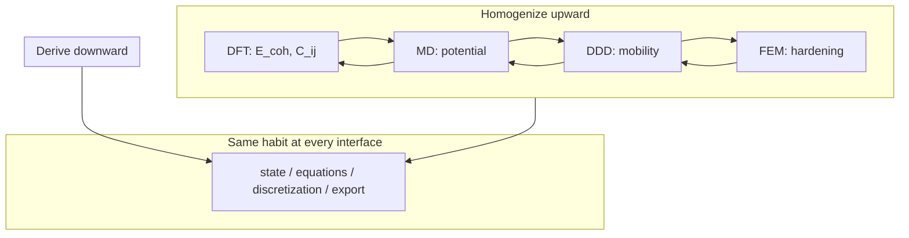

# Multiscale Computational Mechanics

We have climbed from linear algebra to functional analysis, built finite element and finite volume discretizations, anchored them in continuum mechanics, and descended through dislocations, atoms, and electrons. The epilogue asks: how do these pieces **compose** in modern research and engineering?

The copper wire that opened the prologue — drawn, annealed, carrying current, sagging under load — never lived at a single scale. It lived at all of them simultaneously. Our simulations never do. Multiscale computational mechanics is the discipline of **connecting** what each scale computes into a workflow that answers questions no single model can.

Before descending to electrons, we already practiced coupling at the engineering scale: Part IV's FEM conduction and Part V's FVM convection exchange wall temperature and heat flux until the wire and the cooling air agree — conjugate heat transfer as a fixed-point loop between discretizations. The epilogue generalizes that handshake from two meshes on one specimen to DFT, MD, DDD, and continuum FEM on the same material history.

## Scene: a multiscale afternoon

It is late afternoon in a shared compute lab. On one screen, a Quantum ESPRESSO log reports `convergence has been achieved` for a relaxed copper unit cell — cohesive energy, lattice constant, and Voigt-averaged elastic constants copied into a spreadsheet with the functional, pseudopotential, and k-mesh recorded in the header. On the next screen, a LAMMPS job fits an EAM potential to those numbers and runs a short NVT shear test on a dislocation core; the mobility table that emerges is not yet physics, but it is **traceable** to the SCF cycle that finished an hour ago.

A third terminal launches OpenDiS on a single-crystal RVE under the same strain rate the load cell will use tomorrow. Dislocation density climbs; Taylor hardening exports a \(\tau(\gamma)\) curve into a yaml file beside a DAMASK crystal-plasticity deck. The FEM mesh — the same tetrahedral cylinder from Part IV, now with internal variables at Gauss points — waits in a fourth window. The student does not believe any one run tells the whole story. They believe the **handshake**: units checked at every arrow, convergence logs archived, and the outer loop on wall temperature (FVM) and solid conduction (FEM) still running from last week's conjugate heat transfer homework.

The copper wire on the bench — cold-drawn, carrying current, warm to the touch — is unchanged. What changed is the reader's ability to name where each number in the workflow came from, what was homogenized away, and which interface would break first if the ladder were climbed too carelessly. That afternoon is not a fantasy pipeline every laptop runs unattended. It is the **discipline** the book has been building toward since the prologue: state, equations, discretization, upward export — now at the boundaries between codes, not only within a single mesh.

## Story so far (Parts I–IX)

If you have read linearly since the prologue, the copper wire has changed language nine times without changing material:

| Part | Scale | Wire instance | Key export upward |
|------|-------|---------------|-------------------|
| I | Discrete algebra | Spring network | \(\mathbf{K}\), eigenmodes |
| II | Function spaces | Fields \(u(x)\), \(T(x)\) | Galerkin convergence target |
| III | Weak PDEs | Equilibrium + heat | Energy functionals |
| IV | FEM | Meshed solid | \(\mathbf{K}\mathbf{U}=\mathbf{F}\), error estimates |
| V | FVM | Cooling air | Fluxes, conjugate heat loop |
| VI | Continuum | \(\mathbf{F}\), \(\boldsymbol{\sigma}\) | Virtual work, balance laws |
| VII | Defects | Dislocation forest | Hardening law for FEM |
| VIII | Atoms | Trajectories | Potentials, moduli hints |
| IX | Electrons | \(\rho(\mathbf{r})\) | \(E_{\text{coh}}\), \(C_{ij}\), \(\gamma_{\text{sf}}\) |

The epilogue asks what none of these parts alone can answer: **how do we compose them** when the wire's lifetime spans every row of the table?

## Closing the arc from Part IX

If you have read linearly since the prologue, Part IX's closing checkpoint archived converged SCF results — functional, pseudopotential, plane-wave cutoff, k-mesh — beside every export upward. The epilogue is where those numbers **compose** with the meshes, forests, and trajectories built in earlier parts:

| Part IX (electrons in copper) | Epilogue (multiscale on the wire) |
|-------------------------------|-----------------------------------|
| \(E_{\text{coh}}\), \(a_0\) from QE relaxation | Seeds EAM fit; sanity-checks bulk modulus before LAMMPS production runs |
| \(C_{ij}\) from strained unit cells | Voigt average feeds Part IV elastic step and Part VI \(E\), \(\nu\) |
| \(\gamma_{\text{sf}}\) from faulted supercells | Peierls stress and partial-dislocation mobility in OpenDiS |
| Documented SCF convergence logs | Required pedigree for every upward arrow — same habit as FEM mesh studies |
| [IX.3 Bridge to epilogue](../part09-dft/03-dft-workflows.md#bridge-to-the-epilogue) | Handshake loops generalize conjugate heat transfer from Parts IV–V |

Part IX closed the **downward derivation** — the finest rung of the prologue's ladder. The epilogue closes **upward homogenization**: how disciplined teams climb from \(\rho(\mathbf{r})\) to structural design without unit errors, wrong history, or category mistakes at notches and crack tips. Part I's sparse matrix, Part IV's mesh, Part VII's dislocation forest, and Part IX's electron density are not separate homework problems. They are scenes in one story whose coupling rules are stated in the sections below.

## The concept map (closing lens)

The [Functional Analysis Notes](https://hanfengzhai.github.io/file/teaching/notes/ME412_CourseSummary.pdf) organized each part with four questions — object, structure, theorem, failure mode. At the scale of the full book, the same discipline applies to **coupling**:

| Question | Answer at multiscale scale |
|----------|---------------------------|
| What **object** spans all parts? | Coupled states at interfaces — wall temperature, hardening law, potential |
| What **structure** connects runs? | Handshake loops with consistent units, frames, and averaging |
| What **theorem** (principle) makes coupling credible? | Scale separation, convergence at each rung, verification and validation |
| What **breaks** if we skip handshakes? | Wrong history, unit errors, category errors at notches and crack tips |

**Baby picture:** each part solved one rung of the ladder; multiscale mechanics wires the rungs together with the same four questions the prologue asked — now at **interfaces** between codes, not only within a single mesh.

## Lab act reunion: one afternoon, six acts

The [prologue](../prologue/00-many-scales.md#the-experiment-as-plot) mapped one lab session to six acts — mounting, warming, pulling, hardening, notch, foundation. The epilogue reunites them:

| Act | Lab beat | Book parts | Coupling habit |
|-----|----------|------------|----------------|
| I — Mounting | Grips close; first \(\mathbf{K}\mathbf{u}=\mathbf{f}\) | I | Boundary conditions export to every mesh |
| II — Warming | Current on; thermocouple rises | III, IV, V | Conjugate heat: FEM solid ↔ FVM fluid |
| III — Pulling | Force–displacement ramp | II, III, IV, VI | Weak form → assembly → stress interpretation |
| IV — Hardening | Curve bends upward | VII | DDD / Taylor hardening → crystal plasticity FEM |
| V — Notch | Stress concentrator | VI, VIII | Continuum locates; MD resolves |
| VI — Foundation | Input deck parameters | IX → VIII → VII → IV | DFT → MD → DDD → FEM pedigree |

No single executable runs all six acts unattended. Disciplined teams wire them with the same handshake the conjugate heat section practiced: consistent units, documented exports, and outer loops that converge at interfaces — not only inside each solver.

## The same question at every scale

At each rung of the ladder, we asked:

- What is the **state**?
- What **equations** govern its evolution or equilibrium?
- What **discretization** makes the equations computable?
- What **information** passes to the next scale?

The answers changed — vectors to functions to cell averages to dislocation networks to trajectories to electron densities — but the pattern did not.

| Scale | State | Governing principle | Typical code |
|-------|-------|---------------------|--------------|
| Electronic | \(\rho(\mathbf{r})\), orbitals | Kohn–Sham SCF | Quantum ESPRESSO, VASP |
| Atomistic | \(\{\mathbf{r}_i, \mathbf{p}_i\}\) | Newton / Hamilton | LAMMPS, GPUMD |
| Mesoscopic | Dislocation segments | Peach–Köhler + mobility | OpenDiS, ParaDiS |
| Continuum solid | \(\mathbf{u}\), \(\boldsymbol{\sigma}\) | Virtual work / balance | FEniCS, Abaqus |
| Continuum fluid | \(\mathbf{v}\), \(p\) | Navier–Stokes + conservation | OpenFOAM, Fluent |

Computational mechanics is one conversation about **representation** — how we translate nature into equations, equations into algebra, and algebra into insight.

## Coupling paradigms

Modern multiscale work combines paradigms. None replaces the others; each manages cost and accuracy differently.

### Sequential homogenization

**Sequential homogenization** computes effective properties at fine scale and passes **constants upward**:

\[
\text{DFT} \rightarrow E_{\text{coh}}, C_{ijkl}, E_f^v
\]

\[
\rightarrow \text{fit EAM} \rightarrow \text{MD} \rightarrow \text{mobility}, \gamma_{\text{sf}}
\]

\[
\rightarrow \text{DDD} \rightarrow \tau(\gamma), \dot{\rho}(\gamma)
\]

\[
\rightarrow \text{crystal plasticity FEM} \rightarrow \text{texture}
\]

\[
\rightarrow \text{continuum FEM} \rightarrow \text{wire deflection, stress}
\]

**Strengths:** Modular, reproducible, each step verifiable independently.

**Weaknesses:** Loses **history dependence** unless internal variables are enriched (dislocation density, back stress, damage). Path-dependent cold work in copper wire cannot be captured by a single elastic modulus from perfect-lattice DFT.

**Remedy:** Pass **multiple** outputs (not just \(E\), but hardening laws, yield surface evolution) and validate homogenization assumptions (representative volume element size, periodicity).

### Concurrent multiscale

**Concurrent multiscale** runs fine and coarse models **simultaneously** with handshaking in overlapping domains:

- **QM/MM**: quantum region (DFT) embedded in molecular mechanics (force field) for reactive crack tips.
- **FE²**: macro FEM with each Gauss point calling a micro RVE (crystal plasticity or MD).
- **DDD–FEM coupling**: dislocation density or back stress from DDD feeds continuum constitutive update.

**Strengths:** Captures localization — crack tips, shear bands, notch roots — where coarse models fail without ad hoc regularization.

**Weaknesses:** Expensive; **domain decomposition** and **adaptive refinement** manage cost. Load balancing on exascale machines when fine regions move (crack propagation) remains an open systems challenge.

For a copper wire notch, concurrent MD/FEM hands off atomic traction near the tip while FEM carries elastic field in the bulk — the standard sequential alternative smears fracture energy over a regularization length.

### Surrogate acceleration

**Surrogate acceleration** trains models on fine-scale data to replace inner loops:

- **Neural operators** and **GNNs** on polycrystal meshes predict stress fields from microstructure.
- **Constitutive surrogates** replace crystal plasticity at each quadrature point.
- **Potential learning** (Part VIII) replaces DFT inside selected MD regions.

**Strengths:** Amortized cost after training; enables real-time digital twins if inference is fast enough.

**Weaknesses:** Data hunger; extrapolation risk outside training manifold. Physics constraints — **frame indifference**, **symmetry**, **thermodynamic consistency** — must be embedded or violations propagate catastrophically upward.

Surrogates do not remove the ladder; they **cache** climbs already taken. Copper wire surrogates trained only on single-crystal tension may fail on bending–torsion coupling in service.

### Coarse-graining and uncertainty

Not every detail matters at the macro scale. **Coarse-graining** identifies which features survive upward:

- Dislocation density survives; individual line topology may not (unless link statistics matter for conductivity).
- Thermal phonons average to temperature; individual vibrational modes do not appear in FEM.
- Electron density integrates to cohesive energy; orbitals do not appear in EAM.

**Quantifying what is lost** — sensitivity of wire lifetime to choices at each rung — is as important as the forward simulation. Uncertainty propagation:

\[
\sigma_{\text{macro}}^2 \approx \sum_i \left(\frac{\partial y}{\partial p_i}\right)^2 \sigma_{p_i}^2
\]

for homogenized outputs \(y\) and parameters \(p_i\) (e.g., \(E_f^v\), \(\alpha\) in Taylor hardening, GGA lattice constant).

## A narrative arc completed

Recall the prologue's copper wire. The full intellectual chain — not a single software run — reads:

1. **DFT** gives cohesive energy and elastic constants of perfect copper; vacancy and surface energies for defect thermodynamics.
2. **MD** (with EAM fitted to DFT) introduces thermal vibrations, phonon–phonon scattering, crack nucleation at notches, and dislocation core structures.
3. **DDD** (with mobility from MD) explains work hardening as dislocation networks evolve; link statistics refine hardening beyond scalar \(\rho\).
4. **Crystal plasticity FEM** homogenizes slip on {111}\(\langle 110 \rangle\) systems to predict texture after drawing and anisotropic yield.
5. **Continuum FEM** designs the structural component: sag, attachment points, elastic recovery.
6. **CFD** simulates coolant flow if the wire heats under current — coupling thermal softening back to mechanical strength.

No single code runs this entire chain unattended. Disciplined teams run **linked workflows** with version-controlled inputs, convergence logs, and validation at each handoff.

### Processing history revisited

The wire's **manufacturing history** (draw, anneal, redraw) is itself a multiscale simulation sequence:

- Drawing: texture + dislocation storage (DDD / crystal plasticity).
- Annealing: vacancy diffusion + recrystallization (MD + kinetic models).
- Service: electromigration (DFT barriers + MD diffusion + continuum current density).

Skipping history and jumping from bulk DFT modulus to in-service performance predicts the wrong wire. Internal state variables exist to carry **path dependence** upward when pure elasticity cannot.

## Worked example: one service load, four handshakes

The copper wire from the prologue — 1 mm diameter, 100 mm gauge, cold-drawn OFHC copper — makes a concrete multiscale afternoon if we trace **one** engineering question: *At 5 A DC and 50 N tension, does thermal softening change the elastic stiffness enough to matter before the load cell reaches yield?*

No single code answers that. A disciplined workflow chains four handshakes with archived inputs at every arrow.

### Handshake 1 — DFT → continuum elastic constants (Part IX → VI)

A Quantum ESPRESSO `vc-relax` on fcc Cu with PBE pseudopotentials (documented in [IX.3](../part09-dft/03-dft-workflows.md)) yields:

| Export | DFT (GGA-PBE) | Experiment | Used in FEM |
|--------|---------------|------------|-------------|
| Lattice \(a_0\) | 3.55 Å | 3.61 Å | Reference only; do not silently overwrite |
| Bulk modulus \(B\) | \(\sim 140\) GPa | \(\sim 140\) GPa | Sanity check |
| \(C_{11}, C_{12}, C_{44}\) | 168, 122, 75 GPa | 168, 121, 75 GPa | Voigt \(E \approx 130\) GPa, \(\nu \approx 0.34\) |

Voigt averaging gives \(E = 130\,\text{GPa}\), \(\nu = 0.34\) for the isotropic elastic step in Part IV — **not** because copper is isotropic (cold drawing breaks symmetry), but because the first elastic FEM pass needs a documented starting point. Texture from drawing enters later via crystal plasticity (Part VII handoff).

### Handshake 2 — Joule heating → conjugate heat transfer (Part IV ↔ V)

Steady current \(I = 5\,\text{A}\) in a 1 mm wire with resistivity \(\rho_e \approx 1.7 \times 10^{-8}\,\Omega\cdot\text{m}\) gives volumetric heating

\[
q = \frac{I^2 \rho_e}{\pi (d/2)^2} \approx 2.2 \times 10^7\,\text{W/m}^3.
\]

Part IV's FEM solves \(-k\nabla^2 T = q\) in the solid with \(k \approx 400\,\text{W/m·K}\). Part V's FVM (or a correlation from [V.4](../part05-fvm/04-navier-stokes-cfd.md)) supplies \(h \approx 15\,\text{W/m}^2\text{K}\) on the surface. **Partitioned fixed-point loop:**

1. Guess wall temperature \(T_w = 350\,\text{K}\); apply \(q_w = h(T_w - T_\infty)\) with \(T_\infty = 300\,\text{K}\).
2. Solve solid conduction; read new \(T_w\) from surface nodes.
3. Repeat until \(|T_w^{(k+1)} - T_w^{(k)}| < 0.5\,\text{K}\).

Typical convergence: \(T_w \approx 385\)–\(395\,\text{K}\) at mid-span — warm to the touch, consistent with Act II in the prologue. **Sanity check:** integrated surface heat flux equals integrated Joule source (Part V Lab act).

### Handshake 3 — Thermal strain → mechanical stiffness (Part VI → IV)

Mechanical load 50 N gives engineering stress \(\sigma \approx 6.4\,\text{MPa}\) — far below yield (\(\sim 200\,\text{MPa}\)). Thermal expansion adds

\[
\varepsilon_{\text{th}} = \alpha \Delta T \approx 17 \times 10^{-6}\,\text{K}^{-1} \times 90\,\text{K} \approx 1.5 \times 10^{-3},
\]

while elastic strain from load is \(\varepsilon_{\text{m}} \sim 5 \times 10^{-5}\). Thermal strain dominates **displacement** but not **stress** in a free-expansion sense; in the fixed-grip tensile frame, thermal stress is tens of MPa and can shift the effective tangent stiffness the load cell sees.

A coupled thermoelastic FEM (Part IV mesh + Part VI virtual work with \(\boldsymbol{\varepsilon} = \boldsymbol{\varepsilon}_{\text{m}} + \alpha\Delta T\,\mathbf{I}\)) reports whether the 50 N ramp remains in the linear regime. **Export upward to Part VII:** if \(\sigma + \sigma_{\text{th}}\) approaches yield, dislocation sources activate — the hardening curve in Act IV is no longer optional.

### Handshake 4 — When continuum fails: notch and MD (Part VI → VIII)

If the wire has a micro-notch (Act V), continuum FEM gives stress concentration \(K_t \approx 3\) at the root. Peak stress \(\sim 20\,\text{MPa}\) still looks elastic — but **gradient** of stress over atomic spacing matters for nucleation. A concurrent MD/FEM domain hands atomistic resolution within 2 nm of the notch tip while FEM carries the bulk field (Part VIII, [VIII.3](../part08-md/03-ab-initio-and-coarse-graining.md)).

The handshake table:

| Region | Model | State | Export across interface |
|--------|-------|-------|-------------------------|
| Bulk | FEM | \(\mathbf{u}\), \(T\) | Displacement BC to MD box |
| Notch tip | MD (EAM from DFT) | \(\{\mathbf{r}_i\}\) | Traction on FEM boundary |
| Defect kinetics (optional) | DDD | Dislocation density | Hardening if cyclic load |

### What this example teaches

The four handshakes reuse the **same four questions** from the prologue at every interface:

| Interface | State | Equations | Discretization | Export |
|-----------|-------|-----------|----------------|--------|
| DFT → FEM | \(\rho(\mathbf{r})\) | Kohn–Sham | Plane waves | \(C_{ij}\), \(E\), \(\nu\) |
| FEM ↔ FVM | \(T\) | Heat + convection | Tet mesh + cell averages | \(T_w\), \(q_w\) |
| Thermal → mechanical | \(\mathbf{u}\), \(T\) | Thermoelasticity | Same FEM mesh | Effective stiffness, yield margin |
| FEM → MD | \(\mathbf{u}\) near notch | Newton + EAM | Atomistic subdomain | Nucleation criterion |

None of this runs unattended in one executable. The discipline is **traceability**: each number in the table carries a convergence log, a functional choice, and a unit check. That is multiscale computational mechanics in practice — not a longer single-scale run, but a **composed** story the epilogue's opening Scene already sketched on four screens.

### Sensitivity: which handshake matters most?

The four handshakes are not equally influential on the engineering question. A one-at-a-time sensitivity scan — perturb each input by \(\pm 10\%\) while holding others fixed — ranks where the workflow is fragile:

| Perturbed parameter | Handshake | Effect on mid-span \(T_w\) | Effect on load-cell stiffness |
|---------------------|-----------|----------------------------|-------------------------------|
| \(h\) (convection) | 2 | \(\pm 15\)–\(25\,\text{K}\) | Indirect via thermal stress |
| \(\alpha\) (CTE) | 3 | None (steady \(T\)) | \(\pm 30\%\) on thermal strain |
| \(C_{11}\) from DFT | 1 | None | \(\pm 5\%\) on elastic slope |
| Notch radius | 4 | Minor | Nucleation threshold shifts |

For this load case — 50 N tension, 5 A current — **Handshake 2 dominates temperature** and **Handshake 3 dominates fixed-grip stress**. Handshake 1 (elastic constants) matters less in the linear regime but becomes critical once yield approaches: a 10% error in \(C_{44}\) from a wrong DFT functional shifts the resolved shear stress on active slip systems by the same fraction, and Taylor hardening amplifies that into a measurably different hardening slope in Act IV.

This ranking is itself a multiscale deliverable. Before launching a full DFT campaign, ask: *Which handshake controls the quantity I need to certify?* If the question is deflection under 50 N at room temperature, Handshake 1 alone may suffice. If the question is whether thermal softening triggers yield during the ramp, Handshakes 2 and 3 must converge first — and Handshake 4 only if a notch or surface defect is present.

Document the sensitivity table beside every workflow archive. When a colleague reuses your DFT elastic constants six months later, they inherit not only \(C_{ij}\) but the knowledge that those numbers were third in importance for the original question — a habit that prevents expensive fine-scale runs from substituting for missing coarse-scale coupling.

## Handshake mechanics: what crosses interfaces

Successful coupling specifies **consistent** quantities at interfaces:

| Interface | Fine → coarse | Coarse → fine |
|-----------|---------------|---------------|
| DFT → MD | \(V(\{\mathbf{r}\})\), forces | Atomic positions (for fitting) |
| MD → DDD | Mobility \(M(\tau,T)\), core energy | Applied stress, temperature |
| DDD → FEM | Hardening law, back stress | Strain rate, boundary displacement |
| FEM → CFD | Surface motion, heat flux | Traction, convection coefficient |

**Units, frames, and averaging** must align. Irving–Kirkwood stress from MD is not automatically identical to Cauchy stress in FEM without volume definition and thermostat interpretation.

**Temporal scale separation** matters: DFT steps are femtoseconds; wire creep is years. Coupling algorithms (quasi-continuum, heterogeneous multiscale method) exist precisely when scale separation is imperfect.

## Verification, validation, and credibility

Part V introduced **verification** (code solves equations) vs. **validation** (model matches reality). Multiscale workflows multiply both:

- **Verification** at each rung: SCF convergence, \(\Delta t\) convergence, mesh refinement, RVE size convergence.
- **Validation** across rungs: DFT elastic constants vs. experiment; MD thermal expansion vs. DFT phonons; DDD hardening vs. single-crystal tests; FEM deflection vs. load cell.

**UQ-aware** workflows report intervals, not point estimates: "yield load 120 ± 8 N" with documented parameter sensitivities.

## Open directions

### Exascale coupling

Load balancing when fine regions move (crack tips, shear bands, electromigration voids) requires dynamic remeshing and adaptive QM/MM regions. Communication costs dominate; co-design of algorithms and hardware continues.

### Digital twins

Merge simulation ladders with **streaming experimental data** — in situ diffraction during wire drawing, acoustic emission during fatigue, infrared thermography during current load. Data assimilation updates internal state variables (dislocation density proxies, damage) faster than forward simulation alone.

### Scientific machine learning

**Physics-informed** architectures respect conservation and variational structure: symplectic networks for MD, energy-conserving surrogates for FEM, equivariant GNNs for polycrystals. The goal is not to replace physics but to **compress** repeated expensive solves.

### Open science

Frameworks like [OpenDiS](https://github.com/OpenDiS/OpenDiS), FEniCS, [LAMMPS](https://www.lammps.org/), and [Quantum ESPRESSO](https://www.quantum-espresso.org/) lower the barrier to reproducing multiscale workflows. Reproducibility — archived inputs, pseudopotentials, random seeds — is a professional obligation when parameters propagate across scales.

## The weak form, one last time

The book opened with a thread: weak forms, virtual work, test functions. At the multiscale level, the analogous instinct is **consistent dual descriptions**:

- Fine scale provides **fluxes** and **material responses** coarse scale lacks.
- Coarse scale provides **boundary conditions** and **loading history** fine scale cannot afford to simulate in full.

Galerkin FEM asks: find \(\mathbf{u}_h\) such that \(a(\mathbf{u}_h, v) = \ell(v)\) for all test functions \(v\). Multiscale coupling asks: find coupled states such that **interface functionals** (energy, work, dissipation) agree within tolerance when restricted to overlap regions.

Different language — same insistence that approximations be **consistent**, **stable**, and **convergent** to something meaningful.

## Closing the full arc

The prologue opened with one copper wire and four questions — state, equations, discretization, upward export — repeated at every rung of the ladder. The epilogue closes that loop explicitly:

| Prologue question | Part I answer | Part VI answer | Part IX answer |
|-------------------|---------------|----------------|----------------|
| **State** | Vector \(\mathbf{u}\) | Field \(\mathbf{u}(\mathbf{x})\), \(\boldsymbol{\sigma}\) | Density \(\rho(\mathbf{r})\) |
| **Equations** | \(\mathbf{K}\mathbf{u}=\mathbf{f}\) | Virtual work / balance | Kohn–Sham SCF |
| **Discretization** | Sparse assembly | FEM / FVM meshes | Plane waves, k-mesh |
| **Upward export** | — | Stress, stiffness | \(E_{\text{coh}}\), \(C_{ij}\), \(\gamma_{\text{sf}}\) |

The weak form appeared in Part III as a mathematical convenience, became Galerkin assembly in Part IV, reappeared as virtual work in Part VI, and found its electronic analogue in the Hohenberg–Kohn variational principle of Part IX. Eigenmodes that decoupled the spring network in Part I reappear as Kohn–Sham orbitals at the finest scale. The story is not a catalog of methods; it is one specimen traced from \(\mathbb{R}^N\) to function spaces to meshes to defects to atoms to electrons — and back upward through homogenization.

## Lab act reunion: six acts, one afternoon

The [prologue](../prologue/00-many-scales.md#the-experiment-as-plot) framed the copper wire as one lab session in six acts. The epilogue is where those acts meet in **workflow time** — not reading order, but the afternoon the operator and the compute cluster share:

| Act | Lab moment | Parts that justified it | Multiscale handshake |
|-----|------------|-------------------------|---------------------|
| **I — Mounting** | Grips close; load cell zeros | I | BC tags on the FEM mesh; rigid-body removal |
| **II — Warming** | Current on; thermocouple climbs | III–V | FEM conduction ↔ FVM convection at wall |
| **III — Pulling** | Displacement ramps; curve linear | II–IV, VI | \(\mathbf{K}\) from Galerkin; Cauchy stress from virtual work |
| **IV — Hardening** | Curve bends; slip lines appear | VII | Taylor \(\tau(\gamma)\) from DDD → crystal plasticity → FEM |
| **V — Notch** | Optional stress concentration | VI, VIII | Atomistic nucleation where continuum regularizes |
| **VI — Foundation** | Parameters in every input deck | IX → VIII → VII | DFT exports → EAM fit → mobility tables |

No single executable runs all six acts unattended. The discipline is **traceability**: each arrow in the handshake column carries units, convergence logs, and the four questions — state, equations, discretization, upward export — asked at every interface. When a new project starts, locate it in this table before opening a terminal: *Which act am I simulating, and which finer rung supplies the numbers I am about to trust?*

The multiscale afternoon in the opening **Scene** is this table running in parallel — QE logs beside LAMMPS beside OpenDiS beside the same tet mesh from Part IV. Reading order taught the grammar; workflow order pays the bills.

## Closing

Computational mechanics is not a bag of tricks. It is one conversation about representation — how we translate nature into equations, equations into algebra, and algebra into insight. The mathematics in Parts I and II is not separate from the MD integrator or the Riemann solver. It is the same ladder viewed from different heights.

The copper wire is still under tension — mechanical, electrical, intellectual. You now have the language to follow it from electrons to engineering and back again: to ask where parameters came from, what was homogenized away, and how to couple scales when a single model reaches the limit of its validity.

The wire does not care which chapter we finished last. It responds to physics. Our craft is to make that physics computable, connected, and credible.

## Bridge

The ladder ends here, but the references do not. The [Sources appendix](../appendix/sources.md) lists the PDF notes, coursework repositories, and external texts behind each part. The [Final Memory Sheet](../appendix/memory-sheet.md) collects the book-wide habits and traps in the ME 412 style. When `Writings.git` is linked, canonical chapter markdown lives under `writings/` in the Functional Analysis Notes layout; run `./scripts/sync-writings.sh` after upstream edits to refresh this book.

Return to the [prologue](../prologue/00-many-scales.md) whenever a new project needs scale discipline — the four questions (state, equations, discretization, upward exports) apply to every material, not only copper.
