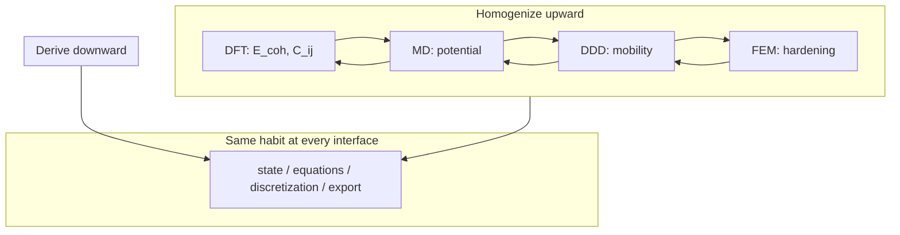

# Multiscale Computational Mechanics

We have climbed from linear algebra to functional analysis, built finite element and finite volume discretizations, anchored them in continuum mechanics, and descended through dislocations, atoms, and electrons. The epilogue asks: how do these pieces **compose** in modern research and engineering?

The copper wire that opened the prologue — drawn, annealed, carrying current, sagging under load — never lived at a single scale. It lived at all of them simultaneously. Our simulations never do. Multiscale computational mechanics is the discipline of **connecting** what each scale computes into a workflow that answers questions no single model can.

Before descending to electrons, we already practiced coupling at the engineering scale: Part IV's FEM conduction and Part V's FVM convection exchange wall temperature and heat flux until the wire and the cooling air agree — conjugate heat transfer as a fixed-point loop between discretizations. The epilogue generalizes that handshake from two meshes on one specimen to DFT, MD, DDD, and continuum FEM on the same material history.

## Plot spine (one line) {#plot-spine-one-line}

> **Act IV — Coupling:** Foundation exports compose in one multiscale afternoon — Handshakes 1–4b on the same copper wire close the novel.

When Part IX ended with Quantum ESPRESSO folders but the epilogue feels like a new course, read the sentence above aloud — it is this chapter's role in the [chapter roadmap](../appendix/sources.md#chapter-roadmap-one-continuous-arc). See the [coupling gate](../appendix/sources.md#continuous-read-through-guide) in the continuous read-through guide; row [51](../appendix/sources.md#ix3-epilogue-writings-canonical-reunion-index-row-51) reunites the **Writings subtree boundary** when row 50 closed electronic descent but `writings/dft` → `writings/epilogue` still reads like two mdBooks.

## Scene: a multiscale afternoon

It is late afternoon in a shared compute lab. On one screen, a Quantum ESPRESSO log reports `convergence has been achieved` for a relaxed copper unit cell — cohesive energy, lattice constant, and Voigt-averaged elastic constants copied into a spreadsheet with the functional, pseudopotential, and k-mesh recorded in the header. On the next screen, a LAMMPS job fits an EAM potential to those numbers and runs a short NVT shear test on a dislocation core; the mobility table that emerges is not yet physics, but it is **traceable** to the SCF cycle that finished an hour ago.

A third terminal launches OpenDiS on a single-crystal RVE under the same strain rate the load cell will use tomorrow. Dislocation density climbs; Taylor hardening exports a \(\tau(\gamma)\) curve into a yaml file beside a DAMASK crystal-plasticity deck. The FEM mesh — the same tetrahedral cylinder from Part IV, now with internal variables at Gauss points — waits in a fourth window. The student does not believe any one run tells the whole story. They believe the **handshake**: units checked at every arrow, convergence logs archived, and the outer loop on wall temperature (FVM) and solid conduction (FEM) still running from last week's conjugate heat transfer homework.

The copper wire on the bench — cold-drawn, carrying current, warm to the touch — is unchanged. What changed is the reader's ability to name where each number in the workflow came from, what was homogenized away, and which interface would break first if the ladder were climbed too carelessly. That afternoon is not a fantasy pipeline every laptop runs unattended. It is the **discipline** the book has been building toward since the prologue: state, equations, discretization, upward export — now at the boundaries between codes, not only within a single mesh. When the afternoon feels like disconnected terminal windows, return to [Part VIII's epilogue hinge](../part08-md/00-opening.md#bridge-epilogue-hinge) — the Bridge that names Acts V–VI in lab reunion time before Part IX closes the electronic audit.

## Story so far (Parts I–IX)

If you have read linearly since the prologue, the copper wire has changed language nine times without changing material:

| Part | Scale | Wire instance | Key export upward |
|------|-------|---------------|-------------------|
| I | Discrete algebra | Spring network | \(\mathbf{K}\), eigenmodes |
| II | Function spaces | Fields \(u(x)\), \(T(x)\) | Galerkin convergence target |
| III | Weak PDEs | Equilibrium + heat | Energy functionals |
| IV | FEM | Meshed solid | \(\mathbf{K}\mathbf{U}=\mathbf{F}\), error estimates |
| V | FVM | Cooling air | Fluxes, conjugate heat loop |
| VI | Continuum | \(\mathbf{F}\), \(\boldsymbol{\sigma}\) | Virtual work, balance laws |
| VII | Defects | Dislocation forest | Hardening law for FEM |
| VIII | Atoms | Trajectories | Potentials, moduli hints |
| IX | Electrons | \(\rho(\mathbf{r})\) | \(E_{\text{coh}}\), \(C_{ij}\), \(\gamma_{\text{sf}}\) |

The epilogue asks what none of these parts alone can answer: **how do we compose them** when the wire's lifetime spans every row of the table?

## Writings canonical landing (IX.3 → Epilogue) {#writings-canonical-landing-ix3-to-epilogue}

You crossed from **DFT Notes** to **ME 412 multiscale coupling** — two subtrees under [`writings/`](../writings/SUMMARY.md), one continuous story. If the epilogue feels like a new syllabus after [IX.3's Bridge](../part09-dft/03-dft-workflows.md#bridge-to-the-epilogue), read that Bridge and [Writings canonical hinge](../part09-dft/03-dft-workflows.md#writings-canonical-hinge-ix3-to-epilogue) aloud first: the state variable changes from \(\rho(\mathbf{r})\) in a foundation folder to **orchestrated handshakes** on the bench wire, but `cu.foundation/`, `cht_export.yaml`, and the [IX.3 epilogue pedigree table](../part09-dft/03-dft-workflows.md#ix3-epilogue-pedigree-table) do not.

| Signal you are at the right landing | What to open next |
|---------------------------------------|-------------------|
| `cu.foundation/` complete but Handshakes feel like separate homework | [Opening hinge from Part IX](#opening-hinge-ix3-to-epilogue) — export table on the wire |
| Row 50 closed electronic descent but epilogue opens like ME 412 only | [Coupling hinge](#opening-hinge-ix3-to-epilogue) — 4a vs 4b on `hardening.yaml` |
| Canonical edits must stay in `writings/epilogue/` | [`scripts/sync-writings.sh`](../../scripts/sync-writings.sh) then `mdbook build` |

The [reunion index row 51](../appendix/sources.md#ix3-epilogue-writings-canonical-reunion-index-row-51) reunites this landing with [IX.3's Bridge](../part09-dft/03-dft-workflows.md#bridge-to-the-epilogue) when SCF archives make sense but [`parse_multiscale_workflow.sh`](../../scripts/parse_multiscale_workflow.sh) was never run. Row [10](../appendix/sources.md#continuity-hinges-index-when-the-plot-stutters) names the **narrative** IX.3 → epilogue coupling hinge; row 51 names the **Writings subtree boundary** when `writings/dft` and `writings/epilogue` each build as standalone mdBooks.

## Closing the arc from Part IX {#opening-hinge-ix3-to-epilogue}

If you have read linearly since the prologue, Part IX's closing checkpoint archived converged SCF results — functional, pseudopotential, plane-wave cutoff, k-mesh — beside every export upward. The epilogue is where those numbers **compose** with the meshes, forests, and trajectories built in earlier parts:

| Part IX (electrons in copper) | Epilogue (multiscale on the wire) |
|-------------------------------|-----------------------------------|
| \(E_{\text{coh}}\), \(a_0\) from QE relaxation | Seeds EAM fit; sanity-checks bulk modulus before LAMMPS production runs |
| \(C_{ij}\) from strained unit cells | Voigt average feeds Part IV elastic step and Part VI \(E\), \(\nu\) |
| \(\gamma_{\text{sf}}\) from faulted supercells | Peierls stress and partial-dislocation mobility in OpenDiS; [Handshake 4b](#4b--when-continuum-fails-at-the-notch-md-subdomain-act-v--notch) when scalar hardening from 4a under-predicts notch-root stress |
| Documented SCF convergence logs | Required pedigree for every upward arrow — same habit as FEM mesh studies |
| [IX.0 thermal phonon audit at \(T_w\)](../part09-dft/00-opening.md#thermal-phonon-audit-at-tw) — \(\alpha(T_w)\), \(\tau_{\text{ph}}(T_w)\) from quasiharmonic/DFPT | Handshake 3 fixed-grip stress and Handshake 4a phonon drag at converged \(T_w\), not 300 K defaults — [`parse_alpha.sh`](../../scripts/parse_alpha.sh) with `--target-t` from `cht_export.yaml` |
| [IX.3 Bridge to epilogue](../part09-dft/03-dft-workflows.md#bridge-to-the-epilogue) | Handshake loops generalize conjugate heat transfer from Parts IV–V; [IX.3 epilogue pedigree table](../part09-dft/03-dft-workflows.md#bridge-to-the-epilogue) maps each DFT artifact to Handshakes 1–4b |
| [`parse_lifetime.sh`](../../scripts/parse_lifetime.sh) at converged \(T_w\) beside `cu.phonon/` | [Handshake 4a](#4a--ddd-strain-rate-to-quasi-static-load-cell-act-iv--hardening): phonon drag bounds on rate sensitivity \(m\) — [sensitivity worksheet](#worked-example-sensitivity-ranks) (4a column); upstream [VII.3 rate handshake](../part07-defects/03-polycrystal-and-fem-handoff.md#scale-boundary-handshake-ddd-strain-rate-to-quasi-static-fem) |
| [IX.3 GSF workflow](../part09-dft/03-dft-workflows.md#worked-example-generalized-stacking-fault-energy-handoff-to-part-vii) + [`parse_gsf.sh`](../../scripts/parse_gsf.sh) | [Handshake 4b](#4b--when-continuum-fails-at-the-notch-md-subdomain-act-v--notch): partial dislocations at notch root — [FE² worked example](#worked-example-fe-at-the-wire-notch-act-v--notch); upstream [VII.3 Step 4](../part07-defects/03-polycrystal-and-fem-handoff.md#step-4--when-offline-calibration-fails-fe-at-the-notch) after [4a](#4a--ddd-strain-rate-to-quasi-static-load-cell-act-iv--hardening) |

Part IX's [electronic audit hinge](../part09-dft/00-opening.md#electronic-audit-hinge-descent-pedigree-and-tw-phonon) closed the downward derivation with SCF pedigree **and** a [thermal phonon audit at \(T_w\)](../part09-dft/00-opening.md#thermal-phonon-audit-at-tw): Joule heating from Act II archived \(T_w = 311.48\,\text{K}\) in [`fixtures/cht_export.yaml`](../fixtures/cht_export.yaml) via [V.4's parser checkpoint](../part05-fvm/04-navier-stokes-cfd.md#parser-checkpoint-archive-cht-export-yaml), but foundation folders that archive phonons only at 300 K leave Handshakes 3 and 4a **partially audited** — elastic moduli carry SCF logs while thermal eigenstrain and drag still cite room-temperature folklore. Return to the [Part IX thermal phonon audit table](../part09-dft/00-opening.md#thermal-phonon-audit-at-tw) when the export table above feels complete but `alpha_export.yaml` lacks an explicit \(T_w\) column; the [memory sheet rows 8–9 baby picture](../appendix/memory-sheet.md#rows-8-9-baby-picture-tw-temperature-pedigree) draws the same \(T_w\) chain from CHT through MD mobility to DFT phonons.

The [preface continuity hinge](../preface.md#epilogue-continuity-hinges) names the **Handshake 2 → 3 chain** in one row: \(T_w\) from the [V.4 Picard loop](../part05-fvm/04-navier-stokes-cfd.md#lab-act-extension-two-domain-picard-loop-with-a-1d-fem-solid) sets \(\Delta T\); quasiharmonic \(\alpha\) from [IX.3](../part09-dft/03-dft-workflows.md#thermal-expansion-from-quasiharmonic-phonons-handshake-3-pedigree) sets thermal strain — and the [sensitivity table](#sensitivity-which-handshake-matters-most) ranks Handshake 3 **first** for fixed-grip load-cell readings. Read that preface row when the export table above feels complete but the load cell still cites handbook \(\alpha\) beside an orphan `pw.x` log.

Part IX closed the **downward derivation** — the finest rung of the prologue's ladder. The epilogue closes **upward homogenization**: how disciplined teams climb from \(\rho(\mathbf{r})\) to structural design without unit errors, wrong history, or category mistakes at notches and crack tips. Part I's sparse matrix, Part IV's mesh, Part VII's dislocation forest, and Part IX's electron density are not separate homework problems. They are scenes in one story whose coupling rules are stated in the sections below.

**Coupling hinge (IX.3 → epilogue).** [IX.3's Bridge](../part09-dft/03-dft-workflows.md#bridge-to-the-epilogue) archived foundation exports in workflow order; this section is the **downstream half** of [memory sheet row 10](../appendix/memory-sheet.md#continuity-hinges-master-map), the [preface coupling hinge row](../preface.md#epilogue-continuity-hinges), and the [preface row 10 skill checkpoint](../preface.md#skill-navigation-row-10). The [prologue row 10 preview](../prologue/00-many-scales.md#prologue-preview-row-10) named this composition stitch before Part I — return there when foundation folders exist but Handshakes 4a and 4b feel like one undifferentiated export. Handshakes 1–3 inherit elastic moduli, \(\Delta T\), and \(\alpha\); **Handshakes 4a and 4b split Act IV hardening from Act V localization** on the same `hardening.yaml`. Complete [preface row 14](../preface.md#skill-navigation-row-14) before [row 15](../preface.md#skill-navigation-row-15): bulk rate extrapolation (4a) is necessary but not sufficient when the optional notch activates FE² (4b). The [IX.3 epilogue pedigree table](../part09-dft/03-dft-workflows.md#ix3-epilogue-pedigree-table) maps each DFT artifact to its handshake; the [preview Act IV row](#reunion-preview-act-iv) and [preview Act V row](#reunion-preview-act-v) reunite the 4a/4b split in workflow time; the [sensitivity derivation worksheet](#worked-example-sensitivity-ranks) below ranks which handshake controlled the load-cell answer.

## Closing Handshake 3 from Part IX.3 {#opening-hinge-ix3-handshake3}

If you have read linearly since the prologue, [IX.3's Bridge](../part09-dft/03-dft-workflows.md#bridge-to-the-epilogue) archived `cu.foundation/` with converged SCF logs, elastic constants, and the [quasiharmonic \(\alpha\) Lab act](../part09-dft/03-dft-workflows.md#lab-act-quasiharmonic-alpha-handshake-3-pedigree). The epilogue's [Handshake 3](#handshake-3--thermal-strain--mechanical-stiffness-part-vi--iv) is the **downstream half** of that export — not a new subject, but the load-cell reading of \(\sigma_{\text{th}} = E\alpha\Delta T\) on fixed grips:

| Part IX.3 export (Act VI — Foundation) | Epilogue Handshake 3 (Act III — Pulling) |
|----------------------------------------|------------------------------------------|
| `cu.phonon/a_vs_T.dat` from quasiharmonic scan | [`parse_alpha.sh`](../../scripts/parse_alpha.sh) emits `alpha_export.yaml` with explicit `target_temperature_K` |
| \(\alpha(T)\) fit from `ph.x` / phonon DOS | \(\alpha(T_w)\) at converged wall temperature — **not** handbook \(\alpha(300\,\text{K})\) alone |
| [IX.3 quasiharmonic Lab act](../part09-dft/03-dft-workflows.md#lab-act-quasiharmonic-alpha-handshake-3-pedigree) (upstream half) | [Worked load-cell example](#handshake-3--thermal-strain--mechanical-stiffness-part-vi--iv) (downstream half) |
| `alpha_cu_*K.dat` beside `cu.phonon/` | Fixed-grip \(\sigma_{\text{th}}\) verified against load cell — [sensitivity table](#sensitivity-which-handshake-matters-most) ranks Handshake 3 **first** |

**Temperature pedigree (Handshake 2 → 3).** Handshake 2 from [V.4's Picard loop](../part05-fvm/04-navier-stokes-cfd.md#lab-act-extension-two-domain-picard-loop-with-a-1d-fem-solid) archives \(T_w = 311.48\,\text{K}\) in [`fixtures/cht_export.yaml`](../fixtures/cht_export.yaml) via [`parse_cht.sh`](../../scripts/parse_cht.sh). Handshake 3 must evaluate \(\alpha\) at that same \(T_w\):

```bash
TW=$(grep wall_temperature_K fixtures/cht_export.yaml | awk '{print $2}')
./scripts/parse_alpha.sh fixtures/cu.foundation/cu.phonon/ --target-t "$TW" --delta-t "$(grep delta_T_K fixtures/cht_export.yaml | awk '{print $2}')"
```

The [IX.3 → Handshake 3 reunion index](../appendix/sources.md#ix3-handshake3-reunion-index-row-40) reunites this opening with [row 39](../preface.md#skill-navigation-row-39) when `cu.foundation/` is complete but `alpha_export.yaml` still lists `target_temperature_K: 300` while `cht_export.yaml` archives \(T_w = 311.48\,\text{K}\) — same copper wire, same afternoon, but thermal eigenstrain cites room-temperature folklore.

**α(\(T_w\)) cross-links audit (reading-time ↔ workflow-time).** When Handshake 3 feels disconnected from Parts III–VI despite a complete foundation folder, walk this chain — each row is a mirror of the same contract at a different scale:

| Location | Anchor | Contract (read aloud) |
|----------|--------|----------------------|
| [III.4 export contract](../part03-pdes/04-energy-methods.md#bridge-to-part-iv) | Reading-time | Mechanical block consumes \(\varepsilon_{\text{th}} = \alpha(T_h - T_{\text{ref}})\) from thermal block — not a separate handbook card |
| [IV.4 thermoelastic assembly](../part04-fem/00-opening.md#acts-ii-and-iii-together-thermoelastic-assembly-thread) | Workflow-time | \(\mathbf{K}_{TT}\mathbf{T}=\mathbf{F}_T\) → \(\mathbf{F}_{\text{th}}=\alpha\Delta T\) → \(\mathbf{K}_{uu}\mathbf{U}=\mathbf{F}_u+\mathbf{F}_{\text{th}}\) on **one mesh** |
| [V.4 Picard loop](../part05-fvm/04-navier-stokes-cfd.md#lab-act-extension-two-domain-picard-loop-with-a-1d-fem-solid) | Workflow-time | Converged \(T_w\) exported to `cht_export.yaml` — Handshake 2 gate |
| [VI.2 \(\alpha\) handshake](../part06-continuum/02-stress-balance.md#scale-boundary-handshake-thermal-expansion-alpha) | Reading-time | \(\sigma_{\text{th}} \approx E\alpha\Delta T\) on fixed grips — acceptance checklist for Act III |
| [IX.3 quasiharmonic Lab act](../part09-dft/03-dft-workflows.md#lab-act-quasiharmonic-alpha-handshake-3-pedigree) | Foundation-time | \(\alpha(T)\) from `ph.x` with same pedigree as \(C_{ij}\) — evaluate at \(T_w\), not 300 K default |
| [Handshake 3](#handshake-3--thermal-strain--mechanical-stiffness-part-vi--iv) (this chapter) | Workflow-time | Load cell reads \(\sigma_{\text{th}}\); mechanical 50 N is a perturbation on thermal background |
| [Preface row 13](../preface.md#skill-navigation-row-13) | Competence-time | Handshake 2 sets \(\Delta T\); Handshake 3 sets \(\alpha\Delta T\) — do not conflate |
| [Memory sheet rows 8–9](../appendix/memory-sheet.md#rows-8-9-baby-picture-tw-temperature-pedigree) | Index-card | \(T_w\) from CHT propagates through MD mobility, DFT phonons, and fixed-grip stress |

The [preface row 40 skill checkpoint](../preface.md#skill-navigation-row-40) closes the competence loop; the [prologue row 40 closing stitch](../prologue/00-many-scales.md#row-40-closing-stitch) is the upstream half when the foundation folder exists but the load cell still cites handbook \(\alpha\) beside an orphan `pw.x` log.

## Closing Handshake 4a from Part VII.3 {#opening-hinge-vii3-handshake4a}

If you have read linearly since the prologue, [VII.3's rate handshake](../part07-defects/03-polycrystal-and-fem-handoff.md#scale-boundary-handshake-ddd-strain-rate-to-quasi-static-fem) documented OpenDiS RVE sweeps, power-law sensitivity \(m\), and `rate_export.yaml` provenance. Handshake 4a's [worked example](#4a--ddd-strain-rate-to-quasi-static-load-cell-act-iv--hardening) is the **downstream half** of that export — not a new subject, but the load-cell reading of \(\tau_{\text{lab}}\) at lab grip speed:

| Part VII.3 export (Act IV — Hardening) | Epilogue Handshake 4a (Act IV — Hardening) |
|----------------------------------------|---------------------------------------------|
| [VII.3 rate handshake](../part07-defects/03-polycrystal-and-fem-handoff.md#scale-boundary-handshake-ddd-strain-rate-to-quasi-static-fem) Steps A–C (upstream half) | [4a worked example](#4a--ddd-strain-rate-to-quasi-static-load-cell-act-iv--hardening) (downstream half) |
| `ddd_tau_vs_rate.dat` from OpenDiS sweeps | [`parse_rate.sh`](../../scripts/parse_rate.sh) emits `rate_export.yaml` with explicit `lab_target_strain_rate_s-1` |
| \(\tau_{\text{flow}}\) at \(\dot\varepsilon_{\text{DDD}} = 10^3\,\text{s}^{-1}\) | \(\tau_{\text{lab}}\) at \(\dot\varepsilon_{\text{lab}} = 10^{-3}\,\text{s}^{-1}\) via power-law \(m\) |
| [VII.2 forest Lab act](../part07-defects/02-dislocation-dynamics.md#lab-act-read-the-hardening-bend-from-forest-density-act-iv) supplies \(\tau(\gamma)\), \(\rho(\gamma)\) | Crystal plasticity FEM inherits extrapolated \(\tau_{\text{lab}}\) — [sensitivity table](#sensitivity-which-handshake-matters-most) ranks Handshake 4a **next** for Act IV |

**Rate pedigree (mobility → \(m\) → \(\tau_{\text{lab}}\)).** Handshake 4a must evaluate \(m\) with mobility tables at the same \(T_w\) Handshake 2 converged — phonon drag from [`parse_lifetime.sh`](../../scripts/parse_lifetime.sh) at \(T_w\) bounds rate sensitivity when Joule heating is active:

```bash
TW=$(grep wall_temperature_K fixtures/cht_export.yaml | awk '{print $2}')
./scripts/parse_rate.sh fixtures/ddd_tau_vs_rate.dat --lab-rate 1.0e-3 --temperature "$TW"
```

The [VII.3 → Handshake 4a reunion index](../appendix/sources.md#vii3-handshake4a-reunion-index-row-41) reunites this opening with [row 40](../preface.md#skill-navigation-row-40) when Handshake 3's thermal pre-stress is verified but `rate_export.yaml` still lists `ddd_strain_rate_s-1: 1000` while the prologue grip runs at \(10^{-3}\,\text{s}^{-1}\) — same copper wire, same afternoon, but the hardening knee arrives early because direct DDD import overpredicts flow stress by 5–35%.

**Rate extrapolation cross-links audit (reading-time ↔ workflow-time).** When Handshake 4a feels disconnected from Parts VI–VIII despite a complete forest export, walk this chain — each row is a mirror of the same contract at a different scale:

| Location | Anchor | Contract (read aloud) |
|----------|--------|----------------------|
| [VI.4 plasticity preview](../part06-continuum/04-nonlinear-plasticity-preview.md#intermission-ascent-ends-descent-begins) | Reading-time | Yield knee breaks energy minimization — rate sensitivity enters before Part VII names the forest |
| [VII.2 mobility Lab act](../part07-defects/02-dislocation-dynamics.md#lab-act-calibrate-screw-mobility-from-md-shear-act-iv--mobility-prelude) | Workflow-time | \(M(\tau, T_w)\) from NVT shear — not 300 K defaults when Act II is active |
| [VII.3 rate handshake](../part07-defects/03-polycrystal-and-fem-handoff.md#scale-boundary-handshake-ddd-strain-rate-to-quasi-static-fem) | Foundation-time | Power-law \(m\) from DDD sweeps — extrapolate to lab rate, do not import raw curve |
| [Part VIII descent hinge](../part08-md/00-opening.md#descent-hinge-cores-mobility-and-tw-pedigree) | Reading-time | Mobility yaml rows inherit \(T_w\) from CHT before any shear export |
| [VIII.3 WHAM at \(T_w\)](../part08-md/03-ab-initio-and-coarse-graining.md#wham-part-vii-mobility-hinge-act-ii-temperature-pedigree) | Workflow-time | Cross-slip recovery at converged wall temperature feeds drag on \(m\) |
| [IX.0 \(\tau_{\text{ph}}(T_w)\)](../part09-dft/00-opening.md#thermal-phonon-audit-at-tw) | Foundation-time | Phonon lifetime at \(T_w\) bounds rate sensitivity — same pedigree as Handshake 3 \(\alpha\) |
| [Handshake 4a](#4a--ddd-strain-rate-to-quasi-static-load-cell-act-iv--hardening) (this chapter) | Workflow-time | Load cell knee reads \(\tau_{\text{lab}}\); DDD timestep rate is not lab grip speed |
| [Preface row 14](../preface.md#skill-navigation-row-14) | Competence-time | VII.3 sets \(\tau_{\text{flow}}(\dot\varepsilon_{\text{DDD}})\); Handshake 4a sets \(\tau_{\text{lab}}\) — do not conflate |
| [Memory sheet row 14](../appendix/memory-sheet.md#row-14-baby-picture-handshake-4a) | Index-card | Forest → power-law \(m\) → lab-rate chain from OpenDiS to load cell |

The [preface row 41 skill checkpoint](../preface.md#skill-navigation-row-41) closes the competence loop; the [prologue row 41 closing stitch](../prologue/00-many-scales.md#row-41-closing-stitch) is the upstream half when the rate handshake exists in Part VII but OpenDiS exports still feed the plasticity deck without extrapolation.

## Closing Handshake 4b from Part VII.3 {#opening-hinge-vii3-handshake4b}

If you have read linearly since the prologue, [VII.3 Step 4](../part07-defects/03-polycrystal-and-fem-handoff.md#step-4--when-offline-calibration-fails-fe-at-the-notch) documented FE² at notch-root Gauss points — crystal plasticity vs two-scale DDD, `fe2_notch_comparison.dat`, and the 10–15% uplift criterion. Handshake 4b's [FE² worked example](#worked-example-fe-at-the-wire-notch-act-v--notch) is the **downstream half** of that export — not a new subject, but the Act V reading of whether scalar hardening from 4a suffices at \(K_t \approx 3\):

| Part VII.3 export (Act V — Notch) | Epilogue Handshake 4b (Act V — Notch) |
|-----------------------------------|----------------------------------------|
| [VII.3 Step 4 FE²](../part07-defects/03-polycrystal-and-fem-handoff.md#step-4--when-offline-calibration-fails-fe-at-the-notch) (upstream half) | [4b worked example](#4b--when-continuum-fails-at-the-notch-md-subdomain-act-v--notch) (downstream half) |
| `fe2_notch_comparison.dat` with three-row schema | [`parse_fe2.sh`](../../scripts/parse_fe2.sh) emits `fe2_export.yaml` with explicit `fe2_enrichment_required` |
| Crystal plasticity \(\sigma_{\text{eq}} \approx 215\,\text{MPa}\) at notch root | FE² \(\sigma_{\text{eq}} \approx 238\,\text{MPa}\) — pile-up physics scalar \(H\) smears |
| Bulk `hardening.yaml` from Handshake 4a | [`multiscale_export.yaml`](../../scripts/parse_multiscale_workflow.sh) links `fe2_export.yaml` in Handshake 4b slot — [row 16](../preface.md#skill-navigation-row-16) orchestration audit |

**Notch pedigree (4a bulk → FE² root).** Handshake 4b activates only when the prologue's optional micro-notch is present — verify bulk \(\tau_{\text{lab}}\) from [4a](#4a--ddd-strain-rate-to-quasi-static-load-cell-act-iv--hardening) before comparing root stress:

```bash
./scripts/parse_fe2.sh fixtures/fe2_notch_comparison.dat
./scripts/parse_multiscale_workflow.sh fixtures/cu.foundation fixtures/cht_wire.conf  # includes fe2_export in chain
```

The [VII.3 → Handshake 4b reunion index](../appendix/sources.md#vii3-handshake4b-reunion-index-row-42) reunites this opening with [row 41](../preface.md#skill-navigation-row-41) when Handshake 4a's bulk knee matches the load cell but crystal plasticity is trusted at the notch root without running [`parse_fe2.sh`](../../scripts/parse_fe2.sh) — same copper wire, same afternoon, but peak von Mises stress under-predicts by 10–15% because sequential homogenization smeared pile-up.

**FE² notch-localization cross-links audit (reading-time ↔ workflow-time).** When Handshake 4b feels disconnected from Parts IV–IX despite a complete FE² comparison file, walk this chain — each row is a mirror of the same contract at a different scale:

| Location | Anchor | Contract (read aloud) |
|----------|--------|----------------------|
| [IV.4 Poisson → elasticity](../part04-fem/04-poisson-to-elasticity.md#bridge-to-part-v) | Reading-time | Stress concentrators need finer resolution — mesh alone does not add pile-up physics |
| [VI.4 plasticity preview](../part06-continuum/04-nonlinear-plasticity-preview.md#intermission-ascent-ends-descent-begins) | Reading-time | Scalar \(J_2\) breaks at notches — gradient plasticity foreshadows FE² |
| [VII.3 Step 4 FE²](../part07-defects/03-polycrystal-and-fem-handoff.md#step-4--when-offline-calibration-fails-fe-at-the-notch) | Foundation-time | Mark Gauss points within 50 µm of notch root as DDD-active — archive three-row comparison |
| [VII.3 opening hinge to Handshake 4b](../part07-defects/03-polycrystal-and-fem-handoff.md#opening-hinge-vii3-to-handshake4b) | Bridge read | "Step 4 FE² is upstream; Act V root stress is downstream" | Opening epilogue 4b without VII.3 Step 4 |
| [IX.3 GSF workflow](../part09-dft/03-dft-workflows.md#worked-example-generalized-stacking-fault-energy-handoff-to-part-vii) | Foundation-time | \(\gamma_{\text{sf}}\) from DFT feeds partial-dislocation mobility at notch root — [`parse_gsf.sh`](../../scripts/parse_gsf.sh) |
| [Handshake 4a](#4a--ddd-strain-rate-to-quasi-static-load-cell-act-iv--hardening) (this chapter) | Workflow-time | Bulk \(\tau_{\text{lab}}\) verified before notch audit — FE² inherits same `hardening.yaml` |
| [Handshake 4b](#4b--when-continuum-fails-at-the-notch-md-subdomain-act-v--notch) (this chapter) | Workflow-time | Root stress reads FE² uplift; scalar \(H\) from 4a may suffice in bulk only |
| [Preface row 15](../preface.md#skill-navigation-row-15) | Competence-time | 4a sets bulk \(\tau_{\text{lab}}\); 4b asks whether scalar \(H\) suffices at \(K_t \approx 3\) — do not conflate |
| [Preface row 16](../preface.md#skill-navigation-row-16) | Orchestration-time | `multiscale_export.yaml` must link `fe2_export.yaml` beside `rate_export.yaml` in dependency order |
| [Memory sheet row 15](../appendix/memory-sheet.md#row-15-baby-picture-handshake-4b) | Index-card | Bulk hardening → FE² root → orchestrated export chain |

The [preface row 42 skill checkpoint](../preface.md#skill-navigation-row-42) closes the competence loop; the [prologue row 42 closing stitch](../prologue/00-many-scales.md#row-42-closing-stitch) is the upstream half when Step 4 exists in Part VII but crystal plasticity is trusted at the notch root without a 10–15% audit.

## The concept map (closing lens)

The [Functional Analysis Notes](https://hanfengzhai.github.io/file/teaching/notes/ME412_CourseSummary.pdf) organized each part with four questions — object, structure, theorem, failure mode. At the scale of the full book, the same discipline applies to **coupling**:

| Question | Answer at multiscale scale |
|----------|---------------------------|
| What **object** spans all parts? | Coupled states at interfaces — wall temperature, hardening law, potential |
| What **structure** connects runs? | Handshake loops with consistent units, frames, and averaging |
| What **theorem** (principle) makes coupling credible? | Scale separation, convergence at each rung, verification and validation |
| What **breaks** if we skip handshakes? | Wrong history, unit errors, category errors at notches and crack tips |



**Baby picture:** each part solved one rung of the ladder; multiscale mechanics wires the rungs together with the same four questions the prologue asked — now at **interfaces** between codes, not only within a single mesh.

## Lab act reunion: one afternoon, six acts {#lab-act-reunion-preview}

The [prologue](../prologue/00-many-scales.md#the-experiment-as-plot) mapped one lab session to six acts — mounting, warming, pulling, hardening, notch, foundation. The epilogue reunites them here in **preview** form — coupling habits and handshake names before the detailed handshake sections below. After those sections, the [full reunion with per-node anchors and workflow-time paragraphs](#lab-act-reunion-six-acts-one-afternoon) returns to the same six acts with Act VI subgraph nodes, sensitivity audit trails, and the workflow exam table.

| Act | Lab beat | Book parts | Coupling habit |
|-----|----------|------------|----------------|
| <span id="reunion-preview-act-i"></span>I — Mounting | Grips close; first \(\mathbf{K}\mathbf{u}=\mathbf{f}\) | I | Boundary conditions export to every mesh; rigid-body removal before any ramp — [prologue Act I preview](../prologue/00-many-scales.md#prologue-preview-act-i); [expanded Act I](#reunion-expanded-act-i) |
| <span id="reunion-preview-act-ii"></span>II — Warming | Current on; thermocouple rises | III, IV, V | Handshake 2: FEM solid ↔ FVM fluid until wall flux matches Joule source ([Handshake 2](#handshake-2--joule-heating--conjugate-heat-transfer-part-iv--v)); [V.4 Picard loop](../part05-fvm/04-navier-stokes-cfd.md#lab-act-extension-two-domain-picard-loop-with-a-1d-fem-solid); [`parse_cht.sh`](../../scripts/parse_cht.sh) → `cht_export.yaml`; converged \(\Delta T = T_w - T_\infty\) feeds Handshake 3 in Act III — [prologue row 8 preview](../prologue/00-many-scales.md#prologue-preview-row-8); [expanded Act II](#reunion-expanded-act-ii) |
| <span id="reunion-preview-act-iii"></span>III — Pulling | Force–displacement ramp | II, III, IV, VI | Handshake 2 → 3: \(\Delta T\) from CHT ([Handshake 2](#handshake-2--joule-heating--conjugate-heat-transfer-part-iv--v)); \(\alpha\Delta T\) from [IX.3 quasiharmonic Lab act](../part09-dft/03-dft-workflows.md#lab-act-quasiharmonic-alpha-handshake-3-pedigree) → fixed-grip stress ([Handshake 3](#handshake-3--thermal-strain--mechanical-stiffness-part-vi--iv)); [memory sheet row 13](../appendix/memory-sheet.md#continuity-hinges-master-map); [preface row 13](../preface.md#skill-navigation-row-13); [`parse_alpha.sh`](../../scripts/parse_alpha.sh); weak form → assembly → stress interpretation — [prologue row 13 preview](../prologue/00-many-scales.md#prologue-preview-row-13); [expanded Act III](#reunion-expanded-act-iii) |
| <span id="reunion-preview-act-iv"></span>IV — Hardening | Curve bends upward | VII | Handshake 4a: DDD \(\tau(\dot\varepsilon)\) → power-law \(m\) → lab-rate \(\tau_{\text{lab}}\) ([memory sheet row 14](../appendix/memory-sheet.md#continuity-hinges-master-map), [preface row 14](../preface.md#skill-navigation-row-14), [VII.3 rate handshake](../part07-defects/03-polycrystal-and-fem-handoff.md#scale-boundary-handshake-ddd-strain-rate-to-quasi-static-fem), [`parse_rate.sh`](../../scripts/parse_rate.sh)); Taylor hardening → crystal plasticity FEM — [prologue row 14 preview](../prologue/00-many-scales.md#prologue-preview-row-14); [prologue Handshake 4a preview](../prologue/00-many-scales.md#prologue-preview-act-iv); [expanded Act IV](#reunion-expanded-act-iv); upstream [Part VIII epilogue hinge](../part08-md/00-opening.md#bridge-epilogue-hinge) |
| <span id="reunion-preview-act-v"></span>V — Notch | Stress concentrator | VI, VII, VIII | Handshake 4b: scalar \(H\) vs FE² at root ([memory sheet row 15](../appendix/memory-sheet.md#continuity-hinges-master-map), [preface row 15](../preface.md#skill-navigation-row-15), [VII.3 Step 4 FE²](../part07-defects/03-polycrystal-and-fem-handoff.md#step-4--when-offline-calibration-fails-fe-at-the-notch), [`parse_fe2.sh`](../../scripts/parse_fe2.sh)); MD resolves nucleation where continuum regularizes — [prologue Handshake 4b preview](../prologue/00-many-scales.md#prologue-preview-act-v); [prologue row 15 closing stitch](../prologue/00-many-scales.md#row-15-closing-stitch); [expanded Act V](#reunion-expanded-act-v) |
| <span id="reunion-preview-act-vi"></span>VI — Foundation | Input deck parameters | IX → VIII → VII → IV | DFT → MD → DDD → FEM pedigree; row 16 orchestration — [`parse_multiscale_workflow.sh`](../../scripts/parse_multiscale_workflow.sh) → `multiscale_export.yaml` ([memory sheet row 16](../appendix/memory-sheet.md#continuity-hinges-master-map), [preface row 16](../preface.md#skill-navigation-row-16), [script audit trail All — orchestrated chain row](#script-audit-trail-parse-scripts-handshakes)); see [Act VI minimal artifacts](#act-vi-foundation-minimal-artifacts); [prologue row 16 preview](../prologue/00-many-scales.md#prologue-preview-row-16); [prologue row 16 closing stitch](../prologue/00-many-scales.md#row-16-closing-stitch); [expanded Act VI](#reunion-expanded-act-vi) |

No single executable runs all six acts unattended. Disciplined teams wire them with the same handshake the conjugate heat section practiced: consistent units, documented exports, and outer loops that converge at interfaces — not only inside each solver.

### Act VI foundation minimal artifacts {#act-vi-foundation-minimal-artifacts}

Act VI runs in parallel with Acts I–V in real projects — the foundation prequel archived before the load cell moves. The [memory sheet Act VI baby picture](../appendix/memory-sheet.md#act-vi-baby-picture-me-412-coupling-ladder) draws the foundation → orchestration diagram; this table is the **reverse audit** from [preface row 16 steps](../preface.md#skill-navigation-row-16) back to each diagram node:

| Row 16 step | Minimal artifact | Subgraph nodes ([inline anchors](../appendix/memory-sheet.md#act-vi-subgraph-node-audit)) |
|-------------|------------------|-------------------------------------------------------------------------------------------|
| **Step 1** — upstream rows 8–9, 13–15 | Completed skill checkpoints or equivalent exports | [#act-vi-node-h2](../appendix/memory-sheet.md#act-vi-node-h2), [#act-vi-node-h3](../appendix/memory-sheet.md#act-vi-node-h3), [#act-vi-node-h4a](../appendix/memory-sheet.md#act-vi-node-h4a), [#act-vi-node-h4b](../appendix/memory-sheet.md#act-vi-node-h4b) |
| **Step 2** — foundation folder | `foundation_export.yaml` via [`parse_dft_workflow.sh`](../../scripts/parse_dft_workflow.sh) on `cu.foundation/` | `act6`: [#act-vi-node-dft](../appendix/memory-sheet.md#act-vi-node-dft) → [#act-vi-node-md](../appendix/memory-sheet.md#act-vi-node-md) → [#act-vi-node-ddd](../appendix/memory-sheet.md#act-vi-node-ddd) → [#act-vi-node-fem](../appendix/memory-sheet.md#act-vi-node-fem) |
| **Step 3** — orchestrated chain | [`parse_multiscale_workflow.sh`](../../scripts/parse_multiscale_workflow.sh) → `multiscale_export.yaml` | `orch`: [#act-vi-node-h1](../appendix/memory-sheet.md#act-vi-node-h1) through [#act-vi-node-out](../appendix/memory-sheet.md#act-vi-node-out); per-handshake parsers in [script audit trail](#script-audit-trail-parse-scripts-handshakes) |
| **Step 4** — pedigree audit | `./scripts/test-fixtures.sh`; verify `delta_T_from_handshake_2` and `target_T_K` | [#act-vi-node-h3](../appendix/memory-sheet.md#act-vi-node-h3) (Handshake 2 → 3); [#act-vi-node-h4a](../appendix/memory-sheet.md#act-vi-node-h4a) (phonon lifetime at \(T_w\)); [#act-vi-node-out](../appendix/memory-sheet.md#act-vi-node-out) (orchestrated export) |

Return to the [memory sheet per-node anchor index](../appendix/memory-sheet.md#act-vi-subgraph-node-audit) when a step feels like a script name without a diagram node; return to the [IX.3 epilogue pedigree table](../part09-dft/03-dft-workflows.md#ix3-epilogue-pedigree-table) when a node feels like a label without an archive artifact.

## The same question at every scale

At each rung of the ladder, we asked:

- What is the **state**?
- What **equations** govern its evolution or equilibrium?
- What **discretization** makes the equations computable?
- What **information** passes to the next scale?

The answers changed — vectors to functions to cell averages to dislocation networks to trajectories to electron densities — but the pattern did not.

| Scale | State | Governing principle | Typical code |
|-------|-------|---------------------|--------------|
| Electronic | \(\rho(\mathbf{r})\), orbitals | Kohn–Sham SCF | Quantum ESPRESSO, VASP |
| Atomistic | \(\{\mathbf{r}_i, \mathbf{p}_i\}\) | Newton / Hamilton | LAMMPS, GPUMD |
| Mesoscopic | Dislocation segments | Peach–Köhler + mobility | OpenDiS, ParaDiS |
| Continuum solid | \(\mathbf{u}\), \(\boldsymbol{\sigma}\) | Virtual work / balance | FEniCS, Abaqus |
| Continuum fluid | \(\mathbf{v}\), \(p\) | Navier–Stokes + conservation | OpenFOAM, Fluent |

Computational mechanics is one conversation about **representation** — how we translate nature into equations, equations into algebra, and algebra into insight.

## Coupling paradigms

Modern multiscale work combines paradigms. None replaces the others; each manages cost and accuracy differently.

### Sequential homogenization

**Sequential homogenization** computes effective properties at fine scale and passes **constants upward**:

\[
\text{DFT} \rightarrow E_{\text{coh}}, C_{ijkl}, E_f^v
\]

\[
\rightarrow \text{fit EAM} \rightarrow \text{MD} \rightarrow \text{mobility}, \gamma_{\text{sf}}
\]

\[
\rightarrow \text{DDD} \rightarrow \tau(\gamma), \dot{\rho}(\gamma)
\]

\[
\rightarrow \text{crystal plasticity FEM} \rightarrow \text{texture}
\]

\[
\rightarrow \text{continuum FEM} \rightarrow \text{wire deflection, stress}
\]

**Strengths:** Modular, reproducible, each step verifiable independently.

**Weaknesses:** Loses **history dependence** unless internal variables are enriched (dislocation density, back stress, damage). Path-dependent cold work in copper wire cannot be captured by a single elastic modulus from perfect-lattice DFT.

**Remedy:** Pass **multiple** outputs (not just \(E\), but hardening laws, yield surface evolution) and validate homogenization assumptions (representative volume element size, periodicity).

### Concurrent multiscale

**Concurrent multiscale** runs fine and coarse models **simultaneously** with handshaking in overlapping domains:

- **QM/MM**: quantum region (DFT) embedded in molecular mechanics (force field) for reactive crack tips.
- **FE²**: macro FEM with each Gauss point calling a micro RVE (crystal plasticity or MD).
- **DDD–FEM coupling**: dislocation density or back stress from DDD feeds continuum constitutive update.

**Strengths:** Captures localization — crack tips, shear bands, notch roots — where coarse models fail without ad hoc regularization.

**Weaknesses:** Expensive; **domain decomposition** and **adaptive refinement** manage cost. Load balancing on exascale machines when fine regions move (crack propagation) remains an open systems challenge.

For a copper wire notch, concurrent MD/FEM hands off atomic traction near the tip while FEM carries elastic field in the bulk — the standard sequential alternative smears fracture energy over a regularization length.

### Surrogate acceleration

**Surrogate acceleration** trains models on fine-scale data to replace inner loops:

- **Neural operators** and **GNNs** on polycrystal meshes predict stress fields from microstructure.
- **Constitutive surrogates** replace crystal plasticity at each quadrature point.
- **Potential learning** (Part VIII) replaces DFT inside selected MD regions.

**Strengths:** Amortized cost after training; enables real-time digital twins if inference is fast enough.

**Weaknesses:** Data hunger; extrapolation risk outside training manifold. Physics constraints — **frame indifference**, **symmetry**, **thermodynamic consistency** — must be embedded or violations propagate catastrophically upward.

Surrogates do not remove the ladder; they **cache** climbs already taken. Copper wire surrogates trained only on single-crystal tension may fail on bending–torsion coupling in service.

### Coarse-graining and uncertainty

Not every detail matters at the macro scale. **Coarse-graining** identifies which features survive upward:

- Dislocation density survives; individual line topology may not (unless link statistics matter for conductivity).
- Thermal phonons average to temperature; individual vibrational modes do not appear in FEM.
- Electron density integrates to cohesive energy; orbitals do not appear in EAM.

**Quantifying what is lost** — sensitivity of wire lifetime to choices at each rung — is as important as the forward simulation. Uncertainty propagation:

\[
\sigma_{\text{macro}}^2 \approx \sum_i \left(\frac{\partial y}{\partial p_i}\right)^2 \sigma_{p_i}^2
\]

for homogenized outputs \(y\) and parameters \(p_i\) (e.g., \(E_f^v\), \(\alpha\) in Taylor hardening, GGA lattice constant).

## A narrative arc completed

Recall the prologue's copper wire. The full intellectual chain — not a single software run — reads:

1. **DFT** gives cohesive energy and elastic constants of perfect copper; vacancy and surface energies for defect thermodynamics.
2. **MD** (with EAM fitted to DFT) introduces thermal vibrations, phonon–phonon scattering, crack nucleation at notches, and dislocation core structures.
3. **DDD** (with mobility from MD) explains work hardening as dislocation networks evolve; link statistics refine hardening beyond scalar \(\rho\).
4. **Crystal plasticity FEM** homogenizes slip on {111}\(\langle 110 \rangle\) systems to predict texture after drawing and anisotropic yield.
5. **Continuum FEM** designs the structural component: sag, attachment points, elastic recovery.
6. **CFD** simulates coolant flow if the wire heats under current — coupling thermal softening back to mechanical strength.

No single code runs this entire chain unattended. Disciplined teams run **linked workflows** with version-controlled inputs, convergence logs, and validation at each handoff.

### Processing history revisited

The wire's **manufacturing history** (draw, anneal, redraw) is itself a multiscale simulation sequence:

- Drawing: texture + dislocation storage (DDD / crystal plasticity).
- Annealing: vacancy diffusion + recrystallization (MD + kinetic models).
- Service: electromigration (DFT barriers + MD diffusion + continuum current density).

Skipping history and jumping from bulk DFT modulus to in-service performance predicts the wrong wire. Internal state variables exist to carry **path dependence** upward when pure elasticity cannot.

## Worked example: one service load, four handshakes

The copper wire from the prologue — 1 mm diameter, 100 mm gauge, cold-drawn OFHC copper — makes a concrete multiscale afternoon if we trace **one** engineering question: *At 5 A DC and 50 N tension, does thermal softening change the elastic stiffness enough to matter before the load cell reaches yield?*

No single code answers that. A disciplined workflow chains four handshakes with archived inputs at every arrow.

### Handshake 1 — DFT → continuum elastic constants (Part IX → VI)

A Quantum ESPRESSO `vc-relax` on fcc Cu with PBE pseudopotentials (documented in [IX.3](../part09-dft/03-dft-workflows.md)) yields:

| Export | DFT (GGA-PBE) | Experiment | Used in FEM |
|--------|---------------|------------|-------------|
| Lattice \(a_0\) | 3.55 Å | 3.61 Å | Reference only; do not silently overwrite |
| Bulk modulus \(B\) | \(\sim 140\) GPa | \(\sim 140\) GPa | Sanity check |
| \(C_{11}, C_{12}, C_{44}\) | 168, 122, 75 GPa | 168, 121, 75 GPa | Voigt \(E \approx 130\) GPa, \(\nu \approx 0.34\) |

Voigt averaging gives \(E = 130\,\text{GPa}\), \(\nu = 0.34\) for the isotropic elastic step in Part IV — **not** because copper is isotropic (cold drawing breaks symmetry), but because the first elastic FEM pass needs a documented starting point. Texture from drawing enters later via crystal plasticity (Part VII handoff).

### Handshake 2 — Joule heating → conjugate heat transfer (Part IV ↔ V) {#handshake-2--joule-heating--conjugate-heat-transfer-part-iv--v}

The [preface epilogue continuity hinge](../preface.md#epilogue-continuity-hinges) names this handshake as the **first leg** of the **Joule heat → fixed-grip stress** chain: Handshake 2 sets \(\Delta T = T_w - T_\infty\); [Handshake 3](#handshake-3--thermal-strain--mechanical-stiffness-part-vi--iv) and [IX.3 quasiharmonic \(\alpha\)](../part09-dft/03-dft-workflows.md#thermal-expansion-from-quasiharmonic-phonons-handshake-3-pedigree) complete it. The [sensitivity table](#sensitivity-which-handshake-matters-most) ranks Handshake 2 **first for mid-span temperature** and Handshake 3 **first for fixed-grip load-cell stress** — do not conflate the two: \(\alpha\) does not enter until \(\Delta T\) is converged here.

The **upstream mathematical halves** live in Part V, not only in this epilogue section: [Part V's conservation ladder](../part05-fvm/00-opening.md#the-conservation-ladder-fvm-parallel-to-schematic-14) traces integral flux balance from Part III's divergence theorem through Navier–Stokes; [Part V's conjugate heat transfer scene](../part05-fvm/00-opening.md#conjugate-heat-transfer-the-wire-meets-the-wind) states the fixed-point discipline — wall temperature and heat flux must agree at the solid–fluid interface — before any Picard iteration runs. [Part IV's Galerkin ladder](../part04-fem/00-opening.md#the-galerkin-ladder-me-412-schematic-14-continued) supplies the solid half (\(\mathbf{K}_T\mathbf{T}=\mathbf{q}\) for Joule heating). Both ladders reunite in [Part VI's twin-ladder section](../part06-continuum/00-opening.md#the-twin-ladders-reunite-galerkin-and-conservation) as Cauchy stress and thermal strain in virtual work; this Handshake 2 section is the **workflow-order export** of the same CHT loop Act II practiced in the lab.

Steady current \(I = 5\,\text{A}\) in a 1 mm wire with resistivity \(\rho_e \approx 1.7 \times 10^{-8}\,\Omega\cdot\text{m}\) gives volumetric heating

\[
q = \frac{I^2 \rho_e}{\pi (d/2)^2} \approx 2.2 \times 10^7\,\text{W/m}^3.
\]

Part IV's FEM solves \(-k\nabla^2 T = q\) in the solid with \(k \approx 400\,\text{W/m·K}\). Part V's FVM supplies \(h\) from a natural-convection \(\text{Nu}\) correlation or a full air-domain solve — the step-by-step **Picard loop** is worked in [V.4 Lab act: two-domain CHT with a 1D FEM solid](../part05-fvm/04-navier-stokes-cfd.md#lab-act-extension-two-domain-picard-loop-with-a-1d-fem-solid). **Partitioned fixed-point loop (same template as that Lab act):**

1. Guess wall temperature \(T_w = 350\,\text{K}\); apply \(q_w = h(T_w - T_\infty)\) with \(T_\infty = 300\,\text{K}\).
2. **Solid solve:** assemble \(\mathbf{K}_T \mathbf{T} = \mathbf{f} + q_w \mathbf{b}_\Gamma\) (Part IV thermoelastic pattern, conduction only); read \(T_w\) from surface nodes.
3. **Fluid update:** recompute \(h\) from \(\text{Ra}(T_w)\) or the FVM face flux; under-relax if \(|T_w^{(k+1)} - T_w^{(k)}|\) oscillates (\(\omega \approx 0.4\)–\(0.6\), as in the V.4 iteration table).
4. Repeat until \(|T_w^{(k+1)} - T_w^{(k)}| < 0.5\,\text{K}\) **and** integrated surface flux matches integrated Joule source within 1%.

On the prologue wire geometry, the V.4 Ra/Nu Lab act converges in **four Picard iterations** near \(T_w \approx 379\,\text{K}\) with \(h \approx 23\,\text{W/m}^2\text{K}\) — the engineering estimate for natural convection. The fixture canonical export is \(T_w = 311.48\,\text{K}\) at lumped \(h = 15\,\text{W/m}^2\text{K}\). A full 3D FEM solid with the same \(I = 5\,\text{A}\) Joule source may land higher (\(T_w \approx 385\)–\(395\,\text{K}\) at mid-span) once radial conduction resolves — **archive one:** export `cht_export.yaml` via [`parse_cht.sh`](../../scripts/parse_cht.sh) beside the converged iteration log; Handshakes 3–4a inherit \(\Delta T = T_w - T_\infty\) from that file, not a room-temperature default.

**Sanity check:** integrated surface heat flux equals integrated Joule source — the energy residual column in the V.4 Lab act table is the same audit [`parse_cht.sh`](../../scripts/parse_cht.sh) automates for the epilogue workflow.

Return to the [preface **Joule heat → fixed-grip stress** row](../preface.md#epilogue-continuity-hinges) when CHT converges but the FEM deck still uses handbook \(\alpha\) — that row lists Handshake 2 → IX.3 → Handshake 3 in reading order; this section is step one.

### Handshake 3 — Thermal strain → mechanical stiffness (Part VI → IV) {#handshake-3--thermal-strain--mechanical-stiffness-part-vi--iv}

This section is the **downstream half** of [IX.3's quasiharmonic \(\alpha\) Lab act](../part09-dft/03-dft-workflows.md#lab-act-quasiharmonic-alpha-handshake-3-pedigree): Handshake 2 supplies \(\Delta T\); IX.3 supplies \(\alpha(T_w)\); here the load cell reads \(\sigma_{\text{th}} = E\alpha(T_w)\Delta T\) on fixed grips. The [opening hinge from IX.3](#opening-hinge-ix3-handshake3) maps the foundation export onto this worked example; the [α(\(T_w\)) cross-links audit](#opening-hinge-ix3-handshake3) lists every reading-time and workflow-time mirror when handbook \(\alpha(300\,\text{K})\) persists after CHT converges. The [preface Joule heat → fixed-grip stress row](../preface.md#epilogue-continuity-hinges) and [memory sheet row 13](../appendix/memory-sheet.md#continuity-hinges-master-map) name the full chain; [row 40](../preface.md#skill-navigation-row-40) reunites IX.3 Bridge → this section when the foundation folder is complete but temperature pedigree is broken.

The **upstream mathematical halves** live in Part VI, not only in IX.3: [Part VI's twin-ladder reunion](../part06-continuum/00-opening.md#the-twin-ladders-reunite-galerkin-and-conservation) names thermal strain \(\varepsilon_{\text{th}} = \alpha\Delta T\) as the continuum object both Galerkin (IV) and conservation (V) discretizations feed into virtual work; [VI.2's thermal expansion handshake](../part06-continuum/02-stress-balance.md#scale-boundary-handshake-thermal-expansion-alpha) derives \(\sigma_{\text{th}} \approx E\alpha\Delta T\) on fixed grips with the acceptance checklist Act II demands; [VI.3's thermal coupling](../part06-continuum/03-variational-elasticity.md#thermal-coupling-act-ii) writes \(\boldsymbol{\varepsilon} = \boldsymbol{\varepsilon}_{\text{mech}} + \alpha\Delta T\,\mathbf{I}\) into the energy functional Part IV assembles. [Part VII's ascent hinge](../part07-defects/00-opening.md#ascent-hinge-midpoint-and-twin-ladders) states why \(T_w\) from that chain softens mobility before DDD exports feed Act IV hardening. This epilogue section is the **workflow-order export** of the Part VI continuum contract — IX.3 supplies audited \(\alpha\); Handshake 2 supplies \(\Delta T\); here the load cell reads the product.

Mechanical load 50 N gives engineering stress \(\sigma \approx 6.4\,\text{MPa}\) — far below yield (\(\sim 200\,\text{MPa}\)). Thermal expansion adds

\[
\varepsilon_{\text{th}} = \alpha \Delta T \approx 17 \times 10^{-6}\,\text{K}^{-1} \times 90\,\text{K} \approx 1.5 \times 10^{-3},
\]

while elastic strain from load is \(\varepsilon_{\text{m}} \sim 5 \times 10^{-5}\). Thermal strain dominates **displacement** but not **stress** in a free-expansion sense; in the fixed-grip tensile frame, thermal stress is tens of MPa and can shift the effective tangent stiffness the load cell sees.

A coupled thermoelastic FEM (Part IV mesh + Part VI virtual work with \(\boldsymbol{\varepsilon} = \boldsymbol{\varepsilon}_{\text{m}} + \alpha\Delta T\,\mathbf{I}\)) reports whether the 50 N ramp remains in the linear regime. **Export upward to Part VII:** if \(\sigma + \sigma_{\text{th}}\) approaches yield, dislocation sources activate — the hardening curve in Act IV is no longer optional.

#### Worked example: load-cell reading under fixed grips

The sensitivity table ranks Handshake 3 first for fixed-grip stress. The \(\alpha\) values below come from [IX.3's quasiharmonic Lab act](../part09-dft/03-dft-workflows.md#lab-act-quasiharmonic-alpha-handshake-3-pedigree) — run that Lab act first (or [`parse_alpha.sh`](../../scripts/parse_alpha.sh) on `cu.phonon/a_vs_T.dat`), then verify the load-cell numbers here. The [sensitivity derivation worksheet](#worked-example-sensitivity-ranks) below proves the ranking with first-order partial derivatives — read it after this table when you need the quantitative audit behind [preface row 13](../preface.md#skill-navigation-row-13). Here is the same calculation on the **three-node bar** from [IV.4](../part04-fem/04-poisson-to-elasticity.md#lab-act-one-mesh-two-fields-act-iiiii-on-the-copper-wire), with numbers tied to the converged Handshake 2 temperature rise.

**Given.** \(L = 1\,\text{m}\), \(A = 1\,\text{mm}^2\), \(E = 120\,\text{GPa}\), fixed grips (\(u(0)=u(L)=0\)), \(\Delta T = 90\,\text{K}\) from Handshake 2, mechanical load \(F = 50\,\text{N}\) at mid-span (equivalent to uniform body-force approximation for illustration).

**Thermal strain (blocked).** With both ends fixed, uniform \(\Delta T\) produces

\[
\varepsilon_{\text{th}} = \alpha \Delta T.
\]

Using handbook \(\alpha = 17 \times 10^{-6}\,\text{K}^{-1}\): \(\varepsilon_{\text{th}} = 1.53 \times 10^{-3}\). Thermal stress (if the wire were free to expand but grips prevent it):

\[
\sigma_{\text{th}} = -E\,\varepsilon_{\text{th}} \approx -184\,\text{MPa}
\]

(compressive — the wire wants to expand but cannot).

**Mechanical strain from 50 N.** Engineering stress \(\sigma_{\text{m}} = F/A = 50\,\text{N} / 10^{-6}\,\text{m}^2 = 50\,\text{MPa}\) tension if applied uniformly; on the 1 m bar with fixed ends and point load, peak axial stress is order \(10\,\text{MPa}\) depending on load path — use \(\sigma_{\text{m}} \approx 6.4\,\text{MPa}\) as the prologue's global estimate for the thin wire.

**Superposed axial stress (1D estimate).**

\[
\sigma_{\text{total}} \approx \sigma_{\text{m}} + \sigma_{\text{th}} \approx 6.4 - 184 \approx -178\,\text{MPa}.
\]

The load cell in a **fixed-grip** frame measures reaction against thermal compression — the 50 N tension barely offsets the thermal term. This is why Handshake 3 dominates: mechanical load is a perturbation on a thermal background set by Handshake 2.

**Sensitivity to \(\alpha\).** Part IX quasi-harmonic phonons may give \(\alpha = 15.5 \times 10^{-6}\,\text{K}^{-1}\) (PBE Cu at 300 K) versus handbook \(17 \times 10^{-6}\,\text{K}^{-1}\) — a \(-8.8\%\) change:

| \(\alpha\) source | \(\varepsilon_{\text{th}}\) | \(\sigma_{\text{th}}\) (MPa) | Change in \(\sigma_{\text{th}}\) |
|-------------------|----------------------------|------------------------------|----------------------------------|
| Handbook \(17 \times 10^{-6}\) | \(1.53 \times 10^{-3}\) | \(-184\) | baseline |
| DFT phonon \(15.5 \times 10^{-6}\) | \(1.40 \times 10^{-3}\) | \(-168\) | \(+16\,\text{MPa}\) (less compression) |
| Perturbed \(18.7 \times 10^{-6}\) (+10%) | \(1.68 \times 10^{-3}\) | \(-202\) | \(-18\,\text{MPa}\) |

A \(\pm 10\%\) error in \(\alpha\) shifts fixed-grip thermal stress by \(\pm 18\,\text{MPa}\) — **three times** the 50 N mechanical stress. The load-cell **tangent stiffness** during a small displacement ramp is also affected: thermal pre-stress changes the linearization point even before yield.

**Modal cross-check (Part I.3).** The thermal load vector \(\mathbf{f}_{\text{th}} \propto \alpha \Delta T \int E \,\mathbf{B}^T \mathbf{1}\, d\Omega\) projects onto eigenmodes of the fixed–fixed bar. Only **symmetric** modes carry thermal stress; antisymmetric modes have zero projection ([I.3](../part01-linear-algebra/03-eigenvalues.md#lab-act-modal-thermal-handshake-act-ii-preview)). Computing modes once and projecting \(\mathbf{f}_{\text{th}}\) verifies the 1D estimate above on the same mesh Part IV uses for Act III — the dynamic/modal handshake between Parts I, IV, and VI.

**Archive requirement.** Store `alpha_cu_300K.dat` beside `cu.phonon/` with source (handbook, DFT quasi-harmonic, or NPT MD thermal expansion). If the FEM deck cites handbook \(\alpha\) while `cu.phonon/` exists, Handshake 3 is **partially audited** — the same pedigree gap [IX.3's quasiharmonic \(\alpha\) Lab act](../part09-dft/03-dft-workflows.md#lab-act-quasiharmonic-alpha-handshake-3-pedigree) flags before the epilogue.

### Handshake 4 — Rate-dependent hardening and notch localization (Part VII → VI → VIII) {#handshake-4--rate-dependent-hardening-and-notch-localization-part-vii--vi--viii}

Act IV on the load cell is not a single physics story. The upward bend after yield combines **forest hardening** (dislocation density from Part VII), **strain-rate sensitivity** (mobility and phonon drag from Part VIII), and — when a micro-notch is present (Act V) — **stress localization** that homogenized crystal plasticity may smear. Handshake 4 wires all three; the epilogue treats them as one interface because the same archived `hardening.yaml` feeds the FEM deck whether or not a notch is present.

**Upstream contract ([IX.3 epilogue pedigree table](../part09-dft/03-dft-workflows.md#bridge-to-the-epilogue)).** Rows 4a and 4b in that table name the DFT-side artifacts this handshake consumes: phonon lifetime at \(T_w\) for drag on \(m\) (4a), and GSF surface energy \(\gamma_{\text{sf}}\) from [IX.3's slab workflow](../part09-dft/03-dft-workflows.md#worked-example-generalized-stacking-fault-energy-handoff-to-part-vii) for partial dislocations at the notch (4b). If you arrived from [IX.3's Bridge](../part09-dft/03-dft-workflows.md#bridge-to-the-epilogue) with a complete foundation folder but the load-cell story still splits across Acts IV and V, read [4a](#4a--ddd-strain-rate-to-quasi-static-load-cell-act-iv--hardening) first for bulk hardening, then [4b](#4b--when-continuum-fails-at-the-notch-md-subdomain-act-v--notch) only when Act V activates.

#### 4a — DDD strain rate to quasi-static load cell (Act IV — Hardening) {#4a--ddd-strain-rate-to-quasi-static-load-cell-act-iv--hardening}

**Upstream contract ([VII.3 rate handshake](../part07-defects/03-polycrystal-and-fem-handoff.md#scale-boundary-handshake-ddd-strain-rate-to-quasi-static-fem)).** This subsection is the epilogue-only **downstream half** of the rate extrapolation Part VII documented — OpenDiS RVE sweeps at \(\dot\varepsilon \sim 10^2\)–\(10^4\,\text{s}^{-1}\), power-law fit for \(m\), and `rate_export.yaml` provenance beside `hardening.yaml`. If you arrived here from Act IV without reading Part VII, read the [VII.3 rate handshake](../part07-defects/03-polycrystal-and-fem-handoff.md#scale-boundary-handshake-ddd-strain-rate-to-quasi-static-fem) first; if you arrived from [Part VIII's descent hinge](../part08-md/00-opening.md#descent-hinge-cores-mobility-and-tw-pedigree) or the [Part VIII epilogue hinge](../part08-md/00-opening.md#bridge-epilogue-hinge), confirm mobility tables and \(m\) were evaluated at the same \(T_w\) Handshake 2 converged — not at 300 K by default. Return to the [preview Act IV row](#reunion-preview-act-iv) when the handshake sections feel dense before the expanded reunion paragraphs. The upstream handshake names the OpenDiS workflow; Handshake 4a names the load-cell consequence when that workflow is skipped.

This section is the **downstream half** of [VII.2's forest-density Lab act](../part07-defects/02-dislocation-dynamics.md#lab-act-read-the-hardening-bend-from-forest-density-act-iv) and [VII.3's rate handshake](../part07-defects/03-polycrystal-and-fem-handoff.md#scale-boundary-handshake-ddd-strain-rate-to-quasi-static-fem): OpenDiS exports \(\tau(\gamma)\) and \(\rho(\gamma)\); here the power-law exponent \(m\) bridges DDD timestep to lab grip speed before crystal plasticity FEM inherits the curve. The [opening hinge from VII.3](#opening-hinge-vii3-handshake4a) maps the Part VII export onto this worked example; the [rate extrapolation cross-links audit](#opening-hinge-vii3-handshake4a) lists every reading-time and workflow-time mirror when direct DDD import persists after Handshake 3 closes. The [preface row 41 skill checkpoint](../preface.md#skill-navigation-row-41) reunites VII.3 rate handshake → this section when the forest export exists but temperature and rate pedigree are broken.

OpenDiS timesteps and mobility-table resolution limit accessible RVE strain rates to \(\dot\varepsilon_{\text{DDD}} \sim 10^2\)–\(10^4\,\text{s}^{-1}\). The tensile frame in the prologue runs at \(\dot\varepsilon_{\text{lab}} \sim 10^{-3}\)–\(10^{-1}\,\text{s}^{-1}\) — three to six orders of magnitude slower. Importing a DDD stress–strain curve at \(10^3\,\text{s}^{-1}\) directly into quasi-static FEM **overpredicts** flow stress by 5–20% for rate-sensitive fcc copper — enough to miss yield in Act III while still looking plausible on a plot.

**Workflow (from [VII.3](../part07-defects/03-polycrystal-and-fem-handoff.md#scale-boundary-handshake-ddd-strain-rate-to-quasi-static-fem)):**

1. Run the same OpenDiS RVE at \(\dot\varepsilon \in \{10^2, 10^3, 10^4\}\,\text{s}^{-1}\) at fixed \(T = 300\,\text{K}\) (or the Joule-heated temperature from Handshake 2 if Act II is active).
2. Extract \(\tau_{\text{flow}}\) at fixed plastic strain \(\gamma = 0.01\); fit power-law sensitivity \(m\):

\[
\tau_{\text{flow}}(\dot\varepsilon) = \tau_0 \left(\frac{\dot\varepsilon}{\dot\varepsilon_0}\right)^m, \qquad m \approx 0.01\text{–}0.05 \text{ for Cu at 300 K}.
\]

3. Extrapolate to \(\dot\varepsilon_{\text{lab}}\) — **do not** run OpenDiS at \(10^{-3}\,\text{s}^{-1}\) unless the mobility law is validated there.
4. Export \(\sigma_{y0}\), \(H\), and rate factor to `hardening.yaml` with provenance:

```yaml
# rate_handoff (archive beside opendis.restart)
ddd_strain_rates_s-1: [1.0e2, 1.0e3, 1.0e4]
lab_target_strain_rate_s-1: 1.0e-3
rate_sensitivity_m: 0.022
tau_flow_extrapolated_MPa: 40.2
mobility_table_source: "Part VIII NVT shear — commit hash"
temperature_K: 300
```

**Worked example on the prologue wire.** DDD at \(\dot\varepsilon = 10^3\,\text{s}^{-1}\) gives \(\tau_{\text{flow}} = 45\,\text{MPa}\) at \(\gamma = 1\%\). With \(m = 0.022\), extrapolation to \(\dot\varepsilon_{\text{lab}} = 10^{-3}\,\text{s}^{-1}\):

\[
\tau_{\text{lab}} = 45 \left(\frac{10^{-3}}{10^3}\right)^{0.022} \approx 45 \times 0.90 \approx 40.5\,\text{MPa}.
\]

Schmid factor \(\approx 0.408\) for dominant fcc slip gives \(\sigma_y \approx 99\,\text{MPa}\) at lab rate vs \(\approx 110\,\text{MPa}\) if the DDD curve is imported without extrapolation — an **11% overprediction** on yield that Handshake 3's thermal stress would compound. On fixture data [`parse_rate.sh`](../../scripts/parse_rate.sh) reports a **35% overprediction** on \(\tau_{\text{flow}}\) when extrapolation is skipped entirely — the [sensitivity derivation worksheet](#worked-example-sensitivity-ranks) (4a column) uses that fixture band; archive both numbers and report the band as uncertainty on Act IV's hardening knee. When the optional notch activates (Act V), continue to the [FE² worked example](#worked-example-fe-at-the-wire-notch-act-v--notch) — bulk \(\tau_{\text{lab}}\) from this subsection is necessary but not sufficient for root localization.

| Quantity | DDD at \(10^3\,\text{s}^{-1}\) | Extrapolated to lab rate | FEM parameter |
|----------|-------------------------------|--------------------------|---------------|
| \(\tau_{\text{flow}}\) at \(\gamma = 1\%\) | 45 MPa (illustrative) | 40–42 MPa | Initial CRSS in DAMASK |
| Hardening slope \(H\) | from \(\tau\)–\(\gamma\) | weakly rate-dependent | `g_sat`, `h_0` in yaml |
| Forest density \(\rho\) | state variable | **not** rate-extrapolated | Taylor \(\alpha\sqrt{\rho}\) |

When Joule heating raises \(T\) to 380 K (Handshake 2), \(m\) grows and mobility tables from Part VIII must be evaluated at the **same** \(T\) as the DDD run — not at 300 K by default. Rate-dependent plasticity is the mesoscale counterpart of Handshake 3's \(\alpha\) sensitivity: a 10% error in rate mapping shifts the hardening knee by the same order as a 10% error in thermal expansion shifts fixed-grip stress.

**Bridge to 4b (Act IV → Act V).** Handshake 4a closes when crystal plasticity FEM inherits extrapolated \(\tau_{\text{lab}}\) at lab grip speed and the hardening knee matches the load cell within the band in the [sensitivity worksheet](#worked-example-sensitivity-ranks) (4a column). When the prologue's optional micro-notch is present (Act V), bulk calibration from 4a may still under-predict root stress by 10–15% — continue to [4b](#4b--when-continuum-fails-at-the-notch-md-subdomain-act-v--notch), which consumes [IX.3's GSF export](../part09-dft/03-dft-workflows.md#worked-example-generalized-stacking-fault-energy-handoff-to-part-vii) for partial-dislocation physics the scalar law smears. [Preface row 15](../preface.md#skill-navigation-row-15) lists the four competence steps and [three-way audit](../preface.md#skill-navigation-row-15); [memory sheet row 15](../appendix/memory-sheet.md#continuity-hinges-master-map) and [row 15 baby picture](../appendix/memory-sheet.md#row-15-baby-picture-handshake-4b) name the narrative stitch.

#### 4b — When continuum fails at the notch: MD subdomain (Act V — Notch) {#4b--when-continuum-fails-at-the-notch-md-subdomain-act-v--notch}

**Upstream contract ([VII.3 Step 4 FE²](../part07-defects/03-polycrystal-and-fem-handoff.md#step-4--when-offline-calibration-fails-fe-at-the-notch)).** This subsection is the epilogue-only **downstream half** of the FE² notch workflow Part VII documented — crystal plasticity vs two-scale DDD at selected Gauss points, `fe2_notch_comparison.dat`, and the 10–15% root-stress uplift scalar hardening from Handshake 4a may miss. If you arrived here from Act V without reading Part VII, read [VII.3 Step 4](../part07-defects/03-polycrystal-and-fem-handoff.md#step-4--when-offline-calibration-fails-fe-at-the-notch) first; if bulk hardening from 4a looks credible but the optional notch under-predicts peak stress, confirm [`parse_fe2.sh`](../../scripts/parse_fe2.sh) ran on comparison data before trusting offline calibration — the upstream Step 4 names the OpenDiS/FEM procedure; Handshake 4b names the notch-root consequence when homogenization is skipped. Complete [preface row 14](../preface.md#skill-navigation-row-14) before [row 15](../preface.md#skill-navigation-row-15): FE² inherits the same `hardening.yaml` that 4a calibrated.

If the wire has a micro-notch (Act V), continuum FEM gives stress concentration \(K_t \approx 3\) at the root. Peak stress \(\sim 20\,\text{MPa}\) still looks elastic — but **gradient** of stress over atomic spacing matters for nucleation. A concurrent MD/FEM domain hands atomistic resolution within 2 nm of the notch tip while FEM carries the bulk field (Part VIII, [VIII.3](../part08-md/03-ab-initio-and-coarse-graining.md)). This section is the **downstream half** of [VII.3 Step 4 — FE² at the notch](../part07-defects/03-polycrystal-and-fem-handoff.md#step-4--when-offline-calibration-fails-fe-at-the-notch): sequential homogenization with scalar \(H\) from 4a may under-predict localization; here the [FE² worked example](#worked-example-fe-at-the-wire-notch-act-v--notch) quantifies the uplift and the [sensitivity derivation worksheet](#worked-example-sensitivity-ranks) (Handshake 4b column) ranks when FE² matters versus when offline calibration suffices.

The localization handshake table:

| Region | Model | State | Export across interface |
|--------|-------|-------|-------------------------|
| Bulk | FEM + crystal plasticity | \(\mathbf{u}\), \(T\), internal vars from 4a | Displacement BC to MD box |
| Notch tip | MD (EAM from DFT) | \(\{\mathbf{r}_i\}\) | Traction on FEM boundary |
| Defect kinetics (optional) | DDD / FE² | Dislocation density at Gauss points | Extra hardening if pile-ups matter |

**FE² trigger.** When sequential homogenization with one scalar \(H\) from 4a under-predicts notch-root plastic strain, mark Gauss points within 50 µm of the notch as DDD-active ([VII.3](../part07-defects/03-polycrystal-and-fem-handoff.md#step-4--when-offline-calibration-fails-fe-at-the-notch)). Cost scales with active points × DDD timesteps; offline calibration (4a alone) remains the default for production wire design.

#### Worked example: FE² at the wire notch (Act V — Notch) {#worked-example-fe-at-the-wire-notch-act-v--notch}

The prologue's optional micro-notch has radius \(r = 50\,\mu\text{m}\) on a wire diameter \(d = 1\,\text{mm}\). Sequential crystal plasticity with scalar hardening from Handshake 4a predicts a peak von Mises stress \(\sigma_{\text{eq}} \approx 215\,\text{MPa}\) at the root under 50 N tension — below bulk yield for annealed copper but **above** the drawn-wire local yield after cold work. FE² asks whether dislocation pile-ups at the notch root add extra hardening that scalar \(H\) cannot capture. The comparison table below inherits the [VII.3 Step 4 upstream contract](../part07-defects/03-polycrystal-and-fem-handoff.md#step-4--when-offline-calibration-fails-fe-at-the-notch) — same three rows, same 198/215/238 MPa fixture band — before [`parse_fe2.sh`](../../scripts/parse_fe2.sh) emits `fe2_export.yaml`. The [preface row 14 skill checkpoint](../preface.md#skill-navigation-row-14) covers upstream rate extrapolation (4a); the [Handshake 4a worked example](#4a--ddd-strain-rate-to-quasi-static-load-cell-act-iv--hardening) and [sensitivity derivation worksheet](#worked-example-sensitivity-ranks) (4a column) supply the bulk \(\tau_{\text{lab}}\) and `hardening.yaml` this example inherits — verify those numbers before comparing root stress. This worked example is the competence-time mirror for **4b** when Act V activates — run [`parse_fe2.sh`](../../scripts/parse_fe2.sh) on the comparison table and verify root uplift against the worksheet's Handshake 4b column (215 → 238 MPa on fixture data).

**Setup (illustrative numbers, reproducible workflow):**

| Item | Value | Source |
|------|-------|--------|
| Macro mesh | 2,400 tetrahedra, notch RVE from Part IV | `wire_notch.inp` |
| DDD-active Gauss points | 48 points within 50 µm of root | Marked in `fe2_zones.txt` |
| RVE size | \(2\,\mu\text{m}\) cube, periodic BC | OpenDiS box from Part VII |
| Macro strain rate | \(\dot\varepsilon = 10^{-3}\,\text{s}^{-1}\) | Lab frame (Handshake 4a) |
| DDD subcycling | 200 OpenDiS steps per macro increment | Mobility from Part VIII |

**One macro load increment** (displacement control, \(\Delta u = 0.5\,\mu\text{m}\) at grips):

1. **Macro predictor.** Standard crystal plasticity FEM computes trial \(\bar{\boldsymbol{\varepsilon}}\) at each Gauss point. Inactive points use exported `damask.yaml` from Handshake 4a; active points **pause** the scalar law.
2. **RVE handoff.** For each active point, pass \(\bar{\boldsymbol{\varepsilon}}\) (or velocity gradient \(\mathbf{L}\)) to a \(2\,\mu\text{m}\) OpenDiS cube with the same crystallographic orientation as the host element. Run DDD subcycling until macro \(\Delta t\) elapses.
3. **Homogenize return.** Volume-average PK stress from the RVE: \(\bar{\boldsymbol{\sigma}} = \langle \boldsymbol{\sigma} \rangle_{V_{\text{RVE}}}\). Replace the Gauss-point stress in the macro assembly.
4. **Macro corrector.** Newton iteration on the global residual until \(\|\mathbf{R}\| < 10^{-6}\).

**Results on the copper wire notch (illustrative):**

| Model | Peak \(\sigma_{\text{eq}}\) at root (MPa) | Plastic zone depth (µm) | CPU time (relative) |
|-------|-------------------------------------------|-------------------------|---------------------|
| Scalar \(J_2\) + Handshake 4a | 198 | 120 | 1× |
| Crystal plasticity (DAMASK) | 215 | 145 | 3× |
| FE² (48 active Gauss points) | 238 | 185 | 85× |

These three root-stress values are the **quantitative inputs** to the [sensitivity derivation worksheet](#worked-example-sensitivity-ranks) (Handshake 4b column): crystal plasticity at 215 MPa, FE² at 238 MPa, and the 10–15% uplift gap the worksheet differentiates at first order. FE² raises peak stress by \(\sim 10\)–\(15\%\) over crystal plasticity alone — pile-ups at the notch root increase back stress faster than Taylor hardening with a spatially uniform \(\rho\). The plastic zone deepens because dislocations emitted at the root cannot escape as easily as in a uniform RVE.

**Pass/fail criteria before trusting FE²:**

| Check | Criterion | Failure action |
|-------|-----------|----------------|
| RVE size | \(\bar{\boldsymbol{\sigma}}\) stable when RVE doubled to \(4\,\mu\text{m}\) | Enlarge box; check image forces |
| Active zone | Only notch-root points active; bulk uses offline yaml | Reduce active count if cost prohibitive |
| Rate | DDD subcycling mapped to lab \(\dot\varepsilon\) via Handshake 4a | Re-fit \(m\); do not import \(10^3\,\text{s}^{-1}\) curve directly |
| Three-way compare | FE² root stress within 15% of MD subdomain (2 nm box) if available | Fall back to QM/MM or MD/FEM concurrent coupling |

Archive `fe2_notch.log` with macro mesh, active-point list, OpenDiS restart per RVE, and the comparison table above. Run [`parse_fe2.sh`](../../scripts/parse_fe2.sh) on the comparison table to emit `fe2_export.yaml` with pass/fail flags for enrichment vs offline calibration. When FE² and crystal plasticity agree within 5%, **offline calibration suffices** — the notch is not localization-limited. When FE² exceeds crystal plasticity by more than 10%, export the RVE-averaged back stress as an enriched internal variable for production runs that cannot afford 48 concurrent DDD solves. Return to [VII.3 Step 4](../part07-defects/03-polycrystal-and-fem-handoff.md#step-4--when-offline-calibration-fails-fe-at-the-notch) for the upstream contract and [`parse_fe2.sh`](../../scripts/parse_fe2.sh) uplift flags before archiving Handshake 4b.


This worked example closes Handshake 4b: the same `hardening.yaml` from 4a feeds bulk elements, while the notch root receives explicit dislocation physics when homogenization under-predicts localization — the multiscale afternoon's Act V in executable form. Return to the [sensitivity derivation worksheet](#worked-example-sensitivity-ranks) (Handshake 4b column) to rank notch-root uplift against bulk hardening errors; when FE² and crystal plasticity agree within 5%, offline calibration from [preface row 14](../preface.md#skill-navigation-row-14) suffices and Act V does not require concurrent DDD.

#### Handshake 4 sensitivity rank (Act IV + Act V combined)

| Perturbed input | Sub-handshake | Effect on hardening knee | Effect on notch nucleation |
|-----------------|---------------|--------------------------|----------------------------|
| Skip rate extrapolation | 4a | +5–20% flow stress | Earlier spurious yield in bulk |
| Wrong \(T\) on mobility | 4a | \(m\) error at heated grip | MD/DDD disagree on drag |
| Notch radius ±50% | 4b | Minor in bulk | Threshold shifts \(\sim K_t\) |
| Missing FE² at notch | 4b | Bulk curve OK | Under-predict localization |

For the prologue load case (50 N, 5 A, optional notch), **4a dominates Act IV** whenever DDD exports feed the FEM deck; **4b activates only with Act V**. Document which sub-handshake controlled the answer in the workflow archive — the same habit as Handshake 3's \(\alpha\) table.

### What this example teaches

The four handshakes reuse the **same four questions** from the prologue at every interface:

| Interface | State | Equations | Discretization | Export |
|-----------|-------|-----------|----------------|--------|
| DFT → FEM | \(\rho(\mathbf{r})\) | Kohn–Sham | Plane waves | \(C_{ij}\), \(E\), \(\nu\) |
| FEM ↔ FVM | \(T\) | Heat + convection | Tet mesh + cell averages | \(T_w\), \(q_w\) |
| Thermal → mechanical | \(\mathbf{u}\), \(T\) | Thermoelasticity | Same FEM mesh | Effective stiffness, yield margin |
| DDD → FEM (rate) | \(\tau(\dot\varepsilon)\), \(\rho\) | Power-law / sinh mobility | OpenDiS RVE | \(\sigma_{y0}\), \(H\) at lab rate |
| FEM → MD | \(\mathbf{u}\) near notch | Newton + EAM | Atomistic subdomain | Nucleation criterion |
| DDD → FEM | \(\tau(\gamma)\), rate factor \(m\) | Lab strain rate | Crystal plasticity / \(J_2\) | Hardening knee (Act IV) |

None of this runs unattended in one executable. The discipline is **traceability**: each number in the table carries a convergence log, a functional choice, and a unit check. That is multiscale computational mechanics in practice — not a longer single-scale run, but a **composed** story the epilogue's opening Scene already sketched on four screens.

### Script audit trail (parse scripts ↔ handshakes) {#script-audit-trail-parse-scripts-handshakes}

The repository ships small parsers beside the Lab acts so handshake exports are **machine-readable**, not notebook scribbles. This table is the **competence-time mirror** of [preface row 16](../preface.md#skill-navigation-row-16), the [preface epilogue hinges Act VI row](../preface.md#epilogue-continuity-hinges), the [prologue reading compass row 16](../prologue/00-many-scales.md#reading-compass-two-clocks-on-one-wire), and [memory sheet row 16](../appendix/memory-sheet.md#continuity-hinges-master-map): individual rows name the scripts behind Handshakes 1–4b; the **All — orchestrated chain** row is what [`parse_multiscale_workflow.sh`](../../scripts/parse_multiscale_workflow.sh) runs in dependency order to emit `multiscale_export.yaml` — the downstream mirror of [IX.3's epilogue pedigree table](../part09-dft/03-dft-workflows.md#ix3-epilogue-pedigree-table), which maps each handshake to DFT archive artifacts in workflow order. Run each parser after its scale's production calculation and archive the yaml beside the source data:

| Handshake | Script | Input artifact | Export |
|-----------|--------|----------------|--------|
| **All** — orchestrated chain | [`parse_multiscale_workflow.sh`](../../scripts/parse_multiscale_workflow.sh) | `cu.foundation/` + `cht_wire.conf` | `multiscale_export.yaml` linking Handshakes 1–4b; phonon lifetime at converged \(T_w\) |
| 1 — DFT → FEM | [`parse_dft_workflow.sh`](../../scripts/parse_dft_workflow.sh) | `cu.foundation/` folder | `foundation_export.yaml` with \(C_{ij}\), Voigt \(E\), \(\nu\), optional `md_phonon_dos:`, `phonon_lifetime:`, `ddd_rate_extrapolation:` |
| 1 — elastic only | [`parse_elastic.sh`](../../scripts/parse_elastic.sh) | six `pw.x` strain logs in `cu.elastic/` | `C11`, `C12`, `C44`, \(B\), \(G\) |
| 2 — Joule ↔ CHT | [`parse_cht.sh`](../../scripts/parse_cht.sh) | wire geometry + load config (`cht_wire.conf`) | `cht_export.yaml` with \(T_w\), flux balance, iteration count |
| 3 — Thermal → FEM | [`parse_alpha.sh`](../../scripts/parse_alpha.sh) | `cu.phonon/a_vs_T.dat` from quasiharmonic scan | `alpha_export.yaml` with \(\alpha\), \(\varepsilon_{\text{th}}\), fixed-grip \(\sigma_{\text{th}}\) |
| 4 — GSF → DDD | [`parse_gsf.sh`](../../scripts/parse_gsf.sh) | `gsf_cu111.dat` from DFT sweep or metadynamics | `gsf_export.yaml` with \(\gamma_{\text{sf}}\), partial separation |
| 4a — DDD → FEM rate | [`parse_rate.sh`](../../scripts/parse_rate.sh) | `ddd_tau_vs_rate.dat` from OpenDiS sweep | `rate_export.yaml` with \(\tau_{\text{flow}}\) extrapolated to lab rate |
| 4b — FE² at notch | [`parse_fe2.sh`](../../scripts/parse_fe2.sh) | `fe2_notch_comparison.dat` from macro/DDD run | `fe2_export.yaml` with uplift vs crystal plasticity |
| MD — phonon DOS | [`parse_vacf.sh`](../../scripts/parse_vacf.sh) | `phonon_dos_md.dat` from NVT VACF | `vacf_export.yaml` with acoustic peak vs DFT LA |
| MD — phonon lifetime | [`parse_lifetime.sh`](../../scripts/parse_lifetime.sh) | `phonon_lifetime.dat` or `phonon_lifetime_vs_T.dat` | `lifetime_export.yaml` with LA \(\tau_n\) (optionally vs \(T\)) for mobility drag |
| 4 — replica MD | [`parse_wham.sh`](../../scripts/parse_wham.sh) | replica-exchange histogram | `wham_export.yaml` at target \(T\) |

Illustrative inputs live under [`fixtures/`](../../fixtures/); verify the chain with `./scripts/test-fixtures.sh` before trusting a new parser version — the same check [preface row 16 step 4](../preface.md#skill-navigation-row-16) names when auditing `delta_T_from_handshake_2` and `target_T_K` in the orchestrated export. For a single command that runs Handshakes 1–4b in dependency order — including Handshake 3 with \(\Delta T\) from the converged CHT loop and phonon lifetime at \(T_w\) rather than 300 K — use [`parse_multiscale_workflow.sh`](../../scripts/parse_multiscale_workflow.sh) and archive the emitted `multiscale_export.yaml` beside the Act VI folder. Handshake 3 exports \(\alpha(300\,\text{K})\) from `cu.phonon/a_vs_T.dat` via [`parse_alpha.sh`](../../scripts/parse_alpha.sh) — the same script runs automatically when [`parse_dft_workflow.sh`](../../scripts/parse_dft_workflow.sh) finds phonon data in the foundation folder. When `cu.phonon/phonon_dos_md.dat` is archived beside the DFT phonon folder, the same workflow runs [`parse_vacf.sh`](../../scripts/parse_vacf.sh) and merges acoustic-peak pass/fail into `foundation_export.yaml` under `md_phonon_dos:`; when `cu.phonon/phonon_lifetime.dat` or `phonon_lifetime_vs_T.dat` is present, [`parse_lifetime.sh`](../../scripts/parse_lifetime.sh) merges LA linewidth and lifetime under `phonon_lifetime:` (temperature sweep adds `ln_tau_vs_T_slope` for Handshake 4a drag at elevated \(T\)) — one Act VI audit for elastic constants, quasiharmonic \(\alpha\), stacking-fault energy, MD phonon validation, and acoustic drag pedigree. When `ddd_tau_vs_rate.dat` is archived in the same foundation folder, [`parse_rate.sh`](../../scripts/parse_rate.sh) merges Handshake 4a lab-rate extrapolation under `ddd_rate_extrapolation:` so a single `foundation_export.yaml` carries both electronic-structure and DDD-rate pedigree. Archive `alpha_cu_300K.dat` beside `cu.phonon/` as in [IX.3](../part09-dft/03-dft-workflows.md#thermal-expansion-from-quasiharmonic-phonons-handshake-3-pedigree). Handshake 4a also exports standalone via [`parse_rate.sh`](../../scripts/parse_rate.sh); Handshake 4b audits FE² notch uplift via [`parse_fe2.sh`](../../scripts/parse_fe2.sh). Handshakes 1, 2, 3, 4a, and 4b exports should always cite a script name in the yaml header, the same way SCF logs cite `pw.x` version strings. Return to the [prologue reading compass row 16](../prologue/00-many-scales.md#reading-compass-two-clocks-on-one-wire), [row 16 preview](../prologue/00-many-scales.md#what-you-should-be-able-to-do-after-the-prologue), and [row 16 closing stitch](../prologue/00-many-scales.md#row-16-closing-stitch) when narrative time (Act VI foundation) and mathematical order (Part IX → epilogue) diverge — this table names the per-handshake parsers; [`parse_multiscale_workflow.sh`](../../scripts/parse_multiscale_workflow.sh) runs them in dependency order. The [preface epilogue hinges Act VI row](../preface.md#epilogue-continuity-hinges) names the same **All — orchestrated chain** stitch in competence time; the [workflow exam Act VI row](#what-you-should-be-able-to-do-after-the-book) lists the minimal artifact column this table assumes. The [Act VI reunion paragraph](#lab-act-reunion-six-acts-one-afternoon) and [sensitivity worksheet closing](#worked-example-sensitivity-ranks) (row 16 orchestration stitch) reunite the same chain in workflow time after Handshakes 1–4b are understood individually; the [memory sheet Act VI baby picture](../appendix/memory-sheet.md#act-vi-baby-picture-me-412-coupling-ladder) and [IX.3 foundation checklist](../part09-dft/03-dft-workflows.md#ix3-foundation-checklist) draw the ME 412 coupling ladder in one diagram.

### Sensitivity: which handshake matters most? {#sensitivity-which-handshake-matters-most}

The four handshakes are not equally influential on the engineering question. A one-at-a-time sensitivity scan — perturb each input by \(\pm 10\%\) while holding others fixed — ranks where the workflow is fragile:

| Perturbed parameter | Handshake | Effect on mid-span \(T_w\) | Effect on load-cell stiffness |
|---------------------|-----------|----------------------------|-------------------------------|
| \(h\) (convection) | 2 | \(\pm 15\)–\(25\,\text{K}\) | Indirect via thermal stress |
| \(\alpha\) (CTE) | 3 | None (steady \(T\)) | \(\pm 30\%\) on thermal strain |
| \(C_{11}\) from DFT | 1 | None | \(\pm 5\%\) on elastic slope |
| Notch radius | 4b | Minor | Nucleation threshold shifts — see [preface row 15](../preface.md#skill-navigation-row-15) and [sensitivity derivation](#worked-example-sensitivity-ranks) (4b column); upstream bulk hardening from [row 14](../preface.md#skill-navigation-row-14) |
| Rate sensitivity \(m\) | 4a | \(\pm 5\)–\(15\%\) on flow stress | Indirect via yield margin — see [preface row 14](../preface.md#skill-navigation-row-14) |

For this load case — 50 N tension, 5 A current — **Handshake 2 dominates temperature** and **Handshake 3 dominates fixed-grip stress**. Handshake 1 (elastic constants) matters less in the linear regime but becomes critical once yield approaches: a 10% error in \(C_{44}\) from a wrong DFT functional shifts the resolved shear stress on active slip systems by the same fraction, and Taylor hardening amplifies that into a measurably different hardening slope in Act IV. **Handshake 4 (4a)** ranks next when DDD exports feed the plasticity deck — rate extrapolation errors of 10% on \(\tau_{\text{flow}}\) shift the hardening knee by the same order ([preface row 14](../preface.md#skill-navigation-row-14)); **4b** activates only when a notch or surface defect is present — scalar \(H\) from 4a may under-predict root stress by 10–15% ([preface row 15](../preface.md#skill-navigation-row-15), [memory sheet row 15](../appendix/memory-sheet.md#continuity-hinges-master-map)).

This ranking is itself a multiscale deliverable. Before launching a full DFT campaign, ask: *Which handshake controls the quantity I need to certify?* If the question is deflection under 50 N at room temperature, Handshake 1 alone may suffice. If the question is whether thermal softening triggers yield during the ramp, Handshakes 2 and 3 must converge first — and Handshake 4 only if a notch or surface defect is present.

Document the sensitivity table beside every workflow archive. When a colleague reuses your DFT elastic constants six months later, they inherit not only \(C_{ij}\) but the knowledge that those numbers were third in importance for the original question — a habit that prevents expensive fine-scale runs from substituting for missing coarse-scale coupling.

### Worked example: deriving the sensitivity ranks {#worked-example-sensitivity-ranks}

The table above is not intuition — it follows from the same formulas Handshakes 1–3 already used. For the **Joule heat → fixed-grip stress** chain (Handshake 2 → [IX.3 \(\alpha\)](../part09-dft/03-dft-workflows.md#lab-act-quasiharmonic-alpha-handshake-3-pedigree) → Handshake 3), [memory sheet row 13](../appendix/memory-sheet.md#continuity-hinges-master-map) is the one-page navigation aid — this worksheet is the quantitative proof behind that row. The [prologue row 13 preview](../prologue/00-many-scales.md#what-you-should-be-able-to-do-after-the-prologue) named Handshakes 2 and 3 before Part I — read the Handshake 2 paragraph below when Act II activates, then the Handshake 3 paragraph when Act III ramps load on fixed grips. Take the converged mid-span wall temperature \(T_w \approx 390\,\text{K}\) with \(T_\infty = 300\,\text{K}\), so \(\Delta T = T_w - T_\infty \approx 90\,\text{K}\).

**Handshake 2 — convection coefficient \(h\) (from [`parse_cht.sh`](../../scripts/parse_cht.sh)).** This paragraph is the quantitative audit behind the [Act II warming skill row](#lab-act-reunion-six-acts-one-afternoon), [preface row 13 step 1](../preface.md#skill-navigation-row-13), and [V.4's Picard loop](../part05-fvm/04-navier-stokes-cfd.md#lab-act-extension-two-domain-picard-loop-with-a-1d-fem-solid) — downstream Handshake 3 inherits \(\Delta T\) only after this loop converges. At the converged fixed point, integrated Joule source balances surface convection: \(P \approx h A \Delta T\). Differentiate:

\[
\frac{\partial T_w}{\partial h} = -\frac{P}{h^2 A} \approx -\frac{\Delta T}{h}.
\]

A \(\pm 10\%\) perturbation in \(h\) shifts \(\Delta T\) by \(\mp 10\%\) at first order — about \(\mp 9\,\text{K}\) on this baseline. The partitioned FEM–FVM loop in Handshake 2 widens that band: when solid conduction is not uniform, halving \(h\) can drop mid-span \(T_w\) by \(15\)–\(25\,\text{K}\) before the loop re-converges, because the surface flux couples back into the volumetric source distribution. **Record both** the linear estimate and the converged loop result in the archive.

**Handshake 3 — thermal expansion \(\alpha\) (from [`parse_alpha.sh`](../../scripts/parse_alpha.sh)).** This paragraph is the quantitative audit behind the [Act III thermal skill row](#what-you-should-be-able-to-do-after-the-book), the [preface row 13 skill checkpoint](../preface.md#skill-navigation-row-13), and [IX.3's quasiharmonic Lab act](../part09-dft/03-dft-workflows.md#lab-act-quasiharmonic-alpha-handshake-3-pedigree) — upstream \(\Delta T\) comes from Handshake 2. With fixed grips, thermal strain is \(\varepsilon_{\text{th}} = \alpha \Delta T \approx 1.5 \times 10^{-3}\). A \(\pm 10\%\) change in \(\alpha\) moves \(\varepsilon_{\text{th}}\) by the same fraction — the \(\pm 30\%\) entry in the table refers to the **thermal contribution to total strain** when mechanical strain is only \(\varepsilon_{\text{m}} \sim 5 \times 10^{-5}\): the ratio \(\varepsilon_{\text{th}} / \varepsilon_{\text{m}} \approx 30\), so a 10% error in \(\alpha\) shifts the thermal-to-mechanical strain balance by roughly 30% of the mechanical term. Fixed-grip stress \(\sigma_{\text{th}} \approx E \varepsilon_{\text{th}} \approx 200\,\text{MPa}\) then competes with the 6.4 MPa tensile stress from 50 N — Handshake 3 dominates the load-cell tangent even though Handshake 2 set \(\Delta T\).

**Handshake 1 — elastic constant \(C_{11}\).** Voigt \(E\) depends linearly on \(C_{11}\) at leading order; a \(\pm 10\%\) perturbation in \(C_{11}\) shifts the elastic slope by \(\sim \pm 5\%\) after averaging — visible in a refinement-quality mesh but secondary to thermal stress at this load. Near yield, the same 10% error in \(C_{44}\) propagates to resolved shear on {111} slip systems and amplifies through Taylor hardening — Handshake 1 rises in the ranking.

**Handshake 4a — rate sensitivity \(m\) (from [`parse_rate.sh`](../../scripts/parse_rate.sh)).** This paragraph is the quantitative audit behind the [Act IV hardening skill row](#what-you-should-be-able-to-do-after-the-book), the [preface row 14 skill checkpoint](../preface.md#skill-navigation-row-14), and the [VII.3 rate handshake](../part07-defects/03-polycrystal-and-fem-handoff.md#scale-boundary-handshake-ddd-strain-rate-to-quasi-static-fem) — upstream OpenDiS sweeps come from [VII.2's forest Lab act](../part07-defects/02-dislocation-dynamics.md#lab-act-read-the-hardening-bend-from-forest-density-act-iv). The Handshake 4a worked example fits \(\tau_{\text{flow}}(\dot\varepsilon) = \tau_0 (\dot\varepsilon/\dot\varepsilon_0)^m\) to OpenDiS RVE sweeps and extrapolates to lab rate. On the fixture `ddd_tau_vs_rate.dat`, the parser reports \(m = 0.022\), \(\tau_{\text{flow}} = 45\,\text{MPa}\) at \(\dot\varepsilon = 10^3\,\text{s}^{-1}\), and \(\tau_{\text{lab}} = 33.2\,\text{MPa}\) at \(\dot\varepsilon_{\text{lab}} = 10^{-3}\,\text{s}^{-1}\) — a **35% overprediction** if the DDD curve is imported without extrapolation. Differentiate the power law at fixed lab rate:

\[
\frac{\partial \tau_{\text{lab}}}{\partial m} = \tau_{\text{lab}} \ln\left(\frac{\dot\varepsilon_{\text{lab}}}{\dot\varepsilon_0}\right).
\]

With \(\dot\varepsilon_{\text{lab}}/\dot\varepsilon_0 = 10^{-6}\), \(\ln(10^{-6}) \approx -13.8\). A \(\pm 10\%\) perturbation in \(m\) (e.g. \(0.022 \to 0.0242\)) shifts \(\tau_{\text{lab}}\) by \(\sim \mp 10\% \times 13.8\,\text{MPa} \approx \mp 1.4\,\text{MPa}\) at first order — modest on \(\tau\) alone but **5–15% on macro flow stress** after Schmid conversion (\(\sigma_y = \tau/m_{\text{Schmid}}\)), matching the sensitivity table's Handshake 4a column and the [Handshake 4a worked example](#4a--ddd-strain-rate-to-quasi-static-load-cell-act-iv--hardening) above (11% yield overprediction on the prologue wire; 35% \(\tau_{\text{flow}}\) overprediction on fixture data when extrapolation is skipped). When Joule heating raises \(T\) to 380 K (Handshake 2), \(m\) grows with phonon drag; archive [`parse_lifetime.sh`](../../scripts/parse_lifetime.sh) output beside mobility tables so rate and drag share the same temperature pedigree. If the converged wire temperature \(T_w\) falls between phonon-lifetime sweep nodes (typical when CHT reports 380 K but the MD sweep was run at 300, 400, and 500 K), the parser **linearly interpolates** \(\tau_n(T_w)\) and flags `interpolation = interpolated` in `lifetime_export.yaml`; when \(T_w\) hits a sweep node exactly, the flag reads `exact`. Check that field before coupling drag to Handshake 4a — extrapolating \(m\) from a nearest-node guess can overstate drag by 10–20% at intermediate temperatures. When Act V activates the optional notch, the bulk \(\tau_{\text{lab}}\) from this column feeds the [FE² worked example](#worked-example-fe-at-the-wire-notch-act-v--notch) — return there to verify root uplift against the Handshake 4b column below.

| Perturbation | First-order estimate | Converged workflow note |
|--------------|---------------------|-------------------------|
| \(h \to 1.1h\) | \(\Delta T_w \approx -9\,\text{K}\) | FEM–FVM loop may report \(-15\) to \(-25\,\text{K}\) |
| \(\alpha \to 1.1\alpha\) | \(\varepsilon_{\text{th}} \uparrow 10\%\) | Fixed-grip stress shifts \(\sim 20\,\text{MPa}\) |
| \(C_{11} \to 1.1 C_{11}\) | \(E \uparrow \sim 5\%\) | Linear regime only; dominates near yield |
| \(m \to 1.1m\) | \(\tau_{\text{lab}} \downarrow \sim 1.4\,\text{MPa}\) | `parse_rate.sh` reports 35% direct-import overprediction |
| Skip rate extrapolation | \(\tau_{\text{lab}} \to \tau_{\text{DDD}}\) | +35% flow stress on fixture data |

**Handshake 4b — FE² notch uplift (from [`parse_fe2.sh`](../../scripts/parse_fe2.sh)).** This paragraph is the quantitative audit behind the [Act V notch skill row](#what-you-should-be-able-to-do-after-the-book), the [FE² worked example](#worked-example-fe-at-the-wire-notch-act-v--notch), and [preface row 15](../preface.md#skill-navigation-row-15) — upstream rate extrapolation comes from [preface row 14](../preface.md#skill-navigation-row-14) and Handshake 4a. On fixture `fe2_notch_comparison.dat`, crystal plasticity with scalar hardening from 4a predicts peak root stress \(\sigma_{\text{eq}} \approx 215\,\text{MPa}\); FE² with 48 DDD-active Gauss points raises it to \(\approx 238\,\text{MPa}\) — a **10–15% uplift** over homogenized crystal plasticity. Differentiate at first order: if scalar \(H\) under-predicts back stress by fraction \(\delta_H\), peak root stress shifts \(\Delta \sigma_{\text{eq}} \approx K_t \,\delta_H \,\sigma_y\) where \(K_t \approx 3\) is the elastic stress concentration — for \(\delta_H = 10\%\) and \(\sigma_y \approx 100\,\text{MPa}\), \(\Delta \sigma_{\text{eq}} \approx 30\,\text{MPa}\), matching the FE²–crystal-plasticity gap on the fixture table.

| Perturbation | First-order estimate | Converged workflow note |
|--------------|---------------------|-------------------------|
| Missing FE² at notch | Bulk hardening curve OK | Root stress under-predicted 10–15% |
| Notch radius \(r \to 1.5r\) | \(K_t\) drops \(\sim 15\%\) | Nucleation threshold shifts with \(K_t^2\) |
| Skip 4a rate extrapolation | Wrong \(\tau_{\text{lab}}\) in bulk | FE² RVE inherits wrong CRSS at active points |

When FE² and crystal plasticity agree within 5%, **offline calibration from 4a suffices** — the notch is not localization-limited and Act V does not require concurrent DDD. When FE² exceeds crystal plasticity by more than 10%, export RVE-averaged back stress as an enriched internal variable or fall back to MD subdomain coupling ([VII.3 Step 4](../part07-defects/03-polycrystal-and-fem-handoff.md#step-4--when-offline-calibration-fails-fe-at-the-notch)). Run [`parse_fe2.sh`](../../scripts/parse_fe2.sh) to emit `fe2_export.yaml` with pass/fail flags before trusting the notch-root answer.

This worksheet is the multiscale analogue of Part IV's mesh refinement log: before trusting the load-cell answer, show which partial derivative controlled it. Return to the [Handshake 3 worked load-cell example](#handshake-3--thermal-strain--mechanical-stiffness-part-vi--iv) above to verify \(\sigma_{\text{th}}\) and the \(\alpha\)-sensitivity table with the same \(\Delta T = 90\,\text{K}\) baseline — upstream numbers come from [IX.3's quasiharmonic \(\alpha\) Lab act](../part09-dft/03-dft-workflows.md#lab-act-quasiharmonic-alpha-handshake-3-pedigree) and [`parse_alpha.sh`](../../scripts/parse_alpha.sh); the [preface row 13 skill checkpoint](../preface.md#skill-navigation-row-13) and [three-way audit](../preface.md#skill-navigation-row-13) list all four thermal steps in competence order; the [prologue row 13 preview](../prologue/00-many-scales.md#prologue-preview-row-13) named that stitch before Part I — return there when this worksheet closes the Handshake 3 competence loop; the [Act II reunion paragraph](#lab-act-reunion-six-acts-one-afternoon) (Handshake 2) and [Act III reunion paragraph](#lab-act-reunion-six-acts-one-afternoon) (Handshake 3) and [memory sheet row 13 baby picture](../appendix/memory-sheet.md#row-13-baby-picture-handshake-2-3) state the same stitch in workflow time; the [row 13 closing loop](#row-13-closing-loop) below reunites the three-way audit when Handshakes 2 and 3 feel like separate homework problems. Return to the [Handshake 4a worked example](#4a--ddd-strain-rate-to-quasi-static-load-cell-act-iv--hardening) to verify rate extrapolation — upstream forest export comes from [VII.3's rate handshake](../part07-defects/03-polycrystal-and-fem-handoff.md#scale-boundary-handshake-ddd-strain-rate-to-quasi-static-fem); the [preface row 14 skill checkpoint](../preface.md#skill-navigation-row-14) and [three-way audit](../preface.md#skill-navigation-row-14) list all four hardening steps in competence order; the [prologue row 14 preview](../prologue/00-many-scales.md#prologue-preview-row-14) named that stitch before Part I — return there when this worksheet closes the Handshake 4a competence loop; the [Act IV reunion paragraph](#lab-act-reunion-six-acts-one-afternoon) and [memory sheet row 14 baby picture](../appendix/memory-sheet.md#row-14-baby-picture-handshake-4a) state the same stitch in workflow time; the [row 14 closing loop](#row-14-closing-loop) below reunites the three-way audit when DDD exports and lab grip speed feel like separate homework problems. Return to the [FE² worked example](#worked-example-fe-at-the-wire-notch-act-v--notch) to verify notch-root uplift — upstream rate extrapolation comes from [preface row 14](../preface.md#skill-navigation-row-14) and Handshake 4a; the [preface row 15 skill checkpoint](../preface.md#skill-navigation-row-15) and [three-way audit](../preface.md#skill-navigation-row-15) list all four notch steps in competence order. The [prologue Handshake 4b preview row](../prologue/00-many-scales.md#prologue-preview-act-v) named Act V localization before Part I — return there when this worksheet closes the Handshake 4b competence loop; the [prologue row 15 closing stitch](../prologue/00-many-scales.md#row-15-closing-stitch) is the narrative-time mirror when bulk hardening from 4a looks credible but the notch root under-predicts peak stress; the [Act V reunion paragraph](#lab-act-reunion-six-acts-one-afternoon) and [memory sheet row 15 baby picture](../appendix/memory-sheet.md#row-15-baby-picture-handshake-4b) state the same stitch in workflow time; the [row 15 closing loop](#row-15-closing-loop) below reunites the three-way audit when bulk hardening adequacy and notch-root localization feel like separate homework problems. When Handshakes 1–4b are understood individually, archive them through the [script audit trail](#script-audit-trail-parse-scripts-handshakes) and run [`parse_multiscale_workflow.sh`](../../scripts/parse_multiscale_workflow.sh) per [preface row 16](../preface.md#skill-navigation-row-16) — the worksheet proves which partial derivative controlled each handshake; the orchestrator proves they ran in dependency order. Return to the [Act VI reunion paragraph](#lab-act-reunion-six-acts-one-afternoon) when this closing stitch completes row 16 — the reunion paragraph names the same orchestrated chain in workflow time; the [prologue row 16 preview](../prologue/00-many-scales.md#prologue-preview-row-16) named it before Part I — return there when this closing stitch completes the competence loop the preview opened; the [prologue row 16 closing stitch](../prologue/00-many-scales.md#row-16-closing-stitch) is the narrative-time mirror when Handshakes 1–4b exist in separate folders but no orchestrated `multiscale_export.yaml` links them in dependency order; the [workflow exam Act VI row](#what-you-should-be-able-to-do-after-the-book) lists the minimal artifact column (`multiscale_export.yaml`, script audit trail, pedigree diagram) that preview sketched; the [IX.3 epilogue pedigree table](../part09-dft/03-dft-workflows.md#ix3-epilogue-pedigree-table) maps each handshake to foundation archive artifacts before the orchestrator runs; the [memory sheet one-page recap Act VI column](../appendix/memory-sheet.md#one-page-copper-wire-recap) compresses the same foundation → orchestration chain for index-card review — return there when this closing stitch completes the row 16 orchestration audit; the [row 16 closing loop](#row-16-closing-loop) below reunites the three-way audit when individual handshake exports and orchestrated pedigree feel like separate homework problems.

## Handshake mechanics: what crosses interfaces

Successful coupling specifies **consistent** quantities at interfaces:

| Interface | Fine → coarse | Coarse → fine |
|-----------|---------------|---------------|
| DFT → MD | \(V(\{\mathbf{r}\})\), forces | Atomic positions (for fitting) |
| MD → DDD | Mobility \(M(\tau,T)\), core energy | Applied stress, temperature |
| DDD → FEM | Hardening law, back stress | Strain rate, boundary displacement |
| FEM → CFD | Surface motion, heat flux | Traction, convection coefficient |

**Units, frames, and averaging** must align. Irving–Kirkwood stress from MD is not automatically identical to Cauchy stress in FEM without volume definition and thermostat interpretation.

**Temporal scale separation** matters: DFT steps are femtoseconds; wire creep is years. Coupling algorithms (quasi-continuum, heterogeneous multiscale method) exist precisely when scale separation is imperfect.

## Verification, validation, and credibility

Part V introduced **verification** (code solves equations) vs. **validation** (model matches reality). Multiscale workflows multiply both:

- **Verification** at each rung: SCF convergence, \(\Delta t\) convergence, mesh refinement, RVE size convergence.
- **Validation** across rungs: DFT elastic constants vs. experiment; MD thermal expansion vs. DFT phonons; DDD hardening vs. single-crystal tests; FEM deflection vs. load cell.

**UQ-aware** workflows report intervals, not point estimates: "yield load 120 ± 8 N" with documented parameter sensitivities.

## Open directions

### Exascale coupling

Load balancing when fine regions move (crack tips, shear bands, electromigration voids) requires dynamic remeshing and adaptive QM/MM regions. Communication costs dominate; co-design of algorithms and hardware continues.

### Digital twins

Merge simulation ladders with **streaming experimental data** — in situ diffraction during wire drawing, acoustic emission during fatigue, infrared thermography during current load. Data assimilation updates internal state variables (dislocation density proxies, damage) faster than forward simulation alone.

### Scientific machine learning

**Physics-informed** architectures respect conservation and variational structure: symplectic networks for MD, energy-conserving surrogates for FEM, equivariant GNNs for polycrystals. The goal is not to replace physics but to **compress** repeated expensive solves.

### Open science

Frameworks like [OpenDiS](https://github.com/OpenDiS/OpenDiS), FEniCS, [LAMMPS](https://www.lammps.org/), and [Quantum ESPRESSO](https://www.quantum-espresso.org/) lower the barrier to reproducing multiscale workflows. Reproducibility — archived inputs, pseudopotentials, random seeds — is a professional obligation when parameters propagate across scales.

## The weak form, one last time

The book opened with a thread: weak forms, virtual work, test functions. At the multiscale level, the analogous instinct is **consistent dual descriptions**:

- Fine scale provides **fluxes** and **material responses** coarse scale lacks.
- Coarse scale provides **boundary conditions** and **loading history** fine scale cannot afford to simulate in full.

Galerkin FEM asks: find \(\mathbf{u}_h\) such that \(a(\mathbf{u}_h, v) = \ell(v)\) for all test functions \(v\). Multiscale coupling asks: find coupled states such that **interface functionals** (energy, work, dissipation) agree within tolerance when restricted to overlap regions.

Different language — same insistence that approximations be **consistent**, **stable**, and **convergent** to something meaningful.

## Closing the full arc

The prologue opened with one copper wire and four questions — state, equations, discretization, upward export — repeated at every rung of the ladder. The epilogue closes that loop explicitly:

| Prologue question | Part I answer | Part VI answer | Part IX answer |
|-------------------|---------------|----------------|----------------|
| **State** | Vector \(\mathbf{u}\) | Field \(\mathbf{u}(\mathbf{x})\), \(\boldsymbol{\sigma}\) | Density \(\rho(\mathbf{r})\) |
| **Equations** | \(\mathbf{K}\mathbf{u}=\mathbf{f}\) | Virtual work / balance | Kohn–Sham SCF |
| **Discretization** | Sparse assembly | FEM / FVM meshes | Plane waves, k-mesh |
| **Upward export** | — | Stress, stiffness | \(E_{\text{coh}}\), \(C_{ij}\), \(\gamma_{\text{sf}}\) |

The weak form appeared in Part III as a mathematical convenience, became Galerkin assembly in Part IV, reappeared as virtual work in Part VI, and found its electronic analogue in the Hohenberg–Kohn variational principle of Part IX. Eigenmodes that decoupled the spring network in Part I reappear as Kohn–Sham orbitals at the finest scale. The story is not a catalog of methods; it is one specimen traced from \(\mathbb{R}^N\) to function spaces to meshes to defects to atoms to electrons — and back upward through homogenization.

## Lab act reunion: six acts, one afternoon {#lab-act-reunion-six-acts-one-afternoon}

If you read the [preview table near the opening](#lab-act-reunion-preview), this section is the **expanded reunion** — same six acts, now with per-node anchors, workflow-time paragraphs, and links to the sensitivity worksheet. This section is the **downstream half** of [memory sheet row 11](../appendix/memory-sheet.md#continuity-hinges-master-map), the [preface six-act reunion row](../preface.md#epilogue-continuity-hinges), and the [preface row 11 skill checkpoint](../preface.md#skill-navigation-row-11). The [prologue row 11 preview](../prologue/00-many-scales.md#prologue-preview-row-11) and [prologue row 11 closing stitch](../prologue/00-many-scales.md#row-11-closing-stitch) named the two-clock discipline before Part I — return there when each Part makes sense alone but workflow order is unclear. The [prologue](../prologue/00-many-scales.md#the-experiment-as-plot) framed the copper wire as one lab session in six acts. The epilogue is where those acts meet in **workflow time** — not reading order, but the afternoon the operator and the compute cluster share:

| Act | Lab moment | Parts that justified it | Multiscale handshake |
|-----|------------|-------------------------|---------------------|
| **I — Mounting** | Grips close; load cell zeros | I | BC tags on the FEM mesh; rigid-body removal |
| **II — Warming** | Current on; thermocouple climbs | III–V | Handshake 2 ([#act-vi-node-h2](../appendix/memory-sheet.md#act-vi-node-h2)): FEM solid ↔ FVM fluid until wall flux matches Joule source ([Handshake 2](#handshake-2--joule-heating--conjugate-heat-transfer-part-iv--v)); [V.4 Picard loop](../part05-fvm/04-navier-stokes-cfd.md#lab-act-extension-two-domain-picard-loop-with-a-1d-fem-solid); [`parse_cht.sh`](../../scripts/parse_cht.sh) → `cht_export.yaml`; converged \(\Delta T = T_w - T_\infty\) feeds Handshake 3 in Act III ([preface row 8](../preface.md#skill-navigation-row-8)) |
| **III — Pulling** | Displacement ramps; curve linear | II–IV, VI | Handshake 2 → 3 ([#act-vi-node-h3](../appendix/memory-sheet.md#act-vi-node-h3)): \(\Delta T\) from [V.4 Picard loop](../part05-fvm/04-navier-stokes-cfd.md#lab-act-extension-two-domain-picard-loop-with-a-1d-fem-solid); \(\alpha\Delta T\) from [IX.3 quasiharmonic Lab act](../part09-dft/03-dft-workflows.md#lab-act-quasiharmonic-alpha-handshake-3-pedigree) → fixed-grip \(\sigma_{\text{th}}\) ([Handshake 3](#handshake-3--thermal-strain--mechanical-stiffness-part-vi--iv)); [memory sheet row 13](../appendix/memory-sheet.md#continuity-hinges-master-map); [preface row 13](../preface.md#skill-navigation-row-13); [`parse_alpha.sh`](../../scripts/parse_alpha.sh); \(\mathbf{K}\) from Galerkin; Cauchy stress from virtual work |
| **IV — Hardening** | Curve bends; slip lines appear | VII | Handshake 4a ([#act-vi-node-h4a](../appendix/memory-sheet.md#act-vi-node-h4a)): \(\tau_{\text{lab}}\) from rate extrapolation ([VII.3 rate handshake](../part07-defects/03-polycrystal-and-fem-handoff.md#scale-boundary-handshake-ddd-strain-rate-to-quasi-static-fem)); [memory sheet row 14](../appendix/memory-sheet.md#continuity-hinges-master-map); [preface row 14](../preface.md#skill-navigation-row-14); [`parse_rate.sh`](../../scripts/parse_rate.sh); Taylor \(\tau(\gamma)\) → crystal plasticity → FEM |
| **V — Notch** | Optional stress concentration | VI, VII, VIII | Handshake 4b ([#act-vi-node-h4b](../appendix/memory-sheet.md#act-vi-node-h4b)): FE² vs crystal plasticity at notch root ([VII.3 Step 4](../part07-defects/03-polycrystal-and-fem-handoff.md#step-4--when-offline-calibration-fails-fe-at-the-notch)); [memory sheet row 15](../appendix/memory-sheet.md#continuity-hinges-master-map); [preface row 15](../preface.md#skill-navigation-row-15); [`parse_fe2.sh`](../../scripts/parse_fe2.sh) |
| **VI — Foundation** | Parameters in every input deck | IX → VIII → VII | Foundation chain ([#act-vi-node-dft](../appendix/memory-sheet.md#act-vi-node-dft) → [#act-vi-node-md](../appendix/memory-sheet.md#act-vi-node-md) → [#act-vi-node-ddd](../appendix/memory-sheet.md#act-vi-node-ddd) → [#act-vi-node-fem](../appendix/memory-sheet.md#act-vi-node-fem)); orchestrated export ([#act-vi-node-out](../appendix/memory-sheet.md#act-vi-node-out)); [`multiscale_export.yaml`](../../scripts/parse_multiscale_workflow.sh); [memory sheet Act VI baby picture](../appendix/memory-sheet.md#act-vi-baby-picture-me-412-coupling-ladder); [preface row 16](../preface.md#skill-navigation-row-16); [one-page recap Act VI column](../appendix/memory-sheet.md#one-page-copper-wire-recap) |

No single executable runs all six acts unattended. The discipline is **traceability**: each arrow in the handshake column carries units, convergence logs, and the four questions — state, equations, discretization, upward export — asked at every interface. When a new project starts, locate it in this table before opening a terminal: *Which act am I simulating, and which finer rung supplies the numbers I am about to trust?* Return to the [preface row 11 skill checkpoint](../preface.md#skill-navigation-row-11) and [memory sheet one-page recap](../appendix/memory-sheet.md#one-page-copper-wire-recap) when workflow order is unclear — Act VI (foundation) runs **in parallel** with Acts I–V, not after Part IX in laboratory time.

<span id="reunion-expanded-act-i"></span>Act I in the table is the **mounting stitch** the [prologue Act I preview row](../prologue/00-many-scales.md#prologue-preview-act-i) and [preface row 0 skill checkpoint](../preface.md#skill-navigation-row-0) name before current or ramp — return to the [preview Act I row](#reunion-preview-act-i) when this paragraph feels dense. — wedge grips close, the load cell zeros, and the first honest model is \(\mathbf{K}\mathbf{u}=\mathbf{f}\) with boundary tags every later mesh inherits. [Part I's mounting Lab act](../part01-linear-algebra/00-opening.md#lab-act-i--mounting) and [I.1's three-node assembly](../part01-linear-algebra/01-vectors-matrices.md#lab-act-three-nodes-one-load-cell-reading-act-i--mounting) are the upstream workflows; rigid-body removal and BC export are the handshake discipline Handshakes 2–4b assume without naming; the [prologue opening continuity hinge](../preface.md#opening-continuity-hinge) and [Part I opening hinge](../part01-linear-algebra/00-opening.md#opening-hinge-prologue-to-part-i) close the competence loop when Act I feels like "just linear algebra" — do not conflate mounting (prescribed displacement, zero load) with Act III's ramp (nonzero \(\mathbf{f}\)) or Handshake 1's elastic moduli (DFT pedigree, Act VI foundation).

<span id="reunion-expanded-act-ii"></span>Act II in the table is the **Joule-heating stitch** the [prologue row 8 preview row](../prologue/00-many-scales.md#prologue-preview-row-8) and [preface row 8 skill checkpoint](../preface.md#skill-navigation-row-8) name before the thermocouple climbs — return to the [preview Act II row](#reunion-preview-act-ii) when this paragraph feels dense. — current may warm the wire to \(T_w \approx 380\,\text{K}\) while the FEM deck still assumes room-temperature conductivity until the Picard loop converges. [V.4's Picard loop](../part05-fvm/04-navier-stokes-cfd.md#lab-act-extension-two-domain-picard-loop-with-a-1d-fem-solid) and [Handshake 2](#handshake-2--joule-heating--conjugate-heat-transfer-part-iv--v) are the upstream workflows; subgraph node [#act-vi-node-h2](../appendix/memory-sheet.md#act-vi-node-h2) is the diagram anchor; [preface row 8](../preface.md#skill-navigation-row-8) closes the competence loop when Act II activates; the [sensitivity derivation worksheet](#worked-example-sensitivity-ranks) (Handshake 2 paragraph) proves why \(h\) and \(\Delta T\) dominate mid-span temperature before \(\alpha\) enters in Act III — do not conflate Handshake 2 (\(\Delta T\)) with Handshake 3 (\(\alpha\Delta T\)).

<span id="reunion-expanded-act-iii"></span>Act III in the table is the **thermal pre-stress stitch** the [prologue row 13 preview row](../prologue/00-many-scales.md#prologue-preview-row-13) and [preface row 13 skill checkpoint](../preface.md#skill-navigation-row-13) name before the load cell reads thermal compression on fixed grips — return to the [preview Act III row](#reunion-preview-act-iii) when this paragraph feels dense. — CHT may converge at \(T_w \approx 380\,\text{K}\) while the load cell still cites handbook \(\alpha\) and reads thermal compression on fixed grips. [V.4's Picard loop](../part05-fvm/04-navier-stokes-cfd.md#lab-act-extension-two-domain-picard-loop-with-a-1d-fem-solid) and [IX.3's quasiharmonic \(\alpha\) Lab act](../part09-dft/03-dft-workflows.md#lab-act-quasiharmonic-alpha-handshake-3-pedigree) are the upstream workflows; subgraph node [#act-vi-node-h3](../appendix/memory-sheet.md#act-vi-node-h3) is the diagram anchor; [memory sheet row 13](../appendix/memory-sheet.md#continuity-hinges-master-map) and [preface row 13](../preface.md#skill-navigation-row-13) close the competence loop when Act III activates; the [prologue row 9 preview row](../prologue/00-many-scales.md#prologue-preview-row-9) and [preface row 9 skill checkpoint](../preface.md#skill-navigation-row-9) name the upstream phonon audit — \(\alpha(T_w)\) from [`parse_alpha.sh`](../../scripts/parse_alpha.sh), not 300 K folklore alone, before Handshake 3 closes; the [sensitivity derivation worksheet](#worked-example-sensitivity-ranks) (Handshake 2–3 chain) proves why \(\alpha\) dominates fixed-grip stress once \(\Delta T\) is set — do not conflate Handshake 2 (\(\Delta T\)) with Handshake 3 (\(\alpha\Delta T\)).

<span id="reunion-expanded-act-iv"></span>Act IV in the table is the **hardening stitch** the [prologue Handshake 4a preview row](../prologue/00-many-scales.md#prologue-preview-act-iv) and [preface row 14 skill checkpoint](../preface.md#skill-navigation-row-14) name before the curve bends upward — return to the [preview Act IV row](#reunion-preview-act-iv) when this paragraph feels dense. — OpenDiS at \(10^3\,\text{s}^{-1}\) cannot feed a \(10^{-3}\,\text{s}^{-1}\) load cell without power-law extrapolation. [VII.3's rate handshake](../part07-defects/03-polycrystal-and-fem-handoff.md#scale-boundary-handshake-ddd-strain-rate-to-quasi-static-fem) is the upstream workflow; subgraph node [#act-vi-node-h4a](../appendix/memory-sheet.md#act-vi-node-h4a) is the diagram anchor; [memory sheet row 14](../appendix/memory-sheet.md#continuity-hinges-master-map) and [preface row 14](../preface.md#skill-navigation-row-14) close the competence loop when Act IV activates; the [prologue row 9 preview row](../prologue/00-many-scales.md#prologue-preview-row-9) and [preface row 9 skill checkpoint](../preface.md#skill-navigation-row-9) name the phonon-lifetime pedigree — \(\tau_{\text{ph}}(T_w)\) from [`parse_lifetime.sh`](../../scripts/parse_lifetime.sh) at converged \(T_w\), not 300 K drag alone, bounds rate sensitivity \(m\) before power-law extrapolation; the [sensitivity derivation worksheet](#worked-example-sensitivity-ranks) (Handshake 4a column) proves why direct import overpredicts yield.

<span id="reunion-expanded-act-v"></span>Act V in the table is the **notch stitch** the [prologue Handshake 4b preview row](../prologue/00-many-scales.md#prologue-preview-act-v) and [preface row 15 skill checkpoint](../preface.md#skill-navigation-row-15) name before FE² activates at the notch root — return to the [preview Act V row](#reunion-preview-act-v) when this paragraph feels dense. — scalar hardening from Handshake 4a may match bulk flow stress while under-predicting root localization by 10–15%. [VII.3 Step 4](../part07-defects/03-polycrystal-and-fem-handoff.md#step-4--when-offline-calibration-fails-fe-at-the-notch) is the upstream workflow; subgraph node [#act-vi-node-h4b](../appendix/memory-sheet.md#act-vi-node-h4b) is the diagram anchor; [memory sheet row 15](../appendix/memory-sheet.md#continuity-hinges-master-map) (baby picture) and [preface row 15](../preface.md#skill-navigation-row-15) (three-way audit) close the competence loop when Act V activates — the [row 15 closing loop](#row-15-closing-loop) reunites prologue preview, skill checkpoint, and workflow exam; the worksheet closing paragraph above links back to the prologue preview when Handshake 4b is complete.

<span id="reunion-expanded-act-vi"></span>Act VI in the table is the **foundation prequel** the [prologue row 16 preview row](../prologue/00-many-scales.md#prologue-preview-row-16) and [preface row 16 skill checkpoint](../preface.md#skill-navigation-row-16) name before the load cell moves — return to the [preview Act VI row](#reunion-preview-act-vi) when this paragraph feels dense. — the pedigree checklist and four-handshake export table that map DFT folders onto the multiscale afternoon. When mathematical order (I→IX) and laboratory time diverge, read [IX.3's Bridge to the epilogue](../part09-dft/03-dft-workflows.md#bridge-to-the-epilogue) first for *what* to archive; return here for *when* each act runs. The foundation chain maps to subgraph nodes [#act-vi-node-dft](../appendix/memory-sheet.md#act-vi-node-dft) → [#act-vi-node-md](../appendix/memory-sheet.md#act-vi-node-md) → [#act-vi-node-ddd](../appendix/memory-sheet.md#act-vi-node-ddd) → [#act-vi-node-fem](../appendix/memory-sheet.md#act-vi-node-fem); orchestrated Handshakes 1–4b map to [#act-vi-node-h1](../appendix/memory-sheet.md#act-vi-node-h1) through [#act-vi-node-h4b](../appendix/memory-sheet.md#act-vi-node-h4b); the final export is [#act-vi-node-out](../appendix/memory-sheet.md#act-vi-node-out). The [quasiharmonic \(\alpha\) Lab act](../part09-dft/03-dft-workflows.md#lab-act-quasiharmonic-alpha-handshake-3-pedigree) is Act VI's thermal export; [memory sheet row 13](../appendix/memory-sheet.md#continuity-hinges-master-map) names the Handshake 2 → \(\alpha\) → Handshake 3 chain when the load cell reads thermal compression after CHT converges. Before orchestrating Handshakes 1–4b, audit the foundation folder for a **`T_w` column**: illustrative fixtures such as [`fixtures/cu.foundation/`](../../fixtures/cu.foundation/README.md) archive SCF metadata and phonon tables but omit converged wall temperature until [`parse_cht.sh`](../../scripts/parse_cht.sh) emits `cht_export.yaml` beside the DFT deck — when `alpha_export.yaml` or `foundation_export.yaml` lists phonons at 300 K alone, return to the [memory sheet rows 8–9 baby picture](../appendix/memory-sheet.md#rows-8-9-baby-picture-tw-temperature-pedigree), [preface row 8 and row 9 skill checkpoints](../preface.md#skill-navigation-row-8), and [descent continuity hinges rows 8–9](../preface.md#descent-continuity-hinges) before trusting Handshake 3 thermal strain or Handshake 4a drag; the [prologue row 8 preview row](../prologue/00-many-scales.md#prologue-preview-row-8) and [prologue row 9 preview row](../prologue/00-many-scales.md#prologue-preview-row-9) named that contract before Part I. Act VI is also the **[ME 412 coupling ladder reunion](../part09-dft/00-opening.md#the-coupling-ladder-me-412-reunion)** — the Part IX opening draws the full ascent-to-descent diagram; this paragraph is its **workflow-time mirror**: when Handshakes 1–4b exist as separate exports but no orchestrated pedigree links them, run [`parse_multiscale_workflow.sh`](../../scripts/parse_multiscale_workflow.sh) on `cu.foundation/` + `cht_wire.conf` to emit `multiscale_export.yaml` with Handshake 2's \(\Delta T\) feeding Handshake 3 and phonon lifetime at converged \(T_w\) feeding Handshake 4a drag; per-handshake parsers are named in the [script audit trail](#script-audit-trail-parse-scripts-handshakes); the [memory sheet Act VI baby picture](../appendix/memory-sheet.md#act-vi-baby-picture-me-412-coupling-ladder) (foundation → handshake diagram) and [one-page recap Act VI column](../appendix/memory-sheet.md#one-page-copper-wire-recap) compress the same chain for index-card review; [preface row 16](../preface.md#skill-navigation-row-16) (three-way audit) and the [prologue reading compass row 16 closing stitch](../prologue/00-many-scales.md#reading-compass-two-clocks-on-one-wire) close the competence loop when Act VI activates — the [row 16 closing loop](#row-16-closing-loop) reunites prologue preview, skill checkpoint, and workflow exam; return to those diagrams when this paragraph and the [preface epilogue continuity hinges](../preface.md#epilogue-continuity-hinges) Act VI orchestration row diverge; the [sensitivity worksheet closing](#worked-example-sensitivity-ranks) (row 16 orchestration stitch) proves Handshakes 1–4b ran in dependency order after the partial-derivative audit; upstream handshakes from [rows 8–9](../appendix/memory-sheet.md#rows-8-9-baby-picture-tw-temperature-pedigree) and [rows 13–15](../preface.md#skill-navigation-row-13) must be understood individually first.

The multiscale afternoon in the opening **Scene** is this table running in parallel — QE logs beside LAMMPS beside OpenDiS beside the same tet mesh from Part IV. Reading order taught the grammar; workflow order pays the bills. Return to the [prologue row 11 closing stitch](../prologue/00-many-scales.md#row-11-closing-stitch) when this reunion closes the two-clock competence loop the preview opened; read the [row 11 closing loop](#row-11-closing-loop) below when the three-way audit must agree across prologue preview, skill checkpoint, and workflow exam.

### What you should be able to do after the book {#what-you-should-be-able-to-do-after-the-book}

The epilogue is not a bibliography — it is a workflow exam on the same copper wire. Before you start a new project, check these habits against a real multiscale afternoon:

| After completing | Skill on the copper wire | Minimal artifact |
|------------------|--------------------------|------------------|
| Full read (I–IX) | Trace Young's modulus from FEM input deck to DFT export | Spreadsheet: value, unit, functional, k-mesh, source file |
| Coupling paradigms | Choose sequential vs concurrent coupling for a notch root | One paragraph: where overlap breaks single constants |
| Conjugate heat (IV–V) | Run FEM solid ↔ FVM fluid until wall flux matches | Fixed-point log: \(T_w\), \(q_w\) iterations to tolerance |
| Row 8 — \(T_w\) pedigree (Act II → MD/DDD) | Archive converged \(T_w\) before NVT shear, WHAM, or OpenDiS mobility at 300 K defaults | [`parse_cht.sh`](../../scripts/parse_cht.sh) → `cht_export.yaml`; NVT shear and `mobility_cu_screw_{T_w}K.yaml` at converged \(T_w\); [preface row 8](../preface.md#skill-navigation-row-8); [VIII.0 descent hinge](../part08-md/00-opening.md#descent-hinge-cores-mobility-and-tw-pedigree); [memory sheet rows 8–9 baby picture](../appendix/memory-sheet.md#rows-8-9-baby-picture-tw-temperature-pedigree) |
| Row 9 — phonon audit at \(T_w\) (MD → DFT) | Evaluate \(\alpha(T_w)\) and \(\tau_{\text{ph}}(T_w)\) beside SCF logs, not 300 K folklore alone | [`parse_dft_workflow.sh`](../../scripts/parse_dft_workflow.sh) with `T_w_K` from README or `cht_export.yaml`; [`parse_alpha.sh`](../../scripts/parse_alpha.sh) + [`parse_lifetime.sh`](../../scripts/parse_lifetime.sh) at converged \(T_w\); [preface row 9](../preface.md#skill-navigation-row-9); [IX.0 thermal phonon audit](../part09-dft/00-opening.md#thermal-phonon-audit-at-tw) |
| Row 10 — coupling hinge (IX.3 → epilogue) | Map foundation exports to Handshakes 1–4b; name 4a (Act IV) vs 4b (Act V) split on `hardening.yaml` | Completed [IX.3 epilogue pedigree table](../part09-dft/03-dft-workflows.md#ix3-epilogue-pedigree-table) sketch; [preface row 10](../preface.md#skill-navigation-row-10); [prologue row 10 preview](../prologue/00-many-scales.md#prologue-preview-row-10); [memory sheet row 10](../appendix/memory-sheet.md#continuity-hinges-master-map) |
| Row 11 — six-act reunion (I→IX vs Acts I–VI) | Map Parts I–IX onto Acts I–VI; state that Act VI runs in parallel with Acts I–V | Completed six-act table with Parts column; [preface row 11](../preface.md#skill-navigation-row-11); [prologue row 11 preview](../prologue/00-many-scales.md#prologue-preview-row-11); [prologue row 11 closing stitch](../prologue/00-many-scales.md#row-11-closing-stitch); [memory sheet one-page recap](../appendix/memory-sheet.md#one-page-copper-wire-recap); [memory sheet row 11](../appendix/memory-sheet.md#continuity-hinges-master-map); [row 11 closing loop](#row-11-closing-loop) |
| Row 12 — next project restart (epilogue → prologue) | Apply the four questions to a new specimen; name which ladder rungs and lab acts apply before opening a terminal — after [row 53](#row-53-closing-loop) when Handshakes 3–4b already read as one afternoon | One-page scale sketch for the new material (state / equations / discretization / export per rung); [preface row 12](../preface.md#skill-navigation-row-12); [prologue row 12 preview](../prologue/00-many-scales.md#prologue-preview-row-12); [prologue row 12 closing stitch](../prologue/00-many-scales.md#row-12-closing-stitch); [prologue reopening anchor](../prologue/00-many-scales.md#prologue-reopening-anchor); [memory sheet row 12 baby picture](../appendix/memory-sheet.md#row-12-baby-picture-next-project); [epilogue Bridge row 12 closing loop](#row-12-closing-loop); [row 53 intra-epilogue bridge reunion](#row-53-closing-loop); [intra-epilogue handshake bridge chain](#intra-epilogue-handshake-bridge-chain); [glossary rows 52–53](../appendix/glossary.md#book-loop-reunion-rows-52-53) |
| Row 13 — Handshake 2 → 3 | Export \(\alpha\) after CHT; verify fixed-grip stress dominates load cell | **Step 1:** [`parse_cht.sh`](../../scripts/parse_cht.sh) → `cht_export.yaml` · **Step 2:** [`parse_alpha.sh`](../../scripts/parse_alpha.sh) → `alpha_export.yaml` · **Step 3:** match [Handshake 3 worked example](#handshake-3--thermal-strain--mechanical-stiffness-part-vi--iv) · **Step 4:** [sensitivity derivation](#worked-example-sensitivity-ranks) — [preface row 13 three-way audit](../preface.md#skill-navigation-row-13); [prologue row 13 preview](../prologue/00-many-scales.md#prologue-preview-row-13); [prologue row 13 closing stitch](../prologue/00-many-scales.md#row-13-closing-stitch); [memory sheet row 13 baby picture](../appendix/memory-sheet.md#row-13-baby-picture-handshake-2-3); [row 13 closing loop](#row-13-closing-loop) |
| Row 14 — Handshake 4a (Act IV hardening) | Export \(\tau(\gamma)\) from DDD with documented strain rate; extrapolate to lab grip speed | **Step 1:** OpenDiS forest export at \(\dot\varepsilon \in \{10^2, 10^3, 10^4\}\,\text{s}^{-1}\) · **Step 2:** [`parse_rate.sh`](../../scripts/parse_rate.sh) on `ddd_tau_vs_rate.dat` → `rate_export.yaml` · **Step 3:** match [Handshake 4a worked example](#4a--ddd-strain-rate-to-quasi-static-load-cell-act-iv--hardening) within 5% on yield · **Step 4:** [sensitivity derivation](#worked-example-sensitivity-ranks) (Handshake 4a column) — [preface row 14 three-way audit](../preface.md#skill-navigation-row-14); [prologue row 14 preview](../prologue/00-many-scales.md#prologue-preview-row-14); [prologue row 14 closing stitch](../prologue/00-many-scales.md#row-14-closing-stitch); [memory sheet row 14 baby picture](../appendix/memory-sheet.md#row-14-baby-picture-handshake-4a); [row 14 closing loop](#row-14-closing-loop) |
| Row 15 — Handshake 4b (Act V notch) | Compare FE² root stress to crystal plasticity; decide if offline calibration suffices | **Step 1:** `rate_export.yaml` from [`parse_rate.sh`](../../scripts/parse_rate.sh) (upstream [row 14](../preface.md#skill-navigation-row-14)) · **Step 2:** `fe2_notch_comparison.dat` from [VII.3 Step 4](../part07-defects/03-polycrystal-and-fem-handoff.md#step-4--when-offline-calibration-fails-fe-at-the-notch) · **Step 3:** [`parse_fe2.sh`](../../scripts/parse_fe2.sh) → `fe2_export.yaml`; match [FE² worked example](#worked-example-fe-at-the-wire-notch-act-v--notch) (215 → 238 MPa on fixture data) · **Step 4:** [sensitivity derivation](#worked-example-sensitivity-ranks) (Handshake 4b column) — [preface row 15 three-way audit](../preface.md#skill-navigation-row-15); [prologue Handshake 4b preview](../prologue/00-many-scales.md#prologue-preview-act-v); [prologue row 15 closing stitch](../prologue/00-many-scales.md#row-15-closing-stitch); [memory sheet row 15 baby picture](../appendix/memory-sheet.md#row-15-baby-picture-handshake-4b); [row 15 closing loop](#row-15-closing-loop) |
| Act VI foundation | Wire IX → VIII → VII → IV in workflow order; complete [rows 8–9](../preface.md#skill-navigation-row-8) (\(T_w\) pedigree) and [rows 13–15](../preface.md#skill-navigation-row-13) before orchestrating | **Step 1:** rows 8–9, 13–15 artifacts · **Step 2:** `foundation_export.yaml` via [`parse_dft_workflow.sh`](../../scripts/parse_dft_workflow.sh) · **Step 3:** [`parse_multiscale_workflow.sh`](../../scripts/parse_multiscale_workflow.sh) → `multiscale_export.yaml` · **Step 4:** audit `delta_T_from_handshake_2` and `target_T_K` with `./scripts/test-fixtures.sh` — [Act VI minimal artifacts](#act-vi-foundation-minimal-artifacts) (step ↔ node reverse audit); [preface row 16 three-way audit](../preface.md#skill-navigation-row-16); [memory sheet per-node anchors](../appendix/memory-sheet.md#act-vi-subgraph-node-audit); [IX.3 epilogue pedigree table](../part09-dft/03-dft-workflows.md#ix3-epilogue-pedigree-table); [script audit trail](#script-audit-trail-parse-scripts-handshakes); [prologue row 16 preview](../prologue/00-many-scales.md#prologue-preview-row-16); [prologue row 16 closing stitch](../prologue/00-many-scales.md#row-16-closing-stitch); [memory sheet Act VI baby picture](../appendix/memory-sheet.md#act-vi-baby-picture-me-412-coupling-ladder); [row 16 closing loop](#row-16-closing-loop) |
| Row 17 — continuous read-through | Read Scene → Bridge straight through; pause only at I.4, VI.4, IX.3; open rows 0–16 only when a gate stalls | **Step 1:** [story in one page](../preface.md#the-story-in-one-page) + [prologue ladder](../prologue/00-many-scales.md#a-ladder-not-a-menu) · **Step 2:** [I.4 Bridge](../part01-linear-algebra/04-toward-infinity.md#bridge-to-part-ii) · **Step 3:** [VI.4 intermission](../part06-continuum/04-nonlinear-plasticity-preview.md#intermission-ascent-ends-descent-begins) · **Step 4:** [IX.3 Bridge](../part09-dft/03-dft-workflows.md#bridge-to-the-epilogue) + [memory sheet](../appendix/memory-sheet.md) recap — [preface row 17 three-way audit](../preface.md#skill-navigation-row-17); [prologue row 17 preview](../prologue/00-many-scales.md#prologue-preview-row-17); [prologue row 17 closing stitch](../prologue/00-many-scales.md#row-17-closing-stitch); [continuous read-through guide](../appendix/sources.md#continuous-read-through-guide); [memory sheet row 17 baby picture](../appendix/memory-sheet.md#row-17-baby-picture-continuous-read-through); [row 17 closing loop](#row-17-closing-loop) |
| Row 18 — part-opening plot spine | Recite one plot spine sentence at every part opening when row 17 stalls at a part boundary (III→IV, VI→VII) | **Step 1:** [I.0–III.0 plot spines](../part01-linear-algebra/00-opening.md#plot-spine-one-line) (Act I grammar) · **Step 2:** [IV.0–VI.0 plot spines](../part04-fem/00-opening.md#plot-spine-one-line) (Act II discretization) · **Step 3:** [VII.0–IX.0 plot spines](../part07-defects/00-opening.md#plot-spine-one-line) (Act III descent) · **Step 4:** [plot spine index](../appendix/sources.md#part-opening-plot-spine-index-row-18) recitation — [preface row 18 three-way audit](../preface.md#skill-navigation-row-18); [prologue row 18 preview](../prologue/00-many-scales.md#prologue-preview-row-18); [prologue row 18 closing stitch](../prologue/00-many-scales.md#row-18-closing-stitch); [memory sheet row 18 baby picture](../appendix/memory-sheet.md#row-18-baby-picture-part-opening-plot-spine); [row 18 closing loop](#row-18-closing-loop) |
| Row 19 — numbered-chapter plot spine | Read one plot spine sentence at any numbered chapter when row 18's part one-liners did not restore continuity | **Step 1:** [I.1](../part01-linear-algebra/01-vectors-matrices.md#plot-spine-one-line) and [III.4](../part03-pdes/04-energy-methods.md#plot-spine-one-line) plot spines (Act I grammar chapters) · **Step 2:** [IV.2](../part04-fem/02-galerkin-assembly.md#plot-spine-one-line) and [V.4](../part05-fvm/04-navier-stokes-cfd.md#plot-spine-one-line) plot spines (Act II discretization chapters) · **Step 3:** [VII.2](../part07-defects/02-dislocation-dynamics.md#plot-spine-one-line) and [IX.3](../part09-dft/03-dft-workflows.md#plot-spine-one-line) plot spines (Act III descent chapters) · **Step 4:** [numbered-chapter plot spine index](../appendix/sources.md#numbered-chapter-plot-spine-index-row-19) spot check — [preface row 19 three-way audit](../preface.md#skill-navigation-row-19); [prologue row 19 preview](../prologue/00-many-scales.md#prologue-preview-row-19); [prologue row 19 closing stitch](../prologue/00-many-scales.md#row-19-closing-stitch); [memory sheet row 19 baby picture](../appendix/memory-sheet.md#row-19-baby-picture-numbered-chapter-plot-spine); [row 19 closing loop](#row-19-closing-loop) |
| Row 20 — gate-chapter plot spine | Recite one plot spine sentence at each mandatory gate when row 17's straight-through read stalls at I.4, VI.4, or IX.3 | **Step 1:** [I.4 plot spine](../part01-linear-algebra/04-toward-infinity.md#plot-spine-one-line) and [I.4 Bridge](../part01-linear-algebra/04-toward-infinity.md#bridge-to-part-ii) (ascent gate) · **Step 2:** [VI.4 plot spine](../part06-continuum/04-nonlinear-plasticity-preview.md#plot-spine-one-line) and [VI.4 intermission](../part06-continuum/04-nonlinear-plasticity-preview.md#intermission-ascent-ends-descent-begins) (midpoint gate) · **Step 3:** [IX.3 plot spine](../part09-dft/03-dft-workflows.md#plot-spine-one-line) and [IX.3 Bridge](../part09-dft/03-dft-workflows.md#bridge-to-the-epilogue) (coupling gate) · **Step 4:** [gate-chapter plot spine index](../appendix/sources.md#gate-chapter-plot-spine-index-row-20) recitation — [preface row 20 three-way audit](../preface.md#skill-navigation-row-20); [prologue row 20 preview](../prologue/00-many-scales.md#prologue-preview-row-20); [prologue row 20 closing stitch](../prologue/00-many-scales.md#row-20-closing-stitch); [memory sheet row 20 baby picture](../appendix/memory-sheet.md#row-20-baby-picture-gate-chapter-plot-spine); [row 20 closing loop](#row-20-closing-loop) |
| Row 21 — lab act reunion | Read one-line moves at workflow anchor Lab acts when plot spines restore narrative but code feels like homework | **Step 1:** [I.1 mounting](../part01-linear-algebra/01-vectors-matrices.md#lab-act-three-nodes-one-load-cell-reading-act-i--mounting) and [V.4 CHT](../part05-fvm/04-navier-stokes-cfd.md#lab-act-extension-two-domain-picard-loop-with-a-1d-fem-solid) one-line moves (Acts I–II) · **Step 2:** [VI.3 virtual work](../part06-continuum/03-variational-elasticity.md#lab-act-virtual-work-equals-load-cell-reading-act-iii--pulling) and [VII.2 forest](../part07-defects/02-dislocation-dynamics.md#lab-act-read-the-hardening-bend-from-forest-density-act-iv) one-line moves (Acts III–IV) · **Step 3:** [VII.3 FE²](../part07-defects/03-polycrystal-and-fem-handoff.md#step-4--when-offline-calibration-fails-fe-at-the-notch) and [IX.3 foundation archive](../part09-dft/03-dft-workflows.md#lab-act-archive-the-foundation-run-before-the-wire-scale-solve-act-vi--foundation) one-line moves (Acts V–VI) · **Step 4:** [lab act reunion index](../appendix/sources.md#lab-act-reunion-index-row-21) recitation — [preface row 21 three-way audit](../preface.md#skill-navigation-row-21); [prologue row 21 preview](../prologue/00-many-scales.md#prologue-preview-row-21); [prologue row 21 closing stitch](../prologue/00-many-scales.md#row-21-closing-stitch); [memory sheet row 21 baby picture](../appendix/memory-sheet.md#row-21-baby-picture-lab-act-reunion); [row 21 closing loop](#row-21-closing-loop) |
| Row 22 — Scene reunion | Read Scene one-line visuals when plot spines and Lab acts restore vocabulary but symbols hide the wire | **Step 1:** [I.0](../part01-linear-algebra/00-opening.md#scene), [III.0](../part03-pdes/00-opening.md#scene), and [V.0](../part05-fvm/00-opening.md#scene) one-line visuals (grammar and warming) · **Step 2:** [VII.0](../part07-defects/00-opening.md#scene), [VIII.0](../part08-md/00-opening.md#scene), and [IX.0](../part09-dft/00-opening.md#scene) one-line visuals (descent) · **Step 3:** six-act visual recitation from [Scene reunion index](../appendix/sources.md#scene-reunion-index-row-22) · **Step 4:** open current chapter **Scene** and read opening sentence aloud — [preface row 22 three-way audit](../preface.md#skill-navigation-row-22); [prologue row 22 preview](../prologue/00-many-scales.md#prologue-preview-row-22); [prologue row 22 closing stitch](../prologue/00-many-scales.md#row-22-closing-stitch); [memory sheet row 22 baby picture](../appendix/memory-sheet.md#row-22-baby-picture-scene-reunion); [row 22 closing loop](#row-22-closing-loop) |
| Row 23 — Bridge reunion | Read Bridge one-line hinges when Scene, plot spines, and Lab acts all read correctly but chapter transitions feel mechanical | **Step 1:** [I.4](../part01-linear-algebra/04-toward-infinity.md#bridge-to-part-ii), [II.5](../part02-functional-analysis/05-spectral-theorem.md#bridge-to-part-iii), and [III.4](../part03-pdes/04-energy-methods.md#bridge-to-part-iv) Bridge hinges (ascent) · **Step 2:** [IV.5](../part04-fem/05-convergence.md#bridge-two-doors-from-here) and [V.4](../part05-fvm/04-navier-stokes-cfd.md#bridge-to-part-vi) Bridge hinges (discretization fork) · **Step 3:** [VI.4](../part06-continuum/04-nonlinear-plasticity-preview.md#bridge-to-part-vii), [VII.3](../part07-defects/03-polycrystal-and-fem-handoff.md#bridge-to-part-viii), and [VIII.3](../part08-md/03-ab-initio-and-coarse-graining.md#bridge-to-part-ix) Bridge hinges (descent) · **Step 4:** [Bridge reunion index](../appendix/sources.md#bridge-reunion-index-row-23) recitation; at any stall read prior chapter **Bridge** opening sentence aloud — [preface row 23 three-way audit](../preface.md#skill-navigation-row-23); [prologue row 23 preview](../prologue/00-many-scales.md#prologue-preview-row-23); [prologue row 23 closing stitch](../prologue/00-many-scales.md#row-23-closing-stitch); [memory sheet row 23 baby picture](../appendix/memory-sheet.md#row-23-baby-picture-bridge-reunion); [row 23 closing loop](#row-23-closing-loop) |
| Row 24 — Concept map reunion | Answer ME 412 four questions at part openings when narrative vocabulary is restored but proofs feel like disconnected theorems | **Step 1:** [I.0](../part01-linear-algebra/00-opening.md#the-concept-map), [II.0](../part02-functional-analysis/00-opening.md#the-concept-map-me-412), and [III.0](../part03-pdes/00-opening.md#the-concept-map) concept maps (grammar) · **Step 2:** [IV.0](../part04-fem/00-opening.md#the-concept-map), [V.0](../part05-fvm/00-opening.md#the-concept-map), and [VI.0](../part06-continuum/00-opening.md#the-concept-map) concept maps (discretization) · **Step 3:** [VII.0](../part07-defects/00-opening.md#the-concept-map), [VIII.0](../part08-md/00-opening.md#the-concept-map), and [IX.0](../part09-dft/00-opening.md#the-concept-map) concept maps (descent) · **Step 4:** [Concept map reunion index](../appendix/sources.md#concept-map-reunion-index-row-24) recitation; fill object / structure / theorem / breaks for current chapter — [preface row 24 three-way audit](../preface.md#skill-navigation-row-24); [prologue row 24 preview](../prologue/00-many-scales.md#prologue-preview-row-24); [prologue row 24 closing stitch](../prologue/00-many-scales.md#row-24-closing-stitch); [memory sheet row 24 baby picture](../appendix/memory-sheet.md#row-24-baby-picture-concept-map-reunion); [row 24 closing loop](#row-24-closing-loop) |
| Row 25 — Schematic reunion | Locate matching baby pictures from source notes when structural vocabulary is restored but proofs feel abstract without a visual anchor | **Step 1:** [I.0](../part01-linear-algebra/00-opening.md), [II.0](../part02-functional-analysis/00-opening.md#representative-schematics-me-412), and [III.0](../part03-pdes/00-opening.md) representative schematics (grammar) · **Step 2:** [IV.0](../part04-fem/00-opening.md), [V.0](../part05-fvm/00-opening.md), and [VI.0](../part06-continuum/00-opening.md) representative schematics (discretization) · **Step 3:** [VII.0](../part07-defects/00-opening.md), [VIII.0](../part08-md/00-opening.md), and [IX.0](../part09-dft/00-opening.md) representative schematics (descent) · **Step 4:** [Schematic reunion index](../appendix/sources.md#schematic-reunion-index-row-25) recitation; name key schematic for current chapter — [preface row 25 three-way audit](../preface.md#skill-navigation-row-25); [prologue row 25 preview](../prologue/00-many-scales.md#prologue-preview-row-25); [prologue row 25 closing stitch](../prologue/00-many-scales.md#row-25-closing-stitch); [memory sheet row 25 baby picture](../appendix/memory-sheet.md#row-25-baby-picture-schematic-reunion); [row 25 closing loop](#row-25-closing-loop) |
| Row 26 — Story so far reunion | Read part-opening Story so far recaps when rows 17–25 all read correctly but the narrative timeline blurs | **Step 1:** [I.0](../part01-linear-algebra/00-opening.md#story-so-far-prologue), [II.0](../part02-functional-analysis/00-opening.md#story-so-far-prologue--part-i), and [III.0](../part03-pdes/00-opening.md#story-so-far-parts-i-ii) Story so far tables (grammar) · **Step 2:** [IV.0](../part04-fem/00-opening.md#story-so-far-parts-i-iii), [V.0](../part05-fvm/00-opening.md#story-so-far-parts-i-iv), and [VI.0](../part06-continuum/00-opening.md#story-so-far-parts-i-v) Story so far tables (discretization) · **Step 3:** [VII.0](../part07-defects/00-opening.md#story-so-far-parts-i-vi), [VIII.0](../part08-md/00-opening.md#story-so-far-parts-i-vii), and [IX.0](../part09-dft/00-opening.md#story-so-far-parts-i-viii) Story so far tables (descent) · **Step 4:** [Story so far reunion index](../appendix/sources.md#story-so-far-reunion-index-row-26) recitation; name wire state at prior scale — [preface row 26 three-way audit](../preface.md#skill-navigation-row-26); [prologue row 26 preview](../prologue/00-many-scales.md#prologue-preview-row-26); [prologue row 26 closing stitch](../prologue/00-many-scales.md#row-26-closing-stitch); [memory sheet row 26 baby picture](../appendix/memory-sheet.md#row-26-baby-picture-story-so-far-reunion); [row 26 closing loop](#row-26-closing-loop) |
| Row 27 — Closing the arc reunion | Read part-opening Closing the arc tables when rows 17–26 all read correctly but prior-part symbols do not map to current-part vocabulary | **Step 1:** [I.0](../part01-linear-algebra/00-opening.md#closing-the-arc-from-the-prologue), [II.0](../part02-functional-analysis/00-opening.md#closing-the-arc-from-part-i), and [III.0](../part03-pdes/00-opening.md#closing-the-arc-from-part-ii) Closing the arc tables (grammar) · **Step 2:** [IV.0](../part04-fem/00-opening.md#closing-the-arc-from-part-iii), [V.0](../part05-fvm/00-opening.md#closing-the-arc-from-part-iv), and [VI.0](../part06-continuum/00-opening.md#closing-the-arc-from-parts-iv-and-v) Closing the arc tables (discretization) · **Step 3:** [VII.0](../part07-defects/00-opening.md#closing-the-arc-from-part-vi), [VIII.0](../part08-md/00-opening.md#closing-the-arc-from-part-vii), and [IX.0](../part09-dft/00-opening.md#closing-the-arc-from-part-viii) Closing the arc tables (descent) · **Step 4:** [Closing the arc reunion index](../appendix/sources.md#closing-the-arc-reunion-index-row-27) recitation; name one symbol translation per part boundary — [preface row 27 three-way audit](../preface.md#skill-navigation-row-27); [prologue row 27 preview](../prologue/00-many-scales.md#prologue-preview-row-27); [prologue row 27 closing stitch](../prologue/00-many-scales.md#row-27-closing-stitch); [memory sheet row 27 baby picture](../appendix/memory-sheet.md#row-27-baby-picture-closing-the-arc-reunion); [row 27 closing loop](#row-27-closing-loop) |
| Row 28 — Scale-boundary reunion | Read chapter Scale-boundary handshake tables when rows 17–27 all read correctly but parameters crossing a scale boundary feel arbitrary | **Step 1:** [III.0](../part03-pdes/00-opening.md#bridge), [III.3](../part03-pdes/03-sobolev-spaces.md#bridge), and [III.4](../part03-pdes/04-energy-methods.md#bridge-to-part-iv) Scale-boundary handshakes (grammar) · **Step 2:** [IV.0](../part04-fem/00-opening.md#bridge) and [V.4](../part05-fvm/04-navier-stokes-cfd.md#bridge-to-part-vi) Scale-boundary handshakes (discretization + \(T_w\)) · **Step 3:** [VI.2 \(\alpha\)](../part06-continuum/02-stress-balance.md#scale-boundary-handshake-thermal-expansion-alpha), [VII.3 rate](../part07-defects/03-polycrystal-and-fem-handoff.md#scale-boundary-handshake-ddd-strain-rate-to-quasi-static-fem), and [IX.3 foundation](../part09-dft/03-dft-workflows.md#ix3-foundation-checklist) handshakes (descent) · **Step 4:** [Scale-boundary reunion index](../appendix/sources.md#scale-boundary-reunion-index-row-28) recitation; name export → consumer → failure mode — [preface row 28 three-way audit](../preface.md#skill-navigation-row-28); [prologue row 28 preview](../prologue/00-many-scales.md#prologue-preview-row-28); [prologue row 28 closing stitch](../prologue/00-many-scales.md#row-28-closing-stitch); [memory sheet row 28 baby picture](../appendix/memory-sheet.md#row-28-baby-picture-scale-boundary-reunion); [row 28 closing loop](#row-28-closing-loop) |
| Row 29 — Thermoelastic assembly reunion | Read Part IV thermoelastic thread when rows 17–28 all read correctly but Act II heating and Act III pulling feel like separate FEM homework | **Step 1:** [III.4 monolithic vs staggered](../part03-pdes/04-energy-methods.md#monolithic-vs-staggered-thermoelastic-energy) and [IV.0 thermoelastic thread](../part04-fem/00-opening.md#acts-ii-and-iii-together-thermoelastic-assembly-thread) · **Step 2:** [IV.1 heat Lab act](../part04-fem/01-weighted-residuals.md#lab-act-extension-joule-heating-on-two-elements-act-ii--warming) and [IV.2 \(\mathbf{K}_{TT}\) scatter](../part04-fem/02-galerkin-assembly.md#lab-act-extension-scatter-mathbfk_tt-on-the-same-mesh-act-ii--warming) · **Step 3:** [IV.1 bar Lab act](../part04-fem/01-weighted-residuals.md#lab-act-weighted-residual-on-two-bar-elements-act-iii--pulling) with \(\mathbf{F}_{\text{th}}\) · **Step 4:** [Thermoelastic assembly reunion index](../appendix/sources.md#thermoelastic-assembly-reunion-index-row-29) recitation; [IV.4 coupled Lab act](../part04-fem/04-poisson-to-elasticity.md#lab-act-one-mesh-two-fields-act-iiiii-on-the-copper-wire) — [preface row 29 three-way audit](../preface.md#skill-navigation-row-29); [prologue row 29 preview](../prologue/00-many-scales.md#prologue-preview-row-29); [prologue row 29 closing stitch](../prologue/00-many-scales.md#row-29-closing-stitch); [memory sheet row 29 baby picture](../appendix/memory-sheet.md#row-29-baby-picture-thermoelastic-assembly-reunion); [row 29 closing loop](#row-29-closing-loop) |
| Row 30 — CHT outer-loop reunion | Read IV.5 → V.4 Picard → `cht_export.yaml` chain when rows 17–29 all read correctly but solid FEM and fluid FVM still feel like separate solvers | **Step 1:** [IV.5 thermoelastic \(h\)-study](../part04-fem/05-convergence.md#lab-act-extension-thermoelastic-h-refinement-on-one-mesh-acts-iiiii) · **Step 2:** [V.1–V.3 patch tests](../part05-fvm/01-conservation-integral.md#lab-act-global-heat-balance-on-a-1d-wire-segment-act-ii-side-channel) · **Step 3:** [V.4 Picard Lab act](../part05-fvm/04-navier-stokes-cfd.md#lab-act-extension-two-domain-picard-loop-with-a-1d-fem-solid) · **Step 4:** [`parse_cht.sh`](../scripts/parse_cht.sh) → `cht_export.yaml`; [V.4 parser checkpoint](../part05-fvm/04-navier-stokes-cfd.md#parser-checkpoint-archive-cht-export-yaml) · **Step 5:** [CHT outer-loop reunion index](../appendix/sources.md#cht-outer-loop-reunion-index-row-30); [VI.0 twin-ladder reunion](../part06-continuum/00-opening.md#the-twin-ladders-reunite-galerkin-and-conservation) — [preface row 30 three-way audit](../preface.md#skill-navigation-row-30); [prologue row 30 preview](../prologue/00-many-scales.md#prologue-preview-row-30); [prologue row 30 closing stitch](../prologue/00-many-scales.md#row-30-closing-stitch); [memory sheet row 30 baby picture](../appendix/memory-sheet.md#row-30-baby-picture-cht-outer-loop-reunion); [row 30 closing loop](#row-30-closing-loop) |
| Row 31 — Twin-ladder → virtual work reunion | Read VI.0 twin-ladder → VI.1 kinematics → VI.3 virtual work when rows 17–30 all read correctly but \(\mathbf{K}\mathbf{U}=\mathbf{F}\) and energy still feel like separate subjects | **Step 1:** [VI.0 twin-ladder reunion](../part06-continuum/00-opening.md#the-twin-ladders-reunite-galerkin-and-conservation) with one \(T_w\) · **Step 2:** [VI.1 mechanical Lab act](../part06-continuum/01-kinematics.md#lab-act-read-lateral-contraction-from-grip-displacement-act-iii) + [Act II overlay](../part06-continuum/01-kinematics.md#lab-act-act-ii-overlay-thermal-eigenstrain-from-cht-export) · **Step 3:** [VI.2 \(\alpha\) handshake](../part06-continuum/02-stress-balance.md#scale-boundary-handshake-thermal-expansion-alpha) · **Step 4:** [VI.3 virtual work Lab act](../part06-continuum/03-variational-elasticity.md#lab-act-virtual-work-equals-load-cell-reading-act-iii--pulling) · **Step 5:** [Twin-ladder → virtual work reunion index](../appendix/sources.md#twin-ladder-virtual-work-reunion-index-row-31); [VI.3 thermal coupling](../part06-continuum/03-variational-elasticity.md#thermal-coupling-act-ii) — [preface row 31 three-way audit](../preface.md#skill-navigation-row-31); [prologue row 31 preview](../prologue/00-many-scales.md#prologue-preview-row-31); [prologue row 31 closing stitch](../prologue/00-many-scales.md#row-31-closing-stitch); [memory sheet row 31 baby picture](../appendix/memory-sheet.md#row-31-baby-picture-twin-ladder-virtual-work-reunion); [row 31 closing loop](#row-31-closing-loop) |
| Row 32 — Virtual work → plasticity preview reunion | Read VI.3 virtual work → VI.4 return-mapping → Part VII descent hinge when rows 17–31 all read correctly but \(\delta\Pi = 0\) and return-mapping still feel like separate subjects | **Step 1:** [VI.3 virtual work Lab act](../part06-continuum/03-variational-elasticity.md#lab-act-virtual-work-equals-load-cell-reading-act-iii--pulling) · **Step 2:** [VI.2 \(\alpha\) handshake](../part06-continuum/02-stress-balance.md#scale-boundary-handshake-thermal-expansion-alpha) with `cht_export.yaml` \(\Delta T\) · **Step 3:** [VI.3 opening hinge → VI.4](../part06-continuum/03-variational-elasticity.md#opening-hinge-vi3-to-vi4) · **Step 4:** [VI.4 return-mapping Lab act](../part06-continuum/04-nonlinear-plasticity-preview.md#lab-act-return-mapping-on-the-load-cell-knee-act-iv-hardening) · **Step 5:** [Virtual work → plasticity preview reunion index](../appendix/sources.md#virtual-work-plasticity-preview-reunion-index-row-32); [Part VII descent hinge from VI.4](../part07-defects/00-opening.md#descent-hinge-from-vi4-energy-break-forest-begins) — [preface row 32 three-way audit](../preface.md#skill-navigation-row-32); [prologue row 32 preview](../prologue/00-many-scales.md#prologue-preview-row-32); [prologue row 32 closing stitch](../prologue/00-many-scales.md#row-32-closing-stitch); [memory sheet row 32 baby picture](../appendix/memory-sheet.md#row-32-baby-picture-virtual-work-plasticity-preview-reunion); [row 32 closing loop](#row-32-closing-loop) |
| Row 52 — Epilogue → Prologue Writings reunion | Read ME 412 summary → prologue landing → reopening anchor when row 51 closed coupling but **`writings/epilogue` and `writings/prologue` feel like two mdBooks** | **Step 1:** [Writings canonical hinge (Epilogue → Prologue)](#writings-canonical-hinge-epilogue-to-prologue) · **Step 2:** [Prologue Writings canonical landing](../prologue/00-many-scales.md#writings-canonical-landing-epilogue-to-prologue) · **Step 3:** [ME 412 one-line summary](#row-12-closing-loop) recited · **Step 4:** [Epilogue → Prologue reunion index](../appendix/sources.md#epilogue-prologue-writings-canonical-reunion-index-row-52) — [preface row 52](../preface.md#skill-navigation-row-52); [prologue row 52 preview](../prologue/00-many-scales.md#prologue-preview-row-52); [memory sheet row 52 baby picture](../appendix/memory-sheet.md#row-52-baby-picture-epilogue-prologue-writings-canonical-reunion); [row 52 closing loop](#row-52-closing-loop); defers to [row 12](#row-12-closing-loop) for next-specimen audit, not replaces it |
| Row 53 — intra-epilogue handshake bridge reunion | Walk IX.3 opening hinge → Handshake 3 → 4a → 4b → [row 12](#row-12-closing-loop) ME 412 summary when row 52 closed subtree reunion but **Handshakes 3–4b still read as separate ME sections** | **Step 1:** [intra-epilogue handshake bridge chain](#intra-epilogue-handshake-bridge-chain) recitation · **Step 2:** [`multiscale_export.yaml`](../appendix/sources.md#parameter-pedigree-path-act-vi-reading-order) beside Handshakes 1–4b · **Step 3:** [row 16 closing loop](#row-16-closing-loop) orchestration gate · **Step 4:** [row 12 closing loop](#row-12-closing-loop) four-step audit before prologue landing · **Step 5:** [Row 52 → Row 12 reunion index](../appendix/sources.md#row52-row12-intra-epilogue-handshake-bridge-reunion-index-row-53) — [preface row 53](../preface.md#skill-navigation-row-53); [prologue row 53 preview](../prologue/00-many-scales.md#prologue-preview-row-53); [memory sheet row 53 baby picture](../appendix/memory-sheet.md#row-53-baby-picture-row52-row12-intra-epilogue-bridge-reunion); [row 53 closing loop](#row-53-closing-loop); [glossary rows 52–53](../appendix/glossary.md#book-loop-reunion-rows-52-53) |
| Row 54 — workflow exam three-way audit reunion | Align [preface row 52](../preface.md#skill-navigation-row-52) and [row 53](../preface.md#skill-navigation-row-53) three-way audits with [row 52 row](#what-you-should-be-able-to-do-after-the-book) and [row 53 row](#what-you-should-be-able-to-do-after-the-book) when narrative reunions verify but columns blur row 12 | **Step 1:** [glossary book-loop rows](../appendix/glossary.md#book-loop-reunion-rows-52-53) reading order recitation · **Step 2:** [row 52 three-way audit](#row-52-closing-loop) ↔ [row 52 row](#what-you-should-be-able-to-do-after-the-book) · **Step 3:** [row 53 three-way audit](#row-53-closing-loop) ↔ [row 53 row](#what-you-should-be-able-to-do-after-the-book) · **Step 4:** [row 12 row](#what-you-should-be-able-to-do-after-the-book) defers to [row 53 closing loop](#row-53-closing-loop) · **Step 5:** [Rows 52–53 workflow exam reunion index](../appendix/sources.md#rows52-53-workflow-exam-three-way-audit-reunion-index-row-54) — [preface row 54](../preface.md#skill-navigation-row-54); [prologue row 54 preview](../prologue/00-many-scales.md#prologue-preview-row-54); [memory sheet row 54 baby picture](../appendix/memory-sheet.md#row-54-baby-picture-rows52-53-workflow-exam-three-way-audit-reunion); [row 54 closing loop](#row-54-closing-loop) |
| Row 55 — copper-arc row 12 three-way audit reunion | Align [preface row 12](../preface.md#skill-navigation-row-12) three-way audit with [row 12 closing loop](#row-12-closing-loop) when row 54 closed columns but **reopening anchor opens before row 52 landing** | **Step 1:** [row 54 closing loop](#row-54-closing-loop) gate · **Step 2:** copper arc recitation row 53 → row 12 → row 52 · **Step 3:** [row 12 three-way audit](#row-12-closing-loop) ↔ [preface row 12](../preface.md#skill-navigation-row-12) · **Step 4:** [row 52 row](#what-you-should-be-able-to-do-after-the-book) landing before [prologue reopening anchor](../prologue/00-many-scales.md#prologue-reopening-anchor) · **Step 5:** [Row 54 → Row 12 copper-arc reunion index](../appendix/sources.md#row54-row12-copper-arc-three-way-audit-reunion-index-row-55) — [preface row 55](../preface.md#skill-navigation-row-55); [prologue row 55 preview](../prologue/00-many-scales.md#prologue-preview-row-55); [memory sheet row 55 baby picture](../appendix/memory-sheet.md#row-55-baby-picture-row54-row12-copper-arc-three-way-audit-reunion); [row 55 closing loop](#row-55-closing-loop) |
| Row 56 — Opening continuity hinge reunion | Walk [opening continuity hinge](../preface.md#opening-continuity-hinge) → prologue Bridge → Part I landing → I.1 mounting when row 55 closed copper arc but **Part I opens like copied copper decks on a new specimen** | **Step 1:** [row 55 closing loop](#row-55-closing-loop) gate · **Step 2:** [opening continuity hinge](../preface.md#opening-continuity-hinge) recitation · **Step 3:** [Writings canonical hinge](../prologue/00-many-scales.md#writings-canonical-hinge-prologue-to-part-i) → [Part I landing](../part01-linear-algebra/00-opening.md#writings-canonical-landing-prologue-to-part-i) · **Step 4:** [row 0 row](#what-you-should-be-able-to-do-after-the-book) mounting before I.1 · **Step 5:** [Row 55 → Opening continuity reunion index](../appendix/sources.md#row55-opening-continuity-reunion-index-row-56) — [preface row 56](../preface.md#skill-navigation-row-56); [prologue row 56 preview](../prologue/00-many-scales.md#prologue-preview-row-56); [memory sheet row 56 baby picture](../appendix/memory-sheet.md#row-56-baby-picture-row55-opening-continuity-reunion); [row 56 closing loop](#row-56-closing-loop) |
| Row 57 — I.0 → I.1 mounting reunion | Walk [I.0 Bridge](../part01-linear-algebra/00-opening.md#bridge) → [I.0 concept map](../part01-linear-algebra/00-opening.md#the-concept-map) → [I.1 landing](../part01-linear-algebra/01-vectors-matrices.md#writings-canonical-landing-i0-to-i1) → three-node Lab act when row 56 closed landing but **I.0 and I.1 feel like separate linear algebra courses** | **Step 1:** [row 56 closing loop](#row-56-closing-loop) gate · **Step 2:** [I.0 Bridge](../part01-linear-algebra/00-opening.md#bridge) recitation · **Step 3:** [I.0 → I.1 Writings hinge](../part01-linear-algebra/00-opening.md#writings-canonical-hinge-i0-to-i1) → [I.1 landing](../part01-linear-algebra/01-vectors-matrices.md#writings-canonical-landing-i0-to-i1) · **Step 4:** [row 21 row](#what-you-should-be-able-to-do-after-the-book) I.1 Lab act one-line move · **Step 5:** [Row 56 → I.0 → I.1 reunion index](../appendix/sources.md#row56-i0-i1-mounting-reunion-index-row-57) — [preface row 57](../preface.md#skill-navigation-row-57); [prologue row 57 preview](../prologue/00-many-scales.md#prologue-preview-row-57); [memory sheet row 57 baby picture](../appendix/memory-sheet.md#row-57-baby-picture-row56-i0-i1-mounting-reunion); [row 57 closing loop](#row-57-closing-loop) |
| Row 58 — I.1 → I.2 assembly reunion | Walk [I.1 Bridge](../part01-linear-algebra/01-vectors-matrices.md#bridge) → [I.1 concept map](../part01-linear-algebra/01-vectors-matrices.md#concept-map-checkpoint-vectors-and-matrices) → [I.2 landing](../part01-linear-algebra/02-linear-maps.md#writings-canonical-landing-i1-to-i2) → two-element scatter when row 57 closed mounting but **I.1 and I.2 feel like separate linear algebra courses** | **Step 1:** [row 57 closing loop](#row-57-closing-loop) gate · **Step 2:** [I.1 Bridge](../part01-linear-algebra/01-vectors-matrices.md#bridge) recitation · **Step 3:** [I.1 → I.2 Writings hinge](../part01-linear-algebra/01-vectors-matrices.md#writings-canonical-hinge-i1-to-i2) → [I.2 landing](../part01-linear-algebra/02-linear-maps.md#writings-canonical-landing-i1-to-i2) · **Step 4:** [Part I I.2 skill row](../part01-linear-algebra/00-opening.md#what-you-should-be-able-to-do-after-part-i) scatter assembly · **Step 5:** [Row 57 → I.1 → I.2 reunion index](../appendix/sources.md#row57-i1-i2-assembly-reunion-index-row-58) — [preface row 58](../preface.md#skill-navigation-row-58); [prologue row 58 preview](../prologue/00-many-scales.md#prologue-preview-row-58); [memory sheet row 58 baby picture](../appendix/memory-sheet.md#row-58-baby-picture-row57-i1-i2-assembly-reunion); [row 58 closing loop](#row-58-closing-loop) |
| Row 59 — I.2 → I.3 eigenvalue reunion | Walk [I.2 Bridge](../part01-linear-algebra/02-linear-maps.md#bridge) → [handshake](../part01-linear-algebra/02-linear-maps.md#scale-boundary-handshake-i1-i2-i3) → [I.3 landing](../part01-linear-algebra/03-eigenvalues.md#writings-canonical-landing-i2-to-i3) → tap-the-wire spectrum when row 58 closed assembly but **I.2 and I.3 feel like separate linear algebra courses** | **Step 1:** [row 58 closing loop](#row-58-closing-loop) gate · **Step 2:** [I.2 Bridge](../part01-linear-algebra/02-linear-maps.md#bridge) recitation · **Step 3:** [I.2 → I.3 Writings hinge](../part01-linear-algebra/02-linear-maps.md#writings-canonical-hinge-i2-to-i3) → [I.3 landing](../part01-linear-algebra/03-eigenvalues.md#writings-canonical-landing-i2-to-i3) · **Step 4:** [Part I I.3 skill row](../part01-linear-algebra/00-opening.md#what-you-should-be-able-to-do-after-part-i) modal `eigh` · **Step 5:** [Row 58 → I.2 → I.3 reunion index](../appendix/sources.md#row58-i2-i3-eigenvalue-reunion-index-row-59) — [preface row 59](../preface.md#skill-navigation-row-59); [prologue row 59 preview](../prologue/00-many-scales.md#prologue-preview-row-59); [memory sheet row 59 baby picture](../appendix/memory-sheet.md#row-59-baby-picture-row58-i2-i3-eigenvalue-reunion); [row 59 closing loop](#row-59-closing-loop) |
| Row 60 — I.3 → I.4 mesh-limit reunion | Walk [I.3 Bridge](../part01-linear-algebra/03-eigenvalues.md#bridge) → [handshake](../part01-linear-algebra/03-eigenvalues.md#scale-boundary-handshake-i2-i3-i4) → [I.4 landing](../part01-linear-algebra/04-toward-infinity.md#writings-canonical-landing-i3-to-i4) → thermocouple profile when row 59 closed eigenvalues but **I.3 and I.4 feel like separate linear algebra courses** | **Step 1:** [row 59 closing loop](#row-59-closing-loop) gate · **Step 2:** [I.3 Bridge](../part01-linear-algebra/03-eigenvalues.md#bridge) recitation · **Step 3:** [I.3 → I.4 Writings hinge](../part01-linear-algebra/03-eigenvalues.md#writings-canonical-hinge-i3-to-i4) → [I.4 landing](../part01-linear-algebra/04-toward-infinity.md#writings-canonical-landing-i3-to-i4) · **Step 4:** [Part I I.4 skill row](../part01-linear-algebra/00-opening.md#what-you-should-be-able-to-do-after-part-i) mesh-limit profile · **Step 5:** [Row 59 → I.3 → I.4 reunion index](../appendix/sources.md#row59-i3-i4-mesh-limit-reunion-index-row-60) — [preface row 60](../preface.md#skill-navigation-row-60); [prologue row 60 preview](../prologue/00-many-scales.md#prologue-preview-row-60); [memory sheet row 60 baby picture](../appendix/memory-sheet.md#row-60-baby-picture-row59-i3-i4-mesh-limit-reunion); [row 60 closing loop](#row-60-closing-loop) |
| Row 61 — I.4 → II.0 grammar reunion | Walk [I.4 Bridge](../part01-linear-algebra/04-toward-infinity.md#bridge-to-part-ii) → [Writings hinge](../part01-linear-algebra/04-toward-infinity.md#writings-canonical-hinge-i4-to-ii0) → [II.0 landing](../part02-functional-analysis/00-opening.md#writings-canonical-landing-i4-to-ii0) → [Closing the arc](../part02-functional-analysis/00-opening.md#closing-the-arc-from-part-i) when row 60 closed Part I but **ME 300A and ME 412 feel like separate courses** | **Step 1:** [row 60 closing loop](#row-60-closing-loop) gate · **Step 2:** [I.4 plot spine](../part01-linear-algebra/04-toward-infinity.md#plot-spine-one-line) ascent gate · **Step 3:** [I.4 Bridge](../part01-linear-algebra/04-toward-infinity.md#bridge-to-part-ii) → [Writings hinge](../part01-linear-algebra/04-toward-infinity.md#writings-canonical-hinge-i4-to-ii0) · **Step 4:** [Part II opening skill row](../part02-functional-analysis/00-opening.md#what-you-should-be-able-to-do-after-part-ii) deferred · **Step 5:** [I.4 → II.0 reunion index](../appendix/sources.md#i4-ii0-writings-canonical-reunion-index-row-61) — [preface row 61](../preface.md#skill-navigation-row-61); [prologue row 61 preview](../prologue/00-many-scales.md#prologue-preview-row-61); [memory sheet row 61 baby picture](../appendix/memory-sheet.md#row-61-baby-picture-i4-ii0-writings-canonical-reunion); [row 61 closing loop](#row-61-closing-loop) |
| Row 62 — II.0 → II.1 motivation reunion | Walk [II.0 Bridge](../part02-functional-analysis/00-opening.md#bridge) → [II.0 concept map](../part02-functional-analysis/00-opening.md#the-concept-map-me-412) → [II.1 landing](../part02-functional-analysis/01-motivation.md#writings-canonical-landing-ii0-to-ii1) → bar-refinement Lab act when row 61 closed landing but **II.0 and II.1 feel like separate analysis courses** | **Step 1:** [row 61 closing loop](#row-61-closing-loop) gate · **Step 2:** [II.0 Bridge](../part02-functional-analysis/00-opening.md#bridge) recitation · **Step 3:** [II.0 → II.1 Writings hinge](../part02-functional-analysis/00-opening.md#writings-canonical-hinge-ii0-to-ii1) → [II.1 landing](../part02-functional-analysis/01-motivation.md#writings-canonical-landing-ii0-to-ii1) · **Step 4:** [Part II II.1 skill row](../part02-functional-analysis/00-opening.md#what-you-should-be-able-to-do-after-part-ii) mesh-refinement plot · **Step 5:** [Row 61 → II.0 → II.1 reunion index](../appendix/sources.md#row61-ii0-ii1-motivation-reunion-index-row-62) — [preface row 62](../preface.md#skill-navigation-row-62); [prologue row 62 preview](../prologue/00-many-scales.md#prologue-preview-row-62); [memory sheet row 62 baby picture](../appendix/memory-sheet.md#row-62-baby-picture-row61-ii0-ii1-motivation-reunion); [row 62 closing loop](#row-62-closing-loop) |
| Row 63 — II.1 → II.2 normed-spaces reunion | Walk [II.1 Bridge](../part02-functional-analysis/01-motivation.md#bridge) → [handshake](../part02-functional-analysis/01-motivation.md#scale-boundary-handshake-i4-ii1-ii2) → [II.2 landing](../part02-functional-analysis/02-normed-spaces.md#writings-canonical-landing-ii1-to-ii2) → hat-function Lab act when row 62 closed landing but **II.1 and II.2 feel like separate analysis courses** | **Step 1:** [row 62 closing loop](#row-62-closing-loop) gate · **Step 2:** [II.1 Bridge](../part02-functional-analysis/01-motivation.md#bridge) recitation · **Step 3:** [II.1 → II.2 Writings hinge](../part02-functional-analysis/01-motivation.md#writings-canonical-hinge-ii1-to-ii2) → [II.2 landing](../part02-functional-analysis/02-normed-spaces.md#writings-canonical-landing-ii1-to-ii2) · **Step 4:** [Part II II.2 skill row](../part02-functional-analysis/00-opening.md#what-you-should-be-able-to-do-after-part-ii) hat-function norms · **Step 5:** [Row 62 → II.1 → II.2 reunion index](../appendix/sources.md#row62-ii1-ii2-normed-spaces-reunion-index-row-63) — [preface row 63](../preface.md#skill-navigation-row-63); [prologue row 63 preview](../prologue/00-many-scales.md#prologue-preview-row-63); [memory sheet row 63 baby picture](../appendix/memory-sheet.md#row-63-baby-picture-row62-ii1-ii2-normed-spaces-reunion); [row 63 closing loop](#row-63-closing-loop) |
| Row 64 — II.2 → II.3 Hilbert reunion | Walk [II.2 Bridge](../part02-functional-analysis/02-normed-spaces.md#bridge) → [handshake](../part02-functional-analysis/02-normed-spaces.md#scale-boundary-handshake-ii1-ii2-ii3) → [II.3 landing](../part02-functional-analysis/03-hilbert-spaces.md#writings-canonical-landing-ii2-to-ii3) → grip-load Lab act when row 63 closed landing but **II.2 and II.3 feel like separate analysis courses** | **Step 1:** [row 63 closing loop](#row-63-closing-loop) gate · **Step 2:** [II.2 Bridge](../part02-functional-analysis/02-normed-spaces.md#bridge) recitation · **Step 3:** [II.2 → II.3 Writings hinge](../part02-functional-analysis/02-normed-spaces.md#writings-canonical-hinge-ii2-to-ii3) → [II.3 landing](../part02-functional-analysis/03-hilbert-spaces.md#writings-canonical-landing-ii2-to-ii3) · **Step 4:** [Part II II.3 skill row](../part02-functional-analysis/00-opening.md#what-you-should-be-able-to-do-after-part-ii) load projection · **Step 5:** [Row 63 → II.2 → II.3 reunion index](../appendix/sources.md#row63-ii2-ii3-hilbert-reunion-index-row-64) — [preface row 64](../preface.md#skill-navigation-row-64); [prologue row 64 preview](../prologue/00-many-scales.md#prologue-preview-row-64); [memory sheet row 64 baby picture](../appendix/memory-sheet.md#row-64-baby-picture-row63-ii2-ii3-hilbert-reunion); [row 64 closing loop](#row-64-closing-loop) |
| Handshake discipline | Ask four questions at every interface, not only inside solvers | Checklist row per arrow: state, equations, discretization, export |
| Verification | Name what is proved vs validated empirically at each rung | One column in a V&V table beside the pedigree diagram |

None of these require a national allocation — but each one separates a reproducible multiscale study from a pile of incompatible input decks. If you can trace one modulus to an archived SCF log, run a conjugate heat loop until fluxes agree, complete the [row 8 skill checkpoint](../preface.md#skill-navigation-row-8) when MD mobility or OpenDiS drag folders cite 300 K after Act II archived \(T_w = 311.48\,\text{K}\) in `cht_export.yaml`, complete the [row 9 skill checkpoint](../preface.md#skill-navigation-row-9) when EAM matches bulk moduli but `alpha_export.yaml` lacks \(\alpha(T_w)\) beside SCF logs — the same competence gaps the [prologue rows 8–9 preview rows](../prologue/00-many-scales.md#what-you-should-be-able-to-do-after-the-prologue) named before Part I — complete the [row 13 skill checkpoint](../preface.md#skill-navigation-row-13) when handbook \(\alpha\) persists after CHT converges, complete the [row 14 skill checkpoint](../preface.md#skill-navigation-row-14) when DDD exports feed the plasticity deck without rate extrapolation, complete the [row 15 skill checkpoint](../preface.md#skill-navigation-row-15) when the optional notch under-predicts root stress — the same competence gap the [prologue Handshake 4b preview row](../prologue/00-many-scales.md#what-you-should-be-able-to-do-after-the-prologue) named before Part I: scalar \(H\) from 4a matches bulk flow stress but FE² at the root may add 10–15% uplift that crystal plasticity alone misses — complete the [row 16 skill checkpoint](../preface.md#skill-navigation-row-16) when individual handshake exports exist but no orchestrated `multiscale_export.yaml` links Handshakes 1–4b in dependency order — the same competence gap the [prologue row 16 preview](../prologue/00-many-scales.md#prologue-preview-row-16) named before Part I and the [prologue row 16 closing stitch](../prologue/00-many-scales.md#row-16-closing-stitch) reunites in narrative time when this workflow exam Act VI row feels abstract without the foundation → orchestration diagram — complete the [row 17 skill checkpoint](../preface.md#skill-navigation-row-17) when individual chapters, Bridges, and skill rows feel correct in isolation but the book still reads like separate courses stitched together — the same competence gap the [prologue row 17 preview](../prologue/00-many-scales.md#prologue-preview-row-17) named before Part I and the [prologue row 17 closing stitch](../prologue/00-many-scales.md#row-17-closing-stitch) reunites in narrative time when this workflow exam full arc row feels episodic despite Scene/Bridge rhythm — complete the [row 18 skill checkpoint](../preface.md#skill-navigation-row-18) when row 17's straight-through read stalls at a part boundary and each part opening feels like a new syllabus — the same competence gap the [prologue row 18 preview](../prologue/00-many-scales.md#prologue-preview-row-18) named before Part I and the [prologue row 18 closing stitch](../prologue/00-many-scales.md#row-18-closing-stitch) reunites in narrative time when this workflow exam row 18 row feels like separate textbooks at III→IV or VI→VII — complete the [row 19 skill checkpoint](../preface.md#skill-navigation-row-19) when row 18's part one-liners did not restore continuity and mid-chapter abstraction rises faster than the specimen — the same competence gap the [prologue row 19 preview](../prologue/00-many-scales.md#prologue-preview-row-19) named before Part I and the [prologue row 19 closing stitch](../prologue/00-many-scales.md#row-19-closing-stitch) reunites in narrative time when this workflow exam row 19 row feels like separate chapters mid-part — complete the [row 20 skill checkpoint](../preface.md#skill-navigation-row-20) when row 17's straight-through read stalls at a mandatory gate and neither row 18 nor row 19 alone restored continuity — the same competence gap the [prologue row 20 preview](../prologue/00-many-scales.md#prologue-preview-row-20) named before Part I and the [prologue row 20 closing stitch](../prologue/00-many-scales.md#row-20-closing-stitch) reunites in narrative time when this workflow exam row 20 row feels like separate acts at a plot turn — and say which act of the lab session a new simulation belongs to, you have closed the loop the prologue opened. Complete the [row 53 skill checkpoint](../preface.md#skill-navigation-row-53) when row 52 closed the epilogue → prologue subtree but **row 12's four-step audit feels disconnected from Handshakes 3–4b** — the same intra-epilogue gap the [prologue row 53 preview](../prologue/00-many-scales.md#prologue-preview-row-53) named before Part I and the [row 53 closing loop](#row-53-closing-loop) reunites when the [intra-epilogue handshake bridge chain](#intra-epilogue-handshake-bridge-chain) must compose into the ME 412 summary before the book loop closes — complete the [row 12 skill checkpoint](../preface.md#skill-navigation-row-12) when the copper wire story is finished but the next project (silicon, steel, polymer composite) feels like a scale menu again — the same restart discipline the [prologue row 12 preview](../prologue/00-many-scales.md#prologue-preview-row-12) named before Part I and the [Bridge row 12 closing loop](#row-12-closing-loop) below reunites when the specimen changes but the habit must not; read [glossary rows 52–53](../appendix/glossary.md#book-loop-reunion-rows-52-53) when row 12, 52, and 53 blur together. Return to the [prologue four questions](../prologue/00-many-scales.md#the-same-questions-at-every-scale) and [prologue reopening anchor](../prologue/00-many-scales.md#prologue-reopening-anchor) on the next material; the specimen changes, the habit does not.

## Concept map checkpoint (epilogue)

The epilogue closes the book with the four questions applied to **multiscale coupling**. Before you start the next project, summarize the whole arc:

| Question | Epilogue answer (copper wire) |
|----------|-------------------------------|
| What **object**? | Coupled states at interfaces — wall temperature, hardening law, potential |
| What **structure**? | Handshake loops with consistent units, frames, and averaging |
| What **theorem**? | Scale separation; convergence at each rung; verification and validation |
| What **breaks**? | Wrong history, unit errors, category errors at notches and crack tips |

Parts I–IX each answered the four questions at one scale. The epilogue asks them at **boundaries between codes** — the same discipline the prologue promised, now in workflow time. When a parameter in an input deck feels arbitrary, trace it down the ladder until a convergence log or archived export names its origin.

## Closing

Computational mechanics is not a bag of tricks. It is one conversation about representation — how we translate nature into equations, equations into algebra, and algebra into insight. The mathematics in Parts I and II is not separate from the MD integrator or the Riemann solver. It is the same ladder viewed from different heights.

The copper wire is still under tension — mechanical, electrical, intellectual. You now have the language to follow it from electrons to engineering and back again: to ask where parameters came from, what was homogenized away, and how to couple scales when a single model reaches the limit of its validity.

The wire does not care which chapter we finished last. It responds to physics. Our craft is to make that physics computable, connected, and credible.

## Bridge {#bridge}

The ladder ends here, but the references do not. The [Sources appendix](../appendix/sources.md) lists the PDF notes, coursework repositories, and external texts behind each part — including the [parameter pedigree path](../appendix/sources.md#parameter-pedigree-path-act-vi-reading-order) for Act VI workflow order (IX → VIII → VII → IV) and the [continuity hinges index](../appendix/sources.md#continuity-hinges-index-when-the-plot-stutters) when the plot stutters mid-read. The [Final Memory Sheet](../appendix/memory-sheet.md) collects the book-wide habits and traps in the ME 412 style. When `Writings.git` is linked, canonical chapter markdown lives under `writings/` in the Functional Analysis Notes layout; run `./scripts/sync-writings.sh` after upstream edits to refresh this book.

### Row 11 closing loop (six-act reunion) {#row-11-closing-loop}

This subsection is the **downstream half** of [memory sheet row 11](../appendix/memory-sheet.md#continuity-hinges-master-map), the [preface six-act reunion row](../preface.md#epilogue-continuity-hinges), and the [preface row 11 skill checkpoint](../preface.md#skill-navigation-row-11). The [prologue row 11 preview](../prologue/00-many-scales.md#prologue-preview-row-11) and [prologue row 11 closing stitch](../prologue/00-many-scales.md#row-11-closing-stitch) are the **upstream halves** — return there when each Part makes sense alone but workflow order is unclear. Row 11 closes the two-clock loop that the [prologue reading compass](../prologue/00-many-scales.md#reading-compass-two-clocks-on-one-wire) opened: mathematical order (I→IX) builds grammar; laboratory time (Acts I–VI) runs mounting → warming → pulling → hardening → (optional) notch with foundation in parallel.

**Row 11 three-way audit (prologue preview ↔ skill checkpoint ↔ workflow exam).**

| Step | Prologue preview ([row 11](../prologue/00-many-scales.md#prologue-preview-row-11)) | [Preface row 11](../preface.md#skill-navigation-row-11) | Workflow exam ([row 11 row](#what-you-should-be-able-to-do-after-the-book) above) |
|------|----------------------------------------------------------------------------------|---------------------------------------------------------|-----------------------------------------------------------------------------------|
| 1 | One sentence: "reading builds grammar I→IX; lab time runs Acts I–V while Act VI foundation runs offline in parallel" | Step 1 — Two clocks | Completed sentence distinguishing mathematical order from laboratory time |
| 2 | [Experiment-as-plot table](../prologue/00-many-scales.md#the-experiment-as-plot) maps Acts to lab beats | Step 2 — Act map | Six-row table: Act → lab beat → Parts → handshake |
| 3 | Act VI runs **in parallel** with Acts I–V, not after Part IX in lab time | Step 3 — Parallel Act VI | Sketch: IX → VIII → VII → IV pedigree arrow beside Acts I–V timeline |
| 4 | [Memory sheet one-page recap](../appendix/memory-sheet.md#one-page-copper-wire-recap) compresses the mapping | Step 4 — Reunion audit | Annotated copy of [expanded reunion](#lab-act-reunion-six-acts-one-afternoon) with one Part label per Act |

When workflow order is unclear, start at the [prologue experiment-as-plot table](../prologue/00-many-scales.md#the-experiment-as-plot) — not at individual handshake sections — and walk forward through the [expanded reunion](#lab-act-reunion-six-acts-one-afternoon) before opening rows 13–16. The [memory sheet one-page recap](../appendix/memory-sheet.md#one-page-copper-wire-recap) compresses the mapping; the [reunion preview table](#lab-act-reunion-preview) is the upstream half this loop expands. Do not conflate Part IX's reading position with Act VI's laboratory timing — foundation supplies parameters **before** Acts I–V consume them in real projects. Proceed to [row 12](../preface.md#skill-navigation-row-12) when starting a new material, or to [row 13](../preface.md#skill-navigation-row-13) for individual handshake chains once the six-act map is complete.

### Row 13 closing loop (Handshake 2 → 3 reunion) {#row-13-closing-loop}

This subsection is the **downstream half** of [memory sheet row 13](../appendix/memory-sheet.md#continuity-hinges-master-map), the [preface Joule heat → fixed-grip stress row](../preface.md#epilogue-continuity-hinges), and the [preface row 13 skill checkpoint](../preface.md#skill-navigation-row-13). The [prologue row 13 preview](../prologue/00-many-scales.md#prologue-preview-row-13) and [prologue row 13 closing stitch](../prologue/00-many-scales.md#row-13-closing-stitch) are the **upstream halves** — return there when CHT has converged but the load cell still cites handbook \(\alpha\) beside an orphan `pw.x` log. Row 13 closes the thermal pre-stress loop that rows 8–9 opened: row 8 sets \(T_w\); row 9 audits \(\alpha(T_w)\) at the electronic scale; row 13 composes \(\Delta T\) and \(\alpha\) into fixed-grip stress on the same afternoon.

**Row 13 three-way audit (prologue preview ↔ skill checkpoint ↔ workflow exam).**

| Step | Prologue preview ([row 13](../prologue/00-many-scales.md#prologue-preview-row-13)) | [Preface row 13](../preface.md#skill-navigation-row-13) | Workflow exam ([row 13 row](#what-you-should-be-able-to-do-after-the-book) above) |
|------|----------------------------------------------------------------------------------|---------------------------------------------------------|-----------------------------------------------------------------------------------|
| 1 | "\(\Delta T\) from CHT" — [V.4 Picard loop](../part05-fvm/04-navier-stokes-cfd.md#lab-act-extension-two-domain-picard-loop-with-a-1d-fem-solid); [preview Act II row](#reunion-preview-act-ii) | Step 1 — Handshake 2 | [`parse_cht.sh`](../../scripts/parse_cht.sh) → `cht_export.yaml`; converged \(\Delta T\) |
| 2 | Name [IX.3 \(\alpha\) Lab act](../part09-dft/03-dft-workflows.md#lab-act-quasiharmonic-alpha-handshake-3-pedigree) between Handshakes 2 and 3 | Step 2 — IX.3 \(\alpha\) | [`parse_alpha.sh`](../../scripts/parse_alpha.sh) → `alpha_export.yaml` |
| 3 | "\(\alpha\Delta T\) from IX.3" — [preview Act III row](#reunion-preview-act-iii) | Step 3 — Handshake 3 | Match [worked load-cell example](#handshake-3--thermal-strain--mechanical-stiffness-part-vi--iv) |
| 4 | [Sensitivity derivation opening](#worked-example-sensitivity-ranks) (Handshake 2–3 chain) | Step 4 — Sensitivity audit | Complete [sensitivity derivation worksheet](#worked-example-sensitivity-ranks); Handshake 3 ranks **first** for fixed-grip stress |

When handbook \(\alpha\) persists after CHT converges, start at [Handshake 2](#handshake-2--joule-heating--conjugate-heat-transfer-part-iv--v) — not at the load cell — and walk forward through [IX.3's quasiharmonic Lab act](../part09-dft/03-dft-workflows.md#lab-act-quasiharmonic-alpha-handshake-3-pedigree) before opening [Handshake 3](#handshake-3--thermal-strain--mechanical-stiffness-part-vi--iv). The [memory sheet row 13 baby picture](../appendix/memory-sheet.md#row-13-baby-picture-handshake-2-3) draws the chain; the [Act III expanded reunion paragraph](#reunion-expanded-act-iii) states the same stitch in workflow time. Do not proceed to [row 14](../preface.md#skill-navigation-row-14) until \(\sigma_{\text{th}} = E\alpha\Delta T\) is verified — thermal pre-stress dominates the 50 N mechanical load on the prologue wire.

### Row 14 closing loop (Handshake 4a reunion) {#row-14-closing-loop}

This subsection is the **downstream half** of [memory sheet row 14](../appendix/memory-sheet.md#continuity-hinges-master-map), the [preface DDD rate → lab load cell row](../preface.md#epilogue-continuity-hinges), and the [preface row 14 skill checkpoint](../preface.md#skill-navigation-row-14). The [prologue row 14 preview](../prologue/00-many-scales.md#prologue-preview-row-14) and [prologue row 14 closing stitch](../prologue/00-many-scales.md#row-14-closing-stitch) are the **upstream halves** — return there when OpenDiS exports a plausible hardening curve but the load cell yield arrives early because DDD ran at \(10^3\,\text{s}^{-1}\) and the lab grip runs at \(10^{-3}\,\text{s}^{-1}\). Row 14 closes the rate-extrapolation loop that rows 8–9 opened at the temperature layer: row 8 sets \(T_w\); row 9 audits \(\tau_{\text{ph}}(T_w)\) for drag on \(m\); row 14 composes DDD forest density and power-law sensitivity into lab-rate flow stress on the same afternoon.

**Row 14 three-way audit (prologue preview ↔ skill checkpoint ↔ workflow exam).**

| Step | Prologue preview ([row 14](../prologue/00-many-scales.md#prologue-preview-row-14)) | [Preface row 14](../preface.md#skill-navigation-row-14) | Workflow exam ([row 14 row](#what-you-should-be-able-to-do-after-the-book) above) |
|------|----------------------------------------------------------------------------------|---------------------------------------------------------|-----------------------------------------------------------------------------------|
| 1 | Sketch OpenDiS forest export at \(\dot\varepsilon \sim 10^3\,\text{s}^{-1}\) — [preview Act IV row](#reunion-preview-act-iv) | Step 1 — VII.2 forest | `opendis.restart` + \(\tau\)–\(\gamma\) curve at \(\dot\varepsilon \in \{10^2, 10^3, 10^4\}\,\text{s}^{-1}\) |
| 2 | "power-law \(m\) bridges DDD timestep and lab grip speed" — [VII.3 rate handshake](../part07-defects/03-polycrystal-and-fem-handoff.md#scale-boundary-handshake-ddd-strain-rate-to-quasi-static-fem) | Step 2 — VII.3 rate fit | [`parse_rate.sh`](../../scripts/parse_rate.sh) → `rate_export.yaml` |
| 3 | "\(\tau_{\text{lab}}\) at lab grip speed, not raw DDD curve" — [preview Act IV row](#reunion-preview-act-iv) | Step 3 — Handshake 4a | Match [Handshake 4a worked example](#4a--ddd-strain-rate-to-quasi-static-load-cell-act-iv--hardening) within 5% on yield |
| 4 | [Sensitivity derivation worksheet](#worked-example-sensitivity-ranks) (Handshake 4a column when Act IV activates) | Step 4 — Sensitivity audit | Complete [sensitivity derivation worksheet](#worked-example-sensitivity-ranks) Handshake 4a column; confirm direct-import overprediction on fixture data |

When the hardening knee arrives early on the load cell, start at [VII.3's rate handshake](../part07-defects/03-polycrystal-and-fem-handoff.md#scale-boundary-handshake-ddd-strain-rate-to-quasi-static-fem) — not at the crystal-plasticity deck — and walk forward through [`parse_rate.sh`](../../scripts/parse_rate.sh) before importing \(\tau(\gamma)\) at DDD timestep strain rate. The [memory sheet row 14 baby picture](../appendix/memory-sheet.md#row-14-baby-picture-handshake-4a) draws the chain; the [Act IV expanded reunion paragraph](#reunion-expanded-act-iv) states the same stitch in workflow time. Do not proceed to [row 15](../preface.md#skill-navigation-row-15) until bulk \(\tau_{\text{lab}}\) is verified — rate extrapolation from 4a is the upstream contract FE² inherits at the notch root.

### Row 15 closing loop (Handshake 4b reunion) {#row-15-closing-loop}

This subsection is the **downstream half** of [memory sheet row 15](../appendix/memory-sheet.md#continuity-hinges-master-map), the [preface FE² notch → Act V localization row](../preface.md#epilogue-continuity-hinges), and the [preface row 15 skill checkpoint](../preface.md#skill-navigation-row-15). The [prologue Handshake 4b preview row](../prologue/00-many-scales.md#prologue-preview-act-v) and [prologue row 15 closing stitch](../prologue/00-many-scales.md#row-15-closing-stitch) are the **upstream halves** — return there when crystal plasticity with scalar hardening from 4a matches bulk flow stress but under-predicts peak von Mises stress at the notch root by 10–15%. Row 15 closes the localization loop that row 14 opened at the bulk layer: row 14 sets \(\tau_{\text{lab}}\) at lab grip speed; row 15 asks whether scalar \(H\) from that calibration suffices at \(K_t \approx 3\) or whether FE² pile-up physics adds 10–15% root-stress uplift.

**Row 15 three-way audit (prologue preview ↔ skill checkpoint ↔ workflow exam).**

| Step | Prologue preview ([Handshake 4b](../prologue/00-many-scales.md#prologue-preview-act-v)) | [Preface row 15](../preface.md#skill-navigation-row-15) | Workflow exam ([row 15 row](#what-you-should-be-able-to-do-after-the-book) above) |
|------|----------------------------------------------------------------------------------|---------------------------------------------------------|-----------------------------------------------------------------------------------|
| 1 | Upstream [row 14](../prologue/00-many-scales.md#prologue-preview-row-14) complete — bulk \(\tau_{\text{lab}}\) before notch analysis | Step 1 — Row 14 complete | `rate_export.yaml` from [`parse_rate.sh`](../../scripts/parse_rate.sh) |
| 2 | Sketch: FE² with DDD-active Gauss points vs crystal plasticity — [VII.3 Step 4](../part07-defects/03-polycrystal-and-fem-handoff.md#step-4--when-offline-calibration-fails-fe-at-the-notch); [preview Act V row](#reunion-preview-act-v) | Step 2 — VII.3 Step 4 | `fe2_notch_comparison.dat` with bulk and root stress columns |
| 3 | Compare FE² root stress to crystal plasticity — [FE² worked example](#worked-example-fe-at-the-wire-notch-act-v--notch); [preview Act V row](#reunion-preview-act-v) | Step 3 — Handshake 4b | [`parse_fe2.sh`](../../scripts/parse_fe2.sh) → `fe2_export.yaml`; verify 215 → 238 MPa uplift on fixture data |
| 4 | [Sensitivity derivation worksheet closing](#worked-example-sensitivity-ranks) (Handshake 4b column when Act V activates) | Step 4 — Sensitivity audit | Complete [sensitivity derivation worksheet](#worked-example-sensitivity-ranks) Handshake 4b column; confirm 10–15% uplift on fixture data |

When bulk hardening from 4a looks credible but the optional notch under-predicts peak stress, start at [VII.3 Step 4](../part07-defects/03-polycrystal-and-fem-handoff.md#step-4--when-offline-calibration-fails-fe-at-the-notch) — not at the epilogue FE² deck — and walk forward through [`parse_fe2.sh`](../../scripts/parse_fe2.sh) before trusting offline calibration at the notch root. The [memory sheet row 15 baby picture](../appendix/memory-sheet.md#row-15-baby-picture-handshake-4b) draws the chain; the [Act V expanded reunion paragraph](#reunion-expanded-act-v) states the same stitch in workflow time. Do not proceed to [row 16](../preface.md#skill-navigation-row-16) until Handshake 4b is verified or waived — when FE² and crystal plasticity agree within 5%, offline calibration from [row 14](../preface.md#skill-navigation-row-14) suffices and Act V does not require concurrent DDD.

### Row 16 closing loop (Act VI orchestration reunion) {#row-16-closing-loop}

This subsection is the **downstream half** of [memory sheet row 16](../appendix/memory-sheet.md#continuity-hinges-master-map), the [preface Act VI orchestration row](../preface.md#epilogue-continuity-hinges), and the [preface row 16 skill checkpoint](../preface.md#skill-navigation-row-16). The [prologue row 16 preview](../prologue/00-many-scales.md#prologue-preview-row-16) and [prologue row 16 closing stitch](../prologue/00-many-scales.md#row-16-closing-stitch) are the **upstream halves** — return there when Handshakes 1–4b exist in separate folders but no orchestrated `multiscale_export.yaml` links them in dependency order. Row 16 closes the orchestration loop that rows 13–15 opened at individual handshakes: row 13 composes \(\Delta T\) and \(\alpha\) into fixed-grip stress; row 14 extrapolates DDD rate to lab grip speed; row 15 audits notch localization; row 16 runs [`parse_multiscale_workflow.sh`](../../scripts/parse_multiscale_workflow.sh) so Handshake 2's \(\Delta T\) feeds Handshake 3 and phonon lifetime at converged \(T_w\) feeds Handshake 4a drag in one archived pedigree file.

**Row 16 three-way audit (prologue preview ↔ skill checkpoint ↔ workflow exam).**

| Step | Prologue preview ([row 16](../prologue/00-many-scales.md#prologue-preview-row-16)) | [Preface row 16](../preface.md#skill-navigation-row-16) | Workflow exam ([Act VI row](#what-you-should-be-able-to-do-after-the-book) above) |
|------|----------------------------------------------------------------------------------|---------------------------------------------------------|-----------------------------------------------------------------------------------|
| 1 | Upstream [rows 8–9](../prologue/00-many-scales.md#prologue-preview-row-8) and [13–15](../prologue/00-many-scales.md#prologue-preview-row-13) named before Part I | Step 1 — individual handshakes understood | Rows 8–9, 13–15 artifacts in workflow exam table |
| 2 | [IX.3 foundation checklist](../part09-dft/03-dft-workflows.md#ix3-foundation-checklist) + [coupling ladder](../part09-dft/00-opening.md#the-coupling-ladder-me-412-reunion); [preview Act VI row](#reunion-preview-act-vi) | Step 2 — `cu.foundation/` archived | `foundation_export.yaml` via [`parse_dft_workflow.sh`](../../scripts/parse_dft_workflow.sh) |
| 3 | [`parse_multiscale_workflow.sh`](../../scripts/parse_multiscale_workflow.sh) sketch → `multiscale_export.yaml` — [memory sheet subgraph node audit](../appendix/memory-sheet.md#act-vi-subgraph-node-audit) | Step 3 — orchestrated chain | [`parse_multiscale_workflow.sh`](../../scripts/parse_multiscale_workflow.sh) → `multiscale_export.yaml`; [script audit trail](#script-audit-trail-parse-scripts-handshakes) All — orchestrated chain row |
| 4 | [IX.3 epilogue pedigree table](../part09-dft/03-dft-workflows.md#ix3-epilogue-pedigree-table) + [per-node anchors](../appendix/memory-sheet.md#act-vi-subgraph-node-audit); [sensitivity worksheet closing](#worked-example-sensitivity-ranks) (row 16 orchestration stitch) | Step 4 — `delta_T_from_handshake_2`, `target_T_K` audit | `./scripts/test-fixtures.sh`; verify `multiscale_export.yaml` fields match converged CHT |

When individual handshake exports exist but no orchestrated pedigree links them, start at [IX.3's Bridge to the epilogue](../part09-dft/03-dft-workflows.md#bridge-to-the-epilogue) — not at the epilogue sensitivity table alone — and walk forward through the [foundation checklist](../part09-dft/03-dft-workflows.md#ix3-foundation-checklist) before running [`parse_multiscale_workflow.sh`](../../scripts/parse_multiscale_workflow.sh). The [memory sheet Act VI baby picture](../appendix/memory-sheet.md#act-vi-baby-picture-me-412-coupling-ladder) draws the foundation → orchestration chain; the [Act VI expanded reunion paragraph](#reunion-expanded-act-vi) states the same stitch in workflow time. Do not conflate foundation archiving ([row 10](../preface.md#skill-navigation-row-10)) with orchestrated export (row 16) — row 10 names **what composes**; row 16 proves **dependency order** in `multiscale_export.yaml`. Proceed to [row 17](../preface.md#skill-navigation-row-17) when a straight read-through still feels choppy despite correct individual Bridges, or to [row 12](../preface.md#skill-navigation-row-12) when the copper arc is complete and the next specimen needs scale discipline from day one.

### Row 17 closing loop (continuous read-through reunion) {#row-17-closing-loop}

This subsection is the **downstream half** of [memory sheet row 17](../appendix/memory-sheet.md#continuity-hinges-master-map), the [preface row 17 skill checkpoint](../preface.md#skill-navigation-row-17), and the [continuous read-through guide](../appendix/sources.md#continuous-read-through-guide). The [prologue row 17 preview](../prologue/00-many-scales.md#prologue-preview-row-17) and [prologue row 17 closing stitch](../prologue/00-many-scales.md#row-17-closing-stitch) are the **upstream halves** — return there when chapters read correctly in isolation but the full arc still feels like separate courses stitched together. Row 17 closes the narrative smoothness loop that row 0 opened at grammar: same copper wire, one continuous story from \(\mathbb{R}^N\) to \(\rho(\mathbf{r})\), read Scene → Bridge at every chapter boundary.

**Row 17 three-way audit (prologue preview ↔ skill checkpoint ↔ workflow exam).**

| Step | Prologue preview ([row 17](../prologue/00-many-scales.md#prologue-preview-row-17)) | [Preface row 17](../preface.md#skill-navigation-row-17) | Workflow exam ([full arc row](#what-you-should-be-able-to-do-after-the-book) above) |
|------|----------------------------------------------------------------------------------|---------------------------------------------------------|-------------------------------------------------------------------------------------|
| 1 | [Story in one page](../preface.md#the-story-in-one-page) + prologue ladder | Step 1 — plot spine | Can narrate the arc in one sitting without opening code |
| 2 | Read I–III straight; detour only at I.4 | Step 2 — grammar act | Weak forms feel like the same dialogue as Part II |
| 3 | Mandatory [VI.4 intermission](../part06-continuum/04-nonlinear-plasticity-preview.md#intermission-ascent-ends-descent-begins) before VII | Step 3 — discretization act | Descent feels inevitable, not a topic change |
| 4 | [IX.3 Bridge](../part09-dft/03-dft-workflows.md#bridge-to-the-epilogue) → epilogue → [memory sheet](../appendix/memory-sheet.md) | Step 4 — descent + coupling | Plot reunites in workflow time; one-sitting recap done |

When the book ends but the plot still feels episodic, start at the [continuous read-through guide](../appendix/sources.md#continuous-read-through-guide) — not at a random skill row — and verify you paused at the three gates ([I.4 Bridge](../part01-linear-algebra/04-toward-infinity.md#bridge-to-part-ii), [VI.4 intermission](../part06-continuum/04-nonlinear-plasticity-preview.md#intermission-ascent-ends-descent-begins), [IX.3 Bridge](../part09-dft/03-dft-workflows.md#bridge-to-the-epilogue)). The [memory sheet row 17 baby picture](../appendix/memory-sheet.md#row-17-baby-picture-continuous-read-through) draws the Scene → Bridge rhythm; the [chapter roadmap](../appendix/sources.md#chapter-roadmap-one-continuous-arc) is the audit checklist for a second pass. Do not conflate row 17 (how to read continuously) with row 12 (how to restart on the next project) — row 17 finishes **this** arc; row 12 ports the habit forward. Proceed to [row 18](../preface.md#skill-navigation-row-18) when a part opening feels like a new syllabus, to [row 19](../preface.md#skill-navigation-row-19) when mid-chapter abstraction stalls, to [row 20](../preface.md#skill-navigation-row-20) when a mandatory gate stalls the straight read, or to [row 12](../preface.md#skill-navigation-row-12) when the copper story is complete and a new specimen waits in the grips.

### Row 18 closing loop (part-opening plot spine reunion) {#row-18-closing-loop}

This subsection is the **downstream half** of [memory sheet row 18](../appendix/memory-sheet.md#continuity-hinges-master-map), the [preface row 18 skill checkpoint](../preface.md#skill-navigation-row-18), and the [part-opening plot spine index](../appendix/sources.md#part-opening-plot-spine-index-row-18). The [prologue row 18 preview](../prologue/00-many-scales.md#prologue-preview-row-18) and [prologue row 18 closing stitch](../prologue/00-many-scales.md#row-18-closing-stitch) are the **upstream halves** — return there when each part's Scene and concept map read correctly but the **transition between parts** still feels like opening a new textbook. Row 18 closes the part-boundary smoothness loop that row 17 opened at chapter rhythm: same copper wire, nine one-line roles from grammar through descent.

**Row 18 three-way audit (prologue preview ↔ skill checkpoint ↔ workflow exam).**

| Step | Prologue preview ([row 18](../prologue/00-many-scales.md#prologue-preview-row-18)) | [Preface row 18](../preface.md#skill-navigation-row-18) | Workflow exam ([full arc row](#what-you-should-be-able-to-do-after-the-book) above) |
|------|----------------------------------------------------------------------------------|---------------------------------------------------------|-------------------------------------------------------------------------------------|
| 1 | Name Act I rungs from [I.0–III.0 plot spines](../part01-linear-algebra/00-opening.md#plot-spine-one-line) | Step 1 — Act I grammar | Parts I–III feel like one grammar climb |
| 2 | Name Act II rungs at [IV.5 fork](../part04-fem/05-convergence.md#bridge-two-doors-from-here) | Step 2 — Act II discretization | FEM and FVM reunite at [VI.0 plot spine](../part06-continuum/00-opening.md#plot-spine-one-line) |
| 3 | Name Act III rungs before [IX.3 Bridge](../part09-dft/03-dft-workflows.md#bridge-to-the-epilogue) | Step 3 — Act III descent | Descent pedigree distinct from ascent grammar |
| 4 | [Plot spine index](../appendix/sources.md#part-opening-plot-spine-index-row-18) recitation | Step 4 — full audit | Nine part roles narrated in one breath |

When a part opening feels like a new syllabus, start at the [part-opening plot spine index](../appendix/sources.md#part-opening-plot-spine-index-row-18) — not at the chapter guide — and read the [plot spine one line](../part01-linear-algebra/00-opening.md#plot-spine-one-line) for that part aloud. The [memory sheet row 18 baby picture](../appendix/memory-sheet.md#row-18-baby-picture-part-opening-plot-spine) compresses the nine sentences for index-card review. Do not conflate row 18 (what each part should sound like) with row 17 (how to read chapter-to-chapter) — row 18 names **part boundaries**; row 17 names **chapter rhythm**. Proceed to [row 19](../preface.md#skill-navigation-row-19) when mid-chapter abstraction stalls despite part one-liners, to [row 20](../preface.md#skill-navigation-row-20) when a mandatory gate stalls the straight read, or to [row 12](../preface.md#skill-navigation-row-12) when the copper story is complete and a new specimen waits in the grips.

### Row 19 closing loop (numbered-chapter plot spine reunion) {#row-19-closing-loop}

This subsection is the **downstream half** of [memory sheet row 19](../appendix/memory-sheet.md#continuity-hinges-master-map), the [preface row 19 skill checkpoint](../preface.md#skill-navigation-row-19), and the [numbered-chapter plot spine index](../appendix/sources.md#numbered-chapter-plot-spine-index-row-19). The [prologue row 19 preview](../prologue/00-many-scales.md#prologue-preview-row-19) and [prologue row 19 closing stitch](../prologue/00-many-scales.md#row-19-closing-stitch) are the **upstream halves** — return there when Scene and Bridge both read correctly but the **chapter body** loses the copper wire mid-part. Row 19 closes the mid-chapter smoothness loop that row 18 opened at part boundaries: same copper wire, 35 one-line roles from grammar through descent.

**Row 19 three-way audit (prologue preview ↔ skill checkpoint ↔ workflow exam).**

| Step | Prologue preview ([row 19](../prologue/00-many-scales.md#prologue-preview-row-19)) | [Preface row 19](../preface.md#skill-navigation-row-19) | Workflow exam ([full arc row](#what-you-should-be-able-to-do-after-the-book) above) |
|------|----------------------------------------------------------------------------------|---------------------------------------------------------|-------------------------------------------------------------------------------------|
| 1 | Name when chapter one-liners beat part one-liners | Step 1 — Act I grammar | Parts I–III chapters feel like one grammar climb |
| 2 | Name IV/V chapter roles at discretization fork | Step 2 — Act II discretization | Assembly and CHT share one wire specimen |
| 3 | Name descent chapter roles before epilogue | Step 3 — Act III descent | DDD, MD, DFT exports cite the same pedigree |
| 4 | [Numbered-chapter plot spine index](../appendix/sources.md#numbered-chapter-plot-spine-index-row-19) spot check | Step 4 — spot audit | Any chapter's role narrated in one breath |

When mid-chapter reading stalls despite a Bridge, start at the [numbered-chapter plot spine index](../appendix/sources.md#numbered-chapter-plot-spine-index-row-19) — not at the skill table — and read the [plot spine one line](../part01-linear-algebra/01-vectors-matrices.md#plot-spine-one-line) for that chapter aloud. The [memory sheet row 19 baby picture](../appendix/memory-sheet.md#row-19-baby-picture-numbered-chapter-plot-spine) compresses the 35 sentences for index-card review. Do not conflate row 19 (what each chapter should sound like) with row 18 (part boundaries) — row 19 names **chapter interiors**; row 18 names **part openings**. Proceed to [row 20](../preface.md#skill-navigation-row-20) when a mandatory gate (I.4, VI.4, IX.3) stalls the straight read, or to [row 12](../preface.md#skill-navigation-row-12) when the copper story is complete and a new specimen waits in the grips.

### Row 20 closing loop (gate-chapter plot spine reunion) {#row-20-closing-loop}

This subsection is the **downstream half** of [memory sheet row 20](../appendix/memory-sheet.md#continuity-hinges-master-map), the [preface row 20 skill checkpoint](../preface.md#skill-navigation-row-20), and the [gate-chapter plot spine index](../appendix/sources.md#gate-chapter-plot-spine-index-row-20). The [prologue row 20 preview](../prologue/00-many-scales.md#prologue-preview-row-20) and [prologue row 20 closing stitch](../prologue/00-many-scales.md#row-20-closing-stitch) are the **upstream halves** — return there when row 17's straight-through read stalls at I.4, VI.4, or IX.3 and neither part one-liners (row 18) nor chapter one-liners (row 19) alone restore continuity. Row 20 closes the gate smoothness loop that row 17 opened at mandatory pauses: same copper wire, three plot turns from grammar to coupling.

**Row 20 three-way audit (prologue preview ↔ skill checkpoint ↔ workflow exam).**

| Step | Prologue preview ([row 20](../prologue/00-many-scales.md#prologue-preview-row-20)) | [Preface row 20](../preface.md#skill-navigation-row-20) | Workflow exam ([full arc row](#what-you-should-be-able-to-do-after-the-book) above) |
|------|----------------------------------------------------------------------------------|---------------------------------------------------------|-------------------------------------------------------------------------------------|
| 1 | Name the ascent gate at [I.4 plot spine](../part01-linear-algebra/04-toward-infinity.md#plot-spine-one-line) | Step 1 — ascent gate | Part II feels like dialogue, not a new course |
| 2 | Name the midpoint gate at [VI.4 plot spine](../part06-continuum/04-nonlinear-plasticity-preview.md#plot-spine-one-line) | Step 2 — midpoint gate | Part VII feels like descent, not a topic change |
| 3 | Name the coupling gate at [IX.3 plot spine](../part09-dft/03-dft-workflows.md#plot-spine-one-line) | Step 3 — coupling gate | Epilogue handshakes inherit SCF pedigree |
| 4 | [Gate-chapter plot spine index](../appendix/sources.md#gate-chapter-plot-spine-index-row-20) recitation | Step 4 — full audit | Three gate roles narrated in one breath |

When a mandatory gate stalls the straight read, start at the [gate-chapter plot spine index](../appendix/sources.md#gate-chapter-plot-spine-index-row-20) — not at rows 0–16 — and read the [plot spine one line](../part01-linear-algebra/04-toward-infinity.md#plot-spine-one-line) for that gate aloud before the Bridge. The [memory sheet row 20 baby picture](../appendix/memory-sheet.md#row-20-baby-picture-gate-chapter-plot-spine) compresses the three sentences for index-card review. Do not conflate row 20 (what each gate should sound like) with row 19 (chapter interiors) — row 20 names **plot turns**; row 19 names **chapter bodies**. Proceed to [row 21](../preface.md#skill-navigation-row-21) when plot spines restore narrative but Lab acts feel like homework, or to [row 12](../preface.md#skill-navigation-row-12) when the copper story is complete and a new specimen waits in the grips.

### Row 21 closing loop (lab act reunion) {#row-21-closing-loop}

This subsection is the **downstream half** of [memory sheet row 21](../appendix/memory-sheet.md#continuity-hinges-master-map), the [preface row 21 skill checkpoint](../preface.md#skill-navigation-row-21), and the [lab act reunion index](../appendix/sources.md#lab-act-reunion-index-row-21). The [prologue row 21 preview](../prologue/00-many-scales.md#prologue-preview-row-21) and [prologue row 21 closing stitch](../prologue/00-many-scales.md#row-21-closing-stitch) are the **upstream halves** — return there when Scene, Bridge, and plot spine one-liners all read correctly but a **Lab act** still feels like standalone homework. Row 21 closes the computational smoothness loop that row 17 opened at Scene → Bridge rhythm: same copper wire, ten workflow anchors from mounting through orchestration.

**Row 21 three-way audit (prologue preview ↔ skill checkpoint ↔ workflow exam).**

| Step | Prologue preview ([row 21](../prologue/00-many-scales.md#prologue-preview-row-21)) | [Preface row 21](../preface.md#skill-navigation-row-21) | Workflow exam ([full arc row](#what-you-should-be-able-to-do-after-the-book) above) |
|------|----------------------------------------------------------------------------------|---------------------------------------------------------|-------------------------------------------------------------------------------------|
| 1 | Name Act I–II Lab act anchors before opening CHT or MD | Step 1 — Act I–II | Mounting and warming exports exist before descent |
| 2 | Name Act III–IV Lab act anchors before rate extrapolation | Step 2 — Act III–IV | Load cell and hardening knee cite documented exports |
| 3 | Name Act V–VI Lab act anchors before orchestration | Step 3 — Act V–VI | Notch and foundation archives sit beside handshakes |
| 4 | [Lab act reunion index](../appendix/sources.md#lab-act-reunion-index-row-21) recitation | Step 4 — full audit | Ten workflow anchors narrated in one breath |

When a Lab act feels like homework, start at the [lab act reunion index](../appendix/sources.md#lab-act-reunion-index-row-21) — not at rows 0–16 — and read the one-line move for that act aloud before opening code. The [memory sheet row 21 baby picture](../appendix/memory-sheet.md#row-21-baby-picture-lab-act-reunion) compresses the ten anchors for index-card review. Do not conflate row 21 (what the operator's hands should do) with rows 18–20 (what the plot should sound like) — row 21 names **competence vocabulary**; rows 18–20 name **narrative vocabulary**. Proceed to [row 22](../preface.md#skill-navigation-row-22) when plot spines and Lab acts restore vocabulary but symbols hide the specimen, or to [row 12](../preface.md#skill-navigation-row-12) when the copper story is complete and a new specimen waits in the grips.

### Row 22 closing loop (Scene reunion) {#row-22-closing-loop}

This subsection is the **downstream half** of [memory sheet row 22](../appendix/memory-sheet.md#continuity-hinges-master-map), the [preface row 22 skill checkpoint](../preface.md#skill-navigation-row-22), and the [Scene reunion index](../appendix/sources.md#scene-reunion-index-row-22). The [prologue row 22 preview](../prologue/00-many-scales.md#prologue-preview-row-22) and [prologue row 22 closing stitch](../prologue/00-many-scales.md#row-22-closing-stitch) are the **upstream halves** — return there when plot spine one-liners and Lab act moves both read correctly but **symbols hide the copper wire**. Row 22 closes the sensory smoothness loop that row 17 opened at Scene → Bridge rhythm: same copper wire, twelve part-opening visuals and six act-level anchors.

**Row 22 three-way audit (prologue preview ↔ skill checkpoint ↔ workflow exam).**

| Step | Prologue preview ([row 22](../prologue/00-many-scales.md#prologue-preview-row-22)) | [Preface row 22](../preface.md#skill-navigation-row-22) | Workflow exam ([full arc row](#what-you-should-be-able-to-do-after-the-book) above) |
|------|----------------------------------------------------------------------------------|---------------------------------------------------------|-------------------------------------------------------------------------------------|
| 1 | Name grammar Scenes before fields feel abstract | Step 1 — grammar Scenes | Spring chain, domain, and air visuals restored |
| 2 | Name descent Scenes before atomistics feel disconnected | Step 2 — descent Scenes | Forest, atoms, and electrons visuals restored |
| 3 | Six-act visual recitation | Step 3 — six-act visuals | Operator visible at each lab act |
| 4 | [Scene reunion index](../appendix/sources.md#scene-reunion-index-row-22) recitation | Step 4 — full audit | Twelve part anchors and six act visuals narrated |

When symbols hide the wire, start at the [Scene reunion index](../appendix/sources.md#scene-reunion-index-row-22) — not at rows 0–16 — and read the one-line visual for the part you are in aloud before continuing the proof. The [memory sheet row 22 baby picture](../appendix/memory-sheet.md#row-22-baby-picture-scene-reunion) compresses the twelve part anchors and six act visuals for index-card review. Do not conflate row 22 (what the operator's eyes should see) with row 21 (what the operator's hands should do) — row 22 names **sensory vocabulary**; row 21 names **competence vocabulary**. Proceed to [row 23](../preface.md#skill-navigation-row-23) when the operator is visible but chapter transitions still feel mechanical, or to [row 12](../preface.md#skill-navigation-row-12) when the copper story is complete and a new specimen waits in the grips.

### Row 23 closing loop (Bridge reunion) {#row-23-closing-loop}

This subsection is the **downstream half** of [memory sheet row 23](../appendix/memory-sheet.md#continuity-hinges-master-map), the [preface row 23 skill checkpoint](../preface.md#skill-navigation-row-23), and the [Bridge reunion index](../appendix/sources.md#bridge-reunion-index-row-23). The [prologue row 23 preview](../prologue/00-many-scales.md#prologue-preview-row-23) and [prologue row 23 closing stitch](../prologue/00-many-scales.md#row-23-closing-stitch) are the **upstream halves** — return there when Scene, plot spines, Lab acts, and visuals all read correctly but **chapter transitions feel mechanical**. Row 23 closes the transition smoothness loop that row 17 opened at Scene → Bridge rhythm: same copper wire, twelve part-boundary hinges from panorama to coupling.

**Row 23 three-way audit (prologue preview ↔ skill checkpoint ↔ workflow exam).**

| Step | Prologue preview ([row 23](../prologue/00-many-scales.md#prologue-preview-row-23)) | [Preface row 23](../preface.md#skill-navigation-row-23) | Workflow exam ([full arc row](#what-you-should-be-able-to-do-after-the-book) above) |
|------|----------------------------------------------------------------------------------|---------------------------------------------------------|-------------------------------------------------------------------------------------|
| 1 | Name ascent Bridge hinges before Part II feels like a new subject | Step 1 — ascent hinges | Parts I–III feel like one continuous grammar climb |
| 2 | Name discretization Bridge hinges at IV/V fork | Step 2 — discretization fork | FEM and FVM reunite at Cauchy stress in Part VI |
| 3 | Name descent Bridge hinges before epilogue | Step 3 — descent hinges | DDD, MD, and DFT handoffs cite the same pedigree |
| 4 | [Bridge reunion index](../appendix/sources.md#bridge-reunion-index-row-23) recitation | Step 4 — full audit | Any part boundary's hinge narrated in one breath |

When transitions feel mechanical, start at the [Bridge reunion index](../appendix/sources.md#bridge-reunion-index-row-23) — not at rows 0–16 — and read the one-line hinge for the part boundary you are crossing aloud before opening the next chapter. The [memory sheet row 23 baby picture](../appendix/memory-sheet.md#row-23-baby-picture-bridge-reunion) compresses the twelve part-boundary hinges for index-card review. Do not conflate row 23 (why the next chapter must exist) with row 22 (what the operator's eyes should see) — row 23 names **transition vocabulary**; row 22 names **sensory vocabulary**. Proceed to [row 24](../preface.md#skill-navigation-row-24) when transitions are smooth but proofs feel unmotivated, to [row 25](../preface.md#skill-navigation-row-25) when structure is restored but proofs still float without a diagram, or to [row 12](../preface.md#skill-navigation-row-12) when the copper story is complete and a new specimen waits in the grips.

### Row 24 closing loop (Concept map reunion) {#row-24-closing-loop}

This subsection is the **downstream half** of [memory sheet row 24](../appendix/memory-sheet.md#continuity-hinges-master-map), the [preface row 24 skill checkpoint](../preface.md#skill-navigation-row-24), and the [Concept map reunion index](../appendix/sources.md#concept-map-reunion-index-row-24). The [prologue row 24 preview](../prologue/00-many-scales.md#prologue-preview-row-24) and [prologue row 24 closing stitch](../prologue/00-many-scales.md#row-24-closing-stitch) are the **upstream halves** — return there when Scene, plot spines, Lab acts, visuals, and Bridges all read correctly but **proofs feel like disconnected theorems**. Row 24 closes the structural spine loop that Part II opened with the ME 412 concept map: same copper wire, eleven part-opening four-question tables from prologue through epilogue.

**Row 24 three-way audit (prologue preview ↔ skill checkpoint ↔ workflow exam).**

| Step | Prologue preview ([row 24](../prologue/00-many-scales.md#prologue-preview-row-24)) | [Preface row 24](../preface.md#skill-navigation-row-24) | Workflow exam ([full arc row](#what-you-should-be-able-to-do-after-the-book) above) |
|------|----------------------------------------------------------------------------------|---------------------------------------------------------|-------------------------------------------------------------------------------------|
| 1 | Name grammar concept maps before proofs feel unmotivated in Parts I–III | Step 1 — grammar maps | Vectors → fields → weak forms chain restored |
| 2 | Name discretization concept maps at IV/V/VI fork | Step 2 — discretization maps | FEM and FVM reunite at tensor vocabulary in Part VI |
| 3 | Name descent concept maps before epilogue coupling | Step 3 — descent maps | DDD, MD, and DFT each cite object and structure |
| 4 | [Concept map reunion index](../appendix/sources.md#concept-map-reunion-index-row-24) recitation | Step 4 — full audit | Any part's four questions narrated in one breath |

When proofs feel unmotivated, start at the [Concept map reunion index](../appendix/sources.md#concept-map-reunion-index-row-24) — not at rows 0–16 — and answer object / structure / theorem / breaks for the part you are in before continuing the derivation. The [memory sheet row 24 baby picture](../appendix/memory-sheet.md#row-24-baby-picture-concept-map-reunion) compresses the eleven part-opening concept maps for index-card review. Do not conflate row 24 (what structure makes the theorem possible) with row 23 (why the next chapter must exist) — row 24 names **structural vocabulary**; row 23 names **transition vocabulary**. Proceed to [row 25](../preface.md#skill-navigation-row-25) when structure is restored but proofs still float without a diagram, or to [row 12](../preface.md#skill-navigation-row-12) when the copper story is complete and a new specimen waits in the grips.

### Row 25 closing loop (Schematic reunion) {#row-25-closing-loop}

This subsection is the **downstream half** of [memory sheet row 25](../appendix/memory-sheet.md#continuity-hinges-master-map), the [preface row 25 skill checkpoint](../preface.md#skill-navigation-row-25), and the [Schematic reunion index](../appendix/sources.md#schematic-reunion-index-row-25). The [prologue row 25 preview](../prologue/00-many-scales.md#prologue-preview-row-25) and [prologue row 25 closing stitch](../prologue/00-many-scales.md#row-25-closing-stitch) are the **upstream halves** — return there when Scene, plot spines, Lab acts, visuals, Bridges, and concept maps all read correctly but **proofs feel abstract without a visual anchor**. Row 25 closes the visual spine loop that Part II opened with ME 412 Schematic 14: same copper wire, ten part-opening schematic tables from grammar through coupling.

| Step | Prologue preview ([row 25](../prologue/00-many-scales.md#prologue-preview-row-25)) | [Preface row 25](../preface.md#skill-navigation-row-25) | Workflow exam ([full arc row](#what-you-should-be-able-to-do-after-the-book) above) |
|------|--------------------------------------------------------------------------------|-------------------------|------------------------------------------------------------------------------------------------------|
| 1 | Name grammar schematics before proofs feel abstract in Parts I–III | Step 1 — grammar schematics | ME 300A → ME 412 → ME 300B baby pictures restored |
| 2 | Name discretization schematics at IV/V/VI fork | Step 2 — discretization schematics | FEA, FVM, and elasticity schematics reunite at Schematic 14 |
| 3 | Name descent schematics before epilogue coupling | Step 3 — descent schematics | Defects, atomistic, and DFT schematics cite the same pedigree |
| 4 | [Schematic reunion index](../appendix/sources.md#schematic-reunion-index-row-25) recitation | Step 4 — full audit | Any part's key schematic narrated in one breath |

When proofs feel abstract, start at the [Schematic reunion index](../appendix/sources.md#schematic-reunion-index-row-25) — not at rows 0–16 — and locate the matching baby picture for the part you are in before continuing the derivation. The [memory sheet row 25 baby picture](../appendix/memory-sheet.md#row-25-baby-picture-schematic-reunion) compresses the ten part-opening schematic anchors for index-card review. Do not conflate row 25 (which baby picture makes the proof concrete) with row 24 (what structure makes the theorem possible) — row 25 names **visual vocabulary**; row 24 names **structural vocabulary**. Proceed to [row 26](../preface.md#skill-navigation-row-26) when every meta-stitch layer works but the narrative timeline blurs, or to [row 12](../preface.md#skill-navigation-row-12) when the copper story is complete and a new specimen waits in the grips.

### Row 26 closing loop (Story so far reunion) {#row-26-closing-loop}

This subsection is the **downstream half** of [memory sheet row 26](../appendix/memory-sheet.md#continuity-hinges-master-map), the [preface row 26 skill checkpoint](../preface.md#skill-navigation-row-26), and the [Story so far reunion index](../appendix/sources.md#story-so-far-reunion-index-row-26). The [prologue row 26 preview](../prologue/00-many-scales.md#prologue-preview-row-26) and [prologue row 26 closing stitch](../prologue/00-many-scales.md#row-26-closing-stitch) are the **upstream halves** — return there when rows 17–25 all read correctly in isolation but **you cannot place where the copper wire is in the narrative arc**. Row 26 closes the temporal spine loop that the prologue opened with the ladder metaphor: same copper wire, ten part-opening **Story so far** recaps from grammar through coupling.

| Step | Prologue preview ([row 26](../prologue/00-many-scales.md#prologue-preview-row-26)) | [Preface row 26](../preface.md#skill-navigation-row-26) | Workflow exam ([full arc row](#what-you-should-be-able-to-do-after-the-book) above) |
|------|--------------------------------------------------------------------------------|-------------------------|------------------------------------------------------------------------------------------------------|
| 1 | Name grammar Story so far recaps before mid-part confusion | Step 1 — grammar recap | Prologue → weak PDEs timeline restored |
| 2 | Name discretization Story so far recaps at IV/V/VI fork | Step 2 — discretization recap | Mesh → flux → stress reunion timeline clear |
| 3 | Name descent Story so far recaps before epilogue | Step 3 — descent recap | Forest → atoms → electrons timeline distinct |
| 4 | [Story so far reunion index](../appendix/sources.md#story-so-far-reunion-index-row-26) recitation | Step 4 — full audit | Any part's temporal summary narrated in one breath |

When the narrative timeline blurs, start at the [Story so far reunion index](../appendix/sources.md#story-so-far-reunion-index-row-26) — not at rows 0–16 — and read the one-line temporal summary for the part you are in before continuing the chapter body. The [memory sheet row 26 baby picture](../appendix/memory-sheet.md#row-26-baby-picture-story-so-far-reunion) compresses the ten part-opening Story so far anchors for index-card review. Do not conflate row 26 (where the wire is in the story) with row 25 (which baby picture makes the proof concrete) — row 26 names **temporal vocabulary**; row 25 names **visual vocabulary**. Proceed to [row 27](../preface.md#skill-navigation-row-27) when the timeline is restored but prior-part symbols still feel unrelated, or to [row 12](../preface.md#skill-navigation-row-12) when the copper story is complete and a new specimen waits in the grips.

### Row 27 closing loop (Closing the arc reunion) {#row-27-closing-loop}

This subsection is the **downstream half** of [memory sheet row 27](../appendix/memory-sheet.md#continuity-hinges-master-map), the [preface row 27 skill checkpoint](../preface.md#skill-navigation-row-27), and the [Closing the arc reunion index](../appendix/sources.md#closing-the-arc-reunion-index-row-27). The [prologue row 27 preview](../prologue/00-many-scales.md#prologue-preview-row-27) and [prologue row 27 closing stitch](../prologue/00-many-scales.md#row-27-closing-stitch) are the **upstream halves** — return there when rows 17–26 all read correctly but **prior-part symbols do not translate to current-part vocabulary**. Row 27 closes the symbolic spine loop that Part I opened with \(\mathbf{K}\mathbf{u}=\mathbf{f}\): same copper wire, ten part-opening **Closing the arc** translation tables from grammar through coupling.

| Step | Prologue preview ([row 27](../prologue/00-many-scales.md#prologue-preview-row-27)) | [Preface row 27](../preface.md#skill-navigation-row-27) | Workflow exam ([full arc row](#what-you-should-be-able-to-do-after-the-book) above) |
|------|--------------------------------------------------------------------------------|-------------------------|------------------------------------------------------------------------------------------------------|
| 1 | Name grammar Closing the arc tables before Part II feels like a new subject | Step 1 — grammar bridges | Vectors → fields → weak PDEs symbol chain restored |
| 2 | Name discretization Closing the arc tables at IV/V/VI fork | Step 2 — discretization bridges | Weak form → mesh → stress tensor chain clear |
| 3 | Name descent Closing the arc tables before epilogue | Step 3 — descent bridges | Forest → atoms → electrons symbol chain distinct |
| 4 | [Closing the arc reunion index](../appendix/sources.md#closing-the-arc-reunion-index-row-27) recitation | Step 4 — full audit | Any part boundary's symbol bridge narrated in one breath |

When prior-part symbols do not map to current-part vocabulary, start at the [Closing the arc reunion index](../appendix/sources.md#closing-the-arc-reunion-index-row-27) — not at rows 0–16 — and read the one-line symbol bridge for the part you are in before continuing the chapter body. The [memory sheet row 27 baby picture](../appendix/memory-sheet.md#row-27-baby-picture-closing-the-arc-reunion) compresses the ten part-boundary symbol bridges for index-card review. Do not conflate row 27 (how symbols generalize) with row 26 (where the wire is in the story) — row 27 names **symbolic vocabulary**; row 26 names **temporal vocabulary**. Proceed to [row 28](../preface.md#skill-navigation-row-28) when symbols translate but exports feel arbitrary, or to [row 12](../preface.md#skill-navigation-row-12) when the copper story is complete and a new specimen waits in the grips.

### Row 28 closing loop (Scale-boundary reunion) {#row-28-closing-loop}

This subsection is the **downstream half** of [memory sheet row 28](../appendix/memory-sheet.md#continuity-hinges-master-map), the [preface row 28 skill checkpoint](../preface.md#skill-navigation-row-28), and the [Scale-boundary reunion index](../appendix/sources.md#scale-boundary-reunion-index-row-28). The [prologue row 28 preview](../prologue/00-many-scales.md#prologue-preview-row-28) and [prologue row 28 closing stitch](../prologue/00-many-scales.md#row-28-closing-stitch) are the **upstream halves** — return there when rows 17–27 all read correctly but **parameters crossing a scale boundary feel arbitrary**. Row 28 closes the export-pedigree loop that the prologue's four questions opened: every upward export must name state, equations, discretization, and pedigree at the arrow.

| Step | Prologue preview ([row 28](../prologue/00-many-scales.md#prologue-preview-row-28)) | [Preface row 28](../preface.md#skill-navigation-row-28) | Workflow exam ([full arc row](#what-you-should-be-able-to-do-after-the-book) above) |
|------|--------------------------------------------------------------------------------|-------------------------|------------------------------------------------------------------------------------------------------|
| 1 | Name grammar Scale-boundary tables before Part IV feels disconnected from Part III energy | Step 1 — grammar handshakes | Sobolev → energy → assembly export chain restored |
| 2 | Name CHT → \(T_w\) pedigree before MD/DDD default to 300 K | Step 2 — discretization handshakes | FEM/FVM → converged wall temperature chain clear |
| 3 | Name descent Scale-boundary tables before epilogue handshakes | Step 3 — descent handshakes | \(\alpha\), rate, foundation export chains distinct |
| 4 | [Scale-boundary reunion index](../appendix/sources.md#scale-boundary-reunion-index-row-28) recitation | Step 4 — full audit | Any scale boundary's export narrated in one breath |

When exports feel arbitrary, start at the [Scale-boundary reunion index](../appendix/sources.md#scale-boundary-reunion-index-row-28) — not at rows 0–16 individually — and read the export → consumer → failure mode chain for the handshake you are at before continuing the chapter body or opening a terminal. The [memory sheet row 28 baby picture](../appendix/memory-sheet.md#row-28-baby-picture-scale-boundary-reunion) compresses the eleven representative export chains for index-card review. Do not conflate row 28 (what must export with pedigree) with row 27 (how symbols generalize) — row 28 names **export pedigree vocabulary**; row 27 names **symbolic vocabulary**. Rows 8–16 are the workflow-time mirrors of the same boundaries. Proceed to [row 29](../preface.md#skill-navigation-row-29) when exports have pedigree but Act II and Act III feel like separate FEM courses, or to [row 12](../preface.md#skill-navigation-row-12) when the copper story is complete and a new specimen waits in the grips.

### Row 29 closing loop (Thermoelastic assembly reunion) {#row-29-closing-loop}

This subsection is the **downstream half** of [memory sheet row 29](../appendix/memory-sheet.md#continuity-hinges-master-map), the [preface row 29 skill checkpoint](../preface.md#skill-navigation-row-29), and the [Thermoelastic assembly reunion index](../appendix/sources.md#thermoelastic-assembly-reunion-index-row-29). The [prologue row 29 preview](../prologue/00-many-scales.md#prologue-preview-row-29) and [prologue row 29 closing stitch](../prologue/00-many-scales.md#row-29-closing-stitch) are the **upstream halves** — return there when rows 17–28 all read correctly but **Act II (thermocouple) and Act III (load cell) feel like separate FEM homework**. Row 29 closes the thermoelastic assembly loop that [III.4](../part03-pdes/04-energy-methods.md#monolithic-vs-staggered-thermoelastic-energy) opened and Part IV discretizes: one mesh, two weighted residuals, thermal eigenstrain as mechanical load.

| Step | Prologue preview ([row 29](../prologue/00-many-scales.md#prologue-preview-row-29)) | [Preface row 29](../preface.md#skill-navigation-row-29) | Workflow exam ([full arc row](#what-you-should-be-able-to-do-after-the-book) above) |
|------|--------------------------------------------------------------------------------|-------------------------|------------------------------------------------------------------------------------------------------|
| 1 | Name Part IV thermoelastic thread before Acts II–III diverge | Step 1 — energy grammar | Coupled \(\Pi[u,T]\) → two blocks on one mesh |
| 2 | Name heat pass before grip ramp | Step 2 — heat pass | \(\mathbf{K}_{TT}\) solve and \(\Delta T\) archived |
| 3 | Name \(\mathbf{F}_{\text{th}}\) as mechanical load | Step 3 — mechanical pass | Load cell includes thermal pre-stress |
| 4 | [Thermoelastic assembly reunion index](../appendix/sources.md#thermoelastic-assembly-reunion-index-row-29) recitation | Step 4 — full audit | Thermocouple + load cell from same mesh in one breath |
| 5 | [IV.5 thermoelastic \(h\)-study](../part04-fem/05-convergence.md#lab-act-extension-thermoelastic-h-refinement-on-one-mesh-acts-iiiii) before Door A | Step 5 — convergence gate | \(T_w\) export certified before [V.0 CHT](../part05-fvm/00-opening.md#conjugate-heat-transfer-the-wire-meets-the-wind) Picard loop |

When Act II and Act III feel disconnected, start at the [Part IV thermoelastic assembly thread](../part04-fem/00-opening.md#acts-ii-and-iii-together-thermoelastic-assembly-thread) — not at IV.4 alone — and read the staggered pass chain aloud before continuing. Before opening Door A to Part V, run the [IV.5 thermoelastic convergence Lab act](../part04-fem/05-convergence.md#lab-act-extension-thermoelastic-h-refinement-on-one-mesh-acts-iiiii) so \(T_w\) is mesh-converged, not merely assembled. The [memory sheet row 29 baby picture](../appendix/memory-sheet.md#row-29-baby-picture-thermoelastic-assembly-reunion) compresses \(\mathbf{K}_{TT} \to \mathbf{F}_{\text{th}} \to \mathbf{K}_{uu} \to h\)-certificate for index-card review. Do not conflate row 29 (one mesh, two acts) with row 28 (export pedigree) — row 29 names **thermoelastic assembly vocabulary**; row 28 names **scale-boundary export vocabulary**. [Handshake 3](../epilogue/multiscale.md#handshake-3--thermal-strain--mechanical-stiffness-part-vi--iv) is the workflow-time mirror when \(\alpha\Delta T\) must follow a converged heat pass. Proceed to [row 30](../preface.md#skill-navigation-row-30) when thermoelastic assembly is clear but FEM and FVM still feel like separate solvers, or to [row 12](../preface.md#skill-navigation-row-12) when the copper story is complete and a new specimen waits in the grips.

### Row 30 closing loop (CHT outer-loop reunion) {#row-30-closing-loop}

This subsection is the **downstream half** of [memory sheet row 30](../appendix/memory-sheet.md#continuity-hinges-master-map), the [preface row 30 skill checkpoint](../preface.md#skill-navigation-row-30), and the [CHT outer-loop reunion index](../appendix/sources.md#cht-outer-loop-reunion-index-row-30). The [prologue row 30 preview](../prologue/00-many-scales.md#prologue-preview-row-30) and [prologue row 30 closing stitch](../prologue/00-many-scales.md#row-30-closing-stitch) are the **upstream halves** — return there when rows 17–29 all read correctly but **solid FEM and fluid FVM still feel like separate solvers**. Row 30 closes the outer Picard loop that [V.0 CHT](../part05-fvm/00-opening.md#conjugate-heat-transfer-the-wire-meets-the-wind) opened: Galerkin conduction in the wire, conservation flux in the air, one converged \(T_w\) archived in `cht_export.yaml` before [VI.0 twin-ladder reunion](../part06-continuum/00-opening.md#the-twin-ladders-reunite-galerkin-and-conservation).

| Step | Prologue preview ([row 30](../prologue/00-many-scales.md#prologue-preview-row-30)) | [Preface row 30](../preface.md#skill-navigation-row-30) | Workflow exam ([full arc row](#what-you-should-be-able-to-do-after-the-book) above) |
|------|--------------------------------------------------------------------------------|-------------------------|------------------------------------------------------------------------------------------------------|
| 1 | Name IV.5 gate before fluid Picard | Step 1 — solid certificate | Solid \(h\)-certificate before CHT |
| 2 | Name V.1–V.3 patch tests before interface exchange | Step 2 — fluid patch tests | Conservation kernels tested |
| 3 | Name Picard as outer fixed point | Step 3 — Picard loop | \(T_w = 311.48\,\text{K}\) from `cht_export.yaml`; energy \(< 1\%\) |
| 4 | [`parse_cht.sh`](../scripts/parse_cht.sh) → `cht_export.yaml` | Step 4 — parser export | Handshake 2 artifact beside both decks |
| 5 | [CHT outer-loop reunion index](../appendix/sources.md#cht-outer-loop-reunion-index-row-30) recitation | Step 5 — twin-ladder reunion | One \(T_w\) for Galerkin and FVM twins |

When FEM and FVM feel disconnected, start at the [V.4 parser checkpoint](../part05-fvm/04-navier-stokes-cfd.md#parser-checkpoint-archive-cht-export-yaml) — not at V.4 Navier–Stokes theory alone — and run the five-step outer-loop checklist before opening Part VI. Diff [`fixtures/cht_export.yaml`](../fixtures/cht_export.yaml) after [`parse_cht.sh`](../scripts/parse_cht.sh) on [`fixtures/cht_wire.conf`](../fixtures/cht_wire.conf). The [memory sheet row 30 baby picture](../appendix/memory-sheet.md#row-30-baby-picture-cht-outer-loop-reunion) compresses IV.5 → Picard → yaml → twin-ladder for index-card review. Do not conflate row 30 (two solvers, one \(T_w\)) with row 29 (one mesh, two fields) — row 30 names **CHT outer-loop vocabulary**; row 29 names **thermoelastic assembly vocabulary**. [Handshake 2](../epilogue/multiscale.md#handshake-2--joule-heating--conjugate-heat-transfer-part-iv--v) is the workflow-time mirror when `cht_export.yaml` must exist before Handshake 3. Proceed to [row 31](../preface.md#skill-navigation-row-31) when one \(T_w\) is archived but Galerkin assembly and virtual work still feel disconnected, or to [row 12](../preface.md#skill-navigation-row-12) when the copper story is complete and a new specimen waits in the grips.

### Row 31 closing loop (twin-ladder → virtual work reunion) {#row-31-closing-loop}

This subsection is the **downstream half** of [memory sheet row 31](../appendix/memory-sheet.md#continuity-hinges-master-map), the [preface row 31 skill checkpoint](../preface.md#skill-navigation-row-31), and the [twin-ladder → virtual work reunion index](../appendix/sources.md#twin-ladder-virtual-work-reunion-index-row-31). The [prologue row 31 preview](../prologue/00-many-scales.md#prologue-preview-row-31) and [prologue row 31 closing stitch](../prologue/00-many-scales.md#row-31-closing-stitch) are the **upstream halves** — return there when rows 17–30 all read correctly but **\(\mathbf{K}\mathbf{U}=\mathbf{F}\) and virtual work still feel like separate subjects**. Row 31 closes the continuum reunion that [VI.0 twin-ladder](../part06-continuum/00-opening.md#the-twin-ladders-reunite-galerkin-and-conservation) opened: Galerkin assembly is Rayleigh–Ritz on \(\Pi[\mathbf{u}]\), thermal strain from `cht_export.yaml` enters kinematics before stress, and the load cell slope is \(\delta\Pi = 0\).

| Step | Prologue preview ([row 31](../prologue/00-many-scales.md#prologue-preview-row-31)) | [Preface row 31](../preface.md#skill-navigation-row-31) | Workflow exam ([full arc row](#what-you-should-be-able-to-do-after-the-book) above) |
|------|--------------------------------------------------------------------------------|-------------------------|------------------------------------------------------------------------------------------------------|
| 1 | Name twin-ladder reunion before tensor vocabulary | Step 1 — twin-ladder recap | One \(T_w\) for both twins |
| 2 | Superpose \(\varepsilon_{\text{th}}\) from `cht_export.yaml` | Step 2 — kinematic decomposition | Act II + Act III on same afternoon |
| 3 | Name fixed-grip thermal stress | Step 3 — thermal stress preview | Handshake 3 thermal pre-stress |
| 4 | Virtual work equals load cell | Step 4 — virtual work audit | \(\mathbf{K}\mathbf{U}=\mathbf{F}\) is force balance |
| 5 | [Twin-ladder → virtual work reunion index](../appendix/sources.md#twin-ladder-virtual-work-reunion-index-row-31) recitation | Step 5 — energy closure | \(\Pi[\mathbf{u}]\) carries \(\alpha\Delta T\) |

When Part VI feels like tensor vocabulary without the load cell, start at the [VI.1 Act II overlay Lab act](../part06-continuum/01-kinematics.md#lab-act-act-ii-overlay-thermal-eigenstrain-from-cht-export) — not at VI.1 \(\mathbf{F}\) definitions alone — superpose \(\varepsilon_{\text{th}}\) from [`fixtures/cht_export.yaml`](../fixtures/cht_export.yaml), then run the [VI.3 virtual work Lab act](../part06-continuum/03-variational-elasticity.md#lab-act-virtual-work-equals-load-cell-reading-act-iii--pulling). The [memory sheet row 31 baby picture](../appendix/memory-sheet.md#row-31-baby-picture-twin-ladder-virtual-work-reunion) compresses twin-ladder → kinematics → virtual work for index-card review. Do not conflate row 31 (assembly ↔ energy) with row 30 (two solvers, one \(T_w\)) — row 31 names **variational physics vocabulary**; row 30 names **CHT outer-loop vocabulary**. [Handshake 3](../epilogue/multiscale.md#handshake-3--thermal-strain--mechanical-stiffness-part-vi--iv) is the workflow-time mirror when \(\alpha\Delta T\) must follow the same \(T_w\) row 30 archived. Proceed to [row 32](../preface.md#skill-navigation-row-32) when virtual work is clear but the yield knee still feels arbitrary, or to [row 12](../preface.md#skill-navigation-row-12) when the copper story is complete and a new specimen waits in the grips.

### Row 32 closing loop (virtual work → plasticity preview reunion) {#row-32-closing-loop}

This subsection is the **downstream half** of [memory sheet row 32](../appendix/memory-sheet.md#continuity-hinges-master-map), the [preface row 32 skill checkpoint](../preface.md#skill-navigation-row-32), and the [virtual work → plasticity preview reunion index](../appendix/sources.md#virtual-work-plasticity-preview-reunion-index-row-32). The [prologue row 32 preview](../prologue/00-many-scales.md#prologue-preview-row-32) and [prologue row 32 closing stitch](../prologue/00-many-scales.md#row-32-closing-stitch) are the **upstream halves** — return there when rows 17–31 all read correctly but **\(\delta\Pi = 0\) and return-mapping still feel like separate subjects**. Row 32 closes the continuum gate that [VI.3 virtual work](../part06-continuum/03-variational-elasticity.md#lab-act-virtual-work-equals-load-cell-reading-act-iii--pulling) opened: elastic energy minimization holds before yield; return-mapping replaces it when history breaks path independence; Part VII supplies the mesoscale narrator for fitted \(H\).

| Step | Prologue preview ([row 32](../prologue/00-many-scales.md#prologue-preview-row-32)) | [Preface row 32](../preface.md#skill-navigation-row-32) | Workflow exam ([full arc row](#what-you-should-be-able-to-do-after-the-book) above) |
|------|--------------------------------------------------------------------------------|-------------------------|------------------------------------------------------------------------------------------------------|
| 1 | Name \(\delta\Pi = 0\) before yield | Step 1 — virtual work recap | Elastic climb is energy minimization |
| 2 | Name thermal pre-stress from `cht_export.yaml` | Step 2 — thermal pre-stress at knee | Handshake 3 pre-stress before plasticity |
| 3 | Name energy break at yield | Step 3 — energy break | Path independence fails |
| 4 | Return-mapping one increment | Step 4 — return-mapping audit | Internal variable \(\alpha\) accumulates |
| 5 | [Virtual work → plasticity preview reunion index](../appendix/sources.md#virtual-work-plasticity-preview-reunion-index-row-32) recitation | Step 5 — descent gate | Part VII supplies \(H\) pedigree |

When VI.4 feels like a new course after VI.3, start at the [return-mapping Lab act](../part06-continuum/04-nonlinear-plasticity-preview.md#lab-act-return-mapping-on-the-load-cell-knee-act-iv-hardening) — not at yield surface definitions alone — plot ten increments from \(\sigma_n \approx \sigma_y\) and watch secant stiffness drop. Then read [VI.4's intermission](../part06-continuum/04-nonlinear-plasticity-preview.md#intermission-ascent-ends-descent-begins) and the [Part VII descent hinge from VI.4](../part07-defects/00-opening.md#descent-hinge-from-vi4-energy-break-forest-begins). The [memory sheet row 32 baby picture](../appendix/memory-sheet.md#row-32-baby-picture-virtual-work-plasticity-preview-reunion) compresses virtual work → return-mapping → descent for index-card review. Do not conflate row 32 (energy break at knee) with row 31 (assembly ↔ energy) — row 32 names **plastic history vocabulary**; row 31 names **variational physics vocabulary**. [Handshake 4a](../epilogue/multiscale.md#4a--ddd-strain-rate-to-quasi-static-load-cell-act-iv--hardening) is the workflow-time mirror when fitted \(H\) must trace to DDD forest statistics. Proceed to [row 33](../preface.md#skill-navigation-row-33) when the forest story is clear but MD still feels like a separate course, or to [row 12](../preface.md#skill-navigation-row-12) when the copper story is complete and a new specimen waits in the grips.

### Row 33 closing loop (Part VII → VIII descent hinge reunion) {#row-33-closing-loop}

This subsection is the **downstream half** of [memory sheet row 33](../appendix/memory-sheet.md#continuity-hinges-master-map), the [preface row 33 skill checkpoint](../preface.md#skill-navigation-row-33), and the [Part VII → VIII descent hinge reunion index](../appendix/sources.md#part-vii-viii-descent-hinge-reunion-index-row-33). The [prologue row 33 preview](../prologue/00-many-scales.md#prologue-preview-row-33) and [prologue row 33 closing stitch](../prologue/00-many-scales.md#row-33-closing-stitch) are the **upstream halves** — return there when rows 17–32 all read correctly but **mesoscale DDD and atomistic MD still feel like separate courses**. Row 33 closes the first two descent rungs that [Part VII](../part07-defects/00-opening.md) opened: forest motion needs mobility at \(T_w\); mobility at \(T_w\) needs NVT shear on atomic cores; Part VIII is where cutoffs become physical boxes.

| Step | Prologue preview ([row 33](../prologue/00-many-scales.md#prologue-preview-row-33)) | [Preface row 33](../preface.md#skill-navigation-row-33) | Workflow exam ([full arc row](#what-you-should-be-able-to-do-after-the-book) above) |
|------|--------------------------------------------------------------------------------|-------------------------|------------------------------------------------------------------------------------------------------|
| 1 | Name forest as mesoscale narrator | Step 1 — descent gate recap | DDD supplies \(H\) pedigree |
| 2 | Burgers geometry on slip lines | Step 2 — taxonomy geometry | Line defects carry cold-draw history |
| 3 | \(T_w\) from `cht_export.yaml` before mobility | Step 3 — mobility at \(T_w\) | Handshake 2 temperature contract |
| 4 | Peach–Köhler on FEM stress | Step 4 — Peach–Köhler link | Handshake 0 stress export |
| 5 | [Part VII → VIII descent hinge reunion index](../appendix/sources.md#part-vii-viii-descent-hinge-reunion-index-row-33) recitation | Step 5 — atomistic descent gate | Part VIII measures mobility Part VII borrowed |

When Part VIII feels like a new course after Part VII, start at the [VII.2 mobility Lab act](../part07-defects/02-dislocation-dynamics.md#lab-act-calibrate-screw-mobility-from-md-shear-act-iv--mobility-prelude) — verify [`fixtures/cht_export.yaml`](../fixtures/cht_export.yaml) gives \(T_w = 311.48\,\text{K}\) and archive `mobility_cu_screw_311K.yaml` beside it before opening LAMMPS. Then read the [Part VIII descent hinge](../part08-md/00-opening.md#descent-hinge-cores-mobility-and-tw-pedigree) and [VIII.1 opening hinge from VII.3](../part08-md/01-potentials-phase-space.md#opening-hinge-vii3-to-viii1). The [memory sheet row 33 baby picture](../appendix/memory-sheet.md#row-33-baby-picture-part-vii-viii-descent-hinge-reunion) compresses VII.0 → VIII.0 for index-card review. Do not conflate row 33 (mesoscale ↔ atomistic pedigree) with row 32 (energy break at knee) — row 33 names **core-cutoff vocabulary**; row 32 names **plastic history vocabulary**. [Handshake 4a](../epilogue/multiscale.md#4a--ddd-strain-rate-to-quasi-static-load-cell-act-iv--hardening) is the workflow-time mirror when DDD mobility must trace to MD shear at \(T_w\). Proceed to [row 34](../preface.md#skill-navigation-row-34) when the EAM archive exists but trajectories have not run at \(T_w\).

### Row 34 closing loop (potentials → ensembles reunion) {#row-34-closing-loop}

This subsection is the **downstream half** of [memory sheet row 34](../appendix/memory-sheet.md#continuity-hinges-master-map), the [preface row 34 skill checkpoint](../preface.md#skill-navigation-row-34), and the [potentials → ensembles reunion index](../appendix/sources.md#potentials-ensembles-reunion-index-row-34). The [prologue row 34 preview](../prologue/00-many-scales.md#prologue-preview-row-34) and [prologue row 34 closing stitch](../prologue/00-many-scales.md#row-34-closing-stitch) are the **upstream halves** — return there when rows 17–33 all read correctly but **0 K EAM minimization and NVT/NPT trajectories still feel like separate subjects**. Row 34 closes the second descent stitch within Part VIII: the potential surface from VIII.1 must be **sampled** at \(T_w\) before mobility or moduli export upward.

| Step | Prologue preview ([row 34](../prologue/00-many-scales.md#prologue-preview-row-34)) | [Preface row 34](../preface.md#skill-navigation-row-34) | Workflow exam ([full arc row](#what-you-should-be-able-to-do-after-the-book) above) |
|------|--------------------------------------------------------------------------------|-------------------------|------------------------------------------------------------------------------------------------------|
| 1 | Name 0 K foundation before dynamics | Step 1 — foundation archive | EAM archive before trajectories |
| 2 | Name Bridge as dynamics audit | Step 2 — Bridge read | Static surface → phase space |
| 3 | \(T_w\) from `cht_export.yaml` before NPT | Step 3 — \(T_w\) before NPT | Handshake 2 temperature contract |
| 4 | NVE drift before production | Step 4 — NVE drift audit | Integrator stability gate |
| 5 | [Potentials → ensembles reunion index](../appendix/sources.md#potentials-ensembles-reunion-index-row-34) recitation | Step 5 — dynamics gate | Mobility at \(T_w\) from shear run |

When VIII.2 feels like a new course after VIII.1, start at the [VIII.1 EAM Lab act](../part08-md/01-potentials-phase-space.md#lab-act-eam-lattice-constant-from-energy-minimization-act-v--notch-prelude) — verify `cu_eam_a0.txt` exists in the foundation folder. Then read [VIII.1's Bridge](../part08-md/01-potentials-phase-space.md#bridge) and the [VIII.2 opening hinge from VIII.1](../part08-md/02-ensembles-integrators.md#opening-hinge-viii1-to-viii2) with [`fixtures/cht_export.yaml`](../fixtures/cht_export.yaml) giving \(T_w = 311.48\,\text{K}\). Run the [VIII.2 NPT Lab act](../part08-md/02-ensembles-integrators.md#lab-act-npt-tension-on-a-copper-nanowire-segment) and confirm NVE drift is flat before exporting moduli. The [memory sheet row 34 baby picture](../appendix/memory-sheet.md#row-34-baby-picture-potentials-ensembles-reunion) compresses VIII.1 → VIII.2 for index-card review. Do not conflate row 34 (static surface ↔ dynamic sampling) with row 33 (mesoscale ↔ atomistic pedigree) — row 34 names **phase-space vocabulary**; row 33 names **core-cutoff vocabulary**. [Handshake 4a](../epilogue/multiscale.md#4a--ddd-strain-rate-to-quasi-static-load-cell-act-iv--hardening) is the workflow-time mirror when `MD_NVT_shear_PartVIII` must trace to OpenDiS mobility at \(T_w\). Proceed to [row 35](../preface.md#skill-navigation-row-35) when mobility archives exist but handoff tables lack DFT pedigree gates.

### Row 35 closing loop (ensembles → coarse-graining reunion) {#row-35-closing-loop}

This subsection is the **downstream half** of [memory sheet row 35](../appendix/memory-sheet.md#continuity-hinges-master-map), the [preface row 35 skill checkpoint](../preface.md#skill-navigation-row-35), and the [ensembles → coarse-graining reunion index](../appendix/sources.md#ensembles-coarse-graining-reunion-index-row-35). The [prologue row 35 preview](../prologue/00-many-scales.md#prologue-preview-row-35) and [prologue row 35 closing stitch](../prologue/00-many-scales.md#row-35-closing-stitch) are the **upstream halves** — return there when rows 17–34 all read correctly but **audited NVT/NPT trajectories and yaml handoff tables still feel like separate subjects**. Row 35 closes the third descent stitch within Part VIII: converged trajectories at \(T_w\) must **compress** into handoff tables with DFT pedigree gates before Part IX opens.

| Step | Prologue preview ([row 35](../prologue/00-many-scales.md#prologue-preview-row-35)) | [Preface row 35](../preface.md#skill-navigation-row-35) | Workflow exam ([full arc row](#what-you-should-be-able-to-do-after-the-book) above) |
|------|--------------------------------------------------------------------------------|-------------------------|------------------------------------------------------------------------------------------------------|
| 1 | Name audited trajectories before exports | Step 1 — dynamics archive | NPT moduli at \(T_w\) in foundation folder |
| 2 | Name mobility from converged shear | Step 2 — mobility export | Handshake 4a drag at \(T_w\) |
| 3 | Name Bridge as export audit | Step 3 — Bridge read | Trajectories → handoff tables |
| 4 | Phonon peaks before thermal exports | Step 4 — phonon audit | Handshake 3 \(\alpha(T_w)\) pedigree |
| 5 | [Ensembles → coarse-graining reunion index](../appendix/sources.md#ensembles-coarse-graining-reunion-index-row-35) recitation | Step 5 — export gate | EAM-fit audit before Act V notch |

When VIII.3 feels like a new course after VIII.2, start at the [VIII.2 NPT Lab act](../part08-md/02-ensembles-integrators.md#lab-act-npt-tension-on-a-copper-nanowire-segment) — verify `cu.elastic/` and `mobility_cu_screw_311K.yaml` sit in the foundation folder beside [`fixtures/cht_export.yaml`](../fixtures/cht_export.yaml). Then read [VIII.2's Bridge](../part08-md/02-ensembles-integrators.md#bridge) and the [VIII.3 opening hinge from VIII.2](../part08-md/03-ab-initio-and-coarse-graining.md#opening-hinge-viii2-to-viii3). Run the [VIII.3 EAM-fit audit Lab act](../part08-md/03-ab-initio-and-coarse-graining.md#lab-act-eam-fit-audit-before-the-notch-md-run-act-v--notch) and confirm the [pedigree checklist](../part08-md/03-ab-initio-and-coarse-graining.md#pedigree-checklist-before-the-epilogue) names every export consumer. The [memory sheet row 35 baby picture](../appendix/memory-sheet.md#row-35-baby-picture-ensembles-coarse-graining-reunion) compresses VIII.2 → VIII.3 for index-card review. Do not conflate row 35 (trajectories ↔ handoff exports) with row 34 (static surface ↔ dynamic sampling) — row 35 names **export-pedigree vocabulary**; row 34 names **phase-space vocabulary**. [Handshake 4a](../epilogue/multiscale.md#4a--ddd-strain-rate-to-quasi-static-load-cell-act-iv--hardening) is the workflow-time mirror when mobility yaml must trace to converged shear at \(T_w\); [Act VI foundation](../epilogue/multiscale.md#lab-act-reunion-six-acts-one-afternoon) is the workflow-time mirror when the pedigree checklist feeds `cu.foundation/`. Proceed to [row 36](../preface.md#skill-navigation-row-36) when the pedigree checklist is filled but SCF logs are missing, to [row 9](../preface.md#skill-navigation-row-9) when EAM matches bulk moduli but no one cites the DFT input deck, or to [row 12](../preface.md#skill-navigation-row-12) when the copper story is complete and a new specimen waits in the grips.

### Row 36 closing loop (coarse-graining → electronic audit reunion) {#row-36-closing-loop}

This subsection is the **downstream half** of [memory sheet row 36](../appendix/memory-sheet.md#continuity-hinges-master-map), the [preface row 36 skill checkpoint](../preface.md#skill-navigation-row-36), and the [coarse-graining → electronic audit reunion index](../appendix/sources.md#coarse-graining-electronic-audit-reunion-index-row-36). The [prologue row 36 preview](../prologue/00-many-scales.md#prologue-preview-row-36) and [prologue row 36 closing stitch](../prologue/00-many-scales.md#row-36-closing-stitch) are the **upstream halves** — return there when rows 17–35 all read correctly but **the pedigree checklist has consumer rows filled but Part IX still feels like standalone DFT coursework**. Row 36 closes the fourth descent stitch: yaml handoff tables must receive **SCF audit gates and phonon evaluation at \(T_w\)** before IX.1 opens Schrödinger's equation.

| Step | Prologue preview ([row 36](../prologue/00-many-scales.md#prologue-preview-row-36)) | [Preface row 36](../preface.md#skill-navigation-row-36) | Workflow exam ([full arc row](#what-you-should-be-able-to-do-after-the-book) above) |
|------|--------------------------------------------------------------------------------|-------------------------|------------------------------------------------------------------------------------------------------|
| 1 | Name pedigree checklist before SCF | Step 1 — pedigree checklist | Five-row contract from VIII.3 |
| 2 | Name Bridge as downward audit | Step 2 — Bridge read | EAM → DFT re-derivation |
| 3 | Name SCF log beside moduli | Step 3 — SCF evidence | Handshake 1 DFT moduli pedigree |
| 4 | Name \(\alpha(T_w)\) from `cht_export.yaml` | Step 4 — phonon audit | Handshake 3 thermal strain |
| 5 | [Coarse-graining → electronic audit reunion index](../appendix/sources.md#coarse-graining-electronic-audit-reunion-index-row-36) recitation | Step 5 — electronic audit gate | IX.0 → Handshakes 2–4a not partially audited |

When Part IX feels like a new course after VIII.3, start at the [VIII.3 pedigree checklist](../part08-md/03-ab-initio-and-coarse-graining.md#pedigree-checklist-before-the-epilogue) — verify each export row names a DFT evidence column. Then read [VIII.3's Bridge to Part IX](../part08-md/03-ab-initio-and-coarse-graining.md#bridge-to-part-ix) and the [IX.0 opening hinge from VIII.3](../part09-dft/00-opening.md#opening-hinge-viii3-to-ix). Confirm `cu.relax.out` sits in [`fixtures/cu.foundation/`](../fixtures/cu.foundation/README.md) beside `cu.elastic/`. Run [`parse_alpha.sh`](../scripts/parse_alpha.sh) with `--target-t` from [`fixtures/cht_export.yaml`](../fixtures/cht_export.yaml) (\(T_w = 311.48\,\text{K}\)). The [memory sheet row 36 baby picture](../appendix/memory-sheet.md#row-36-baby-picture-coarse-graining-electronic-audit-reunion) compresses VIII.3 → IX.0 for index-card review. Do not conflate row 36 (handoff tables ↔ SCF audit) with row 35 (trajectories ↔ handoff exports) — row 36 names **pedigree checklist → electronic audit**; row 35 names **trajectories → yaml exports**. Proceed to [row 37](#row-37-closing-loop) when SCF logs exist but Born–Oppenheimer still feels like standalone quantum chemistry.

### Row 37 closing loop (electronic audit → Born–Oppenheimer reunion) {#row-37-closing-loop}

This subsection is the **downstream half** of [memory sheet row 37](../appendix/memory-sheet.md#continuity-hinges-master-map), the [preface row 37 skill checkpoint](../preface.md#skill-navigation-row-37), and the [electronic audit → Born–Oppenheimer reunion index](../appendix/sources.md#electronic-audit-born-oppenheimer-reunion-index-row-37). The [prologue row 37 preview](../prologue/00-many-scales.md#prologue-preview-row-37) and [prologue row 37 closing stitch](../prologue/00-many-scales.md#row-37-closing-stitch) are the **upstream halves** — return there when rows 17–36 all read correctly but **`cu.relax.out` and \(\alpha(T_w)\) exist but Born–Oppenheimer and Hohenberg–Kohn still feel like standalone quantum chemistry**. Row 37 closes the fifth descent stitch: SCF audit gates must receive **Born–Oppenheimer separation and Hohenberg–Kohn compression** before IX.2 opens the Kohn–Sham SCF cycle.

| Step | Prologue preview ([row 37](../prologue/00-many-scales.md#prologue-preview-row-37)) | [Preface row 37](../preface.md#skill-navigation-row-37) | Workflow exam ([full arc row](#what-you-should-be-able-to-do-after-the-book) above) |
|------|--------------------------------------------------------------------------------|-------------------------|------------------------------------------------------------------------------------------------------|
| 1 | Name SCF log before theorems | Step 1 — SCF pedigree | Handshake 1 DFT moduli pedigree |
| 2 | Name \(\alpha(T_w)\) beside audit | Step 2 — phonon audit | Handshake 3 thermal strain |
| 3 | Name Bridge as theorem request | Step 3 — Bridge read | EAM → BO surface re-derivation |
| 4 | Name EAM as BO surface | Step 4 — BO surface link | Part VIII potential pedigree |
| 5 | [Electronic audit → Born–Oppenheimer reunion index](../appendix/sources.md#electronic-audit-born-oppenheimer-reunion-index-row-37) recitation | Step 5 — Born–Oppenheimer gate | IX.0 audit → IX.1 theorems → IX.2 SCF |

When IX.1 feels like a new course after IX.0, start at [`fixtures/cu.foundation/cu.relax.out`](../fixtures/cu.foundation/cu.relax.out) — verify `convergence has been achieved` appears in the SCF log. Then read [IX.0's Bridge](../part09-dft/00-opening.md#bridge) and the [IX.1 opening hinge from IX.0](../part09-dft/01-born-oppenheimer.md#opening-hinge-ix0-to-ix1). Run the [IX.1 Murnaghan Lab act](../part09-dft/01-born-oppenheimer.md#lab-act-murnaghan-fit-on-fcc-cu-act-vi--foundation) and state why each volume point holds nuclei fixed while SCF finds the electronic ground state — the BO surface Part VIII's EAM approximates. The [memory sheet row 37 baby picture](../appendix/memory-sheet.md#row-37-baby-picture-electronic-audit-born-oppenheimer-reunion) compresses IX.0 → IX.1 for index-card review. Do not conflate row 37 (SCF audit ↔ BO/HK theorems) with row 36 (handoff tables ↔ SCF audit) — row 37 names **Born–Oppenheimer grammar**; row 36 names **electronic-audit pedigree**. [Handshake 3](../epilogue/multiscale.md#handshake-3--thermal-strain--mechanical-stiffness-part-vi--iv) is the workflow-time mirror when \(\alpha(T_w)\Delta T\) must not cite handbook 300 K defaults. Proceed to [row 38](#row-38-closing-loop) when BO/HK theorems are understood but SCF still feels like a new course, to [row 9](../preface.md#skill-navigation-row-9) when phonon audits need closure, to [row 10](../preface.md#skill-navigation-row-10) when IX.3 exports need epilogue orchestration, or to [row 12](../preface.md#skill-navigation-row-12) when the copper story is complete.

### Row 38 closing loop (Born–Oppenheimer → Kohn–Sham reunion) {#row-38-closing-loop}

This subsection is the **downstream half** of [memory sheet row 38](../appendix/memory-sheet.md#continuity-hinges-master-map), the [preface row 38 skill checkpoint](../preface.md#skill-navigation-row-38), and the [Born–Oppenheimer → Kohn–Sham reunion index](../appendix/sources.md#born-oppenheimer-kohn-sham-reunion-index-row-38). The [prologue row 38 preview](../prologue/00-many-scales.md#prologue-preview-row-38) and [prologue row 38 closing stitch](../prologue/00-many-scales.md#row-38-closing-stitch) are the **upstream halves** — return there when rows 17–37 all read correctly but **Born–Oppenheimer and Hohenberg–Kohn are understood but Kohn–Sham SCF still feels like standalone quantum chemistry**. Row 38 closes the sixth descent stitch: BO/HK theorems must receive **SCF fixed-point implementation and Part I eigenvalue feedback** before IX.3 opens reproducible workflow archives.

| Step | Prologue preview ([row 38](../prologue/00-many-scales.md#prologue-preview-row-38)) | [Preface row 38](../preface.md#skill-navigation-row-38) | Workflow exam ([full arc row](#what-you-should-be-able-to-do-after-the-book) above) |
|------|--------------------------------------------------------------------------------|-------------------------|------------------------------------------------------------------------------------------------------|
| 1 | Name BO surface before SCF loop | Step 1 — BO surface named | Part VIII potential pedigree |
| 2 | Name HK compression before orbitals | Step 2 — HK compression | State-variable discipline at electronic scale |
| 3 | Name Bridge as implementation request | Step 3 — Bridge read | Murnaghan → converged SCF chain |
| 4 | Name Part I eigenvalue feedback | Step 4 — eigenvalue feedback | Handshake 1 DFT moduli pedigree |
| 5 | [Born–Oppenheimer → Kohn–Sham reunion index](../appendix/sources.md#born-oppenheimer-kohn-sham-reunion-index-row-38) recitation | Step 5 — Kohn–Sham gate | IX.1 theorems → IX.2 SCF → IX.3 workflows |

When IX.2 feels like a new course after IX.1, start at the [IX.1 Murnaghan Lab act](../part09-dft/01-born-oppenheimer.md#lab-act-murnaghan-fit-on-fcc-cu-act-vi--foundation) — verify each volume point in the scan held nuclei fixed while SCF converged. Then read [IX.1's Bridge](../part09-dft/01-born-oppenheimer.md#bridge) and the [IX.2 opening hinge from IX.1](../part09-dft/02-kohn-sham.md#opening-hinge-ix1-to-ix2). Run the [IX.2 cutoff-sweep Lab act](../part09-dft/02-kohn-sham.md#lab-act-cutoff-sweep-on-fcc-cu-act-vi--convergence-certificate) and state why \(\mathbf{H}[\rho]\mathbf{c}_n = \epsilon_n \mathbf{S}\mathbf{c}_n\) is Part I.3 with feedback — the same eigenvalue loop that assembled the wire's first stiffness matrix, now self-consistent through density. The [memory sheet row 38 baby picture](../appendix/memory-sheet.md#row-38-baby-picture-born-oppenheimer-kohn-sham-reunion) compresses IX.1 → IX.2 for index-card review. Do not conflate row 38 (BO/HK theorems ↔ SCF implementation) with row 37 (SCF audit ↔ BO/HK theorems) — row 38 names **Kohn–Sham fixed-point grammar**; row 37 names **Born–Oppenheimer theorem grammar**. [Handshake 1](../epilogue/multiscale.md#handshake-1--dft-moduli-to-fem-solid-part-ix--iv) is the workflow-time mirror when DFT moduli must cite converged SCF logs, not handbook values. Proceed to [row 39](#row-39-closing-loop) when SCF is understood but workflow archives still feel like a new course, to [row 10](../preface.md#skill-navigation-row-10) when IX.3 exports need epilogue orchestration, to [row 9](../preface.md#skill-navigation-row-9) when phonon audits need closure, or to [row 12](../preface.md#skill-navigation-row-12) when the copper story is complete.

### Row 39 closing loop (Kohn–Sham → DFT workflows reunion) {#row-39-closing-loop}

This subsection is the **downstream half** of [memory sheet row 39](../appendix/memory-sheet.md#continuity-hinges-master-map), the [preface row 39 skill checkpoint](../preface.md#skill-navigation-row-39), and the [Kohn–Sham → DFT workflows reunion index](../appendix/sources.md#kohn-sham-dft-workflows-reunion-index-row-39). The [prologue row 39 preview](../prologue/00-many-scales.md#prologue-preview-row-39) and [prologue row 39 closing stitch](../prologue/00-many-scales.md#row-39-closing-stitch) are the **upstream halves** — return there when rows 17–38 all read correctly but **Kohn–Sham SCF is understood but DFT workflows still feel like standalone coursework**. Row 39 closes the seventh descent stitch: SCF fixed-point implementation must receive **reproducible workflow archives and foundation folder structure** before the epilogue composes Handshakes 1–4b.

| Step | Prologue preview ([row 39](../prologue/00-many-scales.md#prologue-preview-row-39)) | [Preface row 39](../preface.md#skill-navigation-row-39) | Workflow exam ([full arc row](#what-you-should-be-able-to-do-after-the-book) above) |
|------|--------------------------------------------------------------------------------|-------------------------|------------------------------------------------------------------------------------------------------|
| 1 | Name SCF certificate before workflow ladder | Step 1 — SCF certificate | Handshake 1 DFT moduli pedigree |
| 2 | Name calculation ladder before property extraction | Step 2 — calculation ladder | Foundation folder structure |
| 3 | Name Bridge as archive request | Step 3 — Bridge read | SCF → reproducible deck chain |
| 4 | Name foundation folder before epilogue | Step 4 — foundation folder | Parts VI–VIII consumer map |
| 5 | [Kohn–Sham → DFT workflows reunion index](../appendix/sources.md#kohn-sham-dft-workflows-reunion-index-row-39) recitation | Step 5 — workflows gate | IX.2 SCF → IX.3 archive → epilogue Handshakes |

When IX.3 feels like a new course after IX.2, start at the [IX.2 cutoff-sweep Lab act](../part09-dft/02-kohn-sham.md#lab-act-cutoff-sweep-on-fcc-cu-act-vi--convergence-certificate) — verify the smallest \(E_{\text{cut}}\) with \(\Delta E < 1\) meV/atom is documented. Then read [IX.2's Bridge](../part09-dft/02-kohn-sham.md#bridge) and the [IX.3 opening hinge from IX.2](../part09-dft/03-dft-workflows.md#opening-hinge-ix2-to-ix3). Run the [IX.3 foundation archive Lab act](../part09-dft/03-dft-workflows.md#lab-act-archive-the-foundation-run-before-the-wire-scale-solve-act-vi--foundation) and [`parse_dft_workflow.sh`](../scripts/parse_dft_workflow.sh) on `cu.foundation/` — state why the calculation ladder (pseudo → cutoff → relax → SCF → property) is Part IV mesh refinement at the electronic scale. The [memory sheet row 39 baby picture](../appendix/memory-sheet.md#row-39-baby-picture-kohn-sham-dft-workflows-reunion) compresses IX.2 → IX.3 for index-card review. Do not conflate row 39 (SCF implementation ↔ workflow archive) with row 38 (BO/HK theorems ↔ SCF implementation) — row 39 names **foundation folder grammar**; row 38 names **Kohn–Sham fixed-point grammar**. [Handshake 1](../epilogue/multiscale.md#handshake-1--dft-moduli-to-fem-solid-part-ix--iv) and [row 10](../preface.md#skill-navigation-row-10) are the workflow-time mirrors when foundation exports need epilogue orchestration. Proceed to [row 40](#row-40-closing-loop) when the foundation folder is complete but Handshake 3 still cites handbook \(\alpha\), to [row 10](../preface.md#skill-navigation-row-10) when Handshakes 4a/4b feel undifferentiated, to [row 9](../preface.md#skill-navigation-row-9) when phonon audits need closure, or to [row 12](../preface.md#skill-navigation-row-12) when the copper story is complete.

### Row 40 closing loop (IX.3 → Handshake 3 reunion) {#row-40-closing-loop}

This subsection is the **downstream half** of [memory sheet row 40](../appendix/memory-sheet.md#continuity-hinges-master-map), the [preface row 40 skill checkpoint](../preface.md#skill-navigation-row-40), and the [IX.3 → Handshake 3 reunion index](../appendix/sources.md#ix3-handshake3-reunion-index-row-40). The [prologue row 40 preview](../prologue/00-many-scales.md#prologue-preview-row-40) and [prologue row 40 closing stitch](../prologue/00-many-scales.md#row-40-closing-stitch) are the **upstream halves** — return there when rows 17–39 all read correctly but **`cu.foundation/` is complete yet fixed-grip stress still cites handbook \(\alpha(300\,\text{K})\) beside an orphan `pw.x` log**. Row 40 closes the eighth descent stitch: foundation workflow archives must receive **\(\alpha(T_w)\) at converged wall temperature** before Handshake 3's load-cell reading is fully audited.

| Step | Prologue preview ([row 40](../prologue/00-many-scales.md#prologue-preview-row-40)) | [Preface row 40](../preface.md#skill-navigation-row-40) | Workflow exam ([full arc row](#what-you-should-be-able-to-do-after-the-book) above) |
|------|--------------------------------------------------------------------------------|-------------------------|------------------------------------------------------------------------------------------------------|
| 1 | Name \(T_w\) from CHT before \(\alpha\) evaluation | Step 1 — CHT gate | `cht_export.yaml` with \(T_w = 311.48\,\text{K}\) |
| 2 | Name \(\alpha(T_w)\) not \(\alpha(300\,\text{K})\) alone | Step 2 — temperature pedigree | `alpha_export.yaml` with matching `target_temperature_K` |
| 3 | Name IX.3 Lab act as upstream half | Step 3 — quasiharmonic export | `cu.phonon/a_vs_T.dat` + `alpha_cu_*K.dat` |
| 4 | Name Handshake 3 as downstream half | Step 4 — load-cell verification | Match [worked load-cell example](#handshake-3--thermal-strain--mechanical-stiffness-part-vi--iv) |
| 5 | [IX.3 → Handshake 3 reunion index](../appendix/sources.md#ix3-handshake3-reunion-index-row-40) recitation | Step 5 — cross-links audit | α(\(T_w\)) chain III.4 → IV.4 → V.4 → VI.2 → IX.3 → Handshake 3 |

When the foundation folder is complete but handbook \(\alpha\) persists in the FEM deck, start at the [opening hinge from IX.3](#opening-hinge-ix3-handshake3) — verify `cht_export.yaml` and `alpha_export.yaml` share the same `target_temperature_K`. Run [`parse_cht.sh`](../scripts/parse_cht.sh) then [`parse_alpha.sh`](../scripts/parse_alpha.sh) with `--target-t` from the CHT export. Read [IX.3's Bridge](../part09-dft/03-dft-workflows.md#bridge-to-the-epilogue) and walk the [α(\(T_w\)) cross-links audit](#opening-hinge-ix3-handshake3) table aloud — each row should name the same thermal eigenstrain contract at a different scale. The [memory sheet row 40 baby picture](../appendix/memory-sheet.md#row-40-baby-picture-ix3-handshake3-reunion) compresses IX.3 → Handshake 3 for index-card review. Do not conflate row 40 (foundation archive ↔ \(\alpha(T_w)\) at load cell) with row 39 (SCF ↔ foundation folder) — row 40 names **temperature pedigree at Handshake 3**; row 39 names **foundation folder grammar**; [row 13](../preface.md#skill-navigation-row-13) names the Handshake 2 → 3 chain in competence time. Proceed to [row 41](#row-41-closing-loop) when Handshake 3 is verified but OpenDiS exports still feed the plasticity deck without rate extrapolation, to [row 13](../preface.md#skill-navigation-row-13) when CHT has not converged, to [row 10](../preface.md#skill-navigation-row-10) when Handshakes 4a/4b feel undifferentiated, or to [row 12](../preface.md#skill-navigation-row-12) when the copper story is complete.

### Row 41 closing loop (VII.3 → Handshake 4a reunion) {#row-41-closing-loop}

This subsection is the **downstream half** of [memory sheet row 41](../appendix/memory-sheet.md#continuity-hinges-master-map), the [preface row 41 skill checkpoint](../preface.md#skill-navigation-row-41), and the [VII.3 → Handshake 4a reunion index](../appendix/sources.md#vii3-handshake4a-reunion-index-row-41). The [prologue row 41 preview](../prologue/00-many-scales.md#prologue-preview-row-41) and [prologue row 41 closing stitch](../prologue/00-many-scales.md#row-41-closing-stitch) are the **upstream halves** — return there when rows 17–40 all read correctly but **OpenDiS exports feed the crystal-plasticity deck at DDD timestep strain rate without power-law extrapolation**. Row 41 closes the ninth descent stitch: Part VII's rate handshake must receive **\(\tau_{\text{lab}}\) at lab grip speed** before Handshake 4a's load-cell hardening knee is fully audited.

| Step | Prologue preview ([row 41](../prologue/00-many-scales.md#prologue-preview-row-41)) | [Preface row 41](../preface.md#skill-navigation-row-41) | Workflow exam ([full arc row](#what-you-should-be-able-to-do-after-the-book) above) |
|------|--------------------------------------------------------------------------------|-------------------------|------------------------------------------------------------------------------------------------------|
| 1 | Name forest export before rate fit | Step 1 — forest export | VII.2 \(\tau(\gamma)\), \(\rho(\gamma)\) pedigree |
| 2 | Name DDD sweeps before extrapolation | Step 2 — DDD rate sweeps | `ddd_tau_vs_rate.dat` at three rates |
| 3 | Name power-law \(m\) at lab rate | Step 3 — rate extrapolation | `rate_export.yaml` with lab target rate |
| 4 | Name Handshake 4a as downstream half | Step 4 — load-cell verification | Match [Handshake 4a worked example](#4a--ddd-strain-rate-to-quasi-static-load-cell-act-iv--hardening) |
| 5 | [VII.3 → Handshake 4a reunion index](../appendix/sources.md#vii3-handshake4a-reunion-index-row-41) recitation | Step 5 — cross-links audit | Rate chain VI.4 → VII.2 → VII.3 → VIII → IX.0 → Handshake 4a |

When OpenDiS exports feed the plasticity deck without extrapolation, start at the [opening hinge from VII.3](#opening-hinge-vii3-handshake4a) — verify `rate_export.yaml` lists `lab_target_strain_rate_s-1: 1.0e-3` matching the prologue grip. Run [`parse_rate.sh`](../scripts/parse_rate.sh) on `ddd_tau_vs_rate.dat` with `--lab-rate 1.0e-3`. Read [VII.3's rate handshake](../part07-defects/03-polycrystal-and-fem-handoff.md#scale-boundary-handshake-ddd-strain-rate-to-quasi-static-fem) and walk the [rate extrapolation cross-links audit](#opening-hinge-vii3-handshake4a) table aloud — each row should name the same rate contract at a different scale. The [memory sheet row 41 baby picture](../appendix/memory-sheet.md#row-41-baby-picture-vii3-handshake4a-reunion) compresses VII.3 → Handshake 4a for index-card review. Do not conflate row 41 (rate handshake ↔ \(\tau_{\text{lab}}\) at load cell) with row 40 (foundation archive ↔ \(\alpha(T_w)\) at load cell) — row 41 names **rate extrapolation at Handshake 4a**; row 40 names **temperature pedigree at Handshake 3**; [row 14](../preface.md#skill-navigation-row-14) names the Handshake 4a chain in competence time. Proceed to [row 42](#row-42-closing-loop) when bulk hardening from 4a matches flow stress but the notch root under-predicts peak stress without FE² audit, to [row 15](../preface.md#skill-navigation-row-15) when the optional notch activates FE², to [row 16](../preface.md#skill-navigation-row-16) when `fe2_export.yaml` exists but `multiscale_export.yaml` omits the Handshake 4b slot, to [row 10](../preface.md#skill-navigation-row-10) when Handshakes 4a/4b feel undifferentiated, or to [row 12](../preface.md#skill-navigation-row-12) when the copper story is complete.

### Row 42 closing loop (VII.3 Step 4 → Handshake 4b reunion) {#row-42-closing-loop}

This subsection is the **downstream half** of [memory sheet row 42](../appendix/memory-sheet.md#continuity-hinges-master-map), the [preface row 42 skill checkpoint](../preface.md#skill-navigation-row-42), and the [VII.3 → Handshake 4b reunion index](../appendix/sources.md#vii3-handshake4b-reunion-index-row-42). The [prologue row 42 preview](../prologue/00-many-scales.md#prologue-preview-row-42) and [prologue row 42 closing stitch](../prologue/00-many-scales.md#row-42-closing-stitch) are the **upstream halves** — return there when rows 17–41 all read correctly but **crystal plasticity with scalar hardening from 4a matches bulk flow stress while under-predicting peak von Mises stress at the notch root by 10–15%**. Row 42 closes the tenth descent stitch: Part VII's Step 4 FE² must receive **`fe2_export.yaml` in the orchestrated `multiscale_export.yaml` chain** before Handshake 4b's Act V root-stress audit is fully closed.

| Step | Prologue preview ([row 42](../prologue/00-many-scales.md#prologue-preview-row-42)) | [Preface row 42](../preface.md#skill-navigation-row-42) | Workflow exam ([full arc row](#what-you-should-be-able-to-do-after-the-book) above) |
|------|--------------------------------------------------------------------------------|-------------------------|------------------------------------------------------------------------------------------------------|
| 1 | Name bulk 4a before notch audit | Step 1 — bulk 4a gate | `rate_export.yaml` verified from row 41 |
| 2 | Name Step 4 FE² before epilogue 4b | Step 2 — FE² comparison | `fe2_notch_comparison.dat` three-row schema |
| 3 | Name `parse_fe2.sh` uplift flag | Step 3 — notch parser | `fe2_export.yaml` with enrichment flag |
| 4 | Name Handshake 4b as downstream half | Step 4 — root-stress verification | Match [FE² worked example](#worked-example-fe-at-the-wire-notch-act-v--notch) |
| 5 | [VII.3 → Handshake 4b reunion index](../appendix/sources.md#vii3-handshake4b-reunion-index-row-42) recitation | Step 5 — cross-links audit | IV.4 → VI.4 → VII.3 Step 4 → IX.3 GSF → Handshake 4b chain |

When crystal plasticity is trusted at the notch root without uplift audit, start at the [opening hinge from VII.3 Step 4](#opening-hinge-vii3-handshake4b) — verify `fe2_notch_comparison.dat` lists crystal plasticity at 215 MPa and FE² at 238 MPa on fixture data. Run [`parse_fe2.sh`](../scripts/parse_fe2.sh) then [`parse_multiscale_workflow.sh`](../scripts/parse_multiscale_workflow.sh) and confirm the Handshake 4b slot in `multiscale_export.yaml`. Read [VII.3 Step 4](../part07-defects/03-polycrystal-and-fem-handoff.md#step-4--when-offline-calibration-fails-fe-at-the-notch) and walk the [FE² notch-localization cross-links audit](#opening-hinge-vii3-handshake4b) table aloud — each row should name the same localization contract at a different scale. The [memory sheet row 42 baby picture](../appendix/memory-sheet.md#row-42-baby-picture-vii3-handshake4b-reunion) compresses VII.3 Step 4 → Handshake 4b for index-card review. Do not conflate row 42 (Step 4 FE² ↔ root stress at notch) with row 41 (rate handshake ↔ \(\tau_{\text{lab}}\) at load cell) — row 42 names **notch localization at Handshake 4b**; row 41 names **rate extrapolation at Handshake 4a**; [row 15](../preface.md#skill-navigation-row-15) names the Handshake 4b chain in competence time. Proceed to [row 43](#row-43-closing-loop) when rows 17–42 all read correctly but individual exports still lack orchestrated pedigree, to [row 15](../preface.md#skill-navigation-row-15) when the optional notch activates FE², to [row 16](../preface.md#skill-navigation-row-16) when the orchestrator has not yet run, to [row 10](../preface.md#skill-navigation-row-10) when Handshakes 4a/4b feel undifferentiated, or to [row 12](../preface.md#skill-navigation-row-12) when the copper story is complete.

## Closing rows 17–42 from Row 16 orchestration {#opening-hinge-rows17-42-row16}

If you have read linearly since the prologue, rows 17–42 restored every narrative layer — Scene, Bridge, plot spines, Lab acts, concept maps, schematics, Story so far, Closing the arc, scale boundaries, thermoelastic assembly, CHT, twin-ladder reunion, plasticity preview, descent hinges, and Handshakes 3/4a/4b opening hinges. Row 16's [orchestration checkpoint](../preface.md#skill-navigation-row-16) is the **downstream half** of that full-book audit — not a new subject, but the Act VI reading of whether every export composes in dependency order:

| Meta-stitch layer (rows 17–42) | Row 16 orchestration consumer | Archive artifact |
|--------------------------------|------------------------------|------------------|
| Row 17 continuous read-through | Narrative rhythm validated | Scene → Bridge at every boundary |
| Rows 18–20 plot spine gates | Part/chapter/gate one-liners recited | I.4, VI.4, IX.3 pauses complete |
| Rows 21–27 reunion layers | Operator, Bridge, concept map, schematic, Story so far, symbol bridge | Copper wire visible at every scale |
| Rows 28–32 export pedigree | Thermoelastic + CHT + virtual work + plasticity preview | `cht_export.yaml` with converged \(T_w\) |
| Rows 33–39 descent hinges | Foundation folder grammar | `cu.foundation/` with SCF logs |
| Row 40 IX.3 → Handshake 3 | Thermal eigenstrain at \(T_w\) | `alpha_export.yaml` with matching `target_temperature_K` |
| Row 41 VII.3 → Handshake 4a | Lab-rate hardening knee | `rate_export.yaml` with `lab_target_strain_rate_s-1` |
| Row 42 VII.3 → Handshake 4b | Notch-root FE² audit | `fe2_export.yaml` with `fe2_enrichment_required` |
| **Row 16 orchestration** | **All slots in one chain** | **`multiscale_export.yaml` via [`parse_multiscale_workflow.sh`](../scripts/parse_multiscale_workflow.sh)** |

**Orchestration pedigree (Handshakes 1 → OUT).** Row 16 must run only after rows 8–9, 13–15, and 40–42 close their individual handshake loops — the orchestrator inherits verified exports, it does not create them:

```bash
./scripts/test-fixtures.sh   # verify individual parsers first
./scripts/parse_multiscale_workflow.sh fixtures/cu.foundation fixtures/cht_wire.conf
grep -E 'delta_T_from_handshake_2|target_T_K|handshake_4b' multiscale_export.yaml
```

The [Rows 17–42 → Row 16 orchestration reunion index](../appendix/sources.md#rows17-42-row16-orchestration-reunion-index-row-43) reunites this opening with [row 42](../preface.md#skill-navigation-row-42) when every meta-stitch reads correctly but **`alpha_export.yaml`, `rate_export.yaml`, and `fe2_export.yaml` sit in separate folders** — same copper wire, same multiscale afternoon, but no single pedigree file links Handshakes 1–4b in dependency order.

**Orchestration cross-links audit (reading-time ↔ workflow-time).** When row 16 feels disconnected from rows 17–42 despite complete individual exports, walk this chain — each row is a mirror of the same orchestration contract at a different scale:

| Location | Anchor | Contract (read aloud) |
|----------|--------|----------------------|
| [IX.3 epilogue pedigree table](../part09-dft/03-dft-workflows.md#ix3-epilogue-pedigree-table) | Foundation-time | Every handshake maps to an archive artifact before orchestration runs |
| [Preface row 16](../preface.md#skill-navigation-row-16) | Competence-time | Rows 8–9, 13–15 verified; then orchestrator in dependency order |
| [Memory sheet Act VI baby picture](../appendix/memory-sheet.md#act-vi-baby-picture-me-412-coupling-ladder) | Index-card | Foundation slice (IX→IV) feeds orchestration slice (H1→OUT) |
| [Script audit trail](#script-audit-trail-parse-scripts-handshakes) | Workflow-time | Per-handshake parsers + All — orchestrated chain row |
| [Row 16 closing loop](#row-16-closing-loop) (this chapter) | Workflow-time downstream | Three-way audit: prologue preview ↔ skill checkpoint ↔ workflow exam |
| [Sensitivity worksheet closing](#worked-example-sensitivity-ranks) | Verification-time | Handshakes 1–4b ran in dependency order after partial-derivative audit |
| [Preface row 43](../preface.md#skill-navigation-row-43) | Meta-stitch closure | Rows 17–42 narrative layers reunite with row 16 orchestration |
| [Epilogue ME 412 one-line summary](#row-12-closing-loop) | Book closure | Grammar → descent → homogenize upward with documented handshakes |

The [preface row 43 skill checkpoint](../preface.md#skill-navigation-row-43) closes the competence loop; the [prologue row 43 closing stitch](../prologue/00-many-scales.md#row-43-closing-stitch) is the upstream half when rows 17–42 all read correctly but the epilogue closing arc still feels like separate terminal windows.

### Row 43 closing loop (Rows 17–42 → Row 16 orchestration reunion) {#row-43-closing-loop}

This subsection is the **downstream half** of [memory sheet row 43](../appendix/memory-sheet.md#continuity-hinges-master-map), the [preface row 43 skill checkpoint](../preface.md#skill-navigation-row-43), and the [Rows 17–42 → Row 16 orchestration reunion index](../appendix/sources.md#rows17-42-row16-orchestration-reunion-index-row-43). The [prologue row 43 preview](../prologue/00-many-scales.md#prologue-preview-row-43) and [prologue row 43 closing stitch](../prologue/00-many-scales.md#row-43-closing-stitch) are the **upstream halves** — return there when rows 17–42 all read correctly but **Handshakes 1–4b exist in separate folders without orchestrated `multiscale_export.yaml`**. Row 43 closes the full-book meta-stitch chain: every narrative layer from continuous read-through through Handshake 4b must receive **dependency-ordered orchestration** before the epilogue closing arc is fully closed.

| Step | Prologue preview ([row 43](../prologue/00-many-scales.md#prologue-preview-row-43)) | [Preface row 43](../preface.md#skill-navigation-row-43) | Workflow exam ([Act VI row](#what-you-should-be-able-to-do-after-the-book) above) |
|------|--------------------------------------------------------------------------------|-------------------------|-----------------------------------------------------------------------------------|
| 1 | Name rows 8–9, 13–15, 40–42 complete before orchestration | Step 1 — upstream handshake gate | Individual export yamls verified |
| 2 | Name IX.3 pedigree table before orchestrator | Step 2 — pedigree table audit | [IX.3 epilogue pedigree table](../part09-dft/03-dft-workflows.md#ix3-epilogue-pedigree-table) recited |
| 3 | Name `parse_multiscale_workflow.sh` → `multiscale_export.yaml` | Step 3 — orchestrated chain | [`parse_multiscale_workflow.sh`](../scripts/parse_multiscale_workflow.sh) on fixtures |
| 4 | Name `delta_T_from_handshake_2` and `target_T_K` audit | Step 4 — dependency verification | `./scripts/test-fixtures.sh` passes |
| 5 | [Rows 17–42 → Row 16 reunion index](../appendix/sources.md#rows17-42-row16-orchestration-reunion-index-row-43) recitation | Step 5 — cross-links audit | Full H1→H2→H3→H4a→H4b→OUT chain in one file |

When individual handshake exports exist but no orchestrated pedigree links them, start at the [opening hinge from rows 17–42 → row 16](#opening-hinge-rows17-42-row16) — verify [`parse_multiscale_workflow.sh`](../scripts/parse_multiscale_workflow.sh) emits `multiscale_export.yaml` with Handshake 2's \(\Delta T\) feeding Handshake 3 and phonon lifetime at \(T_w\) feeding Handshake 4a. Read the [IX.3 epilogue pedigree table](../part09-dft/03-dft-workflows.md#ix3-epilogue-pedigree-table) and walk the [orchestration cross-links audit](#opening-hinge-rows17-42-row16) table aloud — each row should name the same dependency contract at a different scale. The [memory sheet row 43 baby picture](../appendix/memory-sheet.md#row-43-baby-picture-rows17-42-row16-orchestration-reunion) compresses the full-book closing arc for index-card review. Do not conflate row 43 (meta-stitch → orchestration reunion) with row 16 (orchestration competence checkpoint) — row 43 names **when every narrative layer reads correctly but orchestration still feels disconnected**; row 16 names **how to run the orchestrator**; [row 44](../preface.md#skill-navigation-row-44) reunites orchestration with the epilogue → prologue book loop. Proceed to [row 44](#row-44-closing-loop) when `multiscale_export.yaml` archives beside the Act VI folder but the next terminal still opens with copper decks copied blindly, to [row 17](../preface.md#skill-navigation-row-17) when a straight read-through still feels choppy despite correct orchestration, or revisit rows 40–42 when individual handshake exports fail the fixture audit.

## Closing rows 17–43 from Row 12 book loop {#opening-hinge-rows17-43-row12}

If you have read linearly since the prologue, rows 17–43 restored every narrative layer — from Scene → Bridge rhythm through orchestrated `multiscale_export.yaml`. Row 12's [next-project restart](../preface.md#skill-navigation-row-12) is the **downstream half** of that full-book audit — not a new subject, but the landing at the [prologue reopening anchor](../prologue/00-many-scales.md#prologue-reopening-anchor) when the copper tutorial ends:

| Meta-stitch layer (rows 17–43) | Row 12 book loop consumer | Archive artifact |
|--------------------------------|---------------------------|------------------|
| Rows 17–20 continuous read-through + plot spines | Narrative smoothness validated | Scene → Bridge at every boundary; gates at I.4, VI.4, IX.3 |
| Rows 21–27 reunion layers | Operator visible at every scale | Lab acts, Scenes, Bridges, concept maps recited |
| Rows 28–32 export pedigree | Thermoelastic + CHT + virtual work chain | `cht_export.yaml`, one-mesh assembly |
| Rows 33–39 descent hinges | Foundation folder grammar | `cu.foundation/` with SCF logs |
| Rows 40–42 handshake opening hinges | Individual export verification | `alpha_export.yaml`, `rate_export.yaml`, `fe2_export.yaml` |
| Row 43 orchestration reunion | Dependency-ordered chain | `multiscale_export.yaml` via [`parse_multiscale_workflow.sh`](../scripts/parse_multiscale_workflow.sh) |
| **Row 12 book loop** | **Epilogue → prologue restart** | **Rung audit + four questions + act template on new specimen** |

**Book loop pedigree (epilogue → prologue → row 0).** Row 12 must run only after row 43 closes — the restart inherits verified orchestration, it does not skip the meta-stitch chain:

```bash
./scripts/test-fixtures.sh   # verify row 43 orchestration gate
# Before copying copper decks to a new material:
# 1. Recite ME 412 one-line summary
# 2. Complete row 12 four-step audit at prologue reopening anchor
# 3. Restart grammar at row 0 before mid-book handshakes
```

The [Rows 17–43 → Row 12 book loop closure index](../appendix/sources.md#rows17-43-row12-book-loop-closure-index-row-44) reunites this opening with [row 43](../preface.md#skill-navigation-row-43) when every meta-stitch reads correctly but **copper-wire input decks are copied to a new material without rung audit** — same ladder, same four questions, but a different specimen and active rung subset.

**Book loop cross-links audit (reading-time ↔ workflow-time).** When row 12 feels disconnected from rows 17–43 despite verified orchestration, walk this chain — each row is a mirror of the same book-loop contract at a different scale:

| Location | Anchor | Contract (read aloud) |
|----------|--------|----------------------|
| [Epilogue ME 412 one-line summary](#row-12-closing-loop) | Book closure | "Grammar → descent → homogenize upward with documented handshakes" |
| [Preface row 12](../preface.md#skill-navigation-row-12) | Competence-time | Rung audit → four questions → act template → row 0 grammar restart |
| [Prologue reopening anchor](../prologue/00-many-scales.md#prologue-reopening-anchor) | Narrative-time | Land here after epilogue — not at Part I.1 with copied copper decks |
| [Memory sheet row 12 baby picture](../appendix/memory-sheet.md#row-12-baby-picture-next-project) | Index-card | Epilogue → prologue loop; copper was tutorial, not template material |
| [Preface row 0](../preface.md#skill-navigation-row-0) | Grammar restart | Same four questions; new specimen; ladder reusable |
| [Preface row 44](../preface.md#skill-navigation-row-44) | Meta-stitch closure | Rows 17–43 narrative layers reunite with row 12 book loop |
| [Prologue concept map (whole book)](../prologue/00-many-scales.md#the-concept-map-whole-book) | Template | Substitute specimen; mark which acts activate |
| [Memory sheet master map](../appendix/memory-sheet.md#continuity-hinges-master-map) | Navigation | Row 0 opens the loop; row 12 closes it; row 44 reunites the chain |

The [preface row 44 skill checkpoint](../preface.md#skill-navigation-row-44) closes the competence loop; the [prologue row 44 closing stitch](../prologue/00-many-scales.md#row-44-closing-stitch) is the upstream half when rows 17–43 all read correctly but the epilogue → prologue transition still feels like separate terminal windows.

### Row 44 closing loop (Rows 17–43 → Row 12 book loop closure) {#row-44-closing-loop}

This subsection is the **downstream half** of [memory sheet row 44](../appendix/memory-sheet.md#continuity-hinges-master-map), the [preface row 44 skill checkpoint](../preface.md#skill-navigation-row-44), and the [Rows 17–43 → Row 12 book loop closure index](../appendix/sources.md#rows17-43-row12-book-loop-closure-index-row-44). The [prologue row 44 preview](../prologue/00-many-scales.md#prologue-preview-row-44) and [prologue row 44 closing stitch](../prologue/00-many-scales.md#row-44-closing-stitch) are the **upstream halves** — return there when rows 17–43 all read correctly but **`multiscale_export.yaml` exists yet the next terminal opens with copper input decks copied blindly**. Row 44 closes the full meta-stitch chain: every narrative layer from continuous read-through through orchestrated export must receive **epilogue → prologue book loop closure** before the copper arc is fully closed.

| Step | Prologue preview ([row 44](../prologue/00-many-scales.md#prologue-preview-row-44)) | [Preface row 44](../preface.md#skill-navigation-row-44) | Workflow exam ([row 12 row](#what-you-should-be-able-to-do-after-the-book) above) |
|------|--------------------------------------------------------------------------------|-------------------------|----------------------------------------------------------------------------------|
| 1 | Name row 43 orchestration verified before restart | Step 1 — orchestration gate | `./scripts/test-fixtures.sh` passes |
| 2 | Name ME 412 one-line summary before new material | Step 2 — ME 412 summary | Recite grammar → descent → homogenize upward |
| 3 | Name row 12 four-step audit on new specimen | Step 3 — row 12 four-step audit | Rung sketch + four questions + act template |
| 4 | Name material change ≠ method change | Step 4 — material vs method | Ladder reusable; active rungs differ |
| 5 | [Rows 17–43 → Row 12 reunion index](../appendix/sources.md#rows17-43-row12-book-loop-closure-index-row-44) recitation | Step 5 — cross-links audit | Epilogue → prologue reopening anchor → row 0 |

When orchestration is verified but the next project still feels like copying copper decks, start at the [opening hinge from rows 17–43 → row 12](#opening-hinge-rows17-43-row12) — recite the ME 412 one-line summary, complete the [row 12 four-step audit](../prologue/00-many-scales.md#prologue-reopening-anchor) on the new specimen, then restart grammar at [row 0](../preface.md#skill-navigation-row-0) before mid-book handshakes. Walk the [book loop cross-links audit](#opening-hinge-rows17-43-row12) table aloud — each row should name the same restart contract at a different scale. The [memory sheet row 44 baby picture](../appendix/memory-sheet.md#row-44-baby-picture-rows17-43-row12-book-loop-closure) compresses the full-book → next-project closing arc for index-card review. Do not conflate row 44 (meta-stitch → book loop closure) with row 12 (next-project restart competence checkpoint) — row 44 names **when every narrative layer reads correctly but the epilogue → prologue transition still feels disconnected**; row 12 names **how to restart on a new specimen**; [row 0](../preface.md#skill-navigation-row-0) names grammar restart on the new project. Proceed to [row 45](#row-45-closing-loop) when the book loop closes but Preface → Epilogue still feels like a syllabus, to [row 12](#row-12-closing-loop) when the four-step audit is complete on the new specimen, to [row 0](../preface.md#skill-navigation-row-0) when grammar needs refresh before descent, or revisit [row 43](#row-43-closing-loop) when orchestration has not yet verified.

## Closing rows 17–44 from Row 17 second pass {#opening-hinge-rows17-44-row17}

If you have read linearly since the prologue, rows 17–44 restored every competence and workflow layer — from Scene → Bridge rhythm through book loop closure at the [prologue reopening anchor](../prologue/00-many-scales.md#prologue-reopening-anchor). Row 17's [continuous read-through guide](../appendix/sources.md#continuous-read-through-guide) is the **downstream half** of that full-book audit — not a new subject, but the **second straight pass** where rows 18–44 confirm rather than interrupt:

| Meta-stitch layer (rows 17–44) | Row 17 second-pass consumer | Reading contract |
|--------------------------------|----------------------------|------------------|
| Row 17 Scene → Bridge rhythm | Front-page habit on second pass | Read every Bridge aloud; no skill checkpoint mid-climb |
| Rows 18–20 plot spines + gates | Rear-view when a gate stalls twice | Part/chapter/gate one-liners — not the whole index |
| Rows 21–32 reunion layers | Rear-view when operator/export pedigree blurs | Lab acts, exports, thermoelastic chain |
| Rows 33–42 descent + handshake hinges | Rear-view when a handshake export fails twice | Individual yamls verified before orchestration |
| Rows 43–44 orchestration + book loop | Gate before second pass begins | `./scripts/test-fixtures.sh`; reopening anchor if restarting |
| **Row 17 second pass** | **Novel continuous read** | **Preface → Epilogue; pause only at I.4, VI.4, IX.3** |

**Second-pass pedigree (narrative smoothness).** Row 45 must run only after row 44 closes — the second pass inherits verified workflow closure, it does not skip the meta-stitch chain:

```bash
# After row 44 (or row 12 on a new specimen):
# 1. Recite Scene → Bridge contract from continuous read-through guide
# 2. Read Preface → Epilogue once without opening rows 18–44 mid-climb
# 3. Pause only at I.4, VI.4, IX.3; open one meta row only if the same gate stalls twice
```

The [Rows 17–44 → Row 17 second-pass reunion index](../appendix/sources.md#rows17-44-row17-second-pass-reunion-index-row-45) reunites this opening with [row 44](../preface.md#skill-navigation-row-44) when every meta-stitch reads correctly but **the hinge index still feels like mandatory front matter** — same copper wire, same Bridges, but novel rhythm instead of syllabus checkpoints.

**Second-pass cross-links audit (reading-time ↔ workflow-time).** When row 17 feels disconnected from rows 18–44 despite verified closure, walk this chain — each row is a mirror of the same novel-rhythm contract at a different scale:

| Location | Anchor | Contract (read aloud) |
|----------|--------|----------------------|
| [Continuous read-through guide](../appendix/sources.md#continuous-read-through-guide) | Straight-through map | Scene → Bridge; three gates only |
| [Preface row 17](../preface.md#skill-navigation-row-17) | First-pass competence | Skill checkpoints after stalls, not every chapter |
| [Epilogue row 17 closing loop](#row-17-closing-loop) | Workflow-time reunion | Narrative, competence, workflow clocks align |
| [Memory sheet row 17 baby picture](../appendix/memory-sheet.md#row-17-baby-picture-continuous-read-through) | Index-card | Read like a novel on the first pass |
| [Preface row 45](../preface.md#skill-navigation-row-45) | Meta-stitch closure | Rows 17–44 reunite with row 17 second pass |
| [Prologue row 45 closing stitch](../prologue/00-many-scales.md#row-45-closing-stitch) | Upstream narrative | Hinge index as rear-view, not front page |
| [Memory sheet master map](../appendix/memory-sheet.md#continuity-hinges-master-map) | Navigation | Row 17 opens smooth read; row 45 closes meta chain |

The [preface row 45 skill checkpoint](../preface.md#skill-navigation-row-45) closes the competence loop; the [prologue row 45 closing stitch](../prologue/00-many-scales.md#row-45-closing-stitch) is the upstream half when rows 17–44 all read correctly but every chapter turn still opens a skill checkpoint.

### Row 45 closing loop (Rows 17–44 → Row 17 second-pass reunion) {#row-45-closing-loop}

This subsection is the **downstream half** of [memory sheet row 45](../appendix/memory-sheet.md#continuity-hinges-master-map), the [preface row 45 skill checkpoint](../preface.md#skill-navigation-row-45), and the [Rows 17–44 → Row 17 second-pass reunion index](../appendix/sources.md#rows17-44-row17-second-pass-reunion-index-row-45). The [prologue row 45 preview](../prologue/00-many-scales.md#prologue-preview-row-45) and [prologue row 45 closing stitch](../prologue/00-many-scales.md#row-45-closing-stitch) are the **upstream halves** — return there when rows 17–44 all read correctly but **Preface → Epilogue still feels like a syllabus of checkpoints rather than one continuous story**. Row 45 closes the full meta-stitch chain in **narrative time**: every competence layer must reunite with Scene → Bridge on a second straight pass before the copper arc is narratively complete.

| Step | Prologue preview ([row 45](../prologue/00-many-scales.md#prologue-preview-row-45)) | [Preface row 45](../preface.md#skill-navigation-row-45) | Workflow exam ([row 17 row](#row-17-closing-loop) above) |
|------|--------------------------------------------------------------------------------|-------------------------|----------------------------------------------------------|
| 1 | Name row 44 closed before second pass | Step 1 — book-loop gate | `./scripts/test-fixtures.sh` or row 12 audit complete |
| 2 | Name Scene → Bridge as only front-page rhythm | Step 2 — straight-read contract | Continuous read-through guide recited |
| 3 | Name second pass without meta detours | Step 3 — second pass | Three gates; Bridges at every boundary |
| 4 | Name meta rows as rear-view mirrors | Step 4 — gate stall audit | One meta row tied to repeated stall |
| 5 | [Rows 17–44 → Row 17 reunion index](../appendix/sources.md#rows17-44-row17-second-pass-reunion-index-row-45) recitation | Step 5 — cross-links audit | Epilogue continuous with prologue |

When workflow closure is verified but the plot still feels episodic, start at the [opening hinge from rows 17–44 → row 17](#opening-hinge-rows17-44-row17) — read Preface → Epilogue once with Scene → Bridge only. Walk the [second-pass cross-links audit](#opening-hinge-rows17-44-row17) table aloud — each row should name the same novel-rhythm contract at a different scale. The [memory sheet row 45 baby picture](../appendix/memory-sheet.md#row-45-baby-picture-rows17-44-row17-second-pass-reunion) compresses the full-book → continuous-novel closing arc for index-card review. Do not conflate row 45 (meta-stitch → second-pass reunion) with row 17 (first-pass continuous read-through) — row 45 names **when every meta-stitch verifies but narrative smoothness still lags**; row 17 names **how to read the first pass**. Proceed to [row 46](#row-46-closing-loop) when the second pass succeeds but canonical sources drift from `writings/`, to [row 12](#row-12-closing-loop) on a new specimen with novel rhythm internalized, to [row 17](../preface.md#skill-navigation-row-17) when teaching the straight-read habit, or revisit [row 44](#row-44-closing-loop) when the book loop has not yet closed.

## Closing rows 17–45 from Writings canonical sources {#opening-hinge-rows17-45-writings}

If you maintain or extend the manuscript, rows 17–45 closed **reading and workflow time** — Scene → Bridge novel rhythm, orchestrated exports, book loop, second pass. Row 46 is the **source-time** mirror: canonical prose lives in [`writings/`](../writings/SUMMARY.md) (vendored from the author's **Writings** repository), each part in the [Functional Analysis Notes](https://hanfengzhai.github.io/file/teaching/notes/ME412_CourseSummary.pdf) layout (`book.toml`, numbered chapters, **Bridge** sections). The built mdBook reads from `src/` after [`scripts/sync-writings.sh`](../scripts/sync-writings.sh).

| Maintainer move | Consumer | Failure mode |
|-----------------|----------|--------------|
| Edit `writings/<part>/chapters/*.md` | `./scripts/sync-writings.sh` copies into `src/` | Direct `src/` edits overwritten on sync |
| `./scripts/sync-writings.sh --check` before commit | CI and co-authors see one truth | HTML correct while git diff shows writings ≠ src |
| `mdbook build` after sync | Published `book/` matches canonical prose | Stale Bridges in browser after writings-only fix |
| Upstream **Writings** git merge (when submodule linked) | Re-run sync + build | Duplicate subtrees diverge from teaching notes |

**Canonical-source pedigree.** Row 46 must run only after row 45 closes — you cannot stabilize sources while narrative rhythm is still unsettled:

```bash
# After row 45 (second Scene → Bridge pass complete):
./scripts/sync-writings.sh --check   # writings/ ↔ src/ must match
./scripts/sync-writings.sh           # refresh src/ from writings/
./scripts/test-fixtures.sh           # workflow fixtures unchanged
mdbook build
```

The [Rows 17–45 → Writings reunion index](../appendix/sources.md#rows17-45-writings-canonical-reunion-index-row-46) reunites this opening with [row 45](../preface.md#skill-navigation-row-45) when every meta-stitch reads correctly but **maintainer edits fork the manuscript** — same copper wire, same Bridges, one canonical tree under `writings/`.

**Cross-links audit (source-time ↔ narrative-time).**

| Location | Anchor | Contract (read aloud) |
|----------|--------|----------------------|
| [Writings source index](../writings/SUMMARY.md) | Eleven subtrees | Functional Analysis Notes layout per part |
| [Preface Source material](../preface.md#source-material) | Course note URLs | ME 412 template for Parts II–III and concept maps |
| [Preface row 46](../preface.md#skill-navigation-row-46) | Maintainer competence | Edit writings/ only; sync before build |
| [Prologue row 46 closing stitch](../prologue/00-many-scales.md#row-46-closing-stitch) | Upstream narrative | Do not open src/part* for prose edits |
| [Memory sheet row 46 baby picture](../appendix/memory-sheet.md#row-46-baby-picture-rows17-45-writings-canonical-reunion) | Index-card | writings → sync → src → book |

The [preface row 46 skill checkpoint](../preface.md#skill-navigation-row-46) closes the competence loop; the [prologue row 46 closing stitch](../prologue/00-many-scales.md#row-46-closing-stitch) is the upstream half when row 45 closed but the next commit touches only `src/`.

### Row 46 closing loop (Rows 17–45 → Writings canonical reunion) {#row-46-closing-loop}

This subsection is the **downstream half** of [memory sheet row 46](../appendix/memory-sheet.md#continuity-hinges-master-map), the [preface row 46 skill checkpoint](../preface.md#skill-navigation-row-46), and the [Rows 17–45 → Writings reunion index](../appendix/sources.md#rows17-45-writings-canonical-reunion-index-row-46). The [prologue row 46 preview](../prologue/00-many-scales.md#prologue-preview-row-46) and [prologue row 46 closing stitch](../prologue/00-many-scales.md#row-46-closing-stitch) are the **upstream halves** — return there when rows 17–45 all read correctly but **`src/` and `writings/` diverge after a prose edit**. Row 46 closes the full meta-stitch chain in **source time**: narrative and workflow reunions must reunite with a single canonical markdown tree before the manuscript is extended or translated.

| Step | Prologue preview ([row 46](../prologue/00-many-scales.md#prologue-preview-row-46)) | [Preface row 46](../preface.md#skill-navigation-row-46) | Workflow exam ([Source material](../preface.md#source-material) above) |
|------|--------------------------------------------------------------------------------|-------------------------|--------------------------------------------------------------------------|
| 1 | Name row 45 closed before editing sources | Step 1 — narrative gate | Second pass complete |
| 2 | Name writings/ as sole chapter edit path | Step 2 — edit discipline | No orphan src/part* prose diffs |
| 3 | Name ME 412 subtree layout | Step 3 — layout audit | SUMMARY + Bridge per part |
| 4 | Name sync-before-build | Step 4 — sync contract | `--check` clean; build green |
| 5 | [Rows 17–45 → Writings reunion index](../appendix/sources.md#rows17-45-writings-canonical-reunion-index-row-46) recitation | Step 5 — cross-links audit | Canonical tree reunites with HTML |

When the second pass succeeds but co-authors see conflicting chapter files, start at the [opening hinge from rows 17–45 → writings](#opening-hinge-rows17-45-writings) — move prose edits into `writings/`, run sync, rebuild. The [memory sheet row 46 baby picture](../appendix/memory-sheet.md#row-46-baby-picture-rows17-45-writings-canonical-reunion) compresses the writings → sync → src chain for index-card review. Do not conflate row 46 (meta-stitch → canonical source reunion) with row 45 (meta-stitch → second-pass reunion) — row 46 names **when narrative and workflow both close but source discipline lags**; row 45 names **when competence is complete but the arc still reads like a syllabus**. Proceed to [row 47](#row-47-closing-loop) when sync is clean but V.4 → VI.0 still feels like two courses, to [row 12](#row-12-closing-loop) on a new specimen, link the external **Writings** submodule per [`.gitmodules`](../.gitmodules), or extend substantive chapter prose only under `writings/` then sync.

### Row 47 closing loop (V.4 → VI.0 Writings canonical reunion) {#row-47-closing-loop}

This subsection is the **downstream half** of [memory sheet row 47](../appendix/memory-sheet.md#continuity-hinges-master-map), the [preface row 47 skill checkpoint](../preface.md#skill-navigation-row-47), and the [V.4 → VI.0 Writings reunion index](../appendix/sources.md#v4-vi0-writings-canonical-reunion-index-row-47). The [prologue row 47 preview](../prologue/00-many-scales.md#prologue-preview-row-47) and [prologue row 47 closing stitch](../prologue/00-many-scales.md#row-47-closing-stitch) are the **upstream halves** — return there when row 46 closed sync discipline but **Part VI.0 still feels like elasticity homework after CFD**. Row 47 closes the **discretization part boundary** in reading time: Galerkin and conservation must reunite on Cauchy stress before Handshake 2's thermal strain story in workflow time.

| Step | Prologue preview ([row 47](../prologue/00-many-scales.md#prologue-preview-row-47)) | [Preface row 47](../preface.md#skill-navigation-row-47) | Workflow exam ([Source material](../preface.md#source-material) above) |
|------|--------------------------------------------------------------------------------|-------------------------|--------------------------------------------------------------------------|
| 1 | Name row 46 closed before VI.0 | Step 1 — source gate | `sync-writings.sh --check` green |
| 2 | Name one \(T_w\) from CHT | Step 2 — CHT gate | `cht_export.yaml` archived |
| 3 | Name V.4 Bridge as fvm subtree exit | Step 3 — Bridge recitation | Picard → continuum naming |
| 4 | Name VI.0 landing before VI.1 | Step 4 — landing audit | Twin-ladder table recited |
| 5 | [V.4 → VI.0 reunion index](../appendix/sources.md#v4-vi0-writings-canonical-reunion-index-row-47) recitation | Step 5 — cross-links audit | Ascent discretization reads continuous |

When Handshake 2 needs thermal strain but Part V and Part VI still feel disconnected, start at [V.4 Bridge](../part05-fvm/04-navier-stokes-cfd.md#bridge-to-part-vi) — the same \(T_w\) that [`parse_cht.sh`](../scripts/parse_cht.sh) archives must enter [VI.3 virtual work](../part06-continuum/03-variational-elasticity.md) as \(\alpha\Delta T\). The [memory sheet row 47 baby picture](../appendix/memory-sheet.md#row-47-baby-picture-v4-vi0-writings-canonical-reunion) compresses fvm → continuum for index-card review. Do not conflate row 47 (part-boundary reunion) with row 30 (CHT outer loop) — row 30 names **one wall temperature**; row 47 names **why the next subtree is still one novel**. Proceed to [row 48](#row-48-closing-loop) when VI.4 → VII.0 still feels like two courses, or to [row 31](../appendix/sources.md#twin-ladder-virtual-work-reunion-index-row-31) when VI.0 opens but virtual work still lags assembly.

### Row 48 closing loop (VI.4 → VII.0 Writings canonical reunion) {#row-48-closing-loop}

This subsection is the **downstream half** of [memory sheet row 48](../appendix/memory-sheet.md#continuity-hinges-master-map), the [preface row 48 skill checkpoint](../preface.md#skill-navigation-row-48), and the [VI.4 → VII.0 Writings reunion index](../appendix/sources.md#vi4-vii0-writings-canonical-reunion-index-row-48). The [prologue row 48 preview](../prologue/00-many-scales.md#prologue-preview-row-48) and [prologue row 48 closing stitch](../prologue/00-many-scales.md#row-48-closing-stitch) are the **upstream halves** — return there when row 47 closed the ascent discretization boundary but **Part VII.0 still feels like defect homework after VI.4's return-mapping loop**. Row 48 closes the **midpoint part boundary** in reading time: placeholder hardening must yield to the dislocation forest before Handshake 4a's rate extrapolation story in workflow time.

| Step | Prologue preview ([row 48](../prologue/00-many-scales.md#prologue-preview-row-48)) | [Preface row 48](../preface.md#skill-navigation-row-48) | Workflow exam ([midpoint row](#what-you-should-be-able-to-do-after-the-book) above) |
|------|--------------------------------------------------------------------------------|-------------------------|--------------------------------------------------------------------------------------|
| 1 | Name row 47 closed before VII.0 | Step 1 — source gate | `sync-writings.sh --check` green |
| 2 | Name `hardening.yaml` from return-mapping | Step 2 — plasticity gate | Placeholders archived beside Act IV |
| 3 | Name VI.4 intermission as continuum subtree exit | Step 3 — Bridge recitation | Ascent ends at knee |
| 4 | Name VII.0 landing before VII.1 | Step 4 — landing audit | [VII.0 plot spine](../part07-defects/00-opening.md#plot-spine-one-line) recited |
| 5 | [VI.4 → VII.0 reunion index](../appendix/sources.md#vi4-vii0-writings-canonical-reunion-index-row-48) recitation | Step 5 — cross-links audit | Midpoint descent reads continuous |

When Part VII feels like a course catalog break at the knee, start at [VI.4's Writings canonical hinge](../part06-continuum/04-nonlinear-plasticity-preview.md#writings-canonical-hinge-vi4-to-vii0) and land at [VII.0's canonical landing](../part07-defects/00-opening.md#writings-canonical-landing-vi4-to-vii0) before defect taxonomy. The [memory sheet row 48 baby picture](../appendix/memory-sheet.md#row-48-baby-picture-vi4-vii0-writings-canonical-reunion) compresses the midpoint subtree handoff for index-card review. Do not conflate row 48 (Writings part boundary) with row 32 (energy break inside VI) — row 32 names **why return-mapping replaced \(\delta\Pi = 0\)**; row 48 names **why the next subtree is still one novel**. Proceed to [row 49](#row-49-closing-loop) when `writings/defects` → `writings/md` still feels like two courses, or to [row 33](../appendix/sources.md#part-vii-viii-descent-hinge-reunion-index-row-33) when DDD and MD feel disconnected.

### Row 49 closing loop (VII.3 → VIII.0 Writings canonical reunion) {#row-49-closing-loop}

This subsection is the **downstream half** of [memory sheet row 49](../appendix/memory-sheet.md#row-49-baby-picture-vii3-viii0-writings-canonical-reunion), the [preface row 49 skill checkpoint](../preface.md#skill-navigation-row-49), and the [VII.3 → VIII.0 Writings reunion index](../appendix/sources.md#vii3-viii0-writings-canonical-reunion-index-row-49). The [prologue row 49 preview](../prologue/00-many-scales.md#prologue-preview-row-49) and [prologue row 49 closing stitch](../prologue/00-many-scales.md#row-49-closing-stitch) are the **upstream halves** — return there when row 48 closed the midpoint but **Part VIII.0 still feels like LAMMPS homework after VII.3's OpenDiS archive**. Row 49 closes the **mesoscale → atomistic part boundary** in reading time: mobility yaml rows must become NVT shear evidence at \(T_w\) before Handshake 4a's rate story in workflow time.

| Step | Prologue preview ([row 49](../prologue/00-many-scales.md#prologue-preview-row-49)) | [Preface row 49](../preface.md#skill-navigation-row-49) | Workflow exam ([midpoint row](#what-you-should-be-able-to-do-after-the-book) above) |
|------|--------------------------------------------------------------------------------|-------------------------|--------------------------------------------------------------------------------------|
| 1 | Name row 48 closed before VIII.0 | Step 1 — source gate | `sync-writings.sh --check` green |
| 2 | Name handoff folder with `mobility.yaml` | Step 2 — handoff gate | `units.txt` beside OpenDiS restart |
| 3 | Name VII.3 Bridge as defects subtree exit | Step 3 — Bridge recitation | Peierls → \(\gamma_{\text{sf}}\) named |
| 4 | Name VIII.0 landing before VIII.1 | Step 4 — landing audit | [VIII.0 plot spine](../part08-md/00-opening.md#plot-spine-one-line) recited |
| 5 | [VII.3 → VIII.0 reunion index](../appendix/sources.md#vii3-viii0-writings-canonical-reunion-index-row-49) recitation | Step 5 — cross-links audit | Atomistic descent reads continuous |

When Part VIII feels like a course catalog break after polycrystal handoff, start at [VII.3's Writings canonical hinge](../part07-defects/03-polycrystal-and-fem-handoff.md#writings-canonical-hinge-vii3-to-viii0) and land at [VIII.0's canonical landing](../part08-md/00-opening.md#writings-canonical-landing-vii3-to-viii0) before [VIII.1's opening hinge](../part08-md/01-potentials-phase-space.md#opening-hinge-vii3-to-viii1). The [memory sheet row 49 baby picture](../appendix/memory-sheet.md#row-49-baby-picture-vii3-viii0-writings-canonical-reunion) compresses the defects → md subtree handoff for index-card review. Do not conflate row 49 (Writings part boundary) with row 33 (descent hinge in reading time) — row 33 names **why cores need atoms**; row 49 names **why the next subtree is still one novel**. Proceed to [row 50](#row-50-closing-loop) when `writings/md` → `writings/dft` still feels like two courses, to [row 36](../appendix/sources.md#coarse-graining-electronic-audit-reunion-index-row-36) when EAM fits lack DFT pedigree in narrative time, or to [row 41](../appendix/sources.md#vii3-handshake4a-reunion-index-row-41) when bulk mobility exports lack rate extrapolation.

### Row 50 closing loop (VIII.3 → IX.0 Writings canonical reunion) {#row-50-closing-loop}

This subsection is the **downstream half** of [memory sheet row 50](../appendix/memory-sheet.md#row-50-baby-picture-viii3-ix0-writings-canonical-reunion), the [preface row 50 skill checkpoint](../preface.md#skill-navigation-row-50), and the [VIII.3 → IX.0 Writings reunion index](../appendix/sources.md#viii3-ix0-writings-canonical-reunion-index-row-50). The [prologue row 50 preview](../prologue/00-many-scales.md#prologue-preview-row-50) and [prologue row 50 closing stitch](../prologue/00-many-scales.md#row-50-closing-stitch) are the **upstream halves** — return there when row 49 closed atomistic descent but **Part IX.0 still feels like Quantum ESPRESSO homework after VIII.3's pedigree checklist**. Row 50 closes the **atomistic → electronic part boundary** in reading time: pedigree checklist rows must become `cu.relax.out` and phonon audit at \(T_w\) before Handshake 3's \(\alpha(T_w)\) story in workflow time.

| Step | Prologue preview ([row 50](../prologue/00-many-scales.md#prologue-preview-row-50)) | [Preface row 50](../preface.md#skill-navigation-row-50) | Workflow exam ([coupling gate](../appendix/sources.md#continuous-read-through-guide)) |
|------|--------------------------------------------------------------------------------|-------------------------|----------------------------------------------------------------------------------------|
| 1 | Name row 49 closed before IX.0 | Step 1 — source gate | `sync-writings.sh --check` green |
| 2 | Name foundation folder beside Act VI | Step 2 — handoff gate | Pedigree checklist + SCF log archived |
| 3 | Name VIII.3 Bridge as md subtree exit | Step 3 — Bridge recitation | EAM → DFT audit named |
| 4 | Name IX.0 landing before Born–Oppenheimer | Step 4 — landing audit | [IX.0 plot spine](../part09-dft/00-opening.md#plot-spine-one-line) recited |
| 5 | [VIII.3 → IX.0 reunion index](../appendix/sources.md#viii3-ix0-writings-canonical-reunion-index-row-50) recitation | Step 5 — cross-links audit | Electronic floor reads continuous |

When Part IX feels like a course catalog break after coarse-graining, start at [VIII.3's Writings canonical hinge](../part08-md/03-ab-initio-and-coarse-graining.md#writings-canonical-hinge-viii3-to-ix0) and land at [IX.0's canonical landing](../part09-dft/00-opening.md#writings-canonical-landing-viii3-to-ix0) before [IX.1's opening hinge from IX.0](../part09-dft/01-born-oppenheimer.md#opening-hinge-ix0-to-ix1). The [memory sheet row 50 baby picture](../appendix/memory-sheet.md#row-50-baby-picture-viii3-ix0-writings-canonical-reunion) compresses the md → dft subtree handoff for index-card review. Do not conflate row 50 (Writings part boundary) with row 36 (handoff ↔ SCF audit in reading time) — row 36 names **why EAM on trust needs QE logs**; row 50 names **why the next subtree is still one novel**. Proceed to [row 51](#row-51-closing-loop) when `writings/dft` → `writings/epilogue` still feels like two courses, to [IX.3 → epilogue](../part09-dft/03-dft-workflows.md#bridge-to-the-epilogue) when the coupling gate opens, or to [row 37](../appendix/sources.md#electronic-audit-born-oppenheimer-reunion-index-row-37) when SCF logs exist but Born–Oppenheimer still feels disconnected.

### Row 51 closing loop (IX.3 → Epilogue Writings canonical reunion) {#row-51-closing-loop}

This subsection is the **downstream half** of [memory sheet row 51](../appendix/memory-sheet.md#row-51-baby-picture-ix3-epilogue-writings-canonical-reunion), the [preface row 51 skill checkpoint](../preface.md#skill-navigation-row-51), and the [IX.3 → Epilogue Writings reunion index](../appendix/sources.md#ix3-epilogue-writings-canonical-reunion-index-row-51). The [prologue row 51 preview](../prologue/00-many-scales.md#prologue-preview-row-51) and [prologue row 51 closing stitch](../prologue/00-many-scales.md#row-51-closing-stitch) are the **upstream halves** — return there when row 50 closed electronic descent but **the epilogue still feels like ME 412 homework after IX.3's foundation archive**. Row 51 closes the **electronic → coupling part boundary** in reading time: `foundation_export.yaml` and the pedigree table must compose into Handshakes 1–4b before the six-act reunion story in workflow time.

| Step | Prologue preview ([row 51](../prologue/00-many-scales.md#prologue-preview-row-51)) | [Preface row 51](../preface.md#skill-navigation-row-51) | Workflow exam ([coupling gate](../appendix/sources.md#continuous-read-through-guide)) |
|------|--------------------------------------------------------------------------------|-------------------------|----------------------------------------------------------------------------------------|
| 1 | Name row 50 closed before epilogue | Step 1 — source gate | `sync-writings.sh --check` green |
| 2 | Name `cu.foundation/` beside orchestrator script | Step 2 — handoff gate | Pedigree table + `parse_multiscale_workflow.sh` path |
| 3 | Name IX.3 Bridge as dft subtree exit | Step 3 — Bridge recitation | Foundation → handshake composition named |
| 4 | Name epilogue landing before Handshake 3 | Step 4 — landing audit | [Epilogue plot spine](#plot-spine-one-line) recited |
| 5 | [IX.3 → Epilogue reunion index](../appendix/sources.md#ix3-epilogue-writings-canonical-reunion-index-row-51) recitation | Step 5 — cross-links audit | Act IV coupling reads continuous |

When the epilogue feels like a course catalog break after DFT workflows, start at [IX.3's Writings canonical hinge](../part09-dft/03-dft-workflows.md#writings-canonical-hinge-ix3-to-epilogue) and land at [Writings canonical landing](#writings-canonical-landing-ix3-to-epilogue) before [Handshake 3](#opening-hinge-ix3-handshake3). The [memory sheet row 51 baby picture](../appendix/memory-sheet.md#row-51-baby-picture-ix3-epilogue-writings-canonical-reunion) compresses the dft → epilogue subtree handoff for index-card review. Do not conflate row 51 (Writings part boundary) with row 10 (coupling hinge in reading time) — row 10 names **why foundation folders need handshake composition**; row 51 names **why the closing subtree is still one novel**. Proceed to [row 52](#row-52-closing-loop) when `writings/epilogue` → `writings/prologue` still feels like two courses at book-loop closure, to [row 12](#row-12-closing-loop) when the book loop should close on a new specimen, to [row 43](../appendix/sources.md#rows17-42-row16-orchestration-reunion-index-row-43) when Handshakes exist but lack `multiscale_export.yaml`, or to [lab act reunion](#lab-act-reunion-six-acts-one-afternoon) when landing and opening hinge both read correctly.

## Writings canonical hinge (Epilogue → Prologue) {#writings-canonical-hinge-epilogue-to-prologue}

The unified book ([`SUMMARY.md`](../../SUMMARY.md)) closes the [`writings/epilogue`](../../writings/epilogue/chapters/SUMMARY.md) subtree on [row 12](#row-12-closing-loop) and the [`writings/prologue`](../../writings/prologue/chapters/SUMMARY.md) subtree reopens at [Prologue Writings canonical landing](../prologue/00-many-scales.md#writings-canonical-landing-epilogue-to-prologue) with the same Functional Analysis Notes layout (`chapters/SUMMARY.md`, numbered `00` opening chapter, **Bridge** to Part I) but upstream **panoramic scale ladder** prose instead of ME 412 handshake sections. When the layout feels continuous but **the next project still opens Part I.1 instead of the reopening anchor**, read [row 52](../appendix/sources.md#epilogue-prologue-writings-canonical-reunion-index-row-52) — the handoff is orchestrated workflow → portable four questions on a new specimen, not a second copy of the copper tutorial.

| Epilogue closing beat | Prologue reopening beat |
|-----------------------|-------------------------|
| [ME 412 one-line summary](#row-12-closing-loop) + [row 12 four-step audit](#what-you-should-be-able-to-do-after-the-book) | [Prologue reopening anchor](../prologue/00-many-scales.md#prologue-reopening-anchor) rung sketch on new material |
| [`multiscale_export.yaml`](../appendix/sources.md#parameter-pedigree-path-act-vi-reading-order) archived beside Act VI | Four questions table — state / equations / discretization / export — not copper input decks |
| [Row 44 book loop closure](../appendix/sources.md#rows17-43-row12-book-loop-closure-index-row-44) when meta-stitch verified | [Row 0 opening hinge](../preface.md#opening-continuity-hinge) grammar restart before mid-book handshakes |
| [Writings canonical hinge (Epilogue → Prologue)](#writings-canonical-hinge-epilogue-to-prologue) | [Writings canonical landing](../prologue/00-many-scales.md#writings-canonical-landing-epilogue-to-prologue) before [Bridge to Part I](../prologue/00-many-scales.md#bridge-to-part-i) |

Edit canonical prose under `writings/epilogue/` and `writings/prologue/` only; run [`scripts/sync-writings.sh`](../../scripts/sync-writings.sh) before `mdbook build`. Row 52 does not replace [row 12](../appendix/sources.md#continuity-hinges-index-when-the-plot-stutters) (next-project restart in reading time) or [row 44](../appendix/sources.md#rows17-43-row12-book-loop-closure-index-row-44) (meta-stitch → book loop closure) — it reunites **subtree boundaries** when the epilogue mdBook and prologue mdBook each build standalone but the novel should loop on one ladder.

### Row 52 closing loop (Epilogue → Prologue Writings canonical reunion) {#row-52-closing-loop}

This subsection is the **downstream half** of [memory sheet row 52](../appendix/memory-sheet.md#row-52-baby-picture-epilogue-prologue-writings-canonical-reunion), the [preface row 52 skill checkpoint](../preface.md#skill-navigation-row-52), and the [Epilogue → Prologue Writings reunion index](../appendix/sources.md#epilogue-prologue-writings-canonical-reunion-index-row-52). The [prologue row 52 preview](../prologue/00-many-scales.md#prologue-preview-row-52) and [prologue row 52 closing stitch](../prologue/00-many-scales.md#row-52-closing-stitch) are the **upstream halves** — return there when row 51 closed coupling descent but **the prologue still feels like a fresh syllabus after the epilogue workflow exam**. Row 52 closes the **coupling → restart part boundary** in reading time: `multiscale_export.yaml` and the ME 412 summary must compose into the four-step reopening anchor before Part I grammar on a new specimen.

**Row 52 three-way audit (prologue preview ↔ skill checkpoint ↔ workflow exam).**

| Step | Prologue preview ([row 52](../prologue/00-many-scales.md#prologue-preview-row-52)) | [Preface row 52](../preface.md#skill-navigation-row-52) | Workflow exam ([row 52 row](#what-you-should-be-able-to-do-after-the-book) above) |
|------|--------------------------------------------------------------------------------|-------------------------|----------------------------------------------------------------------------------|
| 1 | Name row 51 closed before prologue restart | Step 1 — source gate | `./scripts/sync-writings.sh --check` green |
| 2 | Name row 12 workflow exam complete | Step 2 — handoff gate | `multiscale_export.yaml` + `./scripts/test-fixtures.sh` |
| 3 | Name epilogue ME 412 summary as subtree exit | Step 3 — Bridge recitation | [Row 52 row](#what-you-should-be-able-to-do-after-the-book) Step 3 — ME 412 one-line summary |
| 4 | Name prologue landing before Part I | Step 4 — landing audit | [Row 52 row](#what-you-should-be-able-to-do-after-the-book) Step 2 — [prologue landing](../prologue/00-many-scales.md#writings-canonical-landing-epilogue-to-prologue) |
| 5 | [Epilogue → Prologue reunion index](../appendix/sources.md#epilogue-prologue-writings-canonical-reunion-index-row-52) recitation | Step 5 — cross-links audit | [Row 52 row](#what-you-should-be-able-to-do-after-the-book) Step 4 — reunion index; defers to [row 12 row](#what-you-should-be-able-to-do-after-the-book) for next-specimen audit |

When the book loop should close but the prologue feels like a course catalog break after multiscale coupling, start at [Writings canonical hinge (Epilogue → Prologue)](#writings-canonical-hinge-epilogue-to-prologue) and land at [Prologue Writings canonical landing](../prologue/00-many-scales.md#writings-canonical-landing-epilogue-to-prologue) before copying input decks. The [memory sheet row 52 baby picture](../appendix/memory-sheet.md#row-52-baby-picture-epilogue-prologue-writings-canonical-reunion) compresses the epilogue → prologue subtree handoff for index-card review. Do not conflate row 52 (Writings part boundary) with row 12 (next-project restart in reading time) — row 12 names **why four questions restart on a new specimen**; row 52 names **why the opening subtree is still one novel**. Proceed to [row 53](#row-53-closing-loop) when Handshakes 3–4b still feel like separate ME sections inside the epilogue, to [row 12](#row-12-closing-loop) for the four-step audit, to [row 44](#row-44-closing-loop) when orchestration is verified but copper decks copy blindly, or to [row 0](../preface.md#skill-navigation-row-0) for grammar restart on the new material.

## Intra-epilogue handshake bridge chain {#intra-epilogue-handshake-bridge-chain}

Row 52 reunites **Writings subtree boundaries** when the epilogue mdBook closes and the prologue mdBook reopens; row 12 reunites **next-project narrative** when the copper tutorial ends. Row 53 reunites **intra-epilogue reading time** — the Act IV afternoon inside [`writings/epilogue`](../../writings/epilogue/chapters/SUMMARY.md) — when individual handshake sections build correctly but **Handshake 3, 4a, and 4b still read as separate ME homework** before the [ME 412 one-line summary](#row-12-closing-loop). Walk this chain aloud; each row is a Bridge the Functional Analysis Notes layout assumes between handshake sections:

| Step | Opening hinge / section | Contract (read aloud) | Cross-link row |
|------|-------------------------|----------------------|----------------|
| 1 | [Opening hinge from Part IX](#opening-hinge-ix3-to-epilogue) | "Foundation exports map to Handshakes 1–4b; 4a bulk vs 4b notch" | [Row 10](../preface.md#skill-navigation-row-10) |
| 2 | [Opening hinge IX.3 → Handshake 3](#opening-hinge-ix3-handshake3) | "\(\Delta T\) from Handshake 2; \(\alpha(T_w)\) from IX.3" | [Row 13](../preface.md#skill-navigation-row-13) |
| 3 | [Opening hinge VII.3 → Handshake 4a](#opening-hinge-vii3-handshake4a) | "\(\tau_{\text{lab}}\) at grip speed, not DDD timestep rate" | [Row 14](../preface.md#skill-navigation-row-14) |
| 4 | [Opening hinge VII.3 → Handshake 4b](#opening-hinge-vii3-handshake4b) | "Bulk knee from 4a before FE² notch-root audit" | [Row 15](../preface.md#skill-navigation-row-15) |
| 5 | [Row 16 closing loop](#row-16-closing-loop) | "`multiscale_export.yaml` orchestrates dependency order" | [Row 16](../preface.md#skill-navigation-row-16) |
| 6 | [Row 12 closing loop](#row-12-closing-loop) | "ME 412 summary → four-step audit on new specimen" | [Row 12](../preface.md#skill-navigation-row-12) |
| 7 | [Writings canonical hinge (Epilogue → Prologue)](#writings-canonical-hinge-epilogue-to-prologue) | "Afternoon habit → prologue landing" | [Row 52](../preface.md#skill-navigation-row-52) |

The [Row 52 → Row 12 intra-epilogue reunion index](../appendix/sources.md#row52-row12-intra-epilogue-handshake-bridge-reunion-index-row-53) reunites this chain with [row 52 closing loop](#row-52-closing-loop) when the subtree handoff reads continuous but **row 12 feels disconnected from Handshakes 3–4b** — same copper wire, same afternoon, opening hinges replace section titles.

### Row 53 closing loop (Row 52 → Row 12 intra-epilogue bridge reunion) {#row-53-closing-loop}

This subsection is the **downstream half** of [memory sheet row 53](../appendix/memory-sheet.md#row-53-baby-picture-row52-row12-intra-epilogue-bridge-reunion), the [preface row 53 skill checkpoint](../preface.md#skill-navigation-row-53), and the [Row 52 → Row 12 intra-epilogue reunion index](../appendix/sources.md#row52-row12-intra-epilogue-handshake-bridge-reunion-index-row-53). The [prologue row 53 preview](../prologue/00-many-scales.md#prologue-preview-row-53) and [prologue row 53 closing stitch](../prologue/00-many-scales.md#row-53-closing-stitch) are the **upstream halves** — return there when row 52 closed the subtree boundary but **Handshake 4a still opens like homework isolated from Handshake 3**. Row 53 closes the **intra-epilogue → book-loop part boundary** in reading time: opening hinges must compose into the ME 412 summary before the prologue reopening anchor.

| Step | Prologue preview ([row 53](../prologue/00-many-scales.md#prologue-preview-row-53)) | [Preface row 53](../preface.md#skill-navigation-row-53) | Workflow exam ([row 53 row](#what-you-should-be-able-to-do-after-the-book) · [row 12 row](#what-you-should-be-able-to-do-after-the-book) above) |
|------|--------------------------------------------------------------------------------|-------------------------|----------------------------------------------------------------------------------|
| 1 | Name row 52 closed before intra-epilogue audit | Step 1 — subtree gate | [Row 52 row](#what-you-should-be-able-to-do-after-the-book) or `sync-writings.sh --check` green |
| 2 | Name `multiscale_export.yaml` before handshake sections | Step 2 — afternoon gate | [Row 53 row](#what-you-should-be-able-to-do-after-the-book) Step 2 — fixtures + orchestration |
| 3 | Name four opening hinges as intra-epilogue Bridges | Step 3 — Bridge recitation | [Row 53 row](#what-you-should-be-able-to-do-after-the-book) Step 1 — bridge chain recitation |
| 4 | Name row 12 ME 412 summary before prologue landing | Step 4 — row 12 landing audit | [Row 53 row](#what-you-should-be-able-to-do-after-the-book) Step 4 → [row 12 row](#what-you-should-be-able-to-do-after-the-book) four-step audit |
| 5 | [Row 52 → Row 12 reunion index](../appendix/sources.md#row52-row12-intra-epilogue-handshake-bridge-reunion-index-row-53) recitation | Step 5 — cross-links audit | [Row 53 row](#what-you-should-be-able-to-do-after-the-book) Step 5 — Act IV afternoon reads as one novel act |

When Handshakes 3–4b feel like separate ME sections despite verified orchestration, start at [intra-epilogue handshake bridge chain](#intra-epilogue-handshake-bridge-chain) and walk through [row 12 closing loop](#row-12-closing-loop) before [Writings canonical hinge (Epilogue → Prologue)](#writings-canonical-hinge-epilogue-to-prologue). The [memory sheet row 53 baby picture](../appendix/memory-sheet.md#row-53-baby-picture-row52-row12-intra-epilogue-bridge-reunion) compresses the intra-epilogue → book-loop handoff for index-card review. Do not conflate row 53 (intra-epilogue bridges) with row 52 (Writings subtree boundary) — row 53 names **why Handshakes 3–4b are one afternoon**; row 52 names **why epilogue and prologue subtrees are one novel**. Proceed to [row 52](#row-52-closing-loop) for prologue landing, to [row 12](#row-12-closing-loop) for the four-step audit, to [row 54](#row-54-closing-loop) when preface three-way audits and [row 52 row](#what-you-should-be-able-to-do-after-the-book) / [row 53 row](#what-you-should-be-able-to-do-after-the-book) disagree, or to [row 44](#row-44-closing-loop) when orchestration is verified but copper decks copy blindly.

**Row 53 three-way audit (prologue preview ↔ skill checkpoint ↔ workflow exam).** The table above under [Row 53 closing loop](#row-53-closing-loop) is the downstream half; [preface row 53 three-way audit](../preface.md#skill-navigation-row-53) is the competence-time upstream.

### Row 54 closing loop (Rows 52–53 → workflow exam three-way audit reunion) {#row-54-closing-loop}

This subsection is the **downstream half** of [memory sheet row 54](../appendix/memory-sheet.md#row-54-baby-picture-rows52-53-workflow-exam-three-way-audit-reunion), the [preface row 54 skill checkpoint](../preface.md#skill-navigation-row-54), and the [Rows 52–53 → workflow exam reunion index](../appendix/sources.md#rows52-53-workflow-exam-three-way-audit-reunion-index-row-54). The [prologue row 54 preview](../prologue/00-many-scales.md#prologue-preview-row-54) and [prologue row 54 closing stitch](../prologue/00-many-scales.md#row-54-closing-stitch) are the **upstream halves** — return there when rows 52–53 closed narrative reunions but **the workflow exam still lists three rows that all mention row 12 without distinct step labels**. Row 54 closes the **competence column alignment** at book-loop closure: [row 53 row](#what-you-should-be-able-to-do-after-the-book) before [row 12 row](#what-you-should-be-able-to-do-after-the-book) Step 4; [row 52 row](#what-you-should-be-able-to-do-after-the-book) for Writings landing — not the reverse.

| Step | Prologue preview ([row 54](../prologue/00-many-scales.md#prologue-preview-row-54)) | [Preface row 54](../preface.md#skill-navigation-row-54) | Workflow exam ([row 52 row](#what-you-should-be-able-to-do-after-the-book) · [row 53 row](#what-you-should-be-able-to-do-after-the-book) · [row 12 row](#what-you-should-be-able-to-do-after-the-book)) |
|------|--------------------------------------------------------------------------------|-------------------------|----------------------------------------------------------------------------------|
| 1 | Name row 53 closed before column alignment | Step 1 — row 53 gate | [Row 53 row](#what-you-should-be-able-to-do-after-the-book) Steps 1–5 |
| 2 | Name row 52 workflow row matches preface row 52 | Step 2 — workflow row 52 audit | [Row 52 row](#what-you-should-be-able-to-do-after-the-book) Steps 1–4 |
| 3 | Name row 53 workflow row matches preface row 53 | Step 3 — workflow row 53 audit | [Row 53 row](#what-you-should-be-able-to-do-after-the-book) Step 4 → [row 12 row](#what-you-should-be-able-to-do-after-the-book) |
| 4 | Name row 12 ↔ 53 reading order on copper arc | Step 4 — row 12 ↔ 53 order | [Row 12 row](#what-you-should-be-able-to-do-after-the-book) defers to [row 53 closing loop](#row-53-closing-loop) |
| 5 | [Rows 52–53 workflow exam reunion index](../appendix/sources.md#rows52-53-workflow-exam-three-way-audit-reunion-index-row-54) recitation | Step 5 — cross-links audit | [Glossary book-loop reunion rows](../appendix/glossary.md#book-loop-reunion-rows-52-53) disambiguates 12 / 52 / 53 |

When [glossary rows 52–53](../appendix/glossary.md#book-loop-reunion-rows-52-53) helped but preface and epilogue workflow columns still disagree, read [row 52 three-way audit](#row-52-closing-loop) and [row 53 three-way audit](#row-53-closing-loop) side by side with [row 52 row](#what-you-should-be-able-to-do-after-the-book) and [row 53 row](#what-you-should-be-able-to-do-after-the-book) in the workflow exam table above. Proceed to [row 55](#row-55-closing-loop) when row 54 closed but [preface row 12](../preface.md#skill-navigation-row-12) and [row 12 closing loop](#row-12-closing-loop) disagree, to [row 12](#row-12-closing-loop) for next-specimen restart after row 53 Step 4, to [row 52](#row-52-closing-loop) for Writings subtree landing, or to [row 44](#row-44-closing-loop) when orchestration verifies but copper decks copy blindly.

### Row 55 closing loop (Row 54 → Row 12 copper-arc three-way audit reunion) {#row-55-closing-loop}

This subsection is the **downstream half** of [memory sheet row 55](../appendix/memory-sheet.md#row-55-baby-picture-row54-row12-copper-arc-three-way-audit-reunion), the [preface row 55 skill checkpoint](../preface.md#skill-navigation-row-55), and the [Row 54 → Row 12 copper-arc reunion index](../appendix/sources.md#row54-row12-copper-arc-three-way-audit-reunion-index-row-55). The [prologue row 55 preview](../prologue/00-many-scales.md#prologue-preview-row-55) and [prologue row 55 closing stitch](../prologue/00-many-scales.md#row-55-closing-stitch) are the **upstream halves** — return there when row 54 aligned workflow columns but **the prologue reopening anchor still opens before row 52 Writings landing**, or [preface row 12 three-way audit](../preface.md#skill-navigation-row-12) and this [row 12 closing loop](#row-12-closing-loop) disagree on Step 5. Row 55 closes the **copper-arc book-loop closure**: [row 53 row](#what-you-should-be-able-to-do-after-the-book) → [row 12 row](#what-you-should-be-able-to-do-after-the-book) four-step audit → [row 52 row](#what-you-should-be-able-to-do-after-the-book) prologue landing — then Part I on a new specimen.

| Step | Prologue preview ([row 55](../prologue/00-many-scales.md#prologue-preview-row-55)) | [Preface row 55](../preface.md#skill-navigation-row-55) | Workflow exam ([row 53 row](#what-you-should-be-able-to-do-after-the-book) · [row 12 row](#what-you-should-be-able-to-do-after-the-book) · [row 52 row](#what-you-should-be-able-to-do-after-the-book)) |
|------|--------------------------------------------------------------------------------|-------------------------|----------------------------------------------------------------------------------|
| 1 | Name row 54 closed before row 12 column work | Step 1 — row 54 gate | [Row 54 closing loop](#row-54-closing-loop) Steps 1–5 |
| 2 | Name copper arc order row 53 → row 12 → row 52 | Step 2 — copper arc order | [Row 53 row](#what-you-should-be-able-to-do-after-the-book) Step 4 → [row 12 row](#what-you-should-be-able-to-do-after-the-book) |
| 3 | Name row 12 preface audit matches this closing loop | Step 3 — row 12 audit | [Row 12 three-way audit](#row-12-closing-loop) table aligned with [preface row 12](../preface.md#skill-navigation-row-12) |
| 4 | Name reopening anchor defers to row 52 landing | Step 4 — row 52 deferral | [Row 52 row](#what-you-should-be-able-to-do-after-the-book) Step 2 — [prologue landing](../prologue/00-many-scales.md#writings-canonical-landing-epilogue-to-prologue) |
| 5 | [Row 54 → Row 12 copper-arc reunion index](../appendix/sources.md#row54-row12-copper-arc-three-way-audit-reunion-index-row-55) recitation | Step 5 — cross-links audit | Part I on new material after row 52 or explicit row 55 audit |

When row 54 closed but the next terminal opens Part I before [Writings canonical landing](../prologue/00-many-scales.md#writings-canonical-landing-epilogue-to-prologue), start at [row 12 three-way audit](#row-12-closing-loop) and [preface row 12 three-way audit](../preface.md#skill-navigation-row-12) side by side — the break is usually skipping row 52 ME 412 summary, not missing restart theory. Proceed to [row 56](#row-56-closing-loop) when row 55 and row 52 both verify but I.1 opens without the [opening continuity hinge](../preface.md#opening-continuity-hinge), to [row 44](#row-44-closing-loop) when copper decks copy blindly despite aligned audits, or to Part I when row 55, row 56, and row 0 all verify on the new specimen.

### Row 56 closing loop (Row 55 → Opening continuity hinge reunion) {#row-56-closing-loop}

This subsection is the **downstream half** of [memory sheet row 56](../appendix/memory-sheet.md#row-56-baby-picture-row55-opening-continuity-reunion), the [preface row 56 skill checkpoint](../preface.md#skill-navigation-row-56), and the [Row 55 → Opening continuity reunion index](../appendix/sources.md#row55-opening-continuity-reunion-index-row-56). The [prologue row 56 preview](../prologue/00-many-scales.md#prologue-preview-row-56) and [prologue row 56 closing stitch](../prologue/00-many-scales.md#row-56-closing-stitch) are the **upstream halves** — return there when row 55 closed the copper arc but **Part I.1 still opens with copied copper input decks on a new specimen**, or [`writings/prologue`](../../writings/prologue/chapters/SUMMARY.md) → [`writings/linear-algebra`](../../writings/linear-algebra/chapters/SUMMARY.md) reads like two mdBooks. Row 56 closes the **grammar restart after book-loop closure**: [row 55 row](#what-you-should-be-able-to-do-after-the-book) → [row 0 row](#what-you-should-be-able-to-do-after-the-book) opening hinge → [Part I landing](../part01-linear-algebra/00-opening.md#writings-canonical-landing-prologue-to-part-i) → I.1 mounting.

| Step | Prologue preview ([row 56](../prologue/00-many-scales.md#prologue-preview-row-56)) | [Preface row 56](../preface.md#skill-navigation-row-56) | Workflow exam ([row 55 row](#what-you-should-be-able-to-do-after-the-book) · [row 0 row](#what-you-should-be-able-to-do-after-the-book)) |
|------|--------------------------------------------------------------------------------|-------------------------|------------------------------------------------------------------------------------------------------------------------------------------|
| 1 | Name row 55 closed before grammar restart | Step 1 — row 55 gate | [Row 55 closing loop](#row-55-closing-loop) Steps 1–5 |
| 2 | Name opening continuity hinge before I.1 | Step 2 — continuity hinge | [Opening continuity hinge](../preface.md#opening-continuity-hinge) table recited |
| 3 | Name prologue → linear-algebra Writings landing | Step 3 — Writings subtree | [Prologue hinge](../prologue/00-many-scales.md#writings-canonical-hinge-prologue-to-part-i) → [I.0 landing](../part01-linear-algebra/00-opening.md#writings-canonical-landing-prologue-to-part-i) |
| 4 | Name I.1 mounting after row 0 | Step 4 — mounting gate | [Row 0 row](#what-you-should-be-able-to-do-after-the-book) — fixed DOFs, zero load on new specimen |
| 5 | [Row 55 → Opening continuity reunion index](../appendix/sources.md#row55-opening-continuity-reunion-index-row-56) recitation | Step 5 — cross-links audit | Scene → Bridge rhythm resumes at I.1 |

When row 55 closed but the next terminal skips [Part I opening hinge](../part01-linear-algebra/00-opening.md#opening-hinge-prologue-to-part-i), start at [row 0](../preface.md#skill-navigation-row-0) and [opening continuity hinge](../preface.md#opening-continuity-hinge) — the break is usually treating Part I as a copied FEM course, not missing linear algebra. Proceed to [row 57](#row-57-closing-loop) when row 56 and row 0 both verify but I.1 opens before [I.0 Bridge](../part01-linear-algebra/00-opening.md#bridge), to [row 58](#row-58-closing-loop) when row 57 and row 23 both verify but I.2 opens before [I.1 Bridge](../part01-linear-algebra/01-vectors-matrices.md#bridge), to [row 59](#row-59-closing-loop) when row 58 and row 23 both verify but I.3 opens before [I.2 Bridge](../part01-linear-algebra/02-linear-maps.md#bridge), to [row 60](#row-60-closing-loop) when row 59 and row 20 both verify but I.4 opens before [I.3 Bridge](../part01-linear-algebra/03-eigenvalues.md#bridge), to [Part II opening](../part02-functional-analysis/00-opening.md#closing-the-arc-from-part-i) when row 60 closes, or to [row 17](#row-17-closing-loop) for a second straight-through pass on the new specimen.

### Row 57 closing loop (Row 56 → I.0 → I.1 mounting reunion) {#row-57-closing-loop}

This subsection is the **downstream half** of [memory sheet row 57](../appendix/memory-sheet.md#row-57-baby-picture-row56-i0-i1-mounting-reunion), the [preface row 57 skill checkpoint](../preface.md#skill-navigation-row-57), and the [Row 56 → I.0 → I.1 reunion index](../appendix/sources.md#row56-i0-i1-mounting-reunion-index-row-57). The [prologue row 57 preview](../prologue/00-many-scales.md#prologue-preview-row-57) and [prologue row 57 closing stitch](../prologue/00-many-scales.md#row-57-closing-stitch) are the **upstream halves** — return there when row 56 closed prologue → I.0 but **I.1 still opens on vector axioms before the three-node Lab act**, or [`writings/linear-algebra`](../../writings/linear-algebra/chapters/SUMMARY.md) part opening and first chapter read as separate mdBooks. Row 57 closes the **first-chapter handoff inside Part I**: [row 56 row](#what-you-should-be-able-to-do-after-the-book) → [I.0 Bridge](../part01-linear-algebra/00-opening.md#bridge) → [I.1 mounting Lab act](../part01-linear-algebra/01-vectors-matrices.md#lab-act-three-nodes-one-load-cell-reading-act-i--mounting).

| Step | Prologue preview ([row 57](../prologue/00-many-scales.md#prologue-preview-row-57)) | [Preface row 57](../preface.md#skill-navigation-row-57) | Workflow exam ([row 56 row](#what-you-should-be-able-to-do-after-the-book) · [row 0 row](#what-you-should-be-able-to-do-after-the-book) · [row 21 row](#what-you-should-be-able-to-do-after-the-book)) |
|------|--------------------------------------------------------------------------------|-------------------------|----------------------------------------------------------------------------------------------------------------------------------------------------------------------------------------------------------|
| 1 | Name row 56 closed before I.1 numbers | Step 1 — row 56 gate | [Row 56 closing loop](#row-56-closing-loop) Steps 1–5 |
| 2 | Name I.0 Bridge before I.1 body | Step 2 — I.0 Bridge | [I.0 Bridge](../part01-linear-algebra/00-opening.md#bridge) table recited |
| 3 | Name concept map after Scene | Step 3 — concept map + Scene | [I.0 concept map](../part01-linear-algebra/00-opening.md#the-concept-map) four questions answered |
| 4 | Name three-node Lab act after I.0 | Step 4 — mounting Lab act | [Row 21 row](#what-you-should-be-able-to-do-after-the-book) — I.1 one-line move |
| 5 | [Row 56 → I.0 → I.1 reunion index](../appendix/sources.md#row56-i0-i1-mounting-reunion-index-row-57) recitation | Step 5 — cross-links audit | Scene → body → Lab act rhythm at I.1 |

When row 56 closed but I.1 opens before [I.0 Bridge](../part01-linear-algebra/00-opening.md#bridge), start at [row 21](../preface.md#skill-navigation-row-21) and [I.1 plot spine](../part01-linear-algebra/01-vectors-matrices.md#plot-spine-one-line) — the break is usually treating I.0 as optional front matter, not missing linear algebra. Proceed to [row 58](#row-58-closing-loop) when row 57 and row 0 both verify but I.2 opens before [I.1 Bridge](../part01-linear-algebra/01-vectors-matrices.md#bridge).

### Row 58 closing loop (Row 57 → I.1 → I.2 assembly reunion) {#row-58-closing-loop}

This subsection is the **downstream half** of [memory sheet row 58](../appendix/memory-sheet.md#row-58-baby-picture-row57-i1-i2-assembly-reunion), the [preface row 58 skill checkpoint](../preface.md#skill-navigation-row-58), and the [Row 57 → I.1 → I.2 reunion index](../appendix/sources.md#row57-i1-i2-assembly-reunion-index-row-58). The [prologue row 58 preview](../prologue/00-many-scales.md#prologue-preview-row-58) and [prologue row 58 closing stitch](../prologue/00-many-scales.md#row-58-closing-stitch) are the **upstream halves** — return there when row 57 closed I.0 → I.1 but **I.2 still opens on linear-map axioms before two-element scatter rebuilds the same \(\mathbf{K}\)**, or [`writings/linear-algebra`](../../writings/linear-algebra/chapters/SUMMARY.md) first and second chapters read as separate mdBooks. Row 58 closes the **second-chapter handoff inside Part I**: [row 57 row](#what-you-should-be-able-to-do-after-the-book) → [I.1 Bridge](../part01-linear-algebra/01-vectors-matrices.md#bridge) → [I.2 scatter Lab act](../part01-linear-algebra/02-linear-maps.md#lab-act-two-element-scatter-gather).

| Step | Prologue preview ([row 58](../prologue/00-many-scales.md#prologue-preview-row-58)) | [Preface row 58](../preface.md#skill-navigation-row-58) | Workflow exam ([row 57 row](#what-you-should-be-able-to-do-after-the-book) · [row 23 row](#what-you-should-be-able-to-do-after-the-book) · [Part I I.2 row](../part01-linear-algebra/00-opening.md#what-you-should-be-able-to-do-after-part-i)) |
|------|--------------------------------------------------------------------------------|-------------------------|-------------------------------------------------------------------------------------------------------------------------------------------------------------------------------------|
| 1 | Name row 57 closed before I.2 maps | Step 1 — row 57 gate | [Row 57 closing loop](#row-57-closing-loop) Steps 1–5 |
| 2 | Name I.1 Bridge before I.2 Scene | Step 2 — I.1 Bridge | [I.1 Bridge](../part01-linear-algebra/01-vectors-matrices.md#bridge) table recited |
| 3 | Name concept map + handshake before rotations | Step 3 — concept map + handshake | [I.1 concept map](../part01-linear-algebra/01-vectors-matrices.md#concept-map-checkpoint-vectors-and-matrices) four questions answered |
| 4 | Name two-element scatter after I.1 Lab act | Step 4 — assembly Lab act | [Part I skill table](../part01-linear-algebra/00-opening.md#what-you-should-be-able-to-do-after-part-i) I.2 rotate/assemble row |
| 5 | [Row 57 → I.1 → I.2 reunion index](../appendix/sources.md#row57-i1-i2-assembly-reunion-index-row-58) recitation | Step 5 — cross-links audit | Scene → body → Lab act rhythm at I.2 |

When row 57 closed but I.2 opens before [I.1 Bridge](../part01-linear-algebra/01-vectors-matrices.md#bridge), start at [row 23](../preface.md#skill-navigation-row-23) and [I.2 plot spine](../part01-linear-algebra/02-linear-maps.md#plot-spine-one-line) — the break is usually skipping the prior chapter Bridge, not missing linear algebra. Proceed to [row 59](#row-59-closing-loop) when row 58 and row 0 both verify but I.3 opens before [I.2 Bridge](../part01-linear-algebra/02-linear-maps.md#bridge).

### Row 59 closing loop (Row 58 → I.2 → I.3 eigenvalue reunion) {#row-59-closing-loop}

This subsection is the **downstream half** of [memory sheet row 59](../appendix/memory-sheet.md#row-59-baby-picture-row58-i2-i3-eigenvalue-reunion), the [preface row 59 skill checkpoint](../preface.md#skill-navigation-row-59), and the [Row 58 → I.2 → I.3 reunion index](../appendix/sources.md#row58-i2-i3-eigenvalue-reunion-index-row-59). The [prologue row 59 preview](../prologue/00-many-scales.md#prologue-preview-row-59) and [prologue row 59 closing stitch](../prologue/00-many-scales.md#row-59-closing-stitch) are the **upstream halves** — return there when row 58 closed I.1 → I.2 but **I.3 still opens on characteristic polynomials before tap-the-wire `eigh` rebuilds the same assembled \(\mathbf{K}\)**, or [`writings/linear-algebra`](../../writings/linear-algebra/chapters/SUMMARY.md) second and third chapters read as separate mdBooks. Row 59 closes the **third-chapter handoff inside Part I**: [row 58 row](#what-you-should-be-able-to-do-after-the-book) → [I.2 Bridge](../part01-linear-algebra/02-linear-maps.md#bridge) → [I.3 modal Lab act](../part01-linear-algebra/03-eigenvalues.md#lab-act-tap-the-wire-read-spectrum) → [I.4 toward infinity](../part01-linear-algebra/04-toward-infinity.md#bridge-to-part-ii).

| Step | Prologue preview ([row 59](../prologue/00-many-scales.md#prologue-preview-row-59)) | [Preface row 59](../preface.md#skill-navigation-row-59) | Workflow exam ([row 58 row](#what-you-should-be-able-to-do-after-the-book) · [row 23 row](#what-you-should-be-able-to-do-after-the-book) · [Part I I.3 row](../part01-linear-algebra/00-opening.md#what-you-should-be-able-to-do-after-part-i)) |
|------|--------------------------------------------------------------------------------|-------------------------|-------------------------------------------------------------------------------------------------------------------------------------------------------------------------------------|
| 1 | Name row 58 closed before I.3 modes | Step 1 — row 58 gate | [Row 58 closing loop](#row-58-closing-loop) Steps 1–5 |
| 2 | Name I.2 Bridge before I.3 Scene | Step 2 — I.2 Bridge | [I.2 Bridge](../part01-linear-algebra/02-linear-maps.md#bridge) table recited |
| 3 | Name concept map + handshake before eigenvalue algebra | Step 3 — concept map + handshake | [I.2 concept map](../part01-linear-algebra/02-linear-maps.md#concept-map-checkpoint-linear-maps) four questions answered |
| 4 | Name tap-the-wire Lab act after I.2 scatter | Step 4 — modal Lab act | [Part I skill table](../part01-linear-algebra/00-opening.md#what-you-should-be-able-to-do-after-part-i) I.3 `eigh` row |
| 5 | [Row 58 → I.2 → I.3 reunion index](../appendix/sources.md#row58-i2-i3-eigenvalue-reunion-index-row-59) recitation | Step 5 — cross-links audit | Scene → body → Lab act rhythm at I.3 |

When row 58 closed but I.3 opens before [I.2 Bridge](../part01-linear-algebra/02-linear-maps.md#bridge), start at [row 23](../preface.md#skill-navigation-row-23) and [I.3 plot spine](../part01-linear-algebra/03-eigenvalues.md#plot-spine-one-line) — the break is usually skipping the prior chapter Bridge, not missing linear algebra. Proceed to [row 60](#row-60-closing-loop) when row 59 and row 20 both verify but I.4 opens before [I.3 Bridge](../part01-linear-algebra/03-eigenvalues.md#bridge).

### Row 60 closing loop (Row 59 → I.3 → I.4 mesh-limit reunion) {#row-60-closing-loop}

This subsection is the **downstream half** of [memory sheet row 60](../appendix/memory-sheet.md#row-60-baby-picture-row59-i3-i4-mesh-limit-reunion), the [preface row 60 skill checkpoint](../preface.md#skill-navigation-row-60), and the [Row 59 → I.3 → I.4 reunion index](../appendix/sources.md#row59-i3-i4-mesh-limit-reunion-index-row-60). The [prologue row 60 preview](../prologue/00-many-scales.md#prologue-preview-row-60) and [prologue row 60 closing stitch](../prologue/00-many-scales.md#row-60-closing-stitch) are the **upstream halves** — return there when row 59 closed I.2 → I.3 but **I.4 still opens on \(L^2\) inner products before thermocouple profiles stabilize**, or [`writings/linear-algebra`](../../writings/linear-algebra/chapters/SUMMARY.md) third and fourth chapters read as separate mdBooks. Row 60 closes the **fourth-chapter handoff inside Part I**: [row 59 row](#what-you-should-be-able-to-do-after-the-book) → [I.3 Bridge](../part01-linear-algebra/03-eigenvalues.md#bridge) → [I.4 thermocouple Lab act](../part01-linear-algebra/04-toward-infinity.md#lab-act-thermocouples-converge-to-a-temperature-field) → [I.4 Bridge to Part II](../part01-linear-algebra/04-toward-infinity.md#bridge-to-part-ii).

| Step | Prologue preview ([row 60](../prologue/00-many-scales.md#prologue-preview-row-60)) | [Preface row 60](../preface.md#skill-navigation-row-60) | Workflow exam ([row 59 row](#what-you-should-be-able-to-do-after-the-book) · [row 20 row](#what-you-should-be-able-to-do-after-the-book) · [Part I I.4 row](../part01-linear-algebra/00-opening.md#what-you-should-be-able-to-do-after-part-i)) |
|------|--------------------------------------------------------------------------------|-------------------------|-------------------------------------------------------------------------------------------------------------------------------------------------------------------------------------|
| 1 | Name row 59 closed before I.4 fields | Step 1 — row 59 gate | [Row 59 closing loop](#row-59-closing-loop) Steps 1–5 |
| 2 | Name I.3 Bridge before I.4 Scene | Step 2 — I.3 Bridge | [I.3 Bridge](../part01-linear-algebra/03-eigenvalues.md#bridge) table recited |
| 3 | Name concept map + handshake before \(L^2\) definitions | Step 3 — concept map + handshake | [I.3 concept map](../part01-linear-algebra/03-eigenvalues.md#concept-map-checkpoint-eigenvalues) four questions answered |
| 4 | Name thermocouple Lab act after I.3 mesh table | Step 4 — mesh-limit Lab act | [Part I skill table](../part01-linear-algebra/00-opening.md#what-you-should-be-able-to-do-after-part-i) I.4 mesh-limit row |
| 5 | [Row 59 → I.3 → I.4 reunion index](../appendix/sources.md#row59-i3-i4-mesh-limit-reunion-index-row-60) recitation | Step 5 — cross-links audit | Scene → body → Lab act rhythm at I.4 |

When row 59 closed but I.4 opens before [I.3 Bridge](../part01-linear-algebra/03-eigenvalues.md#bridge), start at [row 20](../preface.md#skill-navigation-row-20) and [I.4 plot spine](../part01-linear-algebra/04-toward-infinity.md#plot-spine-one-line) — the break is usually skipping the prior chapter Bridge, not missing analysis. Proceed to [row 61](#row-61-closing-loop) when row 60 and row 20 both verify but Part II opens before [I.4 Bridge](../part01-linear-algebra/04-toward-infinity.md#bridge-to-part-ii).

### Row 61 closing loop (I.4 → II.0 Writings canonical grammar reunion) {#row-61-closing-loop}

This subsection is the **downstream half** of [memory sheet row 61](../appendix/memory-sheet.md#row-61-baby-picture-i4-ii0-writings-canonical-reunion), the [preface row 61 skill checkpoint](../preface.md#skill-navigation-row-61), and the [I.4 → II.0 reunion index](../appendix/sources.md#i4-ii0-writings-canonical-reunion-index-row-61). The [prologue row 61 preview](../prologue/00-many-scales.md#prologue-preview-row-61) and [prologue row 61 closing stitch](../prologue/00-many-scales.md#row-61-closing-stitch) are the **upstream halves** — return there when row 60 closed Part I mesh limits but **Part II still opens on completeness axioms before [I.4 Bridge](../part01-linear-algebra/04-toward-infinity.md#bridge-to-part-ii)**, or [`writings/linear-algebra`](../../writings/linear-algebra/chapters/SUMMARY.md) and [`writings/functional-analysis`](../../writings/functional-analysis/chapters/SUMMARY.md) read as separate mdBooks. Row 61 closes the **first Writings part boundary**: [row 60 row](#what-you-should-be-able-to-do-after-the-book) → [I.4 Bridge](../part01-linear-algebra/04-toward-infinity.md#bridge-to-part-ii) → [II.0 Closing the arc](../part02-functional-analysis/00-opening.md#closing-the-arc-from-part-i) → [II.1 motivation](../part02-functional-analysis/01-motivation.md).

| Step | Prologue preview ([row 61](../prologue/00-many-scales.md#prologue-preview-row-61)) | [Preface row 61](../preface.md#skill-navigation-row-61) | Workflow exam ([row 60 row](#what-you-should-be-able-to-do-after-the-book) · [row 20 row](#what-you-should-be-able-to-do-after-the-book) · [Part II opening](../part02-functional-analysis/00-opening.md#what-you-should-be-able-to-do-after-part-ii)) |
|------|--------------------------------------------------------------------------------|-------------------------|------------------------------------------------------------------------------------------------------------------------------------------------------------------------------------------------|
| 1 | Name row 60 closed before II.0 analysis | Step 1 — row 60 gate | [Row 60 closing loop](#row-60-closing-loop) Steps 1–5 |
| 2 | Name I.4 plot spine before II.0 Scene | Step 2 — ascent gate | [I.4 plot spine](../part01-linear-algebra/04-toward-infinity.md#plot-spine-one-line) recited |
| 3 | Name I.4 Bridge + hinge before Banach proofs | Step 3 — I.4 Bridge + hinge | [I.4 Writings hinge](../part01-linear-algebra/04-toward-infinity.md#writings-canonical-hinge-i4-to-ii0) ME 300A → ME 412 named |
| 4 | Name II.0 landing + Closing the arc before II.1 | Step 4 — landing audit | [Part II skill table](../part02-functional-analysis/00-opening.md#what-you-should-be-able-to-do-after-part-ii) II.1 row deferred |
| 5 | [I.4 → II.0 reunion index](../appendix/sources.md#i4-ii0-writings-canonical-reunion-index-row-61) recitation | Step 5 — cross-links audit | Scene → Bridge contract across subtrees |

When row 60 closed but Part II opens before [I.4 Bridge](../part01-linear-algebra/04-toward-infinity.md#bridge-to-part-ii), start at [row 18](../preface.md#skill-navigation-row-18) and [II.0 plot spine](../part02-functional-analysis/00-opening.md#plot-spine-one-line) — the break is usually skipping the part-boundary Bridge, not missing analysis. Proceed to [row 62](#row-62-closing-loop) when row 61 and row 18 both verify but II.1 opens before [II.0 Bridge](../part02-functional-analysis/00-opening.md#bridge).

### Row 62 closing loop (Row 61 → II.0 → II.1 motivation reunion) {#row-62-closing-loop}

This subsection is the **downstream half** of [memory sheet row 62](../appendix/memory-sheet.md#row-62-baby-picture-row61-ii0-ii1-motivation-reunion), the [preface row 62 skill checkpoint](../preface.md#skill-navigation-row-62), and the [Row 61 → II.0 → II.1 reunion index](../appendix/sources.md#row61-ii0-ii1-motivation-reunion-index-row-62). The [prologue row 62 preview](../prologue/00-many-scales.md#prologue-preview-row-62) and [prologue row 62 closing stitch](../prologue/00-many-scales.md#row-62-closing-stitch) are the **upstream halves** — return there when row 61 closed I.4 → II.0 but **II.1 still opens on Lax–Milgram before [II.0 Bridge](../part02-functional-analysis/00-opening.md#bridge)**, or [`writings/functional-analysis`](../../writings/functional-analysis/chapters/SUMMARY.md) part opening and first chapter read as separate mdBooks. Row 62 closes the **first-chapter handoff inside Part II**: [row 61 row](#what-you-should-be-able-to-do-after-the-book) → [II.0 Bridge](../part02-functional-analysis/00-opening.md#bridge) → [II.1 bar-refinement Lab act](../part02-functional-analysis/01-motivation.md#lab-act-refine-the-bar-mesh-and-watch-a-field-appear-act-iii-prelude) → [II.2 normed spaces](../part02-functional-analysis/02-normed-spaces.md).

| Step | Prologue preview ([row 62](../prologue/00-many-scales.md#prologue-preview-row-62)) | [Preface row 62](../preface.md#skill-navigation-row-62) | Workflow exam ([row 61 row](#what-you-should-be-able-to-do-after-the-book) · [row 18 row](#what-you-should-be-able-to-do-after-the-book) · [Part II II.1 skill row](../part02-functional-analysis/00-opening.md#what-you-should-be-able-to-do-after-part-ii)) |
|------|--------------------------------------------------------------------------------|-------------------------|----------------------------------------------------------------------------------------------------------------------------------------------------------------------------------------------------------------------------------------------------------------|
| 1 | Name row 61 closed before II.1 motivation | Step 1 — row 61 gate | [Row 61 closing loop](#row-61-closing-loop) Steps 1–5 |
| 2 | Name II.0 Bridge before II.1 Scene | Step 2 — II.0 Bridge | [II.0 plot spine](../part02-functional-analysis/00-opening.md#plot-spine-one-line) recited |
| 3 | Name concept map + Closing the arc before Lax–Milgram | Step 3 — concept map + arc | [Part II skill table](../part02-functional-analysis/00-opening.md#what-you-should-be-able-to-do-after-part-ii) II.1 row deferred |
| 4 | Name bar-refinement Lab act after II.0 | Step 4 — motivation Lab act | \(N=5,20,100\) mesh plot → limit field \(u(x)\) |
| 5 | [Row 61 → II.0 → II.1 reunion index](../appendix/sources.md#row61-ii0-ii1-motivation-reunion-index-row-62) recitation | Step 5 — cross-links audit | Scene → body → Lab act rhythm at II.1 |

When row 61 closed but II.1 opens before [II.0 Bridge](../part02-functional-analysis/00-opening.md#bridge), start at [row 18](../preface.md#skill-navigation-row-18) and [II.0 plot spine](../part02-functional-analysis/00-opening.md#plot-spine-one-line) — the break is usually skipping the part-opening handoff, not missing analysis. Proceed to [row 63](#row-63-closing-loop) when row 62 and [II.1 Bridge](../part02-functional-analysis/01-motivation.md#bridge) both verify but II.2 opens before that Bridge.

### Row 63 closing loop (Row 62 → II.1 → II.2 normed-spaces reunion) {#row-63-closing-loop}

This subsection is the **downstream half** of [memory sheet row 63](../appendix/memory-sheet.md#row-63-baby-picture-row62-ii1-ii2-normed-spaces-reunion), the [preface row 63 skill checkpoint](../preface.md#skill-navigation-row-63), and the [Row 62 → II.1 → II.2 reunion index](../appendix/sources.md#row62-ii1-ii2-normed-spaces-reunion-index-row-63). The [prologue row 63 preview](../prologue/00-many-scales.md#prologue-preview-row-63) and [prologue row 63 closing stitch](../prologue/00-many-scales.md#row-63-closing-stitch) are the **upstream halves** — return there when row 62 closed II.0 → II.1 but **II.2 still opens on metric axioms before [II.1 Bridge](../part02-functional-analysis/01-motivation.md#bridge)**, or [`writings/functional-analysis`](../../writings/functional-analysis/chapters/SUMMARY.md) motivation and normed-space chapters read as separate mdBooks. Row 63 closes the **second-chapter handoff inside Part II**: [row 62 row](#what-you-should-be-able-to-do-after-the-book) → [II.1 Bridge](../part02-functional-analysis/01-motivation.md#bridge) → [II.2 hat-function Lab act](../part02-functional-analysis/02-normed-spaces.md#lab-act-compare-energy-norms-on-a-hat-function-act-iii-prelude) → [II.3 Hilbert spaces](../part02-functional-analysis/03-hilbert-spaces.md).

| Step | Prologue preview ([row 63](../prologue/00-many-scales.md#prologue-preview-row-63)) | [Preface row 63](../preface.md#skill-navigation-row-63) | Workflow exam ([row 62 row](#what-you-should-be-able-to-do-after-the-book) · [row 19 row](#what-you-should-be-able-to-do-after-the-book) · [Part II II.2 skill row](../part02-functional-analysis/00-opening.md#what-you-should-be-able-to-do-after-part-ii)) |
|------|--------------------------------------------------------------------------------|-------------------------|----------------------------------------------------------------------------------------------------------------------------------------------------------------------------------------------------------------------------------------------------------------|
| 1 | Name row 62 closed before II.2 normed axioms | Step 1 — row 62 gate | [Row 62 closing loop](#row-62-closing-loop) Steps 1–5 |
| 2 | Name II.1 Bridge before II.2 Scene | Step 2 — II.1 Bridge | [II.1 plot spine](../part02-functional-analysis/01-motivation.md#plot-spine-one-line) recited |
| 3 | Name handshake + hinge before Banach definitions | Step 3 — handshake + hinge | [Part II skill table](../part02-functional-analysis/00-opening.md#what-you-should-be-able-to-do-after-part-ii) II.2 row deferred |
| 4 | Name hat-function Lab act after II.1 | Step 4 — normed Lab act | \(L^2\) vs \(H^1\) seminorm on hat function |
| 5 | [Row 62 → II.1 → II.2 reunion index](../appendix/sources.md#row62-ii1-ii2-normed-spaces-reunion-index-row-63) recitation | Step 5 — cross-links audit | Scene → body → Lab act rhythm at II.2 |

When row 62 closed but II.2 opens before [II.1 Bridge](../part02-functional-analysis/01-motivation.md#bridge), start at [row 19](../preface.md#skill-navigation-row-19) and [II.1 plot spine](../part02-functional-analysis/01-motivation.md#plot-spine-one-line) — the break is usually skipping the chapter Bridge, not missing analysis. Proceed to [row 64](#row-64-closing-loop) when row 63 and [II.2 Bridge](../part02-functional-analysis/02-normed-spaces.md#bridge) both verify but II.3 opens before that Bridge.

### Row 64 closing loop (Row 63 → II.2 → II.3 Hilbert reunion) {#row-64-closing-loop}

This subsection is the **downstream half** of [memory sheet row 64](../appendix/memory-sheet.md#row-64-baby-picture-row63-ii2-ii3-hilbert-reunion), the [preface row 64 skill checkpoint](../preface.md#skill-navigation-row-64), and the [Row 63 → II.2 → II.3 reunion index](../appendix/sources.md#row63-ii2-ii3-hilbert-reunion-index-row-64). The [prologue row 64 preview](../prologue/00-many-scales.md#prologue-preview-row-64) and [prologue row 64 closing stitch](../prologue/00-many-scales.md#row-64-closing-stitch) are the **upstream halves** — return there when row 63 closed II.1 → II.2 but **II.3 still opens on inner-product axioms before [II.2 Bridge](../part02-functional-analysis/02-normed-spaces.md#bridge)**, or [`writings/functional-analysis`](../../writings/functional-analysis/chapters/SUMMARY.md) normed-space and Hilbert chapters read as separate mdBooks. Row 64 closes the **third-chapter handoff inside Part II**: [row 63 row](#what-you-should-be-able-to-do-after-the-book) → [II.2 Bridge](../part02-functional-analysis/02-normed-spaces.md#bridge) → [II.3 grip-load Lab act](../part02-functional-analysis/03-hilbert-spaces.md#lab-act-project-the-grip-load-onto-two-bar-modes-act-iii-prelude) → [II.4 operators](../part02-functional-analysis/04-operators-duality.md).

| Step | Prologue preview ([row 64](../prologue/00-many-scales.md#prologue-preview-row-64)) | [Preface row 64](../preface.md#skill-navigation-row-64) | Workflow exam ([row 63 row](#what-you-should-be-able-to-do-after-the-book) · [row 19 row](#what-you-should-be-able-to-do-after-the-book) · [Part II II.3 skill row](../part02-functional-analysis/00-opening.md#what-you-should-be-able-to-do-after-part-ii)) |
|------|--------------------------------------------------------------------------------|-------------------------|----------------------------------------------------------------------------------------------------------------------------------------------------------------------------------------------------------------------------------------------------------------|
| 1 | Name row 63 closed before II.3 inner products | Step 1 — row 63 gate | [Row 63 closing loop](#row-63-closing-loop) Steps 1–5 |
| 2 | Name II.2 Bridge before II.3 Scene | Step 2 — II.2 Bridge | [II.2 plot spine](../part02-functional-analysis/02-normed-spaces.md#plot-spine-one-line) recited |
| 3 | Name handshake + hinge before Riesz theorem | Step 3 — handshake + hinge | [Part II skill table](../part02-functional-analysis/00-opening.md#what-you-should-be-able-to-do-after-part-ii) II.3 row deferred |
| 4 | Name grip-load Lab act after II.2 | Step 4 — Hilbert Lab act | 2-mode projection vs full bar FEM |
| 5 | [Row 63 → II.2 → II.3 reunion index](../appendix/sources.md#row63-ii2-ii3-hilbert-reunion-index-row-64) recitation | Step 5 — cross-links audit | Scene → body → Lab act rhythm at II.3 |

When row 63 closed but II.3 opens before [II.2 Bridge](../part02-functional-analysis/02-normed-spaces.md#bridge), start at [row 19](../preface.md#skill-navigation-row-19) and [II.2 plot spine](../part02-functional-analysis/02-normed-spaces.md#plot-spine-one-line) — the break is usually skipping the chapter Bridge, not missing analysis. Proceed to [II.4](../part02-functional-analysis/04-operators-duality.md) when row 64 and [II.3 Bridge](../part02-functional-analysis/03-hilbert-spaces.md#bridge) both verify.

### Row 12 closing loop (epilogue → prologue) {#row-12-closing-loop}

This subsection is the **downstream half** of [memory sheet row 12](../appendix/memory-sheet.md#continuity-hinges-master-map), the [preface workflow → next project row](../preface.md#epilogue-continuity-hinges), and the [preface row 12 skill checkpoint](../preface.md#skill-navigation-row-12). The [prologue row 12 preview](../prologue/00-many-scales.md#prologue-preview-row-12), [prologue row 12 closing stitch](../prologue/00-many-scales.md#row-12-closing-stitch), and [prologue reopening anchor](../prologue/00-many-scales.md#prologue-reopening-anchor) are the **upstream halves** — return there when the copper wire story is complete but a new specimen (silicon wafer, steel beam, polymer composite) feels like a scale menu before a single matrix is assembled. Row 12 closes the book loop that row 0 opened: same four questions, new material, ladder reusable.

**Row 12 three-way audit (prologue preview ↔ skill checkpoint ↔ workflow exam).**

| Step | Prologue preview ([row 12](../prologue/00-many-scales.md#prologue-preview-row-12)) | [Preface row 12](../preface.md#skill-navigation-row-12) | Workflow exam ([row 12 row](#what-you-should-be-able-to-do-after-the-book) above) |
|------|----------------------------------------------------------------------------------|---------------------------------------------------------|----------------------------------------------------------------------------------|
| 1 | Name which ladder rungs the new project needs (not all nine every time) | Step 1 — rung audit on new specimen | Completed rung sketch: which of I–IX apply |
| 2 | Fill four questions for two scales on the new material | Step 2 — four-question table for new specimen | Two-row table: state / equations / discretization / export |
| 3 | Map which Acts I–VI apply (notch optional; foundation always in parallel) | Step 3 — six-act template on new project | Annotated act labels beside planned simulations |
| 4 | Restart at [row 0 opening hinge](../preface.md#opening-continuity-hinge) before mid-book handshakes | Step 4 — return to [prologue reopening anchor](../prologue/00-many-scales.md#prologue-reopening-anchor) | Link to [memory sheet row 12 baby picture](../appendix/memory-sheet.md#row-12-baby-picture-next-project) |
| 5 | [Row 53 preview](../prologue/00-many-scales.md#prologue-preview-row-53): intra-epilogue chain before restart | Step 5 — [row 53](../preface.md#skill-navigation-row-53) when Handshakes 3–4b stutter | [intra-epilogue handshake bridge chain](#intra-epilogue-handshake-bridge-chain) → [row 53 closing loop](#row-53-closing-loop) before this row |

When Handshakes 3–4b feel like separate ME homework despite a complete workflow exam, start at [row 53 closing loop](#row-53-closing-loop) — not at the [prologue reopening anchor](../prologue/00-many-scales.md#prologue-reopening-anchor) alone — and walk the [intra-epilogue handshake bridge chain](#intra-epilogue-handshake-bridge-chain) until the ME 412 summary and this row 12 audit compose. When the next project feels like a scale menu before a single matrix is assembled, start at [row 0](../appendix/sources.md#continuity-hinges-index-when-the-plot-stutters) in the continuity hinges index — the [opening hinge](../preface.md#opening-continuity-hinge) from prologue panorama to Part I grammar ([Prologue Bridge](../prologue/00-many-scales.md#bridge-to-part-i), [I.0 opening hinge](../part01-linear-algebra/00-opening.md#opening-hinge-prologue-to-part-i)) — before diving into mid-book handshakes. Row 0 is the **grammar restart**; row 12 is the **project restart** after the full arc — both share the [memory sheet master map](../appendix/memory-sheet.md#continuity-hinges-master-map): same four questions, new specimen.

Return to the [prologue](../prologue/00-many-scales.md#prologue-reopening-anchor) whenever a new project needs scale discipline — the four questions (state, equations, discretization, upward exports) apply to every material, not only copper. The [prologue concept map (whole book)](../prologue/00-many-scales.md#the-concept-map-whole-book) and [experiment-as-plot table](../prologue/00-many-scales.md#the-experiment-as-plot) are templates: substitute your specimen, mark which acts activate, and sketch pedigree before the first terminal opens. For the full arc in one sitting, reread the [preface ascent preview chain](../preface.md#ascent-preview-chain) from Part I through [Part VI's midpoint](../part06-continuum/00-opening.md#midpoint-ascent-complete-descent-ahead) and [VI.4's intermission](../part06-continuum/04-nonlinear-plasticity-preview.md#intermission-ascent-ends-descent-begins) — pausing at the [ascent continuity hinges](../preface.md#ascent-continuity-hinges) when vectors, weak forms, and assembly feel disconnected — then the [descent preview chain](../preface.md#descent-preview-chain) through Part IX — pausing at the [descent continuity hinges](../preface.md#descent-continuity-hinges) when mobility tables, EAM fits, or SCF exports feel disconnected — and finish with the [epilogue continuity hinges](../preface.md#epilogue-continuity-hinges) that close the loop from coupled workflows back to the prologue's four questions. The [memory sheet master map](../appendix/memory-sheet.md#continuity-hinges-master-map) collects all seventeen narrative hinges (rows 0–16 plus row 12 as the closing reunion with row 0) in one navigation page — the same ladder, now portable to the next wire.

**ME 412 one-line summary:** linear algebra → operator equations → well-posed weak PDE → Galerkin projection → continuum stress → descend to defects, atoms, electrons → homogenize upward with documented handshakes — one copper wire, four questions at every interface; on the next project, restart at the [prologue reopening anchor](../prologue/00-many-scales.md#prologue-reopening-anchor).
