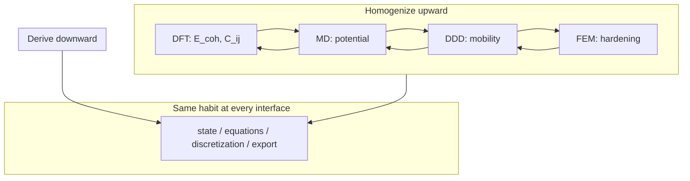

# Multiscale Computational Mechanics

We have climbed from linear algebra to functional analysis, built finite element and finite volume discretizations, anchored them in continuum mechanics, and descended through dislocations, atoms, and electrons. The epilogue asks: how do these pieces **compose** in modern research and engineering?

The copper wire that opened the prologue — drawn, annealed, carrying current, sagging under load — never lived at a single scale. It lived at all of them simultaneously. Our simulations never do. Multiscale computational mechanics is the discipline of **connecting** what each scale computes into a workflow that answers questions no single model can.

Before descending to electrons, we already practiced coupling at the engineering scale: Part IV's FEM conduction and Part V's FVM convection exchange wall temperature and heat flux until the wire and the cooling air agree — conjugate heat transfer as a fixed-point loop between discretizations. The epilogue generalizes that handshake from two meshes on one specimen to DFT, MD, DDD, and continuum FEM on the same material history.

## Scene: a multiscale afternoon

It is late afternoon in a shared compute lab. On one screen, a Quantum ESPRESSO log reports `convergence has been achieved` for a relaxed copper unit cell — cohesive energy, lattice constant, and Voigt-averaged elastic constants copied into a spreadsheet with the functional, pseudopotential, and k-mesh recorded in the header. On the next screen, a LAMMPS job fits an EAM potential to those numbers and runs a short NVT shear test on a dislocation core; the mobility table that emerges is not yet physics, but it is **traceable** to the SCF cycle that finished an hour ago.

A third terminal launches OpenDiS on a single-crystal RVE under the same strain rate the load cell will use tomorrow. Dislocation density climbs; Taylor hardening exports a \(\tau(\gamma)\) curve into a yaml file beside a DAMASK crystal-plasticity deck. The FEM mesh — the same tetrahedral cylinder from Part IV, now with internal variables at Gauss points — waits in a fourth window. The student does not believe any one run tells the whole story. They believe the **handshake**: units checked at every arrow, convergence logs archived, and the outer loop on wall temperature (FVM) and solid conduction (FEM) still running from last week's conjugate heat transfer homework.

The copper wire on the bench — cold-drawn, carrying current, warm to the touch — is unchanged. What changed is the reader's ability to name where each number in the workflow came from, what was homogenized away, and which interface would break first if the ladder were climbed too carelessly. That afternoon is not a fantasy pipeline every laptop runs unattended. It is the **discipline** the book has been building toward since the prologue: state, equations, discretization, upward export — now at the boundaries between codes, not only within a single mesh. When the afternoon feels like disconnected terminal windows, return to [Part VIII's epilogue hinge](../part08-md/00-opening.md#bridge-epilogue-hinge) — the Bridge that names Acts V–VI in lab reunion time before Part IX closes the electronic audit.

## Story so far (Parts I–IX)

If you have read linearly since the prologue, the copper wire has changed language nine times without changing material:

| Part | Scale | Wire instance | Key export upward |
|------|-------|---------------|-------------------|
| I | Discrete algebra | Spring network | \(\mathbf{K}\), eigenmodes |
| II | Function spaces | Fields \(u(x)\), \(T(x)\) | Galerkin convergence target |
| III | Weak PDEs | Equilibrium + heat | Energy functionals |
| IV | FEM | Meshed solid | \(\mathbf{K}\mathbf{U}=\mathbf{F}\), error estimates |
| V | FVM | Cooling air | Fluxes, conjugate heat loop |
| VI | Continuum | \(\mathbf{F}\), \(\boldsymbol{\sigma}\) | Virtual work, balance laws |
| VII | Defects | Dislocation forest | Hardening law for FEM |
| VIII | Atoms | Trajectories | Potentials, moduli hints |
| IX | Electrons | \(\rho(\mathbf{r})\) | \(E_{\text{coh}}\), \(C_{ij}\), \(\gamma_{\text{sf}}\) |

The epilogue asks what none of these parts alone can answer: **how do we compose them** when the wire's lifetime spans every row of the table?

## Closing the arc from Part IX {#opening-hinge-ix3-to-epilogue}

If you have read linearly since the prologue, Part IX's closing checkpoint archived converged SCF results — functional, pseudopotential, plane-wave cutoff, k-mesh — beside every export upward. The epilogue is where those numbers **compose** with the meshes, forests, and trajectories built in earlier parts:

| Part IX (electrons in copper) | Epilogue (multiscale on the wire) |
|-------------------------------|-----------------------------------|
| \(E_{\text{coh}}\), \(a_0\) from QE relaxation | Seeds EAM fit; sanity-checks bulk modulus before LAMMPS production runs |
| \(C_{ij}\) from strained unit cells | Voigt average feeds Part IV elastic step and Part VI \(E\), \(\nu\) |
| \(\gamma_{\text{sf}}\) from faulted supercells | Peierls stress and partial-dislocation mobility in OpenDiS; [Handshake 4b](#4b--when-continuum-fails-at-the-notch-md-subdomain-act-v--notch) when scalar hardening from 4a under-predicts notch-root stress |
| Documented SCF convergence logs | Required pedigree for every upward arrow — same habit as FEM mesh studies |
| [IX.0 thermal phonon audit at \(T_w\)](../part09-dft/00-opening.md#thermal-phonon-audit-at-tw) — \(\alpha(T_w)\), \(\tau_{\text{ph}}(T_w)\) from quasiharmonic/DFPT | Handshake 3 fixed-grip stress and Handshake 4a phonon drag at converged \(T_w\), not 300 K defaults — [`parse_alpha.sh`](../../scripts/parse_alpha.sh) with `--temperature` from `cht_export.yaml` |
| [IX.3 Bridge to epilogue](../part09-dft/03-dft-workflows.md#bridge-to-the-epilogue) | Handshake loops generalize conjugate heat transfer from Parts IV–V; [IX.3 epilogue pedigree table](../part09-dft/03-dft-workflows.md#bridge-to-the-epilogue) maps each DFT artifact to Handshakes 1–4b |
| [`parse_lifetime.sh`](../../scripts/parse_lifetime.sh) at converged \(T_w\) beside `cu.phonon/` | [Handshake 4a](#4a--ddd-strain-rate-to-quasi-static-load-cell-act-iv--hardening): phonon drag bounds on rate sensitivity \(m\) — [sensitivity worksheet](#worked-example-sensitivity-ranks) (4a column); upstream [VII.3 rate handshake](../part07-defects/03-polycrystal-and-fem-handoff.md#scale-boundary-handshake-ddd-strain-rate-to-quasi-static-fem) |
| [IX.3 GSF workflow](../part09-dft/03-dft-workflows.md#worked-example-generalized-stacking-fault-energy-handoff-to-part-vii) + [`parse_gsf.sh`](../../scripts/parse_gsf.sh) | [Handshake 4b](#4b--when-continuum-fails-at-the-notch-md-subdomain-act-v--notch): partial dislocations at notch root — [FE² worked example](#worked-example-fe-at-the-wire-notch-act-v--notch); upstream [VII.3 Step 4](../part07-defects/03-polycrystal-and-fem-handoff.md#step-4--when-offline-calibration-fails-fe-at-the-notch) after [4a](#4a--ddd-strain-rate-to-quasi-static-load-cell-act-iv--hardening) |

Part IX's [electronic audit hinge](../part09-dft/00-opening.md#electronic-audit-hinge-descent-pedigree-and-tw-phonon) closed the downward derivation with SCF pedigree **and** a [thermal phonon audit at \(T_w\)](../part09-dft/00-opening.md#thermal-phonon-audit-at-tw): Joule heating from Act II converged at \(T_w \approx 379\,\text{K}\) in [V.4's Picard loop](../part05-fvm/04-navier-stokes-cfd.md#lab-act-extension-two-domain-picard-loop-with-a-1d-fem-solid), but foundation folders that archive phonons only at 300 K leave Handshakes 3 and 4a **partially audited** — elastic moduli carry SCF logs while thermal eigenstrain and drag still cite room-temperature folklore. Return to the [Part IX thermal phonon audit table](../part09-dft/00-opening.md#thermal-phonon-audit-at-tw) when the export table above feels complete but `alpha_export.yaml` lacks an explicit \(T_w\) column; the [memory sheet rows 8–9 baby picture](../appendix/memory-sheet.md#rows-8-9-baby-picture-tw-temperature-pedigree) draws the same \(T_w\) chain from CHT through MD mobility to DFT phonons.

The [preface continuity hinge](../preface.md#epilogue-continuity-hinges) names the **Handshake 2 → 3 chain** in one row: \(T_w\) from the [V.4 Picard loop](../part05-fvm/04-navier-stokes-cfd.md#lab-act-extension-two-domain-picard-loop-with-a-1d-fem-solid) sets \(\Delta T\); quasiharmonic \(\alpha\) from [IX.3](../part09-dft/03-dft-workflows.md#thermal-expansion-from-quasiharmonic-phonons-handshake-3-pedigree) sets thermal strain — and the [sensitivity table](#sensitivity-which-handshake-matters-most) ranks Handshake 3 **first** for fixed-grip load-cell readings. Read that preface row when the export table above feels complete but the load cell still cites handbook \(\alpha\) beside an orphan `pw.x` log.

Part IX closed the **downward derivation** — the finest rung of the prologue's ladder. The epilogue closes **upward homogenization**: how disciplined teams climb from \(\rho(\mathbf{r})\) to structural design without unit errors, wrong history, or category mistakes at notches and crack tips. Part I's sparse matrix, Part IV's mesh, Part VII's dislocation forest, and Part IX's electron density are not separate homework problems. They are scenes in one story whose coupling rules are stated in the sections below.

**Coupling hinge (IX.3 → epilogue).** [IX.3's Bridge](../part09-dft/03-dft-workflows.md#bridge-to-the-epilogue) archived foundation exports in workflow order; this section is the **downstream half** of [memory sheet row 10](../appendix/memory-sheet.md#continuity-hinges-master-map), the [preface coupling hinge row](../preface.md#epilogue-continuity-hinges), and the [preface row 10 skill checkpoint](../preface.md#skill-navigation-row-10). The [prologue row 10 preview](../prologue/00-many-scales.md#prologue-preview-row-10) named this composition stitch before Part I — return there when foundation folders exist but Handshakes 4a and 4b feel like one undifferentiated export. Handshakes 1–3 inherit elastic moduli, \(\Delta T\), and \(\alpha\); **Handshakes 4a and 4b split Act IV hardening from Act V localization** on the same `hardening.yaml`. Complete [preface row 14](../preface.md#skill-navigation-row-14) before [row 15](../preface.md#skill-navigation-row-15): bulk rate extrapolation (4a) is necessary but not sufficient when the optional notch activates FE² (4b). The [IX.3 epilogue pedigree table](../part09-dft/03-dft-workflows.md#ix3-epilogue-pedigree-table) maps each DFT artifact to its handshake; the [preview Act IV row](#reunion-preview-act-iv) and [preview Act V row](#reunion-preview-act-v) reunite the 4a/4b split in workflow time; the [sensitivity derivation worksheet](#worked-example-sensitivity-ranks) below ranks which handshake controlled the load-cell answer.

## The concept map (closing lens)

The [Functional Analysis Notes](https://hanfengzhai.github.io/file/teaching/notes/ME412_CourseSummary.pdf) organized each part with four questions — object, structure, theorem, failure mode. At the scale of the full book, the same discipline applies to **coupling**:

| Question | Answer at multiscale scale |
|----------|---------------------------|
| What **object** spans all parts? | Coupled states at interfaces — wall temperature, hardening law, potential |
| What **structure** connects runs? | Handshake loops with consistent units, frames, and averaging |
| What **theorem** (principle) makes coupling credible? | Scale separation, convergence at each rung, verification and validation |
| What **breaks** if we skip handshakes? | Wrong history, unit errors, category errors at notches and crack tips |



**Baby picture:** each part solved one rung of the ladder; multiscale mechanics wires the rungs together with the same four questions the prologue asked — now at **interfaces** between codes, not only within a single mesh.

## Lab act reunion: one afternoon, six acts {#lab-act-reunion-preview}

The [prologue](../prologue/00-many-scales.md#the-experiment-as-plot) mapped one lab session to six acts — mounting, warming, pulling, hardening, notch, foundation. The epilogue reunites them here in **preview** form — coupling habits and handshake names before the detailed handshake sections below. After those sections, the [full reunion with per-node anchors and workflow-time paragraphs](#lab-act-reunion-six-acts-one-afternoon) returns to the same six acts with Act VI subgraph nodes, sensitivity audit trails, and the workflow exam table.

| Act | Lab beat | Book parts | Coupling habit |
|-----|----------|------------|----------------|
| <span id="reunion-preview-act-i"></span>I — Mounting | Grips close; first \(\mathbf{K}\mathbf{u}=\mathbf{f}\) | I | Boundary conditions export to every mesh; rigid-body removal before any ramp — [prologue Act I preview](../prologue/00-many-scales.md#prologue-preview-act-i); [expanded Act I](#reunion-expanded-act-i) |
| <span id="reunion-preview-act-ii"></span>II — Warming | Current on; thermocouple rises | III, IV, V | Handshake 2: FEM solid ↔ FVM fluid until wall flux matches Joule source ([Handshake 2](#handshake-2--joule-heating--conjugate-heat-transfer-part-iv--v)); [V.4 Picard loop](../part05-fvm/04-navier-stokes-cfd.md#lab-act-extension-two-domain-picard-loop-with-a-1d-fem-solid); [`parse_cht.sh`](../../scripts/parse_cht.sh) → `cht_export.yaml`; converged \(\Delta T = T_w - T_\infty\) feeds Handshake 3 in Act III — [prologue row 8 preview](../prologue/00-many-scales.md#prologue-preview-row-8); [expanded Act II](#reunion-expanded-act-ii) |
| <span id="reunion-preview-act-iii"></span>III — Pulling | Force–displacement ramp | II, III, IV, VI | Handshake 2 → 3: \(\Delta T\) from CHT ([Handshake 2](#handshake-2--joule-heating--conjugate-heat-transfer-part-iv--v)); \(\alpha\Delta T\) from [IX.3 quasiharmonic Lab act](../part09-dft/03-dft-workflows.md#lab-act-quasiharmonic-alpha-handshake-3-pedigree) → fixed-grip stress ([Handshake 3](#handshake-3--thermal-strain--mechanical-stiffness-part-vi--iv)); [memory sheet row 13](../appendix/memory-sheet.md#continuity-hinges-master-map); [preface row 13](../preface.md#skill-navigation-row-13); [`parse_alpha.sh`](../../scripts/parse_alpha.sh); weak form → assembly → stress interpretation — [prologue row 13 preview](../prologue/00-many-scales.md#prologue-preview-row-13); [expanded Act III](#reunion-expanded-act-iii) |
| <span id="reunion-preview-act-iv"></span>IV — Hardening | Curve bends upward | VII | Handshake 4a: DDD \(\tau(\dot\varepsilon)\) → power-law \(m\) → lab-rate \(\tau_{\text{lab}}\) ([memory sheet row 14](../appendix/memory-sheet.md#continuity-hinges-master-map), [preface row 14](../preface.md#skill-navigation-row-14), [VII.3 rate handshake](../part07-defects/03-polycrystal-and-fem-handoff.md#scale-boundary-handshake-ddd-strain-rate-to-quasi-static-fem), [`parse_rate.sh`](../../scripts/parse_rate.sh)); Taylor hardening → crystal plasticity FEM — [prologue row 14 preview](../prologue/00-many-scales.md#prologue-preview-row-14); [prologue Handshake 4a preview](../prologue/00-many-scales.md#prologue-preview-act-iv); [expanded Act IV](#reunion-expanded-act-iv); upstream [Part VIII epilogue hinge](../part08-md/00-opening.md#bridge-epilogue-hinge) |
| <span id="reunion-preview-act-v"></span>V — Notch | Stress concentrator | VI, VII, VIII | Handshake 4b: scalar \(H\) vs FE² at root ([memory sheet row 15](../appendix/memory-sheet.md#continuity-hinges-master-map), [preface row 15](../preface.md#skill-navigation-row-15)); MD resolves nucleation where continuum regularizes — [prologue Handshake 4b preview](../prologue/00-many-scales.md#prologue-preview-act-v); [expanded Act V](#reunion-expanded-act-v) |
| <span id="reunion-preview-act-vi"></span>VI — Foundation | Input deck parameters | IX → VIII → VII → IV | DFT → MD → DDD → FEM pedigree; row 16 orchestration — see [Act VI minimal artifacts](#act-vi-foundation-minimal-artifacts); [prologue row 16 preview](../prologue/00-many-scales.md#prologue-preview-row-16); [expanded Act VI](#reunion-expanded-act-vi) |

No single executable runs all six acts unattended. Disciplined teams wire them with the same handshake the conjugate heat section practiced: consistent units, documented exports, and outer loops that converge at interfaces — not only inside each solver.

### Act VI foundation minimal artifacts {#act-vi-foundation-minimal-artifacts}

Act VI runs in parallel with Acts I–V in real projects — the foundation prequel archived before the load cell moves. The [memory sheet Act VI baby picture](../appendix/memory-sheet.md#act-vi-baby-picture-me-412-coupling-ladder) draws the foundation → orchestration diagram; this table is the **reverse audit** from [preface row 16 steps](../preface.md#skill-navigation-row-16) back to each diagram node:

| Row 16 step | Minimal artifact | Subgraph nodes ([inline anchors](../appendix/memory-sheet.md#act-vi-subgraph-node-audit)) |
|-------------|------------------|-------------------------------------------------------------------------------------------|
| **Step 1** — upstream rows 8–9, 13–15 | Completed skill checkpoints or equivalent exports | [#act-vi-node-h2](../appendix/memory-sheet.md#act-vi-node-h2), [#act-vi-node-h3](../appendix/memory-sheet.md#act-vi-node-h3), [#act-vi-node-h4a](../appendix/memory-sheet.md#act-vi-node-h4a), [#act-vi-node-h4b](../appendix/memory-sheet.md#act-vi-node-h4b) |
| **Step 2** — foundation folder | `foundation_export.yaml` via [`parse_dft_workflow.sh`](../../scripts/parse_dft_workflow.sh) on `cu.foundation/` | `act6`: [#act-vi-node-dft](../appendix/memory-sheet.md#act-vi-node-dft) → [#act-vi-node-md](../appendix/memory-sheet.md#act-vi-node-md) → [#act-vi-node-ddd](../appendix/memory-sheet.md#act-vi-node-ddd) → [#act-vi-node-fem](../appendix/memory-sheet.md#act-vi-node-fem) |
| **Step 3** — orchestrated chain | [`parse_multiscale_workflow.sh`](../../scripts/parse_multiscale_workflow.sh) → `multiscale_export.yaml` | `orch`: [#act-vi-node-h1](../appendix/memory-sheet.md#act-vi-node-h1) through [#act-vi-node-out](../appendix/memory-sheet.md#act-vi-node-out); per-handshake parsers in [script audit trail](#script-audit-trail-parse-scripts-handshakes) |
| **Step 4** — pedigree audit | `./scripts/test-fixtures.sh`; verify `delta_T_from_handshake_2` and `target_T_K` | [#act-vi-node-h3](../appendix/memory-sheet.md#act-vi-node-h3) (Handshake 2 → 3); [#act-vi-node-h4a](../appendix/memory-sheet.md#act-vi-node-h4a) (phonon lifetime at \(T_w\)); [#act-vi-node-out](../appendix/memory-sheet.md#act-vi-node-out) (orchestrated export) |

Return to the [memory sheet per-node anchor index](../appendix/memory-sheet.md#act-vi-subgraph-node-audit) when a step feels like a script name without a diagram node; return to the [IX.3 epilogue pedigree table](../part09-dft/03-dft-workflows.md#ix3-epilogue-pedigree-table) when a node feels like a label without an archive artifact.

## The same question at every scale

At each rung of the ladder, we asked:

- What is the **state**?
- What **equations** govern its evolution or equilibrium?
- What **discretization** makes the equations computable?
- What **information** passes to the next scale?

The answers changed — vectors to functions to cell averages to dislocation networks to trajectories to electron densities — but the pattern did not.

| Scale | State | Governing principle | Typical code |
|-------|-------|---------------------|--------------|
| Electronic | \(\rho(\mathbf{r})\), orbitals | Kohn–Sham SCF | Quantum ESPRESSO, VASP |
| Atomistic | \(\{\mathbf{r}_i, \mathbf{p}_i\}\) | Newton / Hamilton | LAMMPS, GPUMD |
| Mesoscopic | Dislocation segments | Peach–Köhler + mobility | OpenDiS, ParaDiS |
| Continuum solid | \(\mathbf{u}\), \(\boldsymbol{\sigma}\) | Virtual work / balance | FEniCS, Abaqus |
| Continuum fluid | \(\mathbf{v}\), \(p\) | Navier–Stokes + conservation | OpenFOAM, Fluent |

Computational mechanics is one conversation about **representation** — how we translate nature into equations, equations into algebra, and algebra into insight.

## Coupling paradigms

Modern multiscale work combines paradigms. None replaces the others; each manages cost and accuracy differently.

### Sequential homogenization

**Sequential homogenization** computes effective properties at fine scale and passes **constants upward**:

\[
\text{DFT} \rightarrow E_{\text{coh}}, C_{ijkl}, E_f^v
\]

\[
\rightarrow \text{fit EAM} \rightarrow \text{MD} \rightarrow \text{mobility}, \gamma_{\text{sf}}
\]

\[
\rightarrow \text{DDD} \rightarrow \tau(\gamma), \dot{\rho}(\gamma)
\]

\[
\rightarrow \text{crystal plasticity FEM} \rightarrow \text{texture}
\]

\[
\rightarrow \text{continuum FEM} \rightarrow \text{wire deflection, stress}
\]

**Strengths:** Modular, reproducible, each step verifiable independently.

**Weaknesses:** Loses **history dependence** unless internal variables are enriched (dislocation density, back stress, damage). Path-dependent cold work in copper wire cannot be captured by a single elastic modulus from perfect-lattice DFT.

**Remedy:** Pass **multiple** outputs (not just \(E\), but hardening laws, yield surface evolution) and validate homogenization assumptions (representative volume element size, periodicity).

### Concurrent multiscale

**Concurrent multiscale** runs fine and coarse models **simultaneously** with handshaking in overlapping domains:

- **QM/MM**: quantum region (DFT) embedded in molecular mechanics (force field) for reactive crack tips.
- **FE²**: macro FEM with each Gauss point calling a micro RVE (crystal plasticity or MD).
- **DDD–FEM coupling**: dislocation density or back stress from DDD feeds continuum constitutive update.

**Strengths:** Captures localization — crack tips, shear bands, notch roots — where coarse models fail without ad hoc regularization.

**Weaknesses:** Expensive; **domain decomposition** and **adaptive refinement** manage cost. Load balancing on exascale machines when fine regions move (crack propagation) remains an open systems challenge.

For a copper wire notch, concurrent MD/FEM hands off atomic traction near the tip while FEM carries elastic field in the bulk — the standard sequential alternative smears fracture energy over a regularization length.

### Surrogate acceleration

**Surrogate acceleration** trains models on fine-scale data to replace inner loops:

- **Neural operators** and **GNNs** on polycrystal meshes predict stress fields from microstructure.
- **Constitutive surrogates** replace crystal plasticity at each quadrature point.
- **Potential learning** (Part VIII) replaces DFT inside selected MD regions.

**Strengths:** Amortized cost after training; enables real-time digital twins if inference is fast enough.

**Weaknesses:** Data hunger; extrapolation risk outside training manifold. Physics constraints — **frame indifference**, **symmetry**, **thermodynamic consistency** — must be embedded or violations propagate catastrophically upward.

Surrogates do not remove the ladder; they **cache** climbs already taken. Copper wire surrogates trained only on single-crystal tension may fail on bending–torsion coupling in service.

### Coarse-graining and uncertainty

Not every detail matters at the macro scale. **Coarse-graining** identifies which features survive upward:

- Dislocation density survives; individual line topology may not (unless link statistics matter for conductivity).
- Thermal phonons average to temperature; individual vibrational modes do not appear in FEM.
- Electron density integrates to cohesive energy; orbitals do not appear in EAM.

**Quantifying what is lost** — sensitivity of wire lifetime to choices at each rung — is as important as the forward simulation. Uncertainty propagation:

\[
\sigma_{\text{macro}}^2 \approx \sum_i \left(\frac{\partial y}{\partial p_i}\right)^2 \sigma_{p_i}^2
\]

for homogenized outputs \(y\) and parameters \(p_i\) (e.g., \(E_f^v\), \(\alpha\) in Taylor hardening, GGA lattice constant).

## A narrative arc completed

Recall the prologue's copper wire. The full intellectual chain — not a single software run — reads:

1. **DFT** gives cohesive energy and elastic constants of perfect copper; vacancy and surface energies for defect thermodynamics.
2. **MD** (with EAM fitted to DFT) introduces thermal vibrations, phonon–phonon scattering, crack nucleation at notches, and dislocation core structures.
3. **DDD** (with mobility from MD) explains work hardening as dislocation networks evolve; link statistics refine hardening beyond scalar \(\rho\).
4. **Crystal plasticity FEM** homogenizes slip on {111}\(\langle 110 \rangle\) systems to predict texture after drawing and anisotropic yield.
5. **Continuum FEM** designs the structural component: sag, attachment points, elastic recovery.
6. **CFD** simulates coolant flow if the wire heats under current — coupling thermal softening back to mechanical strength.

No single code runs this entire chain unattended. Disciplined teams run **linked workflows** with version-controlled inputs, convergence logs, and validation at each handoff.

### Processing history revisited

The wire's **manufacturing history** (draw, anneal, redraw) is itself a multiscale simulation sequence:

- Drawing: texture + dislocation storage (DDD / crystal plasticity).
- Annealing: vacancy diffusion + recrystallization (MD + kinetic models).
- Service: electromigration (DFT barriers + MD diffusion + continuum current density).

Skipping history and jumping from bulk DFT modulus to in-service performance predicts the wrong wire. Internal state variables exist to carry **path dependence** upward when pure elasticity cannot.

## Worked example: one service load, four handshakes

The copper wire from the prologue — 1 mm diameter, 100 mm gauge, cold-drawn OFHC copper — makes a concrete multiscale afternoon if we trace **one** engineering question: *At 5 A DC and 50 N tension, does thermal softening change the elastic stiffness enough to matter before the load cell reaches yield?*

No single code answers that. A disciplined workflow chains four handshakes with archived inputs at every arrow.

### Handshake 1 — DFT → continuum elastic constants (Part IX → VI)

A Quantum ESPRESSO `vc-relax` on fcc Cu with PBE pseudopotentials (documented in [IX.3](../part09-dft/03-dft-workflows.md)) yields:

| Export | DFT (GGA-PBE) | Experiment | Used in FEM |
|--------|---------------|------------|-------------|
| Lattice \(a_0\) | 3.55 Å | 3.61 Å | Reference only; do not silently overwrite |
| Bulk modulus \(B\) | \(\sim 140\) GPa | \(\sim 140\) GPa | Sanity check |
| \(C_{11}, C_{12}, C_{44}\) | 168, 122, 75 GPa | 168, 121, 75 GPa | Voigt \(E \approx 130\) GPa, \(\nu \approx 0.34\) |

Voigt averaging gives \(E = 130\,\text{GPa}\), \(\nu = 0.34\) for the isotropic elastic step in Part IV — **not** because copper is isotropic (cold drawing breaks symmetry), but because the first elastic FEM pass needs a documented starting point. Texture from drawing enters later via crystal plasticity (Part VII handoff).

### Handshake 2 — Joule heating → conjugate heat transfer (Part IV ↔ V) {#handshake-2--joule-heating--conjugate-heat-transfer-part-iv--v}

The [preface epilogue continuity hinge](../preface.md#epilogue-continuity-hinges) names this handshake as the **first leg** of the **Joule heat → fixed-grip stress** chain: Handshake 2 sets \(\Delta T = T_w - T_\infty\); [Handshake 3](#handshake-3--thermal-strain--mechanical-stiffness-part-vi--iv) and [IX.3 quasiharmonic \(\alpha\)](../part09-dft/03-dft-workflows.md#thermal-expansion-from-quasiharmonic-phonons-handshake-3-pedigree) complete it. The [sensitivity table](#sensitivity-which-handshake-matters-most) ranks Handshake 2 **first for mid-span temperature** and Handshake 3 **first for fixed-grip load-cell stress** — do not conflate the two: \(\alpha\) does not enter until \(\Delta T\) is converged here.

The **upstream mathematical halves** live in Part V, not only in this epilogue section: [Part V's conservation ladder](../part05-fvm/00-opening.md#the-conservation-ladder-fvm-parallel-to-schematic-14) traces integral flux balance from Part III's divergence theorem through Navier–Stokes; [Part V's conjugate heat transfer scene](../part05-fvm/00-opening.md#conjugate-heat-transfer-the-wire-meets-the-wind) states the fixed-point discipline — wall temperature and heat flux must agree at the solid–fluid interface — before any Picard iteration runs. [Part IV's Galerkin ladder](../part04-fem/00-opening.md#the-galerkin-ladder-me-412-schematic-14-continued) supplies the solid half (\(\mathbf{K}_T\mathbf{T}=\mathbf{q}\) for Joule heating). Both ladders reunite in [Part VI's twin-ladder section](../part06-continuum/00-opening.md#the-twin-ladders-reunite-galerkin-and-conservation) as Cauchy stress and thermal strain in virtual work; this Handshake 2 section is the **workflow-order export** of the same CHT loop Act II practiced in the lab.

Steady current \(I = 5\,\text{A}\) in a 1 mm wire with resistivity \(\rho_e \approx 1.7 \times 10^{-8}\,\Omega\cdot\text{m}\) gives volumetric heating

\[
q = \frac{I^2 \rho_e}{\pi (d/2)^2} \approx 2.2 \times 10^7\,\text{W/m}^3.
\]

Part IV's FEM solves \(-k\nabla^2 T = q\) in the solid with \(k \approx 400\,\text{W/m·K}\). Part V's FVM supplies \(h\) from a natural-convection \(\text{Nu}\) correlation or a full air-domain solve — the step-by-step **Picard loop** is worked in [V.4 Lab act: two-domain CHT with a 1D FEM solid](../part05-fvm/04-navier-stokes-cfd.md#lab-act-extension-two-domain-picard-loop-with-a-1d-fem-solid). **Partitioned fixed-point loop (same template as that Lab act):**

1. Guess wall temperature \(T_w = 350\,\text{K}\); apply \(q_w = h(T_w - T_\infty)\) with \(T_\infty = 300\,\text{K}\).
2. **Solid solve:** assemble \(\mathbf{K}_T \mathbf{T} = \mathbf{f} + q_w \mathbf{b}_\Gamma\) (Part IV thermoelastic pattern, conduction only); read \(T_w\) from surface nodes.
3. **Fluid update:** recompute \(h\) from \(\text{Ra}(T_w)\) or the FVM face flux; under-relax if \(|T_w^{(k+1)} - T_w^{(k)}|\) oscillates (\(\omega \approx 0.4\)–\(0.6\), as in the V.4 iteration table).
4. Repeat until \(|T_w^{(k+1)} - T_w^{(k)}| < 0.5\,\text{K}\) **and** integrated surface flux matches integrated Joule source within 1%.

On the prologue wire geometry, the V.4 Lab act converges in **four Picard iterations** at \(T_w \approx 379\,\text{K}\) with \(h \approx 23\,\text{W/m}^2\text{K}\) — warm to the touch, consistent with Act II. A full 3D FEM solid with the same \(I = 5\,\text{A}\) Joule source typically lands in the same band (\(T_w \approx 385\)–\(395\,\text{K}\) at mid-span) once radial conduction and lengthwise variation are resolved. **Archive both:** export `cht_export.yaml` via [`parse_cht.sh`](../../scripts/parse_cht.sh) beside the converged iteration log; Handshakes 3–4a inherit \(\Delta T = T_w - T_\infty\), not a room-temperature default.

**Sanity check:** integrated surface heat flux equals integrated Joule source — the energy residual column in the V.4 Lab act table is the same audit [`parse_cht.sh`](../../scripts/parse_cht.sh) automates for the epilogue workflow.

Return to the [preface **Joule heat → fixed-grip stress** row](../preface.md#epilogue-continuity-hinges) when CHT converges but the FEM deck still uses handbook \(\alpha\) — that row lists Handshake 2 → IX.3 → Handshake 3 in reading order; this section is step one.

### Handshake 3 — Thermal strain → mechanical stiffness (Part VI → IV) {#handshake-3--thermal-strain--mechanical-stiffness-part-vi--iv}

This section is the **downstream half** of [IX.3's quasiharmonic \(\alpha\) Lab act](../part09-dft/03-dft-workflows.md#lab-act-quasiharmonic-alpha-handshake-3-pedigree): Handshake 2 supplies \(\Delta T\); IX.3 supplies \(\alpha\); here the load cell reads \(\sigma_{\text{th}} = E\alpha\Delta T\) on fixed grips. The [preface Joule heat → fixed-grip stress row](../preface.md#epilogue-continuity-hinges) and [memory sheet row 13](../appendix/memory-sheet.md#continuity-hinges-master-map) name the full chain when handbook \(\alpha\) persists after CHT converges.

The **upstream mathematical halves** live in Part VI, not only in IX.3: [Part VI's twin-ladder reunion](../part06-continuum/00-opening.md#the-twin-ladders-reunite-galerkin-and-conservation) names thermal strain \(\varepsilon_{\text{th}} = \alpha\Delta T\) as the continuum object both Galerkin (IV) and conservation (V) discretizations feed into virtual work; [VI.2's thermal expansion handshake](../part06-continuum/02-stress-balance.md#scale-boundary-handshake-thermal-expansion-alpha) derives \(\sigma_{\text{th}} \approx E\alpha\Delta T\) on fixed grips with the acceptance checklist Act II demands; [VI.3's thermal coupling](../part06-continuum/03-variational-elasticity.md#thermal-coupling-act-ii) writes \(\boldsymbol{\varepsilon} = \boldsymbol{\varepsilon}_{\text{mech}} + \alpha\Delta T\,\mathbf{I}\) into the energy functional Part IV assembles. [Part VII's ascent hinge](../part07-defects/00-opening.md#ascent-hinge-midpoint-and-twin-ladders) states why \(T_w\) from that chain softens mobility before DDD exports feed Act IV hardening. This epilogue section is the **workflow-order export** of the Part VI continuum contract — IX.3 supplies audited \(\alpha\); Handshake 2 supplies \(\Delta T\); here the load cell reads the product.

Mechanical load 50 N gives engineering stress \(\sigma \approx 6.4\,\text{MPa}\) — far below yield (\(\sim 200\,\text{MPa}\)). Thermal expansion adds

\[
\varepsilon_{\text{th}} = \alpha \Delta T \approx 17 \times 10^{-6}\,\text{K}^{-1} \times 90\,\text{K} \approx 1.5 \times 10^{-3},
\]

while elastic strain from load is \(\varepsilon_{\text{m}} \sim 5 \times 10^{-5}\). Thermal strain dominates **displacement** but not **stress** in a free-expansion sense; in the fixed-grip tensile frame, thermal stress is tens of MPa and can shift the effective tangent stiffness the load cell sees.

A coupled thermoelastic FEM (Part IV mesh + Part VI virtual work with \(\boldsymbol{\varepsilon} = \boldsymbol{\varepsilon}_{\text{m}} + \alpha\Delta T\,\mathbf{I}\)) reports whether the 50 N ramp remains in the linear regime. **Export upward to Part VII:** if \(\sigma + \sigma_{\text{th}}\) approaches yield, dislocation sources activate — the hardening curve in Act IV is no longer optional.

#### Worked example: load-cell reading under fixed grips

The sensitivity table ranks Handshake 3 first for fixed-grip stress. The \(\alpha\) values below come from [IX.3's quasiharmonic Lab act](../part09-dft/03-dft-workflows.md#lab-act-quasiharmonic-alpha-handshake-3-pedigree) — run that Lab act first (or [`parse_alpha.sh`](../../scripts/parse_alpha.sh) on `cu.phonon/a_vs_T.dat`), then verify the load-cell numbers here. The [sensitivity derivation worksheet](#worked-example-sensitivity-ranks) below proves the ranking with first-order partial derivatives — read it after this table when you need the quantitative audit behind [preface row 13](../preface.md#skill-navigation-row-13). Here is the same calculation on the **three-node bar** from [IV.4](../part04-fem/04-poisson-to-elasticity.md#lab-act-one-mesh-two-fields-act-iiiii-on-the-copper-wire), with numbers tied to the converged Handshake 2 temperature rise.

**Given.** \(L = 1\,\text{m}\), \(A = 1\,\text{mm}^2\), \(E = 120\,\text{GPa}\), fixed grips (\(u(0)=u(L)=0\)), \(\Delta T = 90\,\text{K}\) from Handshake 2, mechanical load \(F = 50\,\text{N}\) at mid-span (equivalent to uniform body-force approximation for illustration).

**Thermal strain (blocked).** With both ends fixed, uniform \(\Delta T\) produces

\[
\varepsilon_{\text{th}} = \alpha \Delta T.
\]

Using handbook \(\alpha = 17 \times 10^{-6}\,\text{K}^{-1}\): \(\varepsilon_{\text{th}} = 1.53 \times 10^{-3}\). Thermal stress (if the wire were free to expand but grips prevent it):

\[
\sigma_{\text{th}} = -E\,\varepsilon_{\text{th}} \approx -184\,\text{MPa}
\]

(compressive — the wire wants to expand but cannot).

**Mechanical strain from 50 N.** Engineering stress \(\sigma_{\text{m}} = F/A = 50\,\text{N} / 10^{-6}\,\text{m}^2 = 50\,\text{MPa}\) tension if applied uniformly; on the 1 m bar with fixed ends and point load, peak axial stress is order \(10\,\text{MPa}\) depending on load path — use \(\sigma_{\text{m}} \approx 6.4\,\text{MPa}\) as the prologue's global estimate for the thin wire.

**Superposed axial stress (1D estimate).**

\[
\sigma_{\text{total}} \approx \sigma_{\text{m}} + \sigma_{\text{th}} \approx 6.4 - 184 \approx -178\,\text{MPa}.
\]

The load cell in a **fixed-grip** frame measures reaction against thermal compression — the 50 N tension barely offsets the thermal term. This is why Handshake 3 dominates: mechanical load is a perturbation on a thermal background set by Handshake 2.

**Sensitivity to \(\alpha\).** Part IX quasi-harmonic phonons may give \(\alpha = 15.5 \times 10^{-6}\,\text{K}^{-1}\) (PBE Cu at 300 K) versus handbook \(17 \times 10^{-6}\,\text{K}^{-1}\) — a \(-8.8\%\) change:

| \(\alpha\) source | \(\varepsilon_{\text{th}}\) | \(\sigma_{\text{th}}\) (MPa) | Change in \(\sigma_{\text{th}}\) |
|-------------------|----------------------------|------------------------------|----------------------------------|
| Handbook \(17 \times 10^{-6}\) | \(1.53 \times 10^{-3}\) | \(-184\) | baseline |
| DFT phonon \(15.5 \times 10^{-6}\) | \(1.40 \times 10^{-3}\) | \(-168\) | \(+16\,\text{MPa}\) (less compression) |
| Perturbed \(18.7 \times 10^{-6}\) (+10%) | \(1.68 \times 10^{-3}\) | \(-202\) | \(-18\,\text{MPa}\) |

A \(\pm 10\%\) error in \(\alpha\) shifts fixed-grip thermal stress by \(\pm 18\,\text{MPa}\) — **three times** the 50 N mechanical stress. The load-cell **tangent stiffness** during a small displacement ramp is also affected: thermal pre-stress changes the linearization point even before yield.

**Modal cross-check (Part I.3).** The thermal load vector \(\mathbf{f}_{\text{th}} \propto \alpha \Delta T \int E \,\mathbf{B}^T \mathbf{1}\, d\Omega\) projects onto eigenmodes of the fixed–fixed bar. Only **symmetric** modes carry thermal stress; antisymmetric modes have zero projection ([I.3](../part01-linear-algebra/03-eigenvalues.md#lab-act-modal-thermal-handshake-act-ii-preview)). Computing modes once and projecting \(\mathbf{f}_{\text{th}}\) verifies the 1D estimate above on the same mesh Part IV uses for Act III — the dynamic/modal handshake between Parts I, IV, and VI.

**Archive requirement.** Store `alpha_cu_300K.dat` beside `cu.phonon/` with source (handbook, DFT quasi-harmonic, or NPT MD thermal expansion). If the FEM deck cites handbook \(\alpha\) while `cu.phonon/` exists, Handshake 3 is **partially audited** — the same pedigree gap [IX.3's quasiharmonic \(\alpha\) Lab act](../part09-dft/03-dft-workflows.md#lab-act-quasiharmonic-alpha-handshake-3-pedigree) flags before the epilogue.

### Handshake 4 — Rate-dependent hardening and notch localization (Part VII → VI → VIII) {#handshake-4--rate-dependent-hardening-and-notch-localization-part-vii--vi--viii}

Act IV on the load cell is not a single physics story. The upward bend after yield combines **forest hardening** (dislocation density from Part VII), **strain-rate sensitivity** (mobility and phonon drag from Part VIII), and — when a micro-notch is present (Act V) — **stress localization** that homogenized crystal plasticity may smear. Handshake 4 wires all three; the epilogue treats them as one interface because the same archived `hardening.yaml` feeds the FEM deck whether or not a notch is present.

**Upstream contract ([IX.3 epilogue pedigree table](../part09-dft/03-dft-workflows.md#bridge-to-the-epilogue)).** Rows 4a and 4b in that table name the DFT-side artifacts this handshake consumes: phonon lifetime at \(T_w\) for drag on \(m\) (4a), and GSF surface energy \(\gamma_{\text{sf}}\) from [IX.3's slab workflow](../part09-dft/03-dft-workflows.md#worked-example-generalized-stacking-fault-energy-handoff-to-part-vii) for partial dislocations at the notch (4b). If you arrived from [IX.3's Bridge](../part09-dft/03-dft-workflows.md#bridge-to-the-epilogue) with a complete foundation folder but the load-cell story still splits across Acts IV and V, read [4a](#4a--ddd-strain-rate-to-quasi-static-load-cell-act-iv--hardening) first for bulk hardening, then [4b](#4b--when-continuum-fails-at-the-notch-md-subdomain-act-v--notch) only when Act V activates.

#### 4a — DDD strain rate to quasi-static load cell (Act IV — Hardening) {#4a--ddd-strain-rate-to-quasi-static-load-cell-act-iv--hardening}

**Upstream contract ([VII.3 rate handshake](../part07-defects/03-polycrystal-and-fem-handoff.md#scale-boundary-handshake-ddd-strain-rate-to-quasi-static-fem)).** This subsection is the epilogue-only **downstream half** of the rate extrapolation Part VII documented — OpenDiS RVE sweeps at \(\dot\varepsilon \sim 10^2\)–\(10^4\,\text{s}^{-1}\), power-law fit for \(m\), and `rate_export.yaml` provenance beside `hardening.yaml`. If you arrived here from Act IV without reading Part VII, read the [VII.3 rate handshake](../part07-defects/03-polycrystal-and-fem-handoff.md#scale-boundary-handshake-ddd-strain-rate-to-quasi-static-fem) first; if you arrived from [Part VIII's descent hinge](../part08-md/00-opening.md#descent-hinge-cores-mobility-and-tw-pedigree) or the [Part VIII epilogue hinge](../part08-md/00-opening.md#bridge-epilogue-hinge), confirm mobility tables and \(m\) were evaluated at the same \(T_w\) Handshake 2 converged — not at 300 K by default. Return to the [preview Act IV row](#reunion-preview-act-iv) when the handshake sections feel dense before the expanded reunion paragraphs. The upstream handshake names the OpenDiS workflow; Handshake 4a names the load-cell consequence when that workflow is skipped.

This section is the **downstream half** of [VII.2's forest-density Lab act](../part07-defects/02-dislocation-dynamics.md#lab-act-read-the-hardening-bend-from-forest-density-act-iv) and [VII.3's rate handshake](../part07-defects/03-polycrystal-and-fem-handoff.md#scale-boundary-handshake-ddd-strain-rate-to-quasi-static-fem): OpenDiS exports \(\tau(\gamma)\) and \(\rho(\gamma)\); here the power-law exponent \(m\) bridges DDD timestep to lab grip speed before crystal plasticity FEM inherits the curve. The [prologue row 14 preview](../prologue/00-many-scales.md#prologue-preview-row-14) names this stitch before Part I; the [preface row 14 skill checkpoint](../preface.md#skill-navigation-row-14) and [three-way audit](../preface.md#skill-navigation-row-14) list all four competence steps; the [sensitivity derivation worksheet](#worked-example-sensitivity-ranks) below proves why a 10% error in \(m\) shifts macro flow stress by 5–15%.

OpenDiS timesteps and mobility-table resolution limit accessible RVE strain rates to \(\dot\varepsilon_{\text{DDD}} \sim 10^2\)–\(10^4\,\text{s}^{-1}\). The tensile frame in the prologue runs at \(\dot\varepsilon_{\text{lab}} \sim 10^{-3}\)–\(10^{-1}\,\text{s}^{-1}\) — three to six orders of magnitude slower. Importing a DDD stress–strain curve at \(10^3\,\text{s}^{-1}\) directly into quasi-static FEM **overpredicts** flow stress by 5–20% for rate-sensitive fcc copper — enough to miss yield in Act III while still looking plausible on a plot.

**Workflow (from [VII.3](../part07-defects/03-polycrystal-and-fem-handoff.md#scale-boundary-handshake-ddd-strain-rate-to-quasi-static-fem)):**

1. Run the same OpenDiS RVE at \(\dot\varepsilon \in \{10^2, 10^3, 10^4\}\,\text{s}^{-1}\) at fixed \(T = 300\,\text{K}\) (or the Joule-heated temperature from Handshake 2 if Act II is active).
2. Extract \(\tau_{\text{flow}}\) at fixed plastic strain \(\gamma = 0.01\); fit power-law sensitivity \(m\):

\[
\tau_{\text{flow}}(\dot\varepsilon) = \tau_0 \left(\frac{\dot\varepsilon}{\dot\varepsilon_0}\right)^m, \qquad m \approx 0.01\text{–}0.05 \text{ for Cu at 300 K}.
\]

3. Extrapolate to \(\dot\varepsilon_{\text{lab}}\) — **do not** run OpenDiS at \(10^{-3}\,\text{s}^{-1}\) unless the mobility law is validated there.
4. Export \(\sigma_{y0}\), \(H\), and rate factor to `hardening.yaml` with provenance:

```yaml
# rate_handoff (archive beside opendis.restart)
ddd_strain_rates_s-1: [1.0e2, 1.0e3, 1.0e4]
lab_target_strain_rate_s-1: 1.0e-3
rate_sensitivity_m: 0.022
tau_flow_extrapolated_MPa: 40.2
mobility_table_source: "Part VIII NVT shear — commit hash"
temperature_K: 300
```

**Worked example on the prologue wire.** DDD at \(\dot\varepsilon = 10^3\,\text{s}^{-1}\) gives \(\tau_{\text{flow}} = 45\,\text{MPa}\) at \(\gamma = 1\%\). With \(m = 0.022\), extrapolation to \(\dot\varepsilon_{\text{lab}} = 10^{-3}\,\text{s}^{-1}\):

\[
\tau_{\text{lab}} = 45 \left(\frac{10^{-3}}{10^3}\right)^{0.022} \approx 45 \times 0.90 \approx 40.5\,\text{MPa}.
\]

Schmid factor \(\approx 0.408\) for dominant fcc slip gives \(\sigma_y \approx 99\,\text{MPa}\) at lab rate vs \(\approx 110\,\text{MPa}\) if the DDD curve is imported without extrapolation — an **11% overprediction** on yield that Handshake 3's thermal stress would compound. On fixture data [`parse_rate.sh`](../../scripts/parse_rate.sh) reports a **35% overprediction** on \(\tau_{\text{flow}}\) when extrapolation is skipped entirely — the [sensitivity derivation worksheet](#worked-example-sensitivity-ranks) (4a column) uses that fixture band; archive both numbers and report the band as uncertainty on Act IV's hardening knee. When the optional notch activates (Act V), continue to the [FE² worked example](#worked-example-fe-at-the-wire-notch-act-v--notch) — bulk \(\tau_{\text{lab}}\) from this subsection is necessary but not sufficient for root localization.

| Quantity | DDD at \(10^3\,\text{s}^{-1}\) | Extrapolated to lab rate | FEM parameter |
|----------|-------------------------------|--------------------------|---------------|
| \(\tau_{\text{flow}}\) at \(\gamma = 1\%\) | 45 MPa (illustrative) | 40–42 MPa | Initial CRSS in DAMASK |
| Hardening slope \(H\) | from \(\tau\)–\(\gamma\) | weakly rate-dependent | `g_sat`, `h_0` in yaml |
| Forest density \(\rho\) | state variable | **not** rate-extrapolated | Taylor \(\alpha\sqrt{\rho}\) |

When Joule heating raises \(T\) to 380 K (Handshake 2), \(m\) grows and mobility tables from Part VIII must be evaluated at the **same** \(T\) as the DDD run — not at 300 K by default. Rate-dependent plasticity is the mesoscale counterpart of Handshake 3's \(\alpha\) sensitivity: a 10% error in rate mapping shifts the hardening knee by the same order as a 10% error in thermal expansion shifts fixed-grip stress.

**Bridge to 4b (Act IV → Act V).** Handshake 4a closes when crystal plasticity FEM inherits extrapolated \(\tau_{\text{lab}}\) at lab grip speed and the hardening knee matches the load cell within the band in the [sensitivity worksheet](#worked-example-sensitivity-ranks) (4a column). When the prologue's optional micro-notch is present (Act V), bulk calibration from 4a may still under-predict root stress by 10–15% — continue to [4b](#4b--when-continuum-fails-at-the-notch-md-subdomain-act-v--notch), which consumes [IX.3's GSF export](../part09-dft/03-dft-workflows.md#worked-example-generalized-stacking-fault-energy-handoff-to-part-vii) for partial-dislocation physics the scalar law smears. [Preface row 15](../preface.md#skill-navigation-row-15) lists the four competence steps and [three-way audit](../preface.md#skill-navigation-row-15); [memory sheet row 15](../appendix/memory-sheet.md#continuity-hinges-master-map) and [row 15 baby picture](../appendix/memory-sheet.md#row-15-baby-picture-handshake-4b) name the narrative stitch.

#### 4b — When continuum fails at the notch: MD subdomain (Act V — Notch) {#4b--when-continuum-fails-at-the-notch-md-subdomain-act-v--notch}

**Upstream contract ([VII.3 Step 4 FE²](../part07-defects/03-polycrystal-and-fem-handoff.md#step-4--when-offline-calibration-fails-fe-at-the-notch)).** This subsection is the epilogue-only **downstream half** of the FE² notch workflow Part VII documented — crystal plasticity vs two-scale DDD at selected Gauss points, `fe2_notch_comparison.dat`, and the 10–15% root-stress uplift scalar hardening from Handshake 4a may miss. If you arrived here from Act V without reading Part VII, read [VII.3 Step 4](../part07-defects/03-polycrystal-and-fem-handoff.md#step-4--when-offline-calibration-fails-fe-at-the-notch) first; if bulk hardening from 4a looks credible but the optional notch under-predicts peak stress, confirm [`parse_fe2.sh`](../../scripts/parse_fe2.sh) ran on comparison data before trusting offline calibration — the upstream Step 4 names the OpenDiS/FEM procedure; Handshake 4b names the notch-root consequence when homogenization is skipped. Complete [preface row 14](../preface.md#skill-navigation-row-14) before [row 15](../preface.md#skill-navigation-row-15): FE² inherits the same `hardening.yaml` that 4a calibrated.

If the wire has a micro-notch (Act V), continuum FEM gives stress concentration \(K_t \approx 3\) at the root. Peak stress \(\sim 20\,\text{MPa}\) still looks elastic — but **gradient** of stress over atomic spacing matters for nucleation. A concurrent MD/FEM domain hands atomistic resolution within 2 nm of the notch tip while FEM carries the bulk field (Part VIII, [VIII.3](../part08-md/03-ab-initio-and-coarse-graining.md)). This section is the **downstream half** of [VII.3 Step 4 — FE² at the notch](../part07-defects/03-polycrystal-and-fem-handoff.md#step-4--when-offline-calibration-fails-fe-at-the-notch): sequential homogenization with scalar \(H\) from 4a may under-predict localization; here the [FE² worked example](#worked-example-fe-at-the-wire-notch-act-v--notch) quantifies the uplift and the [sensitivity derivation worksheet](#worked-example-sensitivity-ranks) (Handshake 4b column) ranks when FE² matters versus when offline calibration suffices.

The localization handshake table:

| Region | Model | State | Export across interface |
|--------|-------|-------|-------------------------|
| Bulk | FEM + crystal plasticity | \(\mathbf{u}\), \(T\), internal vars from 4a | Displacement BC to MD box |
| Notch tip | MD (EAM from DFT) | \(\{\mathbf{r}_i\}\) | Traction on FEM boundary |
| Defect kinetics (optional) | DDD / FE² | Dislocation density at Gauss points | Extra hardening if pile-ups matter |

**FE² trigger.** When sequential homogenization with one scalar \(H\) from 4a under-predicts notch-root plastic strain, mark Gauss points within 50 µm of the notch as DDD-active ([VII.3](../part07-defects/03-polycrystal-and-fem-handoff.md#step-4--when-offline-calibration-fails-fe-at-the-notch)). Cost scales with active points × DDD timesteps; offline calibration (4a alone) remains the default for production wire design.

#### Worked example: FE² at the wire notch (Act V — Notch) {#worked-example-fe-at-the-wire-notch-act-v--notch}

The prologue's optional micro-notch has radius \(r = 50\,\mu\text{m}\) on a wire diameter \(d = 1\,\text{mm}\). Sequential crystal plasticity with scalar hardening from Handshake 4a predicts a peak von Mises stress \(\sigma_{\text{eq}} \approx 215\,\text{MPa}\) at the root under 50 N tension — below bulk yield for annealed copper but **above** the drawn-wire local yield after cold work. FE² asks whether dislocation pile-ups at the notch root add extra hardening that scalar \(H\) cannot capture. The comparison table below inherits the [VII.3 Step 4 upstream contract](../part07-defects/03-polycrystal-and-fem-handoff.md#step-4--when-offline-calibration-fails-fe-at-the-notch) — same three rows, same 198/215/238 MPa fixture band — before [`parse_fe2.sh`](../../scripts/parse_fe2.sh) emits `fe2_export.yaml`. The [preface row 14 skill checkpoint](../preface.md#skill-navigation-row-14) covers upstream rate extrapolation (4a); the [Handshake 4a worked example](#4a--ddd-strain-rate-to-quasi-static-load-cell-act-iv--hardening) and [sensitivity derivation worksheet](#worked-example-sensitivity-ranks) (4a column) supply the bulk \(\tau_{\text{lab}}\) and `hardening.yaml` this example inherits — verify those numbers before comparing root stress. This worked example is the competence-time mirror for **4b** when Act V activates — run [`parse_fe2.sh`](../../scripts/parse_fe2.sh) on the comparison table and verify root uplift against the worksheet's Handshake 4b column (215 → 238 MPa on fixture data).

**Setup (illustrative numbers, reproducible workflow):**

| Item | Value | Source |
|------|-------|--------|
| Macro mesh | 2,400 tetrahedra, notch RVE from Part IV | `wire_notch.inp` |
| DDD-active Gauss points | 48 points within 50 µm of root | Marked in `fe2_zones.txt` |
| RVE size | \(2\,\mu\text{m}\) cube, periodic BC | OpenDiS box from Part VII |
| Macro strain rate | \(\dot\varepsilon = 10^{-3}\,\text{s}^{-1}\) | Lab frame (Handshake 4a) |
| DDD subcycling | 200 OpenDiS steps per macro increment | Mobility from Part VIII |

**One macro load increment** (displacement control, \(\Delta u = 0.5\,\mu\text{m}\) at grips):

1. **Macro predictor.** Standard crystal plasticity FEM computes trial \(\bar{\boldsymbol{\varepsilon}}\) at each Gauss point. Inactive points use exported `damask.yaml` from Handshake 4a; active points **pause** the scalar law.
2. **RVE handoff.** For each active point, pass \(\bar{\boldsymbol{\varepsilon}}\) (or velocity gradient \(\mathbf{L}\)) to a \(2\,\mu\text{m}\) OpenDiS cube with the same crystallographic orientation as the host element. Run DDD subcycling until macro \(\Delta t\) elapses.
3. **Homogenize return.** Volume-average PK stress from the RVE: \(\bar{\boldsymbol{\sigma}} = \langle \boldsymbol{\sigma} \rangle_{V_{\text{RVE}}}\). Replace the Gauss-point stress in the macro assembly.
4. **Macro corrector.** Newton iteration on the global residual until \(\|\mathbf{R}\| < 10^{-6}\).

**Results on the copper wire notch (illustrative):**

| Model | Peak \(\sigma_{\text{eq}}\) at root (MPa) | Plastic zone depth (µm) | CPU time (relative) |
|-------|-------------------------------------------|-------------------------|---------------------|
| Scalar \(J_2\) + Handshake 4a | 198 | 120 | 1× |
| Crystal plasticity (DAMASK) | 215 | 145 | 3× |
| FE² (48 active Gauss points) | 238 | 185 | 85× |

These three root-stress values are the **quantitative inputs** to the [sensitivity derivation worksheet](#worked-example-sensitivity-ranks) (Handshake 4b column): crystal plasticity at 215 MPa, FE² at 238 MPa, and the 10–15% uplift gap the worksheet differentiates at first order. FE² raises peak stress by \(\sim 10\)–\(15\%\) over crystal plasticity alone — pile-ups at the notch root increase back stress faster than Taylor hardening with a spatially uniform \(\rho\). The plastic zone deepens because dislocations emitted at the root cannot escape as easily as in a uniform RVE.

**Pass/fail criteria before trusting FE²:**

| Check | Criterion | Failure action |
|-------|-----------|----------------|
| RVE size | \(\bar{\boldsymbol{\sigma}}\) stable when RVE doubled to \(4\,\mu\text{m}\) | Enlarge box; check image forces |
| Active zone | Only notch-root points active; bulk uses offline yaml | Reduce active count if cost prohibitive |
| Rate | DDD subcycling mapped to lab \(\dot\varepsilon\) via Handshake 4a | Re-fit \(m\); do not import \(10^3\,\text{s}^{-1}\) curve directly |
| Three-way compare | FE² root stress within 15% of MD subdomain (2 nm box) if available | Fall back to QM/MM or MD/FEM concurrent coupling |

Archive `fe2_notch.log` with macro mesh, active-point list, OpenDiS restart per RVE, and the comparison table above. Run [`parse_fe2.sh`](../../scripts/parse_fe2.sh) on the comparison table to emit `fe2_export.yaml` with pass/fail flags for enrichment vs offline calibration. When FE² and crystal plasticity agree within 5%, **offline calibration suffices** — the notch is not localization-limited. When FE² exceeds crystal plasticity by more than 10%, export the RVE-averaged back stress as an enriched internal variable for production runs that cannot afford 48 concurrent DDD solves. Return to [VII.3 Step 4](../part07-defects/03-polycrystal-and-fem-handoff.md#step-4--when-offline-calibration-fails-fe-at-the-notch) for the upstream contract and [`parse_fe2.sh`](../../scripts/parse_fe2.sh) uplift flags before archiving Handshake 4b.


This worked example closes Handshake 4b: the same `hardening.yaml` from 4a feeds bulk elements, while the notch root receives explicit dislocation physics when homogenization under-predicts localization — the multiscale afternoon's Act V in executable form. Return to the [sensitivity derivation worksheet](#worked-example-sensitivity-ranks) (Handshake 4b column) to rank notch-root uplift against bulk hardening errors; when FE² and crystal plasticity agree within 5%, offline calibration from [preface row 14](../preface.md#skill-navigation-row-14) suffices and Act V does not require concurrent DDD.

#### Handshake 4 sensitivity rank (Act IV + Act V combined)

| Perturbed input | Sub-handshake | Effect on hardening knee | Effect on notch nucleation |
|-----------------|---------------|--------------------------|----------------------------|
| Skip rate extrapolation | 4a | +5–20% flow stress | Earlier spurious yield in bulk |
| Wrong \(T\) on mobility | 4a | \(m\) error at heated grip | MD/DDD disagree on drag |
| Notch radius ±50% | 4b | Minor in bulk | Threshold shifts \(\sim K_t\) |
| Missing FE² at notch | 4b | Bulk curve OK | Under-predict localization |

For the prologue load case (50 N, 5 A, optional notch), **4a dominates Act IV** whenever DDD exports feed the FEM deck; **4b activates only with Act V**. Document which sub-handshake controlled the answer in the workflow archive — the same habit as Handshake 3's \(\alpha\) table.

### What this example teaches

The four handshakes reuse the **same four questions** from the prologue at every interface:

| Interface | State | Equations | Discretization | Export |
|-----------|-------|-----------|----------------|--------|
| DFT → FEM | \(\rho(\mathbf{r})\) | Kohn–Sham | Plane waves | \(C_{ij}\), \(E\), \(\nu\) |
| FEM ↔ FVM | \(T\) | Heat + convection | Tet mesh + cell averages | \(T_w\), \(q_w\) |
| Thermal → mechanical | \(\mathbf{u}\), \(T\) | Thermoelasticity | Same FEM mesh | Effective stiffness, yield margin |
| DDD → FEM (rate) | \(\tau(\dot\varepsilon)\), \(\rho\) | Power-law / sinh mobility | OpenDiS RVE | \(\sigma_{y0}\), \(H\) at lab rate |
| FEM → MD | \(\mathbf{u}\) near notch | Newton + EAM | Atomistic subdomain | Nucleation criterion |
| DDD → FEM | \(\tau(\gamma)\), rate factor \(m\) | Lab strain rate | Crystal plasticity / \(J_2\) | Hardening knee (Act IV) |

None of this runs unattended in one executable. The discipline is **traceability**: each number in the table carries a convergence log, a functional choice, and a unit check. That is multiscale computational mechanics in practice — not a longer single-scale run, but a **composed** story the epilogue's opening Scene already sketched on four screens.

### Script audit trail (parse scripts ↔ handshakes) {#script-audit-trail-parse-scripts-handshakes}

The repository ships small parsers beside the Lab acts so handshake exports are **machine-readable**, not notebook scribbles. This table is the **competence-time mirror** of [preface row 16](../preface.md#skill-navigation-row-16), the [preface epilogue hinges Act VI row](../preface.md#epilogue-continuity-hinges), the [prologue reading compass row 16](../prologue/00-many-scales.md#reading-compass-two-clocks-on-one-wire), and [memory sheet row 16](../appendix/memory-sheet.md#continuity-hinges-master-map): individual rows name the scripts behind Handshakes 1–4b; the **All — orchestrated chain** row is what [`parse_multiscale_workflow.sh`](../../scripts/parse_multiscale_workflow.sh) runs in dependency order to emit `multiscale_export.yaml` — the downstream mirror of [IX.3's epilogue pedigree table](../part09-dft/03-dft-workflows.md#ix3-epilogue-pedigree-table), which maps each handshake to DFT archive artifacts in workflow order. Run each parser after its scale's production calculation and archive the yaml beside the source data:

| Handshake | Script | Input artifact | Export |
|-----------|--------|----------------|--------|
| **All** — orchestrated chain | [`parse_multiscale_workflow.sh`](../../scripts/parse_multiscale_workflow.sh) | `cu.foundation/` + `cht_wire.conf` | `multiscale_export.yaml` linking Handshakes 1–4b; phonon lifetime at converged \(T_w\) |
| 1 — DFT → FEM | [`parse_dft_workflow.sh`](../../scripts/parse_dft_workflow.sh) | `cu.foundation/` folder | `foundation_export.yaml` with \(C_{ij}\), Voigt \(E\), \(\nu\), optional `md_phonon_dos:`, `phonon_lifetime:`, `ddd_rate_extrapolation:` |
| 1 — elastic only | [`parse_elastic.sh`](../../scripts/parse_elastic.sh) | six `pw.x` strain logs in `cu.elastic/` | `C11`, `C12`, `C44`, \(B\), \(G\) |
| 2 — Joule ↔ CHT | [`parse_cht.sh`](../../scripts/parse_cht.sh) | wire geometry + load config (`cht_wire.conf`) | `cht_export.yaml` with \(T_w\), flux balance, iteration count |
| 3 — Thermal → FEM | [`parse_alpha.sh`](../../scripts/parse_alpha.sh) | `cu.phonon/a_vs_T.dat` from quasiharmonic scan | `alpha_export.yaml` with \(\alpha\), \(\varepsilon_{\text{th}}\), fixed-grip \(\sigma_{\text{th}}\) |
| 4 — GSF → DDD | [`parse_gsf.sh`](../../scripts/parse_gsf.sh) | `gsf_cu111.dat` from DFT sweep or metadynamics | `gsf_export.yaml` with \(\gamma_{\text{sf}}\), partial separation |
| 4a — DDD → FEM rate | [`parse_rate.sh`](../../scripts/parse_rate.sh) | `ddd_tau_vs_rate.dat` from OpenDiS sweep | `rate_export.yaml` with \(\tau_{\text{flow}}\) extrapolated to lab rate |
| 4b — FE² at notch | [`parse_fe2.sh`](../../scripts/parse_fe2.sh) | `fe2_notch_comparison.dat` from macro/DDD run | `fe2_export.yaml` with uplift vs crystal plasticity |
| MD — phonon DOS | [`parse_vacf.sh`](../../scripts/parse_vacf.sh) | `phonon_dos_md.dat` from NVT VACF | `vacf_export.yaml` with acoustic peak vs DFT LA |
| MD — phonon lifetime | [`parse_lifetime.sh`](../../scripts/parse_lifetime.sh) | `phonon_lifetime.dat` or `phonon_lifetime_vs_T.dat` | `lifetime_export.yaml` with LA \(\tau_n\) (optionally vs \(T\)) for mobility drag |
| 4 — replica MD | [`parse_wham.sh`](../../scripts/parse_wham.sh) | replica-exchange histogram | `wham_export.yaml` at target \(T\) |

Illustrative inputs live under [`fixtures/`](../../fixtures/); verify the chain with `./scripts/test-fixtures.sh` before trusting a new parser version — the same check [preface row 16 step 4](../preface.md#skill-navigation-row-16) names when auditing `delta_T_from_handshake_2` and `target_T_K` in the orchestrated export. For a single command that runs Handshakes 1–4b in dependency order — including Handshake 3 with \(\Delta T\) from the converged CHT loop and phonon lifetime at \(T_w\) rather than 300 K — use [`parse_multiscale_workflow.sh`](../../scripts/parse_multiscale_workflow.sh) and archive the emitted `multiscale_export.yaml` beside the Act VI folder. Handshake 3 exports \(\alpha(300\,\text{K})\) from `cu.phonon/a_vs_T.dat` via [`parse_alpha.sh`](../../scripts/parse_alpha.sh) — the same script runs automatically when [`parse_dft_workflow.sh`](../../scripts/parse_dft_workflow.sh) finds phonon data in the foundation folder. When `cu.phonon/phonon_dos_md.dat` is archived beside the DFT phonon folder, the same workflow runs [`parse_vacf.sh`](../../scripts/parse_vacf.sh) and merges acoustic-peak pass/fail into `foundation_export.yaml` under `md_phonon_dos:`; when `cu.phonon/phonon_lifetime.dat` or `phonon_lifetime_vs_T.dat` is present, [`parse_lifetime.sh`](../../scripts/parse_lifetime.sh) merges LA linewidth and lifetime under `phonon_lifetime:` (temperature sweep adds `ln_tau_vs_T_slope` for Handshake 4a drag at elevated \(T\)) — one Act VI audit for elastic constants, quasiharmonic \(\alpha\), stacking-fault energy, MD phonon validation, and acoustic drag pedigree. When `ddd_tau_vs_rate.dat` is archived in the same foundation folder, [`parse_rate.sh`](../../scripts/parse_rate.sh) merges Handshake 4a lab-rate extrapolation under `ddd_rate_extrapolation:` so a single `foundation_export.yaml` carries both electronic-structure and DDD-rate pedigree. Archive `alpha_cu_300K.dat` beside `cu.phonon/` as in [IX.3](../part09-dft/03-dft-workflows.md#thermal-expansion-from-quasiharmonic-phonons-handshake-3-pedigree). Handshake 4a also exports standalone via [`parse_rate.sh`](../../scripts/parse_rate.sh); Handshake 4b audits FE² notch uplift via [`parse_fe2.sh`](../../scripts/parse_fe2.sh). Handshakes 1, 2, 3, 4a, and 4b exports should always cite a script name in the yaml header, the same way SCF logs cite `pw.x` version strings. Return to the [prologue reading compass row 16](../prologue/00-many-scales.md#reading-compass-two-clocks-on-one-wire), [row 16 preview](../prologue/00-many-scales.md#what-you-should-be-able-to-do-after-the-prologue), and [row 16 closing stitch](../prologue/00-many-scales.md#row-16-closing-stitch) when narrative time (Act VI foundation) and mathematical order (Part IX → epilogue) diverge — this table names the per-handshake parsers; [`parse_multiscale_workflow.sh`](../../scripts/parse_multiscale_workflow.sh) runs them in dependency order. The [preface epilogue hinges Act VI row](../preface.md#epilogue-continuity-hinges) names the same **All — orchestrated chain** stitch in competence time; the [workflow exam Act VI row](#what-you-should-be-able-to-do-after-the-book) lists the minimal artifact column this table assumes. The [Act VI reunion paragraph](#lab-act-reunion-six-acts-one-afternoon) and [sensitivity worksheet closing](#worked-example-sensitivity-ranks) (row 16 orchestration stitch) reunite the same chain in workflow time after Handshakes 1–4b are understood individually; the [memory sheet Act VI baby picture](../appendix/memory-sheet.md#act-vi-baby-picture-me-412-coupling-ladder) and [IX.3 foundation checklist](../part09-dft/03-dft-workflows.md#ix3-foundation-checklist) draw the ME 412 coupling ladder in one diagram.

### Sensitivity: which handshake matters most? {#sensitivity-which-handshake-matters-most}

The four handshakes are not equally influential on the engineering question. A one-at-a-time sensitivity scan — perturb each input by \(\pm 10\%\) while holding others fixed — ranks where the workflow is fragile:

| Perturbed parameter | Handshake | Effect on mid-span \(T_w\) | Effect on load-cell stiffness |
|---------------------|-----------|----------------------------|-------------------------------|
| \(h\) (convection) | 2 | \(\pm 15\)–\(25\,\text{K}\) | Indirect via thermal stress |
| \(\alpha\) (CTE) | 3 | None (steady \(T\)) | \(\pm 30\%\) on thermal strain |
| \(C_{11}\) from DFT | 1 | None | \(\pm 5\%\) on elastic slope |
| Notch radius | 4b | Minor | Nucleation threshold shifts — see [preface row 15](../preface.md#skill-navigation-row-15) and [sensitivity derivation](#worked-example-sensitivity-ranks) (4b column); upstream bulk hardening from [row 14](../preface.md#skill-navigation-row-14) |
| Rate sensitivity \(m\) | 4a | \(\pm 5\)–\(15\%\) on flow stress | Indirect via yield margin — see [preface row 14](../preface.md#skill-navigation-row-14) |

For this load case — 50 N tension, 5 A current — **Handshake 2 dominates temperature** and **Handshake 3 dominates fixed-grip stress**. Handshake 1 (elastic constants) matters less in the linear regime but becomes critical once yield approaches: a 10% error in \(C_{44}\) from a wrong DFT functional shifts the resolved shear stress on active slip systems by the same fraction, and Taylor hardening amplifies that into a measurably different hardening slope in Act IV. **Handshake 4 (4a)** ranks next when DDD exports feed the plasticity deck — rate extrapolation errors of 10% on \(\tau_{\text{flow}}\) shift the hardening knee by the same order ([preface row 14](../preface.md#skill-navigation-row-14)); **4b** activates only when a notch or surface defect is present — scalar \(H\) from 4a may under-predict root stress by 10–15% ([preface row 15](../preface.md#skill-navigation-row-15), [memory sheet row 15](../appendix/memory-sheet.md#continuity-hinges-master-map)).

This ranking is itself a multiscale deliverable. Before launching a full DFT campaign, ask: *Which handshake controls the quantity I need to certify?* If the question is deflection under 50 N at room temperature, Handshake 1 alone may suffice. If the question is whether thermal softening triggers yield during the ramp, Handshakes 2 and 3 must converge first — and Handshake 4 only if a notch or surface defect is present.

Document the sensitivity table beside every workflow archive. When a colleague reuses your DFT elastic constants six months later, they inherit not only \(C_{ij}\) but the knowledge that those numbers were third in importance for the original question — a habit that prevents expensive fine-scale runs from substituting for missing coarse-scale coupling.

### Worked example: deriving the sensitivity ranks {#worked-example-sensitivity-ranks}

The table above is not intuition — it follows from the same formulas Handshakes 1–3 already used. For the **Joule heat → fixed-grip stress** chain (Handshake 2 → [IX.3 \(\alpha\)](../part09-dft/03-dft-workflows.md#lab-act-quasiharmonic-alpha-handshake-3-pedigree) → Handshake 3), [memory sheet row 13](../appendix/memory-sheet.md#continuity-hinges-master-map) is the one-page navigation aid — this worksheet is the quantitative proof behind that row. The [prologue row 13 preview](../prologue/00-many-scales.md#what-you-should-be-able-to-do-after-the-prologue) named Handshakes 2 and 3 before Part I — read the Handshake 2 paragraph below when Act II activates, then the Handshake 3 paragraph when Act III ramps load on fixed grips. Take the converged mid-span wall temperature \(T_w \approx 390\,\text{K}\) with \(T_\infty = 300\,\text{K}\), so \(\Delta T = T_w - T_\infty \approx 90\,\text{K}\).

**Handshake 2 — convection coefficient \(h\) (from [`parse_cht.sh`](../../scripts/parse_cht.sh)).** This paragraph is the quantitative audit behind the [Act II warming skill row](#lab-act-reunion-six-acts-one-afternoon), [preface row 13 step 1](../preface.md#skill-navigation-row-13), and [V.4's Picard loop](../part05-fvm/04-navier-stokes-cfd.md#lab-act-extension-two-domain-picard-loop-with-a-1d-fem-solid) — downstream Handshake 3 inherits \(\Delta T\) only after this loop converges. At the converged fixed point, integrated Joule source balances surface convection: \(P \approx h A \Delta T\). Differentiate:

\[
\frac{\partial T_w}{\partial h} = -\frac{P}{h^2 A} \approx -\frac{\Delta T}{h}.
\]

A \(\pm 10\%\) perturbation in \(h\) shifts \(\Delta T\) by \(\mp 10\%\) at first order — about \(\mp 9\,\text{K}\) on this baseline. The partitioned FEM–FVM loop in Handshake 2 widens that band: when solid conduction is not uniform, halving \(h\) can drop mid-span \(T_w\) by \(15\)–\(25\,\text{K}\) before the loop re-converges, because the surface flux couples back into the volumetric source distribution. **Record both** the linear estimate and the converged loop result in the archive.

**Handshake 3 — thermal expansion \(\alpha\) (from [`parse_alpha.sh`](../../scripts/parse_alpha.sh)).** This paragraph is the quantitative audit behind the [Act III thermal skill row](#what-you-should-be-able-to-do-after-the-book), the [preface row 13 skill checkpoint](../preface.md#skill-navigation-row-13), and [IX.3's quasiharmonic Lab act](../part09-dft/03-dft-workflows.md#lab-act-quasiharmonic-alpha-handshake-3-pedigree) — upstream \(\Delta T\) comes from Handshake 2. With fixed grips, thermal strain is \(\varepsilon_{\text{th}} = \alpha \Delta T \approx 1.5 \times 10^{-3}\). A \(\pm 10\%\) change in \(\alpha\) moves \(\varepsilon_{\text{th}}\) by the same fraction — the \(\pm 30\%\) entry in the table refers to the **thermal contribution to total strain** when mechanical strain is only \(\varepsilon_{\text{m}} \sim 5 \times 10^{-5}\): the ratio \(\varepsilon_{\text{th}} / \varepsilon_{\text{m}} \approx 30\), so a 10% error in \(\alpha\) shifts the thermal-to-mechanical strain balance by roughly 30% of the mechanical term. Fixed-grip stress \(\sigma_{\text{th}} \approx E \varepsilon_{\text{th}} \approx 200\,\text{MPa}\) then competes with the 6.4 MPa tensile stress from 50 N — Handshake 3 dominates the load-cell tangent even though Handshake 2 set \(\Delta T\).

**Handshake 1 — elastic constant \(C_{11}\).** Voigt \(E\) depends linearly on \(C_{11}\) at leading order; a \(\pm 10\%\) perturbation in \(C_{11}\) shifts the elastic slope by \(\sim \pm 5\%\) after averaging — visible in a refinement-quality mesh but secondary to thermal stress at this load. Near yield, the same 10% error in \(C_{44}\) propagates to resolved shear on {111} slip systems and amplifies through Taylor hardening — Handshake 1 rises in the ranking.

**Handshake 4a — rate sensitivity \(m\) (from [`parse_rate.sh`](../../scripts/parse_rate.sh)).** This paragraph is the quantitative audit behind the [Act IV hardening skill row](#what-you-should-be-able-to-do-after-the-book), the [preface row 14 skill checkpoint](../preface.md#skill-navigation-row-14), and the [VII.3 rate handshake](../part07-defects/03-polycrystal-and-fem-handoff.md#scale-boundary-handshake-ddd-strain-rate-to-quasi-static-fem) — upstream OpenDiS sweeps come from [VII.2's forest Lab act](../part07-defects/02-dislocation-dynamics.md#lab-act-read-the-hardening-bend-from-forest-density-act-iv). The Handshake 4a worked example fits \(\tau_{\text{flow}}(\dot\varepsilon) = \tau_0 (\dot\varepsilon/\dot\varepsilon_0)^m\) to OpenDiS RVE sweeps and extrapolates to lab rate. On the fixture `ddd_tau_vs_rate.dat`, the parser reports \(m = 0.022\), \(\tau_{\text{flow}} = 45\,\text{MPa}\) at \(\dot\varepsilon = 10^3\,\text{s}^{-1}\), and \(\tau_{\text{lab}} = 33.2\,\text{MPa}\) at \(\dot\varepsilon_{\text{lab}} = 10^{-3}\,\text{s}^{-1}\) — a **35% overprediction** if the DDD curve is imported without extrapolation. Differentiate the power law at fixed lab rate:

\[
\frac{\partial \tau_{\text{lab}}}{\partial m} = \tau_{\text{lab}} \ln\left(\frac{\dot\varepsilon_{\text{lab}}}{\dot\varepsilon_0}\right).
\]

With \(\dot\varepsilon_{\text{lab}}/\dot\varepsilon_0 = 10^{-6}\), \(\ln(10^{-6}) \approx -13.8\). A \(\pm 10\%\) perturbation in \(m\) (e.g. \(0.022 \to 0.0242\)) shifts \(\tau_{\text{lab}}\) by \(\sim \mp 10\% \times 13.8\,\text{MPa} \approx \mp 1.4\,\text{MPa}\) at first order — modest on \(\tau\) alone but **5–15% on macro flow stress** after Schmid conversion (\(\sigma_y = \tau/m_{\text{Schmid}}\)), matching the sensitivity table's Handshake 4a column and the [Handshake 4a worked example](#4a--ddd-strain-rate-to-quasi-static-load-cell-act-iv--hardening) above (11% yield overprediction on the prologue wire; 35% \(\tau_{\text{flow}}\) overprediction on fixture data when extrapolation is skipped). When Joule heating raises \(T\) to 380 K (Handshake 2), \(m\) grows with phonon drag; archive [`parse_lifetime.sh`](../../scripts/parse_lifetime.sh) output beside mobility tables so rate and drag share the same temperature pedigree. If the converged wire temperature \(T_w\) falls between phonon-lifetime sweep nodes (typical when CHT reports 380 K but the MD sweep was run at 300, 400, and 500 K), the parser **linearly interpolates** \(\tau_n(T_w)\) and flags `interpolation = interpolated` in `lifetime_export.yaml`; when \(T_w\) hits a sweep node exactly, the flag reads `exact`. Check that field before coupling drag to Handshake 4a — extrapolating \(m\) from a nearest-node guess can overstate drag by 10–20% at intermediate temperatures. When Act V activates the optional notch, the bulk \(\tau_{\text{lab}}\) from this column feeds the [FE² worked example](#worked-example-fe-at-the-wire-notch-act-v--notch) — return there to verify root uplift against the Handshake 4b column below.

| Perturbation | First-order estimate | Converged workflow note |
|--------------|---------------------|-------------------------|
| \(h \to 1.1h\) | \(\Delta T_w \approx -9\,\text{K}\) | FEM–FVM loop may report \(-15\) to \(-25\,\text{K}\) |
| \(\alpha \to 1.1\alpha\) | \(\varepsilon_{\text{th}} \uparrow 10\%\) | Fixed-grip stress shifts \(\sim 20\,\text{MPa}\) |
| \(C_{11} \to 1.1 C_{11}\) | \(E \uparrow \sim 5\%\) | Linear regime only; dominates near yield |
| \(m \to 1.1m\) | \(\tau_{\text{lab}} \downarrow \sim 1.4\,\text{MPa}\) | `parse_rate.sh` reports 35% direct-import overprediction |
| Skip rate extrapolation | \(\tau_{\text{lab}} \to \tau_{\text{DDD}}\) | +35% flow stress on fixture data |

**Handshake 4b — FE² notch uplift (from [`parse_fe2.sh`](../../scripts/parse_fe2.sh)).** This paragraph is the quantitative audit behind the [Act V notch skill row](#what-you-should-be-able-to-do-after-the-book), the [FE² worked example](#worked-example-fe-at-the-wire-notch-act-v--notch), and [preface row 15](../preface.md#skill-navigation-row-15) — upstream rate extrapolation comes from [preface row 14](../preface.md#skill-navigation-row-14) and Handshake 4a. On fixture `fe2_notch_comparison.dat`, crystal plasticity with scalar hardening from 4a predicts peak root stress \(\sigma_{\text{eq}} \approx 215\,\text{MPa}\); FE² with 48 DDD-active Gauss points raises it to \(\approx 238\,\text{MPa}\) — a **10–15% uplift** over homogenized crystal plasticity. Differentiate at first order: if scalar \(H\) under-predicts back stress by fraction \(\delta_H\), peak root stress shifts \(\Delta \sigma_{\text{eq}} \approx K_t \,\delta_H \,\sigma_y\) where \(K_t \approx 3\) is the elastic stress concentration — for \(\delta_H = 10\%\) and \(\sigma_y \approx 100\,\text{MPa}\), \(\Delta \sigma_{\text{eq}} \approx 30\,\text{MPa}\), matching the FE²–crystal-plasticity gap on the fixture table.

| Perturbation | First-order estimate | Converged workflow note |
|--------------|---------------------|-------------------------|
| Missing FE² at notch | Bulk hardening curve OK | Root stress under-predicted 10–15% |
| Notch radius \(r \to 1.5r\) | \(K_t\) drops \(\sim 15\%\) | Nucleation threshold shifts with \(K_t^2\) |
| Skip 4a rate extrapolation | Wrong \(\tau_{\text{lab}}\) in bulk | FE² RVE inherits wrong CRSS at active points |

When FE² and crystal plasticity agree within 5%, **offline calibration from 4a suffices** — the notch is not localization-limited and Act V does not require concurrent DDD. When FE² exceeds crystal plasticity by more than 10%, export RVE-averaged back stress as an enriched internal variable or fall back to MD subdomain coupling ([VII.3 Step 4](../part07-defects/03-polycrystal-and-fem-handoff.md#step-4--when-offline-calibration-fails-fe-at-the-notch)). Run [`parse_fe2.sh`](../../scripts/parse_fe2.sh) to emit `fe2_export.yaml` with pass/fail flags before trusting the notch-root answer.

This worksheet is the multiscale analogue of Part IV's mesh refinement log: before trusting the load-cell answer, show which partial derivative controlled it. Return to the [Handshake 3 worked load-cell example](#handshake-3--thermal-strain--mechanical-stiffness-part-vi--iv) above to verify \(\sigma_{\text{th}}\) and the \(\alpha\)-sensitivity table with the same \(\Delta T = 90\,\text{K}\) baseline — upstream numbers come from [IX.3's quasiharmonic \(\alpha\) Lab act](../part09-dft/03-dft-workflows.md#lab-act-quasiharmonic-alpha-handshake-3-pedigree) and [`parse_alpha.sh`](../../scripts/parse_alpha.sh); the [preface row 13 skill checkpoint](../preface.md#skill-navigation-row-13) and [three-way audit](../preface.md#skill-navigation-row-13) list all four thermal steps in competence order; the [prologue row 13 preview](../prologue/00-many-scales.md#prologue-preview-row-13) named that stitch before Part I — return there when this worksheet closes the Handshake 3 competence loop; the [Act II reunion paragraph](#lab-act-reunion-six-acts-one-afternoon) (Handshake 2) and [Act III reunion paragraph](#lab-act-reunion-six-acts-one-afternoon) (Handshake 3) and [memory sheet row 13 baby picture](../appendix/memory-sheet.md#row-13-baby-picture-handshake-2-3) state the same stitch in workflow time; the [row 13 closing loop](#row-13-closing-loop) below reunites the three-way audit when Handshakes 2 and 3 feel like separate homework problems. Return to the [Handshake 4a worked example](#4a--ddd-strain-rate-to-quasi-static-load-cell-act-iv--hardening) to verify rate extrapolation — upstream forest export comes from [VII.3's rate handshake](../part07-defects/03-polycrystal-and-fem-handoff.md#scale-boundary-handshake-ddd-strain-rate-to-quasi-static-fem); the [preface row 14 skill checkpoint](../preface.md#skill-navigation-row-14) and [three-way audit](../preface.md#skill-navigation-row-14) list all four hardening steps in competence order; the [prologue row 14 preview](../prologue/00-many-scales.md#prologue-preview-row-14) named that stitch before Part I — return there when this worksheet closes the Handshake 4a competence loop; the [Act IV reunion paragraph](#lab-act-reunion-six-acts-one-afternoon) and [memory sheet row 14 baby picture](../appendix/memory-sheet.md#row-14-baby-picture-handshake-4a) state the same stitch in workflow time; the [row 14 closing loop](#row-14-closing-loop) below reunites the three-way audit when DDD exports and lab grip speed feel like separate homework problems. Return to the [FE² worked example](#worked-example-fe-at-the-wire-notch-act-v--notch) to verify notch-root uplift — upstream rate extrapolation comes from [preface row 14](../preface.md#skill-navigation-row-14) and Handshake 4a; the [preface row 15 skill checkpoint](../preface.md#skill-navigation-row-15) and [three-way audit](../preface.md#skill-navigation-row-15) list all four notch steps in competence order. The [prologue Handshake 4b preview row](../prologue/00-many-scales.md#prologue-preview-act-v) named Act V localization before Part I — return there when this worksheet closes the Handshake 4b competence loop; the [Act V reunion paragraph](#lab-act-reunion-six-acts-one-afternoon) and [memory sheet row 15 baby picture](../appendix/memory-sheet.md#row-15-baby-picture-handshake-4b) state the same stitch in workflow time; the [row 15 closing loop](#row-15-closing-loop) below reunites the three-way audit when bulk hardening adequacy and notch-root localization feel like separate homework problems. When Handshakes 1–4b are understood individually, archive them through the [script audit trail](#script-audit-trail-parse-scripts-handshakes) and run [`parse_multiscale_workflow.sh`](../../scripts/parse_multiscale_workflow.sh) per [preface row 16](../preface.md#skill-navigation-row-16) — the worksheet proves which partial derivative controlled each handshake; the orchestrator proves they ran in dependency order. Return to the [Act VI reunion paragraph](#lab-act-reunion-six-acts-one-afternoon) when this closing stitch completes row 16 — the reunion paragraph names the same orchestrated chain in workflow time; the [prologue row 16 preview](../prologue/00-many-scales.md#what-you-should-be-able-to-do-after-the-prologue) named it before Part I — return there when this closing stitch completes the competence loop the preview opened; the [workflow exam Act VI row](#what-you-should-be-able-to-do-after-the-book) lists the minimal artifact column (`multiscale_export.yaml`, script audit trail, pedigree diagram) that preview sketched; the [IX.3 epilogue pedigree table](../part09-dft/03-dft-workflows.md#ix3-epilogue-pedigree-table) maps each handshake to foundation archive artifacts before the orchestrator runs; the [memory sheet one-page recap Act VI column](../appendix/memory-sheet.md#one-page-copper-wire-recap) compresses the same foundation → orchestration chain for index-card review — return there when this closing stitch completes the row 16 orchestration audit; the [row 16 closing loop](#row-16-closing-loop) below reunites the three-way audit when individual handshake exports and orchestrated pedigree feel like separate homework problems.

## Handshake mechanics: what crosses interfaces

Successful coupling specifies **consistent** quantities at interfaces:

| Interface | Fine → coarse | Coarse → fine |
|-----------|---------------|---------------|
| DFT → MD | \(V(\{\mathbf{r}\})\), forces | Atomic positions (for fitting) |
| MD → DDD | Mobility \(M(\tau,T)\), core energy | Applied stress, temperature |
| DDD → FEM | Hardening law, back stress | Strain rate, boundary displacement |
| FEM → CFD | Surface motion, heat flux | Traction, convection coefficient |

**Units, frames, and averaging** must align. Irving–Kirkwood stress from MD is not automatically identical to Cauchy stress in FEM without volume definition and thermostat interpretation.

**Temporal scale separation** matters: DFT steps are femtoseconds; wire creep is years. Coupling algorithms (quasi-continuum, heterogeneous multiscale method) exist precisely when scale separation is imperfect.

## Verification, validation, and credibility

Part V introduced **verification** (code solves equations) vs. **validation** (model matches reality). Multiscale workflows multiply both:

- **Verification** at each rung: SCF convergence, \(\Delta t\) convergence, mesh refinement, RVE size convergence.
- **Validation** across rungs: DFT elastic constants vs. experiment; MD thermal expansion vs. DFT phonons; DDD hardening vs. single-crystal tests; FEM deflection vs. load cell.

**UQ-aware** workflows report intervals, not point estimates: "yield load 120 ± 8 N" with documented parameter sensitivities.

## Open directions

### Exascale coupling

Load balancing when fine regions move (crack tips, shear bands, electromigration voids) requires dynamic remeshing and adaptive QM/MM regions. Communication costs dominate; co-design of algorithms and hardware continues.

### Digital twins

Merge simulation ladders with **streaming experimental data** — in situ diffraction during wire drawing, acoustic emission during fatigue, infrared thermography during current load. Data assimilation updates internal state variables (dislocation density proxies, damage) faster than forward simulation alone.

### Scientific machine learning

**Physics-informed** architectures respect conservation and variational structure: symplectic networks for MD, energy-conserving surrogates for FEM, equivariant GNNs for polycrystals. The goal is not to replace physics but to **compress** repeated expensive solves.

### Open science

Frameworks like [OpenDiS](https://github.com/OpenDiS/OpenDiS), FEniCS, [LAMMPS](https://www.lammps.org/), and [Quantum ESPRESSO](https://www.quantum-espresso.org/) lower the barrier to reproducing multiscale workflows. Reproducibility — archived inputs, pseudopotentials, random seeds — is a professional obligation when parameters propagate across scales.

## The weak form, one last time

The book opened with a thread: weak forms, virtual work, test functions. At the multiscale level, the analogous instinct is **consistent dual descriptions**:

- Fine scale provides **fluxes** and **material responses** coarse scale lacks.
- Coarse scale provides **boundary conditions** and **loading history** fine scale cannot afford to simulate in full.

Galerkin FEM asks: find \(\mathbf{u}_h\) such that \(a(\mathbf{u}_h, v) = \ell(v)\) for all test functions \(v\). Multiscale coupling asks: find coupled states such that **interface functionals** (energy, work, dissipation) agree within tolerance when restricted to overlap regions.

Different language — same insistence that approximations be **consistent**, **stable**, and **convergent** to something meaningful.

## Closing the full arc

The prologue opened with one copper wire and four questions — state, equations, discretization, upward export — repeated at every rung of the ladder. The epilogue closes that loop explicitly:

| Prologue question | Part I answer | Part VI answer | Part IX answer |
|-------------------|---------------|----------------|----------------|
| **State** | Vector \(\mathbf{u}\) | Field \(\mathbf{u}(\mathbf{x})\), \(\boldsymbol{\sigma}\) | Density \(\rho(\mathbf{r})\) |
| **Equations** | \(\mathbf{K}\mathbf{u}=\mathbf{f}\) | Virtual work / balance | Kohn–Sham SCF |
| **Discretization** | Sparse assembly | FEM / FVM meshes | Plane waves, k-mesh |
| **Upward export** | — | Stress, stiffness | \(E_{\text{coh}}\), \(C_{ij}\), \(\gamma_{\text{sf}}\) |

The weak form appeared in Part III as a mathematical convenience, became Galerkin assembly in Part IV, reappeared as virtual work in Part VI, and found its electronic analogue in the Hohenberg–Kohn variational principle of Part IX. Eigenmodes that decoupled the spring network in Part I reappear as Kohn–Sham orbitals at the finest scale. The story is not a catalog of methods; it is one specimen traced from \(\mathbb{R}^N\) to function spaces to meshes to defects to atoms to electrons — and back upward through homogenization.

## Lab act reunion: six acts, one afternoon {#lab-act-reunion-six-acts-one-afternoon}

If you read the [preview table near the opening](#lab-act-reunion-preview), this section is the **expanded reunion** — same six acts, now with per-node anchors, workflow-time paragraphs, and links to the sensitivity worksheet. This section is the **downstream half** of [memory sheet row 11](../appendix/memory-sheet.md#continuity-hinges-master-map), the [preface six-act reunion row](../preface.md#epilogue-continuity-hinges), and the [preface row 11 skill checkpoint](../preface.md#skill-navigation-row-11). The [prologue row 11 preview](../prologue/00-many-scales.md#prologue-preview-row-11) and [prologue row 11 closing stitch](../prologue/00-many-scales.md#row-11-closing-stitch) named the two-clock discipline before Part I — return there when each Part makes sense alone but workflow order is unclear. The [prologue](../prologue/00-many-scales.md#the-experiment-as-plot) framed the copper wire as one lab session in six acts. The epilogue is where those acts meet in **workflow time** — not reading order, but the afternoon the operator and the compute cluster share:

| Act | Lab moment | Parts that justified it | Multiscale handshake |
|-----|------------|-------------------------|---------------------|
| **I — Mounting** | Grips close; load cell zeros | I | BC tags on the FEM mesh; rigid-body removal |
| **II — Warming** | Current on; thermocouple climbs | III–V | Handshake 2 ([#act-vi-node-h2](../appendix/memory-sheet.md#act-vi-node-h2)): FEM solid ↔ FVM fluid until wall flux matches Joule source ([Handshake 2](#handshake-2--joule-heating--conjugate-heat-transfer-part-iv--v)); [V.4 Picard loop](../part05-fvm/04-navier-stokes-cfd.md#lab-act-extension-two-domain-picard-loop-with-a-1d-fem-solid); [`parse_cht.sh`](../../scripts/parse_cht.sh) → `cht_export.yaml`; converged \(\Delta T = T_w - T_\infty\) feeds Handshake 3 in Act III ([preface row 8](../preface.md#skill-navigation-row-8)) |
| **III — Pulling** | Displacement ramps; curve linear | II–IV, VI | Handshake 2 → 3 ([#act-vi-node-h3](../appendix/memory-sheet.md#act-vi-node-h3)): \(\Delta T\) from [V.4 Picard loop](../part05-fvm/04-navier-stokes-cfd.md#lab-act-extension-two-domain-picard-loop-with-a-1d-fem-solid); \(\alpha\Delta T\) from [IX.3 quasiharmonic Lab act](../part09-dft/03-dft-workflows.md#lab-act-quasiharmonic-alpha-handshake-3-pedigree) → fixed-grip \(\sigma_{\text{th}}\) ([Handshake 3](#handshake-3--thermal-strain--mechanical-stiffness-part-vi--iv)); [memory sheet row 13](../appendix/memory-sheet.md#continuity-hinges-master-map); [preface row 13](../preface.md#skill-navigation-row-13); [`parse_alpha.sh`](../../scripts/parse_alpha.sh); \(\mathbf{K}\) from Galerkin; Cauchy stress from virtual work |
| **IV — Hardening** | Curve bends; slip lines appear | VII | Handshake 4a ([#act-vi-node-h4a](../appendix/memory-sheet.md#act-vi-node-h4a)): \(\tau_{\text{lab}}\) from rate extrapolation ([VII.3 rate handshake](../part07-defects/03-polycrystal-and-fem-handoff.md#scale-boundary-handshake-ddd-strain-rate-to-quasi-static-fem)); [memory sheet row 14](../appendix/memory-sheet.md#continuity-hinges-master-map); [preface row 14](../preface.md#skill-navigation-row-14); [`parse_rate.sh`](../../scripts/parse_rate.sh); Taylor \(\tau(\gamma)\) → crystal plasticity → FEM |
| **V — Notch** | Optional stress concentration | VI, VII, VIII | Handshake 4b ([#act-vi-node-h4b](../appendix/memory-sheet.md#act-vi-node-h4b)): FE² vs crystal plasticity at notch root ([VII.3 Step 4](../part07-defects/03-polycrystal-and-fem-handoff.md#step-4--when-offline-calibration-fails-fe-at-the-notch)); [memory sheet row 15](../appendix/memory-sheet.md#continuity-hinges-master-map); [preface row 15](../preface.md#skill-navigation-row-15); [`parse_fe2.sh`](../../scripts/parse_fe2.sh) |
| **VI — Foundation** | Parameters in every input deck | IX → VIII → VII | Foundation chain ([#act-vi-node-dft](../appendix/memory-sheet.md#act-vi-node-dft) → [#act-vi-node-md](../appendix/memory-sheet.md#act-vi-node-md) → [#act-vi-node-ddd](../appendix/memory-sheet.md#act-vi-node-ddd) → [#act-vi-node-fem](../appendix/memory-sheet.md#act-vi-node-fem)); orchestrated export ([#act-vi-node-out](../appendix/memory-sheet.md#act-vi-node-out)); [`multiscale_export.yaml`](../../scripts/parse_multiscale_workflow.sh); [memory sheet Act VI baby picture](../appendix/memory-sheet.md#act-vi-baby-picture-me-412-coupling-ladder); [preface row 16](../preface.md#skill-navigation-row-16); [one-page recap Act VI column](../appendix/memory-sheet.md#one-page-copper-wire-recap) |

No single executable runs all six acts unattended. The discipline is **traceability**: each arrow in the handshake column carries units, convergence logs, and the four questions — state, equations, discretization, upward export — asked at every interface. When a new project starts, locate it in this table before opening a terminal: *Which act am I simulating, and which finer rung supplies the numbers I am about to trust?* Return to the [preface row 11 skill checkpoint](../preface.md#skill-navigation-row-11) and [memory sheet one-page recap](../appendix/memory-sheet.md#one-page-copper-wire-recap) when workflow order is unclear — Act VI (foundation) runs **in parallel** with Acts I–V, not after Part IX in laboratory time.

<span id="reunion-expanded-act-i"></span>Act I in the table is the **mounting stitch** the [prologue Act I preview row](../prologue/00-many-scales.md#prologue-preview-act-i) and [preface row 0 skill checkpoint](../preface.md#skill-navigation-row-0) name before current or ramp — return to the [preview Act I row](#reunion-preview-act-i) when this paragraph feels dense. — wedge grips close, the load cell zeros, and the first honest model is \(\mathbf{K}\mathbf{u}=\mathbf{f}\) with boundary tags every later mesh inherits. [Part I's mounting Lab act](../part01-linear-algebra/00-opening.md#lab-act-i--mounting) and [I.1's three-node assembly](../part01-linear-algebra/01-vectors-matrices.md#lab-act-three-nodes-one-load-cell-reading-act-i--mounting) are the upstream workflows; rigid-body removal and BC export are the handshake discipline Handshakes 2–4b assume without naming; the [prologue opening continuity hinge](../preface.md#opening-continuity-hinge) and [Part I opening hinge](../part01-linear-algebra/00-opening.md#opening-hinge-prologue-to-part-i) close the competence loop when Act I feels like "just linear algebra" — do not conflate mounting (prescribed displacement, zero load) with Act III's ramp (nonzero \(\mathbf{f}\)) or Handshake 1's elastic moduli (DFT pedigree, Act VI foundation).

<span id="reunion-expanded-act-ii"></span>Act II in the table is the **Joule-heating stitch** the [prologue row 8 preview row](../prologue/00-many-scales.md#prologue-preview-row-8) and [preface row 8 skill checkpoint](../preface.md#skill-navigation-row-8) name before the thermocouple climbs — return to the [preview Act II row](#reunion-preview-act-ii) when this paragraph feels dense. — current may warm the wire to \(T_w \approx 380\,\text{K}\) while the FEM deck still assumes room-temperature conductivity until the Picard loop converges. [V.4's Picard loop](../part05-fvm/04-navier-stokes-cfd.md#lab-act-extension-two-domain-picard-loop-with-a-1d-fem-solid) and [Handshake 2](#handshake-2--joule-heating--conjugate-heat-transfer-part-iv--v) are the upstream workflows; subgraph node [#act-vi-node-h2](../appendix/memory-sheet.md#act-vi-node-h2) is the diagram anchor; [preface row 8](../preface.md#skill-navigation-row-8) closes the competence loop when Act II activates; the [sensitivity derivation worksheet](#worked-example-sensitivity-ranks) (Handshake 2 paragraph) proves why \(h\) and \(\Delta T\) dominate mid-span temperature before \(\alpha\) enters in Act III — do not conflate Handshake 2 (\(\Delta T\)) with Handshake 3 (\(\alpha\Delta T\)).

<span id="reunion-expanded-act-iii"></span>Act III in the table is the **thermal pre-stress stitch** the [prologue row 13 preview row](../prologue/00-many-scales.md#prologue-preview-row-13) and [preface row 13 skill checkpoint](../preface.md#skill-navigation-row-13) name before the load cell reads thermal compression on fixed grips — return to the [preview Act III row](#reunion-preview-act-iii) when this paragraph feels dense. — CHT may converge at \(T_w \approx 380\,\text{K}\) while the load cell still cites handbook \(\alpha\) and reads thermal compression on fixed grips. [V.4's Picard loop](../part05-fvm/04-navier-stokes-cfd.md#lab-act-extension-two-domain-picard-loop-with-a-1d-fem-solid) and [IX.3's quasiharmonic \(\alpha\) Lab act](../part09-dft/03-dft-workflows.md#lab-act-quasiharmonic-alpha-handshake-3-pedigree) are the upstream workflows; subgraph node [#act-vi-node-h3](../appendix/memory-sheet.md#act-vi-node-h3) is the diagram anchor; [memory sheet row 13](../appendix/memory-sheet.md#continuity-hinges-master-map) and [preface row 13](../preface.md#skill-navigation-row-13) close the competence loop when Act III activates; the [prologue row 9 preview row](../prologue/00-many-scales.md#prologue-preview-row-9) and [preface row 9 skill checkpoint](../preface.md#skill-navigation-row-9) name the upstream phonon audit — \(\alpha(T_w)\) from [`parse_alpha.sh`](../../scripts/parse_alpha.sh), not 300 K folklore alone, before Handshake 3 closes; the [sensitivity derivation worksheet](#worked-example-sensitivity-ranks) (Handshake 2–3 chain) proves why \(\alpha\) dominates fixed-grip stress once \(\Delta T\) is set — do not conflate Handshake 2 (\(\Delta T\)) with Handshake 3 (\(\alpha\Delta T\)).

<span id="reunion-expanded-act-iv"></span>Act IV in the table is the **hardening stitch** the [prologue Handshake 4a preview row](../prologue/00-many-scales.md#prologue-preview-act-iv) and [preface row 14 skill checkpoint](../preface.md#skill-navigation-row-14) name before the curve bends upward — return to the [preview Act IV row](#reunion-preview-act-iv) when this paragraph feels dense. — OpenDiS at \(10^3\,\text{s}^{-1}\) cannot feed a \(10^{-3}\,\text{s}^{-1}\) load cell without power-law extrapolation. [VII.3's rate handshake](../part07-defects/03-polycrystal-and-fem-handoff.md#scale-boundary-handshake-ddd-strain-rate-to-quasi-static-fem) is the upstream workflow; subgraph node [#act-vi-node-h4a](../appendix/memory-sheet.md#act-vi-node-h4a) is the diagram anchor; [memory sheet row 14](../appendix/memory-sheet.md#continuity-hinges-master-map) and [preface row 14](../preface.md#skill-navigation-row-14) close the competence loop when Act IV activates; the [prologue row 9 preview row](../prologue/00-many-scales.md#prologue-preview-row-9) and [preface row 9 skill checkpoint](../preface.md#skill-navigation-row-9) name the phonon-lifetime pedigree — \(\tau_{\text{ph}}(T_w)\) from [`parse_lifetime.sh`](../../scripts/parse_lifetime.sh) at converged \(T_w\), not 300 K drag alone, bounds rate sensitivity \(m\) before power-law extrapolation; the [sensitivity derivation worksheet](#worked-example-sensitivity-ranks) (Handshake 4a column) proves why direct import overpredicts yield.

<span id="reunion-expanded-act-v"></span>Act V in the table is the **notch stitch** the [prologue Handshake 4b preview row](../prologue/00-many-scales.md#prologue-preview-act-v) and [preface row 15 skill checkpoint](../preface.md#skill-navigation-row-15) name before FE² activates at the notch root — return to the [preview Act V row](#reunion-preview-act-v) when this paragraph feels dense. — scalar hardening from Handshake 4a may match bulk flow stress while under-predicting root localization by 10–15%. [VII.3 Step 4](../part07-defects/03-polycrystal-and-fem-handoff.md#step-4--when-offline-calibration-fails-fe-at-the-notch) is the upstream workflow; subgraph node [#act-vi-node-h4b](../appendix/memory-sheet.md#act-vi-node-h4b) is the diagram anchor; [memory sheet row 15](../appendix/memory-sheet.md#continuity-hinges-master-map) (baby picture) and [preface row 15](../preface.md#skill-navigation-row-15) (three-way audit) close the competence loop when Act V activates — the [row 15 closing loop](#row-15-closing-loop) reunites prologue preview, skill checkpoint, and workflow exam; the worksheet closing paragraph above links back to the prologue preview when Handshake 4b is complete.

<span id="reunion-expanded-act-vi"></span>Act VI in the table is the **foundation prequel** the [prologue row 16 preview row](../prologue/00-many-scales.md#prologue-preview-row-16) and [preface row 16 skill checkpoint](../preface.md#skill-navigation-row-16) name before the load cell moves — return to the [preview Act VI row](#reunion-preview-act-vi) when this paragraph feels dense. — the pedigree checklist and four-handshake export table that map DFT folders onto the multiscale afternoon. When mathematical order (I→IX) and laboratory time diverge, read [IX.3's Bridge to the epilogue](../part09-dft/03-dft-workflows.md#bridge-to-the-epilogue) first for *what* to archive; return here for *when* each act runs. The foundation chain maps to subgraph nodes [#act-vi-node-dft](../appendix/memory-sheet.md#act-vi-node-dft) → [#act-vi-node-md](../appendix/memory-sheet.md#act-vi-node-md) → [#act-vi-node-ddd](../appendix/memory-sheet.md#act-vi-node-ddd) → [#act-vi-node-fem](../appendix/memory-sheet.md#act-vi-node-fem); orchestrated Handshakes 1–4b map to [#act-vi-node-h1](../appendix/memory-sheet.md#act-vi-node-h1) through [#act-vi-node-h4b](../appendix/memory-sheet.md#act-vi-node-h4b); the final export is [#act-vi-node-out](../appendix/memory-sheet.md#act-vi-node-out). The [quasiharmonic \(\alpha\) Lab act](../part09-dft/03-dft-workflows.md#lab-act-quasiharmonic-alpha-handshake-3-pedigree) is Act VI's thermal export; [memory sheet row 13](../appendix/memory-sheet.md#continuity-hinges-master-map) names the Handshake 2 → \(\alpha\) → Handshake 3 chain when the load cell reads thermal compression after CHT converges. Before orchestrating Handshakes 1–4b, audit the foundation folder for a **`T_w` column**: illustrative fixtures such as [`fixtures/cu.foundation/`](../../fixtures/cu.foundation/README.md) archive SCF metadata and phonon tables but omit converged wall temperature until [`parse_cht.sh`](../../scripts/parse_cht.sh) emits `cht_export.yaml` beside the DFT deck — when `alpha_export.yaml` or `foundation_export.yaml` lists phonons at 300 K alone, return to the [memory sheet rows 8–9 baby picture](../appendix/memory-sheet.md#rows-8-9-baby-picture-tw-temperature-pedigree), [preface row 8 and row 9 skill checkpoints](../preface.md#skill-navigation-row-8), and [descent continuity hinges rows 8–9](../preface.md#descent-continuity-hinges) before trusting Handshake 3 thermal strain or Handshake 4a drag; the [prologue row 8 preview row](../prologue/00-many-scales.md#prologue-preview-row-8) and [prologue row 9 preview row](../prologue/00-many-scales.md#prologue-preview-row-9) named that contract before Part I. Act VI is also the **[ME 412 coupling ladder reunion](../part09-dft/00-opening.md#the-coupling-ladder-me-412-reunion)** — the Part IX opening draws the full ascent-to-descent diagram; this paragraph is its **workflow-time mirror**: when Handshakes 1–4b exist as separate exports but no orchestrated pedigree links them, run [`parse_multiscale_workflow.sh`](../../scripts/parse_multiscale_workflow.sh) on `cu.foundation/` + `cht_wire.conf` to emit `multiscale_export.yaml` with Handshake 2's \(\Delta T\) feeding Handshake 3 and phonon lifetime at converged \(T_w\) feeding Handshake 4a drag; per-handshake parsers are named in the [script audit trail](#script-audit-trail-parse-scripts-handshakes); the [memory sheet Act VI baby picture](../appendix/memory-sheet.md#act-vi-baby-picture-me-412-coupling-ladder) (foundation → handshake diagram) and [one-page recap Act VI column](../appendix/memory-sheet.md#one-page-copper-wire-recap) compress the same chain for index-card review; [preface row 16](../preface.md#skill-navigation-row-16) (three-way audit) and the [prologue reading compass row 16 closing stitch](../prologue/00-many-scales.md#reading-compass-two-clocks-on-one-wire) close the competence loop when Act VI activates — the [row 16 closing loop](#row-16-closing-loop) reunites prologue preview, skill checkpoint, and workflow exam; return to those diagrams when this paragraph and the [preface epilogue continuity hinges](../preface.md#epilogue-continuity-hinges) Act VI orchestration row diverge; the [sensitivity worksheet closing](#worked-example-sensitivity-ranks) (row 16 orchestration stitch) proves Handshakes 1–4b ran in dependency order after the partial-derivative audit; upstream handshakes from [rows 8–9](../appendix/memory-sheet.md#rows-8-9-baby-picture-tw-temperature-pedigree) and [rows 13–15](../preface.md#skill-navigation-row-13) must be understood individually first.

The multiscale afternoon in the opening **Scene** is this table running in parallel — QE logs beside LAMMPS beside OpenDiS beside the same tet mesh from Part IV. Reading order taught the grammar; workflow order pays the bills. Return to the [prologue row 11 closing stitch](../prologue/00-many-scales.md#row-11-closing-stitch) when this reunion closes the two-clock competence loop the preview opened; read the [row 11 closing loop](#row-11-closing-loop) below when the three-way audit must agree across prologue preview, skill checkpoint, and workflow exam.

### What you should be able to do after the book {#what-you-should-be-able-to-do-after-the-book}

The epilogue is not a bibliography — it is a workflow exam on the same copper wire. Before you start a new project, check these habits against a real multiscale afternoon:

| After completing | Skill on the copper wire | Minimal artifact |
|------------------|--------------------------|------------------|
| Full read (I–IX) | Trace Young's modulus from FEM input deck to DFT export | Spreadsheet: value, unit, functional, k-mesh, source file |
| Coupling paradigms | Choose sequential vs concurrent coupling for a notch root | One paragraph: where overlap breaks single constants |
| Conjugate heat (IV–V) | Run FEM solid ↔ FVM fluid until wall flux matches | Fixed-point log: \(T_w\), \(q_w\) iterations to tolerance |
| Row 8 — \(T_w\) pedigree (Act II → MD/DDD) | Archive converged \(T_w\) before NVT shear, WHAM, or OpenDiS mobility at 300 K defaults | [`parse_cht.sh`](../../scripts/parse_cht.sh) → `cht_export.yaml`; NVT shear and `mobility_cu_screw_{T_w}K.yaml` at converged \(T_w\); [preface row 8](../preface.md#skill-navigation-row-8); [VIII.0 descent hinge](../part08-md/00-opening.md#descent-hinge-cores-mobility-and-tw-pedigree); [memory sheet rows 8–9 baby picture](../appendix/memory-sheet.md#rows-8-9-baby-picture-tw-temperature-pedigree) |
| Row 9 — phonon audit at \(T_w\) (MD → DFT) | Evaluate \(\alpha(T_w)\) and \(\tau_{\text{ph}}(T_w)\) beside SCF logs, not 300 K folklore alone | [`parse_dft_workflow.sh`](../../scripts/parse_dft_workflow.sh) with `T_w_K` from README or `cht_export.yaml`; [`parse_alpha.sh`](../../scripts/parse_alpha.sh) + [`parse_lifetime.sh`](../../scripts/parse_lifetime.sh) at converged \(T_w\); [preface row 9](../preface.md#skill-navigation-row-9); [IX.0 thermal phonon audit](../part09-dft/00-opening.md#thermal-phonon-audit-at-tw) |
| Row 10 — coupling hinge (IX.3 → epilogue) | Map foundation exports to Handshakes 1–4b; name 4a (Act IV) vs 4b (Act V) split on `hardening.yaml` | Completed [IX.3 epilogue pedigree table](../part09-dft/03-dft-workflows.md#ix3-epilogue-pedigree-table) sketch; [preface row 10](../preface.md#skill-navigation-row-10); [prologue row 10 preview](../prologue/00-many-scales.md#prologue-preview-row-10); [memory sheet row 10](../appendix/memory-sheet.md#continuity-hinges-master-map) |
| Row 11 — six-act reunion (I→IX vs Acts I–VI) | Map Parts I–IX onto Acts I–VI; state that Act VI runs in parallel with Acts I–V | Completed six-act table with Parts column; [preface row 11](../preface.md#skill-navigation-row-11); [prologue row 11 preview](../prologue/00-many-scales.md#prologue-preview-row-11); [prologue row 11 closing stitch](../prologue/00-many-scales.md#row-11-closing-stitch); [memory sheet one-page recap](../appendix/memory-sheet.md#one-page-copper-wire-recap); [memory sheet row 11](../appendix/memory-sheet.md#continuity-hinges-master-map); [row 11 closing loop](#row-11-closing-loop) |
| Row 12 — next project restart (epilogue → prologue) | Apply the four questions to a new specimen; name which ladder rungs and lab acts apply before opening a terminal | One-page scale sketch for the new material (state / equations / discretization / export per rung); [preface row 12](../preface.md#skill-navigation-row-12); [prologue row 12 preview](../prologue/00-many-scales.md#prologue-preview-row-12); [prologue row 12 closing stitch](../prologue/00-many-scales.md#row-12-closing-stitch); [prologue reopening anchor](../prologue/00-many-scales.md#prologue-reopening-anchor); [memory sheet row 12 baby picture](../appendix/memory-sheet.md#row-12-baby-picture-next-project); [epilogue Bridge row 12 closing loop](#row-12-closing-loop) |
| Row 13 — Handshake 2 → 3 | Export \(\alpha\) after CHT; verify fixed-grip stress dominates load cell | **Step 1:** [`parse_cht.sh`](../../scripts/parse_cht.sh) → `cht_export.yaml` · **Step 2:** [`parse_alpha.sh`](../../scripts/parse_alpha.sh) → `alpha_export.yaml` · **Step 3:** match [Handshake 3 worked example](#handshake-3--thermal-strain--mechanical-stiffness-part-vi--iv) · **Step 4:** [sensitivity derivation](#worked-example-sensitivity-ranks) — [preface row 13 three-way audit](../preface.md#skill-navigation-row-13); [memory sheet row 13 baby picture](../appendix/memory-sheet.md#row-13-baby-picture-handshake-2-3); [row 13 closing loop](#row-13-closing-loop) |
| Row 14 — Handshake 4a (Act IV hardening) | Export \(\tau(\gamma)\) from DDD with documented strain rate; extrapolate to lab grip speed | **Step 1:** OpenDiS forest export at \(\dot\varepsilon \in \{10^2, 10^3, 10^4\}\,\text{s}^{-1}\) · **Step 2:** [`parse_rate.sh`](../../scripts/parse_rate.sh) on `ddd_tau_vs_rate.dat` → `rate_export.yaml` · **Step 3:** match [Handshake 4a worked example](#4a--ddd-strain-rate-to-quasi-static-load-cell-act-iv--hardening) within 5% on yield · **Step 4:** [sensitivity derivation](#worked-example-sensitivity-ranks) (Handshake 4a column) — [preface row 14 three-way audit](../preface.md#skill-navigation-row-14); [memory sheet row 14 baby picture](../appendix/memory-sheet.md#row-14-baby-picture-handshake-4a); [row 14 closing loop](#row-14-closing-loop) |
| Row 15 — Handshake 4b (Act V notch) | Compare FE² root stress to crystal plasticity; decide if offline calibration suffices | **Step 1:** `rate_export.yaml` from [`parse_rate.sh`](../../scripts/parse_rate.sh) (upstream [row 14](../preface.md#skill-navigation-row-14)) · **Step 2:** `fe2_notch_comparison.dat` from [VII.3 Step 4](../part07-defects/03-polycrystal-and-fem-handoff.md#step-4--when-offline-calibration-fails-fe-at-the-notch) · **Step 3:** [`parse_fe2.sh`](../../scripts/parse_fe2.sh) → `fe2_export.yaml`; match [FE² worked example](#worked-example-fe-at-the-wire-notch-act-v--notch) (215 → 238 MPa on fixture data) · **Step 4:** [sensitivity derivation](#worked-example-sensitivity-ranks) (Handshake 4b column) — [preface row 15 three-way audit](../preface.md#skill-navigation-row-15); [memory sheet row 15 baby picture](../appendix/memory-sheet.md#row-15-baby-picture-handshake-4b); [row 15 closing loop](#row-15-closing-loop) |
| Act VI foundation | Wire IX → VIII → VII → IV in workflow order; complete [rows 8–9](../preface.md#skill-navigation-row-8) (\(T_w\) pedigree) and [rows 13–15](../preface.md#skill-navigation-row-13) before orchestrating | **Step 1:** rows 8–9, 13–15 artifacts · **Step 2:** `foundation_export.yaml` via [`parse_dft_workflow.sh`](../../scripts/parse_dft_workflow.sh) · **Step 3:** [`parse_multiscale_workflow.sh`](../../scripts/parse_multiscale_workflow.sh) → `multiscale_export.yaml` · **Step 4:** audit `delta_T_from_handshake_2` and `target_T_K` with `./scripts/test-fixtures.sh` — [Act VI minimal artifacts](#act-vi-foundation-minimal-artifacts) (step ↔ node reverse audit); [preface row 16 three-way audit](../preface.md#skill-navigation-row-16); [memory sheet per-node anchors](../appendix/memory-sheet.md#act-vi-subgraph-node-audit); [IX.3 epilogue pedigree table](../part09-dft/03-dft-workflows.md#ix3-epilogue-pedigree-table); [script audit trail](#script-audit-trail-parse-scripts-handshakes); [prologue row 16 preview](../prologue/00-many-scales.md#what-you-should-be-able-to-do-after-the-prologue); [row 16 closing loop](#row-16-closing-loop) |
| Handshake discipline | Ask four questions at every interface, not only inside solvers | Checklist row per arrow: state, equations, discretization, export |
| Verification | Name what is proved vs validated empirically at each rung | One column in a V&V table beside the pedigree diagram |

None of these require a national allocation — but each one separates a reproducible multiscale study from a pile of incompatible input decks. If you can trace one modulus to an archived SCF log, run a conjugate heat loop until fluxes agree, complete the [row 8 skill checkpoint](../preface.md#skill-navigation-row-8) when MD mobility or OpenDiS drag folders cite 300 K after Act II warmed the wire to \(T_w \approx 379\,\text{K}\), complete the [row 9 skill checkpoint](../preface.md#skill-navigation-row-9) when EAM matches bulk moduli but `alpha_export.yaml` lacks \(\alpha(T_w)\) beside SCF logs — the same competence gaps the [prologue rows 8–9 preview rows](../prologue/00-many-scales.md#what-you-should-be-able-to-do-after-the-prologue) named before Part I — complete the [row 13 skill checkpoint](../preface.md#skill-navigation-row-13) when handbook \(\alpha\) persists after CHT converges, complete the [row 14 skill checkpoint](../preface.md#skill-navigation-row-14) when DDD exports feed the plasticity deck without rate extrapolation, complete the [row 15 skill checkpoint](../preface.md#skill-navigation-row-15) when the optional notch under-predicts root stress — the same competence gap the [prologue Handshake 4b preview row](../prologue/00-many-scales.md#what-you-should-be-able-to-do-after-the-prologue) named before Part I: scalar \(H\) from 4a matches bulk flow stress but FE² at the root may add 10–15% uplift that crystal plasticity alone misses — complete the [row 16 skill checkpoint](../preface.md#skill-navigation-row-16) when individual handshake exports exist but no orchestrated `multiscale_export.yaml` links Handshakes 1–4b in dependency order — the same competence gap the [prologue row 16 preview](../prologue/00-many-scales.md#what-you-should-be-able-to-do-after-the-prologue) named before Part I and the [prologue row 16 closing stitch](../prologue/00-many-scales.md#row-16-closing-stitch) reunites in narrative time when this workflow exam Act VI row feels abstract without the foundation → orchestration diagram — and say which act of the lab session a new simulation belongs to, you have closed the loop the prologue opened. Complete the [row 12 skill checkpoint](../preface.md#skill-navigation-row-12) when the copper wire story is finished but the next project (silicon, steel, polymer composite) feels like a scale menu again — the same restart discipline the [prologue row 12 preview](../prologue/00-many-scales.md#prologue-preview-row-12) named before Part I and the [Bridge row 12 closing loop](#row-12-closing-loop) below reunites when the specimen changes but the habit must not. Return to the [prologue four questions](../prologue/00-many-scales.md#the-same-questions-at-every-scale) and [prologue reopening anchor](../prologue/00-many-scales.md#prologue-reopening-anchor) on the next material; the specimen changes, the habit does not.

## Concept map checkpoint (epilogue)

The epilogue closes the book with the four questions applied to **multiscale coupling**. Before you start the next project, summarize the whole arc:

| Question | Epilogue answer (copper wire) |
|----------|-------------------------------|
| What **object**? | Coupled states at interfaces — wall temperature, hardening law, potential |
| What **structure**? | Handshake loops with consistent units, frames, and averaging |
| What **theorem**? | Scale separation; convergence at each rung; verification and validation |
| What **breaks**? | Wrong history, unit errors, category errors at notches and crack tips |

Parts I–IX each answered the four questions at one scale. The epilogue asks them at **boundaries between codes** — the same discipline the prologue promised, now in workflow time. When a parameter in an input deck feels arbitrary, trace it down the ladder until a convergence log or archived export names its origin.

## Closing

Computational mechanics is not a bag of tricks. It is one conversation about representation — how we translate nature into equations, equations into algebra, and algebra into insight. The mathematics in Parts I and II is not separate from the MD integrator or the Riemann solver. It is the same ladder viewed from different heights.

The copper wire is still under tension — mechanical, electrical, intellectual. You now have the language to follow it from electrons to engineering and back again: to ask where parameters came from, what was homogenized away, and how to couple scales when a single model reaches the limit of its validity.

The wire does not care which chapter we finished last. It responds to physics. Our craft is to make that physics computable, connected, and credible.

## Bridge {#bridge}

The ladder ends here, but the references do not. The [Sources appendix](../appendix/sources.md) lists the PDF notes, coursework repositories, and external texts behind each part — including the [parameter pedigree path](../appendix/sources.md#parameter-pedigree-path-act-vi-reading-order) for Act VI workflow order (IX → VIII → VII → IV) and the [continuity hinges index](../appendix/sources.md#continuity-hinges-index-when-the-plot-stutters) when the plot stutters mid-read. The [Final Memory Sheet](../appendix/memory-sheet.md) collects the book-wide habits and traps in the ME 412 style. When `Writings.git` is linked, canonical chapter markdown lives under `writings/` in the Functional Analysis Notes layout; run `./scripts/sync-writings.sh` after upstream edits to refresh this book.

### Row 11 closing loop (six-act reunion) {#row-11-closing-loop}

This subsection is the **downstream half** of [memory sheet row 11](../appendix/memory-sheet.md#continuity-hinges-master-map), the [preface six-act reunion row](../preface.md#epilogue-continuity-hinges), and the [preface row 11 skill checkpoint](../preface.md#skill-navigation-row-11). The [prologue row 11 preview](../prologue/00-many-scales.md#prologue-preview-row-11) and [prologue row 11 closing stitch](../prologue/00-many-scales.md#row-11-closing-stitch) are the **upstream halves** — return there when each Part makes sense alone but workflow order is unclear. Row 11 closes the two-clock loop that the [prologue reading compass](../prologue/00-many-scales.md#reading-compass-two-clocks-on-one-wire) opened: mathematical order (I→IX) builds grammar; laboratory time (Acts I–VI) runs mounting → warming → pulling → hardening → (optional) notch with foundation in parallel.

**Row 11 three-way audit (prologue preview ↔ skill checkpoint ↔ workflow exam).**

| Step | Prologue preview ([row 11](../prologue/00-many-scales.md#prologue-preview-row-11)) | [Preface row 11](../preface.md#skill-navigation-row-11) | Workflow exam ([row 11 row](#what-you-should-be-able-to-do-after-the-book) above) |
|------|----------------------------------------------------------------------------------|---------------------------------------------------------|-----------------------------------------------------------------------------------|
| 1 | One sentence: "reading builds grammar I→IX; lab time runs Acts I–V while Act VI foundation runs offline in parallel" | Step 1 — Two clocks | Completed sentence distinguishing mathematical order from laboratory time |
| 2 | [Experiment-as-plot table](../prologue/00-many-scales.md#the-experiment-as-plot) maps Acts to lab beats | Step 2 — Act map | Six-row table: Act → lab beat → Parts → handshake |
| 3 | Act VI runs **in parallel** with Acts I–V, not after Part IX in lab time | Step 3 — Parallel Act VI | Sketch: IX → VIII → VII → IV pedigree arrow beside Acts I–V timeline |
| 4 | [Memory sheet one-page recap](../appendix/memory-sheet.md#one-page-copper-wire-recap) compresses the mapping | Step 4 — Reunion audit | Annotated copy of [expanded reunion](#lab-act-reunion-six-acts-one-afternoon) with one Part label per Act |

When workflow order is unclear, start at the [prologue experiment-as-plot table](../prologue/00-many-scales.md#the-experiment-as-plot) — not at individual handshake sections — and walk forward through the [expanded reunion](#lab-act-reunion-six-acts-one-afternoon) before opening rows 13–16. The [memory sheet one-page recap](../appendix/memory-sheet.md#one-page-copper-wire-recap) compresses the mapping; the [reunion preview table](#lab-act-reunion-preview) is the upstream half this loop expands. Do not conflate Part IX's reading position with Act VI's laboratory timing — foundation supplies parameters **before** Acts I–V consume them in real projects. Proceed to [row 12](../preface.md#skill-navigation-row-12) when starting a new material, or to [row 13](../preface.md#skill-navigation-row-13) for individual handshake chains once the six-act map is complete.

### Row 13 closing loop (Handshake 2 → 3 reunion) {#row-13-closing-loop}

This subsection is the **downstream half** of [memory sheet row 13](../appendix/memory-sheet.md#continuity-hinges-master-map), the [preface Joule heat → fixed-grip stress row](../preface.md#epilogue-continuity-hinges), and the [preface row 13 skill checkpoint](../preface.md#skill-navigation-row-13). The [prologue row 13 preview](../prologue/00-many-scales.md#prologue-preview-row-13) and [prologue row 13 closing stitch](../prologue/00-many-scales.md#row-13-closing-stitch) are the **upstream halves** — return there when CHT has converged but the load cell still cites handbook \(\alpha\) beside an orphan `pw.x` log. Row 13 closes the thermal pre-stress loop that rows 8–9 opened: row 8 sets \(T_w\); row 9 audits \(\alpha(T_w)\) at the electronic scale; row 13 composes \(\Delta T\) and \(\alpha\) into fixed-grip stress on the same afternoon.

**Row 13 three-way audit (prologue preview ↔ skill checkpoint ↔ workflow exam).**

| Step | Prologue preview ([row 13](../prologue/00-many-scales.md#prologue-preview-row-13)) | [Preface row 13](../preface.md#skill-navigation-row-13) | Workflow exam ([row 13 row](#what-you-should-be-able-to-do-after-the-book) above) |
|------|----------------------------------------------------------------------------------|---------------------------------------------------------|-----------------------------------------------------------------------------------|
| 1 | "\(\Delta T\) from CHT" — [V.4 Picard loop](../part05-fvm/04-navier-stokes-cfd.md#lab-act-extension-two-domain-picard-loop-with-a-1d-fem-solid); [preview Act II row](#reunion-preview-act-ii) | Step 1 — Handshake 2 | [`parse_cht.sh`](../../scripts/parse_cht.sh) → `cht_export.yaml`; converged \(\Delta T\) |
| 2 | Name [IX.3 \(\alpha\) Lab act](../part09-dft/03-dft-workflows.md#lab-act-quasiharmonic-alpha-handshake-3-pedigree) between Handshakes 2 and 3 | Step 2 — IX.3 \(\alpha\) | [`parse_alpha.sh`](../../scripts/parse_alpha.sh) → `alpha_export.yaml` |
| 3 | "\(\alpha\Delta T\) from IX.3" — [preview Act III row](#reunion-preview-act-iii) | Step 3 — Handshake 3 | Match [worked load-cell example](#handshake-3--thermal-strain--mechanical-stiffness-part-vi--iv) |
| 4 | [Sensitivity derivation opening](#worked-example-sensitivity-ranks) (Handshake 2–3 chain) | Step 4 — Sensitivity audit | Complete [sensitivity derivation worksheet](#worked-example-sensitivity-ranks); Handshake 3 ranks **first** for fixed-grip stress |

When handbook \(\alpha\) persists after CHT converges, start at [Handshake 2](#handshake-2--joule-heating--conjugate-heat-transfer-part-iv--v) — not at the load cell — and walk forward through [IX.3's quasiharmonic Lab act](../part09-dft/03-dft-workflows.md#lab-act-quasiharmonic-alpha-handshake-3-pedigree) before opening [Handshake 3](#handshake-3--thermal-strain--mechanical-stiffness-part-vi--iv). The [memory sheet row 13 baby picture](../appendix/memory-sheet.md#row-13-baby-picture-handshake-2-3) draws the chain; the [Act III expanded reunion paragraph](#reunion-expanded-act-iii) states the same stitch in workflow time. Do not proceed to [row 14](../preface.md#skill-navigation-row-14) until \(\sigma_{\text{th}} = E\alpha\Delta T\) is verified — thermal pre-stress dominates the 50 N mechanical load on the prologue wire.

### Row 14 closing loop (Handshake 4a reunion) {#row-14-closing-loop}

This subsection is the **downstream half** of [memory sheet row 14](../appendix/memory-sheet.md#continuity-hinges-master-map), the [preface DDD rate → lab load cell row](../preface.md#epilogue-continuity-hinges), and the [preface row 14 skill checkpoint](../preface.md#skill-navigation-row-14). The [prologue row 14 preview](../prologue/00-many-scales.md#prologue-preview-row-14) and [prologue row 14 closing stitch](../prologue/00-many-scales.md#row-14-closing-stitch) are the **upstream halves** — return there when OpenDiS exports a plausible hardening curve but the load cell yield arrives early because DDD ran at \(10^3\,\text{s}^{-1}\) and the lab grip runs at \(10^{-3}\,\text{s}^{-1}\). Row 14 closes the rate-extrapolation loop that rows 8–9 opened at the temperature layer: row 8 sets \(T_w\); row 9 audits \(\tau_{\text{ph}}(T_w)\) for drag on \(m\); row 14 composes DDD forest density and power-law sensitivity into lab-rate flow stress on the same afternoon.

**Row 14 three-way audit (prologue preview ↔ skill checkpoint ↔ workflow exam).**

| Step | Prologue preview ([row 14](../prologue/00-many-scales.md#prologue-preview-row-14)) | [Preface row 14](../preface.md#skill-navigation-row-14) | Workflow exam ([row 14 row](#what-you-should-be-able-to-do-after-the-book) above) |
|------|----------------------------------------------------------------------------------|---------------------------------------------------------|-----------------------------------------------------------------------------------|
| 1 | Sketch OpenDiS forest export at \(\dot\varepsilon \sim 10^3\,\text{s}^{-1}\) — [preview Act IV row](#reunion-preview-act-iv) | Step 1 — VII.2 forest | `opendis.restart` + \(\tau\)–\(\gamma\) curve at \(\dot\varepsilon \in \{10^2, 10^3, 10^4\}\,\text{s}^{-1}\) |
| 2 | "power-law \(m\) bridges DDD timestep and lab grip speed" — [VII.3 rate handshake](../part07-defects/03-polycrystal-and-fem-handoff.md#scale-boundary-handshake-ddd-strain-rate-to-quasi-static-fem) | Step 2 — VII.3 rate fit | [`parse_rate.sh`](../../scripts/parse_rate.sh) → `rate_export.yaml` |
| 3 | "\(\tau_{\text{lab}}\) at lab grip speed, not raw DDD curve" — [preview Act IV row](#reunion-preview-act-iv) | Step 3 — Handshake 4a | Match [Handshake 4a worked example](#4a--ddd-strain-rate-to-quasi-static-load-cell-act-iv--hardening) within 5% on yield |
| 4 | [Sensitivity derivation worksheet](#worked-example-sensitivity-ranks) (Handshake 4a column when Act IV activates) | Step 4 — Sensitivity audit | Complete [sensitivity derivation worksheet](#worked-example-sensitivity-ranks) Handshake 4a column; confirm direct-import overprediction on fixture data |

When the hardening knee arrives early on the load cell, start at [VII.3's rate handshake](../part07-defects/03-polycrystal-and-fem-handoff.md#scale-boundary-handshake-ddd-strain-rate-to-quasi-static-fem) — not at the crystal-plasticity deck — and walk forward through [`parse_rate.sh`](../../scripts/parse_rate.sh) before importing \(\tau(\gamma)\) at DDD timestep strain rate. The [memory sheet row 14 baby picture](../appendix/memory-sheet.md#row-14-baby-picture-handshake-4a) draws the chain; the [Act IV expanded reunion paragraph](#reunion-expanded-act-iv) states the same stitch in workflow time. Do not proceed to [row 15](../preface.md#skill-navigation-row-15) until bulk \(\tau_{\text{lab}}\) is verified — rate extrapolation from 4a is the upstream contract FE² inherits at the notch root.

### Row 15 closing loop (Handshake 4b reunion) {#row-15-closing-loop}

This subsection is the **downstream half** of [memory sheet row 15](../appendix/memory-sheet.md#continuity-hinges-master-map), the [preface FE² notch → Act V localization row](../preface.md#epilogue-continuity-hinges), and the [preface row 15 skill checkpoint](../preface.md#skill-navigation-row-15). The [prologue Handshake 4b preview row](../prologue/00-many-scales.md#prologue-preview-act-v) and [prologue row 15 closing stitch](../prologue/00-many-scales.md#row-15-closing-stitch) are the **upstream halves** — return there when crystal plasticity with scalar hardening from 4a matches bulk flow stress but under-predicts peak von Mises stress at the notch root by 10–15%. Row 15 closes the localization loop that row 14 opened at the bulk layer: row 14 sets \(\tau_{\text{lab}}\) at lab grip speed; row 15 asks whether scalar \(H\) from that calibration suffices at \(K_t \approx 3\) or whether FE² pile-up physics adds 10–15% root-stress uplift.

**Row 15 three-way audit (prologue preview ↔ skill checkpoint ↔ workflow exam).**

| Step | Prologue preview ([Handshake 4b](../prologue/00-many-scales.md#prologue-preview-act-v)) | [Preface row 15](../preface.md#skill-navigation-row-15) | Workflow exam ([row 15 row](#what-you-should-be-able-to-do-after-the-book) above) |
|------|----------------------------------------------------------------------------------|---------------------------------------------------------|-----------------------------------------------------------------------------------|
| 1 | Upstream [row 14](../prologue/00-many-scales.md#prologue-preview-row-14) complete — bulk \(\tau_{\text{lab}}\) before notch analysis | Step 1 — Row 14 complete | `rate_export.yaml` from [`parse_rate.sh`](../../scripts/parse_rate.sh) |
| 2 | Sketch: FE² with DDD-active Gauss points vs crystal plasticity — [VII.3 Step 4](../part07-defects/03-polycrystal-and-fem-handoff.md#step-4--when-offline-calibration-fails-fe-at-the-notch); [preview Act V row](#reunion-preview-act-v) | Step 2 — VII.3 Step 4 | `fe2_notch_comparison.dat` with bulk and root stress columns |
| 3 | Compare FE² root stress to crystal plasticity — [FE² worked example](#worked-example-fe-at-the-wire-notch-act-v--notch); [preview Act V row](#reunion-preview-act-v) | Step 3 — Handshake 4b | [`parse_fe2.sh`](../../scripts/parse_fe2.sh) → `fe2_export.yaml`; verify 215 → 238 MPa uplift on fixture data |
| 4 | [Sensitivity derivation worksheet closing](#worked-example-sensitivity-ranks) (Handshake 4b column when Act V activates) | Step 4 — Sensitivity audit | Complete [sensitivity derivation worksheet](#worked-example-sensitivity-ranks) Handshake 4b column; confirm 10–15% uplift on fixture data |

When bulk hardening from 4a looks credible but the optional notch under-predicts peak stress, start at [VII.3 Step 4](../part07-defects/03-polycrystal-and-fem-handoff.md#step-4--when-offline-calibration-fails-fe-at-the-notch) — not at the epilogue FE² deck — and walk forward through [`parse_fe2.sh`](../../scripts/parse_fe2.sh) before trusting offline calibration at the notch root. The [memory sheet row 15 baby picture](../appendix/memory-sheet.md#row-15-baby-picture-handshake-4b) draws the chain; the [Act V expanded reunion paragraph](#reunion-expanded-act-v) states the same stitch in workflow time. Do not proceed to [row 16](../preface.md#skill-navigation-row-16) until Handshake 4b is verified or waived — when FE² and crystal plasticity agree within 5%, offline calibration from [row 14](../preface.md#skill-navigation-row-14) suffices and Act V does not require concurrent DDD.

### Row 16 closing loop (Act VI orchestration reunion) {#row-16-closing-loop}

This subsection is the **downstream half** of [memory sheet row 16](../appendix/memory-sheet.md#continuity-hinges-master-map), the [preface Act VI orchestration row](../preface.md#epilogue-continuity-hinges), and the [preface row 16 skill checkpoint](../preface.md#skill-navigation-row-16). The [prologue row 16 preview](../prologue/00-many-scales.md#prologue-preview-row-16) and [prologue row 16 closing stitch](../prologue/00-many-scales.md#row-16-closing-stitch) are the **upstream halves** — return there when Handshakes 1–4b exist in separate folders but no orchestrated `multiscale_export.yaml` links them in dependency order. Row 16 closes the orchestration loop that rows 13–15 opened at individual handshakes: row 13 composes \(\Delta T\) and \(\alpha\) into fixed-grip stress; row 14 extrapolates DDD rate to lab grip speed; row 15 audits notch localization; row 16 runs [`parse_multiscale_workflow.sh`](../../scripts/parse_multiscale_workflow.sh) so Handshake 2's \(\Delta T\) feeds Handshake 3 and phonon lifetime at converged \(T_w\) feeds Handshake 4a drag in one archived pedigree file.

**Row 16 three-way audit (prologue preview ↔ skill checkpoint ↔ workflow exam).**

| Step | Prologue preview ([row 16](../prologue/00-many-scales.md#prologue-preview-row-16)) | [Preface row 16](../preface.md#skill-navigation-row-16) | Workflow exam ([Act VI row](#what-you-should-be-able-to-do-after-the-book) above) |
|------|----------------------------------------------------------------------------------|---------------------------------------------------------|-----------------------------------------------------------------------------------|
| 1 | Upstream [rows 8–9](../prologue/00-many-scales.md#prologue-preview-row-8) and [13–15](../prologue/00-many-scales.md#prologue-preview-row-13) named before Part I | Step 1 — individual handshakes understood | Rows 8–9, 13–15 artifacts in workflow exam table |
| 2 | [IX.3 foundation checklist](../part09-dft/03-dft-workflows.md#ix3-foundation-checklist) + [coupling ladder](../part09-dft/00-opening.md#the-coupling-ladder-me-412-reunion); [preview Act VI row](#reunion-preview-act-vi) | Step 2 — `cu.foundation/` archived | `foundation_export.yaml` via [`parse_dft_workflow.sh`](../../scripts/parse_dft_workflow.sh) |
| 3 | [`parse_multiscale_workflow.sh`](../../scripts/parse_multiscale_workflow.sh) sketch → `multiscale_export.yaml` — [memory sheet subgraph node audit](../appendix/memory-sheet.md#act-vi-subgraph-node-audit) | Step 3 — orchestrated chain | [`parse_multiscale_workflow.sh`](../../scripts/parse_multiscale_workflow.sh) → `multiscale_export.yaml`; [script audit trail](#script-audit-trail-parse-scripts-handshakes) All — orchestrated chain row |
| 4 | [IX.3 epilogue pedigree table](../part09-dft/03-dft-workflows.md#ix3-epilogue-pedigree-table) + [per-node anchors](../appendix/memory-sheet.md#act-vi-subgraph-node-audit); [sensitivity worksheet closing](#worked-example-sensitivity-ranks) (row 16 orchestration stitch) | Step 4 — `delta_T_from_handshake_2`, `target_T_K` audit | `./scripts/test-fixtures.sh`; verify `multiscale_export.yaml` fields match converged CHT |

When individual handshake exports exist but no orchestrated pedigree links them, start at [IX.3's Bridge to the epilogue](../part09-dft/03-dft-workflows.md#bridge-to-the-epilogue) — not at the epilogue sensitivity table alone — and walk forward through the [foundation checklist](../part09-dft/03-dft-workflows.md#ix3-foundation-checklist) before running [`parse_multiscale_workflow.sh`](../../scripts/parse_multiscale_workflow.sh). The [memory sheet Act VI baby picture](../appendix/memory-sheet.md#act-vi-baby-picture-me-412-coupling-ladder) draws the foundation → orchestration chain; the [Act VI expanded reunion paragraph](#reunion-expanded-act-vi) states the same stitch in workflow time. Do not conflate foundation archiving ([row 10](../preface.md#skill-navigation-row-10)) with orchestrated export (row 16) — row 10 names **what composes**; row 16 proves **dependency order** in `multiscale_export.yaml`. Proceed to [row 17](../preface.md#skill-navigation-row-17) when a straight read-through still feels choppy despite correct individual Bridges, or to [row 12](../preface.md#skill-navigation-row-12) when the copper arc is complete and the next specimen needs scale discipline from day one.

### Row 17 closing loop (continuous read-through reunion) {#row-17-closing-loop}

This subsection is the **downstream half** of [memory sheet row 17](../appendix/memory-sheet.md#continuity-hinges-master-map), the [preface row 17 skill checkpoint](../preface.md#skill-navigation-row-17), and the [continuous read-through guide](../appendix/sources.md#continuous-read-through-guide). The [prologue row 17 preview](../prologue/00-many-scales.md#prologue-preview-row-17) and [prologue row 17 closing stitch](../prologue/00-many-scales.md#row-17-closing-stitch) are the **upstream halves** — return there when chapters read correctly in isolation but the full arc still feels like separate courses stitched together. Row 17 closes the narrative smoothness loop that row 0 opened at grammar: same copper wire, one continuous story from \(\mathbb{R}^N\) to \(\rho(\mathbf{r})\), read Scene → Bridge at every chapter boundary.

**Row 17 three-way audit (prologue preview ↔ skill checkpoint ↔ workflow exam).**

| Step | Prologue preview ([row 17](../prologue/00-many-scales.md#prologue-preview-row-17)) | [Preface row 17](../preface.md#skill-navigation-row-17) | Workflow exam ([full arc row](#what-you-should-be-able-to-do-after-the-book) above) |
|------|----------------------------------------------------------------------------------|---------------------------------------------------------|-------------------------------------------------------------------------------------|
| 1 | [Story in one page](../preface.md#the-story-in-one-page) + prologue ladder | Step 1 — plot spine | Can narrate the arc in one sitting without opening code |
| 2 | Read I–III straight; detour only at I.4 | Step 2 — grammar act | Weak forms feel like the same dialogue as Part II |
| 3 | Mandatory [VI.4 intermission](../part06-continuum/04-nonlinear-plasticity-preview.md#intermission-ascent-ends-descent-begins) before VII | Step 3 — discretization act | Descent feels inevitable, not a topic change |
| 4 | [IX.3 Bridge](../part09-dft/03-dft-workflows.md#bridge-to-the-epilogue) → epilogue → [memory sheet](../appendix/memory-sheet.md) | Step 4 — descent + coupling | Plot reunites in workflow time; one-sitting recap done |

When the book ends but the plot still feels episodic, start at the [continuous read-through guide](../appendix/sources.md#continuous-read-through-guide) — not at a random skill row — and verify you paused at the three gates ([I.4 Bridge](../part01-linear-algebra/04-toward-infinity.md#bridge-to-part-ii), [VI.4 intermission](../part06-continuum/04-nonlinear-plasticity-preview.md#intermission-ascent-ends-descent-begins), [IX.3 Bridge](../part09-dft/03-dft-workflows.md#bridge-to-the-epilogue)). The [memory sheet row 17 baby picture](../appendix/memory-sheet.md#row-17-baby-picture-continuous-read-through) draws the Scene → Bridge rhythm; the [chapter roadmap](../appendix/sources.md#chapter-roadmap-one-continuous-arc) is the audit checklist for a second pass. Do not conflate row 17 (how to read continuously) with row 12 (how to restart on the next project) — row 17 finishes **this** arc; row 12 ports the habit forward. Proceed to [row 18](../preface.md#skill-navigation-row-18) when a part opening feels like a new syllabus, to [row 19](../preface.md#skill-navigation-row-19) when mid-chapter abstraction stalls, to [row 20](../preface.md#skill-navigation-row-20) when a mandatory gate stalls the straight read, or to [row 12](../preface.md#skill-navigation-row-12) when the copper story is complete and a new specimen waits in the grips.

### Row 18 closing loop (part-opening plot spine reunion) {#row-18-closing-loop}

This subsection is the **downstream half** of [memory sheet row 18](../appendix/memory-sheet.md#continuity-hinges-master-map), the [preface row 18 skill checkpoint](../preface.md#skill-navigation-row-18), and the [part-opening plot spine index](../appendix/sources.md#part-opening-plot-spine-index-row-18). The [prologue row 18 preview](../prologue/00-many-scales.md#prologue-preview-row-18) and [prologue row 18 closing stitch](../prologue/00-many-scales.md#row-18-closing-stitch) are the **upstream halves** — return there when each part's Scene and concept map read correctly but the **transition between parts** still feels like opening a new textbook. Row 18 closes the part-boundary smoothness loop that row 17 opened at chapter rhythm: same copper wire, nine one-line roles from grammar through descent.

**Row 18 three-way audit (prologue preview ↔ skill checkpoint ↔ workflow exam).**

| Step | Prologue preview ([row 18](../prologue/00-many-scales.md#prologue-preview-row-18)) | [Preface row 18](../preface.md#skill-navigation-row-18) | Workflow exam ([full arc row](#what-you-should-be-able-to-do-after-the-book) above) |
|------|----------------------------------------------------------------------------------|---------------------------------------------------------|-------------------------------------------------------------------------------------|
| 1 | Name Act I rungs from [I.0–III.0 plot spines](../part01-linear-algebra/00-opening.md#plot-spine-one-line) | Step 1 — Act I grammar | Parts I–III feel like one grammar climb |
| 2 | Name Act II rungs at [IV.5 fork](../part04-fem/05-convergence.md#bridge-two-doors-from-here) | Step 2 — Act II discretization | FEM and FVM reunite at [VI.0 plot spine](../part06-continuum/00-opening.md#plot-spine-one-line) |
| 3 | Name Act III rungs before [IX.3 Bridge](../part09-dft/03-dft-workflows.md#bridge-to-the-epilogue) | Step 3 — Act III descent | Descent pedigree distinct from ascent grammar |
| 4 | [Plot spine index](../appendix/sources.md#part-opening-plot-spine-index-row-18) recitation | Step 4 — full audit | Nine part roles narrated in one breath |

When a part opening feels like a new syllabus, start at the [part-opening plot spine index](../appendix/sources.md#part-opening-plot-spine-index-row-18) — not at the chapter guide — and read the [plot spine one line](../part01-linear-algebra/00-opening.md#plot-spine-one-line) for that part aloud. The [memory sheet row 18 baby picture](../appendix/memory-sheet.md#row-18-baby-picture-part-opening-plot-spine) compresses the nine sentences for index-card review. Do not conflate row 18 (what each part should sound like) with row 17 (how to read chapter-to-chapter) — row 18 names **part boundaries**; row 17 names **chapter rhythm**. Proceed to [row 19](../preface.md#skill-navigation-row-19) when mid-chapter abstraction stalls despite part one-liners, to [row 20](../preface.md#skill-navigation-row-20) when a mandatory gate stalls the straight read, or to [row 12](../preface.md#skill-navigation-row-12) when the copper story is complete and a new specimen waits in the grips.

### Row 19 closing loop (numbered-chapter plot spine reunion) {#row-19-closing-loop}

This subsection is the **downstream half** of [memory sheet row 19](../appendix/memory-sheet.md#continuity-hinges-master-map), the [preface row 19 skill checkpoint](../preface.md#skill-navigation-row-19), and the [numbered-chapter plot spine index](../appendix/sources.md#numbered-chapter-plot-spine-index-row-19). The [prologue row 19 preview](../prologue/00-many-scales.md#prologue-preview-row-19) and [prologue row 19 closing stitch](../prologue/00-many-scales.md#row-19-closing-stitch) are the **upstream halves** — return there when Scene and Bridge both read correctly but the **chapter body** loses the copper wire mid-part. Row 19 closes the mid-chapter smoothness loop that row 18 opened at part boundaries: same copper wire, 35 one-line roles from grammar through descent.

**Row 19 three-way audit (prologue preview ↔ skill checkpoint ↔ workflow exam).**

| Step | Prologue preview ([row 19](../prologue/00-many-scales.md#prologue-preview-row-19)) | [Preface row 19](../preface.md#skill-navigation-row-19) | Workflow exam ([full arc row](#what-you-should-be-able-to-do-after-the-book) above) |
|------|----------------------------------------------------------------------------------|---------------------------------------------------------|-------------------------------------------------------------------------------------|
| 1 | Name when chapter one-liners beat part one-liners | Step 1 — Act I grammar | Parts I–III chapters feel like one grammar climb |
| 2 | Name IV/V chapter roles at discretization fork | Step 2 — Act II discretization | Assembly and CHT share one wire specimen |
| 3 | Name descent chapter roles before epilogue | Step 3 — Act III descent | DDD, MD, DFT exports cite the same pedigree |
| 4 | [Numbered-chapter plot spine index](../appendix/sources.md#numbered-chapter-plot-spine-index-row-19) spot check | Step 4 — spot audit | Any chapter's role narrated in one breath |

When mid-chapter reading stalls despite a Bridge, start at the [numbered-chapter plot spine index](../appendix/sources.md#numbered-chapter-plot-spine-index-row-19) — not at the skill table — and read the [plot spine one line](../part01-linear-algebra/01-vectors-matrices.md#plot-spine-one-line) for that chapter aloud. The [memory sheet row 19 baby picture](../appendix/memory-sheet.md#row-19-baby-picture-numbered-chapter-plot-spine) compresses the 35 sentences for index-card review. Do not conflate row 19 (what each chapter should sound like) with row 18 (part boundaries) — row 19 names **chapter interiors**; row 18 names **part openings**. Proceed to [row 20](../preface.md#skill-navigation-row-20) when a mandatory gate (I.4, VI.4, IX.3) stalls the straight read, or to [row 12](../preface.md#skill-navigation-row-12) when the copper story is complete and a new specimen waits in the grips.

### Row 20 closing loop (gate-chapter plot spine reunion) {#row-20-closing-loop}

This subsection is the **downstream half** of [memory sheet row 20](../appendix/memory-sheet.md#continuity-hinges-master-map), the [preface row 20 skill checkpoint](../preface.md#skill-navigation-row-20), and the [gate-chapter plot spine index](../appendix/sources.md#gate-chapter-plot-spine-index-row-20). The [prologue row 20 preview](../prologue/00-many-scales.md#prologue-preview-row-20) and [prologue row 20 closing stitch](../prologue/00-many-scales.md#row-20-closing-stitch) are the **upstream halves** — return there when row 17's straight-through read stalls at I.4, VI.4, or IX.3 and neither part one-liners (row 18) nor chapter one-liners (row 19) alone restore continuity. Row 20 closes the gate smoothness loop that row 17 opened at mandatory pauses: same copper wire, three plot turns from grammar to coupling.

**Row 20 three-way audit (prologue preview ↔ skill checkpoint ↔ workflow exam).**

| Step | Prologue preview ([row 20](../prologue/00-many-scales.md#prologue-preview-row-20)) | [Preface row 20](../preface.md#skill-navigation-row-20) | Workflow exam ([full arc row](#what-you-should-be-able-to-do-after-the-book) above) |
|------|----------------------------------------------------------------------------------|---------------------------------------------------------|-------------------------------------------------------------------------------------|
| 1 | Name the ascent gate at [I.4 plot spine](../part01-linear-algebra/04-toward-infinity.md#plot-spine-one-line) | Step 1 — ascent gate | Part II feels like dialogue, not a new course |
| 2 | Name the midpoint gate at [VI.4 plot spine](../part06-continuum/04-nonlinear-plasticity-preview.md#plot-spine-one-line) | Step 2 — midpoint gate | Part VII feels like descent, not a topic change |
| 3 | Name the coupling gate at [IX.3 plot spine](../part09-dft/03-dft-workflows.md#plot-spine-one-line) | Step 3 — coupling gate | Epilogue handshakes inherit SCF pedigree |
| 4 | [Gate-chapter plot spine index](../appendix/sources.md#gate-chapter-plot-spine-index-row-20) recitation | Step 4 — full audit | Three gate roles narrated in one breath |

When a mandatory gate stalls the straight read, start at the [gate-chapter plot spine index](../appendix/sources.md#gate-chapter-plot-spine-index-row-20) — not at rows 0–16 — and read the [plot spine one line](../part01-linear-algebra/04-toward-infinity.md#plot-spine-one-line) for that gate aloud before the Bridge. The [memory sheet row 20 baby picture](../appendix/memory-sheet.md#row-20-baby-picture-gate-chapter-plot-spine) compresses the three sentences for index-card review. Do not conflate row 20 (what each gate should sound like) with row 19 (chapter interiors) — row 20 names **plot turns**; row 19 names **chapter bodies**. Proceed to [row 12](../preface.md#skill-navigation-row-12) when the copper story is complete and a new specimen waits in the grips.

### Row 12 closing loop (epilogue → prologue) {#row-12-closing-loop}

This subsection is the **downstream half** of [memory sheet row 12](../appendix/memory-sheet.md#continuity-hinges-master-map), the [preface workflow → next project row](../preface.md#epilogue-continuity-hinges), and the [preface row 12 skill checkpoint](../preface.md#skill-navigation-row-12). The [prologue row 12 preview](../prologue/00-many-scales.md#prologue-preview-row-12), [prologue row 12 closing stitch](../prologue/00-many-scales.md#row-12-closing-stitch), and [prologue reopening anchor](../prologue/00-many-scales.md#prologue-reopening-anchor) are the **upstream halves** — return there when the copper wire story is complete but a new specimen (silicon wafer, steel beam, polymer composite) feels like a scale menu before a single matrix is assembled. Row 12 closes the book loop that row 0 opened: same four questions, new material, ladder reusable.

**Row 12 three-way audit (prologue preview ↔ skill checkpoint ↔ workflow exam).**

| Step | Prologue preview ([row 12](../prologue/00-many-scales.md#prologue-preview-row-12)) | [Preface row 12](../preface.md#skill-navigation-row-12) | Workflow exam ([row 12 row](#what-you-should-be-able-to-do-after-the-book) above) |
|------|----------------------------------------------------------------------------------|---------------------------------------------------------|----------------------------------------------------------------------------------|
| 1 | Name which ladder rungs the new project needs (not all nine every time) | Step 1 — rung audit on new specimen | Completed rung sketch: which of I–IX apply |
| 2 | Fill four questions for two scales on the new material | Step 2 — four-question table for new specimen | Two-row table: state / equations / discretization / export |
| 3 | Map which Acts I–VI apply (notch optional; foundation always in parallel) | Step 3 — six-act template on new project | Annotated act labels beside planned simulations |
| 4 | Restart at [row 0 opening hinge](../preface.md#opening-continuity-hinge) before mid-book handshakes | Step 4 — return to [prologue reopening anchor](../prologue/00-many-scales.md#prologue-reopening-anchor) | Link to [memory sheet row 12 baby picture](../appendix/memory-sheet.md#row-12-baby-picture-next-project) |

When the next project feels like a scale menu before a single matrix is assembled, start at [row 0](../appendix/sources.md#continuity-hinges-index-when-the-plot-stutters) in the continuity hinges index — the [opening hinge](../preface.md#opening-continuity-hinge) from prologue panorama to Part I grammar ([Prologue Bridge](../prologue/00-many-scales.md#bridge-to-part-i), [I.0 opening hinge](../part01-linear-algebra/00-opening.md#opening-hinge-prologue-to-part-i)) — before diving into mid-book handshakes. Row 0 is the **grammar restart**; row 12 is the **project restart** after the full arc — both share the [memory sheet master map](../appendix/memory-sheet.md#continuity-hinges-master-map): same four questions, new specimen.

Return to the [prologue](../prologue/00-many-scales.md#prologue-reopening-anchor) whenever a new project needs scale discipline — the four questions (state, equations, discretization, upward exports) apply to every material, not only copper. The [prologue concept map (whole book)](../prologue/00-many-scales.md#the-concept-map-whole-book) and [experiment-as-plot table](../prologue/00-many-scales.md#the-experiment-as-plot) are templates: substitute your specimen, mark which acts activate, and sketch pedigree before the first terminal opens. For the full arc in one sitting, reread the [preface ascent preview chain](../preface.md#ascent-preview-chain) from Part I through [Part VI's midpoint](../part06-continuum/00-opening.md#midpoint-ascent-complete-descent-ahead) and [VI.4's intermission](../part06-continuum/04-nonlinear-plasticity-preview.md#intermission-ascent-ends-descent-begins) — pausing at the [ascent continuity hinges](../preface.md#ascent-continuity-hinges) when vectors, weak forms, and assembly feel disconnected — then the [descent preview chain](../preface.md#descent-preview-chain) through Part IX — pausing at the [descent continuity hinges](../preface.md#descent-continuity-hinges) when mobility tables, EAM fits, or SCF exports feel disconnected — and finish with the [epilogue continuity hinges](../preface.md#epilogue-continuity-hinges) that close the loop from coupled workflows back to the prologue's four questions. The [memory sheet master map](../appendix/memory-sheet.md#continuity-hinges-master-map) collects all seventeen narrative hinges (rows 0–16 plus row 12 as the closing reunion with row 0) in one navigation page — the same ladder, now portable to the next wire.

**ME 412 one-line summary:** linear algebra → operator equations → well-posed weak PDE → Galerkin projection → continuum stress → descend to defects, atoms, electrons → homogenize upward with documented handshakes — one copper wire, four questions at every interface; on the next project, restart at the [prologue reopening anchor](../prologue/00-many-scales.md#prologue-reopening-anchor).
