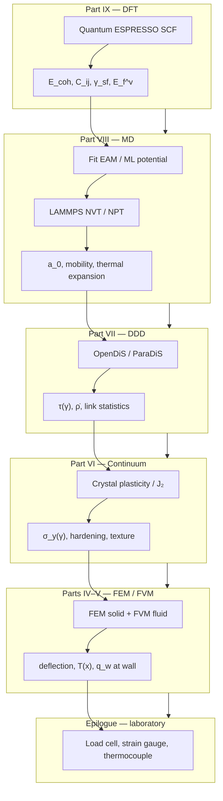

# Multiscale Computational Mechanics

We have climbed from linear algebra to functional analysis, built finite element and finite volume discretizations, anchored them in continuum mechanics, and descended through dislocations, atoms, and electrons. The epilogue asks: how do these pieces **compose** in modern research and engineering?

The copper wire that opened the prologue — drawn, annealed, carrying current, sagging under load — never lived at a single scale. It lived at all of them simultaneously. Our simulations never do. Multiscale computational mechanics is the discipline of **connecting** what each scale computes into a workflow that answers questions no single model can.

Before descending to electrons, we already practiced coupling at the engineering scale: Part IV's FEM conduction and Part V's FVM convection exchange wall temperature and heat flux until the wire and the cooling air agree — conjugate heat transfer as a fixed-point loop between discretizations. The epilogue generalizes that handshake from two meshes on one specimen to DFT, MD, DDD, and continuum FEM on the same material history.

## The same question at every scale

At each rung of the ladder, we asked:

- What is the **state**?
- What **equations** govern its evolution or equilibrium?
- What **discretization** makes the equations computable?
- What **information** passes to the next scale?

The answers changed — vectors to functions to cell averages to dislocation networks to trajectories to electron densities — but the pattern did not.

| Scale | State | Governing principle | Typical code |
|-------|-------|---------------------|--------------|
| Electronic | \(\rho(\mathbf{r})\), orbitals | Kohn–Sham SCF | Quantum ESPRESSO, VASP |
| Atomistic | \(\{\mathbf{r}_i, \mathbf{p}_i\}\) | Newton / Hamilton | LAMMPS, GPUMD |
| Mesoscopic | Dislocation segments | Peach–Köhler + mobility | OpenDiS, ParaDiS |
| Continuum solid | \(\mathbf{u}\), \(\boldsymbol{\sigma}\) | Virtual work / balance | FEniCS, Abaqus |
| Continuum fluid | \(\mathbf{v}\), \(p\) | Navier–Stokes + conservation | OpenFOAM, Fluent |

Computational mechanics is one conversation about **representation** — how we translate nature into equations, equations into algebra, and algebra into insight.

## Coupling paradigms

Modern multiscale work combines paradigms. None replaces the others; each manages cost and accuracy differently.

### Sequential homogenization

**Sequential homogenization** computes effective properties at fine scale and passes **constants upward**:

\[
\text{DFT} \rightarrow E_{\text{coh}}, C_{ijkl}, E_f^v
\]

\[
\rightarrow \text{fit EAM} \rightarrow \text{MD} \rightarrow \text{mobility}, \gamma_{\text{sf}}
\]

\[
\rightarrow \text{DDD} \rightarrow \tau(\gamma), \dot{\rho}(\gamma)
\]

\[
\rightarrow \text{crystal plasticity FEM} \rightarrow \text{texture}
\]

\[
\rightarrow \text{continuum FEM} \rightarrow \text{wire deflection, stress}
\]

**Strengths:** Modular, reproducible, each step verifiable independently.

**Weaknesses:** Loses **history dependence** unless internal variables are enriched (dislocation density, back stress, damage). Path-dependent cold work in copper wire cannot be captured by a single elastic modulus from perfect-lattice DFT.

**Remedy:** Pass **multiple** outputs (not just \(E\), but hardening laws, yield surface evolution) and validate homogenization assumptions (representative volume element size, periodicity).

The copper wire workflow, read as one story from Part IX back to the test bench:

Each arrow is an **export contract**: documented units, validation at the interface, and a tolerance that closes the loop before the next rung consumes the data.

### Concurrent multiscale

**Concurrent multiscale** runs fine and coarse models **simultaneously** with handshaking in overlapping domains:

- **QM/MM**: quantum region (DFT) embedded in molecular mechanics (force field) for reactive crack tips.
- **FE²**: macro FEM with each Gauss point calling a micro RVE (crystal plasticity or MD).
- **DDD–FEM coupling**: dislocation density or back stress from DDD feeds continuum constitutive update.

**Strengths:** Captures localization — crack tips, shear bands, notch roots — where coarse models fail without ad hoc regularization.

**Weaknesses:** Expensive; **domain decomposition** and **adaptive refinement** manage cost. Load balancing on exascale machines when fine regions move (crack propagation) remains an open systems challenge.

For a copper wire notch, concurrent MD/FEM hands off atomic traction near the tip while FEM carries elastic field in the bulk — the standard sequential alternative smears fracture energy over a regularization length.

### Surrogate acceleration

**Surrogate acceleration** trains models on fine-scale data to replace inner loops:

- **Neural operators** and **GNNs** on polycrystal meshes predict stress fields from microstructure.
- **Constitutive surrogates** replace crystal plasticity at each quadrature point.
- **Potential learning** (Part VIII) replaces DFT inside selected MD regions.

**Strengths:** Amortized cost after training; enables real-time digital twins if inference is fast enough.

**Weaknesses:** Data hunger; extrapolation risk outside training manifold. Physics constraints — **frame indifference**, **symmetry**, **thermodynamic consistency** — must be embedded or violations propagate catastrophically upward.

Surrogates do not remove the ladder; they **cache** climbs already taken. Copper wire surrogates trained only on single-crystal tension may fail on bending–torsion coupling in service.

### Coarse-graining and uncertainty

Not every detail matters at the macro scale. **Coarse-graining** identifies which features survive upward:

- Dislocation density survives; individual line topology may not (unless link statistics matter for conductivity).
- Thermal phonons average to temperature; individual vibrational modes do not appear in FEM.
- Electron density integrates to cohesive energy; orbitals do not appear in EAM.

**Quantifying what is lost** — sensitivity of wire lifetime to choices at each rung — is as important as the forward simulation. Uncertainty propagation:

\[
\sigma_{\text{macro}}^2 \approx \sum_i \left(\frac{\partial y}{\partial p_i}\right)^2 \sigma_{p_i}^2
\]

for homogenized outputs \(y\) and parameters \(p_i\) (e.g., \(E_f^v\), \(\alpha\) in Taylor hardening, GGA lattice constant).

## A narrative arc completed

Recall the prologue's copper wire. The full intellectual chain — not a single software run — reads:

1. **DFT** gives cohesive energy and elastic constants of perfect copper; vacancy and surface energies for defect thermodynamics.
2. **MD** (with EAM fitted to DFT) introduces thermal vibrations, phonon–phonon scattering, crack nucleation at notches, and dislocation core structures.
3. **DDD** (with mobility from MD) explains work hardening as dislocation networks evolve; link statistics refine hardening beyond scalar \(\rho\).
4. **Crystal plasticity FEM** homogenizes slip on {111}\(\langle 110 \rangle\) systems to predict texture after drawing and anisotropic yield.
5. **Continuum FEM** designs the structural component: sag, attachment points, elastic recovery.
6. **CFD** simulates coolant flow if the wire heats under current — coupling thermal softening back to mechanical strength.

No single code runs this entire chain unattended. Disciplined teams run **linked workflows** with version-controlled inputs, convergence logs, and validation at each handoff.

### Processing history revisited

The wire's **manufacturing history** (draw, anneal, redraw) is itself a multiscale simulation sequence:

- Drawing: texture + dislocation storage (DDD / crystal plasticity).
- Annealing: vacancy diffusion + recrystallization (MD + kinetic models).
- Service: electromigration (DFT barriers + MD diffusion + continuum current density).

Skipping history and jumping from bulk DFT modulus to in-service performance predicts the wrong wire. Internal state variables exist to carry **path dependence** upward when pure elasticity cannot.

## Handshake mechanics: what crosses interfaces

Successful coupling specifies **consistent** quantities at interfaces:

| Interface | Fine → coarse | Coarse → fine |
|-----------|---------------|---------------|
| DFT → MD | \(V(\{\mathbf{r}\})\), forces | Atomic positions (for fitting) |
| MD → DDD | Mobility \(M(\tau,T)\), core energy | Applied stress, temperature |
| DDD → FEM | Hardening law, back stress | Strain rate, boundary displacement |
| FEM → CFD | Surface motion, heat flux | Traction, convection coefficient |

**Units, frames, and averaging** must align. Irving–Kirkwood stress from MD is not automatically identical to Cauchy stress in FEM without volume definition and thermostat interpretation.

**Temporal scale separation** matters: DFT steps are femtoseconds; wire creep is years. Coupling algorithms (quasi-continuum, heterogeneous multiscale method) exist precisely when scale separation is imperfect.

## Verification, validation, and credibility

Part V introduced **verification** (code solves equations) vs. **validation** (model matches reality). Multiscale workflows multiply both:

- **Verification** at each rung: SCF convergence, \(\Delta t\) convergence, mesh refinement, RVE size convergence.
- **Validation** across rungs: DFT elastic constants vs. experiment; MD thermal expansion vs. DFT phonons; DDD hardening vs. single-crystal tests; FEM deflection vs. load cell.

**UQ-aware** workflows report intervals, not point estimates: "yield load 120 ± 8 N" with documented parameter sensitivities.

## Open directions

### Exascale coupling

Load balancing when fine regions move (crack tips, shear bands, electromigration voids) requires dynamic remeshing and adaptive QM/MM regions. Communication costs dominate; co-design of algorithms and hardware continues.

### Digital twins

Merge simulation ladders with **streaming experimental data** — in situ diffraction during wire drawing, acoustic emission during fatigue, infrared thermography during current load. Data assimilation updates internal state variables (dislocation density proxies, damage) faster than forward simulation alone.

### Scientific machine learning

**Physics-informed** architectures respect conservation and variational structure: symplectic networks for MD, energy-conserving surrogates for FEM, equivariant GNNs for polycrystals. The goal is not to replace physics but to **compress** repeated expensive solves.

### Open science

Frameworks like [OpenDiS](https://github.com/OpenDiS/OpenDiS), FEniCS, [LAMMPS](https://www.lammps.org/), and [Quantum ESPRESSO](https://www.quantum-espresso.org/) lower the barrier to reproducing multiscale workflows. Reproducibility — archived inputs, pseudopotentials, random seeds — is a professional obligation when parameters propagate across scales.

## The weak form, one last time

The book opened with a thread: weak forms, virtual work, test functions. At the multiscale level, the analogous instinct is **consistent dual descriptions**:

- Fine scale provides **fluxes** and **material responses** coarse scale lacks.
- Coarse scale provides **boundary conditions** and **loading history** fine scale cannot afford to simulate in full.

Galerkin FEM asks: find \(\mathbf{u}_h\) such that \(a(\mathbf{u}_h, v) = \ell(v)\) for all test functions \(v\). Multiscale coupling asks: find coupled states such that **interface functionals** (energy, work, dissipation) agree within tolerance when restricted to overlap regions.

Different language — same insistence that approximations be **consistent**, **stable**, and **convergent** to something meaningful.

## Return to the laboratory

Picture the copper wire again — the same specimen from the prologue, now after every chapter. A load cell reads force; a thermocouple reads temperature at the grip; a strain gauge reports axial extension. These are **macroscopic observables**, but each number carries a hidden genealogy:

- The elastic slope in the small-strain regime whispers of **DFT** elastic constants homogenized through texture and porosity.
- The upward bend in the stress–strain curve remembers **dislocation density** frozen by cold drawing — a mesoscale history Part VII exported as hardening parameters.
- The temperature rise under current couples **FEM conduction** in the solid to **FVM convection** in the air — the same weak-form / flux-balance handshake Part IV and Part V practiced on a shared wall.
- A notch cut for a fracture study forces **MD** or **QM/MM** at the tip where continuum fields diverge.

No single code simulates all of this at once. A credible study **documents the ladder**: which rung supplied each parameter, which tolerance closed each interface, which validation experiment checked the export. That discipline is not bureaucracy; it is the story continuity this book has been telling — state, equations, discretization, upward export — applied to one real specimen on a test bench.

## Closing

Computational mechanics is not a bag of tricks. It is one conversation about representation — how we translate nature into equations, equations into algebra, and algebra into insight. The mathematics in Parts I and II is not separate from the MD integrator or the Riemann solver. It is the same ladder viewed from different heights.

The copper wire is still under tension — mechanical, electrical, intellectual. You now have the language to follow it from electrons to engineering and back again: to ask where parameters came from, what was homogenized away, and how to couple scales when a single model reaches the limit of its validity.

The wire does not care which chapter we finished last. It responds to physics. Our craft is to make that physics computable, connected, and credible.

## Bridge

The ladder ends here, but the references do not. The [Sources appendix](../appendix/sources.md) lists the PDF notes, coursework repositories, and external texts behind each part. When `Writings.git` is linked, canonical chapter markdown lives under `writings/` in the Functional Analysis Notes layout; run `./scripts/sync-writings.sh` after upstream edits to refresh this book.

Return to the [prologue](../prologue/00-many-scales.md) whenever a new project needs scale discipline — the four questions (state, equations, discretization, upward exports) apply to every material, not only copper.
