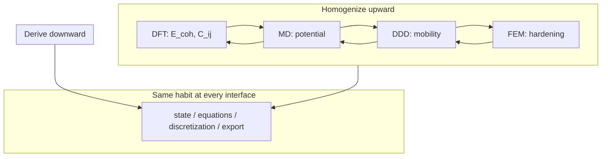

# Multiscale Computational Mechanics

We have climbed from linear algebra to functional analysis, built finite element and finite volume discretizations, anchored them in continuum mechanics, and descended through dislocations, atoms, and electrons. The epilogue asks: how do these pieces **compose** in modern research and engineering?

The copper wire that opened the prologue — drawn, annealed, carrying current, sagging under load — never lived at a single scale. It lived at all of them simultaneously. Our simulations never do. Multiscale computational mechanics is the discipline of **connecting** what each scale computes into a workflow that answers questions no single model can.

Before descending to electrons, we already practiced coupling at the engineering scale: Part IV's FEM conduction and Part V's FVM convection exchange wall temperature and heat flux until the wire and the cooling air agree — conjugate heat transfer as a fixed-point loop between discretizations. The epilogue generalizes that handshake from two meshes on one specimen to DFT, MD, DDD, and continuum FEM on the same material history.

## Scene: a multiscale afternoon

It is late afternoon in a shared compute lab. On one screen, a Quantum ESPRESSO log reports `convergence has been achieved` for a relaxed copper unit cell — cohesive energy, lattice constant, and Voigt-averaged elastic constants copied into a spreadsheet with the functional, pseudopotential, and k-mesh recorded in the header. On the next screen, a LAMMPS job fits an EAM potential to those numbers and runs a short NVT shear test on a dislocation core; the mobility table that emerges is not yet physics, but it is **traceable** to the SCF cycle that finished an hour ago.

A third terminal launches OpenDiS on a single-crystal RVE under the same strain rate the load cell will use tomorrow. Dislocation density climbs; Taylor hardening exports a \(\tau(\gamma)\) curve into a yaml file beside a DAMASK crystal-plasticity deck. The FEM mesh — the same tetrahedral cylinder from Part IV, now with internal variables at Gauss points — waits in a fourth window. The student does not believe any one run tells the whole story. They believe the **handshake**: units checked at every arrow, convergence logs archived, and the outer loop on wall temperature (FVM) and solid conduction (FEM) still running from last week's conjugate heat transfer homework.

The copper wire on the bench — cold-drawn, carrying current, warm to the touch — is unchanged. What changed is the reader's ability to name where each number in the workflow came from, what was homogenized away, and which interface would break first if the ladder were climbed too carelessly. That afternoon is not a fantasy pipeline every laptop runs unattended. It is the **discipline** the book has been building toward since the prologue: state, equations, discretization, upward export — now at the boundaries between codes, not only within a single mesh. When the afternoon feels like disconnected terminal windows, return to [Part VIII's epilogue hinge](../part08-md/00-opening.md#bridge-epilogue-hinge) — the Bridge that names Acts V–VI in lab reunion time before Part IX closes the electronic audit.

## Story so far (Parts I–IX)

If you have read linearly since the prologue, the copper wire has changed language nine times without changing material:

| Part | Scale | Wire instance | Key export upward |
|------|-------|---------------|-------------------|
| I | Discrete algebra | Spring network | \(\mathbf{K}\), eigenmodes |
| II | Function spaces | Fields \(u(x)\), \(T(x)\) | Galerkin convergence target |
| III | Weak PDEs | Equilibrium + heat | Energy functionals |
| IV | FEM | Meshed solid | \(\mathbf{K}\mathbf{U}=\mathbf{F}\), error estimates |
| V | FVM | Cooling air | Fluxes, conjugate heat loop |
| VI | Continuum | \(\mathbf{F}\), \(\boldsymbol{\sigma}\) | Virtual work, balance laws |
| VII | Defects | Dislocation forest | Hardening law for FEM |
| VIII | Atoms | Trajectories | Potentials, moduli hints |
| IX | Electrons | \(\rho(\mathbf{r})\) | \(E_{\text{coh}}\), \(C_{ij}\), \(\gamma_{\text{sf}}\) |

The epilogue asks what none of these parts alone can answer: **how do we compose them** when the wire's lifetime spans every row of the table?

## Closing the arc from Part IX {#opening-hinge-ix3-to-epilogue}

If you have read linearly since the prologue, Part IX's closing checkpoint archived converged SCF results — functional, pseudopotential, plane-wave cutoff, k-mesh — beside every export upward. The epilogue is where those numbers **compose** with the meshes, forests, and trajectories built in earlier parts:

| Part IX (electrons in copper) | Epilogue (multiscale on the wire) |
|-------------------------------|-----------------------------------|
| \(E_{\text{coh}}\), \(a_0\) from QE relaxation | Seeds EAM fit; sanity-checks bulk modulus before LAMMPS production runs |
| \(C_{ij}\) from strained unit cells | Voigt average feeds Part IV elastic step and Part VI \(E\), \(\nu\) |
| \(\gamma_{\text{sf}}\) from faulted supercells | Peierls stress and partial-dislocation mobility in OpenDiS; [Handshake 4b](#4b--when-continuum-fails-at-the-notch-md-subdomain-act-v--notch) when scalar hardening from 4a under-predicts notch-root stress |
| Documented SCF convergence logs | Required pedigree for every upward arrow — same habit as FEM mesh studies |
| [IX.0 thermal phonon audit at \(T_w\)](../part09-dft/00-opening.md#thermal-phonon-audit-at-tw) — \(\alpha(T_w)\), \(\tau_{\text{ph}}(T_w)\) from quasiharmonic/DFPT | Handshake 3 fixed-grip stress and Handshake 4a phonon drag at converged \(T_w\), not 300 K defaults — [`parse_alpha.sh`](../../scripts/parse_alpha.sh) with `--target-t` from `cht_export.yaml` |
| [IX.3 Bridge to epilogue](../part09-dft/03-dft-workflows.md#bridge-to-the-epilogue) | Handshake loops generalize conjugate heat transfer from Parts IV–V; [IX.3 epilogue pedigree table](../part09-dft/03-dft-workflows.md#bridge-to-the-epilogue) maps each DFT artifact to Handshakes 1–4b |
| [`parse_lifetime.sh`](../../scripts/parse_lifetime.sh) at converged \(T_w\) beside `cu.phonon/` | [Handshake 4a](#4a--ddd-strain-rate-to-quasi-static-load-cell-act-iv--hardening): phonon drag bounds on rate sensitivity \(m\) — [sensitivity worksheet](#worked-example-sensitivity-ranks) (4a column); upstream [VII.3 rate handshake](../part07-defects/03-polycrystal-and-fem-handoff.md#scale-boundary-handshake-ddd-strain-rate-to-quasi-static-fem) |
| [IX.3 GSF workflow](../part09-dft/03-dft-workflows.md#worked-example-generalized-stacking-fault-energy-handoff-to-part-vii) + [`parse_gsf.sh`](../../scripts/parse_gsf.sh) | [Handshake 4b](#4b--when-continuum-fails-at-the-notch-md-subdomain-act-v--notch): partial dislocations at notch root — [FE² worked example](#worked-example-fe-at-the-wire-notch-act-v--notch); upstream [VII.3 Step 4](../part07-defects/03-polycrystal-and-fem-handoff.md#step-4--when-offline-calibration-fails-fe-at-the-notch) after [4a](#4a--ddd-strain-rate-to-quasi-static-load-cell-act-iv--hardening) |

Part IX's [electronic audit hinge](../part09-dft/00-opening.md#electronic-audit-hinge-descent-pedigree-and-tw-phonon) closed the downward derivation with SCF pedigree **and** a [thermal phonon audit at \(T_w\)](../part09-dft/00-opening.md#thermal-phonon-audit-at-tw): Joule heating from Act II archived \(T_w = 311.48\,\text{K}\) in [`fixtures/cht_export.yaml`](../fixtures/cht_export.yaml) via [V.4's parser checkpoint](../part05-fvm/04-navier-stokes-cfd.md#parser-checkpoint-archive-cht-export-yaml), but foundation folders that archive phonons only at 300 K leave Handshakes 3 and 4a **partially audited** — elastic moduli carry SCF logs while thermal eigenstrain and drag still cite room-temperature folklore. Return to the [Part IX thermal phonon audit table](../part09-dft/00-opening.md#thermal-phonon-audit-at-tw) when the export table above feels complete but `alpha_export.yaml` lacks an explicit \(T_w\) column; the [memory sheet rows 8–9 baby picture](../appendix/memory-sheet.md#rows-8-9-baby-picture-tw-temperature-pedigree) draws the same \(T_w\) chain from CHT through MD mobility to DFT phonons.

The [preface continuity hinge](../preface.md#epilogue-continuity-hinges) names the **Handshake 2 → 3 chain** in one row: \(T_w\) from the [V.4 Picard loop](../part05-fvm/04-navier-stokes-cfd.md#lab-act-extension-two-domain-picard-loop-with-a-1d-fem-solid) sets \(\Delta T\); quasiharmonic \(\alpha\) from [IX.3](../part09-dft/03-dft-workflows.md#thermal-expansion-from-quasiharmonic-phonons-handshake-3-pedigree) sets thermal strain — and the [sensitivity table](#sensitivity-which-handshake-matters-most) ranks Handshake 3 **first** for fixed-grip load-cell readings. Read that preface row when the export table above feels complete but the load cell still cites handbook \(\alpha\) beside an orphan `pw.x` log.

Part IX closed the **downward derivation** — the finest rung of the prologue's ladder. The epilogue closes **upward homogenization**: how disciplined teams climb from \(\rho(\mathbf{r})\) to structural design without unit errors, wrong history, or category mistakes at notches and crack tips. Part I's sparse matrix, Part IV's mesh, Part VII's dislocation forest, and Part IX's electron density are not separate homework problems. They are scenes in one story whose coupling rules are stated in the sections below.

**Coupling hinge (IX.3 → epilogue).** [IX.3's Bridge](../part09-dft/03-dft-workflows.md#bridge-to-the-epilogue) archived foundation exports in workflow order; this section is the **downstream half** of [memory sheet row 10](../appendix/memory-sheet.md#continuity-hinges-master-map), the [preface coupling hinge row](../preface.md#epilogue-continuity-hinges), and the [preface row 10 skill checkpoint](../preface.md#skill-navigation-row-10). The [prologue row 10 preview](../prologue/00-many-scales.md#prologue-preview-row-10) named this composition stitch before Part I — return there when foundation folders exist but Handshakes 4a and 4b feel like one undifferentiated export. Handshakes 1–3 inherit elastic moduli, \(\Delta T\), and \(\alpha\); **Handshakes 4a and 4b split Act IV hardening from Act V localization** on the same `hardening.yaml`. Complete [preface row 14](../preface.md#skill-navigation-row-14) before [row 15](../preface.md#skill-navigation-row-15): bulk rate extrapolation (4a) is necessary but not sufficient when the optional notch activates FE² (4b). The [IX.3 epilogue pedigree table](../part09-dft/03-dft-workflows.md#ix3-epilogue-pedigree-table) maps each DFT artifact to its handshake; the [preview Act IV row](#reunion-preview-act-iv) and [preview Act V row](#reunion-preview-act-v) reunite the 4a/4b split in workflow time; the [sensitivity derivation worksheet](#worked-example-sensitivity-ranks) below ranks which handshake controlled the load-cell answer.

## Closing Handshake 3 from Part IX.3 {#opening-hinge-ix3-handshake3}

If you have read linearly since the prologue, [IX.3's Bridge](../part09-dft/03-dft-workflows.md#bridge-to-the-epilogue) archived `cu.foundation/` with converged SCF logs, elastic constants, and the [quasiharmonic \(\alpha\) Lab act](../part09-dft/03-dft-workflows.md#lab-act-quasiharmonic-alpha-handshake-3-pedigree). The epilogue's [Handshake 3](#handshake-3--thermal-strain--mechanical-stiffness-part-vi--iv) is the **downstream half** of that export — not a new subject, but the load-cell reading of \(\sigma_{\text{th}} = E\alpha\Delta T\) on fixed grips:

| Part IX.3 export (Act VI — Foundation) | Epilogue Handshake 3 (Act III — Pulling) |
|----------------------------------------|------------------------------------------|
| `cu.phonon/a_vs_T.dat` from quasiharmonic scan | [`parse_alpha.sh`](../../scripts/parse_alpha.sh) emits `alpha_export.yaml` with explicit `target_temperature_K` |
| \(\alpha(T)\) fit from `ph.x` / phonon DOS | \(\alpha(T_w)\) at converged wall temperature — **not** handbook \(\alpha(300\,\text{K})\) alone |
| [IX.3 quasiharmonic Lab act](../part09-dft/03-dft-workflows.md#lab-act-quasiharmonic-alpha-handshake-3-pedigree) (upstream half) | [Worked load-cell example](#handshake-3--thermal-strain--mechanical-stiffness-part-vi--iv) (downstream half) |
| `alpha_cu_*K.dat` beside `cu.phonon/` | Fixed-grip \(\sigma_{\text{th}}\) verified against load cell — [sensitivity table](#sensitivity-which-handshake-matters-most) ranks Handshake 3 **first** |

**Temperature pedigree (Handshake 2 → 3).** Handshake 2 from [V.4's Picard loop](../part05-fvm/04-navier-stokes-cfd.md#lab-act-extension-two-domain-picard-loop-with-a-1d-fem-solid) archives \(T_w = 311.48\,\text{K}\) in [`fixtures/cht_export.yaml`](../fixtures/cht_export.yaml) via [`parse_cht.sh`](../../scripts/parse_cht.sh). Handshake 3 must evaluate \(\alpha\) at that same \(T_w\):

```bash
TW=$(grep wall_temperature_K fixtures/cht_export.yaml | awk '{print $2}')
./scripts/parse_alpha.sh fixtures/cu.foundation/cu.phonon/ --target-t "$TW" --delta-t "$(grep delta_T_K fixtures/cht_export.yaml | awk '{print $2}')"
```

The [IX.3 → Handshake 3 reunion index](../appendix/sources.md#ix3-handshake3-reunion-index-row-40) reunites this opening with [row 39](../preface.md#skill-navigation-row-39) when `cu.foundation/` is complete but `alpha_export.yaml` still lists `target_temperature_K: 300` while `cht_export.yaml` archives \(T_w = 311.48\,\text{K}\) — same copper wire, same afternoon, but thermal eigenstrain cites room-temperature folklore.

**α(\(T_w\)) cross-links audit (reading-time ↔ workflow-time).** When Handshake 3 feels disconnected from Parts III–VI despite a complete foundation folder, walk this chain — each row is a mirror of the same contract at a different scale:

| Location | Anchor | Contract (read aloud) |
|----------|--------|----------------------|
| [III.4 export contract](../part03-pdes/04-energy-methods.md#bridge-to-part-iv) | Reading-time | Mechanical block consumes \(\varepsilon_{\text{th}} = \alpha(T_h - T_{\text{ref}})\) from thermal block — not a separate handbook card |
| [IV.4 thermoelastic assembly](../part04-fem/00-opening.md#acts-ii-and-iii-together-thermoelastic-assembly-thread) | Workflow-time | \(\mathbf{K}_{TT}\mathbf{T}=\mathbf{F}_T\) → \(\mathbf{F}_{\text{th}}=\alpha\Delta T\) → \(\mathbf{K}_{uu}\mathbf{U}=\mathbf{F}_u+\mathbf{F}_{\text{th}}\) on **one mesh** |
| [V.4 Picard loop](../part05-fvm/04-navier-stokes-cfd.md#lab-act-extension-two-domain-picard-loop-with-a-1d-fem-solid) | Workflow-time | Converged \(T_w\) exported to `cht_export.yaml` — Handshake 2 gate |
| [VI.2 \(\alpha\) handshake](../part06-continuum/02-stress-balance.md#scale-boundary-handshake-thermal-expansion-alpha) | Reading-time | \(\sigma_{\text{th}} \approx E\alpha\Delta T\) on fixed grips — acceptance checklist for Act III |
| [IX.3 quasiharmonic Lab act](../part09-dft/03-dft-workflows.md#lab-act-quasiharmonic-alpha-handshake-3-pedigree) | Foundation-time | \(\alpha(T)\) from `ph.x` with same pedigree as \(C_{ij}\) — evaluate at \(T_w\), not 300 K default |
| [Handshake 3](#handshake-3--thermal-strain--mechanical-stiffness-part-vi--iv) (this chapter) | Workflow-time | Load cell reads \(\sigma_{\text{th}}\); mechanical 50 N is a perturbation on thermal background |
| [Preface row 13](../preface.md#skill-navigation-row-13) | Competence-time | Handshake 2 sets \(\Delta T\); Handshake 3 sets \(\alpha\Delta T\) — do not conflate |
| [Memory sheet rows 8–9](../appendix/memory-sheet.md#rows-8-9-baby-picture-tw-temperature-pedigree) | Index-card | \(T_w\) from CHT propagates through MD mobility, DFT phonons, and fixed-grip stress |

The [preface row 40 skill checkpoint](../preface.md#skill-navigation-row-40) closes the competence loop; the [prologue row 40 closing stitch](../prologue/00-many-scales.md#row-40-closing-stitch) is the upstream half when the foundation folder exists but the load cell still cites handbook \(\alpha\) beside an orphan `pw.x` log. When row 59 closed the IX.3 → epilogue chapter hinge but this table still feels like an appendix, read [preface row 60](../preface.md#skill-navigation-row-60) — the reunion of row 59 (chapter order) with row 40 (meta depth) on the same Handshake 3 afternoon.

## Closing Handshake 4a from Part VII.3 {#opening-hinge-vii3-handshake4a}

If you have read linearly since the prologue, [VII.3's rate handshake](../part07-defects/03-polycrystal-and-fem-handoff.md#scale-boundary-handshake-ddd-strain-rate-to-quasi-static-fem) documented OpenDiS RVE sweeps, power-law sensitivity \(m\), and `rate_export.yaml` provenance. Handshake 4a's [worked example](#4a--ddd-strain-rate-to-quasi-static-load-cell-act-iv--hardening) is the **downstream half** of that export — not a new subject, but the load-cell reading of \(\tau_{\text{lab}}\) at lab grip speed:

| Part VII.3 export (Act IV — Hardening) | Epilogue Handshake 4a (Act IV — Hardening) |
|----------------------------------------|---------------------------------------------|
| [VII.3 rate handshake](../part07-defects/03-polycrystal-and-fem-handoff.md#scale-boundary-handshake-ddd-strain-rate-to-quasi-static-fem) Steps A–C (upstream half) | [4a worked example](#4a--ddd-strain-rate-to-quasi-static-load-cell-act-iv--hardening) (downstream half) |
| `ddd_tau_vs_rate.dat` from OpenDiS sweeps | [`parse_rate.sh`](../../scripts/parse_rate.sh) emits `rate_export.yaml` with explicit `lab_target_strain_rate_s-1` |
| \(\tau_{\text{flow}}\) at \(\dot\varepsilon_{\text{DDD}} = 10^3\,\text{s}^{-1}\) | \(\tau_{\text{lab}}\) at \(\dot\varepsilon_{\text{lab}} = 10^{-3}\,\text{s}^{-1}\) via power-law \(m\) |
| [VII.2 forest Lab act](../part07-defects/02-dislocation-dynamics.md#lab-act-read-the-hardening-bend-from-forest-density-act-iv) supplies \(\tau(\gamma)\), \(\rho(\gamma)\) | Crystal plasticity FEM inherits extrapolated \(\tau_{\text{lab}}\) — [sensitivity table](#sensitivity-which-handshake-matters-most) ranks Handshake 4a **next** for Act IV |

**Rate pedigree (mobility → \(m\) → \(\tau_{\text{lab}}\)).** Handshake 4a must evaluate \(m\) with mobility tables at the same \(T_w\) Handshake 2 converged — phonon drag from [`parse_lifetime.sh`](../../scripts/parse_lifetime.sh) at \(T_w\) bounds rate sensitivity when Joule heating is active:

```bash
TW=$(grep wall_temperature_K fixtures/cht_export.yaml | awk '{print $2}')
./scripts/parse_rate.sh fixtures/ddd_tau_vs_rate.dat --lab-rate 1.0e-3 --temperature "$TW"
```

The [VII.3 → Handshake 4a reunion index](../appendix/sources.md#vii3-handshake4a-reunion-index-row-41) reunites this opening with [row 40](../preface.md#skill-navigation-row-40) when Handshake 3's thermal pre-stress is verified but `rate_export.yaml` still lists `ddd_strain_rate_s-1: 1000` while the prologue grip runs at \(10^{-3}\,\text{s}^{-1}\) — same copper wire, same afternoon, but the hardening knee arrives early because direct DDD import overpredicts flow stress by 5–35%.

**Rate extrapolation cross-links audit (reading-time ↔ workflow-time).** When Handshake 4a feels disconnected from Parts VI–VIII despite a complete forest export, walk this chain — each row is a mirror of the same contract at a different scale:

| Location | Anchor | Contract (read aloud) |
|----------|--------|----------------------|
| [VI.4 plasticity preview](../part06-continuum/04-nonlinear-plasticity-preview.md#intermission-ascent-ends-descent-begins) | Reading-time | Yield knee breaks energy minimization — rate sensitivity enters before Part VII names the forest |
| [VII.2 mobility Lab act](../part07-defects/02-dislocation-dynamics.md#lab-act-calibrate-screw-mobility-from-md-shear-act-iv--mobility-prelude) | Workflow-time | \(M(\tau, T_w)\) from NVT shear — not 300 K defaults when Act II is active |
| [VII.3 rate handshake](../part07-defects/03-polycrystal-and-fem-handoff.md#scale-boundary-handshake-ddd-strain-rate-to-quasi-static-fem) | Foundation-time | Power-law \(m\) from DDD sweeps — extrapolate to lab rate, do not import raw curve |
| [Part VIII descent hinge](../part08-md/00-opening.md#descent-hinge-cores-mobility-and-tw-pedigree) | Reading-time | Mobility yaml rows inherit \(T_w\) from CHT before any shear export |
| [VIII.3 WHAM at \(T_w\)](../part08-md/03-ab-initio-and-coarse-graining.md#wham-part-vii-mobility-hinge-act-ii-temperature-pedigree) | Workflow-time | Cross-slip recovery at converged wall temperature feeds drag on \(m\) |
| [IX.0 \(\tau_{\text{ph}}(T_w)\)](../part09-dft/00-opening.md#thermal-phonon-audit-at-tw) | Foundation-time | Phonon lifetime at \(T_w\) bounds rate sensitivity — same pedigree as Handshake 3 \(\alpha\) |
| [Handshake 4a](#4a--ddd-strain-rate-to-quasi-static-load-cell-act-iv--hardening) (this chapter) | Workflow-time | Load cell knee reads \(\tau_{\text{lab}}\); DDD timestep rate is not lab grip speed |
| [Preface row 14](../preface.md#skill-navigation-row-14) | Competence-time | VII.3 sets \(\tau_{\text{flow}}(\dot\varepsilon_{\text{DDD}})\); Handshake 4a sets \(\tau_{\text{lab}}\) — do not conflate |
| [Memory sheet row 14](../appendix/memory-sheet.md#row-14-baby-picture-handshake-4a) | Index-card | Forest → power-law \(m\) → lab-rate chain from OpenDiS to load cell |

The [preface row 41 skill checkpoint](../preface.md#skill-navigation-row-41) closes the competence loop; the [prologue row 41 closing stitch](../prologue/00-many-scales.md#row-41-closing-stitch) is the upstream half when the rate handshake exists in Part VII but OpenDiS exports still feed the plasticity deck without extrapolation. When row 60 closed Handshake 3 but this table still feels like an appendix beside Act III thermal stress, read [preface row 61](../preface.md#skill-navigation-row-61) — the reunion of row 60 (Handshake 3 gate) with row 41 (meta depth) and row 14 (workflow \(\tau_{\text{flow}}\) vs \(\tau_{\text{lab}}\)) on the same Act IV afternoon.

## Closing Handshake 4b from Part VII.3 {#opening-hinge-vii3-handshake4b}

If you have read linearly since the prologue, [VII.3 Step 4](../part07-defects/03-polycrystal-and-fem-handoff.md#step-4--when-offline-calibration-fails-fe-at-the-notch) documented FE² at notch-root Gauss points — crystal plasticity vs two-scale DDD, `fe2_notch_comparison.dat`, and the 10–15% uplift criterion. Handshake 4b's [FE² worked example](#worked-example-fe-at-the-wire-notch-act-v--notch) is the **downstream half** of that export — not a new subject, but the Act V reading of whether scalar hardening from 4a suffices at \(K_t \approx 3\):

| Part VII.3 export (Act V — Notch) | Epilogue Handshake 4b (Act V — Notch) |
|-----------------------------------|----------------------------------------|
| [VII.3 Step 4 FE²](../part07-defects/03-polycrystal-and-fem-handoff.md#step-4--when-offline-calibration-fails-fe-at-the-notch) (upstream half) | [4b worked example](#4b--when-continuum-fails-at-the-notch-md-subdomain-act-v--notch) (downstream half) |
| `fe2_notch_comparison.dat` with three-row schema | [`parse_fe2.sh`](../../scripts/parse_fe2.sh) emits `fe2_export.yaml` with explicit `fe2_enrichment_required` |
| Crystal plasticity \(\sigma_{\text{eq}} \approx 215\,\text{MPa}\) at notch root | FE² \(\sigma_{\text{eq}} \approx 238\,\text{MPa}\) — pile-up physics scalar \(H\) smears |
| Bulk `hardening.yaml` from Handshake 4a | [`multiscale_export.yaml`](../../scripts/parse_multiscale_workflow.sh) links `fe2_export.yaml` in Handshake 4b slot — [row 16](../preface.md#skill-navigation-row-16) orchestration audit |

**Notch pedigree (4a bulk → FE² root).** Handshake 4b activates only when the prologue's optional micro-notch is present — verify bulk \(\tau_{\text{lab}}\) from [4a](#4a--ddd-strain-rate-to-quasi-static-load-cell-act-iv--hardening) before comparing root stress:

```bash
./scripts/parse_fe2.sh fixtures/fe2_notch_comparison.dat
./scripts/parse_multiscale_workflow.sh fixtures/cu.foundation fixtures/cht_wire.conf  # includes fe2_export in chain
```

The [VII.3 → Handshake 4b reunion index](../appendix/sources.md#vii3-handshake4b-reunion-index-row-42) reunites this opening with [row 41](../preface.md#skill-navigation-row-41) when Handshake 4a's bulk knee matches the load cell but crystal plasticity is trusted at the notch root without running [`parse_fe2.sh`](../../scripts/parse_fe2.sh) — same copper wire, same afternoon, but peak von Mises stress under-predicts by 10–15% because sequential homogenization smeared pile-up.

**FE² notch-localization cross-links audit (reading-time ↔ workflow-time).** When Handshake 4b feels disconnected from Parts IV–IX despite a complete FE² comparison file, walk this chain — each row is a mirror of the same contract at a different scale:

| Location | Anchor | Contract (read aloud) |
|----------|--------|----------------------|
| [IV.4 Poisson → elasticity](../part04-fem/04-poisson-to-elasticity.md#bridge-to-part-v) | Reading-time | Stress concentrators need finer resolution — mesh alone does not add pile-up physics |
| [VI.4 plasticity preview](../part06-continuum/04-nonlinear-plasticity-preview.md#intermission-ascent-ends-descent-begins) | Reading-time | Scalar \(J_2\) breaks at notches — gradient plasticity foreshadows FE² |
| [VII.3 Step 4 FE²](../part07-defects/03-polycrystal-and-fem-handoff.md#step-4--when-offline-calibration-fails-fe-at-the-notch) | Foundation-time | Mark Gauss points within 50 µm of notch root as DDD-active — archive three-row comparison |
| [VII.3 opening hinge to Handshake 4b](../part07-defects/03-polycrystal-and-fem-handoff.md#opening-hinge-vii3-to-handshake4b) | Bridge read | "Step 4 FE² is upstream; Act V root stress is downstream" | Opening epilogue 4b without VII.3 Step 4 |
| [IX.3 GSF workflow](../part09-dft/03-dft-workflows.md#worked-example-generalized-stacking-fault-energy-handoff-to-part-vii) | Foundation-time | \(\gamma_{\text{sf}}\) from DFT feeds partial-dislocation mobility at notch root — [`parse_gsf.sh`](../../scripts/parse_gsf.sh) |
| [Handshake 4a](#4a--ddd-strain-rate-to-quasi-static-load-cell-act-iv--hardening) (this chapter) | Workflow-time | Bulk \(\tau_{\text{lab}}\) verified before notch audit — FE² inherits same `hardening.yaml` |
| [Handshake 4b](#4b--when-continuum-fails-at-the-notch-md-subdomain-act-v--notch) (this chapter) | Workflow-time | Root stress reads FE² uplift; scalar \(H\) from 4a may suffice in bulk only |
| [Preface row 15](../preface.md#skill-navigation-row-15) | Competence-time | 4a sets bulk \(\tau_{\text{lab}}\); 4b asks whether scalar \(H\) suffices at \(K_t \approx 3\) — do not conflate |
| [Preface row 16](../preface.md#skill-navigation-row-16) | Orchestration-time | `multiscale_export.yaml` must link `fe2_export.yaml` beside `rate_export.yaml` in dependency order |
| [Memory sheet row 15](../appendix/memory-sheet.md#row-15-baby-picture-handshake-4b) | Index-card | Bulk hardening → FE² root → orchestrated export chain |

The [preface row 42 skill checkpoint](../preface.md#skill-navigation-row-42) closes the competence loop; the [prologue row 42 closing stitch](../prologue/00-many-scales.md#row-42-closing-stitch) is the upstream half when Step 4 exists in Part VII but crystal plasticity is trusted at the notch root without a 10–15% audit. When row 61 closed Handshake 4a but this table still feels like an appendix beside Act IV bulk hardening, read [preface row 62](../preface.md#skill-navigation-row-62) — the reunion of row 61 (4a gate) with row 42 (meta depth) and row 15 (workflow bulk vs notch split) on the same Act V afternoon.

## The concept map (closing lens)

The [Functional Analysis Notes](https://hanfengzhai.github.io/file/teaching/notes/ME412_CourseSummary.pdf) organized each part with four questions — object, structure, theorem, failure mode. At the scale of the full book, the same discipline applies to **coupling**:

| Question | Answer at multiscale scale |
|----------|---------------------------|
| What **object** spans all parts? | Coupled states at interfaces — wall temperature, hardening law, potential |
| What **structure** connects runs? | Handshake loops with consistent units, frames, and averaging |
| What **theorem** (principle) makes coupling credible? | Scale separation, convergence at each rung, verification and validation |
| What **breaks** if we skip handshakes? | Wrong history, unit errors, category errors at notches and crack tips |


```mermaid
flowchart TB
  subgraph upward["Homogenize upward"]
    DFT[DFT: E_coh, C_ij] --> MD[MD: potential]
    MD --> DDD[DDD: mobility]
    DDD --> FEM[FEM: hardening]
  end
  subgraph downward["Derive downward"]
    FEM --> DDD
    DDD --> MD
    MD --> DFT
  end
  subgraph same["Same habit at every interface"]
    Q[state / equations / discretization / export]
  end
  upward --> Q
  downward --> Q
```

**Baby picture:** each part solved one rung of the ladder; multiscale mechanics wires the rungs together with the same four questions the prologue asked — now at **interfaces** between codes, not only within a single mesh.

## Lab act reunion: one afternoon, six acts {#lab-act-reunion-preview}

The [prologue](../prologue/00-many-scales.md#the-experiment-as-plot) mapped one lab session to six acts — mounting, warming, pulling, hardening, notch, foundation. The epilogue reunites them here in **preview** form — coupling habits and handshake names before the detailed handshake sections below. After those sections, the [full reunion with per-node anchors and workflow-time paragraphs](#lab-act-reunion-six-acts-one-afternoon) returns to the same six acts with Act VI subgraph nodes, sensitivity audit trails, and the workflow exam table.

| Act | Lab beat | Book parts | Coupling habit |
|-----|----------|------------|----------------|
| <span id="reunion-preview-act-i"></span>I — Mounting | Grips close; first \(\mathbf{K}\mathbf{u}=\mathbf{f}\) | I | Boundary conditions export to every mesh; rigid-body removal before any ramp — [prologue Act I preview](../prologue/00-many-scales.md#prologue-preview-act-i); [expanded Act I](#reunion-expanded-act-i) |
| <span id="reunion-preview-act-ii"></span>II — Warming | Current on; thermocouple rises | III, IV, V | Handshake 2: FEM solid ↔ FVM fluid until wall flux matches Joule source ([Handshake 2](#handshake-2--joule-heating--conjugate-heat-transfer-part-iv--v)); [V.4 Picard loop](../part05-fvm/04-navier-stokes-cfd.md#lab-act-extension-two-domain-picard-loop-with-a-1d-fem-solid); [`parse_cht.sh`](../../scripts/parse_cht.sh) → `cht_export.yaml`; converged \(\Delta T = T_w - T_\infty\) feeds Handshake 3 in Act III — [prologue row 8 preview](../prologue/00-many-scales.md#prologue-preview-row-8); [expanded Act II](#reunion-expanded-act-ii) |
| <span id="reunion-preview-act-iii"></span>III — Pulling | Force–displacement ramp | II, III, IV, VI | Handshake 2 → 3: \(\Delta T\) from CHT ([Handshake 2](#handshake-2--joule-heating--conjugate-heat-transfer-part-iv--v)); \(\alpha\Delta T\) from [IX.3 quasiharmonic Lab act](../part09-dft/03-dft-workflows.md#lab-act-quasiharmonic-alpha-handshake-3-pedigree) → fixed-grip stress ([Handshake 3](#handshake-3--thermal-strain--mechanical-stiffness-part-vi--iv)); [memory sheet row 13](../appendix/memory-sheet.md#continuity-hinges-master-map); [preface row 13](../preface.md#skill-navigation-row-13); [`parse_alpha.sh`](../../scripts/parse_alpha.sh); weak form → assembly → stress interpretation — [prologue row 13 preview](../prologue/00-many-scales.md#prologue-preview-row-13); [expanded Act III](#reunion-expanded-act-iii) |
| <span id="reunion-preview-act-iv"></span>IV — Hardening | Curve bends upward | VII | Handshake 4a: DDD \(\tau(\dot\varepsilon)\) → power-law \(m\) → lab-rate \(\tau_{\text{lab}}\) ([memory sheet row 14](../appendix/memory-sheet.md#continuity-hinges-master-map), [preface row 14](../preface.md#skill-navigation-row-14), [VII.3 rate handshake](../part07-defects/03-polycrystal-and-fem-handoff.md#scale-boundary-handshake-ddd-strain-rate-to-quasi-static-fem), [`parse_rate.sh`](../../scripts/parse_rate.sh)); Taylor hardening → crystal plasticity FEM — [prologue row 14 preview](../prologue/00-many-scales.md#prologue-preview-row-14); [prologue Handshake 4a preview](../prologue/00-many-scales.md#prologue-preview-act-iv); [expanded Act IV](#reunion-expanded-act-iv); upstream [Part VIII epilogue hinge](../part08-md/00-opening.md#bridge-epilogue-hinge) |
| <span id="reunion-preview-act-v"></span>V — Notch | Stress concentrator | VI, VII, VIII | Handshake 4b: scalar \(H\) vs FE² at root ([memory sheet row 15](../appendix/memory-sheet.md#continuity-hinges-master-map), [preface row 15](../preface.md#skill-navigation-row-15), [VII.3 Step 4 FE²](../part07-defects/03-polycrystal-and-fem-handoff.md#step-4--when-offline-calibration-fails-fe-at-the-notch), [`parse_fe2.sh`](../../scripts/parse_fe2.sh)); MD resolves nucleation where continuum regularizes — [prologue Handshake 4b preview](../prologue/00-many-scales.md#prologue-preview-act-v); [prologue row 15 closing stitch](../prologue/00-many-scales.md#row-15-closing-stitch); [expanded Act V](#reunion-expanded-act-v) |
| <span id="reunion-preview-act-vi"></span>VI — Foundation | Input deck parameters | IX → VIII → VII → IV | DFT → MD → DDD → FEM pedigree; row 16 orchestration — [`parse_multiscale_workflow.sh`](../../scripts/parse_multiscale_workflow.sh) → `multiscale_export.yaml` ([memory sheet row 16](../appendix/memory-sheet.md#continuity-hinges-master-map), [preface row 16](../preface.md#skill-navigation-row-16), [script audit trail All — orchestrated chain row](#script-audit-trail-parse-scripts-handshakes)); see [Act VI minimal artifacts](#act-vi-foundation-minimal-artifacts); [prologue row 16 preview](../prologue/00-many-scales.md#prologue-preview-row-16); [prologue row 16 closing stitch](../prologue/00-many-scales.md#row-16-closing-stitch); [expanded Act VI](#reunion-expanded-act-vi) |

No single executable runs all six acts unattended. Disciplined teams wire them with the same handshake the conjugate heat section practiced: consistent units, documented exports, and outer loops that converge at interfaces — not only inside each solver.

### Act VI foundation minimal artifacts {#act-vi-foundation-minimal-artifacts}

Act VI runs in parallel with Acts I–V in real projects — the foundation prequel archived before the load cell moves. The [memory sheet Act VI baby picture](../appendix/memory-sheet.md#act-vi-baby-picture-me-412-coupling-ladder) draws the foundation → orchestration diagram; this table is the **reverse audit** from [preface row 16 steps](../preface.md#skill-navigation-row-16) back to each diagram node:

| Row 16 step | Minimal artifact | Subgraph nodes ([inline anchors](../appendix/memory-sheet.md#act-vi-subgraph-node-audit)) |
|-------------|------------------|-------------------------------------------------------------------------------------------|
| **Step 1** — upstream rows 8–9, 13–15 | Completed skill checkpoints or equivalent exports | [#act-vi-node-h2](../appendix/memory-sheet.md#act-vi-node-h2), [#act-vi-node-h3](../appendix/memory-sheet.md#act-vi-node-h3), [#act-vi-node-h4a](../appendix/memory-sheet.md#act-vi-node-h4a), [#act-vi-node-h4b](../appendix/memory-sheet.md#act-vi-node-h4b) |
| **Step 2** — foundation folder | `foundation_export.yaml` via [`parse_dft_workflow.sh`](../../scripts/parse_dft_workflow.sh) on `cu.foundation/` | `act6`: [#act-vi-node-dft](../appendix/memory-sheet.md#act-vi-node-dft) → [#act-vi-node-md](../appendix/memory-sheet.md#act-vi-node-md) → [#act-vi-node-ddd](../appendix/memory-sheet.md#act-vi-node-ddd) → [#act-vi-node-fem](../appendix/memory-sheet.md#act-vi-node-fem) |
| **Step 3** — orchestrated chain | [`parse_multiscale_workflow.sh`](../../scripts/parse_multiscale_workflow.sh) → `multiscale_export.yaml` | `orch`: [#act-vi-node-h1](../appendix/memory-sheet.md#act-vi-node-h1) through [#act-vi-node-out](../appendix/memory-sheet.md#act-vi-node-out); per-handshake parsers in [script audit trail](#script-audit-trail-parse-scripts-handshakes) |
| **Step 4** — pedigree audit | `./scripts/test-fixtures.sh`; verify `delta_T_from_handshake_2` and `target_T_K` | [#act-vi-node-h3](../appendix/memory-sheet.md#act-vi-node-h3) (Handshake 2 → 3); [#act-vi-node-h4a](../appendix/memory-sheet.md#act-vi-node-h4a) (phonon lifetime at \(T_w\)); [#act-vi-node-out](../appendix/memory-sheet.md#act-vi-node-out) (orchestrated export) |

Return to the [memory sheet per-node anchor index](../appendix/memory-sheet.md#act-vi-subgraph-node-audit) when a step feels like a script name without a diagram node; return to the [IX.3 epilogue pedigree table](../part09-dft/03-dft-workflows.md#ix3-epilogue-pedigree-table) when a node feels like a label without an archive artifact.

## The same question at every scale

At each rung of the ladder, we asked:

- What is the **state**?
- What **equations** govern its evolution or equilibrium?
- What **discretization** makes the equations computable?
- What **information** passes to the next scale?

The answers changed — vectors to functions to cell averages to dislocation networks to trajectories to electron densities — but the pattern did not.

| Scale | State | Governing principle | Typical code |
|-------|-------|---------------------|--------------|
| Electronic | \(\rho(\mathbf{r})\), orbitals | Kohn–Sham SCF | Quantum ESPRESSO, VASP |
| Atomistic | \(\{\mathbf{r}_i, \mathbf{p}_i\}\) | Newton / Hamilton | LAMMPS, GPUMD |
| Mesoscopic | Dislocation segments | Peach–Köhler + mobility | OpenDiS, ParaDiS |
| Continuum solid | \(\mathbf{u}\), \(\boldsymbol{\sigma}\) | Virtual work / balance | FEniCS, Abaqus |
| Continuum fluid | \(\mathbf{v}\), \(p\) | Navier–Stokes + conservation | OpenFOAM, Fluent |

Computational mechanics is one conversation about **representation** — how we translate nature into equations, equations into algebra, and algebra into insight.

## Coupling paradigms

Modern multiscale work combines paradigms. None replaces the others; each manages cost and accuracy differently.

### Sequential homogenization

**Sequential homogenization** computes effective properties at fine scale and passes **constants upward**:

\[
\text{DFT} \rightarrow E_{\text{coh}}, C_{ijkl}, E_f^v
\]

\[
\rightarrow \text{fit EAM} \rightarrow \text{MD} \rightarrow \text{mobility}, \gamma_{\text{sf}}
\]

\[
\rightarrow \text{DDD} \rightarrow \tau(\gamma), \dot{\rho}(\gamma)
\]

\[
\rightarrow \text{crystal plasticity FEM} \rightarrow \text{texture}
\]

\[
\rightarrow \text{continuum FEM} \rightarrow \text{wire deflection, stress}
\]

**Strengths:** Modular, reproducible, each step verifiable independently.

**Weaknesses:** Loses **history dependence** unless internal variables are enriched (dislocation density, back stress, damage). Path-dependent cold work in copper wire cannot be captured by a single elastic modulus from perfect-lattice DFT.

**Remedy:** Pass **multiple** outputs (not just \(E\), but hardening laws, yield surface evolution) and validate homogenization assumptions (representative volume element size, periodicity).

### Concurrent multiscale

**Concurrent multiscale** runs fine and coarse models **simultaneously** with handshaking in overlapping domains:

- **QM/MM**: quantum region (DFT) embedded in molecular mechanics (force field) for reactive crack tips.
- **FE²**: macro FEM with each Gauss point calling a micro RVE (crystal plasticity or MD).
- **DDD–FEM coupling**: dislocation density or back stress from DDD feeds continuum constitutive update.

**Strengths:** Captures localization — crack tips, shear bands, notch roots — where coarse models fail without ad hoc regularization.

**Weaknesses:** Expensive; **domain decomposition** and **adaptive refinement** manage cost. Load balancing on exascale machines when fine regions move (crack propagation) remains an open systems challenge.

For a copper wire notch, concurrent MD/FEM hands off atomic traction near the tip while FEM carries elastic field in the bulk — the standard sequential alternative smears fracture energy over a regularization length.

### Surrogate acceleration

**Surrogate acceleration** trains models on fine-scale data to replace inner loops:

- **Neural operators** and **GNNs** on polycrystal meshes predict stress fields from microstructure.
- **Constitutive surrogates** replace crystal plasticity at each quadrature point.
- **Potential learning** (Part VIII) replaces DFT inside selected MD regions.

**Strengths:** Amortized cost after training; enables real-time digital twins if inference is fast enough.

**Weaknesses:** Data hunger; extrapolation risk outside training manifold. Physics constraints — **frame indifference**, **symmetry**, **thermodynamic consistency** — must be embedded or violations propagate catastrophically upward.

Surrogates do not remove the ladder; they **cache** climbs already taken. Copper wire surrogates trained only on single-crystal tension may fail on bending–torsion coupling in service.

### Coarse-graining and uncertainty

Not every detail matters at the macro scale. **Coarse-graining** identifies which features survive upward:

- Dislocation density survives; individual line topology may not (unless link statistics matter for conductivity).
- Thermal phonons average to temperature; individual vibrational modes do not appear in FEM.
- Electron density integrates to cohesive energy; orbitals do not appear in EAM.

**Quantifying what is lost** — sensitivity of wire lifetime to choices at each rung — is as important as the forward simulation. Uncertainty propagation:

\[
\sigma_{\text{macro}}^2 \approx \sum_i \left(\frac{\partial y}{\partial p_i}\right)^2 \sigma_{p_i}^2
\]

for homogenized outputs \(y\) and parameters \(p_i\) (e.g., \(E_f^v\), \(\alpha\) in Taylor hardening, GGA lattice constant).

## A narrative arc completed

Recall the prologue's copper wire. The full intellectual chain — not a single software run — reads:

1. **DFT** gives cohesive energy and elastic constants of perfect copper; vacancy and surface energies for defect thermodynamics.
2. **MD** (with EAM fitted to DFT) introduces thermal vibrations, phonon–phonon scattering, crack nucleation at notches, and dislocation core structures.
3. **DDD** (with mobility from MD) explains work hardening as dislocation networks evolve; link statistics refine hardening beyond scalar \(\rho\).
4. **Crystal plasticity FEM** homogenizes slip on {111}\(\langle 110 \rangle\) systems to predict texture after drawing and anisotropic yield.
5. **Continuum FEM** designs the structural component: sag, attachment points, elastic recovery.
6. **CFD** simulates coolant flow if the wire heats under current — coupling thermal softening back to mechanical strength.

No single code runs this entire chain unattended. Disciplined teams run **linked workflows** with version-controlled inputs, convergence logs, and validation at each handoff.

### Processing history revisited

The wire's **manufacturing history** (draw, anneal, redraw) is itself a multiscale simulation sequence:

- Drawing: texture + dislocation storage (DDD / crystal plasticity).
- Annealing: vacancy diffusion + recrystallization (MD + kinetic models).
- Service: electromigration (DFT barriers + MD diffusion + continuum current density).

Skipping history and jumping from bulk DFT modulus to in-service performance predicts the wrong wire. Internal state variables exist to carry **path dependence** upward when pure elasticity cannot.

## Worked example: one service load, four handshakes

The copper wire from the prologue — 1 mm diameter, 100 mm gauge, cold-drawn OFHC copper — makes a concrete multiscale afternoon if we trace **one** engineering question: *At 5 A DC and 50 N tension, does thermal softening change the elastic stiffness enough to matter before the load cell reaches yield?*

No single code answers that. A disciplined workflow chains four handshakes with archived inputs at every arrow.

### Handshake 1 — DFT → continuum elastic constants (Part IX → VI)

A Quantum ESPRESSO `vc-relax` on fcc Cu with PBE pseudopotentials (documented in [IX.3](../part09-dft/03-dft-workflows.md)) yields:

| Export | DFT (GGA-PBE) | Experiment | Used in FEM |
|--------|---------------|------------|-------------|
| Lattice \(a_0\) | 3.55 Å | 3.61 Å | Reference only; do not silently overwrite |
| Bulk modulus \(B\) | \(\sim 140\) GPa | \(\sim 140\) GPa | Sanity check |
| \(C_{11}, C_{12}, C_{44}\) | 168, 122, 75 GPa | 168, 121, 75 GPa | Voigt \(E \approx 130\) GPa, \(\nu \approx 0.34\) |

Voigt averaging gives \(E = 130\,\text{GPa}\), \(\nu = 0.34\) for the isotropic elastic step in Part IV — **not** because copper is isotropic (cold drawing breaks symmetry), but because the first elastic FEM pass needs a documented starting point. Texture from drawing enters later via crystal plasticity (Part VII handoff).

### Handshake 2 — Joule heating → conjugate heat transfer (Part IV ↔ V) {#handshake-2--joule-heating--conjugate-heat-transfer-part-iv--v}

The [preface epilogue continuity hinge](../preface.md#epilogue-continuity-hinges) names this handshake as the **first leg** of the **Joule heat → fixed-grip stress** chain: Handshake 2 sets \(\Delta T = T_w - T_\infty\); [Handshake 3](#handshake-3--thermal-strain--mechanical-stiffness-part-vi--iv) and [IX.3 quasiharmonic \(\alpha\)](../part09-dft/03-dft-workflows.md#thermal-expansion-from-quasiharmonic-phonons-handshake-3-pedigree) complete it. The [sensitivity table](#sensitivity-which-handshake-matters-most) ranks Handshake 2 **first for mid-span temperature** and Handshake 3 **first for fixed-grip load-cell stress** — do not conflate the two: \(\alpha\) does not enter until \(\Delta T\) is converged here.

The **upstream mathematical halves** live in Part V, not only in this epilogue section: [Part V's conservation ladder](../part05-fvm/00-opening.md#the-conservation-ladder-fvm-parallel-to-schematic-14) traces integral flux balance from Part III's divergence theorem through Navier–Stokes; [Part V's conjugate heat transfer scene](../part05-fvm/00-opening.md#conjugate-heat-transfer-the-wire-meets-the-wind) states the fixed-point discipline — wall temperature and heat flux must agree at the solid–fluid interface — before any Picard iteration runs. [Part IV's Galerkin ladder](../part04-fem/00-opening.md#the-galerkin-ladder-me-412-schematic-14-continued) supplies the solid half (\(\mathbf{K}_T\mathbf{T}=\mathbf{q}\) for Joule heating). Both ladders reunite in [Part VI's twin-ladder section](../part06-continuum/00-opening.md#the-twin-ladders-reunite-galerkin-and-conservation) as Cauchy stress and thermal strain in virtual work; this Handshake 2 section is the **workflow-order export** of the same CHT loop Act II practiced in the lab.

Steady current \(I = 5\,\text{A}\) in a 1 mm wire with resistivity \(\rho_e \approx 1.7 \times 10^{-8}\,\Omega\cdot\text{m}\) gives volumetric heating

\[
q = \frac{I^2 \rho_e}{\pi (d/2)^2} \approx 2.2 \times 10^7\,\text{W/m}^3.
\]

Part IV's FEM solves \(-k\nabla^2 T = q\) in the solid with \(k \approx 400\,\text{W/m·K}\). Part V's FVM supplies \(h\) from a natural-convection \(\text{Nu}\) correlation or a full air-domain solve — the step-by-step **Picard loop** is worked in [V.4 Lab act: two-domain CHT with a 1D FEM solid](../part05-fvm/04-navier-stokes-cfd.md#lab-act-extension-two-domain-picard-loop-with-a-1d-fem-solid). **Partitioned fixed-point loop (same template as that Lab act):**

1. Guess wall temperature \(T_w = 350\,\text{K}\); apply \(q_w = h(T_w - T_\infty)\) with \(T_\infty = 300\,\text{K}\).
2. **Solid solve:** assemble \(\mathbf{K}_T \mathbf{T} = \mathbf{f} + q_w \mathbf{b}_\Gamma\) (Part IV thermoelastic pattern, conduction only); read \(T_w\) from surface nodes.
3. **Fluid update:** recompute \(h\) from \(\text{Ra}(T_w)\) or the FVM face flux; under-relax if \(|T_w^{(k+1)} - T_w^{(k)}|\) oscillates (\(\omega \approx 0.4\)–\(0.6\), as in the V.4 iteration table).
4. Repeat until \(|T_w^{(k+1)} - T_w^{(k)}| < 0.5\,\text{K}\) **and** integrated surface flux matches integrated Joule source within 1%.

On the prologue wire geometry, the V.4 Ra/Nu Lab act converges in **four Picard iterations** near \(T_w \approx 379\,\text{K}\) with \(h \approx 23\,\text{W/m}^2\text{K}\) — the engineering estimate for natural convection. The fixture canonical export is \(T_w = 311.48\,\text{K}\) at lumped \(h = 15\,\text{W/m}^2\text{K}\). A full 3D FEM solid with the same \(I = 5\,\text{A}\) Joule source may land higher (\(T_w \approx 385\)–\(395\,\text{K}\) at mid-span) once radial conduction resolves — **archive one:** export `cht_export.yaml` via [`parse_cht.sh`](../../scripts/parse_cht.sh) beside the converged iteration log; Handshakes 3–4a inherit \(\Delta T = T_w - T_\infty\) from that file, not a room-temperature default.

**Sanity check:** integrated surface heat flux equals integrated Joule source — the energy residual column in the V.4 Lab act table is the same audit [`parse_cht.sh`](../../scripts/parse_cht.sh) automates for the epilogue workflow.

Return to the [preface **Joule heat → fixed-grip stress** row](../preface.md#epilogue-continuity-hinges) when CHT converges but the FEM deck still uses handbook \(\alpha\) — that row lists Handshake 2 → IX.3 → Handshake 3 in reading order; this section is step one.

### Handshake 3 — Thermal strain → mechanical stiffness (Part VI → IV) {#handshake-3--thermal-strain--mechanical-stiffness-part-vi--iv}

This section is the **downstream half** of [IX.3's quasiharmonic \(\alpha\) Lab act](../part09-dft/03-dft-workflows.md#lab-act-quasiharmonic-alpha-handshake-3-pedigree): Handshake 2 supplies \(\Delta T\); IX.3 supplies \(\alpha(T_w)\); here the load cell reads \(\sigma_{\text{th}} = E\alpha(T_w)\Delta T\) on fixed grips. The [opening hinge from IX.3](#opening-hinge-ix3-handshake3) maps the foundation export onto this worked example; the [α(\(T_w\)) cross-links audit](#opening-hinge-ix3-handshake3) lists every reading-time and workflow-time mirror when handbook \(\alpha(300\,\text{K})\) persists after CHT converges. The [preface Joule heat → fixed-grip stress row](../preface.md#epilogue-continuity-hinges) and [memory sheet row 13](../appendix/memory-sheet.md#continuity-hinges-master-map) name the full chain; [row 40](../preface.md#skill-navigation-row-40) reunites IX.3 Bridge → this section when the foundation folder is complete but temperature pedigree is broken.

The **upstream mathematical halves** live in Part VI, not only in IX.3: [Part VI's twin-ladder reunion](../part06-continuum/00-opening.md#the-twin-ladders-reunite-galerkin-and-conservation) names thermal strain \(\varepsilon_{\text{th}} = \alpha\Delta T\) as the continuum object both Galerkin (IV) and conservation (V) discretizations feed into virtual work; [VI.2's thermal expansion handshake](../part06-continuum/02-stress-balance.md#scale-boundary-handshake-thermal-expansion-alpha) derives \(\sigma_{\text{th}} \approx E\alpha\Delta T\) on fixed grips with the acceptance checklist Act II demands; [VI.3's thermal coupling](../part06-continuum/03-variational-elasticity.md#thermal-coupling-act-ii) writes \(\boldsymbol{\varepsilon} = \boldsymbol{\varepsilon}_{\text{mech}} + \alpha\Delta T\,\mathbf{I}\) into the energy functional Part IV assembles. [Part VII's ascent hinge](../part07-defects/00-opening.md#ascent-hinge-midpoint-and-twin-ladders) states why \(T_w\) from that chain softens mobility before DDD exports feed Act IV hardening. This epilogue section is the **workflow-order export** of the Part VI continuum contract — IX.3 supplies audited \(\alpha\); Handshake 2 supplies \(\Delta T\); here the load cell reads the product.

Mechanical load 50 N gives engineering stress \(\sigma \approx 6.4\,\text{MPa}\) — far below yield (\(\sim 200\,\text{MPa}\)). Thermal expansion adds

\[
\varepsilon_{\text{th}} = \alpha \Delta T \approx 17 \times 10^{-6}\,\text{K}^{-1} \times 90\,\text{K} \approx 1.5 \times 10^{-3},
\]

while elastic strain from load is \(\varepsilon_{\text{m}} \sim 5 \times 10^{-5}\). Thermal strain dominates **displacement** but not **stress** in a free-expansion sense; in the fixed-grip tensile frame, thermal stress is tens of MPa and can shift the effective tangent stiffness the load cell sees.

A coupled thermoelastic FEM (Part IV mesh + Part VI virtual work with \(\boldsymbol{\varepsilon} = \boldsymbol{\varepsilon}_{\text{m}} + \alpha\Delta T\,\mathbf{I}\)) reports whether the 50 N ramp remains in the linear regime. **Export upward to Part VII:** if \(\sigma + \sigma_{\text{th}}\) approaches yield, dislocation sources activate — the hardening curve in Act IV is no longer optional.

#### Worked example: load-cell reading under fixed grips

The sensitivity table ranks Handshake 3 first for fixed-grip stress. The \(\alpha\) values below come from [IX.3's quasiharmonic Lab act](../part09-dft/03-dft-workflows.md#lab-act-quasiharmonic-alpha-handshake-3-pedigree) — run that Lab act first (or [`parse_alpha.sh`](../../scripts/parse_alpha.sh) on `cu.phonon/a_vs_T.dat`), then verify the load-cell numbers here. The [sensitivity derivation worksheet](#worked-example-sensitivity-ranks) below proves the ranking with first-order partial derivatives — read it after this table when you need the quantitative audit behind [preface row 13](../preface.md#skill-navigation-row-13). Here is the same calculation on the **three-node bar** from [IV.4](../part04-fem/04-poisson-to-elasticity.md#lab-act-one-mesh-two-fields-act-iiiii-on-the-copper-wire), with numbers tied to the converged Handshake 2 temperature rise.

**Given.** \(L = 1\,\text{m}\), \(A = 1\,\text{mm}^2\), \(E = 120\,\text{GPa}\), fixed grips (\(u(0)=u(L)=0\)), \(\Delta T = 90\,\text{K}\) from Handshake 2, mechanical load \(F = 50\,\text{N}\) at mid-span (equivalent to uniform body-force approximation for illustration).

**Thermal strain (blocked).** With both ends fixed, uniform \(\Delta T\) produces

\[
\varepsilon_{\text{th}} = \alpha \Delta T.
\]

Using handbook \(\alpha = 17 \times 10^{-6}\,\text{K}^{-1}\): \(\varepsilon_{\text{th}} = 1.53 \times 10^{-3}\). Thermal stress (if the wire were free to expand but grips prevent it):

\[
\sigma_{\text{th}} = -E\,\varepsilon_{\text{th}} \approx -184\,\text{MPa}
\]

(compressive — the wire wants to expand but cannot).

**Mechanical strain from 50 N.** Engineering stress \(\sigma_{\text{m}} = F/A = 50\,\text{N} / 10^{-6}\,\text{m}^2 = 50\,\text{MPa}\) tension if applied uniformly; on the 1 m bar with fixed ends and point load, peak axial stress is order \(10\,\text{MPa}\) depending on load path — use \(\sigma_{\text{m}} \approx 6.4\,\text{MPa}\) as the prologue's global estimate for the thin wire.

**Superposed axial stress (1D estimate).**

\[
\sigma_{\text{total}} \approx \sigma_{\text{m}} + \sigma_{\text{th}} \approx 6.4 - 184 \approx -178\,\text{MPa}.
\]

The load cell in a **fixed-grip** frame measures reaction against thermal compression — the 50 N tension barely offsets the thermal term. This is why Handshake 3 dominates: mechanical load is a perturbation on a thermal background set by Handshake 2.

**Sensitivity to \(\alpha\).** Part IX quasi-harmonic phonons may give \(\alpha = 15.5 \times 10^{-6}\,\text{K}^{-1}\) (PBE Cu at 300 K) versus handbook \(17 \times 10^{-6}\,\text{K}^{-1}\) — a \(-8.8\%\) change:

| \(\alpha\) source | \(\varepsilon_{\text{th}}\) | \(\sigma_{\text{th}}\) (MPa) | Change in \(\sigma_{\text{th}}\) |
|-------------------|----------------------------|------------------------------|----------------------------------|
| Handbook \(17 \times 10^{-6}\) | \(1.53 \times 10^{-3}\) | \(-184\) | baseline |
| DFT phonon \(15.5 \times 10^{-6}\) | \(1.40 \times 10^{-3}\) | \(-168\) | \(+16\,\text{MPa}\) (less compression) |
| Perturbed \(18.7 \times 10^{-6}\) (+10%) | \(1.68 \times 10^{-3}\) | \(-202\) | \(-18\,\text{MPa}\) |

A \(\pm 10\%\) error in \(\alpha\) shifts fixed-grip thermal stress by \(\pm 18\,\text{MPa}\) — **three times** the 50 N mechanical stress. The load-cell **tangent stiffness** during a small displacement ramp is also affected: thermal pre-stress changes the linearization point even before yield.

**Modal cross-check (Part I.3).** The thermal load vector \(\mathbf{f}_{\text{th}} \propto \alpha \Delta T \int E \,\mathbf{B}^T \mathbf{1}\, d\Omega\) projects onto eigenmodes of the fixed–fixed bar. Only **symmetric** modes carry thermal stress; antisymmetric modes have zero projection ([I.3](../part01-linear-algebra/03-eigenvalues.md#lab-act-modal-thermal-handshake-act-ii-preview)). Computing modes once and projecting \(\mathbf{f}_{\text{th}}\) verifies the 1D estimate above on the same mesh Part IV uses for Act III — the dynamic/modal handshake between Parts I, IV, and VI.

**Archive requirement.** Store `alpha_cu_300K.dat` beside `cu.phonon/` with source (handbook, DFT quasi-harmonic, or NPT MD thermal expansion). If the FEM deck cites handbook \(\alpha\) while `cu.phonon/` exists, Handshake 3 is **partially audited** — the same pedigree gap [IX.3's quasiharmonic \(\alpha\) Lab act](../part09-dft/03-dft-workflows.md#lab-act-quasiharmonic-alpha-handshake-3-pedigree) flags before the epilogue.

### Handshake 4 — Rate-dependent hardening and notch localization (Part VII → VI → VIII) {#handshake-4--rate-dependent-hardening-and-notch-localization-part-vii--vi--viii}

Act IV on the load cell is not a single physics story. The upward bend after yield combines **forest hardening** (dislocation density from Part VII), **strain-rate sensitivity** (mobility and phonon drag from Part VIII), and — when a micro-notch is present (Act V) — **stress localization** that homogenized crystal plasticity may smear. Handshake 4 wires all three; the epilogue treats them as one interface because the same archived `hardening.yaml` feeds the FEM deck whether or not a notch is present.

**Upstream contract ([IX.3 epilogue pedigree table](../part09-dft/03-dft-workflows.md#bridge-to-the-epilogue)).** Rows 4a and 4b in that table name the DFT-side artifacts this handshake consumes: phonon lifetime at \(T_w\) for drag on \(m\) (4a), and GSF surface energy \(\gamma_{\text{sf}}\) from [IX.3's slab workflow](../part09-dft/03-dft-workflows.md#worked-example-generalized-stacking-fault-energy-handoff-to-part-vii) for partial dislocations at the notch (4b). If you arrived from [IX.3's Bridge](../part09-dft/03-dft-workflows.md#bridge-to-the-epilogue) with a complete foundation folder but the load-cell story still splits across Acts IV and V, read [4a](#4a--ddd-strain-rate-to-quasi-static-load-cell-act-iv--hardening) first for bulk hardening, then [4b](#4b--when-continuum-fails-at-the-notch-md-subdomain-act-v--notch) only when Act V activates.

#### 4a — DDD strain rate to quasi-static load cell (Act IV — Hardening) {#4a--ddd-strain-rate-to-quasi-static-load-cell-act-iv--hardening}

**Upstream contract ([VII.3 rate handshake](../part07-defects/03-polycrystal-and-fem-handoff.md#scale-boundary-handshake-ddd-strain-rate-to-quasi-static-fem)).** This subsection is the epilogue-only **downstream half** of the rate extrapolation Part VII documented — OpenDiS RVE sweeps at \(\dot\varepsilon \sim 10^2\)–\(10^4\,\text{s}^{-1}\), power-law fit for \(m\), and `rate_export.yaml` provenance beside `hardening.yaml`. If you arrived here from Act IV without reading Part VII, read the [VII.3 rate handshake](../part07-defects/03-polycrystal-and-fem-handoff.md#scale-boundary-handshake-ddd-strain-rate-to-quasi-static-fem) first; if you arrived from [Part VIII's descent hinge](../part08-md/00-opening.md#descent-hinge-cores-mobility-and-tw-pedigree) or the [Part VIII epilogue hinge](../part08-md/00-opening.md#bridge-epilogue-hinge), confirm mobility tables and \(m\) were evaluated at the same \(T_w\) Handshake 2 converged — not at 300 K by default. Return to the [preview Act IV row](#reunion-preview-act-iv) when the handshake sections feel dense before the expanded reunion paragraphs. The upstream handshake names the OpenDiS workflow; Handshake 4a names the load-cell consequence when that workflow is skipped.

This section is the **downstream half** of [VII.2's forest-density Lab act](../part07-defects/02-dislocation-dynamics.md#lab-act-read-the-hardening-bend-from-forest-density-act-iv) and [VII.3's rate handshake](../part07-defects/03-polycrystal-and-fem-handoff.md#scale-boundary-handshake-ddd-strain-rate-to-quasi-static-fem): OpenDiS exports \(\tau(\gamma)\) and \(\rho(\gamma)\); here the power-law exponent \(m\) bridges DDD timestep to lab grip speed before crystal plasticity FEM inherits the curve. The [opening hinge from VII.3](#opening-hinge-vii3-handshake4a) maps the Part VII export onto this worked example; the [rate extrapolation cross-links audit](#opening-hinge-vii3-handshake4a) lists every reading-time and workflow-time mirror when direct DDD import persists after Handshake 3 closes. The [preface row 41 skill checkpoint](../preface.md#skill-navigation-row-41) reunites VII.3 rate handshake → this section when the forest export exists but temperature and rate pedigree are broken.

OpenDiS timesteps and mobility-table resolution limit accessible RVE strain rates to \(\dot\varepsilon_{\text{DDD}} \sim 10^2\)–\(10^4\,\text{s}^{-1}\). The tensile frame in the prologue runs at \(\dot\varepsilon_{\text{lab}} \sim 10^{-3}\)–\(10^{-1}\,\text{s}^{-1}\) — three to six orders of magnitude slower. Importing a DDD stress–strain curve at \(10^3\,\text{s}^{-1}\) directly into quasi-static FEM **overpredicts** flow stress by 5–20% for rate-sensitive fcc copper — enough to miss yield in Act III while still looking plausible on a plot.

**Workflow (from [VII.3](../part07-defects/03-polycrystal-and-fem-handoff.md#scale-boundary-handshake-ddd-strain-rate-to-quasi-static-fem)):**

1. Run the same OpenDiS RVE at \(\dot\varepsilon \in \{10^2, 10^3, 10^4\}\,\text{s}^{-1}\) at fixed \(T = 300\,\text{K}\) (or the Joule-heated temperature from Handshake 2 if Act II is active).
2. Extract \(\tau_{\text{flow}}\) at fixed plastic strain \(\gamma = 0.01\); fit power-law sensitivity \(m\):

\[
\tau_{\text{flow}}(\dot\varepsilon) = \tau_0 \left(\frac{\dot\varepsilon}{\dot\varepsilon_0}\right)^m, \qquad m \approx 0.01\text{–}0.05 \text{ for Cu at 300 K}.
\]

3. Extrapolate to \(\dot\varepsilon_{\text{lab}}\) — **do not** run OpenDiS at \(10^{-3}\,\text{s}^{-1}\) unless the mobility law is validated there.
4. Export \(\sigma_{y0}\), \(H\), and rate factor to `hardening.yaml` with provenance:

```yaml
# rate_handoff (archive beside opendis.restart)
ddd_strain_rates_s-1: [1.0e2, 1.0e3, 1.0e4]
lab_target_strain_rate_s-1: 1.0e-3
rate_sensitivity_m: 0.022
tau_flow_extrapolated_MPa: 40.2
mobility_table_source: "Part VIII NVT shear — commit hash"
temperature_K: 300
```

**Worked example on the prologue wire.** DDD at \(\dot\varepsilon = 10^3\,\text{s}^{-1}\) gives \(\tau_{\text{flow}} = 45\,\text{MPa}\) at \(\gamma = 1\%\). With \(m = 0.022\), extrapolation to \(\dot\varepsilon_{\text{lab}} = 10^{-3}\,\text{s}^{-1}\):

\[
\tau_{\text{lab}} = 45 \left(\frac{10^{-3}}{10^3}\right)^{0.022} \approx 45 \times 0.90 \approx 40.5\,\text{MPa}.
\]

Schmid factor \(\approx 0.408\) for dominant fcc slip gives \(\sigma_y \approx 99\,\text{MPa}\) at lab rate vs \(\approx 110\,\text{MPa}\) if the DDD curve is imported without extrapolation — an **11% overprediction** on yield that Handshake 3's thermal stress would compound. On fixture data [`parse_rate.sh`](../../scripts/parse_rate.sh) reports a **35% overprediction** on \(\tau_{\text{flow}}\) when extrapolation is skipped entirely — the [sensitivity derivation worksheet](#worked-example-sensitivity-ranks) (4a column) uses that fixture band; archive both numbers and report the band as uncertainty on Act IV's hardening knee. When the optional notch activates (Act V), continue to the [FE² worked example](#worked-example-fe-at-the-wire-notch-act-v--notch) — bulk \(\tau_{\text{lab}}\) from this subsection is necessary but not sufficient for root localization.

| Quantity | DDD at \(10^3\,\text{s}^{-1}\) | Extrapolated to lab rate | FEM parameter |
|----------|-------------------------------|--------------------------|---------------|
| \(\tau_{\text{flow}}\) at \(\gamma = 1\%\) | 45 MPa (illustrative) | 40–42 MPa | Initial CRSS in DAMASK |
| Hardening slope \(H\) | from \(\tau\)–\(\gamma\) | weakly rate-dependent | `g_sat`, `h_0` in yaml |
| Forest density \(\rho\) | state variable | **not** rate-extrapolated | Taylor \(\alpha\sqrt{\rho}\) |

When Joule heating raises \(T\) to 380 K (Handshake 2), \(m\) grows and mobility tables from Part VIII must be evaluated at the **same** \(T\) as the DDD run — not at 300 K by default. Rate-dependent plasticity is the mesoscale counterpart of Handshake 3's \(\alpha\) sensitivity: a 10% error in rate mapping shifts the hardening knee by the same order as a 10% error in thermal expansion shifts fixed-grip stress.

**Bridge to 4b (Act IV → Act V).** Handshake 4a closes when crystal plasticity FEM inherits extrapolated \(\tau_{\text{lab}}\) at lab grip speed and the hardening knee matches the load cell within the band in the [sensitivity worksheet](#worked-example-sensitivity-ranks) (4a column). When the prologue's optional micro-notch is present (Act V), bulk calibration from 4a may still under-predict root stress by 10–15% — continue to [4b](#4b--when-continuum-fails-at-the-notch-md-subdomain-act-v--notch), which consumes [IX.3's GSF export](../part09-dft/03-dft-workflows.md#worked-example-generalized-stacking-fault-energy-handoff-to-part-vii) for partial-dislocation physics the scalar law smears. [Preface row 15](../preface.md#skill-navigation-row-15) lists the four competence steps and [three-way audit](../preface.md#skill-navigation-row-15); [memory sheet row 15](../appendix/memory-sheet.md#continuity-hinges-master-map) and [row 15 baby picture](../appendix/memory-sheet.md#row-15-baby-picture-handshake-4b) name the narrative stitch.

#### 4b — When continuum fails at the notch: MD subdomain (Act V — Notch) {#4b--when-continuum-fails-at-the-notch-md-subdomain-act-v--notch}

**Upstream contract ([VII.3 Step 4 FE²](../part07-defects/03-polycrystal-and-fem-handoff.md#step-4--when-offline-calibration-fails-fe-at-the-notch)).** This subsection is the epilogue-only **downstream half** of the FE² notch workflow Part VII documented — crystal plasticity vs two-scale DDD at selected Gauss points, `fe2_notch_comparison.dat`, and the 10–15% root-stress uplift scalar hardening from Handshake 4a may miss. If you arrived here from Act V without reading Part VII, read [VII.3 Step 4](../part07-defects/03-polycrystal-and-fem-handoff.md#step-4--when-offline-calibration-fails-fe-at-the-notch) first; if bulk hardening from 4a looks credible but the optional notch under-predicts peak stress, confirm [`parse_fe2.sh`](../../scripts/parse_fe2.sh) ran on comparison data before trusting offline calibration — the upstream Step 4 names the OpenDiS/FEM procedure; Handshake 4b names the notch-root consequence when homogenization is skipped. Complete [preface row 14](../preface.md#skill-navigation-row-14) before [row 15](../preface.md#skill-navigation-row-15): FE² inherits the same `hardening.yaml` that 4a calibrated.

If the wire has a micro-notch (Act V), continuum FEM gives stress concentration \(K_t \approx 3\) at the root. Peak stress \(\sim 20\,\text{MPa}\) still looks elastic — but **gradient** of stress over atomic spacing matters for nucleation. A concurrent MD/FEM domain hands atomistic resolution within 2 nm of the notch tip while FEM carries the bulk field (Part VIII, [VIII.3](../part08-md/03-ab-initio-and-coarse-graining.md)). This section is the **downstream half** of [VII.3 Step 4 — FE² at the notch](../part07-defects/03-polycrystal-and-fem-handoff.md#step-4--when-offline-calibration-fails-fe-at-the-notch): sequential homogenization with scalar \(H\) from 4a may under-predict localization; here the [FE² worked example](#worked-example-fe-at-the-wire-notch-act-v--notch) quantifies the uplift and the [sensitivity derivation worksheet](#worked-example-sensitivity-ranks) (Handshake 4b column) ranks when FE² matters versus when offline calibration suffices.

The localization handshake table:

| Region | Model | State | Export across interface |
|--------|-------|-------|-------------------------|
| Bulk | FEM + crystal plasticity | \(\mathbf{u}\), \(T\), internal vars from 4a | Displacement BC to MD box |
| Notch tip | MD (EAM from DFT) | \(\{\mathbf{r}_i\}\) | Traction on FEM boundary |
| Defect kinetics (optional) | DDD / FE² | Dislocation density at Gauss points | Extra hardening if pile-ups matter |

**FE² trigger.** When sequential homogenization with one scalar \(H\) from 4a under-predicts notch-root plastic strain, mark Gauss points within 50 µm of the notch as DDD-active ([VII.3](../part07-defects/03-polycrystal-and-fem-handoff.md#step-4--when-offline-calibration-fails-fe-at-the-notch)). Cost scales with active points × DDD timesteps; offline calibration (4a alone) remains the default for production wire design.

#### Worked example: FE² at the wire notch (Act V — Notch) {#worked-example-fe-at-the-wire-notch-act-v--notch}

The prologue's optional micro-notch has radius \(r = 50\,\mu\text{m}\) on a wire diameter \(d = 1\,\text{mm}\). Sequential crystal plasticity with scalar hardening from Handshake 4a predicts a peak von Mises stress \(\sigma_{\text{eq}} \approx 215\,\text{MPa}\) at the root under 50 N tension — below bulk yield for annealed copper but **above** the drawn-wire local yield after cold work. FE² asks whether dislocation pile-ups at the notch root add extra hardening that scalar \(H\) cannot capture. The comparison table below inherits the [VII.3 Step 4 upstream contract](../part07-defects/03-polycrystal-and-fem-handoff.md#step-4--when-offline-calibration-fails-fe-at-the-notch) — same three rows, same 198/215/238 MPa fixture band — before [`parse_fe2.sh`](../../scripts/parse_fe2.sh) emits `fe2_export.yaml`. The [preface row 14 skill checkpoint](../preface.md#skill-navigation-row-14) covers upstream rate extrapolation (4a); the [Handshake 4a worked example](#4a--ddd-strain-rate-to-quasi-static-load-cell-act-iv--hardening) and [sensitivity derivation worksheet](#worked-example-sensitivity-ranks) (4a column) supply the bulk \(\tau_{\text{lab}}\) and `hardening.yaml` this example inherits — verify those numbers before comparing root stress. This worked example is the competence-time mirror for **4b** when Act V activates — run [`parse_fe2.sh`](../../scripts/parse_fe2.sh) on the comparison table and verify root uplift against the worksheet's Handshake 4b column (215 → 238 MPa on fixture data).

**Setup (illustrative numbers, reproducible workflow):**

| Item | Value | Source |
|------|-------|--------|
| Macro mesh | 2,400 tetrahedra, notch RVE from Part IV | `wire_notch.inp` |
| DDD-active Gauss points | 48 points within 50 µm of root | Marked in `fe2_zones.txt` |
| RVE size | \(2\,\mu\text{m}\) cube, periodic BC | OpenDiS box from Part VII |
| Macro strain rate | \(\dot\varepsilon = 10^{-3}\,\text{s}^{-1}\) | Lab frame (Handshake 4a) |
| DDD subcycling | 200 OpenDiS steps per macro increment | Mobility from Part VIII |

**One macro load increment** (displacement control, \(\Delta u = 0.5\,\mu\text{m}\) at grips):

1. **Macro predictor.** Standard crystal plasticity FEM computes trial \(\bar{\boldsymbol{\varepsilon}}\) at each Gauss point. Inactive points use exported `damask.yaml` from Handshake 4a; active points **pause** the scalar law.
2. **RVE handoff.** For each active point, pass \(\bar{\boldsymbol{\varepsilon}}\) (or velocity gradient \(\mathbf{L}\)) to a \(2\,\mu\text{m}\) OpenDiS cube with the same crystallographic orientation as the host element. Run DDD subcycling until macro \(\Delta t\) elapses.
3. **Homogenize return.** Volume-average PK stress from the RVE: \(\bar{\boldsymbol{\sigma}} = \langle \boldsymbol{\sigma} \rangle_{V_{\text{RVE}}}\). Replace the Gauss-point stress in the macro assembly.
4. **Macro corrector.** Newton iteration on the global residual until \(\|\mathbf{R}\| < 10^{-6}\).

**Results on the copper wire notch (illustrative):**

| Model | Peak \(\sigma_{\text{eq}}\) at root (MPa) | Plastic zone depth (µm) | CPU time (relative) |
|-------|-------------------------------------------|-------------------------|---------------------|
| Scalar \(J_2\) + Handshake 4a | 198 | 120 | 1× |
| Crystal plasticity (DAMASK) | 215 | 145 | 3× |
| FE² (48 active Gauss points) | 238 | 185 | 85× |

These three root-stress values are the **quantitative inputs** to the [sensitivity derivation worksheet](#worked-example-sensitivity-ranks) (Handshake 4b column): crystal plasticity at 215 MPa, FE² at 238 MPa, and the 10–15% uplift gap the worksheet differentiates at first order. FE² raises peak stress by \(\sim 10\)–\(15\%\) over crystal plasticity alone — pile-ups at the notch root increase back stress faster than Taylor hardening with a spatially uniform \(\rho\). The plastic zone deepens because dislocations emitted at the root cannot escape as easily as in a uniform RVE.

**Pass/fail criteria before trusting FE²:**

| Check | Criterion | Failure action |
|-------|-----------|----------------|
| RVE size | \(\bar{\boldsymbol{\sigma}}\) stable when RVE doubled to \(4\,\mu\text{m}\) | Enlarge box; check image forces |
| Active zone | Only notch-root points active; bulk uses offline yaml | Reduce active count if cost prohibitive |
| Rate | DDD subcycling mapped to lab \(\dot\varepsilon\) via Handshake 4a | Re-fit \(m\); do not import \(10^3\,\text{s}^{-1}\) curve directly |
| Three-way compare | FE² root stress within 15% of MD subdomain (2 nm box) if available | Fall back to QM/MM or MD/FEM concurrent coupling |

Archive `fe2_notch.log` with macro mesh, active-point list, OpenDiS restart per RVE, and the comparison table above. Run [`parse_fe2.sh`](../../scripts/parse_fe2.sh) on the comparison table to emit `fe2_export.yaml` with pass/fail flags for enrichment vs offline calibration. When FE² and crystal plasticity agree within 5%, **offline calibration suffices** — the notch is not localization-limited. When FE² exceeds crystal plasticity by more than 10%, export the RVE-averaged back stress as an enriched internal variable for production runs that cannot afford 48 concurrent DDD solves. Return to [VII.3 Step 4](../part07-defects/03-polycrystal-and-fem-handoff.md#step-4--when-offline-calibration-fails-fe-at-the-notch) for the upstream contract and [`parse_fe2.sh`](../../scripts/parse_fe2.sh) uplift flags before archiving Handshake 4b.


```mermaid
flowchart LR
  Macro[FEM macro increment] -->|strain at 48 Gauss pts| RVE[OpenDiS 2µm cubes]
  RVE -->|homogenized stress| Macro
  Bulk[Remaining Gauss pts] -->|damask.yaml| Macro
```

This worked example closes Handshake 4b: the same `hardening.yaml` from 4a feeds bulk elements, while the notch root receives explicit dislocation physics when homogenization under-predicts localization — the multiscale afternoon's Act V in executable form. Return to the [sensitivity derivation worksheet](#worked-example-sensitivity-ranks) (Handshake 4b column) to rank notch-root uplift against bulk hardening errors; when FE² and crystal plasticity agree within 5%, offline calibration from [preface row 14](../preface.md#skill-navigation-row-14) suffices and Act V does not require concurrent DDD.

#### Handshake 4 sensitivity rank (Act IV + Act V combined)

| Perturbed input | Sub-handshake | Effect on hardening knee | Effect on notch nucleation |
|-----------------|---------------|--------------------------|----------------------------|
| Skip rate extrapolation | 4a | +5–20% flow stress | Earlier spurious yield in bulk |
| Wrong \(T\) on mobility | 4a | \(m\) error at heated grip | MD/DDD disagree on drag |
| Notch radius ±50% | 4b | Minor in bulk | Threshold shifts \(\sim K_t\) |
| Missing FE² at notch | 4b | Bulk curve OK | Under-predict localization |

For the prologue load case (50 N, 5 A, optional notch), **4a dominates Act IV** whenever DDD exports feed the FEM deck; **4b activates only with Act V**. Document which sub-handshake controlled the answer in the workflow archive — the same habit as Handshake 3's \(\alpha\) table.

### What this example teaches

The four handshakes reuse the **same four questions** from the prologue at every interface:

| Interface | State | Equations | Discretization | Export |
|-----------|-------|-----------|----------------|--------|
| DFT → FEM | \(\rho(\mathbf{r})\) | Kohn–Sham | Plane waves | \(C_{ij}\), \(E\), \(\nu\) |
| FEM ↔ FVM | \(T\) | Heat + convection | Tet mesh + cell averages | \(T_w\), \(q_w\) |
| Thermal → mechanical | \(\mathbf{u}\), \(T\) | Thermoelasticity | Same FEM mesh | Effective stiffness, yield margin |
| DDD → FEM (rate) | \(\tau(\dot\varepsilon)\), \(\rho\) | Power-law / sinh mobility | OpenDiS RVE | \(\sigma_{y0}\), \(H\) at lab rate |
| FEM → MD | \(\mathbf{u}\) near notch | Newton + EAM | Atomistic subdomain | Nucleation criterion |
| DDD → FEM | \(\tau(\gamma)\), rate factor \(m\) | Lab strain rate | Crystal plasticity / \(J_2\) | Hardening knee (Act IV) |

None of this runs unattended in one executable. The discipline is **traceability**: each number in the table carries a convergence log, a functional choice, and a unit check. That is multiscale computational mechanics in practice — not a longer single-scale run, but a **composed** story the epilogue's opening Scene already sketched on four screens.

### Script audit trail (parse scripts ↔ handshakes) {#script-audit-trail-parse-scripts-handshakes}

The repository ships small parsers beside the Lab acts so handshake exports are **machine-readable**, not notebook scribbles. This table is the **competence-time mirror** of [preface row 16](../preface.md#skill-navigation-row-16), the [preface epilogue hinges Act VI row](../preface.md#epilogue-continuity-hinges), the [prologue reading compass row 16](../prologue/00-many-scales.md#reading-compass-two-clocks-on-one-wire), and [memory sheet row 16](../appendix/memory-sheet.md#continuity-hinges-master-map): individual rows name the scripts behind Handshakes 1–4b; the **All — orchestrated chain** row is what [`parse_multiscale_workflow.sh`](../../scripts/parse_multiscale_workflow.sh) runs in dependency order to emit `multiscale_export.yaml` — the downstream mirror of [IX.3's epilogue pedigree table](../part09-dft/03-dft-workflows.md#ix3-epilogue-pedigree-table), which maps each handshake to DFT archive artifacts in workflow order. Run each parser after its scale's production calculation and archive the yaml beside the source data:

| Handshake | Script | Input artifact | Export |
|-----------|--------|----------------|--------|
| **All** — orchestrated chain | [`parse_multiscale_workflow.sh`](../../scripts/parse_multiscale_workflow.sh) | `cu.foundation/` + `cht_wire.conf` | `multiscale_export.yaml` linking Handshakes 1–4b; phonon lifetime at converged \(T_w\) |
| 1 — DFT → FEM | [`parse_dft_workflow.sh`](../../scripts/parse_dft_workflow.sh) | `cu.foundation/` folder | `foundation_export.yaml` with \(C_{ij}\), Voigt \(E\), \(\nu\), optional `md_phonon_dos:`, `phonon_lifetime:`, `ddd_rate_extrapolation:` |
| 1 — elastic only | [`parse_elastic.sh`](../../scripts/parse_elastic.sh) | six `pw.x` strain logs in `cu.elastic/` | `C11`, `C12`, `C44`, \(B\), \(G\) |
| 2 — Joule ↔ CHT | [`parse_cht.sh`](../../scripts/parse_cht.sh) | wire geometry + load config (`cht_wire.conf`) | `cht_export.yaml` with \(T_w\), flux balance, iteration count |
| 3 — Thermal → FEM | [`parse_alpha.sh`](../../scripts/parse_alpha.sh) | `cu.phonon/a_vs_T.dat` from quasiharmonic scan | `alpha_export.yaml` with \(\alpha\), \(\varepsilon_{\text{th}}\), fixed-grip \(\sigma_{\text{th}}\) |
| 4 — GSF → DDD | [`parse_gsf.sh`](../../scripts/parse_gsf.sh) | `gsf_cu111.dat` from DFT sweep or metadynamics | `gsf_export.yaml` with \(\gamma_{\text{sf}}\), partial separation |
| 4a — DDD → FEM rate | [`parse_rate.sh`](../../scripts/parse_rate.sh) | `ddd_tau_vs_rate.dat` from OpenDiS sweep | `rate_export.yaml` with \(\tau_{\text{flow}}\) extrapolated to lab rate |
| 4b — FE² at notch | [`parse_fe2.sh`](../../scripts/parse_fe2.sh) | `fe2_notch_comparison.dat` from macro/DDD run | `fe2_export.yaml` with uplift vs crystal plasticity |
| MD — phonon DOS | [`parse_vacf.sh`](../../scripts/parse_vacf.sh) | `phonon_dos_md.dat` from NVT VACF | `vacf_export.yaml` with acoustic peak vs DFT LA |
| MD — phonon lifetime | [`parse_lifetime.sh`](../../scripts/parse_lifetime.sh) | `phonon_lifetime.dat` or `phonon_lifetime_vs_T.dat` | `lifetime_export.yaml` with LA \(\tau_n\) (optionally vs \(T\)) for mobility drag |
| 4 — replica MD | [`parse_wham.sh`](../../scripts/parse_wham.sh) | replica-exchange histogram | `wham_export.yaml` at target \(T\) |

Illustrative inputs live under [`fixtures/`](../../fixtures/); verify the chain with `./scripts/test-fixtures.sh` before trusting a new parser version — the same check [preface row 16 step 4](../preface.md#skill-navigation-row-16) names when auditing `delta_T_from_handshake_2` and `target_T_K` in the orchestrated export. For a single command that runs Handshakes 1–4b in dependency order — including Handshake 3 with \(\Delta T\) from the converged CHT loop and phonon lifetime at \(T_w\) rather than 300 K — use [`parse_multiscale_workflow.sh`](../../scripts/parse_multiscale_workflow.sh) and archive the emitted `multiscale_export.yaml` beside the Act VI folder. Handshake 3 exports \(\alpha(300\,\text{K})\) from `cu.phonon/a_vs_T.dat` via [`parse_alpha.sh`](../../scripts/parse_alpha.sh) — the same script runs automatically when [`parse_dft_workflow.sh`](../../scripts/parse_dft_workflow.sh) finds phonon data in the foundation folder. When `cu.phonon/phonon_dos_md.dat` is archived beside the DFT phonon folder, the same workflow runs [`parse_vacf.sh`](../../scripts/parse_vacf.sh) and merges acoustic-peak pass/fail into `foundation_export.yaml` under `md_phonon_dos:`; when `cu.phonon/phonon_lifetime.dat` or `phonon_lifetime_vs_T.dat` is present, [`parse_lifetime.sh`](../../scripts/parse_lifetime.sh) merges LA linewidth and lifetime under `phonon_lifetime:` (temperature sweep adds `ln_tau_vs_T_slope` for Handshake 4a drag at elevated \(T\)) — one Act VI audit for elastic constants, quasiharmonic \(\alpha\), stacking-fault energy, MD phonon validation, and acoustic drag pedigree. When `ddd_tau_vs_rate.dat` is archived in the same foundation folder, [`parse_rate.sh`](../../scripts/parse_rate.sh) merges Handshake 4a lab-rate extrapolation under `ddd_rate_extrapolation:` so a single `foundation_export.yaml` carries both electronic-structure and DDD-rate pedigree. Archive `alpha_cu_300K.dat` beside `cu.phonon/` as in [IX.3](../part09-dft/03-dft-workflows.md#thermal-expansion-from-quasiharmonic-phonons-handshake-3-pedigree). Handshake 4a also exports standalone via [`parse_rate.sh`](../../scripts/parse_rate.sh); Handshake 4b audits FE² notch uplift via [`parse_fe2.sh`](../../scripts/parse_fe2.sh). Handshakes 1, 2, 3, 4a, and 4b exports should always cite a script name in the yaml header, the same way SCF logs cite `pw.x` version strings. Return to the [prologue reading compass row 16](../prologue/00-many-scales.md#reading-compass-two-clocks-on-one-wire), [row 16 preview](../prologue/00-many-scales.md#what-you-should-be-able-to-do-after-the-prologue), and [row 16 closing stitch](../prologue/00-many-scales.md#row-16-closing-stitch) when narrative time (Act VI foundation) and mathematical order (Part IX → epilogue) diverge — this table names the per-handshake parsers; [`parse_multiscale_workflow.sh`](../../scripts/parse_multiscale_workflow.sh) runs them in dependency order. The [preface epilogue hinges Act VI row](../preface.md#epilogue-continuity-hinges) names the same **All — orchestrated chain** stitch in competence time; the [workflow exam Act VI row](#what-you-should-be-able-to-do-after-the-book) lists the minimal artifact column this table assumes. The [Act VI reunion paragraph](#lab-act-reunion-six-acts-one-afternoon) and [sensitivity worksheet closing](#worked-example-sensitivity-ranks) (row 16 orchestration stitch) reunite the same chain in workflow time after Handshakes 1–4b are understood individually; the [memory sheet Act VI baby picture](../appendix/memory-sheet.md#act-vi-baby-picture-me-412-coupling-ladder) and [IX.3 foundation checklist](../part09-dft/03-dft-workflows.md#ix3-foundation-checklist) draw the ME 412 coupling ladder in one diagram.

### Sensitivity: which handshake matters most? {#sensitivity-which-handshake-matters-most}

The four handshakes are not equally influential on the engineering question. A one-at-a-time sensitivity scan — perturb each input by \(\pm 10\%\) while holding others fixed — ranks where the workflow is fragile:

| Perturbed parameter | Handshake | Effect on mid-span \(T_w\) | Effect on load-cell stiffness |
|---------------------|-----------|----------------------------|-------------------------------|
| \(h\) (convection) | 2 | \(\pm 15\)–\(25\,\text{K}\) | Indirect via thermal stress |
| \(\alpha\) (CTE) | 3 | None (steady \(T\)) | \(\pm 30\%\) on thermal strain |
| \(C_{11}\) from DFT | 1 | None | \(\pm 5\%\) on elastic slope |
| Notch radius | 4b | Minor | Nucleation threshold shifts — see [preface row 15](../preface.md#skill-navigation-row-15) and [sensitivity derivation](#worked-example-sensitivity-ranks) (4b column); upstream bulk hardening from [row 14](../preface.md#skill-navigation-row-14) |
| Rate sensitivity \(m\) | 4a | \(\pm 5\)–\(15\%\) on flow stress | Indirect via yield margin — see [preface row 14](../preface.md#skill-navigation-row-14) |

For this load case — 50 N tension, 5 A current — **Handshake 2 dominates temperature** and **Handshake 3 dominates fixed-grip stress**. Handshake 1 (elastic constants) matters less in the linear regime but becomes critical once yield approaches: a 10% error in \(C_{44}\) from a wrong DFT functional shifts the resolved shear stress on active slip systems by the same fraction, and Taylor hardening amplifies that into a measurably different hardening slope in Act IV. **Handshake 4 (4a)** ranks next when DDD exports feed the plasticity deck — rate extrapolation errors of 10% on \(\tau_{\text{flow}}\) shift the hardening knee by the same order ([preface row 14](../preface.md#skill-navigation-row-14)); **4b** activates only when a notch or surface defect is present — scalar \(H\) from 4a may under-predict root stress by 10–15% ([preface row 15](../preface.md#skill-navigation-row-15), [memory sheet row 15](../appendix/memory-sheet.md#continuity-hinges-master-map)).

This ranking is itself a multiscale deliverable. Before launching a full DFT campaign, ask: *Which handshake controls the quantity I need to certify?* If the question is deflection under 50 N at room temperature, Handshake 1 alone may suffice. If the question is whether thermal softening triggers yield during the ramp, Handshakes 2 and 3 must converge first — and Handshake 4 only if a notch or surface defect is present.

Document the sensitivity table beside every workflow archive. When a colleague reuses your DFT elastic constants six months later, they inherit not only \(C_{ij}\) but the knowledge that those numbers were third in importance for the original question — a habit that prevents expensive fine-scale runs from substituting for missing coarse-scale coupling.

### Worked example: deriving the sensitivity ranks {#worked-example-sensitivity-ranks}

The table above is not intuition — it follows from the same formulas Handshakes 1–3 already used. For the **Joule heat → fixed-grip stress** chain (Handshake 2 → [IX.3 \(\alpha\)](../part09-dft/03-dft-workflows.md#lab-act-quasiharmonic-alpha-handshake-3-pedigree) → Handshake 3), [memory sheet row 13](../appendix/memory-sheet.md#continuity-hinges-master-map) is the one-page navigation aid — this worksheet is the quantitative proof behind that row. The [prologue row 13 preview](../prologue/00-many-scales.md#what-you-should-be-able-to-do-after-the-prologue) named Handshakes 2 and 3 before Part I — read the Handshake 2 paragraph below when Act II activates, then the Handshake 3 paragraph when Act III ramps load on fixed grips. Take the converged mid-span wall temperature \(T_w \approx 390\,\text{K}\) with \(T_\infty = 300\,\text{K}\), so \(\Delta T = T_w - T_\infty \approx 90\,\text{K}\).

**Handshake 2 — convection coefficient \(h\) (from [`parse_cht.sh`](../../scripts/parse_cht.sh)).** This paragraph is the quantitative audit behind the [Act II warming skill row](#lab-act-reunion-six-acts-one-afternoon), [preface row 13 step 1](../preface.md#skill-navigation-row-13), and [V.4's Picard loop](../part05-fvm/04-navier-stokes-cfd.md#lab-act-extension-two-domain-picard-loop-with-a-1d-fem-solid) — downstream Handshake 3 inherits \(\Delta T\) only after this loop converges. At the converged fixed point, integrated Joule source balances surface convection: \(P \approx h A \Delta T\). Differentiate:

\[
\frac{\partial T_w}{\partial h} = -\frac{P}{h^2 A} \approx -\frac{\Delta T}{h}.
\]

A \(\pm 10\%\) perturbation in \(h\) shifts \(\Delta T\) by \(\mp 10\%\) at first order — about \(\mp 9\,\text{K}\) on this baseline. The partitioned FEM–FVM loop in Handshake 2 widens that band: when solid conduction is not uniform, halving \(h\) can drop mid-span \(T_w\) by \(15\)–\(25\,\text{K}\) before the loop re-converges, because the surface flux couples back into the volumetric source distribution. **Record both** the linear estimate and the converged loop result in the archive.

**Handshake 3 — thermal expansion \(\alpha\) (from [`parse_alpha.sh`](../../scripts/parse_alpha.sh)).** This paragraph is the quantitative audit behind the [Act III thermal skill row](#what-you-should-be-able-to-do-after-the-book), the [preface row 13 skill checkpoint](../preface.md#skill-navigation-row-13), and [IX.3's quasiharmonic Lab act](../part09-dft/03-dft-workflows.md#lab-act-quasiharmonic-alpha-handshake-3-pedigree) — upstream \(\Delta T\) comes from Handshake 2. With fixed grips, thermal strain is \(\varepsilon_{\text{th}} = \alpha \Delta T \approx 1.5 \times 10^{-3}\). A \(\pm 10\%\) change in \(\alpha\) moves \(\varepsilon_{\text{th}}\) by the same fraction — the \(\pm 30\%\) entry in the table refers to the **thermal contribution to total strain** when mechanical strain is only \(\varepsilon_{\text{m}} \sim 5 \times 10^{-5}\): the ratio \(\varepsilon_{\text{th}} / \varepsilon_{\text{m}} \approx 30\), so a 10% error in \(\alpha\) shifts the thermal-to-mechanical strain balance by roughly 30% of the mechanical term. Fixed-grip stress \(\sigma_{\text{th}} \approx E \varepsilon_{\text{th}} \approx 200\,\text{MPa}\) then competes with the 6.4 MPa tensile stress from 50 N — Handshake 3 dominates the load-cell tangent even though Handshake 2 set \(\Delta T\).

**Handshake 1 — elastic constant \(C_{11}\).** Voigt \(E\) depends linearly on \(C_{11}\) at leading order; a \(\pm 10\%\) perturbation in \(C_{11}\) shifts the elastic slope by \(\sim \pm 5\%\) after averaging — visible in a refinement-quality mesh but secondary to thermal stress at this load. Near yield, the same 10% error in \(C_{44}\) propagates to resolved shear on {111} slip systems and amplifies through Taylor hardening — Handshake 1 rises in the ranking.

**Handshake 4a — rate sensitivity \(m\) (from [`parse_rate.sh`](../../scripts/parse_rate.sh)).** This paragraph is the quantitative audit behind the [Act IV hardening skill row](#what-you-should-be-able-to-do-after-the-book), the [preface row 14 skill checkpoint](../preface.md#skill-navigation-row-14), and the [VII.3 rate handshake](../part07-defects/03-polycrystal-and-fem-handoff.md#scale-boundary-handshake-ddd-strain-rate-to-quasi-static-fem) — upstream OpenDiS sweeps come from [VII.2's forest Lab act](../part07-defects/02-dislocation-dynamics.md#lab-act-read-the-hardening-bend-from-forest-density-act-iv). The Handshake 4a worked example fits \(\tau_{\text{flow}}(\dot\varepsilon) = \tau_0 (\dot\varepsilon/\dot\varepsilon_0)^m\) to OpenDiS RVE sweeps and extrapolates to lab rate. On the fixture `ddd_tau_vs_rate.dat`, the parser reports \(m = 0.022\), \(\tau_{\text{flow}} = 45\,\text{MPa}\) at \(\dot\varepsilon = 10^3\,\text{s}^{-1}\), and \(\tau_{\text{lab}} = 33.2\,\text{MPa}\) at \(\dot\varepsilon_{\text{lab}} = 10^{-3}\,\text{s}^{-1}\) — a **35% overprediction** if the DDD curve is imported without extrapolation. Differentiate the power law at fixed lab rate:

\[
\frac{\partial \tau_{\text{lab}}}{\partial m} = \tau_{\text{lab}} \ln\left(\frac{\dot\varepsilon_{\text{lab}}}{\dot\varepsilon_0}\right).
\]

With \(\dot\varepsilon_{\text{lab}}/\dot\varepsilon_0 = 10^{-6}\), \(\ln(10^{-6}) \approx -13.8\). A \(\pm 10\%\) perturbation in \(m\) (e.g. \(0.022 \to 0.0242\)) shifts \(\tau_{\text{lab}}\) by \(\sim \mp 10\% \times 13.8\,\text{MPa} \approx \mp 1.4\,\text{MPa}\) at first order — modest on \(\tau\) alone but **5–15% on macro flow stress** after Schmid conversion (\(\sigma_y = \tau/m_{\text{Schmid}}\)), matching the sensitivity table's Handshake 4a column and the [Handshake 4a worked example](#4a--ddd-strain-rate-to-quasi-static-load-cell-act-iv--hardening) above (11% yield overprediction on the prologue wire; 35% \(\tau_{\text{flow}}\) overprediction on fixture data when extrapolation is skipped). When Joule heating raises \(T\) to 380 K (Handshake 2), \(m\) grows with phonon drag; archive [`parse_lifetime.sh`](../../scripts/parse_lifetime.sh) output beside mobility tables so rate and drag share the same temperature pedigree. If the converged wire temperature \(T_w\) falls between phonon-lifetime sweep nodes (typical when CHT reports 380 K but the MD sweep was run at 300, 400, and 500 K), the parser **linearly interpolates** \(\tau_n(T_w)\) and flags `interpolation = interpolated` in `lifetime_export.yaml`; when \(T_w\) hits a sweep node exactly, the flag reads `exact`. Check that field before coupling drag to Handshake 4a — extrapolating \(m\) from a nearest-node guess can overstate drag by 10–20% at intermediate temperatures. When Act V activates the optional notch, the bulk \(\tau_{\text{lab}}\) from this column feeds the [FE² worked example](#worked-example-fe-at-the-wire-notch-act-v--notch) — return there to verify root uplift against the Handshake 4b column below.

| Perturbation | First-order estimate | Converged workflow note |
|--------------|---------------------|-------------------------|
| \(h \to 1.1h\) | \(\Delta T_w \approx -9\,\text{K}\) | FEM–FVM loop may report \(-15\) to \(-25\,\text{K}\) |
| \(\alpha \to 1.1\alpha\) | \(\varepsilon_{\text{th}} \uparrow 10\%\) | Fixed-grip stress shifts \(\sim 20\,\text{MPa}\) |
| \(C_{11} \to 1.1 C_{11}\) | \(E \uparrow \sim 5\%\) | Linear regime only; dominates near yield |
| \(m \to 1.1m\) | \(\tau_{\text{lab}} \downarrow \sim 1.4\,\text{MPa}\) | `parse_rate.sh` reports 35% direct-import overprediction |
| Skip rate extrapolation | \(\tau_{\text{lab}} \to \tau_{\text{DDD}}\) | +35% flow stress on fixture data |

**Handshake 4b — FE² notch uplift (from [`parse_fe2.sh`](../../scripts/parse_fe2.sh)).** This paragraph is the quantitative audit behind the [Act V notch skill row](#what-you-should-be-able-to-do-after-the-book), the [FE² worked example](#worked-example-fe-at-the-wire-notch-act-v--notch), and [preface row 15](../preface.md#skill-navigation-row-15) — upstream rate extrapolation comes from [preface row 14](../preface.md#skill-navigation-row-14) and Handshake 4a. On fixture `fe2_notch_comparison.dat`, crystal plasticity with scalar hardening from 4a predicts peak root stress \(\sigma_{\text{eq}} \approx 215\,\text{MPa}\); FE² with 48 DDD-active Gauss points raises it to \(\approx 238\,\text{MPa}\) — a **10–15% uplift** over homogenized crystal plasticity. Differentiate at first order: if scalar \(H\) under-predicts back stress by fraction \(\delta_H\), peak root stress shifts \(\Delta \sigma_{\text{eq}} \approx K_t \,\delta_H \,\sigma_y\) where \(K_t \approx 3\) is the elastic stress concentration — for \(\delta_H = 10\%\) and \(\sigma_y \approx 100\,\text{MPa}\), \(\Delta \sigma_{\text{eq}} \approx 30\,\text{MPa}\), matching the FE²–crystal-plasticity gap on the fixture table.

| Perturbation | First-order estimate | Converged workflow note |
|--------------|---------------------|-------------------------|
| Missing FE² at notch | Bulk hardening curve OK | Root stress under-predicted 10–15% |
| Notch radius \(r \to 1.5r\) | \(K_t\) drops \(\sim 15\%\) | Nucleation threshold shifts with \(K_t^2\) |
| Skip 4a rate extrapolation | Wrong \(\tau_{\text{lab}}\) in bulk | FE² RVE inherits wrong CRSS at active points |

When FE² and crystal plasticity agree within 5%, **offline calibration from 4a suffices** — the notch is not localization-limited and Act V does not require concurrent DDD. When FE² exceeds crystal plasticity by more than 10%, export RVE-averaged back stress as an enriched internal variable or fall back to MD subdomain coupling ([VII.3 Step 4](../part07-defects/03-polycrystal-and-fem-handoff.md#step-4--when-offline-calibration-fails-fe-at-the-notch)). Run [`parse_fe2.sh`](../../scripts/parse_fe2.sh) to emit `fe2_export.yaml` with pass/fail flags before trusting the notch-root answer.

This worksheet is the multiscale analogue of Part IV's mesh refinement log: before trusting the load-cell answer, show which partial derivative controlled it. Return to the [Handshake 3 worked load-cell example](#handshake-3--thermal-strain--mechanical-stiffness-part-vi--iv) above to verify \(\sigma_{\text{th}}\) and the \(\alpha\)-sensitivity table with the same \(\Delta T = 90\,\text{K}\) baseline — upstream numbers come from [IX.3's quasiharmonic \(\alpha\) Lab act](../part09-dft/03-dft-workflows.md#lab-act-quasiharmonic-alpha-handshake-3-pedigree) and [`parse_alpha.sh`](../../scripts/parse_alpha.sh); the [preface row 13 skill checkpoint](../preface.md#skill-navigation-row-13) and [three-way audit](../preface.md#skill-navigation-row-13) list all four thermal steps in competence order; the [prologue row 13 preview](../prologue/00-many-scales.md#prologue-preview-row-13) named that stitch before Part I — return there when this worksheet closes the Handshake 3 competence loop; the [Act II reunion paragraph](#lab-act-reunion-six-acts-one-afternoon) (Handshake 2) and [Act III reunion paragraph](#lab-act-reunion-six-acts-one-afternoon) (Handshake 3) and [memory sheet row 13 baby picture](../appendix/memory-sheet.md#row-13-baby-picture-handshake-2-3) state the same stitch in workflow time; the [row 13 closing loop](#row-13-closing-loop) below reunites the three-way audit when Handshakes 2 and 3 feel like separate homework problems. Return to the [Handshake 4a worked example](#4a--ddd-strain-rate-to-quasi-static-load-cell-act-iv--hardening) to verify rate extrapolation — upstream forest export comes from [VII.3's rate handshake](../part07-defects/03-polycrystal-and-fem-handoff.md#scale-boundary-handshake-ddd-strain-rate-to-quasi-static-fem); the [preface row 14 skill checkpoint](../preface.md#skill-navigation-row-14) and [three-way audit](../preface.md#skill-navigation-row-14) list all four hardening steps in competence order; the [prologue row 14 preview](../prologue/00-many-scales.md#prologue-preview-row-14) named that stitch before Part I — return there when this worksheet closes the Handshake 4a competence loop; the [Act IV reunion paragraph](#lab-act-reunion-six-acts-one-afternoon) and [memory sheet row 14 baby picture](../appendix/memory-sheet.md#row-14-baby-picture-handshake-4a) state the same stitch in workflow time; the [row 14 closing loop](#row-14-closing-loop) below reunites the three-way audit when DDD exports and lab grip speed feel like separate homework problems. Return to the [FE² worked example](#worked-example-fe-at-the-wire-notch-act-v--notch) to verify notch-root uplift — upstream rate extrapolation comes from [preface row 14](../preface.md#skill-navigation-row-14) and Handshake 4a; the [preface row 15 skill checkpoint](../preface.md#skill-navigation-row-15) and [three-way audit](../preface.md#skill-navigation-row-15) list all four notch steps in competence order. The [prologue Handshake 4b preview row](../prologue/00-many-scales.md#prologue-preview-act-v) named Act V localization before Part I — return there when this worksheet closes the Handshake 4b competence loop; the [prologue row 15 closing stitch](../prologue/00-many-scales.md#row-15-closing-stitch) is the narrative-time mirror when bulk hardening from 4a looks credible but the notch root under-predicts peak stress; the [Act V reunion paragraph](#lab-act-reunion-six-acts-one-afternoon) and [memory sheet row 15 baby picture](../appendix/memory-sheet.md#row-15-baby-picture-handshake-4b) state the same stitch in workflow time; the [row 15 closing loop](#row-15-closing-loop) below reunites the three-way audit when bulk hardening adequacy and notch-root localization feel like separate homework problems. When Handshakes 1–4b are understood individually, archive them through the [script audit trail](#script-audit-trail-parse-scripts-handshakes) and run [`parse_multiscale_workflow.sh`](../../scripts/parse_multiscale_workflow.sh) per [preface row 16](../preface.md#skill-navigation-row-16) — the worksheet proves which partial derivative controlled each handshake; the orchestrator proves they ran in dependency order. Return to the [Act VI reunion paragraph](#lab-act-reunion-six-acts-one-afternoon) when this closing stitch completes row 16 — the reunion paragraph names the same orchestrated chain in workflow time; the [prologue row 16 preview](../prologue/00-many-scales.md#prologue-preview-row-16) named it before Part I — return there when this closing stitch completes the competence loop the preview opened; the [prologue row 16 closing stitch](../prologue/00-many-scales.md#row-16-closing-stitch) is the narrative-time mirror when Handshakes 1–4b exist in separate folders but no orchestrated `multiscale_export.yaml` links them in dependency order; the [workflow exam Act VI row](#what-you-should-be-able-to-do-after-the-book) lists the minimal artifact column (`multiscale_export.yaml`, script audit trail, pedigree diagram) that preview sketched; the [IX.3 epilogue pedigree table](../part09-dft/03-dft-workflows.md#ix3-epilogue-pedigree-table) maps each handshake to foundation archive artifacts before the orchestrator runs; the [memory sheet one-page recap Act VI column](../appendix/memory-sheet.md#one-page-copper-wire-recap) compresses the same foundation → orchestration chain for index-card review — return there when this closing stitch completes the row 16 orchestration audit; the [row 16 closing loop](#row-16-closing-loop) below reunites the three-way audit when individual handshake exports and orchestrated pedigree feel like separate homework problems.

## Handshake mechanics: what crosses interfaces

Successful coupling specifies **consistent** quantities at interfaces:

| Interface | Fine → coarse | Coarse → fine |
|-----------|---------------|---------------|
| DFT → MD | \(V(\{\mathbf{r}\})\), forces | Atomic positions (for fitting) |
| MD → DDD | Mobility \(M(\tau,T)\), core energy | Applied stress, temperature |
| DDD → FEM | Hardening law, back stress | Strain rate, boundary displacement |
| FEM → CFD | Surface motion, heat flux | Traction, convection coefficient |

**Units, frames, and averaging** must align. Irving–Kirkwood stress from MD is not automatically identical to Cauchy stress in FEM without volume definition and thermostat interpretation.

**Temporal scale separation** matters: DFT steps are femtoseconds; wire creep is years. Coupling algorithms (quasi-continuum, heterogeneous multiscale method) exist precisely when scale separation is imperfect.

## Verification, validation, and credibility

Part V introduced **verification** (code solves equations) vs. **validation** (model matches reality). Multiscale workflows multiply both:

- **Verification** at each rung: SCF convergence, \(\Delta t\) convergence, mesh refinement, RVE size convergence.
- **Validation** across rungs: DFT elastic constants vs. experiment; MD thermal expansion vs. DFT phonons; DDD hardening vs. single-crystal tests; FEM deflection vs. load cell.

**UQ-aware** workflows report intervals, not point estimates: "yield load 120 ± 8 N" with documented parameter sensitivities.

## Open directions

### Exascale coupling

Load balancing when fine regions move (crack tips, shear bands, electromigration voids) requires dynamic remeshing and adaptive QM/MM regions. Communication costs dominate; co-design of algorithms and hardware continues.

### Digital twins

Merge simulation ladders with **streaming experimental data** — in situ diffraction during wire drawing, acoustic emission during fatigue, infrared thermography during current load. Data assimilation updates internal state variables (dislocation density proxies, damage) faster than forward simulation alone.

### Scientific machine learning

**Physics-informed** architectures respect conservation and variational structure: symplectic networks for MD, energy-conserving surrogates for FEM, equivariant GNNs for polycrystals. The goal is not to replace physics but to **compress** repeated expensive solves.

### Open science

Frameworks like [OpenDiS](https://github.com/OpenDiS/OpenDiS), FEniCS, [LAMMPS](https://www.lammps.org/), and [Quantum ESPRESSO](https://www.quantum-espresso.org/) lower the barrier to reproducing multiscale workflows. Reproducibility — archived inputs, pseudopotentials, random seeds — is a professional obligation when parameters propagate across scales.

## The weak form, one last time

The book opened with a thread: weak forms, virtual work, test functions. At the multiscale level, the analogous instinct is **consistent dual descriptions**:

- Fine scale provides **fluxes** and **material responses** coarse scale lacks.
- Coarse scale provides **boundary conditions** and **loading history** fine scale cannot afford to simulate in full.

Galerkin FEM asks: find \(\mathbf{u}_h\) such that \(a(\mathbf{u}_h, v) = \ell(v)\) for all test functions \(v\). Multiscale coupling asks: find coupled states such that **interface functionals** (energy, work, dissipation) agree within tolerance when restricted to overlap regions.

Different language — same insistence that approximations be **consistent**, **stable**, and **convergent** to something meaningful.

## Closing the full arc

The prologue opened with one copper wire and four questions — state, equations, discretization, upward export — repeated at every rung of the ladder. The epilogue closes that loop explicitly:

| Prologue question | Part I answer | Part VI answer | Part IX answer |
|-------------------|---------------|----------------|----------------|
| **State** | Vector \(\mathbf{u}\) | Field \(\mathbf{u}(\mathbf{x})\), \(\boldsymbol{\sigma}\) | Density \(\rho(\mathbf{r})\) |
| **Equations** | \(\mathbf{K}\mathbf{u}=\mathbf{f}\) | Virtual work / balance | Kohn–Sham SCF |
| **Discretization** | Sparse assembly | FEM / FVM meshes | Plane waves, k-mesh |
| **Upward export** | — | Stress, stiffness | \(E_{\text{coh}}\), \(C_{ij}\), \(\gamma_{\text{sf}}\) |

The weak form appeared in Part III as a mathematical convenience, became Galerkin assembly in Part IV, reappeared as virtual work in Part VI, and found its electronic analogue in the Hohenberg–Kohn variational principle of Part IX. Eigenmodes that decoupled the spring network in Part I reappear as Kohn–Sham orbitals at the finest scale. The story is not a catalog of methods; it is one specimen traced from \(\mathbb{R}^N\) to function spaces to meshes to defects to atoms to electrons — and back upward through homogenization.

## Lab act reunion: six acts, one afternoon {#lab-act-reunion-six-acts-one-afternoon}

If you read the [preview table near the opening](#lab-act-reunion-preview), this section is the **expanded reunion** — same six acts, now with per-node anchors, workflow-time paragraphs, and links to the sensitivity worksheet. This section is the **downstream half** of [memory sheet row 11](../appendix/memory-sheet.md#continuity-hinges-master-map), the [preface six-act reunion row](../preface.md#epilogue-continuity-hinges), and the [preface row 11 skill checkpoint](../preface.md#skill-navigation-row-11). The [prologue row 11 preview](../prologue/00-many-scales.md#prologue-preview-row-11) and [prologue row 11 closing stitch](../prologue/00-many-scales.md#row-11-closing-stitch) named the two-clock discipline before Part I — return there when each Part makes sense alone but workflow order is unclear. The [prologue](../prologue/00-many-scales.md#the-experiment-as-plot) framed the copper wire as one lab session in six acts. The epilogue is where those acts meet in **workflow time** — not reading order, but the afternoon the operator and the compute cluster share:

| Act | Lab moment | Parts that justified it | Multiscale handshake |
|-----|------------|-------------------------|---------------------|
| **I — Mounting** | Grips close; load cell zeros | I | BC tags on the FEM mesh; rigid-body removal |
| **II — Warming** | Current on; thermocouple climbs | III–V | Handshake 2 ([#act-vi-node-h2](../appendix/memory-sheet.md#act-vi-node-h2)): FEM solid ↔ FVM fluid until wall flux matches Joule source ([Handshake 2](#handshake-2--joule-heating--conjugate-heat-transfer-part-iv--v)); [V.4 Picard loop](../part05-fvm/04-navier-stokes-cfd.md#lab-act-extension-two-domain-picard-loop-with-a-1d-fem-solid); [`parse_cht.sh`](../../scripts/parse_cht.sh) → `cht_export.yaml`; converged \(\Delta T = T_w - T_\infty\) feeds Handshake 3 in Act III ([preface row 8](../preface.md#skill-navigation-row-8)) |
| **III — Pulling** | Displacement ramps; curve linear | II–IV, VI | Handshake 2 → 3 ([#act-vi-node-h3](../appendix/memory-sheet.md#act-vi-node-h3)): \(\Delta T\) from [V.4 Picard loop](../part05-fvm/04-navier-stokes-cfd.md#lab-act-extension-two-domain-picard-loop-with-a-1d-fem-solid); \(\alpha\Delta T\) from [IX.3 quasiharmonic Lab act](../part09-dft/03-dft-workflows.md#lab-act-quasiharmonic-alpha-handshake-3-pedigree) → fixed-grip \(\sigma_{\text{th}}\) ([Handshake 3](#handshake-3--thermal-strain--mechanical-stiffness-part-vi--iv)); [memory sheet row 13](../appendix/memory-sheet.md#continuity-hinges-master-map); [preface row 13](../preface.md#skill-navigation-row-13); [`parse_alpha.sh`](../../scripts/parse_alpha.sh); \(\mathbf{K}\) from Galerkin; Cauchy stress from virtual work |
| **IV — Hardening** | Curve bends; slip lines appear | VII | Handshake 4a ([#act-vi-node-h4a](../appendix/memory-sheet.md#act-vi-node-h4a)): \(\tau_{\text{lab}}\) from rate extrapolation ([VII.3 rate handshake](../part07-defects/03-polycrystal-and-fem-handoff.md#scale-boundary-handshake-ddd-strain-rate-to-quasi-static-fem)); [memory sheet row 14](../appendix/memory-sheet.md#continuity-hinges-master-map); [preface row 14](../preface.md#skill-navigation-row-14); [`parse_rate.sh`](../../scripts/parse_rate.sh); Taylor \(\tau(\gamma)\) → crystal plasticity → FEM |
| **V — Notch** | Optional stress concentration | VI, VII, VIII | Handshake 4b ([#act-vi-node-h4b](../appendix/memory-sheet.md#act-vi-node-h4b)): FE² vs crystal plasticity at notch root ([VII.3 Step 4](../part07-defects/03-polycrystal-and-fem-handoff.md#step-4--when-offline-calibration-fails-fe-at-the-notch)); [memory sheet row 15](../appendix/memory-sheet.md#continuity-hinges-master-map); [preface row 15](../preface.md#skill-navigation-row-15); [`parse_fe2.sh`](../../scripts/parse_fe2.sh) |
| **VI — Foundation** | Parameters in every input deck | IX → VIII → VII | Foundation chain ([#act-vi-node-dft](../appendix/memory-sheet.md#act-vi-node-dft) → [#act-vi-node-md](../appendix/memory-sheet.md#act-vi-node-md) → [#act-vi-node-ddd](../appendix/memory-sheet.md#act-vi-node-ddd) → [#act-vi-node-fem](../appendix/memory-sheet.md#act-vi-node-fem)); orchestrated export ([#act-vi-node-out](../appendix/memory-sheet.md#act-vi-node-out)); [`multiscale_export.yaml`](../../scripts/parse_multiscale_workflow.sh); [memory sheet Act VI baby picture](../appendix/memory-sheet.md#act-vi-baby-picture-me-412-coupling-ladder); [preface row 16](../preface.md#skill-navigation-row-16); [one-page recap Act VI column](../appendix/memory-sheet.md#one-page-copper-wire-recap) |

No single executable runs all six acts unattended. The discipline is **traceability**: each arrow in the handshake column carries units, convergence logs, and the four questions — state, equations, discretization, upward export — asked at every interface. When a new project starts, locate it in this table before opening a terminal: *Which act am I simulating, and which finer rung supplies the numbers I am about to trust?* Return to the [preface row 11 skill checkpoint](../preface.md#skill-navigation-row-11) and [memory sheet one-page recap](../appendix/memory-sheet.md#one-page-copper-wire-recap) when workflow order is unclear — Act VI (foundation) runs **in parallel** with Acts I–V, not after Part IX in laboratory time.

<span id="reunion-expanded-act-i"></span>Act I in the table is the **mounting stitch** the [prologue Act I preview row](../prologue/00-many-scales.md#prologue-preview-act-i) and [preface row 0 skill checkpoint](../preface.md#skill-navigation-row-0) name before current or ramp — return to the [preview Act I row](#reunion-preview-act-i) when this paragraph feels dense. — wedge grips close, the load cell zeros, and the first honest model is \(\mathbf{K}\mathbf{u}=\mathbf{f}\) with boundary tags every later mesh inherits. [Part I's mounting Lab act](../part01-linear-algebra/00-opening.md#lab-act-i--mounting) and [I.1's three-node assembly](../part01-linear-algebra/01-vectors-matrices.md#lab-act-three-nodes-one-load-cell-reading-act-i--mounting) are the upstream workflows; rigid-body removal and BC export are the handshake discipline Handshakes 2–4b assume without naming; the [prologue opening continuity hinge](../preface.md#opening-continuity-hinge) and [Part I opening hinge](../part01-linear-algebra/00-opening.md#opening-hinge-prologue-to-part-i) close the competence loop when Act I feels like "just linear algebra" — do not conflate mounting (prescribed displacement, zero load) with Act III's ramp (nonzero \(\mathbf{f}\)) or Handshake 1's elastic moduli (DFT pedigree, Act VI foundation).

<span id="reunion-expanded-act-ii"></span>Act II in the table is the **Joule-heating stitch** the [prologue row 8 preview row](../prologue/00-many-scales.md#prologue-preview-row-8) and [preface row 8 skill checkpoint](../preface.md#skill-navigation-row-8) name before the thermocouple climbs — return to the [preview Act II row](#reunion-preview-act-ii) when this paragraph feels dense. — current may warm the wire to \(T_w \approx 380\,\text{K}\) while the FEM deck still assumes room-temperature conductivity until the Picard loop converges. [V.4's Picard loop](../part05-fvm/04-navier-stokes-cfd.md#lab-act-extension-two-domain-picard-loop-with-a-1d-fem-solid) and [Handshake 2](#handshake-2--joule-heating--conjugate-heat-transfer-part-iv--v) are the upstream workflows; subgraph node [#act-vi-node-h2](../appendix/memory-sheet.md#act-vi-node-h2) is the diagram anchor; [preface row 8](../preface.md#skill-navigation-row-8) closes the competence loop when Act II activates; the [sensitivity derivation worksheet](#worked-example-sensitivity-ranks) (Handshake 2 paragraph) proves why \(h\) and \(\Delta T\) dominate mid-span temperature before \(\alpha\) enters in Act III — do not conflate Handshake 2 (\(\Delta T\)) with Handshake 3 (\(\alpha\Delta T\)).

<span id="reunion-expanded-act-iii"></span>Act III in the table is the **thermal pre-stress stitch** the [prologue row 13 preview row](../prologue/00-many-scales.md#prologue-preview-row-13) and [preface row 13 skill checkpoint](../preface.md#skill-navigation-row-13) name before the load cell reads thermal compression on fixed grips — return to the [preview Act III row](#reunion-preview-act-iii) when this paragraph feels dense. — CHT may converge at \(T_w \approx 380\,\text{K}\) while the load cell still cites handbook \(\alpha\) and reads thermal compression on fixed grips. [V.4's Picard loop](../part05-fvm/04-navier-stokes-cfd.md#lab-act-extension-two-domain-picard-loop-with-a-1d-fem-solid) and [IX.3's quasiharmonic \(\alpha\) Lab act](../part09-dft/03-dft-workflows.md#lab-act-quasiharmonic-alpha-handshake-3-pedigree) are the upstream workflows; subgraph node [#act-vi-node-h3](../appendix/memory-sheet.md#act-vi-node-h3) is the diagram anchor; [memory sheet row 13](../appendix/memory-sheet.md#continuity-hinges-master-map) and [preface row 13](../preface.md#skill-navigation-row-13) close the competence loop when Act III activates; the [prologue row 9 preview row](../prologue/00-many-scales.md#prologue-preview-row-9) and [preface row 9 skill checkpoint](../preface.md#skill-navigation-row-9) name the upstream phonon audit — \(\alpha(T_w)\) from [`parse_alpha.sh`](../../scripts/parse_alpha.sh), not 300 K folklore alone, before Handshake 3 closes; the [sensitivity derivation worksheet](#worked-example-sensitivity-ranks) (Handshake 2–3 chain) proves why \(\alpha\) dominates fixed-grip stress once \(\Delta T\) is set — do not conflate Handshake 2 (\(\Delta T\)) with Handshake 3 (\(\alpha\Delta T\)).

<span id="reunion-expanded-act-iv"></span>Act IV in the table is the **hardening stitch** the [prologue Handshake 4a preview row](../prologue/00-many-scales.md#prologue-preview-act-iv) and [preface row 14 skill checkpoint](../preface.md#skill-navigation-row-14) name before the curve bends upward — return to the [preview Act IV row](#reunion-preview-act-iv) when this paragraph feels dense. — OpenDiS at \(10^3\,\text{s}^{-1}\) cannot feed a \(10^{-3}\,\text{s}^{-1}\) load cell without power-law extrapolation. [VII.3's rate handshake](../part07-defects/03-polycrystal-and-fem-handoff.md#scale-boundary-handshake-ddd-strain-rate-to-quasi-static-fem) is the upstream workflow; subgraph node [#act-vi-node-h4a](../appendix/memory-sheet.md#act-vi-node-h4a) is the diagram anchor; [memory sheet row 14](../appendix/memory-sheet.md#continuity-hinges-master-map) and [preface row 14](../preface.md#skill-navigation-row-14) close the competence loop when Act IV activates; the [prologue row 9 preview row](../prologue/00-many-scales.md#prologue-preview-row-9) and [preface row 9 skill checkpoint](../preface.md#skill-navigation-row-9) name the phonon-lifetime pedigree — \(\tau_{\text{ph}}(T_w)\) from [`parse_lifetime.sh`](../../scripts/parse_lifetime.sh) at converged \(T_w\), not 300 K drag alone, bounds rate sensitivity \(m\) before power-law extrapolation; the [sensitivity derivation worksheet](#worked-example-sensitivity-ranks) (Handshake 4a column) proves why direct import overpredicts yield.

<span id="reunion-expanded-act-v"></span>Act V in the table is the **notch stitch** the [prologue Handshake 4b preview row](../prologue/00-many-scales.md#prologue-preview-act-v) and [preface row 15 skill checkpoint](../preface.md#skill-navigation-row-15) name before FE² activates at the notch root — return to the [preview Act V row](#reunion-preview-act-v) when this paragraph feels dense. — scalar hardening from Handshake 4a may match bulk flow stress while under-predicting root localization by 10–15%. [VII.3 Step 4](../part07-defects/03-polycrystal-and-fem-handoff.md#step-4--when-offline-calibration-fails-fe-at-the-notch) is the upstream workflow; subgraph node [#act-vi-node-h4b](../appendix/memory-sheet.md#act-vi-node-h4b) is the diagram anchor; [memory sheet row 15](../appendix/memory-sheet.md#continuity-hinges-master-map) (baby picture) and [preface row 15](../preface.md#skill-navigation-row-15) (three-way audit) close the competence loop when Act V activates — the [row 15 closing loop](#row-15-closing-loop) reunites prologue preview, skill checkpoint, and workflow exam; the worksheet closing paragraph above links back to the prologue preview when Handshake 4b is complete.

<span id="reunion-expanded-act-vi"></span>Act VI in the table is the **foundation prequel** the [prologue row 16 preview row](../prologue/00-many-scales.md#prologue-preview-row-16) and [preface row 16 skill checkpoint](../preface.md#skill-navigation-row-16) name before the load cell moves — return to the [preview Act VI row](#reunion-preview-act-vi) when this paragraph feels dense. — the pedigree checklist and four-handshake export table that map DFT folders onto the multiscale afternoon. When mathematical order (I→IX) and laboratory time diverge, read [IX.3's Bridge to the epilogue](../part09-dft/03-dft-workflows.md#bridge-to-the-epilogue) first for *what* to archive; return here for *when* each act runs. The foundation chain maps to subgraph nodes [#act-vi-node-dft](../appendix/memory-sheet.md#act-vi-node-dft) → [#act-vi-node-md](../appendix/memory-sheet.md#act-vi-node-md) → [#act-vi-node-ddd](../appendix/memory-sheet.md#act-vi-node-ddd) → [#act-vi-node-fem](../appendix/memory-sheet.md#act-vi-node-fem); orchestrated Handshakes 1–4b map to [#act-vi-node-h1](../appendix/memory-sheet.md#act-vi-node-h1) through [#act-vi-node-h4b](../appendix/memory-sheet.md#act-vi-node-h4b); the final export is [#act-vi-node-out](../appendix/memory-sheet.md#act-vi-node-out). The [quasiharmonic \(\alpha\) Lab act](../part09-dft/03-dft-workflows.md#lab-act-quasiharmonic-alpha-handshake-3-pedigree) is Act VI's thermal export; [memory sheet row 13](../appendix/memory-sheet.md#continuity-hinges-master-map) names the Handshake 2 → \(\alpha\) → Handshake 3 chain when the load cell reads thermal compression after CHT converges. Before orchestrating Handshakes 1–4b, audit the foundation folder for a **`T_w` column**: illustrative fixtures such as [`fixtures/cu.foundation/`](../../fixtures/cu.foundation/README.md) archive SCF metadata and phonon tables but omit converged wall temperature until [`parse_cht.sh`](../../scripts/parse_cht.sh) emits `cht_export.yaml` beside the DFT deck — when `alpha_export.yaml` or `foundation_export.yaml` lists phonons at 300 K alone, return to the [memory sheet rows 8–9 baby picture](../appendix/memory-sheet.md#rows-8-9-baby-picture-tw-temperature-pedigree), [preface row 8 and row 9 skill checkpoints](../preface.md#skill-navigation-row-8), and [descent continuity hinges rows 8–9](../preface.md#descent-continuity-hinges) before trusting Handshake 3 thermal strain or Handshake 4a drag; the [prologue row 8 preview row](../prologue/00-many-scales.md#prologue-preview-row-8) and [prologue row 9 preview row](../prologue/00-many-scales.md#prologue-preview-row-9) named that contract before Part I. Act VI is also the **[ME 412 coupling ladder reunion](../part09-dft/00-opening.md#the-coupling-ladder-me-412-reunion)** — the Part IX opening draws the full ascent-to-descent diagram; this paragraph is its **workflow-time mirror**: when Handshakes 1–4b exist as separate exports but no orchestrated pedigree links them, run [`parse_multiscale_workflow.sh`](../../scripts/parse_multiscale_workflow.sh) on `cu.foundation/` + `cht_wire.conf` to emit `multiscale_export.yaml` with Handshake 2's \(\Delta T\) feeding Handshake 3 and phonon lifetime at converged \(T_w\) feeding Handshake 4a drag; per-handshake parsers are named in the [script audit trail](#script-audit-trail-parse-scripts-handshakes); the [memory sheet Act VI baby picture](../appendix/memory-sheet.md#act-vi-baby-picture-me-412-coupling-ladder) (foundation → handshake diagram) and [one-page recap Act VI column](../appendix/memory-sheet.md#one-page-copper-wire-recap) compress the same chain for index-card review; [preface row 16](../preface.md#skill-navigation-row-16) (three-way audit) and the [prologue reading compass row 16 closing stitch](../prologue/00-many-scales.md#reading-compass-two-clocks-on-one-wire) close the competence loop when Act VI activates — the [row 16 closing loop](#row-16-closing-loop) reunites prologue preview, skill checkpoint, and workflow exam; return to those diagrams when this paragraph and the [preface epilogue continuity hinges](../preface.md#epilogue-continuity-hinges) Act VI orchestration row diverge; the [sensitivity worksheet closing](#worked-example-sensitivity-ranks) (row 16 orchestration stitch) proves Handshakes 1–4b ran in dependency order after the partial-derivative audit; upstream handshakes from [rows 8–9](../appendix/memory-sheet.md#rows-8-9-baby-picture-tw-temperature-pedigree) and [rows 13–15](../preface.md#skill-navigation-row-13) must be understood individually first.

The multiscale afternoon in the opening **Scene** is this table running in parallel — QE logs beside LAMMPS beside OpenDiS beside the same tet mesh from Part IV. Reading order taught the grammar; workflow order pays the bills. Return to the [prologue row 11 closing stitch](../prologue/00-many-scales.md#row-11-closing-stitch) when this reunion closes the two-clock competence loop the preview opened; read the [row 11 closing loop](#row-11-closing-loop) below when the three-way audit must agree across prologue preview, skill checkpoint, and workflow exam.

### What you should be able to do after the book {#what-you-should-be-able-to-do-after-the-book}

The epilogue is not a bibliography — it is a workflow exam on the same copper wire. Before you start a new project, check these habits against a real multiscale afternoon:

| After completing | Skill on the copper wire | Minimal artifact |
|------------------|--------------------------|------------------|
| Full read (I–IX) | Trace Young's modulus from FEM input deck to DFT export | Spreadsheet: value, unit, functional, k-mesh, source file |
| Coupling paradigms | Choose sequential vs concurrent coupling for a notch root | One paragraph: where overlap breaks single constants |
| Conjugate heat (IV–V) | Run FEM solid ↔ FVM fluid until wall flux matches | Fixed-point log: \(T_w\), \(q_w\) iterations to tolerance |
| Row 8 — \(T_w\) pedigree (Act II → MD/DDD) | Archive converged \(T_w\) before NVT shear, WHAM, or OpenDiS mobility at 300 K defaults | [`parse_cht.sh`](../../scripts/parse_cht.sh) → `cht_export.yaml`; NVT shear and `mobility_cu_screw_{T_w}K.yaml` at converged \(T_w\); [preface row 8](../preface.md#skill-navigation-row-8); [VIII.0 descent hinge](../part08-md/00-opening.md#descent-hinge-cores-mobility-and-tw-pedigree); [memory sheet rows 8–9 baby picture](../appendix/memory-sheet.md#rows-8-9-baby-picture-tw-temperature-pedigree) |
| Row 9 — phonon audit at \(T_w\) (MD → DFT) | Evaluate \(\alpha(T_w)\) and \(\tau_{\text{ph}}(T_w)\) beside SCF logs, not 300 K folklore alone | [`parse_dft_workflow.sh`](../../scripts/parse_dft_workflow.sh) with `T_w_K` from README or `cht_export.yaml`; [`parse_alpha.sh`](../../scripts/parse_alpha.sh) + [`parse_lifetime.sh`](../../scripts/parse_lifetime.sh) at converged \(T_w\); [preface row 9](../preface.md#skill-navigation-row-9); [IX.0 thermal phonon audit](../part09-dft/00-opening.md#thermal-phonon-audit-at-tw) |
| Row 10 — coupling hinge (IX.3 → epilogue) | Map foundation exports to Handshakes 1–4b; name 4a (Act IV) vs 4b (Act V) split on `hardening.yaml` | Completed [IX.3 epilogue pedigree table](../part09-dft/03-dft-workflows.md#ix3-epilogue-pedigree-table) sketch; [preface row 10](../preface.md#skill-navigation-row-10); [prologue row 10 preview](../prologue/00-many-scales.md#prologue-preview-row-10); [memory sheet row 10](../appendix/memory-sheet.md#continuity-hinges-master-map) |
| Row 11 — six-act reunion (I→IX vs Acts I–VI) | Map Parts I–IX onto Acts I–VI; state that Act VI runs in parallel with Acts I–V | Completed six-act table with Parts column; [preface row 11](../preface.md#skill-navigation-row-11); [prologue row 11 preview](../prologue/00-many-scales.md#prologue-preview-row-11); [prologue row 11 closing stitch](../prologue/00-many-scales.md#row-11-closing-stitch); [memory sheet one-page recap](../appendix/memory-sheet.md#one-page-copper-wire-recap); [memory sheet row 11](../appendix/memory-sheet.md#continuity-hinges-master-map); [row 11 closing loop](#row-11-closing-loop) |
| Row 12 — next project restart (epilogue → prologue) | Apply the four questions to a new specimen; name which ladder rungs and lab acts apply before opening a terminal | One-page scale sketch for the new material (state / equations / discretization / export per rung); [preface row 12](../preface.md#skill-navigation-row-12); [prologue row 12 preview](../prologue/00-many-scales.md#prologue-preview-row-12); [prologue row 12 closing stitch](../prologue/00-many-scales.md#row-12-closing-stitch); [prologue reopening anchor](../prologue/00-many-scales.md#prologue-reopening-anchor); [memory sheet row 12 baby picture](../appendix/memory-sheet.md#row-12-baby-picture-next-project); [epilogue Bridge row 12 closing loop](#row-12-closing-loop) |
| Row 13 — Handshake 2 → 3 | Export \(\alpha\) after CHT; verify fixed-grip stress dominates load cell | **Step 1:** [`parse_cht.sh`](../../scripts/parse_cht.sh) → `cht_export.yaml` · **Step 2:** [`parse_alpha.sh`](../../scripts/parse_alpha.sh) → `alpha_export.yaml` · **Step 3:** match [Handshake 3 worked example](#handshake-3--thermal-strain--mechanical-stiffness-part-vi--iv) · **Step 4:** [sensitivity derivation](#worked-example-sensitivity-ranks) — [preface row 13 three-way audit](../preface.md#skill-navigation-row-13); [prologue row 13 preview](../prologue/00-many-scales.md#prologue-preview-row-13); [prologue row 13 closing stitch](../prologue/00-many-scales.md#row-13-closing-stitch); [memory sheet row 13 baby picture](../appendix/memory-sheet.md#row-13-baby-picture-handshake-2-3); [row 13 closing loop](#row-13-closing-loop) |
| Row 14 — Handshake 4a (Act IV hardening) | Export \(\tau(\gamma)\) from DDD with documented strain rate; extrapolate to lab grip speed | **Step 1:** OpenDiS forest export at \(\dot\varepsilon \in \{10^2, 10^3, 10^4\}\,\text{s}^{-1}\) · **Step 2:** [`parse_rate.sh`](../../scripts/parse_rate.sh) on `ddd_tau_vs_rate.dat` → `rate_export.yaml` · **Step 3:** match [Handshake 4a worked example](#4a--ddd-strain-rate-to-quasi-static-load-cell-act-iv--hardening) within 5% on yield · **Step 4:** [sensitivity derivation](#worked-example-sensitivity-ranks) (Handshake 4a column) — [preface row 14 three-way audit](../preface.md#skill-navigation-row-14); [prologue row 14 preview](../prologue/00-many-scales.md#prologue-preview-row-14); [prologue row 14 closing stitch](../prologue/00-many-scales.md#row-14-closing-stitch); [memory sheet row 14 baby picture](../appendix/memory-sheet.md#row-14-baby-picture-handshake-4a); [row 14 closing loop](#row-14-closing-loop) |
| Row 15 — Handshake 4b (Act V notch) | Compare FE² root stress to crystal plasticity; decide if offline calibration suffices | **Step 1:** `rate_export.yaml` from [`parse_rate.sh`](../../scripts/parse_rate.sh) (upstream [row 14](../preface.md#skill-navigation-row-14)) · **Step 2:** `fe2_notch_comparison.dat` from [VII.3 Step 4](../part07-defects/03-polycrystal-and-fem-handoff.md#step-4--when-offline-calibration-fails-fe-at-the-notch) · **Step 3:** [`parse_fe2.sh`](../../scripts/parse_fe2.sh) → `fe2_export.yaml`; match [FE² worked example](#worked-example-fe-at-the-wire-notch-act-v--notch) (215 → 238 MPa on fixture data) · **Step 4:** [sensitivity derivation](#worked-example-sensitivity-ranks) (Handshake 4b column) — [preface row 15 three-way audit](../preface.md#skill-navigation-row-15); [prologue Handshake 4b preview](../prologue/00-many-scales.md#prologue-preview-act-v); [prologue row 15 closing stitch](../prologue/00-many-scales.md#row-15-closing-stitch); [memory sheet row 15 baby picture](../appendix/memory-sheet.md#row-15-baby-picture-handshake-4b); [row 15 closing loop](#row-15-closing-loop) |
| Act VI foundation | Wire IX → VIII → VII → IV in workflow order; complete [rows 8–9](../preface.md#skill-navigation-row-8) (\(T_w\) pedigree) and [rows 13–15](../preface.md#skill-navigation-row-13) before orchestrating | **Step 1:** rows 8–9, 13–15 artifacts · **Step 2:** `foundation_export.yaml` via [`parse_dft_workflow.sh`](../../scripts/parse_dft_workflow.sh) · **Step 3:** [`parse_multiscale_workflow.sh`](../../scripts/parse_multiscale_workflow.sh) → `multiscale_export.yaml` · **Step 4:** audit `delta_T_from_handshake_2` and `target_T_K` with `./scripts/test-fixtures.sh` — [Act VI minimal artifacts](#act-vi-foundation-minimal-artifacts) (step ↔ node reverse audit); [preface row 16 three-way audit](../preface.md#skill-navigation-row-16); [memory sheet per-node anchors](../appendix/memory-sheet.md#act-vi-subgraph-node-audit); [IX.3 epilogue pedigree table](../part09-dft/03-dft-workflows.md#ix3-epilogue-pedigree-table); [script audit trail](#script-audit-trail-parse-scripts-handshakes); [prologue row 16 preview](../prologue/00-many-scales.md#prologue-preview-row-16); [prologue row 16 closing stitch](../prologue/00-many-scales.md#row-16-closing-stitch); [memory sheet Act VI baby picture](../appendix/memory-sheet.md#act-vi-baby-picture-me-412-coupling-ladder); [row 16 closing loop](#row-16-closing-loop) |
| Row 17 — continuous read-through | Read Scene → Bridge straight through; pause only at I.4, VI.4, IX.3; open rows 0–16 only when a gate stalls | **Step 1:** [story in one page](../preface.md#the-story-in-one-page) + [prologue ladder](../prologue/00-many-scales.md#a-ladder-not-a-menu) · **Step 2:** [I.4 Bridge](../part01-linear-algebra/04-toward-infinity.md#bridge-to-part-ii) · **Step 3:** [VI.4 intermission](../part06-continuum/04-nonlinear-plasticity-preview.md#intermission-ascent-ends-descent-begins) · **Step 4:** [IX.3 Bridge](../part09-dft/03-dft-workflows.md#bridge-to-the-epilogue) + [memory sheet](../appendix/memory-sheet.md) recap — [preface row 17 three-way audit](../preface.md#skill-navigation-row-17); [prologue row 17 preview](../prologue/00-many-scales.md#prologue-preview-row-17); [prologue row 17 closing stitch](../prologue/00-many-scales.md#row-17-closing-stitch); [continuous read-through guide](../appendix/sources.md#continuous-read-through-guide); [memory sheet row 17 baby picture](../appendix/memory-sheet.md#row-17-baby-picture-continuous-read-through); [row 17 closing loop](#row-17-closing-loop) |
| Row 18 — part-opening plot spine | Recite one plot spine sentence at every part opening when row 17 stalls at a part boundary (III→IV, VI→VII) | **Step 1:** [I.0–III.0 plot spines](../part01-linear-algebra/00-opening.md#plot-spine-one-line) (Act I grammar) · **Step 2:** [IV.0–VI.0 plot spines](../part04-fem/00-opening.md#plot-spine-one-line) (Act II discretization) · **Step 3:** [VII.0–IX.0 plot spines](../part07-defects/00-opening.md#plot-spine-one-line) (Act III descent) · **Step 4:** [plot spine index](../appendix/sources.md#part-opening-plot-spine-index-row-18) recitation — [preface row 18 three-way audit](../preface.md#skill-navigation-row-18); [prologue row 18 preview](../prologue/00-many-scales.md#prologue-preview-row-18); [prologue row 18 closing stitch](../prologue/00-many-scales.md#row-18-closing-stitch); [memory sheet row 18 baby picture](../appendix/memory-sheet.md#row-18-baby-picture-part-opening-plot-spine); [row 18 closing loop](#row-18-closing-loop) |
| Row 19 — numbered-chapter plot spine | Read one plot spine sentence at any numbered chapter when row 18's part one-liners did not restore continuity | **Step 1:** [I.1](../part01-linear-algebra/01-vectors-matrices.md#plot-spine-one-line) and [III.4](../part03-pdes/04-energy-methods.md#plot-spine-one-line) plot spines (Act I grammar chapters) · **Step 2:** [IV.2](../part04-fem/02-galerkin-assembly.md#plot-spine-one-line) and [V.4](../part05-fvm/04-navier-stokes-cfd.md#plot-spine-one-line) plot spines (Act II discretization chapters) · **Step 3:** [VII.2](../part07-defects/02-dislocation-dynamics.md#plot-spine-one-line) and [IX.3](../part09-dft/03-dft-workflows.md#plot-spine-one-line) plot spines (Act III descent chapters) · **Step 4:** [numbered-chapter plot spine index](../appendix/sources.md#numbered-chapter-plot-spine-index-row-19) spot check — [preface row 19 three-way audit](../preface.md#skill-navigation-row-19); [prologue row 19 preview](../prologue/00-many-scales.md#prologue-preview-row-19); [prologue row 19 closing stitch](../prologue/00-many-scales.md#row-19-closing-stitch); [memory sheet row 19 baby picture](../appendix/memory-sheet.md#row-19-baby-picture-numbered-chapter-plot-spine); [row 19 closing loop](#row-19-closing-loop) |
| Row 20 — gate-chapter plot spine | Recite one plot spine sentence at each mandatory gate when row 17's straight-through read stalls at I.4, VI.4, or IX.3 | **Step 1:** [I.4 plot spine](../part01-linear-algebra/04-toward-infinity.md#plot-spine-one-line) and [I.4 Bridge](../part01-linear-algebra/04-toward-infinity.md#bridge-to-part-ii) (ascent gate) · **Step 2:** [VI.4 plot spine](../part06-continuum/04-nonlinear-plasticity-preview.md#plot-spine-one-line) and [VI.4 intermission](../part06-continuum/04-nonlinear-plasticity-preview.md#intermission-ascent-ends-descent-begins) (midpoint gate) · **Step 3:** [IX.3 plot spine](../part09-dft/03-dft-workflows.md#plot-spine-one-line) and [IX.3 Bridge](../part09-dft/03-dft-workflows.md#bridge-to-the-epilogue) (coupling gate) · **Step 4:** [gate-chapter plot spine index](../appendix/sources.md#gate-chapter-plot-spine-index-row-20) recitation — [preface row 20 three-way audit](../preface.md#skill-navigation-row-20); [prologue row 20 preview](../prologue/00-many-scales.md#prologue-preview-row-20); [prologue row 20 closing stitch](../prologue/00-many-scales.md#row-20-closing-stitch); [memory sheet row 20 baby picture](../appendix/memory-sheet.md#row-20-baby-picture-gate-chapter-plot-spine); [row 20 closing loop](#row-20-closing-loop) |
| Row 21 — lab act reunion | Read one-line moves at workflow anchor Lab acts when plot spines restore narrative but code feels like homework | **Step 1:** [I.1 mounting](../part01-linear-algebra/01-vectors-matrices.md#lab-act-three-nodes-one-load-cell-reading-act-i--mounting) and [V.4 CHT](../part05-fvm/04-navier-stokes-cfd.md#lab-act-extension-two-domain-picard-loop-with-a-1d-fem-solid) one-line moves (Acts I–II) · **Step 2:** [VI.3 virtual work](../part06-continuum/03-variational-elasticity.md#lab-act-virtual-work-equals-load-cell-reading-act-iii--pulling) and [VII.2 forest](../part07-defects/02-dislocation-dynamics.md#lab-act-read-the-hardening-bend-from-forest-density-act-iv) one-line moves (Acts III–IV) · **Step 3:** [VII.3 FE²](../part07-defects/03-polycrystal-and-fem-handoff.md#step-4--when-offline-calibration-fails-fe-at-the-notch) and [IX.3 foundation archive](../part09-dft/03-dft-workflows.md#lab-act-archive-the-foundation-run-before-the-wire-scale-solve-act-vi--foundation) one-line moves (Acts V–VI) · **Step 4:** [lab act reunion index](../appendix/sources.md#lab-act-reunion-index-row-21) recitation — [preface row 21 three-way audit](../preface.md#skill-navigation-row-21); [prologue row 21 preview](../prologue/00-many-scales.md#prologue-preview-row-21); [prologue row 21 closing stitch](../prologue/00-many-scales.md#row-21-closing-stitch); [memory sheet row 21 baby picture](../appendix/memory-sheet.md#row-21-baby-picture-lab-act-reunion); [row 21 closing loop](#row-21-closing-loop) |
| Row 22 — Scene reunion | Read Scene one-line visuals when plot spines and Lab acts restore vocabulary but symbols hide the wire | **Step 1:** [I.0](../part01-linear-algebra/00-opening.md#scene), [III.0](../part03-pdes/00-opening.md#scene), and [V.0](../part05-fvm/00-opening.md#scene) one-line visuals (grammar and warming) · **Step 2:** [VII.0](../part07-defects/00-opening.md#scene), [VIII.0](../part08-md/00-opening.md#scene), and [IX.0](../part09-dft/00-opening.md#scene) one-line visuals (descent) · **Step 3:** six-act visual recitation from [Scene reunion index](../appendix/sources.md#scene-reunion-index-row-22) · **Step 4:** open current chapter **Scene** and read opening sentence aloud — [preface row 22 three-way audit](../preface.md#skill-navigation-row-22); [prologue row 22 preview](../prologue/00-many-scales.md#prologue-preview-row-22); [prologue row 22 closing stitch](../prologue/00-many-scales.md#row-22-closing-stitch); [memory sheet row 22 baby picture](../appendix/memory-sheet.md#row-22-baby-picture-scene-reunion); [row 22 closing loop](#row-22-closing-loop) |
| Row 23 — Bridge reunion | Read Bridge one-line hinges when Scene, plot spines, and Lab acts all read correctly but chapter transitions feel mechanical | **Step 1:** [I.4](../part01-linear-algebra/04-toward-infinity.md#bridge-to-part-ii), [II.5](../part02-functional-analysis/05-spectral-theorem.md#bridge-to-part-iii), and [III.4](../part03-pdes/04-energy-methods.md#bridge-to-part-iv) Bridge hinges (ascent) · **Step 2:** [IV.5](../part04-fem/05-convergence.md#bridge-two-doors-from-here) and [V.4](../part05-fvm/04-navier-stokes-cfd.md#bridge-to-part-vi) Bridge hinges (discretization fork) · **Step 3:** [VI.4](../part06-continuum/04-nonlinear-plasticity-preview.md#bridge-to-part-vii), [VII.3](../part07-defects/03-polycrystal-and-fem-handoff.md#bridge-to-part-viii), and [VIII.3](../part08-md/03-ab-initio-and-coarse-graining.md#bridge-to-part-ix) Bridge hinges (descent) · **Step 4:** [Bridge reunion index](../appendix/sources.md#bridge-reunion-index-row-23) recitation; at any stall read prior chapter **Bridge** opening sentence aloud — [preface row 23 three-way audit](../preface.md#skill-navigation-row-23); [prologue row 23 preview](../prologue/00-many-scales.md#prologue-preview-row-23); [prologue row 23 closing stitch](../prologue/00-many-scales.md#row-23-closing-stitch); [memory sheet row 23 baby picture](../appendix/memory-sheet.md#row-23-baby-picture-bridge-reunion); [row 23 closing loop](#row-23-closing-loop) |
| Row 24 — Concept map reunion | Answer ME 412 four questions at part openings when narrative vocabulary is restored but proofs feel like disconnected theorems | **Step 1:** [I.0](../part01-linear-algebra/00-opening.md#the-concept-map), [II.0](../part02-functional-analysis/00-opening.md#the-concept-map-me-412), and [III.0](../part03-pdes/00-opening.md#the-concept-map) concept maps (grammar) · **Step 2:** [IV.0](../part04-fem/00-opening.md#the-concept-map), [V.0](../part05-fvm/00-opening.md#the-concept-map), and [VI.0](../part06-continuum/00-opening.md#the-concept-map) concept maps (discretization) · **Step 3:** [VII.0](../part07-defects/00-opening.md#the-concept-map), [VIII.0](../part08-md/00-opening.md#the-concept-map), and [IX.0](../part09-dft/00-opening.md#the-concept-map) concept maps (descent) · **Step 4:** [Concept map reunion index](../appendix/sources.md#concept-map-reunion-index-row-24) recitation; fill object / structure / theorem / breaks for current chapter — [preface row 24 three-way audit](../preface.md#skill-navigation-row-24); [prologue row 24 preview](../prologue/00-many-scales.md#prologue-preview-row-24); [prologue row 24 closing stitch](../prologue/00-many-scales.md#row-24-closing-stitch); [memory sheet row 24 baby picture](../appendix/memory-sheet.md#row-24-baby-picture-concept-map-reunion); [row 24 closing loop](#row-24-closing-loop) |
| Row 25 — Schematic reunion | Locate matching baby pictures from source notes when structural vocabulary is restored but proofs feel abstract without a visual anchor | **Step 1:** [I.0](../part01-linear-algebra/00-opening.md), [II.0](../part02-functional-analysis/00-opening.md#representative-schematics-me-412), and [III.0](../part03-pdes/00-opening.md) representative schematics (grammar) · **Step 2:** [IV.0](../part04-fem/00-opening.md), [V.0](../part05-fvm/00-opening.md), and [VI.0](../part06-continuum/00-opening.md) representative schematics (discretization) · **Step 3:** [VII.0](../part07-defects/00-opening.md), [VIII.0](../part08-md/00-opening.md), and [IX.0](../part09-dft/00-opening.md) representative schematics (descent) · **Step 4:** [Schematic reunion index](../appendix/sources.md#schematic-reunion-index-row-25) recitation; name key schematic for current chapter — [preface row 25 three-way audit](../preface.md#skill-navigation-row-25); [prologue row 25 preview](../prologue/00-many-scales.md#prologue-preview-row-25); [prologue row 25 closing stitch](../prologue/00-many-scales.md#row-25-closing-stitch); [memory sheet row 25 baby picture](../appendix/memory-sheet.md#row-25-baby-picture-schematic-reunion); [row 25 closing loop](#row-25-closing-loop) |
| Row 26 — Story so far reunion | Read part-opening Story so far recaps when rows 17–25 all read correctly but the narrative timeline blurs | **Step 1:** [I.0](../part01-linear-algebra/00-opening.md#story-so-far-prologue), [II.0](../part02-functional-analysis/00-opening.md#story-so-far-prologue--part-i), and [III.0](../part03-pdes/00-opening.md#story-so-far-parts-i-ii) Story so far tables (grammar) · **Step 2:** [IV.0](../part04-fem/00-opening.md#story-so-far-parts-i-iii), [V.0](../part05-fvm/00-opening.md#story-so-far-parts-i-iv), and [VI.0](../part06-continuum/00-opening.md#story-so-far-parts-i-v) Story so far tables (discretization) · **Step 3:** [VII.0](../part07-defects/00-opening.md#story-so-far-parts-i-vi), [VIII.0](../part08-md/00-opening.md#story-so-far-parts-i-vii), and [IX.0](../part09-dft/00-opening.md#story-so-far-parts-i-viii) Story so far tables (descent) · **Step 4:** [Story so far reunion index](../appendix/sources.md#story-so-far-reunion-index-row-26) recitation; name wire state at prior scale — [preface row 26 three-way audit](../preface.md#skill-navigation-row-26); [prologue row 26 preview](../prologue/00-many-scales.md#prologue-preview-row-26); [prologue row 26 closing stitch](../prologue/00-many-scales.md#row-26-closing-stitch); [memory sheet row 26 baby picture](../appendix/memory-sheet.md#row-26-baby-picture-story-so-far-reunion); [row 26 closing loop](#row-26-closing-loop) |
| Row 27 — Closing the arc reunion | Read part-opening Closing the arc tables when rows 17–26 all read correctly but prior-part symbols do not map to current-part vocabulary | **Step 1:** [I.0](../part01-linear-algebra/00-opening.md#closing-the-arc-from-the-prologue), [II.0](../part02-functional-analysis/00-opening.md#closing-the-arc-from-part-i), and [III.0](../part03-pdes/00-opening.md#closing-the-arc-from-part-ii) Closing the arc tables (grammar) · **Step 2:** [IV.0](../part04-fem/00-opening.md#closing-the-arc-from-part-iii), [V.0](../part05-fvm/00-opening.md#closing-the-arc-from-part-iv), and [VI.0](../part06-continuum/00-opening.md#closing-the-arc-from-parts-iv-and-v) Closing the arc tables (discretization) · **Step 3:** [VII.0](../part07-defects/00-opening.md#closing-the-arc-from-part-vi), [VIII.0](../part08-md/00-opening.md#closing-the-arc-from-part-vii), and [IX.0](../part09-dft/00-opening.md#closing-the-arc-from-part-viii) Closing the arc tables (descent) · **Step 4:** [Closing the arc reunion index](../appendix/sources.md#closing-the-arc-reunion-index-row-27) recitation; name one symbol translation per part boundary — [preface row 27 three-way audit](../preface.md#skill-navigation-row-27); [prologue row 27 preview](../prologue/00-many-scales.md#prologue-preview-row-27); [prologue row 27 closing stitch](../prologue/00-many-scales.md#row-27-closing-stitch); [memory sheet row 27 baby picture](../appendix/memory-sheet.md#row-27-baby-picture-closing-the-arc-reunion); [row 27 closing loop](#row-27-closing-loop) |
| Row 28 — Scale-boundary reunion | Read chapter Scale-boundary handshake tables when rows 17–27 all read correctly but parameters crossing a scale boundary feel arbitrary | **Step 1:** [III.0](../part03-pdes/00-opening.md#bridge), [III.3](../part03-pdes/03-sobolev-spaces.md#bridge), and [III.4](../part03-pdes/04-energy-methods.md#bridge-to-part-iv) Scale-boundary handshakes (grammar) · **Step 2:** [IV.0](../part04-fem/00-opening.md#bridge) and [V.4](../part05-fvm/04-navier-stokes-cfd.md#bridge-to-part-vi) Scale-boundary handshakes (discretization + \(T_w\)) · **Step 3:** [VI.2 \(\alpha\)](../part06-continuum/02-stress-balance.md#scale-boundary-handshake-thermal-expansion-alpha), [VII.3 rate](../part07-defects/03-polycrystal-and-fem-handoff.md#scale-boundary-handshake-ddd-strain-rate-to-quasi-static-fem), and [IX.3 foundation](../part09-dft/03-dft-workflows.md#ix3-foundation-checklist) handshakes (descent) · **Step 4:** [Scale-boundary reunion index](../appendix/sources.md#scale-boundary-reunion-index-row-28) recitation; name export → consumer → failure mode — [preface row 28 three-way audit](../preface.md#skill-navigation-row-28); [prologue row 28 preview](../prologue/00-many-scales.md#prologue-preview-row-28); [prologue row 28 closing stitch](../prologue/00-many-scales.md#row-28-closing-stitch); [memory sheet row 28 baby picture](../appendix/memory-sheet.md#row-28-baby-picture-scale-boundary-reunion); [row 28 closing loop](#row-28-closing-loop) |
| Row 29 — Thermoelastic assembly reunion | Read Part IV thermoelastic thread when rows 17–28 all read correctly but Act II heating and Act III pulling feel like separate FEM homework | **Step 1:** [III.4 monolithic vs staggered](../part03-pdes/04-energy-methods.md#monolithic-vs-staggered-thermoelastic-energy) and [IV.0 thermoelastic thread](../part04-fem/00-opening.md#acts-ii-and-iii-together-thermoelastic-assembly-thread) · **Step 2:** [IV.1 heat Lab act](../part04-fem/01-weighted-residuals.md#lab-act-extension-joule-heating-on-two-elements-act-ii--warming) and [IV.2 \(\mathbf{K}_{TT}\) scatter](../part04-fem/02-galerkin-assembly.md#lab-act-extension-scatter-mathbfk_tt-on-the-same-mesh-act-ii--warming) · **Step 3:** [IV.1 bar Lab act](../part04-fem/01-weighted-residuals.md#lab-act-weighted-residual-on-two-bar-elements-act-iii--pulling) with \(\mathbf{F}_{\text{th}}\) · **Step 4:** [Thermoelastic assembly reunion index](../appendix/sources.md#thermoelastic-assembly-reunion-index-row-29) recitation; [IV.4 coupled Lab act](../part04-fem/04-poisson-to-elasticity.md#lab-act-one-mesh-two-fields-act-iiiii-on-the-copper-wire) — [preface row 29 three-way audit](../preface.md#skill-navigation-row-29); [prologue row 29 preview](../prologue/00-many-scales.md#prologue-preview-row-29); [prologue row 29 closing stitch](../prologue/00-many-scales.md#row-29-closing-stitch); [memory sheet row 29 baby picture](../appendix/memory-sheet.md#row-29-baby-picture-thermoelastic-assembly-reunion); [row 29 closing loop](#row-29-closing-loop) |
| Row 30 — CHT outer-loop reunion | Read IV.5 → V.4 Picard → `cht_export.yaml` chain when rows 17–29 all read correctly but solid FEM and fluid FVM still feel like separate solvers | **Step 1:** [IV.5 thermoelastic \(h\)-study](../part04-fem/05-convergence.md#lab-act-extension-thermoelastic-h-refinement-on-one-mesh-acts-iiiii) · **Step 2:** [V.1–V.3 patch tests](../part05-fvm/01-conservation-integral.md#lab-act-global-heat-balance-on-a-1d-wire-segment-act-ii-side-channel) · **Step 3:** [V.4 Picard Lab act](../part05-fvm/04-navier-stokes-cfd.md#lab-act-extension-two-domain-picard-loop-with-a-1d-fem-solid) · **Step 4:** [`parse_cht.sh`](../scripts/parse_cht.sh) → `cht_export.yaml`; [V.4 parser checkpoint](../part05-fvm/04-navier-stokes-cfd.md#parser-checkpoint-archive-cht-export-yaml) · **Step 5:** [CHT outer-loop reunion index](../appendix/sources.md#cht-outer-loop-reunion-index-row-30); [VI.0 twin-ladder reunion](../part06-continuum/00-opening.md#the-twin-ladders-reunite-galerkin-and-conservation) — [preface row 30 three-way audit](../preface.md#skill-navigation-row-30); [prologue row 30 preview](../prologue/00-many-scales.md#prologue-preview-row-30); [prologue row 30 closing stitch](../prologue/00-many-scales.md#row-30-closing-stitch); [memory sheet row 30 baby picture](../appendix/memory-sheet.md#row-30-baby-picture-cht-outer-loop-reunion); [row 30 closing loop](#row-30-closing-loop) |
| Row 31 — Twin-ladder → virtual work reunion | Read VI.0 twin-ladder → VI.1 kinematics → VI.3 virtual work when rows 17–30 all read correctly but \(\mathbf{K}\mathbf{U}=\mathbf{F}\) and energy still feel like separate subjects | **Step 1:** [VI.0 twin-ladder reunion](../part06-continuum/00-opening.md#the-twin-ladders-reunite-galerkin-and-conservation) with one \(T_w\) · **Step 2:** [VI.1 mechanical Lab act](../part06-continuum/01-kinematics.md#lab-act-read-lateral-contraction-from-grip-displacement-act-iii) + [Act II overlay](../part06-continuum/01-kinematics.md#lab-act-act-ii-overlay-thermal-eigenstrain-from-cht-export) · **Step 3:** [VI.2 \(\alpha\) handshake](../part06-continuum/02-stress-balance.md#scale-boundary-handshake-thermal-expansion-alpha) · **Step 4:** [VI.3 virtual work Lab act](../part06-continuum/03-variational-elasticity.md#lab-act-virtual-work-equals-load-cell-reading-act-iii--pulling) · **Step 5:** [Twin-ladder → virtual work reunion index](../appendix/sources.md#twin-ladder-virtual-work-reunion-index-row-31); [VI.3 thermal coupling](../part06-continuum/03-variational-elasticity.md#thermal-coupling-act-ii) — [preface row 31 three-way audit](../preface.md#skill-navigation-row-31); [prologue row 31 preview](../prologue/00-many-scales.md#prologue-preview-row-31); [prologue row 31 closing stitch](../prologue/00-many-scales.md#row-31-closing-stitch); [memory sheet row 31 baby picture](../appendix/memory-sheet.md#row-31-baby-picture-twin-ladder-virtual-work-reunion); [row 31 closing loop](#row-31-closing-loop) |
| Row 32 — Virtual work → plasticity preview reunion | Read VI.3 virtual work → VI.4 return-mapping → Part VII descent hinge when rows 17–31 all read correctly but \(\delta\Pi = 0\) and return-mapping still feel like separate subjects | **Step 1:** [VI.3 virtual work Lab act](../part06-continuum/03-variational-elasticity.md#lab-act-virtual-work-equals-load-cell-reading-act-iii--pulling) · **Step 2:** [VI.2 \(\alpha\) handshake](../part06-continuum/02-stress-balance.md#scale-boundary-handshake-thermal-expansion-alpha) with `cht_export.yaml` \(\Delta T\) · **Step 3:** [VI.3 opening hinge → VI.4](../part06-continuum/03-variational-elasticity.md#opening-hinge-vi3-to-vi4) · **Step 4:** [VI.4 return-mapping Lab act](../part06-continuum/04-nonlinear-plasticity-preview.md#lab-act-return-mapping-on-the-load-cell-knee-act-iv-hardening) · **Step 5:** [Virtual work → plasticity preview reunion index](../appendix/sources.md#virtual-work-plasticity-preview-reunion-index-row-32); [Part VII descent hinge from VI.4](../part07-defects/00-opening.md#descent-hinge-from-vi4-energy-break-forest-begins) — [preface row 32 three-way audit](../preface.md#skill-navigation-row-32); [prologue row 32 preview](../prologue/00-many-scales.md#prologue-preview-row-32); [prologue row 32 closing stitch](../prologue/00-many-scales.md#row-32-closing-stitch); [memory sheet row 32 baby picture](../appendix/memory-sheet.md#row-32-baby-picture-virtual-work-plasticity-preview-reunion); [row 32 closing loop](#row-32-closing-loop) |
| Handshake discipline | Ask four questions at every interface, not only inside solvers | Checklist row per arrow: state, equations, discretization, export |
| Verification | Name what is proved vs validated empirically at each rung | One column in a V&V table beside the pedigree diagram |

None of these require a national allocation — but each one separates a reproducible multiscale study from a pile of incompatible input decks. If you can trace one modulus to an archived SCF log, run a conjugate heat loop until fluxes agree, complete the [row 8 skill checkpoint](../preface.md#skill-navigation-row-8) when MD mobility or OpenDiS drag folders cite 300 K after Act II archived \(T_w = 311.48\,\text{K}\) in `cht_export.yaml`, complete the [row 9 skill checkpoint](../preface.md#skill-navigation-row-9) when EAM matches bulk moduli but `alpha_export.yaml` lacks \(\alpha(T_w)\) beside SCF logs — the same competence gaps the [prologue rows 8–9 preview rows](../prologue/00-many-scales.md#what-you-should-be-able-to-do-after-the-prologue) named before Part I — complete the [row 13 skill checkpoint](../preface.md#skill-navigation-row-13) when handbook \(\alpha\) persists after CHT converges, complete the [row 14 skill checkpoint](../preface.md#skill-navigation-row-14) when DDD exports feed the plasticity deck without rate extrapolation, complete the [row 15 skill checkpoint](../preface.md#skill-navigation-row-15) when the optional notch under-predicts root stress — the same competence gap the [prologue Handshake 4b preview row](../prologue/00-many-scales.md#what-you-should-be-able-to-do-after-the-prologue) named before Part I: scalar \(H\) from 4a matches bulk flow stress but FE² at the root may add 10–15% uplift that crystal plasticity alone misses — complete the [row 16 skill checkpoint](../preface.md#skill-navigation-row-16) when individual handshake exports exist but no orchestrated `multiscale_export.yaml` links Handshakes 1–4b in dependency order — the same competence gap the [prologue row 16 preview](../prologue/00-many-scales.md#prologue-preview-row-16) named before Part I and the [prologue row 16 closing stitch](../prologue/00-many-scales.md#row-16-closing-stitch) reunites in narrative time when this workflow exam Act VI row feels abstract without the foundation → orchestration diagram — complete the [row 17 skill checkpoint](../preface.md#skill-navigation-row-17) when individual chapters, Bridges, and skill rows feel correct in isolation but the book still reads like separate courses stitched together — the same competence gap the [prologue row 17 preview](../prologue/00-many-scales.md#prologue-preview-row-17) named before Part I and the [prologue row 17 closing stitch](../prologue/00-many-scales.md#row-17-closing-stitch) reunites in narrative time when this workflow exam full arc row feels episodic despite Scene/Bridge rhythm — complete the [row 18 skill checkpoint](../preface.md#skill-navigation-row-18) when row 17's straight-through read stalls at a part boundary and each part opening feels like a new syllabus — the same competence gap the [prologue row 18 preview](../prologue/00-many-scales.md#prologue-preview-row-18) named before Part I and the [prologue row 18 closing stitch](../prologue/00-many-scales.md#row-18-closing-stitch) reunites in narrative time when this workflow exam row 18 row feels like separate textbooks at III→IV or VI→VII — complete the [row 19 skill checkpoint](../preface.md#skill-navigation-row-19) when row 18's part one-liners did not restore continuity and mid-chapter abstraction rises faster than the specimen — the same competence gap the [prologue row 19 preview](../prologue/00-many-scales.md#prologue-preview-row-19) named before Part I and the [prologue row 19 closing stitch](../prologue/00-many-scales.md#row-19-closing-stitch) reunites in narrative time when this workflow exam row 19 row feels like separate chapters mid-part — complete the [row 20 skill checkpoint](../preface.md#skill-navigation-row-20) when row 17's straight-through read stalls at a mandatory gate and neither row 18 nor row 19 alone restored continuity — the same competence gap the [prologue row 20 preview](../prologue/00-many-scales.md#prologue-preview-row-20) named before Part I and the [prologue row 20 closing stitch](../prologue/00-many-scales.md#row-20-closing-stitch) reunites in narrative time when this workflow exam row 20 row feels like separate acts at a plot turn — and say which act of the lab session a new simulation belongs to, you have closed the loop the prologue opened. Complete the [row 12 skill checkpoint](../preface.md#skill-navigation-row-12) when the copper wire story is finished but the next project (silicon, steel, polymer composite) feels like a scale menu again — the same restart discipline the [prologue row 12 preview](../prologue/00-many-scales.md#prologue-preview-row-12) named before Part I and the [Bridge row 12 closing loop](#row-12-closing-loop) below reunites when the specimen changes but the habit must not. Return to the [prologue four questions](../prologue/00-many-scales.md#the-same-questions-at-every-scale) and [prologue reopening anchor](../prologue/00-many-scales.md#prologue-reopening-anchor) on the next material; the specimen changes, the habit does not.

## Concept map checkpoint (epilogue)

The epilogue closes the book with the four questions applied to **multiscale coupling**. Before you start the next project, summarize the whole arc:

| Question | Epilogue answer (copper wire) |
|----------|-------------------------------|
| What **object**? | Coupled states at interfaces — wall temperature, hardening law, potential |
| What **structure**? | Handshake loops with consistent units, frames, and averaging |
| What **theorem**? | Scale separation; convergence at each rung; verification and validation |
| What **breaks**? | Wrong history, unit errors, category errors at notches and crack tips |

Parts I–IX each answered the four questions at one scale. The epilogue asks them at **boundaries between codes** — the same discipline the prologue promised, now in workflow time. When a parameter in an input deck feels arbitrary, trace it down the ladder until a convergence log or archived export names its origin.

## Closing

Computational mechanics is not a bag of tricks. It is one conversation about representation — how we translate nature into equations, equations into algebra, and algebra into insight. The mathematics in Parts I and II is not separate from the MD integrator or the Riemann solver. It is the same ladder viewed from different heights.

The copper wire is still under tension — mechanical, electrical, intellectual. You now have the language to follow it from electrons to engineering and back again: to ask where parameters came from, what was homogenized away, and how to couple scales when a single model reaches the limit of its validity.

The wire does not care which chapter we finished last. It responds to physics. Our craft is to make that physics computable, connected, and credible.

## Bridge {#bridge}

The ladder ends here, but the references do not. The [Sources appendix](../appendix/sources.md) lists the PDF notes, coursework repositories, and external texts behind each part — including the [parameter pedigree path](../appendix/sources.md#parameter-pedigree-path-act-vi-reading-order) for Act VI workflow order (IX → VIII → VII → IV) and the [continuity hinges index](../appendix/sources.md#continuity-hinges-index-when-the-plot-stutters) when the plot stutters mid-read. The [Final Memory Sheet](../appendix/memory-sheet.md) collects the book-wide habits and traps in the ME 412 style. When `Writings.git` is linked, canonical chapter markdown lives under `writings/` in the Functional Analysis Notes layout; run `./scripts/sync-writings.sh` after upstream edits to refresh this book.

### Row 11 closing loop (six-act reunion) {#row-11-closing-loop}

This subsection is the **downstream half** of [memory sheet row 11](../appendix/memory-sheet.md#continuity-hinges-master-map), the [preface six-act reunion row](../preface.md#epilogue-continuity-hinges), and the [preface row 11 skill checkpoint](../preface.md#skill-navigation-row-11). The [prologue row 11 preview](../prologue/00-many-scales.md#prologue-preview-row-11) and [prologue row 11 closing stitch](../prologue/00-many-scales.md#row-11-closing-stitch) are the **upstream halves** — return there when each Part makes sense alone but workflow order is unclear. Row 11 closes the two-clock loop that the [prologue reading compass](../prologue/00-many-scales.md#reading-compass-two-clocks-on-one-wire) opened: mathematical order (I→IX) builds grammar; laboratory time (Acts I–VI) runs mounting → warming → pulling → hardening → (optional) notch with foundation in parallel.

**Row 11 three-way audit (prologue preview ↔ skill checkpoint ↔ workflow exam).**

| Step | Prologue preview ([row 11](../prologue/00-many-scales.md#prologue-preview-row-11)) | [Preface row 11](../preface.md#skill-navigation-row-11) | Workflow exam ([row 11 row](#what-you-should-be-able-to-do-after-the-book) above) |
|------|----------------------------------------------------------------------------------|---------------------------------------------------------|-----------------------------------------------------------------------------------|
| 1 | One sentence: "reading builds grammar I→IX; lab time runs Acts I–V while Act VI foundation runs offline in parallel" | Step 1 — Two clocks | Completed sentence distinguishing mathematical order from laboratory time |
| 2 | [Experiment-as-plot table](../prologue/00-many-scales.md#the-experiment-as-plot) maps Acts to lab beats | Step 2 — Act map | Six-row table: Act → lab beat → Parts → handshake |
| 3 | Act VI runs **in parallel** with Acts I–V, not after Part IX in lab time | Step 3 — Parallel Act VI | Sketch: IX → VIII → VII → IV pedigree arrow beside Acts I–V timeline |
| 4 | [Memory sheet one-page recap](../appendix/memory-sheet.md#one-page-copper-wire-recap) compresses the mapping | Step 4 — Reunion audit | Annotated copy of [expanded reunion](#lab-act-reunion-six-acts-one-afternoon) with one Part label per Act |

When workflow order is unclear, start at the [prologue experiment-as-plot table](../prologue/00-many-scales.md#the-experiment-as-plot) — not at individual handshake sections — and walk forward through the [expanded reunion](#lab-act-reunion-six-acts-one-afternoon) before opening rows 13–16. The [memory sheet one-page recap](../appendix/memory-sheet.md#one-page-copper-wire-recap) compresses the mapping; the [reunion preview table](#lab-act-reunion-preview) is the upstream half this loop expands. Do not conflate Part IX's reading position with Act VI's laboratory timing — foundation supplies parameters **before** Acts I–V consume them in real projects. Proceed to [row 12](../preface.md#skill-navigation-row-12) when starting a new material, or to [row 13](../preface.md#skill-navigation-row-13) for individual handshake chains once the six-act map is complete.

### Row 13 closing loop (Handshake 2 → 3 reunion) {#row-13-closing-loop}

This subsection is the **downstream half** of [memory sheet row 13](../appendix/memory-sheet.md#continuity-hinges-master-map), the [preface Joule heat → fixed-grip stress row](../preface.md#epilogue-continuity-hinges), and the [preface row 13 skill checkpoint](../preface.md#skill-navigation-row-13). The [prologue row 13 preview](../prologue/00-many-scales.md#prologue-preview-row-13) and [prologue row 13 closing stitch](../prologue/00-many-scales.md#row-13-closing-stitch) are the **upstream halves** — return there when CHT has converged but the load cell still cites handbook \(\alpha\) beside an orphan `pw.x` log. Row 13 closes the thermal pre-stress loop that rows 8–9 opened: row 8 sets \(T_w\); row 9 audits \(\alpha(T_w)\) at the electronic scale; row 13 composes \(\Delta T\) and \(\alpha\) into fixed-grip stress on the same afternoon.

**Row 13 three-way audit (prologue preview ↔ skill checkpoint ↔ workflow exam).**

| Step | Prologue preview ([row 13](../prologue/00-many-scales.md#prologue-preview-row-13)) | [Preface row 13](../preface.md#skill-navigation-row-13) | Workflow exam ([row 13 row](#what-you-should-be-able-to-do-after-the-book) above) |
|------|----------------------------------------------------------------------------------|---------------------------------------------------------|-----------------------------------------------------------------------------------|
| 1 | "\(\Delta T\) from CHT" — [V.4 Picard loop](../part05-fvm/04-navier-stokes-cfd.md#lab-act-extension-two-domain-picard-loop-with-a-1d-fem-solid); [preview Act II row](#reunion-preview-act-ii) | Step 1 — Handshake 2 | [`parse_cht.sh`](../../scripts/parse_cht.sh) → `cht_export.yaml`; converged \(\Delta T\) |
| 2 | Name [IX.3 \(\alpha\) Lab act](../part09-dft/03-dft-workflows.md#lab-act-quasiharmonic-alpha-handshake-3-pedigree) between Handshakes 2 and 3 | Step 2 — IX.3 \(\alpha\) | [`parse_alpha.sh`](../../scripts/parse_alpha.sh) → `alpha_export.yaml` |
| 3 | "\(\alpha\Delta T\) from IX.3" — [preview Act III row](#reunion-preview-act-iii) | Step 3 — Handshake 3 | Match [worked load-cell example](#handshake-3--thermal-strain--mechanical-stiffness-part-vi--iv) |
| 4 | [Sensitivity derivation opening](#worked-example-sensitivity-ranks) (Handshake 2–3 chain) | Step 4 — Sensitivity audit | Complete [sensitivity derivation worksheet](#worked-example-sensitivity-ranks); Handshake 3 ranks **first** for fixed-grip stress |

When handbook \(\alpha\) persists after CHT converges, start at [Handshake 2](#handshake-2--joule-heating--conjugate-heat-transfer-part-iv--v) — not at the load cell — and walk forward through [IX.3's quasiharmonic Lab act](../part09-dft/03-dft-workflows.md#lab-act-quasiharmonic-alpha-handshake-3-pedigree) before opening [Handshake 3](#handshake-3--thermal-strain--mechanical-stiffness-part-vi--iv). The [memory sheet row 13 baby picture](../appendix/memory-sheet.md#row-13-baby-picture-handshake-2-3) draws the chain; the [Act III expanded reunion paragraph](#reunion-expanded-act-iii) states the same stitch in workflow time. Do not proceed to [row 14](../preface.md#skill-navigation-row-14) until \(\sigma_{\text{th}} = E\alpha\Delta T\) is verified — thermal pre-stress dominates the 50 N mechanical load on the prologue wire.

### Row 14 closing loop (Handshake 4a reunion) {#row-14-closing-loop}

This subsection is the **downstream half** of [memory sheet row 14](../appendix/memory-sheet.md#continuity-hinges-master-map), the [preface DDD rate → lab load cell row](../preface.md#epilogue-continuity-hinges), and the [preface row 14 skill checkpoint](../preface.md#skill-navigation-row-14). The [prologue row 14 preview](../prologue/00-many-scales.md#prologue-preview-row-14) and [prologue row 14 closing stitch](../prologue/00-many-scales.md#row-14-closing-stitch) are the **upstream halves** — return there when OpenDiS exports a plausible hardening curve but the load cell yield arrives early because DDD ran at \(10^3\,\text{s}^{-1}\) and the lab grip runs at \(10^{-3}\,\text{s}^{-1}\). Row 14 closes the rate-extrapolation loop that rows 8–9 opened at the temperature layer: row 8 sets \(T_w\); row 9 audits \(\tau_{\text{ph}}(T_w)\) for drag on \(m\); row 14 composes DDD forest density and power-law sensitivity into lab-rate flow stress on the same afternoon.

**Row 14 three-way audit (prologue preview ↔ skill checkpoint ↔ workflow exam).**

| Step | Prologue preview ([row 14](../prologue/00-many-scales.md#prologue-preview-row-14)) | [Preface row 14](../preface.md#skill-navigation-row-14) | Workflow exam ([row 14 row](#what-you-should-be-able-to-do-after-the-book) above) |
|------|----------------------------------------------------------------------------------|---------------------------------------------------------|-----------------------------------------------------------------------------------|
| 1 | Sketch OpenDiS forest export at \(\dot\varepsilon \sim 10^3\,\text{s}^{-1}\) — [preview Act IV row](#reunion-preview-act-iv) | Step 1 — VII.2 forest | `opendis.restart` + \(\tau\)–\(\gamma\) curve at \(\dot\varepsilon \in \{10^2, 10^3, 10^4\}\,\text{s}^{-1}\) |
| 2 | "power-law \(m\) bridges DDD timestep and lab grip speed" — [VII.3 rate handshake](../part07-defects/03-polycrystal-and-fem-handoff.md#scale-boundary-handshake-ddd-strain-rate-to-quasi-static-fem) | Step 2 — VII.3 rate fit | [`parse_rate.sh`](../../scripts/parse_rate.sh) → `rate_export.yaml` |
| 3 | "\(\tau_{\text{lab}}\) at lab grip speed, not raw DDD curve" — [preview Act IV row](#reunion-preview-act-iv) | Step 3 — Handshake 4a | Match [Handshake 4a worked example](#4a--ddd-strain-rate-to-quasi-static-load-cell-act-iv--hardening) within 5% on yield |
| 4 | [Sensitivity derivation worksheet](#worked-example-sensitivity-ranks) (Handshake 4a column when Act IV activates) | Step 4 — Sensitivity audit | Complete [sensitivity derivation worksheet](#worked-example-sensitivity-ranks) Handshake 4a column; confirm direct-import overprediction on fixture data |

When the hardening knee arrives early on the load cell, start at [VII.3's rate handshake](../part07-defects/03-polycrystal-and-fem-handoff.md#scale-boundary-handshake-ddd-strain-rate-to-quasi-static-fem) — not at the crystal-plasticity deck — and walk forward through [`parse_rate.sh`](../../scripts/parse_rate.sh) before importing \(\tau(\gamma)\) at DDD timestep strain rate. The [memory sheet row 14 baby picture](../appendix/memory-sheet.md#row-14-baby-picture-handshake-4a) draws the chain; the [Act IV expanded reunion paragraph](#reunion-expanded-act-iv) states the same stitch in workflow time. Do not proceed to [row 15](../preface.md#skill-navigation-row-15) until bulk \(\tau_{\text{lab}}\) is verified — rate extrapolation from 4a is the upstream contract FE² inherits at the notch root.

### Row 15 closing loop (Handshake 4b reunion) {#row-15-closing-loop}

This subsection is the **downstream half** of [memory sheet row 15](../appendix/memory-sheet.md#continuity-hinges-master-map), the [preface FE² notch → Act V localization row](../preface.md#epilogue-continuity-hinges), and the [preface row 15 skill checkpoint](../preface.md#skill-navigation-row-15). The [prologue Handshake 4b preview row](../prologue/00-many-scales.md#prologue-preview-act-v) and [prologue row 15 closing stitch](../prologue/00-many-scales.md#row-15-closing-stitch) are the **upstream halves** — return there when crystal plasticity with scalar hardening from 4a matches bulk flow stress but under-predicts peak von Mises stress at the notch root by 10–15%. Row 15 closes the localization loop that row 14 opened at the bulk layer: row 14 sets \(\tau_{\text{lab}}\) at lab grip speed; row 15 asks whether scalar \(H\) from that calibration suffices at \(K_t \approx 3\) or whether FE² pile-up physics adds 10–15% root-stress uplift.

**Row 15 three-way audit (prologue preview ↔ skill checkpoint ↔ workflow exam).**

| Step | Prologue preview ([Handshake 4b](../prologue/00-many-scales.md#prologue-preview-act-v)) | [Preface row 15](../preface.md#skill-navigation-row-15) | Workflow exam ([row 15 row](#what-you-should-be-able-to-do-after-the-book) above) |
|------|----------------------------------------------------------------------------------|---------------------------------------------------------|-----------------------------------------------------------------------------------|
| 1 | Upstream [row 14](../prologue/00-many-scales.md#prologue-preview-row-14) complete — bulk \(\tau_{\text{lab}}\) before notch analysis | Step 1 — Row 14 complete | `rate_export.yaml` from [`parse_rate.sh`](../../scripts/parse_rate.sh) |
| 2 | Sketch: FE² with DDD-active Gauss points vs crystal plasticity — [VII.3 Step 4](../part07-defects/03-polycrystal-and-fem-handoff.md#step-4--when-offline-calibration-fails-fe-at-the-notch); [preview Act V row](#reunion-preview-act-v) | Step 2 — VII.3 Step 4 | `fe2_notch_comparison.dat` with bulk and root stress columns |
| 3 | Compare FE² root stress to crystal plasticity — [FE² worked example](#worked-example-fe-at-the-wire-notch-act-v--notch); [preview Act V row](#reunion-preview-act-v) | Step 3 — Handshake 4b | [`parse_fe2.sh`](../../scripts/parse_fe2.sh) → `fe2_export.yaml`; verify 215 → 238 MPa uplift on fixture data |
| 4 | [Sensitivity derivation worksheet closing](#worked-example-sensitivity-ranks) (Handshake 4b column when Act V activates) | Step 4 — Sensitivity audit | Complete [sensitivity derivation worksheet](#worked-example-sensitivity-ranks) Handshake 4b column; confirm 10–15% uplift on fixture data |

When bulk hardening from 4a looks credible but the optional notch under-predicts peak stress, start at [VII.3 Step 4](../part07-defects/03-polycrystal-and-fem-handoff.md#step-4--when-offline-calibration-fails-fe-at-the-notch) — not at the epilogue FE² deck — and walk forward through [`parse_fe2.sh`](../../scripts/parse_fe2.sh) before trusting offline calibration at the notch root. The [memory sheet row 15 baby picture](../appendix/memory-sheet.md#row-15-baby-picture-handshake-4b) draws the chain; the [Act V expanded reunion paragraph](#reunion-expanded-act-v) states the same stitch in workflow time. Do not proceed to [row 16](../preface.md#skill-navigation-row-16) until Handshake 4b is verified or waived — when FE² and crystal plasticity agree within 5%, offline calibration from [row 14](../preface.md#skill-navigation-row-14) suffices and Act V does not require concurrent DDD.

### Row 16 closing loop (Act VI orchestration reunion) {#row-16-closing-loop}

This subsection is the **downstream half** of [memory sheet row 16](../appendix/memory-sheet.md#continuity-hinges-master-map), the [preface Act VI orchestration row](../preface.md#epilogue-continuity-hinges), and the [preface row 16 skill checkpoint](../preface.md#skill-navigation-row-16). The [prologue row 16 preview](../prologue/00-many-scales.md#prologue-preview-row-16) and [prologue row 16 closing stitch](../prologue/00-many-scales.md#row-16-closing-stitch) are the **upstream halves** — return there when Handshakes 1–4b exist in separate folders but no orchestrated `multiscale_export.yaml` links them in dependency order. Row 16 closes the orchestration loop that rows 13–15 opened at individual handshakes: row 13 composes \(\Delta T\) and \(\alpha\) into fixed-grip stress; row 14 extrapolates DDD rate to lab grip speed; row 15 audits notch localization; row 16 runs [`parse_multiscale_workflow.sh`](../../scripts/parse_multiscale_workflow.sh) so Handshake 2's \(\Delta T\) feeds Handshake 3 and phonon lifetime at converged \(T_w\) feeds Handshake 4a drag in one archived pedigree file.

**Row 16 three-way audit (prologue preview ↔ skill checkpoint ↔ workflow exam).**

| Step | Prologue preview ([row 16](../prologue/00-many-scales.md#prologue-preview-row-16)) | [Preface row 16](../preface.md#skill-navigation-row-16) | Workflow exam ([Act VI row](#what-you-should-be-able-to-do-after-the-book) above) |
|------|----------------------------------------------------------------------------------|---------------------------------------------------------|-----------------------------------------------------------------------------------|
| 1 | Upstream [rows 8–9](../prologue/00-many-scales.md#prologue-preview-row-8) and [13–15](../prologue/00-many-scales.md#prologue-preview-row-13) named before Part I | Step 1 — individual handshakes understood | Rows 8–9, 13–15 artifacts in workflow exam table |
| 2 | [IX.3 foundation checklist](../part09-dft/03-dft-workflows.md#ix3-foundation-checklist) + [coupling ladder](../part09-dft/00-opening.md#the-coupling-ladder-me-412-reunion); [preview Act VI row](#reunion-preview-act-vi) | Step 2 — `cu.foundation/` archived | `foundation_export.yaml` via [`parse_dft_workflow.sh`](../../scripts/parse_dft_workflow.sh) |
| 3 | [`parse_multiscale_workflow.sh`](../../scripts/parse_multiscale_workflow.sh) sketch → `multiscale_export.yaml` — [memory sheet subgraph node audit](../appendix/memory-sheet.md#act-vi-subgraph-node-audit) | Step 3 — orchestrated chain | [`parse_multiscale_workflow.sh`](../../scripts/parse_multiscale_workflow.sh) → `multiscale_export.yaml`; [script audit trail](#script-audit-trail-parse-scripts-handshakes) All — orchestrated chain row |
| 4 | [IX.3 epilogue pedigree table](../part09-dft/03-dft-workflows.md#ix3-epilogue-pedigree-table) + [per-node anchors](../appendix/memory-sheet.md#act-vi-subgraph-node-audit); [sensitivity worksheet closing](#worked-example-sensitivity-ranks) (row 16 orchestration stitch) | Step 4 — `delta_T_from_handshake_2`, `target_T_K` audit | `./scripts/test-fixtures.sh`; verify `multiscale_export.yaml` fields match converged CHT |

When individual handshake exports exist but no orchestrated pedigree links them, start at [IX.3's Bridge to the epilogue](../part09-dft/03-dft-workflows.md#bridge-to-the-epilogue) — not at the epilogue sensitivity table alone — and walk forward through the [foundation checklist](../part09-dft/03-dft-workflows.md#ix3-foundation-checklist) before running [`parse_multiscale_workflow.sh`](../../scripts/parse_multiscale_workflow.sh). The [memory sheet Act VI baby picture](../appendix/memory-sheet.md#act-vi-baby-picture-me-412-coupling-ladder) draws the foundation → orchestration chain; the [Act VI expanded reunion paragraph](#reunion-expanded-act-vi) states the same stitch in workflow time. Do not conflate foundation archiving ([row 10](../preface.md#skill-navigation-row-10)) with orchestrated export (row 16) — row 10 names **what composes**; row 16 proves **dependency order** in `multiscale_export.yaml`. Proceed to [row 17](../preface.md#skill-navigation-row-17) when a straight read-through still feels choppy despite correct individual Bridges, or to [row 12](../preface.md#skill-navigation-row-12) when the copper arc is complete and the next specimen needs scale discipline from day one.

### Row 17 closing loop (continuous read-through reunion) {#row-17-closing-loop}

This subsection is the **downstream half** of [memory sheet row 17](../appendix/memory-sheet.md#continuity-hinges-master-map), the [preface row 17 skill checkpoint](../preface.md#skill-navigation-row-17), and the [continuous read-through guide](../appendix/sources.md#continuous-read-through-guide). The [prologue row 17 preview](../prologue/00-many-scales.md#prologue-preview-row-17) and [prologue row 17 closing stitch](../prologue/00-many-scales.md#row-17-closing-stitch) are the **upstream halves** — return there when chapters read correctly in isolation but the full arc still feels like separate courses stitched together. Row 17 closes the narrative smoothness loop that row 0 opened at grammar: same copper wire, one continuous story from \(\mathbb{R}^N\) to \(\rho(\mathbf{r})\), read Scene → Bridge at every chapter boundary.

**Row 17 three-way audit (prologue preview ↔ skill checkpoint ↔ workflow exam).**

| Step | Prologue preview ([row 17](../prologue/00-many-scales.md#prologue-preview-row-17)) | [Preface row 17](../preface.md#skill-navigation-row-17) | Workflow exam ([full arc row](#what-you-should-be-able-to-do-after-the-book) above) |
|------|----------------------------------------------------------------------------------|---------------------------------------------------------|-------------------------------------------------------------------------------------|
| 1 | [Story in one page](../preface.md#the-story-in-one-page) + prologue ladder | Step 1 — plot spine | Can narrate the arc in one sitting without opening code |
| 2 | Read I–III straight; detour only at I.4 | Step 2 — grammar act | Weak forms feel like the same dialogue as Part II |
| 3 | Mandatory [VI.4 intermission](../part06-continuum/04-nonlinear-plasticity-preview.md#intermission-ascent-ends-descent-begins) before VII | Step 3 — discretization act | Descent feels inevitable, not a topic change |
| 4 | [IX.3 Bridge](../part09-dft/03-dft-workflows.md#bridge-to-the-epilogue) → epilogue → [memory sheet](../appendix/memory-sheet.md) | Step 4 — descent + coupling | Plot reunites in workflow time; one-sitting recap done |

When the book ends but the plot still feels episodic, start at the [continuous read-through guide](../appendix/sources.md#continuous-read-through-guide) — not at a random skill row — and verify you paused at the three gates ([I.4 Bridge](../part01-linear-algebra/04-toward-infinity.md#bridge-to-part-ii), [VI.4 intermission](../part06-continuum/04-nonlinear-plasticity-preview.md#intermission-ascent-ends-descent-begins), [IX.3 Bridge](../part09-dft/03-dft-workflows.md#bridge-to-the-epilogue)). The [memory sheet row 17 baby picture](../appendix/memory-sheet.md#row-17-baby-picture-continuous-read-through) draws the Scene → Bridge rhythm; the [chapter roadmap](../appendix/sources.md#chapter-roadmap-one-continuous-arc) is the audit checklist for a second pass. Do not conflate row 17 (how to read continuously) with row 12 (how to restart on the next project) — row 17 finishes **this** arc; row 12 ports the habit forward. Proceed to [row 18](../preface.md#skill-navigation-row-18) when a part opening feels like a new syllabus, to [row 19](../preface.md#skill-navigation-row-19) when mid-chapter abstraction stalls, to [row 20](../preface.md#skill-navigation-row-20) when a mandatory gate stalls the straight read, or to [row 12](../preface.md#skill-navigation-row-12) when the copper story is complete and a new specimen waits in the grips.

### Row 18 closing loop (part-opening plot spine reunion) {#row-18-closing-loop}

This subsection is the **downstream half** of [memory sheet row 18](../appendix/memory-sheet.md#continuity-hinges-master-map), the [preface row 18 skill checkpoint](../preface.md#skill-navigation-row-18), and the [part-opening plot spine index](../appendix/sources.md#part-opening-plot-spine-index-row-18). The [prologue row 18 preview](../prologue/00-many-scales.md#prologue-preview-row-18) and [prologue row 18 closing stitch](../prologue/00-many-scales.md#row-18-closing-stitch) are the **upstream halves** — return there when each part's Scene and concept map read correctly but the **transition between parts** still feels like opening a new textbook. Row 18 closes the part-boundary smoothness loop that row 17 opened at chapter rhythm: same copper wire, nine one-line roles from grammar through descent.

**Row 18 three-way audit (prologue preview ↔ skill checkpoint ↔ workflow exam).**

| Step | Prologue preview ([row 18](../prologue/00-many-scales.md#prologue-preview-row-18)) | [Preface row 18](../preface.md#skill-navigation-row-18) | Workflow exam ([full arc row](#what-you-should-be-able-to-do-after-the-book) above) |
|------|----------------------------------------------------------------------------------|---------------------------------------------------------|-------------------------------------------------------------------------------------|
| 1 | Name Act I rungs from [I.0–III.0 plot spines](../part01-linear-algebra/00-opening.md#plot-spine-one-line) | Step 1 — Act I grammar | Parts I–III feel like one grammar climb |
| 2 | Name Act II rungs at [IV.5 fork](../part04-fem/05-convergence.md#bridge-two-doors-from-here) | Step 2 — Act II discretization | FEM and FVM reunite at [VI.0 plot spine](../part06-continuum/00-opening.md#plot-spine-one-line) |
| 3 | Name Act III rungs before [IX.3 Bridge](../part09-dft/03-dft-workflows.md#bridge-to-the-epilogue) | Step 3 — Act III descent | Descent pedigree distinct from ascent grammar |
| 4 | [Plot spine index](../appendix/sources.md#part-opening-plot-spine-index-row-18) recitation | Step 4 — full audit | Nine part roles narrated in one breath |

When a part opening feels like a new syllabus, start at the [part-opening plot spine index](../appendix/sources.md#part-opening-plot-spine-index-row-18) — not at the chapter guide — and read the [plot spine one line](../part01-linear-algebra/00-opening.md#plot-spine-one-line) for that part aloud. The [memory sheet row 18 baby picture](../appendix/memory-sheet.md#row-18-baby-picture-part-opening-plot-spine) compresses the nine sentences for index-card review. Do not conflate row 18 (what each part should sound like) with row 17 (how to read chapter-to-chapter) — row 18 names **part boundaries**; row 17 names **chapter rhythm**. Proceed to [row 19](../preface.md#skill-navigation-row-19) when mid-chapter abstraction stalls despite part one-liners, to [row 20](../preface.md#skill-navigation-row-20) when a mandatory gate stalls the straight read, or to [row 12](../preface.md#skill-navigation-row-12) when the copper story is complete and a new specimen waits in the grips.

### Row 19 closing loop (numbered-chapter plot spine reunion) {#row-19-closing-loop}

This subsection is the **downstream half** of [memory sheet row 19](../appendix/memory-sheet.md#continuity-hinges-master-map), the [preface row 19 skill checkpoint](../preface.md#skill-navigation-row-19), and the [numbered-chapter plot spine index](../appendix/sources.md#numbered-chapter-plot-spine-index-row-19). The [prologue row 19 preview](../prologue/00-many-scales.md#prologue-preview-row-19) and [prologue row 19 closing stitch](../prologue/00-many-scales.md#row-19-closing-stitch) are the **upstream halves** — return there when Scene and Bridge both read correctly but the **chapter body** loses the copper wire mid-part. Row 19 closes the mid-chapter smoothness loop that row 18 opened at part boundaries: same copper wire, 35 one-line roles from grammar through descent.

**Row 19 three-way audit (prologue preview ↔ skill checkpoint ↔ workflow exam).**

| Step | Prologue preview ([row 19](../prologue/00-many-scales.md#prologue-preview-row-19)) | [Preface row 19](../preface.md#skill-navigation-row-19) | Workflow exam ([full arc row](#what-you-should-be-able-to-do-after-the-book) above) |
|------|----------------------------------------------------------------------------------|---------------------------------------------------------|-------------------------------------------------------------------------------------|
| 1 | Name when chapter one-liners beat part one-liners | Step 1 — Act I grammar | Parts I–III chapters feel like one grammar climb |
| 2 | Name IV/V chapter roles at discretization fork | Step 2 — Act II discretization | Assembly and CHT share one wire specimen |
| 3 | Name descent chapter roles before epilogue | Step 3 — Act III descent | DDD, MD, DFT exports cite the same pedigree |
| 4 | [Numbered-chapter plot spine index](../appendix/sources.md#numbered-chapter-plot-spine-index-row-19) spot check | Step 4 — spot audit | Any chapter's role narrated in one breath |

When mid-chapter reading stalls despite a Bridge, start at the [numbered-chapter plot spine index](../appendix/sources.md#numbered-chapter-plot-spine-index-row-19) — not at the skill table — and read the [plot spine one line](../part01-linear-algebra/01-vectors-matrices.md#plot-spine-one-line) for that chapter aloud. The [memory sheet row 19 baby picture](../appendix/memory-sheet.md#row-19-baby-picture-numbered-chapter-plot-spine) compresses the 35 sentences for index-card review. Do not conflate row 19 (what each chapter should sound like) with row 18 (part boundaries) — row 19 names **chapter interiors**; row 18 names **part openings**. Proceed to [row 20](../preface.md#skill-navigation-row-20) when a mandatory gate (I.4, VI.4, IX.3) stalls the straight read, or to [row 12](../preface.md#skill-navigation-row-12) when the copper story is complete and a new specimen waits in the grips.

### Row 20 closing loop (gate-chapter plot spine reunion) {#row-20-closing-loop}

This subsection is the **downstream half** of [memory sheet row 20](../appendix/memory-sheet.md#continuity-hinges-master-map), the [preface row 20 skill checkpoint](../preface.md#skill-navigation-row-20), and the [gate-chapter plot spine index](../appendix/sources.md#gate-chapter-plot-spine-index-row-20). The [prologue row 20 preview](../prologue/00-many-scales.md#prologue-preview-row-20) and [prologue row 20 closing stitch](../prologue/00-many-scales.md#row-20-closing-stitch) are the **upstream halves** — return there when row 17's straight-through read stalls at I.4, VI.4, or IX.3 and neither part one-liners (row 18) nor chapter one-liners (row 19) alone restore continuity. Row 20 closes the gate smoothness loop that row 17 opened at mandatory pauses: same copper wire, three plot turns from grammar to coupling.

**Row 20 three-way audit (prologue preview ↔ skill checkpoint ↔ workflow exam).**

| Step | Prologue preview ([row 20](../prologue/00-many-scales.md#prologue-preview-row-20)) | [Preface row 20](../preface.md#skill-navigation-row-20) | Workflow exam ([full arc row](#what-you-should-be-able-to-do-after-the-book) above) |
|------|----------------------------------------------------------------------------------|---------------------------------------------------------|-------------------------------------------------------------------------------------|
| 1 | Name the ascent gate at [I.4 plot spine](../part01-linear-algebra/04-toward-infinity.md#plot-spine-one-line) | Step 1 — ascent gate | Part II feels like dialogue, not a new course |
| 2 | Name the midpoint gate at [VI.4 plot spine](../part06-continuum/04-nonlinear-plasticity-preview.md#plot-spine-one-line) | Step 2 — midpoint gate | Part VII feels like descent, not a topic change |
| 3 | Name the coupling gate at [IX.3 plot spine](../part09-dft/03-dft-workflows.md#plot-spine-one-line) | Step 3 — coupling gate | Epilogue handshakes inherit SCF pedigree |
| 4 | [Gate-chapter plot spine index](../appendix/sources.md#gate-chapter-plot-spine-index-row-20) recitation | Step 4 — full audit | Three gate roles narrated in one breath |

When a mandatory gate stalls the straight read, start at the [gate-chapter plot spine index](../appendix/sources.md#gate-chapter-plot-spine-index-row-20) — not at rows 0–16 — and read the [plot spine one line](../part01-linear-algebra/04-toward-infinity.md#plot-spine-one-line) for that gate aloud before the Bridge. The [memory sheet row 20 baby picture](../appendix/memory-sheet.md#row-20-baby-picture-gate-chapter-plot-spine) compresses the three sentences for index-card review. Do not conflate row 20 (what each gate should sound like) with row 19 (chapter interiors) — row 20 names **plot turns**; row 19 names **chapter bodies**. Proceed to [row 21](../preface.md#skill-navigation-row-21) when plot spines restore narrative but Lab acts feel like homework, or to [row 12](../preface.md#skill-navigation-row-12) when the copper story is complete and a new specimen waits in the grips.

### Row 21 closing loop (lab act reunion) {#row-21-closing-loop}

This subsection is the **downstream half** of [memory sheet row 21](../appendix/memory-sheet.md#continuity-hinges-master-map), the [preface row 21 skill checkpoint](../preface.md#skill-navigation-row-21), and the [lab act reunion index](../appendix/sources.md#lab-act-reunion-index-row-21). The [prologue row 21 preview](../prologue/00-many-scales.md#prologue-preview-row-21) and [prologue row 21 closing stitch](../prologue/00-many-scales.md#row-21-closing-stitch) are the **upstream halves** — return there when Scene, Bridge, and plot spine one-liners all read correctly but a **Lab act** still feels like standalone homework. Row 21 closes the computational smoothness loop that row 17 opened at Scene → Bridge rhythm: same copper wire, ten workflow anchors from mounting through orchestration.

**Row 21 three-way audit (prologue preview ↔ skill checkpoint ↔ workflow exam).**

| Step | Prologue preview ([row 21](../prologue/00-many-scales.md#prologue-preview-row-21)) | [Preface row 21](../preface.md#skill-navigation-row-21) | Workflow exam ([full arc row](#what-you-should-be-able-to-do-after-the-book) above) |
|------|----------------------------------------------------------------------------------|---------------------------------------------------------|-------------------------------------------------------------------------------------|
| 1 | Name Act I–II Lab act anchors before opening CHT or MD | Step 1 — Act I–II | Mounting and warming exports exist before descent |
| 2 | Name Act III–IV Lab act anchors before rate extrapolation | Step 2 — Act III–IV | Load cell and hardening knee cite documented exports |
| 3 | Name Act V–VI Lab act anchors before orchestration | Step 3 — Act V–VI | Notch and foundation archives sit beside handshakes |
| 4 | [Lab act reunion index](../appendix/sources.md#lab-act-reunion-index-row-21) recitation | Step 4 — full audit | Ten workflow anchors narrated in one breath |

When a Lab act feels like homework, start at the [lab act reunion index](../appendix/sources.md#lab-act-reunion-index-row-21) — not at rows 0–16 — and read the one-line move for that act aloud before opening code. The [memory sheet row 21 baby picture](../appendix/memory-sheet.md#row-21-baby-picture-lab-act-reunion) compresses the ten anchors for index-card review. Do not conflate row 21 (what the operator's hands should do) with rows 18–20 (what the plot should sound like) — row 21 names **competence vocabulary**; rows 18–20 name **narrative vocabulary**. Proceed to [row 22](../preface.md#skill-navigation-row-22) when plot spines and Lab acts restore vocabulary but symbols hide the specimen, or to [row 12](../preface.md#skill-navigation-row-12) when the copper story is complete and a new specimen waits in the grips.

### Row 22 closing loop (Scene reunion) {#row-22-closing-loop}

This subsection is the **downstream half** of [memory sheet row 22](../appendix/memory-sheet.md#continuity-hinges-master-map), the [preface row 22 skill checkpoint](../preface.md#skill-navigation-row-22), and the [Scene reunion index](../appendix/sources.md#scene-reunion-index-row-22). The [prologue row 22 preview](../prologue/00-many-scales.md#prologue-preview-row-22) and [prologue row 22 closing stitch](../prologue/00-many-scales.md#row-22-closing-stitch) are the **upstream halves** — return there when plot spine one-liners and Lab act moves both read correctly but **symbols hide the copper wire**. Row 22 closes the sensory smoothness loop that row 17 opened at Scene → Bridge rhythm: same copper wire, twelve part-opening visuals and six act-level anchors.

**Row 22 three-way audit (prologue preview ↔ skill checkpoint ↔ workflow exam).**

| Step | Prologue preview ([row 22](../prologue/00-many-scales.md#prologue-preview-row-22)) | [Preface row 22](../preface.md#skill-navigation-row-22) | Workflow exam ([full arc row](#what-you-should-be-able-to-do-after-the-book) above) |
|------|----------------------------------------------------------------------------------|---------------------------------------------------------|-------------------------------------------------------------------------------------|
| 1 | Name grammar Scenes before fields feel abstract | Step 1 — grammar Scenes | Spring chain, domain, and air visuals restored |
| 2 | Name descent Scenes before atomistics feel disconnected | Step 2 — descent Scenes | Forest, atoms, and electrons visuals restored |
| 3 | Six-act visual recitation | Step 3 — six-act visuals | Operator visible at each lab act |
| 4 | [Scene reunion index](../appendix/sources.md#scene-reunion-index-row-22) recitation | Step 4 — full audit | Twelve part anchors and six act visuals narrated |

When symbols hide the wire, start at the [Scene reunion index](../appendix/sources.md#scene-reunion-index-row-22) — not at rows 0–16 — and read the one-line visual for the part you are in aloud before continuing the proof. The [memory sheet row 22 baby picture](../appendix/memory-sheet.md#row-22-baby-picture-scene-reunion) compresses the twelve part anchors and six act visuals for index-card review. Do not conflate row 22 (what the operator's eyes should see) with row 21 (what the operator's hands should do) — row 22 names **sensory vocabulary**; row 21 names **competence vocabulary**. Proceed to [row 23](../preface.md#skill-navigation-row-23) when the operator is visible but chapter transitions still feel mechanical, or to [row 12](../preface.md#skill-navigation-row-12) when the copper story is complete and a new specimen waits in the grips.

### Row 23 closing loop (Bridge reunion) {#row-23-closing-loop}

This subsection is the **downstream half** of [memory sheet row 23](../appendix/memory-sheet.md#continuity-hinges-master-map), the [preface row 23 skill checkpoint](../preface.md#skill-navigation-row-23), and the [Bridge reunion index](../appendix/sources.md#bridge-reunion-index-row-23). The [prologue row 23 preview](../prologue/00-many-scales.md#prologue-preview-row-23) and [prologue row 23 closing stitch](../prologue/00-many-scales.md#row-23-closing-stitch) are the **upstream halves** — return there when Scene, plot spines, Lab acts, and visuals all read correctly but **chapter transitions feel mechanical**. Row 23 closes the transition smoothness loop that row 17 opened at Scene → Bridge rhythm: same copper wire, twelve part-boundary hinges from panorama to coupling.

**Row 23 three-way audit (prologue preview ↔ skill checkpoint ↔ workflow exam).**

| Step | Prologue preview ([row 23](../prologue/00-many-scales.md#prologue-preview-row-23)) | [Preface row 23](../preface.md#skill-navigation-row-23) | Workflow exam ([full arc row](#what-you-should-be-able-to-do-after-the-book) above) |
|------|----------------------------------------------------------------------------------|---------------------------------------------------------|-------------------------------------------------------------------------------------|
| 1 | Name ascent Bridge hinges before Part II feels like a new subject | Step 1 — ascent hinges | Parts I–III feel like one continuous grammar climb |
| 2 | Name discretization Bridge hinges at IV/V fork | Step 2 — discretization fork | FEM and FVM reunite at Cauchy stress in Part VI |
| 3 | Name descent Bridge hinges before epilogue | Step 3 — descent hinges | DDD, MD, and DFT handoffs cite the same pedigree |
| 4 | [Bridge reunion index](../appendix/sources.md#bridge-reunion-index-row-23) recitation | Step 4 — full audit | Any part boundary's hinge narrated in one breath |

When transitions feel mechanical, start at the [Bridge reunion index](../appendix/sources.md#bridge-reunion-index-row-23) — not at rows 0–16 — and read the one-line hinge for the part boundary you are crossing aloud before opening the next chapter. The [memory sheet row 23 baby picture](../appendix/memory-sheet.md#row-23-baby-picture-bridge-reunion) compresses the twelve part-boundary hinges for index-card review. Do not conflate row 23 (why the next chapter must exist) with row 22 (what the operator's eyes should see) — row 23 names **transition vocabulary**; row 22 names **sensory vocabulary**. Proceed to [row 24](../preface.md#skill-navigation-row-24) when transitions are smooth but proofs feel unmotivated, to [row 25](../preface.md#skill-navigation-row-25) when structure is restored but proofs still float without a diagram, or to [row 12](../preface.md#skill-navigation-row-12) when the copper story is complete and a new specimen waits in the grips.

### Row 24 closing loop (Concept map reunion) {#row-24-closing-loop}

This subsection is the **downstream half** of [memory sheet row 24](../appendix/memory-sheet.md#continuity-hinges-master-map), the [preface row 24 skill checkpoint](../preface.md#skill-navigation-row-24), and the [Concept map reunion index](../appendix/sources.md#concept-map-reunion-index-row-24). The [prologue row 24 preview](../prologue/00-many-scales.md#prologue-preview-row-24) and [prologue row 24 closing stitch](../prologue/00-many-scales.md#row-24-closing-stitch) are the **upstream halves** — return there when Scene, plot spines, Lab acts, visuals, and Bridges all read correctly but **proofs feel like disconnected theorems**. Row 24 closes the structural spine loop that Part II opened with the ME 412 concept map: same copper wire, eleven part-opening four-question tables from prologue through epilogue.

**Row 24 three-way audit (prologue preview ↔ skill checkpoint ↔ workflow exam).**

| Step | Prologue preview ([row 24](../prologue/00-many-scales.md#prologue-preview-row-24)) | [Preface row 24](../preface.md#skill-navigation-row-24) | Workflow exam ([full arc row](#what-you-should-be-able-to-do-after-the-book) above) |
|------|----------------------------------------------------------------------------------|---------------------------------------------------------|-------------------------------------------------------------------------------------|
| 1 | Name grammar concept maps before proofs feel unmotivated in Parts I–III | Step 1 — grammar maps | Vectors → fields → weak forms chain restored |
| 2 | Name discretization concept maps at IV/V/VI fork | Step 2 — discretization maps | FEM and FVM reunite at tensor vocabulary in Part VI |
| 3 | Name descent concept maps before epilogue coupling | Step 3 — descent maps | DDD, MD, and DFT each cite object and structure |
| 4 | [Concept map reunion index](../appendix/sources.md#concept-map-reunion-index-row-24) recitation | Step 4 — full audit | Any part's four questions narrated in one breath |

When proofs feel unmotivated, start at the [Concept map reunion index](../appendix/sources.md#concept-map-reunion-index-row-24) — not at rows 0–16 — and answer object / structure / theorem / breaks for the part you are in before continuing the derivation. The [memory sheet row 24 baby picture](../appendix/memory-sheet.md#row-24-baby-picture-concept-map-reunion) compresses the eleven part-opening concept maps for index-card review. Do not conflate row 24 (what structure makes the theorem possible) with row 23 (why the next chapter must exist) — row 24 names **structural vocabulary**; row 23 names **transition vocabulary**. Proceed to [row 25](../preface.md#skill-navigation-row-25) when structure is restored but proofs still float without a diagram, or to [row 12](../preface.md#skill-navigation-row-12) when the copper story is complete and a new specimen waits in the grips.

### Row 25 closing loop (Schematic reunion) {#row-25-closing-loop}

This subsection is the **downstream half** of [memory sheet row 25](../appendix/memory-sheet.md#continuity-hinges-master-map), the [preface row 25 skill checkpoint](../preface.md#skill-navigation-row-25), and the [Schematic reunion index](../appendix/sources.md#schematic-reunion-index-row-25). The [prologue row 25 preview](../prologue/00-many-scales.md#prologue-preview-row-25) and [prologue row 25 closing stitch](../prologue/00-many-scales.md#row-25-closing-stitch) are the **upstream halves** — return there when Scene, plot spines, Lab acts, visuals, Bridges, and concept maps all read correctly but **proofs feel abstract without a visual anchor**. Row 25 closes the visual spine loop that Part II opened with ME 412 Schematic 14: same copper wire, ten part-opening schematic tables from grammar through coupling.

| Step | Prologue preview ([row 25](../prologue/00-many-scales.md#prologue-preview-row-25)) | [Preface row 25](../preface.md#skill-navigation-row-25) | Workflow exam ([full arc row](#what-you-should-be-able-to-do-after-the-book) above) |
|------|--------------------------------------------------------------------------------|-------------------------|------------------------------------------------------------------------------------------------------|
| 1 | Name grammar schematics before proofs feel abstract in Parts I–III | Step 1 — grammar schematics | ME 300A → ME 412 → ME 300B baby pictures restored |
| 2 | Name discretization schematics at IV/V/VI fork | Step 2 — discretization schematics | FEA, FVM, and elasticity schematics reunite at Schematic 14 |
| 3 | Name descent schematics before epilogue coupling | Step 3 — descent schematics | Defects, atomistic, and DFT schematics cite the same pedigree |
| 4 | [Schematic reunion index](../appendix/sources.md#schematic-reunion-index-row-25) recitation | Step 4 — full audit | Any part's key schematic narrated in one breath |

When proofs feel abstract, start at the [Schematic reunion index](../appendix/sources.md#schematic-reunion-index-row-25) — not at rows 0–16 — and locate the matching baby picture for the part you are in before continuing the derivation. The [memory sheet row 25 baby picture](../appendix/memory-sheet.md#row-25-baby-picture-schematic-reunion) compresses the ten part-opening schematic anchors for index-card review. Do not conflate row 25 (which baby picture makes the proof concrete) with row 24 (what structure makes the theorem possible) — row 25 names **visual vocabulary**; row 24 names **structural vocabulary**. Proceed to [row 26](../preface.md#skill-navigation-row-26) when every meta-stitch layer works but the narrative timeline blurs, or to [row 12](../preface.md#skill-navigation-row-12) when the copper story is complete and a new specimen waits in the grips.

### Row 26 closing loop (Story so far reunion) {#row-26-closing-loop}

This subsection is the **downstream half** of [memory sheet row 26](../appendix/memory-sheet.md#continuity-hinges-master-map), the [preface row 26 skill checkpoint](../preface.md#skill-navigation-row-26), and the [Story so far reunion index](../appendix/sources.md#story-so-far-reunion-index-row-26). The [prologue row 26 preview](../prologue/00-many-scales.md#prologue-preview-row-26) and [prologue row 26 closing stitch](../prologue/00-many-scales.md#row-26-closing-stitch) are the **upstream halves** — return there when rows 17–25 all read correctly in isolation but **you cannot place where the copper wire is in the narrative arc**. Row 26 closes the temporal spine loop that the prologue opened with the ladder metaphor: same copper wire, ten part-opening **Story so far** recaps from grammar through coupling.

| Step | Prologue preview ([row 26](../prologue/00-many-scales.md#prologue-preview-row-26)) | [Preface row 26](../preface.md#skill-navigation-row-26) | Workflow exam ([full arc row](#what-you-should-be-able-to-do-after-the-book) above) |
|------|--------------------------------------------------------------------------------|-------------------------|------------------------------------------------------------------------------------------------------|
| 1 | Name grammar Story so far recaps before mid-part confusion | Step 1 — grammar recap | Prologue → weak PDEs timeline restored |
| 2 | Name discretization Story so far recaps at IV/V/VI fork | Step 2 — discretization recap | Mesh → flux → stress reunion timeline clear |
| 3 | Name descent Story so far recaps before epilogue | Step 3 — descent recap | Forest → atoms → electrons timeline distinct |
| 4 | [Story so far reunion index](../appendix/sources.md#story-so-far-reunion-index-row-26) recitation | Step 4 — full audit | Any part's temporal summary narrated in one breath |

When the narrative timeline blurs, start at the [Story so far reunion index](../appendix/sources.md#story-so-far-reunion-index-row-26) — not at rows 0–16 — and read the one-line temporal summary for the part you are in before continuing the chapter body. The [memory sheet row 26 baby picture](../appendix/memory-sheet.md#row-26-baby-picture-story-so-far-reunion) compresses the ten part-opening Story so far anchors for index-card review. Do not conflate row 26 (where the wire is in the story) with row 25 (which baby picture makes the proof concrete) — row 26 names **temporal vocabulary**; row 25 names **visual vocabulary**. Proceed to [row 27](../preface.md#skill-navigation-row-27) when the timeline is restored but prior-part symbols still feel unrelated, or to [row 12](../preface.md#skill-navigation-row-12) when the copper story is complete and a new specimen waits in the grips.

### Row 27 closing loop (Closing the arc reunion) {#row-27-closing-loop}

This subsection is the **downstream half** of [memory sheet row 27](../appendix/memory-sheet.md#continuity-hinges-master-map), the [preface row 27 skill checkpoint](../preface.md#skill-navigation-row-27), and the [Closing the arc reunion index](../appendix/sources.md#closing-the-arc-reunion-index-row-27). The [prologue row 27 preview](../prologue/00-many-scales.md#prologue-preview-row-27) and [prologue row 27 closing stitch](../prologue/00-many-scales.md#row-27-closing-stitch) are the **upstream halves** — return there when rows 17–26 all read correctly but **prior-part symbols do not translate to current-part vocabulary**. Row 27 closes the symbolic spine loop that Part I opened with \(\mathbf{K}\mathbf{u}=\mathbf{f}\): same copper wire, ten part-opening **Closing the arc** translation tables from grammar through coupling.

| Step | Prologue preview ([row 27](../prologue/00-many-scales.md#prologue-preview-row-27)) | [Preface row 27](../preface.md#skill-navigation-row-27) | Workflow exam ([full arc row](#what-you-should-be-able-to-do-after-the-book) above) |
|------|--------------------------------------------------------------------------------|-------------------------|------------------------------------------------------------------------------------------------------|
| 1 | Name grammar Closing the arc tables before Part II feels like a new subject | Step 1 — grammar bridges | Vectors → fields → weak PDEs symbol chain restored |
| 2 | Name discretization Closing the arc tables at IV/V/VI fork | Step 2 — discretization bridges | Weak form → mesh → stress tensor chain clear |
| 3 | Name descent Closing the arc tables before epilogue | Step 3 — descent bridges | Forest → atoms → electrons symbol chain distinct |
| 4 | [Closing the arc reunion index](../appendix/sources.md#closing-the-arc-reunion-index-row-27) recitation | Step 4 — full audit | Any part boundary's symbol bridge narrated in one breath |

When prior-part symbols do not map to current-part vocabulary, start at the [Closing the arc reunion index](../appendix/sources.md#closing-the-arc-reunion-index-row-27) — not at rows 0–16 — and read the one-line symbol bridge for the part you are in before continuing the chapter body. The [memory sheet row 27 baby picture](../appendix/memory-sheet.md#row-27-baby-picture-closing-the-arc-reunion) compresses the ten part-boundary symbol bridges for index-card review. Do not conflate row 27 (how symbols generalize) with row 26 (where the wire is in the story) — row 27 names **symbolic vocabulary**; row 26 names **temporal vocabulary**. Proceed to [row 28](../preface.md#skill-navigation-row-28) when symbols translate but exports feel arbitrary, or to [row 12](../preface.md#skill-navigation-row-12) when the copper story is complete and a new specimen waits in the grips.

### Row 28 closing loop (Scale-boundary reunion) {#row-28-closing-loop}

This subsection is the **downstream half** of [memory sheet row 28](../appendix/memory-sheet.md#continuity-hinges-master-map), the [preface row 28 skill checkpoint](../preface.md#skill-navigation-row-28), and the [Scale-boundary reunion index](../appendix/sources.md#scale-boundary-reunion-index-row-28). The [prologue row 28 preview](../prologue/00-many-scales.md#prologue-preview-row-28) and [prologue row 28 closing stitch](../prologue/00-many-scales.md#row-28-closing-stitch) are the **upstream halves** — return there when rows 17–27 all read correctly but **parameters crossing a scale boundary feel arbitrary**. Row 28 closes the export-pedigree loop that the prologue's four questions opened: every upward export must name state, equations, discretization, and pedigree at the arrow.

| Step | Prologue preview ([row 28](../prologue/00-many-scales.md#prologue-preview-row-28)) | [Preface row 28](../preface.md#skill-navigation-row-28) | Workflow exam ([full arc row](#what-you-should-be-able-to-do-after-the-book) above) |
|------|--------------------------------------------------------------------------------|-------------------------|------------------------------------------------------------------------------------------------------|
| 1 | Name grammar Scale-boundary tables before Part IV feels disconnected from Part III energy | Step 1 — grammar handshakes | Sobolev → energy → assembly export chain restored |
| 2 | Name CHT → \(T_w\) pedigree before MD/DDD default to 300 K | Step 2 — discretization handshakes | FEM/FVM → converged wall temperature chain clear |
| 3 | Name descent Scale-boundary tables before epilogue handshakes | Step 3 — descent handshakes | \(\alpha\), rate, foundation export chains distinct |
| 4 | [Scale-boundary reunion index](../appendix/sources.md#scale-boundary-reunion-index-row-28) recitation | Step 4 — full audit | Any scale boundary's export narrated in one breath |

When exports feel arbitrary, start at the [Scale-boundary reunion index](../appendix/sources.md#scale-boundary-reunion-index-row-28) — not at rows 0–16 individually — and read the export → consumer → failure mode chain for the handshake you are at before continuing the chapter body or opening a terminal. The [memory sheet row 28 baby picture](../appendix/memory-sheet.md#row-28-baby-picture-scale-boundary-reunion) compresses the eleven representative export chains for index-card review. Do not conflate row 28 (what must export with pedigree) with row 27 (how symbols generalize) — row 28 names **export pedigree vocabulary**; row 27 names **symbolic vocabulary**. Rows 8–16 are the workflow-time mirrors of the same boundaries. Proceed to [row 29](../preface.md#skill-navigation-row-29) when exports have pedigree but Act II and Act III feel like separate FEM courses, or to [row 12](../preface.md#skill-navigation-row-12) when the copper story is complete and a new specimen waits in the grips.

### Row 29 closing loop (Thermoelastic assembly reunion) {#row-29-closing-loop}

This subsection is the **downstream half** of [memory sheet row 29](../appendix/memory-sheet.md#continuity-hinges-master-map), the [preface row 29 skill checkpoint](../preface.md#skill-navigation-row-29), and the [Thermoelastic assembly reunion index](../appendix/sources.md#thermoelastic-assembly-reunion-index-row-29). The [prologue row 29 preview](../prologue/00-many-scales.md#prologue-preview-row-29) and [prologue row 29 closing stitch](../prologue/00-many-scales.md#row-29-closing-stitch) are the **upstream halves** — return there when rows 17–28 all read correctly but **Act II (thermocouple) and Act III (load cell) feel like separate FEM homework**. Row 29 closes the thermoelastic assembly loop that [III.4](../part03-pdes/04-energy-methods.md#monolithic-vs-staggered-thermoelastic-energy) opened and Part IV discretizes: one mesh, two weighted residuals, thermal eigenstrain as mechanical load.

| Step | Prologue preview ([row 29](../prologue/00-many-scales.md#prologue-preview-row-29)) | [Preface row 29](../preface.md#skill-navigation-row-29) | Workflow exam ([full arc row](#what-you-should-be-able-to-do-after-the-book) above) |
|------|--------------------------------------------------------------------------------|-------------------------|------------------------------------------------------------------------------------------------------|
| 1 | Name Part IV thermoelastic thread before Acts II–III diverge | Step 1 — energy grammar | Coupled \(\Pi[u,T]\) → two blocks on one mesh |
| 2 | Name heat pass before grip ramp | Step 2 — heat pass | \(\mathbf{K}_{TT}\) solve and \(\Delta T\) archived |
| 3 | Name \(\mathbf{F}_{\text{th}}\) as mechanical load | Step 3 — mechanical pass | Load cell includes thermal pre-stress |
| 4 | [Thermoelastic assembly reunion index](../appendix/sources.md#thermoelastic-assembly-reunion-index-row-29) recitation | Step 4 — full audit | Thermocouple + load cell from same mesh in one breath |
| 5 | [IV.5 thermoelastic \(h\)-study](../part04-fem/05-convergence.md#lab-act-extension-thermoelastic-h-refinement-on-one-mesh-acts-iiiii) before Door A | Step 5 — convergence gate | \(T_w\) export certified before [V.0 CHT](../part05-fvm/00-opening.md#conjugate-heat-transfer-the-wire-meets-the-wind) Picard loop |

When Act II and Act III feel disconnected, start at the [Part IV thermoelastic assembly thread](../part04-fem/00-opening.md#acts-ii-and-iii-together-thermoelastic-assembly-thread) — not at IV.4 alone — and read the staggered pass chain aloud before continuing. Before opening Door A to Part V, run the [IV.5 thermoelastic convergence Lab act](../part04-fem/05-convergence.md#lab-act-extension-thermoelastic-h-refinement-on-one-mesh-acts-iiiii) so \(T_w\) is mesh-converged, not merely assembled. The [memory sheet row 29 baby picture](../appendix/memory-sheet.md#row-29-baby-picture-thermoelastic-assembly-reunion) compresses \(\mathbf{K}_{TT} \to \mathbf{F}_{\text{th}} \to \mathbf{K}_{uu} \to h\)-certificate for index-card review. Do not conflate row 29 (one mesh, two acts) with row 28 (export pedigree) — row 29 names **thermoelastic assembly vocabulary**; row 28 names **scale-boundary export vocabulary**. [Handshake 3](../epilogue/multiscale.md#handshake-3--thermal-strain--mechanical-stiffness-part-vi--iv) is the workflow-time mirror when \(\alpha\Delta T\) must follow a converged heat pass. Proceed to [row 30](../preface.md#skill-navigation-row-30) when thermoelastic assembly is clear but FEM and FVM still feel like separate solvers, or to [row 12](../preface.md#skill-navigation-row-12) when the copper story is complete and a new specimen waits in the grips.

### Row 30 closing loop (CHT outer-loop reunion) {#row-30-closing-loop}

This subsection is the **downstream half** of [memory sheet row 30](../appendix/memory-sheet.md#continuity-hinges-master-map), the [preface row 30 skill checkpoint](../preface.md#skill-navigation-row-30), and the [CHT outer-loop reunion index](../appendix/sources.md#cht-outer-loop-reunion-index-row-30). The [prologue row 30 preview](../prologue/00-many-scales.md#prologue-preview-row-30) and [prologue row 30 closing stitch](../prologue/00-many-scales.md#row-30-closing-stitch) are the **upstream halves** — return there when rows 17–29 all read correctly but **solid FEM and fluid FVM still feel like separate solvers**. Row 30 closes the outer Picard loop that [V.0 CHT](../part05-fvm/00-opening.md#conjugate-heat-transfer-the-wire-meets-the-wind) opened: Galerkin conduction in the wire, conservation flux in the air, one converged \(T_w\) archived in `cht_export.yaml` before [VI.0 twin-ladder reunion](../part06-continuum/00-opening.md#the-twin-ladders-reunite-galerkin-and-conservation).

| Step | Prologue preview ([row 30](../prologue/00-many-scales.md#prologue-preview-row-30)) | [Preface row 30](../preface.md#skill-navigation-row-30) | Workflow exam ([full arc row](#what-you-should-be-able-to-do-after-the-book) above) |
|------|--------------------------------------------------------------------------------|-------------------------|------------------------------------------------------------------------------------------------------|
| 1 | Name IV.5 gate before fluid Picard | Step 1 — solid certificate | Solid \(h\)-certificate before CHT |
| 2 | Name V.1–V.3 patch tests before interface exchange | Step 2 — fluid patch tests | Conservation kernels tested |
| 3 | Name Picard as outer fixed point | Step 3 — Picard loop | \(T_w = 311.48\,\text{K}\) from `cht_export.yaml`; energy \(< 1\%\) |
| 4 | [`parse_cht.sh`](../scripts/parse_cht.sh) → `cht_export.yaml` | Step 4 — parser export | Handshake 2 artifact beside both decks |
| 5 | [CHT outer-loop reunion index](../appendix/sources.md#cht-outer-loop-reunion-index-row-30) recitation | Step 5 — twin-ladder reunion | One \(T_w\) for Galerkin and FVM twins |

When FEM and FVM feel disconnected, start at the [V.4 parser checkpoint](../part05-fvm/04-navier-stokes-cfd.md#parser-checkpoint-archive-cht-export-yaml) — not at V.4 Navier–Stokes theory alone — and run the five-step outer-loop checklist before opening Part VI. Diff [`fixtures/cht_export.yaml`](../fixtures/cht_export.yaml) after [`parse_cht.sh`](../scripts/parse_cht.sh) on [`fixtures/cht_wire.conf`](../fixtures/cht_wire.conf). The [memory sheet row 30 baby picture](../appendix/memory-sheet.md#row-30-baby-picture-cht-outer-loop-reunion) compresses IV.5 → Picard → yaml → twin-ladder for index-card review. Do not conflate row 30 (two solvers, one \(T_w\)) with row 29 (one mesh, two fields) — row 30 names **CHT outer-loop vocabulary**; row 29 names **thermoelastic assembly vocabulary**. [Handshake 2](../epilogue/multiscale.md#handshake-2--joule-heating--conjugate-heat-transfer-part-iv--v) is the workflow-time mirror when `cht_export.yaml` must exist before Handshake 3. Proceed to [row 31](../preface.md#skill-navigation-row-31) when one \(T_w\) is archived but Galerkin assembly and virtual work still feel disconnected, or to [row 12](../preface.md#skill-navigation-row-12) when the copper story is complete and a new specimen waits in the grips.

### Row 31 closing loop (twin-ladder → virtual work reunion) {#row-31-closing-loop}

This subsection is the **downstream half** of [memory sheet row 31](../appendix/memory-sheet.md#continuity-hinges-master-map), the [preface row 31 skill checkpoint](../preface.md#skill-navigation-row-31), and the [twin-ladder → virtual work reunion index](../appendix/sources.md#twin-ladder-virtual-work-reunion-index-row-31). The [prologue row 31 preview](../prologue/00-many-scales.md#prologue-preview-row-31) and [prologue row 31 closing stitch](../prologue/00-many-scales.md#row-31-closing-stitch) are the **upstream halves** — return there when rows 17–30 all read correctly but **\(\mathbf{K}\mathbf{U}=\mathbf{F}\) and virtual work still feel like separate subjects**. Row 31 closes the continuum reunion that [VI.0 twin-ladder](../part06-continuum/00-opening.md#the-twin-ladders-reunite-galerkin-and-conservation) opened: Galerkin assembly is Rayleigh–Ritz on \(\Pi[\mathbf{u}]\), thermal strain from `cht_export.yaml` enters kinematics before stress, and the load cell slope is \(\delta\Pi = 0\).

| Step | Prologue preview ([row 31](../prologue/00-many-scales.md#prologue-preview-row-31)) | [Preface row 31](../preface.md#skill-navigation-row-31) | Workflow exam ([full arc row](#what-you-should-be-able-to-do-after-the-book) above) |
|------|--------------------------------------------------------------------------------|-------------------------|------------------------------------------------------------------------------------------------------|
| 1 | Name twin-ladder reunion before tensor vocabulary | Step 1 — twin-ladder recap | One \(T_w\) for both twins |
| 2 | Superpose \(\varepsilon_{\text{th}}\) from `cht_export.yaml` | Step 2 — kinematic decomposition | Act II + Act III on same afternoon |
| 3 | Name fixed-grip thermal stress | Step 3 — thermal stress preview | Handshake 3 thermal pre-stress |
| 4 | Virtual work equals load cell | Step 4 — virtual work audit | \(\mathbf{K}\mathbf{U}=\mathbf{F}\) is force balance |
| 5 | [Twin-ladder → virtual work reunion index](../appendix/sources.md#twin-ladder-virtual-work-reunion-index-row-31) recitation | Step 5 — energy closure | \(\Pi[\mathbf{u}]\) carries \(\alpha\Delta T\) |

When Part VI feels like tensor vocabulary without the load cell, start at the [VI.1 Act II overlay Lab act](../part06-continuum/01-kinematics.md#lab-act-act-ii-overlay-thermal-eigenstrain-from-cht-export) — not at VI.1 \(\mathbf{F}\) definitions alone — superpose \(\varepsilon_{\text{th}}\) from [`fixtures/cht_export.yaml`](../fixtures/cht_export.yaml), then run the [VI.3 virtual work Lab act](../part06-continuum/03-variational-elasticity.md#lab-act-virtual-work-equals-load-cell-reading-act-iii--pulling). The [memory sheet row 31 baby picture](../appendix/memory-sheet.md#row-31-baby-picture-twin-ladder-virtual-work-reunion) compresses twin-ladder → kinematics → virtual work for index-card review. Do not conflate row 31 (assembly ↔ energy) with row 30 (two solvers, one \(T_w\)) — row 31 names **variational physics vocabulary**; row 30 names **CHT outer-loop vocabulary**. [Handshake 3](../epilogue/multiscale.md#handshake-3--thermal-strain--mechanical-stiffness-part-vi--iv) is the workflow-time mirror when \(\alpha\Delta T\) must follow the same \(T_w\) row 30 archived. Proceed to [row 32](../preface.md#skill-navigation-row-32) when virtual work is clear but the yield knee still feels arbitrary, or to [row 12](../preface.md#skill-navigation-row-12) when the copper story is complete and a new specimen waits in the grips.

### Row 32 closing loop (virtual work → plasticity preview reunion) {#row-32-closing-loop}

This subsection is the **downstream half** of [memory sheet row 32](../appendix/memory-sheet.md#continuity-hinges-master-map), the [preface row 32 skill checkpoint](../preface.md#skill-navigation-row-32), and the [virtual work → plasticity preview reunion index](../appendix/sources.md#virtual-work-plasticity-preview-reunion-index-row-32). The [prologue row 32 preview](../prologue/00-many-scales.md#prologue-preview-row-32) and [prologue row 32 closing stitch](../prologue/00-many-scales.md#row-32-closing-stitch) are the **upstream halves** — return there when rows 17–31 all read correctly but **\(\delta\Pi = 0\) and return-mapping still feel like separate subjects**. Row 32 closes the continuum gate that [VI.3 virtual work](../part06-continuum/03-variational-elasticity.md#lab-act-virtual-work-equals-load-cell-reading-act-iii--pulling) opened: elastic energy minimization holds before yield; return-mapping replaces it when history breaks path independence; Part VII supplies the mesoscale narrator for fitted \(H\).

| Step | Prologue preview ([row 32](../prologue/00-many-scales.md#prologue-preview-row-32)) | [Preface row 32](../preface.md#skill-navigation-row-32) | Workflow exam ([full arc row](#what-you-should-be-able-to-do-after-the-book) above) |
|------|--------------------------------------------------------------------------------|-------------------------|------------------------------------------------------------------------------------------------------|
| 1 | Name \(\delta\Pi = 0\) before yield | Step 1 — virtual work recap | Elastic climb is energy minimization |
| 2 | Name thermal pre-stress from `cht_export.yaml` | Step 2 — thermal pre-stress at knee | Handshake 3 pre-stress before plasticity |
| 3 | Name energy break at yield | Step 3 — energy break | Path independence fails |
| 4 | Return-mapping one increment | Step 4 — return-mapping audit | Internal variable \(\alpha\) accumulates |
| 5 | [Virtual work → plasticity preview reunion index](../appendix/sources.md#virtual-work-plasticity-preview-reunion-index-row-32) recitation | Step 5 — descent gate | Part VII supplies \(H\) pedigree |

When VI.4 feels like a new course after VI.3, start at the [return-mapping Lab act](../part06-continuum/04-nonlinear-plasticity-preview.md#lab-act-return-mapping-on-the-load-cell-knee-act-iv-hardening) — not at yield surface definitions alone — plot ten increments from \(\sigma_n \approx \sigma_y\) and watch secant stiffness drop. Then read [VI.4's intermission](../part06-continuum/04-nonlinear-plasticity-preview.md#intermission-ascent-ends-descent-begins) and the [Part VII descent hinge from VI.4](../part07-defects/00-opening.md#descent-hinge-from-vi4-energy-break-forest-begins). The [memory sheet row 32 baby picture](../appendix/memory-sheet.md#row-32-baby-picture-virtual-work-plasticity-preview-reunion) compresses virtual work → return-mapping → descent for index-card review. Do not conflate row 32 (energy break at knee) with row 31 (assembly ↔ energy) — row 32 names **plastic history vocabulary**; row 31 names **variational physics vocabulary**. [Handshake 4a](../epilogue/multiscale.md#4a--ddd-strain-rate-to-quasi-static-load-cell-act-iv--hardening) is the workflow-time mirror when fitted \(H\) must trace to DDD forest statistics. Proceed to [row 33](../preface.md#skill-navigation-row-33) when the forest story is clear but MD still feels like a separate course, or to [row 12](../preface.md#skill-navigation-row-12) when the copper story is complete and a new specimen waits in the grips.

### Row 33 closing loop (Part VII → VIII descent hinge reunion) {#row-33-closing-loop}

This subsection is the **downstream half** of [memory sheet row 33](../appendix/memory-sheet.md#continuity-hinges-master-map), the [preface row 33 skill checkpoint](../preface.md#skill-navigation-row-33), and the [Part VII → VIII descent hinge reunion index](../appendix/sources.md#part-vii-viii-descent-hinge-reunion-index-row-33). The [prologue row 33 preview](../prologue/00-many-scales.md#prologue-preview-row-33) and [prologue row 33 closing stitch](../prologue/00-many-scales.md#row-33-closing-stitch) are the **upstream halves** — return there when rows 17–32 all read correctly but **mesoscale DDD and atomistic MD still feel like separate courses**. Row 33 closes the first two descent rungs that [Part VII](../part07-defects/00-opening.md) opened: forest motion needs mobility at \(T_w\); mobility at \(T_w\) needs NVT shear on atomic cores; Part VIII is where cutoffs become physical boxes.

| Step | Prologue preview ([row 33](../prologue/00-many-scales.md#prologue-preview-row-33)) | [Preface row 33](../preface.md#skill-navigation-row-33) | Workflow exam ([full arc row](#what-you-should-be-able-to-do-after-the-book) above) |
|------|--------------------------------------------------------------------------------|-------------------------|------------------------------------------------------------------------------------------------------|
| 1 | Name forest as mesoscale narrator | Step 1 — descent gate recap | DDD supplies \(H\) pedigree |
| 2 | Burgers geometry on slip lines | Step 2 — taxonomy geometry | Line defects carry cold-draw history |
| 3 | \(T_w\) from `cht_export.yaml` before mobility | Step 3 — mobility at \(T_w\) | Handshake 2 temperature contract |
| 4 | Peach–Köhler on FEM stress | Step 4 — Peach–Köhler link | Handshake 0 stress export |
| 5 | [Part VII → VIII descent hinge reunion index](../appendix/sources.md#part-vii-viii-descent-hinge-reunion-index-row-33) recitation | Step 5 — atomistic descent gate | Part VIII measures mobility Part VII borrowed |

When Part VIII feels like a new course after Part VII, start at the [VII.2 mobility Lab act](../part07-defects/02-dislocation-dynamics.md#lab-act-calibrate-screw-mobility-from-md-shear-act-iv--mobility-prelude) — verify [`fixtures/cht_export.yaml`](../fixtures/cht_export.yaml) gives \(T_w = 311.48\,\text{K}\) and archive `mobility_cu_screw_311K.yaml` beside it before opening LAMMPS. Then read the [Part VIII descent hinge](../part08-md/00-opening.md#descent-hinge-cores-mobility-and-tw-pedigree) and [VIII.1 opening hinge from VII.3](../part08-md/01-potentials-phase-space.md#opening-hinge-vii3-to-viii1). The [memory sheet row 33 baby picture](../appendix/memory-sheet.md#row-33-baby-picture-part-vii-viii-descent-hinge-reunion) compresses VII.0 → VIII.0 for index-card review. Do not conflate row 33 (mesoscale ↔ atomistic pedigree) with row 32 (energy break at knee) — row 33 names **core-cutoff vocabulary**; row 32 names **plastic history vocabulary**. [Handshake 4a](../epilogue/multiscale.md#4a--ddd-strain-rate-to-quasi-static-load-cell-act-iv--hardening) is the workflow-time mirror when DDD mobility must trace to MD shear at \(T_w\). Proceed to [row 34](../preface.md#skill-navigation-row-34) when the EAM archive exists but trajectories have not run at \(T_w\).

### Row 34 closing loop (potentials → ensembles reunion) {#row-34-closing-loop}

This subsection is the **downstream half** of [memory sheet row 34](../appendix/memory-sheet.md#continuity-hinges-master-map), the [preface row 34 skill checkpoint](../preface.md#skill-navigation-row-34), and the [potentials → ensembles reunion index](../appendix/sources.md#potentials-ensembles-reunion-index-row-34). The [prologue row 34 preview](../prologue/00-many-scales.md#prologue-preview-row-34) and [prologue row 34 closing stitch](../prologue/00-many-scales.md#row-34-closing-stitch) are the **upstream halves** — return there when rows 17–33 all read correctly but **0 K EAM minimization and NVT/NPT trajectories still feel like separate subjects**. Row 34 closes the second descent stitch within Part VIII: the potential surface from VIII.1 must be **sampled** at \(T_w\) before mobility or moduli export upward.

| Step | Prologue preview ([row 34](../prologue/00-many-scales.md#prologue-preview-row-34)) | [Preface row 34](../preface.md#skill-navigation-row-34) | Workflow exam ([full arc row](#what-you-should-be-able-to-do-after-the-book) above) |
|------|--------------------------------------------------------------------------------|-------------------------|------------------------------------------------------------------------------------------------------|
| 1 | Name 0 K foundation before dynamics | Step 1 — foundation archive | EAM archive before trajectories |
| 2 | Name Bridge as dynamics audit | Step 2 — Bridge read | Static surface → phase space |
| 3 | \(T_w\) from `cht_export.yaml` before NPT | Step 3 — \(T_w\) before NPT | Handshake 2 temperature contract |
| 4 | NVE drift before production | Step 4 — NVE drift audit | Integrator stability gate |
| 5 | [Potentials → ensembles reunion index](../appendix/sources.md#potentials-ensembles-reunion-index-row-34) recitation | Step 5 — dynamics gate | Mobility at \(T_w\) from shear run |

When VIII.2 feels like a new course after VIII.1, start at the [VIII.1 EAM Lab act](../part08-md/01-potentials-phase-space.md#lab-act-eam-lattice-constant-from-energy-minimization-act-v--notch-prelude) — verify `cu_eam_a0.txt` exists in the foundation folder. Then read [VIII.1's Bridge](../part08-md/01-potentials-phase-space.md#bridge) and the [VIII.2 opening hinge from VIII.1](../part08-md/02-ensembles-integrators.md#opening-hinge-viii1-to-viii2) with [`fixtures/cht_export.yaml`](../fixtures/cht_export.yaml) giving \(T_w = 311.48\,\text{K}\). Run the [VIII.2 NPT Lab act](../part08-md/02-ensembles-integrators.md#lab-act-npt-tension-on-a-copper-nanowire-segment) and confirm NVE drift is flat before exporting moduli. The [memory sheet row 34 baby picture](../appendix/memory-sheet.md#row-34-baby-picture-potentials-ensembles-reunion) compresses VIII.1 → VIII.2 for index-card review. Do not conflate row 34 (static surface ↔ dynamic sampling) with row 33 (mesoscale ↔ atomistic pedigree) — row 34 names **phase-space vocabulary**; row 33 names **core-cutoff vocabulary**. [Handshake 4a](../epilogue/multiscale.md#4a--ddd-strain-rate-to-quasi-static-load-cell-act-iv--hardening) is the workflow-time mirror when `MD_NVT_shear_PartVIII` must trace to OpenDiS mobility at \(T_w\). Proceed to [row 35](../preface.md#skill-navigation-row-35) when mobility archives exist but handoff tables lack DFT pedigree gates.

### Row 35 closing loop (ensembles → coarse-graining reunion) {#row-35-closing-loop}

This subsection is the **downstream half** of [memory sheet row 35](../appendix/memory-sheet.md#continuity-hinges-master-map), the [preface row 35 skill checkpoint](../preface.md#skill-navigation-row-35), and the [ensembles → coarse-graining reunion index](../appendix/sources.md#ensembles-coarse-graining-reunion-index-row-35). The [prologue row 35 preview](../prologue/00-many-scales.md#prologue-preview-row-35) and [prologue row 35 closing stitch](../prologue/00-many-scales.md#row-35-closing-stitch) are the **upstream halves** — return there when rows 17–34 all read correctly but **audited NVT/NPT trajectories and yaml handoff tables still feel like separate subjects**. Row 35 closes the third descent stitch within Part VIII: converged trajectories at \(T_w\) must **compress** into handoff tables with DFT pedigree gates before Part IX opens.

| Step | Prologue preview ([row 35](../prologue/00-many-scales.md#prologue-preview-row-35)) | [Preface row 35](../preface.md#skill-navigation-row-35) | Workflow exam ([full arc row](#what-you-should-be-able-to-do-after-the-book) above) |
|------|--------------------------------------------------------------------------------|-------------------------|------------------------------------------------------------------------------------------------------|
| 1 | Name audited trajectories before exports | Step 1 — dynamics archive | NPT moduli at \(T_w\) in foundation folder |
| 2 | Name mobility from converged shear | Step 2 — mobility export | Handshake 4a drag at \(T_w\) |
| 3 | Name Bridge as export audit | Step 3 — Bridge read | Trajectories → handoff tables |
| 4 | Phonon peaks before thermal exports | Step 4 — phonon audit | Handshake 3 \(\alpha(T_w)\) pedigree |
| 5 | [Ensembles → coarse-graining reunion index](../appendix/sources.md#ensembles-coarse-graining-reunion-index-row-35) recitation | Step 5 — export gate | EAM-fit audit before Act V notch |

When VIII.3 feels like a new course after VIII.2, start at the [VIII.2 NPT Lab act](../part08-md/02-ensembles-integrators.md#lab-act-npt-tension-on-a-copper-nanowire-segment) — verify `cu.elastic/` and `mobility_cu_screw_311K.yaml` sit in the foundation folder beside [`fixtures/cht_export.yaml`](../fixtures/cht_export.yaml). Then read [VIII.2's Bridge](../part08-md/02-ensembles-integrators.md#bridge) and the [VIII.3 opening hinge from VIII.2](../part08-md/03-ab-initio-and-coarse-graining.md#opening-hinge-viii2-to-viii3). Run the [VIII.3 EAM-fit audit Lab act](../part08-md/03-ab-initio-and-coarse-graining.md#lab-act-eam-fit-audit-before-the-notch-md-run-act-v--notch) and confirm the [pedigree checklist](../part08-md/03-ab-initio-and-coarse-graining.md#pedigree-checklist-before-the-epilogue) names every export consumer. The [memory sheet row 35 baby picture](../appendix/memory-sheet.md#row-35-baby-picture-ensembles-coarse-graining-reunion) compresses VIII.2 → VIII.3 for index-card review. Do not conflate row 35 (trajectories ↔ handoff exports) with row 34 (static surface ↔ dynamic sampling) — row 35 names **export-pedigree vocabulary**; row 34 names **phase-space vocabulary**. [Handshake 4a](../epilogue/multiscale.md#4a--ddd-strain-rate-to-quasi-static-load-cell-act-iv--hardening) is the workflow-time mirror when mobility yaml must trace to converged shear at \(T_w\); [Act VI foundation](../epilogue/multiscale.md#lab-act-reunion-six-acts-one-afternoon) is the workflow-time mirror when the pedigree checklist feeds `cu.foundation/`. Proceed to [row 36](../preface.md#skill-navigation-row-36) when the pedigree checklist is filled but SCF logs are missing, to [row 9](../preface.md#skill-navigation-row-9) when EAM matches bulk moduli but no one cites the DFT input deck, or to [row 12](../preface.md#skill-navigation-row-12) when the copper story is complete and a new specimen waits in the grips.

### Row 36 closing loop (coarse-graining → electronic audit reunion) {#row-36-closing-loop}

This subsection is the **downstream half** of [memory sheet row 36](../appendix/memory-sheet.md#continuity-hinges-master-map), the [preface row 36 skill checkpoint](../preface.md#skill-navigation-row-36), and the [coarse-graining → electronic audit reunion index](../appendix/sources.md#coarse-graining-electronic-audit-reunion-index-row-36). The [prologue row 36 preview](../prologue/00-many-scales.md#prologue-preview-row-36) and [prologue row 36 closing stitch](../prologue/00-many-scales.md#row-36-closing-stitch) are the **upstream halves** — return there when rows 17–35 all read correctly but **the pedigree checklist has consumer rows filled but Part IX still feels like standalone DFT coursework**. Row 36 closes the fourth descent stitch: yaml handoff tables must receive **SCF audit gates and phonon evaluation at \(T_w\)** before IX.1 opens Schrödinger's equation.

| Step | Prologue preview ([row 36](../prologue/00-many-scales.md#prologue-preview-row-36)) | [Preface row 36](../preface.md#skill-navigation-row-36) | Workflow exam ([full arc row](#what-you-should-be-able-to-do-after-the-book) above) |
|------|--------------------------------------------------------------------------------|-------------------------|------------------------------------------------------------------------------------------------------|
| 1 | Name pedigree checklist before SCF | Step 1 — pedigree checklist | Five-row contract from VIII.3 |
| 2 | Name Bridge as downward audit | Step 2 — Bridge read | EAM → DFT re-derivation |
| 3 | Name SCF log beside moduli | Step 3 — SCF evidence | Handshake 1 DFT moduli pedigree |
| 4 | Name \(\alpha(T_w)\) from `cht_export.yaml` | Step 4 — phonon audit | Handshake 3 thermal strain |
| 5 | [Coarse-graining → electronic audit reunion index](../appendix/sources.md#coarse-graining-electronic-audit-reunion-index-row-36) recitation | Step 5 — electronic audit gate | IX.0 → Handshakes 2–4a not partially audited |

When Part IX feels like a new course after VIII.3, start at the [VIII.3 pedigree checklist](../part08-md/03-ab-initio-and-coarse-graining.md#pedigree-checklist-before-the-epilogue) — verify each export row names a DFT evidence column. Then read [VIII.3's Bridge to Part IX](../part08-md/03-ab-initio-and-coarse-graining.md#bridge-to-part-ix) and the [IX.0 opening hinge from VIII.3](../part09-dft/00-opening.md#opening-hinge-viii3-to-ix). Confirm `cu.relax.out` sits in [`fixtures/cu.foundation/`](../fixtures/cu.foundation/README.md) beside `cu.elastic/`. Run [`parse_alpha.sh`](../scripts/parse_alpha.sh) with `--target-t` from [`fixtures/cht_export.yaml`](../fixtures/cht_export.yaml) (\(T_w = 311.48\,\text{K}\)). The [memory sheet row 36 baby picture](../appendix/memory-sheet.md#row-36-baby-picture-coarse-graining-electronic-audit-reunion) compresses VIII.3 → IX.0 for index-card review. Do not conflate row 36 (handoff tables ↔ SCF audit) with row 35 (trajectories ↔ handoff exports) — row 36 names **pedigree checklist → electronic audit**; row 35 names **trajectories → yaml exports**. Proceed to [row 37](#row-37-closing-loop) when SCF logs exist but Born–Oppenheimer still feels like standalone quantum chemistry.

### Row 37 closing loop (electronic audit → Born–Oppenheimer reunion) {#row-37-closing-loop}

This subsection is the **downstream half** of [memory sheet row 37](../appendix/memory-sheet.md#continuity-hinges-master-map), the [preface row 37 skill checkpoint](../preface.md#skill-navigation-row-37), and the [electronic audit → Born–Oppenheimer reunion index](../appendix/sources.md#electronic-audit-born-oppenheimer-reunion-index-row-37). The [prologue row 37 preview](../prologue/00-many-scales.md#prologue-preview-row-37) and [prologue row 37 closing stitch](../prologue/00-many-scales.md#row-37-closing-stitch) are the **upstream halves** — return there when rows 17–36 all read correctly but **`cu.relax.out` and \(\alpha(T_w)\) exist but Born–Oppenheimer and Hohenberg–Kohn still feel like standalone quantum chemistry**. Row 37 closes the fifth descent stitch: SCF audit gates must receive **Born–Oppenheimer separation and Hohenberg–Kohn compression** before IX.2 opens the Kohn–Sham SCF cycle.

| Step | Prologue preview ([row 37](../prologue/00-many-scales.md#prologue-preview-row-37)) | [Preface row 37](../preface.md#skill-navigation-row-37) | Workflow exam ([full arc row](#what-you-should-be-able-to-do-after-the-book) above) |
|------|--------------------------------------------------------------------------------|-------------------------|------------------------------------------------------------------------------------------------------|
| 1 | Name SCF log before theorems | Step 1 — SCF pedigree | Handshake 1 DFT moduli pedigree |
| 2 | Name \(\alpha(T_w)\) beside audit | Step 2 — phonon audit | Handshake 3 thermal strain |
| 3 | Name Bridge as theorem request | Step 3 — Bridge read | EAM → BO surface re-derivation |
| 4 | Name EAM as BO surface | Step 4 — BO surface link | Part VIII potential pedigree |
| 5 | [Electronic audit → Born–Oppenheimer reunion index](../appendix/sources.md#electronic-audit-born-oppenheimer-reunion-index-row-37) recitation | Step 5 — Born–Oppenheimer gate | IX.0 audit → IX.1 theorems → IX.2 SCF |

When IX.1 feels like a new course after IX.0, start at [`fixtures/cu.foundation/cu.relax.out`](../fixtures/cu.foundation/cu.relax.out) — verify `convergence has been achieved` appears in the SCF log. Then read [IX.0's Bridge](../part09-dft/00-opening.md#bridge) and the [IX.1 opening hinge from IX.0](../part09-dft/01-born-oppenheimer.md#opening-hinge-ix0-to-ix1). Run the [IX.1 Murnaghan Lab act](../part09-dft/01-born-oppenheimer.md#lab-act-murnaghan-fit-on-fcc-cu-act-vi--foundation) and state why each volume point holds nuclei fixed while SCF finds the electronic ground state — the BO surface Part VIII's EAM approximates. The [memory sheet row 37 baby picture](../appendix/memory-sheet.md#row-37-baby-picture-electronic-audit-born-oppenheimer-reunion) compresses IX.0 → IX.1 for index-card review. Do not conflate row 37 (SCF audit ↔ BO/HK theorems) with row 36 (handoff tables ↔ SCF audit) — row 37 names **Born–Oppenheimer grammar**; row 36 names **electronic-audit pedigree**. [Handshake 3](../epilogue/multiscale.md#handshake-3--thermal-strain--mechanical-stiffness-part-vi--iv) is the workflow-time mirror when \(\alpha(T_w)\Delta T\) must not cite handbook 300 K defaults. Proceed to [row 38](#row-38-closing-loop) when BO/HK theorems are understood but SCF still feels like a new course, to [row 9](../preface.md#skill-navigation-row-9) when phonon audits need closure, to [row 10](../preface.md#skill-navigation-row-10) when IX.3 exports need epilogue orchestration, or to [row 12](../preface.md#skill-navigation-row-12) when the copper story is complete.

### Row 38 closing loop (Born–Oppenheimer → Kohn–Sham reunion) {#row-38-closing-loop}

This subsection is the **downstream half** of [memory sheet row 38](../appendix/memory-sheet.md#continuity-hinges-master-map), the [preface row 38 skill checkpoint](../preface.md#skill-navigation-row-38), and the [Born–Oppenheimer → Kohn–Sham reunion index](../appendix/sources.md#born-oppenheimer-kohn-sham-reunion-index-row-38). The [prologue row 38 preview](../prologue/00-many-scales.md#prologue-preview-row-38) and [prologue row 38 closing stitch](../prologue/00-many-scales.md#row-38-closing-stitch) are the **upstream halves** — return there when rows 17–37 all read correctly but **Born–Oppenheimer and Hohenberg–Kohn are understood but Kohn–Sham SCF still feels like standalone quantum chemistry**. Row 38 closes the sixth descent stitch: BO/HK theorems must receive **SCF fixed-point implementation and Part I eigenvalue feedback** before IX.3 opens reproducible workflow archives.

| Step | Prologue preview ([row 38](../prologue/00-many-scales.md#prologue-preview-row-38)) | [Preface row 38](../preface.md#skill-navigation-row-38) | Workflow exam ([full arc row](#what-you-should-be-able-to-do-after-the-book) above) |
|------|--------------------------------------------------------------------------------|-------------------------|------------------------------------------------------------------------------------------------------|
| 1 | Name BO surface before SCF loop | Step 1 — BO surface named | Part VIII potential pedigree |
| 2 | Name HK compression before orbitals | Step 2 — HK compression | State-variable discipline at electronic scale |
| 3 | Name Bridge as implementation request | Step 3 — Bridge read | Murnaghan → converged SCF chain |
| 4 | Name Part I eigenvalue feedback | Step 4 — eigenvalue feedback | Handshake 1 DFT moduli pedigree |
| 5 | [Born–Oppenheimer → Kohn–Sham reunion index](../appendix/sources.md#born-oppenheimer-kohn-sham-reunion-index-row-38) recitation | Step 5 — Kohn–Sham gate | IX.1 theorems → IX.2 SCF → IX.3 workflows |

When IX.2 feels like a new course after IX.1, start at the [IX.1 Murnaghan Lab act](../part09-dft/01-born-oppenheimer.md#lab-act-murnaghan-fit-on-fcc-cu-act-vi--foundation) — verify each volume point in the scan held nuclei fixed while SCF converged. Then read [IX.1's Bridge](../part09-dft/01-born-oppenheimer.md#bridge) and the [IX.2 opening hinge from IX.1](../part09-dft/02-kohn-sham.md#opening-hinge-ix1-to-ix2). Run the [IX.2 cutoff-sweep Lab act](../part09-dft/02-kohn-sham.md#lab-act-cutoff-sweep-on-fcc-cu-act-vi--convergence-certificate) and state why \(\mathbf{H}[\rho]\mathbf{c}_n = \epsilon_n \mathbf{S}\mathbf{c}_n\) is Part I.3 with feedback — the same eigenvalue loop that assembled the wire's first stiffness matrix, now self-consistent through density. The [memory sheet row 38 baby picture](../appendix/memory-sheet.md#row-38-baby-picture-born-oppenheimer-kohn-sham-reunion) compresses IX.1 → IX.2 for index-card review. Do not conflate row 38 (BO/HK theorems ↔ SCF implementation) with row 37 (SCF audit ↔ BO/HK theorems) — row 38 names **Kohn–Sham fixed-point grammar**; row 37 names **Born–Oppenheimer theorem grammar**. [Handshake 1](../epilogue/multiscale.md#handshake-1--dft-moduli-to-fem-solid-part-ix--iv) is the workflow-time mirror when DFT moduli must cite converged SCF logs, not handbook values. Proceed to [row 39](#row-39-closing-loop) when SCF is understood but workflow archives still feel like a new course, to [row 10](../preface.md#skill-navigation-row-10) when IX.3 exports need epilogue orchestration, to [row 9](../preface.md#skill-navigation-row-9) when phonon audits need closure, or to [row 12](../preface.md#skill-navigation-row-12) when the copper story is complete.

### Row 39 closing loop (Kohn–Sham → DFT workflows reunion) {#row-39-closing-loop}

This subsection is the **downstream half** of [memory sheet row 39](../appendix/memory-sheet.md#continuity-hinges-master-map), the [preface row 39 skill checkpoint](../preface.md#skill-navigation-row-39), and the [Kohn–Sham → DFT workflows reunion index](../appendix/sources.md#kohn-sham-dft-workflows-reunion-index-row-39). The [prologue row 39 preview](../prologue/00-many-scales.md#prologue-preview-row-39) and [prologue row 39 closing stitch](../prologue/00-many-scales.md#row-39-closing-stitch) are the **upstream halves** — return there when rows 17–38 all read correctly but **Kohn–Sham SCF is understood but DFT workflows still feel like standalone coursework**. Row 39 closes the seventh descent stitch: SCF fixed-point implementation must receive **reproducible workflow archives and foundation folder structure** before the epilogue composes Handshakes 1–4b.

| Step | Prologue preview ([row 39](../prologue/00-many-scales.md#prologue-preview-row-39)) | [Preface row 39](../preface.md#skill-navigation-row-39) | Workflow exam ([full arc row](#what-you-should-be-able-to-do-after-the-book) above) |
|------|--------------------------------------------------------------------------------|-------------------------|------------------------------------------------------------------------------------------------------|
| 1 | Name SCF certificate before workflow ladder | Step 1 — SCF certificate | Handshake 1 DFT moduli pedigree |
| 2 | Name calculation ladder before property extraction | Step 2 — calculation ladder | Foundation folder structure |
| 3 | Name Bridge as archive request | Step 3 — Bridge read | SCF → reproducible deck chain |
| 4 | Name foundation folder before epilogue | Step 4 — foundation folder | Parts VI–VIII consumer map |
| 5 | [Kohn–Sham → DFT workflows reunion index](../appendix/sources.md#kohn-sham-dft-workflows-reunion-index-row-39) recitation | Step 5 — workflows gate | IX.2 SCF → IX.3 archive → epilogue Handshakes |

When IX.3 feels like a new course after IX.2, start at the [IX.2 cutoff-sweep Lab act](../part09-dft/02-kohn-sham.md#lab-act-cutoff-sweep-on-fcc-cu-act-vi--convergence-certificate) — verify the smallest \(E_{\text{cut}}\) with \(\Delta E < 1\) meV/atom is documented. Then read [IX.2's Bridge](../part09-dft/02-kohn-sham.md#bridge) and the [IX.3 opening hinge from IX.2](../part09-dft/03-dft-workflows.md#opening-hinge-ix2-to-ix3). Run the [IX.3 foundation archive Lab act](../part09-dft/03-dft-workflows.md#lab-act-archive-the-foundation-run-before-the-wire-scale-solve-act-vi--foundation) and [`parse_dft_workflow.sh`](../scripts/parse_dft_workflow.sh) on `cu.foundation/` — state why the calculation ladder (pseudo → cutoff → relax → SCF → property) is Part IV mesh refinement at the electronic scale. The [memory sheet row 39 baby picture](../appendix/memory-sheet.md#row-39-baby-picture-kohn-sham-dft-workflows-reunion) compresses IX.2 → IX.3 for index-card review. Do not conflate row 39 (SCF implementation ↔ workflow archive) with row 38 (BO/HK theorems ↔ SCF implementation) — row 39 names **foundation folder grammar**; row 38 names **Kohn–Sham fixed-point grammar**. [Handshake 1](../epilogue/multiscale.md#handshake-1--dft-moduli-to-fem-solid-part-ix--iv) and [row 10](../preface.md#skill-navigation-row-10) are the workflow-time mirrors when foundation exports need epilogue orchestration. Proceed to [row 40](#row-40-closing-loop) when the foundation folder is complete but Handshake 3 still cites handbook \(\alpha\), to [row 10](../preface.md#skill-navigation-row-10) when Handshakes 4a/4b feel undifferentiated, to [row 9](../preface.md#skill-navigation-row-9) when phonon audits need closure, or to [row 12](../preface.md#skill-navigation-row-12) when the copper story is complete.

### Row 40 closing loop (IX.3 → Handshake 3 reunion) {#row-40-closing-loop}

This subsection is the **downstream half** of [memory sheet row 40](../appendix/memory-sheet.md#continuity-hinges-master-map), the [preface row 40 skill checkpoint](../preface.md#skill-navigation-row-40), and the [IX.3 → Handshake 3 reunion index](../appendix/sources.md#ix3-handshake3-reunion-index-row-40). The [prologue row 40 preview](../prologue/00-many-scales.md#prologue-preview-row-40) and [prologue row 40 closing stitch](../prologue/00-many-scales.md#row-40-closing-stitch) are the **upstream halves** — return there when rows 17–39 all read correctly but **`cu.foundation/` is complete yet fixed-grip stress still cites handbook \(\alpha(300\,\text{K})\) beside an orphan `pw.x` log**. Row 40 closes the eighth descent stitch: foundation workflow archives must receive **\(\alpha(T_w)\) at converged wall temperature** before Handshake 3's load-cell reading is fully audited.

| Step | Prologue preview ([row 40](../prologue/00-many-scales.md#prologue-preview-row-40)) | [Preface row 40](../preface.md#skill-navigation-row-40) | Workflow exam ([full arc row](#what-you-should-be-able-to-do-after-the-book) above) |
|------|--------------------------------------------------------------------------------|-------------------------|------------------------------------------------------------------------------------------------------|
| 1 | Name \(T_w\) from CHT before \(\alpha\) evaluation | Step 1 — CHT gate | `cht_export.yaml` with \(T_w = 311.48\,\text{K}\) |
| 2 | Name \(\alpha(T_w)\) not \(\alpha(300\,\text{K})\) alone | Step 2 — temperature pedigree | `alpha_export.yaml` with matching `target_temperature_K` |
| 3 | Name IX.3 Lab act as upstream half | Step 3 — quasiharmonic export | `cu.phonon/a_vs_T.dat` + `alpha_cu_*K.dat` |
| 4 | Name Handshake 3 as downstream half | Step 4 — load-cell verification | Match [worked load-cell example](#handshake-3--thermal-strain--mechanical-stiffness-part-vi--iv) |
| 5 | [IX.3 → Handshake 3 reunion index](../appendix/sources.md#ix3-handshake3-reunion-index-row-40) recitation | Step 5 — cross-links audit | α(\(T_w\)) chain III.4 → IV.4 → V.4 → VI.2 → IX.3 → Handshake 3 |

When the foundation folder is complete but handbook \(\alpha\) persists in the FEM deck, start at the [opening hinge from IX.3](#opening-hinge-ix3-handshake3) — verify `cht_export.yaml` and `alpha_export.yaml` share the same `target_temperature_K`. Run [`parse_cht.sh`](../scripts/parse_cht.sh) then [`parse_alpha.sh`](../scripts/parse_alpha.sh) with `--target-t` from the CHT export. Read [IX.3's Bridge](../part09-dft/03-dft-workflows.md#bridge-to-the-epilogue) and walk the [α(\(T_w\)) cross-links audit](#opening-hinge-ix3-handshake3) table aloud — each row should name the same thermal eigenstrain contract at a different scale. The [memory sheet row 40 baby picture](../appendix/memory-sheet.md#row-40-baby-picture-ix3-handshake3-reunion) compresses IX.3 → Handshake 3 for index-card review. Do not conflate row 40 (foundation archive ↔ \(\alpha(T_w)\) at load cell) with row 39 (SCF ↔ foundation folder) — row 40 names **temperature pedigree at Handshake 3**; row 39 names **foundation folder grammar**; [row 13](../preface.md#skill-navigation-row-13) names the Handshake 2 → 3 chain in competence time. Proceed to [row 41](#row-41-closing-loop) when Handshake 3 is verified but OpenDiS exports still feed the plasticity deck without rate extrapolation, to [row 13](../preface.md#skill-navigation-row-13) when CHT has not converged, to [row 10](../preface.md#skill-navigation-row-10) when Handshakes 4a/4b feel undifferentiated, or to [row 12](../preface.md#skill-navigation-row-12) when the copper story is complete.

### Row 41 closing loop (VII.3 → Handshake 4a reunion) {#row-41-closing-loop}

This subsection is the **downstream half** of [memory sheet row 41](../appendix/memory-sheet.md#continuity-hinges-master-map), the [preface row 41 skill checkpoint](../preface.md#skill-navigation-row-41), and the [VII.3 → Handshake 4a reunion index](../appendix/sources.md#vii3-handshake4a-reunion-index-row-41). The [prologue row 41 preview](../prologue/00-many-scales.md#prologue-preview-row-41) and [prologue row 41 closing stitch](../prologue/00-many-scales.md#row-41-closing-stitch) are the **upstream halves** — return there when rows 17–40 all read correctly but **OpenDiS exports feed the crystal-plasticity deck at DDD timestep strain rate without power-law extrapolation**. Row 41 closes the ninth descent stitch: Part VII's rate handshake must receive **\(\tau_{\text{lab}}\) at lab grip speed** before Handshake 4a's load-cell hardening knee is fully audited.

| Step | Prologue preview ([row 41](../prologue/00-many-scales.md#prologue-preview-row-41)) | [Preface row 41](../preface.md#skill-navigation-row-41) | Workflow exam ([full arc row](#what-you-should-be-able-to-do-after-the-book) above) |
|------|--------------------------------------------------------------------------------|-------------------------|------------------------------------------------------------------------------------------------------|
| 1 | Name forest export before rate fit | Step 1 — forest export | VII.2 \(\tau(\gamma)\), \(\rho(\gamma)\) pedigree |
| 2 | Name DDD sweeps before extrapolation | Step 2 — DDD rate sweeps | `ddd_tau_vs_rate.dat` at three rates |
| 3 | Name power-law \(m\) at lab rate | Step 3 — rate extrapolation | `rate_export.yaml` with lab target rate |
| 4 | Name Handshake 4a as downstream half | Step 4 — load-cell verification | Match [Handshake 4a worked example](#4a--ddd-strain-rate-to-quasi-static-load-cell-act-iv--hardening) |
| 5 | [VII.3 → Handshake 4a reunion index](../appendix/sources.md#vii3-handshake4a-reunion-index-row-41) recitation | Step 5 — cross-links audit | Rate chain VI.4 → VII.2 → VII.3 → VIII → IX.0 → Handshake 4a |

When OpenDiS exports feed the plasticity deck without extrapolation, start at the [opening hinge from VII.3](#opening-hinge-vii3-handshake4a) — verify `rate_export.yaml` lists `lab_target_strain_rate_s-1: 1.0e-3` matching the prologue grip. Run [`parse_rate.sh`](../scripts/parse_rate.sh) on `ddd_tau_vs_rate.dat` with `--lab-rate 1.0e-3`. Read [VII.3's rate handshake](../part07-defects/03-polycrystal-and-fem-handoff.md#scale-boundary-handshake-ddd-strain-rate-to-quasi-static-fem) and walk the [rate extrapolation cross-links audit](#opening-hinge-vii3-handshake4a) table aloud — each row should name the same rate contract at a different scale. The [memory sheet row 41 baby picture](../appendix/memory-sheet.md#row-41-baby-picture-vii3-handshake4a-reunion) compresses VII.3 → Handshake 4a for index-card review. Do not conflate row 41 (rate handshake ↔ \(\tau_{\text{lab}}\) at load cell) with row 40 (foundation archive ↔ \(\alpha(T_w)\) at load cell) — row 41 names **rate extrapolation at Handshake 4a**; row 40 names **temperature pedigree at Handshake 3**; [row 14](../preface.md#skill-navigation-row-14) names the Handshake 4a chain in competence time. Proceed to [row 42](#row-42-closing-loop) when bulk hardening from 4a matches flow stress but the notch root under-predicts peak stress without FE² audit, to [row 15](../preface.md#skill-navigation-row-15) when the optional notch activates FE², to [row 16](../preface.md#skill-navigation-row-16) when `fe2_export.yaml` exists but `multiscale_export.yaml` omits the Handshake 4b slot, to [row 10](../preface.md#skill-navigation-row-10) when Handshakes 4a/4b feel undifferentiated, or to [row 12](../preface.md#skill-navigation-row-12) when the copper story is complete.

### Row 42 closing loop (VII.3 Step 4 → Handshake 4b reunion) {#row-42-closing-loop}

This subsection is the **downstream half** of [memory sheet row 42](../appendix/memory-sheet.md#continuity-hinges-master-map), the [preface row 42 skill checkpoint](../preface.md#skill-navigation-row-42), and the [VII.3 → Handshake 4b reunion index](../appendix/sources.md#vii3-handshake4b-reunion-index-row-42). The [prologue row 42 preview](../prologue/00-many-scales.md#prologue-preview-row-42) and [prologue row 42 closing stitch](../prologue/00-many-scales.md#row-42-closing-stitch) are the **upstream halves** — return there when rows 17–41 all read correctly but **crystal plasticity with scalar hardening from 4a matches bulk flow stress while under-predicting peak von Mises stress at the notch root by 10–15%**. Row 42 closes the tenth descent stitch: Part VII's Step 4 FE² must receive **`fe2_export.yaml` in the orchestrated `multiscale_export.yaml` chain** before Handshake 4b's Act V root-stress audit is fully closed.

| Step | Prologue preview ([row 42](../prologue/00-many-scales.md#prologue-preview-row-42)) | [Preface row 42](../preface.md#skill-navigation-row-42) | Workflow exam ([full arc row](#what-you-should-be-able-to-do-after-the-book) above) |
|------|--------------------------------------------------------------------------------|-------------------------|------------------------------------------------------------------------------------------------------|
| 1 | Name bulk 4a before notch audit | Step 1 — bulk 4a gate | `rate_export.yaml` verified from row 41 |
| 2 | Name Step 4 FE² before epilogue 4b | Step 2 — FE² comparison | `fe2_notch_comparison.dat` three-row schema |
| 3 | Name `parse_fe2.sh` uplift flag | Step 3 — notch parser | `fe2_export.yaml` with enrichment flag |
| 4 | Name Handshake 4b as downstream half | Step 4 — root-stress verification | Match [FE² worked example](#worked-example-fe-at-the-wire-notch-act-v--notch) |
| 5 | [VII.3 → Handshake 4b reunion index](../appendix/sources.md#vii3-handshake4b-reunion-index-row-42) recitation | Step 5 — cross-links audit | IV.4 → VI.4 → VII.3 Step 4 → IX.3 GSF → Handshake 4b chain |

When crystal plasticity is trusted at the notch root without uplift audit, start at the [opening hinge from VII.3 Step 4](#opening-hinge-vii3-handshake4b) — verify `fe2_notch_comparison.dat` lists crystal plasticity at 215 MPa and FE² at 238 MPa on fixture data. Run [`parse_fe2.sh`](../scripts/parse_fe2.sh) then [`parse_multiscale_workflow.sh`](../scripts/parse_multiscale_workflow.sh) and confirm the Handshake 4b slot in `multiscale_export.yaml`. Read [VII.3 Step 4](../part07-defects/03-polycrystal-and-fem-handoff.md#step-4--when-offline-calibration-fails-fe-at-the-notch) and walk the [FE² notch-localization cross-links audit](#opening-hinge-vii3-handshake4b) table aloud — each row should name the same localization contract at a different scale. The [memory sheet row 42 baby picture](../appendix/memory-sheet.md#row-42-baby-picture-vii3-handshake4b-reunion) compresses VII.3 Step 4 → Handshake 4b for index-card review. Do not conflate row 42 (Step 4 FE² ↔ root stress at notch) with row 41 (rate handshake ↔ \(\tau_{\text{lab}}\) at load cell) — row 42 names **notch localization at Handshake 4b**; row 41 names **rate extrapolation at Handshake 4a**; [row 15](../preface.md#skill-navigation-row-15) names the Handshake 4b chain in competence time. Proceed to [row 43](#row-43-closing-loop) when rows 17–42 all read correctly but individual exports still lack orchestrated pedigree, to [row 15](../preface.md#skill-navigation-row-15) when the optional notch activates FE², to [row 16](../preface.md#skill-navigation-row-16) when the orchestrator has not yet run, to [row 10](../preface.md#skill-navigation-row-10) when Handshakes 4a/4b feel undifferentiated, or to [row 12](../preface.md#skill-navigation-row-12) when the copper story is complete.

## Closing rows 17–42 from Row 16 orchestration {#opening-hinge-rows17-42-row16}

If you have read linearly since the prologue, rows 17–42 restored every narrative layer — Scene, Bridge, plot spines, Lab acts, concept maps, schematics, Story so far, Closing the arc, scale boundaries, thermoelastic assembly, CHT, twin-ladder reunion, plasticity preview, descent hinges, and Handshakes 3/4a/4b opening hinges. Row 16's [orchestration checkpoint](../preface.md#skill-navigation-row-16) is the **downstream half** of that full-book audit — not a new subject, but the Act VI reading of whether every export composes in dependency order:

| Meta-stitch layer (rows 17–42) | Row 16 orchestration consumer | Archive artifact |
|--------------------------------|------------------------------|------------------|
| Row 17 continuous read-through | Narrative rhythm validated | Scene → Bridge at every boundary |
| Rows 18–20 plot spine gates | Part/chapter/gate one-liners recited | I.4, VI.4, IX.3 pauses complete |
| Rows 21–27 reunion layers | Operator, Bridge, concept map, schematic, Story so far, symbol bridge | Copper wire visible at every scale |
| Rows 28–32 export pedigree | Thermoelastic + CHT + virtual work + plasticity preview | `cht_export.yaml` with converged \(T_w\) |
| Rows 33–39 descent hinges | Foundation folder grammar | `cu.foundation/` with SCF logs |
| Row 40 IX.3 → Handshake 3 | Thermal eigenstrain at \(T_w\) | `alpha_export.yaml` with matching `target_temperature_K` |
| Row 41 VII.3 → Handshake 4a | Lab-rate hardening knee | `rate_export.yaml` with `lab_target_strain_rate_s-1` |
| Row 42 VII.3 → Handshake 4b | Notch-root FE² audit | `fe2_export.yaml` with `fe2_enrichment_required` |
| **Row 16 orchestration** | **All slots in one chain** | **`multiscale_export.yaml` via [`parse_multiscale_workflow.sh`](../scripts/parse_multiscale_workflow.sh)** |

**Orchestration pedigree (Handshakes 1 → OUT).** Row 16 must run only after rows 8–9, 13–15, and 40–42 close their individual handshake loops — the orchestrator inherits verified exports, it does not create them:

```bash
./scripts/test-fixtures.sh   # verify individual parsers first
./scripts/parse_multiscale_workflow.sh fixtures/cu.foundation fixtures/cht_wire.conf
grep -E 'delta_T_from_handshake_2|target_T_K|handshake_4b' multiscale_export.yaml
```

The [Rows 17–42 → Row 16 orchestration reunion index](../appendix/sources.md#rows17-42-row16-orchestration-reunion-index-row-43) reunites this opening with [row 42](../preface.md#skill-navigation-row-42) when every meta-stitch reads correctly but **`alpha_export.yaml`, `rate_export.yaml`, and `fe2_export.yaml` sit in separate folders** — same copper wire, same multiscale afternoon, but no single pedigree file links Handshakes 1–4b in dependency order.

**Orchestration cross-links audit (reading-time ↔ workflow-time).** When row 16 feels disconnected from rows 17–42 despite complete individual exports, walk this chain — each row is a mirror of the same orchestration contract at a different scale:

| Location | Anchor | Contract (read aloud) |
|----------|--------|----------------------|
| [IX.3 epilogue pedigree table](../part09-dft/03-dft-workflows.md#ix3-epilogue-pedigree-table) | Foundation-time | Every handshake maps to an archive artifact before orchestration runs |
| [Preface row 16](../preface.md#skill-navigation-row-16) | Competence-time | Rows 8–9, 13–15 verified; then orchestrator in dependency order |
| [Memory sheet Act VI baby picture](../appendix/memory-sheet.md#act-vi-baby-picture-me-412-coupling-ladder) | Index-card | Foundation slice (IX→IV) feeds orchestration slice (H1→OUT) |
| [Script audit trail](#script-audit-trail-parse-scripts-handshakes) | Workflow-time | Per-handshake parsers + All — orchestrated chain row |
| [Row 16 closing loop](#row-16-closing-loop) (this chapter) | Workflow-time downstream | Three-way audit: prologue preview ↔ skill checkpoint ↔ workflow exam |
| [Sensitivity worksheet closing](#worked-example-sensitivity-ranks) | Verification-time | Handshakes 1–4b ran in dependency order after partial-derivative audit |
| [Preface row 43](../preface.md#skill-navigation-row-43) | Meta-stitch closure | Rows 17–42 narrative layers reunite with row 16 orchestration |
| [Epilogue ME 412 one-line summary](#row-12-closing-loop) | Book closure | Grammar → descent → homogenize upward with documented handshakes |

The [preface row 43 skill checkpoint](../preface.md#skill-navigation-row-43) closes the competence loop; the [prologue row 43 closing stitch](../prologue/00-many-scales.md#row-43-closing-stitch) is the upstream half when rows 17–42 all read correctly but the epilogue closing arc still feels like separate terminal windows.

### Row 43 closing loop (Rows 17–42 → Row 16 orchestration reunion) {#row-43-closing-loop}

This subsection is the **downstream half** of [memory sheet row 43](../appendix/memory-sheet.md#continuity-hinges-master-map), the [preface row 43 skill checkpoint](../preface.md#skill-navigation-row-43), and the [Rows 17–42 → Row 16 orchestration reunion index](../appendix/sources.md#rows17-42-row16-orchestration-reunion-index-row-43). The [prologue row 43 preview](../prologue/00-many-scales.md#prologue-preview-row-43) and [prologue row 43 closing stitch](../prologue/00-many-scales.md#row-43-closing-stitch) are the **upstream halves** — return there when rows 17–42 all read correctly but **Handshakes 1–4b exist in separate folders without orchestrated `multiscale_export.yaml`**. Row 43 closes the full-book meta-stitch chain: every narrative layer from continuous read-through through Handshake 4b must receive **dependency-ordered orchestration** before the epilogue closing arc is fully closed.

| Step | Prologue preview ([row 43](../prologue/00-many-scales.md#prologue-preview-row-43)) | [Preface row 43](../preface.md#skill-navigation-row-43) | Workflow exam ([Act VI row](#what-you-should-be-able-to-do-after-the-book) above) |
|------|--------------------------------------------------------------------------------|-------------------------|-----------------------------------------------------------------------------------|
| 1 | Name rows 8–9, 13–15, 40–42 complete before orchestration | Step 1 — upstream handshake gate | Individual export yamls verified |
| 2 | Name IX.3 pedigree table before orchestrator | Step 2 — pedigree table audit | [IX.3 epilogue pedigree table](../part09-dft/03-dft-workflows.md#ix3-epilogue-pedigree-table) recited |
| 3 | Name `parse_multiscale_workflow.sh` → `multiscale_export.yaml` | Step 3 — orchestrated chain | [`parse_multiscale_workflow.sh`](../scripts/parse_multiscale_workflow.sh) on fixtures |
| 4 | Name `delta_T_from_handshake_2` and `target_T_K` audit | Step 4 — dependency verification | `./scripts/test-fixtures.sh` passes |
| 5 | [Rows 17–42 → Row 16 reunion index](../appendix/sources.md#rows17-42-row16-orchestration-reunion-index-row-43) recitation | Step 5 — cross-links audit | Full H1→H2→H3→H4a→H4b→OUT chain in one file |

When individual handshake exports exist but no orchestrated pedigree links them, start at the [opening hinge from rows 17–42 → row 16](#opening-hinge-rows17-42-row16) — verify [`parse_multiscale_workflow.sh`](../scripts/parse_multiscale_workflow.sh) emits `multiscale_export.yaml` with Handshake 2's \(\Delta T\) feeding Handshake 3 and phonon lifetime at \(T_w\) feeding Handshake 4a. Read the [IX.3 epilogue pedigree table](../part09-dft/03-dft-workflows.md#ix3-epilogue-pedigree-table) and walk the [orchestration cross-links audit](#opening-hinge-rows17-42-row16) table aloud — each row should name the same dependency contract at a different scale. The [memory sheet row 43 baby picture](../appendix/memory-sheet.md#row-43-baby-picture-rows17-42-row16-orchestration-reunion) compresses the full-book closing arc for index-card review. Do not conflate row 43 (meta-stitch → orchestration reunion) with row 16 (orchestration competence checkpoint) — row 43 names **when every narrative layer reads correctly but orchestration still feels disconnected**; row 16 names **how to run the orchestrator**; [row 44](../preface.md#skill-navigation-row-44) reunites orchestration with the epilogue → prologue book loop. Proceed to [row 44](#row-44-closing-loop) when `multiscale_export.yaml` archives beside the Act VI folder but the next terminal still opens with copper decks copied blindly, to [row 17](../preface.md#skill-navigation-row-17) when a straight read-through still feels choppy despite correct orchestration, or revisit rows 40–42 when individual handshake exports fail the fixture audit.

## Closing rows 17–43 from Row 12 book loop {#opening-hinge-rows17-43-row12}

If you have read linearly since the prologue, rows 17–43 restored every narrative layer — from Scene → Bridge rhythm through orchestrated `multiscale_export.yaml`. Row 12's [next-project restart](../preface.md#skill-navigation-row-12) is the **downstream half** of that full-book audit — not a new subject, but the landing at the [prologue reopening anchor](../prologue/00-many-scales.md#prologue-reopening-anchor) when the copper tutorial ends:

| Meta-stitch layer (rows 17–43) | Row 12 book loop consumer | Archive artifact |
|--------------------------------|---------------------------|------------------|
| Rows 17–20 continuous read-through + plot spines | Narrative smoothness validated | Scene → Bridge at every boundary; gates at I.4, VI.4, IX.3 |
| Rows 21–27 reunion layers | Operator visible at every scale | Lab acts, Scenes, Bridges, concept maps recited |
| Rows 28–32 export pedigree | Thermoelastic + CHT + virtual work chain | `cht_export.yaml`, one-mesh assembly |
| Rows 33–39 descent hinges | Foundation folder grammar | `cu.foundation/` with SCF logs |
| Rows 40–42 handshake opening hinges | Individual export verification | `alpha_export.yaml`, `rate_export.yaml`, `fe2_export.yaml` |
| Row 43 orchestration reunion | Dependency-ordered chain | `multiscale_export.yaml` via [`parse_multiscale_workflow.sh`](../scripts/parse_multiscale_workflow.sh) |
| **Row 12 book loop** | **Epilogue → prologue restart** | **Rung audit + four questions + act template on new specimen** |

**Book loop pedigree (epilogue → prologue → row 0).** Row 12 must run only after row 43 closes — the restart inherits verified orchestration, it does not skip the meta-stitch chain:

```bash
./scripts/test-fixtures.sh   # verify row 43 orchestration gate
# Before copying copper decks to a new material:
# 1. Recite ME 412 one-line summary
# 2. Complete row 12 four-step audit at prologue reopening anchor
# 3. Restart grammar at row 0 before mid-book handshakes
```

The [Rows 17–43 → Row 12 book loop closure index](../appendix/sources.md#rows17-43-row12-book-loop-closure-index-row-44) reunites this opening with [row 43](../preface.md#skill-navigation-row-43) when every meta-stitch reads correctly but **copper-wire input decks are copied to a new material without rung audit** — same ladder, same four questions, but a different specimen and active rung subset.

**Book loop cross-links audit (reading-time ↔ workflow-time).** When row 12 feels disconnected from rows 17–43 despite verified orchestration, walk this chain — each row is a mirror of the same book-loop contract at a different scale:

| Location | Anchor | Contract (read aloud) |
|----------|--------|----------------------|
| [Epilogue ME 412 one-line summary](#row-12-closing-loop) | Book closure | "Grammar → descent → homogenize upward with documented handshakes" |
| [Preface row 12](../preface.md#skill-navigation-row-12) | Competence-time | Rung audit → four questions → act template → row 0 grammar restart |
| [Prologue reopening anchor](../prologue/00-many-scales.md#prologue-reopening-anchor) | Narrative-time | Land here after epilogue — not at Part I.1 with copied copper decks |
| [Memory sheet row 12 baby picture](../appendix/memory-sheet.md#row-12-baby-picture-next-project) | Index-card | Epilogue → prologue loop; copper was tutorial, not template material |
| [Preface row 0](../preface.md#skill-navigation-row-0) | Grammar restart | Same four questions; new specimen; ladder reusable |
| [Preface row 44](../preface.md#skill-navigation-row-44) | Meta-stitch closure | Rows 17–43 narrative layers reunite with row 12 book loop |
| [Prologue concept map (whole book)](../prologue/00-many-scales.md#the-concept-map-whole-book) | Template | Substitute specimen; mark which acts activate |
| [Memory sheet master map](../appendix/memory-sheet.md#continuity-hinges-master-map) | Navigation | Row 0 opens the loop; row 12 closes it; row 44 reunites the chain |

The [preface row 44 skill checkpoint](../preface.md#skill-navigation-row-44) closes the competence loop; the [prologue row 44 closing stitch](../prologue/00-many-scales.md#row-44-closing-stitch) is the upstream half when rows 17–43 all read correctly but the epilogue → prologue transition still feels like separate terminal windows.

### Row 44 closing loop (Rows 17–43 → Row 12 book loop closure) {#row-44-closing-loop}

This subsection is the **downstream half** of [memory sheet row 44](../appendix/memory-sheet.md#continuity-hinges-master-map), the [preface row 44 skill checkpoint](../preface.md#skill-navigation-row-44), and the [Rows 17–43 → Row 12 book loop closure index](../appendix/sources.md#rows17-43-row12-book-loop-closure-index-row-44). The [prologue row 44 preview](../prologue/00-many-scales.md#prologue-preview-row-44) and [prologue row 44 closing stitch](../prologue/00-many-scales.md#row-44-closing-stitch) are the **upstream halves** — return there when rows 17–43 all read correctly but **`multiscale_export.yaml` exists yet the next terminal opens with copper input decks copied blindly**. Row 44 closes the full meta-stitch chain: every narrative layer from continuous read-through through orchestrated export must receive **epilogue → prologue book loop closure** before the copper arc is fully closed.

| Step | Prologue preview ([row 44](../prologue/00-many-scales.md#prologue-preview-row-44)) | [Preface row 44](../preface.md#skill-navigation-row-44) | Workflow exam ([row 12 row](#what-you-should-be-able-to-do-after-the-book) above) |
|------|--------------------------------------------------------------------------------|-------------------------|----------------------------------------------------------------------------------|
| 1 | Name row 43 orchestration verified before restart | Step 1 — orchestration gate | `./scripts/test-fixtures.sh` passes |
| 2 | Name ME 412 one-line summary before new material | Step 2 — ME 412 summary | Recite grammar → descent → homogenize upward |
| 3 | Name row 12 four-step audit on new specimen | Step 3 — row 12 four-step audit | Rung sketch + four questions + act template |
| 4 | Name material change ≠ method change | Step 4 — material vs method | Ladder reusable; active rungs differ |
| 5 | [Rows 17–43 → Row 12 reunion index](../appendix/sources.md#rows17-43-row12-book-loop-closure-index-row-44) recitation | Step 5 — cross-links audit | Epilogue → prologue reopening anchor → row 0 |

When orchestration is verified but the next project still feels like copying copper decks, start at the [opening hinge from rows 17–43 → row 12](#opening-hinge-rows17-43-row12) — recite the ME 412 one-line summary, complete the [row 12 four-step audit](../prologue/00-many-scales.md#prologue-reopening-anchor) on the new specimen, then restart grammar at [row 0](../preface.md#skill-navigation-row-0) before mid-book handshakes. Walk the [book loop cross-links audit](#opening-hinge-rows17-43-row12) table aloud — each row should name the same restart contract at a different scale. The [memory sheet row 44 baby picture](../appendix/memory-sheet.md#row-44-baby-picture-rows17-43-row12-book-loop-closure) compresses the full-book → next-project closing arc for index-card review. Do not conflate row 44 (meta-stitch → book loop closure) with row 12 (next-project restart competence checkpoint) — row 44 names **when every narrative layer reads correctly but the epilogue → prologue transition still feels disconnected**; row 12 names **how to restart on a new specimen**; [row 0](../preface.md#skill-navigation-row-0) names grammar restart on the new project. Proceed to [row 64](../preface.md#skill-navigation-row-64) when orchestration is verified but the epilogue → prologue transition still feels disconnected, to [row 45](#row-45-closing-loop) when the book loop closes but Preface → Epilogue still feels like a syllabus, to [row 12](#row-12-closing-loop) when the four-step audit is complete on the new specimen, to [row 0](../preface.md#skill-navigation-row-0) when grammar needs refresh before descent, or revisit [row 43](#row-43-closing-loop) when orchestration has not yet verified.

## Closing rows 17–44 from Row 17 second pass {#opening-hinge-rows17-44-row17}

If you have read linearly since the prologue, rows 17–44 restored every competence and workflow layer — from Scene → Bridge rhythm through book loop closure at the [prologue reopening anchor](../prologue/00-many-scales.md#prologue-reopening-anchor). Row 17's [continuous read-through guide](../appendix/sources.md#continuous-read-through-guide) is the **downstream half** of that full-book audit — not a new subject, but the **second straight pass** where rows 18–44 confirm rather than interrupt:

| Meta-stitch layer (rows 17–44) | Row 17 second-pass consumer | Reading contract |
|--------------------------------|----------------------------|------------------|
| Row 17 Scene → Bridge rhythm | Front-page habit on second pass | Read every Bridge aloud; no skill checkpoint mid-climb |
| Rows 18–20 plot spines + gates | Rear-view when a gate stalls twice | Part/chapter/gate one-liners — not the whole index |
| Rows 21–32 reunion layers | Rear-view when operator/export pedigree blurs | Lab acts, exports, thermoelastic chain |
| Rows 33–42 descent + handshake hinges | Rear-view when a handshake export fails twice | Individual yamls verified before orchestration |
| Rows 43–44 orchestration + book loop | Gate before second pass begins | `./scripts/test-fixtures.sh`; reopening anchor if restarting |
| **Row 17 second pass** | **Novel continuous read** | **Preface → Epilogue; pause only at I.4, VI.4, IX.3** |

**Second-pass pedigree (narrative smoothness).** Row 45 must run only after row 44 closes — the second pass inherits verified workflow closure, it does not skip the meta-stitch chain:

```bash
# After row 44 (or row 12 on a new specimen):
# 1. Recite Scene → Bridge contract from continuous read-through guide
# 2. Read Preface → Epilogue once without opening rows 18–44 mid-climb
# 3. Pause only at I.4, VI.4, IX.3; open one meta row only if the same gate stalls twice
```

The [Rows 17–44 → Row 17 second-pass reunion index](../appendix/sources.md#rows17-44-row17-second-pass-reunion-index-row-45) reunites this opening with [row 44](../preface.md#skill-navigation-row-44) when every meta-stitch reads correctly but **the hinge index still feels like mandatory front matter** — same copper wire, same Bridges, but novel rhythm instead of syllabus checkpoints.

**Second-pass cross-links audit (reading-time ↔ workflow-time).** When row 17 feels disconnected from rows 18–44 despite verified closure, walk this chain — each row is a mirror of the same novel-rhythm contract at a different scale:

| Location | Anchor | Contract (read aloud) |
|----------|--------|----------------------|
| [Continuous read-through guide](../appendix/sources.md#continuous-read-through-guide) | Straight-through map | Scene → Bridge; three gates only |
| [Preface row 17](../preface.md#skill-navigation-row-17) | First-pass competence | Skill checkpoints after stalls, not every chapter |
| [Epilogue row 17 closing loop](#row-17-closing-loop) | Workflow-time reunion | Narrative, competence, workflow clocks align |
| [Memory sheet row 17 baby picture](../appendix/memory-sheet.md#row-17-baby-picture-continuous-read-through) | Index-card | Read like a novel on the first pass |
| [Preface row 45](../preface.md#skill-navigation-row-45) | Meta-stitch closure | Rows 17–44 reunite with row 17 second pass |
| [Prologue row 45 closing stitch](../prologue/00-many-scales.md#row-45-closing-stitch) | Upstream narrative | Hinge index as rear-view, not front page |
| [Memory sheet master map](../appendix/memory-sheet.md#continuity-hinges-master-map) | Navigation | Row 17 opens smooth read; row 45 closes meta chain |

The [preface row 45 skill checkpoint](../preface.md#skill-navigation-row-45) closes the competence loop; the [prologue row 45 closing stitch](../prologue/00-many-scales.md#row-45-closing-stitch) is the upstream half when rows 17–44 all read correctly but every chapter turn still opens a skill checkpoint.

### Row 45 closing loop (Rows 17–44 → Row 17 second-pass reunion) {#row-45-closing-loop}

This subsection is the **downstream half** of [memory sheet row 45](../appendix/memory-sheet.md#continuity-hinges-master-map), the [preface row 45 skill checkpoint](../preface.md#skill-navigation-row-45), and the [Rows 17–44 → Row 17 second-pass reunion index](../appendix/sources.md#rows17-44-row17-second-pass-reunion-index-row-45). The [prologue row 45 preview](../prologue/00-many-scales.md#prologue-preview-row-45) and [prologue row 45 closing stitch](../prologue/00-many-scales.md#row-45-closing-stitch) are the **upstream halves** — return there when rows 17–44 all read correctly but **Preface → Epilogue still feels like a syllabus of checkpoints rather than one continuous story**. Row 45 closes the full meta-stitch chain in **narrative time**: every competence layer must reunite with Scene → Bridge on a second straight pass before the copper arc is narratively complete.

| Step | Prologue preview ([row 45](../prologue/00-many-scales.md#prologue-preview-row-45)) | [Preface row 45](../preface.md#skill-navigation-row-45) | Workflow exam ([row 17 row](#row-17-closing-loop) above) |
|------|--------------------------------------------------------------------------------|-------------------------|----------------------------------------------------------|
| 1 | Name row 44 closed before second pass | Step 1 — book-loop gate | `./scripts/test-fixtures.sh` or row 12 audit complete |
| 2 | Name Scene → Bridge as only front-page rhythm | Step 2 — straight-read contract | Continuous read-through guide recited |
| 3 | Name second pass without meta detours | Step 3 — second pass | Three gates; Bridges at every boundary |
| 4 | Name meta rows as rear-view mirrors | Step 4 — gate stall audit | One meta row tied to repeated stall |
| 5 | [Rows 17–44 → Row 17 reunion index](../appendix/sources.md#rows17-44-row17-second-pass-reunion-index-row-45) recitation | Step 5 — cross-links audit | Epilogue continuous with prologue |

When workflow closure is verified but the plot still feels episodic, start at the [opening hinge from rows 17–44 → row 17](#opening-hinge-rows17-44-row17) — read Preface → Epilogue once with Scene → Bridge only. Walk the [second-pass cross-links audit](#opening-hinge-rows17-44-row17) table aloud — each row should name the same novel-rhythm contract at a different scale. The [memory sheet row 45 baby picture](../appendix/memory-sheet.md#row-45-baby-picture-rows17-44-row17-second-pass-reunion) compresses the full-book → continuous-novel closing arc for index-card review. Do not conflate row 45 (meta-stitch → second-pass reunion) with row 17 (first-pass continuous read-through) — row 45 names **when every meta-stitch verifies but narrative smoothness still lags**; row 17 names **how to read the first pass**. Proceed to [row 46](#row-46-closing-loop) when the second pass succeeds but canonical sources drift from `writings/`, to [row 12](#row-12-closing-loop) on a new specimen with novel rhythm internalized, to [row 17](../preface.md#skill-navigation-row-17) when teaching the straight-read habit, or revisit [row 44](#row-44-closing-loop) when the book loop has not yet closed.

## Closing rows 17–45 from Writings canonical sources {#opening-hinge-rows17-45-writings}

If you maintain or extend the manuscript, rows 17–45 closed **reading and workflow time** — Scene → Bridge novel rhythm, orchestrated exports, book loop, second pass. Row 46 is the **source-time** mirror: canonical prose lives in [`writings/`](../writings/SUMMARY.md) (vendored from the author's **Writings** repository), each part in the [Functional Analysis Notes](https://hanfengzhai.github.io/file/teaching/notes/ME412_CourseSummary.pdf) layout (`book.toml`, numbered chapters, **Bridge** sections). The built mdBook reads from `src/` after [`scripts/sync-writings.sh`](../scripts/sync-writings.sh).

| Maintainer move | Consumer | Failure mode |
|-----------------|----------|--------------|
| Edit `writings/<part>/chapters/*.md` | `./scripts/sync-writings.sh` copies into `src/` | Direct `src/` edits overwritten on sync |
| `./scripts/sync-writings.sh --check` before commit | CI and co-authors see one truth | HTML correct while git diff shows writings ≠ src |
| `mdbook build` after sync | Published `book/` matches canonical prose | Stale Bridges in browser after writings-only fix |
| Upstream **Writings** git merge (when submodule linked) | Re-run sync + build | Duplicate subtrees diverge from teaching notes |

**Canonical-source pedigree.** Row 46 must run only after row 45 closes — you cannot stabilize sources while narrative rhythm is still unsettled:

```bash
# After row 45 (second Scene → Bridge pass complete):
./scripts/sync-writings.sh --check   # writings/ ↔ src/ must match
./scripts/sync-writings.sh           # refresh src/ from writings/
./scripts/test-fixtures.sh           # workflow fixtures unchanged
mdbook build
```

The [Rows 17–45 → Writings reunion index](../appendix/sources.md#rows17-45-writings-canonical-reunion-index-row-46) reunites this opening with [row 45](../preface.md#skill-navigation-row-45) when every meta-stitch reads correctly but **maintainer edits fork the manuscript** — same copper wire, same Bridges, one canonical tree under `writings/`.

**Cross-links audit (source-time ↔ narrative-time).**

| Location | Anchor | Contract (read aloud) |
|----------|--------|----------------------|
| [Writings source index](../writings/SUMMARY.md) | Eleven subtrees | Functional Analysis Notes layout per part |
| [Preface Source material](../preface.md#source-material) | Course note URLs | ME 412 template for Parts II–III and concept maps |
| [Preface row 46](../preface.md#skill-navigation-row-46) | Maintainer competence | Edit writings/ only; sync before build |
| [Prologue row 46 closing stitch](../prologue/00-many-scales.md#row-46-closing-stitch) | Upstream narrative | Do not open src/part* for prose edits |
| [Memory sheet row 46 baby picture](../appendix/memory-sheet.md#row-46-baby-picture-rows17-45-writings-canonical-reunion) | Index-card | writings → sync → src → book |

The [preface row 46 skill checkpoint](../preface.md#skill-navigation-row-46) closes the competence loop; the [prologue row 46 closing stitch](../prologue/00-many-scales.md#row-46-closing-stitch) is the upstream half when row 45 closed but the next commit touches only `src/`.

### Row 46 closing loop (Rows 17–45 → Writings canonical reunion) {#row-46-closing-loop}

This subsection is the **downstream half** of [memory sheet row 46](../appendix/memory-sheet.md#continuity-hinges-master-map), the [preface row 46 skill checkpoint](../preface.md#skill-navigation-row-46), and the [Rows 17–45 → Writings reunion index](../appendix/sources.md#rows17-45-writings-canonical-reunion-index-row-46). The [prologue row 46 preview](../prologue/00-many-scales.md#prologue-preview-row-46) and [prologue row 46 closing stitch](../prologue/00-many-scales.md#row-46-closing-stitch) are the **upstream halves** — return there when rows 17–45 all read correctly but **`src/` and `writings/` diverge after a prose edit**. Row 46 closes the full meta-stitch chain in **source time**: narrative and workflow reunions must reunite with a single canonical markdown tree before the manuscript is extended or translated.

| Step | Prologue preview ([row 46](../prologue/00-many-scales.md#prologue-preview-row-46)) | [Preface row 46](../preface.md#skill-navigation-row-46) | Workflow exam ([Source material](../preface.md#source-material) above) |
|------|--------------------------------------------------------------------------------|-------------------------|--------------------------------------------------------------------------|
| 1 | Name row 45 closed before editing sources | Step 1 — narrative gate | Second pass complete |
| 2 | Name writings/ as sole chapter edit path | Step 2 — edit discipline | No orphan src/part* prose diffs |
| 3 | Name ME 412 subtree layout | Step 3 — layout audit | SUMMARY + Bridge per part |
| 4 | Name sync-before-build | Step 4 — sync contract | `--check` clean; build green |
| 5 | [Rows 17–45 → Writings reunion index](../appendix/sources.md#rows17-45-writings-canonical-reunion-index-row-46) recitation | Step 5 — cross-links audit | Canonical tree reunites with HTML |

When the second pass succeeds but co-authors see conflicting chapter files, start at the [opening hinge from rows 17–45 → writings](#opening-hinge-rows17-45-writings) — move prose edits into `writings/`, run sync, rebuild. The [memory sheet row 46 baby picture](../appendix/memory-sheet.md#row-46-baby-picture-rows17-45-writings-canonical-reunion) compresses the writings → sync → src chain for index-card review. Do not conflate row 46 (meta-stitch → canonical source reunion) with row 45 (meta-stitch → second-pass reunion) — row 46 names **when narrative and workflow both close but source discipline lags**; row 45 names **when competence is complete but the arc still reads like a syllabus**. Proceed to [row 47](#row-47-closing-loop) when sync is clean but V.4 → VI.0 still feels like two courses, to [row 12](#row-12-closing-loop) on a new specimen, link the external **Writings** submodule per [`.gitmodules`](../.gitmodules), or extend substantive chapter prose only under `writings/` then sync.

### Row 47 closing loop (V.4 → VI.0 Writings canonical reunion) {#row-47-closing-loop}

This subsection is the **downstream half** of [memory sheet row 47](../appendix/memory-sheet.md#continuity-hinges-master-map), the [preface row 47 skill checkpoint](../preface.md#skill-navigation-row-47), and the [V.4 → VI.0 Writings reunion index](../appendix/sources.md#v4-vi0-writings-canonical-reunion-index-row-47). The [prologue row 47 preview](../prologue/00-many-scales.md#prologue-preview-row-47) and [prologue row 47 closing stitch](../prologue/00-many-scales.md#row-47-closing-stitch) are the **upstream halves** — return there when row 46 closed sync discipline but **Part VI.0 still feels like elasticity homework after CFD**. Row 47 closes the **discretization part boundary** in reading time: Galerkin and conservation must reunite on Cauchy stress before Handshake 2's thermal strain story in workflow time.

| Step | Prologue preview ([row 47](../prologue/00-many-scales.md#prologue-preview-row-47)) | [Preface row 47](../preface.md#skill-navigation-row-47) | Workflow exam ([Source material](../preface.md#source-material) above) |
|------|--------------------------------------------------------------------------------|-------------------------|--------------------------------------------------------------------------|
| 1 | Name row 46 closed before VI.0 | Step 1 — source gate | `sync-writings.sh --check` green |
| 2 | Name one \(T_w\) from CHT | Step 2 — CHT gate | `cht_export.yaml` archived |
| 3 | Name V.4 Bridge as fvm subtree exit | Step 3 — Bridge recitation | Picard → continuum naming |
| 4 | Name VI.0 landing before VI.1 | Step 4 — landing audit | Twin-ladder table recited |
| 5 | [V.4 → VI.0 reunion index](../appendix/sources.md#v4-vi0-writings-canonical-reunion-index-row-47) recitation | Step 5 — cross-links audit | Ascent discretization reads continuous |

When Handshake 2 needs thermal strain but Part V and Part VI still feel disconnected, start at [V.4 Bridge](../part05-fvm/04-navier-stokes-cfd.md#bridge-to-part-vi) — the same \(T_w\) that [`parse_cht.sh`](../scripts/parse_cht.sh) archives must enter [VI.3 virtual work](../part06-continuum/03-variational-elasticity.md) as \(\alpha\Delta T\). The [memory sheet row 47 baby picture](../appendix/memory-sheet.md#row-47-baby-picture-v4-vi0-writings-canonical-reunion) compresses fvm → continuum for index-card review. Do not conflate row 47 (part-boundary reunion) with row 30 (CHT outer loop) — row 30 names **one wall temperature**; row 47 names **why the next subtree is still one novel**. Proceed to [row 48](#row-48-closing-loop) when VI.4 → VII.0 still feels like two courses, or to [row 31](../appendix/sources.md#twin-ladder-virtual-work-reunion-index-row-31) when VI.0 opens but virtual work still lags assembly.

### Row 48 closing loop (VI.4 → VII.0 Writings canonical reunion) {#row-48-closing-loop}

This subsection is the **downstream half** of [memory sheet row 48](../appendix/memory-sheet.md#continuity-hinges-master-map), the [preface row 48 skill checkpoint](../preface.md#skill-navigation-row-48), and the [VI.4 → VII.0 Writings reunion index](../appendix/sources.md#vi4-vii0-writings-canonical-reunion-index-row-48). The [prologue row 48 preview](../prologue/00-many-scales.md#prologue-preview-row-48) and [prologue row 48 closing stitch](../prologue/00-many-scales.md#row-48-closing-stitch) are the **upstream halves** — return there when row 47 closed the ascent discretization boundary but **Part VII.0 still feels like defect homework after VI.4's return-mapping loop**. Row 48 closes the **midpoint part boundary** in reading time: placeholder hardening must yield to the dislocation forest before Handshake 4a's rate extrapolation story in workflow time.

| Step | Prologue preview ([row 48](../prologue/00-many-scales.md#prologue-preview-row-48)) | [Preface row 48](../preface.md#skill-navigation-row-48) | Workflow exam ([midpoint row](#what-you-should-be-able-to-do-after-the-book) above) |
|------|--------------------------------------------------------------------------------|-------------------------|--------------------------------------------------------------------------------------|
| 1 | Name row 47 closed before VII.0 | Step 1 — source gate | `sync-writings.sh --check` green |
| 2 | Name `hardening.yaml` from return-mapping | Step 2 — plasticity gate | Placeholders archived beside Act IV |
| 3 | Name VI.4 intermission as continuum subtree exit | Step 3 — Bridge recitation | Ascent ends at knee |
| 4 | Name VII.0 landing before VII.1 | Step 4 — landing audit | [VII.0 plot spine](../part07-defects/00-opening.md#plot-spine-one-line) recited |
| 5 | [VI.4 → VII.0 reunion index](../appendix/sources.md#vi4-vii0-writings-canonical-reunion-index-row-48) recitation | Step 5 — cross-links audit | Midpoint descent reads continuous |

When Part VII feels like a course catalog break at the knee, start at [VI.4's Writings canonical hinge](../part06-continuum/04-nonlinear-plasticity-preview.md#writings-canonical-hinge-vi4-to-vii0) and land at [VII.0's canonical landing](../part07-defects/00-opening.md#writings-canonical-landing-vi4-to-vii0) before defect taxonomy. The [memory sheet row 48 baby picture](../appendix/memory-sheet.md#row-48-baby-picture-vi4-vii0-writings-canonical-reunion) compresses the midpoint subtree handoff for index-card review. Do not conflate row 48 (Writings part boundary) with row 32 (energy break inside VI) — row 32 names **why return-mapping replaced \(\delta\Pi = 0\)**; row 48 names **why the next subtree is still one novel**. Proceed to [row 49](#row-49-closing-loop) when VII.0 landing read correctly but VII.1 still feels like Defects Notes homework, or to [row 33](../appendix/sources.md#part-vii-viii-descent-hinge-reunion-index-row-33) when DDD and MD feel disconnected.

### Row 49 closing loop (VII.0 → VII.1 opening hinge reunion) {#row-49-closing-loop}

This subsection is the **downstream half** of [memory sheet row 49](../appendix/memory-sheet.md#continuity-hinges-master-map), the [preface row 49 skill checkpoint](../preface.md#skill-navigation-row-49), and the [VII.0 → VII.1 reunion index](../appendix/sources.md#vii0-vii1-opening-hinge-reunion-index-row-49). The [prologue row 49 preview](../prologue/00-many-scales.md#prologue-preview-row-49) and [prologue row 49 closing stitch](../prologue/00-many-scales.md#row-49-closing-stitch) are the **upstream halves** — return there when row 48 closed the Writings midpoint but **VII.1 taxonomy still opens like standalone defect homework** after the forest Scene and Bridge. Row 49 closes the **first numbered chapter inside Part VII** in reading time: Burgers geometry must name what fitted \(H\) homogenized before Handshake 4a's forest exports in workflow time.

| Step | Prologue preview ([row 49](../prologue/00-many-scales.md#prologue-preview-row-49)) | [Preface row 49](../preface.md#skill-navigation-row-49) | Workflow exam ([midpoint row](#what-you-should-be-able-to-do-after-the-book) above) |
|------|--------------------------------------------------------------------------------|-------------------------|--------------------------------------------------------------------------------------|
| 1 | Name row 48 closed before VII.1 | Step 1 — midpoint gate | VII.0 landing recited |
| 2 | Name `hardening.yaml` as placeholder | Step 2 — plasticity gate | Act IV placeholders archived |
| 3 | Name VII.0 Bridge as chapter exit | Step 3 — Bridge recitation | Geometry replaces curve-fit |
| 4 | Name load cell continuity | Step 4 — Scene audit | Same yield knee, slip lines |
| 5 | [VII.0 → VII.1 reunion index](../appendix/sources.md#vii0-vii1-opening-hinge-reunion-index-row-49) recitation | Step 5 — taxonomy gate | \(\mathbf{b}\) on copper wire |

When VII.1 feels like a notes-PDF reset after VII.0, start at [VII.0's Bridge](../part07-defects/00-opening.md#bridge) — read the closing sentence aloud ("strength acquires a geometry"). Then read [VII.0's opening hinge to VII.1](../part07-defects/00-opening.md#opening-hinge-vii0-to-vii1) and [VII.1's opening hinge from VII.0](../part07-defects/01-defect-taxonomy.md#opening-hinge-vii0-to-vii1) before Burgers proofs. The [memory sheet row 49 baby picture](../appendix/memory-sheet.md#row-49-baby-picture-vii0-vii1-opening-hinge-reunion) compresses Bridge → Burgers vector for index-card review. Do not conflate row 49 (VII.0 → VII.1 chapter hinge) with row 48 (VI.4 → VII.0 part boundary) — row 48 names **why the defects subtree is still one novel**; row 49 names **why the first taxonomy chapter is still the same load cell**. Proceed to [row 50](#row-50-closing-loop) when Burgers geometry is named but VII.2 still feels like OpenDiS homework, or to [row 33](../appendix/sources.md#part-vii-viii-descent-hinge-reunion-index-row-33) when DDD and MD feel disconnected.

### Row 50 closing loop (VII.1 → VII.2 opening hinge reunion) {#row-50-closing-loop}

This subsection is the **downstream half** of [memory sheet row 50](../appendix/memory-sheet.md#continuity-hinges-master-map), the [preface row 50 skill checkpoint](../preface.md#skill-navigation-row-50), and the [VII.1 → VII.2 reunion index](../appendix/sources.md#vii1-vii2-opening-hinge-reunion-index-row-50). The [prologue row 50 preview](../prologue/00-many-scales.md#prologue-preview-row-50) and [prologue row 50 closing stitch](../prologue/00-many-scales.md#row-50-closing-stitch) are the **upstream halves** — return there when row 49 closed Burgers taxonomy but **VII.2 DDD still opens like standalone simulation homework** after the slip-line Lab act and taxonomy Bridge. Row 50 closes the **second numbered chapter inside Part VII** in reading time: Peach–Köhler motion must use \(\mathbf{b}\) and \(\boldsymbol{\xi}\) from VII.1 before Handshake 4a's forest exports in workflow time.

| Step | Prologue preview ([row 50](../prologue/00-many-scales.md#prologue-preview-row-50)) | [Preface row 50](../preface.md#skill-navigation-row-50) | Workflow exam ([midpoint row](#what-you-should-be-able-to-do-after-the-book) above) |
|------|--------------------------------------------------------------------------------|-------------------------|--------------------------------------------------------------------------------------|
| 1 | Name row 49 closed before VII.2 | Step 1 — taxonomy gate | Burgers vector on {111} |
| 2 | Name slip-line Lab act before OpenDiS | Step 2 — Lab act gate | Line defects classified |
| 3 | Name VII.1 Bridge as chapter exit | Step 3 — Bridge recitation | Forest becomes geometry |
| 4 | Name yield knee → post-yield hardening | Step 4 — Scene audit | Same tensile test |
| 5 | [VII.1 → VII.2 reunion index](../appendix/sources.md#vii1-vii2-opening-hinge-reunion-index-row-50) recitation | Step 5 — Peach–Köhler gate | \(\mathbf{f}_{\text{PK}}\) on segment |

When VII.2 feels like a DDD manual reset after VII.1, start at [VII.1's Bridge](../part07-defects/01-defect-taxonomy.md#bridge) — read the closing sentence aloud ("forest becomes computable geometry"). Then read [VII.1's opening hinge to VII.2](../part07-defects/01-defect-taxonomy.md#opening-hinge-vii1-to-vii2) and [VII.2's opening hinge from VII.1](../part07-defects/02-dislocation-dynamics.md#opening-hinge-vii1-to-vii2) before mobility calibration. The [memory sheet row 50 baby picture](../appendix/memory-sheet.md#row-50-baby-picture-vii1-vii2-opening-hinge-reunion) compresses taxonomy → Peach–Köhler for index-card review. Do not conflate row 50 (VII.1 → VII.2 chapter hinge) with row 49 (VII.0 → VII.1) — row 49 names **why Burgers geometry replaces fitted \(H\)**; row 50 names **why segment motion replaces dimension tables**. Proceed to [row 51](#row-51-closing-loop) when OpenDiS converges on one crystal but VII.3 still feels like DAMASK homework, or to [row 33](../appendix/sources.md#part-vii-viii-descent-hinge-reunion-index-row-33) when mobility cites Part VIII without NVT shear at \(T_w\).

### Row 51 closing loop (VII.2 → VII.3 opening hinge reunion) {#row-51-closing-loop}

This subsection is the **downstream half** of [memory sheet row 51](../appendix/memory-sheet.md#continuity-hinges-master-map), the [preface row 51 skill checkpoint](../preface.md#skill-navigation-row-51), and the [VII.2 → VII.3 reunion index](../appendix/sources.md#vii2-vii3-opening-hinge-reunion-index-row-51). The [prologue row 51 preview](../prologue/00-many-scales.md#prologue-preview-row-51) and [prologue row 51 closing stitch](../prologue/00-many-scales.md#row-51-closing-stitch) are the **upstream halves** — return there when row 50 closed Peach–Köhler DDD but **VII.3 polycrystal handoff still opens like standalone crystal plasticity homework** after the forest Lab act and DDD Bridge. Row 51 closes the **third numbered chapter inside Part VII** in reading time: \(\tau(\gamma)\) and \(\rho(\gamma)\) from OpenDiS must homogenize across texture before Handshake 4a's rate export in workflow time.

| Step | Prologue preview ([row 51](../prologue/00-many-scales.md#prologue-preview-row-51)) | [Preface row 51](../preface.md#skill-navigation-row-51) | Workflow exam ([midpoint row](#what-you-should-be-able-to-do-after-the-book) above) |
|------|--------------------------------------------------------------------------------|-------------------------|--------------------------------------------------------------------------------------|
| 1 | Name row 50 closed before VII.3 | Step 1 — DDD gate | OpenDiS RVE converged |
| 2 | Name forest Lab act before DAMASK | Step 2 — Lab act gate | \(\tau(\rho)\) on paper matches knee |
| 3 | Name VII.2 Bridge as chapter exit | Step 3 — Bridge recitation | Spool needs texture |
| 4 | Name single crystal → polycrystal | Step 4 — Scene audit | Drawing dies on bench |
| 5 | [VII.2 → VII.3 reunion index](../appendix/sources.md#vii2-vii3-opening-hinge-reunion-index-row-51) recitation | Step 5 — homogenization gate | `hardening.yaml` cites DDD |

When VII.3 feels like a crystal plasticity manual reset after VII.2, start at [VII.2's Bridge to VII.3](../part07-defects/02-dislocation-dynamics.md#bridge-to-vii3) — read the closing sentence aloud ("one orientation vs spool"). Then read [VII.2's opening hinge to VII.3](../part07-defects/02-dislocation-dynamics.md#opening-hinge-vii2-to-vii3) and [VII.3's opening hinge from VII.2](../part07-defects/03-polycrystal-and-fem-handoff.md#opening-hinge-vii2-to-vii3) before rate extrapolation or FE². The [memory sheet row 51 baby picture](../appendix/memory-sheet.md#row-51-baby-picture-vii2-vii3-opening-hinge-reunion) compresses DDD → homogenization for index-card review. Do not conflate row 51 (VII.2 → VII.3 chapter hinge) with row 50 (VII.1 → VII.2) — row 50 names **why segment motion replaces dimension tables**; row 51 names **why polycrystal yaml replaces single-crystal pride**. Proceed to [row 52](#row-52-closing-loop) when `hardening.yaml` is archived but VIII.1 still feels like LAMMPS homework, or to [row 41](../preface.md#skill-navigation-row-41) when Handshake 4a still feels like standalone homework.

### Row 52 closing loop (VII.3 → VIII.1 opening hinge reunion) {#row-52-closing-loop}

This subsection is the **downstream half** of [memory sheet row 52](../appendix/memory-sheet.md#continuity-hinges-master-map), the [preface row 52 skill checkpoint](../preface.md#skill-navigation-row-52), and the [VII.3 → VIII.1 reunion index](../appendix/sources.md#vii3-viii1-opening-hinge-reunion-index-row-52). The [prologue row 52 preview](../prologue/00-many-scales.md#prologue-preview-row-52) and [prologue row 52 closing stitch](../prologue/00-many-scales.md#row-52-closing-stitch) are the **upstream halves** — return there when row 51 closed polycrystal homogenization but **VIII.1 still opens like standalone LAMMPS homework** after the handoff Lab act and VII.3 Bridge. Row 52 closes **Part VII in reading time**: `mobility.yaml` must cite a screw-core RVE contract at \(T_w\) before NVT shear in workflow time.

| Step | Prologue preview ([row 52](../prologue/00-many-scales.md#prologue-preview-row-52)) | [Preface row 52](../preface.md#skill-navigation-row-52) | Workflow exam ([midpoint row](#what-you-should-be-able-to-do-after-the-book) above) |
|------|--------------------------------------------------------------------------------|-------------------------|--------------------------------------------------------------------------------------|
| 1 | Name row 51 closed before Part VIII | Step 1 — handoff gate | `hardening.yaml` archived |
| 2 | Name mobility contract at \(T_w\) | Step 2 — Lab act gate | `mobility.yaml` + `cht_export.yaml` |
| 3 | Name VII.3 Bridge as part exit | Step 3 — Bridge recitation | Cores need atoms |
| 4 | Name notch → microscope continuity | Step 4 — Scene audit | Same wire, atoms at tip |
| 5 | [VII.3 → VIII.1 reunion index](../appendix/sources.md#vii3-viii1-opening-hinge-reunion-index-row-52) recitation | Step 5 — descent gate | EAM / phase space at \(T_w\) |

When VIII.1 feels like an MD manual reset after VII.3, start at [VII.3's Bridge to Part VIII](../part07-defects/03-polycrystal-and-fem-handoff.md#bridge-to-part-viii) — read the closing sentence aloud ("ink is atomic bonding"). Then read [VII.3's opening hinge to VIII.1](../part07-defects/03-polycrystal-and-fem-handoff.md#opening-hinge-vii3-to-viii1), the [Part VIII descent hinge](../part08-md/00-opening.md#descent-hinge-cores-mobility-and-tw-pedigree), and [VIII.1's opening hinge from VII.3](../part08-md/01-potentials-phase-space.md#opening-hinge-vii3-to-viii1) before velocity Verlet. The [memory sheet row 52 baby picture](../appendix/memory-sheet.md#row-52-baby-picture-vii3-viii1-opening-hinge-reunion) compresses mesoscale → atomistic for index-card review. Do not conflate row 52 (VII.3 → VIII.1 chapter hinge) with row 33 (Part VII → VIII part boundary) — row 33 names **why cores need atoms at the part opening**; row 52 names **why the same `mobility.yaml` row becomes a Hamiltonian at chapter order**. Proceed to [row 53](#row-53-closing-loop) when the foundation manifest exists but VIII.2 still feels like thermostat homework, to [row 34](../preface.md#skill-navigation-row-34) when EAM minimization and NVT trajectories feel disconnected, or to [row 33](../appendix/sources.md#part-vii-viii-descent-hinge-reunion-index-row-33) for the full part-level descent audit.

### Row 53 closing loop (VIII.1 → VIII.2 opening hinge reunion) {#row-53-closing-loop}

This subsection is the **downstream half** of [memory sheet row 53](../appendix/memory-sheet.md#continuity-hinges-master-map), the [preface row 53 skill checkpoint](../preface.md#skill-navigation-row-53), and the [VIII.1 → VIII.2 reunion index](../appendix/sources.md#viii1-viii2-opening-hinge-reunion-index-row-53). The [prologue row 53 preview](../prologue/00-many-scales.md#prologue-preview-row-53) and [prologue row 53 closing stitch](../prologue/00-many-scales.md#row-53-closing-stitch) are the **upstream halves** — return there when row 52 closed phase space but **VIII.2 still opens like standalone thermostat homework** after the EAM Lab act and foundation manifest. Row 53 closes **static potential surface in reading time**: NPT equilibration at \(T_w\) must follow 0 K minimization before mobility shear in workflow time.

| Step | Prologue preview ([row 53](../prologue/00-many-scales.md#prologue-preview-row-53)) | [Preface row 53](../preface.md#skill-navigation-row-53) | Workflow exam ([midpoint row](#what-you-should-be-able-to-do-after-the-book) above) |
|------|--------------------------------------------------------------------------------|-------------------------|--------------------------------------------------------------------------------------|
| 1 | Name row 52 closed before integrators | Step 1 — row 52 gate | EAM / Hamiltonian landed |
| 2 | Name foundation manifest before NPT | Step 2 — foundation manifest | `cu_burgers_fcc.txt` + `cht_export.yaml` |
| 3 | Name VIII.1 Bridge as chapter exit | Step 3 — Bridge recitation | Wire ≠ energy minimum |
| 4 | Name 0 K → \(T_w\) thermostat continuity | Step 4 — Scene audit | Same wire, kinetic energy |
| 5 | [VIII.1 → VIII.2 reunion index](../appendix/sources.md#viii1-viii2-opening-hinge-reunion-index-row-53) recitation | Step 5 — dynamics gate | NVE drift flat at \(T_w\) |

When VIII.2 feels like a thermostat manual reset after VIII.1, start at [VIII.1's Bridge](../part08-md/01-potentials-phase-space.md#bridge) — read the closing sentence aloud ("ensembles define what experiment you simulate"). Then read [VIII.2's opening hinge from VIII.1](../part08-md/02-ensembles-integrators.md#opening-hinge-viii1-to-viii2) and run [VIII.2 NPT Lab act](../part08-md/02-ensembles-integrators.md#lab-act-npt-tension-on-a-copper-nanowire-segment) step 1 before constrained shear. The [memory sheet row 53 baby picture](../appendix/memory-sheet.md#row-53-baby-picture-viii1-viii2-opening-hinge-reunion) compresses foundation → dynamics for index-card review. Do not conflate row 53 (VIII.1 → VIII.2 chapter hinge) with row 34 (meta potentials → ensembles) — row 34 names **why trajectories follow minimization across the full meta chain**; row 53 names **why the same `cu_eam_a0.txt` becomes \(\langle a(T_w)\rangle\) at chapter order**. Proceed to [row 54](#row-54-closing-loop) when NPT converges but `cu.elastic/` or mobility yaml is missing, to [row 35](../preface.md#skill-navigation-row-35) for the meta ensembles → coarse-graining audit, or complete the [dynamics export manifest](../part08-md/02-ensembles-integrators.md#dynamics-export-manifest-handoff-to-viii3).

### Row 54 closing loop (VIII.2 → VIII.3 opening hinge reunion) {#row-54-closing-loop}

This subsection is the **downstream half** of [memory sheet row 54](../appendix/memory-sheet.md#continuity-hinges-master-map), the [preface row 54 skill checkpoint](../preface.md#skill-navigation-row-54), and the [VIII.2 → VIII.3 reunion index](../appendix/sources.md#viii2-viii3-opening-hinge-reunion-index-row-54). The [prologue row 54 preview](../prologue/00-many-scales.md#prologue-preview-row-54) and [prologue row 54 closing stitch](../prologue/00-many-scales.md#row-54-closing-stitch) are the **upstream halves** — return there when row 53 closed NPT at \(T_w\) but **VIII.3 still opens like standalone coarse-graining homework** after the dynamics export manifest. Row 54 closes **trajectory → yaml export in reading time**: handoff tables with consumer columns must follow converged shear and NPT moduli before Part IX opens.

| Step | Prologue preview ([row 54](../prologue/00-many-scales.md#prologue-preview-row-54)) | [Preface row 54](../preface.md#skill-navigation-row-54) | Workflow exam ([midpoint row](#what-you-should-be-able-to-do-after-the-book) above) |
|------|--------------------------------------------------------------------------------|-------------------------|--------------------------------------------------------------------------------------|
| 1 | Name row 53 closed before exports | Step 1 — row 53 gate | NPT converged at \(T_w\) |
| 2 | Name dynamics manifest before VIII.3 | Step 2 — dynamics archive | `cu.elastic/` + mobility yaml |
| 3 | Name VIII.2 Bridge as chapter exit | Step 3 — Bridge recitation | Trajectories → handoff tables |
| 4 | Name bulk → notch continuity | Step 4 — Scene audit | EAM may fail at root |
| 5 | [VIII.2 → VIII.3 reunion index](../appendix/sources.md#viii2-viii3-opening-hinge-reunion-index-row-54) recitation | Step 5 — export gate | Pedigree checklist before Part IX |

When VIII.3 feels like a coarse-graining manual reset after VIII.2, start at [VIII.2's Bridge](../part08-md/02-ensembles-integrators.md#bridge) — read the closing sentence aloud ("trajectories compress into handoff tables with DFT pedigree gates"). Then read [VIII.3's opening hinge from VIII.2](../part08-md/03-ab-initio-and-coarse-graining.md#opening-hinge-viii2-to-viii3) and confirm the [pedigree checklist](../part08-md/03-ab-initio-and-coarse-graining.md#pedigree-checklist-before-the-epilogue) before the [EAM-fit audit Lab act](../part08-md/03-ab-initio-and-coarse-graining.md#lab-act-eam-fit-audit-before-the-notch-md-run-act-v--notch). The [memory sheet row 54 baby picture](../appendix/memory-sheet.md#row-54-baby-picture-viii2-viii3-opening-hinge-reunion) compresses dynamics → exports for index-card review. Do not conflate row 54 (VIII.2 → VIII.3 chapter hinge) with row 35 (meta ensembles → coarse-graining) — row 35 names **why yaml exports follow trajectories across the full meta chain**; row 54 names **why the same `mobility_cu_screw_{T_w}K.yaml` becomes a pedigree row at chapter order**. Proceed to [row 74](#row-74-closing-loop) when row 68 closed the midpoint prelude but yaml exports still feel disconnected from the knee, to [row 55](#row-55-closing-loop) when the checklist is filled but Part IX lacks SCF logs, to [row 35](../preface.md#skill-navigation-row-35) for the meta audit, or complete the [coarse-graining export manifest](../part08-md/03-ab-initio-and-coarse-graining.md#coarse-graining-export-manifest-handoff-to-ix).

### Row 55 closing loop (VIII.3 → IX.0 opening hinge reunion) {#row-55-closing-loop}

This subsection is the **downstream half** of [memory sheet row 55](../appendix/memory-sheet.md#continuity-hinges-master-map), the [preface row 55 skill checkpoint](../preface.md#skill-navigation-row-55), and the [VIII.3 → IX.0 reunion index](../appendix/sources.md#viii3-ix0-opening-hinge-reunion-index-row-55). The [prologue row 55 preview](../prologue/00-many-scales.md#prologue-preview-row-55) and [prologue row 55 closing stitch](../prologue/00-many-scales.md#row-55-closing-stitch) are the **upstream halves** — return there when row 54 closed the pedigree checklist but **Part IX still opens like standalone DFT homework** after the coarse-graining manifest. Row 55 closes **yaml → SCF audit in reading time**: handoff tables with DFT evidence columns must precede Hohenberg–Kohn at the VIII.3 → IX.0 boundary.

| Step | Prologue preview ([row 55](../prologue/00-many-scales.md#prologue-preview-row-55)) | [Preface row 55](../preface.md#skill-navigation-row-55) | Workflow exam ([midpoint row](#what-you-should-be-able-to-do-after-the-book) above) |
|------|--------------------------------------------------------------------------------|-------------------------|--------------------------------------------------------------------------------------|
| 1 | Name row 54 closed before Part IX | Step 1 — row 54 gate | Pedigree yaml with consumers |
| 2 | Name coarse-graining manifest before IX.0 | Step 2 — coarse-graining archive | `eam_fit_audit.log` at \(T_w\) |
| 3 | Name VIII.3 Bridge as chapter exit | Step 3 — Bridge recitation | EAM trust → DFT deck |
| 4 | Name \(\rho(\mathbf{r})\) continuity | Step 4 — Scene audit | Same wire, electrons visible |
| 5 | [VIII.3 → IX.0 reunion index](../appendix/sources.md#viii3-ix0-opening-hinge-reunion-index-row-55) recitation | Step 5 — electronic audit gate | `cu.relax.out` or pending placeholder |

When Part IX feels like a DFT manual reset after VIII.3, start at [VIII.3's Bridge to Part IX](../part08-md/03-ab-initio-and-coarse-graining.md#bridge-to-part-ix) — read the closing sentence aloud ("EAM on trust needs Born–Oppenheimer re-derivation"). Then read [IX.0's opening hinge from VIII.3](../part09-dft/00-opening.md#opening-hinge-viii3-to-ix) and run [`parse_alpha.sh`](../scripts/parse_alpha.sh) with `--target-t` from [`fixtures/cht_export.yaml`](../fixtures/cht_export.yaml). The [memory sheet row 55 baby picture](../appendix/memory-sheet.md#row-55-baby-picture-viii3-ix0-opening-hinge-reunion) compresses exports → SCF for index-card review. Do not conflate row 55 (VIII.3 → IX.0 chapter hinge) with row 36 (meta coarse-graining → electronic audit) — row 36 names **why SCF logs follow yaml across the full meta chain**; row 55 names **why the same pedigree checklist becomes `cu.relax.out` at chapter order**. Proceed to [row 75](#row-75-closing-loop) when row 68 closed but Part IX still feels disconnected from the midpoint knee, to [row 56](#row-56-closing-loop) when SCF logs exist but IX.1 still feels disconnected, to [row 36](../preface.md#skill-navigation-row-36) when SCF runs begin, or [row 37](../preface.md#skill-navigation-row-37) when BO/HK still feel disconnected at meta depth.

### Row 56 closing loop (IX.0 → IX.1 opening hinge reunion) {#row-56-closing-loop}

This subsection is the **downstream half** of [memory sheet row 56](../appendix/memory-sheet.md#continuity-hinges-master-map), the [preface row 56 skill checkpoint](../preface.md#skill-navigation-row-56), and the [IX.0 → IX.1 reunion index](../appendix/sources.md#ix0-ix1-opening-hinge-reunion-index-row-56). The [prologue row 56 preview](../prologue/00-many-scales.md#prologue-preview-row-56) and [prologue row 56 closing stitch](../prologue/00-many-scales.md#row-56-closing-stitch) are the **upstream halves** — return there when row 55 closed the SCF audit but **IX.1 still opens like standalone quantum chemistry** after the [foundation SCF audit Lab act](../part09-dft/00-opening.md#lab-act-foundation-scf-audit-before-born-oppenheimer-act-vi--foundation). Row 56 closes **SCF log → BO/HK theorems in reading time**: converged `cu.relax.out` must precede Hohenberg–Kohn at the IX.0 → IX.1 boundary.

| Step | Prologue preview ([row 56](../prologue/00-many-scales.md#prologue-preview-row-56)) | [Preface row 56](../preface.md#skill-navigation-row-56) | Workflow exam ([midpoint row](#what-you-should-be-able-to-do-after-the-book) above) |
|------|--------------------------------------------------------------------------------|-------------------------|--------------------------------------------------------------------------------------|
| 1 | Name row 55 closed before IX.1 | Step 1 — row 55 gate | SCF log before theorems |
| 2 | Name electronic audit manifest before BO | Step 2 — electronic audit archive | `alpha_export.yaml` at \(T_w\) |
| 3 | Name IX.0 Bridge as theorem request | Step 3 — Bridge recitation | Audit → vocabulary handoff |
| 4 | Name SCF → timescale split continuity | Step 4 — Scene audit | Same wire, BO split visible |
| 5 | [IX.0 → IX.1 reunion index](../appendix/sources.md#ix0-ix1-opening-hinge-reunion-index-row-56) recitation | Step 5 — Born–Oppenheimer gate | \(V_{\text{BO}}\) named before Murnaghan |

When IX.1 feels like a quantum chemistry manual reset after IX.0, start at [`fixtures/cu.foundation/cu.relax.out`](../fixtures/cu.foundation/cu.relax.out) — verify `convergence has been achieved`. Then read [IX.0's Bridge](../part09-dft/00-opening.md#bridge) and the [IX.1 opening hinge from IX.0](../part09-dft/01-born-oppenheimer.md#opening-hinge-ix0-to-ix1). Run the [IX.1 Murnaghan Lab act](../part09-dft/01-born-oppenheimer.md#lab-act-murnaghan-fit-on-fcc-cu-act-vi--foundation) step 0 and state why each volume point holds nuclei fixed while SCF finds the electronic ground state. The [memory sheet row 56 baby picture](../appendix/memory-sheet.md#row-56-baby-picture-ix0-ix1-opening-hinge-reunion) compresses audit → theorems for index-card review. Do not conflate row 56 (IX.0 → IX.1 chapter hinge) with row 37 (meta electronic audit → Born–Oppenheimer) — row 37 names **why BO/HK follow SCF across the full meta chain**; row 56 names **why the same `cu.relax.out` becomes \(V_{\text{BO}}\) vocabulary at chapter order**. Proceed to [row 76](#row-76-closing-loop) when row 68 closed but IX.1 still feels disconnected from the midpoint knee, to [row 57](#row-57-closing-loop) when BO/HK are clear but IX.2 still feels disconnected, to [row 37](../preface.md#skill-navigation-row-37) when the Murnaghan Lab act begins, or [row 38](../preface.md#skill-navigation-row-38) when SCF implementation still feels disconnected at meta depth.

### Row 57 closing loop (IX.1 → IX.2 opening hinge reunion) {#row-57-closing-loop}

This subsection is the **downstream half** of [memory sheet row 57](../appendix/memory-sheet.md#continuity-hinges-master-map), the [preface row 57 skill checkpoint](../preface.md#skill-navigation-row-57), and the [IX.1 → IX.2 reunion index](../appendix/sources.md#ix1-ix2-opening-hinge-reunion-index-row-57). The [prologue row 57 preview](../prologue/00-many-scales.md#prologue-preview-row-57) and [prologue row 57 closing stitch](../prologue/00-many-scales.md#row-57-closing-stitch) are the **upstream halves** — return there when row 56 closed the Murnaghan manifest but **IX.2 still opens like standalone quantum chemistry** after the [Murnaghan Lab act](../part09-dft/01-born-oppenheimer.md#lab-act-murnaghan-fit-on-fcc-cu-act-vi--foundation). Row 57 closes **BO/HK theorems → Kohn–Sham SCF in reading time**: converged volume-scan logs must precede the cutoff-sweep certificate at the IX.1 → IX.2 boundary.

| Step | Prologue preview ([row 57](../prologue/00-many-scales.md#prologue-preview-row-57)) | [Preface row 57](../preface.md#skill-navigation-row-57) | Workflow exam ([midpoint row](#what-you-should-be-able-to-do-after-the-book) above) |
|------|--------------------------------------------------------------------------------|-------------------------|--------------------------------------------------------------------------------------|
| 1 | Name row 56 closed before IX.2 | Step 1 — row 56 gate | BO surface before SCF implementation |
| 2 | Name Murnaghan manifest before orbitals | Step 2 — Murnaghan archive | Handshake 1 \(a_0\), \(B_0\) pedigree |
| 3 | Name IX.1 Bridge as implementation request | Step 3 — Bridge recitation | Theorems → fixed-point loop |
| 4 | Name Part I eigenvalue feedback | Step 4 — eigenvalue feedback | Same wire, \(\mathbf{H}[\rho]\) not new linear algebra |
| 5 | [IX.1 → IX.2 reunion index](../appendix/sources.md#ix1-ix2-opening-hinge-reunion-index-row-57) recitation | Step 5 — Kohn–Sham gate | IX.1 → IX.2 → IX.3 workflow chain |

When IX.2 feels like a quantum chemistry manual reset after IX.1, start at `cu.foundation/murnaghan_eos.yaml` (or your project's volume-scan folder) — verify each linked `scf_*.out` contains `convergence has been achieved`. Then read [IX.1's Bridge](../part09-dft/01-born-oppenheimer.md#bridge) and the [IX.2 opening hinge from IX.1](../part09-dft/02-kohn-sham.md#opening-hinge-ix1-to-ix2). Run the [IX.2 cutoff-sweep Lab act](../part09-dft/02-kohn-sham.md#lab-act-cutoff-sweep-on-fcc-cu-act-vi--convergence-certificate) step 0 and state why \(\mathbf{H}[\rho]\mathbf{c}_n = \epsilon_n \mathbf{S}\mathbf{c}_n\) is Part I.3 with feedback. The [memory sheet row 57 baby picture](../appendix/memory-sheet.md#row-57-baby-picture-ix1-ix2-opening-hinge-reunion) compresses theorems → SCF for index-card review. Do not conflate row 57 (IX.1 → IX.2 chapter hinge) with row 38 (meta Born–Oppenheimer → Kohn–Sham) — row 38 names **why the SCF loop follows BO/HK across the full meta chain**; row 57 names **why the same Murnaghan scan becomes \(\mathbf{H}[\rho]\mathbf{c}=\epsilon\mathbf{S}\mathbf{c}\) at chapter order**. Proceed to [row 58](#row-58-closing-loop) when SCF is understood but IX.3 still feels disconnected, to [row 38](../preface.md#skill-navigation-row-38) when the cutoff-sweep Lab act begins at meta depth, or [row 39](../preface.md#skill-navigation-row-39) when workflow archives still lack `cu.foundation/`.

### Row 58 closing loop (IX.2 → IX.3 opening hinge reunion) {#row-58-closing-loop}

This subsection is the **downstream half** of [memory sheet row 58](../appendix/memory-sheet.md#continuity-hinges-master-map), the [preface row 58 skill checkpoint](../preface.md#skill-navigation-row-58), and the [IX.2 → IX.3 reunion index](../appendix/sources.md#ix2-ix3-opening-hinge-reunion-index-row-58). The [prologue row 58 preview](../prologue/00-many-scales.md#prologue-preview-row-58) and [prologue row 58 closing stitch](../prologue/00-many-scales.md#row-58-closing-stitch) are the **upstream halves** — return there when row 57 closed the cutoff manifest but **IX.3 still opens like standalone DFT coursework** after the [cutoff-sweep Lab act](../part09-dft/02-kohn-sham.md#lab-act-cutoff-sweep-on-fcc-cu-act-vi--convergence-certificate). Row 58 closes **SCF convergence certificate → workflow archive in reading time**: `cutoff_convergence.yaml` must precede the calculation ladder at the IX.2 → IX.3 boundary.

| Step | Prologue preview ([row 58](../prologue/00-many-scales.md#prologue-preview-row-58)) | [Preface row 58](../preface.md#skill-navigation-row-58) | Workflow exam ([midpoint row](#what-you-should-be-able-to-do-after-the-book) above) |
|------|--------------------------------------------------------------------------------|-------------------------|--------------------------------------------------------------------------------------|
| 1 | Name row 57 closed before IX.3 | Step 1 — row 57 gate | SCF loop before workflow archive |
| 2 | Name cutoff manifest before calculation ladder | Step 2 — cutoff archive | Handshake 1 convergence certificate |
| 3 | Name IX.2 Bridge as archive request | Step 3 — Bridge recitation | SCF → reproducible deck chain |
| 4 | Name calculation ladder before property extraction | Step 4 — calculation ladder | Foundation folder structure |
| 5 | [IX.2 → IX.3 reunion index](../appendix/sources.md#ix2-ix3-opening-hinge-reunion-index-row-58) recitation | Step 5 — workflows gate | IX.2 SCF → IX.3 archive → epilogue Handshakes |

When IX.3 feels like a new course after IX.2, start at the [IX.2 cutoff-sweep Lab act](../part09-dft/02-kohn-sham.md#lab-act-cutoff-sweep-on-fcc-cu-act-vi--convergence-certificate) — verify the [cutoff export manifest](../part09-dft/02-kohn-sham.md#cutoff-export-manifest-handoff-to-ix3) lists chosen `ecutwfc` and k-mesh. Then read [IX.2's Bridge](../part09-dft/02-kohn-sham.md#bridge) and the [IX.3 opening hinge from IX.2](../part09-dft/03-dft-workflows.md#opening-hinge-ix2-to-ix3). Run the [IX.3 foundation archive Lab act](../part09-dft/03-dft-workflows.md#lab-act-archive-the-foundation-run-before-the-wire-scale-solve-act-vi--foundation) step 0 and state why the calculation ladder is Part IV mesh refinement at the electronic scale. The [memory sheet row 58 baby picture](../appendix/memory-sheet.md#row-58-baby-picture-ix2-ix3-opening-hinge-reunion) compresses SCF → workflows for index-card review. Do not conflate row 58 (IX.2 → IX.3 chapter hinge) with row 39 (meta Kohn–Sham → DFT workflows) — row 39 names **why foundation folders follow SCF across the full meta chain**; row 58 names **why the same cutoff certificate becomes `cu.foundation/` at chapter order**. Proceed to [row 59](#row-59-closing-loop) when the foundation Lab act is complete but Handshake 3 still feels disconnected, to [row 39](../preface.md#skill-navigation-row-39) when the foundation Lab act begins at meta depth, or [row 40](../preface.md#skill-navigation-row-40) when handbook \(\alpha\) persists at the load cell.

### Row 59 closing loop (IX.3 → Handshake 3 opening hinge reunion) {#row-59-closing-loop}

This subsection is the **downstream half** of [memory sheet row 59](../appendix/memory-sheet.md#continuity-hinges-master-map), the [preface row 59 skill checkpoint](../preface.md#skill-navigation-row-59), and the [IX.3 → Handshake 3 reunion index (row 59)](../appendix/sources.md#ix3-handshake3-opening-hinge-reunion-index-row-59). The [prologue row 59 preview](../prologue/00-many-scales.md#prologue-preview-row-59) and [prologue row 59 closing stitch](../prologue/00-many-scales.md#row-59-closing-stitch) are the **upstream halves** — return there when row 58 closed the foundation manifest but **Handshake 3 still opens like standalone epilogue coursework** after the [foundation archive Lab act](../part09-dft/03-dft-workflows.md#lab-act-archive-the-foundation-run-before-the-wire-scale-solve-act-vi--foundation). Row 59 closes **foundation archive → \(\alpha(T_w)\) at the load cell in reading time**: `foundation_export.yaml` must precede fixed-grip thermal stress at the IX.3 → epilogue boundary.

| Step | Prologue preview ([row 59](../prologue/00-many-scales.md#prologue-preview-row-59)) | [Preface row 59](../preface.md#skill-navigation-row-59) | Workflow exam ([full arc row](#what-you-should-be-able-to-do-after-the-book) above) |
|------|--------------------------------------------------------------------------------|-------------------------|--------------------------------------------------------------------------------------|
| 1 | Name row 58 closed before Handshake 3 | Step 1 — row 58 gate | Foundation folder before load cell |
| 2 | Name foundation manifest before \(\alpha\) | Step 2 — foundation archive | Handshake 1 pedigree |
| 3 | Name parser export before epilogue | Step 3 — parser export | `foundation_export.yaml` |
| 4 | Name IX.3 Bridge as coupling request | Step 4 — Bridge recitation | Archive → Handshake chain |
| 5 | [IX.3 → Handshake 3 reunion index (row 59)](../appendix/sources.md#ix3-handshake3-opening-hinge-reunion-index-row-59) recitation | Step 5 — Handshake 3 gate | IX.3 → Handshake 3 → Handshake 4a |

When Handshake 3 feels like a new course after IX.3, start at the [foundation export manifest](../part09-dft/03-dft-workflows.md#foundation-export-manifest-handoff-to-epilogue) — verify `foundation_export.yaml` lists elastic and phonon rows. Then read [IX.3's Bridge to the epilogue](../part09-dft/03-dft-workflows.md#bridge-to-the-epilogue) and the [opening hinge to Handshake 3](../part09-dft/03-dft-workflows.md#opening-hinge-ix3-to-handshake3). Run [`parse_alpha.sh`](../scripts/parse_alpha.sh) with `--target-t` from [`parse_cht.sh`](../scripts/parse_cht.sh) on [`fixtures/cht_wire.conf`](../../fixtures/cht_wire.conf) and state why \(\alpha(T_w)\) ranks first for fixed-grip stress in the [sensitivity table](#sensitivity-which-handshake-matters-most). The [memory sheet row 59 baby picture](../appendix/memory-sheet.md#row-59-baby-picture-ix3-handshake3-opening-hinge-reunion) compresses foundation → load cell for index-card review. Do not conflate row 59 (IX.3 → Handshake 3 chapter hinge) with row 40 (meta foundation ↔ \(\alpha(T_w)\)) — row 40 names **why temperature pedigree follows foundation folders across the full meta chain**; row 59 names **why the same `foundation_export.yaml` becomes Handshake 3 at chapter order**. Proceed to [row 79](#row-79-closing-loop) when row 68 closed but handbook \(\alpha\) persists at the load cell, to [row 60](#row-60-closing-loop) when Handshake 3 parses at \(T_w\) but still feels disconnected from Parts III–VI, to [row 40](../preface.md#skill-navigation-row-40) when Handshake 3 begins at meta depth alone, or [row 41](../preface.md#skill-navigation-row-41) when rate extrapolation is missing after Handshake 3 closes.

### Row 60 closing loop (Row 59 → Row 40 Handshake 3 meta reunion) {#row-60-closing-loop}

This subsection is the **downstream half** of [memory sheet row 60](../appendix/memory-sheet.md#continuity-hinges-master-map), the [preface row 60 skill checkpoint](../preface.md#skill-navigation-row-60), and the [Row 59 → Row 40 Handshake 3 reunion index](../appendix/sources.md#row59-row40-handshake3-meta-reunion-index-row-60). The [prologue row 60 preview](../prologue/00-many-scales.md#prologue-preview-row-60) and [prologue row 60 closing stitch](../prologue/00-many-scales.md#row-60-closing-stitch) are the **upstream halves** — return there when row 59 closed foundation archive and \(\alpha(T_w)\) parsing but **Handshake 3 still feels disconnected from the III.4 → IV.4 → V.4 → VI.2 ascent chain**. Row 60 closes the **dual Handshake 3 reunion in reading time**: chapter-order gate (row 59) and meta cross-links gate (row 40) must read as one Act II → Act III afternoon before Handshake 4a in workflow time.

| Step | Prologue preview ([row 60](../prologue/00-many-scales.md#prologue-preview-row-60)) | [Preface row 60](../preface.md#skill-navigation-row-60) | Workflow exam ([full arc row](#what-you-should-be-able-to-do-after-the-book) above) |
|------|--------------------------------------------------------------------------------|-------------------------|--------------------------------------------------------------------------------------|
| 1 | Name row 59 closed before row 40 meta | Step 1 — row 59 gate | `alpha_export.yaml` at \(T_w\) |
| 2 | Name cross-links table recitation | Step 2 — cross-links recitation | III.4 → IX.3 chain |
| 3 | Name thermoelastic + CHT ascent chain | Step 3 — ascent chain spot check | Acts II–III one mesh |
| 4 | Name row 40 five-step audit | Step 4 — row 40 meta gate | Load cell verified |
| 5 | [Row 59 → Row 40 reunion index](../appendix/sources.md#row59-row40-handshake3-meta-reunion-index-row-60) recitation | Step 5 — Handshake 2 ↔ 3 split | Handshake 3 before 4a |

When Handshake 3 feels like epilogue homework after row 59 alone, start at the [α(\(T_w\)) cross-links audit](#opening-hinge-ix3-handshake3) — read all eight rows aloud. Then open [preface row 40](../preface.md#skill-navigation-row-40) and confirm the five-step meta audit matches the same thermal eigenstrain contract. The [memory sheet row 60 baby picture](../appendix/memory-sheet.md#row-60-baby-picture-row59-row40-handshake3-meta-reunion) compresses the dual reunion for index-card review. Do not conflate row 60 (row 59 ↔ row 40 reunion) with row 59 (chapter hinge alone) — row 59 names **foundation archive → load cell**; row 60 names **why that load cell requires the ascent chain behind it**. Proceed to [row 80](#row-80-closing-loop) when row 68 closed but this meta reunion still lags after row 79, to [row 81](#row-81-closing-loop) when row 68 closed but Handshake 4a still feels disconnected after row 80, to [row 61](../preface.md#skill-navigation-row-61) when Handshake 3's full chain closes but Handshake 4a still feels disconnected, to [row 41](../preface.md#skill-navigation-row-41) for the VII.3 → Handshake 4a meta audit alone, or [row 13](../preface.md#skill-navigation-row-13) when Handshake 2 → 3 workflow-time closure is still needed.

### Row 61 closing loop (Row 60 → Row 41 Handshake 4a opening prelude reunion) {#row-61-closing-loop}

This subsection is the **downstream half** of [memory sheet row 61](../appendix/memory-sheet.md#continuity-hinges-master-map), the [preface row 61 skill checkpoint](../preface.md#skill-navigation-row-61), and the [Row 60 → Row 41 Handshake 4a reunion index](../appendix/sources.md#row60-row41-handshake4a-prelude-reunion-index-row-61). The [prologue row 61 preview](../prologue/00-many-scales.md#prologue-preview-row-61) and [prologue row 61 closing stitch](../prologue/00-many-scales.md#row-61-closing-stitch) are the **upstream halves** — return there when row 60 closed Handshake 3 but **Handshake 4a still opens like standalone epilogue coursework** after fixed-grip thermal stress is verified. Row 61 closes the **dual Handshake 4a prelude in reading time**: Handshake 3 gate (row 60) and VII.3 → epilogue rate meta (row 41) must read as one Act III → Act IV afternoon before Handshake 4b in workflow time.

| Step | Prologue preview ([row 61](../prologue/00-many-scales.md#prologue-preview-row-61)) | [Preface row 61](../preface.md#skill-navigation-row-61) | Workflow exam ([full arc row](#what-you-should-be-able-to-do-after-the-book) above) |
|------|--------------------------------------------------------------------------------|-------------------------|------------------------------------------------------------------------------------------------------|
| 1 | Name row 60 closed before rate cross-links | Step 1 — row 60 gate | Handshake 3 verified at \(T_w\) |
| 2 | Name Handshake 3 ↔ 4a split | Step 2 — Act III → IV split | \(\alpha\Delta T\) before \(\tau_{\text{lab}}\) knee |
| 3 | Name rate cross-links table before 4a worked example | Step 3 — cross-links recitation | Descent chain VI.4 → IX.0 recited |
| 4 | Name VII.3 rate handshake before epilogue | Step 4 — VII.3 chapter gate | `rate_export.yaml` at lab grip rate |
| 5 | [Row 60 → Row 41 reunion index](../appendix/sources.md#row60-row41-handshake4a-prelude-reunion-index-row-61) recitation | Step 5 — row 41 meta gate | Handshake 4a before Handshake 4b |

When Handshake 4a feels like epilogue homework after row 60 alone, start at the [rate extrapolation cross-links audit](#opening-hinge-vii3-handshake4a) — read all nine rows aloud. Then open [preface row 41](../preface.md#skill-navigation-row-41) and confirm the five-step meta audit matches the same power-law contract at \(T_w\). Recite [preface row 14](../preface.md#skill-navigation-row-14) to split \(\tau_{\text{flow}}(\dot\varepsilon_{\text{DDD}})\) from \(\tau_{\text{lab}}\). The [memory sheet row 61 baby picture](../appendix/memory-sheet.md#row-61-baby-picture-row60-row41-handshake4a-prelude-reunion) compresses the dual reunion for index-card review. Do not conflate row 61 (row 60 ↔ row 41 reunion) with row 41 (meta stitch alone) — row 41 names **VII.3 rate handshake → load-cell knee**; row 61 names **why that knee must follow Handshake 3's thermal background**. Proceed to [row 81](#row-81-closing-loop) when row 68 closed but this prelude still lags after row 80, to [row 82](#row-82-closing-loop) when row 68 closed but Handshake 4b still feels disconnected after row 81, to [row 62](../preface.md#skill-navigation-row-62) when bulk hardening is verified but Handshake 4b still feels disconnected, to [row 42](../preface.md#skill-navigation-row-42) for the Step 4 → Handshake 4b meta audit alone, or [row 51](../preface.md#skill-navigation-row-51) when VII.3 still feels like DAMASK homework in chapter order.

### Row 62 closing loop (Row 61 → Row 42 Handshake 4b opening prelude reunion) {#row-62-closing-loop}

This subsection is the **downstream half** of [memory sheet row 62](../appendix/memory-sheet.md#continuity-hinges-master-map), the [preface row 62 skill checkpoint](../preface.md#skill-navigation-row-62), and the [Row 61 → Row 42 Handshake 4b reunion index](../appendix/sources.md#row61-row42-handshake4b-prelude-reunion-index-row-62). The [prologue row 62 preview](../prologue/00-many-scales.md#prologue-preview-row-62) and [prologue row 62 closing stitch](../prologue/00-many-scales.md#row-62-closing-stitch) are the **upstream halves** — return there when row 61 closed Handshake 4a but **Handshake 4b still opens like standalone epilogue coursework** after bulk \(\tau_{\text{lab}}\) is verified. Row 62 closes the **dual Handshake 4b prelude in reading time**: Handshake 4a gate (row 61) and VII.3 Step 4 → epilogue notch meta (row 42) must read as one Act IV → Act V afternoon before row 16 orchestration in workflow time.

| Step | Prologue preview ([row 62](../prologue/00-many-scales.md#prologue-preview-row-62)) | [Preface row 62](../preface.md#skill-navigation-row-62) | Workflow exam ([full arc row](#what-you-should-be-able-to-do-after-the-book) above) |
|------|--------------------------------------------------------------------------------|-------------------------|------------------------------------------------------------------------------------------------------|
| 1 | Name row 61 closed before FE² cross-links | Step 1 — row 61 gate | Handshake 4a verified at lab rate |
| 2 | Name Handshake 4a ↔ 4b split | Step 2 — Act IV → V split | Bulk \(\tau_{\text{lab}}\) before notch root audit |
| 3 | Name FE² cross-links table before 4b worked example | Step 3 — cross-links recitation | IV.4 → IX.3 GSF chain recited |
| 4 | Name VII.3 Step 4 before epilogue | Step 4 — VII.3 chapter gate | `fe2_export.yaml` with enrichment flag |
| 5 | [Row 61 → Row 42 reunion index](../appendix/sources.md#row61-row42-handshake4b-prelude-reunion-index-row-62) recitation | Step 5 — row 42 meta gate | Handshake 4b before row 16 orchestration |

When Handshake 4b feels like epilogue homework after row 61 alone, start at the [FE² notch-localization cross-links audit](#opening-hinge-vii3-handshake4b) — read all ten rows aloud. Then open [preface row 42](../preface.md#skill-navigation-row-42) and confirm the five-step meta audit matches the same 215 → 238 MPa uplift band on fixture data. Recite [preface row 15](../preface.md#skill-navigation-row-15) to split bulk hardening from notch localization. The [memory sheet row 62 baby picture](../appendix/memory-sheet.md#row-62-baby-picture-row61-row42-handshake4b-prelude-reunion) compresses the dual reunion for index-card review. Do not conflate row 62 (row 61 ↔ row 42 reunion) with row 42 (meta stitch alone) — row 42 names **VII.3 Step 4 FE² → notch-root stress**; row 62 names **why that root stress must follow Handshake 4a's bulk pedigree**. Proceed to [row 82](#row-82-closing-loop) when row 68 closed but this prelude still lags after row 81, to [row 83](#row-83-closing-loop) when row 68 closed but orchestration meta still lags after row 82, to [row 63](../preface.md#skill-navigation-row-63) when Handshake 4b is verified but orchestration still feels disconnected, to [row 43](../preface.md#skill-navigation-row-43) when Handshakes 1–4b need orchestrated pedigree, to [row 15](../preface.md#skill-navigation-row-15) when the optional notch activates FE², or [row 16](../preface.md#skill-navigation-row-16) when individual exports lack dependency order.

### Row 63 closing loop (Row 62 → Row 43 orchestration opening prelude reunion) {#row-63-closing-loop}

This subsection is the **downstream half** of [memory sheet row 63](../appendix/memory-sheet.md#continuity-hinges-master-map), the [preface row 63 skill checkpoint](../preface.md#skill-navigation-row-63), and the [Row 62 → Row 43 orchestration reunion index](../appendix/sources.md#row62-row43-orchestration-prelude-reunion-index-row-63). The [prologue row 63 preview](../prologue/00-many-scales.md#prologue-preview-row-63) and [prologue row 63 closing stitch](../prologue/00-many-scales.md#row-63-closing-stitch) are the **upstream halves** — return there when row 62 closed Handshake 4b but **row 16 orchestration still opens like standalone epilogue coursework** after `fe2_export.yaml` is verified. Row 63 closes the **dual orchestration prelude in reading time**: Handshake 4b gate (row 62) and Rows 17–42 → row 16 meta (row 43) must read as one Act V → Act VI foundation afternoon before row 44 book-loop closure in workflow time.

| Step | Prologue preview ([row 63](../prologue/00-many-scales.md#prologue-preview-row-63)) | [Preface row 63](../preface.md#skill-navigation-row-63) | Workflow exam ([full arc row](#what-you-should-be-able-to-do-after-the-book) above) |
|------|--------------------------------------------------------------------------------|-------------------------|------------------------------------------------------------------------------------------------------|
| 1 | Name row 62 closed before orchestration cross-links | Step 1 — row 62 gate | Handshake 4b verified at notch root |
| 2 | Name Handshake 4b ↔ row 16 split | Step 2 — Act V → VI split | Notch audit before H1→OUT chain |
| 3 | Name orchestration cross-links before pedigree table | Step 3 — cross-links recitation | IX.3 pedigree → row 16 opening hinge |
| 4 | Name `parse_multiscale_workflow.sh` before row 43 meta | Step 4 — orchestrator gate | `multiscale_export.yaml` with H4b slot |
| 5 | [Row 62 → Row 43 reunion index](../appendix/sources.md#row62-row43-orchestration-prelude-reunion-index-row-63) recitation | Step 5 — row 43 meta gate | Orchestration before row 44 book loop |

When row 16 orchestration feels like epilogue homework after row 62 alone, start at the [orchestration cross-links audit](#opening-hinge-rows17-42-row16) — read all six rows aloud. Then open [preface row 43](../preface.md#skill-navigation-row-43) and confirm the five-step meta audit matches the same H1→H2→H3→H4a→H4b dependency contract on fixture data. Recite [preface row 16](../preface.md#skill-navigation-row-16) to split individual handshake verification from orchestrated export. Run [`parse_multiscale_workflow.sh`](../scripts/parse_multiscale_workflow.sh) and `./scripts/test-fixtures.sh`. The [memory sheet row 63 baby picture](../appendix/memory-sheet.md#row-63-baby-picture-row62-row43-orchestration-prelude-reunion) compresses the dual reunion for index-card review. Do not conflate row 63 (row 62 ↔ row 43 reunion) with row 43 (meta stitch alone) — row 43 names **Rows 17–42 → orchestrated multiscale export**; row 63 names **why that export must follow Handshake 4b's notch pedigree**. Proceed to [row 83](#row-83-closing-loop) when row 68 closed but this prelude still lags after row 82, to [row 84](#row-84-closing-loop) when row 68 closed but book-loop meta still lags after row 83, to [row 64](../preface.md#skill-navigation-row-64) when orchestration is verified but the epilogue → prologue transition still feels disconnected, to [row 44](../preface.md#skill-navigation-row-44) when the reopening anchor must receive the reader, to [row 43](../preface.md#skill-navigation-row-43) for the meta audit alone, or [row 16](../preface.md#skill-navigation-row-16) when the orchestrator has not yet run.

### Row 64 closing loop (Row 63 → Row 44 book loop closure opening prelude reunion) {#row-64-closing-loop}

This subsection is the **downstream half** of [memory sheet row 64](../appendix/memory-sheet.md#continuity-hinges-master-map), the [preface row 64 skill checkpoint](../preface.md#skill-navigation-row-64), and the [Row 63 → Row 44 book loop reunion index](../appendix/sources.md#row63-row44-book-loop-prelude-reunion-index-row-64). The [prologue row 64 preview](../prologue/00-many-scales.md#prologue-preview-row-64) and [prologue row 64 closing stitch](../prologue/00-many-scales.md#row-64-closing-stitch) are the **upstream halves** — return there when row 63 closed orchestration prelude but **row 44 book loop still opens like standalone epilogue coursework** after `./scripts/test-fixtures.sh` passes. Row 64 closes the **dual book-loop prelude in reading time**: orchestration prelude gate (row 63) and Rows 17–43 → row 12 meta (row 44) must read as one Act VI → next-project afternoon before row 45 second-pass reunion in workflow time.

| Step | Prologue preview ([row 64](../prologue/00-many-scales.md#prologue-preview-row-64)) | [Preface row 64](../preface.md#skill-navigation-row-64) | Workflow exam ([full arc row](#what-you-should-be-able-to-do-after-the-book) above) |
|------|--------------------------------------------------------------------------------|-------------------------|------------------------------------------------------------------------------------------------------|
| 1 | Name row 63 closed before book-loop cross-links | Step 1 — row 63 gate | Orchestration verified at H1→OUT |
| 2 | Name orchestration ↔ row 12 restart split | Step 2 — Act VI → restart split | H1→OUT chain before new specimen |
| 3 | Name book-loop cross-links before ME 412 summary | Step 3 — cross-links recitation | Full meta-stitch → reopening anchor |
| 4 | Name ME 412 summary before row 44 meta | Step 4 — ME 412 summary gate | Recite arc before copying decks |
| 5 | [Row 63 → Row 44 reunion index](../appendix/sources.md#row63-row44-book-loop-prelude-reunion-index-row-64) recitation | Step 5 — row 44 meta gate | Book loop before row 45 second pass |

When row 44 book loop feels like epilogue homework after row 63 alone, start at the [book loop cross-links audit](#opening-hinge-rows17-43-row12) — read all rows aloud. Then open [preface row 44](../preface.md#skill-navigation-row-44) and confirm the five-step meta audit matches the same restart contract on fixture data. Recite [preface row 12](../preface.md#skill-navigation-row-12) to split orchestrated export from next-project restart. Complete the [prologue reopening anchor four-step audit](../prologue/00-many-scales.md#prologue-reopening-anchor). The [memory sheet row 64 baby picture](../appendix/memory-sheet.md#row-64-baby-picture-row63-row44-book-loop-prelude-reunion) compresses the dual reunion for index-card review. Do not conflate row 64 (row 63 ↔ row 44 reunion) with row 44 (meta stitch alone) — row 44 names **Rows 17–43 → epilogue → prologue book loop closure**; row 64 names **why that closure must follow verified orchestration prelude**. Proceed to [row 84](#row-84-closing-loop) when row 68 closed but this prelude still lags after row 83, to [row 65](#row-65-closing-loop) when the book loop closes but row 45 second pass still feels disconnected, to [row 45](#row-45-closing-loop) when narrative smoothness still lags, to [row 44](../preface.md#skill-navigation-row-44) for the meta audit alone, to [row 12](#row-12-closing-loop) when the four-step audit is complete on the new specimen, or revisit [row 63](#row-63-closing-loop) when orchestration has not yet verified.

### Row 65 closing loop (Row 64 → Row 45 second-pass reunion opening prelude reunion) {#row-65-closing-loop}

This subsection is the **downstream half** of [memory sheet row 65](../appendix/memory-sheet.md#continuity-hinges-master-map), the [preface row 65 skill checkpoint](../preface.md#skill-navigation-row-65), and the [Row 64 → Row 45 second-pass reunion index](../appendix/sources.md#row64-row45-second-pass-prelude-reunion-index-row-65). The [prologue row 65 preview](../prologue/00-many-scales.md#prologue-preview-row-65) and [prologue row 65 closing stitch](../prologue/00-many-scales.md#row-65-closing-stitch) are the **upstream halves** — return there when row 64 closed book-loop prelude but **row 45 second pass still opens like standalone appendix coursework** after the reopening anchor receives the reader. Row 65 closes the **dual second-pass prelude in reading time**: book-loop prelude gate (row 64) and Rows 17–44 → row 17 meta (row 45) must read as one next-project → novel-rhythm afternoon before row 46 Writings canonical reunion in source time.

| Step | Prologue preview ([row 65](../prologue/00-many-scales.md#prologue-preview-row-65)) | [Preface row 65](../preface.md#skill-navigation-row-65) | Workflow exam ([row 17 row](#row-17-closing-loop) above) |
|------|--------------------------------------------------------------------------------|-------------------------|---------------------------------------------------------------------------|
| 1 | Name row 64 closed before second-pass cross-links | Step 1 — row 64 gate | Book loop before novel second pass |
| 2 | Name book-loop ↔ row 17 second-pass split | Step 2 — restart ↔ second-pass split | Reopening anchor before Scene → Bridge pass |
| 3 | Name second-pass cross-links before continuous guide | Step 3 — cross-links recitation | Full meta-stitch → row 17 second pass |
| 4 | Name continuous guide before row 45 meta | Step 4 — straight-read gate | Three gates only; meta rows rear-view |
| 5 | [Row 64 → Row 45 reunion index](../appendix/sources.md#row64-row45-second-pass-prelude-reunion-index-row-65) recitation | Step 5 — row 45 meta gate | Narrative smoothness before row 46 sources |

When row 45 second pass feels like appendix homework after row 64 alone, start at the [second-pass cross-links audit](#opening-hinge-rows17-44-row17) — read all rows aloud. Then open [preface row 45](../preface.md#skill-navigation-row-45) and confirm the five-step meta audit matches the same novel-rhythm contract on fixture data. Recite [preface row 17](../preface.md#skill-navigation-row-17) to split first-pass straight read from second-pass meta closure. Recite the [continuous read-through guide](../appendix/sources.md#continuous-read-through-guide) one-line contract before Preface → Epilogue without rows 18–44 mid-climb. The [memory sheet row 65 baby picture](../appendix/memory-sheet.md#row-65-baby-picture-row64-row45-second-pass-prelude-reunion) compresses the dual reunion for index-card review. Do not conflate row 65 (row 64 ↔ row 45 reunion) with row 45 (meta stitch alone) — row 45 names **Rows 17–44 → continuous read-through second pass**; row 65 names **why that second pass must follow verified book-loop prelude**. Proceed to [row 66](#row-66-closing-loop) when second pass succeeds but canonical sources drift, to [row 46](#row-46-closing-loop) when sync discipline alone needs audit, to [row 45](#row-45-closing-loop) for the meta audit alone, to [row 17](#row-17-closing-loop) when teaching first-pass straight read, or revisit [row 64](#row-64-closing-loop) when book-loop prelude has not yet verified.

### Row 66 closing loop (Row 65 → Row 46 Writings canonical reunion opening prelude reunion) {#row-66-closing-loop}

This subsection is the **downstream half** of [memory sheet row 66](../appendix/memory-sheet.md#continuity-hinges-master-map), the [preface row 66 skill checkpoint](../preface.md#skill-navigation-row-66), and the [Row 65 → Row 46 Writings reunion index](../appendix/sources.md#row65-row46-writings-prelude-reunion-index-row-66). The [prologue row 66 preview](../prologue/00-many-scales.md#prologue-preview-row-66) and [prologue row 66 closing stitch](../prologue/00-many-scales.md#row-66-closing-stitch) are the **upstream halves** — return there when row 65 closed second-pass prelude but **row 46 Writings reunion still opens like standalone build-script homework** after Preface → Epilogue reads as one novel. Row 66 closes the **dual Writings prelude in source time**: second-pass prelude gate (row 65) and Rows 17–45 → canonical tree meta (row 46) must read as one narrative → sync afternoon before part-boundary reunions in reading time.

| Step | Prologue preview ([row 66](../prologue/00-many-scales.md#prologue-preview-row-66)) | [Preface row 66](../preface.md#skill-navigation-row-66) | Workflow exam ([Source material](../preface.md#source-material) above) |
|------|--------------------------------------------------------------------------------|-------------------------|-----------------------------------------------------------------------|
| 1 | Name row 65 closed before writings cross-links | Step 1 — row 65 gate | Novel rhythm before source edits |
| 2 | Name writings/ as sole edit path | Step 2 — narrative ↔ source split | No direct `src/part*` prose |
| 3 | Name epilogue writings hinge before sync | Step 3 — cross-links recitation | ME 412 subtrees reunite with HTML |
| 4 | Name sync-before-build before row 46 meta | Step 4 — sync gate | `--check` green; build succeeds |
| 5 | [Row 65 → Row 46 reunion index](../appendix/sources.md#row65-row46-writings-prelude-reunion-index-row-66) recitation | Step 5 — row 46 meta gate | One canonical tree |

When row 46 feels like sync-script homework after row 65 alone, start at the [opening hinge from rows 17–45 → writings](#opening-hinge-rows17-45-writings) — read all rows aloud. Then open [preface row 46](../preface.md#skill-navigation-row-46) and confirm the five-step meta audit matches the same canonical-tree contract on fixture data. Run `./scripts/sync-writings.sh --check` before any chapter merge. The [memory sheet row 66 baby picture](../appendix/memory-sheet.md#row-66-baby-picture-row65-row46-writings-prelude-reunion) compresses the dual reunion for index-card review. Do not conflate row 66 (row 65 ↔ row 46 reunion) with row 46 (meta stitch alone) — row 46 names **Rows 17–45 → Writings canonical reunion**; row 66 names **why that reunion must follow verified second-pass prelude**. Proceed to [row 67](#row-67-closing-loop) when sync is clean but V.4 → VI.0 still feels like two courses, to [row 46](#row-46-closing-loop) for the meta audit alone, to [row 65](#row-65-closing-loop) when second pass still stalls, or extend prose only under `writings/` then sync.

### Row 67 closing loop (Row 66 → Row 47 Writings canonical part-boundary opening prelude reunion) {#row-67-closing-loop}

This subsection is the **downstream half** of [memory sheet row 67](../appendix/memory-sheet.md#continuity-hinges-master-map), the [preface row 67 skill checkpoint](../preface.md#skill-navigation-row-67), and the [Row 66 → Row 47 part-boundary reunion index](../appendix/sources.md#row66-row47-part-boundary-prelude-reunion-index-row-67). The [prologue row 67 preview](../prologue/00-many-scales.md#prologue-preview-row-67) and [prologue row 67 closing stitch](../prologue/00-many-scales.md#row-67-closing-stitch) are the **upstream halves** — return there when row 66 closed Writings sync but **Part VI.0 still feels like elasticity homework after Navier–Stokes** while `writings/fvm` and `writings/continuum` build as separate mdBooks. Row 67 closes the **first Writings part boundary in reading time**: canonical sync gate (row 66) and V.4 → VI.0 twin-ladder meta (row 47) must read as one narrative → Bridge afternoon before VI.1 kinematics in workflow time.

| Step | Prologue preview ([row 67](../prologue/00-many-scales.md#prologue-preview-row-67)) | [Preface row 67](../preface.md#skill-navigation-row-67) | Workflow exam ([Source material](../preface.md#source-material) above) |
|------|--------------------------------------------------------------------------------|-------------------------|--------------------------------------------------------------------------|
| 1 | Name row 66 closed before part-boundary read | Step 1 — row 66 gate | `--check` green; one manuscript tree |
| 2 | Name one \(T_w\) from CHT before tensors | Step 2 — CHT ↔ boundary split | `cht_export.yaml` archived |
| 3 | Name V.4 Bridge as fvm subtree exit | Step 3 — Bridge recitation | Picard → \(\boldsymbol{\sigma}\) vocabulary |
| 4 | Name VI.0 landing before kinematics | Step 4 — landing audit | Twin-ladder table recited |
| 5 | [Row 66 → Row 47 reunion index](../appendix/sources.md#row66-row47-part-boundary-prelude-reunion-index-row-67) recitation | Step 5 — row 47 meta gate | fvm → continuum reads continuous |

When row 47 feels like elasticity homework after row 66 alone, start at [V.4 Bridge](../part05-fvm/04-navier-stokes-cfd.md#bridge-to-part-vi) — read through [Writings canonical hinge](../part05-fvm/04-navier-stokes-cfd.md#writings-canonical-hinge-v4-to-vi0), then [VI.0 Writings canonical landing](../part06-continuum/00-opening.md#writings-canonical-landing-v4-to-vi0) and [twin ladders reunite](../part06-continuum/00-opening.md#the-twin-ladders-reunite-galerkin-and-conservation). Confirm [row 30](../appendix/sources.md#cht-outer-loop-reunion-index-row-30) closed or `cht_export.yaml` is beside both decks. The [memory sheet row 67 baby picture](../appendix/memory-sheet.md#row-67-baby-picture-row66-row47-part-boundary-prelude-reunion) compresses the dual part-boundary prelude for index-card review. Do not conflate row 67 (row 66 ↔ row 47 reunion) with row 47 (meta stitch alone) — row 47 names **V.4 → VI.0 Writings canonical reunion**; row 67 names **why that reunion must follow verified Writings sync prelude**. Proceed to [row 87](#row-87-closing-loop) when row 68 closed but part-boundary meta still lags after row 86, to [row 68](#row-68-closing-loop) when VI.4 → VII.0 still feels like two courses, to [row 47](#row-47-closing-loop) for the meta audit alone, to [row 66](#row-66-closing-loop) when sync still stalls, or extend prose only under `writings/` then sync.

### Row 68 closing loop (Row 67 → Row 48 Writings canonical midpoint opening prelude reunion) {#row-68-closing-loop}

This subsection is the **downstream half** of [memory sheet row 68](../appendix/memory-sheet.md#continuity-hinges-master-map), the [preface row 68 skill checkpoint](../preface.md#skill-navigation-row-68), and the [Row 67 → Row 48 midpoint reunion index](../appendix/sources.md#row67-row48-midpoint-prelude-reunion-index-row-68). The [prologue row 68 preview](../prologue/00-many-scales.md#prologue-preview-row-68) and [prologue row 68 closing stitch](../prologue/00-many-scales.md#row-68-closing-stitch) are the **upstream halves** — return there when row 67 closed the fvm → continuum prelude but **Part VII.0 still feels like defect homework after VI.4's return-mapping loop** while `writings/continuum` and `writings/defects` build as separate mdBooks. Row 68 closes the **mandatory midpoint part boundary in reading time**: verified part-boundary prelude (row 67) and VI.4 → VII.0 meta (row 48) must read as one narrative → Bridge afternoon before VII.1 taxonomy in workflow time.

| Step | Prologue preview ([row 68](../prologue/00-many-scales.md#prologue-preview-row-68)) | [Preface row 68](../preface.md#skill-navigation-row-68) | Workflow exam ([midpoint row](#what-you-should-be-able-to-do-after-the-book) above) |
|------|--------------------------------------------------------------------------------|-------------------------|--------------------------------------------------------------------------------------|
| 1 | Name row 67 closed before midpoint read | Step 1 — row 67 gate | Part-boundary prelude recited |
| 2 | Name `hardening.yaml` from return-mapping | Step 2 — plasticity gate | Placeholders archived beside Act IV |
| 3 | Name VI.4 intermission as continuum subtree exit | Step 3 — Bridge recitation | Ascent ends at knee |
| 4 | Name VII.0 landing before taxonomy | Step 4 — landing audit | [VII.0 plot spine](../part07-defects/00-opening.md#plot-spine-one-line) recited |
| 5 | [Row 67 → Row 48 reunion index](../appendix/sources.md#row67-row48-midpoint-prelude-reunion-index-row-68) recitation | Step 5 — row 48 meta gate | continuum → defects reads continuous |

When row 48 feels like defect homework after row 67 alone, start at [VI.4 intermission](../part06-continuum/04-nonlinear-plasticity-preview.md#intermission-ascent-ends-descent-begins) — read through [Writings canonical hinge](../part06-continuum/04-nonlinear-plasticity-preview.md#writings-canonical-hinge-vi4-to-vii0), then [VII.0 Writings canonical landing](../part07-defects/00-opening.md#writings-canonical-landing-vi4-to-vii0) and [descent hinge from VI.4](../part07-defects/00-opening.md#descent-hinge-from-vi4-energy-break-forest-begins). Confirm `hardening.yaml` beside Act IV per [row 32](../appendix/sources.md#virtual-work-plasticity-preview-reunion-index-row-32). The [memory sheet row 68 baby picture](../appendix/memory-sheet.md#row-68-baby-picture-row67-row48-midpoint-prelude-reunion) compresses the dual midpoint prelude for index-card review. Do not conflate row 68 (row 67 ↔ row 48 reunion) with row 48 (meta stitch alone) — row 48 names **VI.4 → VII.0 Writings canonical reunion**; row 68 names **why that reunion must follow verified part-boundary prelude**. Proceed to [row 69](#row-69-closing-loop) when VII.1 taxonomy still feels like Defects Notes homework after the midpoint prelude, to [row 49](#row-49-closing-loop) for the meta audit alone, to [row 48](#row-48-closing-loop) when only the Writings landing stalls, to [row 67](#row-67-closing-loop) when the fvm → continuum boundary still stalls, or extend prose only under `writings/` then sync.

### Row 69 closing loop (Row 68 → Row 49 VII.0 → VII.1 opening hinge prelude reunion) {#row-69-closing-loop}

This subsection is the **downstream half** of [memory sheet row 69](../appendix/memory-sheet.md#continuity-hinges-master-map), the [preface row 69 skill checkpoint](../preface.md#skill-navigation-row-69), and the [Row 68 → Row 49 taxonomy prelude reunion index](../appendix/sources.md#row68-row49-taxonomy-prelude-reunion-index-row-69). The [prologue row 69 preview](../prologue/00-many-scales.md#prologue-preview-row-69) and [prologue row 69 closing stitch](../prologue/00-many-scales.md#row-69-closing-stitch) are the **upstream halves** — return there when row 68 closed the midpoint prelude but **VII.1 Burgers taxonomy still opens like standalone defect homework** after VII.0's forest Scene and Bridge while the unified HTML reads smoothly. Row 69 closes the **first numbered chapter inside Part VII in reading time**: verified midpoint closure (row 68) and VII.0 → VII.1 meta (row 49) must read as one narrative → Burgers afternoon before VII.2 Peach–Köhler in workflow time.

| Step | Prologue preview ([row 69](../prologue/00-many-scales.md#prologue-preview-row-69)) | [Preface row 69](../preface.md#skill-navigation-row-69) | Workflow exam ([midpoint row](#what-you-should-be-able-to-do-after-the-book) above) |
|------|--------------------------------------------------------------------------------|-------------------------|--------------------------------------------------------------------------------------|
| 1 | Name row 68 closed before VII.1 taxonomy | Step 1 — row 68 gate | Midpoint prelude recited |
| 2 | Name VII.0 plot spine before Burgers tables | Step 2 — landing gate | Forest state variable named |
| 3 | Name VII.0 Bridge as part-opening exit | Step 3 — Bridge recitation | Geometry replaces curve-fit |
| 4 | Name load cell continuity across Scenes | Step 4 — Scene audit | Same yield knee, slip lines |
| 5 | [Row 68 → Row 49 reunion index](../appendix/sources.md#row68-row49-taxonomy-prelude-reunion-index-row-69) recitation | Step 5 — row 49 meta gate | VII.0 → VII.1 reads continuous |

When row 49 feels like Defects Notes homework after row 68 alone, start at [VII.0 Bridge](../part07-defects/00-opening.md#bridge) — read the closing sentence aloud ("strength acquires a geometry"), then [VII.0 opening hinge to VII.1](../part07-defects/00-opening.md#opening-hinge-vii0-to-vii1) and [VII.1 opening hinge from VII.0](../part07-defects/01-defect-taxonomy.md#opening-hinge-vii0-to-vii1). Confirm `hardening.yaml` beside Act IV per [row 32](../appendix/sources.md#virtual-work-plasticity-preview-reunion-index-row-32). The [memory sheet row 69 baby picture](../appendix/memory-sheet.md#row-69-baby-picture-row68-row49-taxonomy-prelude-reunion) compresses the dual taxonomy prelude for index-card review. Do not conflate row 69 (row 68 ↔ row 49 reunion) with row 49 (meta stitch alone) — row 49 names **VII.0 → VII.1 opening hinge reunion**; row 69 names **why that reunion must follow verified midpoint prelude**. Proceed to [row 70](#row-70-closing-loop) when Peach–Köhler formulas feel like OpenDiS homework after the taxonomy prelude, to [row 50](#row-50-closing-loop) for the meta audit alone, to [row 49](#row-49-closing-loop) when only VII.0 → VII.1 stalls, to [row 68](#row-68-closing-loop) when the midpoint prelude still stalls, or extend prose only under `writings/` then sync.

### Row 70 closing loop (Row 68 → Row 50 VII.1 → VII.2 opening hinge prelude reunion) {#row-70-closing-loop}

This subsection is the **downstream half** of [memory sheet row 70](../appendix/memory-sheet.md#continuity-hinges-master-map), the [preface row 70 skill checkpoint](../preface.md#skill-navigation-row-70), and the [Row 68 → Row 50 DDD prelude reunion index](../appendix/sources.md#row68-row50-ddd-prelude-reunion-index-row-70). The [prologue row 70 preview](../prologue/00-many-scales.md#prologue-preview-row-70) and [prologue row 70 closing stitch](../prologue/00-many-scales.md#row-70-closing-stitch) are the **upstream halves** — return there when row 68 closed the midpoint prelude but **VII.2 Peach–Köhler DDD still opens like standalone OpenDiS homework** after VII.1's slip-line Lab act and Bridge while the unified HTML reads smoothly. Row 70 closes the **second numbered chapter inside Part VII in reading time**: verified midpoint closure (row 68) and VII.1 → VII.2 meta (row 50) must read as one narrative → segment-motion afternoon before VII.3 homogenization in workflow time.

| Step | Prologue preview ([row 70](../prologue/00-many-scales.md#prologue-preview-row-70)) | [Preface row 70](../preface.md#skill-navigation-row-70) | Workflow exam ([midpoint row](#what-you-should-be-able-to-do-after-the-book) above) |
|------|--------------------------------------------------------------------------------|-------------------------|--------------------------------------------------------------------------------------|
| 1 | Name row 68 closed before VII.2 Peach–Köhler | Step 1 — row 68 gate | Midpoint prelude recited |
| 2 | Name slip-line Lab act before OpenDiS | Step 2 — taxonomy gate | Burgers vector on wire |
| 3 | Name VII.1 Bridge as chapter exit | Step 3 — Bridge recitation | \(\rho\) becomes segment count |
| 4 | Name load cell continuity through yield | Step 4 — Scene audit | Forest grows after knee |
| 5 | [Row 68 → Row 50 reunion index](../appendix/sources.md#row68-row50-ddd-prelude-reunion-index-row-70) recitation | Step 5 — row 50 meta gate | VII.1 → VII.2 reads continuous |

When row 50 feels like OpenDiS homework after row 68 alone, start at [VII.1 Bridge](../part07-defects/01-defect-taxonomy.md#bridge) — read the closing sentence aloud ("forest becomes computable geometry"), then [VII.1 opening hinge to VII.2](../part07-defects/01-defect-taxonomy.md#opening-hinge-vii1-to-vii2) and [VII.2 opening hinge from VII.1](../part07-defects/02-dislocation-dynamics.md#opening-hinge-vii1-to-vii2). Confirm `hardening.yaml` beside Act IV per [row 32](../appendix/sources.md#virtual-work-plasticity-preview-reunion-index-row-32). The [memory sheet row 70 baby picture](../appendix/memory-sheet.md#row-70-baby-picture-row68-row50-ddd-prelude-reunion) compresses the dual DDD prelude for index-card review. Do not conflate row 70 (row 68 ↔ row 50 reunion) with row 50 (meta stitch alone) — row 50 names **VII.1 → VII.2 opening hinge reunion**; row 70 names **why that reunion must follow verified midpoint prelude**. Proceed to [row 71](#row-71-closing-loop) when DAMASK decks feel like CP homework, to [row 51](#row-51-closing-loop) for the meta audit alone, to [row 69](#row-69-closing-loop) when VII.1 taxonomy still stalls after the midpoint prelude, to [row 68](#row-68-closing-loop) when the midpoint prelude still stalls, or extend prose only under `writings/` then sync.

### Row 71 closing loop (Row 68 → Row 51 VII.2 → VII.3 opening hinge prelude reunion) {#row-71-closing-loop}

This subsection is the **downstream half** of [memory sheet row 71](../appendix/memory-sheet.md#continuity-hinges-master-map), the [preface row 71 skill checkpoint](../preface.md#skill-navigation-row-71), and the [Row 68 → Row 51 homogenization prelude reunion index](../appendix/sources.md#row68-row51-homogenization-prelude-reunion-index-row-71). The [prologue row 71 preview](../prologue/00-many-scales.md#prologue-preview-row-71) and [prologue row 71 closing stitch](../prologue/00-many-scales.md#row-71-closing-stitch) are the **upstream halves** — return there when row 68 closed the midpoint prelude but **VII.3 polycrystal handoff still opens like standalone DAMASK homework** after VII.2's forest Lab act and Bridge while the unified HTML reads smoothly. Row 71 closes the **third numbered chapter inside Part VII in reading time**: verified midpoint closure (row 68) and VII.2 → VII.3 meta (row 51) must read as one narrative → homogenization afternoon before Part VIII descent in workflow time.

| Step | Prologue preview ([row 71](../prologue/00-many-scales.md#prologue-preview-row-71)) | [Preface row 71](../preface.md#skill-navigation-row-71) | Workflow exam ([midpoint row](#what-you-should-be-able-to-do-after-the-book) above) |
|------|--------------------------------------------------------------------------------|-------------------------|--------------------------------------------------------------------------------------|
| 1 | Name row 68 closed before VII.3 homogenization | Step 1 — row 68 gate | Midpoint prelude recited |
| 2 | Name forest Lab act before DAMASK | Step 2 — DDD gate | \(\tau(\rho)\) archived |
| 3 | Name VII.2 Bridge as chapter exit | Step 3 — Bridge recitation | Spool needs texture |
| 4 | Name single crystal → polycrystal continuity | Step 4 — Scene audit | Drawing dies matter |
| 5 | [Row 68 → Row 51 reunion index](../appendix/sources.md#row68-row51-homogenization-prelude-reunion-index-row-71) recitation | Step 5 — row 51 meta gate | VII.2 → VII.3 reads continuous |

When row 51 feels like DAMASK homework after row 68 alone, start at [VII.2 Bridge to VII.3](../part07-defects/02-dislocation-dynamics.md#bridge-to-vii3) — read the closing sentence aloud ("one orientation vs cold-drawn spool"), then [VII.2 opening hinge to VII.3](../part07-defects/02-dislocation-dynamics.md#opening-hinge-vii2-to-vii3) and [VII.3 opening hinge from VII.2](../part07-defects/03-polycrystal-and-fem-handoff.md#opening-hinge-vii2-to-vii3). Confirm `hardening.yaml` beside Act IV per [row 32](../appendix/sources.md#virtual-work-plasticity-preview-reunion-index-row-32). The [memory sheet row 71 baby picture](../appendix/memory-sheet.md#row-71-baby-picture-row68-row51-homogenization-prelude-reunion) compresses the dual homogenization prelude for index-card review. Do not conflate row 71 (row 68 ↔ row 51 reunion) with row 51 (meta stitch alone) — row 51 names **VII.2 → VII.3 opening hinge reunion**; row 71 names **why that reunion must follow verified midpoint prelude**. Proceed to [row 72](#row-72-closing-loop) when LAMMPS decks feel like AtomModel homework, to [row 52](#row-52-closing-loop) for the meta audit alone, to [row 70](#row-70-closing-loop) when Peach–Köhler still stalls after the midpoint prelude, to [row 68](#row-68-closing-loop) when the midpoint prelude still stalls, or extend prose only under `writings/` then sync.

### Row 72 closing loop (Row 68 → Row 52 VII.3 → VIII.1 opening hinge prelude reunion) {#row-72-closing-loop}

This subsection is the **downstream half** of [memory sheet row 72](../appendix/memory-sheet.md#continuity-hinges-master-map), the [preface row 72 skill checkpoint](../preface.md#skill-navigation-row-72), and the [Row 68 → Row 52 atomistic prelude reunion index](../appendix/sources.md#row68-row52-atomistic-prelude-reunion-index-row-72). The [prologue row 72 preview](../prologue/00-many-scales.md#prologue-preview-row-72) and [prologue row 72 closing stitch](../prologue/00-many-scales.md#row-72-closing-stitch) are the **upstream halves** — return there when row 68 closed the midpoint prelude but **VIII.1 phase space still opens like standalone LAMMPS homework** after VII.3's handoff Lab act and Bridge while the unified HTML reads smoothly. Row 72 closes the **defects → md subtree boundary in reading time**: verified midpoint closure (row 68) and VII.3 → VIII.1 meta (row 52) must read as one narrative → screw-core RVE afternoon before EAM minimization at \(T_w\) in workflow time.

| Step | Prologue preview ([row 72](../prologue/00-many-scales.md#prologue-preview-row-72)) | [Preface row 72](../preface.md#skill-navigation-row-72) | Workflow exam ([midpoint row](#what-you-should-be-able-to-do-after-the-book) above) |
|------|--------------------------------------------------------------------------------|-------------------------|--------------------------------------------------------------------------------------|
| 1 | Name row 68 closed before Part VIII descent | Step 1 — row 68 gate | Midpoint prelude recited |
| 2 | Name mobility contract before LAMMPS | Step 2 — handoff gate | `mobility.yaml` at \(T_w\) |
| 3 | Name VII.3 Bridge as part exit | Step 3 — Bridge recitation | Cores need atoms |
| 4 | Name notch continuity | Step 4 — Scene audit | Screw-core RVE planned |
| 5 | [Row 68 → Row 52 reunion index](../appendix/sources.md#row68-row52-atomistic-prelude-reunion-index-row-72) recitation | Step 5 — row 52 meta gate | VII.3 → VIII.1 reads continuous |

When row 52 feels like LAMMPS homework after row 68 alone, start at [VII.3 Bridge to Part VIII](../part07-defects/03-polycrystal-and-fem-handoff.md#bridge-to-part-viii) — read the closing sentence aloud ("ink is atomic bonding"), then [VII.3 opening hinge to VIII.1](../part07-defects/03-polycrystal-and-fem-handoff.md#opening-hinge-vii3-to-viii1) and [VIII.1 opening hinge from VII.3](../part08-md/01-potentials-phase-space.md#opening-hinge-vii3-to-viii1). Confirm `mobility.yaml` cites `MD_NVT_shear_PartVIII` at \(T_w\) from [`fixtures/cht_export.yaml`](../../fixtures/cht_export.yaml) per [row 33](../appendix/sources.md#part-vii-viii-descent-hinge-reunion-index-row-33). The [memory sheet row 72 baby picture](../appendix/memory-sheet.md#row-72-baby-picture-row68-row52-atomistic-prelude-reunion) compresses the dual atomistic descent prelude for index-card review. Do not conflate row 72 (row 68 ↔ row 52 reunion) with row 52 (meta stitch alone) — row 52 names **VII.3 → VIII.1 opening hinge reunion**; row 72 names **why that reunion must follow verified midpoint prelude**. Proceed to [row 73](#row-73-closing-loop) when the foundation manifest exists but NVT has not run, to [row 53](#row-53-closing-loop) for the meta audit alone, to [row 71](#row-71-closing-loop) when polycrystal handoff still stalls after the midpoint prelude, to [row 68](#row-68-closing-loop) when the midpoint prelude still stalls, or extend prose only under `writings/` then sync.

### Row 73 closing loop (Row 68 → Row 53 VIII.1 → VIII.2 opening hinge prelude reunion) {#row-73-closing-loop}

This subsection is the **downstream half** of [memory sheet row 73](../appendix/memory-sheet.md#continuity-hinges-master-map), the [preface row 73 skill checkpoint](../preface.md#skill-navigation-row-73), and the [Row 68 → Row 53 dynamics prelude reunion index](../appendix/sources.md#row68-row53-dynamics-prelude-reunion-index-row-73). The [prologue row 73 preview](../prologue/00-many-scales.md#prologue-preview-row-73) and [prologue row 73 closing stitch](../prologue/00-many-scales.md#row-73-closing-stitch) are the **upstream halves** — return there when row 68 closed the midpoint prelude but **VIII.2 integrators still open like standalone thermostat homework** after VIII.1's EAM Lab act and Bridge while the unified HTML reads smoothly. Row 73 closes the **potentials → ensembles chapter boundary in reading time**: verified midpoint closure (row 68) and VIII.1 → VIII.2 meta (row 53) must read as one narrative → NPT afternoon before mobility shear at \(T_w\) in workflow time.

| Step | Prologue preview ([row 73](../prologue/00-many-scales.md#prologue-preview-row-73)) | [Preface row 73](../preface.md#skill-navigation-row-73) | Workflow exam ([midpoint row](#what-you-should-be-able-to-do-after-the-book) above) |
|------|--------------------------------------------------------------------------------|-------------------------|--------------------------------------------------------------------------------------|
| 1 | Name row 68 closed before VIII.2 integrators | Step 1 — row 68 gate | Midpoint prelude recited |
| 2 | Name foundation manifest before NPT | Step 2 — foundation gate | EAM archive at \(T_w\) pedigree |
| 3 | Name VIII.1 Bridge as chapter exit | Step 3 — Bridge recitation | Energy minimum ≠ lab wire |
| 4 | Name 0 K → thermostat continuity | Step 4 — Scene audit | CHT temperature in MD |
| 5 | [Row 68 → Row 53 reunion index](../appendix/sources.md#row68-row53-dynamics-prelude-reunion-index-row-73) recitation | Step 5 — row 53 meta gate | VIII.1 → VIII.2 reads continuous |

When row 53 feels like thermostat homework after row 68 alone, start at [VIII.1 Bridge](../part08-md/01-potentials-phase-space.md#bridge) — read the closing sentence aloud ("ensembles define what experiment you simulate"), then [VIII.2 opening hinge from VIII.1](../part08-md/02-ensembles-integrators.md#opening-hinge-viii1-to-viii2) and [VIII.2 NPT Lab act](../part08-md/02-ensembles-integrators.md#lab-act-npt-tension-on-a-copper-nanowire-segment) step 1. Confirm \(T_w\) from [`fixtures/cht_export.yaml`](../../fixtures/cht_export.yaml) per [row 8](../preface.md#skill-navigation-row-8). The [memory sheet row 73 baby picture](../appendix/memory-sheet.md#row-73-baby-picture-row68-row53-dynamics-prelude-reunion) compresses the dual dynamics prelude for index-card review. Do not conflate row 73 (row 68 ↔ row 53 reunion) with row 53 (meta stitch alone) — row 53 names **VIII.1 → VIII.2 opening hinge reunion**; row 73 names **why that reunion must follow verified midpoint prelude**. Proceed to [row 74](#row-74-closing-loop) when NPT converges but pedigree checklist rows still feel disconnected from the midpoint knee, to [row 54](#row-54-closing-loop) for the meta audit alone, to [row 72](#row-72-closing-loop) when phase space still stalls after the midpoint prelude, to [row 68](#row-68-closing-loop) when the midpoint prelude still stalls, or extend prose only under `writings/` then sync.

### Row 74 closing loop (Row 68 → Row 54 VIII.2 → VIII.3 opening hinge prelude reunion) {#row-74-closing-loop}

This subsection is the **downstream half** of [memory sheet row 74](../appendix/memory-sheet.md#continuity-hinges-master-map), the [preface row 74 skill checkpoint](../preface.md#skill-navigation-row-74), and the [Row 68 → Row 54 export prelude reunion index](../appendix/sources.md#row68-row54-export-prelude-reunion-index-row-74). The [prologue row 74 preview](../prologue/00-many-scales.md#prologue-preview-row-74) and [prologue row 74 closing stitch](../prologue/00-many-scales.md#row-74-closing-stitch) are the **upstream halves** — return there when row 68 closed the midpoint prelude but **VIII.3 coarse-graining still opens like standalone export homework** after VIII.2's NPT Lab act and Bridge while the unified HTML reads smoothly. Row 74 closes the **ensembles → export chapter boundary in reading time**: verified midpoint closure (row 68) and VIII.2 → VIII.3 meta (row 54) must read as one narrative → pedigree afternoon before Part IX opens in workflow time.

| Step | Prologue preview ([row 74](../prologue/00-many-scales.md#prologue-preview-row-74)) | [Preface row 74](../preface.md#skill-navigation-row-74) | Workflow exam ([midpoint row](#what-you-should-be-able-to-do-after-the-book) above) |
|------|--------------------------------------------------------------------------------|-------------------------|--------------------------------------------------------------------------------------|
| 1 | Name row 68 closed before VIII.3 exports | Step 1 — row 68 gate | Midpoint prelude recited |
| 2 | Name dynamics manifest before pedigree | Step 2 — dynamics gate | NPT archive at \(T_w\) |
| 3 | Name VIII.2 Bridge as chapter exit | Step 3 — Bridge recitation | Dumps ≠ handoff tables |
| 4 | Name bulk → notch continuity | Step 4 — Scene audit | EAM fails at root |
| 5 | [Row 68 → Row 54 reunion index](../appendix/sources.md#row68-row54-export-prelude-reunion-index-row-74) recitation | Step 5 — row 54 meta gate | VIII.2 → VIII.3 reads continuous |

When row 54 feels like export homework after row 68 alone, start at [VIII.2 Bridge](../part08-md/02-ensembles-integrators.md#bridge) — read the closing sentence aloud ("trajectories compress into handoff tables with DFT pedigree gates"), then [VIII.3 opening hinge from VIII.2](../part08-md/03-ab-initio-and-coarse-graining.md#opening-hinge-viii2-to-viii3) and the [pedigree checklist](../part08-md/03-ab-initio-and-coarse-graining.md#pedigree-checklist-before-the-epilogue) before the [EAM-fit audit Lab act](../part08-md/03-ab-initio-and-coarse-graining.md#lab-act-eam-fit-audit-before-the-notch-md-run-act-v--notch). Confirm mobility yaml cites `MD_NVT_shear_PartVIII` at \(T_w\) from [`fixtures/cht_export.yaml`](../../fixtures/cht_export.yaml) per [row 8](../preface.md#skill-navigation-row-8). The [memory sheet row 74 baby picture](../appendix/memory-sheet.md#row-74-baby-picture-row68-row54-export-prelude-reunion) compresses the dual export prelude for index-card review. Do not conflate row 74 (row 68 ↔ row 54 reunion) with row 54 (meta stitch alone) — row 54 names **VIII.2 → VIII.3 opening hinge reunion**; row 74 names **why that reunion must follow verified midpoint prelude**. Proceed to [row 75](#row-75-closing-loop) when the checklist is filled but Part IX still feels disconnected from the midpoint knee, to [row 55](#row-55-closing-loop) when SCF logs are missing, to [row 54](#row-54-closing-loop) for the meta audit alone, to [row 73](#row-73-closing-loop) when NPT still stalls after the midpoint prelude, to [row 68](#row-68-closing-loop) when the midpoint prelude still stalls, or extend prose only under `writings/` then sync.

### Row 75 closing loop (Row 68 → Row 55 VIII.3 → IX.0 opening hinge prelude reunion) {#row-75-closing-loop}

This subsection is the **downstream half** of [memory sheet row 75](../appendix/memory-sheet.md#continuity-hinges-master-map), the [preface row 75 skill checkpoint](../preface.md#skill-navigation-row-75), and the [Row 68 → Row 55 electronic audit prelude reunion index](../appendix/sources.md#row68-row55-electronic-audit-prelude-reunion-index-row-75). The [prologue row 75 preview](../prologue/00-many-scales.md#prologue-preview-row-75) and [prologue row 75 closing stitch](../prologue/00-many-scales.md#row-75-closing-stitch) are the **upstream halves** — return there when row 68 closed the midpoint prelude but **Part IX still opens like standalone DFT homework** after VIII.3's EAM-fit Lab act and Bridge while the unified HTML reads smoothly. Row 75 closes the **export → electronic audit part boundary in reading time**: verified midpoint closure (row 68) and VIII.3 → IX.0 meta (row 55) must read as one narrative → foundation SCF afternoon before IX.1 opens in workflow time.

| Step | Prologue preview ([row 75](../prologue/00-many-scales.md#prologue-preview-row-75)) | [Preface row 75](../preface.md#skill-navigation-row-75) | Workflow exam ([midpoint row](#what-you-should-be-able-to-do-after-the-book) above) |
|------|--------------------------------------------------------------------------------|-------------------------|--------------------------------------------------------------------------------------|
| 1 | Name row 68 closed before Part IX SCF | Step 1 — row 68 gate | Midpoint prelude recited |
| 2 | Name coarse-graining manifest before IX.0 | Step 2 — export gate | Checklist + audit at \(T_w\) |
| 3 | Name VIII.3 Bridge as chapter exit | Step 3 — Bridge recitation | EAM trust → \(\rho(\mathbf{r})\) |
| 4 | Name yaml → SCF continuity | Step 4 — Scene audit | Same wire, electrons visible |
| 5 | [Row 68 → Row 55 reunion index](../appendix/sources.md#row68-row55-electronic-audit-prelude-reunion-index-row-75) recitation | Step 5 — row 55 meta gate | VIII.3 → IX.0 reads continuous |

When row 55 feels like DFT homework after row 68 alone, start at [VIII.3 Bridge to Part IX](../part08-md/03-ab-initio-and-coarse-graining.md#bridge-to-part-ix) — read the closing sentence aloud ("EAM on trust needs Born–Oppenheimer re-derivation"), then [IX.0 opening hinge from VIII.3](../part09-dft/00-opening.md#opening-hinge-viii3-to-ix) and the [foundation SCF audit Lab act](../part09-dft/00-opening.md#lab-act-foundation-scf-audit-before-born-oppenheimer-act-vi--foundation) step 1 before Hohenberg–Kohn. Confirm `alpha_export.yaml` targets \(T_w\) from [`fixtures/cht_export.yaml`](../../fixtures/cht_export.yaml) per [row 8](../preface.md#skill-navigation-row-8). The [memory sheet row 75 baby picture](../appendix/memory-sheet.md#row-75-baby-picture-row68-row55-electronic-audit-prelude-reunion) compresses the dual electronic audit prelude for index-card review. Do not conflate row 75 (row 68 ↔ row 55 reunion) with row 55 (meta stitch alone) — row 55 names **VIII.3 → IX.0 opening hinge reunion**; row 75 names **why that reunion must follow verified midpoint prelude**. Proceed to [row 76](#row-76-closing-loop) when `cu.relax.out` exists but IX.1 still feels disconnected from the midpoint knee, to [row 56](#row-56-closing-loop) for the meta audit alone, to [row 55](#row-55-closing-loop) for the meta audit alone, to [row 74](#row-74-closing-loop) when yaml exports still stall after the midpoint prelude, to [row 68](#row-68-closing-loop) when the midpoint prelude still stalls, or extend prose only under `writings/` then sync.

### Row 76 closing loop (Row 68 → Row 56 IX.0 → IX.1 opening hinge prelude reunion) {#row-76-closing-loop}

This subsection is the **downstream half** of [memory sheet row 76](../appendix/memory-sheet.md#continuity-hinges-master-map), the [preface row 76 skill checkpoint](../preface.md#skill-navigation-row-76), and the [Row 68 → Row 56 Born–Oppenheimer prelude reunion index](../appendix/sources.md#row68-row56-born-oppenheimer-prelude-reunion-index-row-76). The [prologue row 76 preview](../prologue/00-many-scales.md#prologue-preview-row-76) and [prologue row 76 closing stitch](../prologue/00-many-scales.md#row-76-closing-stitch) are the **upstream halves** — return there when row 68 closed the midpoint prelude but **IX.1 still opens like standalone quantum chemistry** after IX.0's foundation SCF Lab act and Bridge while the unified HTML reads smoothly. Row 76 closes the **SCF log → Born–Oppenheimer chapter boundary in reading time**: verified midpoint closure (row 68) and IX.0 → IX.1 meta (row 56) must read as one narrative → Murnaghan afternoon before IX.2 opens in workflow time.

| Step | Prologue preview ([row 76](../prologue/00-many-scales.md#prologue-preview-row-76)) | [Preface row 76](../preface.md#skill-navigation-row-76) | Workflow exam ([midpoint row](#what-you-should-be-able-to-do-after-the-book) above) |
|------|--------------------------------------------------------------------------------|-------------------------|--------------------------------------------------------------------------------------|
| 1 | Name row 68 closed before IX.1 theorems | Step 1 — row 68 gate | Midpoint prelude recited |
| 2 | Name electronic audit manifest before BO | Step 2 — electronic audit gate | SCF log + `alpha_export.yaml` at \(T_w\) |
| 3 | Name IX.0 Bridge as theorem request | Step 3 — Bridge recitation | Audit → vocabulary handoff |
| 4 | Name SCF → timescale split continuity | Step 4 — Scene audit | Same wire, BO surface visible |
| 5 | [Row 68 → Row 56 reunion index](../appendix/sources.md#row68-row56-born-oppenheimer-prelude-reunion-index-row-76) recitation | Step 5 — row 56 meta gate | IX.0 → IX.1 reads continuous |

When row 56 feels like quantum chemistry homework after row 68 alone, start at [`fixtures/cu.foundation/cu.relax.out`](../fixtures/cu.foundation/cu.relax.out) — verify `convergence has been achieved`. Then read [IX.0's Bridge](../part09-dft/00-opening.md#bridge) and the [IX.1 opening hinge from IX.0](../part09-dft/01-born-oppenheimer.md#opening-hinge-ix0-to-ix1) before Hohenberg–Kohn. Confirm `alpha_export.yaml` targets \(T_w\) from [`fixtures/cht_export.yaml`](../../fixtures/cht_export.yaml) per [row 8](../preface.md#skill-navigation-row-8). The [memory sheet row 76 baby picture](../appendix/memory-sheet.md#row-76-baby-picture-row68-row56-born-oppenheimer-prelude-reunion) compresses the dual Born–Oppenheimer prelude for index-card review. Do not conflate row 76 (row 68 ↔ row 56 reunion) with row 56 (meta stitch alone) — row 56 names **IX.0 → IX.1 opening hinge reunion**; row 76 names **why that reunion must follow verified midpoint prelude**. Proceed to [row 77](#row-77-closing-loop) when row 68 closed but IX.2 still feels disconnected from the midpoint knee, to [row 57](#row-57-closing-loop) when \(V_{\text{BO}}\) is named but Kohn–Sham SCF still feels disconnected, to [row 56](#row-56-closing-loop) for the meta audit alone, to [row 75](#row-75-closing-loop) when Part IX still feels disconnected from the midpoint knee after VIII.3, to [row 68](#row-68-closing-loop) when the midpoint prelude still stalls, or extend prose only under `writings/` then sync.

### Row 77 closing loop (Row 68 → Row 57 IX.1 → IX.2 opening hinge prelude reunion) {#row-77-closing-loop}

This subsection is the **downstream half** of [memory sheet row 77](../appendix/memory-sheet.md#continuity-hinges-master-map), the [preface row 77 skill checkpoint](../preface.md#skill-navigation-row-77), and the [Row 68 → Row 57 Kohn–Sham prelude reunion index](../appendix/sources.md#row68-row57-kohn-sham-prelude-reunion-index-row-77). The [prologue row 77 preview](../prologue/00-many-scales.md#prologue-preview-row-77) and [prologue row 77 closing stitch](../prologue/00-many-scales.md#row-77-closing-stitch) are the **upstream halves** — return there when row 68 closed the midpoint prelude but **IX.2 still opens like standalone quantum chemistry** after IX.1's Murnaghan Lab act and Bridge while the unified HTML reads smoothly. Row 77 closes the **BO/HK → Kohn–Sham SCF chapter boundary in reading time**: verified midpoint closure (row 68) and IX.1 → IX.2 meta (row 57) must read as one narrative → cutoff-sweep afternoon before IX.3 opens in workflow time.

| Step | Prologue preview ([row 77](../prologue/00-many-scales.md#prologue-preview-row-77)) | [Preface row 77](../preface.md#skill-navigation-row-77) | Workflow exam ([midpoint row](#what-you-should-be-able-to-do-after-the-book) above) |
|------|--------------------------------------------------------------------------------|-------------------------|--------------------------------------------------------------------------------------|
| 1 | Name row 68 closed before IX.2 SCF | Step 1 — row 68 gate | Midpoint prelude recited |
| 2 | Name Murnaghan manifest before orbitals | Step 2 — Murnaghan gate | Handshake 1 \(a_0\), \(B_0\) pedigree |
| 3 | Name IX.1 Bridge as implementation request | Step 3 — Bridge recitation | Theorems → fixed-point loop |
| 4 | Name BO surface → SCF loop continuity | Step 4 — Scene audit | Same wire, \(\mathbf{H}[\rho]\) not new linear algebra |
| 5 | [Row 68 → Row 57 reunion index](../appendix/sources.md#row68-row57-kohn-sham-prelude-reunion-index-row-77) recitation | Step 5 — row 57 meta gate | IX.1 → IX.2 reads continuous |

When row 57 feels like quantum chemistry homework after row 68 alone, start at `cu.foundation/murnaghan_eos.yaml` — verify each linked `scf_*.out` contains `convergence has been achieved`. Then read [IX.1's Bridge](../part09-dft/01-born-oppenheimer.md#bridge) and the [IX.2 opening hinge from IX.1](../part09-dft/02-kohn-sham.md#opening-hinge-ix1-to-ix2) before plane-wave cutoffs. Confirm Handshake 1 rows cite converged volume scans per [row 57](../preface.md#skill-navigation-row-57). The [memory sheet row 77 baby picture](../appendix/memory-sheet.md#row-77-baby-picture-row68-row57-kohn-sham-prelude-reunion) compresses the dual Kohn–Sham prelude for index-card review. Do not conflate row 77 (row 68 ↔ row 57 reunion) with row 57 (meta stitch alone) — row 57 names **IX.1 → IX.2 opening hinge reunion**; row 77 names **why that reunion must follow verified midpoint prelude**. Proceed to [row 78](#row-78-closing-loop) when row 68 closed but IX.3 still feels disconnected from the midpoint knee, to [row 58](#row-58-closing-loop) when \(\rho^\star = \mathcal{G}(\rho^\star)\) is named but IX.3 still feels disconnected, to [row 57](#row-57-closing-loop) for the meta audit alone, to [row 76](#row-76-closing-loop) when IX.1 still feels disconnected from the midpoint knee after IX.0, to [row 68](#row-68-closing-loop) when the midpoint prelude still stalls, or extend prose only under `writings/` then sync.


### Row 78 closing loop (Row 68 → Row 58 IX.2 → IX.3 opening hinge prelude reunion) {#row-78-closing-loop}

This subsection is the **downstream half** of [memory sheet row 78](../appendix/memory-sheet.md#continuity-hinges-master-map), the [preface row 78 skill checkpoint](../preface.md#skill-navigation-row-78), and the [Row 68 → Row 58 DFT workflows prelude reunion index](../appendix/sources.md#row68-row58-dft-workflows-prelude-reunion-index-row-78). The [prologue row 78 preview](../prologue/00-many-scales.md#prologue-preview-row-78) and [prologue row 78 closing stitch](../prologue/00-many-scales.md#row-78-closing-stitch) are the **upstream halves** — return there when row 68 closed the midpoint prelude but **IX.3 still opens like standalone DFT coursework** after IX.2's cutoff-sweep Lab act and Bridge while the unified HTML reads smoothly. Row 78 closes the **SCF implementation → workflow archive chapter boundary in reading time**: verified midpoint closure (row 68) and IX.2 → IX.3 meta (row 58) must read as one narrative → foundation archive afternoon before Handshake 3 opens in workflow time.

| Step | Prologue preview ([row 78](../prologue/00-many-scales.md#prologue-preview-row-78)) | [Preface row 78](../preface.md#skill-navigation-row-78) | Workflow exam ([midpoint row](#what-you-should-be-able-to-do-after-the-book) above) |
|------|--------------------------------------------------------------------------------|-------------------------|--------------------------------------------------------------------------------------|
| 1 | Name row 68 closed before IX.3 workflows | Step 1 — row 68 gate | Midpoint prelude recited |
| 2 | Name cutoff manifest before calculation ladder | Step 2 — cutoff gate | Handshake 1 convergence certificate |
| 3 | Name IX.2 Bridge as archive request | Step 3 — Bridge recitation | SCF → reproducible deck chain |
| 4 | Name SCF loop → foundation folder continuity | Step 4 — Scene audit | Same wire, calculation ladder not new subject |
| 5 | [Row 68 → Row 58 reunion index](../appendix/sources.md#row68-row58-dft-workflows-prelude-reunion-index-row-78) recitation | Step 5 — row 58 meta gate | IX.2 → IX.3 reads continuous |

When row 58 feels like DFT coursework after row 68 alone, start at `cu.foundation/cutoff_convergence.yaml` — verify chosen `ecutwfc` and k-mesh are documented. Then read [IX.2's Bridge](../part09-dft/02-kohn-sham.md#bridge) and the [IX.3 opening hinge from IX.2](../part09-dft/03-dft-workflows.md#opening-hinge-ix2-to-ix3) before the calculation ladder. Confirm `cu.scf.in` and `cu.relax.out` exist beside README per [row 58](../preface.md#skill-navigation-row-58). The [memory sheet row 78 baby picture](../appendix/memory-sheet.md#row-78-baby-picture-row68-row58-dft-workflows-prelude-reunion) compresses the dual DFT workflow prelude for index-card review. Do not conflate row 78 (row 68 ↔ row 58 reunion) with row 58 (meta stitch alone) — row 58 names **IX.2 → IX.3 opening hinge reunion**; row 78 names **why that reunion must follow verified midpoint prelude**. Proceed to [row 79](#row-79-closing-loop) when row 68 closed but handbook \(\alpha\) persists at the load cell, to [row 59](#row-59-closing-loop) when `foundation_export.yaml` is missing or Handshake 3 still feels disconnected, to [row 58](#row-58-closing-loop) for the meta audit alone, to [row 77](#row-77-closing-loop) when SCF implementation still stalls after the midpoint prelude, to [row 68](#row-68-closing-loop) when the midpoint prelude still stalls, or extend prose only under `writings/` then sync.

### Row 79 closing loop (Row 68 → Row 59 IX.3 → Handshake 3 opening hinge prelude reunion) {#row-79-closing-loop}

This subsection is the **downstream half** of [memory sheet row 79](../appendix/memory-sheet.md#continuity-hinges-master-map), the [preface row 79 skill checkpoint](../preface.md#skill-navigation-row-79), and the [Row 68 → Row 59 Handshake 3 prelude reunion index](../appendix/sources.md#row68-row59-handshake3-prelude-reunion-index-row-79). The [prologue row 79 preview](../prologue/00-many-scales.md#prologue-preview-row-79) and [prologue row 79 closing stitch](../prologue/00-many-scales.md#row-79-closing-stitch) are the **upstream halves** — return there when row 68 closed the midpoint prelude but **Handshake 3 still opens like standalone epilogue coursework** after IX.3's foundation archive Lab act and Bridge while the unified HTML reads smoothly. Row 79 closes the **foundation archive → \(\alpha(T_w)\) at the load cell chapter boundary in reading time**: verified midpoint closure (row 68) and IX.3 → Handshake 3 meta (row 59) must read as one narrative → quasiharmonic afternoon before Handshake 4a opens in workflow time.

| Step | Prologue preview ([row 79](../prologue/00-many-scales.md#prologue-preview-row-79)) | [Preface row 79](../preface.md#skill-navigation-row-79) | Workflow exam ([full arc row](#what-you-should-be-able-to-do-after-the-book) above) |
|------|--------------------------------------------------------------------------------|-------------------------|--------------------------------------------------------------------------------------|
| 1 | Name row 68 closed before Handshake 3 | Step 1 — row 68 gate | Midpoint prelude recited |
| 2 | Name foundation manifest before \(\alpha\) parsing | Step 2 — foundation gate | Handshake 1 pedigree before load cell |
| 3 | Name IX.3 Bridge as coupling request | Step 3 — Bridge recitation | Archive → Handshake chain |
| 4 | Name foundation folder → load cell continuity | Step 4 — Scene audit | Same wire, \(\alpha(T_w)\) not handbook default |
| 5 | [Row 68 → Row 59 reunion index](../appendix/sources.md#row68-row59-handshake3-prelude-reunion-index-row-79) recitation | Step 5 — row 59 meta gate | IX.3 → Handshake 3 reads continuous |

When row 59 feels like epilogue homework after row 68 alone, start at `cu.foundation/foundation_export.yaml` — verify elastic and phonon rows link to converged SCF logs. Then read [IX.3's Bridge to the epilogue](../part09-dft/03-dft-workflows.md#bridge-to-the-epilogue) and the [opening hinge to Handshake 3](../part09-dft/03-dft-workflows.md#opening-hinge-ix3-to-handshake3) before the worked load-cell example. Run [`parse_alpha.sh`](../scripts/parse_alpha.sh) with `--target-t` from [`fixtures/cht_export.yaml`](../../fixtures/cht_export.yaml) per [row 59](../preface.md#skill-navigation-row-59). The [memory sheet row 79 baby picture](../appendix/memory-sheet.md#row-79-baby-picture-row68-row59-handshake3-prelude-reunion) compresses the dual Handshake 3 prelude for index-card review. Do not conflate row 79 (row 68 ↔ row 59 reunion) with row 59 (meta stitch alone) — row 59 names **IX.3 → Handshake 3 opening hinge reunion**; row 79 names **why that reunion must follow verified midpoint prelude**. Proceed to [row 80](#row-80-closing-loop) when Handshake 3 parses at \(T_w\) but still feels disconnected from Parts III–VI, to [row 60](#row-60-closing-loop) for the Row 59 ↔ Row 40 meta audit alone, to [row 59](#row-59-closing-loop) for the chapter hinge alone, to [row 78](#row-78-closing-loop) when IX.3 still feels disconnected from the midpoint knee after IX.2, to [row 68](#row-68-closing-loop) when the midpoint prelude still stalls, or extend prose only under `writings/` then sync.

### Row 80 closing loop (Row 68 → Row 60 Row 59 → Row 40 Handshake 3 meta prelude reunion) {#row-80-closing-loop}

This subsection is the **downstream half** of [memory sheet row 80](../appendix/memory-sheet.md#continuity-hinges-master-map), the [preface row 80 skill checkpoint](../preface.md#skill-navigation-row-80), and the [Row 68 → Row 60 Handshake 3 meta prelude reunion index](../appendix/sources.md#row68-row60-handshake3-meta-prelude-reunion-index-row-80). The [prologue row 80 preview](../prologue/00-many-scales.md#prologue-preview-row-80) and [prologue row 80 closing stitch](../prologue/00-many-scales.md#row-80-closing-stitch) are the **upstream halves** — return there when row 68 closed the midpoint prelude and row 79 or row 59 closed the chapter hinge but **Handshake 3 still feels disconnected from the III.4 → IV.4 → V.4 → VI.2 ascent chain** while the unified HTML reads smoothly. Row 80 closes the **Handshake 3 meta reunion at the midpoint boundary in reading time**: verified midpoint closure (row 68) and Row 59 → Row 40 meta (row 60) must read as one Act II → Act III afternoon before Handshake 4a opens in workflow time.

| Step | Prologue preview ([row 80](../prologue/00-many-scales.md#prologue-preview-row-80)) | [Preface row 80](../preface.md#skill-navigation-row-80) | Workflow exam ([full arc row](#what-you-should-be-able-to-do-after-the-book) above) |
|------|--------------------------------------------------------------------------------|-------------------------|--------------------------------------------------------------------------------------|
| 1 | Name row 68 closed before Handshake 3 meta | Step 1 — row 68 gate | Midpoint prelude recited |
| 2 | Name chapter hinge before cross-links table | Step 2 — chapter hinge gate | Foundation → \(\alpha(T_w)\) at load cell |
| 3 | Name epilogue α cross-links before sensitivity ranks | Step 3 — cross-links recitation | III.4 → IX.3 chain recited |
| 4 | Name ascent thermoelastic + CHT chain | Step 4 — ascent chain spot check | Acts II–III on one mesh |
| 5 | [Row 68 → Row 60 reunion index](../appendix/sources.md#row68-row60-handshake3-meta-prelude-reunion-index-row-80) recitation | Step 5 — row 60 meta gate | Handshake 3 before Handshake 4a |

When row 60 feels like epilogue homework after row 68 alone, start at `alpha_export.yaml` — verify `target_temperature_K` matches [`fixtures/cht_export.yaml`](../../fixtures/cht_export.yaml). Then read the [α(\(T_w\)) cross-links audit](#opening-hinge-ix3-handshake3) aloud — all eight rows — before the [Handshake 3 worked example](#handshake-3--thermal-strain--mechanical-stiffness-part-vi--iv). Open [preface row 40](../preface.md#skill-navigation-row-40) and confirm the five-step meta audit matches the same thermal eigenstrain contract per [row 60](../preface.md#skill-navigation-row-60). The [memory sheet row 80 baby picture](../appendix/memory-sheet.md#row-80-baby-picture-row68-row60-handshake3-meta-prelude-reunion) compresses the dual Handshake 3 meta prelude for index-card review. Do not conflate row 80 (row 68 ↔ row 60 reunion) with row 60 (meta stitch alone) — row 60 names **Row 59 → Row 40 Handshake 3 meta reunion**; row 80 names **why that reunion must follow verified midpoint prelude**. Proceed to [row 81](#row-81-closing-loop) when row 68 closed but Handshake 4a still feels disconnected after row 80, to [row 61](#row-61-closing-loop) when Handshake 3 closes but Handshake 4a still feels disconnected, to [row 60](#row-60-closing-loop) for the meta audit alone, to [row 79](#row-79-closing-loop) when the IX.3 → Handshake 3 chapter hinge still lags, to [row 68](#row-68-closing-loop) when the midpoint prelude still stalls, or extend prose only under `writings/` then sync.

### Row 81 closing loop (Row 68 → Row 61 Row 60 → Row 41 Handshake 4a opening prelude reunion) {#row-81-closing-loop}

This subsection is the **downstream half** of [memory sheet row 81](../appendix/memory-sheet.md#continuity-hinges-master-map), the [preface row 81 skill checkpoint](../preface.md#skill-navigation-row-81), and the [Row 68 → Row 61 Handshake 4a meta prelude reunion index](../appendix/sources.md#row68-row61-handshake4a-meta-prelude-reunion-index-row-81). The [prologue row 81 preview](../prologue/00-many-scales.md#prologue-preview-row-81) and [prologue row 81 closing stitch](../prologue/00-many-scales.md#row-81-closing-stitch) are the **upstream halves** — return there when row 68 closed the midpoint prelude and row 80 or row 60 closed Handshake 3 meta but **Handshake 4a still opens like standalone epilogue coursework** after fixed-grip thermal stress is verified while the unified HTML reads smoothly. Row 81 closes the **Handshake 4a opening prelude reunion at the midpoint boundary in reading time**: verified midpoint closure (row 68) and Row 60 → Row 41 meta (row 61) must read as one Act III → Act IV afternoon before Handshake 4b opens in workflow time.

| Step | Prologue preview ([row 81](../prologue/00-many-scales.md#prologue-preview-row-81)) | [Preface row 81](../preface.md#skill-navigation-row-81) | Workflow exam ([full arc row](#what-you-should-be-able-to-do-after-the-book) above) |
|------|--------------------------------------------------------------------------------|-------------------------|--------------------------------------------------------------------------------------|
| 1 | Name row 68 closed before Handshake 4a meta | Step 1 — row 68 gate | Midpoint prelude recited |
| 2 | Name Handshake 3 meta before rate cross-links table | Step 2 — Handshake 3 meta gate | Thermal pre-stress before hardening knee |
| 3 | Name epilogue rate cross-links before sensitivity ranks | Step 3 — cross-links recitation | VI.4 → IX.0 descent chain recited |
| 4 | Name VII.3 rate handshake before epilogue 4a | Step 4 — descent chain spot check | OpenDiS sweeps → power-law \(m\) |
| 5 | [Row 68 → Row 61 reunion index](../appendix/sources.md#row68-row61-handshake4a-meta-prelude-reunion-index-row-81) recitation | Step 5 — row 61 meta gate | Handshake 4a before Handshake 4b |

When row 61 feels like epilogue homework after row 68 alone, start at `rate_export.yaml` — verify `lab_target_strain_rate_s-1: 1.0e-3` and mobility temperature matches [`fixtures/cht_export.yaml`](../../fixtures/cht_export.yaml) at \(T_w\). Then read the [rate extrapolation cross-links audit](#opening-hinge-vii3-handshake4a) aloud — all nine rows — before the [Handshake 4a worked example](#4a--ddd-strain-rate-to-quasi-static-load-cell-act-iv--hardening). Open [preface row 41](../preface.md#skill-navigation-row-41) and confirm the five-step meta audit matches the same power-law contract per [row 61](../preface.md#skill-navigation-row-61). Recite [preface row 14](../preface.md#skill-navigation-row-14) to split \(\tau_{\text{flow}}(\dot\varepsilon_{\text{DDD}})\) from \(\tau_{\text{lab}}\). The [memory sheet row 81 baby picture](../appendix/memory-sheet.md#row-81-baby-picture-row68-row61-handshake4a-meta-prelude-reunion) compresses the dual Handshake 4a meta prelude for index-card review. Do not conflate row 81 (row 68 ↔ row 61 reunion) with row 61 (meta stitch alone) — row 61 names **Row 60 → Row 41 Handshake 4a opening prelude reunion**; row 81 names **why that reunion must follow verified midpoint prelude**. Proceed to [row 82](#row-82-closing-loop) when row 68 closed but Handshake 4b still feels disconnected after row 81, to [row 62](../preface.md#skill-navigation-row-62) when bulk hardening is verified but Handshake 4b still feels disconnected, to [row 61](#row-61-closing-loop) for the Row 60 ↔ Row 41 meta audit alone, to [row 80](#row-80-closing-loop) when Handshake 3 meta still lags, to [row 68](#row-68-closing-loop) when the midpoint prelude still stalls, or extend prose only under `writings/` then sync.

### Row 82 closing loop (Row 68 → Row 62 Row 61 → Row 42 Handshake 4b opening prelude reunion) {#row-82-closing-loop}

This subsection is the **downstream half** of [memory sheet row 82](../appendix/memory-sheet.md#continuity-hinges-master-map), the [preface row 82 skill checkpoint](../preface.md#skill-navigation-row-82), and the [Row 68 → Row 62 Handshake 4b meta prelude reunion index](../appendix/sources.md#row68-row62-handshake4b-meta-prelude-reunion-index-row-82). The [prologue row 82 preview](../prologue/00-many-scales.md#prologue-preview-row-82) and [prologue row 82 closing stitch](../prologue/00-many-scales.md#row-82-closing-stitch) are the **upstream halves** — return there when row 68 closed the midpoint prelude and row 81 or row 61 closed Handshake 4a meta but **Handshake 4b still opens like standalone epilogue coursework** after bulk \(\tau_{\text{lab}}\) is verified while the unified HTML reads smoothly. Row 82 closes the **Handshake 4b opening prelude reunion at the midpoint boundary in reading time**: verified midpoint closure (row 68) and Row 61 → Row 42 meta (row 62) must read as one Act IV → Act V afternoon before row 16 orchestration opens in workflow time.

| Step | Prologue preview ([row 82](../prologue/00-many-scales.md#prologue-preview-row-82)) | [Preface row 82](../preface.md#skill-navigation-row-82) | Workflow exam ([full arc row](#what-you-should-be-able-to-do-after-the-book) above) |
|------|--------------------------------------------------------------------------------|-------------------------|--------------------------------------------------------------------------------------|
| 1 | Name row 68 closed before Handshake 4b meta | Step 1 — row 68 gate | Midpoint prelude recited |
| 2 | Name Handshake 4a meta before FE² cross-links table | Step 2 — Handshake 4a meta gate | Bulk hardening before notch audit |
| 3 | Name epilogue FE² cross-links before sensitivity ranks | Step 3 — cross-links recitation | IV.4 → IX.3 GSF chain recited |
| 4 | Name VII.3 Step 4 before epilogue 4b | Step 4 — discretization chain spot check | 215 → 238 MPa uplift band |
| 5 | [Row 68 → Row 62 reunion index](../appendix/sources.md#row68-row62-handshake4b-meta-prelude-reunion-index-row-82) recitation | Step 5 — row 62 meta gate | Handshake 4b before row 16 orchestration |

When row 62 feels like epilogue homework after row 68 alone, start at `fe2_notch_comparison.dat` — verify the three-row schema and run [`parse_fe2.sh`](../../scripts/parse_fe2.sh). Then read the [FE² notch-localization cross-links audit](#opening-hinge-vii3-handshake4b) aloud — all ten rows — before the [Handshake 4b worked example](#worked-example-fe-at-the-wire-notch-act-v--notch). Open [preface row 42](../preface.md#skill-navigation-row-42) and confirm the five-step meta audit matches the same uplift band per [row 62](../preface.md#skill-navigation-row-62). Recite [preface row 15](../preface.md#skill-navigation-row-15) to split bulk hardening from notch localization. The [memory sheet row 82 baby picture](../appendix/memory-sheet.md#row-82-baby-picture-row68-row62-handshake4b-meta-prelude-reunion) compresses the dual Handshake 4b meta prelude for index-card review. Do not conflate row 82 (row 68 ↔ row 62 reunion) with row 62 (meta stitch alone) — row 62 names **Row 61 → Row 42 Handshake 4b opening prelude reunion**; row 82 names **why that reunion must follow verified midpoint prelude**. Proceed to [row 83](#row-83-closing-loop) when row 68 closed but orchestration meta still lags after row 82, to [row 63](../preface.md#skill-navigation-row-63) when Handshake 4b is verified but orchestration still feels disconnected, to [row 62](#row-62-closing-loop) for the Row 61 ↔ Row 42 meta audit alone, to [row 81](#row-81-closing-loop) when Handshake 4a meta still lags, to [row 68](#row-68-closing-loop) when the midpoint prelude still stalls, or extend prose only under `writings/` then sync.

### Row 83 closing loop (Row 68 → Row 63 Row 62 → Row 43 orchestration opening prelude reunion) {#row-83-closing-loop}

This subsection is the **downstream half** of [memory sheet row 83](../appendix/memory-sheet.md#continuity-hinges-master-map), the [preface row 83 skill checkpoint](../preface.md#skill-navigation-row-83), and the [Row 68 → Row 63 orchestration meta prelude reunion index](../appendix/sources.md#row68-row63-orchestration-meta-prelude-reunion-index-row-83). The [prologue row 83 preview](../prologue/00-many-scales.md#prologue-preview-row-83) and [prologue row 83 closing stitch](../prologue/00-many-scales.md#row-83-closing-stitch) are the **upstream halves** — return there when row 68 closed the midpoint prelude and row 82 or row 62 closed Handshake 4b meta but **row 63 orchestration opening prelude still opens like standalone epilogue coursework** after verified `fe2_export.yaml` while the unified HTML reads smoothly. Row 83 closes the **orchestration opening prelude reunion at the midpoint boundary in reading time**: verified midpoint closure (row 68) and Row 62 → Row 43 meta (row 63) must read as one Act V → Act VI afternoon before row 44 book-loop closure opens in workflow time.

| Step | Prologue preview ([row 83](../prologue/00-many-scales.md#prologue-preview-row-83)) | [Preface row 83](../preface.md#skill-navigation-row-83) | Workflow exam ([full arc row](#what-you-should-be-able-to-do-after-the-book) above) |
|------|--------------------------------------------------------------------------------|-------------------------|--------------------------------------------------------------------------------------|
| 1 | Name row 68 closed before orchestration meta | Step 1 — row 68 gate | Midpoint prelude recited |
| 2 | Name Handshake 4b meta before orchestration cross-links table | Step 2 — Handshake 4b meta gate | Notch audit before H1→OUT chain |
| 3 | Name epilogue orchestration cross-links before pedigree table | Step 3 — cross-links recitation | IX.3 pedigree → row 16 opening hinge |
| 4 | Name `parse_multiscale_workflow.sh` before row 43 meta | Step 4 — orchestrator gate | `multiscale_export.yaml` from fixtures |
| 5 | [Row 68 → Row 63 reunion index](../appendix/sources.md#row68-row63-orchestration-meta-prelude-reunion-index-row-83) recitation | Step 5 — row 63 meta gate | Orchestration before row 44 book loop |

When row 63 feels like epilogue homework after row 68 alone, start at `./scripts/test-fixtures.sh` — verify green status and inspect `multiscale_export.yaml` for the H1→H2→H3→H4a→H4b chain. Then read the [orchestration cross-links audit](#opening-hinge-rows17-42-row16) aloud — all six rows — before the [row 16 closing loop](#row-16-closing-loop). Open [preface row 43](../preface.md#skill-navigation-row-43) and confirm the five-step meta audit matches the same dependency contract per [row 63](../preface.md#skill-navigation-row-63). Recite [preface row 16](../preface.md#skill-navigation-row-16) to split individual handshake verification from orchestrated export. The [memory sheet row 83 baby picture](../appendix/memory-sheet.md#row-83-baby-picture-row68-row63-orchestration-meta-prelude-reunion) compresses the dual orchestration meta prelude for index-card review. Do not conflate row 83 (row 68 ↔ row 63 reunion) with row 63 (meta stitch alone) — row 63 names **Row 62 → Row 43 orchestration opening prelude reunion**; row 83 names **why that reunion must follow verified midpoint prelude**. Proceed to [row 84](#row-84-closing-loop) when row 68 closed but book-loop meta still lags after row 83, to [row 64](../preface.md#skill-navigation-row-64) when orchestration verifies but the epilogue → prologue transition still feels disconnected, to [row 63](#row-63-closing-loop) for the Row 62 ↔ Row 43 meta audit alone, to [row 82](#row-82-closing-loop) when Handshake 4b meta still lags, to [row 68](#row-68-closing-loop) when the midpoint prelude still stalls, or extend prose only under `writings/` then sync.

### Row 84 closing loop (Row 68 → Row 64 Row 63 → Row 44 book-loop opening prelude reunion) {#row-84-closing-loop}

This subsection is the **downstream half** of [memory sheet row 84](../appendix/memory-sheet.md#continuity-hinges-master-map), the [preface row 84 skill checkpoint](../preface.md#skill-navigation-row-84), and the [Row 68 → Row 64 book-loop meta prelude reunion index](../appendix/sources.md#row68-row64-book-loop-meta-prelude-reunion-index-row-84). The [prologue row 84 preview](../prologue/00-many-scales.md#prologue-preview-row-84) and [prologue row 84 closing stitch](../prologue/00-many-scales.md#row-84-closing-stitch) are the **upstream halves** — return there when row 68 closed the midpoint prelude and row 83 or row 63 closed orchestration meta but **row 64 book-loop opening prelude still opens like standalone epilogue coursework** after verified `multiscale_export.yaml` while the unified HTML reads smoothly. Row 84 closes the **book-loop opening prelude reunion at the midpoint boundary in reading time**: verified midpoint closure (row 68) and Row 63 → Row 44 meta (row 64) must read as one Act VI → next-project afternoon before row 45 second-pass reunion opens in workflow time.

| Step | Prologue preview ([row 84](../prologue/00-many-scales.md#prologue-preview-row-84)) | [Preface row 84](../preface.md#skill-navigation-row-84) | Workflow exam ([full arc row](#what-you-should-be-able-to-do-after-the-book) above) |
|------|--------------------------------------------------------------------------------|-------------------------|--------------------------------------------------------------------------------------|
| 1 | Name row 68 closed before book-loop meta | Step 1 — row 68 gate | Midpoint prelude recited |
| 2 | Name orchestration meta before book-loop cross-links table | Step 2 — orchestration meta gate | H1→OUT chain before project restart |
| 3 | Name epilogue book-loop cross-links before ME 412 summary | Step 3 — cross-links recitation | Full meta-stitch → reopening anchor |
| 4 | Name reopening anchor before row 44 meta | Step 4 — reopening anchor gate | Rung audit before deck copy |
| 5 | [Row 68 → Row 64 reunion index](../appendix/sources.md#row68-row64-book-loop-meta-prelude-reunion-index-row-84) recitation | Step 5 — row 64 meta gate | Book loop before row 45 second pass |

When row 64 feels like epilogue homework after row 68 alone, start at `./scripts/test-fixtures.sh` — verify green status and confirm `multiscale_export.yaml` archives beside the Act VI folder. Then read the [book-loop cross-links audit](#opening-hinge-rows17-43-row12) aloud — all rows — before the [row 64 closing loop](#row-64-closing-loop). Open [preface row 44](../preface.md#skill-navigation-row-44) and confirm the five-step meta audit matches the same restart contract per [row 64](../preface.md#skill-navigation-row-64). Recite [preface row 12](../preface.md#skill-navigation-row-12) to split orchestrated export from next-project restart. Complete the [prologue reopening anchor four-step audit](../prologue/00-many-scales.md#prologue-reopening-anchor). The [memory sheet row 84 baby picture](../appendix/memory-sheet.md#row-84-baby-picture-row68-row64-book-loop-meta-prelude-reunion) compresses the dual book-loop meta prelude for index-card review. Do not conflate row 84 (row 68 ↔ row 64 reunion) with row 64 (meta stitch alone) — row 64 names **Row 63 → Row 44 book-loop opening prelude reunion**; row 84 names **why that reunion must follow verified midpoint prelude**. Proceed to [row 85](#row-85-closing-loop) when row 68 closed but second-pass meta still lags after row 84, to [row 65](#row-65-closing-loop) when the book loop closes but row 45 second pass still feels disconnected, to [row 64](#row-64-closing-loop) for the Row 63 ↔ Row 44 meta audit alone, to [row 83](#row-83-closing-loop) when orchestration meta still lags, to [row 68](#row-68-closing-loop) when the midpoint prelude still stalls, or extend prose only under `writings/` then sync.

### Row 85 closing loop (Row 68 → Row 65 Row 64 → Row 45 second-pass opening prelude reunion) {#row-85-closing-loop}

This subsection is the **downstream half** of [memory sheet row 85](../appendix/memory-sheet.md#continuity-hinges-master-map), the [preface row 85 skill checkpoint](../preface.md#skill-navigation-row-85), and the [Row 68 → Row 65 second-pass meta prelude reunion index](../appendix/sources.md#row68-row65-second-pass-meta-prelude-reunion-index-row-85). The [prologue row 85 preview](../prologue/00-many-scales.md#prologue-preview-row-85) and [prologue row 85 closing stitch](../prologue/00-many-scales.md#row-85-closing-stitch) are the **upstream halves** — return there when row 68 closed the midpoint prelude and row 84 or row 64 closed book-loop meta but **row 65 second-pass opening prelude still opens like standalone appendix coursework** after the reopening anchor receives the reader while the unified HTML reads smoothly. Row 85 closes the **second-pass opening prelude reunion at the midpoint boundary in reading time**: verified midpoint closure (row 68) and Row 64 → Row 45 meta (row 65) must read as one next-project → novel-rhythm afternoon before row 46 Writings canonical reunion opens in source time.

| Step | Prologue preview ([row 85](../prologue/00-many-scales.md#prologue-preview-row-85)) | [Preface row 85](../preface.md#skill-navigation-row-85) | Workflow exam ([full arc row](#what-you-should-be-able-to-do-after-the-book) above) |
|------|--------------------------------------------------------------------------------|-------------------------|--------------------------------------------------------------------------------------|
| 1 | Name row 68 closed before second-pass meta | Step 1 — row 68 gate | Midpoint prelude recited |
| 2 | Name book-loop meta before second-pass cross-links table | Step 2 — book-loop meta gate | Reopening anchor before Scene → Bridge pass |
| 3 | Name epilogue second-pass cross-links before continuous guide | Step 3 — cross-links recitation | Full meta-stitch → row 17 second pass |
| 4 | Name continuous guide before row 65 meta | Step 4 — straight-read gate | Three gates only; meta rows rear-view |
| 5 | [Row 68 → Row 65 reunion index](../appendix/sources.md#row68-row65-second-pass-meta-prelude-reunion-index-row-85) recitation | Step 5 — row 65 meta gate | Narrative smoothness before row 46 sources |

When row 65 feels like appendix homework after row 68 alone, start at the [prologue reopening anchor four-step audit](../prologue/00-many-scales.md#prologue-reopening-anchor) — confirm rung audit before any second pass. Then read the [second-pass cross-links audit](#opening-hinge-rows17-44-row17) aloud — all rows — before the [row 65 closing loop](#row-65-closing-loop). Open [preface row 45](../preface.md#skill-navigation-row-45) and confirm the five-step meta audit matches the same novel-rhythm contract per [row 65](../preface.md#skill-navigation-row-65). Recite [preface row 17](../preface.md#skill-navigation-row-17) to split first-pass straight read from second-pass meta closure. Recite the [continuous read-through guide](../appendix/sources.md#continuous-read-through-guide) one-line contract before Preface → Epilogue without rows 18–44 mid-climb. The [memory sheet row 85 baby picture](../appendix/memory-sheet.md#row-85-baby-picture-row68-row65-second-pass-meta-prelude-reunion) compresses the dual second-pass meta prelude for index-card review. Do not conflate row 85 (row 68 ↔ row 65 reunion) with row 65 (meta stitch alone) — row 65 names **Row 64 → Row 45 second-pass reunion opening prelude reunion**; row 85 names **why that reunion must follow verified midpoint prelude**. Proceed to [row 86](#row-86-closing-loop) when row 68 closed but Writings canonical meta still lags after row 85, to [row 66](#row-66-closing-loop) when the second pass succeeds but canonical sources drift from `writings/`, to [row 65](#row-65-closing-loop) for the Row 64 ↔ Row 45 meta audit alone, to [row 84](#row-84-closing-loop) when book-loop meta still lags, to [row 68](#row-68-closing-loop) when the midpoint prelude still stalls, or extend prose only under `writings/` then sync.

### Row 86 closing loop (Row 68 → Row 66 Row 65 → Row 46 Writings canonical meta prelude reunion) {#row-86-closing-loop}

This subsection is the **downstream half** of [memory sheet row 86](../appendix/memory-sheet.md#continuity-hinges-master-map), the [preface row 86 skill checkpoint](../preface.md#skill-navigation-row-86), and the [Row 68 → Row 66 Writings meta prelude reunion index](../appendix/sources.md#row68-row66-writings-meta-prelude-reunion-index-row-86). The [prologue row 86 preview](../prologue/00-many-scales.md#prologue-preview-row-86) and [prologue row 86 closing stitch](../prologue/00-many-scales.md#row-86-closing-stitch) are the **upstream halves** — return there when row 68 closed the midpoint prelude and row 85 or row 65 closed second-pass meta but **row 66 Writings canonical opening prelude still opens like standalone maintainer coursework** after Preface → Epilogue reads as one novel while `./scripts/sync-writings.sh --check` fails or git diff shows only `src/part*` changes. Row 86 closes the **Writings canonical meta prelude reunion at the midpoint boundary in source time**: verified midpoint closure (row 68) and Row 65 → Row 46 meta (row 66) must read as one novel-rhythm → single-manuscript-tree afternoon before row 67 part-boundary prelude opens in reading time.

| Step | Prologue preview ([row 86](../prologue/00-many-scales.md#prologue-preview-row-86)) | [Preface row 86](../preface.md#skill-navigation-row-86) | Workflow exam ([Source material](../preface.md#source-material) in preface) |
|------|--------------------------------------------------------------------------------|-------------------------|-------------------------------------------------------------------------------|
| 1 | Name row 68 closed before Writings meta | Step 1 — row 68 gate | Midpoint prelude recited |
| 2 | Name second-pass meta before writings cross-links table | Step 2 — second-pass meta gate | Novel rhythm before source edits |
| 3 | Name epilogue writings cross-links before sync | Step 3 — cross-links recitation | Subtrees match Functional Analysis Notes |
| 4 | Name sync-before-build before row 66 meta | Step 4 — sync gate | `--check` green; build succeeds |
| 5 | [Row 68 → Row 66 reunion index](../appendix/sources.md#row68-row66-writings-meta-prelude-reunion-index-row-86) recitation | Step 5 — row 66 meta gate | Canonical tree before row 67 part boundary |

When row 66 feels like build-script homework after row 68 alone, start at the [Writings canonical cross-links audit](#opening-hinge-rows17-45-writings) — read all rows aloud — before the [row 66 closing loop](#row-66-closing-loop). Open [preface row 46](../preface.md#skill-navigation-row-46) and confirm the five-step meta audit matches the same edit-discipline contract per [row 66](../preface.md#skill-navigation-row-66). Recite [preface row 65](../preface.md#skill-navigation-row-65) to split narrative second pass from source-time reunion. Run `./scripts/sync-writings.sh --check` then `mdbook build`; confirm prose edits live under [`writings/`](../writings/SUMMARY.md) subtrees only. The [memory sheet row 86 baby picture](../appendix/memory-sheet.md#row-86-baby-picture-row68-row66-writings-meta-prelude-reunion) compresses the dual Writings meta prelude for index-card review. Do not conflate row 86 (row 68 ↔ row 66 reunion) with row 66 (meta stitch alone) — row 66 names **Row 65 → Row 46 Writings canonical reunion opening prelude reunion**; row 86 names **why that reunion must follow verified midpoint prelude**. Proceed to [row 87](#row-87-closing-loop) when row 68 closed but part-boundary meta still lags after row 86, to [row 67](#row-67-closing-loop) when sync is clean but V.4 → VI.0 still feels like two courses, to [row 66](#row-66-closing-loop) for the Row 65 ↔ Row 46 meta audit alone, to [row 85](#row-85-closing-loop) when second-pass meta still lags, to [row 68](#row-68-closing-loop) when the midpoint prelude still stalls, or extend prose only under `writings/` then sync.

### Row 87 closing loop (Row 68 → Row 67 Row 66 → Row 47 part-boundary meta prelude reunion) {#row-87-closing-loop}

This subsection is the **downstream half** of [memory sheet row 87](../appendix/memory-sheet.md#continuity-hinges-master-map), the [preface row 87 skill checkpoint](../preface.md#skill-navigation-row-87), and the [Row 68 → Row 67 part-boundary meta prelude reunion index](../appendix/sources.md#row68-row67-part-boundary-meta-prelude-reunion-index-row-87). The [prologue row 87 preview](../prologue/00-many-scales.md#prologue-preview-row-87) and [prologue row 87 closing stitch](../prologue/00-many-scales.md#row-87-closing-stitch) are the **upstream halves** — return there when row 68 closed the midpoint prelude and row 86 or row 66 closed Writings canonical meta but **row 67 part-boundary opening prelude still opens like standalone elasticity coursework after Navier–Stokes** while `writings/fvm` and `writings/continuum` build as separate mdBooks. Row 87 closes the **part-boundary meta prelude reunion at the discretization boundary in reading time**: verified midpoint closure (row 68) and Row 66 → Row 47 meta (row 67) must read as one canonical-tree → twin-ladder afternoon before VI.1 kinematics opens in workflow time.

| Step | Prologue preview ([row 87](../prologue/00-many-scales.md#prologue-preview-row-87)) | [Preface row 87](../preface.md#skill-navigation-row-87) | Workflow exam ([Source material](../preface.md#source-material) in preface) |
|------|--------------------------------------------------------------------------------|-------------------------|-------------------------------------------------------------------------------|
| 1 | Name row 68 closed before part-boundary meta | Step 1 — row 68 gate | Midpoint prelude recited |
| 2 | Name Writings meta before twin-ladder Bridge | Step 2 — Writings meta gate | One manuscript tree under `writings/` |
| 3 | Name V.4 Bridge as fvm subtree exit | Step 3 — Bridge recitation | Picard → Cauchy stress vocabulary |
| 4 | Name one \(T_w\) from CHT before VI.0 landing | Step 4 — CHT ↔ boundary gate | `cht_export.yaml` beside both decks |
| 5 | [Row 68 → Row 67 reunion index](../appendix/sources.md#row68-row67-part-boundary-meta-prelude-reunion-index-row-87) recitation | Step 5 — row 67 meta gate | fvm → continuum before VI.1 kinematics |

When row 67 feels like elasticity homework after row 68 alone, start at [V.4 Bridge](../part05-fvm/04-navier-stokes-cfd.md#bridge-to-part-vi) — read through [Writings canonical hinge](../part05-fvm/04-navier-stokes-cfd.md#writings-canonical-hinge-v4-to-vi0), then [VI.0 Writings canonical landing](../part06-continuum/00-opening.md#writings-canonical-landing-v4-to-vi0) and [twin ladders reunite](../part06-continuum/00-opening.md#the-twin-ladders-reunite-galerkin-and-conservation) — before the [row 67 closing loop](#row-67-closing-loop). Open [preface row 47](../preface.md#skill-navigation-row-47) and confirm the five-step meta audit matches the same twin-ladder contract per [row 67](../preface.md#skill-navigation-row-67). Recite [preface row 86](../preface.md#skill-navigation-row-86) to split Writings canonical meta from part-boundary reunion. Confirm [row 30](../appendix/sources.md#cht-outer-loop-reunion-index-row-30) closed or `cht_export.yaml` is beside both decks. The [memory sheet row 87 baby picture](../appendix/memory-sheet.md#row-87-baby-picture-row68-row67-part-boundary-meta-prelude-reunion) compresses the dual part-boundary meta prelude for index-card review. Do not conflate row 87 (row 68 ↔ row 67 reunion) with row 67 (meta stitch alone) — row 67 names **Row 66 → Row 47 Writings canonical part-boundary opening prelude reunion**; row 87 names **why that reunion must follow verified midpoint prelude and Writings canonical meta**. Proceed to [row 88](#row-88-closing-loop) when part-boundary meta is clean but VI.4 → VII.0 still feels like two courses, to [row 68](#row-68-closing-loop) for the Row 67 ↔ Row 48 meta audit alone, to [row 67](#row-67-closing-loop) for the Row 66 ↔ Row 47 meta audit alone, to [row 86](#row-86-closing-loop) when Writings canonical meta still lags, to [row 47](#row-47-closing-loop) when only the fvm → continuum boundary stalls, or extend prose only under `writings/` then sync.

### Row 88 closing loop (Row 68 → Row 68 Row 67 → Row 48 midpoint meta prelude reunion) {#row-88-closing-loop}

This subsection is the **downstream half** of [memory sheet row 88](../appendix/memory-sheet.md#continuity-hinges-master-map), the [preface row 88 skill checkpoint](../preface.md#skill-navigation-row-88), and the [Row 68 → Row 68 midpoint meta prelude reunion index](../appendix/sources.md#row68-row68-midpoint-meta-prelude-reunion-index-row-88). The [prologue row 88 preview](../prologue/00-many-scales.md#prologue-preview-row-88) and [prologue row 88 closing stitch](../prologue/00-many-scales.md#row-88-closing-stitch) are the **upstream halves** — return there when row 87 closed part-boundary meta and row 68 closed the midpoint prelude but **row 48 midpoint opening prelude still opens like standalone defect coursework after VI.4's return-mapping chapter** while `writings/continuum` and `writings/defects` build as separate mdBooks. Row 88 closes the **midpoint meta prelude reunion at the ascent/descent knee in reading time**: verified part-boundary closure (row 87) and Row 67 → Row 48 meta (row 68) must read as one twin-ladder → intermission → forest afternoon before VII.1 taxonomy opens in workflow time.

| Step | Prologue preview ([row 88](../prologue/00-many-scales.md#prologue-preview-row-88)) | [Preface row 88](../preface.md#skill-navigation-row-88) | Workflow exam ([midpoint row](#what-you-should-be-able-to-do-after-the-book)) |
|------|--------------------------------------------------------------------------------|-------------------------|-------------------------------------------------------------------------------|
| 1 | Name row 68 closed before midpoint meta | Step 1 — row 68 gate | Midpoint prelude recited |
| 2 | Name part-boundary meta before intermission Bridge | Step 2 — part-boundary meta gate | Twin-ladder before VI.4 knee |
| 3 | Name VI.4 intermission as continuum subtree exit | Step 3 — Bridge recitation | Ascent ends; descent begins |
| 4 | Name `hardening.yaml` from return-mapping Lab act | Step 4 — plasticity ↔ knee gate | Placeholders archived, not physics |
| 5 | [Row 68 → Row 68 reunion index](../appendix/sources.md#row68-row68-midpoint-meta-prelude-reunion-index-row-88) recitation | Step 5 — row 48 meta gate | continuum → defects before VII.1 |

When row 48 feels like defect homework after row 87 alone, start at [VI.4 intermission](../part06-continuum/04-nonlinear-plasticity-preview.md#intermission-ascent-ends-descent-begins) — read through [Writings canonical hinge](../part06-continuum/04-nonlinear-plasticity-preview.md#writings-canonical-hinge-vi4-to-vii0), then [VII.0 Writings canonical landing](../part07-defects/00-opening.md#writings-canonical-landing-vi4-to-vii0) and [descent hinge from VI.4](../part07-defects/00-opening.md#descent-hinge-from-vi4-energy-break-forest-begins) — before the [row 48 closing loop](#row-48-closing-loop). Open [preface row 48](../preface.md#skill-navigation-row-48) and confirm the five-step meta audit matches the same intermission → Bridge contract per [row 68](../preface.md#skill-navigation-row-68). Recite [preface row 87](../preface.md#skill-navigation-row-87) to split part-boundary meta from midpoint reunion. Confirm `hardening.yaml` beside Act IV per [row 32](../preface.md#skill-navigation-row-32). The [memory sheet row 88 baby picture](../appendix/memory-sheet.md#row-88-baby-picture-row68-row68-midpoint-meta-prelude-reunion) compresses the dual midpoint meta prelude for index-card review. Do not conflate row 88 (row 68 ↔ row 48 reunion) with row 68 (meta stitch alone) — row 68 names **Row 67 → Row 48 Writings canonical midpoint opening prelude reunion**; row 88 names **why that reunion must follow verified part-boundary meta and the outer midpoint prelude gate**. Proceed to [row 89](#row-89-closing-loop) when VII.1 taxonomy still feels like Defects Notes homework after verified midpoint meta, to [row 69](#row-69-closing-loop) for the Row 68 ↔ Row 49 prelude audit alone, to [row 68](#row-68-closing-loop) for the Row 67 ↔ Row 48 meta audit alone, to [row 87](#row-87-closing-loop) when part-boundary meta still lags, to [row 48](#row-48-closing-loop) when only the continuum → defects boundary stalls, or extend prose only under `writings/` then sync.

### Row 89 closing loop (Row 68 → Row 69 Row 68 → Row 49 taxonomy meta prelude reunion) {#row-89-closing-loop}

This subsection is the **downstream half** of [memory sheet row 89](../appendix/memory-sheet.md#continuity-hinges-master-map), the [preface row 89 skill checkpoint](../preface.md#skill-navigation-row-89), and the [Row 68 → Row 69 taxonomy meta prelude reunion index](../appendix/sources.md#row68-row69-taxonomy-meta-prelude-reunion-index-row-89). The [prologue row 89 preview](../prologue/00-many-scales.md#prologue-preview-row-89) and [prologue row 89 closing stitch](../prologue/00-many-scales.md#row-89-closing-stitch) are the **upstream halves** — return there when row 88 closed midpoint meta and row 68 closed the midpoint prelude but **row 49 VII.0 → VII.1 opening hinge still opens like standalone Defects Notes homework after the forest Scene** while VII.0 Bridge and Burgers dimension tables read correctly in isolation. Row 89 closes the **taxonomy meta prelude reunion at the first numbered chapter inside Part VII in reading time**: verified midpoint meta closure (row 88) and Row 68 → Row 49 meta (row 69) must read as one forest → Burgers afternoon before VII.2 Peach–Köhler opens in workflow time.

| Step | Prologue preview ([row 89](../prologue/00-many-scales.md#prologue-preview-row-89)) | [Preface row 89](../preface.md#skill-navigation-row-89) | Workflow exam ([midpoint row](#what-you-should-be-able-to-do-after-the-book)) |
|------|--------------------------------------------------------------------------------|-------------------------|-------------------------------------------------------------------------------|
| 1 | Name row 68 closed before taxonomy meta | Step 1 — row 68 gate | Midpoint prelude recited |
| 2 | Name midpoint meta before VII.0 Bridge | Step 2 — midpoint meta gate | Forest landing before Burgers |
| 3 | Name VII.0 Bridge as part-opening exit | Step 3 — Bridge recitation | Geometry replaces curve-fit |
| 4 | Name load cell continuity across Scenes | Step 4 — Scene audit | Same specimen, mesoscale view |
| 5 | [Row 68 → Row 69 reunion index](../appendix/sources.md#row68-row69-taxonomy-meta-prelude-reunion-index-row-89) recitation | Step 5 — row 49 meta gate | VII.0 → VII.1 reads continuous |

When row 49 feels like Defects Notes homework after row 88 alone, start at [VII.0 Bridge](../part07-defects/00-opening.md#bridge) — read through [VII.0 opening hinge to VII.1](../part07-defects/00-opening.md#opening-hinge-vii0-to-vii1), then [VII.1 opening hinge from VII.0](../part07-defects/01-defect-taxonomy.md#opening-hinge-vii0-to-vii1) and [VII.1 plot spine](../part07-defects/01-defect-taxonomy.md#plot-spine-one-line) — before the [row 49 closing loop](#row-49-closing-loop). Open [preface row 49](../preface.md#skill-navigation-row-49) and confirm the five-step meta audit matches the same Bridge → taxonomy contract per [row 69](../preface.md#skill-navigation-row-69). Recite [preface row 88](../preface.md#skill-navigation-row-88) to split midpoint meta from taxonomy reunion. Confirm `hardening.yaml` beside Act IV per [row 32](../preface.md#skill-navigation-row-32). The [memory sheet row 89 baby picture](../appendix/memory-sheet.md#row-89-baby-picture-row68-row69-taxonomy-meta-prelude-reunion) compresses the dual taxonomy meta prelude for index-card review. Do not conflate row 89 (row 68 ↔ row 49 reunion) with row 69 (meta stitch alone) — row 69 names **Row 68 → Row 49 VII.0 → VII.1 opening hinge prelude reunion**; row 89 names **why that reunion must follow verified midpoint meta and the outer midpoint prelude gate**. Proceed to [row 90](#row-90-closing-loop) when Peach–Köhler still feels like OpenDiS homework after verified taxonomy meta, to [row 70](#row-70-closing-loop) for the Row 68 ↔ Row 50 prelude audit alone, to [row 69](#row-69-closing-loop) for the Row 68 ↔ Row 49 prelude audit alone, to [row 88](#row-88-closing-loop) when midpoint meta still lags, to [row 49](#row-49-closing-loop) when only VII.0 → VII.1 stalls, or extend prose only under `writings/` then sync.

### Row 90 closing loop (Row 68 → Row 70 Row 68 → Row 50 DDD meta prelude reunion) {#row-90-closing-loop}

This subsection is the **downstream half** of [memory sheet row 90](../appendix/memory-sheet.md#continuity-hinges-master-map), the [preface row 90 skill checkpoint](../preface.md#skill-navigation-row-90), and the [Row 68 → Row 70 DDD meta prelude reunion index](../appendix/sources.md#row68-row70-ddd-meta-prelude-reunion-index-row-90). The [prologue row 90 preview](../prologue/00-many-scales.md#prologue-preview-row-90) and [prologue row 90 closing stitch](../prologue/00-many-scales.md#row-90-closing-stitch) are the **upstream halves** — return there when row 89 closed taxonomy meta and row 68 closed the midpoint prelude but **row 50 VII.1 → VII.2 opening hinge still opens like standalone OpenDiS homework after the slip-line Lab act** while VII.1 Bridge and Peach–Köhler sections read correctly in isolation. Row 90 closes the **DDD meta prelude reunion at the second numbered chapter inside Part VII in reading time**: verified taxonomy meta closure (row 89) and Row 68 → Row 50 meta (row 70) must read as one Burgers → segment-network afternoon before VII.3 homogenization opens in workflow time.

| Step | Prologue preview ([row 90](../prologue/00-many-scales.md#prologue-preview-row-90)) | [Preface row 90](../preface.md#skill-navigation-row-90) | Workflow exam ([midpoint row](#what-you-should-be-able-to-do-after-the-book)) |
|------|--------------------------------------------------------------------------------|-------------------------|-------------------------------------------------------------------------------|
| 1 | Name row 68 closed before DDD meta | Step 1 — row 68 gate | Midpoint prelude recited |
| 2 | Name taxonomy meta before VII.1 Bridge | Step 2 — taxonomy meta gate | Burgers circuits before Peach–Köhler |
| 3 | Name VII.1 Bridge as chapter exit | Step 3 — Bridge recitation | \(\rho\) becomes segment count |
| 4 | Name load cell continuity through yield | Step 4 — Scene audit | Forest grows after knee |
| 5 | [Row 68 → Row 70 reunion index](../appendix/sources.md#row68-row70-ddd-meta-prelude-reunion-index-row-90) recitation | Step 5 — row 50 meta gate | VII.1 → VII.2 reads continuous |

When row 50 feels like OpenDiS homework after row 89 alone, start at [VII.1 Bridge](../part07-defects/01-defect-taxonomy.md#bridge) — read through [VII.1 opening hinge to VII.2](../part07-defects/01-defect-taxonomy.md#opening-hinge-vii1-to-vii2), then [VII.2 opening hinge from VII.1](../part07-defects/02-dislocation-dynamics.md#opening-hinge-vii1-to-vii2) and [VII.2 plot spine](../part07-defects/02-dislocation-dynamics.md#plot-spine-one-line) — before the [row 50 closing loop](#row-50-closing-loop). Open [preface row 50](../preface.md#skill-navigation-row-50) and confirm the five-step meta audit matches the same Bridge → Peach–Köhler contract per [row 70](../preface.md#skill-navigation-row-70). Recite [preface row 89](../preface.md#skill-navigation-row-89) to split taxonomy meta from DDD reunion. Confirm [VII.1 slip-line Lab act](../part07-defects/01-defect-taxonomy.md#lab-act-read-the-slip-lines-before-the-load-cell-bends-act-iv-hardening) classified line defects before mobility tables. The [memory sheet row 90 baby picture](../appendix/memory-sheet.md#row-90-baby-picture-row68-row70-ddd-meta-prelude-reunion) compresses the dual DDD meta prelude for index-card review. Do not conflate row 90 (row 68 ↔ row 50 reunion) with row 70 (meta stitch alone) — row 70 names **Row 68 → Row 50 VII.1 → VII.2 opening hinge prelude reunion**; row 90 names **why that reunion must follow verified taxonomy meta and the outer midpoint prelude gate**. Proceed to [row 91](#row-91-closing-loop) when polycrystal handoff still feels like DAMASK homework after verified DDD meta, to [row 71](#row-71-closing-loop) for the Row 68 ↔ Row 51 prelude audit alone, to [row 70](#row-70-closing-loop) for the Row 68 ↔ Row 50 prelude audit alone, to [row 89](#row-89-closing-loop) when taxonomy meta still lags, to [row 50](#row-50-closing-loop) when only VII.1 → VII.2 stalls, or extend prose only under `writings/` then sync.

### Row 91 closing loop (Row 68 → Row 71 Row 68 → Row 51 homogenization meta prelude reunion) {#row-91-closing-loop}

This subsection is the **downstream half** of [memory sheet row 91](../appendix/memory-sheet.md#continuity-hinges-master-map), the [preface row 91 skill checkpoint](../preface.md#skill-navigation-row-91), and the [Row 68 → Row 71 homogenization meta prelude reunion index](../appendix/sources.md#row68-row71-homogenization-meta-prelude-reunion-index-row-91). The [prologue row 91 preview](../prologue/00-many-scales.md#prologue-preview-row-91) and [prologue row 91 closing stitch](../prologue/00-many-scales.md#row-91-closing-stitch) are the **upstream halves** — return there when row 90 closed DDD meta and row 68 closed the midpoint prelude but **row 51 VII.2 → VII.3 opening hinge still opens like standalone DAMASK homework after the forest-density Lab act** while VII.2 Bridge and polycrystal handoff sections read correctly in isolation. Row 91 closes the **homogenization meta prelude reunion at the third numbered chapter inside Part VII in reading time**: verified DDD meta closure (row 90) and Row 68 → Row 51 meta (row 71) must read as one OpenDiS → spool afternoon before Part VIII descent opens in workflow time.

| Step | Prologue preview ([row 91](../prologue/00-many-scales.md#prologue-preview-row-91)) | [Preface row 91](../preface.md#skill-navigation-row-91) | Workflow exam ([midpoint row](#what-you-should-be-able-to-do-after-the-book)) |
|------|--------------------------------------------------------------------------------|-------------------------|-------------------------------------------------------------------------------|
| 1 | Name row 68 closed before homogenization meta | Step 1 — row 68 gate | Midpoint prelude recited |
| 2 | Name DDD meta before VII.2 Bridge | Step 2 — DDD meta gate | Peach–Köhler before texture tables |
| 3 | Name VII.2 Bridge as chapter exit | Step 3 — Bridge recitation | Spool needs statistics |
| 4 | Name forest Lab act before polycrystal Scene | Step 4 — Scene audit | Drawing dies matter |
| 5 | [Row 68 → Row 71 reunion index](../appendix/sources.md#row68-row71-homogenization-meta-prelude-reunion-index-row-91) recitation | Step 5 — row 51 meta gate | VII.2 → VII.3 reads continuous |

When row 51 feels like DAMASK homework after row 90 alone, start at [VII.2 Bridge to VII.3](../part07-defects/02-dislocation-dynamics.md#bridge-to-vii3) — read through [VII.2 opening hinge to VII.3](../part07-defects/02-dislocation-dynamics.md#opening-hinge-vii2-to-vii3), then [VII.3 opening hinge from VII.2](../part07-defects/03-polycrystal-and-fem-handoff.md#opening-hinge-vii2-to-vii3) and [VII.3 plot spine](../part07-defects/03-polycrystal-and-fem-handoff.md#plot-spine-one-line) — before the [row 51 closing loop](#row-51-closing-loop). Open [preface row 51](../preface.md#skill-navigation-row-51) and confirm the five-step meta audit matches the same Bridge → homogenization contract per [row 71](../preface.md#skill-navigation-row-71). Recite [preface row 90](../preface.md#skill-navigation-row-90) to split DDD meta from homogenization reunion. Confirm [VII.2 forest-density Lab act](../part07-defects/02-dislocation-dynamics.md#lab-act-read-the-hardening-bend-from-forest-density-act-iv) archived \(\tau(\gamma)\) before Voce yaml. The [memory sheet row 91 baby picture](../appendix/memory-sheet.md#row-91-baby-picture-row68-row71-homogenization-meta-prelude-reunion) compresses the dual homogenization meta prelude for index-card review. Do not conflate row 91 (row 68 ↔ row 51 reunion) with row 71 (meta stitch alone) — row 71 names **Row 68 → Row 51 VII.2 → VII.3 opening hinge prelude reunion**; row 91 names **why that reunion must follow verified DDD meta and the outer midpoint prelude gate**. Proceed to [row 92](#row-92-closing-loop) when LAMMPS decks feel like atomistic homework after verified homogenization meta, to [row 72](#row-72-closing-loop) for the Row 68 ↔ Row 52 prelude audit alone, to [row 71](#row-71-closing-loop) for the Row 68 ↔ Row 51 prelude audit alone, to [row 90](#row-90-closing-loop) when DDD meta still lags, to [row 51](#row-51-closing-loop) when only VII.2 → VII.3 stalls, or extend prose only under `writings/` then sync.


### Row 92 closing loop (Row 68 → Row 72 Row 68 → Row 52 atomistic meta prelude reunion) {#row-92-closing-loop}

This subsection is the **downstream half** of [memory sheet row 92](../appendix/memory-sheet.md#continuity-hinges-master-map), the [preface row 92 skill checkpoint](../preface.md#skill-navigation-row-92), and the [Row 68 → Row 72 atomistic meta prelude reunion index](../appendix/sources.md#row68-row72-atomistic-meta-prelude-reunion-index-row-92). The [prologue row 92 preview](../prologue/00-many-scales.md#prologue-preview-row-92) and [prologue row 92 closing stitch](../prologue/00-many-scales.md#row-92-closing-stitch) are the **upstream halves** — return there when row 91 closed homogenization meta and row 68 closed the midpoint prelude but **row 52 VII.3 → VIII.1 opening hinge still opens like standalone LAMMPS homework after the handoff Lab act** while VII.3 Bridge and VIII.1 phase-space sections read correctly in isolation. Row 92 closes the **atomistic meta prelude reunion at the defects → md subtree boundary in reading time**: verified homogenization meta closure (row 91) and Row 68 → Row 52 meta (row 72) must read as one yaml → screw-core RVE afternoon before VIII.2 integrators open in workflow time.

| Step | Prologue preview ([row 92](../prologue/00-many-scales.md#prologue-preview-row-92)) | [Preface row 92](../preface.md#skill-navigation-row-92) | Workflow exam ([midpoint row](#what-you-should-be-able-to-do-after-the-book)) |
|------|--------------------------------------------------------------------------------|-------------------------|-------------------------------------------------------------------------------|
| 1 | Name row 68 closed before atomistic meta | Step 1 — row 68 gate | Midpoint prelude recited |
| 2 | Name homogenization meta before VII.3 Bridge | Step 2 — homogenization meta gate | `mobility.yaml` before EAM tables |
| 3 | Name VII.3 Bridge as part exit | Step 3 — Bridge recitation | Cores need atoms |
| 4 | Name handoff Lab act before VIII.1 Scene | Step 4 — Scene audit | Screw-core RVE planned |
| 5 | [Row 68 → Row 72 reunion index](../appendix/sources.md#row68-row72-atomistic-meta-prelude-reunion-index-row-92) recitation | Step 5 — row 52 meta gate | VII.3 → VIII.1 reads continuous |

When row 52 feels like LAMMPS homework after row 91 alone, start at [VII.3 Bridge to Part VIII](../part07-defects/03-polycrystal-and-fem-handoff.md#bridge-to-part-viii) — read through [VII.3 opening hinge to VIII.1](../part07-defects/03-polycrystal-and-fem-handoff.md#opening-hinge-vii3-to-viii1), then [VIII.1 opening hinge from VII.3](../part08-md/01-potentials-phase-space.md#opening-hinge-vii3-to-viii1) and [VIII.1 plot spine](../part08-md/01-potentials-phase-space.md#plot-spine-one-line) — before the [row 52 closing loop](#row-52-closing-loop). Open [preface row 52](../preface.md#skill-navigation-row-52) and confirm the five-step meta audit matches the same Bridge → phase-space contract per [row 72](../preface.md#skill-navigation-row-72). Recite [preface row 91](../preface.md#skill-navigation-row-91) to split homogenization meta from atomistic reunion. Confirm [handoff Lab act step 5](../part07-defects/03-polycrystal-and-fem-handoff.md#lab-act-archive-the-opendis--damask--fem-handoff-act-ivv) archived `mobility.yaml` at \(T_w\). The [memory sheet row 92 baby picture](../appendix/memory-sheet.md#row-92-baby-picture-row68-row72-atomistic-meta-prelude-reunion) compresses the dual atomistic meta prelude for index-card review. Do not conflate row 92 (row 68 ↔ row 52 reunion) with row 72 (meta stitch alone) — row 72 names **Row 68 → Row 52 VII.3 → VIII.1 opening hinge prelude reunion**; row 92 names **why that reunion must follow verified homogenization meta and the outer midpoint prelude gate**. Proceed to [row 93](#row-93-closing-loop) when NVT/NPT feels like thermostat homework after verified atomistic meta, to [row 73](#row-73-closing-loop) when NVT/NPT has not run at \(T_w\), to [row 72](#row-72-closing-loop) for the Row 68 ↔ Row 52 prelude audit alone, to [row 91](#row-91-closing-loop) when homogenization meta still lags, to [row 52](#row-52-closing-loop) when only VII.3 → VIII.1 stalls, or extend prose only under `writings/` then sync.

### Row 93 closing loop (Row 68 → Row 73 Row 68 → Row 53 dynamics meta prelude reunion) {#row-93-closing-loop}

This subsection is the **downstream half** of [memory sheet row 93](../appendix/memory-sheet.md#continuity-hinges-master-map), the [preface row 93 skill checkpoint](../preface.md#skill-navigation-row-93), and the [Row 68 → Row 73 dynamics meta prelude reunion index](../appendix/sources.md#row68-row73-dynamics-meta-prelude-reunion-index-row-93). The [prologue row 93 preview](../prologue/00-many-scales.md#prologue-preview-row-93) and [prologue row 93 closing stitch](../prologue/00-many-scales.md#row-93-closing-stitch) are the **upstream halves** — return there when row 92 closed atomistic meta and row 68 closed the midpoint prelude but **row 53 VIII.1 → VIII.2 opening hinge still opens like standalone thermostat homework after the EAM Lab act** while VIII.1 Bridge and VIII.2 ensemble sections read correctly in isolation. Row 93 closes the **dynamics meta prelude reunion at the potentials → ensembles chapter boundary in reading time**: verified atomistic meta closure (row 92) and Row 68 → Row 53 meta (row 73) must read as one foundation manifest → NPT afternoon before VIII.3 coarse-graining opens in workflow time.

| Step | Prologue preview ([row 93](../prologue/00-many-scales.md#prologue-preview-row-93)) | [Preface row 93](../preface.md#skill-navigation-row-93) | Workflow exam ([midpoint row](#what-you-should-be-able-to-do-after-the-book)) |
|------|--------------------------------------------------------------------------------|-------------------------|-------------------------------------------------------------------------------|
| 1 | Name row 68 closed before dynamics meta | Step 1 — row 68 gate | Midpoint prelude recited |
| 2 | Name atomistic meta before VIII.1 Bridge | Step 2 — atomistic meta gate | `cu_eam_a0.txt` before Nosé–Hoover |
| 3 | Name VIII.1 Bridge as chapter exit | Step 3 — Bridge recitation | Energy minimum ≠ lab wire |
| 4 | Name EAM Lab act before VIII.2 Scene | Step 4 — Scene audit | CHT temperature in MD |
| 5 | [Row 68 → Row 73 reunion index](../appendix/sources.md#row68-row73-dynamics-meta-prelude-reunion-index-row-93) recitation | Step 5 — row 53 meta gate | VIII.1 → VIII.2 reads continuous |

When row 53 feels like thermostat homework after row 92 alone, start at [VIII.1 Bridge](../part08-md/01-potentials-phase-space.md#bridge) — read through [VIII.2 opening hinge from VIII.1](../part08-md/02-ensembles-integrators.md#opening-hinge-viii1-to-viii2), then [VIII.2 plot spine](../part08-md/02-ensembles-integrators.md#plot-spine-one-line) and [VIII.2 NPT Lab act](../part08-md/02-ensembles-integrators.md#lab-act-npt-tension-on-a-copper-nanowire-segment) step 1 — before the [row 53 closing loop](#row-53-closing-loop). Open [preface row 53](../preface.md#skill-navigation-row-53) and confirm the five-step meta audit matches the same Bridge → dynamics contract per [row 73](../preface.md#skill-navigation-row-73). Recite [preface row 92](../preface.md#skill-navigation-row-92) to split atomistic meta from dynamics reunion. Confirm [EAM Lab act steps 6–7](../part08-md/01-potentials-phase-space.md#lab-act-eam-lattice-constant-from-energy-minimization-act-v--notch-prelude) archived `cu_eam_a0.txt` and `cht_export.yaml` in `cu.foundation/`. The [memory sheet row 93 baby picture](../appendix/memory-sheet.md#row-93-baby-picture-row68-row73-dynamics-meta-prelude-reunion) compresses the dual dynamics meta prelude for index-card review. Do not conflate row 93 (row 68 ↔ row 53 reunion) with row 73 (meta stitch alone) — row 73 names **Row 68 → Row 53 VIII.1 → VIII.2 opening hinge prelude reunion**; row 93 names **why that reunion must follow verified atomistic meta and the outer midpoint prelude gate**. Proceed to [row 94](#row-94-closing-loop) when NPT converges but the pedigree checklist is empty, to [row 74](#row-74-closing-loop) when the dynamics export manifest is empty, to [row 73](#row-73-closing-loop) for the Row 68 ↔ Row 53 prelude audit alone, to [row 92](#row-92-closing-loop) when atomistic meta still lags, to [row 53](#row-53-closing-loop) when only VIII.1 → VIII.2 stalls, or extend prose only under `writings/` then sync.

### Row 94 closing loop (Row 68 → Row 74 Row 68 → Row 54 export meta prelude reunion) {#row-94-closing-loop}

This subsection is the **downstream half** of [memory sheet row 94](../appendix/memory-sheet.md#continuity-hinges-master-map), the [preface row 94 skill checkpoint](../preface.md#skill-navigation-row-94), and the [Row 68 → Row 74 export meta prelude reunion index](../appendix/sources.md#row68-row74-export-meta-prelude-reunion-index-row-94). The [prologue row 94 preview](../prologue/00-many-scales.md#prologue-preview-row-94) and [prologue row 94 closing stitch](../prologue/00-many-scales.md#row-94-closing-stitch) are the **upstream halves** — return there when row 93 closed dynamics meta and row 68 closed the midpoint prelude but **row 54 VIII.2 → VIII.3 opening hinge still opens like standalone export homework after the NPT Lab act** while VIII.2 Bridge and VIII.3 pedigree sections read correctly in isolation. Row 94 closes the **export meta prelude reunion at the ensembles → coarse-graining chapter boundary in reading time**: verified dynamics meta closure (row 93) and Row 68 → Row 54 meta (row 74) must read as one NPT → pedigree afternoon before Part IX opens in workflow time.

| Step | Prologue preview ([row 94](../prologue/00-many-scales.md#prologue-preview-row-94)) | [Preface row 94](../preface.md#skill-navigation-row-94) | Workflow exam ([midpoint row](#what-you-should-be-able-to-do-after-the-book)) |
|------|--------------------------------------------------------------------------------|-------------------------|-------------------------------------------------------------------------------|
| 1 | Name row 68 closed before export meta | Step 1 — row 68 gate | Midpoint prelude recited |
| 2 | Name dynamics meta before VIII.2 Bridge | Step 2 — dynamics meta gate | NPT archive at \(T_w\) |
| 3 | Name VIII.2 Bridge as chapter exit | Step 3 — Bridge recitation | Dumps ≠ handoff tables |
| 4 | Name dynamics manifest before VIII.3 Scene | Step 4 — Scene audit | EAM fails at notch root |
| 5 | [Row 68 → Row 74 reunion index](../appendix/sources.md#row68-row74-export-meta-prelude-reunion-index-row-94) recitation | Step 5 — row 54 meta gate | VIII.2 → VIII.3 reads continuous |

When row 54 feels like export homework after row 93 alone, start at [VIII.2 Bridge](../part08-md/02-ensembles-integrators.md#bridge) — read through [VIII.3 opening hinge from VIII.2](../part08-md/03-ab-initio-and-coarse-graining.md#opening-hinge-viii2-to-viii3), then [VIII.3 plot spine](../part08-md/03-ab-initio-and-coarse-graining.md#plot-spine-one-line) and the [pedigree checklist](../part08-md/03-ab-initio-and-coarse-graining.md#pedigree-checklist-before-the-epilogue) — before the [row 54 closing loop](#row-54-closing-loop). Open [preface row 54](../preface.md#skill-navigation-row-54) and confirm the five-step meta audit matches the same Bridge → export contract per [row 74](../preface.md#skill-navigation-row-74). Recite [preface row 93](../preface.md#skill-navigation-row-93) to split dynamics meta from export reunion. Confirm [NPT Lab act steps 1–7](../part08-md/02-ensembles-integrators.md#lab-act-npt-tension-on-a-copper-nanowire-segment) archived `cu.elastic/` and `mobility_cu_screw_{T_w}K.yaml` beside [dynamics export manifest](../part08-md/02-ensembles-integrators.md#dynamics-export-manifest-handoff-to-viii3). The [memory sheet row 94 baby picture](../appendix/memory-sheet.md#row-94-baby-picture-row68-row74-export-meta-prelude-reunion) compresses the dual export meta prelude for index-card review. Do not conflate row 94 (row 68 ↔ row 54 reunion) with row 74 (meta stitch alone) — row 74 names **Row 68 → Row 54 VIII.2 → VIII.3 opening hinge prelude reunion**; row 94 names **why that reunion must follow verified dynamics meta and the outer midpoint prelude gate**. Proceed to [row 95](#row-95-closing-loop) when the checklist is filled but Part IX still feels disconnected from verified export meta, to [row 75](#row-75-closing-loop) for the Row 68 ↔ Row 55 prelude audit alone, to [row 74](#row-74-closing-loop) for the Row 68 ↔ Row 54 prelude audit alone, to [row 93](#row-93-closing-loop) when NVT/NPT still stalls after verified atomistic meta, to [row 54](#row-54-closing-loop) when only VIII.2 → VIII.3 stalls, or extend prose only under `writings/` then sync.

### Row 95 closing loop (Row 68 → Row 75 Row 68 → Row 55 electronic audit meta prelude reunion) {#row-95-closing-loop}

This subsection is the **downstream half** of [memory sheet row 95](../appendix/memory-sheet.md#continuity-hinges-master-map), the [preface row 95 skill checkpoint](../preface.md#skill-navigation-row-95), and the [Row 68 → Row 75 electronic audit meta prelude reunion index](../appendix/sources.md#row68-row75-electronic-audit-meta-prelude-reunion-index-row-95). The [prologue row 95 preview](../prologue/00-many-scales.md#prologue-preview-row-95) and [prologue row 95 closing stitch](../prologue/00-many-scales.md#row-95-closing-stitch) are the **upstream halves** — return there when row 94 closed export meta and row 68 closed the midpoint prelude but **row 55 VIII.3 → IX.0 opening hinge still opens like standalone DFT homework after the EAM-fit Lab act** while VIII.3 Bridge and IX.0 SCF sections read correctly in isolation. Row 95 closes the **electronic audit meta prelude reunion at the md → dft subtree boundary in reading time**: verified export meta closure (row 94) and Row 68 → Row 55 meta (row 75) must read as one pedigree → foundation SCF afternoon before IX.1 opens in workflow time.

| Step | Prologue preview ([row 95](../prologue/00-many-scales.md#prologue-preview-row-95)) | [Preface row 95](../preface.md#skill-navigation-row-95) | Workflow exam ([midpoint row](#what-you-should-be-able-to-do-after-the-book)) |
|------|--------------------------------------------------------------------------------|-------------------------|-------------------------------------------------------------------------------|
| 1 | Name row 68 closed before electronic audit meta | Step 1 — row 68 gate | Midpoint prelude recited |
| 2 | Name export meta before VIII.3 Bridge | Step 2 — export meta gate | Checklist + audit at \(T_w\) |
| 3 | Name VIII.3 Bridge as part exit | Step 3 — Bridge recitation | EAM trust → \(\rho(\mathbf{r})\) |
| 4 | Name EAM-fit Lab act before IX.0 Scene | Step 4 — Scene audit | Same wire, electrons visible |
| 5 | [Row 68 → Row 75 reunion index](../appendix/sources.md#row68-row75-electronic-audit-meta-prelude-reunion-index-row-95) recitation | Step 5 — row 55 meta gate | VIII.3 → IX.0 reads continuous |

When row 55 feels like DFT homework after row 94 alone, start at [VIII.3 Bridge to Part IX](../part08-md/03-ab-initio-and-coarse-graining.md#bridge-to-part-ix) — read through [IX.0 opening hinge from VIII.3](../part09-dft/00-opening.md#opening-hinge-viii3-to-ix), then [IX.0 plot spine](../part09-dft/00-opening.md#plot-spine-one-line) and the [foundation SCF audit Lab act](../part09-dft/00-opening.md#lab-act-foundation-scf-audit-before-born-oppenheimer-act-vi--foundation) — before the [row 55 closing loop](#row-55-closing-loop). Open [preface row 55](../preface.md#skill-navigation-row-55) and confirm the five-step meta audit matches the same Bridge → SCF contract per [row 75](../preface.md#skill-navigation-row-75). Recite [preface row 94](../preface.md#skill-navigation-row-94) to split export meta from electronic audit reunion. Confirm [EAM-fit audit Lab act steps 1–6](../part08-md/03-ab-initio-and-coarse-graining.md#lab-act-eam-fit-audit-before-the-notch-md-run-act-v--notch) archived `pedigree_checklist.yaml` and `eam_fit_audit.log` beside [coarse-graining export manifest](../part08-md/03-ab-initio-and-coarse-graining.md#coarse-graining-export-manifest-handoff-to-ix). The [memory sheet row 95 baby picture](../appendix/memory-sheet.md#row-95-baby-picture-row68-row75-electronic-audit-meta-prelude-reunion) compresses the dual electronic audit meta prelude for index-card review. Do not conflate row 95 (row 68 ↔ row 55 reunion) with row 75 (meta stitch alone) — row 75 names **Row 68 → Row 55 VIII.3 → IX.0 opening hinge prelude reunion**; row 95 names **why that reunion must follow verified export meta and the outer midpoint prelude gate**. Proceed to [row 96](#row-96-closing-loop) when `cu.relax.out` exists but IX.1 still feels disconnected from verified electronic audit meta, to [row 76](#row-76-closing-loop) for the Row 68 ↔ Row 56 prelude audit alone, to [row 75](#row-75-closing-loop) for the Row 68 ↔ Row 55 prelude audit alone, to [row 94](#row-94-closing-loop) when yaml exports still stall after verified dynamics meta, to [row 55](#row-55-closing-loop) when only VIII.3 → IX.0 stalls, or extend prose only under `writings/` then sync.

### Row 96 closing loop (Row 68 → Row 76 Row 68 → Row 56 Born–Oppenheimer meta prelude reunion) {#row-96-closing-loop}

This subsection is the **downstream half** of [memory sheet row 96](../appendix/memory-sheet.md#continuity-hinges-master-map), the [preface row 96 skill checkpoint](../preface.md#skill-navigation-row-96), and the [Row 68 → Row 76 Born–Oppenheimer meta prelude reunion index](../appendix/sources.md#row68-row76-born-oppenheimer-meta-prelude-reunion-index-row-96). The [prologue row 96 preview](../prologue/00-many-scales.md#prologue-preview-row-96) and [prologue row 96 closing stitch](../prologue/00-many-scales.md#row-96-closing-stitch) are the **upstream halves** — return there when row 95 closed electronic audit meta and row 68 closed the midpoint prelude but **row 56 IX.0 → IX.1 opening hinge still opens like standalone quantum chemistry homework after the foundation SCF Lab act** while IX.0 Bridge and IX.1 BO/HK sections read correctly in isolation. Row 96 closes the **Born–Oppenheimer meta prelude reunion at the IX.0 → IX.1 chapter boundary in reading time**: verified electronic audit meta closure (row 95) and Row 68 → Row 56 meta (row 76) must read as one SCF log → \(V_{\text{BO}}\) afternoon before IX.2 opens in workflow time.

| Step | Prologue preview ([row 96](../prologue/00-many-scales.md#prologue-preview-row-96)) | [Preface row 96](../preface.md#skill-navigation-row-96) | Workflow exam ([midpoint row](#what-you-should-be-able-to-do-after-the-book)) |
|------|--------------------------------------------------------------------------------|-------------------------|-------------------------------------------------------------------------------|
| 1 | Name row 68 closed before Born–Oppenheimer meta | Step 1 — row 68 gate | Midpoint prelude recited |
| 2 | Name electronic audit meta before IX.0 Bridge | Step 2 — electronic audit meta gate | SCF log + `alpha_export.yaml` at \(T_w\) |
| 3 | Name IX.0 Bridge as theorem request | Step 3 — Bridge recitation | Audit → vocabulary handoff |
| 4 | Name foundation SCF Lab act before IX.1 Scene | Step 4 — Scene audit | Same wire, BO surface visible |
| 5 | [Row 68 → Row 76 reunion index](../appendix/sources.md#row68-row76-born-oppenheimer-meta-prelude-reunion-index-row-96) recitation | Step 5 — row 56 meta gate | IX.0 → IX.1 reads continuous |

When row 56 feels like quantum chemistry homework after row 95 alone, start at [`fixtures/cu.foundation/cu.relax.out`](../fixtures/cu.foundation/cu.relax.out) — verify `convergence has been achieved`. Then read [IX.0's Bridge](../part09-dft/00-opening.md#bridge) through [IX.1 opening hinge from IX.0](../part09-dft/01-born-oppenheimer.md#opening-hinge-ix0-to-ix1), then [IX.1 plot spine](../part09-dft/01-born-oppenheimer.md#plot-spine-one-line) and the [Murnaghan Lab act](../part09-dft/01-born-oppenheimer.md#lab-act-murnaghan-fit-on-fcc-cu-act-vi--foundation) — before the [row 56 closing loop](#row-56-closing-loop). Open [preface row 56](../preface.md#skill-navigation-row-56) and confirm the five-step meta audit matches the same Bridge → BO contract per [row 76](../preface.md#skill-navigation-row-76). Recite [preface row 95](../preface.md#skill-navigation-row-95) to split electronic audit meta from Born–Oppenheimer reunion. Confirm [foundation SCF audit Lab act steps 1–6](../part09-dft/00-opening.md#lab-act-foundation-scf-audit-before-born-oppenheimer-act-vi--foundation) archived `cu.relax.out` and `alpha_export.yaml` beside [electronic audit export manifest](../part09-dft/00-opening.md#electronic-audit-export-manifest-handoff-to-ix1). The [memory sheet row 96 baby picture](../appendix/memory-sheet.md#row-96-baby-picture-row68-row76-born-oppenheimer-meta-prelude-reunion) compresses the dual Born–Oppenheimer meta prelude for index-card review. Do not conflate row 96 (row 68 ↔ row 56 reunion) with row 76 (meta stitch alone) — row 76 names **Row 68 → Row 56 IX.0 → IX.1 opening hinge prelude reunion**; row 96 names **why that reunion must follow verified electronic audit meta and the outer midpoint prelude gate**. Proceed to [row 97](#row-97-closing-loop) when `murnaghan_eos.yaml` exists but IX.2 still feels disconnected from verified Born–Oppenheimer meta, to [row 77](#row-77-closing-loop) for the Row 68 ↔ Row 57 prelude audit alone, to [row 76](#row-76-closing-loop) for the Row 68 ↔ Row 56 prelude audit alone, to [row 95](#row-95-closing-loop) when Part IX still feels disconnected from verified export meta, to [row 56](#row-56-closing-loop) when only IX.0 → IX.1 stalls, or extend prose only under `writings/` then sync.

### Row 97 closing loop (Row 68 → Row 77 Row 68 → Row 57 Kohn–Sham meta prelude reunion) {#row-97-closing-loop}

This subsection is the **downstream half** of [memory sheet row 97](../appendix/memory-sheet.md#continuity-hinges-master-map), the [preface row 97 skill checkpoint](../preface.md#skill-navigation-row-117), and the [Row 68 → Row 77 Kohn–Sham meta prelude reunion index](../appendix/sources.md#row68-row77-kohn-sham-meta-prelude-reunion-index-row-97). The [prologue row 97 preview](../prologue/00-many-scales.md#prologue-preview-row-97) and [prologue row 97 closing stitch](../prologue/00-many-scales.md#row-97-closing-stitch) are the **upstream halves** — return there when row 96 closed Born–Oppenheimer meta and row 68 closed the midpoint prelude but **row 57 IX.1 → IX.2 opening hinge still opens like standalone quantum chemistry homework after the Murnaghan Lab act** while IX.1 Bridge and IX.2 Kohn–Sham sections read correctly in isolation. Row 97 closes the **Kohn–Sham meta prelude reunion at the IX.1 → IX.2 chapter boundary in reading time**: verified Born–Oppenheimer meta closure (row 96) and Row 68 → Row 57 meta (row 77) must read as one Murnaghan scan → \(\rho^\star = \mathcal{G}(\rho^\star)\) afternoon before IX.3 opens in workflow time.

| Step | Prologue preview ([row 97](../prologue/00-many-scales.md#prologue-preview-row-97)) | [Preface row 97](../preface.md#skill-navigation-row-117) | Workflow exam ([midpoint row](#what-you-should-be-able-to-do-after-the-book)) |
|------|--------------------------------------------------------------------------------|-------------------------|-------------------------------------------------------------------------------|
| 1 | Name row 68 closed before Kohn–Sham meta | Step 1 — row 68 gate | Midpoint prelude recited |
| 2 | Name Born–Oppenheimer meta before IX.1 Bridge | Step 2 — Born–Oppenheimer meta gate | Murnaghan yaml + converged `scf_*.out` at \(T_w\) |
| 3 | Name IX.1 Bridge as implementation request | Step 3 — Bridge recitation | Theorems → fixed-point loop |
| 4 | Name Murnaghan Lab act before IX.2 Scene | Step 4 — Scene audit | Same wire, Kohn–Sham cycle visible |
| 5 | [Row 68 → Row 77 reunion index](../appendix/sources.md#row68-row77-kohn-sham-meta-prelude-reunion-index-row-97) recitation | Step 5 — row 57 meta gate | IX.1 → IX.2 reads continuous |

When row 57 feels like quantum chemistry homework after row 96 alone, start at [`fixtures/cu.foundation/murnaghan_eos.yaml`](../fixtures/cu.foundation/murnaghan_eos.yaml) — verify each linked `scf_*.out` contains `convergence has been achieved`. Then read [IX.1's Bridge](../part09-dft/01-born-oppenheimer.md#bridge) through [IX.2 opening hinge from IX.1](../part09-dft/02-kohn-sham.md#opening-hinge-ix1-to-ix2), then [IX.2 plot spine](../part09-dft/02-kohn-sham.md#plot-spine-one-line) and the [cutoff-sweep Lab act](../part09-dft/02-kohn-sham.md#lab-act-cutoff-sweep-on-fcc-cu-act-vi--convergence-certificate) — before the [row 57 closing loop](#row-57-closing-loop). Open [preface row 57](../preface.md#skill-navigation-row-57) and confirm the five-step meta audit matches the same Bridge → SCF contract per [row 77](../preface.md#skill-navigation-row-77). Recite [preface row 96](../preface.md#skill-navigation-row-96) to split Born–Oppenheimer meta from Kohn–Sham reunion. Confirm [Murnaghan Lab act steps 1–5](../part09-dft/01-born-oppenheimer.md#lab-act-murnaghan-fit-on-fcc-cu-act-vi--foundation) archived `murnaghan_eos.yaml` beside [Murnaghan export manifest](../part09-dft/01-born-oppenheimer.md#murnaghan-export-manifest-handoff-to-ix2). The [memory sheet row 97 baby picture](../appendix/memory-sheet.md#row-97-baby-picture-row68-row77-kohn-sham-meta-prelude-reunion) compresses the dual Kohn–Sham meta prelude for index-card review. Do not conflate row 97 (row 68 ↔ row 57 reunion) with row 77 (meta stitch alone) — row 77 names **Row 68 → Row 57 IX.1 → IX.2 opening hinge prelude reunion**; row 97 names **why that reunion must follow verified Born–Oppenheimer meta and the outer midpoint prelude gate**. Proceed to [row 98](#row-98-closing-loop) when `cutoff_convergence.yaml` exists but IX.3 still feels disconnected from verified Kohn–Sham meta, to [row 78](#row-78-closing-loop) when row 68 closed but IX.3 still feels disconnected from the midpoint knee, to [row 77](#row-77-closing-loop) for the Row 68 ↔ Row 57 prelude audit alone, to [row 96](#row-96-closing-loop) when Born–Oppenheimer meta still lags after verified electronic audit meta, to [row 57](#row-57-closing-loop) when only IX.1 → IX.2 stalls, or extend prose only under `writings/` then sync.

### Row 98 closing loop (Row 68 → Row 78 Row 68 → Row 58 DFT workflows meta prelude reunion) {#row-98-closing-loop}

This subsection is the **downstream half** of [memory sheet row 98](../appendix/memory-sheet.md#continuity-hinges-master-map), the [preface row 98 skill checkpoint](../preface.md#skill-navigation-row-98), and the [Row 68 → Row 78 DFT workflows meta prelude reunion index](../appendix/sources.md#row68-row78-dft-workflows-meta-prelude-reunion-index-row-98). The [prologue row 98 preview](../prologue/00-many-scales.md#prologue-preview-row-98) and [prologue row 98 closing stitch](../prologue/00-many-scales.md#row-98-closing-stitch) are the **upstream halves** — return there when row 97 closed Kohn–Sham meta and row 68 closed the midpoint prelude but **row 58 IX.2 → IX.3 opening hinge still opens like standalone DFT coursework after the cutoff-sweep Lab act** while IX.2 Bridge and IX.3 workflow sections read correctly in isolation. Row 98 closes the **DFT workflows meta prelude reunion at the IX.2 → IX.3 chapter boundary in reading time**: verified Kohn–Sham meta closure (row 97) and Row 68 → Row 58 meta (row 78) must read as one cutoff certificate → `cu.foundation/` afternoon before Handshake 3 opens in workflow time.

| Step | Prologue preview ([row 98](../prologue/00-many-scales.md#prologue-preview-row-98)) | [Preface row 98](../preface.md#skill-navigation-row-98) | Workflow exam ([midpoint row](#what-you-should-be-able-to-do-after-the-book)) |
|------|--------------------------------------------------------------------------------|-------------------------|-------------------------------------------------------------------------------|
| 1 | Name row 68 closed before DFT workflows meta | Step 1 — row 68 gate | Midpoint prelude recited |
| 2 | Name Kohn–Sham meta before IX.2 Bridge | Step 2 — Kohn–Sham meta gate | Cutoff yaml + converged `scf_ecut*.out` at \(T_w\) |
| 3 | Name IX.2 Bridge as archive request | Step 3 — Bridge recitation | SCF → reproducible deck chain |
| 4 | Name cutoff-sweep Lab act before IX.3 Scene | Step 4 — Scene audit | Same specimen, calculation ladder visible |
| 5 | [Row 68 → Row 78 reunion index](../appendix/sources.md#row68-row78-dft-workflows-meta-prelude-reunion-index-row-98) recitation | Step 5 — row 58 meta gate | IX.2 → IX.3 reads continuous |

When row 58 feels like DFT coursework after row 97 alone, start at [`fixtures/cu.foundation/cutoff_convergence.yaml`](../fixtures/cu.foundation/cutoff_convergence.yaml) — verify chosen `ecutwfc` and k-mesh are documented. Then read [IX.2's Bridge](../part09-dft/02-kohn-sham.md#bridge) through [IX.3 opening hinge from IX.2](../part09-dft/03-dft-workflows.md#opening-hinge-ix2-to-ix3), then [IX.3 plot spine](../part09-dft/03-dft-workflows.md#plot-spine-one-line) and the [foundation archive Lab act](../part09-dft/03-dft-workflows.md#lab-act-archive-the-foundation-run-before-the-wire-scale-solve-act-vi--foundation) — before the [row 58 closing loop](#row-58-closing-loop). Open [preface row 58](../preface.md#skill-navigation-row-58) and confirm the five-step meta audit matches the same Bridge → workflow archive contract per [row 78](../preface.md#skill-navigation-row-78). Recite [preface row 97](../preface.md#skill-navigation-row-117) to split Kohn–Sham meta from DFT workflows reunion. Confirm [cutoff-sweep Lab act steps 1–5](../part09-dft/02-kohn-sham.md#lab-act-cutoff-sweep-on-fcc-cu-act-vi--convergence-certificate) archived `cutoff_convergence.yaml` beside [cutoff export manifest](../part09-dft/02-kohn-sham.md#cutoff-export-manifest-handoff-to-ix3). The [memory sheet row 98 baby picture](../appendix/memory-sheet.md#row-98-baby-picture-row68-row78-dft-workflows-meta-prelude-reunion) compresses the dual DFT workflows meta prelude for index-card review. Do not conflate row 98 (row 68 ↔ row 58 reunion) with row 78 (meta stitch alone) — row 78 names **Row 68 → Row 58 IX.2 → IX.3 opening hinge prelude reunion**; row 98 names **why that reunion must follow verified Kohn–Sham meta and the outer midpoint prelude gate**. Proceed to [row 99](#row-99-closing-loop) when `foundation_export.yaml` exists but handbook \(\alpha\) persists at the load cell, to [row 79](#row-79-closing-loop) when row 68 closed but handbook \(\alpha\) persists at the load cell, to [row 78](#row-78-closing-loop) for the Row 68 ↔ Row 58 prelude audit alone, to [row 97](#row-97-closing-loop) when Kohn–Sham meta still lags after verified Born–Oppenheimer meta, to [row 58](#row-58-closing-loop) when only IX.2 → IX.3 stalls, or extend prose only under `writings/` then sync.


### Row 99 closing loop (Row 68 → Row 79 Row 68 → Row 59 Handshake 3 meta prelude reunion) {#row-99-closing-loop}

This subsection is the **downstream half** of [memory sheet row 99](../appendix/memory-sheet.md#continuity-hinges-master-map), the [preface row 99 skill checkpoint](../preface.md#skill-navigation-row-99), and the [Row 68 → Row 79 Handshake 3 meta prelude reunion index](../appendix/sources.md#row68-row79-handshake3-meta-prelude-reunion-index-row-99). The [prologue row 99 preview](../prologue/00-many-scales.md#prologue-preview-row-99) and [prologue row 99 closing stitch](../prologue/00-many-scales.md#row-99-closing-stitch) are the **upstream halves** — return there when row 98 closed DFT workflows meta and row 68 closed the midpoint prelude but **row 59 IX.3 → Handshake 3 opening hinge still opens like standalone epilogue coursework after the foundation archive Lab act** while IX.3 Bridge and Handshake 3 sections read correctly in isolation. Row 99 closes the **Handshake 3 meta prelude reunion at the IX.3 → epilogue chapter boundary in reading time**: verified DFT workflows meta closure (row 98) and Row 68 → Row 59 meta (row 79) must read as one foundation archive → \(\alpha(T_w)\) afternoon before Handshake 4a opens in workflow time.

| Step | Prologue preview ([row 99](../prologue/00-many-scales.md#prologue-preview-row-99)) | [Preface row 99](../preface.md#skill-navigation-row-99) | Workflow exam ([full arc row](#what-you-should-be-able-to-do-after-the-book)) |
|------|--------------------------------------------------------------------------------|-------------------------|-------------------------------------------------------------------------------|
| 1 | Name row 68 closed before Handshake 3 meta | Step 1 — row 68 gate | Midpoint prelude recited |
| 2 | Name DFT workflows meta before IX.3 Bridge | Step 2 — DFT workflows meta gate | `foundation_export.yaml` + converged bulk logs at \(T_w\) |
| 3 | Name IX.3 Bridge as coupling request | Step 3 — Bridge recitation | Archive → Handshake chain |
| 4 | Name foundation archive Lab act before Handshake 3 Scene | Step 4 — Scene audit | Same specimen, \(\alpha(T_w)\) not handbook default |
| 5 | [Row 68 → Row 79 reunion index](../appendix/sources.md#row68-row79-handshake3-meta-prelude-reunion-index-row-99) recitation | Step 5 — row 59 meta gate | IX.3 → Handshake 3 reads continuous |

When row 59 feels like epilogue homework after row 98 alone, start at [`fixtures/cu.foundation/foundation_export.yaml`](../fixtures/cu.foundation/foundation_export.yaml) — verify elastic and phonon rows link to converged SCF logs. Then read [IX.3's Bridge to the epilogue](../part09-dft/03-dft-workflows.md#bridge-to-the-epilogue) through [opening hinge to Handshake 3](../part09-dft/03-dft-workflows.md#opening-hinge-ix3-to-handshake3), then run [`parse_alpha.sh`](../scripts/parse_alpha.sh) with `--target-t` from [`fixtures/cht_export.yaml`](../../fixtures/cht_export.yaml) — before the [row 59 closing loop](#row-59-closing-loop). Open [preface row 59](../preface.md#skill-navigation-row-59) and confirm the five-step meta audit matches the same Bridge → quasiharmonic contract per [row 79](../preface.md#skill-navigation-row-79). Recite [preface row 98](../preface.md#skill-navigation-row-98) to split DFT workflows meta from Handshake 3 reunion. Confirm [foundation archive Lab act steps 1–5](../part09-dft/03-dft-workflows.md#lab-act-archive-the-foundation-run-before-the-wire-scale-solve-act-vi--foundation) archived `foundation_export.yaml` beside [foundation export manifest](../part09-dft/03-dft-workflows.md#foundation-export-manifest-handoff-to-epilogue). The [memory sheet row 99 baby picture](../appendix/memory-sheet.md#row-99-baby-picture-row68-row79-handshake3-meta-prelude-reunion) compresses the dual Handshake 3 meta prelude for index-card review. Do not conflate row 99 (row 68 ↔ row 59 reunion) with row 79 (meta stitch alone) — row 79 names **Row 68 → Row 59 IX.3 → Handshake 3 opening hinge prelude reunion**; row 99 names **why that reunion must follow verified DFT workflows meta and the outer midpoint prelude gate**. Proceed to [row 100](#row-100-closing-loop) when Handshake 3 parses at \(T_w\) but still feels disconnected from Parts III–VI, to [row 80](#row-80-closing-loop) for the Row 68 ↔ Row 60 meta audit alone, to [row 79](#row-79-closing-loop) for the Row 68 ↔ Row 59 prelude audit alone, to [row 98](#row-98-closing-loop) when DFT workflows meta still lags after verified Kohn–Sham meta, to [row 59](#row-59-closing-loop) when only IX.3 → Handshake 3 stalls, or extend prose only under `writings/` then sync.


### Row 100 closing loop (Row 68 → Row 80 Row 68 → Row 60 Handshake 3 meta prelude reunion) {#row-100-closing-loop}

This subsection is the **downstream half** of [memory sheet row 100](../appendix/memory-sheet.md#continuity-hinges-master-map), the [preface row 100 skill checkpoint](../preface.md#skill-navigation-row-140), and the [Row 68 → Row 80 Handshake 3 meta prelude reunion index](../appendix/sources.md#row68-row80-handshake3-meta-prelude-reunion-index-row-100). The [prologue row 100 preview](../prologue/00-many-scales.md#prologue-preview-row-100) and [prologue row 100 closing stitch](../prologue/00-many-scales.md#row-100-closing-stitch) are the **upstream halves** — return there when row 99 closed Handshake 3 opening hinge meta and row 68 closed the midpoint prelude but **row 60 Handshake 3 meta still opens like standalone epilogue coursework after verified load-cell parsing** while the epilogue α cross-links table and Parts III–VI read correctly in isolation. Row 100 closes the **Handshake 3 meta prelude capstone at the ascent-chain boundary in reading time**: verified Handshake 3 opening hinge meta closure (row 99) and Row 68 → Row 60 meta (row 80) must read as one Act II → Act III afternoon before Handshake 4a opens in workflow time.

| Step | Prologue preview ([row 100](../prologue/00-many-scales.md#prologue-preview-row-100)) | [Preface row 100](../preface.md#skill-navigation-row-140) | Workflow exam ([full arc row](#what-you-should-be-able-to-do-after-the-book)) |
|------|--------------------------------------------------------------------------------|-------------------------|-------------------------------------------------------------------------------|
| 1 | Name row 68 closed before Handshake 3 meta | Step 1 — row 68 gate | Midpoint prelude recited |
| 2 | Name opening hinge meta before cross-links table | Step 2 — opening hinge meta gate | Foundation → \(\alpha(T_w)\) at load cell |
| 3 | Name epilogue α cross-links before sensitivity ranks | Step 3 — cross-links recitation | III.4 → IX.3 chain recited |
| 4 | Name ascent thermoelastic + CHT chain | Step 4 — ascent chain spot check | Acts II–III on one mesh |
| 5 | [Row 68 → Row 80 reunion index](../appendix/sources.md#row68-row80-handshake3-meta-prelude-reunion-index-row-100) recitation | Step 5 — row 60 meta gate | Handshake 3 before Handshake 4a |

When row 60 feels like epilogue homework after row 99 alone, start at [`fixtures/cu.foundation/alpha_export.yaml`](../fixtures/cu.foundation/alpha_export.yaml) — verify `target_temperature_K` matches [`fixtures/cht_export.yaml`](../../fixtures/cht_export.yaml) at \(T_w\). Then read the [α(\(T_w\)) cross-links audit](#opening-hinge-ix3-handshake3) aloud — all eight rows — before the [Handshake 3 worked example](#handshake-3--thermal-strain--mechanical-stiffness-part-vi--iv). Open [preface row 60](../preface.md#skill-navigation-row-60) and confirm the five-step meta audit matches the same thermal eigenstrain contract per [row 80](../preface.md#skill-navigation-row-80). Recite [preface row 99](../preface.md#skill-navigation-row-99) to split Handshake 3 opening hinge meta from Handshake 3 cross-links reunion. Confirm [III.4 → IV.4 → V.4 → VI.2 ascent chain](../part03-pdes/04-energy-methods.md#bridge-to-part-iv) recites before [V.4 Picard CHT export](../part05-fvm/04-navier-stokes-cfd.md#lab-act-extension-two-domain-picard-loop-with-a-1d-fem-solid). The [memory sheet row 100 baby picture](../appendix/memory-sheet.md#row-100-baby-picture-row68-row80-handshake3-meta-prelude-reunion) compresses the dual Handshake 3 meta capstone for index-card review. Do not conflate row 100 (row 68 ↔ row 60 reunion) with row 80 (meta stitch alone) — row 80 names **Row 68 → Row 60 Row 59 → Row 40 Handshake 3 meta prelude reunion**; row 100 names **why that reunion must follow verified Handshake 3 opening hinge meta (row 99) and the outer midpoint prelude gate (row 68)**. Proceed to [row 101](#row-101-closing-loop) when row 68 closed but Handshake 4a meta still feels disconnected after row 100, to [row 81](#row-81-closing-loop) for the Row 68 ↔ Row 61 opening prelude audit alone, to [row 80](#row-80-closing-loop) for the Row 68 ↔ Row 60 meta audit alone, to [row 99](#row-99-closing-loop) when Handshake 3 opening hinge meta still lags after DFT workflows meta, to [row 60](#row-60-closing-loop) when only Handshake 3 meta stalls, or extend prose only under `writings/` then sync.


### Row 101 closing loop (Row 68 → Row 81 Row 68 → Row 61 Handshake 4a meta prelude reunion) {#row-101-closing-loop}

This subsection is the **downstream half** of [memory sheet row 101](../appendix/memory-sheet.md#continuity-hinges-master-map), the [preface row 101 skill checkpoint](../preface.md#skill-navigation-row-121), and the [Row 68 → Row 81 Handshake 4a meta prelude reunion index](../appendix/sources.md#row68-row81-handshake4a-meta-prelude-reunion-index-row-101). The [prologue row 101 preview](../prologue/00-many-scales.md#prologue-preview-row-101) and [prologue row 101 closing stitch](../prologue/00-many-scales.md#row-101-closing-stitch) are the **upstream halves** — return there when row 100 closed Handshake 3 meta capstone and row 68 closed the midpoint prelude but **row 61 Handshake 4a meta still opens like standalone epilogue coursework after verified Handshake 4a opening prelude meta** while the epilogue rate cross-links table and Part VII read correctly in isolation. Row 101 closes the **Handshake 4a meta prelude capstone at the descent-chain boundary in reading time**: verified Handshake 3 meta capstone closure (row 100) and Row 68 → Row 61 meta (row 81) must read as one Act III → Act IV afternoon before Handshake 4b opens in workflow time.

| Step | Prologue preview ([row 101](../prologue/00-many-scales.md#prologue-preview-row-101)) | [Preface row 101](../preface.md#skill-navigation-row-121) | Workflow exam ([full arc row](#what-you-should-be-able-to-do-after-the-book)) |
|------|-----------------------------------------------------------------------------------|-------------------------|-------------------------------------------------------------------------------|
| 1 | Name row 68 closed before Handshake 4a meta | Step 1 — row 68 gate | Midpoint prelude recited |
| 2 | Name Handshake 3 meta capstone before rate cross-links table | Step 2 — Handshake 3 meta / 4a opening gate | Thermal pre-stress before hardening knee |
| 3 | Name epilogue rate cross-links before sensitivity ranks | Step 3 — cross-links recitation | VI.4 → IX.0 descent chain recited |
| 4 | Name VII.3 rate handshake before epilogue 4a | Step 4 — descent chain spot check | OpenDiS sweeps → power-law \(m\) |
| 5 | [Row 68 → Row 81 reunion index](../appendix/sources.md#row68-row81-handshake4a-meta-prelude-reunion-index-row-101) recitation | Step 5 — row 61 meta gate | Handshake 4a before Handshake 4b |

When row 61 feels like epilogue homework after row 100 alone, start at [`fixtures/cu.foundation/rate_export.yaml`](../fixtures/cu.foundation/rate_export.yaml) — verify `lab_target_strain_rate_s-1: 1.0e-3` and mobility temperature matches [`fixtures/cht_export.yaml`](../../fixtures/cht_export.yaml) at \(T_w\). Then read the [rate extrapolation cross-links audit](#opening-hinge-vii3-handshake4a) aloud — all nine rows — before the [Handshake 4a worked example](#4a--ddd-strain-rate-to-quasi-static-load-cell-act-iv--hardening). Open [preface row 61](../preface.md#skill-navigation-row-61) and confirm the five-step meta audit matches the same power-law contract per [row 81](../preface.md#skill-navigation-row-81). Recite [preface row 100](../preface.md#skill-navigation-row-140) to split Handshake 3 meta capstone from Handshake 4a rate cross-links reunion. Confirm [VI.4 intermission → VII.3 rate handshake](../part07-defects/03-polycrystal-and-fem-handoff.md#scale-boundary-handshake-ddd-strain-rate-to-quasi-static-fem) recites before [`parse_rate.sh`](../scripts/parse_rate.sh) archives lab grip exports. The [memory sheet row 101 baby picture](../appendix/memory-sheet.md#row-101-baby-picture-row68-row81-handshake4a-meta-prelude-reunion) compresses the dual Handshake 4a meta capstone for index-card review. Do not conflate row 101 (row 68 ↔ row 61 reunion) with row 81 (opening prelude stitch alone) — row 81 names **Row 68 → Row 61 Row 60 → Row 41 Handshake 4a opening prelude reunion**; row 101 names **why that reunion must follow verified Handshake 3 meta capstone (row 100) and the outer midpoint prelude gate (row 68)**. Proceed to [row 102](#row-102-closing-loop) when row 68 closed but Handshake 4b meta still feels disconnected after row 101, to [row 82](#row-82-closing-loop) for the Row 68 ↔ Row 62 opening prelude audit alone, to [row 100](#row-100-closing-loop) when Handshake 3 meta capstone still lags after verified opening hinge meta, to [row 61](#row-61-closing-loop) when only Handshake 4a meta stalls, or extend prose only under `writings/` then sync.


### Row 102 closing loop (Row 68 → Row 82 Row 68 → Row 62 Handshake 4b meta prelude reunion) {#row-102-closing-loop}

This subsection is the **downstream half** of [memory sheet row 102](../appendix/memory-sheet.md#continuity-hinges-master-map), the [preface row 102 skill checkpoint](../preface.md#skill-navigation-row-102), and the [Row 68 → Row 82 Handshake 4b meta prelude reunion index](../appendix/sources.md#row68-row82-handshake4b-meta-prelude-reunion-index-row-102). The [prologue row 102 preview](../prologue/00-many-scales.md#prologue-preview-row-102) and [prologue row 102 closing stitch](../prologue/00-many-scales.md#row-102-closing-stitch) are the **upstream halves** — return there when row 101 closed Handshake 4a meta capstone and row 68 closed the midpoint prelude but **row 62 Handshake 4b meta still opens like standalone epilogue coursework after verified Handshake 4b opening prelude meta** while the epilogue FE² cross-links table and Part VII Step 4 read correctly in isolation. Row 102 closes the **Handshake 4b meta prelude capstone at the discretization-chain boundary in reading time**: verified Handshake 4a meta capstone closure (row 101) and Row 68 → Row 62 meta (row 82) must read as one Act IV → Act V afternoon before row 16 orchestration opens in workflow time.

| Step | Prologue preview ([row 102](../prologue/00-many-scales.md#prologue-preview-row-102)) | [Preface row 102](../preface.md#skill-navigation-row-102) | Workflow exam ([full arc row](#what-you-should-be-able-to-do-after-the-book)) |
|------|-----------------------------------------------------------------------------------|-------------------------|-------------------------------------------------------------------------------|
| 1 | Name row 68 closed before Handshake 4b meta | Step 1 — row 68 gate | Midpoint prelude recited |
| 2 | Name Handshake 4a meta capstone before FE² cross-links table | Step 2 — Handshake 4a meta / 4b opening gate | Bulk hardening before notch audit |
| 3 | Name epilogue FE² cross-links before sensitivity ranks | Step 3 — cross-links recitation | IV.4 → IX.3 GSF chain recited |
| 4 | Name VII.3 Step 4 before epilogue 4b | Step 4 — discretization chain spot check | 215 → 238 MPa uplift band |
| 5 | [Row 68 → Row 82 reunion index](../appendix/sources.md#row68-row82-handshake4b-meta-prelude-reunion-index-row-102) recitation | Step 5 — row 62 meta gate | Handshake 4b before row 16 orchestration |

When row 62 feels like epilogue homework after row 101 alone, start at [`fixtures/fe2_notch_comparison.dat`](../../fixtures/fe2_notch_comparison.dat) — verify the three-row schema and run [`parse_fe2.sh`](../scripts/parse_fe2.sh). Then read the [FE² notch-localization cross-links audit](#opening-hinge-vii3-handshake4b) aloud — all ten rows — before the [Handshake 4b worked example](#worked-example-fe-at-the-wire-notch-act-v--notch). Open [preface row 62](../preface.md#skill-navigation-row-62) and confirm the five-step meta audit matches the same uplift band per [row 82](../preface.md#skill-navigation-row-82). Recite [preface row 101](../preface.md#skill-navigation-row-121) to split Handshake 4a meta capstone from Handshake 4b FE² cross-links reunion. Confirm [VII.3 Step 4 FE²](../part07-defects/03-polycrystal-and-fem-handoff.md#step-4--when-offline-calibration-fails-fe-at-the-notch) recites before [`fe2_export.yaml`](../fixtures/cu.foundation/fe2_export.yaml) archives enrichment when uplift exceeds 10%. The [memory sheet row 102 baby picture](../appendix/memory-sheet.md#row-102-baby-picture-row68-row82-handshake4b-meta-prelude-reunion) compresses the dual Handshake 4b meta capstone for index-card review. Do not conflate row 102 (row 68 ↔ row 62 reunion) with row 82 (opening prelude stitch alone) — row 82 names **Row 68 → Row 62 Row 61 → Row 42 Handshake 4b opening prelude reunion**; row 102 names **why that reunion must follow verified Handshake 4a meta capstone (row 101) and the outer midpoint prelude gate (row 68)**. Proceed to [row 103](#row-103-closing-loop) when row 68 closed but orchestration meta still feels disconnected after row 102, to [row 83](#row-83-closing-loop) for the Row 68 ↔ Row 63 opening prelude audit alone, to [row 101](#row-101-closing-loop) when Handshake 4a meta capstone still lags after verified rate exports, to [row 62](#row-62-closing-loop) when only Handshake 4b meta stalls, or extend prose only under `writings/` then sync.


### Row 103 closing loop (Row 68 → Row 83 Row 68 → Row 63 orchestration meta prelude reunion) {#row-103-closing-loop}

This subsection is the **downstream half** of [memory sheet row 103](../appendix/memory-sheet.md#continuity-hinges-master-map), the [preface row 103 skill checkpoint](../preface.md#skill-navigation-row-103), and the [Row 68 → Row 83 orchestration meta prelude reunion index](../appendix/sources.md#row68-row83-orchestration-meta-prelude-reunion-index-row-103). The [prologue row 103 preview](../prologue/00-many-scales.md#prologue-preview-row-103) and [prologue row 103 closing stitch](../prologue/00-many-scales.md#row-103-closing-stitch) are the **upstream halves** — return there when row 102 closed Handshake 4b meta capstone and row 68 closed the midpoint prelude but **row 63 orchestration meta still opens like standalone epilogue coursework after verified orchestration opening prelude meta** while the epilogue orchestration cross-links table and IX.3 pedigree read correctly in isolation. Row 103 closes the **orchestration meta prelude capstone at the meta-stitch boundary in reading time**: verified Handshake 4b meta capstone closure (row 102) and Row 68 → Row 63 meta (row 83) must read as one Act V → Act VI afternoon before row 44 book-loop closure opens in workflow time.

| Step | Prologue preview ([row 103](../prologue/00-many-scales.md#prologue-preview-row-103)) | [Preface row 103](../preface.md#skill-navigation-row-103) | Workflow exam ([full arc row](#what-you-should-be-able-to-do-after-the-book)) |
|------|-----------------------------------------------------------------------------------|-------------------------|-------------------------------------------------------------------------------|
| 1 | Name row 68 closed before orchestration meta | Step 1 — row 68 gate | Midpoint prelude recited |
| 2 | Name Handshake 4b meta capstone before orchestration cross-links table | Step 2 — Handshake 4b meta / orchestration opening gate | Notch audit before H1→OUT chain |
| 3 | Name epilogue orchestration cross-links before pedigree table | Step 3 — cross-links recitation | IX.3 pedigree → row 16 opening hinge |
| 4 | Name `parse_multiscale_workflow.sh` before row 43 meta | Step 4 — orchestrator gate | `multiscale_export.yaml` from fixtures |
| 5 | [Row 68 → Row 83 reunion index](../appendix/sources.md#row68-row83-orchestration-meta-prelude-reunion-index-row-103) recitation | Step 5 — row 63 meta gate | Orchestration before row 44 book loop |

When row 63 feels like epilogue homework after row 102 alone, start at `./scripts/test-fixtures.sh` — verify green status and inspect `multiscale_export.yaml` for the H1→H2→H3→H4a→H4b chain. Then read the [orchestration cross-links audit](#opening-hinge-rows17-42-row16) aloud — all six rows — before the [row 16 closing loop](#row-16-closing-loop). Open [preface row 63](../preface.md#skill-navigation-row-63) and confirm the five-step meta audit matches the same dependency contract per [row 83](../preface.md#skill-navigation-row-83). Recite [preface row 102](../preface.md#skill-navigation-row-102) to split Handshake 4b meta capstone from orchestration cross-links reunion. Confirm [`parse_multiscale_workflow.sh`](../scripts/parse_multiscale_workflow.sh) archives the Handshake 4b slot before [`multiscale_export.yaml`](../fixtures/cu.foundation/multiscale_export.yaml) lists H1→H2→H3→H4a→H4b→OUT. The [memory sheet row 103 baby picture](../appendix/memory-sheet.md#row-103-baby-picture-row68-row83-orchestration-meta-prelude-reunion) compresses the dual orchestration meta capstone for index-card review. Do not conflate row 103 (row 68 ↔ row 63 reunion) with row 83 (opening prelude stitch alone) — row 83 names **Row 68 → Row 63 Row 62 → Row 43 orchestration opening prelude reunion**; row 103 names **why that reunion must follow verified Handshake 4b meta capstone (row 102) and the outer midpoint prelude gate (row 68)**. Proceed to [row 104](#row-104-closing-loop) when row 68 closed but book-loop meta capstone still lags after row 103, to [row 84](#row-84-closing-loop) when row 68 closed but book-loop opening prelude still lags after row 103, to [row 83](#row-83-closing-loop) for the Row 68 ↔ Row 63 opening prelude audit alone, to [row 102](#row-102-closing-loop) when Handshake 4b meta capstone still lags after verified FE² exports, to [row 63](#row-63-closing-loop) when only orchestration meta stalls, or extend prose only under `writings/` then sync.


### Row 104 closing loop (Row 68 → Row 84 Row 68 → Row 64 book-loop meta prelude reunion) {#row-104-closing-loop}

This subsection is the **downstream half** of [memory sheet row 104](../appendix/memory-sheet.md#continuity-hinges-master-map), the [preface row 104 skill checkpoint](../preface.md#skill-navigation-row-104), and the [Row 68 → Row 84 book-loop meta prelude reunion index](../appendix/sources.md#row68-row84-book-loop-meta-prelude-reunion-index-row-104). The [prologue row 104 preview](../prologue/00-many-scales.md#prologue-preview-row-104) and [prologue row 104 closing stitch](../prologue/00-many-scales.md#row-104-closing-stitch) are the **upstream halves** — return there when row 103 closed orchestration meta capstone and row 68 closed the midpoint prelude but **row 64 book-loop meta still opens like standalone epilogue coursework after verified book-loop opening prelude meta** while the epilogue book-loop cross-links table and reopening anchor read correctly in isolation. Row 104 closes the **book-loop meta prelude capstone at the meta-stitch boundary in reading time**: verified orchestration meta capstone closure (row 103) and Row 68 → Row 64 meta (row 84) must read as one Act VI → next-project afternoon before row 45 second-pass reunion opens in workflow time.

| Step | Prologue preview ([row 104](../prologue/00-many-scales.md#prologue-preview-row-104)) | [Preface row 104](../preface.md#skill-navigation-row-104) | Workflow exam ([full arc row](#what-you-should-be-able-to-do-after-the-book)) |
|------|-----------------------------------------------------------------------------------|-------------------------|-------------------------------------------------------------------------------|
| 1 | Name row 68 closed before book-loop meta capstone | Step 1 — row 68 gate | Midpoint prelude recited |
| 2 | Name orchestration meta capstone before book-loop cross-links table | Step 2 — orchestration meta / book-loop opening gate | H1→OUT chain before project restart |
| 3 | Name epilogue book-loop cross-links before ME 412 summary | Step 3 — cross-links recitation | Full meta-stitch → reopening anchor |
| 4 | Name reopening anchor before row 44 meta | Step 4 — reopening anchor gate | Rung audit before deck copy |
| 5 | [Row 68 → Row 84 reunion index](../appendix/sources.md#row68-row84-book-loop-meta-prelude-reunion-index-row-104) recitation | Step 5 — row 64 meta gate | Book loop before row 45 second pass |

When row 64 feels like epilogue homework after row 103 alone, start at `./scripts/test-fixtures.sh` — verify green status and confirm `multiscale_export.yaml` archives beside the Act VI folder. Then read the [book-loop cross-links audit](#opening-hinge-rows17-43-row12) aloud — all rows — before the [row 64 closing loop](#row-64-closing-loop). Open [preface row 64](../preface.md#skill-navigation-row-64) and confirm the five-step meta audit matches the same restart contract per [row 84](../preface.md#skill-navigation-row-84). Recite [preface row 103](../preface.md#skill-navigation-row-103) to split orchestration meta capstone from book-loop cross-links reunion. Complete the [prologue reopening anchor four-step audit](../prologue/00-many-scales.md#prologue-reopening-anchor). The [memory sheet row 104 baby picture](../appendix/memory-sheet.md#row-104-baby-picture-row68-row84-book-loop-meta-prelude-reunion) compresses the dual book-loop meta capstone for index-card review. Do not conflate row 104 (row 68 ↔ row 64 reunion) with row 84 (opening prelude stitch alone) — row 84 names **Row 68 → Row 64 Row 63 → Row 44 book-loop opening prelude reunion**; row 104 names **why that reunion must follow verified orchestration meta capstone (row 103) and the outer midpoint prelude gate (row 68)**. Proceed to [row 105](#row-105-closing-loop) when row 68 closed but second-pass meta capstone still lags after row 104, to [row 85](#row-85-closing-loop) when row 68 closed but second-pass opening prelude still lags after row 104, to [row 84](#row-84-closing-loop) for the Row 68 ↔ Row 64 opening prelude audit alone, to [row 103](#row-103-closing-loop) when orchestration meta capstone still lags after verified FE² exports, to [row 64](#row-64-closing-loop) when only book-loop meta stalls, or extend prose only under `writings/` then sync.


### Row 105 closing loop (Row 68 → Row 85 Row 68 → Row 65 second-pass meta prelude reunion) {#row-105-closing-loop}

This subsection is the **downstream half** of [memory sheet row 105](../appendix/memory-sheet.md#continuity-hinges-master-map), the [preface row 105 skill checkpoint](../preface.md#skill-navigation-row-105), and the [Row 68 → Row 85 second-pass meta prelude reunion index](../appendix/sources.md#row68-row85-second-pass-meta-prelude-reunion-index-row-105). The [prologue row 105 preview](../prologue/00-many-scales.md#prologue-preview-row-105) and [prologue row 105 closing stitch](../prologue/00-many-scales.md#row-105-closing-stitch) are the **upstream halves** — return there when row 104 closed book-loop meta capstone and row 68 closed the midpoint prelude but **row 65 second-pass meta still opens like standalone appendix coursework after verified second-pass opening prelude meta** while the epilogue second-pass cross-links table and continuous read-through guide read correctly in isolation. Row 105 closes the **second-pass meta prelude capstone at the meta-stitch boundary in reading time**: verified book-loop meta capstone closure (row 104) and Row 68 → Row 65 meta (row 85) must read as one next-project → novel-rhythm afternoon before row 46 Writings canonical reunion opens in source time.

| Step | Prologue preview ([row 105](../prologue/00-many-scales.md#prologue-preview-row-105)) | [Preface row 105](../preface.md#skill-navigation-row-105) | Workflow exam ([full arc row](#what-you-should-be-able-to-do-after-the-book)) |
|------|--------------------------------------------------------------------------------|-------------------------|-------------------------------------------------------------------------------|
| 1 | Name row 68 closed before second-pass meta capstone | Step 1 — row 68 gate | Midpoint prelude recited |
| 2 | Name book-loop meta capstone before second-pass cross-links table | Step 2 — book-loop meta / second-pass opening gate | Reopening anchor before Scene → Bridge pass |
| 3 | Name epilogue second-pass cross-links before continuous guide | Step 3 — cross-links recitation | Full meta-stitch → row 17 second pass |
| 4 | Name continuous guide before row 65 meta | Step 4 — straight-read gate | Three gates only; meta rows rear-view |
| 5 | [Row 68 → Row 85 reunion index](../appendix/sources.md#row68-row85-second-pass-meta-prelude-reunion-index-row-105) recitation | Step 5 — row 65 meta gate | Narrative smoothness before row 46 sources |

When row 65 feels like appendix homework after row 104 alone, start at the [prologue reopening anchor four-step audit](../prologue/00-many-scales.md#prologue-reopening-anchor) — confirm rung audit before any second pass. Then read the [second-pass cross-links audit](#opening-hinge-rows17-44-row17) aloud — all rows — before the [row 65 closing loop](#row-65-closing-loop). Open [preface row 65](../preface.md#skill-navigation-row-65) and confirm the five-step meta audit matches the same novel-rhythm contract per [row 85](../preface.md#skill-navigation-row-85). Recite [preface row 104](../preface.md#skill-navigation-row-104) to split book-loop meta capstone from second-pass cross-links reunion. Recite the [continuous read-through guide](../appendix/sources.md#continuous-read-through-guide) one-line contract before Preface → Epilogue without rows 18–44 mid-climb. The [memory sheet row 105 baby picture](../appendix/memory-sheet.md#row-105-baby-picture-row68-row85-second-pass-meta-prelude-reunion) compresses the dual second-pass meta capstone for index-card review. Do not conflate row 105 (row 68 ↔ row 65 reunion) with row 85 (opening prelude stitch alone) — row 85 names **Row 68 → Row 65 Row 64 → Row 45 second-pass opening prelude reunion**; row 105 names **why that reunion must follow verified book-loop meta capstone (row 104) and the outer midpoint prelude gate (row 68)**. Proceed to [row 106](#row-106-closing-loop) when row 68 closed but Writings canonical meta capstone still lags after row 105, to [row 86](#row-86-closing-loop) when row 68 closed but Writings canonical opening prelude still lags after row 105, to [row 85](#row-85-closing-loop) for the Row 68 ↔ Row 65 opening prelude audit alone, to [row 104](#row-104-closing-loop) when book-loop meta capstone still lags after verified orchestration exports, to [row 65](#row-65-closing-loop) when only second-pass meta stalls, or extend prose only under `writings/` then sync.


### Row 106 closing loop (Row 68 → Row 86 Row 68 → Row 66 Writings canonical meta prelude reunion) {#row-106-closing-loop}

This subsection is the **downstream half** of [memory sheet row 106](../appendix/memory-sheet.md#continuity-hinges-master-map), the [preface row 106 skill checkpoint](../preface.md#skill-navigation-row-106), and the [Row 68 → Row 86 Writings canonical meta prelude reunion index](../appendix/sources.md#row68-row86-writings-meta-prelude-reunion-index-row-106). The [prologue row 106 preview](../prologue/00-many-scales.md#prologue-preview-row-106) and [prologue row 106 closing stitch](../prologue/00-many-scales.md#row-106-closing-stitch) are the **upstream halves** — return there when row 105 closed second-pass meta capstone and row 68 closed the midpoint prelude but **row 66 Writings canonical meta still opens like standalone maintainer coursework after verified novel rhythm** while the epilogue writings cross-links table and sync discipline read correctly in isolation. Row 106 closes the **Writings canonical meta prelude capstone at the source-time boundary in reading time**: verified second-pass meta capstone closure (row 105) and Row 68 → Row 66 meta (row 86) must read as one novel-rhythm → single-manuscript-tree afternoon before row 67 part-boundary prelude opens in workflow time.

| Step | Prologue preview ([row 106](../prologue/00-many-scales.md#prologue-preview-row-106)) | [Preface row 106](../preface.md#skill-navigation-row-106) | Workflow exam ([Source material](../preface.md#source-material) in preface) |
|------|--------------------------------------------------------------------------------|-------------------------|-------------------------------------------------------------------------------|
| 1 | Name row 68 closed before Writings meta capstone | Step 1 — row 68 gate | Midpoint prelude recited |
| 2 | Name second-pass meta capstone before writings cross-links table | Step 2 — second-pass meta capstone / Writings opening gate | Novel rhythm before source edits |
| 3 | Name epilogue writings cross-links before sync | Step 3 — cross-links recitation | Subtrees match Functional Analysis Notes |
| 4 | Name sync-before-build before row 66 meta | Step 4 — sync gate | `--check` green; build succeeds |
| 5 | [Row 68 → Row 86 reunion index](../appendix/sources.md#row68-row86-writings-meta-prelude-reunion-index-row-106) recitation | Step 5 — row 66 meta gate | Canonical tree before row 67 part boundary |

When row 66 feels like build-script homework after row 105 alone, start at the [Writings canonical cross-links audit](#opening-hinge-rows17-45-writings) — read all rows aloud — before the [row 66 closing loop](#row-66-closing-loop). Open [preface row 66](../preface.md#skill-navigation-row-66) and confirm the five-step meta audit matches the same edit-discipline contract per [row 86](../preface.md#skill-navigation-row-86). Recite [preface row 105](../preface.md#skill-navigation-row-105) to split second-pass meta capstone from writings cross-links reunion. Run `./scripts/sync-writings.sh --check` then `mdbook build`; confirm prose edits live under [`writings/`](../writings/SUMMARY.md) subtrees only. The [memory sheet row 106 baby picture](../appendix/memory-sheet.md#row-106-baby-picture-row68-row86-writings-meta-prelude-reunion) compresses the dual Writings meta capstone for index-card review. Do not conflate row 106 (row 68 ↔ row 66 reunion) with row 86 (opening prelude stitch alone) — row 86 names **Row 68 → Row 66 Row 65 → Row 46 Writings canonical opening prelude reunion**; row 106 names **why that reunion must follow verified second-pass meta capstone (row 105) and the outer midpoint prelude gate (row 68)**. Proceed to [row 107](#row-107-closing-loop) when row 68 closed but part-boundary meta capstone still lags after row 106, to [row 87](#row-87-closing-loop) when row 68 closed but part-boundary opening prelude still lags after row 106, to [row 86](#row-86-closing-loop) for the Row 68 ↔ Row 66 opening prelude audit alone, to [row 105](#row-105-closing-loop) when second-pass meta capstone still lags after verified book-loop meta, to [row 66](#row-66-closing-loop) when only Writings prelude meta stalls, or extend prose only under `writings/` then sync.


### Row 107 closing loop (Row 68 → Row 87 Row 68 → Row 67 part-boundary meta prelude reunion) {#row-107-closing-loop}

This subsection is the **downstream half** of [memory sheet row 107](../appendix/memory-sheet.md#continuity-hinges-master-map), the [preface row 107 skill checkpoint](../preface.md#skill-navigation-row-107), and the [Row 68 → Row 87 part-boundary meta prelude reunion index](../appendix/sources.md#row68-row127-part-boundary-meta-prelude-capstone-reunion-index-row-147). The [prologue row 107 preview](../prologue/00-many-scales.md#prologue-preview-row-107) and [prologue row 107 closing stitch](../prologue/00-many-scales.md#row-107-closing-stitch) are the **upstream halves** — return there when row 106 closed Writings canonical meta capstone and row 68 closed the midpoint prelude but **row 67 part-boundary opening prelude still opens like standalone elasticity coursework after Navier–Stokes** while `writings/fvm` and `writings/continuum` build as separate mdBooks. Row 107 closes the **part-boundary meta prelude capstone at the discretization boundary in reading time**: verified Writings canonical meta capstone closure (row 106) and Row 68 → Row 67 meta (row 87) must read as one single-manuscript-tree → twin-ladder afternoon before row 48 midpoint meta prelude opens in workflow time.

| Step | Prologue preview ([row 107](../prologue/00-many-scales.md#prologue-preview-row-107)) | [Preface row 107](../preface.md#skill-navigation-row-107) | Workflow exam ([Source material](../preface.md#source-material) in preface) |
|------|--------------------------------------------------------------------------------|-------------------------|-------------------------------------------------------------------------------|
| 1 | Name row 68 closed before part-boundary meta capstone | Step 1 — row 68 gate | Midpoint prelude recited |
| 2 | Name Writings meta capstone before twin-ladder Bridge | Step 2 — Writings meta capstone / part-boundary opening gate | Canonical tree before V.4 → VI.0 |
| 3 | Name V.4 Bridge as fvm subtree exit | Step 3 — Bridge recitation | Flux balance → Cauchy stress |
| 4 | Name one \(T_w\) from CHT before VI.0 landing | Step 4 — CHT ↔ boundary gate | `cht_export.yaml` beside both decks |
| 5 | [Row 68 → Row 87 reunion index](../appendix/sources.md#row68-row127-part-boundary-meta-prelude-capstone-reunion-index-row-147) recitation | Step 5 — row 67 meta gate | fvm → continuum before VI.1 kinematics |

When row 67 feels like elasticity homework after row 106 alone, start at [V.4 Bridge](../part05-fvm/04-navier-stokes-cfd.md#bridge-to-part-vi) — read through [Writings canonical hinge](../part05-fvm/04-navier-stokes-cfd.md#writings-canonical-hinge-v4-to-vi0), then [VI.0 Writings canonical landing](../part06-continuum/00-opening.md#writings-canonical-landing-v4-to-vi0) and [twin ladders reunite](../part06-continuum/00-opening.md#the-twin-ladders-reunite-galerkin-and-conservation) — before the [row 67 closing loop](#row-67-closing-loop). Open [preface row 67](../preface.md#skill-navigation-row-67) and confirm the five-step meta audit matches the same twin-ladder contract per [row 87](../preface.md#skill-navigation-row-87). Recite [preface row 106](../preface.md#skill-navigation-row-106) to split Writings canonical meta capstone from part-boundary reunion. Confirm [row 30](../appendix/sources.md#cht-outer-loop-reunion-index-row-30) closed or `cht_export.yaml` is beside both decks. The [memory sheet row 107 baby picture](../appendix/memory-sheet.md#row-107-baby-picture-row68-row87-part-boundary-meta-prelude-reunion) compresses the dual part-boundary meta capstone for index-card review. Do not conflate row 107 (row 68 ↔ row 67 reunion) with row 87 (opening prelude stitch alone) — row 87 names **Row 68 → Row 67 Row 66 → Row 47 part-boundary opening prelude reunion**; row 107 names **why that reunion must follow verified Writings canonical meta capstone (row 106) and the outer midpoint prelude gate (row 68)**. Proceed to [row 108](#row-108-closing-loop) when row 68 closed but midpoint meta capstone still lags after row 107, to [row 88](#row-88-closing-loop) when row 68 closed but midpoint opening prelude still lags after row 107, to [row 87](#row-87-closing-loop) for the Row 68 ↔ Row 67 opening prelude audit alone, to [row 106](#row-106-closing-loop) when Writings canonical meta capstone still lags after verified second-pass meta, to [row 67](#row-67-closing-loop) when only part-boundary prelude meta stalls, or extend prose only under `writings/` then sync.


### Row 108 closing loop (Row 68 → Row 88 Row 68 → Row 48 midpoint meta prelude reunion) {#row-108-closing-loop}

This subsection is the **downstream half** of [memory sheet row 108](../appendix/memory-sheet.md#continuity-hinges-master-map), the [preface row 108 skill checkpoint](../preface.md#skill-navigation-row-108), and the [Row 68 → Row 88 midpoint meta prelude reunion index](../appendix/sources.md#row68-row88-midpoint-meta-prelude-reunion-index-row-108). The [prologue row 108 preview](../prologue/00-many-scales.md#prologue-preview-row-108) and [prologue row 108 closing stitch](../prologue/00-many-scales.md#row-108-closing-stitch) are the **upstream halves** — return there when row 107 closed part-boundary meta capstone and row 68 closed the midpoint prelude but **row 48 midpoint opening prelude still opens like standalone defect coursework after VI.4's return-mapping chapter** while `writings/continuum` and `writings/defects` build as separate mdBooks. Row 108 closes the **midpoint meta prelude capstone at the ascent/descent knee in reading time**: verified part-boundary meta capstone closure (row 107) and Row 68 → Row 48 meta (row 88) must read as one twin-ladder → intermission → forest afternoon before row 49 taxonomy meta prelude opens in workflow time.

| Step | Prologue preview ([row 108](../prologue/00-many-scales.md#prologue-preview-row-108)) | [Preface row 108](../preface.md#skill-navigation-row-108) | Workflow exam ([midpoint row](#what-you-should-be-able-to-do-after-the-book)) |
|------|--------------------------------------------------------------------------------|-------------------------|-------------------------------------------------------------------------------|
| 1 | Name row 68 closed before midpoint meta capstone | Step 1 — row 68 gate | Midpoint prelude recited |
| 2 | Name part-boundary meta capstone before intermission Bridge | Step 2 — part-boundary meta capstone / midpoint opening gate | Twin-ladder before VI.4 knee |
| 3 | Name VI.4 intermission as continuum subtree exit | Step 3 — Bridge recitation | Ascent ends; descent begins |
| 4 | Name `hardening.yaml` from return-mapping Lab act | Step 4 — plasticity ↔ knee gate | Placeholders archived, not physics |
| 5 | [Row 68 → Row 88 reunion index](../appendix/sources.md#row68-row88-midpoint-meta-prelude-reunion-index-row-108) recitation | Step 5 — row 48 meta gate | continuum → defects before VII.1 |

When row 48 feels like defect homework after row 107 alone, start at [VI.4 intermission](../part06-continuum/04-nonlinear-plasticity-preview.md#intermission-ascent-ends-descent-begins) — read through [Writings canonical hinge](../part06-continuum/04-nonlinear-plasticity-preview.md#writings-canonical-hinge-vi4-to-vii0), then [VII.0 Writings canonical landing](../part07-defects/00-opening.md#writings-canonical-landing-vi4-to-vii0) and [descent hinge from VI.4](../part07-defects/00-opening.md#descent-hinge-from-vi4-energy-break-forest-begins) — before the [row 48 closing loop](#row-48-closing-loop). Open [preface row 48](../preface.md#skill-navigation-row-48) and confirm the five-step meta audit matches the same intermission → Bridge contract per [row 88](../preface.md#skill-navigation-row-88). Recite [preface row 107](../preface.md#skill-navigation-row-107) to split part-boundary meta capstone from midpoint reunion. Confirm `hardening.yaml` beside Act IV per [row 32](../preface.md#skill-navigation-row-32). The [memory sheet row 108 baby picture](../appendix/memory-sheet.md#row-108-baby-picture-row68-row88-midpoint-meta-prelude-reunion) compresses the dual midpoint meta capstone for index-card review. Do not conflate row 108 (row 68 ↔ row 48 reunion) with row 88 (opening prelude stitch alone) — row 88 names **Row 68 → Row 68 Row 67 → Row 48 midpoint opening prelude reunion**; row 108 names **why that reunion must follow verified part-boundary meta capstone (row 107) and the outer midpoint prelude gate (row 68)**. Proceed to [row 109](#row-109-closing-loop) when row 68 closed but taxonomy meta capstone still lags after row 108, to [row 89](#row-89-closing-loop) when row 68 closed but taxonomy opening prelude still lags after row 108, to [row 88](#row-88-closing-loop) for the Row 68 ↔ Row 48 opening prelude audit alone, to [row 107](#row-107-closing-loop) when part-boundary meta capstone still lags after verified Writings canonical meta, to [row 48](#row-48-closing-loop) when only the continuum → defects boundary stalls, or extend prose only under `writings/` then sync.


### Row 110 closing loop (Row 68 → Row 90 Row 68 → Row 50 DDD meta prelude reunion) {#row-110-closing-loop}

This subsection is the **downstream half** of [memory sheet row 110](../appendix/memory-sheet.md#continuity-hinges-master-map), the [preface row 110 skill checkpoint](../preface.md#skill-navigation-row-110), and the [Row 68 → Row 90 DDD meta prelude reunion index](../appendix/sources.md#row68-row90-ddd-meta-prelude-reunion-index-row-110). The [prologue row 110 preview](../prologue/00-many-scales.md#prologue-preview-row-110) and [prologue row 110 closing stitch](../prologue/00-many-scales.md#row-110-closing-stitch) are the **upstream halves** — return there when row 109 closed taxonomy meta capstone and row 68 closed the midpoint prelude but **row 50 VII.1 → VII.2 opening hinge still opens like standalone OpenDiS homework after the slip-line Lab act** while VII.1 Bridge and Peach–Köhler sections read correctly in isolation. Row 110 closes the **DDD meta prelude capstone at the second numbered chapter inside Part VII in reading time**: verified taxonomy meta capstone closure (row 109) and Row 68 → Row 50 meta (row 90) must read as one slip-line → Peach–Köhler afternoon before row 51 homogenization meta prelude opens in workflow time.

| Step | Prologue preview ([row 110](../prologue/00-many-scales.md#prologue-preview-row-110)) | [Preface row 110](../preface.md#skill-navigation-row-110) | Workflow exam ([midpoint row](#what-you-should-be-able-to-do-after-the-book)) |
|------|--------------------------------------------------------------------------------|-------------------------|-------------------------------------------------------------------------------|
| 1 | Name row 68 closed before DDD meta capstone | Step 1 — row 68 gate | Midpoint prelude recited |
| 2 | Name taxonomy meta capstone before VII.1 Bridge | Step 2 — taxonomy meta capstone / DDD opening gate | Burgers circuits before Peach–Köhler |
| 3 | Name VII.1 Bridge as chapter exit | Step 3 — Bridge recitation | \(\rho\) becomes segment count |
| 4 | Name load cell continuity through yield | Step 4 — Scene audit | Forest grows after knee |
| 5 | [Row 68 → Row 90 reunion index](../appendix/sources.md#row68-row90-ddd-meta-prelude-reunion-index-row-110) recitation | Step 5 — row 50 meta gate | VII.1 → VII.2 reads continuous |

When row 50 feels like OpenDiS homework after row 109 alone, start at [VII.1 Bridge](../part07-defects/01-defect-taxonomy.md#bridge) — read through [VII.1 opening hinge to VII.2](../part07-defects/01-defect-taxonomy.md#opening-hinge-vii1-to-vii2), then [VII.2 opening hinge from VII.1](../part07-defects/02-dislocation-dynamics.md#opening-hinge-vii1-to-vii2) and [VII.2 plot spine](../part07-defects/02-dislocation-dynamics.md#plot-spine-one-line) — before the [row 50 closing loop](#row-50-closing-loop). Open [preface row 50](../preface.md#skill-navigation-row-50) and confirm the five-step meta audit matches the same Bridge → Peach–Köhler contract per [row 70](../preface.md#skill-navigation-row-70). Recite [preface row 109](../preface.md#skill-navigation-row-109) to split taxonomy meta capstone from DDD reunion. Confirm [slip-line Lab act](../part07-defects/01-defect-taxonomy.md#lab-act-read-the-slip-lines-before-the-load-cell-bends-act-iv-hardening) classified line defects per [row 49](../preface.md#skill-navigation-row-49). The [memory sheet row 110 baby picture](../appendix/memory-sheet.md#row-110-baby-picture-row68-row90-ddd-meta-prelude-reunion) compresses the dual DDD meta capstone for index-card review. Do not conflate row 110 (row 68 ↔ row 50 reunion) with row 90 (opening prelude stitch alone) — row 90 names **Row 68 → Row 70 Row 68 → Row 50 DDD meta prelude reunion**; row 110 names **why that reunion must follow verified taxonomy meta capstone (row 109) and the outer midpoint prelude gate (row 68)**. Proceed to [row 111](#row-111-closing-loop) when row 68 closed but homogenization meta capstone still lags after row 110, to [row 90](#row-90-closing-loop) for the Row 68 ↔ Row 50 DDD opening prelude audit alone, to [row 109](#row-109-closing-loop) when taxonomy meta capstone still lags after verified midpoint meta, to [row 50](#row-50-closing-loop) when only VII.1 → VII.2 stalls, or extend prose only under `writings/` then sync.


### Row 111 closing loop (Row 68 → Row 91 Row 68 → Row 51 homogenization meta prelude reunion) {#row-111-closing-loop}

This subsection is the **downstream half** of [memory sheet row 111](../appendix/memory-sheet.md#continuity-hinges-master-map), the [preface row 111 skill checkpoint](../preface.md#skill-navigation-row-111), and the [Row 68 → Row 91 homogenization meta prelude reunion index](../appendix/sources.md#row68-row91-homogenization-meta-prelude-reunion-index-row-111). The [prologue row 111 preview](../prologue/00-many-scales.md#prologue-preview-row-111) and [prologue row 111 closing stitch](../prologue/00-many-scales.md#row-111-closing-stitch) are the **upstream halves** — return there when row 110 closed DDD meta capstone and row 68 closed the midpoint prelude but **row 51 VII.2 → VII.3 opening hinge still opens like standalone DAMASK homework after the forest-density Lab act** while VII.2 Bridge and polycrystal handoff sections read correctly in isolation. Row 111 closes the **homogenization meta prelude capstone at the third numbered chapter inside Part VII in reading time**: verified DDD meta capstone closure (row 110) and Row 68 → Row 51 meta (row 91) must read as one OpenDiS → spool afternoon before row 52 atomistic meta prelude opens in workflow time.

| Step | Prologue preview ([row 111](../prologue/00-many-scales.md#prologue-preview-row-111)) | [Preface row 111](../preface.md#skill-navigation-row-111) | Workflow exam ([midpoint row](#what-you-should-be-able-to-do-after-the-book)) |
|------|--------------------------------------------------------------------------------|-------------------------|-------------------------------------------------------------------------------|
| 1 | Name row 68 closed before homogenization meta capstone | Step 1 — row 68 gate | Midpoint prelude recited |
| 2 | Name DDD meta capstone before VII.2 Bridge | Step 2 — DDD meta capstone / homogenization opening gate | Peach–Köhler before texture tables |
| 3 | Name VII.2 Bridge as chapter exit | Step 3 — Bridge recitation | Spool needs statistics |
| 4 | Name forest Lab act before polycrystal Scene | Step 4 — Scene audit | Drawing dies matter |
| 5 | [Row 68 → Row 91 reunion index](../appendix/sources.md#row68-row91-homogenization-meta-prelude-reunion-index-row-111) recitation | Step 5 — row 51 meta gate | VII.2 → VII.3 reads continuous |

When row 51 feels like DAMASK homework after row 110 alone, start at [VII.2 Bridge to VII.3](../part07-defects/02-dislocation-dynamics.md#bridge-to-vii3) — read through [VII.2 opening hinge to VII.3](../part07-defects/02-dislocation-dynamics.md#opening-hinge-vii2-to-vii3), then [VII.3 opening hinge from VII.2](../part07-defects/03-polycrystal-and-fem-handoff.md#opening-hinge-vii2-to-vii3) and [VII.3 plot spine](../part07-defects/03-polycrystal-and-fem-handoff.md#plot-spine-one-line) — before the [row 51 closing loop](#row-51-closing-loop). Open [preface row 51](../preface.md#skill-navigation-row-51) and confirm the five-step meta audit matches the same Bridge → homogenization contract per [row 71](../preface.md#skill-navigation-row-71). Recite [preface row 110](../preface.md#skill-navigation-row-110) to split DDD meta capstone from homogenization reunion. Confirm [VII.2 forest-density Lab act](../part07-defects/02-dislocation-dynamics.md#lab-act-read-the-hardening-bend-from-forest-density-act-iv) archived \(\tau(\gamma)\) before Voce yaml. The [memory sheet row 111 baby picture](../appendix/memory-sheet.md#row-111-baby-picture-row68-row91-homogenization-meta-prelude-reunion) compresses the dual homogenization meta capstone for index-card review. Do not conflate row 111 (row 68 ↔ row 51 reunion) with row 91 (opening prelude stitch alone) — row 91 names **Row 68 → Row 71 Row 68 → Row 51 homogenization meta prelude reunion**; row 111 names **why that reunion must follow verified DDD meta capstone (row 110) and the outer midpoint prelude gate (row 68)**. Proceed to [row 112](#row-112-closing-loop) when row 68 closed but atomistic meta capstone still lags after row 111, to [row 92](#row-92-closing-loop) for the Row 68 ↔ Row 52 atomistic opening prelude audit alone, to [row 91](#row-91-closing-loop) for the Row 68 ↔ Row 51 homogenization opening prelude audit alone, to [row 110](#row-110-closing-loop) when DDD meta capstone still lags after verified taxonomy meta, to [row 51](#row-51-closing-loop) when only VII.2 → VII.3 stalls, or extend prose only under `writings/` then sync.


### Row 112 closing loop (Row 68 → Row 92 Row 68 → Row 52 atomistic meta prelude reunion) {#row-112-closing-loop}

This subsection is the **downstream half** of [memory sheet row 112](../appendix/memory-sheet.md#continuity-hinges-master-map), the [preface row 112 skill checkpoint](../preface.md#skill-navigation-row-112), and the [Row 68 → Row 92 atomistic meta prelude reunion index](../appendix/sources.md#row68-row92-atomistic-meta-prelude-reunion-index-row-112). The [prologue row 112 preview](../prologue/00-many-scales.md#prologue-preview-row-112) and [prologue row 112 closing stitch](../prologue/00-many-scales.md#row-112-closing-stitch) are the **upstream halves** — return there when row 111 closed homogenization meta capstone and row 68 closed the midpoint prelude but **row 52 VII.3 → VIII.1 opening hinge still opens like standalone LAMMPS homework after the handoff Lab act** while VII.3 Bridge and VIII.1 phase-space sections read correctly in isolation. Row 112 closes the **atomistic meta prelude capstone at the defects → md subtree boundary in reading time**: verified homogenization meta capstone closure (row 111) and Row 68 → Row 52 meta (row 92) must read as one spool → screw-core afternoon before row 53 dynamics meta prelude opens in workflow time.

| Step | Prologue preview ([row 112](../prologue/00-many-scales.md#prologue-preview-row-112)) | [Preface row 112](../preface.md#skill-navigation-row-112) | Workflow exam ([midpoint row](#what-you-should-be-able-to-do-after-the-book)) |
|------|--------------------------------------------------------------------------------|-------------------------|-------------------------------------------------------------------------------|
| 1 | Name row 68 closed before atomistic meta capstone | Step 1 — row 68 gate | Midpoint prelude recited |
| 2 | Name homogenization meta capstone before VII.3 Bridge | Step 2 — homogenization meta capstone / atomistic opening gate | `mobility.yaml` before EAM tables |
| 3 | Name VII.3 Bridge as part exit | Step 3 — Bridge recitation | Cores need atoms |
| 4 | Name handoff Lab act before VIII.1 Scene | Step 4 — Scene audit | Screw-core RVE planned |
| 5 | [Row 68 → Row 92 reunion index](../appendix/sources.md#row68-row92-atomistic-meta-prelude-reunion-index-row-112) recitation | Step 5 — row 52 meta gate | VII.3 → VIII.1 reads continuous |

When row 52 feels like LAMMPS homework after row 111 alone, start at [VII.3 Bridge to Part VIII](../part07-defects/03-polycrystal-and-fem-handoff.md#bridge-to-part-viii) — read through [VII.3 opening hinge to VIII.1](../part07-defects/03-polycrystal-and-fem-handoff.md#opening-hinge-vii3-to-viii1), then [VIII.1 opening hinge from VII.3](../part08-md/01-potentials-phase-space.md#opening-hinge-vii3-to-viii1) and [VIII.1 plot spine](../part08-md/01-potentials-phase-space.md#plot-spine-one-line) — before the [row 52 closing loop](#row-52-closing-loop). Open [preface row 52](../preface.md#skill-navigation-row-52) and confirm the five-step meta audit matches the same Bridge → phase-space contract per [row 72](../preface.md#skill-navigation-row-72). Recite [preface row 111](../preface.md#skill-navigation-row-111) to split homogenization meta capstone from atomistic reunion. Confirm [handoff Lab act step 5](../part07-defects/03-polycrystal-and-fem-handoff.md#lab-act-archive-the-opendis--damask--fem-handoff-act-ivv) archived `mobility.yaml` before EAM minimize. The [memory sheet row 112 baby picture](../appendix/memory-sheet.md#row-112-baby-picture-row68-row92-atomistic-meta-prelude-reunion) compresses the dual atomistic meta capstone for index-card review. Do not conflate row 112 (row 68 ↔ row 52 reunion) with row 92 (opening prelude stitch alone) — row 92 names **Row 68 → Row 72 Row 68 → Row 52 atomistic meta prelude reunion**; row 112 names **why that reunion must follow verified homogenization meta capstone (row 111) and the outer midpoint prelude gate (row 68)**. Proceed to [row 113](#row-113-closing-loop) when row 68 closed but dynamics meta capstone still lags after row 112, to [row 93](#row-93-closing-loop) for the Row 68 ↔ Row 53 dynamics opening prelude audit alone, to [row 92](#row-92-closing-loop) for the Row 68 ↔ Row 52 atomistic opening prelude audit alone, to [row 111](#row-111-closing-loop) when homogenization meta capstone still lags after verified DDD meta, to [row 52](#row-52-closing-loop) when only VII.3 → VIII.1 stalls, or extend prose only under `writings/` then sync.


### Row 113 closing loop (Row 68 → Row 93 Row 68 → Row 53 dynamics meta prelude reunion) {#row-113-closing-loop}

This subsection is the **downstream half** of [memory sheet row 113](../appendix/memory-sheet.md#continuity-hinges-master-map), the [preface row 113 skill checkpoint](../preface.md#skill-navigation-row-113), and the [Row 68 → Row 93 dynamics meta prelude reunion index](../appendix/sources.md#row68-row93-dynamics-meta-prelude-reunion-index-row-113). The [prologue row 113 preview](../prologue/00-many-scales.md#prologue-preview-row-113) and [prologue row 113 closing stitch](../prologue/00-many-scales.md#row-113-closing-stitch) are the **upstream halves** — return there when row 112 closed atomistic meta capstone and row 68 closed the midpoint prelude but **row 53 VIII.1 → VIII.2 opening hinge still opens like standalone thermostat homework after the EAM Lab act** while VIII.1 Bridge and VIII.2 ensemble sections read correctly in isolation. Row 113 closes the **dynamics meta prelude capstone at the potentials → ensembles chapter boundary in reading time**: verified atomistic meta capstone closure (row 112) and Row 68 → Row 53 meta (row 93) must read as one screw-core → NPT afternoon before row 54 export meta prelude opens in workflow time.

| Step | Prologue preview ([row 113](../prologue/00-many-scales.md#prologue-preview-row-113)) | [Preface row 113](../preface.md#skill-navigation-row-113) | Workflow exam ([midpoint row](#what-you-should-be-able-to-do-after-the-book)) |
|------|--------------------------------------------------------------------------------|-------------------------|-------------------------------------------------------------------------------|
| 1 | Name row 68 closed before dynamics meta capstone | Step 1 — row 68 gate | Midpoint prelude recited |
| 2 | Name atomistic meta capstone before VIII.1 Bridge | Step 2 — atomistic meta capstone / dynamics opening gate | `cu_eam_a0.txt` before Nosé–Hoover |
| 3 | Name VIII.1 Bridge as chapter exit | Step 3 — Bridge recitation | Energy minimum ≠ lab wire |
| 4 | Name EAM Lab act before VIII.2 Scene | Step 4 — Scene audit | CHT temperature in MD |
| 5 | [Row 68 → Row 93 reunion index](../appendix/sources.md#row68-row93-dynamics-meta-prelude-reunion-index-row-113) recitation | Step 5 — row 53 meta gate | VIII.1 → VIII.2 reads continuous |

When row 53 feels like thermostat homework after row 112 alone, start at [VIII.1 Bridge](../part08-md/01-potentials-phase-space.md#bridge) — read through [VIII.2 opening hinge from VIII.1](../part08-md/02-ensembles-integrators.md#opening-hinge-viii1-to-viii2), then [VIII.2 plot spine](../part08-md/02-ensembles-integrators.md#plot-spine-one-line) and [VIII.2 NPT Lab act](../part08-md/02-ensembles-integrators.md#lab-act-npt-tension-on-a-copper-nanowire-segment) step 1 — before the [row 53 closing loop](#row-53-closing-loop). Open [preface row 53](../preface.md#skill-navigation-row-53) and confirm the five-step meta audit matches the same Bridge → dynamics contract per [row 73](../preface.md#skill-navigation-row-73). Recite [preface row 112](../preface.md#skill-navigation-row-112) to split atomistic meta capstone from dynamics reunion. Confirm [EAM Lab act steps 6–7](../part08-md/01-potentials-phase-space.md#lab-act-eam-lattice-constant-from-energy-minimization-act-v--notch-prelude) archived `cu_eam_a0.txt` and linked `cu.foundation/` at \(T_w\) from [`cht_export.yaml`](../fixtures/cht_export.yaml). The [memory sheet row 113 baby picture](../appendix/memory-sheet.md#row-113-baby-picture-row68-row93-dynamics-meta-prelude-reunion) compresses the dual dynamics meta capstone for index-card review. Do not conflate row 113 (row 68 ↔ row 53 reunion) with row 93 (opening prelude stitch alone) — row 93 names **Row 68 → Row 73 Row 68 → Row 53 dynamics meta prelude reunion**; row 113 names **why that reunion must follow verified atomistic meta capstone (row 112) and the outer midpoint prelude gate (row 68)**. Proceed to [row 114](#row-114-closing-loop) when row 68 closed but export meta capstone still lags after row 113, to [row 94](#row-94-closing-loop) for the Row 68 ↔ Row 54 export opening prelude audit alone, to [row 93](#row-93-closing-loop) for the Row 68 ↔ Row 53 dynamics opening prelude audit alone, to [row 112](#row-112-closing-loop) when homogenization meta capstone still lags after verified DDD meta, to [row 53](#row-53-closing-loop) when only VIII.1 → VIII.2 stalls, or extend prose only under `writings/` then sync.


### Row 114 closing loop (Row 68 → Row 94 Row 68 → Row 54 export meta prelude reunion) {#row-114-closing-loop}

This subsection is the **downstream half** of [memory sheet row 114](../appendix/memory-sheet.md#continuity-hinges-master-map), the [preface row 114 skill checkpoint](../preface.md#skill-navigation-row-114), and the [Row 68 → Row 94 export meta prelude reunion index](../appendix/sources.md#row68-row94-export-meta-prelude-reunion-index-row-114). The [prologue row 114 preview](../prologue/00-many-scales.md#prologue-preview-row-114) and [prologue row 114 closing stitch](../prologue/00-many-scales.md#row-114-closing-stitch) are the **upstream halves** — return there when row 113 closed dynamics meta capstone and row 68 closed the midpoint prelude but **row 54 VIII.2 → VIII.3 opening hinge still opens like standalone export homework after the NPT Lab act** while VIII.2 Bridge and VIII.3 pedigree sections read correctly in isolation. Row 114 closes the **export meta prelude capstone at the ensembles → coarse-graining chapter boundary in reading time**: verified dynamics meta capstone closure (row 113) and Row 68 → Row 54 meta (row 94) must read as one NPT → pedigree afternoon before row 55 electronic audit meta prelude opens in workflow time.

| Step | Prologue preview ([row 114](../prologue/00-many-scales.md#prologue-preview-row-114)) | [Preface row 114](../preface.md#skill-navigation-row-114) | Workflow exam ([midpoint row](#what-you-should-be-able-to-do-after-the-book)) |
|------|--------------------------------------------------------------------------------|-------------------------|-------------------------------------------------------------------------------|
| 1 | Name row 68 closed before export meta capstone | Step 1 — row 68 gate | Midpoint prelude recited |
| 2 | Name dynamics meta capstone before VIII.2 Bridge | Step 2 — dynamics meta capstone / export opening gate | `cu.elastic/` before pedigree checklist |
| 3 | Name VIII.2 Bridge as chapter exit | Step 3 — Bridge recitation | Dumps ≠ handoff tables |
| 4 | Name dynamics manifest before VIII.3 Scene | Step 4 — Scene audit | EAM fails at notch root |
| 5 | [Row 68 → Row 94 reunion index](../appendix/sources.md#row68-row94-export-meta-prelude-reunion-index-row-114) recitation | Step 5 — row 54 meta gate | VIII.2 → VIII.3 reads continuous |

When row 54 feels like export homework after row 113 alone, start at [VIII.2 Bridge](../part08-md/02-ensembles-integrators.md#bridge) — read through [VIII.3 opening hinge from VIII.2](../part08-md/03-ab-initio-and-coarse-graining.md#opening-hinge-viii2-to-viii3), then [VIII.3 plot spine](../part08-md/03-ab-initio-and-coarse-graining.md#plot-spine-one-line) and the [pedigree checklist](../part08-md/03-ab-initio-and-coarse-graining.md#pedigree-checklist-before-the-epilogue) — before the [row 54 closing loop](#row-54-closing-loop). Open [preface row 54](../preface.md#skill-navigation-row-54) and confirm the five-step meta audit matches the same Bridge → export contract per [row 74](../preface.md#skill-navigation-row-74). Recite [preface row 113](../preface.md#skill-navigation-row-113) to split dynamics meta capstone from export reunion. Confirm [NPT Lab act steps 1–7](../part08-md/02-ensembles-integrators.md#lab-act-npt-tension-on-a-copper-nanowire-segment) archived `cu.elastic/` and `mobility_cu_screw_{T_w}K.yaml` beside [dynamics export manifest](../part08-md/02-ensembles-integrators.md#dynamics-export-manifest-handoff-to-viii3). The [memory sheet row 114 baby picture](../appendix/memory-sheet.md#row-114-baby-picture-row68-row94-export-meta-prelude-reunion) compresses the dual export meta capstone for index-card review. Do not conflate row 114 (row 68 ↔ row 54 reunion) with row 94 (opening prelude stitch alone) — row 94 names **Row 68 → Row 74 Row 68 → Row 54 export meta prelude reunion**; row 114 names **why that reunion must follow verified dynamics meta capstone (row 113) and the outer midpoint prelude gate (row 68)**. Proceed to [row 115](#row-115-closing-loop) when row 68 closed but electronic audit meta capstone still lags after row 114, to [row 94](#row-94-closing-loop) for the Row 68 ↔ Row 54 export opening prelude audit alone, to [row 113](#row-113-closing-loop) when NVT/NPT still stalls after verified atomistic meta capstone, to [row 54](#row-54-closing-loop) when only VIII.2 → VIII.3 stalls, or extend prose only under `writings/` then sync.


### Row 115 closing loop (Row 68 → Row 95 Row 68 → Row 55 electronic audit meta prelude reunion) {#row-115-closing-loop}

This subsection is the **downstream half** of [memory sheet row 115](../appendix/memory-sheet.md#continuity-hinges-master-map), the [preface row 115 skill checkpoint](../preface.md#skill-navigation-row-115), and the [Row 68 → Row 95 electronic audit meta prelude reunion index](../appendix/sources.md#row68-row95-electronic-audit-meta-prelude-reunion-index-row-115). The [prologue row 115 preview](../prologue/00-many-scales.md#prologue-preview-row-115) and [prologue row 115 closing stitch](../prologue/00-many-scales.md#row-115-closing-stitch) are the **upstream halves** — return there when row 114 closed export meta capstone and row 68 closed the midpoint prelude but **row 55 VIII.3 → IX.0 opening hinge still opens like standalone DFT homework after the EAM-fit Lab act** while VIII.3 Bridge and IX.0 SCF sections read correctly in isolation. Row 115 closes the **electronic audit meta capstone at the coarse-graining → foundation SCF chapter boundary in reading time**: verified export meta capstone closure (row 114) and Row 68 → Row 55 meta (row 95) must read as one pedigree → foundation SCF afternoon before row 96 Born–Oppenheimer meta prelude opens in workflow time.

| Step | Prologue preview ([row 115](../prologue/00-many-scales.md#prologue-preview-row-115)) | [Preface row 115](../preface.md#skill-navigation-row-115) | Workflow exam ([midpoint row](#what-you-should-be-able-to-do-after-the-book)) |
|------|--------------------------------------------------------------------------------|-------------------------|-------------------------------------------------------------------------------|
| 1 | Name row 68 closed before electronic audit meta capstone | Step 1 — row 68 gate | Midpoint prelude recited |
| 2 | Name export meta capstone before VIII.3 Bridge | Step 2 — export meta capstone / electronic audit opening gate | Checklist + audit at \(T_w\) |
| 3 | Name VIII.3 Bridge as part exit | Step 3 — Bridge recitation | EAM trust → \(\rho(\mathbf{r})\) |
| 4 | Name EAM-fit Lab act before IX.0 Scene | Step 4 — Scene audit | Same wire, electrons visible |
| 5 | [Row 68 → Row 95 reunion index](../appendix/sources.md#row68-row95-electronic-audit-meta-prelude-reunion-index-row-115) recitation | Step 5 — row 55 meta gate | VIII.3 → IX.0 reads continuous |

When row 55 feels like DFT homework after row 114 alone, start at [VIII.3 Bridge to Part IX](../part08-md/03-ab-initio-and-coarse-graining.md#bridge-to-part-ix) — read through [IX.0 opening hinge from VIII.3](../part09-dft/00-opening.md#opening-hinge-viii3-to-ix), then [IX.0 plot spine](../part09-dft/00-opening.md#plot-spine-one-line) and the [foundation SCF audit Lab act](../part09-dft/00-opening.md#lab-act-foundation-scf-audit-before-born-oppenheimer-act-vi--foundation) — before the [row 55 closing loop](#row-55-closing-loop). Open [preface row 55](../preface.md#skill-navigation-row-55) and confirm the five-step meta audit matches the same Bridge → SCF contract per [row 75](../preface.md#skill-navigation-row-75). Recite [preface row 114](../preface.md#skill-navigation-row-114) to split export meta capstone from electronic audit reunion. Confirm [EAM-fit audit Lab act steps 1–6](../part08-md/03-ab-initio-and-coarse-graining.md#lab-act-eam-fit-audit-before-the-notch-md-run-act-v--notch) archived `pedigree_checklist.yaml` and `eam_fit_audit.log` beside [coarse-graining export manifest](../part08-md/03-ab-initio-and-coarse-graining.md#coarse-graining-export-manifest-handoff-to-ix). The [memory sheet row 115 baby picture](../appendix/memory-sheet.md#row-115-baby-picture-row68-row95-electronic-audit-meta-prelude-reunion) compresses the dual electronic audit meta capstone for index-card review. Do not conflate row 115 (row 68 ↔ row 55 reunion) with row 95 (opening prelude stitch alone) — row 95 names **Row 68 → Row 75 Row 68 → Row 55 electronic audit meta prelude reunion**; row 115 names **why that reunion must follow verified export meta capstone (row 114) and the outer midpoint prelude gate (row 68)**. Proceed to [row 116](#row-116-closing-loop) when row 68 closed but Born–Oppenheimer meta capstone still lags after row 115, to [row 96](#row-96-closing-loop) for the Row 68 ↔ Row 56 Born–Oppenheimer opening prelude audit alone, to [row 95](#row-95-closing-loop) for the Row 68 ↔ Row 55 electronic audit opening prelude audit alone, to [row 114](#row-114-closing-loop) when yaml exports still stall after verified dynamics meta capstone, to [row 55](#row-55-closing-loop) when only VIII.3 → IX.0 stalls, or extend prose only under `writings/` then sync.


### Row 116 closing loop (Row 68 → Row 96 Row 68 → Row 56 Born–Oppenheimer meta capstone reunion) {#row-116-closing-loop}

This subsection is the **downstream half** of [memory sheet row 116](../appendix/memory-sheet.md#continuity-hinges-master-map), the [preface row 116 skill checkpoint](../preface.md#skill-navigation-row-136), and the [Row 68 → Row 96 Born–Oppenheimer meta capstone reunion index](../appendix/sources.md#row68-row96-born-oppenheimer-meta-capstone-reunion-index-row-116). The [prologue row 116 preview](../prologue/00-many-scales.md#prologue-preview-row-116) and [prologue row 116 closing stitch](../prologue/00-many-scales.md#row-116-closing-stitch) are the **upstream halves** — return there when row 115 closed electronic audit meta capstone and row 68 closed the midpoint prelude but **row 56 IX.0 → IX.1 opening hinge still opens like standalone quantum chemistry homework after the foundation SCF Lab act** while IX.0 Bridge and IX.1 BO/HK sections read correctly in isolation. Row 116 closes the **Born–Oppenheimer meta capstone at the foundation SCF → BO/HK chapter boundary in reading time**: verified electronic audit meta capstone closure (row 115) and Row 68 → Row 56 meta (row 96) must read as one SCF log → \(V_{\text{BO}}\) afternoon before row 97 Kohn–Sham meta prelude opens in workflow time.

| Step | Prologue preview ([row 116](../prologue/00-many-scales.md#prologue-preview-row-116)) | [Preface row 116](../preface.md#skill-navigation-row-136) | Workflow exam ([midpoint row](#what-you-should-be-able-to-do-after-the-book)) |
|------|--------------------------------------------------------------------------------|-------------------------|-------------------------------------------------------------------------------|
| 1 | Name row 68 closed before Born–Oppenheimer meta capstone | Step 1 — row 68 gate | Midpoint prelude recited |
| 2 | Name electronic audit meta capstone before IX.0 Bridge | Step 2 — electronic audit meta capstone / Born–Oppenheimer opening gate | SCF log + `alpha_export.yaml` at \(T_w\) |
| 3 | Name IX.0 Bridge as theorem request | Step 3 — Bridge recitation | Audit → vocabulary handoff |
| 4 | Name foundation SCF Lab act before IX.1 Scene | Step 4 — Scene audit | Same wire, BO surface visible |
| 5 | [Row 68 → Row 96 reunion index](../appendix/sources.md#row68-row96-born-oppenheimer-meta-capstone-reunion-index-row-116) recitation | Step 5 — row 56 meta gate | IX.0 → IX.1 reads continuous |

When row 56 feels like quantum chemistry homework after row 115 alone, start at [`fixtures/cu.foundation/cu.relax.out`](../fixtures/cu.foundation/cu.relax.out) — verify `convergence has been achieved`. Then read [IX.0's Bridge](../part09-dft/00-opening.md#bridge) through [IX.1 opening hinge from IX.0](../part09-dft/01-born-oppenheimer.md#opening-hinge-ix0-to-ix1), then [IX.1 plot spine](../part09-dft/01-born-oppenheimer.md#plot-spine-one-line) and the [Murnaghan Lab act](../part09-dft/01-born-oppenheimer.md#lab-act-murnaghan-fit-on-fcc-cu-act-vi--foundation) — before the [row 56 closing loop](#row-56-closing-loop). Open [preface row 56](../preface.md#skill-navigation-row-56) and confirm the five-step meta audit matches the same Bridge → BO contract per [row 76](../preface.md#skill-navigation-row-76). Recite [preface row 115](../preface.md#skill-navigation-row-115) to split electronic audit meta capstone from Born–Oppenheimer reunion. Confirm [foundation SCF audit Lab act steps 1–6](../part09-dft/00-opening.md#lab-act-foundation-scf-audit-before-born-oppenheimer-act-vi--foundation) archived `cu.relax.out` and `alpha_export.yaml` beside [electronic audit export manifest](../part09-dft/00-opening.md#electronic-audit-export-manifest-handoff-to-ix1). The [memory sheet row 116 baby picture](../appendix/memory-sheet.md#row-116-baby-picture-row68-row96-born-oppenheimer-meta-capstone-reunion) compresses the dual Born–Oppenheimer meta capstone for index-card review. Do not conflate row 116 (row 68 ↔ row 56 reunion) with row 96 (opening prelude stitch alone) — row 96 names **Row 68 → Row 76 Row 68 → Row 56 Born–Oppenheimer meta prelude reunion**; row 116 names **why that reunion must follow verified electronic audit meta capstone (row 115) and the outer midpoint prelude gate (row 68)**. Proceed to [row 117](#row-117-closing-loop) when row 68 closed but Kohn–Sham meta capstone still lags after row 116, to [row 97](#row-97-closing-loop) for the Row 68 ↔ Row 57 Kohn–Sham opening prelude audit alone, to [row 96](#row-96-closing-loop) for the Row 68 ↔ Row 56 Born–Oppenheimer opening prelude audit alone, to [row 76](#row-76-closing-loop) for the Row 68 ↔ Row 56 prelude audit alone, to [row 115](#row-115-closing-loop) when `cu.relax.out` is missing after verified export meta capstone, to [row 56](#row-56-closing-loop) when only IX.0 → IX.1 stalls, or extend prose only under `writings/` then sync.


### Row 117 closing loop (Row 68 → Row 97 Row 68 → Row 57 Kohn–Sham meta capstone reunion) {#row-117-closing-loop}

This subsection is the **downstream half** of [memory sheet row 117](../appendix/memory-sheet.md#continuity-hinges-master-map), the [preface row 117 skill checkpoint](../preface.md#skill-navigation-row-117), and the [Row 68 → Row 97 Kohn–Sham meta capstone reunion index](../appendix/sources.md#row68-row97-kohn-sham-meta-capstone-reunion-index-row-117). The [prologue row 117 preview](../prologue/00-many-scales.md#prologue-preview-row-117) and [prologue row 117 closing stitch](../prologue/00-many-scales.md#row-117-closing-stitch) are the **upstream halves** — return there when row 116 closed Born–Oppenheimer meta capstone and row 68 closed the midpoint prelude but **row 57 IX.1 → IX.2 opening hinge still opens like standalone quantum chemistry homework after the Murnaghan Lab act** while IX.1 Bridge and IX.2 Kohn–Sham sections read correctly in isolation. Row 117 closes the **Kohn–Sham meta capstone at the Murnaghan → SCF fixed-point chapter boundary in reading time**: verified Born–Oppenheimer meta capstone closure (row 116) and Row 68 → Row 57 meta (row 97) must read as one Murnaghan scan → \(\rho^\star = \mathcal{G}(\rho^\star)\) afternoon before row 118 DFT workflows meta capstone opens in workflow time.

| Step | Prologue preview ([row 117](../prologue/00-many-scales.md#prologue-preview-row-117)) | [Preface row 117](../preface.md#skill-navigation-row-117) | Workflow exam ([midpoint row](#what-you-should-be-able-to-do-after-the-book)) |
|------|--------------------------------------------------------------------------------|-------------------------|-------------------------------------------------------------------------------|
| 1 | Name row 68 closed before Kohn–Sham meta capstone | Step 1 — row 68 gate | Midpoint prelude recited |
| 2 | Name Born–Oppenheimer meta capstone before IX.1 Bridge | Step 2 — Born–Oppenheimer meta capstone / Kohn–Sham opening gate | Murnaghan yaml + converged `scf_*.out` at \(T_w\) |
| 3 | Name IX.1 Bridge as implementation request | Step 3 — Bridge recitation | Theorems → fixed-point loop |
| 4 | Name Murnaghan Lab act before IX.2 Scene | Step 4 — Scene audit | Same wire, Kohn–Sham cycle visible |
| 5 | [Row 68 → Row 97 reunion index](../appendix/sources.md#row68-row97-kohn-sham-meta-capstone-reunion-index-row-117) recitation | Step 5 — row 57 meta gate | IX.1 → IX.2 reads continuous |

When row 57 feels like quantum chemistry homework after row 116 alone, start at [`fixtures/cu.foundation/murnaghan_eos.yaml`](../fixtures/cu.foundation/murnaghan_eos.yaml) — verify each linked `scf_*.out` contains `convergence has been achieved`. Then read [IX.1's Bridge](../part09-dft/01-born-oppenheimer.md#bridge) through [IX.2 opening hinge from IX.1](../part09-dft/02-kohn-sham.md#opening-hinge-ix1-to-ix2), then [IX.2 plot spine](../part09-dft/02-kohn-sham.md#plot-spine-one-line) and the [cutoff-sweep Lab act](../part09-dft/02-kohn-sham.md#lab-act-cutoff-sweep-on-fcc-cu-act-vi--convergence-certificate) — before the [row 57 closing loop](#row-57-closing-loop). Open [preface row 57](../preface.md#skill-navigation-row-57) and confirm the five-step meta audit matches the same Bridge → SCF contract per [row 77](../preface.md#skill-navigation-row-77). Recite [preface row 116](../preface.md#skill-navigation-row-136) to split Born–Oppenheimer meta capstone from Kohn–Sham reunion. Confirm [Murnaghan Lab act steps 1–5](../part09-dft/01-born-oppenheimer.md#lab-act-murnaghan-fit-on-fcc-cu-act-vi--foundation) archived `murnaghan_eos.yaml` and converged `scf_*.out` beside [Murnaghan export manifest](../part09-dft/01-born-oppenheimer.md#murnaghan-export-manifest-handoff-to-ix2). The [memory sheet row 117 baby picture](../appendix/memory-sheet.md#row-117-baby-picture-row68-row97-kohn-sham-meta-capstone-reunion) compresses the dual Kohn–Sham meta capstone for index-card review. Do not conflate row 117 (row 68 ↔ row 57 reunion) with row 97 (opening prelude stitch alone) — row 97 names **Row 68 → Row 77 Row 68 → Row 57 Kohn–Sham meta prelude reunion**; row 117 names **why that reunion must follow verified Born–Oppenheimer meta capstone (row 116) and the outer midpoint prelude gate (row 68)**. Proceed to [row 118](#row-118-closing-loop) when row 68 closed but DFT workflows meta capstone still lags after row 117, to [row 98](#row-98-closing-loop) for the Row 68 ↔ Row 58 DFT workflows opening prelude audit alone, to [row 97](#row-97-closing-loop) for the Row 68 ↔ Row 57 Kohn–Sham opening prelude audit alone, to [row 77](#row-77-closing-loop) for the Row 68 ↔ Row 57 prelude audit alone, to [row 116](#row-116-closing-loop) when `murnaghan_eos.yaml` is missing after verified electronic audit meta capstone, to [row 57](#row-57-closing-loop) when only IX.1 → IX.2 stalls, or extend prose only under `writings/` then sync.


### Row 137 closing loop (Row 68 → Row 117 Row 68 → Row 57 Kohn–Sham meta capstone reunion) {#row-137-closing-loop}

This subsection is the **downstream half** of [memory sheet row 137](../appendix/memory-sheet.md#continuity-hinges-master-map), the [preface row 137 skill checkpoint](../preface.md#skill-navigation-row-137), and the [Row 68 → Row 117 Kohn–Sham meta capstone reunion index](../appendix/sources.md#row68-row117-kohn-sham-meta-capstone-reunion-index-row-137). The [prologue row 137 preview](../prologue/00-many-scales.md#prologue-preview-row-137) and [prologue row 137 closing stitch](../prologue/00-many-scales.md#row-137-closing-stitch) are the **upstream halves** — return there when row 136 closed Born–Oppenheimer meta capstone and row 68 closed the midpoint prelude but **row 57 IX.1 → IX.2 opening hinge still opens like standalone quantum chemistry homework after the Murnaghan Lab act** while IX.1 Bridge and IX.2 Kohn–Sham sections read correctly in isolation. Row 137 closes the **Kohn–Sham meta capstone at the Murnaghan → SCF fixed-point chapter boundary in reading time on the capstone path**: verified Born–Oppenheimer meta capstone closure (row 136) and Row 68 → Row 57 meta (row 137) must read as one Murnaghan scan → \(\rho^\star = \mathcal{G}(\rho^\star)\) afternoon before row 58 DFT workflows meta prelude opens on the capstone path in workflow time.

| Step | Prologue preview ([row 137](../prologue/00-many-scales.md#prologue-preview-row-137)) | [Preface row 137](../preface.md#skill-navigation-row-137) | Workflow exam ([midpoint row](#what-you-should-be-able-to-do-after-the-book)) |
|------|--------------------------------------------------------------------------------|-------------------------|-------------------------------------------------------------------------------|
| 1 | Name row 68 closed before Kohn–Sham meta capstone | Step 1 — row 68 gate | Midpoint prelude recited |
| 2 | Name Born–Oppenheimer meta capstone before IX.1 Bridge | Step 2 — Born–Oppenheimer meta capstone / Kohn–Sham opening gate | Murnaghan yaml + converged `scf_*.out` at \(T_w\) |
| 3 | Name IX.1 Bridge as implementation request | Step 3 — Bridge recitation | Theorems → fixed-point loop |
| 4 | Name Murnaghan Lab act before IX.2 Scene | Step 4 — Scene audit | Same wire, Kohn–Sham cycle visible |
| 5 | [Row 68 → Row 117 reunion index](../appendix/sources.md#row68-row117-kohn-sham-meta-capstone-reunion-index-row-137) recitation | Step 5 — row 57 meta gate | IX.1 → IX.2 reads continuous |

When row 57 feels like quantum chemistry homework after row 136 alone, start at [`fixtures/cu.foundation/murnaghan_eos.yaml`](../fixtures/cu.foundation/murnaghan_eos.yaml) — verify each linked `scf_*.out` contains `convergence has been achieved`. Then read [IX.1's Bridge](../part09-dft/01-born-oppenheimer.md#bridge) through [IX.2 opening hinge from IX.1](../part09-dft/02-kohn-sham.md#opening-hinge-ix1-to-ix2), then [IX.2 plot spine](../part09-dft/02-kohn-sham.md#plot-spine-one-line) and the [cutoff-sweep Lab act](../part09-dft/02-kohn-sham.md#lab-act-cutoff-sweep-on-fcc-cu-act-vi--convergence-certificate) — before the [row 57 closing loop](#row-57-closing-loop). Open [preface row 57](../preface.md#skill-navigation-row-57) and confirm the five-step meta audit matches the same Bridge → SCF contract per [row 77](../preface.md#skill-navigation-row-77). Recite [preface row 136](../preface.md#skill-navigation-row-136) to split Born–Oppenheimer meta capstone from Kohn–Sham reunion. Confirm [Murnaghan Lab act steps 1–5](../part09-dft/01-born-oppenheimer.md#lab-act-murnaghan-fit-on-fcc-cu-act-vi--foundation) archived `murnaghan_eos.yaml` and converged `scf_*.out` beside [Murnaghan export manifest](../part09-dft/01-born-oppenheimer.md#murnaghan-export-manifest-handoff-to-ix2). The [memory sheet row 137 baby picture](../appendix/memory-sheet.md#row-137-baby-picture-row68-row117-kohn-sham-meta-capstone-reunion) compresses the dual Kohn–Sham meta capstone for index-card review. Do not conflate row 137 (row 68 ↔ row 57 reunion) with row 117 (opening prelude stitch alone) — row 137 names **why that reunion must follow verified Born–Oppenheimer meta capstone (row 136) and the outer midpoint prelude gate (row 68)**; row 117 names **Row 68 → Row 77 Row 68 → Row 57 Kohn–Sham meta prelude reunion**; row 137 names **why that reunion must follow verified Born–Oppenheimer meta capstone (row 136) and the outer midpoint prelude gate (row 68)**. Proceed to [row 118](#row-118-closing-loop) when row 68 closed but DFT workflows meta capstone still lags after row 137, to [row 98](#row-98-closing-loop) for the Row 68 ↔ Row 58 DFT workflows opening prelude audit alone, to [row 117](#row-97-closing-loop) for the Row 68 ↔ Row 57 Kohn–Sham opening prelude audit alone, to [row 77](#row-77-closing-loop) for the Row 68 ↔ Row 57 prelude audit alone, to [row 136](#row-116-closing-loop) when `murnaghan_eos.yaml` is missing after verified electronic audit meta capstone, to [row 57](#row-57-closing-loop) when only IX.1 → IX.2 stalls, or extend prose only under `writings/` then sync.


### Row 118 closing loop (Row 68 → Row 98 Row 68 → Row 58 DFT workflows meta capstone reunion) {#row-118-closing-loop}

This subsection is the **downstream half** of [memory sheet row 118](../appendix/memory-sheet.md#continuity-hinges-master-map), the [preface row 118 skill checkpoint](../preface.md#skill-navigation-row-118), and the [Row 68 → Row 98 DFT workflows meta capstone reunion index](../appendix/sources.md#row68-row98-dft-workflows-meta-capstone-reunion-index-row-118). The [prologue row 118 preview](../prologue/00-many-scales.md#prologue-preview-row-118) and [prologue row 118 closing stitch](../prologue/00-many-scales.md#row-118-closing-stitch) are the **upstream halves** — return there when row 117 closed Kohn–Sham meta capstone and row 68 closed the midpoint prelude but **row 58 IX.2 → IX.3 opening hinge still opens like standalone DFT coursework after the cutoff-sweep Lab act** while IX.2 Bridge and IX.3 workflow sections read correctly in isolation. Row 118 closes the **DFT workflows meta capstone at the cutoff certificate → foundation archive chapter boundary in reading time**: verified Kohn–Sham meta capstone closure (row 117) and Row 68 → Row 58 meta (row 98) must read as one cutoff certificate → `cu.foundation/` afternoon before row 99 Handshake 3 meta prelude opens in workflow time.

| Step | Prologue preview ([row 118](../prologue/00-many-scales.md#prologue-preview-row-118)) | [Preface row 118](../preface.md#skill-navigation-row-118) | Workflow exam ([midpoint row](#what-you-should-be-able-to-do-after-the-book)) |
|------|--------------------------------------------------------------------------------|-------------------------|-------------------------------------------------------------------------------|
| 1 | Name row 68 closed before DFT workflows meta capstone | Step 1 — row 68 gate | Midpoint prelude recited |
| 2 | Name Kohn–Sham meta capstone before IX.2 Bridge | Step 2 — Kohn–Sham meta capstone / DFT workflows opening gate | Cutoff yaml + converged `scf_ecut*.out` at \(T_w\) |
| 3 | Name IX.2 Bridge as archive request | Step 3 — Bridge recitation | SCF → reproducible deck chain |
| 4 | Name cutoff-sweep Lab act before IX.3 Scene | Step 4 — Scene audit | Same specimen, calculation ladder visible |
| 5 | [Row 68 → Row 98 reunion index](../appendix/sources.md#row68-row98-dft-workflows-meta-capstone-reunion-index-row-118) recitation | Step 5 — row 58 meta gate | IX.2 → IX.3 reads continuous |

When row 58 feels like DFT coursework after row 117 alone, start at [`fixtures/cu.foundation/cutoff_convergence.yaml`](../fixtures/cu.foundation/cutoff_convergence.yaml) — verify chosen `ecutwfc` and k-mesh are documented. Then read [IX.2's Bridge](../part09-dft/02-kohn-sham.md#bridge) through [IX.3 opening hinge from IX.2](../part09-dft/03-dft-workflows.md#opening-hinge-ix2-to-ix3), then [IX.3 plot spine](../part09-dft/03-dft-workflows.md#plot-spine-one-line) and the [foundation archive Lab act](../part09-dft/03-dft-workflows.md#lab-act-archive-the-foundation-run-before-the-wire-scale-solve-act-vi--foundation) — before the [row 58 closing loop](#row-58-closing-loop). Open [preface row 58](../preface.md#skill-navigation-row-58) and confirm the five-step meta audit matches the same Bridge → workflow archive contract per [row 78](../preface.md#skill-navigation-row-78). Recite [preface row 117](../preface.md#skill-navigation-row-117) to split Kohn–Sham meta capstone from DFT workflows reunion. Confirm [cutoff-sweep Lab act steps 1–5](../part09-dft/02-kohn-sham.md#lab-act-cutoff-sweep-on-fcc-cu-act-vi--convergence-certificate) archived `cutoff_convergence.yaml` beside [cutoff export manifest](../part09-dft/02-kohn-sham.md#cutoff-export-manifest-handoff-to-ix3). The [memory sheet row 118 baby picture](../appendix/memory-sheet.md#row-118-baby-picture-row68-row98-dft-workflows-meta-capstone-reunion) compresses the dual DFT workflows meta capstone for index-card review. Do not conflate row 118 (row 68 ↔ row 58 reunion) with row 98 (opening prelude stitch alone) — row 98 names **Row 68 → Row 78 Row 68 → Row 58 DFT workflows meta prelude reunion**; row 118 names **why that reunion must follow verified Kohn–Sham meta capstone (row 117) and the outer midpoint prelude gate (row 68)**. Proceed to [row 119](#row-119-closing-loop) when row 68 closed but Handshake 3 meta capstone still lags after row 118, to [row 99](#row-99-closing-loop) when `foundation_export.yaml` exists but handbook \(\alpha\) persists at the load cell, to [row 98](#row-98-closing-loop) for the Row 68 ↔ Row 58 DFT workflows opening prelude audit alone, to [row 78](#row-78-closing-loop) for the Row 68 ↔ Row 58 prelude audit alone, to [row 117](#row-117-closing-loop) when Kohn–Sham meta capstone still lags after verified Born–Oppenheimer meta capstone, to [row 58](#row-58-closing-loop) when only IX.2 → IX.3 stalls, or extend prose only under `writings/` then sync.


### Row 138 closing loop (Row 68 → Row 118 Row 68 → Row 58 DFT workflows meta capstone reunion) {#row-138-closing-loop}

This subsection is the **downstream half** of [memory sheet row 138](../appendix/memory-sheet.md#continuity-hinges-master-map), the [preface row 138 skill checkpoint](../preface.md#skill-navigation-row-138), and the [Row 68 → Row 118 DFT workflows meta capstone reunion index](../appendix/sources.md#row68-row118-dft-workflows-meta-capstone-reunion-index-row-138). The [prologue row 138 preview](../prologue/00-many-scales.md#prologue-preview-row-138) and [prologue row 138 closing stitch](../prologue/00-many-scales.md#row-138-closing-stitch) are the **upstream halves** — return there when row 137 closed Kohn–Sham meta capstone and row 68 closed the midpoint prelude but **row 58 IX.2 → IX.3 opening hinge still opens like standalone DFT coursework after the cutoff-sweep Lab act** while IX.2 Bridge and IX.3 workflow sections read correctly in isolation. Row 118 closes the **DFT workflows meta capstone at the cutoff certificate → foundation archive chapter boundary in reading time on the capstone path**: verified Kohn–Sham meta capstone closure (row 137) and Row 68 → Row 58 meta (row 138) must read as one cutoff certificate → `cu.foundation/` afternoon before row 99 Handshake 3 meta prelude opens in workflow time.

| Step | Prologue preview ([row 138](../prologue/00-many-scales.md#prologue-preview-row-138)) | [Preface row 138](../preface.md#skill-navigation-row-138) | Workflow exam ([midpoint row](#what-you-should-be-able-to-do-after-the-book)) |
|------|--------------------------------------------------------------------------------|-------------------------|-------------------------------------------------------------------------------|
| 1 | Name row 68 closed before DFT workflows meta capstone | Step 1 — row 68 gate | Midpoint prelude recited |
| 2 | Name Kohn–Sham meta capstone before IX.2 Bridge | Step 2 — Kohn–Sham meta capstone / DFT workflows opening gate | Cutoff yaml + converged `scf_ecut*.out` at \(T_w\) |
| 3 | Name IX.2 Bridge as archive request | Step 3 — Bridge recitation | SCF → reproducible deck chain |
| 4 | Name cutoff-sweep Lab act before IX.3 Scene | Step 4 — Scene audit | Same specimen, calculation ladder visible |
| 5 | [Row 68 → Row 118 reunion index](../appendix/sources.md#row68-row118-dft-workflows-meta-capstone-reunion-index-row-138) recitation | Step 5 — row 58 meta gate | IX.2 → IX.3 reads continuous |

When row 58 feels like DFT coursework after row 137 alone, start at [`fixtures/cu.foundation/cutoff_convergence.yaml`](../fixtures/cu.foundation/cutoff_convergence.yaml) — verify chosen `ecutwfc` and k-mesh are documented. Then read [IX.2's Bridge](../part09-dft/02-kohn-sham.md#bridge) through [IX.3 opening hinge from IX.2](../part09-dft/03-dft-workflows.md#opening-hinge-ix2-to-ix3), then [IX.3 plot spine](../part09-dft/03-dft-workflows.md#plot-spine-one-line) and the [foundation archive Lab act](../part09-dft/03-dft-workflows.md#lab-act-archive-the-foundation-run-before-the-wire-scale-solve-act-vi--foundation) — before the [row 58 closing loop](#row-58-closing-loop). Open [preface row 58](../preface.md#skill-navigation-row-58) and confirm the five-step meta audit matches the same Bridge → workflow archive contract per [row 78](../preface.md#skill-navigation-row-78). Recite [preface row 137](../preface.md#skill-navigation-row-117) to split Kohn–Sham meta capstone from DFT workflows reunion. Confirm [cutoff-sweep Lab act steps 1–5](../part09-dft/02-kohn-sham.md#lab-act-cutoff-sweep-on-fcc-cu-act-vi--convergence-certificate) archived `cutoff_convergence.yaml` beside [cutoff export manifest](../part09-dft/02-kohn-sham.md#cutoff-export-manifest-handoff-to-ix3). The [memory sheet row 138 baby picture](../appendix/memory-sheet.md#row-138-baby-picture-row68-row118-dft-workflows-meta-capstone-reunion) compresses the dual DFT workflows meta capstone for index-card review. Do not conflate row 138 (row 68 ↔ row 58 reunion) with row 118 (opening prelude stitch alone) — row 138 names **why that reunion must follow verified Kohn–Sham meta capstone (row 137) and the outer midpoint prelude gate (row 68)**; row 118 names **Row 68 → Row 78 Row 68 → Row 58 DFT workflows meta prelude reunion**; row 138 names **why that reunion must follow verified Kohn–Sham meta capstone (row 137) and the outer midpoint prelude gate (row 68)**. Proceed to [row 139](#row-139-closing-loop) when row 68 closed but Handshake 3 meta capstone still lags after row 138 on the capstone path, to [row 119](#row-119-closing-loop) when row 68 closed but Handshake 3 meta capstone still lags after row 118 on the opening-hinge path, to [row 99](#row-99-closing-loop) when `foundation_export.yaml` exists but handbook \(\alpha\) persists at the load cell, to [row 118](#row-98-closing-loop) for the Row 68 ↔ Row 58 DFT workflows opening prelude audit alone, to [row 78](#row-78-closing-loop) for the Row 68 ↔ Row 58 prelude audit alone, to [row 137](#row-117-closing-loop) when Kohn–Sham meta capstone still lags after verified Born–Oppenheimer meta capstone, to [row 58](#row-58-closing-loop) when only IX.2 → IX.3 stalls, or extend prose only under `writings/` then sync.


### Row 119 closing loop (Row 68 → Row 99 Row 68 → Row 59 Handshake 3 meta capstone reunion) {#row-119-closing-loop}

This subsection is the **downstream half** of [memory sheet row 119](../appendix/memory-sheet.md#continuity-hinges-master-map), the [preface row 119 skill checkpoint](../preface.md#skill-navigation-row-139), and the [Row 68 → Row 99 Handshake 3 meta capstone reunion index](../appendix/sources.md#row68-row99-handshake3-meta-capstone-reunion-index-row-119). The [prologue row 119 preview](../prologue/00-many-scales.md#prologue-preview-row-119) and [prologue row 119 closing stitch](../prologue/00-many-scales.md#row-119-closing-stitch) are the **upstream halves** — return there when row 118 closed DFT workflows meta capstone and row 68 closed the midpoint prelude but **row 59 IX.3 → Handshake 3 opening hinge still opens like standalone epilogue coursework after the foundation archive Lab act** while IX.3 Bridge and Handshake 3 sections read correctly in isolation. Row 119 closes the **Handshake 3 meta capstone at the foundation archive → quasiharmonic \(\alpha(T_w)\) chapter boundary in reading time**: verified DFT workflows meta capstone closure (row 118) and Row 68 → Row 59 meta (row 99) must read as one foundation archive → load-cell afternoon before row 100 Handshake 3 meta prelude opens in workflow time.

| Step | Prologue preview ([row 119](../prologue/00-many-scales.md#prologue-preview-row-119)) | [Preface row 119](../preface.md#skill-navigation-row-139) | Workflow exam ([full arc row](#what-you-should-be-able-to-do-after-the-book)) |
|------|--------------------------------------------------------------------------------|-------------------------|-------------------------------------------------------------------------------|
| 1 | Name row 68 closed before Handshake 3 meta capstone | Step 1 — row 68 gate | Midpoint prelude recited |
| 2 | Name DFT workflows meta capstone before IX.3 Bridge | Step 2 — DFT workflows meta capstone / Handshake 3 opening gate | `foundation_export.yaml` + converged bulk logs at \(T_w\) |
| 3 | Name IX.3 Bridge as coupling request | Step 3 — Bridge recitation | Archive → Handshake chain |
| 4 | Name foundation archive Lab act before Handshake 3 Scene | Step 4 — Scene audit | Same specimen, \(\alpha(T_w)\) not handbook default |
| 5 | [Row 68 → Row 99 reunion index](../appendix/sources.md#row68-row99-handshake3-meta-capstone-reunion-index-row-119) recitation | Step 5 — row 59 meta gate | IX.3 → Handshake 3 reads continuous |

When row 59 feels like epilogue homework after row 118 alone, start at [`fixtures/cu.foundation/foundation_export.yaml`](../fixtures/cu.foundation/foundation_export.yaml) — verify elastic and phonon rows link to converged SCF logs. Then read [IX.3's Bridge to the epilogue](../part09-dft/03-dft-workflows.md#bridge-to-the-epilogue) through [opening hinge to Handshake 3](../part09-dft/03-dft-workflows.md#opening-hinge-ix3-to-handshake3), then run [`parse_alpha.sh`](../scripts/parse_alpha.sh) with `--target-t` from [`fixtures/cht_export.yaml`](../../fixtures/cht_export.yaml) — before the [row 59 closing loop](#row-59-closing-loop). Open [preface row 59](../preface.md#skill-navigation-row-59) and confirm the five-step meta audit matches the same Bridge → quasiharmonic contract per [row 79](../preface.md#skill-navigation-row-79). Recite [preface row 118](../preface.md#skill-navigation-row-118) to split DFT workflows meta capstone from Handshake 3 reunion. Confirm [foundation archive Lab act steps 1–5](../part09-dft/03-dft-workflows.md#lab-act-archive-the-foundation-run-before-the-wire-scale-solve-act-vi--foundation) archived `foundation_export.yaml` beside [foundation export manifest](../part09-dft/03-dft-workflows.md#foundation-export-manifest-handoff-to-epilogue). The [memory sheet row 119 baby picture](../appendix/memory-sheet.md#row-119-baby-picture-row68-row99-handshake3-meta-capstone-reunion) compresses the dual Handshake 3 meta capstone for index-card review. Do not conflate row 119 (row 68 ↔ row 59 reunion) with row 99 (opening prelude stitch alone) — row 99 names **Row 68 → Row 79 Row 68 → Row 59 Handshake 3 meta prelude reunion**; row 119 names **why that reunion must follow verified DFT workflows meta capstone (row 118) and the outer midpoint prelude gate (row 68)**. Proceed to [row 120](#row-120-closing-loop) when load cell parses at \(T_w\) after verified Handshake 3 meta capstone but Handshake 3 still feels disconnected from Parts III–VI, to [row 100](#row-100-closing-loop) for the opening-hinge prelude path alone, to [row 99](#row-99-closing-loop) for the Row 68 ↔ Row 59 Handshake 3 opening prelude audit alone, to [row 79](#row-79-closing-loop) for the Row 68 ↔ Row 59 prelude audit alone, to [row 118](#row-118-closing-loop) when DFT workflows meta capstone still lags after verified Kohn–Sham meta capstone, to [row 59](#row-59-closing-loop) when only IX.3 → Handshake 3 stalls, or extend prose only under `writings/` then sync.


### Row 139 closing loop (Row 68 → Row 119 Row 68 → Row 59 Handshake 3 meta capstone reunion) {#row-139-closing-loop}

This subsection is the **downstream half** of [memory sheet row 139](../appendix/memory-sheet.md#continuity-hinges-master-map), the [preface row 139 skill checkpoint](../preface.md#skill-navigation-row-139), and the [Row 68 → Row 119 Handshake 3 meta capstone reunion index](../appendix/sources.md#row68-row119-handshake3-meta-capstone-reunion-index-row-139). The [prologue row 139 preview](../prologue/00-many-scales.md#prologue-preview-row-139) and [prologue row 139 closing stitch](../prologue/00-many-scales.md#row-139-closing-stitch) are the **upstream halves** — return there when row 138 closed DFT workflows meta capstone and row 68 closed the midpoint prelude but **row 59 IX.3 → Handshake 3 opening hinge still opens like standalone epilogue coursework after the foundation archive Lab act on the capstone path** while IX.3 Bridge and Handshake 3 sections read correctly in isolation. Row 139 closes the **Handshake 3 meta capstone at the foundation archive → quasiharmonic \(\alpha(T_w)\) chapter boundary in reading time on the capstone path**: verified DFT workflows meta capstone closure (row 138) and Row 68 → Row 59 meta (row 139) must read as one foundation archive → load-cell afternoon before row 60 Handshake 3 meta prelude opens on the capstone path in workflow time.

| Step | Prologue preview ([row 139](../prologue/00-many-scales.md#prologue-preview-row-139)) | [Preface row 139](../preface.md#skill-navigation-row-139) | Workflow exam ([full arc row](#what-you-should-be-able-to-do-after-the-book)) |
|------|--------------------------------------------------------------------------------|-------------------------|-------------------------------------------------------------------------------|
| 1 | Name row 68 closed before Handshake 3 meta capstone | Step 1 — row 68 gate | Midpoint prelude recited |
| 2 | Name DFT workflows meta capstone before IX.3 Bridge | Step 2 — DFT workflows meta capstone / Handshake 3 opening gate | `foundation_export.yaml` + converged bulk logs at \(T_w\) |
| 3 | Name IX.3 Bridge as coupling request | Step 3 — Bridge recitation | Archive → Handshake chain |
| 4 | Name foundation archive Lab act before Handshake 3 Scene | Step 4 — Scene audit | Same specimen, \(\alpha(T_w)\) not handbook default |
| 5 | [Row 68 → Row 119 reunion index](../appendix/sources.md#row68-row119-handshake3-meta-capstone-reunion-index-row-139) recitation | Step 5 — row 59 meta gate | IX.3 → Handshake 3 reads continuous |

When row 59 feels like epilogue homework after row 138 alone on the capstone path, start at [`fixtures/cu.foundation/foundation_export.yaml`](../fixtures/cu.foundation/foundation_export.yaml) — verify elastic and phonon rows link to converged SCF logs. Then read [IX.3's Bridge to the epilogue](../part09-dft/03-dft-workflows.md#bridge-to-the-epilogue) through [opening hinge to Handshake 3](../part09-dft/03-dft-workflows.md#opening-hinge-ix3-to-handshake3), then run [`parse_alpha.sh`](../scripts/parse_alpha.sh) with `--target-t` from [`fixtures/cht_export.yaml`](../../fixtures/cht_export.yaml) — before the [row 59 closing loop](#row-59-closing-loop). Open [preface row 59](../preface.md#skill-navigation-row-59) and confirm the five-step meta audit matches the same Bridge → quasiharmonic contract per [row 79](../preface.md#skill-navigation-row-79). Recite [preface row 138](../preface.md#skill-navigation-row-138) to split DFT workflows meta capstone from Handshake 3 reunion. Confirm [foundation archive Lab act steps 1–5](../part09-dft/03-dft-workflows.md#lab-act-archive-the-foundation-run-before-the-wire-scale-solve-act-vi--foundation) archived `foundation_export.yaml` beside [foundation export manifest](../part09-dft/03-dft-workflows.md#foundation-export-manifest-handoff-to-epilogue). The [memory sheet row 139 baby picture](../appendix/memory-sheet.md#row-139-baby-picture-row68-row119-handshake3-meta-capstone-reunion) compresses the dual Handshake 3 meta capstone for index-card review. Do not conflate row 139 (row 68 ↔ row 59 reunion on the capstone path) with row 119 (opening prelude stitch alone) — row 119 names **Row 68 → Row 79 Row 68 → Row 59 Handshake 3 meta prelude reunion**; row 139 names **why that reunion must follow verified DFT workflows meta capstone (row 138) and the outer midpoint prelude gate (row 68)**. Proceed to [row 140](#row-140-closing-loop) when row 68 closed but Handshake 3 meta prelude still lags after row 139 on the capstone path, to [row 120](#row-120-closing-loop) when load cell parses at \(T_w\) after verified Handshake 3 meta capstone but Handshake 3 still feels disconnected from Parts III–VI on the opening-hinge path, to [row 100](#row-100-closing-loop) for the opening-hinge prelude path alone, to [row 99](#row-99-closing-loop) for the Row 68 ↔ Row 59 Handshake 3 opening prelude audit alone, to [row 79](#row-79-closing-loop) for the Row 68 ↔ Row 59 prelude audit alone, to [row 138](#row-138-closing-loop) when DFT workflows meta capstone still lags after verified Kohn–Sham meta capstone on the capstone path, to [row 59](#row-59-closing-loop) when only IX.3 → Handshake 3 stalls, or extend prose only under `writings/` then sync.


### Row 120 closing loop (Row 68 → Row 100 Row 68 → Row 60 Handshake 3 meta prelude capstone reunion) {#row-120-closing-loop}

This subsection is the **downstream half** of [memory sheet row 120](../appendix/memory-sheet.md#continuity-hinges-master-map), the [preface row 120 skill checkpoint](../preface.md#skill-navigation-row-140), and the [Row 68 → Row 100 Handshake 3 meta prelude capstone reunion index](../appendix/sources.md#row68-row120-handshake3-meta-prelude-capstone-reunion-index-row-140). The [prologue row 120 preview](../prologue/00-many-scales.md#prologue-preview-row-120) and [prologue row 120 closing stitch](../prologue/00-many-scales.md#row-120-closing-stitch) are the **upstream halves** — return there when row 119 closed Handshake 3 meta capstone and row 68 closed the midpoint prelude but **row 60 Handshake 3 meta still opens like standalone epilogue coursework after verified load-cell parsing on the capstone path** while the epilogue α cross-links table and Parts III–VI read correctly in isolation. Row 120 closes the **Handshake 3 meta prelude capstone at the ascent-chain boundary in reading time**: verified Handshake 3 meta capstone closure (row 119) and Row 68 → Row 60 meta (row 100) must read as one Act II → Act III afternoon before Handshake 4a opens in workflow time.

| Step | Prologue preview ([row 120](../prologue/00-many-scales.md#prologue-preview-row-120)) | [Preface row 120](../preface.md#skill-navigation-row-140) | Workflow exam ([full arc row](#what-you-should-be-able-to-do-after-the-book)) |
|------|--------------------------------------------------------------------------------|-------------------------|-------------------------------------------------------------------------------|
| 1 | Name row 68 closed before Handshake 3 meta prelude capstone | Step 1 — row 68 gate | Midpoint prelude recited |
| 2 | Name Handshake 3 meta capstone before cross-links table | Step 2 — Handshake 3 meta capstone gate | Foundation → \(\alpha(T_w)\) at load cell after DFT workflows meta capstone |
| 3 | Name epilogue α cross-links before sensitivity ranks | Step 3 — cross-links recitation | III.4 → IX.3 chain recited |
| 4 | Name ascent thermoelastic + CHT chain | Step 4 — ascent chain spot check | Acts II–III on one mesh |
| 5 | [Row 68 → Row 100 reunion index](../appendix/sources.md#row68-row120-handshake3-meta-prelude-capstone-reunion-index-row-140) recitation | Step 5 — row 60 meta gate | Handshake 3 before Handshake 4a |

When row 60 feels like epilogue homework after row 119 alone, start at [`fixtures/cu.foundation/alpha_export.yaml`](../fixtures/cu.foundation/alpha_export.yaml) — verify `target_temperature_K` matches [`fixtures/cht_export.yaml`](../../fixtures/cht_export.yaml) at \(T_w\) and [`foundation_export.yaml`](../fixtures/cu.foundation/foundation_export.yaml) links to converged SCF logs. Then read the [α(\(T_w\)) cross-links audit](#opening-hinge-ix3-handshake3) aloud — all eight rows — before the [Handshake 3 worked example](#handshake-3--thermal-strain--mechanical-stiffness-part-vi--iv). Open [preface row 60](../preface.md#skill-navigation-row-60) and confirm the five-step meta audit matches the same thermal eigenstrain contract per [row 100](../preface.md#skill-navigation-row-140). Recite [preface row 119](../preface.md#skill-navigation-row-139) to split Handshake 3 meta capstone from Handshake 3 cross-links reunion. Confirm [III.4 → IV.4 → V.4 → VI.2 ascent chain](../part03-pdes/04-energy-methods.md#bridge-to-part-iv) recites before [V.4 Picard CHT export](../part05-fvm/04-navier-stokes-cfd.md#lab-act-extension-two-domain-picard-loop-with-a-1d-fem-solid). The [memory sheet row 120 baby picture](../appendix/memory-sheet.md#row-120-baby-picture-row68-row100-handshake3-meta-prelude-capstone-reunion) compresses the dual Handshake 3 meta prelude capstone for index-card review. Do not conflate row 120 (row 68 ↔ row 60 reunion on the capstone path) with row 100 (opening-hinge prelude stitch alone) — row 100 names **Row 68 → Row 80 Row 68 → Row 60 Handshake 3 meta prelude reunion**; row 120 names **why that reunion must follow verified Handshake 3 meta capstone (row 119) and the outer midpoint prelude gate (row 68)**. Proceed to [row 121](#row-121-closing-loop) when row 68 closed but Handshake 4a meta still feels disconnected after row 120, to [row 101](#row-101-closing-loop) for the Row 68 ↔ Row 61 meta audit on the opening-hinge prelude path alone, to [row 100](#row-100-closing-loop) for the Row 68 ↔ Row 60 meta audit on the opening-hinge prelude path alone, to [row 119](#row-119-closing-loop) when Handshake 3 meta capstone still lags after verified DFT workflows meta capstone, to [row 60](#row-60-closing-loop) when only Handshake 3 meta stalls, or extend prose only under `writings/` then sync.


### Row 140 closing loop (Row 68 → Row 120 Row 68 → Row 60 Handshake 3 meta prelude capstone reunion) {#row-140-closing-loop}

This subsection is the **downstream half** of [memory sheet row 140](../appendix/memory-sheet.md#continuity-hinges-master-map), the [preface row 140 skill checkpoint](../preface.md#skill-navigation-row-140), and the [Row 68 → Row 120 Handshake 3 meta prelude capstone reunion index](../appendix/sources.md#row68-row120-handshake3-meta-prelude-capstone-reunion-index-row-140). The [prologue row 140 preview](../prologue/00-many-scales.md#prologue-preview-row-140) and [prologue row 140 closing stitch](../prologue/00-many-scales.md#row-140-closing-stitch) are the **upstream halves** — return there when row 139 closed Handshake 3 meta capstone and row 68 closed the midpoint prelude but **row 60 Handshake 3 meta still opens like standalone epilogue coursework after verified load-cell parsing on the capstone path** while the epilogue α cross-links table and Parts III–VI read correctly in isolation. Row 140 closes the **Handshake 3 meta prelude capstone at the ascent-chain boundary in reading time on the capstone path**: verified Handshake 3 meta capstone closure (row 139) and Row 68 → Row 60 meta (row 140) must read as one Act II → Act III afternoon before Handshake 4a opens on the capstone path in workflow time.

| Step | Prologue preview ([row 140](../prologue/00-many-scales.md#prologue-preview-row-140)) | [Preface row 140](../preface.md#skill-navigation-row-140) | Workflow exam ([full arc row](#what-you-should-be-able-to-do-after-the-book)) |
|------|--------------------------------------------------------------------------------|-------------------------|-------------------------------------------------------------------------------|
| 1 | Name row 68 closed before Handshake 3 meta prelude capstone | Step 1 — row 68 gate | Midpoint prelude recited |
| 2 | Name Handshake 3 meta capstone before cross-links table | Step 2 — Handshake 3 meta capstone gate | Foundation → \(\alpha(T_w)\) at load cell after DFT workflows meta capstone |
| 3 | Name epilogue α cross-links before sensitivity ranks | Step 3 — cross-links recitation | III.4 → IX.3 chain recited |
| 4 | Name ascent thermoelastic + CHT chain | Step 4 — ascent chain spot check | Acts II–III on one mesh |
| 5 | [Row 68 → Row 120 reunion index](../appendix/sources.md#row68-row120-handshake3-meta-prelude-capstone-reunion-index-row-140) recitation | Step 5 — row 60 meta gate | Handshake 3 before Handshake 4a |

When row 60 feels like epilogue homework after row 139 alone on the capstone path, start at [`fixtures/cu.foundation/alpha_export.yaml`](../fixtures/cu.foundation/alpha_export.yaml) — verify `target_temperature_K` matches [`fixtures/cht_export.yaml`](../../fixtures/cht_export.yaml) at \(T_w\) and [`foundation_export.yaml`](../fixtures/cu.foundation/foundation_export.yaml) links to converged SCF logs. Then read the [α(\(T_w\)) cross-links audit](#opening-hinge-ix3-handshake3) aloud — all eight rows — before the [Handshake 3 worked example](#handshake-3--thermal-strain--mechanical-stiffness-part-vi--iv). Open [preface row 60](../preface.md#skill-navigation-row-60) and confirm the five-step meta audit matches the same thermal eigenstrain contract per [row 140](../preface.md#skill-navigation-row-140). Recite [preface row 139](../preface.md#skill-navigation-row-139) to split Handshake 3 meta capstone from Handshake 3 cross-links reunion. Confirm [III.4 → IV.4 → V.4 → VI.2 ascent chain](../part03-pdes/04-energy-methods.md#bridge-to-part-iv) recites before [V.4 Picard CHT export](../part05-fvm/04-navier-stokes-cfd.md#lab-act-extension-two-domain-picard-loop-with-a-1d-fem-solid). The [memory sheet row 140 baby picture](../appendix/memory-sheet.md#row-140-baby-picture-row68-row120-handshake3-meta-prelude-capstone-reunion) compresses the dual Handshake 3 meta prelude capstone for index-card review. Do not conflate row 140 (row 68 ↔ row 60 reunion on the capstone path) with row 140 (opening-hinge prelude stitch alone) — row 140 names **Row 68 → Row 80 Row 68 → Row 60 Handshake 3 meta prelude reunion**; row 140 names **why that reunion must follow verified Handshake 3 meta capstone (row 139) and the outer midpoint prelude gate (row 68)**. Proceed to [row 121](#row-121-closing-loop) when row 68 closed but Handshake 4a meta still feels disconnected after row 140, to [row 101](#row-101-closing-loop) for the Row 68 ↔ Row 61 meta audit on the opening-hinge prelude path alone, to [row 140](#row-100-closing-loop) for the Row 68 ↔ Row 60 meta audit on the opening-hinge prelude path alone, to [row 139](#row-119-closing-loop) when Handshake 3 meta capstone still lags after verified DFT workflows meta capstone, to [row 60](#row-60-closing-loop) when only Handshake 3 meta stalls, or extend prose only under `writings/` then sync.


### Row 121 closing loop (Row 68 → Row 101 Row 68 → Row 61 Handshake 4a meta prelude capstone reunion) {#row-121-closing-loop}

This subsection is the **downstream half** of [memory sheet row 121](../appendix/memory-sheet.md#continuity-hinges-master-map), the [preface row 121 skill checkpoint](../preface.md#skill-navigation-row-121), and the [Row 68 → Row 101 Handshake 4a meta prelude capstone reunion index](../appendix/sources.md#row68-row101-handshake4a-meta-prelude-capstone-reunion-index-row-121). The [prologue row 121 preview](../prologue/00-many-scales.md#prologue-preview-row-121) and [prologue row 121 closing stitch](../prologue/00-many-scales.md#row-121-closing-stitch) are the **upstream halves** — return there when row 120 closed Handshake 3 meta prelude capstone and row 68 closed the midpoint prelude but **row 61 Handshake 4a meta still opens like standalone epilogue coursework after verified thermal pre-stress on the capstone path** while the epilogue rate cross-links table and Part VII read correctly in isolation. Row 121 closes the **Handshake 4a meta prelude capstone at the descent-chain boundary in reading time**: verified Handshake 3 meta prelude capstone closure (row 120) and Row 68 → Row 61 meta (row 101) must read as one Act III → Act IV afternoon before Handshake 4b opens in workflow time.

| Step | Prologue preview ([row 121](../prologue/00-many-scales.md#prologue-preview-row-121)) | [Preface row 121](../preface.md#skill-navigation-row-121) | Workflow exam ([full arc row](#what-you-should-be-able-to-do-after-the-book)) |
|------|--------------------------------------------------------------------------------|-------------------------|-------------------------------------------------------------------------------|
| 1 | Name row 68 closed before Handshake 4a meta prelude capstone | Step 1 — row 68 gate | Midpoint prelude recited |
| 2 | Name Handshake 3 meta prelude capstone before rate cross-links table | Step 2 — Handshake 3 meta prelude capstone gate | Thermal pre-stress before hardening knee after Handshake 3 meta prelude capstone |
| 3 | Name epilogue rate cross-links before sensitivity ranks | Step 3 — cross-links recitation | VI.4 → IX.0 descent chain recited |
| 4 | Name VII.3 rate handshake before epilogue 4a | Step 4 — descent chain spot check | OpenDiS sweeps → power-law \(m\) |
| 5 | [Row 68 → Row 101 reunion index](../appendix/sources.md#row68-row101-handshake4a-meta-prelude-capstone-reunion-index-row-121) recitation | Step 5 — row 61 meta gate | Handshake 4a before Handshake 4b |

When row 61 feels like epilogue homework after row 120 alone, start at [`fixtures/cu.foundation/rate_export.yaml`](../fixtures/cu.foundation/rate_export.yaml) — verify `lab_target_strain_rate_s-1: 1.0e-3` and mobility temperature matches [`fixtures/cht_export.yaml`](../../fixtures/cht_export.yaml) at \(T_w\), with [`alpha_export.yaml`](../fixtures/cu.foundation/alpha_export.yaml) confirming thermal pre-stress pedigree. Then read the [rate extrapolation cross-links audit](#opening-hinge-vii3-handshake4a) aloud — all nine rows — before the [Handshake 4a worked example](#4a--ddd-strain-rate-to-quasi-static-load-cell-act-iv--hardening). Open [preface row 61](../preface.md#skill-navigation-row-61) and confirm the five-step meta audit matches the same power-law contract per [row 101](../preface.md#skill-navigation-row-101). Recite [preface row 120](../preface.md#skill-navigation-row-120) to split Handshake 3 meta prelude capstone from Handshake 4a rate cross-links reunion. Confirm [VI.4 intermission → VII.3 rate handshake](../part07-defects/03-polycrystal-and-fem-handoff.md#scale-boundary-handshake-ddd-strain-rate-to-quasi-static-fem) recites before [`parse_rate.sh`](../scripts/parse_rate.sh) archives lab-grip extrapolation. The [memory sheet row 121 baby picture](../appendix/memory-sheet.md#row-121-baby-picture-row68-row101-handshake4a-meta-prelude-capstone-reunion) compresses the dual Handshake 4a meta prelude capstone for index-card review. Do not conflate row 121 (row 68 ↔ row 61 reunion on the capstone path) with row 101 (opening-hinge prelude stitch alone) — row 101 names **Row 68 → Row 81 Row 68 → Row 61 Handshake 4a meta prelude reunion**; row 121 names **why that reunion must follow verified Handshake 3 meta prelude capstone (row 120) and the outer midpoint prelude gate (row 68)**. Proceed to [row 122](#row-122-closing-loop) when row 68 closed but Handshake 4b meta still feels disconnected after row 121, to [row 102](#row-102-closing-loop) for the Row 68 ↔ Row 62 meta audit on the opening-hinge prelude path alone, to [row 101](#row-101-closing-loop) for the Row 68 ↔ Row 61 meta audit on the opening-hinge prelude path alone, to [row 120](#row-120-closing-loop) when Handshake 3 meta prelude capstone still lags after verified Handshake 3 meta capstone, to [row 61](#row-61-closing-loop) when only Handshake 4a meta stalls, or extend prose only under `writings/` then sync.


### Row 141 closing loop (Row 68 → Row 121 Row 68 → Row 61 Handshake 4a meta prelude capstone reunion) {#row-141-closing-loop}

This subsection is the **downstream half** of [memory sheet row 141](../appendix/memory-sheet.md#continuity-hinges-master-map), the [preface row 141 skill checkpoint](../preface.md#skill-navigation-row-141), and the [Row 68 → Row 121 Handshake 4a meta prelude capstone reunion index](../appendix/sources.md#row68-row121-handshake4a-meta-prelude-capstone-reunion-index-row-141). The [prologue row 141 preview](../prologue/00-many-scales.md#prologue-preview-row-141) and [prologue row 141 closing stitch](../prologue/00-many-scales.md#row-141-closing-stitch) are the **upstream halves** — return there when row 140 closed Handshake 3 meta prelude capstone and row 68 closed the midpoint prelude but **row 61 Handshake 4a meta still opens like standalone epilogue coursework after verified thermal pre-stress on the capstone path** while the epilogue rate cross-links table and Part VII read correctly in isolation. Row 141 closes the **Handshake 4a meta prelude capstone at the descent-chain boundary in reading time on the capstone path**: verified Handshake 3 meta prelude capstone closure (row 140) and Row 68 → Row 61 meta (row 141) must read as one Act III → Act IV afternoon before Handshake 4b opens on the capstone path in workflow time.

| Step | Prologue preview ([row 141](../prologue/00-many-scales.md#prologue-preview-row-141)) | [Preface row 141](../preface.md#skill-navigation-row-141) | Workflow exam ([full arc row](#what-you-should-be-able-to-do-after-the-book)) |
|------|--------------------------------------------------------------------------------|-------------------------|-------------------------------------------------------------------------------|
| 1 | Name row 68 closed before Handshake 4a meta prelude capstone | Step 1 — row 68 gate | Midpoint prelude recited |
| 2 | Name Handshake 3 meta prelude capstone before rate cross-links table | Step 2 — Handshake 3 meta prelude capstone gate | Thermal pre-stress before hardening knee after Handshake 3 meta prelude capstone |
| 3 | Name epilogue rate cross-links before sensitivity ranks | Step 3 — cross-links recitation | VI.4 → IX.0 descent chain recited |
| 4 | Name VII.3 rate handshake before epilogue 4a | Step 4 — descent chain spot check | OpenDiS sweeps → power-law \(m\) |
| 5 | [Row 68 → Row 121 reunion index](../appendix/sources.md#row68-row121-handshake4a-meta-prelude-capstone-reunion-index-row-141) recitation | Step 5 — row 61 meta gate | Handshake 4a before Handshake 4b |

When row 61 feels like epilogue homework after row 140 alone on the capstone path, start at [`fixtures/cu.foundation/rate_export.yaml`](../fixtures/cu.foundation/rate_export.yaml) — verify `lab_target_strain_rate_s-1: 1.0e-3` and mobility temperature matches [`fixtures/cht_export.yaml`](../../fixtures/cht_export.yaml) at \(T_w\), with [`alpha_export.yaml`](../fixtures/cu.foundation/alpha_export.yaml) confirming thermal pre-stress pedigree. Then read the [rate extrapolation cross-links audit](#opening-hinge-vii3-handshake4a) aloud — all nine rows — before the [Handshake 4a worked example](#4a--ddd-strain-rate-to-quasi-static-load-cell-act-iv--hardening). Open [preface row 61](../preface.md#skill-navigation-row-61) and confirm the five-step meta audit matches the same power-law contract per [row 141](../preface.md#skill-navigation-row-141). Recite [preface row 140](../preface.md#skill-navigation-row-140) to split Handshake 3 meta prelude capstone from Handshake 4a rate cross-links reunion. Confirm [VI.4 intermission → VII.3 rate handshake](../part07-defects/03-polycrystal-and-fem-handoff.md#scale-boundary-handshake-ddd-strain-rate-to-quasi-static-fem) recites before [`parse_rate.sh`](../scripts/parse_rate.sh) archives lab-grip extrapolation. The [memory sheet row 141 baby picture](../appendix/memory-sheet.md#row-141-baby-picture-row68-row121-handshake4a-meta-prelude-capstone-reunion) compresses the dual Handshake 4a meta prelude capstone for index-card review. Do not conflate row 141 (row 68 ↔ row 61 reunion on the capstone path) with row 121 (opening-hinge prelude stitch alone) — row 121 names **Row 68 → Row 101 Row 68 → Row 61 Handshake 4a meta prelude reunion**; row 141 names **why that reunion must follow verified Handshake 3 meta prelude capstone (row 140) and the outer midpoint prelude gate (row 68)**. Proceed to [row 142](#row-142-closing-loop) when row 68 closed but Handshake 4b meta prelude still lags after row 141 on the capstone path, to [row 122](#row-122-closing-loop) when Handshake 4a meta prelude capstone is clean but Handshake 4b meta prelude still lags on the opening-hinge path, to [row 102](#row-102-closing-loop) for the Row 68 ↔ Row 62 meta audit on the opening-hinge prelude path alone, to [row 101](#row-101-closing-loop) for the Row 68 ↔ Row 61 meta audit on the opening-hinge prelude path alone, to [row 140](#row-140-closing-loop) when Handshake 3 meta prelude capstone still lags after verified Handshake 3 meta capstone on the capstone path, to [row 61](#row-61-closing-loop) when only Handshake 4a meta stalls, or extend prose only under `writings/` then sync.


### Row 122 closing loop (Row 68 → Row 102 Row 68 → Row 62 Handshake 4b meta prelude capstone reunion) {#row-122-closing-loop}

This subsection is the **downstream half** of [memory sheet row 122](../appendix/memory-sheet.md#continuity-hinges-master-map), the [preface row 122 skill checkpoint](../preface.md#skill-navigation-row-122), and the [Row 68 → Row 102 Handshake 4b meta prelude capstone reunion index](../appendix/sources.md#row68-row122-handshake4b-meta-prelude-capstone-reunion-index-row-142). The [prologue row 122 preview](../prologue/00-many-scales.md#prologue-preview-row-122) and [prologue row 122 closing stitch](../prologue/00-many-scales.md#row-122-closing-stitch) are the **upstream halves** — return there when row 121 closed Handshake 4a meta prelude capstone and row 68 closed the midpoint prelude but **row 62 Handshake 4b meta still opens like standalone epilogue coursework after verified bulk hardening on the capstone path** while the epilogue FE² cross-links table and Part VII Step 4 read correctly in isolation. Row 122 closes the **Handshake 4b meta prelude capstone at the discretization-chain boundary in reading time**: verified Handshake 4a meta prelude capstone closure (row 121) and Row 68 → Row 62 meta (row 102) must read as one Act IV → Act V afternoon before row 16 orchestration opens in workflow time.

| Step | Prologue preview ([row 122](../prologue/00-many-scales.md#prologue-preview-row-122)) | [Preface row 122](../preface.md#skill-navigation-row-122) | Workflow exam ([full arc row](#what-you-should-be-able-to-do-after-the-book)) |
|------|--------------------------------------------------------------------------------|-------------------------|-------------------------------------------------------------------------------|
| 1 | Name row 68 closed before Handshake 4b meta prelude capstone | Step 1 — row 68 gate | Midpoint prelude recited |
| 2 | Name Handshake 4a meta prelude capstone before FE² cross-links table | Step 2 — Handshake 4a meta prelude capstone gate | Bulk hardening before notch audit after Handshake 4a meta prelude capstone |
| 3 | Name epilogue FE² cross-links before sensitivity ranks | Step 3 — cross-links recitation | IV.4 → IX.3 GSF chain recited |
| 4 | Name VII.3 Step 4 before epilogue 4b | Step 4 — discretization chain spot check | 215 → 238 MPa uplift band |
| 5 | [Row 68 → Row 102 reunion index](../appendix/sources.md#row68-row122-handshake4b-meta-prelude-capstone-reunion-index-row-142) recitation | Step 5 — row 62 meta gate | Handshake 4b before row 16 orchestration |

When row 62 feels like epilogue homework after row 121 alone, start at [`fixtures/fe2_notch_comparison.dat`](../../fixtures/fe2_notch_comparison.dat) — verify the three-row schema and run [`parse_fe2.sh`](../scripts/parse_fe2.sh), with [`rate_export.yaml`](../fixtures/cu.foundation/rate_export.yaml) confirming bulk hardening pedigree at lab grip rate. Then read the [FE² notch-localization cross-links audit](#opening-hinge-vii3-handshake4b) aloud — all ten rows — before the [Handshake 4b worked example](#worked-example-fe-at-the-wire-notch-act-v--notch). Open [preface row 62](../preface.md#skill-navigation-row-62) and confirm the five-step meta audit matches the same uplift band per [row 102](../preface.md#skill-navigation-row-102). Recite [preface row 121](../preface.md#skill-navigation-row-121) to split Handshake 4a meta prelude capstone from Handshake 4b FE² cross-links reunion. Confirm [VII.3 Step 4 FE²](../part07-defects/03-polycrystal-and-fem-handoff.md#step-4--when-offline-calibration-fails-fe-at-the-notch) recites before [`fe2_export.yaml`](../fixtures/cu.foundation/fe2_export.yaml) archives enrichment when uplift exceeds 10%. The [memory sheet row 122 baby picture](../appendix/memory-sheet.md#row-122-baby-picture-row68-row102-handshake4b-meta-prelude-capstone-reunion) compresses the dual Handshake 4b meta prelude capstone for index-card review. Do not conflate row 122 (row 68 ↔ row 62 reunion on the capstone path) with row 102 (opening-hinge prelude stitch alone) — row 102 names **Row 68 → Row 82 Row 68 → Row 62 Handshake 4b meta prelude reunion**; row 122 names **why that reunion must follow verified Handshake 4a meta prelude capstone (row 121) and the outer midpoint prelude gate (row 68)**. Proceed to [row 123](#row-123-closing-loop) when row 68 closed but orchestration meta still feels disconnected after row 122, to [row 103](#row-103-closing-loop) for the Row 68 ↔ Row 63 meta audit on the opening-hinge prelude path alone, to [row 102](#row-102-closing-loop) for the Row 68 ↔ Row 62 meta audit on the opening-hinge prelude path alone, to [row 121](#row-121-closing-loop) when Handshake 4a meta prelude capstone still lags after verified Handshake 3 meta prelude capstone, to [row 62](#row-62-closing-loop) when only Handshake 4b meta stalls, or extend prose only under `writings/` then sync.


### Row 142 closing loop (Row 68 → Row 122 Row 68 → Row 62 Handshake 4b meta prelude capstone reunion) {#row-142-closing-loop}

This subsection is the **downstream half** of [memory sheet row 142](../appendix/memory-sheet.md#continuity-hinges-master-map), the [preface row 142 skill checkpoint](../preface.md#skill-navigation-row-142), and the [Row 68 → Row 122 Handshake 4b meta prelude capstone reunion index](../appendix/sources.md#row68-row122-handshake4b-meta-prelude-capstone-reunion-index-row-142). The [prologue row 142 preview](../prologue/00-many-scales.md#prologue-preview-row-142) and [prologue row 142 closing stitch](../prologue/00-many-scales.md#row-142-closing-stitch) are the **upstream halves** — return there when row 141 closed Handshake 4a meta prelude capstone and row 68 closed the midpoint prelude but **row 62 Handshake 4b meta still opens like standalone epilogue coursework after verified bulk hardening on the capstone path** while the epilogue FE² cross-links table and Part VII Step 4 read correctly in isolation. Row 142 closes the **Handshake 4b meta prelude capstone at the discretization-chain boundary in reading time on the capstone path**: verified Handshake 4a meta prelude capstone closure (row 141) and Row 68 → Row 62 meta (row 142) must read as one Act IV → Act V afternoon before row 16 orchestration opens on the capstone path in workflow time.

| Step | Prologue preview ([row 142](../prologue/00-many-scales.md#prologue-preview-row-142)) | [Preface row 142](../preface.md#skill-navigation-row-142) | Workflow exam ([full arc row](#what-you-should-be-able-to-do-after-the-book)) |
|------|--------------------------------------------------------------------------------|-------------------------|-------------------------------------------------------------------------------|
| 1 | Name row 68 closed before Handshake 4b meta prelude capstone | Step 1 — row 68 gate | Midpoint prelude recited |
| 2 | Name Handshake 4a meta prelude capstone before FE² cross-links table | Step 2 — Handshake 4a meta prelude capstone gate | Bulk hardening before notch audit after Handshake 4a meta prelude capstone |
| 3 | Name epilogue FE² cross-links before sensitivity ranks | Step 3 — cross-links recitation | IV.4 → IX.3 GSF chain recited |
| 4 | Name VII.3 Step 4 before epilogue 4b | Step 4 — discretization chain spot check | 215 → 238 MPa uplift band |
| 5 | [Row 68 → Row 122 reunion index](../appendix/sources.md#row68-row122-handshake4b-meta-prelude-capstone-reunion-index-row-142) recitation | Step 5 — row 62 meta gate | Handshake 4b before row 16 orchestration |

When row 62 feels like epilogue homework after row 141 alone on the capstone path, start at [`fixtures/fe2_notch_comparison.dat`](../../fixtures/fe2_notch_comparison.dat) — verify the three-row schema and run [`parse_fe2.sh`](../scripts/parse_fe2.sh), with [`rate_export.yaml`](../fixtures/cu.foundation/rate_export.yaml) confirming bulk hardening pedigree at lab grip rate. Then read the [FE² notch-localization cross-links audit](#opening-hinge-vii3-handshake4b) aloud — all ten rows — before the [Handshake 4b worked example](#worked-example-fe-at-the-wire-notch-act-v--notch). Open [preface row 62](../preface.md#skill-navigation-row-62) and confirm the five-step meta audit matches the same uplift band per [row 142](../preface.md#skill-navigation-row-102). Recite [preface row 141](../preface.md#skill-navigation-row-121) to split Handshake 4a meta prelude capstone from Handshake 4b FE² cross-links reunion. Confirm [VII.3 Step 4 FE²](../part07-defects/03-polycrystal-and-fem-handoff.md#step-4--when-offline-calibration-fails-fe-at-the-notch) recites before [`fe2_export.yaml`](../fixtures/cu.foundation/fe2_export.yaml) archives enrichment when uplift exceeds 10%. The [memory sheet row 142 baby picture](../appendix/memory-sheet.md#row-142-baby-picture-row68-row122-handshake4b-meta-prelude-capstone-reunion) compresses the dual Handshake 4b meta prelude capstone for index-card review. Do not conflate row 142 (row 68 ↔ row 62 reunion on the capstone path) with row 122 (opening-hinge prelude stitch alone) — row 122 names **Row 68 → Row 102 Row 68 → Row 62 Handshake 4b meta prelude reunion**; row 142 names **why that reunion must follow verified Handshake 4a meta prelude capstone (row 141) and the outer midpoint prelude gate (row 68)**. Proceed to [row 143](#row-143-closing-loop) when row 68 closed but orchestration meta prelude still lags after row 142 on the capstone path, to [row 123](#row-123-closing-loop) when row 68 closed but orchestration meta still feels disconnected after row 142 on the opening-hinge path, to [row 123](#row-103-closing-loop) for the Row 68 ↔ Row 63 meta audit on the opening-hinge prelude path alone, to [row 142](#row-102-closing-loop) for the Row 68 ↔ Row 62 meta audit on the opening-hinge prelude path alone, to [row 141](#row-121-closing-loop) when Handshake 4a meta prelude capstone still lags after verified Handshake 3 meta prelude capstone, to [row 62](#row-62-closing-loop) when only Handshake 4b meta stalls, or extend prose only under `writings/` then sync.


### Row 123 closing loop (Row 68 → Row 103 Row 68 → Row 63 orchestration meta prelude capstone reunion) {#row-123-closing-loop}

This subsection is the **downstream half** of [memory sheet row 123](../appendix/memory-sheet.md#continuity-hinges-master-map), the [preface row 123 skill checkpoint](../preface.md#skill-navigation-row-123), and the [Row 68 → Row 103 orchestration meta prelude capstone reunion index](../appendix/sources.md#row68-row103-orchestration-meta-prelude-capstone-reunion-index-row-123). The [prologue row 123 preview](../prologue/00-many-scales.md#prologue-preview-row-123) and [prologue row 123 closing stitch](../prologue/00-many-scales.md#row-123-closing-stitch) are the **upstream halves** — return there when row 122 closed Handshake 4b meta prelude capstone and row 68 closed the midpoint prelude but **row 63 orchestration meta still opens like standalone epilogue coursework after verified notch-root parsing on the capstone path** while the epilogue orchestration cross-links table and IX.3 pedigree read correctly in isolation. Row 123 closes the **orchestration meta prelude capstone at the H1→OUT boundary in reading time**: verified Handshake 4b meta prelude capstone closure (row 122) and Row 68 → Row 63 meta (row 103) must read as one Act V → Act VI afternoon before row 44 book-loop closure opens in workflow time.

| Step | Prologue preview ([row 123](../prologue/00-many-scales.md#prologue-preview-row-123)) | [Preface row 123](../preface.md#skill-navigation-row-123) | Workflow exam ([full arc row](#what-you-should-be-able-to-do-after-the-book)) |
|------|--------------------------------------------------------------------------------|-------------------------|-------------------------------------------------------------------------------|
| 1 | Name row 68 closed before orchestration meta prelude capstone | Step 1 — row 68 gate | Midpoint prelude recited |
| 2 | Name Handshake 4b meta prelude capstone before orchestration cross-links table | Step 2 — Handshake 4b meta prelude capstone gate | Notch audit before H1→OUT chain after Handshake 4b meta prelude capstone |
| 3 | Name epilogue orchestration cross-links before pedigree table | Step 3 — cross-links recitation | IX.3 pedigree → row 16 opening hinge |
| 4 | Name `parse_multiscale_workflow.sh` before row 43 meta | Step 4 — orchestrator gate | `multiscale_export.yaml` from fixtures |
| 5 | [Row 68 → Row 103 reunion index](../appendix/sources.md#row68-row103-orchestration-meta-prelude-capstone-reunion-index-row-123) recitation | Step 5 — row 63 meta gate | Orchestration before row 44 book loop |

When row 63 feels like epilogue homework after row 122 alone, start at `./scripts/test-fixtures.sh` — verify green status and inspect `multiscale_export.yaml` for the H1→H2→H3→H4a→H4b chain, with [`fe2_export.yaml`](../fixtures/cu.foundation/fe2_export.yaml) confirming notch pedigree after Handshake 4b meta prelude capstone. Then read the [orchestration cross-links audit](#opening-hinge-rows17-42-row16) aloud — all six rows — before the [row 16 closing loop](#row-16-closing-loop). Open [preface row 63](../preface.md#skill-navigation-row-63) and confirm the five-step meta audit matches the same dependency contract per [row 103](../preface.md#skill-navigation-row-103). Recite [preface row 122](../preface.md#skill-navigation-row-122) to split Handshake 4b meta prelude capstone from orchestration cross-links reunion. Confirm [`parse_multiscale_workflow.sh`](../scripts/parse_multiscale_workflow.sh) archives the Handshake 4b slot before [`multiscale_export.yaml`](../fixtures/cu.foundation/multiscale_export.yaml) lists H1→H2→H3→H4a→H4b→OUT. The [memory sheet row 123 baby picture](../appendix/memory-sheet.md#row-123-baby-picture-row68-row103-orchestration-meta-prelude-capstone-reunion) compresses the dual orchestration meta prelude capstone for index-card review. Do not conflate row 123 (row 68 ↔ row 63 reunion on the capstone path) with row 103 (opening-hinge prelude stitch alone) — row 103 names **Row 68 → Row 83 Row 68 → Row 63 orchestration meta prelude reunion**; row 123 names **why that reunion must follow verified Handshake 4b meta prelude capstone (row 122) and the outer midpoint prelude gate (row 68)**. Proceed to [row 124](#row-124-closing-loop) when row 68 closed but book-loop meta capstone still lags after row 123, to [row 104](#row-104-closing-loop) for the Row 68 ↔ Row 64 meta audit on the opening-hinge prelude path alone, to [row 122](#row-122-closing-loop) when Handshake 4b meta prelude capstone still lags after verified Handshake 4a meta prelude capstone, to [row 63](#row-63-closing-loop) when only orchestration meta stalls, or extend prose only under `writings/` then sync.


### Row 143 closing loop (Row 68 → Row 123 Row 68 → Row 63 orchestration meta prelude capstone reunion) {#row-143-closing-loop}

This subsection is the **downstream half** of [memory sheet row 143](../appendix/memory-sheet.md#continuity-hinges-master-map), the [preface row 143 skill checkpoint](../preface.md#skill-navigation-row-143), and the [Row 68 → Row 123 orchestration meta prelude capstone reunion index](../appendix/sources.md#row68-row123-orchestration-meta-prelude-capstone-reunion-index-row-143). The [prologue row 123 preview](../prologue/00-many-scales.md#prologue-preview-row-143) and [prologue row 123 closing stitch](../prologue/00-many-scales.md#row-143-closing-stitch) are the **upstream halves** — return there when row 142 closed Handshake 4b meta prelude capstone and row 68 closed the midpoint prelude but **row 63 orchestration meta still opens like standalone epilogue coursework after verified notch-root parsing on the capstone path** while the epilogue orchestration cross-links table and IX.3 pedigree read correctly in isolation. Row 123 closes the **orchestration meta prelude capstone at the H1→OUT boundary in reading time on the capstone path**: verified Handshake 4b meta prelude capstone closure (row 142) and Row 68 → Row 63 meta (row 143) must read as one Act V → Act VI afternoon before row 44 book-loop closure opens in workflow time.

| Step | Prologue preview ([row 123](../prologue/00-many-scales.md#prologue-preview-row-143)) | [Preface row 143](../preface.md#skill-navigation-row-143) | Workflow exam ([full arc row](#what-you-should-be-able-to-do-after-the-book)) |
|------|--------------------------------------------------------------------------------|-------------------------|-------------------------------------------------------------------------------|
| 1 | Name row 68 closed before orchestration meta prelude capstone | Step 1 — row 68 gate | Midpoint prelude recited |
| 2 | Name Handshake 4b meta prelude capstone before orchestration cross-links table | Step 2 — Handshake 4b meta prelude capstone gate | Notch audit before H1→OUT chain after Handshake 4b meta prelude capstone |
| 3 | Name epilogue orchestration cross-links before pedigree table | Step 3 — cross-links recitation | IX.3 pedigree → row 16 opening hinge |
| 4 | Name `parse_multiscale_workflow.sh` before row 43 meta | Step 4 — orchestrator gate | `multiscale_export.yaml` from fixtures |
| 5 | [Row 68 → Row 123 reunion index](../appendix/sources.md#row68-row123-orchestration-meta-prelude-capstone-reunion-index-row-143) recitation | Step 5 — row 63 meta gate | Orchestration before row 44 book loop |

When row 63 feels like epilogue homework after row 142 alone on the capstone path, start at `./scripts/test-fixtures.sh` — verify green status and inspect `multiscale_export.yaml` for the H1→H2→H3→H4a→H4b chain, with [`fe2_export.yaml`](../fixtures/cu.foundation/fe2_export.yaml) confirming notch pedigree after Handshake 4b meta prelude capstone. Then read the [orchestration cross-links audit](#opening-hinge-rows17-42-row16) aloud — all six rows — before the [row 16 closing loop](#row-16-closing-loop). Open [preface row 63](../preface.md#skill-navigation-row-63) and confirm the five-step meta audit matches the same dependency contract per [row 123](../preface.md#skill-navigation-row-103). Recite [preface row 142](../preface.md#skill-navigation-row-122) to split Handshake 4b meta prelude capstone from orchestration cross-links reunion. Confirm [`parse_multiscale_workflow.sh`](../scripts/parse_multiscale_workflow.sh) archives the Handshake 4b slot before [`multiscale_export.yaml`](../fixtures/cu.foundation/multiscale_export.yaml) lists H1→H2→H3→H4a→H4b→OUT. The [memory sheet row 143 baby picture](../appendix/memory-sheet.md#row-143-baby-picture-row68-row123-orchestration-meta-prelude-capstone-reunion) compresses the dual orchestration meta prelude capstone for index-card review. Do not conflate row 123 (row 68 ↔ row 63 reunion on the capstone path) with row 123 (opening-hinge prelude stitch alone) — row 123 names **Row 68 → Row 83 Row 68 → Row 63 orchestration meta prelude reunion**; row 123 names **why that reunion must follow verified Handshake 4b meta prelude capstone (row 142) and the outer midpoint prelude gate (row 68)**. Proceed to [row 124](#row-124-closing-loop) when row 68 closed but book-loop meta capstone still lags after row 123, to [row 124](#row-104-closing-loop) for the Row 68 ↔ Row 64 meta audit on the opening-hinge prelude path alone, to [row 142](#row-122-closing-loop) when Handshake 4b meta prelude capstone still lags after verified Handshake 4a meta prelude capstone, to [row 63](#row-63-closing-loop) when only orchestration meta stalls, or extend prose only under `writings/` then sync.


### Row 144 closing loop (Row 68 → Row 124 Row 68 → Row 64 book-loop meta prelude capstone reunion) {#row-144-closing-loop}

This subsection is the **downstream half** of [memory sheet row 144](../appendix/memory-sheet.md#continuity-hinges-master-map), the [preface row 144 skill checkpoint](../preface.md#skill-navigation-row-144), and the [Row 68 → Row 124 book-loop meta prelude capstone reunion index](../appendix/sources.md#row68-row124-book-loop-meta-prelude-capstone-reunion-index-row-144). The [prologue row 144 preview](../prologue/00-many-scales.md#prologue-preview-row-144) and [prologue row 144 closing stitch](../prologue/00-many-scales.md#row-144-closing-stitch) are the **upstream halves** — return there when row 143 closed orchestration meta prelude capstone on the capstone path and row 68 closed the midpoint prelude but **row 64 book-loop meta still opens like standalone epilogue coursework after verified orchestration on the capstone path** while the epilogue book-loop cross-links table and reopening anchor read correctly in isolation. Row 144 closes the **book-loop meta prelude capstone at the epilogue → prologue boundary in reading time on the capstone path**: verified orchestration meta prelude capstone closure (row 143) and Row 68 → Row 64 meta (row 144) must read as one Act VI → next-project afternoon before row 45 second-pass reunion opens in workflow time.

| Step | Prologue preview ([row 144](../prologue/00-many-scales.md#prologue-preview-row-144)) | [Preface row 144](../preface.md#skill-navigation-row-144) | Workflow exam ([full arc row](#what-you-should-be-able-to-do-after-the-book)) |
|------|--------------------------------------------------------------------------------|-------------------------|-------------------------------------------------------------------------------|
| 1 | Name row 68 closed before book-loop meta prelude capstone | Step 1 — row 68 gate | Midpoint prelude recited |
| 2 | Name orchestration meta prelude capstone before book-loop cross-links table | Step 2 — orchestration meta prelude capstone gate | H1→OUT chain before project restart after orchestration meta prelude capstone |
| 3 | Name epilogue book-loop cross-links before ME 412 summary | Step 3 — cross-links recitation | Full meta-stitch → reopening anchor |
| 4 | Name reopening anchor before row 44 meta | Step 4 — reopening anchor gate | Rung audit before deck copy |
| 5 | [Row 68 → Row 124 reunion index](../appendix/sources.md#row68-row124-book-loop-meta-prelude-capstone-reunion-index-row-144) recitation | Step 5 — row 64 meta gate | Book loop before row 45 second pass |

When row 64 feels like epilogue homework after row 143 alone on the capstone path, start at `./scripts/test-fixtures.sh` — verify green status and confirm `multiscale_export.yaml` archives beside the Act VI folder, with [`fe2_export.yaml`](../fixtures/cu.foundation/fe2_export.yaml) confirming Handshake 4b pedigree after orchestration meta prelude capstone. Then read the [book-loop cross-links audit](#opening-hinge-rows17-43-row12) aloud — all rows — before the [row 64 closing loop](#row-64-closing-loop). Open [preface row 64](../preface.md#skill-navigation-row-64) and confirm the five-step meta audit matches the same restart contract per [row 124](../preface.md#skill-navigation-row-124). Recite [preface row 143](../preface.md#skill-navigation-row-143) to split orchestration meta prelude capstone from book-loop cross-links reunion. Complete the [prologue reopening anchor four-step audit](../prologue/00-many-scales.md#prologue-reopening-anchor). The [memory sheet row 144 baby picture](../appendix/memory-sheet.md#row-144-baby-picture-row68-row124-book-loop-meta-prelude-capstone-reunion) compresses the dual book-loop meta prelude capstone for index-card review. Do not conflate row 144 (row 68 ↔ row 64 reunion on the capstone path) with row 104 (opening-hinge prelude stitch alone) — row 104 names **Row 68 → Row 84 Row 68 → Row 64 book-loop meta prelude reunion**; row 144 names **why that reunion must follow verified orchestration meta prelude capstone (row 143) and the outer midpoint prelude gate (row 68)**. Proceed to [row 145](#row-145-closing-loop) when row 68 closed but second-pass meta prelude still lags after row 144 on the capstone path, to [row 125](#row-125-closing-loop) for the Row 68 ↔ Row 65 meta audit on the opening-hinge prelude path alone, to [row 143](#row-143-closing-loop) when orchestration meta prelude capstone still lags after verified Handshake 4b meta prelude capstone on the capstone path, to [row 64](#row-64-closing-loop) when only book-loop meta stalls, or extend prose only under `writings/` then sync.


### Row 124 closing loop (Row 68 → Row 104 Row 68 → Row 64 book-loop meta prelude capstone reunion) {#row-124-closing-loop}

This subsection is the **downstream half** of [memory sheet row 124](../appendix/memory-sheet.md#continuity-hinges-master-map), the [preface row 124 skill checkpoint](../preface.md#skill-navigation-row-124), and the [Row 68 → Row 104 book-loop meta prelude capstone reunion index](../appendix/sources.md#row68-row104-book-loop-meta-prelude-capstone-reunion-index-row-124). The [prologue row 124 preview](../prologue/00-many-scales.md#prologue-preview-row-124) and [prologue row 124 closing stitch](../prologue/00-many-scales.md#row-124-closing-stitch) are the **upstream halves** — return there when row 123 closed orchestration meta prelude capstone and row 68 closed the midpoint prelude but **row 64 book-loop meta still opens like standalone epilogue coursework after verified orchestration on the capstone path** while the epilogue book-loop cross-links table and reopening anchor read correctly in isolation. Row 124 closes the **book-loop meta prelude capstone at the epilogue → prologue boundary in reading time**: verified orchestration meta prelude capstone closure (row 123) and Row 68 → Row 64 meta (row 104) must read as one Act VI → next-project afternoon before row 45 second-pass reunion opens in workflow time.

| Step | Prologue preview ([row 124](../prologue/00-many-scales.md#prologue-preview-row-124)) | [Preface row 124](../preface.md#skill-navigation-row-124) | Workflow exam ([full arc row](#what-you-should-be-able-to-do-after-the-book)) |
|------|--------------------------------------------------------------------------------|-------------------------|-------------------------------------------------------------------------------|
| 1 | Name row 68 closed before book-loop meta prelude capstone | Step 1 — row 68 gate | Midpoint prelude recited |
| 2 | Name orchestration meta prelude capstone before book-loop cross-links table | Step 2 — orchestration meta prelude capstone gate | H1→OUT chain before project restart after orchestration meta prelude capstone |
| 3 | Name epilogue book-loop cross-links before ME 412 summary | Step 3 — cross-links recitation | Full meta-stitch → reopening anchor |
| 4 | Name reopening anchor before row 44 meta | Step 4 — reopening anchor gate | Rung audit before deck copy |
| 5 | [Row 68 → Row 104 reunion index](../appendix/sources.md#row68-row104-book-loop-meta-prelude-capstone-reunion-index-row-124) recitation | Step 5 — row 64 meta gate | Book loop before row 45 second pass |

When row 64 feels like epilogue homework after row 143 alone on the capstone path, start at `./scripts/test-fixtures.sh` — verify green status and confirm `multiscale_export.yaml` archives beside the Act VI folder, with [`fe2_export.yaml`](../fixtures/cu.foundation/fe2_export.yaml) confirming Handshake 4b pedigree after orchestration meta prelude capstone. Then read the [book-loop cross-links audit](#opening-hinge-rows17-43-row12) aloud — all rows — before the [row 64 closing loop](#row-64-closing-loop). Open [preface row 64](../preface.md#skill-navigation-row-64) and confirm the five-step meta audit matches the same restart contract per [row 124](../preface.md#skill-navigation-row-124). Recite [preface row 143](../preface.md#skill-navigation-row-143) to split orchestration meta prelude capstone from book-loop cross-links reunion. Complete the [prologue reopening anchor four-step audit](../prologue/00-many-scales.md#prologue-reopening-anchor). The [memory sheet row 124 baby picture](../appendix/memory-sheet.md#row-124-baby-picture-row68-row104-book-loop-meta-prelude-capstone-reunion) compresses the dual book-loop meta prelude capstone for index-card review. Do not conflate row 124 (row 68 ↔ row 64 reunion on the capstone path) with row 104 (opening-hinge prelude stitch alone) — row 104 names **Row 68 → Row 84 Row 68 → Row 64 book-loop meta prelude reunion**; row 124 names **why that reunion must follow verified orchestration meta prelude capstone (row 123) and the outer midpoint prelude gate (row 68)**. Proceed to [row 125](#row-125-closing-loop) when row 68 closed but second-pass meta capstone still lags after row 124, to [row 105](#row-105-closing-loop) for the Row 68 ↔ Row 65 meta audit on the opening-hinge prelude path alone, to [row 123](#row-123-closing-loop) when orchestration meta prelude capstone still lags after verified Handshake 4b meta prelude capstone, to [row 64](#row-64-closing-loop) when only book-loop meta stalls, or extend prose only under `writings/` then sync.


### Row 145 closing loop (Row 68 → Row 125 Row 68 → Row 65 second-pass meta prelude capstone reunion) {#row-145-closing-loop}

This subsection is the **downstream half** of [memory sheet row 145](../appendix/memory-sheet.md#continuity-hinges-master-map), the [preface row 145 skill checkpoint](../preface.md#skill-navigation-row-145), and the [Row 68 → Row 125 second-pass meta prelude capstone reunion index](../appendix/sources.md#row68-row125-second-pass-meta-prelude-capstone-reunion-index-row-145). The [prologue row 145 preview](../prologue/00-many-scales.md#prologue-preview-row-145) and [prologue row 145 closing stitch](../prologue/00-many-scales.md#row-145-closing-stitch) are the **upstream halves** — return there when row 144 closed book-loop meta prelude capstone and row 68 closed the midpoint prelude but **row 65 second-pass meta still opens like standalone appendix coursework after verified book-loop on the capstone path** while the epilogue second-pass cross-links table and continuous read-through guide read correctly in isolation. Row 145 closes the **second-pass meta prelude capstone at the meta-stitch boundary in reading time on the capstone path**: verified book-loop meta prelude capstone closure (row 144) and Row 68 → Row 65 meta (row 145) must read as one next-project → novel-rhythm afternoon before row 46 Writings canonical reunion opens on the capstone path in source time.

| Step | Prologue preview ([row 145](../prologue/00-many-scales.md#prologue-preview-row-145)) | [Preface row 145](../preface.md#skill-navigation-row-145) | Workflow exam ([full arc row](#what-you-should-be-able-to-do-after-the-book)) |
|------|--------------------------------------------------------------------------------|-------------------------|-------------------------------------------------------------------------------|
| 1 | Name row 68 closed before second-pass meta prelude capstone | Step 1 — row 68 gate | Midpoint prelude recited |
| 2 | Name book-loop meta prelude capstone before second-pass cross-links table | Step 2 — book-loop meta prelude capstone gate | Reopening anchor before Scene → Bridge pass after book-loop meta prelude capstone |
| 3 | Name epilogue second-pass cross-links before continuous guide | Step 3 — cross-links recitation | Full meta-stitch → row 17 second pass |
| 4 | Name continuous guide before row 65 meta | Step 4 — straight-read gate | Three gates only; meta rows rear-view |
| 5 | [Row 68 → Row 125 reunion index](../appendix/sources.md#row68-row125-second-pass-meta-prelude-capstone-reunion-index-row-145) recitation | Step 5 — row 65 meta gate | Narrative smoothness before row 46 sources |

When row 65 feels like appendix homework after row 144 alone on the capstone path, start at the [prologue reopening anchor four-step audit](../prologue/00-many-scales.md#prologue-reopening-anchor) — confirm rung audit before any second pass. Then read the [second-pass cross-links audit](#opening-hinge-rows17-44-row17) aloud — all rows — before the [row 65 closing loop](#row-65-closing-loop). Open [preface row 65](../preface.md#skill-navigation-row-65) and confirm the five-step meta audit matches the same novel-rhythm contract per [row 125](../preface.md#skill-navigation-row-125). Recite [preface row 144](../preface.md#skill-navigation-row-144) to split book-loop meta prelude capstone from second-pass cross-links reunion. Recite the [continuous read-through guide](../appendix/sources.md#continuous-read-through-guide) one-line contract before Preface → Epilogue without rows 18–44 mid-climb. The [memory sheet row 145 baby picture](../appendix/memory-sheet.md#row-145-baby-picture-row68-row125-second-pass-meta-prelude-capstone-reunion) compresses the dual second-pass meta prelude capstone for index-card review. Do not conflate row 145 (row 68 ↔ row 65 reunion on the capstone path) with row 105 (opening-hinge prelude stitch alone) — row 105 names **Row 68 → Row 85 Row 68 → Row 65 second-pass meta prelude reunion**; row 145 names **why that reunion must follow verified book-loop meta prelude capstone (row 144) and the outer midpoint prelude gate (row 68)**. Proceed to [row 146](#row-146-closing-loop) when row 68 closed but Writings canonical meta prelude capstone still lags after row 145 on the capstone path, to [row 126](#row-126-closing-loop) for the Row 68 ↔ Row 66 meta audit on the opening-hinge prelude path alone, to [row 125](#row-105-closing-loop) for the Row 68 ↔ Row 65 meta audit on the opening-hinge prelude path alone, to [row 124](#row-124-closing-loop) when book-loop meta prelude capstone still lags after verified orchestration meta prelude capstone, to [row 65](#row-65-closing-loop) when only second-pass meta stalls, or extend prose only under `writings/` then sync.


### Row 125 closing loop (Row 68 → Row 105 Row 68 → Row 65 second-pass meta prelude capstone reunion) {#row-125-closing-loop}

This subsection is the **downstream half** of [memory sheet row 125](../appendix/memory-sheet.md#continuity-hinges-master-map), the [preface row 125 skill checkpoint](../preface.md#skill-navigation-row-125), and the [Row 68 → Row 105 second-pass meta prelude capstone reunion index](../appendix/sources.md#row68-row105-second-pass-meta-prelude-capstone-reunion-index-row-125). The [prologue row 125 preview](../prologue/00-many-scales.md#prologue-preview-row-125) and [prologue row 125 closing stitch](../prologue/00-many-scales.md#row-125-closing-stitch) are the **upstream halves** — return there when row 124 closed book-loop meta prelude capstone and row 68 closed the midpoint prelude but **row 65 second-pass meta still opens like standalone appendix coursework after verified book-loop on the capstone path** while the epilogue second-pass cross-links table and continuous read-through guide read correctly in isolation. Row 125 closes the **second-pass meta prelude capstone at the meta-stitch boundary in reading time**: verified book-loop meta prelude capstone closure (row 124) and Row 68 → Row 65 meta (row 105) must read as one next-project → novel-rhythm afternoon before row 46 Writings canonical reunion opens in source time.

| Step | Prologue preview ([row 125](../prologue/00-many-scales.md#prologue-preview-row-125)) | [Preface row 125](../preface.md#skill-navigation-row-125) | Workflow exam ([full arc row](#what-you-should-be-able-to-do-after-the-book)) |
|------|--------------------------------------------------------------------------------|-------------------------|-------------------------------------------------------------------------------|
| 1 | Name row 68 closed before second-pass meta prelude capstone | Step 1 — row 68 gate | Midpoint prelude recited |
| 2 | Name book-loop meta prelude capstone before second-pass cross-links table | Step 2 — book-loop meta prelude capstone gate | Reopening anchor before Scene → Bridge pass after book-loop meta prelude capstone |
| 3 | Name epilogue second-pass cross-links before continuous guide | Step 3 — cross-links recitation | Full meta-stitch → row 17 second pass |
| 4 | Name continuous guide before row 65 meta | Step 4 — straight-read gate | Three gates only; meta rows rear-view |
| 5 | [Row 68 → Row 105 reunion index](../appendix/sources.md#row68-row105-second-pass-meta-prelude-capstone-reunion-index-row-125) recitation | Step 5 — row 65 meta gate | Narrative smoothness before row 46 sources |

When row 65 feels like appendix homework after row 124 alone, start at the [prologue reopening anchor four-step audit](../prologue/00-many-scales.md#prologue-reopening-anchor) — confirm rung audit before any second pass. Then read the [second-pass cross-links audit](#opening-hinge-rows17-44-row17) aloud — all rows — before the [row 65 closing loop](#row-65-closing-loop). Open [preface row 65](../preface.md#skill-navigation-row-65) and confirm the five-step meta audit matches the same novel-rhythm contract per [row 105](../preface.md#skill-navigation-row-105). Recite [preface row 124](../preface.md#skill-navigation-row-124) to split book-loop meta prelude capstone from second-pass cross-links reunion. Recite the [continuous read-through guide](../appendix/sources.md#continuous-read-through-guide) one-line contract before Preface → Epilogue without rows 18–44 mid-climb. The [memory sheet row 125 baby picture](../appendix/memory-sheet.md#row-125-baby-picture-row68-row105-second-pass-meta-prelude-capstone-reunion) compresses the dual second-pass meta prelude capstone for index-card review. Do not conflate row 125 (row 68 ↔ row 65 reunion on the capstone path) with row 105 (opening-hinge prelude stitch alone) — row 105 names **Row 68 → Row 85 Row 68 → Row 65 second-pass meta prelude reunion**; row 125 names **why that reunion must follow verified book-loop meta prelude capstone (row 124) and the outer midpoint prelude gate (row 68)**. Proceed to [row 126](#row-126-closing-loop) when row 68 closed but Writings canonical meta prelude capstone still lags after row 125, to [row 106](#row-106-closing-loop) for the Row 68 ↔ Row 66 meta audit on the opening-hinge prelude path alone, to [row 105](#row-105-closing-loop) for the Row 68 ↔ Row 65 meta audit on the opening-hinge prelude path alone, to [row 124](#row-124-closing-loop) when book-loop meta prelude capstone still lags after verified orchestration meta prelude capstone, to [row 65](#row-65-closing-loop) when only second-pass meta stalls, or extend prose only under `writings/` then sync.


### Row 150 closing loop (Row 68 → Row 130 Row 68 → Row 50 DDD meta prelude capstone reunion) {#row-150-closing-loop}

This subsection is the **downstream half** of [memory sheet row 150](../appendix/memory-sheet.md#continuity-hinges-master-map), the [preface row 150 skill checkpoint](../preface.md#skill-navigation-row-150), and the [Row 68 → Row 130 DDD meta prelude capstone reunion index](../appendix/sources.md#row68-row130-ddd-meta-prelude-capstone-reunion-index-row-150). The [prologue row 150 preview](../prologue/00-many-scales.md#prologue-preview-row-150) and [prologue row 150 closing stitch](../prologue/00-many-scales.md#row-150-closing-stitch) are the **upstream halves** — return there when row 149 closed taxonomy meta prelude capstone and row 68 closed the midpoint prelude but **row 50 VII.1 → VII.2 opening hinge still opens like standalone OpenDiS homework after the slip-line Lab act on the capstone path** while VII.1 Bridge and Peach–Köhler sections read correctly in isolation. Row 150 closes the **DDD meta prelude capstone at the second numbered chapter inside Part VII in reading time on the capstone path**: verified taxonomy meta prelude capstone closure (row 149) and Row 68 → Row 50 meta (row 130) must read as one slip-line → Peach–Köhler afternoon before row 51 homogenization meta prelude opens in workflow time.

| Step | Prologue preview ([row 150](../prologue/00-many-scales.md#prologue-preview-row-150)) | [Preface row 150](../preface.md#skill-navigation-row-150) | Workflow exam ([midpoint row](#what-you-should-be-able-to-do-after-the-book)) |
|------|--------------------------------------------------------------------------------|-------------------------|-------------------------------------------------------------------------------|
| 1 | Name row 68 closed before DDD meta prelude capstone | Step 1 — row 68 gate | Midpoint prelude recited |
| 2 | Name taxonomy meta prelude capstone before VII.1 Bridge | Step 2 — taxonomy meta prelude capstone / DDD meta prelude gate | Burgers circuits before Peach–Köhler on capstone path |
| 3 | Name VII.1 Bridge as chapter exit | Step 3 — Bridge recitation | ρ becomes segment count |
| 4 | Name load cell continuity through yield | Step 4 — Scene audit | Forest grows after knee |
| 5 | [Row 68 → Row 130 reunion index](../appendix/sources.md#row68-row130-ddd-meta-prelude-capstone-reunion-index-row-150) recitation | Step 5 — row 50 meta gate | VII.1 → VII.2 reads continuous |

When row 50 feels like OpenDiS homework after row 149 alone on the capstone path, start at [VII.1 Bridge](../part07-defects/01-defect-taxonomy.md#bridge) — read through [VII.1 opening hinge to VII.2](../part07-defects/01-defect-taxonomy.md#opening-hinge-vii1-to-vii2), then [VII.2 opening hinge from VII.1](../part07-defects/02-dislocation-dynamics.md#opening-hinge-vii1-to-vii2) and [VII.2 plot spine](../part07-defects/02-dislocation-dynamics.md#plot-spine-one-line) — before the [row 50 closing loop](#row-50-closing-loop). Open [preface row 50](../preface.md#skill-navigation-row-50) and confirm the five-step meta audit matches the same Bridge → Peach–Köhler contract per [row 90](../preface.md#skill-navigation-row-90). Recite [preface row 149](../preface.md#skill-navigation-row-149) to split taxonomy meta prelude capstone from DDD reunion. Confirm [slip-line Lab act](../part07-defects/01-defect-taxonomy.md#lab-act-read-the-slip-lines-before-the-load-cell-bends-act-iv-hardening) classified line defects per [row 49](../preface.md#skill-navigation-row-49). The [memory sheet row 150 baby picture](../appendix/memory-sheet.md#row-150-baby-picture-row68-row130-ddd-meta-prelude-capstone-reunion) compresses the dual DDD meta prelude capstone for index-card review. Do not conflate row 150 (row 68 ↔ row 50 reunion on the capstone path) with row 130 (opening-hinge prelude stitch alone) — row 130 names **Row 68 → Row 110 Row 68 → Row 50 DDD meta prelude capstone reunion**; row 150 names **why that reunion must follow verified taxonomy meta prelude capstone (row 149) and the outer midpoint prelude gate (row 68)**. Proceed to [row 131](#row-131-closing-loop) when row 68 closed but homogenization meta prelude capstone still lags after row 150 on the capstone path, to [row 130](#row-130-closing-loop) when row 68 closed but DDD meta prelude capstone still lags after verified taxonomy meta prelude capstone on the opening-hinge path, to [row 110](#row-110-closing-loop) for the Row 68 ↔ Row 50 DDD meta audit on the opening-hinge path alone, to [row 149](#row-149-closing-loop) when taxonomy meta prelude capstone still lags after verified midpoint meta prelude capstone on the capstone path, to [row 50](#row-50-closing-loop) when only VII.1 → VII.2 stalls, or extend prose only under `writings/` then sync.


### Row 149 closing loop (Row 68 → Row 129 Row 68 → Row 49 taxonomy meta prelude capstone reunion) {#row-149-closing-loop}

This subsection is the **downstream half** of [memory sheet row 149](../appendix/memory-sheet.md#continuity-hinges-master-map), the [preface row 149 skill checkpoint](../preface.md#skill-navigation-row-149), and the [Row 68 → Row 129 taxonomy meta prelude capstone reunion index](../appendix/sources.md#row68-row129-taxonomy-meta-prelude-capstone-reunion-index-row-149). The [prologue row 149 preview](../prologue/00-many-scales.md#prologue-preview-row-149) and [prologue row 149 closing stitch](../prologue/00-many-scales.md#row-149-closing-stitch) are the **upstream halves** — return there when row 148 closed midpoint meta prelude capstone and row 68 closed the midpoint prelude but **row 49 VII.0 → VII.1 opening hinge still opens like standalone Defects Notes homework after the forest Scene on the capstone path** while VII.0 Bridge and Burgers dimension tables read correctly in isolation. Row 149 closes the **taxonomy meta prelude capstone at the first numbered chapter inside Part VII in reading time on the capstone path**: verified midpoint meta prelude capstone closure (row 148) and Row 68 → Row 49 meta (row 129) must read as one forest landing → Burgers afternoon before row 50 DDD meta prelude opens in workflow time.

| Step | Prologue preview ([row 149](../prologue/00-many-scales.md#prologue-preview-row-149)) | [Preface row 149](../preface.md#skill-navigation-row-149) | Workflow exam ([midpoint row](#what-you-should-be-able-to-do-after-the-book)) |
|------|--------------------------------------------------------------------------------|-------------------------|-------------------------------------------------------------------------------|
| 1 | Name row 68 closed before taxonomy meta prelude capstone | Step 1 — row 68 gate | Midpoint prelude recited |
| 2 | Name midpoint meta prelude capstone before VII.0 Bridge | Step 2 — midpoint meta prelude capstone / taxonomy meta prelude gate | Forest landing before Burgers on capstone path |
| 3 | Name VII.0 Bridge as part-opening exit | Step 3 — Bridge recitation | Geometry replaces curve-fit |
| 4 | Name load cell continuity across Scenes | Step 4 — Scene audit | Same specimen, mesoscale view |
| 5 | [Row 68 → Row 129 reunion index](../appendix/sources.md#row68-row129-taxonomy-meta-prelude-capstone-reunion-index-row-149) recitation | Step 5 — row 49 meta gate | VII.0 → VII.1 reads continuous |

When row 49 feels like Defects Notes homework after row 148 alone on the capstone path, start at [VII.0 Bridge](../part07-defects/00-opening.md#bridge) — read through [VII.0 opening hinge to VII.1](../part07-defects/00-opening.md#opening-hinge-vii0-to-vii1), then [VII.1 opening hinge from VII.0](../part07-defects/01-defect-taxonomy.md#opening-hinge-vii0-to-vii1) and [VII.1 plot spine](../part07-defects/01-defect-taxonomy.md#plot-spine-one-line) — before the [row 49 closing loop](#row-49-closing-loop). Open [preface row 49](../preface.md#skill-navigation-row-49) and confirm the five-step meta audit matches the same Bridge → taxonomy contract per [row 89](../preface.md#skill-navigation-row-89). Recite [preface row 148](../preface.md#skill-navigation-row-148) to split midpoint meta prelude capstone from taxonomy reunion. Confirm `hardening.yaml` beside Act IV per [row 32](../preface.md#skill-navigation-row-32). The [memory sheet row 149 baby picture](../appendix/memory-sheet.md#row-149-baby-picture-row68-row129-taxonomy-meta-prelude-capstone-reunion) compresses the dual taxonomy meta prelude capstone for index-card review. Do not conflate row 149 (row 68 ↔ row 49 reunion on the capstone path) with row 129 (opening-hinge prelude stitch alone) — row 129 names **Row 68 → Row 109 Row 68 → Row 49 taxonomy meta prelude reunion**; row 149 names **why that reunion must follow verified midpoint meta prelude capstone (row 148) and the outer midpoint prelude gate (row 68)**. Proceed to [row 150](#row-150-closing-loop) when row 68 closed but DDD meta prelude capstone still lags after row 149 on the capstone path, to [row 110](#row-110-closing-loop) when row 68 closed but DDD meta capstone still lags after row 129 on the opening-hinge path, to [row 129](#row-129-closing-loop) for the Row 68 ↔ Row 49 taxonomy meta audit on the opening-hinge path alone, to [row 148](#row-148-closing-loop) when midpoint meta prelude capstone still lags after verified part-boundary meta prelude capstone on the capstone path, to [row 49](#row-49-closing-loop) when only VII.0 → VII.1 stalls, or extend prose only under `writings/` then sync.


### Row 148 closing loop (Row 68 → Row 128 Row 68 → Row 48 midpoint meta prelude capstone reunion) {#row-148-closing-loop}

This subsection is the **downstream half** of [memory sheet row 148](../appendix/memory-sheet.md#continuity-hinges-master-map), the [preface row 148 skill checkpoint](../preface.md#skill-navigation-row-148), and the [Row 68 → Row 128 midpoint meta prelude capstone reunion index](../appendix/sources.md#row68-row128-midpoint-meta-prelude-capstone-reunion-index-row-148). The [prologue row 148 preview](../prologue/00-many-scales.md#prologue-preview-row-148) and [prologue row 148 closing stitch](../prologue/00-many-scales.md#row-148-closing-stitch) are the **upstream halves** — return there when row 147 closed part-boundary meta prelude capstone and row 68 closed the midpoint prelude but **row 48 midpoint meta still opens like standalone defect coursework after VI.4's return-mapping chapter on the capstone path** while `writings/continuum` and `writings/defects` build as separate mdBooks. Row 148 closes the **midpoint meta prelude capstone at the ascent/descent knee in reading time on the capstone path**: verified part-boundary meta prelude capstone closure (row 147) and Row 68 → Row 48 meta (row 148) must read as one twin-ladder → intermission → forest afternoon before row 49 taxonomy meta prelude opens in workflow time.

| Step | Prologue preview ([row 148](../prologue/00-many-scales.md#prologue-preview-row-148)) | [Preface row 148](../preface.md#skill-navigation-row-148) | Workflow exam ([midpoint row](#what-you-should-be-able-to-do-after-the-book)) |
|------|--------------------------------------------------------------------------------|-------------------------|-------------------------------------------------------------------------------|
| 1 | Name row 68 closed before midpoint meta prelude capstone | Step 1 — row 68 gate | Midpoint prelude recited |
| 2 | Name part-boundary meta prelude capstone before intermission Bridge | Step 2 — part-boundary meta prelude capstone gate | Twin-ladder before VI.4 knee on capstone path |
| 3 | Name VI.4 intermission as continuum subtree exit | Step 3 — Bridge recitation | Ascent ends; descent begins |
| 4 | Name `hardening.yaml` from return-mapping Lab act | Step 4 — plasticity ↔ knee gate | Placeholders archived, not physics |
| 5 | [Row 68 → Row 128 reunion index](../appendix/sources.md#row68-row128-midpoint-meta-prelude-capstone-reunion-index-row-148) recitation | Step 5 — row 48 meta gate | continuum → defects before VII.1 |

When row 48 feels like defect homework after row 147 alone on the capstone path, start at [VI.4 intermission](../part06-continuum/04-nonlinear-plasticity-preview.md#intermission-ascent-ends-descent-begins) — read through [Writings canonical hinge](../part06-continuum/04-nonlinear-plasticity-preview.md#writings-canonical-hinge-vi4-to-vii0), then [VII.0 Writings canonical landing](../part07-defects/00-opening.md#writings-canonical-landing-vi4-to-vii0) and [descent hinge from VI.4](../part07-defects/00-opening.md#descent-hinge-from-vi4-energy-break-forest-begins) — before the [row 48 closing loop](#row-48-closing-loop). Open [preface row 48](../preface.md#skill-navigation-row-48) and confirm the five-step meta audit matches the same intermission → Bridge contract per [row 88](../preface.md#skill-navigation-row-88). Recite [preface row 147](../preface.md#skill-navigation-row-147) to split part-boundary meta prelude capstone from midpoint reunion. Confirm `hardening.yaml` beside Act IV per [row 32](../preface.md#skill-navigation-row-32). The [memory sheet row 148 baby picture](../appendix/memory-sheet.md#row-148-baby-picture-row68-row128-midpoint-meta-prelude-capstone-reunion) compresses the dual midpoint meta prelude capstone for index-card review. Do not conflate row 148 (row 68 ↔ row 48 reunion on the capstone path) with row 128 (opening-hinge prelude stitch alone) — row 128 names **Row 68 → Row 88 Row 68 → Row 48 midpoint meta prelude reunion**; row 148 names **why that reunion must follow verified part-boundary meta prelude capstone (row 147) and the outer midpoint prelude gate (row 68)**. Proceed to [row 149](#row-149-closing-loop) when row 68 closed but taxonomy meta prelude capstone still lags after row 148 on the capstone path, to [row 128](#row-128-closing-loop) when row 68 closed but taxonomy meta prelude capstone still lags after verified midpoint meta prelude capstone on the opening-hinge path, to [row 109](#row-109-closing-loop) when row 68 closed but taxonomy meta capstone still lags after row 128 on the opening-hinge path, to [row 108](#row-108-closing-loop) for the Row 68 ↔ Row 48 meta audit on the opening-hinge prelude path alone, to [row 147](#row-147-closing-loop) when part-boundary meta prelude capstone still lags after verified Writings canonical meta prelude capstone on the capstone path, to [row 48](#row-48-closing-loop) when only midpoint prelude meta stalls, or extend prose only under `writings/` then sync.


### Row 147 closing loop (Row 68 → Row 127 Row 68 → Row 67 part-boundary meta prelude capstone reunion) {#row-147-closing-loop}

This subsection is the **downstream half** of [memory sheet row 147](../appendix/memory-sheet.md#continuity-hinges-master-map), the [preface row 147 skill checkpoint](../preface.md#skill-navigation-row-147), and the [Row 68 → Row 127 part-boundary meta prelude capstone reunion index](../appendix/sources.md#row68-row127-part-boundary-meta-prelude-capstone-reunion-index-row-147). The [prologue row 147 preview](../prologue/00-many-scales.md#prologue-preview-row-147) and [prologue row 147 closing stitch](../prologue/00-many-scales.md#row-147-closing-stitch) are the **upstream halves** — return there when row 126 closed Writings canonical meta prelude capstone and row 68 closed the midpoint prelude but **row 67 part-boundary meta still opens like standalone elasticity coursework after Navier–Stokes on the capstone path** while `writings/fvm` and `writings/continuum` build as separate mdBooks. Row 147 closes the **part-boundary meta prelude capstone at the discretization boundary in reading time on the capstone path**: verified Writings canonical meta prelude capstone closure (row 146) and Row 68 → Row 67 meta (row 147) must read as one single-manuscript-tree → twin-ladder afternoon before row 48 midpoint meta prelude opens in workflow time.

| Step | Prologue preview ([row 147](../prologue/00-many-scales.md#prologue-preview-row-147)) | [Preface row 127](../preface.md#skill-navigation-row-147) | Workflow exam ([Source material](../preface.md#source-material) in preface) |
|------|--------------------------------------------------------------------------------|-------------------------|-------------------------------------------------------------------------------|
| 1 | Name row 68 closed before part-boundary meta prelude capstone | Step 1 — row 68 gate | Midpoint prelude recited |
| 2 | Name Writings meta prelude capstone before twin-ladder Bridge | Step 2 — Writings meta prelude capstone gate | Canonical tree before V.4 → VI.0 on capstone path |
| 3 | Name V.4 Bridge as fvm subtree exit | Step 3 — Bridge recitation | Flux balance → Cauchy stress |
| 4 | Name one \(T_w\) from CHT before VI.0 landing | Step 4 — CHT ↔ boundary gate | `cht_export.yaml` beside both decks |
| 5 | [Row 68 → Row 127 reunion index](../appendix/sources.md#row68-row127-part-boundary-meta-prelude-capstone-reunion-index-row-147) recitation | Step 5 — row 67 meta gate | fvm → continuum before VI.1 kinematics |

When row 67 feels like elasticity homework after row 146 alone on the capstone path, start at [V.4 Bridge](../part05-fvm/04-navier-stokes-cfd.md#bridge-to-part-vi) — read through [Writings canonical hinge](../part05-fvm/04-navier-stokes-cfd.md#writings-canonical-hinge-v4-to-vi0), then [VI.0 Writings canonical landing](../part06-continuum/00-opening.md#writings-canonical-landing-v4-to-vi0) and [twin ladders reunite](../part06-continuum/00-opening.md#the-twin-ladders-reunite-galerkin-and-conservation) — before the [row 67 closing loop](#row-67-closing-loop). Open [preface row 67](../preface.md#skill-navigation-row-67) and confirm the five-step meta audit matches the same twin-ladder contract per [row 87](../preface.md#skill-navigation-row-87). Recite [preface row 146](../preface.md#skill-navigation-row-146) to split Writings canonical meta prelude capstone from part-boundary reunion. Confirm [row 30](../appendix/sources.md#cht-outer-loop-reunion-index-row-30) closed or `cht_export.yaml` is beside both decks. The [memory sheet row 147 baby picture](../appendix/memory-sheet.md#row-147-baby-picture-row68-row127-part-boundary-meta-prelude-capstone-reunion) compresses the dual part-boundary meta prelude capstone for index-card review. Do not conflate row 147 (row 68 ↔ row 67 reunion on the capstone path) with row 127 (opening-hinge prelude stitch alone) — row 127 names **Row 68 → Row 87 Row 68 → Row 67 part-boundary meta prelude reunion**; row 147 names **why that reunion must follow verified Writings canonical meta prelude capstone (row 146) and the outer midpoint prelude gate (row 68)**. Proceed to [row 128](#row-128-closing-loop) when row 68 closed but midpoint meta prelude capstone still lags after row 147 on the capstone path, to [row 127](#row-127-closing-loop) when row 68 closed but midpoint meta prelude capstone still lags after verified part-boundary meta prelude capstone on the opening-hinge path, to [row 128](#row-108-closing-loop) when row 68 closed but midpoint meta capstone still lags after row 127 on the opening-hinge path, to [row 127](#row-107-closing-loop) for the Row 68 ↔ Row 67 meta audit on the opening-hinge prelude path alone, to [row 146](#row-126-closing-loop) when Writings canonical meta prelude capstone still lags after verified second-pass meta prelude capstone, to [row 67](#row-67-closing-loop) when only part-boundary prelude meta stalls, or extend prose only under `writings/` then sync.


### Row 146 closing loop (Row 68 → Row 126 Row 68 → Row 66 Writings canonical meta prelude capstone reunion) {#row-146-closing-loop}

This subsection is the **downstream half** of [memory sheet row 146](../appendix/memory-sheet.md#continuity-hinges-master-map), the [preface row 146 skill checkpoint](../preface.md#skill-navigation-row-146), and the [Row 68 → Row 126 Writings canonical meta prelude capstone reunion index](../appendix/sources.md#row68-row126-writings-meta-prelude-capstone-reunion-index-row-146). The [prologue row 146 preview](../prologue/00-many-scales.md#prologue-preview-row-146) and [prologue row 146 closing stitch](../prologue/00-many-scales.md#row-146-closing-stitch) are the **upstream halves** — return there when row 145 closed second-pass meta prelude capstone and row 68 closed the midpoint prelude but **row 66 Writings canonical meta still opens like standalone maintainer coursework after verified novel rhythm on the capstone path** while the epilogue writings cross-links table and sync discipline read correctly in isolation. Row 146 closes the **Writings canonical meta prelude capstone at the source-time boundary in reading time**: verified second-pass meta prelude capstone closure (row 145) and Row 68 → Row 66 meta (row 146) must read as one novel-rhythm → single-manuscript-tree afternoon before row 67 part-boundary prelude opens in workflow time.

| Step | Prologue preview ([row 146](../prologue/00-many-scales.md#prologue-preview-row-146)) | [Preface row 146](../preface.md#skill-navigation-row-146) | Workflow exam ([Source material](../preface.md#source-material) in preface) |
|------|--------------------------------------------------------------------------------|-------------------------|-------------------------------------------------------------------------------|
| 1 | Name row 68 closed before Writings meta prelude capstone | Step 1 — row 68 gate | Midpoint prelude recited |
| 2 | Name second-pass meta prelude capstone before writings cross-links table | Step 2 — second-pass meta prelude capstone gate | Novel rhythm before source edits on capstone path |
| 3 | Name epilogue writings cross-links before sync | Step 3 — cross-links recitation | Subtrees match Functional Analysis Notes |
| 4 | Name sync-before-build before row 66 meta | Step 4 — sync gate | `--check` green; build succeeds |
| 5 | [Row 68 → Row 126 reunion index](../appendix/sources.md#row68-row126-writings-meta-prelude-capstone-reunion-index-row-146) recitation | Step 5 — row 66 meta gate | Canonical tree before row 67 part boundary |

When row 66 feels like build-script homework after row 145 alone on the capstone path, start at the [Writings canonical cross-links audit](#opening-hinge-rows17-45-writings) — read all rows aloud — before the [row 66 closing loop](#row-66-closing-loop). Open [preface row 66](../preface.md#skill-navigation-row-66) and confirm the five-step meta audit matches the same edit-discipline contract per [row 126](../preface.md#skill-navigation-row-126). Recite [preface row 145](../preface.md#skill-navigation-row-145) to split second-pass meta prelude capstone from writings cross-links reunion. Run `./scripts/sync-writings.sh --check` then `mdbook build`; confirm prose edits live under [`writings/`](../writings/SUMMARY.md) subtrees only. The [memory sheet row 146 baby picture](../appendix/memory-sheet.md#row-146-baby-picture-row68-row126-writings-meta-prelude-capstone-reunion) compresses the dual Writings meta prelude capstone for index-card review. Do not conflate row 146 (row 68 ↔ row 66 reunion on the capstone path) with row 106 (opening-hinge prelude stitch alone) — row 106 names **Row 68 → Row 86 Row 68 → Row 66 Writings canonical meta prelude reunion**; row 146 names **why that reunion must follow verified second-pass meta prelude capstone (row 145) and the outer midpoint prelude gate (row 68)**. Proceed to [row 147](#row-147-closing-loop) when row 68 closed but part-boundary meta prelude capstone still lags after row 146 on the capstone path, to [row 107](#row-107-closing-loop) for the Row 68 ↔ Row 67 meta audit on the opening-hinge prelude path alone, to [row 126](#row-126-closing-loop) when row 68 closed but Writings canonical meta still feels disconnected after row 125 on the opening-hinge path, to [row 145](#row-145-closing-loop) when second-pass meta prelude capstone still lags after verified book-loop meta prelude capstone on the capstone path, to [row 66](#row-66-closing-loop) when only Writings prelude meta stalls, or extend prose only under `writings/` then sync.


### Row 126 closing loop (Row 68 → Row 106 Row 68 → Row 66 Writings canonical meta prelude capstone reunion) {#row-126-closing-loop}

This subsection is the **downstream half** of [memory sheet row 126](../appendix/memory-sheet.md#continuity-hinges-master-map), the [preface row 126 skill checkpoint](../preface.md#skill-navigation-row-126), and the [Row 68 → Row 106 Writings canonical meta prelude capstone reunion index](../appendix/sources.md#row68-row106-writings-meta-prelude-capstone-reunion-index-row-126). The [prologue row 126 preview](../prologue/00-many-scales.md#prologue-preview-row-126) and [prologue row 126 closing stitch](../prologue/00-many-scales.md#row-126-closing-stitch) are the **upstream halves** — return there when row 125 closed second-pass meta prelude capstone and row 68 closed the midpoint prelude but **row 66 Writings canonical meta still opens like standalone maintainer coursework after verified novel rhythm on the capstone path** while the epilogue writings cross-links table and sync discipline read correctly in isolation. Row 126 closes the **Writings canonical meta prelude capstone at the source-time boundary in reading time**: verified second-pass meta prelude capstone closure (row 125) and Row 68 → Row 66 meta (row 106) must read as one novel-rhythm → single-manuscript-tree afternoon before row 67 part-boundary prelude opens in workflow time.

| Step | Prologue preview ([row 126](../prologue/00-many-scales.md#prologue-preview-row-126)) | [Preface row 126](../preface.md#skill-navigation-row-126) | Workflow exam ([Source material](../preface.md#source-material) in preface) |
|------|--------------------------------------------------------------------------------|-------------------------|-------------------------------------------------------------------------------|
| 1 | Name row 68 closed before Writings meta prelude capstone | Step 1 — row 68 gate | Midpoint prelude recited |
| 2 | Name second-pass meta prelude capstone before writings cross-links table | Step 2 — second-pass meta prelude capstone gate | Novel rhythm before source edits on capstone path |
| 3 | Name epilogue writings cross-links before sync | Step 3 — cross-links recitation | Subtrees match Functional Analysis Notes |
| 4 | Name sync-before-build before row 66 meta | Step 4 — sync gate | `--check` green; build succeeds |
| 5 | [Row 68 → Row 106 reunion index](../appendix/sources.md#row68-row106-writings-meta-prelude-capstone-reunion-index-row-126) recitation | Step 5 — row 66 meta gate | Canonical tree before row 67 part boundary |

When row 66 feels like build-script homework after row 125 alone, start at the [Writings canonical cross-links audit](#opening-hinge-rows17-45-writings) — read all rows aloud — before the [row 66 closing loop](#row-66-closing-loop). Open [preface row 66](../preface.md#skill-navigation-row-66) and confirm the five-step meta audit matches the same edit-discipline contract per [row 106](../preface.md#skill-navigation-row-106). Recite [preface row 125](../preface.md#skill-navigation-row-125) to split second-pass meta prelude capstone from writings cross-links reunion. Run `./scripts/sync-writings.sh --check` then `mdbook build`; confirm prose edits live under [`writings/`](../writings/SUMMARY.md) subtrees only. The [memory sheet row 126 baby picture](../appendix/memory-sheet.md#row-126-baby-picture-row68-row106-writings-meta-prelude-capstone-reunion) compresses the dual Writings meta prelude capstone for index-card review. Do not conflate row 126 (row 68 ↔ row 66 reunion on the capstone path) with row 106 (opening-hinge prelude stitch alone) — row 106 names **Row 68 → Row 86 Row 68 → Row 66 Writings canonical meta prelude reunion**; row 126 names **why that reunion must follow verified second-pass meta prelude capstone (row 125) and the outer midpoint prelude gate (row 68)**. Proceed to [row 127](#row-127-closing-loop) when row 68 closed but part-boundary meta prelude capstone still lags after row 126 on the capstone path, to [row 107](#row-107-closing-loop) for the Row 68 ↔ Row 67 meta audit on the opening-hinge prelude path alone, to [row 106](#row-106-closing-loop) for the Row 68 ↔ Row 66 meta audit on the opening-hinge prelude path alone, to [row 125](#row-125-closing-loop) when second-pass meta prelude capstone still lags after verified book-loop meta prelude capstone, to [row 66](#row-66-closing-loop) when only Writings prelude meta stalls, or extend prose only under `writings/` then sync.


### Row 127 closing loop (Row 68 → Row 107 Row 68 → Row 67 part-boundary meta prelude capstone reunion) {#row-127-closing-loop}

This subsection is the **downstream half** of [memory sheet row 127](../appendix/memory-sheet.md#continuity-hinges-master-map), the [preface row 147 skill checkpoint](../preface.md#skill-navigation-row-127), and the [Row 68 → Row 107 part-boundary meta prelude capstone reunion index](../appendix/sources.md#row68-row107-part-boundary-meta-prelude-capstone-reunion-index-row-127). The [prologue row 147 preview](../prologue/00-many-scales.md#prologue-preview-row-127) and [prologue row 147 closing stitch](../prologue/00-many-scales.md#row-127-closing-stitch) are the **upstream halves** — return there when row 126 closed Writings canonical meta prelude capstone and row 68 closed the midpoint prelude but **row 67 part-boundary meta still opens like standalone elasticity coursework after Navier–Stokes on the capstone path** while `writings/fvm` and `writings/continuum` build as separate mdBooks. Row 147 closes the **part-boundary meta prelude capstone at the discretization boundary in reading time on the capstone path**: verified Writings canonical meta prelude capstone closure (row 126) and Row 68 → Row 67 meta (row 107) must read as one single-manuscript-tree → twin-ladder afternoon before row 48 midpoint meta prelude opens in workflow time.

| Step | Prologue preview ([row 147](../prologue/00-many-scales.md#prologue-preview-row-127)) | [Preface row 127](../preface.md#skill-navigation-row-127) | Workflow exam ([Source material](../preface.md#source-material) in preface) |
|------|--------------------------------------------------------------------------------|-------------------------|-------------------------------------------------------------------------------|
| 1 | Name row 68 closed before part-boundary meta prelude capstone | Step 1 — row 68 gate | Midpoint prelude recited |
| 2 | Name Writings meta prelude capstone before twin-ladder Bridge | Step 2 — Writings meta prelude capstone gate | Canonical tree before V.4 → VI.0 on capstone path |
| 3 | Name V.4 Bridge as fvm subtree exit | Step 3 — Bridge recitation | Flux balance → Cauchy stress |
| 4 | Name one \(T_w\) from CHT before VI.0 landing | Step 4 — CHT ↔ boundary gate | `cht_export.yaml` beside both decks |
| 5 | [Row 68 → Row 107 reunion index](../appendix/sources.md#row68-row107-part-boundary-meta-prelude-capstone-reunion-index-row-127) recitation | Step 5 — row 67 meta gate | fvm → continuum before VI.1 kinematics |

When row 67 feels like elasticity homework after row 126 alone on the capstone path, start at [V.4 Bridge](../part05-fvm/04-navier-stokes-cfd.md#bridge-to-part-vi) — read through [Writings canonical hinge](../part05-fvm/04-navier-stokes-cfd.md#writings-canonical-hinge-v4-to-vi0), then [VI.0 Writings canonical landing](../part06-continuum/00-opening.md#writings-canonical-landing-v4-to-vi0) and [twin ladders reunite](../part06-continuum/00-opening.md#the-twin-ladders-reunite-galerkin-and-conservation) — before the [row 67 closing loop](#row-67-closing-loop). Open [preface row 67](../preface.md#skill-navigation-row-67) and confirm the five-step meta audit matches the same twin-ladder contract per [row 87](../preface.md#skill-navigation-row-87). Recite [preface row 126](../preface.md#skill-navigation-row-126) to split Writings canonical meta prelude capstone from part-boundary reunion. Confirm [row 30](../appendix/sources.md#cht-outer-loop-reunion-index-row-30) closed or `cht_export.yaml` is beside both decks. The [memory sheet row 127 baby picture](../appendix/memory-sheet.md#row-127-baby-picture-row68-row107-part-boundary-meta-prelude-capstone-reunion) compresses the dual part-boundary meta prelude capstone for index-card review. Do not conflate row 127 (row 68 ↔ row 67 reunion on the capstone path) with row 107 (opening-hinge prelude stitch alone) — row 107 names **Row 68 → Row 87 Row 68 → Row 67 part-boundary meta prelude reunion**; row 147 names **why that reunion must follow verified Writings canonical meta prelude capstone (row 146) and the outer midpoint prelude gate (row 68)**. Proceed to [row 128](#row-128-closing-loop) when row 68 closed but midpoint meta prelude capstone still lags after row 127 on the capstone path, to [row 108](#row-108-closing-loop) when row 68 closed but midpoint meta capstone still lags after row 127 on the opening-hinge path, to [row 107](#row-107-closing-loop) for the Row 68 ↔ Row 67 meta audit on the opening-hinge prelude path alone, to [row 126](#row-126-closing-loop) when Writings canonical meta prelude capstone still lags after verified second-pass meta prelude capstone, to [row 67](#row-67-closing-loop) when only part-boundary prelude meta stalls, or extend prose only under `writings/` then sync.


### Row 131 closing loop (Row 68 → Row 111 Row 68 → Row 51 homogenization meta prelude capstone reunion) {#row-131-closing-loop}

This subsection is the **downstream half** of [memory sheet row 131](../appendix/memory-sheet.md#continuity-hinges-master-map), the [preface row 131 skill checkpoint](../preface.md#skill-navigation-row-131), and the [Row 68 → Row 111 homogenization meta prelude capstone reunion index](../appendix/sources.md#row68-row111-homogenization-meta-prelude-capstone-reunion-index-row-131). The [prologue row 131 preview](../prologue/00-many-scales.md#prologue-preview-row-131) and [prologue row 131 closing stitch](../prologue/00-many-scales.md#row-131-closing-stitch) are the **upstream halves** — return there when row 130 closed DDD meta prelude capstone and row 68 closed the midpoint prelude but **row 51 VII.2 → VII.3 opening hinge still opens like standalone DAMASK homework after the forest-density Lab act on the capstone path** while VII.2 Bridge and polycrystal handoff sections read correctly in isolation. Row 131 closes the **homogenization meta prelude capstone at the third numbered chapter inside Part VII in reading time on the capstone path**: verified DDD meta prelude capstone closure (row 130) and Row 68 → Row 51 meta (row 111) must read as one OpenDiS → polycrystal afternoon before row 52 atomistic meta prelude opens in workflow time.

| Step | Prologue preview ([row 131](../prologue/00-many-scales.md#prologue-preview-row-131)) | [Preface row 131](../preface.md#skill-navigation-row-131) | Workflow exam ([midpoint row](#what-you-should-be-able-to-do-after-the-book)) |
|------|--------------------------------------------------------------------------------|-------------------------|-------------------------------------------------------------------------------|
| 1 | Name row 68 closed before homogenization meta prelude capstone | Step 1 — row 68 gate | Midpoint prelude recited |
| 2 | Name DDD meta prelude capstone before VII.2 Bridge | Step 2 — DDD meta prelude capstone / homogenization meta prelude gate | OpenDiS exports before texture tables on capstone path |
| 3 | Name VII.2 Bridge as chapter exit | Step 3 — Bridge recitation | Spool needs statistics |
| 4 | Name forest Lab act before polycrystal Scene | Step 4 — Scene audit | Drawing dies matter |
| 5 | [Row 68 → Row 111 reunion index](../appendix/sources.md#row68-row111-homogenization-meta-prelude-capstone-reunion-index-row-131) recitation | Step 5 — row 51 meta gate | VII.2 → VII.3 reads continuous |

When row 51 feels like DAMASK homework after row 130 alone on the capstone path, start at [VII.2 Bridge to VII.3](../part07-defects/02-dislocation-dynamics.md#bridge-to-vii3) — read through [VII.2 opening hinge to VII.3](../part07-defects/02-dislocation-dynamics.md#opening-hinge-vii2-to-vii3), then [VII.3 opening hinge from VII.2](../part07-defects/03-polycrystal-and-fem-handoff.md#opening-hinge-vii2-to-vii3) and [VII.3 plot spine](../part07-defects/03-polycrystal-and-fem-handoff.md#plot-spine-one-line) — before the [row 51 closing loop](#row-51-closing-loop). Open [preface row 51](../preface.md#skill-navigation-row-51) and confirm the five-step meta audit matches the same Bridge → homogenization contract per [row 91](../preface.md#skill-navigation-row-91). Recite [preface row 130](../preface.md#skill-navigation-row-130) to split DDD meta prelude capstone from homogenization reunion. Confirm [forest-density Lab act](../part07-defects/02-dislocation-dynamics.md#lab-act-read-the-hardening-bend-from-forest-density-act-iv) linked \(\tau(\gamma)\) to Taylor hardening per [row 50](../preface.md#skill-navigation-row-50). The [memory sheet row 131 baby picture](../appendix/memory-sheet.md#row-131-baby-picture-row68-row111-homogenization-meta-prelude-capstone-reunion) compresses the dual homogenization meta prelude capstone for index-card review. Do not conflate row 131 (row 68 ↔ row 51 reunion on the capstone path) with row 111 (opening-hinge prelude stitch alone) — row 111 names **Row 68 → Row 91 Row 68 → Row 51 homogenization meta prelude reunion**; row 131 names **why that reunion must follow verified DDD meta prelude capstone (row 130) and the outer midpoint prelude gate (row 68)**. Proceed to [row 112](#row-112-closing-loop) when row 68 closed but atomistic meta capstone still lags after row 131 on the capstone path, to [row 111](#row-111-closing-loop) for the Row 68 ↔ Row 51 homogenization meta audit on the opening-hinge path alone, to [row 130](#row-130-closing-loop) when DDD meta prelude capstone still lags after verified taxonomy meta prelude capstone on the capstone path, to [row 51](#row-51-closing-loop) when only VII.2 → VII.3 stalls, or extend prose only under `writings/` then sync.


### Row 136 closing loop (Row 68 → Row 136 Row 68 → Row 56 Born–Oppenheimer meta capstone reunion) {#row-136-closing-loop}

This subsection is the **downstream half** of [memory sheet row 136](../appendix/memory-sheet.md#continuity-hinges-master-map), the [preface row 136 skill checkpoint](../preface.md#skill-navigation-row-136), and the [Row 68 → Row 116 Born–Oppenheimer meta capstone reunion index](../appendix/sources.md#row68-row116-born-oppenheimer-meta-capstone-reunion-index-row-136). The [prologue row 136 preview](../prologue/00-many-scales.md#prologue-preview-row-136) and [prologue row 136 closing stitch](../prologue/00-many-scales.md#row-136-closing-stitch) are the **upstream halves** — return there when row 135 closed electronic audit meta prelude capstone and row 68 closed the midpoint prelude but **row 56 IX.0 → IX.1 opening hinge still opens like standalone quantum chemistry homework after the foundation SCF Lab act on the capstone path** while IX.0 Bridge and IX.1 BO/HK sections read correctly in isolation. Row 136 closes the **Born–Oppenheimer meta capstone at the foundation SCF → BO/HK chapter boundary in reading time on the capstone path**: verified electronic audit meta prelude capstone closure (row 135) and Row 68 → Row 56 meta (row 136) must read as one SCF log → \(V_{\text{BO}}\) afternoon before row 97 Kohn–Sham meta prelude opens in workflow time.

| Step | Prologue preview ([row 136](../prologue/00-many-scales.md#prologue-preview-row-136)) | [Preface row 136](../preface.md#skill-navigation-row-136) | Workflow exam ([midpoint row](#what-you-should-be-able-to-do-after-the-book)) |
|------|--------------------------------------------------------------------------------|-------------------------|-------------------------------------------------------------------------------|
| 1 | Name row 68 closed before Born–Oppenheimer meta capstone | Step 1 — row 68 gate | Midpoint prelude recited |
| 2 | Name electronic audit meta prelude capstone before IX.0 Bridge | Step 2 — electronic audit meta prelude capstone / Born–Oppenheimer opening gate | SCF log + `alpha_export.yaml` at \(T_w\) |
| 3 | Name IX.0 Bridge as theorem request | Step 3 — Bridge recitation | Audit → vocabulary handoff |
| 4 | Name foundation SCF Lab act before IX.1 Scene | Step 4 — Scene audit | Same wire, BO surface visible |
| 5 | [Row 68 → Row 116 reunion index](../appendix/sources.md#row68-row116-born-oppenheimer-meta-capstone-reunion-index-row-136) recitation | Step 5 — row 56 meta gate | IX.0 → IX.1 reads continuous |

When row 56 feels like quantum chemistry homework after row 135 alone, start at [`fixtures/cu.foundation/cu.relax.out`](../fixtures/cu.foundation/cu.relax.out) — verify `convergence has been achieved`. Then read [IX.0's Bridge](../part09-dft/00-opening.md#bridge) through [IX.1 opening hinge from IX.0](../part09-dft/01-born-oppenheimer.md#opening-hinge-ix0-to-ix1), then [IX.1 plot spine](../part09-dft/01-born-oppenheimer.md#plot-spine-one-line) and the [Murnaghan Lab act](../part09-dft/01-born-oppenheimer.md#lab-act-murnaghan-fit-on-fcc-cu-act-vi--foundation) — before the [row 56 closing loop](#row-56-closing-loop). Open [preface row 56](../preface.md#skill-navigation-row-56) and confirm the five-step meta audit matches the same Bridge → BO contract per [row 76](../preface.md#skill-navigation-row-76). Recite [preface row 135](../preface.md#skill-navigation-row-115) to split electronic audit meta prelude capstone from Born–Oppenheimer reunion. Confirm [foundation SCF audit Lab act steps 1–6](../part09-dft/00-opening.md#lab-act-foundation-scf-audit-before-born-oppenheimer-act-vi--foundation) archived `cu.relax.out` and `alpha_export.yaml` beside [electronic audit export manifest](../part09-dft/00-opening.md#electronic-audit-export-manifest-handoff-to-ix1). The [memory sheet row 136 baby picture](../appendix/memory-sheet.md#row-136-baby-picture-row68-row116-born-oppenheimer-meta-capstone-reunion) compresses the dual Born–Oppenheimer meta capstone for index-card review. Do not conflate row 136 (row 68 ↔ row 56 reunion) with row 116 (opening prelude stitch alone) — row 136 names **why that reunion must follow verified electronic audit meta prelude capstone (row 135) and the outer midpoint prelude gate (row 68)**; row 116 names **Row 68 → Row 76 Row 68 → Row 56 Born–Oppenheimer meta prelude reunion**; row 136 names **why that reunion must follow verified electronic audit meta prelude capstone (row 135) and the outer midpoint prelude gate (row 68)**. Proceed to [row 117](#row-117-closing-loop) when row 68 closed but Kohn–Sham meta capstone still lags after row 136, to [row 97](#row-97-closing-loop) for the Row 68 ↔ Row 57 Kohn–Sham opening prelude audit alone, to [row 116](#row-96-closing-loop) for the Row 68 ↔ Row 56 Born–Oppenheimer opening prelude audit alone, to [row 76](#row-76-closing-loop) for the Row 68 ↔ Row 56 prelude audit alone, to [row 135](#row-115-closing-loop) when `cu.relax.out` is missing after verified export meta capstone, to [row 56](#row-56-closing-loop) when only IX.0 → IX.1 stalls, or extend prose only under `writings/` then sync.


### Row 135 closing loop (Row 68 → Row 115 Row 68 → Row 55 electronic audit meta prelude capstone reunion) {#row-135-closing-loop}

This subsection is the **downstream half** of [memory sheet row 135](../appendix/memory-sheet.md#continuity-hinges-master-map), the [preface row 135 skill checkpoint](../preface.md#skill-navigation-row-135), and the [Row 68 → Row 115 electronic audit meta prelude capstone reunion index](../appendix/sources.md#row68-row115-electronic-audit-meta-prelude-capstone-reunion-index-row-135). The [prologue row 135 preview](../prologue/00-many-scales.md#prologue-preview-row-135) and [prologue row 135 closing stitch](../prologue/00-many-scales.md#row-135-closing-stitch) are the **upstream halves** — return there when row 134 closed export meta prelude capstone and row 68 closed the midpoint prelude but **row 55 VIII.3 → IX.0 opening hinge still opens like standalone DFT homework after the EAM-fit Lab act on the capstone path** while VIII.3 Bridge to Part IX and IX.0 SCF sections read correctly in isolation. Row 135 closes the **electronic audit meta prelude capstone at the coarse-graining → foundation SCF chapter boundary in reading time on the capstone path**: verified export meta prelude capstone closure (row 134) and Row 68 → Row 55 meta (row 115) must read as one pedigree → foundation SCF afternoon before row 56 Born–Oppenheimer meta prelude opens in workflow time.

| Step | Prologue preview ([row 135](../prologue/00-many-scales.md#prologue-preview-row-135)) | [Preface row 135](../preface.md#skill-navigation-row-135) | Workflow exam ([midpoint row](#what-you-should-be-able-to-do-after-the-book)) |
|------|--------------------------------------------------------------------------------|-------------------------|-------------------------------------------------------------------------------|
| 1 | Name row 68 closed before electronic audit meta prelude capstone | Step 1 — row 68 gate | Midpoint prelude recited |
| 2 | Name export meta prelude capstone before VIII.3 Bridge | Step 2 — export meta prelude capstone / electronic audit meta prelude gate | Checklist + audit at \(T_w\) before SCF on capstone path |
| 3 | Name VIII.3 Bridge as part exit | Step 3 — Bridge recitation | EAM trust → \(\rho(\mathbf{r})\) |
| 4 | Name EAM-fit Lab act before IX.0 Scene | Step 4 — Scene audit | Same specimen, electrons visible |
| 5 | [Row 68 → Row 115 reunion index](../appendix/sources.md#row68-row115-electronic-audit-meta-prelude-capstone-reunion-index-row-135) recitation | Step 5 — row 55 meta gate | VIII.3 → IX.0 reads continuous |

When row 55 feels like DFT homework after row 134 alone on the capstone path, start at [VIII.3 Bridge to Part IX](../part08-md/03-ab-initio-and-coarse-graining.md#bridge-to-part-ix) — read through [IX.0 opening hinge from VIII.3](../part09-dft/00-opening.md#opening-hinge-viii3-to-ix), then [IX.0 plot spine](../part09-dft/00-opening.md#plot-spine-one-line) and the [foundation SCF audit Lab act](../part09-dft/00-opening.md#lab-act-foundation-scf-audit-before-born-oppenheimer-act-vi--foundation) — before the [row 55 closing loop](#row-55-closing-loop). Open [preface row 55](../preface.md#skill-navigation-row-55) and confirm the five-step meta audit matches the same Bridge → SCF contract per [row 75](../preface.md#skill-navigation-row-75). Recite [preface row 134](../preface.md#skill-navigation-row-134) to split export meta prelude capstone from electronic audit reunion. Confirm [EAM-fit audit Lab act steps 1–6](../part08-md/03-ab-initio-and-coarse-graining.md#lab-act-eam-fit-audit-before-the-notch-md-run-act-v--notch) archived `pedigree_checklist.yaml` and `eam_fit_audit.log` beside [coarse-graining export manifest](../part08-md/03-ab-initio-and-coarse-graining.md#coarse-graining-export-manifest-handoff-to-ix). The [memory sheet row 135 baby picture](../appendix/memory-sheet.md#row-135-baby-picture-row68-row115-electronic-audit-meta-prelude-capstone-reunion) compresses the dual electronic audit meta prelude capstone for index-card review. Do not conflate row 135 (row 68 ↔ row 55 reunion on the capstone path) with row 115 (opening-hinge prelude stitch alone) — row 115 names **Row 68 → Row 95 Row 68 → Row 55 electronic audit meta prelude reunion**; row 135 names **why that reunion must follow verified export meta prelude capstone (row 134) and the outer midpoint prelude gate (row 68)**. Proceed to [row 116](#row-116-closing-loop) when row 68 closed but Born–Oppenheimer meta prelude capstone still lags after row 135 on the capstone path, to [row 115](#row-115-closing-loop) when row 68 closed but electronic audit meta capstone still lags after row 114 on the opening-hinge path, to [row 134](#row-134-closing-loop) when export meta prelude capstone still lags after row 133 on the capstone path, to [row 55](#row-55-closing-loop) when only VIII.3 → IX.0 stalls, or extend prose only under `writings/` then sync.


### Row 134 closing loop (Row 68 → Row 114 Row 68 → Row 54 export meta prelude capstone reunion) {#row-134-closing-loop}

This subsection is the **downstream half** of [memory sheet row 134](../appendix/memory-sheet.md#continuity-hinges-master-map), the [preface row 134 skill checkpoint](../preface.md#skill-navigation-row-134), and the [Row 68 → Row 114 export meta prelude capstone reunion index](../appendix/sources.md#row68-row114-export-meta-prelude-capstone-reunion-index-row-134). The [prologue row 134 preview](../prologue/00-many-scales.md#prologue-preview-row-134) and [prologue row 134 closing stitch](../prologue/00-many-scales.md#row-134-closing-stitch) are the **upstream halves** — return there when row 133 closed dynamics meta prelude capstone and row 68 closed the midpoint prelude but **row 54 VIII.2 → VIII.3 opening hinge still opens like standalone export homework after the NPT Lab act on the capstone path** while VIII.2 Bridge and VIII.3 pedigree sections read correctly in isolation. Row 134 closes the **export meta prelude capstone at the ensembles → coarse-graining chapter boundary in reading time on the capstone path**: verified dynamics meta prelude capstone closure (row 133) and Row 68 → Row 54 meta (row 114) must read as one NPT → pedigree afternoon before row 55 electronic audit meta prelude opens in workflow time.

| Step | Prologue preview ([row 134](../prologue/00-many-scales.md#prologue-preview-row-134)) | [Preface row 134](../preface.md#skill-navigation-row-134) | Workflow exam ([midpoint row](#what-you-should-be-able-to-do-after-the-book)) |
|------|--------------------------------------------------------------------------------|-------------------------|-------------------------------------------------------------------------------|
| 1 | Name row 68 closed before export meta prelude capstone | Step 1 — row 68 gate | Midpoint prelude recited |
| 2 | Name dynamics meta prelude capstone before VIII.2 Bridge | Step 2 — dynamics meta prelude capstone / export meta prelude gate | `cu.elastic/` before pedigree checklist on capstone path |
| 3 | Name VIII.2 Bridge as chapter exit | Step 3 — Bridge recitation | Dumps ≠ handoff tables |
| 4 | Name dynamics manifest before VIII.3 Scene | Step 4 — Scene audit | EAM fails at notch root |
| 5 | [Row 68 → Row 114 reunion index](../appendix/sources.md#row68-row114-export-meta-prelude-capstone-reunion-index-row-134) recitation | Step 5 — row 54 meta gate | VIII.2 → VIII.3 reads continuous |

When row 54 feels like export homework after row 133 alone on the capstone path, start at [VIII.2 Bridge](../part08-md/02-ensembles-integrators.md#bridge) — read through [VIII.3 opening hinge from VIII.2](../part08-md/03-ab-initio-and-coarse-graining.md#opening-hinge-viii2-to-viii3), then [VIII.3 plot spine](../part08-md/03-ab-initio-and-coarse-graining.md#plot-spine-one-line) and the [pedigree checklist](../part08-md/03-ab-initio-and-coarse-graining.md#pedigree-checklist-before-the-epilogue) — before the [row 54 closing loop](#row-54-closing-loop). Open [preface row 54](../preface.md#skill-navigation-row-54) and confirm the five-step meta audit matches the same Bridge → export contract per [row 74](../preface.md#skill-navigation-row-74). Recite [preface row 133](../preface.md#skill-navigation-row-133) to split dynamics meta prelude capstone from export reunion. Confirm [NPT Lab act steps 1–7](../part08-md/02-ensembles-integrators.md#lab-act-npt-tension-on-a-copper-nanowire-segment) archived `cu.elastic/` and `mobility_cu_screw_{T_w}K.yaml` beside [dynamics export manifest](../part08-md/02-ensembles-integrators.md#dynamics-export-manifest-handoff-to-viii3). The [memory sheet row 134 baby picture](../appendix/memory-sheet.md#row-134-baby-picture-row68-row114-export-meta-prelude-capstone-reunion) compresses the dual export meta prelude capstone for index-card review. Do not conflate row 134 (row 68 ↔ row 54 reunion on the capstone path) with row 114 (opening-hinge prelude stitch alone) — row 114 names **Row 68 → Row 94 Row 68 → Row 54 export meta prelude reunion**; row 134 names **why that reunion must follow verified dynamics meta prelude capstone (row 133) and the outer midpoint prelude gate (row 68)**. Proceed to [row 115](#row-115-closing-loop) when row 68 closed but electronic audit meta prelude capstone still lags after row 134 on the capstone path, to [row 114](#row-114-closing-loop) when row 68 closed but export meta capstone still lags after row 113 on the opening-hinge path, to [row 133](#row-133-closing-loop) when dynamics meta prelude capstone still lags after row 132 on the capstone path, to [row 54](#row-54-closing-loop) when only VIII.2 → VIII.3 stalls, or extend prose only under `writings/` then sync.


### Row 133 closing loop (Row 68 → Row 113 Row 68 → Row 53 dynamics meta prelude capstone reunion) {#row-133-closing-loop}

This subsection is the **downstream half** of [memory sheet row 133](../appendix/memory-sheet.md#continuity-hinges-master-map), the [preface row 133 skill checkpoint](../preface.md#skill-navigation-row-133), and the [Row 68 → Row 113 dynamics meta prelude capstone reunion index](../appendix/sources.md#row68-row113-dynamics-meta-prelude-capstone-reunion-index-row-133). The [prologue row 133 preview](../prologue/00-many-scales.md#prologue-preview-row-133) and [prologue row 133 closing stitch](../prologue/00-many-scales.md#row-133-closing-stitch) are the **upstream halves** — return there when row 132 closed atomistic meta prelude capstone and row 68 closed the midpoint prelude but **row 53 VIII.1 → VIII.2 opening hinge still opens like standalone thermostat homework after the EAM Lab act on the capstone path** while VIII.1 Bridge and VIII.2 ensemble sections read correctly in isolation. Row 133 closes the **dynamics meta prelude capstone at the potentials → ensembles chapter boundary in reading time on the capstone path**: verified atomistic meta prelude capstone closure (row 132) and Row 68 → Row 53 meta (row 113) must read as one screw-core → NPT afternoon before row 54 export meta prelude opens in workflow time.

| Step | Prologue preview ([row 133](../prologue/00-many-scales.md#prologue-preview-row-133)) | [Preface row 133](../preface.md#skill-navigation-row-133) | Workflow exam ([midpoint row](#what-you-should-be-able-to-do-after-the-book)) |
|------|--------------------------------------------------------------------------------|-------------------------|-------------------------------------------------------------------------------|
| 1 | Name row 68 closed before dynamics meta prelude capstone | Step 1 — row 68 gate | Midpoint prelude recited |
| 2 | Name atomistic meta prelude capstone before VIII.1 Bridge | Step 2 — atomistic meta prelude capstone / dynamics meta prelude gate | `cu_eam_a0.txt` before Nosé–Hoover on capstone path |
| 3 | Name VIII.1 Bridge as chapter exit | Step 3 — Bridge recitation | Energy minimum ≠ lab wire |
| 4 | Name EAM Lab act before VIII.2 Scene | Step 4 — Scene audit | CHT temperature in MD |
| 5 | [Row 68 → Row 113 reunion index](../appendix/sources.md#row68-row113-dynamics-meta-prelude-capstone-reunion-index-row-133) recitation | Step 5 — row 53 meta gate | VIII.1 → VIII.2 reads continuous |

When row 53 feels like thermostat homework after row 132 alone on the capstone path, start at [VIII.1 Bridge](../part08-md/01-potentials-phase-space.md#bridge) — read through [VIII.2 opening hinge from VIII.1](../part08-md/02-ensembles-integrators.md#opening-hinge-viii1-to-viii2), then [VIII.2 plot spine](../part08-md/02-ensembles-integrators.md#plot-spine-one-line) and [VIII.2 NPT Lab act](../part08-md/02-ensembles-integrators.md#lab-act-npt-tension-on-a-copper-nanowire-segment) step 1 — before the [row 53 closing loop](#row-53-closing-loop). Open [preface row 53](../preface.md#skill-navigation-row-53) and confirm the five-step meta audit matches the same Bridge → dynamics contract per [row 73](../preface.md#skill-navigation-row-73). Recite [preface row 132](../preface.md#skill-navigation-row-132) to split atomistic meta prelude capstone from dynamics reunion. Confirm [EAM Lab act steps 6–7](../part08-md/01-potentials-phase-space.md#lab-act-eam-lattice-constant-from-energy-minimization-act-v--notch-prelude) archived `cu_eam_a0.txt` and linked `cu.foundation/` at \(T_w\) from [`cht_export.yaml`](../fixtures/cht_export.yaml). The [memory sheet row 133 baby picture](../appendix/memory-sheet.md#row-133-baby-picture-row68-row113-dynamics-meta-prelude-capstone-reunion) compresses the dual dynamics meta prelude capstone for index-card review. Do not conflate row 133 (row 68 ↔ row 53 reunion on the capstone path) with row 113 (opening-hinge prelude stitch alone) — row 113 names **Row 68 → Row 93 Row 68 → Row 53 dynamics meta prelude reunion**; row 133 names **why that reunion must follow verified atomistic meta prelude capstone (row 132) and the outer midpoint prelude gate (row 68)**. Proceed to [row 114](#row-114-closing-loop) when row 68 closed but export meta prelude capstone still lags after row 133 on the capstone path, to [row 113](#row-113-closing-loop) for the Row 68 ↔ Row 53 dynamics meta audit on the opening-hinge path alone, to [row 132](#row-132-closing-loop) when homogenization meta prelude capstone still lags after verified polycrystal closure on the capstone path, to [row 53](#row-53-closing-loop) when only VIII.1 → VIII.2 stalls, or extend prose only under `writings/` then sync.


### Row 132 closing loop (Row 68 → Row 112 Row 68 → Row 52 atomistic meta prelude capstone reunion) {#row-132-closing-loop}

This subsection is the **downstream half** of [memory sheet row 132](../appendix/memory-sheet.md#continuity-hinges-master-map), the [preface row 132 skill checkpoint](../preface.md#skill-navigation-row-132), and the [Row 68 → Row 112 atomistic meta prelude capstone reunion index](../appendix/sources.md#row68-row112-atomistic-meta-prelude-capstone-reunion-index-row-132). The [prologue row 132 preview](../prologue/00-many-scales.md#prologue-preview-row-132) and [prologue row 132 closing stitch](../prologue/00-many-scales.md#row-132-closing-stitch) are the **upstream halves** — return there when row 131 closed homogenization meta prelude capstone and row 68 closed the midpoint prelude but **row 52 VII.3 → VIII.1 opening hinge still opens like standalone LAMMPS homework after the handoff Lab act on the capstone path** while VII.3 Bridge and VIII.1 phase-space sections read correctly in isolation. Row 132 closes the **atomistic meta prelude capstone at the defects → md subtree boundary in reading time on the capstone path**: verified homogenization meta prelude capstone closure (row 131) and Row 68 → Row 52 meta (row 112) must read as one spool → screw-core afternoon before row 53 dynamics meta prelude opens in workflow time.

| Step | Prologue preview ([row 132](../prologue/00-many-scales.md#prologue-preview-row-132)) | [Preface row 132](../preface.md#skill-navigation-row-132) | Workflow exam ([midpoint row](#what-you-should-be-able-to-do-after-the-book)) |
|------|--------------------------------------------------------------------------------|-------------------------|-------------------------------------------------------------------------------|
| 1 | Name row 68 closed before atomistic meta prelude capstone | Step 1 — row 68 gate | Midpoint prelude recited |
| 2 | Name homogenization meta prelude capstone before VII.3 Bridge | Step 2 — homogenization meta prelude capstone / atomistic meta prelude gate | `mobility.yaml` before EAM tables on capstone path |
| 3 | Name VII.3 Bridge as part exit | Step 3 — Bridge recitation | Cores need atoms |
| 4 | Name handoff Lab act before VIII.1 Scene | Step 4 — Scene audit | Screw-core RVE planned |
| 5 | [Row 68 → Row 112 reunion index](../appendix/sources.md#row68-row112-atomistic-meta-prelude-capstone-reunion-index-row-132) recitation | Step 5 — row 52 meta gate | VII.3 → VIII.1 reads continuous |

When row 52 feels like LAMMPS homework after row 131 alone on the capstone path, start at [VII.3 Bridge to Part VIII](../part07-defects/03-polycrystal-and-fem-handoff.md#bridge-to-part-viii) — read through [VII.3 opening hinge to VIII.1](../part07-defects/03-polycrystal-and-fem-handoff.md#opening-hinge-vii3-to-viii1), then [VIII.1 opening hinge from VII.3](../part08-md/01-potentials-phase-space.md#opening-hinge-vii3-to-viii1) and [VIII.1 plot spine](../part08-md/01-potentials-phase-space.md#plot-spine-one-line) — before the [row 52 closing loop](#row-52-closing-loop). Open [preface row 52](../preface.md#skill-navigation-row-52) and confirm the five-step meta audit matches the same Bridge → phase-space contract per [row 72](../preface.md#skill-navigation-row-72). Recite [preface row 131](../preface.md#skill-navigation-row-131) to split homogenization meta prelude capstone from atomistic reunion. Confirm [handoff Lab act step 5](../part07-defects/03-polycrystal-and-fem-handoff.md#lab-act-archive-the-opendis--damask--fem-handoff-act-ivv) archived `mobility.yaml` before EAM minimize. The [memory sheet row 132 baby picture](../appendix/memory-sheet.md#row-132-baby-picture-row68-row112-atomistic-meta-prelude-capstone-reunion) compresses the dual atomistic meta prelude capstone for index-card review. Do not conflate row 132 (row 68 ↔ row 52 reunion on the capstone path) with row 112 (opening-hinge prelude stitch alone) — row 112 names **Row 68 → Row 92 Row 68 → Row 52 atomistic meta prelude reunion**; row 132 names **why that reunion must follow verified homogenization meta prelude capstone (row 131) and the outer midpoint prelude gate (row 68)**. Proceed to [row 133](#row-133-closing-loop) when row 68 closed but dynamics meta prelude capstone still lags after row 132 on the capstone path, to [row 113](#row-113-closing-loop) when row 68 closed but dynamics meta capstone still lags after row 132 on the opening-hinge path, to [row 112](#row-112-closing-loop) for the Row 68 ↔ Row 52 atomistic meta audit on the opening-hinge path alone, to [row 131](#row-131-closing-loop) when homogenization meta prelude capstone still lags after verified DDD meta prelude capstone on the capstone path, to [row 52](#row-52-closing-loop) when only VII.3 → VIII.1 stalls, or extend prose only under `writings/` then sync.


### Row 130 closing loop (Row 68 → Row 110 Row 68 → Row 50 DDD meta prelude capstone reunion) {#row-130-closing-loop}

This subsection is the **downstream half** of [memory sheet row 130](../appendix/memory-sheet.md#continuity-hinges-master-map), the [preface row 130 skill checkpoint](../preface.md#skill-navigation-row-130), and the [Row 68 → Row 110 DDD meta prelude capstone reunion index](../appendix/sources.md#row68-row110-ddd-meta-prelude-capstone-reunion-index-row-130). The [prologue row 130 preview](../prologue/00-many-scales.md#prologue-preview-row-130) and [prologue row 130 closing stitch](../prologue/00-many-scales.md#row-130-closing-stitch) are the **upstream halves** — return there when row 129 closed taxonomy meta prelude capstone and row 68 closed the midpoint prelude but **row 50 VII.1 → VII.2 opening hinge still opens like standalone OpenDiS homework after the slip-line Lab act on the capstone path** while VII.1 Bridge and Peach–Köhler sections read correctly in isolation. Row 130 closes the **DDD meta prelude capstone at the second numbered chapter inside Part VII in reading time on the capstone path**: verified taxonomy meta prelude capstone closure (row 129) and Row 68 → Row 50 meta (row 110) must read as one slip-line → Peach–Köhler afternoon before row 51 homogenization meta prelude opens in workflow time.

| Step | Prologue preview ([row 130](../prologue/00-many-scales.md#prologue-preview-row-130)) | [Preface row 130](../preface.md#skill-navigation-row-130) | Workflow exam ([midpoint row](#what-you-should-be-able-to-do-after-the-book)) |
|------|--------------------------------------------------------------------------------|-------------------------|-------------------------------------------------------------------------------|
| 1 | Name row 68 closed before DDD meta prelude capstone | Step 1 — row 68 gate | Midpoint prelude recited |
| 2 | Name taxonomy meta prelude capstone before VII.1 Bridge | Step 2 — taxonomy meta prelude capstone / DDD meta prelude gate | Burgers circuits before Peach–Köhler on capstone path |
| 3 | Name VII.1 Bridge as chapter exit | Step 3 — Bridge recitation | ρ becomes segment count |
| 4 | Name load cell continuity through yield | Step 4 — Scene audit | Forest grows after knee |
| 5 | [Row 68 → Row 110 reunion index](../appendix/sources.md#row68-row110-ddd-meta-prelude-capstone-reunion-index-row-130) recitation | Step 5 — row 50 meta gate | VII.1 → VII.2 reads continuous |

When row 50 feels like OpenDiS homework after row 129 alone on the capstone path, start at [VII.1 Bridge](../part07-defects/01-defect-taxonomy.md#bridge) — read through [VII.1 opening hinge to VII.2](../part07-defects/01-defect-taxonomy.md#opening-hinge-vii1-to-vii2), then [VII.2 opening hinge from VII.1](../part07-defects/02-dislocation-dynamics.md#opening-hinge-vii1-to-vii2) and [VII.2 plot spine](../part07-defects/02-dislocation-dynamics.md#plot-spine-one-line) — before the [row 50 closing loop](#row-50-closing-loop). Open [preface row 50](../preface.md#skill-navigation-row-50) and confirm the five-step meta audit matches the same Bridge → Peach–Köhler contract per [row 90](../preface.md#skill-navigation-row-90). Recite [preface row 129](../preface.md#skill-navigation-row-129) to split taxonomy meta prelude capstone from DDD reunion. Confirm [slip-line Lab act](../part07-defects/01-defect-taxonomy.md#lab-act-read-the-slip-lines-before-the-load-cell-bends-act-iv-hardening) classified line defects per [row 49](../preface.md#skill-navigation-row-49). The [memory sheet row 130 baby picture](../appendix/memory-sheet.md#row-130-baby-picture-row68-row110-ddd-meta-prelude-capstone-reunion) compresses the dual DDD meta prelude capstone for index-card review. Do not conflate row 130 (row 68 ↔ row 50 reunion on the capstone path) with row 110 (opening-hinge prelude stitch alone) — row 110 names **Row 68 → Row 90 Row 68 → Row 50 DDD meta prelude reunion**; row 130 names **why that reunion must follow verified taxonomy meta prelude capstone (row 129) and the outer midpoint prelude gate (row 68)**. Proceed to [row 131](#row-131-closing-loop) when row 68 closed but homogenization meta prelude capstone still lags after row 130 on the capstone path, to [row 111](#row-111-closing-loop) when row 68 closed but homogenization meta capstone still lags after row 130 on the opening-hinge path, to [row 110](#row-110-closing-loop) for the Row 68 ↔ Row 50 DDD meta audit on the opening-hinge path alone, to [row 129](#row-129-closing-loop) when taxonomy meta prelude capstone still lags after verified midpoint meta prelude capstone on the capstone path, to [row 50](#row-50-closing-loop) when only VII.1 → VII.2 stalls, or extend prose only under `writings/` then sync.


### Row 129 closing loop (Row 68 → Row 109 Row 68 → Row 49 taxonomy meta prelude capstone reunion) {#row-129-closing-loop}

This subsection is the **downstream half** of [memory sheet row 129](../appendix/memory-sheet.md#continuity-hinges-master-map), the [preface row 129 skill checkpoint](../preface.md#skill-navigation-row-129), and the [Row 68 → Row 109 taxonomy meta prelude capstone reunion index](../appendix/sources.md#row68-row109-taxonomy-meta-prelude-capstone-reunion-index-row-129). The [prologue row 129 preview](../prologue/00-many-scales.md#prologue-preview-row-129) and [prologue row 129 closing stitch](../prologue/00-many-scales.md#row-129-closing-stitch) are the **upstream halves** — return there when row 128 closed midpoint meta prelude capstone and row 68 closed the midpoint prelude but **row 49 VII.0 → VII.1 opening hinge still opens like standalone Defects Notes homework after the forest Scene on the capstone path** while VII.0 Bridge and Burgers dimension tables read correctly in isolation. Row 129 closes the **taxonomy meta prelude capstone at the first numbered chapter inside Part VII in reading time on the capstone path**: verified midpoint meta prelude capstone closure (row 128) and Row 68 → Row 49 meta (row 109) must read as one forest landing → Burgers afternoon before row 50 DDD meta prelude opens in workflow time.

| Step | Prologue preview ([row 129](../prologue/00-many-scales.md#prologue-preview-row-129)) | [Preface row 129](../preface.md#skill-navigation-row-129) | Workflow exam ([midpoint row](#what-you-should-be-able-to-do-after-the-book)) |
|------|--------------------------------------------------------------------------------|-------------------------|-------------------------------------------------------------------------------|
| 1 | Name row 68 closed before taxonomy meta prelude capstone | Step 1 — row 68 gate | Midpoint prelude recited |
| 2 | Name midpoint meta prelude capstone before VII.0 Bridge | Step 2 — midpoint meta prelude capstone / taxonomy meta prelude gate | Forest landing before Burgers on capstone path |
| 3 | Name VII.0 Bridge as part-opening exit | Step 3 — Bridge recitation | Geometry replaces curve-fit |
| 4 | Name load cell continuity across Scenes | Step 4 — Scene audit | Same specimen, mesoscale view |
| 5 | [Row 68 → Row 109 reunion index](../appendix/sources.md#row68-row109-taxonomy-meta-prelude-capstone-reunion-index-row-129) recitation | Step 5 — row 49 meta gate | VII.0 → VII.1 reads continuous |

When row 49 feels like Defects Notes homework after row 128 alone on the capstone path, start at [VII.0 Bridge](../part07-defects/00-opening.md#bridge) — read through [VII.0 opening hinge to VII.1](../part07-defects/00-opening.md#opening-hinge-vii0-to-vii1), then [VII.1 opening hinge from VII.0](../part07-defects/01-defect-taxonomy.md#opening-hinge-vii0-to-vii1) and [VII.1 plot spine](../part07-defects/01-defect-taxonomy.md#plot-spine-one-line) — before the [row 49 closing loop](#row-49-closing-loop). Open [preface row 49](../preface.md#skill-navigation-row-49) and confirm the five-step meta audit matches the same Bridge → taxonomy contract per [row 89](../preface.md#skill-navigation-row-89). Recite [preface row 128](../preface.md#skill-navigation-row-128) to split midpoint meta prelude capstone from taxonomy reunion. Confirm `hardening.yaml` beside Act IV per [row 32](../preface.md#skill-navigation-row-32). The [memory sheet row 129 baby picture](../appendix/memory-sheet.md#row-129-baby-picture-row68-row109-taxonomy-meta-prelude-capstone-reunion) compresses the dual taxonomy meta prelude capstone for index-card review. Do not conflate row 129 (row 68 ↔ row 49 reunion on the capstone path) with row 109 (opening-hinge prelude stitch alone) — row 109 names **Row 68 → Row 89 Row 68 → Row 49 taxonomy meta prelude reunion**; row 129 names **why that reunion must follow verified midpoint meta prelude capstone (row 128) and the outer midpoint prelude gate (row 68)**. Proceed to [row 130](#row-130-closing-loop) when row 68 closed but DDD meta prelude capstone still lags after row 129 on the capstone path, to [row 110](#row-110-closing-loop) when row 68 closed but DDD meta capstone still lags after row 129 on the opening-hinge path, to [row 109](#row-109-closing-loop) for the Row 68 ↔ Row 49 taxonomy meta audit on the opening-hinge path alone, to [row 128](#row-128-closing-loop) when midpoint meta prelude capstone still lags after verified part-boundary meta prelude capstone, to [row 49](#row-49-closing-loop) when only VII.0 → VII.1 stalls, or extend prose only under `writings/` then sync.


### Row 128 closing loop (Row 68 → Row 108 Row 68 → Row 48 midpoint meta prelude capstone reunion) {#row-128-closing-loop}

This subsection is the **downstream half** of [memory sheet row 128](../appendix/memory-sheet.md#continuity-hinges-master-map), the [preface row 128 skill checkpoint](../preface.md#skill-navigation-row-128), and the [Row 68 → Row 108 midpoint meta prelude capstone reunion index](../appendix/sources.md#row68-row108-midpoint-meta-prelude-capstone-reunion-index-row-128). The [prologue row 128 preview](../prologue/00-many-scales.md#prologue-preview-row-128) and [prologue row 128 closing stitch](../prologue/00-many-scales.md#row-128-closing-stitch) are the **upstream halves** — return there when row 127 closed part-boundary meta prelude capstone and row 68 closed the midpoint prelude but **row 48 midpoint meta still opens like standalone defect coursework after VI.4's return-mapping chapter on the capstone path** while `writings/continuum` and `writings/defects` build as separate mdBooks. Row 128 closes the **midpoint meta prelude capstone at the ascent/descent knee in reading time on the capstone path**: verified part-boundary meta prelude capstone closure (row 127) and Row 68 → Row 48 meta (row 108) must read as one twin-ladder → intermission → forest afternoon before row 49 taxonomy meta prelude opens in workflow time.

| Step | Prologue preview ([row 128](../prologue/00-many-scales.md#prologue-preview-row-128)) | [Preface row 128](../preface.md#skill-navigation-row-128) | Workflow exam ([midpoint row](#what-you-should-be-able-to-do-after-the-book)) |
|------|--------------------------------------------------------------------------------|-------------------------|-------------------------------------------------------------------------------|
| 1 | Name row 68 closed before midpoint meta prelude capstone | Step 1 — row 68 gate | Midpoint prelude recited |
| 2 | Name part-boundary meta prelude capstone before intermission Bridge | Step 2 — part-boundary meta prelude capstone gate | Twin-ladder before VI.4 knee on capstone path |
| 3 | Name VI.4 intermission as continuum subtree exit | Step 3 — Bridge recitation | Ascent ends; descent begins |
| 4 | Name `hardening.yaml` from return-mapping Lab act | Step 4 — plasticity ↔ knee gate | Placeholders archived, not physics |
| 5 | [Row 68 → Row 108 reunion index](../appendix/sources.md#row68-row108-midpoint-meta-prelude-capstone-reunion-index-row-128) recitation | Step 5 — row 48 meta gate | continuum → defects before VII.1 |

When row 48 feels like defect homework after row 127 alone on the capstone path, start at [VI.4 intermission](../part06-continuum/04-nonlinear-plasticity-preview.md#intermission-ascent-ends-descent-begins) — read through [Writings canonical hinge](../part06-continuum/04-nonlinear-plasticity-preview.md#writings-canonical-hinge-vi4-to-vii0), then [VII.0 Writings canonical landing](../part07-defects/00-opening.md#writings-canonical-landing-vi4-to-vii0) and [descent hinge from VI.4](../part07-defects/00-opening.md#descent-hinge-from-vi4-energy-break-forest-begins) — before the [row 48 closing loop](#row-48-closing-loop). Open [preface row 48](../preface.md#skill-navigation-row-48) and confirm the five-step meta audit matches the same intermission → Bridge contract per [row 88](../preface.md#skill-navigation-row-88). Recite [preface row 127](../preface.md#skill-navigation-row-127) to split part-boundary meta prelude capstone from midpoint reunion. Confirm `hardening.yaml` beside Act IV per [row 32](../preface.md#skill-navigation-row-32). The [memory sheet row 128 baby picture](../appendix/memory-sheet.md#row-128-baby-picture-row68-row108-midpoint-meta-prelude-capstone-reunion) compresses the dual midpoint meta prelude capstone for index-card review. Do not conflate row 128 (row 68 ↔ row 48 reunion on the capstone path) with row 108 (opening-hinge prelude stitch alone) — row 108 names **Row 68 → Row 88 Row 68 → Row 48 midpoint meta prelude reunion**; row 128 names **why that reunion must follow verified part-boundary meta prelude capstone (row 127) and the outer midpoint prelude gate (row 68)**. Proceed to [row 129](#row-129-closing-loop) when row 68 closed but taxonomy meta prelude capstone still lags after row 128, to [row 109](#row-109-closing-loop) when row 68 closed but taxonomy meta capstone still lags after row 128 on the opening-hinge path, to [row 108](#row-108-closing-loop) for the Row 68 ↔ Row 48 meta audit on the opening-hinge prelude path alone, to [row 127](#row-127-closing-loop) when part-boundary meta prelude capstone still lags after verified Writings canonical meta prelude capstone, to [row 48](#row-48-closing-loop) when only midpoint prelude meta stalls, or extend prose only under `writings/` then sync.


### Row 109 closing loop (Row 68 → Row 89 Row 68 → Row 49 taxonomy meta prelude reunion) {#row-109-closing-loop}

This subsection is the **downstream half** of [memory sheet row 109](../appendix/memory-sheet.md#continuity-hinges-master-map), the [preface row 109 skill checkpoint](../preface.md#skill-navigation-row-109), and the [Row 68 → Row 89 taxonomy meta prelude reunion index](../appendix/sources.md#row68-row89-taxonomy-meta-prelude-reunion-index-row-109). The [prologue row 109 preview](../prologue/00-many-scales.md#prologue-preview-row-109) and [prologue row 109 closing stitch](../prologue/00-many-scales.md#row-109-closing-stitch) are the **upstream halves** — return there when row 108 closed midpoint meta capstone and row 68 closed the midpoint prelude but **row 49 VII.0 → VII.1 opening hinge still opens like standalone Defects Notes homework after the forest Scene** while VII.0 Bridge and Burgers dimension tables read correctly in isolation. Row 109 closes the **taxonomy meta prelude capstone at the first numbered chapter inside Part VII in reading time**: verified midpoint meta capstone closure (row 108) and Row 68 → Row 49 meta (row 89) must read as one forest landing → Burgers afternoon before row 50 DDD meta prelude opens in workflow time.

| Step | Prologue preview ([row 109](../prologue/00-many-scales.md#prologue-preview-row-109)) | [Preface row 109](../preface.md#skill-navigation-row-109) | Workflow exam ([midpoint row](#what-you-should-be-able-to-do-after-the-book)) |
|------|--------------------------------------------------------------------------------|-------------------------|-------------------------------------------------------------------------------|
| 1 | Name row 68 closed before taxonomy meta capstone | Step 1 — row 68 gate | Midpoint prelude recited |
| 2 | Name midpoint meta capstone before VII.0 Bridge | Step 2 — midpoint meta capstone / taxonomy opening gate | Forest landing before Burgers |
| 3 | Name VII.0 Bridge as part-opening exit | Step 3 — Bridge recitation | Geometry replaces curve-fit |
| 4 | Name load cell continuity across Scenes | Step 4 — Scene audit | Same specimen, mesoscale view |
| 5 | [Row 68 → Row 89 reunion index](../appendix/sources.md#row68-row89-taxonomy-meta-prelude-reunion-index-row-109) recitation | Step 5 — row 49 meta gate | VII.0 → VII.1 reads continuous |

When row 49 feels like Defects Notes homework after row 108 alone, start at [VII.0 Bridge](../part07-defects/00-opening.md#bridge) — read through [VII.0 opening hinge to VII.1](../part07-defects/00-opening.md#opening-hinge-vii0-to-vii1), then [VII.1 opening hinge from VII.0](../part07-defects/01-defect-taxonomy.md#opening-hinge-vii0-to-vii1) and [VII.1 plot spine](../part07-defects/01-defect-taxonomy.md#plot-spine-one-line) — before the [row 49 closing loop](#row-49-closing-loop). Open [preface row 49](../preface.md#skill-navigation-row-49) and confirm the five-step meta audit matches the same Bridge → taxonomy contract per [row 69](../preface.md#skill-navigation-row-69). Recite [preface row 108](../preface.md#skill-navigation-row-108) to split midpoint meta capstone from taxonomy reunion. Confirm `hardening.yaml` beside Act IV per [row 32](../preface.md#skill-navigation-row-32). The [memory sheet row 109 baby picture](../appendix/memory-sheet.md#row-109-baby-picture-row68-row89-taxonomy-meta-prelude-reunion) compresses the dual taxonomy meta capstone for index-card review. Do not conflate row 109 (row 68 ↔ row 49 reunion) with row 89 (opening prelude stitch alone) — row 89 names **Row 68 → Row 69 Row 68 → Row 49 taxonomy opening prelude reunion**; row 109 names **why that reunion must follow verified midpoint meta capstone (row 108) and the outer midpoint prelude gate (row 68)**. Proceed to [row 110](#row-110-closing-loop) when row 68 closed but DDD meta capstone still lags after row 109, to [row 90](#row-90-closing-loop) when row 68 closed but DDD opening prelude still lags after row 109, to [row 89](#row-89-closing-loop) for the Row 68 ↔ Row 49 taxonomy opening prelude audit alone, to [row 108](#row-108-closing-loop) when midpoint meta capstone still lags after verified part-boundary meta, to [row 49](#row-49-closing-loop) when only VII.0 → VII.1 stalls, or extend prose only under `writings/` then sync.


### Row 12 closing loop (epilogue → prologue) {#row-12-closing-loop}

This subsection is the **downstream half** of [memory sheet row 12](../appendix/memory-sheet.md#continuity-hinges-master-map), the [preface workflow → next project row](../preface.md#epilogue-continuity-hinges), and the [preface row 12 skill checkpoint](../preface.md#skill-navigation-row-12). The [prologue row 12 preview](../prologue/00-many-scales.md#prologue-preview-row-12), [prologue row 12 closing stitch](../prologue/00-many-scales.md#row-12-closing-stitch), and [prologue reopening anchor](../prologue/00-many-scales.md#prologue-reopening-anchor) are the **upstream halves** — return there when the copper wire story is complete but a new specimen (silicon wafer, steel beam, polymer composite) feels like a scale menu before a single matrix is assembled. Row 12 closes the book loop that row 0 opened: same four questions, new material, ladder reusable.

**Row 12 three-way audit (prologue preview ↔ skill checkpoint ↔ workflow exam).**

| Step | Prologue preview ([row 12](../prologue/00-many-scales.md#prologue-preview-row-12)) | [Preface row 12](../preface.md#skill-navigation-row-12) | Workflow exam ([row 12 row](#what-you-should-be-able-to-do-after-the-book) above) |
|------|----------------------------------------------------------------------------------|---------------------------------------------------------|----------------------------------------------------------------------------------|
| 1 | Name which ladder rungs the new project needs (not all nine every time) | Step 1 — rung audit on new specimen | Completed rung sketch: which of I–IX apply |
| 2 | Fill four questions for two scales on the new material | Step 2 — four-question table for new specimen | Two-row table: state / equations / discretization / export |
| 3 | Map which Acts I–VI apply (notch optional; foundation always in parallel) | Step 3 — six-act template on new project | Annotated act labels beside planned simulations |
| 4 | Restart at [row 0 opening hinge](../preface.md#opening-continuity-hinge) before mid-book handshakes | Step 4 — return to [prologue reopening anchor](../prologue/00-many-scales.md#prologue-reopening-anchor) | Link to [memory sheet row 12 baby picture](../appendix/memory-sheet.md#row-12-baby-picture-next-project) |

When the next project feels like a scale menu before a single matrix is assembled, start at [row 0](../appendix/sources.md#continuity-hinges-index-when-the-plot-stutters) in the continuity hinges index — the [opening hinge](../preface.md#opening-continuity-hinge) from prologue panorama to Part I grammar ([Prologue Bridge](../prologue/00-many-scales.md#bridge-to-part-i), [I.0 opening hinge](../part01-linear-algebra/00-opening.md#opening-hinge-prologue-to-part-i)) — before diving into mid-book handshakes. Row 0 is the **grammar restart**; row 12 is the **project restart** after the full arc — both share the [memory sheet master map](../appendix/memory-sheet.md#continuity-hinges-master-map): same four questions, new specimen.

Return to the [prologue](../prologue/00-many-scales.md#prologue-reopening-anchor) whenever a new project needs scale discipline — the four questions (state, equations, discretization, upward exports) apply to every material, not only copper. The [prologue concept map (whole book)](../prologue/00-many-scales.md#the-concept-map-whole-book) and [experiment-as-plot table](../prologue/00-many-scales.md#the-experiment-as-plot) are templates: substitute your specimen, mark which acts activate, and sketch pedigree before the first terminal opens. For the full arc in one sitting, reread the [preface ascent preview chain](../preface.md#ascent-preview-chain) from Part I through [Part VI's midpoint](../part06-continuum/00-opening.md#midpoint-ascent-complete-descent-ahead) and [VI.4's intermission](../part06-continuum/04-nonlinear-plasticity-preview.md#intermission-ascent-ends-descent-begins) — pausing at the [ascent continuity hinges](../preface.md#ascent-continuity-hinges) when vectors, weak forms, and assembly feel disconnected — then the [descent preview chain](../preface.md#descent-preview-chain) through Part IX — pausing at the [descent continuity hinges](../preface.md#descent-continuity-hinges) when mobility tables, EAM fits, or SCF exports feel disconnected — and finish with the [epilogue continuity hinges](../preface.md#epilogue-continuity-hinges) that close the loop from coupled workflows back to the prologue's four questions. The [memory sheet master map](../appendix/memory-sheet.md#continuity-hinges-master-map) collects all seventeen narrative hinges (rows 0–16 plus row 12 as the closing reunion with row 0) in one navigation page — the same ladder, now portable to the next wire.

**ME 412 one-line summary:** linear algebra → operator equations → well-posed weak PDE → Galerkin projection → continuum stress → descend to defects, atoms, electrons → homogenize upward with documented handshakes — one copper wire, four questions at every interface; on the next project, restart at the [prologue reopening anchor](../prologue/00-many-scales.md#prologue-reopening-anchor).
