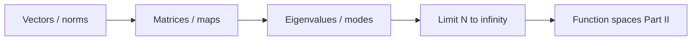

# Part I — The Grammar of Computation

Every scale in computational mechanics eventually reduces to **finite-dimensional algebra**: a state vector, a system matrix, a load vector, an eigenvalue problem. Molecular dynamics integrates Newton's equations with a timestep loop that is matrix–vector multiplication in disguise. Density functional theory solves a self-consistent field cycle that ends in linear algebra on orbital coefficients. Finite element codes assemble sparse stiffness matrices and call a solver. The pattern is universal; Part I makes it explicit.

We begin where most readers already have intuition: vectors, matrices, linear maps, and eigenvalues. The copper wire from the prologue appears first as a chain of coupled springs — a stiffness matrix and a load — then as a vibration problem whose modes decouple in an eigenbasis. By the final chapter, finite meshes suggest the limit \(N \to \infty\) and the function spaces of Part II.

Four chapters follow the **Linear Algebra Notes** in [`writings/linear-algebra/`](../../writings/linear-algebra/): numbered files, mechanics examples, and **Bridge** sections at each handoff. Nothing here requires functional analysis; everything here prepares for it.

## Where we left the wire

The prologue placed a cold-drawn copper wire under tension — heated by current, cooled by air, strengthened by a dislocation forest invisible at the engineering scale. Before we climb that ladder rung by rung, we need the **syntax** every rung shares: states collected into vectors, equilibrium written as linear systems, complexity decoupled by eigenmodes.

At this first scale the wire is not yet a PDE or a mesh. It is a chain of coupled springs: each node carries a displacement, each bond contributes a stiffness entry, and tension at the grips becomes a load vector. Finite element assembly, molecular dynamics force evaluation, and Kohn–Sham orbital solves all reduce to the same pattern — \(\mathbf{K}\mathbf{u}=\mathbf{f}\) or its eigenvalue cousin. Part I makes that pattern explicit before Part II asks what happens when the number of springs grows without bound.

## The concept map

At every step in this part, ask the same four questions the [Functional Analysis Notes](https://hanfengzhai.github.io/file/teaching/notes/ME412_CourseSummary.pdf) later formalize for infinite dimensions:

| Question | Example in this part |
|----------|----------------------|
| What **object** are we studying? | A state vector \(\mathbf{u}\), a stiffness matrix \(\mathbf{K}\), an eigenmode |
| What **structure** does it add? | Inner product (energy), symmetry (reciprocity), sparsity (local coupling) |
| What **theorem** becomes possible? | Spectral decomposition, positive-definiteness \(\Rightarrow\) unique equilibrium |
| What **breaks** if structure is missing? | Ill-conditioning, spurious modes, non-convergence as \(N \to \infty\) |

The roadmap this part follows:

**Baby picture:** collect degrees of freedom into a vector, write equilibrium as \(\mathbf{K}\mathbf{u}=\mathbf{f}\), decouple complexity with eigenmodes, then ask what happens when the mesh — and \(N\) — grows without bound. The copper wire's tension test begins as a spring network long before it becomes a PDE.

## Representative schematics (ME 300A)

The [Linear Algebra Notes (ME 300A)](https://hanfengzhai.github.io/file/ME300A_LinAlg.pdf) organize the same finite-dimensional grammar this part builds — vectors, maps, spectra, and the limit toward function spaces. Use them as a visual index while reading:

| Schematic | Idea | Chapter in this part |
|-----------|------|----------------------|
| 1 | Vectors, inner products, norms as energy | [I.1](01-vectors-matrices.md) |
| 2 | Matrices as linear maps; composition and sparsity | [I.2](02-linear-maps.md) |
| 3 | Symmetry, SPD systems, Cholesky and CG | [I.1](01-vectors-matrices.md), [I.2](02-linear-maps.md) |
| 4 | Eigenvalues, eigenvectors, spectral decoupling | [I.3](03-eigenvalues.md) |
| 5 | Gram matrices, orthonormal bases on meshes | [I.3](03-eigenvalues.md), [I.4](04-toward-infinity.md) |
| 6 | \(N \to \infty\): fields replace vectors; operators replace matrices | [I.4](04-toward-infinity.md) → Part II |

Each schematic answers the four concept-map questions for one layer of structure. When assembly algebra feels mechanical, return to the matching row: *what object, what structure, what theorem, what breaks?*

## Story so far (Prologue)

The prologue introduced a single copper wire as a **ladder of scales** — from continuum stress and FEM meshes down through dislocations, atoms, and electrons — and the four questions every rung answers: state, equations, discretization, upward export. Before climbing that ladder mathematically, Part I pauses at the rung every simulation shares:

| Prologue stage | What we saw | What Part I will make explicit |
|----------------|-------------|--------------------------------|
| Engineering scale | Tension, heating, sagging | States as vectors; equilibrium as \(\mathbf{K}\mathbf{u}=\mathbf{f}\) |
| Finer scales (preview) | Dislocations, atoms, electrons | The same linear-algebraic pattern in disguise |
| Four questions | State / equations / discretization / export | Here: state = vector, equations = linear system, discretization = assembly |

The wire at this scale is still a chain of coupled springs — not yet a PDE, not yet a mesh of tetrahedra. Part I supplies the syntax every later part generalizes: collect degrees of freedom, write balance as a linear system, decouple complexity with eigenmodes, then ask what happens when \(N \to \infty\) in Chapter 4.

## Lab act (prologue map)

In the [prologue's experiment-as-plot narrative](../../prologue/00-many-scales.md#the-experiment-as-plot), the copper wire lives in **laboratory time** as well as part number. Part I is **Act I — Mounting** in slow motion: wedge jaws grip the cold-drawn cylinder, the load cell and thermocouple are zeroed, and the first bar-element model writes \(\mathbf{K}\mathbf{u}=\mathbf{f}\) before current flows or displacement ramps. Every later part assumes this grammar; none replaces it.

## Bridge

The prologue introduced the copper wire at every scale. Part I begins at the scale every simulation shares: degrees of freedom collected into vectors, evolution and equilibrium written as linear systems. The first chapter refreshes the language — inner products, norms, matrix structure — that Parts II through IX will generalize to functions and operators.
