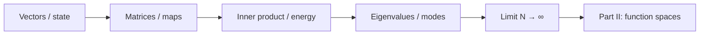

# Part I — The Grammar of Computation

Every scale in computational mechanics eventually reduces to **finite-dimensional algebra**: a state vector, a system matrix, a load vector, an eigenvalue problem. Molecular dynamics integrates Newton's equations with a timestep loop that is matrix–vector multiplication in disguise. Density functional theory solves a self-consistent field cycle that ends in linear algebra on orbital coefficients. Finite element codes assemble sparse stiffness matrices and call a solver. The pattern is universal; Part I makes it explicit.

We begin where most readers already have intuition: vectors, matrices, linear maps, and eigenvalues. The copper wire from the prologue appears first as a chain of coupled springs — a stiffness matrix and a load — then as a vibration problem whose modes decouple in an eigenbasis. By the final chapter, finite meshes suggest the limit \(N \to \infty\) and the function spaces of Part II.

Four chapters follow the **Linear Algebra Notes** in [`writings/linear-algebra/`](../../writings/linear-algebra/): numbered files, mechanics examples, and **Bridge** sections at each handoff. Nothing here requires functional analysis; everything here prepares for it.

## The concept map (ME 300A)

At every step, ask the same four questions the Functional Analysis Notes use in Part II — adapted here to finite dimensions:

| Question | Example in this part |
|----------|----------------------|
| What **object** are we studying? | A displacement vector \(\mathbf{u} \in \mathbb{R}^N\), not yet a field \(u(x)\) |
| What **structure** does it add? | Inner product (energy), symmetry (reciprocity), spectrum (modes) |
| What **theorem** becomes possible? | SPD \(\Rightarrow\) unique equilibrium; symmetric \(\Rightarrow\) real eigenvalues |
| What **breaks** if structure is missing? | Ill-conditioning, spurious modes, Newton divergence |

The roadmap from linear algebra to the rest of the book:

**Baby picture:** collect degrees of freedom into a vector, write equilibrium as \(\mathbf{K}\mathbf{u}=\mathbf{f}\), diagonalize symmetric systems to find vibration modes, then let the mesh refine until vectors become functions. The copper wire's three-node bar model is the first scene; the infinite-dimensional field is the last line of Part I.

## Bridge

The prologue introduced the copper wire at every scale. Part I begins at the scale every simulation shares: degrees of freedom collected into vectors, evolution and equilibrium written as linear systems. The first chapter refreshes the language — inner products, norms, matrix structure — that Parts II through IX will generalize to functions and operators.
