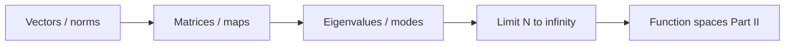

# Part I — The Grammar of Computation

Every scale in computational mechanics eventually reduces to **finite-dimensional algebra**: a state vector, a system matrix, a load vector, an eigenvalue problem. Molecular dynamics integrates Newton's equations with a timestep loop that is matrix–vector multiplication in disguise. Density functional theory solves a self-consistent field cycle that ends in linear algebra on orbital coefficients. Finite element codes assemble sparse stiffness matrices and call a solver. The pattern is universal; Part I makes it explicit.

We begin where most readers already have intuition: vectors, matrices, linear maps, and eigenvalues. The copper wire from the prologue appears first as a chain of coupled springs — a stiffness matrix and a load — then as a vibration problem whose modes decouple in an eigenbasis. By the final chapter, finite meshes suggest the limit \(N \to \infty\) and the function spaces of Part II.

Four chapters follow the **Linear Algebra Notes** in [`writings/linear-algebra/`](../../writings/linear-algebra/): numbered files, mechanics examples, and **Bridge** sections at each handoff. Nothing here requires functional analysis; everything here prepares for it.

## Where we left the wire

The prologue placed a cold-drawn copper wire under tension — heated by current, cooled by air, strengthened by a dislocation forest invisible at the engineering scale. Before we climb that ladder rung by rung, we need the **syntax** every rung shares: states collected into vectors, equilibrium written as linear systems, complexity decoupled by eigenmodes.

At this first scale the wire is not yet a PDE or a mesh. It is a chain of coupled springs: each node carries a displacement, each bond contributes a stiffness entry, and tension at the grips becomes a load vector. Finite element assembly, molecular dynamics force evaluation, and Kohn–Sham orbital solves all reduce to the same pattern — \(\mathbf{K}\mathbf{u}=\mathbf{f}\) or its eigenvalue cousin. Part I makes that pattern explicit before Part II asks what happens when the number of springs grows without bound.

## The concept map

At every step in this part, ask the same four questions the [Functional Analysis Notes](https://hanfengzhai.github.io/file/teaching/notes/ME412_CourseSummary.pdf) later formalize for infinite dimensions:

| Question | Example in this part |
|----------|----------------------|
| What **object** are we studying? | A state vector \(\mathbf{u}\), a stiffness matrix \(\mathbf{K}\), an eigenmode |
| What **structure** does it add? | Inner product (energy), symmetry (reciprocity), sparsity (local coupling) |
| What **theorem** becomes possible? | Spectral decomposition, positive-definiteness \(\Rightarrow\) unique equilibrium |
| What **breaks** if structure is missing? | Ill-conditioning, spurious modes, non-convergence as \(N \to \infty\) |

The roadmap this part follows:

**Baby picture:** collect degrees of freedom into a vector, write equilibrium as \(\mathbf{K}\mathbf{u}=\mathbf{f}\), decouple complexity with eigenmodes, then ask what happens when the mesh — and \(N\) — grows without bound. The copper wire's tension test begins as a spring network long before it becomes a PDE.

## Bridge

The prologue introduced the copper wire at every scale. Part I begins at the scale every simulation shares: degrees of freedom collected into vectors, evolution and equilibrium written as linear systems. The first chapter refreshes the language — inner products, norms, matrix structure — that Parts II through IX will generalize to functions and operators.
