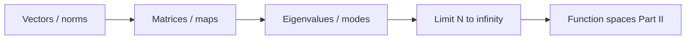

# Part I — The Grammar of Computation

Every scale in computational mechanics eventually reduces to **finite-dimensional algebra**: a state vector, a system matrix, a load vector, an eigenvalue problem. Molecular dynamics integrates Newton's equations with a timestep loop that is matrix–vector multiplication in disguise. Density functional theory solves a self-consistent field cycle that ends in linear algebra on orbital coefficients. Finite element codes assemble sparse stiffness matrices and call a solver. The pattern is universal; Part I makes it explicit.

We begin where most readers already have intuition: vectors, matrices, linear maps, and eigenvalues. The copper wire from the prologue appears first as a chain of coupled springs — a stiffness matrix and a load — then as a vibration problem whose modes decouple in an eigenbasis. By the final chapter, finite meshes suggest the limit \(N \to \infty\) and the function spaces of Part II.

Four chapters follow the **Linear Algebra Notes** in [`writings/linear-algebra/`](../../writings/linear-algebra/): numbered files, mechanics examples, and **Bridge** sections at each handoff. Nothing here requires functional analysis; everything here prepares for it.

## Scene

The prologue placed a cold-drawn copper wire under tension — heated by current, cooled by air, strengthened by a dislocation forest invisible at the engineering scale. Before we climb that ladder rung by rung, we need the **syntax** every rung shares: states collected into vectors, equilibrium written as linear systems, complexity decoupled by eigenmodes.

At this first scale the wire is not yet a PDE or a mesh. It is a chain of coupled springs: each node carries a displacement, each bond contributes a stiffness entry, and tension at the grips becomes a load vector. Finite element assembly, molecular dynamics force evaluation, and Kohn–Sham orbital solves all reduce to the same pattern — \(\mathbf{K}\mathbf{u}=\mathbf{f}\) or its eigenvalue cousin. Part I makes that pattern explicit before Part II asks what happens when the number of springs grows without bound.

## The concept map

At every step in this part, ask the same four questions the [Functional Analysis Notes](https://hanfengzhai.github.io/file/teaching/notes/ME412_CourseSummary.pdf) later formalize for infinite dimensions:

| Question | Example in this part |
|----------|----------------------|
| What **object** are we studying? | A state vector \(\mathbf{u}\), a stiffness matrix \(\mathbf{K}\), an eigenmode |
| What **structure** does it add? | Inner product (energy), symmetry (reciprocity), sparsity (local coupling) |
| What **theorem** becomes possible? | Spectral decomposition, positive-definiteness \(\Rightarrow\) unique equilibrium |
| What **breaks** if structure is missing? | Ill-conditioning, spurious modes, non-convergence as \(N \to \infty\) |

The roadmap this part follows:

**Baby picture:** collect degrees of freedom into a vector, write equilibrium as \(\mathbf{K}\mathbf{u}=\mathbf{f}\), decouple complexity with eigenmodes, then ask what happens when the mesh — and \(N\) — grows without bound. The copper wire's tension test begins as a spring network long before it becomes a PDE.

## Representative schematics (ME 300A)

The [Linear Algebra Notes](https://hanfengzhai.github.io/file/ME300A_LinAlg.pdf) (ME 300A) collect the same baby pictures Part II later lifts into infinite dimensions. Use them as a visual index while reading:

| Schematic | Idea | Chapter in this part |
|-----------|------|----------------------|
| 1 | Vectors, norms, inner products; energy as \(\mathbf{u}^T\mathbf{K}\mathbf{u}\) | [I.1](01-vectors-matrices.md) |
| 2 | Linear maps, bases, change of coordinates; assembly as coordinate change | [I.2](02-linear-maps.md) |
| 3 | Eigenvalues, eigenvectors, modal decoupling; vibration of the spring chain | [I.3](03-eigenvalues.md) |
| 4 | \(N\to\infty\); operators, Gram matrices, preview of \(L^2\) and \(H^1\) | [I.4](04-toward-infinity.md) |

Each schematic answers the four concept-map questions for one layer of finite-dimensional structure. When assembly or eigenmodes feel like bookkeeping, return to the matching row: *what object, what structure, what theorem, what breaks?* Part II will replay the same table with function spaces instead of vectors.

## Story so far (Prologue)

The prologue introduced a single copper wire as a **ladder of scales** — from continuum stress and FEM meshes down through dislocations, atoms, and electrons — and the four questions every rung answers: state, equations, discretization, upward export. Before climbing that ladder mathematically, Part I pauses at the rung every simulation shares:

| Prologue stage | What we saw | What Part I will make explicit |
|----------------|-------------|--------------------------------|
| Engineering scale | Tension, heating, sagging | States as vectors; equilibrium as \(\mathbf{K}\mathbf{u}=\mathbf{f}\) |
| Finer scales (preview) | Dislocations, atoms, electrons | The same linear-algebraic pattern in disguise |
| Four questions | State / equations / discretization / export | Here: state = vector, equations = linear system, discretization = assembly |

The wire at this scale is still a chain of coupled springs — not yet a PDE, not yet a mesh of tetrahedra. Part I supplies the syntax every later part generalizes: collect degrees of freedom, write balance as a linear system, decouple complexity with eigenmodes, then ask what happens when \(N \to \infty\) in Chapter 4.

## Closing the arc from the Prologue

If you have read the prologue straight through, the copper wire has already appeared as a continuum member, a dislocation forest, an atomic lattice, and a sea of electrons. Part I does not repeat those scenes — it **grounds** them in the grammar every later scale inherits:

| Prologue image | Part I vocabulary |
|----------------|-------------------|
| Ladder of scales | Every rung eventually ends in \(\mathbf{A}\mathbf{x}=\mathbf{b}\) or an eigenproblem |
| Four questions (state, equations, discretization, export) | State = vector; equations = linear system; discretization = assembly; export = moduli or modes extracted from solves |
| Six-act lab session | Act I (mounting) = first \(\mathbf{K}\mathbf{u}=\mathbf{f}\) before current or ramp |
| One specimen, many scales | Same wire as \(N\) coupled springs — the discrete shadow every mesh refines |

The prologue asked *what is the minimal description at each scale?* Part I answers for the rung every code shares: **finite-dimensional algebra** with energy norms, symmetry, and sparsity. When Part II replaces vectors with functions, the moves learned here remain — inner products become \(L^2\) pairings, stiffness matrices become operators, and eigenmodes become normal modes in \(H^1\). The [Functional Analysis Notes](https://hanfengzhai.github.io/file/teaching/notes/ME412_CourseSummary.pdf) replay this same table in infinite dimensions; Part I is the finite-dimensional rehearsal.

## Lab act: I — Mounting

In [laboratory time](../prologue/00-many-scales.md#the-experiment-as-plot), the operator has not yet switched on current or ramped grip displacement. The wire sits in wedge jaws; the load cell reads zero; the first honest model is a chain of bar elements with boundary conditions at the grips. **Act I** is where every later scale hides its linear algebra: \(\mathbf{K}\mathbf{u}=\mathbf{f}\) before fields, weak forms, or electrons enter the story. When a chapter in Part I feels abstract, return to the mounting scene — a cylinder gripped, a sparse matrix waiting to be assembled.

## Bridge

The prologue introduced the copper wire at every scale and named the four questions every rung must answer. Part I begins at the rung every simulation shares — degrees of freedom collected into vectors, evolution and equilibrium written as linear systems — before the wire becomes a field, a mesh, or an electron density.

| Prologue device | Part I chapter that delivers it |
|-----------------|--------------------------------|
| Six-act lab session, **Act I — Mounting** | [I.1](01-vectors-matrices.md): first \(\mathbf{K}\mathbf{u}=\mathbf{f}\) with grips fixed |
| Four questions: state / equations / discretization / export | [I.1–I.4](04-toward-infinity.md): vector → map → modes → limit \(N\to\infty\) |
| Ladder of scales (preview) | [I.4](04-toward-infinity.md): fields replace vectors; operators replace matrices |
| Weak form as recurring character (named, not yet spoken) | [I.4 Bridge](04-toward-infinity.md#bridge-to-part-ii): three-step handoff to Part II |

The first chapter refreshes the language — inner products, norms, matrix structure — that Parts II through IX will generalize to functions and operators. Read it as the opening sentence of the novel after the prologue's panoramic view: the grips are still open, the load cell still reads zero, and the first honest model is already a sparse matrix waiting to be assembled.

Turn the page when the prologue's ladder feels like a menu of methods — Part I is where every later scale reveals the same \(\mathbf{A}\mathbf{x}=\mathbf{b}\) grammar underneath.
