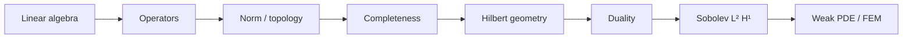

# Part II — Function Spaces

Part I showed that every mesh reduces mechanics to \(\mathbf{K}\mathbf{u}=\mathbf{f}\). That reduction is honest only if the limit as the mesh refines is well defined. The limit lives in a space of functions — displacements, temperatures, pressures — not in \(\mathbb{R}^N\) for any fixed \(N\).

This part builds the language of those spaces: norms that measure energy and mean square error, inner products that define orthogonality of modes, operators that generalize matrices, and compactness that makes spectral theory and Galerkin convergence possible. The copper wire from the prologue reappears throughout as a bar in \(H^1\), a thermal field in \(L^2\), and a problem whose discrete stiffness matrix is a projection of an operator we can now name.

The layout follows the **Functional Analysis Notes** in [`writings/functional-analysis/`](../../writings/functional-analysis/): numbered chapters, worked examples tied to mechanics, and a **Bridge** at the end of each chapter pointing to the next idea. Read the five chapters in order; they hand off directly to Part III, where weak forms of boundary value problems are written in the spaces defined here.

## Chapter guide

| Chapter | Wire story beat | Core object | Handoff |
|---------|-----------------|-------------|---------|
| [II.1](01-motivation.md) | Mesh refines; nodal values become fields | \(L^2\), \(H^1\) as limits of \(\mathbb{R}^N\) | Norms measure energy → completeness in II.2 |
| [II.2](02-normed-spaces.md) | Elastic energy and mean-square error on the bar | Banach spaces, equivalent norms, Cauchy sequences | Inner product adds angles → Hilbert in II.3 |
| [II.3](03-hilbert-spaces.md) | Orthogonal vibration modes of the wire | Inner product, projection, Riesz representation | Dual functionals → operators in II.4 |
| [II.4](04-operators-duality.md) | Stiffness as operator; loads as dual functionals | Bounded operators, weak convergence, compactness | Spectral theory → Galerkin convergence in II.5 |
| [II.5](05-spectral-theorem.md) | Discrete eigenmodes converge to normal modes | Compact self-adjoint operators, spectral theorem | [Bridge to Part III](05-spectral-theorem.md#bridge-to-part-iii) |

Read in order. Each chapter ends with a **Bridge** that states why the next chapter must exist; jumping to Sobolev spaces without understanding completeness is like writing a weak form without naming the function space it lives in.

## Scene

Part I ended with a limit: as the spring network refines, the copper wire's displacement and temperature are no longer vectors in \(\mathbb{R}^N\) for any fixed \(N\). They become **fields** — functions of position along the bar — and the stiffness matrix is a finite-dimensional shadow of an operator we have not yet named.

The wire at this scale is still one-dimensional for intuition: axial displacement \(u(x)\) under tension, temperature \(T(x)\) along its length when current flows. Part II supplies the room those fields live in — norms that measure elastic energy, inner products that define orthogonality of vibration modes, completeness so mesh refinement has a target to converge toward. Every FEM code in later parts is linear algebra inside \(H^1\); this part explains why that claim is honest.

## The concept map (ME 412)

The [Functional Analysis Notes](https://hanfengzhai.github.io/file/teaching/notes/ME412_CourseSummary.pdf) are organized as a concept map, not a proof stack. At every step, ask:

| Question | Example in this part |
|----------|----------------------|
| What **object** are we studying? | A displacement field \(u\), not a vector \(\mathbf{u}\in\mathbb{R}^N\) |
| What **structure** does it add? | A norm (energy), an inner product (orthogonality), completeness (limits stay inside) |
| What **theorem** becomes possible? | Lax–Milgram existence, Galerkin best approximation, spectral convergence |
| What **breaks** if structure is missing? | Cauchy sequences leaving the space; corners with no classical \(C^2\) solution |

The master roadmap those notes draw — and this part follows — is:

**Baby picture:** first build the room (vector space), then add a ruler (norm), then close the holes (Banach/Hilbert completeness), then add angles (inner product), then write weak PDEs and trust that FEM is projection, not guesswork. The copper wire's displacement lives in that room long before any mesh assigns it node values.

## How Part II connects to Parts III–IV

Part II is the **analytical contract** every discretization in later parts must honor:

| Part II chapter | Theorem or structure | Where it reappears |
|-----------------|---------------------|-------------------|
| II.1 Motivation | Weak forms replace pointwise derivatives | Part III.2 weak Poisson; Part IV Galerkin |
| II.2 Normed spaces | Energy norm \(\|u\|_a\); completeness | Part IV.5 convergence in energy |
| II.3 Hilbert spaces | Lax–Milgram; best approximation | Part IV.2 Céa's lemma |
| II.4 Operators | Dual loads; weak\* convergence | Part IV grip BCs; Part III point loads |
| II.5 Spectral | Rayleigh–Ritz; modal convergence | Part I.3 eigenmodes; dynamic FEM |

If you read only one part before writing a weak form or running a mesh convergence study, read this one. Part III writes the PDEs; Part IV assembles the matrices — but Part II proves the limit exists and the discrete solution is optimal in \(V_h\).

## Representative schematics (ME 412)

Section A of the [Functional Analysis Notes](https://hanfengzhai.github.io/file/teaching/notes/ME412_CourseSummary.pdf) collects eight **representative schematics** — baby pictures of the same machine this part builds. Use them as a visual index while reading:

| Schematic | Idea | Chapter in this part |
|-----------|------|----------------------|
| 1a–1b | Master roadmap: linear algebra → operators → weak PDE/FEM | This opening; [II.5](05-spectral-theorem.md) Bridge |
| 2 | Norms define topology; equivalent norms, same convergence | [II.2](02-normed-spaces.md) |
| 3 | Completeness hierarchy: normed → Banach → Hilbert | [II.2](02-normed-spaces.md), [II.3](03-hilbert-spaces.md) |
| 4 | Sequence spaces \(\ell^p\), \(\ell^\infty\), closure under norms | [II.2](02-normed-spaces.md) |
| 5 | \(L^p\), \(H^1\), \(H^1_0\), weak derivatives | [II.3](03-hilbert-spaces.md); Part III.3 |
| 6 | Orthogonal projection; best approximation in Hilbert space | [II.3](03-hilbert-spaces.md) |
| 7 | Duality, Riesz representation, weak convergence | [II.4](04-operators-duality.md) |
| 8a–8b | PDE → weak form → FEM; well-posedness triangle | [II.5](05-spectral-theorem.md) → Part III |

Each schematic answers the four concept-map questions for one layer of structure. When a proof feels abstract, return to the matching row: *what object, what structure, what theorem, what breaks?*

## Story so far (Prologue & Part I)

The prologue introduced the copper wire as a **ladder of scales** — continuum, dislocations, atoms, electrons — and the four questions every rung answers: state, equations, discretization, upward export. Part I made the bottom rung of that ladder explicit in finite dimensions:

| Stage | What we learned | What the wire became |
|-------|-----------------|----------------------|
| Prologue | One specimen, many scales; weak forms as recurring character | Cold-drawn copper under tension and current |
| I.1–I.2 | \(\mathbf{K}\mathbf{u}=\mathbf{f}\), bases, assembly | A chain of coupled springs under end load |
| I.3 | Eigenmodes decouple vibration | Normal modes of the same spring network |
| I.4 | \(N\to\infty\); fields replace vectors; operators replace matrices | Axial \(u(x)\) and \(T(x)\) as limits of mesh refinement |

Part I ended with a question Part II must answer: if every mesh gives a matrix \(\mathbf{K}_N\), what object does \(\mathbf{K}_N\) approximate as \(N\) grows? The answer is not "a bigger matrix" — it is an **operator** on a space of functions. Part II builds that space, names the norms that measure elastic energy, and proves that Galerkin FEM is honest projection rather than ad hoc linear algebra.

## Closing the arc from Part I

If you have read linearly since the prologue, notice how the **same four questions** from the opening table reappear here with function-space vocabulary — and how the **same mathematical moves** from Part I return in the infinite-dimensional limit:

| Part I (springs on the wire) | Part II (function spaces on the wire) |
|------------------------------|---------------------------------------|
| State vector \(\mathbf{u}\) | Fields \(u(x)\), \(T(x)\) in \(H^1\), \(L^2\) |
| Stiffness matrix \(\mathbf{K}\) | Bilinear form \(a(u,v)\); operator on \(H^1\) |
| \(\mathbf{K}\mathbf{u}=\mathbf{f}\) from nodal equilibrium | Weak form \(a(u,v)=\ell(v)\) for all test \(v\) |
| Energy \(\mathbf{u}^T \mathbf{K}\mathbf{u}\) | \(\|u\|_{H^1}^2\) and strain-energy norms |
| Mesh refinement sends \(N\to\infty\) | Completeness: Cauchy sequences stay in \(H^1\) |

Part I showed that every mesh gives linear algebra; Part II names the **limit object** that algebra approximates. The copper wire that began as coupled springs is now a bar whose displacement and temperature are functions — not longer vectors, but elements of spaces equipped with norms, inner products, and completeness. When Part III writes weak PDEs and Part IV assembles \(\mathbf{K}\) from shape functions, you will recognize Part I's pattern: finite-dimensional projection of something infinite-dimensional that Part II has now made precise.

## Lab act: III — Pulling (mathematical prelude)

**Act III** in the lab is the force–displacement ramp — but the operator cannot trust that curve until **Act III in the book** has a convergence target. Part II supplies the function spaces (\(H^1\), \(L^2\)) and the theorems (Lax–Milgram, Galerkin best approximation) that make mesh refinement honest. When the grips tighten in Part IV, every node value is a projection of a field defined here. Read Part II as the backstage justification for the linear elastic climb on the load cell.

### What you should be able to do after Part II

Each chapter adds one move to a workflow that turns "the mesh looks smooth" into a theorem:

| After chapter | Skill on the copper wire | Minimal artifact |
|---------------|--------------------------|------------------|
| II.1 | Argue why \(N\to\infty\) needs a function \(u(x)\), not a longer vector | Mesh-refinement plot from [I.1](../part01-linear-algebra/01-vectors-matrices.md) Lab act |
| II.2 | Name the norm that measures elastic energy; state what completeness buys | \(\|u\|_{H^1}\) vs \(\|u\|_{L^2}\) on a hat function |
| II.3 | Project a load onto a subspace; cite Riesz for "load as functional" | Best approximation in a 2-D subspace of \(H^1\) |
| II.4 | Distinguish strong, weak, and weak\* convergence | Sequence of hat functions on refining meshes |
| II.5 | Connect discrete eigenvalues to operator spectrum | \((\mathbf{K},\mathbf{M})\) eigenvalues vs bending-mode limit |

None of these require running a commercial FEM code — but each one is the infinite-dimensional justification for what Part IV assembles. If you can state the weak form of \(-u''=f\) on \((0,1)\), name the space \(u \in H^1_0\), and explain why Galerkin is projection rather than guesswork, you have the core of ME 412 on the copper wire. Parts III–IV replace definitions with PDEs and loops; the **moves** stay the same.

## Bridge

Part I ended with a promise: as the mesh refines, the copper wire's displacement and temperature fields live in infinite-dimensional spaces, not in \(\mathbb{R}^N\) for any fixed \(N\). [I.4](../part01-linear-algebra/04-toward-infinity.md#bridge-to-part-ii) named the three-step bridge — weak form, subspace \(V_h \subset H^1\), matrix system — and deferred steps 1–2 to this part. The first chapter below makes that promise precise: why weak forms appear, why classical smoothness fails at corners, and why the stiffness matrix is a Galerkin projection rather than an arbitrary sparse array.

The [prologue](../../prologue/00-many-scales.md) introduced the weak form as a **recurring character** that will outlive every mesh. Part I gave it a finite-dimensional prelude — \(\mathbf{K}\mathbf{u}=\mathbf{f}\) as nodal equilibrium — and Chapter 4 showed that prelude converges toward a field \(u(x)\) as \(h \to 0\). Part II is where that field acquires a norm, an inner product, and a completeness theorem worth trusting. When Act III in the lab session ramps grip displacement, the load cell curve is honest only because the limit object defined here makes mesh refinement meaningful.
