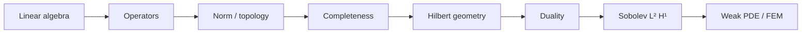

# Part II — Function Spaces

Part I showed that every mesh reduces mechanics to \(\mathbf{K}\mathbf{u}=\mathbf{f}\). That reduction is honest only if the limit as the mesh refines is well defined. The limit lives in a space of functions — displacements, temperatures, pressures — not in \(\mathbb{R}^N\) for any fixed \(N\).

This part builds the language of those spaces: norms that measure energy and mean square error, inner products that define orthogonality of modes, operators that generalize matrices, and compactness that makes spectral theory and Galerkin convergence possible. The copper wire from the prologue reappears throughout as a bar in \(H^1\), a thermal field in \(L^2\), and a problem whose discrete stiffness matrix is a projection of an operator we can now name.

The layout follows the **Functional Analysis Notes** in [`writings/functional-analysis/`](../../writings/functional-analysis/): numbered chapters, worked examples tied to mechanics, and a **Bridge** at the end of each chapter pointing to the next idea. Read the five chapters in order; they hand off directly to Part III, where weak forms of boundary value problems are written in the spaces defined here.

## Where we left the wire

Part I ended with a limit: as the spring network refines, the copper wire's displacement and temperature are no longer vectors in \(\mathbb{R}^N\) for any fixed \(N\). They become **fields** — functions of position along the bar — and the stiffness matrix is a finite-dimensional shadow of an operator we have not yet named.

The wire at this scale is still one-dimensional for intuition: axial displacement \(u(x)\) under tension, temperature \(T(x)\) along its length when current flows. Part II supplies the room those fields live in — norms that measure elastic energy, inner products that define orthogonality of vibration modes, completeness so mesh refinement has a target to converge toward. Every FEM code in later parts is linear algebra inside \(H^1\); this part explains why that claim is honest.

## The concept map (ME 412)

The [Functional Analysis Notes](https://hanfengzhai.github.io/file/teaching/notes/ME412_CourseSummary.pdf) are organized as a concept map, not a proof stack. At every step, ask:

| Question | Example in this part |
|----------|----------------------|
| What **object** are we studying? | A displacement field \(u\), not a vector \(\mathbf{u}\in\mathbb{R}^N\) |
| What **structure** does it add? | A norm (energy), an inner product (orthogonality), completeness (limits stay inside) |
| What **theorem** becomes possible? | Lax–Milgram existence, Galerkin best approximation, spectral convergence |
| What **breaks** if structure is missing? | Cauchy sequences leaving the space; corners with no classical \(C^2\) solution |

The master roadmap those notes draw — and this part follows — is:

**Baby picture:** first build the room (vector space), then add a ruler (norm), then close the holes (Banach/Hilbert completeness), then add angles (inner product), then write weak PDEs and trust that FEM is projection, not guesswork. The copper wire's displacement lives in that room long before any mesh assigns it node values.

## Bridge

Part I ended with a promise: as the mesh refines, the copper wire's displacement and temperature fields live in infinite-dimensional spaces, not in \(\mathbb{R}^N\) for any fixed \(N\). The first chapter below makes that promise precise — why weak forms appear, why classical smoothness fails at corners, and why the stiffness matrix is a Galerkin projection rather than an arbitrary sparse array.
