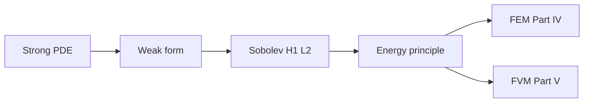

# Part III — Fields on Domains

Part II gave us function spaces, norms, and operators — the vocabulary in which infinite-dimensional mechanics is well posed. Part III applies that vocabulary to the **partial differential equations** that encode conservation and constitutive physics on continua.

The copper wire from the prologue enters this part as a domain with boundary conditions: steady heat conduction along its length, transient heating when current flows, elastic equilibrium under tension. Each scenario begins as a **strong form** — a PDE satisfied pointwise — and is rewritten as a **weak form** suitable for computation. Sobolev spaces supply the regularity theory; energy methods package existence and uniqueness as minimization principles that Part IV will discretize.

The layout follows the **PDE Notes** in [`writings/pde/`](../../writings/pde/): four numbered chapters, mechanics examples throughout, and a **Bridge** at the end of each chapter pointing forward. Read them in order; they hand off directly to finite elements (Part IV) and finite volumes (Part V).

## The concept map

| Question | Example in this part |
|----------|----------------------|
| What **object** are we studying? | Fields \(u(\mathbf{x},t)\) on domains with boundary \(\partial\Omega\) |
| What **structure** does it add? | Strong form (pointwise), weak form (test functions), energy functional |
| What **theorem** becomes possible? | Lax–Milgram existence, energy minimization, well-posedness in \(H^1\) |
| What **breaks** if structure is missing? | Reentrant corners, delta loads, non-physical oscillations on coarse meshes |

**Baby picture:** write the physics as a PDE, relax smoothness to a weak statement testable on a mesh, identify the function space where the solution lives, then package existence as minimizing an energy. The copper wire's temperature profile and axial displacement are two instances of the same pipeline.

## Bridge

Part II promised that the copper wire's displacement and temperature live in Sobolev spaces, not in \(\mathbb{R}^N\) for any fixed mesh. The first chapter below writes the strong forms that describe those fields — and shows where classical pointwise solutions fail, motivating the weak formulations that follow.
