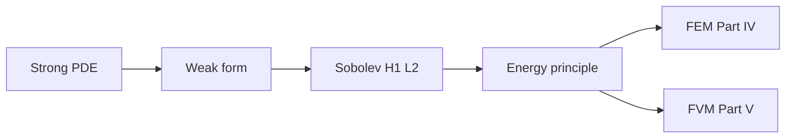

# Part III — Fields on Domains

Part II gave us function spaces, norms, and operators — the vocabulary in which infinite-dimensional mechanics is well posed. Part III applies that vocabulary to the **partial differential equations** that encode conservation and constitutive physics on continua.

The copper wire from the prologue enters this part as a domain with boundary conditions: steady heat conduction along its length, transient heating when current flows, elastic equilibrium under tension. Each scenario begins as a **strong form** — a PDE satisfied pointwise — and is rewritten as a **weak form** suitable for computation. Sobolev spaces supply the regularity theory; energy methods package existence and uniqueness as minimization principles that Part IV will discretize.

The layout follows the **PDE Notes** in [`writings/pde/`](../../writings/pde/): four numbered chapters, mechanics examples throughout, and a **Bridge** at the end of each chapter pointing forward. Read them in order; they hand off directly to finite elements (Part IV) and finite volumes (Part V).

## Where we left the wire

Part II named the function spaces — \(L^2\) for field energy, \(H^1\) for weak derivatives — and promised that Galerkin convergence is projection, not guesswork. The copper wire now enters as a **domain** with boundary conditions: fixed grips at the ends, a heat flux from Joule heating, perhaps convection at the surface once we couple to fluid in Part V.

The physics at this scale is still continuum: steady axial conduction along the bar, elastic equilibrium under uniaxial tension, transient heating when current switches on. Each scenario begins as a **strong form** — a PDE satisfied pointwise — and must be rewritten as a **weak form** testable on a mesh. Part III is where the wire's equations become computable statements in the Sobolev spaces Part II defined.

## The concept map

| Question | Example in this part |
|----------|----------------------|
| What **object** are we studying? | Fields \(u(\mathbf{x},t)\) on domains with boundary \(\partial\Omega\) |
| What **structure** does it add? | Strong form (pointwise), weak form (test functions), energy functional |
| What **theorem** becomes possible? | Lax–Milgram existence, energy minimization, well-posedness in \(H^1\) |
| What **breaks** if structure is missing? | Reentrant corners, delta loads, non-physical oscillations on coarse meshes |

**Baby picture:** write the physics as a PDE, relax smoothness to a weak statement testable on a mesh, identify the function space where the solution lives, then package existence as minimizing an energy. The copper wire's temperature profile and axial displacement are two instances of the same pipeline.

## Representative schematics (ME 300B)

The [PDE Notes (ME 300B)](https://hanfengzhai.github.io/file/ME300B_PDE.pdf) collect the same pipeline this part follows — strong form, weak form, Sobolev regularity, energy principles — with baby pictures tied to mechanics examples. Use them as a visual index while reading:

| Schematic | Idea | Chapter in this part |
|-----------|------|----------------------|
| 1 | Strong form: PDE + boundary conditions pointwise | [III.1](01-strong-form.md) |
| 2 | Where classical solutions fail: corners, concentrated loads | [III.1](01-strong-form.md) → [III.2](02-weak-form.md) |
| 3 | Weak form: test functions, integration by parts | [III.2](02-weak-form.md) |
| 4 | Sobolev spaces \(H^1\), \(L^2\); weak derivatives | [III.3](03-sobolev-spaces.md) |
| 5 | Energy functional; coercivity; Lax–Milgram | [III.4](04-energy-methods.md) |
| 6 | PDE → weak form → FEM/FVM fork | [III.4](04-energy-methods.md) → Parts IV–V |

Each schematic answers the four concept-map questions for one layer of structure. When a boundary condition or source term feels ad hoc, return to the matching row: *what object, what structure, what theorem, what breaks?*

## Story so far (Parts I–II)

The mathematical foundations are now in place. The same copper wire has changed representation twice without changing material:

| Part | Representation | Key idea |
|------|----------------|----------|
| I | Vectors and matrices in \(\mathbb{R}^N\) | Equilibrium \(\mathbf{K}\mathbf{u}=\mathbf{f}\); eigenmodes; limit \(N\to\infty\) |
| II | Fields in \(H^1\), \(L^2\); operators and duals | Completeness, Galerkin best approximation, spectral convergence |

Part II promised that mesh refinement has a **target** — a function \(u \in H^1(\Omega)\) — and that the stiffness matrix is a Galerkin projection of a bilinear form. Part III writes the **equations** those projections discretize: Poisson conduction along the wire, elastic equilibrium under tension, transient heating when current flows. Each begins as a strong form (pointwise PDE), fails at corners and concentrated loads, and is rewritten as a weak form testable on a mesh. Sobolev spaces supply the regularity theory; energy methods package existence as minimization — the last purely analytical chapter before FEM and FVM turn weak forms into code.

## Two paths ahead (preview)

Part III ends with energy methods — the last purely analytical chapter before discretization. What follows is not a single road but a **fork in the narrative**, both leading to the same continuum floor in Part VI:

| Path | Part | Philosophy | Copper wire instance |
|------|------|------------|----------------------|
| **Solids-first** | IV → (optional V) → VI | Galerkin trial functions in \(H^1\); then flux balance for fluids | Tension test on a meshed solid; optional conjugate heat transfer with cooling air |
| **Fluids-first** | V → VI | Conservation on control volumes; Riemann fluxes for advection | Joule heating in the wire coupled to air flow around it |

Read Part IV first if solids and elliptic PDEs are your immediate goal; read Part V first if fluids and hyperbolic conservation laws pull harder. Part IV Chapter 5 names two **exit doors** from FEM — continue to Part V or skip ahead to Part VI — which are separate from the solids-first / fluids-first choice above. Either way, Part VI must follow before we descend to dislocations and atoms. The story stays one book — only the order of two middle acts is flexible.

## Lab act (prologue map)

Part III spans **Act II — Warming** and the setup for **Act III — Pulling** in the [prologue experiment map](../../prologue/00-many-scales.md#the-experiment-as-plot). When current switches on, Joule heating writes a source term into the heat equation; when the operator prepares the tensile test, elastic equilibrium waits in weak form. Strong forms name the physics on the blackboard; weak forms and Sobolev spaces make those equations computable on the meshes Parts IV and V will build.

## Bridge

Part II promised that the copper wire's displacement and temperature live in Sobolev spaces, not in \(\mathbb{R}^N\) for any fixed mesh. The first chapter below writes the strong forms that describe those fields — and shows where classical pointwise solutions fail, motivating the weak formulations that follow.
