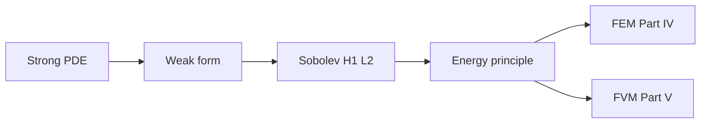
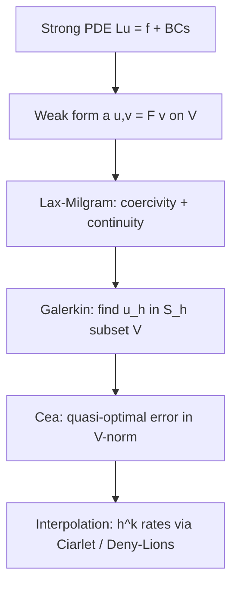

# Part III — Fields on Domains

Part II gave us function spaces, norms, and operators — the vocabulary in which infinite-dimensional mechanics is well posed. Part III applies that vocabulary to the **partial differential equations** that encode conservation and constitutive physics on continua.

The copper wire from the prologue enters this part as a domain with boundary conditions: steady heat conduction along its length, transient heating when current flows, elastic equilibrium under tension. Each scenario begins as a **strong form** — a PDE satisfied pointwise — and is rewritten as a **weak form** suitable for computation. Sobolev spaces supply the regularity theory; energy methods package existence and uniqueness as minimization principles that Part IV will discretize.

The layout follows the **PDE Notes** in [`writings/pde/`](../../writings/pde/): four numbered chapters, mechanics examples throughout, and a **Bridge** at the end of each chapter pointing forward. Read them in order; they hand off directly to finite elements (Part IV) and finite volumes (Part V).

## Chapter guide

| Chapter | Wire story beat | Core object | Handoff |
|---------|-----------------|-------------|---------|
| [III.1](01-strong-form.md) | Pointwise PDEs for heat and elasticity on the bar | Strong form, boundary conditions, where smoothness fails | Integration by parts → weak form in III.2 |
| [III.2](02-weak-form.md) | Test functions replace pointwise satisfaction | Bilinear form \(a(u,v)\), natural BCs, virtual work | Regularity class → Sobolev spaces in III.3 |
| [III.3](03-sobolev-spaces.md) | \(H^1\) displacement; \(L^2\) temperature | Weak derivatives, trace theorem, Poincaré inequality | Existence via energy → Lax–Milgram in III.4 |
| [III.4](04-energy-methods.md) | Unique equilibrium and minimum principles | Energy functional, coercivity, well-posedness triangle | [Bridge to Part IV](04-energy-methods.md#bridge-to-part-iv) and Part V |

Read in order. Each chapter ends with a **Bridge** that states why the next chapter must exist; discretizing a strong form before writing the weak form is the most common source of non-converging meshes.

## Scene

Part II named the function spaces — \(L^2\) for field energy, \(H^1\) for weak derivatives — and promised that Galerkin convergence is projection, not guesswork. The copper wire now enters as a **domain** with boundary conditions: fixed grips at the ends, a heat flux from Joule heating, perhaps convection at the surface once we couple to fluid in Part V.

The physics at this scale is still continuum: steady axial conduction along the bar, elastic equilibrium under uniaxial tension, transient heating when current switches on. Each scenario begins as a **strong form** — a PDE satisfied pointwise — and must be rewritten as a **weak form** testable on a mesh. Part III is where the wire's equations become computable statements in the Sobolev spaces Part II defined.

## The concept map

| Question | Example in this part |
|----------|----------------------|
| What **object** are we studying? | Fields \(u(\mathbf{x},t)\) on domains with boundary \(\partial\Omega\) |
| What **structure** does it add? | Strong form (pointwise), weak form (test functions), energy functional |
| What **theorem** becomes possible? | Lax–Milgram existence, energy minimization, well-posedness in \(H^1\) |
| What **breaks** if structure is missing? | Reentrant corners, delta loads, non-physical oscillations on coarse meshes |

**Baby picture:** write the physics as a PDE, relax smoothness to a weak statement testable on a mesh, identify the function space where the solution lives, then package existence as minimizing an energy. The copper wire's temperature profile and axial displacement are two instances of the same pipeline.

## Representative schematics (ME 300B)

The [Partial Differential Equations Notes](https://hanfengzhai.github.io/file/ME300B_PDE.pdf) (ME 300B) mirror Part II's ME 412 habit: each schematic is a baby picture of the same weak-form pipeline. Use them as a visual index while reading:

| Schematic | Idea | Chapter in this part |
|-----------|------|----------------------|
| 1 | Strong form: pointwise PDE + boundary conditions; where smoothness fails | [III.1](01-strong-form.md) |
| 2 | Weak form: test functions, integration by parts, natural boundary conditions | [III.2](02-weak-form.md) |
| 3 | Sobolev spaces \(H^1\), \(L^2\); weak derivatives; trace on \(\partial\Omega\) | [III.3](03-sobolev-spaces.md) |
| 4 | Energy functional; Lax–Milgram; minimum principles before discretization | [III.4](04-energy-methods.md) |

Each schematic answers the four concept-map questions for one stage of the PDE-to-computation road. When a strong-form equation looks correct but a mesh refuses to converge, return to the matching row: *what object, what structure, what theorem, what breaks?* Parts IV and V will discretize the weak forms defined here — FEM by trial functions, FVM by cell fluxes — but the pipeline is already complete in Part III.

## Story so far (Parts I–II)

The mathematical foundations are now in place. The same copper wire has changed representation twice without changing material:

| Part | Representation | Key idea |
|------|----------------|----------|
| I | Vectors and matrices in \(\mathbb{R}^N\) | Equilibrium \(\mathbf{K}\mathbf{u}=\mathbf{f}\); eigenmodes; limit \(N\to\infty\) |
| II | Fields in \(H^1\), \(L^2\); operators and duals | Completeness, Galerkin best approximation, spectral convergence |

Part II promised that mesh refinement has a **target** — a function \(u \in H^1(\Omega)\) — and that the stiffness matrix is a Galerkin projection of a bilinear form. Part III writes the **equations** those projections discretize: Poisson conduction along the wire, elastic equilibrium under tension, transient heating when current flows. Each begins as a strong form (pointwise PDE), fails at corners and concentrated loads, and is rewritten as a weak form testable on a mesh. Sobolev spaces supply the regularity theory; energy methods package existence as minimization — the last purely analytical chapter before FEM and FVM turn weak forms into code.

## Closing the arc from Part II

If you have read linearly since the prologue, Part II's closing checkpoint named the **limit object** behind every stiffness matrix. Part III is where that object receives **equations**:

| Part II (function spaces on the wire) | Part III (PDEs on the wire) |
|---------------------------------------|-----------------------------|
| Fields \(u(x)\), \(T(x)\) in \(H^1\), \(L^2\) | PDEs whose solutions live in those spaces |
| Bilinear form \(a(u,v)\); operator on \(H^1\) | Weak forms written as \(a(u,v)=\ell(v)\) |
| Lax–Milgram existence | Applied in [III.4](04-energy-methods.md) energy methods |
| Galerkin best approximation | The weak forms Part IV will discretize on \(V_h\) |
| Poincaré inequality; compact embeddings | Sobolev trace and embedding in [III.3](03-sobolev-spaces.md) |
| Spectral theorem; modal heat decay | Semidiscrete \(\mathbf{M}\dot{\mathbf{T}}+\mathbf{K}\mathbf{T}=\mathbf{q}\) preview |

Part II built the room; Part III gives the recurring character — the weak form — its first lines on stage. The prologue promised that character would return in Part IV (Galerkin assembly), Part VI (virtual work), and Part IX (variational density). Here it speaks in the language Part II prepared: multiply by a test function, integrate by parts, and ask whether balance holds for every admissible virtual displacement. The copper wire at the grip corner is where classical \(C^2\) smoothness fails but virtual work in \(H^1\) still makes sense.

## Closing the arc from Part I

If you have read linearly since the prologue, notice how the **same four questions** from the opening table reappear here with PDE vocabulary — and how the **same mathematical moves** from Part I return in the continuum limit:

| Part I (springs on the wire) | Part III (PDEs on the wire) |
|------------------------------|-----------------------------|
| State vector \(\mathbf{u}\) | Fields \(u(x)\), \(\mathbf{u}(\mathbf{x})\), \(T(x)\) on the bar domain |
| Stiffness matrix \(\mathbf{K}\) | Differential operator (e.g. \(-(EA u')'\) for axial elasticity) |
| \(\mathbf{K}\mathbf{u}=\mathbf{f}\) from nodal equilibrium | Weak form \(a(u,v)=\ell(v)\) integrated over \(\Omega\) |
| Sparsity from local spring coupling | Locality of PDEs and domain decomposition (mesh preview) |
| Mesh refinement sends \(N\to\infty\) | Weak forms in \(H^1\) — the limit Part II named |

Part I showed that every mesh eventually gives linear algebra; Part II proved that refinement has a **target** in function space. Part III writes the **equations** that target satisfies. The copper wire that began as coupled springs is now a bar with boundary conditions — fixed grips, Joule heating, perhaps convection at the surface — still one specimen, now with PDEs that Parts IV and V will discretize. When Part IV assembles \(\mathbf{K}\) from shape functions, you will recognize the same sparse pattern Part I taught, now justified by the bilinear form defined here.

## The variational ladder (ME 412 Schematic 14)

Part II's opening indexed fourteen schematics from the Functional Analysis Notes. **Schematic 14** is the narrative spine of Parts III–IV — the same ladder the notes draw from strong PDE to convergent FEM:

Read Part III as the **middle three rungs**: strong form (Chapter 1), weak form (Chapter 2), Sobolev regularity and energy methods (Chapters 3–4). Part IV completes the ladder with Galerkin assembly, Céa's lemma, and mesh refinement on the copper wire. Existence climbs upward; convergence rates come back down through interpolation — the same story whether the field is axial displacement under tension or temperature under Joule heating.

When a chapter feels like a list of PDEs, return to this ladder: *where are we on the path from physics to trusted numbers on the load cell?*

## Two paths ahead (preview)

Part III ends with energy methods — the last purely analytical chapter before discretization. What follows is not a single road but a **fork in the narrative**, both leading to the same continuum floor in Part VI:

| Path | Part | Philosophy | Copper wire instance |
|------|------|------------|----------------------|
| **Solids-first** | IV → (optional V) → VI | Galerkin trial functions in \(H^1\); then flux balance for fluids | Tension test on a meshed solid; optional conjugate heat transfer with cooling air |
| **Fluids-first** | V → VI | Conservation on control volumes; Riemann fluxes for advection | Joule heating in the wire coupled to air flow around it |

Read Part IV first if solids and elliptic PDEs are your immediate goal; read Part V first if fluids and hyperbolic conservation laws pull harder. Part IV Chapter 5 names two **exit doors** from FEM — continue to Part V or skip ahead to Part VI — which are separate from the solids-first / fluids-first choice above; [III.4's Bridge](04-energy-methods.md#bridge-to-part-iv) previews those doors before you enter Part IV. Either way, Part VI must follow before we descend to dislocations and atoms. The story stays one book — only the order of two middle acts is flexible.

## Lab act: II–III — Warming and pulling (equations first)

In [laboratory time](../prologue/00-many-scales.md#the-experiment-as-plot), **Act II** switches on current and **Act III** ramps grip displacement — but both acts share the same mathematical habit: write the physics as a PDE, relax it to a weak form, and identify the Sobolev space where the solution lives. Part III is where Joule heating and elastic equilibrium become **computable statements** before FEM or FVM assign them node values or cell fluxes. When you read about strong versus weak forms here, picture the thermocouple warming and the grips tightening as two instances of one pipeline.

### What you should be able to do after Part III

Each chapter adds one move to the analytical pipeline that turns a blackboard PDE into a weak form Parts IV and V can discretize:

| After chapter | Skill on the copper wire | Minimal artifact |
|---------------|--------------------------|------------------|
| III.1 | Write strong forms for axial elasticity and steady heat; name where \(C^2\) fails | \(-(EA u')' = f\); \(-k T'' = q\) with grip BCs |
| III.2 | Derive the weak form by integration by parts; identify test space | \(\int EA u' v'\, dx = \int f v\, dx\) for \(v \in H^1_0\) |
| III.3 | State \(H^1_0\) membership; explain weak derivatives on hat functions | Corner singularity at grip; \(u \in H^1\) but not \(C^2\) |
| III.4 | Write Dirichlet energy; connect minimization to Lax–Milgram | \(\Pi[u] = \tfrac{1}{2}a(u,u) - \ell(u)\); Euler–Lagrange = weak form |

None of these require assembling a mesh — but each one is the continuum statement FEM enforces at the limit. If you can write the weak form of \(-u''=f\) on \((0,L)\), name \(u \in H^1_0\), and explain why the energy minimum equals virtual work, you have the analytical core that Parts IV–VI discretize and interpret.

## Bridge

Part II ended with a promise: the copper wire's displacement and temperature live in Sobolev spaces, not in \(\mathbb{R}^N\) for any fixed mesh. [II.5](../part02-functional-analysis/05-spectral-theorem.md#bridge) named the weak form a **recurring character** about to speak on stage — multiply by a test function, integrate by parts, balance virtual work for every admissible displacement. Part III is that act.

| What Part II supplied | What Part III writes |
|-----------------------|----------------------|
| \(H^1\), \(L^2\), completeness | Domains \(\Omega\) where fields live |
| Bilinear forms \(a(u,v)\); dual loads \(\ell\) | Weak forms \(a(u,v)=\ell(v)\) for Poisson, heat, elasticity |
| Lax–Milgram and spectral convergence | Energy methods that package existence as minimization |
| Galerkin best approximation on \(V_h\) | The equations Parts IV and V will discretize |

The first chapter below writes **strong forms** — what the blackboard demands at every point — and names where classical \(C^2\) smoothness fails on the wire's grip corner, insulator interface, and mid-span load. That failure is not a bug in the physics; it is the plot hinge the prologue's recurring character has been walking toward since Part I's nodal balance laws. [III.2](02-weak-form.md) gives the character its first lines; [III.4](04-energy-methods.md) closes the analytical pipeline before FEM and FVM turn weak forms into code.

Turn the page when you are ready to see where pointwise PDEs break — and why the weak form is the correct continuum statement, not a numerical convenience.
