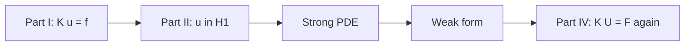

# Weak Formulations and Test Functions

The weak form is the computational mechanic's version of integration by parts: move derivatives from the unknown solution onto smooth test functions, trading pointwise differentiability for integral balance.

[III.1](01-strong-form.md) wrote the copper wire's equilibrium and heating as **pointwise** PDEs — valid where \(C^2\) smoothness holds, failing at the grip corner, thermocouple weld, and mid-span load. This chapter is the corrective move the prologue's recurring character has been walking toward since Part I's nodal balance laws: multiply by a test function, integrate over the domain, integrate by parts once, and ask whether virtual work balances for all admissible perturbations. The answer lives in \(H^1\), not in classical \(C^2\).

If the copper wire is fixed at both ends and loaded in the middle, the displacement field may be continuous but not twice differentiable at the load point — the strong form \(-EA u'' = f\) fails classically at a point force. The weak form still asks: for all admissible virtual displacements, is internal virtual work equal to external virtual work? That question has an answer in \(H^1\), and Galerkin discretization turns it into \(\mathbf{K}\mathbf{U}=\mathbf{F}\).

## Plot spine (one line) {#plot-spine-one-line}

> **III.2 — Act I — Grammar:** Test functions and integration by parts rewrite physics as pairings, not pointwise derivatives.

When this chapter feels abstract, read the sentence above aloud — it is this chapter's role in the [chapter roadmap](../appendix/sources.md#chapter-roadmap-one-continuous-arc). See the [numbered-chapter plot spine index](../appendix/sources.md#numbered-chapter-plot-spine-index-row-19) for all 35 rungs; [row 19](../preface.md#skill-navigation-row-19) closes the audit when mid-chapter reading stalls despite a Bridge from the prior chapter.

## Scene: the grip corner

Mount the copper wire in a rigid bracket with a reentrant corner — an L-shaped steel jaw gripping a cylindrical specimen. Under tension, the displacement field is visually smooth: the wire elongates, the bracket barely flexes. But zoom into the corner where copper meets steel: finite element post-processing shows stress components spiking, and a curious analyst asks whether \(-\nabla\cdot\boldsymbol{\sigma} = \mathbf{0}\) holds **pointwise** in classical sense.

It does not. The corner is a geometric singularity; gradients blow up as power laws of distance from the corner. Demanding a \(C^2\) displacement field is the wrong requirement — the physics still balances forces, but the balance is meaningful only in **integral** form. Multiply the equilibrium equation by a smooth test function, integrate over the domain, integrate stress divergence by parts, and the boundary terms carry the grip traction while the interior asks only that \(\boldsymbol{\sigma}\) be square-integrable in a suitable sense.

That maneuver — one integration by parts, one space of admissible test functions — is the weak form. It is the reason Part II built \(H^1\) before Part III wrote PDEs, and the reason Part IV's shape functions need only be continuous, not twice differentiable. The copper wire at the grip corner is where the story stops pretending that every field is smooth.

## From springs to weak form: the same question twice

Return to Part I's spring network on the copper wire. Equilibrium at each interior node required the sum of spring forces to vanish — a **discrete balance law**. Multiply that balance by an arbitrary virtual displacement at the node and sum over all nodes: internal virtual work equals external virtual work. That is already a weak statement; the only novelty in the continuum limit is that the index set of nodes becomes the domain \(\Omega\), and the sum becomes an integral.

The pipeline the book has been building now closes a loop:

**Linear algebra** gave us \(\mathbf{K}\mathbf{u}=\mathbf{f}\). **Functional analysis** explained why the limit as the mesh refines lives in \(H^1\). **Strong forms** wrote the PDE the mesh approximates. **Weak forms** are the variational statement FEM implements — and they return us to a matrix system whose entries are integrals of shape-function gradients. The copper wire never changed; only the language did.

Read the diagram above as the plot spine of the novel, not a syllabus chart: every arrow is the same specimen seen through a different lens. When Part IV assembles \(\mathbf{K}\) from shape functions, you are not learning a new method — you are closing the loop Part I opened with nodal equilibrium. When Part VI writes virtual work, you will recognize the same pairing of stress with a virtual strain. When Part IX minimizes \(E[\rho]\), the instinct is unchanged: pick an admissible trial object, integrate, and let boundary conditions carry what pointwise equations cannot.

This is why the weak form is not a numerical trick. It is the **correct continuum statement** for problems whose classical solutions fail at corners, kinks, and point loads — exactly the situations the drawn wire presents when clamped, notched, or loaded at a grip.

## Derivation: Poisson with Dirichlet BCs

Start with \(-\Delta u = f\) in \(\Omega\), \(u = 0\) on \(\partial\Omega\). Multiply by a test function \(v\) that also vanishes on the boundary:

\[
\int_\Omega (-\Delta u)\, v \, d\Omega = \int_\Omega f v \, d\Omega.
\]

Integrate by parts (Green's first identity):

\[
\int_\Omega \nabla u \cdot \nabla v \, d\Omega - \int_{\partial\Omega} \frac{\partial u}{\partial n} v \, dS = \int_\Omega f v \, d\Omega.
\]

With \(v = 0\) on \(\partial\Omega\), the boundary term vanishes. The **weak form** seeks \(u \in V = H^1_0(\Omega)\) such that

\[
a(u,v) = \ell(v) \quad \forall v \in V,
\]

where

\[
a(u,v) = \int_\Omega \nabla u \cdot \nabla v \, d\Omega, \qquad \ell(v) = \int_\Omega f v \, d\Omega.
\]

Only **first** derivatives of \(u\) appear — hence \(H^1\) suffices. The Laplacian never appears as a pointwise operator in the weak form; it is hidden inside the bilinear form \(a(\cdot,\cdot)\).

## The Lax–Milgram theorem in action

**Theorem (Lax–Milgram).** Let \(H\) be a Hilbert space. If \(a: H \times H \to \mathbb{R}\) is continuous and coercive,

\[
|a(u,v)| \le C \|u\|_H \|v\|_H, \qquad a(u,u) \ge \alpha \|u\|_H^2,
\]

and \(\ell \in H^*\) (continuous linear functional), then there exists a **unique** \(u \in H\) with \(a(u,v) = \ell(v)\) for all \(v \in H\). Moreover,

\[
\|u\|_H \le \frac{1}{\alpha}\|\ell\|_{H^*}.
\]

For Poisson with \(f \in L^2(\Omega)\) and \(V = H^1_0(\Omega)\):

| Hypothesis | Verification |
|------------|--------------|
| Continuity of \(a\) | Cauchy–Schwarz: \(\|\nabla u\|_{L^2}\) controls \(a(u,v)\) |
| Coercivity | Poincaré inequality on \(H^1_0\): \(\|u\|_{L^2} \le C_P \|\nabla u\|_{L^2}\) |
| Continuity of \(\ell\) | \(\|\ell\| \le \|f\|_{L^2}\|v\|_{L^2}\) |

Hence a **unique weak solution** exists. Moreover, it minimizes the energy functional

\[
\Pi(u) = \tfrac{1}{2}a(u,u) - \ell(u) = \int_\Omega \tfrac{1}{2}|\nabla u|^2 - f u \, d\Omega.
\]

Stability: small changes in \(f\) produce small changes in \(u\) in the \(H^1\) norm — essential for well-posed computation.

## Worked example: 1D bar with body force

On \((0,L)\), \(-(EA u')' = f(x)\), \(u(0)=u(L)=0\). Weak form with test \(v \in H^1_0(0,L)\):

\[
\int_0^L EA u' v' \, dx = \int_0^L f v \, dx.
\]

Take \(f = 1\), constant \(EA\). A piecewise-linear FEM with two elements gives the same \(3 \times 3\) system as Part I’s assembly; solving yields nodal displacements approximating the parabolic exact solution \(u(x) = x(L-x)/(2EA)\). The weak form, Galerkin discretization, and linear algebra pipeline close the loop from Part I to Part IV.

### Point load at midspan: where the strong form breaks

Suppose instead the wire carries a concentrated force \(P\) at \(x = L/2\). The strong form \(-EA u'' = P\,\delta(x - L/2)\) uses a **Dirac delta** on the right-hand side — not a function in \(L^2\), but a **linear functional** on test functions (Part II, Chapter 4). The weak form remains well posed: seek \(u \in H^1_0(0,L)\) such that

\[
\int_0^L EA\, u' v' \, dx = P\, v(L/2) \quad \forall v \in H^1_0(0,L).
\]

The load appears as evaluation of the test function at the load point — the discrete analogue of a nodal force in Part I's spring network. A finite element mesh with a node at midspan assembles \(F_i = P\) at that node directly; no delta function is ever stored in memory. This is the computational mechanic's everyday encounter with **distributions**: the weak form absorbs singular loads; the assembly code sees numbers at nodes.

## Virtual work in elasticity

For displacements, the weak form is the **principle of virtual work**:

\[
\int_\Omega \boldsymbol{\sigma} : \delta\boldsymbol{\varepsilon} \, d\Omega = \int_\Omega \mathbf{f}\cdot\delta\mathbf{u} \, d\Omega + \int_{\Gamma_N} \mathbf{t}\cdot\delta\mathbf{u} \, dS
\]

for all kinematically admissible virtual displacements \(\delta\mathbf{u}\) (vanishing on \(\Gamma_D\)). Linearization with \(\boldsymbol{\sigma} = \mathbb{C}:\boldsymbol{\varepsilon}\) yields the bilinear form

\[
a(\mathbf{u}, \mathbf{v}) = \int_\Omega \boldsymbol{\varepsilon}(\mathbf{v}) : \mathbb{C} : \boldsymbol{\varepsilon}(\mathbf{u}) \, d\Omega,
\]

used in FEM for the copper wire in 3D or for complex fixtures. Nonlinear elasticity replaces the bilinear form with an incremental tangent stiffness — Newton–Raphson in Part IV.

## Natural boundary conditions

Neumann data \(\partial u / \partial n = h\) enters the weak form as a boundary integral:

\[
\int_\Omega \nabla u \cdot \nabla v = \int_\Omega f v + \int_{\Gamma_N} h v.
\]

Dirichlet data are **essential** — enforced strongly on the trial space (or via constraints). Neumann data are **natural** — appear automatically in the weak form after integration by parts. Robin conditions add a boundary stiffness term \(\int_{\Gamma_R} \alpha u v \, dS\) to the left-hand side.

This distinction guides FEM boundary implementation: essential BCs modify the trial space; natural BCs modify the load functional.

### Mixed boundary example

Heat the wire at \(x=0\) (\(T = T_h\)) and impose convective flux at \(x=L\): \(-k T' = h(T - T_\infty)\). The weak form on \(H^1\) with \(T(0)=T_h\) includes the Robin term on the right end. Only \(T(0)\) is essential; the convection condition is natural.

## Weak form of the heat equation

Multiply \(u_t - \alpha \Delta u = f\) by test \(v \in H^1_0(\Omega)\) and integrate:

\[
\int_\Omega u_t v \, d\Omega + \alpha \int_\Omega \nabla u \cdot \nabla v \, d\Omega = \int_\Omega f v \, d\Omega.
\]

Semidiscretization: \(u_h = \sum_j U_j(t) \phi_j\) gives \(\mathbf{M}\dot{\mathbf{U}} + \alpha \mathbf{K}\mathbf{U} = \mathbf{F}\). The mass matrix \(\mathbf{M}\) comes from \(\int \phi_i \phi_j\); the stiffness from \(\int \nabla\phi_i \cdot \nabla\phi_j\). Time discretization (backward Euler, BDF, Runge–Kutta) is layered on top — Part IV for FEM, Part V for FVM flux differencing in fluids.

### Coupled thermoelastic weak form (Acts II and III on one bar)

[III.1](01-strong-form.md) stacked heat and elasticity in strong form; here both fields share one weak statement before Part IV assigns them node values. On \((0,L)\) with fixed grips \(u(0)=u(L)=0\) and fixed end temperatures \(T(0)=T(L)=T_0\), seek \((u,T) \in H^1_0 \times H^1\) such that for all \((v,w)\) in the same admissible spaces:

\[
\int_0^L EA\, u' v' \, dx = \int_0^L f v \, dx + \int_0^L E\alpha (T - T_{\text{ref}})\, v' \, dx,
\]

\[
\int_0^L k T' w' \, dx = \int_0^L q_{\text{Joule}} w \, dx.
\]

The **thermal strain term** \(\int E\alpha (T - T_{\text{ref}}) v'\) is the weak-form fingerprint of \(\sigma = E(\varepsilon - \alpha\Delta T)\) with fixed ends: Act II raises \(T\); the pairing acts as an equivalent load on the mechanical block even when \(f = 0\). Discretizing yields the block system Part I.4 previewed:

\[
\begin{bmatrix} \mathbf{K}_{uu} & \mathbf{0} \\ \mathbf{0} & \mathbf{K}_{TT} \end{bmatrix}
\begin{bmatrix} \mathbf{u} \\ \mathbf{T} \end{bmatrix}
=
\begin{bmatrix} \mathbf{f}_u + \mathbf{K}_{uT}\mathbf{T} \\ \mathbf{f}_T \end{bmatrix},
\]

where \(\mathbf{K}_{uT}\) assembles from \(\int E\alpha \phi_j' \psi_i'\) (or the symmetric thermoelastic coupling your code stores). A **staggered** solve — conduction, then mechanics with frozen \(T\) — is a Picard approximation to this monolithic weak form; convergence requires the same handshake as Part V's CHT loop.

| Weak block | Integrand | Act | Strong-form parent |
|------------|-----------|-----|-------------------|
| Mechanical | \(EA u' v'\) | III — Pulling | \(-(EA u')' = f\) |
| Thermal strain load | \(E\alpha(T-T_{\text{ref}}) v'\) | II → III coupling | \(\sigma = E(\varepsilon - \alpha\Delta T)\) |
| Thermal | \(k T' w'\) | II — Warming | \(-(k T')' = q\) |

When the grip reaction from Act III disagrees with a separate thermal run's \(\sigma_{\text{th}} = E\alpha\Delta T\) estimate, the break is usually here — not in the plasticity model downstream.

### Scale-boundary handshake: weak form meets Part I's block system

Part I.4 previewed the coupled thermo-mechanical block matrix. Part III now states the **continuum weak forms** those blocks discretize:

| Continuum weak form | Discrete block (Part I / IV) | Copper wire field |
|---------------------|------------------------------|-------------------|
| \(\int EA u' v' = \int f v\) | \(\mathbf{K}_{uu}\mathbf{u} = \mathbf{f}_u\) | Axial displacement under grip load |
| \(\int k T' w' = \int \dot{q} w\) | \(\mathbf{K}_{TT}\mathbf{T} = \mathbf{f}_T\) | Joule heating along axis (Act II) |
| \(\alpha E A \int T' v'\) (coupling) | \(\mathbf{K}_{uT}\mathbf{T}\) in load vector | Thermal strain blocked by fixed grips |

The handshake is bidirectional: **downward**, Part III tells Part IV which integrals to assemble; **upward**, Part I's Lab act convergence tables certify that \(\mathbf{K}_{uu}\) approximates the bar operator in \(H^1_0\). If the heat weak form uses natural convection at the wire surface (Robin term from Part V.4), \(\mathbf{f}_T\) receives boundary contributions Part I's 1D toy omitted — the scale boundary is explicit about which physics each block carries.

**What breaks without the handshake.** Solving \(\mathbf{K}_{uu}\mathbf{u} = \mathbf{f}_u\) with a temperature field from a separate conduction code that used different mesh or BCs violates the weak form's coupled structure — grip reaction from thermal stress will not match Part VI's \(\sigma = E\alpha\Delta T\) check. Monolithic assembly (single weak form for \((u,T)\)) or a documented staggered Picard loop with convergence tolerance is mandatory when Act II and Act III run together.

## Integration by parts in higher dimensions

Green's first identity:

\[
\int_\Omega \nabla u \cdot \nabla v = -\int_\Omega (\Delta u) v + \int_{\partial\Omega} \frac{\partial u}{\partial n} v.
\]

For vector problems, use **divergence theorem**:

\[
\int_\Omega \nabla\cdot\boldsymbol{\sigma} \cdot \mathbf{v} = -\int_\Omega \boldsymbol{\sigma} : \nabla \mathbf{v} + \int_{\partial\Omega} \boldsymbol{\sigma}\mathbf{n}\cdot\mathbf{v}.
\]

Symmetry of \(\boldsymbol{\sigma}\) and the choice of test space determine whether gradients of \(\mathbf{v}\) appear as symmetric gradients — the \(\boldsymbol{\varepsilon}(\mathbf{v})\) in elasticity.

## Galerkin discretization (preview)

Choose \(V_h = \text{span}\{\phi_1,\ldots,\phi_N\} \subset V\). Seek

\[
u_h = \sum_j U_j \phi_j
\]

such that

\[
a(u_h, \phi_i) = \ell(\phi_i) \quad i = 1,\ldots,N.
\]

This is a linear system \(\mathbf{K}\mathbf{U} = \mathbf{F}\) with \(K_{ij} = a(\phi_j, \phi_i)\), \(F_i = \ell(\phi_i)\). Part IV implements assembly of these entries element by element.

| Method | Trial space | Test space | Structure |
|--------|-------------|------------|-----------|
| Galerkin | \(V_h\) | \(V_h\) | Symmetric if \(a\) symmetric |
| Petrov–Galerkin | \(V_h\) | \(W_h \neq V_h\) | Stabilization (advection) |
| Collocation | — | \(\delta\) at points | No weak form; strong residual |
| FVM | cell averages | constants per cell | Integral balance (Part V) |

## Weighted residuals viewpoint

The weak residual \(R(u_h; v) = a(u_h,v) - \ell(v)\) must vanish for all \(v \in V_h\). Galerkin chooses test functions equal to trial basis functions — the orthogonal projection of the solution onto \(V_h\) in the energy inner product. Part IV’s first chapter makes this equivalence explicit for self-adjoint elliptic problems.

## Lab act: integrate by parts on the heated wire (Act II — Warming)

**Act II** in the lab switches on current; the thermocouple at mid-span begins to climb. The strong form \(-(k T')' = q(x)\) on \((0,L)\) is awkward at the grip corners — \(T\) is continuous but \(T'\) may jump where contact resistance concentrates heat. The weak form is the contract the FEM code will enforce.

Model steady Joule heating on the copper wire as a 1D bar with \(k = 400\,\text{W/m·K}\), length \(L = 1\,\text{m}\), uniform volumetric source \(q = 10^6\,\text{W/m}^3\), and \(T(0) = T(L) = 300\,\text{K}\). Seek \(T \in H^1_0(0,L)\) such that

\[
\int_0^L k T' v' \, dx = \int_0^L q v \, dx \quad \forall v \in H^1_0(0,L).
\]

| Step | By hand | What the weak form buys |
|------|---------|-------------------------|
| 1 | Choose test \(v = x(L-x)\) (bubble, zero at ends) | One equation without assuming \(T \in C^2\) |
| 2 | Integrate by parts on \(\int k T' v'\) | Derivatives on **test** function only |
| 3 | Substitute constant \(q\), evaluate integrals | \(\int_0^L q x(L-x)\, dx = q L^3/6\) |
| 4 | For trial \(T_h = \alpha x(L-x)\), solve for \(\alpha\) | \(\alpha = q/(6k) \approx 417\,\text{K/m}^2\) → \(T(L/2) \approx 300 + 104\,\text{K}\) |

The mid-span rise is crude (one quadratic mode) but **honest**: no second derivatives of \(T\) appear anywhere. When Part IV assembles \(\mathbf{K}\mathbf{T}=\mathbf{F}\) on ten line elements, it repeats this integration for every hat test function — the same move, automated.

Compare to the strong-form particular solution \(T(x) = 300 + q x(L-x)/(2k)\), which gives \(T(L/2) = 300 + q L^2/(8k) \approx 300 + 156\,\text{K}\). The single-mode Galerkin underestimate previews Céa's lemma: refine \(V_h\), and the weak solution converges to the strong one where it exists. The thermocouple in Act II reports the experiment; this weak form is the first mesh-independent statement the simulation must match.

## Concept map checkpoint (weak form)

This chapter is the hinge where Part II's function spaces meet the copper wire's physics. Before Sobolev spaces formalize regularity, summarize what the weak form established:

| Question | Weak-form answer (copper wire) |
|----------|-------------------------------|
| What **object**? | Trial field \(u\) (displacement or temperature) and test functions \(v\) in an admissible space |
| What **structure**? | Bilinear form \(a(u,v)\) and linear functional \(\ell(v)\); integration by parts moves derivatives to tests |
| What **theorem**? | Lax–Milgram (next chapter): if \(a\) is coercive and continuous, a unique weak solution exists |
| What **breaks**? | Strong form at corners and point loads; discontinuous trial fields; wrong test space for advection |

The prologue named the weak form a **recurring character**. Here it first speaks in full sentences: \(a(u,v)=\ell(v)\) for all admissible \(v\). Part IV will assemble \(\mathbf{K}\) from this identity; Part VI will call it virtual work; Part IX will recast electron density as a variational functional. The character does not change — only the space and the bilinear form do.

## Bridge

Weak derivatives make sense in **Sobolev spaces**. The next chapter defines \(H^1\) rigorously enough to code with confidence — and explains why conforming finite elements must be continuous across element boundaries (for standard Lagrange elements). Without \(H^1\), we cannot state what "\(\nabla u\)" means when \(u\) is only piecewise smooth; with \(H^1\), the weak form of the copper wire's conduction and elasticity problems is not a hack but the correct continuum statement.

| What the weak form established | What Sobolev spaces (next chapter) formalize |
|--------------------------------|---------------------------------------------|
| Integration by parts moves derivatives to test functions | \(H^1\): \(\nabla u \in L^2\) even when \(u\) is only piecewise smooth |
| Galerkin system \(\mathbf{K}\mathbf{U}=\mathbf{F}\) preview | \(H^1_0\) encodes Dirichlet BC; trace operators on boundaries |
| Point loads as functionals, not \(L^2\) densities | \(H^{-1}\) dual loads; concentrated forces on the wire |
| Corners break classical \(C^2\) smoothness | Regularity ladder: \(H^1\) membership vs. \(H^2\) for optimal FEM rates |

The [prologue](../prologue/00-many-scales.md) named this formulation a **recurring character** — born here as integration by parts, returning as Galerkin orthogonality in Part IV, virtual work in Part VI, and a variational statement on electron density in Part IX. Part II built the room (\(H^1\), dual loads, completeness); this chapter gave the character its first lines on stage. When the grip corner breaks classical \(C^2\) smoothness, the weak form still balances virtual work — that is the plot hinge the rest of the book assumes you will trust.

Energy methods ([III.4](04-energy-methods.md)) then recast \(a(u,v)=\ell(v)\) as minimization or saddle-point principles — the variational backbone of FEM and, in nonlinear settings, of hyperelastic and phase-field solvers. Turn the page when "test function" still feels informal — Sobolev spaces are the contract that makes FEM assembly honest.
