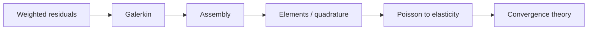

# Part IV — The Finite Element Method

Part III reduced continuum mechanics to weak forms: bilinear forms on Sobolev spaces, loads as dual functionals, energy functionals with unique minimizers. Part IV asks the engineer's question: *how do we compute those solutions on a mesh?*

The finite element method is the answer for elliptic and parabolic problems on complex geometries — the copper wire in tension, a bracket with a reentrant corner, a heated solid coupled to a fluid boundary. We begin with **weighted residuals**, the family of methods that includes Galerkin's method as its most important member, then build element-by-element assembly, quadrature, and convergence theory that connects discrete stiffness matrices to the infinite-dimensional operators of Part II.

The layout follows the **FEM Notes** in [`writings/fem/`](../../writings/fem/): five numbered chapters from residuals through error estimates, with **Bridge** sections linking each chapter to the next. Part V offers the complementary philosophy for fluids and hyperbolic conservation laws; both discretizations approximate the PDEs defined here.

## Where we left the wire

Part III wrote the weak forms — virtual work for elasticity, the heat equation in \(H^1\), energy functionals with unique minimizers — and identified the Sobolev regularity FEM solutions possess. The copper wire is now ready for a **mesh**: tetrahedra or hexahedra along its length, shape functions on each element, quadrature rules that assemble local stiffness into a global \(\mathbf{K}\).

At this scale the wire is a solid specimen in a tensile test: displacement unknowns at nodes, boundary conditions at the grips, perhaps a refined region near a stress concentrator. Part IV is the engineer's answer to Part III's mathematics — how weighted residuals become Galerkin assembly, how convergence rates connect discrete matrices to the infinite-dimensional operators of Part II, and why the stiffness matrix is not magic but a best approximation in energy norm.

## The concept map

| Question | Example in this part |
|----------|----------------------|
| What **object** are we studying? | Trial space \(V_h\), shape functions, assembled \(\mathbf{K}\) and \(\mathbf{f}\) |
| What **structure** does it add? | Galerkin orthogonality, isoparametric maps, \(h\)-refinement |
| What **theorem** becomes possible? | Best approximation, Céa lemma, a priori convergence rates |
| What **breaks** if structure is missing? | Locking, hourglass modes, pollution on distorted elements |

**Baby picture:** choose trial and test spaces, enforce the weak form by making residuals orthogonal to the test space, assemble element by element, then prove the discrete solution tracks the continuous one as \(h \to 0\). The copper wire in tension is a bar whose stiffness matrix is not magic — it is a Galerkin projection.

## Story so far (Parts I–III)

If you have read linearly since the prologue, the same specimen has changed language three times without changing material:

| Part | What we learned | What the wire became |
|------|-----------------|----------------------|
| I | \(\mathbf{K}\mathbf{u}=\mathbf{f}\), eigenmodes, \(N\to\infty\) | A chain of coupled springs; a vibration problem |
| II | \(H^1\), Lax–Milgram, Galerkin as projection | Axial displacement \(u(x)\) and temperature \(T(x)\) in function spaces |
| III | Strong vs. weak form, Sobolev regularity, energy methods | Poisson/heat/elasticity PDEs ready for a mesh |

Part III ended with a promise: the weak form of equilibrium is a **minimum principle** (or saddle point for mixed problems), and the minimizer lives in \(H^1\). Part IV is where that promise becomes code — shape functions on elements, quadrature at Gauss points, scatter into a global stiffness matrix. The copper wire that was a spring network in Part I and a field in Part II is now a **meshed solid** whose node values are the discrete shadow of the continuous solution. Convergence as \(h\to 0\) is the story Part II told in function spaces, made numerical in Chapter 5.

## A first assembly scene

Picture the wire as a 1D bar for intuition — ten two-node line elements, axial displacement \(u\) at eleven nodes, fixed at the left grip and pulled at the right. Part I would write \(\mathbf{K}\mathbf{u}=\mathbf{f}\) directly from spring stiffnesses. Part IV writes the **same system** from a weak form:

1. Choose linear shape functions \(N_i\) on each element (Chapter 3).
2. Form element stiffness \(K_e = \int E A (dN/dx)^T (dN/dx)\, dx\) with one-point Gauss quadrature (Chapter 2).
3. Scatter \(K_e\) into global \(\mathbf{K}\) using the connectivity table (Chapter 2).
4. Apply essential BCs — zero displacement at node 0, unit load at node 10 — and solve (Chapter 1).

Nothing mystical happens at step 3: it is the change-of-basis and assembly logic from Part I.2, now driven by integration of bilinear forms from Part III. Refine to twenty elements and the displacement at midspan moves toward the Part II limit function; Chapter 5 quantifies that approach. Extend to 3D tetrahedra on a twisted wire geometry and the pipeline is unchanged — only the dimension of \(V_h\) and the quadrature order grow.

## Two doors ahead

Part IV ends with a fork the book is designed to accommodate:

- **Door A (Part V):** When the wire heats in air, convection and pressure forces live on a **fluid mesh** with flux-balance time stepping — complementary to the solid FEM you build here.
- **Door B (Part VI):** When the story is tension-dominated, skip ahead to continuum kinematics and stress once convergence rates justify trusting \(\mathbf{K}\).

Either door is valid on first reading; both reunite at Part VI and again in the epilogue's conjugate heat-transfer loop. What Part IV guarantees is that the solid-side numbers — stiffness, thermal conduction, wall temperature — are Galerkin projections with error estimates, not ad hoc spring networks.

## Bridge

Part III ended with energy methods and the promise of assembly. The first chapter below introduces weighted residuals — the unifying idea behind Galerkin's method — and shows why choosing test functions as trial functions is the natural discretization of the weak form the copper wire's equilibrium demands.
