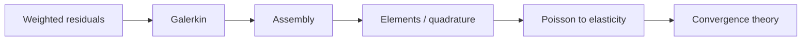

# Part IV — The Finite Element Method

Part III reduced continuum mechanics to weak forms: bilinear forms on Sobolev spaces, loads as dual functionals, energy functionals with unique minimizers. Part IV asks the engineer's question: *how do we compute those solutions on a mesh?*

The finite element method is the answer for elliptic and parabolic problems on complex geometries — the copper wire in tension, a bracket with a reentrant corner, a heated solid coupled to a fluid boundary. We begin with **weighted residuals**, the family of methods that includes Galerkin's method as its most important member, then build element-by-element assembly, quadrature, and convergence theory that connects discrete stiffness matrices to the infinite-dimensional operators of Part II.

The layout follows the **FEM Notes** in [`writings/fem/`](https://github.com/hanfengzhai/CompMechBook/tree/main/writings/fem/): five numbered chapters from residuals through error estimates, with **Bridge** sections linking each chapter to the next. Part V offers the complementary philosophy for fluids and hyperbolic conservation laws; both discretizations approximate the PDEs defined here.

## Where we left the wire

Part III wrote the weak forms — virtual work for elasticity, the heat equation in \(H^1\), energy functionals with unique minimizers — and identified the Sobolev regularity FEM solutions possess. The copper wire is now ready for a **mesh**: tetrahedra or hexahedra along its length, shape functions on each element, quadrature rules that assemble local stiffness into a global \(\mathbf{K}\).

At this scale the wire is a solid specimen in a tensile test: displacement unknowns at nodes, boundary conditions at the grips, perhaps a refined region near a stress concentrator. Part IV is the engineer's answer to Part III's mathematics — how weighted residuals become Galerkin assembly, how convergence rates connect discrete matrices to the infinite-dimensional operators of Part II, and why the stiffness matrix is not magic but a best approximation in energy norm.

## The concept map

| Question | Example in this part |
|----------|----------------------|
| What **object** are we studying? | Trial space \(V_h\), shape functions, assembled \(\mathbf{K}\) and \(\mathbf{f}\) |
| What **structure** does it add? | Galerkin orthogonality, isoparametric maps, \(h\)-refinement |
| What **theorem** becomes possible? | Best approximation, Céa lemma, a priori convergence rates |
| What **breaks** if structure is missing? | Locking, hourglass modes, pollution on distorted elements |

**Baby picture:** choose trial and test spaces, enforce the weak form by making residuals orthogonal to the test space, assemble element by element, then prove the discrete solution tracks the continuous one as \(h \to 0\). The copper wire in tension is a bar whose stiffness matrix is not magic — it is a Galerkin projection.

## Representative schematics (FEA)

The [Finite Element Analysis notes](https://hanfengzhai.github.io/file/FEA_notes.pdf) and [problem sessions](https://hanfengzhai.github.io/note.html) collect the same discretization machine this part builds:

| Schematic | Idea | Chapter in this part |
|-----------|------|----------------------|
| 1 | Weighted residual: trial guess, test functions, orthogonality | [IV.1](01-weighted-residuals.md) |
| 2 | Galerkin: test space = trial space; best approximation | [IV.2](02-galerkin-assembly.md) |
| 3 | Local-to-global assembly: element \(\mathbf{K}^e\) → scatter into \(\mathbf{K}\) | [IV.2](02-galerkin-assembly.md) |
| 4 | Reference element; isoparametric map; Jacobian in quadrature | [IV.3](03-elements-quadrature.md) |
| 5 | Poisson → vector elasticity: Voigt notation on the wire | [IV.4](04-poisson-to-elasticity.md) |
| 6 | \(h\)-refinement; patch test; a priori error estimates | [IV.5](05-convergence.md) |
| 7 | Two doors at chapter end: continue to FVM (Part V) or continuum (Part VI) | [IV.5](05-convergence.md) |

When assembly feels like bookkeeping, return to the matching row: the stiffness matrix is a Galerkin projection of the bilinear form Part III wrote — not an arbitrary sparse array.

## Lab act (prologue map)

You are in **Acts II and III** at the computational level. Act II: the wire mesh solves conduction from Joule heating — a Galerkin assembly problem. Act III: the same mesh carries axial displacement under grip load — \(\mathbf{K}\mathbf{U}=\mathbf{F}\) is the force–displacement curve the operator watches climb. Part IV turns Part III's weak forms into the code the lab trusts; when assembly feels mechanical, remember both acts share one specimen and one mesh philosophy.

## Story so far (Parts I–III)

If you have read linearly since the prologue, the same specimen has changed language three times without changing material:

| Part | What we learned | What the wire became |
|------|-----------------|----------------------|
| I | \(\mathbf{K}\mathbf{u}=\mathbf{f}\), eigenmodes, \(N\to\infty\) | A chain of coupled springs; a vibration problem |
| II | \(H^1\), Lax–Milgram, Galerkin as projection | Axial displacement \(u(x)\) and temperature \(T(x)\) in function spaces |
| III | Strong vs. weak form, Sobolev regularity, energy methods | Poisson/heat/elasticity PDEs ready for a mesh |

Part III ended with a promise: the weak form of equilibrium is a **minimum principle** (or saddle point for mixed problems), and the minimizer lives in \(H^1\). Part IV is where that promise becomes code — shape functions on elements, quadrature at Gauss points, scatter into a global stiffness matrix. The copper wire that was a spring network in Part I and a field in Part II is now a **meshed solid** whose node values are the discrete shadow of the continuous solution. Convergence as \(h\to 0\) is the story Part II told in function spaces, made numerical in Chapter 5.

## Closing the arc from Part I

If you have read linearly since the prologue, notice how the **same four questions** from the opening table reappear here with discretization vocabulary — and how the **same mathematical moves** from Part I return on a mesh:

| Part I (springs on the wire) | Part IV (FEM on the wire) |
|------------------------------|---------------------------|
| State vector \(\mathbf{u}\) | Nodal displacement vector \(\mathbf{U}\) |
| Stiffness matrix \(\mathbf{K}\) | Assembled Galerkin stiffness \(\mathbf{K} = \sum_e \mathbf{K}^e\) |
| \(\mathbf{K}\mathbf{u}=\mathbf{f}\) from equilibrium | \(\mathbf{K}\mathbf{U}=\mathbf{F}\) from weak form restricted to \(V_h\) |
| Eigenmodes decouple vibration | Modal analysis on the same \(\mathbf{K}\) (Part I.3 returns) |
| Mesh refinement sends \(N\to\infty\) | \(h\)-refinement sends \(V_h\) toward \(H^1\) (Part II's limit) |

Part II taught that \(\mathbf{K}\) is a Galerkin projection of a differential operator; Part III wrote the bilinear form that projection must preserve. Part IV is where assembly loops, shape functions, and quadrature make that projection **computable** on the copper cylinder — the same wire, now a meshed solid whose node values approximate \(u(x)\) in energy norm. Part V offers the complementary cell-balance philosophy for the cooling air; both paths converge at Part VI when stress and flux need physical names.

## Bridge

Part III ended with energy methods and the promise of assembly. The first chapter below introduces weighted residuals — the unifying idea behind Galerkin's method — and shows why choosing test functions as trial functions is the natural discretization of the weak form the copper wire's equilibrium demands.
