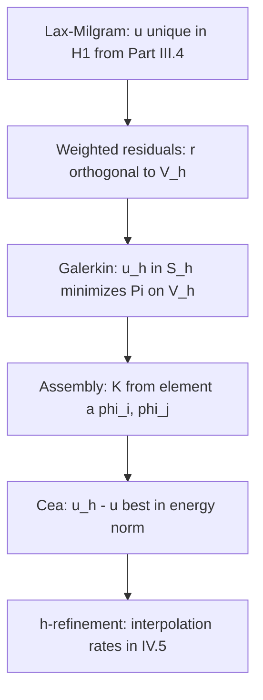

# Part IV — The Finite Element Method

Part III reduced continuum mechanics to weak forms: bilinear forms on Sobolev spaces, loads as dual functionals, energy functionals with unique minimizers. Part IV asks the engineer's question: *how do we compute those solutions on a mesh?*

The finite element method is the answer for elliptic and parabolic problems on complex geometries — the copper wire in tension, a bracket with a reentrant corner, a heated solid coupled to a fluid boundary. We begin with **weighted residuals**, the family of methods that includes Galerkin's method as its most important member, then build element-by-element assembly, quadrature, and convergence theory that connects discrete stiffness matrices to the infinite-dimensional operators of Part II.

The layout follows the **FEM Notes** in [`writings/fem/`](../../writings/fem/): five numbered chapters from residuals through error estimates, with **Bridge** sections linking each chapter to the next. Part V offers the complementary philosophy for fluids and hyperbolic conservation laws; both discretizations approximate the PDEs defined here.

## Chapter guide

| Chapter | Wire story beat | Core object | Handoff |
|---------|-----------------|-------------|---------|
| [IV.1](01-weighted-residuals.md) | Residual must vanish in a test space | Weighted residuals, Galerkin choice, Petrov–Galerkin | Global assembly → sparse \(\mathbf{K}\) in IV.2 |
| [IV.2](02-galerkin-assembly.md) | Element loops scatter local stiffness | Shape functions, element matrices, BC enforcement | Quadrature and element types in IV.3 |
| [IV.3](03-elements-quadrature.md) | P1 bars and triangles on the wire mesh | Reference elements, isoparametric map, Gauss rules | Scalar Poisson → vector elasticity in IV.4 |
| [IV.4](04-poisson-to-elasticity.md) | Heat plus tension on the same mesh | \(\mathbf{B}^T\mathbb{C}\mathbf{B}\), thermoelastic coupling | Error bounds and refinement in IV.5 |
| [IV.5](05-convergence.md) | Halving \(h\) at the grip corner | Céa's lemma, \(h\)- and \(p\)-rates, a posteriori estimators | [Bridge to Part V or VI](05-convergence.md#bridge-two-doors-from-here) |

Read in order. Each chapter ends with a **Bridge** that states why the next chapter must exist; assembling elements without understanding weighted residuals turns FEM into a black box that fails at reentrant corners.

## Scene

Part III wrote the weak forms — virtual work for elasticity, the heat equation in \(H^1\), energy functionals with unique minimizers — and identified the Sobolev regularity FEM solutions possess. The copper wire is now ready for a **mesh**: tetrahedra or hexahedra along its length, shape functions on each element, quadrature rules that assemble local stiffness into a global \(\mathbf{K}\).

At this scale the wire is a solid specimen in a tensile test: displacement unknowns at nodes, boundary conditions at the grips, perhaps a refined region near a stress concentrator. Part IV is the engineer's answer to Part III's mathematics — how weighted residuals become Galerkin assembly, how convergence rates connect discrete matrices to the infinite-dimensional operators of Part II, and why the stiffness matrix is not magic but a best approximation in energy norm.

## The concept map

| Question | Example in this part |
|----------|----------------------|
| What **object** are we studying? | Trial space \(V_h\), shape functions, assembled \(\mathbf{K}\) and \(\mathbf{f}\) |
| What **structure** does it add? | Galerkin orthogonality, isoparametric maps, \(h\)-refinement |
| What **theorem** becomes possible? | Best approximation, Céa lemma, a priori convergence rates |
| What **breaks** if structure is missing? | Locking, hourglass modes, pollution on distorted elements |

**Baby picture:** choose trial and test spaces, enforce the weak form by making residuals orthogonal to the test space, assemble element by element, then prove the discrete solution tracks the continuous one as \(h \to 0\). The copper wire in tension is a bar whose stiffness matrix is not magic — it is a Galerkin projection.

## How Part IV connects to Parts V–VI

Part IV is the **solid discretization contract** every continuum export must honor:

| Part IV chapter | Structure or theorem | Where it reappears |
|-----------------|---------------------|-------------------|
| IV.1 Weighted residuals | Residual orthogonality | Part VI virtual work as continuous limit |
| IV.2 Galerkin assembly | Local scatter into \(\mathbf{K}\) | Part VII stress export to DDD; Part VI.3 handshake |
| IV.3 Elements / quadrature | Isoparametric maps; patch test | Part VII polycrystal mesh; conjugate heat solid mesh |
| IV.4 Poisson → elasticity | \(\mathbf{B}^T\mathbb{C}\mathbf{B}\) | Part VI \(\mathbb{C}\); Part IX \(C_{ij}\) audit |
| IV.5 Convergence | Céa's lemma; \(h\)-rates | Part VII mesh sensitivity; epilogue verification |

Door A at IV.5 leads to Part V (fluids); Door B leads to Part VI (continuum stress). Either path assumes the weak forms Part III derived and the Galerkin projection Part II proved optimal.

## Representative schematics (FEA Notes)

The [Finite Element Analysis Notes](https://hanfengzhai.github.io/file/FEA_notes.pdf) and [problem sessions](https://hanfengzhai.github.io/note.html) follow the same ME 412 habit: each schematic is a baby picture of the Galerkin pipeline. Use them as a visual index while reading:

| Schematic | Idea | Chapter in this part |
|-----------|------|----------------------|
| 1 | Weighted residuals: trial/test spaces, residual orthogonality | [IV.1](01-weighted-residuals.md) |
| 2 | Galerkin assembly: local element matrices, scatter into global \(\mathbf{K}\) | [IV.2](02-galerkin-assembly.md) |
| 3 | Shape functions, isoparametric maps, Gauss quadrature, patch test | [IV.3](03-elements-quadrature.md) |
| 4 | From scalar Poisson to vector elasticity on the meshed wire | [IV.4](04-poisson-to-elasticity.md) |
| 5 | Céa lemma, energy-norm error, \(h\)-refinement; **two doors** to Parts V or VI | [IV.5](05-convergence.md) |

Each schematic answers the four concept-map questions for one discretization layer. When assembly feels like bookkeeping, return to the matching row: *what object, what structure, what theorem, what breaks?* Part II's Galerkin projection becomes code here; Part III's weak form is the input.

## Story so far (Parts I–III)

If you have read linearly since the prologue, the same specimen has changed language three times without changing material:

| Part | What we learned | What the wire became |
|------|-----------------|----------------------|
| I | \(\mathbf{K}\mathbf{u}=\mathbf{f}\), eigenmodes, \(N\to\infty\) | A chain of coupled springs; a vibration problem |
| II | \(H^1\), Lax–Milgram, Galerkin as projection | Axial displacement \(u(x)\) and temperature \(T(x)\) in function spaces |
| III | Strong vs. weak form, Sobolev regularity, energy methods | Poisson/heat/elasticity PDEs ready for a mesh |

Part III ended with a promise: the weak form of equilibrium is a **minimum principle** (or saddle point for mixed problems), and the minimizer lives in \(H^1\). Part IV is where that promise becomes code — shape functions on elements, quadrature at Gauss points, scatter into a global stiffness matrix. The copper wire that was a spring network in Part I and a field in Part II is now a **meshed solid** whose node values are the discrete shadow of the continuous solution. Convergence as \(h\to 0\) is the story Part II told in function spaces, made numerical in Chapter 5.

## Closing the arc from Part III

If you have read linearly since the prologue, Part III's closing checkpoint completed the analytical pipeline — strong form, weak form, Sobolev regularity, energy minimum. Part IV is the **first code chapter**:

| Part III (PDEs on the wire) | Part IV (FEM on the wire) |
|-----------------------------|--------------------------|
| Strong form at every point | Residual \(r = f - \mathcal{L}u_h\) averaged by test functions |
| Weak form \(a(u,v)=\ell(v)\) | Galerkin: choose \(u_h, v_h \in V_h\) from the same basis |
| Dirichlet principle: minimize \(\Pi[u]\) in \(H^1\) | Rayleigh–Ritz: minimize \(\Pi[u_h]\) on \(V_h\) → assembled \(\mathbf{K}\) |
| Sobolev \(H^1\) regularity | \(H^1\)-conforming shape functions (continuous across elements) |
| Lax–Milgram well-posedness | Céa lemma: discrete solution tracks continuous minimizer |
| [III.4 Bridge](../part03-pdes/04-energy-methods.md#bridge-to-part-iv) previews assembly | [IV.1](01-weighted-residuals.md) opens with weighted residuals |

Part III answered *what* equation the wire satisfies and *why* it is well posed in \(H^1\). Part IV answers *how* to compute it: the energy functional Part III minimized becomes a quadratic form on nodal coefficients; the bilinear form \(a(u,v)\) becomes element stiffness integrals. When [IV.5](05-convergence.md) names two exit doors — Part V for fluids or Part VI for continuum stress — remember that both doors assume the weak forms and energy principles defined in Part III. The copper wire's tensile equilibrium is the same minimum principle; only the discretization dialect changes at the fork.

## The Galerkin ladder (ME 412 Schematic 14, continued) {#the-galerkin-ladder-me-412-schematic-14-continued}

Part III's [variational ladder section](../part03-pdes/00-opening.md#the-variational-ladder-me-412-schematic-14) drew Schematic 14 from strong PDE through Lax–Milgram — the **existence half** of the ME 412 baby picture. Part IV completes the **convergence half**: Galerkin projection, global assembly, and mesh refinement on the same copper wire. If you paused at [III.4's energy methods](../part03-pdes/04-energy-methods.md) with a well-posed weak form but no global matrix, read that chapter's [Bridge to Part IV](../part03-pdes/04-energy-methods.md#bridge-to-part-iv) first — then return here for the discretization rungs:

| Schematic 14 rung | Part III anchor | Part IV chapter | Wire instance |
|-------------------|-----------------|-----------------|---------------|
| Lax–Milgram / energy minimum | [III.4](../part03-pdes/04-energy-methods.md) | [IV.1](01-weighted-residuals.md) Rayleigh–Ritz | \(\Pi[u_h]\) on nodal DOFs for axial tension |
| Weak form \(a(u,v)=\ell(v)\) | [III.2](../part03-pdes/02-weak-form.md) | [IV.2](02-galerkin-assembly.md) | Element scatter into global \(\mathbf{K}\mathbf{U}=\mathbf{F}\) |
| Sobolev \(H^1\) regularity | [III.3](../part03-pdes/03-sobolev-spaces.md) | [IV.3](03-elements-quadrature.md) | \(H^1\)-conforming P1 bar on the wire mesh |
| Dirichlet principle | [III.4](../part03-pdes/04-energy-methods.md#bridge-to-part-iv) | [IV.4](04-poisson-to-elasticity.md) | Heat plus vector elasticity on one mesh |
| Convergence in energy norm | Part II.5 Galerkin projection | [IV.5](05-convergence.md) | Three-mesh \(h\)-study at the grip corner |

**Baby picture:** Part III proved the continuous minimizer exists; Part IV builds the projector \(P_h\) that Part II named and proves \(u_h = P_h u\) is quasi-optimal. The stiffness matrix is not a separate invention — it is the Rayleigh–Ritz discretization of the energy functional [III.4](../part03-pdes/04-energy-methods.md) wrote before any element was meshed. When assembly feels like bookkeeping, return to the [variational ladder](../part03-pdes/00-opening.md#the-variational-ladder-me-412-schematic-14): *which rung of Schematic 14 am I on — existence or convergence?*

When [IV.5](05-convergence.md#bridge-two-doors-from-here) names **Door A** for fluids and transport, continue the parallel diagram at [Part V's conservation ladder section](../part05-fvm/00-opening.md#the-conservation-ladder-fvm-parallel-to-schematic-14): integral balance replaces energy minimization for the air that cools the wire, but the strong and [weak forms](../part03-pdes/02-weak-form.md) from Part III are the same equations both ladders discretize. The Galerkin and conservation ladders reunite at [Part VI's twin-ladder section](../part06-continuum/00-opening.md#the-twin-ladders-reunite-galerkin-and-conservation) on Cauchy stress and flux tensors — and at the conjugate heat transfer wall where solid FEM and fluid FVM exchange temperature and heat flux.

## Closing the arc from Part II

If you have read linearly since the prologue, Part II's operator chapter ([II.4](../part02-functional-analysis/04-operators-duality.md)) named the backstage machinery FEM assumes before the first element is meshed:

| Part II.4 (operators on the wire) | Part IV (FEM on the wire) |
|-----------------------------------|---------------------------|
| Load functional \(\ell(v)=\int f v\, dx\) | Nodal force vector \(\mathbf{f}\) from equivalent load lumping |
| Bounded stiffness operator \(A: H \to H\) | Assembled \(\mathbf{K}\) as Gram matrix of energy form on \(V_h\) |
| Galerkin projector \(P_h\) onto \(V_h\) | Best approximation in energy norm (Céa's lemma in [IV.5](05-convergence.md)) |
| Weak* convergence of nodal loads | Load lumping schemes that stabilize under mesh refinement |
| Aubin–Nitsche preview for \(L^2\) error | Dual problem for post-processed displacement error in [IV.5](05-convergence.md) |
| Uniform boundedness of solution operators | Stability constant \(C\) independent of \(h\) in a priori bounds |

Part II.4's Lab act — distributed body weight versus equivalent nodal forces on a simply supported bar — is the **acceptance test** for Act III's grip modeling. Part IV scatters loads into \(\mathbf{f}\) only because II.4 proved the limit is honest when \(\ell_N \to \ell\) weakly and the solution map \(S: \ell \mapsto u\) is stable (Lax–Milgram). When midspan displacement **oscillates** without trend as the mesh refines, suspect load lumping before blaming shape functions — the same diagnostic Part II.4 named for operators, now visible on the load cell trace.

The **Galerkin projector** is the narrative hinge between Parts II and IV: Part II proved \(u_h = P_h u\) is optimal in energy norm for conforming spaces; Part IV builds \(P_h\) from shape functions and quadrature. When assembly feels like bookkeeping, return to that projection — the stiffness matrix is not a guess; it is the matrix representation of \(a(\cdot,\cdot)\) restricted to \(V_h\).

## Closing the arc from Part I

If you have read linearly since the prologue, notice how the **same four questions** from the opening table reappear here with discretization vocabulary — and how the **same mathematical moves** from Part I return at the mesh scale:

| Part I (springs on the wire) | Part IV (FEM on the wire) |
|------------------------------|---------------------------|
| State vector \(\mathbf{u}\) | Nodal displacement vector \(\mathbf{U}\) |
| Stiffness matrix \(\mathbf{K}\) | Assembled global \(\mathbf{K}\) from element contributions |
| \(\mathbf{K}\mathbf{u}=\mathbf{f}\) from equilibrium | \(\mathbf{K}\mathbf{U}=\mathbf{F}\) from Galerkin virtual work |
| Sparsity from local coupling | Sparsity from element connectivity |
| Mesh refinement sends \(N\to\infty\) | \(h\)-refinement sends \(V_h \to V\) (Part II's limit) |

Part II proved that the limit lives in \(H^1\) and that Galerkin is **best approximation** in energy norm; Part III wrote the bilinear form \(a(u,v)=\ell(v)\) that makes the wire's equilibrium well posed. Part IV is not a new subject — it is Part I's linear algebra executed inside the function spaces Part II named, on the weak forms Part III derived. The copper wire that began as coupled springs is now a tetrahedral mesh; the stiffness matrix is still \(\mathbf{K}\), but we can finally say what it approximates.

## Lab act: III — Pulling

**Act III** is the force–displacement ramp on the load cell. Part IV is where that scene becomes a meshed solid: Galerkin assembly, shape functions, and convergence rates that justify trusting the almost-linear climb before yield. Every chapter below answers a question the operator implicitly asks when the curve looks trustworthy: *Why does refining the mesh change the answer in a predictable way?* When assembly feels like bookkeeping, return to the grips tightening — the experiment and the stiffness matrix are two languages for the same Act.

### What you should be able to do after Part IV

Each chapter adds one move to a minimal FEM workflow you can run on paper, in NumPy, or in a course code before opening Part V or VI:

| After chapter | Skill on the copper wire | Minimal artifact |
|---------------|--------------------------|------------------|
| IV.1 | State the weighted residual; choose Galerkin test space | \(\int ( -u'' - f) v\, dx = 0\) with \(v \in V_h\) |
| IV.2 | Assemble one bar element; enforce Dirichlet rows | 2×2 \(k_e\); global \(\mathbf{K}\mathbf{U}=\mathbf{F}\) |
| IV.3 | Pass a patch test; pick quadrature order | Linear \(u=x/L\) exact on two P1 elements |
| IV.4 | Extend scalar assembly to vector elasticity | Block \(\mathbf{K}\) from \(\mathbf{B}^T\mathbb{C}\mathbf{B}\) |
| IV.5 | Run three-mesh \(h\)-refinement; read convergence slope | \(u_{\text{tip}}\) versus \(h\) log–log plot |

None of these require a commercial solver — but each one is the discretization move Part VI will name with stress tensors and virtual work. If you can assemble a bar, pass a patch test, and show tip displacement stabilizes under refinement, you have the core of Act III's linear elastic FEM before yield, hardening, or atomistic resolution enter the story.

## Bridge

Part III ended with energy methods and the promise of assembly. The first chapter below introduces weighted residuals — the unifying idea behind Galerkin's method — and shows why choosing test functions as trial functions is the natural discretization of the weak form the copper wire's equilibrium demands.

| What Part III completed | What Part IV opens |
|-------------------------|-------------------|
| Weak form \(a(u,v)=\ell(v)\) in \(H^1\) | Galerkin: enforce residual orthogonality on \(V_h \subset H^1\) |
| Dirichlet principle: minimize \(\Pi[u]\) | Rayleigh–Ritz: minimize on nodal coefficients → assemble \(\mathbf{K}\) |
| Sobolev regularity and Lax–Milgram | \(H^1\)-conforming shape functions; patch tests and quadrature |
| Energy pipeline closed at continuum scale | Same \(\mathbf{K}\mathbf{U}=\mathbf{F}\) from Part I, now with a convergence theorem |

**Scale-boundary handshake (Part III → Part IV → Part V/VI).**

| PDE export ([Part III](../part03-pdes/00-opening.md)) | FEM output (this part) | Downstream consumer | Failure mode |
|-------------------------------------------------------|------------------------|---------------------|--------------|
| Weak form \(a(u,v)=\ell(v)\) in \(H^1\) | Galerkin on \(V_h\) → \(\mathbf{K}\mathbf{U}=\mathbf{F}\) | Door A: CHT with [Part V](../part05-fvm/00-opening.md); Door B: stress in [Part VI](../part06-continuum/00-opening.md) | Different meshes without interface handshake |
| Lax–Milgram well-posedness | Céa's lemma: discrete tracks continuous minimizer | \(h\)-refinement audit at grip corner (Act III) | Locking on distorted elements |
| Energy minimum \(\Pi[u]\) in \(H^1\) | Rayleigh–Ritz on nodal coefficients | Act III load cell in linear elastic regime | Thermal eigenstrain omitted in pure mechanical run |
| Sobolev \(H^1\) regularity | \(H^1\)-conforming shape functions | Part VI virtual work and \(\mathbf{B}^T\mathbb{C}\mathbf{B}\) | Non-conforming elements at reentrant corner |

The [preface ascent continuity hinge](../preface.md#ascent-continuity-hinges) lists Part IV as the **assembly → convergence** turn — where the energy minimum Part III proved becomes a meshed solid the load cell can trust. When assembly feels like bookkeeping, return to the Galerkin projector from [Part II.4](../part02-functional-analysis/04-operators-duality.md): the stiffness matrix is the Gram matrix of the energy inner product on \(V_h\), not an arbitrary sparse array.

Return to the [prologue](../prologue/00-many-scales.md): **Act III — Pulling** is the load cell's almost-linear climb, and Part IV is where that curve becomes a meshed solid whose stiffness matrix is not magic but the Gram matrix of the energy inner product on \(V_h\). Part I taught assembly as sparse bookkeeping; Part II proved the limit lives in \(H^1\); Part III wrote the bilinear form. [IV.1](01-weighted-residuals.md) is the first sentence of discretization — weighted residuals as the operational face of the energy minimum Part III named.

Turn the page when the weak form is clear but no global matrix exists yet — that is the signal Galerkin assembly is the next move.
