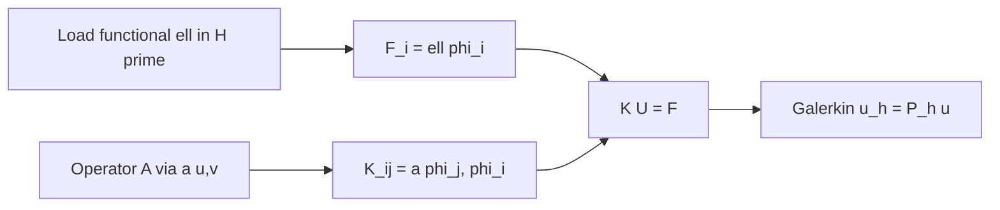

# Galerkin's Method and Global Assembly

[IV.1](01-weighted-residuals.md) ended with Galerkin orthogonality: the weak-form residual vanishes against every test function in \(V_h\), and the discrete problem is \(\mathbf{K}\mathbf{U}=\mathbf{F}\) waiting to be filled. This chapter is where that orthogonality becomes **code** — the global assembly loop that turns local element contributions into the sparse matrix Part I introduced as nodal equilibrium and Part III derived as the Riesz form restricted to \(V_h\).

Weighted residuals gave us the logic: enforce \(\int r\, w_i = 0\) for chosen weights. Galerkin chose \(w_i = \phi_i\). The finite element method chooses the \(\phi_i\) to be local, piecewise-polynomial **shape functions** on a mesh. What remains is the algorithm that every FEM code shares — from a twenty-line Matlab script for a homework bar problem to Abaqus assembling a million-element turbine disk.

That algorithm is **global assembly**: loop over elements, compute local contributions, scatter into a global sparse matrix. It is structured linear algebra — the change-of-basis story from Part I, executed millions of times with a sparsity pattern dictated by mesh connectivity.

## Scene: the mesh becomes a matrix

Return to the copper wire in the tensile frame. Part I reduced it to a chain of springs; Part III wrote equilibrium as a weak form in \(H^1\); now a graduate student opens a FEM script and imports the same geometry as a one-dimensional mesh — twenty quadratic line elements along the axis, a refined cluster near the grip where stress will peak.

The script loops over elements. On each segment it evaluates shape functions \(N_I(\xi)\) at Gauss points, forms the local stiffness \(\mathbf{k}_e = \int B^T D B \, d\xi\), and **scatters** entries into global indices. When the loop finishes, the screen shows a sparse banded matrix and a load vector — the same symbols as Part I, now built from integrals of the weak form rather than hand-written spring constants.

The operator clicks **Solve**. The displacement curve overlays the experimental trace from Part I: linear at first, then diverging as plasticity (still absent from this elastic model) would take over. Nothing mystical happened. Galerkin assembly is the proof that Part III's weak form and Part I's \(\mathbf{K}\mathbf{u}=\mathbf{f}\) are the same story at two resolutions — continuous field and finite-dimensional projection. The rest of this chapter makes that loop explicit enough to code.

## The Galerkin system

Let \(V_h = \text{span}\{\phi_1, \ldots, \phi_N\} \subset V\). Seek

\[
u_h = \sum_{j=1}^{N} U_j \phi_j
\]

such that

\[
a(u_h, \phi_i) = \ell(\phi_i), \qquad i = 1,\ldots,N.
\]

Substituting the expansion and using bilinearity of \(a(\cdot,\cdot)\):

\[
\sum_{j=1}^{N} U_j\, a(\phi_j, \phi_i) = \ell(\phi_i).
\]

Define the **global stiffness matrix** and **load vector**:

\[
K_{ij} = a(\phi_j, \phi_i), \qquad F_i = \ell(\phi_i).
\]

The discrete problem is \(\mathbf{K}\mathbf{U} = \mathbf{F}\). For Poisson's equation with \(a(u,v) = \int \nabla u\cdot\nabla v\) and \(\ell(v) = \int f v\), \(\mathbf{K}\) is symmetric and positive semi-definite; essential boundary conditions render it positive definite.

Part I taught us to think of \(\mathbf{K}\) as a linear map. Part III taught us that \(\mathbf{K}\) is the Riesz representation of the bilinear form restricted to \(V_h\). Assembly is how we compute its entries without ever forming full trial or test functions on the whole domain.

## Element-level contributions

Partition \(\Omega\) into elements \(\Omega_e\), \(e = 1,\ldots, N_e\). Shape functions are defined **locally** on each element: on element \(e\), restrict to \(n_e\) nodes with shape functions \(N_a(\xi)\), \(a = 1,\ldots,n_e\), where \(\xi\) are reference coordinates.

The **local stiffness matrix** is

\[
k_{ab}^e = \int_{\Omega_e} \nabla N_a \cdot \nabla N_b \, d\Omega.
\]

The **local load vector** is

\[
f_a^e = \int_{\Omega_e} f N_a \, d\Omega.
\]

Integrals over physical element \(\Omega_e\) are evaluated on a **reference element** \(\hat{\Omega}\) via the isoparametric map \(\mathbf{x}(\xi)\) and Jacobian \(\mathbf{J} = \partial \mathbf{x}/\partial \xi\):

\[
\int_{\Omega_e} g(\mathbf{x})\, d\Omega = \int_{\hat{\Omega}} g(\mathbf{x}(\xi))\, |\det \mathbf{J}|\, d\xi.
\]

**Quadrature** approximates the reference integral by a weighted sum of function values at quadrature points — the subject of Chapter 3.

## The assembly scatter operation

Let \(\mathbf{L}_e\) be the **local-to-global scatter matrix**: a rectangular matrix mapping local DOF indices on element \(e\) to global indices. Then the global system satisfies

\[
\mathbf{K} = \sum_{e=1}^{N_e} \mathbf{L}_e^T \mathbf{k}^e \mathbf{L}_e, \qquad \mathbf{F} = \sum_{e=1}^{N_e} \mathbf{L}_e^T \mathbf{f}^e.
\]

In practice, \(\mathbf{L}_e\) is never stored as a dense matrix. Instead, each element carries a **connectivity array** listing global node indices, and assembly loops over local pairs \((a,b)\), adding \(k_{ab}^e\) to \(K_{i_a i_b}\) where \(i_a, i_b\) are the global indices of local nodes \(a, b\).

Sparsity follows from locality: \(K_{ij} \neq 0\) only if nodes \(i\) and \(j\) share at least one element. The **mesh graph** — nodes as vertices, edges between nodes sharing an element — determines the sparsity pattern. Precomputing this pattern before filling entries is standard in production codes.

## Worked example: 1D linear bar element

Consider a uniform copper wire segment discretized with two linear elements on \([0, L]\), nodes at \(x_0 = 0\), \(x_1 = L/2\), \(x_2 = L\). On a single element \([x_1, x_2]\) of length \(h\), map \(\xi \in [0,1]\) via \(x = x_1 + h\xi\).

Linear shape functions:

\[
N_1(\xi) = 1 - \xi, \qquad N_2(\xi) = \xi.
\]

Derivatives: \(dN_1/dx = -1/h\), \(dN_2/dx = 1/h\). With constant \(EA\),

\[
k_{ab}^e = \int_{x_1}^{x_2} EA \frac{dN_a}{dx}\frac{dN_b}{dx}\, dx = \frac{EA}{h} \begin{bmatrix} 1 & -1 \\ -1 & 1 \end{bmatrix}.
\]

Assembling two identical elements in series gives a global \(3 \times 3\) stiffness:

\[
\mathbf{K} = \frac{EA}{h}\begin{bmatrix} 1 & -1 & 0 \\ -1 & 2 & -1 \\ 0 & -1 & 1 \end{bmatrix}.
\]

This is tridiagonal — the discrete Laplacian structure from Part I's eigenvalue chapter, now arising from a physical stiffness. Imposing \(U_0 = 0\) (fixed end) and solving \(\mathbf{K}\mathbf{U} = \mathbf{F}\) with a point load at the free end reproduces the linear displacement profile \(u(x) = Fx/(EA)\) exactly, because the exact solution is piecewise linear and lies in \(V_h\). This is the **patch test** in action.

## 2D Poisson with P1 triangles

Move to a 2D domain — say, the cross-section of the copper wire under steady Joule heating, modeled as \(-\Delta T = q/J\) with \(T\) the temperature field. Triangulate the cross-section; each triangle has three vertices with barycentric coordinates \((\lambda_1, \lambda_2, \lambda_3)\), \(\lambda_1 + \lambda_2 + \lambda_3 = 1\).

P1 shape functions are the barycentric coordinates themselves: \(N_a = \lambda_a\). Gradients are **constant** on each triangle:

\[
\nabla N_a = \frac{1}{2A} \begin{bmatrix} y_b - y_c \\ x_c - x_b \end{bmatrix},
\]

where \(A\) is the triangle area and \((a,b,c)\) is a cyclic permutation of vertices. The local stiffness becomes

\[
k_{ab}^e = A\, (\nabla N_a \cdot \nabla N_b),
\]

computable in closed form without quadrature for this element.

Global assembly scatters each \(3 \times 3\) local matrix into the global system. Row \(i\) of \(\mathbf{K}\) has nonzeros only in columns corresponding to nodes connected to node \(i\) by an edge — the **stencil** of the 2D discrete Laplacian. Problem Session 6 in the FEA teaching notes walks this calculation explicitly for a small triangular mesh.

## Vector problems and block structure

For linear elasticity, each node carries \(d\) displacement components in \(d\) dimensions. The trial function for node \(a\), component \(i\) is \(\mathbf{N}_{a,i} = N_a \mathbf{e}_i\). The global stiffness has **block structure**: coupling between node \(a\) component \(i\) and node \(b\) component \(j\) arises from

\[
K_{(a,i)(b,j)} = \int_{\Omega_e} \mathbb{C}_{ikjl}\, \partial_k N_a\, \partial_l N_b\, d\Omega
\]

(summation over repeated indices). For isotropic materials and uniform meshes, blocks decouple when the problem has symmetries, but general 3D meshes produce fully populated \(3 \times 3\) blocks per node pair.

The **DOF map** assigns a global index to each (node, component) pair. Boundary conditions on individual components — roller supports, symmetry planes — modify rows and columns of \(\mathbf{K}\) accordingly.

## Data structures in production codes

A minimal FEM implementation stores:

| Structure | Contents | Purpose |
|-----------|----------|---------|
| Mesh | Node coordinates, element connectivity, boundary markers | Geometry and topology |
| DOF map | (node, component) \(\to\) global index | Vector problems, constraints |
| Sparsity pattern | List of (row, col) pairs with nonzero entries | Preallocate \(\mathbf{K}\) |
| Quadrature tables | Points \(\xi_q\), weights \(w_q\) on reference elements | Numerical integration |
| Material arrays | \(E\), \(\nu\), \(\rho\), etc. per element or quadrature point | Constitutive evaluation |

High-level frameworks — **FEniCS**, **Firedrake**, **deal.II** — accept UFL/Symbolic weak forms and generate assembly loops automatically. The FEA notes include FEniCS and Firedrake tutorials for 2D Poisson; understanding the generated loop remains essential for debugging wrong boundary conditions, incorrect Jacobians, and locking in nearly incompressible materials.

## CSR sparsity pattern from the mesh graph

Before filling \(\mathbf{K}\), production codes **preallocate** a compressed sparse row (CSR) structure from mesh connectivity alone — no quadrature required. The rule is simple: global entry \(K_{ij}\) can be nonzero only if nodes \(i\) and \(j\) share at least one element.

For the three-node bar mesh, the mesh graph has edges \((1,2)\) and \((2,3)\). The sparsity pattern is tridiagonal:

| Row | Column indices with possible nonzeros |
|-----|---------------------------------------|
| 1 | 1, 2 |
| 2 | 1, 2, 3 |
| 3 | 2, 3 |

Assembly then **scatters** into fixed locations: a wrong connectivity array writes \(k_{ab}^e\) to the wrong \((i,j)\) slot without changing the sparsity count — the matrix looks structurally fine but the physics is wrong. This is why the Lab act below verifies the middle diagonal entry \(2k\) before trusting a load–displacement curve.

For a 2D P1 triangle mesh on the wire cross-section, each interior node typically couples to six neighbors (the discrete Laplacian stencil). Vector elasticity multiplies by \(d^2\) block entries per node pair but preserves the same graph. Precomputing CSR once and reusing it across Newton iterations (nonlinear elasticity) or time steps (transient heat) avoids repeated allocation — the scatter loop is \(O(\text{nonzeros})\) per assembly pass.

```mermaid
flowchart LR
  mesh[Mesh connectivity] --> graph[Mesh graph]
  graph --> csr[CSR row pointers / col indices]
  csr --> scatter[Element scatter into fixed slots]
  scatter --> solve[Linear solve K U = F]
```

The pipeline mirrors Part I's sparse matrix story: topology determines **where** entries may live; element integrals determine **what** values they carry. When debugging the copper wire model, print the sparsity pattern before the first quadrature call — if row 2 has only two neighbors on a three-node bar, the connectivity file is wrong before any constitutive law is tested.

## Assembly for time-dependent and nonlinear problems

For parabolic problems \(u_t - \Delta u = f\), backward Euler gives

\[
\frac{1}{\Delta t}\mathbf{M}(\mathbf{U}^{n+1} - \mathbf{U}^n) + \mathbf{K}\mathbf{U}^{n+1} = \mathbf{F}^{n+1},
\]

where \(\mathbf{M}\) is the **mass matrix** \(M_{ij} = \int \phi_i \phi_j\, d\Omega\), assembled with the same scatter pattern as \(\mathbf{K}\). The system \((\mathbf{M}/\Delta t + \mathbf{K})\mathbf{U}^{n+1} = \mathbf{M}\mathbf{U}^n/\Delta t + \mathbf{F}^{n+1}\) is solved each time step.

For nonlinear problems, assembly runs inside Newton iterations. The **tangent stiffness** \(\mathbf{K}_T = \partial \mathbf{R}/\partial \mathbf{U}\) is assembled from derivatives of the weak form with respect to nodal values — conceptually the same loop, with a different integrand.

## Operator handshake (Part II.4 → assembly)

Part [II.4](../../part02-functional-analysis/04-operators-duality.md) named the continuous objects assembly discretizes. This section is the **acceptance test** for Act III: every row in the scatter loop must represent the same operator story Part II proved on \(H^1\).

| Part II.4 object | Discrete assembly object | Copper wire instance |
|------------------|--------------------------|----------------------|
| Stiffness operator \(A: H \to H'\) via \(a(u,v)\) | Global \(\mathbf{K}\) with \(K_{ij} = a(\phi_j, \phi_i)\) | Axial bar: tridiagonal from \(-(EA u')'\) |
| Load functional \(\ell \in H'\) | Nodal load \(\mathbf{F}\) with \(F_i = \ell(\phi_i)\) | Body weight \(\int f \phi_i\) plus grip traction |
| Galerkin projector \(P_h: H \to V_h\) | Solve \(\mathbf{K}\mathbf{U}=\mathbf{F}\) for coefficients of \(u_h = \sum U_j \phi_j\) | Best energy-norm approximation before yield |
| Weak\* convergence \(\ell_N \to \ell\) | Consistent load lumping as mesh refines | Midspan deflection stabilizes under \(h\)-refinement |

**Downward import (continuous → discrete).** The bilinear form from Part III becomes element integrals:

\[
K_{ij} = \sum_e \int_{\Omega_e} \nabla \phi_j \cdot \nabla \phi_i \, d\Omega, \qquad F_i = \ell(\phi_i) = \int_\Omega f \phi_i \, d\Omega + \int_{\Gamma_N} t \phi_i \, dS.
\]

The scatter loop is bookkeeping for these sums — not a separate physics layer.

**Upward export (discrete → continuous).** When \(h \to 0\) with \(V_h \subset H^1_0\) conforming, Céa's lemma ([IV.5](05-convergence.md)) guarantees \(\|u - u_h\|_a \le C \inf_{v \in V_h} \|u - v\|_a\). The assembled \(\mathbf{K}\) is therefore a **stable discretization** of the operator Part II.4 bounded — provided loads enter through \(\ell(\phi_i)\), not ad hoc point forces that fail to converge weakly.

**What breaks without the handshake.** A transposed connectivity array produces a structurally valid \(\mathbf{K}\) with wrong physics — the CSR pattern looks fine while the load cell trace is nonsense. A duplicated Neumann contribution double-counts boundary traction. A penalty Dirichlet row with huge \(\alpha\) mimics a constraint but destroys conditioning — the discrete analogue of an unbounded operator. Part II.4's Lab act (distributed body load versus equivalent nodal forces on a simply supported bar) is the one-dimensional audit: run it before trusting the three-node scatter Lab act below.



When midspan displacement **oscillates** without trend as \(h\) halves, suspect \(\ell_N \not\to \ell\) before blaming quadrature — the same diagnostic [II.4](../../part02-functional-analysis/04-operators-duality.md) named for operators, now visible on the copper wire's load–displacement trace.

## Connection to Part I and Part III

Assembly is where the abstract meets the concrete:

- Part I's sparse matrix is filled entry by entry from element integrals.
- Part III's bilinear form \(a(\cdot,\cdot)\) becomes the sum of local forms \(a_e(\cdot,\cdot)\).
- Part II's best approximation property holds because \(\mathbf{K}\) is the Gram matrix of the energy inner product on \(V_h\).

The copper wire's displacement field, once meshed, is a vector \(\mathbf{U} \in \mathbb{R}^N\). Assembly is the map from continuum physics to that vector equation.

## Lab act: scatter one bar element into global \(\mathbf{K}\) (Act III — Pulling)

**Act III** is where grip displacement becomes numbers on the load cell. Assembly is the backstage step — each `scatter` into \(\mathbf{K}\) and \(\mathbf{f}\) is the finite-dimensional echo of the energy inner product Part II defined and Part III minimized.

Reproduce the three-node bar from [I.1](../part01-linear-algebra/01-vectors-matrices.md) in **assembly language**:

| Object | Symbol | Value for one element \((1 \to 2)\) |
|--------|--------|--------------------------------------|
| Local stiffness | \(\mathbf{k}^e\) | \(k\begin{bmatrix}1&-1\\-1&1\end{bmatrix}\) |
| Local DOF map | \(\mathbf{L}_e\) | Maps local \((u_1, u_2)\) to global indices |
| Global contribution | \(\mathbf{K} \mathrel{+}= \mathbf{L}_e^T \mathbf{k}^e \mathbf{L}_e\) | Adds into rows/cols 1–2 of global \(\mathbf{K}\) |

For **two elements** on three nodes, run the scatter twice — element \((1,2)\) then \((2,3)\) — and verify the middle row of \(\mathbf{K}\) has coefficient \(2k\) on the diagonal (node 2 feels both neighbors). This is the same tridiagonal pattern Part I derived by hand; here it is the **scatter loop** every commercial code runs.

Optional check in Python:

```python
import numpy as np
k = 2.4e8
ke = k * np.array([[1, -1], [-1, 1]])
K = np.zeros((3, 3))
for (i, j) in [(0, 1), (1, 2)]:
    L = np.zeros((3, 2)); L[i, 0] = L[j, 1] = 1
    K += L.T @ ke @ L
# K matches the tridiagonal from I.1
```

When the linear elastic climb on the force–displacement trace disagrees with experiment, check this scatter before blaming constitutive physics — a transposed connectivity array or wrong DOF map corrupts the story before dislocations or yield enter.

## Concept map checkpoint (Galerkin assembly)

This chapter is where the copper wire's weak form becomes \(\mathbf{K}\mathbf{U}=\mathbf{F}\). Before element technology refines the integrands, summarize what assembly established:

| Question | Part IV answer (copper wire) |
|----------|------------------------------|
| What **object**? | Global stiffness \(\mathbf{K}\), load \(\mathbf{F}\); local \(\mathbf{k}^e\), \(\mathbf{f}^e\) |
| What **structure**? | Scatter map \(\mathbf{L}_e\); mesh graph → CSR sparsity pattern |
| What **theorem**? | \(\mathbf{K}\) is Gram matrix of energy inner product on \(V_h\); Galerkin orthogonality of error |
| What **breaks**? | Wrong connectivity (correct sparsity, wrong physics); missing BC rows; duplicated Neumann loads |

The scatter Lab act verified that node 2 feels both neighbors (\(2k\) on the diagonal) — the same tridiagonal Part I derived by hand, now produced by a loop every commercial code runs. Assembly is not bookkeeping separate from physics; it is how Part III's bilinear form becomes Part I's matrix.

## Bridge

Global assembly is the map from continuum physics to \(\mathbf{K}\mathbf{U}=\mathbf{F}\) — but the integrands inside each element depend on **shape functions**, **reference-to-physical maps**, and **quadrature rules**. The accuracy, cost, and robustness of the method — whether P1 triangles suffice or Q2 elements are needed, whether reduced integration causes hourglassing — are determined in the next chapter.

| What IV.2 assembled | What IV.3 must specify |
|-----------------------|------------------------|
| Local \(\mathbf{K}^e\), \(\mathbf{f}^e\) from weak form | Shape functions \(\phi_i\) on reference elements |
| Scatter/gather into global sparsity pattern | Isoparametric Jacobian \(J\) and \(\det J\) in integrals |
| DOF map for vector problems on the wire | Quadrature points/weights that integrate polynomials exactly |
| Mass matrix for transient heat on the wire | Locking, hourglassing, and patch-test failures |

**Scale-boundary handshake (IV.2 → IV.3 → IV.4).**

| Assembly output (this chapter) | Element technology (next chapter) | Wire-scale consumer | Failure mode |
|------------------------------|-------------------------------------|---------------------|--------------|
| Local \(\mathbf{K}^e\) from \(\int B^T D B\) | Shape functions \(N_I\), \(B\)-matrix on reference cells | Act III elastic climb on load cell | Wrong \(\det J\) sign in grip cluster |
| Global scatter into CSR \(\mathbf{K}\) | Gauss quadrature exact on polynomial order | Transient heat (Act II) mass matrix | Under-integration → soft elements |
| \(\ell(\phi_i)\) → nodal \(\mathbf{F}\) | Neumann face quadrature consistent with volume rule | Body weight + grip traction split | Oscillating midspan without \(h\)-trend |
| Operator handshake ([II.4](../part02-functional-analysis/04-operators-duality.md)) | Patch test on triangles/tets | Part IV.4 vector elasticity on wire cross-section | Hourglassing in reduced Q1 integration |

Recall the pipeline from [Part III.4](../part03-pdes/04-energy-methods.md#bridge-to-part-iv): weak form → energy minimum → Rayleigh–Ritz on \(V_h\). Assembly is the operational half of Rayleigh–Ritz; element technology is the other half. The copper wire's tensile mesh is only as trustworthy as the P1 bar elements (1D), triangles (2D cross-section), or tets (3D grip region) that define \(V_h\).

The [preface ascent continuity hinge](../preface.md#ascent-continuity-hinges) lists Part IV as the **well-posedness → assembly** turn — [IV.1](01-weighted-residuals.md) named weighted residuals as the operational face of Rayleigh–Ritz; IV.2 is where the operator becomes a scatter loop and \(\mathbf{K}\) is the Gram matrix of the energy inner product on \(V_h\), not an arbitrary sparse array.

Return to the [prologue](../../prologue/00-many-scales.md): **Act III — Pulling** is where grip displacement becomes numbers on the load cell. Assembly is the backstage step that makes that act honest — each `scatter` into \(\mathbf{K}\) and \(\mathbf{f}\) is the finite-dimensional echo of the energy inner product Part II defined and Part III minimized. Part I taught the pattern as \(\mathbf{L}_e^T \mathbf{k}_e \mathbf{L}_e\); here the same map runs on millions of elements. When the linear elastic climb on the force–displacement trace disagrees with experiment, check assembly before blaming constitutive physics — a transposed connectivity array or wrong DOF map corrupts the story before dislocations or yield enter.

Turn the page when assembly feels like bookkeeping but the stress contour still jumps between meshes — the fault is usually element order or quadrature, not the scatter loop.
