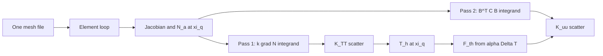

# Elements, Shape Functions, and Quadrature

An finite element is three things bundled together: a **reference domain** with fixed geometry, a set of **shape functions** that interpolate fields on that domain, and a **quadrature rule** that integrates weak-form kernels accurately and efficiently. Mesh generators supply node coordinates and connectivity; the element library supplies everything else.

Chapter 2 showed assembly as a scatter of local matrices. This chapter explains what happens inside the element loop — how geometry enters through the Jacobian, how polynomial order controls accuracy, and why bad elements (slivers, nearly incompressible materials on Q1 meshes) produce bad answers even when the assembly code is correct.

## Plot spine (one line) {#plot-spine-one-line}

> **IV.3 — Act II — Discretization:** Shape functions and quadrature are the geometry of approximation on each bar element.

When this chapter feels abstract, read the sentence above aloud — it is this chapter's role in the [chapter roadmap](../appendix/sources.md#chapter-roadmap-one-continuous-arc). See the [numbered-chapter plot spine index](../appendix/sources.md#numbered-chapter-plot-spine-index-row-19) for all 35 rungs; [row 19](../preface.md#skill-navigation-row-19) closes the audit when mid-chapter reading stalls despite a Bridge from the prior chapter.

## Scene: the mesh becomes tiny shapes

Zoom into the copper wire model until individual elements fill the screen: small triangles or bricks, each with the same reference template, stretched and rotated to fit the local geometry. Shape functions interpolate temperature and displacement inside each patch; quadrature integrates the weak form as a weighted sum of point values. A coarse mesh captures bulk stretch; a fine mesh resolves the hot spot where current density peaks — same element library, different resolution.

## Reference elements and local coordinates

Engineering meshes use triangles, quadrilaterals, tetrahedra, and hexahedra in arbitrary orientations and sizes. Computing shape function derivatives on each physical element separately would be tedious. Instead, every element type defines a **reference element** \(\hat{\Omega}\) and an invertible map \(\mathbf{x}(\xi)\) from reference coordinates \(\xi\) to physical coordinates \(\mathbf{x}\).

Common reference elements:

| Element | Reference domain \(\hat{\Omega}\) | Local nodes | Polynomial order |
|---------|-----------------------------------|-------------|------------------|
| P1 segment | \([0,1]\) | 2 endpoints | Linear |
| P2 segment | \([0,1]\) | 2 endpoints + 1 midpoint | Quadratic |
| P1 triangle | \(\{(\xi_1,\xi_2): \xi_1 \ge 0,\, \xi_2 \ge 0,\, \xi_1+\xi_2 \le 1\}\) | 3 vertices | Linear |
| P2 triangle | Reference triangle | 3 vertices + 3 edge midpoints | Quadratic |
| Q1 quadrilateral | \([-1,1]^2\) | 4 corners | Bilinear |
| Q2 quadrilateral | \([-1,1]^2\) | 4 corners + 4 edge midpoints + 1 center | Biquadratic |
| P1 tetrahedron | Reference tet | 4 vertices | Linear |
| Q1 hexahedron | \([-1,1]^3\) | 8 corners | Trilinear |

The **polynomial order** \(p\) determines how many nodes (or DOFs) the element carries and how fast the approximation error decreases with mesh refinement (\(O(h^p)\) in the energy norm under smoothness assumptions).

## Isoparametric mapping

In the **isoparametric** formulation — the default in structural FEM — the same shape functions interpolate both the geometry and the solution field:

\[
\mathbf{x}(\xi) = \sum_{a=1}^{n_e} \mathbf{X}_a N_a(\xi), \qquad u_h(\xi) = \sum_{a=1}^{n_e} U_a N_a(\xi).
\]

Here \(\mathbf{X}_a\) are the **nodal coordinates** of element \(e\) and \(U_a\) are the nodal values of the field. Curved boundaries are approximated by the isoparametric map: a Q1 quadrilateral with nodes placed on a circular arc captures the boundary to \(O(h^2)\) without body-fitted mesh regeneration at each design iteration.

The **Jacobian matrix** \(\mathbf{J} = \partial \mathbf{x}/\partial \xi\) maps gradients between reference and physical space:

\[
\nabla_\xi N_a = \mathbf{J}^T \nabla_x N_a \quad \Longrightarrow \quad \nabla_x N_a = \mathbf{J}^{-T} \nabla_\xi N_a.
\]

The volume element transforms as \(d\Omega = |\det \mathbf{J}|\, d\xi\). Ill-conditioned Jacobians — **sliver triangles** with one angle near \(\pi\), **distorted hexes** in boundary layers — amplify roundoff error and degrade stiffness conditioning. Mesh quality metrics (aspect ratio, minimum angle, Jacobian determinant) exist precisely because \(\mathbf{J}\) appears in every element integral.

## Shape function properties

On element \(e\), shape functions satisfy:

**Partition of unity:**

\[
\sum_{a=1}^{n_e} N_a(\xi) = 1.
\]

**Kronecker property at nodes:** if \(\xi_b\) is the reference coordinate of node \(b\),

\[
N_a(\xi_b) = \delta_{ab}.
\]

Hence \(u_h(\mathbf{x}_b) = U_b\): nodal values are **interpolants**. This makes postprocessing intuitive — stress at a node is not necessarily physical (stress is often discontinuous), but displacement at a node is exactly the DOF value.

**Conforming \(H^1\) elements** (standard Lagrange elements) are continuous across element boundaries: global basis functions are "hat functions" that equal 1 at one node and 0 at all others. This continuity is required for the weak Laplacian \(\int \nabla u\cdot\nabla v\) to be well-defined — a lesson from Part III's Sobolev spaces chapter.

Derivatives of shape functions on reference elements are computed once in tabulated form. On physical elements, only the Jacobian changes.

## Quadrature: Gauss rules and exact integration

Element integrals are evaluated numerically:

\[
\int_{\hat{\Omega}} g(\xi)\, d\xi \approx \sum_{q=1}^{Q} w_q\, g(\xi_q),
\]

where \(\{(\xi_q, w_q)\}\) are quadrature points and weights on the reference element. **Gauss–Legendre** rules on \([-1,1]\) integrate polynomials up to degree \(2Q-1\) exactly.

For **P1 triangles** in 2D, \(\nabla N_a \cdot \nabla N_b\) is constant on each element. A **one-point quadrature rule** at the centroid integrates the stiffness matrix exactly — no quadrature error for linear triangles with constant coefficients.

For **Q1 quadrilaterals**, \(\nabla N_a\) varies bilinearly; a \(2 \times 2\) Gauss rule (4 points) integrates bilinear forms with constant coefficients exactly.

For **nonlinear materials**, the integrand \(\boldsymbol{\sigma}(\boldsymbol{\varepsilon}) : \delta\boldsymbol{\varepsilon}\) varies spatially even on linear elements. Enough quadrature points must be used to avoid **under-integration**, which manifests as **hourglassing** — spurious zero-energy deformation modes that pollute the solution, especially in bending-dominated problems.

## Example: stiffness of a unit square with Q1 elements

Partition the unit square \([0,1]^2\) into two triangles or one bilinear quadrilateral. For a single Q1 quad with corners at \((0,0)\), \((1,0)\), \((1,1)\), \((0,1)\) and constant diffusion coefficient \(k = 1\), use \(2 \times 2\) Gauss quadrature on \([-1,1]^2\):

\[
\xi_q \in \{\pm 1/\sqrt{3}\}, \qquad w_q = 1.
\]

At each quadrature point, evaluate \(\mathbf{J}\), \(\nabla_x N_a\), and accumulate \(k_{ab}^e += w_q w_r\, (\nabla N_a \cdot \nabla N_b)\, |\det \mathbf{J}|\). The resulting \(4 \times 4\) local matrix matches the analytic stiffness for this uniform element. Distorting the quad — moving one corner inward — changes \(\mathbf{J}\) and the stiffness; the same quadrature rule remains valid if the map is invertible.

### Worked example: Q1 bar element for the copper wire in tension

Consider a single 1D bar element of length \(L = 0.01\) m (10 mm mesh along the wire axis), linear shape functions on \(\xi \in [0,1]\):

\[
N_1(\xi) = 1 - \xi, \qquad N_2(\xi) = \xi, \qquad x(\xi) = x_1 + L\xi.
\]

The Jacobian is scalar: \(J = dx/d\xi = L\), so \(\partial N_a/\partial x = (1/L)\,\partial N_a/\partial \xi\). For Poisson's equation \(-(EA u')' = f\) (or thermal conduction \(-(k T')' = q\)), the element stiffness with constant \(EA\) is

\[
k^e = \frac{EA}{L} \begin{bmatrix} 1 & -1 \\ -1 & 1 \end{bmatrix}.
\]

Verify with 2-point Gauss quadrature on \([0,1]\) mapped from \([-1,1]\): at \(\xi_q = \pm 1/\sqrt{3}\),

\[
\frac{dN_1}{d\xi} = -1, \quad \frac{dN_2}{d\xi} = 1, \quad
\frac{dN_a}{dx} = \frac{1}{L}\frac{dN_a}{d\xi}.
\]

Each quadrature point contributes \(w_q (EA/L^2) \begin{bmatrix} 1 & -1 \\ -1 & 1 \end{bmatrix}\) with \(w_q = 1\); summing two points recovers \(k^e\) exactly — linear gradients integrated with 2-point Gauss is exact for constant coefficients.

For a **distorted** bar (non-uniform spacing: nodes at \(x_1 = 0\), \(x_2 = 0.012\) m), \(J = x_2 - x_1 = 0.012\) m and the same formula applies with that \(L\). This is the atom inside the global assembly loop from Chapter 2: one element, two nodes, one scalar \(J\), one \(2\times2\) contribution to \(\mathbf{K}\).

## Reduced integration and locking

**Full integration** uses enough points to integrate all polynomial terms in the bilinear form exactly. **Reduced integration** uses fewer points — sometimes deliberately.

For nearly incompressible elasticity (\(\nu \to 1/2\)), Q1 displacement elements with full integration exhibit **volumetric locking**: spurious hydrostatic stresses resist volume changes that the material should permit. Reduced integration on the volumetric part of the strain energy softens the spurious modes — but unconstrained reduced integration creates hourglass modes that must be stabilized.

Remedies with solid theoretical footing:

- **Mixed \(u\)–\(p\) formulations**: displacement and pressure as separate fields, with inf–sup stable element pairs (Taylor–Hood, P2–P1) satisfying the LBB condition from Part III.
- **Selective reduced integration (SRI)**: full integration on deviatoric terms, reduced on volumetric terms.
- **Enhanced assumed strain (EAS)**: enrich the strain field in the element interior.

The same locking pathology appears in Stokes flow and incompressible Navier–Stokes — a recurring theme linking Part IV and Part V.

## Higher-order and spectral elements

Increasing polynomial order \(p\) on a fixed mesh (**\(p\)-refinement**) reduces error faster than decreasing \(h\) alone when the solution is smooth. P2 triangles carry six nodes; the displacement field approximates curvature within each element, improving accuracy for bending of the copper wire without refining the mesh as aggressively.

At the extreme, **spectral elements** use high-order Lagrange polynomials on tensor-product grids, achieving exponential convergence for smooth solutions. **Discontinuous Galerkin (DG)** elements abandon inter-element continuity, coupling elements through numerical fluxes — a hybrid of FEM and FVM popular for hyperbolic PDEs (Part V, Chapter 3).

## Element families in practice

Structural codes typically offer:

- **Triangles/tets** for automatic meshing of complex 3D geometry (Gmsh, TetGen).
- **Quads/hexes** for structured meshes and extrusion directions.
- **Prisms** for boundary layer meshes in CFD–structure coupled problems.

The FEA teaching notes emphasize **P1 triangles in 2D** for learning: minimal quadrature, closed-form gradients, and transparent assembly. Production copper-alloy simulations might use ten-node tetrahedra or twenty-node hexahedra with quadratic geometry and displacement.

## Patch tests and convergence in practice

A reliable element passes the **patch test**: if the exact solution lies in the element's approximation space, the FEM solution is exact regardless of mesh topology. Linear elements pass the patch test for linear solutions; they fail to represent quadratic solutions exactly — the error scales as \(O(h^2)\) in \(L^2\) and \(O(h)\) in \(H^1\).

When implementing a new element, verify:

1. Partition of unity and Kronecker property on the reference element.
2. Patch test on distorted meshes.
3. Convergence rate on a manufactured solution with known \(H^2\) regularity.

Problem Session 8 in the FEA notes studies norms and convergence numerically — the empirical counterpart to the theorems in Chapter 5.

## A 2D heat conduction example on P1 triangles

Return to the copper wire cross-section under steady Joule heating. With conductivity \(k\), the weak form is \(\int k \nabla T \cdot \nabla v\, dA = \int q v\, dA\). On each P1 triangle, \(\nabla T_h\) and \(\nabla v_h\) are constant; one centroid quadrature point per element integrates the stiffness exactly when \(k\) is piecewise constant.

For a circular cross-section meshed with uniform triangles, refine the mesh and verify that the maximum temperature converges — typically \(O(h^2)\) in \(L^2\) for smooth \(q\). Distorted triangles near the curved boundary reduce the effective order unless the mesh is graded or isoparametric Q1 quads with curved edges are used. Element quality and quadrature order interact: a bad triangle with exact quadrature still yields a bad answer.

## Choosing an element for a new problem

Use this checklist before committing to an element family:

1. What regularity does the solution have (smooth, corner singularities, shocks)?
2. Is the operator coercive (Poisson, elasticity) or does it need stabilization (advection, Maxwell)?
3. Is the material nearly incompressible (consider mixed or enhanced elements)?
4. Is geometry complex (tets/hexes with isoparametric maps)?
5. What order of accuracy is required per unit computational cost (\(p\) vs. \(h\))?

For introductory work and course problem sessions, P1 triangles in 2D remain the right default. For production analysis of the copper wire with contact, plasticity, or fine stress gradients, P2 or hexahedral elements with selective \(p\)-refinement are typical.

## Shared P1 library for heat and mechanics (Acts II–III on one mesh)

[IV.1](01-weighted-residuals.md) enforced heat and elasticity residuals on the **same hat functions**; [IV.2](02-galerkin-assembly.md) scattered \(\mathbf{K}_{TT}\) and \(\mathbf{K}_{uu}\) from the **same connectivity array**. This chapter names what stays identical inside the element loop when Act II and Act III share an afternoon:

| Element object | Act II — scalar heat | Act III — vector elasticity | Shared? |
|----------------|---------------------|----------------------------|---------|
| Reference element \(\hat{\Omega}\) | P1 segment \([0,1]\) or P1 triangle | Same template | Yes |
| Nodal coordinates \(\mathbf{X}_a\) | Isoparametric map \(\mathbf{x}(\xi)\) | Same map | Yes |
| Jacobian \(\mathbf{J}\), \(\det J\) | Volume measure in \(\int k \|\nabla T\|^2\) | Same in \(\int \mathbf{B}^T\mathbb{C}\mathbf{B}\) | Yes |
| Shape functions \(N_a(\xi)\) | Scalar trial \(T_h = \sum T_a N_a\) | Vector trial \(\mathbf{u}_h = \sum \mathbf{U}_a N_a\) | Same \(N_a\), different DOF count |
| Quadrature points \(\xi_q\), weights \(w_q\) | Integrate \(\int k \nabla N_a \cdot \nabla N_b\) | Integrate \(\int \mathbf{B}^T\mathbb{C}\mathbf{B}\) | Same rule if \(\mathbb{C}\) is constant on element |
| Global DOF map | One scalar per node | \(d\) components per node | **Same node numbering**; expanded index for vectors |

**Baby picture:** the mesh file lists nodes once; the element library evaluates \(N_a\) and \(\mathbf{J}\) once per quadrature point; only the **integrand** changes between passes — conductivity \(k\) for heat, elasticity tensor \(\mathbb{C}\) for mechanics. When input decks duplicate connectivity for a thermal mesh and a structural mesh, the thermocouple and load cell are answering questions about **different specimens** even if the geometry looks identical on screen.

### Quadrature order for staggered thermoelastic passes

On P1 bars and triangles, one Gauss point at the element centroid integrates **constant** gradients exactly — sufficient for uniform \(k\), \(EA\), and isotropic \(\mathbb{C}\) on each element. The heat pass stores \(T_h(\xi_q)\) at those same points when forming thermal eigenstrain

\[
\varepsilon_{\text{th}}(\xi_q) = \alpha\bigl(T_h(\xi_q) - T_{\text{ref}}\bigr)
\]

for the mechanical pass. Skipping quadrature alignment — evaluating \(\varepsilon_{\text{th}}\) at nodes while \(\mathbf{B}\) is formed at centroids — introduces \(O(h)\) inconsistency that masquerades as "mysterious" thermal pre-stress on coarse meshes. Production codes evaluate \(\varepsilon_{\text{th}}\) at the **same quadrature points** as the mechanical stiffness integrand; [IV.4](04-poisson-to-elasticity.md#coupled-thermoelasticity) completes the handshake.

When Act II and Act III feel like separate courses, return to this diagram — the only fork is the integrand, not the geometry. The [Part IV thermoelastic assembly thread](00-opening.md#acts-ii-and-iii-together-thermoelastic-assembly-thread) and [Thermoelastic assembly reunion index](../appendix/sources.md#thermoelastic-assembly-reunion-index-row-29) (row 29) are the reading-time audits when export pedigree is clear but the two passes never ran in order.

## Lab act: patch test on two bar elements before Act III meshing

**Act III** will mesh the tensile specimen — but a two-element bar is enough to verify that shape functions, quadrature, and assembly obey the **patch test** before trusting a 3D mesh at the grip corner.

Problem: \( -u'' = 0\) on \((0,L)\) with \(u(0)=0\), \(u(L)=1\). Exact solution \(u(x) = x/L\) lies in the **P1 bar** space on any uniform partition.

| Check | Two equal elements | Pass criterion |
|-------|-------------------|----------------|
| Partition of unity | \(\sum_i N_i(x) = 1\) on each element | Exact at any \(x\) |
| Kronecker property | \(N_j(x_i) = \delta_{ij}\) at nodes | Exact |
| Patch test | Assemble \(\mathbf{K}\), apply BCs, solve | \(u_h(x_i) = x_i/L\) at **every** node |
| Quadrature | 1-point Gauss on \([0,1]\) reference bar | Exact for constant \(u''\) integrand |

Implement the 2×2 global system by hand or in NumPy: element stiffness \(k_e = \frac{EA}{h}\begin{bmatrix}1&-1\\-1&1\end{bmatrix}\), scatter into \(\mathbf{K}\), impose Dirichlet rows. If the patch test fails, no amount of \(h\)-refinement in Act III will rescue the load cell curve — the bug is in shape functions or BC enforcement, not mesh density.

Optional extension: repeat with a **distorted** two-element partition (lengths \(0.3L\) and \(0.7L\)). P1 bars still pass the patch test for linear solutions — a reminder that element quality matters for **higher-order** accuracy, not for representing linear fields exactly.

## Lab act extension: same element loop, heat quadrature before mechanics (Act II — Warming) {#lab-act-extension-same-element-loop-heat-quadrature-before-mechanics-act-ii--warming}

Before trusting vector elasticity in [IV.4](04-poisson-to-elasticity.md), verify that **element technology** — not just assembly scatter — is shared between thermal and mechanical passes on the two-element bar from [IV.2](02-galerkin-assembly.md#lab-act-extension-scatter-mathbfk_tt-on-the-same-mesh-act-ii--warming).

**Setup.** Reuse the three-node bar: \(L = 1\,\text{m}\), \(k = 400\,\text{W/(m·K)}\), uniform Joule source \(q = 10^6\,\text{W/m}^3\), \(T_0 = T_2 = 300\,\text{K}\). One Gauss point at \(\xi = 1/2\) on each reference segment \([0,1]\).

| Step | Element-loop move | Audit on wire |
|------|---------------------|---------------|
| 1 | Evaluate \(N_1, N_2\) and \(dN/dx = \pm 1/h\) at \(\xi_q\) | Same formulas as mechanical bar |
| 2 | Form local \(\mathbf{k}_T^e = k \int B_T^T B_T \, d\xi \approx k/h \begin{bmatrix}1&-1\\-1&1\end{bmatrix}\) | Identical sparsity pattern as \(\mathbf{K}_{uu}\) with \(EA/h\) |
| 3 | Load \(f_{T,a}^e = \int q N_a \, d\xi \approx q h/2\) on each element | Mid-node heat generation from Joule source |
| 4 | Scatter with **same** \(\mathbf{L}_e\) as [IV.2 Step 4](02-galerkin-assembly.md#lab-act-extension-scatter-mathbfk_tt-on-the-same-mesh-act-ii--warming); solve for \(T_1\) | Thermocouple at mid-span |
| 5 | Store \(T_h(\xi_q)\) at centroid of each element for \(\varepsilon_{\text{th}}\) | Handshake input to Act III mechanical pass |

**Pass criterion:** \(\mathbf{K}_{TT}\) and \(\mathbf{K}_{uu}\) (from the mechanical patch test above) have **identical nonzero pattern** — only the scalar prefactor \(k/h\) versus \(EA/h\) differs. If Step 4 uses a different connectivity file than Step 5's mechanical scatter, row 29's thermoelastic reunion audit fails before [IV.4](04-poisson-to-elasticity.md#lab-act-one-mesh-two-fields-act-iiiii-on-the-copper-wire) runs.

**Handshake audit:** compare \(T_1\) from this coarse mesh to the value from [IV.1's heat Lab act](01-weighted-residuals.md#lab-act-extension-joule-heating-on-two-elements-act-ii--warming) — both should use the same \(N_a\), \(\mathbf{J}\), and quadrature rule. When they disagree, the bug is in element quadrature or reference-map sign, not in Joule physics.

## Concept map checkpoint (elements and quadrature)

This chapter is where mesh geometry enters the energy integrals. Before vector elasticity extends the same loop, summarize what element technology established:

| Question | Part IV answer (copper wire) |
|----------|------------------------------|
| What **object**? | Shape functions \(N_a\); reference element \(\hat{\Omega}\); Jacobian \(\mathbf{J}\); **same \(N_a\) for scalar \(T\) and vector \(\mathbf{u}\)** |
| What **structure**? | Partition of unity; Kronecker property; isoparametric map \(\mathbf{x}(\xi)\); **one connectivity, two integrands** |
| What **theorem**? | Patch test: exact when solution \(\in V_h\); \(O(h^p)\) rates for smooth fields; quadrature exact on constant P1 gradients |
| What **breaks**? | Locking (\(\nu \to 1/2\)); hourglassing (reduced integration); distorted elements reduce order; **separate thermal and structural meshes** |

The patch-test Lab act is the FEM analogue of Part I's three-node sanity check: if linear \(u(x)=x/L\) is not exact on two P1 bars, no amount of \(h\)-refinement in Act III will rescue the load cell curve. Quadrature and element order determine **accuracy**; assembly determines **structure**.

## Bridge

Poisson's equation — scalar, symmetric, coercive — is the training ground where elements and quadrature behave well. Vector elasticity adds tensor constitutive laws, block stiffness structure, and traction boundary integrals. The assembly loop is unchanged; the integrand grows richer.

| What IV.3 established | What IV.4 extends |
|-------------------------|-------------------|
| P1 triangles; centroid quadrature on \(\int k\|\nabla T\|^2\) | Vector \(\mathbf{u}\); block \(\mathbf{K}\) from \(\mathbb{C}:\boldsymbol{\varepsilon}(\mathbf{v})\) |
| Conforming \(H^1\) continuity across element edges | Traction BC integrals on Neumann boundaries |
| Patch test and \(O(h^2)\) intuition for smooth heat | Anisotropic stiffness from texture (cold-drawn wire) |
| \(p\)- vs. \(h\)-refinement tradeoffs | From heated cross-section to tensile specimen under end load |

**Scale-boundary handshake (IV.3 → IV.4 → Part VI).**

| Element technology (this chapter) | Vector extension (next chapter) | Wire-scale consumer | Failure mode |
|-----------------------------------|---------------------------------|---------------------|--------------|
| P1 triangles; centroid quadrature on \(\int k\|\nabla T\|^2\) | Block \(\mathbf{K}\) from \(\mathbb{C}:\boldsymbol{\varepsilon}(\mathbf{v})\) | Act III tensile specimen on load cell | Locking when \(\nu \to 1/2\) on Q1 mesh |
| Isoparametric \(\mathbf{J}\), \(\det J\) in volume integrals | Traction face quadrature on grip boundaries | Neumann load split from body weight | Wrong \(\det J\) sign in distorted grip cluster |
| Patch test on scalar Poisson (Lab act) | Vector patch test on linear elasticity | Linear elastic climb before yield | Non-symmetric \(\mathbf{K}\) from transposed B-matrix |
| \(p\)-refinement on heated cross-section (Act II) | Anisotropic \(\mathbb{C}\) from cold-drawn texture | Part VI variational elasticity handoff | Q1 hex hourglassing in 3D grip region |

Recall the pipeline from [Part III.4](../part03-pdes/04-energy-methods.md#bridge-to-part-iv): weak form → energy minimum → Rayleigh–Ritz on \(V_h\). Assembly ([IV.2](02-galerkin-assembly.md)) is the operational half of Rayleigh–Ritz; element technology is the other half. The copper wire's tensile mesh is only as trustworthy as the P1 bars (1D), triangles (2D cross-section), or tets (3D grip region) that define \(V_h\).

Return to the [prologue](../prologue/00-many-scales.md): **Act III**'s load cell measures force on a wire whose FEM mesh is built from the element families named here. Part III minimized thermal energy on the same P1 triangles; Part IV now carries **mechanical** degrees of freedom with the same quadrature loop. [IV.4](04-poisson-to-elasticity.md) closes the scalar-to-vector jump — the chapter where the copper wire stops being a temperature field alone and becomes the tensile bar whose prologue will track through yield.

The [preface ascent preview chain](../preface.md#ascent-preview-chain) placed Part IV after Part III so **Act II — Warming** and **Act III — Pulling** could share one element library before Part V adds a second discretization dialect for the air cooling the wire. [IV opening](../part04-fem/00-opening.md#what-you-should-be-able-to-do-after-part-iv) lists the patch test as the IV.3 skill checkpoint — the artifact that must pass before vector elasticity in IV.4 and convergence rates in IV.5 certify the load cell curve.

**Element technology → vector extension (intra-part handshake).**

| IV.3 output (this chapter) | IV.4 consumer | Act on wire | Failure mode |
|----------------------------|---------------|-------------|--------------|
| Patch test on scalar Poisson (Lab act) | Vector patch test on linear elasticity | Linear elastic climb before yield | Non-symmetric \(\mathbf{K}\) from transposed B-matrix |
| P1 triangles on heated cross-section | Block \(\mathbf{B}^T\mathbb{C}\mathbf{B}\) on same connectivity | Act II + Act III on one mesh | Thermal eigenstrain omitted in mechanical pass |
| Isoparametric \(\mathbf{J}\) on grip cluster | Traction face quadrature on Neumann BC | End load split from body weight | Wrong \(\det J\) sign in distorted elements |
| \(p\)-refinement on smooth temperature | Anisotropic \(\mathbb{C}\) from cold-drawn texture | Secant modulus vs single-crystal MD | Q1 hex hourglassing in 3D grip region |

Turn the page when Poisson assembly feels routine but an elasticity run returns a singular or nonsymmetric matrix — that is the signal the block constitutive structure in [IV.4](04-poisson-to-elasticity.md) deserves its own chapter.
