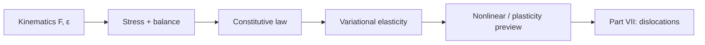

# Part VI — Continuum Mechanics

Parts IV and V discretized PDEs — Galerkin trial functions for elliptic solids, flux balances for fluids. Part VI asks what those PDEs **mean physically**: how bodies deform, how stress measures force per area, how balance laws connect kinematics to constitutive response.

The copper wire under tension is our specimen throughout. At this scale it is a cylinder of copper with a displacement field, a Cauchy stress tensor, and an elastic energy that Part IV's finite element code approximates. Cold drawing has work-hardened it; Joule heating raises its temperature; air cools its surface — phenomena that require the continuum vocabulary developed here before we can justify descending to dislocations and atoms in later parts.

Three chapters cover kinematics, stress and balance laws, and variational elasticity with nonlinear extensions. A fourth chapter previews geometric and material nonlinearity — the last continuum stop before Part VII. The layout follows the **Continuum Mechanics Notes** in [`writings/continuum/`](../../writings/continuum/): numbered chapters with **Bridge** sections linking geometry to energy principles and to the mesoscale models of Part VII.

## The concept map (elasticity notes)

| Question | Example in this part |
|----------|----------------------|
| What **object** are we studying? | Deformation \(\mathbf{F}\), strain \(\boldsymbol{\varepsilon}\), stress \(\boldsymbol{\sigma}\) |
| What **structure** does it add? | Objectivity; balance laws; constitutive relations (Hooke, J₂ preview) |
| What **theorem** becomes possible? | Virtual work principle; energy minimization for hyperelasticity |
| What **breaks** if structure is missing? | Non-objective models; ill-posed traction BCs; yield without mesoscale state |

**Baby picture:** name how the copper wire deforms, write force balance as virtual work, connect stress to strain through a constitutive law — the language FEM and FVM both approximate before defects break smoothness.

## Bridge

Parts IV and V solved PDEs on meshes. Part VI names the fields those PDEs carry — deformation gradient, strain, stress — and derives the virtual work principle that both discretizations inherit. The first chapter begins with the geometry of deformation: how the copper wire stretches, rotates, and changes volume when pulled.
