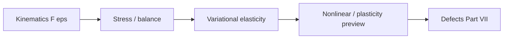

# Part VI — Continuum Mechanics

Parts IV and V discretized PDEs — Galerkin trial functions for elliptic solids, flux balances for fluids. Part VI asks what those PDEs **mean physically**: how bodies deform, how stress measures force per area, how balance laws connect kinematics to constitutive response.

The copper wire under tension is our specimen throughout. At this scale it is a cylinder of copper with a displacement field, a Cauchy stress tensor, and an elastic energy that Part IV's finite element code approximates. Cold drawing has work-hardened it; Joule heating raises its temperature; air cools its surface — phenomena that require the continuum vocabulary developed here before we can justify descending to dislocations and atoms in later parts.

Four chapters follow in order: kinematics; stress and balance laws; variational elasticity; and a preview of geometric and material nonlinearity — the last continuum stop before Part VII. The layout follows the **Continuum Mechanics Notes** in [`writings/continuum/`](../../writings/continuum/): numbered chapters with **Bridge** sections linking geometry to energy principles and to the mesoscale models of Part VII.

## Where we left the wire

Whether you arrived from Part IV (Door B) or completed Part V (Door A), you have been solving PDEs on meshes without yet naming the **mechanical fields** those codes carry. Part IV's stiffness matrix encodes elastic energy; Part V's fluxes encode momentum and enthalpy transport around the hot wire — but neither part defines Cauchy stress, the deformation gradient, or the virtual work principle that makes \(\mathbf{K}\mathbf{U}=\mathbf{F}\) a statement about force balance rather than a sparse linear system.

The copper wire at this scale is still a cylinder: pulled in tension, heated by current, cooled by air you may or may not have resolved with FVM. Part VI supplies the continuum vocabulary those simulations approximate — and the admission that cold-drawn copper, notch roots, and yield surfaces cannot be understood from smooth elastic fields alone. That admission is the bridge to dislocations in Part VII.

## Lab act (Pulling — Act III)

The force–displacement trace is still climbing almost linearly. **Act III** is not only a FEM solve — it is a measurement: the load cell reports axial force; the extensometer reports stretch. This part names Cauchy stress and virtual work as the continuum objects those instruments approximate, before the curve bends into **Act IV**.

## The concept map

| Question | Example in this part |
|----------|----------------------|
| What **object** are we studying? | Deformation gradient \(\mathbf{F}\), Cauchy stress \(\boldsymbol{\sigma}\), strain energy |
| What **structure** does it add? | Objectivity, balance laws, constitutive relations |
| What **theorem** becomes possible? | Virtual work principle, hyperelastic energy potentials |
| What **breaks** if structure is missing? | Non-objective models, singularities at defects, yield without mesoscale physics |

**Baby picture:** describe how the copper wire stretches and rotates, relate stress to force per area, derive virtual work from balance, then admit that cold drawing and notch roots violate the smooth fields FEM assumes — setting up the descent to dislocations.

## Representative schematics (elasticity notes)

The [Elasticity & Inelasticity notes](https://hanfengzhai.github.io/file/elasticity_notes.pdf) supply the continuum figures this part names — the mechanical vocabulary FEM and FVM approximate:

| Schematic | Idea | Chapter in this part |
|-----------|------|----------------------|
| 1 | Deformation gradient \(\mathbf{F}\); strain measures | [VI.1](01-kinematics.md) |
| 2 | Cauchy stress; balance laws; constitutive closure | [VI.2](02-stress-balance.md) |
| 3 | Virtual work; hyperelastic energy potentials | [VI.3](03-variational-elasticity.md) |
| 4 | Geometric and material nonlinearity; plasticity preview | [VI.4](04-nonlinear-plasticity-preview.md) |

When \(\mathbf{K}\mathbf{U}=\mathbf{F}\) feels like sparse linear algebra alone, return to these schematics: they name the tensors whose integrals assemble \(\mathbf{K}\).

## Story so far (Parts I–V)

Whether you read Part V or skipped from Part IV to here, the **computational spine** of the book is complete:

| Part | Method / language | Wire story beat |
|------|-------------------|-----------------|
| I–III | Analysis: \(\mathbf{K}\mathbf{u}=\mathbf{f}\) → \(H^1\) → weak PDEs | Springs → fields → Poisson/heat/elasticity |
| IV | FEM: Galerkin assembly, elements, convergence | Meshed solid; \(\mathbf{K}\mathbf{U}=\mathbf{F}\) in tension |
| V (optional) | FVM: flux balance, Riemann solvers, Navier–Stokes | Air cooling the hot wire; conjugate heat transfer |

Parts IV and V solved **equations on meshes** without fully naming the mechanical objects those meshes carry. Part IV's nodal displacements sample a continuous \(\mathbf{u}(\mathbf{X})\); Part V's cell-averaged velocities sample \(\mathbf{v}(\mathbf{x})\) in the fluid domain. Part VI supplies the **continuum vocabulary** — deformation gradient \(\mathbf{F}\), Cauchy stress \(\boldsymbol{\sigma}\), virtual work — that makes \(\mathbf{K}\mathbf{U}=\mathbf{F}\) a force-balance statement rather than a sparse linear algebra exercise. It also admits what neither FEM nor FVM can resolve alone: cold-drawn strength, notch singularities, and yield surfaces that demand mesoscale physics in Part VII.

## Closing the arc from Part I

If you have read linearly since the prologue, notice how the **same four questions** from the opening table reappear here with continuum vocabulary — and how the **same mathematical moves** from Part I return at the engineering scale:

| Part I (springs on the wire) | Part VI (continuum on the wire) |
|------------------------------|----------------------------------|
| State vector \(\mathbf{u}\) | Displacement field \(\mathbf{u}(\mathbf{x})\) |
| Stiffness matrix \(\mathbf{K}\) | Elastic stiffness tensor \(\mathbb{C}\) |
| Energy \(\mathbf{u}^T \mathbf{K}\mathbf{u}\) | Strain energy \(\int \boldsymbol{\sigma}:\boldsymbol{\varepsilon}\, d\Omega\) |
| Eigenmodes decouple vibration | Normal modes of a free-free bar (Fourier / FEM) |
| Mesh refinement sends \(N\to\infty\) | \(h\)-refinement sends FEM toward virtual work |

Part II taught that the limit \(N\to\infty\) lives in \(H^1\); Part III wrote the weak forms that make virtual work well posed; Part IV assembled \(\mathbf{K}\) as a Galerkin projection. Part VI names the **physics** those projections approximate: the deformation gradient \(\mathbf{F}\), Cauchy stress \(\boldsymbol{\sigma}\), and balance laws that justify calling \(\mathbf{K}\mathbf{U}=\mathbf{F}\) a force equilibrium statement rather than a sparse linear algebra exercise.

The copper wire that began as a chain of coupled springs is now a cylinder with a stress tensor — still finite-dimensional on any mesh, still infinite-dimensional in the continuum limit, and still one specimen in a single story. Part VII will explain why cold-drawn strength is not in \(\mathbb{C}\) alone; Parts VIII–IX will ask where \(\mathbb{C}\) itself comes from.

## Bridge

Parts IV and V solved PDEs on meshes. Part VI names the fields those PDEs carry — deformation gradient, strain, stress — and derives the virtual work principle that both discretizations inherit. The first chapter begins with the geometry of deformation: how the copper wire stretches, rotates, and changes volume when pulled.
