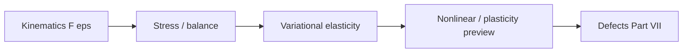

# Part VI — Continuum Mechanics

Parts IV and V discretized PDEs — Galerkin trial functions for elliptic solids, flux balances for fluids. Part VI asks what those PDEs **mean physically**: how bodies deform, how stress measures force per area, how balance laws connect kinematics to constitutive response.

The copper wire under tension is our specimen throughout. At this scale it is a cylinder of copper with a displacement field, a Cauchy stress tensor, and an elastic energy that Part IV's finite element code approximates. Cold drawing has work-hardened it; Joule heating raises its temperature; air cools its surface — phenomena that require the continuum vocabulary developed here before we can justify descending to dislocations and atoms in later parts.

Four chapters follow in order: kinematics; stress and balance laws; variational elasticity; and a preview of geometric and material nonlinearity — the last continuum stop before Part VII. The layout follows the **Continuum Mechanics Notes** in [`writings/continuum/`](../../writings/continuum/): numbered chapters with **Bridge** sections linking geometry to energy principles and to the mesoscale models of Part VII.

## Where we left the wire

Whether you arrived from Part IV (Door B) or completed Part V (Door A), you have been solving PDEs on meshes without yet naming the **mechanical fields** those codes carry. Part IV's stiffness matrix encodes elastic energy; Part V's fluxes encode momentum and enthalpy transport around the hot wire — but neither part defines Cauchy stress, the deformation gradient, or the virtual work principle that makes \(\mathbf{K}\mathbf{U}=\mathbf{F}\) a statement about force balance rather than a sparse linear system.

The copper wire at this scale is still a cylinder: pulled in tension, heated by current, cooled by air you may or may not have resolved with FVM. Part VI supplies the continuum vocabulary those simulations approximate — and the admission that cold-drawn copper, notch roots, and yield surfaces cannot be understood from smooth elastic fields alone. That admission is the bridge to dislocations in Part VII.

## The concept map

| Question | Example in this part |
|----------|----------------------|
| What **object** are we studying? | Deformation gradient \(\mathbf{F}\), Cauchy stress \(\boldsymbol{\sigma}\), strain energy |
| What **structure** does it add? | Objectivity, balance laws, constitutive relations |
| What **theorem** becomes possible? | Virtual work principle, hyperelastic energy potentials |
| What **breaks** if structure is missing? | Non-objective models, singularities at defects, yield without mesoscale physics |

**Baby picture:** describe how the copper wire stretches and rotates, relate stress to force per area, derive virtual work from balance, then admit that cold drawing and notch roots violate the smooth fields FEM assumes — setting up the descent to dislocations.

## Bridge

Parts IV and V solved PDEs on meshes. Part VI names the fields those PDEs carry — deformation gradient, strain, stress — and derives the virtual work principle that both discretizations inherit. The first chapter begins with the geometry of deformation: how the copper wire stretches, rotates, and changes volume when pulled.
