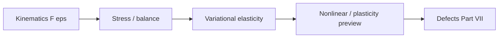
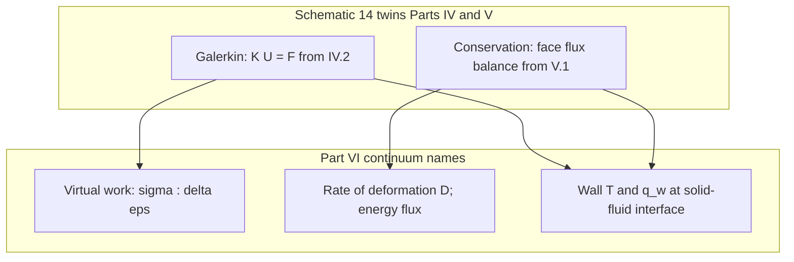

# Part VI — Continuum Mechanics

Parts IV and V discretized PDEs — Galerkin trial functions for elliptic solids, flux balances for fluids. Part VI asks what those PDEs **mean physically**: how bodies deform, how stress measures force per area, how balance laws connect kinematics to constitutive response.

The copper wire under tension is our specimen throughout. At this scale it is a cylinder of copper with a displacement field, a Cauchy stress tensor, and an elastic energy that Part IV's finite element code approximates. Cold drawing has work-hardened it; Joule heating raises its temperature; air cools its surface — phenomena that require the continuum vocabulary developed here before we can justify descending to dislocations and atoms in later parts.

Four chapters follow in order: kinematics; stress and balance laws; variational elasticity; and a preview of geometric and material nonlinearity — the last continuum stop before Part VII. The layout follows the **Continuum Mechanics Notes** in [`writings/continuum/`](../../writings/continuum/): numbered chapters with **Bridge** sections linking geometry to energy principles and to the mesoscale models of Part VII.

## Midpoint: ascent complete, descent ahead {#midpoint-ascent-complete-descent-ahead}

If you have read linearly since the [preface](../preface.md), you have completed the **ascent** — from vectors and stiffness matrices (Part I) through function spaces and weak PDEs (Parts II–III) to FEM, FVM, and now continuum mechanics (Parts IV–VI). The copper wire that began as a chain of springs is now a cylinder with Cauchy stress behind every entry in \(\mathbf{K}\). What follows in Parts VII–IX is the **descent**: the same specimen at finer scales, asking where yield stress, mobility, and elastic moduli hide their history. Part VI is the last rung where the wire still looks smooth on the engineering scale; [VI.4's intermission](04-nonlinear-plasticity-preview.md#intermission-ascent-ends-descent-begins) admits that smoothness is a fiction — and [Part VII](../part07-defects/00-opening.md) begins the story of what lives underneath.

## Chapter guide

| Chapter | Wire story beat | Core object | Handoff |
|---------|-----------------|-------------|---------|
| [VI.1](01-kinematics.md) | Grip displacement ramps; bar stretches and contracts laterally | \(\mathbf{F}\), \(\boldsymbol{\varepsilon}\), Green–Lagrange \(\mathbf{E}\) | Forces enter through stress → balance in VI.2 |
| [VI.2](02-stress-balance.md) | Load cell records force; Cauchy stress balances momentum | Cauchy and Piola–Kirchhoff stress, conservation laws | Virtual work → energy principles in VI.3; [opening hinge](02-stress-balance.md#balance-opening-hinge-kinematics-to-stress) when \(\mathbf{F}\) is named but \(\boldsymbol{\sigma}\) is not |
| [VI.3](03-variational-elasticity.md) | Elastic energy minimized under BCs | Strain energy density, hyperelasticity, FEM connection | Yield and hardening preview → Part VII in VI.4; [opening hinge](03-variational-elasticity.md#variational-opening-hinge-balance-to-energy) when \(\boldsymbol{\sigma}\) is named but \(\Pi[\mathbf{u}]\) is not |
| [VI.4](04-nonlinear-plasticity-preview.md) | Force–displacement curve bends upward | \(J_2\) plasticity, isotropic hardening, return mapping | [Bridge to Part VII](04-nonlinear-plasticity-preview.md#bridge-to-part-vii); [opening hinge](04-nonlinear-plasticity-preview.md#plasticity-opening-hinge-energy-to-yield) when \(\Pi[\mathbf{u}]\) is quadratic but Act IV bends |

Read in order. Each chapter ends with a **Bridge** that states why the next chapter must exist; naming stress without kinematics is force without geometry; fitting plasticity without Part VII is curve-fitting without a forest.

## Scene

Whether you arrived from Part IV (Door B) or completed Part V (Door A), you have been solving PDEs on meshes without yet naming the **mechanical fields** those codes carry. Part IV's stiffness matrix encodes elastic energy; Part V's fluxes encode momentum and enthalpy transport around the hot wire — but neither part defines Cauchy stress, the deformation gradient, or the virtual work principle that makes \(\mathbf{K}\mathbf{U}=\mathbf{F}\) a statement about force balance rather than a sparse linear system.

The copper wire at this scale is still a cylinder: pulled in tension, heated by current, cooled by air you may or may not have resolved with FVM. Part VI supplies the continuum vocabulary those simulations approximate — and the admission that cold-drawn copper, notch roots, and yield surfaces cannot be understood from smooth elastic fields alone. That admission is the bridge to dislocations in Part VII.

## The concept map

| Question | Example in this part |
|----------|----------------------|
| What **object** are we studying? | Deformation gradient \(\mathbf{F}\), Cauchy stress \(\boldsymbol{\sigma}\), strain energy |
| What **structure** does it add? | Objectivity, balance laws, constitutive relations |
| What **theorem** becomes possible? | Virtual work principle, hyperelastic energy potentials |
| What **breaks** if structure is missing? | Non-objective models, singularities at defects, yield without mesoscale physics |

**Baby picture:** describe how the copper wire stretches and rotates, relate stress to force per area, derive virtual work from balance, then admit that cold drawing and notch roots violate the smooth fields FEM assumes — setting up the descent to dislocations.

## Representative schematics (Elasticity Notes)

The [Elasticity & Inelasticity Notes](https://hanfengzhai.github.io/file/elasticity_notes.pdf) follow the same ME 412 habit: each schematic is a baby picture of the continuum pipeline both FEM and FVM approximate. Use them as a visual index while reading:

| Schematic | Idea | Chapter in this part |
|-----------|------|----------------------|
| 1 | Kinematics: \(\mathbf{F}\), strain measures, objectivity on the wire | [VI.1](01-kinematics.md) |
| 2 | Cauchy stress, balance laws, constitutive relations | [VI.2](02-stress-balance.md) |
| 3 | Virtual work, hyperelastic energy, connection to Part IV's \(\mathbf{K}\) | [VI.3](03-variational-elasticity.md) |
| 4 | Geometric and material nonlinearity; J₂ plasticity preview; when smooth fields fail | [VI.4](04-nonlinear-plasticity-preview.md) |

Each schematic answers the four concept-map questions for one mechanical layer. When a stiffness matrix feels disconnected from physics, return to the matching row: *what object, what structure, what theorem, what breaks?* Part IV assembled \(\mathbf{K}\); Part VI names the stress and strain tensors that make that assembly a force-balance statement.

## Story so far (Parts I–V)

Whether you read Part V or skipped from Part IV to here, the **computational spine** of the book is complete:

| Part | Method / language | Wire story beat |
|------|-------------------|-----------------|
| I–III | Analysis: \(\mathbf{K}\mathbf{u}=\mathbf{f}\) → \(H^1\) → weak PDEs | Springs → fields → Poisson/heat/elasticity |
| IV | FEM: Galerkin assembly, elements, convergence | Meshed solid; \(\mathbf{K}\mathbf{U}=\mathbf{F}\) in tension |
| V (optional) | FVM: flux balance, Riemann solvers, Navier–Stokes | Air cooling the hot wire; conjugate heat transfer |

Parts IV and V solved **equations on meshes** without fully naming the mechanical objects those meshes carry. Part IV's nodal displacements sample a continuous \(\mathbf{u}(\mathbf{X})\); Part V's cell-averaged velocities sample \(\mathbf{v}(\mathbf{x})\) in the fluid domain. Part VI supplies the **continuum vocabulary** — deformation gradient \(\mathbf{F}\), Cauchy stress \(\boldsymbol{\sigma}\), virtual work — that makes \(\mathbf{K}\mathbf{U}=\mathbf{F}\) a force-balance statement rather than a sparse linear algebra exercise. It also admits what neither FEM nor FVM can resolve alone: cold-drawn strength, notch singularities, and yield surfaces that demand mesoscale physics in Part VII.

## Closing the arc from Parts IV and V

If you have read linearly since the prologue, Parts IV and V completed the **discretization arc** — Galerkin assembly for elliptic solids, flux balances for transport fluids. Part VI is where those algorithms receive **physical names**:

| Parts IV–V (discretization on the wire) | Part VI (continuum on the wire) |
|----------------------------------------|----------------------------------|
| Nodal displacements \(\mathbf{U}\) from shape functions | Displacement field \(\mathbf{u}(\mathbf{X})\); deformation gradient \(\mathbf{F}\) |
| Assembled \(\mathbf{K}\mathbf{U}=\mathbf{F}\) from virtual work | Cauchy stress \(\boldsymbol{\sigma}\); balance \(\nabla\cdot\boldsymbol{\sigma}+\mathbf{b}=\mathbf{0}\) |
| Cell-averaged velocity and temperature (Part V) | Rate of deformation \(\mathbf{D}\); energy equation in continuum form |
| Conjugate heat: wall \(T\) and flux \(q_w\) handshake | Thermal strain \(\alpha\Delta T\) in virtual work; coupled multiphysics vocabulary |
| Céa lemma: discrete tracks continuous minimizer | Virtual work principle: FEM \(\mathbf{K}\) is discrete shadow of \(\int \boldsymbol{\sigma}:\delta\boldsymbol{\varepsilon}\,d\Omega\) |
| [IV.5 Door B](../part04-fem/05-convergence.md#bridge-two-doors-from-here) or [V.4 Bridge](../part05-fvm/04-navier-stokes-cfd.md#bridge-to-part-vi) arrives here | [VI.4](04-nonlinear-plasticity-preview.md) admits smooth fields fail at defects |

Part IV assembled stiffness from bilinear forms Part III derived; Part V balanced fluxes for the air Part III's energy equation governs. Neither part defined what **stress** means or why cold-drawn copper yields at a higher force than annealed copper. Part VI supplies that vocabulary — and the admission that phenomenological plasticity fits curves without simulating the dislocation forest Part VII will name. The copper wire that was a meshed solid and a cooled fluid domain is now a **mechanical body** with tensors, balance laws, and a yield surface that hides mesoscale history.

## Closing the arc from Part III

If you have read linearly since the prologue, Part III wrote the weak forms and energy principles that make FEM and FVM honest — strong PDE → test function → integration by parts → Lax–Milgram. Part VI is where those analytical objects receive **mechanical names**:

| Part III (PDEs on the wire) | Part VI (continuum on the wire) |
|-----------------------------|----------------------------------|
| Weak form \(a(u,v)=\ell(v)\) for all \(v\in H^1_0\) | Virtual work \(\int \boldsymbol{\sigma}:\delta\boldsymbol{\varepsilon}\,d\Omega = \int \mathbf{t}\cdot\delta\mathbf{u}\,dS\) |
| Energy functional \(\Pi[u]\); coercivity | Hyperelastic strain energy \(W(\mathbf{F})\); convexity / polyconvexity |
| Sobolev regularity \(u\in H^1\) | Deformation gradient \(\mathbf{F}\); finite strain \(\mathbf{E}\) |
| Lax–Milgram → unique minimizer | Balance laws \(\nabla\cdot\boldsymbol{\sigma}+\mathbf{b}=\mathbf{0}\) |
| Thermal Poisson \(-\kappa\Delta T = q_J\) | Coupled energy balance; thermal strain \(\alpha\Delta T\) in virtual work |

Part III proved the continuous problem is well posed; Part IV and V discretized it on meshes and cells; Part VI names the **tensors** those discretizations approximate. When Céa's lemma says the discrete solution tracks the continuous minimizer in the energy norm, Part VI explains that norm as elastic strain energy. When the conjugate heat transfer loop exports wall temperature \(T_w\), Part III's energy equation and Part VI's thermal strain are the **same physics** at different levels of naming — the handshake Part V's flux balances and Part VI's balance laws complete together.

## The twin ladders reunite (Schematic 14 → Part VI) {#the-twin-ladders-reunite-galerkin-and-conservation}

Part III's [variational ladder](../part03-pdes/00-opening.md#the-variational-ladder-me-412-schematic-14) ended at Lax–Milgram — the **existence half** of ME 412 Schematic 14. Part IV's [Galerkin ladder](../part04-fem/00-opening.md#the-galerkin-ladder-me-412-schematic-14-continued) and Part V's [conservation ladder](../part05-fvm/00-opening.md#the-conservation-ladder-fvm-parallel-to-schematic-14) split the **convergence half** into twin discretization dialects on the same copper wire: energy minimization inside the solid, integral flux balance in the cooling air. Part VI is where both ladders **reunite** — not in code, but in the continuum tensors both dialects approximate.

If you arrived through [IV.5 Door B](../part04-fem/05-convergence.md#bridge-two-doors-from-here), return to the [Galerkin ladder](../part04-fem/00-opening.md#the-galerkin-ladder-me-412-schematic-14-continued) when virtual work in [VI.3](03-variational-elasticity.md) feels disconnected from assembly. If you completed Part V first, return to the [conservation ladder](../part05-fvm/00-opening.md#the-conservation-ladder-fvm-parallel-to-schematic-14) when the energy equation in [VI.2](02-stress-balance.md) names fluxes you already balanced on cells. The [continuity hinge row 4](../appendix/sources.md#continuity-hinges-index-when-the-plot-stutters) in the sources appendix marks this reunion explicitly.

| Twin ladder rung | Parts IV–V discretization | Part VI continuum name | Chapter |
|----------------|---------------------------|------------------------|---------|
| Galerkin assembly ([IV.2](../part04-fem/02-galerkin-assembly.md)) | \(\mathbf{K}\mathbf{U}=\mathbf{F}\) from shape functions | Virtual work \(\int \boldsymbol{\sigma}:\delta\boldsymbol{\varepsilon}\,d\Omega\) | [VI.3](03-variational-elasticity.md) |
| Céa convergence ([IV.5](../part04-fem/05-convergence.md)) | Discrete tracks continuous minimizer in energy norm | Hyperelastic energy \(W(\mathbf{F})\); Piola–Kirchhoff stress | [VI.3](03-variational-elasticity.md) |
| Integral conservation ([V.1](../part05-fvm/01-conservation-integral.md)) | \(\sum_i \frac{d}{dt}(\bar{u}_i V_i) + \sum_{\text{faces}} F = 0\) | Balance \(\nabla\cdot\boldsymbol{\sigma}+\mathbf{b}=\mathbf{0}\); energy equation | [VI.2](02-stress-balance.md) |
| Navier–Stokes + CHT ([V.4](../part05-fvm/04-navier-stokes-cfd.md)) | Cell fluxes; Picard loop at wall | Rate of deformation \(\mathbf{D}\); thermal strain \(\alpha\Delta T\) | [VI.2](02-stress-balance.md), [VI.3](03-variational-elasticity.md) |
| Two doors ([IV.5](../part04-fem/05-convergence.md#bridge-two-doors-from-here)) | Door A → Part V; Door B → Part VI | Both doors arrive at the same \(\boldsymbol{\sigma}\) vocabulary | This opening |

**Baby picture:** Part IV's Galerkin ladder and Part V's conservation ladder are **twins on one specimen** — FEM for Joule heating in the wire, FVM for convection in the air. Part VI names the Cauchy stress and flux tensors both twins approximate, and the [conjugate heat transfer handshake](../part05-fvm/00-opening.md#conjugate-heat-transfer-the-wire-meets-the-wind) becomes thermal strain in virtual work before the epilogue generalizes it to Handshake 2. When the plot stutters between discretization and physics, return here: *which twin am I tracing — Galerkin energy or conservation flux — and what continuum tensor does Part VI call it?*

## Closing the arc from Part I

If you have read linearly since the prologue, notice how the **same four questions** from the opening table reappear here with continuum vocabulary — and how the **same mathematical moves** from Part I return at the engineering scale:

| Part I (springs on the wire) | Part VI (continuum on the wire) |
|------------------------------|----------------------------------|
| State vector \(\mathbf{u}\) | Displacement field \(\mathbf{u}(\mathbf{x})\) |
| Stiffness matrix \(\mathbf{K}\) | Elastic stiffness tensor \(\mathbb{C}\) |
| Energy \(\mathbf{u}^T \mathbf{K}\mathbf{u}\) | Strain energy \(\int \boldsymbol{\sigma}:\boldsymbol{\varepsilon}\, d\Omega\) |
| Eigenmodes decouple vibration | Normal modes of a free-free bar (Fourier / FEM) |
| Mesh refinement sends \(N\to\infty\) | \(h\)-refinement sends FEM toward virtual work |

Part II taught that the limit \(N\to\infty\) lives in \(H^1\); Part III wrote the weak forms that make virtual work well posed; Part IV assembled \(\mathbf{K}\) as a Galerkin projection. Part VI names the **physics** those projections approximate: the deformation gradient \(\mathbf{F}\), Cauchy stress \(\boldsymbol{\sigma}\), and balance laws that justify calling \(\mathbf{K}\mathbf{U}=\mathbf{F}\) a force equilibrium statement rather than a sparse linear algebra exercise.

The copper wire that began as a chain of coupled springs is now a cylinder with a stress tensor — still finite-dimensional on any mesh, still infinite-dimensional in the continuum limit, and still one specimen in a single story. Part VII will explain why cold-drawn strength is not in \(\mathbb{C}\) alone; Parts VIII–IX will ask where \(\mathbb{C}\) itself comes from.

## How Part VI connects to the descent in scale

Part VI is the **last continuum stop** before the book descends to mesoscale and atomistic models. Every field named here has a coarser or finer avatar:

| Field / law (Part VI) | Part IV–V discretization | Part VII+ origin |
|-----------------------|--------------------------|------------------|
| Cauchy stress \(\boldsymbol{\sigma}\) | Nodal stress from shape-function gradients | Dislocation density and forest hardening |
| Elastic tensor \(\mathbb{C}\) | Material card in \(\mathbf{B}^T\mathbb{C}\mathbf{B}\) | Polycrystal texture; MD/DFT moduli |
| Virtual work | Galerkin \(\mathbf{K}\mathbf{U}=\mathbf{F}\) | Same principle at every scale |
| Yield surface | Phenomenological \(J_2\) fit in VI.4 | DDD and crystal plasticity in Part VII |

When the load cell curve bends upward in **Act IV**, Part VI's plasticity preview names the phenomenon — but Part VII will show the **mechanism**. When **Act V** needs atomistic resolution at a notch, Part VI explains why smooth \(\boldsymbol{\sigma}(\mathbf{x})\) was never sufficient there.

## Lab act: III–V — Pulling, hardening preview, and the notch

**Act III** names what the load cell measures — Cauchy stress and virtual work behind the linear elastic climb. **Act IV** is the upward bend in the curve; Part VI's plasticity preview admits that bend without yet simulating the dislocation forest (Part VII). **Act V** is the optional scratch or grip corner where smooth fields break down and atomistic resolution may be needed (Part VIII). Part VI is the continuum floor where all three lab acts meet the same vocabulary: \(\mathbf{F}\), \(\boldsymbol{\sigma}\), and balance laws that make FEM and FVM approximations physically meaningful.

### What you should be able to do after Part VI

Each chapter adds one move to the continuum vocabulary that makes FEM and FVM outputs physically meaningful:

| After chapter | Skill on the copper wire | Minimal artifact |
|---------------|--------------------------|------------------|
| VI.1 | Compute \(\mathbf{F}\), \(\mathbf{E}\), and axial stretch \(\lambda\) for uniaxial tension | \(\mathbf{F} = \lambda \mathbf{e}_x \otimes \mathbf{e}_x + \mathbf{e}_y \otimes \mathbf{e}_y + \cdots\) |
| VI.2 | Write balance laws; interpret traction BCs at the grips | \(\nabla\cdot\boldsymbol{\sigma} = \mathbf{0}\); \(\boldsymbol{\sigma}\mathbf{n} = \mathbf{t}\) at loaded end |
| VI.3 | State virtual work; connect to Part IV's \(\mathbf{K}\mathbf{U}=\mathbf{F}\) | \(\int \boldsymbol{\sigma}:\delta\boldsymbol{\varepsilon}\, d\Omega = \int \mathbf{t}\cdot\delta\mathbf{u}\, dS\) |
| VI.4 | Name yield surface and hardening preview; cite when smooth fields fail | \(J_2\) yield; fitted \(H\); pointer to Part VII forest |

None of these require running DDD or MD — but each one is the physics behind the numbers Part IV assembles. If you can compute axial stretch from a displacement field, write Cauchy stress balance, and explain why cold-drawn hardening is not in \(\mathbb{C}\) alone, you have the continuum floor before the book descends to dislocations and atoms.

## Bridge

Parts IV and V solved PDEs on meshes. Part VI names the fields those PDEs carry — deformation gradient, strain, stress — and derives the virtual work principle that both discretizations inherit. The first chapter begins with the geometry of deformation: how the copper wire stretches, rotates, and changes volume when pulled.

| What Parts IV–V computed | What Part VI names |
|--------------------------|-------------------|
| Nodal \(\mathbf{U}\) from shape functions | Displacement field \(\mathbf{u}(\mathbf{X})\); deformation gradient \(\mathbf{F}\) |
| \(\mathbf{K}\mathbf{U}=\mathbf{F}\) from Galerkin virtual work | Cauchy stress \(\boldsymbol{\sigma}\); balance \(\nabla\cdot\boldsymbol{\sigma}+\mathbf{b}=\mathbf{0}\) |
| Cell fluxes and wall heat transfer (Part V) | Thermal strain \(\alpha\Delta T\); coupled energy balance in continuum form |
| Céa lemma: discrete tracks continuous minimizer | Virtual work: FEM \(\mathbf{K}\) is the discrete shadow of \(\int \boldsymbol{\sigma}:\delta\boldsymbol{\varepsilon}\,d\Omega\) |

**Scale-boundary handshake (Parts IV–V → Part VI → Part VII).**

| Discretization export | Continuum contract (this part) | Descent consumer | Failure mode |
|-----------------------|-------------------------------|------------------|--------------|
| Nodal \(\mathbf{U}\) from shape functions | Displacement field \(\mathbf{u}(\mathbf{X})\); \(\mathbf{F}\), \(\boldsymbol{\varepsilon}\) | Part VII Burgers geometry on the same mesh | Stress from raw shape-function gradients without objectivity |
| \(\mathbf{K}\mathbf{U}=\mathbf{F}\) from Galerkin | Virtual work: \(\int \boldsymbol{\sigma}:\delta\boldsymbol{\varepsilon}\,d\Omega\) | Crystal plasticity FEM in [VII.3](../part07-defects/03-polycrystal-and-fem-handoff.md) | Calling assembly "force balance" without naming \(\boldsymbol{\sigma}\) |
| Cell fluxes and wall \(T\), \(q_w\) (Part V) | Thermal strain \(\alpha\Delta T\) in balance laws | Joule heating coupled to air cooling | Mechanical run omitting eigenstrain from Act II |
| Céa: discrete tracks continuous minimizer | Hyperelastic energy density \(W(\mathbf{F})\) | [VI.4](04-nonlinear-plasticity-preview.md) \(J_2\) preview → DDD forest | Fitting \(H\) without mesoscale mechanism |

The [preface continuity hinges](../preface.md#continuity-hinges-ascent-descent) mark Part VI as the **mathematical midpoint** — FEM and FVM converge on Cauchy stress before the descent to dislocations and atoms. Return to the [prologue](../prologue/00-many-scales.md): whether you arrived via **Door B** from Part IV or completed Part V's conjugate heat transfer, the load cell curve in **Act III** measured something Part VI will finally name — Cauchy stress conjugate to the axial stretch \(\lambda = 1 + u'/L\). Cold-drawn strength and the upward bend in **Act IV** are not mesh artifacts; they are constitutive history that smooth elastic fields cannot explain alone. [VI.1](01-kinematics.md) begins with geometry; [VI.4](04-nonlinear-plasticity-preview.md) admits when that geometry needs dislocations.

When \(\mathbf{K}\mathbf{U}=\mathbf{F}\) feels like linear algebra without physics — kinematics is where the wire's stretch becomes a tensor story. [VI.1 — Closing the arc from Parts IV and V](01-kinematics.md#continuum-opening-hinge-discretization-to-kinematics) opens with the discretization→kinematics hinge when you arrive from [V.4's bridge](../part05-fvm/04-navier-stokes-cfd.md#bridge-to-part-vi) or [IV.5 Door B](../part04-fem/05-convergence.md#bridge-two-doors-from-here). Turn the page.
