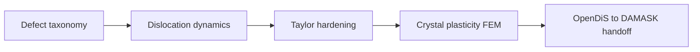

# Part VII — Defects and Dislocations

Parts I–VI described the copper wire as a smooth continuum: displacement fields, stress tensors, finite elements and finite volumes that approximate elliptic and hyperbolic PDEs. That picture is correct at the engineering scale and wrong at the mesoscale, where the wire is a polycrystal full of vacancies, grain boundaries, and dislocation lines that carry plasticity.

This part steps down one rung on the ladder. We classify defects, then follow dislocation dynamics — Peach–Köhler forces, mobility laws, and the forest hardening that makes cold-drawn copper stronger than annealed copper. The continuum moduli and yield surfaces used in Part VI are not fundamental constants; they are **homogenized summaries** of motion at this scale. Parts VIII and IX descend further, to atoms and electrons, to explain where even dislocation theory must borrow its parameters.

Three chapters cover defect taxonomy, dislocation dynamics, and the handoff to crystal plasticity and FEM. The layout follows the **Defects Notes** in [`writings/defects/`](../../writings/defects/): numbered chapters with **Bridge** sections, worked examples tied to the copper wire, and explicit upward links to Part VI (continuum) and downward requests to Part VIII (MD).

## Chapter guide

| Chapter | Wire story beat | Core object | Handoff |
|---------|-----------------|-------------|---------|
| [VII.1](01-defect-taxonomy.md) | Cold drawing left a forest before the test began | Point, line, surface defects; Burgers vector \(\mathbf{b}\) | Peach–Köhler forces → DDD in VII.2 |
| [VII.2](02-dislocation-dynamics.md) | Lines glide under the FEM stress field | Mobility laws, time integration, Taylor hardening | Export \(\rho\), \(\tau(\gamma)\) → crystal plasticity in VII.3 |
| [VII.3](03-polycrystal-and-fem-handoff.md) | OpenDiS statistics feed DAMASK polycrystal FEM | Homogenization, internal variables, mesh handoff | [Bridge to Part VIII](03-polycrystal-and-fem-handoff.md#bridge-to-part-viii) |

Read in order. Each chapter ends with a **Bridge** that states why the next chapter must exist; simulating DDD without defect taxonomy is motion without Burgers geometry; exporting hardening without link statistics is curve-fitting without a forest.

## Scene

[Part VI's intermission](../part06-continuum/04-nonlinear-plasticity-preview.md#intermission-ascent-ends-descent-begins) named the turn: ascent ends, descent begins. The return-mapping Lab act in [VI.4](../part06-continuum/04-nonlinear-plasticity-preview.md#lab-act-return-mapping-on-the-load-cell-knee-act-iv--hardening) fit the load cell knee with phenomenological \(H\) and \(\sigma_{y0}\); the three descent signals in the same chapter — **history** (cold-drawn vs annealed), **mesh-independent hardening failure**, **notch geometry at the core** — are the cues that brought you here. Part VI exhausted what smooth Cauchy fields can say; Part VII names what moves underneath.

Picture the load cell from prologue **Act IV — Hardening** exactly where VI.4 left it: linear climb, yield knee, then upward bend as the grips keep moving. Part VI's \(J_2\) surface made that bend computable; it did not explain **why** the curve bent. Under the mesh the wire is not a uniform material point — it is millions of curved lines, each carrying a Burgers vector, each feeling Peach–Köhler forces from the stress field Part IV computed. Cold drawing did not change \(\mathbb{C}\); it **stored** those lines in a forest whose density \(\rho\) rises with every percent of plastic strain. If **Act II — Warming** ran the conjugate heat transfer loop from [V.4](../part05-fvm/04-navier-stokes-cfd.md#bridge-to-part-vi), the wall temperature \(T_w \approx 379\,\text{K}\) softens mobility before the first plastic increment — Part VII's segment rules must read \(M(\tau, T_w)\), not \(M(\tau, 300\,\text{K})\).

At the engineering scale the wire still satisfies balance laws and virtual work; at the mesoscale it is a forest of line defects whose collective motion we can simulate rather than postulate. Part VII is the first rung where the copper wire stops pretending to be a smooth continuum everywhere — the same specimen, the same afternoon, a smaller state variable.

## Ascent hinge: midpoint and twin ladders {#ascent-hinge-midpoint-and-twin-ladders}

[Part VI's mathematical midpoint](../part06-continuum/00-opening.md#midpoint-ascent-complete-descent-ahead) closes the **ascent** — linear algebra through FEM and FVM discretization complete, Cauchy stress named behind every entry in \(\mathbf{K}\). The [twin ladders reunion](../part06-continuum/00-opening.md#the-twin-ladders-reunite-galerkin-and-conservation) is the last place Galerkin energy (Part IV) and conservation flux (Part V) spoke on one specimen before descent: Joule heating in the wire, convection in the air, and thermal strain \(\varepsilon_{\text{th}} = \alpha\Delta T\) entering virtual work in [VI.2](../part06-continuum/02-stress-balance.md#scale-boundary-handshake-thermal-expansion-alpha) and [VI.3](../part06-continuum/03-variational-elasticity.md#thermal-coupling-act-ii).

Part VII inherits that thermal history. The \(T_w \approx 379\,\text{K}\) from conjugate heat transfer softens dislocation mobility before the first plastic increment — DDD segment rules must read \(M(\tau, T_w)\), not \(M(\tau, 300\,\text{K})\). When Peach–Köhler forces feel disconnected from the FEM stress field, return to [continuity hinge row 4](../appendix/sources.md#continuity-hinges-index-when-the-plot-stutters) (twin ladders reunite at Part VI) and [row 5–6](../appendix/sources.md#continuity-hinges-index-when-the-plot-stutters) (midpoint → descent). The [epilogue Handshake 3](../epilogue/multiscale.md#handshake-3--thermal-strain--mechanical-stiffness-part-vi--iv) is the workflow-order export of the same thermal strain Part VI wrote into balance laws — Act III's fixed-grip load cell reads that pre-stress before Part VII's forest bends the curve in Act IV.

## The descent in one paragraph

Read this once if you paused after Part VI and wonder why the book now leaves the continuum floor — every chapter below unpacks one mesoscopic or finer beat of the same copper wire.

Cold-drawn copper is not a uniform elastic solid. It is a polycrystal full of line defects whose forest density \(\rho\) rose during drawing and keeps rising under load. Part VII names those defects, simulates their motion with Peach–Köhler forces and mobility laws, and exports hardening laws the phenomenological \(J_2\) fit in Part VI could only approximate. [Part VIII's atomistic preview](../part08-md/00-opening.md#the-atomistic-descent-in-one-paragraph) resolves atoms at notches and fits interatomic potentials on those exports; [Part IX's electronic floor](../part09-dft/00-opening.md#the-electronic-floor-in-one-paragraph) audits those potentials from electron density — the floor of the prologue's ladder. The [epilogue](../epilogue/multiscale.md) wires every export into handshakes no single code runs alone. Ascent taught discretization; descent teaches **pedigree**. The [preface descent continuity hinges](../preface.md#descent-continuity-hinges) name the three turns within Parts VII–IX — mesoscale to atomistic at [VII.3](03-polycrystal-and-fem-handoff.md#bridge-to-part-viii), atomistic to electronic at [VIII.3](../part08-md/03-ab-initio-and-coarse-graining.md#bridge-to-part-ix), electronic to coupling at [IX.3](../part09-dft/03-dft-workflows.md#bridge-to-the-epilogue).

Recall the prologue's processing history: **drawing** through dies increases dislocation density and aligns grains; **annealing** lets vacancies diffuse and lines rearrange. Part VI's nonlinear plasticity preview fit phenomenological hardening parameters \(H\) and \(\sigma_{y0}\) without naming the forest that produces them. Part VII names the forest — and shows how dislocation dynamics turns cold-work history into exportable internal variables for crystal plasticity FEM.

## The concept map

| Question | Example in this part |
|----------|----------------------|
| What **object** are we studying? | Dislocation lines, Burgers vector \(\mathbf{b}\), dislocation density \(\rho\) |
| What **structure** does it add? | Peach–Köhler forces, mobility laws, link statistics |
| What **theorem** becomes possible? | Taylor hardening, DDD time integration, homogenization to crystal plasticity |
| What **breaks** if structure is missing? | Core singularity, wrong hardening law, non-physical yield without forest structure |

**Baby picture:** name the line defects that carry plasticity, simulate their motion with elastic superposition and mobility tables, extract hardening laws and link statistics, then export internal variables to polycrystal FEM. The drawn copper wire is stronger because of this forest, not because \(\mathbf{K}\) changed.

## How Part VII connects to Parts VI–IX

Part VII is the **mesoscale export contract** crystal plasticity and atomistic audits must honor:

| Part VII chapter | Structure or theorem | Where it reappears |
|-----------------|---------------------|-------------------|
| VII.1 Defect taxonomy | Burgers vector \(\mathbf{b}\); core structure | Part VIII dislocation cores in MD |
| VII.2 Dislocation dynamics | Peach–Köhler; Taylor hardening | Part VI \(J_2\) hardening; Part IV internal variables |
| VII.3 Polycrystal handoff | OpenDiS → DAMASK → FEM | Epilogue multiscale workflow; Part IV Gauss points |

Part VI fitted phenomenological yield; Part VII generates the hardening curve from line motion. Part VIII resolves cores and fits potentials; Part IX audits those potentials from electron density. Every export upward carries \(\rho\), \(\tau(\gamma)\), or mobility tables — never bare curve fits without forest statistics.

## Representative schematics (Defects Notes)

The [Defects & Disorders Notes](https://hanfengzhai.github.io/file/defects_notes.pdf) mirror Part II's concept-map layout: each schematic is a baby picture of the mesoscale pipeline. Use them as a visual index while reading:

| Schematic | Idea | Chapter in this part |
|-----------|------|----------------------|
| 1 | Defect taxonomy: point, line, surface; Burgers vector and core structure | [VII.1](01-defect-taxonomy.md) |
| 2 | Dislocation dynamics: Peach–Köhler forces, mobility laws, time integration | [VII.2](02-dislocation-dynamics.md) |
| 3 | Taylor hardening, link statistics, OpenDiS → DAMASK → polycrystal FEM handoff | [VII.3](03-polycrystal-and-fem-handoff.md) |

Each schematic answers the four concept-map questions for one mesoscale layer. When a yield surface feels like a fitted curve rather than physics, return to the matching row: *what object, what structure, what theorem, what breaks?* Part VI's J₂ plasticity preview fit \(H\) and \(\sigma_{y0}\); Part VII shows where those numbers hide their history in line motion.

## Story so far (Parts I–VI)

The climb upward is complete for the **continuum floor**. Every rung below Part VII exported numbers upward; Part VII is the first descent that explains where those numbers hid their history:

| Part | Scale | Wire story beat |
|------|-------|-----------------|
| I–III | Mathematics | Springs → fields → weak PDEs |
| IV–V | Discretization | FEM solid mesh; FVM cooling air (optional) |
| VI | Continuum physics | \(\mathbf{F}\), \(\boldsymbol{\sigma}\), virtual work; J₂ plasticity **preview** with fitted \(H\), \(\sigma_y\) |

Part VI admitted that cold-drawn copper work-hardens and that notch roots break smooth-field assumptions — but it could not **simulate** the dislocation forest that drawing created. Phenomenological plasticity fits curves; dislocation dynamics **generates** the curves from line motion. The prologue's processing history (draw, anneal, load) now gets a mesoscale narrator: Burgers vectors, Peach–Köhler forces, Taylor \(\sqrt{\rho}\) hardening. Parts VIII–IX will ask where mobility and stacking-fault energy come from; Part VII asks how plasticity **moves** before we shrink to atoms and electrons.

## Closing the arc from Part VI

If you have read linearly since the prologue, [Part VI's intermission](../part06-continuum/04-nonlinear-plasticity-preview.md#intermission-ascent-ends-descent-begins) named the hinge where ascent ends and descent begins — smooth elasticity exhausted, phenomenological \(J_2\) placeholders awaiting a forest. Part VII is the first **descent** that explains where those parameters hide their history:

| Part VI (continuum on the wire) | Part VII (dislocations on the wire) |
|---------------------------------|-------------------------------------|
| Cauchy stress \(\boldsymbol{\sigma}\); virtual work | Peach–Köhler force on each line segment |
| \(J_2\) yield surface with fitted \(H\), \(\sigma_{y0}\) | Forest density \(\rho\); Taylor \(\tau \propto \sqrt{\rho}\) hardening |
| Isotropic hardening internal variable \(\alpha\) | Link-length statistics from DDD time integration |
| Cutoff-regularized singularities at notches | Line defects with Burgers vector \(\mathbf{b}\) and mobility law |
| [VI.4 Bridge](04-nonlinear-plasticity-preview.md#bridge-to-part-vii) names the hinge | [VII.1](01-defect-taxonomy.md) opens the defect catalog |

Part VI's return-mapping loop made the load cell curve bend upward with phenomenological \(H\); Part VII shows **why** the curve bends — dislocation lines multiply, tangle, and glide under the stress field Part IV computed on the mesh. Cold drawing did not change Young's modulus; it **stored** lines in a forest whose density rises with plastic strain. The copper wire that satisfied balance laws and virtual work at the engineering scale is now a polycrystal whose strength is a **homogenized summary** of mesoscale motion. Parts VIII–IX will ask what sets mobility and core energy; Part VII asks how plasticity propagates before we shrink to atoms and electrons.

## Scale boundary worked example: FEM stress → Peach–Köhler force

Part VI's J₂ plasticity preview consumed **homogenized** stress at each Gauss point. Part VII's DDD consumes the **same** Cauchy tensor — but exports it from a different code at a different resolution. The handshake is not file-format magic; it is a unit-checked map from continuum FEM to line-segment driving forces.

**Setup.** Take the drawn copper wire at 50 N axial load (Act III, Part IV mesh). A tetrahedral cylinder mesh with \(N \sim 10^5\) nodes yields Cauchy stress \(\boldsymbol{\sigma}_h(\mathbf{x})\) at Gauss points. Extract a **single-crystal RVE** — a cube of side \(L_{\text{RVE}} = 2\,\mu\text{m}\) centered at mid-span where texture is approximately uniform — and sample the resolved shear stress on the twelve fcc slip systems:

\[
\tau^{(\alpha)} = \mathbf{s}^{(\alpha)} \cdot \boldsymbol{\sigma}_h \,\mathbf{m}^{(\alpha)},
\]

where \(\mathbf{s}^{(\alpha)}\) is the slip direction and \(\mathbf{m}^{(\alpha)}\) the slip-plane normal for system \(\alpha\).

**Export contract.**

| FEM export | DDD import | Unit check |
|------------|------------|------------|
| \(\boldsymbol{\sigma}_h\) at RVE centroid (Voigt: \(\sigma_{11}, \ldots, \sigma_{23}\)) | External stress tensor in OpenDiS input deck | Pa (not MPa) |
| Temperature \(T_w\) from conjugate heat transfer (Part V) | Mobility \(M(\tau, T)\) table lookup | K |
| Strain rate \(\dot\varepsilon = 10^{-3}\,\text{s}^{-1}\) from grip ramp | Imposed RVE boundary strain rate | s\(^{-1}\) |
| Grain orientation (EBSD or synthetic) | Rotation of slip systems \(\mathbf{s}^{(\alpha)}, \mathbf{m}^{(\alpha)}\) | radians or quaternion |

**Peach–Köhler on one segment.** An edge dislocation on system \(\alpha\) with Burgers vector \(\mathbf{b} = b\,\mathbf{s}^{(\alpha)}\) and line direction \(\boldsymbol{\xi}\) feels force per unit length

\[
\mathbf{f}_{\text{PK}} = (\boldsymbol{\sigma}_h \cdot \mathbf{b}) \times \boldsymbol{\xi}.
\]

For a screw segment (\(\boldsymbol{\xi} \parallel \mathbf{b}\)) under uniaxial tension \(\sigma_{11} = 6.4\,\text{MPa}\), the resolved shear \(\tau^{(\alpha)} \approx 2.8\,\text{MPa}\) on the primary slip system drives glide at velocity \(\dot{\mathbf{r}} = M(\tau, T)\,\mathbf{f}_{\text{PK}}\). With tabulated mobility \(M \sim 10^{-10}\,\text{m}^2/(\text{Pa·s})\) at room temperature, segment speeds are order \(10^{-3}\)–\(10^{-2}\,\text{m/s}\) — slow enough that quasi-static DDD is valid, fast enough that forest evolution is visible over a 2% strain run.

**Convergence at the interface.** The RVE stress must be **mesh-independent** before DDD trusts it:

| FEM mesh | \(\sigma_{11}\) at RVE center | \(\tau^{(1)}\) on primary slip system | DDD segment count |
|----------|------------------------------|---------------------------------------|-------------------|
| Coarse (\(h \approx 50\,\mu\text{m}\)) | 6.1 MPa | 2.6 MPa | 200 segments |
| Medium (\(h \approx 10\,\mu\text{m}\)) | 6.35 MPa | 2.75 MPa | 800 segments |
| Fine (\(h \approx 2\,\mu\text{m}\)) | 6.40 MPa | 2.78 MPa | 3200 segments |

When \(\sigma_{11}\) changes by less than 1% between medium and fine meshes, export the fine value to OpenDiS. When DDD segment density doubles and \(\bar\tau\) from Taylor averaging shifts by less than 2%, the mesoscale run has converged. **Both** sides must pass — converged FEM stress with unconverged DDD statistics still produces a wrong hardening law.

**What breaks without the handshake.**

| Failure mode | Symptom | Fix |
|--------------|---------|-----|
| MPa exported as Pa | Segments glide at unrealistic speed | Multiply by \(10^6\) at import |
| Wrong grain orientation | Active slip system misidentified | Apply EBSD rotation to \(\mathbf{s}^{(\alpha)}\) |
| RVE too small (\(L < 10 b/\sqrt{\rho}\)) | Image stress artifacts | Enlarge RVE or use periodic BCs |
| Elastic \(\boldsymbol{\sigma}\) fed after yield | Peach–Köhler force too low | Export from J₂ return-mapped stress (Part VI) |

This example is Handshake 0 on the descent ladder — the same **export discipline** conjugate heat transfer practiced at the solid–fluid wall, now for stress tensors at a crystal RVE. [VII.2](02-dislocation-dynamics.md) simulates the forest that grows under this driving field; [VII.3](03-polycrystal-and-fem-handoff.md) exports the resulting \(\tau(\gamma)\) back to the FEM mesh Part IV assembled.

## Closing the arc from Part I

If you have read linearly since the prologue, notice how the **same four questions** reappear here with mesoscale vocabulary — and how the **same mathematical habits** from Part I return on a network of line segments:

| Part I (springs on the wire) | Part VII (dislocations on the wire) |
|------------------------------|-------------------------------------|
| State vector \(\mathbf{u}\) | Dislocation segment positions and Burgers vectors |
| Local stiffness coupling neighbors | Elastic field superposition from each segment |
| Eigenmodes decouple vibration | Slip systems decouple (approximately) under Taylor hardening |
| \(\mathbf{K}\mathbf{u}=\mathbf{f}\) at equilibrium | Peach–Köhler force balance + mobility law at quasi-steady glide |
| Refinement sends \(N\to\infty\) | Finer segments resolve curvature; statistics converge to \(\rho\), \(\tau(\gamma)\) |

Part IV assembled \(\mathbf{K}\) from element matrices; Part VII assembles **hardening laws** from link-length statistics and dislocation density. Part VI's J₂ plasticity preview fit \(H\) and \(\sigma_{y0}\) without naming the forest; Part VII names the forest and shows how cold drawing wrote its history into line defects. The copper wire that began as a spring network now yields because **lines move**, not because a yield surface appeared by decree. Parts VIII–IX will ask what sets mobility and core energy; Part VII asks how plasticity propagates before we shrink to atoms and electrons.

## Lab act: IV — Hardening

**Act IV** is the moment the force–displacement curve bends upward — more force for each increment of stretch. Cold drawing left a dislocation forest in the wire before the test began; Part VII is where that **history** becomes visible in the simulation. When Taylor hardening or DDD time integration feels abstract, return to the load cell: the bend is not a magic constant in a yield surface; it is collective line motion the chapters below make computable.

### What you should be able to do after Part VII

Each chapter adds one move to the mesoscale pipeline that turns phenomenological hardening into exportable internal variables:

| After chapter | Skill on the copper wire | Minimal artifact |
|---------------|--------------------------|------------------|
| VII.1 | Classify point, line, surface defects; draw Burgers vector on a slip plane | Edge vs screw; \(\mathbf{b} = \oint d\mathbf{u}\) |
| VII.2 | State Peach–Köhler force; sketch mobility law and DDD time step | \(\mathbf{f}_{\text{PK}} = (\boldsymbol{\sigma}\cdot\mathbf{b}) \times \boldsymbol{\xi}\); \(\dot{\mathbf{r}} = M \mathbf{f}_{\text{PK}}\) |
| VII.3 | Export Taylor hardening \(\tau(\gamma)\) and link statistics to crystal plasticity FEM | \(\tau = \alpha \mu b \sqrt{\rho}\); OpenDiS → DAMASK yaml |

None of these require a production polycrystal run — but each one is the mechanism behind Part VI's fitted \(H\). If you can name the forest that cold drawing stored, explain why \(\tau \propto \sqrt{\rho}\), and sketch the handoff from DDD statistics to FEM internal variables, you have the mesoscale narrator for Act IV's upward bend.

## Bridge

Part VI closed with variational elasticity: energy minimization and virtual work for **smooth** fields. The drawn copper wire violates that smoothness at the mesoscale — dislocation lines, grain boundaries, and vacancy clusters are the mechanisms behind **Act IV** hardening on the load cell. Part VII is the first **descent** on the prologue ladder: the same specimen, a smaller state variable, export discipline unchanged.

| What Part VI left phenomenological | What Part VII makes computable |
|------------------------------------|--------------------------------|
| \(J_2\) yield surface with fitted \(H\), \(\sigma_{y0}\) | Forest density \(\rho\); Taylor \(\tau \propto \sqrt{\rho}\) hardening |
| Isotropic hardening internal variable \(\alpha\) | Link-length statistics from DDD time integration |
| Cutoff-regularized singularities at notches | Line defects with Burgers vector \(\mathbf{b}\) and mobility law |
| [VI.4 Bridge](../part06-continuum/04-nonlinear-plasticity-preview.md#bridge-to-part-vii) names the hinge | OpenDiS → DAMASK → polycrystal FEM handoff in [VII.3](03-polycrystal-and-fem-handoff.md) |

The three chapters below follow the **Defects Notes** layout: [VII.1](01-defect-taxonomy.md) names point, line, and surface defects on the wire's polycrystal; [VII.2](02-dislocation-dynamics.md) simulates Peach–Köhler glide and forest evolution; [VII.3](03-polycrystal-and-fem-handoff.md) exports hardening laws to the same mesh Part IV assembled. Cold drawing did not change Young's modulus; it **stored** lines whose collective motion bends the force–displacement curve upward.

Return to **Act IV** in the [prologue](../../prologue/00-many-scales.md): the bend is not a magic constant in a yield surface — it is dislocation motion under the stress field Part IV computed. Parts VIII–IX will ask what sets mobility and stacking-fault energy; Part VII asks how plasticity **propagates** before we shrink to atoms and electrons.

Turn the page when phenomenological hardening feels like curve-fitting — defect taxonomy is where the wire's strength acquires a geometry.
