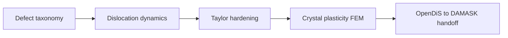

# Part VII — Defects and Dislocations

Parts I–VI described the copper wire as a smooth continuum: displacement fields, stress tensors, finite elements and finite volumes that approximate elliptic and hyperbolic PDEs. That picture is correct at the engineering scale and wrong at the mesoscale, where the wire is a polycrystal full of vacancies, grain boundaries, and dislocation lines that carry plasticity.

This part steps down one rung on the ladder. We classify defects, then follow dislocation dynamics — Peach–Köhler forces, mobility laws, and the forest hardening that makes cold-drawn copper stronger than annealed copper. The continuum moduli and yield surfaces used in Part VI are not fundamental constants; they are **homogenized summaries** of motion at this scale. Parts VIII and IX descend further, to atoms and electrons, to explain where even dislocation theory must borrow its parameters.

Three chapters cover defect taxonomy, dislocation dynamics, and the handoff to crystal plasticity and FEM. The layout follows the **Defects Notes** in [`writings/defects/`](../../writings/defects/): numbered chapters with **Bridge** sections, worked examples tied to the copper wire, and explicit upward links to Part VI (continuum) and downward requests to Part VIII (MD).

## Where we left the wire

Part VI closed with nonlinear elasticity and the admission that cold-drawn copper work-hardens — its yield surface rises, its texture evolves, and notch roots concentrate stress until smooth fields lie. None of that history lives in the elastic modulus \(\mathbb{C}\) alone; it lives in **defects**: dislocation lines tangled by drawing, grain boundaries from polycrystal structure, vacancies left by processing.

At the engineering scale the wire still satisfies balance laws and virtual work; at the mesoscale it is a forest of line defects whose collective motion we can simulate rather than postulate. Part VII is the first rung where the copper wire stops pretending to be a smooth continuum everywhere.

Recall the prologue's processing history: **drawing** through dies increases dislocation density and aligns grains; **annealing** lets vacancies diffuse and lines rearrange. Part VI's nonlinear plasticity preview fit phenomenological hardening parameters \(H\) and \(\sigma_{y0}\) without naming the forest that produces them. Part VII names the forest — and shows how dislocation dynamics turns cold-work history into exportable internal variables for crystal plasticity FEM.

## The concept map

| Question | Example in this part |
|----------|----------------------|
| What **object** are we studying? | Dislocation lines, Burgers vector \(\mathbf{b}\), dislocation density \(\rho\) |
| What **structure** does it add? | Peach–Köhler forces, mobility laws, link statistics |
| What **theorem** becomes possible? | Taylor hardening, DDD time integration, homogenization to crystal plasticity |
| What **breaks** if structure is missing? | Core singularity, wrong hardening law, non-physical yield without forest structure |

**Baby picture:** name the line defects that carry plasticity, simulate their motion with elastic superposition and mobility tables, extract hardening laws and link statistics, then export internal variables to polycrystal FEM. The drawn copper wire is stronger because of this forest, not because \(\mathbf{K}\) changed.

## Bridge

Part VI closed with variational elasticity: energy minimization and virtual work for smooth fields. The drawn copper wire violates that smoothness at the mesoscale — dislocation lines, grain boundaries, and vacancy clusters are the mechanisms behind yield and work hardening. The next chapter names those structures; the one after simulates their motion.
