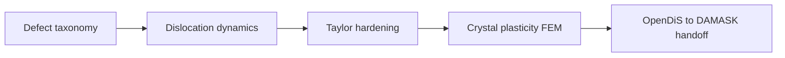

# Part VII — Defects and Dislocations

Parts I–VI described the copper wire as a smooth continuum: displacement fields, stress tensors, finite elements and finite volumes that approximate elliptic and hyperbolic PDEs. That picture is correct at the engineering scale and wrong at the mesoscale, where the wire is a polycrystal full of vacancies, grain boundaries, and dislocation lines that carry plasticity.

This part steps down one rung on the ladder. We classify defects, then follow dislocation dynamics — Peach–Köhler forces, mobility laws, and the forest hardening that makes cold-drawn copper stronger than annealed copper. The continuum moduli and yield surfaces used in Part VI are not fundamental constants; they are **homogenized summaries** of motion at this scale. Parts VIII and IX descend further, to atoms and electrons, to explain where even dislocation theory must borrow its parameters.

Three chapters cover defect taxonomy, dislocation dynamics, and the handoff to crystal plasticity and FEM. The layout follows the **Defects Notes** in [`writings/defects/`](../../writings/defects/): numbered chapters with **Bridge** sections, worked examples tied to the copper wire, and explicit upward links to Part VI (continuum) and downward requests to Part VIII (MD).

## Chapter guide

| Chapter | Wire story beat | Core object | Handoff |
|---------|-----------------|-------------|---------|
| [VII.1](01-defect-taxonomy.md) | Cold drawing left a forest before the test began | Point, line, surface defects; Burgers vector \(\mathbf{b}\) | Peach–Köhler forces → DDD in VII.2 |
| [VII.2](02-dislocation-dynamics.md) | Lines glide under the FEM stress field | Mobility laws, time integration, Taylor hardening | Export \(\rho\), \(\tau(\gamma)\) → crystal plasticity in VII.3 |
| [VII.3](03-polycrystal-and-fem-handoff.md) | OpenDiS statistics feed DAMASK polycrystal FEM | Homogenization, internal variables, mesh handoff | [Bridge to Part VIII](03-polycrystal-and-fem-handoff.md#bridge-to-part-viii) |

Read in order. Each chapter ends with a **Bridge** that states why the next chapter must exist; simulating DDD without defect taxonomy is motion without Burgers geometry; exporting hardening without link statistics is curve-fitting without a forest.

## Scene

Part VI closed with nonlinear elasticity and the admission that cold-drawn copper work-hardens — its yield surface rises, its texture evolves, and notch roots concentrate stress until smooth fields lie. None of that history lives in the elastic modulus \(\mathbb{C}\) alone; it lives in **defects**: dislocation lines tangled by drawing, grain boundaries from polycrystal structure, vacancies left by processing.

Picture the load cell from prologue **Act IV — Hardening**: the force–displacement curve was linear at first, then bent upward as the grips kept moving. Part VI fitted that bend with a \(J_2\) yield surface and isotropic hardening modulus \(H\). Under the mesh, however, the wire is not a uniform material point — it is millions of curved lines, each carrying a Burgers vector, each feeling Peach–Köhler forces from the stress field Part IV computed. Cold drawing did not change \(\mathbb{C}\); it **stored** those lines in a forest whose density \(\rho\) rises with every percent of plastic strain.

At the engineering scale the wire still satisfies balance laws and virtual work; at the mesoscale it is a forest of line defects whose collective motion we can simulate rather than postulate. Part VII is the first rung where the copper wire stops pretending to be a smooth continuum everywhere.

Recall the prologue's processing history: **drawing** through dies increases dislocation density and aligns grains; **annealing** lets vacancies diffuse and lines rearrange. Part VI's nonlinear plasticity preview fit phenomenological hardening parameters \(H\) and \(\sigma_{y0}\) without naming the forest that produces them. Part VII names the forest — and shows how dislocation dynamics turns cold-work history into exportable internal variables for crystal plasticity FEM.

## The concept map

| Question | Example in this part |
|----------|----------------------|
| What **object** are we studying? | Dislocation lines, Burgers vector \(\mathbf{b}\), dislocation density \(\rho\) |
| What **structure** does it add? | Peach–Köhler forces, mobility laws, link statistics |
| What **theorem** becomes possible? | Taylor hardening, DDD time integration, homogenization to crystal plasticity |
| What **breaks** if structure is missing? | Core singularity, wrong hardening law, non-physical yield without forest structure |

**Baby picture:** name the line defects that carry plasticity, simulate their motion with elastic superposition and mobility tables, extract hardening laws and link statistics, then export internal variables to polycrystal FEM. The drawn copper wire is stronger because of this forest, not because \(\mathbf{K}\) changed.

## Representative schematics (Defects Notes)

The [Defects & Disorders Notes](https://hanfengzhai.github.io/file/defects_notes.pdf) mirror Part II's concept-map layout: each schematic is a baby picture of the mesoscale pipeline. Use them as a visual index while reading:

| Schematic | Idea | Chapter in this part |
|-----------|------|----------------------|
| 1 | Defect taxonomy: point, line, surface; Burgers vector and core structure | [VII.1](01-defect-taxonomy.md) |
| 2 | Dislocation dynamics: Peach–Köhler forces, mobility laws, time integration | [VII.2](02-dislocation-dynamics.md) |
| 3 | Taylor hardening, link statistics, OpenDiS → DAMASK → polycrystal FEM handoff | [VII.3](03-polycrystal-and-fem-handoff.md) |

Each schematic answers the four concept-map questions for one mesoscale layer. When a yield surface feels like a fitted curve rather than physics, return to the matching row: *what object, what structure, what theorem, what breaks?* Part VI's J₂ plasticity preview fit \(H\) and \(\sigma_{y0}\); Part VII shows where those numbers hide their history in line motion.

## Story so far (Parts I–VI)

The climb upward is complete for the **continuum floor**. Every rung below Part VII exported numbers upward; Part VII is the first descent that explains where those numbers hid their history:

| Part | Scale | Wire story beat |
|------|-------|-----------------|
| I–III | Mathematics | Springs → fields → weak PDEs |
| IV–V | Discretization | FEM solid mesh; FVM cooling air (optional) |
| VI | Continuum physics | \(\mathbf{F}\), \(\boldsymbol{\sigma}\), virtual work; J₂ plasticity **preview** with fitted \(H\), \(\sigma_y\) |

Part VI admitted that cold-drawn copper work-hardens and that notch roots break smooth-field assumptions — but it could not **simulate** the dislocation forest that drawing created. Phenomenological plasticity fits curves; dislocation dynamics **generates** the curves from line motion. The prologue's processing history (draw, anneal, load) now gets a mesoscale narrator: Burgers vectors, Peach–Köhler forces, Taylor \(\sqrt{\rho}\) hardening. Parts VIII–IX will ask where mobility and stacking-fault energy come from; Part VII asks how plasticity **moves** before we shrink to atoms and electrons.

## Closing the arc from Part VI

If you have read linearly since the prologue, Part VI's closing checkpoint named the continuum fields and admitted that **smooth elasticity ends at defects**. Part VII is the first **descent** that explains where phenomenological parameters hide their history:

| Part VI (continuum on the wire) | Part VII (dislocations on the wire) |
|---------------------------------|-------------------------------------|
| Cauchy stress \(\boldsymbol{\sigma}\); virtual work | Peach–Köhler force on each line segment |
| \(J_2\) yield surface with fitted \(H\), \(\sigma_{y0}\) | Forest density \(\rho\); Taylor \(\tau \propto \sqrt{\rho}\) hardening |
| Isotropic hardening internal variable \(\alpha\) | Link-length statistics from DDD time integration |
| Cutoff-regularized singularities at notches | Line defects with Burgers vector \(\mathbf{b}\) and mobility law |
| [VI.4 Bridge](04-nonlinear-plasticity-preview.md#bridge-to-part-vii) names the hinge | [VII.1](01-defect-taxonomy.md) opens the defect catalog |

Part VI's return-mapping loop made the load cell curve bend upward with phenomenological \(H\); Part VII shows **why** the curve bends — dislocation lines multiply, tangle, and glide under the stress field Part IV computed on the mesh. Cold drawing did not change Young's modulus; it **stored** lines in a forest whose density rises with plastic strain. The copper wire that satisfied balance laws and virtual work at the engineering scale is now a polycrystal whose strength is a **homogenized summary** of mesoscale motion. Parts VIII–IX will ask what sets mobility and core energy; Part VII asks how plasticity propagates before we shrink to atoms and electrons.

## Closing the arc from Part I

If you have read linearly since the prologue, notice how the **same four questions** reappear here with mesoscale vocabulary — and how the **same mathematical habits** from Part I return on a network of line segments:

| Part I (springs on the wire) | Part VII (dislocations on the wire) |
|------------------------------|-------------------------------------|
| State vector \(\mathbf{u}\) | Dislocation segment positions and Burgers vectors |
| Local stiffness coupling neighbors | Elastic field superposition from each segment |
| Eigenmodes decouple vibration | Slip systems decouple (approximately) under Taylor hardening |
| \(\mathbf{K}\mathbf{u}=\mathbf{f}\) at equilibrium | Peach–Köhler force balance + mobility law at quasi-steady glide |
| Refinement sends \(N\to\infty\) | Finer segments resolve curvature; statistics converge to \(\rho\), \(\tau(\gamma)\) |

Part IV assembled \(\mathbf{K}\) from element matrices; Part VII assembles **hardening laws** from link-length statistics and dislocation density. Part VI's J₂ plasticity preview fit \(H\) and \(\sigma_{y0}\) without naming the forest; Part VII names the forest and shows how cold drawing wrote its history into line defects. The copper wire that began as a spring network now yields because **lines move**, not because a yield surface appeared by decree. Parts VIII–IX will ask what sets mobility and core energy; Part VII asks how plasticity propagates before we shrink to atoms and electrons.

## Lab act: IV — Hardening

**Act IV** is the moment the force–displacement curve bends upward — more force for each increment of stretch. Cold drawing left a dislocation forest in the wire before the test began; Part VII is where that **history** becomes visible in the simulation. When Taylor hardening or DDD time integration feels abstract, return to the load cell: the bend is not a magic constant in a yield surface; it is collective line motion the chapters below make computable.

### What you should be able to do after Part VII

Each chapter adds one move to the mesoscale pipeline that turns phenomenological hardening into exportable internal variables:

| After chapter | Skill on the copper wire | Minimal artifact |
|---------------|--------------------------|------------------|
| VII.1 | Classify point, line, surface defects; draw Burgers vector on a slip plane | Edge vs screw; \(\mathbf{b} = \oint d\mathbf{u}\) |
| VII.2 | State Peach–Köhler force; sketch mobility law and DDD time step | \(\mathbf{f}_{\text{PK}} = (\boldsymbol{\sigma}\cdot\mathbf{b}) \times \boldsymbol{\xi}\); \(\dot{\mathbf{r}} = M \mathbf{f}_{\text{PK}}\) |
| VII.3 | Export Taylor hardening \(\tau(\gamma)\) and link statistics to crystal plasticity FEM | \(\tau = \alpha \mu b \sqrt{\rho}\); OpenDiS → DAMASK yaml |

None of these require a production polycrystal run — but each one is the mechanism behind Part VI's fitted \(H\). If you can name the forest that cold drawing stored, explain why \(\tau \propto \sqrt{\rho}\), and sketch the handoff from DDD statistics to FEM internal variables, you have the mesoscale narrator for Act IV's upward bend.

## Bridge

Part VI closed with variational elasticity: energy minimization and virtual work for **smooth** fields. The drawn copper wire violates that smoothness at the mesoscale — dislocation lines, grain boundaries, and vacancy clusters are the mechanisms behind **Act IV** hardening on the load cell. Part VII is the first **descent** on the prologue ladder: the same specimen, a smaller state variable, export discipline unchanged.

| What Part VI left phenomenological | What Part VII makes computable |
|------------------------------------|--------------------------------|
| \(J_2\) yield surface with fitted \(H\), \(\sigma_{y0}\) | Forest density \(\rho\); Taylor \(\tau \propto \sqrt{\rho}\) hardening |
| Isotropic hardening internal variable \(\alpha\) | Link-length statistics from DDD time integration |
| Cutoff-regularized singularities at notches | Line defects with Burgers vector \(\mathbf{b}\) and mobility law |
| [VI.4 Bridge](../part06-continuum/04-nonlinear-plasticity-preview.md#bridge-to-part-vii) names the hinge | OpenDiS → DAMASK → polycrystal FEM handoff in [VII.3](03-polycrystal-and-fem-handoff.md) |

The three chapters below follow the **Defects Notes** layout: [VII.1](01-defect-taxonomy.md) names point, line, and surface defects on the wire's polycrystal; [VII.2](02-dislocation-dynamics.md) simulates Peach–Köhler glide and forest evolution; [VII.3](03-polycrystal-and-fem-handoff.md) exports hardening laws to the same mesh Part IV assembled. Cold drawing did not change Young's modulus; it **stored** lines whose collective motion bends the force–displacement curve upward.

Return to **Act IV** in the [prologue](../../prologue/00-many-scales.md): the bend is not a magic constant in a yield surface — it is dislocation motion under the stress field Part IV computed. Parts VIII–IX will ask what sets mobility and stacking-fault energy; Part VII asks how plasticity **propagates** before we shrink to atoms and electrons.

Turn the page when phenomenological hardening feels like curve-fitting — defect taxonomy is where the wire's strength acquires a geometry.
