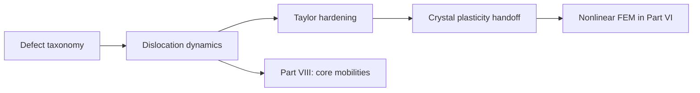

# Part VII — Defects and Dislocations

Parts I–VI described the copper wire as a smooth continuum: displacement fields, stress tensors, finite elements and finite volumes that approximate elliptic and hyperbolic PDEs. That picture is correct at the engineering scale and wrong at the mesoscale, where the wire is a polycrystal full of vacancies, grain boundaries, and dislocation lines that carry plasticity.

This part steps down one rung on the ladder. We classify defects, then follow dislocation dynamics — Peach–Köhler forces, mobility laws, and the forest hardening that makes cold-drawn copper stronger than annealed copper. The continuum moduli and yield surfaces used in Part VI are not fundamental constants; they are **homogenized summaries** of motion at this scale. Parts VIII and IX descend further, to atoms and electrons, to explain where even dislocation theory must borrow its parameters.

## The concept map (defects notes)

| Question | Example in this part |
|----------|----------------------|
| What **object** are we studying? | Dislocation lines with Burgers vector \(\mathbf{b}\), defect taxonomy |
| What **structure** does it add? | Peach–Köhler forces; mobility laws; Taylor hardening \(\tau \propto \sqrt{\rho}\) |
| What **theorem** becomes possible? | Forest hardening; RVE homogenization to crystal plasticity |
| What **breaks** if structure is missing? | Singular elastic fields at cores; wrong yield without \(\rho\) history |

**Baby picture:** replace smooth displacement with a network of moving line defects; export hardening laws upward to continuum plasticity and borrow core parameters downward from MD.

## Bridge

Part VI closed with variational elasticity: energy minimization and virtual work for smooth fields. The drawn copper wire violates that smoothness at the mesoscale — dislocation lines, grain boundaries, and vacancy clusters are the mechanisms behind yield and work hardening. The next chapter names those structures; the one after simulates their motion.
