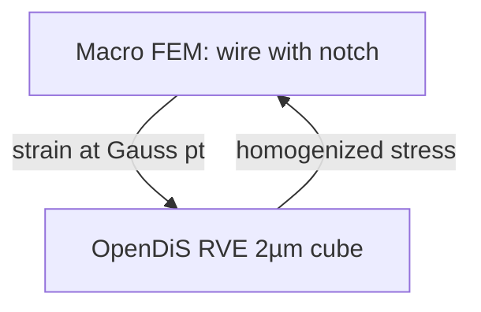

# From DDD to Crystal Plasticity and FEM

Dislocation dynamics resolves individual lines in an elastic medium — powerful for single-crystal shear, insufficient for a full polycrystalline wire without homogenization. This chapter closes Part VII by asking how mesoscale simulations **export** their statistics to the crystal plasticity and finite element models of Parts IV and VI, and where **Peierls barriers** and **grain boundaries** force us to borrow parameters from finer scales.

The cold-drawn copper wire is not a single crystal. It is thousands of grains, each with its own slip systems, dislocation content, and orientation. DDD on one crystal explains one mechanism; engineering FEM needs **texture**, **hardening laws**, and **internal state variables** that summarize what DDD (or experiment) teaches.

## Story so far (Parts I–VII.2)

| Stage | Mesoscale object | Wire instance |
|-------|------------------|---------------|
| Parts I–VI | Continuum FEM; \(\boldsymbol{\sigma}\), virtual work | Load cell curve in elastic regime |
| [VII.1](01-defect-taxonomy.md) | Point, line, surface defects | Cold-drawn forest before the test |
| [VII.2](02-dislocation-dynamics.md) | Peach–Köhler motion; Taylor \(\tau(\rho)\) | Act IV hardening from line statistics |
| **VII.3 (here)** | Polycrystal homogenization; FEM handoff | Texture + internal variables on the mesh |

[VII.2](02-dislocation-dynamics.md) followed individual lines under resolved shear. This chapter closes Part VII by asking how DDD statistics **export upward** — crystal plasticity, internal state variables, Peierls parameters borrowed from MD — and where homogenization fails at notches. Part VIII supplies the atomic **ink** behind mobility tables and stacking-fault energies.

## Scene: from one crystal to a spool of wire

A single-crystal DDD run explains how one slip system hardens under shear. The cold-drawn wire on the bench is thousands of grains twisted by drawing dies — texture, misorientation, grain-boundary barriers. This chapter asks how DDD statistics export upward: hardening laws for crystal plasticity, internal state variables for FEM, Peierls parameters borrowed from MD. The wire experiment is polycrystalline; the multiscale pipeline must be too.

## Peierls stress and lattice resistance

Before external load moves a dislocation, the lattice itself resists glide. The **Peierls–Nabarro** model estimates the stress required to move a straight screw or edge dislocation through a perfect lattice:

\[
\tau_P \approx \frac{2\mu}{1-\nu} \exp\!\left(-\frac{2\pi w}{b}\right),
\]

where \(\mu\) is shear modulus, \(\nu\) is Poisson's ratio, \(b\) is Burgers vector magnitude, and \(w\) is dislocation core half-width. The exponential sensitivity to \(w\) explains why **core structure** — resolved in MD, not in linear elasticity — matters for mobility at low temperature.

For copper, \(\tau_P\) is small compared to flow stress in work-hardened wire; the forest dominates. In annealed single crystals near yield, Peierls and **lattice friction** set the onset of plasticity. DDD codes often add a Peierls threshold to mobility laws so segments do not glide under arbitrarily small resolved shear.

| Quantity | Typical source | Role in DDD |
|----------|----------------|-------------|
| Core width \(w\) | MD / DFT stacking-fault energy | Sets \(\tau_P\) scale |
| Mobility \(M(\tau, T)\) | MD drag experiments | Velocity at \(\tau > \tau_P\) |
| Junction strength | MD / rules databases | Network topology evolution |

When DDD under-predicts yield stress in annealed copper, the first suspect is not the elastic Green's function — it is **mobility and Peierls parameters** fit at the wrong temperature or slip system.

## Polycrystal extensions

Single-crystal DDD imposes periodic or free surfaces around one orientation. Polycrystals add:

- **Grain boundaries** as obstacles (transmission, absorption, nucleation of dislocations).
- **Orientation fields** so each grain carries its own slip-system Schmid factors.
- **Compatibility** at interfaces: dislocations that cannot transmit deposit **geometrically necessary** content at boundaries.

Polycrystal DDD (and related **discrete dislocation plasticity** on FEM meshes) remains expensive at wire-scale volumes. Practical workflows run DDD on **representative volume elements** (RVEs) — \(1\)–\(10\) µm cubes — with boundary conditions matched to macroscopic strain rate, then **homogenize** stress–strain and dislocation density evolution.

```text
RVE DDD (single or few grains)  →  τ(γ), ρ(γ), back-stress evolution
        ↓
Crystal plasticity constitutive update (per Gauss point)
        ↓
Polycrystal FEM of wire (texture, drawing direction)
```

The arrow is not automatic file conversion. It is **calibration**: identifying parameters in a phenomenological law so that RVE DDD and macroscopic test data agree on the observables that matter for the wire — yield, hardening rate, Bauschinger effect after reverse loading.

## Crystal plasticity as the mesoscale–continuum bridge

**Crystal plasticity** treats each grain as a continuum with slip on crystallographic systems \(s\):

\[
\dot{\gamma}^{(s)} = f\!\left(\tau^{(s)}_{\text{resolved}}, \text{state variables}, T\right).
\]

State variables may include:

- **Forest density** \(\rho_f\) (Taylor hardening),
- **Back stress** \(\boldsymbol{\alpha}\) (kinematic hardening from pile-ups),
- **Slip resistance** \(g^{(s)}\) (isotropic hardening).

DDD supplies time histories of \(\rho\), link-length distributions, and internal stress fluctuations that inform how \(f\) should evolve — not just the scalar \(\sqrt{\rho}\) law, but whether **dynamic recovery** (annihilation, cross-slip) keeps pace with multiplication during wire drawing.

FEM implementations (Abaqus UMATs, FEniCS with constitutive plugins, DAMASK) evaluate crystal plasticity at quadrature points. The mesh from Part IV is unchanged; the **constitutive update** at each point becomes the export target for Part VII physics.

## Coupling strategies

| Strategy | What DDD provides | What FEM consumes |
|----------|-------------------|-------------------|
| **Offline calibration** | Hardening curves, yield surface evolution | Scalar parameters in J₂ or crystal plasticity |
| **Tabulated laws** | \(\tau(\gamma)\) lookup from RVE ensembles | Piecewise flow rules |
| **Two-scale FE²** | DDD RVE embedded at selected Gauss points | Macro strain drives RVE BCs; homogenized stress returns |
| **DDD-informed GND** | Geometrically necessary dislocation density | Gradient plasticity / strain-gradient FEM |

For the copper wire, **offline calibration** dominates industry practice: tensile tests plus electron backscatter diffraction (EBSD) texture inform crystal plasticity parameters, while DDD validates whether those parameters are consistent with dislocation mechanisms.

Two-scale FE² is research-grade: powerful for notches and grain clusters, costly when every element hosts an RVE. The epilogue returns to when concurrent coupling is worth the price.

## Verification and validation

DDD-to-FEM handoff fails silently when units, rates, or temperatures mismatch:

1. **Strain rate**: DDD at \(10^3\) s\(^{-1}\) does not calibrate quasi-static wire tests at \(10^{-3}\) s\(^{-1}\) without rate-dependent mobility.
2. **Temperature**: Drawing heats the wire; mobility and recovery are thermal. Room-temperature DDD parameters mis-predict hot stages of processing.
3. **Elastic constants**: DDD elasticity must match DFT/MD values used in Part VI — same \(\mu\), same anisotropy if orthotropic crystal plasticity follows.
4. **Size effects**: RVEs too small freeze dislocations artificially; too large become intractable. Convergence studies mirror FEM mesh refinement.

Validation hierarchy for the wire:

- **DDD vs. TEM** on deformed single crystals (dislocation structures),
- **Crystal plasticity FEM vs. tensile test** (texture + hardening),
- **Continuum FEM vs. structural deflection** (Part IV elasticity with plasticity when needed).

Agreement at each level does not guarantee predictive extrapolation to new processing routes — only that the ladder is internally consistent at tested conditions.

## Worked example: drawn Cu wire from OpenDiS to DAMASK to FEM

This section walks one **offline calibration** pipeline for cold-drawn copper wire — the strategy most teams use before attempting FE². The numbers are illustrative; the **file types, units, and verification gates** are what matter for reproducibility.

### Step 0 — State the macroscopic target

A 1 mm diameter copper wire, drawn 30% in area reduction, tested in tension at room temperature (\(T = 300\) K) and quasi-static strain rate \(\dot\varepsilon \approx 10^{-3}\) s\(^{-1}\). Observables to match:

| Observable | Experiment (typical) | RVE DDD target | Crystal plasticity FEM |
|------------|---------------------|----------------|------------------------|
| Yield stress \(\sigma_y\) | 250–350 MPa (drawn) | Same order | Match within 10% |
| Hardening modulus \(H = d\sigma/d\varepsilon\) | 1–3 GPa (early stage) | From \(\tau\)–\(\gamma\) curve | Fit \(g^{(s)}\) evolution |
| Texture | EBSD: fiber along wire axis | Optional BC alignment | Pole figures in DAMASK |

Annealed copper yields near 50 MPa; drawing raises dislocation density \(\rho\) from \(\sim 10^{12}\) m\(^{-2}\) toward \(10^{14}\)–\(10^{15}\) m\(^{-2}\). The calibration must start from a **processed** state, not a perfect crystal.

### Step 1 — OpenDiS RVE simulation

**Geometry:** cubic RVE, edge length \(L = 2\) µm, single fcc crystal oriented with [110] along tensile axis (simplified; polycrystal RVE adds grain boundaries).

**Elasticity:** isotropic \(\mu = 48\) GPa, \(\nu = 0.34\) from Part VI / DFT (must match downstream FEM).

**Initial network:** random Frank–Read sources or relaxed dislocation loops; total length density \(\Lambda_0 \approx 10^{14}\) m\(^{-2}\) to mimic drawn wire.

**Loading:** periodic displacement-controlled shear/tension at \(\dot\varepsilon = 10^{3}\) s\(^{-1}\) (DDD timestep limit); **rate-dependent mobility** \(M(\tau, T)\) maps to quasi-static response via extrapolation or lower-rate runs if mobility law supports it.

**OpenDiS-style inputs (conceptual):**

```text
# material.input
shear_modulus  4.8e10
poisson_ratio  0.34
burgers_vector 2.56e-10
mobility_law   BCC0  # tabulated M(tau,T) from MD fit

# load.input
strain_rate    1.0e3
temperature    300
max_strain     0.05
```

**Outputs to archive:**

- Resolved shear stress \(\tau^{(s)}(\gamma)\) per slip system,
- Total dislocation density \(\rho(\gamma)\),
- Link-length distribution \(P(l)\) at selected strains (connects to link-statistics research in Chapter 2).

### Step 2 — Homogenize DDD to crystal plasticity parameters

Map RVE volume-averaged quantities to DAMASK internal variables:

```text
OpenDiS stress–strain (tau-gamma per system)
        ↓  fit
DAMASK material.yaml:
  - slip_systems: {111}<110>  (12 systems, fcc)
  - rho_f initial: from Lambda_0
  - hardening law: g_dot = h0 * (1 - g/g_sat)^p * |gamma_dot|
  - backstress: optional Armstrong–Frederick from pile-up asymmetry
```

**Calibration loop:**

1. Run DDD to \(\gamma = 0\)–\(5\%\).
2. Extract \(\tau_{\text{flow}}(\gamma)\) and \(\rho(\gamma)\).
3. Adjust \(h_0\), \(g_{\text{sat}}\), recovery coefficients in DAMASK single-element test until \(\sigma\)–\(\varepsilon\) matches DDD homogenized curve.
4. If Bauschinger effect matters (reverse loading after drawing), fit kinematic hardening \(\boldsymbol{\alpha}\) from forward/reverse DDD runs.

| DDD export | DAMASK parameter | Unit check |
|------------|------------------|------------|
| \(\rho(\gamma)\) | `rho_f` or Taylor factor \(\alpha \sqrt{\rho}\) | m\(^{-2}\) |
| \(\tau(\gamma)\) | `g^(s)` slip resistance | Pa |
| Link density | optional damage / GND proxy | m\(^{-2}\) |

### Step 3 — Polycrystal FEM of the wire (DAMASK + mesh)

**Mesh:** 1 mm length, axisymmetric or 3D hex mesh (Part IV); 8–32 grains from EBSD orientation map, or synthetic Voronoi polycrystal with drawing fiber texture.

**Boundary conditions:** fix one end, impose displacement \(\Delta L\) on free end at strain rate matched to lab test.

**DAMASK coupling:** UMAT or DAMASK–FEM driver evaluates crystal plasticity at each Gauss point; stress update replaces linear \(\mathbf{D}\) from Part IV once \(\sigma > \sigma_y\).

```text
wire_mesh.inp          # Abaqus/CalculiX mesh + BCs
material.yaml          # calibrated from Step 2
DAMASK_run.sh          # driver: load mesh, orientations, history output
postprocess.py         # compare force–displacement to tensile test
```

**Success criterion:** macroscopic \(\sigma\)–\(\varepsilon\) within agreed tolerance of experiment **and** of single-element DAMASK replay of DDD curve — three-way consistency (DDD → single element → polycrystal FEM).

### Step 4 — When offline calibration fails: FE² at the notch

Drawing dies and wire notches concentrate stress. Sequential homogenization with one scalar hardening law under-predicts localization. **FE²** embeds a DDD RVE at selected Gauss points:



**Procedure (research workflow):**

1. Coarse macro mesh of notched wire segment (Part IV).
2. Mark Gauss points within 50 µm of notch root as **DDD-active**.
3. Each macro increment: pass \(\bar{\boldsymbol{\varepsilon}}\) (or velocity gradient) to RVE; run OpenDiS substepping; return \(\bar{\boldsymbol{\sigma}}\).
4. Compare to pure crystal plasticity: FE² should capture extra hardening from dislocation pile-ups at the notch.

Cost scales with `(# active Gauss points) × (DDD timesteps per macro step)`. For production wire design, offline calibration (Steps 1–3) remains default; FE² validates whether the calibrated law is safe near stress concentrators.

### Checklist before trusting the handoff

| Gate | Question |
|------|----------|
| Units | Pa everywhere at FEM interface? Burgers vector in m? |
| Temperature | 300 K mobility used, not 0 K Peierls-only? |
| Elasticity | Same \(\mu, \nu\) in OpenDiS, DAMASK, and elastic preprocessor? |
| Rate | DDD strain rate mapped to lab rate via \(M(\tau,T)\)? |
| Texture | Grain orientations from EBSD or documented synthetic scheme? |
| Archive | OpenDiS restart files + DAMASK yaml + FEM deck in one git commit? |

When all gates pass, the drawn copper wire story closes at the mesoscale: dislocation statistics become internal state variables on the same mesh Part IV taught us to assemble.

## Concept map checkpoint (Part VII)

Part VII followed the Defects Notes from taxonomy through crystal plasticity handoff. The four questions summarize the mesoscale arc:

| Question | Part VII answer (copper wire) |
|----------|-------------------------------|
| What **object**? | Dislocation lines, Burgers vector \(\mathbf{b}\), density \(\rho\), link statistics |
| What **structure**? | Peach–Köhler forces, mobility laws, Taylor \(\sqrt{\rho}\) hardening |
| What **theorem**? | DDD time integration; homogenization to crystal plasticity internal variables |
| What **breaks**? | Core singularity without cutoff; wrong mobility; phenomenological yield without forest structure |

The drawn copper wire's strength is a **history written in line defects** — cold work stored dislocations; loading multiplies and tangles them; the load cell curve bends upward because the forest thickens. Crystal plasticity FEM and calibrated DDD export that history as internal state variables on the same mesh Part IV taught us to assemble. When cores meet grain boundaries or crack tips, the mesoscale model needs atomic detail — the descent continues in Part VIII.

## What remains for atomistics

DDD assumes **closed cores** and empirical short-range rules. When dislocations meet grain boundaries, crack tips, or chemistry (oxygen at copper surfaces), cores interact with **atomic structure** DDD cannot resolve. Part VIII supplies stacking-fault energies, cross-slip rates, and nucleation barriers. Part IX supplies formation energies when even those atomistic parameters need first-principles validation.

The wire's strength is a story written in dislocation lines; the **ink** is atomic bonding. We have named the lines and their statistics. Next we resolve the atoms that give those lines their mobility.

## Bridge

Crystal plasticity and calibrated DDD close the mesoscale chapter: they explain why the drawn copper wire yields and hardens without resolving every atom. The OpenDiS → DAMASK → polycrystal FEM pipeline above is the **export discipline** the prologue promised — statistics become internal state variables on the mesh Part IV taught us to assemble. But mobility laws, Peierls thresholds, and stacking-fault energies in that pipeline are not adjustable forever.

| What Part VII exported upward | What Part VIII must supply downward |
|-------------------------------|-------------------------------------|
| Taylor hardening from forest density \(\rho\) | Stacking-fault energy \(\gamma_{\text{SF}}\) from atomic bonding |
| Mobility \(M(\tau, T)\) in DDD segment laws | Phonon drag, cross-slip rates, core structure from MD |
| Junction strength and short-range rules | Nucleation barriers at grain boundaries and crack tips |
| Calibrated \(h_0\), \(g_{\text{sat}}\) in DAMASK | EAM or MEAM parameters fit to DFT elastic constants |
| FE² at notches when homogenization fails | Bond breaking and chemistry (e.g. surface oxidation) |

Return to the [prologue](../prologue/00-many-scales.md): **Act IV** hardening and **Act V** notch stress concentration both lean on parameters whose **ink** is atomic — the same copper lattice Part VIII will traverse with Newton's equations and empirical or *ab initio* potentials. Part IX follows when even EAM parameters need first-principles validation of formation energies and band structure.

| Prologue act | Mesoscale export (Part VII) | Atomistic resolution (Part VIII) |
|--------------|----------------------------|----------------------------------|
| IV — Hardening | Taylor \(\tau(\rho)\) from DDD link statistics | Stacking-fault energy from slab pulls |
| V — Notch | FE² when polycrystal homogenization fails | Core structure and bond breaking at the tip |
| VI — Foundation | Mobility \(M(\tau,T)\) yaml tables | NVT shear tests; phonon drag from trajectories |
| III — Pulling (audit) | Elastic constants unchanged at mesoscale | EAM fit validated against DFT \(C_{ij}\) |

The wire's strength is a story written in dislocation lines; the lines borrow their mobility from phonons and cores the mesoscale cannot resolve. [VIII.1](../part08-md/01-potentials-phase-space.md) begins with interatomic potentials and phase space — the next rung down on the ladder, same specimen, stricter export contract.

Turn the page when Peierls stress or mobility tables feel like magic numbers — molecular dynamics is where those numbers acquire a temperature and a crystal structure.
