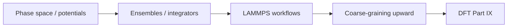
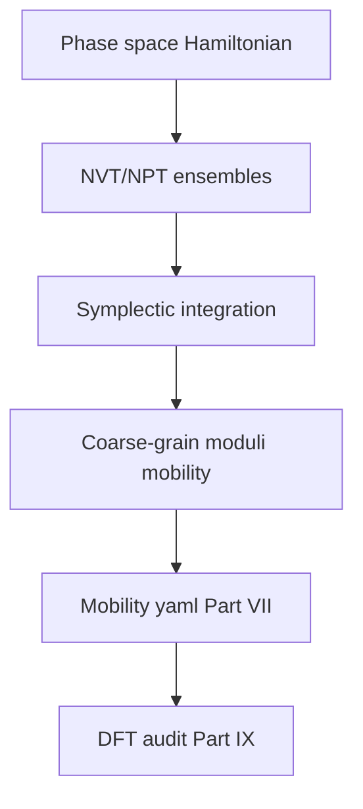

# Part VIII — Atomistic Simulation

Parts I–VII treated the copper wire as a continuum or a network of line defects. Part VIII descends to the scale where matter resolves into **individual atoms** — nuclei moving on a potential energy surface, thermal vibrations exchanging energy with a heat bath, bonds stretching and breaking at crack tips where no elliptic PDE can remain valid without regularization.

Molecular dynamics is the workhorse of atomistic materials mechanics. It supplies the interatomic potentials that empirical models require, the mobility laws that dislocation dynamics calibrates, and the fracture trajectories that explain how notches become cracks. Classical MD assumes nuclei follow Born–Oppenheimer surfaces; Part IX derives those surfaces from electron density.

Three chapters cover potentials and phase space, ensembles and integrators, then ab initio MD, coarse-graining, and potential fitting. The layout follows the **MD Notes** in [`writings/md/`](../../writings/md/): numbered chapters with **Bridge** sections and explicit upward links to DDD (Part VII) and DFT (Part IX).

## Chapter guide

| Chapter | Wire story beat | Core object | Handoff |
|---------|-----------------|-------------|---------|
| [VIII.1](01-potentials-phase-space.md) | Copper lattice as \(N\) interacting particles | Lennard-Jones, EAM, periodic boundaries, cutoff | Thermostats and timestep → integrators in VIII.2 |
| [VIII.2](02-ensembles-integrators.md) | NVT equilibration; NPT elastic response | Verlet, Nose–Hoover, stress–strain from MD | Potential fitting and AIMD → coarse-graining in VIII.3 |
| [VIII.3](03-ab-initio-and-coarse-graining.md) | EAM fit exports \(\gamma_{\text{sf}}\), \(E_{\text{coh}}\) | LAMMPS workflows, DeepMD, handoff tables | [Bridge to Part IX](03-ab-initio-and-coarse-graining.md#bridge-to-part-ix) |

Read in order. Each chapter ends with a **Bridge** that states why the next chapter must exist; running MD without understanding ensembles is energy drift disguised as physics; fitting EAM without DFT anchors is multiscale folklore.

## Scene

Part VII ended with dislocation lines gliding through a polycrystal, exporting hardening laws and link statistics to crystal plasticity FEM. That picture is still **coarse-grained**: the dislocation core is a line singularity regularized by a cutoff radius; mobility tables are fit from experiments or atomistic snapshots, not derived from first principles.

The copper wire at the atomistic scale is a face-centered cubic lattice of copper nuclei — roughly \(10^{23}\) atoms per centimeter of wire. No laptop integrates Newton's equations for all of them. Molecular dynamics therefore chooses a **representative volume**: a notch tip, a grain boundary segment, a dislocation core, or a slab under uniaxial strain. Periodic boundaries mimic bulk crystal; thermostats exchange heat with a reservoir; a finite timestep and cutoff radius make the simulation tractable.

What MD returns upward: cohesive energy, elastic constants, stacking-fault energies, and mobility parameters that DDD and continuum models consume. What MD demands downward: a potential energy surface — empirical (EAM, MEAM) or learned from DFT (Part IX). The wire's story continues here as vibrating nuclei on that surface.

## The atomistic descent in one paragraph

Read this once if you paused after Part VII and wonder why the book now resolves line cores as atoms — every chapter below unpacks one atomistic beat of the same copper wire.

Dislocation dynamics regularized cores with a cutoff radius and borrowed mobility from tables. Part VIII replaces that fiction with vibrating nuclei on an interatomic potential — a representative volume at the notch tip, grain boundary, or screw core where bonds stretch, rebond, and thermal statistics answer questions DDD cannot ask. NVT and NPT ensembles equilibrate the patch; velocity-Verlet integration marches Newton's equations in femtoseconds; LAMMPS workflows fit EAM parameters that export cohesive energy, elastic constants, and stacking-fault energy upward to DDD and continuum models. Part IX audits those potentials from electron density; the [epilogue](../epilogue/multiscale.md) wires the exports into handshakes no single code runs alone. Mesoscale descent taught forest statistics; atomistic descent teaches **trajectories**.

## Second descent rung: VII midpoint reunion {#second-descent-rung-vii-midpoint-reunion}

If you paused at [Part VII's opening](../part07-defects/00-opening.md#first-descent-rung-vi-midpoint-reunion), the **mesoscale** export contract is in place — forest statistics, Taylor hardening, OpenDiS → DAMASK handoff. If you paused at [VII.3's intermission](../part07-defects/03-polycrystal-and-fem-handoff.md#intermission-mesoscale-ends-atomistics-begin), the **plot** turns downward again — mobility tables and Peierls thresholds need atomic bonding, not another fitted scalar. Part VIII is the chapter block where both pauses land on the same bench: the representative volume still answers to the copper wire, but the state variable is no longer a line network alone.

| Part VII mesoscale export | Part VIII atomistic consumer | What changes on the wire |
|---------------------------|------------------------------|--------------------------|
| Cutoff-regularized dislocation core | Vibrating nuclei in an RVE slab | Line singularity → bond stretching |
| Mobility \(M(\tau, T)\) as yaml table | NVT shear on screw/edge core | Fitted drag → measured phonon scattering |
| \(\gamma_{\text{sf}}\) as OpenDiS input | Relaxed generalized stacking-fault slab | Parameter → relaxed atomic configuration |
| [Mesoscale ladder](../part07-defects/00-opening.md#the-mesoscale-ladder-me-412-cross-index) (Schematic 14 parallel) | [Atomistic ladder](#the-atomistic-ladder-me-412-cross-index) (Schematic 14 parallel) | Statistical homogenization → trajectory averaging |
| [VII.3 rate handshake](../part07-defects/03-polycrystal-and-fem-handoff.md#scale-boundary-handshake-ddd-strain-rate-to-quasi-static-fem) | Temperature-matched mobility from MD | Lab-rate extrapolation inherits \(T_w\) from CHT |

[Part VII's ME 412 cross-index](../part07-defects/00-opening.md#representative-schematics-me-412-part-vii) completed Schematic 14's **mesoscale parallel**. Part VIII begins Schematic 14's **atomistic parallel** — phase-space mechanics, ensemble sampling, and coarse-graining exports that reunite with DDD mobility yaml in [VIII.3](03-ab-initio-and-coarse-graining.md). When mesoscale and atomistic chapters feel like separate manuals, read this reunion table beside the [preface descent continuity hinges](../preface.md#descent-continuity-hinges): mesoscale → atomistic at [VII.3](../part07-defects/03-polycrystal-and-fem-handoff.md#bridge-to-part-viii), atomistic → electronic at [VIII.3](03-ab-initio-and-coarse-graining.md#bridge-to-part-ix).

## Two clocks: reading order vs foundation pedigree

This book and the laboratory use **two different orderings** for the same afternoon — and both are intentional.

| Clock | Order | What it optimizes |
|-------|-------|-------------------|
| **Mathematical (chapter order)** | VII mesoscale → VIII atoms → IX electrons | Descend to finer physics after continuum and DDD show where parameters hide their history |
| **Workflow (Act VI foundation)** | IX DFT → VIII MD fit → VII mobility/hardening → IV FEM deck | Trace where input-file numbers actually come from before the operator mounts the wire |

You are reading **mathematical order**: Part VII explained why hardening curves bend; Part VIII resolves cores and fits potentials; Part IX audits those potentials against electron density. In **workflow order** — the invisible afternoon before Act I — someone already ran Quantum ESPRESSO on fcc Cu, fitted an EAM in LAMMPS, calibrated mobility for OpenDiS, and typed Young's modulus into the mesh script. That prequel is documented in [Act VI of the sources appendix](../appendix/sources.md#six-acts--parts-laboratory-time).

If the descent feels backward relative to how codes are built, treat Part IX as the **pedigree chapter** for every potential Part VIII already assumed — the same role Part II played for Part I's stiffness matrices. You may also read Part IX before Part VIII using the [scale-first path](../prologue/00-many-scales.md#the-experiment-as-plot) in the prologue; linear readers should arrive here correctly after atomistics and read IX as the audit, not a bolt-on.

Part VII left dislocation **cores** as line singularities regularized by a cutoff radius. MD is where that cutoff becomes physical: a cylindrical or spherical volume enclosing the core, periodic or fixed boundaries, and forces from an EAM potential fit to copper's lattice parameter and cohesive energy. The representative volume is not arbitrary — it must be large enough that bulk elastic response dominates the boundary, yet small enough that a workstation or cluster can integrate millions of timesteps. That tension between fidelity and cost repeats at every scale in this book; MD is its first atomistic instance.

## The concept map

| Question | Example in this part |
|----------|----------------------|
| What **object** are we studying? | Positions \(\{\mathbf{r}_i\}\), momenta, interatomic potential \(V\) |
| What **structure** does it add? | Hamiltonian mechanics, thermostats, periodic boundaries |
| What **theorem** becomes possible? | Energy conservation (symplectic integrators), ergodic sampling |
| What **breaks** if structure is missing? | Drift in energy, wrong ensemble, cutoff artifacts in EAM fits |

**Baby picture:** write Newton's equations for nuclei on a potential surface, choose an ensemble (NVT, NPT), integrate with a stable timestep, then fit EAM parameters and export moduli to continuum models. The copper lattice vibrates here; DDD mobility and FEM stiffness inherit the averages.

## How Part VIII connects to Parts II–IX

Part VIII is the **finest discrete scale** before electrons enter explicitly. Like Part II's contract for FEM, each export upward must name its consumer and its audit downward:

| Part VIII chapter | Structure or theorem | Where it reappears |
|-------------------|---------------------|-------------------|
| VIII.1 Potentials | Hamiltonian on BO surface; EAM cutoff | Part VII core width; Part IX \(E_{\text{coh}}\) audit |
| VIII.2 Ensembles | Symplectic Verlet; NVT/NPT sampling | Part VI thermal expansion; Part V boundary \(T\) |
| VIII.3 Coarse-graining | Handoff tables; EAM-fit acceptance | Part IV \(\mathbb{C}\); Part VII \(M(\tau,T)\), \(\gamma_{\text{sf}}\) |

**Mathematical lineage (Part I → Part VIII).** Part I's \(\mathbf{K}\mathbf{u}=\mathbf{f}\) becomes dynamic Newton's laws: forces from \(\nabla V\), equilibrium from \(\nabla V = 0\), normal modes from the Hessian eigensystem. Part II's completeness instinct reappears as **RVE convergence** — halving the simulation cell and checking \(a_0\), \(\kappa\), or \(\gamma_{\text{sf}}\) is the atomistic mesh-refinement study. Part IV's scatter loop is the static limit; velocity Verlet is the same sparsity pattern executed \(10^7\) times per nanosecond of physical time.

**Scale-boundary discipline.** Every quantity MD exports must carry a pedigree row in the foundation folder (see [Act VI in the sources appendix](../appendix/sources.md#six-acts--parts-laboratory-time)):

| Export | Minimum MD evidence | Downstream consumer |
|--------|---------------------|---------------------|
| \(a_0\), \(E_{\text{coh}}\) | Minimized bulk cell; pressure \(\approx 0\) | EAM sanity; Burgers \(b = a_0/\sqrt{2}\) for DDD |
| \(\mathbb{C}_{ij}\) or \(E, \nu\) | NPT small-strain response | Part IV elastic step; Part VI.3 handshake |
| \(\gamma_{\text{sf}}\) | Generalized stacking-fault slab | Part VII partial separation; Peierls stress |
| \(\kappa(T)\) | Green–Kubo or NEMD | Part III/V thermal fields on heated wire |
| \(M(\tau, T)\) | NVT shear on dislocation core | OpenDiS mobility tables |

If a row lists only "Mishin EAM, 2001" with no phonon or DFT cross-check, Part IX is the audit chapter — the same role Part II played when Part I's stiffness matrix needed an \(H^1\) limit. Linear readers arrive here after DDD; workflow readers may have run EAM fits before OpenDiS — both paths converge when the handoff table is populated before the epilogue's multiscale afternoon.

## Representative schematics (Atomistic Modeling Notes)

The [Atomistic Modeling Notes](https://hanfengzhai.github.io/file/AtomModel_note.pdf) follow the same ME 412 habit: each schematic is a baby picture of the atomistic pipeline. Use them as a visual index while reading:

| Schematic | Idea | Chapter in this part |
|-----------|------|----------------------|
| 1 | Interatomic potentials, phase space, periodic boundaries on a Cu representative volume | [VIII.1](01-potentials-phase-space.md) |
| 2 | Ensembles (NVT, NPT), symplectic integrators, LAMMPS workflows | [VIII.2](02-ensembles-integrators.md) |
| 3 | Ab initio MD, coarse-graining, DeepMD; fitting EAM upward to DDD and FEM | [VIII.3](03-ab-initio-and-coarse-graining.md) |

Each schematic answers the four concept-map questions for one atomistic layer. When a cutoff radius or timestep choice feels arbitrary, return to the matching row: *what object, what structure, what theorem, what breaks?* Part VII regularized dislocation cores with a cutoff; Part VIII resolves those cores as vibrating nuclei on a potential surface.

## Representative schematics (ME 412 cross-index) {#representative-schematics-me-412-part-viii}

[Part II's opening](../part02-functional-analysis/00-opening.md#representative-schematics-me-412) indexed all fourteen schematics from the [Functional Analysis Notes](https://hanfengzhai.github.io/file/teaching/notes/ME412_CourseSummary.pdf). [Part VII](../part07-defects/00-opening.md#representative-schematics-me-412-part-vii) completed Schematic 14's **mesoscale parallel**. Part VIII does **not** repeat Galerkin projection — atomistic mechanics is trajectory integration, not energy minimization on a single field — but five ME 412 structures still govern convergence and export discipline:

| ME 412 Schematic | Idea | Baby picture (ME 412) | Part VIII chapter |
|------------------|------|----------------------|-------------------|
| 1b | Linear algebra → operator problems; well-posedness | Newton's equations are \(6N\) coupled ODEs; Hessian at equilibrium is Part I's \(\mathbf{K}\) | [VIII.1](01-potentials-phase-space.md) |
| 6 | Orthogonal projection; best approximation | Time-averaged stress/energy project trajectories onto continuum moduli | [VIII.2](02-ensembles-integrators.md)–[VIII.3](03-ab-initio-and-coarse-graining.md) |
| 7 | Duality, Riesz representation, weak convergence | RVE size convergence: \(a_0\), \(C_{ij}\), \(\gamma_{\text{sf}}\) stabilize as the box grows | [VIII.1](01-potentials-phase-space.md)–[VIII.3](03-ab-initio-and-coarse-graining.md) |
| 8b | Well-posedness triangle: existence, uniqueness, stability | Symplectic integrators + thermostats must preserve the intended ensemble | [VIII.2](02-ensembles-integrators.md) |
| 13b | Open Mapping, Bounded Inverse, Banach–Steinhaus | Timestep and cutoff must give **uniform** energy-drift bounds as \(N\) grows | [VIII.2](02-ensembles-integrators.md) |
| 14 | Variational ladder (ascent branch) | Part VIII runs the **atomistic parallel** — see [below](#the-atomistic-ladder-me-412-cross-index) | [VIII.1](01-potentials-phase-space.md)–[VIII.3](03-ab-initio-and-coarse-graining.md) |

Schematic **1b** is the explicit **Part I → Part VIII hinge** in the ME 412 map: [Part I](../part01-linear-algebra/00-opening.md) assembled \(\mathbf{K}\mathbf{u}=\mathbf{f}\); Part VIII executes \(\mathbf{F}=-\nabla V\) millions of times per nanosecond — the same sparse local coupling, now dynamic. Schematic **6** names coarse-graining as **projection** of trajectory statistics onto scalar exports (\(E\), \(\nu\), \(\gamma_{\text{sf}}\)) — the atomistic echo of Galerkin best approximation. Schematic **7** is the RVE convergence instinct: doubling box side and checking \(a_0\) is the atomistic mesh-refinement study. Schematic **13b** is the stability audit behind \(\Delta t\) choice and thermostat consistency — energy drift must not grow with integration length.

The Atomistic Modeling schematics (1–3) and ME 412 cross-index (1b, 6, 7, 8b, 13b, 14 parallel) are **two labels for one atomistic pipeline** — MD Notes name the implementation stages; ME 412 names the analysis structures those stages inherit from Parts I–II and VII. When EAM parameters feel like literature constants, match Atomistic Schematic 3 to ME 412 Schematic 7: *what object is averaged, over what ensemble, with what convergence certificate?*

## The atomistic ladder (ME 412 Schematic 14 parallel) {#the-atomistic-ladder-me-412-cross-index}

Part VII completed Schematic 14's **mesoscale parallel**. Part VIII runs the **atomistic parallel**:

Read Part VIII as the **descent rungs** [VII.3's Bridge](../part07-defects/03-polycrystal-and-fem-handoff.md#bridge-to-part-viii) demanded but could not simulate. When MD exports disagree with OpenDiS mobility, walk the atomistic ladder backward: if \(\gamma_{\text{sf}}\) drifts with slab thickness, check stacking-fault relaxation ([VIII.3](03-ab-initio-and-coarse-graining.md)); if \(M(\tau,T)\) lacks temperature dependence, check NVT shear protocol ([VIII.2](02-ensembles-integrators.md)); if forces spike at the core, check potential cutoff and RVE size ([VIII.1](01-potentials-phase-space.md)). The copper wire's Act V notch and Act VI foundation folder are one instance of both ladders speaking at an interface — mesoscale yaml from Part VII, trajectory evidence from Part VIII, SCF audit from Part IX.

## Story so far (Parts I–VII)

The wire has been a spring network, a meshed solid, a stress field, a dislocation forest, and now becomes a **lattice of nuclei**:

| Part | Representation | What history was missing |
|------|----------------|--------------------------|
| IV–VI | Smooth \(\mathbf{u}(\mathbf{x})\), \(\boldsymbol{\sigma}\) | Cold work, texture, core singularities |
| VII | Line defects with cutoff cores | Atomic structure inside the core; bond breaking at cracks |

MD closes the gap at **cores, grain boundaries, and fracture surfaces** — regions where Part VII's line singularities and Part VI's continuum fields need atomic resolution. The representative volume is the narrative device: we cannot simulate \(10^{23}\) atoms, so we simulate the smallest patch that still answers the upstream question (stacking-fault energy for DDD mobility, cohesive law for a notch). Part IX will derive the potential surface MD assumes; Part VIII shows how timesteps, thermostats, and LAMMPS workflows make that assumption computable.

## Closing the arc from Part VII

If you have read linearly since the prologue, Part VII's closing checkpoint exported hardening laws and link statistics from dislocation dynamics to crystal plasticity FEM. Part VIII is the next **descent** — where line singularities become vibrating nuclei:

| Part VII (dislocations on the wire) | Part VIII (atoms on the wire) |
|-------------------------------------|-------------------------------|
| Line defects with cutoff cores | Representative volume of fcc Cu nuclei |
| Mobility tables from experiments or fits | Mobility from MD shear tests on cores |
| Stacking-fault energy as input parameter | \(\gamma_{\text{sf}}\) from relaxed faulted configurations |
| Taylor \(\sqrt{\rho}\) hardening law | Cohesive energy and elastic constants from fluctuations |
| [VII.3 Bridge](03-polycrystal-and-fem-handoff.md) exports to FEM | [VIII.3](03-ab-initio-and-coarse-graining.md) fits EAM upward |

Part VII regularized dislocation cores with a cutoff radius and mobility law; Part VIII **resolves** those cores as atoms on an interatomic potential — still finite-dimensional in any simulation box, but now with bond breaking, thermal statistics, and phonon drag that no line model captures alone. The copper wire's notch tip (prologue Act V) and grain boundaries (VII.3 polycrystal handoff) are where continuum and DDD models need atomic witnesses. Part IX will derive the potential \(V(\{\mathbf{r}_i\})\) MD assumes; Part VIII shows how LAMMPS workflows, thermostats, and coarse-graining make that assumption computable and exportable.

## Closing the arc from Part I

If you have read linearly since the prologue, notice how the **same four questions** reappear here with atomistic vocabulary — and how the **same mathematical moves** from Part I return on phase space:

| Part I (springs on the wire) | Part VIII (atoms on the wire) |
|------------------------------|-------------------------------|
| State vector \(\mathbf{u}\) | Positions \(\{\mathbf{r}_i\}\) and momenta \(\{\mathbf{p}_i\}\) |
| Stiffness matrix \(\mathbf{K}\) | Hessian \(\nabla^2 V\) of the interatomic potential |
| \(\mathbf{K}\mathbf{u}=\mathbf{f}\) at equilibrium | \(\nabla V = 0\) at energy minimum (static limit) |
| Eigenmodes decouple vibration | Normal modes from mass-weighted Hessian (phonons) |
| Timestep stability (implicit/explicit) | Verlet / velocity-Verlet with \(\Delta t\) constraint |

Part I's coupled springs become Part VIII's coupled nuclei on a potential surface — still finite-dimensional on any simulation box, still governed by linear algebra at each force evaluation, but now with **thermal statistics** and **bond breaking** that no elliptic FEM mesh resolves without regularization. Part VII exported mobility and stacking-fault energy as tables; Part VIII shows how those tables are measured or computed from trajectories. The copper wire's core is no longer a line singularity with a cutoff; it is a patch of vibrating atoms whose averages feed the mesoscale. Part IX will derive the potential \(V\) itself from electron density.

## Lab act: V–VI — Notch and offline foundation

**Act V** is the optional scratch or grip corner where continuum fields predict *where* stress concentrates but cannot resolve bond breaking — MD's representative volume lives here. **Act VI** is the prequel every practitioner runs offline: EAM parameters, mobility tables, and elastic constants that Part VII and Part IV consume without re-deriving them each run. Part VIII connects both acts: atomistic trajectories at the notch tip and potential fitting that feeds the whole ladder upward.

### What you should be able to do after Part VIII

Each chapter adds one move to the atomistic workflow that supplies numbers the mesoscale and continuum codes trust:

| After chapter | Skill on the copper wire | Minimal artifact |
|---------------|--------------------------|------------------|
| VIII.1 | Write Hamiltonian for N atoms; state phase-space dimension | \(H = \sum_i \|\mathbf{p}_i\|^2/(2m_i) + V(\{\mathbf{r}_i\})\); \(6N\) DOFs |
| VIII.2 | Choose NVT ensemble; implement velocity-Verlet; estimate \(\Delta t\) | Energy drift \(< 10^{-4}\) over 10 ps; \(\Delta t \sim 1\,\text{fs}\) for Cu |
| VIII.3 | Fit EAM to bulk properties; coarse-grain to export moduli upward | \(a_0\), \(E\), \(\gamma_{\text{sf}}\) from a 500-atom fcc box |

None of these require a full ab initio MD production run — but each one is the atomistic audit Part IX will derive from first principles. If you can integrate Newton's equations with a thermostat, read a LAMMPS log for temperature and pressure, and explain what an EAM potential assumes about electron density, you have the finest discrete scale before Kohn–Sham replaces the potential with orbitals.

## Bridge

Part VII ended with dislocation forests, Taylor hardening, and the admission that **cores and crack tips need atoms**. [VII.3](03-polycrystal-and-fem-handoff.md#bridge-to-part-viii) named the quantities MD must supply — stacking-fault energy, core width, mobility tables — and deferred their microscopic origin to this part. Part VIII puts the atoms back on stage.

| What Part VII homogenized | What Part VIII resolves |
|---------------------------|-------------------------|
| Line defects with Burgers vector \(\mathbf{b}\) | Atomic positions \(\{\mathbf{r}_i\}\) in a periodic box |
| Cutoff-regularized core singularity | Bond breaking and thermal vibrations at the notch tip |
| Mobility law \(M(\tau, T)\) as a fitted table | NVT shear tests that measure drag from phonon scattering |
| Taylor \(\tau \propto \sqrt{\rho}\) hardening | Trajectories whose statistics export \(\tau(\gamma)\) upward |

Part I's coupled springs reappear here as coupled nuclei on an interatomic potential — still \(\mathbf{F} = -\nabla V\) at each timestep, still eigenmodes (now phonons) that decouple small oscillations, still stability constraints on \(\Delta t\) that mirror explicit Euler's CFL limit. Part VII exported mesoscale numbers; Part VIII shows how LAMMPS workflows, thermostats, and coarse-graining make those numbers **measurable and traceable** before Part IX derives the potential surface \(V(\{\mathbf{r}_i\})\) from electron density.

**Scale-boundary handshake (Part VII → Part VIII → Part IX).**

| DDD export ([Part VII](../part07-defects/00-opening.md)) | MD contract (this part) | DFT audit (Part IX) | Failure mode |
|-----------------------------------------------------------|-------------------------|---------------------|--------------|
| Cutoff-regularized core; mobility \(M(\tau,T)\) | RVE of fcc Cu nuclei; NVT shear on core | AIMD forces replace empirical \(M\) | Core box too small → spurious image forces |
| \(\gamma_{\text{sf}}\) as input parameter | Relaxed faulted slab in LAMMPS | SCF generalized stacking-fault surface | EAM fit without phonon cross-check |
| Taylor \(\tau \propto \sqrt{\rho}\) hardening | Trajectory statistics export \(\tau(\gamma)\) | Not re-derived at electronic scale | Mobility table with no temperature sweep |
| Polycrystal texture handoff to FEM | \(a_0\), \(E\), \(\nu\) from NPT fluctuations | Bulk modulus from small-strain DFT | Mishin EAM, 2001 — no pedigree row |

The [preface descent continuity hinge](../preface.md#descent-continuity-hinges) names [VII.3](../part07-defects/03-polycrystal-and-fem-handoff.md#bridge-to-part-viii) as the **mesoscale → atomistic** turn — where line cores and mobility tables need atomic bonding before Part IX audits the potential from \(\rho(\mathbf{r})\). Return to the [prologue](../../prologue/00-many-scales.md): **Act V** is the notch where continuum fields predict stress concentration but cannot resolve bond breaking; **Act VI** is the offline foundation folder where EAM parameters and mobility tables are fitted before the operator mounts the wire.

The first chapter below opens **phase space** — positions, momenta, Hamiltonian mechanics — and the interatomic potentials every MD run of copper assumes on trust until the audit in Part IX. When the mesh is fine enough but the core is still wrong — that is the hinge between line defects and atoms. Turn the page.
