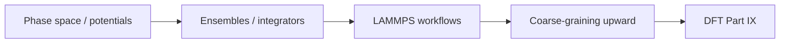

# Part VIII — Atomistic Simulation

Parts I–VII treated the copper wire as a continuum or a network of line defects. Part VIII descends to the scale where matter resolves into **individual atoms** — nuclei moving on a potential energy surface, thermal vibrations exchanging energy with a heat bath, bonds stretching and breaking at crack tips where no elliptic PDE can remain valid without regularization.

Molecular dynamics is the workhorse of atomistic materials mechanics. It supplies the interatomic potentials that empirical models require, the mobility laws that dislocation dynamics calibrates, and the fracture trajectories that explain how notches become cracks. Classical MD assumes nuclei follow Born–Oppenheimer surfaces; Part IX derives those surfaces from electron density.

Three chapters cover potentials and phase space, ensembles and integrators, then ab initio MD, coarse-graining, and potential fitting. The layout follows the **MD Notes** in [`writings/md/`](../../writings/md/): numbered chapters with **Bridge** sections and explicit upward links to DDD (Part VII) and DFT (Part IX).

## Where we left the wire

Part VII ended with dislocation lines gliding through a polycrystal, exporting hardening laws and link statistics to crystal plasticity FEM. That picture is still **coarse-grained**: the dislocation core is a line singularity regularized by a cutoff radius; mobility tables are fit from experiments or atomistic snapshots, not derived from first principles.

The copper wire at the atomistic scale is a face-centered cubic lattice of copper nuclei — roughly \(10^{23}\) atoms per centimeter of wire. No laptop integrates Newton's equations for all of them. Molecular dynamics therefore chooses a **representative volume**: a notch tip, a grain boundary segment, a dislocation core, or a slab under uniaxial strain. Periodic boundaries mimic bulk crystal; thermostats exchange heat with a reservoir; a finite timestep and cutoff radius make the simulation tractable.

What MD returns upward: cohesive energy, elastic constants, stacking-fault energies, and mobility parameters that DDD and continuum models consume. What MD demands downward: a potential energy surface — empirical (EAM, MEAM) or learned from DFT (Part IX). The wire's story continues here as vibrating nuclei on that surface.

Part VII left dislocation **cores** as line singularities regularized by a cutoff radius. MD is where that cutoff becomes physical: a cylindrical or spherical volume enclosing the core, periodic or fixed boundaries, and forces from an EAM potential fit to copper's lattice parameter and cohesive energy. The representative volume is not arbitrary — it must be large enough that bulk elastic response dominates the boundary, yet small enough that a workstation or cluster can integrate millions of timesteps. That tension between fidelity and cost repeats at every scale in this book; MD is its first atomistic instance.

## The concept map

| Question | Example in this part |
|----------|----------------------|
| What **object** are we studying? | Positions \(\{\mathbf{r}_i\}\), momenta, interatomic potential \(V\) |
| What **structure** does it add? | Hamiltonian mechanics, thermostats, periodic boundaries |
| What **theorem** becomes possible? | Energy conservation (symplectic integrators), ergodic sampling |
| What **breaks** if structure is missing? | Drift in energy, wrong ensemble, cutoff artifacts in EAM fits |

**Baby picture:** write Newton's equations for nuclei on a potential surface, choose an ensemble (NVT, NPT), integrate with a stable timestep, then fit EAM parameters and export moduli to continuum models. The copper lattice vibrates here; DDD mobility and FEM stiffness inherit the averages.

## Story so far (Parts I–VII)

The wire has been a spring network, a meshed solid, a stress field, a dislocation forest, and now becomes a **lattice of nuclei**:

| Part | Representation | What history was missing |
|------|----------------|--------------------------|
| IV–VI | Smooth \(\mathbf{u}(\mathbf{x})\), \(\boldsymbol{\sigma}\) | Cold work, texture, core singularities |
| VII | Line defects with cutoff cores | Atomic structure inside the core; bond breaking at cracks |

MD closes the gap at **cores, grain boundaries, and fracture surfaces** — regions where Part VII's line singularities and Part VI's continuum fields need atomic resolution. The representative volume is the narrative device: we cannot simulate \(10^{23}\) atoms, so we simulate the smallest patch that still answers the upstream question (stacking-fault energy for DDD mobility, cohesive law for a notch). Part IX will derive the potential surface MD assumes; Part VIII shows how timesteps, thermostats, and LAMMPS workflows make that assumption computable.

## Closing the arc from Part I

If you have read linearly since the prologue, notice how the **same four questions** reappear here with atomistic vocabulary — and how the **same mathematical moves** from Part I return on phase space:

| Part I (springs on the wire) | Part VIII (atoms on the wire) |
|------------------------------|-------------------------------|
| State vector \(\mathbf{u}\) | Positions \(\{\mathbf{r}_i\}\) and momenta \(\{\mathbf{p}_i\}\) |
| Stiffness matrix \(\mathbf{K}\) | Hessian \(\nabla^2 V\) of the interatomic potential |
| \(\mathbf{K}\mathbf{u}=\mathbf{f}\) at equilibrium | \(\nabla V = 0\) at energy minimum (static limit) |
| Eigenmodes decouple vibration | Normal modes from mass-weighted Hessian (phonons) |
| Timestep stability (implicit/explicit) | Verlet / velocity-Verlet with \(\Delta t\) constraint |

Part I's coupled springs become Part VIII's coupled nuclei on a potential surface — still finite-dimensional on any simulation box, still governed by linear algebra at each force evaluation, but now with **thermal statistics** and **bond breaking** that no elliptic FEM mesh resolves without regularization. Part VII exported mobility and stacking-fault energy as tables; Part VIII shows how those tables are measured or computed from trajectories. The copper wire's core is no longer a line singularity with a cutoff; it is a patch of vibrating atoms whose averages feed the mesoscale. Part IX will derive the potential \(V\) itself from electron density.

## Lab act: V–VI — Notch and offline foundation

**Act V** is the optional scratch or grip corner where continuum fields predict *where* stress concentrates but cannot resolve bond breaking — MD's representative volume lives here. **Act VI** is the prequel every practitioner runs offline: EAM parameters, mobility tables, and elastic constants that Part VII and Part IV consume without re-deriving them each run. Part VIII connects both acts: atomistic trajectories at the notch tip and potential fitting that feeds the whole ladder upward.

## Bridge

Part VII ended with dislocation lines and the admission that atoms matter at cores and crack tips. The first chapter below puts those atoms back: phase space, Hamiltonian mechanics, and the interatomic potentials that define forces in every MD simulation of copper.
