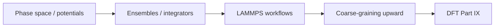

# Part VIII — Atomistic Simulation

Parts I–VII treated the copper wire as a continuum or a network of line defects. Part VIII descends to the scale where matter resolves into **individual atoms** — nuclei moving on a potential energy surface, thermal vibrations exchanging energy with a heat bath, bonds stretching and breaking at crack tips where no elliptic PDE can remain valid without regularization.

Molecular dynamics is the workhorse of atomistic materials mechanics. It supplies the interatomic potentials that empirical models require, the mobility laws that dislocation dynamics calibrates, and the fracture trajectories that explain how notches become cracks. Classical MD assumes nuclei follow Born–Oppenheimer surfaces; Part IX derives those surfaces from electron density.

Three chapters cover potentials and phase space, ensembles and integrators, then ab initio MD, coarse-graining, and potential fitting. The layout follows the **MD Notes** in [`writings/md/`](https://github.com/hanfengzhai/CompMechBook/tree/main/writings/md/): numbered chapters with **Bridge** sections and explicit upward links to DDD (Part VII) and DFT (Part IX).

## Where we left the wire

Part VII ended with dislocation lines gliding through a polycrystal, exporting hardening laws and link statistics to crystal plasticity FEM. That picture is still **coarse-grained**: the dislocation core is a line singularity regularized by a cutoff radius; mobility tables are fit from experiments or atomistic snapshots, not derived from first principles.

The copper wire at the atomistic scale is a face-centered cubic lattice of copper nuclei — roughly \(10^{23}\) atoms per centimeter of wire. No laptop integrates Newton's equations for all of them. Molecular dynamics therefore chooses a **representative volume**: a notch tip, a grain boundary segment, a dislocation core, or a slab under uniaxial strain. Periodic boundaries mimic bulk crystal; thermostats exchange heat with a reservoir; a finite timestep and cutoff radius make the simulation tractable.

What MD returns upward: cohesive energy, elastic constants, stacking-fault energies, and mobility parameters that DDD and continuum models consume. What MD demands downward: a potential energy surface — empirical (EAM, MEAM) or learned from DFT (Part IX). The wire's story continues here as vibrating nuclei on that surface.

## The concept map

| Question | Example in this part |
|----------|----------------------|
| What **object** are we studying? | Positions \(\{\mathbf{r}_i\}\), momenta, interatomic potential \(V\) |
| What **structure** does it add? | Hamiltonian mechanics, thermostats, periodic boundaries |
| What **theorem** becomes possible? | Energy conservation (symplectic integrators), ergodic sampling |
| What **breaks** if structure is missing? | Drift in energy, wrong ensemble, cutoff artifacts in EAM fits |

**Baby picture:** write Newton's equations for nuclei on a potential surface, choose an ensemble (NVT, NPT), integrate with a stable timestep, then fit EAM parameters and export moduli to continuum models. The copper lattice vibrates here; DDD mobility and FEM stiffness inherit the averages.

## Representative schematics (Atomistic Modeling)

The [Atomistic Modeling notes](https://hanfengzhai.github.io/file/AtomModel_note.pdf) and [Statistical Mechanics notes](https://hanfengzhai.github.io/file/StatMechNotes.pdf) collect the atomistic machine this part builds:

| Schematic | Idea | Chapter in this part |
|-----------|------|----------------------|
| 1 | Interatomic potential \(V(\{\mathbf{r}_i\})\); EAM for copper | [VIII.1](01-potentials-phase-space.md) |
| 2 | Phase space \((\mathbf{q}, \mathbf{p})\); Hamiltonian mechanics | [VIII.1](01-potentials-phase-space.md) |
| 3 | Ensembles: NVE, NVT, NPT; thermostats and barostats | [VIII.2](02-ensembles-integrators.md) |
| 4 | Verlet / velocity-Verlet integrators; timestep and energy drift | [VIII.2](02-ensembles-integrators.md) |
| 5 | LAMMPS workflow: input deck, periodic boundaries, representative volume | [VIII.2](02-ensembles-integrators.md) |
| 6 | Ab initio MD; DeepMD; fitting potentials from DFT (Part IX) | [VIII.3](03-ab-initio-and-coarse-graining.md) |
| 7 | Coarse-graining upward: moduli, \(\gamma_{\text{sf}}\), mobility to DDD and FEM | [VIII.3](03-ab-initio-and-coarse-graining.md) |

When a cutoff radius feels arbitrary, return to the matching row: the representative volume must answer an upstream question from Part VII (core structure) or Part VI (cohesive response at a notch).

## Lab act (prologue map)

**Act V — Notch** and **Act VI — Foundation** meet in this part. At a scratched grip or sharp concentrator, Act V demands atomistic resolution — bond breaking, dislocation nucleation — that MD supplies in a representative volume too small to see on the load cell, yet decisive for failure. Act VI's offline foundation continues here: EAM potentials fit on bulk copper cells, stacking-fault energies for DDD mobility, moduli cross-checked against DFT — the upward climb from Part IX through MD into continuum inputs.

## Story so far (Parts I–VII)

The wire has been a spring network, a meshed solid, a stress field, a dislocation forest, and now becomes a **lattice of nuclei**:

| Part | Representation | What history was missing |
|------|----------------|--------------------------|
| IV–VI | Smooth \(\mathbf{u}(\mathbf{x})\), \(\boldsymbol{\sigma}\) | Cold work, texture, core singularities |
| VII | Line defects with cutoff cores | Atomic structure inside the core; bond breaking at cracks |

MD closes the gap at **cores, grain boundaries, and fracture surfaces** — regions where Part VII's line singularities and Part VI's continuum fields need atomic resolution. The representative volume is the narrative device: we cannot simulate \(10^{23}\) atoms, so we simulate the smallest patch that still answers the upstream question (stacking-fault energy for DDD mobility, cohesive law for a notch). Part IX will derive the potential surface MD assumes; Part VIII shows how timesteps, thermostats, and LAMMPS workflows make that assumption computable.

## Closing the arc from Part I

If you have read linearly since the prologue, notice how the **same four questions** reappear here at the atomistic scale:

| Part I (springs on the wire) | Part VIII (MD on the wire) |
|------------------------------|----------------------------|
| State vector \(\mathbf{u}\) | Atomic positions \(\{\mathbf{r}_i\}\) and momenta \(\{\mathbf{p}_i\}\) |
| Stiffness matrix \(\mathbf{K}\) | Hessian \(\partial^2 V / \partial \mathbf{r}_i \partial \mathbf{r}_j\) of interatomic potential |
| \(\mathbf{K}\mathbf{u}=\mathbf{f}\) from equilibrium | Newton's equations \(\mathbf{F}_i = -\nabla_{\mathbf{r}_i} V\) integrated in time |
| Eigenmodes decouple vibration | Phonon normal modes from Hessian diagonalization (Part I.3 at atomic scale) |
| Mesh refinement sends \(N\to\infty\) | Representative volume + periodic boundaries approximate bulk copper |

Part VII regularized dislocation cores with a cutoff radius; Part VIII is where that cutoff becomes a **simulation cell** with EAM forces fit to bulk properties. The copper wire that began as coupled springs is now a lattice of nuclei on a potential surface — still too many atoms for the full gauge section, but enough to export \(\gamma_{\text{sf}}\), mobility, and cohesive response upward. Part IX derives the surface MD integrates.

## Bridge

Part VII ended with dislocation lines and the admission that atoms matter at cores and crack tips. The first chapter below puts those atoms back: phase space, Hamiltonian mechanics, and the interatomic potentials that define forces in every MD simulation of copper.
