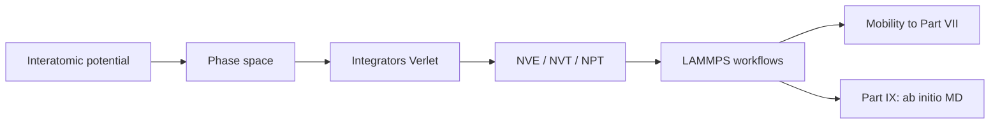

# Part VIII — Atomistic Simulation

Parts I–VII treated the copper wire as a continuum or a network of line defects. Part VIII descends to the scale where matter resolves into **individual atoms** — nuclei moving on a potential energy surface, thermal vibrations exchanging energy with a heat bath, bonds stretching and breaking at crack tips where no elliptic PDE can remain valid without regularization.

Molecular dynamics is the workhorse of atomistic materials mechanics. It supplies the interatomic potentials that empirical models require, the mobility laws that dislocation dynamics calibrates, and the fracture trajectories that explain how notches become cracks. Classical MD assumes nuclei follow Born–Oppenheimer surfaces; Part IX derives those surfaces from electron density.

Two chapters cover potentials and phase space, then ensembles, integrators, and practical workflows. The layout follows the **MD Notes** in [`writings/md/`](../../writings/md/): numbered chapters with **Bridge** sections and explicit upward links to DDD (Part VII) and DFT (Part IX).

## The concept map (atomistic modeling notes)

| Question | Example in this part |
|----------|----------------------|
| What **object** are we studying? | Phase space \((\{\mathbf{r}_i\}, \{\mathbf{p}_i\})\) on a potential surface |
| What **structure** does it add? | Hamiltonian / Newtonian dynamics; thermostats; periodic boundaries |
| What **theorem** becomes possible? | Energy conservation (symplectic integrators); ergodic sampling in NVT |
| What **breaks** if structure is missing? | Timestep instability; wrong temperature; unphysical cutoff artifacts |

**Baby picture:** assign positions and momenta to copper atoms, integrate Newton's equations with a stable timestep, and export fitted potentials or mobilities to every coarser scale above.

## Bridge

Part VII ended with dislocation lines and the admission that atoms matter at cores and crack tips. The first chapter below puts those atoms back: phase space, Hamiltonian mechanics, and the interatomic potentials that define forces in every MD simulation of copper.
