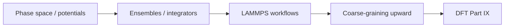

# Part VIII — Atomistic Simulation

Parts I–VII treated the copper wire as a continuum or a network of line defects. Part VIII descends to the scale where matter resolves into **individual atoms** — nuclei moving on a potential energy surface, thermal vibrations exchanging energy with a heat bath, bonds stretching and breaking at crack tips where no elliptic PDE can remain valid without regularization.

Molecular dynamics is the workhorse of atomistic materials mechanics. It supplies the interatomic potentials that empirical models require, the mobility laws that dislocation dynamics calibrates, and the fracture trajectories that explain how notches become cracks. Classical MD assumes nuclei follow Born–Oppenheimer surfaces; Part IX derives those surfaces from electron density.

Three chapters cover potentials and phase space, ensembles and integrators, then ab initio MD, coarse-graining, and potential fitting. The layout follows the **MD Notes** in [`writings/md/`](../../writings/md/): numbered chapters with **Bridge** sections and explicit upward links to DDD (Part VII) and DFT (Part IX).

## The concept map

| Question | Example in this part |
|----------|----------------------|
| What **object** are we studying? | Positions \(\{\mathbf{r}_i\}\), momenta, interatomic potential \(V\) |
| What **structure** does it add? | Hamiltonian mechanics, thermostats, periodic boundaries |
| What **theorem** becomes possible? | Energy conservation (symplectic integrators), ergodic sampling |
| What **breaks** if structure is missing? | Drift in energy, wrong ensemble, cutoff artifacts in EAM fits |

**Baby picture:** write Newton's equations for nuclei on a potential surface, choose an ensemble (NVT, NPT), integrate with a stable timestep, then fit EAM parameters and export moduli to continuum models. The copper lattice vibrates here; DDD mobility and FEM stiffness inherit the averages.

## Bridge

Part VII ended with dislocation lines and the admission that atoms matter at cores and crack tips. The first chapter below puts those atoms back: phase space, Hamiltonian mechanics, and the interatomic potentials that define forces in every MD simulation of copper.
