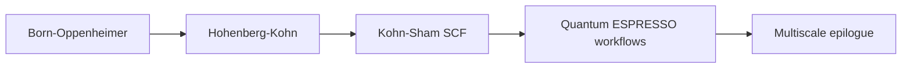
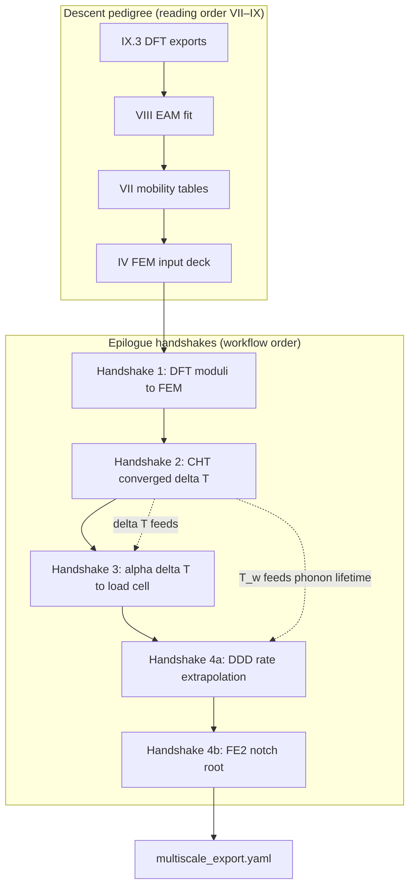

# Part IX — Electronic Structure

Part VIII assumed classical nuclei interacting through potentials fitted to data or theory. Part IX asks where those potentials originate: in the **quantum mechanical electron density** that binds copper atoms into a crystal, sets its cohesive energy, and determines the elastic constants and defect formation energies that every coarser model inherits.

Density functional theory makes the ground-state energy a functional of the electron density — tractable on computers with plane waves, pseudopotentials, and self-consistent field iteration. Born–Oppenheimer separation justifies treating nuclei as classical particles on surfaces defined by electronic structure; Hohenberg–Kohn theorems explain why the density alone suffices.

Three chapters cover Born–Oppenheimer and the Hohenberg–Kohn framework, Kohn–Sham equations and convergence practice, and reproducible Quantum ESPRESSO workflows that export numbers to MD, DDD, and continuum models. The layout follows the **DFT Notes** in [`writings/dft/`](../../writings/dft/): numbered chapters with **Bridge** sections leading to the epilogue's multiscale coupling story.

## Chapter guide

| Chapter | Wire story beat | Core object | Handoff |
|---------|-----------------|-------------|---------|
| [IX.1](01-born-oppenheimer.md) | Fast electrons, slow nuclei on the fcc lattice | Born–Oppenheimer, Hohenberg–Kohn theorems | Kohn–Sham orbitals → SCF in IX.2 |
| [IX.2](02-kohn-sham.md) | Self-consistent field on a copper unit cell | Exchange–correlation, k-points, convergence | QE input decks → workflows in IX.3 |
| [IX.3](03-dft-workflows.md) | Export \(a_0\), \(C_{ij}\), \(\gamma_{\text{sf}}\), \(E_f^v\) | Quantum ESPRESSO, Murnaghan fit, slab calculations | [Bridge to Epilogue](../epilogue/multiscale.md) |

Read in order. Each chapter ends with a **Bridge** that states why the next chapter must exist; running Kohn–Sham without Born–Oppenheimer separation confuses electronic and nuclear degrees of freedom; exporting moduli without SCF convergence is the atomistic analogue of an unrefined FEM mesh.

## Scene

Part VIII ended with nuclei vibrating on an interatomic potential — EAM parameters fit to experiments, MD trajectories, or machine-learned surfaces. That potential is a **practical fiction**: it assumes electrons adjust instantaneously to nuclear motion, and it hides the quantum mechanics that sets cohesive energy, stacking-fault energy, and vacancy formation enthalpy.

The copper wire at the electronic scale is not a chain of balls on springs. It is a periodic crystal of nuclei immersed in a sea of valence electrons whose density \(\rho(\mathbf{r})\) determines how strongly the lattice resists drawing, how easily dislocations slip, and how vacancies cost energy. DFT resolves that density; every number exported upward — \(E_{\text{coh}}\), \(C_{ij}\), \(\gamma_{\text{sf}}\) — is a contract between Part IX and Parts VI–VIII.

## Electronic audit hinge: descent pedigree and the \(T_w\) phonon contract {#electronic-audit-hinge-descent-pedigree-and-tw-phonon}

[Part VIII's descent hinge](../part08-md/00-opening.md#descent-hinge-cores-mobility-and-tw-pedigree) closed the **atomistic descent** with vibrating nuclei on EAM potentials, mobility tables at converged \(T_w \approx 379\,\text{K}\), and phonon-lifetime interpolation for rate sensitivity — not room-temperature defaults from handbook folders. Part IX inherits that **temperature pedigree** at the electronic layer: every quasiharmonic \(\alpha(T)\) export, every phonon DOS used for Handshake 3 thermal strain, and every acoustic-mode lifetime that feeds Handshake 4a drag must be evaluated at the same \(T_w\) from [V.4's Picard loop](../part05-fvm/04-navier-stokes-cfd.md#lab-act-extension-two-domain-picard-loop-with-a-1d-fem-solid) — archive `alpha_export.yaml` beside `cht_export.yaml` with an explicit \(T_w\) column, not a silent 300 K extrapolation.

When EAM potentials match bulk moduli but no one cites the DFT input deck, return to [continuity hinge rows 8–9](../appendix/sources.md#continuity-hinges-index-when-the-plot-stutters) (atomistic → electronic) and [row 7](../appendix/sources.md#continuity-hinges-index-when-the-plot-stutters) (mesoscale → atomistic via [VIII.0 descent hinge](../part08-md/00-opening.md#descent-hinge-cores-mobility-and-tw-pedigree)). The [epilogue Handshake 3](../epilogue/multiscale.md#handshake-3--thermal-strain--mechanical-stiffness-part-vi--iv) is the workflow-order export of the same thermal expansion Part VI wrote into balance laws — Act III's fixed-grip load cell reads \(\alpha(T_w)\Delta T\) before Part VII's forest bends the curve in Act IV; the [IX.3 quasiharmonic Lab act](03-dft-workflows.md#lab-act-quasiharmonic-alpha-handshake-3-pedigree) is the upstream half, Handshake 3 the downstream half. [Part VIII's WHAM parallel-tempering ladder](../part08-md/03-ab-initio-and-coarse-graining.md#wham-part-vii-mobility-hinge-act-ii-temperature-pedigree) and [Handshake 4a](../epilogue/multiscale.md#4a--ddd-strain-rate-to-quasi-static-load-cell-act-iv--hardening) demand phonon lifetimes interpolated to \(T_w\) — Part IX supplies the DFT phonon curve those interpolations audit.

### Thermal phonon audit at \(T_w\) {#thermal-phonon-audit-at-tw}

Joule heating raised the wire wall to \(T_w \approx 379\,\text{K}\) in Act II. Most foundation folders archive phonons at 300 K — correct for handbook comparison, **insufficient** for the multiscale afternoon unless you extrapolate:

| Quantity | 300 K default risk | Audit at \(T_w\) |
|----------|-------------------|------------------|
| \(\alpha(T)\) | Handbook 17e-6 vs DFT 15.5e-6 at 300 K only | Fit \(a(T)\) from quasiharmonic scan; evaluate \(\alpha(T_w)\) for Handshake 3 |
| Phonon lifetime \(\tau_{\text{ph}}(T)\) | MD drag uses 300 K phonon peak | Interpolate DFPT or MD VACF DOS to \(T_w\); archive beside `mobility_cu_screw_{T_w}K.yaml` |
| \(C_p(T)\) | Transient CHT uses room-temperature heat capacity | Integrate phonon DOS at \(T_w\) if coupled transient runs matter |

**Workflow contract.** After `cu.phonon/a_vs_T.dat` exists, run [`parse_alpha.sh`](../../scripts/parse_alpha.sh) with `--temperature 379` (or read \(T_w\) from `cht_export.yaml`) so `alpha_export.yaml` records \(\alpha(T_w)\) and \(\varepsilon_{\text{th}} = \alpha(T_w)\Delta T\), not \(\alpha(300\,\text{K})\) alone. When [Part VIII's VACF phonon DOS](../part08-md/03-ab-initio-and-coarse-graining.md) is archived beside `cu.phonon/`, [`parse_vacf.sh`](../../scripts/parse_vacf.sh) and [`parse_multiscale_workflow.sh`](../../scripts/parse_multiscale_workflow.sh) merge acoustic-peak pass/fail at documented temperature — the same habit as evaluating mobility at \(T_w\) rather than 300 K.

If phonon data exists at 300 K but Handshake 2 converged at \(T_w \approx 379\,\text{K}\), Act VI is **partially audited** — elastic moduli and stacking-fault energies carry SCF pedigree while thermal eigenstrain and phonon drag still cite room-temperature folklore. The [sensitivity table](../epilogue/multiscale.md#sensitivity-which-handshake-matters-most) ranks Handshake 3 first for fixed-grip stress; a \(\pm 10\%\) error in \(\alpha(T_w)\) shifts thermal compression by \(\sim \pm 18\,\text{MPa}\) — three times the 50 N mechanical load. Anharmonicity between 300 K and \(T_w\) may require the MD NPT cross-check [IX.3 documents](03-dft-workflows.md#thermal-expansion-from-quasiharmonic-phonons-handshake-3-pedigree); document both DFT and MD numbers in the foundation folder header.

## The electronic floor in one paragraph

Read this once if you paused after Part VIII and wonder why the book now opens Schrödinger's equation for a copper unit cell — every chapter below unpacks one electronic beat of the same specimen.

Copper's valence electrons determine everything coarser models inherit: cohesive energy that sets the scale of interatomic forces, elastic constants that enter every stiffness matrix, stacking-fault energy that governs dislocation mobility, vacancy formation enthalpy that explains diffusion during annealing. Classical MD assumed nuclei move on a Born–Oppenheimer surface without deriving it. Part IX separates fast electrons from slow nuclei, proves the ground-state energy is a functional of density alone, and solves Kohn–Sham equations self-consistently until those numbers export to the EAM tables Part VIII consumed. Quantum ESPRESSO input decks make the audit reproducible; convergence logs become the pedigree certificate every upward handshake demands. This is the **finest rung** on the prologue's ladder — the floor beneath every EAM parameter, every mobility table, every entry in \(\mathbb{C}\). After Part IX, only coupling remains: the [epilogue](../epilogue/multiscale.md) reunites every rung in workflow time.

## The concept map

| Question | Example in this part |
|----------|----------------------|
| What **object** are we studying? | Electron density \(\rho(\mathbf{r})\), Kohn–Sham orbitals, total energy |
| What **structure** does it add? | Hohenberg–Kohn mapping, SCF iteration, k-point sampling |
| What **theorem** becomes possible? | Variational ground state, force theorem, elastic constants from strain |
| What **breaks** if structure is missing? | Wrong functional, SCF oscillation, size-extensive errors on small cells |

**Baby picture:** separate fast electrons from slow nuclei, prove the ground-state energy is a functional of density alone, solve Kohn–Sham equations self-consistently, then export cohesive energy and elastic moduli upward to MD, DDD, and FEM. The copper wire's valence electrons live here.

## How Part IX connects to the epilogue and upward

Part IX is the **electronic pedigree contract** every coarser model inherits:

| Part IX chapter | Structure or theorem | Where it reappears |
|-----------------|---------------------|-------------------|
| IX.1 Born–Oppenheimer / HK | Density as fundamental variable | Part VIII BO surface; Part VI cohesive scale |
| IX.2 Kohn–Sham SCF | Variational ground state; k-mesh convergence | Part I eigenvalue loop; Part IV basis refinement |
| IX.3 DFT workflows | QE exports with convergence logs | Epilogue foundation folder; Part VIII EAM fit |

Part I's sparse solve reappears as orbital diagonalization; Part III's variational instinct reappears as \(E[\rho]\) minimization. The epilogue wires IX.3 exports into MD → DDD → FEM chains — the same four questions at every interface, now with SCF pedigree certificates.

## The coupling ladder (ME 412 reunion) {#the-coupling-ladder-me-412-reunion}

Part I indexed **Schematic 1a–1b** — the ME 300A → ME 412 master roadmap from linear algebra to weak PDEs. Part III indexed **Schematic 14** — the variational ladder from strong PDE to convergent FEM. Part IX is where the **downward descent meets upward homogenization**: the ME 412 coupling ladder that reunites ascent grammar (Parts I–III) with descent pedigree (Parts VII–IX) in workflow time.

Read Part IX as the **foundation rung** of this ladder — Born–Oppenheimer separation (Chapter 1), Kohn–Sham SCF (Chapter 2), reproducible QE workflows (Chapter 3). The epilogue completes it with Handshakes 1–4b and [`parse_multiscale_workflow.sh`](../../scripts/parse_multiscale_workflow.sh). When individual exports exist in separate folders but no orchestrated pedigree links them, return to [memory sheet row 16](../appendix/memory-sheet.md#continuity-hinges-master-map), the [memory sheet Act VI baby picture](../appendix/memory-sheet.md#act-vi-baby-picture-me-412-coupling-ladder) (subgraph node ↔ IX.3 pedigree row audit), or the [preface row 16 skill checkpoint](../preface.md#skill-navigation-row-16).

| ME 412 schematic | Ascent / descent location | Coupling ladder role |
|------------------|---------------------------|----------------------|
| [1a–1b](../part01-linear-algebra/00-opening.md#me-300a--me-412-master-roadmap-preview) | Parts I–II | Grammar: \(\mathbf{K}\mathbf{u}=\mathbf{f}\) → weak PDE — return to [Part I's ME 300A roadmap](../part01-linear-algebra/00-opening.md#me-300a--me-412-master-roadmap-preview) when ascent and descent feel like separate books |
| [14](../part03-pdes/00-opening.md#the-variational-ladder-me-412-schematic-14) | Parts III–IV | Discretization: strong form → Galerkin FEM |
| **Coupling ladder (row 16)** | Part IX → epilogue | Homogenization: DFT → MD → DDD → FEM with documented handshakes |

**Baby picture:** Part IX supplies the electronic floor; the epilogue wires Handshakes 1–4b in dependency order — Handshake 2's \(\Delta T\) feeds Handshake 3, phonon lifetime at converged \(T_w\) feeds Handshake 4a drag — and archives `multiscale_export.yaml` beside the Act VI folder. The copper wire's valence electrons are the bottom rung; the load cell reading is the top. The [memory sheet Act VI baby picture](../appendix/memory-sheet.md#act-vi-baby-picture-me-412-coupling-ladder) (subgraph node ↔ IX.3 pedigree row audit) and [continuity hinges row 16](../appendix/memory-sheet.md#continuity-hinges-master-map) are the narrative-time mirrors of this coupling ladder — return there when ascent grammar and descent pedigree feel like separate books.

## Representative schematics (DFT Coursework)

The [MSE 5720 DFT coursework](https://github.com/hanfengzhai/MSE5720-HW) and teaching materials follow the same concept-map layout: each schematic is a baby picture of the electronic-structure pipeline. Use them as a visual index while reading:

| Schematic | Idea | Chapter in this part |
|-----------|------|----------------------|
| 1 | Born–Oppenheimer separation; Hohenberg–Kohn theorems; density as fundamental variable | [IX.1](01-born-oppenheimer.md) |
| 2 | Kohn–Sham equations, SCF cycle, plane-wave basis, convergence practice | [IX.2](02-kohn-sham.md) |
| 3 | Quantum ESPRESSO workflows on fcc Cu; exporting \(E_{\text{coh}}\), \(C_{ij}\), \(\gamma_{\text{sf}}\) upward | [IX.3](03-dft-workflows.md) |

Each schematic answers the four concept-map questions for one electronic layer. When an EAM potential in Part VIII feels like a black box, return to the matching row: *what object, what structure, what theorem, what breaks?* Part I's eigenvalue loop reappears here as Kohn–Sham orbitals; Part IV's basis discretization reappears as plane waves and k-points.

## Story so far (Parts I–VIII)

The descent from continuum to atoms is complete; Part IX reaches the **finest rung**:

| Part | Scale | Wire story beat |
|------|-------|-----------------|
| I–VI | Mathematics → FEM/FVM → continuum stress/strain | Meshed cylinder; virtual work; J₂ plasticity **preview** |
| VII | Dislocation lines | Forest hardening from cold drawing; DDD exports \(\tau(\gamma)\) |
| VIII | Atoms on potentials | EAM cores, LAMMPS workflows; mobility and \(\gamma_{\text{sf}}\) upward |

Part VIII assumed nuclei move on a potential surface — EAM, MEAM, or machine-learned — and exported moduli, stacking-fault energies, and mobility tables to DDD and FEM. That potential is a **practical fiction**: electrons adjust instantaneously to nuclear motion, but the quantum mechanics that sets cohesive energy, vacancy formation enthalpy, and elastic constants was hidden. Part IX makes the downward contract explicit: DFT resolves \(\rho(\mathbf{r})\), the ground-state energy is a functional of density alone, and every number exported upward — \(E_{\text{coh}}\), \(C_{ij}\), \(\gamma_{\text{sf}}\) — is traceable to a self-consistent Kohn–Sham cycle. The epilogue will ask how to climb back up with those numbers in a reproducible workflow.

## Closing the arc from Part VIII

If you have read linearly since the prologue, Part VIII's closing checkpoint fitted EAM potentials and exported moduli upward on **trust** — with mobility and phonon lifetimes tied to \(T_w\) at the [descent hinge](../part08-md/00-opening.md#descent-hinge-cores-mobility-and-tw-pedigree). The [VIII.3 opening hinge](../part08-md/03-ab-initio-and-coarse-graining.md#opening-hinge-viii2-to-viii3) is where [VIII.2's](../part08-md/02-ensembles-integrators.md#bridge) dynamics audit compressed into the [pedigree checklist](../part08-md/03-ab-initio-and-coarse-graining.md#pedigree-checklist-before-the-epilogue) Part VIII enforces. Part IX is the **audit chapter** — where every interatomic parameter receives an electronic pedigree, and the [thermal phonon audit at \(T_w\)](#thermal-phonon-audit-at-tw) confirms \(\alpha\) and drag are not room-temperature folklore:

| Part VIII (atoms on the wire) | Part IX (electrons in copper) |
|-------------------------------|-------------------------------|
| EAM potential \(V(\{\mathbf{r}_i\})\) on trust | Born–Oppenheimer: nuclei on \(E[\rho]\) surface |
| Cohesive energy from MD or experiment | \(E_{\text{coh}}\) from Kohn–Sham ground state |
| Elastic constants from stress–strain fluctuations | \(C_{ij}\) from strained unit cells (force theorem) |
| Stacking-fault energy for DDD mobility | \(\gamma_{\text{sf}}\) from relaxed faulted supercells |
| [VIII.3 Bridge](03-ab-initio-and-coarse-graining.md#bridge-to-part-ix) requests DFT pedigree | [IX.3](03-dft-workflows.md) exports QE numbers upward |
| [VIII.3 Pedigree checklist](../part08-md/03-ab-initio-and-coarse-graining.md#pedigree-checklist-before-the-epilogue) — five-row contract before the epilogue | Each row receives a QE log, functional, and k-mesh in IX.3 |

Linear readers arriving from [VIII.3](../part08-md/03-ab-initio-and-coarse-graining.md#pedigree-checklist-before-the-epilogue) should carry the pedigree checklist row-by-row — each export upward is a contract the epilogue's multiscale afternoon will enforce.

Part VIII's LAMMPS trajectories assumed electrons follow nuclei instantaneously; Part IX separates the timescales and proves the ground-state energy is a **functional of density alone** — the finest rung of the prologue's ladder. The copper wire's valence electrons determine cohesive energy, bond stiffness, and defect formation enthalpies that every coarser model inherits. Part I's eigenvalue loop reappears as Kohn–Sham orbitals; Part IV's basis discretization reappears as plane waves and k-points. The epilogue will wire DFT → MD → DDD → FEM into one reproducible afternoon; Part IX supplies the numbers at the bottom of that chain.

## Closing the arc from Part I

If you have read linearly since the prologue, notice how the **same four questions** from the opening table reappear here with new vocabulary — and how the **same mathematical moves** from Part I return at the finest scale:

| Part I (springs on the wire) | Part IX (electrons in copper) |
|------------------------------|-------------------------------|
| State vector \(\mathbf{u}\) | Electron density \(\rho(\mathbf{r})\) |
| Stiffness matrix \(\mathbf{K}\) | Kohn–Sham Hamiltonian operator |
| Eigenmodes decouple vibration | Kohn–Sham orbitals diagonalize the effective potential |
| \(\mathbf{K}\mathbf{u}=\mathbf{f}\) from energy minimization | Ground-state \(\rho\) minimizes \(E[\rho]\) |
| Mesh refinement sends \(N\to\infty\) | Plane-wave cutoff and k-mesh send basis size \(\to\infty\) |

Part II taught that Galerkin convergence is projection onto finite subspaces; Part IX's plane-wave basis is the same idea with Bloch phases instead of shape functions. Part III's weak forms asked us to multiply by test functions and integrate by parts; DFT's Hohenberg–Kohn framework replaces pointwise Schrödinger equations with a **variational statement on density** — the same instinct that made FEM honest at reentrant corners.

The copper wire that began as a chain of coupled springs ends as a periodic crystal whose valence electrons are solved by a self-consistent **eigenvalue loop** (Part I), in function spaces of orbitals (Part II), arising from a variational principle (Part III), discretized on a basis (Part IV's assembly philosophy), and exported upward as moduli and potentials (Parts VI–VIII). Part IX is not a new subject bolted onto the end. It is the **finest rung** of the ladder the prologue promised — and the epilogue will ask how to climb back up with the numbers computed here.

## Lab act: VI — Foundation (always, in parallel)

Before the operator mounted the wire, someone chose Young's modulus, Poisson's ratio, and a yield stress for the input deck. **Act VI** is that invisible afternoon — DFT on a small fcc cell, MD fitting an EAM potential, DDD calibrating mobility — run in parallel with Acts I–V and supplying every number the coarser codes trust. Part IX is where the foundation becomes explicit: cohesive energy, elastic constants, and stacking-fault energies exported upward with a pedigree traceable to Kohn–Sham orbitals.

## Reading Part IX after Part VIII

Part VIII already ran LAMMPS on an EAM potential **on trust** — cohesive energy, lattice parameter, and mobility tables appeared without a full electronic-structure derivation. If that felt like using numbers before understanding them, you have arrived at the right chapter.

| Role | Analogy in the book |
|------|---------------------|
| Part II for Part I | Named the limit object (\(H^1\), operators) behind every stiffness matrix |
| Part IX for Part VIII | Names the limit object (\(\rho(\mathbf{r})\), Kohn–Sham) behind every interatomic potential |

**Chapter order** (VII → VIII → IX) descends to finer physics after continuum and atomistics show where parameters hide their history. **Workflow order** (IX → VIII → VII → IV) is how practitioners actually build input decks — documented in [Act VI of the sources appendix](../appendix/sources.md#six-acts-parts-laboratory-time) and the [two clocks note](../part08-md/00-opening.md#two-clocks-reading-order-vs-foundation-pedigree) at the Part VIII opening. Linear readers should treat Part IX as the **audit chapter**: the same copper cell Part VIII vibrated, now solved for \(\rho(\mathbf{r})\) before the epilogue climbs back up the ladder.

### What you should be able to do after Part IX

Each chapter adds one move to the electronic-structure workflow that grounds every upward export in the multiscale epilogue:

| After chapter | Skill on the copper wire | Minimal artifact |
|---------------|--------------------------|------------------|
| IX.1 | State Born–Oppenheimer separation; cite Hohenberg–Kohn | \(E[\rho]\) depends only on ground-state \(\rho(\mathbf{r})\) |
| IX.2 | Write Kohn–Sham equations; read SCF convergence in a log | `convergence has been achieved`; \(E_{\text{coh}}\) per atom |
| IX.3 | Build a QE input deck; export \(C_{ij}\), \(\gamma_{\text{sf}}\), quasiharmonic \(\alpha(T_w)\) with pedigree; run [`parse_alpha.sh`](../../scripts/parse_alpha.sh) on `cu.phonon/a_vs_T.dat` at converged \(T_w\) | Functional, pseudopotential, cutoff, k-mesh in spreadsheet header; `alpha_export.yaml` beside `cu.elastic/` with explicit \(T_w\) column |

None of these require a national supercomputer allocation — but each one is the foundation Act VI runs in parallel with the tensile test. If you can explain why MD's potential is a functional of electron density, archive an SCF log beside every exported modulus, and trace Young's modulus from strained unit cells back to Kohn–Sham orbitals, you have closed the downward derivation before the epilogue wires the ladder together.

## Bridge

Part VIII ran LAMMPS on an EAM potential **on trust** — cohesive energy, lattice parameter, mobility tables appeared without a full electronic-structure derivation. [VIII.3](03-ab-initio-and-coarse-graining.md#bridge-to-part-ix) named the quantities DFT must re-derive and pointed here. Part IX is the **audit chapter**: the same fcc copper cell Part VIII vibrated, now solved for \(\rho(\mathbf{r})\).

| What Part VIII assumed | What Part IX derives |
|------------------------|----------------------|
| Born–Oppenheimer potential \(V(\{\mathbf{r}_i\})\) | Hohenberg–Kohn: energy is a functional of \(\rho(\mathbf{r})\) |
| EAM fit to bulk modulus and \(a_0\) | SCF total energy per atom from converged Kohn–Sham orbitals |
| Stacking-fault energy for partial dislocations | Generalized stacking-fault surface from slab calculations |
| Phonons for thermal expansion checks | DFPT or finite-difference phonons at documented k-mesh |

The book's recurring character — weak form, virtual work, variational principle — finds its finest-scale voice here: the Hohenberg–Kohn theorem states that the ground-state energy is minimized over admissible densities, exactly as Dirichlet's principle minimized elastic energy in Part III and Rayleigh–Ritz searched on \(V_h\) in Part IV. Part I's eigenvalue loop reappears as the self-consistent Kohn–Sham cycle; Part II's function spaces as orbital Hilbert spaces; Part IV's assembly philosophy as plane-wave expansions and k-point quadrature.

**Reading order** (VII → VIII → IX) descends to finer physics; **workflow order** (IX → VIII → VII → IV) is how practitioners build input decks — see the [two clocks note](../part08-md/00-opening.md#two-clocks-reading-order-vs-foundation-pedigree). Linear readers should finish Part IX before the epilogue so every upward export in the multiscale afternoon carries a pedigree traceable to SCF convergence logs.

The first chapter below separates electrons from nuclei — Born–Oppenheimer — and explains why the ground-state density alone determines the energy landscape MD, DDD, and continuum elasticity ultimately rest on. Turn the page when you are ready to see where Young's modulus and stacking-fault energy actually live.
