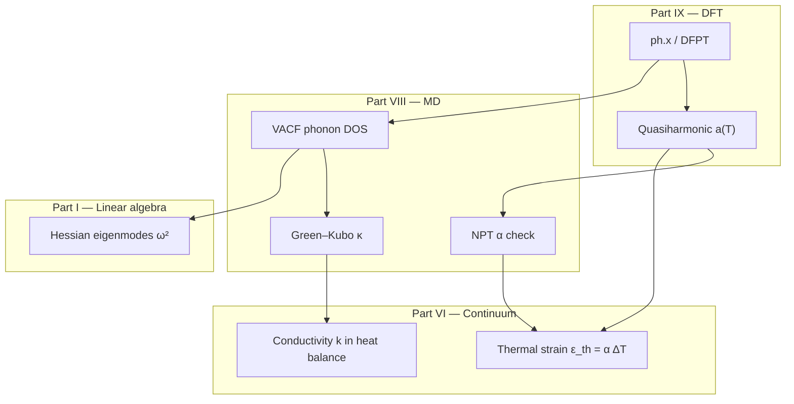

# DFT Workflows: From Input Files to Multiscale Numbers

Part IX, Chapters 1–2, derived the Kohn–Sham equations and explained why convergence matters. This chapter closes the electronic-structure arc with **practice**: how a DFT calculation is staged, verified, and translated into numbers that upstream parts of this book consume — elastic moduli for Part VI, cohesive energies for Part VIII potentials, surface and vacancy energies for Part VII defect thermodynamics.

The narrative thread remains the copper wire. We will not simulate the whole wire in Quantum ESPRESSO — no cluster has that memory — but we **will** walk through the same workflows used to produce the bulk properties that a wire model assumes: lattice constant, bulk modulus, elastic tensor, phonon check, and defect formation energy in a supercell. The homework archive for Cornell MSE 5720 ([MSE5720-HW](https://github.com/hanfengzhai/MSE5720-HW)) supplies worked examples; this chapter distills their logic into a reproducible ritual.

## Scene: bulk copper in a workstation

No cluster will ever run DFT on the full wire. Instead, a small fcc supercell on a workstation yields lattice constant, bulk modulus, elastic constants, vacancy formation energy — the bulk numbers every upstream model assumes. Input files, cutoff convergence, k-mesh tests, relaxation, SCF cycle, property extraction: this chapter is the repeatable ritual that turns Quantum ESPRESSO output into parameters for Parts VI–VIII.

## The calculation ladder inside DFT

Every property calculation is a sequence of controlled approximations:

```
Pseudopotential + functional  →  Cutoff & k-mesh convergence  →  Geometry relaxation
        →  Self-consistent field  →  Property extraction  →  Uncertainty & archiving
```

Skipping a rung produces pretty numbers with no contract to physics. The SCF cycle from Chapter 2 sits in the middle; **everything before it** sets the discretization of electron space; **everything after** exports to MD and continuum.

| Stage | Question answered | Failure symptom |
|-------|-------------------|-----------------|
| Pseudo + XC choice | Which electrons, which exchange–correlation model? | Systematic bias vs experiment |
| \(E_{\text{cut}}\), k-mesh | Is plane-wave / Brillouin-zone sampling adequate? | Energy drifts when grid refined |
| Relaxation | Are nuclei at mechanical equilibrium? | Spurious forces, wrong \(a_0\) |
| SCF | Is the density self-consistent? | Oscillating total energy |
| Property | What derivative / response is needed? | Noisy forces, imaginary phonons |

Treat this table like the convergence checklist in Part IV for mesh refinement — same intellectual habit, different parameters.

## HW1 pattern: convergence before trust (BAs example)

Homework 1 in MSE5720 uses boron arsenide (BAs) as a clean semiconductor example; the **workflow** transfers directly to fcc copper:

1. **Fix pseudopotentials** (ultrasoft or PAW) and functional (PBE is the common default; document the choice).
2. **Sweep plane-wave cutoff** \(E_{\text{cut}}\) at fixed k-mesh; plot total energy vs cutoff until changes fall below a tolerance (5 meV/atom is a typical homework criterion).
3. **Sweep k-point density** at converged cutoff; Monkhorst–Pack grids must respect symmetry.
4. **`vc-relax` or `relax`**: optimize lattice parameters and atomic positions until forces \(\|\mathbf{F}_I\| < \tau_F\).
5. **Extract bulk modulus**: series of `scf` calculations on isotropically scaled volumes; fit energy–volume data to a Birch–Murnaghan or similar equation of state (EOS).

For copper (fcc, 1 atom per primitive cell in some setups, more in conventional cell), the relaxed lattice constant should match experiment within a few percent for GGA-PBE — **systematic**, not tuned. If DFT gives \(a = 3.55\) Å vs experimental \(3.61\) Å, record the gap; do not silently force experimental values into a DFT-derived potential fit without documenting the strain offset.

### Parsing output and automation

Production workflows script the sweeps:

```bash
# Illustrative: cutoff convergence (Quantum ESPRESSO pw.x)
for ecut in 40 50 60 70 80; do
  sed "s/ecutwfc = .*/ecutwfc = $ecut/" template.in > run.in
  mpirun -np 4 pw.x < run.in > run_${ecut}.out
  grep "!" run_${ecut}.out | awk '{print ecut, $5}' >> energy_vs_ecut.dat
done
```

Archive **inputs, outputs, pseudopotential files, and code version**. Reproducibility is the multiscale contract: MD in Part VIII cannot cite "DFT said so" without a commit hash.

## Worked example: fcc copper from `pw.in` to elastic constants

The BAs homework pattern above is generic; this section walks **copper** end to end — the same material whose Young's modulus appears in Part VI and whose EAM fit is checked in Part VIII. We use Quantum ESPRESSO (`pw.x`) with PBE and ultrasoft pseudopotentials; the deck is abbreviated but complete enough to archive in a repository.

### Step 0 — Primitive cell and pseudopotential

Copper is fcc with one atom in the conventional cell (4 atoms) or one atom in the primitive cell. For bulk modulus and elastic constants, either works if Brillouin-zone sampling is consistent. Download `Cu.pbe-d-v1.0.uspp.F.UPF` from the [SSSP library](https://www.materialscloud.org/discover/sssp) or the Quantum ESPRESSO pseudopotential table; record the hash.

```text
&CONTROL
  calculation = 'vc-relax'
  prefix      = 'cu_bulk'
  pseudo_dir  = './pseudo/'
  outdir      = './tmp/'
  forc_conv_thr = 1.0d-4
/
&SYSTEM
  ibrav = 2
  celldm(1) = 6.80   ! initial guess; Å via celldm(1)*bohr_to_ang
  nat   = 1
  ntyp  = 1
  ecutwfc = 50       ! will sweep; Ry
  occupations = 'smearing'
  smearing = 'mp'
  degauss = 0.02
/
&ELECTRONS
  conv_thr = 1.0d-8
  mixing_beta = 0.3
/
&IONS
  ion_dynamics = 'bfgs'
/
ATOMIC_SPECIES
  Cu  63.546  Cu.pbe-d-v1.0.uspp.F.UPF
ATOMIC_POSITIONS crystal
  Cu  0.0  0.0  0.0
K_POINTS automatic
  12 12 12  0 0 0
```

Run `vc-relax` first; extract converged `celldm(1)` and total energy per atom. For PBE, expect \(a \approx 3.63\text{–}3.66\) Å vs experimental \(3.615\) Å — close enough to trust **trends**, not to force experimental \(a_0\) into a DFT-derived potential without documenting strain.

### Step 1 — Cutoff and k-mesh convergence (archive the curves)

Fix the relaxed lattice constant. Sweep `ecutwfc` at fixed `12 12 12` k-mesh; then sweep k-density at converged cutoff. Tabulate:

| `ecutwfc` (Ry) | \(E/N\) (Ry/atom) | \(\Delta E\) (meV/atom) |
|----------------|-------------------|-------------------------|
| 40 | (run) | — |
| 50 | (run) | (run) |
| 60 | (run) | (run) |
| 70 | (run) | (run) |

Stop when successive \(\Delta E < 5\) meV/atom. Repeat for k-mesh (`8×8×8`, `12×12×12`, `16×16×16`). **Plot both curves** in the study README — the epilogue's multiscale chain is only as honest as these plots.

### Step 2 — Equation of state and bulk modulus

With converged settings, run a series of `scf` jobs on isotropically scaled volumes \(V(\eta) = (1+\eta) V_0\) for \(\eta \in \{-0.04, -0.02, 0, 0.02, 0.04\}\). Fit \(E(V)\) to Birch–Murnaghan; extract \(B\) in GPa. Compare to experiment (\(B \approx 140\) GPa for Cu). Discrepancy is functional error, not a reason to hide the DFT value.

### Step 3 — Elastic constants via stress–strain

Apply small strains to the relaxed cell (±0.005 is typical). For cubic Cu, three independent deformations suffice (uniaxial, shear, volume-preserving). After each `vc-relax` or fixed-cell `scf` with `tprnfor = .true.`, read stresses and fit

\[
C_{11} = \frac{\partial \sigma_1}{\partial \varepsilon_1}\Big|_{\varepsilon=0}, \quad
C_{12} = \frac{\partial \sigma_1}{\partial \varepsilon_2}\Big|_{\varepsilon=0}, \quad
C_{44} = \frac{\partial \sigma_6}{\partial \varepsilon_6}\Big|_{\varepsilon=0}.
\]

Voigt averages give Young's modulus and Poisson's ratio for isotropic polycrystal estimates in Part VI:

\[
E = \frac{9B G}{3B + G}, \qquad \nu = \frac{3B - 2G}{2(3B + G)},
\]

with \(G = (C_{11} - C_{12} + 3C_{44})/5\) for cubic crystals. A typical PBE result: \(C_{11} \approx 170\) GPa, \(C_{12} \approx 120\) GPa, \(C_{44} \approx 75\) GPa — bracketing but not matching room-temperature experiment.

#### Strain-cell input decks (three deformations for cubic Cu)

Each elastic constant comes from a **fixed-cell** `scf` run with a small strain applied to the Bravais matrix. Archive three decks beside `cu.relax.out`:

**Uniaxial strain for \(C_{11}\)** — scale `celldm(1)` by \(1 + \delta\) with \(\delta = 0.005\):

```text
&CONTROL
  calculation = 'scf'
  prefix      = 'cu_C11_eps_p'
  pseudo_dir  = './pseudo/'
  outdir      = './tmp/'
  tprnfor     = .true.
/
&SYSTEM
  ibrav = 2
  celldm(1) = 6.826   ! (1 + 0.005) × relaxed celldm(1) from vc-relax
  nat   = 1
  ntyp  = 1
  ecutwfc = 60        ! converged value from Step 1
  occupations = 'smearing'
  smearing = 'mp'
  degauss = 0.02
/
&ELECTRONS
  conv_thr = 1.0d-10
/
ATOMIC_SPECIES
  Cu  63.546  Cu.pbe-d-v1.0.uspp.F.UPF
ATOMIC_POSITIONS crystal
  Cu  0.0  0.0  0.0
K_POINTS automatic
  16 16 16  0 0 0
```

Repeat with `celldm(1) = 6.758` (\(\delta = -0.005\)) for `cu_C11_eps_m`.

**Shear strain for \(C_{44}\)** — set `ibrav = 0` and supply a deformed Bravais matrix. For fcc copper with \(\delta = 0.005\), the xy shear component is \(\gamma = 2\delta = 0.01\) (QE Voigt \(\varepsilon_6 = \gamma\)). Start from the relaxed conventional-cell lattice vectors \(a_0\) and apply \(\mathbf{F} = \mathbf{I} + \delta \mathbf{e}_1 \otimes \mathbf{e}_2\):

```text
&CONTROL
  calculation = 'scf'
  prefix      = 'cu_C44_shear_p'
  pseudo_dir  = './pseudo/'
  outdir      = './tmp/'
  tprnfor     = .true.
/
&SYSTEM
  ibrav = 0
  nat   = 1
  ntyp  = 1
  ecutwfc = 60
  occupations = 'smearing'
  smearing = 'mp'
  degauss = 0.02
/
&ELECTRONS
  conv_thr = 1.0d-10
/
ATOMIC_SPECIES
  Cu  63.546  Cu.pbe-d-v1.0.uspp.F.UPF
CELL_PARAMETERS angstrom
  3.615   0.000   0.000
  0.036   3.615   0.000    ! a12 = a0 * gamma = a0 * 0.01
  0.000   0.000   3.615
ATOMIC_POSITIONS crystal
  Cu  0.0  0.0  0.0
K_POINTS automatic
  16 16 16  0 0 0
```

Repeat with `a12 = -0.036` for `cu_C44_shear_m`. Read \(\sigma_{xy}\) from the stress tensor (Voigt index 6) and fit \(C_{44} \approx [\sigma_{xy}(+\delta) - \sigma_{xy}(-\delta)] / (2\delta)\). Shear runs are sensitive to k-mesh symmetry — use identical Monkhorst–Pack grids on both signs.

**Volume-preserving tetragonal distortion for \(C_{12}\)** — elongate \(a\) and compress \(b, c\) so \(abc = a_0^3\). For \(\delta = 0.005\), set \(a = a_0(1+\delta)\), \(b = c = a_0(1+\delta)^{-1/2}\):

```text
&CONTROL
  calculation = 'scf'
  prefix      = 'cu_C12_tet_p'
  pseudo_dir  = './pseudo/'
  outdir      = './tmp/'
  tprnfor     = .true.
/
&SYSTEM
  ibrav = 0
  nat   = 1
  ntyp  = 1
  ecutwfc = 60
  occupations = 'smearing'
  smearing = 'mp'
  degauss = 0.02
/
&ELECTRONS
  conv_thr = 1.0d-10
/
ATOMIC_SPECIES
  Cu  63.546  Cu.pbe-d-v1.0.uspp.F.UPF
CELL_PARAMETERS angstrom
  3.633   0.000   0.000    ! a0 * (1 + delta)
  0.000   3.597   0.000    ! a0 * (1 + delta)^(-1/2)
  0.000   0.000   3.597
ATOMIC_POSITIONS crystal
  Cu  0.0  0.0  0.0
K_POINTS automatic
  16 16 16  0 0 0
```

Repeat with \(a = a_0(1-\delta)\), \(b = c = a_0(1-\delta)^{-1/2}\) for `cu_C12_tet_m`. The tetragonal response couples \(C_{11}\) and \(C_{12}\):

\[
\sigma_{11}^{\text{tet}} \approx (C_{11} - C_{12})\,\delta, \qquad
C_{12} \approx C_{11} - \frac{\sigma_{11}(+\delta) - \sigma_{11}(-\delta)}{2\delta}.
\]

Run the **uniaxial** deck first so \(C_{11}\) is known independently; then the tetragonal pair isolates \(C_{12}\). Archive all six strain decks (`C11±`, `C44±`, `C12±`) in `cu.elastic/` beside a one-line README listing relaxed \(a_0\), \(\delta\), and converged cutoff.

| Deformation | Deck prefix | Stress component | Elastic constant |
|-------------|-------------|------------------|------------------|
| Uniaxial ±\(\delta\) | `cu_C11_eps_±` | \(\sigma_{11}\) | \(C_{11}\) |
| Shear ±\(\delta\) | `cu_C44_shear_±` | \(\sigma_{xy}\) | \(C_{44}\) |
| Tetragonal ±\(\delta\) | `cu_C12_tet_±` | \(\sigma_{11}\) | \(C_{12}\) (with \(C_{11}\) from first row) |

#### Parsing `pw.x` output (forces, stress, energy)

Production workflows never read totals by hand. Standard grep/awk patterns for copper bulk runs:

```bash
# Total energy (Ry) — last occurrence per SCF cycle
grep "!" cu_C11_eps_p.out | tail -1 | awk '{print "Etot_Ry =", $5}'

# Convergence check
grep "convergence has been achieved" cu_C11_eps_p.out || echo "SCF FAILED"

# Total stress tensor (kbar) — Voigt order xx yy zz yz xz xy
grep -A 3 "total   stress" cu_C11_eps_p.out | tail -3

# Maximum force on atoms (Ry/Bohr) — must be ~0 for fixed-cell elastic runs
grep "Total force" cu_C11_eps_p.out | tail -1
```

Convert stress from kbar to GPa: multiply by \(0.1\). For uniaxial strain \(\varepsilon_{11} = \delta\):

\[
C_{11} \approx \frac{\sigma_{11}(+\delta) - \sigma_{11}(-\delta)}{2\delta}.
\]

| Parsed quantity | Typical converged value (Cu, PBE) | Failure symptom |
|-----------------|-------------------------------------|-----------------|
| `Etot` drift between ±\(\delta\) runs | \(< 1\) meV/atom | Cutoff or k-mesh too coarse |
| `sigma_11` symmetric in ±\(\delta\) | Yes to 0.1 GPa | Strain step too large; use \(\delta = 0.003\) |
| `Total force` | \(< 10^{-4}\) Ry/Bohr | Cell not relaxed before fixed-cell strain |
| SCF iterations | \(< 30\) with `mixing_beta = 0.3` | Add smearing; reduce `mixing_beta` |

Archive [`parse_elastic.sh`](../../scripts/parse_elastic.sh) beside the six strain decks in `cu.elastic/` — the epilogue's Handshake 1 cites this script's output, not a spreadsheet typed from memory. Run the full Act VI audit with:

```bash
./scripts/parse_dft_workflow.sh cu.foundation/
```

The workflow script checks `README.md`, optional `cu.relax.out` / `cu.phonon/` / `cu.gsf/`, runs `parse_elastic.sh` when `cu.elastic/` is complete, runs `parse_alpha.sh` when `cu.phonon/a_vs_T.dat` exists, runs `parse_vacf.sh` when `cu.phonon/phonon_dos_md.dat` exists (cross-checking acoustic peaks against `dispersion.dat`), runs `parse_gsf.sh` when `cu.gsf/gsf_cu111.dat` (or `gsf.dat`) exists, and emits `foundation_export.yaml` for the epilogue handshake table — including `stacking_fault:` with \(\gamma_{\text{sf}}\) for Part VII OpenDiS handoff and `md_phonon_dos:` with VACF acoustic-peak audit for Part VIII. A fixture study folder lives at [`fixtures/cu.foundation/`](../../fixtures/cu.foundation/) for CI smoke tests via [`test-fixtures.sh`](../../scripts/test-fixtures.sh).

#### `ph.x` input deck (phonon check before Part VIII)

After converged `vc-relax`, linear-response phonons confirm mechanical stability:

```text
&inputph
  tr2_ph = 1.0d-14
  prefix = 'cu_bulk'
  outdir = './tmp/'
  fildyn = 'cu.dyn'
  ldisp = .true.
  nq1 = 4
  nq2 = 4
  nq3 = 4
/
```

Run `ph.x < cu.ph.in > cu.ph.out`, then `q2r.x` and `matdyn.x` on `cu.dyn` to plot dispersion. **Pass criterion:** acoustic branches at \(\Gamma\) go to zero within numerical noise; no imaginary frequencies. Archive `cu.phonon/` with the elastic folder — Part VIII's VACF handshake and Part VI's \(\alpha(T)\) workflow both consume this directory.

### Step 4 — Vacancy supercell (handoff to Part VII)

Build a \(3\times3\times3\) conventional cell (108 atoms). Remove one atom; relax with fixed cell shape. Formation energy:

\[
E_f^v = E_{107} - \frac{107}{108} E_{108}.
\]

Converge with respect to supercell size and k-mesh. Archive \(E_f^v\) alongside the bulk \(a_0\) and \(C_{ij}\) — Part VII's defect thermodynamics and Part VIII's EAM fitting both consume this number.

### Step 5 — Export table for upstream parts

| Quantity | Typical PBE value | Used in |
|----------|-------------------|---------|
| \(a_0\) | 3.63–3.66 Å | Part VI reference configuration |
| \(B\) | 130–145 GPa | Part VI bulk response |
| \(C_{11}, C_{12}, C_{44}\) | see above | Part IV anisotropic elements; [Part VI Voigt/Reuss handshake](../part06-continuum/02-stress-balance.md#scale-boundary-handshake-dft-elastic-tensor-to-fem-material-card) |
| \(\alpha(300\,\text{K})\) | 15–18 × 10⁻⁶ K⁻¹ | [Part VI thermal expansion handshake](../part06-continuum/02-stress-balance.md#scale-boundary-handshake-thermal-expansion-coefficient-alpha-dft-phonons--md-npt--fem-thermal-strain); Part IV coupled thermoelastic |
| \(E_f^v\) | 1.0–1.3 eV | Part VII, Part VIII |
| Phonon DOS (optional `ph.x`) | acoustic branch at \(\Gamma\) | Part VIII thermostat validation; \(\alpha(T)\) workflow below |

Commit the converged `pw.in`, pseudopotential, and a one-page README with functional, cutoffs, and final numbers. That commit hash is what you cite when the copper wire FEM model uses \(E = 120\) GPa — not a vague "DFT said so."

## HW2 pattern: bands, DOS, and elasticity (Si extended to metals)

Homework 2 explores silicon: projected density of states (s/p/d character), band structure along high-symmetry paths, and elastic constants from stress–strain linear response. For **copper**, the same machinery applies with metal-specific care:

- **Smearing**: occupations are fractional at the Fermi level; Gaussian or Methfessel–Paxton smearing prevents SCF oscillations. Too little smearing → noisy convergence; too much → blurred Fermi surface.
- **Dense k-meshes** for density integrations; coarser meshes sometimes suffice for band plots along paths (`bands.x`, `nscf` with fixed potential from prior `scf`).
- **Elastic tensor**: apply small strains \(\pm\delta\) to the cell, compute stress via DFT (or use DFPT if available); fit \(C_{ijkl}\). Voigt notation maps to Young's modulus and Poisson's ratio used in Part VI.

Compare DFT \(C_{ijkl}\) to Part VIII MD estimates via fluctuation formulas at finite temperature — they should bracket experiment, not duplicate it exactly (anharmonicity, finite-T effects).

Phonon calculations (`ph.x`, `q2r.x`, `matdyn.x` in the HW2 scripts) linearize DFT around equilibrium. **Imaginary frequencies** signal instability — wrong structure, bad k-mesh, or a phase that is not the ground state. For copper at equilibrium, acoustic branches should pass through zero at \(\Gamma\); optical modes lie at higher frequency. Phonon DOS validates MD thermostats and thermal conductivity estimates downstream.

**Scale-boundary handshake (DFT → MD).** Archive the converged `ph.x` output beside the bulk SCF deck. Part VIII's [phonon validation Lab act](../part08-md/02-ensembles-integrators.md#scale-boundary-handshake-phonons-from-dft-to-md-validation) compares these frequencies to MD velocity-autocorrelation spectra on the same supercell with the production EAM potential. If optical branches shift by more than 10% while bulk modulus still matches, the potential is tuned to elasticity but wrong for core structures — fix the fit before exporting \(\gamma_{\text{sf}}\) or mobility to Part VII. The handshake is the electronic-to-classical counterpart of Part IV's mesh-refinement plot: two discretizations of the same copper lattice must agree on the same observable before coarser models inherit the numbers.

### Phonon pedigree map (cross-scale index)

Phonons are not a Part IX side quest — they are the **vibration thread** that ties eigenmodes (Part I), function-space convergence (Part II), thermal eigenstrain (Part VI), MD validation (Part VIII), and electronic-structure exports (Part IX) into one audit trail. Use this map when any downstream model cites a thermal or elastic number without naming which phonon workflow produced it:



| Phonon quantity | Origin workflow | Archive file | Downstream consumer | Cross-link |
|-----------------|-----------------|--------------|---------------------|------------|
| \(\omega(q)\) at \(\Gamma\), LA branch | IX: `ph.x` on converged bulk | `cu.phonon/dispersion.dat` | VIII: VACF peak positions | [VIII.2 handshake](../part08-md/02-ensembles-integrators.md#scale-boundary-handshake-phonons-from-dft-to-md-validation) |
| Phonon DOS \(g(\omega)\) | VIII: Fourier transform of VACF | `phonon_dos_md.dat` | I.3 eigenmode intuition; mobility phonon drag | [VIII.2 VACF section](../part08-md/02-ensembles-integrators.md#scale-boundary-handshake-md-phonons--part-ix--part-vi-alpha) |
| \(\alpha(T)\) | IX: quasiharmonic \(a(T)\) fit | `cu.phonon/a_vs_T.dat` | VI: thermal eigenstrain; IV coupled thermoelastic | [VI.2 α handshake](../part06-continuum/02-stress-balance.md#scale-boundary-handshake-thermal-expansion-coefficient-alpha-dft-phonons--md-npt--fem-thermal-strain) |
| \(\alpha(T)\) cross-check | VIII: NPT lattice parameter vs \(T\) | `alpha_npt_md.dat` | Same as above — 10% agreement with IX | [VIII.2](../part08-md/02-ensembles-integrators.md) |
| \(\kappa(T)\) | VIII: Green–Kubo NVE integral | `kappa_md_300K.txt` | VI: Joule heating; V: thermal diffusion | [VIII.1 Green–Kubo](../part08-md/01-potentials-phase-space.md#thermal-conductivity-and-phonons) |
| Phonon lifetime \(\tau_n\) | IX: anharmonic `ph.x` or VIII: VACF width | `phonon_lifetime.dat` | VII: mobility drag; VIII: κ reduction | [VII.2 mobility Lab act](../part07-defects/02-dislocation-dynamics.md#lab-act-calibrate-screw-mobility-from-md-shear-act-iv--mobility-prelude) |

**Reading order vs foundation order.** Linear readers meet phonons here in Part IX after MD and DDD; workflow readers may have run VACF checks in Part VIII first. Both paths are valid if the **foundation folder** contains matching rows: `cu.phonon/` from DFT, `phonon_dos_md.dat` from MD, and explicit pass/fail against the 10% optical-branch criterion before exporting \(\gamma_{\text{sf}}\), mobility, or \(\alpha\) upstream.

**Part II contract.** Part II asked: what object, what structure, what theorem, what breaks? For phonons: object = normal mode coordinates; structure = harmonic Hamiltonian \(H = \sum_n \hbar\omega_n (n_n + \tfrac{1}{2})\); theorem = equipartition and quasiharmonic free energy; breaks = imaginary modes (wrong structure), anharmonicity at high \(T\), defect scattering. When `ph.x` returns imaginary frequencies at \(\Gamma\), the fix is the same instinct as Part II completeness — refine the discretization (relaxation, k-mesh) until the limit object is admissible.

<a id="lab-act-quasiharmonic-alpha-handshake-3-pedigree"></a>

### Lab act: quasiharmonic \(\alpha\) export for Handshake 3 (Act VI — Foundation) {#thermal-expansion-from-quasiharmonic-phonons-handshake-3-pedigree}

This Lab act is the **upstream half** of epilogue [Handshake 3](../epilogue/multiscale.md#handshake-3--thermal-strain--mechanical-stiffness-part-vi--iv): archive quasiharmonic \(\alpha(300\,\text{K})\) with the same pedigree as \(C_{ij}\) before the load cell reads fixed-grip thermal stress. The [preface Joule heat → fixed-grip stress row](../preface.md#epilogue-continuity-hinges) lists Handshake 2 → this Lab act → Handshake 3 in workflow order; [memory sheet row 13](../appendix/memory-sheet.md#continuity-hinges-master-map) is the one-page map when CHT converges but handbook \(\alpha\) still sits in the FEM deck.

Part VI's [thermal expansion handshake](../part06-continuum/02-stress-balance.md#scale-boundary-handshake-thermal-expansion-coefficient-alpha-dft-phonons--md-npt--fem-thermal-strain) needs \(\alpha(T)\) with the same audit trail as \(C_{ij}\). Phonons supply it through the **quasiharmonic approximation**: treat phonon frequencies as functions of volume, compute the Helmholtz free energy \(F(V,T)\), and minimize over \(V\) at each temperature to obtain \(a(T)\).

**Workflow on bulk fcc Cu:**

1. **Converged ground state.** Start from the same `vc-relax` geometry as the elastic-constant run — same functional, cutoff, and k-mesh documented in `README.md`.
2. **Phonon calculation.** Run `ph.x` on a dense q-mesh (or finite-difference forces on supercell displacements). Confirm acoustic branches go to zero at \(\Gamma\); archive `cu.phonon/` beside `cu.elastic/`.
3. **Volume–temperature scan.** For each temperature \(T \in \{100, 200, 300, 400, 500\}\,\text{K}\), compute \(F(V,T)\) from phonon DOS (or run `vc-relax` at fixed \(T\) with Mermin smearing in advanced workflows). Extract equilibrium volume \(V(T)\) and lattice parameter \(a(T) = (4V/N_{\text{atoms}})^{1/3}\).
4. **Differentiate.** Fit \(a(T)\) locally around 300 K:

\[
\alpha = \frac{1}{a}\frac{da}{dT}\Big|_{300\,\text{K}}.
\]

Typical PBE quasiharmonic results: \(\alpha \approx 15\)–\(18 \times 10^{-6}\,\text{K}^{-1}\) at 300 K vs. experimental \(\sim 16.7 \times 10^{-6}\,\text{K}^{-1}\). Anharmonicity at high \(T\) (relevant to Joule-heated wire mid-span) may require MD NPT cross-check from Part VIII — document both numbers.

| Export | DFT artifact | Part VI / IV consumer |
|--------|--------------|------------------------|
| \(\alpha(300\,\text{K})\) | `cu.phonon/` + \(a(T)\) fit | FEM `*EXPANSION`; thermal strain \(\varepsilon_{\text{th}}\) |
| \(C_p(T)\) (optional) | Phonon DOS integration | Transient heat capacity in coupled runs |
| Linear thermal expansion range | \(a(T)\) table 100–500 K | Act II \(\Delta T \sim 35\,^\circ\text{C}\) sanity check |

**Convergence checklist for \(\alpha\):**

| Parameter | Starting value | Test |
|-----------|----------------|------|
| Phonon q-mesh | \(8\times8\times8\) | Double mesh; \(\alpha\) stable within 5% |
| Volume points for \(F(V,T)\) | 5 volumes ±2% around equilibrium | Add points; check \(\partial F/\partial V\) smoothness |
| Temperature spacing | 100 K steps | Refine near 300 K if Act II uses narrow \(\Delta T\) band |
| Functional | PBE (document) | Note LDA often overbinds; SCAN if budget allows |

**Bridge to the epilogue.** Handshake 3 in the multiscale afternoon uses \(\alpha \Delta T\) to estimate fixed-grip thermal stress against the 50 N mechanical load — with \(\Delta T = T_w - T_\infty\) inherited from [Handshake 2](../epilogue/multiscale.md#handshake-2--joule-heating--conjugate-heat-transfer-part-iv--v), not a room-temperature default. The epilogue's [sensitivity table](../epilogue/multiscale.md#sensitivity-which-handshake-matters-most) ranks Handshake 3 **first for fixed-grip stress**: a \(\pm 10\%\) error in \(\alpha\) shifts thermal compression by \(\sim \pm 18\,\text{MPa}\) — three times the 50 N mechanical stress on the prologue wire. Read the [worked load-cell example](../epilogue/multiscale.md#handshake-3--thermal-strain--mechanical-stiffness-part-vi--iv) beside the quasiharmonic numbers you archive here, then complete the [sensitivity derivation worksheet](../epilogue/multiscale.md#worked-example-sensitivity-ranks) to prove why Handshake 3 dominates fixed-grip readings — the quantitative mirror of [preface row 13 skill checkpoint](../preface.md#skill-navigation-row-13) and [memory sheet row 13](../appendix/memory-sheet.md#continuity-hinges-master-map). If `cu.phonon/` exists but the FEM deck cites "handbook 17e-6" without a path, Act VI is **partially complete** — elastic moduli are audited but thermal eigenstrain is folklore. Archive \(\alpha\) in the same foundation folder as \(C_{11}\) and \(E_f^v\). When the full afternoon is clear but workflow order is not, read the [preface six-act reunion pointer](../preface.md#epilogue-continuity-hinges) and the epilogue's [Lab act reunion: six acts, one afternoon](../epilogue/multiscale.md#lab-act-reunion-six-acts-one-afternoon) — Act VI (this Lab act) runs in parallel with Acts I–V, not after them.

**Automation.** Tabulate quasiharmonic \(a(T)\) in `cu.phonon/a_vs_T.dat` and run `./scripts/parse_alpha.sh cu.phonon/` to emit `alpha_export.yaml` with \(\alpha(300\,\text{K})\), \(\varepsilon_{\text{th}} = \alpha \Delta T\), and fixed-grip \(\sigma_{\text{th}} = E \alpha \Delta T\). The script writes `alpha_cu_300K.dat` beside the phonon archive — the thermal-expansion analogue of `./scripts/parse_elastic.sh` for \(C_{ij}\); it is the IX.3 competence artifact in the [Part IX skill checkpoint](../part09-dft/00-opening.md#what-you-should-be-able-to-do-after-part-ix). When `parse_dft_workflow.sh` finds `cu.phonon/a_vs_T.dat`, it runs `parse_alpha.sh` automatically and merges Handshake 3 exports into `foundation_export.yaml`. When `cu.phonon/phonon_dos_md.dat` is present (from Part VIII VACF), the same workflow runs `parse_vacf.sh` and merges `md_phonon_dos:` with acoustic-peak pass/fail against `dispersion.dat` — one foundation audit for both quasiharmonic \(\alpha\) and MD phonon validation.

## HW3 pattern: phase stability under pressure

Homework 3 pushes silicon through pressure-induced phase transitions — diamond vs \(\beta\)-Sn structure — by comparing **enthalpies** \(H = E + PV\) at competing phases. The critical pressure where enthalpies cross (order 10 GPa in the homework narrative) is a DFT prediction testable against experiment.

Copper's fcc structure is stable under ambient wire-drawing conditions, but the lesson generalizes: **when multiple polymorphs compete**, total energy alone misleads at finite pressure. Multiscale models of manufacturing (rolling, drawing) that change texture and defect density sometimes approach phase boundaries in alloyed systems — DFT enthalpy curves are the sanity check.

Phonon dispersion at strained volumes (HW3's \(\pm 5\%\) volume perturbations) probes **mechanical stability**: soft modes foreshadow structural transitions. Link this to Part VI's tangent stiffness: a negative eigenvalue in the elastic stiffness tensor is the continuum hint of an unstable lattice mode.

## HW4 pattern: vibrational spectroscopy and disorder

Homework 4 on calcite demonstrates zone-center phonons, mode intensities, and disordered structures — spectroscopy-facing output. For metals, analogous workflows support:

- **Infrared/Raman inactive** bulk modes but **surface** and **defect** vibrational signatures in nanostructured wires.
- **Disordered** or **alloyed** cells (substitutional defects) requiring larger supercells and careful averaging.

Disorder connects to the drawn wire's polycrystalline texture: bulk single-crystal DFT moduli averaged with Voigt/Reuss bounds (Part VI homogenization preview) approximate effective properties — with error bars when texture is strong.

## Defect calculations: vacancy in copper

Export a number Part VII needs: **vacancy formation energy**

\[
E_f^v = E(N-1) - \frac{N-1}{N}\,E(N),
\]

in a supercell with \(N\) atoms, fully relaxed with fixed cell shape or `vc-relax` depending on boundary conditions. Convergence requires:

- Supercell size increase until \(E_f^v\) stabilizes (images of the vacancy interacting through periodic boundaries).
- k-mesh refinement with cell size.
- Chemical potential reference if vacancies exchange atoms with a reservoir (more relevant for open systems).

Compare to experiment (~1.17 eV for Cu at 0 K, order-of-magnitude) and to EAM/MEAM values used in Part VIII MD. Discrepancy is not failure — it documents functional and pseudo error budgets.

## Worked example: generalized stacking-fault energy (handoff to Part VII)

Part VII's dislocation dynamics consumed a **stacking-fault energy** \(\gamma_{\text{sf}}\) when partial dislocations separated on {111} planes — the energy cost of making a faulted region one atomic layer thick. That number entered mobility tables and hardening curves without a full derivation. Here we close the loop: DFT computes \(\gamma_{\text{sf}}\) from first principles, and Part VII imports it with a pedigree.

### The faulted-supercell construction

Copper is fcc. A stacking fault on {111} shifts every plane above the cut by a partial Burgers vector \(\mathbf{b}_p = \mathbf{a}/6\langle 112\rangle\), creating a local hcp-like stacking sequence (ABC**A**BC instead of ABCABC). The **generalized stacking-fault (GSF) surface** \(\gamma(\mathbf{u})\) maps shear displacement \(\mathbf{u}\) in the fault plane to energy per unit area; the value at the unstable stacking fault (USF) configuration sets the Peierls barrier scale, and the value at the stable fault (SF) configuration is the quantity DDD codes tabulate.

For a first-principles estimate of the stable fault energy:

1. **Build a slab supercell** with at least 12–16 atomic layers along [111], separated by vacuum (or use periodic images with sufficient layer count to suppress interaction).
2. **Cut and shift** the upper half of the slab by the stable-fault displacement — typically implemented as a rigid shift followed by atomic relaxation in the fault plane only (fix bottom layers, relax top layers).
3. **Run `relax` or `vc-relax`** with fixed in-plane cell vectors; total energy minus the perfect-crystal reference gives fault energy.
4. **Divide by fault area** \(A = |\mathbf{a}_1 \times \mathbf{a}_2|\) in the {111} plane.

```text
E_gsf = (E_faulted - E_perfect) / A_fault    [eV/Ų]
γ_sf  = E_gsf × (16.02 / 1.602)             [mJ/m²]
```

The unit conversion (eV/Ų → mJ/m²) is a recurring arithmetic trap — archive the conversion factor in the README beside the raw numbers.

### Convergence checklist specific to GSF

| Parameter | Typical starting value (Cu {111}) | Convergence test |
|-----------|-----------------------------------|------------------|
| Slab layers | 12–16 along [111] | Double layer count; \(\gamma_{\text{sf}}\) should stabilize within 5% |
| k-mesh in plane | \(12 \times 12 \times 1\) Monkhorst–Pack | Increase to \(16 \times 16 \times 1\) |
| Vacuum gap (if non-periodic) | 10–15 Å | Double gap; energy change < 1 meV/atom |
| Relaxation depth | Top 4–6 layers free | Compare to full-slab relaxation |
| Functional | PBE (document choice) | Compare to LDA or SCAN if time permits |

Under-converged slabs produce \(\gamma_{\text{sf}}\) that drifts with layer count — the DFT analogue of a DDD simulation whose box is too small for image forces to decay. Part VII's [Lab act on forest hardening](../part07-defects/02-dislocation-dynamics.md) assumed a tabulated \(\gamma_{\text{sf}}\); this workflow is where that table entry should originate.

### Full GSF curve (optional but illuminating)

A single stable-fault energy is enough for DDD mobility tables, but the **full \(\gamma(\mathbf{u})\) curve** explains why partials dissociate and how cross-slip competes with glide. Sweep in-plane displacements \(\mathbf{u} = \alpha \mathbf{b}_p\) for \(\alpha \in [0, 1]\) (and beyond for the unstable fault):

| \(\alpha\) | Physical meaning | Expected energy trend (Cu) |
|------------|------------------|----------------------------|
| 0 | Perfect crystal | \(\gamma = 0\) (reference) |
| 0.5 | Unstable stacking fault (USF) | Local maximum (~200–300 mJ/m² for Cu) |
| 1.0 | Stable intrinsic fault | Local minimum (~40–50 mJ/m² for Cu, experiment ~45) |

Plot \(\gamma(\alpha)\) and archive the curve — Part VII's partial-dislocation separation width scales as \(\propto \mu \mathbf{b}_p / \gamma_{\text{sf}}\), and the USF peak sets the barrier for cross-slip during cold drawing. When the epilogue wires DFT → MD → DDD → FEM, this curve is the **first handshake** between electronic structure and line-defect mechanics.

**Automation.** After a DFT displacement sweep or a metadynamics run (Part VIII.3 Lab act), tabulate \((\alpha, E, \gamma)\) in `gsf_cu111.dat` and run `./scripts/parse_gsf.sh gsf_cu111.dat` to extract \(\gamma_{\text{sf}}\), \(\gamma_{\text{USF}}\), partial separation, and an OpenDiS-ready yaml snippet — the GSF analogue of `./scripts/parse_elastic.sh` for elastic constants.

### Bridge table: DFT GSF → Part VII DDD

| DFT export | Part VII consumer | Copper wire context |
|------------|-------------------|---------------------|
| \(\gamma_{\text{sf}}\) at stable fault | Partial separation width in DDD | Cold-drawn wire's forest density |
| \(\gamma_{\text{USF}}\) at unstable fault | Cross-slip activation scale | Recovery annealing kinetics |
| \(\mathrm{d}^2\gamma/\mathrm{d}u^2\) at minimum | Dislocation core structure models | Notch tip plastic zone size |
| Full \(\gamma(\mathbf{u})\) surface | Mobility law fitting in DDD | Work-hardening curve in Act IV |

If your project folder contains `cu.gsf/` with converged slab calculations but Part VII's DDD input still cites "literature value 45 mJ/m²" without a path, **Act VI is incomplete** — the downward derivation stopped one rung above where it should have.

## From DFT outputs to the rest of the book

| DFT workflow output | Used in | Copper wire context |
|---------------------|---------|---------------------|
| \(a_0\), \(B\) | Part VI elasticity | Stiffness in tension test FEM |
| \(C_{ijkl}\) | Part VI, IV anisotropic elements | Texture-dependent moduli |
| \(E_f^v\), \(E_f^s\) (surface) | Part VII defects | Recovery annealing, void nucleation |
| Phonons | Part VIII MD validation | Thermal expansion, heat capacity |
| Forces on displaced atoms | EAM fitting | Notch MD with trustworthy potential |
| NEB migration barriers | Part VII kinetics | Creep, diffusion during anneal |

The epilogue's sequential homogenization chain starts here — not at FEM. A wire simulation that imports \(E = 120\) GPa without asking whether it came from Voigt-averaged DFT, room-temperature experiment, or cold-worked polycrystal data carries silent assumptions this chapter makes explicit.

## Common workflow failures (and fixes)

| Symptom | Diagnosis | Fix |
|---------|-----------|-----|
| Total energy shifts when cell duplicated | Extensive vs intensive confusion | Report per-atom or per-formula-unit energies |
| SCF "not converged" | Cutoff too low, bad mixing, metal without smearing | Raise \(E_{\text{cut}}\), adjust `mixing_beta`, add smearing |
| Relaxation stalls | Force threshold too tight, bad initial geometry | Loosen then tighten; check space group |
| Elastic constants non-symmetric | Strain steps too large, insufficient SCF tolerance | Reduce strain, tighten `conv_thr` |
| Imaginary phonons at \(\Gamma\) | Incomplete relaxation, wrong structure | Re-relax; check space group and k-mesh |

Each fix mirrors habits from Part IV: refine discretization, tighten solver tolerance, verify boundary conditions.

## Jupyter, HPC, and team practice

MSE5720 homeworks combine Jupyter notebooks with batch scripts for clusters (XSEDE-style queues). Modern equivalents use Slurm arrays to sweep parameters. The book does not prescribe a cluster — but it prescribes **discipline**:

- Version-control inputs alongside manuscripts.
- One `README` per study listing functional, pseudo, cutoffs, and final converged values.
- Plot convergence curves in supplementary material, not only final answers.

Scientific machine learning surrogates (epilogue) trained on DFT data inherit these metadata requirements. A neural network predicting formation energy without functional labels is not multiscale — it is interpolation without a ladder.

## Concept map checkpoint (Part IX)

Part IX followed the DFT coursework arc from Born–Oppenheimer through Quantum ESPRESSO workflows. The four questions summarize the electronic scale:

| Question | Part IX answer (copper wire) |
|----------|------------------------------|
| What **object**? | Electron density \(\rho(\mathbf{r})\), Kohn–Sham orbitals, ionic positions |
| What **structure**? | Hohenberg–Kohn variational principle; SCF cycle; plane-wave basis, k-mesh |
| What **theorem**? | Hohenberg–Kohn; Kohn–Sham mapping (with approximate \(E_{xc}\)) |
| What **breaks**? | Functional dependence; metals without smearing; pseudopotential transferability |

The export table above is where the **downward derivation** of the ladder begins: \(E_{\text{coh}}\), \(C_{ijkl}\), stacking-fault energies, and phonons feed MD potentials, DDD mobilities, and continuum moduli. A wire simulation that imports \(E = 120\) GPa without asking whether it came from Voigt-averaged DFT, room-temperature experiment, or cold-worked polycrystal data carries silent assumptions this part makes explicit. The epilogue asks how disciplined teams wire these exports into multiscale workflows.

## Lab act: archive the foundation run before the wire-scale solve (Act VI — Foundation)

**Act VI** in the lab is the offline foundation run — the DFT calculation that must finish before anyone trusts the EAM potential, the mobility table, or the Young's modulus in the FEM input deck. This chapter's workflow discipline is not bureaucracy; it is the audit trail the epilogue's multiscale afternoon will ask you to produce.

Before closing Part IX, create one folder — paper or digital — for bulk fcc Cu with this minimum metadata:

| File / record | Must contain | Feeds |
|---------------|--------------|-------|
| `cu.scf.in` | Functional (PBE), cutoff (Ry), k-mesh, converged total energy | \(E_{\text{coh}}\), \(a_0\) |
| `cu.relax.out` | Final forces \(< 10^{-4}\) Ry/Bohr, relaxed \(a\) | Equilibrium lattice for MD box |
| `cu.elastic/` | ±0.5% strain cells, symmetric \(C_{ij}\) | Part VI moduli; Part IV elastic step |
| `README.md` | Pseudo version, QE version, date, who ran it | Team audit; epilogue handoff |

The pedigree checklist in [VIII.3](../part08-md/03-ab-initio-and-coarse-graining.md#bridge-to-part-ix) maps each row to a Part VIII use. If your project folder has only "EAM fit to experiment" with no `pw.x` log, **Act VI is missing** — and the wire-scale FEM run carries silent assumptions this chapter makes explicit.

Run one convergence check before archiving: double the plane-wave cutoff and confirm \(E_{\text{tot}}\) changes by less than 1 meV/atom. Part II taught that honest FEM requires a convergence target in \(H^1\); Part IX teaches the same instinct at the electronic scale — SCF energy must settle before any number climbs the ladder.

## Bridge to the epilogue {#bridge-to-the-epilogue}

Part IX closes the **downward** audit: fcc Cu has converged SCF logs, elastic constants, vacancy and stacking-fault energies, and archived input decks. The copper wire on the bench — sag under self-weight, Joule heat in **Act II**, work hardening in **Act IV**, notch concentration in **Act V** — never lives in a 2-atom supercell. It lives in the **export chain** this chapter disciplined.

| What Part IX (this chapter) exported | What the epilogue must couple upward |
|--------------------------------------|--------------------------------------|
| Converged \(E_{\text{cut}}\), k-mesh, `vc-relax` + `scf` series for fcc Cu | Pedigree tables: every macro input traces to a foundation run |
| \(C_{ij}\), cohesive energy, vacancy \(E_f\), GSF surface | EAM/MEAM fits (Part VIII) → mobility tables (Part VII) → \(\mathbb{C}\), \(\sigma_y\) (Part VI) |
| Documented defect supercells and finite-size studies | FE² / concurrent handshakes when homogenization fails at the notch |
| Reproducible QE/VASP/GPAW archive (MSE 5720 template) | Sequential vs. concurrent coupling; surrogate acceleration with stated tolerances |

**Scale-boundary handshake (IX.3 → epilogue → full ladder).**

| DFT archive (this chapter) | Audit gate | Upstream consumer | Failure mode |
|----------------------------|------------|-------------------|--------------|
| `cu.scf.in` + convergence log | \(E_{\text{tot}}\) change \(< 1\) meV/atom on cutoff doubling | Part VIII EAM fit ([VIII.3](../part08-md/03-ab-initio-and-coarse-graining.md)) | Under-converged \(E_{\text{cut}}\) in LAMMPS |
| Relaxed \(a_0\) from `vc-relax` | Forces \(< 10^{-4}\) Ry/Bohr | Part VIII NPT box; Part VII Burgers \(b\) | Wrong lattice constant in DDD yaml |
| Symmetric \(C_{ij}\) from strain series | ±0.5% strain cells converged | Part IV elastic step; Part VI \(\mathbb{C}\) | Single-point stress without relaxation |
| Vacancy \(E_f^v\) + finite-size study | Supercell large enough for image decay | Part VIII NEB; annealing kinetics | Image charge in too-small cell |
| GSF surface from slab calculations | Correct slip plane and k-mesh | Part VII partial dislocation laws | Wrong stacking sequence in slab |
| `ph.x` phonon export | k-mesh convergence in DFPT | Part VIII VACF cross-check ([VIII.2](../part08-md/02-ensembles-integrators.md)) | Incomplete phonon DOS at high \(T\) |

**Epilogue pedigree table (IX.3 → four handshakes).** The epilogue's multiscale afternoon chains four interfaces on the same copper wire. Every row below must trace to a file in the foundation folder archived by this chapter — the same habit as FEM mesh convergence studies in Part IV:

| Epilogue handshake | DFT export (this chapter) | Archive artifact | Upstream part that consumes it |
|--------------------|---------------------------|------------------|--------------------------------|
| **1 — DFT → continuum** | Voigt \(E\), \(\nu\) from symmetric \(C_{ij}\); relaxed \(a_0\) | `cu.elastic/`, `cu.relax.out` | Part IV elastic step; Part VI \(\mathbb{C}\) |
| **2 — Joule → CHT** | *(Parts IV–V workflow — not a DFT export)* converged \(T_w\), \(h\), \(\Delta T = T_w - T_\infty\) | `cht_export.yaml` via [`parse_cht.sh`](../../scripts/parse_cht.sh) | Sets \(\Delta T\) for Handshakes 3–4a; [dominates \(T_w\) in sensitivity table](../epilogue/multiscale.md#sensitivity-which-handshake-matters-most); [preface hinge row](../preface.md#epilogue-continuity-hinges) |
| **3 — thermal → mechanical** | Quasiharmonic \(\alpha(T)\) from `ph.x` / phonon DOS; fixed-grip \(\sigma_{\text{th}} = E\alpha\Delta T\) with \(\Delta T\) from Handshake 2 — [ranks first for load-cell stress](../epilogue/multiscale.md#sensitivity-which-handshake-matters-most) | `alpha_cu_300K.dat`, `cu.phonon/a_vs_T.dat` | Part VI return-mapping at heated grip; [Handshake 3 worked example](../epilogue/multiscale.md#handshake-3--thermal-strain--mechanical-stiffness-part-vi--iv) |
| **4a — rate hardening** | (indirect) phonon drag bounds on \(m\) | `cu.phonon/` + MD VACF cross-check | Part VII mobility \(M(\tau,T)\) |
| **4b — notch localization** | Stacking-fault energy \(\gamma_{\text{sf}}\); vacancy \(E_f^v\) | GSF slab; defect supercell | Part VIII NEB; Part VII partial dislocations |

When the epilogue asks *does thermal softening change stiffness before yield?*, Handshake 1 alone is insufficient — Handshake 2 (CHT, Parts IV–V) must converge **before** Handshake 3 consumes quasiharmonic \(\alpha\): row 2 supplies \(\Delta T\); row 3 supplies \(\alpha\). Mixing them — e.g. archiving `cu.phonon/` under Handshake 2 while `cht_export.yaml` is missing — is the pedigree error the [preface Joule heat → fixed-grip stress row](../preface.md#epilogue-continuity-hinges) warns against. Run [`parse_dft_workflow.sh`](../../scripts/parse_dft_workflow.sh) and [`parse_multiscale_workflow.sh`](../../scripts/parse_multiscale_workflow.sh) to emit `foundation_export.yaml` and `multiscale_export.yaml` beside the Act VI folder before opening the epilogue.

Part I's eigenvalue loop — assemble, solve, update — reappears as the SCF cycle archived here; Part II's convergence instinct as cutoff and k-mesh sweeps; Part IV's verification habit as the pedigree checklist above. The book's **ascent** (Parts I–VI) and **descent** (Parts VII–IX) meet in the epilogue when every macro input traces to a foundation run someone can reproduce.

Return to the [prologue](../prologue/00-many-scales.md): **Act VI — Foundation** ran in parallel with Acts I–V — the invisible afternoon where someone chose \(E\), \(\nu\), and surface energies before the load cell moved. [IX.1](../part09-dft/01-born-oppenheimer.md) named the BO surface; [IX.2](../part09-dft/02-kohn-sham.md) ran the SCF loop; this chapter archived the numbers [VIII.3](../part08-md/03-ab-initio-and-coarse-graining.md) and [VII.3](../part07-defects/03-polycrystal-and-fem-handoff.md) consume. The epilogue is where **Door A** (FVM cooling) and **Door B** (FEM solid) from [IV.5](../part04-fem/05-convergence.md#bridge-two-doors-from-here) meet the DFT→MD→DDD→FEM ladder in one multiscale afternoon.

Read the epilogue's [**Closing the arc from Part IX**](../epilogue/multiscale.md#closing-the-arc-from-part-ix) first for the export table mapped onto the wire specimen; then the general coupling patterns (partitioned CHT, sequential homogenization, concurrent FE²). When mathematical order (I→IX) and laboratory time diverge, the [preface six-act reunion row](../preface.md#epilogue-continuity-hinges) and the epilogue's [**Lab act reunion: six acts, one afternoon**](../epilogue/multiscale.md#lab-act-reunion-six-acts-one-afternoon) reunite them — Act VI (this chapter's foundation archive and [quasiharmonic \(\alpha\) Lab act](#lab-act-quasiharmonic-alpha-handshake-3-pedigree)) supplies every parameter Acts I–V already consumed. That reunion section links back here for the pedigree checklist; [Part IX opening skill checkpoint](../part09-dft/00-opening.md#what-you-should-be-able-to-do-after-part-ix) lists [`parse_alpha.sh`](../../scripts/parse_alpha.sh) as the IX.3 competence artifact beside `parse_elastic.sh`.

Turn the page when every rung has trustworthy numbers in isolation but no one can explain how the load cell curve inherits from an SCF log — that is the signal the epilogue's coupling vocabulary is missing.
