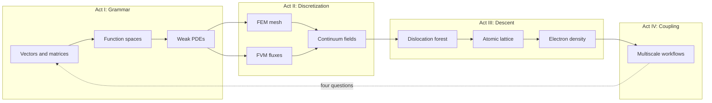
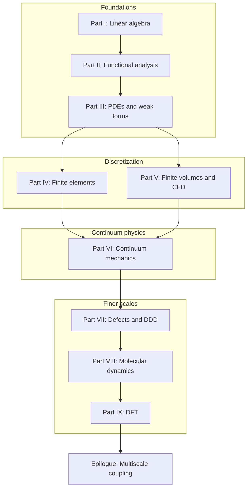

# Preface

This book grew out of a simple observation: computational mechanics is not a collection of unrelated numerical recipes. It is a single narrative about how we represent physical reality at different scales, and how the mathematical tools at each scale connect to the next.

When we write a finite element code, we solve a linear system assembled from local contributions — linear algebra in disguise. When we prove that a Galerkin approximation converges, we invoke completeness and compactness — functional analysis in disguise. When we coarse-grain a molecular dynamics trajectory or feed a DFT energy landscape into a continuum model, we are asking the same question in a different language: *what information survives when we change scale?*

The chapters that follow are written to be read in order, like a novel with a plot. A copper wire under tension, a turbulent jet, a dislocation network in a crystal, and the electrons that bind the atoms together are not separate homework problems. They are scenes in one story. The mathematics is the thread that stitches them together.

## Scene: before the first chapter

Picture a shared materials lab on a weekday morning. A cold-drawn copper wire — the kind used in power cables and tensile specimens — sits in wedge grips on a small frame. The operator has not yet ramped load or switched on current; the load cell reads zero, the thermocouple at mid-span reports room temperature, and a student at the next bench is already opening a terminal for a meshing script. Nothing in the room announces "functional analysis" or "Kohn–Sham." What is visible is simpler: one cylinder of metal, one experiment waiting to run, and the quiet assumption that a computer model somewhere will eventually agree with what the grips and sensors record.

That wire is the book's protagonist. Every part that follows returns to it — as a chain of springs, as a field in \(H^1\), as a meshed solid, as air cooling its surface, as a crystal carrying a dislocation forest, as an atomic lattice, as valence electrons in a periodic cell. The mathematics changes language; the specimen does not. Read this preface as the jacket copy and the prologue as the opening scene. When a chapter feels abstract, ask which bench in this lab you are standing at, and which of the four questions — state, equations, discretization, upward export — that chapter is answering for the same piece of copper.

## Plot spine: how the story is told

Each part follows the **Functional Analysis Notes** (ME 412) layout — numbered chapters, concept maps at openings, checkpoints at closings — but the book adds four narrative devices so the arc reads as one continuous text rather than a syllabus:

| Device | Role | Where it appears |
|--------|------|------------------|
| **Scene** | Return to the copper wire in concrete detail | Preface, prologue, every part opening, every numbered chapter, epilogue |
| **Bridge** | State why the next chapter must exist | End of every numbered chapter and part opening |
| **Lab act** | Worked example, workflow, or checklist tied to computation | Inside chapters (assembly, LAMMPS, OpenDiS, QE inputs) |
| **Concept map** | Object → structure → theorem → failure mode | Part openings; part closing checkpoints |
| **Representative schematics** | Baby pictures indexed to source notes (ME 300A, ME 412, ME 300B, FEA, FVM, …) | Every part opening (I–IX) |

The dramatic arc is not a surprise twist — it is **scale change with the same specimen**:

**Act I** teaches the language (Parts I–III). **Act II** makes PDEs computable on meshes and control volumes (Parts IV–VI). **Act III** asks where continuum parameters hide their history (Parts VII–IX). **Act IV** wires the rungs together (epilogue). When a transition feels abrupt, read the **Bridge** at the end of the prior chapter — it is the narrative hinge the plot spine assumes you will use.

## The story in one page

Read this once if you want the plot before the proofs — every chapter below unpacks one beat of the same afternoon.

A cold-drawn copper wire waits in wedge grips: our protagonist through every scale. We first learn the grammar every simulation shares — vectors, stiffness matrices, eigenmodes — and watch mesh refinement send those objects toward functions and operators. Function spaces supply the room where weak forms live; PDEs write the equilibrium and heat equations those forms discretize. Finite elements mesh the solid; finite volumes balance fluxes in the air that cools the wire when current flows. Continuum mechanics names the stress and strain both discretizations approximate; [VI.4's intermission](part06-continuum/04-nonlinear-plasticity-preview.md#intermission-ascent-ends-descent-begins) admits cold drawing wrote yield history the smooth fields cannot see — the hinge where phenomenology ends and pedigree begins. Dislocation dynamics simulates the forest that hardens the wire; molecular dynamics resolves atoms at notches and fits potentials on trust; density functional theory audits those potentials from electron density. The epilogue wires the rungs into handshakes no single code runs alone — the same four questions at every interface: state, equations, discretization, upward export.

The [prologue](prologue/00-many-scales.md) opens the scene; the [chapter roadmap](appendix/sources.md) lists every beat in reading order; the [epilogue](epilogue/multiscale.md) reunites all six lab acts in workflow time. The [opening continuity hinge](#opening-continuity-hinge) names the turn from panoramic ladder to explicit grammar when the prologue ends; the [ascent preview chain](#ascent-preview-chain) and [descent previews](#descent-preview-chain) below summarize each rung before you commit to every proof; the prologue's [reading compass](prologue/00-many-scales.md#reading-compass-two-clocks-on-one-wire) maps mathematical order against laboratory time when the two clocks diverge. The [ascent continuity hinges](#ascent-continuity-hinges) table names four turns within Parts I–V when linear algebra, analysis, and discretization feel like separate subjects; the [continuity hinges](#continuity-hinges-ascent-descent) table names the two turns at Part VI — mathematical midpoint and narrative intermission — before Part VII descends to defects; the [descent continuity hinges](#descent-continuity-hinges) table names the three turns within Parts VII–IX before the epilogue couples every export; the [epilogue continuity hinges](#epilogue-continuity-hinges) table names the three turns that close the loop from DFT exports back to the prologue's four questions on the next project.

## Opening continuity hinge (prologue → Part I) {#opening-continuity-hinge}

The book opens twice — once as a panoramic ladder in the prologue, once as explicit syntax in Part I. When the scale menu feels overwhelming before a single matrix is assembled, pause at this hinge — same copper wire, first finite-dimensional model.

| Hinge | Location | What turns |
|-------|----------|------------|
| **Panorama → grammar** | [Prologue Bridge](prologue/00-many-scales.md#bridge-to-part-i) → [Part I opening](part01-linear-algebra/00-opening.md#opening-hinge-prologue-to-part-i) | Nine-scale ladder becomes \(\mathbf{K}\mathbf{u}=\mathbf{f}\); four questions get their first numeric answers |

Read the [prologue bridge](prologue/00-many-scales.md#bridge-to-part-i) when you want the plot before proofs — it names every rung in one sitting. Read [Part I's opening hinge](part01-linear-algebra/00-opening.md#opening-hinge-prologue-to-part-i) when the ladder feels like a catalog of methods — the wire is already a spring chain waiting for assembly. The [Row 0 skill checkpoint](#skill-navigation-row-0) below is the competence-time mirror of the [prologue Act I preview row](prologue/00-many-scales.md#what-you-should-be-able-to-do-after-the-prologue) — mounting discipline before current, ramp, or Handshake 1 moduli. The [preface bridge](#bridge) below states the same handoff in prose before you turn to Part I.1.

## Ascent preview chain

Read this once if you want the mathematical climb before every proof — each linked part opening unpacks one rung of the same copper wire.

**[Part I](part01-linear-algebra/00-opening.md)** teaches the grammar every simulation shares: the wire as a chain of springs, \(\mathbf{K}\mathbf{u}=\mathbf{f}\), eigenmodes that decouple vibration, and the limit \(N\to\infty\) that sends nodal values toward fields. **[Part II](part02-functional-analysis/00-opening.md)** names the room those fields live in — \(H^1\), \(L^2\), operators, completeness — and proves Galerkin FEM is projection, not guesswork. **[Part III](part03-pdes/00-opening.md)** writes equilibrium and heat as weak PDEs: strong forms fail at corners; Sobolev spaces and energy principles make the boundary value problems well posed. **[Part IV](part04-fem/00-opening.md)** meshes the solid: weighted residuals, Galerkin assembly, elements and quadrature, convergence in energy norm. **[Part V](part05-fvm/00-opening.md)** balances fluxes in the air that cools the wire — conservation on cells, Riemann problems, Navier–Stokes and conjugate heat transfer. **[Part VI](part06-continuum/00-opening.md)** names Cauchy stress and strain behind both discretizations, marks the [midpoint](part06-continuum/00-opening.md#midpoint-ascent-complete-descent-ahead) where the mathematical climb completes, and closes with [VI.4's intermission](part06-continuum/04-nonlinear-plasticity-preview.md#intermission-ascent-ends-descent-begins) where \(J_2\) placeholders yield to the dislocation forest.

## Ascent continuity hinges (I → VI) {#ascent-continuity-hinges}

Parts I–V climb from finite-dimensional algebra to two discretization philosophies. When a transition feels abrupt mid-climb, pause at one of these four hinges — same copper wire, richer vocabulary at each turn.

| Hinge | Location | What turns |
|-------|----------|------------|
| **Finite → infinite dimensions** | [I.4 Bridge](part01-linear-algebra/04-toward-infinity.md#bridge-to-part-ii) | Mesh refinement sends \(\mathbf{K}_N\) toward an operator; nodal vectors become fields in \(H^1\) and \(L^2\) |
| **Analysis → PDEs** | [II.5 Bridge](part02-functional-analysis/05-spectral-theorem.md#bridge-to-part-iii) | Completeness and spectral theory hand off to weak forms for Poisson, heat, and elasticity |
| **Well-posedness → assembly** | [III.4 Bridge](part03-pdes/04-energy-methods.md#bridge-to-part-iv) | Dirichlet principle and Lax–Milgram become Galerkin assembly on \(V_h\) |
| **Discretization fork → continuum** | [IV.5](part04-fem/05-convergence.md#bridge-two-doors-from-here) / [V.4](part05-fvm/04-navier-stokes-cfd.md#bridge-to-part-vi) | FEM (Door B) and FVM (Door A) converge on Cauchy stress; two languages, one tensor vocabulary in Part VI |

Read the [I.4 hinge](part01-linear-algebra/04-toward-infinity.md#bridge-to-part-ii) when \(\mathbf{K}\mathbf{u}=\mathbf{f}\) feels unrelated to PDEs — refinement already pointed at a function space. Read the [II.5 hinge](part02-functional-analysis/05-spectral-theorem.md#bridge-to-part-iii) when Sobolev norms feel abstract — the weak form is the next line of dialogue for the same wire. Read the [III.4 hinge](part03-pdes/04-energy-methods.md#bridge-to-part-iv) when energy minimization and matrix assembly seem like separate tricks — Rayleigh–Ritz on \(V_h\) is both. Read [IV.5's two doors](part04-fem/05-convergence.md#bridge-two-doors-from-here) when you must choose solids-first versus fluids-first; either path must reach [Part VI](part06-continuum/00-opening.md#midpoint-ascent-complete-descent-ahead) before the descent begins.

The [ascent preview chain](#ascent-preview-chain) names Parts I–VI in one pass; this table names the **four narrative hinges** within that climb — the moments the plot turns from vectors to fields, from fields to weak PDEs, from weak forms to assembled matrices, and from two discretizations to shared continuum mechanics.

## Descent preview chain

Read this once if you want the scale descent before the mesoscopic and finer proofs — each linked part opening unpacks one rung on the way down.

**[Part VII](part07-defects/00-opening.md)** names the forest cold drawing stored: dislocation lines with Burgers vectors, Peach–Köhler forces, mobility laws, and Taylor hardening that export \(\rho\) and \(\tau(\gamma)\) to crystal plasticity FEM — the mechanism behind the \(J_2\) bend Part VI could only fit. **[Part VIII](part08-md/00-opening.md)** replaces line-core cutoffs with vibrating nuclei on interatomic potentials: NVT and NPT ensembles, velocity-Verlet integration, LAMMPS workflows that fit EAM parameters and export cohesive energy, elastic constants, and stacking-fault energy upward on trust — including the **temperature pedigree chain** from [V.4 conjugate heat transfer](part05-fvm/04-navier-stokes-cfd.md#lab-act-extension-two-domain-picard-loop-with-a-1d-fem-solid) (\(T_w\) from the Picard loop) through [VIII.3 WHAM reweighting](part08-md/03-ab-initio-and-coarse-graining.md#wham-part-vii-mobility-hinge-act-ii-temperature-pedigree) to [VII.2 mobility calibration](part07-defects/02-dislocation-dynamics.md#lab-act-calibrate-screw-mobility-from-md-shear-act-iv--mobility-prelude) at the same \(T_w\), not room temperature. **[Part IX](part09-dft/00-opening.md)** audits those potentials from electron density: Born–Oppenheimer separation, Hohenberg–Kohn, Kohn–Sham self-consistency, and Quantum ESPRESSO decks that export \(E_{\text{coh}}\), \(C_{ij}\), and \(\gamma_{\text{sf}}\) with a pedigree traceable to SCF logs — the finest rung on the prologue's ladder. After Part IX, only coupling remains: the [epilogue](epilogue/multiscale.md) reunites every export in workflow time — starting with [Handshake 2](epilogue/multiscale.md#handshake-2--joule-heating--conjugate-heat-transfer-part-iv--v), which reuses the V.4 CHT Lab act iteration table as the template for every downstream temperature export.

Each part opening also carries a one-paragraph preview for readers who pause mid-descent: [mesoscale](part07-defects/00-opening.md#the-descent-in-one-paragraph), [atomistic](part08-md/00-opening.md#the-atomistic-descent-in-one-paragraph), and [electronic floor](part09-dft/00-opening.md#the-electronic-floor-in-one-paragraph).

## Continuity hinges (ascent → descent) {#continuity-hinges-ascent-descent}

The book turns twice at Part VI — once in vocabulary, once in plot. Both hinges keep the same copper wire on the bench; only the state variable and the questions change.

| Hinge | Location | What turns |
|-------|----------|------------|
| **Mathematical midpoint** | [Part VI opening](part06-continuum/00-opening.md#midpoint-ascent-complete-descent-ahead) | FEM/FVM meet Cauchy stress; the climb from linear algebra through discretization is complete |
| **Narrative intermission** | [VI.4](part06-continuum/04-nonlinear-plasticity-preview.md#intermission-ascent-ends-descent-begins) | Smooth fields and \(J_2\) hardening fit the load cell but not its cause; pedigree replaces phenomenology |
| **First mesoscale chapter** | [Part VII opening](part07-defects/00-opening.md) | Burgers geometry and DDD replace scalar \(\alpha\); the descent preview chain begins in earnest |

Read the [midpoint](part06-continuum/00-opening.md#midpoint-ascent-complete-descent-ahead) when Parts I–V feel like separate subjects — Part VI names the stress tensor both discretizations approximate. Read the [intermission](part06-continuum/04-nonlinear-plasticity-preview.md#intermission-ascent-ends-descent-begins) when the return-mapping loop fits \(H\) and \(\sigma_{y0}\) but cannot explain **why** the curve bent. The prologue's [reading compass](prologue/00-many-scales.md#reading-compass-two-clocks-on-one-wire) maps these hinges against laboratory time (Acts III–IV: pull, then harden).

## Descent continuity hinges (VII → epilogue) {#descent-continuity-hinges}

After Part VI's intermission, the book descends in four deliberate turns — same wire, finer state variable, stricter pedigree at every export.

| Hinge | Location | What turns |
|-------|----------|------------|
| **Mesoscale → atomistic** | [VII.3 Bridge](part07-defects/03-polycrystal-and-fem-handoff.md#bridge-to-part-viii) · [VIII.1 opening hinge](part08-md/01-potentials-phase-space.md#opening-hinge-vii3-to-viii1) | Line cores and mobility tables need atomic bonding; DDD cutoff becomes a vibrating RVE |
| **Potentials → ensembles** | [VIII.1 Bridge](part08-md/01-potentials-phase-space.md#bridge) · [VIII.2 opening hinge](part08-md/02-ensembles-integrators.md#opening-hinge-viii1-to-viii2) | EAM minimization at 0 K is not the wire at \(T_w\); phase space must be sampled before mobility or moduli export |
| **Ensembles → coarse-graining** | [VIII.2 Bridge](part08-md/02-ensembles-integrators.md#bridge) · [VIII.3 opening hinge](part08-md/03-ab-initio-and-coarse-graining.md#opening-hinge-viii2-to-viii3) | Audited trajectories must compress into handoff tables with DFT pedigree gates before Part IX |
| **Temperature pedigree at \(T_w\)** | [VIII.0 descent hinge](part08-md/00-opening.md#descent-hinge-cores-mobility-and-tw-pedigree) · [memory sheet row 8](appendix/memory-sheet.md#continuity-hinges-master-map) · [preface row 8 skill checkpoint](preface.md#skill-navigation-row-8) | [`cht_export.yaml`](fixtures/cht_export.yaml) archives \(T_w = 311.48\,\text{K}\); MD mobility, WHAM, and drag tables must not default to 300 K |
| **Atomistic → electronic audit** | [VIII.3 Bridge](part08-md/03-ab-initio-and-coarse-graining.md#bridge-to-part-ix) · [IX.0 electronic audit hinge](part09-dft/00-opening.md#electronic-audit-hinge-descent-pedigree-and-tw-phonon) · [memory sheet row 9](appendix/memory-sheet.md#continuity-hinges-master-map) · [preface row 9 skill checkpoint](preface.md#skill-navigation-row-9) | EAM potentials on trust need SCF audit; [thermal phonon audit at \(T_w\)](part09-dft/00-opening.md#thermal-phonon-audit-at-tw) confirms \(\alpha\) and \(\tau_{\text{ph}}\) are not room-temperature folklore |
| **Electronic audit → Born–Oppenheimer** | [IX.0 Bridge](part09-dft/00-opening.md#bridge) · [IX.1 opening hinge](part09-dft/01-born-oppenheimer.md#opening-hinge-ix0-to-ix1) | SCF logs and phonon audits at \(T_w\) must connect to BO/HK theorems before Kohn–Sham feels like a new course |
| **Born–Oppenheimer → Kohn–Sham** | [IX.1 Bridge](part09-dft/01-born-oppenheimer.md#bridge) · [IX.2 opening hinge](part09-dft/02-kohn-sham.md#opening-hinge-ix1-to-ix2) | BO/HK theorems must connect to the SCF fixed-point loop and Part I eigenvalue feedback before IX.3 workflows feel like a new course |
| **Electronic → coupling** | [IX.3 Bridge](part09-dft/03-dft-workflows.md#bridge-to-the-epilogue) | Finest rung complete; upward homogenization and handshake loops in the epilogue |

Read the [mesoscale hinge](part07-defects/03-polycrystal-and-fem-handoff.md#bridge-to-part-viii) when mobility or \(\gamma_{\text{sf}}\) feel like fitted constants — Peierls stress and core width hide in atomic trajectories, not Taylor hardening alone. Read the [VIII.1 opening hinge](part08-md/01-potentials-phase-space.md#opening-hinge-vii3-to-viii1) when [VII.3's Bridge](part07-defects/03-polycrystal-and-fem-handoff.md#bridge-to-part-viii) named the ink but phase space still feels like a new subject — the same `mobility.yaml` row, now with \(\mathbf{F}_i = -\nabla V\) on a screw-core RVE. Read the [VIII.2 opening hinge](part08-md/02-ensembles-integrators.md#opening-hinge-viii1-to-viii2) when the EAM foundation archive exists but `MD_NVT_shear_PartVIII` has not yet run at \(T_w\) — 0 K minimization is not a room-temperature wire. Read the [VIII.3 opening hinge](part08-md/03-ab-initio-and-coarse-graining.md#opening-hinge-viii2-to-viii3) when NPT moduli and mobility tables exist but no handoff bundle names DFT audit gates — trajectories without pedigree are multiscale folklore. Read the [temperature pedigree hinge](part08-md/00-opening.md#descent-hinge-cores-mobility-and-tw-pedigree) when Act II warmed the wire but mobility folders still cite 300 K — [memory sheet rows 8–9 baby picture](appendix/memory-sheet.md#rows-8-9-baby-picture-tw-temperature-pedigree) draws the \(T_w\) chain from CHT through MD to DFT phonons. Read the [electronic audit hinge](part09-dft/00-opening.md#electronic-audit-hinge-descent-pedigree-and-tw-phonon) when EAM matches bulk moduli but no one cites the DFT input deck or evaluates \(\alpha(T_w)\) beside `cht_export.yaml`. Read the [IX.1 opening hinge](part09-dft/01-born-oppenheimer.md#opening-hinge-ix0-to-ix1) when `cu.relax.out` and `alpha_export.yaml` exist but Born–Oppenheimer and Hohenberg–Kohn still feel like standalone quantum chemistry — SCF pedigree without theorems is audit without grammar. Read the [IX.2 opening hinge](part09-dft/02-kohn-sham.md#opening-hinge-ix1-to-ix2) when BO/HK theorems are understood but the SCF fixed-point loop still feels like standalone quantum chemistry — Murnaghan \(a_0\) without convergence ritual is theorem without implementation. Read the [coupling hinge](part09-dft/03-dft-workflows.md#bridge-to-the-epilogue) when exports exist in separate folders but no workflow connects them — the epilogue's [Closing the arc from Part IX](epilogue/multiscale.md#closing-the-arc-from-part-ix) reunites SCF pedigree with the [thermal phonon audit at \(T_w\)](part09-dft/00-opening.md#thermal-phonon-audit-at-tw) before Handshakes 1–4b run.

The [descent preview chain](#descent-preview-chain) names Parts VII–IX in one pass; this table names the **seven narrative hinges** within that descent — the moments the plot turns from forest statistics to vibrating nuclei, from 0 K potentials to finite-\(T\) ensembles, from trajectories to coarse-grained exports, from \(T_w\) pedigree through MD to DFT phonons, from electron density through BO/HK theorems to the Kohn–Sham SCF cycle, and finally to coupled codes.

## Epilogue continuity hinges (IX → prologue) {#epilogue-continuity-hinges}

The book closes a third loop after ascent and descent: **coupling upward** from the finest rung back to engineering questions — and back to the prologue's four questions on every new project.

| Hinge | Location | What turns |
|-------|----------|------------|
| **Finest rung → workflow** | [IX.3 Bridge](part09-dft/03-dft-workflows.md#bridge-to-the-epilogue) | SCF exports archived; pedigree must compose with MD, DDD, and FEM folders — [memory sheet row 10](appendix/memory-sheet.md#continuity-hinges-master-map); [row 10 skill checkpoint](#skill-navigation-row-10); [prologue row 10 preview](prologue/00-many-scales.md#prologue-preview-row-10) |
| **Joule heat → fixed-grip stress** | [Epilogue Handshake 2](epilogue/multiscale.md#handshake-2--joule-heating--conjugate-heat-transfer-part-iv--v) → [IX.3 α Lab act](part09-dft/03-dft-workflows.md#lab-act-quasiharmonic-alpha-handshake-3-pedigree) → [Handshake 3](epilogue/multiscale.md#handshake-3--thermal-strain--mechanical-stiffness-part-vi--iv) | Handshake 2 (Parts IV–V CHT) sets \(\Delta T\); Handshake 3 (quasiharmonic \(\alpha\) from IX.3) sets thermal strain — the [sensitivity table](epilogue/multiscale.md#sensitivity-which-handshake-matters-most) ranks Handshake 2 first for \(T_w\) and Handshake 3 first for load-cell readings; [sensitivity derivation worksheet](epilogue/multiscale.md#worked-example-sensitivity-ranks); [memory sheet row 13](appendix/memory-sheet.md#continuity-hinges-master-map); [row 13 closing loop](epilogue/multiscale.md#row-13-closing-loop); [prologue row 13 closing stitch](prologue/00-many-scales.md#row-13-closing-stitch); [row 13 skill checkpoint](#skill-navigation-row-13) |
| **DDD rate → lab load cell** | [VII.3 rate handshake](part07-defects/03-polycrystal-and-fem-handoff.md#scale-boundary-handshake-ddd-strain-rate-to-quasi-static-fem) → [Epilogue Handshake 4a](epilogue/multiscale.md#handshake-4--rate-dependent-hardening-and-notch-localization-part-vii--vi--viii) | OpenDiS at \(10^3\,\text{s}^{-1}\) sets \(\tau_{\text{flow}}\); power-law \(m\) extrapolates to lab grip speed — the [sensitivity table](epilogue/multiscale.md#sensitivity-which-handshake-matters-most) ranks Handshake 4a next for Act IV hardening; [sensitivity derivation worksheet](epilogue/multiscale.md#worked-example-sensitivity-ranks) (4a column); [memory sheet row 14](appendix/memory-sheet.md#continuity-hinges-master-map); [row 14 baby picture](appendix/memory-sheet.md#row-14-baby-picture-handshake-4a); [row 14 closing loop](epilogue/multiscale.md#row-14-closing-loop); [prologue row 14 closing stitch](prologue/00-many-scales.md#row-14-closing-stitch); [row 14 skill checkpoint](#skill-navigation-row-14) |
| **FE² notch → Act V localization** | [VII.3 Step 4 FE²](part07-defects/03-polycrystal-and-fem-handoff.md#step-4--when-offline-calibration-fails-fe-at-the-notch) → [Epilogue Handshake 4b](epilogue/multiscale.md#4b--when-continuum-fails-at-the-notch-md-subdomain-act-v--notch) | Scalar hardening from 4a matches bulk flow stress but may under-predict notch-root peak stress by 10–15% — the [sensitivity table](epilogue/multiscale.md#sensitivity-which-handshake-matters-most) activates 4b only with Act V; [sensitivity derivation worksheet](epilogue/multiscale.md#worked-example-sensitivity-ranks) (4b column); [memory sheet row 15](appendix/memory-sheet.md#continuity-hinges-master-map); [row 15 baby picture](appendix/memory-sheet.md#row-15-baby-picture-handshake-4b); [row 15 closing loop](epilogue/multiscale.md#row-15-closing-loop); [prologue row 15 closing stitch](prologue/00-many-scales.md#row-15-closing-stitch); [row 15 three-way audit](#skill-navigation-row-15); [row 15 skill checkpoint](#skill-navigation-row-15); upstream rate from [row 14](#skill-navigation-row-14) |
| **Coupling → laboratory time** | [Epilogue: six-act reunion](epilogue/multiscale.md#lab-act-reunion-six-acts-one-afternoon) | Mathematical order (I→IX) reunites with the six acts the operator actually runs — [memory sheet row 11](appendix/memory-sheet.md#continuity-hinges-master-map); [row 11 skill checkpoint](#skill-navigation-row-11); [prologue row 11 preview](prologue/00-many-scales.md#prologue-preview-row-11); [prologue row 11 closing stitch](prologue/00-many-scales.md#row-11-closing-stitch); [epilogue row 11 closing loop](epilogue/multiscale.md#row-11-closing-loop); Act VI runs **in parallel** with Acts I–V |
| **Act VI orchestration** | [IX.3 Bridge](part09-dft/03-dft-workflows.md#bridge-to-the-epilogue) → [`parse_multiscale_workflow.sh`](../scripts/parse_multiscale_workflow.sh) | Individual handshake exports need orchestrated pedigree — [`multiscale_export.yaml`](../scripts/parse_multiscale_workflow.sh) links Handshakes 1–4b in dependency order; [IX.3 epilogue pedigree table](part09-dft/03-dft-workflows.md#ix3-epilogue-pedigree-table) (orchestrated chain row); [script audit trail All — orchestrated chain row](epilogue/multiscale.md#script-audit-trail-parse-scripts-handshakes); [sensitivity worksheet closing](epilogue/multiscale.md#worked-example-sensitivity-ranks) (row 16 stitch); [memory sheet row 16](appendix/memory-sheet.md#continuity-hinges-master-map); [memory sheet Act VI baby picture](appendix/memory-sheet.md#act-vi-baby-picture-me-412-coupling-ladder); [one-page recap Act VI column](appendix/memory-sheet.md#one-page-copper-wire-recap); [row 16 closing loop](epilogue/multiscale.md#row-16-closing-loop); [prologue row 16 preview](prologue/00-many-scales.md#prologue-preview-row-16); [prologue row 16 closing stitch](prologue/00-many-scales.md#row-16-closing-stitch); [row 16 three-way audit](#skill-navigation-row-16); [row 16 skill checkpoint](#skill-navigation-row-16) |
| **Continuous read-through** | [Continuous read-through guide](appendix/sources.md#continuous-read-through-guide) · [memory sheet row 17](appendix/memory-sheet.md#row-17-baby-picture-continuous-read-through) | Chapters feel choppy despite Bridges — trust Scene/Bridge rhythm; pause only at I.4, VI.4, IX.3; [row 17 skill checkpoint](#skill-navigation-row-17); [prologue row 17 preview](prologue/00-many-scales.md#prologue-preview-row-17); [prologue row 17 closing stitch](prologue/00-many-scales.md#row-17-closing-stitch); [workflow exam full arc row](epilogue/multiscale.md#what-you-should-be-able-to-do-after-the-book); [row 17 closing loop](epilogue/multiscale.md#row-17-closing-loop) |
| **Workflow → next project** | [Epilogue Bridge row 12](epilogue/multiscale.md#row-12-closing-loop) → [Prologue reopening anchor](prologue/00-many-scales.md#prologue-reopening-anchor) | Four questions restart on a new material; the ladder is reusable, not copper-specific — [memory sheet row 12](appendix/memory-sheet.md#continuity-hinges-master-map); [row 12 skill checkpoint](#skill-navigation-row-12); [row 44 book loop closure](#skill-navigation-row-44); [row 45 second-pass reunion](#skill-navigation-row-45); [row 46 Writings canonical reunion](#skill-navigation-row-46); [prologue row 12 preview](prologue/00-many-scales.md#prologue-preview-row-12); [prologue row 12 closing stitch](prologue/00-many-scales.md#row-12-closing-stitch) |

Read the [coupling hinge](part09-dft/03-dft-workflows.md#bridge-to-the-epilogue) when DFT, MD, and FEM outputs live in separate directories with no README at the arrows. Read the [continuous read-through guide](appendix/sources.md#continuous-read-through-guide) when the hinge index feels overwhelming mid-read — [row 17 skill checkpoint](#skill-navigation-row-17), [prologue row 17 preview](prologue/00-many-scales.md#prologue-preview-row-17), and [memory sheet row 17 baby picture](appendix/memory-sheet.md#row-17-baby-picture-continuous-read-through) name the straight-through path before you open rows 8–16 individually. Read the [Handshake 2 → 3 chain](epilogue/multiscale.md#handshake-2--joule-heating--conjugate-heat-transfer-part-iv--v) when the load cell sees thermal compression but the FEM deck still cites handbook \(\alpha\) beside an orphan `pw.x` log — [IX.3's quasiharmonic \(\alpha\) Lab act](part09-dft/03-dft-workflows.md#lab-act-quasiharmonic-alpha-handshake-3-pedigree) is where \(\alpha\) earns the same pedigree as \(C_{ij}\). Read the [VII.3 → Handshake 4a chain](part07-defects/03-polycrystal-and-fem-handoff.md#scale-boundary-handshake-ddd-strain-rate-to-quasi-static-fem) when the hardening knee looks right on a DDD plot but the load cell yield arrives early — direct import at \(10^3\,\text{s}^{-1}\) without extrapolation overpredicts flow stress by 5–35%. Read the [VII.3 Step 4 → Handshake 4b chain](part07-defects/03-polycrystal-and-fem-handoff.md#step-4--when-offline-calibration-fails-fe-at-the-notch) when bulk hardening from 4a looks credible but the optional notch concentrates stress the scalar law cannot capture — [`parse_fe2.sh`](../scripts/parse_fe2.sh) on fixture data reports a 10–15% root-stress uplift FE² resolves that crystal plasticity alone misses. Read the [Act VI orchestration chain](part09-dft/03-dft-workflows.md#bridge-to-the-epilogue) → [`parse_multiscale_workflow.sh`](../scripts/parse_multiscale_workflow.sh) when Handshakes 1–4b exist in separate folders but no orchestrated `multiscale_export.yaml` links them — [row 16 skill checkpoint](#skill-navigation-row-16), the [script audit trail All — orchestrated chain row](epilogue/multiscale.md#script-audit-trail-parse-scripts-handshakes), [prologue reading compass row 16](prologue/00-many-scales.md#reading-compass-two-clocks-on-one-wire), and [memory sheet Act VI baby picture](appendix/memory-sheet.md#act-vi-baby-picture-me-412-coupling-ladder) name the same stitch. Read the [six-act reunion](epilogue/multiscale.md#lab-act-reunion-six-acts-one-afternoon) when you know each part in isolation but cannot name which handshake runs before the grips close tomorrow — [row 11 skill checkpoint](#skill-navigation-row-11), [prologue row 11 preview](prologue/00-many-scales.md#prologue-preview-row-11), and [memory sheet one-page recap Act column](appendix/memory-sheet.md#one-page-copper-wire-recap) map Parts I–IX onto Acts I–VI when workflow order is unclear. Read the [epilogue Bridge row 12 closing loop](epilogue/multiscale.md#row-12-closing-loop) and [prologue reopening anchor](prologue/00-many-scales.md#prologue-reopening-anchor) when the copper arc is complete and a new material needs scale discipline from day one — [row 12 skill checkpoint](#skill-navigation-row-12), [prologue row 12 preview](prologue/00-many-scales.md#prologue-preview-row-12), and [memory sheet row 12 baby picture](appendix/memory-sheet.md#row-12-baby-picture-next-project) close the book loop that [row 0](#skill-navigation-row-0) opened. Return to the [prologue](prologue/00-many-scales.md#reading-compass-two-clocks-on-one-wire) when the specimen changes — the continuity hinges table in the [memory sheet](appendix/memory-sheet.md#continuity-hinges-master-map) collects all seventeen narrative hinges plus the opening and closing loops in one navigation page.

The [story in one page](#the-story-in-one-page) ends at multiscale coupling; this table names the **six narrative hinges** within that closing act — exports become workflows, temperature and expansion become fixed-grip stress, rate extrapolation becomes Act IV hardening, FE² becomes Act V localization, Act VI orchestration becomes `multiscale_export.yaml` ([memory sheet Act VI baby picture](appendix/memory-sheet.md#act-vi-baby-picture-me-412-coupling-ladder); [prologue row 16 preview](prologue/00-many-scales.md#what-you-should-be-able-to-do-after-the-prologue)), laboratory time becomes the compass for the next wire.

## How this book is organized

The structure follows the arc of the author's personal notes — linear algebra and functional analysis as foundations, partial differential equations and weak forms as the bridge to discretization, finite elements and finite volumes as the two great discretization philosophies for solids and fluids, and atomistic and electronic methods as the descent to finer scales. Each part ends with a short bridge section that explains why the next scale is necessary.

Read straight through from the prologue to the epilogue. Parts IV and V can be swapped if you already know FEM and want CFD first; Part VI then unifies the stress–balance language both discretizations approximate. Parts VII–IX are best read after the continuum vocabulary of Part VI, because dislocation, atomistic, and electronic models explain where continuum parameters originate.

## Three reading paths

The book is one continuous story, but not every reader enters at the same rung:

| Path | Start here | Route | Best for |
|------|------------|-------|----------|
| **Full arc** | [Prologue](prologue/00-many-scales.md) | I → II → III → IV → V → VI → VII → VIII → IX → [Epilogue](epilogue/multiscale.md) | First read; builds every concept in order |
| **Analysis first** | Part I, then Part II | Skip to Part III when function spaces feel familiar; return to IV–V for discretization | Students who know FEM but want weak-form foundations |
| **Scale descent** | Part VI after skimming I–III | VI → VII → VIII → IX, then back to IV–V for how continuum codes mesh and flux | Researchers asking where moduli and hardening laws originate |

On every path, read the **Bridge** at the end of the prior chapter when a jump feels abrupt. Part openings add **Story so far** recaps, **concept map** tables (object → structure → theorem → failure mode), **How Part X connects to…** cross-part tables, **skill checkpoint** tables (minimal artifacts on the copper wire), and **representative schematics** indexed to the source notes — all following the [Functional Analysis Notes](https://hanfengzhai.github.io/file/teaching/notes/ME412_CourseSummary.pdf) layout. Part closings add **concept map checkpoints** that summarize what the part exported to the next scale. The **prologue** and **epilogue** add matching **concept map checkpoints** that frame the whole ladder at the bookends. The [skill navigation](#skill-navigation) table below collects every checkpoint in one compass.

## Reading rhythm {#reading-rhythm}

Each chapter uses a deliberate rhythm so the book reads as one continuous story rather than a stack of lecture notes:

| Section | Role | Where it appears |
|---------|------|------------------|
| **Scene** | Places the mathematics in the lab — grips tightening, current switching on, a notch concentrating stress | Preface, prologue, every part opening, every numbered chapter, epilogue, appendix glossary and sources |
| **Lab act** | Links the part to one act of the [six-act lab session](prologue/00-many-scales.md#the-experiment-as-plot) | Part openings I–IX and epilogue reunion |
| **Concept map** | Four questions: object, structure, theorem, failure mode | Part openings; epilogue closing lens |
| **Representative schematics** | Baby pictures indexed to source notes (ME 300A, ME 412, ME 300B, FEA, FVM, …) | Every part opening (I–IX) |
| **Bridge** | States why the next chapter exists — the narrative hinge | End of every numbered chapter, part opening, preface, prologue, epilogue, appendix glossary and sources |
| **Skill checkpoint** | Minimal artifact you can produce on the copper wire before turning the page | Prologue; every part opening (I–IX); epilogue |

When abstraction rises, read in this order: **Lab act** (which experiment am I in?) → **Scene** (what is the operator watching?) → **Concept map** (what structure makes the theorem possible?) → **Representative schematics** (which baby picture matches this chapter?) → **Skill checkpoint** (what can I do on paper or in a terminal?) → **Bridge** (why turn the page?).

## Skill navigation

The book is one continuous story, but mastery is checked at **milestones** — not only at the end. Each milestone lists skills on the copper wire and a **minimal artifact** (a matrix, a plot, a convergence log, a pedigree row) you can produce before moving on. Use this table as a compass when you want practice without rereading every proof:

| Milestone | When to pause | Skill checkpoint |
|-----------|---------------|------------------|
| After the panoramic ladder | Before Part I assembles the first matrix | [Prologue](prologue/00-many-scales.md#what-you-should-be-able-to-do-after-the-prologue) |
| Row 0 — Act I mounting (prologue → Part I) | When the scale ladder feels like a menu before the first matrix | [Row 0 skill checkpoint](#skill-navigation-row-0) |
| After Part I | Before fields replace vectors in Part II | [Part I opening](part01-linear-algebra/00-opening.md#what-you-should-be-able-to-do-after-part-i) |
| After Part II | Before weak PDEs in Part III | [Part II opening](part02-functional-analysis/00-opening.md#what-you-should-be-able-to-do-after-part-ii) |
| After Part III | Before Galerkin assembly in Part IV | [Part III opening](part03-pdes/00-opening.md#what-you-should-be-able-to-do-after-part-iii) |
| After Part IV | Before FVM fluxes or continuum stress | [Part IV opening](part04-fem/00-opening.md#what-you-should-be-able-to-do-after-part-iv) |
| After Part V | Before Cauchy tensors in Part VI | [Part V opening](part05-fvm/00-opening.md#what-you-should-be-able-to-do-after-part-v) |
| After Part VI | Before the mesoscale descent in Part VII | [Part VI opening](part06-continuum/00-opening.md#what-you-should-be-able-to-do-after-part-vi) |
| After Part VII | Before atomic trajectories in Part VIII | [Part VII opening](part07-defects/00-opening.md#what-you-should-be-able-to-do-after-part-vii) |
| After Part VIII | Before Kohn–Sham in Part IX | [Part VIII opening](part08-md/00-opening.md#what-you-should-be-able-to-do-after-part-viii) |
| After Part IX | Before multiscale coupling in the epilogue | [Part IX opening](part09-dft/00-opening.md#what-you-should-be-able-to-do-after-part-ix) |
| Row 8 — \(T_w\) pedigree (Act II → MD/DDD) | When MD mobility, WHAM, or OpenDiS drag folders cite 300 K but [V.4 CHT](part05-fvm/04-navier-stokes-cfd.md#lab-act-extension-two-domain-picard-loop-with-a-1d-fem-solid) converged at \(T_w\) | [Row 8 skill checkpoint](#skill-navigation-row-8) |
| Row 9 — phonon audit at \(T_w\) (MD → DFT) | When EAM matches bulk moduli but `alpha_export.yaml` lacks \(\alpha(T_w)\) beside SCF logs | [Row 9 skill checkpoint](#skill-navigation-row-9) |
| Row 10 — coupling hinge (IX.3 → epilogue) | When foundation exports exist in separate folders but Handshakes 4a/4b split is unclear | [Row 10 skill checkpoint](#skill-navigation-row-10) |
| Row 11 — six-act reunion (I→IX vs Acts I–VI) | When each part makes sense alone but workflow order is unclear | [Row 11 skill checkpoint](#skill-navigation-row-11) |
| Row 12 — next project restart (epilogue → prologue) | When the copper arc is complete but a new material feels like a scale menu again | [Row 12 skill checkpoint](#skill-navigation-row-12) |
| Row 13 — Joule heat → fixed-grip stress | When CHT converges but the FEM deck still cites handbook \(\alpha\) | [Row 13 skill checkpoint](#skill-navigation-row-13) |
| Row 14 — DDD rate → lab load cell | When DDD exports feed the plasticity deck but the hardening knee arrives early | [Row 14 skill checkpoint](#skill-navigation-row-14) |
| Row 15 — FE² notch → Act V localization | When bulk hardening from 4a looks right but the notch root under-predicts peak stress | [Row 15 skill checkpoint](#skill-navigation-row-15) |
| Row 16 — Act VI orchestration → multiscale export | When Handshakes 1–4b exist in separate folders but no single pedigree file links them | [Row 16 skill checkpoint](#skill-navigation-row-16) |
| Row 17 — continuous read-through | When chapters feel choppy despite Bridges — trust Scene/Bridge rhythm; pause only at I.4, VI.4, IX.3 | [Row 17 skill checkpoint](#skill-navigation-row-17) |
| Row 18 — part-opening plot spine | When a part opening feels like a new syllabus — read its plot spine one line aloud | [Row 18 skill checkpoint](#skill-navigation-row-18) |
| Row 19 — numbered-chapter plot spine | When mid-chapter reading stalls despite a Bridge — read this chapter's plot spine one line aloud | [Row 19 skill checkpoint](#skill-navigation-row-19) |
| Row 20 — gate-chapter plot spine | When a mandatory gate (I.4, VI.4, IX.3) stalls the straight read — recite its plot spine one line aloud before the Bridge | [Row 20 skill checkpoint](#skill-navigation-row-20) |
| Row 21 — lab act reunion | When a Lab act feels like standalone homework — read its one-line move aloud and name the lab act | [Row 21 skill checkpoint](#skill-navigation-row-21) |
| Row 22 — Scene reunion | When plot spines and Lab acts read correctly but symbols hide the wire — read the Scene one-line visual aloud and picture the operator | [Row 22 skill checkpoint](#skill-navigation-row-22) |
| Row 23 — Bridge reunion | When Scene, plot spines, and Lab acts all read correctly but chapter transitions feel mechanical — read the prior chapter's Bridge one-line hinge aloud | [Row 23 skill checkpoint](#skill-navigation-row-23) |
| Row 24 — concept map reunion | When narrative, sensory, and transition vocabulary all read correctly but proofs feel like disconnected theorems — answer object / structure / theorem / breaks at the part-opening concept map | [Row 24 skill checkpoint](#skill-navigation-row-24) |
| Row 25 — schematic reunion | When narrative, sensory, transition, and structural vocabulary all read correctly but proofs feel abstract without a visual anchor — locate the matching baby picture from the part-opening representative schematics table | [Row 25 skill checkpoint](#skill-navigation-row-25) |
| After the full arc | Before starting a new project on a different material | [Epilogue](epilogue/multiscale.md#what-you-should-be-able-to-do-after-the-book) |

Each part-opening table breaks skills down **by chapter** (e.g. I.1–I.4, II.1–II.5). The prologue and epilogue tables frame the whole ladder at the bookends — navigation discipline before proofs, workflow exam after coupling. When a chapter feels abstract, skip to the matching row in the part opening and produce the minimal artifact; when the artifact is in hand, return to the **Bridge** at the end of the prior chapter for the narrative hinge.

The [reading compass](prologue/00-many-scales.md#reading-compass-two-clocks-on-one-wire) in the prologue maps **continuity hinges** (when the plot turns); this table maps **skill checkpoints** (when you should be able to do something concrete on the wire). Both tables describe the same afternoon — one in narrative time, one in competence time. [Memory sheet row 0](appendix/memory-sheet.md#continuity-hinges-master-map) is the narrative stitch for the opening hinge; the [Row 0 skill checkpoint](#skill-navigation-row-0) below is the competence-time mirror — sketch \(\mathbf{K}\mathbf{u}=\mathbf{f}\) with fixed DOFs and zero load before Act II warming or Handshake 1 moduli enter the story. [Memory sheet row 8](appendix/memory-sheet.md#continuity-hinges-master-map) is the narrative stitch for the Act II temperature pedigree; the [Row 8 skill checkpoint](#skill-navigation-row-8) below is the competence-time mirror — run [`parse_cht.sh`](../scripts/parse_cht.sh) before any NVT shear, WHAM ladder, or OpenDiS mobility fit, and archive `cht_export.yaml` with an explicit \(T_w\) column. [Memory sheet row 9](appendix/memory-sheet.md#continuity-hinges-master-map) is the narrative stitch for the electronic phonon audit; the [Row 9 skill checkpoint](#skill-navigation-row-9) mirrors it — run [`parse_alpha.sh`](../scripts/parse_alpha.sh) and [`parse_lifetime.sh`](../scripts/parse_lifetime.sh) at converged \(T_w\), not 300 K alone, before Handshakes 3 and 4a inherit thermal exports. [Memory sheet row 10](appendix/memory-sheet.md#continuity-hinges-master-map) is the narrative stitch for the IX.3 → epilogue coupling hinge; the [Row 10 skill checkpoint](#skill-navigation-row-10) mirrors it — map [IX.3's epilogue pedigree table](part09-dft/03-dft-workflows.md#ix3-epilogue-pedigree-table) onto Handshakes 1–4b and name the **4a/4b split** on `hardening.yaml` before rows 13–16 run individually. [Memory sheet row 11](appendix/memory-sheet.md#continuity-hinges-master-map) is the narrative stitch for the six-act reunion; the [Row 11 skill checkpoint](#skill-navigation-row-11) mirrors it — map Parts I–IX onto Acts I–VI in the [epilogue six-act reunion table](epilogue/multiscale.md#lab-act-reunion-six-acts-one-afternoon) and state that Act VI (foundation) runs **in parallel** with Acts I–V, not after Part IX in laboratory time. [Memory sheet row 13](appendix/memory-sheet.md#continuity-hinges-master-map) is the narrative stitch for thermal expansion; the [Row 13 skill checkpoint](#skill-navigation-row-13) below is the competence-time mirror — run [`parse_alpha.sh`](../scripts/parse_alpha.sh) after Handshake 2's CHT loop, then verify the load cell against the [sensitivity derivation worksheet](epilogue/multiscale.md#worked-example-sensitivity-ranks). [Memory sheet row 14](appendix/memory-sheet.md#continuity-hinges-master-map) is the narrative stitch for rate extrapolation; the [Row 14 skill checkpoint](#skill-navigation-row-14) mirrors it for Act IV hardening — run [`parse_rate.sh`](../scripts/parse_rate.sh) on OpenDiS sweeps before the crystal-plasticity deck inherits \(\tau_{\text{lab}}\). [Memory sheet row 15](appendix/memory-sheet.md#continuity-hinges-master-map) is the narrative stitch for notch localization; the [Row 15 skill checkpoint](#skill-navigation-row-15) mirrors it for Act V — run [`parse_fe2.sh`](../scripts/parse_fe2.sh) after completing [row 14](#skill-navigation-row-14), then verify root-stress uplift against the [sensitivity derivation worksheet](epilogue/multiscale.md#worked-example-sensitivity-ranks) (Handshake 4b column). [Memory sheet row 16](appendix/memory-sheet.md#continuity-hinges-master-map) is the **ME 412 coupling ladder** stitch for Act VI; the [Row 16 skill checkpoint](#skill-navigation-row-16) mirrors it — run [`parse_multiscale_workflow.sh`](../scripts/parse_multiscale_workflow.sh) after rows 13–15 are understood individually, then archive `multiscale_export.yaml` beside the Act VI folder. The [prologue row 16 preview](prologue/00-many-scales.md#prologue-preview-row-16) named this orchestration stitch before Part I — the [row 16 When-to-pause opening sentence](#skill-navigation-row-16) below is the competence-time mirror of that preview when narrative time (Act VI foundation) and mathematical order (Part IX → epilogue) diverge on the same afternoon; the [memory sheet Act VI baby picture](appendix/memory-sheet.md#act-vi-baby-picture-me-412-coupling-ladder) draws the foundation → handshake diagram when the [epilogue continuity hinges](#epilogue-continuity-hinges) table above feels abstract; the [epilogue sensitivity worksheet closing](epilogue/multiscale.md#worked-example-sensitivity-ranks) (row 16 orchestration stitch) closes the quantitative audit when Handshakes 1–4b are understood individually but the orchestrated pedigree is still missing. [Memory sheet row 17](appendix/memory-sheet.md#continuity-hinges-master-map) is the **continuous read-through** stitch; the [Row 17 skill checkpoint](#skill-navigation-row-17) mirrors it — read Scene → Bridge straight through and open rows 0–16 only when a gate stalls at I.4, VI.4, or IX.3. The [prologue row 17 preview](prologue/00-many-scales.md#prologue-preview-row-17) named this straight-read habit before Part I — the [row 17 When-to-pause opening sentence](#skill-navigation-row-17) below is the competence-time mirror when the continuity hinges index feels overwhelming mid-read; the [memory sheet row 17 baby picture](appendix/memory-sheet.md#row-17-baby-picture-continuous-read-through) draws the Scene → Bridge rhythm when the [epilogue workflow exam full arc row](epilogue/multiscale.md#what-you-should-be-able-to-do-after-the-book) feels episodic despite individual Bridges. [Memory sheet row 18](appendix/memory-sheet.md#continuity-hinges-master-map) is the **part-opening plot spine** stitch; the [Row 18 skill checkpoint](#skill-navigation-row-18) mirrors it — recite one plot spine sentence at every part opening when row 17 stalls at a part boundary. The [prologue row 18 preview](prologue/00-many-scales.md#prologue-preview-row-18) named this part-recitation habit before Part I — the [row 18 When-to-pause opening sentence](#skill-navigation-row-18) below is the competence-time mirror when landing on a new part feels like opening a new textbook; the [memory sheet row 18 baby picture](appendix/memory-sheet.md#row-18-baby-picture-part-opening-plot-spine) draws the nine one-liners when the [epilogue workflow exam row 18 row](epilogue/multiscale.md#what-you-should-be-able-to-do-after-the-book) feels like separate textbooks at III→IV or VI→VII. [Memory sheet row 19](appendix/memory-sheet.md#continuity-hinges-master-map) is the **numbered-chapter plot spine** stitch; the [Row 19 skill checkpoint](#skill-navigation-row-19) mirrors it — read one plot spine sentence at any numbered chapter when row 18's part one-liners did not restore continuity. The [prologue row 19 preview](prologue/00-many-scales.md#prologue-preview-row-19) named this chapter-recitation habit before Part I — the [row 19 When-to-pause opening sentence](#skill-navigation-row-19) below is the competence-time mirror when mid-chapter abstraction rises faster than the specimen; the [memory sheet row 19 baby picture](appendix/memory-sheet.md#row-19-baby-picture-numbered-chapter-plot-spine) draws the 35 one-liners when the [epilogue workflow exam row 19 row](epilogue/multiscale.md#what-you-should-be-able-to-do-after-the-book) feels like separate chapters mid-part. [Memory sheet row 20](appendix/memory-sheet.md#continuity-hinges-master-map) is the **gate-chapter plot spine** stitch; the [Row 20 skill checkpoint](#skill-navigation-row-20) mirrors it — recite one plot spine sentence at I.4, VI.4, and IX.3 when row 17's straight-through read stalls at a mandatory gate. The [prologue row 20 preview](prologue/00-many-scales.md#prologue-preview-row-20) named this gate-recitation habit before Part I — the [row 20 When-to-pause opening sentence](#skill-navigation-row-20) below is the competence-time mirror when a plot turn feels like a topic change; the [memory sheet row 20 baby picture](appendix/memory-sheet.md#row-20-baby-picture-gate-chapter-plot-spine) draws the three gate one-liners when the [epilogue workflow exam row 20 row](epilogue/multiscale.md#what-you-should-be-able-to-do-after-the-book) feels like separate acts at I.4, VI.4, or IX.3. [Memory sheet row 21](appendix/memory-sheet.md#continuity-hinges-master-map) is the **lab act reunion** stitch; the [Row 21 skill checkpoint](#skill-navigation-row-21) mirrors it — read one-line moves at workflow anchor Lab acts when plot spines restore narrative but code feels like homework. [Memory sheet row 22](appendix/memory-sheet.md#continuity-hinges-master-map) is the **Scene reunion** stitch; the [Row 22 skill checkpoint](#skill-navigation-row-22) mirrors it — read Scene one-line visuals when symbols hide the wire. [Memory sheet row 23](appendix/memory-sheet.md#continuity-hinges-master-map) is the **Bridge reunion** stitch; the [Row 23 skill checkpoint](#skill-navigation-row-23) mirrors it — read Bridge one-line hinges at part boundaries when transitions feel mechanical despite restored vocabulary. [Memory sheet row 24](appendix/memory-sheet.md#continuity-hinges-master-map) is the **Concept map reunion** stitch; the [Row 24 skill checkpoint](#skill-navigation-row-24) mirrors it — answer the ME 412 four questions at part openings when proofs feel like a disconnected stack despite restored narrative vocabulary. [Memory sheet row 25](appendix/memory-sheet.md#continuity-hinges-master-map) is the **Schematic reunion** stitch; the [Row 25 skill checkpoint](#skill-navigation-row-25) mirrors it — locate the matching baby picture from the source notes schematics table when concept maps restore structure but proofs still float without a diagram.

### Row 0 skill checkpoint — Act I mounting (prologue → Part I) {#skill-navigation-row-0}

This checkpoint closes the **prologue panorama → Part I grammar** chain — the opening stitch when the nine-scale ladder feels like a menu before a single matrix is assembled. The [prologue Bridge](prologue/00-many-scales.md#bridge-to-part-i) and [Part I opening hinge](part01-linear-algebra/00-opening.md#opening-hinge-prologue-to-part-i) are the **narrative halves**; [I.1's three-node assembly](part01-linear-algebra/01-vectors-matrices.md#lab-act-three-nodes-one-load-cell-reading-act-i--mounting) and the [epilogue Act I reunion paragraph](epilogue/multiscale.md#lab-act-reunion-six-acts-one-afternoon) are the downstream halves. It pairs [memory sheet row 0](appendix/memory-sheet.md#continuity-hinges-master-map) (narrative hinge) with a concrete artifact (competence hinge). Row 0 is the **ascent anchor** — boundary tags and rigid-body removal export to every later mesh; do not conflate zero-load assembly with Act III's ramp or Handshake 1's DFT moduli.

| Step | Skill on the copper wire | Minimal artifact |
|------|--------------------------|------------------|
| 1 — Ladder sketch | Name the nine rungs in order; say what each exports upward | One-row ladder: algebra → … → DFT |
| 2 — Four questions | Fill state / equations / discretization / export for FEM and MD on the same wire | Completed two-row table from the prologue |
| 3 — Mounting model | Write \(\mathbf{K}\mathbf{u}=\mathbf{f}\) with fixed grip DOFs and zero load | \(3 \times 3\) (or larger) sparse \(\mathbf{K}\); \(\mathbf{f}=\mathbf{0}\); \(\mathbf{u}=\mathbf{0}\) |
| 4 — BC discipline | Explain why boundary tags and rigid-body removal export to every later handshake | Annotated sketch: fixed nodes, removed translation mode — [Part I mounting Lab act](part01-linear-algebra/00-opening.md#lab-act-i--mounting) |

**When to pause.** Read the [prologue Act I preview row](prologue/00-many-scales.md#what-you-should-be-able-to-do-after-the-prologue) and the [reading compass Act I stitch](prologue/00-many-scales.md#reading-compass-two-clocks-on-one-wire) when narrative time (Act I mounting) and mathematical order (prologue → Part I) diverge on the same afternoon. Return to the [opening continuity hinge](#opening-continuity-hinge) when the ladder feels overwhelming — the wire is already a spring chain waiting for assembly. Do not conflate panoramic scale change with the first numeric model — Part I.1 is where the four questions get their first finite-dimensional answers. When row 0 is complete, proceed to [Part I's skill table](part01-linear-algebra/00-opening.md#what-you-should-be-able-to-do-after-part-i) before fields replace vectors in Part II.

### Row 8 skill checkpoint — \(T_w\) pedigree (Act II → MD/DDD) {#skill-navigation-row-8}

This checkpoint closes the **V.4 CHT → VIII.0 descent hinge → VIII.3 WHAM → VII.2 mobility** chain — the descent stitch when Act II warmed the wire but MD mobility folders, WHAM replica ladders, or OpenDiS drag tables still cite 300 K by default. [V.4's Picard loop](part05-fvm/04-navier-stokes-cfd.md#lab-act-extension-two-domain-picard-loop-with-a-1d-fem-solid) and the [VIII.0 descent hinge](part08-md/00-opening.md#descent-hinge-cores-mobility-and-tw-pedigree) are the **upstream halves**; [VIII.3 WHAM at \(T_w\)](part08-md/03-ab-initio-and-coarse-graining.md#wham-part-vii-mobility-hinge-act-ii-temperature-pedigree) and [VII.2 mobility calibration](part07-defects/02-dislocation-dynamics.md#lab-act-calibrate-screw-mobility-from-md-shear-act-iv--mobility-prelude) at \(T_w\) are the downstream halves. It pairs [memory sheet row 8](appendix/memory-sheet.md#continuity-hinges-master-map) (narrative hinge) with a concrete artifact (competence hinge). Row 9 audits the phonon layer beneath this chain — complete row 8 before evaluating \(\alpha(T_w)\) or \(\tau_{\text{ph}}(T_w)\) in Part IX.

| Step | Skill on the copper wire | Minimal artifact |
|------|--------------------------|------------------|
| 1 — Handshake 2 | Run FEM solid ↔ FVM fluid until wall flux matches Joule source | `cht_export.yaml` via [`parse_cht.sh`](../scripts/parse_cht.sh); converged \(T_w = 311.48\,\text{K}\), \(\Delta T = 11.48\,\text{K}\) |
| 2 — NVT shear at \(T_w\) | Calibrate screw mobility from constrained shear at converged wall temperature, not 300 K | `mobility_cu_screw_{T_w}K.yaml` beside `cht_export.yaml` — [VII.2 Lab act](part07-defects/02-dislocation-dynamics.md#lab-act-calibrate-screw-mobility-from-md-shear-act-iv--mobility-prelude) |
| 3 — WHAM reweight | Run parallel tempering with replica node at \(T_w \pm 5\,\text{K}\); reweight with WHAM | `wham_export.yaml` via [`parse_wham.sh`](../scripts/parse_wham.sh) at `--target-t` from `cht_export.yaml` |
| 4 — OpenDiS pedigree | Verify DDD mobility table references \(M(\tau, T_w)\), not room-temperature default | OpenDiS input cites `mobility_cu_screw_{T_w}K.yaml`; cross-slip counts at \(T_w\) archived beside WHAM export |

**When to pause.** Read the [prologue row 8 preview](prologue/00-many-scales.md#what-you-should-be-able-to-do-after-the-prologue) and the [reading compass row 8](prologue/00-many-scales.md#reading-compass-two-clocks-on-one-wire) when narrative time (Act II warming) and mathematical order (Part V → Part VIII) diverge on the same afternoon. Return to [V.4's Picard loop](part05-fvm/04-navier-stokes-cfd.md#lab-act-extension-two-domain-picard-loop-with-a-1d-fem-solid) before opening any NVT shear folder — `cht_export.yaml` is the temperature contract every finer rung inherits. Do not conflate handbook 300 K drag with Joule-heated \(T_w\) — phonon softening shifts Act IV hardening before Part IX audits the phonon curve; the [memory sheet rows 8–9 baby picture](appendix/memory-sheet.md#rows-8-9-baby-picture-tw-temperature-pedigree) draws the chain. When row 8 is complete, proceed to [row 9](#skill-navigation-row-9) before Handshakes 3 and 4a inherit thermal exports in the epilogue.

### Row 9 skill checkpoint — phonon audit at \(T_w\) (MD → DFT) {#skill-navigation-row-9}

This checkpoint closes the **VIII.3 Bridge → IX.0 electronic audit → thermal phonon audit at \(T_w\)** chain — the descent stitch when EAM potentials match bulk moduli on trust but no DFT input deck is cited and \(\alpha\), \(\tau_{\text{ph}}\) still default to 300 K folklore. [VIII.3's Bridge to Part IX](part08-md/03-ab-initio-and-coarse-graining.md#bridge-to-part-ix) and the [IX.0 electronic audit hinge](part09-dft/00-opening.md#electronic-audit-hinge-descent-pedigree-and-tw-phonon) are the **upstream halves**; the [thermal phonon audit table](part09-dft/00-opening.md#thermal-phonon-audit-at-tw) and [epilogue opening hinge from Part IX](epilogue/multiscale.md#opening-hinge-ix3-to-epilogue) are the downstream halves. It pairs [memory sheet row 9](appendix/memory-sheet.md#continuity-hinges-master-map) (narrative hinge) with a concrete artifact (competence hinge). Upstream \(T_w\) must come from [row 8](#skill-navigation-row-8) first — phonon audits inherit the same `cht_export.yaml` column that MD mobility used.

| Step | Skill on the copper wire | Minimal artifact |
|------|--------------------------|------------------|
| 1 — Row 8 complete | Verify `cht_export.yaml` exists with converged \(T_w\) before phonon evaluation | `T_wall_K` field from [`parse_cht.sh`](../scripts/parse_cht.sh) on `cht_wire.conf` |
| 2 — SCF audit | Archive DFT functional, pseudopotential, cutoff, k-mesh beside elastic exports | `foundation_export.yaml` via [`parse_dft_workflow.sh`](../scripts/parse_dft_workflow.sh) on `cu.foundation/` |
| 3 — \(\alpha(T_w)\) | Evaluate quasiharmonic thermal expansion at converged wall temperature | [`parse_alpha.sh`](../scripts/parse_alpha.sh) on `cu.phonon/a_vs_T.dat` with `--target-t` from `cht_export.yaml` → `alpha_export.yaml` with explicit \(T_w\) column |
| 4 — \(\tau_{\text{ph}}(T_w)\) | Interpolate phonon lifetime at \(T_w\) for Handshake 4a drag pedigree | [`parse_lifetime.sh`](../scripts/parse_lifetime.sh) on `cu.phonon/phonon_lifetime_vs_T.dat` at converged \(T_w\) → lifetime row beside `mobility_cu_screw_{T_w}K.yaml` |

**When to pause.** Read the [prologue row 9 preview](prologue/00-many-scales.md#prologue-preview-row-9) and the [reading compass row 9](prologue/00-many-scales.md#reading-compass-two-clocks-on-one-wire) when EAM fits look credible but the foundation folder lacks an explicit **`T_w` column** — illustrative fixtures such as [`fixtures/cu.foundation/`](../fixtures/cu.foundation/README.md) archive SCF metadata and phonon tables at 300 K but omit converged wall temperature until `cht_export.yaml` sits beside the DFT deck. Return to the [IX.0 thermal phonon audit table](part09-dft/00-opening.md#thermal-phonon-audit-at-tw) before trusting Handshake 3 thermal strain or Handshake 4a drag; the epilogue [Act III reunion paragraph](epilogue/multiscale.md#lab-act-reunion-six-acts-one-afternoon) (Handshake 3 \(\alpha\)) and [Act IV reunion paragraph](epilogue/multiscale.md#lab-act-reunion-six-acts-one-afternoon) (Handshake 4a \(\tau_{\text{ph}}\) drag) are the workflow-time mirrors of this checkpoint. Do not conflate \(\alpha(300\,\text{K})\) handbook comparison with \(\alpha(T_w)\) production export — SCF audits moduli; the phonon audit audits thermal eigenstrain at the same \(T_w\) Act II converged. When rows 8–9 are complete, proceed to [row 10](#skill-navigation-row-10) before Handshakes 1–4b feel like separate homework folders.

### Row 10 skill checkpoint — coupling hinge (IX.3 → epilogue) {#skill-navigation-row-10}

This checkpoint closes the **IX.3 Bridge → epilogue coupling hinge** chain — the descent stitch when foundation exports (`foundation_export.yaml`, `cu.elastic/`, `cu.phonon/`, `hardening.yaml`) live in separate folders with no workflow README at the arrows. [IX.3's Bridge to the epilogue](part09-dft/03-dft-workflows.md#bridge-to-the-epilogue) and the [IX.3 epilogue pedigree table](part09-dft/03-dft-workflows.md#ix3-epilogue-pedigree-table) are the **upstream halves**; the [epilogue opening hinge from Part IX](epilogue/multiscale.md#opening-hinge-ix3-to-epilogue) and [coupling hinge paragraph](epilogue/multiscale.md#opening-hinge-ix3-to-epilogue) are the downstream halves. It pairs [memory sheet row 10](appendix/memory-sheet.md#continuity-hinges-master-map) (narrative hinge) with a concrete artifact (competence hinge). Upstream [rows 8–9](#skill-navigation-row-8) must be complete first — phonon audits and \(T_w\) pedigree feed Handshakes 3 and 4a before composition.

| Step | Skill on the copper wire | Minimal artifact |
|------|--------------------------|------------------|
| 1 — Rows 8–9 complete | Verify `cht_export.yaml`, `alpha_export.yaml`, and SCF logs share the same \(T_w\) column | Pedigree row from [row 9](#skill-navigation-row-9) |
| 2 — Pedigree table | Map each IX.3 export to its epilogue handshake (1: moduli, 2: CHT, 3: \(\alpha\), 4a: rate, 4b: GSF/notch) | Completed [IX.3 epilogue pedigree table](part09-dft/03-dft-workflows.md#ix3-epilogue-pedigree-table) sketch |
| 3 — 4a/4b split | Explain why Handshake 4a (bulk \(\tau_{\text{lab}}\) extrapolation) and 4b (FE² notch localization) share `hardening.yaml` but activate under different lab acts | One sentence: "4a for Act IV knee; 4b only when Act V notch activates" |
| 4 — Coupling hinge | Read epilogue Handshakes 1–3 before rows 13–16 run individual parsers | Annotated workflow sketch linking foundation folder → handshake sections |

**When to pause.** Read the [prologue row 10 preview](prologue/00-many-scales.md#prologue-preview-row-10) and the [reading compass row 10](prologue/00-many-scales.md#reading-compass-two-clocks-on-one-wire) when Part IX feels complete but the epilogue's Handshake 4 section mentions both 4a and 4b without a clear split. Return to [IX.3's Bridge](part09-dft/03-dft-workflows.md#bridge-to-the-epilogue) when DFT, MD, and FEM outputs live in separate directories — the [epilogue preview Act IV row](epilogue/multiscale.md#reunion-preview-act-iv) and [preview Act V row](epilogue/multiscale.md#reunion-preview-act-v) are the workflow-time mirrors of the 4a/4b split. Do not conflate foundation archiving (row 10) with orchestrated export (row 16) — row 10 names **what composes**; row 16 runs [`parse_multiscale_workflow.sh`](../scripts/parse_multiscale_workflow.sh). When row 10 is complete, proceed to [row 11](#skill-navigation-row-11) when workflow order is unclear, or to [row 13](#skill-navigation-row-13) for the Handshake 2 → 3 chain or to [Part IX's skill table](part09-dft/00-opening.md#what-you-should-be-able-to-do-after-part-ix) before the epilogue workflow exam.

### Row 11 skill checkpoint — six-act reunion (I→IX vs Acts I–VI) {#skill-navigation-row-11}

This checkpoint closes the **prologue two-clocks → epilogue six-act reunion** chain — the closing stitch when each Part (I–IX) makes sense alone but laboratory workflow order stays unclear. The [prologue experiment-as-plot table](prologue/00-many-scales.md#the-experiment-as-plot) and [reading compass two clocks](prologue/00-many-scales.md#reading-compass-two-clocks-on-one-wire) are the **upstream halves**; the [epilogue six-act reunion table](epilogue/multiscale.md#lab-act-reunion-six-acts-one-afternoon) (expanded reunion with per-act paragraphs) and [one-page copper wire recap](appendix/memory-sheet.md#one-page-copper-wire-recap) are the downstream halves. It pairs [memory sheet row 11](appendix/memory-sheet.md#continuity-hinges-master-map) (narrative hinge) with a concrete artifact (competence hinge). Upstream [row 10](#skill-navigation-row-10) names **what composes** at the IX.3 → epilogue boundary; row 11 names **when each act runs** relative to reading order.

| Step | Skill on the copper wire | Minimal artifact |
|------|--------------------------|------------------|
| 1 — Two clocks | State the difference between mathematical order (I→IX) and laboratory time (Acts I–VI) | One sentence: "reading builds grammar; lab time runs mounting → warming → pulling → hardening → (optional) notch, with foundation in parallel" |
| 2 — Act map | Fill the Parts column for each Act I–VI on the prologue wire | Completed six-row table: Act → lab beat → Parts → handshake (from [prologue experiment-as-plot](prologue/00-many-scales.md#the-experiment-as-plot)) |
| 3 — Parallel Act VI | Explain why Act VI (foundation) runs offline in parallel with Acts I–V, not after Part IX in lab time | Sketch: IX → VIII → VII → IV pedigree arrow beside Acts I–V timeline — [memory sheet Act VI baby picture](appendix/memory-sheet.md#act-vi-baby-picture-me-412-coupling-ladder) |
| 4 — Reunion audit | Locate any chapter on the expanded reunion table and name its handshake | Annotated copy of [epilogue reunion preview](epilogue/multiscale.md#lab-act-reunion-preview) or [expanded reunion](epilogue/multiscale.md#lab-act-reunion-six-acts-one-afternoon) with one Part label per Act |

**When to pause.** Read the [prologue row 11 closing stitch](prologue/00-many-scales.md#row-11-closing-stitch) when each Part makes sense alone but you cannot say which act the operator runs tomorrow — read it first before opening individual handshake sections. Then read the [prologue row 11 preview](prologue/00-many-scales.md#prologue-preview-row-11) and the [reading compass row 11](prologue/00-many-scales.md#reading-compass-two-clocks-on-one-wire) when narrative time (Acts I–VI) and mathematical order (Parts I–IX) diverge on the same afternoon — this checkpoint is the competence-time mirror. Return to the [prologue experiment-as-plot table](prologue/00-many-scales.md#the-experiment-as-plot) when a chapter feels abstract without an Act label; return to the [epilogue expanded reunion](epilogue/multiscale.md#lab-act-reunion-six-acts-one-afternoon) when you know every Part but cannot say which act the operator runs tomorrow. Do not conflate reading order with workflow order — Part IX is last in the book but Act VI (foundation) supplies parameters **before** Acts I–V consume them in real projects. Read the [epilogue row 11 closing loop](epilogue/multiscale.md#row-11-closing-loop) when the competence loop closes. When row 11 is complete, proceed to [row 12](#skill-navigation-row-12) when starting a new material, or to [row 13](#skill-navigation-row-13) for individual handshake chains or to [row 16](#skill-navigation-row-16) for orchestrated export.

### Row 12 skill checkpoint — next project restart (epilogue → prologue) {#skill-navigation-row-12}

This checkpoint closes the **epilogue Bridge → prologue reopening anchor** chain — the closing stitch when the copper wire story is finished but the next project (silicon, steel, polymer composite) feels like a scale menu before a single matrix is assembled. The [epilogue Bridge row 12 closing loop](epilogue/multiscale.md#row-12-closing-loop) and [prologue reopening anchor](prologue/00-many-scales.md#prologue-reopening-anchor) are the **narrative halves**; the [epilogue workflow exam row 12](epilogue/multiscale.md#what-you-should-be-able-to-do-after-the-book) is the downstream half. It pairs [memory sheet row 12](appendix/memory-sheet.md#continuity-hinges-master-map) (narrative hinge) with a concrete artifact (competence hinge). Row 12 reunites with [row 0](#skill-navigation-row-0) on grammar restart — row 12 is the **project restart** after the full arc; row 0 is the **grammar restart** when the ladder feels overwhelming mid-read.

| Step | Skill on the new specimen | Minimal artifact |
|------|---------------------------|------------------|
| 1 — Rung audit | Name which ladder rungs (I–IX) the new project needs — not all nine every time | One-row sketch: algebra → … → finest required rung |
| 2 — Four questions | Fill state / equations / discretization / export for two scales on the new material | Completed two-row table from the [prologue four questions](prologue/00-many-scales.md#the-same-questions-at-every-scale) |
| 3 — Act template | Mark which of Acts I–VI apply (Act V optional; Act VI in parallel) | Annotated [experiment-as-plot](prologue/00-many-scales.md#the-experiment-as-plot) table with new specimen name |
| 4 — Grammar restart | Before mid-book handshakes, confirm mounting discipline via row 0 | Link to [opening continuity hinge](#opening-continuity-hinge) and [Part I mounting Lab act](part01-linear-algebra/00-opening.md#lab-act-i--mounting) |

**When to pause.** Read the [prologue row 12 closing stitch](prologue/00-many-scales.md#row-12-closing-stitch) when the epilogue workflow exam is complete but the next terminal window opens without a scale plan — read it first before copying input decks. Then read the [prologue row 12 preview](prologue/00-many-scales.md#prologue-preview-row-12) and the [reading compass row 12](prologue/00-many-scales.md#reading-compass-two-clocks-on-one-wire). Return to the [prologue reopening anchor](prologue/00-many-scales.md#prologue-reopening-anchor) before copying copper-wire input decks to a new material — the [memory sheet row 12 baby picture](appendix/memory-sheet.md#row-12-baby-picture-next-project) draws the epilogue → prologue loop. Do not conflate material change with method change — the ladder is reusable; only the specimen and which rungs activate differ. Read the [epilogue row 12 closing loop](epilogue/multiscale.md#row-12-closing-loop) when the competence loop closes. When row 12 is complete, proceed to Part I on the new project or return to [row 0](#skill-navigation-row-0) when grammar needs refresh before descent.

### Row 13 skill checkpoint — Joule heat → fixed-grip stress {#skill-navigation-row-13}

This checkpoint closes the **Handshake 2 → IX.3 \(\alpha\) → Handshake 3** chain — the epilogue-only stitch when conjugate heat transfer has converged but fixed-grip stress still cites handbook thermal expansion. [V.4's Picard loop](part05-fvm/04-navier-stokes-cfd.md#lab-act-extension-two-domain-picard-loop-with-a-1d-fem-solid) and [IX.3's quasiharmonic \(\alpha\) Lab act](part09-dft/03-dft-workflows.md#lab-act-quasiharmonic-alpha-handshake-3-pedigree) are the **upstream halves**; [Handshake 3](epilogue/multiscale.md#handshake-3--thermal-strain--mechanical-stiffness-part-vi--iv) and the [six-act reunion Act III paragraph](epilogue/multiscale.md#lab-act-reunion-six-acts-one-afternoon) are the downstream halves. It pairs [memory sheet row 13](appendix/memory-sheet.md#continuity-hinges-master-map) (narrative hinge) with a concrete artifact (competence hinge).

| Step | Skill on the copper wire | Minimal artifact |
|------|--------------------------|------------------|
| 1 — Handshake 2 | Run FEM solid ↔ FVM fluid until wall flux matches Joule source | `cht_export.yaml` via [`parse_cht.sh`](../scripts/parse_cht.sh); converged \(\Delta T = T_w - T_\infty\) |
| 2 — IX.3 \(\alpha\) | Export quasiharmonic \(\alpha(300\,\text{K})\) beside `cu.elastic/` | [`parse_alpha.sh`](../scripts/parse_alpha.sh) on `cu.phonon/a_vs_T.dat` → `alpha_export.yaml`, `alpha_cu_300K.dat` |
| 3 — Handshake 3 | Verify fixed-grip \(\sigma_{\text{th}} = E\alpha\Delta T\) against load-cell reading | Match epilogue [worked load-cell example](epilogue/multiscale.md#handshake-3--thermal-strain--mechanical-stiffness-part-vi--iv) within handbook tolerance |
| 4 — Sensitivity audit | Derive why Handshake 3 ranks first for fixed-grip stress | Complete [sensitivity derivation worksheet](epilogue/multiscale.md#worked-example-sensitivity-ranks) first-order table |

**Row 13 three-way audit (prologue preview ↔ this checkpoint ↔ workflow exam).** Each step below must agree across narrative time (prologue), competence time (this table), and workflow time (epilogue exam):

| Step | Prologue preview ([row 13](prologue/00-many-scales.md#prologue-preview-row-13)) | This checkpoint (above) | Workflow exam ([row 13 row](epilogue/multiscale.md#what-you-should-be-able-to-do-after-the-book)) |
|------|----------------------------------------------------------------------------------|-------------------------|---------------------------------------------------------------------------------------------------|
| 1 | One sentence: "\(\Delta T\) from CHT" — [V.4 Picard loop](part05-fvm/04-navier-stokes-cfd.md#lab-act-extension-two-domain-picard-loop-with-a-1d-fem-solid); [preview Act II row](epilogue/multiscale.md#reunion-preview-act-ii) | Step 1 — Handshake 2 | [`parse_cht.sh`](../scripts/parse_cht.sh) → `cht_export.yaml`; converged \(\Delta T = T_w - T_\infty\) |
| 2 | Name [IX.3 \(\alpha\) Lab act](part09-dft/03-dft-workflows.md#lab-act-quasiharmonic-alpha-handshake-3-pedigree) as upstream half between Handshakes 2 and 3 | Step 2 — IX.3 \(\alpha\) | [`parse_alpha.sh`](../scripts/parse_alpha.sh) on `cu.phonon/a_vs_T.dat` → `alpha_export.yaml` |
| 3 | One sentence: "\(\alpha\Delta T\) from IX.3" — [preview Act III row](epilogue/multiscale.md#reunion-preview-act-iii) | Step 3 — Handshake 3 | Match epilogue [worked load-cell example](epilogue/multiscale.md#handshake-3--thermal-strain--mechanical-stiffness-part-vi--iv) within handbook tolerance |
| 4 | [Sensitivity derivation worksheet opening](epilogue/multiscale.md#worked-example-sensitivity-ranks) (Handshake 2 paragraph when Act II activates; Handshake 3 paragraph when Act III ramps) | Step 4 — Sensitivity audit | Complete [sensitivity derivation worksheet](epilogue/multiscale.md#worked-example-sensitivity-ranks); verify Handshake 3 ranks **first** for fixed-grip stress |

**When to pause.** Read the [prologue row 13 closing stitch](prologue/00-many-scales.md#row-13-closing-stitch) when CHT has converged but handbook \(\alpha\) still sits in the FEM deck — read it first before opening the load-cell example. Then read the [prologue row 13 preview](prologue/00-many-scales.md#prologue-preview-row-13) and the [reading compass row 13](prologue/00-many-scales.md#reading-compass-two-clocks-on-one-wire) when narrative time (Acts II–III) and mathematical order (Parts IV–V → IX → epilogue) diverge on the same afternoon. Return to [V.4's Picard loop](part05-fvm/04-navier-stokes-cfd.md#lab-act-extension-two-domain-picard-loop-with-a-1d-fem-solid) for Handshake 2 before opening the epilogue's [Handshake 3 worked load-cell example](epilogue/multiscale.md#handshake-3--thermal-strain--mechanical-stiffness-part-vi--iv). Do not conflate Handshake 2 (\(\Delta T\)) with Handshake 3 (\(\alpha\Delta T\)) — the [preface epilogue hinge row](#epilogue-continuity-hinges) names the full chain in workflow order; the [Act III reunion paragraph](epilogue/multiscale.md#lab-act-reunion-six-acts-one-afternoon) states the same thermal pre-stress stitch when Act III activates in workflow time. Read the [memory sheet row 13 baby picture](appendix/memory-sheet.md#row-13-baby-picture-handshake-2-3) when the three clocks diverge; read the [epilogue row 13 closing loop](epilogue/multiscale.md#row-13-closing-loop) when the competence loop closes.

### Row 14 skill checkpoint — DDD rate → lab load cell {#skill-navigation-row-14}

This checkpoint closes the **VII.3 rate handshake → Handshake 4a** chain — the epilogue-only stitch when OpenDiS exports a plausible hardening curve but the load cell yield arrives early because DDD ran at \(10^3\,\text{s}^{-1}\) and the lab grip runs at \(10^{-3}\,\text{s}^{-1}\). It pairs [memory sheet row 14](appendix/memory-sheet.md#continuity-hinges-master-map) (narrative hinge) with a concrete artifact (competence hinge).

| Step | Skill on the copper wire | Minimal artifact |
|------|--------------------------|------------------|
| 1 — VII.2 forest | Export \(\tau(\gamma)\) and \(\rho(\gamma)\) from OpenDiS at accessible strain rates | `opendis.restart` + \(\tau\)–\(\gamma\) curve at \(\dot\varepsilon \in \{10^2, 10^3, 10^4\}\,\text{s}^{-1}\) |
| 2 — VII.3 rate fit | Fit power-law sensitivity \(m\) and extrapolate \(\tau_{\text{flow}}\) to lab grip speed | [`parse_rate.sh`](../scripts/parse_rate.sh) on `ddd_tau_vs_rate.dat` → `rate_export.yaml` |
| 3 — Handshake 4a | Verify crystal-plasticity FEM inherits extrapolated \(\tau_{\text{lab}}\), not raw DDD curve | Match epilogue [Handshake 4a worked example](epilogue/multiscale.md#handshake-4--rate-dependent-hardening-and-notch-localization-part-vii--vi--viii) within 5% on yield |
| 4 — Sensitivity audit | Derive why Handshake 4a ranks next for Act IV hardening | Complete [sensitivity derivation worksheet](epilogue/multiscale.md#worked-example-sensitivity-ranks) Handshake 4a column; confirm direct-import overprediction on fixture data |

**Row 14 three-way audit (prologue preview ↔ this checkpoint ↔ workflow exam).** Each step below must agree across narrative time (prologue), competence time (this table), and workflow time (epilogue exam):

| Step | Prologue preview ([row 14](prologue/00-many-scales.md#prologue-preview-row-14)) | This checkpoint (above) | Workflow exam ([row 14 row](epilogue/multiscale.md#what-you-should-be-able-to-do-after-the-book)) |
|------|----------------------------------------------------------------------------------|-------------------------|---------------------------------------------------------------------------------------------------|
| 1 | Sketch OpenDiS forest export at \(\dot\varepsilon \sim 10^3\,\text{s}^{-1}\) — [VII.2 Lab act](part07-defects/02-dislocation-dynamics.md#lab-act-read-the-hardening-bend-from-forest-density-act-iv); [preview Act IV row](epilogue/multiscale.md#reunion-preview-act-iv) | Step 1 — VII.2 forest | `opendis.restart` + \(\tau\)–\(\gamma\) curve at \(\dot\varepsilon \in \{10^2, 10^3, 10^4\}\,\text{s}^{-1}\) |
| 2 | One sentence: "power-law \(m\) bridges DDD timestep and lab grip speed" — [VII.3 rate handshake](part07-defects/03-polycrystal-and-fem-handoff.md#scale-boundary-handshake-ddd-strain-rate-to-quasi-static-fem) | Step 2 — VII.3 rate fit | [`parse_rate.sh`](../scripts/parse_rate.sh) on `ddd_tau_vs_rate.dat` → `rate_export.yaml` |
| 3 | Sketch: \(\tau_{\text{lab}}\) at \(\dot\varepsilon = 10^{-3}\,\text{s}^{-1}\), not raw DDD curve — [Handshake 4a worked example](epilogue/multiscale.md#4a--ddd-strain-rate-to-quasi-static-load-cell-act-iv--hardening) | Step 3 — Handshake 4a | Match epilogue [Handshake 4a worked example](epilogue/multiscale.md#handshake-4--rate-dependent-hardening-and-notch-localization-part-vii--vi--viii) within 5% on yield |
| 4 | [Sensitivity derivation worksheet](epilogue/multiscale.md#worked-example-sensitivity-ranks) (Handshake 4a column when Act IV activates) | Step 4 — Sensitivity audit | Complete [sensitivity derivation worksheet](epilogue/multiscale.md#worked-example-sensitivity-ranks) Handshake 4a column; confirm direct-import overprediction on fixture data |

**When to pause.** Read the [prologue row 14 closing stitch](prologue/00-many-scales.md#row-14-closing-stitch) when OpenDiS exports feed the plasticity deck without rate extrapolation — read it first before opening Handshake 4a. Then read the [prologue row 14 preview](prologue/00-many-scales.md#prologue-preview-row-14) and the [reading compass row 14](prologue/00-many-scales.md#reading-compass-two-clocks-on-one-wire) when narrative time (Act IV) and mathematical order (Part VII → epilogue) diverge on the same afternoon. Return to [VII.3's rate handshake](part07-defects/03-polycrystal-and-fem-handoff.md#scale-boundary-handshake-ddd-strain-rate-to-quasi-static-fem) for the upstream forest export before opening the epilogue's [Handshake 4a worked example](epilogue/multiscale.md#4a--ddd-strain-rate-to-quasi-static-load-cell-act-iv--hardening). Do not conflate DDD timestep strain rate with lab grip speed — the [preface epilogue hinge row](#epilogue-continuity-hinges) names the full chain in workflow order; the [Act IV reunion paragraph](epilogue/multiscale.md#lab-act-reunion-six-acts-one-afternoon) states the same hardening stitch when Act IV activates in workflow time. Read the [memory sheet row 14 baby picture](appendix/memory-sheet.md#row-14-baby-picture-handshake-4a) when the three clocks diverge; read the [epilogue row 14 closing loop](epilogue/multiscale.md#row-14-closing-loop) when the competence loop closes. When Joule heating is active (Act II), evaluate mobility and \(m\) at the converged \(T_w\) from Handshake 2, not at 300 K by default. When Act V activates the optional notch, complete [row 15](#skill-navigation-row-15) after row 14 — bulk \(\tau_{\text{lab}}\) from 4a is necessary but not sufficient for notch-root localization.

### Row 15 skill checkpoint — FE² notch → Act V localization {#skill-navigation-row-15}

This checkpoint closes the **VII.3 Step 4 FE² → Handshake 4b** chain — the epilogue-only stitch when crystal plasticity with scalar hardening from 4a matches bulk flow stress but under-predicts peak von Mises stress at the notch root by 10–15%. [VII.3 Step 4](part07-defects/03-polycrystal-and-fem-handoff.md#step-4--when-offline-calibration-fails-fe-at-the-notch) is the **upstream half**; [Handshake 4b](epilogue/multiscale.md#4b--when-continuum-fails-at-the-notch-md-subdomain-act-v--notch) and the [six-act reunion Act V row](epilogue/multiscale.md#lab-act-reunion-six-acts-one-afternoon) are the downstream halves. It pairs [memory sheet row 15](appendix/memory-sheet.md#continuity-hinges-master-map) (narrative hinge) with a concrete artifact (competence hinge). Upstream rate extrapolation must come from [row 14](#skill-navigation-row-14) first — FE² inherits the same `hardening.yaml` that 4a calibrated.

| Step | Skill on the copper wire | Minimal artifact |
|------|--------------------------|------------------|
| 1 — Row 14 complete | Verify bulk \(\tau_{\text{lab}}\) from rate extrapolation before notch analysis | `rate_export.yaml` from [`parse_rate.sh`](../scripts/parse_rate.sh) |
| 2 — VII.3 Step 4 | Run crystal plasticity and FE² on the same notch mesh ([VII.3 Step 4](part07-defects/03-polycrystal-and-fem-handoff.md#step-4--when-offline-calibration-fails-fe-at-the-notch)) | `fe2_notch_comparison.dat` with bulk and root stress columns |
| 3 — Handshake 4b | Compare FE² root stress to crystal plasticity; decide if offline calibration suffices | [`parse_fe2.sh`](../scripts/parse_fe2.sh) on `fe2_notch_comparison.dat` → `fe2_export.yaml` |
| 4 — Sensitivity audit | Derive why Handshake 4b activates only with Act V | Complete [sensitivity derivation worksheet](epilogue/multiscale.md#worked-example-sensitivity-ranks) Handshake 4b column; confirm 10–15% uplift on fixture data |

**Row 15 three-way audit (prologue preview ↔ this checkpoint ↔ workflow exam).** Each step below must agree across narrative time (prologue), competence time (this table), and workflow time (epilogue exam):

| Step | Prologue preview ([Handshake 4b](prologue/00-many-scales.md#prologue-preview-act-v)) | This checkpoint (above) | Workflow exam ([row 15 row](epilogue/multiscale.md#what-you-should-be-able-to-do-after-the-book)) |
|------|----------------------------------------------------------------------------------|-------------------------|---------------------------------------------------------------------------------------------------|
| 1 | Upstream [row 14](prologue/00-many-scales.md#prologue-preview-row-14) complete — bulk \(\tau_{\text{lab}}\) before notch analysis; [preview Act V row](epilogue/multiscale.md#reunion-preview-act-v) | Step 1 — Row 14 complete | `rate_export.yaml` from [`parse_rate.sh`](../scripts/parse_rate.sh) |
| 2 | Sketch: FE² with DDD-active Gauss points vs crystal plasticity — [VII.3 Step 4 FE²](part07-defects/03-polycrystal-and-fem-handoff.md#step-4--when-offline-calibration-fails-fe-at-the-notch) | Step 2 — VII.3 Step 4 | `fe2_notch_comparison.dat` with bulk and root stress columns |
| 3 | Compare FE² root stress to crystal plasticity — [Handshake 4b worked example](epilogue/multiscale.md#worked-example-fe-at-the-wire-notch-act-v--notch); [preview Act V row](epilogue/multiscale.md#reunion-preview-act-v) | Step 3 — Handshake 4b | [`parse_fe2.sh`](../scripts/parse_fe2.sh) → `fe2_export.yaml`; verify 215 → 238 MPa uplift on fixture data |
| 4 | [Sensitivity derivation worksheet closing](epilogue/multiscale.md#worked-example-sensitivity-ranks) (Handshake 4b column when Act V activates) | Step 4 — Sensitivity audit | Complete [sensitivity derivation worksheet](epilogue/multiscale.md#worked-example-sensitivity-ranks) Handshake 4b column; confirm 10–15% uplift on fixture data |

**When to pause.** Read the [prologue row 15 closing stitch](prologue/00-many-scales.md#row-15-closing-stitch) when bulk hardening from 4a looks credible but the notch root under-predicts peak stress — read it first before opening the FE² deck. Then read the [prologue Handshake 4b preview row](prologue/00-many-scales.md#prologue-preview-act-v) and the [reading compass row for Handshake 4b](prologue/00-many-scales.md#reading-compass-two-clocks-on-one-wire) when narrative time (Act V) and mathematical order (Part VII → epilogue) diverge on the same afternoon. Return to [VII.3 Step 4](part07-defects/03-polycrystal-and-fem-handoff.md#step-4--when-offline-calibration-fails-fe-at-the-notch) for the FE² procedure before opening the epilogue's [FE² worked example](epilogue/multiscale.md#worked-example-fe-at-the-wire-notch-act-v--notch). Do not conflate bulk hardening adequacy with notch-root localization — scalar \(H\) from 4a can match the load-cell knee while missing pile-up physics at \(K_t \approx 3\). Read the [memory sheet row 15 baby picture](appendix/memory-sheet.md#row-15-baby-picture-handshake-4b) when the three clocks diverge; read the [epilogue row 15 closing loop](epilogue/multiscale.md#row-15-closing-loop) when the competence loop closes. When FE² and crystal plasticity agree within 5%, offline calibration from [row 14](#skill-navigation-row-14) suffices and Act V does not require concurrent DDD. When row 15 is complete, proceed to [row 16](#skill-navigation-row-16) when individual handshake exports need orchestrated pedigree.

### Row 16 skill checkpoint — Act VI orchestration → multiscale export {#skill-navigation-row-16}

This checkpoint closes the **IX.3 foundation → [`parse_multiscale_workflow.sh`](../scripts/parse_multiscale_workflow.sh)** chain — the epilogue-only stitch when individual handshake exports exist in separate folders but no orchestrated pedigree links Handshakes 1–4b in dependency order. [IX.3's Bridge to the epilogue](part09-dft/03-dft-workflows.md#bridge-to-the-epilogue) and the [Act VI foundation folder](part09-dft/03-dft-workflows.md#lab-act-quasiharmonic-alpha-handshake-3-pedigree) are the **upstream halves**; the [six-act reunion Act VI paragraph](epilogue/multiscale.md#lab-act-reunion-six-acts-one-afternoon), the [epilogue script audit trail](epilogue/multiscale.md#script-audit-trail-parse-scripts-handshakes) (per-handshake parsers), and [`multiscale_export.yaml`](../scripts/parse_multiscale_workflow.sh) are the downstream halves. It pairs [memory sheet row 16](appendix/memory-sheet.md#continuity-hinges-master-map) (ME 412 coupling ladder narrative hinge) with a concrete artifact (competence hinge). Rows [8](#skill-navigation-row-8)–[9](#skill-navigation-row-9) and [13](#skill-navigation-row-13)–[15](#skill-navigation-row-15) must be understood individually first — row 16 orchestrates them with Handshake 2's \(\Delta T\) feeding Handshake 3 and phonon lifetime at converged \(T_w\) feeding Handshake 4a drag.

| Step | Skill on the copper wire | Minimal artifact |
|------|--------------------------|------------------|
| 1 — Rows 8–9 and 13–15 understood | Name Handshakes 2, 3, 4a, 4b and the \(T_w\) pedigree individually before orchestrating | Completed skill rows 8–9 and 13–15 or equivalent artifacts |
| 2 — Foundation folder | Archive DFT, phonon, DDD, and CHT inputs under `cu.foundation/` | `foundation_export.yaml` via [`parse_dft_workflow.sh`](../scripts/parse_dft_workflow.sh) |
| 3 — Orchestrated chain | Run full multiscale workflow in dependency order | [`parse_multiscale_workflow.sh`](../scripts/parse_multiscale_workflow.sh) on `cu.foundation/` + `cht_wire.conf` → `multiscale_export.yaml`; per-handshake parsers in [epilogue script audit trail](epilogue/multiscale.md#script-audit-trail-parse-scripts-handshakes) |
| 4 — Pedigree audit | Verify Handshake 3 uses \(\Delta T\) from Handshake 2 (not handbook default) and Handshake 4a uses lifetime at \(T_w\) | `multiscale_export.yaml` fields `delta_T_from_handshake_2` and `target_T_K` match converged CHT |

**Row 16 three-way audit (prologue preview ↔ this checkpoint ↔ workflow exam).** Each step below must agree across narrative time (prologue), competence time (this table), and workflow time (epilogue exam):

| Step | Prologue preview ([row 16](prologue/00-many-scales.md#what-you-should-be-able-to-do-after-the-prologue)) | This checkpoint (above) | Workflow exam ([Act VI row](epilogue/multiscale.md#what-you-should-be-able-to-do-after-the-book)) |
|------|-------------------------------------------------------------------------------------------------------------|-------------------------|--------------------------------------------------------------------------------------------------------|
| 1 | Upstream [rows 8–9](#skill-navigation-row-8) and [13–15](#skill-navigation-row-13) named before Part I | Step 1 — individual handshakes understood | Rows 8–9, 13–15 completed in workflow exam table |
| 2 | [IX.3 foundation checklist](part09-dft/03-dft-workflows.md#ix3-foundation-checklist) + [coupling ladder](part09-dft/00-opening.md#the-coupling-ladder-me-412-reunion) | Step 2 — `cu.foundation/` archived | [IX.3 foundation checklist](part09-dft/03-dft-workflows.md#ix3-foundation-checklist) cited in Act VI row |
| 3 | [`parse_multiscale_workflow.sh`](../scripts/parse_multiscale_workflow.sh) sketch → `multiscale_export.yaml` | Step 3 — orchestrated chain | [`parse_multiscale_workflow.sh`](../scripts/parse_multiscale_workflow.sh) in Act VI minimal artifact column |
| 4 | [IX.3 epilogue pedigree table](part09-dft/03-dft-workflows.md#ix3-epilogue-pedigree-table) + [subgraph node audit](appendix/memory-sheet.md#act-vi-subgraph-node-audit) + [per-node anchors](appendix/memory-sheet.md#act-vi-subgraph-node-audit) | Step 4 — `delta_T_from_handshake_2`, `target_T_K` audit | `./scripts/test-fixtures.sh`; [script audit trail](epilogue/multiscale.md#script-audit-trail-parse-scripts-handshakes) closing paragraph; [Act VI minimal artifacts](epilogue/multiscale.md#act-vi-foundation-minimal-artifacts) Step 4 column |

**When to pause.** The [prologue row 16 closing stitch](prologue/00-many-scales.md#row-16-closing-stitch) names this divergence in narrative time — read it first when Act VI foundation runs in parallel with Acts I–V but mathematical order says Part IX → epilogue. Then read the [prologue row 16 preview](prologue/00-many-scales.md#what-you-should-be-able-to-do-after-the-prologue) and the [reading compass row 16](prologue/00-many-scales.md#reading-compass-two-clocks-on-one-wire) when narrative time (Act VI foundation) and mathematical order (Part IX → epilogue) diverge on the same afternoon — this skill checkpoint is the competence-time mirror; the compass row is the narrative-time mirror; the [skill navigation row 16 intro](#skill-navigation) above named the ME 412 coupling ladder stitch before this checkpoint's four steps. Read the [Part IX coupling ladder](part09-dft/00-opening.md#the-coupling-ladder-me-412-reunion) (ME 412 reunion) when the ascent grammar (Parts I–III) and the descent pedigree (Parts VII–IX) feel like separate books — row 16 is where the ME 412 coupling ladder reunites them in workflow time. Return to [IX.3's Bridge](part09-dft/03-dft-workflows.md#bridge-to-the-epilogue) and the [IX.3 epilogue pedigree table](part09-dft/03-dft-workflows.md#ix3-epilogue-pedigree-table) for the foundation checklist before running the orchestrator. Do not archive individual exports without the orchestrated `multiscale_export.yaml` — the [epilogue Act VI foundation table row](epilogue/multiscale.md#lab-act-reunion-six-acts-one-afternoon), [workflow exam Act VI row](epilogue/multiscale.md#what-you-should-be-able-to-do-after-the-book), [Act VI reunion paragraph](epilogue/multiscale.md#lab-act-reunion-six-acts-one-afternoon), [script audit trail](epilogue/multiscale.md#script-audit-trail-parse-scripts-handshakes) closing paragraph (orchestrated chain row), [memory sheet Act VI baby picture closing paragraph](appendix/memory-sheet.md#act-vi-baby-picture-closing), and [one-page recap Act VI column](appendix/memory-sheet.md#one-page-copper-wire-recap) name the same stitch when Act VI activates in workflow time. Read the [memory sheet Act VI baby picture](appendix/memory-sheet.md#act-vi-baby-picture-me-412-coupling-ladder) when the three clocks diverge; read the [epilogue row 16 closing loop](epilogue/multiscale.md#row-16-closing-loop) when the competence loop closes. Verify the chain with `./scripts/test-fixtures.sh` before trusting a new parser version — the same check the [script audit trail](epilogue/multiscale.md#script-audit-trail-parse-scripts-handshakes) closing paragraph cites when auditing `delta_T_from_handshake_2` and `target_T_K`. When row 16 is complete, proceed to [row 17](#skill-navigation-row-17) when a straight read-through still feels choppy, or to [row 12](#skill-navigation-row-12) when the copper arc is finished and the next specimen needs scale discipline from day one.

### Row 17 skill checkpoint — continuous read-through audit {#skill-navigation-row-17}

This checkpoint closes the **Preface → Epilogue straight-read** chain — the meta stitch when individual chapters, Bridges, and skill rows feel correct in isolation but the book still reads like separate courses. The [continuous read-through guide](appendix/sources.md#continuous-read-through-guide) and [memory sheet row 17 baby picture](appendix/memory-sheet.md#row-17-baby-picture-continuous-read-through) are the **navigation halves**; the [chapter roadmap](appendix/sources.md#chapter-roadmap-one-continuous-arc) and [narrative beat map](appendix/sources.md#narrative-beat-map-mathematical-order--lab-act) are the audit halves. Row 17 does not replace rows 0–16 — it names **when to defer** them until a gate stalls the plot.

| Step | Skill on the copper wire | Minimal artifact |
|------|--------------------------|------------------|
| 1 — Plot spine | Read [story in one page](#the-story-in-one-page) and [prologue ladder](prologue/00-many-scales.md) once before Part I | One-sentence plot: grammar → discretize → continuum → descend → couple |
| 2 — Grammar act (I–III) | Read straight; pause only at [I.4 Bridge](part01-linear-algebra/04-toward-infinity.md#bridge-to-part-ii) if vectors feel unrelated to PDEs | Completed ascent gate: fields replace \(\mathbf{u}\) |
| 3 — Discretization act (IV–VI) | Finish Part IV before Part V; mandatory pause at [VI.4 intermission](part06-continuum/04-nonlinear-plasticity-preview.md#intermission-ascent-ends-descent-begins) before Part VII | Midpoint gate: \(J_2\) fits knee; forest named in VII |
| 4 — Descent + coupling (VII–Epilogue) | Read VII→IX in order; pause at [IX.3 Bridge](part09-dft/03-dft-workflows.md#bridge-to-the-epilogue); finish epilogue then [memory sheet](appendix/memory-sheet.md) | Coupling gate: Handshakes 1–4b named; one-sitting recap done |

**Row 17 three-way audit (prologue preview ↔ this checkpoint ↔ workflow exam).**

| Step | Prologue preview ([row 17](prologue/00-many-scales.md#prologue-preview-row-17)) | This checkpoint (above) | Workflow exam ([full arc row](epilogue/multiscale.md#what-you-should-be-able-to-do-after-the-book)) |
|------|--------------------------------------------------------------------------------|-------------------------|------------------------------------------------------------------------------------------------------|
| 1 | [Story in one page](#the-story-in-one-page) + prologue ladder before Part I | Step 1 — plot spine | Can name nine rungs and six acts without opening code |
| 2 | Read I–III straight; detour to [ascent hinges](#ascent-continuity-hinges) only at I.4 | Step 2 — grammar act | Weak form feels like dialogue, not a new subject |
| 3 | Read IV–VI; mandatory [VI.4 intermission](part06-continuum/04-nonlinear-plasticity-preview.md#intermission-ascent-ends-descent-begins) before VII | Step 3 — discretization act | FEM and FVM reunite at Cauchy stress in Part VI |
| 4 | Read VII–IX; [IX.3 Bridge](part09-dft/03-dft-workflows.md#bridge-to-the-epilogue) before epilogue; [memory sheet](appendix/memory-sheet.md) recap | Step 4 — descent + coupling | Epilogue workflow exam complete; plot feels continuous |

**When to pause.** Read the [prologue row 17 closing stitch](prologue/00-many-scales.md#row-17-closing-stitch) first when individual chapters feel correct in isolation but the full arc still reads like separate courses — it names the Scene → Bridge rhythm before you open rows 0–16 individually. Then read the [prologue row 17 preview](prologue/00-many-scales.md#prologue-preview-row-17) and the [reading compass row 17 stitch](prologue/00-many-scales.md#reading-compass-two-clocks-on-one-wire) when the continuity hinges index feels overwhelming mid-read — row 17 is permission to read like a novel first and open skill checkpoints only at the three gates (I.4, VI.4, IX.3). Return to the [continuous read-through guide](appendix/sources.md#continuous-read-through-guide) when a chapter feels choppy despite a Bridge — the break is usually a skipped Scene, not missing mathematics. Do not open rows 8–16 during the first pass unless a gate stalls — temperature pedigree, handshakes, and orchestration land naturally in Parts V–IX and the epilogue. Read the [memory sheet row 17 baby picture](appendix/memory-sheet.md#row-17-baby-picture-continuous-read-through) when straight-through and hinge-detour modes diverge; read the [epilogue row 17 closing loop](epilogue/multiscale.md#row-17-closing-loop) when the competence loop closes. When row 17 is complete, proceed to [row 18](#skill-navigation-row-18) when a part opening feels like a new syllabus, or to [row 12](#skill-navigation-row-12) when starting a new material, or revisit rows 8–16 when running the multiscale workflow on the copper wire.

### Row 18 skill checkpoint — part-opening plot spine audit {#skill-navigation-row-18}

This checkpoint closes the **part-opening plot spine** chain — the meta stitch when each part's Scene, concept map, and schematic table feel correct but the **transition between parts** still reads like separate courses. The [part-opening plot spine index](appendix/sources.md#part-opening-plot-spine-index-row-18) and [memory sheet row 18 baby picture](appendix/memory-sheet.md#row-18-baby-picture-part-opening-plot-spine) are the **navigation halves**; the nine plot spine one-line sections at each [part opening](part01-linear-algebra/00-opening.md#plot-spine-one-line) are the audit halves. Row 18 does not replace row 17 — it names **what each part should sound like** when row 17's straight-through read stalls at a part boundary rather than a chapter gate.

| Step | Skill on the copper wire | Minimal artifact |
|------|--------------------------|------------------|
| 1 — Act I grammar | Read [I.0](part01-linear-algebra/00-opening.md#plot-spine-one-line), [II.0](part02-functional-analysis/00-opening.md#plot-spine-one-line), [III.0](part03-pdes/00-opening.md#plot-spine-one-line) plot spines before Part I.1 | Three sentences: springs → fields → weak PDEs |
| 2 — Act II discretization | Read [IV.0](part04-fem/00-opening.md#plot-spine-one-line), [V.0](part05-fvm/00-opening.md#plot-spine-one-line), [VI.0](part06-continuum/00-opening.md#plot-spine-one-line) plot spines at IV.5 fork | Three sentences: Galerkin → flux → Cauchy stress reunion |
| 3 — Act III descent | Read [VII.0](part07-defects/00-opening.md#plot-spine-one-line), [VIII.0](part08-md/00-opening.md#plot-spine-one-line), [IX.0](part09-dft/00-opening.md#plot-spine-one-line) plot spines before epilogue | Three sentences: forest → atoms → electrons |
| 4 — Full audit | Recite all nine one-liners from [plot spine index](appendix/sources.md#part-opening-plot-spine-index-row-18) without opening code | One breath: grammar (3) → discretize (3) → descend (3) |

**Row 18 three-way audit (prologue preview ↔ this checkpoint ↔ workflow exam).**

| Step | Prologue preview ([row 18](prologue/00-many-scales.md#prologue-preview-row-18)) | This checkpoint (above) | Workflow exam ([full arc row](epilogue/multiscale.md#what-you-should-be-able-to-do-after-the-book)) |
|------|----------------------------------------------------------------------------------|-------------------------|------------------------------------------------------------------------------------------------------|
| 1 | Name Act I rungs from part openings | Step 1 — Act I grammar | Weak forms feel like dialogue across Parts I–III |
| 2 | Name Act II rungs at IV.5 fork | Step 2 — Act II discretization | FEM and FVM reunite at Part VI opening |
| 3 | Name Act III rungs before epilogue | Step 3 — Act III descent | Descent pedigree distinct from ascent grammar |
| 4 | [Plot spine index](appendix/sources.md#part-opening-plot-spine-index-row-18) recitation | Step 4 — full audit | Can narrate nine part roles in one sitting |

**When to pause.** Read the [prologue row 18 closing stitch](prologue/00-many-scales.md#row-18-closing-stitch) first when row 17's straight-through read stalls at a part boundary and the chapter guide feels like a new syllabus — it names the one-line recitation habit before you open rows 0–16. Then read the [prologue row 18 preview](prologue/00-many-scales.md#prologue-preview-row-18) and the [reading compass row 18 stitch](prologue/00-many-scales.md#reading-compass-two-clocks-on-one-wire) when landing on a new part feels like opening a new textbook — row 18 is permission to read one sentence aloud before the chapter guide. Return to the [part-opening plot spine index](appendix/sources.md#part-opening-plot-spine-index-row-18) when row 17's straight-through read stalls at a **part boundary** (e.g., III → IV or VI → VII), not at a chapter gate. Read the [memory sheet row 18 baby picture](appendix/memory-sheet.md#row-18-baby-picture-part-opening-plot-spine) when part openings and chapter roadmaps diverge; read the [epilogue row 18 closing loop](epilogue/multiscale.md#row-18-closing-loop) when the competence loop closes. When row 18 is complete, proceed to [row 19](#skill-navigation-row-19) when mid-chapter abstraction stalls, or to [row 12](#skill-navigation-row-12) when starting a new material, or revisit rows 8–16 when running the multiscale workflow.

### Row 19 skill checkpoint — numbered-chapter plot spine audit {#skill-navigation-row-19}

This checkpoint closes the **numbered-chapter plot spine** chain — the meta stitch when Scene and Bridge both read correctly but the **chapter body** loses the copper wire mid-part. The [numbered-chapter plot spine index](appendix/sources.md#numbered-chapter-plot-spine-index-row-19) and [memory sheet row 19 baby picture](appendix/memory-sheet.md#row-19-baby-picture-numbered-chapter-plot-spine) are the **navigation halves**; the 35 plot spine one-line sections at each numbered chapter opening are the audit halves. Row 19 does not replace row 18 — it names **what each chapter should sound like** when row 17's straight-through read stalls mid-chapter rather than at a part boundary.

| Step | Skill on the copper wire | Minimal artifact |
|------|--------------------------|------------------|
| 1 — Act I grammar | Read [I.1](part01-linear-algebra/01-vectors-matrices.md#plot-spine-one-line) and [III.4](part03-pdes/04-energy-methods.md#plot-spine-one-line) plot spines when ascent feels choppy | Two sentences: springs → Lax–Milgram |
| 2 — Act II discretization | Read [IV.2](part04-fem/02-galerkin-assembly.md#plot-spine-one-line) and [V.4](part05-fvm/04-navier-stokes-cfd.md#plot-spine-one-line) plot spines at the IV/V fork | Two sentences: assembly → \(T_w\) pedigree |
| 3 — Act III descent | Read [VII.2](part07-defects/02-dislocation-dynamics.md#plot-spine-one-line) and [IX.3](part09-dft/03-dft-workflows.md#plot-spine-one-line) plot spines before epilogue | Two sentences: forest → SCF export |
| 4 — Spot audit | When any chapter feels abstract, read only its plot spine one line before the skill table | One sentence from the [chapter roadmap](appendix/sources.md#chapter-roadmap-one-continuous-arc) row |

**Row 19 three-way audit (prologue preview ↔ this checkpoint ↔ workflow exam).**

| Step | Prologue preview ([row 19](prologue/00-many-scales.md#prologue-preview-row-19)) | This checkpoint (above) | Workflow exam ([full arc row](epilogue/multiscale.md#what-you-should-be-able-to-do-after-the-book)) |
|------|--------------------------------------------------------------------------------|-------------------------|------------------------------------------------------------------------------------------------------|
| 1 | Name when to use chapter one-liners vs part one-liners | Step 1 — Act I grammar | Parts I–III feel like one continuous grammar climb |
| 2 | Name IV/V chapter roles at discretization fork | Step 2 — Act II discretization | FEM assembly and CHT share one wire specimen |
| 3 | Name descent chapter roles before epilogue | Step 3 — Act III descent | DDD, MD, and DFT exports cite the same pedigree |
| 4 | [Numbered-chapter plot spine index](appendix/sources.md#numbered-chapter-plot-spine-index-row-19) spot check | Step 4 — spot audit | Any chapter's role narrated in one breath |

**When to pause.** Read the [prologue row 19 closing stitch](prologue/00-many-scales.md#row-19-closing-stitch) first when row 18's part one-liners did not restore continuity and the chapter body loses the copper wire mid-part — it names the one-line recitation habit before you open rows 0–16. Then read the [prologue row 19 preview](prologue/00-many-scales.md#prologue-preview-row-19) and the [reading compass row 19 stitch](prologue/00-many-scales.md#reading-compass-two-clocks-on-one-wire) when mid-chapter abstraction rises faster than the specimen — row 19 is permission to read one sentence aloud before opening a skill checkpoint. Return to the [numbered-chapter plot spine index](appendix/sources.md#numbered-chapter-plot-spine-index-row-19) when row 18's part one-liners did not restore continuity — the break is usually mid-chapter, not at a part boundary. Read the [memory sheet row 19 baby picture](appendix/memory-sheet.md#row-19-baby-picture-numbered-chapter-plot-spine) when chapter roadmaps and chapter bodies diverge; read the [epilogue row 19 closing loop](epilogue/multiscale.md#row-19-closing-loop) when the competence loop closes. When row 19 is complete, proceed to [row 20](#skill-navigation-row-20) when a mandatory gate stalls the straight read, or to [row 12](#skill-navigation-row-12) when starting a new material, or revisit rows 8–16 when running the multiscale workflow.

### Row 20 skill checkpoint — gate-chapter plot spine audit {#skill-navigation-row-20}

This checkpoint closes the **gate-chapter plot spine** chain — the meta stitch when row 17's straight-through read stalls at one of the three mandatory pauses (ascent, midpoint, coupling) and neither part one-liners (row 18) nor chapter one-liners (row 19) alone restore continuity. The [gate-chapter plot spine index](appendix/sources.md#gate-chapter-plot-spine-index-row-20) and [memory sheet row 20 baby picture](appendix/memory-sheet.md#row-20-baby-picture-gate-chapter-plot-spine) are the **navigation halves**; the plot spine one-line sections at [I.4](part01-linear-algebra/04-toward-infinity.md#plot-spine-one-line), [VI.4](part06-continuum/04-nonlinear-plasticity-preview.md#plot-spine-one-line), and [IX.3](part09-dft/03-dft-workflows.md#plot-spine-one-line) plus their Bridge or intermission sections are the audit halves. Row 20 does not replace row 17 — it names **what each gate should sound like** when the plot turns from grammar to analysis, from ascent to descent, or from descent to coupling.

| Step | Skill on the copper wire | Minimal artifact |
|------|--------------------------|------------------|
| 1 — Ascent gate | Read [I.4 plot spine](part01-linear-algebra/04-toward-infinity.md#plot-spine-one-line) aloud, then [I.4 Bridge](part01-linear-algebra/04-toward-infinity.md#bridge-to-part-ii) | One sentence: \(N\to\infty\); nodal values become fields |
| 2 — Midpoint gate | Read [VI.4 plot spine](part06-continuum/04-nonlinear-plasticity-preview.md#plot-spine-one-line) aloud, then [VI.4 intermission](part06-continuum/04-nonlinear-plasticity-preview.md#intermission-ascent-ends-descent-begins) | One sentence: \(J_2\) fits the knee; pedigree begins in VII |
| 3 — Coupling gate | Read [IX.3 plot spine](part09-dft/03-dft-workflows.md#plot-spine-one-line) aloud, then [IX.3 Bridge](part09-dft/03-dft-workflows.md#bridge-to-the-epilogue) | One sentence: SCF exports upward; epilogue composes handshakes |
| 4 — Full audit | Recite all three gate sentences from [gate-chapter plot spine index](appendix/sources.md#gate-chapter-plot-spine-index-row-20) without opening code | One breath: grammar → analysis → knee → pedigree → coupling |

**Row 20 three-way audit (prologue preview ↔ this checkpoint ↔ workflow exam).**

| Step | Prologue preview ([row 20](prologue/00-many-scales.md#prologue-preview-row-20)) | This checkpoint (above) | Workflow exam ([full arc row](epilogue/multiscale.md#what-you-should-be-able-to-do-after-the-book)) |
|------|--------------------------------------------------------------------------------|-------------------------|------------------------------------------------------------------------------------------------------|
| 1 | Name the ascent gate and when row 17 pauses at I.4 | Step 1 — ascent gate | Part I feels like homework; Part II feels like dialogue |
| 2 | Name the midpoint gate and when row 17 pauses at VI.4 | Step 2 — midpoint gate | Descent feels inevitable, not a topic change |
| 3 | Name the coupling gate and when row 17 pauses at IX.3 | Step 3 — coupling gate | Epilogue handshakes inherit DFT pedigree |
| 4 | [Gate-chapter plot spine index](appendix/sources.md#gate-chapter-plot-spine-index-row-20) recitation | Step 4 — full audit | Three gate roles narrated in one breath |

**When to pause.** Read the [prologue row 20 closing stitch](prologue/00-many-scales.md#row-20-closing-stitch) first when row 17's straight-through read stalls at I.4, VI.4, or IX.3 and neither row 18 nor row 19 restored continuity at a plot turn — it names the gate-recitation habit before you open rows 0–16. Then read the [prologue row 20 preview](prologue/00-many-scales.md#prologue-preview-row-20) and the [reading compass row 20 stitch](prologue/00-many-scales.md#reading-compass-two-clocks-on-one-wire) when a mandatory gate feels like a topic change — row 20 is permission to recite one sentence aloud before opening rows 0–16. Return to the [gate-chapter plot spine index](appendix/sources.md#gate-chapter-plot-spine-index-row-20) when row 19's chapter one-liners did not restore continuity at a **plot turn** — the break is usually a skipped gate recitation, not missing mathematics. Read the [memory sheet row 20 baby picture](appendix/memory-sheet.md#row-20-baby-picture-gate-chapter-plot-spine) when the three gates and the chapter roadmap diverge; read the [epilogue row 20 closing loop](epilogue/multiscale.md#row-20-closing-loop) when the competence loop closes. When row 20 is complete, proceed to [row 21](#skill-navigation-row-21) when a Lab act feels like standalone homework, to [row 12](#skill-navigation-row-12) when starting a new material, or revisit rows 8–16 when running the multiscale workflow.

### Row 21 skill checkpoint — lab act reunion audit {#skill-navigation-row-21}

This checkpoint closes the **lab act reunion** chain — the meta stitch when Scene, Bridge, and plot spine one-liners all read correctly but a **Lab act** feels like standalone homework disconnected from the copper wire. The [lab act reunion index](appendix/sources.md#lab-act-reunion-index-row-21) and [memory sheet row 21 baby picture](appendix/memory-sheet.md#row-21-baby-picture-lab-act-reunion) are the **navigation halves**; the workflow anchor Lab acts in Parts I–IX and the epilogue are the audit halves. Row 21 does not replace rows 17–20 — it names **what the operator's hands should do** when narrative smoothness is restored but computational moves feel episodic.

| Step | Skill on the copper wire | Minimal artifact |
|------|--------------------------|------------------|
| 1 — Act I–II | Read [I.1 mounting Lab act](part01-linear-algebra/01-vectors-matrices.md#lab-act-three-nodes-one-load-cell-reading-act-i--mounting) and [V.4 CHT Lab act](part05-fvm/04-navier-stokes-cfd.md#lab-act-extension-two-domain-picard-loop-with-a-1d-fem-solid) one-line moves | Two sentences: zero load cell → converged \(T_w\) |
| 2 — Act III–IV | Read [VI.3 virtual work](part06-continuum/03-variational-elasticity.md#lab-act-virtual-work-equals-load-cell-reading-act-iii--pulling) and [VII.2 forest Lab act](part07-defects/02-dislocation-dynamics.md#lab-act-read-the-hardening-bend-from-forest-density-act-iv) one-line moves | Two sentences: load cell linear → hardening knee |
| 3 — Act V–VI | Read [VII.3 FE² Step 4](part07-defects/03-polycrystal-and-fem-handoff.md#step-4--when-offline-calibration-fails-fe-at-the-notch) and [IX.3 foundation archive](part09-dft/03-dft-workflows.md#lab-act-archive-the-foundation-run-before-the-wire-scale-solve-act-vi--foundation) one-line moves | Two sentences: notch audit → pedigree archive |
| 4 — Full audit | Recite all ten workflow anchors from [lab act reunion index](appendix/sources.md#lab-act-reunion-index-row-21) and name the lab act for each | One breath: mounting → warming → pulling → hardening → notch → foundation |

**Row 21 three-way audit (prologue preview ↔ this checkpoint ↔ workflow exam).**

| Step | Prologue preview ([row 21](prologue/00-many-scales.md#prologue-preview-row-21)) | This checkpoint (above) | Workflow exam ([full arc row](epilogue/multiscale.md#what-you-should-be-able-to-do-after-the-book)) |
|------|--------------------------------------------------------------------------------|-------------------------|------------------------------------------------------------------------------------------------------|
| 1 | Name Act I–II Lab act anchors before opening CHT or MD | Step 1 — Act I–II | Mounting and warming exports exist before descent |
| 2 | Name Act III–IV Lab act anchors before rate extrapolation | Step 2 — Act III–IV | Load cell and hardening knee cite documented exports |
| 3 | Name Act V–VI Lab act anchors before orchestration | Step 3 — Act V–VI | Notch and foundation archives sit beside handshakes |
| 4 | [Lab act reunion index](appendix/sources.md#lab-act-reunion-index-row-21) recitation | Step 4 — full audit | Ten workflow anchors narrated in one breath |

**When to pause.** Read the [prologue row 21 closing stitch](prologue/00-many-scales.md#row-21-closing-stitch) first when Scene, Bridge, and plot spine one-liners all read correctly but a Lab act still feels like a course assignment — it names the one-line move habit before you open code. Then read the [prologue row 21 preview](prologue/00-many-scales.md#prologue-preview-row-21) and the [reading compass row 21 stitch](prologue/00-many-scales.md#reading-compass-two-clocks-on-one-wire) when algebra and laboratory time diverge on the same afternoon. Return to the [lab act reunion index](appendix/sources.md#lab-act-reunion-index-row-21) when you know the mathematics but cannot say which act the operator runs — the break is usually a skipped Lab act anchor, not missing theory. Read the [memory sheet row 21 baby picture](appendix/memory-sheet.md#row-21-baby-picture-lab-act-reunion) when workflow anchors and chapter bodies diverge; read the [epilogue row 21 closing loop](epilogue/multiscale.md#row-21-closing-loop) when the competence loop closes. When row 21 is complete, proceed to [row 22](#skill-navigation-row-22) when symbols hide the specimen, to [row 12](#skill-navigation-row-12) when starting a new material, or revisit rows 8–16 when running the multiscale workflow.

### Row 22 skill checkpoint — Scene reunion audit {#skill-navigation-row-22}

This checkpoint closes the **Scene reunion** chain — the meta stitch when plot spine one-liners and Lab act moves both read correctly but **symbols hide the copper wire** and the operator disappears behind notation. The [Scene reunion index](appendix/sources.md#scene-reunion-index-row-22) and [memory sheet row 22 baby picture](appendix/memory-sheet.md#row-22-baby-picture-scene-reunion) are the **navigation halves**; the part-opening Scene paragraphs and six-act visual anchors are the audit halves. Row 22 does not replace rows 17–21 — it names **what the operator's eyes should see** when narrative and computational vocabulary are restored but the specimen is not visible in the mind's eye.

| Step | Skill on the copper wire | Minimal artifact |
|------|--------------------------|------------------|
| 1 — Grammar Scenes | Read [I.0](../part01-linear-algebra/00-opening.md#scene), [III.0](../part03-pdes/00-opening.md#scene), and [V.0](../part05-fvm/00-opening.md#scene) one-line visuals | Three sentences: spring chain → domain → air outside |
| 2 — Descent Scenes | Read [VII.0](../part07-defects/00-opening.md#scene), [VIII.0](../part08-md/00-opening.md#scene), and [IX.0](../part09-dft/00-opening.md#scene) one-line visuals | Three sentences: forest → atoms → electrons |
| 3 — Six-act visuals | Recite Act I–VI one-line visuals from [Scene reunion index](appendix/sources.md#scene-reunion-index-row-22) | One breath: mounting → warming → pulling → hardening → notch → foundation |
| 4 — Full audit | Open the current chapter's **Scene** section and read its opening sentence aloud before the body | Annotated note: "operator watches ___" beside the chapter title |

**Row 22 three-way audit (prologue preview ↔ this checkpoint ↔ workflow exam).**

| Step | Prologue preview ([row 22](prologue/00-many-scales.md#prologue-preview-row-22)) | This checkpoint (above) | Workflow exam ([full arc row](epilogue/multiscale.md#what-you-should-be-able-to-do-after-the-book)) |
|------|--------------------------------------------------------------------------------|-------------------------|------------------------------------------------------------------------------------------------------|
| 1 | Name grammar Scenes before fields feel abstract | Step 1 — grammar Scenes | Spring chain, domain, and air visuals restored |
| 2 | Name descent Scenes before atomistics feel disconnected | Step 2 — descent Scenes | Forest, atoms, and electrons visuals restored |
| 3 | Six-act visual recitation | Step 3 — six-act visuals | Operator visible at each lab act |
| 4 | [Scene reunion index](appendix/sources.md#scene-reunion-index-row-22) recitation | Step 4 — full audit | Twelve part anchors and six act visuals narrated |

**When to pause.** Read the [prologue row 22 closing stitch](prologue/00-many-scales.md#row-22-closing-stitch) first when plot spines and Lab act one-liners both read correctly but you cannot **picture** the grips, thermocouple, or load cell — it names the Scene-visual habit before you continue the proof. Then read the [prologue row 22 preview](prologue/00-many-scales.md#prologue-preview-row-22) and the [reading compass row 22 stitch](prologue/00-many-scales.md#reading-compass-two-clocks-on-one-wire) when abstraction rises faster than the specimen. Return to the [Scene reunion index](appendix/sources.md#scene-reunion-index-row-22) when you know the plot and the code but the wire is invisible — the break is usually a skipped **Scene** paragraph, not missing theory. Read the [memory sheet row 22 baby picture](appendix/memory-sheet.md#row-22-baby-picture-scene-reunion) when part openings and chapter bodies diverge; read the [epilogue row 22 closing loop](epilogue/multiscale.md#row-22-closing-loop) when the competence loop closes. When row 22 is complete, proceed to [row 23](#skill-navigation-row-23) when chapter transitions feel mechanical despite restored vocabulary, to [row 12](#skill-navigation-row-12) when starting a new material, or revisit rows 8–16 when running the multiscale workflow.

### Row 23 skill checkpoint — Bridge reunion audit {#skill-navigation-row-23}

This checkpoint closes the **Bridge reunion** chain — the meta stitch when Scene, plot spine one-liners, Lab act moves, and Scene visuals all read correctly but **chapter transitions feel mechanical** and the Functional Analysis Notes layout reads like separate courses stitched at the seams. The [Bridge reunion index](appendix/sources.md#bridge-reunion-index-row-23) and [memory sheet row 23 baby picture](appendix/memory-sheet.md#row-23-baby-picture-bridge-reunion) are the **navigation halves**; the part-boundary Bridge sections and every chapter's closing **Bridge** paragraph are the audit halves. Row 23 does not replace rows 17–22 — it names **why the next chapter must exist** when narrative smoothness is restored but the turn still feels like a syllabus bullet.

| Step | Skill on the copper wire | Minimal artifact |
|------|--------------------------|------------------|
| 1 — Ascent hinges | Read [I.4](../part01-linear-algebra/04-toward-infinity.md#bridge-to-part-ii), [II.5](../part02-functional-analysis/05-spectral-theorem.md#bridge-to-part-iii), and [III.4](../part03-pdes/04-energy-methods.md#bridge-to-part-iv) Bridge one-line hinges | Three sentences: fields → weak PDEs → Galerkin |
| 2 — Discretization fork | Read [IV.5](../part04-fem/05-convergence.md#bridge-two-doors-from-here) and [V.4](../part05-fvm/04-navier-stokes-cfd.md#bridge-to-part-vi) Bridge one-line hinges | Two sentences: two doors → \(T_w\) reunion at Part VI |
| 3 — Descent hinges | Read [VI.4](../part06-continuum/04-nonlinear-plasticity-preview.md#bridge-to-part-vii), [VII.3](../part07-defects/03-polycrystal-and-fem-handoff.md#bridge-to-part-viii), and [VIII.3](../part08-md/03-ab-initio-and-coarse-graining.md#bridge-to-part-ix) Bridge one-line hinges | Three sentences: knee → atoms → electrons |
| 4 — Full audit | Recite all twelve part-boundary hinges from [Bridge reunion index](appendix/sources.md#bridge-reunion-index-row-23); at any mid-part stall, read the prior chapter's Bridge opening sentence aloud | One breath: panorama → grammar → discretize → continuum → descend → couple |

**Row 23 three-way audit (prologue preview ↔ this checkpoint ↔ workflow exam).**

| Step | Prologue preview ([row 23](prologue/00-many-scales.md#prologue-preview-row-23)) | This checkpoint (above) | Workflow exam ([full arc row](epilogue/multiscale.md#what-you-should-be-able-to-do-after-the-book)) |
|------|--------------------------------------------------------------------------------|-------------------------|------------------------------------------------------------------------------------------------------|
| 1 | Name ascent Bridge hinges before Part II feels like a new subject | Step 1 — ascent hinges | Parts I–III feel like one continuous grammar climb |
| 2 | Name discretization Bridge hinges at IV/V fork | Step 2 — discretization fork | FEM and FVM reunite at Cauchy stress in Part VI |
| 3 | Name descent Bridge hinges before epilogue | Step 3 — descent hinges | DDD, MD, and DFT handoffs cite the same pedigree |
| 4 | [Bridge reunion index](appendix/sources.md#bridge-reunion-index-row-23) recitation | Step 4 — full audit | Any part boundary's hinge narrated in one breath |

**When to pause.** Read the [prologue row 23 closing stitch](prologue/00-many-scales.md#row-23-closing-stitch) first when Scene, plot spines, Lab acts, and visuals all read correctly but turning the page still feels like opening a new course — it names the Bridge-hinge habit before you continue. Then read the [prologue row 23 preview](prologue/00-many-scales.md#prologue-preview-row-23) and the [reading compass row 23 stitch](prologue/00-many-scales.md#reading-compass-two-clocks-on-one-wire) when the mathematics is correct but the narrative seam is visible. Return to the [Bridge reunion index](appendix/sources.md#bridge-reunion-index-row-23) when rows 17–22 restored vocabulary but transitions still feel mechanical — the break is usually a skipped **Bridge** paragraph, not missing theory. Read the [memory sheet row 23 baby picture](appendix/memory-sheet.md#row-23-baby-picture-bridge-reunion) when chapter bodies and part boundaries diverge; read the [epilogue row 23 closing loop](epilogue/multiscale.md#row-23-closing-loop) when the competence loop closes. When row 23 is complete, proceed to [row 24](#skill-navigation-row-24) when proofs feel like disconnected theorems despite smooth transitions, to [row 12](#skill-navigation-row-12) when starting a new material, or revisit rows 8–16 when running the multiscale workflow.

### Row 24 skill checkpoint — Concept map reunion audit {#skill-navigation-row-24}

This checkpoint closes the **Concept map reunion** chain — the meta stitch when Scene, plot spine one-liners, Lab act moves, Scene visuals, and Bridge hinges all read correctly but **proofs feel like disconnected theorems** and the ME 412 structural spine is invisible. The [Concept map reunion index](appendix/sources.md#concept-map-reunion-index-row-24) and [memory sheet row 24 baby picture](appendix/memory-sheet.md#row-24-baby-picture-concept-map-reunion) are the **navigation halves**; the part-opening concept map tables (object → structure → theorem → failure mode) are the audit halves. Row 24 does not replace rows 17–23 — it names **what structure makes the theorem possible** when narrative smoothness is restored but the proof stack reads like a syllabus.

| Step | Skill on the copper wire | Minimal artifact |
|------|--------------------------|------------------|
| 1 — Grammar maps | Read [I.0](../part01-linear-algebra/00-opening.md#the-concept-map), [II.0](../part02-functional-analysis/00-opening.md#the-concept-map-me-412), and [III.0](../part03-pdes/00-opening.md#the-concept-map) concept maps; recite object and structure rows aloud | Three sentences: \(\mathbf{u}\) → fields → weak PDEs on \(\Omega\) |
| 2 — Discretization maps | Read [IV.0](../part04-fem/00-opening.md#the-concept-map), [V.0](../part05-fvm/00-opening.md#the-concept-map), and [VI.0](../part06-continuum/00-opening.md#the-concept-map) concept maps; name theorem and failure mode for each | Three sentences: Galerkin projection → flux balance → Cauchy stress reunion |
| 3 — Descent maps | Read [VII.0](../part07-defects/00-opening.md#the-concept-map), [VIII.0](../part08-md/00-opening.md#the-concept-map), and [IX.0](../part09-dft/00-opening.md#the-concept-map) concept maps; name what breaks without mesoscale physics | Three sentences: forest hardening → atomic potentials → electron density pedigree |
| 4 — Full audit | Open the current part's **concept map** and fill all four rows for the chapter you are in; compare to [Concept map reunion index](appendix/sources.md#concept-map-reunion-index-row-24) one-line audit | Annotated note: "object ___ → structure ___ → theorem ___ → breaks ___" beside chapter title |

**Row 24 three-way audit (prologue preview ↔ this checkpoint ↔ workflow exam).**

| Step | Prologue preview ([row 24](prologue/00-many-scales.md#prologue-preview-row-24)) | This checkpoint (above) | Workflow exam ([full arc row](epilogue/multiscale.md#what-you-should-be-able-to-do-after-the-book)) |
|------|--------------------------------------------------------------------------------|-------------------------|------------------------------------------------------------------------------------------------------|
| 1 | Name grammar concept maps before proofs feel unmotivated in Parts I–III | Step 1 — grammar maps | Vectors → fields → weak forms chain restored |
| 2 | Name discretization concept maps at IV/V/VI fork | Step 2 — discretization maps | FEM and FVM reunite at tensor vocabulary in Part VI |
| 3 | Name descent concept maps before epilogue coupling | Step 3 — descent maps | DDD, MD, and DFT each cite object and structure |
| 4 | [Concept map reunion index](appendix/sources.md#concept-map-reunion-index-row-24) recitation | Step 4 — full audit | Any part's four questions narrated in one breath |

**When to pause.** Read the [prologue row 24 closing stitch](prologue/00-many-scales.md#row-24-closing-stitch) first when Scene, plot spines, Lab acts, visuals, and Bridges all read correctly but a proof feels unmotivated — it names the concept-map habit before you continue the derivation. Then read the [prologue row 24 preview](prologue/00-many-scales.md#prologue-preview-row-24) and the [reading compass row 24 stitch](prologue/00-many-scales.md#reading-compass-two-clocks-on-one-wire) when the narrative is smooth but the structural spine is invisible. Return to the [Concept map reunion index](appendix/sources.md#concept-map-reunion-index-row-24) when rows 17–23 restored vocabulary but proofs still feel like a disconnected stack — the break is usually a skipped **concept map** table at the part opening, not missing theory. Read the [memory sheet row 24 baby picture](appendix/memory-sheet.md#row-24-baby-picture-concept-map-reunion) when chapter bodies and part openings diverge; read the [epilogue row 24 closing loop](epilogue/multiscale.md#row-24-closing-loop) when the competence loop closes. When row 24 is complete, proceed to [row 25](#skill-navigation-row-25) when structure is restored but proofs still feel abstract without a diagram, to [row 12](#skill-navigation-row-12) when starting a new material, or revisit rows 8–16 when running the multiscale workflow.

### Row 25 skill checkpoint — Schematic reunion audit {#skill-navigation-row-25}

This checkpoint closes the **Schematic reunion** chain — the meta stitch when Scene, plot spine one-liners, Lab act moves, Scene visuals, Bridge hinges, and concept map audits all read correctly but **proofs feel abstract without a visual anchor** and the baby pictures from the source notes are invisible. The [Schematic reunion index](appendix/sources.md#schematic-reunion-index-row-25) and [memory sheet row 25 baby picture](appendix/memory-sheet.md#row-25-baby-picture-schematic-reunion) are the **navigation halves**; the part-opening representative schematics tables (indexed to ME 300A, ME 412, ME 300B, FEA, FVM, …) are the audit halves. Row 25 does not replace rows 17–24 — it names **which baby picture from the course notes makes the proof concrete** when structural vocabulary is restored but the derivation still floats.

| Step | Skill on the copper wire | Minimal artifact |
|------|--------------------------|------------------|
| 1 — Grammar schematics | Open [I.0](../part01-linear-algebra/00-opening.md), [II.0](../part02-functional-analysis/00-opening.md#representative-schematics-me-412), and [III.0](../part03-pdes/00-opening.md) representative schematics; name one schematic row per part | Three sentences: spring chain energy → Schematic 14 master roadmap → weak form on \(\Omega\) |
| 2 — Discretization schematics | Open [IV.0](../part04-fem/00-opening.md), [V.0](../part05-fvm/00-opening.md), and [VI.0](../part06-continuum/00-opening.md) representative schematics; trace Schematic 14 through Galerkin and conservation ladders | Three sentences: Galerkin assembly → flux balance in air → virtual work reunites doors |
| 3 — Descent schematics | Open [VII.0](../part07-defects/00-opening.md), [VIII.0](../part08-md/00-opening.md), and [IX.0](../part09-dft/00-opening.md) representative schematics; name the state variable each baby picture draws | Three sentences: Burgers forest → phase space RVE → Kohn–Sham SCF cycle |
| 4 — Full audit | Locate the schematic row matching the current chapter in the part-opening table; compare to [Schematic reunion index](appendix/sources.md#schematic-reunion-index-row-25) one-line visual | Annotated note: "schematic ___ from ___ notes — wire instance: ___" beside chapter title |

**Row 25 three-way audit (prologue preview ↔ this checkpoint ↔ workflow exam).**

| Step | Prologue preview ([row 25](prologue/00-many-scales.md#prologue-preview-row-25)) | This checkpoint (above) | Workflow exam ([full arc row](epilogue/multiscale.md#what-you-should-be-able-to-do-after-the-book)) |
|------|--------------------------------------------------------------------------------|-------------------------|------------------------------------------------------------------------------------------------------|
| 1 | Name grammar schematics before proofs feel abstract in Parts I–III | Step 1 — grammar schematics | ME 300A → ME 412 → ME 300B baby pictures restored |
| 2 | Name discretization schematics at IV/V/VI fork | Step 2 — discretization schematics | FEA, FVM, and elasticity schematics reunite at Schematic 14 |
| 3 | Name descent schematics before epilogue coupling | Step 3 — descent schematics | Defects, atomistic, and DFT schematics cite the same pedigree |
| 4 | [Schematic reunion index](appendix/sources.md#schematic-reunion-index-row-25) recitation | Step 4 — full audit | Any part's key schematic narrated in one breath |

**When to pause.** Read the [prologue row 25 closing stitch](prologue/00-many-scales.md#row-25-closing-stitch) first when Scene, plot spines, Lab acts, visuals, Bridges, and concept maps all read correctly but a proof still feels abstract — it names the schematic-habit before you continue the derivation. Then read the [prologue row 25 preview](prologue/00-many-scales.md#prologue-preview-row-25) and the [reading compass row 25 stitch](prologue/00-many-scales.md#reading-compass-two-clocks-on-one-wire) when structure is restored but no diagram anchors the chapter. Return to the [Schematic reunion index](appendix/sources.md#schematic-reunion-index-row-25) when rows 17–24 restored vocabulary but proofs still float — the break is usually a skipped **representative schematics** table at the part opening, not missing theory. Read the [memory sheet row 25 baby picture](appendix/memory-sheet.md#row-25-baby-picture-schematic-reunion) when chapter bodies and source-note diagrams diverge; read the [epilogue row 25 closing loop](epilogue/multiscale.md#row-25-closing-loop) when the competence loop closes. When row 25 is complete, proceed to [row 26](#skill-navigation-row-26) when every meta-stitch layer works but the narrative timeline blurs, to [row 12](#skill-navigation-row-12) when starting a new material, or revisit rows 8–16 when running the multiscale workflow.

### Row 26 skill checkpoint — Story so far reunion audit {#skill-navigation-row-26}

This checkpoint closes the **Story so far reunion** chain — the meta stitch when Scene, plot spine one-liners, Lab act moves, Scene visuals, Bridge hinges, concept map audits, and schematic anchors all read correctly but **you cannot place where the copper wire is in the narrative arc** and the chapter feels like a mid-novel flashback. The [Story so far reunion index](appendix/sources.md#story-so-far-reunion-index-row-26) and [memory sheet row 26 baby picture](appendix/memory-sheet.md#row-26-baby-picture-story-so-far-reunion) are the **navigation halves**; the part-opening **Story so far** recap tables are the audit halves. Row 26 does not replace rows 17–25 — it names **where the copper wire is in the story** when every vocabulary layer is restored but the temporal arc is still invisible.

| Step | Skill on the copper wire | Minimal artifact |
|------|--------------------------|------------------|
| 1 — Grammar recap | Read [I.0](../part01-linear-algebra/00-opening.md#story-so-far-prologue), [II.0](../part02-functional-analysis/00-opening.md#story-so-far-prologue--part-i), and [III.0](../part03-pdes/00-opening.md#story-so-far-parts-i-ii) Story so far tables | Three sentences: panorama → springs → fields → weak PDEs |
| 2 — Discretization recap | Read [IV.0](../part04-fem/00-opening.md#story-so-far-parts-i-iii), [V.0](../part05-fvm/00-opening.md#story-so-far-parts-i-iv), and [VI.0](../part06-continuum/00-opening.md#story-so-far-parts-i-v) Story so far tables | Three sentences: mesh → flux → Cauchy stress reunion |
| 3 — Descent recap | Read [VII.0](../part07-defects/00-opening.md#story-so-far-parts-i-vi), [VIII.0](../part08-md/00-opening.md#story-so-far-parts-i-vii), and [IX.0](../part09-dft/00-opening.md#story-so-far-parts-i-viii) Story so far tables | Three sentences: forest → atoms → electrons |
| 4 — Full audit | Open the current part's **Story so far** section; compare to [Story so far reunion index](appendix/sources.md#story-so-far-reunion-index-row-26) one-line temporal summary | Annotated note: "wire was ___ at prior scale; wire becomes ___ in this part" beside chapter title |

**Row 26 three-way audit (prologue preview ↔ this checkpoint ↔ workflow exam).**

| Step | Prologue preview ([row 26](prologue/00-many-scales.md#prologue-preview-row-26)) | This checkpoint (above) | Workflow exam ([full arc row](epilogue/multiscale.md#what-you-should-be-able-to-do-after-the-book)) |
|------|--------------------------------------------------------------------------------|-------------------------|------------------------------------------------------------------------------------------------------|
| 1 | Name grammar Story so far recaps before mid-part confusion in Parts I–III | Step 1 — grammar recap | Prologue → weak PDEs chain restored in one breath |
| 2 | Name discretization Story so far recaps at IV/V/VI fork | Step 2 — discretization recap | Mesh → flux → stress reunion timeline clear |
| 3 | Name descent Story so far recaps before epilogue coupling | Step 3 — descent recap | Forest → atoms → electrons timeline distinct from ascent |
| 4 | [Story so far reunion index](appendix/sources.md#story-so-far-reunion-index-row-26) recitation | Step 4 — full audit | Any part's temporal summary narrated in one breath |

**When to pause.** Read the [prologue row 26 closing stitch](prologue/00-many-scales.md#row-26-closing-stitch) first when rows 17–25 all read correctly in isolation but the chapter feels like a flashback without context — it names the Story so far habit before you continue. Then read the [prologue row 26 preview](prologue/00-many-scales.md#prologue-preview-row-26) and the [reading compass row 26 stitch](prologue/00-many-scales.md#reading-compass-two-clocks-on-one-wire) when every meta-stitch layer works but the copper wire's place in the arc is unclear. Return to the [Story so far reunion index](appendix/sources.md#story-so-far-reunion-index-row-26) when rows 17–25 restored every vocabulary layer but the **timeline** still blurs — the break is usually a skipped **Story so far** table at the part opening, not missing theory. Read the [memory sheet row 26 baby picture](appendix/memory-sheet.md#row-26-baby-picture-story-so-far-reunion) when chapter bodies and narrative recaps diverge; read the [epilogue row 26 closing loop](epilogue/multiscale.md#row-26-closing-loop) when the competence loop closes. When row 26 is complete, proceed to [row 27](#skill-navigation-row-27) when prior-part symbols do not map to current-part vocabulary, to [row 12](#skill-navigation-row-12) when starting a new material, or revisit rows 8–16 when running the multiscale workflow.

### Row 27 skill checkpoint — Closing the arc reunion audit {#skill-navigation-row-27}

This checkpoint closes the **Closing the arc reunion** chain — the meta stitch when Scene, plot spine one-liners, Lab act moves, Scene visuals, Bridge hinges, concept map audits, schematic anchors, and Story so far recaps all read correctly but **prior-part symbols do not translate to current-part vocabulary** and the chapter feels like a subject change rather than a generalization. The [Closing the arc reunion index](appendix/sources.md#closing-the-arc-reunion-index-row-27) and [memory sheet row 27 baby picture](appendix/memory-sheet.md#row-27-baby-picture-closing-the-arc-reunion) are the **navigation halves**; the part-opening **Closing the arc** translation tables are the audit halves. Row 27 does not replace rows 17–26 — it names **how symbols generalize** when every narrative layer is restored but notation feels disconnected.

| Step | Skill on the copper wire | Minimal artifact |
|------|--------------------------|------------------|
| 1 — Grammar bridges | Read [I.0](../part01-linear-algebra/00-opening.md#closing-the-arc-from-the-prologue), [II.0](../part02-functional-analysis/00-opening.md#closing-the-arc-from-part-i), and [III.0](../part03-pdes/00-opening.md#closing-the-arc-from-part-ii) Closing the arc tables | Three symbol pairs: ladder → \(\mathbf{K}\mathbf{u}=\mathbf{f}\); \(\mathbf{u}\) → \(u(x)\); operator → weak PDE |
| 2 — Discretization bridges | Read [IV.0](../part04-fem/00-opening.md#closing-the-arc-from-part-iii), [V.0](../part05-fvm/00-opening.md#closing-the-arc-from-part-iv), and [VI.0](../part06-continuum/00-opening.md#closing-the-arc-from-parts-iv-and-v) Closing the arc tables | Three symbol pairs: weak form → Galerkin \(\mathbf{K}\); solid mesh → face fluxes; FEM+FVM → \(\boldsymbol{\sigma}\) |
| 3 — Descent bridges | Read [VII.0](../part07-defects/00-opening.md#closing-the-arc-from-part-vi), [VIII.0](../part08-md/00-opening.md#closing-the-arc-from-part-vii), and [IX.0](../part09-dft/00-opening.md#closing-the-arc-from-part-viii) Closing the arc tables | Three symbol pairs: \(J_2\) → \(\rho\); mobility yaml → \(V(\mathbf{r})\); EAM → \(\rho(\mathbf{r})\) SCF |
| 4 — Full audit | Open the current part's **Closing the arc** section; recite one symbol translation per table row aloud | Annotated note: "prior symbol ___ → current symbol ___" beside chapter title |

**Row 27 three-way audit (prologue preview ↔ this checkpoint ↔ workflow exam).**

| Step | Prologue preview ([row 27](prologue/00-many-scales.md#prologue-preview-row-27)) | This checkpoint (above) | Workflow exam ([full arc row](epilogue/multiscale.md#what-you-should-be-able-to-do-after-the-book)) |
|------|--------------------------------------------------------------------------------|-------------------------|------------------------------------------------------------------------------------------------------|
| 1 | Name grammar Closing the arc tables before Part II feels like a new subject | Step 1 — grammar bridges | Vectors → fields → weak PDEs symbol chain restored |
| 2 | Name discretization Closing the arc tables at IV/V/VI fork | Step 2 — discretization bridges | Weak form → mesh → stress tensor chain clear |
| 3 | Name descent Closing the arc tables before epilogue | Step 3 — descent bridges | Forest → atoms → electrons symbol chain distinct |
| 4 | [Closing the arc reunion index](appendix/sources.md#closing-the-arc-reunion-index-row-27) recitation | Step 4 — full audit | Any part boundary's symbol bridge narrated in one breath |

**When to pause.** Read the [prologue row 27 closing stitch](prologue/00-many-scales.md#row-27-closing-stitch) first when rows 17–26 all read correctly but \(\mathbf{K}\), \(u(x)\), and \(\rho(\mathbf{r})\) feel like unrelated objects — it names the Closing the arc habit before you continue. Then read the [prologue row 27 preview](prologue/00-many-scales.md#prologue-preview-row-27) and the [reading compass row 27 stitch](prologue/00-many-scales.md#reading-compass-two-clocks-on-one-wire) when the narrative arc is clear but notation feels like a subject change. Return to the [Closing the arc reunion index](appendix/sources.md#closing-the-arc-reunion-index-row-27) when rows 17–26 restored every layer but **symbols still do not translate** — the break is usually a skipped **Closing the arc** table at the part opening, not missing theory. Read the [memory sheet row 27 baby picture](appendix/memory-sheet.md#row-27-baby-picture-closing-the-arc-reunion) when chapter bodies and part-boundary translation tables diverge; read the [epilogue row 27 closing loop](epilogue/multiscale.md#row-27-closing-loop) when the competence loop closes. When row 27 is complete, proceed to [row 28](#skill-navigation-row-28) when symbols translate but exports feel arbitrary, to [row 12](#skill-navigation-row-12) when starting a new material, or revisit rows 8–16 when running the multiscale workflow.

### Row 28 skill checkpoint — Scale-boundary reunion audit {#skill-navigation-row-28}

This checkpoint closes the **Scale-boundary reunion** chain — the meta stitch when Scene, plot spine one-liners, Lab act moves, Scene visuals, Bridge hinges, concept map audits, schematic anchors, Story so far recaps, and Closing the arc symbol bridges all read correctly but **parameters crossing a scale or chapter boundary feel arbitrary** and input-deck numbers have no documented pedigree. The [Scale-boundary reunion index](appendix/sources.md#scale-boundary-reunion-index-row-28) and [memory sheet row 28 baby picture](appendix/memory-sheet.md#row-28-baby-picture-scale-boundary-reunion) are the **navigation halves**; the chapter-level **Scale-boundary handshake** tables are the audit halves. Row 28 does not replace rows 8–16 — it reunites **reading-time** handshakes with **workflow-time** handshakes when every narrative layer is restored but exports feel like folklore.

| Step | Skill on the copper wire | Minimal artifact |
|------|--------------------------|------------------|
| 1 — Grammar handshakes | Read [III.0](../part03-pdes/00-opening.md#bridge), [III.3](../part03-pdes/03-sobolev-spaces.md#bridge), and [III.4](../part03-pdes/04-energy-methods.md#bridge-to-part-iv) Scale-boundary tables | Three export chains: \(H^1\) → energy → assembly; discrete Poincaré → coercivity; coupled \(\Pi[u,T]\) → thermoelastic blocks |
| 2 — Discretization handshakes | Read [IV.0](../part04-fem/00-opening.md#bridge) and [V.4](../part05-fvm/04-navier-stokes-cfd.md#bridge-to-part-vi) Scale-boundary tables | Two export chains: weak form → \(\mathbf{K}\); CHT → \(T_w\) column for descent |
| 3 — Descent handshakes | Read [VI.2 \(\alpha\)](../part06-continuum/02-stress-balance.md#scale-boundary-handshake-thermal-expansion-alpha), [VII.3 rate](../part07-defects/03-polycrystal-and-fem-handoff.md#scale-boundary-handshake-ddd-strain-rate-to-quasi-static-fem), and [IX.3 foundation](../part09-dft/03-dft-workflows.md#ix3-foundation-checklist) tables | Three export chains: \(\alpha(T_w)\); \(\tau_{\text{flow}}\) → \(\tau_{\text{lab}}\); SCF archive → Handshakes 1–4b |
| 4 — Full audit | Open the current chapter's **Scale-boundary handshake** section; recite export → consumer → failure mode aloud | Annotated note: "upstream ___ → downstream ___; failure if ___" beside parameter name |

**Row 28 three-way audit (prologue preview ↔ this checkpoint ↔ workflow exam).**

| Step | Prologue preview ([row 28](prologue/00-many-scales.md#prologue-preview-row-28)) | This checkpoint (above) | Workflow exam ([full arc row](epilogue/multiscale.md#what-you-should-be-able-to-do-after-the-book)) |
|------|--------------------------------------------------------------------------------|-------------------------|------------------------------------------------------------------------------------------------------|
| 1 | Name grammar Scale-boundary tables before Part IV feels disconnected from Part III energy | Step 1 — grammar handshakes | Sobolev → energy → assembly export chain restored |
| 2 | Name CHT → \(T_w\) pedigree before MD/DDD default to 300 K | Step 2 — discretization handshakes | FEM/FVM → converged wall temperature chain clear |
| 3 | Name descent Scale-boundary tables before epilogue handshakes | Step 3 — descent handshakes | \(\alpha\), rate, foundation export chains distinct |
| 4 | [Scale-boundary reunion index](appendix/sources.md#scale-boundary-reunion-index-row-28) recitation | Step 4 — full audit | Any scale boundary's export narrated in one breath |

**When to pause.** Read the [prologue row 28 closing stitch](prologue/00-many-scales.md#row-28-closing-stitch) first when rows 17–27 all read correctly but handbook moduli, room-temperature defaults, or DDD rates without extrapolation persist in input decks — it names the Scale-boundary handshake habit before you continue. Then read the [prologue row 28 preview](prologue/00-many-scales.md#prologue-preview-row-28) and the [reading compass row 28 stitch](prologue/00-many-scales.md#reading-compass-two-clocks-on-one-wire) when symbols translate but numbers feel arbitrary. Return to the [Scale-boundary reunion index](appendix/sources.md#scale-boundary-reunion-index-row-28) when rows 17–27 restored every layer but **exports still lack pedigree** — the break is usually a skipped **Scale-boundary handshake** table at a chapter Bridge, not missing theory. Read the [memory sheet row 28 baby picture](appendix/memory-sheet.md#row-28-baby-picture-scale-boundary-reunion) when chapter bodies and handshake tables diverge; read the [epilogue row 28 closing loop](epilogue/multiscale.md#row-28-closing-loop) when the competence loop closes. When row 28 is complete, proceed to [row 29](#skill-navigation-row-29) when Act II and Act III feel like separate FEM courses, to [row 12](#skill-navigation-row-12) when starting a new material, or revisit rows 8–16 when running the multiscale workflow.

### Row 29 skill checkpoint — Thermoelastic assembly reunion audit {#skill-navigation-row-29}

This checkpoint closes the **Thermoelastic assembly reunion** chain — the meta stitch when Scene, plot spine one-liners, Lab act moves, Scene visuals, Bridge hinges, concept map audits, schematic anchors, Story so far recaps, Closing the arc symbol bridges, and Scale-boundary handshakes all read correctly but **Act II (Joule heating) and Act III (grip ramp) feel like separate FEM homework** on different meshes or in the wrong order. The [Thermoelastic assembly reunion index](appendix/sources.md#thermoelastic-assembly-reunion-index-row-29) and [memory sheet row 29 baby picture](appendix/memory-sheet.md#row-29-baby-picture-thermoelastic-assembly-reunion) are the **navigation halves**; the Part IV chapter Lab acts (IV.1 heat, IV.2 scatter, IV.4 coupled) are the **audit halves**. Row 29 does not replace row 28 — it reunites **laboratory time** (Acts II–III on one afternoon) with **Part IV mathematical order** when export pedigree is restored but the thermocouple and load cell still feel disconnected.

| Step | Skill on the copper wire | Minimal artifact |
|------|--------------------------|------------------|
| 1 — Energy grammar | Read [III.4 monolithic vs staggered](../part03-pdes/04-energy-methods.md#monolithic-vs-staggered-thermoelastic-energy) and [IV.0 thermoelastic thread](../part04-fem/00-opening.md#acts-ii-and-iii-together-thermoelastic-assembly-thread) | One sentence: coupled \(\Pi[u,T]\) → two assembly passes on one mesh |
| 2 — Heat pass | Run [IV.1 heat Lab act](../part04-fem/01-weighted-residuals.md#lab-act-extension-joule-heating-on-two-elements-act-ii--warming), [IV.2 \(\mathbf{K}_{TT}\) scatter](../part04-fem/02-galerkin-assembly.md#lab-act-extension-scatter-mathbfk_tt-on-the-same-mesh-act-ii--warming), or [IV.3 heat quadrature extension](../part04-fem/03-elements-quadrature.md#lab-act-extension-same-element-loop-heat-quadrature-before-mechanics-act-ii--warming) | Mid-node \(T_1\) and \(\Delta T = T_1 - T_{\text{ref}}\) stored |
| 3 — Mechanical pass | Run [IV.1 bar Lab act](../part04-fem/01-weighted-residuals.md#lab-act-weighted-residual-on-two-bar-elements-act-iii--pulling) with \(\mathbf{F}_{\text{th}}\) from Step 2 | Load cell reading includes thermal pre-stress |
| 4 — Full audit | Run [IV.4 one-mesh-two-fields Lab act](../part04-fem/04-poisson-to-elasticity.md#lab-act-one-mesh-two-fields-act-iiiii-on-the-copper-wire); read [IV.4 thermoelastic thread](../part04-fem/04-poisson-to-elasticity.md#coupled-thermoelasticity) | Staggered solve log: heat → mechanics on identical connectivity |
| 5 — Convergence gate | Run [IV.5 thermoelastic \(h\)-refinement Lab act](../part04-fem/05-convergence.md#lab-act-extension-thermoelastic-h-refinement-on-one-mesh-acts-iiiii) before Door A | Three-row table: \(T_{\text{mid}}\) and \(F_{\text{cell}}\) plateau on same \(\mathcal{G}\); \(T_w\) ready for [V.0 CHT](../part05-fvm/00-opening.md#conjugate-heat-transfer-the-wire-meets-the-wind) |

**Row 29 three-way audit (prologue preview ↔ this checkpoint ↔ workflow exam).**

| Step | Prologue preview ([row 29](prologue/00-many-scales.md#prologue-preview-row-29)) | This checkpoint (above) | Workflow exam ([full arc row](epilogue/multiscale.md#what-you-should-be-able-to-do-after-the-book)) |
|------|--------------------------------------------------------------------------------|-------------------------|------------------------------------------------------------------------------------------------------|
| 1 | Name Part IV thermoelastic thread before Act II and Act III feel like separate courses | Step 1 — energy grammar | Coupled \(\Pi[u,T]\) → two blocks on one mesh |
| 2 | Name heat pass before grip ramp in lab time | Step 2 — heat pass | \(\mathbf{K}_{TT}\) solve and \(\Delta T\) archived |
| 3 | Name thermal eigenstrain as mechanical load | Step 3 — mechanical pass | \(\mathbf{F}_{\text{th}}\) in mechanical solve |
| 4 | [Thermoelastic assembly reunion index](appendix/sources.md#thermoelastic-assembly-reunion-index-row-29) recitation | Step 4 — full audit | Thermocouple + load cell from same mesh narrated in one breath |
| 5 | [IV.5 Door A gate](../part04-fem/05-convergence.md#lab-act-extension-thermoelastic-h-refinement-on-one-mesh-acts-iiiii) before Part V CHT | Step 5 — convergence gate | Solid \(h\)-certificate before fluid Picard loop |

**When to pause.** Read the [prologue row 29 closing stitch](prologue/00-many-scales.md#row-29-closing-stitch) first when rows 17–28 all read correctly but the thermocouple climb and load cell ramp still feel like separate homework sets — it names the thermoelastic assembly habit before you continue. Then read the [prologue row 29 preview](prologue/00-many-scales.md#prologue-preview-row-29) and the [reading compass row 29 stitch](prologue/00-many-scales.md#reading-compass-two-clocks-on-one-wire) when export pedigree is clear but Acts II–III diverge. Return to the [Thermoelastic assembly reunion index](appendix/sources.md#thermoelastic-assembly-reunion-index-row-29) when rows 17–28 restored every layer but **heat and mechanics never shared a mesh** — the break is usually a skipped heat pass before the grip ramp, not missing elasticity theory. Read the [memory sheet row 29 baby picture](appendix/memory-sheet.md#row-29-baby-picture-thermoelastic-assembly-reunion) when Part IV chapters feel like a software manual without the thermoelastic thread; read the [epilogue row 29 closing loop](epilogue/multiscale.md#row-29-closing-loop) when the competence loop closes. When row 29 is complete, proceed to [row 30](#skill-navigation-row-30) when solid FEM and fluid FVM still feel like separate solvers, to [row 12](#skill-navigation-row-12) when starting a new material, or revisit rows 8–16 when running the multiscale workflow.

### Row 30 skill checkpoint — CHT outer-loop reunion audit {#skill-navigation-row-30}

This checkpoint closes the **CHT outer-loop reunion** chain — the meta stitch when Scene, plot spine one-liners, Lab act moves, Scene visuals, Bridge hinges, concept map audits, schematic anchors, Story so far recaps, Closing the arc symbol bridges, Scale-boundary handshakes, and thermoelastic assembly all read correctly but **solid FEM (Part IV) and fluid FVM (Part V) still feel like separate solvers** — two input decks, two wall temperatures, or a converged Picard table that never became `cht_export.yaml`. The [CHT outer-loop reunion index](appendix/sources.md#cht-outer-loop-reunion-index-row-30) and [memory sheet row 30 baby picture](appendix/memory-sheet.md#row-30-baby-picture-cht-outer-loop-reunion) are the **navigation halves**; [V.4's Picard Lab act](part05-fvm/04-navier-stokes-cfd.md#lab-act-extension-two-domain-picard-loop-with-a-1d-fem-solid) and [parser checkpoint](part05-fvm/04-navier-stokes-cfd.md#parser-checkpoint-archive-cht-export-yaml) are the **audit halves**. Row 30 does not replace row 29 — it reunites **two discretization dialects** at the wall when row 29 certified the solid mesh but the air still reads like a standalone CFD course.

| Step | Skill on the copper wire | Minimal artifact |
|------|--------------------------|------------------|
| 1 — Solid certificate | Run [IV.5 thermoelastic \(h\)-refinement](part04-fem/05-convergence.md#lab-act-extension-thermoelastic-h-refinement-on-one-mesh-acts-iiiii) before Door A | Three-row table: \(T_{\text{mid}}\) plateau; \(T_w\) ready for fluid |
| 2 — Fluid patch tests | Pass [V.1 global balance](part05-fvm/01-conservation-integral.md#lab-act-global-heat-balance-on-a-1d-wire-segment-act-ii-side-channel), [V.2 boundary layer](part05-fvm/02-fvm-1d.md#lab-act-1d-diffusion-on-the-wires-boundary-layer-act-ii-warmup), [V.3 Sod](part05-fvm/03-fluxes-riemann.md#lab-act-sod-shock-tube-sanity-check-act-ii--warming-side-channel) | Conservation and kernel sanity before coupling |
| 3 — Picard loop | Run [V.4 two-domain Picard](part05-fvm/04-navier-stokes-cfd.md#lab-act-extension-two-domain-picard-loop-with-a-1d-fem-solid) or read [`fixtures/cht_export.yaml`](../fixtures/cht_export.yaml) | \(T_w = 311.48\,\text{K}\); energy residual \(< 1\%\) |
| 4 — Parser export | Run [`parse_cht.sh`](scripts/parse_cht.sh) on `fixtures/cht_wire.conf`; archive `cht_export.yaml` | `T_wall_K`, `flux_balance_error_pct`, `fixed_point_iterations` |
| 5 — Twin-ladder reunion | Read [VI.0 twin-ladder section](part06-continuum/00-opening.md#the-twin-ladders-reunite-galerkin-and-conservation) with one \(T_w\) | Galerkin \(\mathbf{K}_{TT}\) and FVM face flux name the same wall temperature |

**Row 30 three-way audit (prologue preview ↔ this checkpoint ↔ workflow exam).**

| Step | Prologue preview ([row 30](prologue/00-many-scales.md#prologue-preview-row-30)) | This checkpoint (above) | Workflow exam ([full arc row](epilogue/multiscale.md#what-you-should-be-able-to-do-after-the-book)) |
|------|--------------------------------------------------------------------------------|-------------------------|------------------------------------------------------------------------------------------------------|
| 1 | Name IV.5 gate before fluid Picard | Step 1 — solid certificate | Solid Céa before CHT |
| 2 | Name V.1–V.3 patch tests before interface exchange | Step 2 — fluid patch tests | Kernels tested before coupling |
| 3 | Name Picard loop as outer fixed point | Step 3 — Picard loop | \(T_w\) converged in table |
| 4 | [`parse_cht.sh`](scripts/parse_cht.sh) → `cht_export.yaml` | Step 4 — parser export | Handshake 2 artifact archived |
| 5 | [CHT outer-loop reunion index](appendix/sources.md#cht-outer-loop-reunion-index-row-30) recitation | Step 5 — twin-ladder reunion | One \(T_w\) narrated for FEM and FVM |

**When to pause.** Read the [prologue row 30 closing stitch](prologue/00-many-scales.md#row-30-closing-stitch) first when rows 17–29 all read correctly but the thermocouple (solid) and boundary-layer flux (fluid) still feel like separate homework — it names the outer Picard habit before you continue. Then read the [prologue row 30 preview](prologue/00-many-scales.md#prologue-preview-row-30) and the [reading compass row 30 stitch](prologue/00-many-scales.md#reading-compass-two-clocks-on-one-wire) when thermoelastic assembly is clear but Part V reads like standalone CFD. Return to the [CHT outer-loop reunion index](appendix/sources.md#cht-outer-loop-reunion-index-row-30) when rows 17–29 restored every layer but **`cht_export.yaml` is missing beside the mesh** — the break is usually a skipped parser step after a hand calculation, not missing Navier–Stokes theory. Read the [memory sheet row 30 baby picture](appendix/memory-sheet.md#row-30-baby-picture-cht-outer-loop-reunion) when Part V chapters feel disconnected from Part IV's solid mesh; read the [epilogue row 30 closing loop](epilogue/multiscale.md#row-30-closing-loop) when the competence loop closes. When row 30 is complete, proceed to [row 31](#skill-navigation-row-31) when Galerkin assembly and virtual work still feel disconnected, to [row 12](#skill-navigation-row-12) when starting a new material, or revisit rows 8–16 when running the multiscale workflow.

### Row 31 skill checkpoint — twin-ladder → virtual work reunion audit {#skill-navigation-row-31}

This checkpoint closes the **twin-ladder → virtual work reunion** chain — the meta stitch when Scene, plot spine one-liners, Lab act moves, Scene visuals, Bridge hinges, concept map audits, schematic anchors, Story so far recaps, Closing the arc symbol bridges, Scale-boundary handshakes, thermoelastic assembly, and CHT outer-loop reunion all read correctly but **Part IV's \(\mathbf{K}\mathbf{U}=\mathbf{F}\) and Part VI's virtual work still feel like separate subjects** — the load cell reads like sparse linear algebra, or \(\varepsilon_{\text{th}}\) from `cht_export.yaml` never entered the energy functional. The [twin-ladder → virtual work reunion index](appendix/sources.md#twin-ladder-virtual-work-reunion-index-row-31) and [memory sheet row 31 baby picture](appendix/memory-sheet.md#row-31-baby-picture-twin-ladder-virtual-work-reunion) are the **navigation halves**; [VI.3's virtual work Lab act](part06-continuum/03-variational-elasticity.md#lab-act-virtual-work-equals-load-cell-reading-act-iii--pulling) and [VI.1's Act II overlay](part06-continuum/01-kinematics.md#lab-act-act-ii-overlay-thermal-eigenstrain-from-cht-export) are the **audit halves**. Row 31 does not replace row 30 — it reunites **Galerkin assembly with variational physics** when one \(T_w\) is archived but energy still feels like a Part IV software manual.

| Step | Skill on the copper wire | Minimal artifact |
|------|--------------------------|------------------|
| 1 — Twin-ladder recap | Read [VI.0 twin-ladder section](part06-continuum/00-opening.md#the-twin-ladders-reunite-galerkin-and-conservation) with one \(T_w\) from row 30 | Galerkin and conservation name the same wall temperature |
| 2 — Kinematic decomposition | Run [VI.1 mechanical Lab act](part06-continuum/01-kinematics.md#lab-act-read-lateral-contraction-from-grip-displacement-act-iii) + [Act II overlay](part06-continuum/01-kinematics.md#lab-act-act-ii-overlay-thermal-eigenstrain-from-cht-export) | \(\varepsilon = \varepsilon_{\text{mech}} + \varepsilon_{\text{th}}\mathbf{I}\) from `cht_export.yaml` |
| 3 — Thermal stress preview | Read [VI.2 \(\alpha\) handshake](part06-continuum/02-stress-balance.md#scale-boundary-handshake-thermal-expansion-alpha) on fixed grips | \(\sigma_{\text{th}} \approx E\alpha\Delta T\) closes constrained kinematics |
| 4 — Virtual work audit | Run [VI.3 virtual work Lab act](part06-continuum/03-variational-elasticity.md#lab-act-virtual-work-equals-load-cell-reading-act-iii--pulling) | \(F = EA\delta/L\) from \(\delta\Pi = 0\), not merely \(\mathbf{K}\mathbf{U}=\mathbf{F}\) |
| 5 — Energy closure | Read [VI.3 thermal coupling](part06-continuum/03-variational-elasticity.md#thermal-coupling-act-ii) + [three-element worked example](part06-continuum/03-variational-elasticity.md#worked-example-the-copper-wire-as-rayleigh-ritz) | Same \(\alpha\Delta T\) in \(\Pi[\mathbf{u}]\) as VI.1 kinematics |

**Row 31 three-way audit (prologue preview ↔ this checkpoint ↔ workflow exam).**

| Step | Prologue preview ([row 31](prologue/00-many-scales.md#prologue-preview-row-31)) | This checkpoint (above) | Workflow exam ([full arc row](epilogue/multiscale.md#what-you-should-be-able-to-do-after-the-book)) |
|------|--------------------------------------------------------------------------------|-------------------------|------------------------------------------------------------------------------------------------------|
| 1 | Name twin-ladder reunion before tensor vocabulary | Step 1 — twin-ladder recap | One \(T_w\) for both twins |
| 2 | Superpose \(\varepsilon_{\text{th}}\) from `cht_export.yaml` | Step 2 — kinematic decomposition | Act II + Act III on same afternoon |
| 3 | Name fixed-grip thermal stress | Step 3 — thermal stress preview | Handshake 3 thermal pre-stress |
| 4 | Virtual work equals load cell | Step 4 — virtual work audit | \(\mathbf{K}\mathbf{U}=\mathbf{F}\) is force balance |
| 5 | [Twin-ladder → virtual work reunion index](appendix/sources.md#twin-ladder-virtual-work-reunion-index-row-31) recitation | Step 5 — energy closure | \(\Pi[\mathbf{u}]\) carries \(\alpha\Delta T\) |

**When to pause.** Read the [prologue row 31 closing stitch](prologue/00-many-scales.md#row-31-closing-stitch) first when rows 17–30 all read correctly but Part VI feels like tensor vocabulary without the load cell story — it names the virtual work habit before you continue. Then read the [prologue row 31 preview](prologue/00-many-scales.md#prologue-preview-row-31) when CHT is clear but \(\mathbf{K}\) still feels like homework. Return to the [twin-ladder → virtual work reunion index](appendix/sources.md#twin-ladder-virtual-work-reunion-index-row-31) when rows 17–30 restored every layer but **the micrometer and load cell disagree and only Poisson was blamed** — the break is usually missing \(\varepsilon_{\text{th}}\), not bad hardware. Read the [memory sheet row 31 baby picture](appendix/memory-sheet.md#row-31-baby-picture-twin-ladder-virtual-work-reunion) when Part VI chapters feel disconnected from Part IV's assembly; read the [epilogue row 31 closing loop](epilogue/multiscale.md#row-31-closing-loop) when the competence loop closes. When row 31 is complete, proceed to [row 32](#skill-navigation-row-32) when the elastic load cell story is clear but the yield knee still feels arbitrary, to [row 12](#skill-navigation-row-12) when starting a new material, or revisit rows 8–16 when running the multiscale workflow.

### Row 32 skill checkpoint — virtual work → plasticity preview reunion audit {#skill-navigation-row-32}

This checkpoint closes the **virtual work → plasticity preview reunion** chain — the meta stitch when Scene, plot spine one-liners, Lab act moves, Scene visuals, Bridge hinges, concept map audits, schematic anchors, Story so far recaps, Closing the arc symbol bridges, Scale-boundary handshakes, thermoelastic assembly, CHT outer-loop reunion, and twin-ladder → virtual work reunion all read correctly but **VI.3's \(\delta\Pi = 0\) and VI.4's return-mapping still feel like separate subjects** — the load cell knee appears but energy minimization and plastic history feel disconnected. The [virtual work → plasticity preview reunion index](appendix/sources.md#virtual-work-plasticity-preview-reunion-index-row-32) and [memory sheet row 32 baby picture](appendix/memory-sheet.md#row-32-baby-picture-virtual-work-plasticity-preview-reunion) are the **navigation halves**; [VI.3's opening hinge to VI.4](part06-continuum/03-variational-elasticity.md#opening-hinge-vi3-to-vi4) and [VI.4's return-mapping Lab act](part06-continuum/04-nonlinear-plasticity-preview.md#lab-act-return-mapping-on-the-load-cell-knee-act-iv-hardening) are the **audit halves**. Row 32 does not replace row 31 — it reunites **elastic energy with plastic history** when virtual work closed the climb but the upward bend still feels like curve-fitting.

| Step | Skill on the copper wire | Minimal artifact |
|------|--------------------------|------------------|
| 1 — Virtual work recap | Run [VI.3 virtual work Lab act](part06-continuum/03-variational-elasticity.md#lab-act-virtual-work-equals-load-cell-reading-act-iii--pulling) | \(F = EA\delta/L\) from \(\delta\Pi = 0\) before yield |
| 2 — Thermal pre-stress at knee | Read [VI.2 \(\alpha\) handshake](part06-continuum/02-stress-balance.md#scale-boundary-handshake-thermal-expansion-alpha) with `cht_export.yaml` \(\Delta T = 11.48\,\text{K}\) | \(\sigma_{\text{th}} \approx 23\,\text{MPa}\) shifts yield onset |
| 3 — Energy break | Read [VI.3 opening hinge → VI.4](part06-continuum/03-variational-elasticity.md#opening-hinge-vi3-to-vi4) | Quadratic \(\Pi\) stops when history enters |
| 4 — Return-mapping audit | Run [VI.4 return-mapping Lab act](part06-continuum/04-nonlinear-plasticity-preview.md#lab-act-return-mapping-on-the-load-cell-knee-act-iv-hardening) | Secant stiffness drops after first yield crossing |
| 5 — Descent gate | Read [VI.4 intermission](part06-continuum/04-nonlinear-plasticity-preview.md#intermission-ascent-ends-descent-begins) + [Part VII descent hinge](part07-defects/00-opening.md#descent-hinge-from-vi4-energy-break-forest-begins) | Fitted \(H\) is placeholder; forest awaits in Part VII |

**Row 32 three-way audit (prologue preview ↔ this checkpoint ↔ workflow exam).**

| Step | Prologue preview ([row 32](prologue/00-many-scales.md#prologue-preview-row-32)) | This checkpoint (above) | Workflow exam ([full arc row](epilogue/multiscale.md#what-you-should-be-able-to-do-after-the-book)) |
|------|--------------------------------------------------------------------------------|-------------------------|------------------------------------------------------------------------------------------------------|
| 1 | Name \(\delta\Pi = 0\) before yield | Step 1 — virtual work recap | Elastic climb is energy minimization |
| 2 | Name thermal pre-stress from `cht_export.yaml` | Step 2 — thermal pre-stress at knee | Handshake 3 pre-stress before plasticity |
| 3 | Name energy break at yield | Step 3 — energy break | Path independence fails |
| 4 | Return-mapping one increment | Step 4 — return-mapping audit | Internal variable \(\alpha\) accumulates |
| 5 | [Virtual work → plasticity preview reunion index](appendix/sources.md#virtual-work-plasticity-preview-reunion-index-row-32) recitation | Step 5 — descent gate | Part VII supplies \(H\) pedigree |

**When to pause.** Read the [prologue row 32 closing stitch](prologue/00-many-scales.md#row-32-closing-stitch) first when rows 17–31 all read correctly but VI.4 feels like a new course after VI.3 — it names the energy break at the knee before you continue. Then read the [prologue row 32 preview](prologue/00-many-scales.md#prologue-preview-row-32) when virtual work is clear but return-mapping still feels like an IF statement. Return to the [virtual work → plasticity preview reunion index](appendix/sources.md#virtual-work-plasticity-preview-reunion-index-row-32) when rows 17–31 restored every layer but **the load cell knee fits with fitted \(H\) and no forest story** — the break is usually skipping [VI.4's intermission](part06-continuum/04-nonlinear-plasticity-preview.md#intermission-ascent-ends-descent-begins), not missing tensor definitions. Read the [memory sheet row 32 baby picture](appendix/memory-sheet.md#row-32-baby-picture-virtual-work-plasticity-preview-reunion) when Part VII feels disconnected from Part VI; read the [epilogue row 32 closing loop](epilogue/multiscale.md#row-32-closing-loop) when the competence loop closes. When row 32 is complete, proceed to [row 33](#skill-navigation-row-33) when the forest story is clear but MD still feels like a separate course, to [row 12](#skill-navigation-row-12) when starting a new material, or revisit rows 8–16 when running the multiscale workflow.

### Row 33 skill checkpoint — Part VII → VIII descent hinge reunion audit {#skill-navigation-row-33}

This checkpoint closes the **Part VII opening → VIII descent hinge reunion** chain — the meta stitch when Scene, plot spine one-liners, Lab act moves, Scene visuals, Bridge hinges, concept map audits, schematic anchors, Story so far recaps, Closing the arc symbol bridges, Scale-boundary handshakes, thermoelastic assembly, CHT outer-loop reunion, twin-ladder → virtual work reunion, and virtual work → plasticity preview reunion all read correctly but **mesoscale DDD and atomistic MD still feel like separate courses** — Peach–Köhler forces make sense but LAMMPS input decks feel disconnected from OpenDiS mobility tables. The [Part VII → VIII descent hinge reunion index](appendix/sources.md#part-vii-viii-descent-hinge-reunion-index-row-33) and [memory sheet row 33 baby picture](appendix/memory-sheet.md#row-33-baby-picture-part-vii-viii-descent-hinge-reunion) are the **navigation halves**; [VII.2's mobility Lab act](part07-defects/02-dislocation-dynamics.md#lab-act-calibrate-screw-mobility-from-md-shear-act-iv--mobility-prelude) and [Part VIII's descent hinge](part08-md/00-opening.md#descent-hinge-cores-mobility-and-tw-pedigree) are the **audit halves**. Row 33 does not replace row 32 — it reunites **forest motion with atomic pedigree** when plastic history closed the knee but core cutoffs still feel arbitrary.

| Step | Skill on the copper wire | Minimal artifact |
|------|--------------------------|------------------|
| 1 — Descent gate recap | Read [Part VII descent hinge from VI.4](part07-defects/00-opening.md#descent-hinge-from-vi4-energy-break-forest-begins) | Fitted \(H\) is placeholder; forest is mesoscale state variable |
| 2 — Taxonomy geometry | Read [VII.1 Scene](part07-defects/01-defect-taxonomy.md#scene-the-wire-yields) | Burgers vector on one {111} slip plane |
| 3 — Mobility at \(T_w\) | Run [VII.2 mobility Lab act Step 0](part07-defects/02-dislocation-dynamics.md#lab-act-calibrate-screw-mobility-from-md-shear-act-iv--mobility-prelude) with [`fixtures/cht_export.yaml`](../fixtures/cht_export.yaml) | \(T_w = 311.48\,\text{K}\), \(\Delta T = 11.48\,\text{K}\) before NVT shear |
| 4 — Peach–Köhler link | State [Peach–Köhler force](part07-defects/02-dislocation-dynamics.md#peach-kohler-forces-and-mobility) on one screw segment | Same \(\boldsymbol{\sigma}_h\) FEM exported at RVE center |
| 5 — Atomistic descent gate | Read [VIII.0 descent hinge](part08-md/00-opening.md#descent-hinge-cores-mobility-and-tw-pedigree) + [VIII.1 opening hinge from VII.3](part08-md/01-potentials-phase-space.md#opening-hinge-vii3-to-viii1) | `mobility_cu_screw_311K.yaml` beside `cht_export.yaml`; core RVE planned |

**Row 33 three-way audit (prologue preview ↔ this checkpoint ↔ workflow exam).**

| Step | Prologue preview ([row 33](prologue/00-many-scales.md#prologue-preview-row-33)) | This checkpoint (above) | Workflow exam ([full arc row](epilogue/multiscale.md#what-you-should-be-able-to-do-after-the-book)) |
|------|--------------------------------------------------------------------------------|-------------------------|------------------------------------------------------------------------------------------------------|
| 1 | Name forest as mesoscale narrator | Step 1 — descent gate recap | DDD supplies \(H\) pedigree |
| 2 | Name Burgers geometry on slip lines | Step 2 — taxonomy geometry | Line defects carry cold-draw history |
| 3 | Name \(T_w\) from `cht_export.yaml` before mobility | Step 3 — mobility at \(T_w\) | Handshake 2 temperature contract |
| 4 | Peach–Köhler on FEM stress | Step 4 — Peach–Köhler link | Handshake 0 stress export |
| 5 | [Part VII → VIII descent hinge reunion index](appendix/sources.md#part-vii-viii-descent-hinge-reunion-index-row-33) recitation | Step 5 — atomistic descent gate | Part VIII measures mobility Part VII borrowed |

**When to pause.** Read the [prologue row 33 closing stitch](prologue/00-many-scales.md#row-33-closing-stitch) first when rows 17–32 all read correctly but Part VIII feels like a new course after Part VII — it names the core-cutoff → atomic box handoff before you continue. Then read the [prologue row 33 preview](prologue/00-many-scales.md#prologue-preview-row-33) when DDD is clear but EAM potentials feel disconnected. Return to the [Part VII → VIII descent hinge reunion index](appendix/sources.md#part-vii-viii-descent-hinge-reunion-index-row-33) when rows 17–32 restored every layer but **mobility tables cite Part VIII without an archived NVT shear folder at \(T_w\)** — the break is usually skipping [VII.2's mobility Lab act](part07-defects/02-dislocation-dynamics.md#lab-act-calibrate-screw-mobility-from-md-shear-act-iv--mobility-prelude), not missing MD theory. Read the [memory sheet row 33 baby picture](appendix/memory-sheet.md#row-33-baby-picture-part-vii-viii-descent-hinge-reunion) when Part VIII feels disconnected from Part VII; read the [epilogue row 33 closing loop](epilogue/multiscale.md#row-33-closing-loop) when the competence loop closes. When row 33 is complete, proceed to [row 34](#skill-navigation-row-34) when the EAM archive exists but trajectories have not run at \(T_w\), to [row 12](#skill-navigation-row-12) when starting a new material, or revisit rows 8–16 when running the multiscale workflow.

### Row 34 skill checkpoint — potentials → ensembles opening hinge reunion audit {#skill-navigation-row-34}

This checkpoint closes the **potentials → ensembles opening hinge reunion** chain — the meta stitch when Scene, plot spine one-liners, Lab act moves, Scene visuals, Bridge hinges, concept map audits, schematic anchors, Story so far recaps, Closing the arc symbol bridges, Scale-boundary handshakes, thermoelastic assembly, CHT outer-loop reunion, twin-ladder → virtual work reunion, virtual work → plasticity preview reunion, and Part VII → VIII descent hinge reunion all read correctly but **0 K EAM minimization and NVT/NPT trajectories still feel like separate subjects** — `cu_eam_a0.txt` exists but `MD_NVT_shear_PartVIII` has not run, or NPT moduli are exported from an unconverged equilibration. The [potentials → ensembles reunion index](appendix/sources.md#potentials-ensembles-reunion-index-row-34) and [memory sheet row 34 baby picture](appendix/memory-sheet.md#row-34-baby-picture-potentials-ensembles-reunion) are the **navigation halves**; [VIII.1's EAM Lab act](part08-md/01-potentials-phase-space.md#lab-act-eam-lattice-constant-from-energy-minimization-act-v--notch-prelude) and [VIII.2's opening hinge from VIII.1](part08-md/02-ensembles-integrators.md#opening-hinge-viii1-to-viii2) are the **audit halves**. Row 34 does not replace row 33 — it reunites **static potential surface with dynamic sampling** when core pedigree closed but phase space still feels disconnected from the foundation archive.

| Step | Skill on the copper wire | Minimal artifact |
|------|--------------------------|------------------|
| 1 — Foundation archive | Run [VIII.1 EAM Lab act](part08-md/01-potentials-phase-space.md#lab-act-eam-lattice-constant-from-energy-minimization-act-v--notch-prelude) | `cu_eam_a0.txt`, `cu_eam_ecoh.txt` from 0 K `minimize` |
| 2 — Bridge read | Read [VIII.1 Bridge](part08-md/01-potentials-phase-space.md#bridge) opening sentence aloud | "Potentials define forces; ensembles define what experiment you simulate" |
| 3 — \(T_w\) before NPT | Read [`fixtures/cht_export.yaml`](../fixtures/cht_export.yaml) | \(T_w = 311.48\,\text{K}\), \(\Delta T = 11.48\,\text{K}\) before NPT equilibration |
| 4 — NVE drift audit | Run [VIII.2 NPT Lab act](part08-md/02-ensembles-integrators.md#lab-act-npt-tension-on-a-copper-nanowire-segment) Step 1 | NVE drift flat over 500 ps; \(\Delta t \lesssim 2\) fs |
| 5 — Dynamics gate | Read [VIII.2 opening hinge](part08-md/02-ensembles-integrators.md#opening-hinge-viii1-to-viii2) + plan `MD_NVT_shear_PartVIII` | `mobility_cu_screw_311K.yaml` beside thermostat log at \(T_w\) |

**Row 34 three-way audit (prologue preview ↔ this checkpoint ↔ workflow exam).**

| Step | Prologue preview ([row 34](prologue/00-many-scales.md#prologue-preview-row-34)) | This checkpoint (above) | Workflow exam ([full arc row](epilogue/multiscale.md#what-you-should-be-able-to-do-after-the-book)) |
|------|--------------------------------------------------------------------------------|-------------------------|------------------------------------------------------------------------------------------------------|
| 1 | Name 0 K foundation before dynamics | Step 1 — foundation archive | EAM archive before trajectories |
| 2 | Name Bridge as dynamics audit | Step 2 — Bridge read | Static surface → phase space |
| 3 | Name \(T_w\) from `cht_export.yaml` before NPT | Step 3 — \(T_w\) before NPT | Handshake 2 temperature contract |
| 4 | NVE drift before production | Step 4 — NVE drift audit | Integrator stability gate |
| 5 | [Potentials → ensembles reunion index](appendix/sources.md#potentials-ensembles-reunion-index-row-34) recitation | Step 5 — dynamics gate | Mobility at \(T_w\) from shear run |

**When to pause.** Read the [prologue row 34 closing stitch](prologue/00-many-scales.md#row-34-closing-stitch) first when rows 17–33 all read correctly but VIII.2 feels like a new course after VIII.1 — it names the energy-minimum → canonical-sample handoff before you continue. Then read the [prologue row 34 preview](prologue/00-many-scales.md#prologue-preview-row-34) when the EAM archive exists but LAMMPS has not integrated a timestep at \(T_w\). Return to the [potentials → ensembles reunion index](appendix/sources.md#potentials-ensembles-reunion-index-row-34) when rows 17–33 restored every layer but **`cu_eam_a0.txt` is exported without NPT equilibration at \(T_w\)** — the break is usually skipping [VIII.1's Bridge](part08-md/01-potentials-phase-space.md#bridge), not missing integrator theory. Read the [memory sheet row 34 baby picture](appendix/memory-sheet.md#row-34-baby-picture-potentials-ensembles-reunion) when VIII.2 feels disconnected from VIII.1; read the [epilogue row 34 closing loop](epilogue/multiscale.md#row-34-closing-loop) when the competence loop closes. When row 34 is complete, proceed to [row 35](#skill-navigation-row-35) when mobility archives exist but handoff tables lack DFT pedigree gates, to [row 12](#skill-navigation-row-12) when starting a new material, or revisit rows 8–16 when running the multiscale workflow.

### Row 35 skill checkpoint — ensembles → coarse-graining opening hinge reunion audit {#skill-navigation-row-35}

This checkpoint closes the **ensembles → coarse-graining opening hinge reunion** chain — the meta stitch when Scene, plot spine one-liners, Lab act moves, Scene visuals, Bridge hinges, concept map audits, schematic anchors, Story so far recaps, Closing the arc symbol bridges, Scale-boundary handshakes, thermoelastic assembly, CHT outer-loop reunion, twin-ladder → virtual work reunion, virtual work → plasticity preview reunion, Part VII → VIII descent hinge reunion, and potentials → ensembles reunion all read correctly but **audited NVT/NPT trajectories and yaml handoff tables still feel like separate subjects** — `mobility_cu_screw_{T_w}K.yaml` exists but the [pedigree checklist](part08-md/03-ab-initio-and-coarse-graining.md#pedigree-checklist-before-the-epilogue) has no DFT evidence column, or NPT moduli are quoted without `cu.elastic/` in the foundation folder. The [ensembles → coarse-graining reunion index](appendix/sources.md#ensembles-coarse-graining-reunion-index-row-35) and [memory sheet row 35 baby picture](appendix/memory-sheet.md#row-35-baby-picture-ensembles-coarse-graining-reunion) are the **navigation halves**; [VIII.2's NPT Lab act](part08-md/02-ensembles-integrators.md#lab-act-npt-tension-on-a-copper-nanowire-segment) and [VIII.3's opening hinge from VIII.2](part08-md/03-ab-initio-and-coarse-graining.md#opening-hinge-viii2-to-viii3) are the **audit halves**. Row 35 does not replace row 34 — it reunites **audited trajectories with coarse-grained exports** when phase-space pedigree closed but handoff tables still feel disconnected from dynamics.

| Step | Skill on the copper wire | Minimal artifact |
|------|--------------------------|------------------|
| 1 — Dynamics archive | Run [VIII.2 NPT Lab act](part08-md/02-ensembles-integrators.md#lab-act-npt-tension-on-a-copper-nanowire-segment) Steps 1–2 | NVE drift flat; `cu.elastic/` with \(E\), \(\nu\) at \(T_w\) |
| 2 — Mobility export | Confirm `MD_NVT_shear_PartVIII` converged | `mobility_cu_screw_311K.yaml` beside thermostat log |
| 3 — Bridge read | Read [VIII.2 Bridge](part08-md/02-ensembles-integrators.md#bridge) opening sentence aloud | "Trajectories must compress into handoff tables with DFT pedigree gates" |
| 4 — Phonon audit | Archive VACF peaks beside foundation | `phonon_dos_md.dat` in `cu.phonon/` within 5–10% of DFT |
| 5 — Export gate | Read [VIII.3 opening hinge](part08-md/03-ab-initio-and-coarse-graining.md#opening-hinge-viii2-to-viii3) + [EAM-fit audit Lab act](part08-md/03-ab-initio-and-coarse-graining.md#lab-act-eam-fit-audit-before-the-notch-md-run-act-v--notch) | [Pedigree checklist](part08-md/03-ab-initio-and-coarse-graining.md#pedigree-checklist-before-the-epilogue) with consumer column filled |

**Row 35 three-way audit (prologue preview ↔ this checkpoint ↔ workflow exam).**

| Step | Prologue preview ([row 35](prologue/00-many-scales.md#prologue-preview-row-35)) | This checkpoint (above) | Workflow exam ([full arc row](epilogue/multiscale.md#what-you-should-be-able-to-do-after-the-book)) |
|------|--------------------------------------------------------------------------------|-------------------------|------------------------------------------------------------------------------------------------------|
| 1 | Name audited trajectories before exports | Step 1 — dynamics archive | NPT moduli at \(T_w\) in foundation folder |
| 2 | Name mobility from converged shear | Step 2 — mobility export | Handshake 4a drag at \(T_w\) |
| 3 | Name Bridge as export audit | Step 3 — Bridge read | Trajectories → handoff tables |
| 4 | Phonon peaks before thermal exports | Step 4 — phonon audit | Handshake 3 \(\alpha(T_w)\) pedigree |
| 5 | [Ensembles → coarse-graining reunion index](appendix/sources.md#ensembles-coarse-graining-reunion-index-row-35) recitation | Step 5 — export gate | EAM-fit audit before Act V notch |

**When to pause.** Read the [prologue row 35 closing stitch](prologue/00-many-scales.md#row-35-closing-stitch) first when rows 17–34 all read correctly but VIII.3 feels like a new course after VIII.2 — it names the trajectory → handoff-table handoff before you continue. Then read the [prologue row 35 preview](prologue/00-many-scales.md#prologue-preview-row-35) when mobility archives exist but the pedigree checklist is empty. Return to the [ensembles → coarse-graining reunion index](appendix/sources.md#ensembles-coarse-graining-reunion-index-row-35) when rows 17–34 restored every layer but **`mobility_cu_screw_{T_w}K.yaml` sits beside raw dump files without yaml exports** — the break is usually skipping [VIII.2's Bridge](part08-md/02-ensembles-integrators.md#bridge), not missing coarse-graining theory. Read the [memory sheet row 35 baby picture](appendix/memory-sheet.md#row-35-baby-picture-ensembles-coarse-graining-reunion) when VIII.3 feels disconnected from VIII.2; read the [epilogue row 35 closing loop](epilogue/multiscale.md#row-35-closing-loop) when the competence loop closes. When row 35 is complete, proceed to [row 36](#skill-navigation-row-36) when the pedigree checklist is filled but Part IX still feels like standalone DFT coursework, to [row 9](#skill-navigation-row-9) when EAM matches bulk moduli but no one cites the DFT input deck, to [row 12](#skill-navigation-row-12) when starting a new material, or revisit rows 8–16 when running the multiscale workflow.

### Row 36 skill checkpoint — coarse-graining → electronic audit opening hinge reunion audit {#skill-navigation-row-36}

This checkpoint closes the **coarse-graining → electronic audit opening hinge reunion** chain — the meta stitch when Scene, plot spine one-liners, Lab act moves, Scene visuals, Bridge hinges, concept map audits, schematic anchors, Story so far recaps, Closing the arc symbol bridges, Scale-boundary handshakes, thermoelastic assembly, CHT outer-loop reunion, twin-ladder → virtual work reunion, virtual work → plasticity preview reunion, Part VII → VIII descent hinge reunion, potentials → ensembles reunion, and ensembles → coarse-graining reunion all read correctly but **the pedigree checklist has consumer rows filled but no QE `pw.x` logs, no SCF convergence certificate, and \(\alpha(T_w)\) still defaults to 300 K folklore** — EAM matches bulk moduli on trust while `cu.foundation/` lacks `cu.relax.out` beside the handoff table. The [coarse-graining → electronic audit reunion index](appendix/sources.md#coarse-graining-electronic-audit-reunion-index-row-36) and [memory sheet row 36 baby picture](appendix/memory-sheet.md#row-36-baby-picture-coarse-graining-electronic-audit-reunion) are the **navigation halves**; [VIII.3's Bridge to Part IX](part08-md/03-ab-initio-and-coarse-graining.md#bridge-to-part-ix) and [IX.0's opening hinge from VIII.3](part09-dft/00-opening.md#opening-hinge-viii3-to-ix) are the **audit halves**. Row 36 does not replace row 35 — it reunites **yaml handoff tables with electronic-structure audit gates** when coarse-grained exports closed but Born–Oppenheimer still feels like a new course.

| Step | Skill on the copper wire | Minimal artifact |
|------|--------------------------|------------------|
| 1 — Pedigree checklist | Read [VIII.3 pedigree checklist](part08-md/03-ab-initio-and-coarse-graining.md#pedigree-checklist-before-the-epilogue) row-by-row | Five export rows with consumer column filled |
| 2 — Bridge read | Read [VIII.3 Bridge to Part IX](part08-md/03-ab-initio-and-coarse-graining.md#bridge-to-part-ix) opening sentence aloud | "EAM on trust needs Born–Oppenheimer re-derivation" |
| 3 — SCF evidence | Confirm `cu.relax.out` or `pw.x` log in foundation folder | `convergence has been achieved` in SCF log |
| 4 — Phonon audit at \(T_w\) | Run [`parse_alpha.sh`](../scripts/parse_alpha.sh) with `--target-t` from [`fixtures/cht_export.yaml`](../fixtures/cht_export.yaml) | `alpha_export.yaml` with explicit \(T_w = 311.48\,\text{K}\) column |
| 5 — Electronic audit gate | Read [IX.0 opening hinge from VIII.3](part09-dft/00-opening.md#opening-hinge-viii3-to-ix) + [thermal phonon audit at \(T_w\)](part09-dft/00-opening.md#thermal-phonon-audit-at-tw) | Handshakes 3 and 4a not partially audited at 300 K |

**Row 36 three-way audit (prologue preview ↔ this checkpoint ↔ workflow exam).**

| Step | Prologue preview ([row 36](prologue/00-many-scales.md#prologue-preview-row-36)) | This checkpoint (above) | Workflow exam ([full arc row](epilogue/multiscale.md#what-you-should-be-able-to-do-after-the-book)) |
|------|--------------------------------------------------------------------------------|-------------------------|------------------------------------------------------------------------------------------------------|
| 1 | Name pedigree checklist before SCF | Step 1 — pedigree checklist | Five-row contract from VIII.3 |
| 2 | Name Bridge as downward audit request | Step 2 — Bridge read | EAM → DFT re-derivation |
| 3 | Name SCF log beside every modulus | Step 3 — SCF evidence | Handshake 1 DFT moduli pedigree |
| 4 | Name \(\alpha(T_w)\) not \(\alpha(300\,\text{K})\) | Step 4 — phonon audit | Handshake 3 thermal strain |
| 5 | [Coarse-graining → electronic audit reunion index](appendix/sources.md#coarse-graining-electronic-audit-reunion-index-row-36) recitation | Step 5 — electronic audit gate | IX.0 → epilogue Handshakes 2–4a |

**When to pause.** Read the [prologue row 36 closing stitch](prologue/00-many-scales.md#row-36-closing-stitch) first when rows 17–35 all read correctly but Part IX feels like a new course after VIII.3 — it names the handoff-table → SCF-audit handoff before you continue. Then read the [prologue row 36 preview](prologue/00-many-scales.md#prologue-preview-row-36) when the pedigree checklist exists but `cu.relax.out` is missing. Return to the [coarse-graining → electronic audit reunion index](appendix/sources.md#coarse-graining-electronic-audit-reunion-index-row-36) when rows 17–35 restored every layer but **EAM moduli match experiment without a cited QE input deck** — the break is usually skipping [VIII.3's Bridge to Part IX](part08-md/03-ab-initio-and-coarse-graining.md#bridge-to-part-ix), not missing Hohenberg–Kohn theory. Read the [memory sheet row 36 baby picture](appendix/memory-sheet.md#row-36-baby-picture-coarse-graining-electronic-audit-reunion) when Part IX feels disconnected from VIII.3; read the [epilogue row 36 closing loop](epilogue/multiscale.md#row-36-closing-loop) when the competence loop closes. When row 36 is complete, proceed to [row 37](#skill-navigation-row-37) when SCF logs exist but Born–Oppenheimer still feels like standalone quantum chemistry, to [row 9](#skill-navigation-row-9) when phonon audits need workflow-time closure, to [row 10](#skill-navigation-row-10) when IX.3 exports need epilogue orchestration, to [row 12](#skill-navigation-row-12) when starting a new material, or revisit rows 8–16 when running the multiscale workflow.

### Row 37 skill checkpoint — electronic audit → Born–Oppenheimer opening hinge reunion audit {#skill-navigation-row-37}

This checkpoint closes the **electronic audit → Born–Oppenheimer opening hinge reunion** chain — the meta stitch when Scene, plot spine one-liners, Lab act moves, Scene visuals, Bridge hinges, concept map audits, schematic anchors, Story so far recaps, Closing the arc symbol bridges, Scale-boundary handshakes, thermoelastic assembly, CHT outer-loop reunion, twin-ladder → virtual work reunion, virtual work → plasticity preview reunion, Part VII → VIII descent hinge reunion, potentials → ensembles reunion, ensembles → coarse-graining reunion, and coarse-graining → electronic audit reunion all read correctly but **`cu.relax.out` and \(\alpha(T_w)\) exist but Born–Oppenheimer and Hohenberg–Kohn still feel like standalone quantum chemistry** — SCF convergence is archived but the BO energy surface connecting to Part VIII's EAM potential is unnamed, or HK compression from wavefunction to \(\rho(\mathbf{r})\) feels disconnected from Part II's state-variable discipline. The [electronic audit → Born–Oppenheimer reunion index](appendix/sources.md#electronic-audit-born-oppenheimer-reunion-index-row-37) and [memory sheet row 37 baby picture](appendix/memory-sheet.md#row-37-baby-picture-electronic-audit-born-oppenheimer-reunion) are the **navigation halves**; [IX.0's Bridge](part09-dft/00-opening.md#bridge) and [IX.1's opening hinge from IX.0](part09-dft/01-born-oppenheimer.md#opening-hinge-ix0-to-ix1) are the **theorem halves**. Row 37 does not replace row 36 — it reunites **SCF audit gates with Born–Oppenheimer grammar** when electronic pedigree closed but the intellectual floor beneath EAM is still missing.

| Step | Skill on the copper wire | Minimal artifact |
|------|--------------------------|------------------|
| 1 — SCF pedigree | Confirm `cu.relax.out` in foundation folder with `convergence has been achieved` | SCF log beside `cu.elastic/` |
| 2 — Phonon audit at \(T_w\) | Verify `alpha_export.yaml` records \(\alpha(T_w)\) from [`fixtures/cht_export.yaml`](fixtures/cht_export.yaml) | Explicit \(T_w = 311.48\,\text{K}\) column |
| 3 — Bridge read | Read [IX.0 Bridge](part09-dft/00-opening.md#bridge) opening sentence aloud | "Separate electrons from nuclei; density alone determines energy" |
| 4 — BO surface link | State why Part VIII's EAM potential is a BO surface approximation | \(V_{\text{BO}}(\{\mathbf{R}_I\}) = E_e(\{\mathbf{R}_I\})\) named |
| 5 — Born–Oppenheimer gate | Read [IX.1 opening hinge from IX.0](part09-dft/01-born-oppenheimer.md#opening-hinge-ix0-to-ix1) + [Murnaghan Lab act](part09-dft/01-born-oppenheimer.md#lab-act-murnaghan-fit-on-fcc-cu-act-vi--foundation) | HK: \(E[\rho]\) depends only on ground-state \(\rho(\mathbf{r})\) |

**Row 37 three-way audit (prologue preview ↔ this checkpoint ↔ workflow exam).**

| Step | Prologue preview ([row 37](prologue/00-many-scales.md#prologue-preview-row-37)) | This checkpoint (above) | Workflow exam ([full arc row](epilogue/multiscale.md#what-you-should-be-able-to-do-after-the-book)) |
|------|--------------------------------------------------------------------------------|-------------------------|------------------------------------------------------------------------------------------------------|
| 1 | Name SCF log before theorems | Step 1 — SCF pedigree | Handshake 1 DFT moduli pedigree |
| 2 | Name \(\alpha(T_w)\) beside audit | Step 2 — phonon audit | Handshake 3 thermal strain |
| 3 | Name Bridge as theorem request | Step 3 — Bridge read | EAM → BO surface re-derivation |
| 4 | Name EAM as BO surface | Step 4 — BO surface link | Part VIII potential pedigree |
| 5 | [Electronic audit → Born–Oppenheimer reunion index](appendix/sources.md#electronic-audit-born-oppenheimer-reunion-index-row-37) recitation | Step 5 — Born–Oppenheimer gate | IX.0 audit → IX.1 theorems → IX.2 SCF |

**When to pause.** Read the [prologue row 37 closing stitch](prologue/00-many-scales.md#row-37-closing-stitch) first when rows 17–36 all read correctly but IX.1 feels like a new course after IX.0 — it names the SCF-audit → theorem handoff before you continue. Then read the [prologue row 37 preview](prologue/00-many-scales.md#prologue-preview-row-37) when `cu.relax.out` exists but BO separation is unnamed. Return to the [electronic audit → Born–Oppenheimer reunion index](appendix/sources.md#electronic-audit-born-oppenheimer-reunion-index-row-37) when rows 17–36 restored every layer but **SCF logs sit beside moduli without connecting to the EAM potential Part VIII consumed** — the break is usually skipping [IX.0's Bridge](part09-dft/00-opening.md#bridge), not missing Kohn–Sham implementation details. Read the [memory sheet row 37 baby picture](appendix/memory-sheet.md#row-37-baby-picture-electronic-audit-born-oppenheimer-reunion) when Born–Oppenheimer feels disconnected from the pedigree checklist; read the [epilogue row 37 closing loop](epilogue/multiscale.md#row-37-closing-loop) when the competence loop closes. When row 37 is complete, proceed to [row 38](#skill-navigation-row-38) when BO/HK theorems are understood but SCF still feels like a new course, to [row 9](#skill-navigation-row-9) when phonon audits need workflow-time closure, to [row 10](#skill-navigation-row-10) when IX.3 exports need epilogue orchestration, to [row 12](#skill-navigation-row-12) when starting a new material, or revisit rows 8–16 when running the multiscale workflow.

### Row 38 skill checkpoint — Born–Oppenheimer → Kohn–Sham opening hinge reunion audit {#skill-navigation-row-38}

This checkpoint closes the **Born–Oppenheimer → Kohn–Sham opening hinge reunion** chain — the meta stitch when Scene, plot spine one-liners, Lab act moves, Scene visuals, Bridge hinges, concept map audits, schematic anchors, Story so far recaps, Closing the arc symbol bridges, Scale-boundary handshakes, thermoelastic assembly, CHT outer-loop reunion, twin-ladder → virtual work reunion, virtual work → plasticity preview reunion, Part VII → VIII descent hinge reunion, potentials → ensembles reunion, ensembles → coarse-graining reunion, coarse-graining → electronic audit reunion, and electronic audit → Born–Oppenheimer reunion all read correctly but **Born–Oppenheimer and Hohenberg–Kohn are understood but Kohn–Sham SCF still feels like standalone quantum chemistry** — Murnaghan fits produced \(a_0\) and \(B_0\) but the fixed-point loop inside each volume point feels disconnected from Part I's generalized eigenvalue problem, or `convergence has been achieved` appears in logs without naming the \(\rho \to V_{\text{eff}} \to \psi_i \to \rho'\) cycle. The [Born–Oppenheimer → Kohn–Sham reunion index](appendix/sources.md#born-oppenheimer-kohn-sham-reunion-index-row-38) and [memory sheet row 38 baby picture](appendix/memory-sheet.md#row-38-baby-picture-born-oppenheimer-kohn-sham-reunion) reunite theorem vocabulary with SCF implementation when row 37 restored BO/HK but the practitioner's chapter still feels like a new course.

| Step | Skill on the copper wire | Minimal artifact |
|------|--------------------------|------------------|
| 1 — BO surface named | State \(V_{\text{BO}}(\{\mathbf{R}_I\}) = E_e(\{\mathbf{R}_I\})\) as the surface Part VIII's EAM approximates | BO link from [IX.1 opening hinge](part09-dft/01-born-oppenheimer.md#opening-hinge-ix0-to-ix1) recited |
| 2 — HK compression | State why \(E[\rho]\) depends only on ground-state \(\rho(\mathbf{r})\) | HK2 from [IX.1 Hohenberg–Kohn section](part09-dft/01-born-oppenheimer.md#hohenberg-kohn-theorems-1964) |
| 3 — Bridge read | Read [IX.1 Bridge](part09-dft/01-born-oppenheimer.md#bridge) opening sentence aloud | "DFT gave a number but cutoff and k-sampling undocumented" |
| 4 — Eigenvalue feedback | Name why \(\mathbf{H}[\rho]\) in SCF is Part I.3 with feedback | \(\mathbf{H}[\rho]\mathbf{c}_n = \epsilon_n \mathbf{S}\mathbf{c}_n\) with density-dependent \(\mathbf{H}\) |
| 5 — Kohn–Sham gate | Read [IX.2 opening hinge from IX.1](part09-dft/02-kohn-sham.md#opening-hinge-ix1-to-ix2) + [cutoff-sweep Lab act](part09-dft/02-kohn-sham.md#lab-act-cutoff-sweep-on-fcc-cu-act-vi--convergence-certificate) | SCF fixed-point: \(\rho^\star = \mathcal{G}(\rho^\star)\) |

**Row 38 three-way audit (prologue preview ↔ this checkpoint ↔ workflow exam).**

| Step | Prologue preview ([row 38](prologue/00-many-scales.md#prologue-preview-row-38)) | This checkpoint (above) | Workflow exam ([full arc row](epilogue/multiscale.md#what-you-should-be-able-to-do-after-the-book)) |
|------|--------------------------------------------------------------------------------|-------------------------|------------------------------------------------------------------------------------------------------|
| 1 | Name BO surface before SCF loop | Step 1 — BO surface named | Part VIII potential pedigree |
| 2 | Name HK compression before orbitals | Step 2 — HK compression | State-variable discipline at electronic scale |
| 3 | Name Bridge as implementation request | Step 3 — Bridge read | Murnaghan → converged SCF chain |
| 4 | Name Part I eigenvalue feedback | Step 4 — eigenvalue feedback | Handshake 1 DFT moduli pedigree |
| 5 | [Born–Oppenheimer → Kohn–Sham reunion index](appendix/sources.md#born-oppenheimer-kohn-sham-reunion-index-row-38) recitation | Step 5 — Kohn–Sham gate | IX.1 theorems → IX.2 SCF → IX.3 workflows |

**When to pause.** Read the [prologue row 38 closing stitch](prologue/00-many-scales.md#row-38-closing-stitch) first when rows 17–37 all read correctly but IX.2 feels like a new course after IX.1 — it names the theorem → SCF-implementation handoff before you continue. Then read the [prologue row 38 preview](prologue/00-many-scales.md#prologue-preview-row-38) when Murnaghan fits exist but the SCF cycle inside each volume point is unnamed. Return to the [Born–Oppenheimer → Kohn–Sham reunion index](appendix/sources.md#born-oppenheimer-kohn-sham-reunion-index-row-38) when rows 17–37 restored every layer but **BO/HK theorems sit beside `cu.relax.out` without connecting to the fixed-point loop** — the break is usually skipping [IX.1's Bridge](part09-dft/01-born-oppenheimer.md#bridge), not missing plane-wave basis details. Read the [memory sheet row 38 baby picture](appendix/memory-sheet.md#row-38-baby-picture-born-oppenheimer-kohn-sham-reunion) when Kohn–Sham feels disconnected from Part I eigenvalues; read the [epilogue row 38 closing loop](epilogue/multiscale.md#row-38-closing-loop) when the competence loop closes. When row 38 is complete, proceed to [row 39](#skill-navigation-row-39) when SCF is understood but workflow archives still feel like a new course, to [row 9](#skill-navigation-row-9) when phonon audits need workflow-time closure, to [row 10](#skill-navigation-row-10) when IX.3 exports need epilogue orchestration, to [row 12](#skill-navigation-row-12) when starting a new material, or revisit rows 8–16 when running the multiscale workflow.

### Row 39 skill checkpoint — Kohn–Sham → DFT workflows opening hinge reunion audit {#skill-navigation-row-39}

This checkpoint closes the **Kohn–Sham → DFT workflows opening hinge reunion** chain — the meta stitch when Scene, plot spine one-liners, Lab act moves, Scene visuals, Bridge hinges, concept map audits, schematic anchors, Story so far recaps, Closing the arc symbol bridges, Scale-boundary handshakes, thermoelastic assembly, CHT outer-loop reunion, twin-ladder → virtual work reunion, virtual work → plasticity preview reunion, Part VII → VIII descent hinge reunion, potentials → ensembles reunion, ensembles → coarse-graining reunion, coarse-graining → electronic audit reunion, electronic audit → Born–Oppenheimer reunion, and Born–Oppenheimer → Kohn–Sham reunion all read correctly but **Kohn–Sham SCF is understood but DFT workflows still feel like standalone coursework** — cutoff sweeps produced converged energies but `cu.foundation/` has no archived input deck, or `convergence has been achieved` appears in logs without a calculation ladder connecting pseudo choice → cutoff → relaxation → SCF → property extraction. The [Kohn–Sham → DFT workflows reunion index](appendix/sources.md#kohn-sham-dft-workflows-reunion-index-row-39) and [memory sheet row 39 baby picture](appendix/memory-sheet.md#row-39-baby-picture-kohn-sham-dft-workflows-reunion) reunite SCF implementation with reproducible workflow archives when row 38 restored the fixed-point loop but the practitioner's chapter still feels like a new course.

| Step | Skill on the copper wire | Minimal artifact |
|------|--------------------------|------------------|
| 1 — SCF certificate | State why `convergence has been achieved` in `cu.relax.out` gates every export | Cutoff-sweep Lab act output from [IX.2](part09-dft/02-kohn-sham.md#lab-act-cutoff-sweep-on-fcc-cu-act-vi--convergence-certificate) |
| 2 — Calculation ladder | Name the five rungs: pseudo + XC → cutoff/k-mesh → relaxation → SCF → property | [Calculation ladder table](part09-dft/03-dft-workflows.md#the-calculation-ladder-inside-dft) recited |
| 3 — Bridge read | Read [IX.2 Bridge](part09-dft/02-kohn-sham.md#bridge) opening sentence aloud | "SCF converges in principle but no input file exists yet" |
| 4 — Foundation folder | List minimum files: `cu.scf.in`, `cu.relax.out`, `cu.elastic/`, `README.md` | [Foundation Lab act table](part09-dft/03-dft-workflows.md#lab-act-archive-the-foundation-run-before-the-wire-scale-solve-act-vi--foundation) |
| 5 — Workflows gate | Read [IX.3 opening hinge from IX.2](part09-dft/03-dft-workflows.md#opening-hinge-ix2-to-ix3) + run [`parse_dft_workflow.sh`](scripts/parse_dft_workflow.sh) on `cu.foundation/` | `foundation_export.yaml` beside archived QE logs |

**Row 39 three-way audit (prologue preview ↔ this checkpoint ↔ workflow exam).**

| Step | Prologue preview ([row 39](prologue/00-many-scales.md#prologue-preview-row-39)) | This checkpoint (above) | Workflow exam ([full arc row](epilogue/multiscale.md#what-you-should-be-able-to-do-after-the-book)) |
|------|--------------------------------------------------------------------------------|-------------------------|------------------------------------------------------------------------------------------------------|
| 1 | Name SCF certificate before workflow ladder | Step 1 — SCF certificate | Handshake 1 DFT moduli pedigree |
| 2 | Name calculation ladder before property extraction | Step 2 — calculation ladder | Foundation folder structure |
| 3 | Name Bridge as archive request | Step 3 — Bridge read | SCF → reproducible deck chain |
| 4 | Name foundation folder before epilogue | Step 4 — foundation folder | Parts VI–VIII consumer map |
| 5 | [Kohn–Sham → DFT workflows reunion index](appendix/sources.md#kohn-sham-dft-workflows-reunion-index-row-39) recitation | Step 5 — workflows gate | IX.2 SCF → IX.3 archive → epilogue Handshakes |

**When to pause.** Read the [prologue row 39 closing stitch](prologue/00-many-scales.md#row-39-closing-stitch) first when rows 17–38 all read correctly but IX.3 feels like a new course after IX.2 — it names the SCF-implementation → workflow-archive handoff before you continue. Then read the [prologue row 39 preview](prologue/00-many-scales.md#prologue-preview-row-39) when cutoff sweeps exist but `cu.foundation/` is empty. Return to the [Kohn–Sham → DFT workflows reunion index](appendix/sources.md#kohn-sham-dft-workflows-reunion-index-row-39) when rows 17–38 restored every layer but **SCF convergence sits beside moduli without a calculation ladder or foundation README** — the break is usually skipping [IX.2's Bridge](part09-dft/02-kohn-sham.md#bridge), not missing MSE5720 homework details. Read the [memory sheet row 39 baby picture](appendix/memory-sheet.md#row-39-baby-picture-kohn-sham-dft-workflows-reunion) when DFT workflows feel disconnected from the epilogue pedigree table; read the [epilogue row 39 closing loop](epilogue/multiscale.md#row-39-closing-loop) when the competence loop closes. When row 39 is complete, proceed to [row 40](#skill-navigation-row-40) when the foundation folder is complete but handbook \(\alpha\) persists at the load cell.

### Row 40 skill checkpoint — IX.3 → Handshake 3 opening hinge reunion audit {#skill-navigation-row-40}

This checkpoint closes the **IX.3 → Handshake 3 opening hinge reunion** chain — the meta stitch when Scene, plot spine one-liners, Lab act moves, Scene visuals, Bridge hinges, concept map audits, schematic anchors, Story so far recaps, Closing the arc symbol bridges, Scale-boundary handshakes, thermoelastic assembly, CHT outer-loop reunion, twin-ladder → virtual work reunion, virtual work → plasticity preview reunion, Part VII → VIII descent hinge reunion, potentials → ensembles reunion, ensembles → coarse-graining reunion, coarse-graining → electronic audit reunion, electronic audit → Born–Oppenheimer reunion, Born–Oppenheimer → Kohn–Sham reunion, and Kohn–Sham → DFT workflows reunion all read correctly but **`cu.foundation/` is complete yet fixed-grip stress still cites handbook \(\alpha(300\,\text{K})\) beside an orphan `pw.x` log** — quasiharmonic phonons produced \(\alpha(T)\) but `alpha_export.yaml` lacks an explicit `target_temperature_K` matching `cht_export.yaml`, or Handshake 3's load-cell example uses handbook values while `cu.phonon/` exists unread.

| Step | Skill on the copper wire | Minimal artifact |
|------|--------------------------|------------------|
| 1 — CHT gate | State why Handshake 2 must converge before Handshake 3 evaluates \(\alpha\) | `cht_export.yaml` with \(T_w = 311.48\,\text{K}\) from [V.4 Picard loop](part05-fvm/04-navier-stokes-cfd.md#lab-act-extension-two-domain-picard-loop-with-a-1d-fem-solid) |
| 2 — Temperature pedigree | Name \(\alpha(T_w)\) not \(\alpha(300\,\text{K})\) alone when Act II is active | [`parse_alpha.sh`](scripts/parse_alpha.sh) with `--target-t` from CHT export |
| 3 — Quasiharmonic export | Run [IX.3 quasiharmonic \(\alpha\) Lab act](part09-dft/03-dft-workflows.md#lab-act-quasiharmonic-alpha-handshake-3-pedigree) | `cu.phonon/a_vs_T.dat` + `alpha_cu_*K.dat` beside phonon archive |
| 4 — Load-cell verification | Match epilogue [worked load-cell example](epilogue/multiscale.md#handshake-3--thermal-strain--mechanical-stiffness-part-vi--iv) | \(\sigma_{\text{th}} = E\alpha(T_w)\Delta T\) within handbook tolerance |
| 5 — Cross-links audit | Read [epilogue α(\(T_w\)) cross-links table](epilogue/multiscale.md#opening-hinge-ix3-handshake3) aloud | Each row names same thermal eigenstrain contract at different scale |

**Row 40 three-way audit (prologue preview ↔ this checkpoint ↔ workflow exam).**

| Step | Prologue preview ([row 40](prologue/00-many-scales.md#prologue-preview-row-40)) | This checkpoint (above) | Workflow exam ([full arc row](epilogue/multiscale.md#what-you-should-be-able-to-do-after-the-book)) |
|------|--------------------------------------------------------------------------------|-------------------------|------------------------------------------------------------------------------------------------------|
| 1 | Name \(T_w\) from CHT before \(\alpha\) | Step 1 — CHT gate | Handshake 2 converged Picard loop |
| 2 | Name \(\alpha(T_w)\) evaluation temperature | Step 2 — temperature pedigree | `alpha_export.yaml` matches `cht_export.yaml` |
| 3 | Name IX.3 Lab act as upstream half | Step 3 — quasiharmonic export | `cu.phonon/` pedigree beside SCF logs |
| 4 | Name Handshake 3 as downstream half | Step 4 — load-cell verification | Fixed-grip stress verified |
| 5 | [IX.3 → Handshake 3 reunion index](appendix/sources.md#ix3-handshake3-reunion-index-row-40) recitation | Step 5 — cross-links audit | III.4 → IV.4 → V.4 → VI.2 → IX.3 → Handshake 3 chain |

**When to pause.** Read the [prologue row 40 closing stitch](prologue/00-many-scales.md#row-40-closing-stitch) first when rows 17–39 all read correctly but the epilogue Handshake 3 section feels like a new course after IX.3 — it names the foundation-archive → load-cell handoff before you continue. Then read the [prologue row 40 preview](prologue/00-many-scales.md#prologue-preview-row-40) when `cu.foundation/` is complete but handbook \(\alpha\) still sits in the FEM deck. Return to the [IX.3 → Handshake 3 reunion index](appendix/sources.md#ix3-handshake3-reunion-index-row-40) when rows 17–39 restored every layer but **`alpha_export.yaml` lists 300 K while `cht_export.yaml` archives \(T_w = 311.48\,\text{K}\)** — the break is usually skipping [IX.3's opening hinge to Handshake 3](part09-dft/03-dft-workflows.md#opening-hinge-ix3-to-handshake3), not missing quasiharmonic theory. Read the [memory sheet row 40 baby picture](appendix/memory-sheet.md#row-40-baby-picture-ix3-handshake3-reunion) when Handshake 3 feels disconnected from Parts III–VI; read the [epilogue row 40 closing loop](epilogue/multiscale.md#row-40-closing-loop) when the competence loop closes. When row 40 is complete, proceed to [row 41](#skill-navigation-row-41) when Handshake 3 is verified but OpenDiS exports still feed the plasticity deck without rate extrapolation, to [row 13](#skill-navigation-row-13) when the Handshake 2 → 3 chain needs workflow-time closure, to [row 10](#skill-navigation-row-10) when IX.3 exports need epilogue orchestration, to [row 9](#skill-navigation-row-9) when phonon audits need workflow-time closure, to [row 12](#skill-navigation-row-12) when starting a new material, or revisit rows 8–16 when running the multiscale workflow.

### Row 41 skill checkpoint — VII.3 → Handshake 4a opening hinge reunion audit {#skill-navigation-row-41}

This checkpoint closes the **VII.3 → Handshake 4a opening hinge reunion** chain — the meta stitch when Scene, plot spine one-liners, Lab act moves, Scene visuals, Bridge hinges, concept map audits, schematic anchors, Story so far recaps, Closing the arc symbol bridges, Scale-boundary handshakes, thermoelastic assembly, CHT outer-loop reunion, twin-ladder → virtual work reunion, virtual work → plasticity preview reunion, Part VII → VIII descent hinge reunion, potentials → ensembles reunion, ensembles → coarse-graining reunion, coarse-graining → electronic audit reunion, electronic audit → Born–Oppenheimer reunion, Born–Oppenheimer → Kohn–Sham reunion, Kohn–Sham → DFT workflows reunion, and IX.3 → Handshake 3 reunion all read correctly but **OpenDiS exports feed the crystal-plasticity deck at DDD timestep strain rate without power-law extrapolation** — `ddd_tau_vs_rate.dat` exists but `rate_export.yaml` lacks an explicit `lab_target_strain_rate_s-1` matching the prologue grip speed, or the hardening knee arrives early while [`parse_rate.sh`](scripts/parse_rate.sh) was never run.

| Step | Skill on the copper wire | Minimal artifact |
|------|--------------------------|------------------|
| 1 — Forest export | State why VII.2 must complete before VII.3 rate fit | \(\tau(\gamma)\), \(\rho(\gamma)\) from [VII.2 forest Lab act](part07-defects/02-dislocation-dynamics.md#lab-act-read-the-hardening-bend-from-forest-density-act-iv) |
| 2 — DDD rate sweeps | Run OpenDiS at \(\dot\varepsilon \in \{10^2, 10^3, 10^4\}\,\text{s}^{-1}\) | `ddd_tau_vs_rate.dat` with documented strain rates |
| 3 — Rate extrapolation | Fit power-law \(m\) and extrapolate to \(\dot\varepsilon_{\text{lab}} = 10^{-3}\,\text{s}^{-1}\) | [`parse_rate.sh`](scripts/parse_rate.sh) → `rate_export.yaml` with `lab_target_strain_rate_s-1` |
| 4 — Load-cell verification | Match epilogue [Handshake 4a worked example](epilogue/multiscale.md#4a--ddd-strain-rate-to-quasi-static-load-cell-act-iv--hardening) | \(\tau_{\text{lab}}\) within 5% on yield — not raw DDD curve |
| 5 — Cross-links audit | Read [epilogue rate extrapolation cross-links table](epilogue/multiscale.md#opening-hinge-vii3-handshake4a) aloud | Each row names same rate contract at different scale |

**Row 41 three-way audit (prologue preview ↔ this checkpoint ↔ workflow exam).**

| Step | Prologue preview ([row 41](prologue/00-many-scales.md#prologue-preview-row-41)) | This checkpoint (above) | Workflow exam ([full arc row](epilogue/multiscale.md#what-you-should-be-able-to-do-after-the-book)) |
|------|--------------------------------------------------------------------------------|-------------------------|------------------------------------------------------------------------------------------------------|
| 1 | Name forest export before rate fit | Step 1 — forest export | VII.2 \(\tau(\gamma)\), \(\rho(\gamma)\) pedigree |
| 2 | Name DDD sweeps before extrapolation | Step 2 — DDD rate sweeps | `ddd_tau_vs_rate.dat` at three rates |
| 3 | Name power-law \(m\) at lab rate | Step 3 — rate extrapolation | `rate_export.yaml` with lab target rate |
| 4 | Name Handshake 4a as downstream half | Step 4 — load-cell verification | Match [Handshake 4a worked example](epilogue/multiscale.md#4a--ddd-strain-rate-to-quasi-static-load-cell-act-iv--hardening) |
| 5 | [VII.3 → Handshake 4a reunion index](appendix/sources.md#vii3-handshake4a-reunion-index-row-41) recitation | Step 5 — cross-links audit | VI.4 → VII.2 → VII.3 → VIII → IX.0 → Handshake 4a chain |

**When to pause.** Read the [prologue row 41 closing stitch](prologue/00-many-scales.md#row-41-closing-stitch) first when rows 17–40 all read correctly but the epilogue Handshake 4a section feels like a new course after VII.3 — it names the rate-handshake → load-cell knee handoff before you continue. Then read the [prologue row 41 preview](prologue/00-many-scales.md#prologue-preview-row-41) when OpenDiS exports feed the plasticity deck without extrapolation. Return to the [VII.3 → Handshake 4a reunion index](appendix/sources.md#vii3-handshake4a-reunion-index-row-41) when rows 17–40 restored every layer but **`rate_export.yaml` lists DDD strain rate while the load cell runs at \(10^{-3}\,\text{s}^{-1}\)** — the break is usually skipping [VII.3's opening hinge to Handshake 4a](part07-defects/03-polycrystal-and-fem-handoff.md#opening-hinge-vii3-to-handshake4a), not missing OpenDiS theory. Read the [memory sheet row 41 baby picture](appendix/memory-sheet.md#row-41-baby-picture-vii3-handshake4a-reunion) when Handshake 4a feels disconnected from Parts VI–VIII; read the [epilogue row 41 closing loop](epilogue/multiscale.md#row-41-closing-loop) when the competence loop closes. When row 41 is complete, proceed to [row 42](#skill-navigation-row-42) when bulk hardening from 4a matches flow stress but the notch root under-predicts peak stress without FE² audit, to [row 15](#skill-navigation-row-15) when the optional notch activates FE², to [row 16](#skill-navigation-row-16) when `fe2_export.yaml` exists but `multiscale_export.yaml` omits the Handshake 4b slot, to [row 10](#skill-navigation-row-10) when Handshakes 4a/4b feel undifferentiated, or revisit rows 8–16 when running the multiscale workflow.

### Row 42 skill checkpoint — VII.3 Step 4 → Handshake 4b opening hinge reunion audit {#skill-navigation-row-42}

This checkpoint closes the **VII.3 Step 4 → Handshake 4b opening hinge reunion** chain — the meta stitch when Scene, plot spine one-liners, Lab act moves, Scene visuals, Bridge hinges, concept map audits, schematic anchors, Story so far recaps, Closing the arc symbol bridges, Scale-boundary handshakes, thermoelastic assembly, CHT outer-loop reunion, twin-ladder → virtual work reunion, virtual work → plasticity preview reunion, Part VII → VIII descent hinge reunion, potentials → ensembles reunion, ensembles → coarse-graining reunion, coarse-graining → electronic audit reunion, electronic audit → Born–Oppenheimer reunion, Born–Oppenheimer → Kohn–Sham reunion, Kohn–Sham → DFT workflows reunion, IX.3 → Handshake 3 reunion, and VII.3 → Handshake 4a reunion all read correctly but **crystal plasticity with scalar hardening from 4a matches bulk flow stress while under-predicting peak von Mises stress at the notch root by 10–15%** — `fe2_notch_comparison.dat` exists but `fe2_export.yaml` lacks `fe2_enrichment_required`, or [`parse_multiscale_workflow.sh`](scripts/parse_multiscale_workflow.sh) omits the Handshake 4b slot in `multiscale_export.yaml`.

| Step | Skill on the copper wire | Minimal artifact |
|------|--------------------------|------------------|
| 1 — Bulk 4a gate | State why Handshake 4a must close before notch audit | `rate_export.yaml` with `lab_target_strain_rate_s-1: 1.0e-3` from [row 41](preface.md#skill-navigation-row-41) |
| 2 — FE² comparison | Archive three-row `fe2_notch_comparison.dat` from [VII.3 Step 4](part07-defects/03-polycrystal-and-fem-handoff.md#step-4--when-offline-calibration-fails-fe-at-the-notch) | Scalar CP, crystal plasticity, FE² peak stresses at notch root |
| 3 — Notch parser | Run FE² uplift audit on fixture data | [`parse_fe2.sh`](scripts/parse_fe2.sh) → `fe2_export.yaml` with `fe2_enrichment_required` |
| 4 — Root-stress verification | Match epilogue [FE² worked example](epilogue/multiscale.md#worked-example-fe-at-the-wire-notch-act-v--notch) | 215 → 238 MPa uplift (10.7% on fixture) — not bulk knee alone |
| 5 — Cross-links audit | Read [epilogue FE² notch-localization cross-links table](epilogue/multiscale.md#opening-hinge-vii3-handshake4b) aloud; verify `multiscale_export.yaml` Handshake 4b slot | Each row names same localization contract at different scale; orchestrated chain includes `fe2_export.yaml` |

**Row 42 three-way audit (prologue preview ↔ this checkpoint ↔ workflow exam).**

| Step | Prologue preview ([row 42](prologue/00-many-scales.md#prologue-preview-row-42)) | This checkpoint (above) | Workflow exam ([full arc row](epilogue/multiscale.md#what-you-should-be-able-to-do-after-the-book)) |
|------|--------------------------------------------------------------------------------|-------------------------|------------------------------------------------------------------------------------------------------|
| 1 | Name bulk 4a before notch audit | Step 1 — bulk 4a gate | `rate_export.yaml` verified from row 41 |
| 2 | Name Step 4 FE² before epilogue 4b | Step 2 — FE² comparison | `fe2_notch_comparison.dat` three-row schema |
| 3 | Name `parse_fe2.sh` uplift flag | Step 3 — notch parser | `fe2_export.yaml` with enrichment flag |
| 4 | Name Handshake 4b as downstream half | Step 4 — root-stress verification | Match [FE² worked example](epilogue/multiscale.md#worked-example-fe-at-the-wire-notch-act-v--notch) |
| 5 | [VII.3 → Handshake 4b reunion index](appendix/sources.md#vii3-handshake4b-reunion-index-row-42) recitation | Step 5 — cross-links audit | IV.4 → VI.4 → VII.3 Step 4 → IX.3 GSF → Handshake 4b chain; `multiscale_export.yaml` 4b slot |

**When to pause.** Read the [prologue row 42 closing stitch](prologue/00-many-scales.md#row-42-closing-stitch) first when rows 17–41 all read correctly but the epilogue Handshake 4b section feels like a new course after VII.3 Step 4 — it names the FE² → notch-root handoff before you continue. Then read the [prologue row 42 preview](prologue/00-many-scales.md#prologue-preview-row-42) when bulk hardening looks credible but the notch root is trusted without uplift audit. Return to the [VII.3 → Handshake 4b reunion index](appendix/sources.md#vii3-handshake4b-reunion-index-row-42) when rows 17–41 restored every layer but **`fe2_notch_comparison.dat` exists without `fe2_export.yaml`** or **`multiscale_export.yaml` omits the Handshake 4b slot** — the break is usually skipping [VII.3's opening hinge to Handshake 4b](part07-defects/03-polycrystal-and-fem-handoff.md#opening-hinge-vii3-to-handshake4b), not missing FE² theory. Read the [memory sheet row 42 baby picture](appendix/memory-sheet.md#row-42-baby-picture-vii3-handshake4b-reunion) when Handshake 4b feels disconnected from Parts IV–IX; read the [epilogue row 42 closing loop](epilogue/multiscale.md#row-42-closing-loop) when the competence loop closes. When row 42 is complete, proceed to [row 43](#skill-navigation-row-43) when rows 17–42 all read correctly but individual exports still lack orchestrated pedigree, to [row 15](#skill-navigation-row-15) when the optional notch activates FE², to [row 16](#skill-navigation-row-16) when the orchestrator has not yet run, to [row 10](#skill-navigation-row-10) when Handshakes 4a/4b feel undifferentiated, or to [row 12](#skill-navigation-row-12) when the copper story is complete.

### Row 43 skill checkpoint — Rows 17–42 → Row 16 orchestration reunion audit {#skill-navigation-row-43}

This checkpoint closes the **Rows 17–42 → Row 16 orchestration reunion** chain — the meta stitch when Scene, plot spine one-liners, Lab act moves, Scene visuals, Bridge hinges, concept map audits, schematic anchors, Story so far recaps, Closing the arc symbol bridges, Scale-boundary handshakes, thermoelastic assembly, CHT outer-loop reunion, twin-ladder → virtual work reunion, virtual work → plasticity preview reunion, Part VII → VIII descent hinge reunion, potentials → ensembles reunion, ensembles → coarse-graining reunion, coarse-graining → electronic audit reunion, electronic audit → Born–Oppenheimer reunion, Born–Oppenheimer → Kohn–Sham reunion, Kohn–Sham → DFT workflows reunion, IX.3 → Handshake 3 reunion, VII.3 → Handshake 4a reunion, and VII.3 → Handshake 4b reunion all read correctly but **Handshakes 1–4b exist in separate folders without orchestrated `multiscale_export.yaml`** — `alpha_export.yaml`, `rate_export.yaml`, and `fe2_export.yaml` are verified individually but `delta_T_from_handshake_2` and `target_T_K` do not match converged CHT in the orchestrated export.

| Step | Skill on the copper wire | Minimal artifact |
|------|--------------------------|------------------|
| 1 — Upstream handshake gate | State why rows 8–9, 13–15, 40–42 must close before orchestration | Individual export yamls from [rows 40–42](preface.md#skill-navigation-row-40) verified |
| 2 — Pedigree table audit | Recite [IX.3 epilogue pedigree table](part09-dft/03-dft-workflows.md#ix3-epilogue-pedigree-table) — every handshake maps to an artifact | H1–H4b rows traced to files in `cu.foundation/` or `cht_export.yaml` |
| 3 — Orchestrated chain | Run full multiscale workflow on fixture data | [`parse_multiscale_workflow.sh`](scripts/parse_multiscale_workflow.sh) → `multiscale_export.yaml` |
| 4 — Dependency verification | Audit Handshake 2 → 3 and \(T_w\) → 4a pedigree in orchestrated export | `./scripts/test-fixtures.sh`; `delta_T_from_handshake_2` and `target_T_K` match CHT |
| 5 — Cross-links audit | Read [epilogue orchestration cross-links table](epilogue/multiscale.md#opening-hinge-rows17-42-row16) aloud | Each row names same dependency contract at different scale; H1→OUT chain complete |

**Row 43 three-way audit (prologue preview ↔ this checkpoint ↔ workflow exam).**

| Step | Prologue preview ([row 43](prologue/00-many-scales.md#prologue-preview-row-43)) | This checkpoint (above) | Workflow exam ([Act VI row](epilogue/multiscale.md#what-you-should-be-able-to-do-after-the-book)) |
|------|--------------------------------------------------------------------------------|-------------------------|---------------------------------------------------------------------------------------------------|
| 1 | Name upstream handshakes before orchestrator | Step 1 — upstream handshake gate | Rows 8–9, 13–15, 40–42 artifacts verified |
| 2 | Name IX.3 pedigree table before orchestrator | Step 2 — pedigree table audit | [IX.3 epilogue pedigree table](part09-dft/03-dft-workflows.md#ix3-epilogue-pedigree-table) recited |
| 3 | Name `parse_multiscale_workflow.sh` sketch | Step 3 — orchestrated chain | `multiscale_export.yaml` from fixtures |
| 4 | Name dependency fields in orchestrated export | Step 4 — dependency verification | `./scripts/test-fixtures.sh` passes |
| 5 | [Rows 17–42 → Row 16 reunion index](appendix/sources.md#rows17-42-row16-orchestration-reunion-index-row-43) recitation | Step 5 — cross-links audit | Full H1→H2→H3→H4a→H4b→OUT chain |

**When to pause.** Read the [prologue row 43 closing stitch](prologue/00-many-scales.md#row-43-closing-stitch) first when rows 17–42 all read correctly but the epilogue closing arc still feels like separate terminal windows — it names the full-book → orchestration handoff before you continue. Then read the [prologue row 43 preview](prologue/00-many-scales.md#prologue-preview-row-43) when individual exports are verified but no orchestrated pedigree links them. Return to the [Rows 17–42 → Row 16 reunion index](appendix/sources.md#rows17-42-row16-orchestration-reunion-index-row-43) when rows 17–42 restored every layer but **`multiscale_export.yaml` is missing** or **`delta_T_from_handshake_2` cites handbook default while `cht_export.yaml` archives converged CHT** — the break is usually skipping the [epilogue opening hinge from rows 17–42 → row 16](epilogue/multiscale.md#opening-hinge-rows17-42-row16), not missing orchestration theory. Read the [memory sheet row 43 baby picture](appendix/memory-sheet.md#row-43-baby-picture-rows17-42-row16-orchestration-reunion) when row 16 feels disconnected from the full narrative arc; read the [epilogue row 43 closing loop](epilogue/multiscale.md#row-43-closing-loop) when the competence loop closes. When row 43 is complete, proceed to [row 44](#skill-navigation-row-44) when orchestration is verified but the epilogue → prologue transition still feels like copying copper decks, to [row 17](#skill-navigation-row-17) when a straight read-through still feels choppy despite correct orchestration, or revisit [row 16](#skill-navigation-row-16) when the orchestrator has not yet run.

### Row 44 skill checkpoint — Rows 17–43 → Row 12 book loop closure audit {#skill-navigation-row-44}

This checkpoint closes the **Rows 17–43 → Row 12 book loop closure** chain — the final meta stitch when Scene, plot spine one-liners, Lab act moves, Scene visuals, Bridge hinges, concept map audits, schematic anchors, Story so far recaps, Closing the arc symbol bridges, Scale-boundary handshakes, thermoelastic assembly, CHT outer-loop reunion, twin-ladder → virtual work reunion, virtual work → plasticity preview reunion, Part VII → VIII descent hinge reunion, potentials → ensembles reunion, ensembles → coarse-graining reunion, coarse-graining → electronic audit reunion, electronic audit → Born–Oppenheimer reunion, Born–Oppenheimer → Kohn–Sham reunion, Kohn–Sham → DFT workflows reunion, IX.3 → Handshake 3 reunion, VII.3 → Handshake 4a reunion, VII.3 → Handshake 4b reunion, and Rows 17–42 → Row 16 orchestration reunion all read correctly but **`multiscale_export.yaml` archives beside the Act VI folder yet the next terminal still opens with copper input decks copied blindly** — the copper arc feels complete in competence time but the epilogue → prologue book loop does not close in narrative time.

| Step | Skill on the new specimen | Minimal artifact |
|------|---------------------------|------------------|
| 1 — Orchestration gate | Confirm row 43 closed before project restart | `./scripts/test-fixtures.sh` passes; `multiscale_export.yaml` with H1→OUT chain |
| 2 — ME 412 summary | Recite the one-line arc aloud before substituting material | "Grammar → descent → homogenize upward with documented handshakes" — [epilogue ME 412 summary](epilogue/multiscale.md#row-12-closing-loop) |
| 3 — Row 12 four-step audit | Apply rung audit, four questions, act template, grammar restart | Completed table from [prologue reopening anchor](prologue/00-many-scales.md#prologue-reopening-anchor) with new specimen name |
| 4 — Material vs method | State which rungs and acts change; which ladder grammar is reusable | One sentence: "copper was the tutorial; silicon/steel/composite activates a different rung subset" |
| 5 — Cross-links audit | Read [Rows 17–43 → Row 12 reunion index](appendix/sources.md#rows17-43-row12-book-loop-closure-index-row-44) aloud | Each row names same book-loop contract at a different scale; epilogue → prologue → row 0 chain |

**Row 44 three-way audit (prologue preview ↔ this checkpoint ↔ workflow exam).**

| Step | Prologue preview ([row 44](prologue/00-many-scales.md#prologue-preview-row-44)) | This checkpoint (above) | Workflow exam ([row 12 row](epilogue/multiscale.md#what-you-should-be-able-to-do-after-the-book)) |
|------|--------------------------------------------------------------------------------|-------------------------|--------------------------------------------------------------------------------------------------|
| 1 | Name orchestration verified before restart | Step 1 — orchestration gate | `multiscale_export.yaml` from row 43 |
| 2 | Name ME 412 one-line summary before new material | Step 2 — ME 412 summary | Recite grammar → descent → homogenize upward |
| 3 | Name row 12 four-step audit on new specimen | Step 3 — row 12 four-step audit | Rung sketch + four questions + act template |
| 4 | Name material change ≠ method change | Step 4 — material vs method | Ladder reusable; specimen and active rungs differ |
| 5 | [Rows 17–43 → Row 12 reunion index](appendix/sources.md#rows17-43-row12-book-loop-closure-index-row-44) recitation | Step 5 — cross-links audit | Epilogue → prologue reopening anchor → row 0 |

**When to pause.** Read the [prologue row 44 closing stitch](prologue/00-many-scales.md#row-44-closing-stitch) first when rows 17–43 all read correctly but the epilogue workflow exam closes without landing at the [prologue reopening anchor](prologue/00-many-scales.md#prologue-reopening-anchor) — it names the full-book → next-project handoff before you copy input decks. Then read the [prologue row 44 preview](prologue/00-many-scales.md#prologue-preview-row-44) when `multiscale_export.yaml` exists but the next specimen still feels like a scale menu. Return to the [Rows 17–43 → Row 12 reunion index](appendix/sources.md#rows17-43-row12-book-loop-closure-index-row-44) when rows 17–43 restored every layer but **copper-wire decks are copied to a new material without rung audit or four-question table** — the break is usually skipping the [epilogue opening hinge from rows 17–43 → row 12](epilogue/multiscale.md#opening-hinge-rows17-43-row12), not missing project-restart theory. Read the [memory sheet row 44 baby picture](appendix/memory-sheet.md#row-44-baby-picture-rows17-43-row12-book-loop-closure) when row 12 feels disconnected from the full meta-stitch arc; read the [epilogue row 44 closing loop](epilogue/multiscale.md#row-44-closing-loop) when the competence loop closes. When row 44 is complete, proceed to [row 45](#skill-navigation-row-45) when every meta-stitch verifies but Preface → Epilogue still feels like a syllabus, to [row 12](#skill-navigation-row-12) on the new project, to [row 0](#skill-navigation-row-0) when grammar needs refresh before descent, or revisit [row 43](#skill-navigation-row-43) when orchestration has not yet verified.

### Row 45 skill checkpoint — Rows 17–44 → Row 17 continuous read-through second-pass audit {#skill-navigation-row-45}

This checkpoint closes the **Rows 17–44 → Row 17 continuous read-through second-pass reunion** chain — the capstone meta-stitch when Scene, plot spine one-liners, Lab act moves, Scene visuals, Bridge hinges, concept map audits, schematic anchors, Story so far recaps, Closing the arc symbol bridges, Scale-boundary handshakes, thermoelastic assembly, CHT outer-loop reunion, twin-ladder → virtual work reunion, virtual work → plasticity preview reunion, Part VII → VIII descent hinge reunion, potentials → ensembles reunion, ensembles → coarse-graining reunion, coarse-graining → electronic audit reunion, electronic audit → Born–Oppenheimer reunion, Born–Oppenheimer → Kohn–Sham reunion, Kohn–Sham → DFT workflows reunion, IX.3 → Handshake 3 reunion, VII.3 → Handshake 4a reunion, VII.3 → Handshake 4b reunion, Rows 17–42 → Row 16 orchestration reunion, and Rows 17–43 → Row 12 book loop closure all read correctly but **every chapter boundary still triggers a skill checkpoint instead of a Bridge** — the copper arc is workflow-complete in competence time but narrative smoothness still lags behind the continuous-book promise.

| Step | Skill on the second pass | Minimal artifact |
|------|--------------------------|------------------|
| 1 — Book-loop gate | Confirm row 44 closed (or row 12 four-step audit complete on new specimen) | `./scripts/test-fixtures.sh` passes; prologue reopening anchor visited if restarting |
| 2 — Straight-read contract | Recite Scene → Bridge rhythm aloud before Part I | [Continuous read-through guide](appendix/sources.md#continuous-read-through-guide) one-line contract |
| 3 — Second pass | Read Preface → Epilogue once without opening rows 18–44 mid-climb | Pause only at I.4, VI.4, IX.3; Bridges read at every chapter end |
| 4 — Gate stall audit | Open a meta row only when the same gate stalls twice | Note which row (18–44) matched the stall — not the whole index |
| 5 — Cross-links audit | Read [Rows 17–44 → Row 17 reunion index](appendix/sources.md#rows17-44-row17-second-pass-reunion-index-row-45) aloud | Each row names same novel-rhythm contract at a different scale; epilogue feels continuous with prologue |

**Row 45 three-way audit (prologue preview ↔ this checkpoint ↔ workflow exam).**

| Step | Prologue preview ([row 45](prologue/00-many-scales.md#prologue-preview-row-45)) | This checkpoint (above) | Workflow exam ([row 17 row](epilogue/multiscale.md#row-17-closing-loop)) |
|------|--------------------------------------------------------------------------------|-------------------------|---------------------------------------------------------------------------|
| 1 | Name book loop closed before second pass | Step 1 — book-loop gate | Row 44 or row 12 audit complete |
| 2 | Name Scene → Bridge as only front-page rhythm | Step 2 — straight-read contract | Continuous read-through guide recited |
| 3 | Name second pass without meta detours | Step 3 — second pass | Three gates only; Bridges at every boundary |
| 4 | Name meta rows as rear-view mirrors | Step 4 — gate stall audit | One meta row tied to repeated stall |
| 5 | [Rows 17–44 → Row 17 reunion index](appendix/sources.md#rows17-44-row17-second-pass-reunion-index-row-45) recitation | Step 5 — cross-links audit | Narrative smoothness reunites with row 17 |

**When to pause.** Read the [prologue row 45 closing stitch](prologue/00-many-scales.md#row-45-closing-stitch) first when rows 17–44 all read correctly but the hinge index still feels overwhelming mid-read — it names the novel second pass before you open every skill checkpoint. Then read the [prologue row 45 preview](prologue/00-many-scales.md#prologue-preview-row-45) when competence loops close but the plot still feels episodic. Return to the [Rows 17–44 → Row 17 reunion index](appendix/sources.md#rows17-44-row17-second-pass-reunion-index-row-45) when rows 17–44 restored every layer but **you cannot finish Preface → Epilogue without detouring through the memory sheet** — the break is usually skipping the [epilogue opening hinge from rows 17–44 → row 17](epilogue/multiscale.md#opening-hinge-rows17-44-row17), not missing mathematics. Read the [memory sheet row 45 baby picture](appendix/memory-sheet.md#row-45-baby-picture-rows17-44-row17-second-pass-reunion) when row 17 feels disconnected from rows 18–44; read the [epilogue row 45 closing loop](epilogue/multiscale.md#row-45-closing-loop) when the competence loop closes. When row 45 is complete, proceed to [row 46](#skill-navigation-row-46) when narrative and workflow both close but canonical sources drift from `writings/`, to [row 12](#skill-navigation-row-12) on a new specimen with novel rhythm internalized, to [row 17](#skill-navigation-row-17) when teaching the straight-read habit to a colleague, or revisit [row 44](#skill-navigation-row-44) when the book loop has not yet closed.

### Row 46 skill checkpoint — Rows 17–45 → Writings canonical source reunion audit {#skill-navigation-row-46}

This checkpoint closes the **Rows 17–45 → Writings canonical source reunion** chain — the maintainer meta-stitch when rows 17–45 all read correctly, Preface → Epilogue reads as one continuous novel on the second pass, and `./scripts/test-fixtures.sh` passes, but **edits land in `src/` instead of `writings/`** (or `src/` drifts from the vendored **Writings** subtrees that mirror the [Functional Analysis Notes](https://hanfengzhai.github.io/file/teaching/notes/ME412_CourseSummary.pdf) layout). The continuous book is prose in `writings/`; `src/` is the synced mdBook build tree.

| Step | Skill on canonical sources | Minimal artifact |
|------|---------------------------|------------------|
| 1 — Narrative gate | Confirm row 45 closed (second Scene → Bridge pass complete) | [Continuous read-through guide](appendix/sources.md#continuous-read-through-guide) recited; no mandatory meta detours mid-climb |
| 2 — Edit discipline | Change chapter bodies only under `writings/<part>/chapters/` | No direct edits to synced `src/part*` except via sync script |
| 3 — Layout audit | Each part subtree has `book.toml`, `chapters/SUMMARY.md`, `00-opening.md`, numbered chapters, **Bridge** at chapter ends | Matches [writings index](../writings/SUMMARY.md) table |
| 4 — Sync contract | Run [`scripts/sync-writings.sh`](../scripts/sync-writings.sh) then `mdbook build` | `./scripts/sync-writings.sh --check` passes before commit |
| 5 — Cross-links audit | Read [Rows 17–45 → Writings reunion index](appendix/sources.md#rows17-45-writings-canonical-reunion-index-row-46) aloud | Same Functional Analysis Notes rhythm in canonical tree and built book |

**Row 46 three-way audit (prologue preview ↔ this checkpoint ↔ workflow exam).**

| Step | Prologue preview ([row 46](prologue/00-many-scales.md#prologue-preview-row-46)) | This checkpoint (above) | Workflow exam ([Source material](#source-material) below) |
|------|--------------------------------------------------------------------------------|-------------------------|-----------------------------------------------------------|
| 1 | Name row 45 closed before touching sources | Step 1 — narrative gate | Second pass complete; fixtures green |
| 2 | Name `writings/` as sole chapter edit path | Step 2 — edit discipline | No orphan diffs in `src/part*` without writings mirror |
| 3 | Name ME 412 subtree layout per part | Step 3 — layout audit | SUMMARY + Bridge sections present |
| 4 | Name sync-before-build habit | Step 4 — sync contract | `--check` clean; `mdbook build` succeeds |
| 5 | [Rows 17–45 → Writings reunion index](appendix/sources.md#rows17-45-writings-canonical-reunion-index-row-46) recitation | Step 5 — cross-links audit | Canonical prose reunites with continuous read |

**When to pause.** Read the [prologue row 46 closing stitch](prologue/00-many-scales.md#row-46-closing-stitch) first when row 45 closed but the next edit opens `src/part04-fem/` instead of `writings/fem/chapters/` — it names the canonical edit path before prose diverges. Then read the [prologue row 46 preview](prologue/00-many-scales.md#prologue-preview-row-46) when the built HTML looks correct but git diff shows only `src/` changes. Return to the [Rows 17–45 → Writings reunion index](appendix/sources.md#rows17-45-writings-canonical-reunion-index-row-46) when narrative smoothness is verified but **chapter Bridges in the browser do not match the writings subtree** — the break is usually skipping sync, not missing mathematics. Read the [memory sheet row 46 baby picture](appendix/memory-sheet.md#row-46-baby-picture-rows17-45-writings-canonical-reunion) when maintainers confuse vendored `writings/` with upstream **Writings** git; read the [epilogue row 46 closing loop](epilogue/multiscale.md#row-46-closing-loop) when the competence loop closes. When row 46 is complete, proceed to [row 47](#skill-navigation-row-47) when sync is clean but V.4 → VI.0 still feels like two courses, to [row 12](#skill-navigation-row-12) on a new specimen, contribute prose only through `writings/`, or link the external **Writings** submodule (see [Source material](#source-material)) and re-run sync.

### Row 47 skill checkpoint — V.4 → VI.0 Writings canonical discretization reunion audit {#skill-navigation-row-47}

This checkpoint closes the **V.4 → VI.0 Writings canonical part-boundary reunion** chain — the reader meta-stitch when row 46 closed maintainer sync discipline, row 30 archived conjugate heat transfer, and the twin-ladder table in VI.0 is mathematically correct, but **`writings/fvm` closing into `writings/continuum` still feels like CFD homework followed by elasticity homework** on the same copper wire. The continuous book is one specimen; Part VI names the tensors both Part IV and Part V approximate.

| Step | Skill on the V → VI boundary | Minimal artifact |
|------|-------------------------------|------------------|
| 1 — Source gate | Confirm row 46 closed (`./scripts/sync-writings.sh --check` passes) | No orphan `src/part*` prose without `writings/` mirror |
| 2 — CHT gate | Confirm row 30 closed or `cht_export.yaml` beside both decks | One archived \(T_w\) for thermal strain in VI.3 |
| 3 — Bridge recitation | Read [V.4 Bridge](part05-fvm/04-navier-stokes-cfd.md#bridge-to-part-vi) aloud through [Writings canonical hinge](part05-fvm/04-navier-stokes-cfd.md#writings-canonical-hinge-v4-to-vi0) | Picard loop → continuum fields named |
| 4 — Landing audit | Open [VI.0 Writings canonical landing](part06-continuum/00-opening.md#writings-canonical-landing-v4-to-vi0) before VI.1 | Twin-ladder reunion table recited |
| 5 — Cross-links audit | Read [V.4 → VI.0 Writings reunion index](appendix/sources.md#v4-vi0-writings-canonical-reunion-index-row-47) aloud | Same Scene → Bridge contract across subtrees |

**Row 47 three-way audit (prologue preview ↔ this checkpoint ↔ workflow exam).**

| Step | Prologue preview ([row 47](prologue/00-many-scales.md#prologue-preview-row-47)) | This checkpoint (above) | Workflow exam ([Source material](#source-material) below) |
|------|--------------------------------------------------------------------------------|-------------------------|-----------------------------------------------------------|
| 1 | Name row 46 closed before part-boundary read | Step 1 — source gate | Sync check green |
| 2 | Name one \(T_w\) from CHT | Step 2 — CHT gate | `cht_export.yaml` beside FEM and FVM decks |
| 3 | Name V.4 Bridge as subtree exit | Step 3 — Bridge recitation | Flux balance → \(\boldsymbol{\sigma}\) vocabulary |
| 4 | Name VI.0 landing before kinematics | Step 4 — landing audit | Twin ladders reunite |
| 5 | [V.4 → VI.0 reunion index](appendix/sources.md#v4-vi0-writings-canonical-reunion-index-row-47) recitation | Step 5 — cross-links audit | Discretization arc reads as one novel act |

**When to pause.** Read the [prologue row 47 closing stitch](prologue/00-many-scales.md#row-47-closing-stitch) first when row 46 closed but Part VI.0 still opens like a new syllabus after V.4 — it names the twin-ladder landing before tensor proofs. Then read the [prologue row 47 preview](prologue/00-many-scales.md#prologue-preview-row-47) when `writings/fvm` and `writings/continuum` each build as standalone mdBooks and the unified arc feels lost. Return to the [V.4 → VI.0 reunion index](appendix/sources.md#v4-vi0-writings-canonical-reunion-index-row-47) when CHT and sync both verify but **Galerkin assembly and face fluxes still feel unrelated to Cauchy stress** — the break is usually skipping [VI.0 twin ladders reunite](part06-continuum/00-opening.md#the-twin-ladders-reunite-galerkin-and-conservation), not missing Navier–Stokes theory. Read the [memory sheet row 47 baby picture](appendix/memory-sheet.md#row-47-baby-picture-v4-vi0-writings-canonical-reunion) when Door B readers never opened Part V; read the [epilogue row 47 closing loop](epilogue/multiscale.md#row-47-closing-loop) when the competence loop closes. When row 47 is complete, proceed to [row 48](#skill-navigation-row-48) when Part VII.0 still feels like a new mdBook after VI.4.

### Row 48 skill checkpoint — VI.4 → VII.0 Writings canonical midpoint reunion audit {#skill-navigation-row-48}

This checkpoint closes the **VI.4 → VII.0 Writings canonical part-boundary reunion** chain — the reader meta-stitch when row 47 closed the ascent discretization boundary, row 32 archived return-mapping at the load cell knee, and the [VI.4 intermission](part06-continuum/04-nonlinear-plasticity-preview.md#intermission-ascent-ends-descent-begins) is mathematically correct, but **`writings/continuum` closing into `writings/defects` still feels like elasticity homework followed by defect homework** on the same copper wire. The continuous book is one specimen; Part VII names the forest that Part VI's J₂ preview homogenized.

| Step | Skill on the VI → VII boundary | Minimal artifact |
|------|--------------------------------|------------------|
| 1 — Source gate | Confirm row 46–47 closed (`./scripts/sync-writings.sh --check` passes) | No orphan `src/part*` prose without `writings/` mirror |
| 2 — Plasticity gate | Confirm row 32 closed or `hardening.yaml` / `viscoplastic.yaml` beside Act IV folder | Placeholder \(H\), \(\sigma_{y0}\) named as mesoscale placeholders |
| 3 — Bridge recitation | Read [VI.4 intermission](part06-continuum/04-nonlinear-plasticity-preview.md#intermission-ascent-ends-descent-begins) + [Bridge](part06-continuum/04-nonlinear-plasticity-preview.md#bridge-to-part-vii) through [Writings canonical hinge](part06-continuum/04-nonlinear-plasticity-preview.md#writings-canonical-hinge-vi4-to-vii0) | Knee → forest descent named |
| 4 — Landing audit | Open [VII.0 Writings canonical landing](part07-defects/00-opening.md#writings-canonical-landing-vi4-to-vii0) before VII.1 | [VII.0 plot spine](part07-defects/00-opening.md#plot-spine-one-line) recited second |
| 5 — Cross-links audit | Read [VI.4 → VII.0 Writings reunion index](appendix/sources.md#vi4-vii0-writings-canonical-reunion-index-row-48) aloud | Same Scene → Bridge contract; \(\rho\) replaces fitted \(H\) |

**Row 48 three-way audit (prologue preview ↔ this checkpoint ↔ workflow exam).**

| Step | Prologue preview ([row 48](prologue/00-many-scales.md#prologue-preview-row-48)) | This checkpoint (above) | Workflow exam ([midpoint row](epilogue/multiscale.md#what-you-should-be-able-to-do-after-the-book)) |
|------|--------------------------------------------------------------------------------|-------------------------|-----------------------------------------------------------------------------------------------------|
| 1 | Name row 47 closed before midpoint read | Step 1 — source gate | Sync check green |
| 2 | Name `hardening.yaml` from return-mapping Lab act | Step 2 — plasticity gate | Placeholders archived, not trusted as physics |
| 3 | Name VI.4 intermission as continuum subtree exit | Step 3 — Bridge recitation | Ascent ends; descent begins |
| 4 | Name VII.0 landing before defect taxonomy | Step 4 — landing audit | Forest state variable named |
| 5 | [VI.4 → VII.0 reunion index](appendix/sources.md#vi4-vii0-writings-canonical-reunion-index-row-48) recitation | Step 5 — cross-links audit | Midpoint reads as one novel act |

**When to pause.** Read the [prologue row 48 closing stitch](prologue/00-many-scales.md#row-48-closing-stitch) first when row 47 closed but Part VII.0 still opens like a new syllabus after VI.4 — it names the Writings landing before Burgers proofs. Then read the [prologue row 48 preview](prologue/00-many-scales.md#prologue-preview-row-48) when `writings/continuum` and `writings/defects` each build as standalone mdBooks and the unified arc feels lost at the knee. Return to the [VI.4 → VII.0 reunion index](appendix/sources.md#vi4-vii0-writings-canonical-reunion-index-row-48) when return-mapping and sync both verify but **fitted \(H\) still feels like fundamental physics** — the break is usually skipping [VII.0 descent hinge from VI.4](part07-defects/00-opening.md#descent-hinge-from-vi4-energy-break-forest-begins), not missing dislocation algebra. Read the [memory sheet row 48 baby picture](appendix/memory-sheet.md#row-48-baby-picture-vi4-vii0-writings-canonical-reunion) when VII.1 opens before VII.0 landing; read the [epilogue row 48 closing loop](epilogue/multiscale.md#row-48-closing-loop) when the competence loop closes. When row 48 is complete, proceed to [row 49](#skill-navigation-row-49) when VII.1 taxonomy still feels like Defects Notes homework after the VII.0 Scene and Bridge.

### Row 49 skill checkpoint — VII.0 → VII.1 opening hinge reunion audit {#skill-navigation-row-49}

This checkpoint closes the **VII.0 → VII.1 opening hinge reunion** chain — the reader meta-stitch when row 48 closed the Writings midpoint landing, [row 32](appendix/sources.md#virtual-work-plasticity-preview-reunion-index-row-32) archived `hardening.yaml`, and the [VII.0 plot spine](part07-defects/00-opening.md#plot-spine-one-line) recited, but **VII.1 still opens like standalone defect homework** — Burgers circuits and dimension tables feel disconnected from the load cell knee, the forest Scene, and the concept map that named \(\mathbf{b}\) and \(\rho\). The [VII.0 → VII.1 reunion index](appendix/sources.md#vii0-vii1-opening-hinge-reunion-index-row-49) and [memory sheet row 49 baby picture](appendix/memory-sheet.md#row-49-baby-picture-vii0-vii1-opening-hinge-reunion) are the **navigation halves**; [VII.0's Bridge](part07-defects/00-opening.md#bridge) and [VII.1's opening hinge from VII.0](part07-defects/01-defect-taxonomy.md#opening-hinge-vii0-to-vii1) are the **chapter halves**. Row 49 does not replace row 48 — it reunites **part opening with first numbered chapter** when the Functional Analysis Notes layout makes VII.1 feel like a notes PDF reset.

| Step | Skill on the VII.0 → VII.1 boundary | Minimal artifact |
|------|-------------------------------------|------------------|
| 1 — Midpoint gate | Confirm row 48 closed ([VI.4 → VII.0 reunion index](appendix/sources.md#vi4-vii0-writings-canonical-reunion-index-row-48) recited) | VII.0 landing + plot spine before VII.1 |
| 2 — Plasticity gate | Confirm `hardening.yaml` / return-mapping Lab act beside Act IV | Placeholders named, not trusted as forest physics |
| 3 — Bridge recitation | Read [VII.0 Bridge](part07-defects/00-opening.md#bridge) closing sentence aloud | "Strength acquires a geometry" |
| 4 — Scene audit | Open [VII.0 Scene](part07-defects/00-opening.md#scene) then [VII.1 Scene](part07-defects/01-defect-taxonomy.md#scene-the-wire-yields) | Same yield knee; slip lines named |
| 5 — Taxonomy gate | Read [VII.0 opening hinge → VII.1](part07-defects/00-opening.md#opening-hinge-vii0-to-vii1) + [VII.1 opening hinge from VII.0](part07-defects/01-defect-taxonomy.md#opening-hinge-vii0-to-vii1) | \(\mathbf{b} = \oint d\mathbf{u}\) links fitted \(H\) to forest |

**Row 49 three-way audit (prologue preview ↔ this checkpoint ↔ workflow exam).**

| Step | Prologue preview ([row 49](prologue/00-many-scales.md#prologue-preview-row-49)) | This checkpoint (above) | Workflow exam ([midpoint row](epilogue/multiscale.md#what-you-should-be-able-to-do-after-the-book)) |
|------|--------------------------------------------------------------------------------|-------------------------|------------------------------------------------------------------------------------------------------|
| 1 | Name row 48 closed before VII.1 | Step 1 — midpoint gate | Writings landing recited |
| 2 | Name `hardening.yaml` as placeholder | Step 2 — plasticity gate | Act IV folder archived |
| 3 | Name VII.0 Bridge as chapter exit | Step 3 — Bridge recitation | Geometry replaces curve-fit |
| 4 | Name load cell continuity | Step 4 — Scene audit | Same specimen, mesoscale view |
| 5 | [VII.0 → VII.1 reunion index](appendix/sources.md#vii0-vii1-opening-hinge-reunion-index-row-49) recitation | Step 5 — taxonomy gate | Burgers vector on wire |

**When to pause.** Read the [prologue row 49 closing stitch](prologue/00-many-scales.md#row-49-closing-stitch) first when row 48 closed but VII.1 still opens like a new syllabus after VII.0 — it names the Bridge → taxonomy handoff before Peach–Köhler proofs. Then read the [prologue row 49 preview](prologue/00-many-scales.md#prologue-preview-row-49) when the concept map is clear but Burgers circuits feel disconnected from return-mapping. Return to the [VII.0 → VII.1 reunion index](appendix/sources.md#vii0-vii1-opening-hinge-reunion-index-row-49) when landing and sync both verify but **dimension tables read like a defects course catalog** — the break is usually skipping [VII.0's opening hinge to VII.1](part07-defects/00-opening.md#opening-hinge-vii0-to-vii1), not missing Hall–Petch algebra. Read the [memory sheet row 49 baby picture](appendix/memory-sheet.md#row-49-baby-picture-vii0-vii1-opening-hinge-reunion) when opening VII.2 before taxonomy; read the [epilogue row 49 closing loop](epilogue/multiscale.md#row-49-closing-loop) when the competence loop closes. When row 49 is complete, proceed to [row 50](#skill-navigation-row-50) when Peach–Köhler formulas feel like OpenDiS homework after taxonomy, or to [row 33](appendix/sources.md#part-vii-viii-descent-hinge-reunion-index-row-33) when DDD and MD feel disconnected.

### Row 50 skill checkpoint — VII.1 → VII.2 opening hinge reunion audit {#skill-navigation-row-50}

This checkpoint closes the **VII.1 → VII.2 opening hinge reunion** chain — the reader meta-stitch when row 49 closed Burgers taxonomy, the [VII.1 plot spine](part07-defects/01-defect-taxonomy.md#plot-spine-one-line) recited, and the slip-line Lab act classified line defects, but **VII.2 still opens like standalone DDD coursework** — Peach–Köhler force derivations and mobility tables feel disconnected from the yield knee Scene, the dimension table, and the Bridge that named computable forest geometry. The [VII.1 → VII.2 reunion index](appendix/sources.md#vii1-vii2-opening-hinge-reunion-index-row-50) and [memory sheet row 50 baby picture](appendix/memory-sheet.md#row-50-baby-picture-vii1-vii2-opening-hinge-reunion) are the **navigation halves**; [VII.1's Bridge](part07-defects/01-defect-taxonomy.md#bridge) and [VII.2's opening hinge from VII.1](part07-defects/02-dislocation-dynamics.md#opening-hinge-vii1-to-vii2) are the **chapter halves**. Row 50 does not replace row 49 — it reunites **taxonomy chapter with DDD chapter** when the Functional Analysis Notes layout makes VII.2 feel like a simulation manual reset.

| Step | Skill on the VII.1 → VII.2 boundary | Minimal artifact |
|------|-------------------------------------|------------------|
| 1 — Taxonomy gate | Confirm row 49 closed ([VII.0 → VII.1 reunion index](appendix/sources.md#vii0-vii1-opening-hinge-reunion-index-row-49) recited) | \(\mathbf{b}\) on {111} slip plane before Peach–Köhler |
| 2 — Lab act gate | Confirm [VII.1 slip-line Lab act](part07-defects/01-defect-taxonomy.md#lab-act-read-the-slip-lines-before-the-load-cell-bends-act-iv-hardening) classified line vs surface defects | Slip traces named before OpenDiS deck |
| 3 — Bridge recitation | Read [VII.1 Bridge](part07-defects/01-defect-taxonomy.md#bridge) closing sentence aloud | "Forest becomes computable geometry" |
| 4 — Scene audit | Open [VII.1 Scene](part07-defects/01-defect-taxonomy.md#scene-the-wire-yields) then [VII.2 Scene](part07-defects/02-dislocation-dynamics.md#scene-the-forest-grows) | Same tensile test; pre-yield → post-yield hardening |
| 5 — Peach–Köhler gate | Read [VII.1 opening hinge → VII.2](part07-defects/01-defect-taxonomy.md#opening-hinge-vii1-to-vii2) + [VII.2 opening hinge from VII.1](part07-defects/02-dislocation-dynamics.md#opening-hinge-vii1-to-vii2) | \(\mathbf{f} = (\boldsymbol{\sigma}\cdot\mathbf{b})\times\boldsymbol{\xi}\) uses taxonomy exports |

**Row 50 three-way audit (prologue preview ↔ this checkpoint ↔ workflow exam).**

| Step | Prologue preview ([row 50](prologue/00-many-scales.md#prologue-preview-row-50)) | This checkpoint (above) | Workflow exam ([midpoint row](epilogue/multiscale.md#what-you-should-be-able-to-do-after-the-book)) |
|------|--------------------------------------------------------------------------------|-------------------------|------------------------------------------------------------------------------------------------------|
| 1 | Name row 49 closed before VII.2 | Step 1 — taxonomy gate | Burgers vector on wire |
| 2 | Name slip-line Lab act before simulation | Step 2 — Lab act gate | Line defects carry drawing history |
| 3 | Name VII.1 Bridge as chapter exit | Step 3 — Bridge recitation | \(\rho\) becomes segment count |
| 4 | Name load cell continuity through yield | Step 4 — Scene audit | Forest grows after knee |
| 5 | [VII.1 → VII.2 reunion index](appendix/sources.md#vii1-vii2-opening-hinge-reunion-index-row-50) recitation | Step 5 — Peach–Köhler gate | Peach–Köhler on copper segment |

**When to pause.** Read the [prologue row 50 closing stitch](prologue/00-many-scales.md#row-50-closing-stitch) first when row 49 closed but VII.2 still opens like a new syllabus after VII.1 — it names the Bridge → Peach–Köhler handoff before mobility calibration. Then read the [prologue row 50 preview](prologue/00-many-scales.md#prologue-preview-row-50) when Burgers geometry is clear but OpenDiS input decks feel disconnected from slip lines. Return to the [VII.1 → VII.2 reunion index](appendix/sources.md#vii1-vii2-opening-hinge-reunion-index-row-50) when taxonomy and sync both verify but **Peach–Köhler sections read like a DDD course appendix** — the break is usually skipping [VII.1's opening hinge to VII.2](part07-defects/01-defect-taxonomy.md#opening-hinge-vii1-to-vii2), not missing Taylor algebra. Read the [memory sheet row 50 baby picture](appendix/memory-sheet.md#row-50-baby-picture-vii1-vii2-opening-hinge-reunion) when opening VII.3 before forest simulation; read the [epilogue row 50 closing loop](epilogue/multiscale.md#row-50-closing-loop) when the competence loop closes. When row 50 is complete, proceed to [row 51](#skill-navigation-row-51) when OpenDiS converges on one crystal but VII.3 still feels like DAMASK homework, or to [row 33](appendix/sources.md#part-vii-viii-descent-hinge-reunion-index-row-33) when mobility cites Part VIII without NVT shear at \(T_w\).

### Row 51 skill checkpoint — VII.2 → VII.3 opening hinge reunion audit {#skill-navigation-row-51}

This checkpoint closes the **VII.2 → VII.3 opening hinge reunion** chain — the reader meta-stitch when row 50 closed Peach–Köhler DDD, the [VII.2 plot spine](part07-defects/02-dislocation-dynamics.md#plot-spine-one-line) recited, and the forest-density Lab act linked \(\tau(\gamma)\) to Taylor hardening, but **VII.3 still opens like standalone crystal plasticity coursework** — DAMASK calibration, texture tables, and rate handshakes feel disconnected from the single-crystal OpenDiS export, the post-yield Scene, and the Bridge that named **single crystal vs cold-drawn spool**. The [VII.2 → VII.3 reunion index](appendix/sources.md#vii2-vii3-opening-hinge-reunion-index-row-51) and [memory sheet row 51 baby picture](appendix/memory-sheet.md#row-51-baby-picture-vii2-vii3-opening-hinge-reunion) are the **navigation halves**; [VII.2's Bridge to VII.3](part07-defects/02-dislocation-dynamics.md#bridge-to-vii3) and [VII.3's opening hinge from VII.2](part07-defects/03-polycrystal-and-fem-handoff.md#opening-hinge-vii2-to-vii3) are the **chapter halves**. Row 51 does not replace row 50 — it reunites **DDD chapter with polycrystal handoff chapter** when the Functional Analysis Notes layout makes VII.3 feel like a constitutive-model manual reset.

| Step | Skill on the VII.2 → VII.3 boundary | Minimal artifact |
|------|-------------------------------------|------------------|
| 1 — DDD gate | Confirm row 50 closed ([VII.1 → VII.2 reunion index](appendix/sources.md#vii1-vii2-opening-hinge-reunion-index-row-50) recited) | Peach–Köhler on segment before DAMASK |
| 2 — Lab act gate | Confirm [VII.2 forest-density Lab act](part07-defects/02-dislocation-dynamics.md#lab-act-read-the-hardening-bend-from-forest-density-act-iv) linked \(\tau\) to \(\sqrt{\rho}\) | `ddd_rho_vs_strain.csv` or Taylor sketch before yaml |
| 3 — Bridge recitation | Read [VII.2 Bridge to VII.3](part07-defects/02-dislocation-dynamics.md#bridge-to-vii3) closing sentence aloud | "One orientation vs spool" |
| 4 — Scene audit | Open [VII.2 Scene](part07-defects/02-dislocation-dynamics.md#scene-the-forest-grows) then [VII.3 Scene](part07-defects/03-polycrystal-and-fem-handoff.md#scene-from-one-crystal-to-a-spool-of-wire) | Same wire; single crystal → thousands of grains |
| 5 — Homogenization gate | Read [VII.2 opening hinge → VII.3](part07-defects/02-dislocation-dynamics.md#opening-hinge-vii2-to-vii3) + [VII.3 opening hinge from VII.2](part07-defects/03-polycrystal-and-fem-handoff.md#opening-hinge-vii2-to-vii3) | \(\tau(\gamma)\) from RVE → `hardening.yaml` on FEM mesh |

**Row 51 three-way audit (prologue preview ↔ this checkpoint ↔ workflow exam).**

| Step | Prologue preview ([row 51](prologue/00-many-scales.md#prologue-preview-row-51)) | This checkpoint (above) | Workflow exam ([midpoint row](epilogue/multiscale.md#what-you-should-be-able-to-do-after-the-book)) |
|------|--------------------------------------------------------------------------------|-------------------------|------------------------------------------------------------------------------------------------------|
| 1 | Name row 50 closed before VII.3 | Step 1 — DDD gate | Segment network converged |
| 2 | Name forest Lab act before DAMASK | Step 2 — Lab act gate | \(\tau(\rho)\) archived |
| 3 | Name VII.2 Bridge as chapter exit | Step 3 — Bridge recitation | Spool needs texture |
| 4 | Name single crystal → polycrystal continuity | Step 4 — Scene audit | Drawing dies matter |
| 5 | [VII.2 → VII.3 reunion index](appendix/sources.md#vii2-vii3-opening-hinge-reunion-index-row-51) recitation | Step 5 — homogenization gate | OpenDiS → FEM handoff |

**When to pause.** Read the [prologue row 51 closing stitch](prologue/00-many-scales.md#row-51-closing-stitch) first when row 50 closed but VII.3 still opens like a new syllabus after VII.2 — it names the Bridge → DAMASK handoff before rate extrapolation. Then read the [prologue row 51 preview](prologue/00-many-scales.md#prologue-preview-row-51) when OpenDiS exports are clear but crystal plasticity decks feel disconnected from forest density. Return to the [VII.2 → VII.3 reunion index](appendix/sources.md#vii2-vii3-opening-hinge-reunion-index-row-51) when DDD and sync both verify but **polycrystal sections read like a CP course appendix** — the break is usually skipping [VII.2's opening hinge to VII.3](part07-defects/02-dislocation-dynamics.md#opening-hinge-vii2-to-vii3), not missing Hall–Petch algebra. Read the [memory sheet row 51 baby picture](appendix/memory-sheet.md#row-51-baby-picture-vii2-vii3-opening-hinge-reunion) when opening Part VIII before `hardening.yaml` is archived; read the [epilogue row 51 closing loop](epilogue/multiscale.md#row-51-closing-loop) when the competence loop closes. When row 51 is complete, proceed to [row 52](#skill-navigation-row-52) when `mobility.yaml` cites Part VIII without a core RVE at \(T_w\), or to [row 41](preface.md#skill-navigation-row-41) when rate handshake exists in VII.3 but Handshake 4a feels like standalone homework.

### Row 52 skill checkpoint — VII.3 → VIII.1 opening hinge reunion audit {#skill-navigation-row-52}

This checkpoint closes the **VII.3 → VIII.1 opening hinge reunion** chain — the reader meta-stitch when row 51 closed polycrystal homogenization, the [VII.3 plot spine](part07-defects/03-polycrystal-and-fem-handoff.md#plot-spine-one-line) recited, and the [handoff Lab act](part07-defects/03-polycrystal-and-fem-handoff.md#lab-act-archive-the-opendis--damask--fem-handoff-act-ivv) archived `hardening.yaml`, but **Part VIII.1 still opens like standalone atomistic coursework** — LAMMPS decks, EAM tables, and phase-space notation feel disconnected from `mobility.yaml`, Peierls parameters, and the Bridge that named **atomic ink** for line defects. The [VII.3 → VIII.1 reunion index](appendix/sources.md#vii3-viii1-opening-hinge-reunion-index-row-52) and [memory sheet row 52 baby picture](appendix/memory-sheet.md#row-52-baby-picture-vii3-viii1-opening-hinge-reunion) are the **navigation halves**; [VII.3's opening hinge to VIII.1](part07-defects/03-polycrystal-and-fem-handoff.md#opening-hinge-vii3-to-viii1) and [VIII.1's opening hinge from VII.3](part08-md/01-potentials-phase-space.md#opening-hinge-vii3-to-viii1) are the **chapter halves**. Row 52 does not replace row 33 (Part VII → VIII part boundary) or row 51 (polycrystal handoff) — it reunites **mesoscale export with atomistic descent** when the Functional Analysis Notes layout makes VIII.1 feel like a LAMMPS manual reset.

| Step | Skill on the VII.3 → VIII.1 boundary | Minimal artifact |
|------|--------------------------------------|------------------|
| 1 — Handoff gate | Confirm row 51 closed ([VII.2 → VII.3 reunion index](appendix/sources.md#vii2-vii3-opening-hinge-reunion-index-row-51) recited) | `hardening.yaml` + handoff bundle archived |
| 2 — Lab act gate | Confirm [handoff Lab act step 5](part07-defects/03-polycrystal-and-fem-handoff.md#lab-act-archive-the-opendis--damask--fem-handoff-act-ivv) mobility contract at \(T_w\) | `mobility.yaml` cites `MD_NVT_shear_PartVIII` + `cht_export.yaml` |
| 3 — Bridge recitation | Read [VII.3 Bridge to Part VIII](part07-defects/03-polycrystal-and-fem-handoff.md#bridge-to-part-viii) closing sentence aloud | "Ink is atomic bonding" |
| 4 — Scene audit | Open [VII.3 Bridge table](part07-defects/03-polycrystal-and-fem-handoff.md#bridge-to-part-viii) then [VIII.1 Scene](part08-md/01-potentials-phase-space.md#scene-the-notch-under-the-microscope) | Same notch; lines → atoms |
| 5 — Descent gate | Read [VII.3 opening hinge → VIII.1](part07-defects/03-polycrystal-and-fem-handoff.md#opening-hinge-vii3-to-viii1) + [VIII.1 opening hinge from VII.3](part08-md/01-potentials-phase-space.md#opening-hinge-vii3-to-viii1) + [VIII.0 descent hinge](part08-md/00-opening.md#descent-hinge-cores-mobility-and-tw-pedigree) | \(T_w\) before NVT shear |

**Row 52 three-way audit (prologue preview ↔ this checkpoint ↔ workflow exam).**

| Step | Prologue preview ([row 52](prologue/00-many-scales.md#prologue-preview-row-52)) | This checkpoint (above) | Workflow exam ([midpoint row](epilogue/multiscale.md#what-you-should-be-able-to-do-after-the-book)) |
|------|--------------------------------------------------------------------------------|-------------------------|------------------------------------------------------------------------------------------------------|
| 1 | Name row 51 closed before Part VIII | Step 1 — handoff gate | Mesoscale folder complete |
| 2 | Name mobility contract before LAMMPS | Step 2 — Lab act gate | `mobility.yaml` at \(T_w\) |
| 3 | Name VII.3 Bridge as part exit | Step 3 — Bridge recitation | Cores need atoms |
| 4 | Name notch continuity | Step 4 — Scene audit | Screw-core RVE planned |
| 5 | [VII.3 → VIII.1 reunion index](appendix/sources.md#vii3-viii1-opening-hinge-reunion-index-row-52) recitation | Step 5 — descent gate | EAM / phase space at \(T_w\) |

**When to pause.** Read the [prologue row 52 closing stitch](prologue/00-many-scales.md#row-52-closing-stitch) first when row 51 closed but VIII.1 still opens like a new syllabus after VII.3 — it names the Bridge → screw-core RVE handoff before integrators. Then read the [prologue row 52 preview](prologue/00-many-scales.md#prologue-preview-row-52) when handoff folders are clear but LAMMPS feels disconnected from OpenDiS mobility. Return to the [VII.3 → VIII.1 reunion index](appendix/sources.md#vii3-viii1-opening-hinge-reunion-index-row-52) when sync and handoff both verify but **Hamiltonian sections read like an MD course appendix** — the break is usually skipping [VII.3's opening hinge to VIII.1](part07-defects/03-polycrystal-and-fem-handoff.md#opening-hinge-vii3-to-viii1), not missing Lennard-Jones algebra. Read the [memory sheet row 52 baby picture](appendix/memory-sheet.md#row-52-baby-picture-vii3-viii1-opening-hinge-reunion) when opening [row 34](preface.md#skill-navigation-row-34) before EAM minimization; read the [epilogue row 52 closing loop](epilogue/multiscale.md#row-52-closing-loop) when the competence loop closes. When row 52 is complete, proceed to [row 53](#skill-navigation-row-53) when the foundation manifest exists but NVT/NPT has not run at \(T_w\), to [row 34](preface.md#skill-navigation-row-34) for the meta-level potentials → ensembles audit, or to [row 33](appendix/sources.md#part-vii-viii-descent-hinge-reunion-index-row-33) for the part-level VII → VIII audit.

### Row 53 skill checkpoint — VIII.1 → VIII.2 opening hinge reunion audit {#skill-navigation-row-53}

This checkpoint closes the **VIII.1 → VIII.2 opening hinge reunion** chain — the reader meta-stitch when row 52 closed screw-core pedigree, the [VIII.1 plot spine](part08-md/01-potentials-phase-space.md#plot-spine-one-line) recited, and the [EAM Lab act](part08-md/01-potentials-phase-space.md#lab-act-eam-lattice-constant-from-energy-minimization-act-v--notch-prelude) archived `cu_eam_a0.txt` and the foundation manifest, but **Part VIII.2 still opens like standalone statistical mechanics** — Nosé–Hoover chains, ensemble names, and Verlet stability feel disconnected from 0 K `minimize`, `cu_burgers_fcc.txt`, and the Bridge that named **dynamics audit** for mobility at \(T_w\). The [VIII.1 → VIII.2 reunion index](appendix/sources.md#viii1-viii2-opening-hinge-reunion-index-row-53) and [memory sheet row 53 baby picture](appendix/memory-sheet.md#row-53-baby-picture-viii1-viii2-opening-hinge-reunion) are the **navigation halves**; [VIII.1's Bridge](part08-md/01-potentials-phase-space.md#bridge) and [VIII.2's opening hinge from VIII.1](part08-md/02-ensembles-integrators.md#opening-hinge-viii1-to-viii2) are the **chapter halves**. Row 53 does not replace row 34 (meta potentials → ensembles) or row 52 (VII.3 → VIII.1) — it reunites **foundation archive with trajectory sampling** when the Functional Analysis Notes layout makes VIII.2 feel like an AtomModel thermostat appendix.

| Step | Skill on the VIII.1 → VIII.2 boundary | Minimal artifact |
|------|----------------------------------------|------------------|
| 1 — Row 52 gate | Confirm row 52 closed ([VII.3 → VIII.1 reunion index](appendix/sources.md#vii3-viii1-opening-hinge-reunion-index-row-52) recited) | `mobility.yaml` + Hamiltonian / EAM sections read as one story |
| 2 — Foundation manifest | Confirm [VIII.1 Lab act steps 6–7](part08-md/01-potentials-phase-space.md#lab-act-eam-lattice-constant-from-energy-minimization-act-v--notch-prelude) | `cu_burgers_fcc.txt`, `cht_export.yaml` copy in `cu.foundation/` |
| 3 — Bridge recitation | Read [VIII.1 Bridge](part08-md/01-potentials-phase-space.md#bridge) opening sentence aloud | "Potentials define forces; ensembles define what experiment you simulate" |
| 4 — Scene audit | Open [VIII.1 Scene](part08-md/01-potentials-phase-space.md#scene-the-notch-under-the-microscope) then [VIII.2 Scene](part08-md/02-ensembles-integrators.md#scene-thermometers-in-a-nanoscale-lab) | Same wire; 0 K lattice → \(T_w\) thermostat |
| 5 — Dynamics gate | Read [VIII.2 opening hinge](part08-md/02-ensembles-integrators.md#opening-hinge-viii1-to-viii2) + start [NPT Lab act step 1](part08-md/02-ensembles-integrators.md#lab-act-npt-tension-on-a-copper-nanowire-segment) | NVE drift flat; \(\langle T\rangle \to T_w\) |

**Row 53 three-way audit (prologue preview ↔ this checkpoint ↔ workflow exam).**

| Step | Prologue preview ([row 53](prologue/00-many-scales.md#prologue-preview-row-53)) | This checkpoint (above) | Workflow exam ([midpoint row](epilogue/multiscale.md#what-you-should-be-able-to-do-after-the-book)) |
|------|--------------------------------------------------------------------------------|-------------------------|------------------------------------------------------------------------------------------------------|
| 1 | Name row 52 closed before integrators | Step 1 — row 52 gate | Phase space landed from VII.3 |
| 2 | Name foundation manifest before NPT | Step 2 — foundation manifest | `cu_eam_*.txt` + Burgers export |
| 3 | Name VIII.1 Bridge as chapter exit | Step 3 — Bridge recitation | Energy minimum ≠ wire at \(T_w\) |
| 4 | Name 0 K → thermostat continuity | Step 4 — Scene audit | CHT temperature in MD |
| 5 | [VIII.1 → VIII.2 reunion index](appendix/sources.md#viii1-viii2-opening-hinge-reunion-index-row-53) recitation | Step 5 — dynamics gate | First trajectory at \(T_w\) |

**When to pause.** Read the [prologue row 53 closing stitch](prologue/00-many-scales.md#row-53-closing-stitch) first when row 52 closed but VIII.2 still opens like a new syllabus after VIII.1 — it names the manifest → NPT handoff before mobility shear. Then read the [prologue row 53 preview](prologue/00-many-scales.md#prologue-preview-row-53) when `cu_eam_a0.txt` exists but LAMMPS has not equilibrated at \(T_w\). Return to the [VIII.1 → VIII.2 reunion index](appendix/sources.md#viii1-viii2-opening-hinge-reunion-index-row-53) when row 52 and the Lab act both verify but **Verlet sections read like integrator homework** — the break is usually skipping [VIII.1's Bridge](part08-md/01-potentials-phase-space.md#bridge), not missing Nosé–Hoover algebra. Read the [memory sheet row 53 baby picture](appendix/memory-sheet.md#row-53-baby-picture-viii1-viii2-opening-hinge-reunion) when opening [row 54](#skill-navigation-row-54) before NPT converges; read the [epilogue row 53 closing loop](epilogue/multiscale.md#row-53-closing-loop) when the competence loop closes. When row 53 is complete, proceed to [row 54](#skill-navigation-row-54) when NPT converges but `cu.elastic/` or mobility yaml is missing, to [row 35](preface.md#skill-navigation-row-35) for the meta-level ensembles → coarse-graining audit, or run `MD_NVT_shear_PartVIII` for OpenDiS mobility.

### Row 54 skill checkpoint — VIII.2 → VIII.3 opening hinge reunion audit {#skill-navigation-row-54}

This checkpoint closes the **VIII.2 → VIII.3 opening hinge reunion** chain — the reader meta-stitch when row 53 closed NVT/NPT pedigree, the [VIII.2 plot spine](part08-md/02-ensembles-integrators.md#plot-spine-one-line) recited, and the [NPT Lab act](part08-md/02-ensembles-integrators.md#lab-act-npt-tension-on-a-copper-nanowire-segment) archived the [dynamics export manifest](part08-md/02-ensembles-integrators.md#dynamics-export-manifest-handoff-to-viii3), but **Part VIII.3 still opens like standalone coarse-graining** — EAM-fit decks, BOMD, and pedigree checklist rows feel disconnected from `cu.elastic/`, `mobility_cu_screw_{T_w}K.yaml`, and the Bridge that named **trajectories compress into handoff tables with DFT audit gates**. The [VIII.2 → VIII.3 reunion index](appendix/sources.md#viii2-viii3-opening-hinge-reunion-index-row-54) and [memory sheet row 54 baby picture](appendix/memory-sheet.md#row-54-baby-picture-viii2-viii3-opening-hinge-reunion) are the **navigation halves**; [VIII.2's Bridge](part08-md/02-ensembles-integrators.md#bridge) and [VIII.3's opening hinge from VIII.2](part08-md/03-ab-initio-and-coarse-graining.md#opening-hinge-viii2-to-viii3) are the **chapter halves**. Row 54 does not replace row 35 (meta ensembles → coarse-graining) or row 53 (VIII.1 → VIII.2) — it reunites **audited trajectories with yaml exports** when the Functional Analysis Notes layout makes VIII.3 feel like an AtomModel fitting appendix.

| Step | Skill on the VIII.2 → VIII.3 boundary | Minimal artifact |
|------|----------------------------------------|------------------|
| 1 — Row 53 gate | Confirm row 53 closed ([VIII.1 → VIII.2 reunion index](appendix/sources.md#viii1-viii2-opening-hinge-reunion-index-row-53) recited) | NVE drift flat; \(\langle T\rangle \to T_w\) |
| 2 — Dynamics archive | Confirm [VIII.2 Lab act Steps 1–6](part08-md/02-ensembles-integrators.md#lab-act-npt-tension-on-a-copper-nanowire-segment) | `cu.elastic/` + mobility yaml at \(T_w\) |
| 3 — Bridge recitation | Read [VIII.2 Bridge](part08-md/02-ensembles-integrators.md#bridge) opening sentence aloud | "Trajectories compress into handoff tables with DFT pedigree gates" |
| 4 — Scene audit | Open [VIII.2 Scene](part08-md/02-ensembles-integrators.md#scene-thermometers-in-a-nanoscale-lab) then [VIII.3 Scene](part08-md/03-ab-initio-and-coarse-graining.md#scene-when-eam-is-not-enough) | Same wire; bulk EAM trusted → notch may fail |
| 5 — Export gate | Read [VIII.3 opening hinge](part08-md/03-ab-initio-and-coarse-graining.md#opening-hinge-viii2-to-viii3) + [pedigree checklist](part08-md/03-ab-initio-and-coarse-graining.md#pedigree-checklist-before-the-epilogue) | Consumer column filled before Part IX |

**Row 54 three-way audit (prologue preview ↔ this checkpoint ↔ workflow exam).**

| Step | Prologue preview ([row 54](prologue/00-many-scales.md#prologue-preview-row-54)) | This checkpoint (above) | Workflow exam ([midpoint row](epilogue/multiscale.md#what-you-should-be-able-to-do-after-the-book)) |
|------|--------------------------------------------------------------------------------|-------------------------|------------------------------------------------------------------------------------------------------|
| 1 | Name row 53 closed before exports | Step 1 — row 53 gate | Trajectories at \(T_w\) |
| 2 | Name dynamics manifest before VIII.3 | Step 2 — dynamics archive | `cu.elastic/` + mobility yaml |
| 3 | Name VIII.2 Bridge as chapter exit | Step 3 — Bridge recitation | Dumps ≠ handoff tables |
| 4 | Name bulk → notch continuity | Step 4 — Scene audit | EAM fails at root |
| 5 | [VIII.2 → VIII.3 reunion index](appendix/sources.md#viii2-viii3-opening-hinge-reunion-index-row-54) recitation | Step 5 — export gate | Pedigree checklist before Part IX |

**When to pause.** Read the [prologue row 54 closing stitch](prologue/00-many-scales.md#row-54-closing-stitch) first when row 53 closed but VIII.3 still opens like a new syllabus after VIII.2 — it names the NPT → yaml handoff before Born–Oppenheimer. Then read the [prologue row 54 preview](prologue/00-many-scales.md#prologue-preview-row-54) when `cu.elastic/` exists but the pedigree checklist is empty. Return to the [VIII.2 → VIII.3 reunion index](appendix/sources.md#viii2-viii3-opening-hinge-reunion-index-row-54) when row 53 and the Lab act both verify but **coarse-graining sections read like LAMMPS post-processing homework** — the break is usually skipping [VIII.2's Bridge](part08-md/02-ensembles-integrators.md#bridge), not missing EAM-fit algebra. Read the [memory sheet row 54 baby picture](appendix/memory-sheet.md#row-54-baby-picture-viii2-viii3-opening-hinge-reunion) when opening [row 55](#skill-navigation-row-55) before pedigree is complete; read the [epilogue row 54 closing loop](epilogue/multiscale.md#row-54-closing-loop) when the competence loop closes. When row 54 is complete, proceed to [row 55](#skill-navigation-row-55) when the checklist is filled but Part IX lacks SCF logs, to [row 35](preface.md#skill-navigation-row-35) for the meta ensembles → coarse-graining audit, or run the [VIII.3 EAM-fit audit Lab act](part08-md/03-ab-initio-and-coarse-graining.md#lab-act-eam-fit-audit-before-the-notch-md-run-act-v--notch) before Act V notch MD.

### Row 55 skill checkpoint — VIII.3 → IX.0 opening hinge reunion audit {#skill-navigation-row-55}

This checkpoint closes the **VIII.3 → IX.0 opening hinge reunion** chain — the reader meta-stitch when row 54 closed trajectory → yaml pedigree, the [VIII.3 plot spine](part08-md/03-ab-initio-and-coarse-graining.md#plot-spine-one-line) recited, and the [EAM-fit audit Lab act](part08-md/03-ab-initio-and-coarse-graining.md#lab-act-eam-fit-audit-before-the-notch-md-run-act-v--notch) archived the [coarse-graining export manifest](part08-md/03-ab-initio-and-coarse-graining.md#coarse-graining-export-manifest-handoff-to-ix), but **Part IX still opens like standalone DFT coursework** — Hohenberg–Kohn, plane waves, and k-mesh tables feel disconnected from `pedigree_checklist.yaml`, `eam_fit_audit.log`, and the Bridge that named **EAM on trust needs \(\rho(\mathbf{r})\) audit**. The [VIII.3 → IX.0 reunion index](appendix/sources.md#viii3-ix0-opening-hinge-reunion-index-row-55) and [memory sheet row 55 baby picture](appendix/memory-sheet.md#row-55-baby-picture-viii3-ix0-opening-hinge-reunion) are the **navigation halves**; [VIII.3's Bridge to Part IX](part08-md/03-ab-initio-and-coarse-graining.md#bridge-to-part-ix) and [IX.0's opening hinge from VIII.3](part09-dft/00-opening.md#opening-hinge-viii3-to-ix) are the **chapter halves**. Row 55 does not replace row 36 (meta coarse-graining → electronic audit) or row 54 (VIII.2 → VIII.3) — it reunites **pedigree checklist rows with SCF audit gates** when the Functional Analysis Notes layout makes Part IX feel like quantum chemistry homework.

| Step | Skill on the VIII.3 → IX.0 boundary | Minimal artifact |
|------|-------------------------------------|------------------|
| 1 — Row 54 gate | Confirm row 54 closed ([VIII.2 → VIII.3 reunion index](appendix/sources.md#viii2-viii3-opening-hinge-reunion-index-row-54) recited) | `pedigree_checklist.yaml` with consumer column |
| 2 — Coarse-graining archive | Confirm [VIII.3 Lab act Steps 1–5](part08-md/03-ab-initio-and-coarse-graining.md#lab-act-eam-fit-audit-before-the-notch-md-run-act-v--notch) | `eam_fit_audit.log` at \(T_w\) |
| 3 — Bridge recitation | Read [VIII.3 Bridge to Part IX](part08-md/03-ab-initio-and-coarse-graining.md#bridge-to-part-ix) opening sentence aloud | "EAM on trust needs Born–Oppenheimer re-derivation" |
| 4 — Scene audit | Open [VIII.3 Scene](part08-md/03-ab-initio-and-coarse-graining.md#scene-when-eam-is-not-enough) then [IX.0 Scene](part09-dft/00-opening.md#scene) | Same wire; bulk EAM trusted → electrons hidden |
| 5 — Electronic audit gate | Read [IX.0 opening hinge from VIII.3](part09-dft/00-opening.md#opening-hinge-viii3-to-ix) + [thermal phonon audit at \(T_w\)](part09-dft/00-opening.md#thermal-phonon-audit-at-tw) | `cu.relax.out` or explicit `pw.x pending` |

**Row 55 three-way audit (prologue preview ↔ this checkpoint ↔ workflow exam).**

| Step | Prologue preview ([row 55](prologue/00-many-scales.md#prologue-preview-row-55)) | This checkpoint (above) | Workflow exam ([midpoint row](epilogue/multiscale.md#what-you-should-be-able-to-do-after-the-book)) |
|------|--------------------------------------------------------------------------------|-------------------------|------------------------------------------------------------------------------------------------------|
| 1 | Name row 54 closed before Part IX | Step 1 — row 54 gate | Pedigree yaml before SCF |
| 2 | Name coarse-graining manifest before IX.0 | Step 2 — coarse-graining archive | EAM audit at \(T_w\) |
| 3 | Name VIII.3 Bridge as chapter exit | Step 3 — Bridge recitation | Handoff tables → DFT deck |
| 4 | Name EAM trust → \(\rho(\mathbf{r})\) continuity | Step 4 — Scene audit | Same specimen, finer state |
| 5 | [VIII.3 → IX.0 reunion index](appendix/sources.md#viii3-ix0-opening-hinge-reunion-index-row-55) recitation | Step 5 — electronic audit gate | SCF log before epilogue |

**When to pause.** Read the [prologue row 55 closing stitch](prologue/00-many-scales.md#row-55-closing-stitch) first when row 54 closed but Part IX still opens like a new syllabus after VIII.3 — it names the yaml → SCF handoff before Hohenberg–Kohn. Then read the [prologue row 55 preview](prologue/00-many-scales.md#prologue-preview-row-55) when `pedigree_checklist.yaml` exists but `cu.relax.out` is missing. Return to the [VIII.3 → IX.0 reunion index](appendix/sources.md#viii3-ix0-opening-hinge-reunion-index-row-55) when row 54 and the Lab act both verify but **Kohn–Sham sections read like QE documentation homework** — the break is usually skipping [VIII.3's Bridge to Part IX](part08-md/03-ab-initio-and-coarse-graining.md#bridge-to-part-ix), not missing plane-wave algebra. Read the [memory sheet row 55 baby picture](appendix/memory-sheet.md#row-55-baby-picture-viii3-ix0-opening-hinge-reunion) when opening [row 56](#skill-navigation-row-56) before SCF runs; read the [epilogue row 55 closing loop](epilogue/multiscale.md#row-55-closing-loop) when the competence loop closes. When row 55 is complete, proceed to [row 56](#skill-navigation-row-56) when SCF logs exist but IX.1 still feels disconnected, to [row 36](preface.md#skill-navigation-row-36) for the meta electronic audit, or run [`parse_alpha.sh`](scripts/parse_alpha.sh) with `--target-t` from [`fixtures/cht_export.yaml`](fixtures/cht_export.yaml) before Handshake 3.

### Row 56 skill checkpoint — IX.0 → IX.1 opening hinge reunion audit {#skill-navigation-row-56}

This checkpoint closes the **IX.0 → IX.1 opening hinge reunion** chain — the reader meta-stitch when row 55 closed yaml → SCF pedigree, the [IX.0 plot spine](part09-dft/00-opening.md#plot-spine-one-line) recited, and the [foundation SCF audit Lab act](part09-dft/00-opening.md#lab-act-foundation-scf-audit-before-born-oppenheimer-act-vi--foundation) archived the [electronic audit export manifest](part09-dft/00-opening.md#electronic-audit-export-manifest-handoff-to-ix1), but **IX.1 still opens like standalone quantum chemistry** — Born–Oppenheimer separation, Hohenberg–Kohn theorems, and \(V_{\text{BO}}(\{\mathbf{R}_I\})\) feel disconnected from `cu.relax.out`, `alpha_export.yaml`, and the Bridge that named **theorems after SCF audit**. The [IX.0 → IX.1 reunion index](appendix/sources.md#ix0-ix1-opening-hinge-reunion-index-row-56) and [memory sheet row 56 baby picture](appendix/memory-sheet.md#row-56-baby-picture-ix0-ix1-opening-hinge-reunion) are the **navigation halves**; [IX.0's Bridge](part09-dft/00-opening.md#bridge) and [IX.1's opening hinge from IX.0](part09-dft/01-born-oppenheimer.md#opening-hinge-ix0-to-ix1) are the **theorem halves**. Row 56 does not replace row 37 (meta electronic audit → Born–Oppenheimer) or row 55 (VIII.3 → IX.0) — it reunites **SCF logs with Born–Oppenheimer grammar** when the Functional Analysis Notes layout makes IX.1 feel like a quantum chemistry appendix.

| Step | Skill on the IX.0 → IX.1 boundary | Minimal artifact |
|------|-------------------------------------|------------------|
| 1 — Row 55 gate | Confirm row 55 closed ([VIII.3 → IX.0 reunion index](appendix/sources.md#viii3-ix0-opening-hinge-reunion-index-row-55) recited) | `cu.relax.out` with `convergence has been achieved` |
| 2 — Electronic audit archive | Confirm [IX.0 Lab act Steps 1–5](part09-dft/00-opening.md#lab-act-foundation-scf-audit-before-born-oppenheimer-act-vi--foundation) | `alpha_export.yaml` at \(T_w\); `dft_audit_README.md` |
| 3 — Bridge recitation | Read [IX.0 Bridge](part09-dft/00-opening.md#bridge) opening sentence aloud | "Separate electrons from nuclei; density alone determines energy" |
| 4 — Scene audit | Open [IX.0 Scene](part09-dft/00-opening.md#scene) then [IX.1 Scene](part09-dft/01-born-oppenheimer.md#scene-electrons-adjust-in-a-blink) | Same wire; SCF log → BO timescale split |
| 5 — Born–Oppenheimer gate | Read [IX.1 opening hinge from IX.0](part09-dft/01-born-oppenheimer.md#opening-hinge-ix0-to-ix1) + [Murnaghan Lab act Step 0](part09-dft/01-born-oppenheimer.md#lab-act-murnaghan-fit-on-fcc-cu-act-vi--foundation) | \(V_{\text{BO}}\) named as surface EAM approximates |

**Row 56 three-way audit (prologue preview ↔ this checkpoint ↔ workflow exam).**

| Step | Prologue preview ([row 56](prologue/00-many-scales.md#prologue-preview-row-56)) | This checkpoint (above) | Workflow exam ([midpoint row](epilogue/multiscale.md#what-you-should-be-able-to-do-after-the-book)) |
|------|--------------------------------------------------------------------------------|-------------------------|------------------------------------------------------------------------------------------------------|
| 1 | Name row 55 closed before IX.1 | Step 1 — row 55 gate | SCF log before theorems |
| 2 | Name electronic audit manifest before BO | Step 2 — electronic audit archive | `alpha_export.yaml` at \(T_w\) |
| 3 | Name IX.0 Bridge as theorem request | Step 3 — Bridge recitation | Audit → vocabulary handoff |
| 4 | Name SCF → femtosecond/picosecond continuity | Step 4 — Scene audit | Same specimen, BO split visible |
| 5 | [IX.0 → IX.1 reunion index](appendix/sources.md#ix0-ix1-opening-hinge-reunion-index-row-56) recitation | Step 5 — Born–Oppenheimer gate | Handshake 1 DFT moduli pedigree |

**When to pause.** Read the [prologue row 56 closing stitch](prologue/00-many-scales.md#row-56-closing-stitch) first when row 55 closed but IX.1 still opens like a new syllabus after IX.0 — it names the SCF log → theorem handoff before Hohenberg–Kohn. Then read the [prologue row 56 preview](prologue/00-many-scales.md#prologue-preview-row-56) when `cu.relax.out` exists but \(V_{\text{BO}}\) is unnamed. Return to the [IX.0 → IX.1 reunion index](appendix/sources.md#ix0-ix1-opening-hinge-reunion-index-row-56) when row 55 and the Lab act both verify but **HK theorems read like standalone quantum mechanics** — the break is usually skipping [IX.0's Bridge](part09-dft/00-opening.md#bridge), not missing Murnaghan algebra. Read the [memory sheet row 56 baby picture](appendix/memory-sheet.md#row-56-baby-picture-ix0-ix1-opening-hinge-reunion) when opening [row 57](#skill-navigation-row-57) before the Murnaghan Lab act; read the [epilogue row 56 closing loop](epilogue/multiscale.md#row-56-closing-loop) when the competence loop closes. When row 56 is complete, proceed to [row 57](#skill-navigation-row-57) when BO/HK are clear but IX.2 still feels disconnected, to [row 37](preface.md#skill-navigation-row-37) for the meta Born–Oppenheimer audit, or run the [IX.1 Murnaghan Lab act](part09-dft/01-born-oppenheimer.md#lab-act-murnaghan-fit-on-fcc-cu-act-vi--foundation) before Handshake 1 exports moduli upward.

### Row 57 skill checkpoint — IX.1 → IX.2 opening hinge reunion audit {#skill-navigation-row-57}

This checkpoint closes the **IX.1 → IX.2 opening hinge reunion** chain — the reader meta-stitch when row 56 closed SCF log → BO/HK vocabulary, the [IX.1 plot spine](part09-dft/01-born-oppenheimer.md#plot-spine-one-line) recited, and the [Murnaghan Lab act](part09-dft/01-born-oppenheimer.md#lab-act-murnaghan-fit-on-fcc-cu-act-vi--foundation) archived the [Murnaghan export manifest](part09-dft/01-born-oppenheimer.md#murnaghan-export-manifest-handoff-to-ix2), but **IX.2 still opens like standalone quantum chemistry** — Kohn–Sham SCF, plane-wave cutoffs, and the \(\rho \to V_{\text{eff}} \to \psi_i \to \rho'\) cycle feel disconnected from Murnaghan \(a_0\), the [IX.1 Bridge](part09-dft/01-born-oppenheimer.md#bridge) line that named undocumented cutoffs, and Part I's generalized eigenvalue problem. The [IX.1 → IX.2 reunion index](appendix/sources.md#ix1-ix2-opening-hinge-reunion-index-row-57) and [memory sheet row 57 baby picture](appendix/memory-sheet.md#row-57-baby-picture-ix1-ix2-opening-hinge-reunion) are the **navigation halves**; [IX.1's Bridge](part09-dft/01-born-oppenheimer.md#bridge) and [IX.2's opening hinge from IX.1](part09-dft/02-kohn-sham.md#opening-hinge-ix1-to-ix2) are the **implementation halves**. Row 57 does not replace row 38 (meta Born–Oppenheimer → Kohn–Sham) or row 56 (IX.0 → IX.1) — it reunites **BO/HK theorems with the SCF fixed-point loop** when the Functional Analysis Notes layout makes IX.2 feel like a quantum chemistry appendix.

| Step | Skill on the IX.1 → IX.2 boundary | Minimal artifact |
|------|-------------------------------------|------------------|
| 1 — Row 56 gate | Confirm row 56 closed ([IX.0 → IX.1 reunion index](appendix/sources.md#ix0-ix1-opening-hinge-reunion-index-row-56) recited) | \(V_{\text{BO}}(\{\mathbf{R}_I\})\) named beside `cu.relax.out` |
| 2 — Murnaghan archive | Confirm [Murnaghan Lab act Steps 0–5](part09-dft/01-born-oppenheimer.md#lab-act-murnaghan-fit-on-fcc-cu-act-vi--foundation) | `murnaghan_eos.yaml` with \(a_0\), \(B_0\); each `scf_*.out` converged |
| 3 — Bridge recitation | Read [IX.1 Bridge](part09-dft/01-born-oppenheimer.md#bridge) opening sentence aloud | "DFT gave a number but cutoff and k-sampling undocumented" |
| 4 — Eigenvalue feedback | State why each Murnaghan volume point runs an inner SCF loop | \(\mathbf{H}[\rho]\mathbf{c}_n = \epsilon_n \mathbf{S}\mathbf{c}_n\) with density-dependent \(\mathbf{H}\) |
| 5 — Kohn–Sham gate | Read [IX.2 opening hinge from IX.1](part09-dft/02-kohn-sham.md#opening-hinge-ix1-to-ix2) + [cutoff-sweep Lab act Step 0](part09-dft/02-kohn-sham.md#lab-act-cutoff-sweep-on-fcc-cu-act-vi--convergence-certificate) | \(\rho^\star = \mathcal{G}(\rho^\star)\) named before IX.3 |

**Row 57 three-way audit (prologue preview ↔ this checkpoint ↔ workflow exam).**

| Step | Prologue preview ([row 57](prologue/00-many-scales.md#prologue-preview-row-57)) | This checkpoint (above) | Workflow exam ([midpoint row](epilogue/multiscale.md#what-you-should-be-able-to-do-after-the-book)) |
|------|--------------------------------------------------------------------------------|-------------------------|------------------------------------------------------------------------------------------------------|
| 1 | Name row 56 closed before IX.2 | Step 1 — row 56 gate | BO surface before SCF implementation |
| 2 | Name Murnaghan manifest before orbitals | Step 2 — Murnaghan archive | Handshake 1 \(a_0\), \(B_0\) pedigree |
| 3 | Name IX.1 Bridge as implementation request | Step 3 — Bridge recitation | Theorems → fixed-point loop |
| 4 | Name Part I eigenvalue feedback | Step 4 — eigenvalue feedback | Same wire, \(\mathbf{H}[\rho]\) not new linear algebra |
| 5 | [IX.1 → IX.2 reunion index](appendix/sources.md#ix1-ix2-opening-hinge-reunion-index-row-57) recitation | Step 5 — Kohn–Sham gate | IX.1 theorems → IX.2 SCF → IX.3 workflows |

**When to pause.** Read the [prologue row 57 closing stitch](prologue/00-many-scales.md#row-57-closing-stitch) first when row 56 closed but IX.2 still opens like a new syllabus after IX.1 — it names the theorem → SCF-implementation handoff before plane-wave algebra. Then read the [prologue row 57 preview](prologue/00-many-scales.md#prologue-preview-row-57) when Murnaghan fits exist but the SCF cycle inside each volume point is unnamed. Return to the [IX.1 → IX.2 reunion index](appendix/sources.md#ix1-ix2-opening-hinge-reunion-index-row-57) when row 56 and the Lab act both verify but **Kohn–Sham sections read like QE documentation homework** — the break is usually skipping [IX.1's Bridge](part09-dft/01-born-oppenheimer.md#bridge), not missing pseudopotential details. Read the [memory sheet row 57 baby picture](appendix/memory-sheet.md#row-57-baby-picture-ix1-ix2-opening-hinge-reunion) when opening [row 58](#skill-navigation-row-58) before the cutoff-sweep Lab act; read the [epilogue row 57 closing loop](epilogue/multiscale.md#row-57-closing-loop) when the competence loop closes. When row 57 is complete, proceed to [row 58](#skill-navigation-row-58) when SCF is understood but IX.3 still feels disconnected, to [row 38](preface.md#skill-navigation-row-38) for the meta SCF audit, to [row 39](preface.md#skill-navigation-row-39) for the meta workflow archive, or run the [IX.2 cutoff-sweep Lab act](part09-dft/02-kohn-sham.md#lab-act-cutoff-sweep-on-fcc-cu-act-vi--convergence-certificate) before Handshake 1 exports moduli upward.

### Row 58 skill checkpoint — IX.2 → IX.3 opening hinge reunion audit {#skill-navigation-row-58}

This checkpoint closes the **IX.2 → IX.3 opening hinge reunion** chain — the reader meta-stitch when row 57 closed BO/HK → SCF fixed-point vocabulary, the [IX.2 plot spine](part09-dft/02-kohn-sham.md#plot-spine-one-line) recited, and the [cutoff-sweep Lab act](part09-dft/02-kohn-sham.md#lab-act-cutoff-sweep-on-fcc-cu-act-vi--convergence-certificate) archived the [cutoff export manifest](part09-dft/02-kohn-sham.md#cutoff-export-manifest-handoff-to-ix3), but **IX.3 still opens like standalone DFT coursework** — Quantum ESPRESSO workflows, the calculation ladder, and `cu.foundation/` folder structure feel disconnected from the [IX.2 Bridge](part09-dft/02-kohn-sham.md#bridge) line that named missing input decks, and from Parts VI–VIII consumers waiting on Handshake 1. The [IX.2 → IX.3 reunion index](appendix/sources.md#ix2-ix3-opening-hinge-reunion-index-row-58) and [memory sheet row 58 baby picture](appendix/memory-sheet.md#row-58-baby-picture-ix2-ix3-opening-hinge-reunion) are the **navigation halves**; [IX.2's Bridge](part09-dft/02-kohn-sham.md#bridge) and [IX.3's opening hinge from IX.2](part09-dft/03-dft-workflows.md#opening-hinge-ix2-to-ix3) are the **implementation halves**. Row 58 does not replace row 39 (meta Kohn–Sham → DFT workflows) or row 57 (IX.1 → IX.2) — it reunites **SCF convergence certificate with reproducible workflow archives** when the Functional Analysis Notes layout makes IX.3 feel like a homework appendix.

| Step | Skill on the IX.2 → IX.3 boundary | Minimal artifact |
|------|-------------------------------------|------------------|
| 1 — Row 57 gate | Confirm row 57 closed ([IX.1 → IX.2 reunion index](appendix/sources.md#ix1-ix2-opening-hinge-reunion-index-row-57) recited) | \(\rho^\star = \mathcal{G}(\rho^\star)\) named beside Murnaghan scan |
| 2 — Cutoff archive | Confirm [cutoff-sweep Lab act Steps 0–5](part09-dft/02-kohn-sham.md#lab-act-cutoff-sweep-on-fcc-cu-act-vi--convergence-certificate) | `cutoff_convergence.yaml` with chosen `ecutwfc`; each `scf_ecut*.out` converged |
| 3 — Bridge recitation | Read [IX.2 Bridge](part09-dft/02-kohn-sham.md#bridge) opening sentence aloud | "SCF converges in principle but no input file exists yet" |
| 4 — Calculation ladder | Name five rungs: pseudo + XC → cutoff/k-mesh → relax → SCF → property | [Calculation ladder table](part09-dft/03-dft-workflows.md#the-calculation-ladder-inside-dft) recited |
| 5 — Workflows gate | Read [IX.3 opening hinge from IX.2](part09-dft/03-dft-workflows.md#opening-hinge-ix2-to-ix3) + [foundation Lab act](part09-dft/03-dft-workflows.md#lab-act-archive-the-foundation-run-before-the-wire-scale-solve-act-vi--foundation) step 0 | `cu.scf.in`, `cu.relax.out`, `README.md` listed before epilogue |

**Row 58 three-way audit (prologue preview ↔ this checkpoint ↔ workflow exam).**

| Step | Prologue preview ([row 58](prologue/00-many-scales.md#prologue-preview-row-58)) | This checkpoint (above) | Workflow exam ([midpoint row](epilogue/multiscale.md#what-you-should-be-able-to-do-after-the-book)) |
|------|--------------------------------------------------------------------------------|-------------------------|------------------------------------------------------------------------------------------------------|
| 1 | Name row 57 closed before IX.3 | Step 1 — row 57 gate | SCF implementation before workflow archive |
| 2 | Name cutoff manifest before calculation ladder | Step 2 — cutoff archive | Handshake 1 convergence certificate |
| 3 | Name IX.2 Bridge as archive request | Step 3 — Bridge recitation | SCF → reproducible deck chain |
| 4 | Name calculation ladder before property extraction | Step 4 — calculation ladder | Foundation folder structure |
| 5 | [IX.2 → IX.3 reunion index](appendix/sources.md#ix2-ix3-opening-hinge-reunion-index-row-58) recitation | Step 5 — workflows gate | IX.2 SCF → IX.3 archive → epilogue Handshakes |

**When to pause.** Read the [prologue row 58 closing stitch](prologue/00-many-scales.md#row-58-closing-stitch) first when row 57 closed but IX.3 still opens like a new syllabus after IX.2 — it names the SCF-implementation → workflow-archive handoff before MSE5720 sections. Then read the [prologue row 58 preview](prologue/00-many-scales.md#prologue-preview-row-58) when cutoff sweeps exist but `cu.foundation/` is empty. Return to the [IX.2 → IX.3 reunion index](appendix/sources.md#ix2-ix3-opening-hinge-reunion-index-row-58) when row 57 and the Lab act both verify but **workflow sections read like standalone homework** — the break is usually skipping [IX.2's Bridge](part09-dft/02-kohn-sham.md#bridge), not missing Birch–Murnaghan algebra. Read the [memory sheet row 58 baby picture](appendix/memory-sheet.md#row-58-baby-picture-ix2-ix3-opening-hinge-reunion) when opening [row 59](#skill-navigation-row-59) before the foundation archive Lab act; read the [epilogue row 58 closing loop](epilogue/multiscale.md#row-58-closing-loop) when the competence loop closes. When row 58 is complete, proceed to [row 59](#skill-navigation-row-59) when `cu.foundation/` is empty or Handshake 3 still feels disconnected, to [row 39](preface.md#skill-navigation-row-39) for the meta workflow audit, to [row 40](preface.md#skill-navigation-row-40) when handbook \(\alpha\) persists at the load cell, or run the [IX.3 foundation archive Lab act](part09-dft/03-dft-workflows.md#lab-act-archive-the-foundation-run-before-the-wire-scale-solve-act-vi--foundation) before Handshake 1 exports moduli upward.

### Row 59 skill checkpoint — IX.3 → Handshake 3 opening hinge reunion audit {#skill-navigation-row-59}

This checkpoint closes the **IX.3 → Handshake 3 opening hinge reunion** chain at **chapter order** — the reader meta-stitch when row 58 closed the calculation ladder, the [IX.3 plot spine](part09-dft/03-dft-workflows.md#plot-spine-one-line) recited, and the [foundation archive Lab act](part09-dft/03-dft-workflows.md#lab-act-archive-the-foundation-run-before-the-wire-scale-solve-act-vi--foundation) archived the [foundation export manifest](part09-dft/03-dft-workflows.md#foundation-export-manifest-handoff-to-epilogue), but **the epilogue Handshake 3 section still feels like standalone coursework** — `foundation_export.yaml` exists yet fixed-grip stress cites handbook \(\alpha(300\,\text{K})\), or `alpha_export.yaml` lists `target_temperature_K: 300` while [`fixtures/cht_export.yaml`](fixtures/cht_export.yaml) archives \(T_w = 311.48\,\text{K}\). The [IX.3 → Handshake 3 reunion index (row 59)](appendix/sources.md#ix3-handshake3-opening-hinge-reunion-index-row-59) and [memory sheet row 59 baby picture](appendix/memory-sheet.md#row-59-baby-picture-ix3-handshake3-opening-hinge-reunion) are the **navigation halves**; [IX.3's Bridge to the epilogue](part09-dft/03-dft-workflows.md#bridge-to-the-epilogue) and [opening hinge to Handshake 3](part09-dft/03-dft-workflows.md#opening-hinge-ix3-to-handshake3) are the **implementation halves**. Row 59 does not replace row 40 (meta IX.3 → Handshake 3) or row 58 (IX.2 → IX.3) — it reunites **foundation folder archive with \(\alpha(T_w)\) at the load cell** when the Functional Analysis Notes layout makes Handshake 3 feel like a homework appendix after Part IX.

| Step | Skill on the IX.3 → Handshake 3 boundary | Minimal artifact |
|------|------------------------------------------|------------------|
| 1 — Row 58 gate | Confirm row 58 closed ([IX.2 → IX.3 reunion index](appendix/sources.md#ix2-ix3-opening-hinge-reunion-index-row-58) recited) | `cutoff_convergence.yaml` beside `cu.scf.in` |
| 2 — Foundation archive | Confirm [foundation Lab act Steps 0–5](part09-dft/03-dft-workflows.md#lab-act-archive-the-foundation-run-before-the-wire-scale-solve-act-vi--foundation) | `cu.relax.out`, `cu.elastic/`, `README.md` |
| 3 — Parser export | Run [`parse_dft_workflow.sh`](scripts/parse_dft_workflow.sh) on `cu.foundation/` | `foundation_export.yaml` |
| 4 — Bridge recitation | Read [IX.3 Bridge to the epilogue](part09-dft/03-dft-workflows.md#bridge-to-the-epilogue) opening sentence aloud | "Load cell curve inherits from SCF log" |
| 5 — Handshake 3 gate | Read [opening hinge to Handshake 3](part09-dft/03-dft-workflows.md#opening-hinge-ix3-to-handshake3) + run [`parse_alpha.sh`](scripts/parse_alpha.sh) with `--target-t` from CHT | `alpha_export.yaml` matches `cht_export.yaml` |

**Row 59 three-way audit (prologue preview ↔ this checkpoint ↔ workflow exam).**

| Step | Prologue preview ([row 59](prologue/00-many-scales.md#prologue-preview-row-59)) | This checkpoint (above) | Workflow exam ([full arc row](epilogue/multiscale.md#what-you-should-be-able-to-do-after-the-book)) |
|------|--------------------------------------------------------------------------------|-------------------------|------------------------------------------------------------------------------------------------------|
| 1 | Name row 58 closed before Handshake 3 | Step 1 — row 58 gate | Workflow archive before load-cell thermal stress |
| 2 | Name foundation manifest before \(\alpha\) parsing | Step 2 — foundation archive | Handshake 1 moduli pedigree |
| 3 | Name `foundation_export.yaml` before epilogue | Step 3 — parser export | Orchestrated foundation slice |
| 4 | Name IX.3 Bridge as coupling request | Step 4 — Bridge recitation | Foundation → Handshake chain |
| 5 | [IX.3 → Handshake 3 reunion index (row 59)](appendix/sources.md#ix3-handshake3-opening-hinge-reunion-index-row-59) recitation | Step 5 — Handshake 3 gate | IX.3 archive → Handshake 3 load cell |

**When to pause.** Read the [prologue row 59 closing stitch](prologue/00-many-scales.md#row-59-closing-stitch) first when row 58 closed but Handshake 3 still opens like a new syllabus after IX.3 — it names the foundation-archive → load-cell handoff before sensitivity tables. Then read the [prologue row 59 preview](prologue/00-many-scales.md#prologue-preview-row-59) when `foundation_export.yaml` exists but handbook \(\alpha\) still sits in the FEM deck. Return to the [IX.3 → Handshake 3 reunion index (row 59)](appendix/sources.md#ix3-handshake3-opening-hinge-reunion-index-row-59) when row 58 and the foundation Lab act both verify but **load-cell sections read like standalone epilogue homework** — the break is usually skipping [IX.3's opening hinge to Handshake 3](part09-dft/03-dft-workflows.md#opening-hinge-ix3-to-handshake3), not missing quasiharmonic theory. Read the [memory sheet row 59 baby picture](appendix/memory-sheet.md#row-59-baby-picture-ix3-handshake3-opening-hinge-reunion) when opening [row 60](#skill-navigation-row-60) before the cross-links audit; read the [epilogue row 59 closing loop](epilogue/multiscale.md#row-59-closing-loop) when the competence loop closes. When row 59 is complete, proceed to [row 60](#skill-navigation-row-60) when Handshake 3 parses at \(T_w\) but still feels disconnected from Parts III–VI, or to [row 40](preface.md#skill-navigation-row-40) for the full meta \(\alpha(T_w)\) audit, to [row 41](preface.md#skill-navigation-row-41) when rate extrapolation is next, or to [row 13](preface.md#skill-navigation-row-13) for the Handshake 2 → 3 workflow-time chain.

### Row 60 skill checkpoint — Row 59 → Row 40 Handshake 3 meta reunion audit {#skill-navigation-row-60}

This checkpoint closes the **Row 59 → Row 40 Handshake 3 meta reunion** chain — the reader meta-stitch when row 59 closed the IX.3 → epilogue chapter hinge (`foundation_export.yaml`, [`parse_alpha.sh`](scripts/parse_alpha.sh) at \(T_w\), opening hinge to Handshake 3), but **row 40's full-book \(\alpha(T_w)\) audit still feels like a separate detour** — the [epilogue α(\(T_w\)) cross-links table](epilogue/multiscale.md#opening-hinge-ix3-handshake3) lists III.4 → IV.4 → V.4 → VI.2 → IX.3 → Handshake 3 yet each ascent chapter still reads in isolation, or Handshake 3's worked load-cell example feels disconnected from [row 29 thermoelastic assembly](preface.md#skill-navigation-row-29) and [row 30 CHT outer loop](preface.md#skill-navigation-row-30). The [Row 59 → Row 40 Handshake 3 reunion index](appendix/sources.md#row59-row40-handshake3-meta-reunion-index-row-60) and [memory sheet row 60 baby picture](appendix/memory-sheet.md#row-60-baby-picture-row59-row40-handshake3-meta-reunion) are the **navigation halves**; [row 59](preface.md#skill-navigation-row-59) (chapter-order gate) and [row 40](preface.md#skill-navigation-row-40) (meta cross-links gate) are the **audit halves**. Row 60 does not replace row 59 or row 40 — it reunites **chapter-order Handshake 3 with the ascent chain that makes fixed-grip thermal stress honest**.

| Step | Skill on the Row 59 ↔ Row 40 reunion | Minimal artifact |
|------|--------------------------------------|------------------|
| 1 — Row 59 gate | Confirm row 59 closed ([IX.3 → Handshake 3 reunion index (row 59)](appendix/sources.md#ix3-handshake3-opening-hinge-reunion-index-row-59) recited) | `alpha_export.yaml` matches `cht_export.yaml` |
| 2 — Cross-links recitation | Read [epilogue α(\(T_w\)) cross-links audit](epilogue/multiscale.md#opening-hinge-ix3-handshake3) aloud — all eight rows | Same thermal eigenstrain contract at every scale |
| 3 — Ascent chain spot check | Name [III.4 export](part03-pdes/04-energy-methods.md#bridge-to-part-iv), [IV.4 thermoelastic thread](part04-fem/00-opening.md#acts-ii-and-iii-together-thermoelastic-assembly-thread), [V.4 Picard](part05-fvm/04-navier-stokes-cfd.md#lab-act-extension-two-domain-picard-loop-with-a-1d-fem-solid), [VI.2 \(\alpha\) handshake](part06-continuum/02-stress-balance.md#scale-boundary-handshake-thermal-expansion-alpha) | One sentence: "CHT sets \(\Delta T\); IX.3 sets \(\alpha\)" |
| 4 — Row 40 meta gate | Confirm [IX.3 → Handshake 3 reunion index (row 40)](appendix/sources.md#ix3-handshake3-reunion-index-row-40) five-step audit | Load-cell \(\sigma_{\text{th}}\) within handbook tolerance |
| 5 — Handshake 2 ↔ 3 split | Read [preface row 13](preface.md#skill-navigation-row-13) one-liner aloud | Handshake 2 = \(\Delta T\); Handshake 3 = \(\alpha\Delta T\) |

**Row 60 three-way audit (prologue preview ↔ this checkpoint ↔ workflow exam).**

| Step | Prologue preview ([row 60](prologue/00-many-scales.md#prologue-preview-row-60)) | This checkpoint (above) | Workflow exam ([full arc row](epilogue/multiscale.md#what-you-should-be-able-to-do-after-the-book)) |
|------|--------------------------------------------------------------------------------|-------------------------|------------------------------------------------------------------------------------------------------|
| 1 | Name row 59 closed before row 40 meta | Step 1 — row 59 gate | Foundation → \(\alpha(T_w)\) at load cell |
| 2 | Name cross-links table before sensitivity ranks | Step 2 — cross-links recitation | III.4 → IX.3 chain recited |
| 3 | Name ascent thermoelastic + CHT chain | Step 3 — ascent chain spot check | Acts II–III on one mesh |
| 4 | Name row 40 five-step audit | Step 4 — row 40 meta gate | Handshake 3 load cell verified |
| 5 | [Row 59 → Row 40 reunion index](appendix/sources.md#row59-row40-handshake3-meta-reunion-index-row-60) recitation | Step 5 — Handshake 2 ↔ 3 split | Handshake 3 before Handshake 4a |

**When to pause.** Read the [prologue row 60 closing stitch](prologue/00-many-scales.md#row-60-closing-stitch) first when row 59 closed but Handshake 3 still feels like epilogue homework disconnected from Part IV–V CHT — it names the dual reunion before sensitivity tables. Then read the [prologue row 60 preview](prologue/00-many-scales.md#prologue-preview-row-60) when `alpha_export.yaml` is correct but the cross-links audit was skipped. Return to the [Row 59 → Row 40 reunion index](appendix/sources.md#row59-row40-handshake3-meta-reunion-index-row-60) when row 59 and row 40 both verify individually but **Act II warming and Act III pulling still feel like separate stories** — the break is usually skipping the [epilogue opening hinge from IX.3](epilogue/multiscale.md#opening-hinge-ix3-handshake3) cross-links table, not missing quasiharmonic algebra. Read the [memory sheet row 60 baby picture](appendix/memory-sheet.md#row-60-baby-picture-row59-row40-handshake3-meta-reunion) when opening Handshake 4a before Handshake 3's full chain closes; read the [epilogue row 60 closing loop](epilogue/multiscale.md#row-60-closing-loop) when the competence loop closes. When row 60 is complete, proceed to [row 61](#skill-navigation-row-61) when Handshake 3 closes but Handshake 4a still feels like a new Act IV course, to [row 41](preface.md#skill-navigation-row-41) for the full VII.3 → Handshake 4a meta audit, to [row 13](preface.md#skill-navigation-row-13) for workflow-time Handshake 2 → 3 closure, or continue the [epilogue](epilogue/multiscale.md) handshakes when \(\alpha(T_w)\) and \(\Delta T\) share one pedigree file.

### Row 61 skill checkpoint — Row 60 → Row 41 Handshake 4a opening prelude reunion audit {#skill-navigation-row-61}

This checkpoint closes the **Row 60 → Row 41 Handshake 4a opening prelude reunion** chain — the reader meta-stitch when row 60 closed the dual Handshake 3 reunion (chapter-order row 59 + meta row 40 + epilogue α cross-links), but **Handshake 4a still opens like standalone epilogue coursework** — the [epilogue rate extrapolation cross-links table](epilogue/multiscale.md#opening-hinge-vii3-handshake4a) lists VI.4 → VII.2 → VII.3 → VIII → IX.0 → Handshake 4a yet Part VII's [rate handshake](part07-defects/03-polycrystal-and-fem-handoff.md#scale-boundary-handshake-ddd-strain-rate-to-quasi-static-fem) still reads in isolation, or row 41's full-book meta audit feels like a duplicate checklist rather than the rear-view mirror of row 60's Act III → Act IV turn. The [Row 60 → Row 41 Handshake 4a reunion index](appendix/sources.md#row60-row41-handshake4a-prelude-reunion-index-row-61) and [memory sheet row 61 baby picture](appendix/memory-sheet.md#row-61-baby-picture-row60-row41-handshake4a-prelude-reunion) are the **navigation halves**; [row 60](preface.md#skill-navigation-row-60) (Handshake 3 gate) and [row 41](preface.md#skill-navigation-row-41) (VII.3 → Handshake 4a meta gate) are the **audit halves**, with [row 14](preface.md#skill-navigation-row-14) naming the workflow-time \(\tau_{\text{flow}}\) vs \(\tau_{\text{lab}}\) split. Row 61 does not replace row 60, row 41, or row 14 — it reunites **thermal pre-stress at the load cell (Act III) with rate-correct hardening (Act IV)** when each reads correctly alone but not as one continuous afternoon after Handshake 3.

| Step | Skill on the Row 60 ↔ Row 41 reunion | Minimal artifact |
|------|--------------------------------------|------------------|
| 1 — Row 60 gate | Confirm row 60 closed ([Row 59 → Row 40 reunion index](appendix/sources.md#row59-row40-handshake3-meta-reunion-index-row-60) recited) | Handshake 3 load cell verified at \(T_w\) |
| 2 — Act III → IV split | Read [preface row 14](preface.md#skill-navigation-row-14) one-liner aloud | Handshake 3 = \(\alpha\Delta T\); Handshake 4a = \(\tau_{\text{lab}}(\dot\varepsilon_{\text{lab}})\) |
| 3 — Cross-links recitation | Read [epilogue rate extrapolation cross-links audit](epilogue/multiscale.md#opening-hinge-vii3-handshake4a) aloud — all nine rows | Same rate contract at every scale; \(T_w\) on mobility and phonon drag |
| 4 — VII.3 chapter gate | Confirm [VII.2 → VII.3 reunion index (row 51)](appendix/sources.md#vii2-vii3-opening-hinge-reunion-index-row-51) recited; read [VII.3 rate handshake](part07-defects/03-polycrystal-and-fem-handoff.md#scale-boundary-handshake-ddd-strain-rate-to-quasi-static-fem) Steps A–C | `ddd_tau_vs_rate.dat` + [`parse_rate.sh`](scripts/parse_rate.sh) at lab rate |
| 5 — Row 41 meta gate | Confirm [VII.3 → Handshake 4a reunion index (row 41)](appendix/sources.md#vii3-handshake4a-reunion-index-row-41) five-step audit | `rate_export.yaml` with `lab_target_strain_rate_s-1: 1.0e-3` |

**Row 61 three-way audit (prologue preview ↔ this checkpoint ↔ workflow exam).**

| Step | Prologue preview ([row 61](prologue/00-many-scales.md#prologue-preview-row-61)) | This checkpoint (above) | Workflow exam ([full arc row](epilogue/multiscale.md#what-you-should-be-able-to-do-after-the-book)) |
|------|--------------------------------------------------------------------------------|-------------------------|------------------------------------------------------------------------------------------------------|
| 1 | Name row 60 closed before Handshake 4a | Step 1 — row 60 gate | Handshake 3 before hardening knee |
| 2 | Name Handshake 3 ↔ 4a split | Step 2 — Act III → IV split | Thermal background before rate knee |
| 3 | Name rate cross-links before sensitivity ranks | Step 3 — cross-links recitation | VI.4 → IX.0 descent chain recited |
| 4 | Name VII.3 rate handshake before epilogue 4a | Step 4 — VII.3 chapter gate | OpenDiS sweeps → power-law \(m\) |
| 5 | [Row 60 → Row 41 reunion index](appendix/sources.md#row60-row41-handshake4a-prelude-reunion-index-row-61) recitation | Step 5 — row 41 meta gate | Handshake 4a before Handshake 4b |

**When to pause.** Read the [prologue row 61 closing stitch](prologue/00-many-scales.md#row-61-closing-stitch) first when row 60 closed but Handshake 4a still feels like epilogue homework disconnected from Part VII — it names the dual reunion before the sensitivity table ranks 4a. Then read the [prologue row 61 preview](prologue/00-many-scales.md#prologue-preview-row-61) when `rate_export.yaml` is missing but OpenDiS exports already sit in the plasticity deck. Return to the [Row 60 → Row 41 reunion index](appendix/sources.md#row60-row41-handshake4a-prelude-reunion-index-row-61) when row 60 and row 41 both verify individually but **Act III pulling and Act IV hardening still feel like separate stories** — the break is usually skipping the [epilogue opening hinge from VII.3](epilogue/multiscale.md#opening-hinge-vii3-handshake4a) cross-links table, not missing OpenDiS theory. Read the [memory sheet row 61 baby picture](appendix/memory-sheet.md#row-61-baby-picture-row60-row41-handshake4a-prelude-reunion) when opening Handshake 4b before bulk \(\tau_{\text{lab}}\) is verified; read the [epilogue row 61 closing loop](epilogue/multiscale.md#row-61-closing-loop) when the competence loop closes. When row 61 is complete, proceed to [row 42](preface.md#skill-navigation-row-42) for FE² notch audit, to [row 51](preface.md#skill-navigation-row-51) when VII.3 still feels like DAMASK homework in chapter order, or to [row 14](preface.md#skill-navigation-row-14) for workflow-time Handshake 4a closure alone.

## The copper wire through the book

The same specimen — a cold-drawn copper wire under tension, heated by current, cooled by air — reappears in every part. The table below is a reading map: what changes is the **state variable**, not the material.

| Part | What the wire becomes | What we learn to compute |
|------|----------------------|--------------------------|
| Prologue | A ladder of scales | State, equations, discretization, upward exports |
| I | Coupled springs / modes | \(\mathbf{K}\mathbf{u}=\mathbf{f}\), eigenmodes |
| II | Fields in \(H^1\) and \(L^2\) | Norms, operators, Galerkin convergence |
| III | PDEs with weak forms | Strong vs. weak, Sobolev regularity, energy |
| IV | Meshed solid | Galerkin assembly, elements, convergence |
| V | Fluid around the wire | FVM fluxes, Navier–Stokes, conjugate heat transfer |
| VI | Cauchy stress and strain | Kinematics, balance, variational elasticity |
| VII | Dislocation forest | DDD, Taylor hardening, crystal plasticity handoff |
| VIII | Atomic lattice | Potentials, ensembles, LAMMPS workflows |
| IX | Valence electrons | Kohn–Sham, QE inputs, elastic constants upward |
| Epilogue | All scales coupled | Sequential, concurrent, and learned multiscale workflows |

Each numbered chapter ends with a **Bridge** section that states explicitly why the next chapter exists. If you ever feel a jump in abstraction, read the Bridge at the end of the prior chapter first — it is the narrative hinge. The [prologue](prologue/00-many-scales.md#the-experiment-as-plot) also maps the wire to **six acts** of one lab session (mounting through foundation) when you need laboratory time rather than part number. For a one-line role of every chapter in reading order, see the [chapter roadmap](appendix/sources.md) in the appendix (also listed as **Sources and Further Reading** in the table of contents). When a symbol reappears under new vocabulary — \(\mathbf{K}\) becoming an operator, then a bilinear form, then an elastic tensor — consult the [Glossary and Cross-Scale Index](appendix/glossary.md).

The [Functional Analysis Notes](https://hanfengzhai.github.io/file/teaching/notes/ME412_CourseSummary.pdf) (ME 412) supply the template for that hinge: not a proof document, but a **concept map** where every idea answers four questions — what object we study, what structure it adds, what theorem that structure enables, and what breaks if the structure is missing. Part II adopts that map explicitly; later parts reuse the same instinct at every scale change.

## Source material {#source-material}

The prose synthesizes course notes, teaching materials, and research experience collected over several years. Primary written sources include:

- [Linear Algebra notes](https://hanfengzhai.github.io/file/ME300A_LinAlg.pdf) (ME 300A)
- [Functional Analysis notes](https://hanfengzhai.github.io/file/teaching/notes/ME412_CourseSummary.pdf) (ME 412) — layout model for Part II and all `writings/` subtrees
- [Partial Differential Equations notes](https://hanfengzhai.github.io/file/ME300B_PDE.pdf) (ME 300B)
- [Finite Element Analysis notes](https://hanfengzhai.github.io/file/FEA_notes.pdf) and [problem sessions](https://hanfengzhai.github.io/note.html)
- [Elasticity & Inelasticity notes](https://hanfengzhai.github.io/file/elasticity_notes.pdf)
- [Computational Fluid Dynamics notes](https://hanfengzhai.github.io/file/CFD_note.pdf) and [Finite Volume Method notes](https://hanfengzhai.github.io/note/FVM.pdf)
- [Defects & Disorders notes](https://hanfengzhai.github.io/file/defects_notes.pdf)
- [Atomistic Modeling notes](https://hanfengzhai.github.io/file/AtomModel_note.pdf)
- [DFT coursework](https://github.com/hanfengzhai/MSE5720-HW) (MSE 5720)

Canonical source markdown lives under [`writings/`](../writings/) in the **Functional Analysis Notes** layout: one mdBook per part, numbered chapters, and **Bridge** sections at the end of each chapter. Run [`scripts/sync-writings.sh`](../scripts/sync-writings.sh) to refresh `src/` from those sources. When the external `Writings` git submodule is linked, merge upstream changes there and re-run the sync script.

## Disclaimer

These notes represent the author's understanding of the material and are intended for study and reference. They may contain errors. Feedback is welcome at [hzhai@stanford.edu](mailto:hzhai@stanford.edu).

## Bridge {#bridge}

The preface is the table of contents in prose. The **prologue** is the first scene: one copper wire, many scales, and the four questions — state, equations, discretization, upward export — that every chapter will answer in its own language. Read it before Part I if you want the plot before the grammar; read it after Part VI if you prefer to meet the wire first as a meshed solid and then learn why the mesh had to exist.

The [opening continuity hinge](#opening-continuity-hinge) names the handoff from prologue panorama to Part I syntax — turn there when the ladder feels like a menu before the first matrix is assembled.

Turn the page when ready. The ladder begins with a specimen under tension and a question that will not go away: *what is the minimal description at this scale, and what do we pass to the scale above?*

---

*Hanfeng Zhai, 2026*
