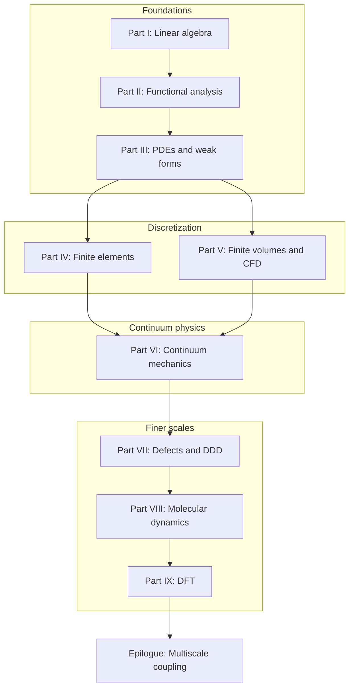

# Preface

This book grew out of a simple observation: computational mechanics is not a collection of unrelated numerical recipes. It is a single narrative about how we represent physical reality at different scales, and how the mathematical tools at each scale connect to the next.

When we write a finite element code, we solve a linear system assembled from local contributions — linear algebra in disguise. When we prove that a Galerkin approximation converges, we invoke completeness and compactness — functional analysis in disguise. When we coarse-grain a molecular dynamics trajectory or feed a DFT energy landscape into a continuum model, we are asking the same question in a different language: *what information survives when we change scale?*

The chapters that follow are written to be read in order, like a novel with a plot. A copper wire under tension, a turbulent jet, a dislocation network in a crystal, and the electrons that bind the atoms together are not separate homework problems. They are scenes in one story. The mathematics is the thread that stitches them together.

## How this book is organized

The structure follows the arc of the author's personal notes — linear algebra and functional analysis as foundations, partial differential equations and weak forms as the bridge to discretization, finite elements and finite volumes as the two great discretization philosophies for solids and fluids, and atomistic and electronic methods as the descent to finer scales. Each part ends with a short bridge section that explains why the next scale is necessary.

Read straight through from the prologue to the epilogue. Parts IV and V can be swapped if you already know FEM and want CFD first; Part VI then unifies the stress–balance language both discretizations approximate. Parts VII–IX are best read after the continuum vocabulary of Part VI, because dislocation, atomistic, and electronic models explain where continuum parameters originate.

## Source material

The prose synthesizes course notes, teaching materials, and research experience collected over several years. Primary written sources include:

- [Linear Algebra notes](https://hanfengzhai.github.io/file/ME300A_LinAlg.pdf) (ME 300A)
- [Functional Analysis notes](https://hanfengzhai.github.io/file/FunctionalAnalysis.pdf) (Part II template)
- [Partial Differential Equations notes](https://hanfengzhai.github.io/file/ME300B_PDE.pdf) (ME 300B)
- [Finite Element Analysis notes](https://hanfengzhai.github.io/file/FEA_notes.pdf) and [problem sessions](https://hanfengzhai.github.io/note.html)
- [Elasticity & Inelasticity notes](https://hanfengzhai.github.io/file/elasticity_notes.pdf)
- [Computational Fluid Dynamics notes](https://hanfengzhai.github.io/file/CFD_note.pdf) and [Finite Volume Method notes](https://hanfengzhai.github.io/note/FVM.pdf)
- [Defects & Disorders notes](https://hanfengzhai.github.io/file/defects_notes.pdf)
- [Atomistic Modeling notes](https://hanfengzhai.github.io/file/AtomModel_note.pdf)
- [DFT coursework](https://github.com/hanfengzhai/MSE5720-HW) (MSE 5720)

Canonical source markdown lives under [`writings/`](../writings/) in the **Functional Analysis Notes** layout: one mdBook per part, numbered chapters, and **Bridge** sections at the end of each chapter. Run [`scripts/sync-writings.sh`](../scripts/sync-writings.sh) to refresh `src/` from those sources. When the external `Writings` git submodule is linked, merge upstream changes there and re-run the sync script.

## Disclaimer

These notes represent the author's understanding of the material and are intended for study and reference. They may contain errors. Feedback is welcome at [hzhai@stanford.edu](mailto:hzhai@stanford.edu).

---

*Hanfeng Zhai, 2026*
