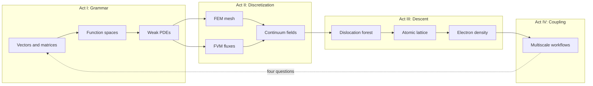
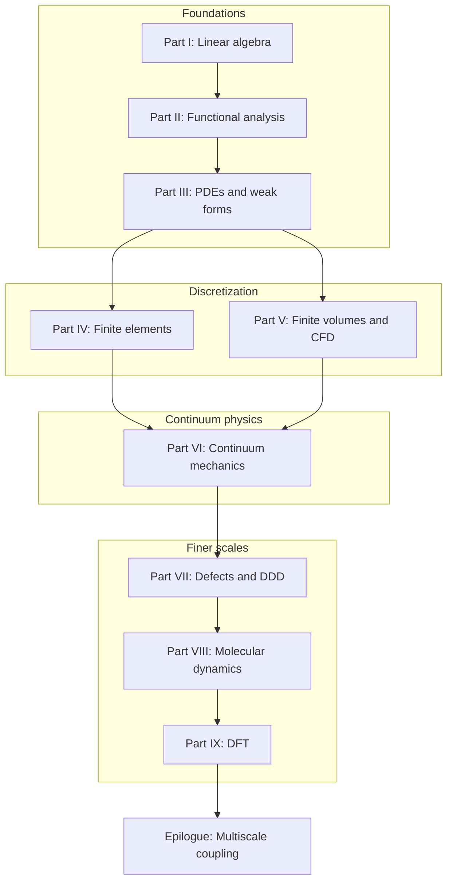

# Preface

This book grew out of a simple observation: computational mechanics is not a collection of unrelated numerical recipes. It is a single narrative about how we represent physical reality at different scales, and how the mathematical tools at each scale connect to the next.

When we write a finite element code, we solve a linear system assembled from local contributions — linear algebra in disguise. When we prove that a Galerkin approximation converges, we invoke completeness and compactness — functional analysis in disguise. When we coarse-grain a molecular dynamics trajectory or feed a DFT energy landscape into a continuum model, we are asking the same question in a different language: *what information survives when we change scale?*

The chapters that follow are written to be read in order, like a novel with a plot. A copper wire under tension, a turbulent jet, a dislocation network in a crystal, and the electrons that bind the atoms together are not separate homework problems. They are scenes in one story. The mathematics is the thread that stitches them together.

## Scene: before the first chapter

Picture a shared materials lab on a weekday morning. A cold-drawn copper wire — the kind used in power cables and tensile specimens — sits in wedge grips on a small frame. The operator has not yet ramped load or switched on current; the load cell reads zero, the thermocouple at mid-span reports room temperature, and a student at the next bench is already opening a terminal for a meshing script. Nothing in the room announces "functional analysis" or "Kohn–Sham." What is visible is simpler: one cylinder of metal, one experiment waiting to run, and the quiet assumption that a computer model somewhere will eventually agree with what the grips and sensors record.

That wire is the book's protagonist. Every part that follows returns to it — as a chain of springs, as a field in \(H^1\), as a meshed solid, as air cooling its surface, as a crystal carrying a dislocation forest, as an atomic lattice, as valence electrons in a periodic cell. The mathematics changes language; the specimen does not. Read this preface as the jacket copy and the prologue as the opening scene. When a chapter feels abstract, ask which bench in this lab you are standing at, and which of the four questions — state, equations, discretization, upward export — that chapter is answering for the same piece of copper.

## Plot spine: how the story is told

Each part follows the **Functional Analysis Notes** (ME 412) layout — numbered chapters, concept maps at openings, checkpoints at closings — but the book adds four narrative devices so the arc reads as one continuous text rather than a syllabus:

| Device | Role | Where it appears |
|--------|------|------------------|
| **Scene** | Return to the copper wire in concrete detail | Preface, prologue, every part opening, every numbered chapter, epilogue |
| **Bridge** | State why the next chapter must exist | End of every numbered chapter and part opening |
| **Lab act** | Worked example, workflow, or checklist tied to computation | Inside chapters (assembly, LAMMPS, OpenDiS, QE inputs) |
| **Concept map** | Object → structure → theorem → failure mode | Part openings; part closing checkpoints |
| **Representative schematics** | Baby pictures indexed to source notes (ME 300A, ME 412, ME 300B, FEA, FVM, …) | Every part opening (I–IX) |

The dramatic arc is not a surprise twist — it is **scale change with the same specimen**:

**Act I** teaches the language (Parts I–III). **Act II** makes PDEs computable on meshes and control volumes (Parts IV–VI). **Act III** asks where continuum parameters hide their history (Parts VII–IX). **Act IV** wires the rungs together (epilogue). When a transition feels abrupt, read the **Bridge** at the end of the prior chapter — it is the narrative hinge the plot spine assumes you will use.

## The story in one page

Read this once if you want the plot before the proofs — every chapter below unpacks one beat of the same afternoon.

A cold-drawn copper wire waits in wedge grips: our protagonist through every scale. We first learn the grammar every simulation shares — vectors, stiffness matrices, eigenmodes — and watch mesh refinement send those objects toward functions and operators. Function spaces supply the room where weak forms live; PDEs write the equilibrium and heat equations those forms discretize. Finite elements mesh the solid; finite volumes balance fluxes in the air that cools the wire when current flows. Continuum mechanics names the stress and strain both discretizations approximate; [VI.4's intermission](part06-continuum/04-nonlinear-plasticity-preview.md#intermission-ascent-ends-descent-begins) admits cold drawing wrote yield history the smooth fields cannot see — the hinge where phenomenology ends and pedigree begins. Dislocation dynamics simulates the forest that hardens the wire; molecular dynamics resolves atoms at notches and fits potentials on trust; density functional theory audits those potentials from electron density. The epilogue wires the rungs into handshakes no single code runs alone — the same four questions at every interface: state, equations, discretization, upward export.

The [prologue](prologue/00-many-scales.md) opens the scene; the [chapter roadmap](appendix/sources.md) lists every beat in reading order; the [epilogue](epilogue/multiscale.md) reunites all six lab acts in workflow time. The [opening continuity hinge](#opening-continuity-hinge) names the turn from panoramic ladder to explicit grammar when the prologue ends; the [ascent preview chain](#ascent-preview-chain) and [descent previews](#descent-preview-chain) below summarize each rung before you commit to every proof; the prologue's [reading compass](prologue/00-many-scales.md#reading-compass-two-clocks-on-one-wire) maps mathematical order against laboratory time when the two clocks diverge. The [ascent continuity hinges](#ascent-continuity-hinges) table names four turns within Parts I–V when linear algebra, analysis, and discretization feel like separate subjects; the [continuity hinges](#continuity-hinges-ascent-descent) table names the two turns at Part VI — mathematical midpoint and narrative intermission — before Part VII descends to defects; the [descent continuity hinges](#descent-continuity-hinges) table names the three turns within Parts VII–IX before the epilogue couples every export; the [epilogue continuity hinges](#epilogue-continuity-hinges) table names the three turns that close the loop from DFT exports back to the prologue's four questions on the next project.

## Opening continuity hinge (prologue → Part I) {#opening-continuity-hinge}

The book opens twice — once as a panoramic ladder in the prologue, once as explicit syntax in Part I. When the scale menu feels overwhelming before a single matrix is assembled, pause at this hinge — same copper wire, first finite-dimensional model.

| Hinge | Location | What turns |
|-------|----------|------------|
| **Panorama → grammar** | [Prologue Bridge](prologue/00-many-scales.md#bridge-to-part-i) → [Part I opening](part01-linear-algebra/00-opening.md#opening-hinge-prologue-to-part-i) | Nine-scale ladder becomes \(\mathbf{K}\mathbf{u}=\mathbf{f}\); four questions get their first numeric answers |

Read the [prologue bridge](prologue/00-many-scales.md#bridge-to-part-i) when you want the plot before proofs — it names every rung in one sitting. Read [Part I's opening hinge](part01-linear-algebra/00-opening.md#opening-hinge-prologue-to-part-i) when the ladder feels like a catalog of methods — the wire is already a spring chain waiting for assembly. The [Row 0 skill checkpoint](#skill-navigation-row-0) below is the competence-time mirror of the [prologue Act I preview row](prologue/00-many-scales.md#what-you-should-be-able-to-do-after-the-prologue) — mounting discipline before current, ramp, or Handshake 1 moduli. The [preface bridge](#bridge) below states the same handoff in prose before you turn to Part I.1.

## Ascent preview chain

Read this once if you want the mathematical climb before every proof — each linked part opening unpacks one rung of the same copper wire.

**[Part I](part01-linear-algebra/00-opening.md)** teaches the grammar every simulation shares: the wire as a chain of springs, \(\mathbf{K}\mathbf{u}=\mathbf{f}\), eigenmodes that decouple vibration, and the limit \(N\to\infty\) that sends nodal values toward fields. **[Part II](part02-functional-analysis/00-opening.md)** names the room those fields live in — \(H^1\), \(L^2\), operators, completeness — and proves Galerkin FEM is projection, not guesswork. **[Part III](part03-pdes/00-opening.md)** writes equilibrium and heat as weak PDEs: strong forms fail at corners; Sobolev spaces and energy principles make the boundary value problems well posed. **[Part IV](part04-fem/00-opening.md)** meshes the solid: weighted residuals, Galerkin assembly, elements and quadrature, convergence in energy norm. **[Part V](part05-fvm/00-opening.md)** balances fluxes in the air that cools the wire — conservation on cells, Riemann problems, Navier–Stokes and conjugate heat transfer. **[Part VI](part06-continuum/00-opening.md)** names Cauchy stress and strain behind both discretizations, marks the [midpoint](part06-continuum/00-opening.md#midpoint-ascent-complete-descent-ahead) where the mathematical climb completes, and closes with [VI.4's intermission](part06-continuum/04-nonlinear-plasticity-preview.md#intermission-ascent-ends-descent-begins) where \(J_2\) placeholders yield to the dislocation forest.

## Ascent continuity hinges (I → VI) {#ascent-continuity-hinges}

Parts I–V climb from finite-dimensional algebra to two discretization philosophies. When a transition feels abrupt mid-climb, pause at one of these four hinges — same copper wire, richer vocabulary at each turn.

| Hinge | Location | What turns |
|-------|----------|------------|
| **Finite → infinite dimensions** | [I.4 Bridge](part01-linear-algebra/04-toward-infinity.md#bridge-to-part-ii) | Mesh refinement sends \(\mathbf{K}_N\) toward an operator; nodal vectors become fields in \(H^1\) and \(L^2\) |
| **Analysis → PDEs** | [II.5 Bridge](part02-functional-analysis/05-spectral-theorem.md#bridge-to-part-iii) | Completeness and spectral theory hand off to weak forms for Poisson, heat, and elasticity |
| **Well-posedness → assembly** | [III.4 Bridge](part03-pdes/04-energy-methods.md#bridge-to-part-iv) | Dirichlet principle and Lax–Milgram become Galerkin assembly on \(V_h\) |
| **Discretization fork → continuum** | [IV.5](part04-fem/05-convergence.md#bridge-two-doors-from-here) / [V.4](part05-fvm/04-navier-stokes-cfd.md#bridge-to-part-vi) | FEM (Door B) and FVM (Door A) converge on Cauchy stress; two languages, one tensor vocabulary in Part VI |

Read the [I.4 hinge](part01-linear-algebra/04-toward-infinity.md#bridge-to-part-ii) when \(\mathbf{K}\mathbf{u}=\mathbf{f}\) feels unrelated to PDEs — refinement already pointed at a function space. Read the [II.5 hinge](part02-functional-analysis/05-spectral-theorem.md#bridge-to-part-iii) when Sobolev norms feel abstract — the weak form is the next line of dialogue for the same wire. Read the [III.4 hinge](part03-pdes/04-energy-methods.md#bridge-to-part-iv) when energy minimization and matrix assembly seem like separate tricks — Rayleigh–Ritz on \(V_h\) is both. Read [IV.5's two doors](part04-fem/05-convergence.md#bridge-two-doors-from-here) when you must choose solids-first versus fluids-first; either path must reach [Part VI](part06-continuum/00-opening.md#midpoint-ascent-complete-descent-ahead) before the descent begins.

The [ascent preview chain](#ascent-preview-chain) names Parts I–VI in one pass; this table names the **four narrative hinges** within that climb — the moments the plot turns from vectors to fields, from fields to weak PDEs, from weak forms to assembled matrices, and from two discretizations to shared continuum mechanics.

## Descent preview chain

Read this once if you want the scale descent before the mesoscopic and finer proofs — each linked part opening unpacks one rung on the way down.

**[Part VII](part07-defects/00-opening.md)** names the forest cold drawing stored: dislocation lines with Burgers vectors, Peach–Köhler forces, mobility laws, and Taylor hardening that export \(\rho\) and \(\tau(\gamma)\) to crystal plasticity FEM — the mechanism behind the \(J_2\) bend Part VI could only fit. **[Part VIII](part08-md/00-opening.md)** replaces line-core cutoffs with vibrating nuclei on interatomic potentials: NVT and NPT ensembles, velocity-Verlet integration, LAMMPS workflows that fit EAM parameters and export cohesive energy, elastic constants, and stacking-fault energy upward on trust — including the **temperature pedigree chain** from [V.4 conjugate heat transfer](part05-fvm/04-navier-stokes-cfd.md#lab-act-extension-two-domain-picard-loop-with-a-1d-fem-solid) (\(T_w\) from the Picard loop) through [VIII.3 WHAM reweighting](part08-md/03-ab-initio-and-coarse-graining.md#wham-part-vii-mobility-hinge-act-ii-temperature-pedigree) to [VII.2 mobility calibration](part07-defects/02-dislocation-dynamics.md#lab-act-calibrate-screw-mobility-from-md-shear-act-iv--mobility-prelude) at the same \(T_w\), not room temperature. **[Part IX](part09-dft/00-opening.md)** audits those potentials from electron density: Born–Oppenheimer separation, Hohenberg–Kohn, Kohn–Sham self-consistency, and Quantum ESPRESSO decks that export \(E_{\text{coh}}\), \(C_{ij}\), and \(\gamma_{\text{sf}}\) with a pedigree traceable to SCF logs — the finest rung on the prologue's ladder. After Part IX, only coupling remains: the [epilogue](epilogue/multiscale.md) reunites every export in workflow time — starting with [Handshake 2](epilogue/multiscale.md#handshake-2--joule-heating--conjugate-heat-transfer-part-iv--v), which reuses the V.4 CHT Lab act iteration table as the template for every downstream temperature export.

Each part opening also carries a one-paragraph preview for readers who pause mid-descent: [mesoscale](part07-defects/00-opening.md#the-descent-in-one-paragraph), [atomistic](part08-md/00-opening.md#the-atomistic-descent-in-one-paragraph), and [electronic floor](part09-dft/00-opening.md#the-electronic-floor-in-one-paragraph).

## Continuity hinges (ascent → descent) {#continuity-hinges-ascent-descent}

The book turns twice at Part VI — once in vocabulary, once in plot. Both hinges keep the same copper wire on the bench; only the state variable and the questions change.

| Hinge | Location | What turns |
|-------|----------|------------|
| **Mathematical midpoint** | [Part VI opening](part06-continuum/00-opening.md#midpoint-ascent-complete-descent-ahead) | FEM/FVM meet Cauchy stress; the climb from linear algebra through discretization is complete |
| **Narrative intermission** | [VI.4](part06-continuum/04-nonlinear-plasticity-preview.md#intermission-ascent-ends-descent-begins) | Smooth fields and \(J_2\) hardening fit the load cell but not its cause; pedigree replaces phenomenology |
| **First mesoscale chapter** | [Part VII opening](part07-defects/00-opening.md) | Burgers geometry and DDD replace scalar \(\alpha\); the descent preview chain begins in earnest |

Read the [midpoint](part06-continuum/00-opening.md#midpoint-ascent-complete-descent-ahead) when Parts I–V feel like separate subjects — Part VI names the stress tensor both discretizations approximate. Read the [intermission](part06-continuum/04-nonlinear-plasticity-preview.md#intermission-ascent-ends-descent-begins) when the return-mapping loop fits \(H\) and \(\sigma_{y0}\) but cannot explain **why** the curve bent. The prologue's [reading compass](prologue/00-many-scales.md#reading-compass-two-clocks-on-one-wire) maps these hinges against laboratory time (Acts III–IV: pull, then harden).

## Descent continuity hinges (VII → epilogue) {#descent-continuity-hinges}

After Part VI's intermission, the book descends in four deliberate turns — same wire, finer state variable, stricter pedigree at every export.

| Hinge | Location | What turns |
|-------|----------|------------|
| **Mesoscale → atomistic** | [VII.3 Bridge](part07-defects/03-polycrystal-and-fem-handoff.md#bridge-to-part-viii) · [VIII.1 opening hinge](part08-md/01-potentials-phase-space.md#opening-hinge-vii3-to-viii1) | Line cores and mobility tables need atomic bonding; DDD cutoff becomes a vibrating RVE |
| **Potentials → ensembles** | [VIII.1 Bridge](part08-md/01-potentials-phase-space.md#bridge) · [VIII.2 opening hinge](part08-md/02-ensembles-integrators.md#opening-hinge-viii1-to-viii2) | EAM minimization at 0 K is not the wire at \(T_w\); phase space must be sampled before mobility or moduli export |
| **Ensembles → coarse-graining** | [VIII.2 Bridge](part08-md/02-ensembles-integrators.md#bridge) · [VIII.3 opening hinge](part08-md/03-ab-initio-and-coarse-graining.md#opening-hinge-viii2-to-viii3) | Audited trajectories must compress into handoff tables with DFT pedigree gates before Part IX |
| **Temperature pedigree at \(T_w\)** | [VIII.0 descent hinge](part08-md/00-opening.md#descent-hinge-cores-mobility-and-tw-pedigree) · [memory sheet row 8](appendix/memory-sheet.md#continuity-hinges-master-map) · [preface row 8 skill checkpoint](preface.md#skill-navigation-row-8) | [V.4 CHT](part05-fvm/04-navier-stokes-cfd.md#lab-act-extension-two-domain-picard-loop-with-a-1d-fem-solid) converged at \(T_w \approx 379\,\text{K}\); MD mobility, WHAM, and drag tables must not default to 300 K |
| **Atomistic → electronic audit** | [VIII.3 Bridge](part08-md/03-ab-initio-and-coarse-graining.md#bridge-to-part-ix) · [IX.0 electronic audit hinge](part09-dft/00-opening.md#electronic-audit-hinge-descent-pedigree-and-tw-phonon) · [memory sheet row 9](appendix/memory-sheet.md#continuity-hinges-master-map) · [preface row 9 skill checkpoint](preface.md#skill-navigation-row-9) | EAM potentials on trust need SCF audit; [thermal phonon audit at \(T_w\)](part09-dft/00-opening.md#thermal-phonon-audit-at-tw) confirms \(\alpha\) and \(\tau_{\text{ph}}\) are not room-temperature folklore |
| **Electronic → coupling** | [IX.3 Bridge](part09-dft/03-dft-workflows.md#bridge-to-the-epilogue) | Finest rung complete; upward homogenization and handshake loops in the epilogue |

Read the [mesoscale hinge](part07-defects/03-polycrystal-and-fem-handoff.md#bridge-to-part-viii) when mobility or \(\gamma_{\text{sf}}\) feel like fitted constants — Peierls stress and core width hide in atomic trajectories, not Taylor hardening alone. Read the [VIII.1 opening hinge](part08-md/01-potentials-phase-space.md#opening-hinge-vii3-to-viii1) when [VII.3's Bridge](part07-defects/03-polycrystal-and-fem-handoff.md#bridge-to-part-viii) named the ink but phase space still feels like a new subject — the same `mobility.yaml` row, now with \(\mathbf{F}_i = -\nabla V\) on a screw-core RVE. Read the [VIII.2 opening hinge](part08-md/02-ensembles-integrators.md#opening-hinge-viii1-to-viii2) when the EAM foundation archive exists but `MD_NVT_shear_PartVIII` has not yet run at \(T_w\) — 0 K minimization is not a room-temperature wire. Read the [VIII.3 opening hinge](part08-md/03-ab-initio-and-coarse-graining.md#opening-hinge-viii2-to-viii3) when NPT moduli and mobility tables exist but no handoff bundle names DFT audit gates — trajectories without pedigree are multiscale folklore. Read the [temperature pedigree hinge](part08-md/00-opening.md#descent-hinge-cores-mobility-and-tw-pedigree) when Act II warmed the wire but mobility folders still cite 300 K — [memory sheet rows 8–9 baby picture](appendix/memory-sheet.md#rows-8-9-baby-picture-tw-temperature-pedigree) draws the \(T_w\) chain from CHT through MD to DFT phonons. Read the [electronic audit hinge](part09-dft/00-opening.md#electronic-audit-hinge-descent-pedigree-and-tw-phonon) when EAM matches bulk moduli but no one cites the DFT input deck or evaluates \(\alpha(T_w)\) beside `cht_export.yaml`. Read the [coupling hinge](part09-dft/03-dft-workflows.md#bridge-to-the-epilogue) when exports exist in separate folders but no workflow connects them — the epilogue's [Closing the arc from Part IX](epilogue/multiscale.md#closing-the-arc-from-part-ix) reunites SCF pedigree with the [thermal phonon audit at \(T_w\)](part09-dft/00-opening.md#thermal-phonon-audit-at-tw) before Handshakes 1–4b run.

The [descent preview chain](#descent-preview-chain) names Parts VII–IX in one pass; this table names the **six narrative hinges** within that descent — the moments the plot turns from forest statistics to vibrating nuclei, from 0 K potentials to finite-\(T\) ensembles, from trajectories to coarse-grained exports, from \(T_w\) pedigree through MD to DFT phonons, from electron density to coupled codes.

## Epilogue continuity hinges (IX → prologue) {#epilogue-continuity-hinges}

The book closes a third loop after ascent and descent: **coupling upward** from the finest rung back to engineering questions — and back to the prologue's four questions on every new project.

| Hinge | Location | What turns |
|-------|----------|------------|
| **Finest rung → workflow** | [IX.3 Bridge](part09-dft/03-dft-workflows.md#bridge-to-the-epilogue) | SCF exports archived; pedigree must compose with MD, DDD, and FEM folders — [memory sheet row 10](appendix/memory-sheet.md#continuity-hinges-master-map); [row 10 skill checkpoint](#skill-navigation-row-10); [prologue row 10 preview](prologue/00-many-scales.md#prologue-preview-row-10) |
| **Joule heat → fixed-grip stress** | [Epilogue Handshake 2](epilogue/multiscale.md#handshake-2--joule-heating--conjugate-heat-transfer-part-iv--v) → [IX.3 α Lab act](part09-dft/03-dft-workflows.md#lab-act-quasiharmonic-alpha-handshake-3-pedigree) → [Handshake 3](epilogue/multiscale.md#handshake-3--thermal-strain--mechanical-stiffness-part-vi--iv) | Handshake 2 (Parts IV–V CHT) sets \(\Delta T\); Handshake 3 (quasiharmonic \(\alpha\) from IX.3) sets thermal strain — the [sensitivity table](epilogue/multiscale.md#sensitivity-which-handshake-matters-most) ranks Handshake 2 first for \(T_w\) and Handshake 3 first for load-cell readings; [sensitivity derivation worksheet](epilogue/multiscale.md#worked-example-sensitivity-ranks); [memory sheet row 13](appendix/memory-sheet.md#continuity-hinges-master-map); [row 13 closing loop](epilogue/multiscale.md#row-13-closing-loop); [prologue row 13 closing stitch](prologue/00-many-scales.md#row-13-closing-stitch); [row 13 skill checkpoint](#skill-navigation-row-13) |
| **DDD rate → lab load cell** | [VII.3 rate handshake](part07-defects/03-polycrystal-and-fem-handoff.md#scale-boundary-handshake-ddd-strain-rate-to-quasi-static-fem) → [Epilogue Handshake 4a](epilogue/multiscale.md#handshake-4--rate-dependent-hardening-and-notch-localization-part-vii--vi--viii) | OpenDiS at \(10^3\,\text{s}^{-1}\) sets \(\tau_{\text{flow}}\); power-law \(m\) extrapolates to lab grip speed — the [sensitivity table](epilogue/multiscale.md#sensitivity-which-handshake-matters-most) ranks Handshake 4a next for Act IV hardening; [sensitivity derivation worksheet](epilogue/multiscale.md#worked-example-sensitivity-ranks) (4a column); [memory sheet row 14](appendix/memory-sheet.md#continuity-hinges-master-map); [row 14 baby picture](appendix/memory-sheet.md#row-14-baby-picture-handshake-4a); [row 14 closing loop](epilogue/multiscale.md#row-14-closing-loop); [prologue row 14 closing stitch](prologue/00-many-scales.md#row-14-closing-stitch); [row 14 skill checkpoint](#skill-navigation-row-14) |
| **FE² notch → Act V localization** | [VII.3 Step 4 FE²](part07-defects/03-polycrystal-and-fem-handoff.md#step-4--when-offline-calibration-fails-fe-at-the-notch) → [Epilogue Handshake 4b](epilogue/multiscale.md#4b--when-continuum-fails-at-the-notch-md-subdomain-act-v--notch) | Scalar hardening from 4a matches bulk flow stress but may under-predict notch-root peak stress by 10–15% — the [sensitivity table](epilogue/multiscale.md#sensitivity-which-handshake-matters-most) activates 4b only with Act V; [sensitivity derivation worksheet](epilogue/multiscale.md#worked-example-sensitivity-ranks) (4b column); [memory sheet row 15](appendix/memory-sheet.md#continuity-hinges-master-map); [row 15 baby picture](appendix/memory-sheet.md#row-15-baby-picture-handshake-4b); [row 15 closing loop](epilogue/multiscale.md#row-15-closing-loop); [prologue row 15 closing stitch](prologue/00-many-scales.md#row-15-closing-stitch); [row 15 three-way audit](#skill-navigation-row-15); [row 15 skill checkpoint](#skill-navigation-row-15); upstream rate from [row 14](#skill-navigation-row-14) |
| **Coupling → laboratory time** | [Epilogue: six-act reunion](epilogue/multiscale.md#lab-act-reunion-six-acts-one-afternoon) | Mathematical order (I→IX) reunites with the six acts the operator actually runs — [memory sheet row 11](appendix/memory-sheet.md#continuity-hinges-master-map); [row 11 skill checkpoint](#skill-navigation-row-11); [prologue row 11 preview](prologue/00-many-scales.md#prologue-preview-row-11); [prologue row 11 closing stitch](prologue/00-many-scales.md#row-11-closing-stitch); [epilogue row 11 closing loop](epilogue/multiscale.md#row-11-closing-loop); Act VI runs **in parallel** with Acts I–V |
| **Act VI orchestration** | [IX.3 Bridge](part09-dft/03-dft-workflows.md#bridge-to-the-epilogue) → [`parse_multiscale_workflow.sh`](../scripts/parse_multiscale_workflow.sh) | Individual handshake exports need orchestrated pedigree — [`multiscale_export.yaml`](../scripts/parse_multiscale_workflow.sh) links Handshakes 1–4b in dependency order; [IX.3 epilogue pedigree table](part09-dft/03-dft-workflows.md#ix3-epilogue-pedigree-table) (orchestrated chain row); [script audit trail All — orchestrated chain row](epilogue/multiscale.md#script-audit-trail-parse-scripts-handshakes); [sensitivity worksheet closing](epilogue/multiscale.md#worked-example-sensitivity-ranks) (row 16 stitch); [memory sheet row 16](appendix/memory-sheet.md#continuity-hinges-master-map); [memory sheet Act VI baby picture](appendix/memory-sheet.md#act-vi-baby-picture-me-412-coupling-ladder); [one-page recap Act VI column](appendix/memory-sheet.md#one-page-copper-wire-recap); [row 16 closing loop](epilogue/multiscale.md#row-16-closing-loop); [row 16 three-way audit](#skill-navigation-row-16); [row 16 skill checkpoint](#skill-navigation-row-16) |
| **Continuous read-through** | [Continuous read-through guide](appendix/sources.md#continuous-read-through-guide) · [memory sheet row 17](appendix/memory-sheet.md#row-17-baby-picture-continuous-read-through) | Chapters feel choppy despite Bridges — trust Scene/Bridge rhythm; pause only at I.4, VI.4, IX.3; [row 17 skill checkpoint](#skill-navigation-row-17); [prologue row 17 preview](prologue/00-many-scales.md#prologue-preview-row-17); [prologue row 17 closing stitch](prologue/00-many-scales.md#row-17-closing-stitch); [row 17 closing loop](epilogue/multiscale.md#row-17-closing-loop) |
| **Workflow → next project** | [Epilogue Bridge row 12](epilogue/multiscale.md#row-12-closing-loop) → [Prologue reopening anchor](prologue/00-many-scales.md#prologue-reopening-anchor) | Four questions restart on a new material; the ladder is reusable, not copper-specific — [memory sheet row 12](appendix/memory-sheet.md#continuity-hinges-master-map); [row 12 skill checkpoint](#skill-navigation-row-12); [prologue row 12 preview](prologue/00-many-scales.md#prologue-preview-row-12); [prologue row 12 closing stitch](prologue/00-many-scales.md#row-12-closing-stitch) |

Read the [coupling hinge](part09-dft/03-dft-workflows.md#bridge-to-the-epilogue) when DFT, MD, and FEM outputs live in separate directories with no README at the arrows. Read the [continuous read-through guide](appendix/sources.md#continuous-read-through-guide) when the hinge index feels overwhelming mid-read — [row 17 skill checkpoint](#skill-navigation-row-17), [prologue row 17 preview](prologue/00-many-scales.md#prologue-preview-row-17), and [memory sheet row 17 baby picture](appendix/memory-sheet.md#row-17-baby-picture-continuous-read-through) name the straight-through path before you open rows 8–16 individually. Read the [Handshake 2 → 3 chain](epilogue/multiscale.md#handshake-2--joule-heating--conjugate-heat-transfer-part-iv--v) when the load cell sees thermal compression but the FEM deck still cites handbook \(\alpha\) beside an orphan `pw.x` log — [IX.3's quasiharmonic \(\alpha\) Lab act](part09-dft/03-dft-workflows.md#lab-act-quasiharmonic-alpha-handshake-3-pedigree) is where \(\alpha\) earns the same pedigree as \(C_{ij}\). Read the [VII.3 → Handshake 4a chain](part07-defects/03-polycrystal-and-fem-handoff.md#scale-boundary-handshake-ddd-strain-rate-to-quasi-static-fem) when the hardening knee looks right on a DDD plot but the load cell yield arrives early — direct import at \(10^3\,\text{s}^{-1}\) without extrapolation overpredicts flow stress by 5–35%. Read the [VII.3 Step 4 → Handshake 4b chain](part07-defects/03-polycrystal-and-fem-handoff.md#step-4--when-offline-calibration-fails-fe-at-the-notch) when bulk hardening from 4a looks credible but the optional notch concentrates stress the scalar law cannot capture — [`parse_fe2.sh`](../scripts/parse_fe2.sh) on fixture data reports a 10–15% root-stress uplift FE² resolves that crystal plasticity alone misses. Read the [Act VI orchestration chain](part09-dft/03-dft-workflows.md#bridge-to-the-epilogue) → [`parse_multiscale_workflow.sh`](../scripts/parse_multiscale_workflow.sh) when Handshakes 1–4b exist in separate folders but no orchestrated `multiscale_export.yaml` links them — [row 16 skill checkpoint](#skill-navigation-row-16), the [script audit trail All — orchestrated chain row](epilogue/multiscale.md#script-audit-trail-parse-scripts-handshakes), [prologue reading compass row 16](prologue/00-many-scales.md#reading-compass-two-clocks-on-one-wire), and [memory sheet Act VI baby picture](appendix/memory-sheet.md#act-vi-baby-picture-me-412-coupling-ladder) name the same stitch. Read the [six-act reunion](epilogue/multiscale.md#lab-act-reunion-six-acts-one-afternoon) when you know each part in isolation but cannot name which handshake runs before the grips close tomorrow — [row 11 skill checkpoint](#skill-navigation-row-11), [prologue row 11 preview](prologue/00-many-scales.md#prologue-preview-row-11), and [memory sheet one-page recap Act column](appendix/memory-sheet.md#one-page-copper-wire-recap) map Parts I–IX onto Acts I–VI when workflow order is unclear. Read the [epilogue Bridge row 12 closing loop](epilogue/multiscale.md#row-12-closing-loop) and [prologue reopening anchor](prologue/00-many-scales.md#prologue-reopening-anchor) when the copper arc is complete and a new material needs scale discipline from day one — [row 12 skill checkpoint](#skill-navigation-row-12), [prologue row 12 preview](prologue/00-many-scales.md#prologue-preview-row-12), and [memory sheet row 12 baby picture](appendix/memory-sheet.md#row-12-baby-picture-next-project) close the book loop that [row 0](#skill-navigation-row-0) opened. Return to the [prologue](prologue/00-many-scales.md#reading-compass-two-clocks-on-one-wire) when the specimen changes — the continuity hinges table in the [memory sheet](appendix/memory-sheet.md#continuity-hinges-master-map) collects all seventeen narrative hinges plus the opening and closing loops in one navigation page.

The [story in one page](#the-story-in-one-page) ends at multiscale coupling; this table names the **six narrative hinges** within that closing act — exports become workflows, temperature and expansion become fixed-grip stress, rate extrapolation becomes Act IV hardening, FE² becomes Act V localization, Act VI orchestration becomes `multiscale_export.yaml` ([memory sheet Act VI baby picture](appendix/memory-sheet.md#act-vi-baby-picture-me-412-coupling-ladder); [prologue row 16 preview](prologue/00-many-scales.md#what-you-should-be-able-to-do-after-the-prologue)), laboratory time becomes the compass for the next wire.

## How this book is organized

The structure follows the arc of the author's personal notes — linear algebra and functional analysis as foundations, partial differential equations and weak forms as the bridge to discretization, finite elements and finite volumes as the two great discretization philosophies for solids and fluids, and atomistic and electronic methods as the descent to finer scales. Each part ends with a short bridge section that explains why the next scale is necessary.

Read straight through from the prologue to the epilogue. Parts IV and V can be swapped if you already know FEM and want CFD first; Part VI then unifies the stress–balance language both discretizations approximate. Parts VII–IX are best read after the continuum vocabulary of Part VI, because dislocation, atomistic, and electronic models explain where continuum parameters originate.

## Three reading paths

The book is one continuous story, but not every reader enters at the same rung:

| Path | Start here | Route | Best for |
|------|------------|-------|----------|
| **Full arc** | [Prologue](prologue/00-many-scales.md) | I → II → III → IV → V → VI → VII → VIII → IX → [Epilogue](epilogue/multiscale.md) | First read; builds every concept in order |
| **Analysis first** | Part I, then Part II | Skip to Part III when function spaces feel familiar; return to IV–V for discretization | Students who know FEM but want weak-form foundations |
| **Scale descent** | Part VI after skimming I–III | VI → VII → VIII → IX, then back to IV–V for how continuum codes mesh and flux | Researchers asking where moduli and hardening laws originate |

On every path, read the **Bridge** at the end of the prior chapter when a jump feels abrupt. Part openings add **Story so far** recaps, **concept map** tables (object → structure → theorem → failure mode), **How Part X connects to…** cross-part tables, **skill checkpoint** tables (minimal artifacts on the copper wire), and **representative schematics** indexed to the source notes — all following the [Functional Analysis Notes](https://hanfengzhai.github.io/file/teaching/notes/ME412_CourseSummary.pdf) layout. Part closings add **concept map checkpoints** that summarize what the part exported to the next scale. The **prologue** and **epilogue** add matching **concept map checkpoints** that frame the whole ladder at the bookends. The [skill navigation](#skill-navigation) table below collects every checkpoint in one compass.

## Reading rhythm

Each chapter uses a deliberate rhythm so the book reads as one continuous story rather than a stack of lecture notes:

| Section | Role | Where it appears |
|---------|------|------------------|
| **Scene** | Places the mathematics in the lab — grips tightening, current switching on, a notch concentrating stress | Preface, prologue, every part opening, every numbered chapter, epilogue, appendix glossary and sources |
| **Lab act** | Links the part to one act of the [six-act lab session](prologue/00-many-scales.md#the-experiment-as-plot) | Part openings I–IX and epilogue reunion |
| **Concept map** | Four questions: object, structure, theorem, failure mode | Part openings; epilogue closing lens |
| **Representative schematics** | Baby pictures indexed to source notes (ME 300A, ME 412, ME 300B, FEA, FVM, …) | Every part opening (I–IX) |
| **Bridge** | States why the next chapter exists — the narrative hinge | End of every numbered chapter, part opening, preface, prologue, epilogue, appendix glossary and sources |
| **Skill checkpoint** | Minimal artifact you can produce on the copper wire before turning the page | Prologue; every part opening (I–IX); epilogue |

When abstraction rises, read in this order: **Lab act** (which experiment am I in?) → **Scene** (what is the operator watching?) → **Concept map** (what structure makes the theorem possible?) → **Representative schematics** (which baby picture matches this chapter?) → **Skill checkpoint** (what can I do on paper or in a terminal?) → **Bridge** (why turn the page?).

## Skill navigation

The book is one continuous story, but mastery is checked at **milestones** — not only at the end. Each milestone lists skills on the copper wire and a **minimal artifact** (a matrix, a plot, a convergence log, a pedigree row) you can produce before moving on. Use this table as a compass when you want practice without rereading every proof:

| Milestone | When to pause | Skill checkpoint |
|-----------|---------------|------------------|
| After the panoramic ladder | Before Part I assembles the first matrix | [Prologue](prologue/00-many-scales.md#what-you-should-be-able-to-do-after-the-prologue) |
| Row 0 — Act I mounting (prologue → Part I) | When the scale ladder feels like a menu before the first matrix | [Row 0 skill checkpoint](#skill-navigation-row-0) |
| After Part I | Before fields replace vectors in Part II | [Part I opening](part01-linear-algebra/00-opening.md#what-you-should-be-able-to-do-after-part-i) |
| After Part II | Before weak PDEs in Part III | [Part II opening](part02-functional-analysis/00-opening.md#what-you-should-be-able-to-do-after-part-ii) |
| After Part III | Before Galerkin assembly in Part IV | [Part III opening](part03-pdes/00-opening.md#what-you-should-be-able-to-do-after-part-iii) |
| After Part IV | Before FVM fluxes or continuum stress | [Part IV opening](part04-fem/00-opening.md#what-you-should-be-able-to-do-after-part-iv) |
| After Part V | Before Cauchy tensors in Part VI | [Part V opening](part05-fvm/00-opening.md#what-you-should-be-able-to-do-after-part-v) |
| After Part VI | Before the mesoscale descent in Part VII | [Part VI opening](part06-continuum/00-opening.md#what-you-should-be-able-to-do-after-part-vi) |
| After Part VII | Before atomic trajectories in Part VIII | [Part VII opening](part07-defects/00-opening.md#what-you-should-be-able-to-do-after-part-vii) |
| After Part VIII | Before Kohn–Sham in Part IX | [Part VIII opening](part08-md/00-opening.md#what-you-should-be-able-to-do-after-part-viii) |
| After Part IX | Before multiscale coupling in the epilogue | [Part IX opening](part09-dft/00-opening.md#what-you-should-be-able-to-do-after-part-ix) |
| Row 8 — \(T_w\) pedigree (Act II → MD/DDD) | When MD mobility, WHAM, or OpenDiS drag folders cite 300 K but [V.4 CHT](part05-fvm/04-navier-stokes-cfd.md#lab-act-extension-two-domain-picard-loop-with-a-1d-fem-solid) converged at \(T_w\) | [Row 8 skill checkpoint](#skill-navigation-row-8) |
| Row 9 — phonon audit at \(T_w\) (MD → DFT) | When EAM matches bulk moduli but `alpha_export.yaml` lacks \(\alpha(T_w)\) beside SCF logs | [Row 9 skill checkpoint](#skill-navigation-row-9) |
| Row 10 — coupling hinge (IX.3 → epilogue) | When foundation exports exist in separate folders but Handshakes 4a/4b split is unclear | [Row 10 skill checkpoint](#skill-navigation-row-10) |
| Row 11 — six-act reunion (I→IX vs Acts I–VI) | When each part makes sense alone but workflow order is unclear | [Row 11 skill checkpoint](#skill-navigation-row-11) |
| Row 12 — next project restart (epilogue → prologue) | When the copper arc is complete but a new material feels like a scale menu again | [Row 12 skill checkpoint](#skill-navigation-row-12) |
| Row 13 — Joule heat → fixed-grip stress | When CHT converges but the FEM deck still cites handbook \(\alpha\) | [Row 13 skill checkpoint](#skill-navigation-row-13) |
| Row 14 — DDD rate → lab load cell | When DDD exports feed the plasticity deck but the hardening knee arrives early | [Row 14 skill checkpoint](#skill-navigation-row-14) |
| Row 15 — FE² notch → Act V localization | When bulk hardening from 4a looks right but the notch root under-predicts peak stress | [Row 15 skill checkpoint](#skill-navigation-row-15) |
| Row 16 — Act VI orchestration → multiscale export | When Handshakes 1–4b exist in separate folders but no single pedigree file links them | [Row 16 skill checkpoint](#skill-navigation-row-16) |
| Row 17 — continuous read-through | When chapters feel choppy despite Bridges — trust Scene/Bridge rhythm; pause only at I.4, VI.4, IX.3 | [Row 17 skill checkpoint](#skill-navigation-row-17) |
| Row 18 — part-opening plot spine | When a part opening feels like a new syllabus — read its plot spine one line aloud | [Row 18 skill checkpoint](#skill-navigation-row-18) |
| Row 19 — numbered-chapter plot spine | When mid-chapter reading stalls despite a Bridge — read this chapter's plot spine one line aloud | [Row 19 skill checkpoint](#skill-navigation-row-19) |
| Row 20 — gate-chapter plot spine | When a mandatory gate (I.4, VI.4, IX.3) stalls the straight read — recite its plot spine one line aloud before the Bridge | [Row 20 skill checkpoint](#skill-navigation-row-20) |
| After the full arc | Before starting a new project on a different material | [Epilogue](epilogue/multiscale.md#what-you-should-be-able-to-do-after-the-book) |

Each part-opening table breaks skills down **by chapter** (e.g. I.1–I.4, II.1–II.5). The prologue and epilogue tables frame the whole ladder at the bookends — navigation discipline before proofs, workflow exam after coupling. When a chapter feels abstract, skip to the matching row in the part opening and produce the minimal artifact; when the artifact is in hand, return to the **Bridge** at the end of the prior chapter for the narrative hinge.

The [reading compass](prologue/00-many-scales.md#reading-compass-two-clocks-on-one-wire) in the prologue maps **continuity hinges** (when the plot turns); this table maps **skill checkpoints** (when you should be able to do something concrete on the wire). Both tables describe the same afternoon — one in narrative time, one in competence time. [Memory sheet row 0](appendix/memory-sheet.md#continuity-hinges-master-map) is the narrative stitch for the opening hinge; the [Row 0 skill checkpoint](#skill-navigation-row-0) below is the competence-time mirror — sketch \(\mathbf{K}\mathbf{u}=\mathbf{f}\) with fixed DOFs and zero load before Act II warming or Handshake 1 moduli enter the story. [Memory sheet row 8](appendix/memory-sheet.md#continuity-hinges-master-map) is the narrative stitch for the Act II temperature pedigree; the [Row 8 skill checkpoint](#skill-navigation-row-8) below is the competence-time mirror — run [`parse_cht.sh`](../scripts/parse_cht.sh) before any NVT shear, WHAM ladder, or OpenDiS mobility fit, and archive `cht_export.yaml` with an explicit \(T_w\) column. [Memory sheet row 9](appendix/memory-sheet.md#continuity-hinges-master-map) is the narrative stitch for the electronic phonon audit; the [Row 9 skill checkpoint](#skill-navigation-row-9) mirrors it — run [`parse_alpha.sh`](../scripts/parse_alpha.sh) and [`parse_lifetime.sh`](../scripts/parse_lifetime.sh) at converged \(T_w\), not 300 K alone, before Handshakes 3 and 4a inherit thermal exports. [Memory sheet row 10](appendix/memory-sheet.md#continuity-hinges-master-map) is the narrative stitch for the IX.3 → epilogue coupling hinge; the [Row 10 skill checkpoint](#skill-navigation-row-10) mirrors it — map [IX.3's epilogue pedigree table](part09-dft/03-dft-workflows.md#ix3-epilogue-pedigree-table) onto Handshakes 1–4b and name the **4a/4b split** on `hardening.yaml` before rows 13–16 run individually. [Memory sheet row 11](appendix/memory-sheet.md#continuity-hinges-master-map) is the narrative stitch for the six-act reunion; the [Row 11 skill checkpoint](#skill-navigation-row-11) mirrors it — map Parts I–IX onto Acts I–VI in the [epilogue six-act reunion table](epilogue/multiscale.md#lab-act-reunion-six-acts-one-afternoon) and state that Act VI (foundation) runs **in parallel** with Acts I–V, not after Part IX in laboratory time. [Memory sheet row 13](appendix/memory-sheet.md#continuity-hinges-master-map) is the narrative stitch for thermal expansion; the [Row 13 skill checkpoint](#skill-navigation-row-13) below is the competence-time mirror — run [`parse_alpha.sh`](../scripts/parse_alpha.sh) after Handshake 2's CHT loop, then verify the load cell against the [sensitivity derivation worksheet](epilogue/multiscale.md#worked-example-sensitivity-ranks). [Memory sheet row 14](appendix/memory-sheet.md#continuity-hinges-master-map) is the narrative stitch for rate extrapolation; the [Row 14 skill checkpoint](#skill-navigation-row-14) mirrors it for Act IV hardening — run [`parse_rate.sh`](../scripts/parse_rate.sh) on OpenDiS sweeps before the crystal-plasticity deck inherits \(\tau_{\text{lab}}\). [Memory sheet row 15](appendix/memory-sheet.md#continuity-hinges-master-map) is the narrative stitch for notch localization; the [Row 15 skill checkpoint](#skill-navigation-row-15) mirrors it for Act V — run [`parse_fe2.sh`](../scripts/parse_fe2.sh) after completing [row 14](#skill-navigation-row-14), then verify root-stress uplift against the [sensitivity derivation worksheet](epilogue/multiscale.md#worked-example-sensitivity-ranks) (Handshake 4b column). [Memory sheet row 16](appendix/memory-sheet.md#continuity-hinges-master-map) is the **ME 412 coupling ladder** stitch for Act VI; the [Row 16 skill checkpoint](#skill-navigation-row-16) mirrors it — run [`parse_multiscale_workflow.sh`](../scripts/parse_multiscale_workflow.sh) after rows 13–15 are understood individually, then archive `multiscale_export.yaml` beside the Act VI folder. The [prologue row 16 preview](prologue/00-many-scales.md#what-you-should-be-able-to-do-after-the-prologue) named this orchestration stitch before Part I — the [row 16 When-to-pause opening sentence](#skill-navigation-row-16) below is the competence-time mirror of that preview when narrative time (Act VI foundation) and mathematical order (Part IX → epilogue) diverge on the same afternoon; the [memory sheet Act VI baby picture](appendix/memory-sheet.md#act-vi-baby-picture-me-412-coupling-ladder) draws the foundation → handshake diagram when the [epilogue continuity hinges](#epilogue-continuity-hinges) table above feels abstract; the [epilogue sensitivity worksheet closing](epilogue/multiscale.md#worked-example-sensitivity-ranks) (row 16 orchestration stitch) closes the quantitative audit when Handshakes 1–4b are understood individually but the orchestrated pedigree is still missing.

### Row 0 skill checkpoint — Act I mounting (prologue → Part I) {#skill-navigation-row-0}

This checkpoint closes the **prologue panorama → Part I grammar** chain — the opening stitch when the nine-scale ladder feels like a menu before a single matrix is assembled. The [prologue Bridge](prologue/00-many-scales.md#bridge-to-part-i) and [Part I opening hinge](part01-linear-algebra/00-opening.md#opening-hinge-prologue-to-part-i) are the **narrative halves**; [I.1's three-node assembly](part01-linear-algebra/01-vectors-matrices.md#lab-act-three-nodes-one-load-cell-reading-act-i--mounting) and the [epilogue Act I reunion paragraph](epilogue/multiscale.md#lab-act-reunion-six-acts-one-afternoon) are the downstream halves. It pairs [memory sheet row 0](appendix/memory-sheet.md#continuity-hinges-master-map) (narrative hinge) with a concrete artifact (competence hinge). Row 0 is the **ascent anchor** — boundary tags and rigid-body removal export to every later mesh; do not conflate zero-load assembly with Act III's ramp or Handshake 1's DFT moduli.

| Step | Skill on the copper wire | Minimal artifact |
|------|--------------------------|------------------|
| 1 — Ladder sketch | Name the nine rungs in order; say what each exports upward | One-row ladder: algebra → … → DFT |
| 2 — Four questions | Fill state / equations / discretization / export for FEM and MD on the same wire | Completed two-row table from the prologue |
| 3 — Mounting model | Write \(\mathbf{K}\mathbf{u}=\mathbf{f}\) with fixed grip DOFs and zero load | \(3 \times 3\) (or larger) sparse \(\mathbf{K}\); \(\mathbf{f}=\mathbf{0}\); \(\mathbf{u}=\mathbf{0}\) |
| 4 — BC discipline | Explain why boundary tags and rigid-body removal export to every later handshake | Annotated sketch: fixed nodes, removed translation mode — [Part I mounting Lab act](part01-linear-algebra/00-opening.md#lab-act-i--mounting) |

**When to pause.** Read the [prologue Act I preview row](prologue/00-many-scales.md#what-you-should-be-able-to-do-after-the-prologue) and the [reading compass Act I stitch](prologue/00-many-scales.md#reading-compass-two-clocks-on-one-wire) when narrative time (Act I mounting) and mathematical order (prologue → Part I) diverge on the same afternoon. Return to the [opening continuity hinge](#opening-continuity-hinge) when the ladder feels overwhelming — the wire is already a spring chain waiting for assembly. Do not conflate panoramic scale change with the first numeric model — Part I.1 is where the four questions get their first finite-dimensional answers. When row 0 is complete, proceed to [Part I's skill table](part01-linear-algebra/00-opening.md#what-you-should-be-able-to-do-after-part-i) before fields replace vectors in Part II.

### Row 8 skill checkpoint — \(T_w\) pedigree (Act II → MD/DDD) {#skill-navigation-row-8}

This checkpoint closes the **V.4 CHT → VIII.0 descent hinge → VIII.3 WHAM → VII.2 mobility** chain — the descent stitch when Act II warmed the wire but MD mobility folders, WHAM replica ladders, or OpenDiS drag tables still cite 300 K by default. [V.4's Picard loop](part05-fvm/04-navier-stokes-cfd.md#lab-act-extension-two-domain-picard-loop-with-a-1d-fem-solid) and the [VIII.0 descent hinge](part08-md/00-opening.md#descent-hinge-cores-mobility-and-tw-pedigree) are the **upstream halves**; [VIII.3 WHAM at \(T_w\)](part08-md/03-ab-initio-and-coarse-graining.md#wham-part-vii-mobility-hinge-act-ii-temperature-pedigree) and [VII.2 mobility calibration](part07-defects/02-dislocation-dynamics.md#lab-act-calibrate-screw-mobility-from-md-shear-act-iv--mobility-prelude) at \(T_w\) are the downstream halves. It pairs [memory sheet row 8](appendix/memory-sheet.md#continuity-hinges-master-map) (narrative hinge) with a concrete artifact (competence hinge). Row 9 audits the phonon layer beneath this chain — complete row 8 before evaluating \(\alpha(T_w)\) or \(\tau_{\text{ph}}(T_w)\) in Part IX.

| Step | Skill on the copper wire | Minimal artifact |
|------|--------------------------|------------------|
| 1 — Handshake 2 | Run FEM solid ↔ FVM fluid until wall flux matches Joule source | `cht_export.yaml` via [`parse_cht.sh`](../scripts/parse_cht.sh); converged \(T_w \approx 379\,\text{K}\), \(\Delta T = T_w - T_\infty\) |
| 2 — NVT shear at \(T_w\) | Calibrate screw mobility from constrained shear at converged wall temperature, not 300 K | `mobility_cu_screw_{T_w}K.yaml` beside `cht_export.yaml` — [VII.2 Lab act](part07-defects/02-dislocation-dynamics.md#lab-act-calibrate-screw-mobility-from-md-shear-act-iv--mobility-prelude) |
| 3 — WHAM reweight | Run parallel tempering with replica node at \(T_w \pm 5\,\text{K}\); reweight with WHAM | `wham_export.yaml` via [`parse_wham.sh`](../scripts/parse_wham.sh) at `--target-t` from `cht_export.yaml` |
| 4 — OpenDiS pedigree | Verify DDD mobility table references \(M(\tau, T_w)\), not room-temperature default | OpenDiS input cites `mobility_cu_screw_{T_w}K.yaml`; cross-slip counts at \(T_w\) archived beside WHAM export |

**When to pause.** Read the [prologue row 8 preview](prologue/00-many-scales.md#what-you-should-be-able-to-do-after-the-prologue) and the [reading compass row 8](prologue/00-many-scales.md#reading-compass-two-clocks-on-one-wire) when narrative time (Act II warming) and mathematical order (Part V → Part VIII) diverge on the same afternoon. Return to [V.4's Picard loop](part05-fvm/04-navier-stokes-cfd.md#lab-act-extension-two-domain-picard-loop-with-a-1d-fem-solid) before opening any NVT shear folder — `cht_export.yaml` is the temperature contract every finer rung inherits. Do not conflate handbook 300 K drag with Joule-heated \(T_w\) — phonon softening shifts Act IV hardening before Part IX audits the phonon curve; the [memory sheet rows 8–9 baby picture](appendix/memory-sheet.md#rows-8-9-baby-picture-tw-temperature-pedigree) draws the chain. When row 8 is complete, proceed to [row 9](#skill-navigation-row-9) before Handshakes 3 and 4a inherit thermal exports in the epilogue.

### Row 9 skill checkpoint — phonon audit at \(T_w\) (MD → DFT) {#skill-navigation-row-9}

This checkpoint closes the **VIII.3 Bridge → IX.0 electronic audit → thermal phonon audit at \(T_w\)** chain — the descent stitch when EAM potentials match bulk moduli on trust but no DFT input deck is cited and \(\alpha\), \(\tau_{\text{ph}}\) still default to 300 K folklore. [VIII.3's Bridge to Part IX](part08-md/03-ab-initio-and-coarse-graining.md#bridge-to-part-ix) and the [IX.0 electronic audit hinge](part09-dft/00-opening.md#electronic-audit-hinge-descent-pedigree-and-tw-phonon) are the **upstream halves**; the [thermal phonon audit table](part09-dft/00-opening.md#thermal-phonon-audit-at-tw) and [epilogue opening hinge from Part IX](epilogue/multiscale.md#opening-hinge-ix3-to-epilogue) are the downstream halves. It pairs [memory sheet row 9](appendix/memory-sheet.md#continuity-hinges-master-map) (narrative hinge) with a concrete artifact (competence hinge). Upstream \(T_w\) must come from [row 8](#skill-navigation-row-8) first — phonon audits inherit the same `cht_export.yaml` column that MD mobility used.

| Step | Skill on the copper wire | Minimal artifact |
|------|--------------------------|------------------|
| 1 — Row 8 complete | Verify `cht_export.yaml` exists with converged \(T_w\) before phonon evaluation | `T_wall_K` field from [`parse_cht.sh`](../scripts/parse_cht.sh) on `cht_wire.conf` |
| 2 — SCF audit | Archive DFT functional, pseudopotential, cutoff, k-mesh beside elastic exports | `foundation_export.yaml` via [`parse_dft_workflow.sh`](../scripts/parse_dft_workflow.sh) on `cu.foundation/` |
| 3 — \(\alpha(T_w)\) | Evaluate quasiharmonic thermal expansion at converged wall temperature | [`parse_alpha.sh`](../scripts/parse_alpha.sh) on `cu.phonon/a_vs_T.dat` with `--target-t` from `cht_export.yaml` → `alpha_export.yaml` with explicit \(T_w\) column |
| 4 — \(\tau_{\text{ph}}(T_w)\) | Interpolate phonon lifetime at \(T_w\) for Handshake 4a drag pedigree | [`parse_lifetime.sh`](../scripts/parse_lifetime.sh) on `cu.phonon/phonon_lifetime_vs_T.dat` at converged \(T_w\) → lifetime row beside `mobility_cu_screw_{T_w}K.yaml` |

**When to pause.** Read the [prologue row 9 preview](prologue/00-many-scales.md#prologue-preview-row-9) and the [reading compass row 9](prologue/00-many-scales.md#reading-compass-two-clocks-on-one-wire) when EAM fits look credible but the foundation folder lacks an explicit **`T_w` column** — illustrative fixtures such as [`fixtures/cu.foundation/`](../fixtures/cu.foundation/README.md) archive SCF metadata and phonon tables at 300 K but omit converged wall temperature until `cht_export.yaml` sits beside the DFT deck. Return to the [IX.0 thermal phonon audit table](part09-dft/00-opening.md#thermal-phonon-audit-at-tw) before trusting Handshake 3 thermal strain or Handshake 4a drag; the epilogue [Act III reunion paragraph](epilogue/multiscale.md#lab-act-reunion-six-acts-one-afternoon) (Handshake 3 \(\alpha\)) and [Act IV reunion paragraph](epilogue/multiscale.md#lab-act-reunion-six-acts-one-afternoon) (Handshake 4a \(\tau_{\text{ph}}\) drag) are the workflow-time mirrors of this checkpoint. Do not conflate \(\alpha(300\,\text{K})\) handbook comparison with \(\alpha(T_w)\) production export — SCF audits moduli; the phonon audit audits thermal eigenstrain at the same \(T_w\) Act II converged. When rows 8–9 are complete, proceed to [row 10](#skill-navigation-row-10) before Handshakes 1–4b feel like separate homework folders.

### Row 10 skill checkpoint — coupling hinge (IX.3 → epilogue) {#skill-navigation-row-10}

This checkpoint closes the **IX.3 Bridge → epilogue coupling hinge** chain — the descent stitch when foundation exports (`foundation_export.yaml`, `cu.elastic/`, `cu.phonon/`, `hardening.yaml`) live in separate folders with no workflow README at the arrows. [IX.3's Bridge to the epilogue](part09-dft/03-dft-workflows.md#bridge-to-the-epilogue) and the [IX.3 epilogue pedigree table](part09-dft/03-dft-workflows.md#ix3-epilogue-pedigree-table) are the **upstream halves**; the [epilogue opening hinge from Part IX](epilogue/multiscale.md#opening-hinge-ix3-to-epilogue) and [coupling hinge paragraph](epilogue/multiscale.md#opening-hinge-ix3-to-epilogue) are the downstream halves. It pairs [memory sheet row 10](appendix/memory-sheet.md#continuity-hinges-master-map) (narrative hinge) with a concrete artifact (competence hinge). Upstream [rows 8–9](#skill-navigation-row-8) must be complete first — phonon audits and \(T_w\) pedigree feed Handshakes 3 and 4a before composition.

| Step | Skill on the copper wire | Minimal artifact |
|------|--------------------------|------------------|
| 1 — Rows 8–9 complete | Verify `cht_export.yaml`, `alpha_export.yaml`, and SCF logs share the same \(T_w\) column | Pedigree row from [row 9](#skill-navigation-row-9) |
| 2 — Pedigree table | Map each IX.3 export to its epilogue handshake (1: moduli, 2: CHT, 3: \(\alpha\), 4a: rate, 4b: GSF/notch) | Completed [IX.3 epilogue pedigree table](part09-dft/03-dft-workflows.md#ix3-epilogue-pedigree-table) sketch |
| 3 — 4a/4b split | Explain why Handshake 4a (bulk \(\tau_{\text{lab}}\) extrapolation) and 4b (FE² notch localization) share `hardening.yaml` but activate under different lab acts | One sentence: "4a for Act IV knee; 4b only when Act V notch activates" |
| 4 — Coupling hinge | Read epilogue Handshakes 1–3 before rows 13–16 run individual parsers | Annotated workflow sketch linking foundation folder → handshake sections |

**When to pause.** Read the [prologue row 10 preview](prologue/00-many-scales.md#prologue-preview-row-10) and the [reading compass row 10](prologue/00-many-scales.md#reading-compass-two-clocks-on-one-wire) when Part IX feels complete but the epilogue's Handshake 4 section mentions both 4a and 4b without a clear split. Return to [IX.3's Bridge](part09-dft/03-dft-workflows.md#bridge-to-the-epilogue) when DFT, MD, and FEM outputs live in separate directories — the [epilogue preview Act IV row](epilogue/multiscale.md#reunion-preview-act-iv) and [preview Act V row](epilogue/multiscale.md#reunion-preview-act-v) are the workflow-time mirrors of the 4a/4b split. Do not conflate foundation archiving (row 10) with orchestrated export (row 16) — row 10 names **what composes**; row 16 runs [`parse_multiscale_workflow.sh`](../scripts/parse_multiscale_workflow.sh). When row 10 is complete, proceed to [row 11](#skill-navigation-row-11) when workflow order is unclear, or to [row 13](#skill-navigation-row-13) for the Handshake 2 → 3 chain or to [Part IX's skill table](part09-dft/00-opening.md#what-you-should-be-able-to-do-after-part-ix) before the epilogue workflow exam.

### Row 11 skill checkpoint — six-act reunion (I→IX vs Acts I–VI) {#skill-navigation-row-11}

This checkpoint closes the **prologue two-clocks → epilogue six-act reunion** chain — the closing stitch when each Part (I–IX) makes sense alone but laboratory workflow order stays unclear. The [prologue experiment-as-plot table](prologue/00-many-scales.md#the-experiment-as-plot) and [reading compass two clocks](prologue/00-many-scales.md#reading-compass-two-clocks-on-one-wire) are the **upstream halves**; the [epilogue six-act reunion table](epilogue/multiscale.md#lab-act-reunion-six-acts-one-afternoon) (expanded reunion with per-act paragraphs) and [one-page copper wire recap](appendix/memory-sheet.md#one-page-copper-wire-recap) are the downstream halves. It pairs [memory sheet row 11](appendix/memory-sheet.md#continuity-hinges-master-map) (narrative hinge) with a concrete artifact (competence hinge). Upstream [row 10](#skill-navigation-row-10) names **what composes** at the IX.3 → epilogue boundary; row 11 names **when each act runs** relative to reading order.

| Step | Skill on the copper wire | Minimal artifact |
|------|--------------------------|------------------|
| 1 — Two clocks | State the difference between mathematical order (I→IX) and laboratory time (Acts I–VI) | One sentence: "reading builds grammar; lab time runs mounting → warming → pulling → hardening → (optional) notch, with foundation in parallel" |
| 2 — Act map | Fill the Parts column for each Act I–VI on the prologue wire | Completed six-row table: Act → lab beat → Parts → handshake (from [prologue experiment-as-plot](prologue/00-many-scales.md#the-experiment-as-plot)) |
| 3 — Parallel Act VI | Explain why Act VI (foundation) runs offline in parallel with Acts I–V, not after Part IX in lab time | Sketch: IX → VIII → VII → IV pedigree arrow beside Acts I–V timeline — [memory sheet Act VI baby picture](appendix/memory-sheet.md#act-vi-baby-picture-me-412-coupling-ladder) |
| 4 — Reunion audit | Locate any chapter on the expanded reunion table and name its handshake | Annotated copy of [epilogue reunion preview](epilogue/multiscale.md#lab-act-reunion-preview) or [expanded reunion](epilogue/multiscale.md#lab-act-reunion-six-acts-one-afternoon) with one Part label per Act |

**When to pause.** Read the [prologue row 11 closing stitch](prologue/00-many-scales.md#row-11-closing-stitch) when each Part makes sense alone but you cannot say which act the operator runs tomorrow — read it first before opening individual handshake sections. Then read the [prologue row 11 preview](prologue/00-many-scales.md#prologue-preview-row-11) and the [reading compass row 11](prologue/00-many-scales.md#reading-compass-two-clocks-on-one-wire) when narrative time (Acts I–VI) and mathematical order (Parts I–IX) diverge on the same afternoon — this checkpoint is the competence-time mirror. Return to the [prologue experiment-as-plot table](prologue/00-many-scales.md#the-experiment-as-plot) when a chapter feels abstract without an Act label; return to the [epilogue expanded reunion](epilogue/multiscale.md#lab-act-reunion-six-acts-one-afternoon) when you know every Part but cannot say which act the operator runs tomorrow. Do not conflate reading order with workflow order — Part IX is last in the book but Act VI (foundation) supplies parameters **before** Acts I–V consume them in real projects. Read the [epilogue row 11 closing loop](epilogue/multiscale.md#row-11-closing-loop) when the competence loop closes. When row 11 is complete, proceed to [row 12](#skill-navigation-row-12) when starting a new material, or to [row 13](#skill-navigation-row-13) for individual handshake chains or to [row 16](#skill-navigation-row-16) for orchestrated export.

### Row 12 skill checkpoint — next project restart (epilogue → prologue) {#skill-navigation-row-12}

This checkpoint closes the **epilogue Bridge → prologue reopening anchor** chain — the closing stitch when the copper wire story is finished but the next project (silicon, steel, polymer composite) feels like a scale menu before a single matrix is assembled. The [epilogue Bridge row 12 closing loop](epilogue/multiscale.md#row-12-closing-loop) and [prologue reopening anchor](prologue/00-many-scales.md#prologue-reopening-anchor) are the **narrative halves**; the [epilogue workflow exam row 12](epilogue/multiscale.md#what-you-should-be-able-to-do-after-the-book) is the downstream half. It pairs [memory sheet row 12](appendix/memory-sheet.md#continuity-hinges-master-map) (narrative hinge) with a concrete artifact (competence hinge). Row 12 reunites with [row 0](#skill-navigation-row-0) on grammar restart — row 12 is the **project restart** after the full arc; row 0 is the **grammar restart** when the ladder feels overwhelming mid-read.

| Step | Skill on the new specimen | Minimal artifact |
|------|---------------------------|------------------|
| 1 — Rung audit | Name which ladder rungs (I–IX) the new project needs — not all nine every time | One-row sketch: algebra → … → finest required rung |
| 2 — Four questions | Fill state / equations / discretization / export for two scales on the new material | Completed two-row table from the [prologue four questions](prologue/00-many-scales.md#the-same-questions-at-every-scale) |
| 3 — Act template | Mark which of Acts I–VI apply (Act V optional; Act VI in parallel) | Annotated [experiment-as-plot](prologue/00-many-scales.md#the-experiment-as-plot) table with new specimen name |
| 4 — Grammar restart | Before mid-book handshakes, confirm mounting discipline via row 0 | Link to [opening continuity hinge](#opening-continuity-hinge) and [Part I mounting Lab act](part01-linear-algebra/00-opening.md#lab-act-i--mounting) |

**When to pause.** Read the [prologue row 12 closing stitch](prologue/00-many-scales.md#row-12-closing-stitch) when the epilogue workflow exam is complete but the next terminal window opens without a scale plan — read it first before copying input decks. Then read the [prologue row 12 preview](prologue/00-many-scales.md#prologue-preview-row-12) and the [reading compass row 12](prologue/00-many-scales.md#reading-compass-two-clocks-on-one-wire). Return to the [prologue reopening anchor](prologue/00-many-scales.md#prologue-reopening-anchor) before copying copper-wire input decks to a new material — the [memory sheet row 12 baby picture](appendix/memory-sheet.md#row-12-baby-picture-next-project) draws the epilogue → prologue loop. Do not conflate material change with method change — the ladder is reusable; only the specimen and which rungs activate differ. Read the [epilogue row 12 closing loop](epilogue/multiscale.md#row-12-closing-loop) when the competence loop closes. When row 12 is complete, proceed to Part I on the new project or return to [row 0](#skill-navigation-row-0) when grammar needs refresh before descent.

### Row 13 skill checkpoint — Joule heat → fixed-grip stress {#skill-navigation-row-13}

This checkpoint closes the **Handshake 2 → IX.3 \(\alpha\) → Handshake 3** chain — the epilogue-only stitch when conjugate heat transfer has converged but fixed-grip stress still cites handbook thermal expansion. [V.4's Picard loop](part05-fvm/04-navier-stokes-cfd.md#lab-act-extension-two-domain-picard-loop-with-a-1d-fem-solid) and [IX.3's quasiharmonic \(\alpha\) Lab act](part09-dft/03-dft-workflows.md#lab-act-quasiharmonic-alpha-handshake-3-pedigree) are the **upstream halves**; [Handshake 3](epilogue/multiscale.md#handshake-3--thermal-strain--mechanical-stiffness-part-vi--iv) and the [six-act reunion Act III paragraph](epilogue/multiscale.md#lab-act-reunion-six-acts-one-afternoon) are the downstream halves. It pairs [memory sheet row 13](appendix/memory-sheet.md#continuity-hinges-master-map) (narrative hinge) with a concrete artifact (competence hinge).

| Step | Skill on the copper wire | Minimal artifact |
|------|--------------------------|------------------|
| 1 — Handshake 2 | Run FEM solid ↔ FVM fluid until wall flux matches Joule source | `cht_export.yaml` via [`parse_cht.sh`](../scripts/parse_cht.sh); converged \(\Delta T = T_w - T_\infty\) |
| 2 — IX.3 \(\alpha\) | Export quasiharmonic \(\alpha(300\,\text{K})\) beside `cu.elastic/` | [`parse_alpha.sh`](../scripts/parse_alpha.sh) on `cu.phonon/a_vs_T.dat` → `alpha_export.yaml`, `alpha_cu_300K.dat` |
| 3 — Handshake 3 | Verify fixed-grip \(\sigma_{\text{th}} = E\alpha\Delta T\) against load-cell reading | Match epilogue [worked load-cell example](epilogue/multiscale.md#handshake-3--thermal-strain--mechanical-stiffness-part-vi--iv) within handbook tolerance |
| 4 — Sensitivity audit | Derive why Handshake 3 ranks first for fixed-grip stress | Complete [sensitivity derivation worksheet](epilogue/multiscale.md#worked-example-sensitivity-ranks) first-order table |

**Row 13 three-way audit (prologue preview ↔ this checkpoint ↔ workflow exam).** Each step below must agree across narrative time (prologue), competence time (this table), and workflow time (epilogue exam):

| Step | Prologue preview ([row 13](prologue/00-many-scales.md#prologue-preview-row-13)) | This checkpoint (above) | Workflow exam ([row 13 row](epilogue/multiscale.md#what-you-should-be-able-to-do-after-the-book)) |
|------|----------------------------------------------------------------------------------|-------------------------|---------------------------------------------------------------------------------------------------|
| 1 | One sentence: "\(\Delta T\) from CHT" — [V.4 Picard loop](part05-fvm/04-navier-stokes-cfd.md#lab-act-extension-two-domain-picard-loop-with-a-1d-fem-solid); [preview Act II row](epilogue/multiscale.md#reunion-preview-act-ii) | Step 1 — Handshake 2 | [`parse_cht.sh`](../scripts/parse_cht.sh) → `cht_export.yaml`; converged \(\Delta T = T_w - T_\infty\) |
| 2 | Name [IX.3 \(\alpha\) Lab act](part09-dft/03-dft-workflows.md#lab-act-quasiharmonic-alpha-handshake-3-pedigree) as upstream half between Handshakes 2 and 3 | Step 2 — IX.3 \(\alpha\) | [`parse_alpha.sh`](../scripts/parse_alpha.sh) on `cu.phonon/a_vs_T.dat` → `alpha_export.yaml` |
| 3 | One sentence: "\(\alpha\Delta T\) from IX.3" — [preview Act III row](epilogue/multiscale.md#reunion-preview-act-iii) | Step 3 — Handshake 3 | Match epilogue [worked load-cell example](epilogue/multiscale.md#handshake-3--thermal-strain--mechanical-stiffness-part-vi--iv) within handbook tolerance |
| 4 | [Sensitivity derivation worksheet opening](epilogue/multiscale.md#worked-example-sensitivity-ranks) (Handshake 2 paragraph when Act II activates; Handshake 3 paragraph when Act III ramps) | Step 4 — Sensitivity audit | Complete [sensitivity derivation worksheet](epilogue/multiscale.md#worked-example-sensitivity-ranks); verify Handshake 3 ranks **first** for fixed-grip stress |

**When to pause.** Read the [prologue row 13 closing stitch](prologue/00-many-scales.md#row-13-closing-stitch) when CHT has converged but handbook \(\alpha\) still sits in the FEM deck — read it first before opening the load-cell example. Then read the [prologue row 13 preview](prologue/00-many-scales.md#prologue-preview-row-13) and the [reading compass row 13](prologue/00-many-scales.md#reading-compass-two-clocks-on-one-wire) when narrative time (Acts II–III) and mathematical order (Parts IV–V → IX → epilogue) diverge on the same afternoon. Return to [V.4's Picard loop](part05-fvm/04-navier-stokes-cfd.md#lab-act-extension-two-domain-picard-loop-with-a-1d-fem-solid) for Handshake 2 before opening the epilogue's [Handshake 3 worked load-cell example](epilogue/multiscale.md#handshake-3--thermal-strain--mechanical-stiffness-part-vi--iv). Do not conflate Handshake 2 (\(\Delta T\)) with Handshake 3 (\(\alpha\Delta T\)) — the [preface epilogue hinge row](#epilogue-continuity-hinges) names the full chain in workflow order; the [Act III reunion paragraph](epilogue/multiscale.md#lab-act-reunion-six-acts-one-afternoon) states the same thermal pre-stress stitch when Act III activates in workflow time. Read the [memory sheet row 13 baby picture](appendix/memory-sheet.md#row-13-baby-picture-handshake-2-3) when the three clocks diverge; read the [epilogue row 13 closing loop](epilogue/multiscale.md#row-13-closing-loop) when the competence loop closes.

### Row 14 skill checkpoint — DDD rate → lab load cell {#skill-navigation-row-14}

This checkpoint closes the **VII.3 rate handshake → Handshake 4a** chain — the epilogue-only stitch when OpenDiS exports a plausible hardening curve but the load cell yield arrives early because DDD ran at \(10^3\,\text{s}^{-1}\) and the lab grip runs at \(10^{-3}\,\text{s}^{-1}\). It pairs [memory sheet row 14](appendix/memory-sheet.md#continuity-hinges-master-map) (narrative hinge) with a concrete artifact (competence hinge).

| Step | Skill on the copper wire | Minimal artifact |
|------|--------------------------|------------------|
| 1 — VII.2 forest | Export \(\tau(\gamma)\) and \(\rho(\gamma)\) from OpenDiS at accessible strain rates | `opendis.restart` + \(\tau\)–\(\gamma\) curve at \(\dot\varepsilon \in \{10^2, 10^3, 10^4\}\,\text{s}^{-1}\) |
| 2 — VII.3 rate fit | Fit power-law sensitivity \(m\) and extrapolate \(\tau_{\text{flow}}\) to lab grip speed | [`parse_rate.sh`](../scripts/parse_rate.sh) on `ddd_tau_vs_rate.dat` → `rate_export.yaml` |
| 3 — Handshake 4a | Verify crystal-plasticity FEM inherits extrapolated \(\tau_{\text{lab}}\), not raw DDD curve | Match epilogue [Handshake 4a worked example](epilogue/multiscale.md#handshake-4--rate-dependent-hardening-and-notch-localization-part-vii--vi--viii) within 5% on yield |
| 4 — Sensitivity audit | Derive why Handshake 4a ranks next for Act IV hardening | Complete [sensitivity derivation worksheet](epilogue/multiscale.md#worked-example-sensitivity-ranks) Handshake 4a column; confirm direct-import overprediction on fixture data |

**Row 14 three-way audit (prologue preview ↔ this checkpoint ↔ workflow exam).** Each step below must agree across narrative time (prologue), competence time (this table), and workflow time (epilogue exam):

| Step | Prologue preview ([row 14](prologue/00-many-scales.md#prologue-preview-row-14)) | This checkpoint (above) | Workflow exam ([row 14 row](epilogue/multiscale.md#what-you-should-be-able-to-do-after-the-book)) |
|------|----------------------------------------------------------------------------------|-------------------------|---------------------------------------------------------------------------------------------------|
| 1 | Sketch OpenDiS forest export at \(\dot\varepsilon \sim 10^3\,\text{s}^{-1}\) — [VII.2 Lab act](part07-defects/02-dislocation-dynamics.md#lab-act-read-the-hardening-bend-from-forest-density-act-iv); [preview Act IV row](epilogue/multiscale.md#reunion-preview-act-iv) | Step 1 — VII.2 forest | `opendis.restart` + \(\tau\)–\(\gamma\) curve at \(\dot\varepsilon \in \{10^2, 10^3, 10^4\}\,\text{s}^{-1}\) |
| 2 | One sentence: "power-law \(m\) bridges DDD timestep and lab grip speed" — [VII.3 rate handshake](part07-defects/03-polycrystal-and-fem-handoff.md#scale-boundary-handshake-ddd-strain-rate-to-quasi-static-fem) | Step 2 — VII.3 rate fit | [`parse_rate.sh`](../scripts/parse_rate.sh) on `ddd_tau_vs_rate.dat` → `rate_export.yaml` |
| 3 | Sketch: \(\tau_{\text{lab}}\) at \(\dot\varepsilon = 10^{-3}\,\text{s}^{-1}\), not raw DDD curve — [Handshake 4a worked example](epilogue/multiscale.md#4a--ddd-strain-rate-to-quasi-static-load-cell-act-iv--hardening) | Step 3 — Handshake 4a | Match epilogue [Handshake 4a worked example](epilogue/multiscale.md#handshake-4--rate-dependent-hardening-and-notch-localization-part-vii--vi--viii) within 5% on yield |
| 4 | [Sensitivity derivation worksheet](epilogue/multiscale.md#worked-example-sensitivity-ranks) (Handshake 4a column when Act IV activates) | Step 4 — Sensitivity audit | Complete [sensitivity derivation worksheet](epilogue/multiscale.md#worked-example-sensitivity-ranks) Handshake 4a column; confirm direct-import overprediction on fixture data |

**When to pause.** Read the [prologue row 14 closing stitch](prologue/00-many-scales.md#row-14-closing-stitch) when OpenDiS exports feed the plasticity deck without rate extrapolation — read it first before opening Handshake 4a. Then read the [prologue row 14 preview](prologue/00-many-scales.md#prologue-preview-row-14) and the [reading compass row 14](prologue/00-many-scales.md#reading-compass-two-clocks-on-one-wire) when narrative time (Act IV) and mathematical order (Part VII → epilogue) diverge on the same afternoon. Return to [VII.3's rate handshake](part07-defects/03-polycrystal-and-fem-handoff.md#scale-boundary-handshake-ddd-strain-rate-to-quasi-static-fem) for the upstream forest export before opening the epilogue's [Handshake 4a worked example](epilogue/multiscale.md#4a--ddd-strain-rate-to-quasi-static-load-cell-act-iv--hardening). Do not conflate DDD timestep strain rate with lab grip speed — the [preface epilogue hinge row](#epilogue-continuity-hinges) names the full chain in workflow order; the [Act IV reunion paragraph](epilogue/multiscale.md#lab-act-reunion-six-acts-one-afternoon) states the same hardening stitch when Act IV activates in workflow time. Read the [memory sheet row 14 baby picture](appendix/memory-sheet.md#row-14-baby-picture-handshake-4a) when the three clocks diverge; read the [epilogue row 14 closing loop](epilogue/multiscale.md#row-14-closing-loop) when the competence loop closes. When Joule heating is active (Act II), evaluate mobility and \(m\) at the converged \(T_w\) from Handshake 2, not at 300 K by default. When Act V activates the optional notch, complete [row 15](#skill-navigation-row-15) after row 14 — bulk \(\tau_{\text{lab}}\) from 4a is necessary but not sufficient for notch-root localization.

### Row 15 skill checkpoint — FE² notch → Act V localization {#skill-navigation-row-15}

This checkpoint closes the **VII.3 Step 4 FE² → Handshake 4b** chain — the epilogue-only stitch when crystal plasticity with scalar hardening from 4a matches bulk flow stress but under-predicts peak von Mises stress at the notch root by 10–15%. [VII.3 Step 4](part07-defects/03-polycrystal-and-fem-handoff.md#step-4--when-offline-calibration-fails-fe-at-the-notch) is the **upstream half**; [Handshake 4b](epilogue/multiscale.md#4b--when-continuum-fails-at-the-notch-md-subdomain-act-v--notch) and the [six-act reunion Act V row](epilogue/multiscale.md#lab-act-reunion-six-acts-one-afternoon) are the downstream halves. It pairs [memory sheet row 15](appendix/memory-sheet.md#continuity-hinges-master-map) (narrative hinge) with a concrete artifact (competence hinge). Upstream rate extrapolation must come from [row 14](#skill-navigation-row-14) first — FE² inherits the same `hardening.yaml` that 4a calibrated.

| Step | Skill on the copper wire | Minimal artifact |
|------|--------------------------|------------------|
| 1 — Row 14 complete | Verify bulk \(\tau_{\text{lab}}\) from rate extrapolation before notch analysis | `rate_export.yaml` from [`parse_rate.sh`](../scripts/parse_rate.sh) |
| 2 — VII.3 Step 4 | Run crystal plasticity and FE² on the same notch mesh ([VII.3 Step 4](part07-defects/03-polycrystal-and-fem-handoff.md#step-4--when-offline-calibration-fails-fe-at-the-notch)) | `fe2_notch_comparison.dat` with bulk and root stress columns |
| 3 — Handshake 4b | Compare FE² root stress to crystal plasticity; decide if offline calibration suffices | [`parse_fe2.sh`](../scripts/parse_fe2.sh) on `fe2_notch_comparison.dat` → `fe2_export.yaml` |
| 4 — Sensitivity audit | Derive why Handshake 4b activates only with Act V | Complete [sensitivity derivation worksheet](epilogue/multiscale.md#worked-example-sensitivity-ranks) Handshake 4b column; confirm 10–15% uplift on fixture data |

**Row 15 three-way audit (prologue preview ↔ this checkpoint ↔ workflow exam).** Each step below must agree across narrative time (prologue), competence time (this table), and workflow time (epilogue exam):

| Step | Prologue preview ([Handshake 4b](prologue/00-many-scales.md#prologue-preview-act-v)) | This checkpoint (above) | Workflow exam ([row 15 row](epilogue/multiscale.md#what-you-should-be-able-to-do-after-the-book)) |
|------|----------------------------------------------------------------------------------|-------------------------|---------------------------------------------------------------------------------------------------|
| 1 | Upstream [row 14](prologue/00-many-scales.md#prologue-preview-row-14) complete — bulk \(\tau_{\text{lab}}\) before notch analysis; [preview Act V row](epilogue/multiscale.md#reunion-preview-act-v) | Step 1 — Row 14 complete | `rate_export.yaml` from [`parse_rate.sh`](../scripts/parse_rate.sh) |
| 2 | Sketch: FE² with DDD-active Gauss points vs crystal plasticity — [VII.3 Step 4 FE²](part07-defects/03-polycrystal-and-fem-handoff.md#step-4--when-offline-calibration-fails-fe-at-the-notch) | Step 2 — VII.3 Step 4 | `fe2_notch_comparison.dat` with bulk and root stress columns |
| 3 | Compare FE² root stress to crystal plasticity — [Handshake 4b worked example](epilogue/multiscale.md#worked-example-fe-at-the-wire-notch-act-v--notch); [preview Act V row](epilogue/multiscale.md#reunion-preview-act-v) | Step 3 — Handshake 4b | [`parse_fe2.sh`](../scripts/parse_fe2.sh) → `fe2_export.yaml`; verify 215 → 238 MPa uplift on fixture data |
| 4 | [Sensitivity derivation worksheet closing](epilogue/multiscale.md#worked-example-sensitivity-ranks) (Handshake 4b column when Act V activates) | Step 4 — Sensitivity audit | Complete [sensitivity derivation worksheet](epilogue/multiscale.md#worked-example-sensitivity-ranks) Handshake 4b column; confirm 10–15% uplift on fixture data |

**When to pause.** Read the [prologue row 15 closing stitch](prologue/00-many-scales.md#row-15-closing-stitch) when bulk hardening from 4a looks credible but the notch root under-predicts peak stress — read it first before opening the FE² deck. Then read the [prologue Handshake 4b preview row](prologue/00-many-scales.md#prologue-preview-act-v) and the [reading compass row for Handshake 4b](prologue/00-many-scales.md#reading-compass-two-clocks-on-one-wire) when narrative time (Act V) and mathematical order (Part VII → epilogue) diverge on the same afternoon. Return to [VII.3 Step 4](part07-defects/03-polycrystal-and-fem-handoff.md#step-4--when-offline-calibration-fails-fe-at-the-notch) for the FE² procedure before opening the epilogue's [FE² worked example](epilogue/multiscale.md#worked-example-fe-at-the-wire-notch-act-v--notch). Do not conflate bulk hardening adequacy with notch-root localization — scalar \(H\) from 4a can match the load-cell knee while missing pile-up physics at \(K_t \approx 3\). Read the [memory sheet row 15 baby picture](appendix/memory-sheet.md#row-15-baby-picture-handshake-4b) when the three clocks diverge; read the [epilogue row 15 closing loop](epilogue/multiscale.md#row-15-closing-loop) when the competence loop closes. When FE² and crystal plasticity agree within 5%, offline calibration from [row 14](#skill-navigation-row-14) suffices and Act V does not require concurrent DDD. When row 15 is complete, proceed to [row 16](#skill-navigation-row-16) when individual handshake exports need orchestrated pedigree.

### Row 16 skill checkpoint — Act VI orchestration → multiscale export {#skill-navigation-row-16}

This checkpoint closes the **IX.3 foundation → [`parse_multiscale_workflow.sh`](../scripts/parse_multiscale_workflow.sh)** chain — the epilogue-only stitch when individual handshake exports exist in separate folders but no orchestrated pedigree links Handshakes 1–4b in dependency order. [IX.3's Bridge to the epilogue](part09-dft/03-dft-workflows.md#bridge-to-the-epilogue) and the [Act VI foundation folder](part09-dft/03-dft-workflows.md#lab-act-quasiharmonic-alpha-handshake-3-pedigree) are the **upstream halves**; the [six-act reunion Act VI paragraph](epilogue/multiscale.md#lab-act-reunion-six-acts-one-afternoon), the [epilogue script audit trail](epilogue/multiscale.md#script-audit-trail-parse-scripts-handshakes) (per-handshake parsers), and [`multiscale_export.yaml`](../scripts/parse_multiscale_workflow.sh) are the downstream halves. It pairs [memory sheet row 16](appendix/memory-sheet.md#continuity-hinges-master-map) (ME 412 coupling ladder narrative hinge) with a concrete artifact (competence hinge). Rows [8](#skill-navigation-row-8)–[9](#skill-navigation-row-9) and [13](#skill-navigation-row-13)–[15](#skill-navigation-row-15) must be understood individually first — row 16 orchestrates them with Handshake 2's \(\Delta T\) feeding Handshake 3 and phonon lifetime at converged \(T_w\) feeding Handshake 4a drag.

| Step | Skill on the copper wire | Minimal artifact |
|------|--------------------------|------------------|
| 1 — Rows 8–9 and 13–15 understood | Name Handshakes 2, 3, 4a, 4b and the \(T_w\) pedigree individually before orchestrating | Completed skill rows 8–9 and 13–15 or equivalent artifacts |
| 2 — Foundation folder | Archive DFT, phonon, DDD, and CHT inputs under `cu.foundation/` | `foundation_export.yaml` via [`parse_dft_workflow.sh`](../scripts/parse_dft_workflow.sh) |
| 3 — Orchestrated chain | Run full multiscale workflow in dependency order | [`parse_multiscale_workflow.sh`](../scripts/parse_multiscale_workflow.sh) on `cu.foundation/` + `cht_wire.conf` → `multiscale_export.yaml`; per-handshake parsers in [epilogue script audit trail](epilogue/multiscale.md#script-audit-trail-parse-scripts-handshakes) |
| 4 — Pedigree audit | Verify Handshake 3 uses \(\Delta T\) from Handshake 2 (not handbook default) and Handshake 4a uses lifetime at \(T_w\) | `multiscale_export.yaml` fields `delta_T_from_handshake_2` and `target_T_K` match converged CHT |

**Row 16 three-way audit (prologue preview ↔ this checkpoint ↔ workflow exam).** Each step below must agree across narrative time (prologue), competence time (this table), and workflow time (epilogue exam):

| Step | Prologue preview ([row 16](prologue/00-many-scales.md#what-you-should-be-able-to-do-after-the-prologue)) | This checkpoint (above) | Workflow exam ([Act VI row](epilogue/multiscale.md#what-you-should-be-able-to-do-after-the-book)) |
|------|-------------------------------------------------------------------------------------------------------------|-------------------------|--------------------------------------------------------------------------------------------------------|
| 1 | Upstream [rows 8–9](#skill-navigation-row-8) and [13–15](#skill-navigation-row-13) named before Part I | Step 1 — individual handshakes understood | Rows 8–9, 13–15 completed in workflow exam table |
| 2 | [IX.3 foundation checklist](part09-dft/03-dft-workflows.md#ix3-foundation-checklist) + [coupling ladder](part09-dft/00-opening.md#the-coupling-ladder-me-412-reunion) | Step 2 — `cu.foundation/` archived | [IX.3 foundation checklist](part09-dft/03-dft-workflows.md#ix3-foundation-checklist) cited in Act VI row |
| 3 | [`parse_multiscale_workflow.sh`](../scripts/parse_multiscale_workflow.sh) sketch → `multiscale_export.yaml` | Step 3 — orchestrated chain | [`parse_multiscale_workflow.sh`](../scripts/parse_multiscale_workflow.sh) in Act VI minimal artifact column |
| 4 | [IX.3 epilogue pedigree table](part09-dft/03-dft-workflows.md#ix3-epilogue-pedigree-table) + [subgraph node audit](appendix/memory-sheet.md#act-vi-subgraph-node-audit) + [per-node anchors](appendix/memory-sheet.md#act-vi-subgraph-node-audit) | Step 4 — `delta_T_from_handshake_2`, `target_T_K` audit | `./scripts/test-fixtures.sh`; [script audit trail](epilogue/multiscale.md#script-audit-trail-parse-scripts-handshakes) closing paragraph; [Act VI minimal artifacts](epilogue/multiscale.md#act-vi-foundation-minimal-artifacts) Step 4 column |

**When to pause.** The [prologue row 16 closing stitch](prologue/00-many-scales.md#row-16-closing-stitch) names this divergence in narrative time — read it first when Act VI foundation runs in parallel with Acts I–V but mathematical order says Part IX → epilogue. Then read the [prologue row 16 preview](prologue/00-many-scales.md#what-you-should-be-able-to-do-after-the-prologue) and the [reading compass row 16](prologue/00-many-scales.md#reading-compass-two-clocks-on-one-wire) when narrative time (Act VI foundation) and mathematical order (Part IX → epilogue) diverge on the same afternoon — this skill checkpoint is the competence-time mirror; the compass row is the narrative-time mirror; the [skill navigation row 16 intro](#skill-navigation) above named the ME 412 coupling ladder stitch before this checkpoint's four steps. Read the [Part IX coupling ladder](part09-dft/00-opening.md#the-coupling-ladder-me-412-reunion) (ME 412 reunion) when the ascent grammar (Parts I–III) and the descent pedigree (Parts VII–IX) feel like separate books — row 16 is where the ME 412 coupling ladder reunites them in workflow time. Return to [IX.3's Bridge](part09-dft/03-dft-workflows.md#bridge-to-the-epilogue) and the [IX.3 epilogue pedigree table](part09-dft/03-dft-workflows.md#ix3-epilogue-pedigree-table) for the foundation checklist before running the orchestrator. Do not archive individual exports without the orchestrated `multiscale_export.yaml` — the [epilogue Act VI foundation table row](epilogue/multiscale.md#lab-act-reunion-six-acts-one-afternoon), [workflow exam Act VI row](epilogue/multiscale.md#what-you-should-be-able-to-do-after-the-book), [Act VI reunion paragraph](epilogue/multiscale.md#lab-act-reunion-six-acts-one-afternoon), [script audit trail](epilogue/multiscale.md#script-audit-trail-parse-scripts-handshakes) closing paragraph (orchestrated chain row), [memory sheet Act VI baby picture closing paragraph](appendix/memory-sheet.md#act-vi-baby-picture-closing), and [one-page recap Act VI column](appendix/memory-sheet.md#one-page-copper-wire-recap) name the same stitch when Act VI activates in workflow time. Read the [memory sheet Act VI baby picture](appendix/memory-sheet.md#act-vi-baby-picture-me-412-coupling-ladder) when the three clocks diverge; read the [epilogue row 16 closing loop](epilogue/multiscale.md#row-16-closing-loop) when the competence loop closes. Verify the chain with `./scripts/test-fixtures.sh` before trusting a new parser version — the same check the [script audit trail](epilogue/multiscale.md#script-audit-trail-parse-scripts-handshakes) closing paragraph cites when auditing `delta_T_from_handshake_2` and `target_T_K`. When row 16 is complete, proceed to [row 17](#skill-navigation-row-17) when a straight read-through still feels choppy, or to [row 12](#skill-navigation-row-12) when the copper arc is finished and the next specimen needs scale discipline from day one.

### Row 17 skill checkpoint — continuous read-through audit {#skill-navigation-row-17}

This checkpoint closes the **Preface → Epilogue straight-read** chain — the meta stitch when individual chapters, Bridges, and skill rows feel correct in isolation but the book still reads like separate courses. The [continuous read-through guide](appendix/sources.md#continuous-read-through-guide) and [memory sheet row 17 baby picture](appendix/memory-sheet.md#row-17-baby-picture-continuous-read-through) are the **navigation halves**; the [chapter roadmap](appendix/sources.md#chapter-roadmap-one-continuous-arc) and [narrative beat map](appendix/sources.md#narrative-beat-map-mathematical-order--lab-act) are the audit halves. Row 17 does not replace rows 0–16 — it names **when to defer** them until a gate stalls the plot.

| Step | Skill on the copper wire | Minimal artifact |
|------|--------------------------|------------------|
| 1 — Plot spine | Read [story in one page](#the-story-in-one-page) and [prologue ladder](prologue/00-many-scales.md) once before Part I | One-sentence plot: grammar → discretize → continuum → descend → couple |
| 2 — Grammar act (I–III) | Read straight; pause only at [I.4 Bridge](part01-linear-algebra/04-toward-infinity.md#bridge-to-part-ii) if vectors feel unrelated to PDEs | Completed ascent gate: fields replace \(\mathbf{u}\) |
| 3 — Discretization act (IV–VI) | Finish Part IV before Part V; mandatory pause at [VI.4 intermission](part06-continuum/04-nonlinear-plasticity-preview.md#intermission-ascent-ends-descent-begins) before Part VII | Midpoint gate: \(J_2\) fits knee; forest named in VII |
| 4 — Descent + coupling (VII–Epilogue) | Read VII→IX in order; pause at [IX.3 Bridge](part09-dft/03-dft-workflows.md#bridge-to-the-epilogue); finish epilogue then [memory sheet](appendix/memory-sheet.md) | Coupling gate: Handshakes 1–4b named; one-sitting recap done |

**Row 17 three-way audit (prologue preview ↔ this checkpoint ↔ workflow exam).**

| Step | Prologue preview ([row 17](prologue/00-many-scales.md#prologue-preview-row-17)) | This checkpoint (above) | Workflow exam ([full arc row](epilogue/multiscale.md#what-you-should-be-able-to-do-after-the-book)) |
|------|--------------------------------------------------------------------------------|-------------------------|------------------------------------------------------------------------------------------------------|
| 1 | [Story in one page](#the-story-in-one-page) + prologue ladder before Part I | Step 1 — plot spine | Can name nine rungs and six acts without opening code |
| 2 | Read I–III straight; detour to [ascent hinges](#ascent-continuity-hinges) only at I.4 | Step 2 — grammar act | Weak form feels like dialogue, not a new subject |
| 3 | Read IV–VI; mandatory [VI.4 intermission](part06-continuum/04-nonlinear-plasticity-preview.md#intermission-ascent-ends-descent-begins) before VII | Step 3 — discretization act | FEM and FVM reunite at Cauchy stress in Part VI |
| 4 | Read VII–IX; [IX.3 Bridge](part09-dft/03-dft-workflows.md#bridge-to-the-epilogue) before epilogue; [memory sheet](appendix/memory-sheet.md) recap | Step 4 — descent + coupling | Epilogue workflow exam complete; plot feels continuous |

**When to pause.** Read the [prologue row 17 preview](prologue/00-many-scales.md#prologue-preview-row-17) and the [reading compass row 17 stitch](prologue/00-many-scales.md#row-17-closing-stitch) when the continuity hinges index feels overwhelming mid-read — row 17 is permission to read like a novel first and open skill checkpoints only at the three gates (I.4, VI.4, IX.3). Return to the [continuous read-through guide](appendix/sources.md#continuous-read-through-guide) when a chapter feels choppy despite a Bridge — the break is usually a skipped Scene, not missing mathematics. Do not open rows 8–16 during the first pass unless a gate stalls — temperature pedigree, handshakes, and orchestration land naturally in Parts V–IX and the epilogue. Read the [memory sheet row 17 baby picture](appendix/memory-sheet.md#row-17-baby-picture-continuous-read-through) when straight-through and hinge-detour modes diverge; read the [epilogue row 17 closing loop](epilogue/multiscale.md#row-17-closing-loop) when the competence loop closes. When row 17 is complete, proceed to [row 18](#skill-navigation-row-18) when a part opening feels like a new syllabus, or to [row 12](#skill-navigation-row-12) when starting a new material, or revisit rows 8–16 when running the multiscale workflow on the copper wire.

### Row 18 skill checkpoint — part-opening plot spine audit {#skill-navigation-row-18}

This checkpoint closes the **part-opening plot spine** chain — the meta stitch when each part's Scene, concept map, and schematic table feel correct but the **transition between parts** still reads like separate courses. The [part-opening plot spine index](appendix/sources.md#part-opening-plot-spine-index-row-18) and [memory sheet row 18 baby picture](appendix/memory-sheet.md#row-18-baby-picture-part-opening-plot-spine) are the **navigation halves**; the nine plot spine one-line sections at each [part opening](part01-linear-algebra/00-opening.md#plot-spine-one-line) are the audit halves. Row 18 does not replace row 17 — it names **what each part should sound like** when row 17's straight-through read stalls at a part boundary rather than a chapter gate.

| Step | Skill on the copper wire | Minimal artifact |
|------|--------------------------|------------------|
| 1 — Act I grammar | Read [I.0](part01-linear-algebra/00-opening.md#plot-spine-one-line), [II.0](part02-functional-analysis/00-opening.md#plot-spine-one-line), [III.0](part03-pdes/00-opening.md#plot-spine-one-line) plot spines before Part I.1 | Three sentences: springs → fields → weak PDEs |
| 2 — Act II discretization | Read [IV.0](part04-fem/00-opening.md#plot-spine-one-line), [V.0](part05-fvm/00-opening.md#plot-spine-one-line), [VI.0](part06-continuum/00-opening.md#plot-spine-one-line) plot spines at IV.5 fork | Three sentences: Galerkin → flux → Cauchy stress reunion |
| 3 — Act III descent | Read [VII.0](part07-defects/00-opening.md#plot-spine-one-line), [VIII.0](part08-md/00-opening.md#plot-spine-one-line), [IX.0](part09-dft/00-opening.md#plot-spine-one-line) plot spines before epilogue | Three sentences: forest → atoms → electrons |
| 4 — Full audit | Recite all nine one-liners from [plot spine index](appendix/sources.md#part-opening-plot-spine-index-row-18) without opening code | One breath: grammar (3) → discretize (3) → descend (3) |

**Row 18 three-way audit (prologue preview ↔ this checkpoint ↔ workflow exam).**

| Step | Prologue preview ([row 18](prologue/00-many-scales.md#prologue-preview-row-18)) | This checkpoint (above) | Workflow exam ([full arc row](epilogue/multiscale.md#what-you-should-be-able-to-do-after-the-book)) |
|------|----------------------------------------------------------------------------------|-------------------------|------------------------------------------------------------------------------------------------------|
| 1 | Name Act I rungs from part openings | Step 1 — Act I grammar | Weak forms feel like dialogue across Parts I–III |
| 2 | Name Act II rungs at IV.5 fork | Step 2 — Act II discretization | FEM and FVM reunite at Part VI opening |
| 3 | Name Act III rungs before epilogue | Step 3 — Act III descent | Descent pedigree distinct from ascent grammar |
| 4 | [Plot spine index](appendix/sources.md#part-opening-plot-spine-index-row-18) recitation | Step 4 — full audit | Can narrate nine part roles in one sitting |

**When to pause.** Read the [prologue row 18 preview](prologue/00-many-scales.md#prologue-preview-row-18) and the [reading compass row 18 stitch](prologue/00-many-scales.md#row-18-closing-stitch) when landing on a new part feels like opening a new textbook — row 18 is permission to read one sentence aloud before the chapter guide. Return to the [part-opening plot spine index](appendix/sources.md#part-opening-plot-spine-index-row-18) when row 17's straight-through read stalls at a **part boundary** (e.g., III → IV or VI → VII), not at a chapter gate. Read the [memory sheet row 18 baby picture](appendix/memory-sheet.md#row-18-baby-picture-part-opening-plot-spine) when part openings and chapter roadmaps diverge; read the [epilogue row 18 closing loop](epilogue/multiscale.md#row-18-closing-loop) when the competence loop closes. When row 18 is complete, proceed to [row 19](#skill-navigation-row-19) when mid-chapter abstraction stalls, or to [row 12](#skill-navigation-row-12) when starting a new material, or revisit rows 8–16 when running the multiscale workflow.

### Row 19 skill checkpoint — numbered-chapter plot spine audit {#skill-navigation-row-19}

This checkpoint closes the **numbered-chapter plot spine** chain — the meta stitch when Scene and Bridge both read correctly but the **chapter body** loses the copper wire mid-part. The [numbered-chapter plot spine index](appendix/sources.md#numbered-chapter-plot-spine-index-row-19) and [memory sheet row 19 baby picture](appendix/memory-sheet.md#row-19-baby-picture-numbered-chapter-plot-spine) are the **navigation halves**; the 35 plot spine one-line sections at each numbered chapter opening are the audit halves. Row 19 does not replace row 18 — it names **what each chapter should sound like** when row 17's straight-through read stalls mid-chapter rather than at a part boundary.

| Step | Skill on the copper wire | Minimal artifact |
|------|--------------------------|------------------|
| 1 — Act I grammar | Read [I.1](part01-linear-algebra/01-vectors-matrices.md#plot-spine-one-line) and [III.4](part03-pdes/04-energy-methods.md#plot-spine-one-line) plot spines when ascent feels choppy | Two sentences: springs → Lax–Milgram |
| 2 — Act II discretization | Read [IV.2](part04-fem/02-galerkin-assembly.md#plot-spine-one-line) and [V.4](part05-fvm/04-navier-stokes-cfd.md#plot-spine-one-line) plot spines at the IV/V fork | Two sentences: assembly → \(T_w\) pedigree |
| 3 — Act III descent | Read [VII.2](part07-defects/02-dislocation-dynamics.md#plot-spine-one-line) and [IX.3](part09-dft/03-dft-workflows.md#plot-spine-one-line) plot spines before epilogue | Two sentences: forest → SCF export |
| 4 — Spot audit | When any chapter feels abstract, read only its plot spine one line before the skill table | One sentence from the [chapter roadmap](appendix/sources.md#chapter-roadmap-one-continuous-arc) row |

**Row 19 three-way audit (prologue preview ↔ this checkpoint ↔ workflow exam).**

| Step | Prologue preview ([row 19](prologue/00-many-scales.md#prologue-preview-row-19)) | This checkpoint (above) | Workflow exam ([full arc row](epilogue/multiscale.md#what-you-should-be-able-to-do-after-the-book)) |
|------|--------------------------------------------------------------------------------|-------------------------|------------------------------------------------------------------------------------------------------|
| 1 | Name when to use chapter one-liners vs part one-liners | Step 1 — Act I grammar | Parts I–III feel like one continuous grammar climb |
| 2 | Name IV/V chapter roles at discretization fork | Step 2 — Act II discretization | FEM assembly and CHT share one wire specimen |
| 3 | Name descent chapter roles before epilogue | Step 3 — Act III descent | DDD, MD, and DFT exports cite the same pedigree |
| 4 | [Numbered-chapter plot spine index](appendix/sources.md#numbered-chapter-plot-spine-index-row-19) spot check | Step 4 — spot audit | Any chapter's role narrated in one breath |

**When to pause.** Read the [prologue row 19 preview](prologue/00-many-scales.md#prologue-preview-row-19) and the [reading compass row 19 stitch](prologue/00-many-scales.md#row-19-closing-stitch) when mid-chapter abstraction rises faster than the specimen — row 19 is permission to read one sentence aloud before opening a skill checkpoint. Return to the [numbered-chapter plot spine index](appendix/sources.md#numbered-chapter-plot-spine-index-row-19) when row 18's part one-liners did not restore continuity — the break is usually mid-chapter, not at a part boundary. Read the [memory sheet row 19 baby picture](appendix/memory-sheet.md#row-19-baby-picture-numbered-chapter-plot-spine) when chapter roadmaps and chapter bodies diverge; read the [epilogue row 19 closing loop](epilogue/multiscale.md#row-19-closing-loop) when the competence loop closes. When row 19 is complete, proceed to [row 20](#skill-navigation-row-20) when a mandatory gate stalls the straight read, or to [row 12](#skill-navigation-row-12) when starting a new material, or revisit rows 8–16 when running the multiscale workflow.

### Row 20 skill checkpoint — gate-chapter plot spine audit {#skill-navigation-row-20}

This checkpoint closes the **gate-chapter plot spine** chain — the meta stitch when row 17's straight-through read stalls at one of the three mandatory pauses (ascent, midpoint, coupling) and neither part one-liners (row 18) nor chapter one-liners (row 19) alone restore continuity. The [gate-chapter plot spine index](appendix/sources.md#gate-chapter-plot-spine-index-row-20) and [memory sheet row 20 baby picture](appendix/memory-sheet.md#row-20-baby-picture-gate-chapter-plot-spine) are the **navigation halves**; the plot spine one-line sections at [I.4](part01-linear-algebra/04-toward-infinity.md#plot-spine-one-line), [VI.4](part06-continuum/04-nonlinear-plasticity-preview.md#plot-spine-one-line), and [IX.3](part09-dft/03-dft-workflows.md#plot-spine-one-line) plus their Bridge or intermission sections are the audit halves. Row 20 does not replace row 17 — it names **what each gate should sound like** when the plot turns from grammar to analysis, from ascent to descent, or from descent to coupling.

| Step | Skill on the copper wire | Minimal artifact |
|------|--------------------------|------------------|
| 1 — Ascent gate | Read [I.4 plot spine](part01-linear-algebra/04-toward-infinity.md#plot-spine-one-line) aloud, then [I.4 Bridge](part01-linear-algebra/04-toward-infinity.md#bridge-to-part-ii) | One sentence: \(N\to\infty\); nodal values become fields |
| 2 — Midpoint gate | Read [VI.4 plot spine](part06-continuum/04-nonlinear-plasticity-preview.md#plot-spine-one-line) aloud, then [VI.4 intermission](part06-continuum/04-nonlinear-plasticity-preview.md#intermission-ascent-ends-descent-begins) | One sentence: \(J_2\) fits the knee; pedigree begins in VII |
| 3 — Coupling gate | Read [IX.3 plot spine](part09-dft/03-dft-workflows.md#plot-spine-one-line) aloud, then [IX.3 Bridge](part09-dft/03-dft-workflows.md#bridge-to-the-epilogue) | One sentence: SCF exports upward; epilogue composes handshakes |
| 4 — Full audit | Recite all three gate sentences from [gate-chapter plot spine index](appendix/sources.md#gate-chapter-plot-spine-index-row-20) without opening code | One breath: grammar → analysis → knee → pedigree → coupling |

**Row 20 three-way audit (prologue preview ↔ this checkpoint ↔ workflow exam).**

| Step | Prologue preview ([row 20](prologue/00-many-scales.md#prologue-preview-row-20)) | This checkpoint (above) | Workflow exam ([full arc row](epilogue/multiscale.md#what-you-should-be-able-to-do-after-the-book)) |
|------|--------------------------------------------------------------------------------|-------------------------|------------------------------------------------------------------------------------------------------|
| 1 | Name the ascent gate and when row 17 pauses at I.4 | Step 1 — ascent gate | Part I feels like homework; Part II feels like dialogue |
| 2 | Name the midpoint gate and when row 17 pauses at VI.4 | Step 2 — midpoint gate | Descent feels inevitable, not a topic change |
| 3 | Name the coupling gate and when row 17 pauses at IX.3 | Step 3 — coupling gate | Epilogue handshakes inherit DFT pedigree |
| 4 | [Gate-chapter plot spine index](appendix/sources.md#gate-chapter-plot-spine-index-row-20) recitation | Step 4 — full audit | Three gate roles narrated in one breath |

**When to pause.** Read the [prologue row 20 preview](prologue/00-many-scales.md#prologue-preview-row-20) and the [reading compass row 20 stitch](prologue/00-many-scales.md#row-20-closing-stitch) when row 17's straight-through read stalls at I.4, VI.4, or IX.3 — row 20 is permission to recite one sentence aloud before opening rows 0–16. Return to the [gate-chapter plot spine index](appendix/sources.md#gate-chapter-plot-spine-index-row-20) when row 19's chapter one-liners did not restore continuity at a **plot turn** — the break is usually a skipped gate recitation, not missing mathematics. Read the [memory sheet row 20 baby picture](appendix/memory-sheet.md#row-20-baby-picture-gate-chapter-plot-spine) when the three gates and the chapter roadmap diverge; read the [epilogue row 20 closing loop](epilogue/multiscale.md#row-20-closing-loop) when the competence loop closes. When row 20 is complete, proceed to [row 12](#skill-navigation-row-12) when starting a new material, or revisit rows 8–16 when running the multiscale workflow.

## The copper wire through the book

The same specimen — a cold-drawn copper wire under tension, heated by current, cooled by air — reappears in every part. The table below is a reading map: what changes is the **state variable**, not the material.

| Part | What the wire becomes | What we learn to compute |
|------|----------------------|--------------------------|
| Prologue | A ladder of scales | State, equations, discretization, upward exports |
| I | Coupled springs / modes | \(\mathbf{K}\mathbf{u}=\mathbf{f}\), eigenmodes |
| II | Fields in \(H^1\) and \(L^2\) | Norms, operators, Galerkin convergence |
| III | PDEs with weak forms | Strong vs. weak, Sobolev regularity, energy |
| IV | Meshed solid | Galerkin assembly, elements, convergence |
| V | Fluid around the wire | FVM fluxes, Navier–Stokes, conjugate heat transfer |
| VI | Cauchy stress and strain | Kinematics, balance, variational elasticity |
| VII | Dislocation forest | DDD, Taylor hardening, crystal plasticity handoff |
| VIII | Atomic lattice | Potentials, ensembles, LAMMPS workflows |
| IX | Valence electrons | Kohn–Sham, QE inputs, elastic constants upward |
| Epilogue | All scales coupled | Sequential, concurrent, and learned multiscale workflows |

Each numbered chapter ends with a **Bridge** section that states explicitly why the next chapter exists. If you ever feel a jump in abstraction, read the Bridge at the end of the prior chapter first — it is the narrative hinge. The [prologue](prologue/00-many-scales.md#the-experiment-as-plot) also maps the wire to **six acts** of one lab session (mounting through foundation) when you need laboratory time rather than part number. For a one-line role of every chapter in reading order, see the [chapter roadmap](appendix/sources.md) in the appendix (also listed as **Sources and Further Reading** in the table of contents). When a symbol reappears under new vocabulary — \(\mathbf{K}\) becoming an operator, then a bilinear form, then an elastic tensor — consult the [Glossary and Cross-Scale Index](appendix/glossary.md).

The [Functional Analysis Notes](https://hanfengzhai.github.io/file/teaching/notes/ME412_CourseSummary.pdf) (ME 412) supply the template for that hinge: not a proof document, but a **concept map** where every idea answers four questions — what object we study, what structure it adds, what theorem that structure enables, and what breaks if the structure is missing. Part II adopts that map explicitly; later parts reuse the same instinct at every scale change.

## Source material

The prose synthesizes course notes, teaching materials, and research experience collected over several years. Primary written sources include:

- [Linear Algebra notes](https://hanfengzhai.github.io/file/ME300A_LinAlg.pdf) (ME 300A)
- [Functional Analysis notes](https://hanfengzhai.github.io/file/teaching/notes/ME412_CourseSummary.pdf) (ME 412) — layout model for Part II and all `writings/` subtrees
- [Partial Differential Equations notes](https://hanfengzhai.github.io/file/ME300B_PDE.pdf) (ME 300B)
- [Finite Element Analysis notes](https://hanfengzhai.github.io/file/FEA_notes.pdf) and [problem sessions](https://hanfengzhai.github.io/note.html)
- [Elasticity & Inelasticity notes](https://hanfengzhai.github.io/file/elasticity_notes.pdf)
- [Computational Fluid Dynamics notes](https://hanfengzhai.github.io/file/CFD_note.pdf) and [Finite Volume Method notes](https://hanfengzhai.github.io/note/FVM.pdf)
- [Defects & Disorders notes](https://hanfengzhai.github.io/file/defects_notes.pdf)
- [Atomistic Modeling notes](https://hanfengzhai.github.io/file/AtomModel_note.pdf)
- [DFT coursework](https://github.com/hanfengzhai/MSE5720-HW) (MSE 5720)

Canonical source markdown lives under [`writings/`](../writings/) in the **Functional Analysis Notes** layout: one mdBook per part, numbered chapters, and **Bridge** sections at the end of each chapter. Run [`scripts/sync-writings.sh`](../scripts/sync-writings.sh) to refresh `src/` from those sources. When the external `Writings` git submodule is linked, merge upstream changes there and re-run the sync script.

## Disclaimer

These notes represent the author's understanding of the material and are intended for study and reference. They may contain errors. Feedback is welcome at [hzhai@stanford.edu](mailto:hzhai@stanford.edu).

## Bridge {#bridge}

The preface is the table of contents in prose. The **prologue** is the first scene: one copper wire, many scales, and the four questions — state, equations, discretization, upward export — that every chapter will answer in its own language. Read it before Part I if you want the plot before the grammar; read it after Part VI if you prefer to meet the wire first as a meshed solid and then learn why the mesh had to exist.

The [opening continuity hinge](#opening-continuity-hinge) names the handoff from prologue panorama to Part I syntax — turn there when the ladder feels like a menu before the first matrix is assembled.

Turn the page when ready. The ladder begins with a specimen under tension and a question that will not go away: *what is the minimal description at this scale, and what do we pass to the scale above?*

---

*Hanfeng Zhai, 2026*
