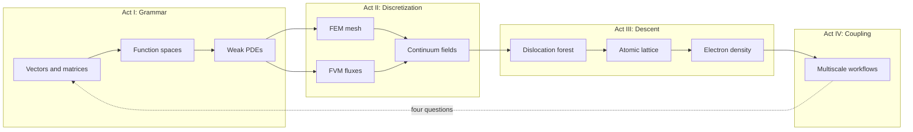
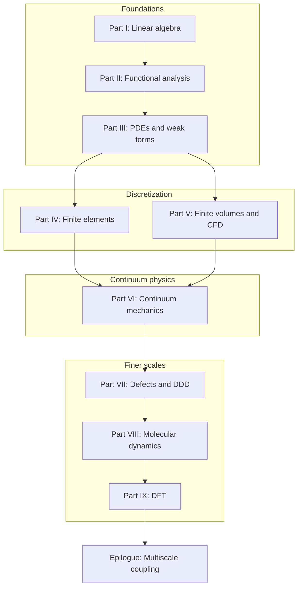

# Preface

This book grew out of a simple observation: computational mechanics is not a collection of unrelated numerical recipes. It is a single narrative about how we represent physical reality at different scales, and how the mathematical tools at each scale connect to the next.

When we write a finite element code, we solve a linear system assembled from local contributions — linear algebra in disguise. When we prove that a Galerkin approximation converges, we invoke completeness and compactness — functional analysis in disguise. When we coarse-grain a molecular dynamics trajectory or feed a DFT energy landscape into a continuum model, we are asking the same question in a different language: *what information survives when we change scale?*

The chapters that follow are written to be read in order, like a novel with a plot. A copper wire under tension, a turbulent jet, a dislocation network in a crystal, and the electrons that bind the atoms together are not separate homework problems. They are scenes in one story. The mathematics is the thread that stitches them together.

## Scene: before the first chapter

Picture a shared materials lab on a weekday morning. A cold-drawn copper wire — the kind used in power cables and tensile specimens — sits in wedge grips on a small frame. The operator has not yet ramped load or switched on current; the load cell reads zero, the thermocouple at mid-span reports room temperature, and a student at the next bench is already opening a terminal for a meshing script. Nothing in the room announces "functional analysis" or "Kohn–Sham." What is visible is simpler: one cylinder of metal, one experiment waiting to run, and the quiet assumption that a computer model somewhere will eventually agree with what the grips and sensors record.

That wire is the book's protagonist. Every part that follows returns to it — as a chain of springs, as a field in \(H^1\), as a meshed solid, as air cooling its surface, as a crystal carrying a dislocation forest, as an atomic lattice, as valence electrons in a periodic cell. The mathematics changes language; the specimen does not. Read this preface as the jacket copy and the prologue as the opening scene. When a chapter feels abstract, ask which bench in this lab you are standing at, and which of the four questions — state, equations, discretization, upward export — that chapter is answering for the same piece of copper.

## Plot spine: how the story is told

Each part follows the **Functional Analysis Notes** (ME 412) layout — numbered chapters, concept maps at openings, checkpoints at closings — but the book adds four narrative devices so the arc reads as one continuous text rather than a syllabus:

| Device | Role | Where it appears |
|--------|------|------------------|
| **Scene** | Return to the copper wire in concrete detail | Preface, prologue, every part opening, every numbered chapter, epilogue |
| **Bridge** | State why the next chapter must exist | End of every numbered chapter and part opening |
| **Lab act** | Worked example, workflow, or checklist tied to computation | Inside chapters (assembly, LAMMPS, OpenDiS, QE inputs) |
| **Concept map** | Object → structure → theorem → failure mode | Part openings; part closing checkpoints |
| **Representative schematics** | Baby pictures indexed to source notes (ME 300A, ME 412, ME 300B, FEA, FVM, …) | Every part opening (I–IX) |

The dramatic arc is not a surprise twist — it is **scale change with the same specimen**:

**Act I** teaches the language (Parts I–III). **Act II** makes PDEs computable on meshes and control volumes (Parts IV–VI). **Act III** asks where continuum parameters hide their history (Parts VII–IX). **Act IV** wires the rungs together (epilogue). When a transition feels abrupt, read the **Bridge** at the end of the prior chapter — it is the narrative hinge the plot spine assumes you will use.

## The story in one page

Read this once if you want the plot before the proofs — every chapter below unpacks one beat of the same afternoon.

A cold-drawn copper wire waits in wedge grips: our protagonist through every scale. We first learn the grammar every simulation shares — vectors, stiffness matrices, eigenmodes — and watch mesh refinement send those objects toward functions and operators. Function spaces supply the room where weak forms live; PDEs write the equilibrium and heat equations those forms discretize. Finite elements mesh the solid; finite volumes balance fluxes in the air that cools the wire when current flows. Continuum mechanics names the stress and strain both discretizations approximate, and admits that cold drawing wrote yield history the smooth fields cannot see. Dislocation dynamics simulates the forest that hardens the wire; molecular dynamics resolves atoms at notches and fits potentials on trust; density functional theory audits those potentials from electron density. The epilogue wires the rungs into handshakes no single code runs alone — the same four questions at every interface: state, equations, discretization, upward export.

The [prologue](prologue/00-many-scales.md) opens the scene; the [chapter roadmap](appendix/sources.md) lists every beat in reading order; the [epilogue](epilogue/multiscale.md) reunites all six lab acts in workflow time. At [Part VI's midpoint](../part06-continuum/00-opening.md#midpoint-ascent-complete-descent-ahead), the ascent ends and the descent begins; [Part VII's opening](../part07-defects/00-opening.md#the-descent-in-one-paragraph) offers a one-paragraph preview of the finer-scale arc.

## How this book is organized

The structure follows the arc of the author's personal notes — linear algebra and functional analysis as foundations, partial differential equations and weak forms as the bridge to discretization, finite elements and finite volumes as the two great discretization philosophies for solids and fluids, and atomistic and electronic methods as the descent to finer scales. Each part ends with a short bridge section that explains why the next scale is necessary.

Read straight through from the prologue to the epilogue. Parts IV and V can be swapped if you already know FEM and want CFD first; Part VI then unifies the stress–balance language both discretizations approximate. Parts VII–IX are best read after the continuum vocabulary of Part VI, because dislocation, atomistic, and electronic models explain where continuum parameters originate.

## Three reading paths

The book is one continuous story, but not every reader enters at the same rung:

| Path | Start here | Route | Best for |
|------|------------|-------|----------|
| **Full arc** | [Prologue](prologue/00-many-scales.md) | I → II → III → IV → V → VI → VII → VIII → IX → [Epilogue](epilogue/multiscale.md) | First read; builds every concept in order |
| **Analysis first** | Part I, then Part II | Skip to Part III when function spaces feel familiar; return to IV–V for discretization | Students who know FEM but want weak-form foundations |
| **Scale descent** | Part VI after skimming I–III | VI → VII → VIII → IX, then back to IV–V for how continuum codes mesh and flux | Researchers asking where moduli and hardening laws originate |

On every path, read the **Bridge** at the end of the prior chapter when a jump feels abrupt. Part openings add **Story so far** recaps, **concept map** tables (object → structure → theorem → failure mode), and **representative schematics** indexed to the source notes — all following the [Functional Analysis Notes](https://hanfengzhai.github.io/file/teaching/notes/ME412_CourseSummary.pdf) layout. Part closings add **concept map checkpoints** that summarize what the part exported to the next scale.

## Reading rhythm

Each chapter uses a deliberate rhythm so the book reads as one continuous story rather than a stack of lecture notes:

| Section | Role | Where it appears |
|---------|------|------------------|
| **Scene** | Places the mathematics in the lab — grips tightening, current switching on, a notch concentrating stress | Preface, prologue, every part opening, every numbered chapter, epilogue, appendix glossary and sources |
| **Lab act** | Links the part to one act of the [six-act lab session](prologue/00-many-scales.md#the-experiment-as-plot) | Part openings I–IX and epilogue reunion |
| **Concept map** | Four questions: object, structure, theorem, failure mode | Part openings; epilogue closing lens |
| **Representative schematics** | Baby pictures indexed to source notes (ME 300A, ME 412, ME 300B, FEA, FVM, …) | Every part opening (I–IX) |
| **Bridge** | States why the next chapter exists — the narrative hinge | End of every numbered chapter, part opening, preface, prologue, epilogue, appendix glossary and sources |

When abstraction rises, read in this order: **Lab act** (which experiment am I in?) → **Scene** (what is the operator watching?) → **Concept map** (what structure makes the theorem possible?) → **Representative schematics** (which baby picture matches this chapter?) → **Bridge** (why turn the page?).

## The copper wire through the book

The same specimen — a cold-drawn copper wire under tension, heated by current, cooled by air — reappears in every part. The table below is a reading map: what changes is the **state variable**, not the material.

| Part | What the wire becomes | What we learn to compute |
|------|----------------------|--------------------------|
| Prologue | A ladder of scales | State, equations, discretization, upward exports |
| I | Coupled springs / modes | \(\mathbf{K}\mathbf{u}=\mathbf{f}\), eigenmodes |
| II | Fields in \(H^1\) and \(L^2\) | Norms, operators, Galerkin convergence |
| III | PDEs with weak forms | Strong vs. weak, Sobolev regularity, energy |
| IV | Meshed solid | Galerkin assembly, elements, convergence |
| V | Fluid around the wire | FVM fluxes, Navier–Stokes, conjugate heat transfer |
| VI | Cauchy stress and strain | Kinematics, balance, variational elasticity |
| VII | Dislocation forest | DDD, Taylor hardening, crystal plasticity handoff |
| VIII | Atomic lattice | Potentials, ensembles, LAMMPS workflows |
| IX | Valence electrons | Kohn–Sham, QE inputs, elastic constants upward |
| Epilogue | All scales coupled | Sequential, concurrent, and learned multiscale workflows |

Each numbered chapter ends with a **Bridge** section that states explicitly why the next chapter exists. If you ever feel a jump in abstraction, read the Bridge at the end of the prior chapter first — it is the narrative hinge. The [prologue](prologue/00-many-scales.md#the-experiment-as-plot) also maps the wire to **six acts** of one lab session (mounting through foundation) when you need laboratory time rather than part number. For a one-line role of every chapter in reading order, see the [chapter roadmap](appendix/sources.md) in the appendix (also listed as **Sources and Further Reading** in the table of contents). When a symbol reappears under new vocabulary — \(\mathbf{K}\) becoming an operator, then a bilinear form, then an elastic tensor — consult the [Glossary and Cross-Scale Index](appendix/glossary.md).

The [Functional Analysis Notes](https://hanfengzhai.github.io/file/teaching/notes/ME412_CourseSummary.pdf) (ME 412) supply the template for that hinge: not a proof document, but a **concept map** where every idea answers four questions — what object we study, what structure it adds, what theorem that structure enables, and what breaks if the structure is missing. Part II adopts that map explicitly; later parts reuse the same instinct at every scale change.

## Source material

The prose synthesizes course notes, teaching materials, and research experience collected over several years. Primary written sources include:

- [Linear Algebra notes](https://hanfengzhai.github.io/file/ME300A_LinAlg.pdf) (ME 300A)
- [Functional Analysis notes](https://hanfengzhai.github.io/file/teaching/notes/ME412_CourseSummary.pdf) (ME 412) — layout model for Part II and all `writings/` subtrees
- [Partial Differential Equations notes](https://hanfengzhai.github.io/file/ME300B_PDE.pdf) (ME 300B)
- [Finite Element Analysis notes](https://hanfengzhai.github.io/file/FEA_notes.pdf) and [problem sessions](https://hanfengzhai.github.io/note.html)
- [Elasticity & Inelasticity notes](https://hanfengzhai.github.io/file/elasticity_notes.pdf)
- [Computational Fluid Dynamics notes](https://hanfengzhai.github.io/file/CFD_note.pdf) and [Finite Volume Method notes](https://hanfengzhai.github.io/note/FVM.pdf)
- [Defects & Disorders notes](https://hanfengzhai.github.io/file/defects_notes.pdf)
- [Atomistic Modeling notes](https://hanfengzhai.github.io/file/AtomModel_note.pdf)
- [DFT coursework](https://github.com/hanfengzhai/MSE5720-HW) (MSE 5720)

Canonical source markdown lives under [`writings/`](../writings/) in the **Functional Analysis Notes** layout: one mdBook per part, numbered chapters, and **Bridge** sections at the end of each chapter. Run [`scripts/sync-writings.sh`](../scripts/sync-writings.sh) to refresh `src/` from those sources. When the external `Writings` git submodule is linked, merge upstream changes there and re-run the sync script.

## Disclaimer

These notes represent the author's understanding of the material and are intended for study and reference. They may contain errors. Feedback is welcome at [hzhai@stanford.edu](mailto:hzhai@stanford.edu).

## Bridge

The preface is the table of contents in prose. The **prologue** is the first scene: one copper wire, many scales, and the four questions — state, equations, discretization, upward export — that every chapter will answer in its own language. Read it before Part I if you want the plot before the grammar; read it after Part VI if you prefer to meet the wire first as a meshed solid and then learn why the mesh had to exist.

Turn the page when ready. The ladder begins with a specimen under tension and a question that will not go away: *what is the minimal description at this scale, and what do we pass to the scale above?*

---

*Hanfeng Zhai, 2026*
