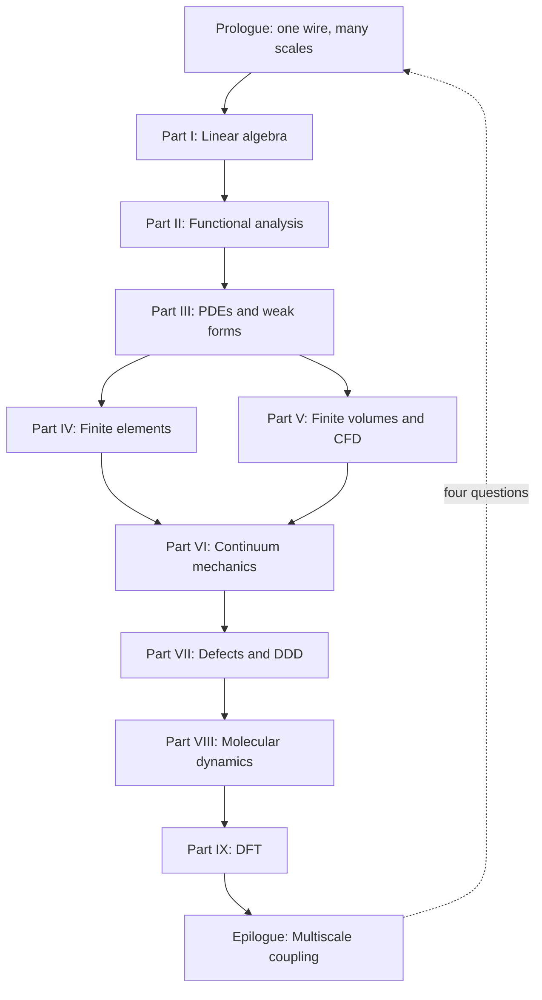

# The Same Material, Many Scales

## Scene

Imagine a single crystal of copper pulled in uniaxial tension. At the engineering scale — centimeters, Newtons — we describe the specimen with Cauchy stress, Hooke's law, and perhaps a finite element mesh of tetrahedra. The wire carries current, heats slightly, and sags under its own weight. None of that physics lives in the crystal lattice alone; it lives in a **continuum** description that treats the material as a smooth field of stress and displacement.

Zoom in to micrometers and the story changes. Dislocation lines glide, multiply, and tangle; the material work-hardens not because of a phenomenological law we inserted by hand, but because of collective motion we can simulate with **dislocation dynamics**. A drawn copper wire owes much of its strength to the dislocation forest left behind by cold working — a mesoscale history written into line defects, invisible to a coarse stress–strain curve until we ask *why* the curve bends upward.

Zoom further, to nanometers, and individual atoms swap neighbors across a grain boundary; **molecular dynamics** tracks each nucleus and its thermal vibrations. A notch in the wire concentrates stress at the atomic scale; bonds stretch, rearrange, and eventually break in ways no elliptic PDE can resolve without regularization.

Zoom once more, to ångströms, and the very notion of an "atom" as a ball on a spring dissolves into the quantum mechanical electron density; **density functional theory** tells us where the electrons live and how much energy the crystal costs to deform. The cohesive energy that holds copper together — the baseline against which every vacancy, dislocation, and surface is measured — begins here.

None of these descriptions is wrong. Each is appropriate at its scale. Computational mechanics is the art of choosing — and connecting — the right description.

## A ladder, not a menu

It is tempting to treat finite elements, finite volumes, molecular dynamics, and DFT as separate courses with separate software packages. That temptation is practical: one does not run Quantum ESPRESSO inside Abaqus. But conceptually, the methods form a **ladder**:

1. **Linear algebra** gives us the syntax for any discrete model: states are vectors, evolution is matrix multiplication, stability is an eigenvalue sign.
2. **Functional analysis** explains why infinite-dimensional field descriptions make sense, why weak formulations exist, and why Galerkin approximations can converge.
3. **Partial differential equations** encode conservation and constitutive physics on continua.
4. **Finite element and finite volume methods** discretize those PDEs with different philosophies — trial functions versus flux balance — suited to elliptic solids and hyperbolic fluids.
5. **Continuum mechanics** supplies the stress–strain–balance language that FEM implementations ultimately approximate.
6. **Defect and dislocation models** explain why continuum elasticity breaks down where singularities live.
7. **Molecular dynamics** resolves atomic motion when continuum fields are too coarse.
8. **Density functional theory** resolves electronic structure when interatomic potentials must be derived rather than assumed.

Each rung supports the one above it. Each rung limits the one below it. Climbing upward, we **homogenize**: we replace microscopic detail with effective laws. Descending downward, we **derive**: we ask where those laws came from and what they omit.

The copper wire is our thread through every rung. At the macro scale it is a structural member; at the mesoscale a polycrystal with texture; at the atomistic scale a lattice of nuclei vibrating in an effective potential; at the electronic scale a sea of valence electrons binding the crystal together.

## The concept map (whole book)

The [Functional Analysis Notes](https://hanfengzhai.github.io/file/teaching/notes/ME412_CourseSummary.pdf) organize each topic with four questions — object, structure, theorem, failure mode. At the scale of the entire book, the same discipline applies:

| Question | Answer for this book |
|----------|----------------------|
| What **object** spans all parts? | The copper wire as a multiscale state — vectors, fields, defects, atoms, electrons |
| What **structure** connects the parts? | The ladder: homogenize upward, derive downward; weak forms at every rung |
| What **theorem** (or principle) makes the story coherent? | Well-posedness and convergence at each discretization; consistent interface data across scales |
| What **breaks** if we ignore the ladder? | Wrong moduli, missing hardening history, unit mismatches, category errors at notches and cores |

The reading order is one continuous arc — not a catalog of methods:

**Baby picture:** climb the mathematical rungs (I–VI) until the wire is a meshed solid with stress and flux; then descend (VII–IX) to learn where yield stress, potentials, and cohesive energy originate; finish by wiring the rungs together in workflows no single code runs alone.

## The same questions at every scale

At each rung we ask the same four questions — whether we are solving a sparse linear system, a weak form, or a self-consistent Kohn–Sham cycle:

| Question | Linear algebra | Continuum FEM | Dislocation dynamics | MD | DFT |
|----------|----------------|---------------|------------------------|-----|-----|
| What is the **state**? | Vector \(\mathbf{x}\) | Displacement field \(\mathbf{u}\) | Dislocation network | Positions \(\{\mathbf{r}_i\}\) | Density \(\rho(\mathbf{r})\) |
| What **equations** govern it? | \(\mathbf{A}\mathbf{x}=\mathbf{b}\) | Virtual work / balance | Peach–Köhler + mobility | Newton / Hamilton | Kohn–Sham SCF |
| What **discretization**? | Matrix assembly | Elements + quadrature | Line segments | Timestep + cutoff | Plane waves + k-points |
| What passes **upward**? | — | Stress, stiffness | Hardening law | Potential parameters | Cohesive energy, moduli |

Recognizing this table early saves years of confusion. The software changes; the pattern does not.

## The experiment as plot

The book reads in **mathematical order** (algebra before atomistics), but the copper wire lives in **laboratory time**. Keeping both orders straight turns a catalog of methods into a story. Picture one afternoon in a mechanics lab — the same specimen, the same afternoon, many models:

| Act | What happens in the lab | What the book computes | Parts (read in order) |
|-----|-------------------------|------------------------|-----------------------|
| **I — Mounting** | A cold-drawn copper cylinder is gripped in wedge jaws; the operator zeros the load cell and thermocouple. | Boundary conditions, a chain of bar elements, the first \(\mathbf{K}\mathbf{u}=\mathbf{f}\). | [Prologue](00-many-scales.md), [Part I](../part01-linear-algebra/00-opening.md) |
| **II — Warming** | Current is switched on. The narrowest cross-section heats; air cools the surface. | Steady heat conduction in the solid (FEM), enthalpy flux in the surrounding air (FVM), Robin coupling at the wall. | [Part III](../part03-pdes/00-opening.md), [Part IV](../part04-fem/00-opening.md), [Part V](../part05-fvm/00-opening.md) |
| **III — Pulling** | Grip displacement ramps. The force–displacement curve climbs almost linearly. | Weak-form elasticity, Galerkin assembly, convergence in \(H^1\); Cauchy stress and virtual work name what the curve measures. | [Part II](../part02-functional-analysis/00-opening.md), [Part III](../part03-pdes/00-opening.md), [Part IV](../part04-fem/00-opening.md), [Part VI](../part06-continuum/00-opening.md) |
| **IV — Hardening** | The curve bends upward: more force for each increment of stretch. | Dislocation forest from cold drawing plus fresh multiplication; DDD and Taylor hardening explain the bend without a magic constant. | [Part VII](../part07-defects/00-opening.md) |
| **V — Notch (optional)** | A scratched wire or a grip corner concentrates stress. | Continuum fields predict *where*; MD at the tip resolves bond breaking and dislocation nucleation. | [Part VI](../part06-continuum/00-opening.md), [Part VIII](../part08-md/00-opening.md) |
| **VI — Foundation (always, in parallel)** | Before any simulation ran, someone chose \(E\), \(\nu\), and a yield stress. | DFT on a small fcc cell supplies cohesive energy and elastic constants; MD fits an EAM potential; those numbers climb the ladder into FEM input decks. | [Part IX](../part09-dft/00-opening.md) → [Part VIII](../part08-md/00-opening.md) → [Part VII](../part07-defects/00-opening.md) → [Part IV](../part04-fem/00-opening.md) |

Acts I–III are what the operator watches on the screen in real time. Act IV is the history written into the material before the test began — cold work — made visible only when load exceeds yield. Act V is the exception that proves the rule: wherever geometry or defects break scale separation, we descend one rung. Act VI is the **prequel** every practitioner runs offline: no wire-scale job starts without parameters whose pedigree traces to finer models or calibration experiments.

Read Parts I–VI as Acts I–III in slow motion — every line of code the operator trusts is justified there. Read Parts VII–IX as Acts IV–VI — where the numbers in the input file came from, and what they omit. The **epilogue** returns to the full afternoon and asks how modern teams wire Acts I–VI into one workflow when no single executable spans the ladder.

When a chapter feels abstract, locate it in this table: *Which act of the experiment am I in, and what question is the model answering right now?* The mathematics changes; the specimen does not.

## Why the ladder has a preferred direction

We read this book **bottom-up** in the mathematical parts (I–VI) because the language of weak forms, assembly, and convergence is easier to learn on elliptic problems with clean energy principles. We then **descend** in Parts VII–IX because continuum parameters — yield stress, hardening modulus, interatomic potential, surface energy — are not free parameters. They are **outputs** of finer models or experiments.

Consider the elastic modulus \(E\) of copper used in a structural wire model. DFT can compute it from the curvature of total energy with respect to strain on a perfect lattice. MD can cross-check it with fluctuation formulas at finite temperature. A tension test on the wire itself measures an **effective** modulus that includes texture, porosity, and processing history. All three numbers are "the modulus of copper," but they answer slightly different questions. Multiscale mechanics is the discipline of making those answers consistent.

## The weak form as recurring character

Along the way, a recurring character appears: the **weak form** of a boundary value problem. Born in Part III as a mathematical convenience — multiply by a test function, integrate by parts, absorb boundary conditions — it becomes in Part IV the foundation of the finite element method. In Part VI it reappears as the **virtual work principle** of elasticity:

\[
\int_\Omega \boldsymbol{\sigma} : \delta\boldsymbol{\varepsilon} \, d\Omega = \int_\Omega \mathbf{f} \cdot \delta\mathbf{u} \, d\Omega + \int_{\Gamma_N} \mathbf{t} \cdot \delta\mathbf{u} \, dS.
\]

By the time we reach molecular dynamics, we will recognize its shadow in the **symplectic structure** of Hamiltonian integrators — different language, same instinct: multiply by a test object, integrate by parts, and let boundary conditions do the heavy lifting. Even DFT has a variational heart: the ground-state density minimizes an energy functional.

The copper wire does not know which chapter we are in. It responds to the same physics whether we write a weak form or a Kohn–Sham equation. Our job is to translate faithfully between languages.

## Processing history matters

Real copper wire is not a perfect single crystal. It is drawn through dies, work-hardened, perhaps annealed partially to recover conductivity. Each process step writes **structure** into the material:

- **Drawing** increases dislocation density and aligns grains — mesoscale and polycrystal effects.
- **Annealing** allows vacancies to diffuse and dislocations to rearrange — atomistic kinetics.
- **Oxidation** at the surface changes local chemistry — electronic structure near interfaces.

A multiscale narrative that jumps straight from DFT bulk modulus to structural FEM without acknowledging processing history predicts the wrong wire. The ladder is not only spatial; it is also **historical**. Internal state variables — dislocation density, back stress, grain size — exist precisely to carry history upward when pure elasticity cannot.

## Scale separation and overlap

Scale separation is both a blessing and a fiction. It is a **blessing** because Born–Oppenheimer, homogenization, and RVE averaging work when a clear gap separates fast and slow degrees of freedom, or fine and coarse spatial structure. It is a **fiction** because real materials exhibit **overlap**: dislocation cores require atoms; crack tips couple quantum chemistry to continuum stress; grain-boundary sliding couples diffusion to polycrystal FEM.

When scales overlap, we do not abandon the ladder — we **refine the handoff**. Concurrent coupling (QM/MM, FE²) and enriched continua (gradient plasticity, nonlocal damage) exist precisely where sequential homogenization with a single constant fails. The copper wire's notch root is a canonical overlap region: continuum stress is well defined a micron away, but bond breaking at the tip is atomistic.

Recognizing overlap early prevents category errors — using bulk DFT modulus to predict notch failure without fracture mechanics or atomistics, for example.

## Software silos vs. intellectual continuity

Practitioners legitimately speak of "the MD person" and "the FEM person" because software ecosystems differ:

- **FEM**: mesh generation, weak form assembly, sparse linear solvers.
- **FVM/CFD**: Riemann solvers, limiters, turbulence closures.
- **MD**: potentials, thermostats, neighbor lists, timestep stability.
- **DFT**: plane waves, SCF mixing, k-meshes, pseudopotential libraries.

No unified executable spans all rungs. **Workflow orchestrators** (Python scripts, workflow engines, Jupyter pipelines) stitch codes together. The intellectual continuity this book emphasizes — state, equations, discretization, upward information — is what makes those scripts more than ad hoc file conversion. When you write `extract_elastic_tensor.py`, you should know whether you are exporting Voigt averages, whether temperature matches, and whether the functional matches the MD potential fit.

## A note on units and conventions

Each community carries its own unit systems: FEM may use SI (Pa, m); MD uses metal units (Å, ps, eV) or real units (kcal/mol); DFT uses Ry or eV with Bohr radii. Multiscale projects fail silently when units convert incorrectly at interfaces. Part VIII's LAMMPS `units metal` and Part IX's Ry cutoff energies do not speak to each other without explicit conversion — a mundane detail that destroys ladders faster than wrong physics.

We will state conventions when they matter and recommend **SI with documented conversion** at workflow boundaries.

## What you should bring

Comfort with multivariable calculus and basic linear algebra is assumed. We will develop functional analysis and Sobolev space ideas as needed, always with an eye toward computation rather than pure generality. Programming experience helps but is not required: the emphasis is on the continuous and discrete mathematics that any implementation must respect.

When you encounter a formula, ask: *What discretization makes this computable? What limit is being taken? What information crosses the scale boundary?* Those three questions will serve you from Part I through the epilogue.

## Reading strategies

This book supports multiple paths:

- **Linear reading** (Parts I → IX → epilogue): best for first exposure; builds language before atomistics.
- **Scale-first reading** (prologue → Part IX → VIII → VII → VI → IV): for readers who already simulate MD or DFT and want the continuum foundation that explains homogenization.
- **Reference reading**: jump to weak forms (Part III), FEM assembly (Part IV), or Kohn–Sham (Part IX) as needed; the prologue and epilogue frame how chapters connect.

Regardless of path, return to the copper wire periodically. If a chapter feels abstract, ask how its equations would appear in a wire tension test, an anneal, or a notch root — grounding prevents methods from floating free of mechanics.

## What lies ahead

Part I refreshes linear algebra and shows how its ideas generalize from vectors to functions. Part II develops the function-space language that makes sense of infinite degrees of freedom. Parts III–V build discretization methods for PDEs — Galerkin FEM for elliptic solids, finite volumes for conservation laws and fluids. Part VI anchors those methods in solid mechanics: kinematics, stress, balance, and variational elasticity.

Parts VII–IX descend. **Part VII** introduces defects and dislocation dynamics — the mesoscale engine of plasticity in our copper wire. **Part VIII** treats molecular dynamics: potentials, ensembles, integrators, and the LAMMPS workflows that connect atomistic simulation to coarser models. **Part IX** covers density functional theory: Born–Oppenheimer separation, Hohenberg–Kohn existence, and the Kohn–Sham equations practitioners solve daily.

The **epilogue** returns to the wire at full scale and asks how modern research couples these rungs — sequentially, concurrently, and through learned surrogates — into workflows that no single code runs unattended, but that disciplined teams use every day.

## Expectations of rigor

We will prove convergence theorems where they illuminate computation (Galerkin best approximation, Lax equivalence for FVM) and state without proof results where full generality would distract (Hohenberg–Kohn existence, spectral theorem in infinite dimensions). The standard is **honest mathematics**: precise hypotheses, explicit discretization parameters, and clear distinction between what is guaranteed and what is validated empirically.

Computational mechanics sits between applied mathematics and engineering. Too much abstraction loses the practitioner; too little loses the analyst. The ladder narrative keeps both readers on the same page — literally.

## Historical perspective (brief)

Multiscale thinking predates modern computing. **Taylor hardening** (1934) connected dislocation density to flow stress before computers tracked individual lines. **Born–Oppenheimer** (1927) separated electronic and nuclear motion before DFT existed. **Finite elements** (Turner, Clough, Argyris; 1950s–60s) discretized the same virtual work principle Cauchy and Lagrange wrote in continuum form.

What changed is **scale of computation**: exascale arithmetic lets DDD, MD, and DFT run at parameters that were pencil-and-paper estimates a generation ago. The ladder's rungs are stable; our ability to climb them is what evolves. Open-source codes democratize that climb — a copper wire study can begin on a laptop (small DFT cell, small MD box) and grow to cluster jobs without changing the underlying equations.

## Notation and conventions used throughout

Vectors are bold (\(\mathbf{u}\), \(\mathbf{F}\)); tensors are bold sans-serif or with double indices (\(\boldsymbol{\sigma}\), \(C_{ijkl}\)). We use Einstein summation where convenient. Partial derivatives appear as \(\partial u/\partial x\) or subscript comma notation \(u_{,x}\) depending on context.

Function spaces (\(H^1\), \(L^2\)) appear from Part II onward; their discrete counterparts are finite element spaces \(V_h\). When we write "convergence," we mean discretization parameters (mesh size \(h\), timestep \(\Delta t\), cutoff energy \(E_{\text{cut}}\)) tending to limits where the discrete model approaches a well-defined continuous or reference problem.

These conventions are standard in computational mechanics literature; deviations are noted locally.

## A promise to the reader

Every part of this book answers, implicitly or explicitly, one question about the copper wire (or any material you substitute): *At this scale, what is the minimal state description that still captures the physics we care about, and what do we export to the scale above?* If a chapter does not change your answer to that question, it has not done its job.

We begin with the grammar of vectors and matrices — not because wires are linear, but because every discretization, at every scale, eventually reduces to finite-dimensional algebra. Part I is where that reduction becomes conscious craft rather than background assumption. The same copper atom that DFT will later describe with electron density first appears here as a node in a graph of coupled degrees of freedom — finite-dimensional long before it is quantum mechanical.

Turn the page when ready. The ladder starts with familiar objects: vectors, matrices, and the linear maps between them.

## Reading compass: two clocks on one wire

The book reads in **mathematical order** (Part I before Part IX). The copper wire lives in **laboratory time** (mounting before hardening). Both clocks describe the same afternoon — the continuity comes from returning to the specimen whenever the symbols change.

| If you need… | Start here |
|--------------|------------|
| Skill checkpoints (competence time) | [Preface: skill navigation](../preface.md#skill-navigation) |
| Opening hinge (prologue → Part I) | [Preface: opening hinge](../preface.md#opening-continuity-hinge) |
| The plot in one page | [Preface: story in one page](../preface.md#the-story-in-one-page) |
| Ascent preview (Parts I–VI) | [Preface: ascent preview chain](../preface.md#ascent-preview-chain) |
| Ascent continuity hinges (I.4 → V.4) | [Preface: ascent hinges](../preface.md#ascent-continuity-hinges) |
| Descent preview (Parts VII–IX) | [Preface: descent preview chain](../preface.md#descent-preview-chain) |
| Continuity hinges (midpoint + VI.4) | [Preface: continuity hinges](../preface.md#continuity-hinges-ascent-descent) |
| Descent continuity hinges (VII.3 → IX.3) | [Preface: descent hinges](../preface.md#descent-continuity-hinges) |
| Epilogue continuity hinges (IX → prologue) | [Preface: epilogue hinges](../preface.md#epilogue-continuity-hinges) |
| All hinges in one table | [Memory sheet: master map](../appendix/memory-sheet.md#continuity-hinges-master-map) |
| Row 8 — \(T_w\) pedigree (Act II → MD/DDD) | [Preface: row 8 skill checkpoint](../preface.md#skill-navigation-row-8) · [V.4 CHT](../part05-fvm/04-navier-stokes-cfd.md#lab-act-extension-two-domain-picard-loop-with-a-1d-fem-solid) → [`cht_export.yaml`](../../scripts/parse_cht.sh) → [VIII.0 descent hinge](../part08-md/00-opening.md#descent-hinge-cores-mobility-and-tw-pedigree) → [VIII.3 WHAM at \(T_w\)](../part08-md/03-ab-initio-and-coarse-graining.md#wham-part-vii-mobility-hinge-act-ii-temperature-pedigree); [memory sheet rows 8–9 baby picture](../appendix/memory-sheet.md#rows-8-9-baby-picture-tw-temperature-pedigree) |
| Row 9 — phonon audit at \(T_w\) (MD → DFT) | [Preface: row 9 skill checkpoint](../preface.md#skill-navigation-row-9) — [IX.0 electronic audit hinge](../part09-dft/00-opening.md#electronic-audit-hinge-descent-pedigree-and-tw-phonon) · [thermal phonon audit at \(T_w\)](../part09-dft/00-opening.md#thermal-phonon-audit-at-tw); [`parse_alpha.sh`](../../scripts/parse_alpha.sh) with `--target-t` from `cht_export.yaml`; [memory sheet rows 8–9 baby picture](../appendix/memory-sheet.md#rows-8-9-baby-picture-tw-temperature-pedigree); [epilogue opening hinge from Part IX](../epilogue/multiscale.md#opening-hinge-ix3-to-epilogue) |
| Joule heat → fixed-grip stress (row 13) | [Preface: row 13 skill checkpoint](../preface.md#skill-navigation-row-13) — [Handshake 2](../epilogue/multiscale.md#handshake-2--joule-heating--conjugate-heat-transfer-part-iv--v) → [IX.3 \(\alpha\) Lab act](../part09-dft/03-dft-workflows.md#lab-act-quasiharmonic-alpha-handshake-3-pedigree) → [Handshake 3](../epilogue/multiscale.md#handshake-3--thermal-strain--mechanical-stiffness-part-vi--iv); epilogue [Act II reunion paragraph](../epilogue/multiscale.md#lab-act-reunion-six-acts-one-afternoon) (Handshake 2) and [Act III reunion paragraph](../epilogue/multiscale.md#lab-act-reunion-six-acts-one-afternoon) (Handshake 3); [sensitivity derivation opening](../epilogue/multiscale.md#worked-example-sensitivity-ranks) (Handshake 2–3 chain) |
| DDD rate → lab load cell (Handshake 4a) | [Preface: row 14 skill checkpoint](../preface.md#skill-navigation-row-14) — [VII.3 rate handshake](../part07-defects/03-polycrystal-and-fem-handoff.md#scale-boundary-handshake-ddd-strain-rate-to-quasi-static-fem) → [epilogue Handshake 4a](../epilogue/multiscale.md#handshake-4--rate-dependent-hardening-and-notch-localization-part-vii--vi--viii); [`parse_rate.sh`](../../scripts/parse_rate.sh); [sensitivity derivation](../epilogue/multiscale.md#worked-example-sensitivity-ranks) (Handshake 4a column); [memory sheet row 14](../appendix/memory-sheet.md#continuity-hinges-master-map) |
| FE² notch → Act V localization (Handshake 4b) | [Preface: row 15 skill checkpoint](../preface.md#skill-navigation-row-15) — [VII.3 Step 4 FE²](../part07-defects/03-polycrystal-and-fem-handoff.md#step-4--when-offline-calibration-fails-fe-at-the-notch) → [epilogue Handshake 4b](../epilogue/multiscale.md#4b--when-continuum-fails-at-the-notch-md-subdomain-act-v--notch); [`parse_fe2.sh`](../../scripts/parse_fe2.sh); [sensitivity derivation](../epilogue/multiscale.md#worked-example-sensitivity-ranks) (Handshake 4b column); [memory sheet row 15](../appendix/memory-sheet.md#continuity-hinges-master-map); upstream rate from [row 14](../preface.md#skill-navigation-row-14) |
| Act VI orchestration → multiscale export (row 16) | [Preface: row 16 skill checkpoint](../preface.md#skill-navigation-row-16) · [Preface: epilogue hinges Act VI row](../preface.md#epilogue-continuity-hinges) — [IX.3 Bridge to epilogue](../part09-dft/03-dft-workflows.md#bridge-to-the-epilogue) → [`parse_multiscale_workflow.sh`](../../scripts/parse_multiscale_workflow.sh) → `multiscale_export.yaml`; per-handshake parsers in [epilogue script audit trail](../epilogue/multiscale.md#script-audit-trail-parse-scripts-handshakes); [Part IX coupling ladder](../part09-dft/00-opening.md#the-coupling-ladder-me-412-reunion); epilogue [Act VI reunion paragraph](../epilogue/multiscale.md#lab-act-reunion-six-acts-one-afternoon) and [sensitivity worksheet closing](../epilogue/multiscale.md#worked-example-sensitivity-ranks) (row 16 orchestration stitch); [memory sheet Act VI baby picture](../appendix/memory-sheet.md#act-vi-baby-picture-me-412-coupling-ladder); upstream \(T_w\) pedigree from [rows 8–9](../preface.md#skill-navigation-row-8) and handshakes from [rows 13–15](../preface.md#skill-navigation-row-13) |
| Ascent/descent hinge (VI.4) | [Part VI.4 intermission](../part06-continuum/04-nonlinear-plasticity-preview.md#intermission-ascent-ends-descent-begins) |
| Chapter × lab-act map | [Appendix: narrative beat map](../appendix/sources.md#narrative-beat-map-mathematical-order--lab-act) |
| Parameter pedigree (Act VI) | [Appendix: pedigree path](../appendix/sources.md#parameter-pedigree-path-act-vi-reading-order) |

**Mathematical order** builds language before atomistics — the path the Functional Analysis Notes layout assumes. **Laboratory time** follows what the operator watches: grips close (Act I), current warms the wire (Act II), load ramps (Act III), the curve hardens (Act IV). Act VI — foundation — runs **in parallel** with Acts I–V in real projects: no FEM deck starts without moduli whose pedigree traces to DFT or calibration.

The [preface ascent continuity hinges](../preface.md#ascent-continuity-hinges) name four turns within Parts I–V — [I.4 → II](../part01-linear-algebra/04-toward-infinity.md#bridge-to-part-ii), [II.5 → III](../part02-functional-analysis/05-spectral-theorem.md#bridge-to-part-iii), [III.4 → IV](../part03-pdes/04-energy-methods.md#bridge-to-part-iv), [IV.5 / V.4 → VI](../part04-fem/05-convergence.md#bridge-two-doors-from-here) — when linear algebra, analysis, and discretization feel like separate subjects. The [midpoint anchor](../part06-continuum/00-opening.md#midpoint-ascent-complete-descent-ahead) in Part VI is where the two journeys meet in reading order: ascent complete, descent ahead. [VI.4's intermission](../part06-continuum/04-nonlinear-plasticity-preview.md#intermission-ascent-ends-descent-begins) is the last continuum page before Part VII — read it when the return-mapping loop fits the load cell but cannot explain **why** the curve bent. Within the descent, the [preface descent continuity hinges](../preface.md#descent-continuity-hinges) name three further turns — [VII.3 → VIII](../part07-defects/03-polycrystal-and-fem-handoff.md#bridge-to-part-viii), [VIII.3 → IX](../part08-md/03-ab-initio-and-coarse-graining.md#bridge-to-part-ix), [IX.3 → epilogue](../part09-dft/03-dft-workflows.md#bridge-to-the-epilogue) — before upward coupling reunites every export. The [epilogue continuity hinges](../preface.md#epilogue-continuity-hinges) name the closing loop from archived SCF exports to six-act workflow time and back to this prologue on the next project. The [memory sheet master map](../appendix/memory-sheet.md#continuity-hinges-master-map) collects all sixteen hinges (rows 0–16) in one table — row 13 is the **Joule heat → fixed-grip stress** stitch when CHT converges but handbook \(\alpha\) still sits in the FEM deck; row 14 is the **DDD rate → lab load cell** stitch when OpenDiS exports feed the plasticity deck without extrapolation; row 15 is the **FE² notch → Act V localization** stitch when bulk hardening from 4a looks right but the notch root under-predicts peak stress; row 16 is the **ME 412 coupling ladder** stitch when individual handshake exports exist but no orchestrated `multiscale_export.yaml` links Handshakes 1–4b. The [epilogue](../epilogue/multiscale.md) reunites all six acts in workflow time.

**Row 16 closing stitch (Act VI foundation).** {#row-16-closing-stitch} When mathematical order (Part IX → epilogue) and laboratory time (Act VI foundation in parallel with Acts I–V) diverge on the same afternoon, the [preface row 16 When-to-pause opening sentence](../preface.md#skill-navigation-row-16) is the competence-time mirror of reading compass row 16 above — return there before running [`parse_multiscale_workflow.sh`](../../scripts/parse_multiscale_workflow.sh); the [memory sheet Act VI baby picture closing paragraph](../appendix/memory-sheet.md#act-vi-baby-picture-closing) and [one-page recap Act VI column](../appendix/memory-sheet.md#one-page-copper-wire-recap) draw the foundation → orchestration chain when the epilogue [Act VI foundation table row](../epilogue/multiscale.md#lab-act-reunion-six-acts-one-afternoon) and [workflow exam Act VI row](../epilogue/multiscale.md#what-you-should-be-able-to-do-after-the-book) (minimal artifact column: pedigree diagram, script audit trail, `multiscale_export.yaml`) feel abstract; the [epilogue Act VI workflow exam step audit](../epilogue/multiscale.md#act-vi-workflow-exam-step-audit) is the pass/fail mirror of [preface row 16's four steps](../preface.md#skill-navigation-row-16) — return to this closing stitch when that step audit table completes the round-trip the [row 16 preview](#what-you-should-be-able-to-do-after-the-prologue) opened; the [IX.3 foundation checklist](../part09-dft/03-dft-workflows.md#ix3-foundation-checklist) (scale-boundary handshake table), [IX.3 epilogue pedigree table](../part09-dft/03-dft-workflows.md#ix3-epilogue-pedigree-table) (with [pedigree ↔ parser step mapping](../part09-dft/03-dft-workflows.md#ix3-pedigree-parser-step-mapping)), [IX.3 Bridge closing round-trip](../part09-dft/03-dft-workflows.md#bridge-to-the-epilogue-closing) (Part IX mirror of this prologue stitch — return there when mathematical order and laboratory time diverge on the same afternoon), and [script audit trail orchestrated chain row](../epilogue/multiscale.md#script-audit-trail-orchestrated-chain) name the artifact-to-parser mapping this stitch assumes; the [preface epilogue hinges Act VI row](../preface.md#epilogue-continuity-hinges) names the same stitch in competence time; the [epilogue sensitivity worksheet closing](../epilogue/multiscale.md#worked-example-sensitivity-ranks) (row 16 orchestration stitch) is the quantitative audit that should precede step audit row 3.

When a chapter feels abstract, locate it on the [narrative beat map](../appendix/sources.md#narrative-beat-map-mathematical-order--lab-act): *Which act am I simulating, and which rung supplies the numbers I trust?*

### What you should be able to do after the prologue

The prologue is panoramic — no proofs yet — but it should change how you read every later chapter. Before Part I assembles the first matrix, check these habits against the copper wire:

| After reading | Skill on the copper wire | Minimal artifact |
|---------------|--------------------------|------------------|
| Scene + ladder | Name the nine rungs in order; say what each exports upward | One-row ladder sketch: algebra → … → DFT |
| Four questions table | Fill state / equations / discretization / export for FEM and MD | Completed row for two scales on the same wire |
| Six-act lab session | Place any Part I–IX chapter on Acts I–VI | Act label beside chapter title in your notes |
| Homogenize vs derive | Explain why we read I–VI before VII–IX | One sentence: "modulus is output, not input" |
| Scale overlap | Point to the notch as a region where sequential homogenization fails | Sketch: continuum stress far away, atoms at tip |
| Reading compass | Choose mathematical order vs lab time for your goal | Link to one [preface hinge](../preface.md#opening-continuity-hinge) you will use first |
| Row 8 preview (Act II → descent) | Explain why MD mobility and WHAM must inherit \(T_w\) from CHT, not 300 K defaults | Sketch: V.4 Picard loop → `cht_export.yaml` → NVT shear at \(T_w\) — [preface row 8 skill checkpoint](../preface.md#skill-navigation-row-8); [VIII.0 descent hinge](../part08-md/00-opening.md#descent-hinge-cores-mobility-and-tw-pedigree); [memory sheet rows 8–9 baby picture](../appendix/memory-sheet.md#rows-8-9-baby-picture-tw-temperature-pedigree) |
| Row 9 preview (MD → DFT audit) | Explain why EAM bulk moduli on trust still need \(\alpha(T_w)\) and \(\tau_{\text{ph}}(T_w)\) beside SCF logs | One sentence: "SCF audits moduli; phonon audit audits thermal exports at the same \(T_w\)" — [preface row 9 skill checkpoint](../preface.md#skill-navigation-row-9); [IX.0 thermal phonon audit](../part09-dft/00-opening.md#thermal-phonon-audit-at-tw); [memory sheet rows 8–9 baby picture](../appendix/memory-sheet.md#rows-8-9-baby-picture-tw-temperature-pedigree) |
| Row 13 preview (Acts II–III) | Name Handshake 2 vs Handshake 3 before the epilogue reunites them | One sentence: "\(\Delta T\) from CHT; \(\alpha\Delta T\) from IX.3" — [preface row 13](../preface.md#skill-navigation-row-13); [Handshake 2](../epilogue/multiscale.md#handshake-2--joule-heating--conjugate-heat-transfer-part-iv--v) → [IX.3 \(\alpha\) Lab act](../part09-dft/03-dft-workflows.md#lab-act-quasiharmonic-alpha-handshake-3-pedigree) → [Handshake 3](../epilogue/multiscale.md#handshake-3--thermal-strain--mechanical-stiffness-part-vi--iv); epilogue [Act II reunion paragraph](../epilogue/multiscale.md#lab-act-reunion-six-acts-one-afternoon) (Handshake 2) and [Act III reunion paragraph](../epilogue/multiscale.md#lab-act-reunion-six-acts-one-afternoon) (Handshake 3); [sensitivity derivation worksheet opening](../epilogue/multiscale.md#worked-example-sensitivity-ranks) (Handshake 2 paragraph when Act II activates, Handshake 3 paragraph when Act III ramps); [Act III skill row](../epilogue/multiscale.md#what-you-should-be-able-to-do-after-the-book); [memory sheet row 13](../appendix/memory-sheet.md#continuity-hinges-master-map) baby picture; [`parse_alpha.sh`](../../scripts/parse_alpha.sh) |
| Handshake 4a preview (Act IV) | Explain why DDD at \(10^3\,\text{s}^{-1}\) cannot feed a \(10^{-3}\,\text{s}^{-1}\) load cell without extrapolation | Sketch: power-law \(m\) bridges timestep and grip speed — [preface row 14](../preface.md#skill-navigation-row-14); [VII.3 rate handshake](../part07-defects/03-polycrystal-and-fem-handoff.md#scale-boundary-handshake-ddd-strain-rate-to-quasi-static-fem); epilogue [sensitivity derivation](../epilogue/multiscale.md#worked-example-sensitivity-ranks) |
| Handshake 4b preview (Act V) | Explain why scalar hardening from 4a may match bulk flow stress but under-predict notch-root localization | Sketch: FE² with DDD-active Gauss points vs crystal plasticity — [preface row 15](../preface.md#skill-navigation-row-15); [VII.3 Step 4 FE²](../part07-defects/03-polycrystal-and-fem-handoff.md#step-4--when-offline-calibration-fails-fe-at-the-notch); epilogue [FE² worked example](../epilogue/multiscale.md#worked-example-fe-at-the-wire-notch-act-v--notch), [Act V reunion paragraph](../epilogue/multiscale.md#lab-act-reunion-six-acts-one-afternoon), and [sensitivity derivation worksheet closing](../epilogue/multiscale.md#worked-example-sensitivity-ranks); [Act V skill row](../epilogue/multiscale.md#what-you-should-be-able-to-do-after-the-book); [memory sheet row 15](../appendix/memory-sheet.md#continuity-hinges-master-map) baby picture; upstream rate from [row 14](../preface.md#skill-navigation-row-14) |
| Row 16 preview (Act VI foundation) | Explain why individual handshake exports need an orchestrated pedigree file before the epilogue reunites them | Four-step sketch in the [row 16 preview step table](#row-16-preview-steps) below — [preface row 16 skill checkpoint](../preface.md#skill-navigation-row-16); [preface epilogue hinges Act VI row](../preface.md#epilogue-continuity-hinges); [reading compass row 16](#reading-compass-two-clocks-on-one-wire); [Part IX coupling ladder](../part09-dft/00-opening.md#the-coupling-ladder-me-412-reunion); [IX.3 Bridge to epilogue](../part09-dft/03-dft-workflows.md#bridge-to-the-epilogue); [script audit trail row-level audit](../epilogue/multiscale.md#script-audit-trail-row-level-audit); epilogue [workflow exam Act VI row](../epilogue/multiscale.md#what-you-should-be-able-to-do-after-the-book) (return here when that row closes the competence loop) |

#### Row 16 preview step sketch {#row-16-preview-steps}

Each step below maps one-to-one to [preface row 16](../preface.md#skill-navigation-row-16) and the [epilogue Act VI workflow exam step audit](../epilogue/multiscale.md#act-vi-workflow-exam-step-audit) — the ↔ links in the first column are the bidirectional round-trip anchors:

| Step | Preview sketch on the copper wire | Minimal artifact |
|------|-----------------------------------|------------------|
| **1** — upstream handshakes understood {#row-16-preview-step-1} ↔ [preface step 1](../preface.md#row-16-step-1) · [workflow exam step 1](../epilogue/multiscale.md#act-vi-workflow-exam-step-1) | Name Handshakes 2, 3, 4a, 4b and the \(T_w\) pedigree before opening new folders — [rows 8–9](../preface.md#skill-navigation-row-8) and [13–15](../preface.md#skill-navigation-row-13) | One sentence each for \(\Delta T\) vs \(\alpha\Delta T\) vs rate extrapolation vs FE² |
| **2** — foundation folder {#row-16-preview-step-2} ↔ [preface step 2](../preface.md#row-16-step-2) · [workflow exam step 2](../epilogue/multiscale.md#act-vi-workflow-exam-step-2) | Archive DFT, phonon, DDD, and CHT inputs under `cu.foundation/` | [`parse_dft_workflow.sh`](../../scripts/parse_dft_workflow.sh) → `foundation_export.yaml`; [IX.3 foundation checklist](../part09-dft/03-dft-workflows.md#ix3-foundation-checklist) |
| **3** — orchestrated chain {#row-16-preview-step-3} ↔ [preface step 3](../preface.md#row-16-step-3) · [workflow exam step 3](../epilogue/multiscale.md#act-vi-workflow-exam-step-3) | Run Handshakes 1–4b in dependency order | [`parse_multiscale_workflow.sh`](../../scripts/parse_multiscale_workflow.sh) → `multiscale_export.yaml`; [script audit trail All — orchestrated chain row](../epilogue/multiscale.md#script-audit-trail-orchestrated-chain); [subgraph node `orch`: OUT](../appendix/memory-sheet.md#subgraph-node-orch-out) |
| **4** — pedigree audit {#row-16-preview-step-4} ↔ [preface step 4](../preface.md#row-16-step-4) · [workflow exam step 4](../epilogue/multiscale.md#act-vi-workflow-exam-step-4) | Handshake 3 inherits \(\Delta T\) from Handshake 2; Handshake 4a inherits phonon lifetime at \(T_w\) | `delta_T_from_handshake_2` and `target_T_K` in `multiscale_export.yaml`; `./scripts/test-fixtures.sh` passes |

Return to the [row 16 preview table row](#what-you-should-be-able-to-do-after-the-prologue) above when all four steps pass and the round-trip from panoramic preview to workflow exam is complete; the [row 16 closing stitch](#row-16-closing-stitch) reunites the loop in narrative time when mathematical order and laboratory time diverge on the same afternoon.

None of these require running a code — but each one is the navigation discipline the Functional Analysis Notes layout assumes at every part opening. Rows 8–9 are **forward-looking** previews of the descent temperature contract — Act II's Joule heating sets \(T_w\) once; MD, DDD, and DFT phonon audits inherit that column before Handshakes 3 and 4a run in the epilogue. The [memory sheet rows 8–9 baby picture](../appendix/memory-sheet.md#rows-8-9-baby-picture-tw-temperature-pedigree) draws the chain; the [preface row 8 and row 9 skill checkpoints](../preface.md#skill-navigation-row-8) name the competence-time mirrors when Parts VIII–IX feel disconnected from Act II warming. The last six rows (8–9, 13–16) are **forward-looking** mirrors of the [epilogue workflow exam](../epilogue/multiscale.md#what-you-should-be-able-to-do-after-the-book): you will not produce [`parse_cht.sh`](../../scripts/parse_cht.sh), [`parse_alpha.sh`](../../scripts/parse_alpha.sh), [`parse_rate.sh`](../../scripts/parse_rate.sh), [`parse_fe2.sh`](../../scripts/parse_fe2.sh), or [`parse_multiscale_workflow.sh`](../../scripts/parse_multiscale_workflow.sh) artifacts until Parts IV–IX, but naming the \(T_w\) pedigree (rows 8–9) and Handshakes 2–3, 4a, 4b, and the orchestrated coupling ladder (rows 13–16) here keeps Acts II–VI from feeling like separate courses when mathematical order (I→IX) and laboratory time diverge on the same afternoon. If you can locate a chapter on the ladder, name the four questions it answers, and say which lab act the operator is watching, Part I's \(\mathbf{K}\mathbf{u}=\mathbf{f}\) will not feel like a new subject. It will feel like the bottom rung of a story you have already started.

## Concept map checkpoint (prologue)

The prologue opened the whole book with the four questions the [Functional Analysis Notes](https://hanfengzhai.github.io/file/teaching/notes/ME412_CourseSummary.pdf) formalize part by part. Before Part I makes them finite-dimensional, summarize the panoramic ladder:

| Question | Prologue answer (copper wire) |
|----------|-------------------------------|
| What **object**? | One specimen at nine scales — vectors, fields, defects, atoms, electrons |
| What **structure**? | The ladder: homogenize upward, derive downward; weak forms at every rung |
| What **theorem**? | Well-posedness and convergence at each discretization; consistent interface data |
| What **breaks**? | Wrong moduli, missing hardening history, unit mismatches, category errors at notches |

The wire waits in the grips — cold-drawn, carrying current, strengthened by a forest the continuum cannot see. Part I will make the bottom rung explicit: \(\mathbf{K}\mathbf{u}=\mathbf{f}\) before fields, weak forms, or electrons enter the story. Return to this checkpoint when a later chapter feels like a new subject — it is the same four questions with richer vocabulary.

## Bridge {#bridge-to-part-i}

Turn the page. The copper wire is waiting — first as vectors and matrices, eventually as electrons, dislocations, and degrees of freedom on a finite element mesh. The climb begins with the grammar we already speak: linear algebra.

| Prologue promise | Part I delivery |
|------------------|-----------------|
| Four questions (state, equations, discretization, export) | State = vector; equations = \(\mathbf{K}\mathbf{u}=\mathbf{f}\); discretization = assembly |
| Six-act lab session (mount → warm → pull → harden → notch → foundation) | **Act I** opens Part I: mounting before current or ramp |
| Weak form as recurring character (preview only) | Nodal equilibrium as finite-dimensional prelude; \(N\to\infty\) deferred to I.4 |
| One specimen, many scales | Same wire as \(N\) coupled springs — the discrete shadow every mesh refines |

Part I opens with [**Closing the arc from the Prologue**](../part01-linear-algebra/00-opening.md#closing-the-arc-from-the-prologue) — the same four questions replayed in finite-dimensional vocabulary before Part II replaces vectors with functions. For the full mathematical climb before you commit to every proof, skim the [preface ascent preview chain](../preface.md#ascent-preview-chain) once; for the scale descent after Part VI, the [descent preview chain](../preface.md#descent-preview-chain) names every finer rung in one pass. Read the prologue's panoramic ladder once; then let Part I make the bottom rung explicit in the syntax every simulation shares.
